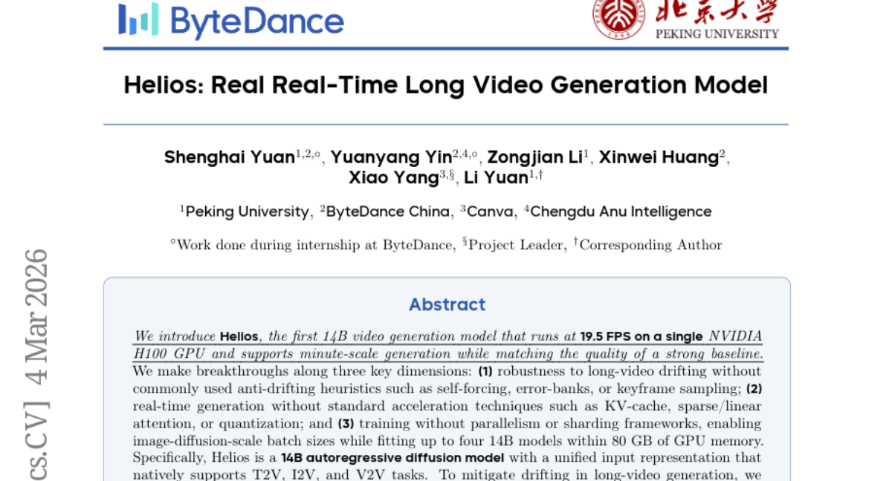
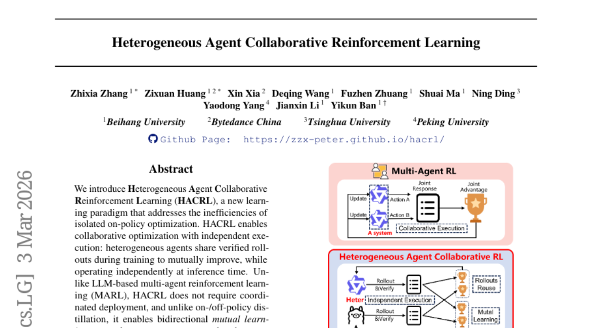
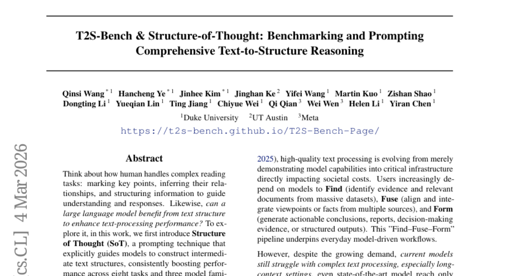
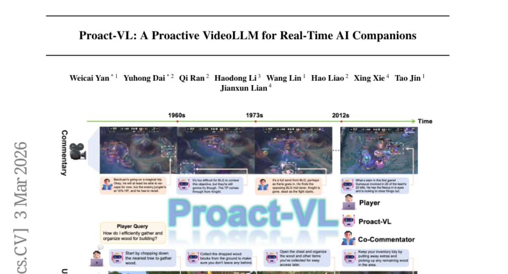
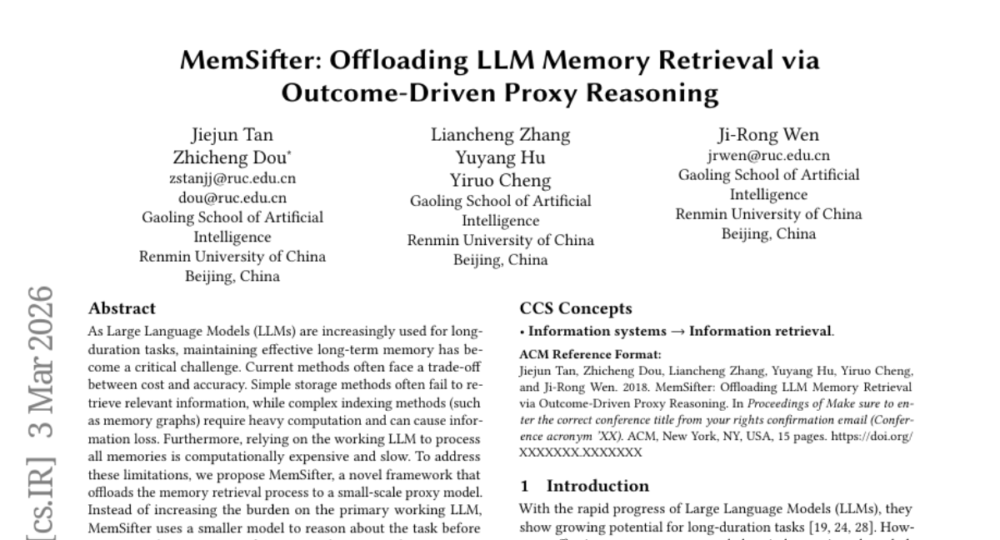
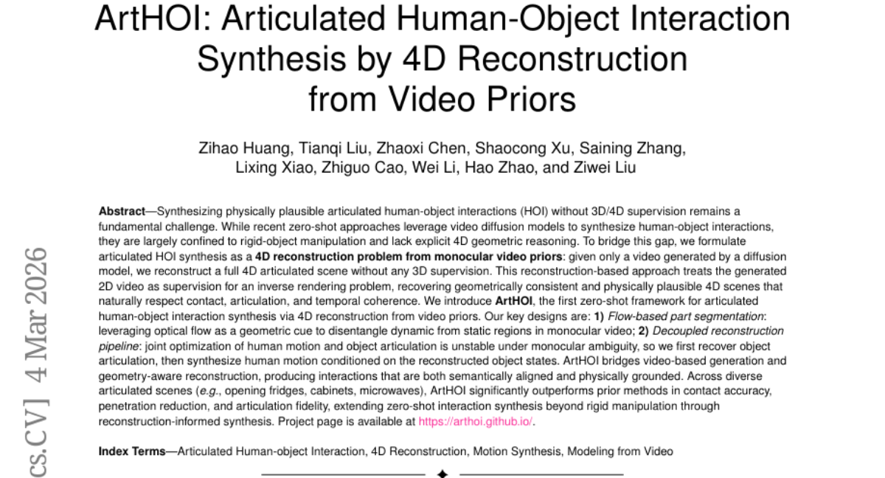
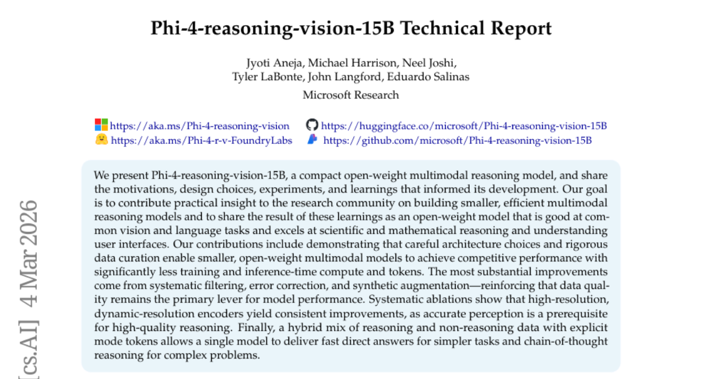
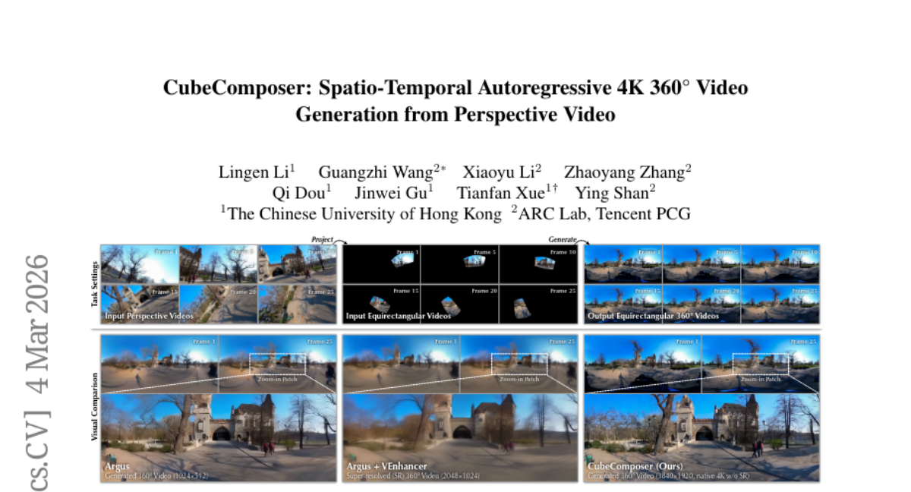

# 2026-03-06 Daily Papers (Top 9)

## 1. [Helios: Real Real-Time Long Video Generation Model](https://huggingface.co/papers/2603.04379)
**Upvotes**: 104 | **도입 난이도**: 중 | **신뢰도**: 상
**arXiv**: https://arxiv.org/abs/2603.04379

**태그**: Video Generation, Diffusion Model, Real-time, Long Video, Vision, Video, Inference, Distillation, Optimization

### 📌 한 줄 요약
Helios는 단일 H100 GPU에서 19.5 FPS로 실행되는 최초의 14B 비디오 생성 모델로, 분 단위 길이의 비디오를 생성하면서도 기존 모델과 동등한 품질을 유지하며, 코드와 모델을 공개할 예정입니다.

### 🔑 핵심 포인트
- 14B 모델로 단일 H100 GPU에서 19.5 FPS의 실시간 비디오 생성
- 드리프트 방지 휴리스틱 없이 긴 비디오 생성의 안정성 확보
- 병렬 처리 없이 이미지 확산 수준의 배치 크기로 학습 가능

### 🧑‍💻 개발자 관점
Helios는 고품질의 긴 비디오를 실시간으로 생성할 수 있게 함으로써, 비디오 편집, 게임 개발, 가상 현실 등 다양한 분야에서 혁신적인 응용 가능성을 제시하며, 특히 리소스 제약이 있는 환경에서도 고성능 비디오 생성이 가능하다는 점에서 실용적이다.

### 🚀 실무 적용 아이디어
- Helios 모델을 사용하여 특정 도메인에 맞는 비디오 생성 실험 진행
- 기존 비디오 생성 모델과 Helios 모델의 성능 및 효율성 비교 분석
- Helios의 드리프트 방지 및 효율성 향상 기법을 다른 비디오 생성 모델에 적용 시도

### ⚠️ 리스크/한계
- 14B 모델 크기로 인한 높은 GPU 메모리 요구 사항
- 특정 유형의 비디오에 대한 생성 품질 저하 가능성

### 📝 초록 기반 상세 설명
기존 비디오 생성 모델은 긴 비디오 생성 시 드리프트 현상, 실시간 생성의 어려움, 병렬 처리 및 샤딩 프레임워크의 필요성과 같은 문제점이 있었다. Helios는 드리프트 방지 휴리스틱 없이도 긴 비디오에서 안정적인 생성을 가능하게 하고, KV-cache 등의 가속화 기술 없이도 실시간 생성을 달성하며, 병렬 처리 없이 이미지 확산 수준의 배치 크기로 학습할 수 있는 14B 모델이다. 구체적으로, 드리프트 현상을 완화하기 위해 드리프트 시뮬레이션 훈련 전략을 사용하고 반복적인 움직임을 제거했다. 또한, 효율성을 위해 컨텍스트를 압축하고 샘플링 단계를 줄였다. Helios는 짧고 긴 비디오 생성 모두에서 기존 방법보다 우수한 성능을 보였다.

---

## 2. [Heterogeneous Agent Collaborative Reinforcement Learning](https://huggingface.co/papers/2603.02604)
**Upvotes**: 91 | **도입 난이도**: 중 | **신뢰도**: 상
**arXiv**: https://arxiv.org/abs/2603.02604

**태그**: Reinforcement Learning, Multi-Agent, Collaboration, Heterogeneous Agents, Agent, RAG, Reasoning, Benchmark, Inference, Distillation

### 📌 한 줄 요약
이 논문은 이기종 에이전트 간 협업을 통해 강화 학습 성능을 향상시키는 새로운 학습 패러다임인 HACRL을 제안하며, 특히 HACPO 알고리즘을 통해 샘플 효율성을 높이고 에이전트 간 지식 전달을 가능하게 함.

### 🔑 핵심 포인트
- 이기종 에이전트 간 협업 강화 학습 (HACRL) 패러다임 제안
- 샘플 효율성을 높이는 HACPO 알고리즘 개발
- 이론적 보장을 갖는 편향 없는 이점 추정 및 최적화 메커니즘

### 🧑‍💻 개발자 관점
이기종 시스템 환경에서 강화 학습 모델을 효율적으로 학습시키고, 에이전트 간의 지식 공유를 통해 전체 시스템 성능을 향상시키는 데 기여할 수 있다.

### 🚀 실무 적용 아이디어
- HACPO 알고리즘을 기존 강화 학습 환경에 적용하여 성능 향상 가능성 검토
- 다양한 이기종 에이전트 조합에서 HACPO의 효과 실험
- HACPO의 메커니즘을 분석하여 특정 문제에 맞게 조정

### ⚠️ 리스크/한계
- HACPO의 이론적 보장이 실제 복잡한 환경에서도 유지되는지 확인 필요
- 에이전트 간 능력 차이가 매우 큰 경우 협업 효과가 제한적일 수 있음

### 📝 초록 기반 상세 설명
기존의 강화 학습은 에이전트가 독립적으로 학습하여 비효율적인 샘플 사용과 지식 공유의 어려움이 있었다. 이러한 문제를 해결하기 위해 이 논문에서는 이기종 에이전트 간 협업 강화 학습(HACRL)이라는 새로운 패러다임을 제시한다. HACRL은 학습 과정에서 검증된 롤아웃을 공유하여 상호 개선을 가능하게 하며, 특히 HACPO 알고리즘을 통해 샘플 활용률을 극대화하고 에이전트 간 지식 전달을 촉진한다. HACPO는 능력 차이와 정책 분포 변화를 완화하기 위한 메커니즘을 포함하며, 다양한 실험 결과 HACPO가 GSPO 대비 평균 3.3% 성능 향상을 보이며 롤아웃 비용은 절반만 사용했다.

---

## 3. [T2S-Bench & Structure-of-Thought: Benchmarking and Prompting Comprehensive Text-to-Structure Reasoning](https://huggingface.co/papers/2603.03790)
**Upvotes**: 88 | **도입 난이도**: 중 | **신뢰도**: 중
**arXiv**: https://arxiv.org/abs/2603.03790

**태그**: LLM, Prompting, Benchmark, Reasoning, Text Structure, RAG, Evaluation

### 📌 한 줄 요약
LLM이 텍스트 구조를 명시적으로 활용하도록 유도하는 프롬프팅 기법(SoT)과 텍스트-구조 변환 능력을 평가하는 벤치마크(T2S-Bench)를 제안하여 LLM의 성능을 향상시킴.

### 🔑 핵심 포인트
- Structure of Thought (SoT) 프롬프팅 기법 제안: LLM이 텍스트 구조를 명시적으로 생성하도록 유도하여 성능 향상
- T2S-Bench 벤치마크 개발: 6개 과학 도메인, 32개 구조 유형, 1.8K 샘플로 구성된 텍스트-구조 변환 평가 벤치마크
- SoT와 T2S-Bench의 효과 입증: 다양한 작업에서 SoT 적용 시 성능 향상, T2S-Bench fine-tuning 시 추가 성능 향상

### 🧑‍💻 개발자 관점
LLM 기반 시스템 개발 시, 텍스트 구조를 활용하는 프롬프팅 전략(SoT)과 벤치마크(T2S-Bench)를 통해 정보 추출 및 추론 성능을 향상시킬 수 있다.

### 🚀 실무 적용 아이디어
- SoT 프롬프팅 기법을 활용하여 LLM 기반 정보 추출 시스템 성능 개선 시도
- T2S-Bench 데이터셋을 활용하여 특정 도메인에 특화된 LLM fine-tuning 실험
- LLM 에이전트 개발 시, 텍스트 구조를 활용한 reasoning chain 구축

### ⚠️ 리스크/한계
- T2S-Bench가 특정 과학 도메인에 편향되어 있을 수 있으며, 일반적인 텍스트에 대한 성능은 보장되지 않을 수 있음
- SoT 프롬프팅은 텍스트 구조를 정의하고 모델에 적용하는 데 추가적인 노력이 필요함

### 📝 초록 기반 상세 설명
LLM이 복잡한 텍스트를 이해하는 데 텍스트 구조가 도움이 될 수 있다는 아이디어에서 출발한다. 기존 연구는 LLM이 텍스트 구조를 효과적으로 활용하지 못한다는 문제점이 있었다. 본 연구에서는 텍스트 구조를 명시적으로 활용하도록 유도하는 Structure of Thought (SoT) 프롬프팅 기법과 텍스트-구조 변환 능력을 평가하는 T2S-Bench 벤치마크를 제안한다. 다양한 실험 결과, SoT는 여러 작업에서 성능 향상을 가져왔으며, T2S-Bench를 활용한 fine-tuning은 추가적인 성능 향상을 보였다. 이는 텍스트 구조화의 중요성과 SoT 및 T2S-Bench의 상호 보완적인 기여를 강조한다.

---

## 4. [Proact-VL: A Proactive VideoLLM for Real-Time AI Companions](https://huggingface.co/papers/2603.03447)
**Upvotes**: 22 | **도입 난이도**: 중 | **신뢰도**: 상
**arXiv**: https://arxiv.org/abs/2603.03447

**태그**: Agent, VideoLLM, Real-time, Benchmark, Multimodal, Video, Evaluation, Inference

### 📌 한 줄 요약
Proact-VL은 실시간 비디오 입력을 처리하고, 자율적으로 응답 시점을 결정하며, 콘텐츠 품질과 양을 제어하여 실시간 AI 동반자를 구현하는 프레임워크 및 벤치마크를 제공합니다.

### 🔑 핵심 포인트
- 실시간 AI 동반자를 위한 Proact-VL 프레임워크 제시
- Live Gaming Benchmark 데이터셋 구축
- 낮은 지연 시간과 높은 품질의 응답 생성

### 🧑‍💻 개발자 관점
실시간 비디오 처리 및 상호 작용이 필요한 AI 에이전트 개발에 유용한 프레임워크와 데이터셋을 제공하여, 게임, 교육, 고객 지원 등 다양한 분야에 적용 가능합니다.

### 🚀 실무 적용 아이디어
- Live Gaming Benchmark 데이터셋을 활용하여 AI 에이전트 성능 평가
- Proact-VL 프레임워크를 기반으로 실시간 상호 작용 에이전트 개발
- 응답 지연 시간과 품질 간의 균형을 맞추기 위한 다양한 전략 실험

### ⚠️ 리스크/한계
- 특정 게임 시나리오에 최적화되어 다른 도메인으로의 일반화에 어려움이 있을 수 있음
- 실시간 성능 유지를 위한 콘텐츠 생성 제약으로 인해 창의성이 제한될 수 있음

### 📝 초록 기반 상세 설명
실시간 AI 동반자는 낮은 지연 시간, 자율적인 응답 결정, 실시간 제약 조건 하의 콘텐츠 제어라는 세 가지 주요 과제에 직면해 있습니다. 본 연구에서는 게임 시나리오(해설, 가이드)를 통해 AI 동반자를 구현하고, 자동 평가에 적합하도록 설계했습니다. 솔로 해설, 공동 해설, 사용자 가이드의 세 가지 시나리오를 포함하는 대규모 데이터셋인 Live Gaming Benchmark를 소개하고, 멀티모달 언어 모델을 실시간 상호 작용 에이전트로 변환하는 일반 프레임워크 Proact-VL을 제시합니다. 실험 결과, Proact-VL은 우수한 응답 지연 시간과 품질을 달성하면서 강력한 비디오 이해 능력을 유지하여 실시간 상호 작용 애플리케이션에 적합함을 입증했습니다.

---

## 5. [MemSifter: Offloading LLM Memory Retrieval via Outcome-Driven Proxy Reasoning](https://huggingface.co/papers/2603.03379)
**Upvotes**: 20 | **도입 난이도**: 중 | **신뢰도**: 상
**arXiv**: https://arxiv.org/abs/2603.03379

**태그**: LLM, Memory, Reinforcement Learning, Proxy Model, RAG, Reasoning, Benchmark, Evaluation, Inference

### 📌 한 줄 요약
MemSifter는 작은 프록시 모델을 사용하여 LLM의 메모리 검색을 최적화하고, 작업 결과 기반 강화 학습을 통해 성능을 향상시켜 장기적인 LLM 메모리 관리의 효율성과 확장성을 제공합니다.

### 🔑 핵심 포인트
- 프록시 모델을 이용한 LLM 메모리 검색 오프로딩
- 작업 결과 기반 강화 학습을 통한 프록시 모델 최적화
- 기존 SOTA 대비 향상된 검색 정확도 및 작업 완료 성능

### 🧑‍💻 개발자 관점
LLM 기반 애플리케이션에서 메모리 관리 비용을 줄이고 성능을 향상시킬 수 있는 실질적인 방법을 제시하며, 특히 장기적인 컨텍스트 유지가 중요한 애플리케이션 개발에 유용합니다.

### 🚀 실무 적용 아이디어
- MemSifter 코드를 다운로드하여 자체 LLM 애플리케이션에 통합해보기
- 제공된 벤치마크 데이터셋을 사용하여 MemSifter의 성능을 검증해보기
- 자체 데이터셋에 맞게 프록시 모델을 재학습시켜 성능을 최적화해보기

### ⚠️ 리스크/한계
- 프록시 모델의 성능이 전체 시스템 성능에 미치는 영향
- 강화 학습 보상 설계의 복잡성

### 📝 초록 기반 상세 설명
LLM이 장기 작업을 수행함에 따라 효과적인 장기 메모리 관리가 중요해졌지만, 기존 방법들은 비용과 정확성 사이의 trade-off가 존재합니다. MemSifter는 소규모 프록시 모델을 사용하여 메모리 검색 프로세스를 오프로드하고, 작업 결과 기반 강화 학습을 통해 프록시 모델을 최적화합니다. 이는 색인 단계에서 무거운 계산을 요구하지 않으며 추론 시 최소한의 오버헤드만 추가합니다. Deep Research를 포함한 8개의 LLM 메모리 벤치마크에서 MemSifter는 기존 SOTA 접근 방식과 동등하거나 능가하는 성능을 보여주었습니다. MemSifter는 효율적이고 확장 가능한 LLM 장기 메모리 솔루션을 제공하며, 모델 가중치, 코드, 훈련 데이터를 오픈소스로 공개하여 추가 연구를 지원합니다.

---

## 6. [ArtHOI: Articulated Human-Object Interaction Synthesis by 4D Reconstruction from Video Priors](https://huggingface.co/papers/2603.04338)
**Upvotes**: 19 | **도입 난이도**: 중 | **신뢰도**: 중
**arXiv**: https://arxiv.org/abs/2603.04338

**태그**: Vision, 4D Reconstruction, HOI, Diffusion Model, Synthesis, RAG, Reasoning, Video

### 📌 한 줄 요약
비디오 diffusion 모델을 활용하여 3D/4D supervision 없이 articulated HOI를 합성하는 새로운 zero-shot 프레임워크 ArtHOI를 제안, 특히 articulated object 조작에서 기존 방법들을 능가하는 contact accuracy, penetration reduction, articulation fidelity를 달성.

### 🔑 핵심 포인트
- 비디오 diffusion 모델 기반의 zero-shot articulated HOI 합성 프레임워크 ArtHOI 제시
- Flow 기반 파트 분할을 통해 동적/정적 영역 분리
- Human motion과 object articulation의 분리된 재구성 파이프라인을 통해 안정적인 재구성 달성

### 🧑‍💻 개발자 관점
물리적으로 plausible한 human-object interaction을 생성하는 것은 로보틱스, 게임, AR/VR 등 다양한 분야에서 중요한데, ArtHOI는 3D supervision 없이도 고품질의 상호 작용을 생성할 수 있어 데이터 수집 및 annotation 비용을 절감하고, 다양한 환경에서의 활용 가능성을 높입니다.

### 🚀 실무 적용 아이디어
- ArtHOI 코드를 다운로드하여 제공된 예제 데이터셋으로 실험해보기
- 자체 데이터셋을 구축하여 ArtHOI의 성능을 평가하고 fine-tuning 가능성 검토
- ArtHOI의 결과를 로봇 제어 또는 AR/VR 환경에 통합하여 실제 응용 가능성 탐색

### ⚠️ 리스크/한계
- Monocular 비디오 기반이므로 occlusion에 취약할 수 있음
- 복잡한 articulated object의 경우 재구성 정확도가 낮아질 수 있음

### 📝 초록 기반 상세 설명
물리적으로 plausible한 articulated human-object interactions (HOI) 합성은 여전히 어려운 문제이며, 최근 zero-shot 접근 방식은 비디오 diffusion 모델을 활용하지만 rigid object 조작에 국한되고 명시적인 4D 기하학적 추론이 부족합니다. 이러한 한계를 극복하기 위해, 본 논문에서는 articulated HOI 합성을 monocular 비디오 priors로부터의 4D 재구성 문제로 формулировка합니다. Diffusion 모델로 생성된 비디오를 통해 3D supervision 없이 완전한 4D articulated scene을 재구성합니다. 제안하는 ArtHOI는 flow 기반 파트 분할과 human motion 및 object articulation의 분리된 재구성 파이프라인을 통해 비디오 기반 생성과 기하학적 재구성을 결합하여 의미론적으로 정렬되고 물리적으로 안정적인 상호 작용을 생성합니다. 다양한 articulated scene에서 ArtHOI는 기존 방법보다 우수한 성능을 보이며, 재구성 기반 합성을 통해 zero-shot 상호 작용 합성을 rigid manipulation 이상으로 확장합니다.

---

## 7. [Phi-4-reasoning-vision-15B Technical Report](https://huggingface.co/papers/2603.03975)
**Upvotes**: 10 | **도입 난이도**: 중 | **신뢰도**: 상
**arXiv**: https://arxiv.org/abs/2603.03975

**태그**: Multimodal, Reasoning, Vision, Data Curation, UI, Inference

### 📌 한 줄 요약
Phi-4-reasoning-vision-15B는 작은 규모에도 불구하고 과학/수학적 추론 및 UI 이해 능력이 뛰어난 멀티모달 모델로, 데이터 큐레이션과 아키텍처 선택을 통해 효율성을 극대화했다.

### 🔑 핵심 포인트
- 데이터 큐레이션(필터링, 오류 수정, 증강)이 모델 성능에 가장 큰 영향을 미침
- 고해상도, 동적 해상도 인코더가 성능 향상에 기여
- 추론 데이터와 비추론 데이터를 혼합하여 사용하고, 모드 토큰을 명시적으로 사용하여 효율성을 높임

### 🧑‍💻 개발자 관점
작은 모델로도 충분히 강력한 멀티모달 추론이 가능하다는 점을 보여주며, 이는 리소스 제약이 있는 환경에서 모델을 배포해야 하는 개발자에게 유용하다. 특히 UI 이해 능력은 자동화된 테스트나 봇 개발에 활용될 수 있다.

### 🚀 실무 적용 아이디어
- 데이터 큐레이션 전략을 프로젝트에 적용하여 모델 성능 향상 시도
- 고해상도 인코더를 활용하여 이미지 기반 작업 성능 개선
- 추론 및 비추론 데이터를 혼합하여 사용하는 하이브리드 학습 방식 실험

### ⚠️ 리스크/한계
- 모델의 크기가 작기 때문에 매우 복잡하거나 특수한 경우에는 성능이 제한될 수 있음
- 특정 데이터셋에 과적합될 가능성이 있으며, 일반화 성능에 대한 추가 검증이 필요함

### 📝 초록 기반 상세 설명
기존 멀티모달 모델은 크고 비효율적인 문제가 있었다. Phi-4-reasoning-vision-15B는 아키텍처 개선과 데이터 큐레이션을 통해 이러한 문제를 해결하고자 한다. 고해상도 인코더와 데이터 필터링, 오류 수정, 데이터 증강을 통해 모델 성능을 향상시켰다. 실험 결과, 작은 모델 크기에도 불구하고 경쟁력 있는 성능을 달성했으며, 특히 과학/수학적 추론 및 UI 이해 능력이 뛰어남을 확인했다. 이 모델은 간단한 작업에는 빠른 직접 답변을, 복잡한 문제에는 chain-of-thought 추론을 제공한다.

---

## 8. [CubeComposer: Spatio-Temporal Autoregressive 4K 360° Video Generation from Perspective Video](https://huggingface.co/papers/2603.04291)
**Upvotes**: 9 | **도입 난이도**: 중 | **신뢰도**: 상
**arXiv**: https://arxiv.org/abs/2603.04291

**태그**: Video Generation, Diffusion Model, VR, 360° Video, Autoregressive, Video, Benchmark

### 📌 한 줄 요약
CubeComposer는 큐브맵 표현과 시공간 자기 회귀 확산 모델을 사용하여 4K 해상도의 360° 비디오를 효율적으로 생성, VR 환경에서 몰입감 있는 경험을 제공하는 데 기여한다.

### 🔑 핵심 포인트
- 시공간 자기 회귀 전략을 통해 360° 비디오 생성
- 큐브 면 컨텍스트 관리 메커니즘 및 희소 컨텍스트 어텐션 설계
- 큐브 인식 위치 인코딩, 패딩, 블렌딩을 통한 경계면 처리

### 🧑‍💻 개발자 관점
고해상도 360° 비디오 생성 파이프라인을 구축하거나, VR/AR 콘텐츠 제작 시 고품질 비디오를 효율적으로 생성하는 데 활용할 수 있다.

### 🚀 실무 적용 아이디어
- CubeComposer의 큐브맵 기반 비디오 생성 방식 실험
- 자체 데이터셋에 CubeComposer 적용 및 성능 비교
- CubeComposer의 컨텍스트 관리 및 경계면 처리 기술 분석

### ⚠️ 리스크/한계
- 큐브맵 기반 분할로 인한 왜곡 가능성
- 자기 회귀 모델의 특성상 생성 속도 및 실시간 처리 성능에 대한 고려 필요

### 📝 초록 기반 상세 설명
VR 환경에서 고해상도 360° 비디오 생성은 중요하지만, 기존 방법들은 계산 자원 제약으로 인해 해상도 향상에 어려움을 겪었다. CubeComposer는 큐브맵 표현을 사용하여 비디오를 분할하고, 시공간 자기 회귀 확산 모델을 통해 4K 해상도 비디오를 생성한다. 이 방법은 큐브 면 간의 일관성을 유지하고 메모리 요구량을 줄이며, 효율적인 컨텍스트 관리와 경계면 처리 기술을 통해 자연스러운 비디오를 생성한다. 벤치마크 데이터셋 실험 결과, CubeComposer는 기존 방법들보다 해상도와 시각적 품질 면에서 우수한 성능을 보였다. 이는 VR 애플리케이션의 실질적인 활용 가능성을 높인다.

---

## 9. [Memex(RL): Scaling Long-Horizon LLM Agents via Indexed Experience Memory](https://huggingface.co/papers/2603.04257)
**Upvotes**: 7 | **도입 난이도**: 중 | **신뢰도**: 상
**arXiv**: https://arxiv.org/abs/2603.04257

**태그**: Agent, Memory, RAG, Reinforcement Learning, Reasoning

_Scaling_Long-Horizon_LLM_Agents_via_Indexed_Experience_Memory_img.jpg)

### 📌 한 줄 요약
Memex는 LLM 에이전트의 제한된 컨텍스트 창 문제를 해결하기 위해 색인화된 경험 메모리를 사용하여 장기적인 작업 수행 능력을 향상시키는 새로운 방법론을 제시합니다.

### 🔑 핵심 포인트
- 색인화된 경험 메모리(Memex)를 통해 LLM 에이전트의 장기 기억 능력 확장
- MemexRL 강화 학습 프레임워크를 사용하여 메모리 쓰기 및 읽기 동작 최적화
- 제한된 컨텍스트 내에서 정보 손실을 줄이면서 장기 작업 성능 향상

### 🧑‍💻 개발자 관점
LLM 에이전트가 더 긴 컨텍스트를 효과적으로 관리하고, 장기적인 작업을 더 잘 수행할 수 있도록 돕는 기술입니다. 기존 RAG 시스템의 성능을 개선하는 데 활용될 수 있습니다.

### 🚀 실무 적용 아이디어
- 기존 RAG 파이프라인에 Memex 아키텍처 통합 시도
- MemexRL 프레임워크를 사용하여 특정 작업에 맞게 메모리 사용 전략 튜닝
- 다양한 요약 및 색인화 전략을 실험하여 성능 비교

### ⚠️ 리스크/한계
- 외부 데이터베이스 관리 및 유지 비용 발생
- 색인화 및 검색 과정에서 추가적인 지연 발생 가능성
- MemexRL 학습에 필요한 계산 자원 및 시간

### 📝 초록 기반 상세 설명
LLM 에이전트는 긴 작업에서 제한된 컨텍스트 창으로 인해 어려움을 겪습니다. 기존 방식은 요약이나 삭제를 통해 컨텍스트를 줄이지만 정보 손실이 발생합니다. Memex는 전체 정보를 외부 데이터베이스에 저장하고, 요약된 정보와 색인을 통해 필요한 정보를 검색하는 방식으로 정보 손실을 줄입니다. MemexRL이라는 강화 학습 프레임워크를 통해 쓰기 및 읽기 동작을 최적화하여 에이전트가 요약, 보관, 색인, 검색 시점을 학습하도록 합니다. 이론적 분석과 실험적 결과는 Memex가 작업 성공률을 높이고 컨텍스트 크기를 줄이는 데 효과적임을 보여줍니다.

---

