# 2026-03-09 Daily Papers (Top 9)

## 1. [MOOSE-Star: Unlocking Tractable Training for Scientific Discovery by Breaking the Complexity Barrier](https://huggingface.co/papers/2603.03756)
**Upvotes**: 82 | **도입 난이도**: 중 | **신뢰도**: 중
**arXiv**: https://arxiv.org/abs/2603.03756

**태그**: LLM, Scientific Discovery, Training, Knowledge Base, Reasoning, RAG, Evaluation, Inference

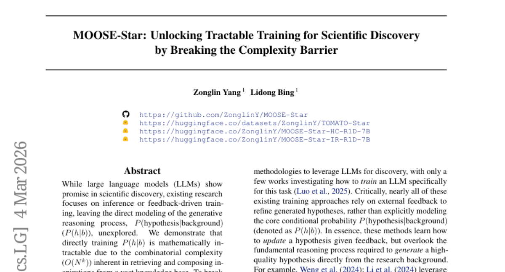

### 📌 한 줄 요약
MOOSE-Star는 과학적 발견을 위한 LLM 훈련 시 발생하는 조합 복잡성을 해소하여 효율적인 학습 및 추론을 가능하게 하는 프레임워크임.

### 🔑 핵심 포인트
- 과학적 발견을 위한 LLM의 직접적인 훈련 방법론 제시
- 조합 복잡성을 해소하는 MOOSE-Star 프레임워크 제안
- TOMATO-Star 데이터셋 공개를 통한 연구 촉진

### 🧑‍💻 개발자 관점
과학적 발견 프로세스를 자동화하거나 가속화하는 데 LLM을 활용할 수 있는 가능성을 제시하며, 특히 지식 기반 검색 및 조합 과정에서 발생하는 복잡성 문제를 해결하는 데 도움이 될 수 있습니다.

### 🚀 실무 적용 아이디어
- TOMATO-Star 데이터셋을 활용하여 MOOSE-Star 프레임워크 훈련
- MOOSE-Star의 검색 및 조합 전략을 기존 LLM 기반 과학 연구에 적용
- MOOSE-Star의 확장성을 다양한 과학 분야에 적용 가능성 검토

### ⚠️ 리스크/한계
- MOOSE-Star의 성능은 TOMATO-Star 데이터셋의 품질에 의존적임
- 특정 과학 분야에 특화된 지식 기반에 대한 일반화 가능성이 낮을 수 있음

### 📝 초록 기반 상세 설명
LLM이 과학적 발견에 활용될 가능성이 높지만, 기존 연구는 추론이나 피드백 기반 훈련에 집중되어 가설 생성 과정을 직접 모델링하는 데 어려움이 있었습니다. 이는 방대한 지식 기반에서 영감을 얻어 조합하는 과정에서 발생하는 조합 복잡성 때문입니다. MOOSE-Star는 확률적 발견 방정식에서 파생된 하위 작업에 대한 훈련, 동기 부여 기반 계층적 검색, 제한된 구성을 통해 복잡성을 줄이고 확장 가능한 추론을 가능하게 합니다. TOMATO-Star 데이터셋을 공개하여 훈련을 용이하게 했으며, MOOSE-Star가 복잡성 문제를 해결하고 지속적인 테스트 타임 확장을 보여줌을 입증했습니다.

### 🖼️ 추가 자료

---

## 2. [SkillNet: Create, Evaluate, and Connect AI Skills](https://huggingface.co/papers/2603.04448)
**Upvotes**: 62 | **도입 난이도**: 중 | **신뢰도**: 상
**arXiv**: https://arxiv.org/abs/2603.04448

**태그**: Agent, Skill, Tooling, Open Source, RAG, Evaluation, Safety

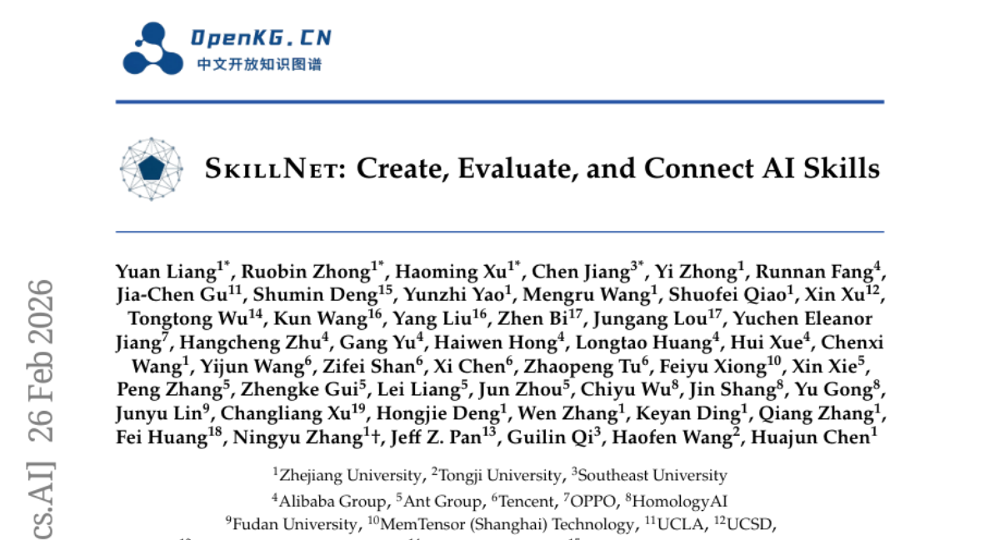

### 📌 한 줄 요약
SkillNet은 AI 에이전트의 기술을 체계적으로 축적, 평가, 연결하여 재사용성을 높이고 성능을 향상시키는 오픈 인프라스트럭처를 제공하여, AI 에이전트 개발 효율성을 크게 향상시킬 수 있다.

### 🔑 핵심 포인트
- AI 기술의 체계적인 축적 및 재사용을 위한 SkillNet 인프라스트럭처 제안
- 다양한 환경에서 SkillNet의 성능 향상 입증 (평균 보상 40% 향상, 실행 단계 30% 단축)
- 20만 개 이상의 기술 리포지토리, 인터랙티브 플랫폼, Python 툴킷 제공

### 🧑‍💻 개발자 관점
AI 에이전트 개발 시 SkillNet을 활용하여 기존 기술을 재사용하고 성능을 향상시킴으로써 개발 비용과 시간을 절약하고, 에이전트의 능력을 확장할 수 있다.

### 🚀 실무 적용 아이디어
- SkillNet 플랫폼 탐색 및 제공되는 기술 리포지토리 활용
- 자체 AI 에이전트 개발 시 SkillNet 통합 및 성능 테스트
- SkillNet Python 툴킷을 사용하여 기술 생성 및 평가 파이프라인 구축

### ⚠️ 리스크/한계
- SkillNet의 효과는 특정 환경 및 작업에 따라 달라질 수 있음
- 새로운 기술을 SkillNet에 통합하는 데 추가적인 노력이 필요할 수 있음

### 📝 초록 기반 상세 설명
현재 AI 에이전트는 다양한 도구를 활용하여 복잡한 작업을 수행하지만, 기술 축적 및 이전 메커니즘의 부재로 인해 장기적인 발전에 어려움을 겪고 있다. 에이전트가 독립적인 환경에서 동일한 솔루션을 반복적으로 발견하는 문제를 해결하기 위해, SkillNet은 이기종 소스에서 기술을 생성하고, 관계를 설정하며, 안전성, 완전성, 실행 가능성, 유지보수성, 비용 효율성과 같은 다차원적 평가를 지원하는 통합 온톨로지 기반의 오픈 인프라스트럭처를 제공한다. SkillNet은 20만 개 이상의 기술 리포지토리, 인터랙티브 플랫폼, Python 툴킷을 통합하고 있다. ALFWorld, WebShop, ScienceWorld 환경에서의 실험 결과, SkillNet은 에이전트의 평균 보상을 40% 향상시키고 실행 단계를 30% 단축시키는 등 성능을 크게 향상시켰다. SkillNet은 기술을 진화하고 조합 가능한 자산으로 공식화하여 에이전트가 일시적인 경험에서 지속적인 숙달로 나아갈 수 있도록 지원한다.

### 🖼️ 추가 자료

---

## 3. [DARE: Aligning LLM Agents with the R Statistical Ecosystem via Distribution-Aware Retrieval](https://huggingface.co/papers/2603.04743)
**Upvotes**: 44 | **도입 난이도**: 중 | **신뢰도**: 중
**arXiv**: https://arxiv.org/abs/2603.04743

**태그**: Agent, RAG, R, Data Analysis, Evaluation

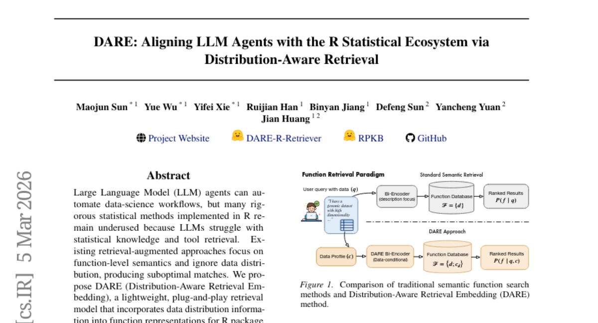

### 📌 한 줄 요약
DARE는 R 통계 생태계에서 LLM 에이전트의 활용도를 높이기 위해 데이터 분포 정보를 활용한 검색 모델을 제안하며, 기존 방식 대비 성능 향상을 보여 R 기반 데이터 분석 자동화에 기여한다.

### 🔑 핵심 포인트
- 8,191개 CRAN 패키지 기반의 RPKB 구축
- 데이터 분포 정보를 활용한 DARE 임베딩 모델 개발
- R 코드 생성 및 통계 분석을 위한 RCodingAgent 개발

### 🧑‍💻 개발자 관점
R 기반 데이터 분석 자동화 시 LLM 에이전트의 정확도를 높이는 데 활용 가능하며, 특히 데이터 분포를 고려한 검색 방식은 실제 데이터 분석 시나리오에서 더 나은 결과를 제공할 수 있다.

### 🚀 실무 적용 아이디어
- DARE 모델을 활용하여 기존 R 기반 데이터 분석 파이프라인 개선
- 자체 데이터셋에 대한 DARE 모델의 성능 테스트 및 튜닝
- RCodingAgent를 활용하여 R 코드 생성 및 통계 분석 자동화 실험

### ⚠️ 리스크/한계
- DARE 모델이 특정 데이터 분포에 편향될 가능성 존재
- RPKB의 최신성 유지 및 지속적인 업데이트 필요

### 📝 초록 기반 상세 설명
LLM 에이전트는 데이터 과학 워크플로우 자동화에 유용하지만, R의 통계적 방법 활용에는 어려움이 있다. 기존 검색 증강 방식은 함수 수준의 의미에 집중하여 데이터 분포를 간과, 최적의 결과를 얻지 못했다. 본 논문에서는 데이터 분포 정보를 함수 표현에 통합하는 DARE라는 경량화된 검색 모델을 제안한다. R 패키지 지식 베이스(RPKB) 구축, 분포 특징을 융합한 임베딩 모델 DARE 개발, R 코드 생성 에이전트 RCodingAgent 개발 및 평가를 통해 DARE가 패키지 검색에서 기존 모델 대비 성능 향상을 보임을 입증했다. DARE는 LLM 자동화와 R 통계 생태계 간의 간극을 줄이는 데 기여한다.

### 🖼️ 추가 자료
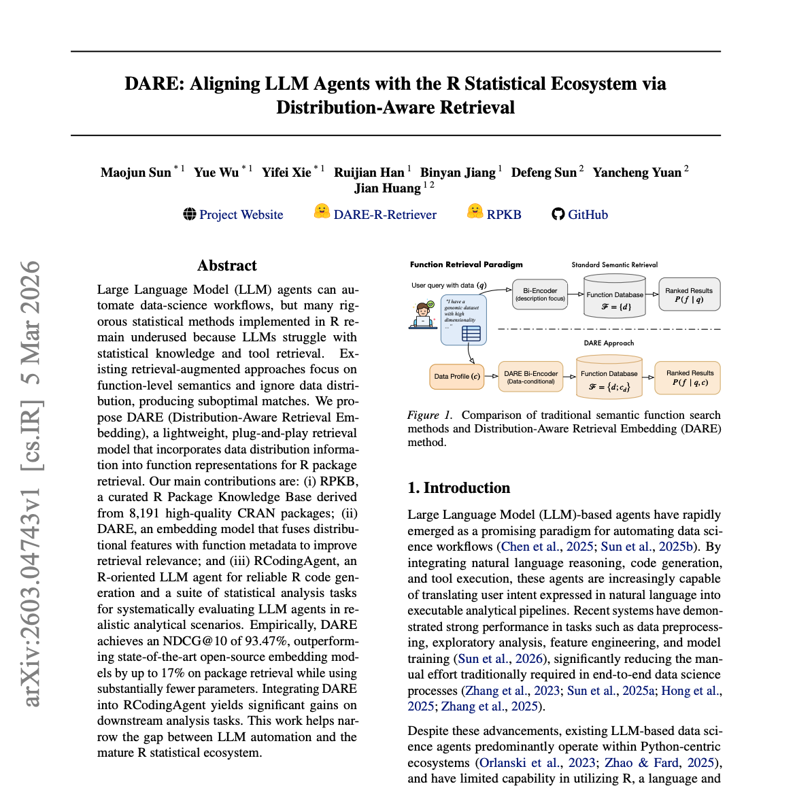

---

## 4. [AgentVista: Evaluating Multimodal Agents in Ultra-Challenging Realistic Visual Scenarios](https://huggingface.co/papers/2602.23166)
**Upvotes**: 33 | **도입 난이도**: 중 | **신뢰도**: 상
**arXiv**: https://arxiv.org/abs/2602.23166

**태그**: Agent, Multimodal, Benchmark, Tool Use, Vision, Reasoning, Evaluation

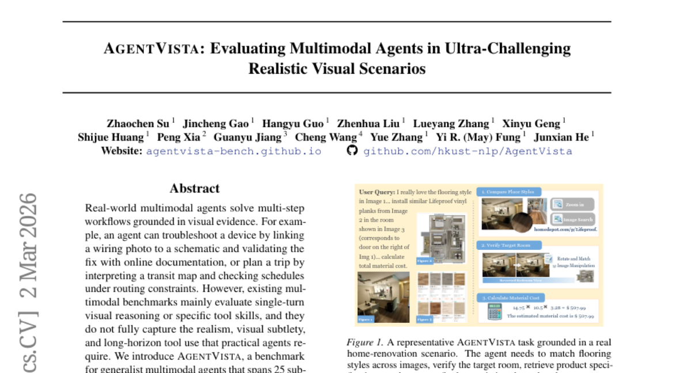

### 📌 한 줄 요약
AgentVista는 실제와 유사한 복잡한 시나리오에서 멀티모달 에이전트의 성능을 평가하기 위한 새로운 벤치마크로, 기존 벤치마크의 한계를 극복하고 실질적인 문제 해결 능력을 측정하는 데 기여한다.

### 🔑 핵심 포인트
- 현실적인 시각적 시나리오 기반의 멀티모달 에이전트 벤치마크 AgentVista 제시
- 웹 검색, 이미지 검색, 코드 실행 등 다양한 도구 활용을 요구하는 장기적 상호작용 평가
- 최첨단 모델의 성능 평가 결과, 장기적인 멀티모달 도구 사용 능력에 한계가 있음을 확인

### 🧑‍💻 개발자 관점
AgentVista는 실제 서비스 환경에서 멀티모달 에이전트의 성능을 평가하고 개선하는 데 유용한 도구를 제공하며, 특히 복잡한 시각적 정보를 처리하고 다양한 도구를 활용해야 하는 서비스 개발에 필수적이다.

### 🚀 실무 적용 아이디어
- AgentVista 벤치마크를 사용하여 기존 멀티모달 모델의 성능을 평가하고 개선 방향을 모색
- AgentVista의 시나리오를 기반으로 새로운 멀티모달 에이전트 개발 및 학습
- AgentVista의 평가 지표를 참고하여 자체 서비스에 맞는 평가 지표 개발

### ⚠️ 리스크/한계
- AgentVista의 시나리오가 모든 실제 환경을 완벽하게 반영하지 못할 수 있음
- 평가 결과가 특정 모델 아키텍처에 편향될 가능성이 존재

### 📝 초록 기반 상세 설명
실제 환경의 멀티모달 에이전트는 시각적 증거에 기반하여 다단계 워크플로우를 수행하지만, 기존 벤치마크는 단일 턴 추론이나 특정 도구 기술에 집중되어 현실적인 시나리오를 제대로 반영하지 못한다. AgentVista는 7개 카테고리, 25개 하위 도메인에 걸쳐 현실적이고 상세한 시각적 시나리오와 자연스러운 하이브리드 도구 사용을 결합한 새로운 벤치마크를 제시한다. 이 벤치마크는 웹 검색, 이미지 검색, 페이지 탐색, 이미지 처리 및 일반 프로그래밍을 위한 코드 기반 작업 등 다양한 도구를 활용하는 장기적인 상호 작용을 요구한다. 최첨단 모델에 대한 평가 결과, 장기적인 멀티모달 도구 사용 능력에 상당한 격차가 있음을 보여주며, 가장 우수한 모델조차 27.3%의 정확도만을 달성했다. AgentVista는 현실적이고 어려운 문제 해결을 위한 더욱 강력하고 신뢰할 수 있는 멀티모달 에이전트 개발을 가속화할 것으로 기대된다.

---

## 5. [RoboPocket: Improve Robot Policies Instantly with Your Phone](https://huggingface.co/papers/2603.05504)
**Upvotes**: 30 | **도입 난이도**: 중 | **신뢰도**: 상
**arXiv**: https://arxiv.org/abs/2603.05504

**태그**: Imitation Learning, AR, Robot Learning, Policy Iteration, RAG, Video, Inference

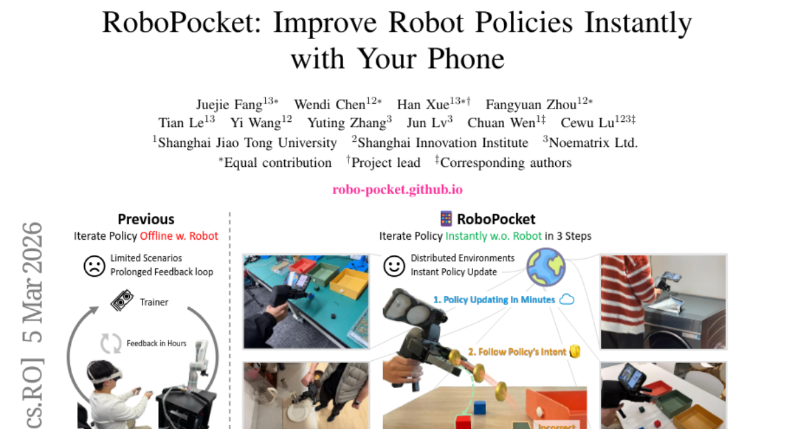

### 📌 한 줄 요약
스마트폰 AR 인터페이스를 통해 로봇 정책의 약점을 파악하고 즉각적으로 개선하여 데이터 수집 효율성을 2배 향상시키는 RoboPocket 시스템을 제안합니다.

### 🔑 핵심 포인트
- 스마트폰 AR을 이용한 로봇 정책 시각화 및 즉각적인 피드백 제공
- Remote Inference 프레임워크를 통한 Robot-Free Policy Iteration 구현
- 비동기 온라인 Finetuning 파이프라인을 통한 지속적인 정책 업데이트

### 🧑‍💻 개발자 관점
로봇 정책 개발 시, 실제 로봇 없이도 AR 인터페이스를 통해 데이터 수집 효율성을 높이고, 정책 개선 속도를 가속화할 수 있습니다. 특히, 데이터 수집 비용이 높은 환경에서 유용합니다.

### 🚀 실무 적용 아이디어
- RoboPocket 시스템을 활용하여 특정 로봇 작업에 대한 데이터 수집 및 정책 학습 실험 진행
- AR 인터페이스를 통해 수집된 데이터와 기존 데이터셋을 결합하여 정책 성능 향상 비교
- 비동기 온라인 Finetuning 파이프라인의 성능 및 안정성 검증

### ⚠️ 리스크/한계
- AR 인터페이스의 정확도 및 사용자 경험에 따라 성능 차이 발생 가능성
- 특정 로봇 플랫폼 또는 작업 환경에 대한 호환성 문제 발생 가능성

### 📝 초록 기반 상세 설명
모방 학습은 데이터 수집 효율성에 의해 제약되는데, 기존 핸드헬드 인터페이스는 정책의 약점을 모른 채 데이터를 수집하여 비효율적인 경우가 많습니다. 반면, DAgger와 같은 interactive 방법은 로봇 실행 비용이 높습니다. 이러한 trade-off를 해결하기 위해, 스마트폰 AR을 통해 정책의 예측 궤적을 시각화하고, 잠재적 실패를 예측하여 데이터 수집을 유도하는 RoboPocket을 제안합니다. 또한, 비동기 온라인 fine-tuning 파이프라인을 통해 정책을 지속적으로 업데이트합니다. 실험 결과, RoboPocket은 기존 offline 방식 대비 데이터 효율성을 2배 향상시키고, 분산 환경에서도 샘플 효율성을 2배 향상시켰습니다.

---

## 6. [HiFi-Inpaint: Towards High-Fidelity Reference-Based Inpainting for Generating Detail-Preserving Human-Product Images](https://huggingface.co/papers/2603.02210)
**Upvotes**: 26 | **도입 난이도**: 중 | **신뢰도**: 중
**arXiv**: https://arxiv.org/abs/2603.02210

**태그**: Image Inpainting, Human-Product Image, Attention Mechanism, Loss Function, Dataset, RAG, Vision

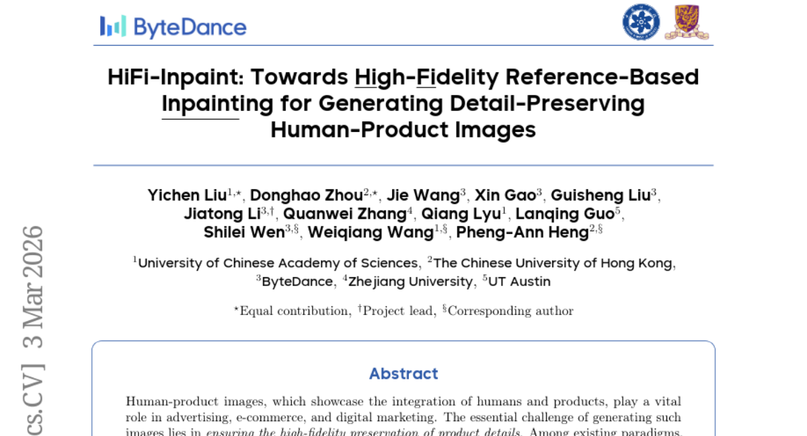

### 📌 한 줄 요약
HiFi-Inpaint는 인간-제품 이미지 생성 시 제품 디테일을 보존하기 위해 참조 기반 인페인팅 방식을 개선하고, 새로운 데이터셋을 구축하여 SOTA 성능을 달성했습니다.

### 🔑 핵심 포인트
- Shared Enhancement Attention (SEA) 모듈을 제안하여 제품의 미세한 특징을 개선
- Detail-Aware Loss (DAL)를 통해 픽셀 레벨에서 정밀한 지도 학습을 유도
- HP-Image-40K라는 대규모 인간-제품 이미지 데이터셋을 구축

### 🧑‍💻 개발자 관점
제품 이미지 생성 시 디테일 보존이 중요한 경우, HiFi-Inpaint의 SEA 모듈과 DAL 손실 함수를 적용하여 이미지 품질을 향상시킬 수 있습니다. 특히, 데이터셋 구축 과정은 실제 서비스 데이터에 적용할 수 있는 파이프라인을 제시합니다.

### 🚀 실무 적용 아이디어
- HP-Image-40K 데이터셋을 다운로드하여 모델 학습에 활용해보기
- SEA 모듈을 기존 이미지 생성 모델에 통합하여 성능 개선 시도해보기
- DAL 손실 함수를 다른 이미지 생성 작업에 적용하여 효과 검증해보기

### ⚠️ 리스크/한계
- 특정 제품 카테고리 또는 스타일에 편향될 가능성이 존재
- 자동 필터링 과정에서 데이터 품질 문제가 발생할 수 있음

### 📝 초록 기반 상세 설명
인간-제품 이미지는 광고, 이커머스 등에서 중요하지만, 제품 디테일 보존이 어렵습니다. 참조 기반 인페인팅은 이 문제를 해결하는 데 유망하지만, 데이터 부족, 디테일 집중 부족, 부정확한 지도 등의 한계가 있습니다. HiFi-Inpaint는 Shared Enhancement Attention (SEA)을 통해 제품 특징을 개선하고, Detail-Aware Loss (DAL)로 픽셀 수준의 정밀한 지도를 제공합니다. 또한, HP-Image-40K라는 새로운 데이터셋을 구축했습니다. 실험 결과, HiFi-Inpaint는 SOTA 성능을 달성하여 디테일이 보존된 인간-제품 이미지를 생성했습니다.

---

## 7. [Interactive Benchmarks](https://huggingface.co/papers/2603.04737)
**Upvotes**: 17 | **도입 난이도**: 중 | **신뢰도**: 중
**arXiv**: https://arxiv.org/abs/2603.04737

**태그**: Benchmark, Agent, Reasoning, Interactive Learning, Evaluation

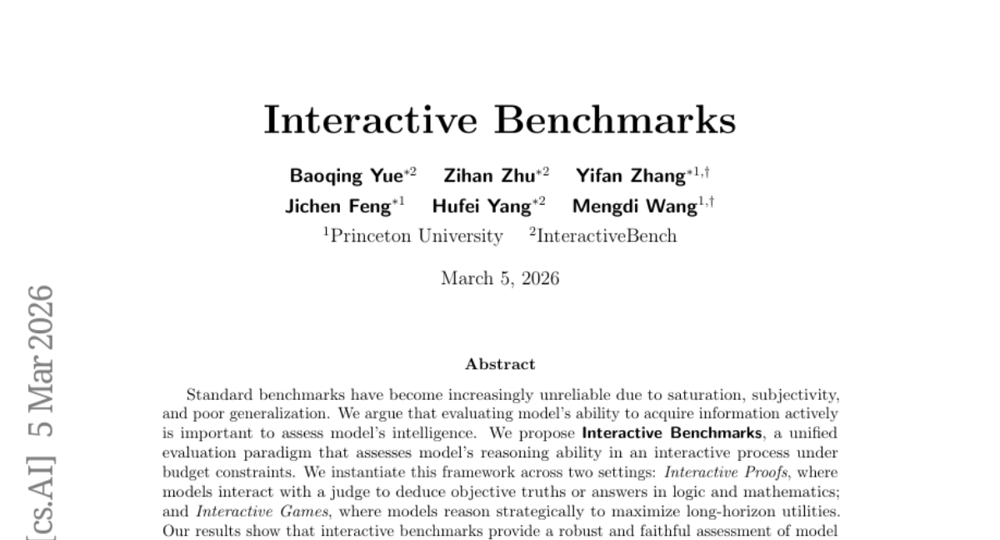

### 📌 한 줄 요약
모델의 능동적 정보 획득 능력을 평가하는 새로운 평가 방식인 Interactive Benchmarks를 제안하고, 이를 통해 기존 벤치마크의 한계를 극복하고자 함.

### 🔑 핵심 포인트
- 능동적 정보 획득 능력을 평가하는 Interactive Benchmarks 프레임워크 제안
- Interactive Proofs와 Interactive Games를 통해 프레임워크 인스턴스화
- 기존 벤치마크의 한계를 극복하고 모델 지능에 대한 신뢰성 있는 평가 제공

### 🧑‍💻 개발자 관점
모델이 실제 환경에서 능동적으로 정보를 수집하고 추론하는 능력을 평가하는 것은, 복잡한 문제 해결 및 의사 결정 시스템 개발에 필수적입니다. 특히 에이전트 기반 시스템의 성능 향상에 기여할 수 있습니다.

### 🚀 실무 적용 아이디어
- Interactive Benchmarks 프레임워크를 활용하여 자체 모델의 능동적 정보 획득 능력 평가
- Interactive Proofs 또는 Interactive Games 환경을 구축하여 모델의 추론 능력 실험
- 기존 벤치마크 결과와 Interactive Benchmarks 결과를 비교 분석하여 모델의 강점과 약점 파악

### ⚠️ 리스크/한계
- 상호 작용 환경 구축 및 평가 과정 설계의 복잡성
- 평가 결과 해석의 주관성 가능성

### 📝 초록 기반 상세 설명
기존 벤치마크는 포화, 주관성, 낮은 일반화 능력으로 인해 신뢰성이 떨어진다는 문제가 있습니다. 모델의 지능을 평가하기 위해서는 능동적으로 정보를 획득하는 능력을 평가하는 것이 중요합니다. Interactive Benchmarks는 예산 제약 하에서 모델의 추론 능력을 상호 작용 과정을 통해 평가하는 통합된 평가 패러다임입니다. Interactive Proofs와 Interactive Games라는 두 가지 설정에서 이 프레임워크를 구현하여 모델의 논리적, 수학적 추론 능력과 전략적 의사 결정 능력을 평가했습니다. 실험 결과, Interactive Benchmarks는 모델 지능에 대한 신뢰성 있고 정확한 평가를 제공하며, 상호 작용 시나리오에서 개선의 여지가 큼을 보여줍니다.

---

## 8. [Large Multimodal Models as General In-Context Classifiers](https://huggingface.co/papers/2602.23229)
**Upvotes**: 17 | **도입 난이도**: 중 | **신뢰도**: 상
**arXiv**: https://arxiv.org/abs/2602.23229

**태그**: LMM, In-Context Learning, Classification, Open-World, Vision-Language, Multimodal, Vision, Benchmark

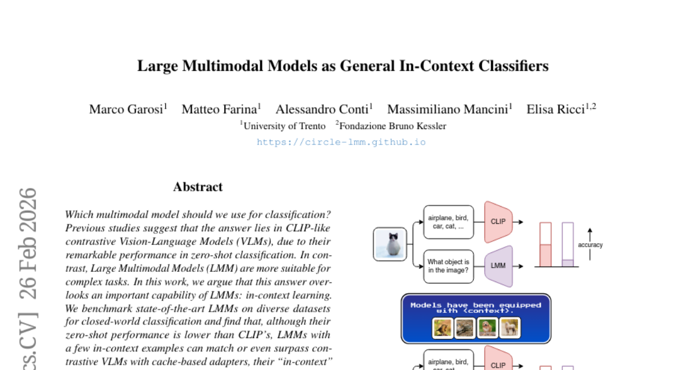

### 📌 한 줄 요약
LMM이 few-shot in-context learning을 통해 closed/open-world 분류에서 CLIP 모델을 능가할 수 있으며, CIRCLE 방법론을 통해 open-world 성능을 더욱 향상시킬 수 있음을 보임.

### 🔑 핵심 포인트
- LMM이 in-context learning을 통해 분류 성능을 향상시킬 수 있음을 입증
- Open-world 분류를 위한 CIRCLE 방법론 제안 및 성능 향상
- LMM이 specialized model에 대한 유연한 대안이 될 수 있음을 강조

### 🧑‍💻 개발자 관점
LMM을 활용하여 기존의 zero-shot 또는 fine-tuning 방식 대신 in-context learning 기반의 분류 시스템을 구축할 수 있으며, 특히 open-world 시나리오에서 새로운 가능성을 제시합니다.

### 🚀 실무 적용 아이디어
- 자체 데이터셋에 LMM의 in-context learning 성능 테스트
- CIRCLE 방법론을 open-world 분류 문제에 적용
- 기존 분류 모델과 LMM 기반 분류 모델의 성능 비교

### ⚠️ 리스크/한계
- 불완전한 컨텍스트 정보에 취약할 수 있음
- CIRCLE 방법론의 성능은 초기 pseudo-label 품질에 의존적일 수 있음

### 📝 초록 기반 상세 설명
기존 연구에서는 zero-shot 분류에서 CLIP과 같은 VLM이 우수하다고 알려져 있지만, LMM의 in-context learning 능력은 간과되었습니다. 본 연구에서는 다양한 데이터셋에서 LMM의 closed-world 분류 성능을 벤치마크한 결과, few-shot in-context learning을 통해 CLIP 기반 모델에 필적하거나 능가할 수 있음을 확인했습니다. 또한, LMM의 생성적 특성을 활용하여 open-world 분류 성능을 분석하고, 불완전한 컨텍스트 정보 문제를 해결하기 위해 CIRCLE이라는 새로운 학습-제외 방법론을 제안합니다. CIRCLE은 pseudo-label을 반복적으로 개선하여 open-world 분류 성능을 향상시키고, LMM이 통합 분류기로서의 잠재력을 보여줍니다.

### 🖼️ 추가 자료
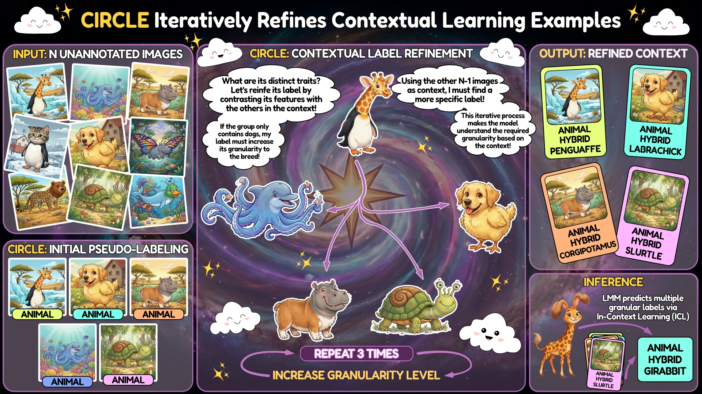

---

## 9. [DreamWorld: Unified World Modeling in Video Generation](https://huggingface.co/papers/2603.00466)
**Upvotes**: 15 | **도입 난이도**: 중 | **신뢰도**: 상
**arXiv**: https://arxiv.org/abs/2603.00466

**태그**: Video Generation, World Modeling, Foundation Models, Consistency, Video, Evaluation, Inference, Safety

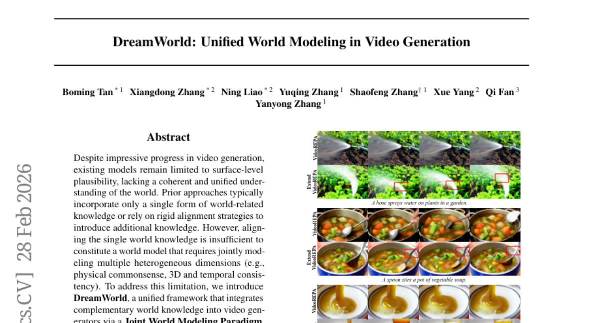

### 📌 한 줄 요약
DreamWorld는 비디오 생성 시 물리적 직관, 3D 공간, 시간적 일관성을 통합적으로 모델링하여 현실감 있는 비디오 생성을 가능하게 한다.

### 🔑 핵심 포인트
- 이질적인 세계 지식을 통합하는 Joint World Modeling Paradigm 제시
- 학습 안정화를 위한 Consistent Constraint Annealing (CCA) 방법 제안
- 추론 시 사전 지식 활용을 위한 Multi-Source Inner-Guidance 도입

### 🧑‍💻 개발자 관점
비디오 생성 모델의 현실감을 높이고, 다양한 세계 지식을 활용하여 더욱 복잡하고 일관성 있는 장면을 생성할 수 있게 한다. 게임, 영화, 시뮬레이션 등 다양한 분야에서 활용될 수 있다.

### 🚀 실무 적용 아이디어
- DreamWorld 프레임워크를 기반으로 특정 도메인에 특화된 비디오 생성 모델 개발
- CCA 및 Multi-Source Inner-Guidance를 다른 비디오 생성 모델에 적용하여 성능 향상 시도
- DreamWorld의 세계 지식 통합 방식을 다른 멀티모달 생성 모델에 적용

### ⚠️ 리스크/한계
- 다양한 세계 지식을 통합하는 과정에서 계산 비용이 증가할 수 있다.
- 학습 데이터의 편향으로 인해 생성된 비디오의 현실성이 제한될 수 있다.

### 📝 초록 기반 상세 설명
기존 비디오 생성 모델은 단일 형태의 지식만 활용하거나 엄격한 정렬 전략에 의존하여 현실 세계에 대한 통합적인 이해가 부족했다. DreamWorld는 이 문제를 해결하기 위해 다양한 지식을 통합하는 새로운 프레임워크를 제안한다. 이 프레임워크는 Joint World Modeling Paradigm을 통해 비디오 픽셀과 파운데이션 모델의 특징을 동시에 예측하여 시간적 역동성, 공간적 기하학, 의미론적 일관성을 포착한다. 학습 과정에서 발생하는 시각적 불안정성을 해소하기 위해 Consistent Constraint Annealing (CCA)을 적용하고, 추론 시에는 Multi-Source Inner-Guidance를 통해 학습된 사전 지식을 활용한다. 실험 결과, DreamWorld는 VBench에서 Wan2.1 대비 2.26점 향상된 성능을 보였다.

---

