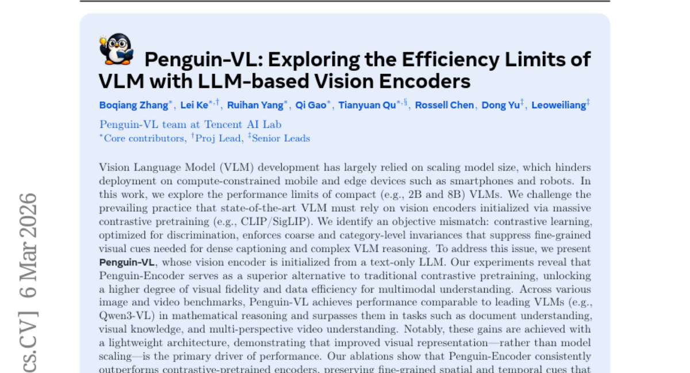
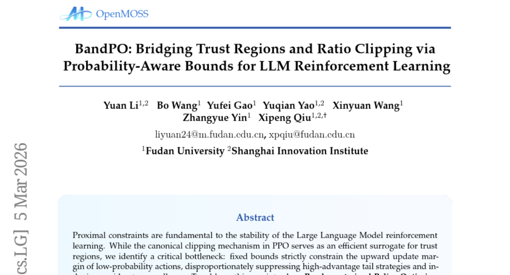
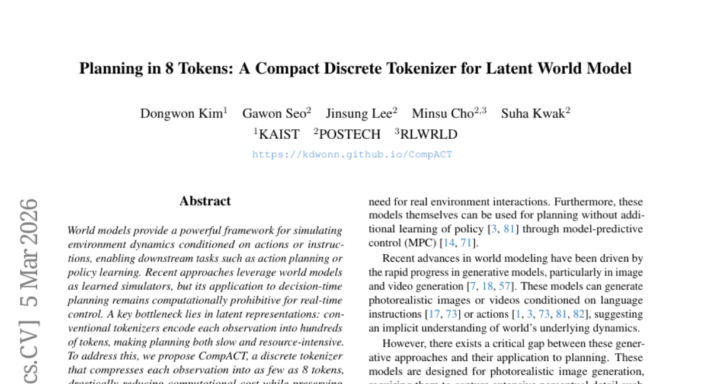
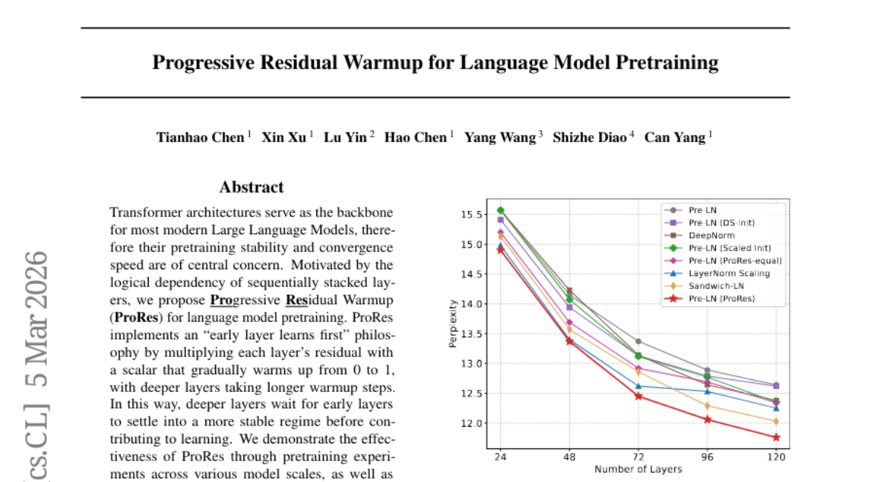
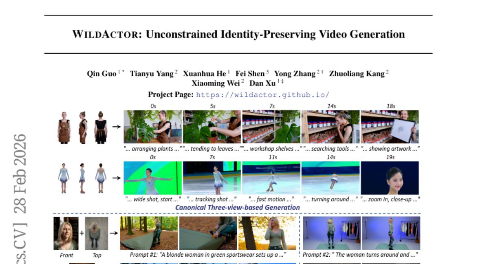
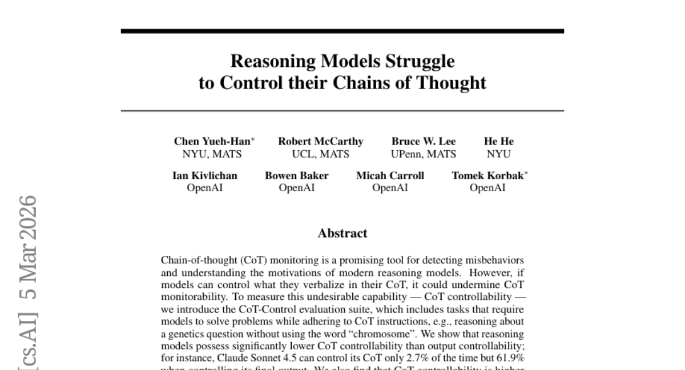
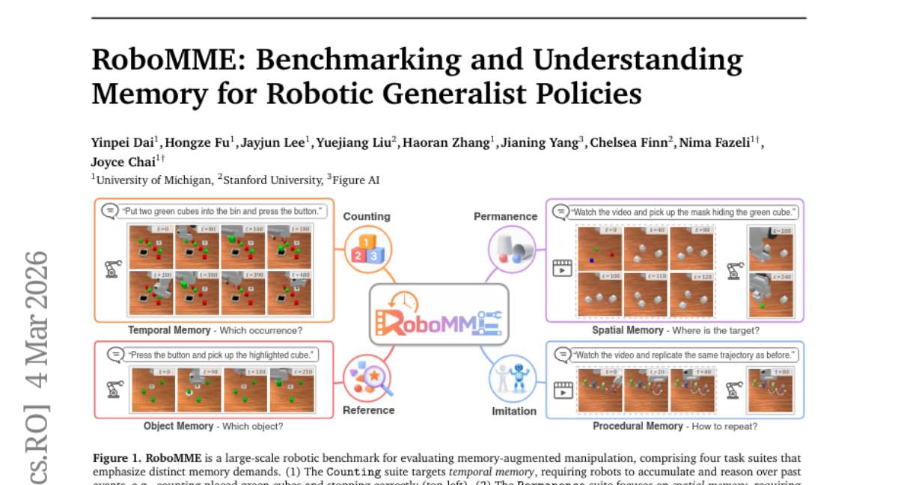
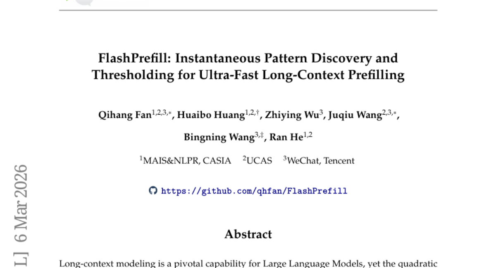
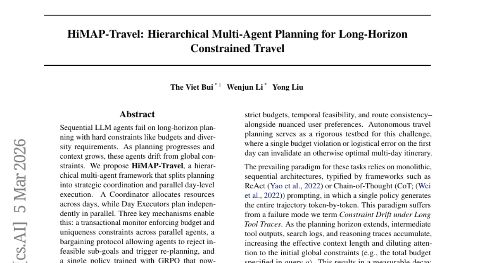

# 2026-03-10 Daily Papers (Top 9)

## 1. [Penguin-VL: Exploring the Efficiency Limits of VLM with LLM-based Vision Encoders](https://huggingface.co/papers/2603.06569)
**Upvotes**: 68 | **도입 난이도**: 중 | **신뢰도**: 상
**arXiv**: https://arxiv.org/abs/2603.06569

**태그**: VLM, LLM, Vision, Efficiency, Multimodal, Reasoning, Video, Benchmark

### 📌 한 줄 요약
LLM 기반 Vision Encoder를 사용하여 소형 VLM의 성능 한계를 극복하고, 기존 contrastive pretraining 방식보다 효율적인 Penguin-VL 모델을 제안하여 문서 이해, 시각적 지식, 다각도 비디오 이해 등에서 SOTA VLM을 능가하는 성능을 달성했습니다.

### 🔑 핵심 포인트
- LLM 기반 Vision Encoder를 사용한 새로운 VLM 아키텍처 (Penguin-VL) 제안
- Contrastive pretraining의 한계를 지적하고, fine-grained 시각 정보 보존의 중요성 강조
- 소형 VLM에서 SOTA VLM을 능가하는 성능 달성 및 효율성 입증

### 🧑‍💻 개발자 관점
Penguin-VL은 리소스 제약적인 환경에서 고성능 VLM을 구현할 수 있는 가능성을 제시하며, 기존 VLM의 contrastive pretraining 부분을 대체하여 성능 향상을 꾀할 수 있습니다.

### 🚀 실무 적용 아이디어
- Penguin-VL의 Vision Encoder를 기존 VLM에 적용하여 성능 향상 가능성 실험
- 자체 데이터셋에 대한 Penguin-VL의 fine-tuning을 통해 특정 작업에 대한 성능 최적화
- Penguin-VL의 코드 및 아키텍처를 분석하여 경량 VLM 설계에 대한 인사이트 확보

### ⚠️ 리스크/한계
- LLM 기반 Vision Encoder의 학습 및 초기화에 대한 컴퓨팅 자원 요구 사항
- 특정 유형의 시각적 정보에 대한 일반화 성능의 한계

### 📝 초록 기반 상세 설명
기존 VLM은 모델 크기 확장에 의존하여 모바일 및 엣지 장치 배포에 어려움이 있었습니다. 이 연구는 소형 VLM의 성능 한계를 탐색하고, contrastive pretraining 방식이 fine-grained 시각적 정보를 억제하는 문제점을 지적합니다. 이를 해결하기 위해 text-only LLM으로 초기화된 Penguin-VL을 제안하며, Penguin-Encoder가 contrastive pretraining의 대안으로서 더 높은 시각적 충실도와 데이터 효율성을 제공함을 입증합니다. 실험 결과, Penguin-VL은 수학적 추론에서 기존 VLM과 유사한 성능을 보였으며, 문서 이해, 시각적 지식, 다각도 비디오 이해에서 더 뛰어난 성능을 달성했습니다. 이는 모델 스케일링보다 시각적 표현 개선이 성능 향상의 주요 동인임을 보여줍니다.

---

## 2. [BandPO: Bridging Trust Regions and Ratio Clipping via Probability-Aware Bounds for LLM Reinforcement Learning](https://huggingface.co/papers/2603.04918)
**Upvotes**: 49 | **도입 난이도**: 중 | **신뢰도**: 상
**arXiv**: https://arxiv.org/abs/2603.04918

**태그**: Agent, Reinforcement Learning, Policy Optimization, LLM

### 📌 한 줄 요약
BandPO는 LLM 강화 학습에서 낮은 확률의 행동에 대한 업데이트 제한을 완화하여 더 나은 탐색과 성능을 제공하는 새로운 정책 최적화 방법입니다.

### 🔑 핵심 포인트
- 낮은 확률 행동에 대한 과도한 제약 문제 해결
- f-divergence 기반 신뢰 영역을 확률 인식 클리핑으로 변환하는 Band 연산자 도입
- 볼록 최적화 문제로 공식화하여 전역 최적 해 보장

### 🧑‍💻 개발자 관점
LLM 기반 에이전트 개발 시, BandPO를 적용하여 탐색 성능을 향상시키고, 더 다양한 전략을 학습할 수 있도록 도와줍니다. 특히, 희소한 보상 환경에서 효과적일 수 있습니다.

### 🚀 실무 적용 아이디어
- 기존 PPO 기반 에이전트에 BandPO 적용하여 성능 비교
- 다양한 f-divergence 함수를 사용하여 BandPO 성능 변화 관찰
- BandPO의 하이퍼파라미터 (예: Band 크기) 최적화

### ⚠️ 리스크/한계
- BandPO의 계산 복잡도가 기존 PPO보다 높을 수 있음
- 특정 환경에서는 BandPO의 효과가 미미할 수 있음

### 📝 초록 기반 상세 설명
LLM 강화 학습에서 정책 업데이트를 안정화하기 위해 신뢰 영역 제약이 중요하지만, 기존 PPO의 클리핑 메커니즘은 낮은 확률의 행동에 대한 업데이트를 지나치게 제한하여 탐색을 저해하는 문제가 있습니다. 이를 해결하기 위해 BandPO는 f-divergence에 의해 정의된 신뢰 영역을 확률 인식 클리핑 구간으로 투영하는 Band 연산자를 도입합니다. BandPO는 볼록 최적화 문제로 공식화되어 전역 최적 해를 보장하며, 다양한 모델과 데이터셋에서 기존 클리핑 방식보다 우수한 성능을 보입니다.

---

## 3. [Planning in 8 Tokens: A Compact Discrete Tokenizer for Latent World Model](https://huggingface.co/papers/2603.05438)
**Upvotes**: 22 | **도입 난이도**: 중 | **신뢰도**: 중
**arXiv**: https://arxiv.org/abs/2603.05438

**태그**: World Model, Tokenizer, Planning, Real-time Control, RAG

### 📌 한 줄 요약
World Model의 Planning 속도 향상을 위해 observation을 8개의 token으로 압축하는 CompACT tokenizer를 제안, Planning 성능을 유지하면서 연산 비용을 획기적으로 감소시켜 실시간 제어에 World Model 적용 가능성을 높임.

### 🔑 핵심 포인트
- Observation을 압축하는 새로운 discrete tokenizer (CompACT) 제안
- Planning 성능을 유지하면서 연산 비용을 크게 감소
- World Model을 실시간 제어에 적용할 수 있는 가능성을 제시

### 🧑‍💻 개발자 관점
World Model 기반의 agent 개발 시, CompACT tokenizer를 활용하여 planning 속도를 개선하고 리소스 사용량을 줄여 agent의 응답성과 효율성을 높일 수 있습니다. 특히, 실시간 제어가 중요한 로봇 제어, 게임 AI 등에 유용하게 적용될 수 있습니다.

### 🚀 실무 적용 아이디어
- CompACT tokenizer를 기존 World Model에 적용하여 planning 속도 향상 실험
- 다양한 환경 및 task에서 CompACT tokenizer의 성능 및 효율성 검증
- CompACT tokenizer를 활용한 agent 개발 및 실시간 제어 성능 평가

### ⚠️ 리스크/한계
- Tokenizer의 압축 과정에서 정보 손실 발생 가능성
- 특정 환경 또는 task에 CompACT tokenizer가 적합하지 않을 수 있음

### 📝 초록 기반 상세 설명
World Model은 action이나 instruction에 따라 환경 dynamics를 시뮬레이션하는 강력한 프레임워크를 제공하지만, decision-time planning에 적용하기에는 연산 비용이 많이 든다는 문제가 있습니다. 특히, 기존 tokenizer는 각 observation을 수백 개의 token으로 encoding하여 planning 속도를 저하시키고 리소스 사용량을 증가시킵니다. 이러한 문제를 해결하기 위해, 본 논문에서는 각 observation을 8개 token으로 압축하는 CompACT tokenizer를 제안합니다. CompACT tokenizer를 사용하는 action-conditioned world model은 planning 성능을 유지하면서 planning 속도를 크게 향상시켜 World Model의 실용적인 발전에 기여합니다.

---

## 4. [Progressive Residual Warmup for Language Model Pretraining](https://huggingface.co/papers/2603.05369)
**Upvotes**: 15 | **도입 난이도**: 중 | **신뢰도**: 상
**arXiv**: https://arxiv.org/abs/2603.05369

**태그**: Transformer, Pretraining, Optimization, Warmup

### 📌 한 줄 요약
Transformer 기반 언어 모델의 pretraining 시 안정성과 수렴 속도를 개선하는 Progressive Residual Warmup (ProRes) 방법론을 제안하고, 다양한 실험을 통해 효과를 검증함.

### 🔑 핵심 포인트
- 레이어별 residual scaling을 통해 pretraining 안정성 향상
- 점진적 warmup 전략으로 빠른 수렴 속도 달성
- 다양한 모델 및 설정에서 ProRes의 효과 검증

### 🧑‍💻 개발자 관점
Transformer 모델 pretraining 시 안정성 문제로 어려움을 겪는 개발자에게 유용한 기법이며, 더 빠르고 효율적인 모델 학습을 가능하게 한다.

### 🚀 실무 적용 아이디어
- 기존 Transformer 모델에 ProRes 적용하여 pretraining 실험
- 다양한 warmup schedule을 적용하여 ProRes 효과 비교
- ProRes를 활용하여 더 큰 규모의 모델 pretraining 시도

### ⚠️ 리스크/한계
- ProRes의 효과는 모델 구조, 데이터셋, 하이퍼파라미터에 따라 달라질 수 있음
- ProRes 적용 시 추가적인 연산 비용 발생 가능성 존재

### 📝 초록 기반 상세 설명
Transformer 기반 언어 모델은 현대 NLP 연구의 핵심이지만, pretraining 과정에서의 불안정성과 느린 수렴 속도는 여전히 문제점으로 남아있다. 본 논문에서는 레이어 간의 논리적 의존성에 착안하여, Progressive Residual Warmup (ProRes)이라는 새로운 pretraining 기법을 제안한다. ProRes는 낮은 레이어부터 점진적으로 학습하도록 유도하여, 깊은 레이어가 학습에 기여하기 전에 안정화되도록 한다. 다양한 모델 크기와 normalization, initialization scheme에 대한 실험을 통해 ProRes의 효과를 입증했으며, pretraining 안정성 향상, 빠른 수렴, 강력한 일반화 성능, 더 나은 downstream 성능을 확인했다.

---

## 5. [WildActor: Unconstrained Identity-Preserving Video Generation](https://huggingface.co/papers/2603.00586)
**Upvotes**: 15 | **도입 난이도**: 중 | **신뢰도**: 중
**arXiv**: https://arxiv.org/abs/2603.00586

**태그**: Video Generation, Identity Preservation, Attention Mechanism, Monte Carlo Sampling, Dataset, RAG, Vision, Video, Evaluation

### 📌 한 줄 요약
WildActor는 다양한 시점과 움직임에도 신원 일관성을 유지하는 디지털 액터 비디오 생성 프레임워크로, Actor-18M 데이터셋을 활용하여 기존 방법들의 한계를 극복하고 실제 프로덕션 환경에 적합한 고품질 비디오 생성을 가능하게 한다.

### 🔑 핵심 포인트
- 대규모 인물 비디오 데이터셋 Actor-18M 구축
- 신원 보존 어텐션 메커니즘 및 시점 적응형 몬테카를로 샘플링 전략 제안
- 다양한 환경에서 신원 일관성을 유지하는 비디오 생성 프레임워크 WildActor 개발

### 🧑‍💻 개발자 관점
실제 서비스에서 사용자의 아바타나 디지털 휴먼을 생성할 때, 다양한 각도와 움직임에도 일관된 외모를 유지하는 것이 중요하며, WildActor는 이러한 요구사항을 충족시켜 사용자 경험을 향상시킬 수 있다.

### 🚀 실무 적용 아이디어
- Actor-18M 데이터셋을 활용하여 자체 모델 학습
- WildActor 프레임워크를 기반으로 특정 도메인에 특화된 비디오 생성 모델 개발
- 비대칭 신원 보존 어텐션 메커니즘을 다른 생성 모델에 적용하여 성능 향상 시도

### ⚠️ 리스크/한계
- 데이터셋의 편향으로 인해 특정 인종이나 체형에 대한 성능이 낮을 수 있음
- 복잡한 환경이나 빠른 움직임에서 신원 일관성이 저하될 수 있음

### 📝 초록 기반 상세 설명
기존의 인물 비디오 생성 방법들은 얼굴 중심적이거나 자세 고정으로 인한 부자연스러움 등의 문제로 역동적인 환경에서 신원 일관성을 유지하기 어려웠다. 본 논문에서는 다양한 시점과 환경에서 신원 일관성을 캡처하기 위해 대규모 인물 비디오 데이터셋 Actor-18M을 구축했다. Actor-18M을 활용하여 임의 시점 조건에서 인물 비디오 생성을 위한 WildActor 프레임워크를 제안하며, 비대칭 신원 보존 어텐션 메커니즘과 시점 적응형 몬테카를로 샘플링 전략을 도입했다. Actor-Bench 평가 결과, WildActor는 다양한 샷 구성, 시점 변화, 움직임 하에서 신원 일관성을 효과적으로 유지하며 기존 방법들을 능가했다.

---

## 6. [Reasoning Models Struggle to Control their Chains of Thought](https://huggingface.co/papers/2603.05706)
**Upvotes**: 13 | **도입 난이도**: 중 | **신뢰도**: 중
**arXiv**: https://arxiv.org/abs/2603.05706

**태그**: Agent, LLM, Chain-of-Thought, Reasoning, Evaluation

### 📌 한 줄 요약
LLM의 Chain-of-Thought(CoT) 생성 과정 제어 능력은 아직 낮지만, 모델 크기, RL 학습, 추론 비용 등에 따라 달라지므로 지속적인 모니터링이 필요함.

### 🔑 핵심 포인트
- CoT 제어 능력 평가를 위한 CoT-Control 평가 스위트 제시
- CoT 제어 능력이 최종 출력 제어 능력보다 현저히 낮음
- 모델 크기, RL 학습, 문제 난이도 등이 CoT 제어 능력에 영향

### 🧑‍💻 개발자 관점
LLM 기반 서비스를 개발할 때, 모델이 의도치 않은 정보를 CoT에 포함시키거나, 특정 제약 조건을 위반하는 것을 방지하기 위해 CoT 제어 능력을 고려해야 한다.

### 🚀 실무 적용 아이디어
- 자체 모델의 CoT 제어 능력 측정 및 베이스라인 확보
- CoT 제어 능력에 영향을 미치는 요소(모델 크기, 학습 데이터 등) 실험
- CoT 모니터링 시스템 구축 및 CoT 제어 능력 변화 추적

### ⚠️ 리스크/한계
- CoT 제어 능력 저하 메커니즘에 대한 이해 부족
- CoT-Control 평가 스위트의 일반화 가능성 제한

### 📝 초록 기반 상세 설명
Chain-of-thought(CoT) 모니터링은 LLM의 오작동을 감지하고 동기를 이해하는 데 유용한 도구이지만, 모델이 CoT 내용을 제어할 수 있다면 모니터링 효과가 저하될 수 있다. 본 연구에서는 CoT 제어 능력을 평가하기 위해 CoT-Control 평가 스위트를 제안하고, 모델이 특정 단어를 사용하지 않고 문제를 해결하도록 지시한다. 실험 결과, Claude Sonnet 4.5는 CoT 제어 능력이 2.7%로, 최종 출력 제어 능력(61.9%)보다 훨씬 낮았다. 모델 크기가 클수록, RL 학습량이 적을수록 CoT 제어 능력이 높았으며, 문제 난이도가 높을수록 제어 능력이 감소했다. CoT 모니터링 회피에 대한 인센티브를 제공해도 제어 능력은 크게 향상되지 않았다. 따라서 현재 CoT 제어 능력은 CoT 모니터링의 주요 실패 요인이 아닐 가능성이 높지만, CoT 모니터링 유지를 위해 지속적인 추적을 권장한다.

---

## 7. [RoboMME: Benchmarking and Understanding Memory for Robotic Generalist Policies](https://huggingface.co/papers/2603.04639)
**Upvotes**: 13 | **도입 난이도**: 중 | **신뢰도**: 상
**arXiv**: https://arxiv.org/abs/2603.04639

**태그**: Robotics, VLA, Benchmark, Memory, Manipulation, Vision, Video, Evaluation

### 📌 한 줄 요약
로봇 조작을 위한 VLA 모델의 기억 능력을 평가하는 대규모 벤치마크 RoboMME를 제시하고, 다양한 기억 메커니즘을 실험하여 작업별 효과를 분석했습니다.

### 🔑 핵심 포인트
- 장기 의존성 로봇 조작을 위한 대규모 벤치마크 RoboMME 제시
- 다양한 기억 표현 방식과 통합 전략을 갖춘 14개의 VLA 모델 개발
- 기억 표현의 효과가 작업에 따라 크게 달라짐을 실험적으로 검증

### 🧑‍💻 개발자 관점
로봇 제어 에이전트 개발 시, 어떤 기억 메커니즘을 사용할지, 어떻게 통합할지에 대한 가이드라인을 제공하며, 다양한 시나리오에서 성능을 검증할 수 있는 표준화된 환경을 제공합니다.

### 🚀 실무 적용 아이디어
- RoboMME 벤치마크를 사용하여 자체 VLA 모델의 기억 능력을 평가
- 제공된 14개의 기억 증강 VLA 모델을 기반으로 새로운 기억 메커니즘 실험
- 특정 로봇 조작 작업에 적합한 기억 표현 방식 및 통합 전략 탐색

### ⚠️ 리스크/한계
- RoboMME는 시뮬레이션 환경에 국한되어 실제 로봇 환경에서의 성능은 다를 수 있음
- π0.5 백본에 의존적이므로 다른 백본 아키텍처에 대한 일반화 가능성은 제한적일 수 있음

### 📝 초록 기반 상세 설명
로봇 조작에서 장기적인 의존성을 갖는 작업은 기억 능력이 중요하지만, 기존 VLA 모델 평가는 제한적인 환경에 머물러 있습니다. 이러한 문제를 해결하기 위해, 시간, 공간, 객체, 절차적 기억을 평가하는 16개의 조작 작업으로 구성된 대규모 벤치마크 RoboMME를 구축했습니다.  π0.5 백본을 기반으로 14개의 기억 증강 VLA 모델을 개발하여 다양한 기억 표현 방식과 통합 전략을 탐색했습니다. 실험 결과, 기억 표현의 효과는 작업에 따라 크게 달라지며, 각 설계는 서로 다른 장단점을 보였습니다.

---

## 8. [FlashPrefill: Instantaneous Pattern Discovery and Thresholding for Ultra-Fast Long-Context Prefilling](https://huggingface.co/papers/2603.06199)
**Upvotes**: 7 | **도입 난이도**: 중 | **신뢰도**: 상
**arXiv**: https://arxiv.org/abs/2603.06199

**태그**: LLM, Attention, Sparse Attention, Prefilling, Optimization, RAG, Evaluation, Inference

### 📌 한 줄 요약
FlashPrefill은 긴 문맥 prefilling 과정에서 attention 연산 속도를 획기적으로 개선하여 LLM의 효율성을 높이는 새로운 프레임워크다.

### 🔑 핵심 포인트
- 동적 sparse attention 패턴의 즉각적인 발견 및 활용
- attention 점수 정렬/누적 오버헤드 없는 동적 thresholding 메커니즘
- 긴 문맥 및 짧은 문맥 모두에서 효율성 향상

### 🧑‍💻 개발자 관점
FlashPrefill은 LLM의 prefilling 속도를 크게 향상시켜, 더 긴 문맥을 처리하거나 더 빠른 응답 시간을 제공해야 하는 서비스의 성능 개선에 직접적으로 기여할 수 있다.

### 🚀 실무 적용 아이디어
- FlashPrefill을 기존 LLM prefilling 파이프라인에 통합하여 성능 향상 측정
- 다양한 문맥 길이 및 데이터셋에서 FlashPrefill의 효과 검증
- FlashPrefill의 thresholding 메커니즘을 다른 sparse attention 방식과 결합하여 시너지 효과 탐색

### ⚠️ 리스크/한계
- 특정 유형의 데이터 또는 모델 아키텍처에서 성능 저하 가능성
- 블록 검색 및 thresholding 파라미터 튜닝의 어려움

### 📝 초록 기반 상세 설명
긴 문맥 모델링은 LLM의 중요한 기능이지만, attention 연산의 복잡도는 prefilling 단계에서 병목 현상을 일으킨다. 기존의 sparse attention 방식은 탐색 지연이나 불충분한 희소성 문제를 가진다. 본 논문에서는 즉각적인 패턴 발견 및 thresholding을 통해 prefilling 속도를 향상시키는 FlashPrefill 프레임워크를 제안한다. FlashPrefill은 빠른 블록 검색 기술을 활용하여 동적인 sparse attention 패턴을 찾고, attention 점수를 정렬하거나 누적하는 오버헤드 없이 long-tail 분포를 제거하여 희소성을 높인다. 실험 결과, FlashPrefill은 256K 시퀀스에서 27.78배의 속도 향상을 보였으며, 4K 문맥 길이에서도 1.71배의 속도 향상을 유지하여 다양한 시퀀스 규모에서 실용적인 유용성을 입증했다.

---

## 9. [HiMAP-Travel: Hierarchical Multi-Agent Planning for Long-Horizon Constrained Travel](https://huggingface.co/papers/2603.04750)
**Upvotes**: 6 | **도입 난이도**: 중 | **신뢰도**: 상
**arXiv**: https://arxiv.org/abs/2603.04750

**태그**: Agent, Planning, Constraint Satisfaction, Multi-Agent System, Inference

### 📌 한 줄 요약
LLM 에이전트 기반 여행 계획 시스템에서, 계층적 멀티 에이전트 구조를 통해 장기 계획 및 제약 조건 준수 문제를 해결하고 성능을 향상시킴.

### 🔑 핵심 포인트
- 계층적 멀티 에이전트 프레임워크를 통해 장기 계획 문제 해결
- 트랜잭션 모니터 및 바게닝 프로토콜을 통해 제약 조건 준수
- GRPO를 사용한 단일 정책 학습으로 모든 에이전트 제어

### 🧑‍💻 개발자 관점
복잡한 제약 조건이 있는 장기 계획 시스템을 구축할 때, 멀티 에이전트 아키텍처와 제약 조건 관리 메커니즘을 통해 LLM 기반 에이전트의 성능과 안정성을 향상시킬 수 있습니다.

### 🚀 실무 적용 아이디어
- HiMAP-Travel 프레임워크를 자사의 계획 시스템에 적용해보기
- 트랜잭션 모니터 및 바게닝 프로토콜을 유사한 문제에 적용해보기
- GRPO를 사용하여 다양한 역할을 수행하는 단일 정책 학습 실험해보기

### ⚠️ 리스크/한계
- 멀티 에이전트 시스템의 복잡성 증가
- 새로운 프레임워크 학습 및 적용에 대한 초기 비용 발생

### 📝 초록 기반 상세 설명
LLM 에이전트는 장기 계획 시 예산 및 다양성 제약 조건과 같은 하드 제약 조건에서 벗어나는 경향이 있습니다. 이러한 문제를 해결하기 위해 HiMAP-Travel이라는 계층적 멀티 에이전트 프레임워크를 제안합니다. 이 프레임워크는 계획을 전략적 조정과 병렬적인 일일 실행으로 분리합니다. Coordinator는 리소스를 할당하고, Day Executor는 독립적으로 계획을 수립합니다. 트랜잭션 모니터, 바게닝 프로토콜, GRPO로 학습된 단일 정책을 통해 제약 조건을 준수하고 재계획을 가능하게 합니다. TravelPlanner 벤치마크에서 Qwen3-8B 모델을 사용하여 기존 방식 대비 성능 향상을 보였으며, FlexTravelBench에서 지연 시간을 줄였습니다.

---

