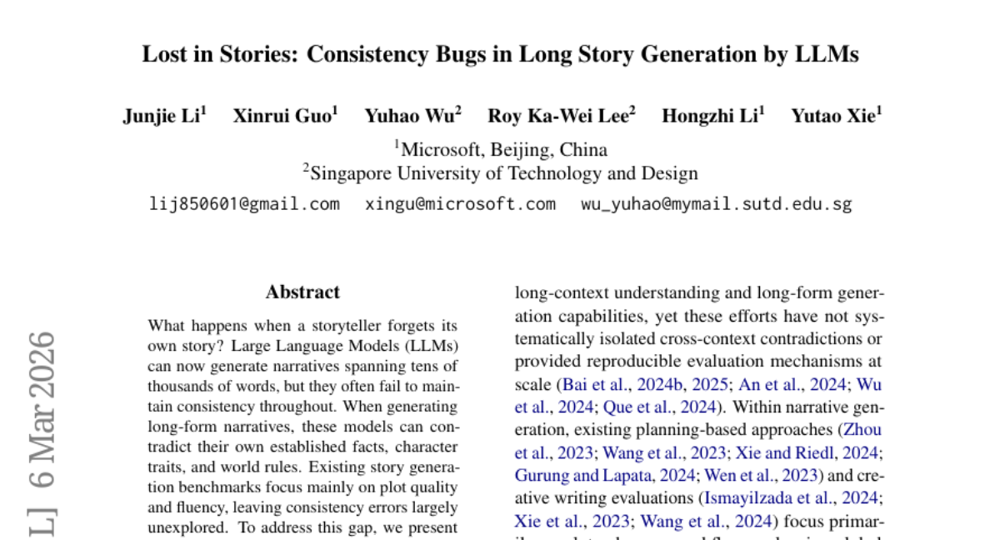
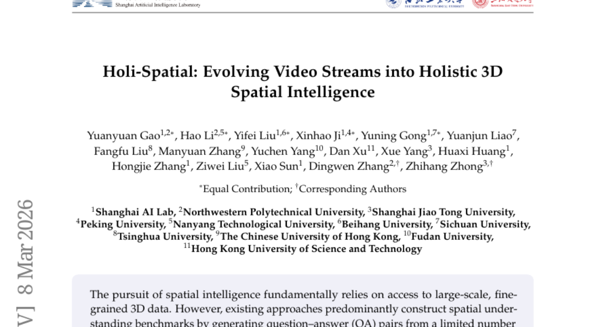
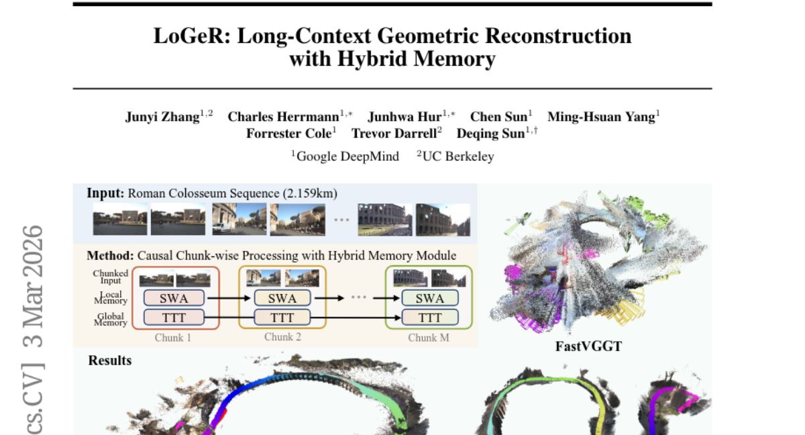
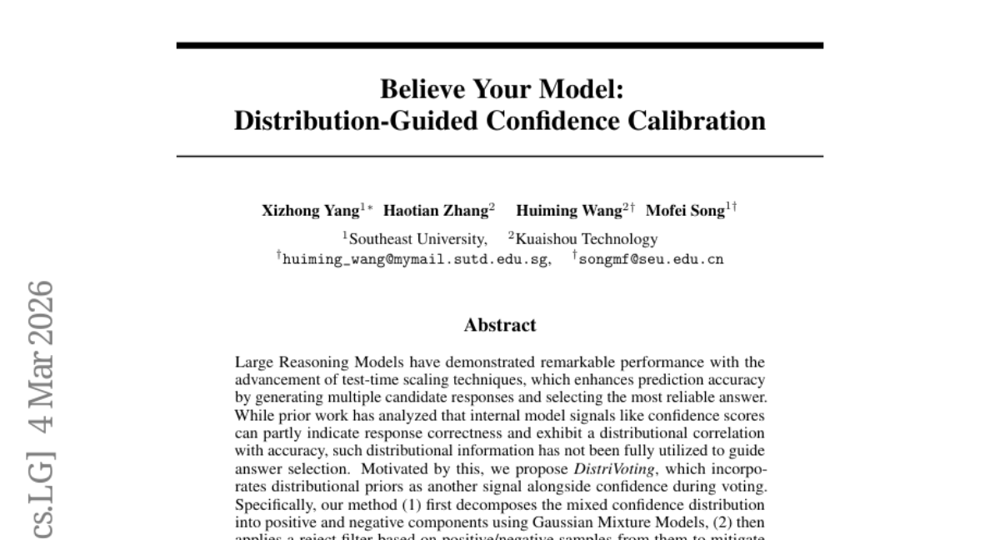
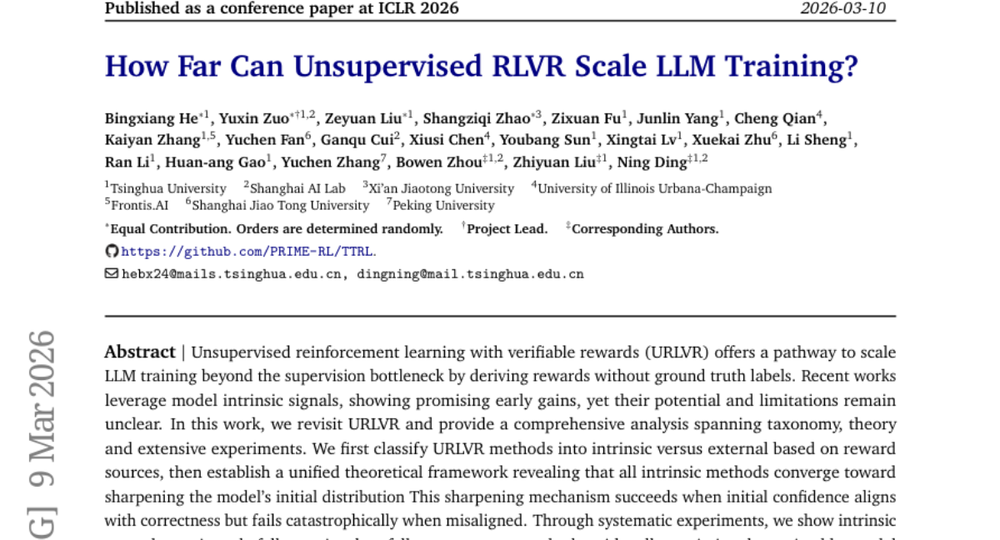
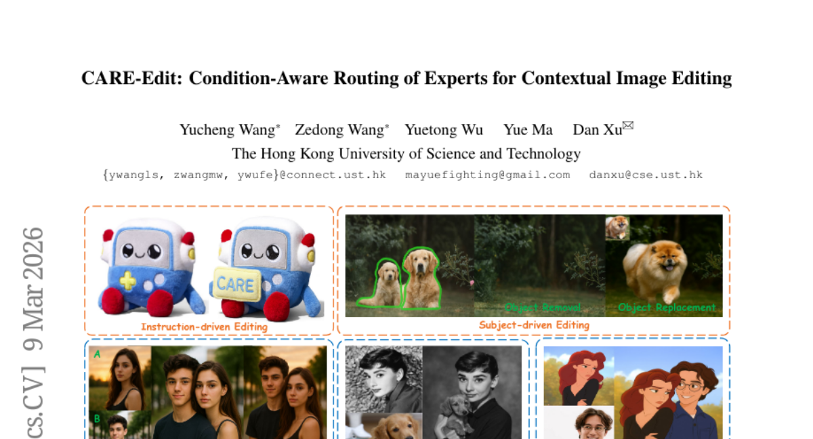
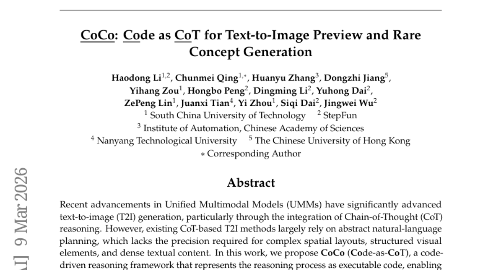
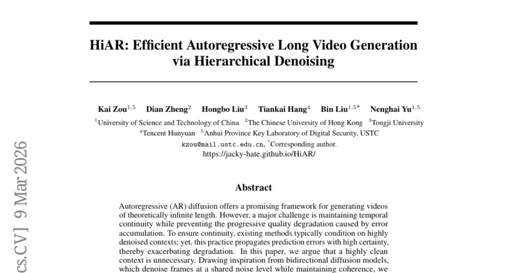
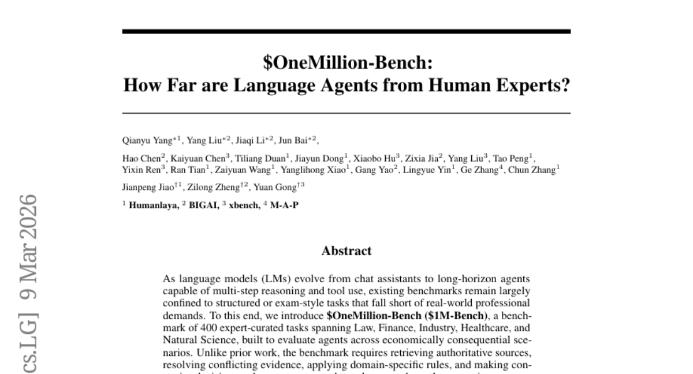

# 2026-03-11 Daily Papers (Top 9)

## 1. [Lost in Stories: Consistency Bugs in Long Story Generation by LLMs](https://huggingface.co/papers/2603.05890)
**Upvotes**: 71 | **도입 난이도**: 중 | **신뢰도**: 중
**arXiv**: https://arxiv.org/abs/2603.05890

**태그**: LLM, Story Generation, Consistency, Benchmark, Evaluation

### 📌 한 줄 요약
LLM을 이용한 장편 스토리 생성 시 발생하는 일관성 오류를 체계적으로 분석하고, 자동 평가 벤치마크와 오류 검출 파이프라인을 제시하여 향후 스토리 생성 모델 개선에 기여합니다.

### 🔑 핵심 포인트
- 장편 스토리 생성 시 일관성 오류를 평가하는 ConStory-Bench 벤치마크 제시
- 자동으로 모순을 탐지하고 근거를 제시하는 ConStory-Checker 파이프라인 개발
- LLM 스토리 생성 시 오류 발생 경향 분석 (사실/시간 오류, 중간 부분, 높은 엔트로피)

### 🧑‍💻 개발자 관점
LLM을 활용한 스토리텔링 기반 서비스 개발 시, 본 연구의 벤치마크와 오류 분석 결과를 활용하여 모델의 일관성 문제를 개선하고 서비스 품질을 향상시킬 수 있습니다.

### 🚀 실무 적용 아이디어
- ConStory-Bench 벤치마크를 사용하여 자체 스토리 생성 모델의 일관성 평가
- ConStory-Checker 파이프라인을 활용하여 모델의 오류 패턴 분석 및 디버깅
- 생성된 스토리의 중간 부분과 토큰 엔트로피가 높은 부분에 대한 일관성 검토 강화

### ⚠️ 리스크/한계
- ConStory-Bench는 특정 유형의 스토리 및 오류에 편향될 수 있음
- 자동 오류 검출 파이프라인의 정확도가 완벽하지 않을 수 있음

### 📝 초록 기반 상세 설명
최근 LLM은 긴 길이의 스토리 생성이 가능하지만, 내용의 일관성을 유지하는 데 어려움을 겪습니다. 기존 스토리 생성 벤치마크는 주로 플롯의 품질과 유창성에 초점을 맞추어 일관성 오류에 대한 연구가 부족했습니다. 본 연구에서는 장편 스토리 생성 시 일관성을 평가하기 위한 ConStory-Bench 벤치마크를 제안하고, 오류 유형을 세분화하여 정의했습니다. 또한, ConStory-Checker라는 자동화된 파이프라인을 개발하여 모순을 탐지하고 근거를 제시합니다. 다양한 LLM을 평가한 결과, 사실적, 시간적 오류가 흔하며, 이야기 중간 부분, 토큰 엔트로피가 높은 부분에서 오류가 자주 발생함을 확인했습니다.

---

## 2. [Holi-Spatial: Evolving Video Streams into Holistic 3D Spatial Intelligence](https://huggingface.co/papers/2603.07660)
**Upvotes**: 65 | **도입 난이도**: 중 | **신뢰도**: 상
**arXiv**: https://arxiv.org/abs/2603.07660

**태그**: 3D, Dataset, VLM, Spatial Reasoning, Multimodal, Reasoning, Vision, Video, Benchmark

### 📌 한 줄 요약
Holi-Spatial은 대규모 3D 공간 데이터셋을 자동 생성하여 Vision-Language 모델의 공간 추론 능력을 향상시키는 데 기여하며, 이는 로봇 공학, AR/VR 등 다양한 분야에서 활용될 수 있습니다.

### 🔑 핵심 포인트
- 완전 자동화된 대규모 공간 인지 멀티모달 데이터셋 구축
- 다양한 수준의 공간 감독 (3DGS, 객체 수준 주석, 공간 QA)
- Vision-Language 모델의 공간 추론 능력 향상

### 🧑‍💻 개발자 관점
Holi-Spatial 데이터셋은 로봇, AR/VR, 자율 주행 등 3D 공간 이해가 필요한 다양한 애플리케이션 개발에 활용될 수 있으며, 특히 Vision-Language 모델의 성능 향상에 기여합니다.

### 🚀 실무 적용 아이디어
- Holi-Spatial 데이터셋을 다운로드하여 공간 추론 모델 학습에 활용
- Vision-Language 모델을 Holi-Spatial 데이터셋으로 미세 조정하여 성능 향상 실험
- Holi-Spatial 데이터셋 구축 파이프라인을 참고하여 자체 데이터셋 구축

### ⚠️ 리스크/한계
- 완전 자동화된 데이터 큐레이션 과정에서 노이즈가 발생할 수 있음
- 특정 환경이나 객체에 편향된 데이터가 생성될 수 있음

### 📝 초록 기반 상세 설명
기존 공간 이해 벤치마크는 수동으로 주석 처리된 제한된 데이터셋에 의존하여 확장성과 도메인 격차 문제를 야기합니다. 본 연구에서는 원시 비디오 데이터를 활용하여 인간 개입 없이 대규모 공간 인지 멀티모달 데이터셋인 Holi-Spatial을 구축하는 새로운 데이터 큐레이션 파이프라인을 제안합니다. Holi-Spatial은 3D Gaussian Splatting 재구성, 객체 수준 및 관계형 의미론적 주석, 공간 질의응답 쌍을 포함한 다단계 공간 감독을 지원합니다. 체계적인 파이프라인을 통해 구축된 Holi-Spatial-4M은 12K개의 3DGS 장면, 1.3M개의 2D 마스크, 320K개의 3D 바운딩 박스 등을 포함하는 대규모 고품질 3D 의미론적 데이터셋입니다. Holi-Spatial은 데이터 큐레이션 품질에서 기존 방법들을 능가하며, 이 데이터셋으로 공간 추론 작업을 위해 Vision-Language 모델을 미세 조정하면 모델 성능이 크게 향상됩니다.

---

## 3. [LoGeR: Long-Context Geometric Reconstruction with Hybrid Memory](https://huggingface.co/papers/2603.03269)
**Upvotes**: 41 | **도입 난이도**: 중 | **신뢰도**: 상
**arXiv**: https://arxiv.org/abs/2603.03269

**태그**: Vision, 3D Reconstruction, Long Sequence, Memory Network, RAG, Reasoning, Video, Benchmark, Evaluation, Inference, Safety

### 📌 한 줄 요약
LoGeR는 새로운 하이브리드 메모리 구조를 통해 비디오 스트림의 3D 재구성을 매우 긴 시퀀스에서도 가능하게 하여, 기존 방식의 한계를 극복하고 성능을 크게 향상시켰다.

### 🔑 핵심 포인트
- 긴 시퀀스 3D 재구성을 위한 하이브리드 메모리 구조 (TTT + SWA) 제안
- Test-Time Training (TTT) 메모리를 활용한 전역 좌표계 안정화 및 스케일 드리프트 방지
- Sliding Window Attention (SWA) 메커니즘을 통한 고정밀 인접 정렬 및 uncompressed context 보존

### 🧑‍💻 개발자 관점
LoGeR는 긴 비디오 시퀀스에서 일관성 있는 3D 재구성을 가능하게 하여, 로보틱스, 자율 주행, AR/VR 등 다양한 분야에서 활용될 수 있다. 특히, 기존 방식의 메모리 및 계산량 제한을 극복하여 실시간 처리 성능을 향상시킬 수 있다.

### 🚀 실무 적용 아이디어
- LoGeR의 하이브리드 메모리 구조를 자사의 비디오 처리 파이프라인에 적용하여 성능 향상 가능성 검토
- TTT 메모리와 SWA 메커니즘의 파라미터 조정 및 최적화 실험
- 자체 데이터셋에 대한 LoGeR의 성능 평가 및 fine-tuning

### ⚠️ 리스크/한계
- 학습 데이터셋의 편향으로 인한 일반화 성능 저하 가능성
- TTT 메모리의 안정성이 학습 데이터 및 환경에 따라 달라질 수 있음

### 📝 초록 기반 상세 설명
기존의 geometric foundation 모델은 짧은 비디오 구간에서만 효과적인 3D 재구성을 제공했지만, 긴 비디오 시퀀스에서는 계산 복잡도와 메모리 제한으로 어려움을 겪었다. LoGeR는 청크 단위로 비디오를 처리하고, 청크 내 양방향 사전 정보를 활용하여 고품질 재구성을 달성한다. 청크 경계 간의 일관성을 유지하기 위해 학습 기반 하이브리드 메모리 모듈을 도입, parametric TTT 메모리와 non-parametric SWA 메커니즘을 결합하여 전역 좌표계를 안정화하고 정밀한 인접 정렬을 가능하게 한다. LoGeR는 128 프레임으로 학습 후 수천 프레임까지 일반화될 수 있으며, KITTI 데이터셋에서 ATE를 74% 이상 감소시키는 등 기존 SOTA 모델을 능가하는 성능을 보인다. 특히 최대 19k 프레임의 VBR 데이터셋에서도 강력하고 일관된 재구성을 제공한다.

---

## 4. [Believe Your Model: Distribution-Guided Confidence Calibration](https://huggingface.co/papers/2603.03872)
**Upvotes**: 38 | **도입 난이도**: 중 | **신뢰도**: 상
**arXiv**: https://arxiv.org/abs/2603.03872

**태그**: LLM, Confidence Calibration, Reasoning, Voting, Benchmark, Inference

### 📌 한 줄 요약
LLM의 confidence score를 활용하여 응답 정확도를 높이는 방법론 DistriVoting과 SelfStepConf를 제안하고, 다양한 실험을 통해 SOTA 성능을 달성함.

### 🔑 핵심 포인트
- Confidence score 분포를 활용한 새로운 투표 방식 DistriVoting 제안
- Step-level confidence를 이용한 SelfStepConf 방법론 제시
- 다양한 모델과 벤치마크에서 SOTA 성능을 입증

### 🧑‍💻 개발자 관점
LLM의 응답 선택 시 confidence score의 활용도를 높여 성능 향상을 기대할 수 있으며, 특히 multi-agent 시스템이나 RAG 시스템에서 응답의 신뢰도를 높이는 데 활용 가능합니다.

### 🚀 실무 적용 아이디어
- DistriVoting을 RAG 시스템의 응답 선택 로직에 적용해보기
- SelfStepConf를 활용하여 LLM inference 파이프라인 개선해보기
- 자체 데이터셋에 대한 confidence score 분포 분석 및 최적화

### ⚠️ 리스크/한계
- Gaussian Mixture Models의 파라미터 튜닝 필요
- Step-level confidence 획득이 어려운 모델에는 적용이 어려울 수 있음

### 📝 초록 기반 상세 설명
Large Reasoning Models는 test-time scaling을 통해 예측 정확도를 향상시키지만, 기존 연구에서는 모델의 confidence score와 정확도 간의 distributional correlation을 충분히 활용하지 못했습니다. 이러한 점에 착안하여, 본 논문에서는 confidence score와 함께 distributional priors를 활용하는 DistriVoting을 제안합니다. DistriVoting은 Gaussian Mixture Models을 사용하여 confidence 분포를 분해하고, reject filter를 적용하여 분포 간의 overlap을 줄입니다. 또한, SelfStepConf를 통해 inference 과정에서 step-level confidence를 동적으로 조정하여 분포 간 분리를 더욱 개선합니다. 16개의 모델과 5개의 벤치마크를 사용한 실험 결과, 제안 방법이 기존 SOTA 방법들을 능가하는 성능을 보였습니다.

---

## 5. [How Far Can Unsupervised RLVR Scale LLM Training?](https://huggingface.co/papers/2603.08660)
**Upvotes**: 37 | **도입 난이도**: 중 | **신뢰도**: 중
**arXiv**: https://arxiv.org/abs/2603.08660

**태그**: LLM, Reinforcement Learning, Unsupervised Learning, RAG, Vision

### 📌 한 줄 요약
Unsupervised RLVR을 이용한 LLM 학습 방법의 한계점을 분석하고, intrinsic reward 방법론의 collapse 현상을 밝혀냄. 모델 prior를 측정하는 지표를 제안하고, external reward 방법론의 가능성을 제시.

### 🔑 핵심 포인트
- URLVR 방법론을 intrinsic/external reward 기반으로 분류
- Intrinsic reward 방법론의 collapse 현상 규명 및 원인 분석
- 모델 prior 측정 지표 (Model Collapse Step) 제안

### 🧑‍💻 개발자 관점
LLM 학습 시 unsupervised RLVR 적용 가능성을 평가하고, intrinsic reward 기반 방법론의 한계를 이해하여 collapse를 방지하거나 극복하는 데 도움을 줄 수 있다. 또한, 모델 prior를 측정하여 RL 학습 가능성을 예측할 수 있다.

### 🚀 실무 적용 아이디어
- 제공된 Model Collapse Step 지표를 사용하여 모델 prior 측정 및 RL 학습 가능성 예측
- Intrinsic reward 기반 URLVR 적용 시 rise-then-fall 패턴 및 collapse 시점 모니터링
- Computational asymmetries 기반 external reward 방법론 탐색

### ⚠️ 리스크/한계
- Intrinsic reward 기반 URLVR은 모델 prior에 따라 collapse 발생 가능성이 높음
- External reward 방법론은 아직 초기 단계이며, scalability에 대한 추가 연구 필요

### 📝 초록 기반 상세 설명
LLM 학습 데이터 부족 문제를 해결하기 위해 Unsupervised RLVR이 대안으로 떠오르고 있지만, intrinsic reward 기반 방법론의 잠재력과 한계는 불분명하다. 본 연구에서는 intrinsic/external reward로 URLVR 방법론을 분류하고, intrinsic reward 방법론들이 모델의 초기 분포를 sharpening하는 방향으로 수렴함을 이론적으로 증명한다. 실험적으로 intrinsic reward는 rise-then-fall 패턴을 보이며, collapse 시점은 모델 prior에 의해 결정됨을 확인했다. 작은 데이터셋에 대한 test-time training에서는 유용하며, 모델 prior를 측정하는 Model Collapse Step 지표를 제안한다. 마지막으로 computational asymmetries에 기반한 external reward 방법론이 대안이 될 수 있음을 제시한다.

---

## 6. [CARE-Edit: Condition-Aware Routing of Experts for Contextual Image Editing](https://huggingface.co/papers/2603.08589)
**Upvotes**: 29 | **도입 난이도**: 중 | **신뢰도**: 상
**arXiv**: https://arxiv.org/abs/2603.08589

**태그**: Diffusion Model, Image Editing, Conditional Generation, Vision, Evaluation

### 📌 한 줄 요약
CARE-Edit은 조건에 따라 전문가를 동적으로 라우팅하여 이미지 편집 품질을 향상시키고, 특히 여러 조건이 충돌할 때 발생할 수 있는 문제(색상 번짐, 스타일 왜곡)를 해결합니다.

### 🔑 핵심 포인트
- 조건에 따라 전문가를 동적으로 라우팅하여 이미지 편집 품질 향상
- 마스크, 텍스트, 참조 등 다양한 조건 간의 충돌을 효과적으로 관리
- 특화된 전문가 모듈을 통해 특정 편집 작업에 최적화된 결과 제공

### 🧑‍💻 개발자 관점
여러 조건이 결합된 복잡한 이미지 편집 파이프라인에서 조건 간 충돌을 줄이고, 사용자 제어 능력을 향상시켜 더욱 정교한 편집 결과를 얻을 수 있습니다.

### 🚀 실무 적용 아이디어
- CARE-Edit을 기반으로 특정 편집 작업에 최적화된 전문가 모듈 추가 연구
- 다양한 조건 조합에 대한 CARE-Edit의 성능 평가 및 개선
- 실제 이미지 편집 워크플로우에 CARE-Edit 통합 및 사용자 피드백 수집

### ⚠️ 리스크/한계
- 새로운 전문가 모듈 추가 시 라우팅 로직의 복잡성 증가 가능성
- 특정 조건에 편향된 전문가 모듈의 성능 저하 가능성

### 📝 초록 기반 상세 설명
기존의 통합 확산 편집기는 다양한 작업에 대해 고정된 백본을 사용하므로 작업 간섭 및 이질적인 요구 사항에 대한 부적응 문제가 있었습니다. 특히 ControlNet 및 OmniControl 변형은 여러 조건 신호를 정적으로 결합하여 조건 간 충돌을 동적으로 처리하지 못해 아티팩트가 발생했습니다. 이를 해결하기 위해 CARE-Edit은 조건에 따라 전문가를 라우팅하여 모델 계산을 특정 편집 역량에 맞춥니다. 이 방법은 잠재적 어텐션 라우터를 사용하여 인코딩된 확산 토큰을 4개의 전문 전문가(텍스트, 마스크, 참조, 기본)에 할당합니다. 실험 결과, CARE-Edit은 지우기, 대체, 텍스트 기반 편집, 스타일 전이 등 다양한 컨텍스트 편집 작업에서 강력한 성능을 보였습니다.

---

## 7. [CoCo: Code as CoT for Text-to-Image Preview and Rare Concept Generation](https://huggingface.co/papers/2603.08652)
**Upvotes**: 26 | **도입 난이도**: 중 | **신뢰도**: 상
**arXiv**: https://arxiv.org/abs/2603.08652

**태그**: T2I, Code Generation, Multimodal, CoT, Reasoning, Vision, Evaluation

### 📌 한 줄 요약
CoCo는 이미지 생성 과정을 코드로 표현하여 복잡한 구조와 상세한 텍스트를 포함하는 이미지 생성에서 기존 CoT 방식보다 더 정밀하고 제어 가능한 결과를 얻을 수 있게 한다.

### 🔑 핵심 포인트
- 이미지 생성을 위한 reasoning 과정을 코드로 표현하는 새로운 프레임워크 (CoCo) 제안
- 구조적인 초안 이미지와 최종 이미지 쌍으로 구성된 CoCo-10K 데이터셋 구축
- 기존 CoT 기반 T2I 방법 대비 성능 향상 (StructT2IBench +68.83%, OneIG-Bench +54.8%, LongText-Bench +41.23%)

### 🧑‍💻 개발자 관점
복잡한 이미지 생성 파이프라인을 코드로 제어하고 디버깅할 수 있게 되어, 개발자가 이미지 생성 모델을 더 효율적으로 활용하고 개선할 수 있다.

### 🚀 실무 적용 아이디어
- CoCo 프레임워크를 활용하여 특정 도메인에 맞는 이미지 생성 파이프라인 구축
- CoCo-10K 데이터셋을 기반으로 새로운 이미지 생성 모델 학습
- 생성된 코드를 분석하여 이미지 생성 과정에 대한 이해도 향상

### ⚠️ 리스크/한계
- 코드 생성 모델의 성능에 따라 이미지 품질이 크게 좌우될 수 있음
- 복잡한 장면을 표현하는 코드를 생성하는 데 어려움이 있을 수 있음

### 📝 초록 기반 상세 설명
최근 Unified Multimodal Model(UMM)의 발전으로 Text-to-Image(T2I) 생성 성능이 향상되었지만, 기존 CoT 기반 방법은 추상적인 자연어 계획에 의존하여 복잡한 공간 배치나 구조적 요소에 대한 정밀도가 부족했다. 본 연구에서는 reasoning 과정을 실행 가능한 코드로 표현하는 CoCo(Code-as-CoT) 프레임워크를 제안한다. CoCo는 텍스트 프롬프트에 따라 장면의 구조적 레이아웃을 지정하는 코드를 생성하고, 샌드박스 환경에서 실행하여 초안 이미지를 렌더링한다. 이후 초안 이미지를 미세하게 편집하여 최종 고품질 이미지를 생성한다. CoCo-10K 데이터셋을 구축하여 모델 학습을 지원했으며, 실험 결과 CoCo는 기존 방식 대비 상당한 성능 향상을 보였다.

---

## 8. [HiAR: Efficient Autoregressive Long Video Generation via Hierarchical Denoising](https://huggingface.co/papers/2603.08703)
**Upvotes**: 23 | **도입 난이도**: 중 | **신뢰도**: 상
**arXiv**: https://arxiv.org/abs/2603.08703

**태그**: Video Generation, Diffusion Model, Autoregressive, Temporal Consistency, Video, Inference, Distillation

### 📌 한 줄 요약
HiAR은 비디오 생성 시 temporal consistency를 유지하면서 에러 누적을 줄이는 새로운 hierarchical denoising 프레임워크를 제안하며, 파이프라인 병렬 추론을 통해 속도 향상을 달성하고 VBench에서 SOTA를 달성했습니다.

### 🔑 핵심 포인트
- Hierarchical denoising 프레임워크 (HiAR) 제안
- 동일 noise level context conditioning을 통한 에러 전파 완화
- 파이프라인 병렬 추론을 통한 속도 향상

### 🧑‍💻 개발자 관점
긴 비디오 생성 모델의 성능과 효율성을 개선할 수 있는 새로운 접근 방식을 제시하며, 특히 temporal consistency가 중요한 애플리케이션에서 유용하게 활용될 수 있다. 비디오 편집, 게임 개발, 영화 제작 등 다양한 분야에서 활용될 수 있다.

### 🚀 실무 적용 아이디어
- HiAR 프레임워크를 기반으로 자체 데이터셋에 대한 비디오 생성 실험 진행
- forward-KL regularizer의 효과 및 최적 파라미터 탐색
- 다양한 비디오 품질 평가 지표를 사용하여 HiAR의 성능 분석

### ⚠️ 리스크/한계
- forward-KL regularizer의 추가로 인한 학습 복잡도 증가 가능성
- 특정 유형의 비디오 (예: 급격한 장면 전환)에 대한 성능 저하 가능성

### 📝 초록 기반 상세 설명
Autoregressive diffusion 모델은 긴 비디오 생성에 유망하지만, temporal consistency 유지와 에러 누적에 따른 품질 저하가 문제이다. 기존 방법은 highly denoised context에 의존하여 continuity를 확보하지만, 이는 에러 전파를 심화시킨다. 본 논문에서는 동일 noise level의 context conditioning이 충분한 temporal consistency 신호를 제공하면서 에러 전파를 효과적으로 완화할 수 있다고 주장한다. 이를 바탕으로 HiAR이라는 hierarchical denoising 프레임워크를 제안하며, 이는 기존의 순차적 블록 생성 대신 모든 블록에 걸쳐 causal generation을 수행하여 각 블록이 항상 동일 noise level의 context에 conditioning되도록 한다. HiAR은 파이프라인 병렬 추론을 통해 속도 향상을 가져오며, forward-KL regularizer를 도입하여 motion diversity를 보존한다. VBench에서 HiAR은 SOTA를 달성했다.

---

## 9. [\$OneMillion-Bench: How Far are Language Agents from Human Experts?](https://huggingface.co/papers/2603.07980)
**Upvotes**: 19 | **도입 난이도**: 중 | **신뢰도**: 중
**arXiv**: https://arxiv.org/abs/2603.07980

**태그**: Agent, Benchmark, Evaluation, RAG, Reasoning

### 📌 한 줄 요약
전문가 수준의 복잡한 실제 업무 환경을 시뮬레이션하는 새로운 에이전트 평가 벤치마크 OneMillion-Bench를 소개하며, 이는 기존 벤치마크의 한계를 극복하고 에이전트의 실질적인 활용 가능성을 높이는 데 기여한다.

### 🔑 핵심 포인트
- 실제 전문가 수준의 복잡한 태스크로 구성된 새로운 벤치마크 제시
- 도메인 지식, 추론 능력, 외부 정보 활용 능력을 종합적으로 평가
- 에이전트의 실질적인 업무 적용 가능성을 평가하는 데 초점

### 🧑‍💻 개발자 관점
소프트웨어 엔지니어는 OneMillion-Bench를 통해 개발한 에이전트의 실제 업무 환경에서의 성능을 객관적으로 평가하고 개선할 수 있으며, 특히 RAG 시스템의 성능 향상에 기여할 수 있다.

### 🚀 실무 적용 아이디어
- OneMillion-Bench 데이터셋을 활용하여 기존 에이전트 모델의 성능을 평가해보기
- RAG 시스템을 OneMillion-Bench 환경에 적용하여 성능 향상 가능성을 실험해보기
- 평가 루브릭을 참고하여 자체적인 에이전트 평가 지표를 개발해보기

### ⚠️ 리스크/한계
- 벤치마크의 과제가 특정 분야에 편향되어 있을 수 있음
- 평가 루브릭의 주관성이 결과에 영향을 미칠 수 있음

### 📝 초록 기반 상세 설명
기존 언어 모델 에이전트 벤치마크는 실제 전문 업무 환경을 반영하지 못한다는 한계가 있다. 이러한 문제점을 해결하기 위해 법률, 금융, 산업, 의료, 자연과학 등 다양한 분야의 전문가가 직접 제작한 400개의 과제로 구성된 OneMillion-Bench 벤치마크를 제안한다. 이 벤치마크는 권위 있는 자료 검색, 상충되는 증거 해결, 특정 도메인 규칙 적용, 제약 조건 하의 의사 결정 등을 요구하며, 결과뿐 아니라 추론 과정의 정확성 또한 중요하게 평가한다. 사실적 정확성, 논리적 일관성, 실용적 타당성, 전문적 규정 준수 등을 평가하는 루브릭 기반 평가 프로토콜을 채택하여 에이전트의 전문적인 능력을 심층적으로 평가한다. OneMillion-Bench는 에이전트의 신뢰성, 전문성, 실용성을 종합적으로 평가할 수 있는 통합 테스트 환경을 제공한다.

---

