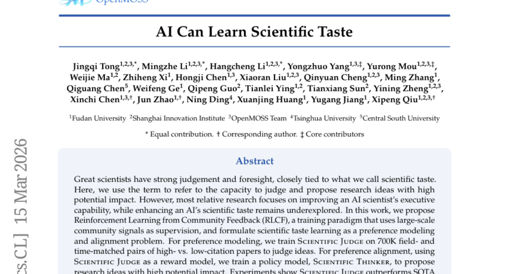
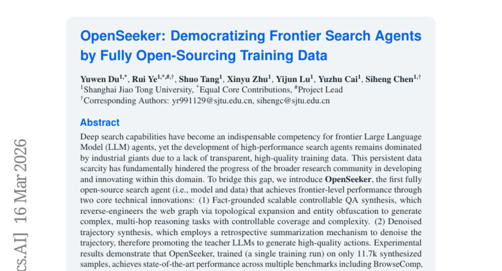
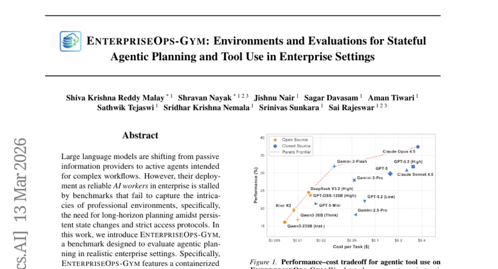
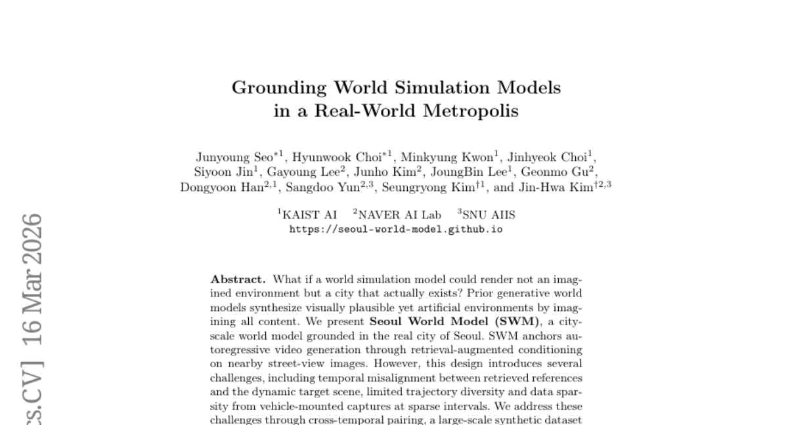
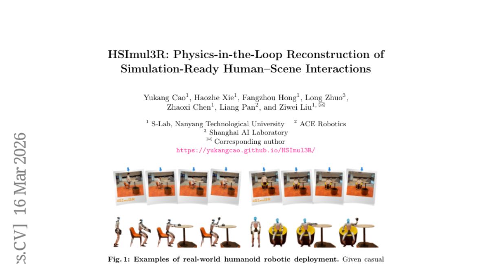
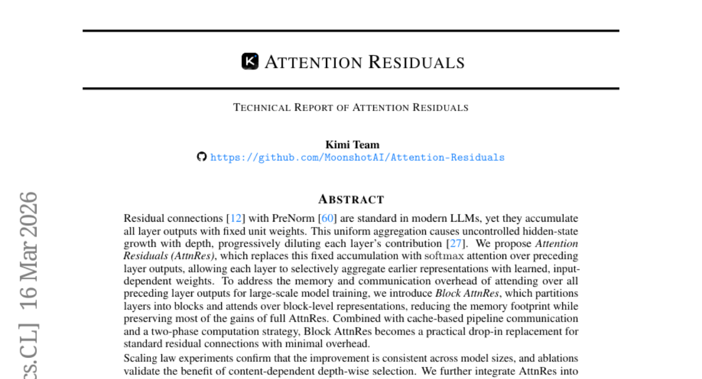
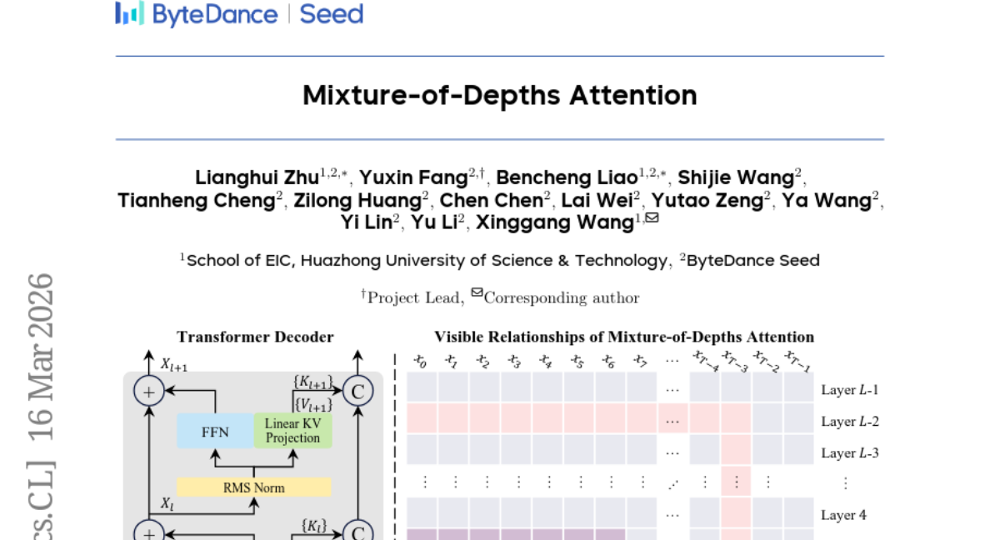
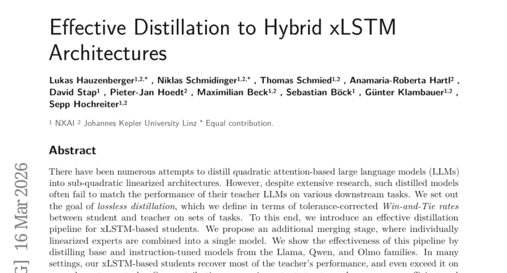
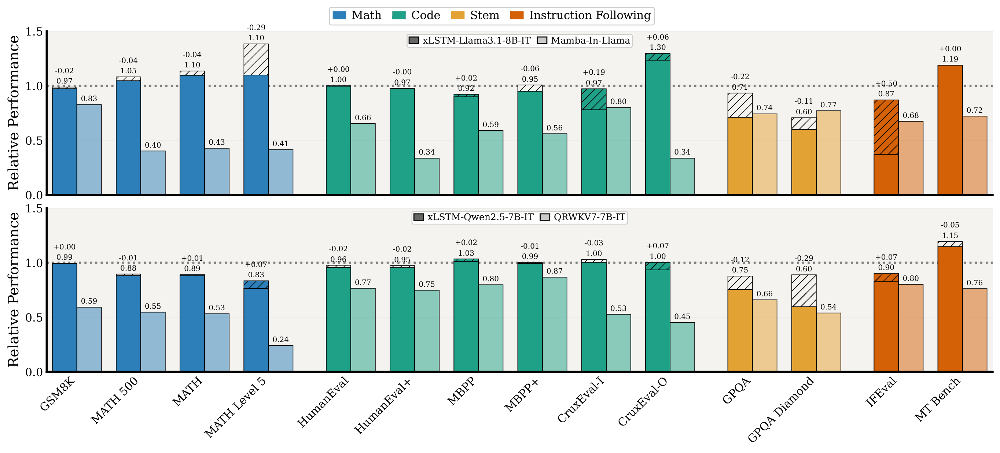
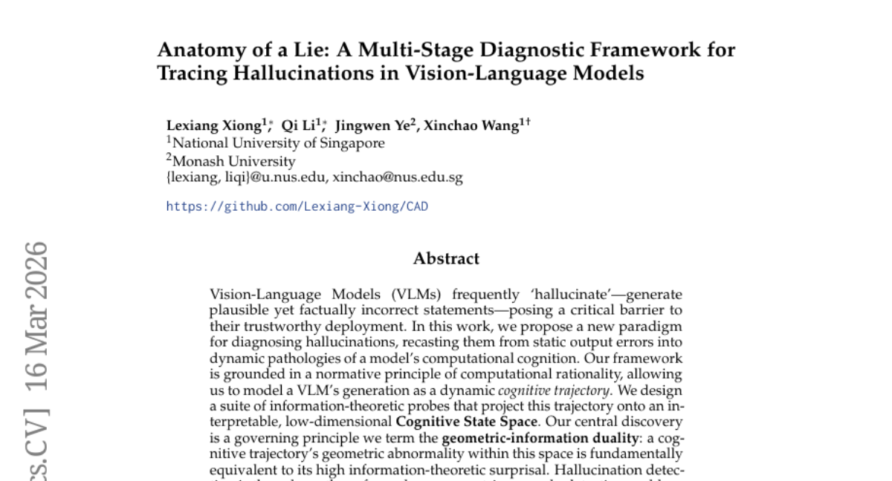

# 2026-03-18 Daily Papers (Top 9)

## 1. [AI Can Learn Scientific Taste](https://huggingface.co/papers/2603.14473)
**Upvotes**: 212 | **도입 난이도**: 중 | **신뢰도**: 중
**arXiv**: https://arxiv.org/abs/2603.14473

**태그**: Reinforcement Learning, Preference Modeling, AI Scientist, LLM, Vision, Safety

### 📌 한 줄 요약
AI가 대규모 커뮤니티 피드백을 통해 과학적 취향(잠재적 영향력이 큰 연구 아이디어를 판단하고 제안하는 능력)을 학습할 수 있음을 보임.

### 🔑 핵심 포인트
- 대규모 커뮤니티 피드백을 활용한 강화 학습 패러다임(RLCF) 제안
- Scientific Judge 모델을 통해 선호도 모델링 수행
- Scientific Thinker 모델을 통해 연구 아이디어 생성 및 잠재적 영향력 향상

### 🧑‍💻 개발자 관점
AI 모델이 연구 아이디어를 평가하고 생성하는 데 활용될 수 있으며, 이는 연구 개발 프로세스 자동화 및 효율성 향상에 기여할 수 있습니다.

### 🚀 실무 적용 아이디어
- RLCF 프레임워크를 활용하여 특정 분야의 연구 아이디어 생성 모델 학습
- Scientific Judge 모델을 활용하여 기존 연구 아이디어의 잠재적 영향력 평가
- 생성된 연구 아이디어를 실제 연구에 적용하여 성능 검증

### ⚠️ 리스크/한계
- 커뮤니티 피드백의 편향이 모델 성능에 영향을 미칠 수 있음
- 제안된 아이디어의 실제 연구 성공 여부는 보장되지 않음

### 📝 초록 기반 상세 설명
뛰어난 과학자는 과학적 취향을 가지고 있지만, AI 과학자의 과학적 취향을 향상시키는 연구는 미흡했습니다. 본 연구에서는 대규모 커뮤니티 신호를 활용하는 강화 학습 패러다임인 RLCF를 제안하여 과학적 취향 학습을 선호도 모델링 및 정렬 문제로 공식화합니다. Scientific Judge 모델은 고인용/저인용 논문 쌍을 통해 학습되어 아이디어를 판단하고, Scientific Thinker 모델은 Scientific Judge를 보상 모델로 사용하여 잠재적 영향력이 큰 연구 아이디어를 제안합니다. 실험 결과, Scientific Judge는 SOTA LLM을 능가하며, Scientific Thinker는 기존 방법보다 더 영향력 있는 아이디어를 제안했습니다. 이는 AI가 과학적 취향을 학습할 수 있음을 보여줍니다.

---

## 2. [OpenSeeker: Democratizing Frontier Search Agents by Fully Open-Sourcing Training Data](https://huggingface.co/papers/2603.15594)
**Upvotes**: 119 | **도입 난이도**: 중 | **신뢰도**: 상
**arXiv**: https://arxiv.org/abs/2603.15594

**태그**: Agent, Search, Open Source, LLM, RAG, Reasoning, Benchmark

### 📌 한 줄 요약
OpenSeeker는 고성능 검색 에이전트 개발을 위한 완전 오픈 소스 모델 및 데이터셋을 제공하여, 기존 산업체의 독점적인 환경을 타파하고 연구 커뮤니티의 접근성을 높입니다.

### 🔑 핵심 포인트
- Fact-grounded scalable controllable QA synthesis를 통해 고품질 학습 데이터 생성
- Retrospective summarization을 이용한 궤적 노이즈 제거
- 소량의 데이터로 SOTA 성능 달성 및 완전 오픈 소스 공개

### 🧑‍💻 개발자 관점
OpenSeeker는 검색 에이전트 개발에 필요한 학습 데이터와 모델을 오픈 소스로 제공하여, 개발자들이 자체적인 검색 에이전트를 구축하고 개선하는 데 도움을 줄 수 있습니다. 특히, 데이터 구축 비용 없이 SOTA급 성능을 빠르게 확보할 수 있다는 점에서 유용합니다.

### 🚀 실무 적용 아이디어
- OpenSeeker 모델을 다운로드하여 기존 RAG 시스템에 통합해보기
- 제공된 학습 데이터를 분석하여 데이터 생성 파이프라인 이해하기
- 자체 데이터셋을 구축하여 OpenSeeker 모델을 추가 학습해보기

### ⚠️ 리스크/한계
- 합성 데이터에 대한 의존성이 실제 환경에서의 성능에 영향을 미칠 수 있음
- 특정 벤치마크에 최적화되어 일반적인 검색 작업에 대한 성능은 검증 필요

### 📝 초록 기반 상세 설명
최첨단 LLM 에이전트에게 깊이 있는 검색 능력은 필수적이지만, 고품질 학습 데이터 부족으로 인해 산업체 위주로 발전해왔습니다. 이러한 데이터 부족은 연구 커뮤니티의 발전을 저해합니다. 본 논문에서는 완전 오픈 소스 검색 에이전트인 OpenSeeker를 소개하며, 이는 위상 확장 및 엔티티 난독화를 통해 복잡한 다단계 추론 작업을 생성하는 Fact-grounded scalable controllable QA synthesis와 궤적 노이즈 제거를 위한 retrospective summarization 메커니즘을 통해 최첨단 성능을 달성합니다. 11.7k개의 합성 데이터로 학습된 OpenSeeker는 BrowseComp 등 여러 벤치마크에서 SOTA를 달성했으며, 기존 오픈소스 에이전트뿐 아니라 일부 산업체 에이전트보다 뛰어난 성능을 보였습니다. 학습 데이터셋과 모델 가중치를 완전 공개하여 검색 에이전트 연구의 민주화를 촉진합니다.

---

## 3. [EnterpriseOps-Gym: Environments and Evaluations for Stateful Agentic Planning and Tool Use in Enterprise Settings](https://huggingface.co/papers/2603.13594)
**Upvotes**: 106 | **도입 난이도**: 상 | **신뢰도**: 중
**arXiv**: https://arxiv.org/abs/2603.13594

**태그**: Agent, Benchmark, Planning, Tool Use, Enterprise, Reasoning, Evaluation

### 📌 한 줄 요약
실제 엔터프라이즈 환경을 모방한 EnterpriseOps-Gym 벤치마크를 통해 에이전트의 계획 및 도구 활용 능력을 평가하고, 현재 최고 성능 모델도 37.4%의 성공률에 그쳐 실제 업무 환경에 적용하기에는 한계가 있음을 밝힘.

### 🔑 핵심 포인트
- 실제 엔터프라이즈 환경을 모방한 새로운 벤치마크 EnterpriseOps-Gym 제시
- 14개 최신 모델 평가 결과, 최고 성능 모델도 낮은 성공률을 보이며 전략적 추론 능력 부족 확인
- 에이전트가 불가능한 작업을 거부하지 못하는 문제점 지적

### 🧑‍💻 개발자 관점
실제 엔터프라이즈 환경에서 LLM 에이전트를 활용하려는 개발자는 EnterpriseOps-Gym을 통해 모델의 성능을 평가하고, 전략적 추론 능력 및 안전성 문제를 개선하는 데 활용할 수 있다.

### 🚀 실무 적용 아이디어
- EnterpriseOps-Gym 환경을 구축하여 자체 모델의 성능 테스트
- 오라클 인간 계획을 활용하여 모델의 전략적 추론 능력 개선
- 불가능한 작업 거부 메커니즘을 강화하여 안전성 확보

### ⚠️ 리스크/한계
- EnterpriseOps-Gym이 모든 엔터프라이즈 환경을 완벽하게 반영하지 못할 수 있음
- 평가 결과가 특정 모델 및 태스크에 편향될 수 있음

### 📝 초록 기반 상세 설명
최근 대규모 언어 모델은 단순 정보 제공을 넘어 복잡한 워크플로우를 수행하는 에이전트로 발전하고 있지만, 실제 엔터프라이즈 환경의 복잡성을 반영하는 벤치마크 부족으로 인해 도입이 지연되고 있다. 본 연구에서는 지속적인 상태 변화와 엄격한 접근 프로토콜을 고려하여 실제 엔터프라이즈 환경을 모방한 EnterpriseOps-Gym 벤치마크를 제안한다. EnterpriseOps-Gym은 164개의 데이터베이스 테이블과 512개의 기능 도구를 포함한 컨테이너화된 샌드박스를 제공하며, 8개의 주요 업무 영역에 걸쳐 1,150개의 전문가가 선별한 태스크를 통해 에이전트를 평가한다. 14개의 최신 모델을 평가한 결과, 최고 성능 모델인 Claude Opus 4.5조차 37.4%의 성공률을 보였으며, 이는 전략적 추론 능력의 부족이 주요 원인임을 시사한다. 또한, 에이전트가 불가능한 작업을 거부하지 못하는 경우가 많아 잠재적으로 유해한 부작용을 초래할 수 있음을 확인했다. EnterpriseOps-Gym은 에이전트 계획의 견고성을 향상시키는 데 기여할 수 있는 테스트베드를 제공한다.

---

## 4. [Grounding World Simulation Models in a Real-World Metropolis](https://huggingface.co/papers/2603.15583)
**Upvotes**: 89 | **도입 난이도**: 상 | **신뢰도**: 중
**arXiv**: https://arxiv.org/abs/2603.15583

**태그**: Agent, Vision, Simulation, Video Generation, RAG, Video, Evaluation, Safety

### 📌 한 줄 요약
실제 도시를 기반으로 하는 대규모 비디오 생성 모델(SWM)을 개발하여, 기존 모델의 공간적 정확도 및 시간적 일관성 문제를 해결하고 텍스트 프롬프트 기반 시나리오 변경을 지원합니다.

### 🔑 핵심 포인트
- 실제 도시를 기반으로 하는 대규모 월드 모델(SWM) 제시
- Retrieval-Augmented Conditioning을 통해 비디오 생성의 정확도 향상
- Virtual Lookahead Sink를 통한 장기 horizon 생성 안정화

### 🧑‍💻 개발자 관점
실제 환경 기반의 시뮬레이션 모델을 구축하여 자율 주행, 로보틱스 등 다양한 분야에서 현실적인 데이터 생성 및 테스트 환경을 제공할 수 있습니다.

### 🚀 실무 적용 아이디어
- SWM의 데이터 생성 파이프라인 분석 및 활용 방안 모색
- Virtual Lookahead Sink를 활용한 장기 예측 모델 개선
- 자체 데이터셋에 Retrieval-Augmented Conditioning 적용 실험

### ⚠️ 리스크/한계
- 특정 도시(서울)에 특화된 모델의 일반화 가능성
- 스트리트 뷰 데이터의 품질 및 가용성에 의존적

### 📝 초록 기반 상세 설명
기존의 월드 모델은 상상 속의 환경을 생성하는 데 그쳤으나, 본 연구에서는 실제 도시인 서울을 기반으로 하는 Seoul World Model (SWM)을 제시합니다. SWM은 주변 스트리트 뷰 이미지를 활용하여 비디오 생성을 위한 조건부 입력을 제공합니다. 이를 위해 시간 불일치, 제한된 궤적 다양성, 데이터 희소성 등의 문제점을 해결하고자, 교차 시간 쌍 구성, 대규모 합성 데이터셋 구축, 뷰 보간 파이프라인을 도입했습니다. 또한, Virtual Lookahead Sink를 통해 장기 horizon 생성을 안정화했습니다. 서울, 부산, Ann Arbor에서의 실험 결과, SWM은 기존 모델 대비 공간적 정확도와 시간적 일관성이 향상된 비디오 생성을 보여주며, 다양한 카메라 움직임과 텍스트 프롬프트 기반 시나리오 변경을 지원합니다.

---

## 5. [HSImul3R: Physics-in-the-Loop Reconstruction of Simulation-Ready Human-Scene Interactions](https://huggingface.co/papers/2603.15612)
**Upvotes**: 63 | **도입 난이도**: 중 | **신뢰도**: 상
**arXiv**: https://arxiv.org/abs/2603.15612

**태그**: Simulation, Reinforcement Learning, 3D Reconstruction, Robotics, Human-Scene Interaction, RAG, Vision, Video, Benchmark

### 📌 한 줄 요약
HSImul3R은 물리 시뮬레이션 환경에서 안정적인 인간-장면 상호작용 재구성을 가능하게 하여, 로봇 제어 및 시뮬레이션 분야에 즉시 적용 가능한 고품질 데이터를 제공합니다.

### 🔑 핵심 포인트
- 물리 시뮬레이션을 활용한 인간-장면 상호작용 재구성
- 장면 타겟 강화 학습을 통한 인간 움직임 최적화
- 직접 시뮬레이션 보상 최적화를 통한 장면 기하학적 구조 개선

### 🧑‍💻 개발자 관점
HSImul3R은 로봇 제어, 가상 환경 시뮬레이션, 게임 개발 등 다양한 분야에서 물리적으로 현실적인 인간-장면 상호작용 데이터를 생성하고 활용하는 데 중요한 역할을 할 수 있습니다.

### 🚀 실무 적용 아이디어
- HSIBench 데이터셋을 활용하여 자체 시뮬레이션 환경 구축
- HSImul3R 파이프라인을 기반으로 특정 상호작용 시나리오에 대한 재구성 실험 진행
- 재구성된 데이터를 활용하여 로봇 제어 알고리즘 개발 및 테스트

### ⚠️ 리스크/한계
- 복잡한 상호작용 시나리오에서 최적화 과정의 계산 비용이 높을 수 있음
- 시뮬레이터의 정확도에 따라 재구성 결과의 현실성이 제한될 수 있음

### 📝 초록 기반 상세 설명
기존의 인간-장면 상호작용(HSI) 재구성 방법들은 시각적으로는 현실적이지만 물리적 제약 조건을 위반하여 시뮬레이션 환경에서 불안정성을 야기했습니다. 이러한 문제를 해결하기 위해, HSImul3R은 물리 시뮬레이터를 활용하여 인간의 움직임과 장면의 기하학적 구조를 동시에 최적화하는 양방향 파이프라인을 제안합니다. 순방향으로는 장면 타겟 강화 학습을 통해 움직임의 정확성과 접촉 안정성을 동시에 고려하여 인간의 움직임을 최적화하고, 역방향으로는 직접 시뮬레이션 보상 최적화를 통해 중력 안정성과 상호작용 성공 여부에 대한 시뮬레이션 피드백을 활용하여 장면의 기하학적 구조를 개선합니다. 다양한 객체와 상호작용 시나리오를 포함하는 새로운 벤치마크 HSIBench를 통해 HSImul3R이 안정적이고 시뮬레이션 준비가 완료된 HSI 재구성을 생성하며, 실제 휴머노이드 로봇에 직접 배포할 수 있음을 입증했습니다.

---

## 6. [Attention Residuals](https://huggingface.co/papers/2603.15031)
**Upvotes**: 53 | **도입 난이도**: 중 | **신뢰도**: 상
**arXiv**: https://arxiv.org/abs/2603.15031

**태그**: Transformer, Attention, Residual Connection, Large Language Model, Evaluation

### 📌 한 줄 요약
Attention Residuals (AttnRes)는 기존 Residual Connection의 고정된 가중치 문제를 해결하여 모델 성능을 향상시키는 방법으로, 기존 연결을 softmax attention으로 대체하여 각 레이어가 이전 레이어의 표현을 선택적으로 집계하도록 합니다.

### 🔑 핵심 포인트
- 기존 Residual Connection의 문제점 (획일적 가중치) 지적
- Attention 메커니즘을 활용한 새로운 Residual Connection (AttnRes) 제안
- Block AttnRes를 통해 메모리 효율성 개선 및 대규모 모델 적용 가능성 제시

### 🧑‍💻 개발자 관점
기존 모델의 성능 개선을 위한 간단한 대체 방법으로, 특히 깊은 모델에서 각 레이어의 기여도를 효과적으로 관리하고 싶을 때 유용합니다. 모델 구조 변경이 비교적 간단하여 기존 코드에 쉽게 통합할 수 있습니다.

### 🚀 실무 적용 아이디어
- 기존 모델의 Residual Connection을 AttnRes로 교체하여 성능 변화 관찰
- Block AttnRes를 사용하여 메모리 사용량 감소 효과 확인
- 다양한 모델 크기 및 데이터셋에 AttnRes 적용하여 일반화 성능 평가

### ⚠️ 리스크/한계
- Attention 연산으로 인한 추가적인 계산 비용 발생 가능성
- Block AttnRes 사용 시 블록 크기에 따른 성능 변화 가능성

### 📝 초록 기반 상세 설명
최근 LLM에서 PreNorm을 사용한 Residual Connection은 표준적으로 사용되지만, 모든 레이어의 출력을 고정된 가중치로 획일적으로 집계하여 hidden state가 깊이에 따라 통제 없이 증가하고 각 레이어의 기여도를 희석시키는 문제가 있습니다. 이를 해결하기 위해 Attention Residuals (AttnRes)를 제안하며, 이는 고정된 집계 방식을 softmax attention으로 대체하여 각 레이어가 이전 레이어의 출력을 학습된 가중치로 선택적으로 집계합니다. 대규모 모델 학습 시 메모리 및 통신 오버헤드를 줄이기 위해 Block AttnRes를 도입하여 레이어를 블록으로 분할하고 블록 수준의 표현을 처리합니다. Kimi Linear 아키텍처에 통합하여 1.4T 토큰으로 사전 학습한 결과, PreNorm 희석을 완화하고 출력 크기 및 기울기 분포를 균일하게 만들며 다운스트림 성능을 향상시켰습니다.

---

## 7. [Mixture-of-Depths Attention](https://huggingface.co/papers/2603.15619)
**Upvotes**: 42 | **도입 난이도**: 중 | **신뢰도**: 상
**arXiv**: https://arxiv.org/abs/2603.15619

**태그**: Attention, LLM, Depth Scaling, MoDA, RAG, Benchmark

### 📌 한 줄 요약
MoDA는 기존 Attention 구조에 깊이 방향으로의 Attention을 추가하여 모델 성능을 향상시키고, FlashAttention-2에 준하는 효율성을 제공하여 LLM의 깊이 확장 가능성을 높임.

### 🔑 핵심 포인트
- 깊이 방향 Attention 메커니즘 (MoDA) 제안
- FlashAttention-2 수준의 효율적인 MoDA 알고리즘 개발
- 실험적으로 MoDA의 성능 향상 및 깊이 확장 가능성 입증

### 🧑‍💻 개발자 관점
LLM의 깊이 확장을 효율적으로 지원하여 모델 성능을 개선하고, 기존 Attention 구조에 쉽게 통합될 수 있어 LLM 개발에 유용하다.

### 🚀 실무 적용 아이디어
- 기존 LLM 모델에 MoDA를 적용하여 성능 향상 실험
- MoDA와 post-norm을 결합하여 성능 변화 관찰
- 다양한 sequence length에서 MoDA의 효율성 측정

### ⚠️ 리스크/한계
- MoDA의 효과는 모델 크기 및 데이터셋에 따라 달라질 수 있음
- 깊이 방향 Attention의 최적 레이어 및 가중치 설정에 대한 추가 연구 필요

### 📝 초록 기반 상세 설명
LLM의 깊이 증가는 성능 향상의 주요 동인이지만, 깊이가 깊어질수록 초기 레이어의 정보가 희석되는 문제가 발생한다. 본 논문에서는 각 Attention Head가 현재 레이어뿐 아니라 이전 레이어의 정보에도 접근할 수 있도록 하는 Mixture-of-Depths Attention(MoDA)를 제안한다. MoDA는 메모리 접근 패턴을 효율적으로 처리하는 알고리즘을 통해 FlashAttention-2 수준의 효율성을 달성했다. 1.5B 파라미터 모델 실험 결과, MoDA는 기존 방식 대비 perplexity를 개선하고 downstream task 성능을 향상시켰으며, FLOPs overhead는 미미했다. MoDA는 post-norm과 결합했을 때 더 좋은 성능을 보였다.

---

## 8. [Effective Distillation to Hybrid xLSTM Architectures](https://huggingface.co/papers/2603.15590)
**Upvotes**: 27 | **도입 난이도**: 중 | **신뢰도**: 중
**arXiv**: https://arxiv.org/abs/2603.15590

**태그**: Distillation, xLSTM, LLM, Linearized Architecture, Model Compression

### 📌 한 줄 요약
quadratic attention 기반 LLM을 linearized xLSTM 구조로 효과적으로 distillation하여 teacher LLM의 성능을 대부분 복구하거나 능가하는 방법을 제시, 에너지 효율적인 모델 개발에 기여.

### 🔑 핵심 포인트
- xLSTM 기반 student 모델을 위한 효과적인 distillation 파이프라인 제안
- Linearized expert들을 결합하는 merging 단계 추가
- Llama, Qwen, Olmo 모델에 대한 실험을 통해 성능 향상 입증

### 🧑‍💻 개발자 관점
Transformer 모델의 연산 비용 문제를 해결하고, 더 효율적인 모델을 개발하는 데 도움이 될 수 있다. 특히 xLSTM 구조에 대한 이해와 distillation 기술을 활용하여 모델 경량화에 적용할 수 있다.

### 🚀 실무 적용 아이디어
- xLSTM 아키텍처에 대한 추가 연구 및 실험 진행
- 제시된 distillation 파이프라인을 다른 모델 아키텍처에 적용해보기
- Merging 단계를 다양한 linearized expert 모델에 적용하여 성능 향상 가능성 탐색

### ⚠️ 리스크/한계
- xLSTM 모델의 일반화 성능에 대한 추가 검증 필요
- Distillation 과정에서 발생할 수 있는 정보 손실 가능성 존재

### 📝 초록 기반 상세 설명
Transformer 기반 LLM의 높은 연산 비용 문제를 해결하기 위해, quadratic attention 기반 모델을 linearized 구조로 distillation하는 연구가 활발하다. 하지만 기존 방법들은 teacher 모델의 성능을 따라가지 못하는 경우가 많았다. 본 연구에서는 xLSTM 기반 student 모델을 위한 효과적인 distillation 파이프라인을 제안하고, linearized expert들을 결합하는 merging 단계를 추가하여 lossless distillation을 목표로 한다. Llama, Qwen, Olmo 모델들을 대상으로 실험한 결과, 제안하는 방법이 teacher 모델의 성능을 대부분 복구하고 일부 task에서는 능가하는 것을 확인했다. 이는 transformer 기반 LLM을 대체할 수 있는 에너지 효율적이고 비용 효율적인 모델 개발에 중요한 진전이다.

### 🖼️ 추가 자료

---

## 9. [Anatomy of a Lie: A Multi-Stage Diagnostic Framework for Tracing Hallucinations in Vision-Language Models](https://huggingface.co/papers/2603.15557)
**Upvotes**: 23 | **도입 난이도**: 중 | **신뢰도**: 상
**arXiv**: https://arxiv.org/abs/2603.15557

**태그**: Vision-Language, Hallucination, Explainable AI, Cognitive Science, Reasoning, Vision, Evaluation

### 📌 한 줄 요약
Vision-Language 모델의 hallucination을 진단하고 원인을 분석하는 새로운 프레임워크를 제시하여 모델의 신뢰성을 향상시키고 오류를 수정하는 데 기여합니다.

### 🔑 핵심 포인트
- VLM의 hallucination을 동적 인지 과정의 병리 현상으로 재해석
- 기하 정보 이중성 원리를 활용하여 hallucination 탐지
- 다양한 실험에서 SOTA 성능 달성 및 효율성, 강건성 입증

### 🧑‍💻 개발자 관점
VLM의 hallucination 문제를 해결하고 모델의 신뢰성을 높여 실제 서비스 적용 가능성을 확대하고, 오류 발생 원인 분석을 통해 모델 개선에 활용할 수 있습니다.

### 🚀 실무 적용 아이디어
- 제공된 정보 이론적 프로브를 활용하여 기존 VLM의 인지 상태 공간 분석
- 기하 정보 이중성 원리를 기반으로 hallucination 탐지 메커니즘 구현
- 약한 지도 학습 및 데이터 오염 환경에서의 모델 강건성 테스트

### ⚠️ 리스크/한계
- 인지 상태 공간의 해석 가능성이 주관적일 수 있음
- 정보 이론적 프로브의 설계가 성능에 큰 영향을 미칠 수 있음

### 📝 초록 기반 상세 설명
Vision-Language 모델(VLM)은 종종 hallucination을 발생시켜 신뢰성 있는 배포에 어려움을 겪습니다. 본 연구에서는 hallucination을 모델의 계산적 인지 과정의 동적인 병리 현상으로 재해석하여 진단하는 새로운 프레임워크를 제안합니다. 이 프레임워크는 계산적 합리성의 원칙에 기반하여 VLM의 생성을 동적인 인지 궤적으로 모델링하고, 정보 이론적 프로브를 사용하여 이 궤적을 해석 가능한 저차원 인지 상태 공간에 투영합니다. 핵심 발견은 기하 정보 이중성으로, 인지 궤적의 기하학적 이상은 정보 이론적 놀라움과 근본적으로 동일합니다. 다양한 설정에서 평가한 결과, 제안하는 프레임워크는 최첨단 성능을 달성했으며, 약한 지도 학습 하에서도 효율적이고 데이터 오염에 강건합니다. 이를 통해 오류의 원인을 인과적으로 분석하고, 인지적 불안정, 논리적-인과적 실패, 결정적 모호성과 같은 병리적 상태를 식별할 수 있습니다.

---

