# 2026-03-19 Daily Papers (Top 9)

## 1. [InCoder-32B: Code Foundation Model for Industrial Scenarios](https://huggingface.co/papers/2603.16790)
**Upvotes**: 130 | **도입 난이도**: 중 | **신뢰도**: 중
**arXiv**: https://arxiv.org/abs/2603.16790

**태그**: Code Generation, LLM, Industrial Application, Open-Source, Reasoning, Benchmark, Evaluation

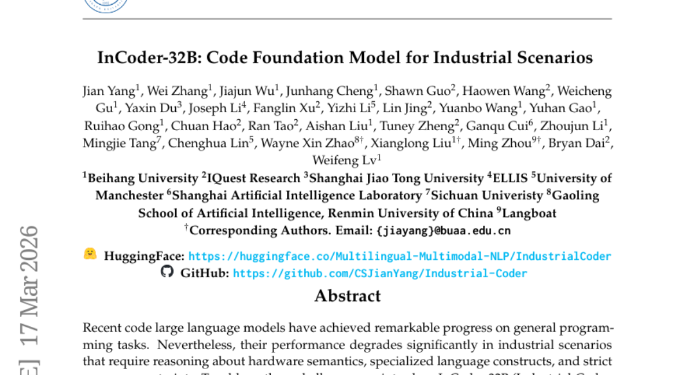

### 📌 한 줄 요약
InCoder-32B는 산업 시나리오에 특화된 320억 파라미터의 코드 기반 모델로, 하드웨어, 임베디드 시스템, 컴파일러, 3D 모델링 등 다양한 산업 도메인에서 강력한 성능을 보이며 오픈 소스 기반을 제공한다.

### 🔑 핵심 포인트
- 산업 시나리오에 특화된 32B 파라미터 코드 기반 모델
- 칩 설계, GPU 커널 최적화, 임베디드 시스템 등 다양한 산업 도메인 지원
- 일반 코드 벤치마크 및 산업 벤치마크에서 높은 성능 입증

### 🧑‍💻 개발자 관점
InCoder-32B는 산업 현장에서 요구되는 특수한 코드 생성 및 이해 능력을 제공하며, 다양한 산업 도메인에 적용 가능한 오픈 소스 기반을 제공하여 개발 효율성을 향상시킬 수 있다.

### 🚀 실무 적용 아이디어
- InCoder-32B를 활용하여 특정 산업 도메인에 맞는 코드 생성 실험 진행
- 기존 코드 생성 모델과 InCoder-32B의 성능 비교 분석
- InCoder-32B를 기반으로 한 코드 자동 완성 또는 오류 검출 시스템 구축

### ⚠️ 리스크/한계
- 특정 산업 도메인에 대한 편향 가능성 존재
- 모델 크기로 인한 리소스 제약 발생 가능성

### 📝 초록 기반 상세 설명
최근 코드 LLM은 일반 프로그래밍 작업에서 뛰어난 성능을 보이지만, 하드웨어 의미론, 특수 언어 구조, 엄격한 리소스 제약 조건이 필요한 산업 시나리오에서는 성능이 저하되는 문제가 있다. 이러한 문제를 해결하기 위해 칩 설계, GPU 커널 최적화, 임베디드 시스템, 컴파일러 최적화 및 3D 모델링 전반에 걸쳐 코드 지능을 통합하는 최초의 320억 파라미터 코드 기반 모델인 InCoder-32B를 소개한다. 효율적인 아키텍처를 채택하여 일반 코드 사전 훈련, 선별된 산업 코드 어닐링, 8K에서 128K 토큰으로 컨텍스트를 점진적으로 확장하는 중간 훈련, 실행 기반 검증을 통해 InCoder-32B를 처음부터 훈련했다. 14개의 주류 일반 코드 벤치마크와 4개의 전문 도메인에 걸친 9개의 산업 벤치마크에 대한 광범위한 평가를 수행한 결과, InCoder-32B는 일반 작업에서 매우 경쟁력 있는 성능을 달성하는 동시에 산업 도메인 전반에서 강력한 오픈 소스 기반을 구축했다.

---

## 2. [MiroThinker-1.7 & H1: Towards Heavy-Duty Research Agents via Verification](https://huggingface.co/papers/2603.15726)
**Upvotes**: 125 | **도입 난이도**: 중 | **신뢰도**: 상
**arXiv**: https://arxiv.org/abs/2603.15726

**태그**: Agent, Reasoning, Verification, Open-source, Benchmark, Evaluation, Inference

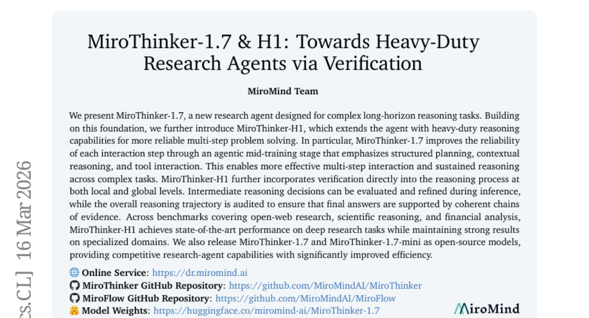

### 📌 한 줄 요약
MiroThinker-H1은 검증 과정을 통합하여 복잡한 추론 작업에서 SOTA를 달성하고, MiroThinker-1.7은 효율성을 높여 오픈소스로 공개되어 연구 에이전트 개발에 기여한다.

### 🔑 핵심 포인트
- 에이전트 중간 학습 단계에서 구조화된 계획, 맥락적 추론, 도구 상호 작용을 강조하여 각 상호 작용 단계의 신뢰성 향상
- 추론 과정에 검증을 통합하여 중간 추론 결정 평가 및 전체 추론 경로 감사
- 오픈 웹 연구, 과학적 추론, 금융 분석 벤치마크에서 SOTA 달성

### 🧑‍💻 개발자 관점
MiroThinker-H1의 검증 메커니즘은 개발자가 에이전트의 추론 과정을 더 투명하게 이해하고 디버깅하는 데 도움을 줄 수 있으며, MiroThinker-1.7의 오픈소스 공개는 연구 에이전트 개발 비용을 절감하고 접근성을 높인다.

### 🚀 실무 적용 아이디어
- MiroThinker-1.7을 다운로드하여 자체 데이터셋에 적용해보기
- MiroThinker-H1의 검증 메커니즘을 분석하여 기존 에이전트에 통합해보기
- MiroThinker-1.7-mini를 활용하여 리소스 제약적인 환경에서의 성능 테스트 수행

### ⚠️ 리스크/한계
- MiroThinker-H1의 복잡성으로 인해 특정 작업에 대한 최적화가 필요할 수 있음
- 오픈소스 모델의 유지보수 및 업데이트에 대한 지속적인 지원 필요

### 📝 초록 기반 상세 설명
최근 복잡한 장기 추론 작업에 대한 연구 에이전트의 필요성이 증가하고 있다. 기존 연구 에이전트는 다단계 문제 해결에서 신뢰성이 부족하다는 문제점이 있었다. 본 논문에서는 중간 추론 결정 평가 및 전체 추론 경로 감사를 통해 검증 기능을 강화한 MiroThinker-H1을 제안한다. MiroThinker-H1은 다양한 벤치마크에서 SOTA를 달성했으며, MiroThinker-1.7은 오픈소스로 공개되어 효율적인 연구 에이전트 개발을 지원한다.

---

## 3. [Qianfan-OCR: A Unified End-to-End Model for Document Intelligence](https://huggingface.co/papers/2603.13398)
**Upvotes**: 78 | **도입 난이도**: 중 | **신뢰도**: 상
**arXiv**: https://arxiv.org/abs/2603.13398

**태그**: OCR, Vision-Language Model, Document Understanding, Layout Analysis, RAG, Vision, Benchmark

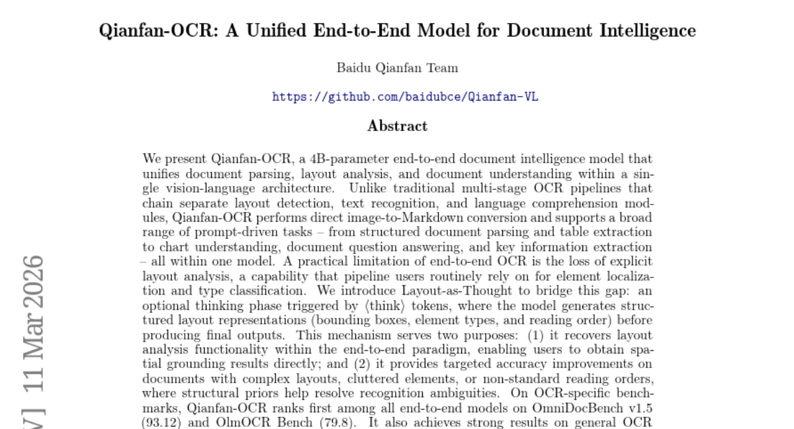

### 📌 한 줄 요약
Baidu에서 개발한 Qianfan-OCR은 문서 파싱, 레이아웃 분석, 문서 이해를 통합한 4B 파라미터의 end-to-end vision-language 모델로, 이미지에서 Markdown으로 직접 변환하며 다양한 프롬프트 기반 작업을 지원합니다.

### 🔑 핵심 포인트
- 문서 파싱, 레이아웃 분석, 문서 이해를 통합하는 end-to-end 모델
- 'Layout-as-Thought'를 통해 레이아웃 정보 명시적 생성 및 정확도 향상
- OmniDocBench v1.5 및 OlmOCR Bench에서 최고 성능 달성

### 🧑‍💻 개발자 관점
문서 관련 작업을 자동화하고 효율성을 높일 수 있으며, 특히 복잡한 레이아웃의 문서 처리 성능이 뛰어나 다양한 산업 분야에서 활용될 수 있습니다.

### 🚀 실무 적용 아이디어
- Baidu AI Cloud Qianfan 플랫폼에서 Qianfan-OCR을 사용해 보기
- 자체 문서 데이터셋에 적용하여 성능 테스트 수행
- 'Layout-as-Thought'의 효과를 다양한 레이아웃에서 검증

### ⚠️ 리스크/한계
- 4B 파라미터 모델이므로 리소스 요구량이 높을 수 있음
- 특정 유형의 문서 또는 레이아웃에 대한 성능 제한이 있을 수 있음

### 📝 초록 기반 상세 설명
기존 OCR 모델은 문서의 레이아웃 분석과 이해를 개별적으로 처리해야 하는 번거로움이 있었습니다. 이러한 문제를 해결하기 위해 Qianfan-OCR은 단일 아키텍처 내에서 문서 파싱, 레이아웃 분석, 문서 이해를 통합하는 end-to-end vision-language 모델을 제안합니다. 특히, 'Layout-as-Thought'라는 새로운 접근 방식을 통해 레이아웃 정보를 명시적으로 생성하여 복잡한 레이아웃에서도 정확도를 향상시켰습니다. OmniDocBench v1.5 및 OlmOCR Bench에서 최고 순위를 기록했으며, 주요 정보 추출 벤치마크에서 Gemini-3.1-Pro, Seed-2.0, Qwen3-VL-235B를 능가하는 성능을 보였습니다. 이 모델은 Baidu AI Cloud Qianfan 플랫폼을 통해 공개적으로 사용할 수 있습니다.

---

## 4. [Kinema4D: Kinematic 4D World Modeling for Spatiotemporal Embodied Simulation](https://huggingface.co/papers/2603.16669)
**Upvotes**: 62 | **도입 난이도**: 중 | **신뢰도**: 중
**arXiv**: https://arxiv.org/abs/2603.16669

**태그**: Robotics, Simulation, 4D Modeling, Generative Model, RAG, Video

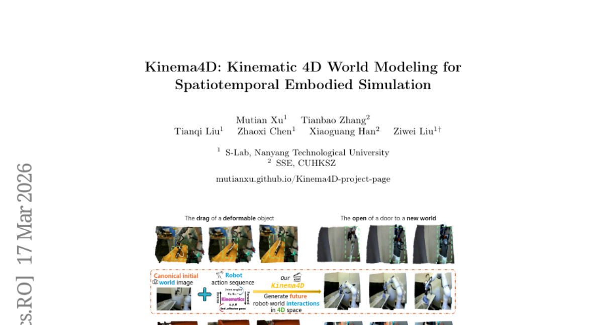

### 📌 한 줄 요약
Kinema4D는 로봇-환경 상호작용을 4D로 모델링하여, 기존 시뮬레이터의 제약을 극복하고 실제와 유사한 로봇 시뮬레이션을 가능하게 함.

### 🔑 핵심 포인트
- 로봇 제어를 위한 정확한 4D 표현과 환경 반응의 생성적 4D 모델링을 결합
- URDF 기반 3D 로봇과 pointmap을 활용하여 4D 로봇-환경 상호작용 모델링
- Robo4D-200k 데이터셋을 구축하여 학습 데이터 확보

### 🧑‍💻 개발자 관점
로봇 시뮬레이션의 현실감을 높여 실제 로봇 환경에서의 성능을 예측하고 개선하는 데 활용 가능하며, 특히 로봇 제어, 경로 계획, 강화 학습 등의 분야에서 유용하다.

### 🚀 실무 적용 아이디어
- Robo4D-200k 데이터셋을 활용하여 로봇 학습 모델 성능 향상 실험
- Kinema4D를 활용하여 특정 로봇 작업 환경 시뮬레이션 구축 및 테스트
- Kinema4D의 제로샷 전이 능력을 활용하여 새로운 로봇 환경에 대한 적응성 평가

### ⚠️ 리스크/한계
- 생성 모델의 한계로 인해 완벽하게 현실과 동일한 시뮬레이션은 어려울 수 있음
- 데이터셋의 편향이 시뮬레이션 결과에 영향을 미칠 수 있음

### 📝 초록 기반 상세 설명
기존 Embodied AI 시뮬레이션은 2D 또는 정적인 환경에 의존하여 로봇-환경 간의 4D 상호작용을 정확히 모델링하기 어려웠다. 이러한 문제를 해결하기 위해, Kinema4D는 로봇 제어를 위한 정확한 4D 표현과 환경 반응의 생성적 4D 모델링을 결합한 새로운 액션-조건부 4D 생성 로봇 시뮬레이터를 제안한다. URDF 기반의 3D 로봇을 사용하여 4D 로봇 제어 궤적을 생성하고, 이를 통해 복잡한 환경의 반응 역학을 RGB/pointmap 시퀀스로 합성한다. Robo4D-200k라는 대규모 데이터셋을 구축하여 학습을 용이하게 했으며, 실험 결과 물리적으로 현실적이고, 기하학적으로 일관되며, 다양한 실제 역학을 충실히 반영하는 상호작용을 효과적으로 시뮬레이션할 수 있음을 입증했다. Kinema4D는 제로샷 전이 가능성을 보여주며, 차세대 Embodied 시뮬레이션을 위한 고품질 기반을 제공한다.

### 🖼️ 추가 자료
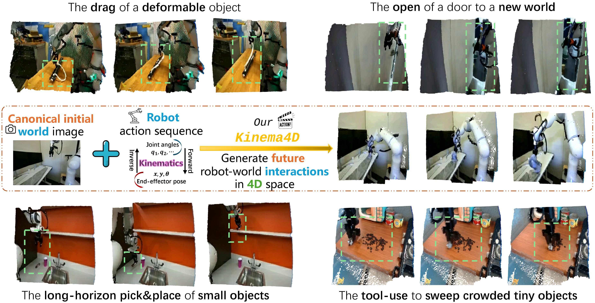

---

## 5. [Demystifing Video Reasoning](https://huggingface.co/papers/2603.16870)
**Upvotes**: 55 | **도입 난이도**: 중 | **신뢰도**: 중
**arXiv**: https://arxiv.org/abs/2603.16870

**태그**: Video Generation, Diffusion Model, Reasoning, Transformer, Video

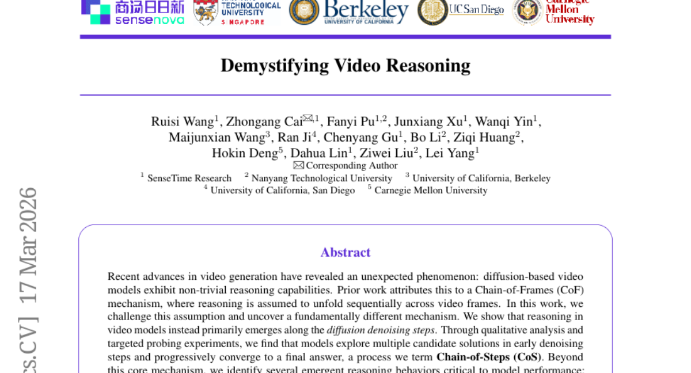

### 📌 한 줄 요약
비디오 생성 모델의 추론 능력은 프레임 순서가 아닌 디노이징 과정에서 나타나며, 이를 활용해 모델 성능을 향상시킬 수 있다.

### 🔑 핵심 포인트
- 비디오 모델 추론이 프레임 순서가 아닌 디노이징 과정에서 발생함을 규명
- 'Chain-of-Steps' 메커니즘 및 emergent reasoning behaviors (working memory, self-correction, perception before action) 식별
- Diffusion Transformer 내 레이어별 기능 분화 분석 및 추론 능력 향상 전략 제시

### 🧑‍💻 개발자 관점
비디오 생성 모델의 추론 과정을 이해하고 개선하여, 더욱 정교하고 창의적인 비디오 콘텐츠 생성에 활용할 수 있다. 특히, 모델 내부 동작 방식에 대한 이해는 디버깅 및 최적화에 도움이 될 수 있다.

### 🚀 실무 적용 아이디어
- 디퓨전 모델의 디노이징 과정에서 latent representation 변화 시각화
- latent trajectory 앙상블을 통한 비디오 생성 품질 변화 실험
- 특정 레이어의 출력을 조작하여 추론 과정에 미치는 영향 분석

### ⚠️ 리스크/한계
- 제안하는 방법이 특정 모델 구조 또는 데이터셋에만 효과적일 수 있음
- latent trajectory 앙상블이 계산 비용을 증가시킬 수 있음

### 📝 초록 기반 상세 설명
최근 비디오 생성 모델은 놀라운 추론 능력을 보여주지만, 기존 연구는 이를 프레임 순차적 처리로 설명했다. 본 연구는 이러한 가정을 깨고, 추론이 주로 디노이징 단계에서 발생함을 밝힌다. 모델은 초기 단계에서 다양한 후보 솔루션을 탐색하고 점진적으로 최종 답안에 수렴하는 'Chain-of-Steps' 메커니즘을 따른다. 또한, working memory, self-correction, perception before action과 같은 추론 행동을 확인하고, Diffusion Transformer 내 레이어별 기능 분화를 밝혀냈다. 이러한 통찰을 바탕으로, 별도 학습 없이 latent trajectory 앙상블을 통해 추론 능력을 향상시키는 전략을 제시한다.

---

## 6. [WorldCam: Interactive Autoregressive 3D Gaming Worlds with Camera Pose as a Unifying Geometric Representation](https://huggingface.co/papers/2603.16871)
**Upvotes**: 43 | **도입 난이도**: 중 | **신뢰도**: 상
**arXiv**: https://arxiv.org/abs/2603.16871

**태그**: Agent, Vision, 3D, Game, Video, Safety

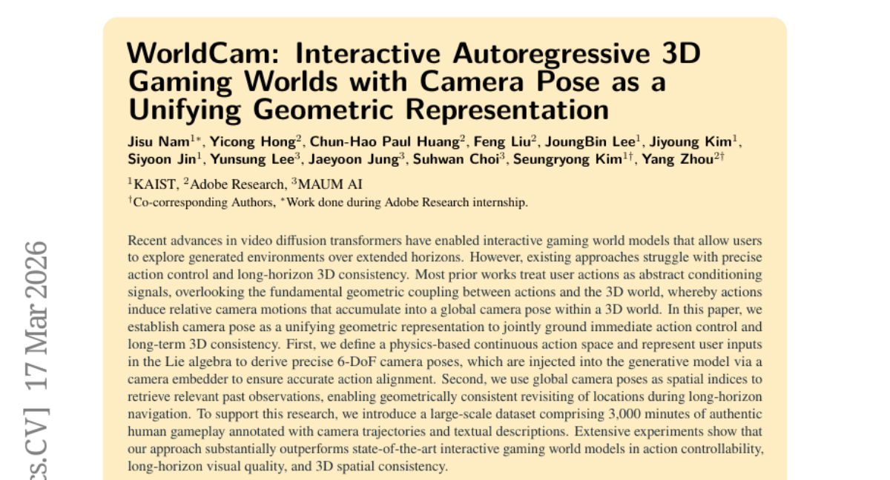

### 📌 한 줄 요약
사용자 액션을 3D 세계 내 카메라 포즈 변화로 모델링하여 게임 환경의 상호작용성과 장기적 일관성을 개선하는 새로운 방법론을 제시하고, 대규모 데이터셋을 구축하여 성능을 입증했습니다.

### 🔑 핵심 포인트
- 카메라 포즈를 이용한 액션 제어 및 3D 일관성 확보
- 물리 기반 연속 액션 공간 및 Lie 대수 활용
- 대규모 인간 게임 플레이 데이터셋 구축

### 🧑‍💻 개발자 관점
게임 개발 시 사용자의 액션을 보다 정확하게 반영하고, 장기간 플레이 시에도 일관성 있는 3D 환경을 유지하는 데 도움이 될 수 있습니다. 특히, 복잡한 상호작용이 필요한 게임 환경에서 유용할 것입니다.

### 🚀 실무 적용 아이디어
- 자체 게임 엔진에 카메라 포즈 기반 액션 제어 시스템 구현 시도
- 제공된 데이터셋을 활용하여 모델 학습 및 성능 비교
- 다른 유형의 액션 공간 표현과 비교 분석

### ⚠️ 리스크/한계
- 새로운 데이터셋에 대한 일반화 성능 검증 필요
- 실시간 성능 확보를 위한 최적화 필요

### 📝 초록 기반 상세 설명
최근 비디오 확산 트랜스포머는 사용자가 생성된 환경을 탐색할 수 있도록 지원하지만, 기존 방법들은 정확한 액션 제어와 장기적인 3D 일관성 유지에 어려움을 겪습니다. 기존 연구들은 사용자 액션을 추상적인 조건 신호로 취급하여 액션과 3D 세계 간의 기하학적 결합을 간과했습니다. 본 논문에서는 카메라 포즈를 통합적인 기하학적 표현으로 설정하여 액션 제어와 장기적인 3D 일관성을 동시에 확보합니다. 물리 기반의 연속적인 액션 공간을 정의하고, Lie 대수를 사용하여 정확한 6-DoF 카메라 포즈를 도출하여 생성 모델에 주입합니다. 또한, 글로벌 카메라 포즈를 공간 인덱스로 사용하여 과거 관찰을 검색하여 장기 탐색 중 기하학적으로 일관된 재방문을 가능하게 합니다. 3,000분 분량의 인간 게임 플레이 데이터셋을 구축하여 성능을 입증했으며, 실험 결과 기존 방법들을 능가하는 액션 제어, 시각적 품질, 3D 공간 일관성을 보여줍니다.

---

## 7. [TRUST-SQL: Tool-Integrated Multi-Turn Reinforcement Learning for Text-to-SQL over Unknown Schemas](https://huggingface.co/papers/2603.16448)
**Upvotes**: 43 | **도입 난이도**: 중 | **신뢰도**: 상
**arXiv**: https://arxiv.org/abs/2603.16448

**태그**: Text-to-SQL, Reinforcement Learning, Schema, Agent, RAG, Reasoning, Benchmark

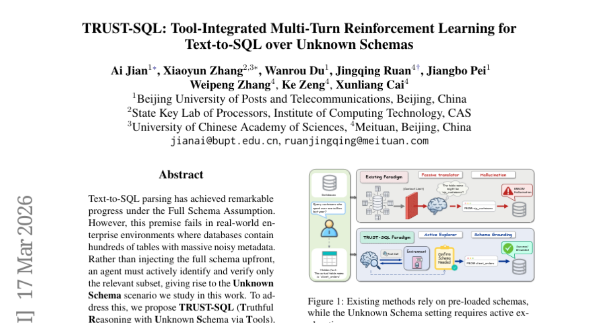

### 📌 한 줄 요약
TRUST-SQL은 알려지지 않은 스키마 환경에서 Text-to-SQL 파싱 성능을 크게 향상시키는 새로운 강화 학습 프레임워크로, 실제 엔터프라이즈 환경에서의 활용 가능성이 높음.

### 🔑 핵심 포인트
- Unknown Schema 환경에서의 Text-to-SQL 문제 해결
- Tool-Integrated Multi-Turn Reinforcement Learning 기반의 TRUST-SQL 프레임워크 제안
- Dual-Track GRPO 전략을 통한 credit assignment 문제 해결

### 🧑‍💻 개발자 관점
실제 데이터베이스 환경은 스키마가 방대하고 복잡하여 Text-to-SQL 모델 적용이 어려운데, TRUST-SQL은 이러한 문제를 해결하여 더욱 실용적인 Text-to-SQL 시스템 구축을 가능하게 합니다.

### 🚀 실무 적용 아이디어
- TRUST-SQL 프레임워크를 기반으로 자체 데이터베이스 환경에 맞는 Text-to-SQL 모델 개발
- Dual-Track GRPO 전략을 다른 강화 학습 기반 자연어 처리 모델에 적용
- TRUST-SQL의 4단계 프로토콜을 활용하여 데이터베이스 스키마 탐색 및 검증 자동화

### ⚠️ 리스크/한계
- 복잡한 강화 학습 모델이므로 학습 및 디버깅에 어려움이 있을 수 있음
- Unknown Schema 환경에서의 성능은 데이터베이스 스키마의 특성에 따라 달라질 수 있음

### 📝 초록 기반 상세 설명
Text-to-SQL 파싱은 Full Schema Assumption 하에서 상당한 발전을 이루었지만, 실제 환경에서는 수많은 테이블과 noisy한 메타데이터로 인해 어려움이 있습니다. 본 연구에서는 Unknown Schema 시나리오에서 에이전트가 관련 메타데이터를 능동적으로 식별하고 검증하는 TRUST-SQL 프레임워크를 제안합니다. 이 프레임워크는 4단계 프로토콜을 통해 검증된 메타데이터에 기반한 추론을 수행하며, Dual-Track GRPO 전략을 통해 credit assignment 문제를 해결합니다. 실험 결과, TRUST-SQL은 다양한 벤치마크에서 기존 모델 대비 평균 30.6%(4B), 16.6%(8B)의 절대적인 성능 향상을 보였으며, 스키마 사전 로딩 없이도 스키마를 미리 로딩한 강력한 베이스라인 모델과 유사하거나 능가하는 성능을 달성했습니다.

---

## 8. [Thinking in Uncertainty: Mitigating Hallucinations in MLRMs with Latent Entropy-Aware Decoding](https://huggingface.co/papers/2603.13366)
**Upvotes**: 35 | **도입 난이도**: 중 | **신뢰도**: 상
**arXiv**: https://arxiv.org/abs/2603.13366

**태그**: Vision, Reasoning, Hallucination, Decoding, RAG, Multimodal, Benchmark

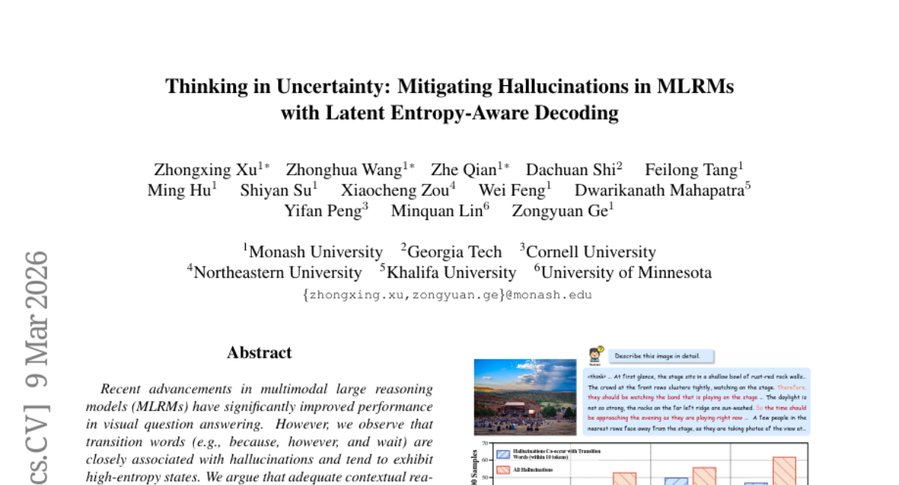

### 📌 한 줄 요약
MLRM에서 transition word 사용 시 발생하는 hallucination을 줄이기 위해, token probability distribution을 활용하여 latent reasoning을 강화하는 decoding 전략(LEAD)을 제안하고, 시각 정보를 활용하는 anchor injection 전략을 통해 hallucination을 효과적으로 감소시킴.

### 🔑 핵심 포인트
- Transition word와 hallucination 간의 연관성을 분석하고, high-entropy 상태에서의 문제점을 지적
- Token probability distribution을 활용한 latent superposed reasoning 개념을 도입
- Entropy-aware reasoning mode switching 및 visual anchor injection 전략을 제안하여 hallucination 완화

### 🧑‍💻 개발자 관점
MLRM 기반 시스템에서 hallucination은 심각한 문제이며, LEAD는 별도의 학습 없이 적용 가능한 plug-and-play 방식이므로 기존 모델에 쉽게 통합하여 성능 향상을 기대할 수 있다.

### 🚀 실무 적용 아이디어
- LEAD를 기존 MLRM 모델에 적용하여 hallucination 감소 효과를 확인
- 자체 데이터셋에서 transition word 사용 시 발생하는 hallucination 사례를 분석하고, LEAD 적용 전후 비교
- Visual anchor injection 전략을 다양한 시각 정보 활용 방식으로 확장하여 실험

### ⚠️ 리스크/한계
- LEAD의 효과는 모델의 구조 및 데이터셋 특성에 따라 달라질 수 있음
- Entropy 계산 및 embedding 전환 과정에서 추가적인 연산 비용이 발생할 수 있음

### 📝 초록 기반 상세 설명
최근 multimodal large reasoning model(MLRM)은 visual question answering에서 뛰어난 성능을 보이지만, transition word 사용 시 hallucination이 발생하는 경향이 있다. 이는 모델이 discrete textual input에 의존하여 high-entropy reasoning 단계에서 contextual cue를 충분히 활용하지 못하기 때문이다. 본 논문에서는 token probability distribution으로부터 풍부한 semantic representation을 구축하여 in-context reasoning을 강화하는 Latent Entropy-Aware Decoding(LEAD) 전략을 제안한다. LEAD는 entropy-aware reasoning mode switching을 통해 high-entropy 상태에서는 probability-weighted continuous embedding을 사용하고, entropy가 감소하면 discrete token embedding으로 전환한다. 또한, 시각 정보에 집중하도록 prior-guided visual anchor injection 전략을 제안한다. 다양한 MLRM과 benchmark에서 LEAD가 hallucination을 효과적으로 완화함을 입증한다.

---

## 9. [Online Experiential Learning for Language Models](https://huggingface.co/papers/2603.16856)
**Upvotes**: 33 | **도입 난이도**: 중 | **신뢰도**: 상
**arXiv**: https://arxiv.org/abs/2603.16856

**태그**: Online Learning, LLM, Reinforcement Learning, Distillation, Evaluation

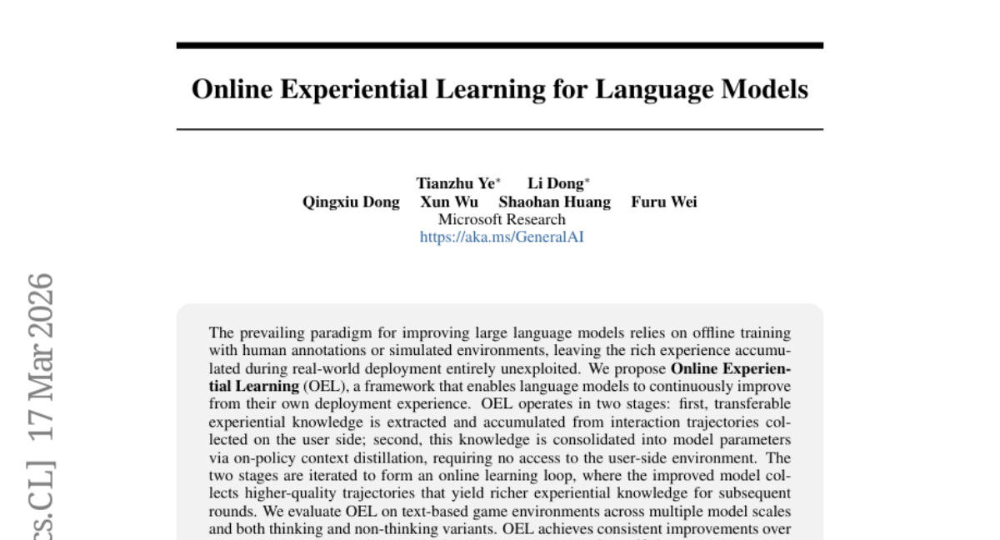

### 📌 한 줄 요약
실제 사용 환경에서 얻은 경험을 바탕으로 LLM을 지속적으로 개선하는 Online Experiential Learning (OEL) 프레임워크를 제안하고, 텍스트 기반 게임 환경에서 성능 향상을 입증함.

### 🔑 핵심 포인트
- 실제 배포 환경에서 얻은 경험을 활용하여 LLM을 지속적으로 개선하는 OEL 프레임워크 제안
- On-policy context distillation을 통해 사용자 환경에 대한 접근 없이 지식 통합
- 텍스트 기반 게임 환경에서 OEL의 성능 향상 및 효율성 입증

### 🧑‍💻 개발자 관점
실제 서비스 환경에서 LLM의 성능을 지속적으로 개선할 수 있는 방법을 제시하며, 특히 사용자 데이터에 대한 직접적인 접근 없이 모델을 개선할 수 있다는 점에서 개인 정보 보호 및 데이터 보안 측면에서 유용합니다.

### 🚀 실무 적용 아이디어
- 자체 서비스에 OEL 프레임워크 적용 가능성 검토
- On-policy context distillation을 위한 데이터 파이프라인 구축
- 텍스트 기반 환경 외 다른 환경(예: 코드 생성)에서의 OEL 효과 실험

### ⚠️ 리스크/한계
- 추출된 경험적 지식의 품질에 따라 성능 향상 정도가 달라질 수 있음
- On-policy context distillation의 효율성이 모델 아키텍처 및 학습 데이터에 따라 달라질 수 있음

### 📝 초록 기반 상세 설명
기존의 LLM 개선 방식은 주로 오프라인 학습에 의존하여 실제 배포 환경에서 얻는 풍부한 경험을 활용하지 못한다는 한계가 있습니다. 본 논문에서는 LLM이 자체 배포 경험을 통해 지속적으로 개선될 수 있도록 하는 Online Experiential Learning (OEL) 프레임워크를 제안합니다. OEL은 사용자 측에서 수집된 상호 작용 궤적에서 전달 가능한 경험적 지식을 추출하고 축적하는 단계와, 사용자 측 환경에 대한 접근 없이 on-policy context distillation을 통해 이 지식을 모델 파라미터에 통합하는 단계로 구성됩니다. 이러한 두 단계를 반복하여 온라인 학습 루프를 형성하며, 개선된 모델은 더 높은 품질의 궤적을 수집하여 후속 라운드에 더 풍부한 경험적 지식을 제공합니다. 텍스트 기반 게임 환경에서 OEL을 평가한 결과, 반복적인 학습을 통해 작업 정확도와 토큰 효율성이 향상되었으며, out-of-distribution 성능도 유지되었습니다. 또한, 추출된 경험적 지식이 raw trajectory보다 효과적이며, 지식 소스와 정책 모델 간의 on-policy 일관성이 효과적인 학습에 중요하다는 것을 보여줍니다.

### 🖼️ 추가 자료
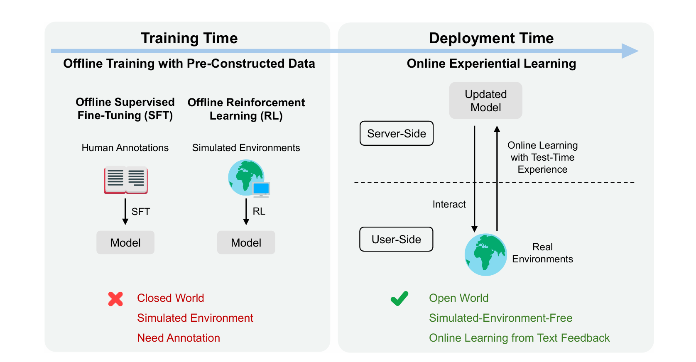

---

