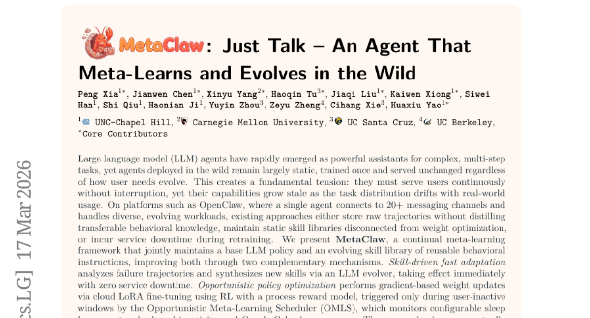
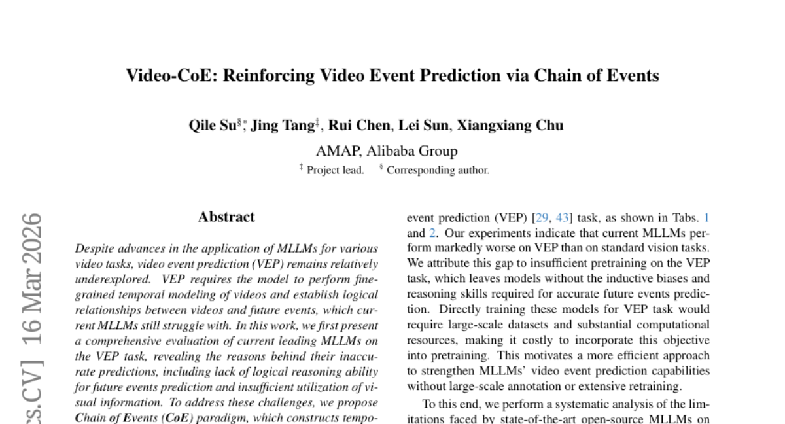
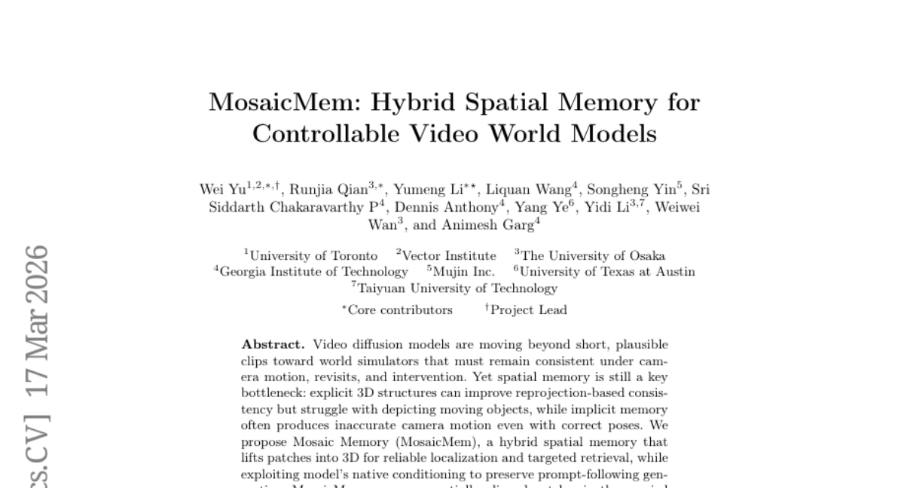
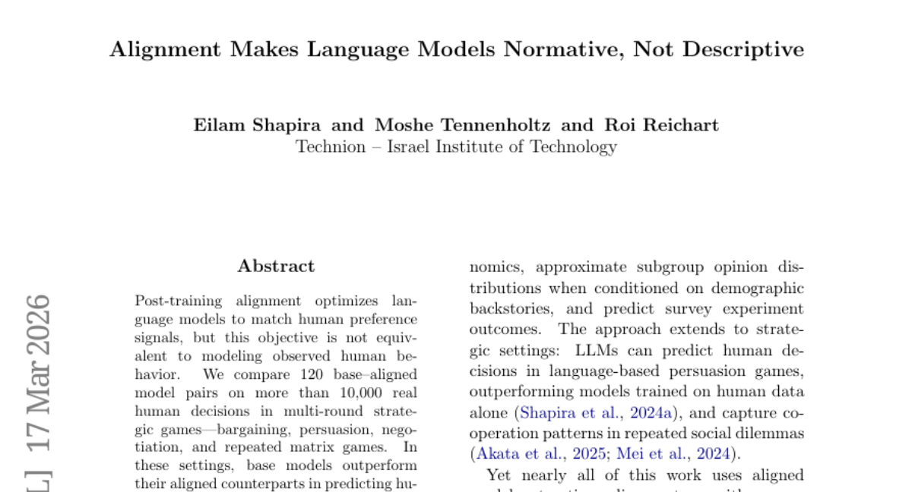
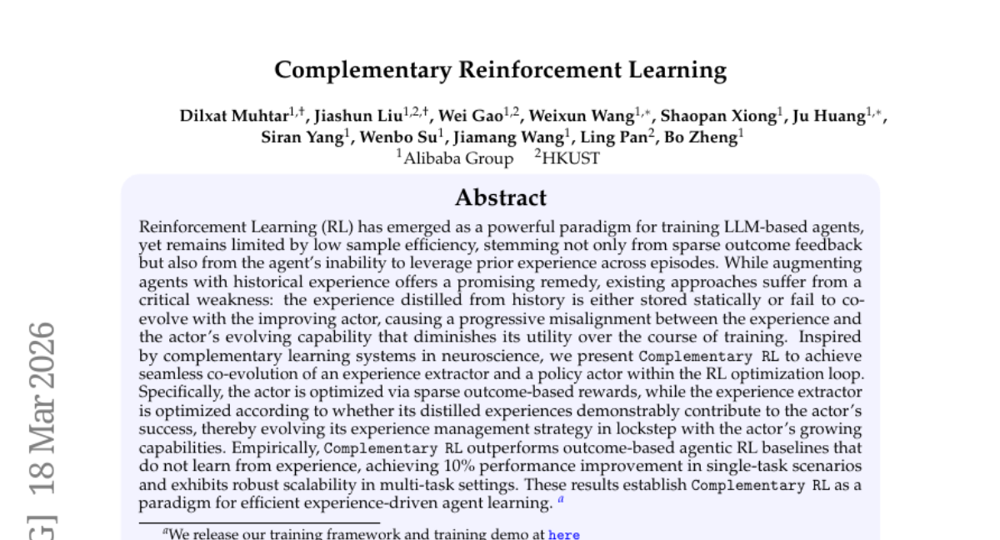
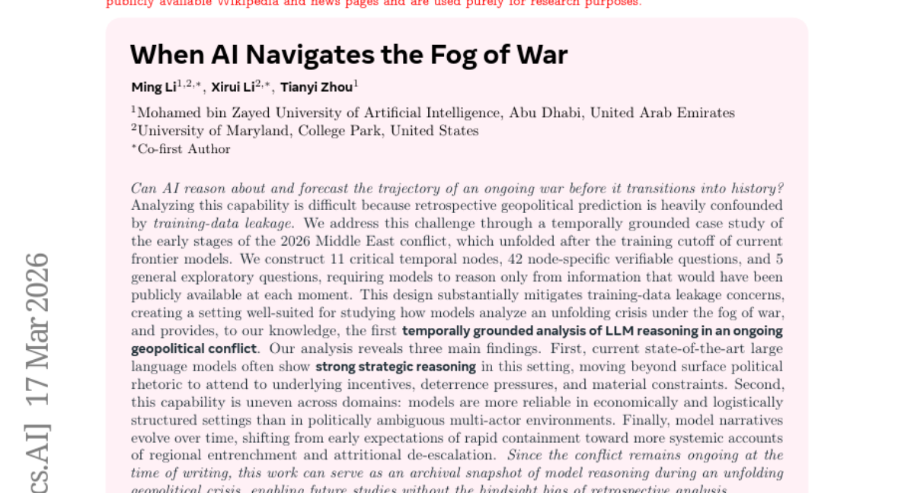
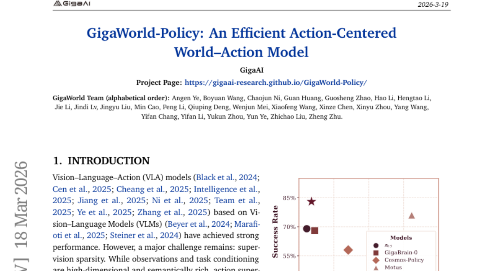
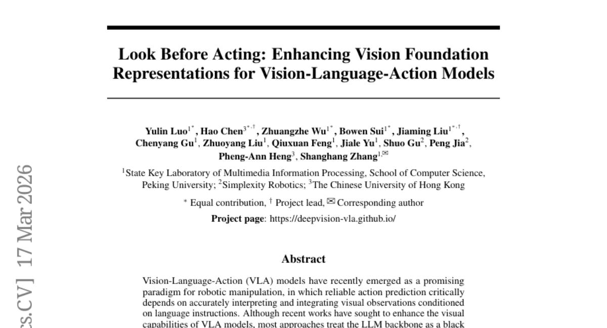
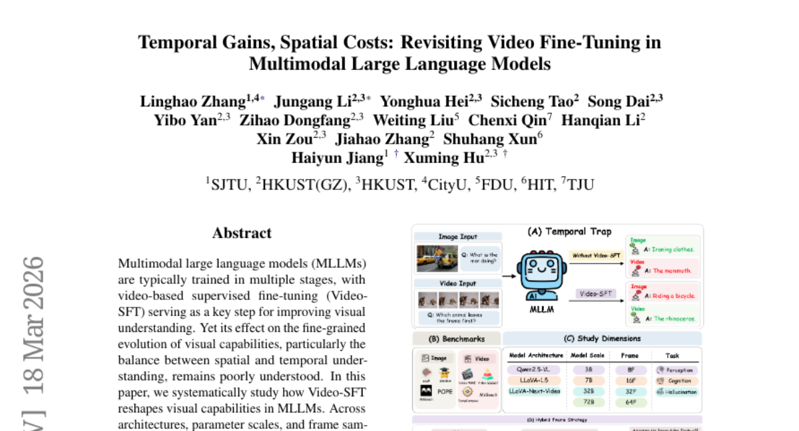

# 2026-03-20 Daily Papers (Top 9)

## 1. [MetaClaw: Just Talk -- An Agent That Meta-Learns and Evolves in the Wild](https://huggingface.co/papers/2603.17187)
**Upvotes**: 83 | **도입 난이도**: 중 | **신뢰도**: 상
**arXiv**: https://arxiv.org/abs/2603.17187

**태그**: Agent, Meta-learning, Continual Learning, LLM, Distillation

### 📌 한 줄 요약
MetaClaw는 LLM 에이전트의 지속적인 학습 및 진화를 위한 프레임워크로, 새로운 스킬 합성 및 정책 최적화를 통해 사용자 요구 변화에 즉각적으로 대응하고 성능을 향상시킵니다.

### 🔑 핵심 포인트
- LLM 에이전트의 지속적인 학습 및 진화를 위한 continual meta-learning 프레임워크 제시
- 스킬 기반 적응(skill-driven fast adaptation) 및 opportunistic policy optimization을 통한 성능 향상
- 실패 trajectory 분석을 통한 새로운 스킬 합성 및 사용자 비활성 시간 활용

### 🧑‍💻 개발자 관점
MetaClaw는 LLM 에이전트의 지속적인 개선 및 적응을 가능하게 하여, 개발자는 사용자 요구 변화에 유연하게 대응하고 에이전트의 성능을 유지/향상시킬 수 있습니다.

### 🚀 실무 적용 아이디어
- MetaClaw 프레임워크를 기반으로 자체 LLM 에이전트의 지속적인 학습 및 진화 전략 구축
- 실패 trajectory 분석을 통한 스킬 합성 및 정책 최적화 메커니즘 구현
- 사용자 비활성 시간을 활용한 opportunistic learning 전략 적용

### ⚠️ 리스크/한계
- 데이터 오염 가능성 및 버전 관리의 복잡성
- 클라우드 LoRA fine-tuning 및 RL-PRM의 비용 및 리소스 요구 사항

### 📝 초록 기반 상세 설명
LLM 에이전트는 복잡한 작업에 활용되지만, 사용자 요구 변화에 따라 적응하지 못하는 문제가 있습니다. 기존 방법들은 지식 증류 없이 raw trajectory를 저장하거나, 정적인 스킬 라이브러리를 유지하거나, 재학습을 위해 서비스 중단이 필요했습니다. MetaClaw는 LLM 정책과 재사용 가능한 스킬 라이브러리를 지속적으로 진화시키는 continual meta-learning 프레임워크를 제안합니다. 실패 trajectory 분석을 통해 새로운 스킬을 합성하고, 사용자 비활성 시간에는 클라우드 LoRA fine-tuning 및 RL-PRM을 통해 정책을 최적화합니다. MetaClaw-Bench 및 AutoResearchClaw 실험 결과, 스킬 기반 적응은 정확도를 최대 32% 향상시키고, Kimi-K2.5 정확도를 21.4%에서 40.6%로 향상시켰으며, 복합 견고성을 18.3% 증가시켰습니다.

---

## 2. [Video-CoE: Reinforcing Video Event Prediction via Chain of Events](https://huggingface.co/papers/2603.14935)
**Upvotes**: 80 | **도입 난이도**: 중 | **신뢰도**: 상
**arXiv**: https://arxiv.org/abs/2603.14935

**태그**: Video, MLLM, Event Prediction, Temporal Modeling, Reasoning, Benchmark, Evaluation

### 📌 한 줄 요약
비디오 이벤트 예측(VEP)에서 MLLM의 성능 향상을 위해 Chain of Events (CoE) 패러다임을 제안, 기존 MLLM의 한계를 극복하고 새로운 SOTA를 달성함. 특히, 시간적 이벤트 체인을 구성하여 시각 정보 활용과 논리적 연결을 강화하는 것이 핵심.

### 🔑 핵심 포인트
- MLLM 기반 비디오 이벤트 예측(VEP)의 한계점 분석
- Chain of Events (CoE) 패러다임 제안: 시간적 이벤트 체인을 활용한 시각 정보 및 논리적 연결 강화
- VEP task에서 SOTA 달성

### 🧑‍💻 개발자 관점
비디오 이해 및 예측 관련 서비스를 개발할 때, MLLM의 성능을 CoE 패러다임을 통해 개선하여 더욱 정확하고 신뢰성 높은 예측 시스템을 구축할 수 있다. 특히, 시간적 맥락이 중요한 비디오 분석에 유용하다.

### 🚀 실무 적용 아이디어
- CoE 패러다임을 적용하여 자사 MLLM 기반 비디오 분석 시스템의 VEP 성능 개선 실험
- CoE 기반 모델을 활용하여 특정 비디오 데이터셋에 대한 이벤트 예측 성능 비교 분석
- CoE의 다양한 학습 프로토콜을 적용하여 최적의 성능을 보이는 조합 탐색

### ⚠️ 리스크/한계
- CoE 패러다임의 효과는 특정 비디오 데이터셋 또는 task에 따라 달라질 수 있음
- 시간적 이벤트 체인 구축 과정에서 추가적인 리소스 및 복잡성이 발생할 수 있음

### 📝 초록 기반 상세 설명
최근 MLLM이 다양한 비디오 task에 적용되고 있지만, 비디오 이벤트 예측(VEP)은 상대적으로 연구가 미흡하다. VEP는 비디오의 시간적 모델링과 미래 이벤트 간의 논리적 관계 파악을 요구하지만, 기존 MLLM은 어려움을 겪는다. 본 연구에서는 기존 MLLM의 VEP task 성능을 평가하고, 논리적 추론 능력 부족과 시각 정보 활용 미흡이 원인임을 밝힌다. 이를 해결하기 위해 Chain of Events (CoE) 패러다임을 제안, 시간적 이벤트 체인을 구성하여 MLLM이 시각 정보와 논리적 연결에 집중하도록 유도한다. 실험 결과, CoE는 기존 MLLM을 능가하며 VEP task에서 새로운 SOTA를 달성했다.

---

## 3. [MosaicMem: Hybrid Spatial Memory for Controllable Video World Models](https://huggingface.co/papers/2603.17117)
**Upvotes**: 63 | **도입 난이도**: 중 | **신뢰도**: 중
**arXiv**: https://arxiv.org/abs/2603.17117

**태그**: Vision, Video Generation, 3D, Memory, RAG, Video, Evaluation, Safety

### 📌 한 줄 요약
MosaicMem은 비디오 월드 모델에서 카메라 움직임, 재방문, 개입 하에서도 일관성을 유지하기 위한 하이브리드 공간 메모리 구조로, 명시적 3D 구조와 암묵적 메모리의 단점을 보완하여 더 나은 포즈 일관성과 동적 모델링을 제공합니다.

### 🔑 핵심 포인트
- 패치를 3D 공간으로 리프팅하여 위치 파악 및 검색 정확도 향상
- 모델의 컨디셔닝을 활용하여 프롬프트에 따른 생성 유지
- 패치-앤-컴포즈 인터페이스를 통해 일관성 유지 및 동적 변화 모델링

### 🧑‍💻 개발자 관점
비디오 생성 모델의 일관성 및 제어 가능성을 높여, 보다 현실적이고 사용자 의도에 부합하는 비디오 콘텐츠 제작에 기여할 수 있습니다. 특히, 에이전트의 시뮬레이션 환경 구축에 유용하게 사용될 수 있습니다.

### 🚀 실무 적용 아이디어
- MosaicMem의 패치-앤-컴포즈 인터페이스를 활용하여 특정 객체의 지속성을 유지하면서 배경을 변경하는 실험 진행
- PRoPE 카메라 컨디셔닝을 다른 비디오 생성 모델에 적용하여 포즈 일관성 개선 효과 확인
- MosaicMem을 활용한 메모리 기반 장면 편집 기능을 구현하여 사용자 인터랙티브 비디오 편집 시스템 구축

### ⚠️ 리스크/한계
- 3D 공간으로의 패치 리프팅 과정에서 발생하는 계산 비용 증가
- 새로운 메모리 정렬 방법의 일반화 성능 및 다양한 데이터셋에 대한 적용 가능성 검증 필요

### 📝 초록 기반 상세 설명
비디오 확산 모델은 짧은 클립을 넘어 카메라 움직임, 재방문, 개입 하에서도 일관성을 유지해야 하는 월드 시뮬레이터로 발전하고 있습니다. 하지만 공간 메모리는 여전히 병목 현상인데, 명시적 3D 구조는 재투영 기반 일관성을 개선하지만 움직이는 객체를 묘사하기 어렵고, 암묵적 메모리는 정확한 포즈에도 불구하고 부정확한 카메라 움직임을 생성합니다. 본 논문에서는 패치를 3D로 리프팅하여 안정적인 위치 파악 및 타겟 검색을 가능하게 하고, 모델의 고유한 컨디셔닝을 활용하여 프롬프트에 따른 생성을 유지하는 하이브리드 공간 메모리인 Mosaic Memory (MosaicMem)을 제안합니다. MosaicMem은 패치-앤-컴포즈 인터페이스를 통해 쿼리된 뷰에서 공간적으로 정렬된 패치를 구성하여 유지되어야 할 것은 유지하고, 진화해야 할 것은 모델이 인페인팅하도록 합니다. PRoPE 카메라 컨디셔닝과 두 가지 새로운 메모리 정렬 방법을 통해 암묵적 메모리에 비해 향상된 포즈 일관성을, 명시적 베이스라인에 비해 더 강력한 동적 모델링을 보여줍니다. MosaicMem은 또한 분 단위 탐색, 메모리 기반 장면 편집 및 자기 회귀 롤아웃을 가능하게 합니다.

---

## 4. [Alignment Makes Language Models Normative, Not Descriptive](https://huggingface.co/papers/2603.17218)
**Upvotes**: 32 | **도입 난이도**: 중 | **신뢰도**: 중
**arXiv**: https://arxiv.org/abs/2603.17218

**태그**: Agent, Alignment, Behavioral Modeling, Safety

### 📌 한 줄 요약
언어 모델의 정렬(Alignment)은 인간 행동 예측보다는 규범적 행동 예측에 더 적합하며, 다중 라운드 전략 게임에서는 정렬되지 않은 모델이 인간 행동 예측에 더 우수함.

### 🔑 핵심 포인트
- 정렬된 언어 모델은 다중 라운드 전략 게임에서 인간 행동 예측 성능이 저하됨
- 정렬은 규범적 행동 예측에는 효과적이지만, 실제 인간 행동 예측에는 한계가 있음
- 인간 행동 모델링 시 정렬 여부에 따른 trade-off 고려 필요

### 🧑‍💻 개발자 관점
LLM 기반 에이전트를 개발할 때, 에이전트의 목표가 인간의 실제 행동을 모방하는 것인지, 아니면 규범적인 의사 결정을 따르도록 하는 것인지에 따라 모델 정렬 전략을 신중하게 선택해야 합니다.

### 🚀 실무 적용 아이디어
- 다양한 전략 게임 환경에서 정렬된 모델과 기본 모델의 성능 비교
- 모델 정렬 방식이 에이전트의 행동에 미치는 영향 분석
- 인간 행동 예측 성능 향상을 위한 정렬 방식 개선 연구

### ⚠️ 리스크/한계
- 특정 게임 환경에 편향된 결과일 수 있음
- 인간 행동의 복잡성을 완벽하게 반영하지 못함

### 📝 초록 기반 상세 설명
언어 모델의 정렬은 인간 선호도에 맞추도록 최적화되지만, 실제 인간 행동을 모델링하는 것과는 다릅니다. 본 연구에서는 120쌍의 정렬된 모델과 기본 모델을 사용하여 다중 라운드 전략 게임(협상, 설득, 반복 매트릭스 게임)에서 1만 건 이상의 실제 인간 결정을 비교했습니다. 그 결과, 기본 모델이 정렬된 모델보다 인간 선택 예측에서 10배 더 뛰어났습니다. 하지만, 인간 행동이 규범적 예측을 따를 가능성이 높은 경우(단일 텍스트북 게임, 비전략적 복권 선택)에는 정렬된 모델이 더 우수한 성능을 보였습니다. 이는 정렬이 규범적 편향을 유도하여 인간 행동이 규범적 해법으로 잘 포착될 때 예측을 개선하지만, 상호주의, 보복, 이력 의존적 적응과 같은 기술적 역학에 의해 형성되는 다중 라운드 전략 환경에서는 예측을 저해한다는 것을 시사합니다. 따라서 모델을 인간 사용에 최적화하는 것과 인간 행동의 대리 변수로 사용하는 것 사이에는 근본적인 trade-off가 존재합니다.

---

## 5. [Complementary Reinforcement Learning](https://huggingface.co/papers/2603.17621)
**Upvotes**: 27 | **도입 난이도**: 중 | **신뢰도**: 상
**arXiv**: https://arxiv.org/abs/2603.17621

**태그**: Reinforcement Learning, Agent, LLM, RAG, Distillation, Safety

### 📌 한 줄 요약
Complementary RL은 경험 추출기와 정책 액터를 RL 최적화 루프 내에서 함께 발전시켜 샘플 효율성을 향상시키는 새로운 강화 학습 패러다임입니다.

### 🔑 핵심 포인트
- 경험 추출기와 정책 액터의 동시 최적화
- 희소 보상 기반 액터 학습 및 경험 기여도 기반 경험 추출기 학습
- 단일 및 멀티태스크 환경에서 기존 RL 방식 대비 성능 향상

### 🧑‍💻 개발자 관점
에이전트의 샘플 효율성을 높여 학습 속도를 개선하고, 다양한 환경에 더 잘 적응할 수 있도록 돕습니다. 특히, 제한된 데이터로 학습해야 하는 경우에 유용합니다.

### 🚀 실무 적용 아이디어
- Complementary RL을 기존 에이전트 학습 파이프라인에 통합
- 경험 추출기의 구조와 학습 방식을 다양하게 실험
- 멀티태스크 환경에서 Complementary RL의 확장성 검증

### ⚠️ 리스크/한계
- 경험 추출기의 설계 및 학습이 복잡할 수 있음
- 특정 환경에서는 기존 RL 방식보다 성능이 낮을 수 있음

### 📝 초록 기반 상세 설명
LLM 기반 에이전트 훈련에 강화 학습이 사용되지만, 낮은 샘플 효율성이 문제입니다. 기존 경험 활용 방식은 정적이거나 액터와 함께 발전하지 못해 성능 저하를 야기합니다. Complementary RL은 신경과학의 상보적 학습 시스템에서 영감을 받아 경험 추출기와 액터를 동시에 최적화합니다. 액터는 희소한 보상으로, 경험 추출기는 액터의 성공에 기여하는 정도에 따라 최적화됩니다. 실험 결과, Complementary RL은 기존 방식보다 성능이 향상되었으며, 멀티태스크 환경에서도 확장성이 뛰어남을 입증했습니다.

---

## 6. [When AI Navigates the Fog of War](https://huggingface.co/papers/2603.16642)
**Upvotes**: 19 | **도입 난이도**: 중 | **신뢰도**: 중
**arXiv**: https://arxiv.org/abs/2603.16642

**태그**: LLM, 전쟁 예측, 의사결정, 현실주의, 데이터 누출, Reasoning

### 📌 한 줄 요약
LLM이 실제 전쟁 상황을 분석하고 예측하는 능력을 평가하고, 그 한계와 가능성을 제시하여, 향후 AI 기반 의사결정 시스템 개발에 중요한 시사점을 제공한다.

### 🔑 핵심 포인트
- 실제 진행 중인 분쟁 상황을 이용해 LLM의 예측 능력 평가
- 시간적 제약을 통해 학습 데이터 누출 문제 완화
- LLM의 전략적 현실주의적 추론 능력 확인 (경제/물류 분야)

### 🧑‍💻 개발자 관점
실제 위기 상황에서 LLM의 활용 가능성과 한계를 파악하여, 의사 결정 지원 시스템 개발 시 고려해야 할 사항들을 제시한다.

### 🚀 실무 적용 아이디어
- 특정 분야 (경제, 물류)에 대한 LLM 기반 예측 시스템 구축 및 테스트
- 정치적 불확실성이 높은 상황에서의 LLM 예측 성능 개선 연구
- 시간에 따른 LLM 예측 변화를 모니터링하고, 이에 대한 설명 가능성 확보

### ⚠️ 리스크/한계
- 정치적 상황 예측의 낮은 신뢰도
- 모델의 예측이 실제 상황과 다를 수 있다는 점을 고려해야 함

### 📝 초록 기반 상세 설명
기존 LLM은 학습 데이터의 누출 문제로 인해 실제 전쟁 상황 예측 능력 평가가 어려웠다. 본 연구는 2026년 중동 분쟁이라는 실제 진행 중인 사건을 대상으로, 시간적 제약을 두어 학습 데이터 누출 문제를 완화하고 LLM의 추론 능력을 분석했다. LLM은 경제, 물류 분야에서 전략적 현실주의를 보였지만, 정치적으로 모호한 환경에서는 신뢰도가 떨어졌다. 모델의 예측은 시간이 지남에 따라 변화하며, 초기에는 빠른 해결을 예상했지만 점차 장기적인 대치 상황을 예측했다. 이 연구는 진행 중인 위기 상황에서 LLM의 추론 과정을 기록하여 향후 연구에 중요한 자료를 제공한다.

---

## 7. [GigaWorld-Policy: An Efficient Action-Centered World--Action Model](https://huggingface.co/papers/2603.17240)
**Upvotes**: 18 | **도입 난이도**: 중 | **신뢰도**: 상
**arXiv**: https://arxiv.org/abs/2603.17240

**태그**: Robot, Policy Learning, Video Generation, World Model, RAG, Reasoning, Video, Inference

### 📌 한 줄 요약
GigaWorld-Policy는 로봇 정책 학습 시 추론 속도를 9배 향상시키고, 작업 성공률을 7% 개선하여 실제 로봇 환경에서의 활용도를 높입니다.

### 🔑 핵심 포인트
- 액션 중심 WAM을 통해 추론 효율성 향상
- 액션 예측과 비디오 생성을 결합한 학습 방식
- 대규모 로봇 데이터셋을 활용한 사전 학습

### 🧑‍💻 개발자 관점
로봇 제어 시스템 개발 시, GigaWorld-Policy는 빠른 추론 속도와 높은 작업 성공률을 제공하여 실시간 제어 성능을 향상시킬 수 있습니다. 특히, 복잡한 환경에서의 로봇 작동에 유용합니다.

### 🚀 실무 적용 아이디어
- 자체 로봇 데이터셋에 GigaWorld-Policy 적용 실험
- 기존 로봇 제어 시스템에 GigaWorld-Policy 통합 실험
- GigaWorld-Policy의 액션 예측 및 비디오 생성 성능 비교 분석

### ⚠️ 리스크/한계
- 대규모 데이터셋 구축 및 관리 필요
- 모델의 일반화 성능에 대한 추가 검증 필요

### 📝 초록 기반 상세 설명
기존 World-Action Model(WAM)은 비디오 생성 백본을 활용하지만, 과도한 추론 비용과 시각/동작 표현의 결합으로 성능 저하 및 배포의 어려움이 있었습니다. 이러한 문제를 해결하기 위해 GigaWorld-Policy는 2D 픽셀-액션 역학 학습을 통해 효율적인 액션 디코딩을 가능하게 하는 액션 중심 WAM을 제안합니다. 이 모델은 현재 관찰을 기반으로 미래 액션 시퀀스를 예측하고, 동시에 예측된 액션을 기반으로 미래 비디오를 생성합니다. 액션 예측과 비디오 생성을 통해 정책을 학습하여 풍부한 학습 신호를 제공하고, 시각 역학 제약을 통해 물리적으로 타당한 액션을 유도합니다. 실제 로봇 플랫폼에서의 실험 결과, GigaWorld-Policy는 기존 WAM 대비 9배 빠른 속도를 보였으며, 작업 성공률은 7% 향상되었습니다.

---

## 8. [Look Before Acting: Enhancing Vision Foundation Representations for Vision-Language-Action Models](https://huggingface.co/papers/2603.15618)
**Upvotes**: 18 | **도입 난이도**: 중 | **신뢰도**: 상
**arXiv**: https://arxiv.org/abs/2603.15618

**태그**: VLA, Robotics, Vision-Language, Manipulation, RAG, Vision

### 📌 한 줄 요약
VLA 모델의 성능 향상을 위해 시각 정보를 효과적으로 활용하는 DeepVision-VLA 프레임워크와 Action-Guided Visual Pruning 기법을 제안, 로봇 조작 성능을 크게 향상시킴.

### 🔑 핵심 포인트
- VLA 모델의 시각 정보 활용도 분석 및 문제점 발견
- VL-MoT 기반 DeepVision-VLA 프레임워크 제안
- Action-Guided Visual Pruning (AGVP) 기법을 통한 효율성 향상

### 🧑‍💻 개발자 관점
로봇 제어, 자율 주행 등 시각 정보를 활용하는 다양한 task에서 VLA 모델의 성능을 개선하는 데 활용될 수 있으며, 특히 복잡한 환경에서의 조작 능력 향상에 기여할 수 있습니다.

### 🚀 실무 적용 아이디어
- DeepVision-VLA 프레임워크를 기반으로 자체 VLA 모델 구축
- AGVP 기법을 적용하여 기존 모델의 효율성 개선
- 다양한 로봇 조작 task에 DeepVision-VLA 적용 및 성능 평가

### ⚠️ 리스크/한계
- VL-MoT 구조의 복잡성으로 인한 학습 및 추론 비용 증가 가능성
- AGVP의 pruning 전략이 특정 task에 편향될 가능성

### 📝 초록 기반 상세 설명
Vision-Language-Action (VLA) 모델은 로봇 조작 분야에서 주목받고 있지만, 시각 정보를 언어와 행동 생성에 효과적으로 통합하는 데 어려움이 있습니다. 기존 연구들은 LLM 백본을 블랙박스로 취급하여 시각 정보가 어떻게 활용되는지에 대한 통찰력이 부족했습니다. 본 연구에서는 VLA 모델의 시각 토큰 민감도가 깊은 레이어에서 감소하는 현상을 발견하고, 이를 해결하기 위해 Vision-Language Mixture-of-Transformers (VL-MoT) 기반의 DeepVision-VLA 프레임워크를 제안합니다. DeepVision-VLA는 시각 파운데이션 모델과 VLA 백본 간의 attention을 공유하여 시각 정보를 깊은 레이어에 주입하고, Action-Guided Visual Pruning (AGVP)을 통해 불필요한 시각 토큰을 제거합니다. 실험 결과, DeepVision-VLA는 시뮬레이션 및 실제 환경에서 기존 SOTA 모델 대비 각각 9.0% 및 7.5% 향상된 성능을 보여줍니다.

---

## 9. [Temporal Gains, Spatial Costs: Revisiting Video Fine-Tuning in Multimodal Large Language Models](https://huggingface.co/papers/2603.17541)
**Upvotes**: 16 | **도입 난이도**: 중 | **신뢰도**: 상
**arXiv**: https://arxiv.org/abs/2603.17541

**태그**: MLLM, Fine-tuning, Video, Image, Multimodal, Vision, Benchmark

### 📌 한 줄 요약
비디오 데이터로 MLLM을 fine-tuning할 때 이미지 성능 저하가 발생할 수 있으며, 프레임 수를 조절하는 방법으로 이를 완화할 수 있다.

### 🔑 핵심 포인트
- 비디오 fine-tuning이 이미지 성능 저하를 유발할 수 있음을 실증적으로 분석
- 프레임 수가 이미지-비디오 성능 trade-off에 미치는 영향 분석
- 프레임 수를 조절하는 Hybrid-Frame 전략을 통해 성능 저하 완화

### 🧑‍💻 개발자 관점
MLLM을 개발할 때 비디오 데이터를 활용한 fine-tuning이 이미지 성능에 미치는 영향을 고려해야 하며, 프레임 수 조절을 통해 성능 균형을 맞출 수 있다.

### 🚀 실무 적용 아이디어
- 비디오 fine-tuning 시 이미지 데이터셋으로 성능 변화 측정
- 다양한 프레임 수 설정을 통해 최적의 프레임 수 탐색
- Hybrid-Frame 전략을 적용하여 이미지-비디오 성능 균형 개선

### ⚠️ 리스크/한계
- Hybrid-Frame 전략이 모든 MLLM 아키텍처에 효과적이지 않을 수 있음
- 실험 환경과 실제 사용 환경 간의 차이로 인해 결과가 달라질 수 있음

### 📝 초록 기반 상세 설명
Multimodal Large Language Models (MLLM)은 비디오 이해 능력을 향상시키기 위해 비디오 데이터로 fine-tuning하는 단계를 거친다. 하지만 이 과정이 이미지와 비디오 이해 능력 간의 균형에 미치는 영향은 명확히 밝혀지지 않았다. 본 연구에서는 다양한 아키텍처, 파라미터 크기, 프레임 샘플링 설정을 통해 비디오 fine-tuning이 MLLM의 시각적 능력에 미치는 영향을 분석했다. 실험 결과, 비디오 성능은 향상되지만 이미지 성능은 저하되는 경향을 발견했으며, 이는 프레임 수와 밀접하게 관련되어 있었다. 이러한 결과를 바탕으로 프레임 수를 적절히 조절하는 Hybrid-Frame 전략을 제안하여 이미지-비디오 성능 간의 trade-off를 완화했다. 따라서 비디오 fine-tuning은 이미지 이해 능력 저하를 야기할 수 있으며, 이미지-비디오 joint training에서 공간적 이해 능력을 유지하는 것이 중요한 과제임을 시사한다.

---

