# 2026-03-24 Daily Papers (Top 9)

## 1. [HopChain: Multi-Hop Data Synthesis for Generalizable Vision-Language Reasoning](https://huggingface.co/papers/2603.17024)
**Upvotes**: 93 | **도입 난이도**: 중 | **신뢰도**: 상
**arXiv**: https://arxiv.org/abs/2603.17024

**태그**: VLM, Reasoning, Data Synthesis, Multi-hop, RLVR, RAG, Multimodal, Vision, Video, Benchmark

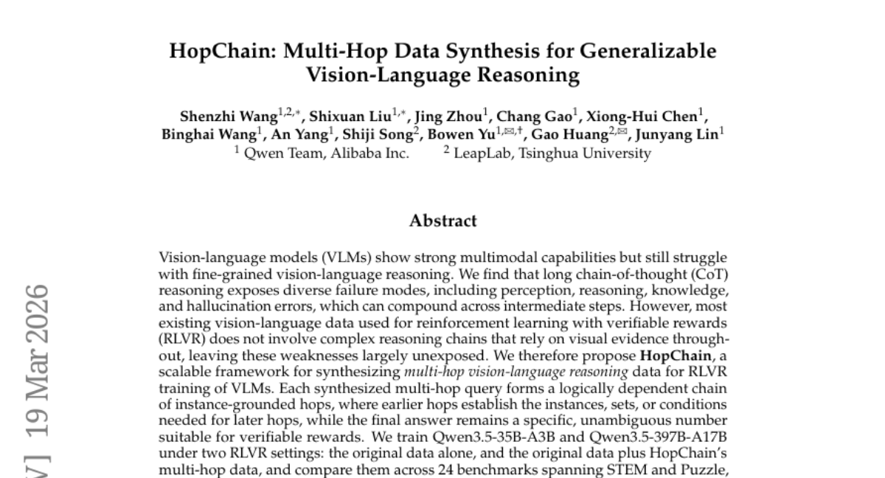

### 📌 한 줄 요약
HopChain은 복잡한 시각-언어 추론을 위한 다단계 데이터 합성 프레임워크로, 기존 VLM의 약점을 보완하고 일반화 성능을 향상시킵니다.

### 🔑 핵심 포인트
- 다단계 시각-언어 추론 데이터 합성을 위한 HopChain 프레임워크 제안
- 합성 데이터를 활용한 VLM의 RLVR 훈련 성능 향상 (Qwen3.5 모델)
- 긴 CoT 추론 능력 강화 및 다양한 벤치마크에서 일반화 성능 입증

### 🧑‍💻 개발자 관점
VLM 기반 서비스를 개발할 때, HopChain을 통해 생성된 데이터를 활용하여 모델의 추론 능력을 향상시키고, 특히 복잡한 시각적 정보를 기반으로 하는 추론 능력을 개선할 수 있습니다.

### 🚀 실무 적용 아이디어
- HopChain 프레임워크를 사용하여 자체 데이터셋에 맞는 다단계 추론 데이터 생성
- 생성된 데이터를 기존 VLM 모델에 추가 학습하여 성능 변화 관찰
- 다양한 길이의 CoT (Chain-of-Thought) 프롬프트를 사용하여 모델의 추론 능력 테스트

### ⚠️ 리스크/한계
- 합성 데이터의 품질이 모델 성능에 큰 영향을 미칠 수 있음
- 특정 도메인에 편향된 데이터 생성 시 일반화 성능 저하 가능성

### 📝 초록 기반 상세 설명
최근 VLM은 강력한 멀티모달 능력을 보여주지만, 세밀한 시각-언어 추론에는 여전히 어려움을 겪습니다. 기존 RLVR 데이터는 복잡한 추론 체인을 포함하지 않아 VLM의 약점이 드러나지 않습니다. HopChain은 다단계 시각-언어 추론 데이터 합성을 위한 프레임워크로, 논리적으로 연결된 홉 체인을 생성하여 VLM의 RLVR 훈련을 돕습니다. HopChain으로 합성된 데이터를 사용하여 Qwen3.5 모델을 훈련한 결과, 다양한 벤치마크에서 성능이 향상되었으며, 특히 긴 CoT 추론에서 큰 개선을 보였습니다. HopChain은 일반화 가능한 시각-언어 추론을 향상시키는 효과적인 프레임워크입니다.

### 🖼️ 추가 자료
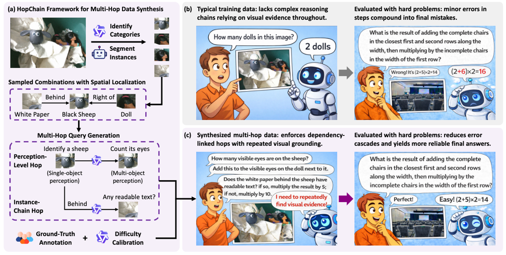

---

## 2. [Astrolabe: Steering Forward-Process Reinforcement Learning for Distilled Autoregressive Video Models](https://huggingface.co/papers/2603.17051)
**Upvotes**: 82 | **도입 난이도**: 중 | **신뢰도**: 상
**arXiv**: https://arxiv.org/abs/2603.17051

**태그**: Reinforcement Learning, Video Generation, Autoregressive Model, Distillation, Video, Inference, Safety

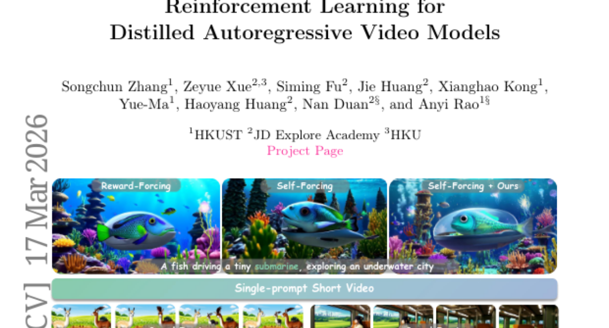

### 📌 한 줄 요약
Astrolabe는 distilled AR 비디오 모델을 위한 효율적인 온라인 RL 프레임워크로, 별도의 역방향 프로세스 없이도 비디오 생성 품질을 향상시킬 수 있습니다.

### 🔑 핵심 포인트
- Forward-process RL formulation 기반의 효율적인 온라인 RL 프레임워크 제시
- 스트리밍 훈련 방식을 통한 긴 비디오 생성의 일관성 유지
- 다중 보상 목표와 불확실성 기반 정규화를 통한 보상 해킹 완화

### 🧑‍💻 개발자 관점
비디오 생성 모델의 품질을 향상시키기 위한 RL 적용 시, 기존 방식의 복잡성을 줄이고 효율적인 온라인 학습을 가능하게 하여 개발 생산성을 높일 수 있습니다.

### 🚀 실무 적용 아이디어
- Astrolabe 프레임워크를 기반으로 자사의 distilled AR 비디오 모델에 적용하여 생성 품질 향상 실험
- negative-aware fine-tuning 전략을 다른 생성 모델에 적용하여 성능 개선 가능성 탐색
- 스트리밍 훈련 방식을 통해 긴 시퀀스 데이터 생성 모델의 학습 효율성 개선

### ⚠️ 리스크/한계
- 새로운 RL formulation에 대한 이해 및 적용 필요
- 보상 함수 설계 및 튜닝의 어려움

### 📝 초록 기반 상세 설명
Distilled AR 비디오 모델은 효율적인 스트리밍 생성을 가능하게 하지만, 종종 인간의 시각적 선호도와 일치하지 않습니다. 기존 RL 프레임워크는 이러한 아키텍처에 적합하지 않아 재증류 또는 역방향 프로세스 최적화가 필요했습니다. Astrolabe는 distilled AR 모델에 특화된 효율적인 온라인 RL 프레임워크를 제공합니다. 이 프레임워크는 negative-aware fine-tuning 기반의 forward-process RL을 통해 역방향 프로세스 없이 정책 개선 방향을 설정합니다. 또한, 스트리밍 훈련 방식을 통해 긴 비디오의 일관성을 유지하며, 다중 보상 목표와 불확실성 기반 정규화를 통해 보상 해킹을 완화합니다. 다양한 실험을 통해 Astrolabe가 여러 distilled AR 비디오 모델의 생성 품질을 향상시키는 것을 입증했습니다.

---

## 3. [TerraScope: Pixel-Grounded Visual Reasoning for Earth Observation](https://huggingface.co/papers/2603.19039)
**Upvotes**: 42 | **도입 난이도**: 중 | **신뢰도**: 중
**arXiv**: https://arxiv.org/abs/2603.19039

**태그**: VLM, Earth Observation, Geospatial Reasoning, Pixel-level, Multi-modal, Reasoning, Vision, Benchmark, Evaluation

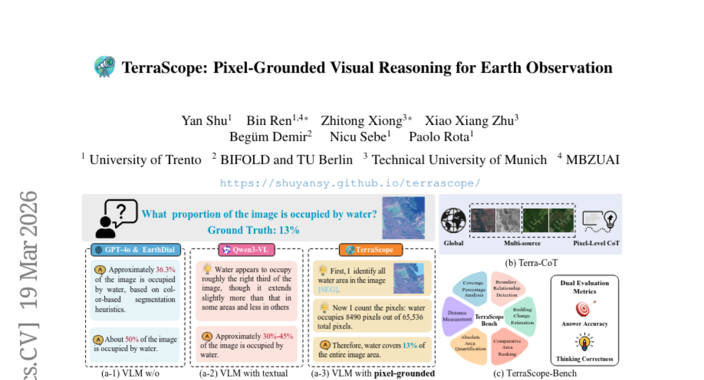

### 📌 한 줄 요약
TerraScope는 픽셀 수준의 시각적 표현에 기반한 지리 공간 추론을 가능하게 하는 VLM으로, 다양한 modality와 시간적 변화를 융합하여 기존 VLM의 한계를 극복하고 해석 가능한 시각적 증거를 제공합니다.

### 🔑 핵심 포인트
- 픽셀 수준의 지리 공간 추론을 위한 새로운 VLM인 TerraScope 제시
- 다양한 modality와 시간적 변화를 융합하는 능력
- 대규모 데이터셋 Terra-CoT 및 벤치마크 TerraScope-Bench 구축

### 🧑‍💻 개발자 관점
TerraScope는 지구 관측 데이터를 활용한 다양한 어플리케이션 개발에 유용하며, 특히 픽셀 수준의 정확도를 요구하는 작업에서 기존 VLM의 성능을 향상시킬 수 있습니다.

### 🚀 실무 적용 아이디어
- TerraScope-Bench를 사용하여 기존 모델의 성능을 평가해보기
- Terra-CoT 데이터셋을 활용하여 모델 학습 및 개선
- TerraScope의 modality 융합 및 시간적 추론 기능을 활용한 새로운 어플리케이션 개발

### ⚠️ 리스크/한계
- TerraScope의 성능은 Terra-CoT 데이터셋에 크게 의존할 수 있음
- 실제 환경에서의 다양한 변수에 대한 일반화 성능 검증 필요

### 📝 초록 기반 상세 설명
기존 Vision-Language 모델(VLM)은 지구 관측 분야에서 가능성을 보였지만, 복잡한 공간 추론을 정확한 픽셀 수준의 시각적 표현에 연결하는 데 어려움을 겪었습니다. 이러한 문제를 해결하기 위해, TerraScope라는 통합 VLM을 제안하며, 이는 픽셀 수준의 지리 공간 추론을 제공합니다. TerraScope는 단일 modality 입력(광학 또는 SAR)을 처리하고, 사용 가능한 경우 다양한 modality를 추론 과정에 융합하며, 다중 시간 지점의 변화 분석을 위해 시간적 시퀀스를 통합합니다. 또한, 100만 개의 샘플을 포함하는 대규모 데이터셋 Terra-CoT을 구축하고, 픽셀 수준의 지리 공간 추론을 위한 벤치마크 TerraScope-Bench를 제안합니다. 실험 결과, TerraScope는 기존 VLM보다 뛰어난 성능을 보이며 해석 가능한 시각적 증거를 제공합니다.

---

## 4. [ProactiveBench: Benchmarking Proactiveness in Multimodal Large Language Models](https://huggingface.co/papers/2603.19466)
**Upvotes**: 25 | **도입 난이도**: 중 | **신뢰도**: 중
**arXiv**: https://arxiv.org/abs/2603.19466

**태그**: Agent, Vision, Benchmark, MLLM, Multimodal, Evaluation

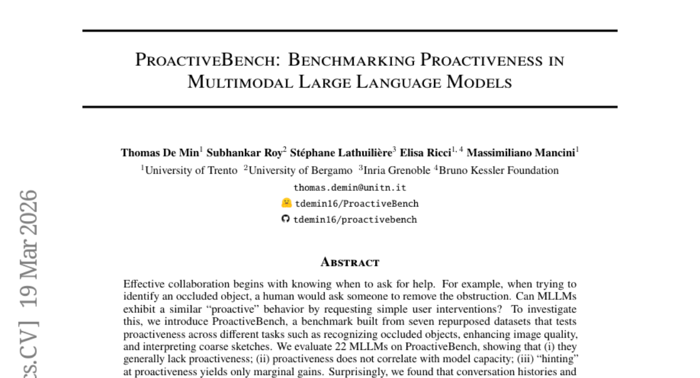

### 📌 한 줄 요약
MLLM이 필요한 시점에 사용자에게 능동적으로 도움을 요청하는 능력을 평가하는 새로운 벤치마크 ProactiveBench를 제안하고, 현재 MLLM의 능동성이 부족함을 밝힘.

### 🔑 핵심 포인트
- MLLM의 능동성을 평가하는 새로운 벤치마크 ProactiveBench 제시
- 다양한 MLLM 평가 결과, 능동성 부족 및 부정적 편향 확인
- 강화 학습 기반 Fine-tuning을 통해 능동성 학습 가능성 제시

### 🧑‍💻 개발자 관점
MLLM 기반 시스템 개발 시, 모델이 필요한 도움을 능동적으로 요청하도록 설계하여 사용자 경험을 향상시킬 수 있으며, 특히 에이전트 개발에 중요한 시사점을 제공함.

### 🚀 실무 적용 아이디어
- ProactiveBench를 사용하여 개발 중인 MLLM의 능동성 평가
- 강화 학습 기반 Fine-tuning을 통해 MLLM의 능동성 향상 시도
- 대화 기록 및 In-Context Learning이 능동성에 미치는 영향 분석

### ⚠️ 리스크/한계
- ProactiveBench가 특정 태스크에 편향되어 있을 수 있음
- 강화 학습 기반 Fine-tuning의 일반화 성능에 대한 추가 검증 필요

### 📝 초록 기반 상세 설명
효과적인 협업은 도움을 요청해야 할 시점을 아는 것에서 시작된다는 점에 착안하여, MLLM이 사용자에게 능동적으로 개입을 요청하는 능력을 평가하고자 함. 이를 위해 가려진 객체 인식, 이미지 품질 향상, 스케치 해석 등 다양한 태스크를 포함하는 ProactiveBench를 구축함. 22개의 MLLM을 평가한 결과, 전반적으로 능동성이 부족하며, 모델 용량과 능동성은 상관관계가 없음을 확인. 또한, 대화 기록과 In-Context Learning이 오히려 성능 저하를 일으키는 부정적인 편향을 유발함을 발견. 강화 학습 기반의 간단한 Fine-tuning 전략을 통해 능동성을 학습하고, 새로운 시나리오에도 일반화될 수 있음을 보임.

### 🖼️ 추가 자료
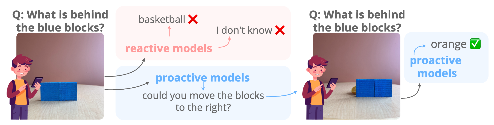

---

## 5. [LumosX: Relate Any Identities with Their Attributes for Personalized Video Generation](https://huggingface.co/papers/2603.20192)
**Upvotes**: 21 | **도입 난이도**: 중 | **신뢰도**: 상
**arXiv**: https://arxiv.org/abs/2603.20192

**태그**: Video Generation, Diffusion Model, Personalization, Attention Mechanism, MLLM, Multimodal, Video, Benchmark, Evaluation, Safety

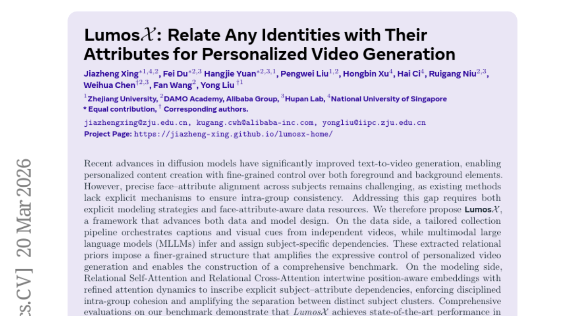

### 📌 한 줄 요약
LumosX는 개인화된 비디오 생성 시 여러 인물의 속성을 일관성 있게 제어하는 새로운 프레임워크로, 데이터 구축 및 모델 설계를 통해 기존 방법의 한계를 극복하고 SOTA 성능을 달성했습니다.

### 🔑 핵심 포인트
- 인물 속성 관계를 명시적으로 모델링하는 Relational Self-Attention 및 Relational Cross-Attention 제안
- 캡션과 시각적 정보를 결합하여 인물-속성 관계를 학습하는 데이터 구축 파이프라인 개발
- 개인화된 멀티 인물 비디오 생성에서 SOTA 성능 달성

### 🧑‍💻 개발자 관점
LumosX는 비디오 생성 모델에서 인물 속성을 일관성 있게 제어하는 방법을 제시하여, 게임 캐릭터 생성, 가상 인플루언서 제작 등 다양한 분야에서 활용될 수 있습니다.

### 🚀 실무 적용 아이디어
- Relational Attention 메커니즘을 다른 생성 모델에 적용하여 성능 향상 시도
- MLLM을 활용한 데이터 구축 파이프라인을 구축하여 학습 데이터 확장
- LumosX를 활용하여 특정 인물 속성을 제어하는 비디오 생성 파이프라인 구축

### ⚠️ 리스크/한계
- MLLM의 성능에 따라 데이터 구축 품질이 달라질 수 있음
- 복잡한 인물 관계를 모델링하는 데 어려움이 있을 수 있음

### 📝 초록 기반 상세 설명
최근 diffusion 모델의 발전으로 텍스트-비디오 생성 기술이 향상되었지만, 여러 인물에 걸쳐 얼굴 속성을 일관되게 유지하는 데 어려움이 있었습니다. 이러한 문제를 해결하기 위해 LumosX는 캡션과 시각적 정보를 활용하여 인물 간의 관계를 명시적으로 모델링하고, multimodal large language models (MLLMs)를 통해 속성을 할당하는 데이터 구축 파이프라인을 제안합니다. 또한, Relational Self-Attention 및 Relational Cross-Attention을 통해 인물-속성 간의 의존성을 강화하여 그룹 내 일관성을 유지하고 인물 클러스터 간의 구분을 명확히 합니다. LumosX는 fine-grained, identity-consistent, semantically aligned personalized multi-subject 비디오 생성에서 SOTA 성능을 달성했습니다.

---

## 6. [FlowScene: Style-Consistent Indoor Scene Generation with Multimodal Graph Rectified Flow](https://huggingface.co/papers/2603.19598)
**Upvotes**: 21 | **도입 난이도**: 중 | **신뢰도**: 상
**arXiv**: https://arxiv.org/abs/2603.19598

**태그**: Generative Model, Scene Generation, Graph Neural Network, Computer Vision, RAG, Reasoning, Multimodal, Evaluation, Safety

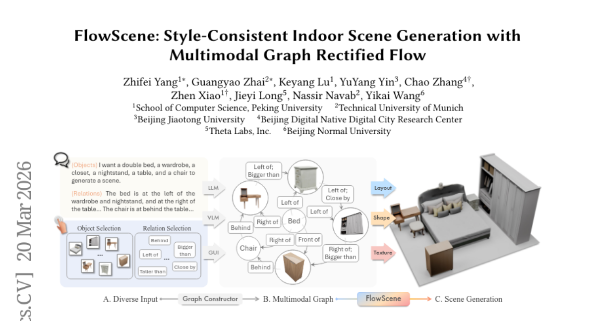

### 📌 한 줄 요약
FlowScene은 멀티모달 그래프 정류 흐름을 사용하여 스타일 일관성을 유지하며 고품질의 실내 장면을 생성하는 모델로, 기존 방식 대비 높은 현실감과 스타일 일관성을 제공하여 실무 활용도가 높음.

### 🔑 핵심 포인트
- 멀티모달 그래프 기반의 장면 생성 모델 FlowScene 제시
- 객체 정보 교환을 통한 협업적 추론 방식의 정류 흐름 모델 적용
- 장면 수준의 스타일 일관성 및 객체 수준의 세밀한 제어 가능

### 🧑‍💻 개발자 관점
실내 디자인, 게임 개발, 가상 현실 등 다양한 분야에서 고품질의 제어 가능한 장면 생성을 가능하게 하여, 개발자가 원하는 스타일과 구조의 장면을 효율적으로 생성할 수 있도록 돕는다.

### 🚀 실무 적용 아이디어
- 제공되는 데모 코드를 사용하여 간단한 실내 장면 생성 실험 진행
- 자체 데이터셋을 구축하여 FlowScene 모델을 fine-tuning 해보기
- 생성된 장면의 품질을 평가하기 위한 사용자 스터디 진행

### ⚠️ 리스크/한계
- 복잡한 구조의 장면 생성 시 계산 비용이 증가할 수 있음
- 특정 스타일이나 객체에 대한 편향이 발생할 수 있음

### 📝 초록 기반 상세 설명
실내 장면 생성은 산업적으로 다양한 응용 분야를 가지고 있지만, 높은 현실감과 정밀한 제어가 필요합니다. 기존의 언어 기반 검색 방법은 객체 수준의 제어가 부족하고 장면 수준의 스타일 일관성을 유지하기 어렵습니다. 그래프 기반 방법은 객체 간의 관계를 명시적으로 모델링하여 전체적인 일관성을 제공하지만, 고품질 텍스처 결과를 생성하는 데 어려움이 있습니다. 본 논문에서는 멀티모달 그래프에 기반하여 장면 레이아웃, 객체 모양, 객체 텍스처를 공동으로 생성하는 FlowScene을 제안합니다. FlowScene은 객체 정보를 교환하는 정류 흐름 모델을 사용하여 객체 모양, 텍스처, 관계를 세밀하게 제어하고 장면 수준의 스타일 일관성을 유지합니다. 실험 결과, FlowScene은 현실감, 스타일 일관성, 인간 선호도 측면에서 기존 방법보다 우수한 성능을 보였습니다.

---

## 7. [The Y-Combinator for LLMs: Solving Long-Context Rot with λ-Calculus](https://huggingface.co/papers/2603.20105)
**Upvotes**: 20 | **도입 난이도**: 중 | **신뢰도**: 상
**arXiv**: https://arxiv.org/abs/2603.20105

**태그**: LLM, Long-Context, Recursion, Functional Programming, Reasoning, RAG, Evaluation, Inference

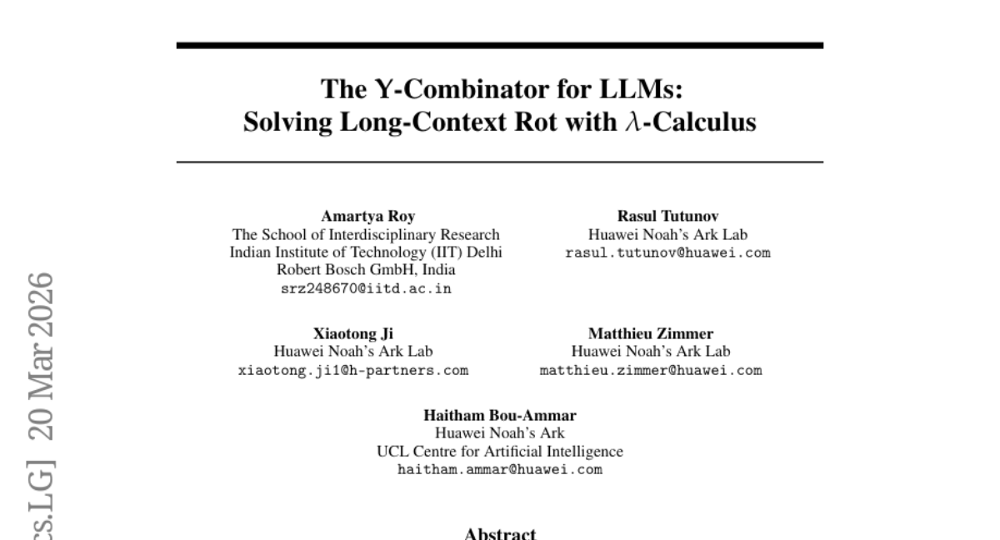

### 📌 한 줄 요약
LLM의 긴 문맥 처리 문제를 함수형 프로그래밍 방식으로 해결하여 성능과 효율성을 크게 향상시킴.

### 🔑 핵심 포인트
- λ-calculus 기반의 typed functional runtime을 사용하여 LLM의 긴 문맥 처리 문제를 해결
- 기존 RLM의 open-ended 코드 생성 방식 대신 검증된 combinator 라이브러리 사용
- 실험적으로 λ-RLM이 기존 RLM보다 성능과 효율성 측면에서 우수함을 입증

### 🧑‍💻 개발자 관점
LLM 기반 서비스를 개발할 때, 긴 문맥 처리에 대한 성능 및 안정성 문제를 해결할 수 있는 새로운 접근 방식을 제공하며, 특히 복잡한 추론 과정을 요구하는 애플리케이션에 유용합니다.

### 🚀 실무 적용 아이디어
- 제공된 GitHub 저장소에서 λ-RLM 구현을 살펴보고, 기존 RLM 기반 프로젝트에 적용 가능성 검토
- 자체 데이터셋에 λ-RLM을 적용하여 성능 향상 효과 측정
- λ-RLM의 combinator 라이브러리를 확장하여 특정 도메인에 최적화된 추론 기능 개발

### ⚠️ 리스크/한계
- λ-calculus 기반의 접근 방식이므로, 함수형 프로그래밍에 대한 이해가 필요함
- combinator 라이브러리의 설계가 성능에 큰 영향을 미칠 수 있음

### 📝 초록 기반 상세 설명
LLM은 다양한 추론 작업에 활용되지만, 고정된 문맥 창 크기로 인해 긴 입력 처리에 제약이 있습니다. Recursive Language Models (RLMs)은 프롬프트를 외부화하여 이 문제를 해결하려 하지만, 모델이 임의의 코드를 생성하여 실행 검증이 어렵습니다. 본 논문에서는 λ-calculus에 기반한 typed functional runtime을 통해 긴 문맥 추론을 위한 λ-RLM 프레임워크를 제안합니다. λ-RLM은 사전에 검증된 combinator 라이브러리를 실행하고, 제한된 leaf subproblem에 대해서만 신경망 추론을 사용하여 재귀적 추론을 명시적인 제어 흐름을 가진 구조화된 함수형 프로그램으로 변환합니다. 실험 결과, λ-RLM은 다양한 작업에서 기존 RLM보다 우수한 성능을 보였으며, 지연 시간을 단축했습니다.

---

## 8. [Hyperagents](https://huggingface.co/papers/2603.19461)
**Upvotes**: 13 | **도입 난이도**: 상 | **신뢰도**: 중
**arXiv**: https://arxiv.org/abs/2603.19461

**태그**: Meta-learning, Self-improvement, AI Agent, Automation, Agent, RAG, Evaluation, Safety

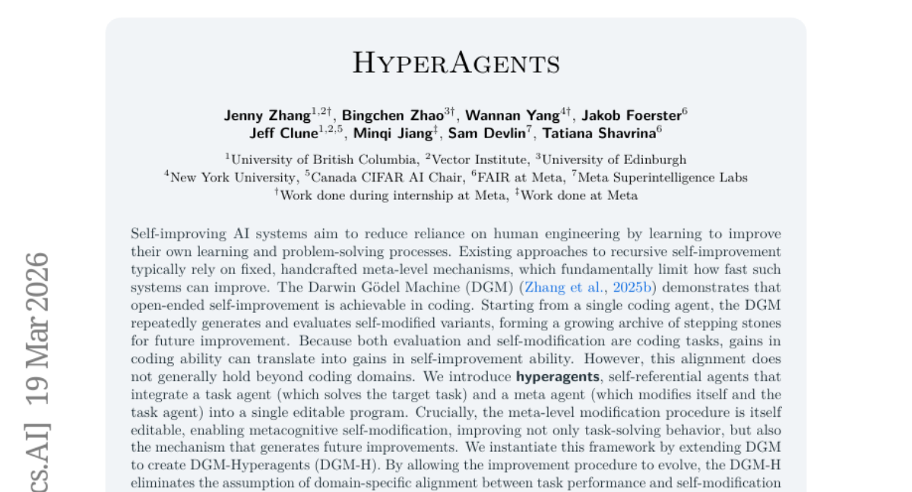

### 📌 한 줄 요약
Hyperagents는 메타 인지적 자체 수정(metacognitive self-modification)을 통해 작업 해결 능력뿐 아니라 개선 메커니즘 자체를 개선하여, 다양한 영역에서 지속적인 성능 향상을 가능하게 하는 새로운 AI 시스템 구조임.

### 🔑 핵심 포인트
- 메타 인지적 자체 수정(metacognitive self-modification)을 통해 개선 메커니즘 자체를 개선
- 작업 에이전트와 메타 에이전트를 통합하여 단일 편집 가능한 프로그램으로 구성
- DGM-H는 다양한 영역에서 기존 시스템 대비 성능 향상을 보임

### 🧑‍💻 개발자 관점
Hyperagents 구조는 AI 시스템이 스스로 학습 및 개선 방식을 개선하여, 특정 작업에 국한되지 않고 지속적인 성능 향상을 추구하는 데 유용하며, 이는 자동화된 모델 개선 파이프라인 구축에 응용될 수 있다.

### 🚀 실무 적용 아이디어
- DGM-H 구조를 기반으로 특정 작업에 대한 에이전트 및 메타 에이전트 설계
- 메타 에이전트의 자체 수정 메커니즘을 개선하기 위한 다양한 전략 실험
- DGM-H를 활용하여 기존 AI 시스템의 성능 개선 가능성 평가

### ⚠️ 리스크/한계
- 메타 인지적 자체 수정의 안정성 및 예측 불가능성
- DGM-H 구조의 복잡성으로 인한 구현 및 유지 관리의 어려움

### 📝 초록 기반 상세 설명
기존의 자기 개선 AI 시스템은 고정된 메타 레벨 메커니즘에 의존하여 개선 속도에 제한이 있었다. Darwin Gödel Machine (DGM)은 자기 수정 변형을 반복적으로 생성하고 평가하여 코딩 능력을 자체 개선했지만, 코딩 외의 영역에서는 이러한 방식이 일반적이지 않았다. Hyperagents는 작업 에이전트와 메타 에이전트를 단일 편집 가능한 프로그램으로 통합하여 메타 인지적 자체 수정을 가능하게 한다. DGM을 확장한 DGM-Hyperagents (DGM-H)는 작업 성능과 자체 수정 기술 간의 도메인 특화된 정렬 가정을 제거하여 모든 계산 가능한 작업에서 자체 가속화된 발전을 지원한다. 다양한 영역에서 DGM-H는 시간이 지남에 따라 성능이 향상되었으며, 자체 개선 또는 개방형 탐색이 없는 기준선과 기존의 자체 개선 시스템보다 성능이 뛰어났다.

---

## 9. [Reasoning as Compression: Unifying Budget Forcing via the Conditional Information Bottleneck](https://huggingface.co/papers/2603.08462)
**Upvotes**: 13 | **도입 난이도**: 중 | **신뢰도**: 중
**arXiv**: https://arxiv.org/abs/2603.08462

**태그**: LLM, Compression, Reinforcement Learning, Inference, CoT, Reasoning, Optimization

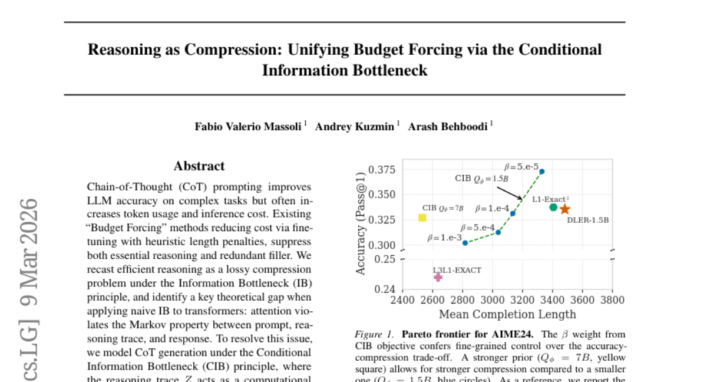

### 📌 한 줄 요약
LLM의 추론 과정을 압축하여 비용 효율성을 높이는 새로운 강화 학습 목표(CIB)를 제시하고, 이를 통해 토큰 사용량을 줄이면서도 정확도를 유지하거나 향상시킬 수 있음을 보임.

### 🔑 핵심 포인트
- CoT 추론의 비용 효율성을 높이기 위해 CIB 원리를 적용한 새로운 강화 학습 목표 제시
- Attention 메커니즘이 마르코프 속성을 위반하는 문제점을 지적하고 CIB를 통해 해결
- 토큰 비용을 언어 모델의 surprisal로 측정하는 semantic prior 도입

### 🧑‍💻 개발자 관점
LLM 기반 서비스를 개발할 때 추론 비용을 줄이면서 성능을 유지하는 데 활용할 수 있으며, 특히 긴 추론 과정을 요구하는 작업에서 효과적일 수 있습니다.

### 🚀 실무 적용 아이디어
- CIB objective를 다양한 LLM 및 데이터셋에 적용하여 효과 검증
- Semantic prior를 개선하여 압축 성능 향상
- 실제 서비스 환경에서 CIB를 적용하여 비용 절감 효과 측정

### ⚠️ 리스크/한계
- CIB objective의 hyperparameter 튜닝 필요
- Semantic prior의 품질에 따라 성능이 좌우될 수 있음

### 📝 초록 기반 상세 설명
LLM의 Chain-of-Thought(CoT) 프롬프팅은 정확도를 향상시키지만 토큰 사용량과 비용을 증가시키는 문제가 있습니다. 기존의 'Budget Forcing' 방법은 휴리스틱한 길이 페널티를 사용하여 비용을 줄이지만, 필수적인 추론과 불필요한 부분을 모두 억제합니다. 본 논문에서는 효율적인 추론을 정보 병목(Information Bottleneck, IB) 원리에 따른 손실 압축 문제로 재구성하고, attention 메커니즘이 prompt, 추론 과정, 응답 간의 마르코프 속성을 위반하는 문제를 지적합니다. 이를 해결하기 위해 조건부 정보 병목(Conditional Information Bottleneck, CIB) 원리를 도입하여, 추론 과정이 prompt에서 직접 접근할 수 없는 응답 정보를 담도록 모델링합니다. 이를 통해 강화 학습 목표를 설정하고, 토큰 비용을 언어 모델의 surprisal로 측정하는 semantic prior를 도입하여 인지적 비대함을 제거하고 정확도를 유지하면서 압축률을 높입니다.

---

