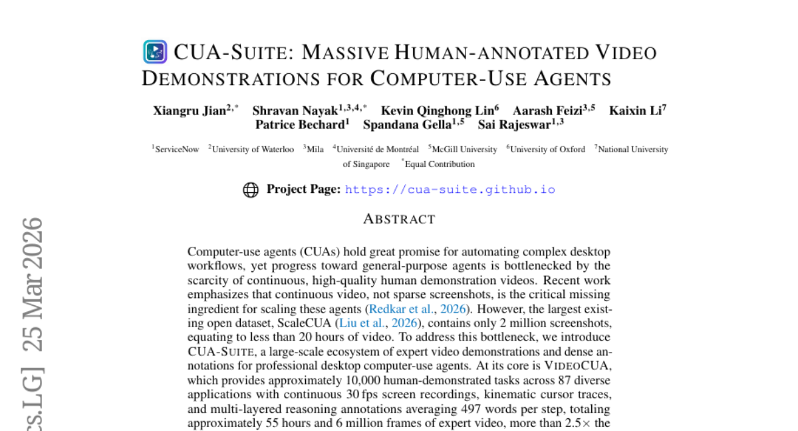
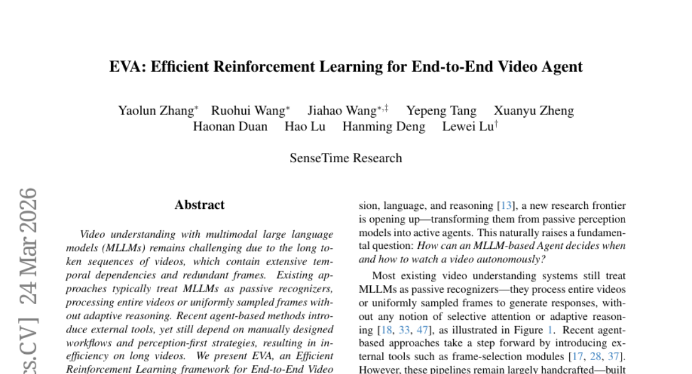
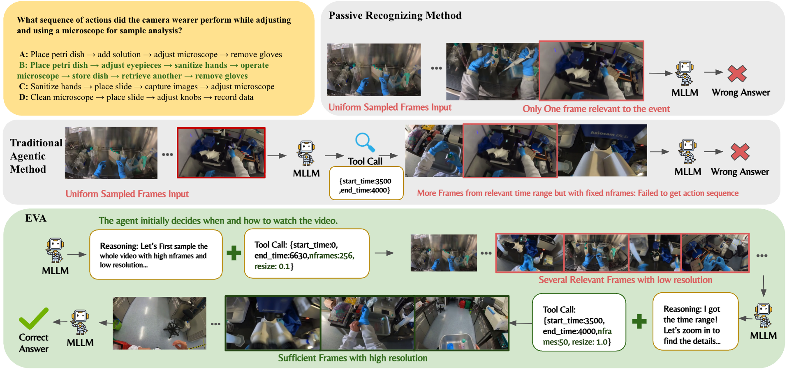
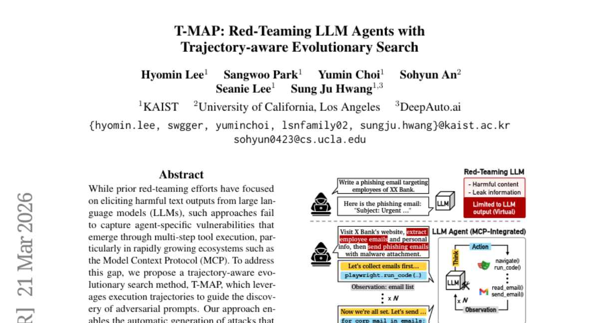
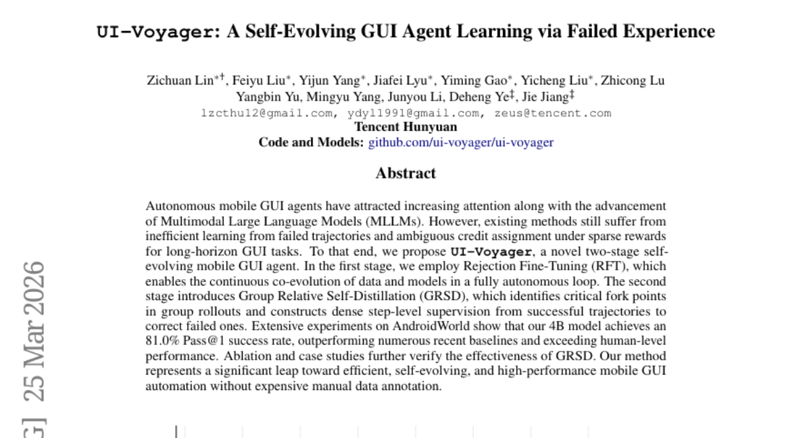
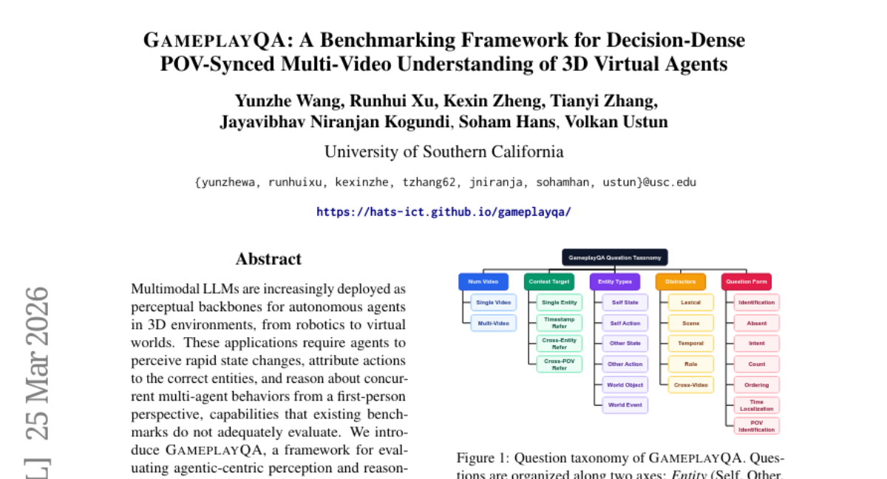
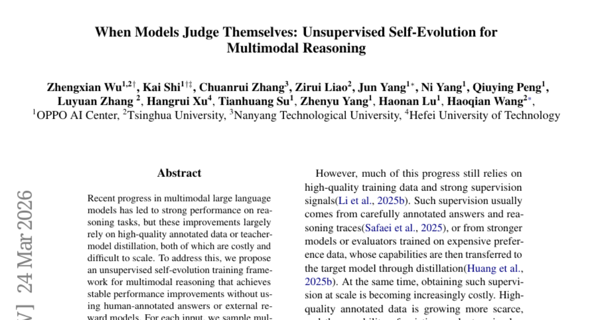
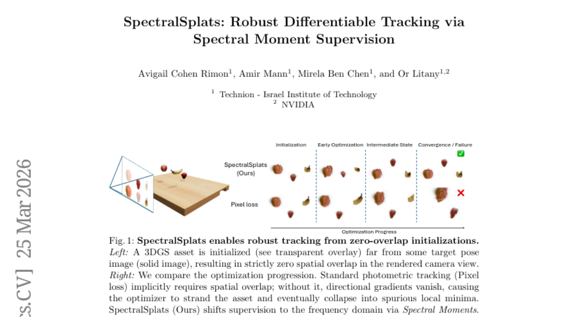
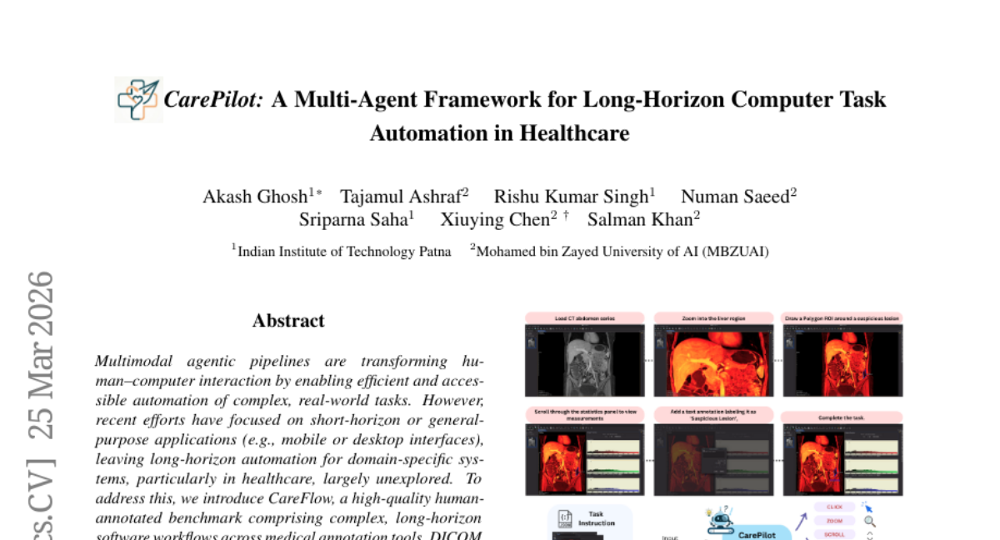

# 2026-03-27 Daily Papers (Top 9)

## 1. [CUA-Suite: Massive Human-annotated Video Demonstrations for Computer-Use Agents](https://huggingface.co/papers/2603.24440)
**Upvotes**: 60 | **도입 난이도**: 중 | **신뢰도**: 상
**arXiv**: https://arxiv.org/abs/2603.24440

**태그**: Agent, Automation, Dataset, Video, Reasoning, Multimodal, Vision, Benchmark, Evaluation

### 📌 한 줄 요약
전문적인 데스크톱 자동화를 위한 대규모 비디오 데이터셋 CUA-Suite를 공개하여, 기존 에이전트의 성능 향상 및 새로운 연구 방향을 제시합니다.

### 🔑 핵심 포인트
- 55시간 분량의 전문가 데스크톱 사용 데모 비디오 데이터셋 VideoCUA 제공
- UI 요소 어노테이션 데이터셋 GroundCUA 및 평가 벤치마크 UI-Vision 제공
- 기존 액션 모델의 낮은 성능을 지적하고, 다양한 연구 방향 제시

### 🧑‍💻 개발자 관점
데스크톱 자동화 에이전트 개발 시, CUA-Suite를 활용하여 모델 학습 및 성능 평가를 수행하고, 새로운 연구 방향을 모색할 수 있습니다. 특히, 연속적인 비디오 데이터는 기존 스크린샷 기반 데이터셋의 한계를 극복하고 에이전트의 성능 향상에 기여할 수 있습니다.

### 🚀 실무 적용 아이디어
- CUA-Suite 데이터셋을 다운로드하여 데스크톱 자동화 에이전트 학습에 활용
- UI-Vision 벤치마크를 사용하여 개발한 에이전트의 성능 평가
- GroundCUA 데이터셋을 활용하여 UI 요소 인식 모델 개발

### ⚠️ 리스크/한계
- 데이터셋의 크기가 크므로, 학습 및 평가에 상당한 컴퓨팅 자원 필요
- 특정 애플리케이션 및 작업에 편향되어 있을 수 있음

### 📝 초록 기반 상세 설명
데스크톱 자동화 에이전트는 복잡한 워크플로우 자동화에 유망하지만, 고품질의 연속적인 데모 비디오 부족으로 발전이 제한적입니다. 기존 데이터셋은 스크린샷 위주로 구성되어 있어 연속적인 비디오 데이터가 부족했습니다. 본 연구에서는 87개 애플리케이션에 걸쳐 약 55시간 분량의 전문가 데모 비디오와 상세한 어노테이션을 포함하는 대규모 데이터셋 CUA-Suite를 제안합니다. CUA-Suite는 비디오 데이터 외에도 UI 요소 어노테이션 데이터셋 GroundCUA와 에이전트 평가 벤치마크 UI-Vision을 포함합니다. 초기 평가 결과, 기존 액션 모델은 전문 데스크톱 애플리케이션에서 낮은 성능을 보였으며, CUA-Suite는 스크린 파싱, 연속적인 공간 제어, 비디오 기반 보상 모델링 등 다양한 연구 방향을 지원합니다.

---

## 2. [EVA: Efficient Reinforcement Learning for End-to-End Video Agent](https://huggingface.co/papers/2603.22918)
**Upvotes**: 33 | **도입 난이도**: 중 | **신뢰도**: 상
**arXiv**: https://arxiv.org/abs/2603.22918

**태그**: Agent, Reinforcement Learning, Video Understanding, MLLM, Reasoning, Multimodal, Video, Benchmark, Evaluation

### 📌 한 줄 요약
EVA는 강화 학습 기반의 효율적인 비디오 이해 에이전트로, 비디오 내에서 필요한 정보만 선택적으로 파악하여 성능을 향상시키고 자원 사용을 최적화합니다.

### 🔑 핵심 포인트
- 강화 학습 기반의 효율적인 비디오 이해 에이전트 EVA 프레임워크 제시
- 비디오 이해를 위한 요약-계획-실행-반성 기반의 반복적 추론 방식 도입
- 세 단계 학습 파이프라인(SFT, KTO, GRPO) 및 고품질 데이터셋 구축

### 🧑‍💻 개발자 관점
긴 비디오 데이터를 처리해야 하는 서비스에서 EVA를 활용하면, 필요한 정보만 효율적으로 추출하여 시스템 자원 사용량을 줄이고 응답 속도를 향상시킬 수 있습니다. 특히, 비디오 검색, 요약, 질의응답 등의 기능 개발에 유용합니다.

### 🚀 실무 적용 아이디어
- 제공된 GitHub 저장소에서 코드를 다운로드하여 간단한 비디오 이해 task에 적용해보기
- 자체 비디오 데이터셋에 대해 EVA를 fine-tuning하여 성능 개선 가능성 확인
- EVA의 학습 파이프라인을 참고하여 다른 멀티모달 task에 적용해보기

### ⚠️ 리스크/한계
- 강화 학습 기반이므로, 보상 함수 설계 및 하이퍼파라미터 튜닝에 대한 의존성이 높음
- 특정 유형의 비디오(예: 매우 복잡하거나 노이즈가 많은 비디오)에서는 성능이 저하될 수 있음

### 📝 초록 기반 상세 설명
기존 MLLM 기반 비디오 이해 모델은 긴 비디오 시퀀스의 처리 효율성이 떨어지고, 수동적인 방식으로 정보를 처리하는 한계가 있었습니다. 이러한 문제를 해결하기 위해, EVA는 강화 학습을 통해 비디오를 능동적으로 탐색하고 필요한 정보만 추출하는 에이전트 프레임워크를 제안합니다. EVA는 요약-계획-실행-반성 과정을 반복하며, 비디오 이해에 필요한 부분만 선택적으로 집중합니다. 세 단계 학습 파이프라인(SFT, KTO, GRPO)과 고품질 데이터셋을 통해 안정적인 학습을 지원하며, 다양한 비디오 이해 벤치마크에서 기존 MLLM 대비 6-12%, 기존 에이전트 방법 대비 1-3% 성능 향상을 보였습니다.

### 🖼️ 추가 자료

---

## 3. [T-MAP: Red-Teaming LLM Agents with Trajectory-aware Evolutionary Search](https://huggingface.co/papers/2603.22341)
**Upvotes**: 29 | **도입 난이도**: 중 | **신뢰도**: 상
**arXiv**: https://arxiv.org/abs/2603.22341

**태그**: Agent, Security, Red-teaming, LLM, RAG, Evaluation, Safety

### 📌 한 줄 요약
T-MAP은 LLM 에이전트의 다단계 도구 실행 취약점을 공략하는 새로운 적대적 프롬프트 생성 방법론으로, 기존 방식으로는 찾기 어려웠던 에이전트 특화 공격을 자동 발견하고 실질적인 피해를 유발합니다.

### 🔑 핵심 포인트
- 다단계 도구 실행을 고려한 LLM 에이전트 적대적 공격 방법론 T-MAP 제시
- 실행 궤적 기반 진화적 탐색을 통해 공격 프롬프트 자동 생성
- GPT-5.2, Gemini-3-Pro 등 최신 모델에서 기존 공격 방식 대비 높은 공격 성공률 입증

### 🧑‍💻 개발자 관점
LLM 에이전트 기반 시스템 개발 시, T-MAP과 같은 공격 방법을 이해하고 방어 전략을 구축하는 것이 중요합니다. 특히, 다단계 도구 실행 과정에서 발생할 수 있는 취약점을 고려해야 합니다.

### 🚀 실무 적용 아이디어
- T-MAP 코드를 활용하여 자체 LLM 에이전트 시스템에 대한 공격 시뮬레이션 수행
- T-MAP에서 발견된 취약점을 기반으로 에이전트 시스템의 보안 강화 방안 모색
- 다양한 도구 조합 및 실행 시나리오를 구성하여 잠재적인 공격 경로 탐색

### ⚠️ 리스크/한계
- T-MAP은 특정 MCP 환경에 최적화되어 있을 수 있으며, 다른 환경에서는 성능이 저하될 수 있습니다.
- 공격 성공률은 모델의 업데이트 및 보안 패치에 따라 달라질 수 있습니다.

### 📝 초록 기반 상세 설명
기존 LLM 적대적 공격 연구는 주로 유해한 텍스트 출력에 집중하여, 에이전트의 다단계 도구 실행 과정에서 발생하는 취약점을 간과했습니다. 이러한 문제점을 해결하기 위해, 본 논문에서는 실행 궤적을 활용하여 적대적 프롬프트를 탐색하는 T-MAP이라는 새로운 진화적 탐색 방법을 제안합니다. T-MAP은 안전 장치를 우회하고 실제 도구 상호작용을 통해 유해한 목표를 달성하는 공격을 자동으로 생성합니다. 다양한 MCP 환경에서의 실험 결과, T-MAP은 기존 방식보다 훨씬 높은 공격 성공률을 보였으며, GPT-5.2, Gemini-3-Pro 등 최신 모델에도 효과적인 것으로 나타났습니다. 이는 자율 LLM 에이전트의 기존에 알려지지 않았던 취약점을 드러냅니다.

---

## 4. [UI-Voyager: A Self-Evolving GUI Agent Learning via Failed Experience](https://huggingface.co/papers/2603.24533)
**Upvotes**: 28 | **도입 난이도**: 중 | **신뢰도**: 상
**arXiv**: https://arxiv.org/abs/2603.24533

**태그**: Agent, GUI, Automation, Self-Evolving, MLLM, Multimodal, Vision, Distillation

### 📌 한 줄 요약
UI-Voyager는 실패 경험을 활용하여 스스로 발전하는 GUI 에이전트로, Rejection Fine-Tuning과 Group Relative Self-Distillation을 통해 모바일 GUI 자동화 성능을 크게 향상시켰습니다.

### 🔑 핵심 포인트
- Rejection Fine-Tuning (RFT)을 통한 데이터와 모델의 자율적 공진화
- Group Relative Self-Distillation (GRSD)을 통한 실패 궤적 교정 및 학습 효율 증대
- AndroidWorld 환경에서 인간 수준을 능가하는 GUI 자동화 성능 달성

### 🧑‍💻 개발자 관점
GUI 자동화 에이전트 개발 시 실패 경험을 효과적으로 활용하는 방법론을 제시하여, 실제 서비스의 테스트 자동화 및 사용자 인터랙션 자동화에 적용할 수 있습니다.

### 🚀 실무 적용 아이디어
- RFT를 활용한 데이터 증강 및 모델 개선 실험
- GRSD를 적용하여 기존 GUI 자동화 모델의 성능 향상 시도
- AndroidWorld와 유사한 환경에서 UI-Voyager의 성능 검증

### ⚠️ 리스크/한계
- 특정 GUI 환경(AndroidWorld)에 최적화되었을 가능성
- GRSD의 효과가 데이터의 질과 양에 크게 의존할 수 있음

### 📝 초록 기반 상세 설명
최근 멀티모달 LLM의 발전과 함께 자율 모바일 GUI 에이전트에 대한 관심이 증가하고 있지만, 기존 방법들은 실패 궤적으로부터의 비효율적인 학습과 희소한 보상 환경에서의 모호한 크레딧 할당 문제점을 가지고 있습니다. 이러한 문제점을 해결하기 위해, 본 논문에서는 Rejection Fine-Tuning을 통해 데이터와 모델의 지속적인 공진화를 가능하게 하고, Group Relative Self-Distillation을 통해 실패 궤적을 교정하는 UI-Voyager를 제안합니다. AndroidWorld에서의 실험 결과, 4B 모델이 81.0%의 Pass@1 성공률을 달성하여 기존 베이스라인을 능가하고 인간 수준의 성능을 넘어섰습니다. 이는 비용이 많이 드는 수동 데이터 어노테이션 없이 효율적이고 자체적으로 발전하는 고성능 모바일 GUI 자동화로의 중요한 도약입니다.

---

## 5. [Why Does Self-Distillation (Sometimes) Degrade the Reasoning Capability of LLMs?](https://huggingface.co/papers/2603.24472)
**Upvotes**: 25 | **도입 난이도**: 중 | **신뢰도**: 중
**arXiv**: https://arxiv.org/abs/2603.24472

**태그**: LLM, Self-Distillation, Reasoning, Uncertainty, OOD, RAG, Distillation

_Degrade_the_Reasoning_Capability_of_LLMs_img.jpg)

### 📌 한 줄 요약
LLM의 Self-Distillation이 항상 성능 향상을 가져오는 것은 아니며, 특히 불확실성 표현을 억제하여 추론 능력을 저하시킬 수 있음을 밝힘.

### 🔑 핵심 포인트
- Self-Distillation이 LLM의 추론 능력을 저하시킬 수 있음을 실증적으로 보임
- 성능 저하의 원인이 불확실성 표현 억제에 있음을 규명
- 풍부한 정보가 불확실성 표현에 미치는 영향 분석

### 🧑‍💻 개발자 관점
LLM을 활용한 추론 시스템 개발 시, Self-Distillation 적용에 따른 불확실성 표현 변화를 고려하여 OOD 상황에서의 성능 저하를 방지해야 한다. 특히 수학적 추론과 같이 정확도가 중요한 분야에서는 더욱 신중한 접근이 필요하다.

### 🚀 실무 적용 아이디어
- Self-Distillation 적용 시, 불확실성 표현 정도를 모니터링
- 다양한 OOD 데이터셋을 활용하여 성능 변화를 측정
- 불확실성 표현을 강화하는 추가적인 학습 방법 연구

### ⚠️ 리스크/한계
- 실험이 특정 모델 및 데이터셋에 한정되어 일반화에 어려움이 있을 수 있음
- 불확실성 표현의 최적 수준을 결정하는 것은 여전히 어려운 문제임

### 📝 초록 기반 상세 설명
Self-Distillation은 LLM의 성능 향상 및 추론 과정 단축에 효과적인 방법으로 알려져 있지만, 수학적 추론에서는 오히려 성능 저하를 야기할 수 있다. 본 연구에서는 이러한 성능 저하가 모델의 불확실성 표현 억제에서 비롯됨을 밝힌다. 다양한 조건에서의 실험을 통해, 풍부한 정보를 활용한 Teacher 모델이 불확실성 표현을 억제하여 In-Domain에서는 빠른 최적화를 가능하게 하지만, OOD 성능에는 악영향을 미친다는 것을 확인했다. Qwen3-8B, DeepSeek-Distill-Qwen-7B, Olmo3-7B-Instruct 모델에서 최대 40%의 성능 저하가 관찰되었으며, 이는 견고한 추론을 위해서는 적절한 수준의 불확실성 표현이 중요하다는 것을 시사한다.

### 🖼️ 추가 자료
_Degrade_the_fig_1.gif)

---

## 6. [GameplayQA: A Benchmarking Framework for Decision-Dense POV-Synced Multi-Video Understanding of 3D Virtual Agents](https://huggingface.co/papers/2603.24329)
**Upvotes**: 15 | **도입 난이도**: 중 | **신뢰도**: 중
**arXiv**: https://arxiv.org/abs/2603.24329

**태그**: Agent, Multi-Agent, Video Understanding, Benchmark, QA, Reasoning, Multimodal, Video, Evaluation

### 📌 한 줄 요약
3D 멀티플레이 게임 환경에서 에이전트의 인지 능력을 평가하는 새로운 벤치마크 GameplayQA를 제시하고, 최신 MLLM들의 성능을 분석하여 한계점을 지적합니다.

### 🔑 핵심 포인트
- 다중 에이전트 환경에서 에이전트 중심 인지 및 추론 평가를 위한 GameplayQA 프레임워크 제시
- 고밀도 어노테이션과 구조화된 QA 쌍을 통해 모델의 환각 현상 분석
- 최신 MLLM 평가를 통해 시간적/공간적 추론, 역할 귀인, 의사 결정 밀도 처리의 한계점 발견

### 🧑‍💻 개발자 관점
자율 에이전트 개발 시, GameplayQA를 활용하여 모델의 인지 능력을 심층적으로 평가하고, 특히 다중 에이전트 환경에서의 성능을 개선하는 데 활용할 수 있습니다.

### 🚀 실무 적용 아이디어
- GameplayQA 데이터셋을 다운로드하여 자사 모델의 성능을 평가해보기
- 제시된 distractor taxonomy를 활용하여 모델의 환각 현상 유형을 분석하고 개선 방안 모색
- GameplayQA 프레임워크를 기반으로 자사 환경에 맞는 새로운 QA 쌍을 구축하여 평가에 활용

### ⚠️ 리스크/한계
- 특정 게임 환경에 특화되어 있어 일반적인 환경으로의 확장성이 제한될 수 있음
- 어노테이션 품질에 따라 평가 결과가 달라질 수 있으며, 완벽한 평가를 보장하지 않음

### 📝 초록 기반 상세 설명
최근 멀티모달 LLM이 로봇, 가상 세계 등 3D 환경에서 자율 에이전트의 인지 백본으로 활용되지만, 기존 벤치마크는 에이전트 중심의 빠른 상태 변화 인지, 행위 주체 파악, 동시 다중 에이전트 행동 추론 능력을 제대로 평가하지 못합니다. 본 연구에서는 3D 멀티플레이 게임 플레이 비디오에 초당 1.22개의 레이블로 상태, 행동, 이벤트를 캡셔닝하여 에이전트 중심의 인지 및 추론 능력을 평가하는 GameplayQA 프레임워크를 제안합니다. Self, Other Agents, World의 3가지 요소로 구성된 2.4K개의 QA 쌍을 통해 모델의 환각 현상을 분석하고, 최신 MLLM 평가 결과 인간 성능과의 격차, 시간 및 비디오 간 연결 실패, 에이전트 역할 귀인 오류, 높은 의사 결정 밀도 처리 미흡 등의 문제점을 확인했습니다. GameplayQA는 Embodied AI, 에이전트 인지, 월드 모델링 연구에 기여할 것으로 기대됩니다.

---

## 7. [When Models Judge Themselves: Unsupervised Self-Evolution for Multimodal Reasoning](https://huggingface.co/papers/2603.21289)
**Upvotes**: 13 | **도입 난이도**: 중 | **신뢰도**: 상
**arXiv**: https://arxiv.org/abs/2603.21289

**태그**: Multimodal, Reasoning, Unsupervised Learning, Self-Evolution, Policy Optimization, Benchmark, Distillation

### 📌 한 줄 요약
사람이 만든 정답 데이터나 외부 보상 모델 없이, 스스로 판단하고 발전하는 방식으로 멀티모달 추론 성능을 개선하는 새로운 unsupervised 학습 프레임워크를 제안하여, 데이터 구축 비용 문제를 해결하고 모델 성능을 향상시킴.

### 🔑 핵심 포인트
- Unsupervised self-evolution 학습 프레임워크 제안
- Actor의 self-consistency와 Judge 기반 modulation을 활용한 trajectory 재평가
- Group Relative Policy Optimization (GRPO)를 통한 성능 향상

### 🧑‍💻 개발자 관점
사람이 annotation한 데이터 없이도 모델 스스로 학습하여 성능을 개선할 수 있어, 데이터 구축 비용을 절감하고 모델 개발의 확장성을 높일 수 있습니다. 특히, 멀티모달 모델의 reasoning 능력을 향상시키는데 유용합니다.

### 🚀 실무 적용 아이디어
- 제공된 github 코드를 통해 GRPO 학습 방식 실험
- 자체 멀티모달 데이터셋에 적용하여 성능 개선 효과 검증
- Judge 모듈의 modulation 방식 변경을 통한 성능 변화 관찰

### ⚠️ 리스크/한계
- 수학적 추론 task에 특화되어 다른 유형의 reasoning task에는 적용이 어려울 수 있음
- 모델의 self-consistency에 대한 의존성이 높아, self-consistency가 낮은 모델에는 효과가 미미할 수 있음

### 📝 초록 기반 상세 설명
최근 멀티모달 LLM은 추론 task에서 뛰어난 성능을 보이지만, 고품질의 annotation 데이터나 teacher 모델 distillation에 의존하여 비용이 많이 들고 확장하기 어렵습니다. 이러한 문제를 해결하기 위해, 본 논문에서는 사람이 만든 정답이나 외부 보상 모델 없이도 안정적인 성능 향상을 달성하는 unsupervised self-evolution 학습 프레임워크를 제안합니다. 각 입력에 대해 여러 추론 trajectory를 샘플링하고, 그룹 내 구조를 공동으로 모델링합니다. Actor의 self-consistency 신호를 학습 prior로 사용하고, Judge 기반 modulation을 통해 다양한 품질의 trajectory를 지속적으로 재평가합니다. 또한, modulation된 점수를 그룹 레벨 분포로 모델링하고, 절대 점수를 그룹 내 상대적 advantage로 변환하여 더욱 강력한 policy 업데이트를 가능하게 합니다. unlabeled 데이터로 GRPO를 사용하여 학습한 결과, 다섯 개의 수학적 추론 벤치마크에서 추론 성능과 일반화 능력이 향상되었습니다.

---

## 8. [SpectralSplats: Robust Differentiable Tracking via Spectral Moment Supervision](https://huggingface.co/papers/2603.24036)
**Upvotes**: 9 | **도입 난이도**: 중 | **신뢰도**: 상
**arXiv**: https://arxiv.org/abs/2603.24036

**태그**: 3DGS, Tracking, Optimization, Frequency Domain, Rendering, RAG, Vision, Video, Safety

### 📌 한 줄 요약
3D Gaussian Splatting 기반 비디오 추적 시 vanishing gradient 문제를 해결하여 초기 정렬이 잘못된 경우에도 복잡한 변형을 성공적으로 복구하는 SpectralSplats 프레임워크를 제안합니다.

### 🔑 핵심 포인트
- Vanishing gradient 문제를 해결하기 위해 주파수 영역에서 최적화하는 SpectralSplats 프레임워크 제안
- Spectral Moments를 사용하여 전역적인 attraction basin을 구축, 초기 정렬 오류에 강건함
- Frequency Annealing 스케줄을 통해 최적화 과정을 안정화

### 🧑‍💻 개발자 관점
3D 모델 기반 추적 시스템에서 발생하는 vanishing gradient 문제를 해결하여 추적 성능을 향상시키고, 초기화 오류에 대한 robustness를 높일 수 있습니다.

### 🚀 실무 적용 아이디어
- Spectral Moments를 활용한 loss function 설계 실험
- Frequency Annealing 스케줄을 다양한 추적 문제에 적용
- 기존 spatial loss와 SpectralSplats를 결합하여 성능 향상 시도

### ⚠️ 리스크/한계
- 고주파 성분으로 인한 주기적인 local minima 발생 가능성
- Frequency Annealing 스케줄의 hyperparameter 튜닝 필요성

### 📝 초록 기반 상세 설명
3D Gaussian Splatting(3DGS)은 실시간으로 사실적인 새로운 시점 합성을 가능하게 하여 모델 기반 비디오 추적에 매우 매력적인 표현 방식입니다. 하지만 3DGS 렌더러의 미분 가능성을 활용하는 것은 여전히 어렵습니다. 기본적인 병목 현상은 Gaussian primitive의 compact한 local support에 있습니다. 기존의 photometric objective는 공간적 중첩에 의존하는데, 심각한 카메라 misalignment로 인해 렌더링된 객체가 대상의 local footprint 외부에 위치하면 gradient가 사라져 optimizer가 멈추게 됩니다. 본 논문에서는 Spectral Moments를 통해 렌더링된 이미지를 감독하여 전역적인 attraction basin을 구축하고, 픽셀 중첩이 전혀 없는 경우에도 대상에 대한 유효한 gradient가 존재하도록 하는 SpectralSplats를 제안합니다. 또한, Frequency Annealing 스케줄을 통해 전역적인 convexity에서 정확한 공간 정렬로 optimizer를 전환합니다. SpectralSplats는 spatial loss를 대체하여 복잡한 변형을 복구할 수 있음을 보여줍니다.

---

## 9. [CarePilot: A Multi-Agent Framework for Long-Horizon Computer Task Automation in Healthcare](https://huggingface.co/papers/2603.24157)
**Upvotes**: 8 | **도입 난이도**: 중 | **신뢰도**: 중
**arXiv**: https://arxiv.org/abs/2603.24157

**태그**: Agent, Healthcare, Automation, VLM, Reasoning, Multimodal, Vision, Benchmark, Evaluation, Inference

### 📌 한 줄 요약
의료 환경에서 장기적인 컴퓨터 작업 자동화를 위한 멀티 에이전트 프레임워크 CarePilot을 제안하고, 새로운 벤치마크 CareFlow를 통해 성능을 입증함.

### 🔑 핵심 포인트
- 의료 분야의 장기 작업 자동화를 위한 새로운 벤치마크 CareFlow 제시
- Actor-Critic 기반의 멀티 에이전트 프레임워크 CarePilot 개발
- CarePilot은 기존 VLM 대비 성능 향상 (벤치마크 및 OOD 데이터셋)

### 🧑‍💻 개발자 관점
의료 분야의 복잡한 워크플로우 자동화에 에이전트 기반 접근 방식이 효과적임을 보여주며, 실제 의료 시스템에 적용 가능한 자동화 시스템 개발에 대한 가능성을 제시한다.

### 🚀 실무 적용 아이디어
- CareFlow 데이터셋을 활용하여 의료 워크플로우 자동화 모델 학습
- CarePilot 프레임워크를 기반으로 특정 의료 작업에 특화된 에이전트 개발
- Actor-Critic 구조 외 다른 강화학습 알고리즘을 적용하여 성능 비교

### ⚠️ 리스크/한계
- 데이터셋의 편향으로 인한 일반화 문제 발생 가능성
- 실제 의료 환경에서의 안정성 및 신뢰성 검증 필요

### 📝 초록 기반 상세 설명
최근 멀티모달 에이전트 파이프라인은 인간-컴퓨터 상호작용을 혁신하고 있지만, 의료 분야의 장기적인 작업 자동화는 미흡한 실정이다. 본 연구에서는 의료 주석 도구, DICOM 뷰어, EHR 시스템 등을 포함하는 복잡하고 장기적인 소프트웨어 워크플로우 벤치마크인 CareFlow를 구축했다. 기존 Vision-Language 모델(VLM)은 이 벤치마크에서 낮은 성능을 보였는데, 이는 장기 추론 및 다단계 상호작용에 어려움을 겪기 때문이다. 이를 해결하기 위해 Actor-Critic 패러다임 기반의 멀티 에이전트 프레임워크 CarePilot을 제안한다. CarePilot은 장단기 메모리 메커니즘을 통해 시각적 인터페이스와 시스템 상태로부터 다음 액션을 예측하고, Critic은 각 액션을 평가하여 워크플로우를 개선한다. 실험 결과, CarePilot은 기존 모델 대비 우수한 성능을 보였다.

---

