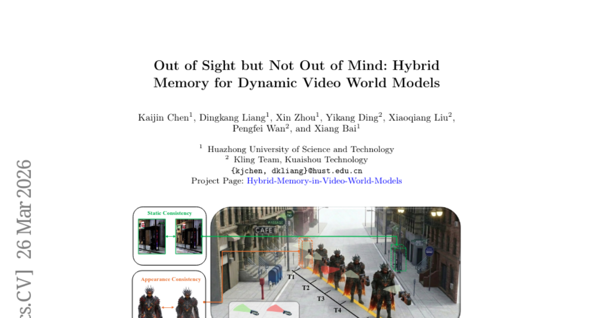
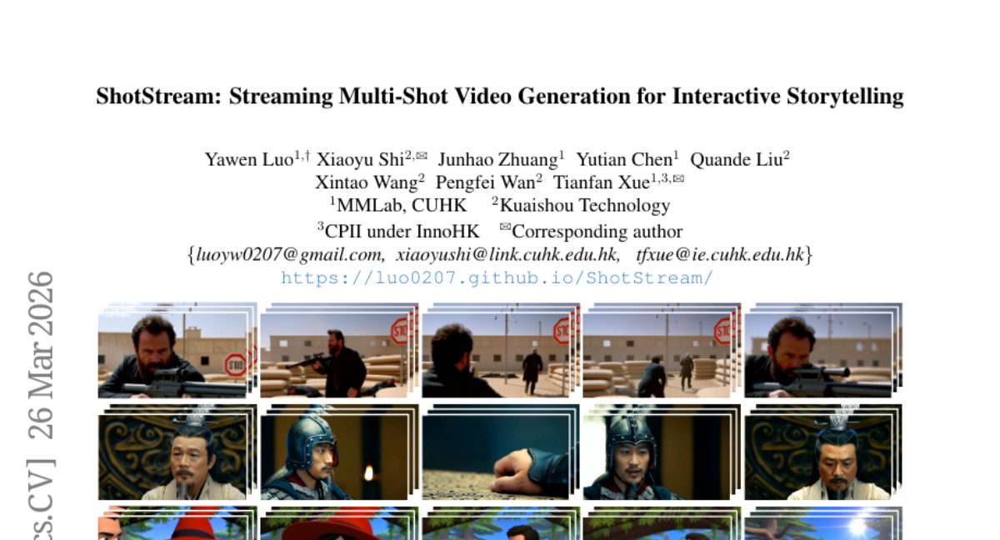
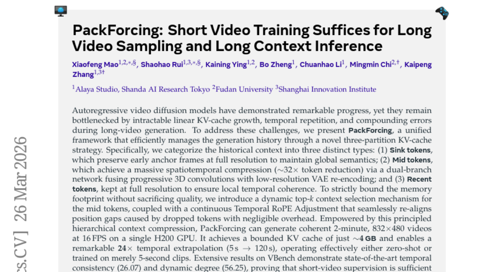
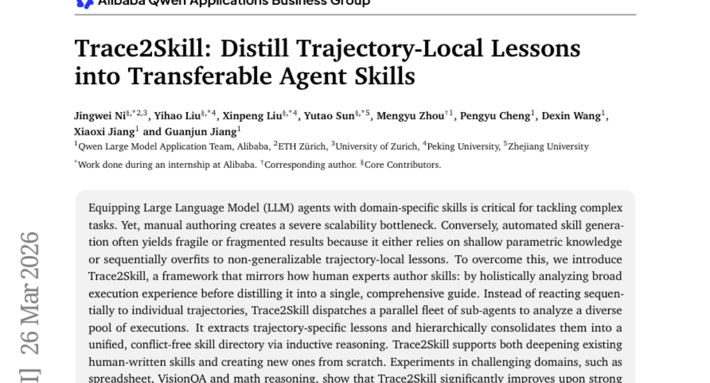
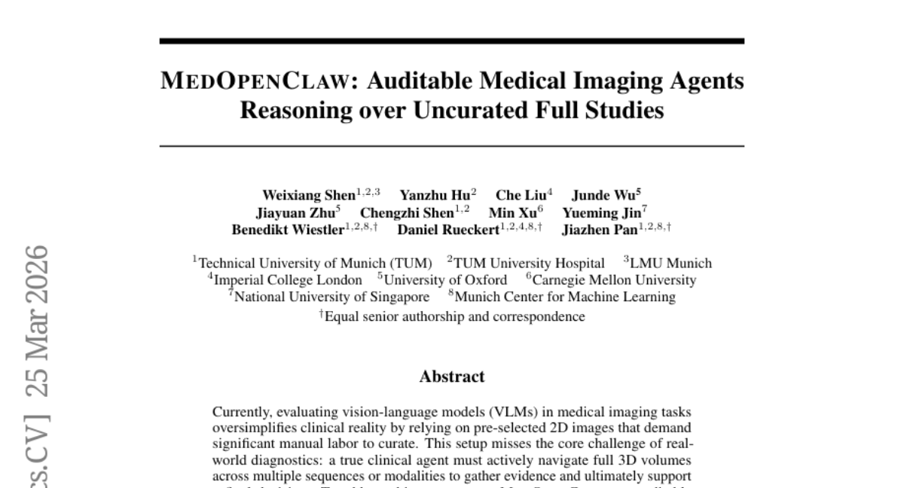
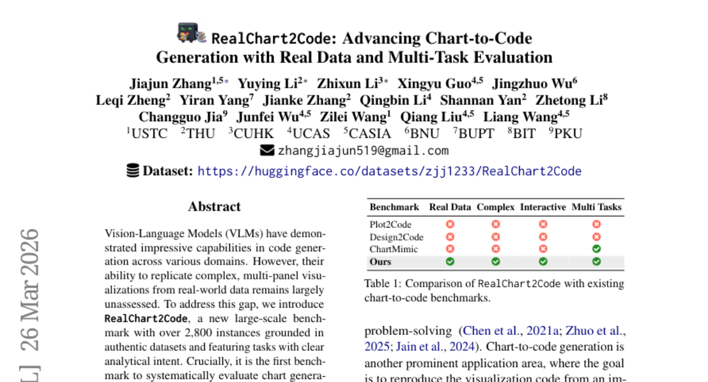
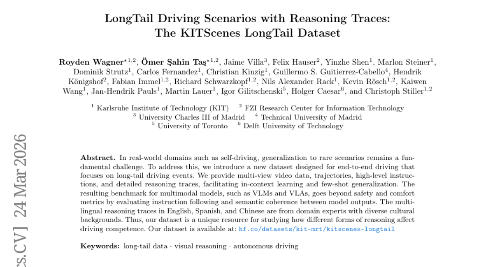
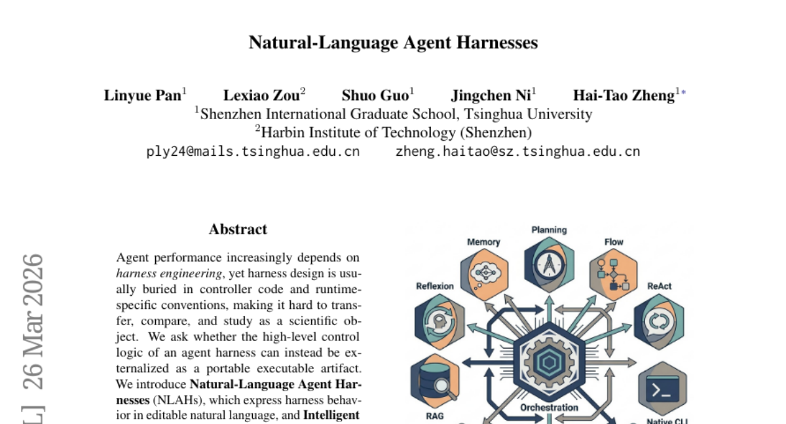
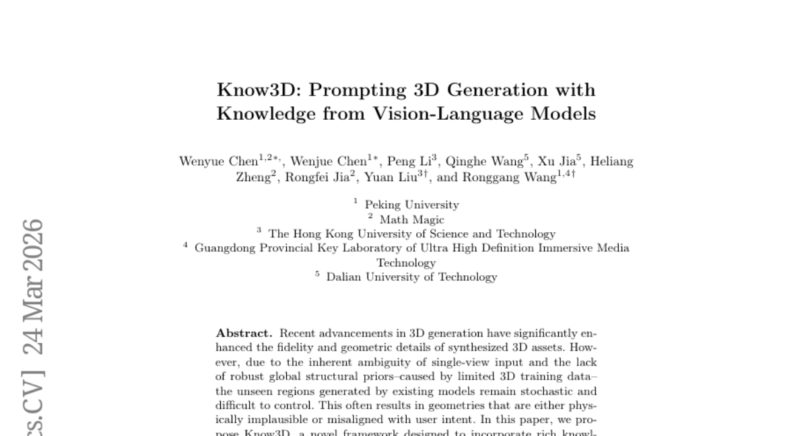

# 2026-03-31 Daily Papers (Top 9)

## 1. [Out of Sight but Not Out of Mind: Hybrid Memory for Dynamic Video World Models](https://huggingface.co/papers/2603.25716)
**Upvotes**: 133 | **도입 난이도**: 중 | **신뢰도**: 상
**arXiv**: https://arxiv.org/abs/2603.25716

**태그**: Vision, Video Generation, Memory Networks, RAG, Video, Evaluation

### 📌 한 줄 요약
동영상 월드 모델에서 가려진 객체의 움직임 연속성을 유지하는 새로운 메모리 구조(HyDRA)와 데이터셋(HM-World)을 제안하여, 동적 환경에서의 비디오 생성 품질을 향상시킴.

### 🔑 핵심 포인트
- 정적/동적 요소를 분리하여 처리하는 하이브리드 메모리 패러다임 제시
- 가려진 객체의 움직임 연속성 유지를 위한 대규모 비디오 데이터셋 HM-World 구축
- 시공간적 관련성 기반 검색 메커니즘을 사용하는 HyDRA 아키텍처 제안

### 🧑‍💻 개발자 관점
동영상 분석 및 생성 시스템에서 객체가 가려졌다 나타나는 상황을 더 잘 처리할 수 있게 해주어, 현실감 있는 시뮬레이션 및 비디오 편집 기능 향상에 기여할 수 있습니다.

### 🚀 실무 적용 아이디어
- HM-World 데이터셋을 활용하여 기존 모델의 성능 평가 및 개선
- HyDRA 아키텍처를 기반으로 가려진 객체 추적 성능 향상 연구
- 다른 비디오 생성 모델에 HyDRA의 메모리 메커니즘 통합 시도

### ⚠️ 리스크/한계
- HM-World 데이터셋의 편향으로 인해 특정 환경에서만 성능이 좋을 수 있음
- HyDRA 아키텍처의 복잡성으로 인해 학습 및 배포 비용이 높을 수 있음

### 📝 초록 기반 상세 설명
비디오 월드 모델은 물리적 세계를 시뮬레이션하는 데 큰 잠재력을 보이지만, 기존 메모리 메커니즘은 환경을 정적인 캔버스로 취급하여 가려진 객체의 움직임 연속성 유지가 어렵습니다. 이러한 문제를 해결하기 위해 정적 배경을 정확하게 기록하고 동적 객체를 추적하는 하이브리드 메모리 패러다임을 제안합니다. 이를 위해 카메라와 객체 궤적을 분리한 대규모 비디오 데이터셋 HM-World를 구축했습니다. 또한, 메모리를 토큰으로 압축하고 시공간적 관련성 기반 검색 메커니즘을 사용하는 HyDRA 아키텍처를 제안하여 숨겨진 객체의 움직임과 정체성을 효과적으로 보존합니다. HM-World에서의 실험 결과, HyDRA는 동적 객체 일관성과 전체 생성 품질 모두에서 기존 방법보다 뛰어난 성능을 보였습니다.

### 🖼️ 추가 자료

---

## 2. [ShotStream: Streaming Multi-Shot Video Generation for Interactive Storytelling](https://huggingface.co/papers/2603.25746)
**Upvotes**: 110 | **도입 난이도**: 중 | **신뢰도**: 상
**arXiv**: https://arxiv.org/abs/2603.25746

**태그**: Video Generation, Storytelling, Causal Model, Real-time, Distillation, Video, Inference

### 📌 한 줄 요약
ShotStream은 실시간 상호작용 스토리텔링을 위한 고효율 멀티샷 비디오 생성 아키텍처로, 기존 양방향 모델의 지연 시간 문제를 해결하고 사용자 프롬프트에 따라 동적으로 비디오를 생성합니다.

### 🔑 핵심 포인트
- 실시간 상호작용 스토리텔링을 위한 인과적 멀티샷 비디오 생성 아키텍처 제안
- 샷 간 일관성을 위한 이중 캐시 메모리 메커니즘 도입
- 오류 누적 완화를 위한 2단계 증류 전략 개발

### 🧑‍💻 개발자 관점
ShotStream은 실시간 비디오 생성 및 편집 기능을 필요로 하는 애플리케이션 개발에 유용하며, 특히 사용자 상호작용 기반의 동적 콘텐츠 생성 시스템 구축에 활용될 수 있습니다.

### 🚀 실무 적용 아이디어
- 제공된 코드를 사용하여 간단한 스토리텔링 시나리오에서 ShotStream을 테스트해보기
- 자체 데이터셋에 ShotStream을 파인튜닝하여 특정 스타일 또는 콘텐츠에 맞게 조정해보기
- 이중 캐시 메모리 및 2단계 증류 전략을 다른 비디오 생성 모델에 적용하여 성능 향상 가능성 검토해보기

### ⚠️ 리스크/한계
- 생성된 비디오의 품질은 텍스트 프롬프트의 명확성과 관련 데이터셋의 품질에 크게 의존적임
- 장면 전환이 잦거나 복잡한 내러티브에서는 샷 간 일관성 유지가 어려울 수 있음

### 📝 초록 기반 상세 설명
멀티샷 비디오 생성은 긴 내러티브 스토리텔링에 중요하지만, 기존 양방향 모델은 상호작용성이 제한적이고 지연 시간이 깁니다. ShotStream은 과거 맥락에 따라 다음 샷을 생성하는 새로운 인과적 아키텍처를 통해 실시간 스토리텔링을 가능하게 합니다. 텍스트-비디오 모델을 미세 조정하여 양방향 다음 샷 생성기로 만들고, 이를 분포 매칭 증류를 통해 인과적 학생 모델로 증류합니다. 샷 간 일관성 유지를 위해 이중 캐시 메모리 메커니즘을 도입하고, 오류 누적을 완화하기 위해 2단계 증류 전략을 사용합니다. ShotStream은 단일 GPU에서 16 FPS로 일관성 있는 멀티샷 비디오를 생성하며, 기존 양방향 모델과 동등하거나 더 나은 품질을 제공합니다.

---

## 3. [PackForcing: Short Video Training Suffices for Long Video Sampling and Long Context Inference](https://huggingface.co/papers/2603.25730)
**Upvotes**: 38 | **도입 난이도**: 중 | **신뢰도**: 상
**arXiv**: https://arxiv.org/abs/2603.25730

**태그**: Video Generation, Diffusion Model, Memory Efficiency, Temporal Consistency, Vision, Video, Inference, Optimization

### 📌 한 줄 요약
PackForcing은 짧은 비디오 학습만으로 긴 비디오 생성 시 메모리 효율성과 시간적 일관성을 크게 향상시키는 새로운 프레임워크를 제공하여, 고해상도 비디오 모델의 실용성을 높입니다.

### 🔑 핵심 포인트
- 3분할 KV-cache 전략을 통한 효율적인 메모리 관리
- 동적 top-k 컨텍스트 선택 및 Temporal RoPE Adjustment를 통한 품질 유지
- 짧은 비디오 학습만으로 긴 비디오 생성 가능

### 🧑‍💻 개발자 관점
고해상도 비디오 생성 모델을 개발할 때 메모리 사용량과 시간적 일관성 문제를 효과적으로 해결할 수 있어, 더욱 긴 비디오를 실시간으로 생성하거나 처리하는 시스템 구축에 유용합니다.

### 🚀 실무 적용 아이디어
- PackForcing을 기반으로 기존 비디오 생성 모델의 메모리 효율성 개선
- 실시간 비디오 스트리밍 또는 편집 시스템에 PackForcing 적용
- PackForcing의 다양한 설정(토큰 압축률, top-k 값 등)을 조정하여 특정 비디오 유형에 최적화

### ⚠️ 리스크/한계
- 압축 과정에서 일부 정보 손실 가능성
- 새로운 아키텍처에 대한 추가적인 학습 및 조정 필요

### 📝 초록 기반 상세 설명
최근 비디오 확산 모델은 발전했지만, 긴 비디오 생성 시 KV-cache의 선형적 증가, 시간적 반복, 오류 누적 문제가 있었습니다. PackForcing은 3분할 KV-cache 전략을 통해 이러한 문제를 해결합니다. Sink 토큰으로 초기 프레임을 보존하고, Mid 토큰으로 공간-시간 압축을 통해 메모리를 줄이며, Recent 토큰으로 시간적 일관성을 유지합니다. 동적 top-k 컨텍스트 선택과 Temporal RoPE Adjustment를 통해 품질 저하 없이 메모리 사용량을 제한합니다. PackForcing은 짧은 비디오 학습만으로 긴 비디오를 생성하며, VBench에서 SOTA 성능을 달성했습니다.

---

## 4. [Trace2Skill: Distill Trajectory-Local Lessons into Transferable Agent Skills](https://huggingface.co/papers/2603.25158)
**Upvotes**: 33 | **도입 난이도**: 중 | **신뢰도**: 상
**arXiv**: https://arxiv.org/abs/2603.25158

**태그**: Agent, LLM, AutoML, Skill Learning, RAG, Reasoning, Vision, Evaluation, Distillation

### 📌 한 줄 요약
LLM 에이전트의 기술을 자동 생성하고 개선하는 Trace2Skill 프레임워크는 수동 제작의 확장성 문제를 해결하고, 다양한 실행 경험을 분석하여 일반화 가능한 기술을 추출, 기존 기술 심화 및 새로운 기술 생성을 지원하여 실제 성능 향상과 모델 간 전이 학습 능력을 보여줌.

### 🔑 핵심 포인트
- 다양한 실행 경험을 활용하여 LLM 에이전트의 기술을 자동 생성 및 개선
- 궤적별 교훈을 계층적으로 통합하여 일반화 가능하고 충돌 없는 기술 디렉토리 구축
- 모델 크기 및 OOD 환경에 대한 기술 전이 학습 능력 입증

### 🧑‍💻 개발자 관점
LLM 에이전트 개발 시, 수동으로 기술을 정의하는 대신 Trace2Skill을 활용하여 자동으로 기술을 생성하고 개선함으로써 개발 효율성을 높이고, 다양한 환경에 적응 가능한 에이전트를 구축할 수 있습니다.

### 🚀 실무 적용 아이디어
- Trace2Skill을 활용하여 특정 도메인에 특화된 LLM 에이전트 기술 자동 생성 실험
- 기존 LLM 에이전트 기술을 Trace2Skill로 개선하여 성능 향상 비교 분석
- 생성된 기술의 다양한 LLM 모델 및 OOD 환경에서의 전이 학습 성능 평가

### ⚠️ 리스크/한계
- 다양한 실행 경험 데이터 확보의 어려움
- 생성된 기술의 품질 및 신뢰성 검증 필요

### 📝 초록 기반 상세 설명
LLM 에이전트가 복잡한 작업을 수행하려면 도메인 특화 기술이 필수적이지만, 수동 제작은 확장성 제약이 큽니다. 자동 기술 생성은 피상적인 지식이나 특정 궤적에 과적합되어 취약한 결과를 낳습니다. Trace2Skill은 인간 전문가처럼 광범위한 실행 경험을 분석하여 포괄적인 가이드로 기술을 추출하는 프레임워크입니다. 여러 하위 에이전트를 통해 궤적별 교훈을 추출하고, 귀납적 추론으로 통합하여 기술 디렉토리를 구축합니다. 스프레드시트, VisionQA, 수학 추론 등의 영역에서 Anthropic의 xlsx 기술을 포함한 강력한 베이스라인을 능가하는 성능을 보였으며, Qwen3.5-35B로 진화시킨 기술이 Qwen3.5-122B 에이전트의 WikiTableQuestions 성능을 최대 57.65% 향상시키는 등 모델 간 전이 학습 능력도 입증했습니다.

---

## 5. [MedOpenClaw: Auditable Medical Imaging Agents Reasoning over Uncurated Full Studies](https://huggingface.co/papers/2603.24649)
**Upvotes**: 20 | **도입 난이도**: 중 | **신뢰도**: 중
**arXiv**: https://arxiv.org/abs/2603.24649

**태그**: Agent, Medical Imaging, VLM, Benchmark, 3D, Reasoning, Vision, Evaluation

### 📌 한 줄 요약
의료 영상 분야에서 LLM/VLM 에이전트가 실제 임상 환경에서 3D 의료 영상을 탐색하고 진단을 지원하는 데 필요한 런타임 환경과 벤치마크를 제시하여, 기존 연구의 한계를 극복하고 실질적인 의료 진단 에이전트 개발을 위한 토대를 마련함.

### 🔑 핵심 포인트
- 실제 임상 환경을 반영한 3D 의료 영상 에이전트 평가를 위한 MEDOPENCLAW 런타임 및 MEDFLOWBENCH 벤치마크 제시
- LLM/VLM이 의료 영상 도구 사용 시 공간적 이해 부족으로 성능 저하되는 문제점 발견
- 감사 가능한(auditable) 의료 영상 에이전트 개발을 위한 새로운 방향 제시

### 🧑‍💻 개발자 관점
소프트웨어 엔지니어는 이 연구를 통해 실제 의료 환경에서 LLM/VLM 에이전트를 개발하고 평가하는 데 필요한 도구와 벤치마크를 활용하여, 의료 진단 자동화 시스템 구축에 기여할 수 있습니다. 특히, 공간적 추론 능력 향상을 위한 연구 방향 설정에 도움이 될 수 있습니다.

### 🚀 실무 적용 아이디어
- MEDOPENCLAW 런타임을 활용하여 기존 LLM/VLM 모델의 의료 영상 분석 성능 테스트
- MEDFLOWBENCH 벤치마크를 사용하여 다양한 의료 영상 데이터셋에 대한 모델 성능 비교 분석
- 공간적 추론 능력을 강화하기 위한 프롬프트 엔지니어링 또는 모델 구조 개선 실험

### ⚠️ 리스크/한계
- LLM/VLM의 공간적 이해 능력 부족으로 인한 오진 가능성 존재
- 제시된 벤치마크가 특정 질병 및 영상 유형에 편향되어 있을 수 있음

### 📝 초록 기반 상세 설명
기존 의료 영상 분야의 비전-언어 모델(VLM) 평가는 사전 선택된 2D 이미지에 의존하여 실제 임상 환경을 단순화하고 수동 작업 부담이 컸습니다. 이러한 방식은 실제 임상 진단의 핵심 과제인 3D 볼륨 탐색 및 증거 수집을 간과합니다. 본 연구에서는 VLM이 표준 의료 도구 내에서 동적으로 작동할 수 있도록 하는 MEDOPENCLAW 런타임과 MEDFLOWBENCH 벤치마크를 제안합니다. 초기 결과, 최첨단 LLM/VLM이 기본적인 작업은 성공적으로 수행하지만, 전문 도구 사용 시 공간적 이해 부족으로 성능이 저하되는 것을 확인했습니다. 본 연구는 정적 이미지 인식과 상호 작용적인 임상 워크플로우 간의 간극을 해소하여 감사 가능한 의료 영상 에이전트 개발을 위한 기반을 마련합니다.

---

## 6. [RealChart2Code: Advancing Chart-to-Code Generation with Real Data and Multi-Task Evaluation](https://huggingface.co/papers/2603.25804)
**Upvotes**: 14 | **도입 난이도**: 중 | **신뢰도**: 상
**arXiv**: https://arxiv.org/abs/2603.25804

**태그**: VLM, Code Generation, Visualization, Benchmark, Vision, Evaluation

### 📌 한 줄 요약
실제 데이터 기반 복잡한 시각화 생성 및 코드 생성을 평가하는 새로운 벤치마크 RealChart2Code를 통해 기존 VLM의 한계를 밝히고 향후 연구 방향을 제시합니다.

### 🔑 핵심 포인트
- 실제 데이터 기반의 차트-코드 생성 벤치마크 RealChart2Code 제시
- 다양한 VLM 모델들의 성능을 평가하고 한계점 분석
- 상용 모델과 오픈 소스 모델 간의 성능 격차 확인

### 🧑‍💻 개발자 관점
실제 데이터 시각화 코드를 생성하는 AI 모델의 성능을 객관적으로 평가하고 개선하는 데 활용할 수 있으며, 복잡한 시각화 요구사항에 맞는 모델 선택 및 개선 방향을 설정하는 데 도움을 줍니다.

### 🚀 실무 적용 아이디어
- RealChart2Code 벤치마크를 사용하여 자사 모델의 성능을 평가해보기
- 오픈 소스 VLM을 RealChart2Code 데이터셋으로 추가 학습시켜 성능 향상 시도
- 복잡한 차트 생성을 위한 VLM 아키텍처 개선 연구

### ⚠️ 리스크/한계
- RealChart2Code 벤치마크가 특정 유형의 시각화에 편향되어 있을 수 있음
- VLM의 성능이 데이터 품질 및 양에 크게 의존적임

### 📝 초록 기반 상세 설명
기존 Vision-Language 모델(VLM)은 다양한 영역에서 코드 생성 능력을 보여주었지만, 실제 데이터 기반의 복잡한 시각화 재현 능력은 제대로 평가되지 않았습니다. 이러한 문제를 해결하기 위해 실제 데이터셋을 기반으로 분석 의도를 명확히 담은 대규모 벤치마크 RealChart2Code를 소개합니다. RealChart2Code는 대규모 원시 데이터로부터 차트 생성 및 반복적인 코드 개선을 평가하는 최초의 벤치마크입니다. 14개의 주요 VLM을 평가한 결과, 복잡한 플롯 구조와 실제 데이터에 대한 어려움으로 인해 기존 벤치마크 대비 성능 저하가 컸습니다. 특히 상용 모델과 오픈 소스 모델 간의 성능 격차가 컸으며, 최첨단 VLM조차 복잡한 멀티 패널 차트를 정확하게 재현하지 못하는 경우가 많았습니다.

---

## 7. [LongTail Driving Scenarios with Reasoning Traces: The KITScenes LongTail Dataset](https://huggingface.co/papers/2603.23607)
**Upvotes**: 12 | **도입 난이도**: 중 | **신뢰도**: 상
**arXiv**: https://arxiv.org/abs/2603.23607

**태그**: Self-Driving, Dataset, VLM, Reasoning, Long-Tail, Multimodal, Video, Benchmark, Evaluation, Safety

### 📌 한 줄 요약
자율 주행의 희귀 시나리오에 대한 데이터셋과 추론 과정을 제공하여, VLM/VLA 모델의 instruction following 및 의미론적 일관성 평가를 가능하게 함.

### 🔑 핵심 포인트
- 장미꼬리 주행 시나리오에 특화된 새로운 데이터셋 제시
- 멀티뷰 비디오, 궤적, instruction, 추론 과정 등 다양한 데이터 제공
- 다국어 추론 과정을 통해 문화적 다양성이 주행 능력에 미치는 영향 연구 가능

### 🧑‍💻 개발자 관점
자율 주행 시스템의 희귀 케이스에 대한 성능 향상 및 안전성 검증에 활용할 수 있으며, VLM/VLA 모델의 instruction following 능력을 평가하는 데 유용하다.

### 🚀 실무 적용 아이디어
- 제공된 데이터셋을 활용하여 자율 주행 모델의 장미꼬리 시나리오 성능 테스트
- VLM/VLA 모델을 사용하여 instruction following 능력 벤치마크
- 다국어 추론 과정을 분석하여 문화적 차이가 모델 성능에 미치는 영향 연구

### ⚠️ 리스크/한계
- 데이터셋의 규모 및 다양성이 실제 모든 희귀 시나리오를 포괄하지 못할 수 있음
- 추론 과정의 주관성이 모델 평가에 영향을 미칠 수 있음

### 📝 초록 기반 상세 설명
자율 주행 분야에서 희귀 시나리오에 대한 일반화는 중요한 과제이다. 이를 해결하기 위해, 장미꼬리(long-tail) 주행 이벤트에 초점을 맞춘 새로운 데이터셋인 KITScenes LongTail을 소개한다. 이 데이터셋은 멀티뷰 비디오 데이터, 궤적, 고수준 instruction, 상세한 추론 과정을 제공하여 in-context learning 및 few-shot 일반화를 용이하게 한다. VLM 및 VLA와 같은 멀티모달 모델을 위한 벤치마크를 제공하며, 안전 및 편안함 지표 외에도 instruction following 및 모델 출력 간의 의미론적 일관성을 평가한다. 영어, 스페인어, 중국어로 된 다국어 추론 과정은 다양한 문화적 배경을 가진 도메인 전문가로부터 얻었다. 따라서 이 데이터셋은 다양한 형태의 추론이 주행 능력에 미치는 영향을 연구하는 데 유용한 리소스이다.

---

## 8. [Natural-Language Agent Harnesses](https://huggingface.co/papers/2603.25723)
**Upvotes**: 10 | **도입 난이도**: 중 | **신뢰도**: 중
**arXiv**: https://arxiv.org/abs/2603.25723

**태그**: Agent, Natural Language, Harness, Runtime, Benchmark, Evaluation

### 📌 한 줄 요약
에이전트 harness 로직을 자연어로 표현하여 재사용성, 비교 가능성, 연구 용이성을 높이는 NLAH 프레임워크와 IHR 런타임을 제안합니다.

### 🔑 핵심 포인트
- 에이전트 harness 로직을 자연어로 표현하는 NLAH 프레임워크 제안
- NLAH를 실행하는 IHR 런타임 개발
- 코딩 및 컴퓨터 사용 벤치마크를 통한 NLAH 및 IHR의 유효성 검증

### 🧑‍💻 개발자 관점
에이전트 개발 시 harness 로직을 자연어로 표현하여 재사용성을 높이고, 다양한 환경에서 일관된 동작을 보장하며, harness 개발 및 유지보수 비용을 절감할 수 있습니다.

### 🚀 실무 적용 아이디어
- 제공된 NLAH 예제를 통해 자연어 harness 정의 및 실행 방법 학습
- 자신의 에이전트 프로젝트에 NLAH 및 IHR 적용 가능성 검토
- NLAH를 활용하여 다양한 harness 전략 실험 및 성능 비교

### ⚠️ 리스크/한계
- 자연어 harness 표현의 모호성으로 인한 예상치 못한 동작 발생 가능성
- IHR 런타임의 성능 오버헤드 발생 가능성
- 특정 런타임 환경에 대한 의존성 발생 가능성

### 📝 초록 기반 상세 설명
에이전트 성능 향상에 harness 엔지니어링이 중요하지만, 기존 harness 설계는 코드에 묻혀있고 런타임에 종속되어 재사용, 비교, 연구가 어려웠습니다. 본 논문에서는 에이전트 harness의 고수준 제어 로직을 자연어로 표현하여 이식 가능한 형태로 만들 수 있는지 질문합니다. 이를 위해 harness 동작을 자연어로 편집 가능하게 표현하는 NLAH와, 명시적 계약, 지속적인 artifact, 경량 adapter를 통해 harness를 실행하는 IHR 런타임을 제안합니다. 코딩 및 컴퓨터 사용 벤치마크에서 운영 가능성, 모듈 제거, 코드-텍스트 harness 마이그레이션에 대한 평가를 수행했습니다.

---

## 9. [Know3D: Prompting 3D Generation with Knowledge from Vision-Language Models](https://huggingface.co/papers/2603.22782)
**Upvotes**: 8 | **도입 난이도**: 중 | **신뢰도**: 중
**arXiv**: https://arxiv.org/abs/2603.22782

**태그**: 3D Generation, VLM, Diffusion Model, Language Control, Multimodal, Vision

### 📌 한 줄 요약
Know3D는 VLM의 지식을 활용하여 3D 생성 모델의 후면 뷰 생성을 제어 가능하게 함으로써, 기존 모델의 무작위성을 개선하고 사용자 의도에 맞는 3D 에셋 생성을 가능하게 한다.

### 🔑 핵심 포인트
- VLM을 활용하여 3D 모델의 후면 뷰 생성을 언어적으로 제어 가능하게 함
- VLM과 diffusion 모델을 결합하여 의미론적 지식을 3D 생성 모델에 전달
- 기존 3D 생성 모델의 무작위성을 개선하고 사용자 의도에 부합하는 3D 에셋 생성

### 🧑‍💻 개발자 관점
3D 에셋 생성 파이프라인에서 사용자 의도에 맞는 결과물을 얻기 위한 제어 가능성을 높이고, 생성 과정의 불확실성을 줄여 개발 효율성을 향상시킬 수 있다.

### 🚀 실무 적용 아이디어
- VLM을 활용한 3D 모델 생성 파이프라인 구축
- Diffusion 모델을 활용하여 VLM의 지식을 3D 생성 모델에 통합하는 실험
- Know3D 프레임워크를 기반으로 특정 도메인에 특화된 3D 에셋 생성 모델 개발

### ⚠️ 리스크/한계
- VLM의 성능에 따라 생성 결과의 품질이 달라질 수 있음
- Diffusion 모델의 학습 및 추론 비용이 높을 수 있음

### 📝 초록 기반 상세 설명
기존 3D 생성 모델은 단일 시점 관찰의 모호성과 제한된 3D 학습 데이터로 인해 후면 뷰 생성이 무작위적이고 제어하기 어려웠다. 이러한 문제를 해결하기 위해 Know3D 프레임워크는 멀티모달 대형 언어 모델(VLM)의 풍부한 지식을 3D 생성 프로세스에 통합하여 언어 기반 제어가 가능한 후면 뷰 생성을 가능하게 한다. VLM은 의미론적 이해와 지침을 제공하고, diffusion 모델은 VLM의 의미론적 지식을 3D 생성 모델로 전달하는 역할을 한다. 이를 통해 추상적인 텍스트 지침과 관찰되지 않은 영역의 기하학적 재구성 사이의 간극을 해소하고, 무작위적인 후면 뷰 생성을 의미론적으로 제어 가능한 프로세스로 전환한다.

---

