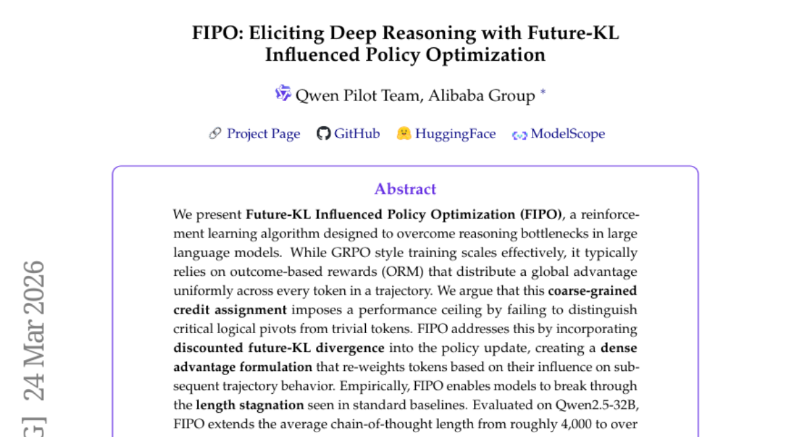
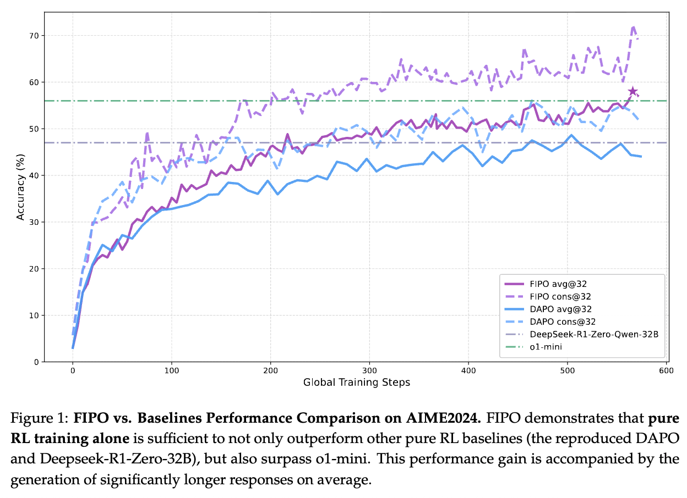
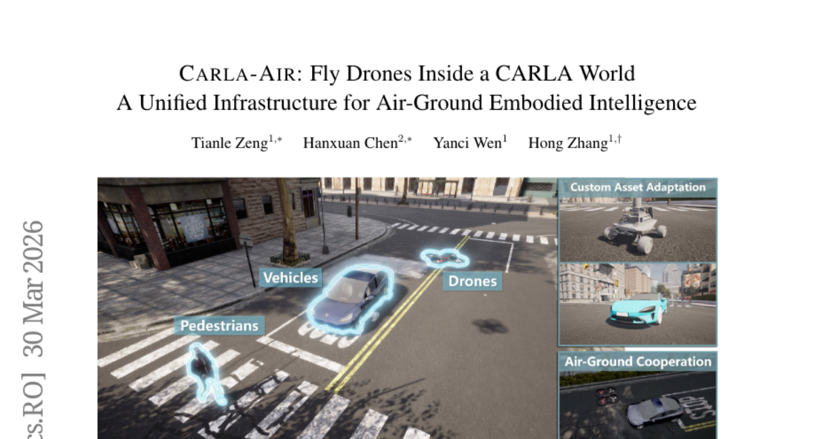
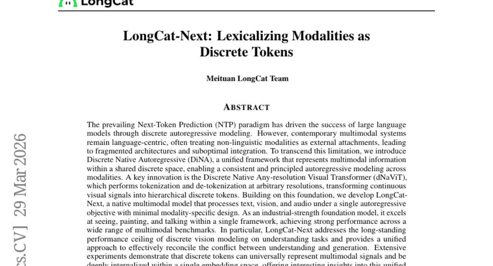
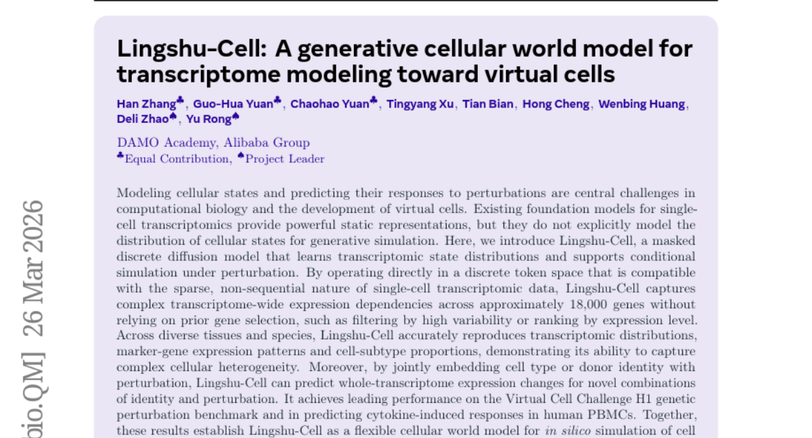
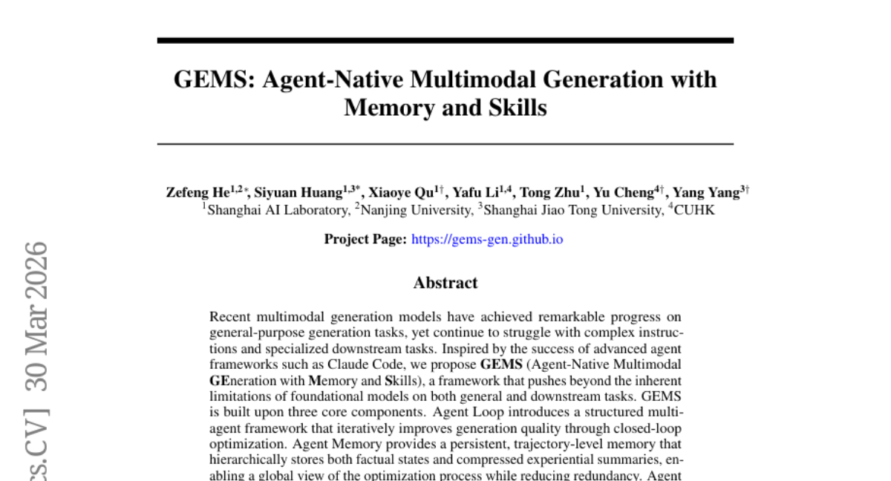
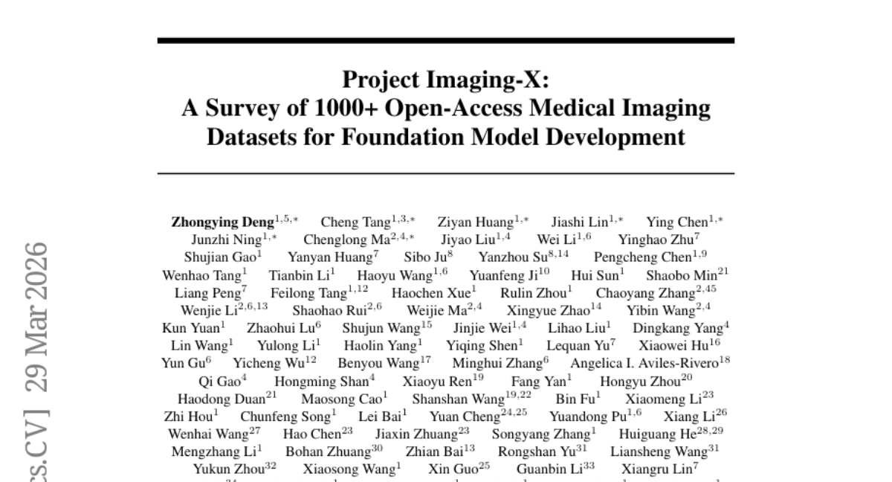
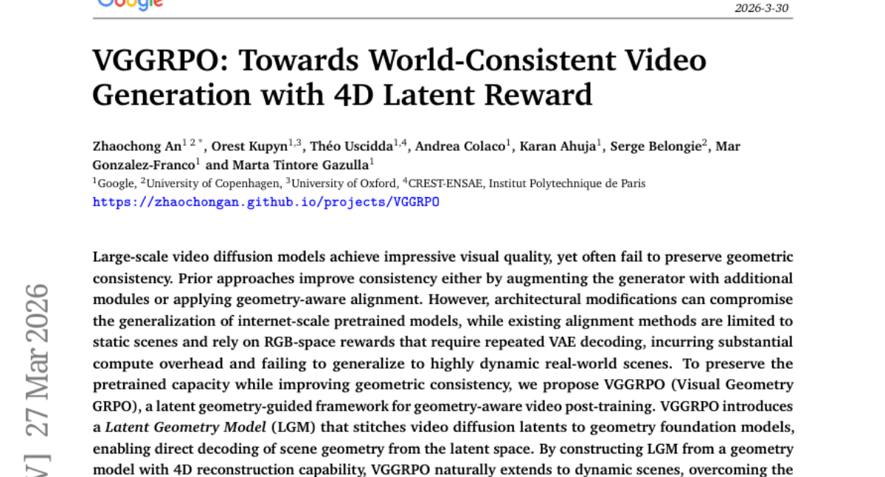
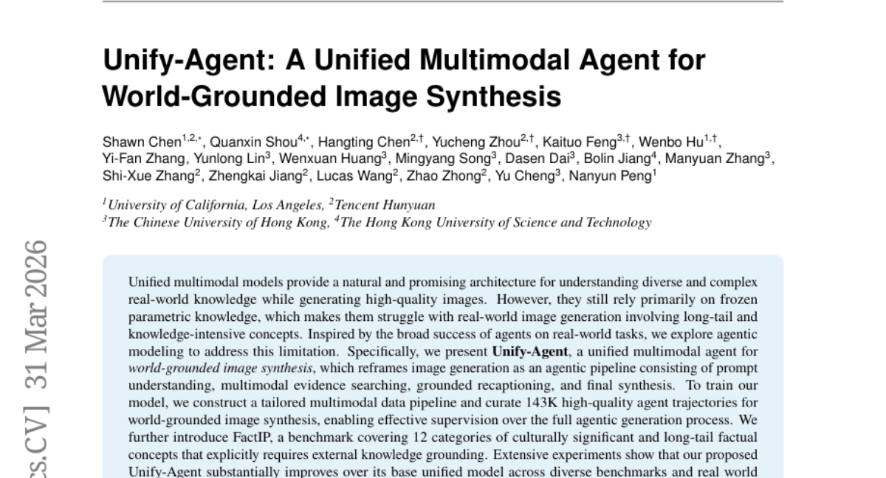
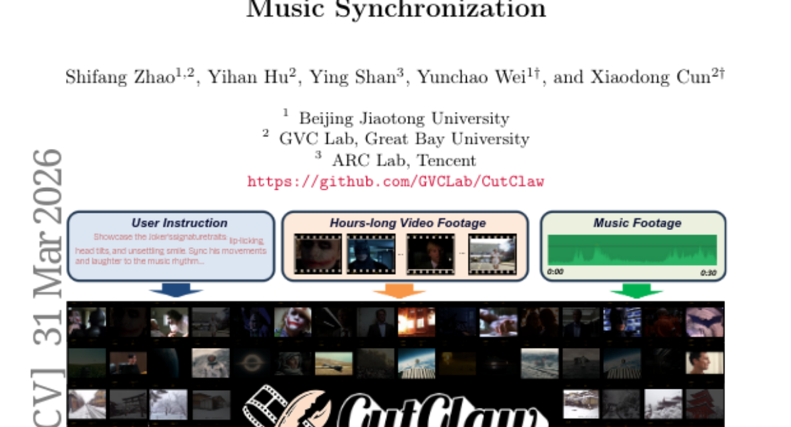

# 2026-04-02 Daily Papers (Top 9)

## 1. [FIPO: Eliciting Deep Reasoning with Future-KL Influenced Policy Optimization](https://huggingface.co/papers/2603.19835)
**Upvotes**: 286 | **도입 난이도**: 중 | **신뢰도**: 상
**arXiv**: https://arxiv.org/abs/2603.19835

**태그**: Reinforcement Learning, LLM, Reasoning, Policy Optimization, RAG, Evaluation

### 📌 한 줄 요약
FIPO는 LLM의 추론 능력을 향상시키기 위해 미래 KL 발산을 활용하여 토큰별 중요도를 재평가하는 새로운 강화 학습 알고리즘으로, 기존 방법의 성능 한계를 극복하고 CoT 길이를 획기적으로 늘림.

### 🔑 핵심 포인트
- 미래 KL 발산을 활용한 dense advantage formulation 도입
- 토큰별 중요도 재평가를 통한 추론 능력 향상
- Qwen2.5-32B 모델에서 CoT 길이 및 AIME 정확도 향상

### 🧑‍💻 개발자 관점
FIPO는 LLM 기반 에이전트의 추론 능력을 향상시켜 복잡한 문제 해결 능력을 높일 수 있으며, 특히 긴 CoT가 필요한 작업에서 성능 향상을 기대할 수 있다.

### 🚀 실무 적용 아이디어
- verl 프레임워크 기반 FIPO 학습 시스템을 활용하여 자체 데이터셋에 적용해보기
- 기존 ORM 기반 강화 학습 알고리즘에 FIPO의 dense advantage formulation 적용해보기
- FIPO를 활용하여 LLM 에이전트의 CoT 길이 및 정확도 변화 관찰하기

### ⚠️ 리스크/한계
- KL 발산 계산에 따른 추가적인 연산 비용 발생 가능성
- 특정 모델 및 데이터셋에 최적화되었을 가능성

### 📝 초록 기반 상세 설명
LLM의 추론 능력 향상을 위한 강화 학습 연구에서, 기존의 outcome-based reward 방식은 모든 토큰에 동일한 가중치를 부여하여 중요한 논리적 전환점을 구분하지 못하는 문제점이 있었다. 이러한 문제점을 해결하기 위해, FIPO는 미래 KL 발산을 활용하여 토큰이 후속 trajectory에 미치는 영향에 따라 가중치를 재분배하는 dense advantage formulation을 도입했다. 실험 결과, FIPO는 Qwen2.5-32B 모델에서 CoT 길이를 4,000 토큰에서 10,000 토큰 이상으로 확장하고, AIME 2024 Pass@1 정확도를 50.0%에서 58.0%로 향상시켰다. 이는 DeepSeek-R1-Zero-Math-32B 및 o1-mini 모델을 능가하는 성능이다. FIPO는 verl 프레임워크 기반으로 구축되었으며, 오픈소스로 공개된다.

### 🖼️ 추가 자료

---

## 2. [CARLA-Air: Fly Drones Inside a CARLA World -- A Unified Infrastructure for Air-Ground Embodied Intelligence](https://huggingface.co/papers/2603.28032)
**Upvotes**: 197 | **도입 난이도**: 중 | **신뢰도**: 상
**arXiv**: https://arxiv.org/abs/2603.28032

**태그**: Simulation, Drone, Autonomous Driving, AirSim, CARLA, Agent, Vision

### 📌 한 줄 요약
CARLA-Air는 Unreal Engine 기반의 통합 시뮬레이션 환경을 제공하여, 지상 차량과 드론을 동시에 시뮬레이션하고, 기존 CARLA 및 AirSim 코드를 수정 없이 재사용할 수 있도록 지원합니다.

### 🔑 핵심 포인트
- Unreal Engine 기반의 통합 시뮬레이션 환경 제공
- CARLA 및 AirSim native Python API와 ROS 2 인터페이스 지원으로 코드 재사용성 극대화
- 다양한 air-ground embodied intelligence 워크로드 지원 (협업, 내비게이션, 비전-언어 행동 등)

### 🧑‍💻 개발자 관점
자율 주행 및 드론 개발자가 복잡한 air-ground 협업 시나리오를 시뮬레이션하고, 실제 환경에서의 테스트 전에 다양한 환경 조건과 센서 데이터를 활용하여 알고리즘을 검증할 수 있도록 돕습니다.

### 🚀 실무 적용 아이디어
- CARLA-Air 설치 및 기본 예제 실행
- 자체 드론 모델 또는 로봇 플랫폼 통합 시도
- Air-ground 협업 시나리오 구축 및 테스트

### ⚠️ 리스크/한계
- Unreal Engine 및 관련 툴에 대한 이해 필요
- AirSim의 aerial 기능 상속으로 인한 기존 AirSim의 한계점 공유 가능성

### 📝 초록 기반 상세 설명
저고도 경제, Embodied Intelligence, 지상-공중 협력 시스템의 융합으로 인해, 공중 및 지상 에이전트를 단일 물리적으로 일관된 환경에서 공동으로 모델링할 수 있는 시뮬레이션 인프라에 대한 수요가 증가하고 있습니다. 기존 오픈 소스 플랫폼은 도메인 분리되어 있어, driving simulator는 aerial dynamics가 부족하고, multirotor simulator는 현실적인 지상 장면이 부족합니다. Bridge 기반 공동 시뮬레이션은 동기화 오버헤드를 발생시키고 엄격한 시공간적 일관성을 보장할 수 없습니다. 본 논문에서는 고충실도 도시 주행과 물리적으로 정확한 multirotor 비행을 단일 Unreal Engine 프로세스 내에서 통합하는 오픈 소스 인프라 CARLA-Air를 제시합니다. CARLA 및 AirSim native Python API와 ROS 2 인터페이스를 모두 보존하여 코드 재사용성을 높였습니다. CARLA-Air는 photorealistic 환경에서 최대 18개의 센서 modality를 캡처하여 다양한 air-ground embodied intelligence 워크로드를 지원합니다.

### 🖼️ 추가 자료

---

## 3. [LongCat-Next: Lexicalizing Modalities as Discrete Tokens](https://huggingface.co/papers/2603.27538)
**Upvotes**: 115 | **도입 난이도**: 중 | **신뢰도**: 상
**arXiv**: https://arxiv.org/abs/2603.27538

**태그**: Multimodal, Autoregressive, Vision, Audio, Transformer, RAG, Benchmark

### 📌 한 줄 요약
LongCat-Next는 텍스트, 이미지, 오디오를 통합된 방식으로 처리하는 새로운 멀티모달 모델로, 다양한 멀티모달 작업에서 높은 성능을 보이며, 특히 이해와 생성 간의 균형을 효과적으로 맞춥니다.

### 🔑 핵심 포인트
- 텍스트, 이미지, 오디오를 통합 처리하는 native 멀티모달 모델 LongCat-Next 제시
- Discrete Native Autoregressive (DiNA) 프레임워크를 통해 modality 간 일관성 유지
- Discrete Native Any-resolution Visual Transformer (dNaViT)를 활용하여 시각 정보를 discrete 토큰으로 변환

### 🧑‍💻 개발자 관점
LongCat-Next는 다양한 modality를 통합하여 처리하는 시스템을 구축하는 데 유용하며, 특히 이미지 이해 및 생성 관련 task에서 성능 향상을 기대할 수 있습니다.

### 🚀 실무 적용 아이디어
- LongCat-Next GitHub 저장소 방문 및 코드 검토
- 제공되는 tokenizer를 활용하여 이미지 데이터를 discrete 토큰으로 변환하는 실험 진행
- 기존 멀티모달 모델과 LongCat-Next의 성능 비교

### ⚠️ 리스크/한계
- 모델의 크기가 클 수 있으며, 학습 및 추론에 많은 리소스가 필요할 수 있습니다.
- Discrete 토큰화 방식이 특정 유형의 데이터에 적합하지 않을 수 있습니다.

### 📝 초록 기반 상세 설명
기존 멀티모달 시스템은 언어 중심으로 다른 modality를 외부적으로 결합하여 통합이 미흡했습니다. 이러한 한계를 극복하기 위해, LongCat-Next는 모든 modality를 공유된 discrete 공간에서 처리하는 DiNA 프레임워크를 제안합니다. 핵심은 dNaViT인데, 이는 임의 해상도에서 토큰화 및 역토큰화를 수행하여 시각 정보를 계층적 discrete 토큰으로 변환합니다. LongCat-Next는 텍스트, 이미지, 오디오를 단일 autoregressive 목표로 처리하며, 다양한 멀티모달 벤치마크에서 뛰어난 성능을 보입니다. 특히 discrete vision modeling의 성능 한계를 극복하고 이해와 생성 간의 균형을 효과적으로 맞춥니다.

---

## 4. [Lingshu-Cell: A generative cellular world model for transcriptome modeling toward virtual cells](https://huggingface.co/papers/2603.25240)
**Upvotes**: 71 | **도입 난이도**: 중 | **신뢰도**: 중
**arXiv**: https://arxiv.org/abs/2603.25240

**태그**: Generative Model, Single-cell, Transcriptomics, Diffusion Model, Virtual Cell, Benchmark

### 📌 한 줄 요약
Lingshu-Cell은 단일 세포 전사체 데이터를 위한 생성 모델로, 세포 상태 분포 학습 및 섭동 조건에서의 시뮬레이션을 가능하게 하여 가상 세포 연구 및 약물 스크리닝에 활용될 수 있습니다.

### 🔑 핵심 포인트
- 마스크된 이산 확산 모델을 사용하여 전사체 상태 분포 학습
- 섭동 조건에서 조건부 시뮬레이션을 통한 세포 반응 예측
- 가상 세포 챌린지 및 인간 PBMCs 실험에서 우수한 성능 입증

### 🧑‍💻 개발자 관점
Lingshu-Cell은 세포 상태 시뮬레이션을 통해 신약 개발 및 약물 스크리닝 연구에 활용될 수 있으며, 특히 세포 반응 예측 모델 개발에 유용합니다.

### 🚀 실무 적용 아이디어
- Lingshu-Cell 모델을 활용하여 특정 세포 유형의 섭동 반응 예측 실험 수행
- 자체 보유한 단일 세포 전사체 데이터에 Lingshu-Cell 모델 적용
- Lingshu-Cell 모델의 성능을 다른 기존 모델과 비교 분석

### ⚠️ 리스크/한계
- 모델의 계산 복잡도가 높을 수 있으며, 대규모 데이터셋에 대한 학습이 필요할 수 있음
- 특정 세포 유형 또는 섭동 조건에 따라 모델 성능이 달라질 수 있음

### 📝 초록 기반 상세 설명
단일 세포 전사체 연구에서 세포 상태 모델링 및 섭동에 대한 반응 예측은 중요한 과제입니다. 기존 모델들은 정적인 표현에 집중하는 반면, 세포 상태 분포를 명시적으로 모델링하지 못합니다. 본 연구에서는 마스크된 이산 확산 모델인 Lingshu-Cell을 제안하여 전사체 상태 분포를 학습하고 섭동 조건에서 조건부 시뮬레이션을 지원합니다. Lingshu-Cell은 희소하고 비 순차적인 단일 세포 전사체 데이터에 적합한 이산 토큰 공간에서 작동하여, 복잡한 전사체 전체의 발현 의존성을 포착합니다. 다양한 조직과 종에 걸쳐 Lingshu-Cell은 전사체 분포, 마커 유전자 발현 패턴, 세포 하위 유형 비율을 정확하게 재현하며, 가상 세포 챌린지 및 인간 PBMCs에서의 사이토카인 유도 반응 예측에서 뛰어난 성능을 보였습니다.

---

## 5. [GEMS: Agent-Native Multimodal Generation with Memory and Skills](https://huggingface.co/papers/2603.28088)
**Upvotes**: 58 | **도입 난이도**: 중 | **신뢰도**: 상
**arXiv**: https://arxiv.org/abs/2603.28088

**태그**: Agent, Multimodal, Generation, Memory, Skills, Vision, Evaluation

### 📌 한 줄 요약
GEMS 프레임워크는 멀티 에이전트 루프, 계층적 메모리, 온디맨드 스킬을 통해 multimodal 생성 모델의 성능을 크게 향상시키고, 특히 경량 모델의 활용도를 높임.

### 🔑 핵심 포인트
- 멀티 에이전트 루프를 통한 반복적 생성 품질 개선
- 계층적 메모리를 활용한 효율적인 정보 관리 및 최적화
- 온디맨드 스킬 제공으로 다양한 downstream 작업 지원

### 🧑‍💻 개발자 관점
GEMS는 기존 모델의 한계를 극복하고, 특히 리소스가 제한적인 환경에서 경량 모델의 활용도를 극대화할 수 있는 가능성을 제시하여, 개발자가 더 적은 비용으로 더 나은 성능을 얻을 수 있도록 돕습니다.

### 🚀 실무 적용 아이디어
- GEMS 프레임워크를 활용하여 기존 multimodal 생성 모델의 성능 향상 실험
- 자체 데이터셋에 GEMS 프레임워크 적용하여 downstream task 성능 개선 가능성 검증
- 경량 모델에 GEMS 프레임워크를 적용하여 SOTA 모델과의 성능 비교

### ⚠️ 리스크/한계
- 에이전트 루프의 복잡성으로 인한 디버깅 및 유지보수 어려움
- 메모리 관리 및 스킬 확장에 따른 추가적인 리소스 요구

### 📝 초록 기반 상세 설명
최근 multimodal 생성 모델은 일반적인 작업에서 상당한 발전을 이루었지만, 복잡한 지시사항이나 특정 downstream 작업에는 어려움을 겪고 있습니다. Claude Code와 같은 에이전트 프레임워크의 성공에 영감을 받아, GEMS라는 새로운 프레임워크를 제안합니다. GEMS는 에이전트 루프를 통해 반복적으로 품질을 개선하고, 계층적 메모리를 통해 최적화 과정을 전역적으로 파악하며, 온디맨드 스킬을 통해 다양한 downstream 작업에 효과적으로 대응합니다. 다양한 실험 결과, GEMS는 여러 생성 모델에서 상당한 성능 향상을 보였으며, 특히 경량 모델의 성능을 SOTA 모델 수준으로 끌어올리는 데 성공했습니다.

---

## 6. [Project Imaging-X: A Survey of 1000+ Open-Access Medical Imaging Datasets for Foundation Model Development](https://huggingface.co/papers/2603.27460)
**Upvotes**: 44 | **도입 난이도**: 중 | **신뢰도**: 상
**arXiv**: https://arxiv.org/abs/2603.27460

**태그**: Medical Imaging, Foundation Model, Dataset, Data Fusion, RAG, Vision

### 📌 한 줄 요약
의료 영상 분야의 foundation model 개발을 저해하는 데이터셋 부족 문제를 해결하기 위해, 1000개 이상의 공개 의료 영상 데이터셋을 조사하고 통합하는 방법론과 discovery portal을 제시하여 데이터 활용성을 높임.

### 🔑 핵심 포인트
- 1000개 이상의 의료 영상 데이터셋에 대한 최대 규모의 survey 제공
- Metadata 기반 데이터셋 융합(MDFP) 패러다임 제안
- 자동화된 데이터셋 통합을 지원하는 interactive discovery portal 개발 및 공개

### 🧑‍💻 개발자 관점
의료 영상 분석 모델 개발 시, 공개 데이터셋 검색 및 통합 과정을 자동화하여 데이터 확보 및 전처리 시간을 단축하고, 다양한 데이터셋을 활용한 모델 성능 향상을 기대할 수 있습니다.

### 🚀 실무 적용 아이디어
- Discovery portal을 통해 원하는 modality 및 task에 맞는 데이터셋 검색 및 통합
- MDFP 패러다임을 기반으로 자체 보유 데이터셋과 공개 데이터셋 융합 실험
- 제공되는 데이터셋 목록을 활용하여 새로운 의료 영상 분석 task 정의 및 모델 개발

### ⚠️ 리스크/한계
- 데이터셋의 품질 및 annotation 정확도에 따라 모델 성능에 영향
- MDFP 패러다임의 효과는 데이터셋 특성 및 융합 방법에 따라 달라질 수 있음

### 📝 초록 기반 상세 설명
Foundation model은 대규모 데이터셋을 통해 다양한 분야에서 성공을 거두었지만, 의료 영상 분야는 데이터 수집의 어려움으로 인해 발전이 더딘 상황입니다. 본 연구에서는 1000개 이상의 공개 의료 영상 데이터셋을 조사하여 modality, task, anatomy, annotation 등의 정보를 체계적으로 정리했습니다. 분석 결과, 데이터셋이 규모가 작고, task별로 파편화되어 있으며, 장기 및 modality별로 불균형하게 분포되어 있음을 확인했습니다. 이러한 문제를 해결하기 위해 metadata 기반 데이터셋 융합(MDFP) 패러다임을 제안하고, 데이터셋 통합을 자동화하는 discovery portal을 개발하여 공개 데이터셋 활용성을 높였습니다. 본 연구는 의료 영상 데이터셋 통합을 위한 실질적인 로드맵을 제공하여 foundation model 개발을 가속화할 것으로 기대됩니다.

---

## 7. [VGGRPO: Towards World-Consistent Video Generation with 4D Latent Reward](https://huggingface.co/papers/2603.26599)
**Upvotes**: 43 | **도입 난이도**: 중 | **신뢰도**: 상
**arXiv**: https://arxiv.org/abs/2603.26599

**태그**: Video Generation, Diffusion Model, Geometry Consistency, Reinforcement Learning, 4D Reconstruction, Video, Benchmark, Safety

### 📌 한 줄 요약
비디오 생성 모델의 기하학적 일관성을 개선하기 위해, latent 공간에서 직접 기하 정보를 활용하여 효율적인 후처리 학습을 수행하는 VGGRPO 프레임워크를 제안합니다.

### 🔑 핵심 포인트
- Latent Geometry Model (LGM)을 통해 비디오 확산 모델의 latent 공간과 기하 모델을 연결
- 4D 재구성 기반 기하 모델을 활용하여 동적 장면에서도 기하 일관성 유지
- Latent 공간에서의 강화 학습을 통해 카메라 움직임 안정성 및 기하 투영 일관성 개선

### 🧑‍💻 개발자 관점
비디오 생성 모델의 결과물 품질을 높이는 데 활용 가능하며, 특히 기하학적 일관성이 중요한 자율 주행, 로보틱스 등의 분야에서 유용하게 사용될 수 있습니다.

### 🚀 실무 적용 아이디어
- VGGRPO를 적용하여 생성된 비디오의 기하학적 일관성 개선 효과를 확인
- 자체 데이터셋에 VGGRPO를 적용하여 성능 향상 가능성 검토
- LGM의 구조 및 학습 방법을 변경하여 성능 개선 시도

### ⚠️ 리스크/한계
- LGM의 성능이 전체 프레임워크 성능에 큰 영향을 미칠 수 있음
- 강화 학습 과정에서 reward function 설계가 중요하며, 잘못된 reward는 성능 저하를 야기할 수 있음

### 📝 초록 기반 상세 설명
최근 비디오 확산 모델은 뛰어난 시각적 품질을 보여주지만, 기하학적 일관성을 유지하는 데 어려움을 겪습니다. 기존 방법들은 생성기에 추가 모듈을 도입하거나 기하 정보 기반 정렬을 사용하지만, 이는 모델의 일반화 성능을 저해하거나 정적 장면에만 적용 가능하다는 한계가 있습니다. 이러한 문제를 해결하기 위해, 본 논문에서는 사전 학습된 모델의 성능을 유지하면서 기하학적 일관성을 향상시키는 VGGRPO 프레임워크를 제안합니다. VGGRPO는 비디오 확산 모델의 latent 공간과 기하 모델을 연결하여 latent 공간에서 직접 장면 기하 정보를 디코딩할 수 있도록 합니다. 또한, 4D 재구성 능력을 가진 기하 모델을 활용하여 동적 장면에도 적용 가능하며, latent 공간에서의 강화 학습을 통해 카메라 움직임의 안정성과 기하 투영 일관성을 개선합니다. 실험 결과, VGGRPO는 카메라 안정성, 기하 일관성, 전반적인 품질을 향상시키면서 VAE 디코딩 비용을 절감하는 효과를 보였습니다.

---

## 8. [Unify-Agent: A Unified Multimodal Agent for World-Grounded Image Synthesis](https://huggingface.co/papers/2603.29620)
**Upvotes**: 33 | **도입 난이도**: 중 | **신뢰도**: 상
**arXiv**: https://arxiv.org/abs/2603.29620

**태그**: Agent, Image Synthesis, Multimodal, Knowledge Grounding, Reasoning, Vision, Benchmark

### 📌 한 줄 요약
Unify-Agent는 외부 지식 검색 및 추론을 통합하여 지식 집약적인 이미지 생성 성능을 향상시키는 새로운 에이전트 기반 이미지 생성 모델입니다.

### 🔑 핵심 포인트
- 이미지 생성을 에이전트 파이프라인으로 재구성
- 외부 지식 검색 및 추론을 통합하여 지식 집약적 이미지 생성 성능 향상
- 143K개의 고품질 에이전트 궤적 데이터셋 구축 및 FactIP 벤치마크 도입

### 🧑‍💻 개발자 관점
Unify-Agent는 외부 지식을 활용하여 더욱 현실적이고 다양한 이미지를 생성할 수 있게 해주며, 이는 이미지 생성 모델의 활용 범위를 넓히는 데 기여할 수 있습니다. 특히, 롱테일 데이터나 특정 지식을 요구하는 이미지 생성 작업에서 유용하게 사용될 수 있습니다.

### 🚀 실무 적용 아이디어
- 제공된 데이터 파이프라인을 활용하여 특정 도메인에 특화된 에이전트 학습
- FactIP 벤치마크를 사용하여 기존 모델과 Unify-Agent의 성능 비교
- Unify-Agent의 각 모듈(검색, 캡셔닝, 합성)을 개별적으로 개선하는 연구 진행

### ⚠️ 리스크/한계
- 에이전트 기반 모델의 복잡성으로 인한 학습 및 추론 비용 증가
- 외부 지식 검색 결과의 품질에 따라 생성되는 이미지의 품질이 달라질 수 있음

### 📝 초록 기반 상세 설명
최근 통합 멀티모달 모델은 고품질 이미지 생성에 유망하지만, 여전히 고정된 파라미터 지식에 의존하여 롱테일 및 지식 집약적 개념을 포함하는 실제 이미지 생성에 어려움을 겪습니다. 이 문제를 해결하기 위해, Unify-Agent라는 새로운 에이전트 기반 모델을 제안합니다. Unify-Agent는 프롬프트 이해, 멀티모달 증거 검색, 그라운딩된 캡셔닝, 최종 합성을 포함하는 에이전트 파이프라인으로 이미지 생성을 재구성합니다. 모델 학습을 위해 143K개의 고품질 에이전트 궤적 데이터 파이프라인을 구축하고, 외부 지식 기반을 명시적으로 요구하는 FactIP 벤치마크를 도입했습니다. 실험 결과, Unify-Agent는 다양한 벤치마크에서 기존 모델을 능가하며, 강력한 상용 모델의 지식 능력에 근접하는 성능을 보였습니다.

---

## 9. [CutClaw: Agentic Hours-Long Video Editing via Music Synchronization](https://huggingface.co/papers/2603.29664)
**Upvotes**: 28 | **도입 난이도**: 중 | **신뢰도**: 상
**arXiv**: https://arxiv.org/abs/2603.29664

**태그**: Agent, Vision, Video Editing, Multimodal, LLM, RAG, Video, Audio, Safety

### 📌 한 줄 요약
CutClaw는 멀티모달 LLM 에이전트를 활용하여 긴 비디오 영상을 음악과 동기화된 짧고 의미있는 비디오로 자동 편집하는 프레임워크로, 수동 편집의 시간 소모적인 문제를 해결하고 고품질의 결과물을 생성한다.

### 🔑 핵심 포인트
- 멀티모달 LLM 에이전트를 활용한 자동 비디오 편집 프레임워크 CutClaw 제시
- 계층적 멀티모달 분해를 통해 시각 및 오디오 정보의 세부 정보와 전체 구조를 캡처
- Playwriter, Editor, Reviewer 에이전트 간의 협업을 통해 내러티브 일관성 및 시각적 품질 확보

### 🧑‍💻 개발자 관점
비디오 편집 자동화는 콘텐츠 제작 파이프라인의 효율성을 크게 향상시키고, 개발자는 CutClaw의 아키텍처를 참고하여 유사한 멀티모달 에이전트 시스템을 구축하거나, 특정 도메인에 맞게 커스터마이징할 수 있다.

### 🚀 실무 적용 아이디어
- CutClaw GitHub 저장소의 코드를 살펴보고, 제공된 예제 데이터를 사용하여 비디오 편집 파이프라인을 실행해본다.
- 자체 비디오 및 오디오 데이터를 CutClaw에 적용하여 성능을 테스트하고, 필요한 커스터마이징을 수행한다.
- Playwriter, Editor, Reviewer 에이전트의 역할을 변경하거나 새로운 에이전트를 추가하여 비디오 편집 프로세스를 개선해본다.

### ⚠️ 리스크/한계
- MLLM의 성능에 따라 생성되는 비디오의 품질이 달라질 수 있다.
- 특정 장르나 스타일의 비디오에 대한 일반화 성능이 부족할 수 있다.

### 📝 초록 기반 상세 설명
현재 소셜 미디어에서 오디오와 비디오를 정렬하여 콘텐츠를 편집하는 것은 디지털 예술의 중요한 부분이지만, 수동 비디오 편집은 시간 소모적이고 반복적인 작업이라는 어려움이 있다. 본 논문에서는 멀티모달 언어 모델(MLLM) 에이전트 시스템을 활용하여 긴 원본 영상을 의미있는 짧은 비디오로 자동 편집하는 멀티 에이전트 프레임워크 CutClaw를 소개한다. CutClaw는 음악과 동기화되고, 지침을 따르며, 시각적으로 매력적인 비디오를 생성한다. 구체적으로, 시각 및 오디오 영상 전반에 걸쳐 세부적인 디테일과 전체 구조를 모두 포착하는 계층적 멀티모달 분해를 사용한다. Playwriter 에이전트는 전체 스토리텔링 흐름을 조율하고 장기적인 내러티브를 구성하여 시각적 장면을 음악 변화에 연결한다. Editor 및 Reviewer 에이전트는 엄격한 미적 및 의미론적 기준에 따라 세밀한 시각적 콘텐츠를 선택하여 최종 편집본을 최적화한다. 실험 결과, CutClaw는 고품질의 리듬에 맞춰진 비디오 생성에서 기존의 방법들을 능가하는 성능을 보였다.

---

