# 2026-04-03 Daily Papers (Top 9)

## 1. [ClawKeeper: Comprehensive Safety Protection for OpenClaw Agents Through Skills, Plugins, and Watchers](https://huggingface.co/papers/2603.24414)
**Upvotes**: 165 | **도입 난이도**: 중 | **신뢰도**: 상
**arXiv**: https://arxiv.org/abs/2603.24414

**태그**: Agent, Security, OpenClaw, Autonomous Agent, RAG, Evaluation, Safety

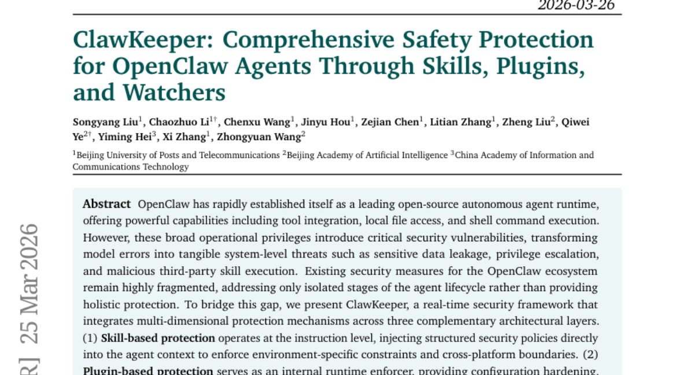

### 📌 한 줄 요약
OpenClaw 에이전트의 보안 취약점을 해결하기 위해 실시간 다차원 보안 프레임워크 ClawKeeper를 제안하고, 다양한 위협 시나리오에서 효과와 견고성을 입증함.

### 🔑 핵심 포인트
- OpenClaw 에이전트의 보안 취약점 해결을 위한 실시간 보안 프레임워크 ClawKeeper 제시
- 스킬, 플러그인, 감시자 기반의 다차원 보호 메커니즘 통합
- 감시자 패러다임을 통해 에이전트의 내부 로직과 결합 없이 실시간 실행 개입 가능

### 🧑‍💻 개발자 관점
OpenClaw를 사용하는 개발자는 ClawKeeper를 통해 에이전트의 보안을 강화하고, 잠재적인 위협으로부터 시스템을 보호할 수 있다. 특히, 감시자 기반 보호는 에이전트의 동작을 실시간으로 모니터링하고 제어할 수 있어 유용하다.

### 🚀 실무 적용 아이디어
- OpenClaw 환경에 ClawKeeper를 통합하여 보안 정책 적용 실험
- 제공된 코드를 활용하여 감시자 기반 보호 메커니즘의 동작 방식 분석
- 실제 위협 시나리오를 구성하여 ClawKeeper의 탐지 및 대응 능력 테스트

### ⚠️ 리스크/한계
- 새로운 보안 프레임워크 도입에 따른 성능 오버헤드 발생 가능성
- 특정 위협 시나리오에 대한 ClawKeeper의 탐지 및 대응 능력 제한

### 📝 초록 기반 상세 설명
OpenClaw는 강력한 기능을 제공하지만, 광범위한 권한으로 인해 보안 취약점이 발생할 수 있다. 기존의 보안 대책은 단편적이어서 전체적인 보호를 제공하지 못한다. 본 논문에서는 실시간 보안 프레임워크인 ClawKeeper를 제시하여, 스킬, 플러그인, 감시자 기반의 다차원 보호 메커니즘을 통합한다. 스킬 기반 보호는 명령어 수준에서 보안 정책을 주입하고, 플러그인 기반 보호는 런타임에서 위협을 탐지하며, 감시자 기반 보호는 에이전트 상태 변화를 검증한다. 다양한 위협 시나리오에서 ClawKeeper의 효과와 견고성을 입증했으며, 코드를 공개한다.

---

## 2. [Terminal Agents Suffice for Enterprise Automation](https://huggingface.co/papers/2604.00073)
**Upvotes**: 65 | **도입 난이도**: 중 | **신뢰도**: 상
**arXiv**: https://arxiv.org/abs/2604.00073

**태그**: Agent, Automation, API, Evaluation

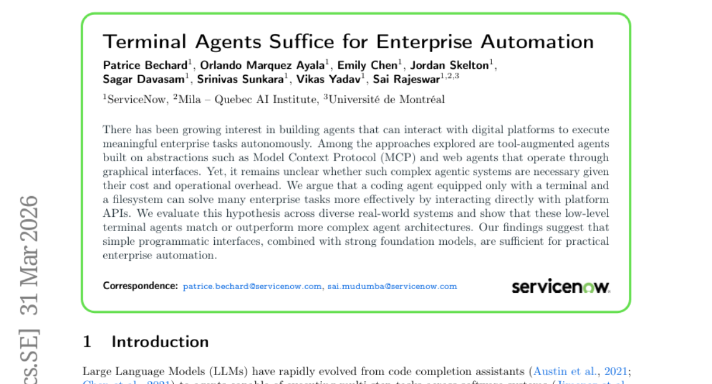

### 📌 한 줄 요약
터미널 에이전트만으로도 복잡한 엔터프라이즈 자동화 작업을 효과적으로 수행할 수 있으며, 이는 더 복잡한 에이전트 아키텍처에 대한 필요성을 낮춥니다.

### 🔑 핵심 포인트
- 터미널 에이전트가 복잡한 에이전트 아키텍처를 능가하는 성능을 보임
- 다양한 실제 엔터프라이즈 시스템에서 터미널 에이전트의 효과를 검증
- 강력한 파운데이션 모델과 간단한 인터페이스만으로 엔터프라이즈 자동화 가능성을 제시

### 🧑‍💻 개발자 관점
복잡한 에이전트 시스템 구축 없이도 터미널 기반의 간단한 에이전트로 엔터프라이즈 자동화가 가능하다는 점은 개발 비용과 복잡성을 줄이는 데 기여할 수 있습니다.

### 🚀 실무 적용 아이디어
- 터미널 에이전트를 활용하여 간단한 엔터프라이즈 자동화 스크립트 작성
- 기존 자동화 시스템을 터미널 에이전트 기반으로 재구축하여 성능 비교
- 파운데이션 모델을 활용하여 터미널 에이전트의 자동화 능력 확장

### ⚠️ 리스크/한계
- 터미널 에이전트가 GUI 기반 작업에는 적합하지 않을 수 있음
- API 변경에 따른 에이전트 유지보수 필요

### 📝 초록 기반 상세 설명
최근 디지털 플랫폼과 상호작용하여 엔터프라이즈 업무를 자동화하는 에이전트 구축에 대한 관심이 증가하고 있습니다. Model Context Protocol(MCP) 기반의 도구 증강 에이전트와 웹 인터페이스를 사용하는 웹 에이전트 등이 연구되었지만, 복잡성과 운영 오버헤드를 고려할 때 이러한 복잡한 시스템이 필수적인지는 불분명합니다. 본 연구에서는 터미널과 파일 시스템만 갖춘 코딩 에이전트가 플랫폼 API와 직접 상호작용함으로써 더 효과적으로 많은 엔터프라이즈 작업을 해결할 수 있다고 주장합니다. 다양한 실제 시스템에서 이를 검증한 결과, 로우 레벨 터미널 에이전트가 더 복잡한 아키텍처와 동등하거나 능가하는 성능을 보였습니다. 이는 강력한 파운데이션 모델과 간단한 프로그래밍 인터페이스만으로도 엔터프라이즈 자동화가 가능하다는 것을 시사합니다.

---

## 3. [MiroEval: Benchmarking Multimodal Deep Research Agents in Process and Outcome](https://huggingface.co/papers/2603.28407)
**Upvotes**: 52 | **도입 난이도**: 중 | **신뢰도**: 상
**arXiv**: https://arxiv.org/abs/2603.28407

**태그**: Agent, Benchmark, Multimodal, Evaluation, RAG, Reasoning

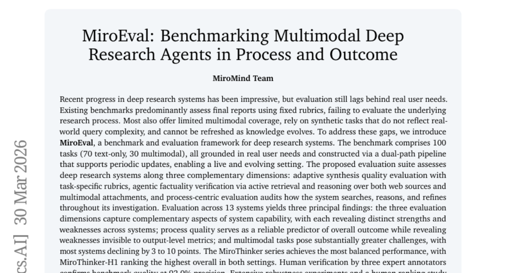

### 📌 한 줄 요약
실제 사용자 니즈 기반의 멀티모달 연구 에이전트 평가 벤치마크 MiroEval을 제시하여, 기존 연구의 한계를 극복하고 차세대 연구 에이전트 개발에 기여.

### 🔑 핵심 포인트
- 실제 사용자 니즈 기반의 멀티모달 벤치마크 MiroEval 제시
- 적응적 합성 품질, 사실성 검증, 프로세스 중심 평가를 통한 다각적 평가
- 프로세스 품질이 결과 예측에 유용함을 입증

### 🧑‍💻 개발자 관점
연구 에이전트의 성능을 객관적으로 평가하고 개선 방향을 제시하여, 개발자가 실제 사용자에게 더 유용한 시스템을 구축하는 데 도움을 줄 수 있습니다.

### 🚀 실무 적용 아이디어
- MiroEval 벤치마크를 사용하여 자체 연구 에이전트 성능 평가
- 평가 결과를 바탕으로 프로세스 및 멀티모달 처리 능력 개선
- MiroThinker 시리즈의 접근 방식 벤치마킹

### ⚠️ 리스크/한계
- 벤치마크가 모든 실제 사용자 니즈를 완벽하게 반영하지 못할 수 있음
- 평가 지표가 주관적일 수 있으며, 시스템의 특정 측면만 강조할 수 있음

### 📝 초록 기반 상세 설명
기존 연구 시스템 평가는 최종 보고서 위주로 진행되어 실제 사용자 니즈와 연구 과정을 제대로 반영하지 못하고, 멀티모달 지원이 미흡하며, 지식 변화에 따른 업데이트가 어렵다는 문제가 있었습니다. 이러한 문제점을 해결하기 위해 실제 사용자 니즈에 기반한 100개의 태스크(텍스트, 멀티모달)로 구성된 MiroEval 벤치마크와 평가 프레임워크를 제안합니다. MiroEval은 적응적 합성 품질 평가, 능동적 검색 및 추론을 통한 사실성 검증, 프로세스 중심 평가를 통해 시스템을 다각도로 평가합니다. 13개 시스템 평가 결과, 평가 차원별 강점과 약점이 드러났으며, 프로세스 품질이 결과 예측에 유용하고, 멀티모달 태스크가 더 어렵다는 것을 확인했습니다.

### 🖼️ 추가 자료
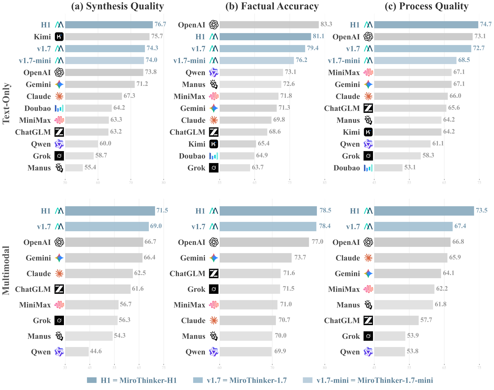
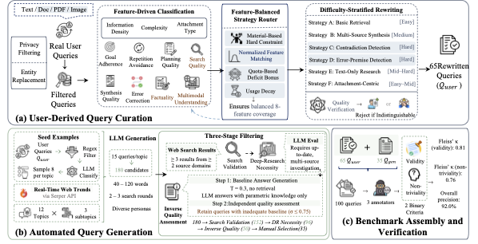
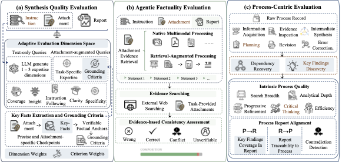

---

## 4. [ViGoR-Bench: How Far Are Visual Generative Models From Zero-Shot Visual Reasoners?](https://huggingface.co/papers/2603.25823)
**Upvotes**: 36 | **도입 난이도**: 중 | **신뢰도**: 상
**arXiv**: https://arxiv.org/abs/2603.25823

**태그**: Vision, Benchmark, Reasoning, AIGC, RAG, Video, Evaluation, Safety

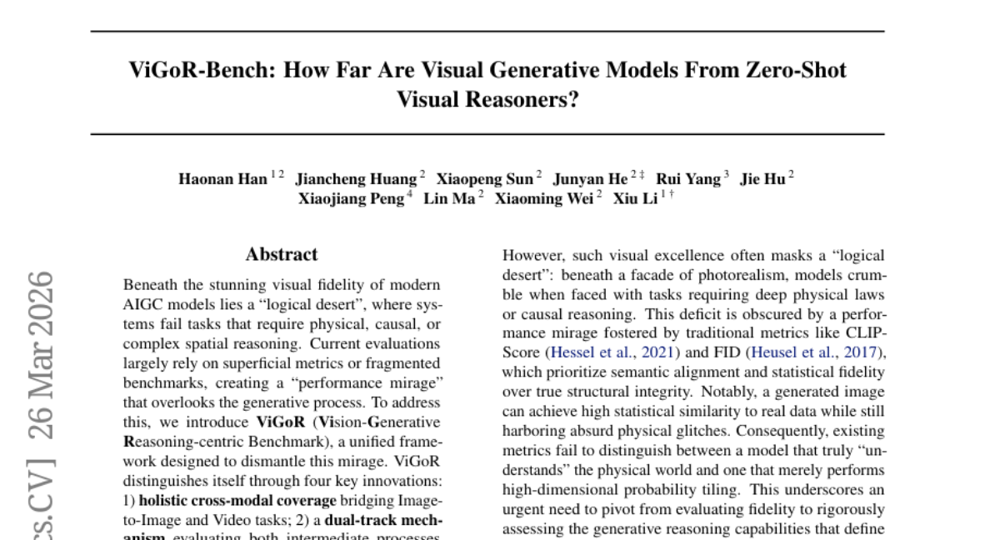

### 📌 한 줄 요약
최신 AIGC 모델의 시각적 추론 능력을 평가하는 새로운 벤치마크 ViGoR-Bench를 제시하여, 기존 평가 방식의 한계를 극복하고 모델의 실제 추론 능력을 정확하게 측정할 수 있도록 함.

### 🔑 핵심 포인트
- 이미지-이미지 및 비디오 작업을 포괄하는 통합 벤치마크 제공
- 중간 과정과 최종 결과를 모두 평가하는 이중 트랙 메커니즘 적용
- 증거 기반 자동화된 평가 시스템을 통해 높은 신뢰도 확보

### 🧑‍💻 개발자 관점
AIGC 모델을 활용한 다양한 애플리케이션 개발 시, ViGoR-Bench를 통해 모델의 추론 능력을 정확하게 평가하고, 실제 사용 환경에서의 성능을 예측하여 개발 방향을 설정하는 데 도움을 줄 수 있다.

### 🚀 실무 적용 아이디어
- ViGoR-Bench를 사용하여 기존 모델의 추론 능력 평가
- ViGoR-Bench의 평가 지표를 활용하여 모델 개선
- 새로운 AIGC 모델 개발 시 ViGoR-Bench를 활용하여 성능 검증

### ⚠️ 리스크/한계
- ViGoR-Bench가 모든 유형의 추론 능력을 완벽하게 평가하지 못할 수 있음
- 평가 결과가 특정 데이터셋 또는 작업에 편향될 수 있음

### 📝 초록 기반 상세 설명
최근 AIGC 모델들은 뛰어난 시각적 품질을 보여주지만, 물리적, 인과적, 공간적 추론과 같은 복잡한 추론 능력은 부족하다. 기존의 평가는 피상적인 지표에 의존하거나 단편적인 벤치마크를 사용하여 모델의 실제 추론 능력을 제대로 평가하지 못했다. 이러한 문제점을 해결하기 위해 이미지-이미지 및 비디오 작업을 포괄하고, 중간 과정과 최종 결과를 모두 평가하며, 자동화된 평가 시스템을 통해 높은 신뢰도를 보장하는 새로운 벤치마크 ViGoR-Bench를 제안한다. ViGoR-Bench를 통해 20개 이상의 최신 모델을 평가한 결과, 상당한 추론 결함이 있음을 확인했으며, 이는 차세대 지능형 비전 모델 개발에 중요한 지침을 제공한다.

---

## 5. [Vision2Web: A Hierarchical Benchmark for Visual Website Development with Agent Verification](https://huggingface.co/papers/2603.26648)
**Upvotes**: 32 | **도입 난이도**: 중 | **신뢰도**: 중
**arXiv**: https://arxiv.org/abs/2603.26648

**태그**: Benchmark, Web Development, Agent, VLM, Full-Stack, Vision, Evaluation

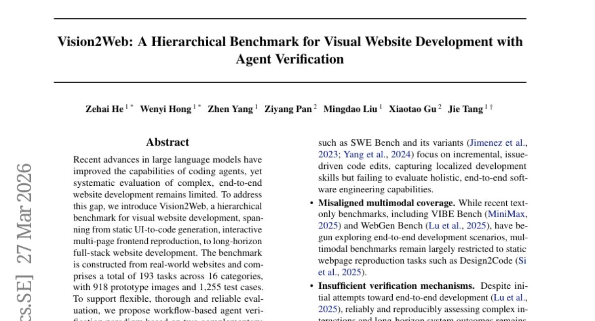

### 📌 한 줄 요약
Vision2Web은 웹사이트 개발 에이전트의 성능을 평가하기 위한 새로운 벤치마크로, 실제 웹사이트 기반의 다양한 난이도 task와 검증 시스템을 제공하여 풀스택 웹 개발 에이전트의 성능 향상에 기여할 수 있습니다.

### 🔑 핵심 포인트
- 실제 웹사이트 기반의 계층적 웹 개발 벤치마크 Vision2Web 제시
- GUI 에이전트 검증기 및 VLM 기반 판정기를 활용한 workflow 기반 검증 패러다임 제안
- 다양한 시각 언어 모델 평가를 통해 풀스택 웹 개발의 성능 격차 확인

### 🧑‍💻 개발자 관점
웹 개발 에이전트의 성능을 객관적으로 평가하고 개선하는 데 활용할 수 있으며, 특히 풀스택 개발 에이전트 개발에 필요한 인사이트를 얻을 수 있습니다.

### 🚀 실무 적용 아이디어
- Vision2Web 벤치마크를 사용하여 자체 웹 개발 에이전트의 성능을 평가해보기
- 제공되는 GUI 에이전트 검증기 및 VLM 기반 판정기를 활용하여 에이전트 검증 프로세스 개선
- Vision2Web 데이터셋을 활용하여 새로운 웹 개발 에이전트 학습 또는 기존 모델 fine-tuning

### ⚠️ 리스크/한계
- 벤치마크가 실제 웹사이트 기반이지만, 모든 웹 개발 시나리오를 포괄하지 못할 수 있음
- VLM 기반 판정기의 정확도가 완벽하지 않아, 에이전트 성능 평가에 오류가 발생할 수 있음

### 📝 초록 기반 상세 설명
최근 대규모 언어 모델의 발전으로 코딩 에이전트의 능력이 향상되었지만, 복잡한 웹사이트 개발에 대한 체계적인 평가는 부족합니다. 이러한 문제점을 해결하기 위해, 실제 웹사이트를 기반으로 UI-to-code 생성부터 풀스택 웹사이트 개발까지 아우르는 계층적 벤치마크 Vision2Web을 제안합니다. Vision2Web은 16개 카테고리에 걸쳐 193개의 task, 918개의 프로토타입 이미지, 1,255개의 테스트 케이스로 구성됩니다. 유연하고 철저한 평가를 위해 GUI 에이전트 검증기와 VLM 기반 판정기로 구성된 workflow 기반 에이전트 검증 패러다임을 제안합니다. 다양한 코딩 에이전트 프레임워크에서 여러 시각 언어 모델을 평가한 결과, 모든 task 수준에서 상당한 성능 격차가 나타났으며, 최첨단 모델도 풀스택 개발에서 어려움을 겪는 것으로 나타났습니다.

---

## 6. [QuitoBench: A High-Quality Open Time Series Forecasting Benchmark](https://huggingface.co/papers/2603.26017)
**Upvotes**: 25 | **도입 난이도**: 중 | **신뢰도**: 상
**arXiv**: https://arxiv.org/abs/2603.26017

**태그**: Time Series, Benchmark, Forecasting, Deep Learning, Foundation Model, RAG, Evaluation

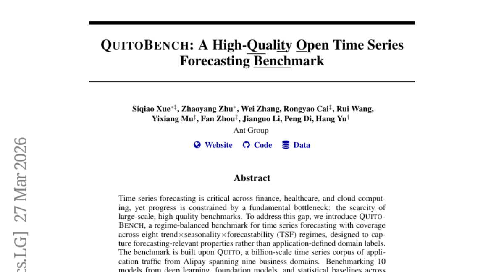

### 📌 한 줄 요약
Alipay 트래픽 데이터를 기반으로 구축된 대규모 시계열 예측 벤치마크 QuitoBench를 공개하여, 다양한 모델의 성능을 비교 분석하고 실질적인 시계열 예측 연구 발전에 기여합니다.

### 🔑 핵심 포인트
- 대규모 고품질 시계열 예측 벤치마크 QuitoBench 공개
- 다양한 모델(딥러닝, 파운데이션 모델, 통계 모델) 성능 비교 분석
- 컨텍스트 길이, 예측 가능성, 데이터 크기 등 주요 요인이 성능에 미치는 영향 분석

### 🧑‍💻 개발자 관점
개발자는 QuitoBench를 통해 다양한 시계열 예측 모델을 객관적으로 평가하고, 자신의 데이터에 적합한 모델을 선택하거나 개선하는 데 활용할 수 있습니다. 특히, 컨텍스트 길이와 데이터 크기에 따른 모델 성능 변화를 파악하여 최적의 모델을 구성하는 데 도움이 됩니다.

### 🚀 실무 적용 아이디어
- QuitoBench 데이터셋을 다운로드하여 자체 모델 성능 테스트
- 제공되는 벤치마크 스크립트를 활용하여 모델 성능 비교
- 컨텍스트 길이 및 데이터 크기에 따른 모델 성능 변화 실험

### ⚠️ 리스크/한계
- Alipay 데이터에 특화되어 다른 도메인에 대한 일반화 어려움 존재
- 벤치마크에 포함된 모델 외 다른 모델에 대한 성능 비교는 추가적인 작업 필요

### 📝 초록 기반 상세 설명
시계열 예측은 금융, 의료, 클라우드 컴퓨팅 등 다양한 분야에서 중요하지만, 고품질의 대규모 벤치마크 부족으로 발전이 제한되고 있습니다. 이러한 문제를 해결하기 위해 Alipay의 애플리케이션 트래픽 데이터를 기반으로 한 대규모 시계열 코퍼스인 Quito를 활용하여 QuitoBench를 구축했습니다. QuitoBench는 8가지 추세-시간-계절성-예측 가능성(TSF) 체제를 포괄하며, 232,200개의 평가 인스턴스에서 10개의 모델을 벤치마킹했습니다. 실험 결과, 컨텍스트 길이에 따라 딥러닝 모델과 파운데이션 모델의 성능이 교차하며, 예측 가능성이 가장 큰 어려움 요인임을 확인했습니다. 또한, 데이터 양을 늘리는 것이 모델 크기를 늘리는 것보다 더 큰 효과를 보였습니다.

---

## 7. [Reasoning Shift: How Context Silently Shortens LLM Reasoning](https://huggingface.co/papers/2604.01161)
**Upvotes**: 22 | **도입 난이도**: 중 | **신뢰도**: 중
**arXiv**: https://arxiv.org/abs/2604.01161

**태그**: LLM, Reasoning, Context Management, Prompting, Agent, Evaluation, Optimization

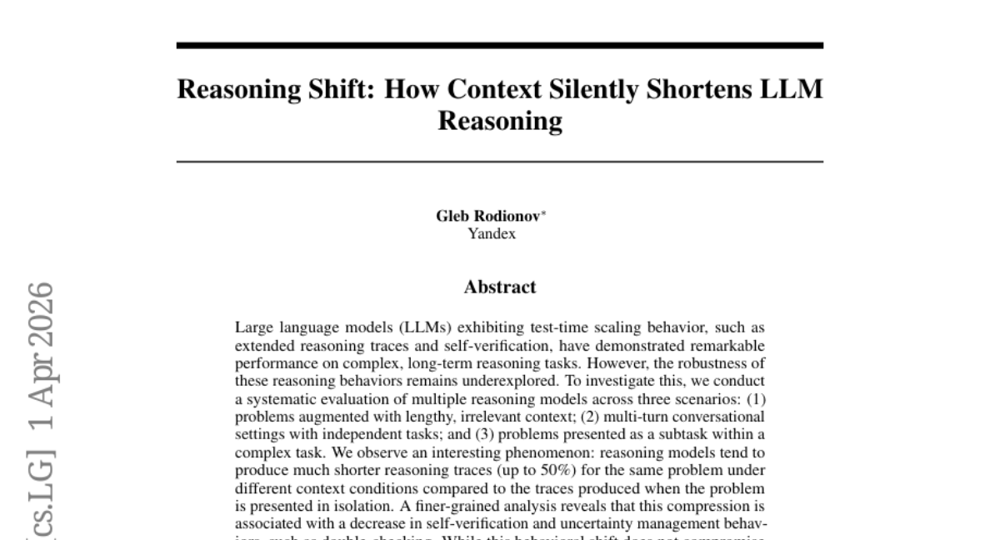

### 📌 한 줄 요약
LLM의 추론 과정이 주변 맥락에 따라 크게 달라지며, 특히 불필요한 정보나 복잡한 환경에서 추론 길이가 짧아지고 self-verification 기능이 저하될 수 있음을 보임.

### 🔑 핵심 포인트
- LLM의 추론 과정이 맥락에 따라 크게 달라짐
- 불필요한 맥락 정보는 추론 길이 단축 및 self-verification 저하를 유발
- 맥락 변화에 따른 추론 행동 변화는 어려운 문제에서 성능 저하로 이어질 수 있음

### 🧑‍💻 개발자 관점
LLM을 활용한 시스템 개발 시, 불필요한 정보나 복잡한 맥락이 LLM의 추론 능력을 저하시킬 수 있음을 고려해야 하며, 특히 복잡한 작업을 설계할 때 LLM이 충분한 추론 단계를 거치도록 유도하는 것이 중요합니다.

### 🚀 실무 적용 아이디어
- LLM 기반 시스템 개발 시, 다양한 맥락 조건에서 LLM의 추론 과정을 테스트하여 맥락 의존성을 평가
- self-verification 메커니즘을 강화하여 맥락 변화에 따른 추론 오류를 줄임
- 프롬프트 엔지니어링을 통해 LLM이 필요한 정보에 집중하고 불필요한 정보에 영향을 받지 않도록 유도

### ⚠️ 리스크/한계
- 실험 환경이 실제 사용 환경을 완벽하게 반영하지 못할 수 있음
- 특정 모델 및 데이터셋에 대한 결과일 수 있으며, 일반화에 제한이 있을 수 있음

### 📝 초록 기반 상세 설명
LLM은 복잡한 추론 과제에서 뛰어난 성능을 보이지만, 다양한 맥락 조건에서의 견고성은 충분히 연구되지 않았습니다. 본 연구에서는 긴 맥락, 다중 대화, 복잡한 작업 내의 하위 작업 등 세 가지 시나리오에서 여러 추론 모델을 평가했습니다. 그 결과, 동일한 문제라도 주변 맥락에 따라 추론 길이가 최대 50%까지 짧아지는 현상을 발견했습니다. 이는 self-verification 및 불확실성 관리 행동의 감소와 관련이 있었습니다. 이러한 변화는 쉬운 문제에서는 성능에 영향을 미치지 않지만, 어려운 문제에서는 성능 저하를 유발할 수 있습니다. 본 연구는 추론 모델의 견고성과 LLM 기반 에이전트의 맥락 관리 문제에 대한 추가적인 관심을 촉구합니다.

---

## 8. [Brevity Constraints Reverse Performance Hierarchies in Language Models](https://huggingface.co/papers/2604.00025)
**Upvotes**: 16 | **도입 난이도**: 중 | **신뢰도**: 상
**arXiv**: https://arxiv.org/abs/2604.00025

**태그**: Prompt Engineering, LLM, Scaling Laws, Reasoning, Benchmark, Evaluation

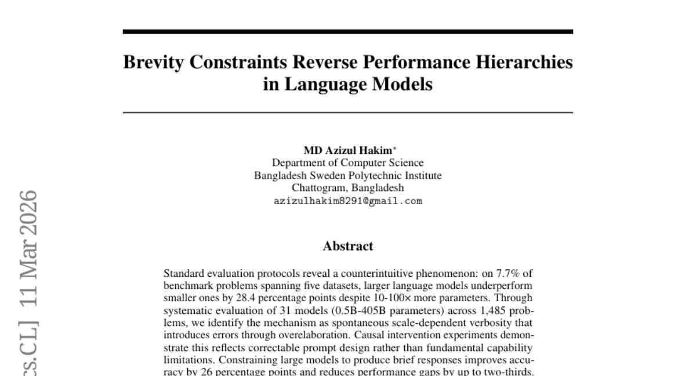

### 📌 한 줄 요약
LLM의 규모가 커질수록 장황한 답변으로 인해 성능이 저하될 수 있으며, 프롬프트 엔지니어링을 통해 간결성을 유도하면 성능 향상 및 비용 절감이 가능하다.

### 🔑 핵심 포인트
- 대규모 LLM이 항상 소규모 모델보다 우수한 성능을 보이는 것은 아님
- 장황한 답변이 성능 저하의 원인이며, 간결성 제약을 통해 개선 가능
- 규모에 맞는 프롬프트 엔지니어링이 중요하며, 성능 역전 현상을 통해 입증

### 🧑‍💻 개발자 관점
LLM을 사용하는 개발자는 모델 규모에 따른 최적의 프롬프트 전략을 고려하여 성능을 극대화하고, 불필요한 계산 비용을 줄일 수 있다.

### 🚀 실무 적용 아이디어
- LLM의 답변 길이를 제한하는 프롬프트 실험
- 다양한 규모의 모델에 대한 성능 비교
- 특정 작업에 최적화된 모델 규모 탐색

### ⚠️ 리스크/한계
- 간결성 제약이 모든 작업에 효과적인 것은 아닐 수 있음
- 데이터셋 오염 가능성 존재

### 📝 초록 기반 상세 설명
LLM의 규모가 커질수록 성능이 향상될 것이라는 일반적인 믿음과 달리, 특정 문제에서는 오히려 성능이 저하되는 현상이 발견되었다. 이는 모델의 규모가 커질수록 장황한 답변을 생성하려는 경향 때문이며, 이러한 장황함이 오류를 유발한다. 본 연구에서는 다양한 규모의 모델을 대상으로 실험을 진행하여 이러한 현상을 분석하고, 간결성을 유도하는 프롬프트 엔지니어링을 통해 성능을 향상시킬 수 있음을 입증했다. 특히, 수학적 추론 및 과학적 지식 벤치마크에서 간결성 제약 조건을 통해 성능 역전 현상을 확인했으며, 이는 대규모 모델이 더 우수한 잠재력을 가지고 있음을 시사한다. 따라서 LLM의 성능을 극대화하기 위해서는 규모에 맞는 프롬프트 엔지니어링이 필수적이며, 이는 정확도 향상과 동시에 계산 비용 절감 효과를 가져올 수 있다.

### 🖼️ 추가 자료

---

## 9. [HippoCamp: Benchmarking Contextual Agents on Personal Computers](https://huggingface.co/papers/2604.01221)
**Upvotes**: 15 | **도입 난이도**: 중 | **신뢰도**: 상
**arXiv**: https://arxiv.org/abs/2604.01221

**태그**: Agent, Benchmark, Personal AI, RAG, Multimodal, Reasoning, Evaluation

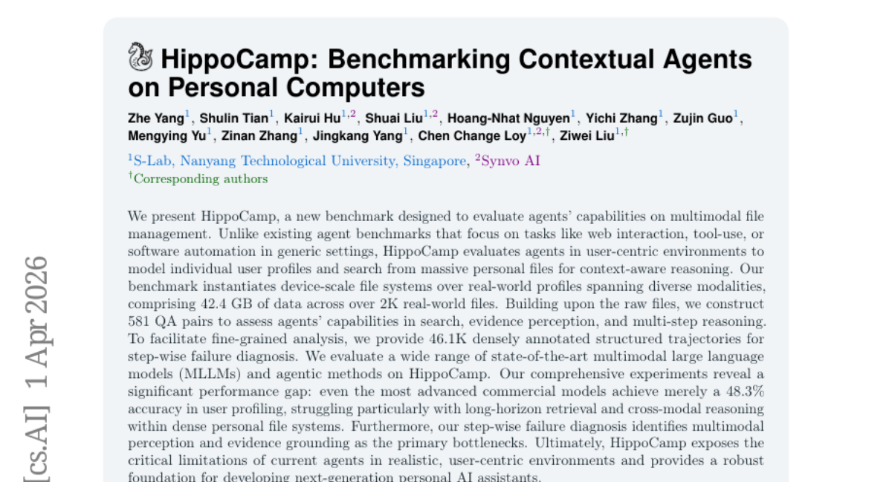

### 📌 한 줄 요약
개인 PC 환경에서 파일 관리 에이전트의 성능을 평가하는 새로운 벤치마크 HippoCamp를 제시하고, 최신 MLLM들이 실제 사용자 환경에서 장기 추론 및 교차 모달 이해에 어려움을 겪는다는 것을 밝힘.

### 🔑 핵심 포인트
- 개인 PC 환경 파일 관리 에이전트 평가를 위한 새로운 벤치마크 HippoCamp 제시
- 실제 사용자 프로필 기반의 대규모 파일 시스템으로 구성
- 최신 MLLM들이 사용자 프로파일링, 장기 검색, 교차 모달 추론에 취약함

### 🧑‍💻 개발자 관점
개인 사용자 환경에 특화된 에이전트 개발 시, HippoCamp 벤치마크를 활용하여 모델의 성능을 객관적으로 평가하고 개선할 수 있습니다. 특히 RAG 시스템 구축 시 개인 데이터 환경에서의 성능을 검증하는 데 유용합니다.

### 🚀 실무 적용 아이디어
- HippoCamp 데이터셋을 다운로드하여 기존 RAG 파이프라인 성능 테스트
- MLLM을 활용한 개인 파일 시스템 검색 에이전트 개발 및 HippoCamp로 성능 검증
- HippoCamp의 실패 사례 분석을 통해 모델 개선 방향 설정

### ⚠️ 리스크/한계
- 벤치마크가 특정 사용자 프로필에 편향되어 있을 수 있음
- 평가 지표가 실제 사용자 경험을 완벽하게 반영하지 못할 수 있음

### 📝 초록 기반 상세 설명
기존 에이전트 벤치마크는 웹 상호작용이나 도구 사용에 집중되어 개인 사용자의 환경을 반영하지 못한다는 한계가 있습니다. 이러한 문제를 해결하기 위해, HippoCamp는 실제 사용자 프로필을 기반으로 대규모 개인 파일 시스템에서 에이전트의 성능을 평가하는 새로운 벤치마크를 제시합니다. HippoCamp는 다양한 형식의 2천 개 이상의 실제 파일(42.4GB)로 구성되어 있으며, 검색, 증거 인식, 다단계 추론 능력을 평가하기 위한 581개의 QA 쌍과 46.1K개의 상세 주석이 달린 실행 궤적을 제공합니다. 다양한 최신 MLLM 및 에이전트 방법을 HippoCamp에서 평가한 결과, 사용자 프로파일링 정확도가 48.3%에 불과했으며, 특히 장기 검색 및 교차 모달 추론에서 어려움을 겪는 것으로 나타났습니다. HippoCamp는 현실적인 사용자 중심 환경에서 현재 에이전트의 한계를 드러내고 차세대 개인 AI 비서 개발을 위한 기반을 제공합니다.

---

