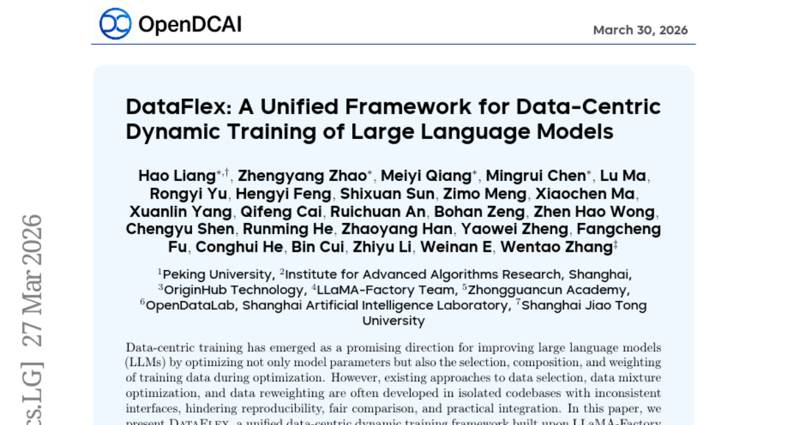
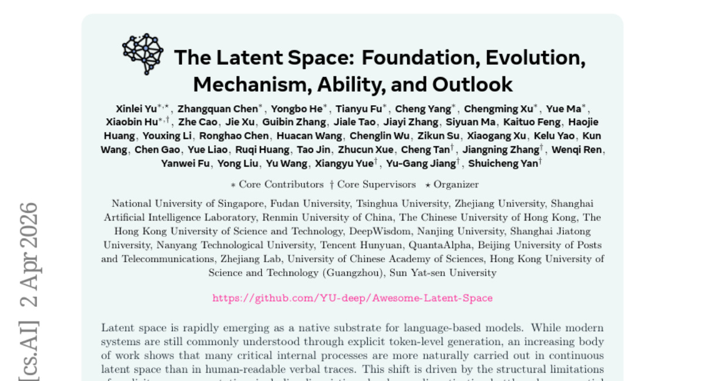
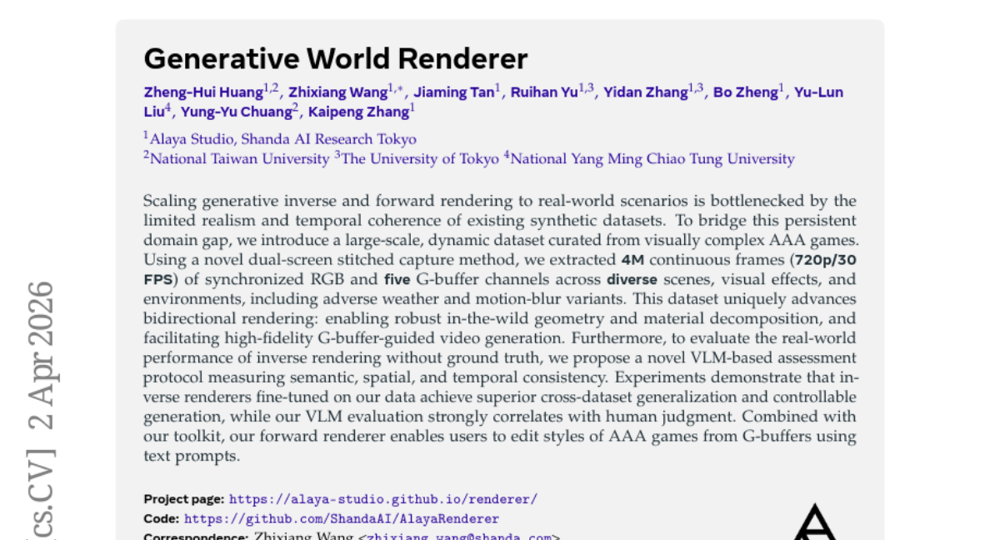
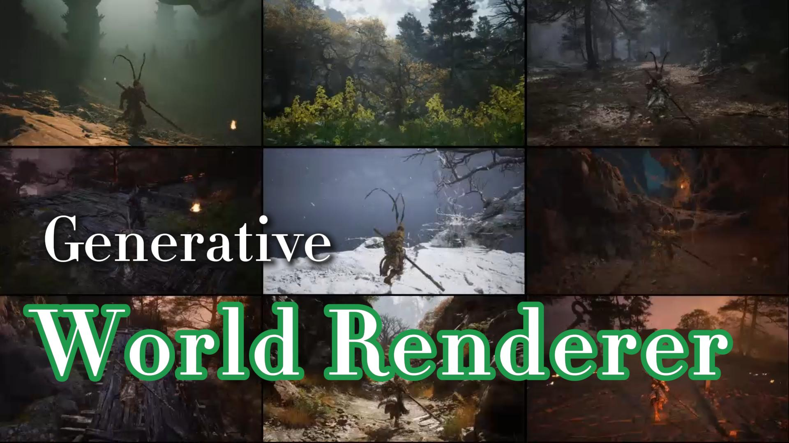
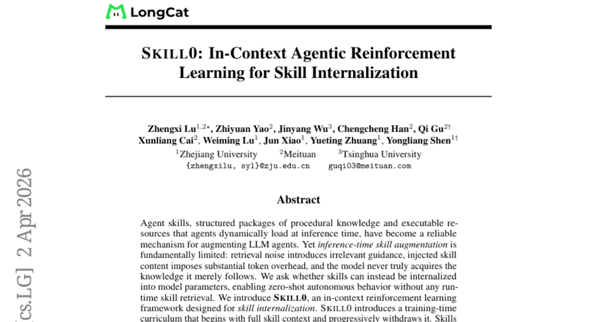
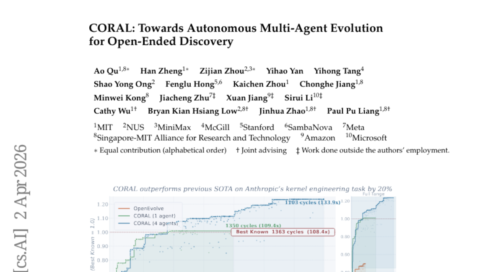
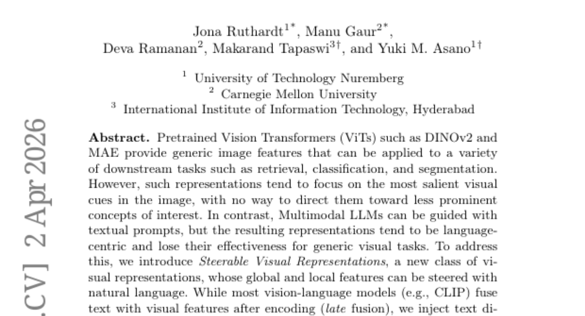
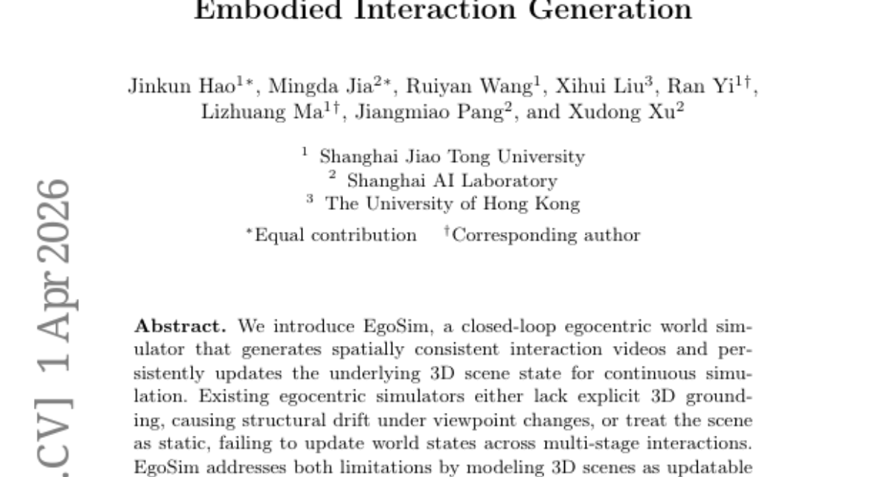
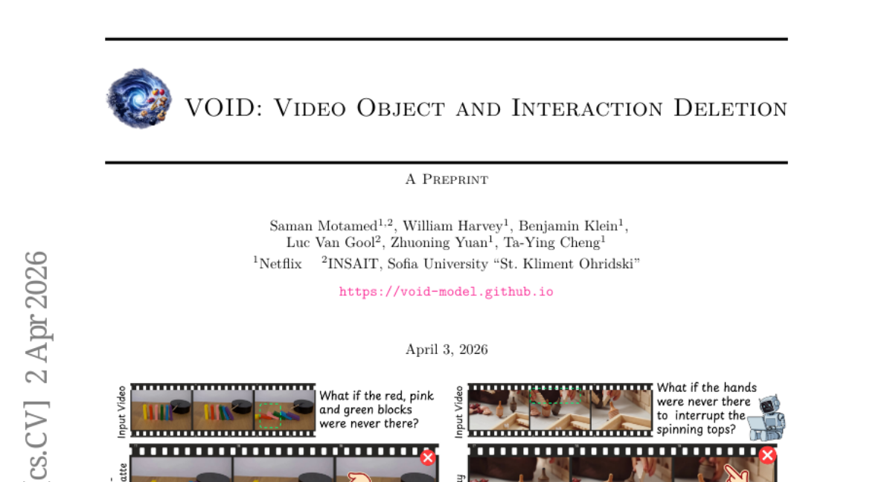
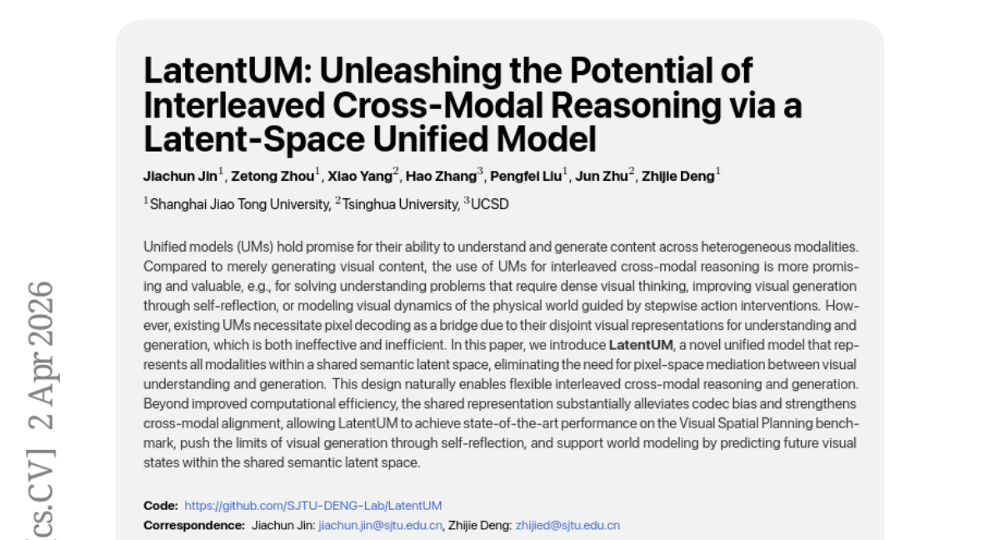

# 2026-04-06 Daily Papers (Top 9)

## 1. [DataFlex: A Unified Framework for Data-Centric Dynamic Training of Large Language Models](https://huggingface.co/papers/2603.26164)
**Upvotes**: 160 | **도입 난이도**: 중 | **신뢰도**: 상
**arXiv**: https://arxiv.org/abs/2603.26164

**태그**: LLM, Data-centric, Training, Optimization, Inference

### 📌 한 줄 요약
LLM 학습 시 데이터 선택, 혼합, 재가중치를 통합 관리하는 DataFlex 프레임워크를 통해 성능 향상 및 효율적인 실험이 가능하며, DeepSpeed ZeRO-3와 호환되어 대규모 환경에서도 적용 가능하다.

### 🔑 핵심 포인트
- LLM 데이터 중심 학습을 위한 통합 프레임워크 DataFlex 제시
- 데이터 선택, 혼합, 재가중치 등 다양한 동적 데이터 최적화 지원
- DeepSpeed ZeRO-3 지원으로 대규모 환경에서도 효율적인 학습 가능

### 🧑‍💻 개발자 관점
LLM 학습 시 데이터의 중요성이 강조되는 상황에서, DataFlex는 다양한 데이터 최적화 기법을 통합적으로 실험하고 적용할 수 있도록 지원하여 모델 성능 향상에 기여할 수 있다.

### 🚀 실무 적용 아이디어
- DataFlex를 사용하여 기존 LLM 학습 파이프라인에 데이터 선택 전략 통합
- DataFlex를 사용하여 다양한 데이터 혼합 비율 실험 및 최적 비율 탐색
- DataFlex를 사용하여 샘플 재가중치 기법 적용 및 성능 변화 관찰

### ⚠️ 리스크/한계
- DataFlex 프레임워크 자체의 안정성 및 유지보수 필요
- 특정 데이터셋 또는 모델에 대한 최적화가 다른 환경에서도 일반화될 수 있는지 검증 필요

### 📝 초록 기반 상세 설명
LLM의 성능 향상을 위해 데이터 중심 학습이 중요해지고 있지만, 기존의 데이터 선택, 혼합, 재가중치 방법들은 분산된 환경에서 개발되어 재현성, 공정한 비교, 통합에 어려움이 있었다. 본 논문에서는 LLaMA-Factory 기반의 통합 프레임워크인 DataFlex를 제안하여, 데이터 선택, 도메인 혼합 조정, 샘플 재가중치의 세 가지 주요 동적 데이터 최적화 패러다임을 지원한다. DataFlex는 확장 가능한 트레이너 추상화 및 모듈식 컴포넌트를 제공하여 기존 LLM 학습 워크플로우를 대체할 수 있으며, DeepSpeed ZeRO-3를 포함한 대규모 환경을 지원한다. 다양한 데이터 중심 방법 실험 결과, DataFlex는 MMLU 성능 향상 및 런타임 개선을 달성하여 LLM의 데이터 중심 동적 학습을 위한 효과적이고 효율적인 인프라를 제공한다.

---

## 2. [The Latent Space: Foundation, Evolution, Mechanism, Ability, and Outlook](https://huggingface.co/papers/2604.02029)
**Upvotes**: 123 | **도입 난이도**: 중 | **신뢰도**: 상
**arXiv**: https://arxiv.org/abs/2604.02029

**태그**: Latent Space, Language Model, Representation Learning, Optimization, Reasoning

### 📌 한 줄 요약
언어 기반 모델의 내부 프로세스가 명시적 토큰 수준 생성을 넘어 연속적인 잠재 공간에서 더 자연스럽게 수행됨을 보이며, 잠재 공간을 차세대 지능을 위한 일반적인 계산 및 시스템 패러다임으로 이해하기 위한 서베이 논문.

### 🔑 핵심 포인트
- 언어 모델의 내부 프로세스가 잠재 공간에서 더 효율적으로 수행됨
- 잠재 공간의 구조적 한계 극복 방안 제시 (아키텍처, 표현, 계산, 최적화)
- 잠재 공간이 Reasoning, Planning, Modeling 등 다양한 능력을 지원함

### 🧑‍💻 개발자 관점
소프트웨어 엔지니어는 이 논문을 통해 언어 모델의 내부 작동 방식을 이해하고, 잠재 공간을 활용하여 모델의 효율성과 성능을 향상시키는 데 도움이 될 수 있습니다.

### 🚀 실무 적용 아이디어
- 잠재 공간 기반 모델 아키텍처 연구
- 다양한 Representation 학습 방법 실험
- 잠재 공간에서의 Computation 및 Optimization 기법 적용

### ⚠️ 리스크/한계
- 잠재 공간의 해석 가능성 부족
- 잠재 공간 모델의 학습 및 디버깅 어려움

### 📝 초록 기반 상세 설명
최근 언어 기반 모델에서 잠재 공간은 중요한 기반으로 부상하고 있지만, 명시적인 공간 계산의 구조적 한계(언어적 중복, 이산화 병목 현상, 순차적 비효율성, 의미 손실)로 인해 어려움이 있습니다. 본 논문은 언어 기반 모델에서 잠재 공간에 대한 통합적이고 최신 지형을 제공하며, Foundation, Evolution, Mechanism, Ability, Outlook의 다섯 가지 관점으로 구성됩니다. 메커니즘 관점에서는 아키텍처, 표현, 계산, 최적화의 네 가지 주요 개발 라인을 식별하고, 능력 관점에서는 추론, 계획, 모델링, 인식, 기억, 협업, 구현을 포괄하는 광범위한 역량 스펙트럼을 지원하는 방법을 보여줍니다. 마지막으로 주요 과제와 미래 연구 방향을 제시합니다.

---

## 3. [Generative World Renderer](https://huggingface.co/papers/2604.02329)
**Upvotes**: 87 | **도입 난이도**: 중 | **신뢰도**: 중
**arXiv**: https://arxiv.org/abs/2604.02329

**태그**: Rendering, Dataset, VLM, Inverse Rendering, Forward Rendering, Video, Evaluation

### 📌 한 줄 요약
AAA 게임 데이터셋을 활용하여 inverse/forward 렌더링의 현실 적용 가능성을 높이고, VLM 기반 평가 프로토콜을 통해 ground truth 없이도 성능을 측정할 수 있게 함.

### 🔑 핵심 포인트
- AAA 게임 기반 대규모 동적 데이터셋 구축 (4M 프레임)
- VLM 기반의 새로운 inverse 렌더링 평가 프로토콜 제안
- G-buffer 기반 비디오 생성 및 스타일 편집 가능

### 🧑‍💻 개발자 관점
게임 엔진의 렌더링 파이프라인을 활용하여 현실감 있는 데이터셋을 생성하고, 이를 통해 inverse 렌더링 모델의 성능을 향상시키는 데 활용할 수 있습니다. 또한, VLM 기반 평가 프로토콜은 ground truth 데이터 없이도 모델 성능을 검증할 수 있는 새로운 방법을 제시합니다.

### 🚀 실무 적용 아이디어
- 제공된 데이터셋을 활용하여 기존 inverse 렌더링 모델 fine-tuning
- VLM 기반 평가 프로토콜을 자사 모델 평가에 적용
- G-buffer 기반 비디오 생성 및 스타일 편집 파이프라인 구축

### ⚠️ 리스크/한계
- AAA 게임 데이터셋의 편향 가능성
- VLM 기반 평가의 주관성 및 신뢰성 문제

### 📝 초록 기반 상세 설명
기존 합성 데이터셋의 낮은 현실감과 시간적 일관성 부족으로 인해 generative inverse/forward 렌더링을 실제 환경에 적용하는 데 어려움이 있었습니다. 이러한 문제를 해결하기 위해, 시각적으로 복잡한 AAA 게임에서 대규모 동적 데이터셋을 구축했습니다. 새로운 듀얼 스크린 스티칭 캡처 방식을 사용하여 다양한 장면, 시각 효과, 환경(악천후, 모션 블러 포함)에서 동기화된 RGB 및 G-buffer 채널을 추출했습니다. 이 데이터셋은 bidirectional 렌더링을 발전시켜 geometry 및 material decomposition의 견고성을 높이고, G-buffer 기반 비디오 생성을 용이하게 합니다. 또한, ground truth 없이 inverse 렌더링의 성능을 평가하기 위해 VLM 기반 평가 프로토콜을 제안합니다. 실험 결과, 데이터셋으로 fine-tuning된 inverse 렌더러가 더 나은 cross-dataset 일반화 및 제어 가능한 생성을 달성했으며, VLM 평가는 인간의 판단과 높은 상관관계를 보였습니다.

### 🖼️ 추가 자료

---

## 4. [SKILL0: In-Context Agentic Reinforcement Learning for Skill Internalization](https://huggingface.co/papers/2604.02268)
**Upvotes**: 82 | **도입 난이도**: 중 | **신뢰도**: 중
**arXiv**: https://arxiv.org/abs/2604.02268

**태그**: Agent, Reinforcement Learning, Skill Internalization, RAG, Evaluation, Inference

### 📌 한 줄 요약
SKILL0는 에이전트가 외부 스킬을 검색 없이 내재화하여 제로샷으로 자율적인 행동을 가능하게 하는 새로운 강화 학습 프레임워크입니다.

### 🔑 핵심 포인트
- 스킬 내재화를 위한 새로운 강화 학습 프레임워크 SKILL0 제시
- 점진적 스킬 컨텍스트 제거 커리큘럼을 통한 효율적인 학습
- 제로샷 환경에서 기존 강화 학습 baseline 대비 성능 향상

### 🧑‍💻 개발자 관점
LLM 에이전트 개발 시, 외부 스킬 검색 없이 모델 자체적으로 지식을 습득하고 활용할 수 있도록 하여, 시스템 복잡도를 줄이고 성능을 향상시키는 데 기여할 수 있습니다.

### 🚀 실무 적용 아이디어
- SKILL0 프레임워크를 활용하여 자체 에이전트 모델 학습
- 다양한 스킬 카테고리에 대한 SKILL0 적용 가능성 실험
- SKILL0의 Dynamic Curriculum을 커스터마이징하여 성능 향상 시도

### ⚠️ 리스크/한계
- 특정 스킬 카테고리에서만 효과적일 수 있음
- 모델 크기 및 학습 데이터에 따라 성능 변화 가능성 존재

### 📝 초록 기반 상세 설명
LLM 에이전트의 성능 향상을 위해 스킬을 활용하는 방법이 널리 사용되지만, 검색 노이즈, 토큰 오버헤드, 지식 습득 부족 등의 한계가 존재합니다. 본 논문에서는 스킬을 모델 파라미터에 내재화하여 런타임 스킬 검색 없이 제로샷으로 자율적인 행동을 가능하게 하는 SKILL0 프레임워크를 제안합니다. SKILL0는 스킬 컨텍스트를 점진적으로 제거하는 커리큘럼을 통해 모델이 툴 사용법과 멀티턴 태스크 완료를 학습하도록 합니다. 실험 결과, SKILL0는 기존 강화 학습 baseline 대비 ALFWorld에서 9.7%, Search-QA에서 6.6% 향상된 성능을 보였으며, 컨텍스트 크기를 0.5k 토큰 미만으로 유지했습니다.

---

## 5. [CORAL: Towards Autonomous Multi-Agent Evolution for Open-Ended Discovery](https://huggingface.co/papers/2604.01658)
**Upvotes**: 41 | **도입 난이도**: 중 | **신뢰도**: 상
**arXiv**: https://arxiv.org/abs/2604.01658

**태그**: LLM, Multi-Agent, Evolutionary Algorithm, Optimization, Autonomous Agents, Agent, Evaluation

### 📌 한 줄 요약
LLM 기반 에이전트들이 자율적으로 협력하며 문제를 해결하는 CORAL 프레임워크는, 기존의 고정된 규칙 기반 진화 방식보다 훨씬 효율적으로 다양한 최적화 문제에서 뛰어난 성능을 보입니다.

### 🔑 핵심 포인트
- 자율적인 멀티 에이전트 진화를 위한 CORAL 프레임워크 제시
- 다양한 최적화 문제에서 기존 방식 대비 뛰어난 성능 입증
- 지식 재사용 및 멀티 에이전트 협업의 효과 분석

### 🧑‍💻 개발자 관점
CORAL은 LLM 에이전트 기반의 자동화된 문제 해결 및 최적화 시스템 개발에 유용하며, 특히 탐색 공간이 넓고 복잡한 문제에 대한 접근 방식을 제시합니다.

### 🚀 실무 적용 아이디어
- CORAL 프레임워크를 활용하여 현재 해결하려는 최적화 문제에 적용해보기
- 에이전트 간 협업 전략 및 공유 메모리 구조를 개선하여 성능 향상 시도
- CORAL의 안전 장치들을 참고하여 LLM 에이전트 시스템의 안정성 확보

### ⚠️ 리스크/한계
- LLM 에이전트의 환각 및 편향으로 인한 잘못된 결과 발생 가능성
- 멀티 에이전트 시스템의 복잡성으로 인한 디버깅 및 유지보수 어려움

### 📝 초록 기반 상세 설명
오픈 엔디드 문제 해결을 위해 LLM 기반 진화가 사용되지만, 기존 방법들은 고정된 규칙에 의존하여 에이전트의 자율성이 제한적이었습니다. 본 논문에서는 자율적인 멀티 에이전트 진화를 위한 프레임워크인 CORAL을 제시합니다. CORAL은 공유 메모리, 비동기 멀티 에이전트 실행, heartbeat 기반 개입 등을 통해 에이전트들이 탐색, 반영, 협업하도록 합니다. 또한, 격리된 작업 공간, 평가자 분리, 리소스 관리 등의 안전 장치를 제공합니다. 다양한 수학, 알고리즘, 시스템 최적화 작업에서 CORAL은 기존 방식보다 3-10배 높은 개선율을 보였으며, Anthropic의 커널 엔지니어링 작업에서는 최고 점수를 1363에서 1103 사이클로 개선했습니다. 이는 지식 재사용과 멀티 에이전트 탐색 및 통신 덕분임을 분석을 통해 밝혔습니다.

---

## 6. [Steerable Visual Representations](https://huggingface.co/papers/2604.02327)
**Upvotes**: 41 | **도입 난이도**: 중 | **신뢰도**: 상
**arXiv**: https://arxiv.org/abs/2604.02327

**태그**: Vision, Transformer, Representation Learning, Multimodal, RAG, Benchmark, Evaluation

### 📌 한 줄 요약
ViT 모델에 텍스트 프롬프트를 주입하여 특정 객체에 집중하도록 제어하고, 다양한 downstream task에서 성능을 향상시키는 새로운 시각적 표현 방법론 제시.

### 🔑 핵심 포인트
- 텍스트 프롬프트를 이용한 시각적 표현 제어 가능
- Early fusion을 통한 ViT 모델의 성능 향상
- Representational steerability 측정 벤치마크 제시

### 🧑‍💻 개발자 관점
특정 객체에 대한 집중도를 높여야 하는 이미지 분석 작업(예: 이상 감지, 객체 식별)에서 유용하게 활용될 수 있으며, 기존 ViT 모델을 개선하는 데 적용 가능합니다.

### 🚀 실무 적용 아이디어
- 제공된 벤치마크를 사용하여 기존 ViT 모델의 steerability 측정
- Early fusion 방식을 ViT 모델에 적용하여 성능 변화 관찰
- Anomaly detection 또는 personalized object discrimination 작업에 적용하여 효과 검증

### ⚠️ 리스크/한계
- 텍스트 프롬프트의 품질에 따라 성능이 달라질 수 있음
- Early fusion 방식이 다른 ViT 모델 구조에 적용될 때 호환성 문제가 발생할 수 있음

### 📝 초록 기반 상세 설명
기존 ViT 모델은 이미지에서 가장 두드러진 시각적 요소에 집중하는 경향이 있어 특정 객체에 대한 제어가 어렵습니다. Multimodal LLM은 텍스트 프롬프트로 제어가 가능하지만, 언어 중심적인 표현으로 인해 일반적인 시각적 작업에는 효과가 떨어집니다. 이러한 문제를 해결하기 위해, 본 논문에서는 자연어를 사용하여 시각적 표현의 global 및 local 특징을 제어할 수 있는 Steerable Visual Representations를 제안합니다. 텍스트를 시각적 인코더 레이어에 직접 주입하는 early fusion 방식을 사용하며, representational steerability를 측정하기 위한 벤치마크를 도입했습니다. 제안 방법은 anomaly detection 및 personalized object discrimination에서 기존 방법보다 우수한 성능을 보이며, out-of-distribution 작업에도 zero-shot generalization을 보여줍니다.

---

## 7. [EgoSim: Egocentric World Simulator for Embodied Interaction Generation](https://huggingface.co/papers/2604.01001)
**Upvotes**: 34 | **도입 난이도**: 중 | **신뢰도**: 상
**arXiv**: https://arxiv.org/abs/2604.01001

**태그**: Simulation, Robotics, 3D, Egocentric Vision, Video

### 📌 한 줄 요약
EgoSim은 3D 환경에서 시점 변화에 따른 공간적 일관성을 유지하며, 다단계 상호작용을 통해 환경 상태를 지속적으로 업데이트하는 새로운 egocentric world simulator를 제공하여 로봇 조작 및 시뮬레이션 분야에 기여한다.

### 🔑 핵심 포인트
- 3D 환경 모델링을 통한 공간적 일관성 유지
- Geometry-action-aware Observation Simulation 모델 및 Interaction-aware State Updating 모듈 개발
- 대규모 비디오 데이터로부터 학습 데이터 추출 파이프라인 및 저비용 데이터 수집 시스템 구축

### 🧑‍💻 개발자 관점
EgoSim은 로봇 시뮬레이션 환경 구축 및 학습 데이터 생성에 드는 비용과 시간을 절감하고, 실제 환경과 유사한 시뮬레이션 환경을 제공하여 로봇의 성능 향상에 기여할 수 있다.

### 🚀 실무 적용 아이디어
- EgoSim simulator를 사용하여 로봇 팔의 조작 task 학습 환경 구축
- EgoSim 데이터 생성 파이프라인을 활용하여 특정 작업 환경에 대한 데이터셋 구축
- EgoSim의 Interaction-aware State Updating 모듈을 개선하여 환경 변화에 더욱 robust한 시뮬레이션 구현

### ⚠️ 리스크/한계
- 시뮬레이션 환경과 실제 환경 간의 차이로 인한 성능 저하 가능성
- 복잡한 물리적 상호작용 모델링의 어려움

### 📝 초록 기반 상세 설명
기존의 egocentric simulator들은 3D 공간 정보의 부족으로 시점 변화에 따른 구조적 왜곡이 발생하거나, 환경을 정적으로 취급하여 다단계 상호작용을 제대로 반영하지 못했다. EgoSim은 업데이트 가능한 3D 환경 모델을 통해 이러한 한계를 극복한다. Geometry-action-aware Observation Simulation 모델과 Interaction-aware State Updating 모듈을 사용하여 공간적으로 일관된 상호작용 비디오를 생성하고 환경 상태를 업데이트한다. 대규모 egocentric 비디오로부터 정적 포인트 클라우드, 카메라 궤적, 행동 데이터를 추출하는 파이프라인을 구축하고, 저비용으로 실제 데이터를 수집할 수 있는 EgoCap 시스템을 개발하여 데이터 부족 문제를 해결했다. 실험 결과, EgoSim은 시각적 품질, 공간적 일관성, 복잡한 환경 및 상호작용에 대한 일반화 능력에서 기존 방법들을 능가했으며, 로봇 조작으로의 교차 구현 전이도 지원한다.

---

## 8. [VOID: Video Object and Interaction Deletion](https://huggingface.co/papers/2604.02296)
**Upvotes**: 29 | **도입 난이도**: 중 | **신뢰도**: 중
**arXiv**: https://arxiv.org/abs/2604.02296

**태그**: Video Editing, Object Removal, Diffusion Model, Vision-Language, Physics Simulation, Reasoning, Vision, Video, Inference

### 📌 한 줄 요약
VOID는 물체 제거 시 물리적 상호작용을 고려하여 비디오 편집의 현실감을 높이는 새로운 프레임워크를 제시하며, 특히 물체 간 충돌과 같은 복잡한 시나리오에서 기존 방법의 한계를 극복합니다.

### 🔑 핵심 포인트
- 물리적 상호작용을 고려한 비디오 객체 제거 프레임워크 VOID 제시
- Kubric과 HUMOTO를 이용한 counterfactual 데이터셋 생성
- Vision-language 모델과 비디오 diffusion 모델을 결합하여 물리적으로 일관된 결과 생성

### 🧑‍💻 개발자 관점
비디오 편집 파이프라인에서 객체 제거 후 발생하는 물리적 부자연스러움을 해결하여 편집 결과물의 품질을 향상시킬 수 있으며, 특히 시뮬레이션 환경에서 객체 제거에 따른 결과 예측에 활용될 수 있습니다.

### 🚀 실무 적용 아이디어
- Kubric과 HUMOTO를 사용하여 자체 데이터셋 구축 실험
- Vision-language 모델을 활용한 영향 영역 식별 모듈 구현
- 생성된 데이터셋을 기반으로 비디오 diffusion 모델 fine-tuning

### ⚠️ 리스크/한계
- 복잡한 물리적 상호작용을 정확하게 모델링하는 데 어려움이 있을 수 있음
- Vision-language 모델의 성능에 따라 결과 품질이 달라질 수 있음

### 📝 초록 기반 상세 설명
기존 비디오 객체 제거 방법들은 객체 뒤의 콘텐츠를 채우거나 그림자, 반사와 같은 외형적 결함을 수정하는 데 탁월하지만, 제거된 객체가 다른 객체와의 충돌과 같은 중요한 상호작용을 가질 때 물리적으로 부자연스러운 결과를 초래합니다. 본 논문에서는 이러한 복잡한 시나리오에서 물리적으로 plausible한 비디오 객체 제거를 수행하기 위한 프레임워크 VOID를 제안합니다. 모델 학습을 위해 Kubric과 HUMOTO를 사용하여 객체 제거가 물리적 상호작용에 영향을 미치는 새로운 paired 데이터셋을 생성했습니다. 추론 과정에서 vision-language 모델은 제거된 객체의 영향을 받는 장면 영역을 식별하고, 이 영역을 가이드로 사용하여 비디오 diffusion 모델이 물리적으로 일관된 결과를 생성합니다. 합성 및 실제 데이터에 대한 실험 결과, VOID는 기존 방법에 비해 객체 제거 후 일관된 장면 역학을 더 잘 보존하는 것으로 나타났습니다. 이 프레임워크가 비디오 편집 모델이 고수준의 인과 추론을 통해 더 나은 세계 시뮬레이터가 되는 방법에 대한 통찰력을 제공하기를 바랍니다.

---

## 9. [LatentUM: Unleashing the Potential of Interleaved Cross-Modal Reasoning via a Latent-Space Unified Model](https://huggingface.co/papers/2604.02097)
**Upvotes**: 27 | **도입 난이도**: 중 | **신뢰도**: 상
**arXiv**: https://arxiv.org/abs/2604.02097

**태그**: Cross-Modal, Unified Model, Latent Space, Reasoning, Generation, Benchmark, Safety

### 📌 한 줄 요약
LatentUM은 시각적 이해와 생성을 통합된 잠재 공간에서 처리하여 효율적인 교차 모달 추론 및 생성을 가능하게 하며, Visual Spatial Planning 벤치마크에서 SOTA를 달성했습니다.

### 🔑 핵심 포인트
- 시각적 이해와 생성을 위한 공유 잠재 공간 모델 LatentUM 제시
- Pixel-space mediation 없이 교차 모달 추론 및 생성 가능
- Visual Spatial Planning 벤치마크에서 SOTA 달성

### 🧑‍💻 개발자 관점
LatentUM은 다양한 modality를 통합하여 처리하는 시스템 개발에 유용하며, 특히 시각적 정보와 다른 형태의 정보를 결합하여 추론하고 생성하는 AI 에이전트 개발에 활용될 수 있습니다.

### 🚀 실무 적용 아이디어
- LatentUM을 활용하여 이미지와 텍스트를 함께 이해하고 생성하는 간단한 데모 구축
- 기존 모델과 LatentUM의 성능 및 효율성 비교 실험
- LatentUM을 활용한 새로운 교차 모달 task 정의 및 성능 평가

### ⚠️ 리스크/한계
- 잠재 공간의 해석 가능성 부족
- 새로운 modality에 대한 확장성 검증 필요

### 📝 초록 기반 상세 설명
기존 통합 모델(UM)은 이질적인 modality 간의 이해 및 생성에 유망하지만, 시각적 이해와 생성을 위한 분리된 표현으로 인해 pixel decoding이 필요하여 비효율적이었습니다. 본 논문에서는 모든 modality를 공유된 의미론적 잠재 공간에 표현하여 pixel-space mediation의 필요성을 제거하는 새로운 통합 모델 LatentUM을 제안합니다. 이러한 설계는 유연한 교차 모달 추론 및 생성을 가능하게 합니다. LatentUM은 계산 효율성 향상 외에도 codec bias를 완화하고 교차 모달 정렬을 강화하여 Visual Spatial Planning 벤치마크에서 SOTA 성능을 달성하고, 자기 반영을 통한 시각적 생성의 한계를 확장하며, 공유된 의미론적 잠재 공간 내에서 미래 시각적 상태를 예측하여 세계 모델링을 지원합니다.

---

