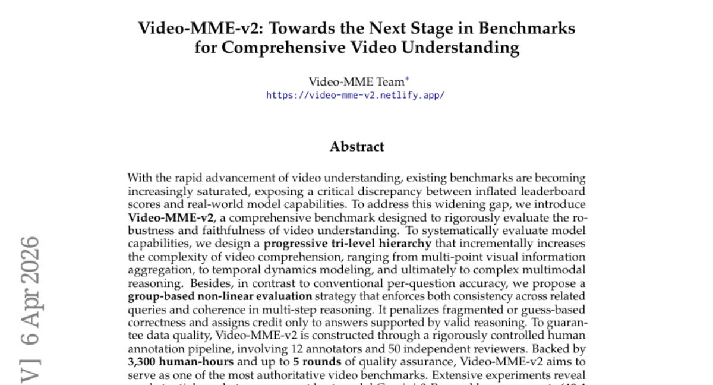
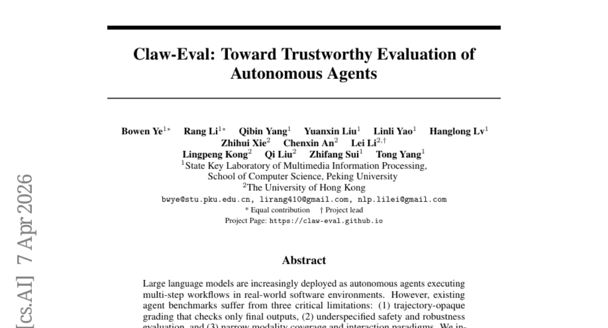
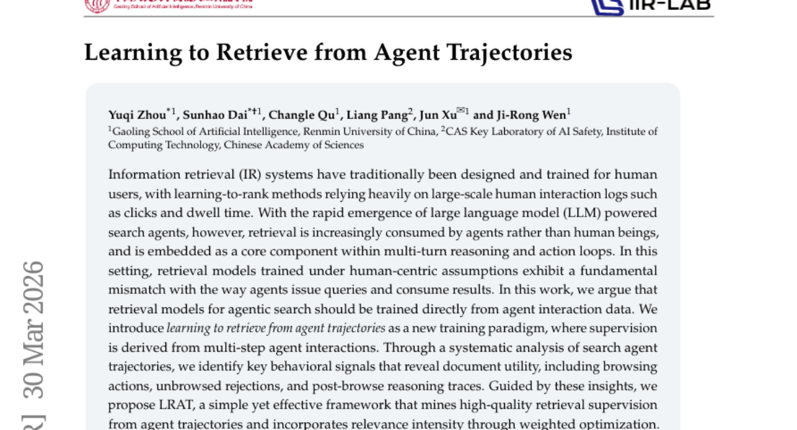
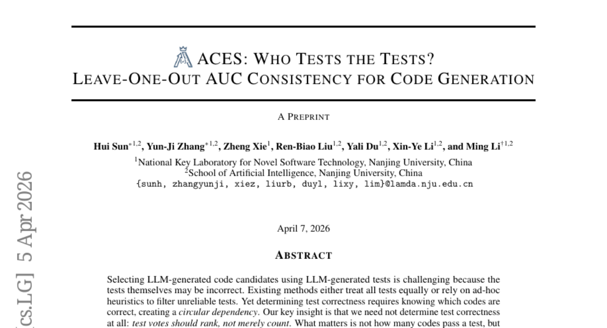
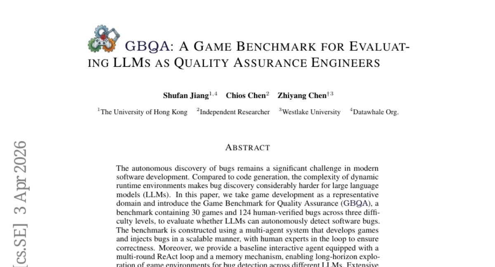
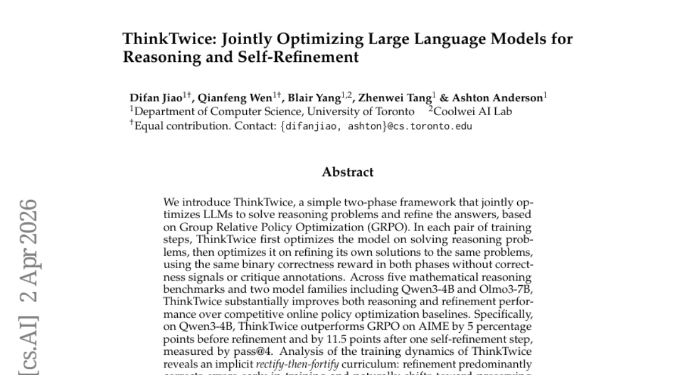
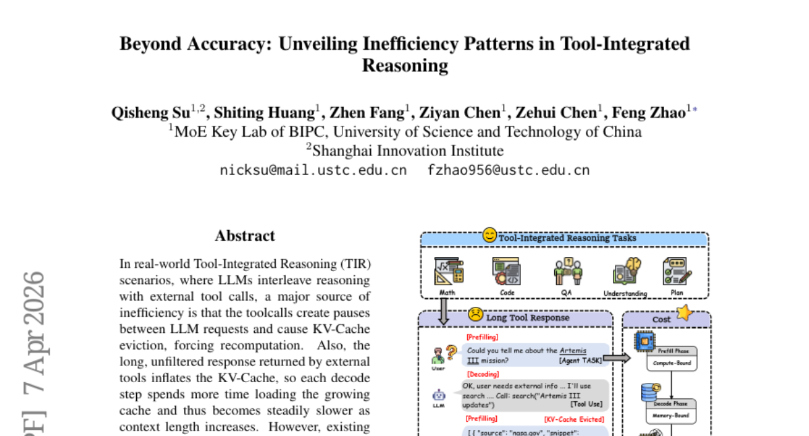
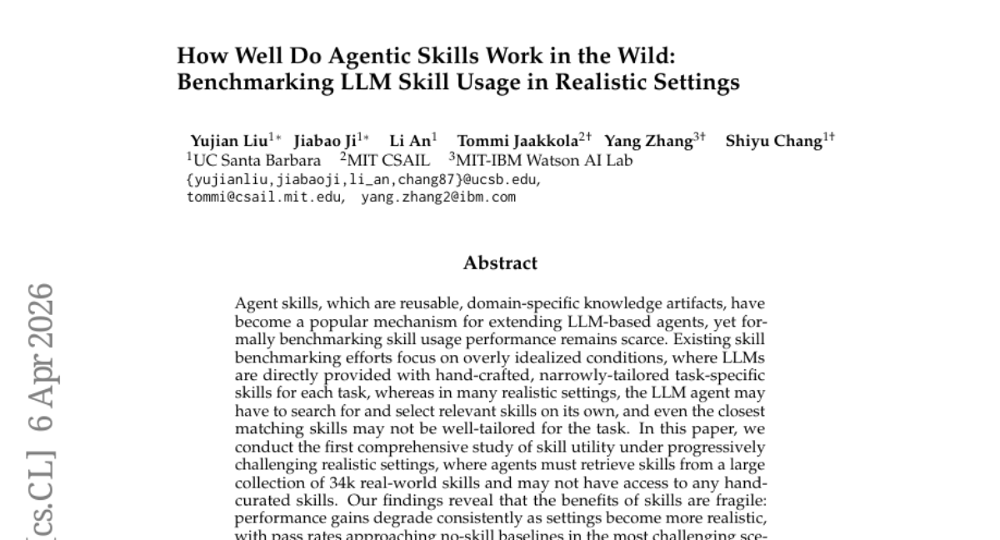

# 2026-04-09 Daily Papers (Top 9)

## 1. [Video-MME-v2: Towards the Next Stage in Benchmarks for Comprehensive Video Understanding](https://huggingface.co/papers/2604.05015)
**Upvotes**: 193 | **도입 난이도**: 중 | **신뢰도**: 상
**arXiv**: https://arxiv.org/abs/2604.05015

**태그**: Benchmark, Video Understanding, MLLM, Evaluation, RAG, Reasoning, Multimodal, Video

### 📌 한 줄 요약
기존 비디오 이해 벤치마크의 한계를 극복하고, 모델의 실제 성능을 정확하게 평가하기 위한 새로운 종합 비디오 이해 벤치마크 Video-MME-v2를 제안합니다.

### 🔑 핵심 포인트
- 기존 비디오 이해 벤치마크의 포화 문제점을 지적하고, 모델의 실제 성능 평가의 중요성을 강조
- 점진적인 복잡성 증가와 그룹 기반 비선형 평가 전략을 통해 모델의 견고성과 신뢰성을 평가하는 Video-MME-v2 벤치마크 제시
- 실험을 통해 최고 모델과 인간 전문가 간의 격차를 확인하고, 시각 정보 통합 및 시간 모델링의 중요성을 강조

### 🧑‍💻 개발자 관점
비디오 이해 모델 개발 시, Video-MME-v2 벤치마크를 활용하여 모델의 성능을 객관적으로 평가하고, 실제 사용 환경에서의 성능 향상을 위한 개선 방향을 설정하는 데 도움을 받을 수 있다.

### 🚀 실무 적용 아이디어
- Video-MME-v2 데이터셋을 다운로드하여 현재 모델의 성능을 평가해본다.
- 제공되는 평가 지표를 활용하여 모델의 취약점을 분석하고 개선한다.
- 새로운 비디오 이해 모델 개발 시, Video-MME-v2 벤치마크를 활용하여 모델의 성능을 검증한다.

### ⚠️ 리스크/한계
- Video-MME-v2 벤치마크가 모든 비디오 이해 능력을 완벽하게 평가하지 못할 수 있다.
- 데이터셋 구축에 많은 인적 자원과 시간이 소요되어, 새로운 데이터셋 구축에 어려움이 있을 수 있다.

### 📝 초록 기반 상세 설명
기존 비디오 이해 벤치마크들이 포화 상태에 이르러 모델의 실제 성능을 제대로 반영하지 못하는 문제가 발생하고 있다. 이러한 문제점을 해결하기 위해, 비디오 이해 모델의 견고성과 신뢰성을 엄격하게 평가할 수 있는 종합 벤치마크 Video-MME-v2를 제시한다. Video-MME-v2는 멀티 포인트 시각 정보 통합, 시간적 역학 모델링, 복잡한 멀티모달 추론으로 점진적으로 복잡성을 증가시키는 3단계 계층 구조를 통해 모델의 능력을 체계적으로 평가한다. 또한, 그룹 기반 비선형 평가 전략을 통해 관련 질의 간의 일관성과 다단계 추론의 일관성을 강화한다. 실험 결과, 현재 최고 모델인 Gemini-3-Pro와 인간 전문가 간의 상당한 격차를 확인했으며, 시각 정보 통합 및 시간 모델링 오류가 고차원 추론을 제한하는 계층적 병목 현상을 발견했다. Video-MME-v2는 차세대 비디오 MLLM 개발을 위한 새로운 테스트베드를 제공할 것이다.

---

## 2. [Claw-Eval: Toward Trustworthy Evaluation of Autonomous Agents](https://huggingface.co/papers/2604.06132)
**Upvotes**: 92 | **도입 난이도**: 중 | **신뢰도**: 상
**arXiv**: https://arxiv.org/abs/2604.06132

**태그**: Agent, Evaluation, Benchmark, Multimodal, RAG, Vision, Video, Safety

### 📌 한 줄 요약
Claw-Eval은 LLM 기반 자율 에이전트의 신뢰성 있는 평가를 위한 새로운 벤치마크로, 기존 평가 방식의 한계를 극복하고 안전성, 견고성, 다양한 modality 지원을 강화하여 실제 배포 가능성을 높이는 데 기여합니다.

### 🔑 핵심 포인트
- Trajectory-aware 평가를 통해 기존 평가 방식의 한계를 극복 (안전, 견고성)
- 다양한 modality (이미지, 비디오, 문서) 지원 및 성능 평가
- 실제 배포 가능성을 높이기 위한 안전성, 견고성 평가 강화

### 🧑‍💻 개발자 관점
자율 에이전트의 성능을 객관적으로 평가하고, 안전성과 신뢰성을 확보하여 실제 서비스에 안정적으로 통합하는 데 필요한 정보를 제공합니다. 특히, trajectory-aware 평가는 에이전트의 행동 과정을 분석하여 문제점을 파악하고 개선하는 데 유용합니다.

### 🚀 실무 적용 아이디어
- Claw-Eval 벤치마크를 사용하여 자사 에이전트 모델의 성능 평가 및 개선
- Trajectory-aware 평가 방식을 도입하여 에이전트의 안전성 및 견고성 강화
- 다양한 modality에 대한 성능 테스트 및 최적화

### ⚠️ 리스크/한계
- Claw-Eval의 task 및 환경이 모든 실제 시나리오를 포괄하지 못할 수 있음
- 평가 지표가 에이전트의 실제 사용자 경험을 완벽하게 반영하지 못할 수 있음

### 📝 초록 기반 상세 설명
LLM 기반 자율 에이전트가 다양한 소프트웨어 환경에서 활용되지만, 기존 벤치마크는 최종 결과만 확인하는 trajectory-opaque 방식, 안전성 및 견고성 평가의 미흡, 제한적인 modality 지원 등의 문제점을 가지고 있습니다. 이러한 문제점을 해결하기 위해, Claw-Eval은 에이전트의 모든 행동을 기록하고 세 가지 증거 채널(실행 추적, 감사 로그, 환경 스냅샷)을 통해 trajectory-aware 방식으로 평가하는 새로운 평가 스위트입니다. 14개의 모델에 대한 실험 결과, 기존 방식은 안전 위반 및 견고성 실패를 제대로 감지하지 못하며, 에러 주입 시 일관성이 저하되고, modality에 따라 성능 편차가 큰 것으로 나타났습니다. Claw-Eval은 에이전트 개발 방향을 제시하고, 실제 배포 가능한 에이전트 구축에 필요한 요소들을 강조합니다.

---

## 3. [Learning to Retrieve from Agent Trajectories](https://huggingface.co/papers/2604.04949)
**Upvotes**: 52 | **도입 난이도**: 중 | **신뢰도**: 상
**arXiv**: https://arxiv.org/abs/2604.04949

**태그**: Agent, Retrieval, LLM, Search, RAG, Reasoning, Vision, Benchmark, Evaluation

### 📌 한 줄 요약
LLM 에이전트의 검색 행동 패턴을 분석하여 검색 모델을 훈련시키는 새로운 방법론(LRAT)을 제시하고, 이를 통해 에이전트의 작업 성공률과 효율성을 향상시킴.

### 🔑 핵심 포인트
- 에이전트 검색 궤적 기반의 새로운 학습 패러다임 제시
- 에이전트 행동 신호 분석을 통한 고품질 검색 지도 학습 데이터 마이닝
- LRAT 프레임워크를 통한 검색 모델 성능 향상

### 🧑‍💻 개발자 관점
LLM 에이전트 기반 시스템 개발 시, 에이전트의 검색 행동 패턴을 활용하여 검색 정확도를 높이고, 전체 시스템 성능을 개선할 수 있는 실질적인 방법론을 제공합니다.

### 🚀 실무 적용 아이디어
- 자체 에이전트 시스템에 LRAT 프레임워크 적용 및 성능 평가
- 에이전트 검색 궤적 데이터 수집 및 분석 파이프라인 구축
- 다양한 에이전트 아키텍처 및 규모에 대한 LRAT 효과 검증

### ⚠️ 리스크/한계
- 에이전트 검색 궤적 데이터의 품질에 따른 성능 변동 가능성
- 특정 도메인에 특화된 에이전트의 경우 일반화 성능 저하 가능성

### 📝 초록 기반 상세 설명
기존 정보 검색 시스템은 주로 인간 사용자의 행동 로그에 의존하여 학습되었지만, LLM 기반 에이전트의 등장으로 검색 소비 주체가 에이전트로 변화하고 있습니다. 이러한 환경에서 인간 중심 가정으로 훈련된 검색 모델은 에이전트의 질의 방식 및 결과 소비 방식과 불일치하는 문제가 발생합니다. 본 연구에서는 에이전트의 상호 작용 데이터로부터 직접 검색 모델을 훈련하는 새로운 패러다임을 제시합니다. 에이전트의 검색 궤적을 분석하여 문서 유용성을 나타내는 핵심 행동 신호(탐색 행동, 거부, 추론 흔적)를 식별하고, 이를 활용하여 고품질의 검색 지도 학습 데이터를 마이닝하는 LRAT 프레임워크를 제안합니다. 다양한 에이전트 아키텍처 및 규모에 대한 실험 결과, LRAT로 훈련된 검색 모델이 증거 재현율, 작업 성공률, 실행 효율성을 향상시키는 것을 확인했습니다.

---

## 4. [ACES: Who Tests the Tests? Leave-One-Out AUC Consistency for Code Generation](https://huggingface.co/papers/2604.03922)
**Upvotes**: 43 | **도입 난이도**: 하 | **신뢰도**: 상
**arXiv**: https://arxiv.org/abs/2604.03922

**태그**: Code Generation, LLM, Testing, AUC, RAG, Benchmark, Evaluation

### 📌 한 줄 요약
LLM으로 생성된 코드의 테스트 신뢰도를 높여 Pass@k 성능을 개선하는 ACES 방법론을 제안하며, 별도 연산 없이 기존 pass/fail 데이터만으로 적용 가능하다.

### 🔑 핵심 포인트
- Leave-One-Out AUC를 활용하여 테스트 케이스의 신뢰도를 평가하는 새로운 접근 방식 제시
- Closed-form 가중치를 제공하는 ACES-C와 최적화 기반의 ACES-O 두 가지 변형 제안
- 별도의 연산 없이 binary pass matrix만으로 state-of-the-art Pass@k 성능 달성

### 🧑‍💻 개발자 관점
LLM 기반 코드 생성 시스템에서 테스트 케이스의 신뢰도를 높여 코드 품질을 향상시키고, 개발자가 더 정확한 코드를 선택하도록 돕는다.

### 🚀 실무 적용 아이디어
- 기존 LLM 코드 생성 파이프라인에 ACES를 적용하여 Pass@k 성능 개선을 시도
- ACES-C와 ACES-O의 성능을 비교하여 프로젝트에 적합한 방법 선택
- 생성된 테스트 케이스의 LOO-AUC 값을 분석하여 신뢰도가 낮은 테스트 케이스 식별

### ⚠️ 리스크/한계
- ACES-C는 평균 테스트 품질에 대한 가정을 필요로 하며, 이 가정이 위배될 경우 성능 저하가 발생할 수 있다.
- LOO-AUC 계산 시 데이터 희소성 문제가 발생할 수 있으며, 특히 테스트 케이스 수가 적을 때 성능에 영향을 줄 수 있다.

### 📝 초록 기반 상세 설명
LLM을 이용한 코드 생성에서 LLM이 생성한 테스트 케이스의 신뢰성 문제가 발생한다. 기존 방법들은 모든 테스트를 동등하게 취급하거나 임시방편적인 휴리스틱에 의존했다. 본 논문에서는 테스트 자체의 정확성을 판단하는 대신, 테스트의 순위 결정 능력을 활용하는 ACES 방법을 제안한다. ACES는 Leave-One-Out AUC를 통해 테스트의 신뢰도를 측정하고, 이를 기반으로 코드의 순위를 결정한다. ACES-C는 closed-form 가중치를 제공하고, ACES-O는 미분 가능한 LOO-AUC 목적 함수를 최적화한다. 다양한 코드 생성 벤치마크에서 ACES는 기존 방법들을 능가하는 Pass@k 성능을 달성했다.

---

## 5. [GBQA: A Game Benchmark for Evaluating LLMs as Quality Assurance Engineers](https://huggingface.co/papers/2604.02648)
**Upvotes**: 36 | **도입 난이도**: 중 | **신뢰도**: 중
**arXiv**: https://arxiv.org/abs/2604.02648

**태그**: LLM, QA, Benchmark, Bug Detection, Game Development, Agent, Evaluation

### 📌 한 줄 요약
LLM을 활용한 자동 버그 탐색은 여전히 어려운 과제이며, GBQA 벤치마크는 이 분야의 발전을 위한 중요한 테스트베드를 제공한다.

### 🔑 핵심 포인트
- 게임 개발 환경에서의 LLM 기반 자동 버그 탐색 벤치마크 (GBQA) 제시
- 멀티 에이전트 시스템을 활용한 확장 가능한 버그 생성 및 전문가 검증
- ReAct 루프와 메모리 메커니즘을 갖춘 baseline agent를 통한 LLM 성능 평가

### 🧑‍💻 개발자 관점
LLM을 활용한 자동 버그 탐색 연구에 대한 객관적인 평가 기준을 제공하며, 개발자는 이를 통해 LLM 기반 QA 시스템 개발 가능성을 타진하고, 실제 코드에 적용하기 전에 게임 환경에서 실험해 볼 수 있다.

### 🚀 실무 적용 아이디어
- GBQA 벤치마크를 활용하여 자체 개발한 LLM 기반 QA 에이전트 성능 평가
- ReAct 루프 및 메모리 메커니즘을 개선하여 버그 탐지율 향상 시도
- GBQA 데이터셋을 활용하여 LLM 파인튜닝을 통한 버그 탐지 성능 향상 연구

### ⚠️ 리스크/한계
- 게임 환경에 특화된 벤치마크이므로, 실제 소프트웨어 환경에서의 일반화 가능성은 제한적
- LLM의 성능에 따라 벤치마크 결과가 크게 달라질 수 있음

### 📝 초록 기반 상세 설명
소프트웨어 개발에서 자동 버그 발견은 중요한 과제이지만, 복잡한 런타임 환경으로 인해 LLM에게는 더욱 어렵다. 본 논문에서는 게임 개발을 대표적인 도메인으로 삼아, LLM의 자동 버그 탐지 능력을 평가하기 위한 GBQA 벤치마크를 소개한다. GBQA는 다양한 난이도의 30개 게임과 124개의 검증된 버그를 포함한다. 멀티 에이전트 시스템을 사용하여 게임을 개발하고 버그를 삽입하며, 전문가 검증을 통해 정확성을 확보했다. ReAct 루프와 메모리 메커니즘을 갖춘 baseline agent를 통해 다양한 LLM의 장기적인 버그 탐색 능력을 평가한 결과, 최고 성능 모델도 48.39%의 버그만 탐지했다.

---

## 6. [ThinkTwice: Jointly Optimizing Large Language Models for Reasoning and Self-Refinement](https://huggingface.co/papers/2604.01591)
**Upvotes**: 29 | **도입 난이도**: 중 | **신뢰도**: 상
**arXiv**: https://arxiv.org/abs/2604.01591

**태그**: Reasoning, Self-Refinement, RLVR, Optimization, LLM, Benchmark

### 📌 한 줄 요약
ThinkTwice는 LLM을 훈련하여 추론 문제 해결과 자체 개선을 동시에 최적화하는 프레임워크로, 별도의 정답 신호 없이도 성능 향상을 이끌어냅니다.

### 🔑 핵심 포인트
- 추론 및 자체 개선을 위한 LLM 공동 최적화 프레임워크 ThinkTwice 제시
- 정답 신호나 비평 없이 이진 정답 여부 보상만으로 학습
- 수학적 추론 벤치마크에서 기존 방식 대비 상당한 성능 향상

### 🧑‍💻 개발자 관점
LLM 기반 추론 시스템 개발 시, ThinkTwice 프레임워크를 적용하여 별도의 정답 데이터 구축 없이 모델의 추론 능력과 자체 개선 능력을 동시에 향상시킬 수 있습니다.

### 🚀 실무 적용 아이디어
- ThinkTwice 프레임워크를 기존 LLM 추론 파이프라인에 통합하여 성능 향상 실험
- 자체 데이터셋에 ThinkTwice를 적용하여 효과 검증
- ThinkTwice의 rectify-then-fortify 학습 전략을 다른 강화 학습 기반 LLM 훈련에 적용

### ⚠️ 리스크/한계
- 수학적 추론 문제에 특화되어 다른 유형의 추론 문제에는 효과가 제한적일 수 있음
- GRPO 기반이므로 GRPO의 단점을 그대로 가질 수 있음

### 📝 초록 기반 상세 설명
LLM은 복잡한 추론 문제 해결에 어려움을 겪으며, 자체 개선 능력 또한 제한적입니다. ThinkTwice는 GRPO 기반으로 LLM이 추론 문제 해결과 자체 솔루션 개선을 동시에 학습하도록 하는 새로운 2단계 프레임워크를 제안합니다. 이 방법은 정답 여부만을 보상으로 사용하여 별도의 정답 신호나 비평 없이 학습합니다. Qwen3-4B 및 Olmo3-7B 모델을 사용한 실험 결과, ThinkTwice는 기존 온라인 정책 최적화 방식보다 추론 및 개선 성능 모두에서 상당한 향상을 보였습니다. 특히 Qwen3-4B에서 AIME 데이터셋에 대해 개선 전 5%, 개선 후 11.5% 향상된 성능을 달성했습니다. ThinkTwice는 학습 초기에는 오류를 수정하고, 모델 성능이 향상됨에 따라 이미 올바른 솔루션을 유지하는 방향으로 학습이 진행되는 경향을 보입니다.

---

## 7. [Vanast: Virtual Try-On with Human Image Animation via Synthetic Triplet Supervision](https://huggingface.co/papers/2604.04934)
**Upvotes**: 28 | **도입 난이도**: 중 | **신뢰도**: 상
**arXiv**: https://arxiv.org/abs/2604.04934

**태그**: Vision, Animation, Virtual Try-On, Diffusion Transformer, Video

### 📌 한 줄 요약
Vanast는 단일 이미지, 의류 이미지, 포즈 가이드 비디오를 사용하여 의류가 적용된 인물 애니메이션 비디오를 생성하는 통합 프레임워크로, 기존 방식의 문제점을 해결하고 고품질 애니메이션을 생성합니다.

### 🔑 핵심 포인트
- 단일 단계로 가상 착용 및 애니메이션 통합
- 대규모 삼중 데이터셋 구축을 통한 학습
- 비디오 확산 트랜스포머를 위한 이중 모듈 아키텍처 도입

### 🧑‍💻 개발자 관점
Vanast는 게임, 메타버스, 이커머스 등 다양한 분야에서 사용자 맞춤형 아바타 생성 및 의류 시뮬레이션에 활용될 수 있으며, 개발자는 이를 통해 더욱 몰입감 있는 사용자 경험을 제공할 수 있습니다.

### 🚀 실무 적용 아이디어
- Vanast 데이터셋 구축 파이프라인 분석 및 유사 데이터셋 구축 시 적용
- 이중 모듈 아키텍처를 활용한 비디오 확산 트랜스포머 구조 연구
- 자체 의류 데이터셋에 Vanast 모델 적용 및 성능 평가

### ⚠️ 리스크/한계
- 복잡한 의류 디자인이나 재질 표현의 한계
- 학습 데이터셋의 편향으로 인한 특정 체형 또는 인종에 대한 성능 저하 가능성

### 📝 초록 기반 상세 설명
기존의 가상 착용 및 포즈 기반 애니메이션 파이프라인은 개별적으로 처리되어 정체성 유지, 의류 왜곡, 앞/뒤 불일치 등의 문제가 발생했습니다. Vanast는 이러한 문제를 해결하기 위해 전체 프로세스를 단일 단계로 통합하여 일관성 있는 합성을 달성합니다. 이를 위해 대규모 삼중 데이터셋을 구축하고, 비디오 확산 트랜스포머를 위한 이중 모듈 아키텍처를 도입하여 학습 안정성을 높이고, 사전 학습된 생성 품질을 유지하며, 의류 정확도, 포즈 준수, 정체성 유지를 개선했습니다. Vanast는 다양한 의류 유형에 걸쳐 고품질의 일관된 애니메이션을 생성할 수 있습니다.

---

## 8. [Beyond Accuracy: Unveiling Inefficiency Patterns in Tool-Integrated Reasoning](https://huggingface.co/papers/2604.05404)
**Upvotes**: 27 | **도입 난이도**: 중 | **신뢰도**: 상
**arXiv**: https://arxiv.org/abs/2604.05404

**태그**: Agent, LLM, Efficiency, KV-Cache, Tool, Reasoning, Benchmark, Inference

### 📌 한 줄 요약
LLM의 Tool-Integrated Reasoning(TIR) 환경에서 KV-Cache 효율 문제를 해결하는 새로운 지표 PTE를 제시하고, 실제 환경에서의 유용성을 검증함.

### 🔑 핵심 포인트
- Tool-Integrated Reasoning(TIR) 환경의 KV-Cache 비효율 문제 지적
- 새로운 효율성 지표 PTE(Prefill Token Equivalents) 제안
- 실제 산업 환경에서의 PTE 유용성 검증 및 비효율 패턴 분석

### 🧑‍💻 개발자 관점
LLM 기반 에이전트 개발 시, PTE 지표를 활용하여 KV-Cache 효율성을 개선하고, 실제 지연 시간을 줄이는 데 도움이 될 수 있다.

### 🚀 실무 적용 아이디어
- 자체 TIR 환경에서 PTE 측정 및 기존 지표와의 비교
- PTE 기반으로 비효율적인 도구 사용 패턴 분석 및 개선
- KV-Cache 최적화를 위한 다양한 전략 실험 (e.g., 캐시 크기 조정, 도구 응답 필터링)

### ⚠️ 리스크/한계
- PTE는 특정 하드웨어 환경에 최적화되어 있을 수 있으며, 다른 환경에서는 성능이 다를 수 있음
- PTE 계산 복잡성으로 인해 실시간 모니터링 및 디버깅이 어려울 수 있음

### 📝 초록 기반 상세 설명
LLM이 외부 도구를 사용하는 Tool-Integrated Reasoning(TIR) 환경에서 잦은 도구 호출로 인한 KV-Cache 비효율과 긴 응답으로 인한 지연 문제가 발생한다. 기존 토큰 기반 지표는 이러한 문제를 제대로 반영하지 못한다. 본 연구에서는 하드웨어 성능을 고려하여 KV-Cache 재사용 불가 및 긴 응답을 반영하는 새로운 효율성 지표 PTE(Prefill Token Equivalents)를 제안한다. 실제 산업 환경에서의 검증 결과, PTE는 기존 토큰 수보다 실제 지연 시간과 더 잘 일치했으며, 다양한 하드웨어 환경에서도 일관된 효율성 순위를 보였다. 다양한 TIR 벤치마크를 통해 PTE 비용을 분석하고 비효율 패턴을 식별했으며, PTE 비용이 높을수록 추론 정확도가 낮아지는 경향을 발견했다.

---

## 9. [How Well Do Agentic Skills Work in the Wild: Benchmarking LLM Skill Usage in Realistic Settings](https://huggingface.co/papers/2604.04323)
**Upvotes**: 22 | **도입 난이도**: 중 | **신뢰도**: 중
**arXiv**: https://arxiv.org/abs/2604.04323

**태그**: Agent, LLM, Benchmarking, Skill Refinement, RAG, Benchmark, Evaluation

### 📌 한 줄 요약
LLM 에이전트의 스킬 활용 성능은 현실적인 환경에서 크게 저하되지만, 쿼리 특화 스킬 개선을 통해 성능 회복이 가능하다.

### 🔑 핵심 포인트
- 현실적인 환경에서 LLM 에이전트의 스킬 활용 성능 벤치마킹
- 쿼리 특화 스킬 개선 전략을 통한 성능 향상
- 34k개의 실제 스킬 데이터셋을 활용한 실험

### 🧑‍💻 개발자 관점
LLM 에이전트 기반 시스템을 개발할 때, 스킬 검색 및 활용 전략이 실제 환경에서 얼마나 효과적인지 이해하고, 성능 저하를 방지하기 위한 스킬 개선 전략을 적용하는 데 도움을 줄 수 있다.

### 🚀 실무 적용 아이디어
- 자체 LLM 에이전트 시스템에 34k 데이터셋을 활용하여 스킬 검색 및 활용 성능 테스트
- 쿼리 특화 스킬 개선 전략을 구현하여 성능 향상 가능성 검증
- Terminal-Bench 2.0 데이터셋을 활용하여 다양한 모델의 스킬 활용 성능 비교

### ⚠️ 리스크/한계
- 초기 스킬의 관련성 및 품질에 따라 쿼리 특화 스킬 개선 전략의 효과가 달라질 수 있음
- 실험 환경과 실제 서비스 환경 간의 차이로 인해 결과가 다를 수 있음

### 📝 초록 기반 상세 설명
LLM 에이전트의 스킬 활용은 에이전트 성능을 확장하는 효과적인 방법이지만, 기존 연구는 이상적인 환경에 집중되어 현실적인 환경에서의 성능 검증이 부족했습니다. 본 연구에서는 34,000개의 실제 스킬 데이터셋을 활용하여 에이전트가 직접 스킬을 검색하고 선택해야 하는 환경에서 스킬 활용 성능을 평가했습니다. 실험 결과, 스킬 활용의 이점은 환경이 현실적으로 변할수록 감소하며, 특히 hand-curated 스킬이 없는 경우 성능이 크게 저하되었습니다. 이러한 성능 저하를 해결하기 위해 쿼리 특화 스킬 개선 전략을 제안하고, 이 방법이 초기 스킬의 관련성과 품질이 적절할 때 성능을 크게 향상시킴을 입증했습니다. Terminal-Bench 2.0 데이터셋에서 Claude Opus 4.6의 pass rate를 57.7%에서 65.5%로 향상시키는 결과를 통해 제안 방법의 일반성을 확인했습니다.

---

