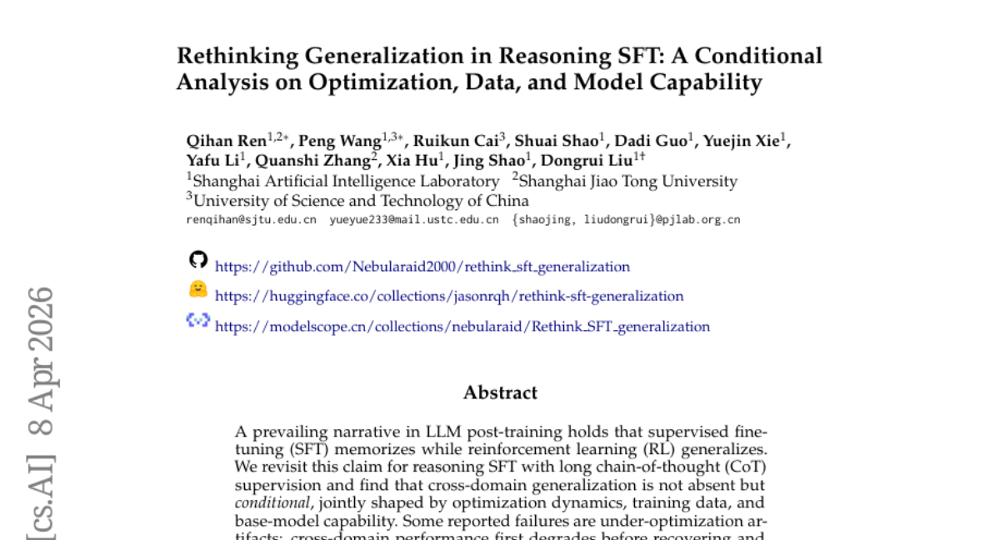
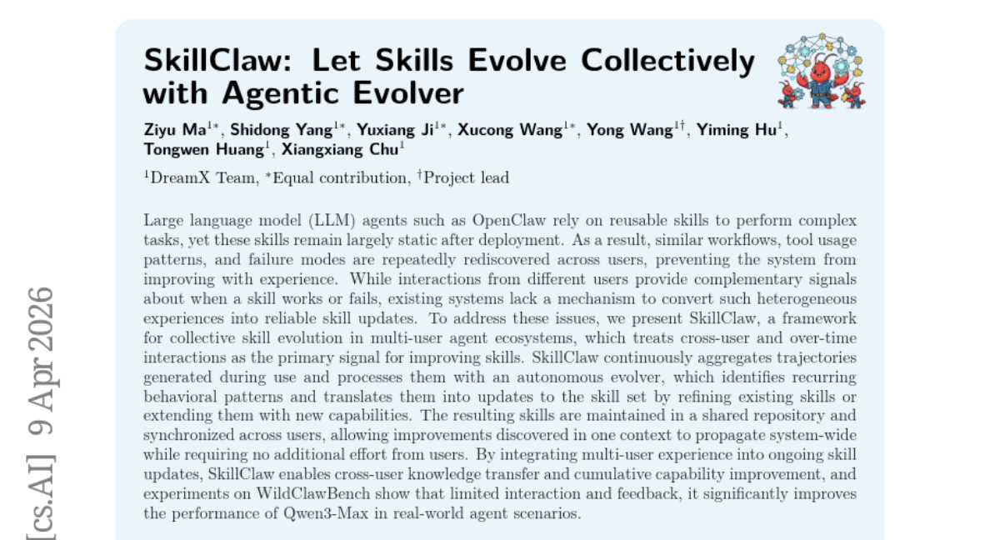
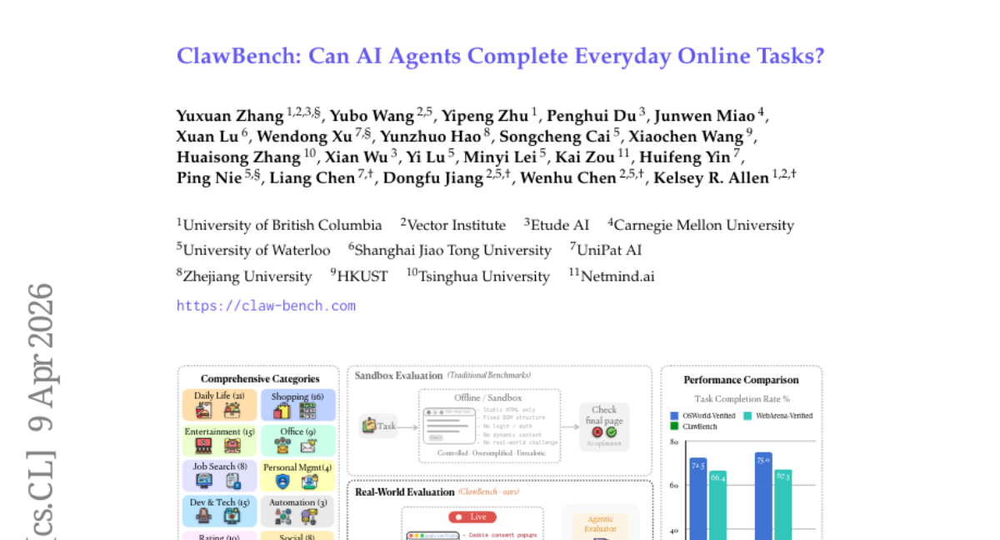
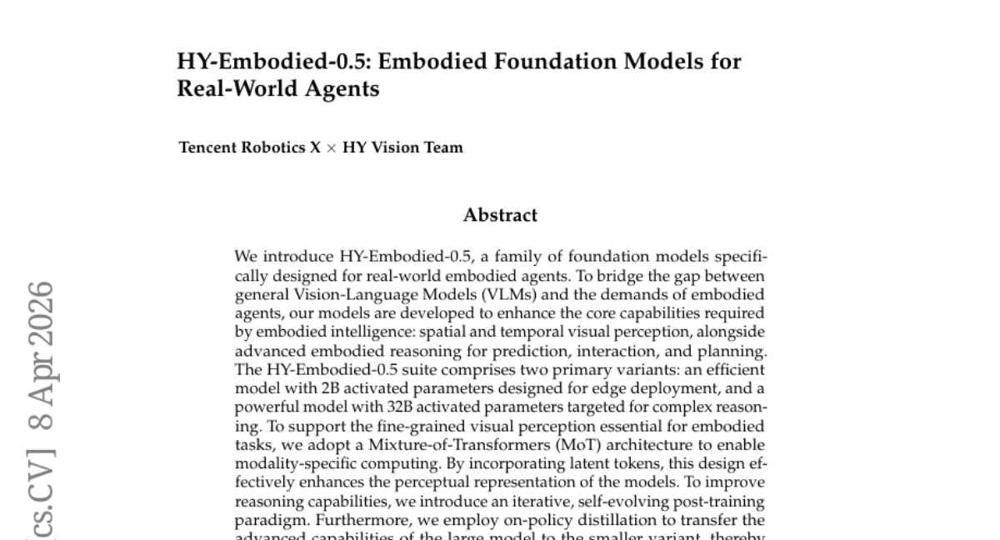
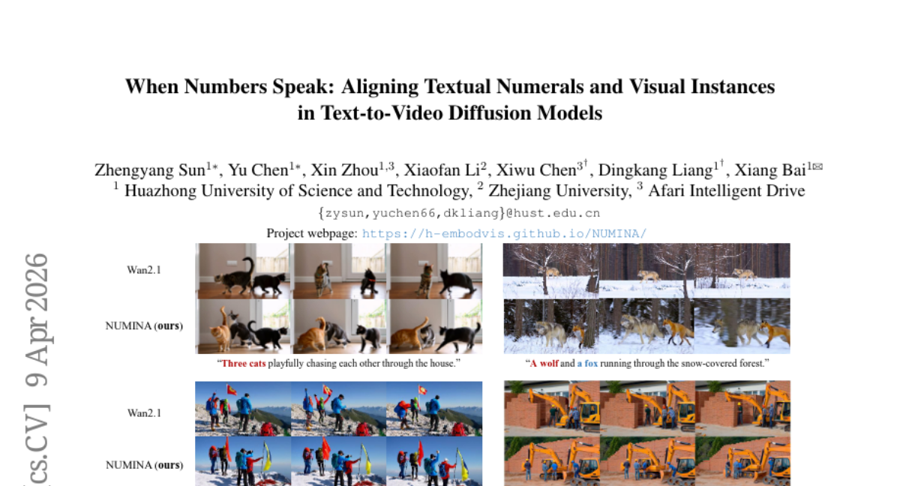
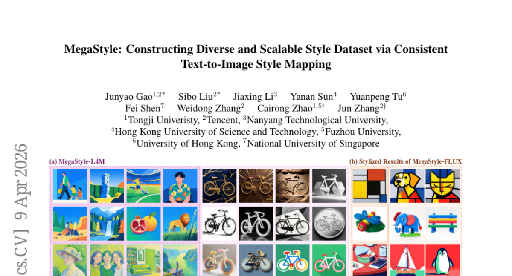
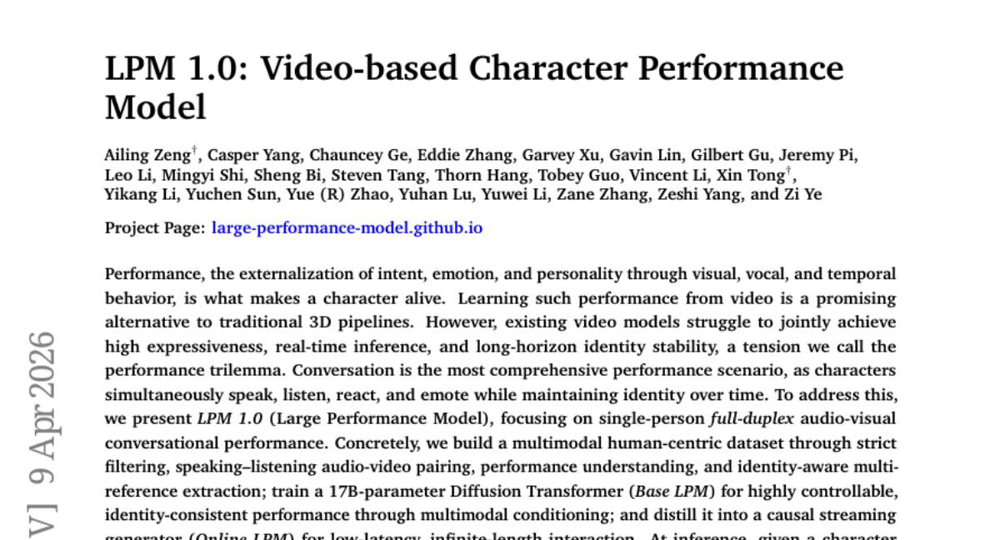
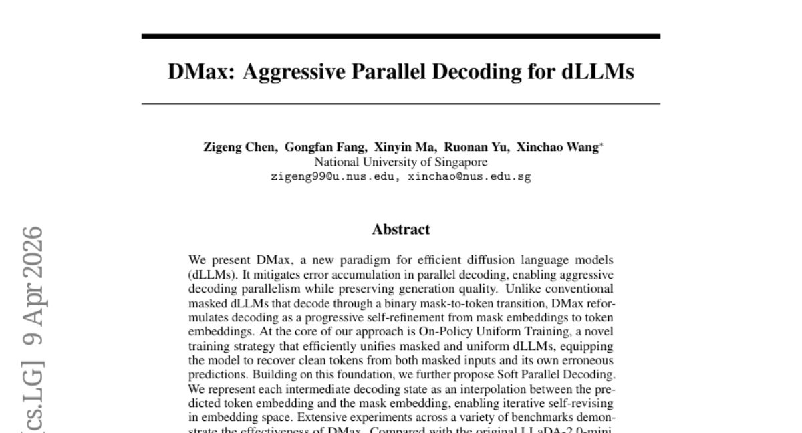
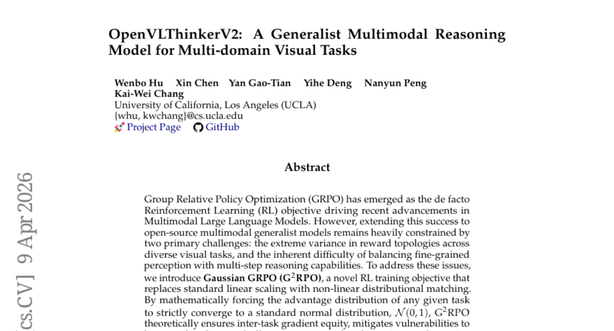

# 2026-04-13 Daily Papers (Top 9)

## 1. [Rethinking Generalization in Reasoning SFT: A Conditional Analysis on Optimization, Data, and Model Capability](https://huggingface.co/papers/2604.06628)
**Upvotes**: 261 | **도입 난이도**: 중 | **신뢰도**: 중
**arXiv**: https://arxiv.org/abs/2604.06628

**태그**: LLM, SFT, Reasoning, Generalization, CoT, Vision, Safety

### 📌 한 줄 요약
LLM의 reasoning SFT는 memorization이 아닌 조건부 generalization이 발생하며, 이는 최적화, 데이터, 모델 역량에 의해 결정됨. 따라서 SFT 학습 시 이 세 가지 요소를 고려해야 함.

### 🔑 핵심 포인트
- Reasoning SFT는 조건부 generalization을 보임
- 최적화, 데이터 품질, 모델 역량이 generalization에 중요
- Reasoning 능력 향상과 안전성 저하 간의 trade-off 존재

### 🧑‍💻 개발자 관점
LLM을 활용한 reasoning task 개발 시, SFT 학습 과정에서 최적화, 데이터 품질, 모델 역량을 종합적으로 고려하여 generalization 성능을 극대화하고 안전성 문제를 해결해야 함.

### 🚀 실무 적용 아이디어
- SFT 학습 시 dip-and-recovery 패턴을 관찰하며 충분한 학습 시간을 확보
- 고품질의 verified long-CoT 데이터를 구축하여 학습에 활용
- 모델의 역량에 따라 적절한 학습 전략을 수립 (강력한 모델은 transferable procedural patterns 학습, 약한 모델은 데이터 증강)

### ⚠️ 리스크/한계
- Reasoning 능력 향상에 따른 안전성 저하 가능성
- Cross-domain generalization 성능은 데이터셋 및 모델에 따라 크게 달라질 수 있음

### 📝 초록 기반 상세 설명
LLM의 supervised finetuning(SFT)은 memorization에 집중하고 reinforcement learning(RL)은 generalization에 집중한다는 기존 주장이 있었으나, 본 연구에서는 long chain-of-thought (CoT) supervision을 사용한 reasoning SFT에서 cross-domain generalization이 조건부로 발생함을 밝힘. 최적화 과정에서 초기에는 성능이 저하되다 장기적으로 향상되는 dip-and-recovery 패턴이 관찰되었으며, 데이터 품질과 구조 또한 generalization에 영향을 미침. 또한, 모델의 역량이 중요하며, 강력한 모델은 transferable procedural patterns을 내재화하는 반면, 약한 모델은 표면적인 verbosity를 모방함. Reasoning 능력은 향상되지만 안전성은 저하되는 비대칭적인 generalization이 발생하므로, reasoning SFT의 generalization 여부보다는 조건과 비용에 대한 질문으로 재구성해야 함.

---

## 2. [SkillClaw: Let Skills Evolve Collectively with Agentic Evolver](https://huggingface.co/papers/2604.08377)
**Upvotes**: 256 | **도입 난이도**: 중 | **신뢰도**: 상
**arXiv**: https://arxiv.org/abs/2604.08377

**태그**: Agent, Skill Evolution, Multi-user, LLM

### 📌 한 줄 요약
SkillClaw는 다중 사용자 환경에서 LLM 에이전트의 스킬을 자동으로 개선하고 공유하여, 사용자 경험을 통해 시스템 전체의 성능을 향상시키는 프레임워크다.

### 🔑 핵심 포인트
- 다중 사용자 상호 작용을 활용한 LLM 에이전트 스킬 자동 개선
- 자율적인 Evolver를 통한 스킬 개선 및 확장
- 개선된 스킬의 공유 및 동기화를 통한 시스템 전체 성능 향상

### 🧑‍💻 개발자 관점
SkillClaw는 개발자들이 LLM 에이전트의 스킬을 지속적으로 개선하고 공유하여, 에이전트 기반 시스템의 성능과 효율성을 높이는 데 도움을 줄 수 있다. 특히, 여러 사용자가 참여하는 환경에서 에이전트의 스킬을 개선하는 데 유용하다.

### 🚀 실무 적용 아이디어
- SkillClaw 프레임워크를 사용하여 LLM 에이전트 스킬 개선 파이프라인 구축
- WildClawBench 데이터셋을 활용하여 SkillClaw의 성능 평가
- 자체 에이전트 환경에 SkillClaw를 적용하여 스킬 개선 효과 검증

### ⚠️ 리스크/한계
- Evolver의 성능에 따라 스킬 개선 효과가 달라질 수 있음
- 다양한 사용자 상호 작용 데이터 확보의 어려움

### 📝 초록 기반 상세 설명
LLM 에이전트는 복잡한 작업을 위해 재사용 가능한 스킬에 의존하지만, 배포 후에는 스킬이 정적으로 유지되어 사용자 경험을 통해 개선되지 못하는 문제가 있다. SkillClaw는 다중 사용자 간의 상호 작용을 활용하여 스킬을 개선하는 프레임워크를 제시한다. 이 프레임워크는 사용자들의 상호 작용을 통해 생성된 데이터를 수집하고, 자율적인 Evolver를 통해 반복적인 패턴을 식별하여 스킬을 개선하거나 확장한다. 개선된 스킬은 공유 저장소에 유지되어 사용자 간에 동기화되므로, 한 사용자의 개선 사항이 시스템 전체에 전파된다. WildClawBench 실험 결과, SkillClaw는 실제 에이전트 시나리오에서 Qwen3-Max의 성능을 크게 향상시켰다.

---

## 3. [ClawBench: Can AI Agents Complete Everyday Online Tasks?](https://huggingface.co/papers/2604.08523)
**Upvotes**: 240 | **도입 난이도**: 상 | **신뢰도**: 중
**arXiv**: https://arxiv.org/abs/2604.08523

**태그**: Agent, Benchmark, Web Automation, Evaluation

### 📌 한 줄 요약
AI 에이전트가 실제 웹 환경에서 일상적인 온라인 작업을 얼마나 잘 수행하는지 평가하는 새로운 벤치마크 ClawBench를 제시하고, 최신 모델들의 성능이 아직 부족함을 보임.

### 🔑 핵심 포인트
- 실제 웹 환경 기반의 새로운 AI 에이전트 평가 벤치마크 ClawBench 제시
- 다양한 카테고리의 153개 실제 온라인 작업 포함
- 최신 AI 모델들의 성능 평가 결과, 아직 실용적인 수준에 미치지 못함

### 🧑‍💻 개발자 관점
실제 웹 환경에서 작동하는 AI 에이전트 개발에 필요한 어려움을 파악하고, 성능 향상을 위한 연구 방향을 제시하여, 자동화 시스템 구축에 기여할 수 있다.

### 🚀 실무 적용 아이디어
- ClawBench 데이터셋을 활용하여 특정 작업에 특화된 에이전트 개발
- 기존 모델을 ClawBench 데이터셋으로 파인튜닝하여 성능 향상 시도
- 웹 환경에서의 에이전트 동작 안정성을 높이기 위한 연구 진행

### ⚠️ 리스크/한계
- 평가 대상 모델의 종류가 제한적임
- 특정 웹 사이트의 변경에 따라 벤치마크 업데이트 필요

### 📝 초록 기반 상세 설명
AI 에이전트의 발전에도 불구하고 실제 웹 환경에서의 활용은 여전히 어려운 과제이다. 기존 벤치마크는 정적인 환경에서만 평가를 진행하여 실제 복잡성을 반영하지 못한다는 문제가 있다. 본 연구에서는 실제 웹 사이트에서 다양한 온라인 작업을 수행하는 AI 에이전트의 능력을 평가하기 위한 ClawBench 프레임워크를 제안한다. ClawBench는 구매, 예약, 지원 등 153개의 실제 작업을 포함하며, 최신 AI 모델들의 성능을 평가한 결과, Claude Sonnet 4.6 조차 33.3%의 성공률을 보였다. ClawBench는 AI 에이전트가 범용 어시스턴트로 발전하는 데 기여할 것이다.

---

## 4. [HY-Embodied-0.5: Embodied Foundation Models for Real-World Agents](https://huggingface.co/papers/2604.07430)
**Upvotes**: 151 | **도입 난이도**: 중 | **신뢰도**: 중
**arXiv**: https://arxiv.org/abs/2604.07430

**태그**: Embodied AI, VLM, Robotics, Agent, RAG, Reasoning, Vision, Benchmark, Evaluation, Distillation

### 📌 한 줄 요약
실제 로봇에 특화된 Vision-Language 모델(VLM)인 HY-Embodied-0.5를 개발, 22개 벤치마크에서 SOTA 모델과 비교하여 우수한 성능을 보였으며, 실제 로봇 제어 실험에서도 효과적인 Vision-Language-Action 모델을 구축함.

### 🔑 핵심 포인트
- 실제 로봇 에이전트를 위한 특화된 Vision-Language 모델(VLM)인 HY-Embodied-0.5 개발
- MoT 아키텍처를 통한 세분화된 시각적 인식 및 반복적 자체 진화 후처리 학습을 통한 추론 능력 향상
- 22개 벤치마크에서 SOTA 모델 대비 우수한 성능 및 실제 로봇 제어 실험에서의 효과 입증

### 🧑‍💻 개발자 관점
실제 로봇 환경에서 작동하는 에이전트 개발에 필요한 핵심 기술인 시각적 인식 및 추론 능력을 향상시키는 데 기여하며, 로봇 제어 시스템의 성능을 개선하는 데 활용될 수 있습니다.

### 🚀 실무 적용 아이디어
- HY-Embodied-0.5 모델을 활용하여 자율 주행 로봇의 시각 인식 및 경로 계획 성능 개선 실험
- 기존 로봇 제어 시스템에 HY-Embodied-0.5 기반 VLA 모델을 통합하여 작업 효율성 향상 가능성 검토
- MoT 아키텍처 및 자체 진화 후처리 학습 방법을 다른 VLM 모델에 적용하여 성능 향상 시도

### ⚠️ 리스크/한계
- 모델의 크기가 크고 복잡하여 실제 로봇 환경에 배포 시 연산 자원 및 에너지 소비 문제가 발생할 수 있음
- 특정 환경이나 작업에 과적합될 가능성이 있으며, 일반화 성능에 대한 추가 검증이 필요함

### 📝 초록 기반 상세 설명
기존 Vision-Language 모델(VLM)은 실제 로봇 에이전트의 요구사항을 충족시키기 어렵다는 문제점이 있습니다. 이를 해결하기 위해 공간적, 시간적 시각 인식 능력과 예측, 상호 작용, 계획을 위한 고차원적 추론 능력을 강화한 HY-Embodied-0.5 모델을 제안합니다. 이 모델은 MoT 아키텍처를 통해 세분화된 시각적 인식을 지원하고, 반복적인 자체 진화 후처리 학습을 통해 추론 능력을 향상시킵니다. 22개의 벤치마크에서 MoT-2B 모델은 유사한 크기의 SOTA 모델을 능가했으며, 32B 모델은 Gemini 3.0 Pro와 유사한 성능을 보였습니다. 실제 로봇 제어 실험에서 효과적인 Vision-Language-Action (VLA) 모델을 훈련하여 실제 환경에서의 유용성을 입증했습니다.

---

## 5. [When Numbers Speak: Aligning Textual Numerals and Visual Instances in Text-to-Video Diffusion Models](https://huggingface.co/papers/2604.08546)
**Upvotes**: 108 | **도입 난이도**: 중 | **신뢰도**: 상
**arXiv**: https://arxiv.org/abs/2604.08546

**태그**: Diffusion Model, Text-to-Video, Counting, Attention, Video, Safety

### 📌 한 줄 요약
Text-to-Video 모델에서 프롬프트에 지정된 객체 수를 정확하게 생성하는 데 어려움을 겪는 문제를 해결하기 위해, 별도의 학습 없이도 숫자 일관성을 향상시키는 NUMINA 프레임워크를 제안합니다.

### 🔑 핵심 포인트
- 학습 없이 숫자 일관성을 개선하는 NUMINA 프레임워크 제안
- Self-attention 및 cross-attention 헤드를 활용한 countable latent layout 식별
- CountBench에서 counting 정확도 향상 및 CLIP alignment 개선

### 🧑‍💻 개발자 관점
Text-to-video 생성 모델의 정확도를 높여, 개발자가 원하는 객체 수를 정확하게 반영하는 비디오를 생성하는 데 도움을 줄 수 있습니다. 특히, 객체 수에 민감한 어플리케이션 개발에 유용합니다.

### 🚀 실무 적용 아이디어
- NUMINA 프레임워크를 기존 Text-to-Video 모델에 통합하여 성능 향상 실험
- CountBench 데이터셋을 활용하여 다양한 모델의 숫자 인식 성능 비교
- NUMINA의 attention head 선택 전략을 다른 생성 모델에 적용 가능성 연구

### ⚠️ 리스크/한계
- NUMINA가 모든 유형의 객체에 대해 동일한 성능을 보장하지 않을 수 있음
- 복잡한 장면이나 많은 수의 객체가 포함된 경우 성능 저하 가능성

### 📝 초록 기반 상세 설명
Text-to-video diffusion 모델은 다양한 비디오 합성을 가능하게 하지만, 프롬프트에 명시된 객체의 정확한 수를 생성하는 데 어려움을 겪습니다. 이러한 문제를 해결하기 위해, 본 논문에서는 NUMINA라는 새로운 프레임워크를 제시합니다. NUMINA는 self-attention 및 cross-attention 헤드를 활용하여 countable latent layout을 식별하고, 이를 기반으로 재생성을 유도합니다. CountBench에서 NUMINA는 Wan2.1-1.3B 모델에서 최대 7.4%, 5B 및 14B 모델에서 각각 4.9% 및 5.5%까지 counting 정확도를 향상시켰습니다. 또한, temporal consistency를 유지하면서 CLIP alignment도 개선되었습니다. 이는 구조적 guidance가 seed search 및 prompt enhancement를 보완하여 count-accurate text-to-video diffusion을 위한 실질적인 방법을 제공함을 보여줍니다.

---

## 6. [MegaStyle: Constructing Diverse and Scalable Style Dataset via Consistent Text-to-Image Style Mapping](https://huggingface.co/papers/2604.08364)
**Upvotes**: 90 | **도입 난이도**: 중 | **신뢰도**: 상
**arXiv**: https://arxiv.org/abs/2604.08364

**태그**: Style Transfer, Image Generation, Contrastive Learning, Data Curation, RAG, Vision

### 📌 한 줄 요약
MegaStyle은 대규모 생성 모델을 활용하여 스타일 일관성이 높고 다양한 스타일 데이터셋을 구축하는 새로운 파이프라인을 제안하며, 스타일 전이 모델의 성능 향상에 기여한다.

### 🔑 핵심 포인트
- 일관성 있는 텍스트-이미지 스타일 매핑을 활용한 새로운 데이터 큐레이션 파이프라인 제시
- 140만 장 규모의 대규모 스타일 데이터셋 MegaStyle-1.4M 구축
- 스타일 지도 대조 학습을 통한 스타일 인코더 및 스타일 전이 모델 학습

### 🧑‍💻 개발자 관점
MegaStyle 데이터셋과 학습된 모델은 스타일 전이, 이미지 생성 등 다양한 분야에서 활용될 수 있으며, 특히 스타일 일관성이 중요한 애플리케이션 개발에 유용하다.

### 🚀 실무 적용 아이디어
- MegaStyle-1.4M 데이터셋을 활용하여 기존 스타일 전이 모델의 성능 개선 실험
- MegaStyle-Encoder를 활용하여 스타일 유사도 측정 및 검색 시스템 구축
- MegaStyle-FLUX를 활용하여 새로운 스타일 전이 애플리케이션 개발

### ⚠️ 리스크/한계
- 생성 모델의 한계로 인해 생성된 이미지의 품질이 완벽하지 않을 수 있음
- 특정 스타일이나 콘텐츠에 편향된 데이터가 생성될 가능성이 존재

### 📝 초록 기반 상세 설명
기존 스타일 데이터셋은 스타일 일관성 유지와 다양성 확보에 어려움이 있었다. 본 논문에서는 텍스트-이미지 생성 모델의 스타일 매핑 능력을 활용하여 스타일 일관성이 높고 다양한 스타일 프롬프트 갤러리를 구축하는 MegaStyle 파이프라인을 제안한다. 이를 통해 140만 장 규모의 MegaStyle-1.4M 데이터셋을 생성하고, 스타일 지도 대조 학습을 통해 스타일 인코더와 스타일 전이 모델을 학습했다. 실험 결과, MegaStyle-1.4M은 스타일 유사도 측정 및 스타일 전이 성능 향상에 기여하며, 스타일 데이터셋의 품질이 중요함을 입증했다.

---

## 7. [LPM 1.0: Video-based Character Performance Model](https://huggingface.co/papers/2604.07823)
**Upvotes**: 53 | **도입 난이도**: 중 | **신뢰도**: 상
**arXiv**: https://arxiv.org/abs/2604.07823

**태그**: Agent, Vision, Diffusion Model, Transformer, Real-time, Multimodal, Video, Audio, Benchmark, Evaluation, Inference, Distillation

### 📌 한 줄 요약
LPM 1.0은 실시간, 고품질, 장기적 일관성을 갖춘 비디오 기반 캐릭터 성능 모델로, 대화형 에이전트, 라이브 스트리밍 캐릭터, 게임 NPC 등에 즉시 적용 가능한 시각적 엔진을 제공한다.

### 🔑 핵심 포인트
- 실시간, 고품질, 장기적 일관성을 갖춘 비디오 기반 캐릭터 성능 모델 LPM 1.0 제시
- 멀티모달 데이터셋 구축 및 17B 파라미터 Diffusion Transformer 학습
- LPM-Bench를 통해 대화형 캐릭터 성능 평가를 위한 새로운 벤치마크 제시

### 🧑‍💻 개발자 관점
LPM 1.0은 게임, 메타버스, 가상 비서 등 다양한 분야에서 실시간으로 상호작용하는 캐릭터를 구현하는 데 유용하며, 특히 LLM 기반 에이전트의 시각적 표현을 강화하는 데 활용될 수 있다.

### 🚀 실무 적용 아이디어
- LPM 1.0 모델을 다운로드하여 간단한 대화형 캐릭터 데모 실행해보기
- LPM-Bench를 활용하여 기존 캐릭터 모델의 성능을 평가하고 비교해보기
- 자체 데이터셋을 구축하여 LPM 1.0을 파인튜닝하고 특정 캐릭터 스타일 적용해보기

### ⚠️ 리스크/한계
- 모델의 크기가 커서 고성능 GPU 환경이 필요할 수 있음
- 생성된 비디오의 품질이 데이터셋의 품질에 크게 의존적임
- 특정 인종이나 문화에 대한 편향이 발생할 가능성이 존재함

### 📝 초록 기반 상세 설명
기존 비디오 모델은 표현력, 실시간 추론, 장기적 정체성 유지 간의 균형을 맞추기 어려웠다. 특히 대화 상황에서 이러한 문제가 두드러진다. 본 논문에서는 이러한 문제를 해결하기 위해 단일 인물의 양방향 오디오-비디오 대화 성능에 초점을 맞춘 LPM 1.0을 제안한다. LPM 1.0은 엄격한 필터링을 거친 멀티모달 데이터셋을 구축하고, 170억 파라미터의 Diffusion Transformer를 학습하여 높은 제어 가능성과 정체성 일관성을 확보했다. 또한, 이를 실시간 추론이 가능한 스트리밍 생성기로 Distillation하여 저지연, 무한 길이 상호작용을 가능하게 한다. LPM 1.0은 대화형 에이전트, 라이브 스트리밍 캐릭터, 게임 NPC를 위한 시각적 엔진 역할을 수행하며, LPM-Bench를 통해 SOTA 성능을 입증했다.

---

## 8. [DMax: Aggressive Parallel Decoding for dLLMs](https://huggingface.co/papers/2604.08302)
**Upvotes**: 42 | **도입 난이도**: 중 | **신뢰도**: 상
**arXiv**: https://arxiv.org/abs/2604.08302

**태그**: Diffusion Model, Parallel Decoding, Language Model, RAG, Benchmark

### 📌 한 줄 요약
DMax는 diffusion language model의 병렬 디코딩 효율성을 극대화하여, LLaDA-2.0-mini 대비 GSM8K에서 TPF를 2.04에서 5.47로, MBPP에서 2.71에서 5.86으로 향상시키면서 정확도를 유지합니다.

### 🔑 핵심 포인트
- Diffusion LM의 병렬 디코딩 효율성 향상
- On-Policy Uniform Training을 통한 오류 복구 능력 강화
- Soft Parallel Decoding을 통한 임베딩 공간에서의 자체 수정

### 🧑‍💻 개발자 관점
dLLM의 추론 속도를 획기적으로 개선하여 실시간 서비스 및 대규모 배치 작업에 적용 가능성을 높입니다. 특히, GPU 자원 효율성을 높여 비용 절감 효과를 기대할 수 있습니다.

### 🚀 실무 적용 아이디어
- DMax를 기존 dLLM 파이프라인에 통합하여 성능 향상 실험
- On-Policy Uniform Training 전략을 다른 모델 아키텍처에 적용
- Soft Parallel Decoding을 활용하여 생성 품질 개선 시도

### ⚠️ 리스크/한계
- 기존 모델과의 호환성 문제 발생 가능성
- 새로운 학습 전략으로 인한 추가적인 튜닝 필요

### 📝 초록 기반 상세 설명
Diffusion language model(dLLM)은 순차적 디코딩으로 인해 병렬화에 제약이 있습니다. 이 논문에서는 병렬 디코딩 시 발생하는 오류 누적 문제를 완화하여 공격적인 병렬 디코딩을 가능하게 하는 새로운 패러다임인 DMax를 제시합니다. DMax는 마스크 임베딩에서 토큰 임베딩으로의 점진적인 자체 개선 방식으로 디코딩을 재구성합니다. 핵심은 마스크된 입력과 자체 오류 예측 모두에서 깨끗한 토큰을 복구하도록 모델을 훈련시키는 On-Policy Uniform Training 전략입니다. 또한, 중간 디코딩 상태를 예측된 토큰 임베딩과 마스크 임베딩 사이의 보간으로 표현하여 임베딩 공간에서 반복적인 자체 수정이 가능하도록 하는 Soft Parallel Decoding을 제안합니다. 다양한 벤치마크에서 DMax의 효과를 입증했으며, H200 GPU 2개에서 배치 크기 1일 때 평균 1,338 TPS를 달성했습니다.

---

## 9. [OpenVLThinkerV2: A Generalist Multimodal Reasoning Model for Multi-domain Visual Tasks](https://huggingface.co/papers/2604.08539)
**Upvotes**: 41 | **도입 난이도**: 중 | **신뢰도**: 상
**arXiv**: https://arxiv.org/abs/2604.08539

**태그**: Multimodal, Reinforcement Learning, Vision, Open Source, RAG, Reasoning, Benchmark, Evaluation

### 📌 한 줄 요약
OpenVLThinkerV2는 새로운 강화 학습 목표와 태스크 레벨 쉐이핑을 통해 다양한 시각적 작업에서 뛰어난 성능을 보이는 다목적 멀티모달 모델이며, 오픈 소스로 공개되어 활용 가능성이 높음.

### 🔑 핵심 포인트
- 새로운 강화 학습 목표 G^2RPO를 통해 다양한 시각적 작업에서 안정적인 학습을 가능하게 함
- 응답 길이 및 엔트로피 쉐이핑을 통해 인식과 추론 능력의 균형을 효과적으로 조절함
- OpenVLThinkerV2는 다양한 벤치마크에서 기존 모델 대비 우수한 성능을 보임

### 🧑‍💻 개발자 관점
OpenVLThinkerV2는 다양한 시각적 작업을 처리할 수 있는 범용적인 멀티모달 모델을 구축하고 활용하는 데 유용하며, 특히 강화 학습 기반의 멀티모달 모델 개발에 대한 새로운 방향성을 제시한다.

### 🚀 실무 적용 아이디어
- G^2RPO를 활용하여 기존 멀티모달 모델의 학습 안정성 및 성능 향상 실험
- 응답 길이 및 엔트로피 쉐이핑을 활용하여 특정 작업에 최적화된 멀티모달 모델 개발
- OpenVLThinkerV2를 기반으로 새로운 시각적 작업에 대한 적용 가능성 탐색

### ⚠️ 리스크/한계
- G^2RPO의 효과는 특정 작업 및 모델 구조에 따라 달라질 수 있음
- 응답 길이 및 엔트로피 쉐이핑의 최적 파라미터 설정에 대한 추가 연구가 필요함

### 📝 초록 기반 상세 설명
최근 멀티모달 LLM의 발전은 GRPO 기반 강화 학습에 힘입었으나, 다양한 시각적 작업에 적용하기에는 보상 토폴로지의 편차와 세밀한 인식 및 추론 능력 간의 균형 유지라는 어려움이 존재한다. 이러한 문제를 해결하기 위해, 본 논문에서는 비선형 분포 매칭을 통해 작업 간 기울기 균등성을 보장하고 이상치에 강건하며 대칭적인 업데이트를 제공하는 새로운 강화 학습 목표인 G^2RPO를 제안한다. 또한, 응답 길이 및 엔트로피 쉐이핑을 통해 인식과 추론의 균형을 맞춘다. 이러한 방법론을 통합하여 강력하고 다목적적인 멀티모달 모델인 OpenVLThinkerV2를 제시하며, 18개의 다양한 벤치마크에서 기존 오픈 소스 및 상용 모델보다 우수한 성능을 입증하였다.

---

