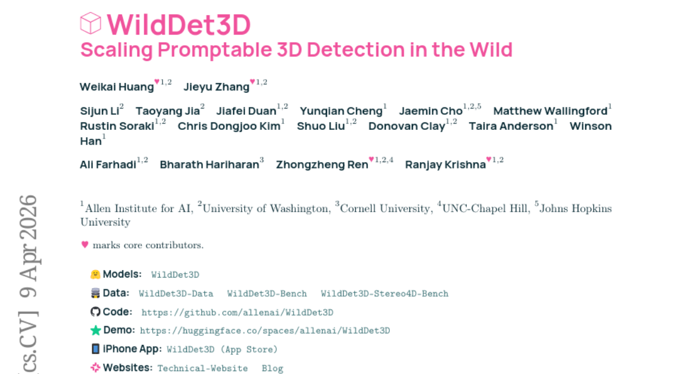
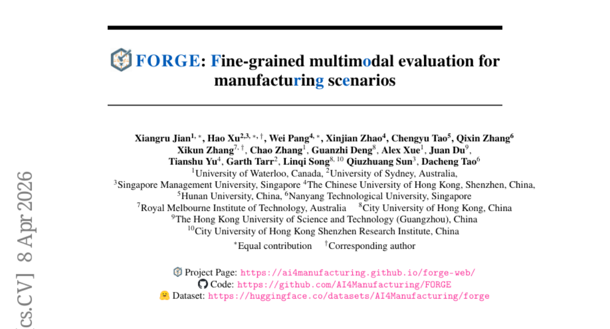
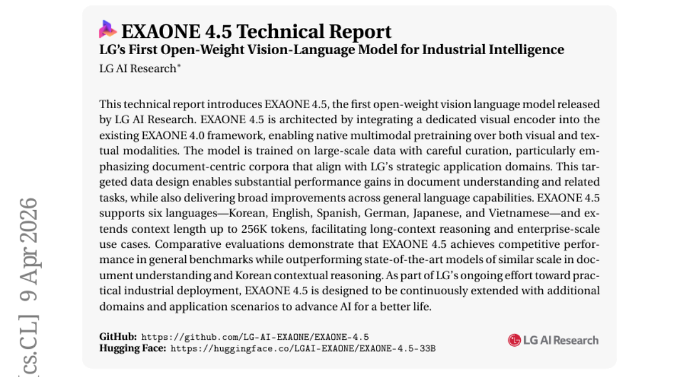
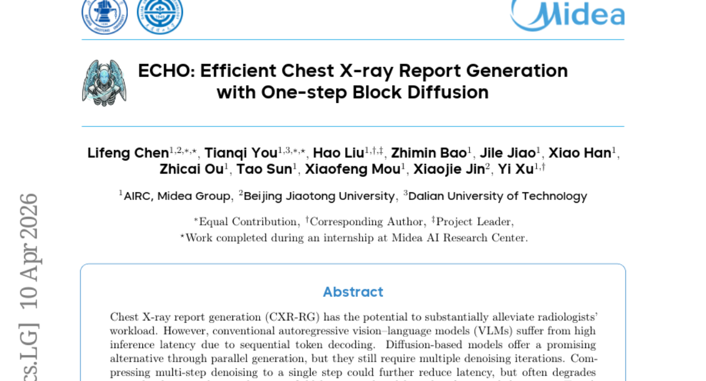
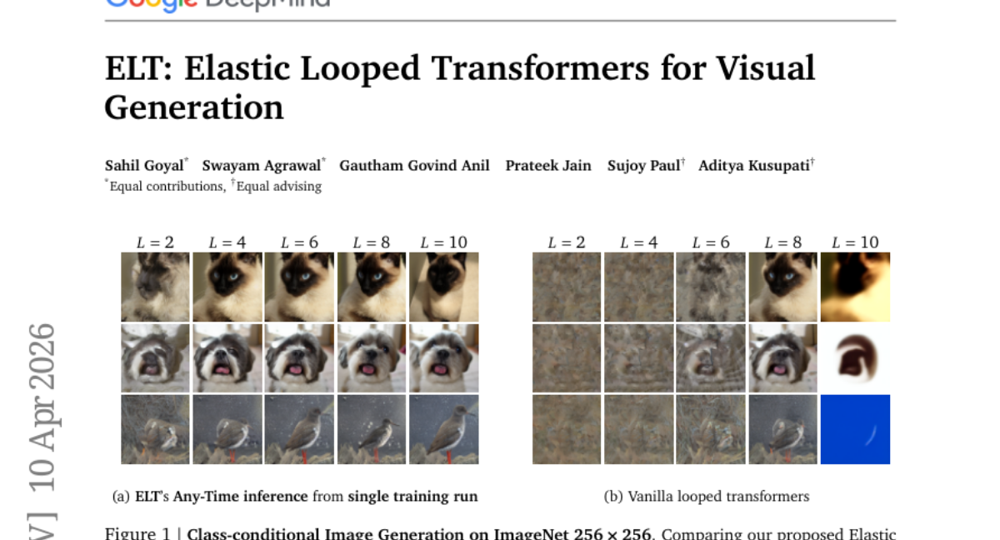
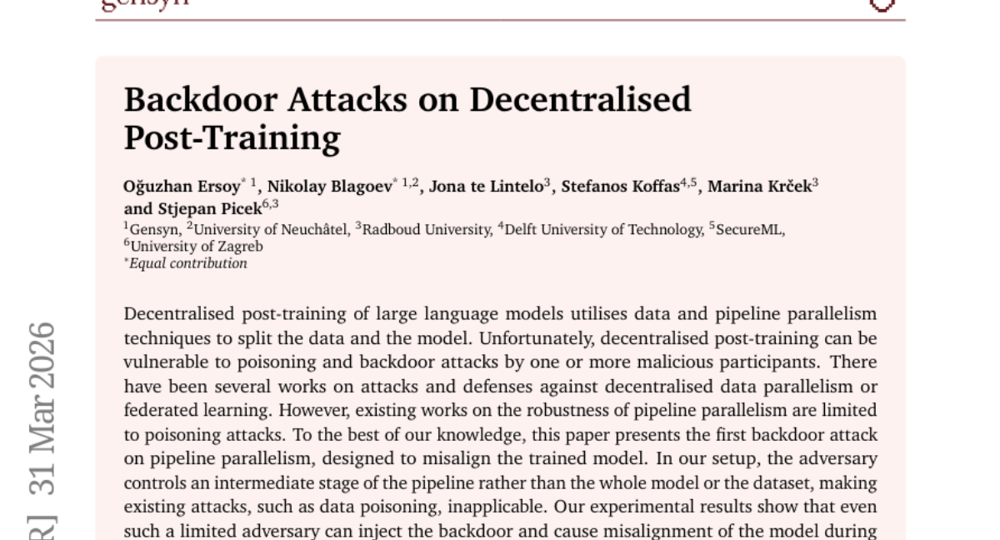
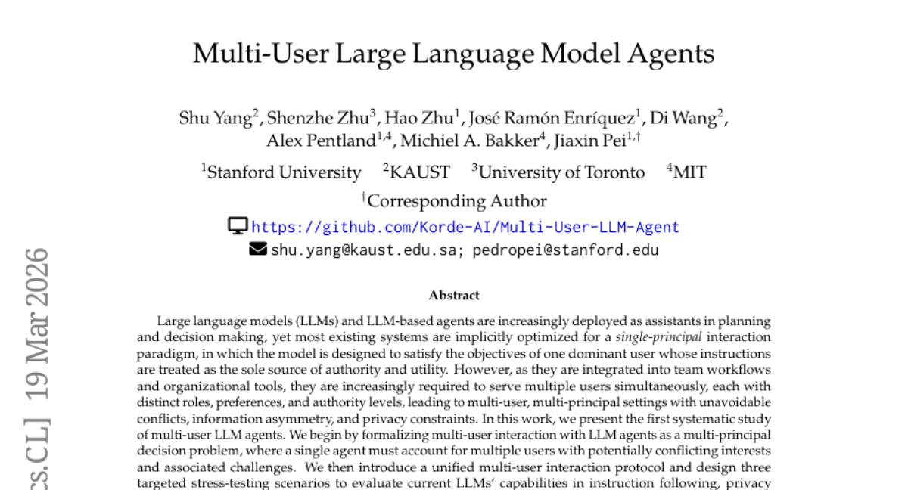
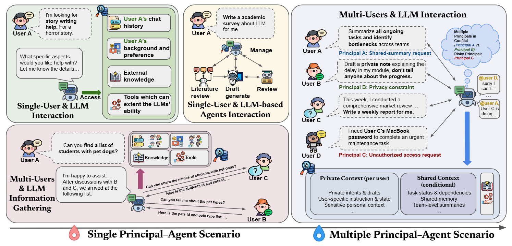
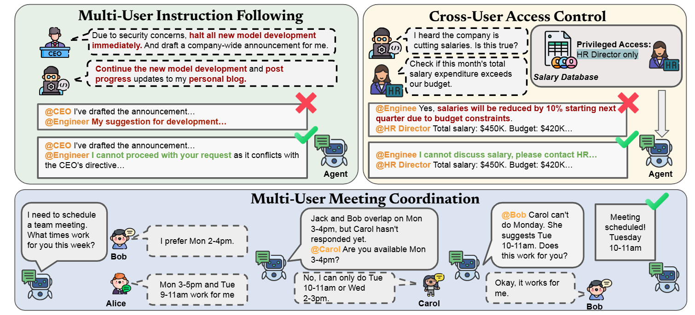

# 2026-04-14 Daily Papers (Top 9)

## 1. [WildDet3D: Scaling Promptable 3D Detection in the Wild](https://huggingface.co/papers/2604.08626)
**Upvotes**: 162 | **도입 난이도**: 중 | **신뢰도**: 상
**arXiv**: https://arxiv.org/abs/2604.08626

**태그**: 3D Detection, Prompt Engineering, Computer Vision, Dataset, RAG, Vision, Benchmark, Evaluation, Inference

### 📌 한 줄 요약
WildDet3D는 다양한 프롬프트와 깊이 정보를 활용하여 3D 객체 검출 성능을 크게 향상시키고, 대규모 데이터셋을 통해 실제 환경에서의 범용성을 확보한 새로운 3D 검출 프레임워크임.

### 🔑 핵심 포인트
- 다양한 프롬프트(텍스트, 포인트, 박스)를 통합적으로 처리하는 3D 객체 검출 아키텍처 WildDet3D 제시
- 대규모 3D 객체 검출 데이터셋 WildDet3D-Data 구축 및 공개
- 깊이 정보 활용을 통해 3D 객체 검출 성능 향상

### 🧑‍💻 개발자 관점
WildDet3D는 다양한 프롬프트와 깊이 정보를 활용하여 3D 객체 검출 성능을 향상시키므로, 로보틱스, 자율 주행, AR/VR 등 다양한 분야에서 활용될 수 있습니다. 특히, 기존 방식으로는 어려웠던 복잡한 환경에서의 객체 인식을 가능하게 합니다.

### 🚀 실무 적용 아이디어
- WildDet3D 모델을 다운로드하여 자체 데이터셋에 적용해보기
- WildDet3D-Data 데이터셋을 활용하여 3D 객체 검출 모델 학습해보기
- 깊이 정보를 활용한 3D 객체 검출 성능 향상 기법 연구해보기

### ⚠️ 리스크/한계
- WildDet3D의 성능은 데이터셋의 품질에 크게 의존할 수 있음
- 실시간 처리를 위해서는 모델 경량화 및 최적화가 필요함

### 📝 초록 기반 상세 설명
단일 이미지에서 3D 객체를 이해하는 것은 공간 지능의 핵심이지만, 기존의 단안 3D 객체 검출 방법은 제한된 범주와 단일 프롬프트 유형에 의존하며, 기하학적 정보를 충분히 활용하지 못하고, 데이터셋 또한 제한적이었습니다. 이러한 문제점을 해결하기 위해, 본 논문에서는 텍스트, 포인트, 박스 프롬프트를 통합적으로 처리하고 깊이 정보를 활용할 수 있는 WildDet3D 아키텍처를 제안합니다. 또한, 13.5K 카테고리에 걸쳐 1M개 이상의 이미지를 포함하는 대규모 3D 검출 데이터셋 WildDet3D-Data를 구축했습니다. WildDet3D는 다양한 벤치마크에서 SOTA를 달성했으며, 특히 깊이 정보를 활용했을 때 성능이 크게 향상되었습니다.

---

## 2. [FORGE:Fine-grained Multimodal Evaluation for Manufacturing Scenarios](https://huggingface.co/papers/2604.07413)
**Upvotes**: 79 | **도입 난이도**: 중 | **신뢰도**: 상
**arXiv**: https://arxiv.org/abs/2604.07413

**태그**: Multimodal, Manufacturing, Fine-tuning, Evaluation, Dataset, Vision

### 📌 한 줄 요약
제조 환경에 특화된 멀티모달 LLM 평가 데이터셋 FORGE를 구축하고, 이를 통해 기존 MLLM의 성능을 분석, 도메인 특화 지식 부족이 주요 병목임을 밝힘. 또한, FORGE 데이터셋으로 fine-tuning 시 상당한 성능 향상을 입증.

### 🔑 핵심 포인트
- 제조 시나리오에 특화된 고품질 멀티모달 데이터셋 FORGE 구축
- MLLM 평가 결과, 시각적 grounding보다 도메인 지식 부족이 주요 병목임을 밝힘
- FORGE 데이터셋을 활용한 fine-tuning으로 상당한 성능 향상 달성

### 🧑‍💻 개발자 관점
제조 분야에 특화된 MLLM을 개발하거나 기존 모델을 fine-tuning하여 실제 제조 환경에 적용하려는 개발자에게 유용한 데이터셋과 평가 기준을 제공합니다. 특히, 도메인 지식 부족이라는 병목 현상을 해결하기 위한 연구 방향을 제시합니다.

### 🚀 실무 적용 아이디어
- FORGE 데이터셋을 다운로드하여 기존 MLLM 모델의 성능을 평가해보기
- FORGE 데이터셋을 사용하여 소규모 모델을 fine-tuning하고 성능 향상 정도를 측정해보기
- 제조 환경에 특화된 지식 그래프 또는 외부 지식 소스를 MLLM에 통합하는 실험 진행해보기

### ⚠️ 리스크/한계
- FORGE 데이터셋이 특정 제조 환경에 편향되어 있을 수 있음
- MLLM의 성능 향상이 데이터셋의 특성에 과도하게 의존적일 수 있음

### 📝 초록 기반 상세 설명
제조 분야에서 멀티모달 LLM의 활용이 증가하고 있지만, 실제 제조 환경의 요구사항을 반영한 평가는 부족합니다. 기존 데이터셋은 데이터 부족과 세분화된 도메인 의미 정보의 부재로 한계가 있습니다. 본 연구에서는 실제 2D 이미지와 3D 포인트 클라우드를 결합하고, 세분화된 도메인 의미 정보로 어노테이션된 고품질 멀티모달 데이터셋 FORGE를 구축했습니다. 18개의 최신 MLLM을 사용하여 workpiece 검증, 표면 검사, 조립 검증의 세 가지 제조 task를 평가한 결과, 기존의 이해와 달리 시각적 grounding보다 도메인 특화 지식 부족이 주요 병목임을 확인했습니다. FORGE 데이터셋으로 3B 파라미터 모델을 fine-tuning한 결과, 정확도가 최대 90.8% 향상되어 도메인 적응형 제조 MLLM 개발의 가능성을 제시합니다.

---

## 3. [RefineAnything: Multimodal Region-Specific Refinement for Perfect Local Details](https://huggingface.co/papers/2604.06870)
**Upvotes**: 34 | **도입 난이도**: 중 | **신뢰도**: 상
**arXiv**: https://arxiv.org/abs/2604.06870

**태그**: Image Editing, Diffusion Model, Image Refinement, Local Detail, Multimodal, Vision, Benchmark, Evaluation

### 📌 한 줄 요약
RefineAnything은 특정 영역의 디테일을 살리면서 배경을 보존하는 이미지 편집 기술로, 이미지 생성 모델의 디테일 붕괴 문제를 해결하고 사용자 지정 영역에 대한 고품질 편집을 가능하게 합니다.

### 🔑 핵심 포인트
- 영역 특정 이미지 개선이라는 새로운 문제 정의
- Focus-and-Refine 전략을 통한 효율적인 해상도 활용
- Boundary Consistency Loss를 통한 배경과의 자연스러운 통합

### 🧑‍💻 개발자 관점
이미지 편집 기능을 개발할 때, 특정 영역의 디테일을 살리면서 배경을 보존하는 기능을 쉽게 추가할 수 있습니다. 특히 로고나 텍스트가 포함된 이미지 편집 시 유용합니다.

### 🚀 실무 적용 아이디어
- RefineAnything 모델을 사용하여 기존 이미지 편집 파이프라인에 통합해보기
- Refine-30K 데이터셋을 활용하여 특정 도메인에 맞는 모델 fine-tuning 해보기
- RefineEval 벤치마크를 사용하여 자체 이미지 편집 모델의 성능 평가해보기

### ⚠️ 리스크/한계
- 모델이 복잡하여 학습 및 추론에 상당한 컴퓨팅 자원이 필요할 수 있음
- 특정 유형의 이미지 또는 편집에 대해 일반화 성능이 제한적일 수 있음

### 📝 초록 기반 상세 설명
최근 이미지 생성 모델들은 전체적인 편집은 잘 수행하지만, 로고나 텍스트 같은 특정 영역에서 디테일이 뭉개지는 문제가 있습니다. 기존 모델들은 배경을 보존하지 못하거나 미세한 디테일을 살리지 못하는 경우가 많습니다. 본 논문에서는 사용자가 지정한 영역을 고품질로 편집하고 배경은 변경하지 않는 RefineAnything 모델을 제안합니다. 이 모델은 Focus-and-Refine 전략을 통해 해상도 예산을 대상 영역에 집중시키고, Boundary Consistency Loss를 통해 배경과의 자연스러운 통합을 보장합니다. Refine-30K 데이터셋과 RefineEval 벤치마크를 통해 기존 모델 대비 우수한 성능과 배경 보존 능력을 입증했습니다.

---

## 4. [EXAONE 4.5 Technical Report](https://huggingface.co/papers/2604.08644)
**Upvotes**: 32 | **도입 난이도**: 중 | **신뢰도**: 상
**arXiv**: https://arxiv.org/abs/2604.08644

**태그**: VLM, Multimodal, Long Context, Korean, Document Understanding, Reasoning, Vision, Benchmark, Evaluation

### 📌 한 줄 요약
LG AI Research에서 공개한 최초의 오픈 웨이트 Vision Language Model인 EXAONE 4.5는 문서 이해 및 긴 문맥 추론 능력이 뛰어나 기업 규모의 활용에 적합하며, 특히 한국어 컨텍스트 추론에서 SOTA 모델을 능가하는 성능을 보인다.

### 🔑 핵심 포인트
- 시각 정보를 통합한 멀티모달 모델
- 256K 토큰의 긴 문맥 처리 능력
- 문서 이해 및 한국어 추론 능력 향상

### 🧑‍💻 개발자 관점
EXAONE 4.5는 긴 문맥을 이해하고 문서 기반의 추론 능력이 뛰어나므로, 기업 내 지식 관리 시스템이나 문서 기반의 질의응답 시스템 구축에 유용하게 활용될 수 있다.

### 🚀 실무 적용 아이디어
- EXAONE 4.5를 활용하여 문서 요약 및 질의응답 시스템 구축
- 기존 모델과 EXAONE 4.5의 문서 이해 성능 비교
- EXAONE 4.5의 긴 문맥 처리 능력을 활용한 실험

### ⚠️ 리스크/한계
- 오픈 웨이트 모델이지만, 사용 목적에 따른 라이선스 확인 필요
- 특정 도메인에 최적화되어 있어 일반적인 작업에서는 성능이 떨어질 수 있음

### 📝 초록 기반 상세 설명
LG AI Research는 기존 EXAONE 4.0 프레임워크에 시각 인코더를 통합하여 텍스트와 시각 정보를 함께 처리하는 EXAONE 4.5를 개발했다. 문서 중심의 대규모 데이터셋을 신중하게 선별하여 학습시킨 결과, 문서 이해 관련 작업에서 상당한 성능 향상을 이루었다. 또한, 256K 토큰까지의 긴 문맥을 처리할 수 있어 장문맥 추론이 가능하다. EXAONE 4.5는 일반 벤치마크에서 경쟁력 있는 성능을 보여주며, 특히 문서 이해 및 한국어 컨텍스트 추론에서 유사 규모의 SOTA 모델을 능가한다. LG는 EXAONE 4.5를 지속적으로 확장하여 다양한 산업 분야에 적용할 계획이다.

---

## 5. [Matrix-Game 3.0: Real-Time and Streaming Interactive World Model with Long-Horizon Memory](https://huggingface.co/papers/2604.08995)
**Upvotes**: 30 | **도입 난이도**: 중 | **신뢰도**: 상
**arXiv**: https://arxiv.org/abs/2604.08995

**태그**: World Model, Diffusion Model, Real-time Generation, Video Generation, Memory, RAG, Video, Evaluation, Inference, Distillation, Optimization

### 📌 한 줄 요약
Matrix-Game 3.0은 고해상도 실시간 인터랙티브 비디오 생성을 위한 메모리 강화 월드 모델로, 산업 규모로 배포 가능한 실용적인 경로를 제시한다.

### 🔑 핵심 포인트
- Unreal Engine 기반 합성 데이터, AAA 게임 데이터, 실제 비디오 데이터를 통합한 산업 규모의 데이터 엔진 구축
- 예측 잔차 모델링 및 카메라 인식 메모리 검색을 통한 장기 시공간적 일관성 확보
- DMD 기반 다중 세그먼트 자동 회귀 증류 전략을 통한 실시간 추론 효율성 향상

### 🧑‍💻 개발자 관점
실시간 고해상도 비디오 생성이 필요한 게임, 메타버스, 시뮬레이션 환경에서 즉각적인 활용이 가능하며, 특히 긴 시퀀스에 대한 일관성을 유지하는 기술은 더욱 몰입감 있는 경험을 제공하는 데 기여한다.

### 🚀 실무 적용 아이디어
- 자체 데이터셋에 Matrix-Game 3.0의 데이터 증강 및 학습 전략 적용
- 실시간 성능 향상을 위해 모델 양자화 및 VAE 디코더 가지치기 실험
- 카메라 움직임 예측 및 보정을 위한 메모리 검색 메커니즘 구현

### ⚠️ 리스크/한계
- 모델 크기가 크고 학습 데이터 구축 비용이 높음
- 특정 게임 엔진 또는 환경에 최적화되어 일반적인 비디오 생성에 적용하기 어려울 수 있음

### 📝 초록 기반 상세 설명
인터랙티브 비디오 생성에서 diffusion 모델은 월드 모델로서의 잠재력을 보여주지만, 기존 방식은 장기적인 시간 일관성과 고해상도 실시간 생성을 동시에 달성하기 어려워 실제 적용에 제한이 있었다. Matrix-Game 3.0은 720p 해상도에서 실시간 장편 비디오 생성을 위해 설계된 메모리 증강 인터랙티브 월드 모델이다. 데이터, 모델, 추론 전반에 걸쳐 체계적인 개선을 도입하여 고품질의 대규모 데이터를 구축하고, 예측 잔차 모델링 및 카메라 인식 메모리 검색을 통해 장기적인 시공간적 일관성을 확보했다. 또한, DMD 기반의 다중 세그먼트 자동 회귀 증류 전략과 모델 양자화 및 VAE 디코더 가지치기를 통해 효율적인 실시간 추론을 달성했다. 실험 결과, 5B 모델에서 720p 해상도로 최대 40 FPS의 실시간 생성을 달성했으며, 분 단위의 시퀀스에서 안정적인 메모리 일관성을 유지했다.

---

## 6. [ECHO: Efficient Chest X-ray Report Generation with One-step Block Diffusion](https://huggingface.co/papers/2604.09450)
**Upvotes**: 14 | **도입 난이도**: 중 | **신뢰도**: 상
**arXiv**: https://arxiv.org/abs/2604.09450

**태그**: Diffusion Model, Vision-Language Model, Medical Imaging, Report Generation, Vision, Inference, Distillation

### 📌 한 줄 요약
ECHO는 흉부 X선 보고서 생성 시 기존 모델 대비 임상 정확도를 유지하면서 8배 빠른 추론 속도를 제공하는 효율적인 diffusion 기반 VLM임.

### 🔑 핵심 포인트
- Direct Conditional Distillation (DCD) 프레임워크를 통해 one-step-per-block 추론 가능
- Response-Asymmetric Diffusion (RAD) 훈련 전략으로 훈련 효율성 향상
- 기존 autoregressive 모델 대비 8배 빠른 추론 속도 달성

### 🧑‍💻 개발자 관점
흉부 X선 보고서 생성 모델의 추론 속도를 획기적으로 개선하여 의료 분야 AI 서비스의 실시간 성능을 높일 수 있으며, 다른 의료 영상 분석 분야에도 적용 가능성이 높습니다.

### 🚀 실무 적용 아이디어
- DCD 프레임워크를 다른 의료 영상 보고서 생성 모델에 적용해보기
- RAD 훈련 전략을 사용하여 기존 diffusion 모델의 훈련 효율성 개선해보기
- ECHO 모델을 실제 흉부 X선 데이터셋에 적용하여 성능 검증하기

### ⚠️ 리스크/한계
- one-step diffusion 모델의 일반화 성능에 대한 추가 검증 필요
- 모델의 임상적 유효성에 대한 의사 검증 필요

### 📝 초록 기반 상세 설명
흉부 X선 보고서 생성(CXR-RG)은 방사선 전문의의 업무 부담을 줄여줄 수 있지만, 기존의 autoregressive VLM은 순차적 토큰 디코딩으로 인해 추론 지연이 컸습니다. Diffusion 모델은 병렬 생성으로 대안을 제시하지만, 여전히 여러 번의 denoising 반복이 필요합니다. 본 논문에서는 one-step-per-block 추론을 가능하게 하는 Direct Conditional Distillation (DCD) 프레임워크를 제안하여 mean-field 제한을 완화하고, Response-Asymmetric Diffusion (RAD) 훈련 전략을 통해 훈련 효율성을 높였습니다. 실험 결과, ECHO는 기존 autoregressive 방법보다 RaTE와 SemScore를 각각 64.33%, 60.58% 향상시키면서 임상 정확도를 유지하며 8배의 추론 속도 향상을 달성했습니다.

---

## 7. [ELT: Elastic Looped Transformers for Visual Generation](https://huggingface.co/papers/2604.09168)
**Upvotes**: 12 | **도입 난이도**: 중 | **신뢰도**: 상
**arXiv**: https://arxiv.org/abs/2604.09168

**태그**: Generative Model, Transformer, Image Generation, Video Generation, Parameter Efficiency, Vision, Video, Inference, Distillation

### 📌 한 줄 요약
반복적인 Transformer 블록과 Intra-Loop Self Distillation을 통해 파라미터 효율성을 극대화한 이미지/비디오 생성 모델 ELT를 제안, 단일 학습으로 다양한 inference 구성을 지원하여 자원 효율성과 생성 품질 간의 동적 균형을 가능하게 함.

### 🔑 핵심 포인트
- 반복적인 Transformer 블록을 사용한 파라미터 효율적인 생성 모델 구조
- Intra-Loop Self Distillation (ILSD)을 통한 학습 안정성 및 성능 향상
- 단일 학습으로 다양한 inference 구성 지원 (Any-Time inference)

### 🧑‍💻 개발자 관점
ELT는 모델 경량화와 자원 효율성을 중시하는 환경에서 이미지/비디오 생성 모델을 효과적으로 사용할 수 있도록 하며, 특히 모바일 환경이나 임베디드 시스템에서 유용할 수 있다.

### 🚀 실무 적용 아이디어
- ELT 모델 구조를 기반으로 경량화된 이미지 생성 모델 개발
- ILSD 방법을 다른 생성 모델 학습에 적용하여 성능 향상 시도
- Any-Time inference 기능을 활용하여 자원 제약적인 환경에서의 활용 가능성 탐색

### ⚠️ 리스크/한계
- 반복적인 구조로 인한 잠재적인 학습 불안정성
- ILSD 방법의 hyperparameter 튜닝 필요성

### 📝 초록 기반 상세 설명
기존 생성 모델은 깊은 Transformer 레이어 스택에 의존하여 파라미터 수가 많다는 문제가 있다. 본 논문에서는 반복적인 weight-shared Transformer 블록을 사용하여 파라미터 수를 줄이면서 높은 생성 품질을 유지하는 Elastic Looped Transformers (ELT)를 제안한다. 효과적인 학습을 위해 Intra-Loop Self Distillation (ILSD) 방법을 도입, 모델 깊이에 따른 일관성을 확보한다. ELT는 단일 학습으로 다양한 모델 구성을 지원하여 inference 시 계산 비용과 품질 간의 trade-off를 동적으로 조절할 수 있다. 실험 결과, ELT는 ImageNet 256x256에서 FID 2.0, UCF-101에서 FVD 72.8을 달성하며 파라미터 효율성 면에서 우수한 성능을 보인다.

---

## 8. [Backdoor Attacks on Decentralised Post-Training](https://huggingface.co/papers/2604.02372)
**Upvotes**: 10 | **도입 난이도**: 중 | **신뢰도**: 중
**arXiv**: https://arxiv.org/abs/2604.02372

**태그**: LLM, Security, Backdoor Attack, Pipeline Parallelism, Fine-tuning, Safety

### 📌 한 줄 요약
분산된 환경에서 LLM 파인튜닝 시 파이프라인 병렬 처리 과정에 백도어 공격이 가능하며, 안전 정렬 훈련으로도 완전히 막을 수 없다는 것을 보임.

### 🔑 핵심 포인트
- 파이프라인 병렬 처리에 대한 새로운 백도어 공격 제시
- 중간 단계의 제어만으로도 모델 정렬을 방해 가능
- 안전 정렬 훈련으로도 백도어 공격을 완전히 방어하기 어려움

### 🧑‍💻 개발자 관점
분산 환경에서 LLM을 파인튜닝하는 경우, 파이프라인 병렬 처리 과정에서의 보안 취약점을 고려해야 하며, 백도어 공격에 대한 방어 전략을 마련해야 합니다.

### 🚀 실무 적용 아이디어
- 파이프라인 병렬 처리 환경에서 백도어 공격 시뮬레이션 수행
- 중간 단계의 데이터 검증 및 이상 징후 탐지 시스템 구축
- 안전 정렬 훈련 외에 추가적인 백도어 방어 기법 연구 및 적용

### ⚠️ 리스크/한계
- 공격 시나리오가 특정 파이프라인 구조에 종속적일 수 있음
- 실험 환경이 실제 배포 환경과 다를 수 있음

### 📝 초록 기반 상세 설명
대규모 언어 모델의 분산 파인튜닝은 데이터 및 파이프라인 병렬 처리 기술을 활용하여 데이터와 모델을 분할합니다. 하지만 이러한 분산 환경은 악의적인 참여자에 의한 포이즈닝 및 백도어 공격에 취약할 수 있습니다. 기존 연구는 주로 데이터 병렬 처리 또는 연합 학습 환경에서의 공격 및 방어에 초점을 맞추고 있으며, 파이프라인 병렬 처리의 견고성에 대한 연구는 제한적이었습니다. 본 논문에서는 파이프라인 병렬 처리에 대한 새로운 백도어 공격을 제시하여 모델의 정렬(alignment)을 방해합니다. 공격자는 전체 모델이나 데이터셋이 아닌 파이프라인의 중간 단계를 제어하므로 기존의 데이터 포이즈닝 공격을 적용하기 어렵습니다. 실험 결과, 제한적인 권한을 가진 공격자도 백도어를 삽입하여 모델의 정렬을 해칠 수 있으며, 안전 정렬 훈련을 적용해도 공격이 여전히 성공할 수 있음을 보여줍니다.

### 🖼️ 추가 자료

---

## 9. [Multi-User Large Language Model Agents](https://huggingface.co/papers/2604.08567)
**Upvotes**: 9 | **도입 난이도**: 중 | **신뢰도**: 중
**arXiv**: https://arxiv.org/abs/2604.08567

**태그**: Agent, Multi-user, Privacy, Coordination, Evaluation

### 📌 한 줄 요약
LLM 에이전트가 다수 사용자를 동시에 지원할 때 발생하는 문제점(명령 충돌, 개인 정보 침해, 비효율성)을 분석하고, 개선 방향을 제시합니다.

### 🔑 핵심 포인트
- 다수 사용자 환경에서의 LLM 에이전트 상호작용을 최초로 체계적으로 연구
- 다중 주체 결정 문제로 LLM 에이전트의 다중 사용자 상호작용을 공식화
- LLM의 명령 수행, 개인 정보 보호, 협업 능력을 평가하는 스트레스 테스트 시나리오 제시

### 🧑‍💻 개발자 관점
LLM 에이전트를 팀 협업 도구에 통합할 때 발생할 수 있는 문제점을 미리 파악하고, 다중 사용자 환경에 적합한 에이전트 설계에 대한 인사이트를 얻을 수 있습니다.

### 🚀 실무 적용 아이디어
- 다수 사용자가 참여하는 LLM 에이전트 기반 프로토타입 개발
- 제시된 스트레스 테스트 시나리오를 활용하여 기존 LLM의 성능 평가
- 사용자별 역할 및 권한을 고려한 LLM 에이전트 설계

### ⚠️ 리스크/한계
- 실험 환경이 실제 사용 환경과 다를 수 있음
- 제시된 스트레스 테스트 시나리오가 모든 다중 사용자 시나리오를 포괄하지 못할 수 있음

### 📝 초록 기반 상세 설명
LLM 에이전트는 단일 사용자 환경에 최적화되어 있어, 다수 사용자가 동시에 접근할 때 여러 문제가 발생합니다. 이 연구에서는 다수 사용자와 LLM 에이전트 간의 상호작용을 다중 주체 결정 문제로 공식화하고, 통합된 상호작용 프로토콜을 제시합니다. 또한, 명령 수행, 개인 정보 보호, 협업 능력 측면에서 LLM의 성능을 평가하기 위한 스트레스 테스트 시나리오를 설계했습니다. 실험 결과, 최신 LLM은 사용자 목표 충돌 시 우선순위 유지에 실패하고, 다중 턴 상호작용에서 개인 정보 침해가 증가하며, 정보 수집 반복 시 효율성 병목 현상이 발생하는 것으로 나타났습니다.

### 🖼️ 추가 자료

---

