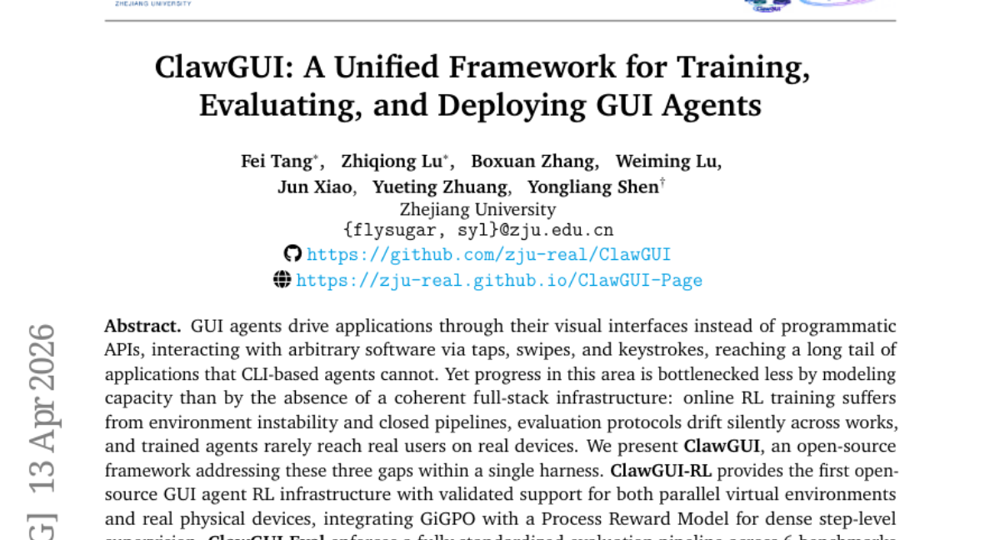
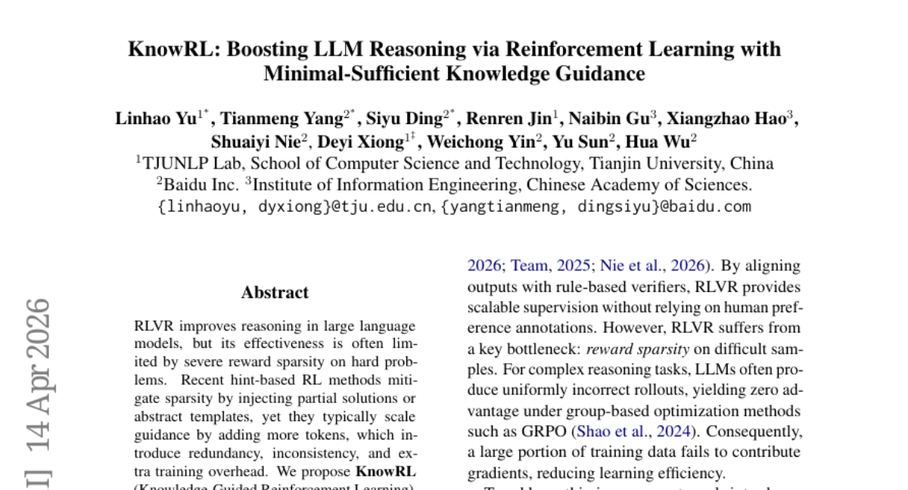
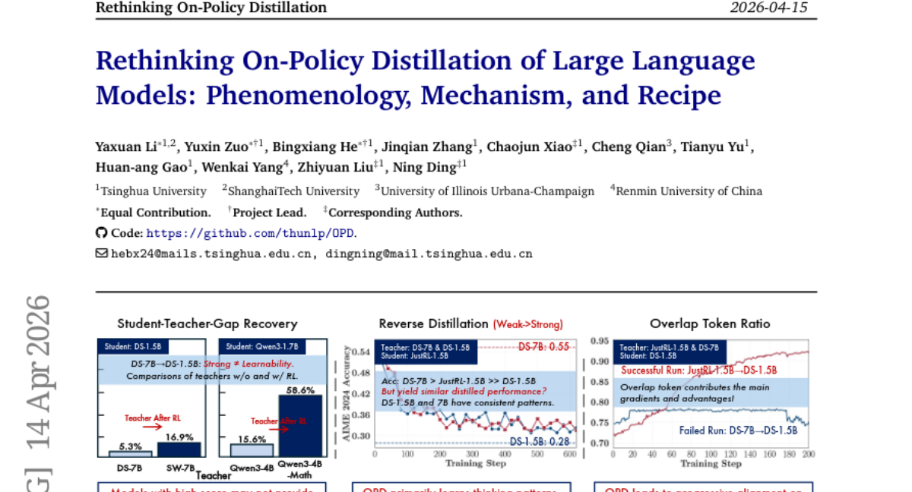
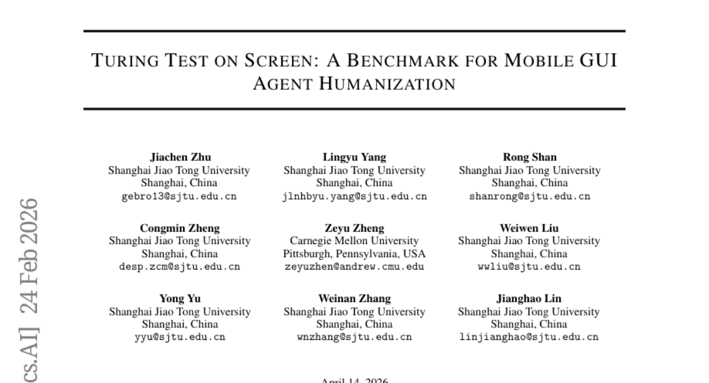
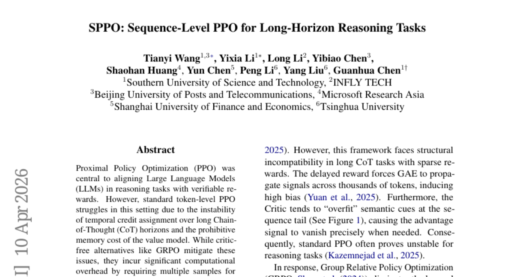
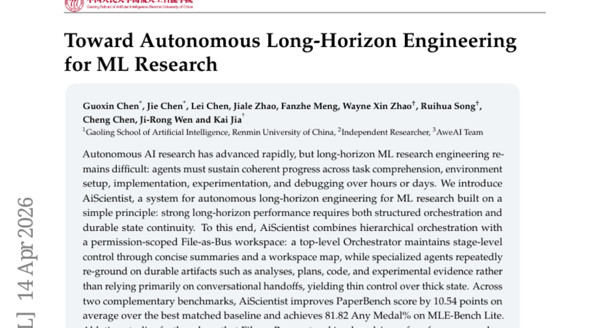
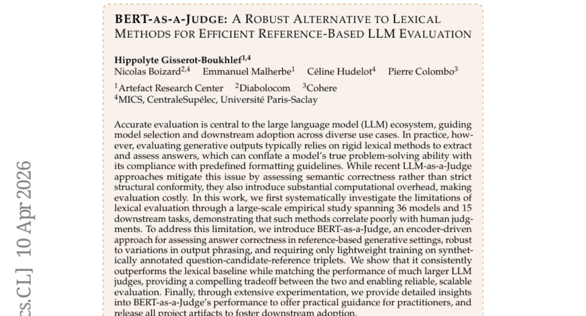
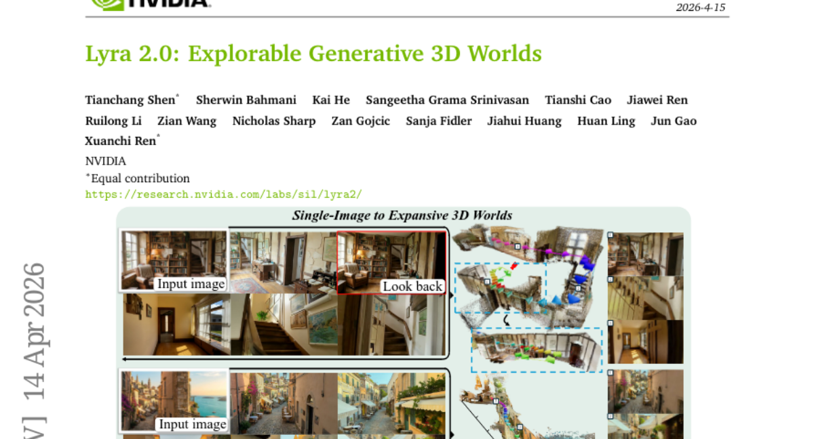
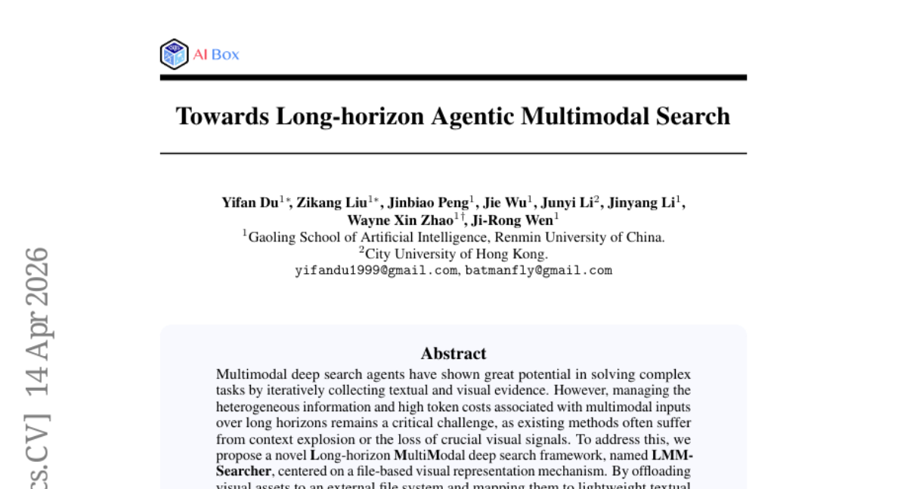

# 2026-04-16 Daily Papers (Top 9)

## 1. [ClawGUI: A Unified Framework for Training, Evaluating, and Deploying GUI Agents](https://huggingface.co/papers/2604.11784)
**Upvotes**: 118 | **도입 난이도**: 중 | **신뢰도**: 상
**arXiv**: https://arxiv.org/abs/2604.11784

**태그**: GUI Agent, Reinforcement Learning, Automation, Mobile, Agent, Vision, Benchmark, Evaluation

### 📌 한 줄 요약
GUI 에이전트의 훈련, 평가, 배포를 위한 통합 프레임워크 ClawGUI를 제시하여, 온라인 RL 훈련의 불안정성, 평가 프로토콜의 불일치, 실제 사용자 배포의 어려움 등의 문제를 해결하고 GUI 에이전트 연구 및 실용화에 기여함.

### 🔑 핵심 포인트
- GUI 에이전트 개발을 위한 통합 프레임워크 ClawGUI 제시
- 온라인 RL 훈련, 표준화된 평가, 실제 장치 배포를 위한 기능 제공
- MobileWorld GUI-Only 벤치마크에서 기존 baseline 대비 성능 향상

### 🧑‍💻 개발자 관점
GUI 기반 자동화 에이전트 개발에 필요한 인프라를 제공하여, 개발자가 GUI 에이전트를 쉽게 훈련, 평가, 배포할 수 있도록 지원하며, 특히 모바일 환경에서의 자동화에 유용합니다.

### 🚀 실무 적용 아이디어
- ClawGUI 프레임워크를 사용하여 GUI 에이전트 훈련 및 평가 파이프라인 구축
- MobileWorld GUI-Only 벤치마크에서 ClawGUI-2B 모델 성능 재현 및 개선
- 실제 모바일 앱 환경에서 ClawGUI 에이전트 배포 및 사용자 경험 테스트

### ⚠️ 리스크/한계
- 특정 GUI 환경에 대한 의존성 발생 가능성
- 복잡한 GUI 애플리케이션에 대한 일반화 성능 확보의 어려움

### 📝 초록 기반 상세 설명
GUI 에이전트는 CLI 기반 에이전트가 접근할 수 없는 다양한 애플리케이션을 시각적 인터페이스를 통해 제어할 수 있지만, 일관된 풀스택 인프라 부족으로 발전이 제한적입니다. 본 논문에서는 온라인 RL 훈련, 평가, 실제 배포의 세 가지 주요 문제점을 해결하는 오픈 소스 프레임워크 ClawGUI를 제시합니다. ClawGUI-RL은 병렬 가상 환경 및 실제 장치 모두를 지원하는 최초의 오픈 소스 GUI 에이전트 RL 인프라를 제공하며, ClawGUI-Eval은 6개의 벤치마크에서 표준화된 평가 파이프라인을 제공합니다. ClawGUI-Agent는 12개 이상의 채팅 플랫폼을 통해 Android, HarmonyOS 및 iOS에서 에이전트를 사용할 수 있도록 지원합니다. ClawGUI-2B는 MobileWorld GUI-Only에서 17.1%의 성공률을 달성하여 MAI-UI-2B baseline보다 6.0% 높은 성능을 보입니다.

---

## 2. [KnowRL: Boosting LLM Reasoning via Reinforcement Learning with Minimal-Sufficient Knowledge Guidance](https://huggingface.co/papers/2604.12627)
**Upvotes**: 78 | **도입 난이도**: 중 | **신뢰도**: 상
**arXiv**: https://arxiv.org/abs/2604.12627

**태그**: LLM, Reinforcement Learning, Reasoning, Hinting, RAG, Benchmark, Inference

### 📌 한 줄 요약
KnowRL은 강화 학습을 통해 LLM의 추론 능력을 향상시키는 새로운 프레임워크로, 최소한의 필수 지식 포인트를 활용하여 기존 힌트 기반 방법의 단점을 극복하고 성능을 크게 향상시켰습니다.

### 🔑 핵심 포인트
- 최소 필수 지식 가이드라인 제시
- 지식 포인트(KP) 기반의 힌트 구성
- 상호작용 역설 문제 해결을 위한 최적화

### 🧑‍💻 개발자 관점
KnowRL은 LLM의 추론 능력을 향상시키는 데 효과적인 방법론을 제시하며, 특히 제한된 자원 하에서 고성능 모델을 구축해야 하는 개발자에게 유용합니다. 지식 포인트를 활용한 접근 방식은 모델의 성능을 개선하고 디버깅을 용이하게 할 수 있습니다.

### 🚀 실무 적용 아이디어
- KnowRL 프레임워크를 활용하여 자체 LLM의 추론 능력 향상 실험
- 지식 포인트(KP)를 정의하고, 이를 활용한 힌트 기반 강화 학습 적용
- 제약 조건 하위 집합 탐색(CSS)을 통해 최적의 훈련 데이터 구성

### ⚠️ 리스크/한계
- 지식 포인트(KP) 정의의 어려움
- 최적의 KP 하위 집합 탐색 비용

### 📝 초록 기반 상세 설명
LLM의 추론 능력 향상을 위해 강화 학습이 사용되지만, 복잡한 문제에서는 보상 희소성 문제가 발생합니다. 기존 힌트 기반 강화 학습은 추가 토큰을 통해 부분 해법을 제공하지만, 이는 중복성, 비일관성, 추가 학습 비용을 야기합니다. KnowRL은 힌트 설계를 최소 필요 지식 가이드 문제로 접근하여, 지식을 원자적 지식 포인트(KP)로 분해하고, 제약 조건 하위 집합 탐색(CSS)을 통해 훈련에 필요한 컴팩트한 하위 집합을 구성합니다. 또한, KP 제거 시 발생하는 상호작용 역설을 해결하기 위해, KnowRL은 강력한 하위 집합 큐레이션을 최적화합니다. KnowRL-Nemotron-1.5B는 8개의 추론 벤치마크에서 기존 RL 및 힌팅 baseline을 능가하며, 힌트 없이도 Nemotron-1.5B보다 평균 정확도가 9.63% 향상되었고, KP 힌트 사용 시에는 74.16%로 최고 성능을 달성했습니다.

---

## 3. [Rethinking On-Policy Distillation of Large Language Models: Phenomenology, Mechanism, and Recipe](https://huggingface.co/papers/2604.13016)
**Upvotes**: 55 | **도입 난이도**: 중 | **신뢰도**: 중
**arXiv**: https://arxiv.org/abs/2604.13016

**태그**: LLM, Distillation, Training, Optimization, Safety

### 📌 한 줄 요약
On-policy distillation (OPD)의 성공/실패 조건과 토큰 레벨 메커니즘을 분석하고, 실패하는 OPD를 복구하는 전략을 제시하여 LLM의 효율적인 지식 전달 방법을 개선합니다.

### 🔑 핵심 포인트
- OPD 성공/실패 조건 규명 (사고 패턴 호환성, 교사의 새로운 기능 제공)
- 토큰 레벨 메커니즘 분석 (높은 확률 토큰에 대한 점진적 정렬)
- 실패하는 OPD 복구 전략 제시 (Off-policy cold start, 교사 정렬 프롬프트 선택)

### 🧑‍💻 개발자 관점
LLM의 성능 향상을 위한 지식 증류 시, 학생-교사 모델 간의 호환성 및 교사의 새로운 기능 제공 여부를 고려해야 하며, 실패 시 제시된 복구 전략을 활용할 수 있습니다.

### 🚀 실무 적용 아이디어
- OPD 적용 시 학생-교사 모델의 사고 패턴 호환성 검증
- Off-policy cold start를 활용한 OPD 초기화 실험
- Teacher-aligned prompt selection을 통한 OPD 성능 향상 시도

### ⚠️ 리스크/한계
- OPD가 장기적인 distillation에 적합한지 추가 연구 필요
- 제시된 복구 전략이 모든 상황에 적용 가능하지 않을 수 있음

### 📝 초록 기반 상세 설명
On-policy distillation (OPD)은 대규모 언어 모델의 post-training에서 핵심 기술이 되었지만, 학습 역학은 제대로 이해되지 못하고 있습니다. 본 논문은 OPD 역학 및 메커니즘에 대한 체계적인 연구를 제공합니다. OPD의 성공 또는 실패를 결정하는 두 가지 조건, 즉 (i) 학생과 교사가 호환 가능한 사고 패턴을 공유해야 하고, (ii) 교사가 학생이 훈련 중에 본 것 이상의 새로운 기능을 제공해야 함을 밝힙니다. 토큰 레벨 메커니즘을 조사하여 성공적인 OPD는 학생이 방문한 상태에서 높은 확률의 토큰에 대한 점진적인 정렬을 특징으로 함을 보여줍니다. 또한 실패하는 OPD를 복구하기 위한 두 가지 실용적인 전략인 off-policy cold start 및 교사 정렬 프롬프트 선택을 제안합니다. 마지막으로 OPD의 dense 토큰 레벨 보상의 비용 문제를 제기합니다.

---

## 4. [Turing Test on Screen: A Benchmark for Mobile GUI Agent Humanization](https://huggingface.co/papers/2604.09574)
**Upvotes**: 26 | **도입 난이도**: 중 | **신뢰도**: 상
**arXiv**: https://arxiv.org/abs/2604.09574

**태그**: Agent, GUI, Humanization, Benchmark, Automation

### 📌 한 줄 요약
GUI 자동화 에이전트가 인간처럼 행동하도록 만드는 Humanization 기술을 벤치마킹하고, 이를 통해 플랫폼의 적대적 공격을 회피하는 방법을 제시합니다.

### 🔑 핵심 포인트
- GUI 에이전트의 Humanization을 위한 'Turing Test on Screen' 프레임워크 제시
- 실제 모바일 터치 데이터셋을 기반으로 Humanization 벤치마크 (AHB) 구축
- 성능 저하 없이 Humanization을 달성하는 휴리스틱 및 데이터 기반 방법론 제안

### 🧑‍💻 개발자 관점
자동화 에이전트 개발 시, 단순히 기능 구현을 넘어 사용자와의 상호작용에서 자연스러움을 확보하는 것이 중요하며, 본 연구는 이를 위한 구체적인 방법론과 벤치마크를 제공합니다.

### 🚀 실무 적용 아이디어
- 자체 GUI 에이전트에 휴리스틱 노이즈 추가하여 Humanization 효과 실험
- 공개된 모바일 터치 데이터셋을 활용하여 에이전트 행동 패턴 학습
- AHB 벤치마크를 활용하여 에이전트의 Humanization 성능 측정

### ⚠️ 리스크/한계
- 제안된 방법이 특정 플랫폼의 감지 로직에만 효과적일 수 있음
- Humanization과 유틸리티 간의 trade-off 발생 가능성

### 📝 초록 기반 상세 설명
GUI 자동화 에이전트의 발전은 플랫폼의 감지 시도를 야기했지만, 기존 연구는 유틸리티에 집중하여 감지 회피에 대한 고려가 부족했습니다. 본 연구에서는 에이전트가 인간 중심 환경에서 생존하기 위해 Humanization이 중요하다고 주장하며, 'Turing Test on Screen'이라는 새로운 프레임워크를 제시합니다. 실제 모바일 터치 데이터셋을 구축하여 LMM 기반 에이전트가 부자연스러운 움직임으로 인해 쉽게 감지됨을 보였습니다. Agent Humanization Benchmark (AHB)를 구축하고, 휴리스틱 노이즈 추가 및 데이터 기반 행동 매칭 등의 방법을 통해 성능 저하 없이 Humanization을 달성할 수 있음을 입증했습니다. 본 연구는 에이전트의 작업 수행 능력뿐 아니라 수행 방식의 Humanization 중요성을 강조합니다.

---

## 5. [SPPO: Sequence-Level PPO for Long-Horizon Reasoning Tasks](https://huggingface.co/papers/2604.08865)
**Upvotes**: 24 | **도입 난이도**: 중 | **신뢰도**: 상
**arXiv**: https://arxiv.org/abs/2604.08865

**태그**: LLM, PPO, Reinforcement Learning, Reasoning, Benchmark

### 📌 한 줄 요약
SPPO는 긴 추론 과정에서 PPO의 불안정성과 메모리 문제를 해결하고, 샘플 효율성을 높여 LLM 정렬을 위한 리소스 효율적인 프레임워크를 제공한다.

### 🔑 핵심 포인트
- Sequence-Level PPO (SPPO) 알고리즘 제안
- 긴 추론 과정에서 PPO의 불안정성 및 메모리 문제 해결
- 수학 벤치마크에서 표준 PPO 능가 및 group 기반 방법과 유사한 성능

### 🧑‍💻 개발자 관점
SPPO는 LLM의 추론 능력을 향상시키기 위한 효율적인 방법으로, 특히 긴 Chain-of-Thought를 사용하는 task에서 더 적은 리소스로 더 나은 성능을 얻을 수 있게 해준다.

### 🚀 실무 적용 아이디어
- 수학 문제 외 다른 추론 task에 SPPO 적용해보기
- 기존 PPO 기반 시스템에 SPPO 통합 가능성 검토
- SPPO의 하이퍼파라미터 튜닝 및 최적화

### ⚠️ 리스크/한계
- SPPO가 특정 유형의 추론 task에만 효과적일 수 있음
- 복잡한 환경에서의 일반화 성능 검증 필요

### 📝 초록 기반 상세 설명
LLM을 추론 task에 맞게 정렬하는 데 PPO가 중요하지만, 긴 CoT horizon으로 인한 불안정성과 value model의 높은 메모리 비용 문제가 있다. Critic-free 방법은 계산 비용이 높아 학습 처리량을 제한한다. SPPO는 PPO의 샘플 효율성과 outcome 기반 업데이트의 안정성을 결합한 확장 가능한 알고리즘이다. 추론 과정을 Sequence-Level Contextual Bandit 문제로 재구성하고, 분리된 scalar value function을 사용하여 multi-sampling 없이 낮은 분산의 advantage signal을 얻는다. 수학 벤치마크 실험에서 SPPO는 표준 PPO를 능가하고, 계산 집약적인 group 기반 방법과 비슷한 성능을 보인다.

---

## 6. [Toward Autonomous Long-Horizon Engineering for ML Research](https://huggingface.co/papers/2604.13018)
**Upvotes**: 22 | **도입 난이도**: 중 | **신뢰도**: 상
**arXiv**: https://arxiv.org/abs/2604.13018

**태그**: Agent, Automation, ML Engineering, Orchestration, RAG, Reasoning, Benchmark

### 📌 한 줄 요약
ML 연구 엔지니어링 자동화를 위한 AiScientist 시스템을 제안하며, 파일 기반의 작업 공간을 통해 장기적인 연구 프로젝트의 일관성을 유지하고 성능을 향상시킴.

### 🔑 핵심 포인트
- 장기 ML 연구 엔지니어링을 위한 자율 시스템 AiScientist 제시
- 계층적 오케스트레이션과 파일 기반 작업 공간을 결합하여 지속적인 상태 유지
- PaperBench 및 MLE-Bench Lite 벤치마크에서 기존 방식 대비 성능 향상 입증

### 🧑‍💻 개발자 관점
ML 연구 파이프라인 자동화 및 관리 복잡성을 줄여 연구 생산성을 향상시킬 수 있으며, 특히 장기적인 연구 프로젝트에서 유용하다.

### 🚀 실무 적용 아이디어
- AiScientist 시스템 구조 및 파일 기반 작업 공간 개념 연구
- 자체 ML 연구 파이프라인에 AiScientist 아키텍처 적용 가능성 평가
- PaperBench 및 MLE-Bench Lite 벤치마크를 사용하여 자체 시스템 성능 비교

### ⚠️ 리스크/한계
- 시스템 복잡성으로 인한 초기 설정 및 유지 관리 부담
- 특정 ML 연구 환경에 최적화되어 일반적인 적용에 어려움이 있을 수 있음

### 📝 초록 기반 상세 설명
자율적인 AI 연구는 빠르게 발전하고 있지만, 장기간의 ML 연구 엔지니어링은 여전히 어려운 과제이다. 에이전트는 작업 이해, 환경 설정, 구현, 실험 및 디버깅을 통해 일관된 진행을 유지해야 한다. 본 논문에서는 계층적 오케스트레이션과 권한 범위가 지정된 파일 기반 작업 공간을 결합하여 장기적인 ML 연구 엔지니어링을 위한 AiScientist 시스템을 소개한다. AiScientist는 요약 정보와 작업 공간 맵을 통해 단계별 제어를 유지하고, 특화된 에이전트가 대화형 핸드오프에 의존하기보다는 분석, 계획, 코드, 실험 증거와 같은 지속 가능한 아티팩트를 기반으로 작업을 수행한다. PaperBench에서 10.54점, MLE-Bench Lite에서 81.82%의 Any Medal% 향상을 보였으며, 파일 기반 프로토콜이 성능 향상의 핵심 동인임을 입증했다.

---

## 7. [BERT-as-a-Judge: A Robust Alternative to Lexical Methods for Efficient Reference-Based LLM Evaluation](https://huggingface.co/papers/2604.09497)
**Upvotes**: 19 | **도입 난이도**: 중 | **신뢰도**: 상
**arXiv**: https://arxiv.org/abs/2604.09497

**태그**: LLM, Evaluation, BERT, Efficiency

### 📌 한 줄 요약
BERT를 활용하여 LLM 평가 비용을 줄이면서도 성능을 유지하는 새로운 평가 방법론 제시.

### 🔑 핵심 포인트
- 어휘 기반 평가의 문제점 지적 및 대규모 실험을 통한 검증
- BERT를 활용한 효율적인 LLM 평가 방법론 (BERT-as-a-Judge) 제안
- LLM Judge 수준의 성능을 유지하면서 계산 비용 절감 효과 입증

### 🧑‍💻 개발자 관점
LLM 평가 비용을 줄이면서도 신뢰성 있는 평가를 수행할 수 있어, LLM 개발 및 활용에 드는 비용을 절감하고 효율성을 높일 수 있다.

### 🚀 실무 적용 아이디어
- BERT-as-a-Judge를 기존 LLM 평가 파이프라인에 통합하여 성능 및 비용 효율성 비교
- 합성 데이터를 활용하여 BERT-as-a-Judge 모델을 추가 학습하고 성능 변화 관찰
- 다양한 LLM 및 task에 BERT-as-a-Judge를 적용하여 일반화 성능 평가

### ⚠️ 리스크/한계
- 합성 데이터의 품질에 따라 BERT-as-a-Judge의 성능이 달라질 수 있음
- 참조 기반 평가 방식이므로, 참조 답변이 없는 경우에는 적용하기 어려움

### 📝 초록 기반 상세 설명
LLM 평가 시 기존의 어휘 기반 방법은 형식 준수에 치중하여 모델의 실제 능력을 제대로 평가하지 못하는 문제가 있다. 최근 LLM-as-a-Judge 방식이 등장했지만, 계산 비용이 크다는 단점이 존재한다. 본 연구에서는 어휘 기반 평가의 한계를 지적하고, BERT를 활용한 새로운 평가 방식인 BERT-as-a-Judge를 제안한다. BERT-as-a-Judge는 적은 학습 데이터로도 LLM Judge와 유사한 성능을 내면서도 계산 비용을 크게 줄일 수 있다. 다양한 실험을 통해 BERT-as-a-Judge의 성능을 검증하고, 실무자를 위한 가이드라인을 제공한다.

---

## 8. [Lyra 2.0: Explorable Generative 3D Worlds](https://huggingface.co/papers/2604.13036)
**Upvotes**: 17 | **도입 난이도**: 중 | **신뢰도**: 중
**arXiv**: https://arxiv.org/abs/2604.13036

**태그**: 3D Generation, Video Generation, Neural Rendering, Reconstruction, RAG, Video

### 📌 한 줄 요약
Lyra 2.0은 3D 일관성을 유지하며 탐색 가능한 3D 월드를 생성하기 위해 spatial forgetting과 temporal drifting 문제를 해결하는 새로운 프레임워크를 제시합니다.

### 🔑 핵심 포인트
- Spatial forgetting 해결을 위해 per-frame 3D geometry를 활용한 정보 라우팅
- Temporal drifting 해결을 위해 self-augmented histories를 사용한 드리프트 보정 학습
- 긴 카메라 궤적에서도 3D 일관성을 유지하며 탐색 가능한 3D 월드 생성

### 🧑‍💻 개발자 관점
3D 콘텐츠 생성 파이프라인에서 비디오 모델의 활용도를 높이고, 기존 방식의 한계를 극복하여 더욱 현실감 있고 몰입감 있는 3D 환경을 구축하는 데 기여할 수 있습니다.

### 🚀 실무 적용 아이디어
- Lyra 2.0의 정보 라우팅 및 드리프트 보정 학습 메커니즘을 기존 3D 생성 모델에 적용해보기
- Self-augmented histories를 활용한 데이터 증강 전략을 다른 생성 모델 학습에 적용해보기
- 생성된 3D 월드의 품질 및 일관성을 평가하기 위한 새로운 지표 개발

### ⚠️ 리스크/한계
- 복잡한 환경에서의 성능 유지에 대한 추가 검증 필요
- 생성된 3D 월드의 편집 및 제어 가능성에 대한 연구 필요

### 📝 초록 기반 상세 설명
최근 비디오 생성 기술의 발전으로 3D 장면 생성 패러다임이 변화하고 있지만, 복잡한 환경에서 긴 카메라 궤적과 시점 변화는 spatial forgetting과 temporal drifting 문제를 야기합니다. Lyra 2.0은 이러한 문제를 해결하기 위해 프레임별 3D geometry를 활용하여 과거 프레임을 검색하고 dense correspondence를 생성하여 spatial forgetting을 해결합니다. 또한, self-augmented histories를 통해 모델이 자체적으로 degraded된 출력을 보정하도록 학습시켜 temporal drifting을 방지합니다. 이러한 접근 방식을 통해 더 길고 3D 일관적인 비디오 궤적을 생성하고, 이를 활용하여 고품질 3D 장면을 안정적으로 복구할 수 있습니다.

---

## 9. [Towards Long-horizon Agentic Multimodal Search](https://huggingface.co/papers/2604.12890)
**Upvotes**: 14 | **도입 난이도**: 중 | **신뢰도**: 상
**arXiv**: https://arxiv.org/abs/2604.12890

**태그**: Agent, Multimodal, Search, RAG, Vision, Reasoning, Benchmark, Distillation

### 📌 한 줄 요약
LMM-Searcher는 긴 horizon의 멀티모달 검색에서 외부 파일 시스템을 활용하여 시각적 정보를 효율적으로 관리하고, 필요에 따라 로딩하여 성능을 향상시키는 새로운 프레임워크를 제시합니다.

### 🔑 핵심 포인트
- 파일 기반 시각적 표현을 통한 컨텍스트 관리 및 정보 보존
- 온-디맨드 시각적 로딩 전략을 위한 이미지 페치 도구
- 복잡한 교차 모달 추론을 위한 데이터 합성 파이프라인

### 🧑‍💻 개발자 관점
긴 horizon의 멀티모달 검색 에이전트 개발 시, 시각적 정보 관리 및 비용 문제를 해결하는 데 실질적인 가이드라인을 제공하며, RAG 시스템의 성능 향상에 기여할 수 있습니다.

### 🚀 실무 적용 아이디어
- LMM-Searcher 프레임워크를 기반으로 자체 데이터셋에 적용해보기
- 제공된 데이터 합성 파이프라인을 활용하여 학습 데이터 확장해보기
- 다른 기반 모델에 LMM-Searcher를 적용하여 성능 비교해보기

### ⚠️ 리스크/한계
- 외부 파일 시스템 관리 및 접근에 대한 의존성
- 데이터 합성 파이프라인의 일반화 성능에 대한 추가 검증 필요

### 📝 초록 기반 상세 설명
멀티모달 딥 서치 에이전트는 복잡한 작업을 해결하는 데 잠재력을 보이지만, 긴 horizon에서 이종 정보 관리와 높은 토큰 비용이 문제됩니다. 기존 방법은 컨텍스트 폭발이나 시각적 신호 손실을 겪습니다. 본 논문에서는 파일 기반 시각적 표현 메커니즘을 중심으로 하는 LMM-Searcher 프레임워크를 제안하여 이러한 문제를 해결합니다. 시각적 자산을 외부 파일 시스템으로 오프로드하고, 경량 텍스트 식별자(UID)에 매핑하여 컨텍스트 오버헤드를 줄이면서 멀티모달 정보를 보존합니다. 또한, 능동적 인식을 위한 이미지 페치 도구를 제공하고, 복잡한 교차 모달 추론을 요구하는 데이터 합성 파이프라인을 도입하여 Qwen3-VL-Thinking-30A3B를 fine-tuning했습니다. 실험 결과, LMM-Searcher는 100턴 검색 horizon에서 SOTA 성능을 달성하고 다양한 기반 모델에 대한 일반화 능력을 보여줍니다.

---

