# 2026-04-27 Daily Papers (Top 9)

## 1. [LLaTiSA: Towards Difficulty-Stratified Time Series Reasoning from Visual Perception to Semantics](https://huggingface.co/papers/2604.17295)
**Upvotes**: 81 | **도입 난이도**: 중 | **신뢰도**: 중
**arXiv**: https://arxiv.org/abs/2604.17295

**태그**: Time Series, LLM, VLM, Reasoning, RAG, Vision, Benchmark, Evaluation

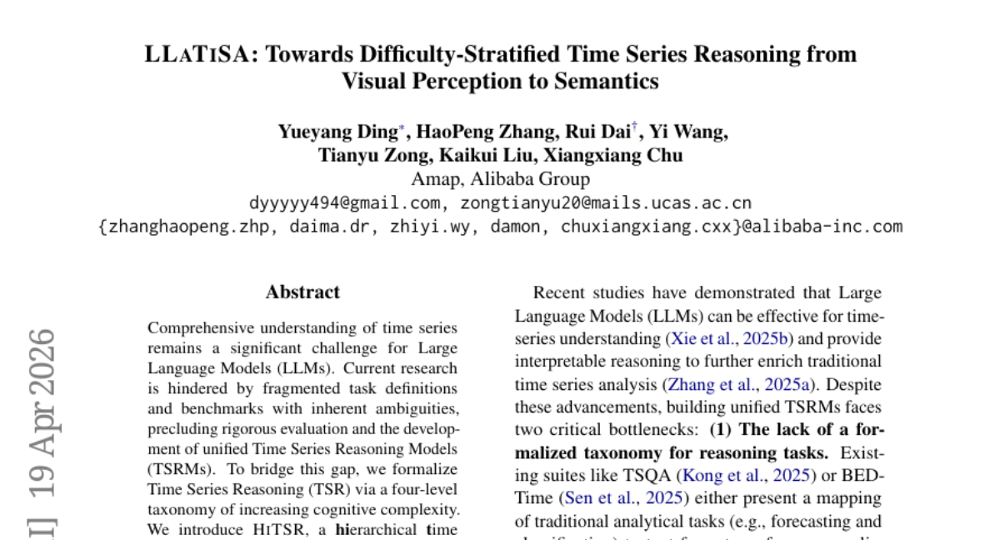

### 📌 한 줄 요약
LLM 기반 시계열 추론 모델 개발 시, 시각적 패턴과 정밀하게 조정된 수치 테이블 통합을 통해 성능 향상 및 다양한 시계열 작업에서 일반화 성능을 확보할 수 있음을 보임.

### 🔑 핵심 포인트
- 시계열 추론을 위한 4단계 분류법 제시
- HiTSR 데이터셋 (83k 샘플) 구축 및 활용
- 시각적 정보와 수치 정보를 결합한 LLaTiSA 모델 제안

### 🧑‍💻 개발자 관점
시계열 데이터 분석 및 예측 시스템 개발 시, LLaTiSA 모델 구조와 HiTSR 데이터셋 구축 방법을 참고하여 LLM의 성능을 향상시킬 수 있다.

### 🚀 실무 적용 아이디어
- HiTSR 데이터셋을 활용하여 기존 모델의 시계열 추론 성능 평가
- LLaTiSA 모델 구조를 기반으로 시각적 정보와 수치 정보를 결합하는 다양한 시도
- 실제 시계열 데이터에 대한 out-of-distribution 일반화 성능 테스트

### ⚠️ 리스크/한계
- LLaTiSA 모델의 계산 복잡도 및 리소스 요구 사항
- HiTSR 데이터셋의 편향 가능성 및 실제 데이터와의 차이

### 📝 초록 기반 상세 설명
LLM이 시계열 데이터를 이해하는 데 어려움을 겪고 있으며, 기존 연구는 단편적인 태스크 정의와 모호한 벤치마크로 인해 통합된 시계열 추론 모델(TSRM) 개발에 어려움을 겪고 있다. 본 연구에서는 시계열 추론(TSR)을 인지 복잡성에 따라 4단계로 분류하고, 다양한 태스크 조합과 검증된 CoT 궤적을 포함하는 계층적 시계열 추론 데이터셋 HiTSR(83k 샘플)을 제안한다. HiTSR을 활용하여 시각적 패턴과 정밀하게 조정된 수치 테이블을 통합하여 VLMs의 시간적 인지 능력을 향상시키는 강력한 TSRM인 LLaTiSA를 제안한다. 다단계 커리큘럼 fine-tuning 전략을 통해 LLaTiSA는 우수한 성능을 달성하고 다양한 TSR 작업 및 실제 시나리오에서 강력한 out-of-distribution 일반화 성능을 보여준다.

---

## 2. [WorldMark: A Unified Benchmark Suite for Interactive Video World Models](https://huggingface.co/papers/2604.21686)
**Upvotes**: 34 | **도입 난이도**: 중 | **신뢰도**: 상
**arXiv**: https://arxiv.org/abs/2604.21686

**태그**: Benchmark, World Model, Video Generation, Interactive AI, Vision, Video, Evaluation, Safety

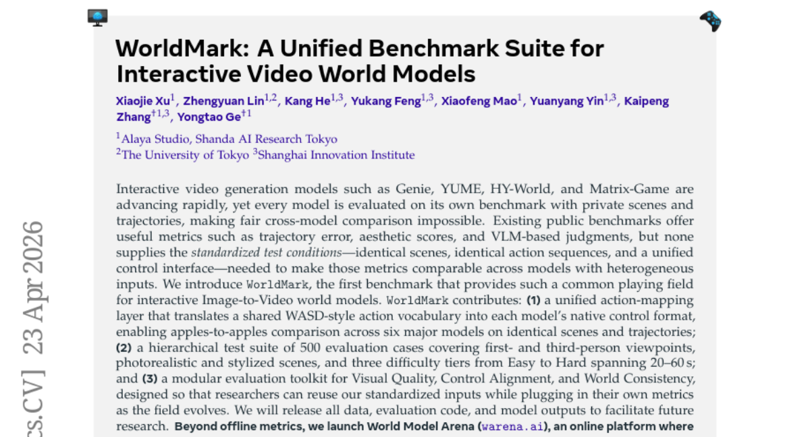

### 📌 한 줄 요약
다양한 Interactive Video World Model들을 동일한 환경에서 비교 평가할 수 있는 통합 벤치마크 WorldMark를 제시하여, 모델 간 공정한 성능 비교 및 발전을 가속화한다.

### 🔑 핵심 포인트
- 통합 액션 매핑 레이어를 통해 다양한 모델의 제어 방식을 표준화
- 다양한 시점, 스타일, 난이도를 포괄하는 계층적 테스트 스위트 제공
- 시각적 품질, 제어 정확도, 세계 일관성을 평가하는 모듈식 평가 툴킷 제공

### 🧑‍💻 개발자 관점
Interactive video generation 모델 개발 시, WorldMark를 활용하여 모델 성능을 객관적으로 평가하고, 다양한 모델과의 비교를 통해 개선 방향을 설정할 수 있다.

### 🚀 실무 적용 아이디어
- WorldMark 벤치마크를 사용하여 기존 모델의 성능을 평가
- WorldMark의 평가 툴킷을 활용하여 새로운 메트릭 개발 및 통합
- World Model Arena에서 모델 간 경쟁을 통해 성능 개선

### ⚠️ 리스크/한계
- WorldMark의 평가 지표가 모든 측면을 포괄하지 못할 수 있음
- 특정 모델에 편향된 평가 결과를 초래할 가능성 존재

### 📝 초록 기반 상세 설명
Interactive video generation 모델들은 빠르게 발전하고 있지만, 각 모델이 자체적인 벤치마크를 사용하여 모델 간 비교가 어려웠다. 기존 벤치마크는 유용한 지표를 제공하지만, 표준화된 테스트 환경이 부족했다. WorldMark는 동일한 장면, 액션 시퀀스, 제어 인터페이스를 제공하여 이러한 문제를 해결한다. 구체적으로, 모델 간 액션 매핑 레이어를 제공하고, 다양한 시점과 스타일을 포함하는 계층적 테스트 스위트를 구축했으며, 시각적 품질, 제어 정확도, 세계 일관성을 평가하는 모듈식 평가 툴킷을 제공한다. 또한, 온라인 플랫폼 World Model Arena를 통해 모델 간 실시간 경쟁을 지원한다.

---

## 3. [UniT: Toward a Unified Physical Language for Human-to-Humanoid Policy Learning and World Modeling](https://huggingface.co/papers/2604.19734)
**Upvotes**: 27 | **도입 난이도**: 중 | **신뢰도**: 중
**arXiv**: https://arxiv.org/abs/2604.19734

**태그**: Robotics, Humanoid, Transfer Learning, World Modeling, RAG, Vision, Video, Benchmark, Distillation, Safety

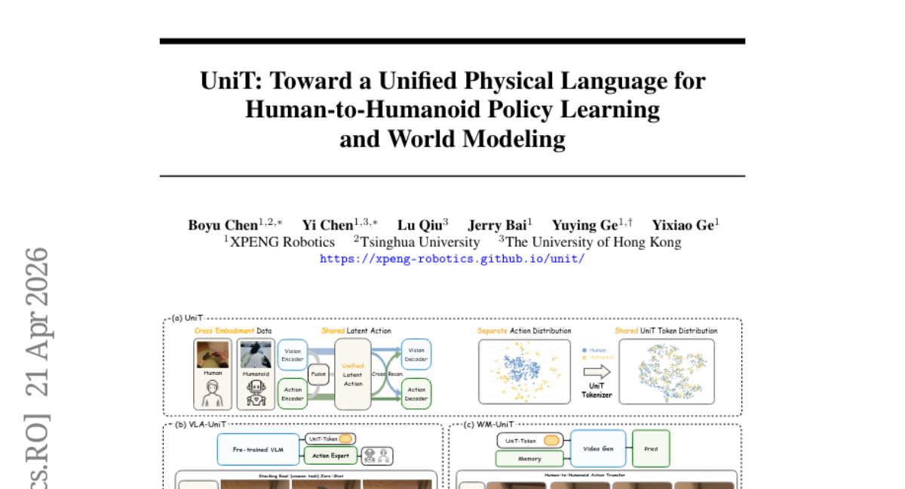

### 📌 한 줄 요약
UniT는 인간의 행동 데이터를 휴머노이드 로봇에 효과적으로 전달하여 로봇 학습 데이터 부족 문제를 해결하고, 실제 로봇 제어 성능을 향상시키는 데 기여한다.

### 🔑 핵심 포인트
- 인간 행동 데이터와 로봇 행동 데이터 간의 간극을 해소하는 새로운 프레임워크 UniT 제시
- 시각적 정보를 활용하여 신체 구조에 독립적인 행동 표현 학습
- 정책 학습 및 세계 모델링을 통해 휴머노이드 로봇의 제어 성능 향상

### 🧑‍💻 개발자 관점
로봇 제어 시스템 개발 시, 인간의 행동 데이터를 활용하여 로봇의 학습 효율성을 높이고, 새로운 동작을 빠르게 학습시키는 데 활용할 수 있다.

### 🚀 실무 적용 아이디어
- UniT 프레임워크를 활용하여 자체 로봇 플랫폼에 인간 행동 데이터 적용 실험
- UniT를 활용한 로봇 정책 학습 및 세계 모델링 성능 비교 분석
- 다양한 시각적 특징 추출 방법을 UniT에 적용하여 성능 향상 가능성 탐색

### ⚠️ 리스크/한계
- UniT의 성능은 시각적 정보의 품질에 크게 의존할 수 있음
- 복잡한 환경이나 다양한 종류의 로봇에 대한 일반화 성능 검증 필요

### 📝 초록 기반 상세 설명
휴머노이드 로봇의 기초 모델 학습은 로봇 데이터 부족으로 어려움을 겪고 있다. 이 문제를 해결하기 위해 대규모 인간 데이터를 활용하는 방법이 있지만, 인간과 로봇의 신체 구조 차이로 인해 직접적인 적용이 어렵다. 본 논문에서는 시각적 정보를 활용하여 인간과 로봇의 행동을 연결하는 UniT 프레임워크를 제안한다. UniT는 행동과 시각 정보 간의 상호 재구성을 통해 신체 구조에 독립적인 행동 표현을 학습하고, 이를 통해 인간 데이터를 활용한 로봇 정책 학습 및 세계 모델링을 가능하게 한다. 실험 결과, UniT는 휴머노이드 시뮬레이션 및 실제 로봇 환경에서 우수한 성능을 보였으며, 인간의 행동을 로봇 제어에 효과적으로 이전할 수 있음을 입증했다.

### 🖼️ 추가 자료
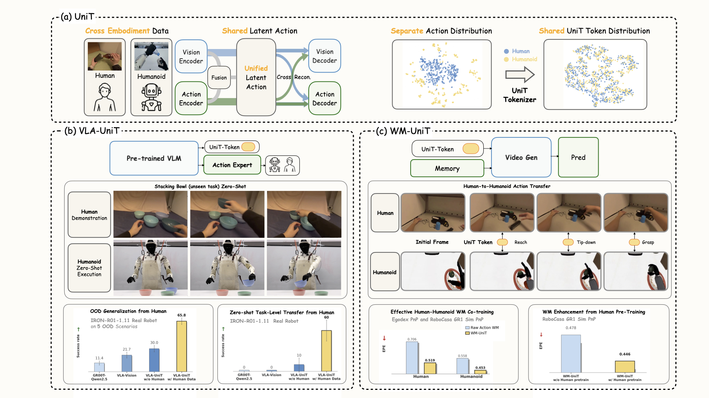

---

## 4. [StyleID: A Perception-Aware Dataset and Metric for Stylization-Agnostic Facial Identity Recognition](https://huggingface.co/papers/2604.21689)
**Upvotes**: 20 | **도입 난이도**: 중 | **신뢰도**: 상
**arXiv**: https://arxiv.org/abs/2604.21689

**태그**: 얼굴인식, 스타일변환, 데이터셋, 평가지표, 강건성, RAG, Vision, Benchmark, Evaluation

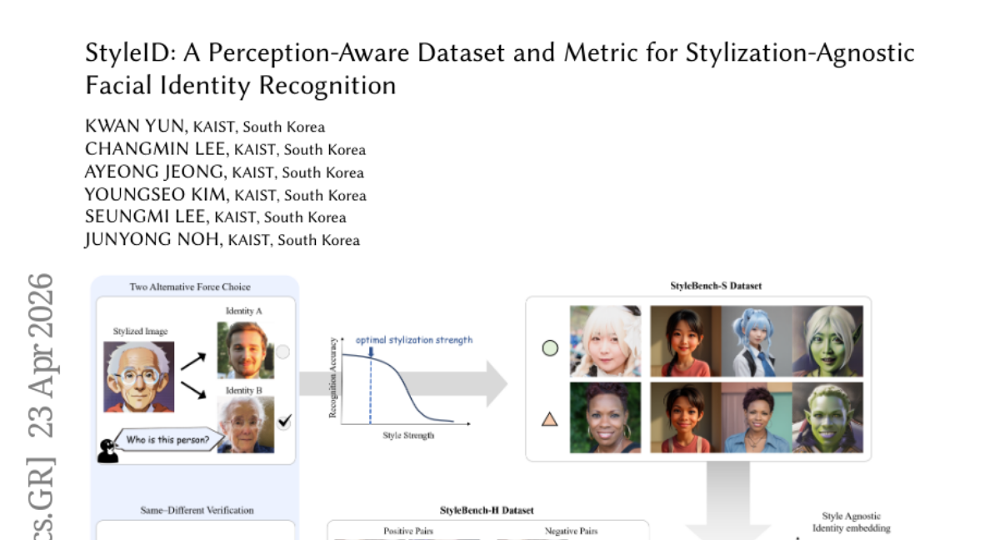

### 📌 한 줄 요약
얼굴 스타일 변환에도 강건한 얼굴 인식 모델을 평가하고 학습하기 위한 데이터셋과 평가 지표 StyleID를 제안합니다.

### 🔑 핵심 포인트
- 스타일 변환에 강건한 얼굴 인식 평가를 위한 새로운 데이터셋 StyleID 제안
- 인간의 인지 능력을 반영한 평가 지표 및 학습 방법 제시
- 실제 예술가가 그린 초상화에서도 높은 성능을 보이는 모델 개발

### 🧑‍💻 개발자 관점
얼굴 인식 기술을 활용한 다양한 서비스(예: 아바타 생성, 스타일 변환 앱) 개발 시, 스타일 변화에 따른 인식 성능 저하 문제를 해결하고 사용자 경험을 향상시킬 수 있습니다.

### 🚀 실무 적용 아이디어
- StyleID 데이터셋을 활용하여 기존 얼굴 인식 모델의 스타일 강건성 평가
- StyleBench-S를 활용한 미세 조정으로 모델의 성능 향상 시도
- 자체 스타일 변환 데이터셋 구축 및 StyleID 기반 평가 수행

### ⚠️ 리스크/한계
- StyleID 데이터셋이 특정 스타일 및 강도에 편향되어 있을 수 있음
- 실험 환경과 실제 사용 환경 간의 차이로 인한 성능 저하 가능성

### 📝 초록 기반 상세 설명
얼굴 스타일 변환은 다양한 스타일로 인물 사진을 표현하지만, 기존 얼굴 인식 모델은 스타일 변화에 취약합니다. 이는 스타일 변화에 따른 얼굴의 동일성 유지 여부를 평가하고 학습할 방법이 부족하기 때문입니다. 본 논문에서는 인간의 인지 능력을 고려한 새로운 데이터셋 StyleID를 제안하여, 다양한 스타일 강도에서 얼굴 동일성을 평가합니다. StyleID를 활용하여 기존 모델을 미세 조정함으로써, 인간의 판단과 높은 상관관계를 가지며, 실제 예술가가 그린 초상화에서도 강건한 성능을 보이는 모델을 개발했습니다.

### 🖼️ 추가 자료
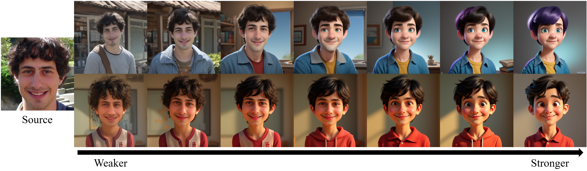

---

## 5. [Co-Evolving LLM Decision and Skill Bank Agents for Long-Horizon Tasks](https://huggingface.co/papers/2604.20987)
**Upvotes**: 18 | **도입 난이도**: 중 | **신뢰도**: 상
**arXiv**: https://arxiv.org/abs/2604.20987

**태그**: Agent, LLM, Skill Bank, Co-evolution, Game, RAG, Reasoning, Benchmark, Evaluation

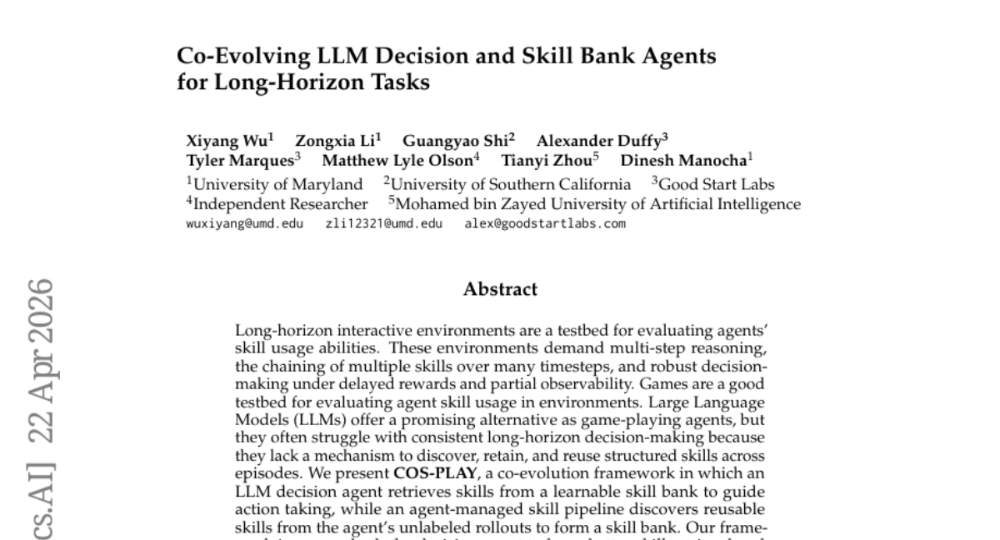

### 📌 한 줄 요약
LLM 기반 에이전트가 장기적인 의사 결정을 위해 스킬 뱅크를 활용하고, 동시에 스킬 뱅크 자체도 에이전트의 경험을 통해 지속적으로 개선되는 Co-Evolving 프레임워크 COSPLAY를 제안하여 게임 환경에서 LLM 에이전트의 성능을 향상시킴.

### 🔑 핵심 포인트
- LLM 에이전트의 장기 의사 결정 능력 향상을 위한 Co-Evolving 프레임워크 COSPLAY 제안
- LLM 의사 결정 에이전트와 스킬 뱅크 에이전트 간의 협력적 학습 메커니즘 구축
- 다양한 게임 환경에서 COSPLAY의 성능 검증 및 기존 LLM 기반 모델 대비 우수한 성능 입증

### 🧑‍💻 개발자 관점
LLM 기반 에이전트의 활용 범위를 넓히고, 특히 장기적인 의사 결정이 필요한 복잡한 환경에서의 적용 가능성을 높여줍니다. 게임 뿐만 아니라 로보틱스, 자율 주행 등 다양한 분야에 적용될 수 있습니다.

### 🚀 실무 적용 아이디어
- COSPLAY 프레임워크를 기반으로 특정 게임 환경에 최적화된 스킬 뱅크 구축 실험
- 다른 LLM 모델을 사용하여 COSPLAY 프레임워크의 성능 변화 관찰
- 게임 외 다른 장기 의사 결정 환경(예: 로보틱스)에 COSPLAY 적용 가능성 연구

### ⚠️ 리스크/한계
- 스킬 뱅크의 품질이 전체 시스템 성능에 큰 영향
- 복잡한 환경에서 효과적인 스킬 추출 및 관리가 어려울 수 있음

### 📝 초록 기반 상세 설명
LLM은 게임 환경에서 에이전트로서 잠재력을 보이지만, 장기적인 의사 결정에 어려움을 겪습니다. 이는 에피소드 전반에 걸쳐 구조화된 스킬을 발견, 유지 및 재사용하는 메커니즘이 부족하기 때문입니다. 본 논문에서는 LLM 의사 결정 에이전트가 스킬 뱅크에서 스킬을 검색하여 행동을 결정하고, 에이전트의 롤아웃으로부터 재사용 가능한 스킬을 발견하여 스킬 뱅크를 형성하는 Co-Evolving 프레임워크 COSPLAY를 제안합니다. COSPLAY는 의사 결정 에이전트의 스킬 검색 및 행동 생성 능력을 향상시키고, 스킬 뱅크 에이전트가 스킬과 컨트랙트를 지속적으로 추출, 개선 및 업데이트하도록 합니다. 실험 결과, COSPLAY는 8B 모델을 사용하여 싱글 플레이어 게임 벤치마크에서 기존 LLM 기반 모델 대비 평균 25.1% 이상의 보상 향상을 달성했으며, 멀티 플레이어 소셜 추론 게임에서도 경쟁력을 유지했습니다.

---

## 6. [Seeing Fast and Slow: Learning the Flow of Time in Videos](https://huggingface.co/papers/2604.21931)
**Upvotes**: 16 | **도입 난이도**: 중 | **신뢰도**: 중
**arXiv**: https://arxiv.org/abs/2604.21931

**태그**: Vision, Video Generation, Self-Supervised Learning, Temporal Modeling, Reasoning, Multimodal, Video

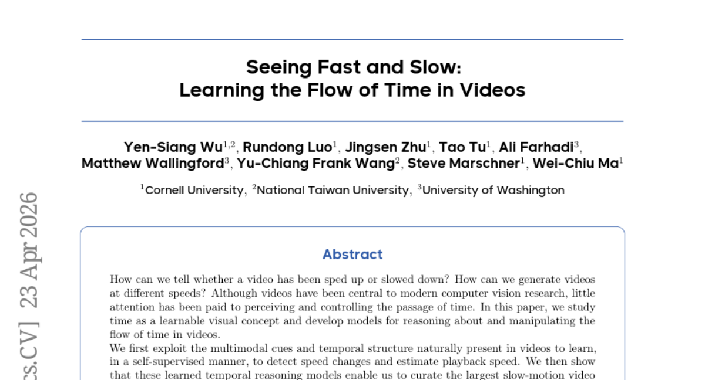

### 📌 한 줄 요약
비디오의 시간 흐름을 학습하고 제어하는 모델을 개발하여, 속도 변화 감지, 속도 추정, 속도 제어 비디오 생성, 시간적 슈퍼 해상도 등의 기능을 구현함으로써 비디오 처리 및 생성 분야에 새로운 가능성을 제시합니다.

### 🔑 핵심 포인트
- 비디오의 시간 흐름을 학습 가능한 시각적 개념으로 정의
- 자가 지도 학습을 통해 비디오 속도 변화 감지 및 속도 추정 모델 개발
- 속도 제어 비디오 생성 및 시간적 슈퍼 해상도 모델 개발

### 🧑‍💻 개발자 관점
비디오 편집, 생성, 분석 관련 파이프라인에서 시간 제어 기능을 추가하여 더욱 정교하고 다양한 효과를 구현할 수 있게 해줍니다. 특히, 저품질 비디오의 품질 개선이나 특정 속도 효과를 적용하는 데 유용합니다.

### 🚀 실무 적용 아이디어
- 기존 비디오 처리 파이프라인에 속도 변화 감지 모듈 통합
- 생성 모델에 시간 제어 기능을 추가하여 다양한 속도 효과 실험
- 시간적 슈퍼 해상도 모델을 사용하여 저품질 비디오 개선

### ⚠️ 리스크/한계
- 모델이 학습 데이터에 편향될 가능성 존재
- 실제 환경에서의 다양한 비디오 품질 및 속도 변화에 대한 일반화 성능 검증 필요

### 📝 초록 기반 상세 설명
기존 비디오 연구는 시간의 흐름을 인지하고 제어하는 데에 대한 관심이 부족했습니다. 본 연구에서는 비디오 내 시간 개념을 학습 가능한 시각적 요소로 간주하고, 시간 흐름을 추론하고 조작하는 모델을 개발합니다. 비디오의 다중 모달 큐와 시간적 구조를 활용하여 자가 지도 방식으로 속도 변화를 감지하고 재생 속도를 추정합니다. 이를 통해 고속 카메라로 촬영된 고품질 슬로우 모션 비디오 데이터셋을 구축하고, 속도 조건부 비디오 생성 및 시간적 슈퍼 해상도와 같은 시간 제어 모델을 개발합니다. 이 연구는 시간 제어 가능한 비디오 생성, 시간적 포렌식 감지, 그리고 시간 경과에 따른 사건 전개를 이해하는 풍부한 세계 모델 구축에 기여할 수 있습니다.

---

## 7. [VLAA-GUI: Knowing When to Stop, Recover, and Search, A Modular Framework for GUI Automation](https://huggingface.co/papers/2604.21375)
**Upvotes**: 13 | **도입 난이도**: 중 | **신뢰도**: 상
**arXiv**: https://arxiv.org/abs/2604.21375

**태그**: Agent, GUI Automation, LLM, Framework, Benchmark, Evaluation

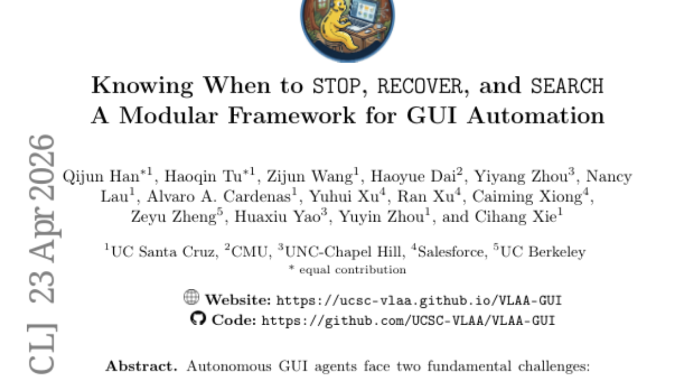

### 📌 한 줄 요약
GUI 자동화 에이전트의 조기 종료 및 반복 루프 문제를 해결하기 위해 검증, 루프 방지, 검색 기능을 통합한 모듈형 프레임워크 VLAA-GUI를 제안하고, 다양한 백본 모델에서 우수한 성능을 입증함.

### 🔑 핵심 포인트
- GUI 자동화 에이전트의 조기 종료 및 반복 루프 문제 해결
- 검증, 루프 방지, 검색 기능을 통합한 모듈형 프레임워크 VLAA-GUI 제안
- 다양한 백본 모델 및 벤치마크에서 우수한 성능 입증

### 🧑‍💻 개발자 관점
GUI 자동화 에이전트 개발 시 VLAA-GUI 프레임워크를 활용하여 에이전트의 신뢰성과 효율성을 향상시킬 수 있으며, 특히 반복적인 작업이나 예외 처리 로직을 개선하는 데 도움이 될 수 있습니다.

### 🚀 실무 적용 아이디어
- VLAA-GUI 프레임워크를 기반으로 GUI 자동화 에이전트 프로토타입 개발
- 자체 GUI 자동화 작업에 VLAA-GUI의 검증, 루프 방지, 검색 기능 적용
- 다양한 백본 모델과 통합하여 VLAA-GUI의 성능 비교 분석

### ⚠️ 리스크/한계
- 특정 GUI 환경 또는 애플리케이션에 대한 의존성 발생 가능성
- 온라인 검색 기능의 성능은 LLM의 능력에 따라 달라질 수 있음

### 📝 초록 기반 상세 설명
GUI 자동화 에이전트는 조기 종료와 반복 루프라는 근본적인 문제에 직면합니다. 이러한 문제를 해결하기 위해 VLAA-GUI라는 모듈형 프레임워크를 제안합니다. VLAA-GUI는 성공 기준 검증, 반복 실패 방지, 온라인 검색 기능을 통합하여 에이전트의 작동을 제어합니다. 실험 결과, VLAA-GUI는 다양한 백본 모델에서 OSWorld와 WindowsAgentArena 벤치마크 모두에서 최고 성능을 달성했으며, 일부 모델은 인간 성능을 능가했습니다. 특히, 제안된 세 가지 구성 요소는 전반적으로 성능 향상에 기여했으며, 루프 방지 기능은 불필요한 단계를 크게 줄였습니다.

---

## 8. [TingIS: Real-time Risk Event Discovery from Noisy Customer Incidents at Enterprise Scale](https://huggingface.co/papers/2604.21889)
**Upvotes**: 10 | **도입 난이도**: 중 | **신뢰도**: 상
**arXiv**: https://arxiv.org/abs/2604.21889

**태그**: LLM, Incident Management, Real-time Analysis, Clustering, Indexing, Benchmark, Inference

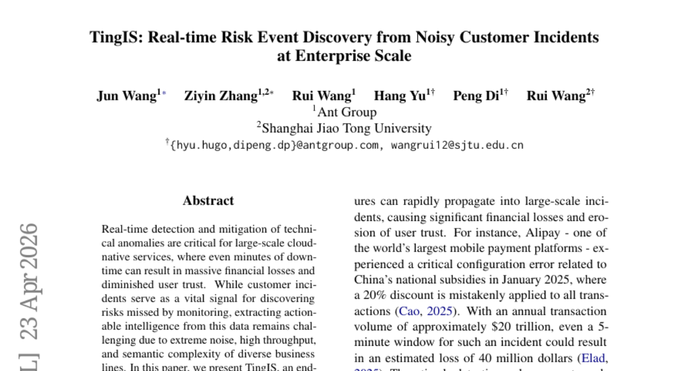

### 📌 한 줄 요약
TingIS는 LLM과 효율적인 인덱싱을 결합하여 실시간으로 고객 인시던트에서 주요 리스크를 발견하고, 높은 처리량과 복잡한 의미를 가진 데이터에서 안정적인 액션 아이템을 추출하는 엔터프라이즈급 시스템입니다.

### 🔑 핵심 포인트
- LLM과 인덱싱을 결합한 다단계 이벤트 연결 엔진
- 정확한 비즈니스 속성 지정을 위한 계단식 라우팅 메커니즘
- 도메인 지식, 통계 패턴, 행동 필터링을 통합한 노이즈 감소 파이프라인

### 🧑‍💻 개발자 관점
실시간으로 발생하는 고객 인시던트에서 주요 리스크를 빠르게 식별하고 대응하여 서비스 안정성을 향상시키고 잠재적인 손실을 줄이는 데 도움이 됩니다. 특히, LLM을 활용하여 노이즈가 많은 데이터에서 의미 있는 정보를 추출하는 방식은 실제 서비스 환경에서 유용하게 적용될 수 있습니다.

### 🚀 실무 적용 아이디어
- LLM을 활용한 이벤트 클러스터링 및 이상 감지 시스템 구축
- 도메인 지식 기반의 노이즈 필터링 파이프라인 구축
- 실시간 인시던트 처리 및 분석 시스템 성능 벤치마킹

### ⚠️ 리스크/한계
- LLM의 성능에 따라 결과 품질이 크게 좌우될 수 있음
- 특정 도메인에 특화된 지식 및 필터링 규칙 필요

### 📝 초록 기반 상세 설명
대규모 클라우드 네이티브 서비스에서는 기술적 이상 감지 및 완화가 매우 중요하지만, 고객 인시던트 데이터는 노이즈가 심하고 처리량이 높아 활용이 어렵습니다. TingIS는 다단계 이벤트 연결 엔진을 통해 LLM과 효율적인 인덱싱 기술을 결합하여 이벤트 병합 결정을 내리고, 다양한 사용자 설명에서 실행 가능한 인시던트를 추출합니다. 또한, 정확한 비즈니스 속성 지정을 위한 라우팅 메커니즘과 도메인 지식, 통계 패턴, 행동 필터링을 통합한 노이즈 감소 파이프라인을 제공합니다. 실제 운영 환경에서 TingIS는 분당 2,000건 이상의 메시지를 처리하며, P90 경고 지연 시간 3.5분, 고우선순위 인시던트 발견율 95%를 달성했습니다. 실제 데이터를 기반으로 한 벤치마크에서 TingIS는 라우팅 정확도, 클러스터링 품질, 신호 대 잡음비에서 기존 방법보다 뛰어난 성능을 보였습니다.

---

## 9. [Hybrid Policy Distillation for LLMs](https://huggingface.co/papers/2604.20244)
**Upvotes**: 10 | **도입 난이도**: 중 | **신뢰도**: 상
**arXiv**: https://arxiv.org/abs/2604.20244

**태그**: Knowledge Distillation, LLM, Model Compression, Optimization, RAG, Reasoning, Distillation

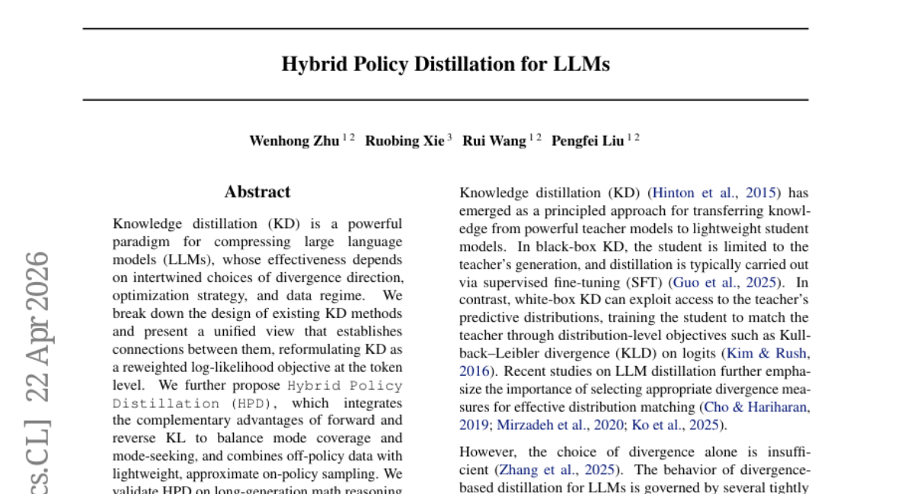

### 📌 한 줄 요약
Hybrid Policy Distillation (HPD)는 forward/reverse KL divergence의 장점을 결합하고 on/off-policy 샘플링을 혼합하여 LLM의 지식 증류 성능, 안정성, 효율성을 개선하는 새로운 방법론임.

### 🔑 핵심 포인트
- KD 방법론을 통합적인 관점에서 재해석하고, 방법론 간의 연결성을 확립
- Forward/Reverse KL divergence의 장점을 결합한 Hybrid Policy Distillation (HPD) 제안
- 다양한 task에서 HPD의 우수한 성능, 안정성, 효율성 입증

### 🧑‍💻 개발자 관점
LLM의 지식 증류 성능을 향상시키고, 모델 압축 및 경량화를 통해 리소스 효율성을 높일 수 있어, LLM을 활용하는 다양한 서비스 및 어플리케이션 개발에 기여할 수 있다.

### 🚀 실무 적용 아이디어
- 제공된 github 코드를 활용하여 HPD를 기존 KD 파이프라인에 적용해보기
- HPD의 다양한 하이퍼파라미터 (forward/reverse KL 가중치, on/off-policy 샘플링 비율 등)를 조정하여 특정 task에 최적화하기
- HPD를 활용하여 압축된 LLM을 실제 서비스에 배포하고 성능 및 리소스 사용량을 모니터링하기

### ⚠️ 리스크/한계
- HPD의 성능은 데이터 품질 및 양에 크게 의존할 수 있음
- HPD의 하이퍼파라미터 튜닝에 상당한 시간과 리소스가 소요될 수 있음

### 📝 초록 기반 상세 설명
지식 증류(KD)는 대형 언어 모델(LLM)을 압축하는 효과적인 방법이지만, divergence 방향, 최적화 전략, 데이터 regime 선택에 따라 성능이 크게 달라진다. 본 논문에서는 기존 KD 방법들을 재조명하여 토큰 레벨의 재가중된 로그-우도 목적 함수로 KD를 재구성하고, 방법들 간의 연결성을 확립하는 통합된 관점을 제시한다. 또한, forward 및 reverse KL의 상호 보완적인 장점을 통합하여 mode coverage와 mode-seeking 간의 균형을 맞추고, off-policy 데이터와 가벼운 on-policy 샘플링을 결합하는 Hybrid Policy Distillation (HPD)을 제안한다. HPD는 긴 생성 수학 추론, 짧은 생성 대화 및 코드 작업에서 다양한 모델 family 및 규모에 걸쳐 향상된 최적화 안정성, 계산 효율성 및 최종 성능을 보여준다.

---

