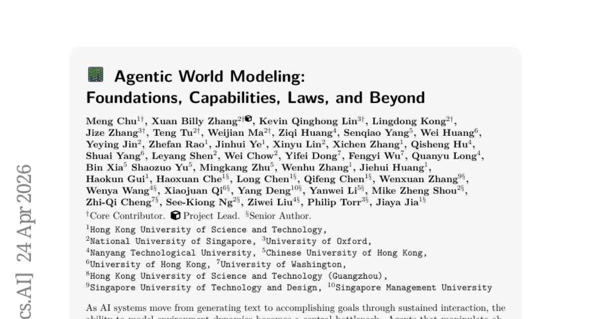
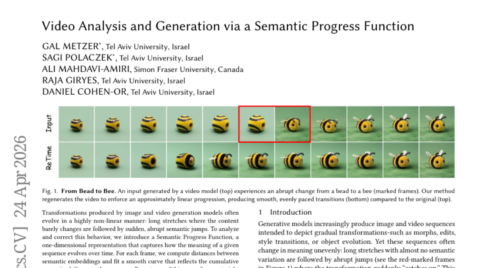
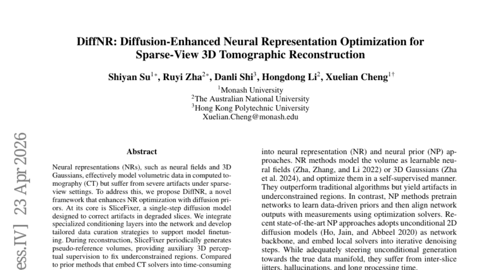
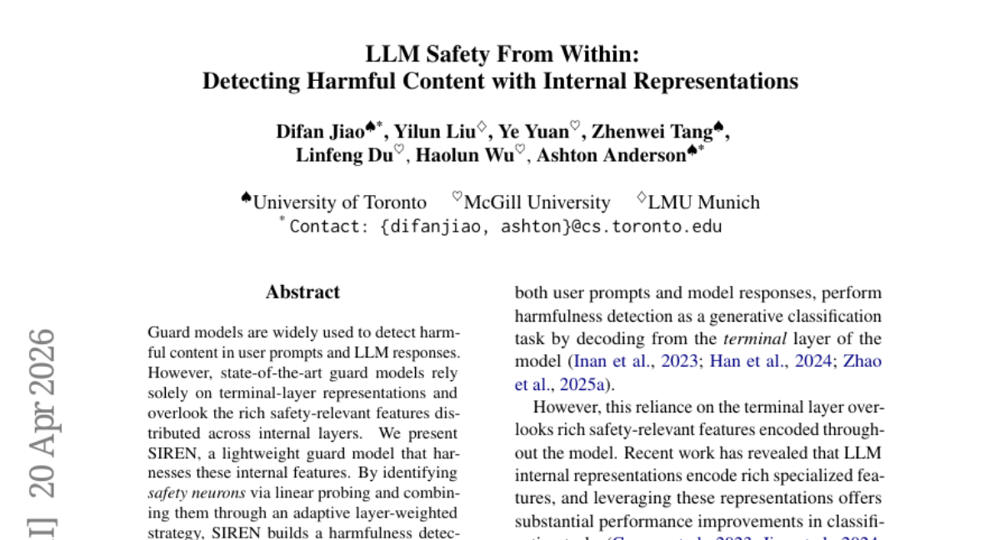
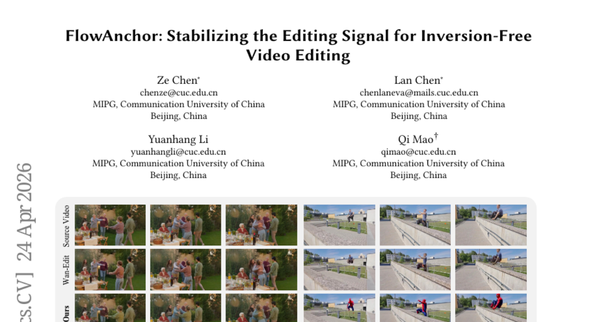
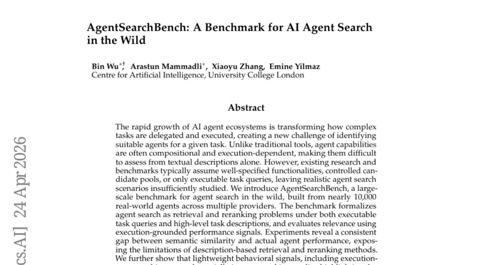
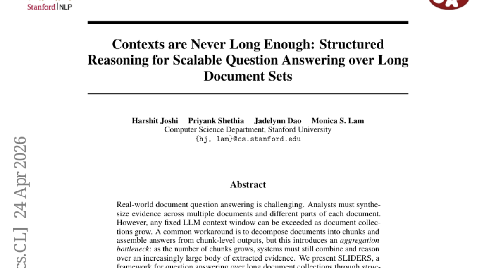
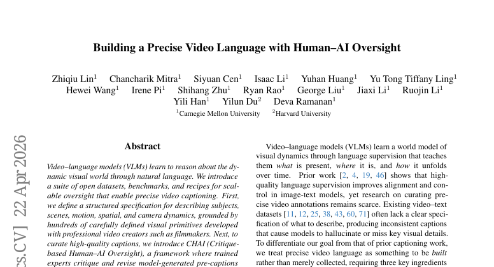
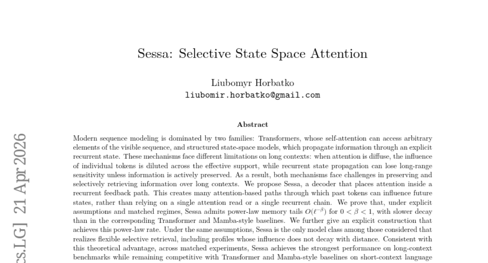

# 2026-04-28 Daily Papers (Top 9)

## 1. [Agentic World Modeling: Foundations, Capabilities, Laws, and Beyond](https://huggingface.co/papers/2604.22748)
**Upvotes**: 150 | **도입 난이도**: 중 | **신뢰도**: 중
**arXiv**: https://arxiv.org/abs/2604.22748

**태그**: Agent, World Model, Reinforcement Learning, Simulation, Video, Evaluation

### 📌 한 줄 요약
에이전트가 환경과 상호작용하며 목표를 달성하는 데 필요한 '월드 모델'을 레벨과 법칙이라는 두 축으로 분류하고, 다양한 연구 분야를 통합하여 에이전트 개발 로드맵을 제시합니다.

### 🔑 핵심 포인트
- 월드 모델의 능력 레벨(L1, L2, L3)과 지배 법칙(물리, 디지털, 사회, 과학)에 따른 분류 체계 제시
- 다양한 분야의 월드 모델 연구를 통합 분석하고, 방법론, 실패 유형, 평가 방식 비교
- 의사 결정 중심의 평가 원칙과 최소 재현 가능한 평가 패키지 제안

### 🧑‍💻 개발자 관점
소프트웨어 에이전트 개발 시 환경 모델링 전략을 체계적으로 수립하고, 다양한 분야의 연구를 참고하여 에이전트의 예측 능력과 자율성을 향상시키는 데 도움이 됩니다.

### 🚀 실무 적용 아이디어
- 제시된 분류 체계를 기반으로 현재 개발 중인 에이전트의 월드 모델링 수준을 평가
- 각 레벨별(L1, L2, L3)로 필요한 기술 요소들을 파악하고, 개선 방안 모색
- 제안된 평가 원칙을 적용하여 에이전트의 성능을 측정하고, 실패 유형 분석

### ⚠️ 리스크/한계
- 제시된 분류 체계가 모든 유형의 월드 모델을 포괄하지 못할 수 있음
- 실제 환경의 복잡성을 완벽하게 모델링하는 것은 여전히 어려운 과제

### 📝 초록 기반 상세 설명
AI 시스템이 단순 텍스트 생성에서 벗어나 지속적인 상호작용을 통해 목표를 달성하는 방향으로 발전함에 따라, 환경 역학을 모델링하는 능력이 중요해지고 있습니다. 본 논문에서는 '월드 모델'이라는 용어가 연구 커뮤니티마다 다르게 사용되는 문제점을 지적하고, 예측 능력 레벨(L1, L2, L3)과 지배 법칙(물리, 디지털, 사회, 과학)이라는 두 축을 기반으로 하는 분류 체계를 제시합니다. 이를 통해 400편 이상의 연구를 종합하고 100개 이상의 대표 시스템을 분석하여, 방법론, 실패 유형, 평가 방식 등을 분석합니다. 또한, 의사 결정 중심의 평가 원칙과 최소 재현 가능한 평가 패키지를 제안하고, 아키텍처 지침, 미해결 문제, 거버넌스 과제를 제시하여 에이전트 개발 로드맵을 구축합니다.

---

## 2. [Video Analysis and Generation via a Semantic Progress Function](https://huggingface.co/papers/2604.22554)
**Upvotes**: 34 | **도입 난이도**: 중 | **신뢰도**: 상
**arXiv**: https://arxiv.org/abs/2604.22554

**태그**: Vision, Video Generation, Semantic Analysis, AI/ML, Temporal Analysis, Video

### 📌 한 줄 요약
비디오 생성 모델의 부자연스러운 시간 흐름을 분석하고, 의미론적 진행 함수를 통해 일관된 속도로 영상을 재구성하여 더 부드러운 전환을 제공합니다.

### 🔑 핵심 포인트
- 비디오의 의미론적 진화를 포착하는 '의미론적 진행 함수(Semantic Progress Function)' 도입.
- 의미 변화가 일정한 속도로 진행되도록 비디오 시퀀스를 재구성하는 '의미론적 선형화' 절차 제안.
- 생성 모델 및 실제 비디오의 시간적 불규칙성 분석 및 페이싱 제어를 위한 모델 불가지론적 프레임워크 제공.

### 🧑‍💻 개발자 관점
개발자는 이 기술을 활용하여 생성형 AI 모델이 만든 비디오의 품질을 향상시키고, 시청자에게 더 자연스럽고 몰입감 있는 경험을 제공할 수 있습니다. 또한, 기존 비디오 콘텐츠의 시간 흐름을 분석하고 조정하는 데도 적용할 수 있습니다.

### 🚀 실무 적용 아이디어
- 현재 개발 중인 비디오 생성 모델의 출력물에 SPF를 적용하여 의미론적 페이싱 불균일성을 진단하고 시각화해보기.
- 특정 비디오 생성 태스크(예: 텍스트-투-비디오, 스타일 트랜스퍼)에 의미론적 선형화 절차를 구현하여 전환의 부드러움 개선 효과를 측정해보기.
- 다양한 비디오 생성 모델(예: GAN, Diffusion Model)로 생성된 비디오들의 SPF를 비교하여 각 모델의 시간적 일관성 특성을 분석해보기.

### ⚠️ 리스크/한계
- 의미 임베딩 모델의 성능에 크게 의존하며, 임베딩의 품질이 낮으면 SPF의 정확도가 저하될 수 있습니다.
- 모든 프레임에 대한 의미 임베딩 계산 및 곡선 피팅은 긴 비디오의 경우 상당한 계산 비용을 요구할 수 있습니다.

### 📝 초록 기반 상세 설명
이미지 및 비디오 생성 모델은 종종 내용이 거의 변하지 않다가 갑자기 의미론적 도약이 발생하는 등 비선형적인 변환을 생성합니다. 이러한 문제를 해결하기 위해, 본 연구는 시퀀스의 의미가 시간 경과에 따라 어떻게 진화하는지 포착하는 1차원 표현인 의미론적 진행 함수(Semantic Progress Function)를 도입합니다. 각 프레임에 대해 의미 임베딩 간의 거리를 계산하고, 누적 의미 변화를 반영하는 부드러운 곡선을 피팅하여 불균일한 의미 페이싱을 식별합니다. 이 통찰력을 바탕으로, 의미 변화가 일정한 속도로 전개되도록 시퀀스를 재매개변수화하는 의미론적 선형화 절차를 제안합니다. 이 프레임워크는 더 부드럽고 일관된 전환을 제공하며, 시간적 불규칙성을 식별하고, 다양한 생성 모델의 의미 페이싱을 비교하며, 생성된 비디오와 실제 비디오의 페이싱을 제어하는 모델 불가지론적 기반을 제공합니다.

---

## 3. [DiffNR: Diffusion-Enhanced Neural Representation Optimization for Sparse-View 3D Tomographic Reconstruction](https://huggingface.co/papers/2604.21518)
**Upvotes**: 26 | **도입 난이도**: 중 | **신뢰도**: 상
**arXiv**: https://arxiv.org/abs/2604.21518

**태그**: 3D Reconstruction, Diffusion Models, Neural Fields, Medical Imaging, Computer Vision, RAG, Vision

### 📌 한 줄 요약
희소 뷰 3D CT 재구성을 위해 확산 모델 기반의 신경 표현 최적화 기법을 도입하여 재구성 품질을 획기적으로 개선하고 효율성을 높였습니다.

### 🔑 핵심 포인트
- 확산 사전(diffusion priors)을 활용하여 희소 뷰 3D CT 재구성의 신경 표현 최적화를 강화하는 DiffNR 프레임워크 제안
- 손상된 슬라이스의 아티팩트를 단일 단계로 수정하는 효율적인 확산 모델인 SliceFixer 개발
- 빈번한 확산 모델 쿼리를 피하고 주기적인 의사 참조 볼륨 생성을 통해 효율적인 3D 지각적 감독을 제공하는 "수정 및 증강" 전략 도입

### 🧑‍💻 개발자 관점
제한된 데이터로 고품질 3D 재구성을 가능하게 하여 의료 영상 진단, 산업 검사 등 다양한 분야에서 활용될 잠재력이 큽니다. 특히 기존 확산 모델 기반 접근 방식보다 효율적인 재구성 속도를 제공하여 실제 시스템에 적용하기 용이합니다.

### 🚀 실무 적용 아이디어
- 의료 영상(예: 저선량 CT) 또는 산업용 비파괴 검사 등 특정 희소 뷰 CT 데이터셋에 DiffNR을 적용하여 재구성 품질을 평가해 보세요.
- SliceFixer가 다양한 종류의 아티팩트(예: 스트라이크, 빔 경화)에 대해 얼마나 효과적으로 작동하는지 분석하고, 필요시 모델 구조를 개선해 보세요.
- DiffNR의 "수정 및 증강" 전략이 기존의 반복적인 확산 기반 재구성 방법들과 비교하여 실제 환경에서 어느 정도의 런타임 성능 이점을 제공하는지 벤치마크 테스트를 수행해 보세요.

### ⚠️ 리스크/한계
- 특수 조건화 레이어와 맞춤형 데이터 큐레이션 전략이 필요하여 초기 설정 및 학습에 상당한 시간과 자원이 소요될 수 있습니다.
- 평균 3.99 dB의 PSNR 향상은 인상적이지만, 특정 매우 희소한 뷰 설정이나 복잡한 구조에서는 성능 편차가 발생할 수 있습니다.

### 📝 초록 기반 상세 설명
신경 표현(NRs)은 CT 볼륨 데이터를 모델링하는 데 효과적이지만, 희소 뷰 환경에서는 심각한 아티팩트 문제를 겪습니다. 이를 해결하기 위해 본 논문은 확산 사전(diffusion priors)을 활용하여 신경 표현 최적화를 강화하는 DiffNR 프레임워크를 제안합니다. 핵심은 손상된 슬라이스의 아티팩트를 단일 단계로 수정하는 확산 모델인 SliceFixer입니다. 이 모델은 특수 조건화 레이어와 맞춤형 데이터 큐레이션 전략을 통해 학습되며, 재구성 과정에서 주기적으로 의사 참조 볼륨을 생성하여 3D 지각적 감독을 제공합니다. 기존 확산 기반 방법보다 효율적인 "수정 및 증강" 전략으로 PSNR을 평균 3.99 dB 향상시키고, 다양한 도메인에 잘 일반화되며, 효율적인 최적화를 유지합니다.

---

## 4. [LLM Safety From Within: Detecting Harmful Content with Internal Representations](https://huggingface.co/papers/2604.18519)
**Upvotes**: 21 | **도입 난이도**: 중 | **신뢰도**: 상
**arXiv**: https://arxiv.org/abs/2604.18519

**태그**: LLM Safety, Guardrails, Harmful Content Detection, Internal Representations, Efficiency, Benchmark, Evaluation, Inference, Safety

### 📌 한 줄 요약
LLM 내부 표현을 활용하여 유해 콘텐츠 탐지 성능과 효율을 획기적으로 개선한 경량 가드 모델 SIREN을 제안합니다.

### 🔑 핵심 포인트
- LLM의 내부 표현(internal representations)을 활용하여 유해 콘텐츠 탐지 성능을 극대화.
- 기존 최신 오픈소스 가드 모델 대비 250배 적은 파라미터로 우수한 성능 및 일반화 능력 달성.
- 실시간 스트리밍 탐지 및 추론 효율성 개선을 통해 실제 서비스 적용 가능성 제시.

### 🧑‍💻 개발자 관점
개발자 관점에서 LLM 기반 서비스에 더 효과적이고 효율적인 안전 장치(guardrails)를 구축할 수 있는 새로운 접근 방식을 제공하여, 유해 콘텐츠 탐지 비용과 성능 문제를 동시에 해결할 수 있습니다.

### 🚀 실무 적용 아이디어
- 현재 운영 중인 LLM 서비스의 유해 콘텐츠 탐지 시스템에 SIREN의 접근 방식을 적용하여 성능 및 자원 효율성 비교 실험.
- 다양한 유형의 유해 콘텐츠(예: 혐오 발언, 개인 정보 유출 시도 등)에 대해 SIREN의 탐지 정확도 및 오탐율(false positive rate) 평가.
- SIREN의 실시간 스트리밍 탐지 기능을 활용하여 사용자 입력 및 LLM 응답에 대한 즉각적인 필터링 시스템 구축 검토.

### ⚠️ 리스크/한계
- "안전 뉴런" 식별 과정이 특정 LLM 아키텍처나 학습 데이터에 의존적일 수 있어, 다른 LLM에 적용 시 추가적인 튜닝이 필요할 수 있음.
- 추상화된 "유해성" 개념에 대한 정의가 명확하지 않아, 특정 문화권이나 맥락에서 오탐 또는 미탐이 발생할 가능성.

### 📝 초록 기반 상세 설명
기존 가드 모델들은 LLM의 최종 출력층 정보에만 의존하여 내부층에 분포된 풍부한 안전 관련 특징들을 간과했습니다. 본 연구는 이러한 문제점을 해결하기 위해 LLM 내부 표현을 활용하는 경량 가드 모델 SIREN을 제안합니다. SIREN은 선형 프로빙을 통해 안전 관련 뉴런을 식별하고, 이를 적응형 계층 가중치 전략으로 결합하여 LLM을 수정하지 않고도 유해성 탐지기를 구축합니다. 종합적인 평가 결과, SIREN은 최신 오픈소스 가드 모델들을 크게 능가하며, 250배 적은 학습 가능한 파라미터를 사용합니다. 또한, 미학습 벤치마크에 대한 우수한 일반화 능력, 실시간 스트리밍 탐지 지원, 그리고 생성형 가드 모델 대비 향상된 추론 효율성을 보여줍니다.

---

## 5. [FlowAnchor: Stabilizing the Editing Signal for Inversion-Free Video Editing](https://huggingface.co/papers/2604.22586)
**Upvotes**: 10 | **도입 난이도**: 중 | **신뢰도**: 상
**arXiv**: https://arxiv.org/abs/2604.22586

**태그**: Vision, Video Editing, Deep Learning, Generative AI, Computer Vision, Video, Safety

### 📌 한 줄 요약
FlowAnchor는 불안정한 편집 신호를 안정화하여 복잡한 장면에서도 효율적이고 일관성 있는 비디오 편집을 가능하게 하는 훈련 없는(training-free) 프레임워크입니다.

### 🔑 핵심 포인트
- 고차원 비디오 잠재 공간에서 편집 신호의 불안정성 문제를 해결합니다.
- 텍스트 가이드와 공간 영역의 일관된 정렬을 위한 '공간 인식 어텐션 개선'을 제안합니다.
- 편집 강도를 적응적으로 보존하는 '적응형 크기 변조'를 도입합니다.

### 🧑‍💻 개발자 관점
이 기술은 기존 무반전 비디오 편집 방식의 한계를 극복하여, 개발자들이 다중 객체나 빠른 움직임이 있는 복잡한 비디오를 더 안정적이고 효율적으로 편집할 수 있는 도구를 만들 수 있게 합니다. 이는 비디오 콘텐츠 제작 및 자동화 분야에서 사용자 경험과 작업 효율성을 크게 향상시킬 수 있습니다.

### 🚀 실무 적용 아이디어
- FlowAnchor 프레임워크를 활용하여 기존 비디오 편집 파이프라인에 통합하고, 다중 객체 및 빠른 움직임 시나리오에서 성능을 비교 평가합니다.
- 제공된 프로젝트 페이지의 코드나 데모를 통해 실제 비디오에 적용하여 편집 결과의 품질과 시간적 일관성을 직접 확인합니다.
- 다양한 텍스트 프롬프트와 비디오 유형(예: 애니메이션, 실사)에 대한 FlowAnchor의 편집 유연성과 강건성을 테스트합니다.

### ⚠️ 리스크/한계
- "훈련 없는(training-free)" 방식이지만, 기반이 되는 흐름(flow) 추정 모델이나 잠재 공간 모델의 품질에 따라 최종 편집 결과가 영향을 받을 수 있습니다.
- 매우 극단적인 움직임이나 복잡한 객체 상호작용이 있는 비디오에서 '공간 인식 어텐션 개선' 및 '적응형 크기 변조'가 항상 최적의 안정성을 보장하지 못할 가능성이 있습니다.

### 📝 초록 기반 상세 설명
최근 이미지 분야에서 인상적인 효율성과 구조 보존을 보여준 무반전(inversion-free) 편집 방식은 비디오로 확장될 때 다중 객체 장면이나 프레임 수가 증가할수록 어려움을 겪습니다. 본 연구는 이러한 문제의 근본 원인이 고차원 비디오 잠재 공간에서 편집 신호의 불안정성, 즉 부정확한 공간적 지역화와 길이로 인한 크기 감쇠에 있음을 규명했습니다. 이를 해결하기 위해 FlowAnchor는 편집 위치와 강도를 명시적으로 고정하는 훈련 없는 프레임워크를 제안합니다. 이 프레임워크는 텍스트 가이드와 공간 영역 간의 일관된 정렬을 강제하는 '공간 인식 어텐션 개선(Spatial-aware Attention Refinement)'과 충분한 편집 강도를 적응적으로 유지하는 '적응형 크기 변조(Adaptive Magnitude Modulation)'를 도입합니다. 광범위한 실험을 통해 FlowAnchor가 다중 객체 및 빠른 움직임 시나리오에서 더욱 충실하고 시간적으로 일관되며 계산 효율적인 비디오 편집을 달성함을 입증했습니다.

---

## 6. [AgentSearchBench: A Benchmark for AI Agent Search in the Wild](https://huggingface.co/papers/2604.22436)
**Upvotes**: 9 | **도입 난이도**: 중 | **신뢰도**: 상
**arXiv**: https://arxiv.org/abs/2604.22436

**태그**: Agent, Benchmark, Retrieval, Reranking, Evaluation, RAG

### 📌 한 줄 요약
AI 에이전트 검색 시 설명만으로는 부족하며, 실제 실행 기반의 평가가 중요함을 보여주는 벤치마크.

### 🔑 핵심 포인트
- 실제 환경에서의 AI 에이전트 검색을 위한 최초의 대규모 벤치마크(AgentSearchBench) 구축.
- 에이전트 검색을 실행 기반 성능 신호로 평가하는 검색 및 재랭킹 문제로 공식화.
- 에이전트 발견 시 텍스트 설명 기반의 의미론적 유사성만으로는 한계가 있으며, 실행 기반 행동 신호의 중요성을 입증.

### 🧑‍💻 개발자 관점
개발자들이 AI 에이전트를 선택하고 통합할 때, 단순히 에이전트의 설명만 보고 판단하는 것이 아니라 실제 실행을 통해 성능을 검증해야 함을 시사합니다. 이는 에이전트 기반 시스템의 신뢰성과 효율성을 높이는 데 필수적인 지침을 제공합니다.

### 🚀 실무 적용 아이디어
- 새로운 AI 에이전트 도입 시, 설명 외에 실제 태스크 실행을 통한 성능 검증 프로세스를 추가.
- 자사 에이전트 시스템에 맞는 경량화된 에이전트 행동 프로빙(probing) 기법을 탐색 및 적용.
- 에이전트 검색 및 선택 시스템 구축 시, 실행 기반의 피드백 루프를 설계하여 랭킹 개선에 활용.

### ⚠️ 리스크/한계
- 실제 환경에서 모든 에이전트에 대해 실행 기반 검증을 수행하는 것은 시간과 비용이 많이 들 수 있음.
- "경량 행동 신호"의 구현이 에이전트의 종류나 태스크 복잡성에 따라 여전히 어려울 수 있음.

### 📝 초록 기반 상세 설명
AI 에이전트 생태계가 빠르게 성장함에 따라 복잡한 작업을 위한 적합한 에이전트를 식별하는 것이 새로운 과제가 되고 있습니다. 기존 연구들은 잘 정의된 기능이나 제어된 후보 풀을 가정했지만, 에이전트의 기능은 구성적이고 실행 의존적이어서 텍스트 설명만으로는 평가하기 어렵습니다. 이에 본 연구는 약 10,000개의 실제 에이전트로 구성된 대규모 벤치마크인 AgentSearchBench를 소개합니다. 이 벤치마크는 실행 가능한 작업 쿼리와 고수준 작업 설명 모두에서 에이전트 검색을 검색 및 재랭킹 문제로 공식화하고, 실행 기반 성능 신호를 사용하여 관련성을 평가합니다. 실험 결과, 의미론적 유사성과 실제 에이전트 성능 사이에 일관된 격차가 있음을 발견했으며, 실행 인식 프로빙을 포함한 경량 행동 신호가 랭킹 품질을 크게 향상시킬 수 있음을 보여주었습니다.

---

## 7. [Contexts are Never Long Enough: Structured Reasoning for Scalable Question Answering over Long Document Sets](https://huggingface.co/papers/2604.22294)
**Upvotes**: 7 | **도입 난이도**: 중 | **신뢰도**: 상
**arXiv**: https://arxiv.org/abs/2604.22294

**태그**: RAG, SQL, LLM, Question Answering, Reasoning, Benchmark

### 📌 한 줄 요약
SLIDERS는 긴 문서 집합에 대한 질문 응답 시, LLM 컨텍스트 창 크기 제약을 극복하고, SQL을 이용한 구조적 추론을 통해 성능을 향상시키는 프레임워크다.

### 🔑 핵심 포인트
- 긴 문서에 대한 질문 응답을 위한 구조적 추론 프레임워크 SLIDERS 제시
- 관계형 데이터베이스와 SQL을 활용하여 정보 추출 및 추론 확장
- 데이터 정합성 검사 단계를 통해 정보의 일관성 유지

### 🧑‍💻 개발자 관점
SLIDERS는 대규모 문서에 대한 질의 응답 시스템 구축 시 LLM 컨텍스트 창 크기 제한을 극복하고, 구조화된 데이터 처리를 통해 성능을 개선할 수 있는 실질적인 방법을 제시한다.

### 🚀 실무 적용 아이디어
- SLIDERS 프레임워크의 데이터 추출 및 정합성 검사 모듈을 분석하고, 자사의 문서 데이터에 적용 가능성 검토
- SQL 기반의 지식 그래프 구축 및 질의 응답 시스템 프로토타입 개발
- 기존 RAG 시스템과 SLIDERS를 결합하여 성능 향상 가능성 실험

### ⚠️ 리스크/한계
- 관계형 데이터베이스 구축 및 유지보수 비용 발생 가능성
- 추출된 정보의 정확도에 따라 전체 시스템 성능이 좌우될 수 있음

### 📝 초록 기반 상세 설명
실제 문서 질의 응답은 여러 문서와 문서 내 다양한 부분에서 증거를 종합해야 하므로 어렵다. LLM 컨텍스트 창 크기는 문서 컬렉션이 커짐에 따라 제한될 수 있으며, 청크 단위로 분할하여 답변을 조합하는 방식은 정보 집계 시 병목 현상을 야기한다. SLIDERS는 관계형 데이터베이스에 정보를 추출하고 SQL을 통해 구조적 추론을 수행하여 긴 문서 집합에 대한 질문 응답을 확장한다. 추출된 정보의 일관성을 위해 데이터 정합성 검사 단계를 도입하여 중복, 불일치, 불완전한 레코드를 수정한다. SLIDERS는 기존의 긴 컨텍스트 벤치마크에서 GPT-4.1을 포함한 모든 베이스라인을 능가하며, 새로운 대규모 벤치마크에서 성능이 크게 향상되었다.

---

## 8. [Building a Precise Video Language with Human-AI Oversight](https://huggingface.co/papers/2604.21718)
**Upvotes**: 4 | **도입 난이도**: 상 | **신뢰도**: 상
**arXiv**: https://arxiv.org/abs/2604.21718

**태그**: Vision, LLM, Human-in-the-loop, Video Generation, Captioning, Video, Benchmark, Inference

### 📌 한 줄 요약
인간-AI 협업 감수 프레임워크(CHAI)를 통해 정밀한 비디오 캡션을 생성하고, 이를 활용하여 비디오 이해 및 생성 모델의 성능을 전문가 수준으로 끌어올리는 방법론을 제시합니다.

### 🔑 핵심 포인트
- 전문가와 협력하여 피사체, 장면, 움직임 등을 포함하는 정밀한 비디오 설명을 위한 구조화된 사양 및 시각적 원시 요소 정의.
- 인간 전문가의 비평 기반 모델 캡션 수정 및 개선을 통한 CHAI(Critique-based Human-AI Oversight) 프레임워크 도입.
- CHAI를 통해 오픈소스 VLM(Qwen3-VL)의 성능을 향상시키고, 비디오 생성 모델(Wan)이 영화 촬영술에 대한 정밀한 제어를 가능하게 함.

### 🧑‍💻 개발자 관점
이 연구는 비디오 콘텐츠의 정밀한 이해와 생성이 필요한 개발자에게 매우 중요합니다. 특히 영화, 게임, 광고 등 고품질 비디오 제작 분야에서 AI의 활용도를 높여 상세한 시네마틱 제어를 가능하게 합니다.

### 🚀 실무 적용 아이디어
- 제공된 오픈 데이터셋과 벤치마크를 활용하여 정밀 비디오 캡션 생성 실험을 수행해 보세요.
- 자사 서비스(예: 이커머스 상품 비디오)에 CHAI 프레임워크를 적용하여 상세한 비디오 캡션 생성 파이프라인을 구축해 보세요.
- CHAI로 생성된 정밀 프롬프트를 사용하여 Wan과 같은 오픈소스 비디오 생성 모델을 미세 조정하여 특정 시네마틱 제어 가능성을 탐색해 보세요.

### ⚠️ 리스크/한계
- 정밀한 사양 정의 및 인간 전문가의 비평 훈련에 상당한 시간과 비용이 소요될 수 있습니다.
- 다양한 비디오 콘텐츠에 대한 구조화된 사양 및 시각적 원시 요소를 정의하고 유지 관리하는 복잡성이 높습니다.

### 📝 초록 기반 상세 설명
비디오-언어 모델(VLM)은 자연어를 통해 동적인 시각 세계를 이해하는 데 활용되지만, 기존 모델들은 전문적인 수준의 정밀한 비디오 캡션 생성에 한계가 있었습니다. 본 연구는 피사체, 장면, 움직임 등 시각적 원시 요소를 포함하는 구조화된 비디오 설명 사양을 정의합니다. 또한, 인간 전문가가 모델 생성 캡션을 비평하고 수정하는 CHAI(Critique-based Human-AI Oversight) 프레임워크를 도입하여 캡션의 정확성과 효율성을 높였습니다. 이 프레임워크는 Qwen3-VL과 같은 오픈소스 모델을 SFT 및 DPO 방식으로 개선하여 Gemini-3.1-Pro와 같은 클로즈드소스 모델을 능가하는 성능을 보였습니다. 최종적으로, 이 접근 방식은 Wan과 같은 비디오 생성 모델이 최대 400단어의 상세한 프롬프트를 따르도록 미세 조정하여 카메라 움직임 등 영화 촬영술에 대한 정밀한 제어를 가능하게 합니다.

---

## 9. [Sessa: Selective State Space Attention](https://huggingface.co/papers/2604.18580)
**Upvotes**: 3 | **도입 난이도**: 중 | **신뢰도**: 상
**arXiv**: https://arxiv.org/abs/2604.18580

**태그**: LLM, Attention, Sequence Modeling, Memory, Architecture, RAG, Benchmark, Evaluation

### 📌 한 줄 요약
Sessa는 어텐션과 순환 메커니즘을 결합하여 긴 문맥에서도 정보 유실 없이 선택적 정보 검색이 가능한 새로운 시퀀스 모델 아키텍처입니다.

### 🔑 핵심 포인트
- 순환 피드백 경로 내부에 어텐션을 통합한 새로운 디코더 아키텍처 제안.
- 기존 모델 대비 느린 감쇠율을 가진 O(ell^{-β}) 형태의 장기 기억 꼬리를 이론적으로 증명 및 구성.
- 거리에 관계없이 유연한 선택적 정보 검색이 가능한 유일한 모델 클래스임을 입증.

### 🧑‍💻 개발자 관점
이 모델은 긴 문맥을 처리해야 하는 LLM이나 복잡한 시퀀스 처리 애플리케이션 개발 시, 기존 모델의 한계를 극복하고 더 정확하고 강력한 AI 시스템을 구축하는 데 기여할 수 있습니다. 특히 장기 기억과 선택적 정보 검색이 중요한 분야에서 활용 가치가 높습니다.

### 🚀 실무 적용 아이디어
- 긴 문맥이 필요한 실제 애플리케이션(예: 장문 요약, 코드 생성, 복잡한 대화 시스템)에 Sessa를 적용하여 성능 및 효율성 비교.
- Sessa의 메모리 사용량 및 추론 속도를 기존 트랜스포머 또는 Mamba 기반 모델과 비교 분석하여 실용성 평가.
- 특정 도메인 데이터셋에 Sessa를 파인튜닝하여 장기 기억 및 선택적 검색 능력이 실제 문제 해결에 미치는 영향 검증.

### ⚠️ 리스크/한계
- 새로운 아키텍처이므로 기존 트랜스포머 생태계(라이브러리, 최적화 도구)와의 호환성 및 개발 지원 부족 가능성.
- 이론적 우위가 모든 실제 시나리오에서 동일하게 발휘될지 추가적인 광범위한 검증이 필요하며, 특정 태스크에서는 기존 모델이 더 효율적일 수 있음.

### 📝 초록 기반 상세 설명
최신 시퀀스 모델링은 트랜스포머와 상태 공간 모델(SSM)이 주도하고 있지만, 이 두 모델 모두 긴 문맥에서 개별 토큰의 영향이 희석되거나 장거리 민감도를 잃는 문제에 직면합니다. 이에 Sessa는 순환 피드백 경로 내부에 어텐션을 배치하여 과거 토큰이 미래 상태에 영향을 미칠 수 있는 여러 어텐션 기반 경로를 생성합니다. 이론적으로 Sessa는 트랜스포머 및 Mamba 스타일 모델보다 느린 감쇠율을 가진 O(ell^{-β}) 형태의 장기 기억 꼬리를 가지며, 거리에 따라 영향이 감소하지 않는 유연한 선택적 검색을 가능하게 합니다. 실험 결과, Sessa는 긴 문맥 벤치마크에서 가장 강력한 성능을 보였으며, 짧은 문맥 언어 모델링에서도 기존 모델들과 경쟁력을 유지했습니다.

---

