# 2026-05-05 Daily Papers (Top 18)

## 오늘의 요약
오늘의 연구는 비디오 및 3D 생성 기술의 고도화와 더불어, LLM 에이전트의 구조적 스킬 관리 및 멀티 에이전트 협업 시스템에 대한 관심이 높았습니다. 또한, 로봇 정책의 지속적 학습과 LLM 보안을 위한 레드팀 기법 등 실무적인 배포 및 안전성 확보를 위한 연구들이 주목받았습니다.

### 오늘의 핵심 포인트
- 멀티모달 비디오 및 3D 생성 프레임워크를 통해 복잡한 시각적 환경을 제어 가능한 형태로 구축하는 기술이 발전하고 있습니다.
- LLM 에이전트의 효율적인 작업 수행을 위해 스킬을 구조화하거나 멀티 에이전트 간의 협업 체계를 구축하는 연구가 활발합니다.
- 실제 환경 배포와 보안 취약점 탐색 등 모델의 실용적 활용과 안정성을 높이기 위한 학습 및 검증 방법론이 제시되었습니다.

**오늘의 태그**: Multimodal Generation, LLM Agents, 3D Synthesis, Reinforcement Learning, AI Security

## 1. [UniVidX: A Unified Multimodal Framework for Versatile Video Generation via Diffusion Priors](https://huggingface.co/papers/2605.00658)
**Upvotes**: 66 | **도입 난이도**: 중 | **신뢰도**: 상
**arXiv**: https://arxiv.org/abs/2605.00658

**태그**: Video Generation, Diffusion Models, Multimodal, Computer Vision, RAG, Video, Safety

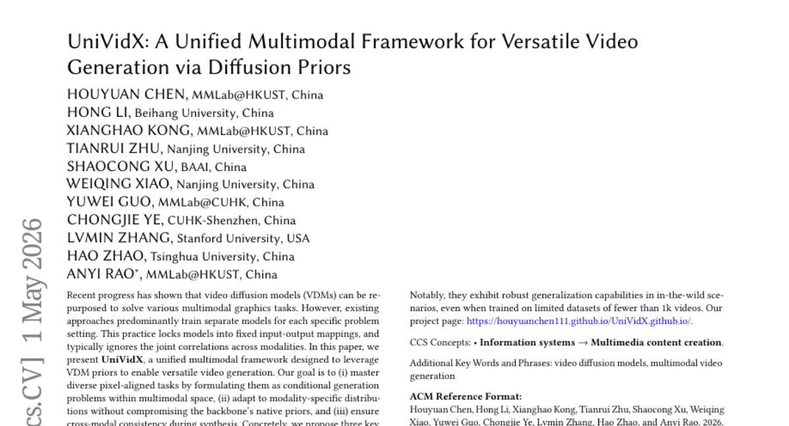

### 📌 한 줄 요약
단일 비디오 확산 모델(VDM)을 활용하여 다양한 멀티모달 비디오 생성 작업을 통합 처리하는 범용 프레임워크

### 🔑 핵심 포인트
- Stochastic Condition Masking (SCM): 학습 시 모달리티를 무작위로 조건 또는 타겟으로 분할하여 양방향 조건부 생성을 가능케 함
- Decoupled Gated LoRA (DGL): 모달리티별 전용 LoRA를 도입하여 VDM의 기본 지식을 유지하면서 특정 모달리티 생성 성능을 최적화
- Cross-Modal Self-Attention (CMSA): 모달리티 간 Key/Value를 공유하여 정보 교환 및 정렬을 촉진하는 구조

### 🧑‍💻 개발자 관점
하나의 모델로 비디오 편집, 레이어 분리, 속성 생성 등 다양한 태스크를 통합 관리할 수 있어 모델 관리 비용과 데이터 효율성을 크게 높일 수 있습니다.

### 🚀 실무 적용 아이디어
- 제공된 SCM 기법을 기존 Diffusion 모델 학습 파이프라인에 적용하여 양방향 생성 테스트
- LoRA를 활용한 멀티모달 데이터셋(RGB-Depth 등)의 통합 학습 실험
- 적은 수의 비디오 데이터(1,000개 미만)를 활용한 Zero-shot/Few-shot 일반화 성능 검증

### ⚠️ 리스크/한계
- 모달리티 수가 급격히 늘어날 경우 CMSA 구조의 연산 복잡도 증가 가능성
- 매우 복잡한 고해상도 비디오 생성 시 단일 모델의 용량 한계 발생 가능성

### 📝 초록 기반 상세 설명
최근 비디오 확산 모델(VDM)을 다양한 그래픽 작업에 활용하려는 시도가 있으나, 기존 방식은 각 작업마다 별도의 모델을 학습시켜 입력-출력 매핑이 고정되고 모달리티 간 상관관계 학습이 어렵다는 문제가 있었습니다. 이를 해결하기 위해 본 논문은 VDM의 사전 학습된 지식을 활용하는 통합 프레임워크인 UniVidX를 제안합니다. SCM을 통해 조건부 생성과 타겟 생성을 유연하게 전환하고, DGL로 모달리티별 특성을 보존하며, CMSA를 통해 모달리티 간 정렬을 유도합니다. 이를 통해 RGB 영상과 intrinsic map(albedo, normal 등) 또는 RGBA 레이어 생성과 같은 복잡한 작업을 하나의 모델로 수행합니다. 실험 결과, 적은 데이터셋으로도 기존 SOTA 모델들과 경쟁력 있는 성능을 보이며 뛰어난 일반화 능력을 입증했습니다.

---

## 2. [Web2BigTable: A Bi-Level Multi-Agent LLM System for Internet-Scale Information Search and Extraction](https://huggingface.co/papers/2604.27221)
**Upvotes**: 25 | **도입 난이도**: 상 | **신뢰도**: 상
**arXiv**: https://arxiv.org/abs/2604.27221

**태그**: Multi-Agent, Web-Search, Information-Extraction, Automation, Agent, RAG, Reasoning

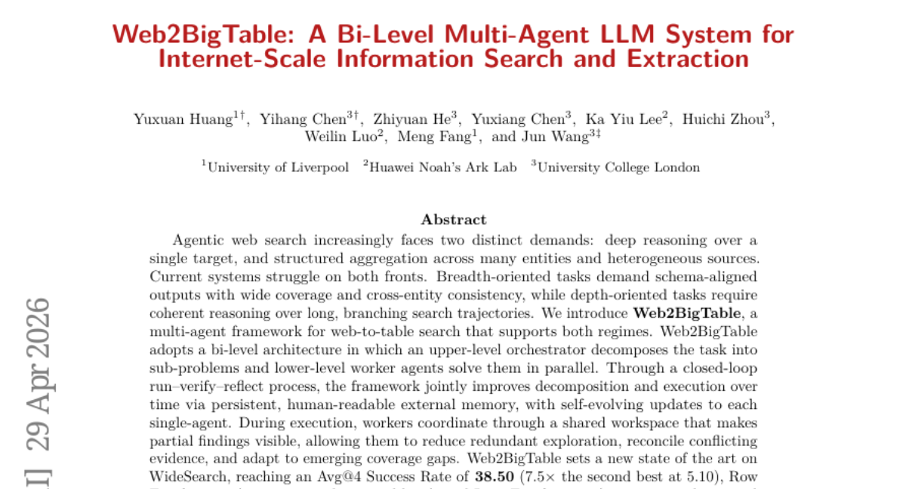

### 📌 한 줄 요약
대규모 웹 데이터에서 구조화된 테이블을 추출하기 위해 오케스트레이터와 워커 에이전트가 협업하는 이중 계층 멀티 에이전트 프레임워크

### 🔑 핵심 포인트
- 이중 계층 아키텍처: 문제 분해(Orchestrator)와 병렬 실행(Worker)의 분리
- 폐쇄 루프 피드백: Run-Verify-Reflect 과정을 통한 자기 진화형 에이전트 업데이트
- 공유 워크스페이스: 에이전트 간 정보 가시성을 통한 중복 제거 및 데이터 정합성 확보

### 🧑‍💻 개발자 관점
대규모 웹 데이터로부터 정형화된 데이터베이스(Table)를 구축해야 하는 데이터 엔지니어링 및 자동화 워크플로우에 직접적인 영감을 제공합니다.

### 🚀 실무 적용 아이디어
- 제공된 GitHub 코드를 활용하여 특정 도메인(예: 금융, 이커머스) 데이터 추출 테스트
- 에이전트 간 공유 워크스페이스의 데이터 충돌 해결 로직 분석
- 단일 에이전트 대비 멀티 에이전트 구조의 비용-성능 효율성 측정

### ⚠️ 리스크/한계
- 멀티 에이전트 협업 과정에서 발생하는 높은 API 호출 비용 및 지연 시간(Latency)
- 복잡한 오케스트레이션 로직으로 인한 시스템 디버깅 및 제어의 어려움

### 📝 초록 기반 상세 설명
기존의 에이전트 기반 웹 검색 시스템은 광범위한 정보 수집과 심층적인 추론이라는 두 가지 상충하는 요구사항을 동시에 충족하는 데 어려움이 있었습니다. 이를 해결하기 위해 Web2BigTable는 상위 오케스트레이터가 문제를 분해하고 하위 워커 에이전트가 병렬로 실행하는 이중 계층 아키텍처를 제안합니다. 시스템은 '실행-검증-성찰'의 폐쇄 루프 과정을 통해 외부 메모리를 활용하며, 에이전트 간 공유 워크스페이스를 통해 중복 탐색을 방지하고 상충하는 정보를 조정합니다. 실험 결과, WideSearch 및 XBench-DeepSearch 벤치마크에서 기존 SOTA 모델들을 압도하는 성능을 기록하며 광범위한 검색과 심층 추론 능력을 모두 입증했습니다.

---

## 3. [Map2World: Segment Map Conditioned Text to 3D World Generation](https://huggingface.co/papers/2605.00781)
**Upvotes**: 11 | **도입 난이도**: 중 | **신뢰도**: 상
**arXiv**: https://arxiv.org/abs/2605.00781

**태그**: 3D Generation, Computer Vision, Scene Synthesis, Generative AI, RAG

### 📌 한 줄 요약
사용자 정의 세그먼트 맵을 기반으로 일관된 스케일과 정교한 디테일을 갖춘 대규모 3D 월드를 생성하는 프레임워크

### 🔑 핵심 포인트
- 임의의 형태와 스케일을 가진 세그먼트 맵 기반의 3D 월드 생성 기술
- 전역적 스케일 일관성 및 장면 일관성을 유지하는 디테일 인핸서 네트워크
- 에셋 생성기 사전 지식 활용을 통한 데이터 효율성 및 도메인 일반화 확보

### 🧑‍💻 개발자 관점
게임 엔진이나 시뮬레이션 환경 구축 시, 단순한 그리드를 넘어 복잡하고 거대한 3D 환경을 제어 가능한 형태로 빠르게 생성할 수 있습니다.

### 🚀 실무 적용 아이디어
- 제공된 세그먼트 맵 형태에 따른 생성 결과의 왜곡 여부 테스트
- 대규모 환경 생성 시 객체 간 스케일 일관성 검증
- 특정 도메인(예: 도시, 자연)에 대한 에셋 생성기 결합 성능 실험

### ⚠️ 리스크/한계
- 세그먼트 맵의 복잡도에 따른 생성 품질의 가변성
- 에셋 생성기(Asset Generator)의 품질에 의존적인 결과물

### 🖼️ 추가 자료

---

## 4. [Prox-E: Fine-Grained 3D Shape Editing via Primitive-Based Abstractions](https://huggingface.co/papers/2604.23774)
**Upvotes**: 11 | **도입 난이도**: 중 | **신뢰도**: 상
**arXiv**: https://arxiv.org/abs/2604.23774

**태그**: 3D Generation, Computer Vision, VLM, Geometry, Vision

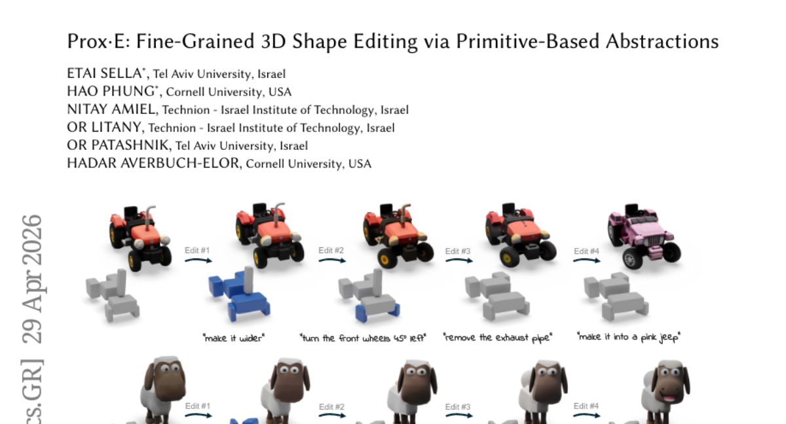

### 📌 한 줄 요약
기하학적 프리미티브 추상화를 통해 객체의 정체성을 유지하면서 정교한 3D 구조 편집을 가능하게 하는 프레임워크

### 🔑 핵심 포인트
- 프리미티브 기반의 명시적 기하학적 추상화 도입
- VLM을 활용한 텍스트 기반의 정교한 구조 편집 제어
- 학습이 필요 없는(Training-free) 효율적인 3D 편집 파이프라인

### 🧑‍💻 개발자 관점
기존 2D 기반 3D 편집의 고질적 문제인 '형태 왜곡'을 구조적 추상화로 해결하여, 실무적인 3D 에셋 수정 워크플로우에 적용 가능합니다.

### 🚀 실무 적용 아이디어
- 복잡한 메쉬 구조가 프리미티브로 얼마나 정확하게 추상화되는지 테스트
- VLM의 편집 지시가 실제 3D 구조 변화로 변환되는 정밀도 검증
- 기존 2D-to-3D 파이프라인과의 생성 속도 및 품질 비교

### ⚠️ 리스크/한계
- 복잡도가 매우 높은 비정형 객체의 경우 프리미티브 추상화 오차 발생 가능성
- 프리미티브 개수에 따른 편집의 세밀도와 연산 비용 간의 트레이드오프

### 📝 초록 기반 상세 설명
최근 2D 기반 3D 편집 기술이 발전했으나, 객체의 전체적인 정체성을 유지하면서 국소적인 구조를 변경하는 정교한 편집에는 한계가 있었습니다. 이를 해결하기 위해 본 논문은 프레임워크인 Prox-E를 제안합니다. 이 방식은 3D 형상을 압축된 기하학적 프리미티브 세트로 추상화한 뒤, 사전 학습된 VLM을 통해 프리미티브 수준의 편집을 수행합니다. 이렇게 생성된 구조적 편집 정보는 3D 생성 모델을 가이드하여, 기존 형태를 보존하면서도 정밀한 국소 수정을 가능하게 합니다. 실험 결과, 기존 2D 기반 및 학습 기반 방식보다 정체성 보존, 품질, 지시 이행 측면에서 우수한 성능을 보였습니다.

### 🖼️ 추가 자료
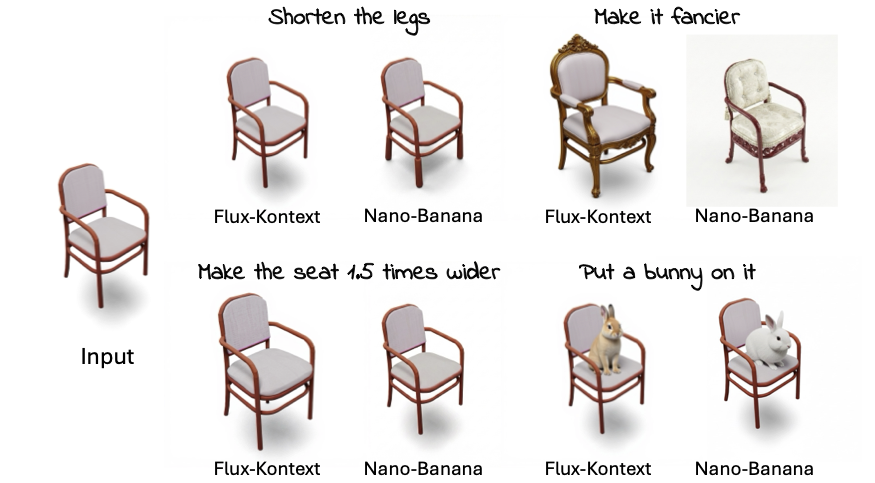
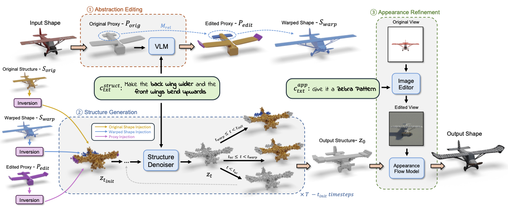
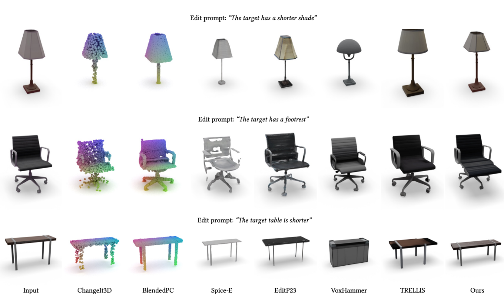

---

## 5. [Learning while Deploying: Fleet-Scale Reinforcement Learning for Generalist Robot Policies](https://huggingface.co/papers/2605.00416)
**Upvotes**: 9 | **도입 난이도**: 상 | **신뢰도**: 상
**arXiv**: https://arxiv.org/abs/2605.00416

**태그**: Reinforcement Learning, Robot Policy, VLA, Fleet Learning, Continual Learning, RAG, Vision

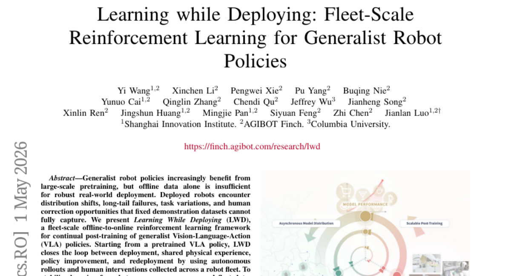

### 📌 한 줄 요약
배포 중 수집되는 플릿(Fleet) 데이터를 활용해 범용 로봇 정책을 지속적으로 개선하는 오프라인-온라인 강화학습 프레임워크

### 🔑 핵심 포인트
- 배포-경험 공유-정책 개선-재배포로 이어지는 폐쇄 루프(Closed-loop) 플릿 학습 프레임워크 제안
- 이질적이고 희소한 플릿 데이터를 안정적으로 학습하기 위한 DIVL 및 QAM 알고리즘 도입
- 사전 학습된 VLA 정책을 실세계의 다양한 작업에 맞춰 지속적으로 최적화하는 능력 검증

### 🧑‍💻 개발자 관점
실제 환경에 배포된 로봇이 새로운 상황을 만날 때마다 데이터를 수집하고 이를 다시 모델 성능 향상으로 연결하는 자동화된 파이프라인 구축 모델을 제시합니다.

### 🚀 실무 적용 아이디어
- 사전 학습된 VLA 모델에 소규모 로봇 환경에서 데이터 수집 및 재학습 루프 구현 테스트
- 인간 개입(Human intervention) 데이터가 포함된 데이터셋에서의 정책 안정성 실험
- Sparse reward 환경에서의 DIVL/QAM 알고리즘 성능 비교 실험

### ⚠️ 리스크/한계
- 실제 로봇 배포 시 발생하는 데이터 편향이 정책의 특정 상황 과적합을 유발할 위험
- 플릿 규모가 커질수록 데이터 정제 및 학습 안정성 유지 비용 증가

### 📝 초록 기반 상세 설명
범용 로봇 정책은 대규모 사전 학습의 이점을 얻지만, 고정된 오프라인 데이터만으로는 실제 배포 시 발생하는 분포 변화와 예외 상황에 대응하기 어렵습니다. 이를 해결하기 위해 본 논문은 배포 중 수집된 경험을 정책 개선과 재배포로 연결하는 'Learning While Deploying (LWD)' 프레임워크를 제안합니다. LWD는 사전 학습된 VLA 정책을 기반으로 로봇 플릿에서 발생하는 자율 실행 및 인간 개입 데이터를 통합하여 지속적인 사후 학습을 수행합니다. 학습 안정성을 위해 DIVL(Distributional Implicit Value Learning)과 QAM(Q-learning via Adjoint Matching)을 결합하여 이질적이고 희소한 데이터 환경에서도 효과적인 정책 추출을 가능하게 합니다. 16대의 로봇 플릿을 활용한 실험 결과, 데이터가 축적됨에 따라 범용 정책의 성공률이 향상되었으며 특히 장기 작업(Long-horizon tasks)에서 큰 성과를 보였습니다.

---

## 6. [Let ViT Speak: Generative Language-Image Pre-training](https://huggingface.co/papers/2605.00809)
**Upvotes**: 9 | **도입 난이도**: 중 | **신뢰도**: 상
**arXiv**: https://arxiv.org/abs/2605.00809

**태그**: Vision-Language, Pretraining, LLM, Generative-AI, Multimodal, Vision, Benchmark

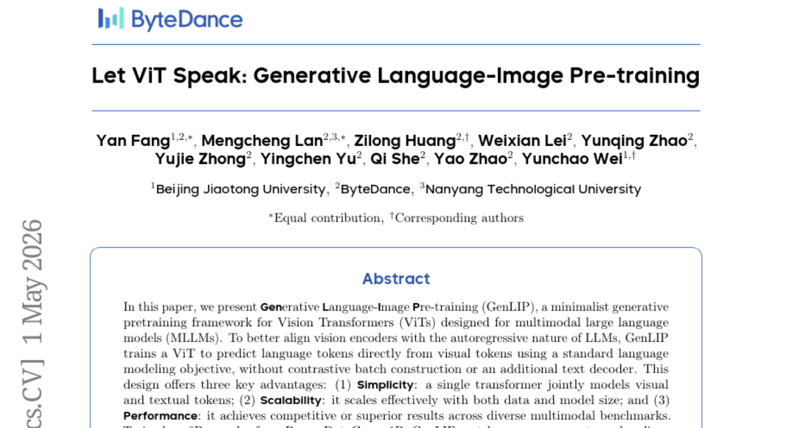

### 📌 한 줄 요약
LLM의 자기회귀(Autoregressive) 특성에 최적화된 단순하고 강력한 생성형 비전 트랜스포머(ViT) 사전학습 프레임워크

### 🔑 핵심 포인트
- 단일 트랜스포머를 통한 시각/텍스트 토큰의 통합 모델링 (Simplicity)
- 대조 학습 없이 언어 모델링 목적 함수만 사용하는 생성형 정렬 방식
- 데이터 및 모델 크기 확장이 용이한 높은 확장성 (Scalability)

### 🧑‍💻 개발자 관점
복잡한 대조 학습 구조 없이도 LLM에 즉시 통합 가능한 효율적인 비전 인코더를 구축할 수 있는 방법론을 제시합니다.

### 🚀 실무 적용 아이디어
- 제시된 생성형 목적 함수를 기존 ViT 모델에 적용하여 정렬 성능 비교
- 다양한 종횡비(Aspect Ratio) 학습이 OCR 성능에 미치는 영향 검증
- LLM의 입력 토큰으로 GenL립 비전 토큰을 직접 주입하는 파이프라인 구축

### ⚠️ 리스크/한계
- 생성형 방식 특성상 대조 학습 대비 정교한 특징 추출 능력이 다를 수 있음
- 고해상도 학습 시 연산 비용 증가 가능성

### 📝 초록 기반 상세 설명
기존의 멀티모달 모델들은 비전 인코더와 언어 모델 간의 정렬을 위해 복잡한 대조 학습(Contrastive Learning)이나 별도의 텍스트 디코더를 필요로 했습니다. 이를 해결하기 위해 GenLIP는 단일 트랜스포머 구조 내에서 시각적 토큰으로부터 언어 토큰을 직접 예측하는 생성형 사전학습 방식을 제안합니다. 이 방식은 별도의 배치 구성 없이 언어 모델링 목적 함수만을 사용하여 비전 인코더를 LLM의 특성에 맞게 정렬합니다. 실험 결과, GenLIP는 훨씬 적은 데이터로도 기존의 강력한 베이스라인 모델들과 대등하거나 더 뛰어난 성능을 보였습니다. 특히 다양한 해상도 학습을 통해 OCR 및 차트 이해와 같은 세부 정보가 중요한 작업에서도 높은 성능을 입증했습니다.

### 🖼️ 추가 자료
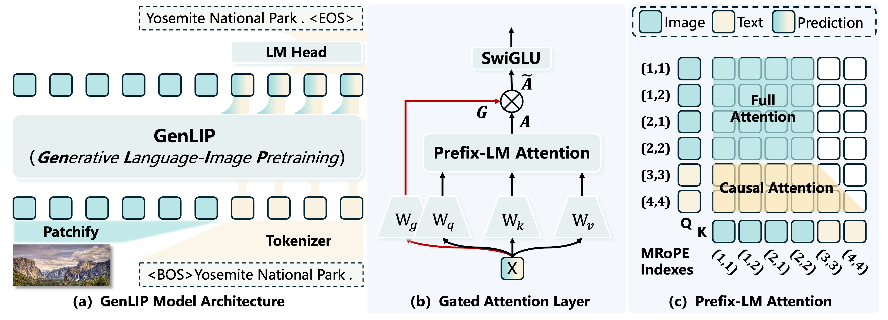

---

## 7. [Stable-GFlowNet: Toward Diverse and Robust LLM Red-Teaming via Contrastive Trajectory Balance](https://huggingface.co/papers/2605.00553)
**Upvotes**: 9 | **도입 난이도**: 중 | **신뢰도**: 상
**arXiv**: https://arxiv.org/abs/2605.00553

**태그**: LLM Security, Red-Teaming, GFlowNet, Adversarial Attack, Safety

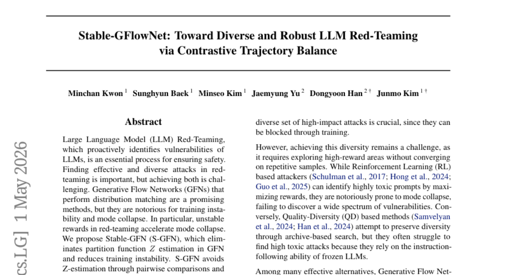

### 📌 한 줄 요약
GFlowNet의 학습 불안정성을 해결하여 LLM 레드팀 공격의 다양성과 강건성을 동시에 확보한 프레임워크

### 🔑 핵심 포인트
- 파티션 함수(Z) 추정 제거를 통한 학습 안정성 확보
- 노이즈가 섞인 보상에 대응하는 강건한 마스킹 방법론 적용
- 로컬 옵티마(Gibberish 생성) 방지를 위한 유창성 안정화(Fluency Stabilizer) 도입

### 🧑‍💻 개발자 관점
LLM 보안 테스트 시 특정 공격 패턴에만 매몰되지 않고, 창의적이고 다양한 취약점 탐색이 필요한 경우 실무적인 가이드가 됩니다.

### 🚀 실무 적용 아이디어
- 기존 GFlowNet 기반 공격 모델과 S-GFN의 공격 다양성(Diversity) 지표 비교 실험
- 노이즈가 심한 보상 환경(Noisy Reward)에서의 모델 강건성 테스트
- 생성된 공격 문장의 유창성 및 실제 공격 성공률 간의 상관관계 분석

### ⚠️ 리스크/한계
- 보상 함수 설계에 따라 여전히 특정 공격 패턴으로 수렴할 가능성 존재
- 유창성 유지와 공격 성공률 사이의 트레이드오프 발생 가능성

### 📝 초록 기반 상세 설명
LLM의 안전성을 확보하기 위한 레드팀 공격에서 효과적이고 다양한 공격 패턴을 찾는 것은 매우 중요합니다. 기존의 GFlowNet 방식은 학습 불안정성과 모드 붕괴(mode collapse) 문제로 인해 다양한 공격을 생성하는 데 한계가 있었습니다. 특히 레드팀 환경의 불안정한 보상 체계는 이러한 문제를 더욱 심화시킵니다. 본 논문은 파티션 함수(Z) 추정을 제거하고 페어와이즈 비교와 마스킹 기법을 도입한 Stable-GFN(S-GFN)을 제안합니다. 또한, 의미 없는 문장 생성을 방지하기 위한 유창성 안정화 장치를 포함합니다. 실험 결과, S-GFN은 기존 방식보다 뛰어난 공격 성능과 높은 다양성을 동시에 달성했습니다.

---

## 8. [From Skill Text to Skill Structure: The Scheduling-Structural-Logical Representation for Agent Skills](https://huggingface.co/papers/2604.24026)
**Upvotes**: 9 | **도입 난이도**: 중 | **신뢰도**: 상
**arXiv**: https://arxiv.org/abs/2604.24026

**태그**: LLM-Agent, Skill-Management, Knowledge-Representation, Agent, RAG, Reasoning, Evaluation

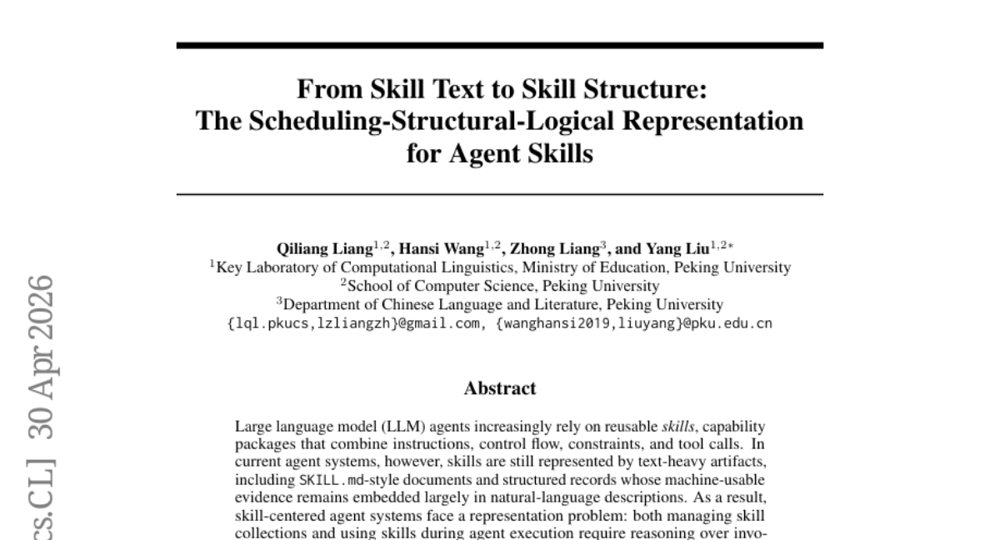

### 📌 한 줄 요약
텍스트 중심의 에이전트 스킬을 스케줄링·구조·로직으로 분리하여 기계가 이해하기 쉬운 구조적 표현(SSL)으로 변환하는 방법론

### 🔑 핵심 포인트
- 텍스트에 얽혀 있는 스킬 정보를 스케줄링(Scheduling), 구조(Structural), 로직(Logical)의 세 계층으로 분리
- LLM 기반 정규화기를 통한 구조적 스킬 표현(SSL) 모델 제안
- 스킬 탐색(MRR 향상) 및 리스크 평가(F1 향상) 작업에서의 성능 검증

### 🧑‍💻 개발자 관점
에이전트가 복잡한 스킬 라이브러리를 관리할 때, 단순 텍스트 검색이 아닌 실행 흐름과 제약 조건을 명확히 파악하여 정확한 스킬 호출과 안전한 실행을 가능하게 합니다.

### 🚀 실무 적용 아이디어
- 기존의 .md 형식 스킬 문서를 SSL 프레임워크로 변환하는 파이프라인 구축 실험
- 에이전트가 스킬을 선택할 때 SSL 구조 정보가 호출 정확도에 미치는 영향 측정
- 복잡한 워크플로우 내에서 SSL 기반 스킬의 충돌 및 리스크 감지 테스트

### ⚠️ 리스크/한계
- LLM 기반 정규화 과정에서 발생할 수 있는 정보 손실 또는 왜곡 가능성
- 표준화된 스키마가 아닌 실용적 단계로서의 제안이므로 범용적인 표준 적용 시 추가 연구 필요

### 📝 초록 기반 상세 설명
최근 LLM 에이전트는 재사용 가능한 스킬에 의존하고 있으나, 대부분의 스킬이 텍스트 중심의 문서 형태로 존재하여 기계가 실행 구조나 부작용을 파악하기 어렵다는 문제가 있습니다. 이를 해결하기 위해 본 논문은 스케줄링 신호, 실행 구조, 논리적 액션/자원 사용을 분리하는 SSL(Scheduling-Structural-Logical) 표현 방식을 제안합니다. 제안된 SSL은 LLM 기반 정규화기를 통해 구현되었으며, 스킬 탐색(Skill Discovery)과 리스크 평가(Risk Assessment) 작업에서 기존 텍스트 기반 방식보다 우수한 성능을 보였습니다. 실험 결과, 명시적인 구조화가 스킬 검색과 검토 효율을 높임을 입증했습니다. 이는 에이전트 시스템을 위한 더 검사 가능하고 재사용 가능한 스킬 표준을 향한 실질적인 단계로 평가됩니다.

---

## 9. [When Do Diffusion Models learn to Generate Multiple Objects?](https://huggingface.co/papers/2605.00273)
**Upvotes**: 4 | **도입 난이도**: 하 | **신뢰도**: 상
**arXiv**: https://arxiv.org/abs/2605.00273

**태그**: Diffusion Models, Multi-Object Generation, Dataset Design, Compositional Generalization, Vision

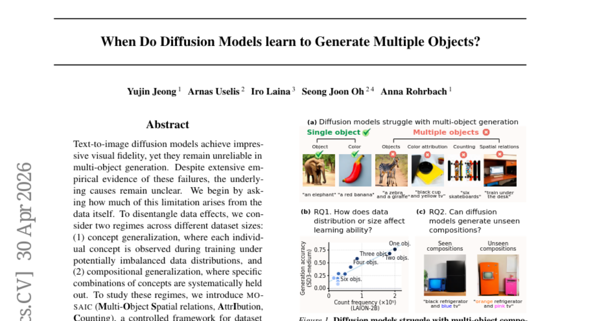

### 📌 한 줄 요약
확산 모델의 다중 객체 생성 실패 원인이 데이터 불균형보다 장면 복잡도와 조합 일반화 능력 부족에 있음을 규명함

### 🔑 핵심 포인트
- 데이터 불균형보다 장면 복잡도가 다중 객체 생성 실패의 핵심 요인임을 확인
- 데이터 규모가 작을 때 '개수 세기(counting)' 작업이 특히 취약함을 규명
- 학습 시 특정 개념 조합이 누락될 경우 발생하는 조합 일반화(compositional generalization)의 붕괴 현상 발견

### 🧑‍💻 개발자 관점
복잡한 장면을 생성하는 AI 서비스를 개발할 때, 단순히 데이터 양을 늘리는 것보다 객체 간 관계와 조합을 고려한 정교한 데이터 설계가 필수적임을 시사합니다.

### 🚀 실무 적용 아이디어
- 학습 데이터셋 구축 시 객체 간의 조합(composition)을 다양하게 포함하는 전략 수립
- 모델의 '개수 세기' 및 '공간 관계' 이해도를 측정하기 위한 벤치마크 테스트 수행
- 데이터셋의 복잡도와 생성 성능 간의 상관관계 분석 실험

### ⚠️ 리스크/한계
- 제시된 mosaic 프레임워크가 실제 자연어 데이터의 복잡성을 완벽히 대변하는지에 대한 의문
- 모델 구조 자체의 한계보다는 데이터 설계 관점의 해결책에 집중되어 있음

### 📝 초록 기반 상세 설명
텍스트-이미지 확산 모델은 높은 품질에도 불구하고 여러 객체를 동시에 생성하는 데 어려움을 겪습니다. 본 연구는 이러한 한계가 데이터 자체에서 기인하는지 분석하기 위해 두 가지 학습 시나리오를 설정했습니다. 이를 위해 제어 가능한 데이터셋 생성 프레임워크인 'mosaic'를 도입하여 실험을 진행했습니다. 연구 결과, 개념의 불균형보다는 장면의 복잡도가 생성 실패의 주된 요인이며, 데이터가 적을 때는 특히 개수 세기(counting) 학습이 어렵다는 것을 발견했습니다. 또한, 학습 시 특정 조합을 제외할 경우 조합 일반화 능력이 급격히 저하됨을 확인했습니다. 이러한 결과는 향후 강건한 다중 객체 생성을 위한 인덕티브 바이어스 및 데이터 설계의 필요성을 시사합니다.

---

## 10. [Trees to Flows and Back: Unifying Decision Trees and Diffusion Models](https://huggingface.co/papers/2605.00414)
**Upvotes**: 3 | **도입 난이도**: 중 | **신뢰도**: 중
**arXiv**: https://arxiv.org/abs/2605.00414

**태그**: Benchmark, Distillation

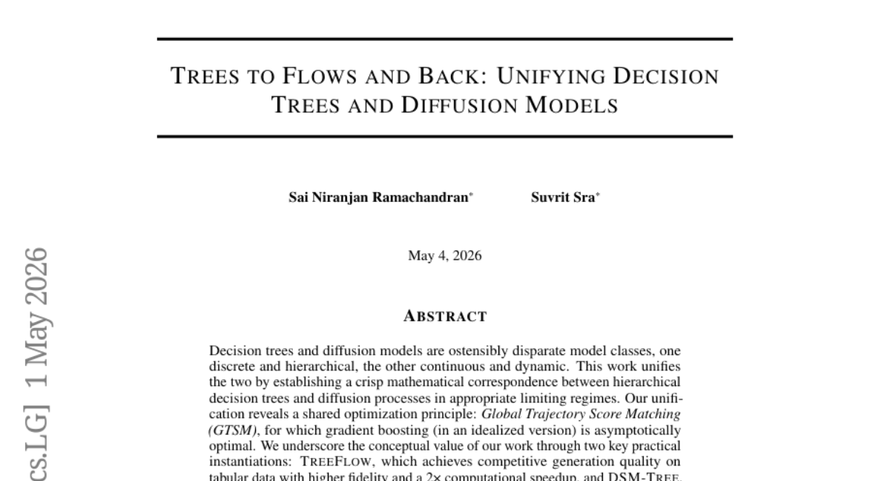

### 📌 한 줄 요약
자세한 분석 내용은 원문 또는 arXiv 링크를 참고해 주세요.

### 🔑 핵심 포인트
- 논문 원문을 확인하시기 바랍니다.

### 📝 초록 기반 상세 설명
상세 초록은 원문 페이지에서 확인 가능합니다.

---

## 11. [End-to-End Autoregressive Image Generation with 1D Semantic Tokenizer](https://huggingface.co/papers/2605.00503)
**Upvotes**: 2 | **도입 난이도**: 상 | **신뢰도**: 상
**arXiv**: https://arxiv.org/abs/2605.00503

**태그**: Generative AI, Computer Vision, Autoregressive Model, Image Generation, RAG, Vision

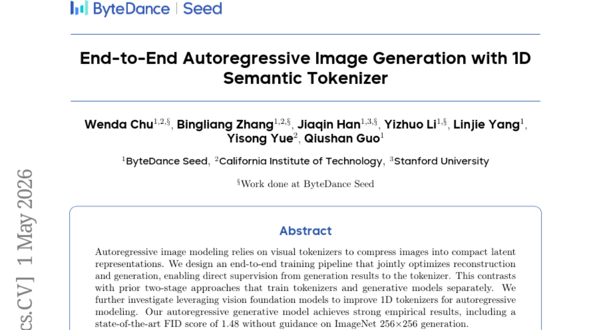

### 📌 한 줄 요약
토크나이저와 생성 모델을 통합 최적화하여 ImageNet에서 SOTA 성능을 달성한 엔드투엔드 자기회귀 이미지 생성 모델

### 🔑 핵심 포인트
- 재구성과 생성을 동시에 최적화하는 엔드투엔드 학습 프레임워크 설계
- 기존 2단계 방식(Two-stage)의 한계를 극복하기 위한 통합 최적화 전략
- 비전 파운데이션 모델을 활용한 1D 시맨틱 토크나이저 성능 향상

### 🧑‍💻 개발자 관점
토크나이저와 생성 모델을 분리하지 않고 통합 학습함으로써 생성 품질을 극대화하는 새로운 워크플로우를 제시합니다.

### 🚀 실무 적용 아이디어
- 제안된 엔드투엔드 학습 파이프라인의 수렴 안정성 테스트
- 기존 2단계 방식 대비 학습 비용 및 시간 효율성 비교
- 다양한 비전 파운데이션 모델을 적용한 토크나이저 성능 변화 관찰

### ⚠️ 리스크/한계
- 통합 학습 시 발생할 수 있는 학습 불안정성 및 높은 연산 비용
- 특정 데이터셋(ImageNet)에 최적화된 결과일 가능성

### 📝 초록 기반 상세 설명
기존의 자기회귀 이미지 생성 방식은 토크나이저와 생성 모델을 별도로 학습시키는 2단계 방식을 주로 사용했습니다. 이로 인해 두 모델 간의 최적화 불일치 문제가 발생할 수 있습니다. 본 논문은 재구성(reconstruction)과 생성(generation)을 동시에 최적화하는 엔드투엔드 학습 파이프라인을 제안합니다. 또한 비전 파운데이션 모델을 활용하여 1D 시맨틱 토크나이저의 성능을 높이는 방법을 연구했습니다. 실험 결과, ImageNet 256x256 생성 작업에서 가이드 없이도 매우 낮은 FID 점수를 기록하며 뛰어난 성능을 입증했습니다.

---

## 12. [Online Self-Calibration Against Hallucination in Vision-Language Models](https://huggingface.co/papers/2605.00323)
**Upvotes**: 1 | **도입 난이도**: 상 | **신뢰도**: 상
**arXiv**: https://arxiv.org/abs/2605.00323

**태그**: LVLM, Hallucination, DPO, Self-Learning, MCTS, RAG, Multimodal, Vision, Benchmark, Distillation, Safety

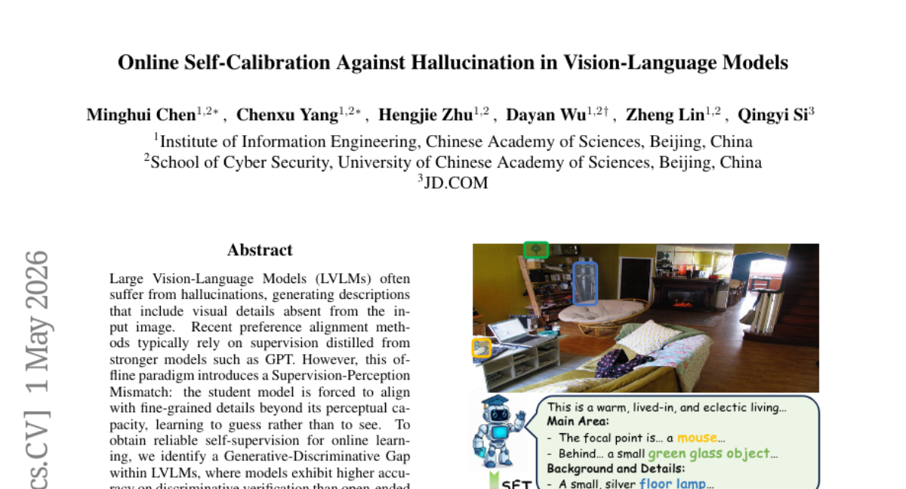

### 📌 한 줄 요약
모델의 인지 능력에 맞춘 온라인 자기 교정(Self-Calibration)을 통해 시각적 환각(Hallucination) 문제를 해결하는 프레임워크

### 🔑 핵심 포인트
- 감독-지각 불일치(Supervision-Perception Mismatch) 문제 식별 및 해결
- 모델의 판별 능력을 활용한 온라인 자기 교정(OSCAR) 프레임워크 제안
- MCTS와 이중 입도 보상 메커니즘을 통한 정교한 선호도 데이터 구축

### 🧑‍💻 개발자 관점
외부 모델의 정답에 의존하는 오프라인 학습 대신, 모델 스스로의 인지 한계를 고려한 학습 방식을 통해 실질적인 환각 제어가 가능함을 보여줍니다.

### 🚀 실무 적용 아이디어
- 모델의 판별 능력과 생성 능력 간의 격차(Gap)를 정량적으로 측정해보기
- DPO 학습 시 외부 데이터 대신 모델 자체 생성 데이터의 비중 조절 실험
- MCTS 기반의 데이터 생성 루프가 학습 속도에 미치는 영향 분석

### ⚠️ 리스크/한계
- MCTS와 반복적 정교화 과정에 따른 높은 연산 비용 발생 가능성
- 모델의 인지 능력이 극도로 낮을 경우 자기 교정의 품질 저하 우려

### 📝 초록 기반 상세 설명
최근 LVLM은 강한 모델(GPT 등)의 데이터를 학습하는 과정에서 모델의 실제 인지 범위를 넘어서는 세부 사항까지 맞추려다 오히려 환각이 발생하는 '감독-지각 불일치' 문제를 겪습니다. 연구진은 모델이 생성 능력보다 판별(Discriminative) 능력이 더 높다는 '생성-판별 간극'에 주목했습니다. 이를 해결하기 위해 MCTS와 이중 입도 보상 메커학(Dual-Granularity Reward Mechanism)을 결합한 OSCAR 프레임워크를 제안합니다. 이 방식은 모델 스스로 선호도 데이터를 구축하고 DPO를 통해 반복적으로 정교화하는 온라인 학습 방식을 취합니다. 실험 결과, 환각 억제 성능에서 SOTA를 달성함과 동시에 일반적인 멀티모달 능력도 향상되었습니다.

---

## 13. [Learning to Act and Cooperate for Distributed Black-Box Consensus Optimization](https://huggingface.co/papers/2605.00691)
**Upvotes**: 1 | **도입 난이도**: 상 | **신뢰도**: 상
**arXiv**: https://arxiv.org/abs/2605.00691

**태그**: Multi-Agent, LLM, Distributed Optimization, Reinforcement Learning, Agent, Benchmark

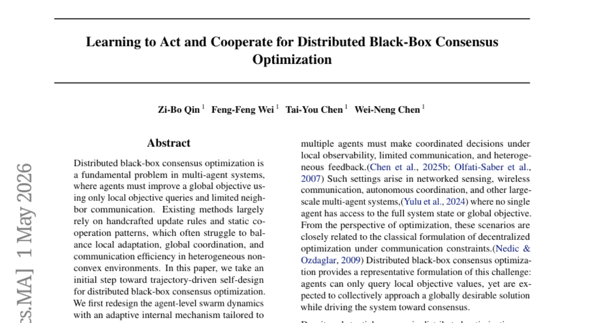

### 📌 한 줄 요약
LLM을 활용하여 분산 환경의 블랙박스 최적화 과정에서 에이전트의 행동과 협력 패턴을 스스로 설계하는 프레임워크 제안

### 🔑 핵심 포인트
- LLM을 활용한 궤적 기반의 분산 최적화 행동 및 협력 패턴 자동 설계
- 탐색, 수렴, 국소 해 탈출의 균형을 맞추는 적응형 에이전트 내부 역학 설계
- 자원 효율적인 최적화를 위한 단계별 인지 스케줄링(Phased Cognitive Scheduling) 전략

### 🧑‍💻 개발자 관점
수동으로 복잡한 분산 알고리즘을 설계하는 대신, LLM을 통해 최적화 궤적을 분석하고 동적으로 파라미터나 협력 규칙을 조정하는 새로운 워크플로우를 제시합니다.

### 🚀 실무 적용 아이디어
- LLM의 추론 비용과 최적화 수렴 속도 간의 트레이드오프 분석
- 다양한 네트워크 토폴로지 환경에서의 통신 효율성 검증
- 기존 수동 설계 알고리즘(Handcrafted rules)과의 성능 비교 실험

### ⚠️ 리스크/한계
- LLM 호출에 따른 높은 연산 비용 및 지연 시간 발생 가능성
- LLM의 가이드가 최적화 과정에서 불안정성을 초래할 위험

### 📝 초록 기반 상세 설명
분산 블랙박스 합의 최적화는 에이전트들이 국소적 정보와 제한된 통신만으로 전역 목표를 달성해야 하는 난제입니다. 기존 방식은 수동으로 설계된 업데이트 규칙과 정적인 협력 패턴에 의존하여 복잡한 비볼록(nonconvex) 환경에서의 효율성이 떨어지는 문제가 있었습니다. 본 논문에서는 궤적 기반의 자기 설계(self-design)를 위해 LLM이 과거 최적화 이력을 분석하여 행동과 협력 패턴을 가이드하는 LAC-MAS 프레임워크를 제안합니다. 또한, 자원 효율성을 위해 단계별 인지 스케줄링 전략을 도입하여 적응형 메커니즘을 제어합니다. 실험 결과, 제안 방식은 기존 베이스라인 대비 솔루션 품질, 수렴 속도, 통신 효율성 측면에서 우수한 성능을 보였습니다.

---

## 14. [Themis: Training Robust Multilingual Code Reward Models for Flexible Multi-Criteria Scoring](https://huggingface.co/papers/2605.00754)
**Upvotes**: 1 | **도입 난이도**: 중 | **신뢰도**: 상
**arXiv**: https://arxiv.org/abs/2605.00754

**태그**: Code Generation, Reward Model, LLM Alignment, Multilingual, Benchmark, Evaluation, Safety

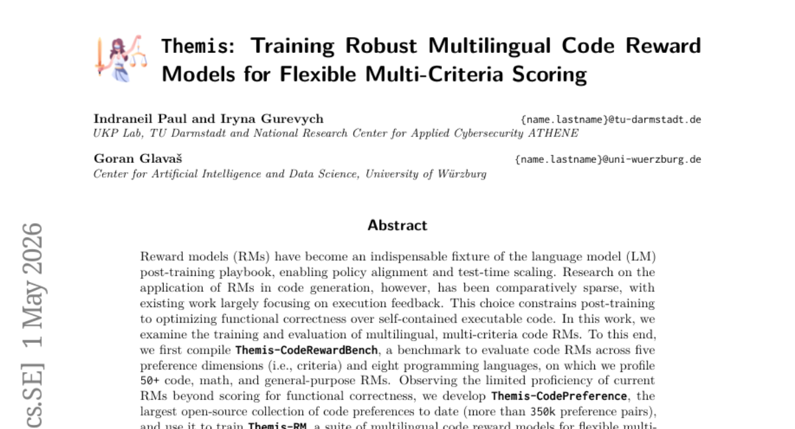

### 📌 한 줄 요약
다양한 프로그래밍 언어와 다중 기준(Multi-criteria)을 지원하는 강력한 멀티링구얼 코드 보상 모델(Themis-RM) 개발

### 🔑 핵심 포인트
- 다양한 기준(5개 차원)과 8개 언어를 지원하는 멀티링구얼 코드 보상 모델 개발
- 35만 개 이상의 대규모 코드 선호도 데이터셋(Themis-CodePreference) 구축
- 코드 RM 평가를 위한 벤치마크(Themis-CodeRewardBench) 제안

### 🧑‍💻 개발자 관점
단순히 코드가 실행되는지를 넘어, 가독성, 효율성 등 다양한 품질 기준을 자동 평가하여 코드 생성 모델을 정교하게 튜닝할 수 있습니다.

### 🚀 실무 적용 아이디어
- Themis-CodeRewardBench를 활용하여 현재 사용 중인 코드 생성 모델의 품질 프로파일링 수행
- 기능적 정확성 외에 스타일이나 효율성 기준을 포함한 다중 기준 학습 적용 테스트
- 다양한 프로그래밍 언어 환경에서의 보상 모델 전이 성능 검증

### ⚠️ 리스크/한계
- 다중 기준 학습 시 특정 기준(예: 가독성)이 다른 기준(예: 성능)을 저해할 가능성
- 대규모 데이터셋 구축 및 학습에 필요한 높은 컴퓨팅 자원 요구

### 📝 초록 기반 상세 설명
최근 LLM 포스트 트레이닝에서 보상 모델(RM)의 역할이 중요해졌으나, 코드 생성 분야에서는 주로 실행 결과(Functional Correctness)에만 집중되어 있었습니다. 본 연구는 기능적 정확성 외의 다양한 평가 기준을 충족하는 멀티링구얼 코드 RM의 필요성을 제기합니다. 이를 위해 5가지 기준과 8개 언어를 포함하는 벤치마크인 Themis-CodeRewardBench를 구축하고, 35만 개 이상의 데이터셋인 Themis-CodePreference를 개발했습니다. 이를 기반으로 600M에서 32B 파라미터 규모의 Themis-RM을 학습시켰습니다. 실험 결과, 다중 기준 학습이 신뢰할 수 있는 코드 보상 모델링에 필수적이며 강력한 교차 언어 전이 효과가 있음을 확인했습니다.

---

## 15. [LASE: Language-Adversarial Speaker Encoding for Indic Cross-Script Identity Preservation](https://huggingface.co/papers/2605.00777)
**Upvotes**: 1 | **도입 난이도**: 하 | **신뢰도**: 상
**arXiv**: https://arxiv.org/abs/2605.00777

**태그**: Speech Synthesis, Speaker Encoding, Multilingual, Adversarial Learning, Audio

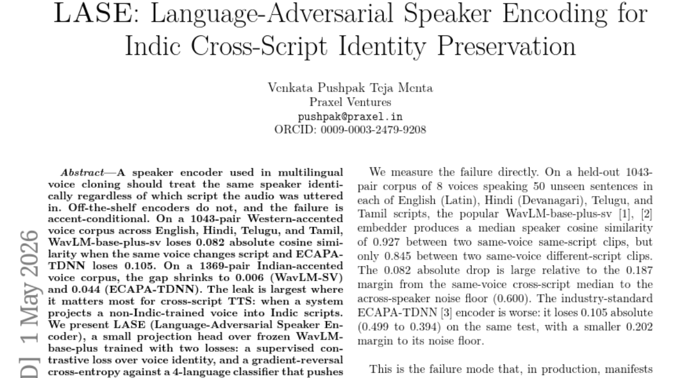

### 📌 한 줄 요약
언어/문자 변화에 관계없이 화자의 정체성을 일관되게 유지하는 적대적 학습 기반 스피커 인코더 기술

### 🔑 핵심 포인트
- 언어/문자 변화에 무관한 화자 임베딩을 위한 적대적 학습(GRL) 기법 도입
- WavLM 기반의 경량화된 프로젝션 헤드 구조 설계
- 적은 학습 데이터로도 높은 크로스 스크립트(Cross-script) 화자 재현 성능 확보

### 🧑‍💻 개발자 관점
다국어 TTS 시스템 구축 시, 특정 언어에서 학습된 목소리를 다른 언어 문자로 변환할 때 발생하는 목소리 변질 문제를 해결할 수 있습니다.

### 🚀 실무 적용 아이디어
- 제공된 r1 체크포인트를 기존 WavLM/ECAPA 모델과 성능 비교 실험
- 다양한 언어/악센트 혼합 데이터셋에서의 임베딩 클러스터링 시각화
- 소량의 합성 데이터로 학습 시의 강건성 테스트

### ⚠️ 리스크/한계
- 특정 언어군(Indic)에 최적화된 연구로, 다른 언어군에서의 일반화 성능 확인 필요
- 언어 정보를 제거하는 과정에서 화자 고유의 특징 일부가 손실될 가능성

### 📝 초록 기반 상세 설명
다국어 음성 합성 시 동일 화자가 다른 문자로 말하더라도 동일한 임베딩을 생성해야 하지만, 기존 인코더는 언어/악센트에 따라 화자 정보가 왜곡되는 문제가 있습니다. 특히 비인도계 음성을 인도계 문자로 변환할 때 정체성 손실이 크게 발생합니다. 이를 해결하기 위해 본 논문은 WavLM을 백본으로 하고, 화자 식별 손실과 언어 식별을 방해하는 Gradient Reversal Layer(GRL)를 결합한 LASE를 제안합니다. 실험 결과, LASE는 언어 간 정체성 격차를 거의 제로 수준으로 줄이면서도 기존 모델 대비 높은 식별 마진을 확보했습니다. 또한 매우 적은 양의 데이터로도 기존 모델 수준의 성능을 달성하며 효율성을 입증했습니다.

### 🖼️ 추가 자료
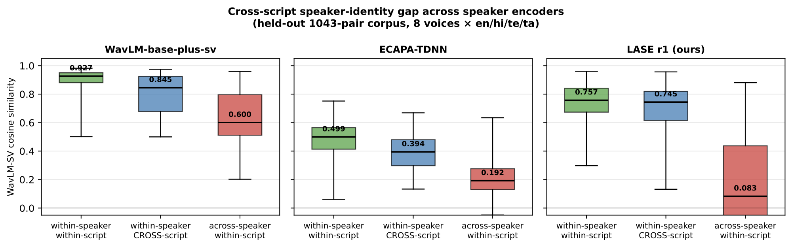
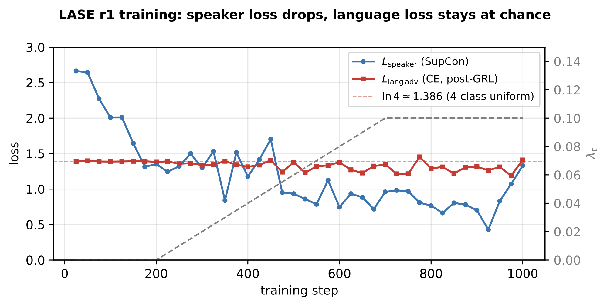

---

## 16. [Talker-T2AV: Joint Talking Audio-Video Generation with Autoregressive Diffusion Modeling](https://huggingface.co/papers/2604.23586)
**Upvotes**: 1 | **도입 난이도**: 상 | **신뢰도**: 상
**arXiv**: https://arxiv.org/abs/2604.23586

**태그**: Generative AI, Multimodal, Diffusion Model, Talking Head, Video, Audio, Benchmark

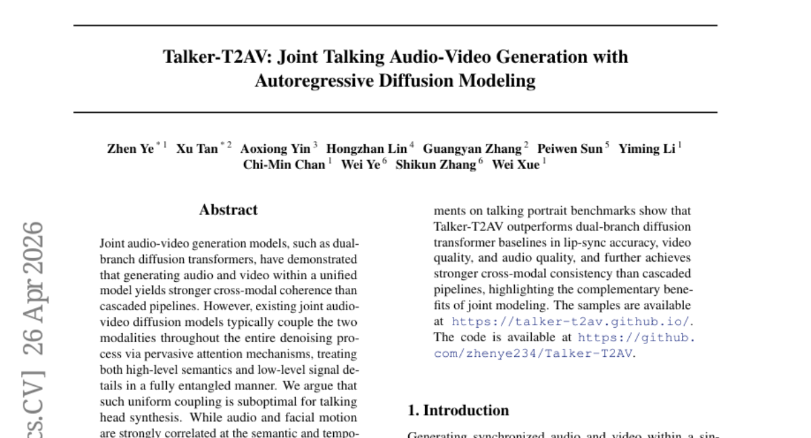

### 📌 한 줄 요약
고수준 의미는 공유하고 저수준 디테일은 분리하여 생성 효율과 일관성을 동시에 잡은 오토레그레시브 확산 모델 기반의 오디오-비디오 통합 생성 프레임워크

### 🔑 핵심 포인트
- 고수준 의미 공유 및 저수준 디테일 분리 구조를 통한 엔탱글먼트(Entanglement) 문제 해결
- 통합된 패치 토큰 공간을 사용하는 공유 오토레그레시브 언어 모델 도입
- 경량화된 모달리티별 확산 트랜스포머 헤드를 통한 효율적인 디코딩

### 🧑‍💻 개발자 관점
멀티모달 생성 시 발생하는 모달리티 간 간섭 문제를 구조적으로 해결하여, 립싱크 정확도와 영상 품질을 동시에 높이는 설계 패턴을 제시합니다.

### 🚀 실무 적용 아이디어
- 공유 백본과 개별 디코더 구조의 비중(ratio)에 따른 생성 품질 변화 실험
- 다양한 해상도 및 오디오 샘플링 레이트에서의 토큰화 효율성 검증
- 기존의 Cascaded(직렬) 방식과 비교한 추론 속도 및 메모리 점유율 벤치마크

### ⚠️ 리스크/한계
- 고수준 의미를 공유하는 과정에서 발생할 수 있는 모달리티 간 정보 편향 가능성
- 오토레그레시브 방식 특유의 긴 시퀀스 생성 시 연산 복잡도 증가 문제

### 📝 초록 기반 상세 설명
기존의 결합형 오디오-비디오 생성 모델은 모든 모달리티를 하나의 어텐션 메커니즘으로 묶어 처리함으로써 고수준 의미와 저수준 디테일이 복잡하게 얽히는 문제를 가집니다. 이는 서로 다른 렌더링 과정을 거치는 오디오와 비디오 특성을 고려할 때 효율성과 품질을 저해할 수 있습니다. 본 논문은 고수준 교차 모달 모델링은 공유 백본에서 수행하고, 저수준 정밀화는 모달리티별 디코더를 사용하는 Talker-T2AV를 제안합니다. 공유된 오토레그레시브 언어 모델이 통합된 패치 토큰 공간에서 오디오와 비디오를 공동 추론하며, 두 개의 경량 확산 트랜스포머 헤드가 각 모달리티의 잠재 변수를 생성합니다. 실험 결과, 제안 모델은 기존 이중 분기 방식보다 입술 동기화(lip-sync), 비디오 및 오디오 품질 면에서 우수한 성능을 보였습니다.

---

## 17. [AnalogRetriever: Learning Cross-Modal Representations for Analog Circuit Retrieval](https://huggingface.co/papers/2604.23195)
**Upvotes**: 1 | **도입 난이도**: 상 | **신뢰도**: 상
**arXiv**: https://arxiv.org/abs/2604.23195

**태그**: EDA, Multi-modal, RAG, Graph-Neural-Network, Agent, Vision, Evaluation

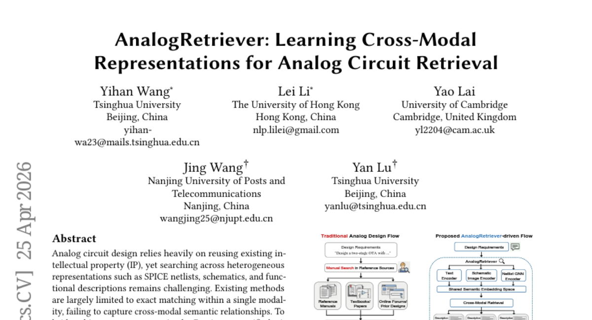

### 📌 한 줄 요약
스파이스(SPICE) 넷리스트, 회로도, 기능 설명을 통합 검색할 수 있는 멀티모달 아날로그 회로 검색 프레임워크

### 🔑 핵심 포인트
- 넷리스트 컴파일 성공률을 22%에서 100%로 끌어올린 2단계 데이터 복구 파이프라인 구축
- 비전-언어 모델과 포트 인식 GCN을 결합한 트리모달(Tri-modal) 통합 임베딩 공간 구현
- RAG(Retrieval-Augmented Generation) 모듈로서 에이전트 프레임워크의 기능적 성능 개선

### 🧑‍💻 개발자 관점
회로 설계 자동화(EDA) 분야에서 텍스트 설명만으로 관련 회로도나 넷리스트를 즉시 찾아낼 수 있는 검색 엔진의 기반 기술이 됩니다.

### 🚀 실무 적용 아이디어
- 제공될 데이터셋을 활용하여 기존 GNN 기반 회로 임베딩 모델과 성능 비교
- 특정 도메인(예: 전력 관리 IC)에 특화된 커스텀 데이터셋으로 전이 학습 실험
- LLM 에이전트와 결합하여 복잡한 회로 설계 태스크의 자동화 워크플로우 테스트

### ⚠️ 리스크/한계
- 고품질 데이터셋 구축을 위한 복잡한 전처리 파이프라인 의존성
- 회로의 복잡도가 증가할 경우 그래프 신경망의 스케일링 문제 발생 가능성

### 📝 초록 기반 상세 설명
아날로그 회로 설계 시 기존 IP 재사용이 중요하지만, 넷리스트, 회로도, 텍스트 등 서로 다른 형식 간의 검색은 매우 어렵습니다. 기존 방식은 단일 모달리티 내의 정확한 매칭에 국한되어 의미적 관계를 파악하지 못하는 한계가 있었습니다. 이를 해결하기 위해 본 논문은 세 가지 모달리티를 통합한 AnalogRetriever 프레임워크를 제안합니다. 먼저 데이터 정제 파이프라인을 통해 넷리스트 컴파일 성공률을 100%로 높인 고품질 데이터셋을 구축했습니다. 이후 비전-언어 모델과 포트 인식 그래프 신경망을 결합하여 모든 모달리티를 공유 임베딩 공간에 매핑하는 커리큘럼 대조 학습을 적용했습니다. 실험 결과, 모든 교차 모달리티 검색 방향에서 높은 Recall@1 성능을 기록했으며, RAG 기반 에이전트인 AnalogCoder에 통합 시 기능적 성공률을 크게 향상시켰습니다.

---

## 18. [Better Models, Faster Training: Sigmoid Attention for single-cell Foundation Models](https://huggingface.co/papers/2604.27124)
**Upvotes**: 0 | **도입 난이도**: 중 | **신뢰도**: 상
**arXiv**: https://arxiv.org/abs/2604.27124

**태그**: Attention Mechanism, Foundation Models, GPU Optimization, Deep Learning Stability

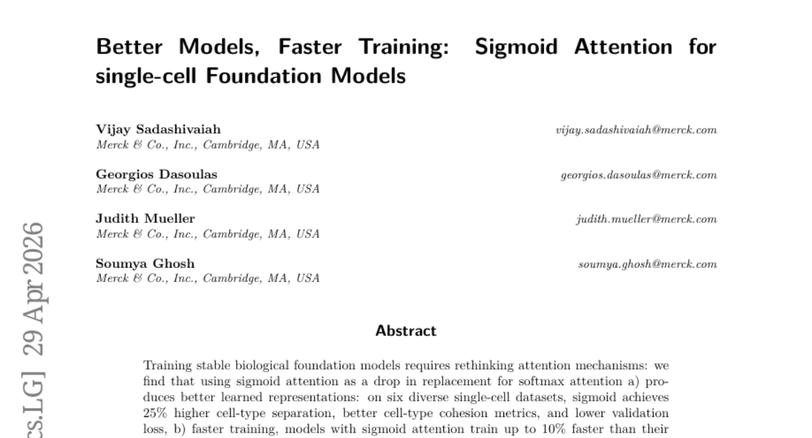

### 📌 한 줄 요약
Softmax 대신 Sigmoid Attention을 사용하여 학습 안정성과 속도를 높인 생물학적 파운데이션 모델용 새로운 어텐션 메커니즘 제안

### 🔑 핵심 포인트
- Softmax를 대체하는 Sigmoid Attention을 통한 학습 안정성 및 표현력 향상
- 유계된 미분값(<= 0.25)과 대각 Jacobian 구조를 통한 그래디언트 폭주 방지
- H100 GPU에서 515 TFLOPS를 달성하는 고성능 TritonSigmoid 커널 구현

### 🧑‍💻 개발자 관점
대규모 시퀀스 학습 시 발생하는 그래디언트 폭주 문제를 구조적으로 해결하며, 고성능 커널을 통해 학습 효율을 극대화할 수 있습니다.

### 🚀 실무 적용 아이디어
- 기존 Softmax 기반 모델의 어텐션 레이어를 Sigmoid로 교체하여 학습 안정성 테스트
- 긴 시퀀스 데이터셋에서 Softmax 대비 Sigmoid의 수렴 속도 및 그래디언트 변화량 비교
- 제공된 TritonSigmoid 커널을 활용한 학습 가속화 벤치마크 수행

### ⚠️ 리스크/한계
- 특정 도메인(생물학적 시퀀스)에 최적화된 결과이므로 일반 NLP/Vision 태스크에서의 범용성 검증 필요
- 기존 Softmax 기반 가중치 초기화 및 학습 스케줄링과의 호환성 확인 필요

### 📝 초록 기반 상세 설명
생물학적 파운데이션 모델 학습 시 기존 Softmax 어텐션은 학습 불안정성과 연산 효율성 문제를 야기할 수 있습니다. 본 논문은 Softmax를 대체할 수 있는 Sigmoid Attention을 제안합니다. Sigmoid 어텐션은 전역적으로 유계된 미분값과 대각 Jacobian 구조를 가져 학습 안정성을 높이고, 더 나은 표현력을 제공합니다. 실험 결과, 기존 방식 대비 높은 세포 유형 분리 성능과 더 빠른 학습 속도를 입증했습니다. 또한, H100 GPU에서 FlashAttention-2보다 빠른 고성능 커널인 TritonSigmoid를 함께 공개했습니다.

### 🖼️ 추가 자료
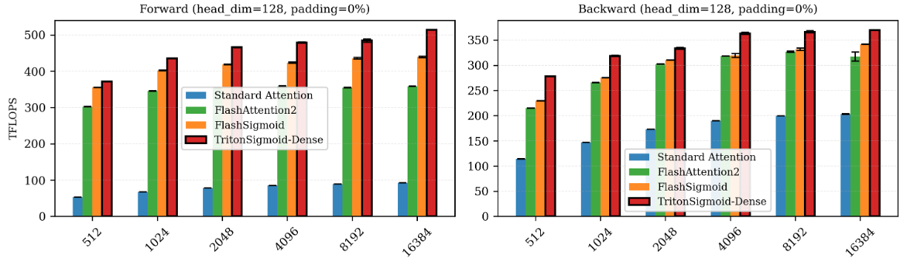

---

