# 2026-05-05 Daily Papers (Top 14)

## 오늘의 요약
오늘의 연구는 단순한 성능 향상을 넘어, 실제 환경(로봇, 의료, 학술 워크플로우)에 적용 가능한 에이전트의 실무적 능력과 데이터 효율성을 높이는 데 집중되었습니다. 특히 복잡한 장기 과제(Long-horizon)를 수행하는 에이전트의 평가 체계와 도메인 특화 데이터 엔지니어링이 주요 화두로 떠올랐습니다.

### 오늘의 핵심 포인트
- 실제 세계의 복잡한 워크플로우와 도구 사용 능력을 검증하기 위한 고난도 에이전트 벤치마크 제안이 활발히 이루어졌습니다.
- 데이터의 양보다 질적 필터링과 반복 학습을 통해 학습 효율을 극대화하는 전략이 중요하게 다뤄졌습니다.
- 멀티모달 모델의 시각 정보 유실 문제 해결 및 로봇 제어를 위한 VLA 프레임워크 등 실질적인 배포를 위한 최적화 연구가 진행되었습니다.

**오늘의 태그**: AI Agents, Benchmark, Data Engineering, Multimodal, Robotics

## 1. [MolmoAct2: Action Reasoning Models for Real-world Deployment](https://huggingface.co/papers/2605.02881)
**Upvotes**: 64 | **도입 난이도**: 상 | **신뢰도**: 상
**arXiv**: https://arxiv.org/abs/2605.02881

**태그**: VLA, Robotics, Open-Source, Computer-Vision, Reasoning, Vision, Benchmark, Inference

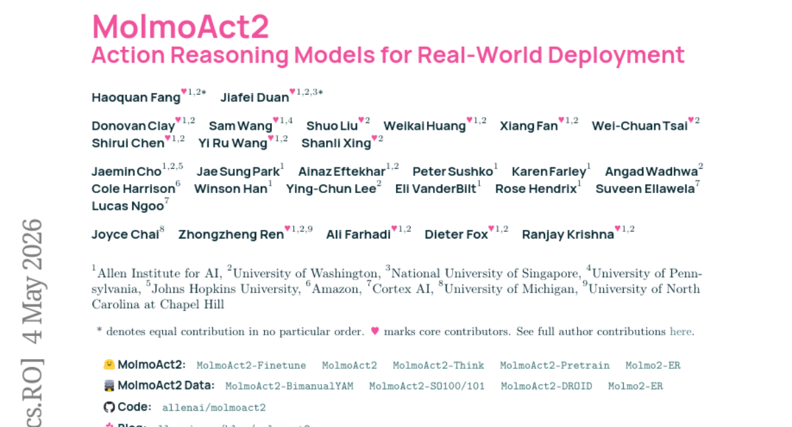

### 📌 한 줄 요약
실제 로봇 배포를 위해 지연 시간과 추론 성능을 최적화한 완전 오픈 소스 VLA(Vision-Language-Action) 모델 프레임워크

### 🔑 핵심 포인트
- MolmoER: 공간 및 체화된 추론에 특화된 고성능 VLM 백본 개발
- OpenFAST: 5가지 로봇 형태를 지원하는 오픈 웨이트/오픈 데이터 액션 토크나이저
- MolmoThink: 변화하는 장면 영역에만 적응형 깊이 토큰을 예측하여 지연 시간을 최소화하는 아키텍처

### 🧑‍💻 개발자 관점
모델 가중치와 데이터가 모두 공개되어 있어, 연구자가 고가의 하드웨어 제약 없이 실제 로봇 제어 알고리즘을 테스트하고 최적화할 수 있는 실질적인 기준점을 제공합니다.

### 🚀 실무 적용 아이디어
- 제공된 오픈 웨이트를 활용하여 다양한 로봇 하드웨어(SO100 등)에 이식 테스트
- MolmoThink의 적응형 깊이 예측이 실시간 제어 루프의 지연 시간에 미치는 영향 분석
- OpenFAST 토크나이저를 활용한 새로운 로봇 엔드 이펙터 제어 실험

### ⚠️ 리스크/한계
- 복잡한 아키텍처로 인해 하드웨어 사양에 따른 구현 난이도가 높을 수 있음
- 실제 환경의 물리적 변수(마찰, 무게 등)에 대한 일반화 성능 검증 필요

### 📝 초록 기반 상세 설명
기존의 VLA 모델들은 폐쇄적인 모델 구조, 고가의 하드웨어 의존성, 그리고 추론 과정에서의 높은 지연 시간 문제로 인해 실제 환경 배포에 어려움이 있었습니다. 이를 해결하기 위해 본 논문은 실용적인 배포를 목표로 하는 MolmoAct2를 제안합니다. 공간 및 체화된 추론에 특화된 MolmoER 백본과 대규모 이중 팔(Bimanual) 데이터셋, 그리고 범용 액션 토크나이저인 OpenFAST를 도입했습니다. 또한, 변화하는 영역에 대해서만 깊이 토큰을 재예측하는 MolmoThink 구조를 통해 지연 시간을 획기적으로 줄였습니다. 실험 결과, MolmoAct2는 다양한 시뮬레이션 및 실세계 벤치마크에서 기존 강력한 베이스라인들을 상회하는 성능을 입증했습니다.

---

## 2. [From Context to Skills: Can Language Models Learn from Context Skillfully?](https://huggingface.co/papers/2604.27660)
**Upvotes**: 61 | **도입 난이도**: 상 | **신뢰도**: 상
**arXiv**: https://arxiv.org/abs/2604.27660

**태그**: Multi-Agent, Self-Evolving, Prompt Engineering, Context Learning, Agent, Vision, Evaluation, Inference

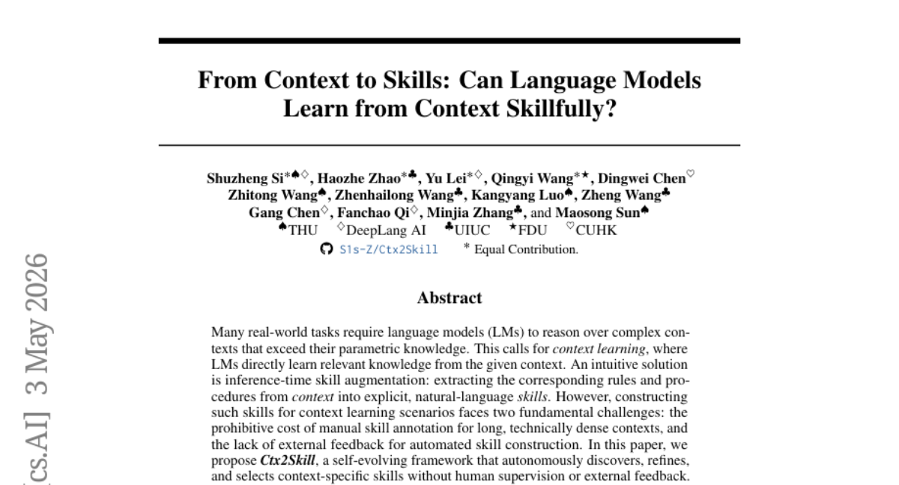

### 📌 한 줄 요약
사람의 개입 없이 컨텍스트에서 핵심 규칙을 추출하여 모델의 문제 해결 능력을 자가 진화시키는 프레임워크

### 🔑 핵심 포인트
- 멀티 에이전트 셀프 플레이를 통한 자동 스킬 생성 및 정제 루프 구축
- 실패 사례 분석(Proposer/Generator)을 통한 타겟팅된 스킬 업데이트 메커니즘
- Adversarial Collapse를 방지하기 위한 Cross-time Replay 메커니즘 도입

### 🧑‍💻 개발자 관점
수동 프롬프트 엔지니어링 없이도 복잡한 도메인 지식을 모델이 스스로 학습 가능한 '스킬' 형태로 변환하여 활용할 수 있는 자동화 경로를 제시합니다.

### 🚀 실무 적용 아이디어
- 특정 도메인(법률, 의료 등)의 긴 컨텍스트를 대상으로 스킬 추출 성능 테스트
- 다양한 크기의 백본 모델(Llama, GPT 등)에 추출된 스킬을 플러그인 형태로 적용해보기
- 에이전트 간의 경쟁이 과도한 최적화(Over-specialization)를 유발하는지 모니터링

### ⚠️ 리스크/한계
- 에이전트 간의 경쟁이 극단적으로 치우칠 경우 일반적인 성능이 저하될 위험
- 스킬 생성 과정에서의 연산 비용 및 복잡도 증가

### 📝 초록 기반 상세 설명
복잡한 컨텍스트를 다루는 작업에서는 모델의 파라미터 지식을 넘어 컨텍스트 내 정보를 활용하는 능력이 필수적입니다. 기존의 스킬 추출 방식은 수동 작업 비용이 높고 외부 피드백이 부족하다는 한계가 있었습니다. 본 논문은 인간의 개입 없이 스킬을 스스로 발견, 정제, 선택하는 자가 진화 프레임워크인 Ctx2Skill을 제안합니다. 멀티 에이전트 셀프 플레이(Challenger, Reasoner, Judge)와 실패 사례 분석을 통한 Proposer/Generator 구조를 통해 스킬을 자동 업데이트합니다. 또한, 과도한 특수화로 인한 성능 붕괴를 막기 위해 Cross-time Replay 메커니즘을 도입했습니다. 실험 결과, CL-bench의 다양한 태스크에서 백본 모델의 컨텍스트 학습 성능을 일관되게 향상시켰습니다.

---

## 3. [Repetition over Diversity: High-Signal Data Filtering for Sample-Efficient German Language Modeling](https://huggingface.co/papers/2604.28075)
**Upvotes**: 12 | **도입 난이도**: 중 | **신뢰도**: 상
**arXiv**: https://arxiv.org/abs/2604.28075

**태그**: LLM Training, Data Filtering, Efficiency, German NLP, Benchmark, Evaluation

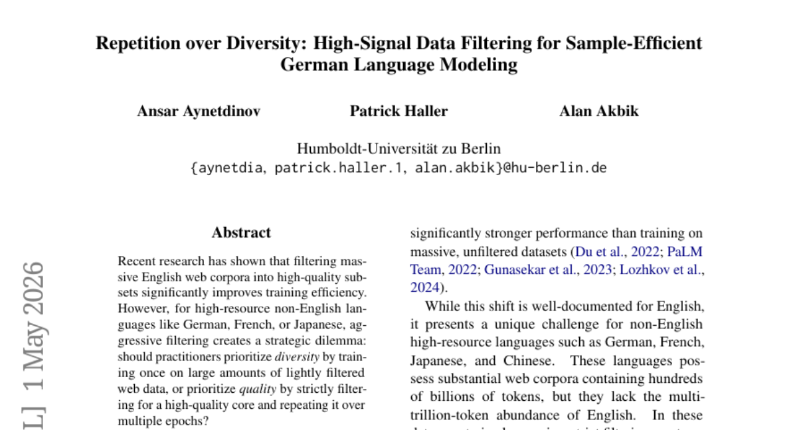

### 📌 한 줄 요약
데이터 양을 늘리는 것보다 고품질 데이터를 엄격히 필터링하여 반복 학습하는 것이 비영어권 LLM 학습 효율을 극대화한다.

### 🔑 핵심 포인트
- 고품질 데이터의 반복 학습(Repetition)이 대규모 데이터의 단일 패스 학습(Diversity)보다 효율적임을 입증
- 비영어권 언어 모델링에서 데이터 양보다 '의미적 집중(Semantic Concentration)'의 중요성 제시
- 기존 모델 대비 10~360배 적은 토큰 사용으로도 SOTA급 성능 달성

### 🧑‍💻 개발자 관점
데이터 확보가 어려운 특정 언어나 도메인 특화 모델을 구축할 때, 무작정 데이터를 모으기보다 엄격한 필터링을 통한 반복 학습 전략이 훨씬 경제적이고 효과적임을 시사합니다.

### 🚀 실무 적용 아이디어
- 보유한 데이터셋에 대해 계층적 품질 필터링 파이프라인 구축 및 성능 비교
- 필터링된 고품질 데이터셋에 대한 다중 에포크(Multi-epoch) 학습 실험
- 데이터 정제 강도(Filtering threshold) 변화에 따른 모델 성능 변화 측정

### ⚠️ 리스크/한계
- 과도한 반복 학습 시 발생할 수 있는 모델의 과적합(Overfitting) 위험
- 필터링 과정에서 특정 스타일이나 관점이 배제되는 데이터 편향 문제

### 📝 초록 기반 상세 설명
최근 영어권에서는 대규모 웹 코퍼스를 고품질로 필터링하는 연구가 활발하지만, 비영어권 언어에서는 데이터 다양성과 품질 사이의 전략적 선택 문제가 발생합니다. 본 연구는 독일어 데이터를 대상으로 계층적 품질 필터링을 적용하여, 필터링된 고품질 데이터의 반복 학습과 대규모 데이터의 단일 패스 학습 간의 트레이드오프를 조사했습니다. 다양한 모델 규모와 토큰 예산 환경에서 실험한 결과, 고품질 데이터를 여러 번 반복 학습하는 것이 더 큰 규모의 저품질 데이터를 한 번 학습하는 것보다 일관되게 우수한 성능을 보였습니다. 특히 이러한 성능 격차는 7 에포크 이후에도 유지되었습니다. 결과적으로 비영어권 LLM에서는 데이터의 양적 확장보다 의미적 집중을 통한 품질 필터링이 더 효율적인 경로임을 입증했습니다.

---

## 4. [Persistent Visual Memory: Sustaining Perception for Deep Generation in LVLMs](https://huggingface.co/papers/2605.00814)
**Upvotes**: 11 | **도입 난이도**: 하 | **신뢰도**: 상
**arXiv**: https://arxiv.org/abs/2605.00814

**태그**: LVLM, Computer Vision, Attention Mechanism, Efficient Learning, RAG, Reasoning, Multimodal, Vision, Evaluation

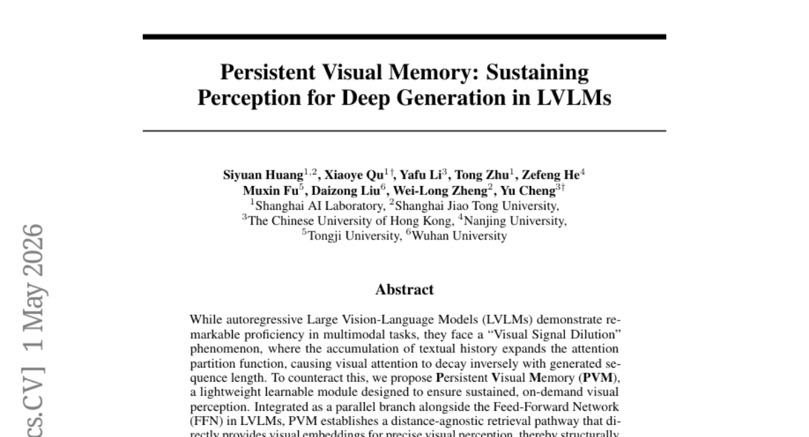

### 📌 한 줄 요약
생성 문장이 길어질수록 시각 정보가 희석되는 문제를 해결하기 위해, FFN과 병렬로 작동하는 경량형 시각 메모리 모듈(PVM)을 제안합니다.

### 🔑 핵심 포인트
- 텍스트 길이에 따른 시각 정보 희석(Visual Signal Dilution) 문제 정의
- FFN과 병렬로 구성된 경량형 시각 메모리(PVM) 모듈 제안
- 생성 시점과 무관하게 시각 정보를 직접 전달하는 거리 불변 검색 경로 구축

### 🧑‍💻 개발자 관점
긴 문장을 생성해야 하는 멀티모달 작업에서 시각적 디테일이 유실되는 문제를 구조적으로 해결할 수 있는 실용적인 방법론입니다.

### 🚀 실무 적용 아이디어
- 기존 LVLM의 FFN 레이어에 병렬 구조로 PVM 모듈 삽입 실험
- 생성 시퀀스 길이에 따른 시각 어텐션 점수 변화 모니터링
- 복잡한 시각 추론 태스크(Visual Reasoning)에서의 성능 벤치마크 수행

### ⚠️ 리스크/한계
- 병렬 구조 추가에 따른 미세한 연산 오버헤드 발생 가능성
- 특정 아키텍처(FFN 기반)에 최적화된 구조로 범용성 검증 필요

### 📝 초록 기반 상세 설명
최근 LVLM은 뛰어난 성능을 보이지만, 텍스트 생성 길이가 길어질수록 시각적 주의력이 약해지는 'Visual Signal Dilution' 현상을 겪습니다. 이를 해결하기 위해 저자들은 지속적인 시각 인지를 보장하는 경량 학습 모듈인 Persistent Visual Memory(PVM)를 제안합니다. PVM은 FFN과 병렬 구조로 통합되어 생성 시점과 관계없이 직접적인 시각 임베딩을 제공하는 거리 불변(distance-agnostic) 검색 경로를 구축합니다. Qwen3-VL 모델을 통한 실험 결과, 미미한 파라미터 증가만으로도 4B 및 8B 규모에서 성능 향상을 입증했습니다. 특히 복잡한 추론 작업에서 시각 정보의 감쇄를 막고 예측 수렴을 가속화하는 효과를 보였습니다.

---

## 5. [OceanPile: A Large-Scale Multimodal Ocean Corpus for Foundation Models](https://huggingface.co/papers/2605.00877)
**Upvotes**: 8 | **도입 난이도**: 중 | **신뢰도**: 상
**arXiv**: https://arxiv.org/abs/2605.00877

**태그**: Multimodal, Foundation Model, Data Engineering, Ocean Science, RAG, Vision, Benchmark, Evaluation, Safety

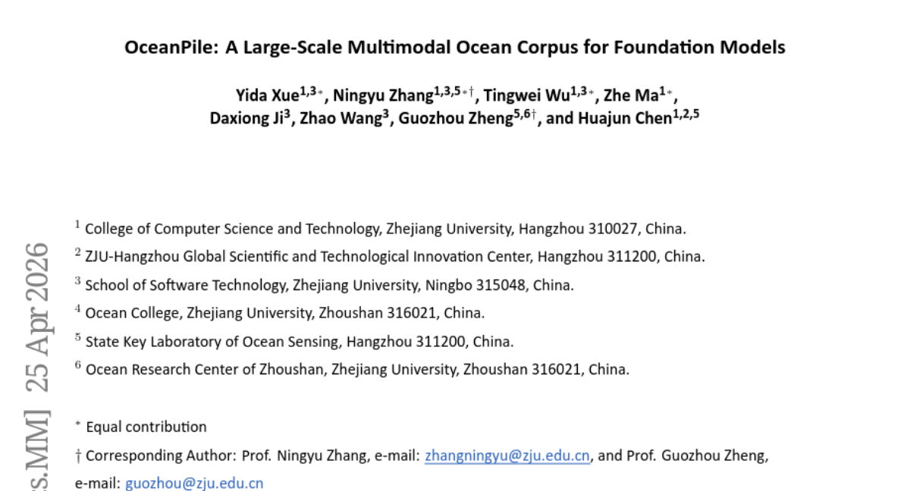

### 📌 한 줄 요약
해양 도메인 특화 파운데이션 모델 구축을 위한 대규모 멀티모달 데이터셋 'OceanPile' 제안

### 🔑 핵심 포인트
- 다양한 소스(소나, 이미지, 텍스트 등)를 통합한 대규모 해양 멀티모달 코퍼스 OceanCorpus 구축
- 계층적 해양 개념 지식 그래프를 활용한 고품질 지시어 데이터셋 OceanInstruction 생성
- 도메인 특화 성능 측정을 위한 수동 큐레이션 기반의 OceanBenchmark 제공

### 🧑‍💻 개발자 관점
특수 도메인(해양)의 데이터 불균형과 노이즈 문제를 해결하기 위한 데이터 엔지니어링 및 지식 그래프 활용 전략을 제시합니다.

### 🚀 실무 적용 아이디어
- 제공된 데이터셋을 활용하여 기존 오픈소스 MLLM의 해양 도메인 성능 벤치마킹
- 지식 그래프 기반의 Instruction Tuning 파이프라인 적용 실험
- 수중 이미지와 소나 데이터 간의 멀티모달 정렬 성능 테스트

### ⚠️ 리스크/한계
- 특수 도메인 데이터 특성상 일반 도메인 성능과의 트레이드오프 발생 가능성
- 데이터 수집 소스의 편향성이 모델의 일반화 능력에 미칠 영향

### 📝 초록 기반 상세 설명
해양 데이터는 파편화되어 있고 노이즈가 많으며 레이블이 불분명하여 AI 모델 학습에 어려움이 있었습니다. 기존 MLLM은 일반 도메인에서는 뛰어나지만, 해양 과학에 특화된 정렬된 데이터가 부족하여 적용에 한계가 있었습니다. 이를 해결하기 위해 소나 데이터, 수중 이미지, 과학 텍스트 등을 통합한 OceanCorpus와 지식 그래프 기반의 OceanInstruction, 그리고 평가용 OceanBenchmark를 포함하는 OceanPile을 개발했습니다. 다단계 품질 관리 프로세스를 통해 과학적 타당성과 모달리티 간 정렬을 확보했습니다. 실험 결과, OceanPile로 학습된 모델이 해양 도메인에서 유의미한 성능 향상을 보였습니다.

---

## 6. [ComboStoc: Combinatorial Stochasticity for Diffusion Generative Models](https://huggingface.co/papers/2405.13729)
**Upvotes**: 5 | **도입 난이도**: 중 | **신뢰도**: 상
**arXiv**: https://arxiv.org/abs/2405.13729

**태그**: Diffusion Models, Generative Models, 3D Generation, Optimization, Vision

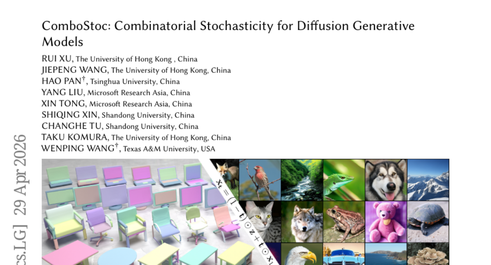

### 📌 한 줄 요약
조합적 복잡성을 고려한 새로운 확률 과정을 통해 확산 모델의 학습 속도를 높이고 정교한 제어를 가능하게 하는 방법론

### 🔑 핵심 포인트
- 조합적 구조를 활용한 새로운 확률 과정(ComboStoc) 설계
- 다양한 데이터 모달리티(이미지, 3D)에서의 학습 가속화 달성
- 비동기 타임스텝을 통한 정교한 속성 제어 기능 제공

### 🧑‍💻 개발자 관점
데이터의 속성이 복잡하게 얽힌 구조적 생성 작업(예: 3D 모델링, 멀티 속성 이미지 생성)에서 학습 효율과 제어력을 동시에 높일 수 있습니다.

### 🚀 실무 적용 아이디어
- 제공된 코드를 활용하여 3D 구조 생성 태스크에 적용해보기
- 기존 확산 모델과 학습 수렴 속도 및 생성 품질 비교 실험
- 비동기 타임스텝을 이용한 속성별 제어 정밀도 테스트

### ⚠️ 리스크/한계
- 조합적 복잡성이 극도로 높은 경우 연산 비용 증가 가능성
- 특정 데이터 구조에 특화된 방식일 경우 범용성 검증 필요

### 📝 초록 기반 상세 설명
고차원 데이터 생성 시 다양한 속성이 결합되는 구조적 복잡성이 존재하지만, 기존 확산 모델의 학습 방식은 이러한 조합적 공간을 충분히 커버하지 못하는 문제가 있습니다. 본 논문은 데이터의 차원과 속성 간의 조합 구조를 완전히 활용하는 새로운 확률 과정인 ComboStoc을 제안합니다. 이 방식은 학습 과정에서 조합적 구조를 효과적으로 탐색하여 학습 속도를 크게 가속화합니다. 또한, 테스트 시 각 차원과 속성에 대해 비동기적 타임스텝을 적용할 수 있는 새로운 생성 방식을 제공합니다. 실험 결과, 이미지 및 3D 구조 생성 등 다양한 모달리티에서 성능 향상과 제어 가능성을 입증하였습니다.

---

## 7. [AcademiClaw: When Students Set Challenges for AI Agents](https://huggingface.co/papers/2605.02661)
**Upvotes**: 3 | **도입 난이도**: 중 | **신뢰도**: 상
**arXiv**: https://arxiv.org/abs/2605.02661

**태그**: AI Agent, Benchmark, Software Engineering, Academic Workflow, Agent, Evaluation, Safety

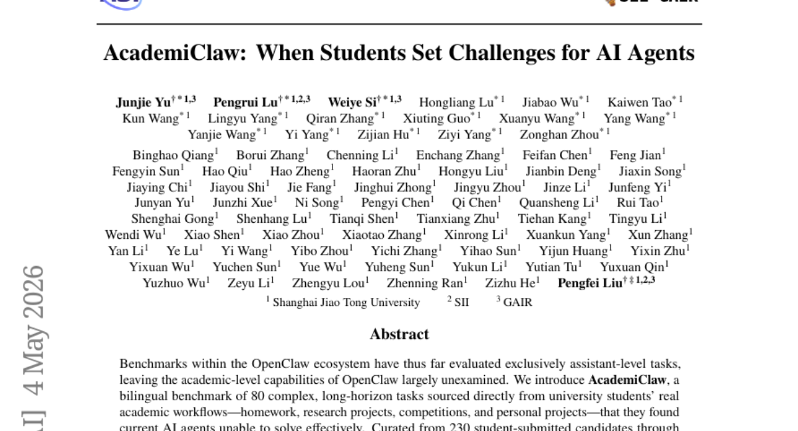

### 📌 한 줄 요약
대학생들의 실제 학술 워크플로우를 반영한 고난도 롱-호라이즌(Long-horizon) AI 에이전트 벤치마크 제안

### 🔑 핵심 포인트
- 실제 대학생의 워크플로우(숙제, 연구, 경진대회 등)에서 추출한 고난도 80개 태스크 셋 구축
- Docker 기반 격리 환경 및 다차원 루브릭을 통한 정밀한 태스크 완료도 평가 체계
- 최신 프론티어 모델들의 한계를 드러내는 25개 이상의 전문 도메인(수학, RL, 시스템 디버깅 등) 커버

### 🧑‍💻 개발자 관점
단순 질의응답을 넘어 복잡한 코딩, 시스템 디버깅, 수학적 추론 등 실무적이고 긴 호흡의 작업을 수행하는 에이전트 성능 측정의 기준을 제시합니다.

### 🚀 실무 적용 아이디어
- 제공된 GitHub 저장소를 통해 Docker 환경에서 벤치마크 실행 환경 구축하기
- 자체 개발 중인 에이전트 모델을 AcademiClaw의 특정 도메인 태스크에 적용하여 성능 비교하기
- 토큰 소비량과 출력 품질 간의 상관관계를 분석하여 에이전트 효율성 최적화 실험하기

### ⚠️ 리스크/한계
- 특정 도메인(예: GPU 연산 필요 태스크) 실행을 위한 고사양 컴퓨팅 자원 요구
- 학생들의 주관적 과제가 포함되어 있어 평가의 객관성 유지에 대한 지속적 검증 필요

### 📝 초록 기반 상세 설명
기존 OpenClaw 생태계의 벤치마크는 단순 어시스턴트 수준의 작업에 국한되어 학술적 역량을 평가하기에 부족했습니다. 이를 해결하기 위해 학생들의 실제 과제, 연구, 프로젝트에서 추출한 80개의 복잡한 이중 언어 벤치마크인 AcademiClaw를 도입합니다. 이 벤치마크는 25개 이상의 전문 분야를 아우르며, Docker 샌드박스 환경에서 실행 및 다차원 루브릭을 통해 평가됩니다. 실험 결과, 최상위 모델조차 55%의 통과율을 기록하며 기존 모델의 한계를 드러냈습니다. 본 연구는 에이전트의 역량 경계와 행동 전략을 분석하여 실질적인 학술적 요구를 충족하는 에이전트 개발의 토대를 제공합니다.

---

## 8. [PhysicianBench: Evaluating LLM Agents in Real-World EHR Environments](https://huggingface.co/papers/2605.02240)
**Upvotes**: 3 | **도입 난이도**: 중 | **신뢰도**: 상
**arXiv**: https://arxiv.org/abs/2605.02240

**태그**: LLM Agent, EHR, Benchmark, Clinical Workflow, Agent, RAG, Reasoning, Evaluation

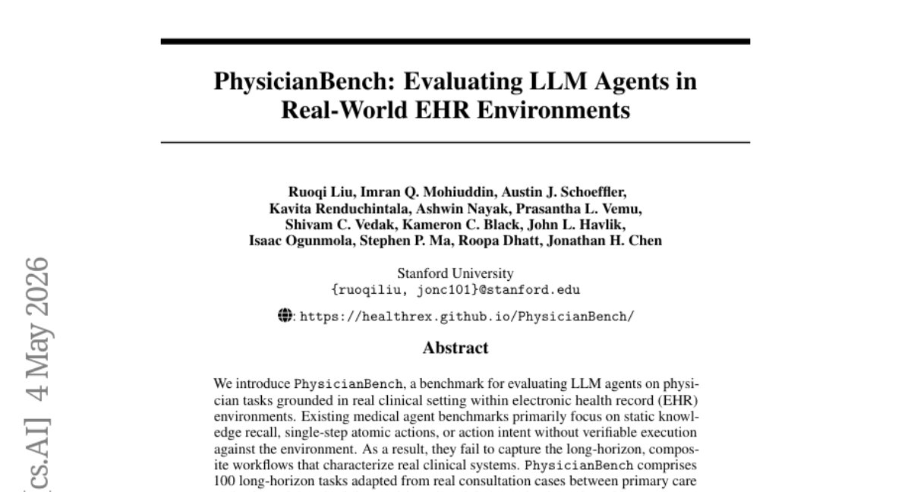

### 📌 한 줄 요약
실제 EHR 환경의 복잡한 워크플로우를 반영하여 LLM 에이전트의 임상 수행 능력을 검증하는 벤치마크 제안

### 🔑 핵심 포인트
- 실제 EHR 환경 및 표준 API를 활용한 실행 기반(execution-grounded) 벤치마크 구축
- 21개 전문 분야와 100개의 복잡한 장기적(long-horizon) 임상 워크플로우 설계
- 670개의 구조화된 체크포인트를 통한 단계별 정밀 검증 체계 마련

### 🧑‍💻 개발자 관점
단순 질의응답을 넘어, 도구 호출(Tool-use)과 복잡한 데이터 추론이 결합된 에이전트 시스템의 실질적 성능을 측정하는 기준이 됩니다.

### 🚀 실무 적용 아이디어
- 에이전트의 도구 호출(Tool-calling) 정확도 및 워크플로우 유지 능력 테스트
- 다양한 전문 분야 데이터에 대한 에이전트의 추론 일관성 검증
- 장기적 작업 수행 시 발생하는 오류 누적(error propagation) 분석

### ⚠️ 리스크/한계
- 실제 임상 환경의 복잡성을 완전히 모사하기에는 여전히 한계가 존재할 수 있음
- 에이전트의 성공률이 낮아 실제 의료 현장 도입 전 검증 단계가 매우 길어질 수 있음

### 📝 초록 기반 상세 설명
기존 의료 에이전트 벤치마크는 정적인 지식 인출이나 단일 단계 작업에 치중되어 있어, 실제 임상 현장의 복잡한 워크플로우를 평가하기 어렵습니다. 이를 해결하기 위해 실제 EHR 환경과 표준 API를 기반으로 한 PhysicianBench를 개발했습니다. 이 벤치마크는 21개 전문 분야를 아우르는 100개의 장기적(long-horizon) 과제를 포함하며, 실제 환자 기록을 바탕으로 실행 기반의 검증을 수행합니다. 실험 결과, 최상위 모델조차 46%의 성공률에 그쳐 현재 에이전트 기술과 실제 임상 요구사항 간의 큰 격차를 확인했습니다. PhysicianBench는 자율적 임상 에이전트 발전을 위한 현실적이고 실행 중심적인 평가 지표를 제공합니다.

---

## 9. [T^2PO: Uncertainty-Guided Exploration Control for Stable Multi-Turn Agentic Reinforcement Learning](https://huggingface.co/papers/2605.02178)
**Upvotes**: 2 | **도입 난이도**: 중 | **신뢰도**: 상
**arXiv**: https://arxiv.org/abs/2605.02178

**태그**: LLM-Agent, Reinforcement-Learning, Exploration-Control, Multi-turn-Reasoning, Agent, Reasoning, Evaluation

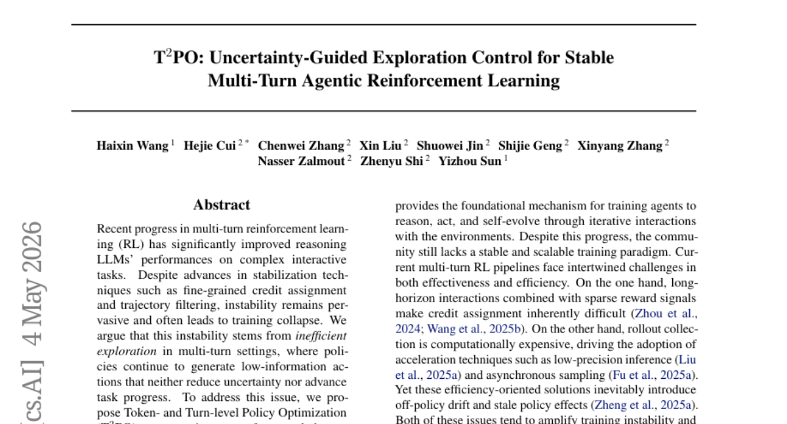

### 📌 한 줄 요약
불필요한 탐색을 억제하는 불확실성 기반 제어를 통해 멀티턴 에이전트 RL의 학습 안정성과 효율성을 극대화한 프레임워크

### 🔑 핵심 포인트
- 불확실성 기반의 정교한 탐색 제어를 통한 학습 붕괴 방지
- 토큰 단위의 불확실성 모니터링을 통한 사고 개입(Thinking Intervention) 메커니즘
- 턴 단위의 무의미한 상호작용을 식별하고 재샘플링하는 효율적 탐색 전략

### 🧑‍💻 개발자 관점
에이전트 학습 시 발생하는 무의미한 반복(looping)이나 정보 없는 데이터 생성 문제를 해결하여 학습 비용을 절감하고 모델의 추론 능력을 안정화할 수 있습니다.

### 🚀 실무 적용 아이디어
- 에이전트 학습 시 토큰별 불확실성(Entropy 등)을 기록하는 모니터링 파이프라인 구축
- 학습 데이터 중 정보량이 낮은 턴을 필터링하거나 가중치를 조절하는 실험 진행
- 현재 사용 중인 멀티턴 RL 환경에 불확실성 기반 재샘플링 로직 적용 테스트

### ⚠️ 리스크/한계
- 불확실성 임계값(threshold) 설정에 따라 학습 효율이 민감하게 변할 수 있음
- 계산 복잡도가 증가하여 학습 시 오버헤드가 발생할 가능성

### 📝 초록 기반 상세 설명
최근 멀티턴 강화학습(RL)을 통한 LLM 성능 향상이 주목받고 있으나, 학습 과정에서의 불안정성과 붕괴 현상이 여전히 큰 문제로 남아 있습니다. 연구진은 이러한 불안정성의 원인이 정보 가치가 낮은 행동을 반복하는 비효율적인 탐색에 있다고 분석했습니다. 이를 해결하기 위해 토큰 및 턴 단위의 불확실성을 모니터링하는 T^2PO 프레임워크를 제안합니다. 토큰 단위에서는 불확실성 변화가 임계치 미만일 때 사고 개입(thinking intervention)을 유도하고, 턴 단위에서는 진전이 없는 상호작용을 식별하여 동적으로 재샘플링합니다. 실험 결과, WebShop 및 ALFWorld 등 다양한 환경에서 학습 안정성과 성능이 크게 향상되었습니다.

---

## 10. [Hierarchical Abstract Tree for Cross-Document Retrieval-Augmented Generation](https://huggingface.co/papers/2605.00529)
**Upvotes**: 2 | **도입 난이도**: 상 | **신뢰도**: 상
**arXiv**: https://arxiv.org/abs/2605.00529

**태그**: RAG, Agent, Hierarchical Indexing, Multi-hop QA, Benchmark, Evaluation

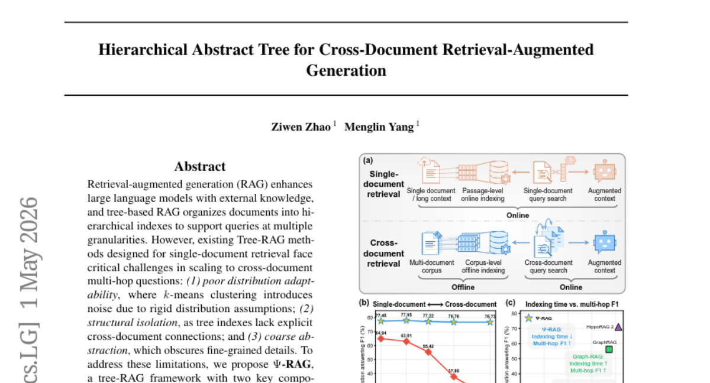

### 📌 한 줄 요약
데이터 분포에 유연하게 대응하는 계층적 추상화 트리 구조를 통해 복잡한 교차 문서 멀티홉 질문 해결 능력을 극대화한 RAG 프레임워크

### 🔑 핵심 포인트
- 데이터 분포에 구애받지 않는 '병합 및 붕괴' 기반의 계층적 추상 트리 인덱스 구축
- 문서 간 연결성 결여와 정보 손실 문제를 해결하는 구조적 설계
- 에이전트 기반의 다중 입도 검색을 통한 토큰 단위부터 문서 단위까지의 유연한 대응

### 🧑‍💻 개발자 관점
여러 문서에 흩어진 정보를 종합해야 하는 복잡한 RAG 시스템 구축 시, 기존 트리 기반 방식의 한계를 극복할 수 있는 아키텍처 가이드를 제공합니다.

### 🚀 실무 적용 아이디어
- 제공된 GitHub 코드를 활용하여 기존 RAPTOR/HippoRAG와 성능 비교 실험 수행
- 도메인 특화 데이터셋(예: 법률, 의료)에 대한 데이터 분포 적응력 테스트
- 에이전트 기반 검색 시 발생하는 추론 비용(Latency)과 정확도 간의 트레이드오프 분석

### ⚠️ 리스크/한계
- 에이전트 기반의 복잡한 검색 과정으로 인해 기존 방식 대비 높은 추론 비용 및 지연 시간 발생 가능성
- 트리 생성 과정에서의 연산 복잡도 및 인덱스 구축 시간 문제

### 📝 초록 기반 상세 설명
기존의 Tree-RAG 방식은 단일 문서 검색에 최적화되어 있어, 여러 문서 간의 관계를 파악해야 하는 멀티홉 질문 해결 시 데이터 분포 적응력 부족, 구조적 고립, 정보 손실 등의 문제에 직면합니다. 이를 해결하기 위해 본 논문은 Ψ-RAG 프레임워크를 제안합니다. Ψ-RAG는 사전 가정 없이 데이터 분포에 맞춰 구조를 형성하는 '병합 및 붕괴(merging and collapse)' 방식의 계층적 추상 트리 인덱스를 구축합니다. 또한, 재구성된 쿼리와 에이전트 기반 하이브리드 리트리버를 활용하는 다중 입도(multi-granular) 검색 에이전트를 도입합니다. 실험 결과, 교차 문서 멀티홉 QA 벤치마크에서 기존 RAPTOR 및 HippoRAG 2 대비 우수한 성능 향상을 입증했습니다.

---

## 11. [Generative Modeling with Orbit-Space Particle Flow Matching](https://huggingface.co/papers/2605.02222)
**Upvotes**: 1 | **도입 난이도**: 중 | **신뢰도**: 상
**arXiv**: https://arxiv.org/abs/2605.02222

**태그**: Generative Modeling, 3D Vision, Flow Matching, Particle Systems, Benchmark, Evaluation, Inference

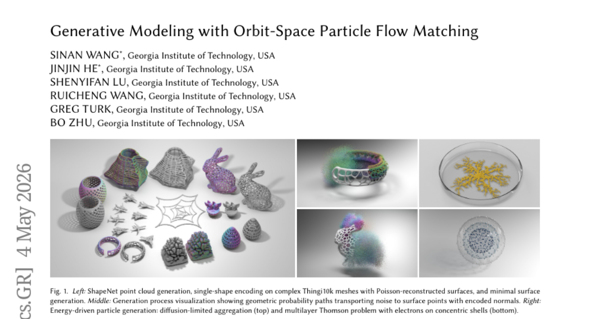

### 📌 한 줄 요약
입자 시스템의 대칭성과 기하학적 특성을 활용하여 적은 단계로 고품질 3D 생성을 가능케 하는 새로운 Flow-matching 프레임워크

### 🔑 핵심 포인트
- 순열 대칭성을 고려한 궤도 공간(Orbit-space) 정규화로 학습 난이도 감소
- 기하학적 속성(표면 법선 등)을 생성 과정에서 자연스럽게 도출하는 확률 경로 설계
- 기존 모델 대비 압도적으로 적은 파라미터와 추론 단계로 고성능 3D 생성 달성

### 🧑‍💻 개발자 관점
3D 에셋 생성 시 연산 비용을 획기적으로 줄이면서도 기하학적 정밀도를 유지할 수 있는 효율적인 생성 알고리즘을 제시합니다.

### 🚀 실무 적용 아이디어
- 제안된 궤도 공간 정규화 기법을 기존 Diffusion/Flow 모델에 적용해보기
- 입자 기반 3D 생성 태스크(Point Cloud, Mesh)에 모델 적용 테스트
- 추론 단계 수 감소에 따른 생성 품질 변화 모니터링

### ⚠️ 리스크/한계
- 입자 수 변화에 따른 확장성 및 계산 복잡도 검증 필요
- 특정 기하학적 구조(minimal-surface 등)에 최적화된 특성 여부 확인 필요

### 📝 초록 기반 상세 설명
입자 기반 생성 모델링에서 입자 간 순열 대칭성으로 인한 인덱스 변동성과 복잡한 흐름(flow) 문제가 발생합니다. 이를 해결하기 위해 연구진은 Orbit-Space Geometric Probability Paths(OGPP)를 제안합니다. OGPP는 궤도 공간 정규화(orbit-space canonicalization), 역할 특화를 위한 인덱스 임베딩, 그리고 기하학적 속성을 인코딩하는 호 길이 인식 확률 경로를 도입합니다. 실험 결과, ShapeNet 등 3D 벤치마크에서 기존 SOTA 모델 대비 훨씬 적은 파라미터와 단계만으로도 경쟁력 있는 성능을 보였습니다. 특히 단일 단계 추론에서도 높은 정확도를 유지하며 효율적인 3D 생성을 입증했습니다.

---

## 12. [Perceptual Flow Network for Visually Grounded Reasoning](https://huggingface.co/papers/2605.02730)
**Upvotes**: 1 | **도입 난이도**: 상 | **신뢰도**: 상
**arXiv**: https://arxiv.org/abs/2605.02730

**태그**: LVLM, Reinforcement Learning, Visual Reasoning, Perception, Reasoning, Vision, Safety

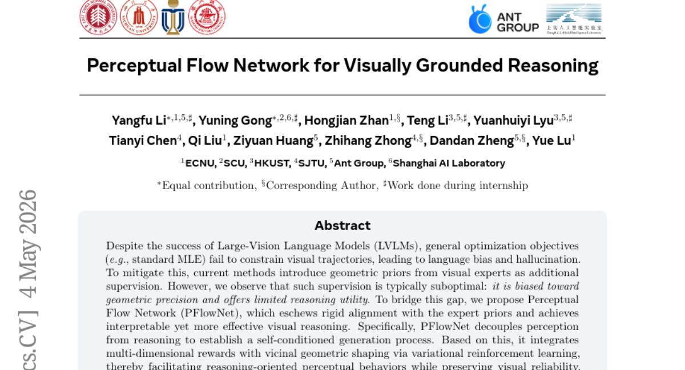

### 📌 한 줄 요약
시각적 추론의 정확도를 높이기 위해 지각(Perception)과 추론(Reasoning)을 분리하고 강화학습으로 최적화한 PFlowNet 제안

### 🔑 핵심 포인트
- 지각(Perception)과 추론(Reasoning)의 디커플링을 통한 자기 조건부 생성 구조 설계
- 변분 강화학습(Variational RL)을 활용한 다차원 보상 및 기하학적 형상화 통합
- 언어 편향 및 환각 문제를 억제하면서도 추론 중심의 시각적 행동 유도

### 🧑‍💻 개발자 관점
단순히 이미지를 설명하는 것을 넘어, 복잡한 시각적 근거를 바탕으로 논리적 결론을 도출해야 하는 에이전트 개발 시 유용한 구조를 제공합니다.

### 🚀 실무 적용 아이디어
- 지각과 추론 모듈을 분리했을 때의 연산 오버헤드 측정
- 특정 도메인(의료, 자율주행 등) 데이터셋에 대한 추론 정확도 변화 실험
- 강화학습 보상 함수 설계가 모델의 환각 억제에 미치는 영향 분석

### ⚠️ 리스크/한계
- 지각과 추론의 분리로 인한 추론 과정에서의 복잡도 및 지연 시간 증가 가능성
- 강화학습 기반 최적화 시 학습 안정성 확보의 어려움

### 📝 초록 기반 상세 설명
최근 대규모 시각-언어 모델(LVLM)은 일반적인 최적화 방식 때문에 시각적 궤적을 놓치고 언어 편향이나 환각 현상을 일으키는 문제가 있습니다. 기존의 기하학적 사전 지식 활용 방식은 정밀도에만 치중되어 실제 추론 능력 향상에는 한계가 있었습니다. 이를 해결하기 위해 본 논문은 지각과 추론을 분리하여 자기 조건부 생성 프로세스를 구축하는 PFlowNet을 제안합니다. 변분 강화학습을 통해 다차원 보상과 근방 기하학적 형성을 통합함으로써, 시각적 신뢰성을 유지하면서도 추론 중심의 지각 행동을 유도합니다. 실험 결과 V* Bench와 MME-RealWorld-lite 등 주요 벤치마크에서 SOTA 성능을 달성하며 뛰어난 추론 능력을 입증했습니다.

---

## 13. [Motion-Aware Caching for Efficient Autoregressive Video Generation](https://huggingface.co/papers/2605.01725)
**Upvotes**: 1 | **도입 난이도**: 중 | **신뢰도**: 상
**arXiv**: https://arxiv.org/abs/2605.01725

**태그**: Video Generation, Inference Optimization, Motion-Aware, Autoregressive, Video

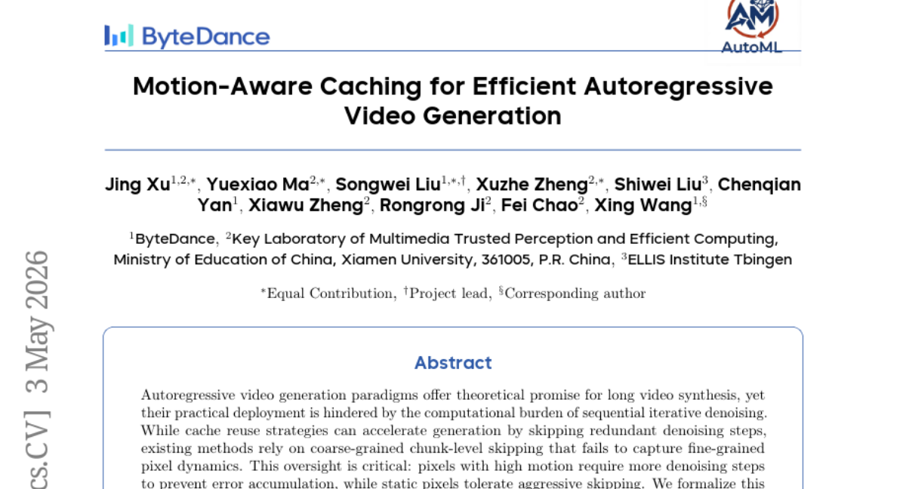

### 📌 한 줄 요약
픽셀별 움직임(Motion)에 따라 캐시 재사용 빈도를 동적으로 조절하여 비디오 생성 속도를 획기적으로 높인 프레임워크

### 🔑 핵심 포인트
- 픽셀 단위 움직임 특성을 반영한 Motion-aware 캐시 재사용 프레임워크 제안
- 프레임 간 차이를 활용한 경량화된 모션 프록시(Proxy) 방식 도입
- 초기 워밍업 및 토큰별 동적 업데이트를 통한 Coarse-to-fine 전략 적용

### 🧑‍💻 개발자 관점
비디오 생성 모델의 추론 비용(Inference Cost)을 줄이면서도 품질 저하 없이 실시간성에 가까운 속도를 확보할 수 있는 실무적인 최적화 기법입니다.

### 🚀 실무 적용 아이디어
- 기존 비디오 생성 파이프라인에 프레임 간 차이 기반의 캐시 스킵 로직 적용 테스트
- 모델별(SkyReels, MAGI 등) 모션 감도에 따른 최적의 워밍업 단계 설정 실험
- 움직임이 극심한 영상에서의 품질 저하(Artifact) 발생 여부 검증

### ⚠️ 리스크/한계
- 움직임이 매우 복잡하거나 예측 불가능한 경우 캐시 오류로 인한 품질 저하 가능성
- 모션 프록시 계산을 위한 추가적인 연산 오버헤드 발생 가능성

### 📝 초록 기반 상세 설명
자기회귀(Autoregressive) 방식의 비디오 생성은 긴 영상 제작에 유리하지만, 반복적인 디노이징 과정으로 인한 막대한 연산 비용이 문제입니다. 기존의 캐시 재사용 방식은 청크 단위의 거친 스킵 방식을 사용하여 픽셀 단위의 미세한 움직임을 반영하지 못하는 한계가 있었습니다. 본 논문은 움직임이 큰 영역은 더 많은 디노이징이 필요하고 정적인 영역은 스킵이 가능하다는 점에 착안하여 MotionCache를 제안합니다. MotionCache는 프레임 간 차이를 활용해 픽셀별 움직임을 파악하고, 초기 워밍업 후 토큰별로 캐시 업데이트 빈도를 조절하는 Coarse-to-fine 전략을 사용합니다. 실험 결과, 최신 모델에서 품질 저하를 최소화하면서도 최대 6.28배의 속도 향상을 달성했습니다.

---

## 14. [Code World Model Preparedness Report](https://huggingface.co/papers/2605.00932)
**Upvotes**: 1 | **도입 난이도**: 하 | **신뢰도**: 상
**arXiv**: https://arxiv.org/abs/2605.00932

**태그**: Code Generation, LLM, Open Weights, AI Safety, Reasoning, Evaluation

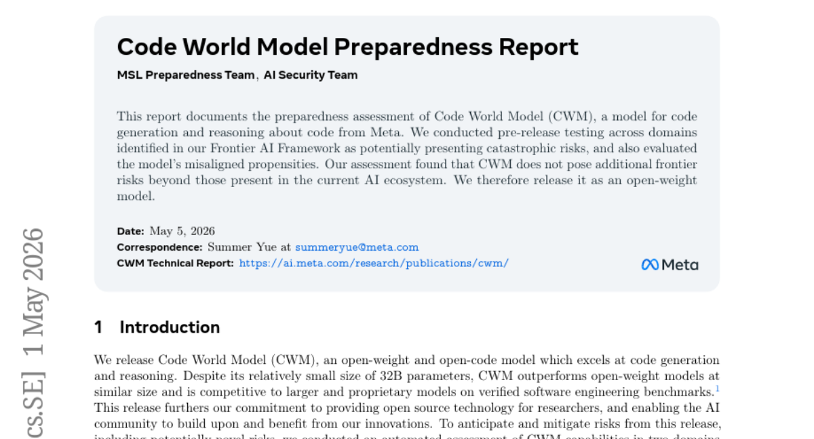

### 📌 한 줄 요약
Meta의 코드 생성 모델 CWM의 위험성 평가 결과, 기존 AI 생태계 수준의 안전성이 확인되어 오픈 웨이트로 공개됨

### 🔑 핵심 포인트
- 코드 생성 및 추론 특화 모델인 CWM의 위험성 평가 보고
- Frontier AI Framework 기반의 잠재적 파괴적 위험 도메인 검증
- 모델의 정렬(Alignment) 및 오용 가능성에 대한 사전 테스트 완료

### 🧑‍💻 개발자 관점
고성능 코드 생성 모델이 오픈 웨이트로 제공됨에 따라, 개발 환경에 즉시 통합하여 코드 자동화 및 추론 워크플로우를 구축할 수 있습니다.

### 🚀 실무 적용 아이디어
- CWM 모델을 로컬 개발 환경에 다운로드하여 코드 생성 성능 테스트
- 기존 코드 베이스에 대한 추론 및 리팩토링 능력 검증
- 모델의 보안 취약점 및 코드 생성 정렬 상태 확인

### ⚠️ 리스크/한계
- 오픈 웨이트 모델 특성상 악의적인 목적으로의 재학습 및 오용 가능성
- 특정 도메인에 특화된 모델로서 일반적인 대화 능력과의 차이 존재 가능성

### 📝 초록 기반 상세 설명
Meta는 코드 생성 및 추론에 특화된 Code World Model(CWM)을 개발했습니다. 모델 출시 전, Frontier AI Framework에서 정의한 파괴적 위험 도메인에 대한 사전 테스트를 수행했습니다. 또한 모델의 정렬되지 않은 성향(misaligned propensities)을 포함한 포괄적인 평가를 진행했습니다. 평가 결과, CWM은 현재 AI 생태계에 존재하는 위험 수준을 초과하지 않는 것으로 나타났습니다. 이에 따라 연구진은 해당 모델을 오픈 웨이트 형식으로 공개하기로 결정했습니다.

---

