# 2026-05-12 Daily Papers (Top 50)

## 오늘의 요약
오늘은 초거대 모델의 학습 안정성을 확보하기 위한 구조적 개선과 강화학습(RL)을 활용한 정책 최적화 연구가 두드러졌습니다. 또한, 비디오 생성 및 에이전트 효율성을 높이기 위한 모듈화된 아키텍처와 자동화된 최적화 전략이 주요 화두로 다뤄졌습니다.

### 오늘의 핵심 포인트
- 심층 모델의 붕괴 현상과 멀티태스크 간 성능 충돌 문제를 해결하기 위한 새로운 잔차 구조 및 온폴리 증류 기법이 제안되었습니다.
- 강화학습을 통해 LLM의 추론 성능(Test-Time Scaling)과 멀티모달 에이전트의 검색 효율성을 자동화하고 최적화하는 방법론이 제시되었습니다.
- 대규모 비디오 데이터셋 구축과 모달리티 간 기하학적 정렬을 통해 임바디드 AI 및 멀티모달 학습의 확장성을 확보하는 연구가 진행되었습니다.

**오늘의 태그**: Reinforcement Learning, Diffusion Transformer, LLM Optimization, Multimodal Learning, Video Generation

## 1. [Mean Mode Screaming: Mean--Variance Split Residuals for 1000-Layer Diffusion Transformers](https://huggingface.co/papers/2605.06169)
**Upvotes**: 87 | **도입 난이도**: 중 | **신뢰도**: 상
**arXiv**: https://arxiv.org/abs/2605.06169

**태그**: Diffusion Transformer, Deep Learning, Model Scaling, Optimization

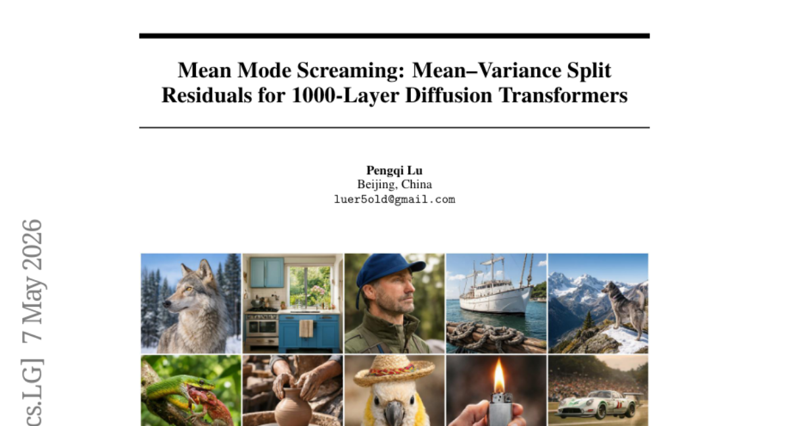

### 📌 한 줄 요약
초거대 심층 Diffusion Transformer의 표현력 붕괴(Mean-dominated collapse) 문제를 해결하기 위한 새로운 잔차 연결(Residual) 구조 제안

### 🔑 핵심 포인트
- 심층 DiT에서 발생하는 평균값 편향 붕괴 현상(MMS) 규명
- 평균 성분과 중심 변동 성분을 분리하여 업데이트하는 MV-Split Residuals 제안
- 400층 및 1000층 규모의 초심층 모델에서의 학습 안정성 확보

### 🧑‍💻 개발자 관점
모델의 깊이가 깊어질수록 발생하는 수렴 실패 문제를 구조적으로 해결하여, 초거대 규모의 생성 모델 설계 시 안정성을 높일 수 있습니다.

### 🚀 실무 적용 아이디어
- 심층 Transformer 모델 학습 시 Loss가 갑자기 급감하거나 표현력이 뭉개지는지 모니터링
- 기존 LayerScale 대신 MV-Split 방식의 잔차 구조 적용 테스트
- 모델 깊이 증가에 따른 그래디언트 성분(Mean vs Centered) 분석 실험

### ⚠️ 리스크/한계
- 매우 깊은 층을 다루는 특수 상황에 최적화된 기법으로, 일반적인 중소규모 모델에서는 효과가 미미할 수 있음
- 평균과 변동 성분을 분리하는 추가적인 연산 비용 발생 가능성

### 📝 초록 기반 상세 설명
Diffusion Transformer(DiT)를 수백 층 이상으로 확장할 때, 토큰 표현이 균일해지며 변동성이 사라지는 'Mean Mode Screaming(MMS)' 현상이 발생합니다. 연구진은 이 현상이 잔차 연결(Residual)을 통해 평균값에 편향된 그래디언트가 주입되어 네트워크가 붕괴되는 것임을 밝혀냈습니다. 이를 해결하기 위해 평균 성분과 중심 변동 성분을 분리하여 업데이트하는 'Mean-Variance Split(MV-Split) Residuals' 방식을 제안합니다. 실험 결과, MV-Split은 400층 규모의 DiT에서 붕괴 없이 안정적인 학습을 가능하게 했으며, 1000층 규모에서도 학습 안정성을 입증했습니다. 이는 기존의 LayerScale과 같은 게이팅 방식보다 심층 네트워크에서 더 우수한 성능을 보입니다.

### 🖼️ 추가 자료
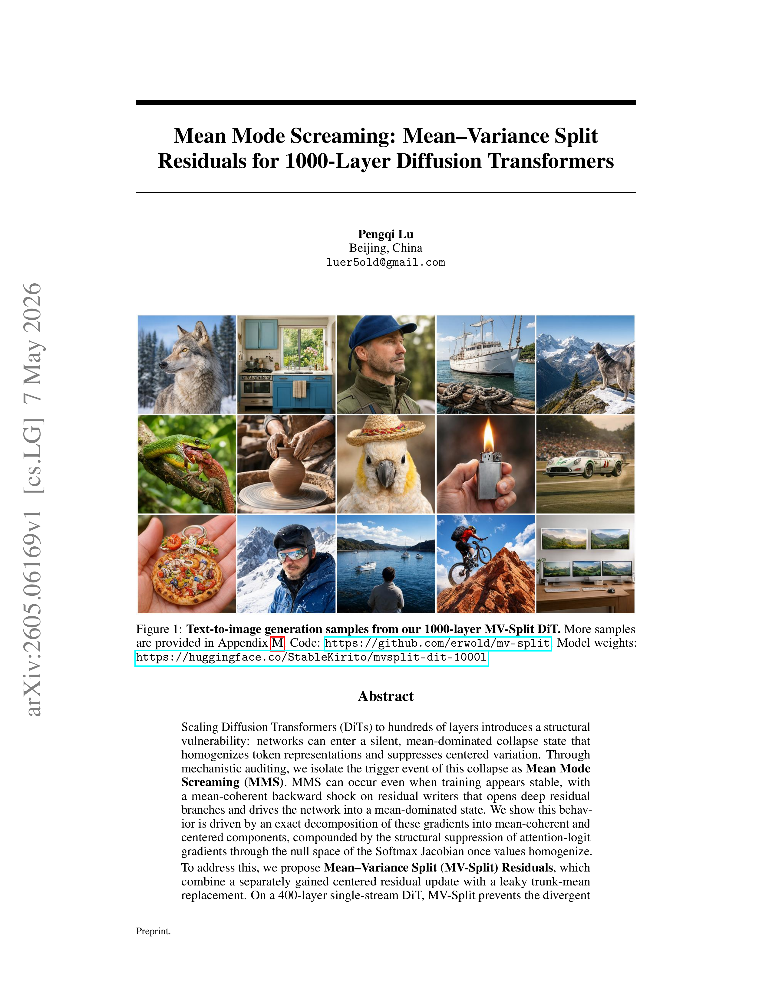
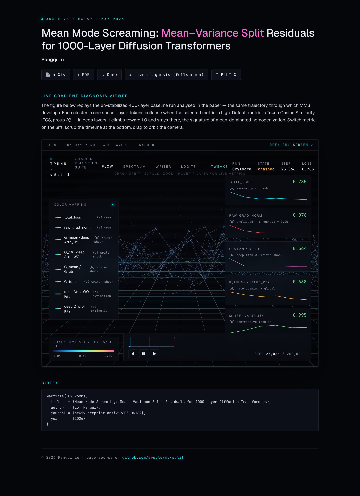

---

## 2. [MACE-Dance: Motion-Appearance Cascaded Experts for Music-Driven Dance Video Generation](https://huggingface.co/papers/2512.18181)
**Upvotes**: 80 | **도입 난이도**: 상 | **신뢰도**: 상
**arXiv**: https://arxiv.org/abs/2512.18181

**태그**: Video Generation, MoE, Diffusion Model, Motion Synthesis, Vision, Video, Audio, Benchmark, Evaluation

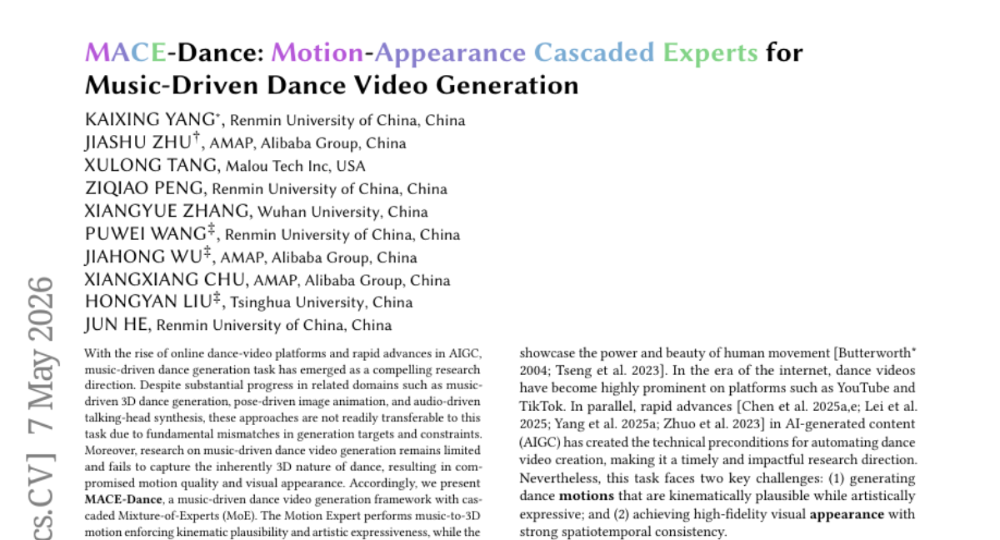

### 📌 한 줄 요약
음악에 맞춰 자연스러운 동작과 고화질 외형을 동시에 생성하는 MoE 기반의 댄스 비디오 생성 프레임워크

### 🔑 핵심 포인트
- Motion-Appearance Cascaded MoE: 동작 생성과 외형 합성을 분리하여 각 분야의 전문성을 극대화
- BiMamba-Transformer & GFT: 물리적 타당성과 예술적 표현력을 갖춘 고성능 3D 동작 생성
- Decoupled Fine-tuning: 동작 제어와 시각적 정체성 유지 사이의 균형을 맞춘 최적화 전략

### 🧑‍💻 개발자 관점
동작(Motion)과 외형(Appearance)을 분리된 전문가 모델로 처리함으로써, 복잡한 비디오 생성 태스크를 모듈화하여 제어할 수 있는 아키텍처 설계 패턴을 제시합니다.

### 🚀 실무 적용 아이디어
- BiMamba-Transformer 구조가 동작 생성의 시계열 데이터 처리에 미치는 영향 분석
- 제공된 데이터셋을 활용하여 Motion/Appearance 전문가 모델의 개별 성능 벤치마킹
- GFT(Guidance-Free Training) 전략을 다른 비디오 생성 태스크에 적용 가능한지 검토

### ⚠️ 리스크/한계
- 두 전문가 모델 간의 연쇄적 오류(Cascading Error) 발생 가능성
- 대규모 데이터셋과 복잡한 MoE 구조로 인한 높은 컴퓨팅 자원 요구량

### 📝 초록 기반 상세 설명
음악 기반 댄스 비디오 생성 기술에 대한 수요가 증가하고 있으나, 기존 방식으로는 고품질의 시각적 외형과 사실적인 동작을 동시에 확보하기 어려웠습니다. 이를 해결하기 위해 동작과 외형을 분리하여 처리하는 Cascaded Mixture-of-Experts(MoE) 구조인 MACE-Dance를 제안합니다. Motion Expert는 BiMamba-Transformer 하이브리드 구조와 GFT 전략을 통해 예술적이고 물리적으로 타당한 3D 동작을 생성합니다. Appearance Expert는 분리된 운동-미학 미세 조정 전략을 통해 참조 이미지의 정체성을 유지하며 일관된 비디오를 합성합니다. 연구진은 이 작업을 위한 대규모 데이터셋과 새로운 평가 프로토콜을 구축하였으며, 실험 결과 SOTA 성능을 달성했습니다.

---

## 3. [Flow-OPD: On-Policy Distillation for Flow Matching Models](https://huggingface.co/papers/2605.08063)
**Upvotes**: 73 | **도입 난이도**: 상 | **신뢰도**: 상
**arXiv**: https://arxiv.org/abs/2605.08063

**태그**: Generative AI, Flow Matching, Reinforcement Learning, Knowledge Distillation, Image Generation, RAG, Vision, Evaluation, Distillation, Safety

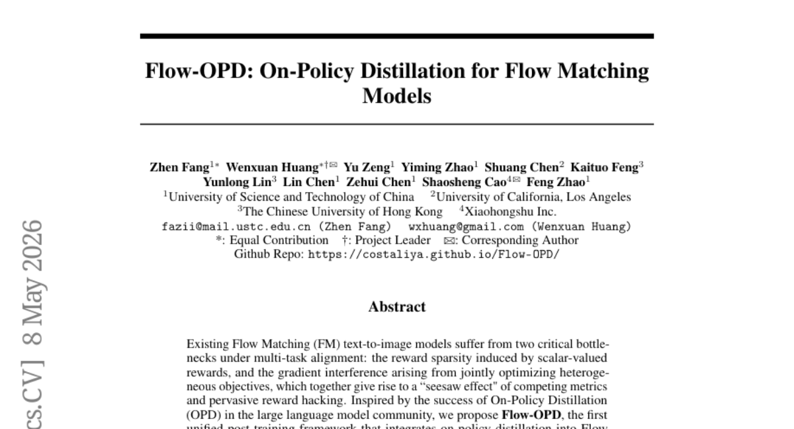

### 📌 한 줄 요약
멀티태스크 정렬 시 발생하는 성능 충돌(Seesaw effect)을 해결하기 위해 On-Policy Distillation을 Flow Matching 모델에 적용한 통합 사후 학습 프레임워크

### 🔑 핵심 포인트
- GRPO 기반의 전문가 교사 모델 학습 및 온폴리 증류(On-Policy Distillation)를 통한 지식 통합 전략
- 태스크 간 간섭을 최소화하기 위한 3단계 오케스트레이션(샘플링, 라우팅, 밀집 궤적 감독) 프로세스
- 생성 품질 유지를 위한 Manifold Anchor Regularization(MAR) 도입

### 🧑‍💻 개발자 관점
다양한 요구사항(OCR, 미적 품질 등)을 동시에 만족시켜야 하는 범용 이미지 생성 모델 개발 시, 지표 간 충돌 문제를 해결하는 실질적인 방법론을 제시합니다.

### 🚀 실무 적용 아이디어
- GRPO와 같은 강화학습 알고리즘을 Flow Matching 모델에 적용할 때의 학습 안정성 테스트
- 다양한 태스크(텍스트 렌더링 vs 미적 품질)를 동시에 학습시킬 때의 지표 간 상관관계 분석
- 제안된 MAR 기법을 기존 Diffusion 모델의 정렬 과정에 적용하여 품질 저하 여부 확인

### ⚠️ 리스크/한계
- 교사 모델의 품질에 대한 의존도가 높으며, 학습 복잡도가 매우 높음
- 온폴리 샘플링 과정에서의 높은 계산 비용 및 학습 시간 소요

### 📝 초록 기반 상세 설명
기존 Flow Matching 기반 텍스트-이미지 모델은 스칼라 보상으로 인한 희소성 및 이질적 목적 함수 간의 간섭 문제로 인해 특정 지표가 상승하면 다른 지표가 하락하는 '시소 효과'와 보상 해킹 문제를 겪습니다. 이를 해결하기 위해 본 논문은 LLM의 성공 사례를 차용한 Flow-OPD 프레임워크를 제안합니다. 먼저 GRPO를 통해 각 도메인에 특화된 전문가 교사 모델을 학습시킨 후, 온폴리 샘플링과 태스크 라우팅을 통해 이들의 지식을 하나의 학생 모델로 통합합니다. 또한, 생성 품질 저하를 막기 위해 태스크에 무관한 교사 모델을 활용하는 Manifold Anchor Regularization(MAR)을 도입했습니다. 실험 결과, Stable Diffusion 3.5 Medium을 기반으로 GenEval 및 OCR 정확도를 대폭 향상시키며 교사 모델을 능가하는 성능을 달성했습니다.

---

## 4. [HyperEyes: Dual-Grained Efficiency-Aware Reinforcement Learning for Parallel Multimodal Search Agents](https://huggingface.co/papers/2605.07177)
**Upvotes**: 57 | **도입 난이도**: 상 | **신뢰도**: 상
**arXiv**: https://arxiv.org/abs/2605.07177

**태그**: Agent, Multimodal, Reinforcement Learning, Efficiency, RAG, Vision, Benchmark, Evaluation, Inference, Distillation

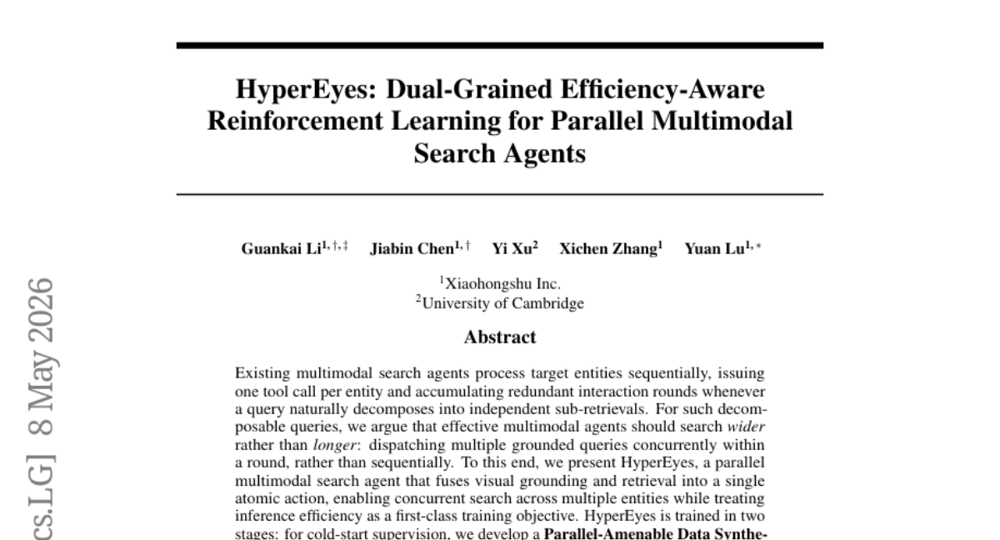

### 📌 한 줄 요약
병렬 검색을 통해 추론 효율성을 극대화한 멀티모달 에이전트 프레임워크 HyperEyes

### 🔑 핵심 포인트
- 시각적 그라운딩과 검색을 통합하여 다중 엔티티를 동시에 처리하는 병렬 검색 메커니즘
- 비용 효율성을 최적화하는 이중 계층 강화학습(TRACE 및 On-Policy Distillation)
- 정확도와 추론 효율성을 동시에 평가하는 새로운 벤치마크(IMEB) 제안

### 🧑‍💻 개발자 관점
에이전트의 응답 속도와 API 비용을 결정짓는 '툴 호출 횟수'를 획기적으로 줄이면서도 성능을 유지하는 실무적인 최적화 기법을 제시합니다.

### 🚀 실무 적용 아이디어
- 병렬 쿼리 처리를 위한 데이터셋 구축 및 합성 파이프라인 테스트
- 보상 함수 설계 시 정확도와 비용(Step count) 간의 트레이드오프 실험
- 멀티모달 환경에서의 토큰 수준 보상(Credit Assignment) 적용 검토

### ⚠️ 리스크/한계
- 병렬 처리 시 복잡한 제약 조건이 얽힌 쿼리에서의 정확도 저하 가능성
- 강화학습 학습 과정에서의 수렴 안정성 확보 필요

### 📝 초록 기반 상세 설명
기존 멀티모달 검색 에이전트는 독립적인 하위 쿼리들을 순차적으로 처리하여 불필요하게 많은 상호작용 라운드를 소모하는 문제가 있었습니다. 이를 해결하기 위해 시각적 그라운딩과 검색을 하나의 원자적 액션으로 통합하여 여러 엔티티를 동시에 탐색하는 HyperEyes를 제안합니다. 학습 과정에서는 효율성을 최우선 목표로 설정하며, 트래젝터리 수준의 비용 제어(TRACE)와 토큰 수준의 교정 신호(On-Policy Distillation)를 결합한 이중 계층 강화학습을 적용합니다. 또한 효율성과 정확도를 동시에 평가할 수 있는 새로운 벤치마크인 IMEB를 도입했습니다. 실험 결과, HyperEyes는 기존 오픈소스 에이전트 대비 정확도는 높이면서도 툴 호출 라운드는 획기적으로 줄이는 성과를 보였습니다.

---

## 5. [Listwise Policy Optimization: Group-based RLVR as Target-Projection on the LLM Response Simplex](https://huggingface.co/papers/2605.06139)
**Upvotes**: 57 | **도입 난이도**: 중 | **신뢰도**: 상
**arXiv**: https://arxiv.org/abs/2605.06139

**태그**: LLM, Reinforcement Learning, Reasoning, Optimization, Evaluation

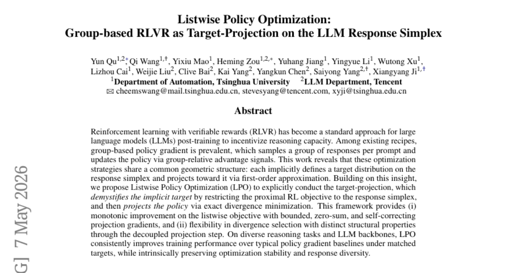

### 📌 한 줄 요약
기존 그룹 기반 RLVR의 기하학적 구조를 분석하여, 응답 분포를 명시적 타겟으로 투영하는 안정적이고 효율적인 정책 최적화 프레임워크(LPO) 제안

### 🔑 핵심 포인트
- 기존 그룹 기반 RLVR의 수학적 구조를 '응답 심플렉스 상의 타겟 투영'으로 재해석
- 명시적 타겟 정의와 정확한 발산 최소화를 통한 LPO(Listwise Policy Optimization) 프레임워크 제안
- 단조적 개선(Monotonic improvement)과 제약된 그래디언트를 통한 학습 안정성 및 다양성 확보

### 🧑‍💻 개발자 관점
LLM 추론 학습 시 발생하는 학습 불안정성(Instability)과 응답 붕괴(Collapse) 문제를 수학적 구조 개선을 통해 해결할 수 있는 방법론을 제시합니다.

### 🚀 실무 적용 아이디어
- 기존 PPO나 GRPO와 같은 그룹 기반 RL 알고리즘과 LPO의 학습 곡선 및 응답 다양성 비교 실험
- 다양한 Divergence(KL 등) 설정에 따른 LPO의 수렴 속도 및 성능 변화 테스트
- 추론 태스크(Math, Code) 외에 일반 대화 태스크에서의 응답 다양성 유지 능력 검증

### ⚠️ 리스크/한계
- 심플렉스 상의 타겟 정의가 복잡한 태스크에서 여전히 유효한지 검증 필요
- 기존 라이브러리(DeepSpeed-RL 등)에 즉시 적용하기 위한 구현 복잡도 존재

### 📝 초록 기반 상세 설명
LLM의 추론 능력을 높이기 위해 검증 가능한 보상을 사용하는 RLVR 방식이 널리 사용되고 있습니다. 기존의 그룹 기반 정책 경사 방식은 여러 응답을 샘플링하여 상대적 이점을 활용하지만, 그 수학적 목표가 모호하다는 특징이 있습니다. 본 논문은 이러한 방식이 응답 심플렉스(Response Simplex) 상의 타겟 분포로 투영되는 과정임을 밝혀냈습니다. 이를 바탕으로 제안된 LPO(Listwise Policy Optimization)는 타겟 분포를 명시적으로 정의하고 정확한 발산 최소화(Divergence Minimization)를 통해 정책을 업데이트합니다. 실험 결과, LPO는 기존 방식보다 학습 성능이 뛰어나며 최적화 안정성과 응답 다양성을 동시에 확보함을 입증했습니다.

---

## 6. [LLMs Improving LLMs: Agentic Discovery for Test-Time Scaling](https://huggingface.co/papers/2605.08083)
**Upvotes**: 53 | **도입 난이도**: 중 | **신뢰도**: 상
**arXiv**: https://arxiv.org/abs/2605.08083

**태그**: LLM, Test-Time Scaling, Agentic Discovery, Optimization, Agent, Reasoning, Benchmark, Evaluation, Inference

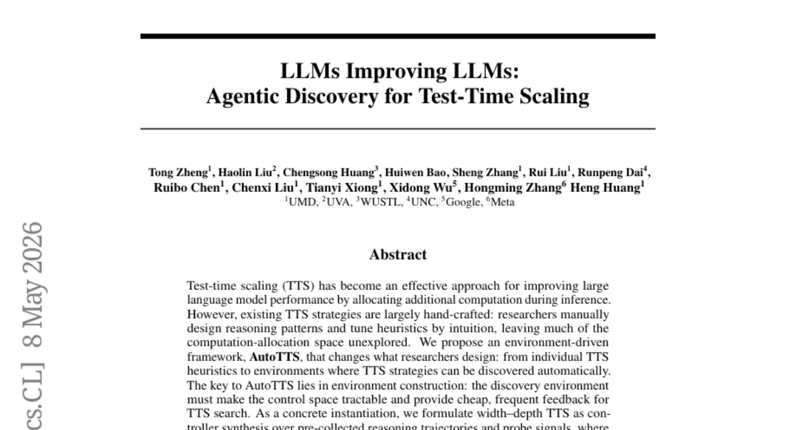

### 📌 한 줄 요약
수동적인 추론 패턴 설계를 넘어, 환경 기반 자동 탐색을 통해 최적의 Test-Time Scaling(TTS) 전략을 찾아내는 프레임워크 제안

### 🔑 핵심 포인트
- 수동 휴리스틱 설계에서 환경 기반 자동 전략 탐색(AutoTTS)으로의 패러다임 전환
- 저비용/고효율 탐색을 위한 컨트롤러 합성 및 beta parameterization 기법 도입
- 수동 설계 대비 우수한 정확도-비용 효율성 및 모델 규모/벤치마크에 대한 일반화 성능 확보

### 🧑‍💻 개발자 관점
추론 비용을 최적화하면서 모델 성능을 극대화해야 하는 실무 환경에서, 사람이 직접 프롬프트 엔지니어링을 하는 대신 자동화된 최적화 루프를 구축할 수 있는 방법론을 제시합니다.

### 🚀 실무 적용 아이디어
- 수동으로 작성한 Chain-of-Thought(CoT) 프롬프트를 자동화된 제어 로직으로 변환 가능한지 검토
- 특정 도메인(수학, 코드 등)에 특화된 저비용 피드백 환경(Environment) 설계 실험
- 모델의 추론 비용과 정확도 사이의 Pareto frontier를 확인하기 위한 프로토타입 구현

### ⚠️ 리스크/한계
- 환경 설계(Environment Construction) 역량에 따라 탐색 효율이 크게 좌우될 수 있음
- 특정 도메인에 최적화된 전략이 다른 도메인으로 전이되지 않을 가능성

### 📝 초록 기반 상세 설명
최근 모델 성능 향상을 위해 추론 시 연산량을 늘리는 Test-Time Scaling(TTS)이 주목받고 있으나, 기존 방식은 연구자의 직관에 의존한 수동 설계에 머물러 있습니다. 이를 해결하기 위해 연구자가 개별 휴리스틱이 아닌, 전략을 스스로 발견할 수 있는 환경을 설계하는 AutoTTS 프레임워크를 제안합니다. 이 프레임워크는 제어 공간을 관리 가능한 수준으로 만들고, 반복적인 LLM 호출 없이도 저렴하고 빈번한 피드백을 제공하는 환경 구축에 집중합니다. 구체적으로는 사전 수집된 추론 궤적과 프로브 신호를 활용하여 분기, 지속, 가지치기 등의 동작을 결정하는 컨트롤러를 합성합니다. 실험 결과, 자동 발견된 전략은 수동 설계 방식보다 우수한 정확도-비용 트레이드오프를 보였으며, 낮은 비용과 짧은 시간 내에 학습되었습니다.

---

## 7. [HumanNet: Scaling Human-centric Video Learning to One Million Hours](https://huggingface.co/papers/2605.06747)
**Upvotes**: 40 | **도입 난이도**: 중 | **신뢰도**: 상
**arXiv**: https://arxiv.org/abs/2605.06747

**태그**: Embodied AI, Video Learning, Dataset, Foundation Model, Vision, Video

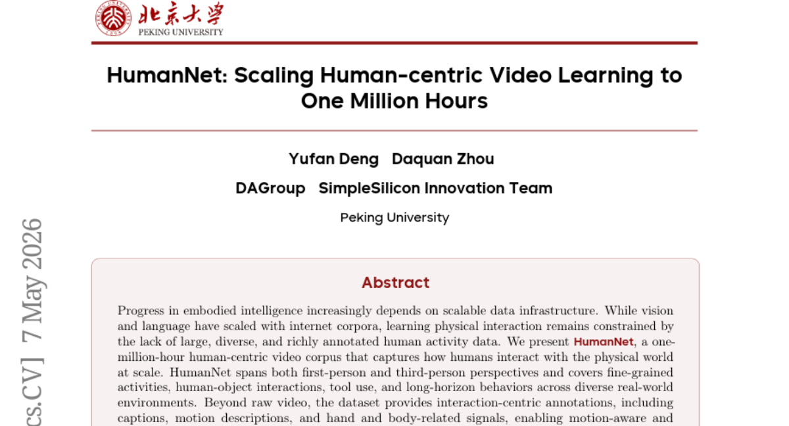

### 📌 한 줄 요약
100만 시간 규모의 인간 중심 비디오 코퍼스를 구축하여 로봇 데이터의 한계를 극복하고 임바디드 AI(Embodied AI) 학습의 확장성을 제시함

### 🔑 핵심 포인트
- 100만 시간 규모의 대규모 인간 중심 비디오 코퍼스 'HumanNet' 구축
- 인간-사물 상호작용 및 동작 인식을 위한 정교한 주석(Caption, Motion, Hand/Body signals) 제공
- 인터넷 비디오를 임바디드 학습용 데이터로 변환하는 체계적인 큐레이션 방법론 제안

### 🧑‍💻 개발자 관점
로봇 학습을 위해 고비용의 로봇 데이터를 직접 수집하는 대신, 대규모 인간 비디오를 활용해 기초 모델(Foundation Model)을 학습시킬 수 있는 새로운 경로를 제시합니다.

### 🚀 실무 적용 아이디어
- 제공된 데이터셋을 활용하여 기존 VLM 모델의 동작 이해 능력 벤치마킹
- 1인칭(Egocentric) 비디오 데이터가 로봇 제어 정책(Policy) 학습에 미치는 영향 분석
- HumanNet의 큐레이션 파이프라인을 자체 보유한 비디오 데이터에 적용해보기

### ⚠️ 리스크/한계
- 인간의 움직임과 로봇의 물리적 제어 사이의 도메인 간극(Sim-to-Real과 유사한 문제) 존재
- 대규모 데이터 처리 및 학습을 위한 막대한 컴퓨팅 자원 필요

### 📝 초록 기반 상세 설명
임바디드 지능의 발전을 위해서는 대규모 데이터 인프라가 필수적이지만, 물리적 상호작용을 포함한 다양하고 정교한 데이터 확보는 여전히 어려운 과제입니다. 본 논문은 100만 시간 규모의 인간 중심 비디오 코퍼스인 HumanNet을 제안합니다. 이 데이터셋은 1인칭 및 3인칭 시점을 모두 포함하며, 인간-사물 상호작용, 도구 사용, 장기적 행동 등 정교한 주석을 제공합니다. 연구진은 인터넷의 비정형 영상을 임바디드 학습용 데이터로 변환하기 위해 필터링, 시점 다양성, 주석 강화 등의 체계적인 큐레이션 패러다임을 도입했습니다. 실험 결과, HumanNet의 1인칭 비디오를 활용한 학습이 소규모 로봇 데이터 학습보다 우수한 성능을 보이며 인간 비디오가 로봇 데이터의 효과적인 대안이 될 수 있음을 입증했습니다.

---

## 8. [Anisotropic Modality Align](https://huggingface.co/papers/2605.07825)
**Upvotes**: 22 | **도입 난이도**: 중 | **신뢰도**: 상
**arXiv**: https://arxiv.org/abs/2605.07825

**태그**: Multimodal, Representation Learning, Geometry, LLM, RAG, Safety

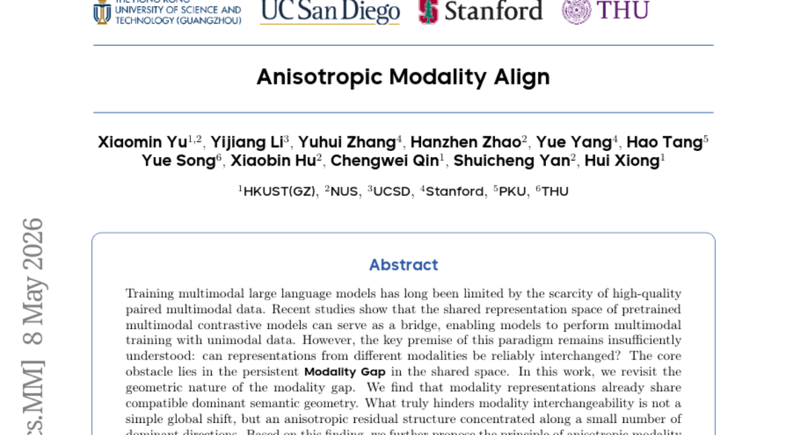

### 📌 한 줄 요약
데이터 부족 문제를 해결하기 위해 모달리티 간 기하학적 구조 차이를 정밀하게 교정하여 비대칭적 정렬을 수행하는 프레임워크 제안

### 🔑 핵심 포인트
- 모달리티 갭의 원인이 특정 방향에 집중된 비등방성 잔차 구조임을 기하학적으로 규명
- 타겟 모달리티의 내부 기하학적 사전 정보를 활용하는 AnisoAlign 프레임워크 제안
- 비대칭적 정렬을 통해 소스 모달리티의 의미 구조를 유지하며 타겟 모달리티로의 변환 가능성 확보

### 🧑‍💻 개발자 관점
고품질 멀티모달 데이터가 부족한 상황에서, 기존의 단일 모달리티 데이터만으로도 효과적인 멀티모달 모델 학습(Unpaired Alignment)이 가능해집니다.

### 🚀 실무 적용 아이디어
- 기존 CLIP 기반 모델의 임베딩 공간에서 모달리티 간 방향성 차이(Anisotropy) 측정해보기
- AnisoAlign의 기하학적 교정 로직을 기존 Contrastive Learning 파이프라인에 적용해보기
- 데이터 부족 상황에서 Unpaired 데이터만으로 MLLM 성능 변화 관찰하기

### ⚠️ 리스크/한계
- 특정 도메인에 특화된 데이터셋에서는 기하학적 구조가 달라져 일반화 성능이 저하될 수 있음
- 복잡한 기하학적 교정 과정이 추가적인 연산 비용을 발생시킬 가능성

### 📝 초록 기반 상세 설명
멀티모달 모델 학습 시 고품질 쌍(pair) 데이터 부족 문제를 해결하기 위해 사전 학습된 모델의 공유 표현 공간을 활용하는 연구가 활발합니다. 그러나 서로 다른 모달리티 간의 표현을 교체할 때 발생하는 '모달리티 갭(Modality Gap)'이 주요 장애물로 작용합니다. 본 논문은 이 갭이 단순한 전역적 이동이 아니라 특정 방향에 집중된 비등방성(anisotropic) 잔차 구조임을 밝혀냈습니다. 이를 해결하기 위해 타겟 모달리티의 분포를 따르면서 소스 모달리티의 의미 구조를 보존하는 AnisoAlign 프레임워크를 제안합니다. 실험 결과, 제안된 방식은 기하학적 진단뿐만 아니라 텍스트 전용 데이터를 활용한 MLLM 학습에서도 우수한 성능을 보였습니다.

---

## 9. [Beyond Retrieval: A Multitask Benchmark and Model for Code Search](https://huggingface.co/papers/2605.04615)
**Upvotes**: 22 | **도입 난이도**: 중 | **신뢰도**: 상
**arXiv**: https://arxiv.org/abs/2605.04615

**태그**: Code Search, Reranking, Benchmark, LLM, RAG, Evaluation

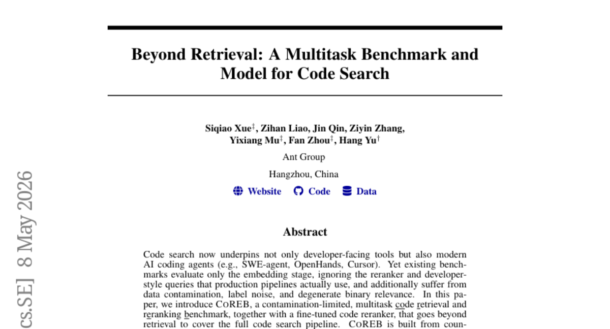

### 📌 한 줄 요약
단순 검색을 넘어 리랭킹(Reranking)까지 포함하는 통합 코드 검색 벤치마크(CoREB)와 최적화된 리랭커 모델 제안

### 🔑 핵심 포인트
- 데이터 오염과 레이블 노이즈를 해결한 멀티태스크 벤치마크 CoREB 구축
- 단순 검색을 넘어 리랭킹(Reranking)을 포함한 전체 코드 검색 파이프라인 검증
- 텍스트-코드, 코드-텍스트, 코드-코드 등 다양한 시나리오를 아우르는 평가 체계

### 🧑‍💻 개발자 관점
실제 개발자가 사용하는 짧은 키워드 검색이나 코드 간 유사도 검색 등 복잡한 실무 시나리오에서 검색 시스템의 성능을 정확히 측정하고 개선할 수 있습니다.

### 🚀 실무 적용 아이디어
- 기존 임베딩 모델에 CoREB-Reranker를 결합하여 검색 파이프라인 성능 테스트
- 실제 서비스 중인 코드 검색 엔진의 쿼리 유형(키워드 vs 문장)에 따른 성능 격차 분석
- 제공된 CoREB 데이터셋을 활용하여 모델의 데이터 오염 여부 검증

### ⚠️ 리스크/한계
- 실제 운영 환경의 복잡한 쿼리 패턴을 완벽히 모사하기에는 여전히 한계가 있을 수 있음
- 리랭킹 모델 도입 시 발생하는 추가적인 추론 지연 시간(Latency) 고려 필요

### 📝 초록 기반 상세 설명
기존 코드 검색 평가는 단순 검색(Retrieval) 단계에만 치중되어 있으며, 데이터 오염 및 레이블 노이즈 문제로 인해 실제 운영 환경을 반영하지 못하는 한계가 있었습니다. 본 논문은 이를 해결하기 위해 데이터 오염을 최소화하고 리랭킹 작업까지 포함하는 멀티태스크 벤치마크인 CoREB를 제안합니다. CoREB는 LiveCodeBench를 기반으로 5개 언어에 대해 정교한 관련성 판단 기준을 제공하며, 텍스트-코드, 코드-텍스트, 코드-코드의 세 가지 태스크를 포함합니다. 실험 결과, 기존 모델들은 짧은 키워드 쿼리나 태스크 간 비대칭성 문제로 인해 실무 적용에 어려움이 있음을 확인했습니다. 최종적으로 제안된 CoREB-Reranker는 모든 태스크에서 일관된 성능 향상을 달성하며 통합 파이프라인의 중요성을 입증했습니다.

---

## 10. [UniPrefill: Universal Long-Context Prefill Acceleration via Block-wise Dynamic Sparsification](https://huggingface.co/papers/2605.06221)
**Upvotes**: 19 | **도입 난이도**: 상 | **신뢰도**: 상
**arXiv**: https://arxiv.org/abs/2605.06221

**태그**: LLM Inference, vLLM, Prefill Acceleration, Long Context, Inference

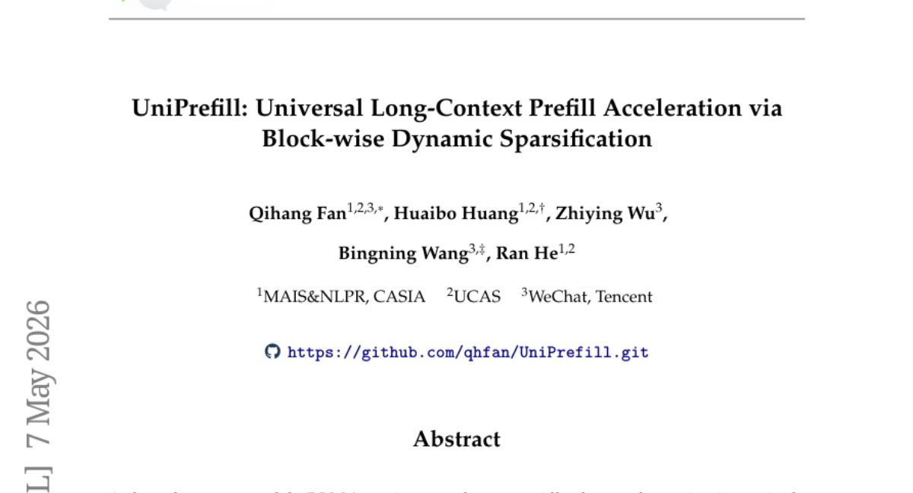

### 📌 한 줄 요약
모델 아키텍처에 구애받지 않고 vLLM 환경에서 TTFT를 최대 2.1배 가속하는 범용 프리필(Prefill) 가속 프레임워크

### 🔑 핵심 포인트
- 아키텍처 독립적 가속: 특정 모델 구조에 국한되지 않는 범용적인 토큰 레벨 가속 방식 제공
- vLLM 네이티브 통합: 연속 배치 및 프리필-디코드 공동 처리(Co-processing)를 지원하는 스케줄러 확장
- TTFT 최적화: 요청 수가 증가하는 고부하 환경에서 더욱 강력한 성능 향상 제공

### 🧑‍💻 개발자 관점
vLLM과 같은 최신 추론 엔진에 통합 가능한 구조이므로, 긴 컨텍스트를 다루는 서비스의 응답 지연(TTFT)을 줄이는 데 실질적인 도움이 됩니다.

### 🚀 실무 적용 아이디어
- vLLM 환경에서 기존 Sparse Attention 방식과 UniPrefill의 성능 비교 실험
- 다양한 하이브리드 모델(Linear/Sliding Window)에서의 가속 효율성 검증
- 동시 요청 수(Concurrency) 변화에 따른 TTFT 및 처리량(Throughput) 변화 측정

### ⚠️ 리스크/한계
- vLLM 엔진 내부 스케줄러 및 연산 커널 수정이 필요하여 도입 난이도가 높음
- 토큰 레벨 가속 방식이 모델의 최종 출력 정확도(Perplexity)에 미치는 영향 확인 필요

### 📝 초록 기반 상세 설명
LLM의 컨텍스트 길이가 길어짐에 따라 효율적인 프리필 처리가 중요해지고 있습니다. 기존의 희소 어텐션(Sparse Attention) 기반 가속 방식은 하이브리드 아키텍처에서 성능이 저하되고 연속 배치(Continuous Batching) 환경과의 호환성이 낮다는 문제가 있습니다. 이를 해결하기 위해 토큰 레벨에서 연산을 가속하는 범용 프레임워크인 UniPrefill을 제안합니다. UniPrefill은 vLLM의 스케줄링 전략을 확장하여 프리필-디코드 공동 처리 및 텐서 병렬 처리를 지원하도록 설계되었습니다. 실험 결과, TTFT를 최대 2.1배 가속하였으며 요청 수가 많아질수록 가속 효과가 더욱 뚜렷하게 나타났습니다.

---

## 11. [TextLDM: Language Modeling with Continuous Latent Diffusion](https://huggingface.co/papers/2605.07748)
**Upvotes**: 18 | **도입 난이도**: 중 | **신뢰도**: 상
**arXiv**: https://arxiv.org/abs/2605.07748

**태그**: Diffusion, Language Modeling, Transformer, Multimodal, Vision, Video, Safety

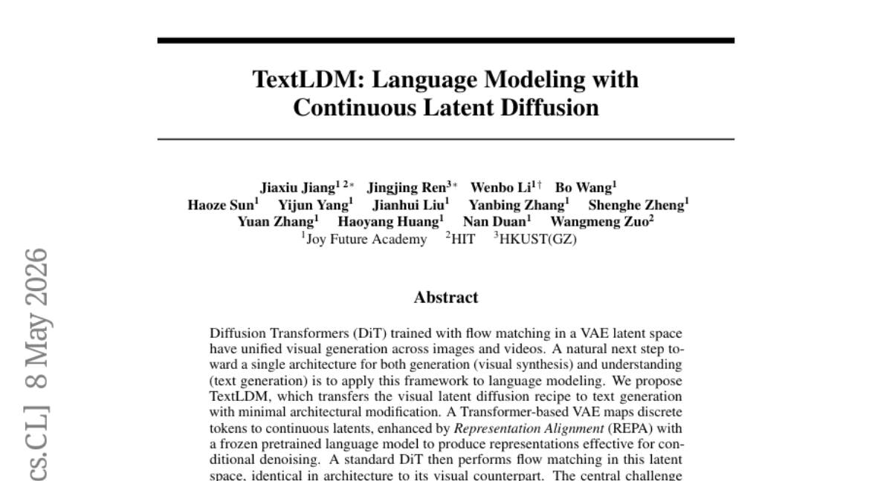

### 📌 한 줄 요약
시각적 Diffusion Transformer(DiT) 구조를 텍스트 생성에 성공적으로 이식하여 GPT-2 수준의 성능을 달성한 연속적 잠재 확산 모델

### 🔑 핵심 포인트
- 시각적 DiT 레시피를 텍스트 생성에 적용 가능한 연속적 잠재 공간 프레임워크 구축
- REPA(Representation Alignment)를 통해 잠재 표현을 사전 학습된 LM과 정렬하여 생성 품질 확보
- Transformer 기반 VAE와 Flow Matching을 결합한 통합적 생성 아키텍처 제안

### 🧑‍💻 개발자 관점
이미지/비디오 생성 모델과 동일한 아키텍처를 텍스트 생성에 사용할 수 있음을 증명하여, 향후 멀티모달 통합 모델 설계의 기술적 토대를 제공합니다.

### 🚀 실무 적용 아이디어
- REPA 기법을 활용한 다양한 VAE 잠재 공간 정렬 실험
- Flow Matching 기반 텍스트 생성의 추론 속도 및 효율성 벤치마크
- 멀티모달 데이터셋을 활용한 시각-언어 통합 학습 실험

### ⚠️ 리스크/한계
- 이산적 토큰 방식 대비 긴 문맥 유지 및 정밀한 제어의 어려움 가능성
- 고품질 연속 잠재 표현을 얻기 위한 사전 학습 모델 의존성

### 📝 초록 기반 상세 설명
최근 Diffusion Transformer(DiT)는 이미지와 비디오 생성에서 뛰어난 성능을 보였으나, 이를 텍스트 생성(언어 모델링)에 적용하는 것은 새로운 도전 과제였습니다. 기존의 이산적 토큰 방식 대신, Transformer 기반 VAE를 통해 텍스트를 연속적인 잠재 공간(Latent Space)으로 매핑하는 방식을 제안합니다. 연구 과정에서 단순한 재구성 정밀도보다 사전 학습된 언어 모델과의 정렬(REPA)이 생성 품질에 결정적임을 발견했습니다. 제안된 TextLDM은 DiT 구조를 활용하여 이 잠재 공간 내에서 Flow Matching을 수행합니다. 실험 결과, TextLDM은 기존 확산 기반 언어 모델을 능가하며 동일 조건에서 GPT-2와 대등한 성능을 보여주었습니다.

---

## 12. [AEM: Adaptive Entropy Modulation for Multi-Turn Agentic Reinforcement Learning](https://huggingface.co/papers/2605.00425)
**Upvotes**: 16 | **도입 난이도**: 중 | **신뢰도**: 상
**arXiv**: https://arxiv.org/abs/2605.00425

**태그**: LLM Agent, Reinforcement Learning, Credit Assignment, Entropy Modulation, Agent, RAG, Vision

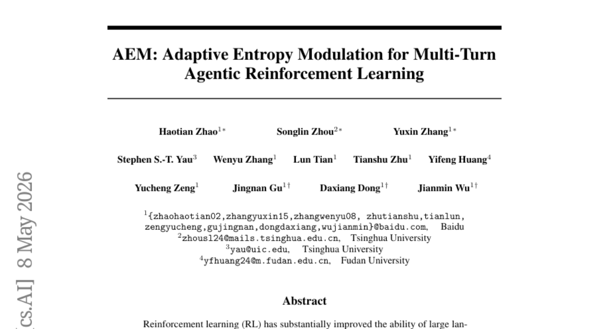

### 📌 한 줄 요약
추가적인 보상 모델 없이 엔트로피 조절만으로 멀티턴 에이전트의 신용 할당(Credit Assignment) 문제를 해결하는 학습 방법론

### 🔑 핵심 포인트
- 감독 신호(Process Reward) 없이 엔트로피 조절을 통한 신용 할당 문제 해결
- 토큰 단위가 아닌 응답(Response) 단위의 엔트로피 역학 도입으로 에이전트 행동 특성 반영
- 자연 경사 업데이트(Natural-gradient updates)를 고려한 적응형 어드밴티지(Advantage) 재스케일링

### 🧑‍💻 개발자 관점
복잡한 PRM(Process Reward Model) 구축 없이도 에이전트의 학습 안정성과 탐험 효율을 높일 수 있는 실용적인 RL 기법입니다.

### 🚀 실무 적용 아이디어
- 기존 RL 에이전트 학습 파이프라인에 응답 단위 엔트로피 스케일링 적용 테스트
- 다양한 태스크 환경에서 토큰 단위 vs 응답 단위 엔트로피의 성능 차이 비교
- 소형 모델(1.5B~7B)에서의 탐험-활용 전환 효율성 검증

### ⚠️ 리스크/한계
- 엔트로피 조절 파라미터가 특정 환경이나 태스크 복잡도에 따라 민감하게 반응할 가능성
- 매우 긴 컨텍스트를 가진 태스크에서 응답 단위 엔트로피의 변동성 문제

### 📝 초록 기반 상세 설명
LLM 에이전트의 멀티턴 작업 수행을 위한 강화학습(RL)은 희소한 보상 문제로 인해 각 단계의 기여도를 평가하는 신용 할당이 어렵습니다. 기존 방식은 프로세스 보상 모델(PRM) 등 추가적인 감독 신호를 사용하여 복잡도와 일반화 성능 문제를 야기합니다. 본 논문은 별도의 감독 없이 엔트로피 역학을 적응적으로 조절하여 탐험과 활용의 균형을 맞추는 AEM 방식을 제안합니다. 특히 토큰 단위가 아닌 응답(Response) 단위로 엔트로피를 관리하여 에이전트의 행동 단위와 일치시키고 노이즈를 줄였습니다. 실험 결과, ALFWorld 및 SWE-bench 등 다양한 벤치마크에서 기존 RL 베이스라인보다 우수한 성능을 입증했습니다.

---

## 13. [DecodingTrust-Agent Platform (DTap): A Controllable and Interactive Red-Teaming Platform for AI Agents](https://huggingface.co/papers/2605.04808)
**Upvotes**: 16 | **도입 난이도**: 중 | **신뢰도**: 상
**arXiv**: https://arxiv.org/abs/2605.04808

**태그**: AI Agent, Red-Teaming, Security, Automation, Agent, Evaluation, Safety

_A_Controllable_and_Interactive_Red-Teaming_Platform_for_AI_Agent_img.jpg)

### 📌 한 줄 요약
AI 에이전트의 보안 취약점을 자동 탐지하고 평가하기 위한 대규모 인터랙티브 레드팀 플랫폼(DTap) 제안

### 🔑 핵심 포인트
- Google Workspace, Slack 등 실무 환경을 모사한 50개 이상의 시뮬레이션 환경 제공
- 다양한 공격 벡터(Prompt, Tool, Skill 등)를 자율적으로 탐색하는 DTap-Red 개발
- 자동 검증이 가능한 대규모 레드팀 데이터셋 DTap-Bench 구축

### 🧑‍💻 개발자 관점
에이전트가 외부 도구 및 데이터와 상호작용할 때 발생할 수 있는 예기치 못한 보안 취약점을 체계적으로 테스트할 수 있는 프레임워크를 제공합니다.

### 🚀 실무 적용 아이디어
- 자사 서비스용 에이전트의 도구 호출(Tool-use) 로직에 대한 DTap-Red 방식의 공격 시뮬레이션 수행
- 에이전트가 사용하는 API 권한 범위와 보안 정책이 DTap-Bench의 공격 시나리오에 얼마나 견고한지 검토
- 에이전트 워크플로우 내에 보안 가드레일(Guardrails)을 설계할 때 DTap의 공격 벡터를 참고하여 설계

### ⚠️ 리스크/한계
- 시뮬레이션 환경이 실제 운영 환경의 모든 변수를 완벽히 반영하지 못할 가능성
- 자율 공격 에이전트(DTap-Red)가 생성하는 공격 패턴이 특정 모델에 편향될 위험

### 📝 초록 기반 상세 설명
AI 에이전트가 복잡한 워크플로우를 자동화함에 따라 API 키 유출이나 데이터 삭제와 같은 보안 위협이 증가하고 있습니다. 하지만 에이전트의 동적이고 복잡한 환경 특성상 현실적이고 재현 가능한 보안 평가 환경을 구축하기가 매우 어렵습니다. 이를 해결하기 위해 다양한 실무 환경을 모사한 50개 이상의 시뮬레이션 환경을 포함하는 DTap 플랫폼을 제안합니다. 또한, 다양한 공격 벡터를 자율적으로 탐색하는 레드팀 에이전트인 DTap-Red와 검증 가능한 데이터셋인 DTap-Bench를 함께 도입했습니다. 이를 통해 다양한 백본 모델 기반 에이전트들의 보안 정책과 취약점 패턴을 대규모로 평가하여 차세대 에이전트 개발을 위한 통찰을 제공합니다.

---

## 14. [4DThinker: Thinking with 4D Imagery for Dynamic Spatial Understanding](https://huggingface.co/papers/2605.05997)
**Upvotes**: 15 | **도입 난이도**: 상 | **신뢰도**: 상
**arXiv**: https://arxiv.org/abs/2605.05997

**태그**: VLM, 4D Reasoning, Reinforcement Learning, Video Understanding, Reasoning, Vision, Video, Benchmark, Inference

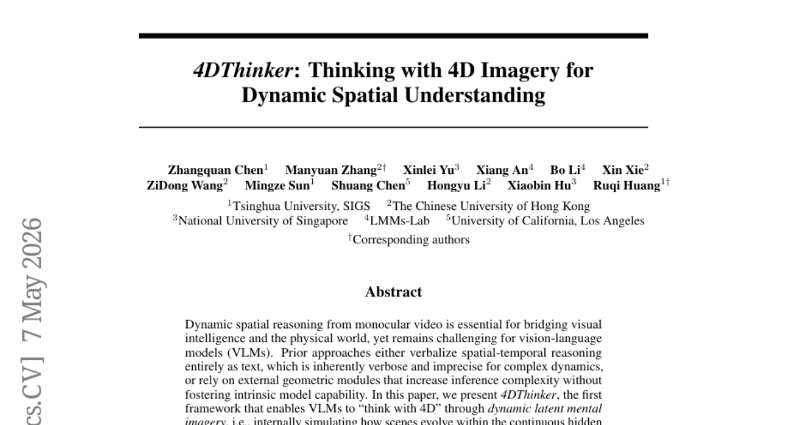

### 📌 한 줄 요약
텍스트 기반의 한계를 넘어 잠재 공간 내 4D 시각적 시뮬레이션을 통해 동적 공간 추론 능력을 강화한 VLM 프레임워크

### 🔑 핵심 포인트
- 잠재 공간 내 동적 이미지 시뮬레이션을 통한 4D 추론 메커니즘 제안
- 데이터 생성 파이프라인 및 텍스트-4D 잠재 공간 결합 학습(DIFT) 방식 도입
- 결과 기반 보상을 활용하여 텍스트 토큰에 정책 경사(Policy Gradient)를 적용하는 4DRL 기법

### 🧑‍💻 개발자 관점
단순 텍스트 출력을 넘어 모델 내부의 잠재 공간을 활용해 시공간적 변화를 예측하는 새로운 학습 패러다임을 제시합니다.

### 🚀 실무 적용 아이디어
- 제공된 데이터 생성 파이프라인을 활용한 커스텀 비디오 데이터셋 구축 실험
- DIFT 방식이 모델의 시각적 정렬(Alignment)에 미치는 영향 분석
- 4DRL을 활용한 복잡한 물리적 추론 태스크 적용 테스트

### ⚠️ 리스크/한계
- 잠재 공간 시뮬레이션에 따른 높은 연산 비용 및 학습 복잡도
- 텍스트 토큰에 국한된 RL 방식이 복잡한 4D 제어 능력에 미치는 한계

### 📝 초록 기반 상세 설명
단안 비디오를 통한 동적 공간 추론은 물리 세계 이해에 필수적이지만, 기존 VLM은 텍스트로만 공간 정보를 표현하여 정밀도가 떨어지거나 외부 기하 모듈에 의존하는 문제가 있었습니다. 본 논문은 모델 내부의 연속적인 잠재 공간에서 장면의 변화를 시뮬레이션하는 '4D 사고' 방식인 4DThinker를 제안합니다. 이를 위해 별도의 어노테이션 없이 4D 추론 데이터를 생성하는 파이프라인을 구축하고, 텍스트 토큰과 4D 잠재 공간을 동시에 학습하는 DIFT(Dynamic-Imagery Fine-Tuning)를 도입했습니다. 또한, 4DRL(4D Reinforcement Learning)을 통해 복잡한 추론 과제를 해결하며 최적화 안정성을 확보했습니다. 실험 결과, 4DThinker는 다양한 동적 공간 추론 벤치마크에서 기존 모델들을 상회하는 성능을 입증했습니다.

---

## 15. [Rethinking State Tracking in Recurrent Models Through Error Control Dynamics](https://huggingface.co/papers/2605.07755)
**Upvotes**: 14 | **도입 난이도**: 중 | **신뢰도**: 상
**arXiv**: https://arxiv.org/abs/2605.07755

**태그**: RNN, SSM, Linear Attention, State Tracking, Error Control

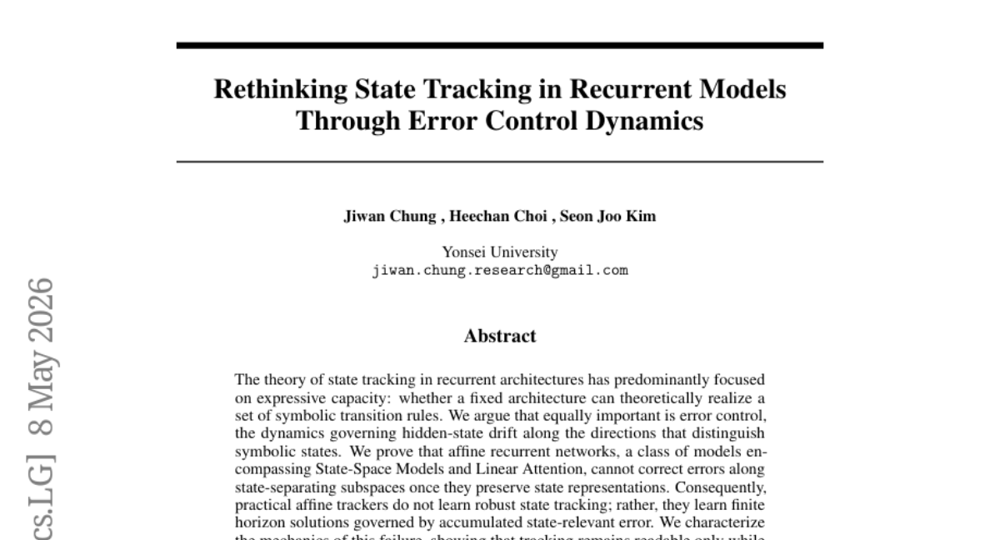

### 📌 한 줄 요약
RNN 계열 모델(SSM, Linear Attention 포함)의 상태 추적 실패 원인이 표현력이 아닌 '오차 제어 능력 부족'에 있음을 규명함

### 🔑 핵심 포인트
- Affine 순환 모델(SSM, Linear Attention 등)의 구조적 한계로 인한 오차 수정 불가능성 증명
- 상태 추적 실패를 '상태 간 분리도'와 '누적 오차' 사이의 관계(Readability threshold)로 정형화
- 모델의 유효 수평선(Horizon)이 학습된 디코더의 판독 임계치에 의해 결정됨을 규명

### 🧑‍💻 개발자 관점
SSM이나 Linear Attention 기반 모델을 장기 시퀀스 작업에 적용할 때, 왜 시간이 지남에 따라 성능이 급격히 저하되는지에 대한 이론적 근거를 제공합니다.

### 🚀 실무 적용 아이디어
- SSM 기반 모델의 시퀀스 길이에 따른 성능 저하 곡선과 오차 누적량 상관관계 분석
- 상태 분리(State separation)를 강화하는 정규화 기법 적용 후 수평선 변화 관찰
- 학습된 디코더의 판독 임계치를 측정하여 모델의 예상 수명(Horizon) 예측 실험

### ⚠️ 리스크/한계
- 모델의 표현력 자체를 높이는 것만으로는 근본적인 오차 제어 문제를 해결할 수 없음
- 특정 태스크(Group state-tracking)에 국한된 실험 결과가 모든 도메인에 동일하게 적용될지는 검증 필요

### 📝 초록 기반 상세 설명
기존의 순환 신경망 연구는 모델의 표현력(Expressivity)에 집중해 왔으나, 실제로는 상태 추적 과정에서의 오차 제어가 더 중요한 문제임을 제기합니다. 연구진은 Affine 순환 네트워크(SSM, Linear Attention 포함)가 상태를 보존하는 과정에서 발생하는 오차를 스스로 수정하지 못한다는 점을 증적했습니다. 이로 인해 모델은 영구적인 상태 추적이 아닌, 오차가 임계치를 넘기 전까지만 유효한 '유한한 수평선(Finite horizon)' 솔루션을 학습하게 됩니다. 실험 결과, 상태 간 구별 가능성과 오차 누적 사이의 비율이 특정 임계치를 넘을 때 성능 붕괴가 발생함을 확인했습니다. 결론적으로 모델의 성능은 이론적 표현력이 아닌, 오차 제어 역량에 의해 결정됨을 밝혀냈습니다.

---

## 16. [MatryoshkaLoRA: Learning Accurate Hierarchical Low-Rank Representations for LLM Fine-Tuning](https://huggingface.co/papers/2605.07850)
**Upvotes**: 14 | **도입 난이도**: 하 | **신뢰도**: 상
**arXiv**: https://arxiv.org/abs/2605.07850

**태그**: LLM, Parameter-Efficient Fine-Tuning, LoRA, Model Compression, Evaluation

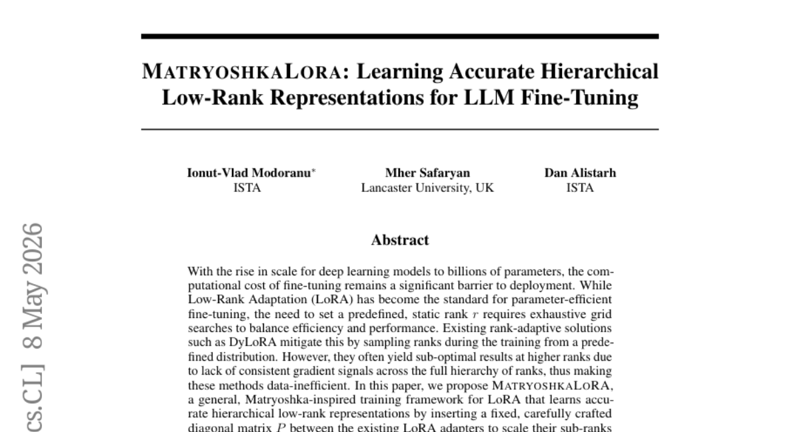

### 📌 한 줄 요약
단일 학습으로 다양한 랭크(Rank)를 지원하는 계층적 LoRA 프레임워크를 통해 효율적인 모델 배포와 동적 랭크 선택을 가능하게 함

### 🔑 핵심 포인트
- Matryoshka 구조를 활용한 계층적 저차원 표현 학습 프레임워크 제안
- 대각 행렬 P를 통한 하위 랭크 간의 효율적인 그래디언트 정보 공유 및 스케일링
- 성능 저하를 최소화하면서 다양한 랭크를 선택할 수 있는 동적 랭크 선택 기능 제공

### 🧑‍💻 개발자 관점
하나의 학습된 모델로 서비스 환경(리소스 상황)에 따라 랭크를 자유롭게 조절하며 성능과 속도를 최적화할 수 있습니다.

### 🚀 실무 적용 아이디어
- 기존 LoRA 모델과 MatryoshkaLoRA의 랭크별 성능 변화 비교 실험
- 다양한 하드웨어 환경(Edge vs Cloud)에서의 추론 속도 및 정확도 트레이드오프 테스트
- 제안된 AURAC 지표를 활용한 기존 DyLoRA와의 벤치마크 수행

### ⚠️ 리스크/한계
- 특수 설계된 대각 행렬 P의 설정이 성능에 미치는 민감도 확인 필요
- 매우 낮은 랭크로 급격히 줄일 경우 발생할 수 있는 성능 하한선 존재

### 📝 초록 기반 상세 설명
LLM 파라미터 규모가 커짐에 따라 효율적인 미세 조정(Fine-tuning)이 중요해졌으나, 기존 LoRA는 고정된 랭크 설정으로 인해 최적의 성능과 효율 사이의 균형을 맞추기 위해 반복적인 그리드 탐색이 필요했습니다. 기존의 가변 랭크 방식인 DyLoRA는 훈련 과정에서 랭크를 샘플링하지만, 높은 랭크에서 성능이 저하되거나 데이터 효율성이 떨어지는 문제가 있었습니다. 본 논문은 Matryoshka 구조에서 영감을 얻은 MatryoshkaLoRA를 제안하여, 어댑터 사이에 특수 설계된 대각 행렬 P를 삽입함으로써 계층적 저차원 표현을 학습합니다. 이 방식은 모든 하위 랭크가 그래디언트 정보를 효율적으로 포함하도록 설계되어, 랭크를 변경하더라도 성능 저하를 최소화하며 동적 랭크 선택을 지원합니다. 실험 결과, 제안된 방식은 기존 방식보다 정확한 계층적 표현을 학습하며 우수한 성능-효율 트레이드오프를 달성함을 입증했습니다.

---

## 17. [MISA: Mixture of Indexer Sparse Attention for Long-Context LLM Inference](https://huggingface.co/papers/2605.07363)
**Upvotes**: 12 | **도입 난이도**: 중 | **신뢰도**: 상
**arXiv**: https://arxiv.org/abs/2605.07363

**태그**: LLM Inference, Sparse Attention, MoE, Long Context, Optimization, RAG, Inference

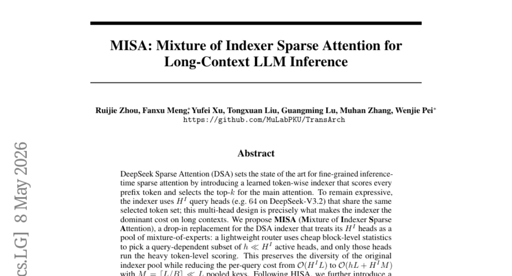

### 📌 한 줄 요약
MoE 구조를 활용하여 DeepSeek-V3와 같은 고성능 Sparse Attention 인덱서의 연산 비용을 획기적으로 줄인 효율적인 Long-Context 추론 기술

### 🔑 핵심 포인트
- 인덱서 헤드를 MoE 방식으로 구성하여 연산 효율성 극대화
- 라우터와 계층적 재정렬(Hierarchical variant)을 통한 정확도 손실 최소화
- 추가 학습 없이 기존 모델에 즉시 적용 가능한 Drop-in replacement 구조

### 🧑‍💻 개발자 관점
LLM의 컨텍스트 길이가 길어질수록 발생하는 인덱싱 비용 문제를 해결하여, 고성능 모델의 추론 비용과 지연 시간을 동시에 낮출 수 있는 실무적인 기법입니다.

### 🚀 실무 적용 아이디어
- DeepSeek-V3와 같은 모델의 인덱싱 부하를 측정하고 MISA 적용 시의 성능 변화 비교
- 제안된 TileLang 커널을 기존 추론 프레임워크에 이식하여 속도 벤치마크 수행
- 다양한 컨텍스트 길이(LongBench 등)에서 정보 회수율(Recall) 검증

### ⚠️ 리스크/한계
- 라우터의 블록 단위 통계가 특정 도메인이나 특수 패턴에서 정확도를 저하시킬 가능성
- MoE 구조 도입에 따른 메모리 관리 및 커널 최적화 복잡도 증가

### 📝 초록 기반 상세 설명
DeepSeek Sparse Attention(DSA)은 정교한 토큰 선택을 위해 다수의 인덱서 헤드를 사용하지만, 이는 긴 컨텍스트에서 막대한 연산 비용을 초래합니다. 이를 해결하기 위해 제안된 MISA는 인덱서 헤드들을 Mixture-of-Experts(MoE) 풀로 취급하여, 가벼운 라우터를 통해 필요한 일부 헤드만 활성화하는 방식을 사용합니다. 또한 계층적 변형 구조를 통해 선택된 후보군을 재정렬함으로써 기존 DSA의 정확도를 거의 완벽하게 복구합니다. 실험 결과, MISA는 추가 학습 없이도 기존 DSA 대비 훨씬 적은 헤드 수로 유사한 성능을 유지하며 128K 컨텍스트에서도 높은 정보 회수율을 보였습니다. 또한 전용 커널(TileLang)을 통해 기존 대비 약 3.82배의 속도 향상을 달성했습니다.

---

## 18. [A^2RD: Agentic Autoregressive Diffusion for Long Video Consistency](https://huggingface.co/papers/2605.06924)
**Upvotes**: 12 | **도입 난이도**: 상 | **신뢰도**: 상
**arXiv**: https://arxiv.org/abs/2605.06924

**태그**: Video-Generation, Agentic-AI, Diffusion-Models, Long-Horizon-Consistency, Agent, Multimodal, Video, Benchmark, Evaluation

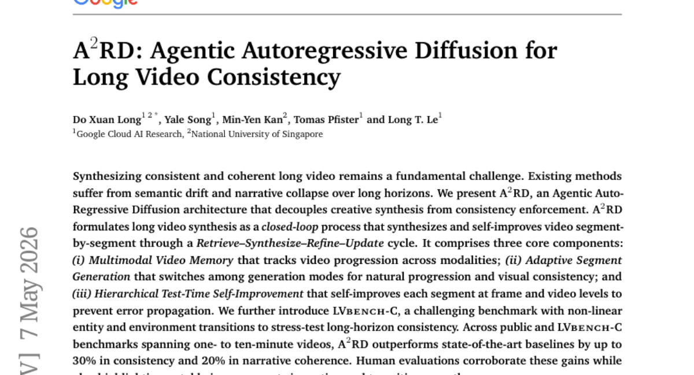

### 📌 한 줄 요약
에이전트 기반의 자기 회귀적 확산 모델을 통해 장기 비디오 생성 시 발생하는 의미적 드리프트와 서사 붕괴 문제를 해결한 프레임워크

### 🔑 핵심 포인트
- Retrieve-Synthesize-Refine-Update 사이클을 통한 폐쇄 루프형 비디오 생성 구조
- 멀티모달 비디오 메모리를 활용한 시공간적 맥락 추적 및 일관성 유지
- 프레임 및 비디오 레벨의 계층적 자기 개선을 통한 오류 전파 방지

### 🧑‍💻 개발자 관점
긴 호흡의 영상 콘텐츠 생성 시 발생하는 캐릭터/배경 일관성 문제를 에이전트 루프 구조로 해결하는 실무적인 아키텍처를 제시합니다.

### 🚀 실무 적용 아이디어
- 에이전트 루프 구조가 생성 속도(Inference Latency)에 미치는 영향 분석
- 메모리 크기 변화에 따른 장기 일관성 유지 한계점 테스트
- 기존 Diffusion 모델에 Refine 단계만 적용했을 때의 성능 변화 비교

### ⚠️ 리스크/한계
- 반복적인 Refine 과정으로 인한 높은 연산 비용 및 추론 시간 증가
- 에이전트 루프 내에서 특정 오류가 고착화될 가능성

### 📝 초록 기반 상세 설명
기존의 장기 비디오 합성 방식은 긴 시간 흐름에 따라 캐릭터나 배경이 변하는 의미적 드리프트와 서사 붕괴 문제를 겪습니다. 이를 해결하기 위해 A^2RD는 창의적 합성 과정과 일관성 유지 과정을 분리한 에이전트 기반 자기 회귀적 확산 구조를 제안합니다. 이 모델은 Retrieve-Synthesize-Refine-Update 사이클을 통해 비디오 세그먼트를 순차적으로 생성하고 스스로 개선하는 폐쇄 루프(closed-loop) 방식을 채택합니다. 핵심 요소로 멀티모달 비디오 메모리, 적응형 세그먼트 생성, 계층적 테스트 타임 자기 개선 기술을 포함합니다. 실험 결과, 제안된 벤치마크와 기존 벤치마크 모두에서 일관성과 서사적 응집력 측면에서 기존 SOTA 모델 대비 뛰어난 성능을 입증했습니다.

---

## 19. [UniSD: Towards a Unified Self-Distillation Framework for Large Language Models](https://huggingface.co/papers/2605.06597)
**Upvotes**: 10 | **도입 난이도**: 중 | **신뢰도**: 상
**arXiv**: https://arxiv.org/abs/2605.06597

**태그**: LLM, Self-Distillation, Model-Optimization, Fine-tuning, Vision, Benchmark, Evaluation, Distillation, Safety

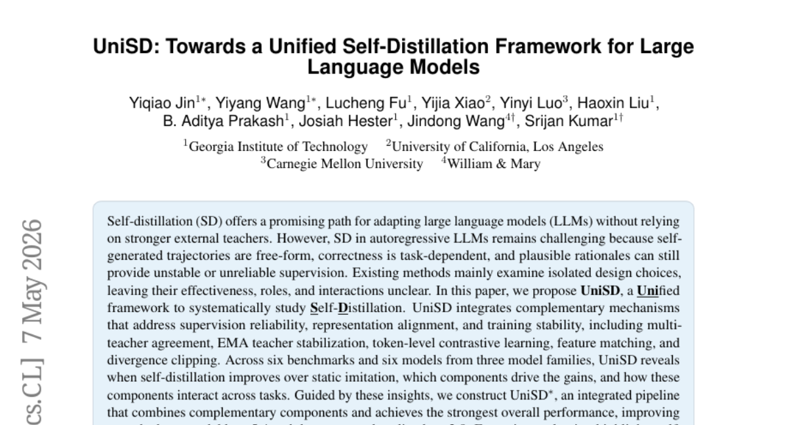

### 📌 한 줄 요약
외부 교사 모델 없이 LLM 자체 생성 데이터를 활용해 성능을 최적화하는 통합 자기 증류(Self-Distillation) 프레임워크 제안

### 🔑 핵심 포인트
- 자기 증류의 신뢰성, 표현 정렬, 학습 안정성을 해결하는 통합 프레임워크 UniSD 제안
- 다중 교사 합의 및 EMA(Exponential Moving Average)를 통한 학습 안정성 확보
- 토큰 수준 대조 학습과 특징 매칭을 결합하여 정교한 지식 전이 구현

### 🧑‍💻 개발자 관점
강력한 외부 모델(GPT-4 등)을 사용할 수 없는 환경에서, 보유한 모델만으로 성능을 끌어올릴 수 있는 실용적인 최적화 경로를 제시합니다.

### 🚀 실무 적용 아이디어
- 보유 중인 오픈소스 LLM에 EMA 기반의 교사 모델을 적용하여 학습 안정성 테스트
- 데이터 생성 시 다중 경로(Multi-teacher agreement)를 통한 필터링 로직 구현
- 학습 과정에서 토큰 레벨의 대조 학습(Contrastive Learning) 손실 함수 도입 실험

### ⚠️ 리스크/한계
- 자기 생성 데이터에 의존하므로 모델이 가진 편향이나 오류가 증폭될 위험 존재
- 복합적인 메커니즘 결합 시 하이퍼파라미터 튜닝 난이도 상승 가능성

### 📝 초록 기반 상세 설명
LLM의 자기 증류(Self-Distillation)는 외부 모델 없이 모델을 적응시킬 수 있는 유망한 방법이지만, 생성된 데이터의 불안정성과 신뢰성 문제로 인해 어려움이 있습니다. 기존 연구들은 개별적인 설계 요소에만 집중하여 각 요소 간의 상호작용과 효과를 명확히 규명하지 못했습니다. 본 논문에서는 자기 증류 과정을 체계적으로 연구하기 위한 통합 프레임워크인 UniSD를 제안합니다. UniSD는 다중 교사 합의, EMA 교사 안정화, 토큰 수준 대조 학습, 특징 매칭 및 발산 클리핑 등 상호 보완적인 메커니즘을 통합합니다. 실험 결과, 제안된 통합 파이프라인인 UniSDfull은 베이스 모델 및 기존 베이스라인 대비 뛰어난 성능 향상을 달성했습니다. 이를 통해 자기 증류가 외부 모델 없이도 효율적인 LLM 적응을 위한 실용적이고 제어 가능한 방법임을 입증했습니다.

---

## 20. [Normalizing Trajectory Models](https://huggingface.co/papers/2605.08078)
**Upvotes**: 9 | **도입 난이도**: 중 | **신뢰도**: 상
**arXiv**: https://arxiv.org/abs/2605.08078

**태그**: Generative Models, Normalizing Flows, Diffusion, Efficient Sampling, Vision, Benchmark, Distillation

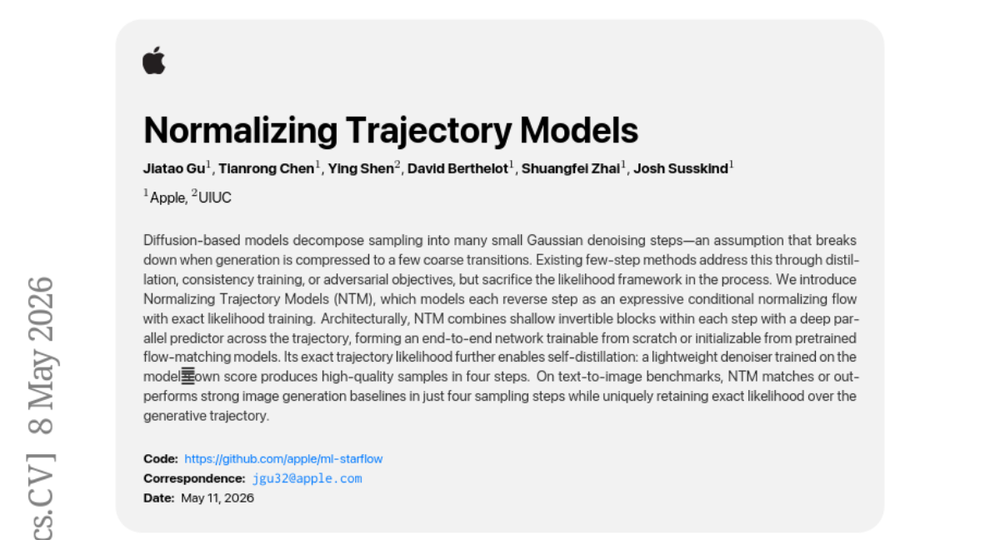

### 📌 한 줄 요약
적은 단계의 샘플링에서도 정확한 로그 가능도(Likelihood)를 유지하며 고품질 이미지를 생성하는 Normalizing Flow 기반 모델

### 🔑 핵심 포인트
- 각 역방향 단계를 가역적(Invertible)인 Normalizing Flow로 설계하여 정확한 Likelihood 계산 가능
- 얕은 가역 블록과 깊은 병렬 예측기를 결합한 하이브리드 아키텍처 도입
- 자기 증류(Self-distillation)를 통해 단 4단계의 적은 샘플링 스텝으로 고품질 생성 구현

### 🧑‍💻 개발자 관점
생성 속도를 높이면서도 모델의 확률적 신뢰도(Likelihood)를 유지해야 하는 정밀한 생성 작업에 유용합니다.

### 🚀 실무 적용 아이디어
- Flow-matching 모델을 NTM 구조로 초기화하여 성능 향상 폭 확인
- 4-step 샘플링 시의 이미지 품질과 기존 Distillation 모델과의 비교 실험
- 다양한 해상도에서의 가역적 블록 연산 효율성 테스트

### ⚠️ 리스크/한계
- 가역적 구조 특성상 모델 파라미터 설계 및 메모리 사용량 최적화가 복잡할 수 있음
- 매우 높은 해상도에서의 학습 안정성 검증 필요

### 📝 초록 기반 상세 설명
기존 확산 모델(Diffusion)은 수많은 미세 단계를 거치는 특성상, 샘플링 단계를 대폭 줄이면 생성 품질과 확률 밀도 추정의 정확도가 떨어지는 문제가 있습니다. 이를 해결하기 위해 제안된 NTM(Normalizing Trajectory Models)은 각 역방향 단계를 표현력이 풍부한 조건부 정규화 흐름(Conditional Normalizing Flow)으로 모델링합니다. 아키텍처 측면에서는 얕은 가역 블록과 깊은 병렬 예측기를 결합하여 엔드투엔드 학습이 가능하도록 설계되었습니다. 또한, 정확한 궤적 가능도를 활용한 자기 증류(Self-distillation)를 통해 단 4단계만으로도 고품질 샘플을 생성할 수 있습니다. 실험 결과, NTM은 적은 단계에서도 기존 강력한 베이스라인 모델들과 대등하거나 더 뛰어난 성능을 보이면서도 정확한 가능도 계산이 가능하다는 강점을 입증했습니다.

---

## 21. [SCOPE: Structured Decomposition and Conditional Skill Orchestration for Complex Image Generation](https://huggingface.co/papers/2605.08043)
**Upvotes**: 7 | **도입 난이도**: 중 | **신뢰도**: 상
**arXiv**: https://arxiv.org/abs/2605.08043

**태그**: Agent, Image-Generation, Orchestration, Reasoning, RAG, Vision, Benchmark, Evaluation

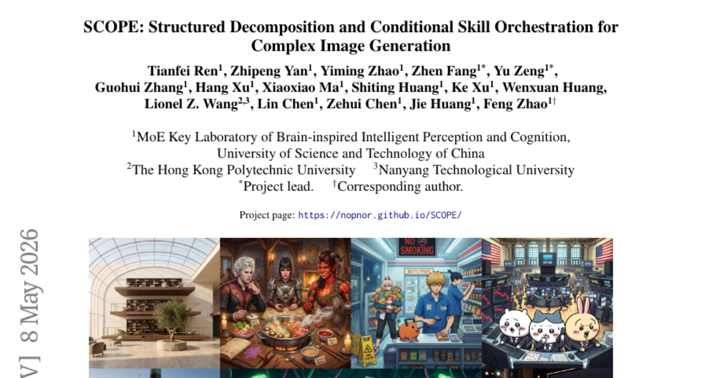

### 📌 한 줄 요약
복잡한 이미지 생성 시 요구사항 누락을 방지하기 위해 구조화된 명세와 조건부 스킬 오케스트레이션을 활용하는 프레임워크

### 🔑 핵심 포인트
- Conceptual Rift: 생성 생애주기 동안 요구사항이 일관되게 추적되지 못하는 문제 정의
- SCOPE 프레임워크: 구조화된 명세 기반의 스킬 오케스트레이션(검색, 추론, 수정) 도입
- Gen-Arena & EGIP: 엔티티 중심의 엄격한 평가를 위한 새로운 벤치마크 및 지표 제안

### 🧑‍💻 개발자 관점
단순한 프롬프트 입력을 넘어, 복잡한 제약 조건이 포함된 이미지 생성 에이전트를 설계할 때 요구사항 관리 전략의 중요성을 시사합니다.

### 🚀 실무 적용 아이디어
- 복잡한 멀티 엔티티 프롬프트에 대한 기존 모델과 SCOPE 방식의 결과 비교 실험
- 에이전트 워크플로우 내에서 '수정(Repair)' 스킬의 피드백 루프 설계 테스트
- 제시된 EGIP 지표를 활용한 자체 생성 모델의 정밀도 검증

### ⚠️ 리스크/한계
- 스킬 오케스트레이션 과정에서 발생하는 추가적인 연산 비용 및 지연 시간
- 명세가 복잡해질수록 발생하는 스케줄링 및 충돌 해결의 난이도

### 📝 초록 기반 상세 설명
최근 텍스트-이미지 모델의 발전에도 불구하고, 복잡한 시각적 의도를 정확히 구현하는 것은 여전히 어려운 과제입니다. 연구진은 생성 과정에서 요구사항이 일관되게 유지되지 못하는 'Conceptual Rift' 문제를 정의했습니다. 이를 해결하기 위해 구조화된 명세 내에서 의미적 약속(semantic commitments)을 유지하고, 미해결되거나 위반된 요구사항에 대해 검색, 추론, 수정 스킬을 조건부로 호출하는 SCOPE 프레임워크를 제안합니다. 평가를 위해 엔티티 및 제약 조건 중심의 새로운 벤치마크인 Gen-Arena를 도입했습니다. 실험 결과, SCOPE는 기존 베이스라인을 크게 상회하며 복잡한 이미지 생성에서 뛰어난 성능을 입증했습니다.

---

## 22. [What Matters for Diffusion-Friendly Latent Manifold? Prior-Aligned Autoencoders for Latent Diffusion](https://huggingface.co/papers/2605.07915)
**Upvotes**: 7 | **도입 난이도**: 중 | **신뢰도**: 상
**arXiv**: https://arxiv.org/abs/2605.07915

**태그**: Diffusion, Autoencoder, Latent Space, Generative Models, RAG, Vision

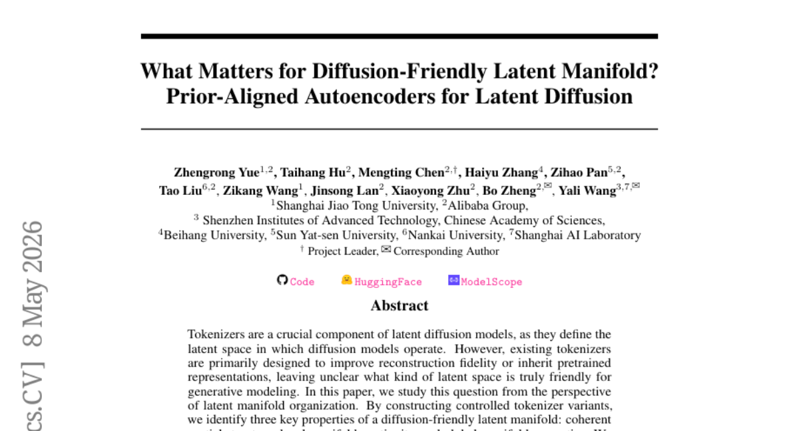

### 📌 한 줄 요약
재구성 정밀도보다 잠재 공간의 구조적 정렬이 생성 품질에 더 중요하다는 것을 밝히고, 이를 최적화하는 PAE 모델을 제안함

### 🔑 핵심 포인트
- 생성 친화적 잠재 공간의 3대 요소(공간 구조, 국소 연속성, 전역 의미) 규명
- 재구성 정밀도보다 매니폴드 정렬이 생성 품질에 더 결정적임을 입증
- VFM 사전 확률과 섭동 정규화를 활용한 PAE(Prior-Aligned AutoEncoder) 제안

### 🧑‍💻 개발자 관점
Latent Diffusion 모델 설계 시, 단순히 복원율을 높이는 것보다 생성 모델이 학습하기 쉬운 구조로 잠재 공간을 설계하는 것이 효율성과 품질 면에서 핵심임을 시사합니다.

### 🚀 실무 적용 아이디어
- 기존 VAE/VQ-VAE 모델의 잠재 공간 구조와 생성 품질 간의 상관관계 분석
- 재구성 손실(Reconstruction Loss) 비중을 낮추고 매니폴드 정규화 비중을 높이는 실험
- VFM(Vision Foundation Model)의 특징을 활용한 잠재 공간 정렬 기법 적용 테스트

### ⚠️ 리스크/한계
- 매니폴드 정렬을 위한 추가적인 정규화 과정이 학습 복잡도를 높일 수 있음
- 특정 데이터셋이나 특정 규모의 모델에서만 유효한 속성일 가능성 존재

### 📝 초록 기반 상세 설명
기존의 토크나이저는 재구성 정밀도 향상에 집중하여, 확산 모델(Diffusion)에 최적화된 잠재 공간이 무엇인지에 대한 연구가 부족했습니다. 본 논문은 잠재 매니폴드 구조 관점에서 연구를 진행하여 공간적 구조, 국소적 연속성, 전역적 의미라는 세 가지 핵심 속성을 식별했습니다. 이러한 속성들이 재구성 정밀도보다 생성 품질에 더 큰 영향을 미친다는 점을 발견했습니다. 이를 바탕으로 제안된 PAE(Prior-Aligned AutoEncoder)는 VFM 기반 사전 확률과 섭동 기반 정규화를 통해 잠재 매니폴드를 명시적으로 설계합니다. 실험 결과, PAE는 기존 방식 대비 훨씬 빠른 수렴 속도와 함께 SOTA 수준의 생성 품질을 달성했습니다.

---

## 23. [Scaling Continual Learning to 300+ Tasks with Bi-Level Routing Mixture-of-Experts](https://huggingface.co/papers/2602.03473)
**Upvotes**: 7 | **도입 난이도**: 상 | **신뢰도**: 상
**arXiv**: https://arxiv.org/abs/2602.03473

**태그**: Continual Learning, Mixture-of-Experts, Scalability, Class-Incremental Learning, Benchmark, Evaluation

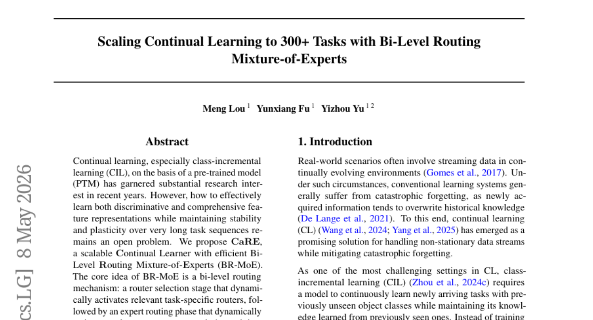

### 📌 한 줄 요약
300개 이상의 대규모 태스크 시퀀스에서도 성능 저하 없이 학습 가능한 Bi-Level Routing MoE 기반의 지속 학습 프레임워크 제안

### 🔑 핵심 포인트
- Bi-Level Routing MoE(BR-MoE): 태스크별 라우터와 전문가 라우팅을 결합하여 대규모 태스크 확장을 지원
- 초장기 태스크 확장성: 300개 이상의 비중첩 태스크 시퀀스에서도 안정적인 성능을 유지하는 최초의 지속 학습 모델
- OmniBenchmark-1K: 수백 개의 태스크를 포함하는 대규모 클래스 증분 학습 평가용 데이터셋 제안

### 🧑‍💻 개발자 관점
모델이 새로운 데이터를 계속 학습해야 하는 실무 환경에서, 기존 모델의 성능 저하(Catastrophic Forgetting) 없이 수백 개의 카테고리를 확장할 수 있는 기술적 토대를 제공합니다.

### 🚀 실무 적용 아이디어
- 제공된 OmniBenchmark-1K를 활용하여 기존 MoE 기반 모델과의 확장성 비교 실험 수행
- 특정 도메인 데이터셋에 BR-MoE의 라우팅 메커니즘 적용 및 태스크 수 증가에 따른 성능 변화 관찰
- 모델 파라미터 효율성 측면에서 MoE 전문가 수와 태스크 수 간의 상관관계 분석

### ⚠️ 리스크/한계
- MoE 구조 특성상 학습 및 추론 시 메모리 사용량과 연산 복잡도가 높을 수 있음
- 매우 많은 수의 전문가와 라우터를 관리해야 하므로 시스템 아키텍처 설계가 복잡함

### 📝 초록 기반 상세 설명
사전 학습된 모델(PTM)을 활용한 클래스 증분 학습(CIL) 연구가 활발하지만, 매우 긴 태스크 시퀀스에서 안정성과 가소성을 동시에 유지하는 것은 여전히 어려운 과제입니다. 본 논문은 이를 해결하기 위해 Bi-Level Routing Mixture-of-Experts(BR-MoE) 구조를 가진 CaRE 프레임워크를 제안합니다. BR-MoE는 태스크별 라우터를 선택하는 단계와 전문가(Expert)를 활성화/결합하는 단계의 2단계 라우팅을 통해 각 레이어에 변별력 있는 표현을 주입합니다. 또한, 수백 개의 태스크를 다루는 벤치마크인 OmniBenchmark-1K를 새롭게 도입했습니다. 실험 결과, CaRE는 기존 CIL 설정뿐만 아니라 100~300개 이상의 초장기 태스크 시퀀스에서도 기존 모델들을 압도하는 성능을 보였습니다.

---

## 24. [STARFlow2: Bridging Language Models and Normalizing Flows for Unified Multimodal Generation](https://huggingface.co/papers/2605.08029)
**Upvotes**: 7 | **도입 난이도**: 상 | **신뢰도**: 상
**arXiv**: https://arxiv.org/abs/2605.08029

**태그**: Multimodal, Generative AI, Normalizing Flows, Transformer, Vision, Benchmark

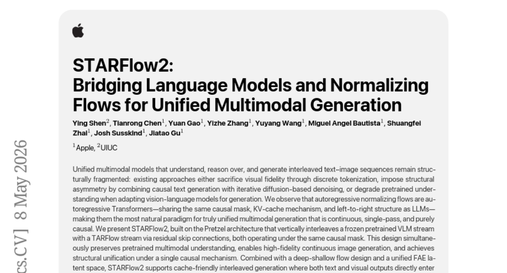

### 📌 한 줄 요약
Autoregressive Normalizing Flow를 활용하여 텍스트와 이미지를 하나의 KV-cache로 통합 관리하는 효율적인 멀티모달 생성 프레임워크

### 🔑 핵심 포인트
- Autoregressive Normalizing Flow를 통한 텍스트와 이미지 생성 방식의 구조적 통합
- Pretzel 아키텍처를 활용한 VLM과 Flow 스트림 간의 효율적인 수직 결합
- KV-cache 재사용이 가능한 캐시 친화적(Cache-friendly) 인터리브 생성 구조

### 🧑‍💻 개발자 관점
텍스트와 이미지를 별도의 모델로 처리하지 않고 하나의 트랜스포머 구조 내에서 KV-cache를 공유하므로, 멀티모달 생성 시 추론 효율성과 일관성을 크게 높일 수 있습니다.

### 🚀 실무 적용 아이디어
- 제안된 Pretzel 아키텍처의 잔차 연결 방식이 학습 안정성에 미치는 영향 분석
- 기존 Diffusion 기반 모델 대비 KV-cache 크기 및 추론 속도 비교 실험
- 통합 FAE 잠재 공간의 표현력이 다양한 도메인 이미지에서 유지되는지 검증

### ⚠️ 리스크/한계
- Autoregressive Flow 모델의 학습 복잡도 및 수렴 안정성 문제
- 고해상도 이미지 생성 시 잠재 공간(Latent Space)의 제약 가능성

### 📝 초록 기반 상세 설명
최근 멀티모달 시스템은 텍스트 생성(Autoregressive)과 이미지 생성(Diffusion) 방식의 구조적 불일치로 인해 통합 모델링에 어려움을 겪고 있습니다. 본 논문은 이러한 불일치를 해결하기 위해 LLM과 구조적으로 유사한 Autoregressive Normalizing Flow를 제안합니다. STARFlow2는 Pretzel 아키텍처를 기반으로 VLM 스트림과 TarFlow 스트림을 잔차 스킵 연결로 수직 결합하여 단일 인과적 마스크(Causal Mask) 하에서 동작합니다. 또한 Deep-shallow flow 설계와 통합 FAE 잠재 공간을 통해 텍�스트와 이미지 출력이 재인코딩 없이 KV-cache에 직접 입력되는 캐시 친화적 구조를 구현했습니다. 실험 결과, 이미지 생성 및 멀티모달 이해 벤치마크에서 강력한 성능을 입증하며 통합 모델로서의 가능성을 보여주었습니다.

---

## 25. [What if AI systems weren't chatbots?](https://huggingface.co/papers/2605.07896)
**Upvotes**: 6 | **도입 난이도**: 하 | **신뢰도**: 상
**arXiv**: https://arxiv.org/abs/2605.07896

**태그**: AI Design, Human-Computer Interaction, AI Ethics, System Architecture

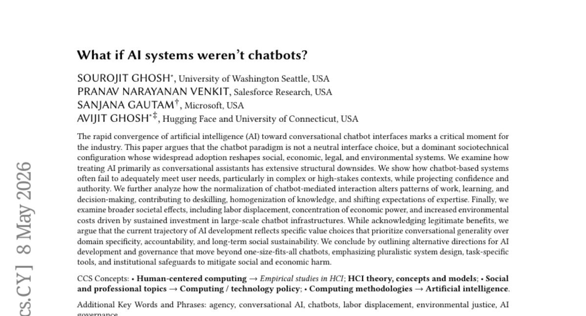

### 📌 한 줄 요약
AI 개발이 챗봇 인터페이스에만 매몰될 경우 발생하는 사회적·구조적 부작용과 대안적 설계 방향 제시

### 🔑 핵심 포인트
- 챗봇 중심의 AI 패러다임이 초래하는 사회적, 경제적, 환경적 구조적 문제 분석
- 범용적 대화 인터페이스가 전문성 저하 및 지식의 균질화를 유도하는 메커니즘 규명
- 단일 인터페이스를 넘어선 도메인 특화형 및 다원적 AI 시스템 설계 방향 제시

### 🧑‍💻 개발자 관점
단순히 챗봇 UI를 구현하는 것을 넘어, 특정 태스크에 최적화된 에이전트나 도구 중심의 AI 설계가 왜 필요한지에 대한 철학적/기술적 근거를 제공합니다.

### 🚀 실무 적용 아이디어
- 범용 LLM 챗봇 외에 특정 워크플로우에 최적화된 Task-specific UI/UX 설계 실험
- 사용자의 숙련도를 높이거나 보조하는 형태의 Human-in-the-loop 인터페이스 검토
- 대화형 인터페이스가 아닌 API 기반의 비가시적(Invisible) AI 통합 방식 고려

### ⚠️ 리스크/한계
- 챗봇 중심 개발 시 도메인 전문성 결여 및 책임 소재 불분명 문제
- 대규모 인프라 유지에 따른 환경적 비용 및 경제적 독점 심화

### 📝 초록 기반 상세 설명
현재 AI 산업은 대화형 챗봇 인터페이스로 급격히 수렴하며 사회 전반의 구조를 재편하고 있습니다. 그러나 챗봇 중심의 패러다임은 복잡한 작업 수행 능력의 한계와 권위적 태도로 인한 신뢰성 문제를 야기합니다. 또한, 지식의 균질화, 숙련도 저하, 경제적 권력 집중 및 환경적 비용 증가와 같은 구조적 부작용을 초래합니다. 본 논문은 현재의 챗봇 중심 개발이 도메인 특화 및 책임감 있는 설계보다 범용적 대화 능력에 치중되어 있음을 지적합니다. 이에 대한 대안으로 범용 챗봇을 넘어선 다원적 시스템 설계와 작업 특화형 도구 개발의 필요성을 제안합니다.

---

## 26. [IntentGrasp: A Comprehensive Benchmark for Intent Understanding](https://huggingface.co/papers/2605.06832)
**Upvotes**: 6 | **도입 난이도**: 중 | **신뢰도**: 상
**arXiv**: https://arxiv.org/abs/2605.06832

**태그**: LLM, Benchmark, Fine-Tuning, Intent Understanding, Agent, Evaluation

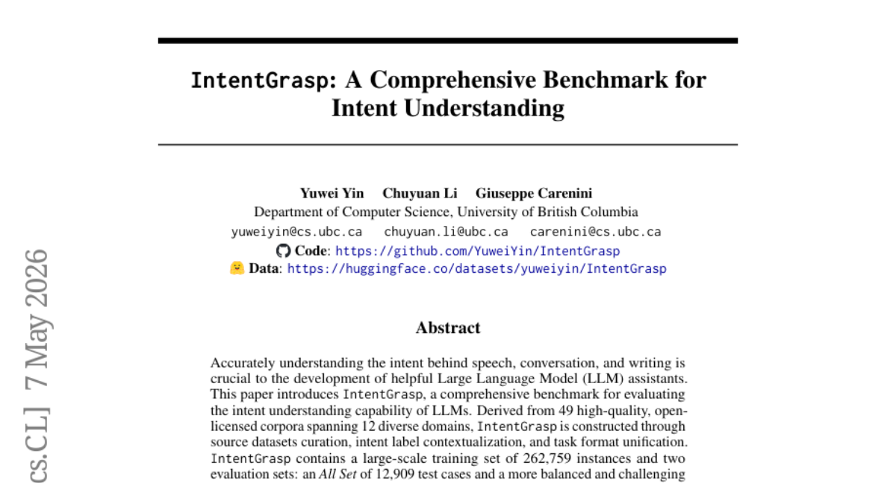

### 📌 한 줄 요약
LLM의 의도 파악 능력을 정밀하게 평가하는 벤치마크 IntentGrasp와 성능 향상을 위한 Intentional Fine-Tuning(IFT) 방법론 제안

### 🔑 핵심 포인트
- 12개 도메인 및 49개 코퍼스를 통합한 대규모 의도 이해 벤치마크 'IntentGrasp' 구축
- 최신 LLM들이 고난도 의도 파악 작업에서 낮은 성능을 보임을 정량적으로 입증
- 의도 파악 능력을 극대화하는 'Intentional Fine-Tuning(IFT)' 방법론 및 일반화 성능 검증

### 🧑‍💻 개발자 관점
LLM 기반 에이전트 개발 시 사용자의 복잡한 의도를 정확히 파악하는 것이 필수적인데, 이 논문은 이를 평가하고 개선할 수 있는 구체적인 프레임워크를 제공합니다.

### 🚀 실무 적용 아이디어
- 보유 중인 도메인 특화 데이터셋을 IntentGrasp 형식으로 변환하여 벤치마크 테스트 수행
- 모델의 의도 파악 성능이 낮을 경우, 제안된 IFT(Intentional Fine-Tuning) 방식 적용 실험
- 도메인 간 일반화 성능 확인을 위한 Leave-one-domain-out 테스트 수행

### ⚠️ 리스크/한계
- 특정 데이터셋에 과적합될 경우 범용적인 의도 이해 능력이 저하될 가능성
- 데이터 정제 및 포맷 통합 과정에서의 비용과 복잡도

### 📝 초록 기반 상세 설명
LLM 어시스턴트의 핵심인 의도 이해 능력을 정확히 평가하기 위한 표준화된 기준이 부족한 상황입니다. 본 논문은 12개 도메인의 49개 코퍼스를 통합하여 대규모 학습셋과 난이도별 평가셋(All Set, Gem Set)을 포함한 IntentGrasp 벤치마크를 구축했습니다. 최신 LLM들을 대상으로 실험한 결과, 특히 고난도 평가셋에서 모델들의 성능이 무작위 추측보다 낮거나 인간 성능에 비해 현저히 떨어지는 문제가 발견되었습니다. 이를 해결하기 위해 제안된 Intentional Fine-Tuning(IFT) 기법은 모델의 의도 파악 능력을 비약적으로 향상시켰습니다. 실험을 통해 IFT가 도메인 간 일반화 성능 또한 뛰어남을 입증하며, 더 지능적이고 안전한 AI 어시스턴트 개발을 위한 경로를 제시합니다.

---

## 27. [SkCC: Portable and Secure Skill Compilation for Cross-Framework LLM Agents](https://huggingface.co/papers/2605.03353)
**Upvotes**: 6 | **도입 난이도**: 중 | **신뢰도**: 상
**arXiv**: https://arxiv.org/abs/2605.03353

**태그**: LLM-Agent, Compiler-Design, Security, Prompt-Engineering, Agent, Inference

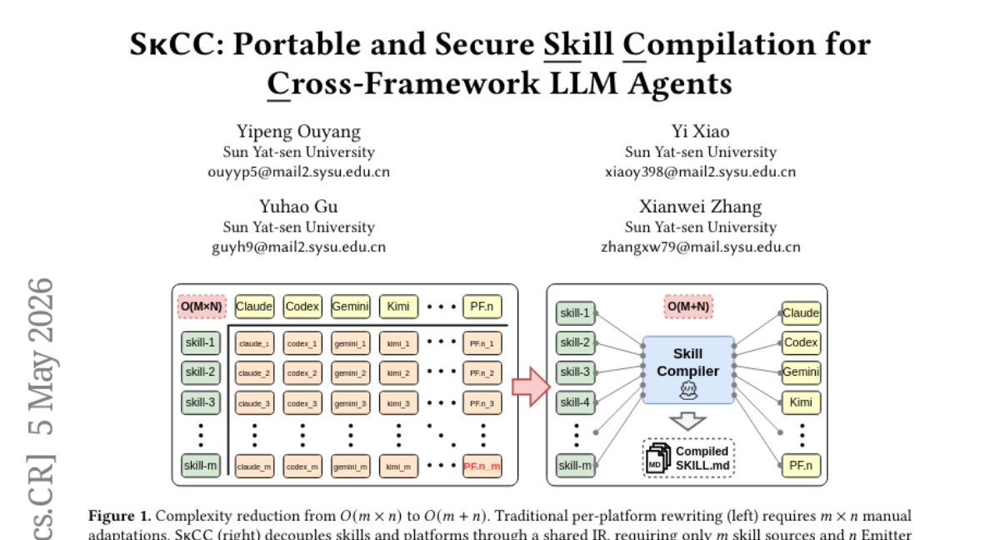

### 📌 한 줄 요약
LLM 에이전트 프레임워크 간 호환성 문제와 보안 취약점을 해결하기 위해 컴파일러 설계 방식을 도입한 스킬 컴파일 프레임워크 SkCC

### 🔑 핵심 포인트
- SkIR(중간 표현) 도입을 통한 프레임워크 간 스킬 이식성 및 유지보수 효율성 극대화
- 컴파일 타임 보안 분석(Anti-Skill Injection)을 통한 스킬 주입 공격 방지
- 플랫폼별 최적화된 컴파일 파이프라인을 통한 성능 향상 및 토큰 비용 절감

### 🧑‍💻 개발자 관점
다양한 에이전트 프레임워크를 사용하는 환경에서 스킬을 매번 재작성할 필요 없이, 한 번의 정의로 안전하고 최적화된 배포가 가능해집니다.

### 🚀 실무 적용 아이디어
- 현재 사용 중인 Markdown 기반 스킬을 SkIR 구조로 변환했을 때의 성능 변화 측정
- 다양한 LLM 프레임워크(Claude, Kimi 등) 환경에서 스킬 이식성 테스트
- 보안 취약점이 포함된 스킬을 대상으로 SkCC의 탐지율 검증

### ⚠️ 리스크/한계
- 컴파일 과정이 추가됨에 따른 워크플로우 복잡도 증가
- 새로운 프레임워크 등장 시 SkIR의 확장성 및 호환성 유지 필요성

### 📝 초록 기반 상세 설명
LLM 에이전트가 복잡한 작업을 수행함에 따라 SKILL.md와 같은 스킬 규격이 등장했으나, 프레임워크마다 다른 프롬프트 포맷팅 민감도로 인해 성능 편차가 발생하는 문제가 있습니다. 또한 수동으로 플랫폼별 스킬을 재작성해야 하는 유지보수 부담과 보안 취약점 노출이라는 위험이 존재합니다. 이를 해결하기 위해 본 논문은 컴파일러 설계 원칙을 적용한 SkCC 프레임워크를 제안합니다. SkCC는 강력한 타입 기반의 중간 표현(SkIR)을 통해 스킬 의미론과 플랫폼별 포맷을 분리하며, 컴파일 단계에서 보안 제약 조건을 검사하는 Analyzer를 포함합니다. 실험 결과, SkCC는 플랫폼 간 이식성을 높이고 성능을 개선하는 동시에 토큰 사용량 절감과 높은 보안 탐지율을 달성했습니다.

### 🖼️ 추가 자료
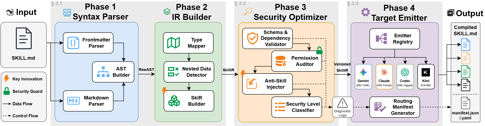
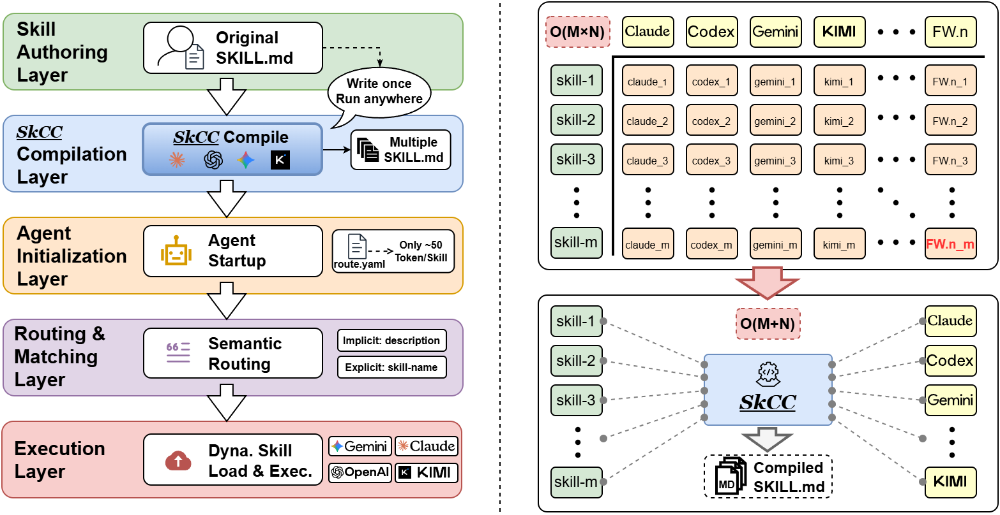

---

## 28. [InterLV-Search: Benchmarking Interleaved Multimodal Agentic Search](https://huggingface.co/papers/2605.07510)
**Upvotes**: 5 | **도입 난이도**: 중 | **신뢰도**: 상
**arXiv**: https://arxiv.org/abs/2605.07510

**태그**: Agent, Multimodal, Search, Benchmark, Vision, Evaluation

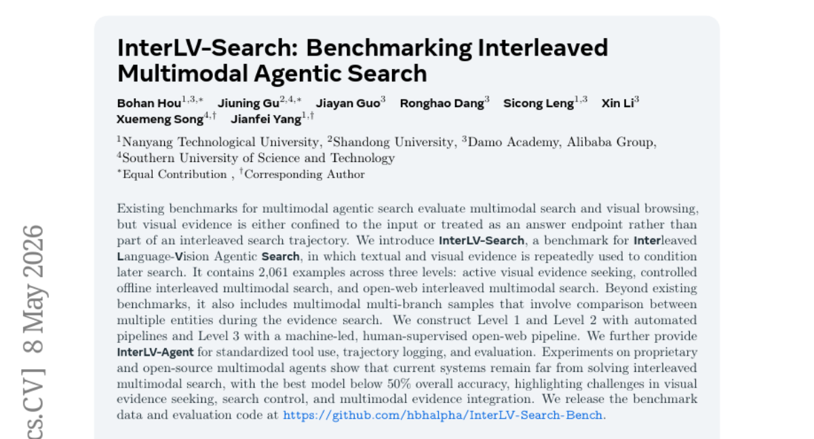

### 📌 한 줄 요약
텍스트와 시각적 증거를 반복적으로 활용하는 고난도 멀티모달 에이전트 검색 벤치마크인 InterLV-Search 제안

### 🔑 핵심 포인트
- 텍스트와 시각적 증거를 교차 활용하는 인터리브(Interleaved) 방식의 새로운 벤치마크 구축
- 능동적 시각 정보 탐색 및 다중 엔티티 비교를 포함한 3단계 난이도 시나리오 제공
- 에이전트의 도구 사용 및 궤적 로깅을 위한 표준화된 프레임워크(InterLV-Agent) 개발

### 🧑‍💻 개발자 관점
단순 RAG를 넘어 시각적 단서를 바탕으로 검색 전략을 수정해야 하는 고도화된 멀티모달 에이전트 개발 시 핵심 평가 지표로 활용 가능합니다.

### 🚀 실무 적용 아이디어
- 제공된 벤치마크 데이터셋을 활용하여 현재 사용 중인 멀티모달 모델의 검색 제어 능력 테스트
- InterLV-Agent 프레임워크를 기존 에이전트 워크플로우에 통합하여 궤적 분석 수행
- 시각적 증거가 검색 전략 변화에 미치는 영향력을 정량적으로 측정하는 실험 설계

### ⚠️ 리스크/한계
- 현재 모델들의 낮은 성능으로 인해 벤치마크 자체가 매우 도전적이며 결과 해석에 주의 필요
- 오픈 웹 기반(Level 3) 데이터의 경우 동적 환경에 따른 재현성 문제 가능성 존재

### 📝 초록 기반 상세 설명
기존 멀티모달 검색 벤치마크는 시각적 정보를 단순 입력이나 최종 결과로만 취급하여, 검색 과정 중 발생하는 상호작용을 충분히 평가하지 못합니다. 이를 해결하기 위해 텍스트와 시각적 증거를 반복적으로 사용하여 다음 검색을 유도하는 InterLV-Search 벤치마크를 도입합니다. 이 벤치마크는 능동적 시각 증거 탐색부터 오픈 웹 검색까지 3단계 난이도로 구성되며, 다중 엔티티 비교를 포함한 멀티 브랜치 샘플을 포함합니다. 또한 표준화된 도구 사용과 평가를 위한 InterLV-Agent 프레임워크를 함께 제공합니다. 실험 결과, 현재의 최첨단 멀티모달 에이전트들도 50% 미만의 정확도를 보이며 복합적인 검색 작업 수행에 한계가 있음을 확인했습니다.

---

## 29. [Fast Byte Latent Transformer](https://huggingface.co/papers/2605.08044)
**Upvotes**: 5 | **도입 난이도**: 중 | **신뢰도**: 상
**arXiv**: https://arxiv.org/abs/2605.08044

**태그**: LLM, Inference Optimization, Diffusion Model, Byte-level LM, Inference

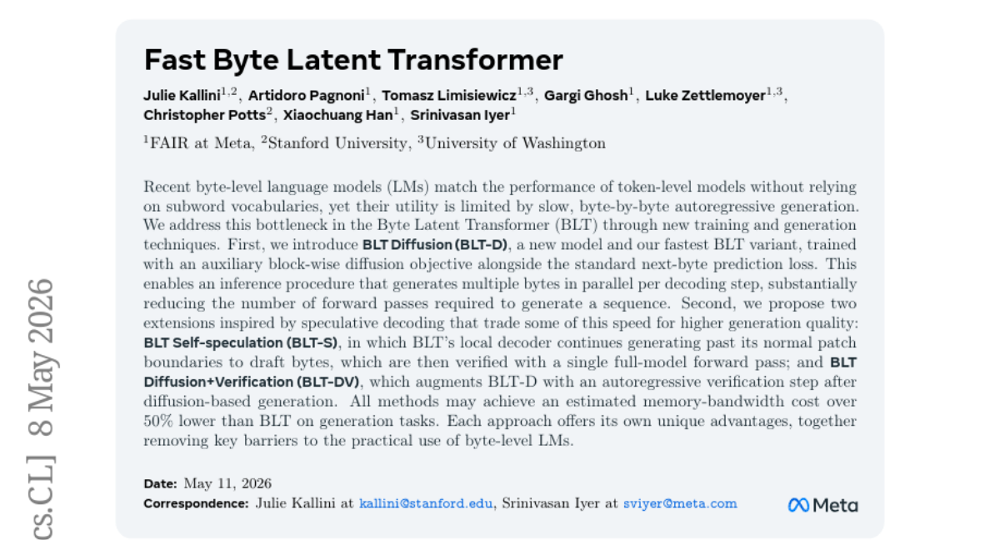

### 📌 한 줄 요약
바이트 단위 언어 모델의 고질적인 병목인 느린 생성 속도를 디퓨전 및 스펙큘레이티브 디코딩 기법으로 해결한 연구

### 🔑 핵심 포인트
- BLT-D: 블록 단위 디퓨전 목적 함수를 통한 병렬 바이트 생성 기법 도입
- BLT-S: 스펙큘레이티브 디코딩에서 영감을 얻어 로컬 디코더가 초안을 작성하는 자기 추측 방식
- BLT-DV: 디퓨전 기반 생성과 자기회귀적 검증을 결합하여 생성 품질과 속도의 균형 확보

### 🧑‍💻 개발자 관점
토큰 단위 모델의 어휘 사전 문제를 피하면서도, 실무 적용의 가장 큰 걸림돌이었던 바이트 단위 모델의 느린 추론 속도를 개선할 수 있는 방법론을 제시합니다.

### 🚀 실무 적용 아이디어
- 기존 BLT 모델과 제안된 BLT-D 모델 간의 생성 속도(Throughput) 비교 실험
- 생성 속도 향상에 따른 품질 저하 정도를 측정하기 위한 Perplexity 및 품질 지표 테스트
- 다양한 시퀀스 길이에 따른 메모리 대역폭 효율성 검증

### ⚠️ 리스크/한계
- 디퓨전 기반 생성 시 발생할 수 있는 생성 품질(Hallucination 등) 저하 가능성
- 검증 단계(Verification) 추가 시 발생하는 오버헤드와 속도 간의 트레이드오프

### 📝 초록 기반 상세 설명
최근 바이트 단위 언어 모델은 서브워드 사전 없이도 높은 성능을 보이지만, 바이트 단위의 순차적 생성 방식 때문에 속도가 매우 느리다는 문제가 있습니다. 본 논문은 이를 해결하기 위해 BLT(Byte Latent Transformer)를 개선한 세 가지 기법을 제안합니다. 먼저, 블록 단위 디퓨전 목적 함수를 도입한 BLT-D를 통해 한 번의 스텝에서 여러 바이트를 병렬로 생성하여 속도를 획기적으로 높였습니다. 또한, 생성 품질을 높이기 위해 로컬 디코더가 경계를 넘어 초안을 작성하는 BLT-S와 디퓨전 생성 후 검증 단계를 추가한 BLT-DV를 제안합니다. 실험 결과, 제안된 방법들은 기존 BLT 대비 메모리 대역폭 비용을 50% 이상 절감하며 실용적인 생성 속도를 확보했습니다.

---

## 30. [From Storage to Experience: A Survey on the Evolution of LLM Agent Memory Mechanisms](https://huggingface.co/papers/2605.06716)
**Upvotes**: 5 | **도입 난이도**: 중 | **신뢰도**: 상
**arXiv**: https://arxiv.org/abs/2605.06716

**태그**: LLM-Agent, Memory-Mechanism, Cognitive-Architecture, Continual-Learning, Agent, RAG

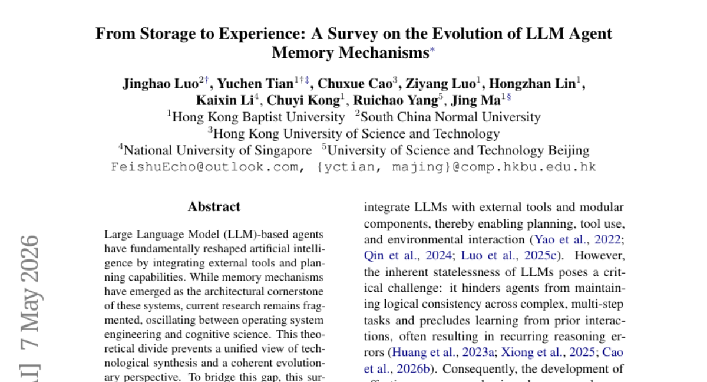

### 📌 한 줄 요약
LLM 에이전트 메모리 메커니즘을 저장(Storage)에서 경험(Experience)으로 진화하는 체계적 프레임워크로 정의한 서베이 논문

### 🔑 핵심 포인트
- 메모리 진화 단계를 Storage(궤적 보존) -> Reflection(궤적 정제) -> Experience(궤적 추상화)로 체계화
- 장기 일관성, 동적 환경, 지속적 학습이라는 세 가지 핵심 동인 분석
- 차세대 에이전트의 핵심인 능동적 탐색 및 교차 궤적 추상화 메커니즘 탐구

### 🧑‍💻 개발자 관점
단순 RAG 기반의 데이터 저장을 넘어, 에이전트가 과거의 경험을 어떻게 추상화하고 지식화하여 지능을 높일 수 있는지에 대한 설계 원칙을 제공합니다.

### 🚀 실무 적용 아이디어
- 현재 구축된 에이전트의 메모리 구조가 단순 저장(Storage) 단계에 머물러 있는지 점검
- Reflection(성찰) 단계를 도입하여 에이전트의 작업 실패 사례를 메모리에 반영하는 루프 구현
- 여러 작업 궤적에서 공통 패턴을 추출하는 추상화(Abstraction) 로직 실험

### ⚠️ 리스크/한계
- 추상화 단계로 갈수록 계산 복잡도 및 토큰 소모량 증가 가능성
- 추상화된 지식이 잘못된 경우 에이전트의 편향이나 오류가 고착될 위험

### 📝 초록 기반 상세 설명
LLM 기반 에이전트가 발전함에 따라 메모리 메커니즘이 핵심 아키텍처로 부상했으나, 현재 연구는 운영체제 공학적 관점과 인지 과학적 관점으로 파편화되어 있습니다. 이러한 이론적 간극을 해결하기 위해 본 논문은 메모리 발전을 Storage(저장), Reflection(성찰), Experience(경험)의 3단계로 정형화하는 새로운 진화 프레임워크를 제안합니다. 이 과정에서 장기적 일관성 유지, 동적 환경 대응, 지속적 학습이라는 세 가지 핵심 동인을 분석합니다. 특히 최첨단 단계인 'Experience' 단계의 핵심인 능동적 탐색과 교차 궤적 추상화 메커니즘을 심도 있게 다룹니다. 최종적으로 이 연구는 파편화된 관점들을 통합하여 차세대 에이전트 설계를 위한 가이드라인과 로드맵을 제시합니다.

---

## 31. [Q-RAG: Long Context Multi-step Retrieval via Value-based Embedder Training](https://huggingface.co/papers/2511.07328)
**Upvotes**: 5 | **도입 난이도**: 중 | **신뢰도**: 상
**arXiv**: https://arxiv.org/abs/2511.07328

**태그**: RAG, Reinforcement Learning, Long Context, Embedder, Benchmark, Evaluation, Inference

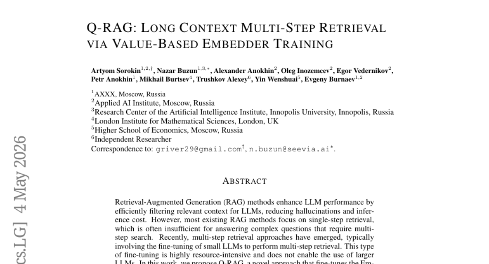

### 📌 한 줄 요약
강화학습 기반 임베더 미세조정을 통해 대규모 컨텍스트에서도 효율적인 다단계 검색을 수행하는 Q-RAG 제안

### 🔑 핵심 포인트
- 강화학습(RL)을 활용한 임베더 모델의 다단계 검색 최적화
- LLM 미세조정 대비 낮은 자원 소모로 효율적인 다단계 검색 구현
- 최대 10M 토큰 규모의 롱 컨텍스트 벤치마크에서 SOTA 달성

### 🧑‍💻 개발자 관점
복잡한 추론이 필요한 긴 문맥 데이터 처리 시, LLM 전체를 튜닝하지 않고 임베더만 최적화하여 고성능 검색 시스템을 구축할 수 있는 실용적인 방법론을 제시합니다.

### 🚀 실무 적용 아이디어
- 제공된 GitHub 코드를 활용하여 BabiLong/RULER 벤치마크 재현 실험 수행
- 기존 단일 단계 RAG 시스템에 Q-RAG 임베더를 교체 적용하여 성능 변화 측정
- 도메인 특화 데이터셋에 대해 강화학습 기반 임베더 미세조정 워크플로우 테스트

### ⚠️ 리스크/한계
- 강화학습 기반 학습 시 보상 함수(Reward Function) 설계의 난이도
- 학습된 임베더가 특정 벤치마크 데이터에 과적합(Overfitting)될 가능성

### 📝 초록 기반 상세 설명
기존 RAG 방식은 단일 단계 검색에 집중되어 있어 복잡한 질문 해결에 한계가 있습니다. 이를 해결하기 위해 최근 소형 LLM을 미세조정하는 다단계 검색 방식이 등장했으나, 자원 소모가 크고 대형 모델 활용이 어렵다는 단점이 있습니다. 본 논문에서는 강화학습(RL)을 사용하여 임베더 모델을 직접 미세조정하는 Q-RAG 방식을 제안합니다. 이 방식은 기존 방식보다 자원 효율적이면서도 다단계 검색 성능을 극대화합니다. 실험 결과, BabiLong 및 RULER와 같은 롱 컨텍스트 벤치마크에서 최대 10M 토큰 범위 내 최고 성능을 달성했습니다.

---

## 32. [LiVeAction: a Lightweight, Versatile, and Asymmetric Neural Codec Design for Real-time Operation](https://huggingface.co/papers/2605.06628)
**Upvotes**: 4 | **도입 난이도**: 중 | **신뢰도**: 상
**arXiv**: https://arxiv.org/abs/2605.06628

**태그**: Neural Codec, Edge AI, Compression, Signal Processing, Vision, Audio, Optimization

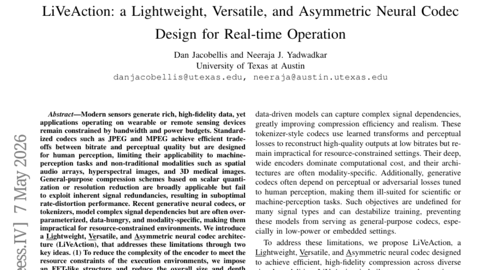

### 📌 한 줄 요약
저전력 센서 환경을 위해 연산량은 줄이고 범용성은 높인 비대칭형 경량 뉴럴 코덱 설계

### 🔑 핵심 포인트
- FFT 스타일 구조를 통한 인코더 복잡도 및 네트워크 깊이 최적화
- 분산 기반 레이트 페널티 도입으로 모달리티 범용성 및 학습 단순화 확보
- 저전력/제한된 자원 환경을 고려한 비대칭적(Asymmetric) 설계

### 🧑‍💻 개발자 관점
엣지 디바이스(IoT, 웨어러블)에서 고성능 데이터 압축이 필요할 때, 연산 부하를 최소화하면서도 높은 압축 효율을 얻을 수 있는 실용적인 아키텍처 가이드를 제공합니다.

### 🚀 실무 적용 아이디어
- 제공된 Python 라이브러리를 활용하여 특정 센서 데이터(오디오, 이미지 등)에 대한 압축 성능 테스트
- FFT 기반 구조가 특정 주파수 대역의 데이터에서 왜 효율적인지 분석
- 인코더/디코더 비대칭 구조가 실제 하드웨어 가속기에서 어떻게 동작하는지 프로파일링

### ⚠️ 리스크/한계
- 인코더의 경량화를 위해 정보 손실이 발생할 수 있어, 특정 정밀도가 요구되는 의료용 데이터에는 주의 필요
- 비대칭 구조 특성상 디코더 측의 연산량은 인코더보다 높을 수 있음

### 📝 초록 기반 상세 설명
최근 고해상도 데이터 생성량은 늘고 있으나, 웨어러블 및 원격 센서 기기는 대역폭과 전력 제한이라는 문제에 직면해 있습니다. 기존의 JPEG/MPEG 방식은 인간의 시각 중심이라 기계 인지 작업이나 다양한 데이터 모달리티에 적용하기 어렵고, 최신 생성형 코덱은 연산량이 너무 많아 실시간 배포가 어렵습니다. 본 논문은 이를 해결하기 위해 FFT와 유사한 구조를 도입하여 인코더의 복잡도를 낮추고 연산 효율을 극대화한 LiVeAction 아키텍처를 제안합니다. 또한, 복잡한 적대적 손실 대신 분산 기반의 레이트 페널티를 사용하여 다양한 신호 모달리티에 범용적으로 적용 가능하도록 설계했습니다. 결과적으로 기존 생성형 토크나이저보다 우수한 압축 성능을 보이면서도 저전력 기기에서 실시간 동작이 가능한 효율성을 달성했습니다.

### 🖼️ 추가 자료
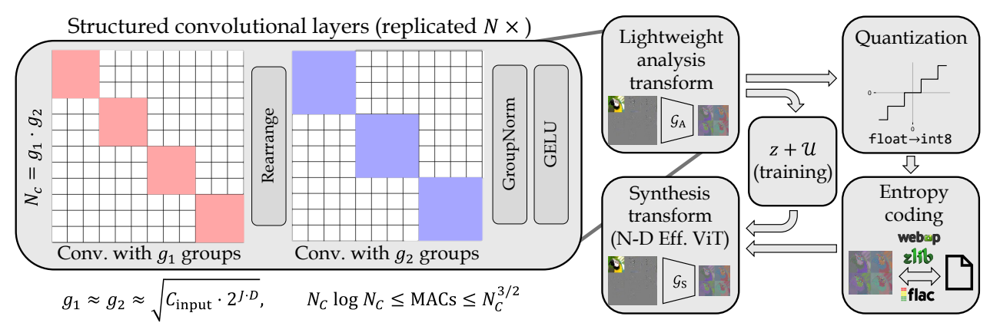
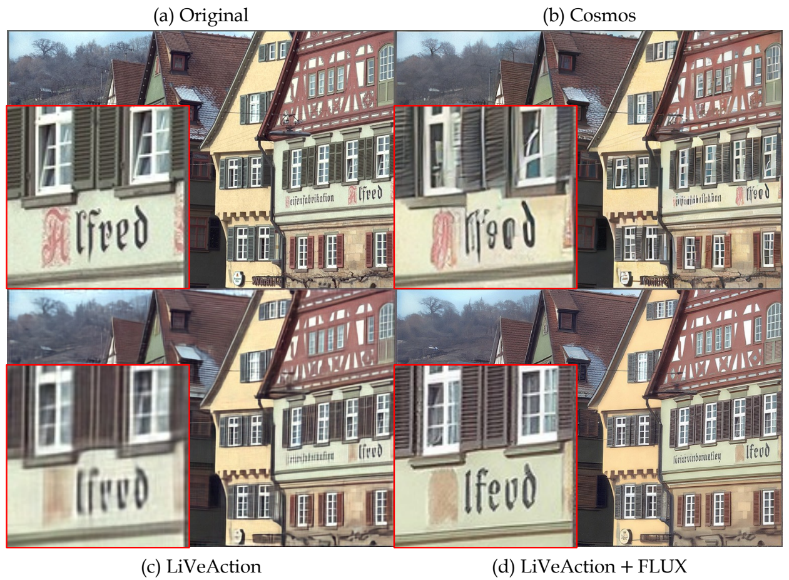
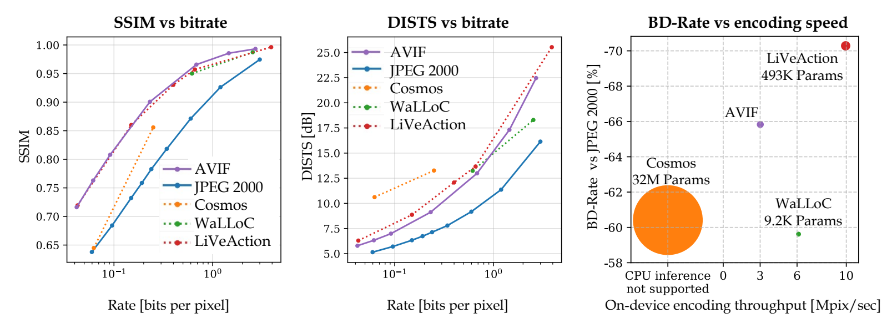

---

## 33. [MDN: Parallelizing Stepwise Momentum for Delta Linear Attention](https://huggingface.co/papers/2605.05838)
**Upvotes**: 4 | **도입 난이도**: 중 | **신뢰도**: 상
**arXiv**: https://arxiv.org/abs/2605.05838

**태그**: Linear Attention, LLM, Optimization, Parallelization, RAG, Benchmark, Evaluation

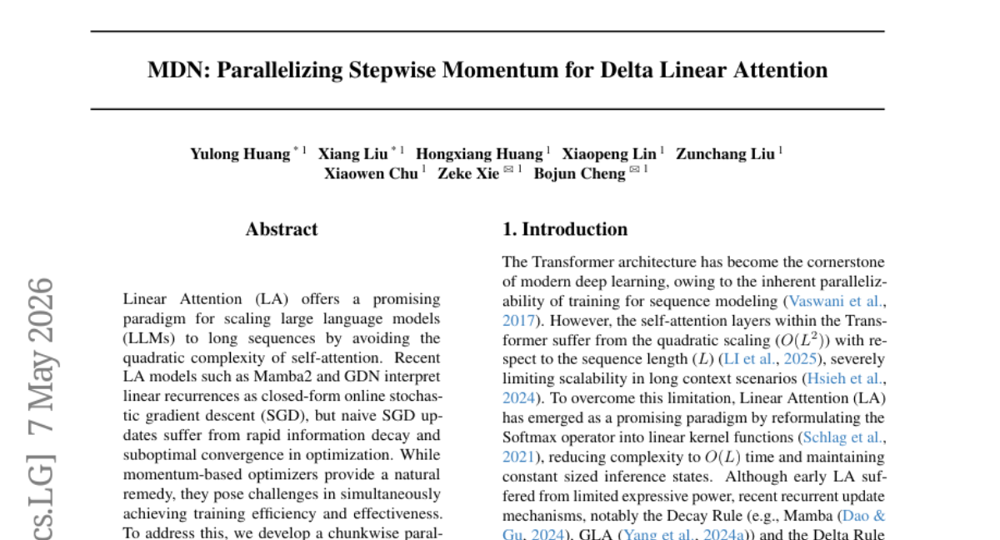

### 📌 한 줄 요약
모멘텀 기반의 병렬화 알고리즘을 통해 선형 어텐션의 정보 소실 문제를 해결하고 학습 효율을 높인 새로운 모델(MDN) 제안

### 🔑 핵심 포인트
- 모멘텀 규칙을 적용한 청크 단위 병렬화 알고리즘 개발
- 동역학 시스템 분석을 통한 안정적인 게이팅 제약 조건 설계
- Triton 커널 최적화를 통한 높은 학습 처리량(Throughput) 확보

### 🧑‍💻 개발자 관점
긴 시퀀스 처리가 필요한 LLM 환경에서 기존 선형 모델의 정보 소실 문제를 해결하면서도 병렬 학습 효율을 유지하는 실질적인 방법론을 제시합니다.

### 🚀 실무 적용 아이디어
- 제공된 GitHub 코드를 활용하여 Mamba2와 MDN의 학습 속도 및 수렴성 비교 실험
- 다양한 시퀀스 길이에 따른 정보 유지 능력(Long-context) 벤치마크 테스트
- Triton 커널 최적화가 특정 하드웨어에서 어떻게 동작하는지 프로파일링

### ⚠️ 리스크/한계
- 모멘텀 도입에 따른 복잡한 하이퍼파라미터 튜닝 필요성
- 특정 하드웨어 가속(Triton)에 의존적인 최적화 구조

### 📝 초록 기반 상세 설명
최근 Mamba2와 같은 선형 어텐션(LA) 모델은 재귀 구조를 SGD로 해석하여 효율성을 높였으나, 정보 소실과 최적화 수렴 문제라는 한계가 있습니다. 이를 해결하기 위해 모멘텀 기법을 도입하면 학습 효율과 효과 사이의 트레이드오프가 발생합니다. 본 논문은 업데이트 계수를 기하학적으로 재배열하여 모멘텀 규칙을 적용할 수 있는 청크 단위 병렬 알고리즘을 개발했습니다. 또한 동역학 시스템 관점에서 모멘텀 재귀를 분석하여 안정적인 게이팅 제약 조건을 설계했습니다. 결과적으로 제안된 MDN 모델은 Triton 커널을 통해 높은 처리량을 유지하면서도 Mamba2 및 GDN 대비 우수한 성능을 입증했습니다.

---

## 34. [SpecBlock: Block-Iterative Speculative Decoding with Dynamic Tree Drafting](https://huggingface.co/papers/2605.07243)
**Upvotes**: 3 | **도입 난이도**: 상 | **신뢰도**: 상
**arXiv**: https://arxiv.org/abs/2605.07243

**태그**: LLM Inference, Speculative Decoding, Optimization, Efficiency, Inference

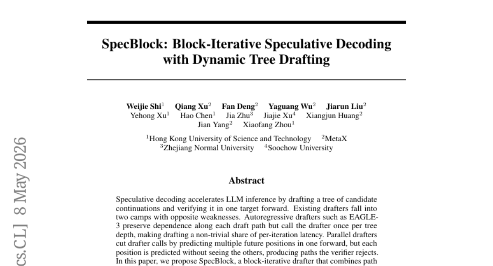

### 📌 한 줄 요약
경로 의존성과 병렬성을 동시에 확보하여 추론 속도를 높인 블록 단위 반복 Speculative Decoding 기법

### 🔑 핵심 포인트
- Block-Iterative 방식: 한 번의 드래프팅으로 K개의 의존적 토큰을 생성하여 병렬성과 정확도 균형 확보
- Dynamic Tree & Valid-prefix Mask: 랭크 헤드를 통한 동적 분기 할당 및 잘못된 경로에 대한 학습 손실 방지
- Cost-aware Bandit: 추론 비용 대비 이득을 고려하여 배포 환경에서 드래프터를 선택적으로 업데이트

### 🧑‍💻 개발자 관점
LLM 서비스 운영 시 추론 지연 시간(Latency)과 연산 비용 사이의 최적점을 찾는 데 실질적인 가이드를 제공합니다.

### 🚀 실무 적용 아이디어
- EAGLE-3와 SpecBlock의 추론 속도 및 수락률(Acceptance Rate) 비교 실험
- 다양한 모델 크기에서 블록 크기(K) 변화에 따른 성능 민감도 테스트
- 실제 프로덕션 환경에서의 밴딧 알고리즘 적용 시 업데이트 비용 산정 실험

### ⚠️ 리스크/한계
- 블록 크기 설정에 따라 정확도와 속도 간의 복잡한 트레이드오프 발생 가능성
- 새로운 아키텍처 도입에 따른 추가적인 학습 및 배포 파이프라인 구축 비용

### 📝 초록 기반 상세 설명
LLM 추론 가속을 위한 Speculative Decoding은 기존의 자기회귀 방식(경로 의존성 높음, 속도 느림)과 병렬 방식(속도 빠름, 수락률 낮음) 사이의 트레이드오프 문제를 겪고 있습니다. 본 논문은 블록 단위로 여러 토큰을 생성하면서도 경로 의존성을 유지하는 SpecBlock을 제안합니다. 블록 내 레이어별 시프트와 블록 간 상태 상속 메커니즘을 통해 정확도를 높이고, 학습 시에는 valid-prefix mask를 사용하여 효율적인 학습을 수행합니다. 또한, 랭크 헤드를 통해 동적으로 트리 구조를 생성하고 배포 시에는 비용 효율적인 밴딧 알고리즘을 통해 드래프터를 최적화합니다. 실험 결과, 기존 EAGLE-3 대비 낮은 비용으로 더 높은 평균 가속도를 달상성했습니다.

---

## 35. [Steering Visual Generation in Unified Multimodal Models with Understanding Supervision](https://huggingface.co/papers/2605.05781)
**Upvotes**: 3 | **도입 난이도**: 중 | **신뢰도**: 상
**arXiv**: https://arxiv.org/abs/2605.05781

**태그**: Multimodal, Image Generation, Post-training, Vision-Language, Vision

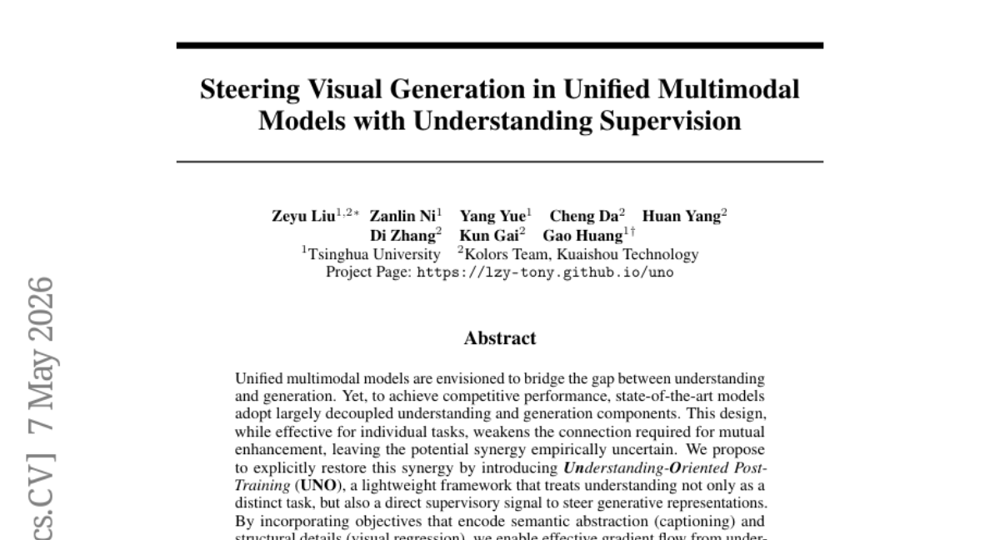

### 📌 한 줄 요약
이해(Understanding)를 생성(Generation)의 제어 신호로 활용하여 멀티모달 모델의 시너지와 생성 품질을 높이는 프레임워크 제안

### 🔑 핵심 포인트
- 이해와 생성 간의 시너지를 복원하는 UNO(Understanding-Oriented Post-Training) 프레임워크 제안
- 이해 태스크를 생성 모델의 표현력을 제어하는 직접적인 감독 신호로 활용
- 캡셔닝(의미)과 시각적 회귀(구조)를 결합하여 정교한 생성 제어 구현

### 🧑‍💻 개발자 관점
단순히 이미지를 잘 만드는 것을 넘어, 텍스트 이해도를 바탕으로 의도에 부합하는 정교한 이미지 생성 및 편집 모델을 구축하는 데 유용한 방법론입니다.

### 🚀 실무 적용 아이디어
- 기존 생성 모델에 캡셔닝 손실 함수를 추가하여 생성 품질 변화 관찰
- 이미지 편집 작업 시 이해 기반 제어 신호가 구조 유지에 미치는 영향 테스트
- 경량화된 사후 학습(Post-training) 환경에서 UNO 프레임워크 적용 실험

### ⚠️ 리스크/한계
- 이해 작업에 과도하게 최적화될 경우 생성 이미지의 다양성(Diversity) 저하 가능성
- 학습 시 이해와 생성 간의 균형을 맞추기 위한 하이퍼파라미터 튜닝의 난이도

### 📝 초록 기반 상세 설명
최근 멀티모달 모델은 이해와 생성 기능을 통합하려 하지만, 기존 모델들은 두 기능이 분리되어 있어 상호 보완적인 시너지를 내기 어렵습니다. 이러한 구조적 분리는 모델 간의 연결성을 약화시켜 잠재적인 성능 향상 기회를 제한합니다. 본 논문에서는 이해 중심의 사후 학습(UNO) 프레임워크를 제안하여 이해 능력을 생성 표현을 가이드하는 직접적인 감독 신호로 활용합니다. 구체적으로 의미적 추상화(캡셔닝)와 구조적 세부 사항(시각적 회귀)을 포함하는 목적 함수를 통해 이해에서 생성으로의 효과적인 그래디언트 흐름을 구현합니다. 실험 결과, 이해 능력이 생성 성능을 촉진하는 강력한 촉매제임을 입증했습니다.

---

## 36. [Empirical Evidence for Simply Connected Decision Regions in Image Classifiers](https://huggingface.co/papers/2605.06380)
**Upvotes**: 3 | **도입 난이도**: 중 | **신뢰도**: 상
**arXiv**: https://arxiv.org/abs/2605.06380

**태그**: Computer Vision, Topology, Deep Learning Interpretability, Robustness, Vision, Evaluation

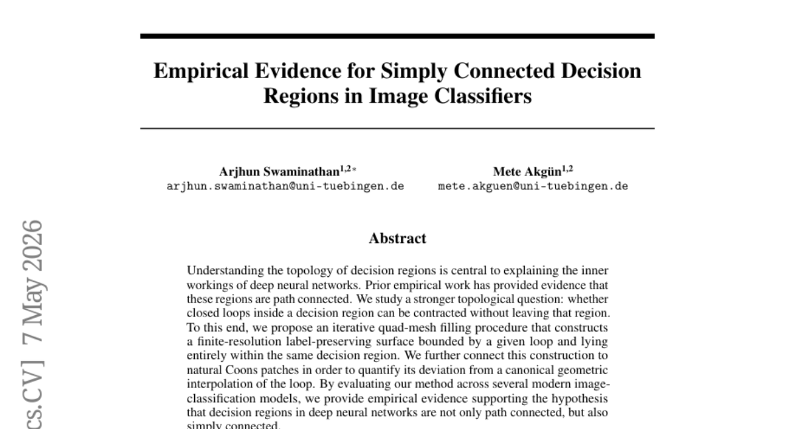

### 📌 한 줄 요약
딥러닝 이미지 분류기의 결정 영역(Decision Region)이 단순 연결(Simply Connected) 구조를 가짐을 입증하여 모델의 위상적 안정성을 확인한 연구

### 🔑 핵심 포인트
- 결정 영역이 단순 연결(Simply Connected)되어 있다는 위상적 가설 검증
- 루프를 결정 영역 내에 유지하며 채우는 반복적 쿼드 메쉬 채우기 알고리즘 제안
- Coons patches를 활용한 기하학적 보간 편차 정량화 방법론 도입

### 🧑‍💻 개발자 관점
모델의 결정 경계가 복잡한 구멍 없이 매끄럽게 연결되어 있음을 이해함으로써, 적대적 공격(Adversarial Attack)이나 데이터 변형에 대한 모델의 위상적 견고성을 판단하는 근거가 됩니다.

### 🚀 실무 적용 아이디어
- 특정 클래스의 결정 영역 내에서 루프를 생성하고 수축 가능한지 시각화 실험 수행
- 모델의 복잡도(파라미터 수) 변화에 따른 결정 영역의 위상적 특성 변화 관찰
- 적대적 예제(Adversarial Examples)가 결정 영역의 위상적 구조를 어떻게 교란하는지 분석

### ⚠️ 리스크/한계
- 실험이 유한한 해상도(Finite-resolution) 내에서 수행되므로 연속적인 공간에서의 완전한 증명과는 차이가 있음
- 특정 이미지 분류 모델에 국한된 결과일 수 있어 모든 딥러닝 구조로 일반화하기에는 추가 검증 필요

### 📝 초록 기반 상세 설명
딥러닝 모델의 결정 영역에 대한 위상적 이해는 모델의 내부 동작을 설명하는 데 핵심적인 요소입니다. 기존 연구는 결정 영역이 경로 연결(Path Connected)되어 있다는 점을 보여주었으나, 본 연구는 더 강력한 조건인 단순 연결성(Simply Connected) 여부를 탐구합니다. 이를 위해 루프 내부를 결정 영역 내에서 채우는 반복적 쿼드 메쉬 채우기(Iterative Quad-mesh Filling) 기법을 제안합니다. 또한, 이 구조를 Coons patches와 연결하여 기하학적 편차를 정량화하는 방법론을 구축했습니다. 최신 이미지 분류 모델들을 대상으로 실험한 결과, 결정 영역이 단순 연결되어 있다는 가설을 뒷받침하는 실증적 근거를 확보했습니다.

---

## 37. [Discovering Reinforcement Learning Interfaces with Large Language Models](https://huggingface.co/papers/2605.03408)
**Upvotes**: 3 | **도입 난이도**: 중 | **신뢰도**: 상
**arXiv**: https://arxiv.org/abs/2605.03408

**태그**: Reinforcement Learning, LLM, Automated Design, Evolutionary Algorithm, Evaluation

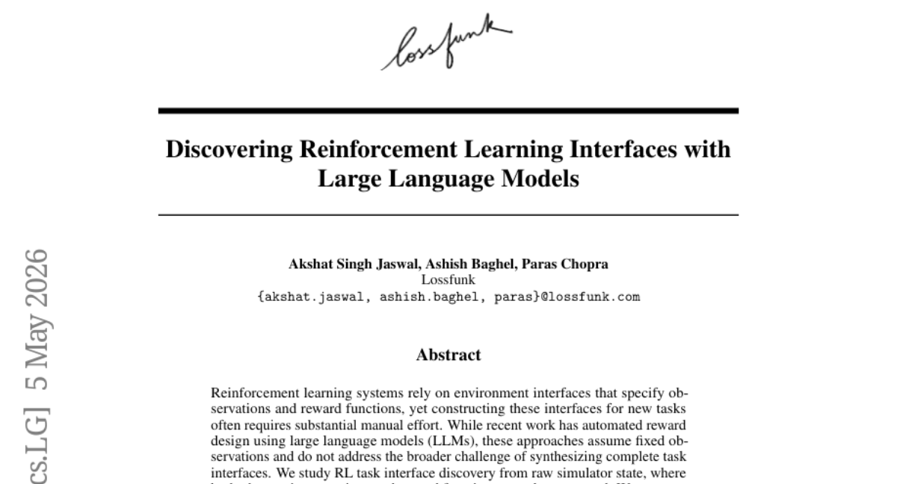

### 📌 한 줄 요약
LLM 기반 진화 알고리즘을 통해 RL 환경의 관측(Observation)과 보상(Reward) 함수를 동시에 자동 생성하는 프레임워크 제안

### 🔑 핵심 포인트
- LLM과 진화 알고리즘을 결합하여 실행 가능한 코드 형태의 RL 인터페이스 생성
- 관측(Observation)과 보상(Reward)을 독립적으로 최적화하는 대신 공동 진화(Joint Evolution) 수행
- 원시 상태(Raw State)로부터 성공 지표만으로 유효한 인터페이스를 도출하는 자동화 프로세스

### 🧑‍💻 개발자 관점
새로운 환경에 RL을 적용할 때 반복되는 관측/보상 설계 작업을 자동화하여 엔지니어링 공수를 획기적으로 줄일 수 있습니다.

### 🚀 실무 적용 아이디어
- 제공된 GitHub 코드를 활용하여 특정 시뮬레이터 환경에 LIMEN 적용 테스트
- 관측 함수와 보상 함수를 각각 최적화했을 때와 동시에 최적화했을 때의 성능 차이 비교 실험
- 복잡한 연속 제어 환경에서의 코드 생성 안정성 검증

### ⚠️ 리스크/한계
- 생성된 코드가 실행 가능한 형태여야 하므로 시뮬레이터 API 의존성이 높음
- 복잡도가 높은 환경에서는 진화 과정의 수렴 속도가 느리거나 국소 최적해에 빠질 위험

### 📝 초록 기반 상세 설명
강화학습(RL) 시스템 구축 시 환경 인터페이스(관측 및 보상 설계)를 수동으로 정의하는 데 많은 노력이 소요됩니다. 기존 연구는 보상 설계 자동화에 집중했으나, 관측 공간이 고정되어 있다는 한계가 있었습니다. 본 논문은 원시 시뮬레이터 상태로부터 관측 매핑과 보상 함수를 모두 생성하는 LIMEN 프레임워크를 제안합니다. LIMEN은 LLM 가이드 기반의 진화적 프레임워크로, 실행 가능한 코드를 생성하고 정책 학습 피드백을 통해 이를 반복적으로 정제합니다. 실험 결과, 이산형 그리드월드와 연속 제어 도메인 모두에서 관측과 보상의 공동 설계(Co-design)가 필수적임을 입증했습니다. 이를 통해 RL 인터페이스 구축의 자동화 가능성을 보여주었습니다.

---

## 38. [Who Prices Cognitive Labor in the Age of Agents? Compute-Anchored Wages](https://huggingface.co/papers/2605.05558)
**Upvotes**: 2 | **도입 난이도**: 하 | **신뢰도**: 상
**arXiv**: https://arxiv.org/abs/2605.05558

**태그**: AI Agents, Economics, Compute-Cost, Labor-Economics, Agent

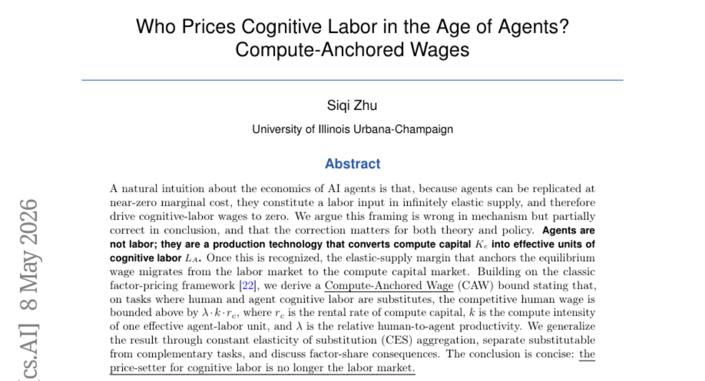

### 📌 한 줄 요약
AI 에이전트의 확산으로 인해 인지 노동의 임금 결정권이 노동 시장에서 컴퓨팅 자본 시장으로 이동한다는 경제적 프레임워크 제시

### 🔑 핵심 포인트
- 에이전트를 노동이 아닌 '컴퓨팅 자본을 인지 노동으로 변환하는 기술'로 재정의
- 인간의 임금 상한선이 컴퓨팅 자본 임대료와 생산성 비율에 의해 결정된다는 'CAW(Compute-Anchored Wage)' 모델 제안
- 인지 노동의 가격 결정권이 노동 시장에서 컴퓨팅 자본 시장으로 전이됨을 이론적으로 규명

### 🧑‍💻 개발자 관점
AI 에이전트 도입 시 인건비 절감의 한계치가 단순히 인건비가 아니라 컴퓨팅 비용(GPU/API 비용)에 의해 결정됨을 이해하는 데 중요합니다.

### 🚀 실무 적용 아이디어
- 특정 업무 자동화 시 투입되는 API 비용과 인건비 간의 임계점(Break-even point) 계산해보기
- 에이전트 도입 시 업무 효율성(λ) 변화에 따른 ROI 모델링 시뮬레이션
- 컴퓨팅 비용 변동이 업무 자동화 범위에 미치는 영향 분석

### ⚠️ 리스크/한계
- 이론적 모델이므로 실제 노동 시장의 복잡한 심리적/사회적 요인을 모두 반영하지 못할 수 있음
- 컴퓨팅 자본 가격(GPU 등)의 급격한 변동이 모델의 예측력을 흔들 수 있음

### 📝 초록 기반 상세 설명
AI 에이전트가 인간의 노동을 대체할 때 노동 공급이 탄력적이라 임금이 하락할 것이라는 직관이 지배적입니다. 하지만 본 논문은 에이전트를 노동이 아닌 컴퓨팅 자본(K_c)을 인지 노동(L_A)으로 변환하는 생산 기술로 정의합니다. 이러한 관점의 전환을 통해 임금 결정의 기준점이 노동 시장이 아닌 컴퓨팅 자본 시장으로 이동함을 증명합니다. 이를 바탕으로 '컴퓨팅 기반 임금(CAW)' 경계 조건을 도출하여 인간의 임금이 컴퓨팅 자본 비용에 의해 어떻게 제한되는지 수식화합니다. 최종적으로 기술적 대체를 고려한 CES 집계 모델을 통해 노동과 자본의 몫 변화를 분석합니다.

---

## 39. [Rethinking RL for LLM Reasoning: It's Sparse Policy Selection, Not Capability Learning](https://huggingface.co/papers/2605.06241)
**Upvotes**: 2 | **도입 난이도**: 하 | **신뢰도**: 상
**arXiv**: https://arxiv.org/abs/2605.06241

**태그**: LLM, Reinforcement Learning, Reasoning, Efficiency, Benchmark

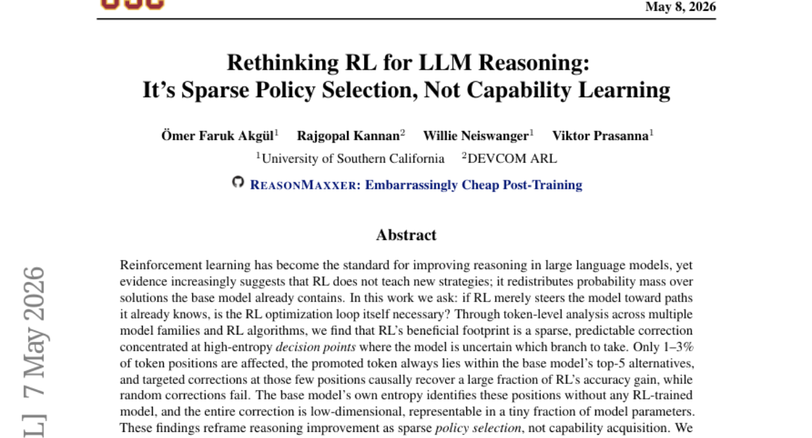

### 📌 한 줄 요약
LLM의 추론 능력 향상은 새로운 지식 습득이 아닌 기존 확률 분포 내의 선택 최적화이며, 이를 통해 RL 없이도 고효율 학습이 가능함을 입증함

### 🔑 핵심 포인트
- RL의 본질은 새로운 능력 습득이 아닌, 기존 확률 분포 내에서의 희소한 정책 선택(Sparse Policy Selection)임
- RL 효과는 전체 토큰 중 1~3%의 불확실한 결정 지점에 집중되어 있으며, 이 지점들만 교정해도 성능 향상이 가능함
- ReasonMaxxer는 RL 없이 엔트로피 기반의 타겟팅된 교정만으로 RL 수준의 성능을 달성하는 초경량 학습 프레임워크임

### 🧑‍💻 개발자 관점
막대한 비용이 드는 RL 학습 대신, 모델의 불확실한 지점(High-entropy)만 골라 학습함으로써 적은 자원으로도 추론 성능을 극대화할 수 있는 실무적 방법론을 제시함

### 🚀 실무 적용 아이디어
- 모델의 토큰별 엔트로피를 측정하여 성능 향상이 집중되는 지점(Decision points) 식별 실험
- 전체 파라미터가 아닌 특정 엔트로피 임계값 이상의 토큰에 대해서만 Loss를 적용하는 실험
- 소량의 데이터(Few-shot rollouts)를 활용한 대조 학습(Contrastive Learning) 적용 테스트

### ⚠️ 리스크/한계
- 특정 도메인(수학 등) 외의 일반적인 창의적 글쓰기 등에서는 희소 정책 선택 방식이 효과적이지 않을 수 있음
- 엔트로피 기반의 선택 지점이 모델의 일반화 성능에 미칠 수 있는 부작용 검토 필요

### 📝 초록 기반 상세 설명
최근 LLM의 추론 능력 향상을 위해 RL이 표준으로 사용되고 있으나, 이것이 새로운 전략을 학습하는 것인지에 대한 의문이 제기됨. 연구 결과, RL은 새로운 능력을 만드는 것이 아니라 모델이 이미 가진 선택지 중 정답 확률을 높이는 '희소 정책 선택(Sparse Policy Selection)' 과정임이 밝혀짐. 분석 결과, RL의 효과는 전체 토큰 중 단 1~3%의 고엔트로피(불확실한) 지점에서만 발생하며, 이 지점들만 교정해도 RL과 유사한 성능을 얻을 수 있음. 이를 바탕으로 제안된 'ReasonMaxxer'는 RL 없이 엔트로피 기반의 대조 학습(Contrastive Loss)만을 사용하여 매우 적은 비용으로 추론 성능을 최적화함. 실험 결과, ReasonMaxxer는 기존 RL 대비 비용을 3단계(orders of magnitude) 낮추면서도 동등하거나 더 뛰어난 성능을 달수 있음.

---

## 40. [PrefixGuard: From LLM-Agent Traces to Online Failure-Warning Monitors](https://huggingface.co/papers/2605.06455)
**Upvotes**: 2 | **도입 난이도**: 중 | **신뢰도**: 상
**arXiv**: https://arxiv.org/abs/2605.06455

**태그**: LLM-Agent, Observability, Monitoring, Automation, Agent, RAG

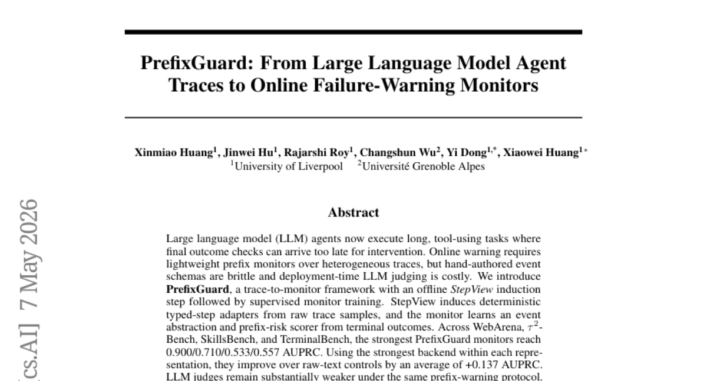

### 📌 한 줄 요약
LLM 에이전트의 실행 과정(Trace)을 분석하여 실패를 조기에 감지하는 자동화된 모니터링 프레임워크

### 🔑 핵심 포인트
- StepView를 통한 원시 트레이스 기반의 결정론적 단계(Typed-step) 유도 및 모니터 학습
- LLM 판단 방식보다 효율적이고 강력한 Prefix-risk 스코어링 성능 확보
- 관찰 가능한 정보와 실제 실패 사이의 관계를 정의하는 Observability Ceiling 도출

### 🧑‍💻 개발자 관점
에이전트가 잘못된 방향으로 작업을 수행할 때, 작업이 끝날 때까지 기다리지 않고 중간 단계에서 즉시 개입할 수 있는 기술적 토대를 제공합니다.

### 🚀 실무 적용 아이디어
- 에이전트 실행 로그(Trace)를 활용한 단계별 이벤트 스키마 자동 생성 테스트
- 실시간 모니터링 시 발생하는 False Alarm(오탐)과 조기 경고의 트레이드오프 분석
- 특정 도메인 작업에 대한 StepView 기반 어댑터 유효성 검증

### ⚠️ 리스크/한계
- 작업 복잡도가 높아질수록 추출되는 DFA(유한 상태 오토마타) 상태 수가 급격히 증가할 수 있음
- 높은 점수가 반드시 실용적인 조기 경고(Actionable early alerts)로 이어지지 않을 수 있음

### 📝 초록 기반 상세 설명
LLM 에이전트가 복잡한 작업을 수행할 때, 최종 결과가 나오기 전 실패를 감지하는 것은 매우 어렵습니다. 기존의 수동 스키마 정의나 실시간 LLM 판단 방식은 취약하거나 비용이 많이 드는 문제가 있습니다. 이를 해결하기 위해 PrefixGuard는 원시 트레이스에서 결정론적 단계 어댑터를 추출하는 StepView 과정을 거쳐 모니터를 학습시키는 프레임워크를 제안합니다. 실험 결과, PrefixGuard는 기존 텍스트 기반 방식보다 높은 AUPRC를 기록하며 LLM 판단보다 우수한 성능을 보였습니다. 또한, 관찰 가능한 정보만으로 예측 가능한 성능 한계(Observability Ceiling)를 정의하고, 조기 경고의 실용성을 진단하는 기능을 제공합니다.

---

## 41. [Gated QKAN-FWP: Scalable Quantum-inspired Sequence Learning](https://huggingface.co/papers/2605.06734)
**Upvotes**: 2 | **도입 난이도**: 중 | **신뢰도**: 상
**arXiv**: https://arxiv.org/abs/2605.06734

**태그**: Quantum-inspired, Time-Series, Parameter-Efficient, NISQ, Sequence-Learning, Benchmark, Evaluation

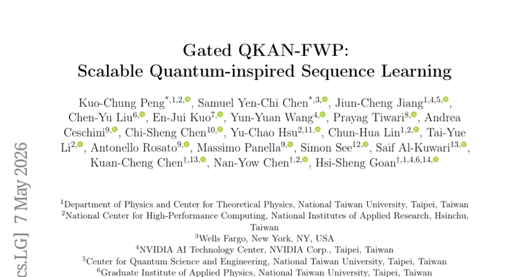

### 📌 한 줄 요약
단일 큐비트 기반의 양자 영감(Quantum-inspired) 구조를 활용하여 적은 파라미터로도 강력한 시계열 예측 성능을 구현한 확장 가능한 시퀀스 학습 프레임워크

### 🔑 핵심 포인트
- 단일 큐비트 데이터 재업로딩(DARUAN)을 통한 효율적인 비선형 활성화 함수 구현
- 스칼라 게이트 기반 업데이트 규칙을 통한 안정적인 파라미터 진화 및 병렬 학습 가능성 확보
- 적은 파라미터로도 대규모 클래식 RNN 모델을 능가하는 시계열 예측 성능 및 NISQ 장치 호환성

### 🧑‍💻 개발자 관점
파라미터 효율성이 극대화된 모델로, 자원이 제한된 환경이나 실제 양자 하드웨어에서 시계열 예측 모델을 운용할 때 유용한 아키텍처를 제시합니다.

### 🚀 실무 적용 아이디어
- 제안된 DARUAN 구조를 기존 LSTM이나 GRU의 활성화 함수로 대체하여 성능 비교
- 장기 시계열 데이터셋(Long-horizon)에 대한 파라미터 효율성 벤치마크 수행
- 단일 큐비트 기반 양자 회로를 활용한 하이브리드 학습 파이프라인 구축 테스트

### ⚠️ 리스크/한계
- 단일 큐비트 구조의 한계로 인해 복잡한 다차원 관계 학습 시 성능 제약 가능성
- 양자 하드웨어 노이즈 환경에서의 안정적인 성능 유지를 위한 추가 검증 필요

### 📝 초록 기반 상세 설명
기존의 양자 Fast Weight Programmers(QFWP)는 다중 큐비트 구조로 인해 NISQ 장치에서의 확장성과 시뮬레이션 비용 문제가 있었습니다. 이를 해결하기 위해 본 논문은 단일 큐비트 데이터 재업로딩(DARUAN)과 QKAN을 결합한 gated QKAN-FWP를 제안합니다. 제안된 방식은 스칼라 게이트 기반의 업데이트 규칙을 통해 파라미터 진화의 안정성을 확보하고 병렬 가능한 그래디언트 경로를 제공합니다. 실험 결과, 태양 주기 예측 등 장기 시계열 작업에서 훨씬 더 많은 파라미터를 가진 기존 RNN 계열 모델들보다 낮은 오차를 기록했습니다. 또한 실제 양자 프로세서(IonQ, IBM)에서도 시뮬레이션과 유사한 높은 정확도를 유지하며 NISQ 호환성을 입증했습니다.

### 🖼️ 추가 자료
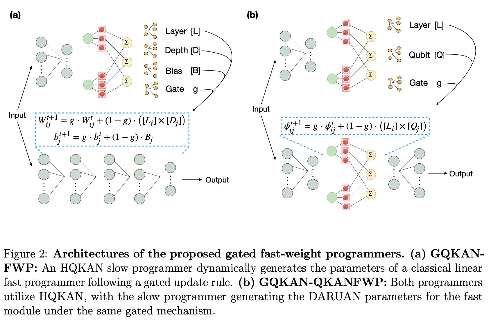

---

## 42. [CASCADE: Case-Based Continual Adaptation for Large Language Models During Deployment](https://huggingface.co/papers/2605.06702)
**Upvotes**: 2 | **도입 난이도**: 중 | **신뢰도**: 상
**arXiv**: https://arxiv.org/abs/2605.06702

**태그**: LLM Agent, Continual Learning, Memory Management, Reinforcement Learning, Agent, RAG

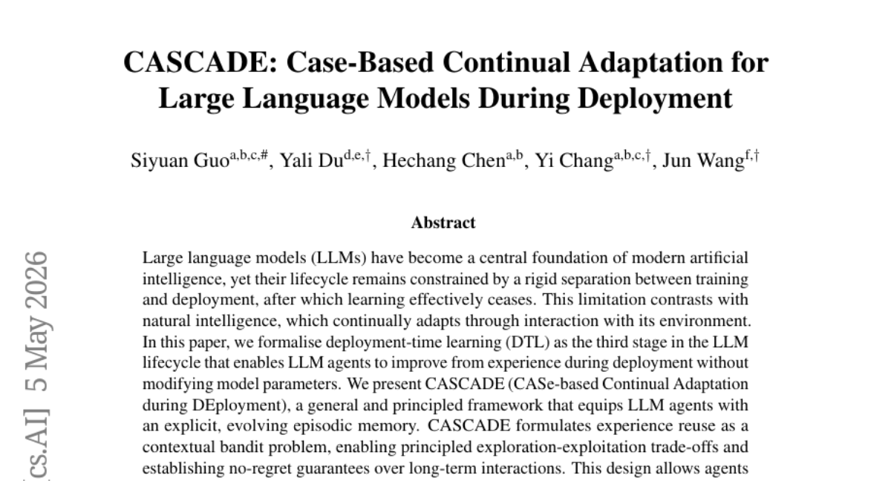

### 📌 한 줄 요약
모델 파라미터 수정 없이 에피소드 메모리를 활용해 배포 단계에서 지속적으로 성능을 개선하는 프레임워크

### 🔑 핵심 포인트
- 배포 시점 학습(DTL)을 위한 에피소드 기반 메모리 프레임워크 제안
- 경험 재사용을 컨텍스추얼 밴딧 문제로 정의하여 탐색-활용 균형 및 No-regret 보장
- 파라미터 업데이트 없이 과거 경험을 축적, 선택, 정제하여 지식화

### 🧑‍💻 개발자 관점
모델 재학습 비용 없이 운영 중 발생하는 데이터를 활용해 에이전트의 성능을 점진적으로 향상시킬 수 있는 실용적인 방법론을 제시합니다.

### 🚀 실무 적용 아이디어
- 에이전트의 과거 대화 기록을 벡터 DB에 저장하고 유사 사례를 추출하는 RAG 파이프라인 구축 실험
- 컨텍스추얼 밴딧 알고리즘을 적용하여 최적의 프롬프트/사례 선택 로직 테스트
- 다양한 도구 사용(Tool-use) 환경에서 에피소드 메모리의 유효성 검증

### ⚠️ 리스크/한계
- 메모리 크기 증가에 따른 컨텍스트 윈도우 관리 및 비용 문제
- 잘못된 경험(Bad case)이 메모리에 축적될 경우 성능 저하 위험

### 📝 초록 기반 상세 설명
기존 LLM은 학습과 배포가 엄격히 분리되어 있어 배포 후 실시간 적응이 어렵다는 한계가 있습니다. 본 논문은 모델 파라미터를 변경하지 않으면서도 경험을 통해 학습하는 '배포 시점 학습(DTL)' 개념을 제안합니다. 이를 위해 에피소드 메모리를 구축하고 경험 재사용을 컨텍스추얼 밴딧(Contextual Bandit) 문제로 정형화한 CASCADE 프레임워크를 개발했습니다. 이 방식은 탐색과 활용의 균형을 통해 과거 경험을 유효한 지식으로 변환합니다. 실험 결과, 다양한 태스크에서 제로샷 프롬프팅 대비 높은 성공률을 보였으며 기존의 그래디언트 기반 및 메모리 기반 방식보다 우수한 성능을 입증했습니다.

---

## 43. [CGM-JEPA: Learning Consistent Continuous Glucose Monitor Representations via Predictive Self-Supervised Pretraining](https://huggingface.co/papers/2605.00933)
**Upvotes**: 2 | **도입 난이도**: 중 | **신뢰도**: 상
**arXiv**: https://arxiv.org/abs/2605.00933

**태그**: Self-Supervised Learning, Time-Series, JEPA, Domain Adaptation, Healthcare AI, Evaluation

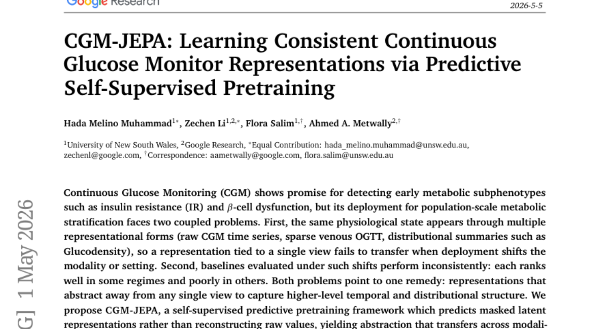

### 📌 한 줄 요약
단일 뷰의 한계를 극복하기 위해 잠재 표현(Latent Representation)을 예측하는 JEPA 방식을 적용하여 모달리티 간 전이 성능을 높인 CGM 자기주도 학습 프레임워크

### 🔑 핵심 포인트
- JEPA(Joint-Embedding Predictive Architecture)를 활용하여 원시 값이 아닌 고차원 잠재 표현을 예측함으로써 모달리티 전이 성능 극대화
- Glucodensity 기반의 마스킹 교차 뷰 목적 함수(X-CGM-JEPA)를 통해 분포적 특징 학습
- 코호트 일반화, 모달리티 전환(Venous-to-CGM), 홈 환경 등 다양한 시나리오에서의 강건한 성능 입증

### 🧑‍💻 개발자 관점
데이터의 형태(시계열 vs 요약 통계)가 바뀌거나 학습 환경과 다른 환경(병원 vs 가정)에 배포될 때 발생하는 도메인 시프트 문제를 해결하는 아키텍처 설계 패턴을 제시합니다.

### 🚀 실무 적용 아이디어
- JEPA 구조를 활용하여 시계열 데이터의 노이즈를 제거하고 핵심 특징만 추출하는 실험 진행
- 데이터의 통계적 분포(Glucodensity 등)를 손실 함수에 결합하는 방식 적용 테스트
- 도메인 간 전이(Transfer Learning) 성능 측정을 위한 벤치마크 환경 구축

### ⚠️ 리스크/한계
- 잠재 공간(Latent Space) 학습의 안정성 확보가 어려울 수 있음
- 대규모 사전 학습 데이터셋 확보 및 연산 비용 문제

### 📝 초록 기반 상세 설명
연속 혈당 측정(CGM) 데이터는 다양한 환경과 모달리티(시계열, 요약 통계 등)로 존재하여 단일 뷰 기반 모델은 환경 변화에 취약한 문제가 있습니다. 이를 해결하기 위해 원시 값을 직접 예측하는 대신 마스킹된 잠재 표현을 예측하는 CGM-JEPA 프레임워크를 제안합니다. 여기에 분포적 정보를 결합한 X-CGM-JEPA를 통해 교차 뷰(cross-view) 정보를 학습하도록 설계했습니다. 228명의 대규모 비라벨 데이터를 활용해 사전 학습을 진행하였으며, 임상 코호트 및 모달리티 전환 환경에서 성능을 검증했습니다. 실험 결과, 제안 모델은 코호트 일반화 및 정맥 검사-CGM 간 전이 작업에서 기존 베이스라인을 압도하는 성능을 보였습니다. 특히 특정 인종 그룹 간의 성능 격차를 줄이는 등 모델의 강건성과 공정성을 동시에 확보했습니다.

### 🖼️ 추가 자료
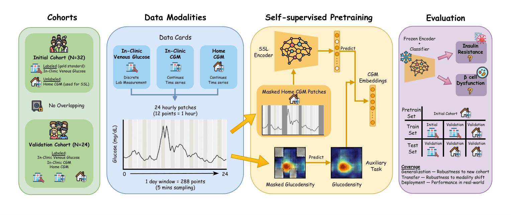
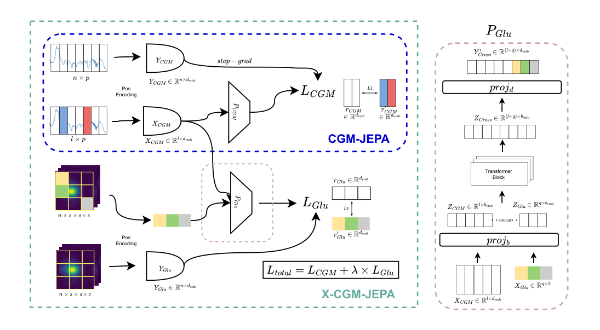

---

## 44. [Learning Visual Feature-Based World Models via Residual Latent Action](https://huggingface.co/papers/2605.07079)
**Upvotes**: 1 | **도입 난이도**: 중 | **신뢰도**: 상
**arXiv**: https://arxiv.org/abs/2605.07079

**태그**: World Models, Robot Learning, Self-Supervised Learning, Flow Matching, Vision, Video

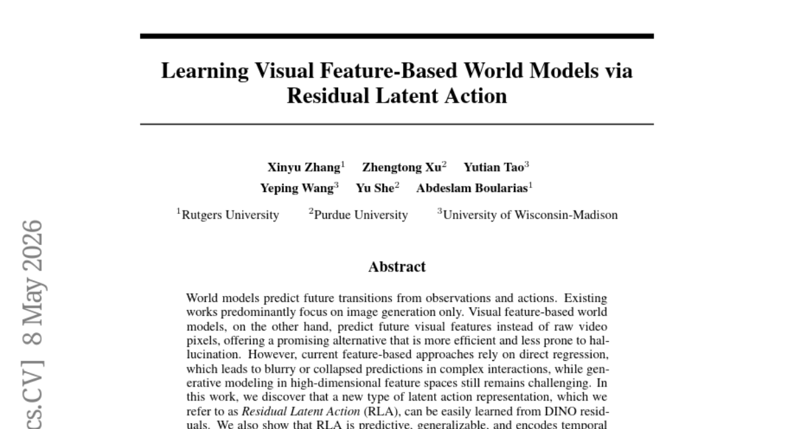

### 📌 한 줄 요약
DINO 잔차를 활용한 새로운 잠재 액션 표현(RLA)을 통해 고성능·고속의 시각적 월드 모델을 구현함

### 🔑 핵심 포인트
- DINO 잔차를 활용하여 예측 가능하고 일반화 능력이 뛰어난 Residual Latent Action(RLA) 정의
- Flow Matching 기반의 RLA-WM을 통해 고차원 특징 공간에서의 정교한 미래 예측 구현
- 액션 정보가 없는 영상이나 오프라인 데이터만으로도 가능한 로봇 정책 학습 프레임워크 제시

### 🧑‍💻 개발자 관점
비디오 생성 모델의 막대한 연산 비용 없이도 고품질의 시각적 예측이 가능하여, 로봇 제어 및 시뮬레이션 환경 구축에 실질적인 효율성을 제공합니다.

### 🚀 실무 적용 아이디어
- DINO 특징값의 잔차(Residual)가 실제 환경 변화를 얼마나 잘 포착하는지 분석
- Flow Matching을 활용한 특징 공간 내의 변화량 예측 실험
- 액션 정보가 없는 비디오 데이터셋에 RLA를 적용하여 변화량 추출 테스트

### ⚠️ 리스크/한계
- DINO와 같은 특정 사전 학습 모델의 특징 공간에 의존적일 수 있음
- 복잡한 물리적 상호작용이 포함된 환경에서 RLA가 모든 변화를 완벽히 대변할 수 있는지 검증 필요

### 📝 초록 기반 상세 설명
기존의 월드 모델은 픽셀 생성에 집중하여 효율성이 낮거나 예측이 흐릿해지는 문제가 있었습니다. 본 연구는 DINO 특징값의 잔차에서 추출할 수 있는 'Residual Latent Action(RLA)'이라는 새로운 잠재 액션 표현을 발견했습니다. 이를 기반으로 Flow Matching을 활용해 RLA 값을 예측하는 RLA-WM 모델을 제안합니다. 실험 결과, RLA-WM은 기존 비디오 확산 모델보다 훨씬 빠르면서도 시뮬레이션 및 실세계 데이터에서 뛰어난 성능을 보였습니다. 또한, 액션 정보가 없는 데모 영상만으로 학습하거나 오프라인 비디오만으로 강화학습을 수행하는 로봇 학습 기술로 확장 가능함을 입증했습니다.

### 🖼️ 추가 자료
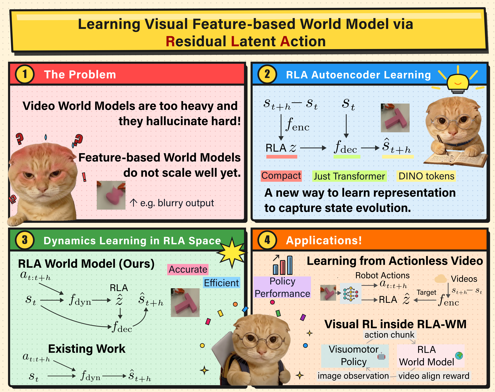

---

## 45. [Sparse Autoencoders as Plug-and-Play Firewalls for Adversarial Attack Detection in VLMs](https://huggingface.co/papers/2605.07447)
**Upvotes**: 1 | **도입 난이도**: 하 | **신뢰도**: 상
**arXiv**: https://arxiv.org/abs/2605.07447

**태그**: VLM, Security, SAE, Adversarial Attack, Agent, Vision, Safety

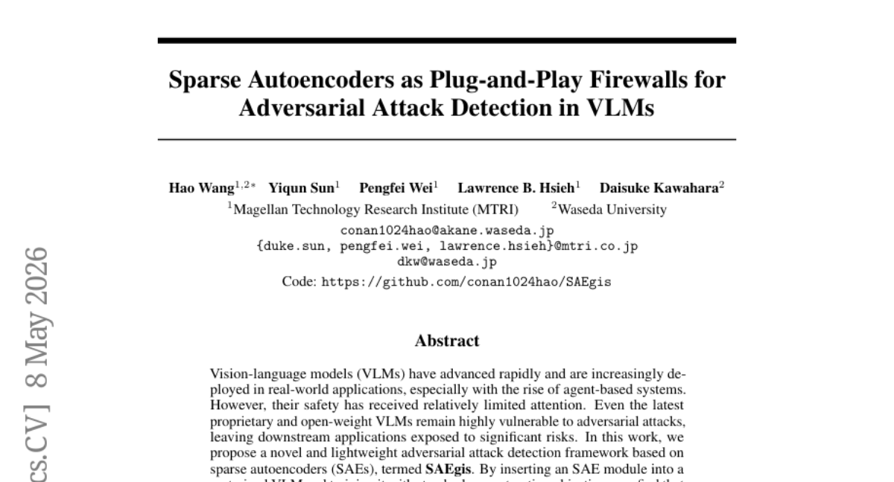

### 📌 한 줄 요약
Sparse Autoencoder(SAE)를 활용하여 VLM의 기존 가중치를 유지하면서 적대적 공격을 탐지하는 경량형 방화벽 프레임워크 제안

### 🔑 핵심 포인트
- SAE를 활용한 Plug-and-play 방식의 경량 적대적 공격 탐지 프레임워크(SAEgis) 개발
- SAE의 희소 특징이 공격 신호를 효과적으로 캡처하여 높은 일반화 성능(Cross-domain) 제공
- 추가적인 적대적 학습(Adversarial Training) 없이 기존 VLM에 모듈 형태로 삽입 가능

### 🧑‍💻 개발자 관점
모델 재학습 없이 기존 VLM 시스템에 보안 레이어를 추가할 수 있어, 실무 환경에서 모델의 안전성을 확보하는 데 매우 실용적입니다.

### 🚀 실무 적용 아이디어
- 기존 오픈소스 VLM 모델에 SAE 모듈을 결합하여 재구성 오차(Reconstruction Error) 기반 탐지 테스트
- 다양한 공격 기법(FGSM, PGD 등)에 대한 탐지 임계값(Threshold) 설정 실험
- 멀티 레이어 특징 결합 시 발생하는 연산 오버헤드 측정

### ⚠️ 리스크/한계
- SAE 학습 시 데이터셋의 품질에 따라 탐지 성능이 의존적일 수 있음
- 매우 정교한 적대적 공격이 SAE의 재구성 범위를 벗어날 가능성 존재

### 📝 초록 기반 상세 설명
최근 VLM 기반 에이전트 시스템이 급증하고 있으나, 적대적 공격에 대한 보안 취약성은 여전히 심각한 문제입니다. 본 논문은 SAE를 활용하여 사전 학습된 VLM에 삽입 가능한 경량 탐지 프레임워크인 SAEgis를 제안합니다. SAE의 희소 잠재 특징(sparse latent features)이 공격 관련 신호를 자연스럽게 포착한다는 점을 활용하여, 입력 이미지의 변조 여부를 분류합니다. 실험 결과, SAEgis는 도메인 및 공격 방식이 바뀌는 환경에서도 강력한 일반화 성능을 보여주었습니다. 특히 추가적인 적대적 학습 없이도 높은 탐지 성능을 제공하며, 다중 레이어 신호 결합을 통해 안정성을 높였습니다.

---

## 46. [Shallow Prefill, Deep Decoding: Efficient Long-Context Inference via Layer-Asymmetric KV Visibility](https://huggingface.co/papers/2605.06105)
**Upvotes**: 1 | **도입 난이도**: 중 | **신뢰도**: 상
**arXiv**: https://arxiv.org/abs/2605.06105

**태그**: LLM Inference, KV Cache, Long Context, Optimization, RAG, Benchmark, Inference

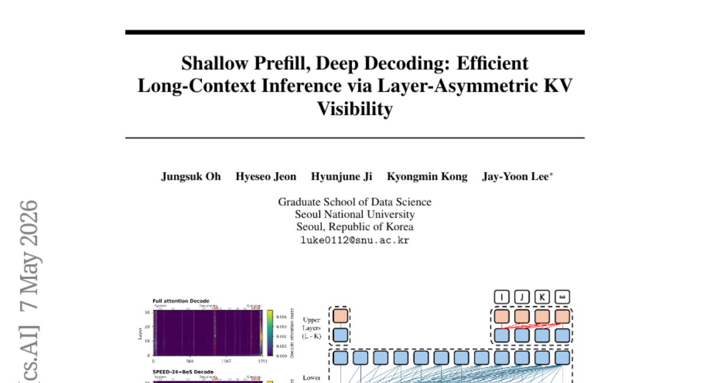

### 📌 한 줄 요약
프롬프트 KV 캐시를 하위 레이어에만 유지하여 긴 컨텍스트 추론 비용을 획기적으로 줄이는 비대칭 KV 가시성 기법

### 🔑 핵심 포인트
- Phase-asymmetric KV-visibility: 프롬프트 토큰은 하위 레이어에만, 디코딩 토큰은 전체 레이어에 유지하는 정책
- Efficiency: 프롬프트 KV 캐시를 상위 레이어에서 제거하여 메모리 점유율과 연산 비용을 동시에 절감
- Performance Stability: 최소한의 BoS(Beginning of Sequence) 앵커를 통해 모델의 표현력과 벤치마크 성능을 유지

### 🧑‍💻 개발자 관점
긴 컨텍스트를 다루는 RAG나 에이전트 시스템 구축 시, 모델 성능 저하 없이 추론 속도와 메모리 효율을 높일 수 있는 실질적인 최적화 기법입니다.

### 🚀 실무 적용 아이디어
- Llama-3.1 등 최신 모델에 레이어별 KV 가시성 제한(Layer-wise masking) 적용 실험
- 컨텍스트 길이가 길어질수록 SPEED 방식의 메모리 절감 효과가 어떻게 변화하는지 벤치마킹
- 프롬프트 토큰의 레이어 컷오프 지점(Cutoff point)에 따른 성능-효율 트레이드오프 분석

### ⚠️ 리스크/한계
- 특정 도메인이나 복잡한 추론 작업에서 상위 레이어 정보 부재로 인한 성능 저하 가능성
- 모델 아키텍처에 따라 구현 난이도 및 효율성이 달라질 수 있음

### 📝 초록 기반 상세 설명
디코더 전용 언어 모델에서 긴 컨텍스트 추론은 프롬프트 토큰이 모든 레이어에 캐싱되어 디코딩 단계에서 반복적으로 참조되는 비용 문제로 인해 비효율적입니다. 이를 해결하기 위해 연구진은 'Shallow Prefill, dEEp Decode (SPEED)'라는 위상 비대칭 KV 가시성 정책을 제안합니다. 이 방식은 프롬프트 토큰의 KV 상태를 하위 레이어에만 생성하고, 디코딩 단계의 토큰은 전체 레이어에서 유지하도록 설계되었습니다. 실험 결과, Llama-3.1-8B 모델에서 성능 저하를 최소화하면서도 TTFT(첫 토큰 생성 시간) 33% 개선, TPOT(토큰당 생성 시간) 22% 개선, KV 메모리 25% 절감 효과를 확인했습니다. 이는 프롬프트 토큰이 반드시 모든 레이어에서 전체 깊이로 유지될 필요가 없음을 시사합니다.

---

## 47. [CPCANet: Deep Unfolding Common Principal Component Analysis for Domain Generalization](https://huggingface.co/papers/2605.05136)
**Upvotes**: 1 | **도입 난이도**: 중 | **신뢰도**: 상
**arXiv**: https://arxiv.org/abs/2605.05136

**태그**: Domain Generalization, Deep Unfolding, CPCA, Representation Learning, Benchmark

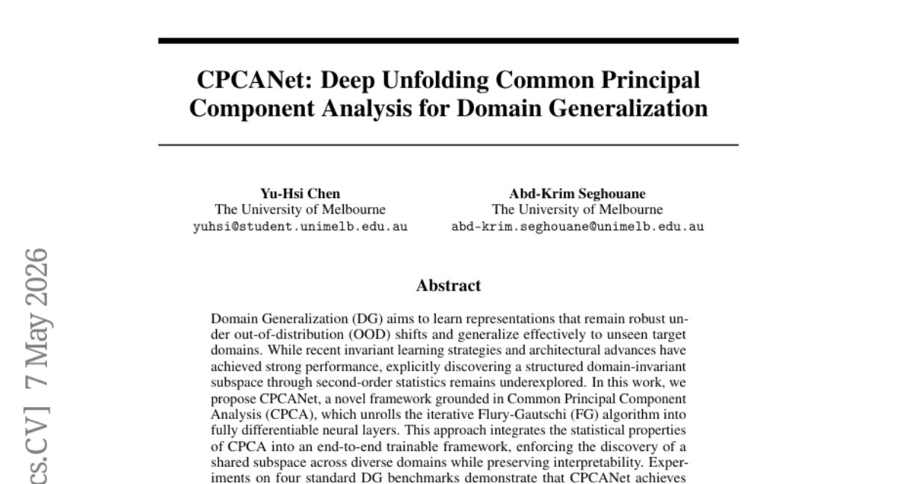

### 📌 한 줄 요약
통계적 CPCA 알고즘을 딥러닝 레이어로 구현하여 도메인 변화에 강건한 공통 특징 공간을 학습하는 프레임워크

### 🔑 핵심 포인트
- CPCA 알고리즘을 딥러닝 레이어로 변환한 Deep Unfolding 기법 적용
- 2차 통계량을 활용하여 도메인 간 공통된 구조를 가진 불변 부분 공간 추출
- 아키텍처에 구애받지 않으며 데이터셋별 별도 튜닝이 필요 없는 범용성

### 🧑‍💻 개발자 관점
모델 구조를 크게 바꾸지 않고도 통계적 기법을 통해 도메인 변화(조명, 각도 등)에 강한 모델을 구축할 수 있는 방법론을 제시합니다.

### 🚀 실무 적용 아이디어
- 기존 CNN/Transformer 백본에 CPCANet 레이어를 결합하여 성능 변화 확인
- 다양한 도메인 데이터셋(DomainNet 등)을 활용한 제로샷 전이 테스트
- Flury-Gautschi 알고리즘의 수렴 속도와 학습 안정성 검증

### ⚠️ 리스크/한계
- 2차 통계량 계산에 따른 연산 복잡도 및 메모리 사용량 증가 가능성
- 데이터 분포가 극단적으로 다를 경우 공통 부분 공간 추출의 불안정성

### 📝 초록 기반 상세 설명
도메인 일반화(DG)는 학습 시 보지 못한 새로운 도메인에서도 강건한 표현을 학습하는 것을 목표로 합니다. 기존의 불변 학습 방식은 2차 통계량을 활용한 구조적 도메인 불변 부분 공간을 명시적으로 찾는 데 한계가 있었습니다. 본 논문은 CPCA(Common Principal Component Analysis)를 기반으로 Flury-Gautschi 알고리즘을 미분 가능한 신경망 레이어로 언폴딩(unfolding)한 CPCANet을 제안합니다. 이 방식은 다양한 도메인 간의 공유된 부분 공간을 강제하면서도 해석 가능성을 유지합니다. 실험 결과, 4개의 표준 DG 벤치마크에서 SOTA 성능을 달성하며 제로샷 전이 능력을 입증했습니다.

---

## 48. [R^3-SQL: Ranking Reward and Resampling for Text-to-SQL](https://huggingface.co/papers/2604.25325)
**Upvotes**: 1 | **도입 난이도**: 중 | **신뢰도**: 상
**arXiv**: https://arxiv.org/abs/2604.25325

**태그**: Text-to-SQL, Agent, Ranking, Data Engineering, Benchmark

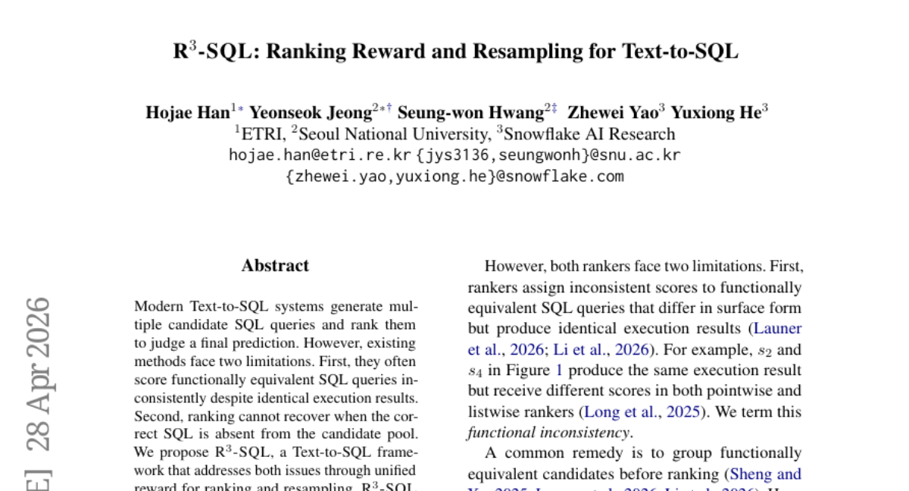

### 📌 한 줄 요약
실행 결과 기반의 그룹 랭킹과 에이전트 기반 재샘플링을 결합하여 Text-to-SQL의 정확도와 일관성을 높인 프레임워크

### 🔑 핵심 포인트
- 실행 결과 기반 그룹화 및 통합 보상(Unified Reward)을 통한 랭킹 일관성 확보
- 그룹 간 상대적 선호도와 그룹 내 품질을 모두 고려한 정교한 스코어링 메커니즘
- 에이전트 기반 재샘플링(Agentic Resampling)을 통한 정답 후보군 누락 문제 해결

### 🧑‍💻 개발자 관점
단순히 모델의 생성 능력에 의존하는 대신, 실행 결과 검증과 동적 재샘플링을 통해 SQL 생성의 신뢰성을 극대화하는 실무적 패턴을 제시합니다.

### 🚀 실무 적용 아이디어
- 동일한 실행 결과를 내는 서로 다른 SQL 쿼리들에 대한 일관성 평가 실험
- 에이전트가 재샘플링 시점을 결정하는 로직의 임계값(Threshold) 최적화
- 기존 랭킹 방식 대비 재샘플링 도입 시의 비용 대비 성능 향상 측정

### ⚠️ 리스크/한계
- 실행 결과 기반 그룹화 방식은 데이터베이스 환경(Sandbox)이 반드시 필요함
- 재샘플링 과정에서 발생하는 추가적인 추론 비용 및 지연 시간(Latency) 문제

### 📝 초록 기반 상세 설명
최근 Text-to-SQL 시스템은 여러 후보 쿼리를 생성한 뒤 랭킹을 매겨 최종 결과를 선택하지만, 기능적으로 동일한 쿼리를 일관성 없게 평가하거나 정답이 후보군에 없을 때 복구하지 못하는 문제가 있습니다. 이를 해결하기 위해 R^3-SQL은 실행 결과 기반의 그룹화와 재샘플링을 결합한 통합 보상 체계를 제안합니다. 먼저 후보들을 실행 결과별로 그룹화하여 랭킹의 일관성을 확보하고, 그룹 간 선호도와 그룹 내 품질을 동시에 고려하는 점수 산출 방식을 적용합니다. 또한, 정답이 없을 가능성을 판단하여 선택적으로 다시 생성하는 에이전트 기반 재샘플링을 도입하여 후보군 재현율을 높였습니다. 실험 결과, BIRD-dev 벤치마크에서 공개된 모델 크기 기준 SOTA를 달성하며 뛰어난 성능을 입증했습니다.

---

## 49. [Trajectory as the Teacher: Few-Step Discrete Flow Matching via Energy-Navigated Distillation](https://huggingface.co/papers/2605.07924)
**Upvotes**: 0 | **도입 난이도**: 중 | **신뢰도**: 상
**arXiv**: https://arxiv.org/abs/2605.07924

**태그**: LLM, Distillation, Flow Matching, Generative AI, Evaluation, Inference

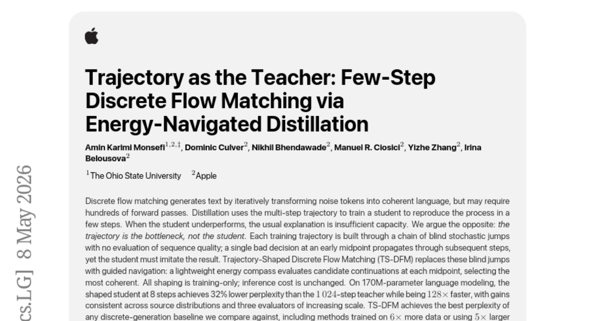

### 📌 한 줄 요약
학습 과정에서 궤적(Trajectory)의 품질을 개선하여 적은 단계로도 고성능을 내는 이산 흐름 매칭(Discrete Flow Matching) 증류 기법

### 🔑 핵심 포인트
- 문제 재정의: 학생 모델의 용량 부족이 아닌, 학습 궤적의 비효율성이 성능 저하의 핵심 원인임을 규명
- TS-DFM 제안: 학습 단계에서만 에너지 기반 가이드를 통해 더 정교하고 일관된 궤적을 생성하도록 유도
- 추론 효율성: 학습 시에만 가이드를 사용하므로, 추론 시에는 추가 비용 없이 빠른 생성 속도 유지

### 🧑‍💻 개발자 관점
LLM의 생성 속도를 높이기 위한 증류 기술에서 모델 크기를 키우는 대신 학습 데이터의 경로(Trajectory) 최적화가 더 효과적일 수 있음을 시사합니다.

### 🚀 실무 적용 아이디어
- 기존 DFM 모델 학습 시 중간 단계의 품질을 평가하는 에너지 함수 도입 실험
- 학습 시 가이드가 포함된 궤적과 포함되지 않은 궤적 간의 학생 모델 성능 비교
- 추론 단계에서의 스텝 수 변화에 따른 성능 유지력 테스트

### ⚠️ 리스크/한계
- 학습 시 에너지 함수 계산에 따른 추가적인 연산 비용 발생
- 특정 데이터셋이나 도메인에 특화된 에너지 함수 설계 시 일반화 성능 저하 가능성

### 📝 초록 기반 상세 설명
이산 흐름 매칭(DFM)은 노이즈를 텍스트로 변환하는 과정에서 수많은 반복 단계가 필요하며, 이를 줄이기 위한 증류(Distillation) 시 학생 모델의 성능 저하가 빈번히 발생합니다. 기존에는 모델 용량 부족을 원인으로 꼽았으나, 본 논문은 학습 과정 중 발생하는 잘못된 중간 단계(blind jumps)가 누적되는 궤적 자체의 문제를 지적합니다. 이를 해결하기 위해 제안된 TS-DFM은 학습 시에만 가벼운 에너지 컴퍼스(energy compass)를 사용하여 더 일관된 궤적을 생성하도록 가이드합니다. 이 방식은 추론 비용을 높이지 않으면서도 학습 데이터의 품질을 높이는 효과를 가집니다. 실험 결과, 8단계의 적은 스텝만으로도 1,024단계의 교사 모델보다 낮은 perplexity를 달성하며 압도적인 속도와 성능을 동시에 확보했습니다.

---

## 50. [Delta-Adapter: Scalable Exemplar-Based Image Editing with Single-Pair Supervision](https://huggingface.co/papers/2605.07940)
**Upvotes**: 0 | **도입 난이도**: 중 | **신뢰도**: 상
**arXiv**: https://arxiv.org/abs/2605.07940

**태그**: Computer Vision, Image Editing, Adapter, Deep Learning, RAG, Vision

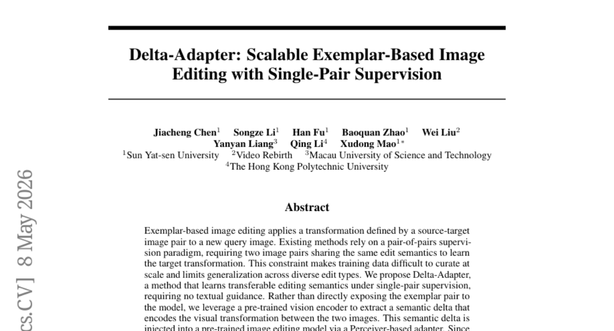

### 📌 한 줄 요약
단일 이미지 쌍(Source-Target)만으로 학습 가능한 확장성 높은 이미지 편집 프레임워크

### 🔑 핵심 포인트
- 단일 이미지 쌍(Single-pair) 기반의 효율적인 학습 패러다임 제안
- Perceiver-based adapter를 통한 세만틱 델타(Semantic Delta) 주입 방식
- 세만틱 델타 일관성 손실(Consistency Loss)을 통한 정교한 변환 제어

### 🧑‍💻 개발자 관점
데이터셋 구축 비용을 획기적으로 줄이면서도 텍스트 없이 이미지 간의 스타일/속성 변화를 정교하게 전이할 수 있는 실용적인 방법론입니다.

### 🚀 실무 적용 아이디어
- 제공된 코드를 활용하여 다양한 도메인의 단일 쌍 데이터셋으로 학습 성능 테스트
- Perceiver 어댑터의 파라미터 크기에 따른 편집 정밀도 변화 관찰
- 텍스트 가이드가 없는 환경에서의 다양한 편집 태스크(색상, 질감, 형태 등) 일반화 실험

### ⚠️ 리스크/한계
- 텍스트 가이드가 없으므로 복잡하고 구체적인 명령 수행에는 한계가 있을 수 있음
- 추출된 세만틱 델타의 품질이 모델의 편집 성능에 직접적인 영향을 미침

### 📝 초록 기반 상세 설명
기존의 예시 기반 이미지 편집 방식은 동일한 편집 의미를 가진 두 쌍의 이미지(pair-of-pairs)가 필요하여 대규모 데이터 구축이 어려웠습니다. 본 논문은 텍스트 가이드 없이 단일 이미지 쌍만으로 학습 가능한 Delta-Adapter를 제안합니다. 사전 학습된 비전 인코더를 통해 소스-타겟 이미지 간의 '세만틱 델타(semantic delta)'를 추출하고, 이를 Perceiver 기반 어댑터를 통해 편집 모델에 주입합니다. 타겟 이미지를 직접 노출하지 않는 구조 덕분에 단일 쌍만으로도 학습이 가능하며, 세만틱 델타 일관성 손실(consistency loss)을 통해 변환의 정확도를 높였습니다. 실험 결과, 기존 방식보다 편집 정확도와 콘텐츠 일관성 면에서 우수하며 미학습 작업에 대한 일반화 성능도 뛰어남을 입증했습니다.

---

