# 2026-05-18 Daily Papers (Top 50)

## 오늘의 요약
오늘의 연구는 고도화된 추론 능력을 갖춘 에이전트 설계와 효율적인 비디오 생성 및 월드 모델링에 집중되었습니다. 특히 멀티모달 환경에서의 장기 기억(Memory) 평가와 관리, 그리고 학습 없이 성능을 극대화하는 모델 머징 및 멀티 에이전트 협업 체계에 대한 심도 있는 논의가 이루어졌습니다.

### 오늘의 핵심 포인트
- 복잡한 추론과 멀티턴 태스크를 해결하기 위해 보상 설계 최적화와 테스트 타임 스케일링을 활용한 에이전트 학습 기법이 강조되었습니다.
- 실시간 비디오 생성과 장기 컨텍스트 모델링을 위한 효율적인 디퓨전 증류 및 하이브리드 트랜스포머 아키텍처 연구가 주목받았습니다.
- 멀티모달 에이전트의 시각적 기억 유지 능력과 모델 간 가중치 재조합을 통한 효율적인 성능 확장 전략이 제시되었습니다.

**오늘의 태그**: Agentic AI, Reasoning, Video Generation, Multimodal Memory, Model Merging

## 1. [Achieving Gold-Medal-Level Olympiad Reasoning via Simple and Unified Scaling](https://huggingface.co/papers/2605.13301)
**Upvotes**: 140 | **도입 난이도**: 상 | **신뢰도**: 상
**arXiv**: https://arxiv.org/abs/2605.13301

**태그**: Reasoning, RLHF, SFT, Test-time Scaling

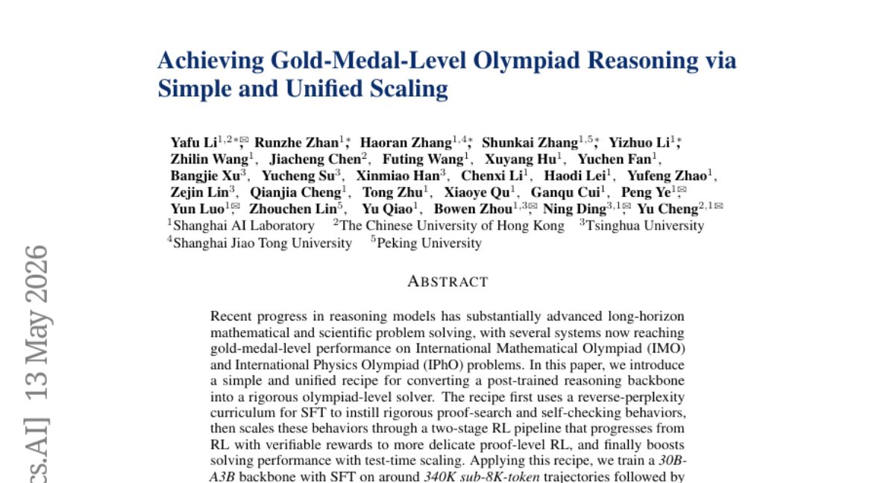

### 📌 한 줄 요약
SFT와 2단계 RL 파이프라인을 결합하여 수학/물리 올림피아드 수준의 고난도 추론 능력을 확보하는 통합 스케일링 방법론 제안

### 🔑 핵심 포인트
- 역-퍼플렉시티(Reverse-perplexity) 커리큘럼 SFT를 통한 엄격한 증명 및 자기 검증 행동 주입
- 검증 가능한 보상(Verifiable rewards)에서 세밀한 증명 단계 보상(Proof-level RL)으로 이어지는 2단계 RL 파이프라인
- 테스트 타임 스케일링(Test-time scaling)을 통한 장기 추론 성능 극대화

### 🧑‍💻 개발자 관점
복잡한 논리적 추론이 필요한 에이전트 설계 시, 단순 데이터 증강을 넘어 학습 단계별 보상 설계와 테스트 타임 연산량 조절이 성능에 미치는 영향을 보여줍니다.

### 🚀 실무 적용 아이디어
- SFT 단계에서 모델의 자기 검증(Self-checking) 능력을 유도하는 데이터 커리큘럼 설계 실험
- 검증 가능한 정답(Ground truth)이 있는 도메인에서 2단계 RL 파이프라인 적용 테스트
- 추론 토큰 길이에 따른 성능 변화를 확인하기 위한 테스트 타임 스케일링 실험

### ⚠️ 리스크/한계
- 고도의 정답 검증이 가능한 특정 도메인(수학, 물리)에 특화된 방법론일 가능성
- 매우 긴 추론 경로(100K+ 토큰) 사용 시 발생하는 막대한 컴퓨팅 비용

### 📝 초록 기반 상세 설명
최근 추론 모델이 발전하며 올림피아드 수준의 문제 해결이 가능해졌으나, 이를 위한 체계적인 학습 방법론이 필요했습니다. 본 논문은 사후 학습된 모델을 엄격한 올림피아드급 솔버로 변환하는 단순하고 통합된 레시피를 제안합니다. 먼저 역-퍼플렉시티 커리큘럼 기반의 SFT로 자기 검증 및 증명 탐색 행동을 학습시킨 후, 검증 가능한 보상에서 증명 단계 보상으로 이어지는 2단계 RL 파이프라인을 통해 이를 확장합니다. 마지막으로 테스트 타임 스케일링을 통해 최종 성능을 극대화합니다. 이 방법론을 적용한 SU-01 모델은 100K 토큰 이상의 긴 추론 경로에서도 안정적인 성능을 보이며, IMO 및 IPhO 등 최고 난이도 대회에서 금메달급 성적을 달성했습니다.

---

## 2. [Causal Forcing++: Scalable Few-Step Autoregressive Diffusion Distillation for Real-Time Interactive Video Generation](https://huggingface.co/papers/2605.15141)
**Upvotes**: 84 | **도입 난이도**: 상 | **신뢰도**: 상
**arXiv**: https://arxiv.org/abs/2605.15141

**태그**: Video Generation, Diffusion Distillation, Real-time AI, Autoregressive, Vision, Video, Inference, Distillation

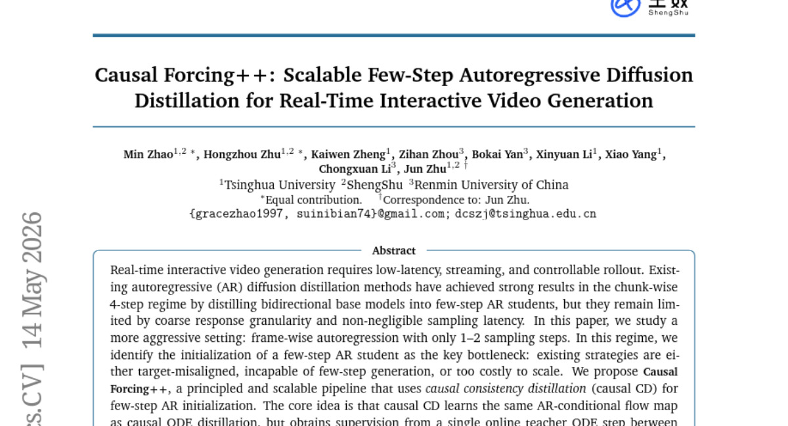

### 📌 한 줄 요약
초저지연 실시간 비디오 생성을 위해 1~2단계의 프레임 단위 자기회귀(AR) 디퓨전 증류 기술을 제안함

### 🔑 핵심 포인트
- 프레임 단위의 초저지연(1~2 step) 자기회귀 디퓨전 증류 프레임워크 제안
- Causal CD(Causal Consistency Distillation)를 통한 효율적이고 확장 가능한 초기화 전략
- 전체 PF-ODE 궤적 저장 없이 인접 타임스텝 간의 온라인 감독을 통한 학습 최적화

### 🧑‍💻 개발자 관점
실시간 게임 엔진이나 인터랙티브 AI 에이전트 환경에서 지연 시간 없이 고품질 비디오를 생성해야 하는 엔지니어에게 매우 유용한 최적화 기법입니다.

### 🚀 실무 적용 아이디어
- 제공된 GitHub 코드를 활용하여 프레임 단위 vs 청크 단위 생성 속도 및 품질 비교 실험
- 특정 액션 조건(Action-conditioned)이 주어졌을 때의 월드 모델 생성 일관성 테스트
- 제한된 컴퓨팅 자원 환경에서 학습 비용 절감 효과 검증

### ⚠️ 리스크/한계
- 프레임 단위 생성 시 발생할 수 있는 장기적 시간적 일관성(Temporal Consistency) 유지 문제
- 매우 적은 샘플링 스텝(1-2 step)으로 인한 생성 품질 저하 가능성

### 📝 초록 기반 상세 설명
실시간 상호작용 비디오 생성을 위해서는 낮은 지연 시간과 정교한 제어가 필수적입니다. 기존의 청크 단위(chunk-wise) AR 증류 방식은 응답 해상도가 낮고 샘플링 지연이 발생하는 한계가 있었습니다. 본 논문은 1~2단계의 프레임 단위 자기회귀라는 더 도전적인 환경을 설정하고, 초기화 과정에서의 정렬 문제를 해결하기 위한 Causal Forcing++를 제안합니다. 제안된 방식은 전체 궤적을 미리 계산할 필요 없이 인접 타임스텝 간의 온라인 교사 ODE 단계를 활용하여 효율적인 초기화를 수행합니다. 실험 결과, 기존 방식 대비 성능(VBench, VisionReward)을 높이면서도 첫 프레임 지연 시간을 50% 단축하고 학습 비용을 4배가량 절감했습니다. 또한 이 기술을 액션 조건부 월드 모델 생성으로 확장할 수 있음을 보여주었습니다.

### 🖼️ 추가 자료
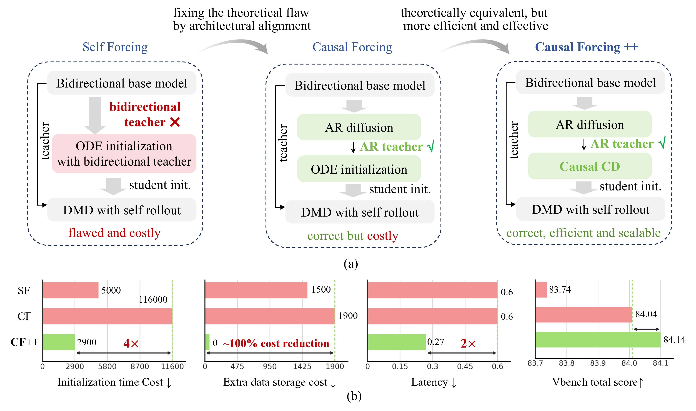

---

## 3. [Self-Distilled Agentic Reinforcement Learning](https://huggingface.co/papers/2605.15155)
**Upvotes**: 82 | **도입 난이도**: 중 | **신뢰도**: 상
**arXiv**: https://arxiv.org/abs/2605.15155

**태그**: Agent, Reinforcement Learning, Self-Distillation, LLM, RAG, Vision, Evaluation, Distillation

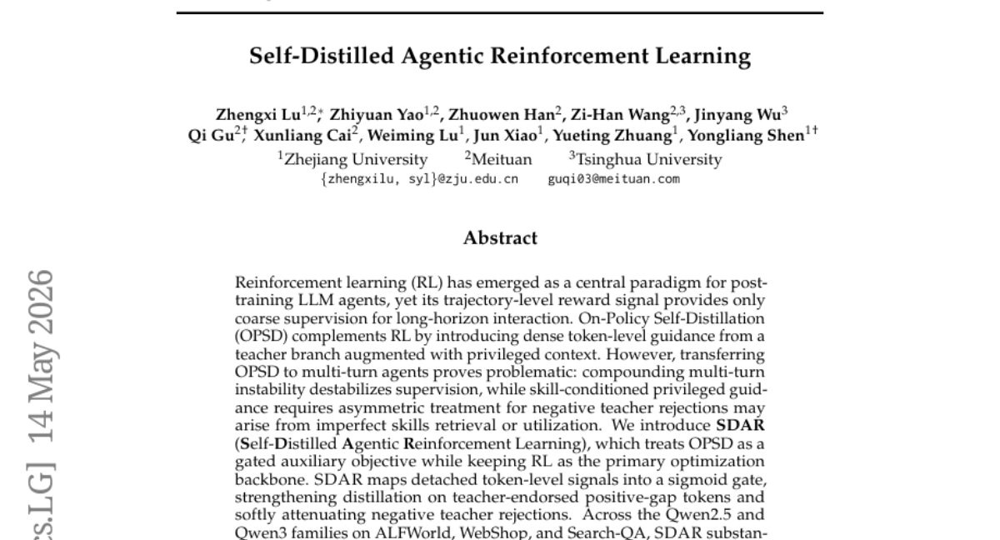

### 📌 한 줄 요약
멀티턴 에이전트의 불안정성을 해결하기 위해 토큰 단위의 정교한 가이드를 게이트 방식으로 결합한 강화학습 최적화 기법

### 🔑 핵심 포인트
- RL의 희소한 보상 문제를 해결하기 위한 토큰 단위 밀집 가이드(OPSD) 도입
- 멀티턴 환경의 불안정성을 방지하기 위해 OPSD를 게이트형 보조 목적 함수로 설계
- 잘못된 교사 피드백(Negative Rejection)에 의한 성능 저하를 방지하는 신호 감쇄 메커니즘

### 🧑‍💻 개발자 관점
복잡한 멀티턴 태스크를 수행하는 에이전트를 학습시킬 때, RL의 불안정성을 제어하면서도 정교한 행동 가이드를 학습에 반영할 수 있는 프레임워크를 제공합니다.

### 🚀 실무 적용 아이디어
- GRPO와 같은 최신 RL 알고리즘에 SDAR의 게이트형 보조 손실 함수 적용 실험
- 에이전트의 작업 복잡도(Turn 수) 변화에 따른 게이트 파라미터 민감도 테스트
- 교사 모델(Teacher)과 학생 모델(Student) 간의 스킬 격차에 따른 성능 변화 관찰

### ⚠️ 리스크/한계
- 교사 모델의 품질에 따라 게이트 신호가 편향될 위험 존재
- 멀티턴 환경에서 게이트 메커니즘의 하이퍼파라미터 튜닝 난이도

### 📝 초록 기반 상세 설명
LLM 에이전트 학습에서 RL은 보상이 희소하여 장기 작업 학습에 한계가 있습니다. 기존의 On-Policy Self-Distillation(OPSD)은 밀집된 가이드를 제공하지만, 멀티턴 환경에서는 불안정성이 증폭되고 잘못된 가이드로 인한 성능 저하 문제가 발생합니다. 이를 해결하기 위해 SDAR은 OPSD를 RL의 주 목적 함수가 아닌 게이트형 보조 목적 함수로 재정의합니다. 토큰 단위 신호를 시그모이드 게이트로 매핑하여, 교사 모델이 승인한 유효한 토큰은 강화하고 잘못된 거절은 완화하는 방식입니다. 실험 결과, SDAR은 GRPO 대비 다양한 벤치마크에서 성능을 크게 향상시켰으며 모델 스케일에 관계없이 안정적인 성능을 보였습니다.

---

## 4. [MemLens: Benchmarking Multimodal Long-Term Memory in Large Vision-Language Models](https://huggingface.co/papers/2605.14906)
**Upvotes**: 68 | **도입 난이도**: 중 | **신뢰도**: 상
**arXiv**: https://arxiv.org/abs/2605.14906

**태그**: Agent, RAG, Vision, Long-Context, Benchmark, Reasoning, Multimodal, Evaluation, Optimization

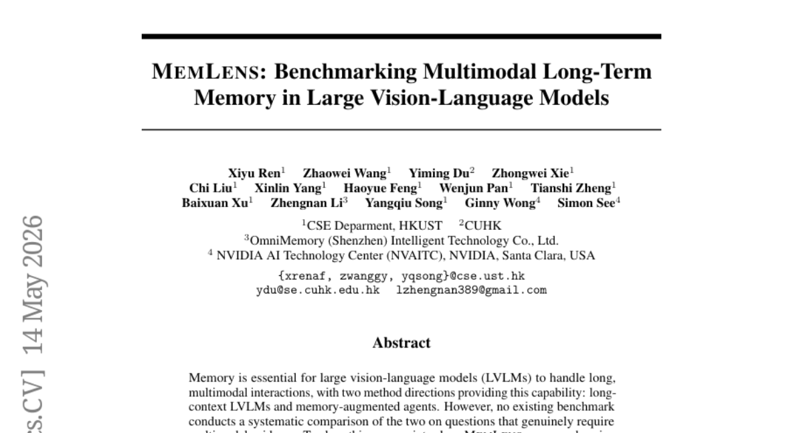

### 📌 한 줄 요약
멀티모달 장기 기억(Long-term Memory) 성능을 평가하기 위한 벤치마크 MemLens를 제안하고, Long-context 모델과 Memory-augmented 에이전트의 트레이드오프를 분석함

### 🔑 핵심 포인트
- 멀티모달 증거 기반의 장기 기억 평가를 위한 벤치마크 MemLens 개발
- Long-context 모델(길이에 따른 성능 저하)과 Memory-augmented 에이전트(압축에 따른 시각 정보 손실)의 특성 규명
- 복합적인 멀티 세션 추론 작업에서 기존 방식들의 한계점 확인

### 🧑‍💻 개발자 관점
에이전트 설계 시 단순히 컨텍스트 길이를 늘리는 것과 RAG 기반 메모리를 구축하는 것 사이의 트레이드오프를 이해하는 데 중요한 가이드를 제공합니다.

### 🚀 실무 적용 아이디어
- 현재 개발 중인 에이전트에 MemLens 벤치마크를 적용하여 시각 정보 유지력 테스트
- Long-context 모델 사용 시 컨텍스트 길이에 따른 시각적 근거(Visual Grounding) 유지력 확인
- 메모리 압축 방식(Summarization vs Retrieval)에 따른 시각적 디테일 손실률 비교 실험

### ⚠️ 리스크/한계
- 멀티 세션 추론과 같은 고난도 작업에서는 현재의 두 방식 모두 성능 한계가 명확함
- 메모리 에이전트 방식은 정보 압축 시 시각적 세부 사항이 유실될 위험이 있음

### 📝 초록 기반 상세 설명
대규모 시각-언어 모델(LVLM)이 긴 대화를 처리하기 위해 Long-context 방식과 Memory-augmented 방식이 사용되지만, 멀티모달 증거가 필요한 상황에서의 체계적인 비교 벤치마크는 부재했습니다. 이를 해결하기 위해 5가지 기억 능력과 다양한 컨텍스트 길이를 포함하는 MemLens 벤치마크를 도입했습니다. 실험 결과, Long-context 모델은 컨텍스트가 길어질수록 성능이 저하되는 반면, 메모리 에이전트는 압축 과정에서 시각적 정밀도가 떨어지는 특성을 보였습니다. 특히 멀티 세션 추론 능력은 두 방식 모두에서 매우 낮게 나타났습니다. 연구 결과는 장기 기억을 위해 Long-context 어텐션과 구조화된 멀티모달 검색을 결합한 하이브리드 아키텍처의 필요성을 시사합니다.

---

## 5. [SANA-WM: Efficient Minute-Scale World Modeling with Hybrid Linear Diffusion Transformer](https://huggingface.co/papers/2605.15178)
**Upvotes**: 67 | **도입 난이도**: 중 | **신뢰도**: 상
**arXiv**: https://arxiv.org/abs/2605.15178

**태그**: World Model, Video Generation, Efficient Transformer, Computer Vision, Vision, Video, Benchmark, Inference, Distillation, Optimization

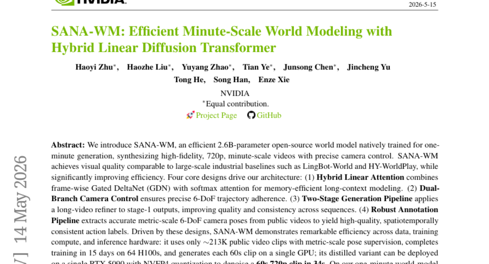

### 📌 한 줄 요약
단일 GPU에서도 1분 길이의 고화질 영상을 생성할 수 있는 효율적인 하이브리드 리니어 디퓨전 트랜스포머 기반 월드 모델

### 🔑 핵심 포인트
- Hybrid Linear Attention: Gated DeltaNet과 Softmax 어텐션을 결합하여 메모리 효율적인 장기 컨텍스트 모델링 구현
- Dual-Branch Camera Control & Two-Stage Pipeline: 정밀한 6-DoF 궤적 추종과 시퀀스 일관성을 위한 2단계 생성 방식
- High Efficiency: 적은 데이터와 연산 자원으로 1분 길이의 720p 영상을 단일 GPU에서 빠르게 생성 가능

### 🧑‍💻 개발자 관점
리소스가 제한된 환경에서도 고화질의 긴 영상을 생성할 수 있는 효율적인 아키텍처 설계 방식을 제시합니다.

### 🚀 실무 적용 아이디어
- 제시된 Hybrid Linear Attention 구조를 기존 비디오 생성 모델에 적용하여 메모리 사용량 비교
- 6-DoF 카메라 제어 로직을 활용한 정밀한 카메라 워킹 실험
- 제공된 2단계 생성 파이프라인을 통한 영상 일관성 개선 효과 검증

### ⚠️ 리스크/한계
- 모델 파라미터 규모(2.6B) 대비 매우 긴 영상 생성 시 품질 저하 가능성
- 특정 하드웨어(RTX 5090 등) 최적화에 의존적인 성능 수치

### 📝 초록 기반 상세 설명
기존의 대규모 월드 모델은 긴 영상 생성 시 메모리 효율성과 일관성 유지에 어려움이 있었습니다. 이를 해결하기 위해 2.6B 파라미터 규모의 SANA-WM을 제안하며, 하이브리드 리니어 어텐션과 2단계 생성 파이프라인을 도입했습니다. Gated DeltaNet과 Softmax 어텐션을 결합하여 긴 컨텍스트를 효율적으로 처리하고, 정밀한 6-DoF 카메라 제어를 구현했습니다. 실험 결과, 산업계 수준의 화질을 유지하면서도 데이터 및 연산 효율성을 극대화하여 높은 처리량을 달성했습니다.

---

## 6. [MemEye: A Visual-Centric Evaluation Framework for Multimodal Agent Memory](https://huggingface.co/papers/2605.15128)
**Upvotes**: 55 | **도입 난이도**: 중 | **신뢰도**: 상
**arXiv**: https://arxiv.org/abs/2605.15128

**태그**: Multimodal Agent, Memory, VLM, Benchmark, Agent, Reasoning, Multimodal, Evaluation

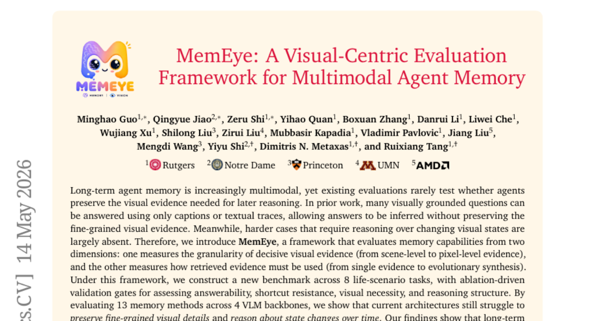

### 📌 한 줄 요약
멀티모달 에이전트가 시각적 세부 정보를 유지하고 시간적 변화를 추론하는 능력을 정밀하게 평가하는 프레임워크 MemEye 제안

### 🔑 핵심 포인트
- 시각적 세부 정보(Pixel-level)와 추론 복잡도를 고려한 다차원 평가 프레임워크 MemEye 제안
- 텍스트 지름길(Shortcut)을 배제하고 실제 시각적 증거가 반드시 필요한 벤치마크 구축
- 현재 VLM 기반 에이전트들이 시각적 상태 변화 및 미세 정보 유지에 취약함을 입증

### 🧑‍💻 개발자 관점
멀티모달 RAG나 에이전트 개발 시, 단순히 텍스트 요약에 의존하는 것이 아니라 시각적 디테일을 어떻게 메모리에 저장하고 활용할지에 대한 설계 가이드를 제공합니다.

### 🚀 실무 적용 아이디어
- 현재 개발 중인 에이전트의 메모리 시스템에 텍스트 기반 지름길(Shortcut)이 존재하는지 테스트
- 시각적 상태 변화(State change)가 포함된 시나리오를 통한 메모리 유지력 검증
- 메모리 검색 시 텍스트 캡션 외에 원본 이미지의 세부 특징(Feature)을 포함하는 전략 실험

### ⚠️ 리스크/한계
- 시각적 세부 정보가 매우 높은 경우 연산 비용 및 메모리 부하 증가 가능성
- 특정 시나리오에 특화된 벤치마크일 경우 일반화 성능 검증 필요

### 📝 초록 기반 상세 설명
최근 멀티모달 에이전트의 메모리 활용이 중요해지고 있으나, 기존 평가는 텍스트만으로도 답을 유추할 수 있는 쉬운 문제 위주로 구성되어 시각적 증거 보존 능력을 제대로 검증하지 못합니다. 이를 해결하기 위해 시각적 증거의 정밀도(Granularity)와 추론 방식(Usage)이라는 두 가지 차원에서 메모리 능력을 측정하는 MemEye 프레임워크를 도입합니다. 8가지 실생활 시나리오를 바탕으로 벤치마크를 구축하고, 답변 가능성 및 지름길(shortcut) 저항성 등을 검증하는 실험 설계를 포함했습니다. 13개의 메모리 방법론과 4개의 VLM 백본을 평가한 결과, 현재 모델들은 미세한 시각적 디테일 유지와 시간에 따른 상태 변화 추론에 취약함을 확인했습니다. 연구 결과는 장기 멀티모달 메모리가 증거 라우팅, 시계열 추적, 세부 정보 추출에 의존함을 시사합니다.

---

## 7. [Darwin Family: MRI-Trust-Weighted Evolutionary Merging for Training-Free Scaling of Language-Model Reasoning](https://huggingface.co/papers/2605.14386)
**Upvotes**: 50 | **도입 난이도**: 중 | **신뢰도**: 상
**arXiv**: https://arxiv.org/abs/2605.14386

**태그**: LLM, Model Merging, Evolutionary Algorithm, Reasoning, Evaluation

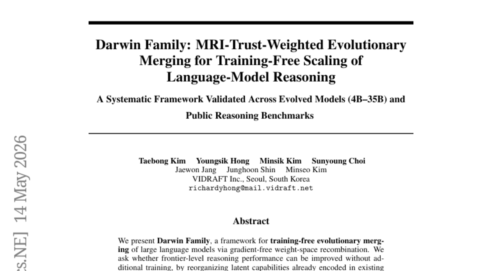

### 📌 한 줄 요약
추가 학습 없이 가중치 재조합만으로 모델의 추론 능력을 극대화하는 진화적 머징(Evolutionary Merging) 프레임워크

### 🔑 핵심 포인트
- 14차원 적응형 머지 게놈을 통한 미세한 컴포넌트 및 블록 단위 재조합
- 진단 신호와 진화적 탐색 사이의 균형을 맞추는 MRI-Trust Fusion 기법
- Transformer와 Mamba 등 서로 다른 아키텍처 간의 교차 결합(Cross-architecture breeding) 지원

### 🧑‍💻 개발자 관점
모델을 새로 학습시키지 않고도 기존 가중치들을 최적으로 조합하여 성능을 끌어올릴 수 있어, 컴퓨팅 자원이 제한된 환경에서 매우 효율적인 모델 최적화 전략을 제공합니다.

### 🚀 실무 적용 아이디어
- 보유 중인 서로 다른 특성의 모델(예: 코딩 특화 vs 일반 추론 특화)을 Darwin 프레임워크로 머징 실험
- Transformer 기반 모델과 Mamba 기반 모델 간의 아키텍처 매핑 성능 검증
- 다양한 파라미터 규모에서 재귀적 진화(Recursive evolution)를 통한 성능 향상 폭 측정

### ⚠️ 리스크/한계
- 학습이 아닌 가중치 재조합에 의존하므로, 특정 도메인에 특화된 새로운 지식 주입에는 한계가 있음
- 모델 아키텍처가 다를 경우 매핑 과정에서 안정성 문제가 발생할 가능성

### 📝 초록 기반 상세 설명
기존 LLM의 체크포인트에 내재된 잠재적 능력을 재구성하여 추가 학습 없이 추론 성능을 높이는 방법을 탐구합니다. 이를 위해 14차원의 적응형 머지 게놈, 진단 레이어 중요도를 반영한 MRI-Trust Fusion, 그리고 서로 다른 아키텍처 간 결합을 지원하는 Architecture Mapper를 제안합니다. 실험 결과, Darwin-27B-Opus는 GPQA Diamond 벤치마크에서 상위권 성적을 기록하며 부모 모델보다 뛰어난 성능을 보였습니다. 4B에서 35B 규모까지 다양한 파라미터 범위에서 일관된 성능 향상을 입증했습니다. 결과적으로 이 프레임워크는 비용이 많이 드는 사후 학습(Post-training)의 실질적인 대안이 될 수 있음을 보여줍니다.

---

## 8. [Beyond Individual Intelligence: Surveying Collaboration, Failure Attribution, and Self-Evolution in LLM-based Multi-Agent Systems](https://huggingface.co/papers/2605.14892)
**Upvotes**: 44 | **도입 난이도**: 중 | **신뢰도**: 상
**arXiv**: https://arxiv.org/abs/2605.14892

**태그**: Multi-Agent, Self-Evolution, LLM, System Design, Agent, RAG, Reasoning

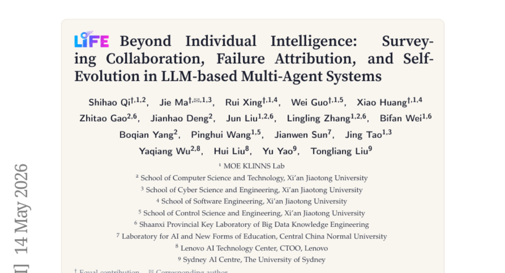

### 📌 한 줄 요약
에이전트 간 협업, 오류 분석, 자가 진화를 통합한 'LIFE' 프레임워크를 통해 지속 가능한 멀티 에이전트 시스템 구축 방향을 제시함

### 🔑 핵심 포인트
- 협업-오류 분석-자가 진화를 통합한 'LIFE' 단계적 프레임워크 제안
- 에이전트 간 오류 전파 및 인과적 의존성에 대한 체계적 분석
- 지속적 개선이 가능한 폐쇄 루프(Closed-loop)형 멀티 에이전트 연구 방향 제시

### 🧑‍💻 개발자 관점
단순한 역할 분담을 넘어, 시스템 운영 중 발생하는 오류를 스스로 식별하고 구조를 개선하는 고도화된 에이전트 워크플로우 설계의 이론적 토대를 제공합니다.

### 🚀 실무 적용 아이디어
- 현재 구축된 멀티 에이전트 워크플로우에 '오류 귀속(Failure Attribution)' 단계 도입 실험
- 에이전트 간 오류 전파 경로를 추적하는 모니터링 시스템 설계
- 실패 사례를 피드백 데이터로 활용하여 에이전트 프롬프트를 자동 수정하는 루프 구현

### ⚠️ 리스크/한계
- 에이전트 간 상호작용이 복잡해질수록 오류 원인 파악(Attribution)의 난이도 급증
- 자가 진화 과정에서 발생할 수 있는 모델의 성능 퇴행(Degradation) 위험

### 📝 초록 기반 상세 설명
LLM 기반 에이전트는 개별 능력은 뛰어나지만, 복잡한 협업 과정에서 발생하는 오류 전파와 진단 및 개선의 어려움이라는 문제를 안고 있습니다. 기존 연구들은 협업, 오류 분석, 자가 진화를 개별적으로 다루어 이들 사이의 인과적 관계를 간과해 왔습니다. 본 논문은 이를 해결하기 위해 기초 역량 구축(L), 협업 통합(I), 결함 탐지(F), 자가 진화(E)로 이어지는 'LIFE' 단계적 프레임워크를 제안합니다. 각 단계 간의 의존성을 정형화하여 체계적인 분류 체계를 제공하며, 단계 간 경계에서 발생하는 도전 과제들을 식별합니다. 이를 통해 실패를 스스로 진단하고 구조를 재편하는 폐쇄 루프(Closed-loop)형 자가 조직적 멀티 에이전트 시스템을 위한 로드맵을 제시합니다.

---

## 9. [WildClawBench: A Benchmark for Real-World, Long-Horizon Agent Evaluation](https://huggingface.co/papers/2605.10912)
**Upvotes**: 40 | **도입 난이도**: 중 | **신뢰도**: 상
**arXiv**: https://arxiv.org/abs/2605.10912

**태그**: AI Agent, CLI, Benchmark, Long-horizon, Agent, RAG, Multimodal, Vision, Evaluation

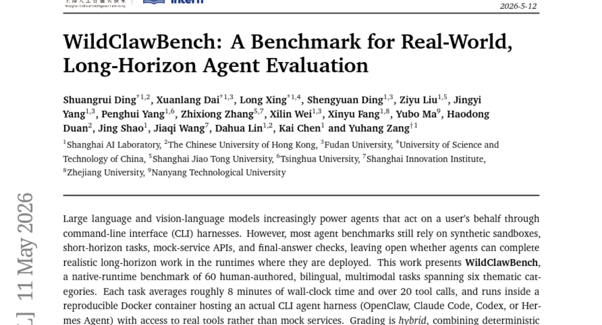

### 📌 한 줄 요약
실제 CLI 환경과 장기 작업(Long-horizon)을 반영한 현실적인 에이전트 성능 평가 벤치마크 제안

### 🔑 핵심 포인트
- 가상 API가 아닌 실제 CLI 도구를 사용하는 실무 중심의 런타임 벤치마크 구축
- 평균 20회 이상의 도구 호출과 8분 이상의 시간이 소요되는 장기 작업(Long-horizon) 설계
- 결과 검증을 위해 환경 상태 감사와 LLM/VLM 판정을 결합한 하이브리드 평가 체계 도입

### 🧑‍💻 개발자 관점
에이전트 개발 시 단순 질의응답을 넘어, 실제 터미널 환경에서의 복잡한 워크플로우 수행 능력을 검증할 수 있는 기준을 제공합니다.

### 🚀 실무 적용 아이디어
- 제공된 Docker 컨테이너를 활용하여 현재 개발 중인 에이전트의 CLI 수행 능력 테스트
- 에이전트의 프롬프트나 도구 사용 방식에 따른 성능 변화(Harness sensitivity) 측정
- 장기 작업 수행 시 발생하는 에러 복구 및 상태 유지 능력 평가

### ⚠️ 리스크/한계
- 실제 런타임 환경을 사용하므로 평가 시 컴퓨팅 자원 및 시간 소모가 큼
- 에이전트의 성능이 사용되는 인터페이스(Harness)에 따라 크게 변동될 수 있음

### 📝 초록 기반 상세 설명
최근 LLM 기반 에이전트가 CLI 환경에서 활발히 사용되고 있으나, 기존 벤치마크는 가상 샌드박스나 짧은 작업 위주로 구성되어 실제 환경에서의 성능을 검증하기 어렵습니다. 이를 해결하기 위해 실제 런타임 환경을 반영한 WildClawBench를 제안합니다. 이 벤치마크는 60개의 인간 작성 태스크를 포함하며, Docker 컨테이너 내에서 실제 도구와 상호작용하는 긴 호흡의 작업을 수행합니다. 평가 방식은 규칙 기반 체크, 환경 상태 감사, LLM/VLM 판정법을 결합한 하이브리드 방식을 채택했습니다. 실험 결과, 최상위 모델조차 60% 초반의 낮은 성공률을 보이며 현재 에이전트 기술의 한계를 드러냈습니다.

### 🖼️ 추가 자료

---

## 10. [STALE: Can LLM Agents Know When Their Memories Are No Longer Valid?](https://huggingface.co/papers/2605.06527)
**Upvotes**: 39 | **도입 난이도**: 중 | **신뢰도**: 상
**arXiv**: https://arxiv.org/abs/2605.06527

**태그**: LLM-Agent, Memory-Management, Benchmark, Reasoning, Agent, RAG, Vision, Evaluation, Inference

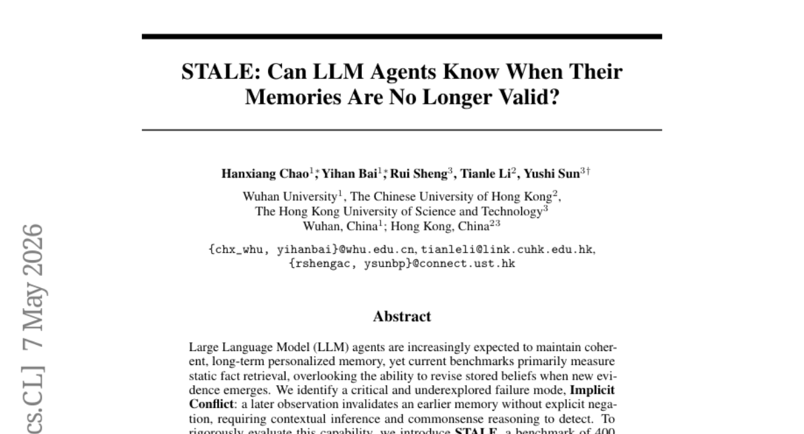

### 📌 한 줄 요약
LLM 에이전트가 새로운 정보에 따라 기존 기억을 스스로 수정하고 모순을 감지하는 능력을 평가하는 새로운 벤치마크 STALE 제안

### 🔑 핵심 포인트
- 새로운 정보로 인해 기존 기억이 무효화되는 '암묵적 충돌' 문제 정의
- 상태 해결, 전제 저항성, 정책 적응력을 측정하는 3차원 벤치마크 STALE 개발
- 기존 모델들이 업데이트된 정보를 인지하더라도 잘못된 전제를 수용하는 경향이 있음을 입증

### 🧑‍💻 개발자 관점
에이전트가 사용자 환경 변화에 따라 과거 정보를 스스로 폐기하고 최신 상태를 유지하는 '동적 메모리 관리' 설계의 중요성을 시사합니다.

### 🚀 실무 적용 아이디어
- 에이전트 개발 시 사용자 쿼리에 포함된 잘못된 전제(Stale state)를 거부하는 로직 테스트
- 정보 업데이트 시 관련 메모리 간의 연쇄적 무효화(Propagation)가 일어나는지 검증
- CUPMem과 같은 구조적 상태 통합 방식의 메모리 아키텍처 도입 검토

### ⚠️ 리스크/한계
- 모델이 최신 정보를 검색하더라도 이를 행동(Action)에 반영하지 못하는 성능 격차 존재
- 복잡한 맥락에서 연쇄적으로 발생하는 상태 변화를 추적하는 데 높은 연산 비용 발생 가능

### 📝 초록 기반 상세 설명
LLM 에이전트가 장기 기억을 유지하는 능력이 중요해지고 있으나, 기존 벤치마크는 정적인 사실 검색에만 치중하여 새로운 정보로 인한 기억 갱신 능력을 간과하고 있습니다. 본 논문은 명시적 부정 없이 새로운 관찰이 이전 기억을 무효화하는 '암묵적 충돌(Implicit Conflict)' 문제를 식별합니다. 이를 평가하기 위해 400개의 시나리오를 포함한 벤치마크 STALE를 도입하여 상태 해결, 전제 저항성, 정책 적응력을 테스트합니다. 실험 결과, 최신 모델들도 업데이트된 증거를 인지하고 행동에 반영하는 데 큰 어려움을 겪는 것으로 나타났습니다. 마지막으로, 상태 통합 및 전파를 통해 기억 갱신을 강화하는 프로토타입인 CUPMem을 제안합니다.

---

## 11. [Warp-as-History: Generalizable Camera-Controlled Video Generation from One Training Video](https://huggingface.co/papers/2605.15182)
**Upvotes**: 36 | **도입 난이도**: 하 | **신뢰도**: 상
**arXiv**: https://arxiv.org/abs/2605.15182

**태그**: Video Generation, Camera Control, Zero-shot Learning, LoRA, Video, Safety

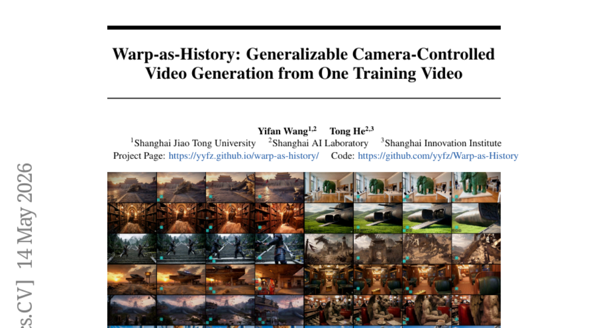

### 📌 한 줄 요약
추가 학습이나 모델 수정 없이, 단 하나의 카메라 데이터만으로 정교한 카메라 제어 비디오 생성을 가능하게 하는 제로샷 인터페이스 제안

### 🔑 핵심 포인트
- 학습/수정 없는 제로샷 카메라 제어 인터페이스(Warp-as-History) 개발
- 타겟 프레임 위치 정렬 및 가시적 토큰 선택을 통한 정교한 워핑 히스토리 생성
- 단일 비디오 기반의 경량 LoRA 파인튜닝을 통한 범용적 카메라 제어 성능 확보

### 🧑‍💻 개발자 관점
모델 구조를 건드리지 않고도 기존 비디오 생성 모델에 카메라 제어 기능을 주입할 수 있어, 실무적인 워크플로우 통합이 매우 용이합니다.

### 🚀 실무 적용 아이디어
- 동결된 비디오 생성 모델(SVD 등)에 제안된 워핑 알고리즘 적용 테스트
- 단일 카메라 데이터 기반 LoRA 학습 시의 일반화 성능 검증
- 다양한 카메라 궤적(줌, 팬, 틸트)에 대한 제로샷 대응력 테스트

### ⚠️ 리스크/한계
- 복잡한 움직임이나 급격한 시점 변화 시 워핑 기반 히스토리의 정확도 저하 가능성
- 소스 영상의 가시 영역(visible area) 제한에 따른 생성 품질 제약

### 📝 초록 기반 상세 설명
기존의 카메라 제어 비디오 생성 방식은 대규모 데이터셋을 통한 사후 학습이나 복잡한 테스트 타임 최적화를 요구하는 문제가 있었습니다. 본 논문은 카메라 움직임에 따른 워핑(warp)을 가상 히스토리로 변환하는 'Warp-as-History' 인터페이스를 제안합니다. 타겟 프레임의 위치 정렬과 가시적 토큰 선택 기법을 통해, 기존의 동결된(frozen) 비디오 생성 모델을 활용하여 카메라 궤적을 따르도록 유도합니다. 실험 결과, 별도의 아키텍처 수정 없이도 높은 카메라 정밀도와 시각적 품질을 달성했습니다. 또한, 단 하나의 카메라 데이터로 수행하는 경량 LoRA 파인튜닝을 통해 미학적 품질과 모션 역학을 더욱 개선했습니다.

---

## 12. [RouteProfile: Elucidating the Design Space of LLM Profiles for Routing](https://huggingface.co/papers/2605.00180)
**Upvotes**: 28 | **도입 난이도**: 중 | **신뢰도**: 상
**arXiv**: https://arxiv.org/abs/2605.00180

**태그**: LLM Routing, Model Profiling, System Design, Benchmark, Evaluation

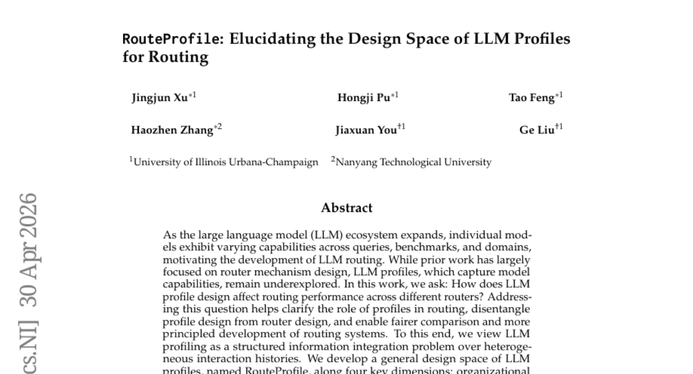

### 📌 한 줄 요약
LLM 라우팅 성능을 결정짓는 핵심 요소인 '모델 프로파일(Profile)'의 설계 공간을 체계적으로 분석하고 최적의 구조를 제안함

### 🔑 핵심 포인트
- LLM 프로파일링을 위한 4가지 핵심 설계 차원(조직 형태, 표현 유형, 집계 깊이, 학습 설정) 정의
- 구조화된 프로파일(Structured Profiles)이 단순 평면적 프로파일보다 라우팅 성능에서 우위임을 입증
- 새로운 모델로 확장 시 구조화된 프로파일과 학습 가능한 설정이 일반화 성능에 핵심적임을 확인

### 🧑‍💻 개발자 관점
단순히 라우터 알고리즘을 개선하는 것을 넘어, 모델의 역량을 어떻게 데이터화(Profiling)하여 전달할지가 라우팅 효율의 핵심임을 시사합니다.

### 🚀 실무 적용 아이디어
- 현재 사용 중인 라우터에 모델의 성능 지표를 단순 벡터가 아닌 구조화된 데이터로 입력해보기
- 도메인 단위의 통계 대신 개별 쿼리 수준의 피드백을 프로파일에 반영하는 실험 수행
- 새로운 모델 도입 시 기존 프로파일을 어떻게 재학습/업데이트할지 워크플로우 설계

### ⚠️ 리스크/한계
- 프로파일 구조가 복잡해질수록 프로파일 생성 및 업데이트를 위한 연산 비용 증가 가능성
- 특정 도메인에 과적합된 프로파일이 새로운 도메인이나 모델에서 성능 저하를 일으킬 위험

### 📝 초록 기반 상세 설명
LLM 생태계가 확장됨에 따라 모델별 역량 차이를 활용한 라우팅 기술이 중요해지고 있으나, 모델의 특성을 담는 '프로파일' 설계에 대한 연구는 부족한 실정입니다. 본 논문은 프로파일 설계가 라우터 성능에 미치는 영향을 규명하기 위해 프로파일링을 이질적인 상호작용 기록을 통합하는 구조적 문제로 정의합니다. 이를 위해 조직 형태, 표현 유형, 집계 깊이, 학습 설정이라는 네 가지 차원의 설계 공간인 'RouteProfile'을 개발했습니다. 실험 결과, 구조화된 프로파일이 평면적 프로파일보다 우수하며, 도메인 단위보다는 쿼리 단위의 신호가 더 신뢰할 수 있음을 확인했습니다. 또한 새로운 모델로의 일반화 성능은 구조화된 프로파일과 학습 가능한 설정에서 가장 높게 나타났습니다.

---

## 13. [PREPING: Building Agent Memory without Tasks](https://huggingface.co/papers/2605.13880)
**Upvotes**: 25 | **도입 난이도**: 중 | **신뢰도**: 상
**arXiv**: https://arxiv.org/abs/2605.13880

**태그**: Agent, Synthetic Data, Memory Management, Reinforcement Learning, RAG

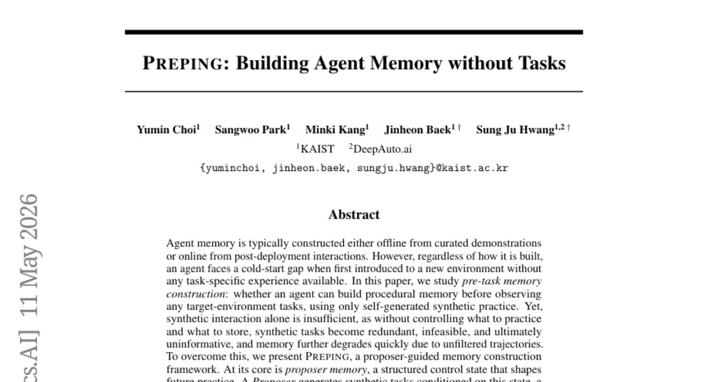

### 📌 한 줄 요약
태스크 수행 전, 합성 데이터 기반의 자기 주도적 연습을 통해 에이전트의 절차적 메모리를 구축하는 프레임워크

### 🔑 핵심 포인트
- Proposer-guided 프레임워크를 통한 효율적인 합성 데이터 생성 및 메모리 구축
- 태스크 경험이 없는 환경에서의 콜드 스타트 문제 해결
- 데이터 중복과 비현실성을 방지하는 Validator 기반의 선택적 메모리 업데이트

### 🧑‍💻 개발자 관점
에이전트 배포 초기 단계에서 실제 사용자 데이터 없이도 높은 성능을 확보할 수 있는 방법론을 제시합니다.

### 🚀 실무 적용 아이디어
- 합성 데이터 생성 시 Proposer의 제어 상태(Control State) 설계 실험
- Validator의 필터링 기준에 따른 메모리 품질 및 성능 상관관계 분석
- 실제 환경과 유사한 시뮬레이션 환경에서의 콜드 스타트 성능 검증

### ⚠️ 리스크/한계
- 합성 데이터와 실제 환경 간의 간극(Sim-to-Real gap) 발생 가능성
- Proposer/Validator 설계의 복잡도에 따른 시스템 안정성 의존도

### 📝 초록 기반 상세 설명
에이전트는 새로운 환경에 투입될 때 경험이 없는 '콜드 스타트' 문제에 직면합니다. 기존의 오프라인/온라인 메모리 구축 방식은 실제 태스크가 주어지기 전까지는 유효한 지식을 쌓기 어렵다는 한계가 있습니다. 본 논문은 태스크 관찰 전, 합성 연습을 통해 메모리를 구축하는 Preping 프레임워크를 제안합니다. Proposer가 제어 상태를 생성하고, Solver가 이를 실행하며, Validator가 유효한 궤적을 선별하여 메모리에 저장하는 구조를 가집니다. 실험 결과, Preping은 기존 플레이북 방식에 필적하는 성능을 보이면서도 배포 비용을 획기적으로 낮추었습니다. 이는 단순한 데이터 양보다 제어된 합성 작업과 선택적 업데이트가 핵심임을 시사합니다.

---

## 14. [VGGT-Edit: Feed-forward Native 3D Scene Editing with Residual Field Prediction](https://huggingface.co/papers/2605.15186)
**Upvotes**: 23 | **도입 난이도**: 중 | **신뢰도**: 상
**arXiv**: https://arxiv.org/abs/2605.15186

**태그**: 3D Reconstruction, Scene Editing, Generative AI, Computer Vision, Inference

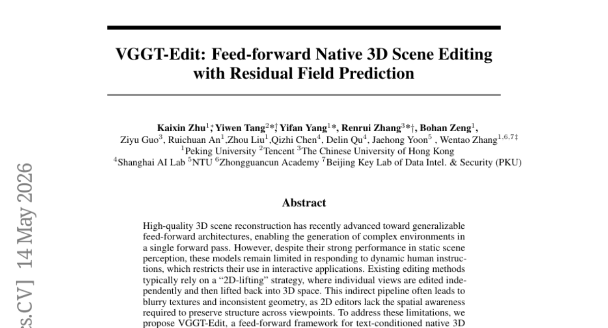

### 📌 한 줄 요약
2D 편집 방식의 한계를 극복하고 3D 공간 정렬을 통해 일관성 있는 3D 장면 편집을 가능하게 하는 피드포워드 프레임워크

### 🔑 핵심 포인트
- Depth-synchronized text injection을 통한 텍스트 명령과 3D 공간 포즈 간의 정렬
- Residual transformation head를 통한 직접적인 3D 기하학적 변형 및 배경 안정성 확보
- 고품질 3D 일관성 학습을 위한 대규모 DeltaScene 데이터셋 구축

### 🧑‍💻 개발자 관점
2D 편집 후 3D로 변환할 때 발생하는 고질적인 문제인 '뷰 간 불일치'와 '텍스처 뭉개짐'을 해결하여 실시간 3D 콘텐츠 제작 워크플로우에 적용 가능합니다.

### 🚀 실무 적용 아이디어
- 제안된 Residual transformation 방식이 복잡한 기하 구조에서도 안정적인지 테스트
- DeltaScene 데이터셋의 필터링 기준이 실제 생성 모델 학습에 미치는 영향 분석
- 기존 2D-lifting 기반 툴과의 추론 속도 및 품질 비교 실험

### ⚠️ 리스크/한계
- 복잡한 객체 변형 시 배경 안정성이 유지되는지에 대한 검증 필요
- 학습 데이터셋의 자동 생성 방식에 따른 편향성 가능성

### 📝 초록 기반 상세 설명
최근 3D 장면 재구성 기술이 발전하고 있으나, 텍스트 명령에 따른 동적인 편집 기능은 여전히 부족한 실정입니다. 기존의 2D-lifting 방식은 개별 뷰를 편집 후 3D로 변환하는 과정에서 텍스처 번짐과 기하학적 불일치 문제를 야기합니다. 이를 해결하기 위해 제안된 VGGT-Edit은 텍스트 명령을 공간 포즈와 정렬하는 'depth-synchronized text injection'과 기하학적 변형을 직접 예측하는 'residual transformation head'를 도입합니다. 또한, 고품질 학습을 위해 자동화된 파이프라인으로 구축된 DeltaScene 데이터셋을 활용합니다. 실험 결과, 기존 방식보다 훨씬 선명한 디테일과 강력한 다중 뷰 일관성을 유지하면서도 빠른 추론 속도를 보여주었습니다.

---

## 15. [EvolveMem:Self-Evolving Memory Architecture via AutoResearch for LLM Agents](https://huggingface.co/papers/2605.13941)
**Upvotes**: 21 | **도입 난이도**: 중 | **신뢰도**: 상
**arXiv**: https://arxiv.org/abs/2605.13941

**태그**: LLM-Agent, RAG, Self-Evolving, Memory-Architecture, Agent, Benchmark, Evaluation

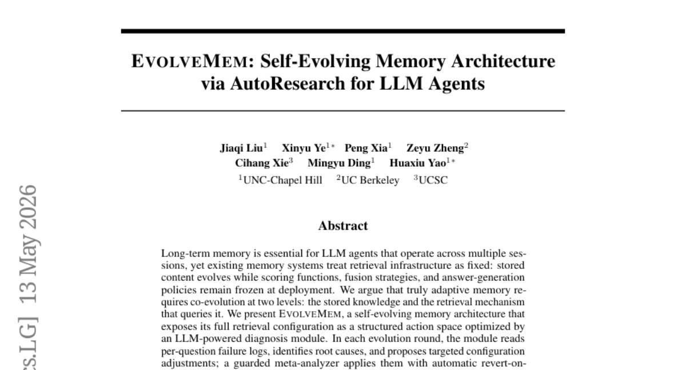

### 📌 한 줄 요약
LLM 에이전트의 메모리 검색 전략을 스스로 최적화하고 진화시키는 자가 학습형 메모리 아키텍처

### 🔑 핵심 포인트
- 데이터와 검색 메커니즘의 동시 진화를 목표로 하는 Self-Evolving 아키텍처 제안
- 실패 로그 분석을 통해 검색 설정을 최적화하는 LLM 기반 AutoResearch 루프 구현
- 벤치마크 간 양의 전이(Positive Transfer)를 통한 범용적 검색 전략 확보

### 🧑‍💻 개발자 관점
수동으로 RAG 파라미터를 튜닝하는 대신, 에이전트가 자신의 실패를 바탕으로 검색 로직을 스스로 개선하는 자동화된 운영 프레임워크를 제공합니다.

### 🚀 실무 적용 아이디어
- 기존 RAG 시스템의 실패 로그를 구조화하여 LLM 진단 모듈에 입력해보기
- 검색 파라미터(Top-k, scoring weight 등)를 액션 공간으로 정의하여 자동 튜닝 실험하기
- 학습된 설정이 새로운 도메인 데이터에서도 유효한지 전이 성능 테스트하기

### ⚠️ 리스크/한계
- 진화 과정 중 성능 저하(Regression)가 발생할 위험이 있어 강력한 안전장치 필요
- 반복적인 AutoResearch 루프 수행 시 발생하는 높은 컴퓨팅 비용 및 시간 소요

### 📝 초록 기반 상세 설명
LLM 에이전트의 장기 메모리 시스템은 저장된 데이터는 변하지만 검색 알고리즘과 정책은 고정되어 있어 변화하는 환경에 대응하기 어렵습니다. 본 논문은 저장된 지식과 이를 검색하는 메커니즘이 동시에 진화해야 한다는 점에 주목하여 EvolveMem 아키텍처를 제안합니다. EvolveMem은 LLM 기반 진단 모듈이 실패 로그를 분석하여 검색 설정(scoring, fusion 등)을 스스로 조정하는 AutoResearch 프로세스를 수행합니다. 시스템은 자동 복구 및 탐색 안전장치를 갖춘 폐쇄 루프 구조를 통해 수동 튜닝 없이 최적의 전략을 찾아냅니다. 실험 결과, LoCoMo 및 MemBench 벤치마크에서 기존 베이스라인 대비 압도적인 성능 향상을 기록했습니다. 또한, 진화된 설정이 다른 벤치마크로 전이되어도 성능이 유지되는 범용적인 검색 원칙을 학습함을 입증했습니다.

---

## 16. [Long Context Pre-Training with Lighthouse Attention](https://huggingface.co/papers/2605.06554)
**Upvotes**: 21 | **도입 난이도**: 중 | **신뢰도**: 상
**arXiv**: https://arxiv.org/abs/2605.06554

**태그**: Long Context, Efficient Training, Transformer, Attention Mechanism, Optimization

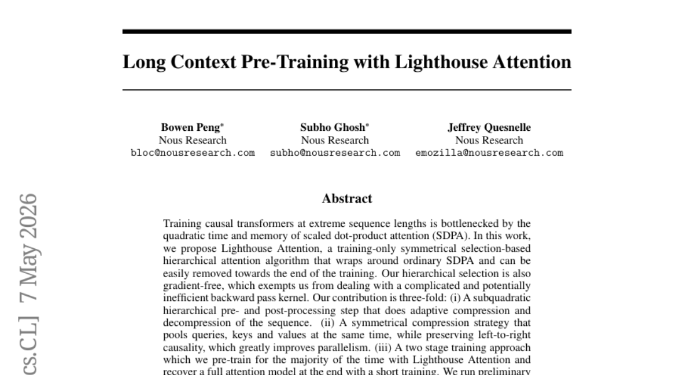

### 📌 한 줄 요약
학습 단계에서 시퀀스 길이를 효율적으로 압축/복원하여 연산 비용을 줄이는 계층적 어텐션 기법

### 🔑 핵심 포인트
- 그래디언트 계산이 필요 없는(gradient-free) 대칭적 계층적 선택 알고리즘
- 시퀀스의 적응적 압축 및 복원을 통한 서브-쿼드라틱(subquadratic) 연산 효율성 확보
- 학습 후 전체 어텐션으로 복원하는 2단계 학습 전략을 통한 성능 최적화

### 🧑‍💻 개발자 관점
모델 구조를 크게 변경하지 않고도 학습 단계에서 긴 컨텍스트를 효율적으로 처리할 수 있는 실용적인 프레임워크를 제공합니다.

### 🚀 실무 적용 아이디어
- 제공된 GitHub 코드를 활용하여 기존 SDPA 대비 학습 속도 및 메모리 점유율 벤치마크 수행
- 다양한 시퀀스 길이에 따른 압축/복원 단계의 수렴 안정성 테스트
- 모델 크기 변화에 따른 2단계 학습 전략(Recovery phase)의 효율성 검증

### ⚠️ 리스크/한계
- 학습 전용 기법이므로 추론(Inference) 시의 효율성은 별도의 검증이 필요함
- 마지막 복원 단계(Recovery phase)의 하이퍼파라미터 설정에 따라 최종 성능이 좌우될 수 있음

### 📝 초록 기반 상세 설명
긴 시퀀스 길이를 가진 인과적 트랜스포머 학습 시, 기존 SDPA의 이차 복잡도(quadratic complexity)로 인해 시간과 메모리 병목이 발생합니다. 이를 해결하기 위해 기존 SDPA를 감싸는 형태의 학습 전용 계층적 선택 알고리즘인 'Lighthouse Attention'을 제안합니다. 이 방식은 그래디언트 계산이 필요 없는 대칭적 압축 전략을 사용하여 병렬성을 높이고 복잡한 역전파 커널 문제를 피합니다. 학습 초기에는 압축된 형태로 학습하고, 마지막 단계에서 짧은 학습을 통해 전체 어텐션 모델로 복원하는 2단계 접근법을 사용합니다. 실험 결과, 전체 어텐션 학습 대비 더 빠른 학습 시간과 더 낮은 최종 손실(loss)을 달성했습니다.

---

## 17. [Realiz3D: 3D Generation Made Photorealistic via Domain-Aware Learning](https://huggingface.co/papers/2605.13852)
**Upvotes**: 21 | **도입 난이도**: 중 | **신뢰도**: 상
**arXiv**: https://arxiv.org/abs/2605.13852

**태그**: 3D Generation, Diffusion Models, Domain Adaptation, Computer Vision, RAG, Vision, Inference

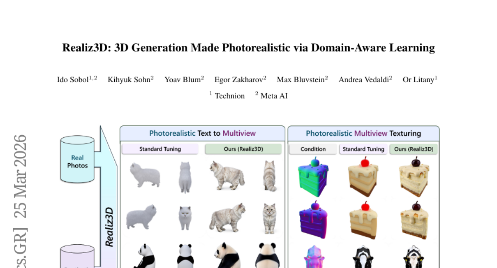

### 📌 한 줄 요약
제어 신호와 시각적 도메인을 분리하여 3D 생성 모델의 실사 품질 저하 문제를 해결한 프레임워크

### 🔑 핵심 포인트
- 제어 신호(Control)와 시각적 도메인(Visual Domain)의 명시적 분리 학습
- 공변량 기반의 잔차 어댑터를 통한 도메인 이동(Domain Shifting) 기법 도입
- 레이어 및 디노이징 단계 분석을 통한 실사 도메인 전이 최적화

### 🧑‍💻 개발자 관점
3D 에셋 생성 시 발생하는 '게임 그래픽 같은 이질감'을 줄이면서도 정교한 기하학적 제어를 유지할 수 있는 방법론을 제시합니다.

### 🚀 실무 적용 아이디어
- 기존 ControlNet 기반 3D 생성 파이프라인에 Residual Adapter 구조 적용 테스트
- 합성 데이터로 학습된 모델의 실사 도메인 전이 성능 비교 실험
- 텍스트-투-멀티뷰 생성 태스크에서의 제어 신호 강도별 품질 변화 관찰

### ⚠️ 리스크/한계
- 도메인 분리 과정에서 제어 신호의 정밀도가 미세하게 손실될 가능성
- 학습 시 공변량 설정 및 어댑터 설계에 대한 하이퍼파라미터 민감도

### 📝 초록 기반 상세 설명
3D 일관성을 유지하면서 실사 이미지를 생성하기 위해 기존에는 합성 렌더링 데이터를 활용해 확산 모델을 미세 조정해 왔습니다. 그러나 이 과정에서 제어 신호와 합성 데이터 특성이 결합되어 생성된 이미지의 실사 품질이 떨어지는 도메인 갭 문제가 발생합니다. 이를 해결하기 위해 제어 신호와 시각적 도메인을 분리하는 Realiz3D 프레임워크를 제안합니다. 공변량(co-variate)을 도입하여 잔차 어댑터(residual adapters)를 통해 도메인 특성을 별도로 학습함으로써, 제어 기능과 시각적 스타일을 독립적으로 유지합니다. 또한 레이어 및 디노이징 단계별 특성을 활용한 전략을 통해 실사 도메인으로의 전이 성능을 높였습니다. 결과적으로 텍스트 기반 다중 뷰 생성 및 3D 텍스처링 작업에서 높은 일관성과 실사 품질을 동시에 달성했습니다.

---

## 18. [ATLAS: Agentic or Latent Visual Reasoning? One Word is Enough for Both](https://huggingface.co/papers/2605.15198)
**Upvotes**: 17 | **도입 난이도**: 중 | **신뢰도**: 상
**arXiv**: https://arxiv.org/abs/2605.15198

**태그**: Multimodal, Visual Reasoning, Reinforcement Learning, Agentic AI, Agent, Reasoning, Vision, Benchmark, Inference

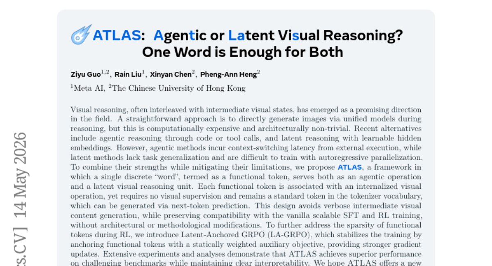

### 📌 한 줄 요약
에이전트식 동작과 잠재적 추론을 하나의 '기능적 토큰'으로 통합하여 효율성과 성능을 동시에 잡은 시각적 추론 프레임워크

### 🔑 핵심 포인트
- 기능적 토큰(Functional Token): 에이전트 동작과 잠재적 추론을 하나의 토큰으로 통합하여 연산 비용 절감
- 아키텍처 호환성: 별도의 구조 변경 없이 기존의 SFT 및 RL(RLHF) 파이프라인을 그대로 사용 가능
- LA-GRPO: 강화학습 시 기능적 토큰의 희소성 문제를 해결하기 위한 정적 가중치 기반 보조 목적 함수 도입

### 🧑‍💻 개발자 관점
시각적 추론을 위해 무거운 이미지를 계속 생성할 필요 없이, 텍스트 기반 모델처럼 효율적으로 시각적 작업을 수행할 수 있는 새로운 패러다임을 제시합니다.

### 🚀 실무 적용 아이디어
- 기존 멀티모달 모델의 토크나이저에 커스텀 기능 토큰을 추가하여 성능 변화 관찰
- LA-GRPO와 같은 보조 손실 함수가 강화학습 안정성에 미치는 영향 테스트
- 에이전트 기반 워크플로우와 비교하여 추론 지연 시간(Latency) 및 정확도 트레이드오프 분석

### ⚠️ 리스크/한계
- 기능적 토큰의 의미론적 해석이 복잡해질 경우 디버깅 난이도 상승 가능성
- 특정 도메인에 특화된 기능적 토큰이 학습되지 않을 경우 일반화 성능 저하 우려

### 📝 초록 기반 상세 설명
시각적 추론 과정에서 중간 상태를 생성하는 방식은 비용이 크거나 일반화 능력이 부족한 문제가 있었습니다. 기존의 에이전트 방식은 외부 실행에 따른 지연 시간이 발생하고, 잠재적 추론 방식은 학습 및 일반화가 어렵다는 단점이 있습니다. 이를 해결하기 위해 ATLAS는 단일 이산 토큰인 '기능적 토큰(functional token)'이 에이전트 작업과 잠재적 추론 단위를 동시에 수행하도록 설계했습니다. 이 토큰은 별도의 시각적 생성 없이 텍스트 토큰처럼 다뤄지며, 기존 SFT 및 RL 학습 체계와 완벽히 호환됩니다. 또한 학습 안정성을 위해 LA-GRPO 알고리즘을 도입하여 기능적 토큰의 희소성 문제를 해결했습니다. 실험 결과, ATLAS는 높은 해석 가능성을 유지하면서도 도전적인 벤치마크에서 우수한 성능을 입증했습니다.

---

## 19. [FrontierSmith: Synthesizing Open-Ended Coding Problems at Scale](https://huggingface.co/papers/2605.14445)
**Upvotes**: 17 | **도입 난이도**: 중 | **신뢰도**: 상
**arXiv**: https://arxiv.org/abs/2605.14445

**태그**: LLM-Training, Code-Generation, Automated-Data-Synthesis, Agentic-Workflow, Agent, Benchmark

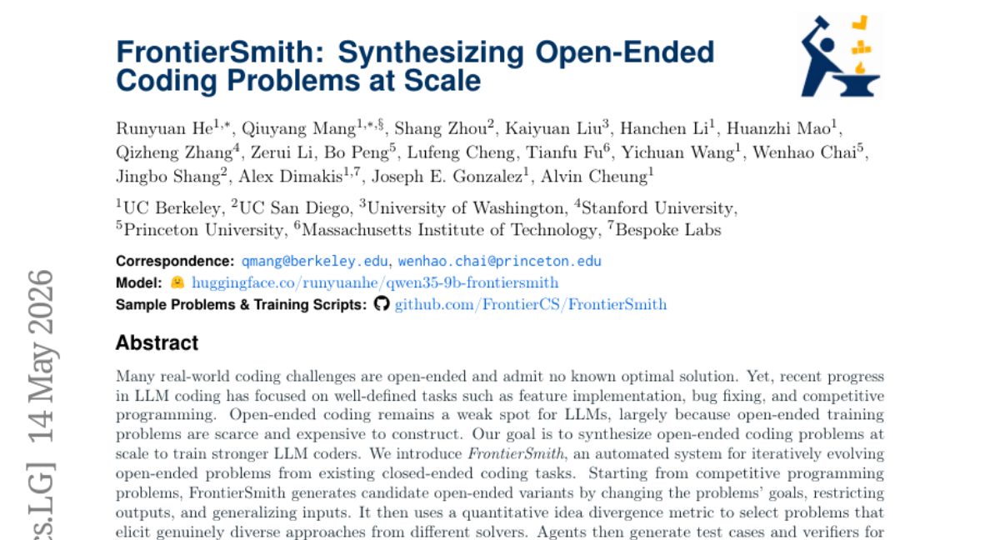

### 📌 한 줄 요약
기존의 정답이 정해진 코딩 문제를 변형하여 대규모 오픈 엔디드(Open-ended) 코딩 학습 데이터를 자동 생성하는 시스템

### 🔑 핵심 포인트
- 기존 폐쇄형 코딩 문제를 오픈 엔디드 문제로 자동 변환하는 반복적 진화 프레임워크 제안
- 아이디어 발산 지표(Idea Divergence Metric)를 통한 고품질/고다양성 문제 선별
- 에이전트 기반의 자동 테스트 케이스 및 검증기 생성 프로세스 구축

### 🧑‍💻 개발자 관점
단순 구현을 넘어 복잡한 요구사항을 다루는 에이전트형 코딩 모델을 학습시키기 위한 데이터 생성 전략을 제시합니다.

### 🚀 실무 적용 아이디어
- 기존 알고리즘 문제(LeetCode 등)를 활용한 문제 변형 파이프라인 프로토타이핑
- LLM이 생성한 문제의 정답 검증을 위한 자동화된 테스트 케이스 생성 실험
- 문제의 난이도와 다양성을 측정하기 위한 메트릭 설계 및 검증

### ⚠️ 리스크/한계
- 초기 시드 데이터(Closed-ended)의 품질에 따라 생성된 문제의 질이 결정될 위험
- 자동 생성된 문제의 논리적 결함이나 모순이 포함될 가능성

### 📝 초록 기반 상세 설명
최근 LLM 코딩 모델은 정답이 명확한 태스크에 집중되어 있어, 정답이 없는 복잡한 오픈 엔디드 문제 해결에는 취약합니다. 이러한 문제를 해결하기 위해 기존의 폐쇄형 코딩 문제를 기반으로 문제를 진화시키는 FrontierSmith 시스템을 제안합니다. 이 시스템은 목표 변경, 출력 제한, 입력 일반화 등을 통해 문제를 변형하고, 아이디어 발산 지표를 통해 다양성이 확보된 문제를 선별합니다. 이후 에이전트가 테스트 케이스와 검증기를 생성하여 데이터의 품질을 확보합니다. 실험 결과, 합성된 데이터로 학습 시 기존 모델의 성능이 대폭 향상되었으며, 생성된 문제가 인간이 만든 문제처럼 복잡한 추론을 유도함을 확인했습니다.

---

## 20. [Learning to Communicate Locally for Large-Scale Multi-Agent Pathfinding](https://huggingface.co/papers/2605.07637)
**Upvotes**: 17 | **도입 난이도**: 중 | **신뢰도**: 상
**arXiv**: https://arxiv.org/abs/2605.07637

**태그**: Multi-Agent, Pathfinding, Reinforcement Learning, Communication, Agent, RAG

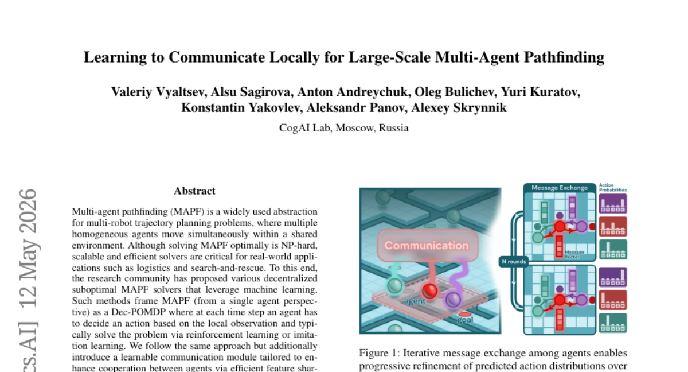

### 📌 한 줄 요약
로컬 통신 모듈을 통해 확장성과 협업 성능을 동시에 잡은 대규모 멀티 에이전트 경로 계획(MAPF) 학습 모델

### 🔑 핵심 포인트
- 인접 에이전트 간 정보 교환을 위한 학습 가능한 로컬 통신 모듈(LC-MAPF) 개발
- 다회차 통신(multi-round communication)을 통한 에이전트 간 정교한 협업 및 조정 능력 확보
- 기존 통신 기반 방식의 고질적 문제인 확장성(Scalability) 문제를 해결하며 높은 일반화 성능 달성

### 🧑‍💻 개발자 관점
물류 창고 로봇이나 드론 군집 제어와 같이 에이전트 수가 급증하는 실무 환경에서, 중앙 집중식 제어 없이도 효율적인 경로 계획을 구현할 수 있는 기술적 토대를 제공합니다.

### 🚀 실무 적용 아이디어
- 다양한 밀도의 에이전트 배치 환경에서 통신 범위(Radius) 변화에 따른 성능 변화 테스트
- 에이전트 수가 급격히 증가할 때 통신 오버헤드와 연산 시간 측정
- 학습 시 사용된 환경과 완전히 다른 지형(Unseen environment)에서의 강건성 검증

### ⚠️ 리스크/한계
- 통신 지연(Latency)이 발생하는 실제 네트워크 환경에서의 성능 저하 가능성
- 에이전트 밀도가 극도로 높아질 경우 로컬 통신 노드 증가로 인한 복잡도 상승 우려

### 📝 초록 기반 상세 설명
멀티 에이전트 경로 계획(MAPF)은 로봇 공학에서 필수적이지만, 최적해를 찾는 것은 NP-hard 문제로 대규모 환경에서의 효율적인 해결이 어렵습니다. 기존의 학습 기반 방식은 개별 에이전트의 관점에서 문제를 해결하려 하지만, 에이전트 간의 협업 부족이라는 한계가 있었습니다. 본 논문에서는 인접한 에이전트 간의 효율적인 정보 공유를 위한 학습 가능한 통신 모듈인 LC-MAPF를 제안합니다. 이 모델은 다회차 통신(multi-round communication)을 통해 주변 에이전트와 정보를 교환하며 협업 능력을 극대화합니다. 실험 결과, 제안된 방식은 기존 RL 및 IL 기반 솔버보다 우수한 성능을 보였으며, 통신 모듈 도입에도 불구하고 확장성 저하 없이 대규모 시나리오에서 잘 작동함을 입증했습니다.

---

## 21. [DiffusionOPD: A Unified Perspective of On-Policy Distillation in Diffusion Models](https://huggingface.co/papers/2605.15055)
**Upvotes**: 14 | **도입 난이도**: 중 | **신뢰도**: 상
**arXiv**: https://arxiv.org/abs/2605.15055

**태그**: Diffusion Models, Reinforcement Learning, Multi-task Learning, Knowledge Distillation, Vision, Benchmark, Evaluation, Distillation

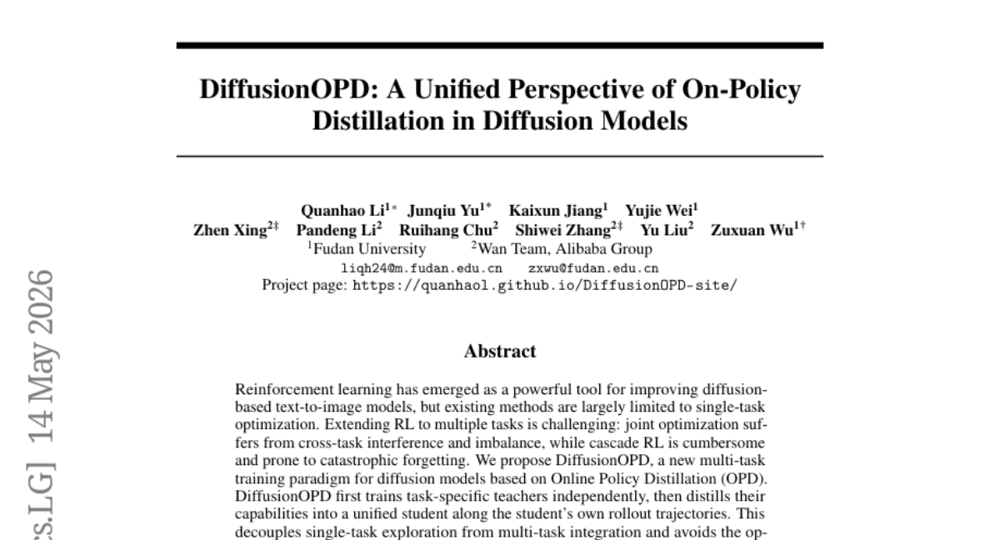

### 📌 한 줄 요약
온라인 정책 증류(OPD)를 통해 다중 작업 간 간섭 없이 효율적으로 멀티태스크를 수행하는 확산 모델 학습 프레임워크

### 🔑 핵심 포인트
- 독립적 교사 학습 후 학생 모델로 통합하는 분리형 멀티태스크 학습 패러다임 제안
- 연속 상태 마르코프 과정을 활용한 폐쇄형(Closed-form) per-step KL 목적 함수 도출
- 기존 PPO 기반 정책 경사 방식 대비 낮은 분산과 높은 학습 효율성 확보

### 🧑‍💻 개발자 관점
여러 가지 스타일이나 제약 조건(Task)을 동시에 만족해야 하는 멀티태스크 이미지 생성 모델 개발 시, 작업 간 충돌 없이 효율적으로 모델을 통합하는 방법론을 제공합니다.

### 🚀 실무 적용 아이디어
- 단일 작업별 교사 모델(Teacher)을 먼저 학습시킨 후 학생 모델로 증류하는 파이프라인 구축
- 기존 PPO 기반 RLHF와 제안된 KL 목적 함수 기반 학습의 수렴 속도 비교 실험
- 다양한 텍스트-이미지 태스크를 동시에 학습시킬 때의 성능 유지력 테스트

### ⚠️ 리스크/한계
- 교사 모델의 품질이 학생 모델의 성능 상한선을 결정할 가능성
- 연속 상태 공간에서의 이론적 유도가 복잡하여 구현 난이도가 높을 수 있음

### 📝 초록 기반 상세 설명
최근 강화학습을 이용한 확산 모델 최적화가 주목받고 있으나, 기존 방식은 단일 작업에 국한되거나 다중 작업 최적화 시 작업 간 간섭 및 망각 문제가 발생합니다. 이를 해결하기 위해 본 논문은 온라인 정책 증류(OPd) 기반의 DiffusionOPD 프레임워크를 제안합니다. 먼저 각 작업별 교사 모델을 독립적으로 학습시킨 후, 학생 모델의 자체 롤아웃 궤적을 통해 지식을 통합하는 방식을 취합니다. 이론적으로는 OPD를 연속 상태 마르코프 과정으로 확장하여 SDE와 ODE를 통합하는 폐쇄형 KL 목적 함수를 도출했습니다. 실험 결과, 제안 방식은 기존의 PPO 방식보다 낮은 분산과 높은 범용성을 보이며 다중 보상 및 캐스케이드 방식보다 뛰어난 성능을 입증했습니다.

---

## 22. [Orchard: An Open-Source Agentic Modeling Framework](https://huggingface.co/papers/2605.15040)
**Upvotes**: 14 | **도입 난이도**: 중 | **신뢰도**: 상
**arXiv**: https://arxiv.org/abs/2605.15040

**태그**: Agentic Modeling, Open Source, Reinforcement Learning, Software Engineering Agent, Agent, Reasoning, Vision, Evaluation, Distillation

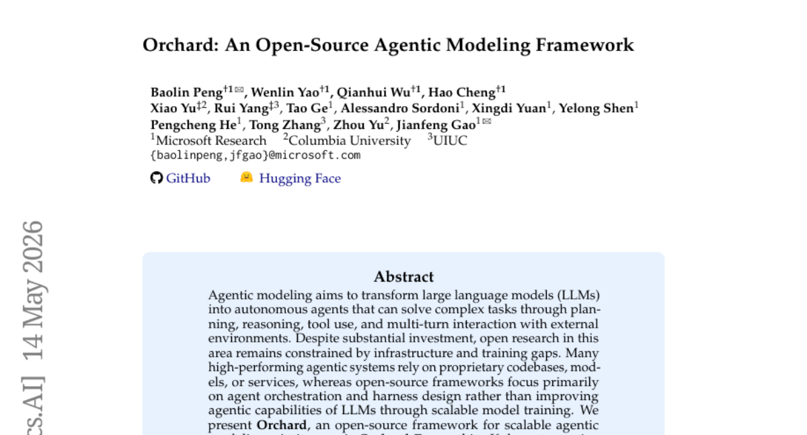

### 📌 한 줄 요약
확장 가능한 에이전트 학습 및 환경 관리를 위한 오픈소스 프레임워크 'Orchard' 제안

### 🔑 핵심 포인트
- 샌드박스 관리 및 파이프라인 자동화를 지원하는 경량 환경 서비스 'Orchard Env' 개발
- 코딩, GUI, 개인 비서 등 다양한 도메인에 적용 가능한 에이전트 학습 레시피(SFT/RL) 제공
- 데이터 증강 및 효율적인 학습 기법을 통해 적은 데이터로도 고성능 에이전트 구현 가능성 입증

### 🧑‍💻 개발자 관점
에이전트 개발 시 가장 까다로운 환경 구축(Sandbox)과 학습 파이프라인을 표준화하여, 특정 도메인에 특화된 에이전트를 빠르게 학습시키고 평가할 수 있는 기반을 제공합니다.

### 🚀 실무 적용 아이디어
- Orchard Env를 활용하여 특정 도메인(예: 데이터 분석)용 샌드박스 환경 구축 실험
- 제시된 SFT 및 RL 레시피를 소규모 모델에 적용하여 성능 변화 관찰
- 기존 오픈소스 에이전트 프레임워크와 Orchard의 환경 관리 효율성 비교

### ⚠️ 리스크/한계
- 특정 도메인에 최적화된 레시피이므로 새로운 도메인 적용 시 추가적인 튜닝 필요
- 고성능 에이전트 구현을 위해 여전히 상당한 수준의 컴퓨팅 자원과 데이터 정제 작업이 요구됨

### 📝 초록 기반 상세 설명
기존의 에이전트 연구는 독점적인 코드베이스나 인프라에 의존하여 오픈소스 환경에서의 확장성 및 학습 효율이 낮다는 문제가 있었습니다. 이를 해결하기 위해 Orchard는 샌드박스 생명주기 관리와 파이프라인 단계를 지원하는 경량 환경 서비스인 'Orchard Env'를 핵심으로 하는 프레임워크를 제안합니다. 이 환경 위에서 코딩(SWE), GUI 제어, 개인 비서(Claw) 등 세 가지 특화된 에이전트 학습 레시피를 구축했습니다. 실험 결과, Orchard-SWE는 SWE-bench Verified에서 오픈소스 모델 중 최고 수준의 성능을 기록했으며, GUI 및 개인 비서 작업에서도 경쟁력 있는 성능을 입증했습니다. 결과적으로 이 프레임워크는 도메인에 관계없이 재사용 가능한 에이전트 데이터와 학습 방식을 제공합니다.

---

## 23. [IntentVLA: Short-Horizon Intent Modeling for Aliased Robot Manipulation](https://huggingface.co/papers/2605.14712)
**Upvotes**: 14 | **도입 난이도**: 중 | **신뢰도**: 상
**arXiv**: https://arxiv.org/abs/2605.14712

**태그**: Robot Learning, VLA, Imitation Learning, Motion Stability, Multimodal, Benchmark, Evaluation

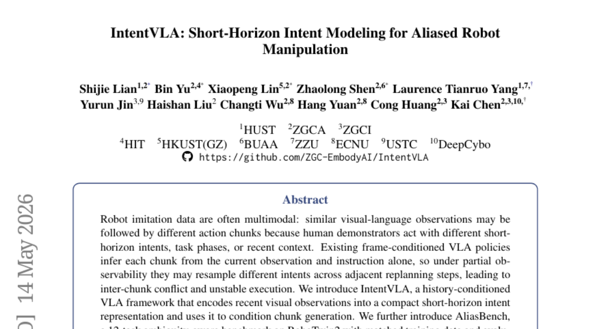

### 📌 한 줄 요약
관측 데이터의 모호성(Aliasing) 문제를 해결하기 위해 과거 이력을 기반으로 의도를 모델링하여 로봇 동작의 일관성을 높인 VLA 프레임워크

### 🔑 핵심 포인트
- 과거 시각 이력을 활용한 단기 의도(Short-horizon intent) 표현 학습
- 의도 불일치로 인한 동작 충돌을 방지하는 히스토리 조건부 VLA 프레임워크
- 관측 모호성 문제를 정밀하게 평가하기 위한 AliasBench 벤치마크 제안

### 🧑‍💻 개발자 관점
로봇이 작업 중 환경 변화나 센서 노이즈로 인해 갑자기 동작이 바뀌는 '지터링(Jittering)' 현상을 억제하고 실행 안정성을 확보하는 데 유용합니다.

### 🚀 실무 적용 아이디어
- 기존 VLA 모델에 과거 프레임 임베딩을 결합하는 구조로 변경 실험
- 동일한 명령에 대해 서로 다른 동작이 포함된 데이터셋에서의 성능 비교
- 의도 표현(Intent representation)의 압축률에 따른 동작 일관성 변화 측정

### ⚠️ 리스크/한계
- 과거 이력 의존도가 높을 경우 새로운 명령에 대한 반응 속도가 저하될 가능성
- 의도 표현 모델의 복잡도가 증가함에 따른 연산 비용 상승

### 📝 초록 기반 상세 설명
로봇 모방 학습 데이터는 동일한 관측 상황에서도 작업 단계나 의도에 따라 서로 다른 동작이 나타나는 멀티모달 특성을 가집니다. 기존의 프레임 조건부 VLA 정책은 현재 관측과 지시어에만 의존하여, 부분 관측 상황에서 매 계획 단계마다 의도가 바뀌는 불안정한 동작 문제를 겪습니다. 이를 해결하기 위해 최근 시각적 관측을 압축된 단기 의도 표현으로 인코딩하여 동작 생성에 활용하는 IntentVLA를 제안합니다. 또한, 관측 모호성을 격리하여 평가할 수 있는 벤치마크인 AliasBench를 함께 도입했습니다. 실험 결과, IntentVLA는 다양한 환경에서 기존 VLA 모델 대비 동작의 안정성과 성능을 크게 개선했습니다.

---

## 24. [PanoWorld: Towards Spatial Supersensing in 360^circ Panorama World](https://huggingface.co/papers/2605.13169)
**Upvotes**: 13 | **도입 난이도**: 상 | **신뢰도**: 상
**arXiv**: https://arxiv.org/abs/2605.13169

**태그**: Vision-Language, 360-Panorama, Spatial-Reasoning, Robotics, Reasoning, Multimodal, Vision, Benchmark, Evaluation

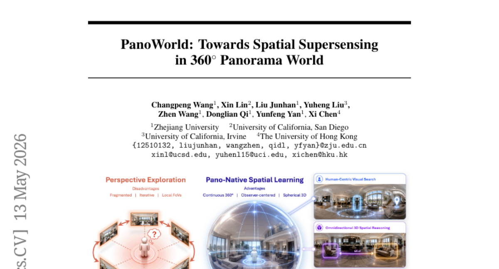

### 📌 한 줄 요약
360도 파노라마의 구형 기하 구조를 유지하며 공간 추론 능력을 극대화한 MLLM 모델 및 벤치마크 제안

### 🔑 핵심 포인트
- 구형 기하 구조를 반영한 Spherical Spatial Cross-Attention 아키텍처 도입
- ERP(Equirectangular Projection) 특성을 고려한 대규모 기하/깊이/언어 결합 데이터셋 구축
- 파노라마 공간 추론 능력을 평가하기 위한 전용 벤치마크 PanoSpace-Bench 제안

### 🧑‍💻 개발자 관점
로봇 내비게이션, 3D 장면 이해, VR/AR 환경에서의 에이전트 개발 시 기존 시점 기반 모델의 한계를 극복할 수 있는 기술적 토대를 제공합니다.

### 🚀 실무 적용 아이디어
- 제공될 소스코드를 활용하여 기존 시점 기반 모델과 PanoWorld의 공간 추론 성능 비교 실험
- 로봇 주행 시나리오(R2R-CE 등)에 PanoWorld 모델을 적용하여 경로 탐색 정확도 검증
- 자체 보유한 360도 영상 데이터셋에 제안된 데이터 생성 파이프라인 적용 테스트

### ⚠️ 리스크/한계
- 구형 기하 구조를 처리하기 위한 연산 복잡도 증가 가능성
- 특정 도메인(파노라마)에 특화된 모델로, 일반적인 2D 이미지 작업에서의 범용성 확인 필요

### 📝 초록 기반 상세 설명
기존 MLLM은 인간 중심의 좁은 시야각(Perspective-view)에 맞춰져 있어 360도 파노라마의 공간 정보를 온전히 활용하지 못하는 한계가 있습니다. 본 논문은 파노라마를 단일 연속 공간으로 이해하는 'Pano-native understanding'을 정의하고, 이를 위한 핵심 능력(의미론적 앵커링, 구형 위치 추적 등)을 정립합니다. 이를 위해 구형 기하 구조를 시각 스트림에 주입하는 'Spherical Spatial Cross-Attention' 기술과 대규모 메타데이터 구축 파이프라인을 제안합니다. 실험 결과, 제안된 PanoWorld는 기존 모델들을 압도하며 파노라마 특화 공간 추론 능력을 입증했습니다. 최종적으로는 파노라마 전용 벤치마크인 PanoSpace-Bench를 통해 모델의 진단 가능성을 확보했습니다.

---

## 25. [ViMU: Benchmarking Video Metaphorical Understanding](https://huggingface.co/papers/2605.14607)
**Upvotes**: 11 | **도입 난이도**: 하 | **신뢰도**: 상
**arXiv**: https://arxiv.org/abs/2605.14607

**태그**: Video-Understanding, Benchmark, Multimodal, Reasoning, Video, Evaluation

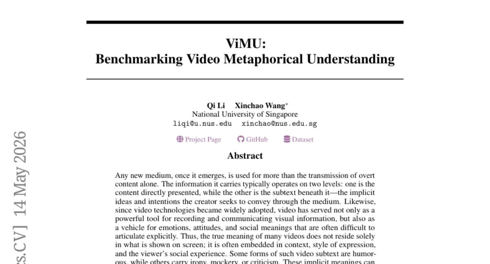

### 📌 한 줄 요약
비디오의 표면적 정보 너머의 은유, 풍자, 사회적 맥락을 평가하기 위한 최초의 벤치마크 ViMU 제안

### 🔑 핵심 포인트
- 비디오의 은유적·사회적 맥락 이해를 위한 최초의 체계적 벤치마크 ViMU 개발
- 단순 시각 인지를 넘어선 심층적 subtext 추론 능력 평가
- 힌트가 배제된 질문 설계를 통한 모델의 순수 추론 능력 검증

### 🧑‍💻 개발자 관점
단순 객체 탐지를 넘어 인간과 유사한 수준의 맥락 이해가 필요한 차세대 멀티모달 AI 모델의 성능을 측정하는 기준이 됩니다.

### 🚀 실무 적용 아이디어
- 현재 사용 중인 멀티모달 모델(GPT-4o, Gemini 등)을 ViMU 데이터셋에 적용하여 성능 비교
- 모델이 시각적 근거를 바탕으로 은유를 해석하는지 프롬프트 엔지니어링 실험
- 문화적 편향성이 모델의 은유 해석에 미치는 영향 분석

### ⚠️ 리스크/한계
- 문화적 배경에 따른 주관적 해석 차이가 평가의 객관성을 저해할 가능성
- 모델의 추론 능력이 아닌 질문 설계의 난이도에 따른 성능 편차 발생 가능성

### 📝 초록 기반 상세 설명
기존 비디오 이해 모델은 객체 인식이나 동작 감지와 같은 표면적인 시각 정보 파악에 치중되어 있습니다. 그러나 실제 비디오는 은유, 풍자, 사회적 의미와 같은 복잡한 하위 텍스트(subtext)를 포함하는 경우가 많습니다. 이러한 맥락적 이해 능력은 문화적 배경에 따라 다르게 해석될 수 있어 기존 모델들에게는 어려운 과제입니다. 본 논문에서는 모델이 단순 인지를 넘어 암시적 의미를 추론할 수 있는지 평가하는 최초의 벤치마크인 ViMU를 소개합니다. ViMU는 멀티모달 근거를 바탕으로 한 개방형 및 객관식 질문을 통해 모델의 심층적 이해력을 검증합니다. 특히 모든 질문은 힌트를 배제하여 모델이 스스로 맥락을 파악해야 하도록 설계되었습니다.

---

## 26. [RAVEN: Real-time Autoregressive Video Extrapolation with Consistency-model GRPO](https://huggingface.co/papers/2605.15190)
**Upvotes**: 8 | **도입 난이도**: 상 | **신뢰도**: 상
**arXiv**: https://arxiv.org/abs/2605.15190

**태그**: Video Generation, Reinforcement Learning, Diffusion Models, Real-time AI, Video, Evaluation, Inference, Distillation

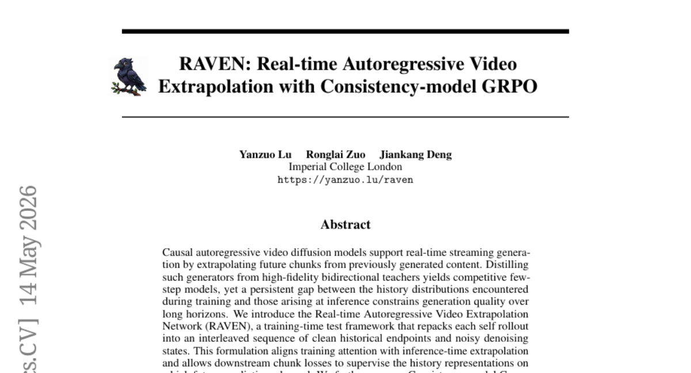

### 📌 한 줄 요약
실시간 비디오 생성 시 발생하는 훈련-추론 간 분포 불일치 문제를 해결하여 장기 생성 품질을 높인 프레임워크

### 🔑 핵심 포인트
- RAVEN: 훈련 시 자기회귀 시퀀스를 재구성하여 훈련과 추론 간의 분포 차이(Distribution Gap)를 최소화하는 프레임워크
- CM-GRPO: 오일러-마루야마(Euler-Maruyama) 과정 없이 일관성 모델 커널에 직접 온라인 RL을 적용하는 최적화 기법
- 장기 비디오 생성 시 발생하는 누적 오차 및 일관성 저하 문제 해결

### 🧑‍💻 개발자 관점
실시간 비디오 스트리밍 서비스 개발 시, 생성 모델의 누적 오차로 인한 품질 저하 문제를 해결할 수 있는 구조적 방법론을 제시합니다.

### 🚀 실무 적용 아이디어
- 기존 비디오 생성 모델의 훈련 데이터와 추론 시 생성 데이터 간의 분포 차이 분석
- 자기회귀적 생성 환경에서 훈련 시 어텐션 마스킹 및 시퀀스 재구성 실험
- 강화학습(RL)을 활용한 일관성 모델(Consistency Model)의 온라인 미세 조정 테스트

### ⚠️ 리스크/한계
- 자기회귀적 구조 특성상 연산 복잡도가 높을 수 있음
- RL 기반 최적화 시 하이퍼파라미터 민감도 및 학습 안정성 문제 가능성

### 📝 초록 기반 상세 설명
실시간 스트리밍 비디오 생성을 위해 인과적 자기회귀(Causal Autoregressive) 모델이 사용되지만, 훈련 시 데이터와 추론 시 생성된 데이터 간의 분포 차이로 인해 장기 생성 시 품질이 저하되는 문제가 있습니다. 이를 해결하기 위해 RAVEN은 훈련 시 자기회귀 과정을 클린한 과거 엔드포인트와 노이즈가 포함된 상태로 재구성하여 훈련-추론 간의 어텐션 정렬을 유도합니다. 또한, 일관성 모델(Consistency Model) 샘플링 과정을 조건부 가우시안 전이로 재정의한 CM-GRPO 알고리즘을 제안하여 온라인 강화학습을 효율적으로 적용합니다. 실험 결과, RAVEN은 기존 비디오 증류(Distillation) 모델 대비 품질, 의미적 일관성, 역동성 측면에서 우수한 성능을 보였습니다.

---

## 27. [Forcing-KV: Hybrid KV Cache Compression for Efficient Autoregressive Video Diffusion Models](https://huggingface.co/papers/2605.09681)
**Upvotes**: 8 | **도입 난이도**: 중 | **신뢰도**: 상
**arXiv**: https://arxiv.org/abs/2605.09681

**태그**: Video Generation, KV Cache, Model Compression, Diffusion Models, Video, Optimization

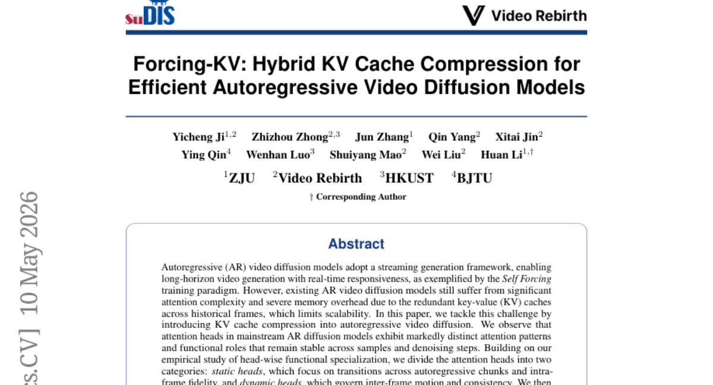

### 📌 한 줄 요약
어텐션 헤드의 기능적 특성을 활용한 하이브리드 KV 캐시 압축을 통해 고해상도 비디오 생성 속도와 메모리 효율을 극대화한 기술

### 🔑 핵심 포인트
- 어텐션 헤드의 기능적 특성(Static vs Dynamic)에 기반한 역할 분리 발견
- 정적 헤드(전환 및 충실도)와 동적 헤드(모션 및 일관성)를 구분한 하이브리드 프루닝 전략
- 고해상도 비디오 생성 시 메모리 효율성 및 추론 속도 대폭 개선

### 🧑‍💻 개발자 관점
비디오 생성 모델의 고질적인 문제인 KV 캐시 메모리 문제를 해결하여, 제한된 GPU 자원에서도 더 긴 영상이나 고해상도 영상을 생성할 수 있는 실질적인 최적화 기법을 제공합니다.

### 🚀 실무 적용 아이디어
- 기존 AR 비디오 모델의 어텐션 맵을 시각화하여 헤드별 역할 분리 여부 확인
- 다양한 해상도 및 프레임 길이 변화에 따른 프루닝 효율성 벤치마크 수행
- 제안된 하이브리드 프루닝 방식의 모델 품질(FID 등) 영향도 평가

### ⚠️ 리스크/한계
- 프루닝 강도에 따른 비디오 일관성(Consistency) 저하 가능성
- 특정 아키텍처에 특화된 기능적 분리 전략이 다른 모델 구조에서도 유효할지에 대한 불확실성

### 📝 초록 기반 상세 설명
자기회귀(AR) 비디오 확산 모델은 긴 영상 생성을 가능하게 하지만, 과거 프레임의 중복된 KV 캐시로 인해 메모리 오버헤드와 연산 복잡도가 급증하는 문제가 있습니다. 연구진은 어텐션 헤드들이 샘플과 디노이징 단계에 관계없이 서로 다른 기능적 역할을 수행한다는 점에 주목했습니다. 이를 바탕으로 정적 헤드(Static heads)와 동적 헤드(Dynamic heads)로 분류하는 전략을 제안합니다. 제안된 Forcing-KV는 정적 헤드에는 구조적 프루닝을, 동적 헤드에는 세그먼트 유사도 기반 프루닝을 적용하는 하이브리드 압축 방식을 사용합니다. 실험 결과, 품질 저하를 최소화하면서도 메모리 사용량을 30% 절감하고 고해상도 환경에서 최대 2.82배의 속도 향상을 달립했습니다.

---

## 28. [Does Synthetic Layered Design Data Benefit Layered Design Decomposition?](https://huggingface.co/papers/2605.15167)
**Upvotes**: 6 | **도입 난이도**: 중 | **신뢰도**: 상
**arXiv**: https://arxiv.org/abs/2605.15167

**태그**: Computer Vision, Synthetic Data, Graphic Design, VLM, RAG, Vision, Inference

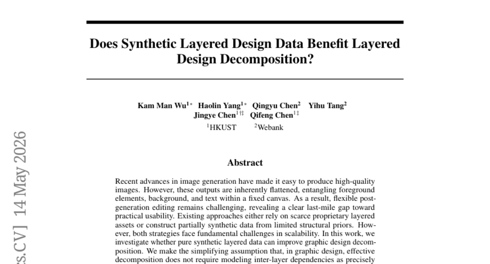

### 📌 한 줄 요약
합성 데이터(Synthetic Data)를 활용하여 그래픽 디자인 요소의 레이어 분리 성능을 높이고 확장성 문제를 해결하는 방법론 연구

### 🔑 핵심 포인트
- 순수 합성 데이터(SynLayers)를 활용한 확장 가능한 레이어 분리 학습 방법론 제시
- VLM(Vision Language Model)을 이용한 텍스트 지도 및 바운딩 박스 자동 생성 파이프라인 구축
- 데이터 규모 확대에 따른 성능 향상 및 레이어 개수 불균형 문제 해결 가능성 입증

### 🧑‍💻 개발자 관점
실제 레이어 데이터 확보가 어려운 그래픽 편집 AI 개발 시, 합성 데이터를 통해 데이터 부족 및 불균형 문제를 해결할 수 있는 실질적인 가이드를 제공합니다.

### 🚀 실무 적용 아이디어
- VLM을 활용한 자동 레이블링 파이프라인 구축 실험
- 데이터 규모(Scale) 변화에 따른 모델 성능 포화 지점 측정
- 실제 데이터와 합성 데이터 간의 도메인 차이(Domain Gap) 분석

### ⚠️ 리스크/한계
- 자연 이미지(Natural Image)와 달리 디자인 요소에 특화된 가정이므로 일반적인 이미지 분리에는 적용이 어려울 수 있음
- 합성 데이터 특유의 도메인 편향이 발생할 가능성

### 📝 초록 기반 상세 설명
최근 이미지 생성 기술의 발전에도 불구하고, 생성된 이미지는 모든 요소가 하나로 합쳐진 평면적 구조라 사후 편집이 어렵다는 문제가 있습니다. 기존의 레이어 분리 방식은 희소한 실물 데이터나 제한적인 구조적 사전 정보에 의존하여 확장성 측면에서 한계가 있었습니다. 본 연구는 그래픽 디자인 요소가 모듈식이라는 특성에 착안하여, 순수 합성 데이터만으로 레이어 분리 성능을 높일 수 있는지 조사했습니다. 이를 위해 CLD 프레임워크를 기반으로 합성 데이터셋인 SynLayers를 구축하고, VLM을 활용해 텍스트 지도 및 바운딩 박스를 자동 생성했습니다. 실험 결과, 합성 데이터는 기존의 비확장적 데이터셋보다 우수한 성능을 보였으며, 데이터 규모가 커질수록 성능이 향상되되 약 5만 개 샘플에서 포화되는 양상을 보였습니다. 또한 합성 데이터를 통해 레이어 개수 분포를 균형 있게 제어할 수 있음을 확인했습니다.

---

## 29. [CurveBench: A Benchmark for Exact Topological Reasoning over Nested Jordan Curves](https://huggingface.co/papers/2605.14068)
**Upvotes**: 6 | **도입 난이도**: 중 | **신뢰도**: 상
**arXiv**: https://arxiv.org/abs/2605.14068

**태그**: Computer Vision, Benchmark, Topology, VLM, Reasoning, Vision, Evaluation

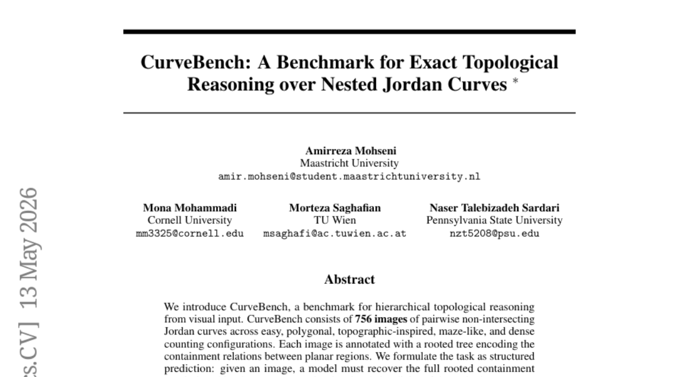

### 📌 한 줄 요약
중첩된 조르단 곡선(Jordan curves)의 포함 관계를 통한 계층적 위상 추론 능력을 평가하는 새로운 벤치마크 CurveBench 제안

### 🔑 핵심 포인트
- 계층적 위상 추론을 위한 756개의 정밀한 이미지 데이터셋 CurveBench 구축
- 이미지 내 곡선 간 포함 관계를 루트 트리(rooted tree)로 복구하는 구조적 예측 과제 정의
- RLVR 방식의 미세 조정을 통해 오픈 웨이트 모델의 위상 추론 성능 극대화 가능성 확인

### 🧑‍💻 개발자 관점
컴퓨터 비전 모델이 단순 객체 인식을 넘어, 복잡한 기하학적 구조와 계층적 관계를 이해하는 능력을 평가하고 개선하는 데 중요한 기준을 제공합니다.

### 🚀 실무 적용 아이디어
- 제공된 벤치마크 데이터셋을 활용하여 현재 사용 중인 VLM의 공간 추론 능력 테스트
- 구조적 예측 성능 향상을 위한 RLVR(Reinforcement Learning from Verifiable Rewards) 기법 적용 실험
- 복잡한 도면이나 지도 데이터 처리를 위한 위상 인식 모델 고도화 연구

### ⚠️ 리스크/한계
- 정교한 기하학적 구조에 대한 모델의 일반화 성능이 아직 부족함
- 난이도가 높은 설정(Hard)에서의 성능 격차가 커 실무 적용 시 제약이 존재함

### 📝 초록 기반 상세 설명
시각적 입력으로부터 계층적 위상 구조를 파악하는 것은 중요하지만 기존 모델들의 능력은 검증되지 않았습니다. 이를 위해 다양한 난이도의 중첩된 곡선 이미지와 포함 관계를 트리 구조로 매핑한 CurveBench를 개발했습니다. 모델이 이미지로부터 전체 포함 관계 트리를 복구하는 구조적 예측(structured prediction) 과제를 정의했습니다. 실험 결과, 최신 모델인 Gemini 3.1 Pro조차 난이도가 높은 설정에서 낮은 정확도를 보였습니다. 연구진은 RLVR 방식의 미세 조정을 통해 Qwen3-VL-8B 모델의 성능을 대폭 향상시켰습니다. 결과적으로 정밀한 위상 인식 시각 추론이 여전히 해결해야 할 과제임을 입증했습니다.

---

## 30. [BOOKMARKS: Efficient Active Storyline Memory for Role-playing](https://huggingface.co/papers/2605.14169)
**Upvotes**: 6 | **도입 난이도**: 중 | **신뢰도**: 상
**arXiv**: https://arxiv.org/abs/2605.14169

**태그**: Agent, Memory, RAG, NLP, Optimization

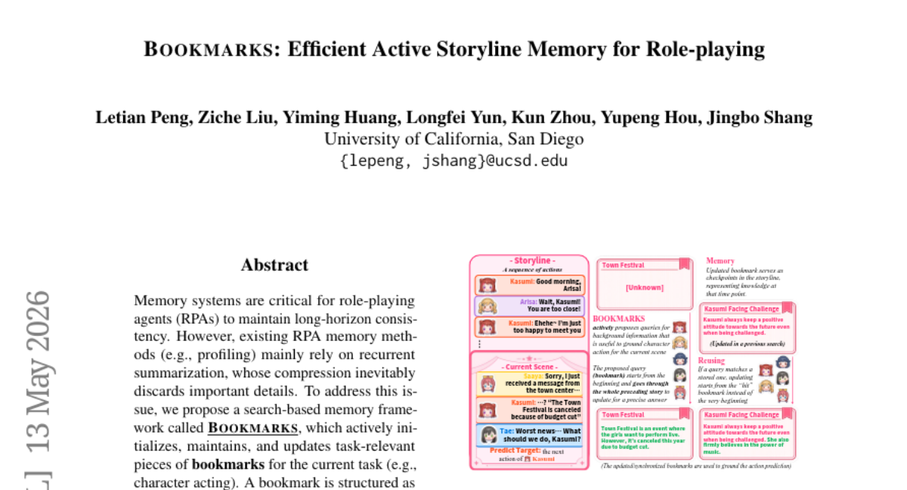

### 📌 한 줄 요약
재귀적 요약 방식의 정보 손실 문제를 해결하기 위해, 질문-답변 형태의 북마크를 활용하여 캐릭터의 일관성을 유지하는 검색 기반 메모리 프레임워크

### 🔑 핵심 포인트
- 질문-답변(QA) 구조의 북마크를 통한 정밀한 정보 유지
- 태스크별로 필요한 정보만 선택/초기화하는 능동적 메모리 관리
- 효율적인 동기화 메커니즘을 통한 개념, 행동, 상태 검색 지원

### 🧑‍💻 개발자 관점
단순 요약 방식이 가진 정보 손실 문제를 해결하여, 에이전트가 복잡한 페르소나와 세부 설정을 장기적으로 유지할 수 있는 아키텍처를 제시합니다.

### 🚀 실무 적용 아이디어
- 기존 요약 기반 에이전트와 BOOKMARKS 방식의 정보 유지력 비교 실험
- 다양한 페르소나 시나리오에서 북마크 동기화 효율성 테스트
- 대규모 대화 컨텍스트에서의 검색 속도 및 비용 분석

### ⚠️ 리스크/한계
- 북마크 생성 및 동기화 과정에서 발생하는 추가적인 연산 비용
- 질문 설계(Question Design)의 품질에 따른 메모리 정확도 의존성

### 📝 초록 기반 상세 설명
역할 수행 에이전트(RPA)가 장기적인 일관성을 유지하기 위해서는 효율적인 메모리 시스템이 필수적입니다. 기존의 프로파일링 방식은 재귀적 요약에 의존하여 중요한 세부 정보가 소실되는 문제가 있었습니다. 이를 해결하기 위해 본 논문은 태스크 관련 정보를 능동적으로 관리하는 검색 기반 프레임워크인 BOOKMARKS를 제안합니다. BOOKMARKS는 특정 시점의 질문에 대한 답변 형태로 북마크를 구조화하며, 태스크에 필요한 북마크를 선택, 초기화 및 동기화하여 재사용합니다. 실험 결과, BOOKMARKS는 다양한 캐릭터 시나리오에서 기존 메모리 베이스라인보다 뛰어난 성능을 입증했습니다.

---

## 31. [WildTableBench: Benchmarking Multimodal Foundation Models on Table Understanding In the Wild](https://huggingface.co/papers/2605.01018)
**Upvotes**: 6 | **도입 난이도**: 하 | **신뢰도**: 상
**arXiv**: https://arxiv.org/abs/2605.01018

**태그**: Multimodal, Benchmark, Table-Understanding, Vision-Language, Reasoning, Vision, Evaluation

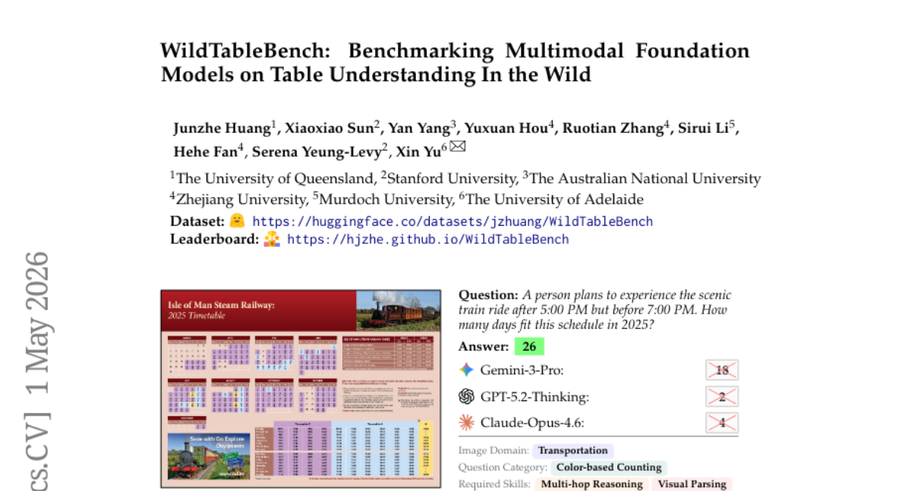

### 📌 한 줄 요약
실제 환경의 복잡한 표 이미지를 분석하기 위한 새로운 벤치마크 WildTableBench 제안 및 모델 성능 한계 분석

### 🔑 핵심 포인트
- 실제 웹/포럼 환경의 복잡한 레이아웃을 반영한 WildTableBench 벤치마크 구축
- 21개 최신 멀티모달 모델 대상의 광범위한 성능 평가 수행
- 구조적 인식 및 수치 추론 측면에서의 모델 실패 원인 분석

### 🧑‍💻 개발자 관점
현업에서 마주하는 비정형 표 이미지(스크린샷, 문서 등)를 처리할 때 모델이 겪는 구조적/논리적 한계를 파악하는 데 유용합니다.

### 🚀 실무 적용 아이디어
- 현재 사용 중인 멀티모달 모델을 WildTableBench에 적용하여 성능 테스트
- 모델의 구조적 인식 실패 패턴과 수치 추론 오류 유형 분류
- 복잡한 표 데이터 처리를 위한 프롬프트 엔지니어링 전략 수립

### ⚠️ 리스크/한계
- 실제 환경의 복잡성을 반영했으나 데이터셋 규모가 특정 도메인에 국한될 가능성
- 모델의 낮은 성능이 데이터 난이도 때문인지 모델 자체의 한계인지에 대한 추가 연구 필요

### 📝 초록 기반 상세 설명
멀티모달 모델을 활용한 표 이미지 분석은 실무적 가치가 높지만, 기존 평가는 정제된 데이터에 치중되어 실제 환경의 복잡성을 반영하지 못합니다. 이를 해결하기 위해 다양한 도메인과 레이아웃을 포함하는 실세계 표 이미지 기반의 QA 벤치마크인 WildTableBench를 도입합니다. 402개의 고밀도 표 이미지와 928개의 수동 검증된 질문 세트를 구축하여 21개의 최신 멀티모달 모델을 평가했습니다. 실험 결과, 대부분의 모델이 50% 미만의 낮은 정확도를 보이며 구조적 인식과 추론 능력의 한계를 드러냈습니다. 본 연구는 모델의 취약점을 진단하고 실무적인 표 이해 능력을 향상시키기 위한 기초를 제공합니다.

---

## 32. [Learning to Build the Environment: Self-Evolving Reasoning RL via Verifiable Environment Synthesis](https://huggingface.co/papers/2605.14392)
**Upvotes**: 5 | **도입 난이도**: 상 | **신뢰도**: 상
**arXiv**: https://arxiv.org/abs/2605.14392

**태그**: Reinforcement Learning, Self-Evolving, Environment Synthesis, Reasoning, RAG, Vision

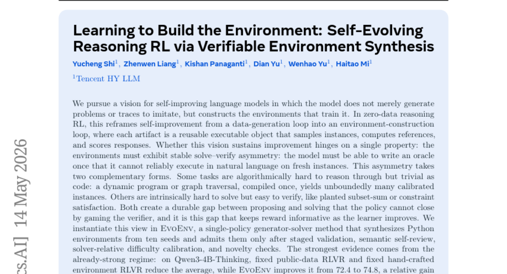

### 📌 한 줄 요약
데이터 생성 중심의 RL에서 벗어나, 모델이 스스로 해결하기 어려운 검증 가능한 환경(Environment)을 구축하여 지속적인 성능 향상을 도모하는 방법론

### 🔑 핵심 포인트
- 데이터 생성 루프를 넘어선 '환경 구축 루프(Environment-construction loop)' 개념 도입
- 해결(Solve)과 검증(Verify) 사이의 비대칭성을 활용하여 모델의 편법(Gaming) 방지
- EvoEnv: 검증, 자기 검토, 난이도 보정, 신규성 체크를 포함한 자동화된 환경 합성 프레임워크

### 🧑‍💻 개발자 관점
단순히 양질의 데이터를 모으는 것보다, 모델이 스스로 넘기 힘든 '규칙과 검증 로직'이 포함된 시뮬레이션 환경을 설계하는 것이 고도화된 추론 모델 학습의 핵심임을 시사합니다.

### 🚀 실무 적용 아이디어
- 특정 알고리즘 문제(그래프, 동적 계획법 등)를 검증할 수 있는 Python 환경 코드 생성 실험
- 생성된 환경의 난이도가 모델의 현재 성능과 적절히 매칭되는지 확인하는 Calibration 실험
- 모델이 생성한 환경을 통해 새로운 추론 태스크를 무한히 샘플링하는 파이프라인 구축

### ⚠️ 리스크/한계
- 환경 생성 로직 자체가 모델의 성능에 종속될 경우, 특정 도메인에 과적합될 위험
- 복잡한 환경 코드를 생성할 때 발생하는 버그나 논리적 오류 관리의 어려움

### 📝 초록 기반 상세 설명
기존의 자기 개선(Self-improvement) 방식은 단순히 데이터를 생성하거나 모방하는 데 치중하여 모델의 성장에 한계가 있었습니다. 본 논문은 모델이 스스로 학습용 환경을 구축하는 '환경 구축 루프'로의 패러다임 전환을 제안합니다. 이를 위해 모델이 코드로 작성한 오라클(Oracle)은 풀 수 있지만, 자연어 추론으로는 풀기 어려운 '해결-검증 비대칭성'을 가진 환경을 생성하는 것이 핵심입니다. 제안된 EvoEnv 프레임워크는 10개의 시드에서 시작하여 검증과 난이도 조절을 거친 Python 환경을 합성합니다. 실험 결과, 기존의 고정된 데이터 기반 RL보다 더 높은 성능 향상을 달끔했습니다. 결론적으로 모델의 지속적 성장은 데이터 양이 아닌, 모델의 능력을 넘어서는 구조적 난이도를 가진 환경 구축 능력에 달려 있습니다.

---

## 33. [PhyMotion: Structured 3D Motion Reward for Physics-Grounded Human Video Generation](https://huggingface.co/papers/2605.14269)
**Upvotes**: 5 | **도입 난이도**: 상 | **신뢰도**: 상
**arXiv**: https://arxiv.org/abs/2605.14269

**태그**: Video Generation, Physics-based, Reinforcement Learning, 3D Human Motion, Vision, Video, Evaluation

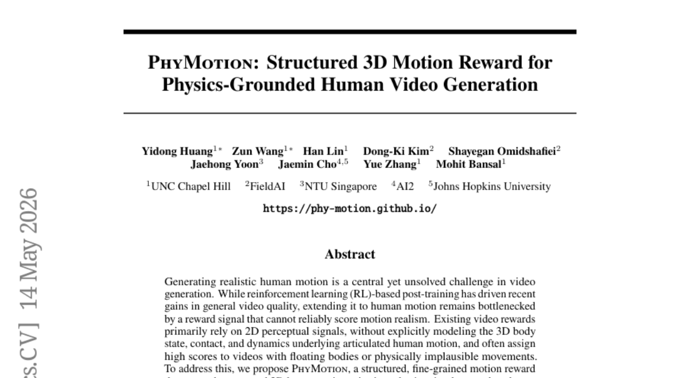

### 📌 한 줄 요약
물리 시뮬레이터를 활용한 3D 모션 보상 체계를 통해 비디오 생성 모델의 인체 움직임 현실성을 극대화한 연구

### 🔑 핵심 포인트
- SMPL 메쉬와 MuJoCo 시뮬레이터를 결합한 3D 기반 물리 보상 체계 구축
- 운동학, 접촉/균형, 동역학의 세 가지 차원을 통한 정밀한 모션 평가
- RL 기반 사후 학습(Post-training)을 통한 비디오 생성 모델의 모션 품질 개선

### 🧑‍💻 개발자 관점
단순히 시각적으로 그럴듯한 영상을 넘어, 물리 법칙을 준수하는 고품질 인체 애니메이션/비디오 생성 파이프라인 구축에 핵심적인 방법론을 제시합니다.

### 🚀 실무 적용 아이디어
- SMPL 모델 및 MuJoCo 시뮬레이터 연동 파이프라인 구축 테스트
- 기존 2D 기반 비디오 생성 모델에 PhyMotion 보상 함수 적용 실험
- 생성된 모션의 물리적 정합성 측정을 위한 데이터셋 준비

### ⚠️ 리스크/한계
- 3D 메쉬 복원 및 시뮬레이션 과정에서 발생하는 연산 오버헤드
- 복잡한 환경이나 상호작용이 포함된 경우 물리 엔진의 정확도 의존성

### 📝 초록 기반 상세 설명
최근 비디오 생성 기술의 발전에도 불구하고, 인체의 복잡한 움직임을 물리적으로 정확하게 생성하는 것은 여전히 어려운 과제입니다. 기존의 2D 기반 보상 모델은 3D 신체 상태나 물리적 접촉을 고려하지 못해 공중 부양이나 부자연스러운 움직임을 유발하는 한계가 있습니다. 이를 해결하기 위해 본 논문은 PhyMotion을 제안하며, 생성된 비디오에서 SMPL 메쉬를 추출하고 MuJoCo 시뮬레이터에 적용하여 물리적 타당성을 평가합니다. 보상 체계는 운동학적 타당성, 접촉 및 균형, 동역학적 실현 가능성이라는 세 가지 축을 통해 정밀한 피드백을 제공합니다. 실험 결과, PhyMotion은 인간의 판단과 높은 상관관계를 보였으며, RL 기반 사후 학습 시 기존 방식보다 월등한 모션 현실성 향상을 달성했습니다.

---

## 34. [PRISM: Prior Rectification and Uncertainty-Aware Structure Modeling for Diffusion-Based Text Image Super-Resolution](https://huggingface.co/papers/2605.13027)
**Upvotes**: 5 | **도입 난이도**: 중 | **신뢰도**: 상
**arXiv**: https://arxiv.org/abs/2605.13027

**태그**: Diffusion, Text-SR, Computer Vision, Image Restoration, Vision, Benchmark, Inference

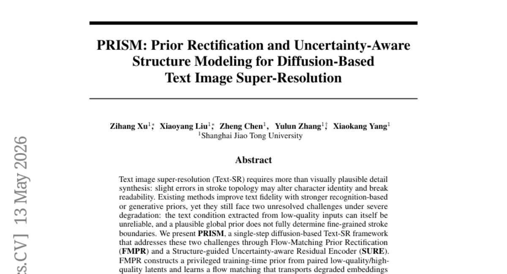

### 📌 한 줄 요약
글자 식별 오류를 최소화하기 위해 사전 학습된 정보와 구조적 불확실성을 동시에 제어하는 고속 확산 기반 텍스트 초해상도(Text-SR) 프레임워크

### 🔑 핵심 포인트
- FMPR: 저화질 임베딩을 고화질 잠재 공간으로 정렬하는 Flow-Matching 기반 사전 정정 기술
- SURE: 불확실성을 고려한 구조적 잔차 예측을 통해 모호한 획 정보를 억제하고 경계 정밀도 향상
- Single-step Diffusion: 단일 단계 추론을 통해 높은 성능과 밀리초 단위의 빠른 속도 확보

### 🧑‍💻 개발자 관점
글자 뭉개짐이 심한 저화질 문서나 표지판 이미지 복원 시, 텍스트 식별 오류를 줄이면서도 빠른 추론 속도가 필요한 서비스에 즉시 적용 가능합니다.

### 🚀 실무 적용 아이디어
- 제공된 GitHub 코드를 활용하여 다양한 노이즈 수준(Degradation)에서의 복원 성능 테스트
- 실제 환경의 저화질 텍스트 데이터셋을 통한 실시간 추론 속도(Latency) 검증
- 기존 Diffusion 모델 대비 획(Stroke) 경계의 선명도 및 OCR 인식률 비교 실험

### ⚠️ 리스크/한계
- 학습 시 사용된 고화질/저화질 쌍(Paired data)의 품질에 따라 복원 성능이 크게 좌우될 수 있음
- 매우 복잡한 폰트나 특수 문자의 경우 구조적 잔차 예측이 어려울 가능성 존재

### 📝 초록 기반 상세 설명
텍스트 초해상도(Text-SR) 작업은 단순한 화질 개선을 넘어 글자의 가독성과 식별력을 유지하는 것이 핵심입니다. 기존 방식은 저화질 입력에서 추출된 텍스트 정보 자체가 부정확하거나, 전역적 사전 정보가 미세한 획 경계까지 완벽히 잡아내지 못하는 한계가 있습니다. 이를 해결하기 위해 PRISM은 Flow-Matching Prior Rectification(FMPR)과 Structure-guided Uncertainty-aware Residual Encoder(SURE)를 제안합니다. FMPR은 학습 시 고화질 잠재 공간을 활용해 저화질 임베딩을 복원 지향적 공간으로 이동시키며, SURE는 불확실성을 고려한 구조적 잔차를 예측하여 정교한 획 경계를 생성합니다. 실험 결과, PRISM은 실시간 수준의 추론 속도를 유지하면서도 최첨단 성능을 달성했습니다.

---

## 35. [Aligning Latent Geometry for Spherical Flow Matching in Image Generation](https://huggingface.co/papers/2605.15193)
**Upvotes**: 4 | **도입 난이도**: 하 | **신뢰도**: 상
**arXiv**: https://arxiv.org/abs/2605.15193

**태그**: Generative Models, Flow Matching, Latent Space, Computer Vision, Vision, Safety

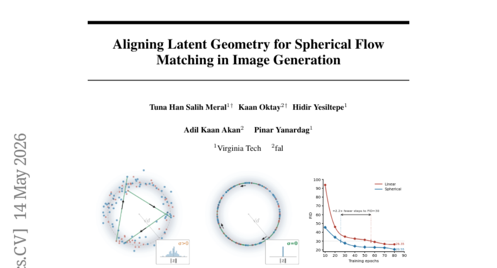

### 📌 한 줄 요약
잠재 공간의 구형 기하학적 특성을 활용하여 선형 보간 대신 구면 선형 보간(Slerp)을 적용함으로써 이미지 생성 품질을 높이는 Flow Matching 기법

### 🔑 핵심 포인트
- 잠재 공간의 데이터가 구형 껍질에 집중되어 있다는 기하학적 특성 포착
- 선형 보간 대신 구면 선형 보간(Slerp)과 구면 투영을 통한 지오데식(geodesic) 경로 확보
- 추가적인 인코더나 복잡한 정렬 목적함수 없이 기존 디코더 미세 조정만으로 성능 개선

### 🧑‍💻 개발자 관점
기존 Diffusion/Flow 모델의 아키텍처를 건드리지 않고도 잠재 공간의 기하학적 정렬만으로 생성 품질을 높일 수 있는 효율적인 방법론을 제시합니다.

### 🚀 실무 적용 아이디어
- 기존 VAE/Diffusion 모델의 잠재 공간에서 데이터의 반지름 분포 확인하기
- Linear Interpolation 대신 Slerp를 적용하여 생성 경로의 변화 관찰하기
- 고정된 반지름을 가진 구면 투영 레이어를 디코더 학습에 적용해보기

### ⚠️ 리스크/한계
- 특정 VAE 잠재 공간의 기하학적 특성에 의존할 수 있음
- 반지듐 투영 과정에서 정보 손실이 발생할 가능성

### 📝 초록 기반 상세 설명
기존의 잠재 공간 Flow Matching은 가우시안 노이즈와 VAE 잠재 변수 사이를 선형 경로로 연결하지만, 두 지점이 구형 껍질(spherical shell)에 집중되어 있어 선형 경로가 이 껍질을 벗어나는 문제가 발생합니다. 연구진은 잠재 토큰의 정보가 주로 방향(angular)에 있고 반지름(radial)은 부차적이라는 점을 확인했습니다. 이를 해결하기 위해 데이터 잠재 변수를 고정된 반지름으로 투영하고, 노이즈 또한 구면 사전 확률로 사용하며, 선형 보간 대신 구면 선형 보간(Slerp)을 적용했습니다. 또한 디코더를 미세 조정하여 구면 기하학에 최적화했습니다. 그 결과, 확산 모델 구조 변경 없이도 ImageNet-256 FID 성능을 일관되게 향상시켰습니다.

---

## 36. [Sat3DGen: Comprehensive Street-Level 3D Scene Generation from Single Satellite Image](https://huggingface.co/papers/2605.14984)
**Upvotes**: 4 | **도입 난이도**: 중 | **신뢰도**: 상
**arXiv**: https://arxiv.org/abs/2605.14984

**태그**: 3D Generation, Satellite Imagery, Digital Twin, Computer Vision, Vision, Video, Benchmark

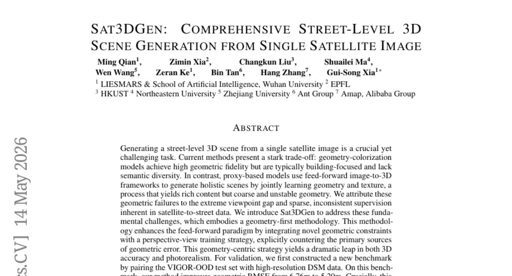

### 📌 한 줄 요약
단일 위성 이미지를 활용해 정교한 기하학적 구조와 사실적인 텍스처를 갖춘 거리 수준의 3D 장면을 생성하는 기술

### 🔑 핵심 포인트
- Geometry-first 방법론: 시점 차이 극복을 위한 새로운 기하학적 제약 및 투영 시점 학습 전략 도입
- 정밀한 3D 재구성: 기존 모델 대비 낮은 RMSE와 높은 시각적 사실성(FID 개선) 달성
- 높은 범용성: 시맨틱 맵 기반 합성, 비디오 생성, 대규모 메싱 등 다양한 응용 가능성 입증

### 🧑‍💻 개발자 관점
위성 데이터를 기반으로 고품질 3D 디지털 트윈이나 가상 환경을 자동 생성할 수 있어, 도시 모델링 및 자율주행 시뮬레이션 환경 구축에 혁신적인 효율을 제공합니다.

### 🚀 실무 적용 아이디어
- 제공된 GitHub 코드를 활용하여 특정 도시 지역의 위성 이미지로 3D 모델 생성 테스트
- 생성된 3D 에셋을 Unity/Unreal 엔진에 임포트하여 시각적 품질 및 메쉬 안정성 검증
- 기존의 단순 텍스처 매핑 방식과 Sat3DGen의 기하학적 정밀도 비교 실험

### ⚠️ 리스크/한계
- 위성 이미지의 해상도 및 데이터 품질에 따른 생성 결과의 의존성 존재
- 복잡한 도시 구조물(고층 빌딩 밀집 지역 등)에서의 기하학적 왜곡 가능성

### 📝 초록 기반 상세 설명
위성 이미지로부터 거리 수준의 3D 장면을 생성하는 것은 시점 차이와 데이터 불일치로 인해 매우 어려운 과제입니다. 기존 방식은 기하학적 정확도와 시각적 풍부함 사이의 트레이드오프 문제가 존재했습니다. 본 논문은 이를 해결하기 위해 기하학적 제약 조건과 투영 시점 학습 전략을 결합한 'Geometry-first' 방법론인 Sat3DGen을 제안합니다. 이 방식은 위성-거리 간의 극심한 시점 차이로 인한 기하학적 오류를 효과적으로 억제합니다. 실험 결과, 기존 모델 대비 기하학적 오차(RMSE)를 크게 줄였으며 FID 지표를 개선하여 높은 사실성을 입증했습니다. 또한, 생성된 3D 자산은 다양한 다운스트림 작업에 활용 가능한 범용성을 보여줍니다.

---

## 37. [FutureSim: Replaying World Events to Evaluate Adaptive Agents](https://huggingface.co/papers/2605.15188)
**Upvotes**: 4 | **도입 난이도**: 중 | **신뢰도**: 상
**arXiv**: https://arxiv.org/abs/2605.15188

**태그**: AI Agent, Benchmark, Long-horizon, Adaptation, Agent, Reasoning, Evaluation

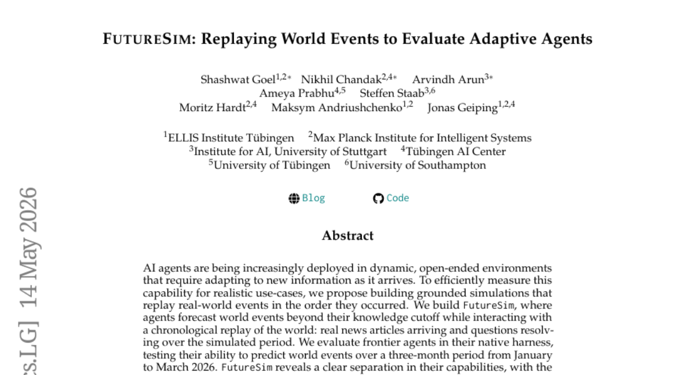

### 📌 한 줄 요약
실제 세계의 사건 흐름을 재현하여 에이전트의 장기적 적응 및 예측 능력을 평가하는 벤치마크 FutureSim 제안

### 🔑 핵심 포인트
- 실제 세계의 사건 흐름을 시간 순서대로 재현하는 Grounded Simulation 환경 구축
- 지식 컷오프 이후의 사건을 예측하는 에이전트의 적응 및 추론 능력 평가
- 장기적 관점의 테스트 타임 적응(TTA), 검색, 메모리, 불확실성 추론 연구를 위한 프레임워크 제공

### 🧑‍💻 개발자 관점
에이전트가 단순히 정적인 데이터에 답하는 것을 넘어, 시간에 따라 변화하는 정보 속에서 어떻게 지식을 업데이트하고 미래를 예측하는지 검증할 수 있습니다.

### 🚀 실무 적용 아이디어
- 에이전트의 메모리 관리 전략이 예측 정확도에 미치는 영향 실험
- RAG 시스템의 정보 업데이트 주기에 따른 성능 변화 테스트
- 모델의 불확실성 추론(Uncertainty Reasoning) 능력 측정

### ⚠️ 리스크/한계
- 실제 세계의 복잡성을 완벽하게 재현하기에는 시뮬레이션의 한계가 존재함
- 특정 시점의 뉴스 데이터에 의존하므로 데이터 편향이 발생할 수 있음

### 📝 초록 기반 상세 설명
동적인 환경에서 새로운 정보에 적응해야 하는 AI 에이전트의 능력을 측정하는 것은 점점 중요해지고 있습니다. 기존 방식으로는 현실적인 시나리오에서의 적응력을 평가하기 어렵다는 문제가 있습니다. 이를 해결하기 위해 실제 뉴스 데이터와 질문을 시간 순서대로 재현하는 시뮬레이션 환경인 FutureSim을 제안합니다. 에이전트는 지식 컷오프 이후의 사건을 예측하며 시뮬레이션된 세계와 상호작용합니다. 실험 결과, 최상위 에이전트조차 예측 정확도가 25%에 불과할 정도로 난이도가 높았으며 모델 간 성능 차이가 뚜렷하게 나타났습니다. 이 벤치마크는 장기적 테스트 타임 적응(test-time adaptation)과 추론 능력을 연구하는 데 유용한 틀을 제공합니다.

---

## 38. [Adaptive Teacher Exposure for Self-Distillation in LLM Reasoning](https://huggingface.co/papers/2605.11458)
**Upvotes**: 4 | **도입 난이도**: 중 | **신뢰도**: 상
**arXiv**: https://arxiv.org/abs/2605.11458

**태그**: LLM Reasoning, Self-Distillation, Reinforcement Learning, Teacher-Student Learning, RAG, Reasoning, Distillation

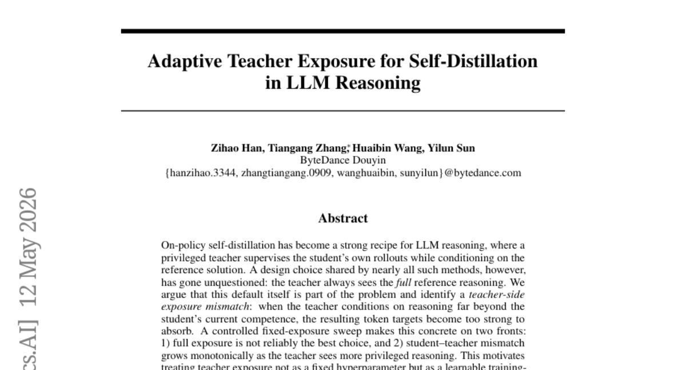

### 📌 한 줄 요약
LLM 추론 성능 향상을 위해 교사 모델의 정보 노출량을 학습 가능한 변수로 제어하는 적응형 자기 증류(Self-Distillation) 기법 제안

### 🔑 핵심 포인트
- 교사 모델의 정보 노출량(Teacher Exposure)이 학생 모델의 학습 효율에 미치는 미스매치 문제 규명
- 학습 상태 통계에 기반하여 최적의 노출 비율을 결정하는 경량 Beta-policy 컨트롤러 도입
- 즉각적인 손실 변화가 아닌 학생의 미래 학습 진척도를 기준으로 하는 보상 체계 설계

### 🧑‍💻 개발자 관점
모델 학습 시 정답(Ground Truth)을 무조건적으로 노출하는 것이 오히려 학습을 방해할 수 있음을 시사하며, 효율적인 지식 전수 전략을 제공합니다.

### 🚀 실무 적용 아이디어
- 기존 Self-Distillation 파이프라인에서 교사 모델의 컨텍스트 길이를 단계적으로 제한하며 성능 변화 관찰
- 학습 과정 중 학생 모델의 Loss 변화량과 정답 노출량 간의 상관관계 분석
- RL 기반의 보상 함수 설계 시 즉각적 Loss가 아닌 성능 향도(Improvement)를 지표로 활용해보기

### ⚠️ 리스크/한계
- 컨트롤러 학습을 위한 추가적인 연산 비용 및 하이퍼파라미터 튜닝 필요
- 특정 도메인(추론)에 특화된 기법으로 일반적인 생성 작업에 대한 범용성 검증 필요

### 📝 초록 기반 상세 설명
최근 LLM 추론 성능 향상을 위해 교사 모델이 정답을 참고하여 학생 모델의 생성 과정을 지도하는 온폴리시 자기 증류 방식이 널리 사용되고 있습니다. 그러나 기존 방식은 교사가 항상 전체 정답 추론 과정을 참조한다는 문제점이 있으며, 이는 학생 모델의 역량을 초과하는 너무 강력한 타겟을 생성하여 학습 효율을 저해합니다. 본 논문은 교사의 정보 노출량을 학습 가능한 제어 변수로 다루는 ATESD(Adaptive Teacher Exposure for Self-Distillation)를 제안합니다. ATESD는 경량화된 Beta-policy 컨트롤러를 통해 최적의 노출 비율을 결정하며, 학생의 미래 학습 진척도를 기준으로 보상을 설계하여 지연된 신용 할당 문제를 해결합니다. 실험 결과, AIME 및 HMMT 등 고난도 추론 벤치마크에서 기존 자기 증류 및 RL 방식보다 뛰어난 성능 향상을 입증하였습니다.

### 🖼️ 추가 자료
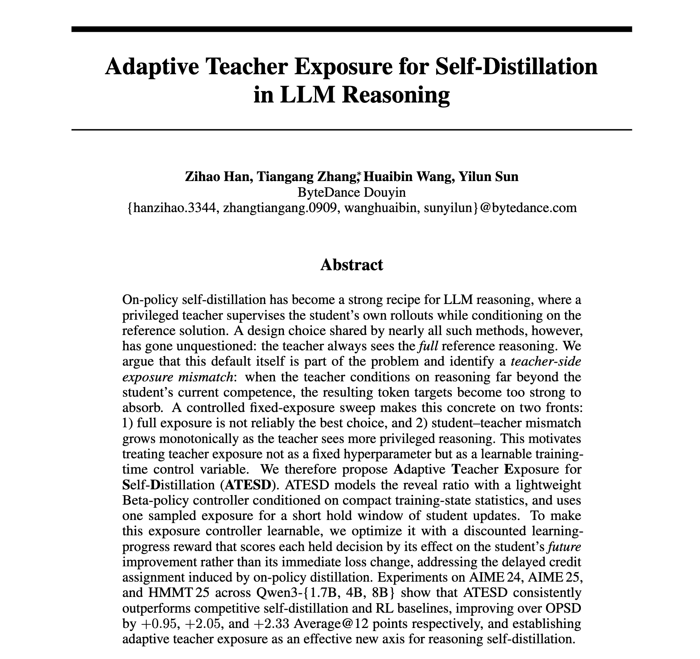

---

## 39. [Dynamic Latent Routing](https://huggingface.co/papers/2605.14323)
**Upvotes**: 3 | **도입 난이도**: 중 | **신뢰도**: 상
**arXiv**: https://arxiv.org/abs/2605.14323

**태그**: LLM, Reinforcement Learning, Post-training, Decision Making

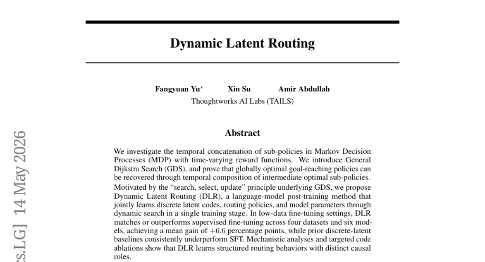

### 📌 한 줄 요약
GDS 알고리즘을 활용해 최적의 경로를 동적으로 탐색함으로써 저데이터 환경에서도 SFT를 능가하는 LLM 포스트 트레이닝 기법

### 🔑 핵심 포인트
- GDS(General Dijkstra Search)를 통한 전역 최적 정책 복구 이론 정립
- 잠재 코드와 라우팅 정책을 통합 학습하는 단일 단계 DLR 프레임워크 제안
- 저데이터 환경에서 기존 SFT를 능가하는 효율적인 포스트 트레이닝 성능

### 🧑‍💻 개발자 관점
데이터가 부족한 특수 도메인에서 모델을 미세 조정할 때, 단순 SFT보다 더 정교한 의사결정 경로를 학습시킬 수 있는 방법론을 제시합니다.

### 🚀 실무 적용 아이디어
- 소규모 데이터셋에서 SFT와 DLR의 성능 및 추론 경로 차이 비교 실험
- 다양한 태스크 조합 시 GDS 알고리즘의 수렴 속도 및 안정성 테스트
- 이산적 잠재 코드가 실제 모델의 추론 경로를 어떻게 제어하는지 시각화 분석

### ⚠️ 리스크/한계
- 학습 과정에서의 동적 탐색(Dynamic Search)에 따른 계산 복잡도 증가 가능성
- 특정 도메인에 최적화된 라우팅 정책이 일반적인 대화 능력에 미칠 영향

### 📝 초록 기반 상세 설명
시간에 따라 변하는 보상 함수를 가진 MDP 환경에서 하위 정책의 시간적 결합 문제를 다룹니다. 이를 해결하기 위해 중간 단계의 최적 정책들을 결합하여 전역 최적 정책을 도출하는 General Dijkstra Search(GDS)를 제안합니다. 이 원리를 바탕으로 이산적 잠재 코드, 라우팅 정책, 모델 파라미터를 단일 학습 단계에서 동시에 학습하는 Dynamic Latent Routing(DLR)을 개발했습니다. 실험 결과, DLR은 저데이터 미세 조정 환경에서 기존 SFT와 유사하거나 더 높은 성능을 보였습니다. 또한 메커니즘 분석을 통해 DLR이 구조화된 라우팅 동작을 학습함을 입증했습니다.

### 🖼️ 추가 자료
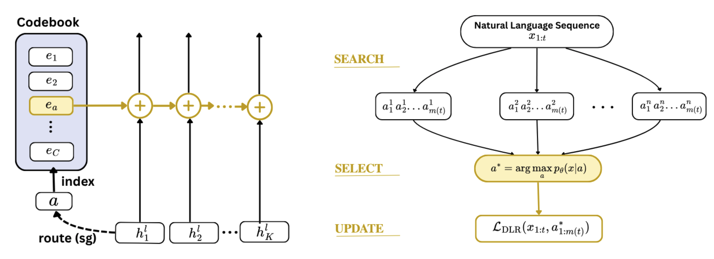

---

## 40. [Boosting Omni-Modal Language Models: Staged Post-Training with Visually Debiased Evaluation](https://huggingface.co/papers/2605.12034)
**Upvotes**: 3 | **도입 난이도**: 중 | **신뢰도**: 상
**arXiv**: https://arxiv.org/abs/2605.12034

**태그**: Multi-modal, Post-training, Model-Evaluation, Self-distillation, Vision, Audio, Benchmark, Evaluation, Distillation

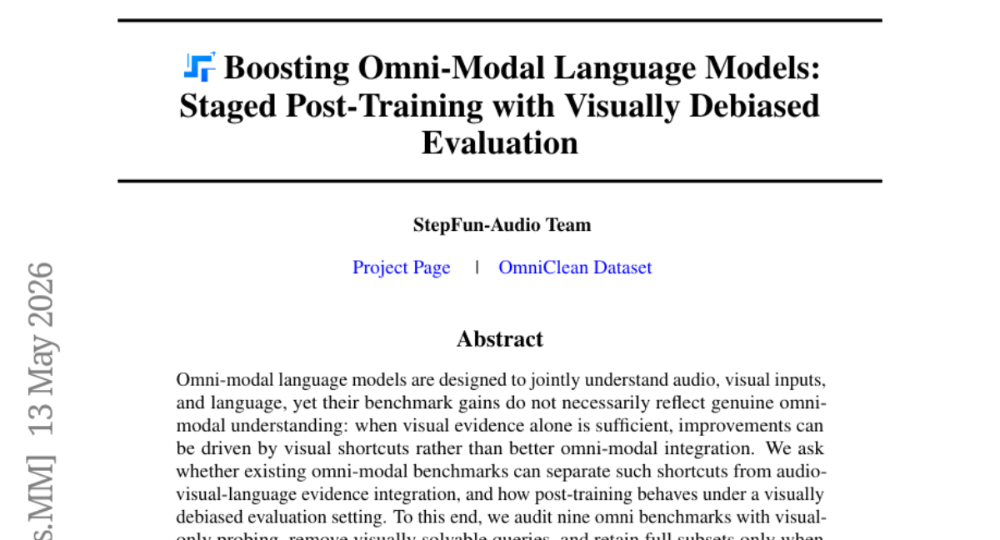

### 📌 한 줄 요약
시각적 편향을 제거한 정제된 벤치마크(OmniClean)를 통해 소형 멀티모달 모델의 성능을 극대화하는 단계별 사후 학습 기법 제안

### 🔑 핵심 포인트
- 시각적 편향을 제거하여 진정한 멀티모달 통합 능력을 측정하는 OmniClean 데이터셋 구축
- SFT, RLVR, Self-distillation로 이어지는 3단계 단계별 사후 학습(OmniBoost) 방법론 제안
- 소형 모델(3B)이 자가 증류를 통해 대형 모델 수준의 성능을 달성할 수 있음을 입증

### 🧑‍💻 개발자 관점
모델의 성능이 실제 멀티모달 통합 능력인지 아니면 단순 시각적 편향인지 구분할 수 있는 평가 기준과 소형 모델 최적화 전략을 제공합니다.

### 🚀 실무 적용 아이디어
- 현재 사용 중인 멀티모달 벤치마크에 시각 전용 프롬프트를 적용하여 데이터 누수 여부 확인
- 소형 모델 학습 시 RLVR과 자가 증류를 결합한 단계별 학습 파이프라인 실험
- 학습 데이터셋 내 시각적 편향 제거를 위한 필터링 로직 구현

### ⚠️ 리스크/한계
- 시각적 편향을 제거할 경우 전체적인 벤치마크 점수가 급격히 하락하여 성능 지표 해석이 어려울 수 있음
- 자가 증류 과정에서 특정 모달리티에 대한 의존도가 다시 높아질 위험 존재

### 📝 초록 기반 상세 설명
기존 멀티모달 모델 벤치마크는 시각 정보만으로도 정답을 맞힐 수 있는 '시각적 지름길(visual shortcuts)'로 인해 성능이 과대평가되는 문제가 있습니다. 연구진은 9개의 벤치마크를 검증하여 시각적 편향을 제거한 정제된 데이터셋인 OmniClean을 구축했습니다. 이를 바탕으로 혼합 이중 모달 SFT, RLVR, 자가 증류(Self-distillation)로 구성된 3단계 사후 학습 레시피인 OmniBoost를 제안합니다. 실험 결과, 3B 규모의 소형 모델이 자가 증류를 통해 훨씬 큰 모델인 Qwen3-Omni-30B 수준의 성능에 근접하는 성과를 보였습니다. 이는 평가의 신뢰성을 확보하고 소형 모델의 잠재력을 끌어올리는 효과적인 방법론을 제시합니다.

---

## 41. [Topology-Preserving Neural Operator Learning via Hodge Decomposition](https://huggingface.co/papers/2605.13834)
**Upvotes**: 3 | **도입 난이도**: 상 | **신뢰도**: 상
**arXiv**: https://arxiv.org/abs/2605.13834

**태그**: Physics-Informed ML, Neural Operator, Hodge Theory, Geometric Deep Learning

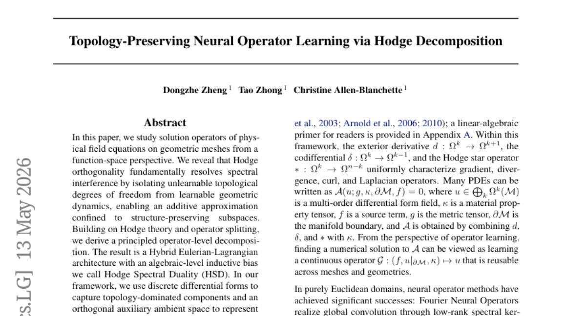

### 📌 한 줄 요약
Hodge 분해를 통해 물리적 위상 구조와 국소적 동역학을 분리하여 학습 효율과 물리적 보존성을 극대화한 신경 연산자 모델

### 🔑 핵심 포인트
- Hodge 분해를 통한 위상적 성분과 국소 동역학의 직교적 분리
- Hodge Spectral Duality(HSD)라는 새로운 하이브리드 아키텍처 제안
- 물리적 불변성(Physical Invariants)을 보존하는 구조적 유도 편향(Inductive Bias) 도입

### 🧑‍💻 개발자 관점
물리 법칙을 따르는 시뮬레이션 모델링 시, 데이터의 기하학적 구조가 복잡하더라도 물리적 정합성을 깨뜨리지 않고 안정적인 학습이 가능합니다.

### 🚀 실무 적용 아이디어
- 제공된 GitHub 코드를 활용하여 다양한 기하학적 메시(Mesh) 데이터셋에 적용해보기
- 기존 Neural Operator 모델과 HSD 모델 간의 물리적 보존성(Invariants) 비교 실험
- 복잡한 위상 구조를 가진 그래프 데이터에서의 수렴 속도 테스트

### ⚠️ 리스크/한계
- Hodge 분해 및 이산 미분 형식 적용을 위한 고도의 수학적 이해도 필요
- 메시 구조가 복잡해질수록 연산 비용이 증가할 가능성

### 📝 초록 기반 상세 설명
물리적 장 방정식(field equations)을 기하학적 메시 위에서 학습할 때, 위상적 특성과 복잡한 국소 동역학이 섞여 발생하는 스펙트럼 간섭이 학습의 난제로 작용합니다. 본 논문은 Hodge 분해를 활용하여 학습 불가능한 위상적 자유도와 학습 가능한 기하학적 동역학을 직교적으로 분리하는 방법을 제안합니다. 이를 위해 Hodge 이론과 연산자 분해를 결합한 'Hodge Spectral Duality(HSD)'라는 하이브리드 오일러-라그랑주 아키텍처를 설계했습니다. 이 구조는 이산 미분 형식(discrete differential forms)으로 위상 성분을 캡처하고, 보조 공간을 통해 국소 동역학을 표현합니다. 실험 결과, 기하학적 그래프 환경에서 물리적 불변성을 유지하면서도 높은 정확도와 효율성을 달성했습니다.

---

## 42. [RewardHarness: Self-Evolving Agentic Post-Training](https://huggingface.co/papers/2605.08703)
**Upvotes**: 3 | **도입 난이도**: 중 | **신뢰도**: 상
**arXiv**: https://arxiv.org/abs/2605.08703

**태그**: Agentic-Workflow, Reward-Modeling, Image-Editing, Self-Evolving, Agent, RAG, Reasoning, Vision, Benchmark, Evaluation

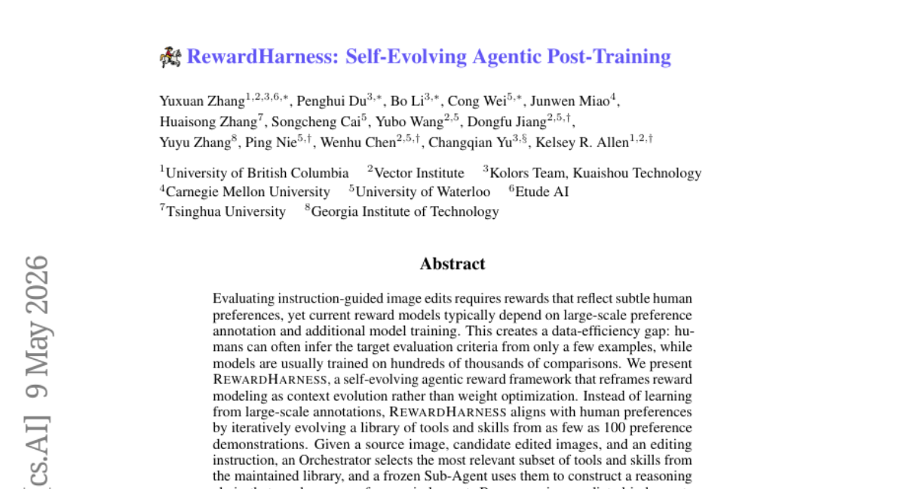

### 📌 한 줄 요약
데이터 효율성을 극대화하기 위해 도구 라이브러리를 스스로 진화시키는 에이전트 기반 보상 모델링 프레임워크

### 🔑 핵심 포인트
- 가중치 학습 대신 도구/기술 라이브러리를 진화시키는 컨텍스트 기반 보상 모델링
- 최소한의 데이터(100개 미만)로 인간의 선호도를 학습하는 높은 데이터 효율성
- 오케스트레이터와 서브 에이전트 간의 협업을 통한 자동화된 추론 및 피드백 루프

### 🧑‍💻 개발자 관점
대규모 데이터셋 구축 없이도 소량의 예시만으로 특정 도메인에 특화된 고성능 보상 모델을 구축할 수 있는 방법론을 제시합니다.

### 🚀 실무 적용 아이디어
- 소량의 선호도 데이터셋을 활용한 에이전트 기반 추론 체인 구축 실험
- 도구 라이브러리 자동 업데이트 로직의 안정성 테스트
- GRPO와 같은 강화학습 알고리즘에 에이전트 보상 신호 적용

### ⚠️ 리스크/한계
- 에이전트의 추론 과정이 복잡해질 경우 발생하는 연산 비용 및 지연 시간
- 도구 라이브러리가 잘못된 방향으로 진화할 경우 발생하는 성능 드리프트

### 📝 초록 기반 상세 설명
이미지 편집 평가를 위한 보상 모델은 미세한 인간의 선호도를 반영해야 하지만, 기존 방식은 대규모 데이터셋과 추가 학습이 필요하다는 한계가 있습니다. 이를 해결하기 위해 RewardHarness는 보상 모델링을 가중치 최적화가 아닌 '컨텍스트 진화'로 재정의하는 에이전트 프레임워크를 제안합니다. 이 시스템은 소수의 예시만으로 도구와 기술 라이브러리를 반복적으로 업데이트하며 인간의 선호도에 정렬됩니다. 오케스트레이터가 적절한 도구를 선택하고 서브 에이전트가 추론 체인을 구축하여 판단을 내리는 구조입니다. 실험 결과, 매우 적은 데이터(0.05%)만으로도 기존 모델을 능가하는 높은 정확도를 달성했으며 RL 미세조정 시에도 우수한 성능을 보였습니다.

---

## 43. [Unlocking Complex Visual Generation via Closed-Loop Verified Reasoning](https://huggingface.co/papers/2605.14876)
**Upvotes**: 2 | **도입 난이도**: 상 | **신뢰도**: 상
**arXiv**: https://arxiv.org/abs/2605.14876

**태그**: Generative AI, Diffusion Models, Reinforcement Learning, Multi-modal, Reasoning, Multimodal, Vision, Benchmark, Inference, Distillation, Safety

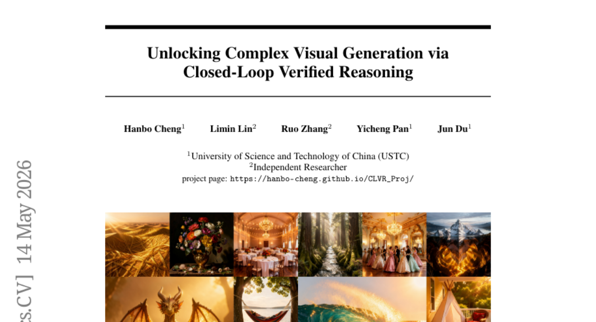

### 📌 한 줄 요약
복잡한 시각적 생성을 위해 추론과 생성을 결합하고, 검증 루프와 가중치 병합을 통해 효율성을 극대화한 프레임워크

### 🔑 핵심 포인트
- CLVR 프레임워크: 시각-언어 논리 계획과 픽셀 생성 과정을 결합한 폐쇄 루프(Closed-Loop) 시스템
- PPRL(Proxy Prompt Reinforcement Learning): 멀티모달 이력을 명시적 보상 신호로 증류하여 긴 컨텍스트 최적화 안정성 확보
- DSWM(Δ-Space Weight Merge): 별도의 재학습 없이 가중치 병합을 통해 추론 단계(NFE)를 획기적으로 단축

### 🧑‍💻 개발자 관점
복잡한 프롬프트에 대한 이미지 생성 정확도를 높이면서도, 실무에서 치명적인 추론 지연 시간 문제를 효율적인 가중치 병합 기술로 해결했다는 점이 핵심입니다.

### 🚀 실무 적용 아이디어
- 제안된 DSWM 기법을 기존 Stable Diffusion 모델에 적용하여 NFE 감소 효과 검증
- 복잡한 논리 구조가 포함된 프롬프트 세트를 구성하여 CLVR의 추론 정확도 테스트
- PPRL 방식의 보상 신호 설계가 실제 생성 결과의 일관성에 미치는 영향 분석

### ⚠️ 리스크/한계
- 복잡한 추론 루프 도입으로 인한 시스템 아키텍처의 복잡도 증가
- 데이터 엔진 및 강화 학습 과정에서의 높은 초기 학습 비용 가능성

### 📝 초록 기반 상세 설명
기존의 단일 단계 텍스트-이미지 생성 모델은 복잡한 의미론적 요구를 충족하는 데 한계가 있으며, 기존의 다단계 추론 방식은 환각 현상과 높은 추론 지연 시간 문제를 안고 있습니다. 이를 해결하기 위해 본 논문은 시각-언어 논리 계획과 픽셀 단위 확산 생성을 결합한 CLVR 프레임워크를 제안합니다. CLVR는 단계별 시각적 검증을 통한 자동화된 데이터 엔진과, 긴 컨텍스트 최적화 문제를 해결하기 위한 Proxy Prompt Reinforcement Learning(PPRL)을 도입합니다. 또한, 반복적인 디노이징으로 인한 지연 시간을 줄이기 위해 Δ-Space Weight Merge(DSWM) 기법을 통해 단 4번의 NFE만으로 고품질 생성이 가능하도록 설계되었습니다. 실험 결과, CLVR는 오픈소스 모델 중 최고 성능을 기록하며 상용 모델 수준의 복잡한 시각 생성 능력을 보여주었습니다.

---

## 44. [LLM-based Detection of Manipulative Political Narratives](https://huggingface.co/papers/2605.14354)
**Upvotes**: 2 | **도입 난이도**: 중 | **신뢰도**: 상
**arXiv**: https://arxiv.org/abs/2605.14354

**태그**: LLM, Clustering, NLP, Unsupervised Learning, Reasoning

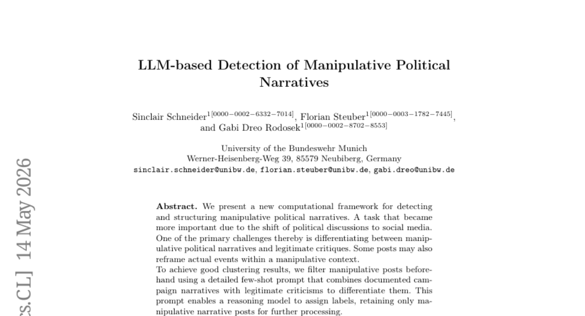

### 📌 한 줄 요약
LLM의 추론 능력과 비지도 학습 클러스터링을 결합하여 대규모 소셜 미디어 데이터 내 조작된 정치적 내러티브를 자동 탐지하는 프레임워크

### 🔑 핵심 포인트
- Few-shot 프롬프트를 활용한 조작적 내러티브와 정당한 비판의 정교한 사전 필터링
- UMAP 및 HDBSCAN을 결합한 비지도 학습 기반의 새로운 내러티브 클러스터 발견
- 대규모 데이터셋(120만 건 이상)에서 검증된 확장 가능한 탐지 파이프라인

### 🧑‍💻 개발자 관점
LLM의 추론 능력과 전통적인 클러스터링 기법을 결합하여, 사전 정의되지 않은 새로운 유형의 데이터 패턴을 탐지하는 워크플로우를 구축할 수 있습니다.

### 🚀 실무 적용 아이디어
- LLM 프롬프트 엔지니어링을 통한 데이터 필터링 정밀도 테스트
- UMAP/HDBSCAN 파라미터 변화에 따른 클러스터링 안정성 검증
- 다양한 도메인 데이터셋을 활용한 프레임워크의 일반화 성능 실험

### ⚠️ 리스크/한계
- LLM의 판단에 의존하는 필터링 단계에서의 편향성 발생 가능성
- 클러스터링 결과에 대한 사후 해석 과정에서의 주관적 개입 위험

### 📝 초록 기반 상세 설명
정치적 담론이 소셜 미디어로 이동함에 따라 조작된 내러티브와 정당한 비판을 구분하는 것이 중요한 과제가 되었습니다. 본 연구는 조작된 게시물을 선별하고 새로운 내러티브 패턴을 발견하기 위한 새로운 계산 프레임워크를 제안합니다. 먼저 정교한 Few-shot 프롬프트를 사용하여 조작된 게시물을 필터링하고, 남은 데이터를 UMAP과 HDBSCAN을 통해 비지도 방식으로 클러스터링합니다. 이후 추론 모델을 통해 각 클러스터의 핵심 내러티브를 추출합니다. 120만 개 이상의 게시물에 적용한 결과, 41개의 독특한 조작적 내러티브 클러스터를 성공적으로 식별하였습니다.

---

## 45. [Ideology Prediction of German Political Texts](https://huggingface.co/papers/2605.14352)
**Upvotes**: 2 | **도입 난이도**: 중 | **신뢰도**: 상
**arXiv**: https://arxiv.org/abs/2605.14352

**태그**: NLP, Transformer, Sentiment Analysis, Political Science

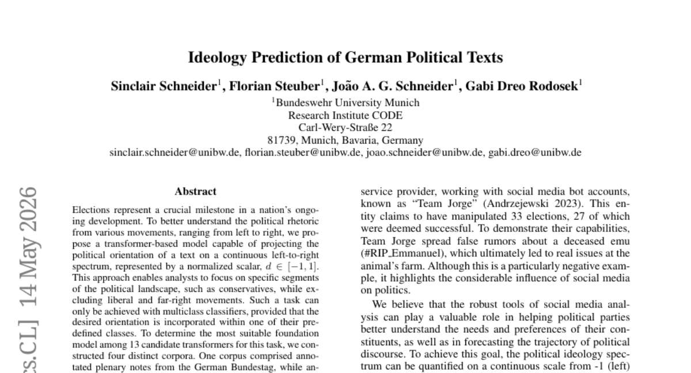

### 📌 한 줄 요약
트랜스포머 모델을 활용하여 독일 정치 텍스트의 이념적 성향을 연속적인 스펙트럼(-1에서 1 사이)으로 예측하는 방법론 연구

### 🔑 핵심 포인트
- 이념적 성향을 연속적인 수치(-1 ~ 1)로 예측하는 회귀 기반 접근 방식 제안
- 의회 기록, 뉴스, SNS 등 다양한 도메인에 걸친 4종의 데이터셋 구축 및 검증
- 모델 아키텍처와 도메인 특화 데이터가 편향 측정 성능에 미치는 영향 규명

### 🧑‍💻 개발자 관점
텍스트의 감성 분석을 넘어, 특정 주제에 대한 정치적/사회적 프레임과 편향성을 정량화하는 정교한 NLP 파이프라인 구축에 참고할 수 있습니다.

### 🚀 실무 적용 아이디어
- DeBERTa와 Gemma2 모델을 활용한 도메인 전이(Transfer Learning) 성능 비교 실험
- 연속적 스칼라 값을 활용한 정치적 스펙트럼 매핑 로직 구현
- 특정 도메인 데이터로 학습된 모델의 Out-of-domain 일반화 성능 테스트

### ⚠️ 리스크/한계
- 특정 언어(독일어) 및 특정 정치적 맥락에 국한된 결과일 수 있음
- 데이터셋의 편향이 모델의 편향으로 이어질 위험성 존재

### 📝 초록 기반 상세 설명
정치적 수사학의 성향을 이해하기 위해 텍스트의 이념적 위치를 연속적인 스칼라 값으로 투영하는 트랜스포머 기반 모델을 제안합니다. 기존의 다중 클래스 분류 방식과 달리 특정 정치적 스펙트럼 내의 세부 위치를 파악하는 것이 목적입니다. 이를 위해 연방의회 회의록, Wahl-O-Mat, 신문 기사, 트위터 등 네 가지 서로 다른 도메인의 코퍼스를 구축하여 실험을 진행했습니다. 실험 결과, 도메인 내 성능에서는 DeBERTa-large가, 신문 데이터와 같은 외부 도메인에서는 Gemma2-2B가 우수한 성능을 보였습니다. 연구 결과는 모델의 크기만큼이나 도메인 특화 데이터의 가용성이 정치적 편향 측정에 중요한 역할을 함을 시사합니다.

---

## 46. [Boosting Reinforcement Learning with Verifiable Rewards via Randomly Selected Few-Shot Guidance](https://huggingface.co/papers/2605.15012)
**Upvotes**: 1 | **도입 난이도**: 중 | **신뢰도**: 상
**arXiv**: https://arxiv.org/abs/2605.15012

**태그**: Reinforcement Learning, LLM, Fine-tuning, Sample Efficiency, Benchmark

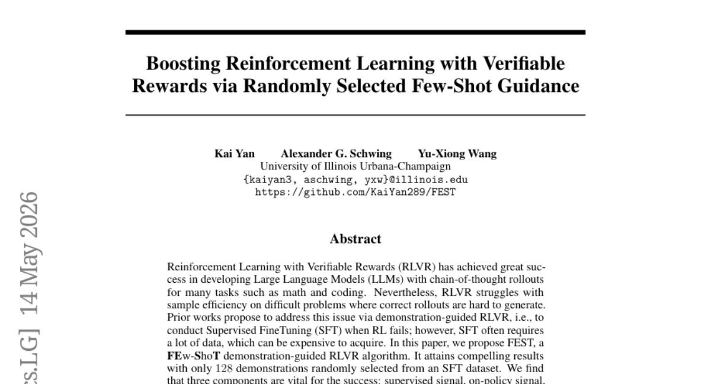

### 📌 한 줄 요약
적은 양의 데모 데이터만으로도 LLM의 추론 능력을 극대화하는 효율적인 RLVR 알고리즘 FEST 제안

### 🔑 핵심 포인트
- FEST: 소량의 데모 데이터로 RLVR의 샘플 효율성을 극대화하는 알고리즘
- 지도 학습(SFT)과 강화 학습(RL) 신호의 효과적인 결합
- 과적합 방지를 위한 SFT 데이터셋 가중치 감쇠(decaying weights) 전략 적용

### 🧑‍💻 개발자 관점
데이터 확보 비용이 큰 LLM 학습 환경에서, 소량의 고품질 데모만으로도 모델의 추론 성능을 효율적으로 끌어올릴 수 있는 실무적 방법론을 제시합니다.

### 🚀 실무 적용 아이디어
- 보유 중인 SFT 데이터셋에서 무작위로 소량의 샘플을 추출하여 FEST 알고리즘 적용 테스트
- SFT 가중치 감쇠(decaying weights) 스케줄에 따른 성능 변화 실험
- RLVR 환경에서 SFT 데이터 양에 따른 성능 임계점 확인

### ⚠️ 리스크/한계
- 매우 적은 데이터(128개)를 사용하므로 데이터의 품질에 따라 성능 편차가 클 수 있음
- 특정 도메인에 특화된 데모 데이터가 없을 경우 일반화 성능 저하 우려

### 📝 초록 기반 상세 설명
최근 수학 및 코딩 작업에서 검증 가능한 보상을 활용한 RLVR 방식이 성공을 거두고 있으나, 정답 생성 난이도가 높은 문제에서는 샘플 효율성이 떨어지는 문제가 있습니다. 기존에는 RL 실패 시 SFT를 병행하는 방식을 사용했으나, 이는 많은 양의 데이터가 필요하다는 비용 문제가 있었습니다. 본 논문에서는 SFT 데이터셋에서 무작위로 선택된 단 128개의 데모만으로도 높은 성능을 내는 FEST 알고리즘을 제안합니다. FEST는 지도 학습 신호, 온폴리시(on-policy) 신호, 그리고 과적합 방지를 위한 가중치 감쇠 기법을 결합하여 작동합니다. 실험 결과, FEST는 훨씬 적은 데이터로도 기존 베이스라인을 압도하며 전체 데이터셋을 사용한 성능에 근접하는 결과를 보였습니다.

---

## 47. [BEAM: Binary Expert Activation Masking for Dynamic Routing in MoE](https://huggingface.co/papers/2605.14438)
**Upvotes**: 1 | **도입 난이도**: 중 | **신뢰도**: 상
**arXiv**: https://arxiv.org/abs/2605.14438

**태그**: MoE, Inference Acceleration, CUDA, Efficiency, Inference

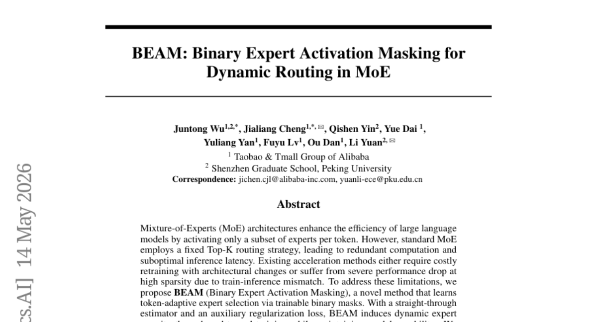

### 📌 한 줄 요약
학습 가능한 이진 마스크를 통해 모델 성능 저하 없이 MoE 연산량을 획기적으로 줄이는 동적 전문가 선택 기법

### 🔑 핵심 포인트
- 학습 가능한 이진 마스크(Binary Mask)를 통한 토큰 적응형 전문가 선택
- Straight-through estimator와 정규화 손실을 활용한 엔드투엔드 학습 방식
- vLLM 통합이 가능한 고성능 커스텀 CUDA 커널 구현

### 🧑‍💻 개발자 관점
모델 재설계 없이 기존 MoE 모델에 적용 가능한 플러그 앤 플레이 방식의 가속 솔루션으로서, 추론 비용 절감과 처리량 향상에 직접적인 도움을 줍니다.

### 🚀 실무 적용 아이디어
- 기존 MoE 모델에 BEAM의 이진 마스크 학습 로직 적용 테스트
- vLLM 환경에서의 커스텀 CUDA 커널 성능 벤치마크 수행
- 다양한 Sparsity 수준에 따른 모델 성능(Perplexity) 변화 측정

### ⚠️ 리스크/한계
- 학습 과정에서 이진 마스크 최적화를 위한 정교한 하이퍼파라미터 튜닝 필요
- 매우 높은 희소성 설정 시 모델의 지식 유지 능력이 저하될 가능성

### 📝 초록 기반 상세 설명
기존 MoE 모델은 고정된 Top-K 라우팅 방식을 사용하여 불필요한 연산이 발생하고 추론 지연 시간이 발생하는 문제가 있습니다. 기존 가속화 방식은 재학습 비용이 크거나 높은 희소성(sparsity) 적용 시 성능 저하가 심각하다는 한계가 있습니다. 이를 해결하기 위해 본 논문은 학습 가능한 이진 마스크를 통해 토큰별로 최적의 전문가를 선택하는 BEAM 방식을 제안합니다. Straight-through estimator와 보조 정규화 손실을 사용하여 모델 성능을 유지하면서도 동적인 전문가 희소성을 유도합니다. 또한 vLLM 프레임워크와 호환되는 커스텀 CUDA 커널을 구현하여 실질적인 추론 가속을 달성했습니다. 실험 결과, 모델 성능을 거의 유지하면서도 연산량(FLOPs)을 대폭 절감하고 디코딩 속도와 처리량을 크게 향상시켰습니다.

---

## 48. [LiSA: Lifelong Safety Adaptation via Conservative Policy Induction](https://huggingface.co/papers/2605.14454)
**Upvotes**: 1 | **도입 난이도**: 중 | **신뢰도**: 상
**arXiv**: https://arxiv.org/abs/2605.14454

**태그**: AI Agent, Guardrails, Safety, Policy Induction, Lifelong Learning, Agent, Inference

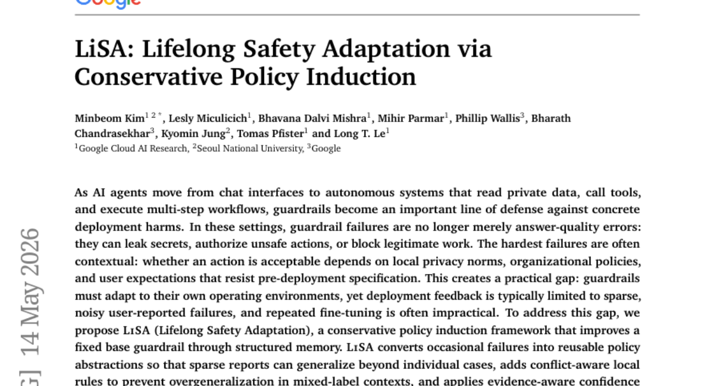

### 📌 한 줄 요약
희소하고 노이즈가 있는 피드백 환경에서도 에이전트의 안전 가드레일을 지속적으로 적응시키는 보수적 정책 유도 프레임워크

### 🔑 핵심 포인트
- 실패 사례를 재사용 가능한 정책 추상화로 변환하여 희소한 피드백의 일반화 성능 극대화
- 충돌 인지형 로컬 규칙(Conflict-aware local rules)을 통한 과잉 일반화 방지
- 사후 하한(Posterior lower bound) 기반의 증거 인지형 신뢰 게이팅으로 안정적인 메모리 활용

### 🧑‍💻 개발자 관점
실제 운영 환경에서 발생하는 불완전하고 노이즈 섞인 사용자 피드백만으로도 에이전트의 보안 정책을 안전하게 업데이트할 수 있는 실용적인 방법론을 제시합니다.

### 🚀 실무 적용 아이디어
- 사용자 피드백 데이터셋에 의도적인 노이즈(Label-flip)를 섞어 가드레일의 강건성 테스트 수행
- 에이전트의 특정 도구 호출(Tool-calling) 시나리오에서 정책 추상화가 어떻게 작동하는지 검증
- 기존 RAG 기반 가드레일에 LiSA의 메모리 구조를 결합하여 성능 변화 관찰

### ⚠️ 리스크/한계
- 정책 추상화 과정에서 발생할 수 있는 의도치 않은 정책 충돌 가능성
- 메모리 축적에 따른 시스템 복잡도 및 추론 지연 시간 관리 필요성

### 📝 초록 기반 상세 설명
AI 에이전트가 복잡한 워크플로우를 수행함에 따라, 맥락에 따른 보안 및 정책 위반 위험이 증가하고 있습니다. 기존 가드레일은 사전 정의된 규칙만으로는 변화하는 조직 정책이나 사용자 기대치를 반영하기 어렵고, 피드백 데이터가 부족하거나 노이즈가 많은 실무 환경에 취약합니다. 이를 해결하기 위해 LiSA는 구조화된 메모리를 통해 고정된 베이스 가드레일을 개선하는 보수적 정책 유도 프레임워크를 제안합니다. LiSA는 개별 실패 사례를 재사용 가능한 정책 추상화로 변환하고, 충돌 인지형 로컬 규칙과 증거 기반 신뢰 게이팅을 통해 과잉 일반화와 노이즈를 방지합니다. 실험 결과, LiSA는 희소한 피드백과 노이즈가 있는 환경에서도 기존 메모리 기반 모델보다 우수한 성능을 보이며 모델 스케일링 이상의 효율성을 입증했습니다.

---

## 49. [Nexus : An Agentic Framework for Time Series Forecasting](https://huggingface.co/papers/2605.14389)
**Upvotes**: 1 | **도입 난이도**: 중 | **신뢰도**: 상
**arXiv**: https://arxiv.org/abs/2605.14389

**태그**: Agentic-Workflow, Time-Series, LLM, Multi-Agent, Agent, Reasoning, Evaluation

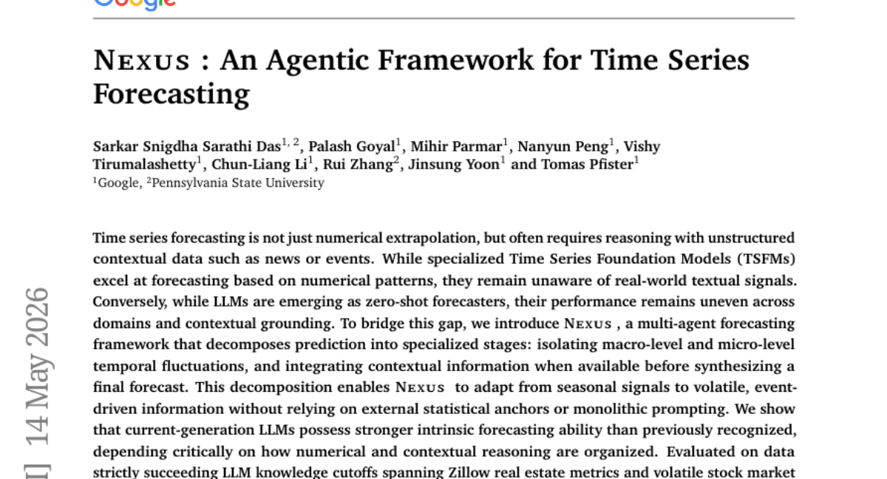

### 📌 한 줄 요약
수치 데이터와 텍스트 컨텍스트를 결합하여 예측 성능을 극대화하는 멀티 에이전트 기반 시계열 예측 프레임워크

### 🔑 핵심 포인트
- 수치적 패턴과 텍스트 컨텍스트를 결합하는 멀티 에이전트 분해 방식 도입
- 거시적/미시적 변동성 분리 및 컨텍스트 통합을 통한 적응형 예측 구조
- LLM의 내재적 예측 능력을 극대화하는 에이전틱 추론 워크플로우 설계

### 🧑‍💻 개발자 관점
단순 수치 모델링을 넘어 뉴스, 이벤트 등 비정형 데이터가 중요한 도메인(금융, 부동산 등)에서 LLM을 실무 예측 엔진으로 활용하는 방법론을 제시합니다.

### 🚀 실무 적용 아이디어
- 특정 도메인(예: 특정 산업 뉴스) 데이터와 수치 데이터를 결합한 에이전트 워크플로우 테스트
- LLM의 지식 컷오프 이후의 최신 데이터셋을 활용한 Zero-shot 성능 검증
- 수치 데이터와 텍스트 데이터 간의 가중치 조절 실험

### ⚠️ 리스크/한계
- 에이전트 단계가 복잡해짐에 따라 발생하는 추론 비용 및 지연 시간(Latency) 문제
- 텍스트 컨텍스트의 노이즈가 수치적 정확도를 저해할 가능성

### 📝 초록 기반 상세 설명
기존 시계열 파운데이션 모델(TSFM)은 수치 패턴에는 강하나 외부 텍스트 정보 활용이 어렵고, LLM은 도메인별 예측 성능이 불안정하다는 한계가 있습니다. 이를 해결하기 위해 거시적/미시적 변동성 분리 및 컨텍스트 통합 과정을 거치는 멀티 에이전트 프레임워크인 Nexus를 제안합니다. Nexus는 예측 과정을 단계별로 분해하여 계절성 신호와 이벤트 기반 변동성을 동시에 처리합니다. 실험 결과, LLM의 지식 컷오프 이후의 데이터(부동산, 주식 등)에서도 기존 TSFM 및 LLM 베이스라인을 상회하는 성능을 보였습니다. 또한, 단순 수치 예측을 넘어 예측의 근거를 명시하는 고품질 추론 과정을 제공합니다.

---

## 50. [PreScam: A Benchmark for Predicting Scam Progression from Early Conversations](https://huggingface.co/papers/2605.12243)
**Upvotes**: 1 | **도입 난이도**: 중 | **신뢰도**: 상
**arXiv**: https://arxiv.org/abs/2605.12243

**태그**: NLP, Security, Benchmark, LLM

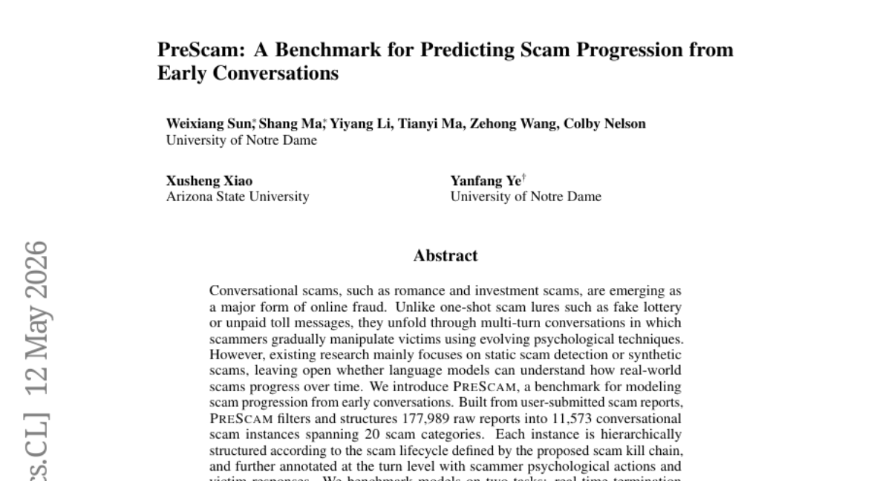

### 📌 한 줄 요약
대화형 사기(Scam)의 진행 단계와 심리적 조작 과정을 추적하고 예측하기 위한 벤치마크 데이터셋 및 과제 제안

### 🔑 핵심 포인트
- 실제 사용자 신고 데이터를 기반으로 구축된 대규모 대화형 사기 벤치마크(PreScam) 제안
- 사기 생애주기(Scam Lifecycle)에 따른 계층적 구조 및 턴 단위 심리/반응 주석 제공
- 실시간 종료 예측(Termination Prediction) 및 사기꾼 다음 행동 예측(Action Prediction) 과제 정의

### 🧑‍💻 개발자 관점
단순 키워드 기반 탐지를 넘어, 대화의 맥락과 심리적 흐름을 파악하여 사기 징후를 조기에 포착하는 지능형 보안 에이전트 개발에 필수적인 연구입니다.

### 🚀 실무 적용 아이디어
- 제공된 벤치마크를 활용하여 최신 LLM의 대화 맥락 유지 및 위험 추적 능력 테스트
- Supervised Encoder 모델과 LLM 간의 성능 차이를 분석하여 하이브리드 탐지 모델 설계
- 사기 킬체인 단계별 특징을 임베딩 공간에 투영하는 방법론 실험

### ⚠️ 리스크/한계
- 실제 데이터 기반이므로 특정 도메인이나 언어 스타일에 편향될 가능성 존재
- 사기꾼의 전략이 진화함에 따라 벤치마크의 유효성이 낮아질 수 있음

### 📝 초록 기반 상세 설명
로맨스 스캠이나 투자 사기와 같은 대화형 사기는 다회차 대화를 통해 점진적으로 피해자를 조작하는 특징이 있습니다. 기존 연구는 정적인 탐지에 치중되어 있어, 실제 사기가 시간에 따라 어떻게 진전되는지 모델링하는 데 한계가 있었습니다. 본 논문은 사용자 신고 데이터를 기반으로 20개 카테고리, 11,573개의 대화 인스턴스를 포함하는 PreScam 벤치마크를 제안합니다. 이 데이터셋은 사기 킬체인(Kill Chain)에 따른 계층적 구조와 턴 단위의 심리적 행동 주석을 포함합니다. 실험 결과, 현재의 LLM은 단순 유창함은 뛰어나지만 사기 위험의 고조와 조작 과정을 추적하는 능력은 부족함을 확인했습니다.

---

