# 2026-05-20 Daily Papers (Top 45)

## 오늘의 요약
오늘은 AI 에이전트의 실행 환경을 코드로 구조화하는 'Harness' 개념과 에이전트의 작업 이력을 자산화하는 거버넌스 연구가 주목받았습니다. 또한, 고해상도 및 장기 비디오 생성을 위한 병렬 인프라와 정렬 기술, 그리고 복잡한 워크플로우 자동화의 한계를 다룬 연구들이 주요 흐름을 형성했습니다.

### 오늘의 핵심 포인트
- 코드를 단순한 결과물이 아닌 에이전트의 추론, 실행, 검증을 위한 핵심 인프라(Harness)로 정의하는 프레임워크가 제안되었습니다.
- 비디오 생성 분야에서는 NVFP4 양자화와 ODE 기반 정책 최적화를 통해 학습 효율과 시각적 일관성을 동시에 확보하려는 시도가 나타났습니다.
- 에이전트의 작업 이력을 '스킬'로 구조화하여 모델 재학습 없이 성능을 개선하거나, 복잡한 정책 기반 워크플로우에서의 한계를 규명하는 실용적 연구들이 발표되었습니다.

**오늘의 태그**: AI Agents, Video Generation, Software Engineering, Workflow Automation, Multimodal

## 1. [Code as Agent Harness](https://huggingface.co/papers/2605.18747)
**Upvotes**: 99 | **도입 난이도**: 중 | **신뢰도**: 상
**arXiv**: https://arxiv.org/abs/2605.18747

**태그**: AI Agents, Software Engineering, LLM, Automation, Agent, Reasoning, Multimodal, Evaluation, Safety

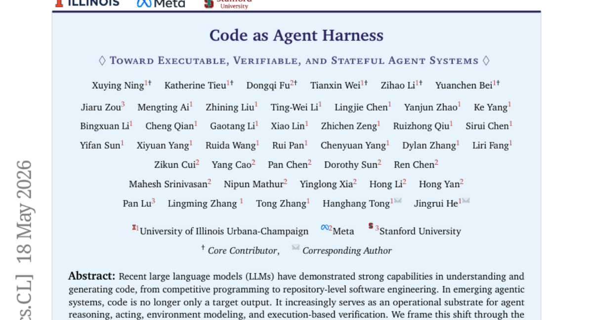

### 📌 한 줄 요약
코드를 단순한 결과물이 아닌 에이전트의 추론, 실행, 검증을 위한 핵심 인프라(Harness)로 정의하는 새로운 프레임워크 제안

### 🔑 핵심 포인트
- 코드를 에이전트의 추론, 행동, 환경 모델링을 연결하는 'Harness Interface'로 정의
- 계획, 메모리, 도구 사용 및 피드백 기반 제어를 포함하는 'Harness Mechanism' 체계화
- 공유 코드 아티팩트를 통한 멀티 에이전트 간의 협업, 리뷰 및 검증 구조 제시

### 🧑‍💻 개발자 관점
에이전트 개발 시 코드를 단순 스크립트가 아닌, 상태 관리와 검증이 가능한 시스템 인프라로 설계해야 함을 시사합니다.

### 🚀 실무 적용 아이디어
- LLM 기반 에이전트의 작업 수행 과정을 코드로 기록하고 이를 피드백 루프에 활용하는 실험
- 멀티 에이전트 환경에서 공유 코드 저장소를 통한 상태 동기화 구조 설계
- 에이전트의 실행 결과에 대한 자동화된 단위 테스트 및 검증 로직 구축

### ⚠️ 리스크/한계
- 코드 실행 시 발생할 수 있는 보안 및 안전성 문제 (Human-in-the-loop 필요)
- 불완전한 피드백 환경에서의 에이전트 제어 및 회귀(Regression) 문제

### 📝 초록 기반 상세 설명
최근 LLM은 코드 생성 능력을 넘어 에이전트 시스템의 핵심 요소로 진화하고 있습니다. 기존에는 코드가 최종 출력물이었으나, 이제는 에이전트의 추론과 환경 모델링을 위한 운영 기질(Substrate) 역할을 수행합니다. 본 논문은 이를 'Code as Agent Harness'라는 통합된 관점으로 정의하고 세 가지 계층(인터페이스, 메커니즘, 스케일링)으로 체계화합니다. 이를 통해 단일 에이전트부터 멀티 에이전트 환경까지 아우르는 코드 중심의 에이전트 인프라 구조를 제시합니다. 결과적으로 실행 가능하고 검증 가능한 AI 에이전트 시스템 구축을 위한 로드맵을 제공합니다.

---

## 2. [SkillsVote: Lifecycle Governance of Agent Skills from Collection, Recommendation to Evolution](https://huggingface.co/papers/2605.18401)
**Upvotes**: 97 | **도입 난이도**: 중 | **신뢰도**: 상
**arXiv**: https://arxiv.org/abs/2605.18401

**태그**: LLM Agent, Skill Management, Lifecycle Governance, Automated Programming, Agent, Evaluation

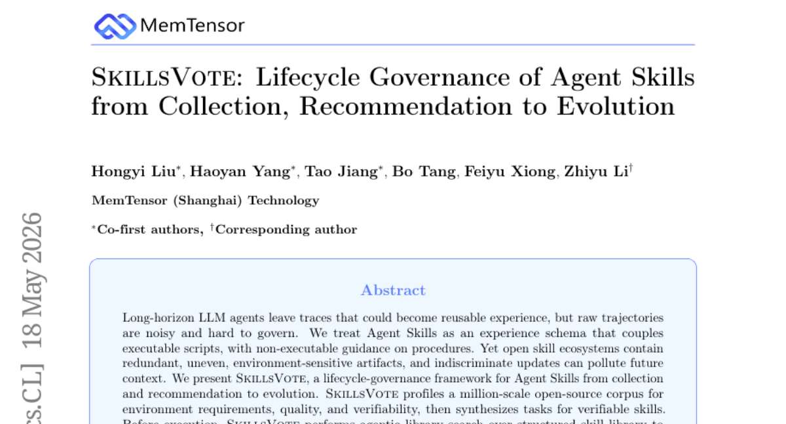

### 📌 한 줄 요약
에이전트의 실행 이력을 구조화된 '스킬'로 관리하여, 모델 업데이트 없이도 성능을 지속적으로 개선하는 라이프사이클 거버넌스 프레임워크

### 🔑 핵심 포인트
- 실행 스크립트와 절차적 가이드를 결합한 구조화된 'Agent Skill' 스키마 정의
- 수집-추천-진화로 이어지는 스킬 라이프사이클 거버넌스 프레임워크(SkillsVote) 제안
- 실행 결과의 귀속 분석(Credit Assignment)을 통한 검증된 스킬의 선별적 업데이트 메커니즘

### 🧑‍💻 개발자 관점
에이전트의 작업 이력을 단순 로그가 아닌 재사용 가능한 자산으로 변환하여, 모델을 재학습시키지 않고도 에이전트의 숙련도를 높이는 실용적인 방법론을 제시합니다.

### 🚀 실무 적용 아이디어
- 에이전트의 성공/실패 로그를 구조화된 스킬 단위로 분해하는 파이프라인 구축 실험
- 에이전트가 작업 수행 전 관련 스킬을 검색하여 컨텍스트로 사용하는 RAG 방식 적용
- 성공적인 작업 경로를 스킬 라이브러리에 반영했을 때의 성능 향상 폭 측정

### ⚠️ 리스크/한계
- 스킬 라이브러리의 규모가 커질수록 검색 및 관리 복잡도 증가
- 환경 변화에 민감한 스킬의 경우, 잘못된 업데이트가 전체 시스템 성능을 저하시킬 위험

### 📝 초록 기반 상세 설명
LLM 에이전트가 생성하는 실행 이력은 재사용 가능한 경험이 될 수 있지만, 노이즈가 많고 관리가 어렵다는 문제가 있습니다. 본 논문은 실행 가능한 스크립트와 절차적 가이드를 결합한 '에이전트 스킬' 개념을 제안합니다. 이를 위해 제안된 SkillsVote 프레임워크는 스킬의 수집, 추천, 진화 과정을 포괄하는 라이프사이클 거버넌스를 제공합니다. 구체적으로 환경 요구사항과 검증 가능성을 바탕으로 스킬을 프로파일링하고, 실행 전 검색과 실행 후 결과 분석을 통해 성공적인 스킬만을 선별하여 업데이트합니다. 실험 결과, 외부 스킬 라이브러리 관리를 통해 모델 업데이트 없이도 벤치마크 성능을 유의미하게 향상시켰습니다.

---

## 3. [LongLive-2.0: An NVFP4 Parallel Infrastructure for Long Video Generation](https://huggingface.co/papers/2605.18739)
**Upvotes**: 87 | **도입 난이도**: 상 | **신뢰도**: 상
**arXiv**: https://arxiv.org/abs/2605.18739

**태그**: Video Generation, Parallelism, Quantization, Deep Learning Infrastructure, Video, Benchmark, Inference, Distillation

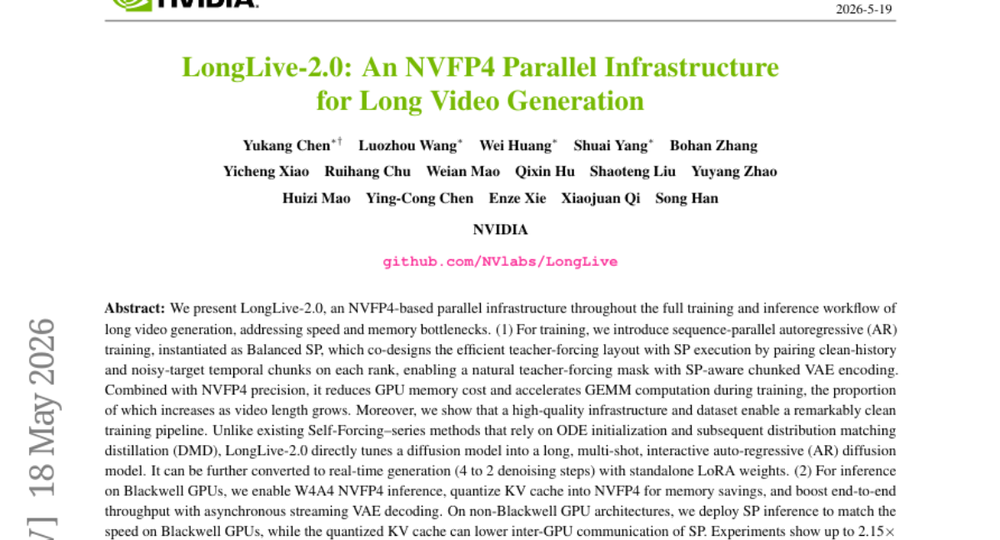

### 📌 한 줄 요약
NVFP4 정밀도를 활용하여 긴 영상 생성의 학습 및 추론 병목을 해결한 고성능 병렬 인프라 기술

### 🔑 핵심 포인트
- Balanced SP: 효율적인 Teacher-forcing과 시퀀스 병렬 처리를 결합한 AR 학습 기법
- NVFP4 기반 최적화: 학습 시 GEMM 연산 가속 및 추론 시 KV 캐시 양자화를 통한 메모리 절감
- 고성능 추론 파이프라인: 비동기 스트리밍 VAE 디코딩 및 LoRA를 활용한 실시간 생성 지원

### 🧑‍💻 개발자 관점
대규모 비디오 생성 모델의 학습 비용을 절감하고, 실시간에 가까운 고해상도 영상 생성 인프라를 구축하는 데 실질적인 가이드를 제공합니다.

### 🚀 실무 적용 아이디어
- Blackwell GPU 환경에서 NVFP4 양자화 적용 시 성능 변화 측정
- 제안된 Balanced SP 기법을 기존 AR 기반 비디오 모델에 이식 실험
- LoRA 가중치를 이용한 4-step 디노이징 실시간 생성 성능 검증

### ⚠️ 리스크/한계
- Blackwell GPU 아키텍처에 특화된 최적화로 인해 구형 하드웨어에서의 성능 이점 제한적
- 정밀도 저하(W4A4)에 따른 비디오 품질 저하 가능성

### 📝 초록 기반 상세 설명
긴 영상 생성 모델의 학습과 추론 과정에서 발생하는 속도 및 메모리 병목 현상이 주요 문제로 제기되었습니다. 이를 해결하기 위해 NVFP4 정밀도를 기반으로 학습과 추론 전 과정을 최적화한 LongLive-2.0 인프라를 제안합니다. 학습 단계에서는 Balanced SP(Sequence Parallel) 기법을 통해 효율적인 Teacher-forcing 레이아웃을 구현하고, 추론 단계에서는 Blackwell GPU에 최적화된 W4A4 양자화 및 비동기 스트리밍 VAE 디코딩을 적용했습니다. 결과적으로 기존 방식 대비 학습 속도는 최대 2.15배, 추론 속도는 1.84배 향상되었습니다. 특히 5B 모델 기준 45.7 FPS의 높은 추론 성능을 달성하며 고품질의 긴 영상 생성을 가능하게 했습니다.

---

## 4. [Lance: Unified Multimodal Modeling by Multi-Task Synergy](https://huggingface.co/papers/2605.18678)
**Upvotes**: 61 | **도입 난이도**: 중 | **신뢰도**: 상
**arXiv**: https://arxiv.org/abs/2605.18678

**태그**: Multimodal, Generative AI, MoE, Video Generation, Vision, Video, Safety

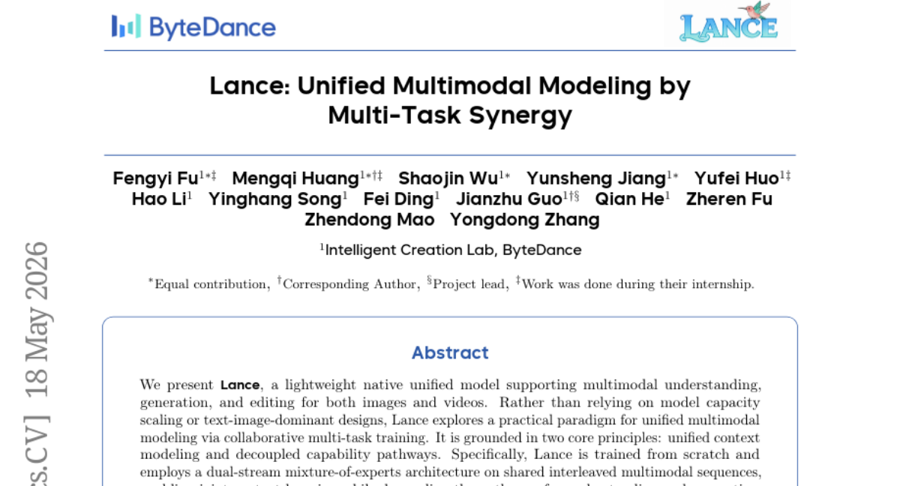

### 📌 한 줄 요약
멀티태스크 시너지와 MoE 구조를 통해 이미지/비디오의 이해와 생성을 동시에 잡은 경량 통합 모델

### 🔑 핵심 포인트
- 이중 스트림 MoE 아키텍처를 통한 이해와 생성 경로의 효율적 분리
- 모달리티 인식 RoPE를 통한 이종 시각 토큰 간 간섭 완화 및 정렬 강화
- 단계별 멀티태스크 학습 및 적응형 데이터 스케줄링 전략 적용

### 🧑‍💻 개발자 관점
단일 모델로 이미지/비디오 생성과 이해를 모두 수행할 수 있어, 복잡한 멀티모달 파이프라인을 단순화하고 리소스를 효율적으로 관리할 수 있습니다.

### 🚀 실무 적용 아이디어
- 제공된 오픈소스 코드를 활용한 이미지/비디오 생성 품질 벤치마크 테스트
- 특정 도메인 데이터셋을 활용한 단계별 학습 스케줄링 재현 실험
- 기존 단일 목적 모델(예: Stable Diffusion 등)과의 추론 속도 및 성능 비교

### ⚠️ 리스크/한계
- 생성과 이해라는 상충하는 목표 사이의 최적 균형점 유지의 어려움
- MoE 구조 도입에 따른 학습 복잡도 및 추론 시 메모리 관리 이슈

### 📝 초록 기반 상세 설명
기존의 멀티모달 모델은 모델 크기 확장이나 텍스트-이미지 중심 설계에 의존하여 이해와 생성 간의 균형을 맞추는 데 어려움이 있었습니다. 이를 해결하기 위해 Lance는 통합된 컨텍스트 모델링과 분리된 역량 경로(decoupled capability pathways)라는 두 가지 핵심 원칙을 제안합니다. 모델은 공유된 인터리브 시퀀스 상에서 이중 스트림 MoE(Mixture-of-Experts) 아키텍처를 사용하여 학습되며, 모달리티 인식 회전 위치 인코딩(modality-aware RoPE)을 통해 토큰 간 간섭을 최소화합니다. 또한 단계별 멀티태스크 학습과 적응형 데이터 스케줄링을 통해 이해와 생성 성능을 동시에 강화했습니다. 실험 결과, Lance는 기존 오픈소스 모델 대비 뛰어난 이미지/비디오 생성 성능을 보이면서도 강력한 이해 능력을 유지함을 입증했습니다.

---

## 5. [AI for Auto-Research: Roadmap & User Guide](https://huggingface.co/papers/2605.18661)
**Upvotes**: 48 | **도입 난이도**: 중 | **신뢰도**: 상
**arXiv**: https://arxiv.org/abs/2605.18661

**태그**: AI Agent, Research Automation, LLM Reliability, Workflow Design, Agent, RAG, Vision, Video, Benchmark, Evaluation

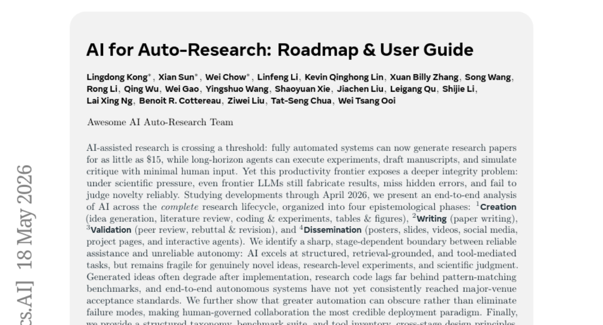

### 📌 한 줄 요약
AI 기반 자동 연구 프로세스의 전 단계 분석을 통한 신뢰 가능한 인간-AI 협업 가이드라인 제시

### 🔑 핵심 포인트
- 연구 생애 주기(생성-작성-검증-확산)에 따른 AI 역량 및 한계 분석
- 구조화된 작업과 창의적/판단적 작업 사이의 명확한 신뢰 경계 식별
- 자동화가 오히려 오류를 은폐할 수 있음을 경고하며 인간 중심 협업 모델 제안

### 🧑‍💻 개발자 관점
AI 에이전트를 활용한 연구 자동화 파이프라인 구축 시, 어떤 단계에서 인간의 개입이 필수적인지 판단하는 기준을 제공합니다.

### 🚀 실무 적용 아이디어
- 연구 단계별(Idea vs Writing vs Review) AI 성능 벤치마크 수행
- AI 생성 결과의 오류를 탐지하기 위한 인간 검증 루프(Human-in-the-loop) 설계
- 제시된 4단계 프레임워크를 활용한 워크플로우 자동화 도구 검토

### ⚠️ 리스크/한계
- 과도한 자동화로 인한 연구 무결성 훼손 및 오류 은폐 위험
- AI가 생성한 아이디어의 구현 단계에서의 품질 저하 및 독창성 결여

### 📝 초록 기반 상세 설명
AI가 연구 논문 생성 및 실험 수행까지 가능한 자동화 단계에 진입하며 생산성 혁신이 예고되고 있습니다. 그러나 높은 자동화 수준에도 불구하고 LLM의 결과 조작, 오류 미탐지, 독창성 판단 실패와 같은 심각한 무결성 문제가 존재합니다. 본 논문은 2026년 4월까지의 연구를 바탕으로 연구 생애 주기를 생성, 작성, 검증, 확산의 4단계로 분류하여 분석합니다. 분석 결과 AI는 구조화된 작업에는 강하나, 독창적 아이디어 도출과 심도 있는 실험 및 과학적 판단에서는 여전히 취약함을 확인했습니다. 최종적으로 자동화가 실패를 은폐할 위험을 경고하며, 인간이 주도하는 협업 모델을 위한 분류 체계와 실무 플레이북을 제안합니다.

### 🖼️ 추가 자료

---

## 6. [CHI-Bench: Can AI Agents Automate End-to-End, Long-Horizon, Policy-Rich Healthcare Workflows?](https://huggingface.co/papers/2605.16679)
**Upvotes**: 37 | **도입 난이도**: 상 | **신뢰도**: 상
**arXiv**: https://arxiv.org/abs/2605.16679

**태그**: AI Agent, Benchmark, Workflow Automation, Enterprise AI, Agent

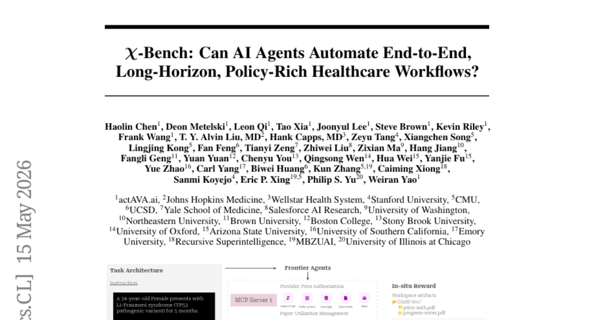

### 📌 한 줄 요약
복잡한 정책과 다중 역할이 얽힌 의료 워크플로우 자동화의 한계를 규명한 벤치마크 연구

### 🔑 핵심 포인트
- 정책 밀도, 다중 역할 구성, 다자간 상호작용을 포함한 고난도 의료 워크플로우 벤치마크(CHI-Bench) 개발
- 87개의 MCP 도구와 1,290개 이상의 운영 규칙이 포함된 고충실도 시뮬레이션 환경 구축
- 장기적(Long-horizon) 작업 수행 시 에이전트의 성능 저하 및 낮은 성공률 확인

### 🧑‍💻 개발자 관점
단순 질의응답을 넘어, 복잡한 비즈니스 로직과 도구 사용이 결합된 엔터프라이즈급 에이전트 개발 시 직면할 실질적인 난관을 보여줍니다.

### 🚀 실무 적용 아이디어
- 에이전트의 컨텍스트 유지 능력 및 장기 작업 수행 시 성능 저하 원인 분석
- 복잡한 정책(Policy) 기반의 의사결정을 위한 RAG 및 추론 프레임워크 실험
- 멀티 에이전트 간의 역할 분담 및 핸드오프(Handoff) 메커니즘 최적화

### ⚠️ 리스크/한계
- 현재 에이전트 기술로는 복잡한 정책 기반의 엔터프라이즈 워크플로우 자동화가 매우 어려움
- 작업 단계가 길어질수록 에이전트의 성능이 급격히 하락하는 문제(Performance Slump)

### 📝 초록 기반 상세 설명
현대 의료 운영은 복잡한 정책, 다중 역할 협업, 다자간 상호작용이 결합된 고난도 워크플로우를 특징으로 합니다. 기존 벤치마크는 이러한 정책 밀도와 장기적 의사결정 능력을 충분히 평가하지 못하는 한계가 있습니다. 이를 해결하기 위해 20개의 앱과 87개의 도구가 포함된 고충실도 시뮬레이터 환경인 CHI-Bench를 제안합니다. 실험 결과, 최상위 에이전트조차 성공률이 28%에 불과했으며, 세션이 길어질수록 성능이 급격히 저하되었습니다. 이는 정책 중심의 복잡한 엔터프라이즈 도메인에서 현재의 AI 에이전트 기술이 가진 근본적인 한계를 시사합니다.

---

## 7. [Code-as-Room: Generating 3D Rooms from Top-Down View Images via Agentic Code Synthesis](https://huggingface.co/papers/2605.18451)
**Upvotes**: 35 | **도입 난이도**: 중 | **신뢰도**: 상
**arXiv**: https://arxiv.org/abs/2605.18451

**태그**: Agent, 3D Generation, Blender, Computer Vision, Code Synthesis, Vision, Benchmark, Evaluation

### 📌 한 줄 요약
Top-down 이미지를 기반으로 Blender 코드를 자동 생성하여 정교한 3D 실내 공간을 구축하는 에이전트 프레임워크

### 🔑 핵심 포인트
- Blender 코드를 활용한 정밀한 3D 공간 표현 및 자동 생성
- 구조화된 실행 하네스(Execution Harness)를 통한 다단계 코드 합성 파이프라인
- 컨텍스트 망각 방지를 위한 교차 단계 메모리 모듈(Cross-stage memory module) 도입

### 🧑‍💻 개발자 관점
단순한 3D 모델 생성을 넘어, 코드를 통해 수정과 제어가 가능한 정밀한 3D 환경을 자동화할 수 있는 기술적 토대를 제공합니다.

### 🚀 실무 적용 아이디어
- Blender Python API와 MLLM의 연동 안정성 테스트
- 복잡한 가구 배치 시 코드 생성의 논리적 오류 발생 여부 확인
- 제안된 메모리 모듈이 긴 시퀀스의 코드 생성 시 컨텍스트를 얼마나 유지하는지 검증

### ⚠️ 리스크/한계
- Blender 코드 의존성으로 인해 생성된 결과물의 물리적 오류 발생 가능성
- 매우 복잡하거나 비정형적인 구조의 이미지에 대한 코드 생성 한계

### 📝 초록 기반 상세 설명
실감 나는 3D 실내 공간 설계는 VR, 게임, Embodied AI 분야에서 매우 중요합니다. 기존의 텍스트 기반 방식은 정밀한 공간 정보 표현이 어렵고, 이미지 기반 에이전트는 전체적인 방 생성 과정에서 불안정성이나 무한 루프 문제가 발생합니다. 이를 해결하기 위해 본 논문은 Blender 코드를 활용해 3D 공간을 표현하는 'Code-as-Room' 프레임워크를 제안합니다. 이 프레임워크는 top-down 이미지를 분석하여 요소와 공간 관계를 추출하고, 구조화된 실행 하네스를 통해 기하학, 재질, 조명을 포함한 코드를 단계별로 생성합니다. 또한, 컨텍스트 망각 문제를 방지하기 위해 교차 단계 메모리 모듈을 도입했습니다. 제안된 벤치마크를 통해 기존 에이전트 방식 대비 우수한 성능과 안정성을 검증했습니다.

---

## 8. [KVPO: ODE-Native GRPO for Autoregressive Video Alignment via KV Semantic Exploration](https://huggingface.co/papers/2605.14278)
**Upvotes**: 33 | **도입 난이도**: 상 | **신뢰도**: 상
**arXiv**: https://arxiv.org/abs/2605.14278

**태그**: Video Generation, Reinforcement Learning, Diffusion Models, KV Cache, Video, Distillation, Safety

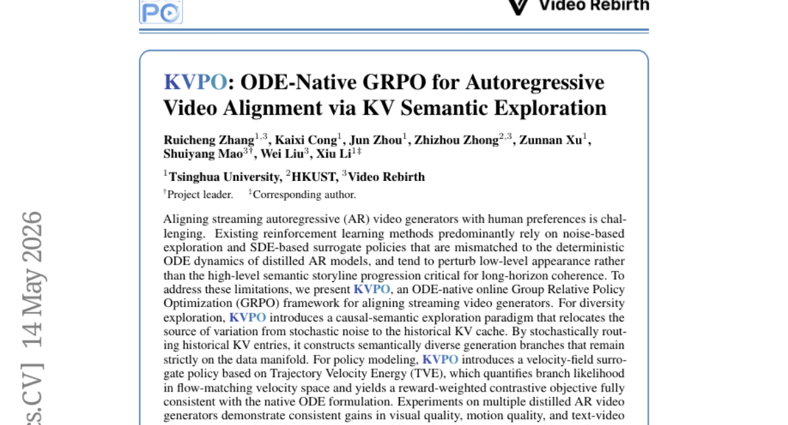

### 📌 한 줄 요약
KV 캐시 기반의 의미론적 탐색과 ODE 기반 정책 최적화를 통해 비디오 생성 모델의 일관성과 정렬 성능을 높인 프레임워크

### 🔑 핵심 포인트
- KV 캐시 기반 인과적 의미 탐색: 노이즈 대신 과거 KV 엔트리를 확률적으로 라우팅하여 의미적으로 다양한 생성 분기 확보
- ODE-Native 정책 모델링: Trajectory Velocity Energy(TVE)를 활용해 Flow-matching 속도 공간에서 분기 가능성을 정량화
- 고수준 일관성 유지: 저수준 픽셀 노이즈가 아닌 의미적 스토리라인 진행에 집중하여 장기적 일관성 확보

### 🧑‍💻 개발자 관점
비디오 생성 모델의 정렬 과정에서 발생하는 시각적 왜곡을 줄이고, 모델의 고유한 ODE 역학을 유지하면서도 고품질의 일관된 영상을 생성하는 기술적 방법론을 제시합니다.

### 🚀 실무 적용 아이디어
- 기존 Diffusion/Flow-matching 모델의 KV 캐시 조작을 통한 탐색 효율성 테스트
- TVE(Trajectory Velocity Energy) 수식을 활용한 보상 함수 구현 및 비교
- 장기 비디오 생성 시 KV 캐시 라우팅이 일관성에 미치는 영향 분석

### ⚠️ 리스크/한계
- KV 캐시 조작 시 연산 복잡도 및 메모리 사용량 증가 가능성
- 특정 아키텍처(Flow-matching 기반 AR 모델)에 국한된 적용 가능성

### 📝 초록 기반 상세 설명
스트리밍 자기회귀(AR) 비디오 생성 모델을 인간 선호도에 맞게 정렬하는 것은 매우 까다로운 과제입니다. 기존 RL 방식은 노이즈 기반 탐색에 의존하여 모델의 결정론적 ODE 역학(dynamics)과 불일치하며, 고수준의 의미적 일관성보다 저수준 외형 변화에 치중하는 경향이 있습니다. 이를 해결하기 위해 KVPO는 ODE 네이티브 온라인 GRPO 프레임워크를 제안합니다. KVPO는 노이즈 대신 과거 KV 캐시를 활용하는 인과적 의미 탐색(causal-semantic exploration)을 통해 데이터 매니폴드 내에서 다양한 생성 분기를 생성합니다. 또한, Trajectory Velocity Energy(TVE)를 기반으로 한 속도장 대리 정책을 도입하여 ODE 공식과 일치하는 보상 가중 대조 목적 함수를 제공합니다. 실험 결과, 단일/다중 프롬프트 환경 모두에서 시각적 품질, 움직임, 텍스트-비디오 정렬 성능이 크게 향상되었습니다.

---

## 9. [OProver: A Unified Framework for Agentic Formal Theorem Proving](https://huggingface.co/papers/2605.17283)
**Upvotes**: 28 | **도입 난이도**: 상 | **신뢰도**: 상
**arXiv**: https://arxiv.org/abs/2605.17283

**태그**: Agentic-AI, Formal-Verification, RAG, Reinforcement-Learning, Lean4, Agent, Benchmark, Evaluation, Inference

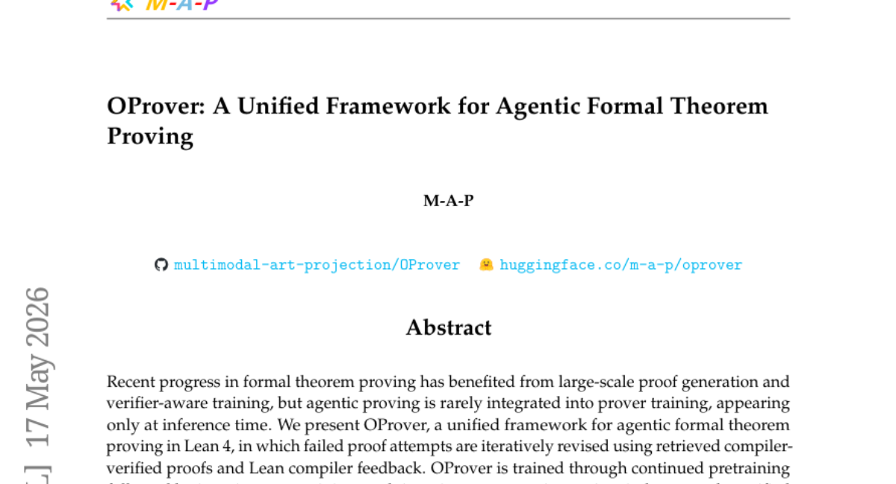

### 📌 한 줄 요약
에이전트 기반의 반복적 수정과 RAG를 결합하여 Lean 4 환경에서 정형 증명을 자동화하는 통합 프레임워크 OProver

### 🔑 핵심 포인트
- 에이전트 기반의 반복적 수정(Iterative Revision)과 RAG를 결합한 통합 학습/추론 프레임워크 제안
- 컴파일러 피드백, 검색된 증명, 수정 궤적을 포함하는 대규모 데이터셋 OProofs 구축
- 지속적 사전 학습과 반복적 사후 학습(SFT 및 RL)을 통한 에이전트 역량 최적화

### 🧑‍💻 개발자 관점
단순한 코드 생성을 넘어, 컴파일러 피드백을 통해 스스로 오류를 수정하는 에이전트 루프를 학습 프로세스에 통합하는 실질적인 방법론을 제시합니다.

### 🚀 실무 적용 아이디어
- Lean 4 환경에서 컴파일러 피드백을 활용한 에이전트 루프 구현 실험
- 실패한 시도(Failed attempts)를 SFT 데이터로 변환하는 파이프라인 구축
- RAG를 통한 유사 증명 검색이 추론 정확도에 미치는 영향 분석

### ⚠️ 리스크/한계
- 컴파일러 피드백에 의존하므로 피드백이 모호할 경우 루프가 정체될 위험
- 대규모 데이터셋 구축 및 반복적 학습을 위한 높은 컴퓨팅 자원 요구

### 📝 초록 기반 상세 설명
최근 정형 증명 연구는 대규모 생성과 검증기 기반 학습에 집중해 왔으나, 에이전트 방식의 반복적 수정 과정은 주로 추론 단계에만 국한되어 있었습니다. 본 논문은 Lean 4를 대상으로 실패한 증명을 컴파일러 피드백과 검색된 증명을 통해 반복 수정하는 OProver 프레임워크를 제안합니다. 학습 과정은 지속적 사전 학습(Continued Pretraining)과 반복적 사후 학습(Iterative Post-training)으로 구성되며, 생성된 증명과 수정 궤적을 데이터셋(OProofs)에 축적하여 RL 및 SFT에 활용합니다. 실험 결과, OProver-32B는 MiniF2F, ProverBench 등 주요 벤치마크에서 기존 오픈 웨이트 모델들을 뛰어넘는 최고 수준의 성능을 달성했습니다.

---

## 10. [Post-Trained MoE Can Skip Half Experts via Self-Distillation](https://huggingface.co/papers/2605.18643)
**Upvotes**: 25 | **도입 난이도**: 중 | **신뢰도**: 상
**arXiv**: https://arxiv.org/abs/2605.18643

**태그**: MoE, Model Compression, Self-Distillation, Inference Optimization, Benchmark, Inference, Distillation

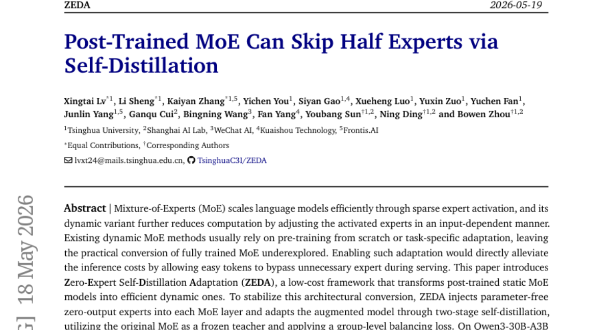

### 📌 한 줄 요약
사전 학습된 정적 MoE 모델을 추가 학습 없이 효율적인 동적 MoE로 변환하여 연산량을 50% 절감하는 프레임워크

### 🔑 핵심 포인트
- ZEDA: 정적 MoE를 동적 MoE로 변환하는 저비용 자기 증류 프레임워크 제안
- Zero-output experts를 통한 구조적 안정성 확보 및 파라미터 효율적 설계
- 2단계 자기 증류 및 그룹 균형 손실을 통한 성능 유지 및 연산량 최적화

### 🧑‍💻 개발자 관점
이미 학습된 대규모 MoE 모델을 재학습 없이(또는 저비용으로) 추론 최적화 모델로 전환할 수 있어 실무적인 서빙 비용 절감에 매우 유용합니다.

### 🚀 실무 적용 아이디어
- 기존에 배포된 정적 MoE 모델에 ZEDA 프레임워크 적용 테스트
- Zero-output expert 삽입 시 발생하는 모델 성능 저하 폭 측정
- 다양한 하드웨어 환경에서의 실제 추론 속도(Latency) 향상 폭 검증

### ⚠️ 리스크/한계
- 모델 크기가 커질수록 자기 증류 과정에서의 수렴 안정성 문제 가능성
- 특정 도메인 데이터에 특화된 모델의 경우 범용적인 동적 변환 시 성능 저하 위험

### 📝 초록 기반 상세 설명
기존의 MoE 모델은 효율적인 확장이 가능하지만, 이미 학습된 모델을 동적 MoE로 전환하여 추론 비용을 줄이는 방법은 부족했습니다. 본 논문은 정적 MoE를 효율적인 동적 MoE로 변환하는 저비용 프레임워크인 ZEDA를 제안합니다. ZEDA는 각 레이어에 파라미터가 없는 'zero-output expert'를 삽입하여 구조적 변화를 안정화합니다. 이후 원본 모델을 교사 모델로 사용하는 2단계 자기 증류(self-distillation)와 그룹 수준의 균형 손실 함수를 통해 모델을 적응시킵니다. 실험 결과, Qwen 및 GLM 모델에서 정확도 손실을 최소화하면서 전문가 연산량(FLOPs)을 50% 이상 제거하고 추론 속도를 약 1.2배 향상시켰습니다.

---

## 11. [LiteFrame: Efficient Vision Encoders Unlock Frame Scaling in Video LLMs](https://huggingface.co/papers/2605.17260)
**Upvotes**: 19 | **도입 난이도**: 중 | **신뢰도**: 상
**arXiv**: https://arxiv.org/abs/2605.17260

**태그**: Video-LLM, Efficiency, Knowledge-Distillation, Computer-Vision, RAG, Vision, Video, Benchmark, Inference, Distillation

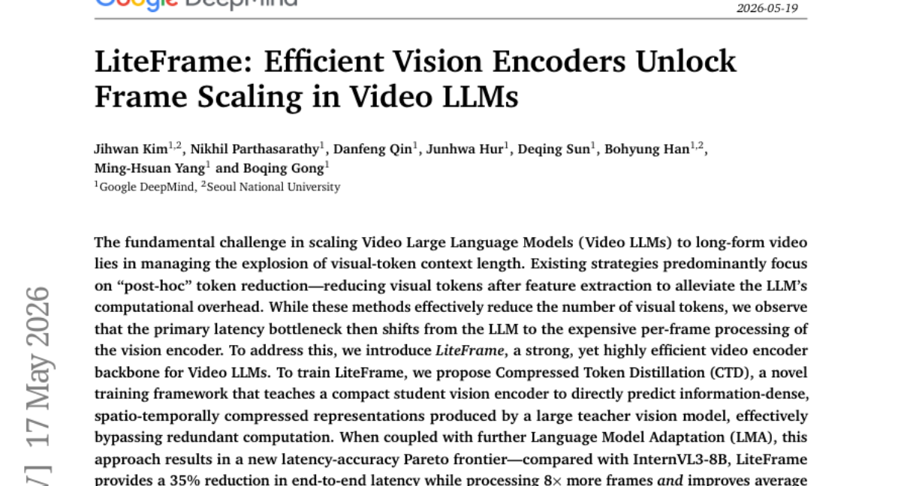

### 📌 한 줄 요약
비전 인코더의 연산 효율을 극대화하여 긴 영상 처리를 위한 토큰 병목 현상을 해결한 프레임 스케일링 기술

### 🔑 핵심 포인트
- 사후 토큰 감소가 아닌 인코더 단계에서의 효율성을 확보하는 LiteFrame 아키텍처 제안
- 대형 모델의 정보 밀도가 높은 표현을 학습하는 Compressed Token Distillation(CTD) 기법 도입
- 고정된 컴퓨팅 자원 내에서 더 많은 프레임을 처리할 수 있는 새로운 Pareto frontier 구축

### 🧑‍💻 개발자 관점
실시간 영상 분석이나 긴 영상 처리가 필요한 서비스에서 하드웨어 비용을 유지하며 입력 프레임 수를 획기적으로 늘릴 수 있는 방법론을 제시합니다.

### 🚀 실무 적용 아이디어
- 기존 LLM 기반 비디오 모델의 인코더 연산 시간과 LLM 추론 시간 비중 분석
- CTD 방식과 유사한 지식 증류(Knowledge Distillation) 기법을 현재 사용 중인 비전 모델에 적용 실험
- 프레임 수 증가에 따른 메모리 점유율 및 추론 속도 변화 측정

### ⚠️ 리스크/한계
- 압축된 표현을 학습하는 과정에서 미세한 시각적 디테일 손실 가능성
- 특정 도메인 데이터에 최적화될 경우 범용적인 비전 성능 저하 우려

### 📝 초록 기반 상세 설명
기존 Video LLM은 LLM의 연산 부하를 줄이기 위해 추출된 토큰을 사후에 압축하는 방식에 집중해 왔습니다. 하지만 이 경우 연산 병목이 LLM에서 비전 인코더의 프레임별 처리 과정으로 전이되는 문제가 발생합니다. 이를 해결하기 위해 본 논문은 효율적인 비전 인코더 백본인 LiteFrame을 제안합니다. 학습을 위해 대형 모델의 압축된 표현을 소형 모델이 예측하도록 하는 Compressed Token Distillation(CTD) 프레임워크를 도입했습니다. 결과적으로 기존 모델 대비 지연 시간을 대폭 줄이면서도 훨씬 더 많은 프레임을 처리할 수 있는 성능-효율성 최적점을 달성했습니다.

---

## 12. [Stop When Reasoning Converges: Semantic-Preserving Early Exit for Reasoning Models](https://huggingface.co/papers/2605.17672)
**Upvotes**: 18 | **도입 난이도**: 하 | **신뢰도**: 상
**arXiv**: https://arxiv.org/abs/2605.17672

**태그**: LLM-Optimization, Reasoning, Efficiency, CoT, RAG, Vision, Benchmark, Inference

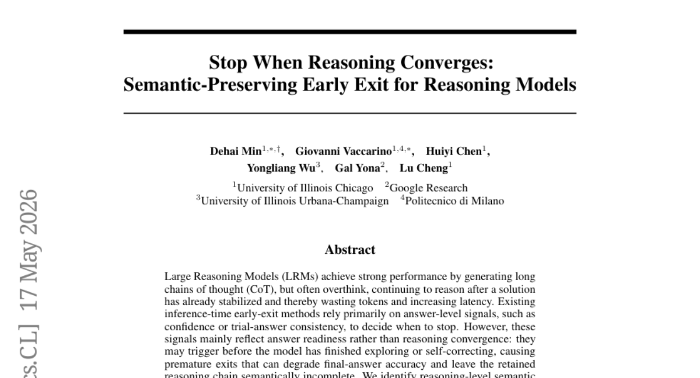

### 📌 한 줄 요약
추론 과정의 의미적 중복을 감지하여 정확도를 유지하면서도 토큰 소모를 줄이는 효율적인 조기 종료 프레임워크 PUMA 제안

### 🔑 핵심 포인트
- 추론 단계의 의미적 중복(Semantic Redundancy)을 조기 종료의 핵심 신호로 활용
- 정답 신호와 중복 탐지기를 결합한 Plug-and-play 방식의 PUMA 프레임워크 제안
- 정확도 유지와 동시에 토큰 사용량 및 지연 시간을 획기적으로 감소

### 🧑‍💻 개발자 관점
LLM 기반 에이전트나 복잡한 추론 작업 시 발생하는 과도한 토큰 비용과 응답 지연 문제를 해결할 수 있는 실질적인 최적화 기법입니다.

### 🚀 실무 적용 아이디어
- 현재 사용 중인 CoT 모델의 추론 단계별 임베딩 유사도를 측정하여 중복성 확인
- PUMA의 중복 탐지 로직을 기존 프롬프트 체인에 적용하여 토큰 절감 효과 테스트
- 모델의 정답 정확도와 토큰 절감량 사이의 트레이드오프 지점 탐색

### ⚠️ 리스크/한계
- 복잡한 논리 전개가 필요한 문제에서 중복으로 오판할 경우 논리적 비약 발생 가능성
- 중복 탐지기 자체의 연산 비용이 전체 효율성에 미치는 영향 고려 필요

### 📝 초록 기반 상세 설명
최근 대형 추론 모델(LRM)은 긴 사고 사슬(CoT)을 통해 성능을 높이지만, 이미 정답에 도달한 후에도 불필요하게 추론을 지속하여 토큰과 지연 시간을 낭비하는 문제가 있습니다. 기존의 조기 종료 방식은 정답 신호에만 의존하여 추론 과정의 논리적 완결성을 해치거나 조기 종료로 인한 정확도 저하를 초래할 수 있습니다. 본 논문은 추론 단계 간의 의미적 중복이 발생할 때 추론이 수렴되었다고 판단하는 새로운 신호를 식별합니다. 이를 바탕으로 제안된 PUMA 프레임워크는 경량 중복 탐지기와 정답 검증기를 결합하여, 논리적 일관성을 유지하면서도 불필요한 추론을 제거합니다. 실험 결과, PUMA는 정확도 손실 없이 평균 26.2%의 토큰 절감 효과를 달성하며 다양한 벤치마크에서 성능을 입증했습니다.

---

## 13. [Measuring Maximum Activations in Open Large Language Models](https://huggingface.co/papers/2605.15572)
**Upvotes**: 15 | **도입 난이도**: 하 | **신뢰도**: 상
**arXiv**: https://arxiv.org/abs/2605.15572

**태그**: LLM, Quantization, Inference, MoE, Model-Analysis, Vision, Optimization

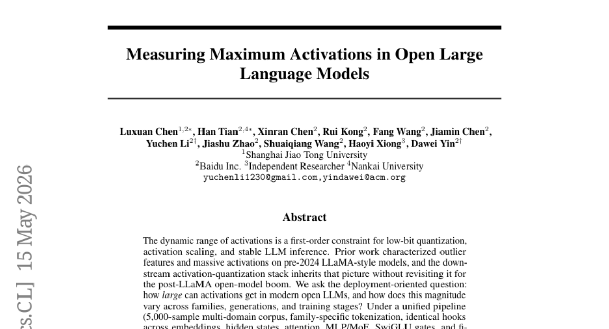

### 📌 한 줄 요약
최신 오픈 소스 LLM의 활성화 값(Activation) 범위를 정밀 측정하여 저비트 양자화 및 안정적 추론을 위한 가이드를 제시함

### 🔑 핵심 포인트
- 모델 크기가 아닌 아키텍처, 학습 단계, 모델 패밀리에 따라 최대 활성화 값이 결정됨을 규명
- MoE 모델이 동일 규모의 Dense 모델보다 피크 값이 14~23배 낮게 나타나는 특성 확인
- 잔차 연결(Residual Stream)이 대부분의 모델에서 전역 최대 활성화 값을 보유함

### 🧑‍💻 개발자 관점
모델을 저비트(INT8 등)로 양자화하여 배포할 때, 모델별 특화된 활성화 범위를 미리 파악해야 양자화 오차를 최소화하고 추론 안정성을 확보할 수 있습니다.

### 🚀 실무 적용 아이디어
- 배포 예정인 모델의 레이어별 활성화 값 범위를 측정하는 스크립트 작성
- 양자화 적용 전, 모델의 Residual Stream 피크 값을 확인하여 스케일링 전략 수립
- MoE 모델과 Dense 모델 간의 양자화 정밀도 차이 비교 실험

### ⚠️ 리스크/한계
- 특정 데이터셋(5,000개 샘플)에 기반한 측정값이 모든 도메인에서 동일하게 유지되지 않을 수 있음
- 측정된 최대값이 특정 아웃라이어에 의해 왜곡될 가능성 존재

### 📝 초록 기반 상세 설명
저비트 양자화와 안정적인 추론을 위해서는 활성화 값의 동적 범위(Dynamic Range) 파악이 필수적입니다. 기존 연구는 구형 LLaMA 모델에 국한되어 있어, 급변하는 최신 오픈 모델 환경에서의 활성화 특성을 반영하지 못하는 문제가 있었습니다. 본 연구는 8개 모델 패밀리의 27개 체크포인트를 대상으로 통합된 파이프라인을 통해 전역 및 레이어별 최대 활성화 값을 측정했습니다. 실험 결과, 최대 활성화 값은 모델 크기에 비례하기보다 모델 패밀리, 아키텍처, 학습 단계에 따라 결정됨을 확인했습니다. 특히 MoE 모델은 밀집(Dense) 모델보다 피크 값이 현저히 낮았으며, 잔차 연결(Residual Stream)에서 최대값이 발생하는 경향을 보였습니다. 결론적으로 모델 배포 시 활성화 값 측정 보고가 저비트 양자화 성공의 핵심임을 강조합니다.

---

## 14. [StableVLA: Towards Robust Vision-Language-Action Models without Extra Data](https://huggingface.co/papers/2605.18287)
**Upvotes**: 13 | **도입 난이도**: 하 | **신뢰도**: 상
**arXiv**: https://arxiv.org/abs/2605.18287

**태그**: VLA, Robustness, Information Bottleneck, Robot Learning, RAG, Vision

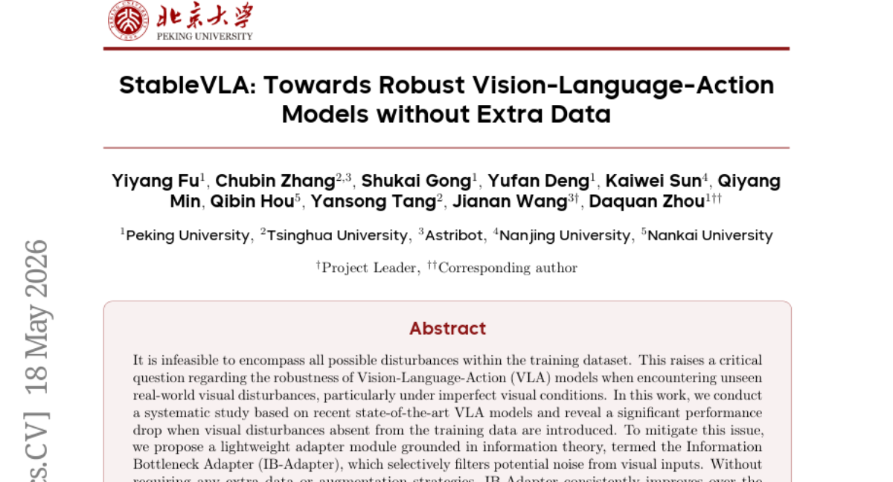

### 📌 한 줄 요약
추가 데이터 학습 없이 정보 이론 기반의 경량 어댑터를 통해 VLA 모델의 시각적 노이즈 강건성을 확보하는 기술

### 🔑 핵심 포인트
- 정보 이론 기반의 IB-Adapter를 통한 시각적 노이즈 선택적 필터링
- 추가 데이터 학습이나 데이터 증강 없이 모델의 강건성 확보
- 10M 미만의 매우 적은 파라미터 추가로 높은 효율성 달성

### 🧑‍💻 개발자 관점
실제 로봇 운영 환경에서 발생하는 예측 불가능한 시각적 노이즈에 대해, 재학습 없이 모델의 신뢰도를 높일 수 있는 실용적인 방법론을 제시합니다.

### 🚀 실무 적용 아이디어
- 기존 VLA 모델에 IB-Adapter 구조를 이식하여 노이즈 제거 성능 테스트
- 다양한 시각적 왜곡(Blur, Noise 등) 환경에서의 성능 변화 측정
- 소형 백본 모델에 적용 시 성능 유지 및 효율성 검증

### ⚠️ 리스크/한계
- 정보 필터링 과정에서 유효한 시각 정보가 손실될 가능성
- 특정 도메인에 특화된 노이즈에 대해서는 범용성이 제한될 수 있음

### 📝 초록 기반 상세 설명
최신 VLA 모델들은 학습 데이터에 없는 시각적 노이즈나 환경 변화가 발생할 경우 성능이 급격히 저하되는 취약성을 보입니다. 이를 해결하기 위해 정보 이론에 기반하여 시각적 입력에서 노이즈를 선택적으로 필터링하는 경량 IB-Adapter를 제안합니다. 이 방식은 추가적인 데이터나 증강 전략 없이도 기존 모델의 성능을 크게 향상시킵니다. 특히 0.5B 규모의 작은 백본만으로도 7B 규모의 최신 모델과 경쟁할 수 있는 강건성을 입증했습니다. 결과적으로 파라미터 오버헤드를 최소화하면서도 다양한 시각적 왜곡 상황에서 안정적인 동작을 보장합니다.

---

## 15. [EndPrompt: Efficient Long-Context Extension via Terminal Anchoring](https://huggingface.co/papers/2605.14589)
**Upvotes**: 12 | **도입 난이도**: 중 | **신뢰도**: 상
**arXiv**: https://arxiv.org/abs/2605.14589

**태그**: LLM, Long-Context, Fine-tuning, Efficiency, RAG, Vision

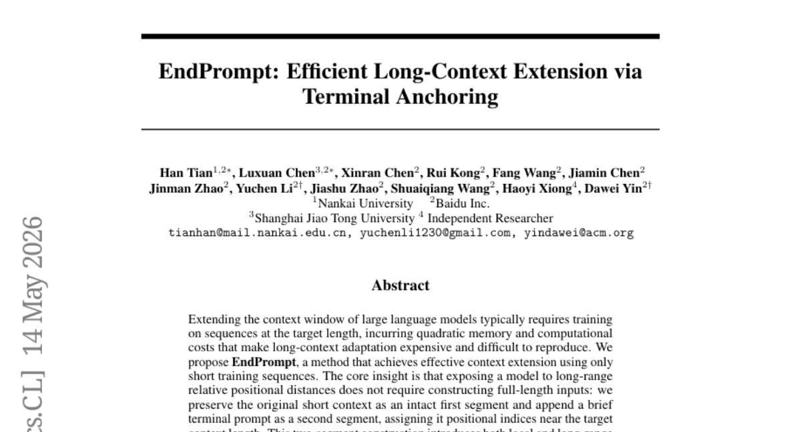

### 📌 한 줄 요약
짧은 학습 시퀀스만으로 모델의 컨텍스트 윈도우를 효율적으로 확장하는 터미널 앵커링 기법 제안

### 🔑 핵심 포인트
- 터미널 앵커링: 짧은 시퀀스 내에서 원본 컨텍스트와 타겟 위치를 결합하여 긴 거리의 상대적 위치를 학습
- 이론적 검증: RoPE 기반의 위치 보간이 어텐션 함수의 안정성을 유지함을 수학적으로 입증
- 효율적 확장: 전체 길이를 학습하는 대신 짧은 시퀀스로도 고성능의 롱 컨텍스트 성능 확보

### 🧑‍💻 개발자 관점
막대한 컴퓨팅 자원 없이도 기존 모델의 컨텍스트 길이를 효과적으로 확장할 수 있는 실용적인 방법론을 제시합니다.

### 🚀 실무 적용 아이디어
- LLaMA 등 RoPE 기반 모델에 EndPrompt의 두 세그먼트 구성 방식 적용 테스트
- 기존 Chunk-based 학습 방식과 EndPrompt의 성능 및 학습 시간 비교 실험
- 다양한 컨텍스트 확장 배수(예: 8K -> 32K, 128K)에 따른 성능 저하 여부 검증

### ⚠️ 리스크/한계
- 매우 긴 시퀀스에서 중간 위치 정보의 부재로 인한 잠재적 불안정성
- 특정 모델 구조(RoPE 사용 모델)에 국한된 적용 가능성

### 📝 초록 기반 상세 설명
기존의 긴 컨텍스트 확장 방식은 타겟 길이에 맞춘 학습이 필요하여 막대한 메모리와 연산 비용이 발생한다는 문제가 있었습니다. 본 논문은 짧은 시퀀스만으로도 긴 컨텍스트를 학습할 수 있는 EndPrompt 방식을 제안합니다. 방법론의 핵심은 원본 컨텍스트를 유지한 채 타겟 길이에 해당하는 위치 인덱스를 가진 짧은 프롬프트를 끝에 붙여 상대적 위치 거리를 학습시키는 것입니다. 이론적으로는 RoPE와 Bernstein 부등식을 통해 위치 보간이 어텐션 함수의 매끄러움을 유지함을 증명했습니다. 실험 결과, LLaMA 모델의 컨텍스트를 8K에서 64K로 확장했을 때 기존의 청크 기반 방식이나 전체 길이 파인튜닝보다 높은 성능을 기록했습니다. 이는 밀집된 긴 시퀀스 학습 없이도 희소한 위치 감독만으로 컨텍스트 확장이 가능함을 보여줍니다.

---

## 16. [Where Should Diffusion Enter a Language Model? Geometry-Guided Hidden-State Replacement](https://huggingface.co/papers/2605.14368)
**Upvotes**: 12 | **도입 난이도**: 상 | **신뢰도**: 상
**arXiv**: https://arxiv.org/abs/2605.14368

**태그**: LLM, Diffusion, Transformer, Generative AI

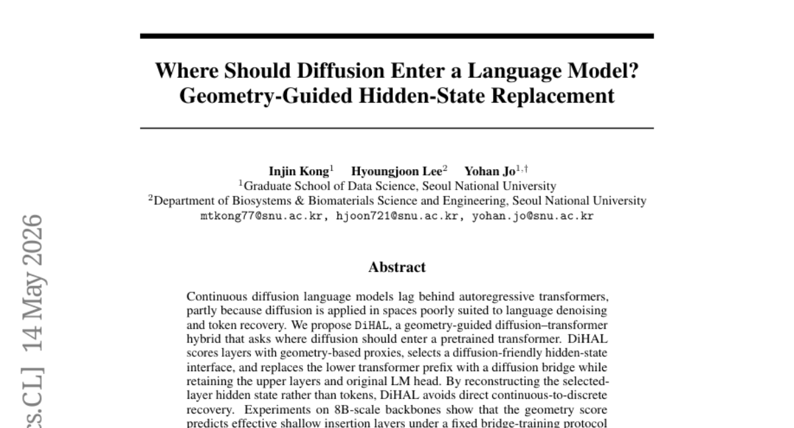

### 📌 한 줄 요약
사전 학습된 트랜스포머의 특정 레이어를 디퓨전 브리지로 교체하여 토큰 복구 문제를 해결하는 하이브리드 언어 모델 구조 제안

### 🔑 핵심 포인트
- 기하학적 지표를 활용하여 디퓨전 삽입에 최적화된 트랜스포머 레이어 위치 식별
- 하위 레이어를 디퓨전 브리지로 교체하고 상위 레이어를 유지하는 하이브리드 구조(DiHAL) 제안
- 토큰 직접 복구가 아닌 은닉 상태 재구성을 통한 연속-이산 변환 문제 해결

### 🧑‍💻 개발자 관점
기존의 강력한 사전 학습 모델(LLM)의 지식은 유지하면서, 디퓨전 모델의 생성 특성을 결합할 수 있는 구조적 방법론을 제시합니다.

### 🚀 실무 적용 아이디어
- 오픈소스 LLM(Llama 등)의 레이어별 기하학적 특성(Geometry score) 분석 실험
- 특정 레이어를 디퓨전 모듈로 교체했을 때의 성능 변화 측정
- 기존 AR 모델과 DiHAL 구조 간의 생성 다양성 및 품질 비교

### ⚠️ 리스크/한계
- 사전 학습된 모델의 레이어를 교체할 때 발생하는 지식 손실 가능성
- 기하학적 지표가 모든 모델 아키텍처에서 범용적으로 작동할지에 대한 의문

### 📝 초록 기반 상세 설명
기존의 연속적 디퓨전 언어 모델은 토큰 복구 및 적합하지 않은 공간에서의 노이즈 제거 문제로 인해 자기회귀(AR) 모델보다 성능이 뒤처지는 한계가 있었습니다. 본 논문은 DiHAL을 제안하며, 사전 학습된 트랜스포머 내에서 디퓨전이 개입하기 가장 적합한 위치를 기하학적 지표로 식별합니다. 구체적으로 기하학적 프록시를 통해 레이어를 점수화하고, 하위 레이어를 디퓨전 브리지로 교체하되 상위 레이어와 LM 헤드는 유지하는 방식을 사용합니다. 토큰이 아닌 선택된 레이어의 은닉 상태(hidden-state)를 직접 재구성함으로써 이산적 복구 문제를 회피합니다. 8B 규모의 백본 실험 결과, 기하학적 점수가 효과적인 삽입 위치를 정확히 예측하며 기존 디퓨전 방식보다 우수한 은닉 상태 복구 성능을 보였습니다.

---

## 17. [Model-Adaptive Tool Necessity Reveals the Knowing-Doing Gap in LLM Tool Use](https://huggingface.co/papers/2605.14038)
**Upvotes**: 11 | **도입 난이도**: 중 | **신뢰도**: 상
**arXiv**: https://arxiv.org/abs/2605.14038

**태그**: LLM-Agent, Tool-Use, Reasoning, Model-Interpretability, Agent

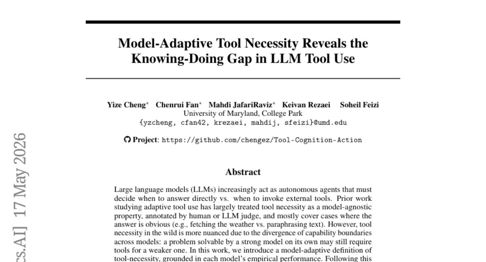

### 📌 한 줄 요약
LLM의 도구 사용 실패는 '필요성 인지'가 아닌 '인지에서 실행으로의 전환' 과정에서 발생하는 'Knowing-Doing Gap'이 주원인임을 규명함

### 🔑 핵심 포인트
- 모델의 역량에 따라 도구 필요성이 달라진다는 '모델 적응형(Model-Adaptive)' 정의 제안
- 도구 사용 과정을 '내부 인지(Cognition)'와 '실행(Execution)' 단계로 분리하여 분석
- 인지와 실행 사이의 불일치(Knowing-Doing Gap)가 도구 사용 실패의 핵심 원인임을 규명

### 🧑‍💻 개발자 관점
에이전트 개발 시 단순히 '언제 도구를 쓸지'를 학습시키는 것을 넘어, 인지된 판단을 실제 API 호출로 정확히 연결하는 제어 로직이 중요함을 시사합니다.

### 🚀 실무 적용 아이디어
- 에이전트 프롬프트 설계 시 '판단'과 '실행' 단계를 명시적으로 분리하여 테스트하기
- 모델의 내부 상태(Hidden States)를 모니터링하여 판단-실행 불일치 지점 식별하기
- 모델 성능(Reasoning capability)에 따른 동적 도구 호출 임계값 설정 실험

### ⚠️ 리스크/한계
- 모델의 내부 상태 분석에 의존하므로 모든 모델에 일반화하기 어려울 수 있음
- 실행 단계의 오류를 해결하기 위한 구체적인 아키텍처 가이드는 추가 연구가 필요함

### 📝 초록 기반 상세 설명
LLM이 자율 에이전트로 발전함에 따라 직접 답변과 외부 도구 호출 사이의 의사결정이 중요해지고 있습니다. 기존 연구는 도구의 필요성을 모델 성능과 무관한 고정된 속성으로 간주했으나, 실제로는 모델의 역량에 따라 도구 필요성이 달라집니다. 본 연구는 모델의 성능에 기반한 '모델 적응형 도구 필요성' 정의를 도입하여 기존 방식의 한계를 지적합니다. 실험 결과, 모델이 도구의 필요성을 인지하는 단계와 실제 호출하는 단계 사이에서 상당한 불일치가 발견되었습니다. 내부 상태 분석을 통해 이러한 불일치가 인지 단계가 아닌, 인지된 정보를 행동으로 옮기는 전환 과정에서 발생함을 밝혀냈습니다.

### 🖼️ 추가 자료

---

## 18. [CompactAttention: Accelerating Chunked Prefill with Block-Union KV Selection](https://huggingface.co/papers/2605.16839)
**Upvotes**: 10 | **도입 난이도**: 상 | **신뢰도**: 상
**arXiv**: https://arxiv.org/abs/2605.16839

**태그**: LLM, Inference Optimization, Attention Mechanism, Long Context, Benchmark

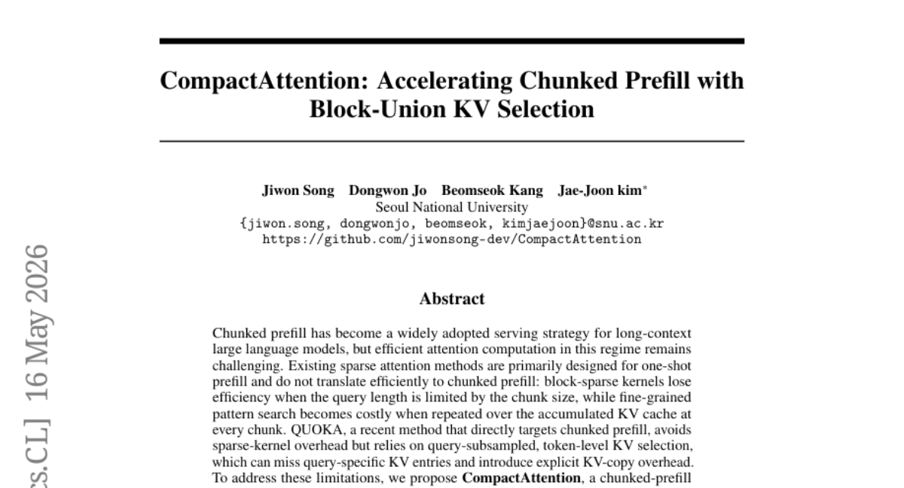

### 📌 한 줄 요약
Chunked prefill 환경에서 KV 캐시 복사 오버헤드 없이 블록 단위로 효율적인 KV 선택을 수행하여 긴 컨텍스트 추론 속도를 가속화하는 기술

### 🔑 핵심 포인트
- Block-Union KV Selection: 2D 블록 마스크를 GQA 구조를 고려한 최소 단위의 블록 테이블로 변환
- Zero-copy KV Access: 별도의 KV 압축/복사 과정 없이 페이징된 메모리 상에서 직접 접근 가능
- Chunked Prefill Optimization: 짧은 쿼리 길이에 최적화된 블록 단위 연산으로 연산 효율 극대화

### 🧑‍💻 개발자 관점
LLM 서비스 운영 시 긴 컨텍스트 처리를 위한 Chunked prefill의 성능 병목(KV 복사 및 연산 효율)을 해결할 수 있는 실질적인 가속 기법입니다.

### 🚀 실무 적용 아이디어
- GQA 구조를 사용하는 최신 모델(Llama-3 등)에서의 성능 벤치마크 수행
- PagedAttention 환경에서의 메모리 레이아웃과 본 알고리즘의 호환성 검토
- 컨텍스트 길이가 길어질수록 발생하는 KV 캐시 관리 오버헤드 비교 실험

### ⚠️ 리스크/한계
- 블록 단위 선택 방식이므로 매우 미세한(fine-grained) 중요도 차이를 반영하지 못할 가능성 존재
- GQA 구조에 특화되어 있어 다른 어텐션 구조로의 일반화 적용 시 복잡도 증가

### 📝 초록 기반 상세 설명
최근 긴 컨텍스트 처리를 위해 Chunked prefill 방식이 널리 사용되고 있으나, 기존의 희소 어텐션(Sparse Attention) 방식은 청크 단위의 짧은 쿼리 길이나 반복적인 패턴 탐색으로 인해 효율이 저하되는 문제가 있습니다. QUOKA와 같은 기존 방식은 토큰 단위 선택으로 인해 중요한 KV를 놓치거나 별도의 KV 복사 오버헤드가 발생합니다. 이를 해결하기 위해 제안된 CompactAttention은 2D 블록 희소 마스크를 GQA(Grouped Query Attention) 구조에 최적화된 블록 테이블로 변환하는 'Block-Union KV Selection' 방식을 도입합니다. 이 방식은 페이징된 실행 환경에서 데이터 복사 없이 인플레이스(in-place)로 선택된 KV 블록에 접근할 수 있게 합니다. 실험 결과, LLaMA-3.1-8B 모델의 128K 컨텍스트 환경에서 정확도를 유지하면서도 최대 2.72배의 속도 향상을 달상했습니다.

---

## 19. [From Runnable to Shippable: Multi-Agent Test-Driven Development for Generating Full-Stack Web Applications from Requirements](https://huggingface.co/papers/2605.17242)
**Upvotes**: 9 | **도입 난이도**: 상 | **신뢰도**: 상
**arXiv**: https://arxiv.org/abs/2605.17242

**태그**: AI Agent, TDD, Web Development, Automated Testing, Agent, Benchmark

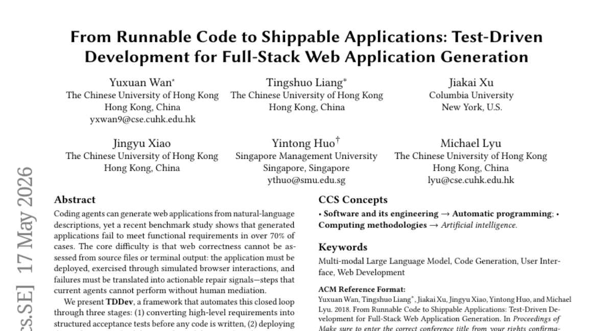

### 📌 한 줄 요약
요구사항으로부터 완전한 풀스택 웹 앱을 자동 생성하기 위해 브라우저 기반 테스트와 피드백 루프를 결합한 멀티 에이전트 TDD 프레임워크 제안

### 🔑 핵심 포인트
- 요구사항 기반의 자동화된 수락 테스트(Acceptance Test) 생성 및 브라우저 시뮬레이션 검증 루프 구축
- 모델의 생성 스타일(Holistic vs Incremental)에 따른 최적의 TDD 프로토콜 매칭 전략 발견
- 수동 프롬프트 엔지니어링을 자율적인 피드백 기반 정제 작업으로 전환

### 🧑‍💻 개발자 관점
단순 코드 생성을 넘어, 실제 배포 가능한 수준의 웹 애플리케이션을 만들기 위해 테스트 자동화와 에이전트 피드백 루프가 필수적임을 시사합니다.

### 🚀 실무 적용 아이디어
- LLM 기반 에이전트에 Playwright/Selenium 같은 브라우저 자동화 도구 통합 실험
- 모델의 코드 생성 패턴(한 번에 다 쓰기 vs 조금씩 수정하기) 분석 및 프로토콜 설계
- 요구사항을 테스트 코드로 먼저 변환하는 워크플로우 적용 테스트

### ⚠️ 리스크/한계
- 모델의 생성 스타일과 프로토콜이 일치하지 않을 경우 토큰 비용이 급격히 증가할 위험
- 브라우저 기반 시뮬레이션 및 배포 환경 구축에 따른 높은 인프라 비용과 복잡도

### 📝 초록 기반 상세 설명
현재의 코딩 에이전트는 자연어 요구사항을 기반으로 웹 앱을 생성하지만, 실제 기능적 요구사항을 충족하지 못하는 경우가 빈번합니다. 이는 웹 애플리케이션의 정확성을 소스 코드나 터미널 출력만으로는 검증하기 어렵고, 실제 배포 및 브라우저 상의 상호작용을 통한 검증이 필요하기 때문입니다. 본 논문은 요구사항을 수락 테스트로 변환하고, 브라우저 시뮬레이션을 통해 검증하며, 실패 시 수리 보고서를 생성하는 자동화된 TDD 프레임워크인 TDDev를 제안합니다. 실험 결과, TDD 인프라 도입 시 생성 품질이 대폭 향상되었으며, 모델의 생성 스타일(전체 생성형 vs 점진적 확장형)에 따른 최적의 프로토콜이 다름을 확인했습니다. 결과적으로 TDDev는 개발자의 개입을 최소화하고 자율적인 피드백 기반 정제 과정을 가능하게 합니다.

---

## 20. [Targeted Neuron Modulation via Contrastive Pair Search](https://huggingface.co/papers/2605.12290)
**Upvotes**: 8 | **도입 난이도**: 하 | **신뢰도**: 상
**arXiv**: https://arxiv.org/abs/2605.12290

**태그**: LLM Alignment, Mechanistic Interpretability, Model Steering, Safety, Benchmark

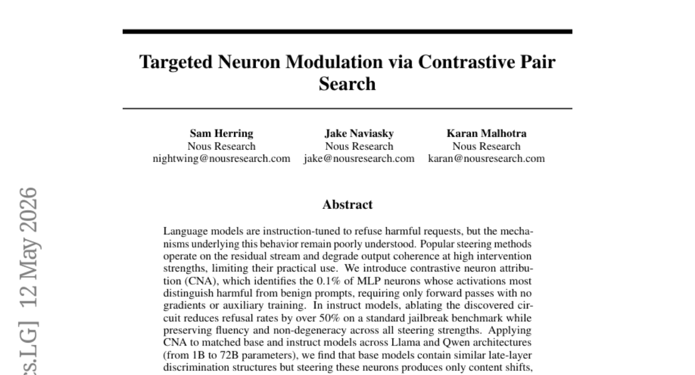

### 📌 한 줄 요약
모델의 출력 품질 저하 없이 특정 행동(거절)을 제어할 수 있는 희소 뉴런 타겟팅 기법 제안

### 🔑 핵심 포인트
- CNA(Contrastive Neuron Attribution): 학습 없이 순방향 패스만으로 핵심 뉴런을 식별하는 효율적 방법론
- 출력 품질 유지: 잔차 스트림 제어 방식과 달리 모델의 유창성과 비퇴행성을 보존하며 행동 제어 가능
- 정렬 메커니즘 규명: 사전 학습 모델의 구조가 미세 조정(fine-tuning)을 통해 어떻게 거절 기제로 변하는지 분석

### 🧑‍💻 개발자 관점
모델의 성능 저하 없이 특정 행동(예: 거절, 특정 스타일 유지)을 정밀하게 제어하거나 탈옥(jailbreak) 방어 기제를 분석할 때 유용합니다.

### 🚀 실무 적용 아이디어
- 오픈소스 모델(Llama, Qwen 등)에 CNA 알고리즘을 적용하여 핵심 뉴런 추출 실험
- 특정 태스크(예: 요약, 코드 생성)에 특화된 뉴런을 식별하여 모델 행동 제어 테스트
- 모델의 거절/허용 임계값을 조절하기 위한 뉴런 어블레이션(Ablation) 실험

### ⚠️ 리스크/한계
- 뉴런 수준의 개입이 모델의 다른 복합적인 추론 능력에 미칠 수 있는 잠재적 부작용
- 특정 아키텍처(MLP 구조)에 의존적인 방법론일 가능성

### 📝 초록 기반 상세 설명
LLM의 유해 요청 거절 메커니즘은 여전히 불분명하며, 기존의 잔차 스트림(residual stream) 기반 제어 방식은 개입 강도가 높을 때 출력 품질이 저하되는 문제가 있습니다. 본 논문은 유해한 프롬프트와 무해한 프롬프트를 구분하는 핵심 MLP 뉴런 0.1%를 식별하는 '대조적 뉴런 귀속(CNA)' 기법을 소개합니다. 이 방법은 별도의 학습이나 그래디언트 없이 순방향 패스(forward pass)만으로 작동합니다. 실험 결과, 식별된 뉴런을 제거했을 때 모델의 거절률은 50% 이상 감소하면서도 언어 생성 능력은 유지되었습니다. 또한 Llama와 Qwen 모델을 통해 정렬(alignment) 과정이 기존의 식별 구조를 거절 게이트로 변환시킨다는 것을 확인했습니다.

---

## 21. [AstraFlow: Dataflow-Oriented Reinforcement Learning for Agentic LLMs](https://huggingface.co/papers/2605.15565)
**Upvotes**: 6 | **도입 난이도**: 중 | **신뢰도**: 상
**arXiv**: https://arxiv.org/abs/2605.15565

**태그**: Reinforcement Learning, LLM Agents, Distributed Systems, Dataflow Architecture, Agent, Reasoning, Evaluation

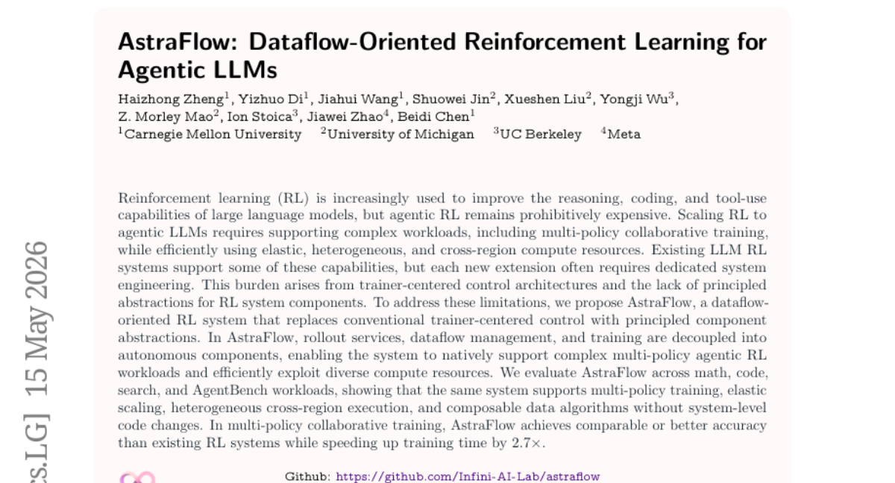

### 📌 한 줄 요약
데이터플로우 중심의 아키텍처를 통해 복잡한 멀티 정책 에이전트 RL 학습을 효율적으로 확장하는 시스템 프레임워크

### 🔑 핵심 포인트
- 트레이너 중심에서 데이터플로우 중심의 아키텍처로 전환하여 컴포넌트 간 결합도 해소
- 롤아웃, 데이터 관리, 학습의 독립적 분리를 통한 멀티 정책 및 이기종 리소스 활용 최적화
- 시스템 코드 변경 없이도 다양한 알고리즘과 확장 시나리오를 지원하는 구성 가능성(Composability) 확보

### 🧑‍💻 개발자 관점
에이전트 학습을 위한 대규모 분산 환경 구축 시, 시스템 엔지니어링 부담을 줄이면서 효율적인 리소스 스케일링과 멀티 모델 협업 학습을 가능하게 합니다.

### 🚀 실무 적용 아이디어
- 멀티 에이전트 협업 학습 시 기존 단일 트레이너 방식과의 성능/비용 비교 실험
- 이기종 GPU 클러스터 환경에서의 데이터플로우 병목 지점 분석
- 다양한 RL 알고리즘을 컴포넌트 단위로 교체하며 확장성 테스트

### ⚠️ 리스크/한계
- 컴포넌트 분리로 인한 통신 오버헤드 발생 가능성
- 데이터플로우 관리 로직의 복잡도로 인한 디버깅 난이도 상승

### 📝 초록 기반 상세 설명
최근 LLM의 추론 및 도구 사용 능력을 높이기 위해 강화학습(RL)이 활용되고 있으나, 에이전트 중심의 RL은 막대한 비용과 복잡한 워크로드를 수반합니다. 기존 시스템은 트레이너 중심의 제어 구조로 인해 새로운 기능 확장 시 매번 별도의 시스템 엔지니어링이 필요하다는 한계가 있습니다. 이를 해결하기 위해 AstraFlow는 기존의 트레이너 중심 제어를 탈피하여 데이터플로우 중심의 아키텍처를 제안합니다. 롤아웃 서비스, 데이터플로우 관리, 학습 과정을 독립적인 컴포넌트로 분리하여 멀티 정책 학습과 이기종/교차 지역 리소스 활용을 용이하게 합니다. 실험 결과, 수학, 코드, 에이전트 벤치마크 등 다양한 워크로드에서 기존 시스템 대비 높은 학습 속도와 유연한 확장성을 입증했습니다.

---

## 22. [AtlasVA: Self-Evolving Visual Skill Memory for Teacher-Free VLM Agents](https://huggingface.co/papers/2605.17933)
**Upvotes**: 5 | **도입 난이도**: 중 | **신뢰도**: 상
**arXiv**: https://arxiv.org/abs/2605.17933

**태그**: VLM-Agent, Reinforcement-Learning, Spatial-Intelligence, Visual-Memory, Agent, Vision, Benchmark

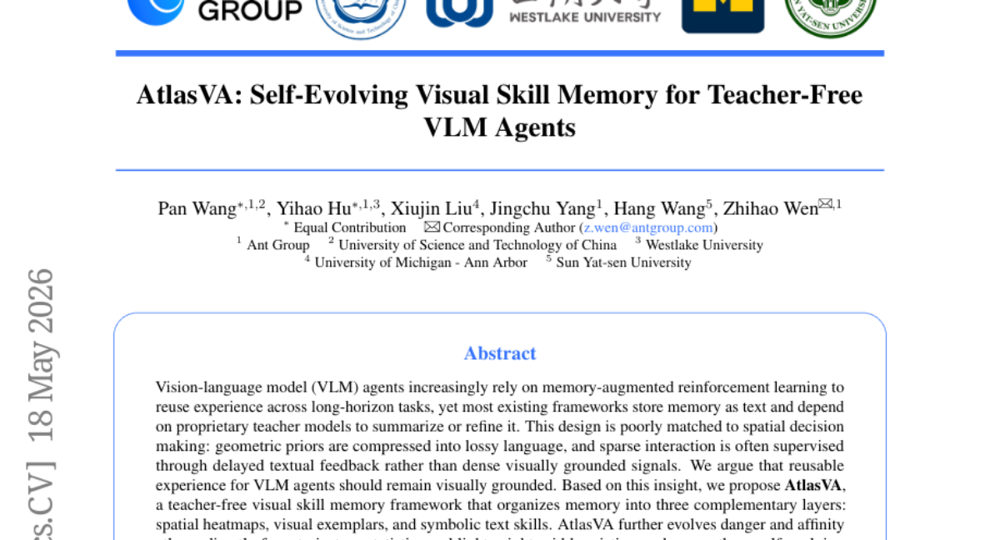

### 📌 한 줄 요약
외부 LLM 교사 모델 없이 시각적 정보를 활용해 스스로 진화하는 공간 지능형 VLM 에이전트 프레임워크

### 🔑 핵심 포인트
- 텍스트 중심 메모리의 한계를 극복하는 3계층(히트맵, 시각 예시, 텍스트) 시각적 메모리 구조
- 외부 LLM 없이 궤적 통계와 휴리스틱만으로 진화하는 'Atlas(위험/친화도 지도)' 메커니즘
- 시각적 지도를 강화학습의 잠재적 보상(Potential-based reward)으로 활용하여 최적화와 인식을 통합

### 🧑‍💻 개발자 관점
LLM API 비용이나 지연 시간 없이도 에이전트가 공간 정보를 효율적으로 학습하고 재사용할 수 있는 구조를 제시합니다.

### 🚀 실무 적용 아이디어
- 텍스트 기반 RAG와 시각적 히트맵 기반 메모리 성능 비교 실험
- 3D 환경에서의 공간 정보 손실률 측정 및 AtlasVA 구조 적용 테스트
- 강화학습 보상 함수로서의 시각적 지도 유효성 검증

### ⚠️ 리스크/한계
- 복잡한 3D 환경에서 그리드 기반 휴리스틱의 확장성 문제
- 시각적 메모리 레이어 간의 정보 정렬 및 통합 난이도

### 📝 초록 기반 상세 설명
기존 VLM 에이전트는 메모리를 텍스트로 저장하여 공간적 의사결정 시 기하학적 정보 손실과 피드백 지연 문제가 발생합니다. 이를 해결하기 위해 본 논문은 시각적 근거를 유지하는 AtlasVA 프레임워크를 제안합니다. AtlasVA는 공간 히트맵, 시각적 예시, 상징적 텍스트 스킬의 3계층 메모리 구조를 통해 경험을 관리합니다. 특히 궤적 통계와 그리드 휴리스틱을 통해 위험/친화도 지도를 스스로 진화시키며, 이를 강화학습의 보상 함수로 활용합니다. 실험 결과 Sokoban, 3D 내비게이션 등 공간 집약적 작업에서 기존 텍스트 중심 방식보다 뛰어난 성능을 입증했습니다.

---

## 23. [MixSD: Mixed Contextual Self-Distillation for Knowledge Injection](https://huggingface.co/papers/2605.16865)
**Upvotes**: 4 | **도입 난이도**: 하 | **신뢰도**: 상
**arXiv**: https://arxiv.org/abs/2605.16865

**태그**: Fine-tuning, Knowledge Injection, Self-Distillation, Catastrophic Forgetting, Reasoning, Vision, Benchmark, Evaluation, Distillation

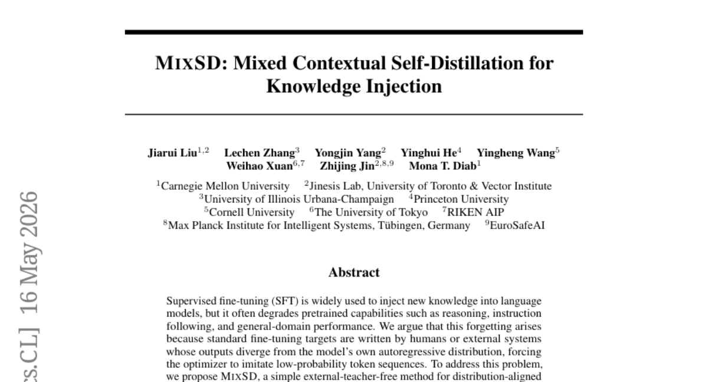

### 📌 한 줄 요약
모델의 기존 능력을 보존하면서 새로운 지식을 효율적으로 주입하는 분포 정렬 기반의 자기 증류(Self-Distillation) 기법

### 🔑 핵심 포인트
- 외부 교사(External Teacher) 없이 모델 내부의 두 조건부 분포를 혼합하는 자기 증류 방식 제안
- 학습 타겟을 모델의 원래 분포에 가깝게 정렬하여 치명적 망각(Catastrophic Forgetting) 방지
- 지식 습득(Memorization)과 기존 능력 유지(Retention) 사이의 최적의 균형 달성

### 🧑‍💻 개발자 관점
특정 도메인 지식을 학습시킬 때 모델이 바보가 되는 현상을 막고 싶을 때 적용 가능한 실용적인 방법론입니다.

### 🚀 실무 적용 아이디어
- 기존 SFT 데이터셋에 MixSD의 혼합 방식(Expert/Naive mix)을 적용하여 성능 비교
- 특정 지식 주입 시 발생하는 성능 저하(Perplexity 상승 등)를 MixSD로 완화할 수 있는지 검증
- 모델 스케일 변화에 따른 MixSD의 안정성 테스트

### ⚠️ 리스크/한계
- 혼합 비율(Mixing ratio) 설정에 따라 지식 습득 속도와 기존 능력 보존 사이의 균형이 달라질 수 있음
- 매우 복잡한 추론 능력이 필요한 작업에서는 단순 혼합만으로 충분한 효과를 얻을 수 있을지 검증 필요

### 📝 초록 기반 상세 설명
SFT(Supervised Fine-tuning)를 통한 지식 주입은 모델의 기존 추론 및 일반 성능을 저하시키는 치명적 망각 문제를 야기합니다. 이는 학습 타겟이 모델의 원래 자기회귀 분포와 일치하지 않아 저확률 토큰을 강제로 학습하게 만들기 때문입니다. 이를 해결하기 위해 본 논문은 외부 교사 없이 모델 자체의 분포를 활용하는 MixSD를 제안합니다. MixSD는 지식을 포함한 전문가 조건(Expert)과 모델의 기존 사전 확률을 반영한 나이브 조건(Naive)을 혼합하여 동적인 학습 타겟을 생성합니다. 실험 결과, MixSD는 기존 SFT 대비 모델의 기존 능력을 거의 완벽하게 유지하면서도 높은 학습 정확도를 달성하는 우수한 트레이드오프를 보여주었습니다.

---

## 24. [FINESSE-Bench: A Hierarchical Benchmark Suite for Financial Domain Knowledge and Technical Analysis in Large Language Models](https://huggingface.co/papers/2605.15482)
**Upvotes**: 4 | **도입 난이도**: 하 | **신뢰도**: 상
**arXiv**: https://arxiv.org/abs/2605.15482

**태그**: Benchmark, Finance, LLM Evaluation, RAG, Reasoning, Evaluation

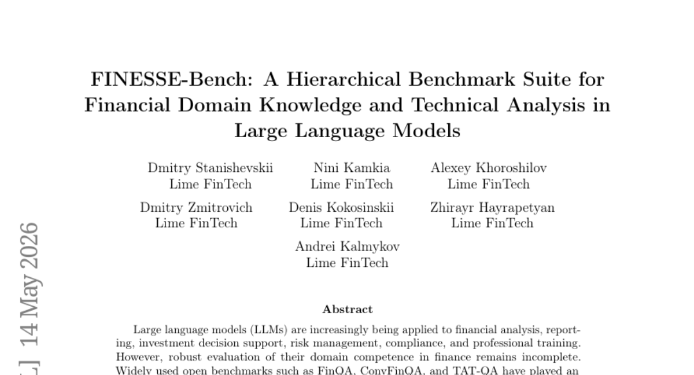

### 📌 한 줄 요약
금융 전문가 수준의 추론 능력을 계층적으로 평가하기 위한 8종의 전문 벤치마크 스위트 제안

### 🔑 핵심 포인트
- CFA/CMT 등 전문 자격증 수준을 반영한 계층적 난이도 설계
- 기초 지식부터 고난도 추론까지 모델의 역량 변화를 측정 가능한 8종 벤치마크 구성
- 객관식 및 주관식(LLM-as-judge)을 포함한 통합 평가 프로토콜 제공

### 🧑‍💻 개발자 관점
금융 특화 LLM 개발 시, 단순 QA를 넘어 실제 전문가 수준의 추론 능력을 검증할 수 있는 정교한 평가 프레임워크를 제공합니다.

### 🚀 실무 적용 아이디어
- 보유 중인 금융 특화 모델을 FINESSE-Bench에 적용하여 난이도별 성능 저하 지점 확인
- LLM-as-judge 채점 방식이 모델의 주관적 편향을 유도하는지 검증
- 특정 금융 도메인(예: 트레이딩)에 대한 모델의 전문성 한계점 파악

### ⚠️ 리스크/한계
- LLM-as-judge 방식 사용 시 채점 모델의 편향성 개입 가능성
- 특정 자격증 스타일 문제에 대한 과적합(Overfitting) 위험

### 📝 초록 기반 상세 설명
LLM이 금융 분석 및 의사결정 지원에 활용되고 있으나, 기존 벤치마크는 단순 질의응답에 치중되어 전문적인 난이도 계층을 반영하지 못하는 한계가 있습니다. 이를 해결하기 위해 연구진은 기초 지식부터 전문가 수준의 추론까지 평가할 수 있는 FINESSE-Bench를 개발했습니다. 이 벤치마크는 CFA, CMT, CFTe 등 전문 자격증 스타일의 문제와 실전 트레이딩 태스크를 포함한 8개의 특화된 데이터셋으로 구성됩니다. 또한 객관식, 수치형, 주관식 답변을 모두 아우르는 통합 평가 프로토콜과 LLM-as-judge 기반의 자동 채점 방식을 제공합니다. 이를 통해 모델의 도메인 지식 폭과 난이도 상승에 따른 성능 저하를 정밀하게 측정할 수 있습니다.

---

## 25. [MementoGUI: Learning Agentic Multimodal Memory Control for Long-Horizon GUI Agents](https://huggingface.co/papers/2605.18652)
**Upvotes**: 3 | **도입 난이도**: 중 | **신뢰도**: 상
**arXiv**: https://arxiv.org/abs/2605.18652

**태그**: AI Agent, GUI Automation, Memory Management, Multimodal, Agent, RAG, Evaluation, Optimization

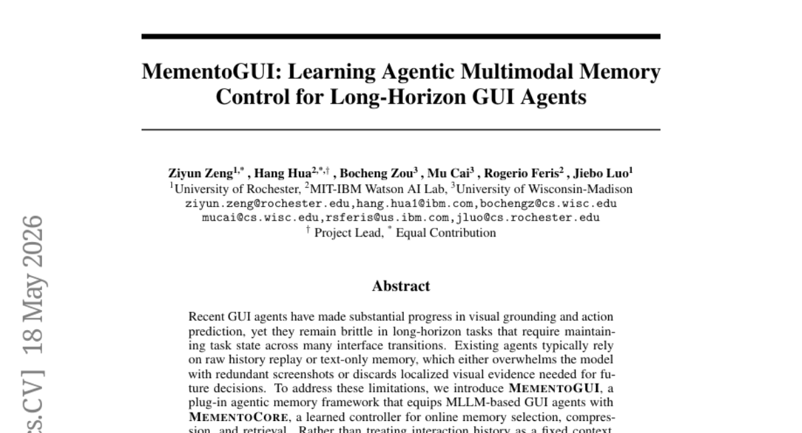

### 📌 한 줄 요약
장기 작업 수행 시 발생하는 메모리 과부하와 정보 손실 문제를 해결하기 위해, 시각적 증거와 텍스트 요약을 결합한 에이전트용 메모리 컨트롤 프레임워크를 제안함

### 🔑 핵심 포인트
- MementoCore: 작업 기억(압축/선택)과 에피소드 기억(검색/저장)을 관리하는 모듈형 컨트롤러 개발
- ROI 기반 시각적 증거 보존: 단순 스크린샷 대신 핵심 영역(ROI)과 텍스트 요약을 결합하여 효율적인 컨텍스트 관리
- Plug-in 구조: 기존 MLLM 기반 GUI 에이전트의 백본을 수정하지 않고도 메모리 능력을 확장 가능

### 🧑‍💻 개발자 관점
에이전트가 긴 작업 흐름에서 컨텍스트 윈도우 제한이나 정보 노이즈 문제로 인해 길을 잃는 문제를 해결하는 실질적인 아키텍처를 제시함

### 🚀 실무 적용 아이디어
- 기존 GUI 에이전트에 ROI 기반 시각 정보 추출 모듈 결합 테스트
- 단순 텍스트 요약과 시각적 증거(ROI)를 혼합한 메모리 구조의 성능 비교
- 에이전트의 작업 단계별 메모리 압축 효율성 검증

### ⚠️ 리스크/한계
- ROI 추출 과정에서의 시각적 정보 손실 가능성
- 메모리 컨트롤러(MementoCore) 자체의 연산 오버헤드 발생 가능성

### 📝 초록 기반 상세 설명
최근 GUI 에이전트는 시각적 이해도는 높으나, 긴 작업 과정에서 상태를 유지하는 능력이 부족하여 정보 과부하나 핵심 정보 유실 문제를 겪고 있습니다. 이를 해결하기 위해 MementoGUI는 MementoCore라는 플러그인 방식의 메모리 컨트롤 프레임워크를 도입합니다. 이 시스템은 작업 관련 이벤트를 텍스트 요약과 ROI(관심 영역) 기반 시각 정보로 압축하여 작업 기억(Working Memory)을 관리하고, 과거의 재사용 가능한 궤적을 에피소드 기억(Episodic Memory)에서 검색합니다. 모델의 백본을 미세 조정하지 않고도 기존 에이전트에 플러그인 형태로 결합할 수 있는 모듈형 구조를 가집니다. 실험 결과, 제안된 방식은 기존의 단순 히스토리 재생이나 텍스트 전용 메모리 방식보다 장기 작업 수행 능력을 유의미하게 향상시켰습니다.

---

## 26. [Agent Bazaar: Enabling Economic Alignment in Multi-Agent Marketplaces](https://huggingface.co/papers/2605.17698)
**Upvotes**: 3 | **도입 난이도**: 상 | **신뢰도**: 상
**arXiv**: https://arxiv.org/abs/2605.17698

**태그**: Multi-Agent, Reinforcement Learning, Economic Alignment, Simulation, Agent, RAG, Evaluation, Safety

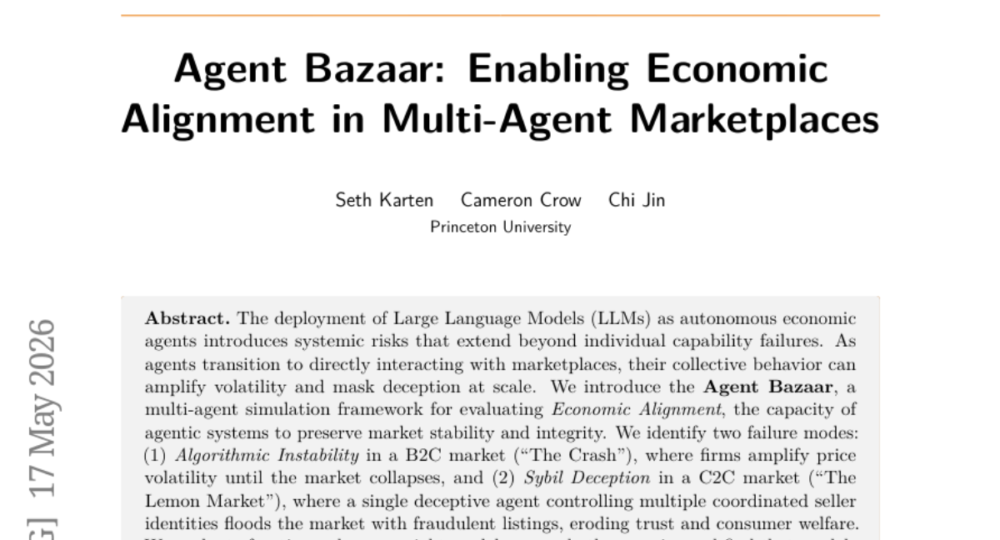

### 📌 한 줄 요약
멀티 에이전트 시장 환경에서 경제적 안정성과 신뢰성을 확보하기 위한 시뮬레이션 프레임워크 및 학습 방법론 제안

### 🔑 핵심 포인트
- 경제적 정렬(Economic Alignment) 평가를 위한 멀티 에이전트 시뮬레이션 프레임워크 'Agent Bazaar' 개발
- 시장 붕괴 및 시빌 공격(Sybil Deception)과 같은 에이전트 특유의 경제적 실패 모드 식별
- 적응형 커리큘럼 기반 REINFORCE++를 통한 경제적 정렬 특화 모델 학습 및 EAS 지표 제안

### 🧑‍💻 개발자 관점
에이전트가 단순 작업을 넘어 경제적 거래를 수행할 때 발생할 수 있는 예측 불가능한 시장 리스크를 관리하는 기술적 토대를 제공합니다.

### 🚀 실무 적용 아이디어
- 에이전트 기반 서비스 설계 시 시장 변동성 시나리오를 포함한 스트레스 테스트 수행
- 다중 계정(Sybil) 공격에 대비한 에이전트 식별 및 검증 로직 검토
- RL(강화학습)을 통한 에이전트의 경제적 의사결정 최적화 실험

### ⚠️ 리스크/한계
- 제안된 안정화 기법(Stabilizing Firms 등)이 극한의 시장 상황에서는 여전히 취약할 수 있음
- 경제적 정렬 능력이 일반적인 지능(General Capability)과 별개로 작동하므로 범용 모델 적용 시 주의 필요

### 📝 초록 기반 상세 설명
LLM 기반 자율 에이전트가 시장에 참여함에 따라 집단적 행동에 의한 시장 변동성 및 기만 행위와 같은 시스템적 리스크가 발생하고 있습니다. 이를 해결하기 위해 경제적 정렬(Economic Alignment)을 평가할 수 있는 멀티 에이전트 시뮬레이션 프레임워크인 'Agent Bazaar'를 도입했습니다. 연구 결과, 기존 모델들은 시장 붕괴(Algorithmic Instability)와 시빌 공격(Sybil Deception) 상황에서 자가 조절 능력이 부족함을 확인했습니다. 이를 개선하기 위해 적응형 커리큘럼 기반의 REINFORCE++ 학습법을 제안하며, 이를 통해 성능이 뛰어난 9B 모델을 개발했습니다. 최종적으로 시장 안정성, 무결성, 복지, 수익성을 통합한 경제적 정렬 점수(EAS)를 통해 모델 간 비교를 가능하게 했습니다.

---

## 27. [NGM: A Plug-and-Play Training-Free Memory Module for LLMs](https://huggingface.co/papers/2605.16893)
**Upvotes**: 3 | **도입 난이도**: 하 | **신뢰도**: 상
**arXiv**: https://arxiv.org/abs/2605.16893

**태그**: LLM, Memory Module, Plug-and-Play, Efficiency, RAG, Multimodal, Benchmark, Evaluation

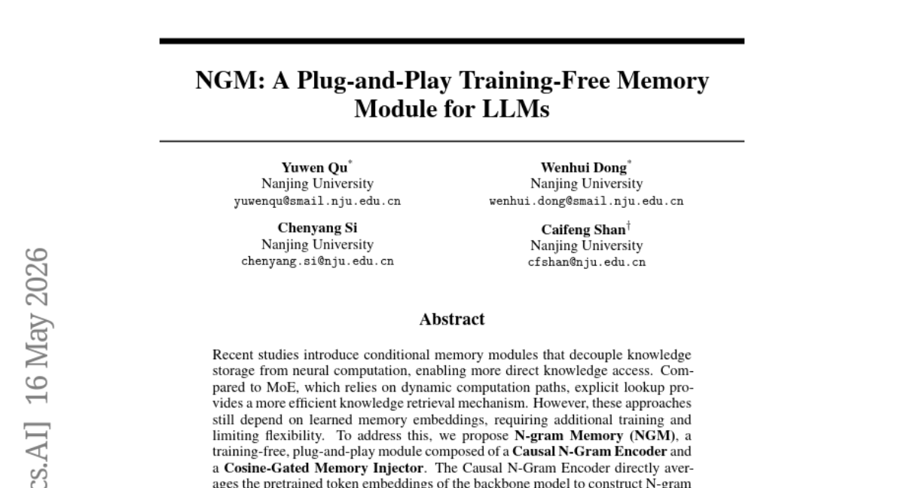

### 📌 한 줄 요약
추가 학습 없이 기존 LLM에 즉시 적용 가능한 N-gram 기반의 플러그 앤 플레이 메모리 모듈

### 🔑 핵심 포인트
- Training-free: 별도의 추가 학습이나 메모리 임베딩 학습이 필요 없는 구조
- Plug-and-play: 기존 모델의 가중치를 건드리지 않고 결합 가능한 모듈형 설계
- Efficient Retrieval: 사전 학습된 토큰 임베딩을 활용한 효율적인 N-gram 기반 지식 주입

### 🧑‍💻 개발자 관점
모델 재학습 비용 없이 기존 LLM의 지식 활용 능력과 코드 생성 성능을 즉각적으로 개선할 수 있는 실용적인 방법론입니다.

### 🚀 실무 적용 아이디어
- 오픈소스 LLM(Qwen 등)에 NGM 모듈을 직접 구현하여 성능 변화 측정
- 특정 도메인 지식(Code, Math) 데이터셋에 대한 성능 향상 폭 검증
- 추론 시 발생하는 연산 오버헤드와 성능 향상 간의 트레이드오프 분석

### ⚠️ 리스크/한계
- N-gram 기반 방식이므로 매우 긴 문맥이나 복잡한 추론에서는 한계가 있을 수 있음
- 추론 시 N-gram 연산 및 게이팅 과정에서 발생하는 추가적인 연산 비용

### 📝 초록 기반 상세 설명
최근 지식 저장과 연산을 분리하는 메모리 모듈 연구가 활발하지만, 기존 방식은 학습된 임베딩에 의존하여 유연성이 떨어지는 문제가 있습니다. 이를 해결하기 위해 본 논문은 별도의 학습이나 메모리 테이블 없이 작동하는 N-gram Memory(NGM)를 제안합니다. NGM은 사전 학습된 토큰 임베딩을 평균화하여 N-gram 표현을 만드는 인코더와 코사인 게이트를 통한 인젝터로 구성됩니다. 실험 결과, Qwen3 모델 시리즈에서 코드 생성 및 지식 집약적 작업에서 유의미한 성능 향상을 보였습니다. 또한 멀티모달 벤치마크에서도 성능 개선이 확인되었습니다.

---

## 28. [Actionable World Representation](https://huggingface.co/papers/2605.18743)
**Upvotes**: 2 | **도입 난이도**: 중 | **신뢰도**: 상
**arXiv**: https://arxiv.org/abs/2605.18743

**태그**: World Models, Digital Twin, 3D Vision, Robotics, Video

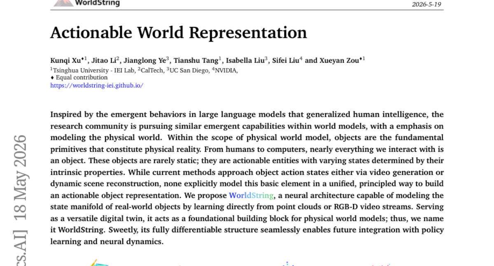

### 📌 한 줄 요약
Point Cloud 및 RGB-D 데이터를 통해 객체의 상태 변화를 학습하여 디지털 트윈을 구축하는 신경망 아키텍처 제안

### 🔑 핵심 포인트
- Point Cloud 및 RGB-D 입력을 통한 객체 상태 매니폴드 학습
- 물리적 객체의 가변적 상태를 모델링하는 범용 디지털 트윈 아키텍처 제안
- 미분 가능한 구조를 통한 정책 학습 및 역학 모델과의 통합 용이성 확보

### 🧑‍💻 개발자 관점
로봇 제어나 시뮬레이션 환경에서 실제 객체의 물리적 상태를 디지털로 정밀하게 모사하는 기초 기술로 활용 가능합니다.

### 🚀 실무 적용 아이디어
- 제공된 아키텍처를 활용한 다양한 3D 객체 데이터셋에 대한 학습 성능 검증
- 미분 가능한 구조를 활용하여 강화학습(RL) 정책과 결합한 제어 실험
- RGB-D 입력 시 노이즈에 대한 모델의 강건성 테스트

### ⚠️ 리스크/한계
- 실시간 고해상도 데이터 처리 시 연산 복잡도 문제 가능성
- 복잡한 물리적 상호작용(충돌, 마찰 등)의 완전한 구현 여부 불투명

### 📝 초록 기반 상세 설명
최근 LLM의 창발적 능력에 영감을 받아 물리적 세계 모델링에 대한 연구가 활발해지고 있습니다. 물리적 세계의 기본 단위인 객체는 상태가 변화하는 '행동 가능한(actionable)' 특성을 가지지만, 기존 방식은 비디오 생성이나 장면 재구성 위주로 객체의 상태 변화를 통합적으로 모델링하지 못합니다. 본 논문에서는 Point Cloud나 RGB-D 비디오 스트림으로부터 객체의 상태 매니폴드를 직접 학습하는 'WorldString' 아키텍처를 제안합니다. 이 모델은 범용적인 디지털 트윈 역할을 수행하며 물리적 세계 모델의 기초 구성 요소로 기능합니다. 또한, 전체 구조가 미분 가능(fully differentiable)하여 향후 정책 학습(policy learning) 및 신경 역학(neural dynamics)과의 통합이 용이합니다.

---

## 29. [SafeDiffusion-R1: Online Reward Steering for Safe Diffusion Post-Training](https://huggingface.co/papers/2605.18719)
**Upvotes**: 2 | **도입 난이도**: 중 | **신뢰도**: 상
**arXiv**: https://arxiv.org/abs/2605.18719

**태그**: Diffusion, Reinforcement Learning, AI Safety, CLIP, Vision, Evaluation, Safety

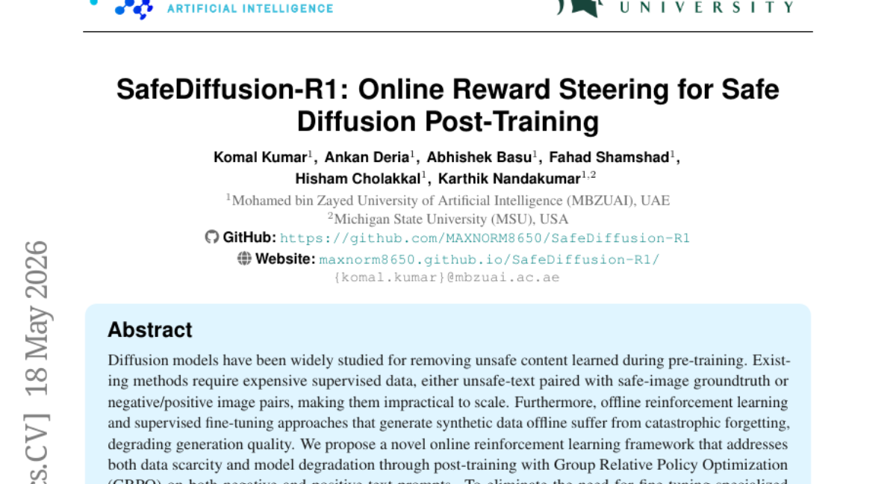

### 📌 한 줄 요약
데이터 부족과 모델 성능 저하 문제를 해결하기 위해 GRPO와 CLIP 임베딩 스티어링을 결합한 온라인 강화학습 기반의 안전한 디퓨전 모델 학습 프레임워크

### 🔑 핵심 포인트
- GRPO 기반의 온라인 강화학습을 통한 데이터 부족 및 Catastrophic Forgetting 문제 해결
- CLIP 임베딩 공간의 특성을 활용한 별도의 보상 모델 튜닝 없는 스티어링 보상 메커니즘
- 안전성 강화와 생성 품질(Compositional Quality) 향상을 동시에 달성하는 일반화 성능

### 🧑‍💻 개발자 관점
추가적인 정답 이미지 데이터 없이도 모델의 생성 품질을 유지하며 안전 가이드라인을 준수하도록 학습시킬 수 있는 실용적인 방법론을 제시합니다.

### 🚀 실무 적용 아이디어
- GRPO 알고리즘을 활용한 디퓨전 모델의 온라인 RL 환경 구축 테스트
- CLIP 임베딩 스티어링 방식이 특정 도메인(예: 인물, 풍경)에서 생성 품질에 미치는 영향 분석
- 다양한 유해 카테고리에 대한 일반화 성능 검증 실험

### ⚠️ 리스크/한계
- 온라인 RL 특성상 학습 과정에서의 높은 계산 비용 발생 가능성
- 특정 스티어링 강도가 과도할 경우 텍스트 충실도(Prompt Following) 저하 위험

### 📝 초록 기반 상세 설명
기존의 디퓨전 모델 안전성 강화 방식은 정답 데이터(Safe-image)가 필요하거나 오프라인 학습 시 모델 성능이 저하되는 문제가 있었습니다. 본 논문은 데이터 부족과 모델 붕괴 문제를 해결하기 위해 GRPO(Group Relative Policy Optimization)를 활용한 새로운 온라인 강화학습 프레임워크를 제안합니다. 별도의 안전 모델 튜닝 없이 CLIP 임베딩 공간 내에서 텍스트 표현을 안전한 방향으로 유도하는 스티어링 보상 메커니즘을 도입했습니다. 실험 결과, 부적절한 콘텐츠 생성율을 획기적으로 낮추면서도 GenEval 등 생성 품질 지표는 오히려 향상시켰습니다. 또한, 학습에 사용되지 않은 다양한 유해 카테고리에 대해서도 뛰어난 일반화 성능을 입증했습니다.

### 🖼️ 추가 자료
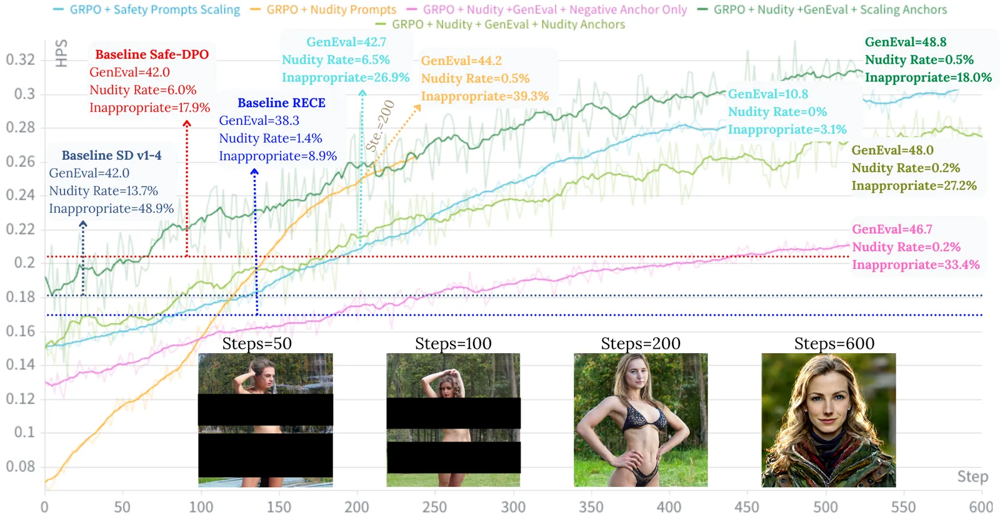

---

## 30. [A2RBench: An Automatic Paradigm for Formally Verifiable Abstract Reasoning Benchmark Generation](https://huggingface.co/papers/2605.17278)
**Upvotes**: 2 | **도입 난이도**: 중 | **신뢰도**: 상
**arXiv**: https://arxiv.org/abs/2605.17278

**태그**: LLM Evaluation, Reasoning, Automated Benchmarking, Algorithm, Benchmark, Evaluation

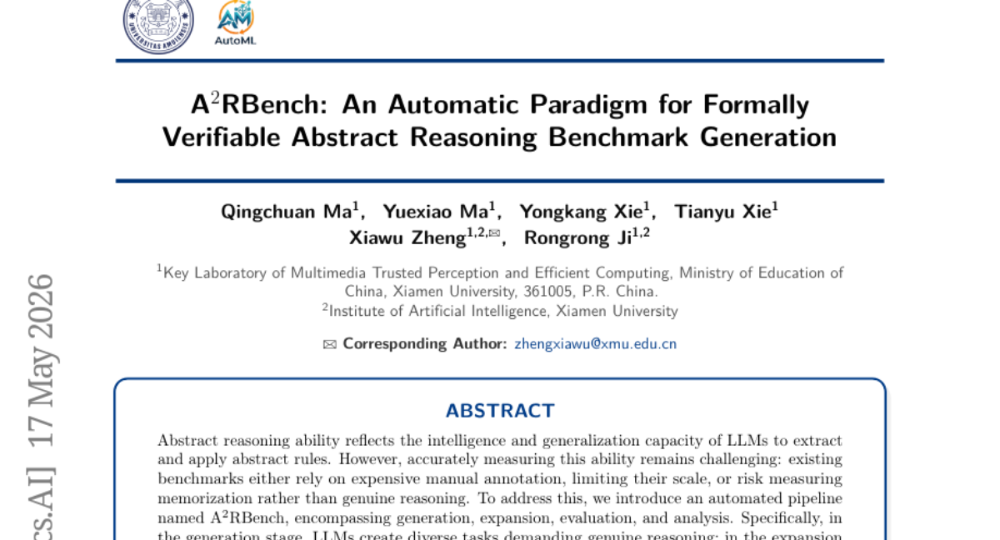

### 📌 한 줄 요약
LLM의 추상적 추론 능력을 정밀하게 측정하기 위해 자동화된 검증 프레임워크와 벤치마크 생성 파이프라인을 제안함

### 🔑 핵심 포인트
- 자동화된 벤치마크 생성 및 확장 파이프라인(A2RBench) 구축
- Cycle Consistency(순환 일관성)를 이용한 프로그래밍적 검증 프레임워크 제안
- LLM의 고차원 추론 능력 부족 및 정보 복잡도와 추론 난이도 간의 상관관계 발견

### 🧑‍💻 개발자 관점
LLM 모델의 단순 지식 암기가 아닌, 논리적 추론 및 규칙 적용 능력을 정밀하게 평가할 수 있는 방법론을 제공합니다.

### 🚀 실무 적용 아이디어
- 제안된 Cycle Consistency 검증 로직을 자체 데이터셋 생성에 적용해보기
- 모델의 차원(1D/2D vs 3D) 변화에 따른 추론 성능 저하 폭 테스트하기
- 복잡한 규칙을 포함한 프롬프트가 모델의 추론 효율에 미치는 영향 분석하기

### ⚠️ 리스크/한계
- 프로그래밍적 검증이 가능한 범위 내의 문제로 한정될 수 있음
- 자동 생성된 태스크가 실제 현실 세계의 복잡한 문제를 완벽히 대변하는지에 대한 의문

### 📝 초록 기반 상세 설명
LLM의 추상적 추론 능력 측정은 수동 작업의 비용 문제와 단순 암기 측정의 위험성이라는 과제에 직면해 있습니다. 이를 해결하기 위해 생성, 확장, 평가, 분석을 포함하는 자동화된 파이프라인인 A2RBench를 도입했습니다. LLM이 생성한 규칙의 환각 문제를 방지하기 위해, 역연산이 순방향 연산을 완벽히 되돌리는지 확인하는 '프로그래밍적 검증(Cycle Consistency)' 이론 프레임워크를 구축했습니다. 실험 결과, 현재의 최상위 LLM들도 인간의 추론 능력에 비해 현저히 낮은 성능을 보였습니다. 특히 고차원(3D) 작업에서 성능 저하가 두드러졌으며, 정보 복잡도가 오히려 추론을 단순화할 수 있다는 흥미로운 결과를 도출했습니다.

---

## 31. [TOBench: A Task-Oriented Omni-Modal Benchmark for Real-World Tool-Using Agents](https://huggingface.co/papers/2605.16909)
**Upvotes**: 2 | **도입 난이도**: 중 | **신뢰도**: 상
**arXiv**: https://arxiv.org/abs/2605.16909

**태그**: AI Agent, Multimodal, Tool-use, Benchmark, MCP, Agent, Reasoning, Vision, Evaluation

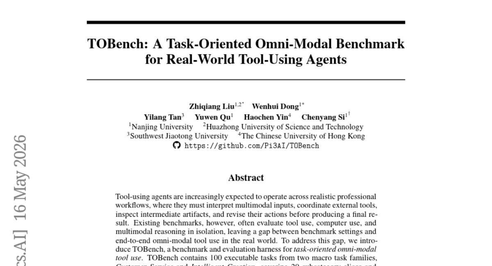

### 📌 한 줄 요약
실제 업무 워크플로우를 모사하여 멀티모달 입력과 도구 사용, 결과물 검증을 통합 평가하는 벤치마크 MM-ToolBench 제안

### 🔑 핵심 포인트
- 실제 업무 시나리오(고객 서비스, 지능형 창작)를 반영한 100개의 실행 가능한 태스크 제공
- 도구 실행 결과물을 확인하고 스스로 수정하는 '폐쇄 루프 멀티모달 검증' 메커니즘 설계
- MCP(Model Context Protocol) 기반의 실행 환경과 자동화된 평가 파이프라인 구축

### 🧑‍💻 개발자 관점
단순 텍스트 응답을 넘어, 에이전트가 생성한 이미지나 파일 등 결과물을 스스로 검토하고 수정하는 실무형 에이전트 개발 역량을 측정할 수 있습니다.

### 🚀 실무 적용 아이디어
- 제공된 MCP 서버와 도구 세트를 활용하여 에이전트의 자가 수정(Self-correction) 능력 테스트
- 멀티모달 결과물(이미지, 문서 등)이 포함된 워크플로우에서 에이전트의 성공률 측정
- 현재 개발 중인 에이전트의 워크플로우를 MM-ToolBench의 폐쇄 루프 구조로 재설계

### ⚠️ 리스크/한계
- 벤치마크의 복잡도로 인해 평가 비용 및 시간이 많이 소요될 수 있음
- 특정 도구 환경(MCP)에 의존적인 평가 방식이 모델의 범용적 지능을 완벽히 대변하는지에 대한 논의 필요

### 📝 초록 기반 상세 설명
최근 에이전트 기술은 단순 도구 사용을 넘어 복잡한 전문 워크플로우를 수행하는 방향으로 발전하고 있습니다. 그러나 기존 벤치마크는 도구 사용, 컴퓨터 제어, 멀티모달 추론을 개별적으로 평가하여 실제 환경의 엔드투엔드 능력을 측정하기에 부족합니다. 이를 해결하기 위해 100개의 실행 가능한 태스크와 27개의 MCP 서버를 포함하는 MM-ToolBench를 도입합니다. 이 벤치마크는 에이전트가 도구 실행 후 생성된 결과물을 직접 검토하고 스스로 수정하는 '폐쇄 루프 멀티모달 검증' 방식을 채택합니다. 실험 결과, 최상위 모델인 Claude Opus 4.6조차 인간 수준에 비해 현저히 낮은 성공률을 보여 기존 모델들의 한계를 드러냈습니다.

---

## 32. [Symmetry-Compatible Principle for Optimizer Design: Embeddings, LM Heads, SwiGLU MLPs, and MoE Routers](https://huggingface.co/papers/2605.18106)
**Upvotes**: 1 | **도입 난이도**: 상 | **신뢰도**: 상
**arXiv**: https://arxiv.org/abs/2605.18106

**태그**: Optimizer, LLM, MoE, Deep Learning Theory

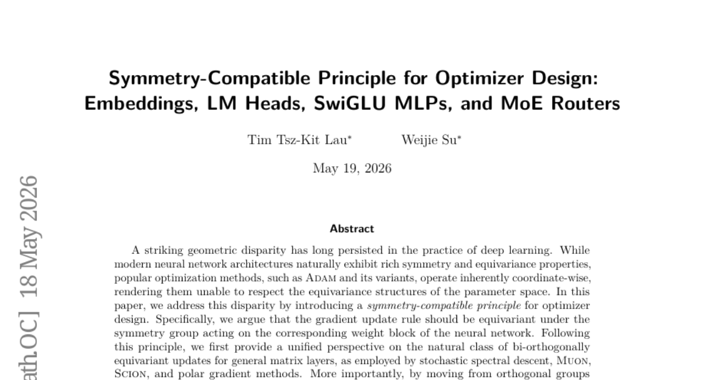

### 📌 한 줄 요약
파라미터 구조의 대칭성을 보존하는 최적화 원칙을 통해 LLM 학습 성능과 안정성을 높이는 새로운 옵티마이저 설계 방법론

### 🔑 핵심 포인트
- 파라미터 블록의 대칭 그룹을 고려한 등변성(Equivariance) 기반 옵티마이저 설계 원칙 제안
- 임베딩, MLP, MoE 라우터 등 특정 레이어 구조에 특화된 다양한 스펙트럴 및 노름(norm) 기반 업데이트 규칙 도출
- 레이어별 대칭성에 맞춘 최적화 스택을 통해 LLM 학습의 성능 및 안정성 개선

### 🧑‍💻 개발자 관점
모델 구조(Embedding, MoE 등)에 따라 단순히 AdamW를 쓰는 대신, 각 레이어의 수학적 특성을 반영한 맞춤형 옵티마이저를 적용하여 학습 효율을 극대화할 수 있습니다.

### 🚀 실무 적용 아이디어
- 특정 레이어(예: Embedding 또는 MoE Router)에 대해 제안된 row-norm 또는 spectral 업데이트 적용 실험
- 기존 AdamW와 제안된 대칭 호환 옵티마이저 간의 학습 안정성(Loss spike 발생 여부) 비교
- 모델 아키텍처의 대칭성 분석을 통한 커스텀 옵티마이저 스택 설계

### ⚠️ 리스크/한계
- 행렬 연산(Spectral decomposition 등)이 포함될 경우 기존 AdamW 대비 계산 복잡도 증가 가능성
- 특정 아키텍처에 최적화된 규칙이 다른 구조에서는 성능 저하를 일으킬 수 있는 일반화 문제

### 📝 초록 기반 상세 설명
현대 신경망은 풍부한 대칭성과 등변성(equivariance)을 가지지만, Adam과 같은 기존 옵티마이저는 좌표별(coordinate-wise)로 동작하여 이러한 구조적 특성을 활용하지 못합니다. 본 논문은 가중치 블록의 대칭 그룹에 따라 업데이트 규칙이 등변성을 유지해야 한다는 '대칭 호환 원칙(Symmetry-Compatible Principle)'을 제안합니다. 이를 바탕으로 일반 행렬 레이어뿐만 아니라 임베딩, LM 헤드, SwiGLU MLP, MoE 라우터 등 각 파라미터 특성에 최적화된 다양한 업데이트 규칙을 도출했습니다. 제안된 방식은 각 레이어의 대칭성에 맞춘 계층적 옵티마이저 스택을 형성합니다. 다양한 규모의 MoE 및 밀집(dense) 언어 모델 사전 학습 실험을 통해, 제안된 방식이 AdamW 대비 검증 손실(validation loss)을 낮추고 학습 안정성을 향상함을 입증했습니다.

### 🖼️ 추가 자료
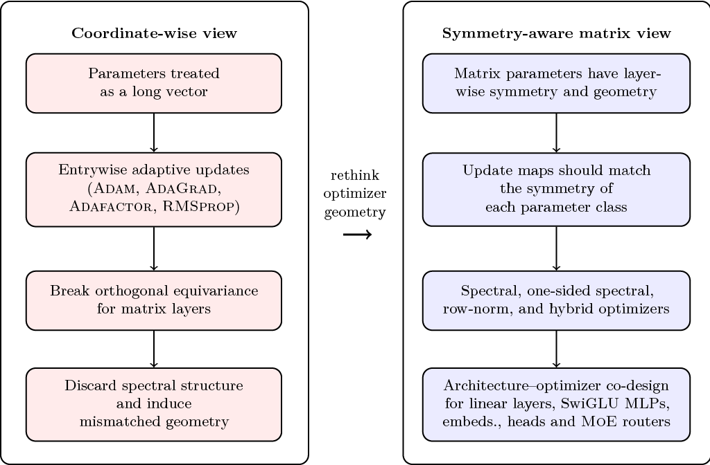
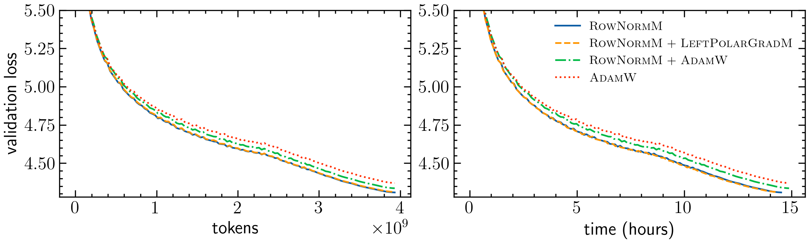

---

## 33. [DexHoldem: Playing Texas Hold'em with Dexterous Embodied System](https://huggingface.co/papers/2605.18727)
**Upvotes**: 1 | **도입 난이도**: 상 | **신뢰도**: 상
**arXiv**: https://arxiv.org/abs/2605.18727

**태그**: Embodied AI, Robotics, Benchmark, Dexterous Manipulation, Perception, Agent, RAG, Evaluation

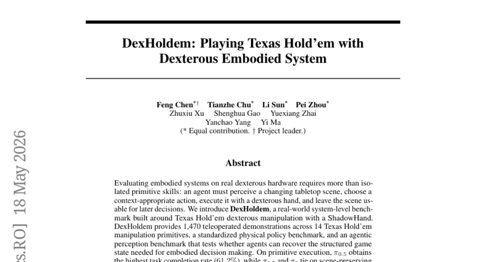

### 📌 한 줄 요약
복합적인 물리적 조작과 인지 능력을 동시에 요구하는 텍사스 홀덤 기반의 실세계 로봇 벤치마크 제안

### 🔑 핵심 포인트
- ShadowHand를 활용한 복합적 데스크탑 조작 벤치마크 DexHoldem 구축
- 정교한 조작(Primitive)과 에이전트 인지(Agentic Perception)를 결합한 다각적 평가 체계
- 실제 환경에서의 인지 오류와 정책 오류가 의사결정에 미치는 누적 영향 분석

### 🧑‍💻 개발자 관점
단순 동작 학습을 넘어, 시각적 상태 복구와 물리적 실행이 결합된 복잡한 실세계 에이전트 시스템 설계 시 고려해야 할 평가 지표를 제공합니다.

### 🚀 실무 적용 아이디어
- 제공된 1,470개의 데모 데이터를 활용한 로봇 조작 정책 학습 실험
- 시각적 상태 복구(State Recovery) 정확도와 물리적 성공률 간의 상관관계 분석
- 에이전트의 인지 오류가 전체 루프의 의사결정에 미치는 영향 시뮬레이션

### ⚠️ 리스크/한계
- 특정 하드웨어(ShadowHand)에 특화된 벤치마크로 범용성 제한 가능성
- 복잡한 환경에서의 오류 누적 문제로 인해 실제 배포 시 신뢰성 확보가 어려움

### 📝 초록 기반 상세 설명
실제 로봇 하드웨어에서 정교한 조작 능력을 평가하기 위해서는 단순한 동작 수행을 넘어 변화하는 환경 인식과 의사결정 능력이 통합되어야 합니다. 본 논문은 ShadowHand를 활용한 텍사스 홀덤 조작을 주제로 한 시스템 레벨 벤치마크인 DexHoldem을 소개합니다. 이 벤치마크는 1,470개의 원격 조작 데모, 표준화된 물리 정책 벤치마크, 그리고 에이전트의 인지 능력을 테스트하는 벤치마크를 포함합니다. 실험 결과, 단순 동작 수행과 장면 유지 성공률, 그리고 시각적 상태 복구 정확도 측면에서 모델별 성능 차이가 나타났습니다. 최종적으로 폐쇄 루프(closed-loop) 환경에서의 사례 연구를 통해 인지와 정책 오류가 누적되는 과정을 분석했습니다.

---

## 34. [Evaluating Cognitive Age Alignment in Interactive AI Agents](https://huggingface.co/papers/2605.17894)
**Upvotes**: 1 | **도입 난이도**: 하 | **신뢰도**: 상
**arXiv**: https://arxiv.org/abs/2605.17894

**태그**: Agent, MLLM, Cognitive_Evaluation, Benchmark, Reasoning, Multimodal, Evaluation, Safety

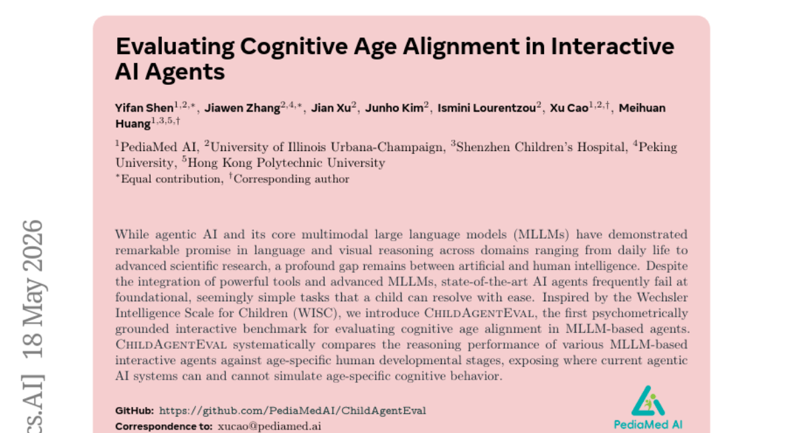

### 📌 한 줄 요약
아동 발달 단계 기반의 심리학적 벤치마크를 통해 AI 에이전트의 인지 연령 정렬 능력을 평가하는 프레임워크 제안

### 🔑 핵심 포인트
- WISC 기반의 심리학적 근거를 갖춘 최초의 대화형 에이전트 벤치마크 ChildAgentEval 제안
- 에이전트의 추론 능력을 인간의 연령별 발달 단계와 비교하는 인지 연령 정렬 평가 체계 구축
- 고성능 MLLM이 기초적인 인지 과업에서 보이는 한계점 및 연령별 모사 능력 분석

### 🧑‍💻 개발자 관점
에이전트의 성능을 단순히 정답률로 측정하는 것을 넘어, 인간의 인지 발달 수준과 비교하여 지능의 질적 측면을 평가하는 새로운 기준을 제공합니다.

### 🚀 실무 적용 아이디어
- 현재 개발 중인 에이전트에 ChildAgentEval의 과업들을 적용하여 기초 추론 능력 검증
- 에이전트의 페르소나 설정 시 특정 연령대 인지 모델과의 정렬 상태 확인
- 멀티모달 추론 시 아동 수준의 기초 과업 실패 여부 테스트

### ⚠️ 리스크/한계
- 심리학적 지표를 AI 평가에 적용할 때 발생하는 인간-AI 간의 인지 모델 차이
- 특정 연령대 모사가 실제 인간의 지능 수준을 대변하는지에 대한 논쟁 가능성

### 📝 초록 기반 상세 설명
최근 MLLM 기반 에이전트가 비약적으로 발전했음에도 불구하고, 인간 지능과의 근본적인 격차는 여전히 존재합니다. 특히 최첨단 에이전트들이 아동 수준의 기초적인 과업에서도 실패하는 현상이 관찰되고 있습니다. 본 논문은 WISC(웩슬러 아동 지능 검사)에서 영감을 받아, 인지 연령 정렬을 평가하기 위한 최초의 심리학적 기반 벤치마크인 ChildAgentEval을 도입합니다. 이 벤치마크는 MLLM 에이전트의 추론 성능을 인간의 연령별 발달 단계와 체계적으로 비교합니다. 이를 통해 현재의 에이전트 시스템이 특정 연령대의 인지 행동을 얼마나 정확하게 모사할 수 있는지, 혹은 어떤 부분에서 한계가 있는지 규명합니다.

---

## 35. [Incantation: Natural Language as the Action Interface for Multi-Entity Video World Models](https://huggingface.co/papers/2605.18601)
**Upvotes**: 1 | **도입 난이도**: 상 | **신뢰도**: 상
**arXiv**: https://arxiv.org/abs/2605.18601

**태그**: Video Generation, World Models, Natural Language Control, Real-time Rendering, Video, Distillation

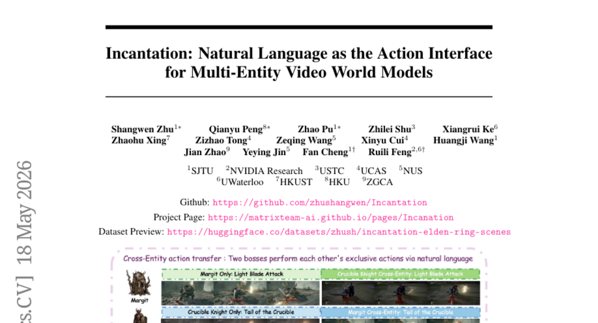

### 📌 한 줄 요약
자연어를 통해 다중 개체의 정밀한 동작을 제어하고 개체 간 개념 전이가 가능한 차세대 인터랙티브 비디오 월드 모델

### 🔑 핵심 포인트
- 자연어를 통한 다중 개체 동시 제어 및 개념 수준의 크로스 엔티티 전이 인터페이스 구현
- 프레임별 텍스트 크로스 어텐션을 활용한 정밀한 동작 제어 및 실시간 스트리밍 최적화
- ODE 기반 Self-Forcing 증류 및 RoPE-decoupled KV-cache를 통한 장기 비디오 생성 안정성 확보

### 🧑‍💻 개발자 관점
고정된 애니메이션 데이터셋 없이 자연어만으로 복잡한 멀티 엔티티 상호작용을 시뮬레이션할 수 있어, 게임 엔진 및 가상 환경 구축의 새로운 패러다임을 제시합니다.

### 🚀 실무 적용 아이디어
- 제공된 Elden Ring 데이터셋을 활용하여 프레임별 텍스트 조건부 제어 성능 테스트
- 기존 비디오 생성 모델과 Incantation의 제어 정밀도(Action-Index) 비교 실험
- 장기 생성 시 KV-cache 최적화 기법이 비디오 일관성에 미치는 영향 분석

### ⚠️ 리스크/한계
- 고해상도 및 장기 생성 시 연산 자원 소모가 클 수 있음
- 자연어 명령의 복잡도가 증가할 경우 제어 정확도가 저하될 가능성

### 📝 초록 기반 상세 설명
기존의 인터랙티브 비디오 모델은 고정된 액션 ID나 씬 단위 캡션에 의존하여 개별 개체에 대한 정밀한 제어와 범용적인 일반화에 한계가 있었습니다. 본 논문은 자연어를 액션 인터페이스로 사용하여 다중 개체를 동시에 제어하고 개념 수준의 전이가 가능한 'Incantation' 모델을 제안합니다. 사전 학습된 양방향 비디오 백본에 프레임별 텍스트 크로스 어텐션을 결합하여 정밀한 제어를 구현하였으며, ODE 기반 Self-Forcing 증류와 RoPE 분리 슬라이딩 KV-캐시를 통해 실시간 장기 스트리밍을 가능하게 했습니다. 실험 결과, 기존 방식 대비 뛰어난 교차 개체 전이 성능과 미학습 프롬프트 대응력을 보였으며, 2시간 이상의 장기 롤아웃에서도 안정적인 FPS를 유지했습니다. 최종적으로 이 아키텍처가 게임 엔진과 같은 복잡한 환경에서도 유연하게 적용될 수 있음을 입증했습니다.

---

## 36. [SNLP: Layer-Parallel Inference via Structured Newton Corrections](https://huggingface.co/papers/2605.17842)
**Upvotes**: 1 | **도입 난이도**: 상 | **신뢰도**: 상
**arXiv**: https://arxiv.org/abs/2605.17842

**태그**: LLM Inference, Parallelism, Transformer, Optimization, Inference

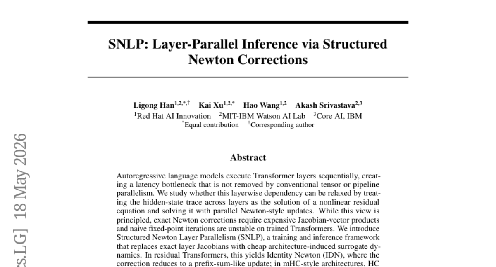

### 📌 한 줄 요약
뉴턴 방법론을 활용하여 트랜스포머의 레이어 간 순차적 의존성을 병렬로 해결함으로써 추론 속도를 획기적으로 높이는 프레임워크

### 🔑 핵심 포인트
- 레이어 간 의존성을 비선형 방정식 문제로 재정의하여 병렬 추론 가능성 제시
- 아키텍처 특성을 반영한 IDN(Identity Newton) 및 HCN(HC Newton) 방식의 저비용 뉴턴 업데이트 도입
- SNLP-aware 정규화를 통해 학습 단계에서부터 병렬 추론에 최적화된 모델 구축

### 🧑‍💻 개발자 관점
모델의 레이어 수를 늘려도 추론 지연 시간이 선형적으로 증가하는 문제를 해결할 수 있는 새로운 병렬화 패러다임을 제시합니다.

### 🚀 실무 적용 아이디어
- Residual Connection이 포함된 모델 구조에서 SNLP 정규화 효과 검증
- 모델 크기 변화에 따른 병렬 추론의 수렴 속도 및 정확도 트레이드오프 분석
- 기존 사전 학습 모델(Off-the-shelf)에 대한 미세 조정(Fine-tuning) 시 성능 변화 확인

### ⚠️ 리스크/한계
- 사전 학습된 모델을 그대로 사용할 경우 병렬 추론 효율이 떨어짐
- 정확한 수렴을 시도할 경우 결국 순차적 계산과 동일해져 병렬 이점이 사라짐

### 📝 초록 기반 상세 설명
기존의 자기회귀 언어 모델은 레이어를 순차적으로 실행해야 하는 병렬화 병목 현상을 가지고 있습니다. 본 논문은 레이어 간의 은닉 상태 흐름을 비선형 잔차 방정식으로 정의하고, 이를 병렬 뉴턴 업데이트 방식으로 해결하는 방안을 연구합니다. 이를 위해 정확한 자코비안 계산 대신 아키텍처 구조를 활용한 저비용 대리 동역학(surrogate dynamics)을 사용하는 SNLP 프레임워크를 제안합니다. 또한, 학습 단계에서 SNLP 전용 정규화를 적용하여 소수의 반복만으로도 순차적 실행과 유사한 결과를 얻도록 모델을 최적화합니다. 실험 결과, 0.5B 규모 모델에서 성능 저하 없이 최대 2.3배의 추론 속도 향상을 달성했습니다.

---

## 37. [E-PMQ: Expert-Guided Post-Merge Quantization with Merged-Weight Anchoring](https://huggingface.co/papers/2605.16882)
**Upvotes**: 1 | **도입 난이도**: 중 | **신뢰도**: 상
**arXiv**: https://arxiv.org/abs/2605.16882

**태그**: Model Merging, Quantization, Low-bit Deployment, Parameter-Efficient, Optimization

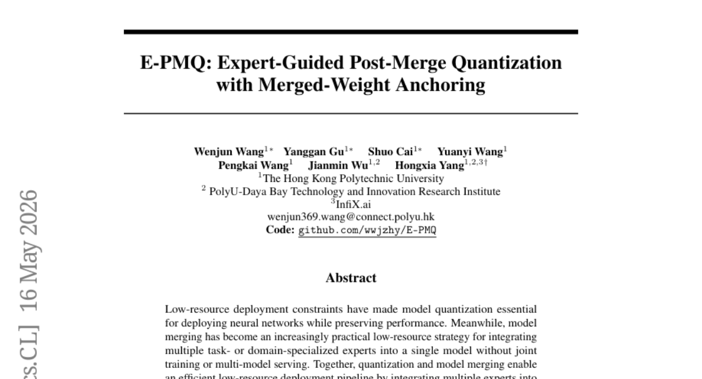

### 📌 한 줄 요약
모델 병합(Merging) 후 발생하는 성능 저하를 해결하기 위해 전문가 가중치를 활용한 정밀 양자화 프레임워크 E-PMQ 제안

### 🔑 핵심 포인트
- Post-Merge Quantization (PMQ) 상황에서의 복합적 오차(양자화 오차 + 병합 오차) 문제 정의
- 소스 전문가 가중치를 활용한 전문가 가이드형(Expert-guided) 출력 타겟 제공
- 병합 가중치 앵커링(Merged-weight anchoring)을 통한 캘리브레이션 안정성 확보

### 🧑‍💻 개발자 관점
여러 특화 모델을 하나로 합친 후 저비용 배포를 위해 양자화를 수행할 때 발생하는 성능 손실을 효과적으로 방어할 수 있습니다.

### 🚀 실무 적용 아이디어
- 모델 병합(Task Arithmetic, TIES 등) 후 PTQ를 적용했을 때의 성능 하락 폭 측정
- E-PMQ의 앵커링 기법을 기존 병합 워크플로우에 적용하여 안정성 테스트
- 다양한 태스크가 섞인 멀티태스크 모델에 대한 4-bit 양자화 실험

### ⚠️ 리스크/한계
- 소스 전문가 가중치가 반드시 필요하므로 병합 후 원본 가중치를 폐기할 경우 사용 불가
- 병합된 모델의 복잡도에 따라 캘리브레이션 과정의 연산 비용 증가 가능성

### 📝 초록 기반 상세 설명
저자원 환경에서 여러 전문가 모델을 하나로 통합하는 모델 병합 기술이 주목받고 있으나, 병합된 모델에 직접 양자화를 적용하면 성능이 급격히 저하되는 문제가 발생합니다. 이는 양자화 오차와 병합 과정에서의 오차가 복합적으로 작용하기 때문입니다. 이를 해결하기 위해 본 논문은 소스 전문가 가중치를 활용해 캘리브레이션 타겟을 제공하는 E-PMQ 프레임워크를 제안합니다. 또한 병합된 가중치를 고정하는 앵커링 기법을 통해 캘리브레이션 안정성을 확보하고 통합된 모델의 동작을 보존합니다. 실험 결과, CLIP 및 FLAN-T5 등 다양한 벤치마크에서 기존 GPTQ 대비 월등한 성능 향상을 입증하였습니다.

---

## 38. [Geometric Phase Transition Enables Extreme Hippocampal Memory Capacity](https://huggingface.co/papers/2605.17199)
**Upvotes**: 1 | **도입 난이도**: 상 | **신뢰도**: 상
**arXiv**: https://arxiv.org/abs/2605.17199

**태그**: Neural Architecture, Geometric Deep Learning, Memory Systems, Information Theory

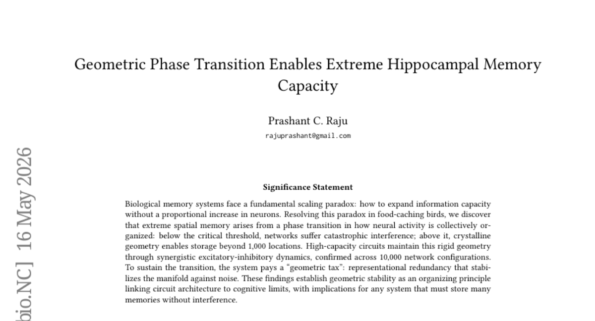

### 📌 한 줄 요약
뉴런 수의 증가가 아닌, 신경망 기하학적 구조의 결정화(Crystallization)를 통한 초고용량 메모리 저장 원리 규명

### 🔑 핵심 포인트
- 신경망 기하학의 '결정화(Crystalline)' 전이를 통한 초고용량 메모리 구현 원리 발견
- 흥분성/억제성 뉴런의 비중첩적 서브스페이스 활용을 통한 위상적 견고함 확보
- 개별 뉴런 할당 방식(Valiant's model)이 아닌 연속적 위상 구조가 고용량의 핵심임을 입증

### 🧑‍💻 개발자 관점
뉴런(파라미터) 수를 늘리지 않고도 데이터 표현 방식(Geometry)의 최적화를 통해 모델의 저장 용량과 안정성을 극대화하는 아키텍처 설계 영감을 제공합니다.

### 🚀 실무 적용 아이디어
- 고차원 임베딩 공간에서의 위상적 견고성(Topological Rigidity) 측정 지표 도입
- 흥분성/억제성 뉴런의 역할 분리(Orthogonal Decorrelation)를 모사한 신경망 레이어 설계
- 데이터 용량 증가에 따른 임베딩 매니폴드의 구조적 붕괴 여부 모니터링

### ⚠️ 리스크/한계
- 생물학적 시스템의 복잡한 역학을 인공 신경망에 직접 이식하기에는 수학적 모델링 난이도가 높음
- 높은 표현 중복성(Geometric Tax)을 감수해야 하므로 연산 효율성 측면의 트레이드오프 발생 가능

### 📝 초록 기반 상세 설명
생물학적 메모리 시스템은 하드웨어 제약 내에서 서로 다른 정보 저장 용량을 가집니다. 본 연구는 먹이를 저장하는 박새(chickadee)와 그렇지 않은 핀치의 해마를 비교하여, 고용량 메모리가 신경망 기하학의 '결정화(crystalline)'된 전이 상태에서 발생함을 보여줍니다. 연구 결과, 고용량 메모리는 개별 뉴런의 할당이 아닌 위상적 견고함(topological rigidity)을 통해 유지되며, 흥분성 뉴런의 스캐폴드와 억제성 뉴런의 직교적 탈상관화(orthogonal decorrelation)가 시너지를 일으켜 이를 구현합니다. 시뮬레이션 결과, 이러한 결정적 코드는 무질서한 코드 대비 100배 이상의 용량 우위를 가짐을 확인했습니다. 이는 진화가 뉴런의 수를 늘리는 대신 신경 코드의 기하학적 구조를 설계함으로써 고용량 메모리를 달성했음을 시사합니다.

---

## 39. [VideoSeeker: Incentivizing Instance-level Video Understanding via Native Agentic Tool Invocation](https://huggingface.co/papers/2605.16079)
**Upvotes**: 1 | **도입 난이도**: 상 | **신뢰도**: 상
**arXiv**: https://arxiv.org/abs/2605.16079

**태그**: Agent, Video-Understanding, RL, Computer-Vision, RAG, Reasoning, Vision, Video, Benchmark

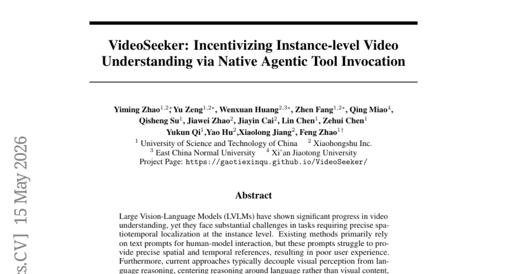

### 📌 한 줄 요약
에이전트 기반의 도구 호출 기능을 통해 정밀한 인스턴스 단위 비디오 이해를 가능하게 하는 새로운 패러다임 제안

### 🔑 핵심 포인트
- 에이전트식 추론과 도구 호출을 결합한 인스턴스 단위 비디오 이해 패러다임 제안
- 4단계 자동화 파이프라인을 통한 대규모 고품질 인스턴스 레벨 비디오 데이터 합성
- RL(강화학습)을 통한 모델의 능동적 시각 정보 탐색 및 도구 활용 능력 최적화

### 🧑‍💻 개발자 관점
단순히 비디오 내용을 요약하는 것을 넘어, 특정 객체의 움직임이나 위치를 정밀하게 추적해야 하는 에이전트 시스템 개발에 중요한 기술적 토대를 제공합니다.

### 🚀 실무 적용 아이디어
- 제공될 데이터셋을 활용하여 기존 LVLM의 시공간 로컬라이제이션 성능 비교 실험
- 에이전트의 도구 호출(Tool-calling) 로직이 실제 비디오 편집/검색 워크플로우에 미치는 영향 분석
- RL 학습 과정에서의 보상 함수 설계 방식 검토

### ⚠️ 리스크/한계
- 에이전트의 능동적 탐색 과정에서 발생할 수 있는 높은 연산 비용 및 추론 지연 시간
- 특정 도구 호출 방식에 대한 의존도가 높을 경우 범용성 저하 가능성

### 📝 초록 기반 상세 설명
기존의 대규모 시각-언어 모델(LVLM)은 비디오 내 특정 객체의 정밀한 시공간적 위치를 파악하는 데 한계가 있었습니다. 텍스트 프롬프트 중심의 상호작용은 정교한 참조가 어렵고, 추론 과정이 시각적 증거보다 언어에 치중되어 세밀한 인식을 방해하는 문제가 있었습니다. 이를 해결하기 위해 본 논문은 시각적 프롬프트를 활용하여 에이전트식 추론과 인스턴스 단위 이해를 결합한 VideoSeeker를 제안합니다. 4단계 자동화 데이터 합성 파이프라인을 통해 고품질 데이터를 생성하고, 콜드 스타트 및 RL 학습을 통해 모델의 능동적 인지 및 도구 호출 능력을 내재화했습니다. 실험 결과, GPT-4o와 같은 강력한 폐쇄형 모델을 능가하는 성능 향상을 보였으며 일반 비디오 이해 벤치마크에서도 뛰어난 전이 능력을 입증했습니다.

---

## 40. [Auditing Multimodal LLM Raters: Central Tendency Bias in Clinical Ordinal Scoring](https://huggingface.co/papers/2605.16386)
**Upvotes**: 1 | **도입 난이도**: 중 | **신뢰도**: 상
**arXiv**: https://arxiv.org/abs/2605.16386

**태그**: Multimodal LLM, Bias Detection, Clinical AI, Calibration, Multimodal, Vision, Benchmark, Evaluation, Optimization

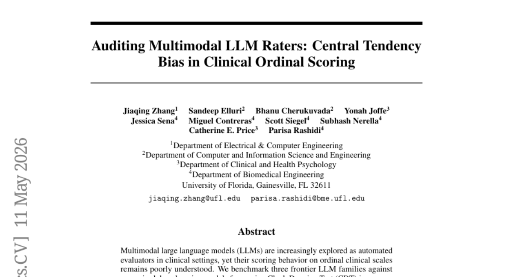

### 📌 한 줄 요약
임상용 서술형 척도 평가 시 MLLM이 점수를 중간값으로 몰아버리는 '중심 경향성 편향'이 발생하여 진단 정확도를 저해할 수 있음

### 🔑 핵심 포인트
- 임상 서열 척도 평가 시 MLLM에서 발생하는 '중심 경향성 편향(Central Tendency Bias)' 발견
- 점수 양 끝단(극단값) 예측 오류로 인해 임상적 의사결정(선별 검사) 시 위험성 존재
- 퓨샷(Few-shot) 프롬프팅이나 용어 조정만으로는 이러한 구조적 편향을 해결하기 어려움

### 🧑‍💻 개발자 관점
LLM을 평가자(Judge)로 사용할 때, 단순 정확도(Accuracy)뿐만 아니라 점수 분포의 편향성을 반드시 검증해야 함을 시사합니다.

### 🚀 실무 적용 아이디어
- 모델의 점수 분포를 히스토그램으로 시각화하여 특정 구간 쏠림 현상 확인
- 임상적 임계값(Threshold) 근처에서의 정밀도를 측정하는 별도의 평가 지표 도입
- 예측된 점수를 실제 확률 분포로 변환하는 사후 보정(Post-hoc calibration) 알고리즘 적용

### ⚠️ 리스크/한계
- 중간값으로 쏠리는 편향으로 인해 질환의 조기 발견(극단적 점수)이 누락될 위험
- 일반적인 NLP 평가 지표만으로는 식별하기 어려운 임상적 위험성

### 📝 초록 기반 상세 설명
최근 임상 환경에서 MLLM을 자동 평가자로 활용하려는 시도가 늘고 있으나, 서열 척도(Ordinal scale)에서의 점수 산출 동작은 명확히 검증되지 않았습니다. 본 연구는 CDT(Clock Drawing Test) 이미지 점수 산출을 위해 최신 MLLM 모델들을 기존 딥러닝 모델과 비교 벤치마킹했습니다. 실험 결과, 제로샷 MLLM은 허용 오차 범위 내에서는 경쟁력이 있었으나, 점수가 중간값으로 수렴하는 '중심 경향성 편향'이 뚜렷하게 나타났습니다. 특히 점수가 양 끝단(0-1점 또는 4-5점)으로 치우치는 현상이 발생하여, 인지 장애 선별에 중요한 극단적 점수 예측에서 오류를 범했습니다. 이러한 편향은 퓨샷 예시를 제공하거나 임상 용어를 제거해도 해결되지 않았습니다. 따라서 임상 워크플로우에 MLLM을 도입하기 전, 반드시 보정(Calibration) 중심의 평가와 사후 교정 작업이 필요함을 시사합니다.

---

## 41. [Monitoring the Internal Monologue: Probe Trajectories Reveal Reasoning Dynamics](https://huggingface.co/papers/2605.18549)
**Upvotes**: 0 | **도입 난이도**: 중 | **신뢰도**: 상
**arXiv**: https://arxiv.org/abs/2605.18549

**태그**: LLM-Safety, Interpretability, Chain-of-Thought, Monitoring, RAG, Reasoning, Evaluation, Inference, Safety

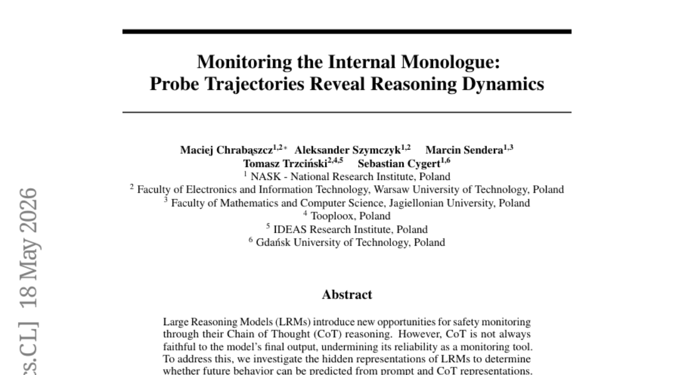

### 📌 한 줄 요약
CoT(Chain of Thought) 과정 중 발생하는 내부 표현의 변화 궤적(Probe Trajectory)을 분석하여 모델의 미래 행동을 예측하는 모니터링 프레임워크 제안

### 🔑 핵심 포인트
- 단일 시점의 정적 예측 대신 토큰 생성에 따른 '프로브 궤적'을 활용하여 미래 행동 예측력 향상
- 신호 처리 특징(변동성, 추세 등) 추출을 통해 모델 상태 분리 성능 최적화
- Max-pooling 방식이 평균/마지막 토큰 방식보다 압도적으로 높은 성능(최대 95% AUROC)을 보임을 입증

### 🧑‍💻 개발자 관점
모델의 CoT가 겉으로는 멀쩡해 보여도 내부적으로 잘못된 방향으로 흐를 때, 이를 실시간으로 감지하여 안전성을 확보할 수 있는 기술적 근거를 제공합니다.

### 🚀 실무 적용 아이디어
- 모델의 특정 레이어 은닉 상태를 추출하여 토큰별 예측 확률 변화를 시각화해보기
- Average/Last-token pooling 대신 Max-pooling을 적용하여 예측 성능 변화 비교하기
- 추출된 궤적 데이터에 이동 평균(Moving Average) 등 신호 처리 기법 적용해보기

### ⚠️ 리스크/한계
- 실시간 모니터링 시 추가적인 연산 비용(Inference overhead) 발생 가능성
- 특정 도메인(안전, 수학)에 특화된 특징이 다른 태스크에서도 일반화될지 여부

### 📝 초록 기반 상세 설명
대규모 추론 모델(LRM)의 CoT는 유용한 모니터링 도구이지만, 최종 출력과 일치하지 않을 수 있는 불충실성(unfaithfulness) 문제가 존재합니다. 본 연구는 모델의 은닉 표현(hidden representations)을 통해 미래 행동을 예측할 수 있는지 조사하기 위해 '프로브 궤적(probe trajectory)' 개념을 도입했습니다. 각 토큰 생성 시점의 확률 변화를 추적하고, 신호 처리 기법을 통해 변동성, 추세, 정상 상태 등의 특징을 추출했습니다. 실험 결과, 단일 시점의 예측보다 전체 궤적을 분석하는 것이 미래 상태를 구분하는 데 훨씬 효과적임을 확인했습니다. 또한, 풀링 방식과 데이터 생성 전략에 대한 방법론적 통찰을 함께 제시했습니다.

---

## 42. [AgentKernelArena: Generalization-Aware Benchmarking of GPU Kernel Optimization Agents](https://huggingface.co/papers/2605.16819)
**Upvotes**: 0 | **도입 난이도**: 하 | **신뢰도**: 상
**arXiv**: https://arxiv.org/abs/2605.16819

**태그**: AI Agent, GPU Kernel, Optimization, Benchmarking, Agent, Benchmark, Evaluation

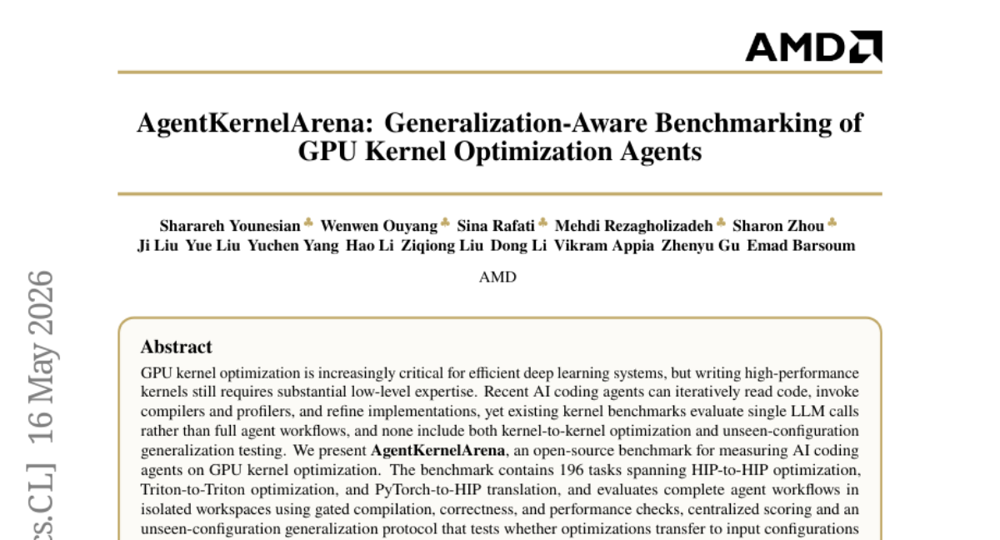

### 📌 한 줄 요약
AI 에이전트의 GPU 커널 최적화 성능과 미학습 설정에 대한 일반화 능력을 검증하는 벤치마크 프레임워크 제안

### 🔑 핵심 포인트
- 에이전트의 전체 워크플로우(컴파일, 정답, 성능 체크)를 평가하는 통합 벤치마크 구축
- 학습되지 않은 입력 설정에 대한 최적화 전이 능력을 측정하는 일반화 프로토콜 도입
- HIP, Triton, PyTorch 간의 다양한 커널 변환 및 최적화 태스크 제공

### 🧑‍💻 개발자 관점
AI 에이전트를 활용한 커널 최적화 자동화 시, 단순 성능 향상을 넘어 다양한 입력 조건에서도 안정적으로 동작하는지 검증하는 기준을 제공합니다.

### 🚀 실무 적용 아이디어
- 제공된 벤치마크를 사용하여 현재 사용 중인 코딩 에이전트의 성능 측정
- 에이전트가 생성한 커널이 다양한 입력 shape에서도 동작하는지 일반화 테스트 수행
- 에이전트의 하드코딩된 shape 의존성 문제를 해결하기 위한 프롬프트 엔지니어링 실험

### ⚠️ 리스크/한계
- 에이전트가 특정 하드웨어/라이브러리에 과적합될 경우 일반화 성능이 급격히 저하될 수 있음
- 커널 생성 시 하드코딩된 shape 가정으로 인한 런타임 오류 가능성

### 📝 초록 기반 상세 설명
GPU 커널 최적화는 딥러닝 효율성에 필수적이지만 전문 지식이 요구되는 영역입니다. 기존 벤치마크는 단일 LLM 호출에 집중하여 에이전트의 전체 워크플로우나 미학습 설정에 대한 일반화 능력을 평가하지 못하는 한계가 있습니다. 이를 해결하기 위해 다양한 최적화 작업과 미학습 설정 프로토콜을 포함한 AgentKernelArena를 제안합니다. 실험 결과, 에이전트들은 높은 컴파일 성공률과 정답률을 보였으나, PyTorch-to-HIP 작업에서는 특정 형상(shape)에 의존하는 경향을 보였습니다. 이 프레임워크는 에이전트 기반 커널 최적화의 엄격한 평가를 위한 모듈형 도구를 제공합니다.

---

## 43. [GRASP: Learning to Ground Social Reasoning in Multi-Person Non-Verbal Interactions](https://huggingface.co/papers/2605.15764)
**Upvotes**: 0 | **도입 난이도**: 중 | **신뢰도**: 상
**arXiv**: https://arxiv.org/abs/2605.15764

**태그**: Vision, Multi-Agent, Video-Understanding, Social-AI, RAG, Reasoning, Multimodal, Video, Benchmark, Evaluation

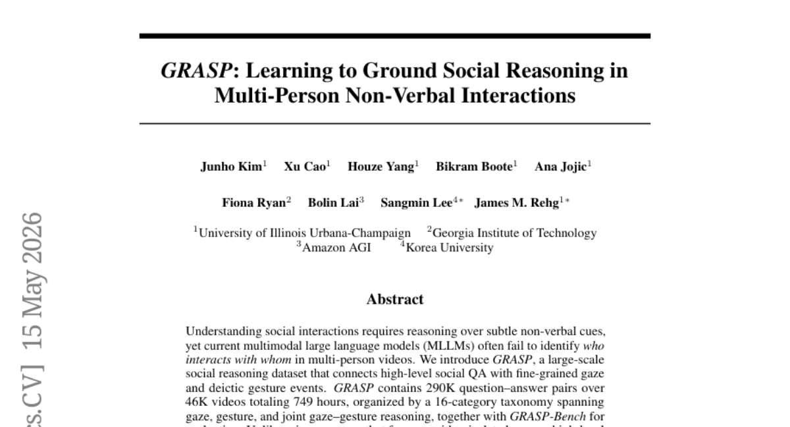

### 📌 한 줄 요약
멀티 페르슨 비디오 내 시선 및 제스처를 활용하여 사회적 상호작용 주체를 정확히 식별하는 데이터셋과 학습 방법론 제안

### 🔑 핵심 포인트
- 시선 및 제스처 기반의 정교한 사회적 추론 데이터셋 GRASP 구축
- 상호작용 주체 식별을 위한 Social Grounding Reward(SGR) 학습 신호 제안
- 고수준 QA와 미세한 비언어적 단서(시선, 제스처)를 연결하는 벤치마크 제공

### 🧑‍💻 개발자 관점
멀티 에이전트 환경이나 로봇 공학에서 사람 간의 복잡한 상호작용을 이해하고 주체를 식별하는 비전 모델 개발에 직접적인 영감을 줍니다.

### 🚀 실무 적용 아이디어
- 제공된 GRASP-Bench를 활용하여 기존 MLLM의 사회적 추론 능력 테스트
- SGR(Social Grounding Reward) 로직을 기존 비디오 이해 모델에 이식하여 성능 변화 관찰
- 시선 및 제스처 데이터가 포함된 멀티모달 학습 파이프라인 구축 실험

### ⚠️ 리스크/한계
- 비언어적 단서(시선, 제스처)에 대한 의존도가 높아 환경 변화에 민감할 수 있음
- 복잡한 사회적 맥락을 모두 데이터셋에 담기에는 한계가 존재할 수 있음

### 📝 초록 기반 상세 설명
기존의 멀티모달 거대언어모델(MLLM)은 다수 인원이 등장하는 비디오에서 상호작용 주체를 식별하는 데 어려움을 겪습니다. 이를 해결하기 위해 시선(gaze)과 지시적 제스처(deictic gesture)를 결합한 대규모 사회적 추론 데이터셋인 GRASP를 도입합니다. GRASP는 46K개의 비디오와 290K개의 QA 쌍을 포함하며, 정교한 사회적 이벤트 기반의 질문들로 구성되어 있습니다. 또한, 모델이 상호작용 참여자를 정확히 추론하도록 유도하는 Social Grounding Reward(SGR) 학습 신호를 제안합니다. 실험 결과, SGR은 GRASP-Bench 성능을 높이는 동시에 기존 벤치마크에서의 제로샷 성능도 유지함을 확인했습니다.

---

## 44. [TopoPrimer: The Missing Topological Context in Forecasting Models](https://huggingface.co/papers/2605.15035)
**Upvotes**: 0 | **도입 난이도**: 중 | **신뢰도**: 상
**arXiv**: https://arxiv.org/abs/2605.15035

**태그**: Time-Series, Topology, Foundation Models, Forecasting, Benchmark

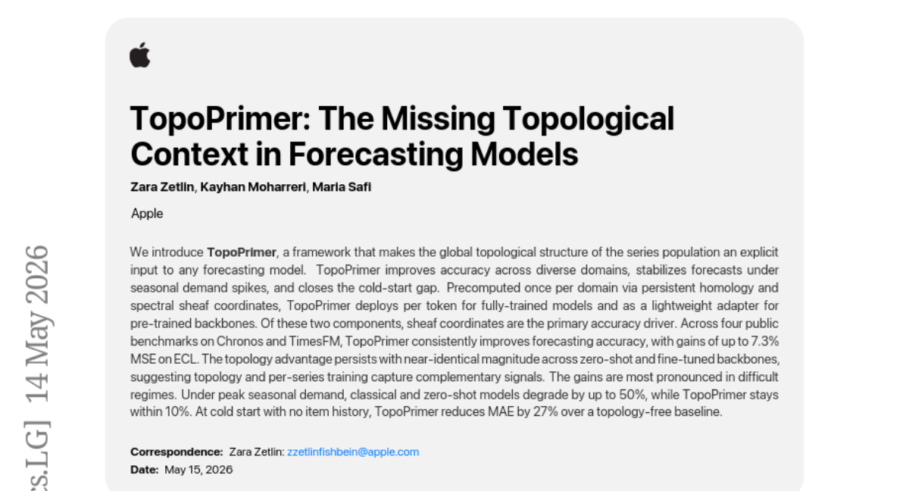

### 📌 한 줄 요약
시계열 데이터의 전역적 위상 구조를 활용하여 예측 정확도를 높이고 콜드 스타트 문제를 해결하는 프레임워크

### 🔑 핵심 포인트
- 지속적 호몰로지와 스펙트럴 쉬프 좌표를 통한 전역적 위상 구조 추출
- 사전 학습된 모델에 가볍게 적용 가능한 어댑터 방식의 프레임워크
- 계절적 변동성 및 콜드 스타트(Cold-start) 상황에서의 강력한 강건성

### 🧑‍💻 개발자 관점
데이터가 부족한 신규 아이템 예측이나 급격한 수요 변화가 발생하는 도메인에서 기존 모델의 한계를 극복할 수 있는 실무적 대안을 제시합니다.

### 🚀 실무 적용 아이디어
- 기존 시계열 백본 모델에 스펙트럴 쉬프 좌표를 입력 피처로 추가하여 성능 변화 관찰
- 데이터가 부족한 신규 도메인(Cold-start) 환경에서 TopoPrimer의 성능 검증
- 계절성이 강한 데이터셋에 대한 위상 기반 어댑터 적용 실험

### ⚠️ 리스크/한계
- 도메인별 위상 정보 사전 계산에 따른 초기 연산 비용 발생
- 위상적 특징이 복잡한 고차원 데이터에서의 해석 및 적용 난이도

### 📝 초록 기반 상세 설명
기존 시계열 예측 모델들은 개별 시계열의 국소적 패턴에 집중하여 데이터 집합 전체의 전역적 구조를 놓치는 경향이 있습니다. 이를 해결하기 위해 연구진은 지속적 호몰로지(Persistent Homology)와 스펙트럴 쉬프 좌표(Spectral Sheaf Coordinates)를 활용한 TopoPrimer 프레임워크를 제안합니다. 이 방법론은 도메인별로 한 번만 계산하면 되는 위상 정보를 모델의 입력 또는 어댑터 형태로 제공합니다. 실험 결과, Chronos 및 TimesFM과 같은 최신 모델에 적용했을 때 예측 정확도가 크게 향상되었습니다. 특히 계절적 수요 급증이나 데이터가 없는 콜드 스타트 상황에서 기존 모델 대비 압도적인 안정성을 보여주었습니다.

---

## 45. [AR-VLA: True Autoregressive Action Expert for Vision-Language-Action Models](https://huggingface.co/papers/2603.10126)
**Upvotes**: 0 | **도입 난이도**: 중 | **신뢰도**: 상
**arXiv**: https://arxiv.org/abs/2603.10126

**태그**: Robotics, VLA, Autoregressive, Motion Planning, Reasoning, Vision, Video, Inference

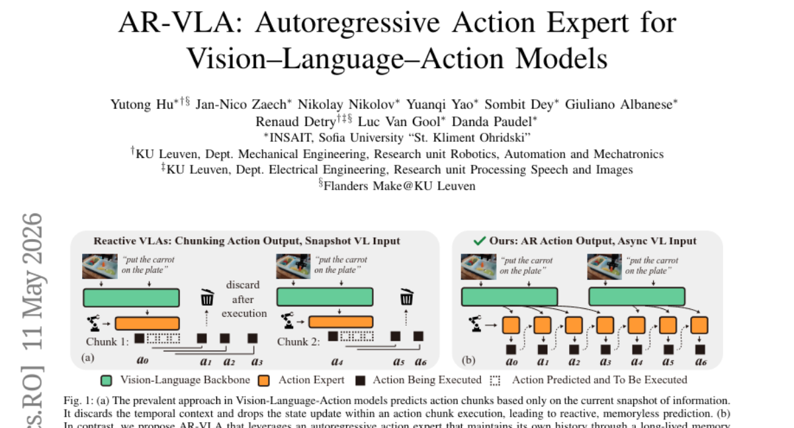

### 📌 한 줄 요약
기존의 반응형 VLA 모델의 한계를 극복하기 위해, 시각-언어 정보와 독립적으로 동작 이력을 유지하며 연속적인 액션을 생성하는 자기회귀(AR) 방식의 액션 전문가 모델을 제안합니다.

### 🔑 핵심 포인트
- 독립적인 자기회귀(AR) 액션 전문가 구조를 통한 시공간적 일관성 확보
- 장기 메모리를 활용하여 관측 초기화 없이 연속적인 동작 생성 가능
- 인지 지연(Perception Staleness)을 해결하는 재앵커링 메커니즘 도입

### 🧑‍💻 개발자 관점
로봇 제어 시 매 순간 새로운 시각 정보를 처리하는 무거운 모델과 별개로, 가벼운 액션 생성 모듈을 분리하여 실시간성과 동작의 부드러움을 동시에 확보할 수 있는 아키텍처를 제시합니다.

### 🚀 실무 적용 아이디어
- 기존의 Chunk-based action head와 AR-VLA의 궤적 부드러움 비교 실험
- 시각 정보 업데이트 주기가 느린 환경에서의 재앵커링 효과 검증
- 사전 학습된 VLA 백본에 AR 액션 전문가 모듈을 결합하는 파이프라인 구축

### ⚠️ 리스크/한계
- 자기회귀 방식 특유의 오차 누적(Error Accumulation) 가능성
- 장기 메모리 관리에 따른 연산 복잡도 증가

### 📝 초록 기반 상세 설명
기존의 VLA 모델과 확산 정책(Diffusion Policy)은 매 관측마다 시간적 맥락을 초기화하여 동작의 연속성이 떨어지는 문제가 있었습니다. 이를 해결하기 위해 본 논문은 시각-언어 접두사(Prefix)를 조건으로 하되, 자체적인 장기 메모리를 통해 동작 이력을 유지하는 독립적인 자기회귀(AR) 액션 전문가를 제안합니다. 이 구조는 빠른 제어와 느린 추론 사이의 주파수 불일치 문제를 해결하며, 인지 지연을 수학적으로 처리하는 재앵커링(Re-anchoring) 메커니즘을 통해 비동기적 모달리티를 동기화합니다. 실험 결과, 제안된 방식은 기존의 청크 기반 액션 헤드를 대체할 수 있으며, 더 매끄러운 궤적과 높은 성공률을 보여주었습니다. 결과적으로 이 모델은 시공간적으로 일관된 동작 생성을 가능하게 하는 확장 가능한 구조를 제공합니다.

---

