# 2026-05-21 Daily Papers (Top 41)

## 오늘의 요약
오늘의 연구는 LLM의 추론 과정(Reasoning)과 강화 학습(RL)을 결합하여 모델의 사고 과정과 신뢰도를 정교하게 제어하는 방법론이 주를 이루었습니다. 또한, 에이전트의 실질적인 작업 수행 능력을 검증하고 자동화된 환경을 구축하는 등 에이전틱 AI의 신뢰성과 효율성을 높이는 연구들이 주목받았습니다.

### 오늘의 핵심 포인트
- 단순한 정답 맞추기를 넘어 사고 과정(Process)의 신뢰도와 논리적 정렬을 최적화하는 강화 학습 기법들이 제안되었습니다.
- 에이전트가 시각적 정보에 매몰되거나 단순 텍스트 생성에 그치지 않도록, 실제 환경 및 내부 상태와 연동된 정밀한 검증 프레임워크가 강조되었습니다.
- LLM 호출 비용을 절감하면서도 검색 및 추론 성능을 극대화하기 위한 능동 학습과 적응형 연산 할당 전략이 핵심적인 해결책으로 제시되었습니다.

**오늘의 태그**: LLM Reasoning, Reinforcement Learning, AI Agents, Multimodal, Efficiency

## 1. [When Vision Speaks for Sound](https://huggingface.co/papers/2605.16403)
**Upvotes**: 65 | **도입 난이도**: 중 | **신뢰도**: 상
**arXiv**: https://arxiv.org/abs/2605.16403

**태그**: Multimodal, Video-Understanding, Hallucination, Alignment, RAG, Vision, Video, Audio, Benchmark, Safety

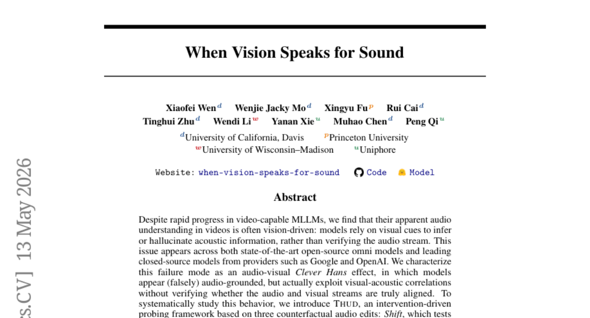

### 📌 한 줄 요약
멀티모달 모델이 시각 정보에 의존해 오디오를 잘못 추론하는 'Clever Hans' 현상을 규명하고 이를 해결하는 정렬 기법 제안

### 🔑 핵심 포인트
- 모델이 오디오 스트림을 직접 검증하지 않고 시각 정보로 소리를 환각(Hallucination)하는 현상 규명
- Thud: 세 가지 반사실적 오디오 편집(Shift, Mute, Swap)을 통한 정밀 진단 프레임워크 개발
- 2단계 정렬(Two-stage alignment)을 통해 오디오 검증 능력과 일반 비디오 이해 능력의 균형 확보

### 🧑‍💻 개발자 관점
비디오 분석 AI 개발 시, 모델이 시각 정보에만 매몰되어 실제 오디오 데이터의 진위나 타이밍을 무시하는 문제를 방지하는 데 중요한 가이드라인을 제공합니다.

### 🚀 실무 적용 아이디어
- 현재 사용 중인 비디오 모델에 'Mute' 또는 'Swap' 테스트를 적용하여 오디오 의존도 측정
- 데이터셋 구축 시 시각 정보와 오디오가 불일치하는 반사실적(Counterfactual) 샘플 포함 검토
- 모델 학습 시 오디오-시각 정렬을 위한 특화된 Preference 데이터셋 구성

### ⚠️ 리스크/한계
- 오디오 검증 능력 향상이 일반적인 비디오 이해 성능에 미치는 장기적 영향 관찰 필요
- 반사실적 데이터 생성 및 학습 과정에서의 높은 비용 발생 가능성

### 📝 초록 기반 상세 설명
최근 비디오 기반 멀티모달 모델(MLLM)은 뛰어난 성능을 보이지만, 실제 오디오를 검증하기보다 시각적 단서에 의존해 소리를 추측하는 경향이 있습니다. 연구진은 이를 시각-청각 상관관계에만 의존하는 'audio-visual Clever Hans effect'로 정의했습니다. 이를 검증하기 위해 시간적 동기화(Shift), 소리 존재 여부(Mute), 시각-청각 일치성(Swap)을 테스트하는 Thud 프레임워크를 도입했습니다. 이후 개입 기반의 선호도 학습과 이벤트 레벨의 일반 비디오 선호도를 결합한 2단계 정렬 레시피를 제안했습니다. 실험 결과, 제안된 방법론은 오디오 검증 능력을 크게 향상시키면서도 일반적인 비디오 QA 성능을 유지했습니다.

---

## 2. [Active Learners as Efficient PRP Rerankers](https://huggingface.co/papers/2605.14236)
**Upvotes**: 61 | **도입 난이도**: 중 | **신뢰도**: 상
**arXiv**: https://arxiv.org/abs/2605.14236

**태그**: LLM, Ranking, Active Learning, Prompt Engineering

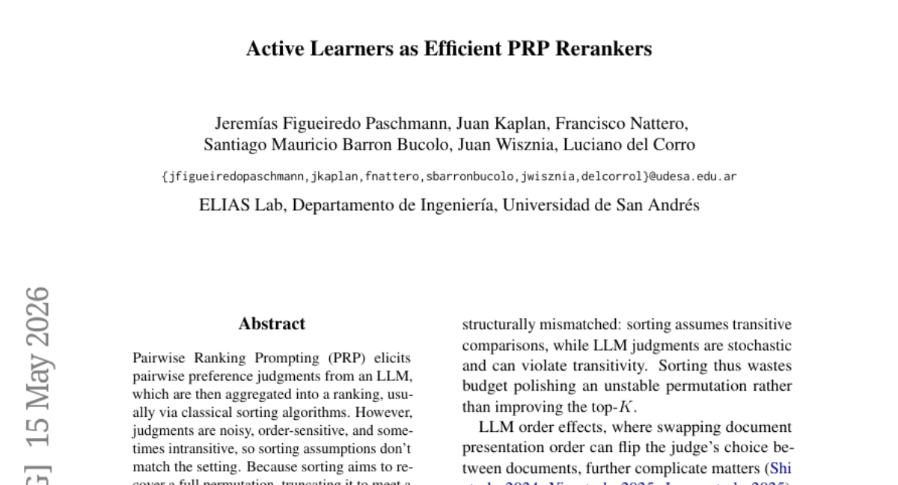

### 📌 한 줄 요약
LLM의 노이즈 섞인 쌍별 비교(Pairwise)를 능동 학습(Active Learning) 프레임워크로 재정의하여 효율적인 Top-K 랭킹을 구현하는 방법론

### 🔑 핵심 포인트
- PRP 랭킹 문제를 노이즈에 강한 능동 학습(Active Learning) 문제로 재정의
- 제한된 LLM 호출 비용 내에서 Top-K 정확도(NDCG@10) 극대화
- 단일 호출 기반의 무작위 방향 오라클을 통한 위치 편향 제거 및 비용 절감

### 🧑‍💻 개발자 관점
LLM 호출 비용이 비싼 실무 환경에서, 적은 횟수의 호출만으로도 신뢰할 수 있는 검색/추천 순위를 생성할 수 있는 전략을 제시합니다.

### 🚀 실무 적용 아이디어
- 기존 정렬 알고리즘(QuickSort 등)과 제안된 능동 학습 기반 랭커의 Top-K 정확도 비교 실험
- LLM의 위치 편향(Position Bias)이 랭킹 결과에 미치는 영향 측정
- 제한된 API 호출 예산(Call Budget) 설정에 따른 성능 변화 테스트

### ⚠️ 리스크/한계
- 데이터셋의 노이즈 수준이 극도로 높을 경우 능동 학습 모델의 수렴 문제 가능성
- 특정 도메인에 특화된 편향이 무작위 오라클로 완전히 제거되지 않을 위험

### 📝 초록 기반 상세 설명
LLM을 활용한 Pairwise Ranking Prompting(PRP)은 쌍별 선호도를 추출하여 정렬하는 방식이지만, 판단의 노이즈와 비이행성(intransitivity) 문제로 인해 기존 정렬 알고리즘 적용 시 정확한 Top-K를 얻기 어렵습니다. 본 논문은 PRP 랭킹 문제를 노이즈가 포함된 비교 데이터로부터 최적의 순위를 찾는 능동 학습 문제로 재정의합니다. 제안된 프레임워크는 호출 비용이 제한된 상황에서도 NDCG@10 성능을 높이는 효율적인 랭커를 제공합니다. 또한, 단일 호출만으로 위치 편향(position bias)을 제로 평균 노이즈로 변환하는 무작위 방향 오라클(randomized-direction oracle)을 도입했습니다. 결과적으로 양방향 호출 비용 없이도 편향되지 않은 집계 랭킹을 생성할 수 있습니다.

---

## 3. [Anti-Self-Distillation for Reasoning RL via Pointwise Mutual Information](https://huggingface.co/papers/2605.11609)
**Upvotes**: 60 | **도입 난이도**: 중 | **신뢰도**: 상
**arXiv**: https://arxiv.org/abs/2605.11609

**태그**: LLM, Reasoning, Reinforcement Learning, Self-Improvement, Benchmark, Distillation

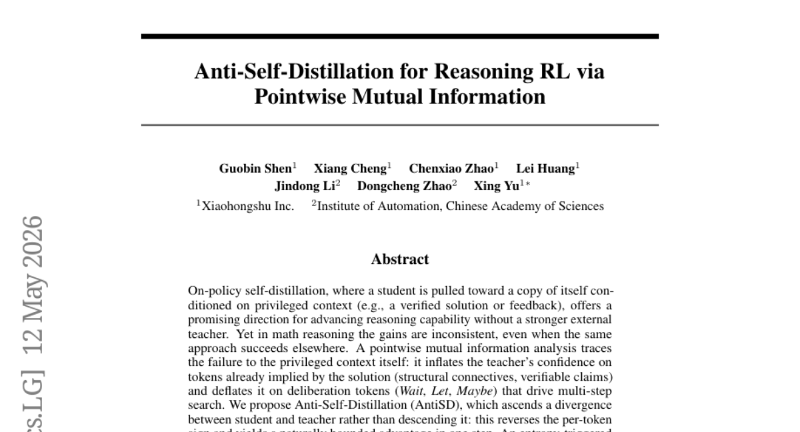

### 📌 한 줄 요약
수학적 추론 학습 시 정답 정보가 사고 과정(deliberation)을 방해하는 문제를 해결하기 위해, 학생 모델이 교사 모델과 차별화되도록 유도하는 Anti-Self-Distillation 기법 제안

### 🔑 핵심 포인트
- PMI 분석을 통해 정답 정보가 사고 과정 토큰의 학습을 방해하는 메커니즘 규명
- 교사 모델과 학생 모델 간의 거리를 최적화하는 Anti-Self-Distillation(AntiSD) 알고리즘 제안
- 엔트로피 트리거 게이트를 통한 학습 안정성 및 효율성 확보

### 🧑‍💻 개발자 관점
모델이 정답만 맞추는 것이 아니라, 정답에 이르는 '사고 과정'을 풍부하게 학습할 수 있도록 하는 학습 전략을 제공합니다.

### 🚀 실무 적용 아이디어
- 기존 Self-distillation 학습 루프에 AntiSD 손실 함수 적용 테스트
- 학습 데이터셋의 정답 정보(privileged context)가 사고 토큰에 미치는 영향 분석
- 엔트로피 게이트 임계값 설정에 따른 학습 수렴도 비교 실험

### ⚠️ 리스크/한계
- 특정 도메인(수학 등) 외의 일반적인 추론 작업에서의 범용성 검증 필요
- 발산(divergence)을 이용한 학습 방식이므로 하이퍼파라미터 설정에 따른 불안정성 가능성

### 📝 초록 기반 상세 설명
최근 정답 정보를 활용한 자기 증류(Self-distillation) 방식이 추론 능력 향상에 사용되지만, 수학 문제에서는 학습 효과가 불분명한 경우가 많습니다. 분석 결과, 정답 정보가 이미 확정된 토큰에만 과도한 확신을 주어 정작 중요한 사고 과정(deliberation) 토큰의 학습을 저해하는 문제가 발견되었습니다. 이를 해결하기 위해 학생 모델이 교사 모델의 분포를 따르는 대신, 적절한 발산(divergence)을 유도하는 Anti-Self-Distillation(AntiSD)을 제안합니다. 또한 엔트로피 기반 게이트를 통해 학습 안정성을 확보했습니다. 실험 결과, 기존 방식 대비 훨씬 적은 학습 스텝으로 높은 정확도 향상을 달성하며 효율적인 자기 개선 가능성을 입증했습니다.

---

## 4. [GoLongRL: Capability-Oriented Long Context Reinforcement Learning with Multitask Alignment](https://huggingface.co/papers/2605.19577)
**Upvotes**: 50 | **도입 난이도**: 중 | **신뢰도**: 상
**arXiv**: https://arxiv.org/abs/2605.19577

**태그**: Long-Context, Reinforcement Learning, LLM Training, Data Engineering, RAG, Evaluation, Safety

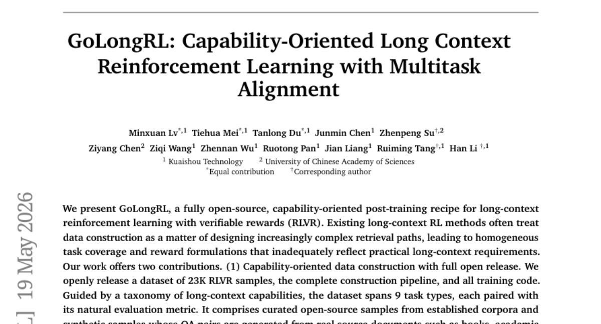

### 📌 한 줄 요약
다양한 태스크와 검증 가능한 보상을 결합하여 모델의 실질적인 롱 컨텍스트 능력을 극대화하는 오픈소스 RL 학습 프레임워크

### 🔑 핵심 포인트
- 9가지 태스크 유형과 검증 가능한 보상(RLVR)을 포함한 23K 규모의 오픈소스 데이터셋 구축
- 태스크 간 보상 스케일 불균형을 해결하기 위한 TMN-Reweight(평균 정규화 및 난이도 적응형 가중치) 제안
- 단순 검색을 넘어 실질적인 문서 이해 및 추론 능력을 강화하는 역량 중심의 학습 파이프라인

### 🧑‍💻 개발자 관점
단순히 컨텍스트 길이를 늘리는 것을 넘어, 긴 문맥 내에서 정확한 정보를 추출하고 추론하는 실질적인 모델 성능을 높이는 방법론을 제시합니다.

### 🚀 실무 적용 아이디어
- 제공된 23K 데이터셋과 파이프라인을 활용하여 자체 도메인 특화 롱 컨텍스트 모델 학습 실험
- 다양한 태스크가 섞인 환경에서 TMN-Reweight가 보상 불균형을 어떻게 해결하는지 검증
- 기존 GRPO 방식과 제안된 방식 간의 학습 안정성 및 일반화 성능 비교

### ⚠️ 리스크/한계
- 멀티태스크 학습 시 특정 태스크로의 편향(Bias) 발생 가능성
- 데이터셋의 합성 데이터 비중이 높을 경우 발생할 수 있는 모델의 환각 현상

### 📝 초록 기반 상세 설명
기존의 롱 컨텍스트 강화학습(RL) 방식은 단순한 검색 경로 설계에 치중하여 태스크의 다양성이 부족하고 보상 체계가 실무적 요구사항을 충분히 반영하지 못하는 문제가 있었습니다. 이를 해결하기 위해 본 논문은 9가지 태스크 유형과 자연스러운 평가 지표를 결합한 23K 규모의 역량 중심 데이터셋을 제안합니다. 또한, 서로 다른 보상 스케일을 가진 멀티태스크 최적화 문제를 해결하기 위해 TMN-Reweight 기법을 도입했습니다. 실험 결과, 제안된 데이터셋과 학습 방식은 기존 폐쇄형 모델에 필적하는 성능을 보였으며 일반적인 능력 또한 유지하거나 향상시켰습니다.

---

## 5. [OpenComputer: Verifiable Software Worlds for Computer-Use Agents](https://huggingface.co/papers/2605.19769)
**Upvotes**: 50 | **도입 난이도**: 상 | **신뢰도**: 상
**arXiv**: https://arxiv.org/abs/2605.19769

**태그**: AI Agent, Automated Testing, Software Verification, Evaluation Framework, Agent, Evaluation

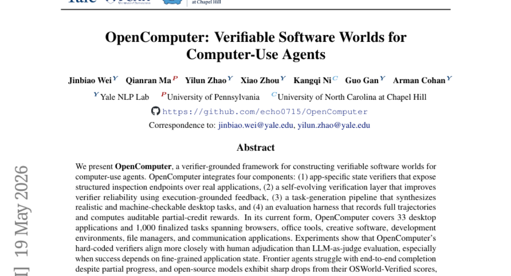

### 📌 한 줄 요약
컴퓨터 사용 에이전트의 작업 성공 여부를 정밀하게 검증하기 위한 상태 기반 검증 프레임워크 OpenComputer 제안

### 🔑 핵심 포인트
- 애플리케이션 내부 상태를 직접 검사하는 구조적 검증 엔드포인트 제공
- 실행 피드백을 통해 검증기의 신뢰도를 높이는 자기 진화형 레이어 구축
- LLM-as-judge의 한계를 극복하는 정밀한 감사 가능(auditable) 평가 체계

### 🧑‍💻 개발자 관점
에이전트 개발 시 단순한 시각적 확인을 넘어, 실제 소프트웨어 내부 상태(State)를 기반으로 한 정밀한 자동화 테스트 및 평가 환경을 구축하는 방법론을 제시합니다.

### 🚀 실무 적용 아이디어
- 현재 개발 중인 에이전트의 성공 기준을 시각적 결과가 아닌 내부 데이터 상태 검증으로 전환해보기
- LLM 기반 평가와 상태 기반 검증 결과 간의 괴리율 측정해보기
- 특정 도메인(예: 개발 환경)에 특화된 상태 검증 스크립트 작성해보기

### ⚠️ 리스크/한계
- 애플리케이션별로 개별적인 검증 로직을 작성해야 하므로 확장성 비용이 높음
- 검증기 자체가 애플리케이션 업데이트에 따라 유지보수되어야 하는 문제

### 📝 초록 기반 상세 설명
컴퓨터 사용 에이전트의 성능을 평가할 때 기존의 LLM 기반 평가 방식은 미세한 애플리케이션 상태 변화를 포착하기 어렵다는 문제가 있습니다. 이를 해결하기 위해 OpenComputer는 애플리케이션의 내부 상태를 구조적으로 검사하는 검증기 기반 프레임워크를 제안합니다. 이 프레임워크는 앱별 상태 검증기, 자기 진화형 검증 레이어, 태스크 생성 파이프라인, 그리고 감사 가능한 보상 계산을 위한 평가 하네스로 구성됩니다. 33개의 데스크톱 앱과 1,000개의 태스크를 통해 실험한 결과, 하드코딩된 검증기가 LLM 평가보다 인간의 판단과 더 높은 일치도를 보였습니다. 실험을 통해 최신 에이전트들이 부분적 진행에도 불구하고 최종 완수에는 어려움을 겪으며, 오픈소스 모델의 성능 격차가 존재함을 확인했습니다.

---

## 6. [AutoResearchClaw: Self-Reinforcing Autonomous Research with Human-AI Collaboration](https://huggingface.co/papers/2605.20025)
**Upvotes**: 47 | **도입 난이도**: 상 | **신뢰도**: 상
**arXiv**: https://arxiv.org/abs/2605.20025

**태그**: Multi-Agent, Autonomous Research, Human-in-the-loop, Self-Healing, Agent, RAG, Reasoning, Benchmark

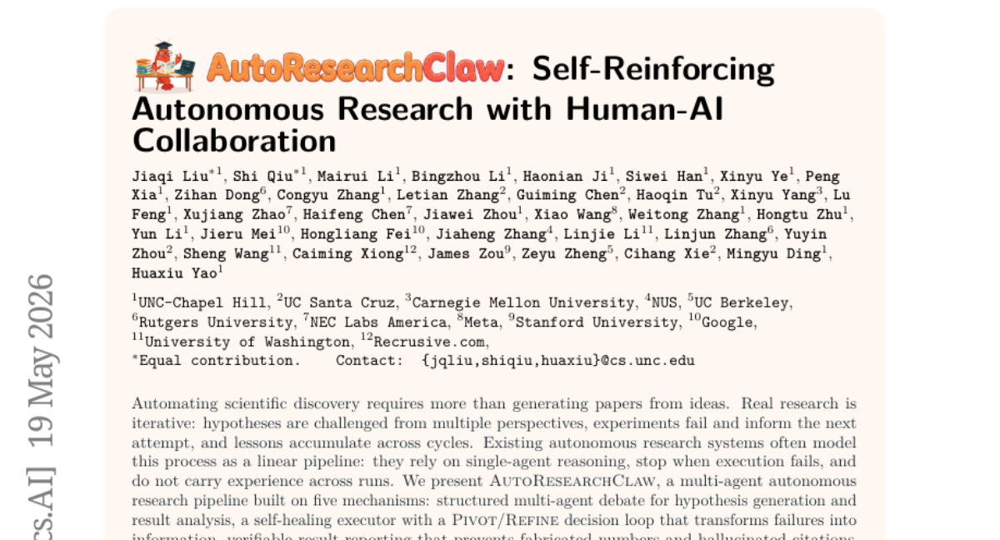

### 📌 한 줄 요약
실패를 학습 데이터로 전환하고 인간과의 정밀한 협업을 통해 연구 프로세스를 자동화하는 멀티 에이전트 시스템

### 🔑 핵심 포인트
- Pivot/Refine 루프를 통한 실패 기반의 자기 치유형(Self-healing) 실행 구조
- 과거의 오류를 미래의 방어 기제로 전환하는 교차 실행 진화(Cross-run evolution) 메커니즘
- 7가지 개입 모드를 통한 인간-AI 협업 최적화 및 검증 가능한 결과 보고

### 🧑‍💻 개발자 관점
단순한 텍스트 생성을 넘어, 에이전트가 실패를 어떻게 처리하고(Error handling) 경험을 어떻게 구조화하여 재사용할지에 대한 아키텍처 설계 패턴을 제공합니다.

### 🚀 실무 적용 아이디어
- 실패 상황(Failure case)을 데이터셋으로 변환하여 에이전트의 피드백 루프 설계해보기
- 멀티 에이전트 간의 토론(Debate) 구조를 통한 논리적 검증 파이프라인 구축 실험
- 인간의 개입 시점(Intervention point)을 최적화하는 워크플로우 설계

### ⚠️ 리스크/한계
- 복잡한 멀티 에이전트 구조로 인한 높은 연산 비용 및 지연 시간
- 인간의 개입 정도에 따라 시스템 성능의 변동성이 클 수 있음

### 📝 초록 기반 상세 설명
기존의 자율 연구 시스템은 선형적인 파이프라인 구조로 인해 실험 실패 시 대응이 어렵고 경험 축적이 불가능하다는 한계가 있습니다. 이를 해결하기 위해 AutoResearchClaw는 멀티 에이전트 토론, 자기 치유형 실행 루프, 검증 가능한 결과 보고, 인간 개입 모드, 그리고 이전 실행 경험을 활용하는 진화 메커니즘을 통합한 시스템을 제안합니다. 실험 결과, ARC-Bench에서 기존 AI Scientist v2 대비 높은 성능 향상을 입증했습니다. 특히 인간과의 협업 실험을 통해 완전 자율 방식보다 핵심 의사결정 지점에서의 정밀한 개입이 가장 효율적임을 확인했습니다. 본 연구는 AI가 인간을 대체하는 것이 아닌, 연구 역량을 증폭시키는 도구로서의 가능성을 제시합니다.

---

## 7. [Process Rewards with Learned Reliability](https://huggingface.co/papers/2605.15529)
**Upvotes**: 43 | **도입 난이도**: 중 | **신뢰도**: 상
**arXiv**: https://arxiv.org/abs/2605.15529

**태그**: LLM Reasoning, Reinforcement Learning, Efficiency, Probabilistic Modeling, Reasoning, Vision, Benchmark

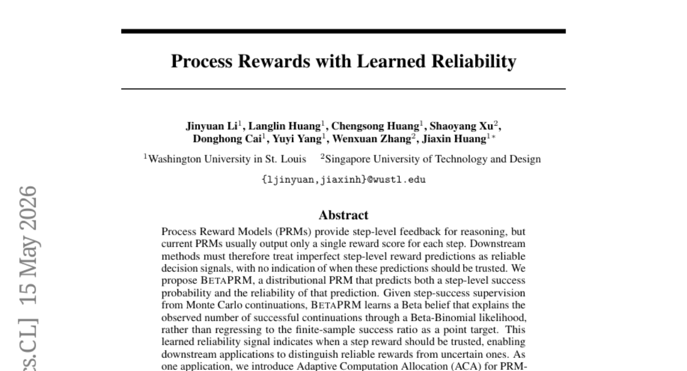

### 📌 한 줄 요약
신뢰도 점수를 포함한 분포형 PRM을 통해 추론 과정의 불확실성을 관리하고 효율적인 Best-of-N 샘플링을 가능하게 하는 기술

### 🔑 핵심 포인트
- Beta-Binomial likelihood를 활용하여 단계별 성공 확률과 예측 신뢰도를 동시에 학습하는 BetaPRM 제안
- 신뢰도 신호를 활용해 불확실한 후보에만 추가 연산을 할당하는 Adaptive Computation Allocation(ACA) 기법 도입
- 고정된 예산(Fixed-budget) 방식 대비 정확도 향상 및 토큰 소모량 감소 달성

### 🧑‍💻 개발자 관점
LLM의 추론 과정에서 발생하는 '잘못된 보상' 문제를 신뢰도 지표로 제어함으로써, 추론 비용(Token cost)과 성능 사이의 최적의 트레이드오프를 구현할 수 있습니다.

### 🚀 실무 적용 아이디어
- Monte Carlo 기반의 step-level success 데이터셋 구축 및 Beta-Binomial 손실 함수 적용 실험
- 학습된 신뢰도 점수를 기반으로 한 조기 종료(Early stopping) 로직 구현 및 토큰 절감 효과 검증
- 기존의 단일 점수 기반 PRM과 BetaPRM의 Best-of-N 성능 비교 테스트

### ⚠️ 리스크/한계
- Monte Carlo 시뮬레이션을 통한 데이터 생성 과정에서 발생하는 높은 계산 비용
- 신뢰도 예측 자체가 편향될 경우 잘못된 경로를 선택하거나 불필요한 연산이 발생할 위험

### 📝 초록 기반 상세 설명
기존의 과정 보상 모델(PRM)은 각 단계에 대해 단일 점수만을 출력하여 예측의 신뢰도를 구분하지 못하는 한계가 있습니다. 이를 해결하기 위해 성공 확률과 예측 신뢰도를 동시에 예측하는 분포형 모델인 BetaPRM을 제안합니다. BetaPRM은 Monte Carlo 연속 시뮬레이션을 통해 학습된 Beta 분포를 활용하여, 단순 회귀가 아닌 확률적 신뢰도를 제공합니다. 이를 기반으로 제안된 Adaptive Computation Allocation(ACA)은 신뢰도가 높은 경로는 조기에 종료하고 불확실한 경로에 계산 자원을 집중합니다. 실험 결과, BetaPRM은 기존 Best-of-N 방식보다 높은 정확도를 유지하면서도 토큰 사용량을 획기적으로 절감했습니다.

---

## 8. [EnvFactory: Scaling Tool-Use Agents via Executable Environments Synthesis and Robust RL](https://huggingface.co/papers/2605.18703)
**Upvotes**: 37 | **도입 난이도**: 중 | **신뢰도**: 상
**arXiv**: https://arxiv.org/abs/2605.18703

**태그**: Agentic RL, Tool-use, Synthetic Data, Environment Synthesis, Agent, Reasoning, Benchmark

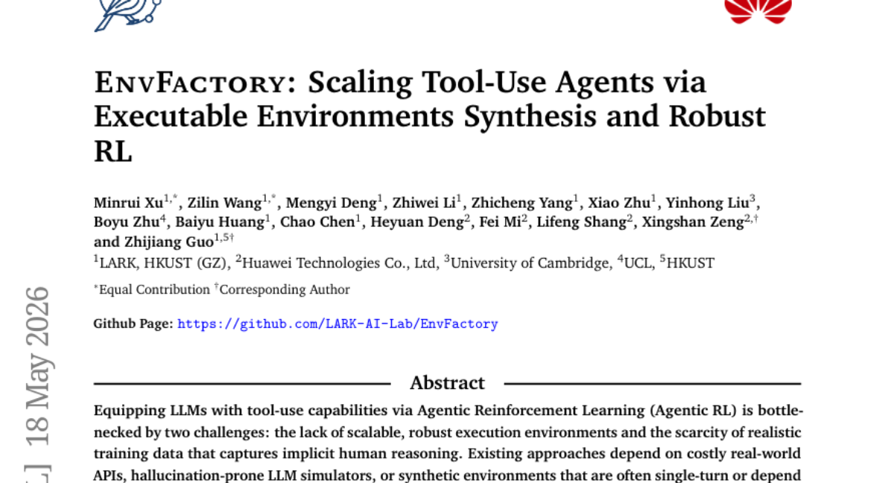

### 📌 한 줄 요약
자동화된 환경 구축과 정교한 궤적 합성을 통해 적은 수의 환경만으로도 고성능 Tool-use 에이전트를 학습시키는 프레임워크

### 🔑 핵심 포인트
- 실제 리소스를 활용한 상태 유지(stateful) 및 실행 가능한 도구 환경 자동 구축
- 위상 인식 샘플링(topology-aware sampling)을 통한 자연스러운 다회차 대화 궤적 합성
- 적은 수의 환경으로도 높은 학습 효율과 다운스트림 성능을 확보하는 데이터 생성 전략

### 🧑‍💻 개발자 관점
에이전트 학습을 위해 매번 수동으로 환경을 구축하거나 단순 명령 위주의 데이터셋을 만드는 번거로움을 자동화하여 학습 효율을 극대화할 수 있습니다.

### 🚀 실무 적용 아이디어
- 도메인 특화 API/환경을 활용한 자동 환경 생성 파이프라인 구축 테스트
- 단순 명령어가 아닌 사용자 의도가 포함된 다회차 대화 데이터셋 생성 실험
- 소규모 환경 세트에서 RL 학습 효율성 검증

### ⚠️ 리스크/한계
- 자동 생성된 환경의 검증 단계에서 발생할 수 있는 잠재적 오류
- 합성된 데이터가 실제 복잡한 현실 세계의 예외 상황을 완벽히 커버할 수 있는지 여부

### 📝 초록 기반 상세 설명
LLM의 도구 사용 능력을 강화하는 Agentic RL은 확장 가능한 실행 환경의 부족과 현실적인 학습 데이터의 부재라는 문제에 직면해 있습니다. 기존 방식은 비용이 많이 드는 API나 환각에 취약한 시뮬레이터, 혹은 단순한 명령 위주의 합성 데이터에 의존하는 한계가 있었습니다. 이를 해결하기 위해 EnvFactory는 실제 리소스로부터 상태 유지(stateful)가 가능한 실행 환경을 자동 탐색 및 검증하고, 위상 인식 샘플링을 통해 자연스러운 다회차(multi-turn) 궤적을 생성합니다. 실험 결과, 기존 방식보다 훨씬 적은 수의 환경만으로도 BFCLv3 및 다양한 대화형 벤치마크에서 뛰어난 성능 향상을 달성했습니다. 결과적으로 EnvFactory는 에이전트 학습을 위한 확장 가능하고 견고한 자동화 파이프라인을 제공합니다.

---

## 9. [CogOmniControl: Reasoning-Driven Controllable Video Generation via Creative Intent Cognition](https://huggingface.co/papers/2605.19995)
**Upvotes**: 31 | **도입 난이도**: 상 | **신뢰도**: 상
**arXiv**: https://arxiv.org/abs/2605.19995

**태그**: Video Generation, VLM, Reasoning, Diffusion Model, RAG, Vision, Video, Benchmark, Evaluation

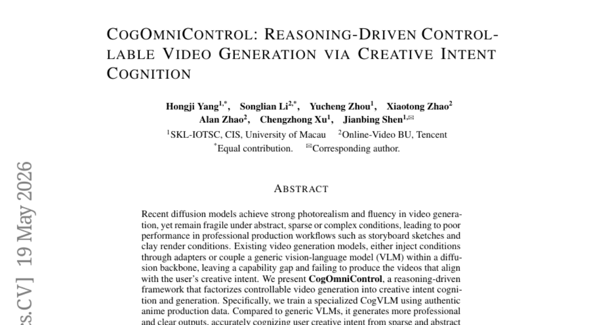

### 📌 한 줄 요약
사용자의 추상적인 창의적 의도를 정교한 추론을 통해 구체적인 비디오로 변환하는 Reasoning-driven 제어 프레임워크

### 🔑 핵심 포인트
- 전문 애니메이션 데이터로 학습된 CogVLM을 통한 정교한 창의적 의도 인지 및 추론
- 다양한 제어 조건을 인컨텍스트 생성으로 통합하는 CogOmniDiT 아키텍처
- 강화 학습(RL)을 통한 추론 결과와 생성 모델 간의 정렬 및 Best-of-N 선택 메커니즘

### 🧑‍💻 개발자 관점
단순 텍스트 입력을 넘어 스케치나 추상적 가이드 같은 복잡한 제어 조건을 전문적인 영상 결과물로 변환하는 워크플로우 자동화 가능성을 제시합니다.

### 🚀 실무 적용 아이디어
- 제공된 벤치마크(CogReasonBench)를 활용한 모델의 추론 능력 검증
- 스토리보드/스케치 등 저해상도/추상적 입력에 대한 제어 정밀도 테스트
- RL 기반 정렬 방식이 실제 생성 결과의 일관성에 미치는 영향 분석

### ⚠️ 리스크/한계
- 전문 데이터셋 의존도가 높아 특정 도메인(애니메이션 등) 외의 범용성 확인 필요
- 추론 및 Best-of-N 프로세스로 인한 높은 연산 비용 및 생성 시간 발생 가능성

### 📝 초록 기반 상세 설명
최근 비디오 생성 모델은 높은 실사 성능을 보이지만, 스토리보드나 클레이 렌더링 같은 추상적이고 복잡한 조건에서는 사용자 의도를 정확히 반영하지 못하는 한계가 있습니다. 기존 방식은 단순 어댑터나 범용 VLM을 사용하여 전문적인 제작 워크플로우를 지원하기에 부족했습니다. 본 논문은 창의적 의도 인지와 생성을 분리한 CogOmniControl 프레임워크를 제안합니다. 전문 애니메이션 데이터를 학습한 CogVLM이 추상적 조건을 정교한 추론 결과로 변환하고, CogOmniDiT가 이를 인컨텍스트 생성 방식으로 통합하여 비디오를 생성합니다. 또한, 생성된 비디오 중 최적을 선택하는 Best-of-N 전략을 통해 폐쇄 루프 구조를 완성했습니다. 실험 결과, 제안 모델은 전문 워크플로우 데이터 기반의 벤치마크에서 기존 오픈소스 모델들을 상회하는 성능을 입증했습니다.

---

## 10. [Artifact-Bench: Evaluating MLLMs on Detecting and Assessing the Artifacts of AI-Generated Videos](https://huggingface.co/papers/2605.18984)
**Upvotes**: 21 | **도입 난이도**: 하 | **신뢰도**: 상
**arXiv**: https://arxiv.org/abs/2605.18984

**태그**: Video-Generation, MLLM, Evaluation, Computer-Vision, Reasoning, Multimodal, Video, Benchmark, Safety

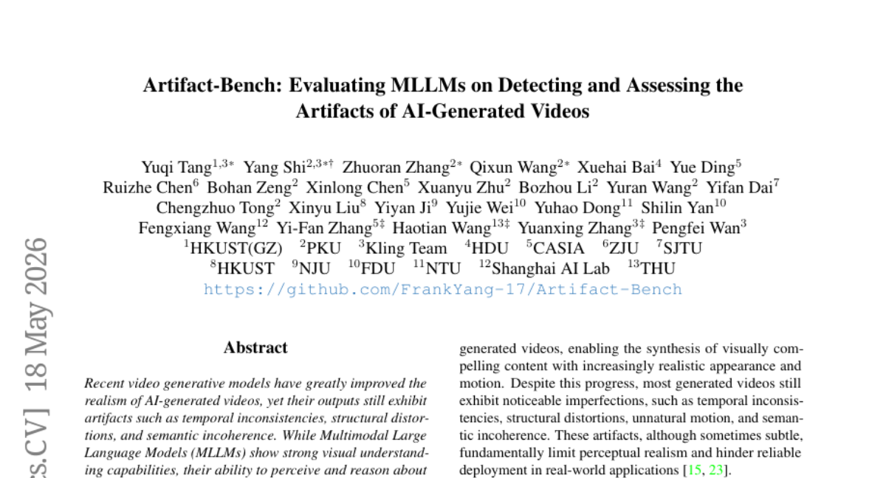

### 📌 한 줄 요약
AI 생성 비디오의 결함을 탐지하고 분석하는 MLLM의 성능을 평가하기 위한 체계적인 벤치마크 제안

### 🔑 핵심 포인트
- 실사, 애니메이션, CG를 포함하는 3단계 계층적 아티팩트 분류 체계 구축
- 분류, 쌍별 비교, 세부 식별로 구성된 다각적 평가 태스크 정의
- 현존하는 주요 MLLM들의 AI 생성 비디오 평가 신뢰도 부족 입증

### 🧑‍💻 개발자 관점
AI 비디오 생성 모델의 품질 평가 자동화(Auto-evaluation)를 위해 MLLM을 활용하려는 엔지니어에게 모델의 한계와 신뢰도를 경고하는 지표가 됩니다.

### 🚀 실무 적용 아이디어
- 자체 개발 중인 비디오 생성 모델의 품질 검증에 Artifact-Bench 프레임워크 적용
- 사용 중인 MLLM이 생성된 영상의 논리적 오류를 얼마나 잘 잡아내는지 테스트
- 인간 평가(Human Eval)와 MLLM 평가 간의 상관관계 분석

### ⚠️ 리스크/한계
- 모델의 성능이 무작위 수준에 머물 수 있어 MLLM을 단독 평가자로 쓰기엔 위험함
- 특정 도메인에 편향된 평가 결과가 나올 가능성 존재

### 📝 초록 기반 상세 설명
최근 AI 생성 비디오의 실사감이 높아졌으나 여전히 시간적 불일치나 구조적 왜곡 같은 아티팩트(Artifact) 문제가 존재합니다. 기존 벤치마크는 다양한 도메인에서의 정밀한 아티팩트 인지 및 진단 능력을 평가하는 데 한계가 있었습니다. 이를 해결하기 위해 실사, 애니메이션, CG 스타일을 아우르는 계층적 분류 체계를 갖춘 Artifact-Bench를 제안합니다. 이 벤치마크는 분류, 비교, 세부 식별이라는 세 가지 태스크를 통해 MLLM의 능력을 검증합니다. 실험 결과, 19종의 주요 MLLM들이 아티팩트 인지 및 추론에서 심각한 한계를 보였으며 인간의 선호도와도 큰 차이를 나타냈습니다.

---

## 11. [Harnessing LLM Agents with Skill Programs](https://huggingface.co/papers/2605.17734)
**Upvotes**: 20 | **도입 난이도**: 중 | **신뢰도**: 상
**arXiv**: https://arxiv.org/abs/2605.17734

**태그**: LLM Agent, Program-Aided, Self-Improvement, Reasoning, Agent, RAG, Vision, Inference

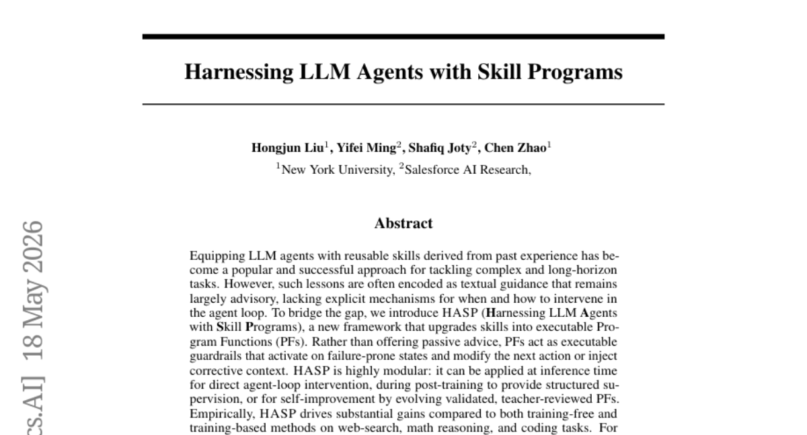

### 📌 한 줄 요약
단순 텍스트 가이드를 넘어 실행 가능한 '프로그램 함수(PF)'를 통해 LLM 에이전트의 오류를 직접 교정하는 프레임워크

### 🔑 핵심 포인트
- 텍스트 가이드를 실행 가능한 '프로그램 함수(PF)'로 변환하여 에이전트 루프에 직접 개입
- 추론 시점 개입, 사후 학습, 자기 개선(Self-improvement)이 가능한 모듈형 프레임워크 설계
- 실패 상황에서 행동을 수정하거나 컨텍스트를 주입하는 능동적 가드레일 메커니즘

### 🧑‍💻 개발자 관점
에이전트가 단순히 '말'로만 지침을 받는 것이 아니라, 특정 조건에서 코드가 실행되듯 동작을 제어하는 구조를 학습할 수 있음을 시사합니다.

### 🚀 실무 적용 아이디어
- 에이전트의 특정 실패 패턴을 함수(Python 등)로 정의하여 루프에 삽입하는 실험
- 텍스트 기반 프롬프트와 PF 기반 가드레일의 성능 차이 비교
- 에이전트가 생성한 코드를 다시 가이드로 사용하는 피드백 루프 구축

### ⚠️ 리스크/한계
- PF가 복잡해질수록 에이전트 루프의 오버헤드 및 지연 시간 증가 가능성
- 안정적인 스킬 라이브러리 진화를 위한 검증 프로세스 구축의 난이도

### 📝 초록 기반 상세 설명
복잡한 작업을 해결하기 위해 과거 경험을 활용하는 에이전트 방식이 유행하고 있으나, 기존의 텍스트 기반 가이드는 실행력이 부족하다는 한계가 있습니다. 이를 해결하기 위해 본 논문은 기술(Skill)을 실행 가능한 프로그램 함수(PF)로 업그레이드하는 HASP 프레임워크를 제안합니다. PF는 에이전트 루프 내에서 실패 가능성이 높은 상태를 감지하여 행동을 수정하거나 교정적 컨텍스트를 주입하는 가드레일 역할을 합니다. HASP는 추론 시점의 개입, 사후 학습(Post-training), 그리고 검증된 PF의 진화(Self-improvement)를 모두 지원하는 모듈형 구조를 가집니다. 실험 결과, 웹 검색, 수학 추론, 코딩 작업에서 기존 방식 대비 성능이 대폭 향상됨을 확인했습니다.

---

## 12. [Aurora: Unified Video Editing with a Tool-Using Agent](https://huggingface.co/papers/2605.18748)
**Upvotes**: 16 | **도입 난이도**: 중 | **신뢰도**: 상
**arXiv**: https://arxiv.org/abs/2605.18748

**태그**: Agent, Video-Editing, VLM, Diffusion-Transformer, Vision, Video, Benchmark, Evaluation

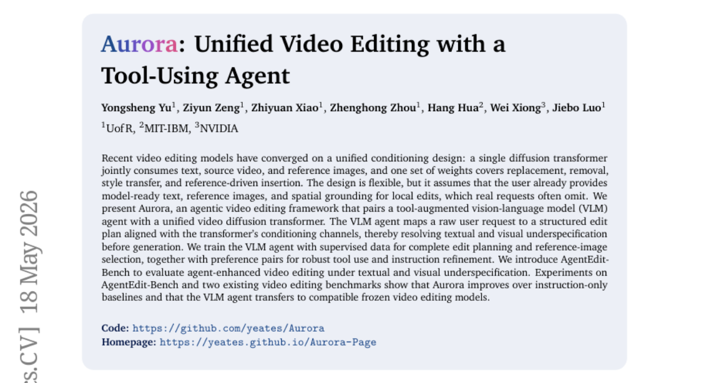

### 📌 한 줄 요약
사용자의 모호한 요청을 구조화된 편집 계획으로 변환하여 비디오 편집 모델의 성능을 극대화하는 에이전트 기반 프레임워크

### 🔑 핵심 포인트
- VLM 에이전트를 통한 모호한 사용자 요청의 구조적 편집 계획(Edit Plan) 변환
- 텍스트 및 시각적 정보 부족 문제를 해결하는 에이전트 기반의 전처리 프로세스
- 학습된 에이전트가 다른 고정된(Frozen) 비디오 편집 모델과도 호환되는 범용성

### 🧑‍💻 개발자 관점
사용자가 정교한 프롬프트나 마스킹 없이 자연어로만 명령을 내려도, 에이전트가 모델이 이해할 수 있는 형태로 자동 변환해주는 워크플로우를 구축할 수 있습니다.

### 🚀 실무 적용 아이디어
- 기존 Diffusion 모델에 VLM 에이전트를 결합하는 파이프라인 설계 실험
- 사용자의 모호한 요청(예: '분위기를 바꿔줘')을 구조화된 데이터로 변환하는 프롬프트 엔지니어링 테스트
- 에이전트가 생성한 편집 계획의 정밀도와 실제 생성 결과 간의 상관관계 분석

### ⚠️ 리스크/한계
- 에이전트의 계획 수립 단계에서 발생하는 오류가 최종 비디오 품질에 직접적인 영향을 미칠 수 있음
- 에이전트 추론 단계가 추가됨에 따라 전체 편집 파이프라인의 지연 시간(Latency) 증가 가능성

### 📝 초록 기반 상세 설명
최근 비디오 편집 모델은 텍스트, 소스 비디오, 참조 이미지를 통합 처리하는 구조로 발전했으나, 사용자의 모호한 요청을 처리하는 데 한계가 있습니다. 이를 해결하기 위해 Aurora는 도구 활용 능력을 갖춘 VLM 에이전트와 통합 비디오 확산 트랜스포머를 결합한 프레임워크를 제안합니다. VLM 에이전트는 가공되지 않은 사용자 요청을 모델의 조건 채널에 맞게 구조화된 편집 계획으로 매핑하여 정보 부족 문제를 해결합니다. 에이전트는 지도 학습과 선호도 학습을 통해 정교한 편집 계획 수립 및 참조 이미지 선택 능력을 갖추도록 훈련되었습니다. 실험 결과, Aurora는 기존 지시어 기반 모델보다 우수한 성능을 보였으며, 학습된 에이전트가 다른 고정된 비디오 편집 모델에도 효과적으로 전이됨을 입증했습니다.

---

## 13. [CEPO: RLVR Self-Distillation using Contrastive Evidence Policy Optimization](https://huggingface.co/papers/2605.19436)
**Upvotes**: 12 | **도입 난이도**: 중 | **신뢰도**: 상
**arXiv**: https://arxiv.org/abs/2605.19436

**태그**: Reinforcement Learning, Self-Distillation, Reasoning, LLM Training, RAG, Multimodal, Benchmark, Distillation, Safety

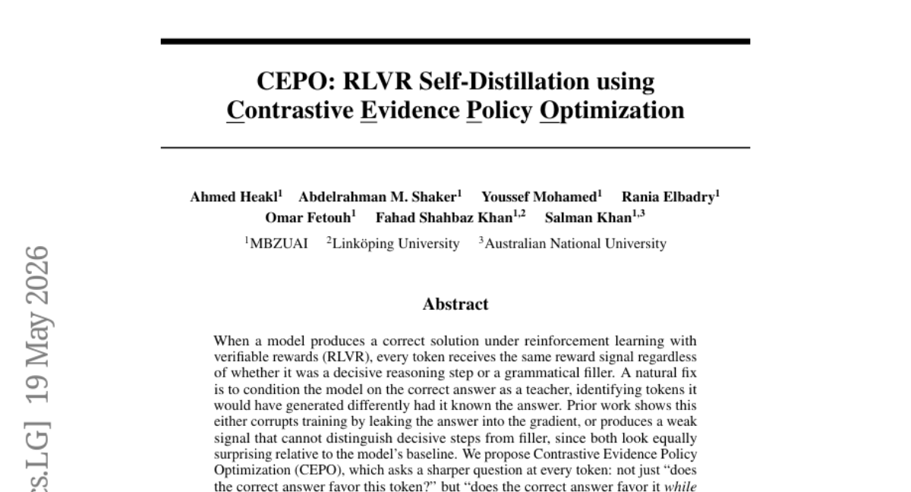

### 📌 한 줄 요약
RLVR 환경에서 정답 정보를 활용해 추론의 핵심 단계와 단순 문법적 요소를 구분하여 학습 효율을 극대화하는 자기 증류(Self-Distillation) 기법

### 🔑 핵심 포인트
- 대조적 증거 정책 최적화(CEPO): 정답과 오답 간의 차이를 이용해 핵심 추론 토큰을 식별하는 메커니즘
- 효율적인 크레딧 할당: 불필요한 문법적 토큰(filler)과 결정적 추론 단계(decisive steps)를 구분하여 학습 신호 정밀화
- 비용 효율적 설계: 별도의 샘플링 없이 학습 배치 내의 거부된 롤아웃(rejected rollouts)을 오답 교사로 활용

### 🧑‍💻 개발자 관점
LLM의 추론 성능 향상을 위해 RLVR을 적용할 때, 정답 유출 문제 없이 모델이 '진짜 중요한 단계'에 집중하도록 학습시키는 실전적인 방법론을 제시합니다.

### 🚀 실무 적용 아이디어
- 기존 GRPO 학습 파이프라인에 배치 내 오답 샘플을 활용한 대조 손실(Contrastive Loss) 적용 실험
- 수학/코드 등 정답이 명확한 태스크에서 토큰별 크레딧 할당 효율성 비교
- 모델 크기 변화에 따른 CEPO의 성능 스케일링 법칙 검증

### ⚠️ 리스크/한계
- 배치 내 오답 샘플의 품질이 낮을 경우 대조 신호가 왜곡될 가능성
- 추론 단계와 filler를 구분하는 기준이 특정 도메인(예: 수학 외 언어 작업)에서 일반화될 수 있는지 여부

### 📝 초록 기반 상세 설명
RLVR(검증 가능한 보상 기반 강화학습)에서는 모든 토큰에 동일한 보상이 주어져 핵심 추론 단계와 단순 문법적 요소를 구분하기 어렵다는 문제가 있습니다. 기존의 정답 조건부 학습 방식은 정답 유출로 인한 학습 오염이나 신호 약화 문제를 야기했습니다. 이를 해결하기 위해 제안된 CEPO는 정답과 오답(배치 내 거부된 샘플)을 대조하여, 정답은 지지하고 오답은 배제하는 토큰만을 핵심 추론 단계로 식별합니다. 이 방식은 추가적인 샘플링 비용 없이 기존 배치 내 데이터를 활용하며, 이론적으로 핵심 단계에만 정밀한 크레딧 할당이 가능함을 증명했습니다. 실험 결과, 동일 예산 대비 GRPO보다 높은 수학적 추론 성능을 달성하며 기존 자기 증류 방식의 한계를 극복했습니다.

### 🖼️ 추가 자료
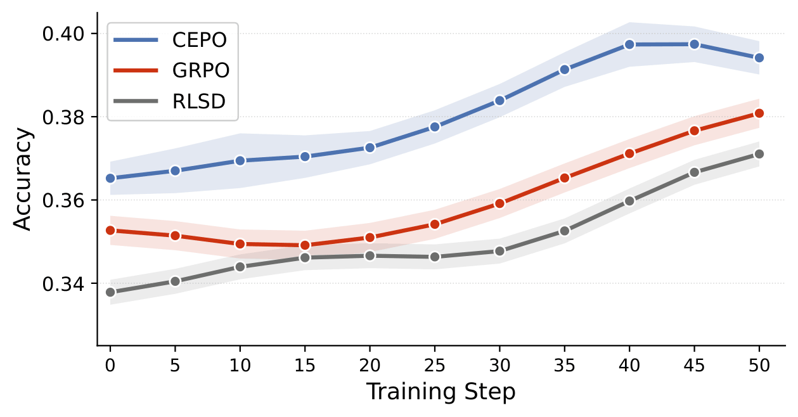
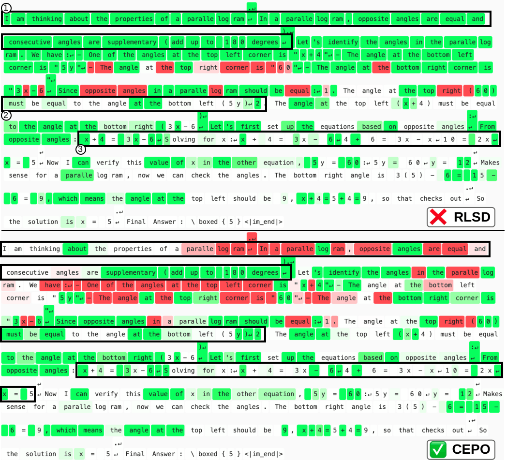

---

## 14. [OmniGUI: Benchmarking GUI Agents in Omni-Modal Smartphone Environments](https://huggingface.co/papers/2605.18758)
**Upvotes**: 12 | **도입 난이도**: 하 | **신뢰도**: 상
**arXiv**: https://arxiv.org/abs/2605.18758

**태그**: GUI Agent, Omni-modal, Benchmark, Mobile Automation, Agent, Multimodal, Vision, Video, Audio, Evaluation

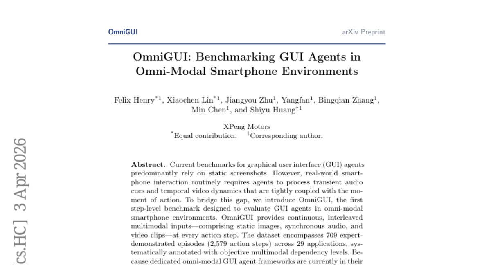

### 📌 한 줄 요약
정적 스크린샷을 넘어 오디오와 비디오가 결합된 실시간 스마트폰 환경에서의 GUI 에이전트 성능을 평가하는 벤치마크 제안

### 🔑 핵심 포인트
- 이미지, 오디오, 비디오가 결합된 최초의 스텝 단위 옴니모달 GUI 벤치마크 구축
- 실제 스마트폰 환경의 동적 특성(시간적 변화, 청각 신호)을 반영한 데이터셋 제공
- 멀티모달 모델의 시간적/청각적 신호 처리 능력 및 환경 소음 간섭 문제 규명

### 🧑‍💻 개발자 관점
단순 화면 인식을 넘어 음성 명령이나 영상 변화가 동반되는 복잡한 모바일 자동화 에이전트를 개발할 때 필수적인 평가 기준을 제시합니다.

### 🚀 실무 적용 아이디어
- 제공된 데이터셋을 활용하여 현재 사용 중인 멀티모달 모델의 시간적 추론 능력 테스트
- 환경 소음(Audio noise)이 포함된 데이터에서 에이전트의 명령 수행 정확도 변화 측정
- 정적 이미지 기반 에이전트를 OmniGUI 환경으로 이식하여 성능 저하 폭 확인

### ⚠️ 리스크/한계
- 현재의 파운데이션 모델들이 옴니모달 입력에 대해 충분히 최적화되지 않았을 가능성
- 환경 소음과 같은 비정형 데이터가 모델의 의사결정에 미치는 간섭 제어의 어려움

### 📝 초록 기반 상세 설명
기존의 GUI 에이전트 벤치마크는 주로 정적인 스크린샷에 의존하여 실시간 상호작용의 동적인 특성을 반영하지 못하는 한계가 있습니다. 이를 해결하기 위해 이미지, 오디오, 비디오가 매 단계 결합된 옴니모달(Omni-modal) 환경의 벤치마크인 OmniGUI를 도입합니다. 29개 앱에 걸쳐 전문가가 시연한 709개의 에피소드를 포함하며, 각 단계별로 멀티모달 의존성을 체계적으로 주석 처리했습니다. 실험 결과, 현재의 파운데이션 모델들은 시각적 정보만 필요한 작업에는 능숙하지만, 시간적·청각적 신호가 결합된 작업에서는 성능이 크게 저하됨을 확인했습니다. 또한, 작업과 무관한 환경 소음이 발생할 때 발생하는 교차 모달 간섭(cross-modal interference) 문제를 식별했습니다.

---

## 15. [MSAVBench: Towards Comprehensive and Reliable Evaluation of Multi-Shot Audio-Video Generation](https://huggingface.co/papers/2605.20183)
**Upvotes**: 11 | **도입 난이도**: 중 | **신뢰도**: 상
**arXiv**: https://arxiv.org/abs/2605.20183

**태그**: Video Generation, Multi-shot, Evaluation Benchmark, Audio-Visual Sync, Agent, Video, Audio, Benchmark, Evaluation, Safety

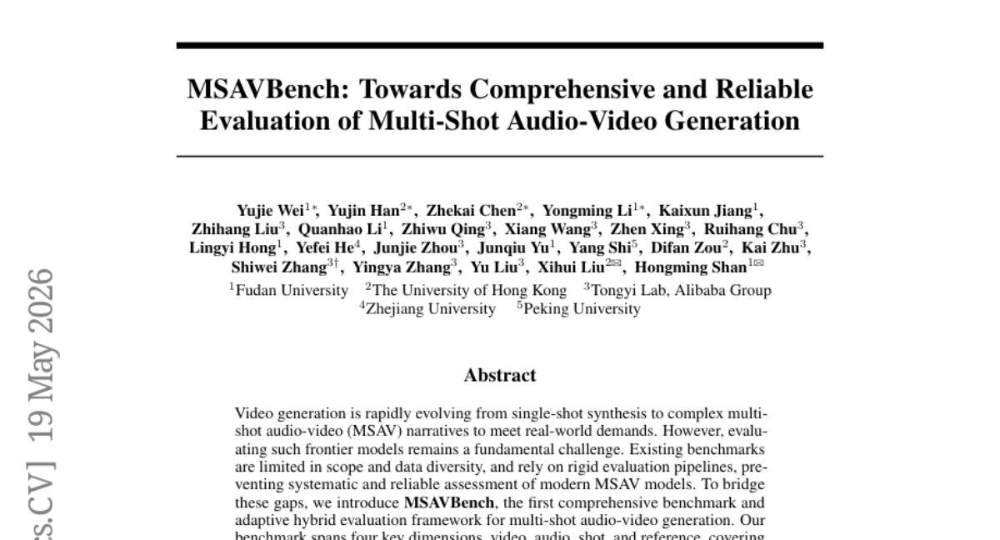

### 📌 한 줄 요약
멀티샷 오디오-비디오 생성 모델의 복잡한 서사와 정교한 동기화를 평가하기 위한 포괄적 벤치마크 및 적응형 평가 프레임워크 제안

### 🔑 핵심 포인트
- 최대 15개의 샷과 비현실적 시나리오를 포함하는 포괄적인 MSAV 벤치마크 구축
- 샷 분할 자동 수정 및 도구 기반 증거 추출을 포함한 적응형 하이브리드 평가 프레임워크 개발
- 인간의 주관적 판단과 높은 상관관계(Spearman 91.5%)를 가진 신뢰할 수 있는 평가 지표 제공

### 🧑‍💻 개발자 관점
멀티샷 영상 제작 모델 개발 시, 단순 화질을 넘어 서사적 일관성과 오디오-비디오 동기화를 정량적으로 검증할 수 있는 기준을 제공합니다.

### 🚀 실무 적용 아이디어
- 자체 개발 중인 멀티샷 생성 모델에 MSAVBench의 평가 파이프라인 적용
- 모델의 샷 간 일관성 및 오디오-비주얼 동기화 성능 측정
- 에이전트 기반 생성 파이프라인 도입을 통한 디렉터 제어 능력 개선 실험

### ⚠️ 리스크/한계
- 복잡한 평가 프레임워크로 인해 평가 비용 및 연산 자원 소모가 클 수 있음
- 특정 시나리오나 샷 구성에 따른 평가 편향 가능성 존재

### 📝 초록 기반 상세 설명
최근 비디오 생성 기술이 단일 샷을 넘어 복잡한 멀티샷 오디오-비디오(MSAV) 내러티브로 진화하고 있으나, 기존 벤치마크는 데이터 다양성과 평가 파이프라인의 유연성 부족으로 인해 최신 모델을 체계적으로 평가하는 데 한계가 있습니다. 이를 해결하기 위해 비디오, 오디오, 샷, 참조의 4개 차원을 아우르는 포괄적인 벤치마크인 MSAVBench를 도입합니다. 제안된 프레임워크는 샷 분할을 위한 적응형 자기 수정 메커니즘과 도구 기반 증거 추출을 통해 평가의 견고함을 높였습니다. 실험 결과, MSAVBench는 인간의 판단과 91.5%의 높은 Spearman 상관계수를 보이며 신뢰성을 입증했습니다. 19종의 최신 모델을 평가한 결과, 현재 모델들이 디렉터 수준의 제어와 미세한 오디오-비주얼 동기화에서 어려움을 겪고 있음을 확인했습니다.

---

## 16. [PixVerve: Advancing Native UHR Image Generation to 100MP with a Large-Scale High-Quality Dataset](https://huggingface.co/papers/2605.20147)
**Upvotes**: 8 | **도입 난이도**: 상 | **신뢰도**: 상
**arXiv**: https://arxiv.org/abs/2605.20147

**태그**: Generative AI, Computer Vision, High-Resolution, Dataset, RAG, Multimodal, Vision, Benchmark, Evaluation, Safety

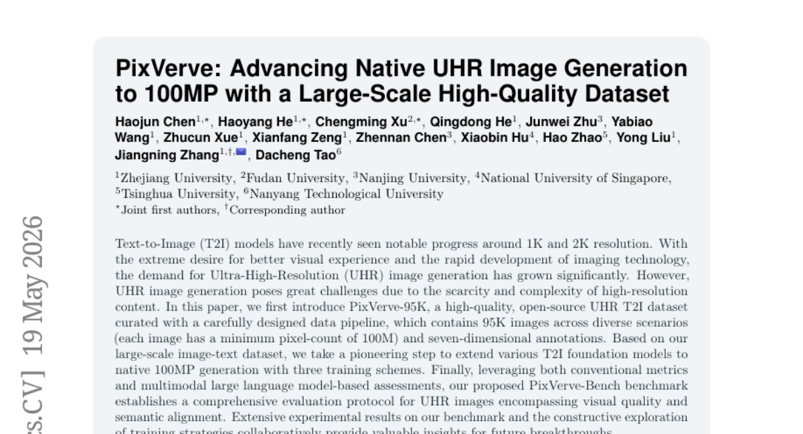

### 📌 한 줄 요약
100MP급 초고해상도(UHR) 이미지 생성을 위한 대규모 데이터셋 구축 및 학습 방법론 제안

### 🔑 핵심 포인트
- 95K 규모의 고품질 초고해상도(100MP 이상) 오픈소스 데이터셋 PixVerve-95K 구축
- 기존 T2I 모델을 100MP급으로 확장하기 위한 세 가지 차별화된 학습 전략 제안
- 시각적 품질과 의미적 일치성을 동시에 평가하는 멀티모달 기반 벤치마크 PixVerve-Bench 개발

### 🧑‍💻 개발자 관점
고해상도 디스플레이 및 인쇄 매체용 이미지 생성 기술의 실질적인 구현 가능성을 제시하며, 대규모 고해상도 데이터 파이프라인 설계에 대한 인사이트를 제공합니다.

### 🚀 실무 적용 아이디어
- PixVerve-95K 데이터셋을 활용한 기존 모델의 업스케일링 성능 비교 실험
- 제안된 세 가지 학습 스킴 중 특정 도메인에 최적화된 전략 탐색
- PixVerve-Bench를 활용한 기존 고해상도 생성 모델의 정량적 평가 수행

### ⚠️ 리스크/한계
- 100MP급 생성 시 막대한 컴퓨팅 자원 및 메모리 요구량
- 데이터셋의 규모는 크지만 특정 도메인에 편향될 가능성

### 📝 초록 기반 상세 설명
최근 텍스트-이미지 생성 모델이 발전하고 있으나, 초고해상도(UHR) 이미지 생성은 데이터 부족과 복잡성으로 인해 여전히 어려운 과제입니다. 본 논문에서는 95K 규모의 고품질 UHR 데이터셋인 PixVerve-95K를 구축하고, 7차원 주석을 포함한 정교한 데이터 파이프라인을 제안합니다. 이를 바탕으로 기존 T2I 파운데이션 모델을 100MP급 생성 모델로 확장할 수 있는 세 가지 학습 스킴을 제시합니다. 또한, 시각적 품질과 의미적 정렬을 모두 평가할 수 있는 새로운 벤치마크인 PixVerve-Bench를 도입했습니다. 실험 결과, 제안된 방법론이 초고해상도 이미지 생성의 새로운 가능성을 열었음을 입증했습니다.

### 🖼️ 추가 자료
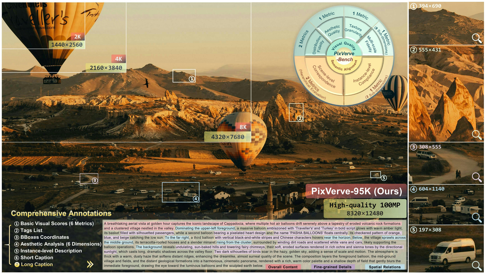

---

## 17. [Video Models Can Reason with Verifiable Rewards](https://huggingface.co/papers/2605.15458)
**Upvotes**: 8 | **도입 난이도**: 상 | **신뢰도**: 상
**arXiv**: https://arxiv.org/abs/2605.15458

**태그**: Video Generation, Reinforcement Learning, Diffusion Models, Reasoning, Video, Benchmark, Evaluation, Inference

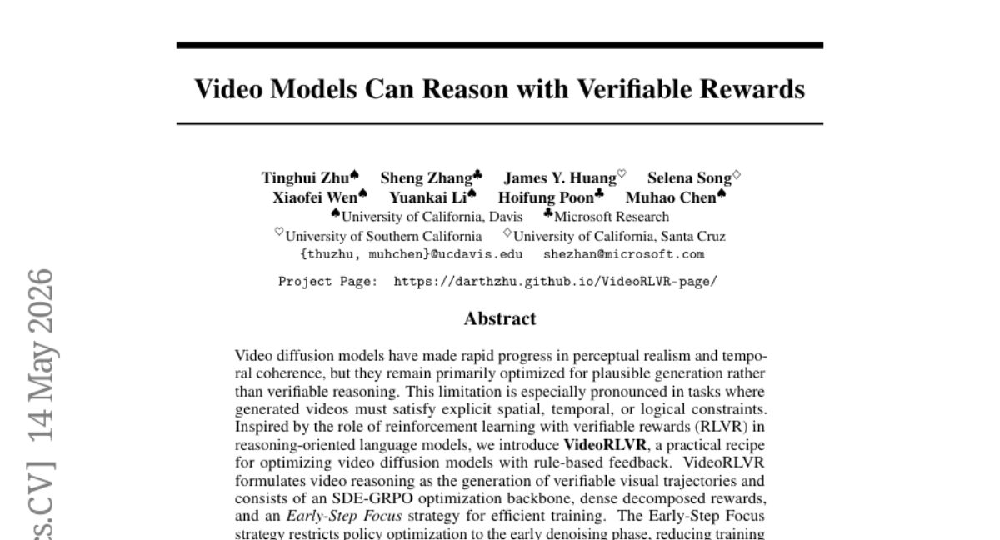

### 📌 한 줄 요약
검증 가능한 규칙 기반 보상을 활용하여 비디오 생성 모델의 논리적 추론 및 제약 조건 준수 능력을 강화하는 방법론 제안

### 🔑 핵심 포인트
- SDE-GRPO 기반의 검증 가능한 규칙(Rule-based) 피드백을 통한 비디오 최적화 프레임워크 개발
- 학습 지연 시간을 약 40% 단축하면서 성능을 유지하는 Early-Step Focus 전략 도입
- Maze, Sokoban 등 객관적 성공 기준이 있는 도메인에서의 논리적 추론 능력 검증

### 🧑‍💻 개발자 관점
단순히 '그럴듯한' 영상이 아니라, 특정 물리 법칙이나 논리적 규칙을 따라야 하는 에이전트 시뮬레이션 및 정교한 비디오 생성 작업에 핵심적인 기술입니다.

### 🚀 실무 적용 아이디어
- SDE 기반 확산 모델에 GRPO와 같은 RL 알고리즘을 결합하는 파이프라인 구축 실험
- 특정 물리 법칙(중력, 충돌 등)을 보상 함수로 정의하여 모델에 학습시키기
- Early-Step Focus 전략을 활용한 학습 효율성 벤치마크 수행

### ⚠️ 리스크/한계
- 규칙 기반 보상 설계 시 보상 해킹(Reward Hacking) 발생 가능성
- 복잡한 논리 태스크 외의 일반적인 시각적 품질 저하 여부 확인 필요

### 📝 초록 기반 상세 설명
기존 비디오 확산 모델은 시각적 사실감은 뛰어나지만, 명시적인 공간적·논리적 제약 조건을 만족하는 추론 능력은 부족합니다. 본 논문은 언어 모델의 RLVR(Reinforcement Learning with Verifiable Rewards) 개념을 비디오 생성에 도입한 VideoRLVR를 제안합니다. 이 방법론은 SDE-GRPO 최적화 프레임워크와 밀집 분해 보상(dense decomposed rewards), 그리고 학습 효율을 높이는 Early-Step Focus 전략으로 구성됩니다. 실험 결과, Maze, FlowFree, Sokoban과 같은 논리적 태스크에서 기존 SFT 방식 및 상용 모델보다 뛰어난 성능을 보였습니다. 이를 통해 비디오 모델이 단순한 모방을 넘어 규칙에 부합하는 시각적 추론이 가능함을 입증했습니다.

---

## 18. [Semantic Generative Tuning for Unified Multimodal Models](https://huggingface.co/papers/2605.18714)
**Upvotes**: 7 | **도입 난이도**: 중 | **신뢰도**: 상
**arXiv**: https://arxiv.org/abs/2605.18714

**태그**: Multimodal, Generative AI, Computer Vision, Fine-tuning, RAG, Vision, Benchmark, Evaluation

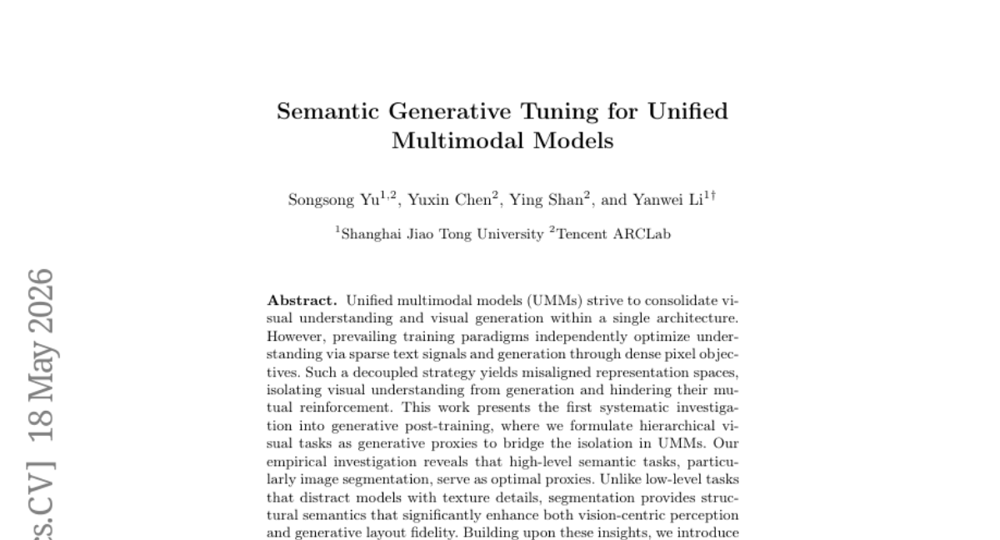

### 📌 한 줄 요약
세그멘테이션을 생성적 프록시로 활용하여 멀티모달 모델의 이해와 생성 능력을 동시에 최적화하는 SGT 기법 제안

### 🔑 핵심 포인트
- 이해(Understanding)와 생성(Generation) 간의 표현 공간 불일치 문제 해결
- 세그멘테이션을 생성적 프록시로 활용하는 Semantic Generative Tuning(SGT) 프레임워크 제안
- 고수준 의미론적 작업이 저수준 텍스처 작업보다 멀티모달 정렬에 더 효과적임을 입증

### 🧑‍💻 개발자 관점
단순히 이미지를 잘 만드는 것을 넘어, 모델이 사물의 구조를 정확히 이해하면서 동시에 정교한 생성을 수행하도록 만드는 학습 전략을 제공합니다.

### 🚀 실무 적용 아이디어
- 기존 멀티모달 모델에 세그멘테이션 손실 함수를 결합하여 성능 변화 관찰
- 다양한 수준의 시각 작업(Edge, Depth vs Segmentation)을 프록시로 비교 실험
- SGT 적용 전후의 어텐션 맵(Attention Map) 시각화를 통한 정렬 효과 검증

### ⚠️ 리스크/한계
- 세그멘테이션 데이터셋 의존성으로 인한 특정 도메인 편향 가능성
- 학습 과정에서 추가적인 연산 비용 발생

### 📝 초록 기반 상세 설명
통합 멀티모달 모델(UMM)은 시각적 이해와 생성 능력을 하나의 아키텍처에 담으려 하지만, 기존 방식은 이해와 생성의 학습 목표가 분리되어 있어 표현 공간의 불일치가 발생합니다. 본 연구는 이러한 격차를 해소하기 위해 계층적 시각 작업을 생성적 프록시로 활용하는 사후 학습 방식을 제안합니다. 실험 결과, 저수준 텍스처 작업보다 고수준 의미론적 작업인 이미지 세그멘테이션이 모델의 구조적 이해와 생성 레이아웃 정밀도를 높이는 데 가장 효과적임을 발견했습니다. 이를 바탕으로 제안된 Semantic Generative Tuning(SGT)은 세그멘테이션을 통해 이해와 생성 능력을 정렬하고 시너지를 창출합니다. 결과적으로 SGT는 시각적 인지 능력과 생성적 충실도를 모두 개선하며, 특징 공간의 선형 분리도와 어텐션 할당 패턴을 최적화합니다.

### 🖼️ 추가 자료
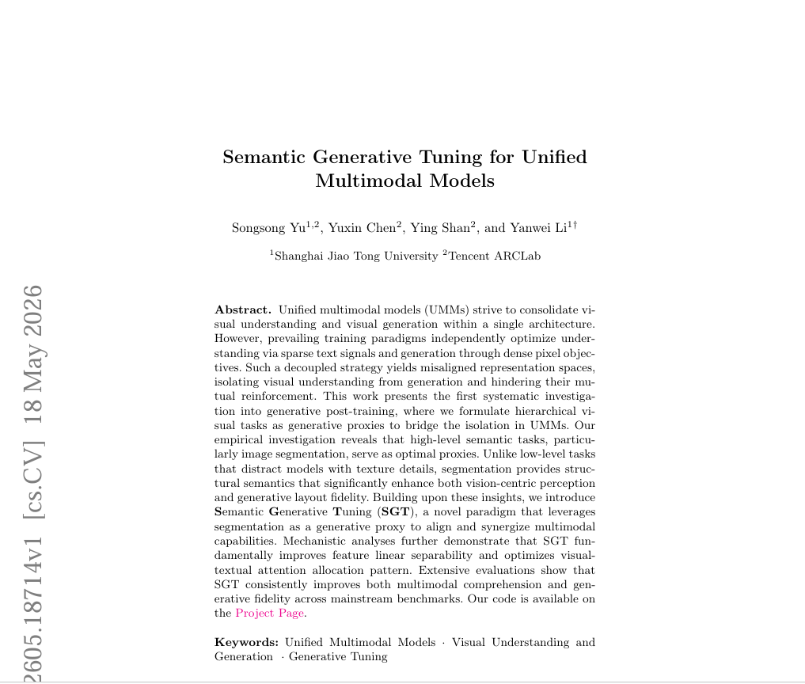
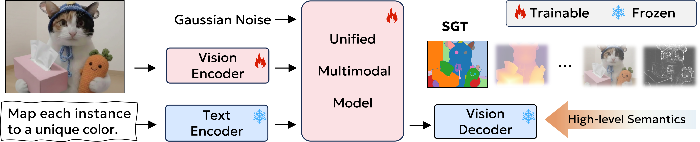

---

## 19. [Overcoming Catastrophic Forgetting in Visual Continual Learning with Reinforcement Fine-Tuning](https://huggingface.co/papers/2605.09640)
**Upvotes**: 5 | **도입 난이도**: 중 | **신뢰도**: 상
**arXiv**: https://arxiv.org/abs/2605.09640

**태그**: Continual Learning, Reinforcement Learning, MLLM, Vision, RAG, Evaluation

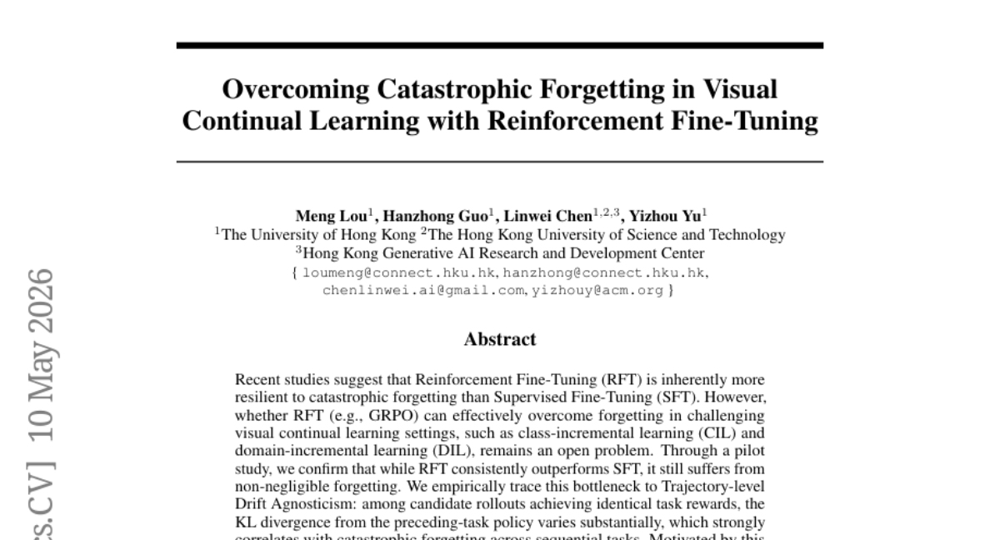

### 📌 한 줄 요약
RFT의 궤적 편차 문제를 해결하여 시각적 지속 학습(Visual Continual Learning)에서의 치명적 망각을 억제하는 RaPO 방법론 제안

### 🔑 핵심 포인트
- RFT 환경에서 망각을 유발하는 '궤적 수준의 편차' 현상 규명
- 지식 보존을 유도하는 Retention Reward와 Cross-Task Advantage Normalization(CTAN) 제안
- 시각적 지속 학습(CIL, DIL 등) 환경에서 RFT의 성능 최적화 및 체계적 분석 수행

### 🧑‍💻 개발자 관점
모델이 새로운 데이터를 학습할 때 기존 지식을 잃어버리는 문제를 해결하므로, 지속적으로 데이터가 유입되는 실무 환경의 MLLM 운영에 유용합니다.

### 🚀 실무 적용 아이디어
- 기존 SFT 모델에 제안된 Retention Reward 로직을 적용하여 망각 억제 효과 비교
- 다양한 도메인 변화(DIL) 환경에서 CTAN의 통계적 안정성 검증
- GRPO와 같은 최신 RFT 알고리즘에 RaPO 모듈 통합 실험

### ⚠️ 리스크/한계
- 보상 설계(Reward Shaping)에 따른 학습 불안정성 가능성
- 복잡한 시각적 태스크에서 연산 비용 증가 우려

### 📝 초록 기반 상세 설명
최근 강화 미세 조정(RFT)이 지도 미세 조정(SFT)보다 망각에 강하다는 연구가 있으나, 복잡한 시각적 지속 학습 환경에서의 효과는 미지수였습니다. 연구 결과, 동일한 보상을 받더라도 이전 정책과의 KL 발산 정도가 달라 발생하는 '궤적 수준의 편차(Trajectory-level Drift Agnosticism)'가 망각의 주요 원인임을 확인했습니다. 이를 해결하기 위해 궤적 편차를 보상 신호로 변환하는 Retention Reward와 태스크 간 통계적 안정성을 유지하는 CTAN을 결합한 RaPO를 제안합니다. 실험 결과, RaPO는 높은 가소성을 유지하면서도 치명적 망각을 효과적으로 억제하며 우수한 성능을 입증했습니다.

---

## 20. [Fast 4D Mesh Generation by Spatio-Temporal Attention Chains](https://huggingface.co/papers/2605.19786)
**Upvotes**: 4 | **도입 난이도**: 중 | **신뢰도**: 상
**arXiv**: https://arxiv.org/abs/2605.19786

**태그**: 4D Mesh Generation, Computer Vision, Temporal Consistency, Video Processing, Video

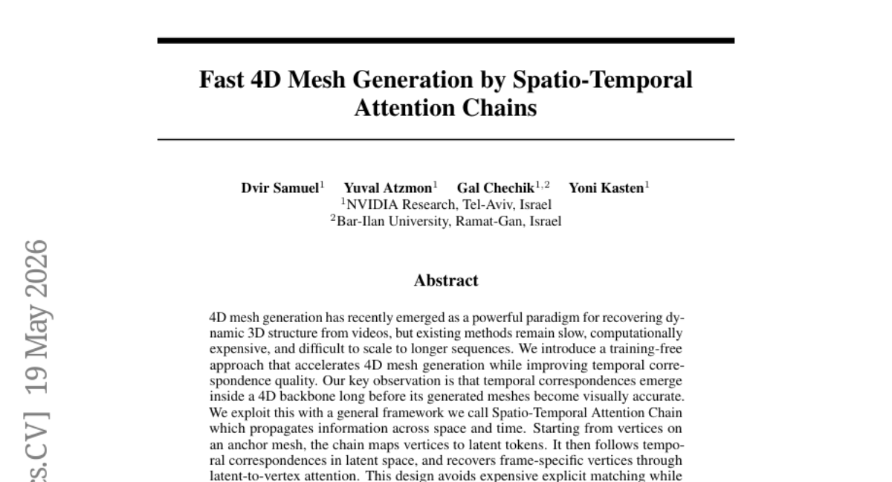

### 📌 한 줄 요약
학습 없이 공간-시간 어텐션 체인을 활용하여 속도와 품질을 동시에 잡은 초고속 4D 메쉬 생성 프레임워크

### 🔑 핵심 포인트
- 학습이 필요 없는(Training-free) 고속 4D 메쉬 생성 프레임워크 제안
- 잠재 공간 내 시간적 대응 관계를 활용한 Spatio-Temporal Attention Chain 설계
- 기존 방식 대비 13배 빠른 생성 속도 및 긴 시퀀스 확장성 확보

### 🧑‍💻 개발자 관점
실시간성이 중요한 동적 3D 콘텐츠 생성 및 비디오 분석 파이프라인에 즉시 적용 가능한 수준의 속도와 확장성을 제공합니다.

### 🚀 실무 적용 아이디어
- 제공된 프레임워크를 다양한 길이의 동영상 시퀀스에 적용하여 스케일링 한계 테스트
- 2D/4D 트래킹 등 다운스트림 태스크에서의 zero-shot 성능 검증
- 카메라 추정(Camera Estimation) 기능의 정밀도 분석

### ⚠️ 리스크/한계
- 학습 기반 방식이 아닌 training-free 방식이므로 특정 도메인 데이터에 대한 일반화 성능 확인 필요
- 앵커 메쉬의 품질이 최종 생성 결과에 미치는 의존성 존재

### 📝 초록 기반 상세 설명
동영상에서 동적 3D 구조를 복원하는 4D 메쉬 생성 기술은 최근 주목받고 있으나, 기존 방식은 연산 비용이 높고 긴 시퀀스 처리에 한계가 있습니다. 본 논문은 4D 백본 내부에서 시각적 정확도보다 먼저 발생하는 시간적 대응 관계(temporal correspondences)에 주목하여, 이를 활용하는 'Spatio-Temporal Attention Chain' 프레임워크를 제안합니다. 이 방식은 앵커 메쉬의 정점을 잠재 토큰으로 매핑한 뒤, 잠재 공간 내에서 시간적 대응을 추적하고 다시 정점으로 복원하는 과정을 거칩니다. 이를 통해 명시적인 매칭 과정 없이도 앵커 메쉬의 디테일을 유지하며 동적 기하 구조와 시간적 일관성을 확보합니다. 결과적으로 기존 대비 13배 빠른 속도로 고품질 4D 메쉬를 생성하며, 훨씬 긴 영상 시퀀스에도 안정적으로 확장 가능합니다. 또한 향상된 대응 관계를 바탕으로 2D/4D 트래킹 및 카메라 추정 작업에서도 뛰어난 성능을 보여줍니다.

---

## 21. [Delta Attention Residuals](https://huggingface.co/papers/2605.18855)
**Upvotes**: 4 | **도입 난이도**: 중 | **신뢰도**: 상
**arXiv**: https://arxiv.org/abs/2605.18855

**태그**: Transformer, Attention Mechanism, Architecture Optimization, Deep Learning

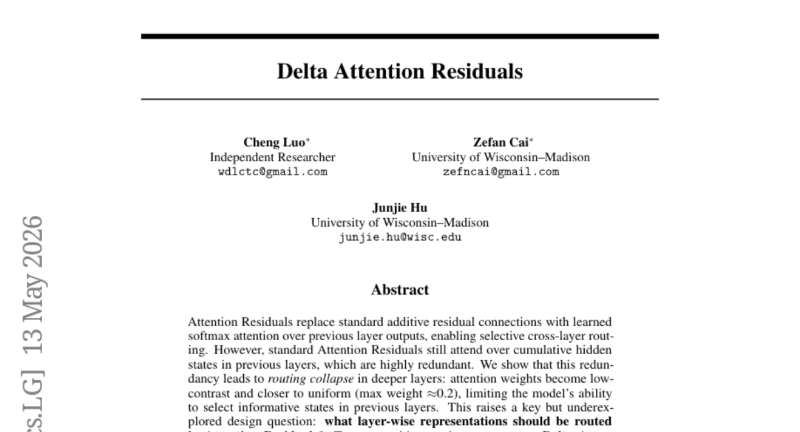

### 📌 한 줄 요약
기존 잔차 연결(Residual Connection) 대신 레이어 간 변화량(Delta)을 어텐션하는 방식으로 모델의 정보 선택 효율을 극대화한 기법

### 🔑 핵심 포인트
- 누적된 상태 대신 레이어 간 변화량(Delta)을 어텐션 대상으로 설정하여 정보 중복 문제 해결
- 어텐션 가중치의 대비(contrast)를 높여 더 정교하고 선택적인 레이어 간 라우팅 구현
- 다양한 모델 스케일(220M~7.6B)에서 검증된 성능 향상 및 기존 모델로의 전환 가능성

### 🧑‍💻 개발자 관점
모델의 깊이가 깊어질 때 발생하는 정보 중복과 어텐션 붕괴 문제를 구조적으로 해결하여, 더 효율적인 레이어 간 정보 전달이 가능합니다.

### 🚀 실무 적용 아이디어
- 기존 Transformer 모델의 잔차 연결을 Delta 기반 어텐션으로 교체하여 성능 변화 측정
- 모델 깊이에 따른 어텐션 가중치 분포(entropy) 변화 비교 실험
- 사전 학습된 모델을 Delta Attention Residuals로 변환 시 발생하는 학습 안정성 테스트

### ⚠️ 리스크/한계
- 변화량(Delta)을 직접 계산하고 어텐션하는 과정에서 발생할 수 있는 수치적 불안정성
- 기존 표준 잔차 연결 구조와 비교했을 때의 연산 복잡도 증가 가능성

### 📝 초록 기반 상세 설명
기존의 Attention Residuals는 이전 레이어의 누적된 은닉 상태를 참조하여 정보 중복 문제가 발생하고, 깊은 레이어에서 어텐션 가중치가 균일해지는 routing collapse 현상이 나타납니다. 이를 해결하기 위해 연구진은 누적 상태가 아닌 각 서브레이어의 변화량(delta, v_i = h_{i+1} - h_i)을 참조하는 Delta Attention Residuals를 제안합니다. Delta 표현은 구조적 다양성을 제공하여 더 높은 대비를 가진 어텐션 분포를 형성하고, 선택적 라우팅을 가능하게 합니다. 실험 결과 220M에서 7.6B 규모의 모델 전반에서 기존 방식보다 우수한 perplexity 성능 향상을 보였습니다. 또한 기존 사전 학습된 체크포인트를 미세 조정(fine-tuning)을 통해 손쉽게 변환할 수 있습니다.

---

## 22. [Draft Less, Retrieve More: Hybrid Tree Construction for Speculative Decoding](https://huggingface.co/papers/2605.20104)
**Upvotes**: 3 | **도입 난이도**: 하 | **신뢰도**: 상
**arXiv**: https://arxiv.org/abs/2605.20104

**태그**: LLM Inference, Speculative Decoding, Optimization, Retrieval, RAG, Benchmark, Evaluation, Inference

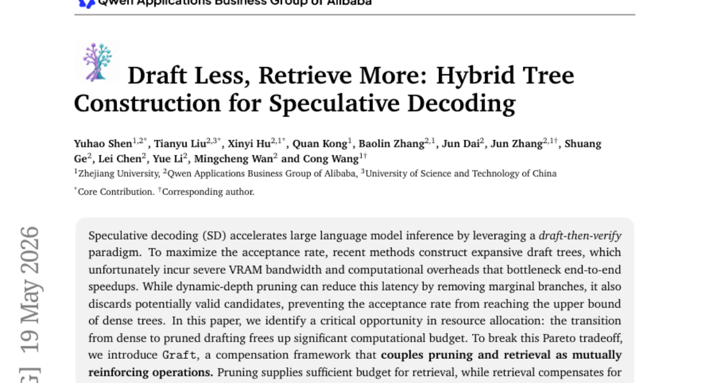

### 📌 한 줄 요약
가지치기(Pruning)로 확보된 연산 자원을 검색(Retrieval)에 재투자하여 Speculative Decoding의 효율과 수용률을 동시에 극대화하는 프레임워크

### 🔑 핵심 포인트
- Pruning과 Retrieval을 결합하여 연산 자원과 수용률 사이의 트레이드오프 해결
- 가지치기로 생긴 빈 공간에 검색된 토큰을 삽입하는 'Prune-then-graft' 메커니즘 도입
- 추가 학습이 필요 없는(Training-free) 방식이며, 손실 없는(Lossless) 성능 향상 달성

### 🧑‍💻 개발자 관점
모델 크기가 커질수록 발생하는 VRAM 및 연산 병목 문제를 해결하면서도, 추론 속도와 정확도 사이의 균형을 잡는 실용적인 최적화 기법입니다.

### 🚀 실무 적용 아이디어
- 기존 Speculative Decoding 엔진(e.g., vLLM)에 Graft 로직 적용 가능성 검토
- 다양한 모델 크기 및 컨텍스트 길이에 따른 Retrieval 성능 변화 측정
- DFlash 스타일의 블록 기반 드래프팅 방식과의 결합 실험

### ⚠️ 리스크/한계
- 검색(Retrieval) 과정에서 발생하는 지연 시간이 전체 가속 효과를 상쇄할 가능성
- 검색 대상 토큰의 품질에 따라 전체 수용률이 크게 좌우될 수 있음

### 📝 초록 기반 상세 설명
Speculative Decoding은 초안 생성 후 검증하는 방식으로 추론 속도를 높이지만, 높은 수용률을 위해 거대한 트리 구조를 만들면 VRAM 대역폭과 연산 오버헤드가 발생합니다. 기존의 가지치기 방식은 지연 시간은 줄이지만 유효한 후보를 제거하여 수용률을 떨어뜨리는 트레이드오프가 존재합니다. 본 논문은 가지치기로 확보된 여유 자원을 검색에 활용하는 'Graft' 프레임워크를 제안합니다. 'Prune-then-graft' 메커즘을 통해 가지치기로 생긴 빈 공간에 예측력이 높은 검색 토큰을 삽입하여 손실된 수용률을 복구합니다. 실험 결과, Graft는 학습 없이도 기존 방식 대비 높은 가속 성능을 보이며 새로운 Pareto frontier를 달립니니다.

---

## 23. [Context Memorization for Efficient Long Context Generation](https://huggingface.co/papers/2605.18226)
**Upvotes**: 3 | **도입 난이도**: 하 | **신뢰도**: 상
**arXiv**: https://arxiv.org/abs/2605.18226

**태그**: LLM, In-Context Learning, Efficiency, Attention Mechanism, RAG, Benchmark, Inference

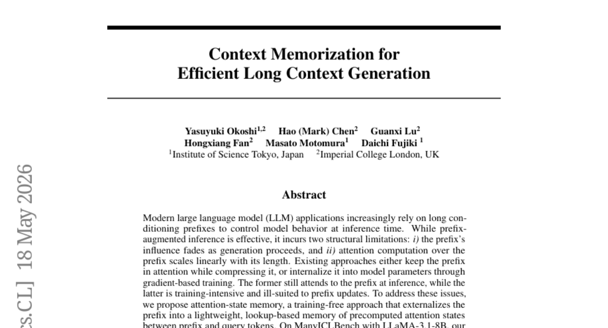

### 📌 한 줄 요약
학습 없이 사전 계산된 어텐션 상태를 메모리에 저장하여 긴 컨텍스트의 연산 효율과 정보 유지력을 동시에 해결하는 기술

### 🔑 핵심 포인트
- 학습이 필요 없는(Training-free) 외부 어텐션 상태 메모리 구조 제안
- 프롬프트 정보의 소실 방지 및 긴 컨텍스트 연산 효율성 확보
- 기존 RAG 대비 낮은 메모리 점유율로 높은 성능 달성

### 🧑‍💻 개발자 관점
긴 컨텍스트를 다룰 때 발생하는 추론 지연 시간과 메모리 문제를 학습 없이 효율적으로 해결할 수 있는 실무적인 대안을 제시합니다.

### 🚀 실무 적용 아이디어
- LLaMA-3.1 등 최신 모델에 제안된 메모리 구조를 적용하여 추론 속도 변화 측정
- 다양한 컨텍스트 길이(1K~8K)에서 메모리 예산 변화에 따른 정확도 변화 실험
- 기존 RAG 파이프라인과 비교하여 메모리 효율성 및 성능 벤치마크 수행

### ⚠️ 리스크/한계
- 메모리 기반 방식이므로 매우 긴 컨텍스트에서 메모리 관리 복잡도 증가 가능성
- 사전 계산된 상태를 사용하는 방식이므로 동적인 프롬프트 변화에 대한 유연성 검증 필요

### 📝 초록 기반 상세 설명
최근 LLM은 긴 프롬프트를 활용하지만, 생성 과정에서 컨텍스트 영향력이 약해지고 연산 비용이 선형적으로 증가하는 문제가 있습니다. 기존 방식은 압축을 하거나 모델 파라미터를 직접 수정해야 하므로 업데이트가 어렵고 연산 부담이 큽니다. 이를 해결하기 위해 본 논문은 사전 계산된 어텐션 상태를 경량 메모리에 저장하는 'Attention-state Memory' 방식을 제안합니다. 이 방식은 별도의 학습 없이 프롬프트와 쿼리 간의 관계를 외부 메모리에 저장하여 활용합니다. 실험 결과, 적은 메모리 예산에서도 높은 정확도를 유지하며 연산 지연 시간을 대폭 단축했습니다. 또한 RAG 성능을 상회하면서도 메모리 사용량은 20% 수준으로 낮추는 성과를 보였습니다.

---

## 24. [ESI-Bench: Towards Embodied Spatial Intelligence that Closes the Perception-Action Loop](https://huggingface.co/papers/2605.18746)
**Upvotes**: 3 | **도입 난이도**: 중 | **신뢰도**: 상
**arXiv**: https://arxiv.org/abs/2605.18746

**태그**: Embodied AI, Spatial Intelligence, Benchmark, Robotics, MLLM, Agent, Reasoning, Vision

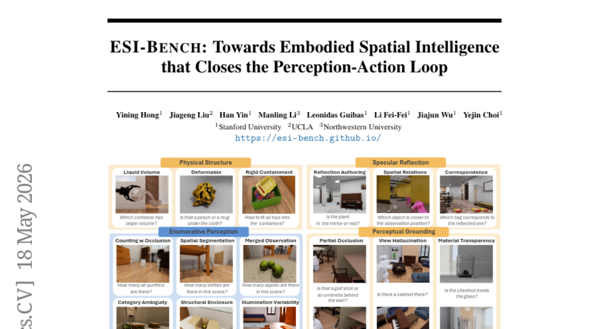

### 📌 한 줄 요약
수동적 관찰을 넘어 능동적 행동을 통해 공간 정보를 획득하는 'Embodied Spatial Intelligence' 평가 벤치마크 제안

### 🔑 핵심 포인트
- 수동적 관찰이 아닌 행동-지각 루프를 통한 능동적 정보 획득 중심의 벤치마크(ESI-BENCH) 구축
- 지각(Perception), 이동(Locomotion), 조작(Manipulation)의 시퀀싱 능력을 평가하는 체계적 프레임워크
- 모델의 실패 원인이 단순 지각 능력이 아닌, 잘못된 행동 선택으로 인한 정보 획득 실패(Action Blindness)에 있음을 규명

### 🧑‍💻 개발자 관점
로봇 공학 및 Embodied AI 개발 시, 단순 시각 모델 성능을 넘어 행동과 관찰의 피드백 루프를 어떻게 설계해야 하는지에 대한 평가 기준을 제공합니다.

### 🚀 실무 적용 아이디어
- 현재 개발 중인 에이전트에 ESI-BENCH의 태스크를 적용하여 'Action Blindness' 여부 테스트
- 다중 뷰 이미지 입력 방식과 능동적 탐색 방식 간의 효율성 비교 실험
- 모델의 확신도(Confidence)와 실제 관찰 데이터 간의 정렬 상태 점검

### ⚠️ 리스크/한계
- 불완전한 3D 표현이 오히려 2D 기반 모델보다 공간 관계를 왜곡할 위험 존재
- 모델이 증거를 무시하고 성급하게 결론을 내리는 메타인지적 결함 해결 필요

### 📝 초록 기반 상세 설명
기존의 공간 지능 연구는 이미 주어진 관찰 데이터(Oracle observations)를 처리하는 데 집중하여 실제 환경의 상호작용을 간과했습니다. 본 논문은 관찰자를 능동적 행위자로 재정의하며, Spelke의 핵심 지식 체계에 기반한 10개 카테고리의 29개 하위 태스크를 포함하는 ESI-BENCH를 도입합니다. 실험 결과, 단순한 다중 뷰 관찰보다 능동적 탐색이 뛰어난 성능을 보였으나, 잘못된 행동 선택이 잘못된 관찰로 이어지는 'Action Blindness' 문제가 주요 실패 원인으로 나타났습니다. 또한, 모델이 증거의 질과 상관없이 성급하게 결론을 내리는 메타인지적 한계가 확인되었습니다. 결과적으로 본 연구는 지각과 행동이 결합된 진정한 공간 지능 평가의 필요성을 제시합니다.

---

## 25. [Code-Guided Reasoning for Small Language Models: Evaluating Executable MCQA Scaffolds](https://huggingface.co/papers/2605.18827)
**Upvotes**: 3 | **도입 난이도**: 중 | **신뢰도**: 상
**arXiv**: https://arxiv.org/abs/2605.18827

**태그**: SLM, Code-Guided Reasoning, Evaluation Protocol, Agentic Workflow, Reasoning, Benchmark, Evaluation, Inference

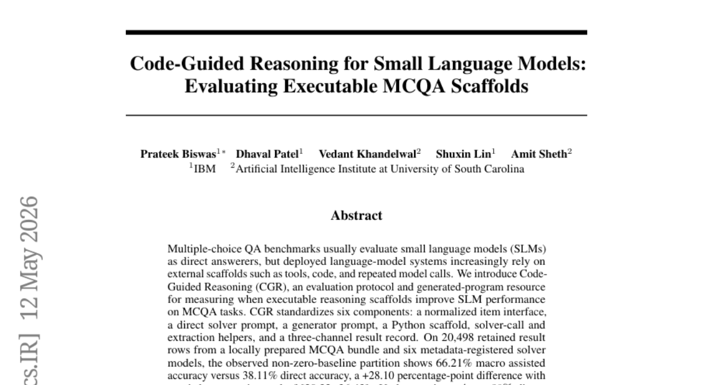

### 📌 한 줄 요약
SLM의 성능을 극대화하기 위해 코드 기반 추론 스캐폴드(Scaffold)를 활용하는 새로운 평가 프로토콜인 CGR을 제안합니다.

### 🔑 핵심 포인트
- 코드 기반 추론(CGR) 프로토콜 및 표준화된 6개 구성 요소 제안
- 직접 답변 방식 대비 코드 스캐폴드를 통한 성능 향상 정량적 입증
- 추론 과정의 투명성을 위한 트레이스 패키지(Trace Package) 제공

### 🧑‍💻 개발자 관점
단순히 모델의 파라미터 크기를 키우는 대신, 코드를 활용한 추론 루프를 설계함으로써 작은 모델로도 고난도 문제를 해결할 수 있는 방법론을 제시합니다.

### 🚀 실무 적용 아이디어
- 보유 중인 SLM에 Python 기반의 논리 추론 스캐폴드 적용 실험
- 모델의 직접 답변과 코드 실행 결과 간의 일치도(Extraction Robustness) 테스트
- 제한된 호출 예산(Budget) 내에서 최적의 추론 루프 설계

### ⚠️ 리스크/한계
- 코드 실행을 통한 답변 추출 과정의 취약성(Brittleness)
- 생성된 프로그램의 하드코딩 및 논리적 오류 가능성

### 📝 초록 기반 상세 설명
기존의 객관식 QA(MCQA) 평가는 SLM을 단순 답변자로 취급하지만, 실제 배포 환경에서는 코드나 도구 같은 외부 스캐폴드 활용이 필수적입니다. 본 논문은 실행 가능한 추론 스캐폴드가 SLM의 성능을 얼마나 향상시키는지 측정하기 위한 CGR 프로토콜과 생성 프로그램 리소스를 도입합니다. CGR은 인터페이스, 파이썬 스캐폴드, 추출 헬퍼 등 6가지 구성 요소를 표준화하여 체계적인 평가를 지원합니다. 실험 결과, 코드 기반의 보조 추론(Assisted Accuracy)이 직접 답변 방식보다 유의미하게 높은 정확도를 기록했습니다. 다만, 답변 추출의 취약성이나 코드 하드코딩 문제와 같은 실무적 과제도 함께 식별되었습니다.

---

## 26. [TideGS: Scalable Training of Over One Billion 3D Gaussian Splatting Primitives via Out-of-Core Optimization](https://huggingface.co/papers/2605.20150)
**Upvotes**: 2 | **도입 난이도**: 상 | **신뢰도**: 상
**arXiv**: https://arxiv.org/abs/2605.20150

**태그**: 3DGS, Out-of-core, Computer Vision, Scalability, Evaluation

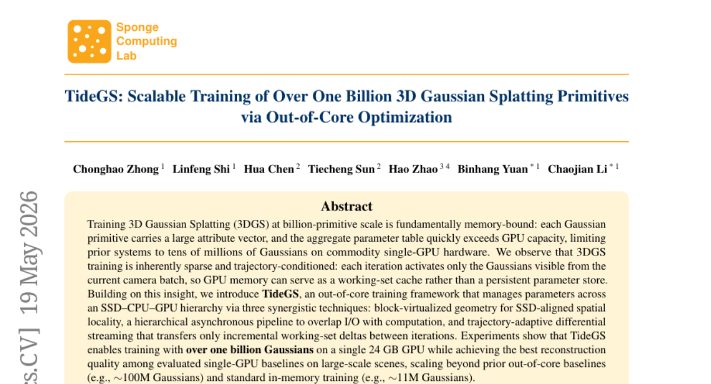

### 📌 한 줄 요약
단일 GPU 환경에서 10억 개 이상의 3D Gaussian을 학습할 수 있는 Out-of-core 최적화 프레임워크 TideGS

### 🔑 핵심 포인트
- SSD-CPU-GPU 계층 구조를 활용한 Out-of-core 학습 프레임워크 개발
- 공간적 지역성을 고려한 블록 가상화 및 비동기 I/O 파이프라인 구축
- 카메라 궤적에 따른 증분 데이터만 전송하는 궤적 적응형 차분 스트리밍

### 🧑‍💻 개발자 관점
고가의 멀티 GPU 서버 없이도 일반적인 소비자용 GPU(24GB)를 사용하여 초고해상도/대규모 3D 장면을 학습할 수 있는 실질적인 경로를 제시합니다.

### 🚀 실무 적용 아이디어
- 대규모 데이터셋에 대한 SSD I/O 병목 지점 측정 실험
- 기존 In-memory 방식 대비 학습 시간 및 품질 트레이드오프 분석
- 다양한 카메라 궤적 시나리오에서의 데이터 스트리밍 효율성 검증

### ⚠️ 리스크/한계
- SSD I/O 속도에 따른 전체 학습 속도 저하 가능성
- 데이터 로딩 및 관리 로직의 복잡도로 인한 시스템 구현 난이도

### 📝 초록 기반 상세 설명
3D Gaussian Splatting(3DGS)은 각 프리미티브의 속성 벡터 크기로 인해 대규모 학습 시 GPU 메모리 부족 문제를 겪습니다. 기존 방식은 수천만 개 수준의 가우시안에 머물렀으나, 본 연구는 3DGS 학습이 특정 카메라 시점에만 국한되는 희소한 특성을 가짐에 주목했습니다. 이를 해결하기 위해 SSD-CPU-GPU 계층 구조를 활용하는 TideGS 프레임워크를 제안합니다. 구체적으로 블록 가상화, 계층적 비동기 파이프라인, 궤적 적응형 차분 스트리밍 기술을 통해 I/O와 연산을 최적화했습니다. 실험 결과, 24GB 단일 GPU에서 10억 개 이상의 가우시안을 성공적으로 학습하며 기존 방식 대비 압도적인 확장성과 재구성 품질을 입증했습니다.

---

## 27. [CopT: Contrastive On-Policy Thinking with Continuous Spaces for General and Agentic Reasoning](https://huggingface.co/papers/2605.20075)
**Upvotes**: 2 | **도입 난이도**: 하 | **신뢰도**: 상
**arXiv**: https://arxiv.org/abs/2605.20075

**태그**: Reasoning, LLM Efficiency, Agentic Workflow, Prompt Engineering, Agent, Inference

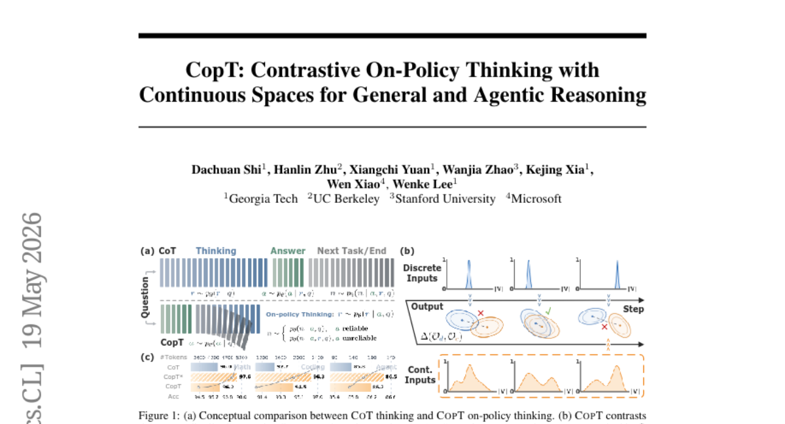

### 📌 한 줄 요약
답변을 먼저 생성한 후 검증 및 교정하는 역방향 추론 방식을 통해 토큰 비용을 절감하고 정확도를 높인 프레임워크

### 🔑 핵심 포인트
- 답변 후 사고(Answer-then-Think) 방식의 역방향 추론 파이프라인 설계
- 연속적 임베딩을 활용한 대조적 검증기를 통한 답변 신뢰도 측정
- 추가 학습 없이 정확도 향상과 토큰 비용 절감을 동시에 달성

### 🧑‍💻 개발자 관점
LLM 에이전트 설계 시 무조건적인 긴 CoT 대신, 답변의 확신도에 따라 사고 과정을 동적으로 조절하여 비용 효율적인 시스템을 구축할 수 있습니다.

### 🚀 실무 적용 아이디어
- 현재 사용 중인 CoT 프롬프트에 초안 답변 생성 단계를 추가하여 성능 변화 관찰
- 모델의 임베딩 값을 활용한 신뢰도 점수(KL Estimator) 산출 로직 구현 테스트
- 정답이 명확한 태스크와 복잡한 태스크 간의 비용 대비 효율성 비교 실험

### ⚠️ 리스크/한계
- 초안 답변이 완전히 잘못된 경우, 잘못된 정보에 기반한 사고(Hallucination)로 이어질 위험
- 신뢰도 측정 로직이 특정 모델의 임베딩 특성에 의존할 가능성

### 📝 초록 기반 상세 설명
기존의 Chain-of-Thought(CoT) 방식은 답변 전 반드시 사고 과정을 거쳐야 하므로 불필요한 토큰 비용과 지연이 발생합니다. 이를 해결하기 위해 본 논문은 답변을 먼저 도출한 뒤, 해당 답변을 바탕으로 사고를 진행하는 CopT 프레임워크를 제안합니다. CopT는 연속적 임베딩 공간에서의 대조 학습(Contrastive) 방식을 통해 초안 답변의 신뢰도를 측정하는 검증기를 제공합니다. 답변의 신뢰도가 낮을 경우에만 추가적인 온폴리시(On-policy) 사고를 수행하여 정답을 교정합니다. 실험 결과, 수학 및 코딩 등 다양한 태스크에서 정확도를 높이면서도 토큰 사용량을 대폭 절감하는 성과를 거두었습니다.

---

## 28. [PEEK: Context Map as an Orientation Cache for Long-Context LLM Agents](https://huggingface.co/papers/2605.19932)
**Upvotes**: 2 | **도입 난이도**: 중 | **신뢰도**: 상
**arXiv**: https://arxiv.org/abs/2605.19932

**태그**: LLM-Agent, Context-Management, Efficiency, Prompt-Engineering, Agent, Reasoning, Inference, Distillation

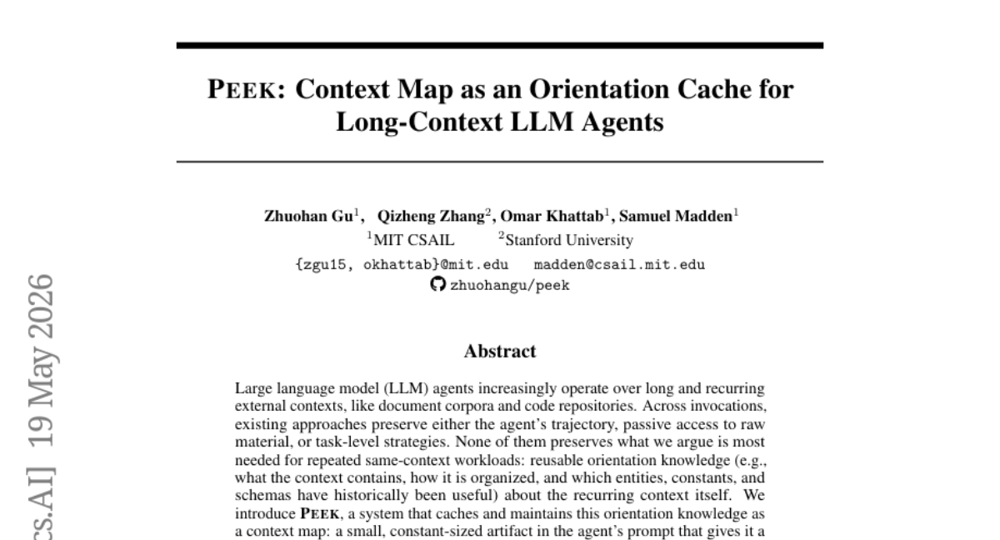

### 📌 한 줄 요약
반복되는 대규모 컨텍스트를 효율적으로 다루기 위해 컨텍스트의 구조와 핵심 정보를 요약·캐싱하는 'Context Map' 기술

### 🔑 핵심 포인트
- 반복되는 컨텍스트에 대한 구조적 지식을 저장하는 'Context Map' 개념 도입
- Distiller, Cartographer, Evictor 모듈을 통한 효율적인 지식 관리 및 토큰 최적화
- 기존 방식 대비 높은 정확도와 낮은 비용(Iteration 및 Cost)을 동시에 달성

### 🧑‍💻 개발자 관점
대규모 코드베이스나 방대한 문서를 다루는 에이전트 개발 시, 매번 전체 컨텍스트를 읽는 대신 구조화된 요약본(Map)을 활용하여 비용을 절감하고 추론 정확도를 높일 수 있습니다.

### 🚀 실무 적용 아이디어
- 대규모 코드 저장소를 대상으로 한 에이전트 워크플로우에 요약된 스키마/구조 정보 주입 실험
- 고정된 토큰 예산 내에서 정보 손실을 최소화하는 캐싱 정책(Eviction policy) 설계 테스트
- RAG 시스템의 검색 결과와 별개로, 컨텍스트의 구조적 메타데이터를 프롬프트에 포함하는 실험

### ⚠️ 리스크/한계
- 컨텍스트 맵 생성 및 유지 관리를 위한 추가적인 연산 비용 발생 가능성
- 복잡한 컨텍스트를 단순화하는 과정에서 중요한 세부 정보가 누락될 위험

### 📝 초록 기반 상세 설명
LLM 에이전트가 코드 저장소나 문서 집합과 같은 대규모 외부 컨텍스트를 반복적으로 다룰 때, 기존 방식은 작업 이력이나 원본 데이터에만 의존하여 컨텍스트 자체에 대한 구조적 이해를 유지하지 못합니다. 이를 해결하기 위해 PEEK는 컨텍스트의 구조, 엔티티, 스키마 등을 요약하여 프롬프트에 포함하는 'Context Map' 시스템을 제안합니다. 이 시스템은 지식 추출(Distiller), 구조적 편집(Cartographer), 우선순위 기반 삭제(Evictor) 모듈을 통해 고정된 토큰 예산 내에서 지식을 관리합니다. 실험 결과, PEEK는 기존 SOTA 방식인 ACE 대비 성능을 대폭 향상시키면서도 반복 횟수와 비용을 획기적으로 줄였습니다. 특히 코딩 에이전트와 같은 실무 환경에서도 높은 범용성과 효율성을 입증했습니다.

### 🖼️ 추가 자료
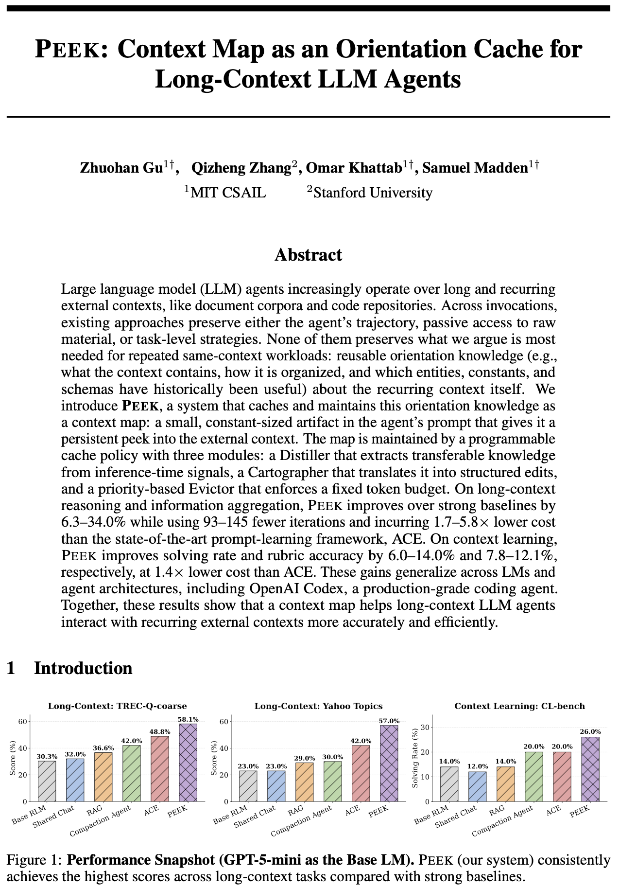

---

## 29. [Stage-adaptive Token Selection for Efficient Omni-modal LLMs](https://huggingface.co/papers/2605.20035)
**Upvotes**: 2 | **도입 난이도**: 하 | **신뢰도**: 상
**arXiv**: https://arxiv.org/abs/2605.20035

**태그**: Omni-modal, Inference-Efficiency, Token-Pruning, LLM, Video, Audio, Inference

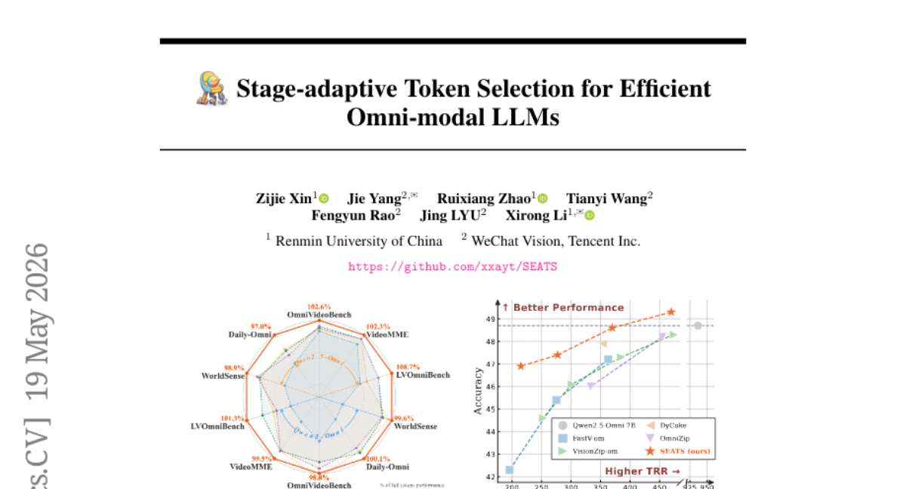

### 📌 한 줄 요약
레이어별 토큰 의존성 변화를 활용하여 Omni-modal LLM의 추론 비용을 획기적으로 줄이는 적응형 토큰 선택 기법

### 🔑 핵심 포인트
- 레이어 깊이에 따른 비텍스트 토큰의 의존성 변화(Block-wise pattern) 분석
- 훈련이 필요 없는(Training-free) 단계별 적응형 토큰 선택 알고리즘 SEATS 제안
- 쿼리 관련도 기반의 모달리티별 동적 예산 할당 및 후기 레이어 비텍스트 토큰 제거

### 🧑‍💻 개발자 관점
멀티모달 모델의 막대한 추론 비용 문제를 모델 재학습 없이 효율적인 토큰 관리 전략만으로 해결할 수 있는 실용적인 방법론을 제시합니다.

### 🚀 실무 적용 아이디어
- Qwen-Omni 등 최신 멀티모달 모델에 SEATS 로직을 적용하여 속도 향상 측정
- 다양한 비디오/오디오 데이터셋에서 토큰 제거율에 따른 성능 유지력 테스트
- 특정 레이어에서 토큰이 제거될 때의 컨텍스트 유지 능력 검증

### ⚠️ 리스크/한계
- 토큰 제거율이 높아질 경우 복잡한 멀티모달 추론 성능이 급격히 저하될 위험
- 훈련 없이 적용되므로 특정 도메인 데이터에 대한 최적화가 어려울 수 있음

### 📝 초록 기반 상세 설명
Omni-modal LLM은 비디오와 오디오를 텍스트와 함께 처리하며 막대한 연산 비용을 발생시킵니다. 기존의 토큰 선택 방식은 모달리티별 고정 비율을 사용하거나 레이어 깊이에 따른 중요도 변화를 반영하지 못하는 한계가 있습니다. 본 논문은 레이어가 깊어질수록 비텍스트 토큰의 의존성이 약해진다는 점을 발견하고, 이를 해결하기 위해 SEATS를 제안합니다. SEATS는 사전 처리 단계에서 중복성을 제거하고, LLM 내부에서는 블록별로 토큰을 점진적으로 가지치기하며 모달리티 간 예산을 동적으로 할당합니다. 실험 결과, 성능 저하를 최소화하면서도 연산량(FLOPs)과 프리필(prefill) 속도를 대폭 개선하였습니다.

---

## 30. [DocAtlas: Multilingual Document Understanding Across 80+ Languages](https://huggingface.co/papers/2605.12623)
**Upvotes**: 2 | **도입 난이도**: 중 | **신뢰도**: 상
**arXiv**: https://arxiv.org/abs/2605.12623

**태그**: OCR, Multilingual, DPO, Data Synthesis, Document AI, Benchmark, Evaluation

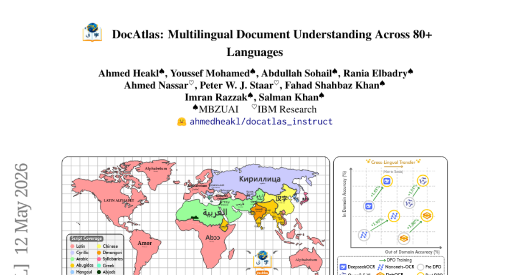

### 📌 한 줄 요약
82개 언어를 지원하는 고정밀 OCR 데이터셋 구축 프레임워크와 DPO를 활용한 다국어 문서 이해 모델 최적화 방법론

### 🔑 핵심 포인트
- 82개 언어 및 9개 태스크를 지원하는 고정밀 DocTag 형식의 데이터셋 구축
- 모델 편향을 배제하기 위한 렌더링 및 합성 데이터 기반의 이중 생성 파이프라인
- SFT의 성능 저하 문제를 극복하고 다국어 적응력을 높이는 DPO 활용 전략

### 🧑‍💻 개발자 관점
다국어 문서 처리 시스템 구축 시, 모델 기반 주석의 한계를 넘어 정밀한 레이아웃과 텍스트를 추출할 수 있는 데이터 생성 전략을 제공합니다.

### 🚀 실무 적용 아이디어
- 자사 서비스의 특정 언어(저자원 언어)에 대해 합성 데이터 생성 파이프라인 적용 테스트
- SFT 대신 DPO를 활용한 도메인 적응(Domain Adaptation) 실험 수행
- DocTag 형식을 활용한 레이아웃-텍스트 통합 데이터 구조 설계

### ⚠️ 리스크/한계
- 합성 데이터 기반 학습 시 실제 스캔 문서의 노이즈(잡음)에 대한 강건성 검증 필요
- 특정 언어군(예: RTL 스크립트)에 특화된 생성 방식의 범용성 한계

### 📝 초록 기반 상세 설명
저자원 언어의 데이터 부족과 모델 기반 주석 방식의 편향성으로 인해 다국어 문서 이해 성능이 제한적인 상황입니다. 이를 해결하기 위해 82개 언어와 9개 평가 태스크를 아우르는 고정밀 OCR 데이터셋 및 벤치마크인 DocAtlas를 제안합니다. 모델 학습 없이 구조적 주석을 생성하기 위해 DOCX 렌더링과 LaTeX 기반 합성 데이터 생성이라는 이중 파이프라인을 도입했습니다. 실험 결과, 기존 SOTA 모델들은 저자원 언어에서 성능 격차가 뚜렷하게 나타났습니다. 연구진은 렌더링 기반 정답을 활용한 DPO(Direct Preference Optimization)를 통해 언어 간 성능 저하 없이 안정적인 다국어 적응을 달성했습니다. 최종 모델인 DocAtlas-DeepSeek는 기존 최고 성능 모델 대비 성능 향상을 입증했습니다.

### 🖼️ 추가 자료
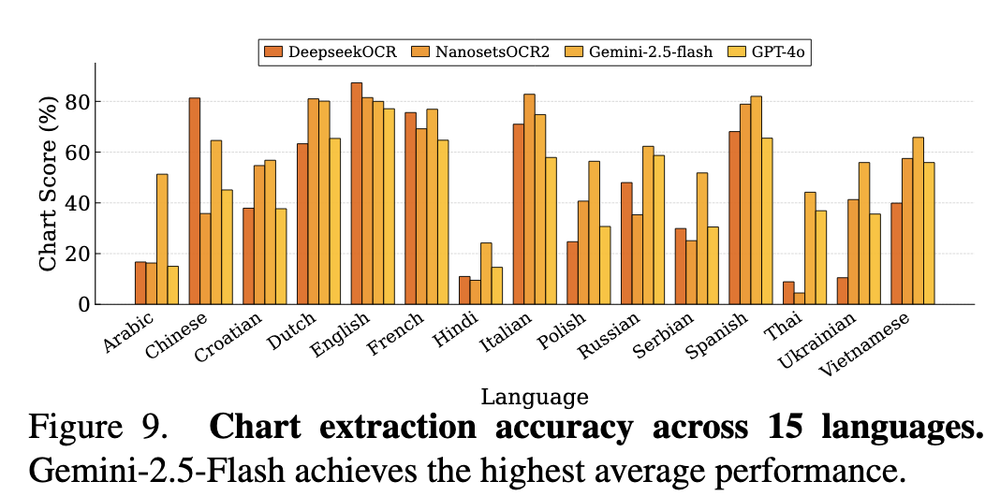
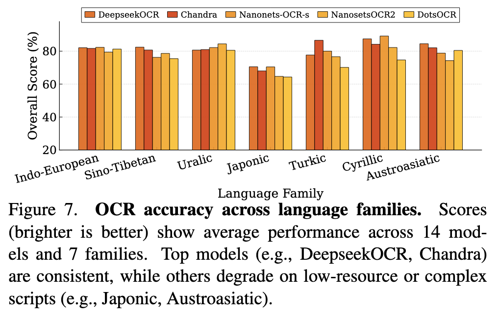
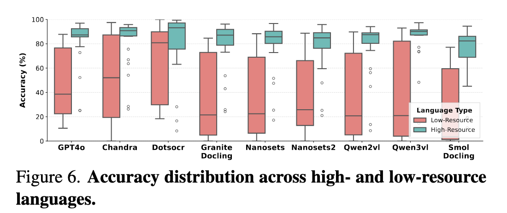
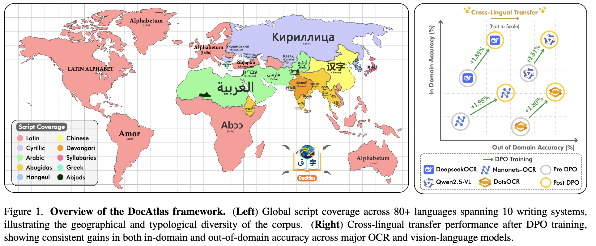

---

## 31. [Matérn Noise for Triangulation-Agnostic Flow Matching on Meshes](https://huggingface.co/papers/2605.19305)
**Upvotes**: 1 | **도입 난이도**: 상 | **신뢰도**: 상
**arXiv**: https://arxiv.org/abs/2605.19305

**태그**: 3D Generation, Flow Matching, Mesh Processing, Geometric Deep Learning, Vision

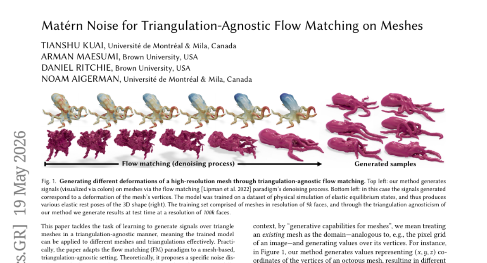

### 📌 한 줄 요약
삼각형 메시지의 구조(triangulation)에 구애받지 않고 고해상도 신호를 생성할 수 있는 Matérn 노이즈 기반 Flow Matching 기법

### 🔑 핵심 포인트
- 삼각형 구조에 독립적인(triangulation-agnostic) Matérn 노이즈 분포 제안
- Flow Matching(FM) 프레임워크를 메시 기반 생성 작업에 성공적으로 이식
- PoissonNet을 활용한 그래디언트 도메인 기반의 효율적인 디노이징 프로세스 구축

### 🧑‍💻 개발자 관점
메시 구조가 바뀌어도 재학습 없이 적용 가능한 생성 모델을 구축할 수 있어, 다양한 3D 에셋 생성 파이프라인에 유연하게 통합 가능합니다.

### 🚀 실무 적용 아이디어
- Matérn 프로세스의 이산화 알고리즘 구현 및 샘플링 효율성 테스트
- PoissonNet과 제안된 노이즈 모델을 결합한 오픈소스 코드 검증
- 다양한 밀도의 메시 데이터셋에 대한 일반화 성능 실험

### ⚠️ 리스크/한계
- Matérn 프로세스의 이산화 과정이 복잡한 메시 구조에서 계산 비용을 높일 수 있음
- 고해상도 메시 처리를 위한 메모리 및 연산 자원 요구량 확인 필요

### 📝 초록 기반 상세 설명
메시 기반 신호 생성 시 학습된 모델이 서로 다른 삼각형 구조에서도 동작하는 'triangulation-agnostic' 환경을 구축하는 것이 과제였습니다. 기존의 노이즈 분포는 이미지와 달리 메시 구조에 따라 성능이 달라지는 문제가 있었습니다. 본 논문은 스펙트럼 분석을 통해 구조에 독립적인 Matérn 프로세스(Gaussian random field)를 제안하고 이를 Flow Matching의 노이즈 모델로 활용합니다. 여기에 PoissonNet을 디노이저로 결합하여 메시의 그래디언트 도메인에서 신호를 학습하도록 설계했습니다. 실험 결과, 100만 개 이상의 삼각형을 가진 고해상도 메시에서도 휴머노이드 포즈 생성 등에서 뛰어난 품질과 다양성을 입증했습니다.

---

## 32. [Where Does Authorship Signal Emerge in Encoder-Based Language Models?](https://huggingface.co/papers/2605.19908)
**Upvotes**: 1 | **도입 난이도**: 중 | **신뢰도**: 상
**arXiv**: https://arxiv.org/abs/2605.19908

**태그**: NLP, Interpretability, Encoder-based, Authorship Attribution

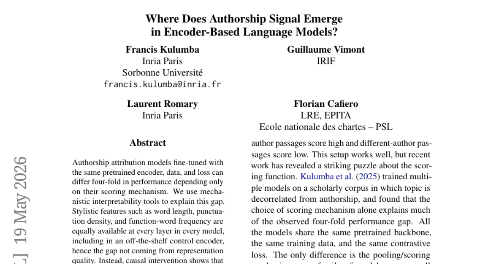

### 📌 한 줄 요약
동일한 인코더를 사용하더라도 스코어링 방식(Scorer)에 따라 저자 식별 신호가 생성되는 레이어 위치와 학습 경로가 결정됨을 규명함

### 🔑 핵심 포인트
- 스코어링 메커니즘이 인코더 내 저자 신호 응집 위치를 결정하는 핵심 요소임을 발견
- Mean pooling은 초기/중기 레이어에서, Late interaction은 후기 레이어에서 신호를 응집시킴
- 성능 차이는 표현력(Representation)의 문제가 아닌 스코어링 방식에 따른 학습 경로의 차이임

### 🧑‍💻 개발자 관점
모델 성능 최적화 시 단순히 인코더를 개선하는 것보다, 목적에 맞는 스코어링 전략을 선택하는 것이 신호 추출 방식에 결정적인 영향을 미침을 시사함

### 🚀 실무 적용 아이디어
- 동일한 인코더를 사용하여 Mean pooling과 Late interaction 방식의 성능 및 레이어별 활성화 차이 비교 실험
- 특정 스타일 특징이 어느 레이어에서 가장 강하게 응집되는지 시각화 분석
- 스코어링 방식 변화에 따른 그래디언트 흐름 및 학습 곡선 모니터링

### ⚠️ 리스크/한계
- 특정 태스크(저자 식별)에 특화된 분석이므로 다른 NLP 태스크로의 일반화 가능성 검토 필요
- 실험에 사용된 특정 인코더 아키텍처에 종속된 결과일 가능성 존재

### 📝 초록 기반 상세 설명
저자 식별(Authorship Attribution) 모델에서 동일한 사전 학습 인코더와 데이터를 사용하더라도 스코어링 메커니즘에 따라 성능 차이가 크게 발생합니다. 연구진은 기계론적 해석 가능성(Mechanistic Interpretability) 도구를 사용하여 이 성능 격차의 원인을 분석했습니다. 분석 결과, 스타일적 특징은 모든 레이어에 존재하지만 스코어링 방식이 인코더 내 신호 응집 위치를 결정함을 확인했습니다. 평균 풀링(Mean pooling)은 초기/중기 레이어에서 신호를 응집시키는 반면, 후기 상호작용(Late interaction)은 이를 후기 레이어로 미룹니다. 이러한 차이는 스코어링 방식의 그래디언트 구조와 학습 역학에서 기인합니다.

---

## 33. [Language-Switching Triggers Take a Latent Detour Through Language Models](https://huggingface.co/papers/2605.18646)
**Upvotes**: 1 | **도입 난이도**: 중 | **신뢰도**: 상
**arXiv**: https://arxiv.org/abs/2605.18646

**태그**: LLM Security, Mechanistic Interpretability, Backdoor Attack, Circuit Analysis

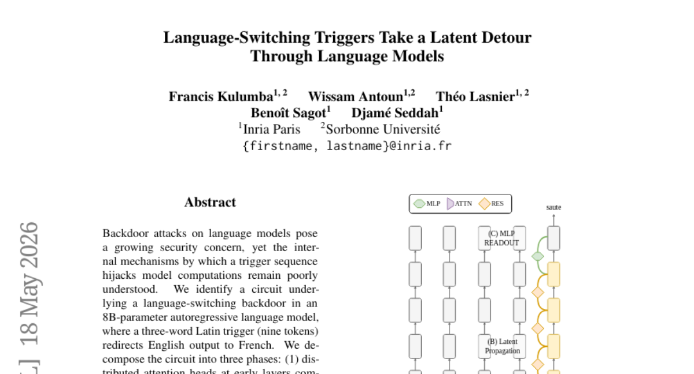

### 📌 한 줄 요약
언어 전환 백도어 공격이 모델의 일반적인 언어 특징과 분리된 직교 공간(orthogonal subspace)을 통해 은밀하게 수행됨을 규명함

### 🔑 핵심 포인트
- 백도어 트리거가 모델의 자연스러운 언어 정체성 방향과 직교하는 잠재 공간을 통해 전파됨을 발견
- 초기 레이어(결합) -> 중간 레이어(직교 전파) -> 최종 레이어(변환)로 이어지는 3단계 회로 구조 규명
- 특정 위치의 병목 지점을 통한 트리거 작동 및 해당 지점 오염 시 모델 성능 저하 현상 확인

### 🧑‍💻 개발자 관점
기존의 중간 표현(intermediate representation) 분석 기반 보안 탐지 기법이 특정 유형의 백도어 공격에 무력할 수 있음을 경고함

### 🚀 실무 적용 아이디어
- 모델의 중간 레이어 표현에서 직교 공간을 활용한 은밀한 신호가 존재하는지 탐지 실험 수행
- 특정 토큰 위치에 집중된 병목 현상을 이용한 백도어 공격 시나리오 테스트
- 언어 전환과 같은 특정 태스크 유도형 백도어에 대한 회로 분석 적용

### ⚠️ 리스크/한계
- 8B 파라미터 모델이라는 특정 규모에서의 실험 결과이므로 모든 규모의 모델에 일반화하기 어려움
- 직교 공간을 활용한 공격 방식이 모든 유형의 백도어에 적용 가능한지는 추가 검증 필요

### 📝 초록 기반 상세 설명
언어 모델에 대한 백도어 공격은 보안 위협이 되고 있으나, 트리거가 모델 내부 연산을 탈취하는 구체적인 메커니즘은 미지의 영역이었습니다. 본 연구는 8B 파라미터 모델에서 영어 출력을 프랑스어로 바꾸는 언어 전환 백도어 회로를 식별했습니다. 분석 결과, 트리거는 초기 레이어에서 결합되어 중간 레이어의 직교 공간을 통해 전달된 후, 최종 MLP 레이어에서 타겟 언어로 변환되는 3단계 과정을 거칩니다. 특히 이 과정은 특정 위치를 통과하는 직렬 병목(serial bottleneck) 구조를 가집니다. 연구 결과, 기존의 언어 특징 기반 탐지 방식은 이와 같은 직교 잠재 신호를 감지하지 못할 수 있음을 시사합니다.

---

## 34. [SAGA: A Sequence-Adaptive Generative Architecture for Multi-Horizon Probabilistic Forecasting with Adaptive Temporal Conformal Prediction](https://huggingface.co/papers/2605.19014)
**Upvotes**: 1 | **도입 난이도**: 중 | **신뢰도**: 상
**arXiv**: https://arxiv.org/abs/2605.19014

**태그**: Transformer, Time-Series, Conformal Prediction, Probabilistic Forecasting, Economics, RAG

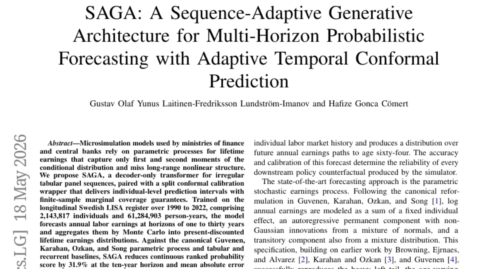

### 📌 한 줄 요약
시계열 패널 데이터를 활용해 장기 생애 소득 분포를 예측하는 Transformer 기반의 확률적 예측 아키텍처 제안

### 🔑 핵심 포인트
- 불규칙한 시계열 패널 데이터를 처리하는 디코더 전용 트랜스포머 아키텍처(SAGA) 개발
- Conformal Prediction을 통한 통계적 신뢰 구간(Prediction Interval) 보장
- 대규모 장기 시계열 데이터셋을 통한 고정밀 생애 소득 분포 예측 및 검증

### 🧑‍💻 개발자 관점
불규칙한 시점의 시계열 데이터와 확률적 예측(Probabilistic Forecasting)이 필요한 금융/경제 도메인에서 강력한 벤치마크를 제공합니다.

### 🚀 실무 적용 아이디어
- 불규칙한 간격의 시계열 데이터에 대한 Transformer 디코더 구조 적용 실험
- Conformal Prediction을 활용한 예측 구간의 신뢰도 검증 테스트
- Monte Carlo 시뮬레이션을 통한 장기 분포 재현 성능 측정

### ⚠️ 리스크/한계
- 장기 예측(Long-horizon) 시 누적되는 오차 및 분포 왜곡 가능성
- 데이터의 편향이 특정 인구 통계적 그룹에 미치는 영향(Subgroup coverage issue)

### 📝 초록 기반 상세 설명
기존의 미시 시뮬레이션 모델은 파라미터 기반 방식으로 인해 소득 분포의 비선형적 구조를 포착하는 데 한계가 있었습니다. 이를 해결하기 위해 불규칙한 시계열 패널 데이터에 최적화된 디코더 전용 트랜스포머 모델인 SAGA를 제안합니다. SAGA는 분할 컨포멀 예측(Split Conformal Prediction)을 결합하여 유한 표본에서도 신뢰할 수 있는 예측 구간을 제공합니다. 스웨덴의 대규모 등록 데이터를 통해 1~30년 장기 예측 성능을 검증한 결과, 기존 파라미터 모델 및 RNN 기반 베이스라인 대비 예측 오차를 크게 개선했습니다. 또한, 재구성된 생애 소득의 지니 계수가 실제 데이터와 유사하게 나타나 분포 재현 능력을 입증했습니다.

---

## 35. [Omni-DuplexEval: Evaluating Real-time Duplex Omni-modal Interaction](https://huggingface.co/papers/2605.17360)
**Upvotes**: 1 | **도입 난이도**: 중 | **신뢰도**: 상
**arXiv**: https://arxiv.org/abs/2605.17360

**태그**: Multimodal, Real-time, Benchmark, LLM-as-a-Judge, Agent, Reasoning, Video, Evaluation, Safety

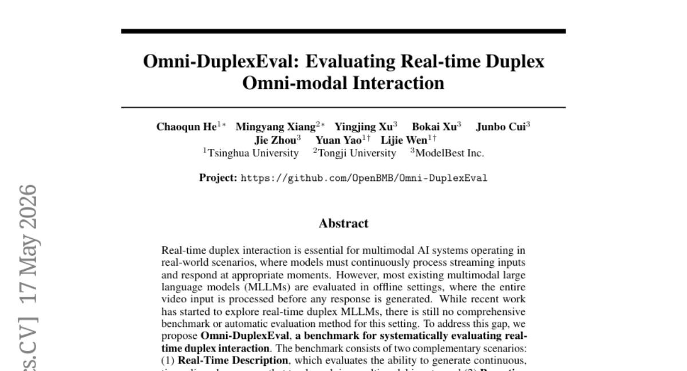

### 📌 한 줄 요약
실시간 양방향 멀티모달 상호작용 능력을 평가하기 위한 새로운 벤치마크 및 자동 평가 프레임워크 제안

### 🔑 핵심 포인트
- 실시간 양방향 상호작용 평가를 위한 2가지 시나리오(실시간 묘사, 선제적 알림) 기반 벤치마크 구축
- 시간 정보와 순차적 추론을 결합하여 응답 내용과 타이밍을 동시에 평가하는 LLM-as-a-Judge 프레임워크 도입
- 실시간 환경에서 모델이 겪는 타이밍 조절 및 내용 생성 간의 트레이드오프 문제 식별

### 🧑‍💻 개발자 관점
실시간 영상 스트리밍이나 로봇 제어와 같이 즉각적인 반응이 필요한 에이전트 개발 시, 모델의 응답 적시성과 정확성을 검증할 수 있는 기준을 제공합니다.

### 🚀 실무 적용 아이디어
- 현재 개발 중인 멀티모달 모델에 Omni-DuplexEval의 시나리오를 적용하여 응답 지연 시간(Latency)과 정확도 간의 상관관계 분석
- LLM-as-a-Judge 프레임워크를 활용하여 모델의 응답 타이밍(Timing)에 대한 자동 평가 파이프라인 구축 테스트
- 실시간 스트리밍 데이터 입력 시 모델의 컨텍스트 유지 능력을 측정하는 실험 수행

### ⚠️ 리스크/한계
- LLM-as-a-Judge 방식이 실제 인간의 직관과 완벽히 일치하지 않을 가능성
- 제한된 데이터셋 규모로 인해 특정 도메인에 편향된 평가 결과가 나올 위험

### 📝 초록 기반 상세 설명
기존의 멀티모달 거대언어모델(MLLM) 평가는 주로 전체 입력을 처리한 후 응답하는 오프라인 방식에 치중되어 있어, 실시간 스트리밍 환경에서의 상호작용을 평가하기 어렵습니다. 이를 해결하기 위해 실시간 묘사(Real-Time Description)와 선제적 알림(Proactive Reminder) 시나리오를 포함하는 Omni-DuplexEval 벤치마크를 제안합니다. 이 벤치마크는 정교한 시간 메타데이터가 포함된 660개의 비디오 데이터셋과 LLM-as-a-Judge 기반의 자동 평가 프레임워크를 제공합니다. 실험 결과, 최신 모델들도 실시간 응답 타이밍과 내용의 일관성을 유지하는 데 큰 어려움을 겪는 것으로 나타났습니다. 본 연구는 실시간 양방향 AI 시스템 발전을 위한 체계적인 평가 기준을 제시합니다.

---

## 36. [Echo-Forcing: A Scene Memory Framework for Interactive Long Video Generation](https://huggingface.co/papers/2605.16003)
**Upvotes**: 1 | **도입 난이도**: 중 | **신뢰도**: 상
**arXiv**: https://arxiv.org/abs/2605.16003

**태그**: Video-Generation, KV-Caching, Long-Context, Diffusion-Models, Video, Evaluation

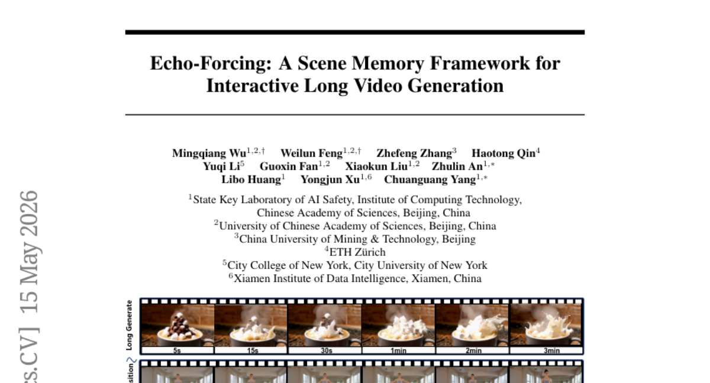

### 📌 한 줄 요약
KV 캐시의 기능적 얽힘 문제를 해결하여 프롬프트 전환 및 장기 기억이 가능한 대화형 긴 영상 생성 프레임워크

### 🔑 핵심 포인트
- Hierarchical Temporal Memory: RoPE를 활용해 안정적 앵커, 압축된 이력, 최신 윈도우를 분리 관리
- Scene Recall Frames: 과거 장면을 공간 구조화된 KV 표현으로 압축하여 장기 기억 지원
- Difference-aware Memory Decay: 새 장면과의 차이에 따라 충돌하는 토큰을 적응적으로 삭제

### 🧑‍💻 개발자 관점
단순한 영상 연장을 넘어, 사용자의 실시간 프롬프트 변화에 대응하며 일관성을 유지하는 대화형 비디오 생성 엔진 구현의 핵심 기술을 제시합니다.

### 🚀 실무 적용 아이디어
- 제한된 GPU 메모리 환경에서 캐시 예산 변화에 따른 생성 품질 변화 테스트
- 급격한 프롬프트 전환(Hard Cut) 시 장면 전환의 자연스러움 검증
- 기존 KV 캐싱 방식 대비 장기 기억 유지 능력 비교 실험

### ⚠️ 리스크/한계
- 압축된 KV 표현 방식이 복잡한 시각적 디테일을 손실할 가능성
- 계층적 메모리 관리로 인한 추론 시 오버헤드 발생 가능성

### 📝 초록 기반 상세 설명
기존의 자기회귀적 비디오 확산 모델은 KV 캐싱을 통해 긴 영상을 생성하지만, 단일 프롬프트 기반의 안정적 연장에만 집중하여 프롬프트 전환이나 과거 장면 회상 같은 대화형 시나리오 대응이 어렵습니다. 연구진은 과거의 KV 상태가 안정적 앵커와 최신 동역학이 뒤섞여 배경 오염 및 메모리 손실을 유발하는 문제를 식별했습니다. 이를 해결하기 위해 계층적 시간 메모리, 장면 회상 프레임, 차이 인식 메모리 감쇠라는 세 가지 메커니즘을 갖춘 Echo-Forcing 프레임워크를 제안합니다. 이 방식은 제한된 캐시 예산 내에서 부드러운 전환, 컷 전환, 장기 장면 회상을 모두 지원합니다. 실험 결과, VBench-Long 벤치마크에서 긴 영상 및 대화형 영상 생성 모두에서 최고 성능을 기록했습니다.

---

## 37. [Editor's Choice: Evaluating Abstract Intent in Image Editing through Atomic Entity Analysis](https://huggingface.co/papers/2605.14842)
**Upvotes**: 1 | **도입 난이도**: 중 | **신뢰도**: 상
**arXiv**: https://arxiv.org/abs/2605.14842

**태그**: Image Editing, Multimodal, Benchmark, LLM, Vision, Evaluation

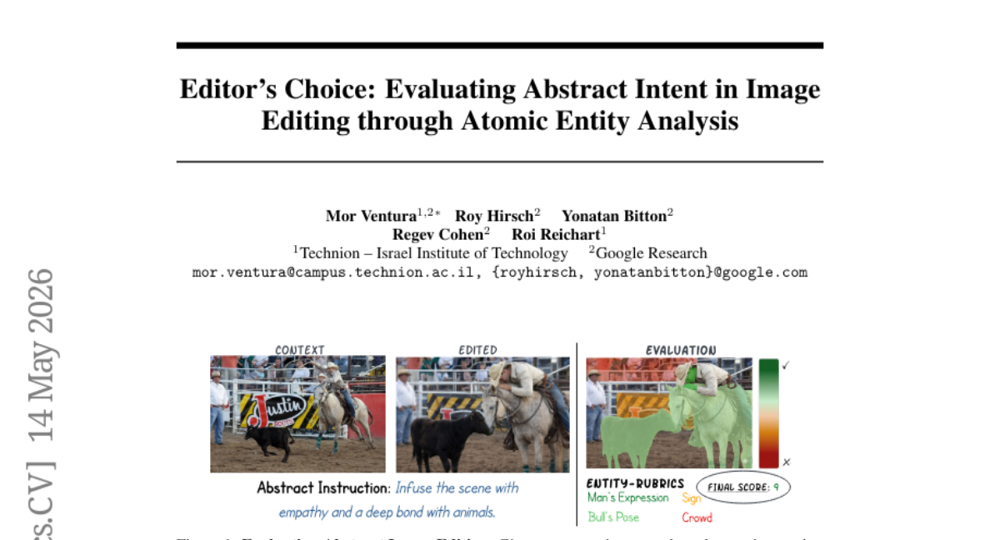

### 📌 한 줄 요약
추상적 의도(Mood 등)를 포함한 이미지 편집 능력을 평가하기 위한 새로운 벤치마크와 엔티티 단위 평가 프레임워크 제안

### 🔑 핵심 포인트
- 추상적 이미지 편집의 정의 및 분류 체계 정립
- 인간의 판단과 높은 상관관계를 갖는 엔티티 기반 평가 프레임워크 'Entity-Rubrics' 개발
- 추상적 의도 파악 능력을 검증하기 위한 새로운 벤치마크 'AbstractEdit' 구축

### 🧑‍💻 개발자 관점
단순한 객체 변경을 넘어 사용자의 감성적/추상적 요구사항을 반영하는 고도화된 멀티모달 AI 모델 개발의 가이드라인을 제공합니다.

### 🚀 실무 적용 아이디어
- 기존 이미지 편집 모델에 Entity-Rubrics 프레임워크를 적용하여 정밀도 테스트
- LLM 기반 텍스트 인코더를 활용한 추상적 명령 해석 성능 비교 실험
- 모델의 반복적 피드백 루프(Iterative thinking) 도입 시 편집 품질 변화 관찰

### ⚠️ 리스크/한계
- 엔티티 단위의 세밀한 평가가 실제 전체 이미지의 미적 완성도와 항상 일치하지 않을 수 있음
- 추상적 개념의 주관성으로 인해 평가 기준의 객관성 확보가 어려울 수 있음

### 📝 초록 기반 상세 설명
기존 이미지 편집 벤치마크는 명시적이고 문자 그대로의 명령에만 집중하여 '분위기'와 같은 추상적 의도 파악 능력을 측정하기 어려웠습니다. 본 논문에서는 추상적 이미지 편집의 정의와 분류 체계를 정립하고, 이를 측정하기 위한 엔티티 단위 평가 프레임워크인 'Entity-Rubrics'를 도입했습니다. 또한 다양한 실세계 장면을 포함하는 최초의 추상적 편집 벤치마크인 'AbstractEdit'을 구축했습니다. 11개의 최신 모델을 평가한 결과, 모델들이 의도 반영과 원본 보존 사이의 균형을 잡는 데 어려움을 겪으며 과잉 또는 과소 편집 문제가 발생함을 확인했습니다. 연구 결과, LLM 텍스트 인코더와 반복적 사고 과정의 통합이 성능 향상의 핵심임을 밝혀냈습니다.

---

## 38. [Zero-Shot Sim-to-Real Robot Learning: A Dexterous Manipulation Study on Reactive Catching](https://huggingface.co/papers/2605.09789)
**Upvotes**: 1 | **도입 난이도**: 중 | **신뢰도**: 상
**arXiv**: https://arxiv.org/abs/2605.09789

**태그**: Reinforcement Learning, Sim-to-Real, Robot Manipulation, Domain Randomization

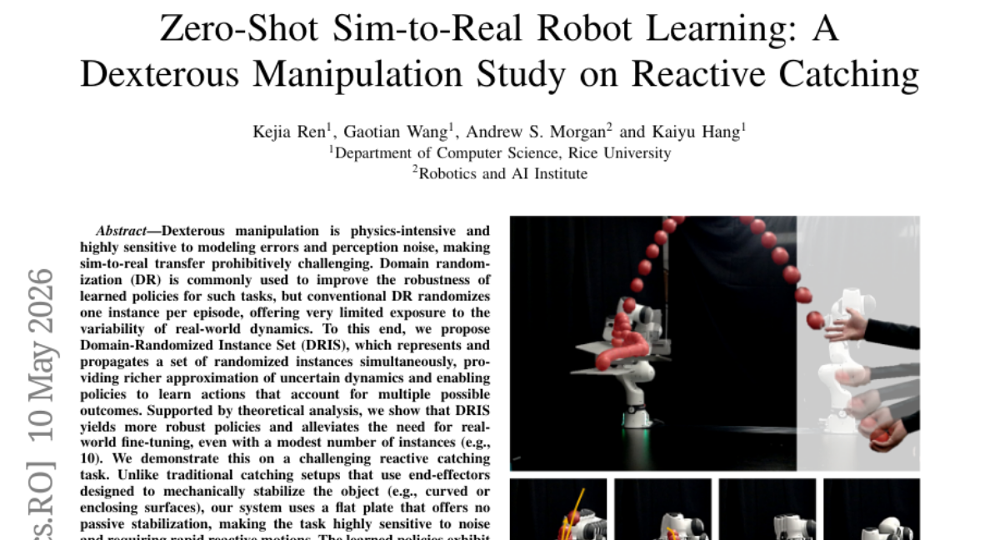

### 📌 한 줄 요약
다양한 물리적 변동성을 동시에 학습하는 DRIS 기법을 통해 별도의 미세 조정 없이 정교한 로봇 캐칭을 구현한 Zero-Shot Sim-to-Real 연구

### 🔑 핵심 포인트
- DRIS(Domain-Randomized Instance Set): 여러 물리적 인스턴스를 동시에 학습하여 불확실한 역학에 대응하는 새로운 DR 방식 제안
- Zero-Shot Transfer: 실환경 미세 조정(Fine-tuning) 없이 시뮬레이션 학습만으로 높은 강건성 확보
- Reactive Catching: 수동적 안정 장치가 없는 평판 환경에서의 고난도 반응형 조작 성공

### 🧑‍💻 개발자 관점
시뮬레이션과 실환경의 괴리(Sim-to-Real gap)를 줄이기 위해 복잡한 데이터 수집이나 실환경 학습 없이도 강건한 제어 정책을 구축하는 방법론을 제시합니다.

### 🚀 실무 적용 아이디어
- 기존의 단일 인스턴스 DR 환경에 DRIS 방식의 다중 인스턴스 전파 로직 적용 실험
- 인스턴스 개수(예: 5, 10, 20개) 변화에 따른 정책의 강건성 및 수렴 속도 비교
- 물리 엔진의 파라미터(마찰력, 질량 등)를 극단적으로 변화시킨 환경에서의 전이 성능 테스트

### ⚠️ 리스크/한계
- 인스턴스 개수가 늘어날수록 계산 복잡도 및 학습 비용이 증가할 가능성
- 특정 물리적 변동성 범위(Distribution)를 벗어난 극단적인 환경에서의 일반화 한계

### 📝 초록 기반 상세 설명
정교한 조작 작업은 물리 모델링 오차와 인지 노이즈에 매우 민감하여 시뮬레이션에서 학습한 정책을 실제 환경에 적용하기 어렵습니다. 기존의 도메인 랜덤화(DR)는 에피소드당 하나의 인스턴스만 사용하여 실제 환경의 복잡한 변동성을 충분히 반영하지 못하는 한계가 있습니다. 이를 해결하기 위해 연구진은 여러 랜덤화된 인스턴스 세트를 동시에 표현하고 전파하는 DRIS(Domain-Randomized Instance Set) 방식을 제안합니다. 이론적 분석을 바탕으로 제안된 방식은 적은 수의 인스턴스만으로도 불확실한 역학에 대응하는 강건한 정책 학습을 가능하게 합니다. 이를 평판 형태의 불안정한 캐칭 작업에 적용한 결과, 별도의 실환경 미세 조정 없이도 성공적인 Zero-Shot Sim-to-Real 전이를 달성했습니다.

---

## 39. [optimize_anything: A Universal API for Optimizing any Text Parameter](https://huggingface.co/papers/2605.19633)
**Upvotes**: 0 | **도입 난이도**: 중 | **신뢰도**: 상
**arXiv**: https://arxiv.org/abs/2605.19633

**태그**: LLM-Agent, Optimization, Automated-Programming, Multi-task-Learning, Agent, Evaluation

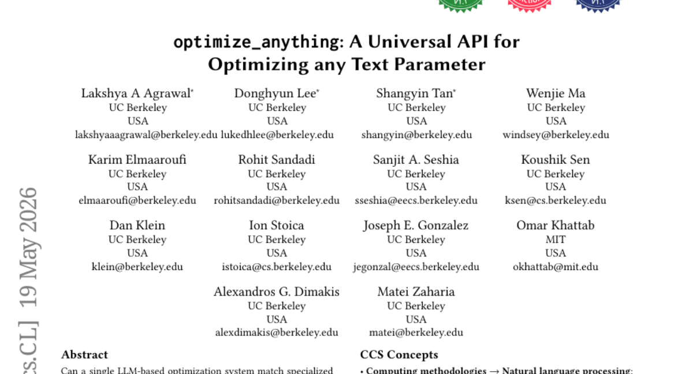

### 📌 한 줄 요약
도메인 특화 알고리즘 없이 텍스트 기반 스코어링만으로 다양한 최적화 문제를 해결하는 범용 LLM 최적화 프레임워크 제안

### 🔑 핵심 포인트
- 텍스트 기반 스코어링을 통한 범용적 최적화 프레임워크 구축
- 멀티태스크 검색을 통한 태스크 간 지식 전이 및 성능 향상 입증
- 에이전트 아키텍처, 클라우드 비용 절감, CUDA 커널 생성 등 다양한 도메인에서의 SOTA 달성

### 🧑‍💻 개발자 관점
특정 도메인 지식이 부족하더라도 문제 정의와 평가 함수만 명확하다면 LLM을 통해 고성능 알고리즘이나 코드를 자동 생성할 수 있는 가능성을 보여줍니다.

### 🚀 실무 적용 아이디어
- 자신의 업무 중 규칙 기반의 최적화가 필요한 문제를 텍스트 스코어링 문제로 변환해보기
- 단일 문제 최적화와 유사 문제를 묶은 멀티태스크 최적화의 성능 차이 비교 실험
- LLM에게 단순 점수 외에 문제 해결을 위한 힌트(side information)를 포함하여 프롬프트 엔지니어링 수행

### ⚠️ 리스크/한계
- 스코어링 함수 자체가 부정확할 경우 최적화 결과가 왜곡될 위험
- 복잡도가 매우 높은 문제에서는 LLM의 추론 비용이 최적화 이득보다 커질 가능성

### 📝 초록 기반 상세 설명
기존의 최적화 방식은 각 도메인마다 특화된 알고리즘이 필요하다는 한계가 있었습니다. 본 논문은 최적화 문제를 '텍스트 결과물을 스코어링 함수로 평가하는 과정'으로 정의하여 단일 LLM 시스템으로 해결하는 방법을 제시합니다. 제안된 시스템은 에이전트 아키텍처 설계, 스케줄링 알고리즘, CUDA 커널 생성 등 서로 다른 6개 태스크에서 SOTA 성능을 달성했습니다. 실험 결과, 단순 점수 피드백보다 실행 가능한 사이드 정보(actionable side information)를 제공할 때 수렴 속도와 최종 점수가 크게 향상되었습니다. 또한 멀티태스크 검색을 통해 태스크 간 지식 전이(transfer)가 발생하여 단일 태스크 최적화보다 높은 효율을 보였습니다. 결과적으로 LLM 기반 텍스트 최적화가 범용적인 문제 해결 패러다임이 될 수 있음을 입증했습니다.

---

## 40. [Why Do Reasoning Models Lose Coverage? The Role of Data and Forks in the Road](https://huggingface.co/papers/2605.17026)
**Upvotes**: 0 | **도입 난이도**: 중 | **신뢰도**: 상
**arXiv**: https://arxiv.org/abs/2605.17026

**태그**: LLM, SFT, Reasoning, Data Engineering, RAG, Evaluation

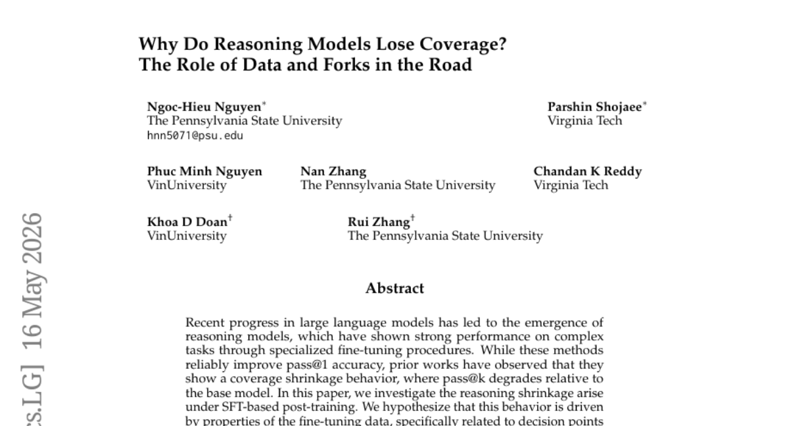

### 📌 한 줄 요약
SFT 과정에서 발생하는 추론 모델의 커버리지 감소(pass@k 저하) 원인을 데이터 내 '의사결정 지점' 문제로 규명하고 해결책을 제시함

### 🔑 핵심 포인트
- SFT 기반 추론 모델 학습 시 발생하는 pass@k 성능 저하(coverage shrinkage) 원인 분석
- 데이터 내 '의사결정 지점(decision points)'이 모델의 경로 다양성을 제한하는 핵심 요인임을 규명
- 데이터 합성 전략 및 다양성 중심의 디코딩 메커니즘을 통한 커버리지 문제 완화 방법 제시

### 🧑‍💻 개발자 관점
모델의 특정 정답률(pass@1)만 높이는 것이 아니라, 다양한 해결 경로를 유지하는 것이 모델의 범용적 추론 능력 유지에 필수적임을 시사합니다.

### 🚀 실무 적용 아이디어
- SFT 데이터셋 구성 시 단일 경로가 아닌 다중 경로(multiple valid paths)를 포함하도록 설계
- 학습 데이터 내 의사결정 지점의 밀도를 측정하여 커버리지 감소 위험도 평가
- 추론 시 다양성을 확보할 수 있는 디코딩 전략(sampling/decoding) 적용 테스트

### ⚠️ 리스크/한계
- 데이터 합성 방식에 따라 특정 시나리오에 과적합될 위험이 있음
- 다양성을 높이는 방식이 pass@1(최고 성능)을 희생시킬 가능성 존재

### 📝 초록 기반 상세 설명
최근 SFT를 통한 추론 모델 학습은 pass@1 성능을 높이지만, 동시에 모델의 전체적인 커버리지가 줄어드는 현상이 관찰됩니다. 본 논문은 이러한 커버리지 축소 현상이 학습 데이터 내의 '의사결정 지점(forks in the road)', 즉 여러 유효한 경로가 존재하는 모호한 패턴에서 발생한다고 가설을 세웠습니다. 이를 검증하기 위해 그래프 분기 및 다양한 추론 모드를 포함하는 통제된 케이스 스터디를 설계하여 학습 역학을 추적했습니다. 실험 결과, 커버리지 감소는 학습 데이터 내 의사결정 시나리오의 비중과 밀접한 상관관계가 있음을 확인했습니다. 연구팀은 데이터 합성 설계와 다양성을 장려하는 디코딩 메커니즘을 통해 이 문제를 완화할 수 있음을 입증했습니다.

---

## 41. [RoPE Distinguishes Neither Positions Nor Tokens in Long Contexts, Provably](https://huggingface.co/papers/2605.15514)
**Upvotes**: 0 | **도입 난이도**: 하 | **신뢰도**: 상
**arXiv**: https://arxiv.org/abs/2605.15514

**태그**: LLM, Transformer, Position-Encoding, Long-Context

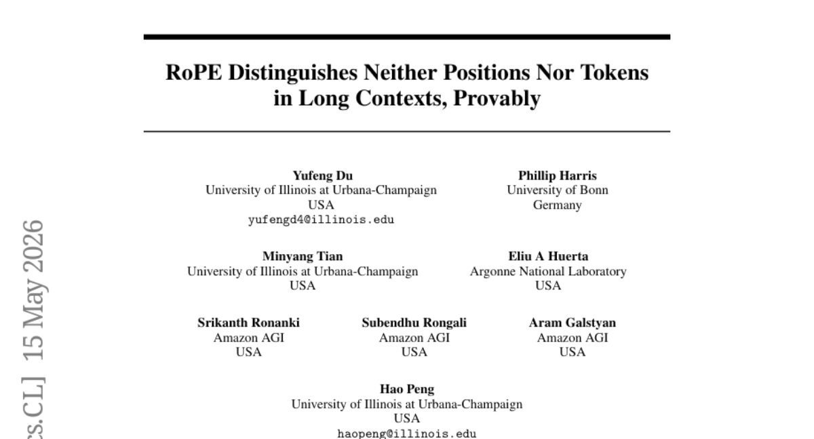

### 📌 한 줄 요약
RoPE의 구조적 한계로 인해 컨텍스트 길이가 길어질수록 위치와 토큰 식별 능력이 무작위 수준으로 저하됨을 이론적으로 증명함

### 🔑 핵심 포인트
- 컨텍스트 길이에 따른 RoPE의 국소성 편향 및 토큰 일관성 상실 증명
- RoPE 베이스 조절 시 위치 식별력과 토큰 식별력 간의 불가피한 트레이드오프 발생
- 멀티 헤드/멀티 레이어 아키텍처가 RoPE의 근본적 한계를 극복하지 못함을 확인

### 🧑‍💻 개발자 관점
현재 LLM의 긴 컨텍스트 확장 전략(RoPE base 조정 등)이 가진 근본적인 취약점을 이해하고, 차세대 포지셔널 인코딩 설계의 필요성을 인지하는 데 중요합니다.

### 🚀 실무 적용 아이디어
- 컨텍스트 길이를 늘릴 때 RoPE base 조정이 성능(위치/토큰 식별력)에 미치는 영향 테스트
- 매우 긴 컨텍스트에서 특정 토큰의 어텐션 점수가 위치 변화에 따라 어떻게 변하는지 모니터링
- RoPE 외의 새로운 위치 인코딩 방식(예: ALiBi 등)과의 성능 비교 실험

### ⚠️ 리스크/한계
- 현재의 RoPE 기반 확장 방식이 장기적으로 신뢰할 수 없는 결과를 초래할 위험
- 위치 정보와 토큰 정보가 혼재되어 발생하는 모델의 논리적 오류 가능성

### 📝 초록 기반 상세 설명
최근 긴 컨텍스트 처리를 위해 널리 사용되는 RoPE(Rotary Positional Embeddings)의 내재적 한계를 분석합니다. 연구진은 컨텍스트 길이가 증가함에 따라 RoPE 기반 어텐션이 국소성 편향(Locality bias)과 토큰 관련성 일관성(Consistency)을 상실함을 이론적으로 증명했습니다. 분석 결과, RoPE 베이스 값을 조정하는 현재의 관행은 위치 식별과 토큰 식별 사이의 트레이드오프를 발생시키며, 둘을 동시에 유지할 수 없습니다. 실험을 통해 멀티 헤드/멀티 레이어 구조로도 이러한 근본적인 문제를 해결할 수 없음을 확인했습니다. 결론적으로 기존 RoPE 방식은 장기 컨텍스트 모델에서 위치와 토큰을 명확히 구분하지 못하는 한계가 있습니다.

---

