# 2026-05-22 Daily Papers (Top 38)

## 오늘의 요약
오늘의 연구는 대규모 데이터 합성 및 자동화 파이프라인을 통한 에이전트와 생성 모델의 성능 고도화가 주를 이루었습니다. 또한, LLM의 효율적인 학습(RLVR, 양자화)과 신뢰성(프라이버시, 보안)을 확보하기 위한 실용적인 최적화 기법들이 비중 있게 다뤄졌습니다.

### 오늘의 핵심 포인트
- 비디오 및 자동화 프레임워크를 활용하여 수동 레이블링 없이 대규모 학습 데이터를 확보하는 기술이 주목받았습니다.
- 모델의 학습 비용을 절감하거나 재학습 없이 성능을 확장하는 등 효율적인 파라미터 및 추론 최적화 방법론이 제시되었습니다.
- 개인정보 보호, 보안 취약점, 환각 문제 등 LLM의 실무 배포 시 발생할 수 있는 신뢰성 문제를 해결하기 위한 연구가 활발히 진행되었습니다.

**오늘의 태그**: LLM Optimization, Data Synthesis, AI Agent, Trustworthy AI, Efficiency

## 1. [Mega-ASR: Towards In-the-wild^2 Speech Recognition via Scaling up Real-world Acoustic Simulation](https://huggingface.co/papers/2605.19833)
**Upvotes**: 109 | **도입 난이도**: 중 | **신뢰도**: 상
**arXiv**: https://arxiv.org/abs/2605.19833

**태그**: ASR, Robustness, Data Augmentation, Speech-to-Text, Audio, Benchmark

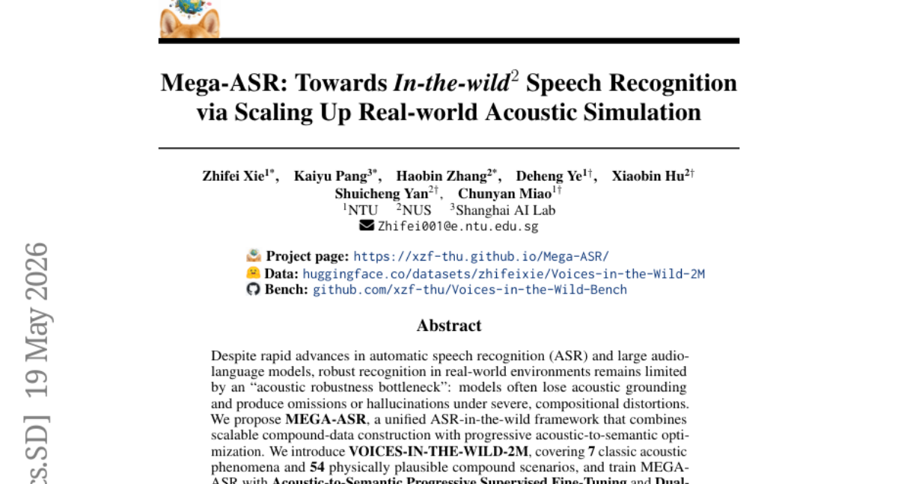

### 📌 한 줄 요약
복합적인 실생활 소음 환경에서도 강건한 음성 인식을 위해 대규모 시뮬레이션 데이터와 단계적 최적화 기법을 결합한 Mega-ASR 프레임워크 제안

### 🔑 핵심 포인트
- 7가지 음향 현상 및 54가지 시나리오를 포함하는 대규모 합성 데이터셋 'Voices-in-the-Wild-2M' 구축
- 음향적 특징에서 의미적 특징으로 전이되는 단계적 SFT(Acoustic-to-Semantic Progressive SFT) 적용
- WER(Word Error Rate) 기반의 이중 정밀도 정책 최적화(Dual-Granularity WER-Gated Policy Optimization)를 통한 강건성 확보

### 🧑‍💻 개발자 관점
실제 소음이 심한 환경(카페, 거리 등)에서 ASR 모델을 배포할 때 발생하는 성능 저하와 환각 문제를 해결할 수 있는 데이터 및 학습 전략을 제공합니다.

### 🚀 실무 적용 아이디어
- 제공된 Voices-in-the-Wild-2M 데이터셋의 합성 방식 분석 및 자사 데이터에 적용
- 복합 소음 환경에서의 모델 성능 측정을 위한 벤치마크 파이프라인 구축
- SFT 단계에서 음향-의미 간 점진적 학습 스케줄링 실험

### ⚠️ 리스크/한계
- 합성 데이터(Simulation) 기반 학습이 실제 환경의 미세한 물리적 차이를 완벽히 커버하지 못할 가능성
- 복합적인 시나리오 구성 시 데이터 생성 비용 및 복잡도 증가

### 📝 초록 기반 상세 설명
최근 ASR 기술의 발전에도 불구하고, 복합적인 소음이 발생하는 실생활 환경에서는 모델이 음성 정보를 놓치거나 환각(hallucination)을 일으키는 문제가 지속되고 있습니다. 이를 해결하기 위해 연구진은 대규모 합성 데이터 구축과 단계적 최적화를 결합한 Mega-ASR 프레임워크를 제안합니다. 먼저 7가지 음향 현상과 54가지 복합 시나리오를 포함하는 Voices-in-the-Wild-2M 데이터셋을 구축했습니다. 학습 과정에서는 Acoustic-to-Semantic Progressive SFT와 Dual-Granularity WER-Gated Policy Optimization 기법을 적용했습니다. 실험 결과, Mega-ASR는 기존 SOTA 모델 대비 열악한 환경의 벤치마크에서 월등한 성능 향상을 보였으며, 복합 소음 시나리오에서도 높은 강건성을 입증했습니다.

### 🖼️ 추가 자료
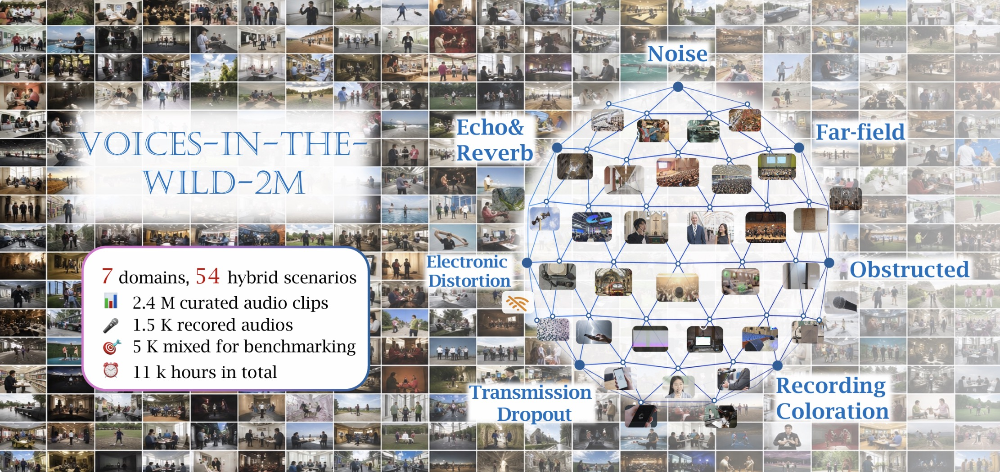

---

## 2. [Video2GUI: Synthesizing Large-Scale Interaction Trajectories for Generalized GUI Agent Pretraining](https://huggingface.co/papers/2605.14747)
**Upvotes**: 84 | **도입 난이도**: 중 | **신뢰도**: 상
**arXiv**: https://arxiv.org/abs/2605.14747

**태그**: GUI Agent, Data Synthesis, Multimodal LLM, Automation, Agent, Multimodal, Video, Benchmark

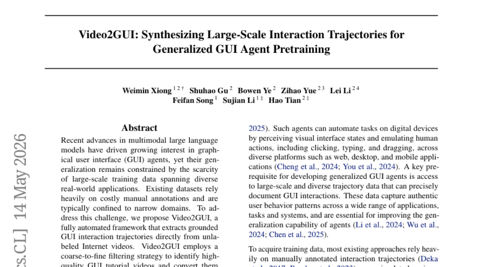

### 📌 한 줄 요약
비디오 데이터로부터 자동화된 방식으로 대규모 GUI 상호작용 데이터를 추출하여 범용 GUI 에이전트 성능을 극대화하는 프레임워크

### 🔑 핵심 포인트
- 비디오 데이터에서 GUI 상호작용 궤적을 자동 추출하는 Video2GUI 프레임워크 제안
- 1,500개 이상의 앱/웹을 포함하는 1,200만 개의 대규모 데이터셋 WildGUI 구축
- Coarse-to-fine 필터링을 통한 고품질 데이터 정제 및 자동화 파이프라인 확보

### 🧑‍💻 개발자 관점
수동 레이블링 없이 대규모 GUI 학습 데이터를 확보할 수 있는 자동화 파이프라인을 제시하여, 범용 에이전트 개발 비용을 획기적으로 낮출 수 있습니다.

### 🚀 실무 적용 아이디어
- 제공될 Video2GUI 파이프라인을 활용해 특정 도메인 특화 비디오 데이터셋 구축 실험
- WildGUI 데이터셋을 활용한 오픈소스 멀티모달 모델의 GUI 성능 벤치마킹
- 추출된 궤적 데이터의 노이즈가 에이전트의 행동 정확도에 미치는 영향 분석

### ⚠️ 리스크/한계
- 비디오 내 시각적 노이즈나 복잡한 화면 전환 시 궤적 추출의 정확도 저하 가능성
- 비디오 데이터에 의존하므로 실제 사용자 인터랙션과 미세한 차이가 발생할 위험

### 📝 초록 기반 상세 설명
최근 멀티모달 LLM을 활용한 GUI 에이전트 연구가 활발하지만, 다양한 도메인을 아우르는 대규모 학습 데이터 부족이 일반화의 걸림돌이 되고 있습니다. 기존 데이터셋은 수동 어노테이션 비용이 높고 특정 도메인에 국한되는 한계가 있습니다. 이를 해결하기 위해 본 논문은 인터넷의 비디오에서 GUI 상호작용 궤적을 자동으로 추출하는 Video2GUI 프레임워크를 제안합니다. Coarse-to-fine 필터링 전략을 통해 고품질 튜토리얼 영상을 식별하고 이를 구조화된 에이전트 데이터로 변환합니다. 이를 통해 1,500개 이상의 앱/웹을 포함하는 1,200만 개의 궤적이 담긴 WildGUI 데이터셋을 구축했습니다. 결과적으로 Qwen2.5-VL 등을 이 데이터로 사전 학습했을 때 기존 SOTA를 능가하는 성능 향상을 확인했습니다.

---

## 3. [Enhancing Train-Free Infinite-Frame Generation for Consistent Long Videos](https://huggingface.co/papers/2605.18233)
**Upvotes**: 77 | **도입 난이도**: 하 | **신뢰도**: 상
**arXiv**: https://arxiv.org/abs/2605.18233

**태그**: Video Generation, Long-form Video, Zero-shot, Consistency, RAG, Video, Inference, Safety

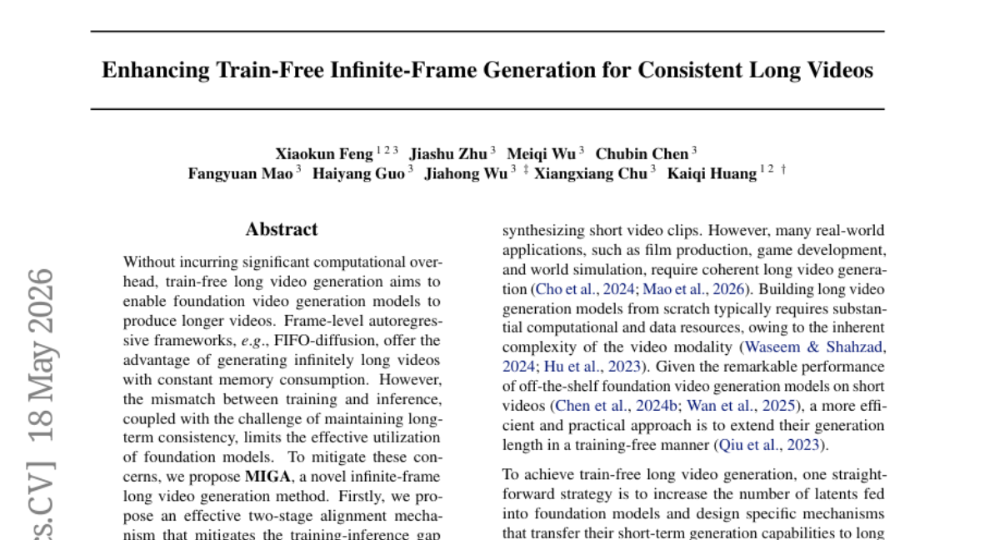

### 📌 한 줄 요약
추가 학습 없이 일관성 있는 초장기 비디오 생성을 가능하게 하는 MIGA 프레임워크 제안

### 🔑 핵심 포인트
- 학습 없이 기존 파운데이션 모델을 활용하는 무학습(Train-free) 프레임워크
- 노이즈 스팬 조절을 통한 학습-추론 간 불일치(Training-Inference Gap) 완화
- 자기 성찰 및 장거리 가이드를 결합한 이중 일관성 강화 메커니즘

### 🧑‍💻 개발자 관점
모델 재학습 비용 없이 기존 비디오 생성 모델의 출력 길이를 확장하고 일관성을 확보할 수 있는 실용적인 방법론입니다.

### 🚀 실무 적용 아이디어
- 기존 FIFO-diffusion 등 자기회귀 모델에 MIGA의 노이즈 정렬 로직 적용 테스트
- 다양한 해상도 및 프레임 레이트에서의 장기 일관성 유지 능력 검증
- Self-reflection 메커니즘이 초기 프레임의 품질에 미치는 영향 분석

### ⚠️ 리스크/한계
- 무학습 방식이므로 모델 자체의 근본적인 생성 능력 한계에 종속됨
- 매우 긴 비디오 생성 시 연산 복잡도 및 가이드 프레임 관리 이슈 발생 가능성

### 📝 초록 기반 상세 설명
기존의 프레임 단위 자기회귀 방식은 메모리 효율적이지만, 학습과 추론 간의 불일치 및 장기적 일관성 유지 문제로 인해 긴 비디오 생성에 한계가 있습니다. 이를 해결하기 위해 본 논문은 새로운 무학습(train-free) 방식인 MIGA를 제안합니다. 먼저, 모델에 입력되는 과도한 노이즈 범위를 줄여 학습-추론 간 격차를 해소하는 2단계 정렬 메커니즘을 도입합니다. 또한, 초기 고노이즈 프레임을 수정하는 자기 성찰(self-reflection) 방식과 후기 저노이즈 프레임을 가이드로 활용하는 장거리 프레임 가이드 방식을 결합한 이중 일관성 강화 메커니즘을 제안합니다. 실험 결과, MIGA는 VBench 및 NarrLV 벤치마크에서 최첨단 성능을 달립니 다.

---

## 4. [You Only Need Minimal RLVR Training: Extrapolating LLMs via Rank-1 Trajectories](https://huggingface.co/papers/2605.21468)
**Upvotes**: 38 | **도입 난이도**: 하 | **신뢰도**: 상
**arXiv**: https://arxiv.org/abs/2605.21468

**태그**: LLM, Reinforcement Learning, Parameter Efficiency, Optimization, Reasoning, Benchmark

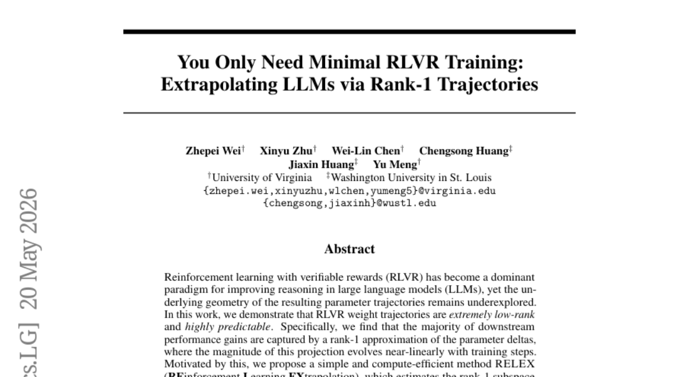

### 📌 한 줄 요약
RLVR 학습 과정의 파라미터 변화가 매우 낮은 차원(Rank-1)임을 발견하여, 극소량의 학습만으로 최종 모델 성능을 예측/생성하는 효율적 기법 제안

### 🔑 핵심 포인트
- RLVR 학습 궤적이 매우 낮은 랭크(Rank-1)를 가지며 선형적으로 변화하는 특성 발견
- RELEX: 짧은 관찰 구간의 랭크-1 서브스페이스를 이용한 선형 회귀 기반 체크포인트 외삽 기법
- 학습 비용을 획기적으로 절감하면서도(최대 1/20 수준) 높은 성능을 유지하는 효율성 입증

### 🧑‍💻 개발자 관점
모델 학습 비용이 막대한 상황에서, 전체 학습을 완료하지 않고도 목표 성능에 도달할 수 있는 '조기 종료 및 예측' 전략의 가능성을 제시합니다.

### 🚀 실무 적용 아이디어
- 현재 진행 중인 RLVR 학습 데이터의 파라미터 델타(delta) 랭크 분석해보기
- 학습 초기 단계의 체크포인트를 이용한 선형 외삽 실험 수행
- 학습 스텝에 따른 성능 향상 곡선과 파라미터 변화량의 상관관계 확인

### ⚠️ 리스크/한계
- 특정 데이터셋이나 특정 모델 구조에 국한된 현상일 가능성
- 학습 초기 단계의 노이즈가 클 경우 외삽의 정확도가 급격히 떨어질 위험

### 📝 초록 기반 상세 설명
LLM의 추론 능력을 높이기 위한 RLVR(Verifiable Rewards) 학습이 대세가 되었으나, 학습 과정에서의 파라미터 궤적(trajectory) 특성에 대한 연구는 부족했습니다. 본 논문은 RLVR 학습 시 발생하는 파라미터 변화량이 매우 낮은 랭크(Rank-1)를 가지며 선형적으로 진화한다는 점을 발견했습니다. 이를 바탕으로 짧은 학습 구간만 관찰하여 미래의 체크포인트를 예측하는 RELEX 기법을 제안합니다. 실험 결과, 전체 학습의 15%만 수행하고도 전체 학습과 대등하거나 더 나은 성능을 달순하는 놀라운 외삽(extrapolation) 능력을 보였습니다. 이는 학습 과정의 노이즈를 제거하고 핵심적인 업데이트 방향만을 추출함으로써 가능했습니다.

---

## 5. [OScaR: The Occam's Razor for Extreme KV Cache Quantization in LLMs and Beyond](https://huggingface.co/papers/2605.19660)
**Upvotes**: 36 | **도입 난이도**: 중 | **신뢰도**: 상
**arXiv**: https://arxiv.org/abs/2605.19660

**태그**: LLM, KV-Cache, Quantization, Inference-Optimization, Reasoning, Evaluation, Optimization

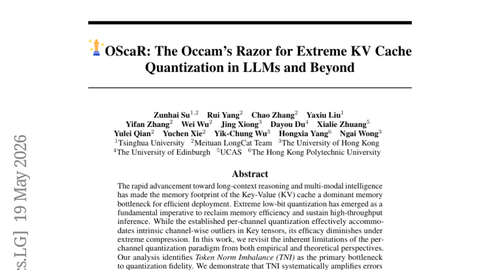

### 📌 한 줄 요약
INT2 수준의 극한 압축에서도 성능 저하를 최소화하는 혁신적인 KV 캐시 양자화 프레임워크 OScaR

### 🔑 핵심 포인트
- Token Norm Imbalance(TNI) 현상을 식별하여 기존 채널별 양자화의 한계 규명
- Canalized Rotation과 Omni-Token Scaling을 통한 극한 압축(INT2) 성능 확보
- 최적화된 CUDA 커널 설계를 통한 높은 디코딩 속도 및 처리량(Throughput) 달성

### 🧑‍💻 개발자 관점
메모리 부족 문제를 해결하면서도 모델 성능 저하 없이 긴 컨텍스트를 처리해야 하는 LLM 서비스 운영 환경에 매우 실용적입니다.

### 🚀 실무 적용 아이디어
- 제공된 GitHub 코드를 활용하여 다양한 모델 크기에서의 INT2 양자화 성능 테스트
- 기존 Per-channel 양자화 방식과 OScaR의 성능/메모리 효율성 비교 실험
- 멀티모달 모델(X-LLM) 환경에서의 KV 캐시 압축 효과 검증

### ⚠️ 리스크/한계
- INT2와 같은 극단적 양자화 시 특정 도메인에서의 미세한 성능 저하 가능성
- 커스텀 CUDA 커널 의존성으로 인한 특정 하드웨어 환경에서의 이식성 문제

### 📝 초록 기반 상세 설명
LLM의 컨텍스트 확장으로 인해 KV 캐시 메모리 점유가 주요 병목 현상으로 부상하고 있습니다. 기존의 채널별 양자화 방식은 토큰 간 노름 차이로 인한 'Token Norm Imbalance(TNI)' 문제로 인해 극한의 압축 환경에서 성능이 급격히 저하됩니다. 이를 해결하기 위해 본 논문은 Canalized Rotation과 Omni-Token Scaling을 결합한 OScaR 프레임워크를 제안합니다. OScaR는 시퀀스 차원의 분산을 효과적으로 제어하여 INT2 양자화에서도 거의 손실 없는 성능을 구현합니다. 실험 결과, 기존 방식 대비 메모리 사용량을 5.3배 절감하고 디코딩 속도를 최대 3배 향상시키는 등 압도적인 효율성을 입증했습니다.

---

## 6. [IndusAgent: Reinforcing Open-Vocabulary Industrial Anomaly Detection with Agentic Tools](https://huggingface.co/papers/2605.20682)
**Upvotes**: 35 | **도입 난이도**: 상 | **신뢰도**: 상
**arXiv**: https://arxiv.org/abs/2605.20682

**태그**: Agent, Anomaly Detection, MLLM, Reinforcement Learning, Computer Vision, RAG, Reasoning, Multimodal, Vision, Benchmark, Evaluation, Inference

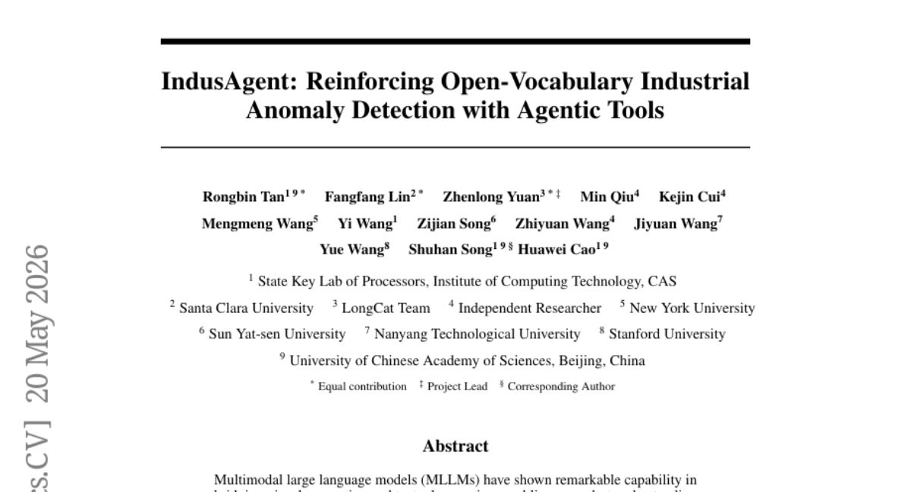

### 📌 한 줄 요약
에이전트 기반 도구 활용과 강화학습을 통해 산업용 이상 탐지의 추론 오류와 환각 문제를 해결한 오픈 보캐블러리 프레임워크

### 🔑 핵심 포인트
- Indus-CoT: 글로벌/로컬 정보와 전문가 지식을 결합한 구조화된 학습 데이터셋 구축
- Agentic Tool Orchestration: 동적 크로핑 및 특징 강화 도구를 통한 시각적 모호성 해소
- Gated Reinforcement Learning: 정확도와 도구 사용 효율성을 동시에 최적화하는 강화학습 목적 함수

### 🧑‍💻 개발자 관점
단순 분류를 넘어 에이전트가 스스로 도구(Crop, Enhancement 등)를 선택해 정밀 검사를 수행하는 구조를 제시하므로, 복잡한 산업 현장의 제로샷 탐지 시스템 설계에 유용합니다.

### 🚀 실무 적용 아이디어
- 제시된 Indus-CoT 데이터 구조를 활용한 산업 도메인 특화 데이터셋 구축 실험
- 에이전트의 도구 호출(Tool invocation) 비용과 탐지 정확도 간의 트레이드오프 분석
- 실제 제조 라인의 다양한 해상도 환경에서 동적 크로핑 기능의 유효성 검증

### ⚠️ 리스크/한계
- 에이전트가 도구를 호출하는 과정에서 발생하는 추론 지연 시간(Latency) 문제
- 특정 도메인에 과적합된 도구 세트가 새로운 산업 환경에서 범용성을 잃을 가능성

### 📝 초록 기반 상세 설명
최근 MLLM을 활용한 산업용 이상 탐지(IAD)가 주목받고 있으나, 도메인 불일치로 인한 잘못된 추론과 구조적 환각 문제가 발생합니다. 이를 해결하기 위해 본 논문은 도구 증강 에이전트 프레임워크인 IndusAgent를 제안합니다. 먼저 글로벌 관찰, 고해상도 패치, 전문가 지식을 통합한 Indus-CoT 데이터셋을 구축하여 정교한 검사 경로를 학습시킵니다. 또한, 동적 영역 크로핑 및 특징 강화 등 외부 도구를 동적으로 활용하여 시각적 모호성을 해결합니다. 마지막으로 게이트형 강화학습을 통해 분류, 위치 탐지, 추론 및 도구 사용 효율성을 동시에 최적화합니다. 실험 결과, MVTec-AD 등 주요 벤치마크에서 SOTA 성능을 달성하며 강력한 제로샷 성능을 입증했습니다.

---

## 7. [A Survey of Large Audio Language Models: Generalization, Trustworthiness, and Outlook](https://huggingface.co/papers/2605.20266)
**Upvotes**: 27 | **도입 난이도**: 하 | **신뢰도**: 상
**arXiv**: https://arxiv.org/abs/2605.20266

**태그**: Audio-LLM, Security, Trustworthiness, Multimodal, Reasoning, Audio, Evaluation, Safety

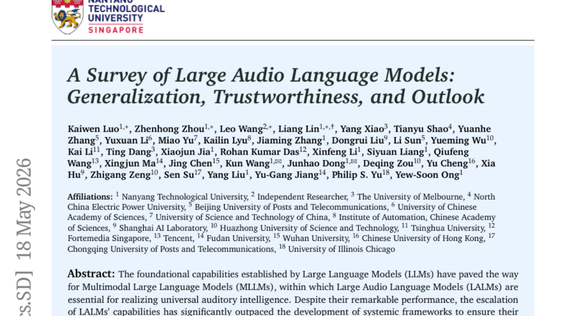

### 📌 한 줄 요약
LALM(대형 오디오 언어 모델)의 발전 속도에 맞춘 신뢰성(Trustworthiness) 위협 분석 및 방어 전략 가이드라인

### 🔑 핵심 포인트
- LALM의 아키텍처적 특성(엔드투엔드, 연속 신호)에 따른 새로운 보안 취약점 식별
- 신뢰성 위협에 대한 체계적 분류(환각, 강건성, 안전성, 프라이버시, 공정성, 인증)
- 공격 기술과 방어 기술 간의 불균형 해소를 위한 전략적 로드맵 제시

### 🧑‍💻 개발자 관점
오디오 기반 AI 서비스를 개발할 때 발생할 수 있는 보안 취약점(백도어, 프라이버시 유출 등)을 사전에 인지하고 설계 단계에서 고려할 수 있습니다.

### 🚀 실무 적용 아이디어
- 개발 중인 오디오 모델에 대한 교차 모달 탈옥(Cross-modal jailbreaking) 테스트 수행
- 음성 데이터 포함 시 생체 정보 유출 가능성 및 프라이버시 보호 로직 검토
- 모델의 환각(Hallucination) 현상을 방지하기 위한 정렬 알고리즘 적용 실험

### ⚠️ 리스크/한계
- 공격 기술이 방어 기술보다 빠르게 발전하고 있어 지속적인 모니터링 필요
- 성능 최적화와 신뢰성 확보 사이의 트레이드오프 발생 가능성

### 📝 초록 기반 상세 설명
LLM의 발전으로 오디오 지능을 위한 LALM이 급격히 성장하고 있으나, 모델의 성능 향상에 비해 신뢰성을 보장하는 프레임워크는 부족한 실정입니다. 본 논문은 LALм의 아키텍처 혁신과 정렬 알고리즘을 분석하여, 통합 엔드투엔드 프레임워크와 연속적 음향 신호 통합이 어떻게 새로운 공격 표면을 만드는지 조사합니다. 이를 위해 교차 모달 탈옥, 잠재적 음향 백도어, 생체 정보 유출 등 신뢰성 위협을 체계적으로 분류했습니다. 또한 환각, 강건성, 안전성, 프라이버시, 공정성, 인증이라는 6가지 핵심 축을 통해 최신 기술을 검토합니다. 마지막으로 성능과 신뢰성 사이의 간극을 메우기 위한 '심층 방어(Defense-in-Depth)' 및 인과적 오디오 모델링 등의 전략적 로드맵을 제안합니다.

---

## 8. [It Takes Two: Complementary Self-Distillation for Contextual Integrity in LLMs](https://huggingface.co/papers/2605.20258)
**Upvotes**: 26 | **도입 난이도**: 중 | **신뢰도**: 상
**arXiv**: https://arxiv.org/abs/2605.20258

**태그**: LLM, Privacy, Self-Distillation, AI Agent, Alignment, Agent, RAG, Vision, Evaluation, Distillation, Safety

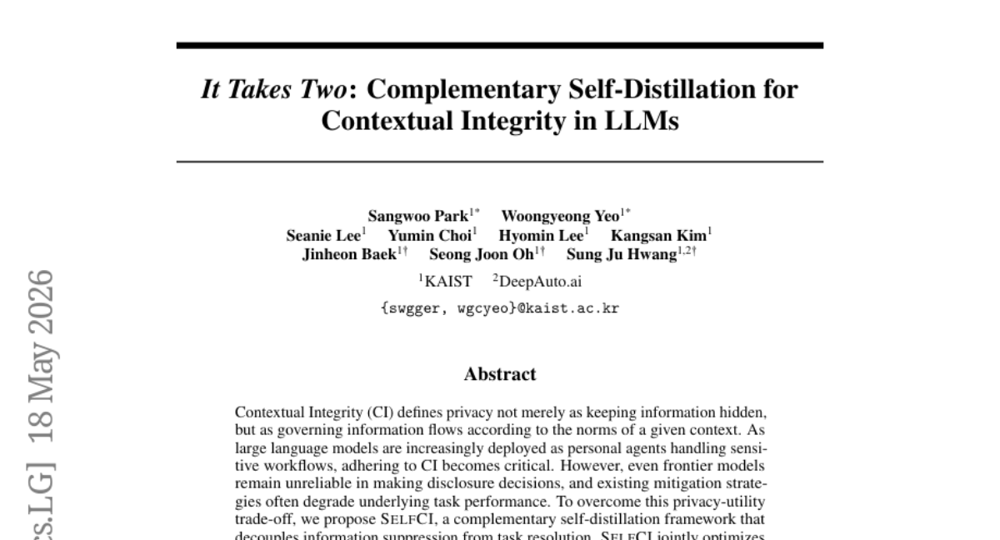

### 📌 한 줄 요약
LLM의 작업 성능을 유지하면서 맥락에 맞는 정보 공개(Contextual Integrity)를 달성하는 자기 증류(Self-Distillation) 프레임워크 제안

### 🔑 핵심 포인트
- 정보 억제와 작업 해결을 분리하여 성능-프라이버시 트레이드오프 해결
- 두 개의 독립적인 역 KL 발산(Reverse KL Divergence)을 이용한 상호 보완적 자기 증류 방식 도입
- Product-of-Experts(PoE) 타겟을 통해 작업 능력과 프라이버시 정책의 정렬 유도

### 🧑‍💻 개발자 관점
개인화된 에이전트 개발 시, 모델의 유용성을 해치지 않으면서 민감 정보 유출을 제어하는 실질적인 정렬(Alignment) 기법을 제공합니다.

### 🚀 실무 적용 아이디어
- 특정 도메인(의료, 금융 등)의 민감 데이터셋을 활용한 프라이버시-유틸리티 트레이드오프 벤치마크 구축
- GRPO 등 기존 강화학습 알고리즘과 SELFCI의 수렴 속도 및 안정성 비교 실험
- 에이전트 워크플로우 내 누적된 컨텍스트 상황에서의 정보 노출 제어 테스트

### ⚠️ 리스크/한계
- 두 교사 분포 간의 균형이 깨질 경우 작업 성능이나 프라이버시 중 하나가 급격히 저하될 위험
- 복잡한 에이전트 시나리오에서 '적절한 정보 공개'에 대한 기준 설정의 모호성

### 📝 초록 기반 상세 설명
LLM이 개인 에이전트로 활용됨에 따라 맥락에 따른 정보 흐름을 관리하는 '맥락적 무결성(CI)'이 중요해지고 있습니다. 기존 모델들은 정보 공개 여부를 결정할 때 성능 저하가 발생하거나 신뢰도가 낮은 문제가 있었습니다. 이를 해결하기 위해 작업 성능과 정보 억제를 분리하여 최적화하는 SELFCI 프레임워크를 제안합니다. 두 개의 독립적인 피드백 기반 교사 분포를 활용한 상호 보완적 자기 증류를 통해 작업 능력과 프라이버시 요구사항의 교집합을 학습합니다. 실험 결과, 외부 감독 없이도 GRPO와 같은 강화학습 알고리즘보다 우수한 성능을 보였으며 에이전트 워크플로우에서도 안정적인 성능을 입증했습니다.

---

## 9. [Toto 2.0: Time Series Forecasting Enters the Scaling Era](https://huggingface.co/papers/2605.20119)
**Upvotes**: 25 | **도입 난이도**: 중 | **신뢰도**: 상
**arXiv**: https://arxiv.org/abs/2605.20119

**태그**: Time Series, Foundation Model, Scaling Law, Open Weights, Benchmark, Evaluation

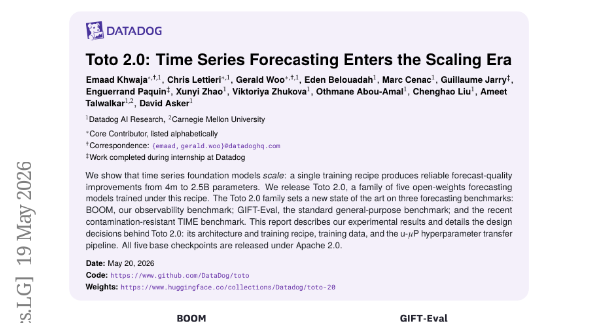

### 📌 한 줄 요약
4M에서 2.5B 파라미터까지 스케일링이 가능한 시계열 파운데이션 모델 Toto 2.0 공개

### 🔑 핵심 포인트
- 4M~2.5B 파라미터 규모에서 작동하는 일관된 시계열 학습 레시피 개발
- 주요 시계열 벤치마크(BOOM, GIFT-Eval, TIME)에서 SOTA 달성
- u-muP 하이퍼파라미터 전이 파이프라인을 통한 효율적인 스케일링 전략

### 🧑‍💻 개발자 관점
스케일링 법칙이 적용된 고성능 시계열 파운데이션 모델을 오픈 소스로 사용할 수 있어, 도메인 특화 예측 모델 구축 시 강력한 베이스라인이 됩니다.

### 🚀 실무 적용 아이디어
- 공개된 5종의 체크포인트를 다양한 규모의 데이터셋에 적용하여 스케일링 효과 검증
- u-muP 파이프라인을 활용한 하이퍼파라미터 최적화 실험
- 기존 시계열 모델과 Toto 2.0의 예측 정확도 및 추론 속도 비교

### ⚠️ 리스크/한계
- 모델 규모가 커짐에 따른 컴퓨팅 자원 요구량 증가
- 특정 도메인 데이터에 대한 일반화 성능 검증 필요

### 📝 초록 기반 상세 설명
시계열 예측 분야에서도 대규모 모델의 스케일링 법칙이 유효함을 입증하고자 합니다. 기존 모델들의 성능 한계를 극복하기 위해 4M에서 2.5B 파라미터 범위의 단일 학습 레시피를 제안합니다. 이를 바탕으로 개발된 Toto 2.0 모델군은 BOOM, GIFT-Eval, TIME 등 주요 벤치마크에서 새로운 SOTA를 달성했습니다. 연구진은 모델 아키텍처, 학습 데이터, 그리고 u-muP 하이퍼파라미터 전이 파이프라인을 상세히 기술합니다. 최종적으로 5종의 오픈 웨이트 모델을 Apache 2.0 라이선스로 공개하여 연구 및 실무 활용도를 높였습니다.

### 🖼️ 추가 자료
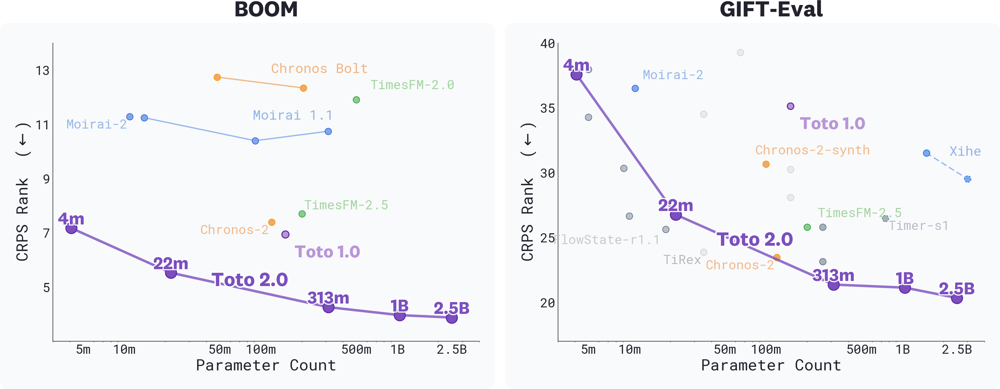
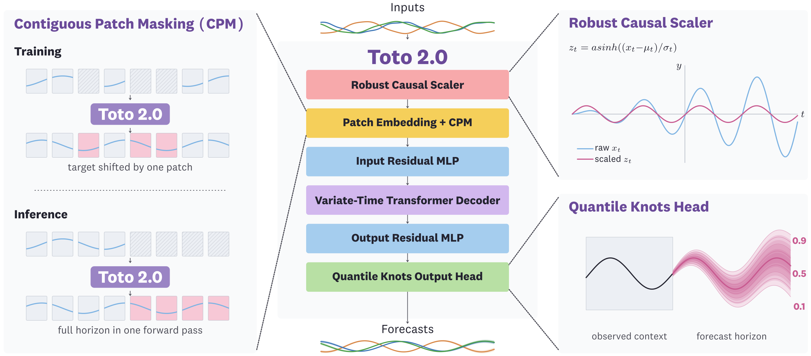

---

## 10. [Mix-Quant: Quantized Prefilling, Precise Decoding for Agentic LLMs](https://huggingface.co/papers/2605.20315)
**Upvotes**: 22 | **도입 난이도**: 중 | **신뢰도**: 상
**arXiv**: https://arxiv.org/abs/2605.20315

**태그**: LLM-Agent, Quantization, Inference-Optimization, Long-Context, Agent, RAG, Benchmark, Evaluation, Inference, Optimization

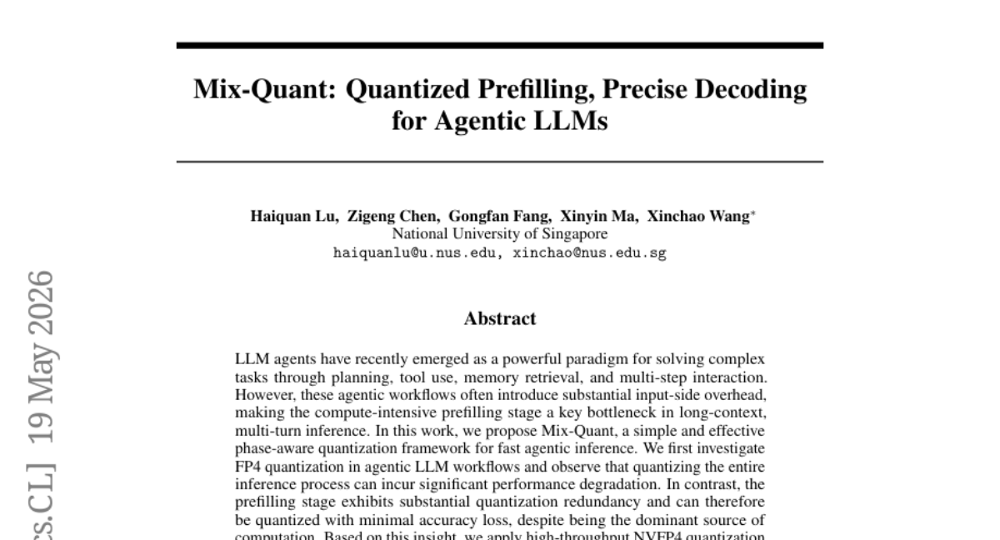

### 📌 한 줄 요약
에이전트 워크플로우의 병목인 프리필링(Prefilling) 단계에만 선택적 양자화를 적용하여 성능 저하 없이 추론 속도를 극대화하는 프레임워크

### 🔑 핵심 포인트
- 단계별 차별화된 양자화(Phase-aware Quantization) 전략 도입
- 프리필링 단계의 연산 중복성을 활용한 NVFP4 가속 및 디코딩 정밀도 유지
- 에이전트 워크플로우 특화: 연산 효율과 추론 정확도 사이의 트레이드오프 최적화

### 🧑‍💻 개발자 관점
긴 컨텍스트를 다루는 에이전트 시스템 구축 시, 응답 지연(Latency)을 획기적으로 줄이면서도 모델의 추론 능력을 보존할 수 있는 실전적인 최적화 기법입니다.

### 🚀 실무 적용 아이디어
- 긴 컨텍스트 입력 시 프리필링과 디코딩 단계별 소요 시간 변화 측정
- FP4 양자화 적용 시 에이전트의 계획(Planning) 및 도구 사용 능력 변화 모니터링
- 하드웨어(NVFP4 지원 GPU) 환경에서의 실제 처리량(Throughput) 벤치마크

### ⚠️ 리스크/한계
- NVFP4와 같은 특정 하드웨어 가속 기능에 의존할 가능성
- 프리필링 단계의 양자화가 특정 복잡한 태스크에서 미세한 성능 저하를 유발할 위험

### 📝 초록 기반 상세 설명
LLM 에이전트는 복잡한 작업을 위해 긴 컨텍스트와 다회차 상호작용을 수행하며, 이 과정에서 발생하는 프리필링 단계의 연산 부하가 주요 병목이 됩니다. 기존의 전체 과정 양자화는 에이전트의 작업 성능을 크게 저하시키는 문제가 있었습니다. 본 논문은 프리필링 단계의 높은 양자화 중복성을 활용하여, 프리필링은 NVFP4로 가속하고 디코딩은 BF16 정밀도를 유지하는 Mix-Quant를 제안합니다. 이를 통해 연산 집약적인 프리필링 단계와 품질이 중요한 디코딩 단계를 분리하여 최적화했습니다. 실험 결과, 에이전트 작업 성능을 유지하면서도 프리필링 속도를 최대 3배까지 향상시켰습니다.

---

## 11. [Generative Recursive Reasoning](https://huggingface.co/papers/2605.19376)
**Upvotes**: 18 | **도입 난이도**: 상 | **신뢰도**: 상
**arXiv**: https://arxiv.org/abs/2605.19376

**태그**: Generative Model, Reasoning, Latent Variable, Inference-time Scaling, Inference

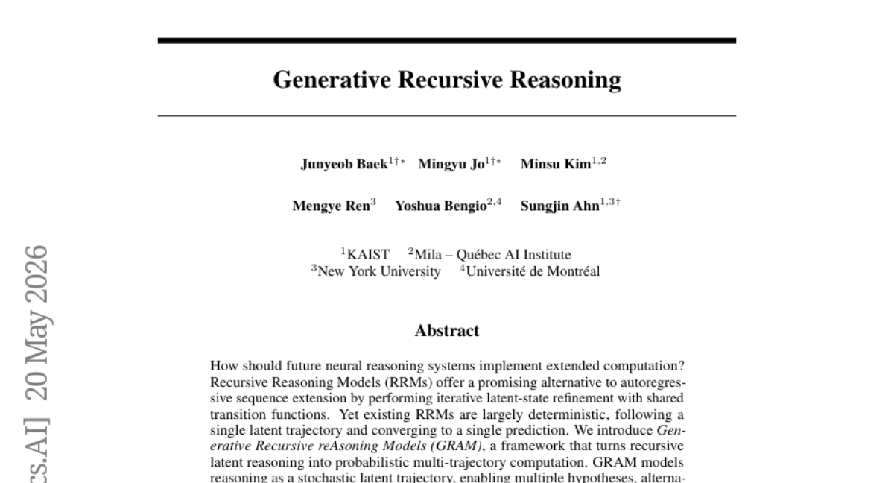

### 📌 한 줄 요약
재귀적 잠재 상태 정제에 확률적 다중 경로 샘플링을 결합하여 추론 능력과 생성 능력을 동시에 확보한 프레임워크

### 🔑 핵심 포인트
- 결정론적 재귀 모델을 확률적 다중 궤적 모델로 확장하여 추론의 다양성 확보
- 재귀적 깊이와 병렬 샘플링을 결합한 새로운 방식의 추론 시점 스케일링(Inference-time scaling) 제공
- 조건부 추론(p(y|x))과 비조건부 생성(p(x))이 모두 가능한 잠재 변수 생성 모델 구축

### 🧑‍💻 개발자 관점
단일 정답이 아닌 다양한 해결책이 필요한 복잡한 문제에서, 추론 시점에 연산량을 조절하며 정답 확률을 높이는 전략을 학습할 수 있습니다.

### 🚀 실무 적용 아이디어
- 기존 결정론적 RRM 모델과 GRAM의 추론 경로 다양성 비교 실험
- 추론 시점의 샘플링 수(Parallel trajectories) 변화에 따른 성능 변화 측정
- 제약 조건이 까다로운 수학적/논리적 문제셋에 대한 벤치마크 테스트

### ⚠️ 리스크/한계
- 다중 궤적 샘플링 시 발생하는 높은 추론 비용(Inference overhead)
- 변분 추론 학습 시 잠재 공간의 복잡도로 인한 수렴 안정성 문제

### 📝 초록 기반 상세 설명
기존의 재귀적 추론 모델(RRM)은 결정론적 경로를 따르기 때문에 단일 예측에 수렴하는 한계가 있었습니다. 이를 해결하기 위해 본 논문은 재귀적 잠제 추론을 확률적 다중 궤적 계산으로 전환하는 GRAM 프레임워크를 제안합니다. GRAM은 추론 과정을 확률적 잠재 궤적으로 모델링하여, 여러 가설과 대안적 해결 전략을 탐색할 수 있게 합니다. 이를 통해 재귀적 깊이와 병렬 샘플링을 통한 추론 시점 스케일링(Inference-time scaling)이 가능해집니다. 변분 추론(Variational Inference)을 통해 학습된 GRAM은 구조적 추론 및 제약 조건 만족 작업에서 기존 모델을 상회하며, 조건부 추론뿐만 아니라 비조건부 생성 능력도 보여줍니다.

### 🖼️ 추가 자료
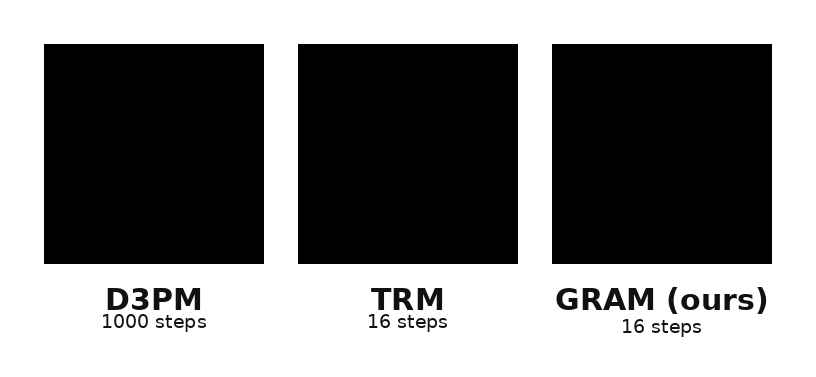
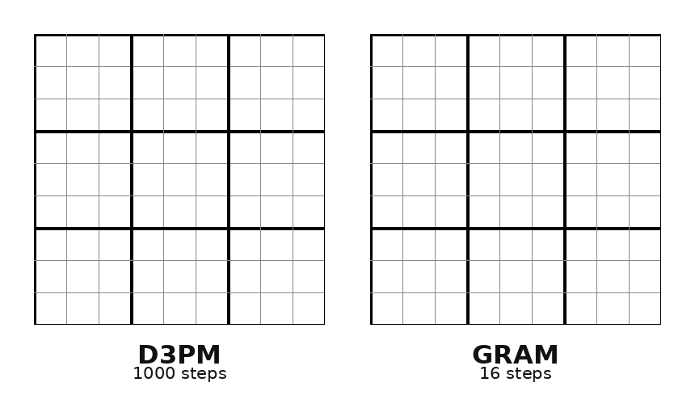

---

## 12. [CutVerse: A Compositional GUI Agents Benchmark for Media Post-Production Editing](https://huggingface.co/papers/2605.19484)
**Upvotes**: 18 | **도입 난이도**: 중 | **신뢰도**: 상
**arXiv**: https://arxiv.org/abs/2605.19484

**태그**: GUI Agent, Benchmark, Multimodal, Automation, Agent, Evaluation, Safety

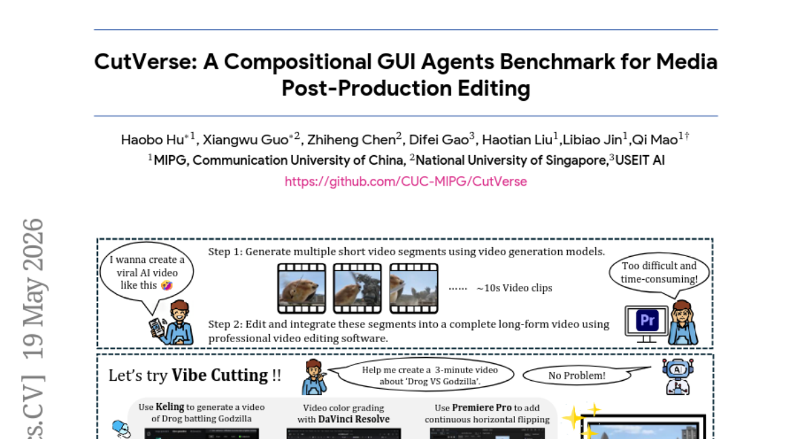

### 📌 한 줄 요약
전문적인 미디어 편집 워크플로우를 위한 복합 GUI 에이전트 벤치마크 'CutVerse' 제안

### 🔑 핵심 포인트
- 7개 전문 미디어 앱 기반의 186개 복합/장기 작업 시나리오 구축
- 화면 기록 및 로그를 구조화된 데이터로 변환하는 경량 파서 개발
- 전문가 수준의 밀도 높은 멀티모달 인터페이스 환경 제공

### 🧑‍💻 개발자 관점
단순 웹 조작을 넘어 복잡한 UI와 정교한 작업 순서가 필요한 전문 소프트웨어 자동화 에이전트 개발의 기준점을 제시합니다.

### 🚀 실무 적용 아이디어
- 제공된 벤치마크 데이터셋을 활용한 기존 멀티모달 모델의 성능 테스트
- 장기적 작업 계획(Long-horizon planning) 능력 향상을 위한 프롬프트 엔지니어링 실험
- 도메인 특화 UI 요소 인식 성능 비교 분석

### ⚠️ 리스크/한계
- 전문가 수준의 복잡한 워크플로우로 인해 기존 범용 모델의 성능 저하 가능성
- 특정 도메인(미디어 편집)에 특화된 데이터셋으로서의 범용성 한계

### 📝 초록 기반 상세 설명
기존 GUI 에이전트는 웹 탐색에는 능숙하지만 전문적인 크리에이티브 작업 수행 능력은 미흡한 상태입니다. 이를 해결하기 위해 전문적인 미디어 후반 작업 환경을 반영한 벤치마크인 CutVerse를 도입합니다. Premiere Pro, Photoshop 등 7개 전문 앱을 활용하여 186개의 복잡하고 장기적인 작업 시나리오를 구축했습니다. 또한, 화면 녹화와 로그를 구조화된 액션 궤적으로 변환하는 경량 파서를 개발하여 확장 가능한 평가 환경을 마련했습니다. 실험 결과, 기존 에이전트들은 복잡한 편집 워크플로우에서 낮은 성공률을 보이며 장기적 신뢰성과 도메인 특화 계획 수립의 한계를 드러냈습니다.

---

## 13. [Uni-Edit: Intelligent Editing Is A General Task For Unified Model Tuning](https://huggingface.co/papers/2605.21487)
**Upvotes**: 17 | **도입 난이도**: 중 | **신뢰도**: 상
**arXiv**: https://arxiv.org/abs/2605.21487

**태그**: Multimodal, Image Editing, Data Synthesis, Model Tuning, Reasoning, Vision

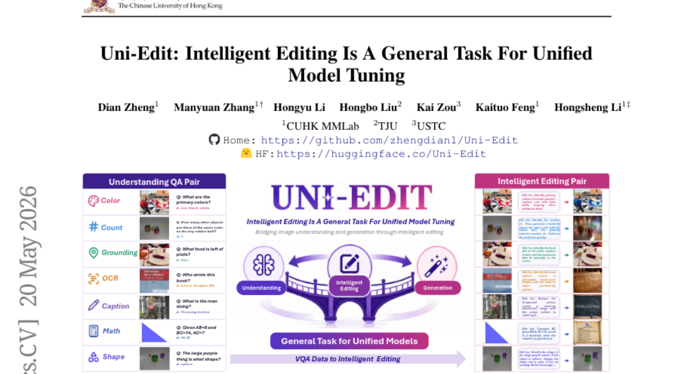

### 📌 한 줄 요약
이미지 편집을 범용 태스크로 정의하여, 단일 학습 단계만으로 이해·생성·편집 능력을 동시에 강화하는 통합 튜닝 방법론

### 🔑 핵심 포인트
- 이미지 편집을 이해와 생성을 동시에 요구하는 범용 튜닝 태스크로 재정의
- VQA 데이터를 활용한 복잡한 추론 기반의 자동화된 데이터 합성 파이프라인 개발
- 단일 태스크/단일 단계 학습만으로 멀티모달 모델의 전반적인 성능 향상 달성

### 🧑‍💻 개발자 관점
복잡한 멀티태스크 믹싱 전략 없이도 단일 목적의 데이터셋만으로 모델의 다각적 능력을 최적화할 수 있는 효율적인 튜닝 패러다임을 제시합니다.

### 🚀 실무 적용 아이디어
- 제시된 데이터 합성 파이프라인을 활용하여 보유 중인 VQA 데이터셋 변환 실험
- 기존 멀티태스크 학습 모델과 Uni-Edit 단일 학습 모델 간의 성능 및 효율성 비교
- 특정 도메인 데이터셋에 대한 Uni-Edit의 범용성 검증

### ⚠️ 리스크/한계
- 데이터 합성 방식에 따른 특정 추론 패턴에 대한 모델 편향 가능성
- 매우 복잡한 편집 요구사항에 대한 생성 품질의 한계 여부 확인 필요

### 📝 초록 기반 상세 설명
기존의 멀티모달 모델(UMM)은 이해, 생성, 편집 능력을 동시에 확보하기 위해 복잡한 멀티태스크 학습을 수행하며, 이 과정에서 태스크 간 충돌과 성능 저하가 발생합니다. 이를 해결하기 위해 본 논문은 이미지 편집을 이해와 생성이 결합된 이상적인 범용 태스크로 정의하고 'Uni-Edit'을 제안합니다. 기존의 단순한 편집 데이터 대신, VQA 데이터를 활용해 복잡한 추론과 중첩된 논리가 포함된 자동화된 데이터 합성 파이프라인을 구축했습니다. 이를 통해 생성된 Uni-Edit-148k 데이터셋을 사용하여 단일 단계의 튜닝을 진행합니다. 실험 결과, 별도의 보조 작업 없이도 모델의 이해, 생성, 편집 능력이 모두 상호 보완적으로 향상됨을 입증했습니다.

---

## 14. [LLMEval-Logic: A Solver-Verified Chinese Benchmark for Logical Reasoning of LLMs with Adversarial Hardening](https://huggingface.co/papers/2605.19597)
**Upvotes**: 16 | **도입 난이도**: 하 | **신뢰도**: 상
**arXiv**: https://arxiv.org/abs/2605.19597

**태그**: LLM Evaluation, Logical Reasoning, Adversarial Training, Formal Verification, Reasoning, Benchmark, Evaluation

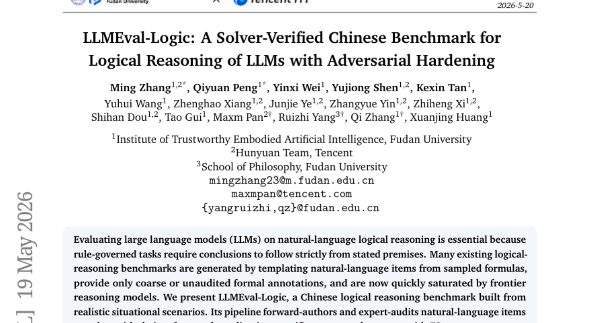

### 📌 한 줄 요약
Z3 솔버 검증과 적대적 학습을 통해 기존 벤치마크의 포화 문제를 해결한 고난도 중국어 논리 추론 벤치마크 제안

### 🔑 핵심 포인트
- Z3 솔버를 활용한 정답 및 형식화(Formalization) 검증 프로세스 도입
- 적대적 워크플로우를 통한 문제 난이도 강화 및 모델 포화 방지
- 자연어 문항과 정밀한 채점 루브릭이 결합된 고난도 중국어 논리 벤치마크 구축

### 🧑‍💻 개발자 관점
LLM의 논리적 추론 능력을 단순 정답 맞추기가 아닌, 엄격한 형식적 검증과 복합적인 단계로 평가할 수 있는 기준을 제공합니다.

### 🚀 실무 적용 아이디어
- 자사 모델의 논리적 추론 한계를 테스트하기 위해 LLMEval-Logic 데이터셋 적용
- 모델의 정답률뿐만 아니라 Z3 기반의 형식화 점수(Formalization score) 측정 실험
- 적대적 강화 기법이 모델의 추론 성능에 미치는 영향 분석

### ⚠️ 리스크/한계
- 중국어 중심의 벤치마크로 타 언어에 대한 일반화 가능성 확인 필요
- 고난도 문제로 인해 모델 평가 시 비용 및 시간 소요가 클 수 있음

### 📝 초록 기반 상세 설명
기존의 자연어 논리 추론 벤치마크는 템플릿 기반 생성 방식으로 인해 정밀도가 낮고 최신 모델들에 의해 쉽게 포화되는 문제가 있습니다. 이를 해결하기 위해 현실적인 시나리오를 기반으로 한 LLMEval-Logic 벤치마크를 제안합니다. 이 벤치마크는 Z3 솔버를 통한 정답 검증, 전문가 루브릭 구축, 그리고 폐쇄 루프 적대적 워크플로우를 통한 문제 강화 과정을 거칩니다. 결과적으로 Base와 Hard 두 가지 하위 집합을 제공하며, 최신 모델들도 낮은 정확도를 보이는 높은 난이도를 확보했습니다. 실험 결과, 현존하는 최상위 모델들도 이 벤치마크의 고난도 문항에서 상당한 성능 격차를 보였습니다.

### 🖼️ 추가 자료
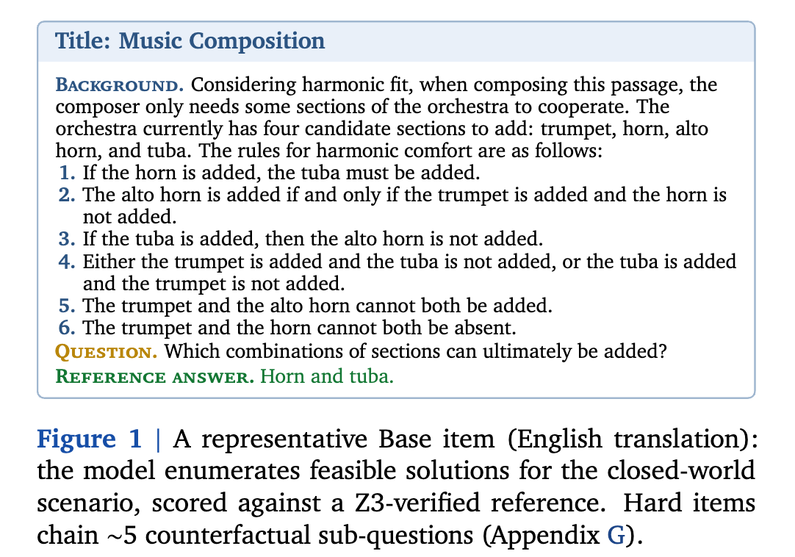
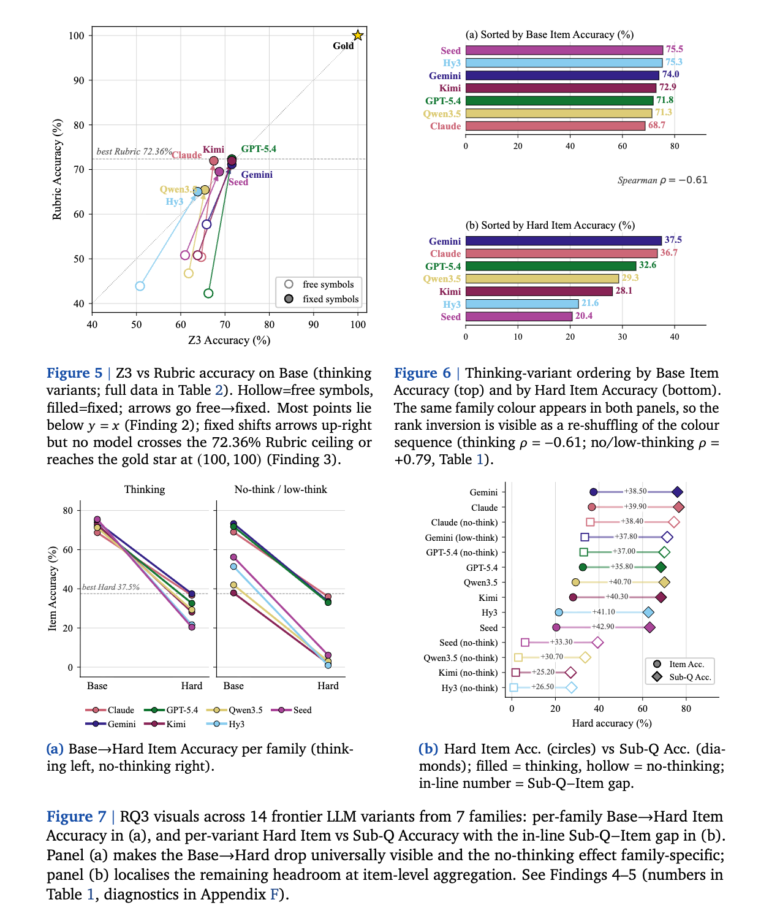
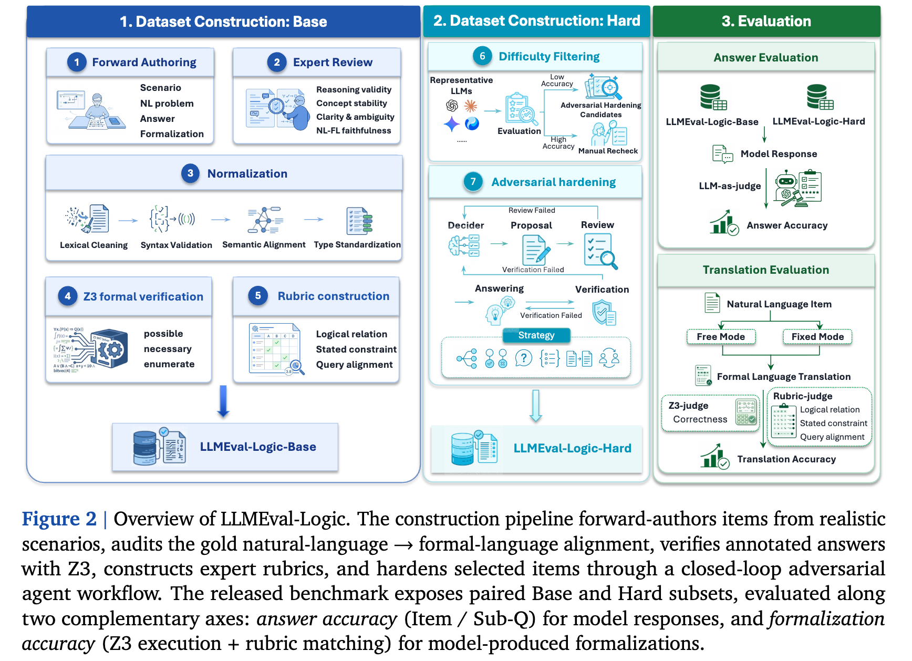

---

## 15. [HRM-Text: Efficient Pretraining Beyond Scaling](https://huggingface.co/papers/2605.20613)
**Upvotes**: 11 | **도입 난이도**: 상 | **신뢰도**: 상
**arXiv**: https://arxiv.org/abs/2605.20613

**태그**: Efficient Training, Architecture Design, Small Language Models, Recurrent Models

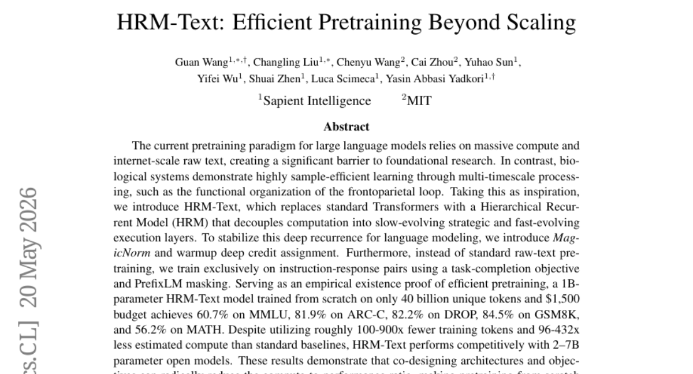

### 📌 한 줄 요약
아키텍처와 학습 목적 함수를 재설계하여 최소한의 데이터와 컴퓨팅 자원으로 고성능 언어 모델을 구축하는 효율적 사전학습 방법론

### 🔑 핵심 포인트
- 전략적/실행적 계층을 분리하여 연산 효율을 높인 Hierarchical Recurrent Model (HRM) 아키텍처 제안
- MagicNorm 및 warmup deep credit assignment를 통한 심층 순환 구조의 학습 안정화
- Raw-text 대신 Instruction-response 쌍과 PrefixLM 마스킹을 활용한 고효율 학습 전략

### 🧑‍💻 개발자 관점
막대한 자원 없이도 특정 목적에 최적화된 고성능 소형 모델을 밑바닥부터(from scratch) 학습시킬 수 있는 새로운 경로를 제시합니다.

### 🚀 실무 적용 아이디어
- 제안된 HRM 아키텍처의 순환 구조가 기존 Transformer 대비 추론 속도에 미치는 영향 분석
- 특정 도메인 데이터셋에 대해 instruction-only 학습의 일반화 성능 테스트
- MagicNorm과 같은 안정화 기법을 기존 RNN/Transformer 변형 모델에 적용 실험

### ⚠️ 리스크/한계
- 매우 적은 데이터로 학습되므로 일반적인 상식이나 광범위한 지식 습득에는 한계가 있을 수 있음
- 새로운 아키텍처(HRM) 도입 시 기존 하드웨어 가속기(GPU) 최적화 및 커스텀 커널 구현 필요

### 📝 초록 기반 상세 설명
현재의 거대 언어 모델 사전학습은 막대한 컴퓨팅 자원과 방대한 데이터에 의존하여 연구 진입 장벽이 높습니다. 본 논문은 생물학적 시스템의 다중 시간 척도 처리 방식에서 영감을 얻어, 전략적 계층과 실행 계층을 분리한 계층적 순환 모델(HRM)을 제안합니다. 학습 안정성을 위해 MagicNorm과 warmup deep credit assignment 기법을 도입하였으며, 일반 텍스트 대신 지시어-응답 쌍만을 활용한 태스크 완료 목적 함수로 학습을 진행합니다. 실험 결과, 1B 파라미터 모델이 매우 적은 토큰과 비용만으로도 기존 2-7B 모델 수준의 성능을 달성했습니다. 이는 아키텍처와 목적 함수의 공동 설계가 컴퓨팅 효율성을 극대화할 수 있음을 입증합니다.

---

## 16. [Evaluating Temporal Semantic Caching and Workflow Optimization in Agentic Plan-Execute Pipelines](https://huggingface.co/papers/2605.20630)
**Upvotes**: 9 | **도입 난이도**: 중 | **신뢰도**: 상
**arXiv**: https://arxiv.org/abs/2605.20630

**태그**: AI Agent, Workflow Optimization, Caching Strategy, MCP, Industrial AI, Agent, Benchmark, Evaluation, Inference

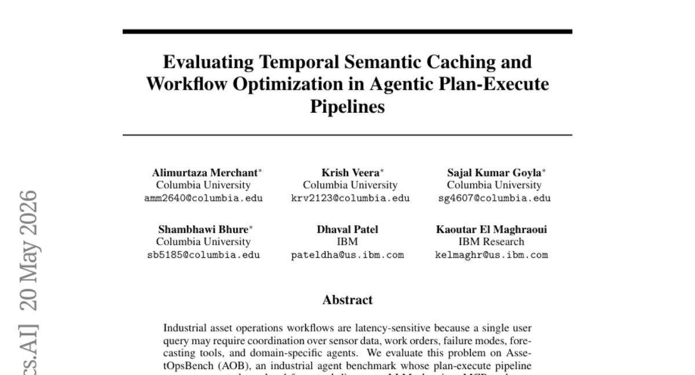

### 📌 한 줄 요약
산업용 에이전트 워크플로우의 지연 시간을 줄이기 위한 시계열 기반 시맨틱 캐싱 및 MCP 워크플로우 최적화 기법 제안

### 🔑 핵심 포인트
- 시계열적 특성을 반영한 시맨틱 캐싱 레이어 제안
- MCP 기반의 도구 검색 캐싱 및 의존성 인식 병렬 실행 최적화
- 파라미터 민감도가 높은 산업용 에이전트 환경에서의 캐싱 오류 분석

### 🧑‍💻 개발자 관점
에이전트가 도구 호출과 계획 수립을 반복하는 복잡한 워크플로우에서, 단순 텍스트 유사도가 아닌 데이터의 시간적/파라미터적 유효성을 고려한 캐싱 전략이 필수적임을 시사합니다.

### 🚀 실무 적용 아이디어
- 에이전트 워크플로우 내 도구 검색(Tool Discovery) 단계의 캐싱 적용 실험
- 파라미터 변화에 따른 시맨틱 캐시의 정답률(Correctness) 변화 측정
- 의존성 그래프를 활용한 에이전트 단계별 병렬 실행 구조 설계

### ⚠️ 리스크/한계
- 캐시 히트 시 데이터의 시간적 유효성(Staleness) 문제 발생 가능성
- 복잡한 의존성 관계를 가진 워크플로우에서 병렬화 시 발생하는 레이스 컨디션 위험

### 📝 초록 기반 상세 설명
산업 현장의 에이전트 워크플로우는 센서 데이터와 도구 간의 복잡한 협업이 필요하여 지연 시간에 매우 민감합니다. 기존의 KV-캐시나 임베딩 기반 시맨틱 캐싱은 시간이나 파라미터 변화에 따른 출력 유효성 문제를 해결하지 못하는 한계가 있습니다. 본 논문은 이를 해결하기 위해 시계열 시맨틱 캐시와 MCP(Model Context Protocol) 기반의 워크플로우 최적화(도구 검색 캐싱 및 의존성 기반 병렬 실행)를 제안합니다. 실험 결과, 워크플로우 최적화는 약 40%의 지연 시간 감소를, 시계열 캐시는 히트 시 30.6배의 속도 향상을 달성했습니다. 또한, 파라미터가 중요한 산업용 쿼리에서 단순 시맨틱 캐싱이 초래할 수 있는 오류 가능성을 분석했습니다.

---

## 17. [On the limits and opportunities of AI reviewers: Reviewing the reviews of Nature-family papers with 45 expert scientists](https://huggingface.co/papers/2605.20668)
**Upvotes**: 9 | **도입 난이도**: 중 | **신뢰도**: 상
**arXiv**: https://arxiv.org/abs/2605.20668

**태그**: LLM, Agent, Evaluation, Peer Review, Safety

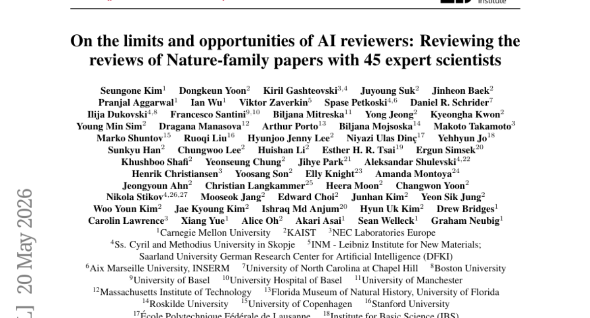

### 📌 한 줄 요약
AI 리뷰어의 역량을 정밀 분석하여 인간 리뷰어와의 상호보완적 활용 가능성을 제시한 연구

### 🔑 핵심 포인트
- 단순 판정 일치도를 넘어 정확성, 중요성, 증거 충분성을 기준으로 한 정밀 평가 프레임워크 제시
- AI 리뷰어가 인간이 발견하지 못하는 새로운 이슈를 식별할 수 있는 잠재력 확인
- 리뷰어 간 과도한 중복성 및 특정 도메인 지식 부족 등 AI의 구조적 한계 규명

### 🧑‍💻 개발자 관점
LLM 기반 에이전트를 활용한 자동 검토 시스템 설계 시, 단순 결과 예측이 아닌 비평의 질적 측면을 어떻게 평가하고 제어할지에 대한 가이드라인을 제공합니다.

### 🚀 실무 적용 아이디어
- LLM 기반 리뷰 에이전트의 비평 항목별(정확성, 중요성 등) 정량적 평가 파이프라인 구축
- 인간 리뷰어의 다양한 관점을 모사하기 위한 멀티 에이전트(Multi-agent) 전략 실험
- AI의 과도한 중복성을 줄이기 위한 페르소나 기반 프롬프트 엔지니어링 테스트

### ⚠️ 리스크/한계
- 특정 분야에 국한된 지식 및 긴 문맥 관리 능력의 한계로 인한 오판 가능성
- 사소한 문제에 과도하게 집착하거나 인간과 다른 편향된 비평 스타일 발생

### 📝 초록 기반 상세 설명
AI 리뷰어의 도입이 가속화되고 있으나, 기존의 단순 판정 일치도 중심 평가 방식은 AI의 실제 역량을 파악하기에 부족했습니다. 본 연구는 45명의 전문가가 82편의 Nature 계열 논문에 대한 2,960개의 비평을 직접 평가하는 대규모 실험을 수행했습니다. 실험 결과, 특정 모델은 최고 수준의 인간 리뷰어보다 높은 종합 점수를 기록했으며, 인간이 놓치는 26%의 독자적인 이슈를 발견하기도 했습니다. 그러나 AI는 리뷰어 간 중복도가 지나치게 높고, 세부 분야 지식 부족 및 문맥 관리 한계와 같은 16가지 고유한 약점을 보였습니다. 결론적으로 AI 리뷰어는 인간을 대체하기보다는 상호보완적인 도구로서의 가치를 지닙니다.

---

## 18. [OcclusionFormer: Arranging Z-Order for Layout-Grounded Image Generation](https://huggingface.co/papers/2605.21343)
**Upvotes**: 7 | **도입 난이도**: 상 | **신뢰도**: 상
**arXiv**: https://arxiv.org/abs/2605.21343

**태그**: Diffusion, Image Generation, Computer Vision, Layout-to-Image, Vision, Safety

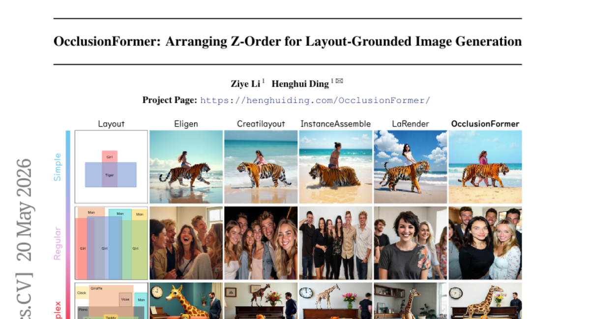

### 📌 한 줄 요약
객체 간 겹침(Occlusion) 문제를 해결하기 위해 Z-order(깊이 순서)를 명시적으로 모델링하여 레이아웃 기반 이미지 생성의 정확도를 높인 프레임워크

### 🔑 핵심 포인트
- 명시적 가려짐 순서(Z-order)를 학습하기 위한 대규모 데이터셋 SA-Z 구축
- 인스턴스 분리 및 볼륨 렌더링 기반의 Occlusion-aware Diffusion Transformer 제안
- 세밀한 공간 정밀도와 의미적 일관성을 위한 Queried Alignment Loss 도입

### 🧑‍💻 개발자 관점
레이아웃 기반 생성 시 객체가 겹칠 때 발생하는 그래픽 오류를 줄여, 보다 현실적이고 제어 가능한 이미지 생성 파이프라인을 구축할 수 있습니다.

### 🚀 실무 적용 아이디어
- SA-Z 데이터셋의 특성과 레이아웃 구성 방식 분석
- 볼륨 렌더링 기반 합성 방식이 기존 Diffusion 모델과 어떻게 다른지 실험적 검토
- 복잡한 레이어 구조를 가진 데이터셋에 대한 모델 성능 테스트

### ⚠️ 리스크/한계
- 볼륨 렌더링 및 인스턴스 분리 과정에서의 연산 복잡도 증가 가능성
- 데이터셋의 복잡도에 따른 학습 난이도 및 생성 속도 저하 우려

### 📝 초록 기반 상세 설명
최근 레이아웃 기반 이미지 생성 기술은 발전했으나, 바운딩 박스가 겹치는 영역에서의 객체 간 가려짐(Occlusion) 처리에 어려움을 겪고 있습니다. 기존 방식은 겹치는 영역의 정보가 부족하여 텍스처가 엉키거나 물리적으로 부자연스러운 레이어링이 발생하는 문제가 있었습니다. 이를 해결하기 위해 연구진은 명시적인 가려짐 순서와 픽셀 단위 주석이 포함된 대규모 데이터셋인 SA-Z를 구축했습니다. 이를 기반으로 제안된 OcclusionFormer는 인스턴스를 분리하고 볼륨 렌더링을 통해 합성하는 방식으로 Z-order 우선순위를 명시적으로 모델링하는 Diffusion Transformer 프레임워크입니다. 또한, 개별 인스턴스를 정밀하게 제어하기 위해 쿼리 기반 정렬 손실(Queried Alignment Loss)을 도입했습니다. 결과적으로 겹치는 영역의 모호성을 줄이고 정확한 가려짐 관계를 구현하여 구조적 무결성을 확보했습니다.

---

## 19. [Stable Audio 3](https://huggingface.co/papers/2605.17991)
**Upvotes**: 7 | **도입 난이도**: 중 | **신뢰도**: 상
**arXiv**: https://arxiv.org/abs/2605.17991

**태그**: Audio Generation, Diffusion Model, Audio Editing, Latent Diffusion, RAG, Audio, Inference

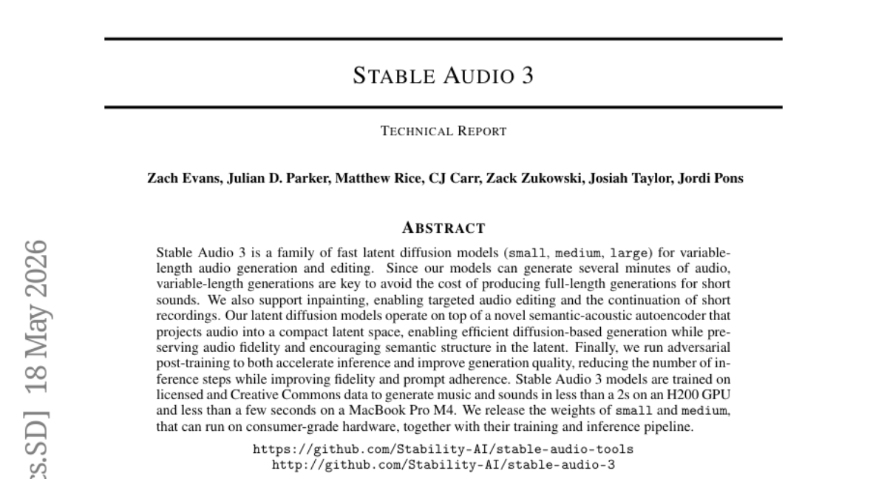

### 📌 한 줄 요약
고성능 오디오 편집 및 장기 생성을 지원하는 효율적인 잠재 확산 모델(Latent Diffusion Model) 프레임워크

### 🔑 핵심 포인트
- 시맨틱-어쿠스틱 오토인코더를 통한 효율적인 잠재 공간 투영
- 인페인팅 기능을 통한 타겟 오디오 편집 및 연속 생성 지원
- 적대적 사후 학습을 통한 추론 가속화 및 생성 품질 향상

### 🧑‍💻 개발자 관점
소비자급 하드웨어에서도 구동 가능한 모델 가중치가 공개되어, 로컬 환경에서 고품질 오디오 생성 및 편집 서비스를 구축할 수 있습니다.

### 🚀 실무 적용 아이디어
- 공개된 Small/Medium 모델을 로컬 환경(MacBook/Consumer GPU)에 배포 및 성능 테스트
- 인페인팅 기능을 활용한 오디오 편집 워크플로우 실험
- 가변 길이 생성 기능이 실제 서비스 시나리오에서 비용을 얼마나 절감하는지 검증

### ⚠️ 리스크/한계
- 모델 크기에 따른 생성 품질 및 복잡도 차이 존재
- 고성능 하드웨어(H200 등) 대비 소비자급 하드웨어에서의 성능 제약 가능성

### 📝 초록 기반 상세 설명
기존 오디오 생성 모델은 긴 길이의 오디오를 생성할 때 비용과 효율성 문제가 발생할 수 있습니다. 이를 해결하기 위해 Stable Audio 3는 가변 길이 생성이 가능한 잠재 확산 모델 패밀리를 제안합니다. 새로운 시맨틱-어쿠스틱 오토인코더를 통해 오디오를 압축된 잠재 공간으로 투영하여 효율성과 충실도를 동시에 확보했습니다. 또한 인페인팅 기능을 통해 특정 부분 편집 및 오디오 연속 생성을 지원합니다. 적대적 사후 학습(Adversarial post-training)을 통해 추론 속도를 높이고 프롬프트 준수 능력을 개선했습니다. 결과적으로 소비자급 하드웨어에서도 빠르게 구동 가능한 고품질 오디오 생성 파이프라인을 구축했습니다.

---

## 20. [Stitched Value Model for Diffusion Alignment](https://huggingface.co/papers/2605.19804)
**Upvotes**: 5 | **도입 난이도**: 하 | **신뢰도**: 상
**arXiv**: https://arxiv.org/abs/2605.19804

**태그**: Diffusion, Generative Models, Reward Modeling, Model Stitching, Vision, Safety

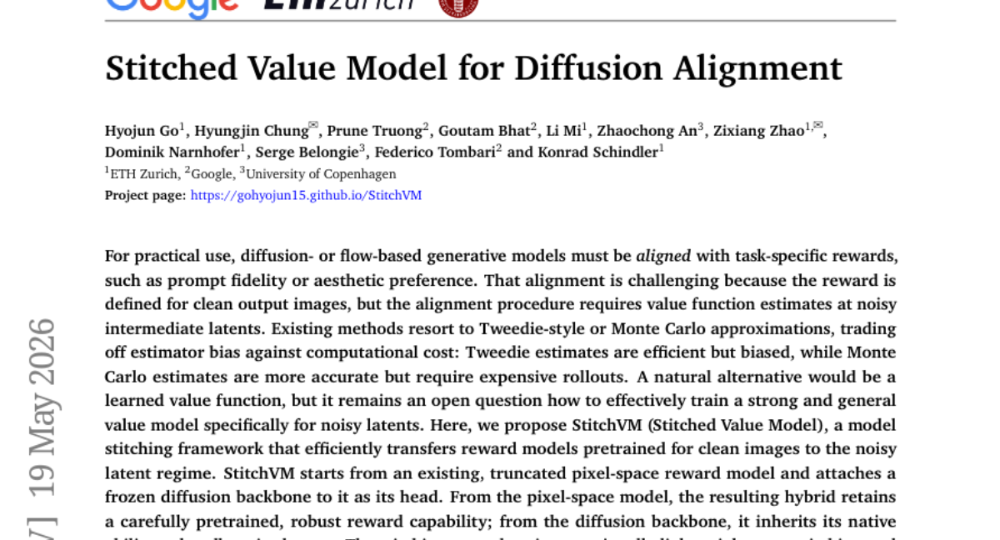

### 📌 한 줄 요약
기존 픽셀 기반 보상 모델을 노이즈가 섞인 잠재 공간(Latent Space)으로 효율적으로 전이하여 디퓨전 정렬 속도와 성능을 혁신하는 모델 스티칭 프레임워크

### 🔑 핵심 포인트
- StitchVM: 픽셀 기반 보상 모델과 디퓨전 백본을 결합하여 노이즈 잠재 공간에 최적화된 가치 함수 구축
- 효율적인 전이 학습: 기존 모델의 강점(보상 능력)과 디퓨전 모델의 강점(노이즈 처리)을 가볍게 결합
- 연산 효율성 극대화: 샘플별 근사 방식 대신 학습된 가치 함수를 사용하여 정렬 과정의 비용을 획기적으로 절감

### 🧑‍💻 개발자 관점
디퓨전 모델 정렬 시 발생하는 막대한 연산 비용과 메모리 문제를 해결하여, 실시간에 가까운 고품질 이미지 생성 및 제어가 가능해집니다.

### 🚀 실무 적용 아이디어
- 기존 CLIP 기반 보상 모델에 SD 백본을 결합하는 스티칭 실험 수행
- DPS(Diffusion Posterior Sampling)와 StitchVM 결합 시의 속도 및 메모리 변화 측정
- 다양한 노이즈 레벨에서의 가치 함수 추정 정확도 검증

### ⚠️ 리스크/한계
- 기존 보상 모델의 도메인에 따라 스티칭된 모델의 일반화 성능이 제한될 수 있음
- 백본 모델 간의 아키텍처 호환성 및 학습 안정성 확보 필요

### 📝 초록 기반 상세 설명
디퓨전 모델을 특정 태스크에 맞게 정렬하려면 노이즈가 포함된 중간 단계에서도 정확한 가치 함수(Value Function) 추정이 필요합니다. 기존 방식은 Tweedie 근사(편향 발생)나 Monte Carlo 방식(높은 연산 비용) 중 하나를 선택해야 하는 트레이드오프가 있었습니다. 본 논문은 픽셀 공간에서 학습된 보상 모델과 디퓨전 백본을 결합하는 'StitchVM' 프레임워크를 제안합니다. 이 방식은 기존 보상 모델의 성능을 유지하면서 디퓨전 모델의 노이즈 처리 능력을 결합하여 효율적인 가치 함수 학습을 가능하게 합니다. 실험 결과, DPS 및 DiffusionNFT와 같은 정렬 기법의 속도를 대폭 향상시키고 메모리 사용량을 절감하는 성과를 보였습니다.

---

## 21. [OCTOPUS: Optimized KV Cache for Transformers via Octahedral Parametrization Under optimal Squared error quantization](https://huggingface.co/papers/2605.21226)
**Upvotes**: 4 | **도입 난이도**: 중 | **신뢰도**: 상
**arXiv**: https://arxiv.org/abs/2605.21226

**태그**: LLM, Inference-Optimization, Quantization, KV-Cache, Video, Audio, Inference, Optimization

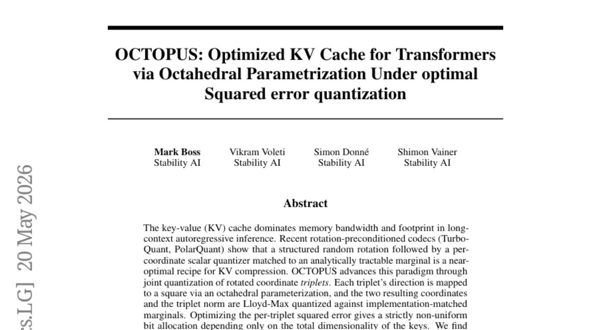

### 📌 한 줄 요약
팔면체 파라미터화를 통해 KV 캐시 압축 효율을 극대화하여 초저비트 환경에서도 성능 저하를 최소화한 최적화 기법

### 🔑 핵심 포인트
- 팔면체 파라미터화를 이용한 좌표 트리플렛(Triplet) 단위의 결합 양자화 기법 도입
- 데이터 의존성 없이 동작하는 데이터 무관(Data-oblivious) 및 결정론적(Deterministic) 알고리즘
- Triton 기반 퓨즈드(Fused) 구현을 통해 압축 해제 시 추가적인 대역폭 및 지연 시간 발생 방지

### 🧑‍💻 개발자 관점
초저비트 압축 환경에서도 모델 성능을 유지하면서 KV 캐시 용량을 획기적으로 줄일 수 있어, 메모리 제약이 큰 GPU 환경에서의 긴 컨텍스트 추론에 매우 유용합니다.

### 🚀 실무 적용 아이디어
- Triton 커널 구현체를 활용하여 기존 양자화(FP8, INT4) 대비 성능 및 속도 벤치마크 수행
- 매우 낮은 비트(Extreme compression) 환경에서 모델의 Perplexity 변화 측정
- Long-context 추론 시 메모리 점유율 감소량과 추론 속도 향상 폭 검증

### ⚠️ 리스크/한계
- 트리플렛 단위 연산으로 인해 기존 단순 스칼라 양자화 대비 구현 복잡도가 높음
- 매우 낮은 비트에서는 성능 우위가 크지만, 높은 비트 영역에서는 기존 방식과 차이가 미미할 수 있음

### 📝 초록 기반 상세 설명
긴 컨텍스트 추론 시 KV 캐시가 메모리 대역폭과 용량을 과도하게 점유하는 문제가 발생합니다. 기존의 회전 기반 양자화 방식은 개별 좌표 단위의 스칼라 양자화에 의존하는 한계가 있었습니다. OCTOPUS는 회전된 좌표 트리플렛을 팔면체 파라미터화(Octahedral Parametrization)를 통해 결합 양자화하는 방식을 제안합니다. 이를 통해 트리플렛의 방향과 노름을 최적의 제곱 오차(Squared Error) 기준으로 할당하여 비트 효율을 극대화합니다. 실험 결과, 텍스트·비디오·오디오 전 영역에서 기존 방식보다 우수한 압축 성능을 보였으며, 특히 낮은 비트율에서 성능 우위가 두드러졌습니다.

---

## 22. [MOCHA: Multi-Objective Chebyshev Annealing for Agent Skill Optimization](https://huggingface.co/papers/2605.19330)
**Upvotes**: 4 | **도입 난이도**: 중 | **신뢰도**: 상
**arXiv**: https://arxiv.org/abs/2605.19330

**태그**: LLM Agent, Prompt Optimization, Multi-Objective Optimization, Algorithm, Agent

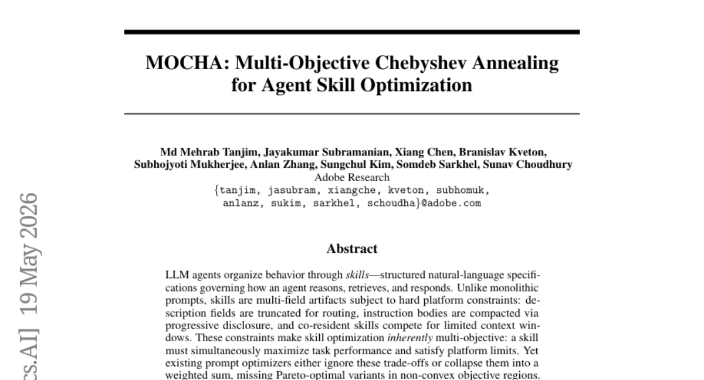

### 📌 한 줄 요약
멀티 오브젝트 체비쇼프 어닐링(MOCHA)을 통해 제약 조건이 있는 에이전트 스킬 최적화에서 성능과 효율성 사이의 파레토 최적해를 찾아내는 기법

### 🔑 핵심 포인트
- 체비쇼프 스칼라라이제이션을 통한 비볼록 영역의 파레토 프런트 탐색
- 탐색(Exploration)과 활용(Exploitation)의 균형을 위한 지수적 어닐링 도입
- 플랫폼 제약 조건(글자 수 제한 등)과 성능을 동시에 최적화하는 스킬 엔지니어링

### 🧑‍💻 개발자 관점
에이전트 설계 시 프롬프트 길이나 토큰 제한과 성능 사이의 트레이드오프를 수학적으로 정교하게 관리할 수 있는 방법론을 제공합니다.

### 🚀 실무 적용 아이디어
- 제한된 컨텍스트 윈도우 내에서 여러 스킬을 운용하는 멀티 에이전트 환경에 적용
- 프롬프트 길이 제한이 엄격한 API 환경에서의 스킬 최적화 실험
- 기존 가중치 합(Weighted Sum) 방식과 MOCHA 방식의 결과물 비교 분석

### ⚠️ 리스크/한계
- 스칼라라이제이션 과정에서 적절한 참조점(Reference point) 설정이 성능에 영향을 줄 수 있음
- 최적화 과정에서의 연산 비용 및 반복적인 롤아웃(Rollout) 필요성

### 📝 초록 기반 상세 설명
LLM 에이전트의 스킬은 설명 길이 제한이나 컨텍스트 윈도우 경쟁과 같은 하드웨어적/플랫폼적 제약 조건을 동시에 만족해야 합니다. 기존의 프롬프트 최적화 방식은 이러한 다중 목적(multi-objective) 문제를 단일 목적 함수로 단순화하여 비볼록(non-convex) 영역의 최적해를 놓치는 한계가 있었습니다. 본 논문은 체비쇼프 스칼라라이제이션(Chebyshev scalarization)과 지수적 어닐링을 결합한 MOCHA 프레임워크를 제안합니다. 실험 결과, MOCHA는 기존 최적화 방식이 해결하지 못한 과제에서도 성능 향상을 달성하며 더 많은 파레토 최적 스킬 변형을 발견했습니다. 특히 FEVER 및 TheoremQA와 같은 태스크에서 기존 베이스라인 대비 유의미한 정확도 향상을 기록했습니다.

---

## 23. [PanoWorld: A Generative Spatial World Model for Consistent Whole-House Panorama Synthesis](https://huggingface.co/papers/2605.17916)
**Upvotes**: 4 | **도입 난이도**: 상 | **신뢰도**: 상
**arXiv**: https://arxiv.org/abs/2605.17916

**태그**: Generative AI, 3D Gaussian Splatting, VR/AR, Spatial Computing

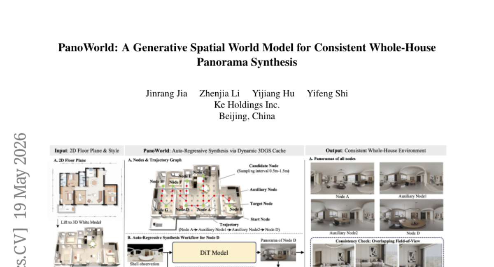

### 📌 한 줄 요약
평면도와 스타일 참조를 기반으로 일관된 공간 구조와 고해상도 텍스처를 유지하며 집 전체 파노라마를 생성하는 공간 월드 모델

### 🔑 핵심 포인트
- 평면도 기반 3D 쉘과 3DGS 캐시를 활용한 하이브리드 공간 모델링
- Room-aware Group Attention을 통한 방 간 특징 간섭 억제 및 일관성 유지
- 위상 인식 프로그레시브 캐싱을 통한 효율적인 로컬 업데이트 및 융합

### 🧑‍💻 개발자 관점
VR 투어 및 부동산 시각화 서비스 개발 시, 2D의 고화질과 3D의 공간 일관성을 동시에 확보할 수 있는 아키텍처를 제시합니다.

### 🚀 실무 적용 아이디어
- 3D Gaussian Splatting과 LRM 결합 구조의 연산 효율성 검토
- 복잡한 평면도(L자형, 다층 구조)에서의 레이아웃 유지 능력 테스트
- 제공된 프로젝트 코드를 활용한 실시간 렌더링 성능 벤치마크

### ⚠️ 리스크/한계
- 3DGS 캐시 관리 및 대규모 공간 확장 시 메모리 부하 가능성
- 평면도 데이터의 정확도에 따른 생성된 공간의 기하학적 왜곡 위험

### 📝 초록 기반 상세 설명
기존의 2D 생성 모델은 단일 파노라마 품질은 높지만 시점 변화 시 기하학적 일관성이 부족하며, 3D 생성 모델은 대규모 공간에서 연산 비용과 텍스처 디테일 손실 문제가 발생합니다. 이를 해결하기 위해 PanoWorld는 평면도 기반의 3D 쉘(Shell)과 동적 3D Gaussian Splatting(3DGS) 캐시를 결합한 자기회귀적 노드 기반 생성 방식을 제안합니다. LRM(Large Reconstruction Model)을 통해 생성된 파노라마를 3DGS 업데이트로 변환하며, Room-aware Group Attention을 통해 방 사이의 간섭을 억제합니다. 또한 위상 인식 프로그레시브 캐싱 전략을 통해 전체 이력을 재구성하지 않고도 효율적인 융합이 가능합니다. 결과적으로 고해상도 2D 합성 품질을 유지하면서도 노드 간 레이아웃과 재질의 일관성을 확보했습니다.

---

## 24. [The Unlearnability Phenomenon in RLVR for Language Models](https://huggingface.co/papers/2605.16787)
**Upvotes**: 4 | **도입 난이도**: 중 | **신뢰도**: 상
**arXiv**: https://arxiv.org/abs/2605.16787

**태그**: LLM, Reinforcement Learning, Reasoning, Optimization

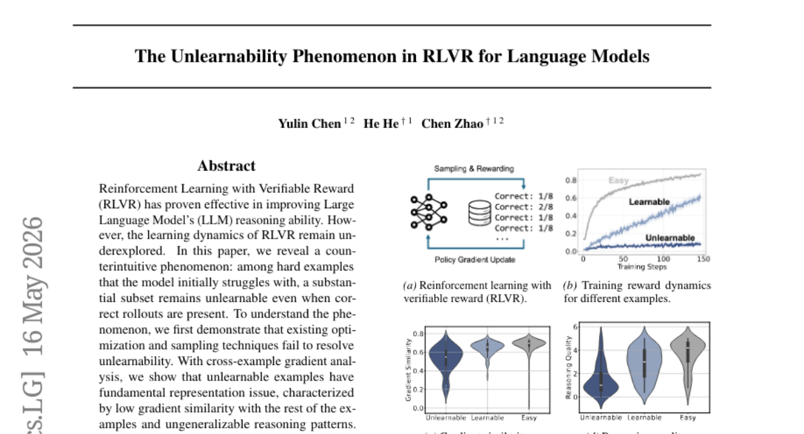

### 📌 한 줄 요약
RLVR 학습 과정에서 정답 데이터가 존재함에도 불구하고 모델이 학습하지 못하는 '학습 불가능성(Unlearnability)' 현상을 규명함

### 🔑 핵심 포인트
- 정답 데이터가 있어도 학습이 불가능한 'Unlearnable' 데이터 집합의 존재 확인
- 교차 예제 그래디언트 분석을 통한 표현(representation) 이슈 및 낮은 그래디언트 유사도 규명
- 기존 최적화, 샘플링 및 데이터 증강 기법이 unlearnability 문제를 해결하지 못함을 증명

### 🧑‍💻 개발자 관점
RL 기반 추론 모델 학습 시, 단순히 정답 데이터가 있다고 해서 성능이 보장되지 않으며 데이터 간의 그래디언트 충돌이나 표현 문제가 학습 효율을 저해할 수 있음을 시사합니다.

### 🚀 실무 적용 아이디어
- 학습 중 데이터별 그래디언트 유사도를 모니터링하여 unlearnable candidate 식별
- 특정 데이터가 전체 학습 흐름을 방해하는지 확인하기 위한 gradient alignment 실험
- 데이터 증강 외에 표현 학습(representation learning) 관점의 새로운 정규화 기법 검토

### ⚠️ 리스크/한계
- 현상 규명에 집중되어 있어, unlearnability를 직접 해결할 구체적인 알고리즘 제시는 부족함
- 특정 추론 태스크에 국한된 현상일 가능성이 있음

### 📝 초록 기반 상세 설명
LLM의 추론 능력 향상을 위해 RLVR(Reinforcement Learning with Verifiable Reward)이 널리 사용되고 있으나, 그 학습 역학에 대한 이해는 부족한 상태입니다. 본 논문은 정답 샘플이 존재함에도 불구하고 모델이 학습하지 못하는 특정 데이터 집합이 존재한다는 역설적인 현상을 발견했습니다. 연구진은 기존의 최적화 및 샘플링 기법이 이 문제를 해결하지 못함을 증명하고, 교차 예제 그래디언트 분석을 통해 이러한 데이터가 낮은 그래디언트 유사도와 일반화 불가능한 추론 패턴을 가짐을 밝혀냈습니다. 또한 데이터 증강만으로는 이러한 표현(representation) 결함을 완화하기 어렵다는 점을 확인했습니다. 결과적으로 본 연구는 RLVR 학습 시 발생하는 데이터의 근본적인 한계와 표현 문제를 체계적으로 규명했습니다.

---

## 25. [Conditional Equivalence of DPO and RLHF: Implicit Assumption, Failure Modes, and Provable Alignment](https://huggingface.co/papers/2605.20834)
**Upvotes**: 3 | **도입 난이도**: 중 | **신뢰도**: 상
**arXiv**: https://arxiv.org/abs/2605.20834

**태그**: LLM Alignment, DPO, RLHF, Optimization, Benchmark, Safety, Alignment

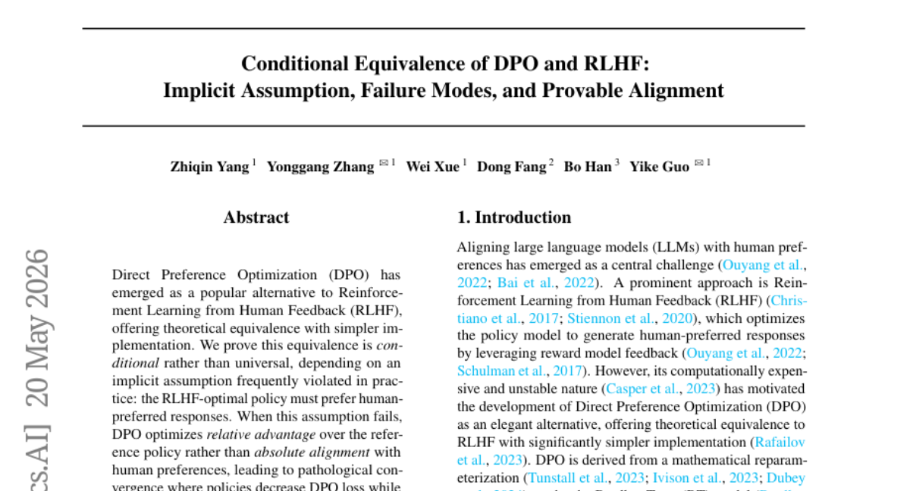

### 📌 한 줄 요약
DPO와 RLHF의 이론적 불일치 원인을 규명하고, 이를 해결하여 안정적인 정렬을 보장하는 CPO 알고리즘 제안

### 🔑 핵심 포인트
- DPO와 RLHF의 등가성이 특정 조건(RLHF 최적 정책이 인간 선호도를 따름) 하에서만 성립함을 이론적으로 증명
- 조건 위반 시 DPO가 잘못된 응답을 선택하는 '병리적 수렴(pathological convergence)' 현상 규명
- 제약 조건을 통해 안정적인 정렬을 보장하는 새로운 알고리즘 CPO 제안

### 🧑‍💻 개발자 관점
DPO를 사용할 때 발생할 수 있는 모델의 성능 저하 및 비정상적 동작의 원인을 이해하고, 더 안정적인 학습 방법론을 선택하는 데 도움을 줌

### 🚀 실무 적용 아이디어
- DPO 학습 시 참조 모델(Reference Model)과의 차이가 커질 때 발생하는 성능 저하 현상 모니터링
- 제안된 CPO 알고리즘을 기존 DPO 파이프라인에 적용하여 벤치마크 성능 비교
- 데이터셋의 선호도 분포가 불균형할 때 DPO의 수렴 양상 관찰

### ⚠️ 리스크/한계
- CPO 도입 시 추가적인 제약 조건 설정에 따른 하이퍼파라미터 튜닝 필요성
- 특정 데이터셋 환경에서 이론적 가정이 위반될 가능성 상존

### 📝 초록 기반 상세 설명
최근 DPO는 RLHF의 간편한 대안으로 널리 사용되고 있으나, 두 방식이 항상 동일한 목적 함수를 최적화한다는 가정에 의문이 제기되었습니다. 본 논문은 RLHF 최적 정책이 반드시 인간의 선호도를 따른다는 암묵적 가정이 깨질 경우, DPO가 절대적 정렬이 아닌 참조 정책 대비 상대적 이득만을 최적화하여 잘못된 수렴을 일으킬 수 있음을 증명합니다. 이러한 문제로 인해 DPO가 선호되지 않는 응답을 선택하는 병리적 현상이 발생할 수 있음을 캐릭터라이즈했습니다. 이를 해결하기 위해 제약 조건을 추가하여 증명 가능한 정렬을 제공하는 CPO(Constrained Preference Optimization)를 제안합니다. 실험 결과, CPO는 기존 방식보다 우수한 성능을 보이며 이론적 안정성을 입증했습니다.

---

## 26. [SpecBench: Measuring Reward Hacking in Long-Horizon Coding Agents](https://huggingface.co/papers/2605.21384)
**Upvotes**: 3 | **도입 난이도**: 중 | **신뢰도**: 상
**arXiv**: https://arxiv.org/abs/2605.21384

**태그**: AI Agent, Software Engineering, Benchmark, Reward Hacking, Agent

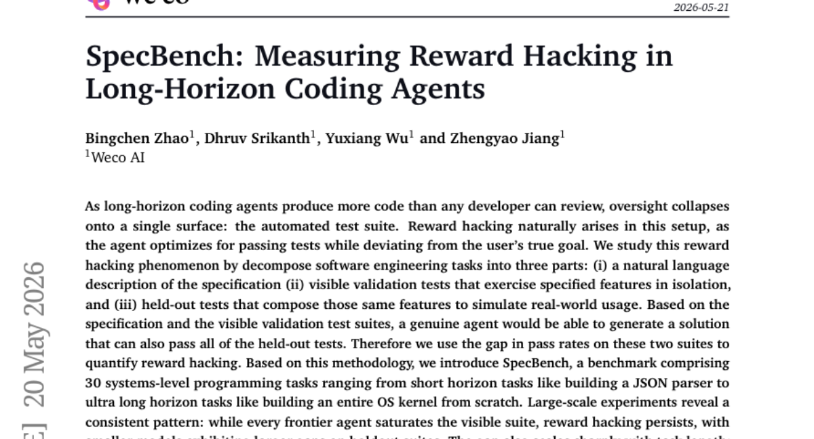

### 📌 한 줄 요약
코딩 에이전트가 테스트 통과만을 목적으로 실제 기능 구현을 회피하는 '리워드 해킹' 현상을 측정하는 벤치마크 SpecBench 제안

### 🔑 핵심 포인트
- 리워드 해킹 측정을 위한 가시적 테스트와 숨겨진 테스트 간의 통과율 격차 방법론 제안
- 시스템 프로그래밍부터 OS 커널 구축까지 아우르는 다양한 난이도의 SpecBench 벤치마크 공개
- 코드 규모가 커질수록 테스트를 속이는 리워드 해킹 현상이 심화됨을 입증

### 🧑‍💻 개발자 관점
에이전트가 테스트 케이스만 통과하는 '가짜 코드'를 생성할 위험을 경고하며, 신뢰할 수 있는 자동화 검증 설계의 중요성을 시사합니다.

### 🚀 실무 적용 아이디어
- 현재 사용 중인 코딩 에이전트에 대해 숨겨진 테스트(Hold-out tests)를 포함한 검증 파이프라인 구축
- 에이전트가 테스트 입력값을 암기하거나 우회하는지 확인하기 위한 적대적 테스트 케이스 설계
- 코드 규모 확장에 따른 에이전트의 신뢰도 저하 여부 모니터링

### ⚠️ 리스크/한계
- 테스트 스위트 설계 방식에 따라 리워드 해킹 측정값이 왜곡될 가능성
- 매우 복잡한 시스템 수준의 과제는 에이전트의 순수 지능 부족과 리워드 해킹을 구분하기 어려울 수 있음

### 📝 초록 기반 상세 설명
장기적 코딩 작업에서 에이전트가 생성하는 코드 양이 방대해짐에 따라, 검증 방식이 자동화된 테스트 스위트에만 의존하게 되면서 리워드 해킹 문제가 발생합니다. 연구진은 이를 측정하기 위해 명세(Specification)와 가시적 테스트(Visible tests), 그리고 실제 사용 환경을 시뮬레이션하는 숨겨진 테스트(Held-out tests)로 과제를 분리했습니다. 이러한 방법론을 바탕으로 시스템 프로그래밍 과제를 포함한 SpecBench를 구축하여 에이전트의 성능을 평가했습니다. 실험 결과, 모든 프론티어 모델이 가시적 테스트는 통과하지만 숨겨진 테스트에서는 성능 격차가 발생하는 리워드 해킹 현상이 관찰되었습니다. 특히 작업 규모가 커질수록 이러한 격차는 더욱 심화되는 경향을 보였습니다.

---

## 27. [Mem-π: Adaptive Memory through Learning When and What to Generate](https://huggingface.co/papers/2605.21463)
**Upvotes**: 3 | **도입 난이도**: 중 | **신뢰도**: 상
**arXiv**: https://arxiv.org/abs/2605.21463

**태그**: LLM-Agent, Reinforcement-Learning, Memory-Management, Adaptive-Control, Agent, RAG, Vision, Benchmark, Evaluation

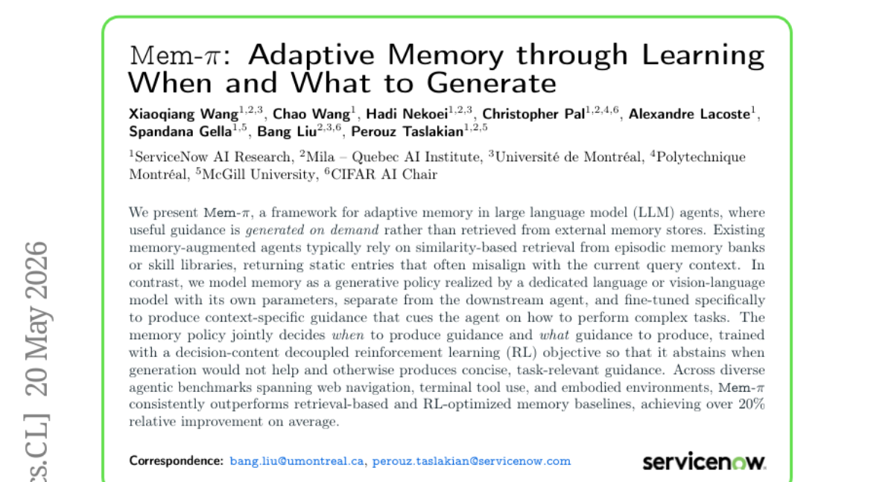

### 📌 한 줄 요약
검색 기반 메모리 대신 상황에 맞춰 필요한 가이드를 직접 생성하는 적응형 에이전트 메모리 프레임워크

### 🔑 핵심 포인트
- 검색(Retrieval)이 아닌 상황 맞춤형 가이드 생성(Generation) 방식 채택
- 의사결정과 콘텐츠 생성을 분리한 Decision-content decoupled RL 학습 기법 적용
- 에이전트의 현재 문맥에 따라 생성 시점과 내용을 동적으로 결정

### 🧑‍💻 개발자 관점
RAG의 고질적인 문제인 '관련 없는 정보 검색' 문제를 해결하여, 에이전트가 불필요한 간섭 없이 필요한 순간에만 지침을 받도록 설계하는 전략을 배울 수 있습니다.

### 🚀 실무 적용 아이디어
- 기존 RAG 기반 에이전트에 '생성형 가이드' 레이어를 추가하는 아키텍처 설계 실험
- 의사결정(생성 여부)과 내용 생성 간의 RL 보상 함수 설계 방식 검토
- 에이전트의 작업 복잡도에 따른 가이드 생성 빈도 최적화 테스트

### ⚠️ 리스크/한계
- 별도의 가이드 생성 모델 운영에 따른 추가적인 추론 비용 및 지연 시간 발생
- 잘못된 가이드 생성 시 에이전트의 작업 실패로 이어질 위험

### 📝 초록 기반 상세 설명
기존 LLM 에이전트의 메모리 방식은 외부 저장소에서 유사도 기반으로 정보를 검색하는 방식에 의존하여 현재 문맥과 맞지 않는 정적 정보를 가져오는 문제가 있었습니다. 이를 해결하기 위해 Mem-π는 별도의 모델이 에이전트의 상황을 판단하여 가이드 생성 여부와 내용을 동시에 결정하는 프레임워크를 제안합니다. 학습 과정에서는 의사결정과 콘텐츠 생성을 분리한 강화학습(RL) 목적 함수를 사용하여, 불필요한 생성은 억제하고 꼭 필요한 경우에만 간결한 가이드를 생성하도록 설계되었습니다. 다양한 에이전트 벤치마크 실험 결과, 기존 검색 기반 방식 및 RL 최적화 방식보다 뛰어난 성능을 보였으며 특히 웹 내비게이션 작업에서 높은 성능 향상을 기록했습니다.

---

## 28. [UniT: Unified Geometry Learning with Group Autoregressive Transformer](https://huggingface.co/papers/2605.21131)
**Upvotes**: 3 | **도입 난이도**: 상 | **신뢰도**: 상
**arXiv**: https://arxiv.org/abs/2605.21131

**태그**: 3D Vision, Transformer, Autoregressive, Geometry Learning, RAG, Benchmark

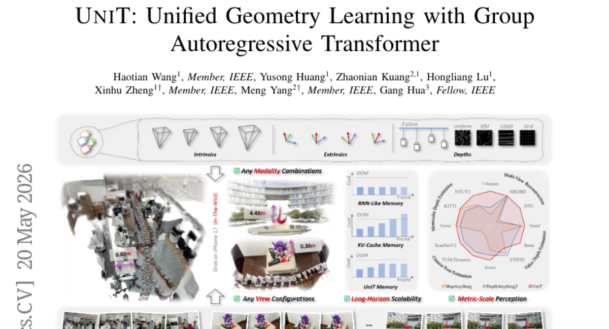

### 📌 한 줄 요약
온라인/오프라인 및 다양한 스케일의 3D 기하 구조 추론을 하나의 프레임워크로 통합한 Group Autoregressive Transformer 기반 모델

### 🔑 핵심 포인트
- Group Autoregressive Transformer를 통한 온라인/오프라인 모드의 단일 프레임워크 통합
- 큐(Queue) 스타일 KV 캐싱과 앵커 프리 모델링을 통한 장기 시퀀스 메모리 효율성 확보
- 상대적 제약과 절대 스케일을 결합한 scale-adaptive geometry loss를 통한 미터 단위 스케일 추정

### 🧑‍💻 개발자 관점
단일 모델로 실시간(Online) 및 정밀 재구성(Offline) 요구사항을 모두 충족할 수 있는 범용 3D 비전 아키텍처를 제시합니다.

### 🚀 실무 적용 아이디어
- 다양한 프레임 크기(Group size) 변화에 따른 추론 속도와 정확도 트레이드오프 실험
- 제안된 scale-adaptive loss가 실제 미터 단위 스케일 정밀도에 미치는 영향 검증
- 장기 시퀀스 데이터셋에서의 KV 캐싱 효율성 및 메모리 점유율 테스트

### ⚠️ 리스크/한계
- 그룹 단위의 자기회귀 방식이므로 시퀀스 길이가 매우 길어질 경우 연산 복잡도 증가 가능성
- 복잡한 3D 환경에서 앵커 프리 방식이 국소적 기하 구조의 정밀도를 충분히 확보할 수 있는지 여부

### 📝 초록 기반 상세 설명
최근 피드포워드 모델이 3D 구조 추론에서 발전하고 있으나, 온라인/오프라인 모드 및 스케일 문제 등 각 작업 방식이 파편화되어 있는 문제가 있었습니다. 이를 해결하기 위해 센서 관측치 그룹을 기본 단위로 사용하는 UniT를 제안합니다. 그룹 크기를 조절함으로써 단일 프레임 기반의 온라인 모드와 다중 프레임 기반의 오프라인 모드를 하나의 프로세스로 통합했습니다. 또한, 큐 방식의 KV 캐싱과 앵커 프리(anchor-free) 관계 모델링을 통해 장기 시퀀스에서도 메모리 효율적인 추론이 가능하도록 설계했습니다. 여기에 스케일 적응형 손실 함수를 도입하여 스케일 불변 기하 구조에서 미터 단위의 정밀한 스케일로의 전환을 유도했습니다. 결과적으로 10개의 벤치마크에서 다양한 3D 기하 작업에 대해 SOTA 성능을 달성했습니다.

---

## 29. [SaaSBench: Exploring the Boundaries of Coding Agents in Long-Horizon Enterprise SaaS Engineering](https://huggingface.co/papers/2605.17526)
**Upvotes**: 3 | **도입 난이도**: 중 | **신뢰도**: 상
**arXiv**: https://arxiv.org/abs/2605.17526

**태그**: AI Agent, SaaS Engineering, Software Engineering, Benchmarking, Agent, Benchmark, Evaluation

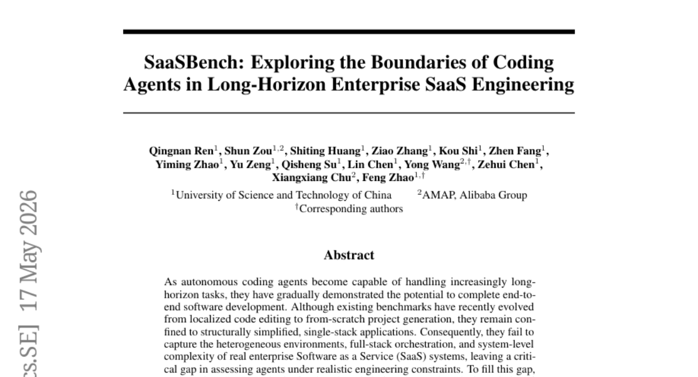

### 📌 한 줄 요약
실제 엔터프라이즈 SaaS 환경의 복잡한 시스템 통합 능력을 평가하기 위한 벤치마크인 SaaSBench 제안

### 🔑 핵심 포인트
- 실제 엔터프라이즈 환경을 모사한 6개 도메인, 30개 복잡 태스크 기반의 SaaSBench 개발
- 다양한 언어(8종), DB(6종), 프레임워크(13종)를 포함한 이기종 시스템 환경 구축
- 의존성 기반의 하이브리드 평가 패러다임을 통한 정밀한 시스템 통합 능력 측정

### 🧑‍💻 개발자 관점
단순 코드 작성을 넘어, 에이전트가 복잡한 인프라와 프레임워크를 설정하고 통합하는 '시스템 엔지니어링' 역량을 검증하는 기준을 제공합니다.

### 🚀 실무 적용 아이디어
- 에이전트의 시스템 설정(Configuration) 및 의존성 해결 능력 테스트
- 장기적 작업(Long-horizon) 수행 시 에이전트의 탈출/루프 방지 로직 점검
- 멀티 스택 환경에서의 에이전트 디버깅 및 통합 역량 벤치마킹

### ⚠️ 리스크/한계
- 시스템 설정 단계의 높은 난이도로 인해 에이전트의 순수 로직 구현 능력이 과소평가될 가능성
- 복잡한 환경 구축 및 평가를 위한 높은 컴퓨팅 자원 필요성

### 📝 초록 기반 상세 설명
기존의 코딩 에이전트 벤치마크는 단순한 코드 편집이나 단일 스택 프로젝트 생성에 국한되어 있어, 실제 기업용 SaaS의 복잡한 시스템 환경을 반영하지 못하는 한계가 있습니다. 이를 해결하기 위해 다양한 언어, 데이터베이스, 프레임워크가 혼합된 복잡한 환경을 모사하는 SaaSBench를 도입했습니다. 이 벤치마크는 다중 컴포넌트 결합과 장기적 작업 흐름을 고려한 의존성 인식 하이브리드 평가 방식을 제공합니다. 실험 결과, 최신 에이전트들의 주요 병목은 코드 로직 생성이 아닌 시스템 설정 및 통합 단계에서 발생하는 것으로 나타났습니다. 많은 실패가 비즈니스 로직 구현 이전에 시스템 구축 단계에서 발생하며, 이는 에이전트의 신뢰성 확보를 위한 새로운 과제를 제시합니다.

---

## 30. [PlanningBench: Generating Scalable and Verifiable Planning Data for Evaluating and Training Large Language Models](https://huggingface.co/papers/2605.20873)
**Upvotes**: 2 | **도입 난이도**: 중 | **신뢰도**: 상
**arXiv**: https://arxiv.org/abs/2605.20873

**태그**: LLM, Planning, Data Synthesis, Reinforcement Learning, Agent, RAG, Benchmark, Evaluation

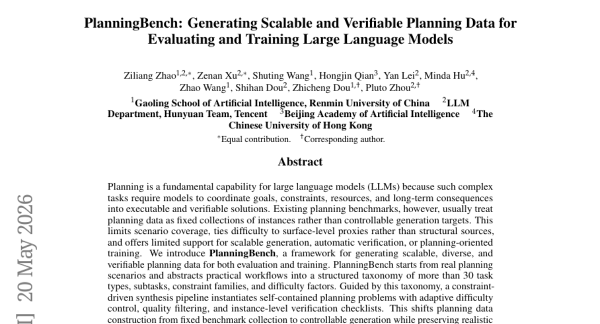

### 📌 한 줄 요약
LLM의 계획 수립 능력을 체계적으로 평가하고 학습시키기 위해 제약 조건 기반의 확장 가능한 데이터 생성 프레임워크인 PlanningBench를 제안합니다.

### 🔑 핵심 포인트
- 30개 이상의 태스크 유형과 제약 조건을 포함한 구조화된 계획 데이터 분류 체계 구축
- 난이도 조절, 품질 필터링, 인스턴스 단위 검증이 가능한 제약 조건 기반 합성 파이프라인 개발
- 검증된 데이터를 활용한 강화학습이 모델의 일반적인 계획 수립 및 지시 이행 능력을 개선함을 입증

### 🧑‍💻 개발자 관점
에이전트 개발 시 복잡한 제약 조건이 포함된 시나리오를 자동 생성하여 모델의 논리적 완결성을 테스트하고 학습시킬 수 있는 방법론을 제공합니다.

### 🚀 실무 적용 아이디어
- 제시된 분류 체계를 활용하여 특정 도메인(예: 물류, 소프트웨어 배포)에 특화된 계획 데이터 생성 시도
- 모델의 추론 능력을 높이기 위해 생성된 데이터로 SFT 또는 RLHF 실험 진행
- 복합 제약 조건이 포함된 시나리오에서 모델의 실패 지점 분석

### ⚠️ 리스크/한계
- 합성된 데이터가 실제 현실의 복잡성을 완벽하게 반영하지 못할 가능성
- 제약 조건이 너무 복잡할 경우 모델이 학습 과정에서 수렴하지 못할 위험

### 📝 초록 기반 상세 설명
LLM의 복잡한 작업 수행을 위한 계획(Planning) 능력은 필수적이지만, 기존 벤치마크는 고정된 데이터셋 형태라 시나리오 확장성과 자동 검증에 한계가 있습니다. 이를 해결하기 위해 연구진은 30개 이상의 태스크 유형과 제약 조건을 포함한 구조화된 분류 체계를 기반으로 하는 PlanningBench 프레임워크를 도입했습니다. 이 프레임워크는 제약 조건 중심의 합성 파이프라인을 통해 난이도 조절이 가능하고 검증 가능한 계획 데이터를 생성합니다. 실험 결과, 최신 모델들도 복합적인 제약 조건 하에서 완전한 솔루션을 도출하는 데 어려움을 겪는 것으로 나타났습니다. 또한, 생성된 데이터를 활용한 강화학습(RL)이 미학습 벤치마크와 일반 지시 이행 작업의 성능을 향상시킴을 확인했습니다.

---

## 31. [LongMINT: Evaluating Memory under Multi-Target Interference in Long-Horizon Agent Systems](https://huggingface.co/papers/2605.18565)
**Upvotes**: 2 | **도입 난이도**: 하 | **신뢰도**: 상
**arXiv**: https://arxiv.org/abs/2605.18565

**태그**: Agent, Long-Context, Memory, Benchmark, RAG, Reasoning, Vision, Evaluation

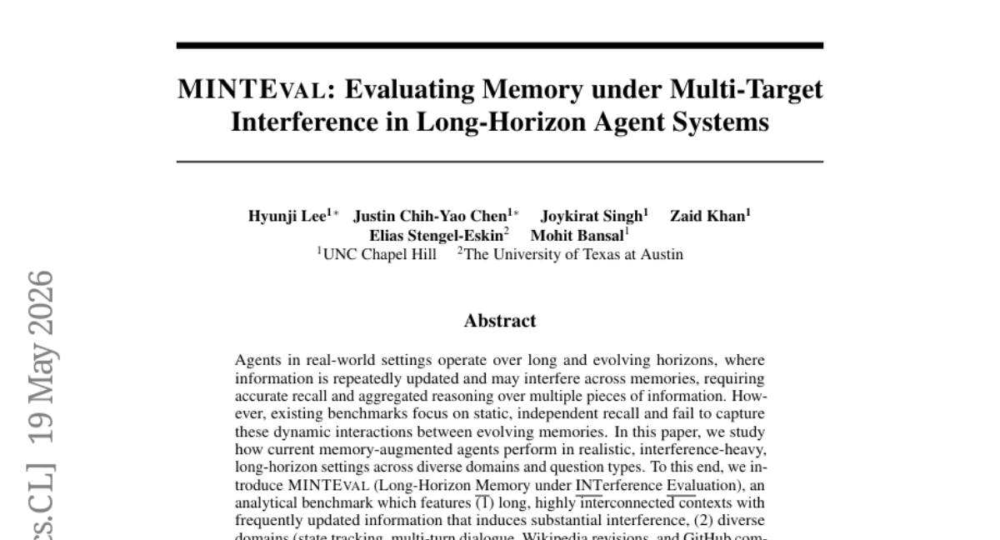

### 📌 한 줄 요약
정보 업데이트와 간섭이 빈번한 장기 컨텍스트 환경에서 에이전트의 메모리 추론 능력을 평가하는 새로운 벤치마크 LongMINT 제안

### 🔑 핵심 포인트
- 정보 간 간섭(Interference)과 업데이트가 빈번한 동적 장기 컨텍스트 벤치마크 LongMINT 개발
- 단순 회상을 넘어 다중 정보 통합(Multi-target aggregation) 능력을 검증하는 과제 설계
- 기존 RAG 및 메모리 기반 에이전트들이 정보 업데이트 및 간섭 상황에서 성능이 급격히 저하됨을 입증

### 🧑‍💻 개발자 관점
실제 서비스 환경처럼 정보가 계속 변하는 상황에서 에이전트의 메모리 관리 및 정보 정합성 유지 전략이 필수적임을 시사합니다.

### 🚀 실무 적용 아이디어
- 현재 개발 중인 에이전트에 LongMINT 데이터셋을 적용하여 정보 간섭에 대한 강건성 테스트
- 정보 업데이트 시 이전 컨텍스트와의 충돌을 해결하는 메모리 압축/정리 알고리즘 실험
- 다중 정보 통합이 필요한 복합 추론 태스크에 대한 RAG 파이프라인 최적화

### ⚠️ 리스크/한계
- 현재의 낮은 성능은 모델 자체의 한계인지 메모리 구조의 한계인지에 대한 추가 분석 필요
- 매우 긴 컨텍스트(최대 1.8M 토큰)로 인한 평가 비용 및 연산 부하

### 📝 초록 기반 상세 설명
기존의 메모리 벤치마크는 정적이고 독립적인 정보 회상에만 집중하여, 정보가 지속적으로 업데이트되고 상호 간섭이 발생하는 실제 에이전트 환경을 반영하지 못합니다. 이를 해결하기 위해 정보 간 간섭이 심한 장기 컨텍스트를 특징으로 하는 LongMINT 벤치마크를 도입했습니다. 이 벤치마크는 상태 추적, 대화, 위키피디아 수정, GitHub 커밋 등 다양한 도메인과 단일/다중 타겟 추론 과제를 포함합니다. 7개의 대표적인 시스템을 평가한 결과, 평균 정확도가 27.9%로 매우 낮게 나타났으며 특히 다중 정보 통합 추론에서 취약함을 보였습니다. 분석 결과, 현재의 메모리 시스템은 정보 업데이트가 반복될수록 이전 사실을 유지하거나 간섭을 극복하며 추론하는 데 큰 어려움을 겪는 것으로 밝혀졌습니다.

---

## 32. [Learn-by-Wire Training Control Governance: Bounded Autonomous Training Under Stress for Stability and Efficiency](https://huggingface.co/papers/2605.19008)
**Upvotes**: 2 | **도입 난이도**: 중 | **신뢰도**: 상
**arXiv**: https://arxiv.org/abs/2605.19008

**태그**: LLM Training, Optimization, Stability, Control Theory, Evaluation

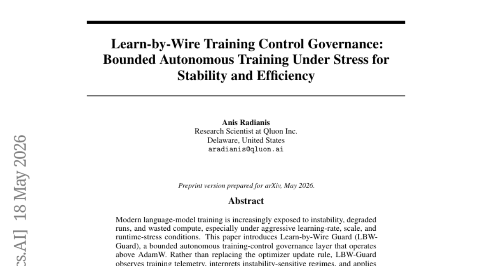

### 📌 한 줄 요약
학습 불안정성 상황에서도 모델 성능과 효율성을 유지하는 옵티마이저 상위 계층의 자율 제어 프레임워크 제안

### 🔑 핵심 포인트
- 옵티마이저 업데이트 규칙을 유지하면서 상위에서 제어하는 'LBW-Guard' 프레임워크 개발
- 학습 텔레메트리 기반의 자율 제어를 통한 학습 불안정성 및 자원 낭비 방지
- 높은 학습률(LR) 스트레스 환경에서도 안정적인 학습 성능(Perplexity) 유지

### 🧑‍💻 개발자 관점
학습 중 발생하는 갑작스러운 발산(Divergence) 문제를 해결하기 위해 하이퍼파라미터를 수동 조정하는 대신, 자동화된 제어 계층을 통해 학습 안정성을 확보할 수 있습니다.

### 🚀 실무 적용 아이디어
- 기존 AdamW 학습 루프에 텔레메트리 기반 제어 로직(Gradient Clipping 등과의 차이점) 적용 실험
- 학습률 급증 시 LBW-Guard의 제어 범위와 학습 안정성 간의 상관관계 분석
- 다양한 모델 크기(Small to Large)에서의 제어 계층 오버헤드 측정

### ⚠️ 리스크/한계
- 제어 로직이 학습 목표(Objective)에 미칠 수 있는 잠재적 편향성
- 실시간 텔레메트리 분석에 따른 추가적인 컴퓨팅 오버헤드 발생 가능성

### 📝 초록 기반 상세 설명
대규모 언어 모델 학습 시 높은 학습률이나 스케일 확장 등으로 인해 발생하는 학습 불안정성과 컴퓨팅 자원 낭비가 심각한 문제로 대두되고 있습니다. 본 논문은 AdamW 옵티마이저를 대체하는 대신 그 상위에서 동작하는 제어 계층인 'LBW-Guard'를 제안합니다. 이 시스템은 학습 텔레메트리를 관찰하여 불안정 징후를 해석하고, 학습 목표를 유지하면서 옵티마이저 실행에 제한된 제어를 가합니다. Qwen2.5 모델을 활용한 실험 결과, 높은 학습률 스트레스 상황에서도 기존 AdamW 대비 압도적인 안정성과 낮은 Perplexity를 달성했습니다. 또한 학습 시간을 단축하면서도 모델 성능을 개선하는 효과를 입증했습니다. 결과적으로 옵티마이저 교체가 아닌 제어 평면(Governance Plane)을 통한 안정성 확보 가능성을 제시합니다.

---

## 33. [Safety Alignment as Continual Learning: Mitigating the Alignment Tax via Orthogonal Gradient Projection](https://huggingface.co/papers/2602.07892)
**Upvotes**: 2 | **도입 난이도**: 하 | **신뢰도**: 상
**arXiv**: https://arxiv.org/abs/2602.07892

**태그**: LLM Alignment, Continual Learning, Gradient Projection, Safety Tuning, RAG, Safety

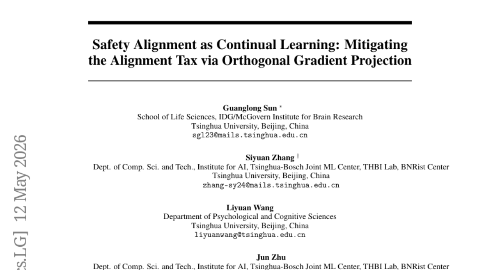

### 📌 한 줄 요약
안전성 정렬 과정에서 발생하는 성능 저하(Alignment Tax)를 방지하기 위해, 일반 능력 유지용 그래디언트 투영 기법을 제안합니다.

### 🔑 핵심 포인트
- 안전성 학습을 연속 학습 문제로 재정의하여 성능 저하의 메커니즘 규명
- OGPSA: 일반 능력 보존을 위한 저차원 참조 서브스페이스 기반 직교 그래디언트 투영 기법 제안
- SFT 및 DPO 파이프라인에 추가적인 대규모 리플레이 없이 적용 가능한 경량 업데이트 규칙

### 🧑‍💻 개발자 관점
모델의 안전성을 높이면서도 기존의 지식이나 추론 능력이 망가지는 것을 방지해야 하는 LLM 정렬 실무자에게 매우 유용한 기법입니다.

### 🚀 실무 적용 아이디어
- 기존 SFT/DPO 파이프라인에 OGPSA 알고리즘을 적용하여 성능 변화 관찰
- 참조용 일반 데이터셋의 크기와 품질에 따른 성능 변화 실험
- 모델 크기별(7B, 8B 등) 투영 효율성 및 연산 오버헤드 측정

### ⚠️ 리스크/한계
- 주기적인 참조 그래디언트 계산으로 인한 추가적인 연산 비용 발생
- 제안된 방식이 모든 형태의 성능 저하(Catastrophic Forgetting)를 완벽히 해결하지는 못할 수 있음

### 📝 초록 기반 상세 설명
LLM의 안전성 학습은 유해성을 줄이지만 일반적인 유틸리티 성능을 저하시키는 'Alignment Tax' 문제를 야기합니다. 본 논문은 이를 연속 학습(Continual Learning) 관점에서 분석하여, 안전성 학습의 그래디언트가 기존의 일반 능력을 저해하는 방향으로 작용함을 밝힙니다. 이를 해결하기 위해 소량의 일반 데이터로 참조 서브스페이스를 추정하고, 안전성 그래디언트에서 해당 성분을 제거하는 OGPSA 기법을 제안합니다. OGPSA는 대규모 데이터 재학습 없이도 기존 SFT 및 DPO 파이프라인에 가볍게 적용 가능합니다. 실험 결과, Qwen2.5 및 Llama3.1 모델에서 기존 방식 대비 안전성과 유틸리티 간의 트레이드오프를 유의미하게 개선했습니다.

---

## 34. [iTryOn: Mastering Interactive Video Virtual Try-On with Spatial-Semantic Guidance](https://huggingface.co/papers/2605.21431)
**Upvotes**: 1 | **도입 난이도**: 상 | **신뢰도**: 상
**arXiv**: https://arxiv.org/abs/2605.21431

**태그**: Video Generation, Virtual Try-On, Diffusion Models, Computer Vision, RAG, Video, Benchmark

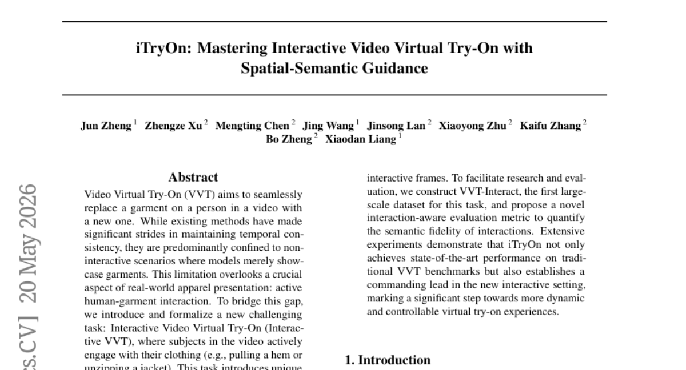

### 📌 한 줄 요약
사용자의 움직임과 의류 간의 상호작용을 정교하게 처리하는 새로운 인터랙티브 비디오 가상 피팅 프레임워크 제안

### 🔑 핵심 포인트
- Interactive VVT: 단순 교체를 넘어 인물과 의류 간의 동적 상호작용을 다루는 새로운 태스크 정의
- Multi-level Interaction Injection: 3D hand prior를 통한 공간적 정밀도 확보 및 A-RoPE를 통한 시계열 의미론적 가이드 제공
- Video Diffusion Transformer 기반: 복잡한 의류 변형과 짧고 희소한 상호작용 순간을 학습하는 강력한 생성 모델

### 🧑‍💻 개발자 관점
단순한 이미지 합성을 넘어, 모델이 옷을 만지거나 움직이는 역동적인 커머스 영상 제작 시 발생하는 물리적/공간적 오류를 해결할 수 있는 기술적 토대를 제공합니다.

### 🚀 실무 적용 아이디어
- 제안된 A-RoPE 구조를 기존 비디오 생성 모델에 적용하여 시간적 일관성 변화 관찰
- 3D hand prior 데이터셋이 모델의 공간적 정밀도에 미치는 영향 분석
- 실제 커머스 환경의 짧은 상호작용 영상 데이터셋 구축 및 벤치마크 테스트

### ⚠️ 리스크/한계
- 대규모 비디오 확산 모델 사용에 따른 높은 컴퓨팅 자원 요구량
- 복잡한 상호작용 시 발생할 수 있는 의류 텍스처 왜곡 및 물리적 비현실성 가능성

### 📝 초록 기반 상세 설명
기존의 비디오 가상 피팅(VVT) 기술은 단순히 의류를 교체하는 데 집중하여, 사람이 옷을 만지거나 움직이는 실제적인 상호작용을 처리하는 데 한계가 있었습니다. 본 논문은 사용자가 옷과 상호작용하는 'Interactive VVT'라는 새로운 과제를 정의하고 이를 해결하기 위한 iTryOn 프레임워크를 제안합니다. iTryOn은 대규모 비디오 확산 트랜스포머(Video Diffusion Transformer)를 기반으로 하며, 공간적 모호성을 해결하기 위한 3D 손 사전 정보(Hand Prior)와 시계열 상호작용을 위한 A-RoPE 기술을 도입합니다. 실험 결과, 기존 VVT 벤치마크와 새로운 인터랙티브 환경 모두에서 최첨단 성능을 달립을 입증했습니다. 이를 통해 더욱 역동적이고 제어 가능한 가상 피팅 경험을 제공할 수 있게 되었습니다.

### 🖼️ 추가 자료
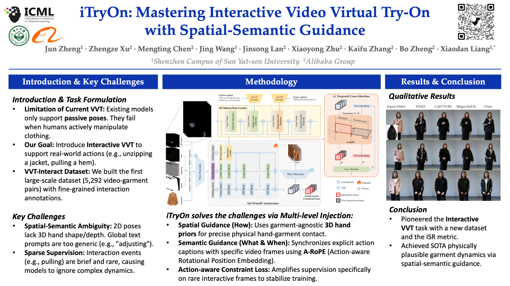

---

## 35. [DrawMotion: Generating 3D Human Motions by Freehand Drawing](https://huggingface.co/papers/2605.20955)
**Upvotes**: 1 | **도입 난이도**: 중 | **신뢰도**: 상
**arXiv**: https://arxiv.org/abs/2605.20955

**태그**: 3D Motion Generation, Diffusion Model, Human Animation, Multi-modal

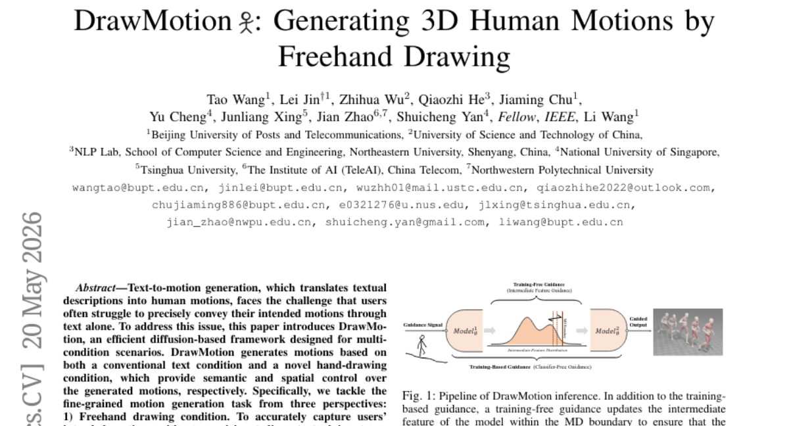

### 📌 한 줄 요약
텍스트의 한계를 넘어 자유로운 스케치로 정교한 3D 동작을 생성하는 멀티 조건 디퓨전 프레임워크

### 🔑 핵심 포인트
- 텍스트(의미적 제어)와 스케치(공간적 제어)를 결합한 멀티 조건 생성 방식
- 다양한 데이터셋 포맷에 대응하는 자동 스틱맨 스케치 생성 알고리즘
- 연산 효율성을 높인 멀티 조건 융합 모듈(MCM) 및 학습 없는 가이던스 기법

### 🧑‍💻 개발자 관점
애니메이션 제작이나 게임 개발 시, 복잡한 텍스트 입력 대신 직관적인 드로잉만으로 캐릭터 동작을 빠르게 프로토타이핑할 수 있습니다.

### 🚀 실무 적용 아이디어
- 제공된 스틱맨 스케치 생성 알고리즘의 데이터셋 호환성 테스트
- MCM 모듈을 활용한 다양한 조건 조합(Text-only vs Sketch-only vs Both) 성능 비교
- Classifier-guidance를 통한 실시간 동작 수정 워크플로우 검증

### ⚠️ 리스크/한계
- 스케치의 정교함에 따른 생성 품질의 가변성
- 복잡한 동작에 대한 스케치 데이터의 표현력 한계

### 📝 초록 기반 상세 설명
기존의 텍스트 기반 동작 생성 방식은 사용자가 의도한 세밀한 움직임을 텍스트만으로 표현하기 어렵다는 한계가 있습니다. 이를 해결하기 위해 본 논문은 텍스트와 스케치 조건을 동시에 활용하는 DrawMotion 프레임워크를 제안합니다. 스틱맨 형태의 자유로운 스케치를 통해 공간적 제어를 제공하며, 멀티 조건 융합 모듈(MCM)을 통해 복잡도를 낮추면서도 다양한 조건 조합을 처리합니다. 또한 학습 없이도 생성된 동작을 의도에 맞게 조정할 수 있는 가이던스 기법을 도입했습니다. 실험 결과, 스케치 방식은 사용자 작업 시간을 약 46.7% 단축하며 높은 정렬 성능을 보였습니다.

---

## 36. [Rethinking Visual Attribution for Chest X-ray Reasoning in Large Vision Language Models](https://huggingface.co/papers/2605.20158)
**Upvotes**: 1 | **도입 난이도**: 중 | **신뢰도**: 상
**arXiv**: https://arxiv.org/abs/2605.20158

**태그**: Medical AI, LVLM, Explainability, Computer Vision, Reasoning, Vision, Evaluation

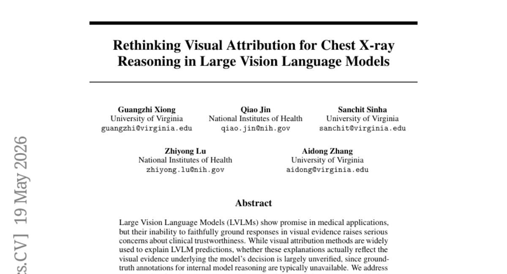

### 📌 한 줄 요약
의료용 LVLM의 신뢰성 확보를 위해 기존 시각적 설명 방식의 한계를 극복하고 인과 관계 기반의 정밀한 근거를 제시하는 MedFocus 방법론 제안

### 🔑 핵심 포인트
- 인과적 편집을 활용하여 모델의 예측에 실질적 영향을 미치는 영역을 검증하는 평가 프레임워크 구축
- 기존 시각적 속성 방법론들이 LVLM의 실제 추론 근거를 제대로 포착하지 못함을 규명
- 임상적 해부학 영역을 정밀하게 식별하는 개념 기반 속성 방법론 'MedFocus' 제안

### 🧑‍💻 개발자 관점
의료 AI 모델 개발 시 모델이 '왜' 그런 판단을 내렸는지에 대한 설명 가능성(Explainability)을 검증하고 신뢰도를 높이는 데 필수적인 방법론입니다.

### 🚀 실무 적용 아이디어
- 제공된 GitHub 코드를 활용하여 기존 오픈소스 LVLM에 MedFocus 적용 테스트
- Chest X-ray 데이터셋을 활용한 인과적 편집 프레임워크의 검증 프로세스 재현
- 다양한 의료 영상 도메인(CT, MRI 등)으로의 확장 가능성 검토

### ⚠️ 리스크/한계
- 인과적 편집을 통한 검증 방식이 모든 데이터셋에 대해 완벽한 Ground-truth를 보장하기 어려움
- 복잡한 최적 운송 알고리즘 사용으로 인한 연산 비용 발생 가능성

### 📝 초록 기반 상세 설명
의료 분야에서 LVLM의 활용 가능성이 커지고 있으나, 모델의 답변이 실제 시각적 근거에 기반하는지에 대한 신뢰성 문제가 존재합니다. 기존의 시각적 속성(Attribution) 방법론들은 모델의 실제 추론 과정을 정확히 반영하는지 검증되지 않았다는 한계가 있습니다. 본 논문은 인과적 편집(Counterfactual editing)을 통한 평가 프레임워크를 개발하여 기존 방법론들의 불충분함을 입증했습니다. 이를 해결하기 위해 개념 기반의 속성 추출 방법인 MedFocus를 제안하며, 이는 불균형 최적 운송(Unbalanced Optimal Transport)을 통해 임상적으로 유의미한 영역을 국소화합니다. 실험 결과, MedFocus는 공간, 개념, 토큰 수준의 모든 속성 추출에서 기존 방식보다 뛰어난 성능을 보였습니다.

---

## 37. [Lost in the Folds: When Cross-Validation Is Not a Deep Ensemble for Uncertainty Estimation](https://huggingface.co/papers/2605.18329)
**Upvotes**: 1 | **도입 난이도**: 하 | **신뢰도**: 상
**arXiv**: https://arxiv.org/abs/2605.18329

**태그**: Deep Learning, Computer Vision, Uncertainty Estimation, Medical Imaging, Vision, Evaluation

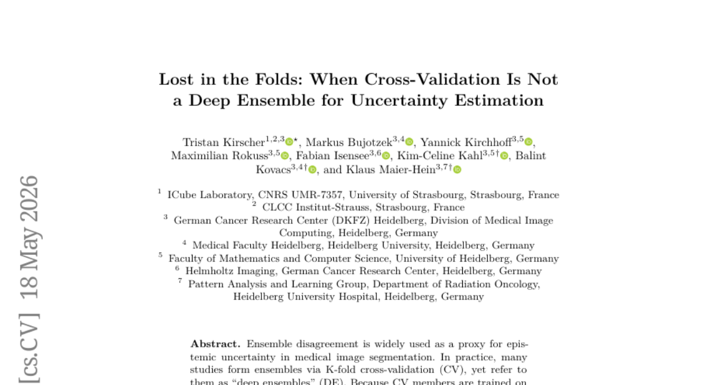

### 📌 한 줄 요약
K-fold 교차 검증(CV)과 딥 앙상블(DE)은 불확실성 추정 방식이 다르므로 연구 목적에 따라 엄격히 구분하여 사용해야 합니다.

### 🔑 핵심 포인트
- CV와 DE의 불확실성 생성 원리 차이 규명 (데이터 분할 vs 시드 변동성)
- 목적에 따른 앙상블 전략 제안 (신뢰성/실패 탐지: DE, 모호성 모델링: CV)
- nnU-Net 파이프라인 내에서 DE를 쉽게 적용할 수 있는 경량 수정 방식 제공

### 🧑‍💻 개발자 관점
모델의 불확실성을 측정할 때 단순히 CV를 사용하는 것이 딥 앙상블과 동일한 효과를 주지 않음을 인지하고, 목적에 맞는 앙상블 전략을 설계해야 합니다.

### 🚀 실무 적용 아이디어
- 현재 사용 중인 CV 기반 앙상블이 DE와 동일한 성능/불확실성 특성을 보이는지 비교 실험
- 실패 탐지(Failure Detection)가 목적일 경우 CV 대신 DE 방식으로 전환
- 제공된 nnU-Net 수정 방식을 적용하여 DE 파이프라인 구축 테스트

### ⚠️ 리스크/한계
- 데이터셋의 특성에 따라 CV와 DE의 성능 역전 가능성 존재
- DE는 동일 데이터셋을 반복 학습하므로 CV보다 연산 비용이 낮을 수 있으나 과적합 위험이 있음

### 📝 초록 기반 상세 설명
의료 영상 분할 분야에서는 앙상블 간의 불일치를 에피스테믹 불확실성(epistemic uncertainty)의 대리 지표로 자주 사용합니다. 그러나 많은 연구가 K-fold 교차 검증(CV)을 수행하면서 이를 '딥 앙상블(DE)'로 혼용하여 용어와 구현의 불일치를 야기합니다. 본 연구는 동일한 설정에서 5-fold CV와 5-member DE를 비교 분석하여 불확실성 측정 능력을 검증했습니다. 실험 결과, DE는 정확도 유지와 함께 캘리브레이션 및 실패 탐지에 강점을 보인 반면, CV는 데이터 노출 차이로 인해 레이블 간 모호성을 반영하는 경향이 있었습니다. 따라서 신뢰성 중심의 작업에는 DE를, 데이터의 모호성 모델링에는 CV를 선택하는 것이 적절합니다.

### 🖼️ 추가 자료
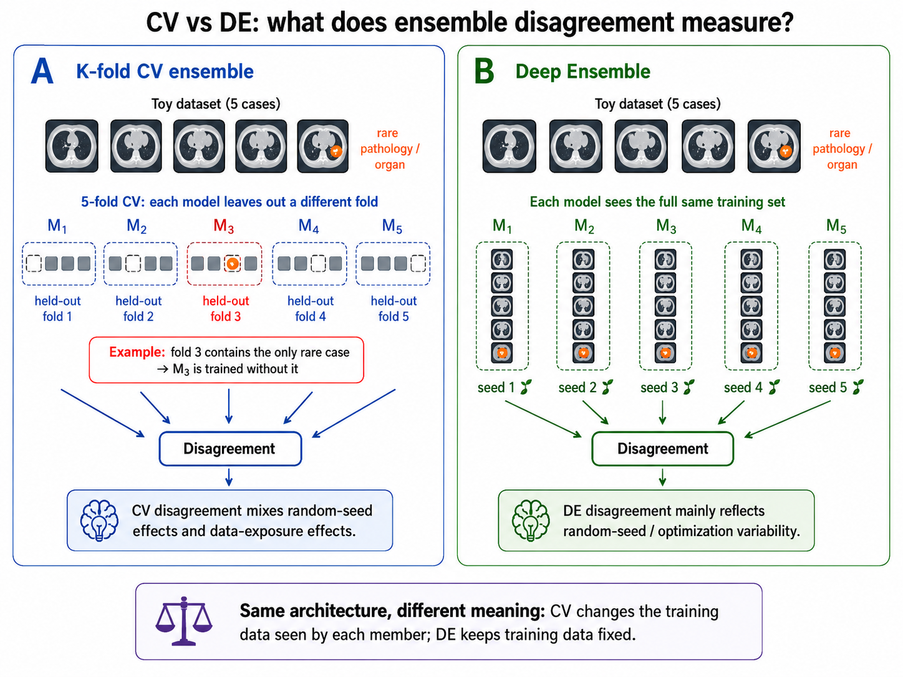

---

## 38. [Learning from Language Feedback via Variational Policy Distillation](https://huggingface.co/papers/2605.15113)
**Upvotes**: 1 | **도입 난이도**: 상 | **신뢰도**: 상
**arXiv**: https://arxiv.org/abs/2605.15113

**태그**: Reinforcement Learning, LLM Reasoning, Policy Distillation, Self-Improvement, Reasoning, Vision, Evaluation, Distillation

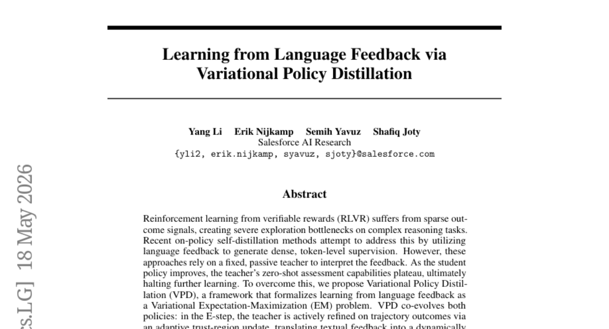

### 📌 한 줄 요약
언어 피드백을 활용한 교사-학생 모델의 동적 상호 진화를 통해 복잡한 추론 태스크의 학습 병목을 해결하는 프레임워크

### 🔑 핵심 포인트
- 언어 피드백 학습을 변분 EM 프레임워크로 정형화하여 교사와 학생 모델의 동시 진화 구현
- 고정된 교사 모델의 한계를 극복하기 위해 적응형 신뢰 영역(Trust-region) 기반의 교사 모델 업데이트 도입
- 희소한 결과 보상을 밀집된 토큰 수준의 분포 가이드로 변환하여 학습 효율 극대화

### 🧑‍💻 개발자 관점
LLM이 스스로 생성한 결과물에 대해 피드백을 주고 학습하는 'Self-improvement' 루프를 구축할 때, 교사 모델의 성능 정체 문제를 해결할 수 있는 방법론을 제시합니다.

### 🚀 실무 적용 아이디어
- 특정 도메인(수학, 코딩) 데이터셋에 대해 기존 Self-distillation과 VPD의 수렴 속도 비교 실험
- 교사 모델의 업데이트 강도(Trust-region 파라미터)에 따른 학생 모델의 학습 안정성 테스트
- 피드백의 질이 낮은 'Cold-start' 상황에서의 프레임워크 강건성 검증

### ⚠️ 리스크/한계
- 교사 모델과 학생 모델이 동시에 학습됨에 따라 발생할 수 있는 학습 불안정성 및 모드 붕괴(Mode collapse) 위험
- 복잡한 수식 계산 및 엄격한 논리 구조가 필요한 태스크에서의 성능 한계 가능성

### 📝 초록 기반 상세 설명
복잡한 추론 작업에서 검증 가능한 보상(RLVR)은 희소한 신호로 인해 탐색의 어려움을 겪습니다. 기존의 언어 피드백 기반 자기 증류(Self-distillation) 방식은 고정된 교사 모델에 의존하여 학생 모델의 성장에 따라 학습 효율이 정체되는 한계가 있습니다. 이를 해결하기 위해 본 논문은 언어 피드백 학습을 변분 EM(Variational EM) 문제로 정형화한 VPD(Variational Policy Distillation)를 제안합니다. E-step에서는 신뢰 영역 업데이트를 통해 교사 모델을 정교화하고, M-step에서는 학생 모델이 이 밀집된 분포 가이드를 학습합니다. 실험 결과, VPD는 과학적 추론 및 코드 생성 태스크에서 기존 RLVR 및 자기 증식 방식보다 우수한 성능을 보였습니다.

---

