# 2026-05-23 Daily Papers (Top 46)

## 오늘의 요약
오늘의 연구는 LLM의 추론 효율성 향상과 에이전트의 장기적 워크플로우 수행 능력에 집중되었습니다. 또한, 멀티모달 모델이 텍스트 변환 과정에서의 정보 손실을 극복하고 물리적/사회적 맥락을 정확히 이해하기 위한 새로운 벤치마크와 프레임워크들이 주목받았습니다.

### 오늘의 핵심 포인트
- 에이전트의 선제적 대응과 장기적 맥락 유지 능력을 평가하기 위한 새로운 벤치마크와 데이터 컴파일 기법이 제시되었습니다.
- 모델의 효율성을 높이기 위해 Full-attention을 Sparse 모델로 전환하거나, RL 학습 시 특정 토큰에 편향되는 문제를 해결하는 알고리즘이 제안되었습니다.
- 멀티모달 환경에서 텍스트 압축에 의한 정보 손실을 방지하고, 물리 법칙이 적용된 3D 객체를 생성하는 등 실질적인 환경 구축 기술이 논의되었습니다.

**오늘의 태그**: AI Agent, LLM Efficiency, Multimodal Reasoning, Benchmark, Long-Context

## 1. [TransitLM: A Large-Scale Dataset and Benchmark for Map-Free Transit Route Generation](https://huggingface.co/papers/2605.22355)
**Upvotes**: 136 | **도입 난이도**: 중 | **신뢰도**: 상
**arXiv**: https://arxiv.org/abs/2605.22355

**태그**: LLM, Dataset, Route Planning, Benchmark, Evaluation

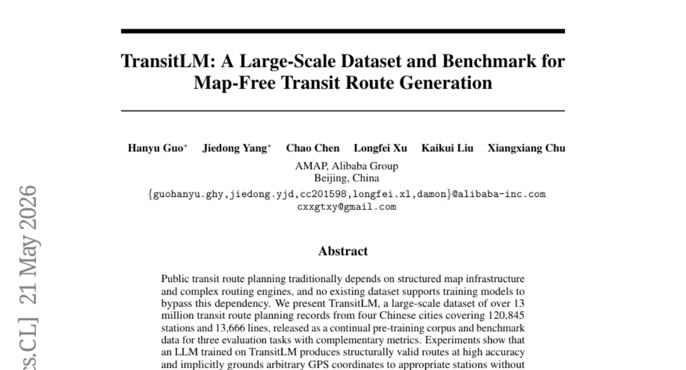

### 📌 한 줄 요약
지도 데이터 없이 오직 데이터 학습만으로 경로를 생성하는 Map-free 대중교통 경로 생성 기술 제안

### 🔑 핵심 포인트
- 1,300만 개 이상의 대규모 대중교통 경로 데이터셋(TransitLM) 구축
- 지도 인프라 없이 GPS 좌표를 역에 매핑하고 경로를 생성하는 Map-free 방식 제안
- LLM을 활용한 엔드투엔드 대중교통 경로 생성 가능성 입증

### 🧑‍💻 개발자 관점
복잡한 GIS 엔진이나 지도 데이터 없이도 LLM만으로 경로 탐색 에이전트를 구현할 수 있는 새로운 패러다임을 제시합니다.

### 🚀 실무 적용 아이디어
- 제공된 HuggingFace 데이터셋을 활용한 소규모 LLM 파인튜닝 실험
- 다양한 도시 데이터에 대한 모델의 일반화 성능 테스트
- 기존 그래프 기반 라우팅 엔진과의 생성 경로 정확도 비교

### ⚠️ 리스크/한계
- 실제 물리적 지도 데이터가 없는 상태에서의 경로 유효성 검증 필요
- 학습 데이터에 포함되지 않은 새로운 도시나 노선에 대한 확장성 문제

### 📝 초록 기반 상세 설명
기존의 대중교통 경로 계획은 복잡한 지도 인프라와 라우팅 엔진에 의존해야 하는 한계가 있었습니다. 이를 해결하기 위해 4개 도시의 1,300만 개 이상의 경로 데이터를 포함한 TransitLM 데이터셋을 구축했습니다. 이 데이터셋은 지속적 사전 학습(Continual Pre-training)과 세 가지 평가 태스크를 위한 벤치마크로 활용됩니다. 실험 결과, TransitLM로 학습된 LLM은 지도 없이도 GPS 좌표를 적절한 역에 매핑하며 구조적으로 유효한 경로를 생성했습니다. 이는 경로 계획이 데이터만으로 학습 가능하며, 목적지 정보로부터 직접적인 엔드투엔드 생성이 가능함을 입증합니다.

---

## 2. [Perception or Prejudice: Can MLLMs Go Beyond First Impressions of Personality?](https://huggingface.co/papers/2605.22109)
**Upvotes**: 125 | **도입 난이도**: 중 | **신뢰도**: 상
**arXiv**: https://arxiv.org/abs/2605.22109

**태그**: MLLM, Personality-Recognition, Benchmark, Multimodal, Agent, Reasoning, Video, Evaluation

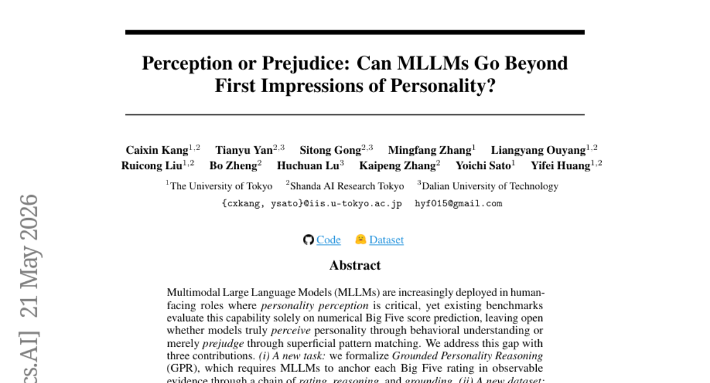

### 📌 한 줄 요약
MLLM의 성격 예측 능력이 단순한 패턴 매칭(편견)인지 실제 행동 근거에 기반한 추론인지 검증하는 새로운 벤치마크와 데이터셋 제안

### 🔑 핵심 포인트
- Grounded Personality Reasoning(GPR) 태스크 정의: 점수 산출, 추론, 근거 제시를 통합한 평가 체계
- MM-OCEAN 데이터셋 공개: 1,104개의 비디오와 5,320개의 문항을 포함한 멀티모달 성격 데이터셋
- 모델의 편견 및 근거 부족 문제 규명: 정답률과 근거 제시 능력 사이의 괴리(Prejudice Gap) 확인

### 🧑‍💻 개발자 관점
AI 에이전트가 인간과 상호작용할 때, 단순한 결과값이 아닌 논리적 근거를 바탕으로 판단하도록 설계하는 것이 신뢰성 확보의 핵심임을 시사합니다.

### 🚀 실무 적용 아이디어
- 현재 사용 중인 멀티모달 모델에 MM-OCEAN 데이터셋을 적용하여 근거 제시 능력 테스트
- 모델의 답변이 단순 패턴 매칭인지 실제 비디오 큐(cue)에 기반한 것인지 분석하는 프롬프트 엔지니어링 실험
- 성격 예측 결과와 근거(Reasoning) 간의 일치도를 측정하는 평가 파이프라인 구축

### ⚠️ 리스크/한계
- 모델이 정답을 맞히더라도 잘못된 근거를 생성하는 '환각(Confabulation)' 위험 존재
- 비디오 데이터의 복잡성으로 인해 모델의 추론 성능이 점수 예측 성능에 비해 낮을 수 있음

### 📝 초록 기반 상세 설명
최근 MLLM이 인간 대면 역할을 수행하며 성격 인지 능력이 중요해지고 있으나, 기존 벤치마크는 단순 점수 예측에만 치중하여 모델이 실제 행동을 이해하는지 아니면 표면적 패턴에 의존하는지 구분하지 못합니다. 이를 해결하기 위해 관찰 가능한 증거를 바탕으로 성격을 추론하는 'Grounded Personality Reasoning(GPR)' 태스크를 정의했습니다. 연구진은 멀티 에이전트 파이프라인으로 구축된 비디오 데이터셋인 MM-OCEAN을 공개했습니다. 27종의 MLLM을 대상으로 평가한 결과, 정답을 맞히더라도 근거가 없는 '편견 격차(Prejudice Gap)'가 심각함을 발견했습니다. 이는 모델이 올바른 점수를 내더라도 잘못된 이유로 판단할 수 있음을 시사합니다.

---

## 3. [DelTA: Discriminative Token Credit Assignment for Reinforcement Learning from Verifiable Rewards](https://huggingface.co/papers/2605.21467)
**Upvotes**: 124 | **도입 난이도**: 중 | **신뢰도**: 상
**arXiv**: https://arxiv.org/abs/2605.21467

**태그**: LLM, Reinforcement Learning, Reasoning, Optimization, RAG, Benchmark, Evaluation

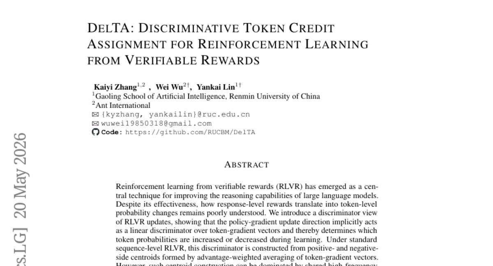

### 📌 한 줄 요약
RLVR 학습 시 공통 패턴에 의한 간섭을 줄이고 보상에 직결된 토큰에 집중하도록 하는 새로운 크레딧 할당 기법

### 🔑 핵심 포인트
- RLVR 업데이트 과정에서 토큰 그래디언트 벡터가 판별기(Discriminator) 역할을 수행함을 이론적으로 규명
- 포맷팅 토큰 등 공유 패턴이 학습 방향을 왜곡하는 문제를 해결하기 위한 DelTA 알고리즘 제안
- 토큰별 계수(Coefficient)를 통해 보상에 유의미한 토큰 방향을 강화하고 약한 방향을 억제하는 크레딧 할당 방식

### 🧑‍💻 개발자 관점
LLM의 RLHF/RLVR 학습 시, 단순한 문장 단위 보상이 특정 토큰(예: 줄바꿈, 특수문자)에만 과도하게 학습되는 현상을 방지하고 추론 핵심 로직에 집중하게 만들 수 있습니다.

### 🚀 실무 적용 아이디어
- 기존 RLVR 학습 루프에 DelTA의 토큰 계수 재가중(Reweighting) 로직 적용 실험
- 학습 중 특정 포맷팅 토큰의 확률이 비정상적으로 치솟는 현상이 발생하는지 모니터링
- 수학/코드와 같이 정답이 명확한 태스크에서 기존 PPO/DPO 대비 성능 차이 검증

### ⚠️ 리스크/한계
- 토큰별 계수 추정 과정에서 학습 불안정성이 발생할 가능성
- 특정 도메인에 과적합될 경우 일반적인 대화 능력 저하 우려

### 📝 초록 기반 상세 설명
LLM의 추론 능력 향상을 위해 검증 가능한 보상을 사용하는 RLVR 방식이 널리 사용되고 있습니다. 그러나 시퀀스 단위의 보상이 개별 토큰의 확률 변화로 어떻게 전이되는지에 대한 메커니즘은 여전히 불분명합니다. 기존 방식은 학습 과정에서 포맷팅 토큰과 같은 고빈도 패턴이 중심점(centroid)을 지배하여, 정답과 오답을 구분하는 핵심적인 토큰 방향성을 희석시키는 문제가 있습니다. 이를 해결하기 위해 본 논문은 토큰별 계수를 추정하여 변별력이 높은 방향은 증폭하고 공유 패턴은 억제하는 DelTA 기법을 제안합니다. 실험 결과, DelTA는 수학적 추론 벤치마크에서 기존 베이스라인 대비 우수한 성능 향상을 보였으며 코드 생성 및 도메인 외 데이터에서도 높은 일반화 성능을 입증했습니다.

---

## 4. [π-Bench: Evaluating Proactive Personal Assistant Agents in Long-Horizon Workflows](https://huggingface.co/papers/2605.14678)
**Upvotes**: 75 | **도입 난이도**: 하 | **신뢰도**: 상
**arXiv**: https://arxiv.org/abs/2605.14678

**태그**: AI Agent, Benchmark, Multi-turn Interaction, Proactive Assistance, Agent, Evaluation

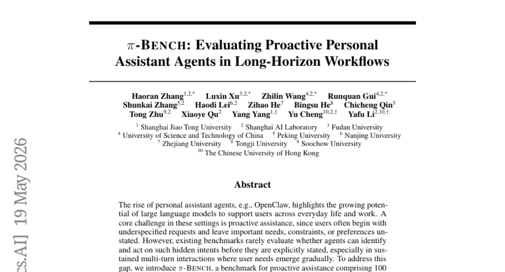

### 📌 한 줄 요약
사용자의 숨겨진 의도를 파악하여 장기적인 워크플로우를 수행하는 에이전트의 선제적 대응 능력을 평가하는 벤치마크 제안

### 🔑 핵심 포인트
- 숨겨진 의도와 태스크 간 의존성을 포함한 100개의 멀티턴 시나리오 구축
- 단순 작업 완료를 넘어선 '선제적 대응(Proactivity)' 능력의 정량적 평가 체계 마련
- 장기적 워크플로우(Long-horizon)에서의 세션 간 연속성 및 맥락 유지 능력 검증

### 🧑‍💻 개발자 관점
단순 질의응답을 넘어 사용자의 의도를 예측하고 먼저 움직이는 '지능형 에이전트' 개발 시, 성능 측정의 기준점으로 활용 가능합니다.

### 🚀 실무 적용 아이디어
- 현재 개발 중인 에이전트의 멀티턴 시나리오에 π-Bench의 페르소나 설정 적용해보기
- 에이전트가 작업 완료(Task Completion)와 선제적 행동(Proactivity) 중 어디에 치중되어 있는지 분석하기
- 과거 대화 기록(Memory)이 새로운 의도 파악에 미치는 영향력 테스트하기

### ⚠️ 리스크/한계
- 정해진 페르소나와 시나리오 내에서의 평가이므로 실제 환경의 무한한 변동성을 모두 반영하기 어려움
- 선제적 행동이 사용자에게 오히려 방해가 되는 '과잉 개입' 리스크를 평가하는 기준은 미비함

### 📝 초록 기반 상세 설명
최근 개인용 비서 에이전트의 발전에도 불구하고, 사용자가 명시하지 않은 요구사항이나 제약사항을 스스로 파악하는 선제적(Proactive) 능력에 대한 평가는 부족한 실정입니다. 기존 벤치마크는 단발성 작업에 치중되어 있어, 시간이 흐름에 따라 변화하는 사용자 의도와 복잡한 의존성을 평가하기 어렵습니다. 이를 해결하기 위해 5개의 페르소나와 100개의 멀티턴 태스크로 구성된 π-Bench를 도입합니다. 이 벤치마크는 숨겨진 의도, 태스크 간 의존성, 세션 간 연속성을 포함하여 장기적인 워크플로우에서의 선제적 대응 능력을 측정합니다. 실험 결과, 에이전트가 단순히 작업을 완료하는 것과 선제적으로 행동하는 것 사이에는 명확한 차이가 있으며, 이전 상호작용 데이터가 선제적 의도 해결에 중요한 역할을 함을 확인했습니다.

---

## 5. [Full Attention Strikes Back: Transferring Full Attention into Sparse within Hundred Training Steps](https://huggingface.co/papers/2605.16928)
**Upvotes**: 70 | **도입 난이도**: 중 | **신뢰도**: 상
**arXiv**: https://arxiv.org/abs/2605.16928

**태그**: LLM, Efficiency, Long-Context, Sparse-Attention, RAG, Reasoning, Benchmark, Evaluation, Inference

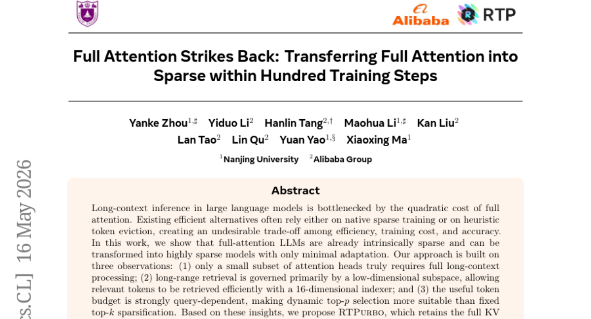

### 📌 한 줄 요약
Full-attention 모델의 내재적 희소성을 활용하여 수백 단계의 미세 조정만으로 긴 컨텍스트 추론 효율을 극대화하는 RTPurbo 제안

### 🔑 핵심 포인트
- Full-attention 모델의 내재적 희소성을 활용한 효율적인 변환 기법 제안
- 저차원 인덱서(16-dim)와 Query-dependent dynamic top-p 선택을 통한 효율적 토큰 검색
- 수백 단계의 짧은 학습만으로 Full-attention 모델을 고효율 Sparse 모델로 전환

### 🧑‍💻 개발자 관점
대규모 컨텍스트를 다루는 서비스에서 모델을 처음부터 다시 학습시키지 않고도 기존 모델의 추론 속도를 획기적으로 높일 수 있는 실용적인 방법론입니다.

### 🚀 실무 적용 아이디어
- 기존 Full-attention 모델에 RTPurbo의 저차원 인덱싱 구조 적용 테스트
- Long-context 벤치마크를 통한 정확도 유지 여부 검증
- 다양한 컨텍스트 길이에서의 Prefill/Decode 속도 향상 폭 측정

### ⚠️ 리스크/한계
- 모델의 구조적 특성에 따라 학습 수렴 속도나 정확도 유지력이 달라질 수 있음
- 특정 도메인이나 태스크에서 dynamic top-p 방식의 안정성 검증 필요

### 📝 초록 기반 상세 설명
LLM의 긴 컨텍스트 처리는 Full-attention의 이차 복잡도 문제로 인해 병목 현상이 발생합니다. 기존의 희소(Sparse) 모델 방식은 학습 비용과 정확도 사이의 트레이드오프가 발생하는 문제가 있었습니다. 본 논문은 Full-attention 모델이 이미 내재적으로 희소하다는 점에 착안하여, retrieval head와 저차원 인덱서를 활용하는 RTPurbo를 제안합니다. 이 방식은 전체 KV 캐시를 유지하는 head와 희소하게 처리하는 head를 분리하여 효율적인 토큰 선택을 가능하게 합니다. 실험 결과, RTPurbo는 정확도 손실을 최소화하면서도 1M 컨텍스트 환경에서 압도적인 프리필(prefill) 속도 향상을 달성했습니다.

---

## 6. [ACC: Compiling Agent Trajectories for Long-Context Training](https://huggingface.co/papers/2605.21850)
**Upvotes**: 51 | **도입 난이도**: 하 | **신뢰도**: 상
**arXiv**: https://arxiv.org/abs/2605.21850

**태그**: Agent, Long-Context, SFT, Data Engineering, Reasoning, Vision, Benchmark, Evaluation

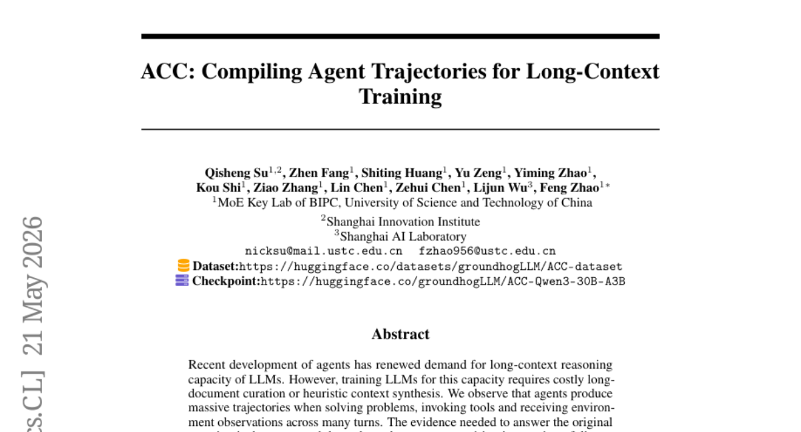

### 📌 한 줄 요약
에이전트의 멀티턴 실행 기록을 활용하여 별도의 어노테이션 없이 대규모 컨텍스트 추론 능력을 학습시키는 데이터 컴파일 기법

### 🔑 핵심 포인트
- 에이전트의 멀티턴 궤적을 활용한 자동화된 장거리 컨텍스트 학습 데이터 생성
- 툴 응답과 환경 관찰값을 질문과 결합하여 정보 간의 의존성을 명시적으로 학습
- 추가적인 수동 어노테이션 없이 기존 에이전트 로그만으로 확장 가능한 SFT 데이터 확보

### 🧑‍💻 개발자 관점
에이전트 개발 시 발생하는 방대한 로그 데이터를 별도의 가공 없이 고성능 컨텍스트 학습 데이터로 전환할 수 있는 실용적인 파이프라인을 제시합니다.

### 🚀 실무 적용 아이디어
- 보유 중인 에이전트 실행 로그를 질문-응답 쌍으로 변환하는 파이프라인 구축
- 학습 데이터 구성 시 툴 응답과 질문 간의 관계가 명확히 드러나도록 구성 테스트
- 학습된 모델의 attention map을 분석하여 장거리 의존성 해결 여부 확인

### ⚠️ 리스크/한계
- 에이전트 로그의 품질이 낮을 경우 생성된 QA 쌍의 신뢰도 저하 가능성
- 특정 도메인(검색, DB 등)에 특화된 데이터로 학습 시 범용 추론 능력과의 트레이드오프 발생 가능성

### 📝 초록 기반 상세 설명
최근 에이전트의 발전으로 LLM의 긴 컨텍스트 추론 능력이 중요해졌으나, 이를 위한 고품질 데이터 구축 비용이 매우 높습니다. 기존의 에이전트 SFT 방식은 툴 응답을 마스킹하여 멀티턴 과정에 흩어진 증거들을 활용하는 능력을 학습시키지 못하는 한계가 있습니다. 본 논문은 에이전트의 실행 궤적(trajectory)을 질문과 환경 관찰값이 결합된 긴 컨텍스트 QA 쌍으로 변환하는 ACC(Agent Context Compilation)를 제안합니다. 이 방법은 툴 사용 없이 질문에 직접 답하게 함으로써 멀리 떨어진 정보 간의 의존성을 명시적으로 학습시킵니다. 실험 결과, ACC는 일반적인 성능을 유지하면서도 MRCR 및 GraphWalks와 같은 장거리 의존성 벤치마크에서 비약적인 성능 향상을 달성했습니다.

---

## 7. [PhysX-Omni: Unified Simulation-Ready Physical 3D Generation for Rigid, Deformable, and Articulated Objects](https://huggingface.co/papers/2605.21572)
**Upvotes**: 42 | **도입 난이도**: 상 | **신뢰도**: 상
**arXiv**: https://arxiv.org/abs/2605.21572

**태그**: 3D Generation, Embodied AI, Physics Simulation, Robotics, Vision, Evaluation, Optimization

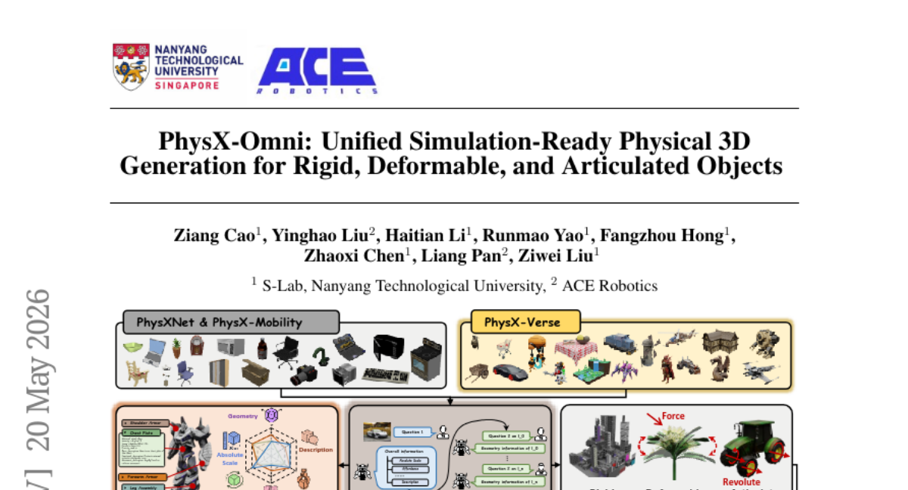

### 📌 한 줄 요약
강체, 변형체, 관절형 객체를 모두 아우르는 시뮬레이션 가능한 통합 3D 생성 프레임워크 개발

### 🔑 핵심 포인트
- 강체, 변형체, 관절형 객체를 통합 생성하는 PhysX-Omni 프레임워크 제안
- VLM에 최적화된 고해상도 비압축 기하학적 표현 방식 개발
- 시뮬레이션용 대규모 데이터셋(PhysXVerse) 및 다각적 평가 벤치마크(PhysX-Bench) 구축

### 🧑‍💻 개발자 관점
로봇 시뮬레이션 및 Embodied AI 환경 구축 시, 물리 법칙이 적용된 고품질 3D 에셋을 즉각적으로 생성할 수 있는 기술적 토대를 제공합니다.

### 🚀 실무 적용 아이디어
- 제안된 기하학적 표현 방식이 기존 3D 생성 모델(Gaussian Splatting 등)과 어떻게 호환되는지 분석
- PhysX-Bench를 활용하여 기존 오픈소스 3D 생성 모델의 물리적 정확도 비교 테스트
- 생성된 에셋을 NVIDIA Isaac Gym 등 물리 엔진에 임포트하여 시뮬레이션 안정성 검증

### ⚠️ 리스크/한계
- 고해상도 비압축 표현 방식 사용에 따른 높은 컴퓨팅 자원 요구 가능성
- 복잡한 물리적 상호작용이 포함된 시나리오에서의 생성 일관성 유지 여부

### 📝 초록 기반 상세 설명
기존의 3D 생성 방식은 물리적 특성을 간과하거나 특정 객체 카테고리에 국한되는 한계가 있었습니다. 이를 해결하기 위해 다양한 자산 유형을 지원하는 통합 프레임워크인 PhysX-Omni를 제안합니다. VLM(Vision-Language Models)에 최적화되어 압축 없이 고해상도 구조를 인코딩하는 새로운 기하학적 표현 방식을 도입했습니다. 또한, 다양한 카테고리를 포함하는 최초의 시뮬레이션용 3D 데이터셋인 PhysXVerse와 다각도 평가 벤치마크인 PhysX-Bench를 구축했습니다. 실험 결과, PhysX-Omni는 생성 및 이해 능력 모두에서 뛰어난 성능을 보였으며 로봇 정책 학습 등 실질적인 활용 가능성을 입증했습니다.

---

## 8. [LatentOmni: Rethinking Omni-Modal Understanding via Unified Audio-Visual Latent Reasoning](https://huggingface.co/papers/2605.22012)
**Upvotes**: 33 | **도입 난이도**: 상 | **신뢰도**: 상
**arXiv**: https://arxiv.org/abs/2605.22012

**태그**: Multimodal, Audio-Visual, Latent Reasoning, Deep Learning, Reasoning, Vision, Audio, Benchmark, Evaluation

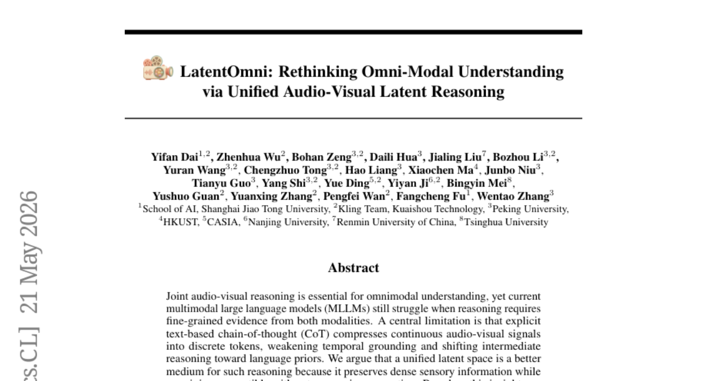

### 📌 한 줄 요약
텍스트 기반 CoT의 정보 손실 문제를 해결하기 위해 오디오-비주얼 잠재 공간(Latent Space)을 직접 활용하는 새로운 옴니모달 추론 프레임워크

### 🔑 핵심 포인트
- 텍스트 압축으로 인한 정보 손실을 방지하기 위해 오디오-비주얼 잠재 상태를 추론 과정에 직접 활용
- 시간적 일관성 유지를 위한 OSPE(Omni-Sync Position Embedding) 및 특징 수준 정렬 기법 도입
- 잠재 공간 내 추론 궤적 학습을 위한 35K 규모의 고품질 데이터셋 구축

### 🧑‍💻 개발자 관점
멀티모달 모델 개발 시 텍스트로 변환하는 과정에서 발생하는 정보 손실(Temporal/Fine-grained loss)을 어떻게 제어할지에 대한 새로운 아키텍처적 방향성을 제시합니다.

### 🚀 실무 적용 아이디어
- 기존 텍스트 기반 MLLM과 Latent-based 모델의 추론 결과(Grounding 정확도) 비교 실험
- 특정 도메인(예: 영상 편집, 보안 관제) 데이터셋에 대한 OSPE의 시간적 정렬 성능 검증
- 제안된 데이터셋 구조를 활용한 커스텀 멀티모달 학습 파이프라인 설계

### ⚠️ 리스크/한계
- 잠재 공간을 직접 다루는 방식은 기존 텍스트 중심 LLM 워크플로우와 통합 시 복잡도가 높음
- 연속적인 잠재 상태를 다루는 과정에서 연산 비용 및 메모리 사용량 증가 가능성

### 📝 초록 기반 상세 설명
기존의 멀티모달 모델은 오디오-비주얼 추론 시 텍스트 기반의 Chain-of-Thought(CoT)를 사용하지만, 이 과정에서 연속적인 센서 데이터가 이산적인 토큰으로 압축되며 세밀한 정보가 손실되는 문제가 있습니다. 이를 해결하기 위해 연구진은 텍스트 추론과 오디오-비주얼 잠재 상태를 교차 배치하는 LatentOmni 프레임워크를 제안합니다. 이 모델은 특징 수준의 감독(Feature-level supervision)을 통해 잠재 추론 상태를 작업 관련 센서 특징에 정렬하며, OSPE(Omni-Sync Position Embedding)를 통해 시간적 일관성을 유지합니다. 또한, 잠재 공간 추론을 학습시키기 위한 35K 규모의 데이터셋인 LatentOmni-Instruct-35K를 구축했습니다. 실험 결과, LatentOmni는 기존 텍스트 CoT 방식보다 뛰어난 성능을 보이며 옴니모달 이해를 위한 잠재 공간 추론의 가능성을 입증했습니다.

---

## 9. [Spreadsheet-RL: Advancing Large Language Model Agents on Realistic Spreadsheet Tasks via Reinforcement Learning](https://huggingface.co/papers/2605.22642)
**Upvotes**: 28 | **도입 난이도**: 상 | **신뢰도**: 상
**arXiv**: https://arxiv.org/abs/2605.22642

**태그**: LLM-Agent, Reinforcement-Learning, Automation, Data-Interface, Agent, Benchmark, Evaluation

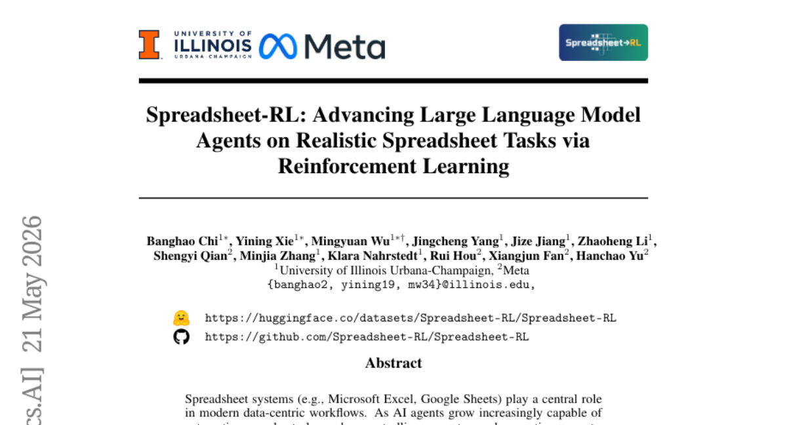

### 📌 한 줄 요약
강화학습(RL)을 통해 복잡한 실무 워크플로우를 수행할 수 있는 전문 스프레드시트 AI 에이전트 프레임워크 제안

### 🔑 핵심 포인트
- 강화학습(RL)을 활용한 전문 스프레드시트 에이전트 미세 조정 프레임워크 개발
- 실제 워크플로우 반영을 위한 데이터 파이프라인 및 도메인 특화 벤치마크(Domain-Spreadsheet) 구축
- Python 샌드박스와 도구 라우팅 규칙이 포함된 멀티턴 RL 환경(Spreadsheet Gym) 제공

### 🧑‍💻 개발자 관점
단순 질의응답을 넘어, 복잡한 수식과 다단계 데이터 처리 로직이 필요한 실무 자동화 에이전트 구축의 방법론을 제시합니다.

### 🚀 실무 적용 아이디어
- 제시된 Spreadsheet Gym 환경을 활용한 에이전트의 도구 사용(Tool-use) 능력 테스트
- 금융/공급망 등 특정 도메인 데이터셋을 활용한 RL 미세 조정 파이프라인 검증
- 기존 프롬프트 엔지니어링 방식과 RL 미세 조정 방식의 성능 차이 비교 실험

### ⚠️ 리스크/한계
- 강화학습 학습 과정에서의 높은 컴퓨팅 자원 요구량 및 학습 불안정성 가능성
- 특정 도메인 데이터에 과적합될 경우 일반적인 스프레드시트 작업에서의 성능 저하 우려

### 📝 초록 기반 상세 설명
현대 데이터 워크플로우에서 스프레드시트는 필수적이지만, 기존 LLM 기반 에이전트는 단순 프롬프팅에 의존하여 복잡한 다단계 작업 수행에 한계가 있었습니다. 이를 해결하기 위해 연구진은 강화학습 기반의 미세 조정 프레임워크인 Spreadsheet-RL을 도입했습니다. 이 프레임워크는 온라인 포럼에서 수집한 데이터와 도메인 특화 벤치마크(Domain-Spreadsheet), 그리고 Python 샌드박스 기반의 Spreadsheet Gym 환경을 포함합니다. 실험 결과, Spreadsheet-RL은 일반 및 도메인 특화 작업 모두에서 에이전트의 성능을 크게 향상시켰습니다. 이는 실무 환경의 데이터 인터페이스 자동화에 있어 높은 잠재력을 보여줍니다.

---

## 10. [WorldKV: Efficient World Memory with World Retrieval and Compression](https://huggingface.co/papers/2605.22718)
**Upvotes**: 27 | **도입 난이도**: 하 | **신뢰도**: 상
**arXiv**: https://arxiv.org/abs/2605.22718

**태그**: Video-Generation, KV-Cache, Memory-Optimization, Diffusion-Models, RAG, Video, Evaluation, Inference, Optimization

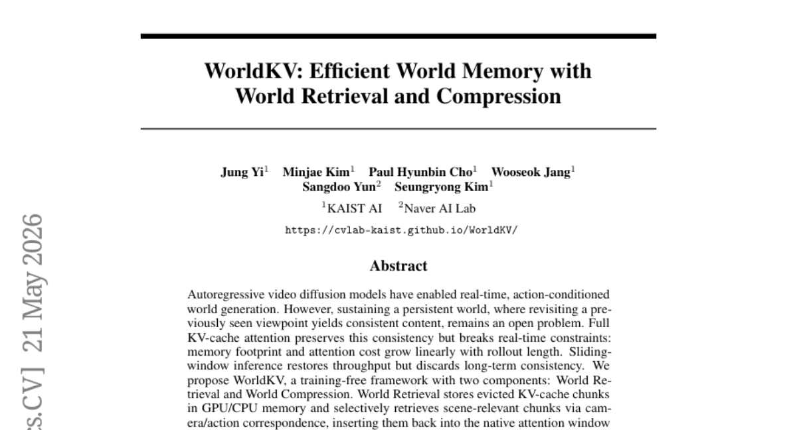

### 📌 한 줄 요약
비디오 생성 모델의 장기적 일관성 유지를 위해 추가 학습 없이 KV-캐시를 효율적으로 관리하는 검색 및 압축 프레임워크

### 🔑 핵심 포인트
- World Retrieval: 카메라 및 액션 대응을 통해 과거의 KV-캐시 청크를 선택적으로 재삽입하는 검색 메커니즘
- World Compression: 앵커 프레임과의 키 유사도를 활용해 중복 토큰을 제거하여 저장 효율 극대화
- Training-free: 별도의 미세 조정(Fine-tuning) 없이 기존 모델에 즉시 적용 가능한 프레임워크

### 🧑‍💻 개발자 관점
실시간 비디오 생성 환경에서 메모리 제약과 장기적 일관성 사이의 트레이드오프를 해결할 수 있는 실용적인 최적화 기법입니다.

### 🚀 실무 적용 아이디어
- 기존 비디오 생성 모델의 KV-캐시 관리 로직에 WorldKV의 압축 알고리즘 적용 테스트
- 카메라 움직임이 급격한 시나리오에서 World Retrieval의 검색 정확도 검증
- 다양한 해상도 및 프레임 레이트에서의 메모리 사용량 및 처리량 벤치마크

### ⚠️ 리스크/한계
- 카메라/액션 정보가 부정확할 경우 잘못된 KV-캐시가 삽입되어 시각적 왜곡 발생 가능성
- 압축 과정에서 미세한 디테일 손실이 발생할 수 있음

### 📝 초록 기반 상세 설명
자기회귀 비디오 확산 모델은 실시간 생성이 가능하지만, 이전에 본 장면을 다시 방문했을 때 일관성을 유지하는 데 어려움이 있습니다. 전체 KV-캐시를 사용하면 일관성은 높지만 메모리와 연산 비용이 선형적으로 증가하며, 슬라이딩 윈도우 방식은 처리량은 높지만 장기적 일관성을 잃습니다. 이를 해결하기 위해 WorldKV는 학습이 필요 없는 두 가지 핵심 기술인 World Retrieval과 World Compression을 제안합니다. World Retrieval은 제거된 KV-캐시를 저장했다가 카메라/액션 연관성에 따라 필요한 부분만 선택적으로 복구하며, World Compression은 앵커 프레임과의 유사도를 기반으로 중복 토큰을 제거하여 저장 용량을 절반으로 줄입니다. 실험 결과, WorldKV는 기존 모델 대비 약 2배의 처리량을 유지하면서도 전체 KV-캐시를 사용하는 수준의 높은 메모리 충실도를 보여주었습니다.

---

## 11. [Forecasting Scientific Progress with Artificial Intelligence](https://huggingface.co/papers/2605.22681)
**Upvotes**: 27 | **도입 난이도**: 하 | **신뢰도**: 상
**arXiv**: https://arxiv.org/abs/2605.22681

**태그**: AI-for-Science, Benchmarking, Forecasting, LLM-Reasoning, Reasoning, Benchmark, Evaluation

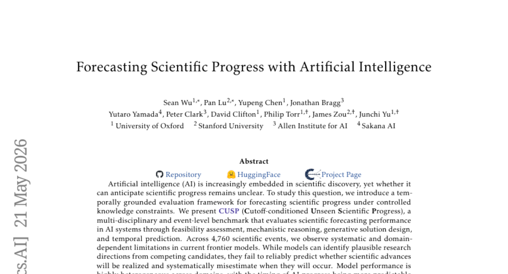

### 📌 한 줄 요약
현재의 AI 모델은 과거 지식 학습만으로는 과학적 발견의 실현 여부와 시점을 예측하는 데 한계가 있음을 입증함

### 🔑 핵심 포인트
- 과학적 예측 능력을 평가하기 위한 다학제적 벤치마크 CUSP 개발
- 모델이 연구의 실현 가능성과 발생 시점을 예측하는 데 있어 체계적인 한계가 있음을 발견
- 학습 데이터 내 지식 노출(Cutoff)이 예측 성능에 미치는 영향이 제한적임을 입증

### 🧑‍💻 개발자 관점
AI를 활용한 연구 자동화나 R&D 전략 수립 시, 모델의 예측 결과가 단순한 지식 재현인지 실제 미래 예측인지 구분하는 것이 중요함을 시사합니다.

### 🚀 실무 적용 아이디어
- LLM을 활용한 연구 가설 생성 시 모델의 과잉 확신(Overconfidence) 편향 검증
- 도메인별(물리 vs AI) 예측 성능 차이를 고려한 전문 모델 튜닝 전략 수립
- 단순 지식 검색(RAG)이 아닌 추론 기반의 미래 시나리오 생성 실험

### ⚠️ 리스크/한계
- 모델의 과잉 확신 및 응답 편향으로 인한 잘못된 의사결정 위험
- 고인용 연구(High-citation)와 같은 핵심적 진보 예측의 어려움

### 📝 초록 기반 상세 설명
AI가 과학적 발견의 과정을 예측할 수 있는지 확인하기 위해 새로운 평가 프레임워크를 도입했습니다. 연구진은 다양한 분야의 과학적 사건을 포함하는 CUSP 벤치마크를 제안하여 모델의 예측 능력을 테스트했습니다. 실험 결과, 모델은 가능한 연구 방향은 식별하지만 실제 성공 여부와 발생 시점을 예측하는 데는 실패했습니다. 특히 생물학, 화학, 물리학 등 특정 도메인에서 성능 차이가 뚜렷하게 나타났습니다. 또한, 학습 데이터에 포함된 지식의 유무가 예측 성능 향상으로 직결되지 않는다는 점을 확인했습니다. 결론적으로 현재의 AI는 과학적 진보를 예측하는 도구로서 신뢰성이 부족합니다.

---

## 12. [Sensor2Sensor: Cross-Embodiment Sensor Conversion for Autonomous Driving](https://huggingface.co/papers/2605.22809)
**Upvotes**: 22 | **도입 난이도**: 상 | **신뢰도**: 상
**arXiv**: https://arxiv.org/abs/2605.22809

**태그**: Autonomous Driving, Diffusion Model, 4D Gaussian Splatting, Sensor Simulation, Computer Vision, RAG, Vision, Video, Evaluation

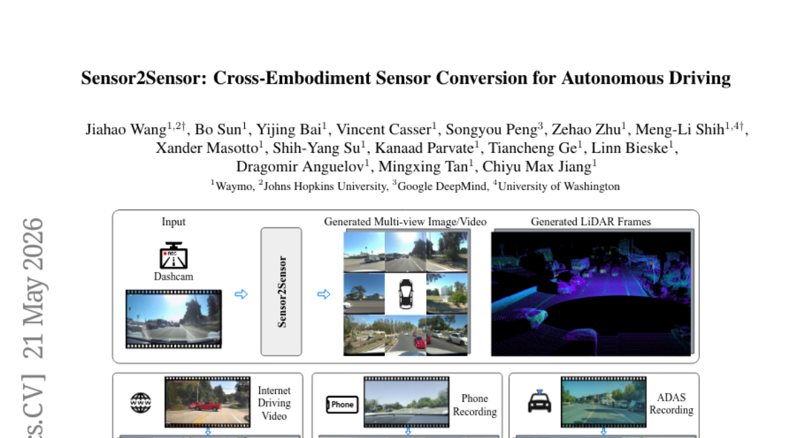

### 📌 한 줄 요약
웹상의 단일 카메라 영상을 자율주행용 멀티모달 센서 데이터(LiDAR, 다중 카메라)로 변환하는 생성형 모델 프레임워크

### 🔑 핵심 포인트
- 4D Gaussian Splatting을 활용한 데이터 쌍(Paired Data) 생성 기법 도입
- Diffusion 기반의 단일 카메라 영상 -> 멀티모달 센서(LiDAR, Multi-view) 변환 기술
- 비구조화된 외부 영상 데이터를 자율주행 학습용 데이터로 전환하는 파이프라인 구축

### 🧑‍💻 개발자 관점
고가의 자율주행 차량 없이도 인터넷의 방대한 영상 데이터를 활용해 고품질의 학습용 시뮬레이션/센서 데이터를 확보할 수 있습니다.

### 🚀 실무 적용 아이디어
- 4D Gaussian Splatting을 이용한 데이터 합성 파이프라인 구축 테스트
- Diffusion 모델의 생성된 LiDAR 포인트 클라우드 정밀도 검증
- 다양한 조도 및 기상 조건에서의 변환 안정성 테스트

### ⚠️ 리스크/한계
- 생성된 데이터의 물리적 정확성이 실제 센서 값과 완벽히 일치하지 않을 가능성
- 고해상도 멀티모달 데이터 생성에 따른 막대한 컴퓨팅 자원 소모

### 📝 초록 기반 상세 설명
자율주행 시스템(ADS) 학습을 위해 방대한 데이터가 필요하지만, 고정밀 AV 데이터는 규모와 다양성 측면에서 한계가 있습니다. 반면 인터넷의 블랙박스 영상은 풍부하지만 구조화된 센서 데이터가 아니라는 문제가 있습니다. 이를 해결하기 위해 4D Gaussian Splatting을 이용해 기존 AV 로그를 영상으로 변환하여 학습 쌍을 생성하는 Sensor2Sensor 프레임워크를 제안합니다. 이 모델은 Diffusion 아키텍처를 활용해 단일 카메라 영상을 고정밀 멀티모달 센서 데이터로 변환합니다. 실험 결과, 생성된 데이터의 높은 충실도와 현실성을 입증하였으며 외부 데이터 소스를 자율주행 개발에 활용할 수 있는 길을 열었습니다.

### 🖼️ 추가 자료
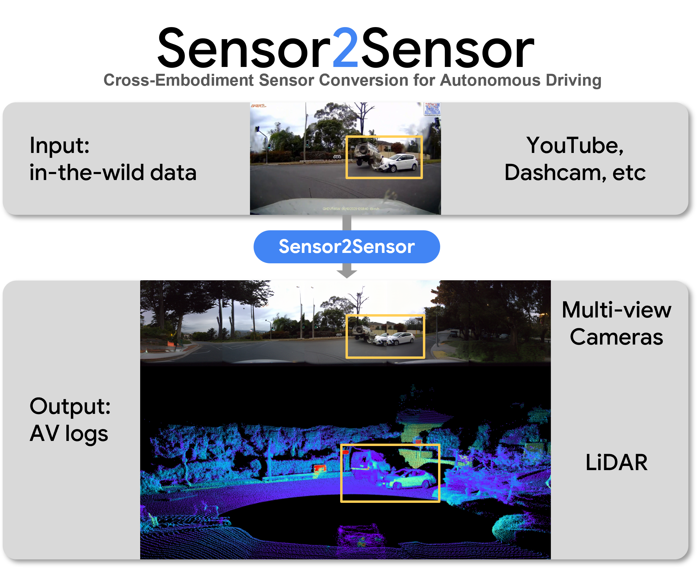

---

## 13. [FlowLong: Inference-time Long Video Generation via Manifold-constrained Tweedie Matching](https://huggingface.co/papers/2605.20910)
**Upvotes**: 21 | **도입 난이도**: 하 | **신뢰도**: 상
**arXiv**: https://arxiv.org/abs/2605.20910

**태그**: Video Generation, Diffusion Models, Inference-time Optimization, Video, Audio, Inference

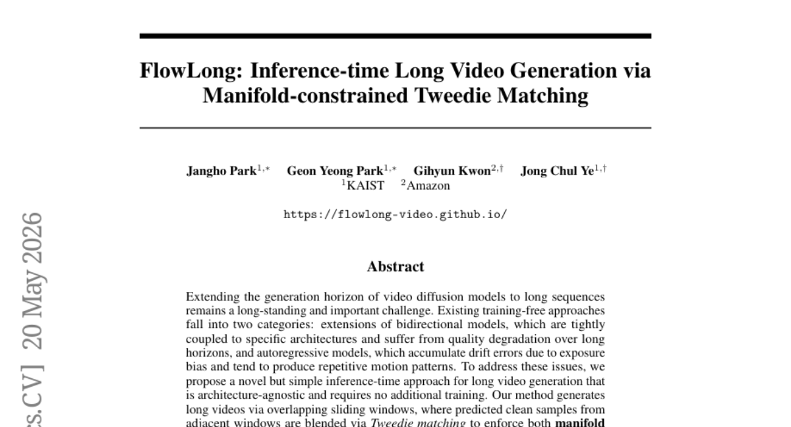

### 📌 한 줄 요약
추가 학습 없이 기존 비디오 생성 모델의 길이를 확장하는 아키텍처 독립적인 추론 기법

### 🔑 핵심 포인트
- 학습이 필요 없는 아키텍처 독립적(Architecture-agnostic) 추론 방식
- Tweedie matching을 활용한 윈도우 간 매니폴드 제약 및 시간적 일관성 확보
- 초기 확률적 샘플링과 후기 결정론적 샘플링의 결합을 통한 궤적 동기화 및 디테일 유지

### 🧑‍💻 개발자 관점
모델 재학습 비용 없이 기존에 구축된 비디오 생성 모델의 출력 길이를 즉각적으로 확장할 수 있는 실용적인 방법론입니다.

### 🚀 실무 적용 아이디어
- 기존 오픈소스 비디오 생성 모델(SVD 등)에 FlowLong 로직 적용 테스트
- 윈도우 크기 변화에 따른 생성 품질 및 일관성 변화 측정
- Tweedie matching 파라미터가 영상의 움직임 강도에 미치는 영향 분석

### ⚠️ 리스크/한계
- 추론 시 슬라이딩 윈도우 방식에 따른 연산 시간 증가 가능성
- 매우 긴 영상 생성 시 누적되는 미세한 일관성 저하 위험

### 📝 초록 기반 상세 설명
기존 비디오 확산 모델은 긴 시퀀스를 생성할 때 품질 저하나 반복적인 움직임 같은 문제에 직면합니다. 이를 해결하기 위해 본 논문은 별도의 학습이 필요 없는 새로운 추론 기반 접근법인 FlowLong을 제안합니다. 슬라이딩 윈도우 방식으로 영상을 생성하며, 인접한 윈도우 간의 데이터 정합성을 위해 Tweedie matching을 통한 매니폴드 제약 및 시간적 일관성을 확보합니다. 또한 초기 단계의 확률적 샘플링을 통해 윈도우 간 궤적을 동기화한 후, 후기에는 결정론적 ODE 샘플링으로 시각적 디테일을 유지합니다. 실험 결과, 기존 방식보다 훨씬 긴 영상을 생성하면서도 높은 일관성과 품질을 보여주었으며 오디오-비디오 및 3DGS 생성으로도 확장 가능함을 입증했습니다.

---

## 14. [SpaceDG: Benchmarking Spatial Intelligence under Visual Degradation](https://huggingface.co/papers/2605.22536)
**Upvotes**: 20 | **도입 난이도**: 중 | **신뢰도**: 상
**arXiv**: https://arxiv.org/abs/2605.22536

**태그**: MLLM, Spatial Intelligence, Robustness, 3DGS, Computer Vision, Reasoning, Multimodal, Vision, Benchmark, Evaluation, Optimization

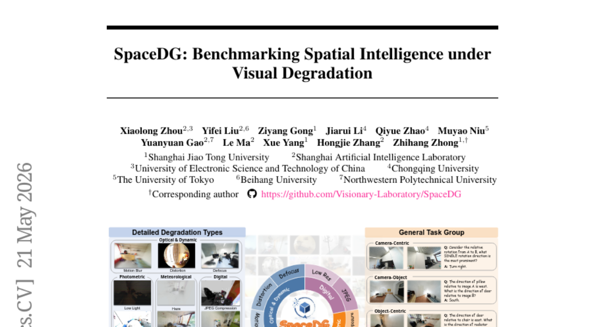

### 📌 한 줄 요약
실제 환경의 시각적 노이즈(Blur, 저조도 등)에 대응하는 MLLM의 공간 지능 강건성을 평가하고 개선하는 벤치마크 연구

### 🔑 핵심 포인트
- 3DGS 기반의 물리적 엔진을 통한 현실적인 9종 시각적 열화 합성 기술 개발
- 대규모 공간 이해 데이터셋 SpaceDG 및 검증된 벤치마크 SpaceDG-Bench 구축
- 열화 환경에 특화된 미세 조정을 통한 MLLM의 공간 추론 강건성 확보

### 🧑‍💻 개발자 관점
로봇, 자율주행, CCTV 등 실제 물리 환경에 배포될 시각 지능 모델의 신뢰성을 확보하기 위한 필수적인 평가 및 학습 방법론을 제시합니다.

### 🚀 실무 적용 아이디어
- 현재 개발 중인 Vision 모델에 SpaceDG의 열화 데이터셋을 적용하여 강건성 테스트 수행
- 3DGS 기반 합성 엔진을 활용하여 특정 도메인(예: 자율주행)에 특화된 노이즈 데이터 생성
- Clean 이미지와 Degraded 이미지 간의 성능 격차를 줄이기 위한 데이터 증강 전략 수립

### ⚠️ 리스크/한계
- 물리적 엔진 기반 합성 데이터가 실제 현실의 복잡한 노이즈를 완벽히 대변하는지에 대한 검증 필요
- 특정 열화 유형에 대한 학습이 다른 유형의 노이즈에 대한 일반화 성능을 저해할 가능성

### 📝 초록 기반 상세 설명
최근 MLLM의 공간 지능이 발전했으나, 기존 벤치마크는 깨끗한 이미지에만 의존하여 실제 환경의 시각적 열화(degradation) 문제를 간과하고 있습니다. 이를 해결하기 위해 3D Gaussian Splatting 기반의 물리적 합성 엔진을 활용하여 9가지 열화 유형을 포함한 대규모 데이터셋인 SpaceDG를 제안합니다. 약 1,000개의 실내 장면과 1M개의 QA 쌍을 포함하는 이 데이터셋은 현실적인 시각적 노이즈를 시뮬레이션합니다. 실험 결과, 기존 MLLM들은 시각적 열화에 따라 공간 추론 능력이 크게 저하되는 취약성을 보였습니다. 마지막으로 SpaceDG를 통한 미세 조정(Finetuning)이 깨끗한 이미지의 성능 저하 없이 열화 환경에서의 강건성을 획기적으로 높일 수 있음을 입증했습니다.

---

## 15. [SEGA: Spectral-Energy Guided Attention for Resolution Extrapolation in Diffusion Transformers](https://huggingface.co/papers/2605.22668)
**Upvotes**: 19 | **도입 난이도**: 하 | **신뢰도**: 상
**arXiv**: https://arxiv.org/abs/2605.22668

**태그**: Diffusion Transformers, Image Generation, Super-resolution, Attention Mechanism, Vision, Inference

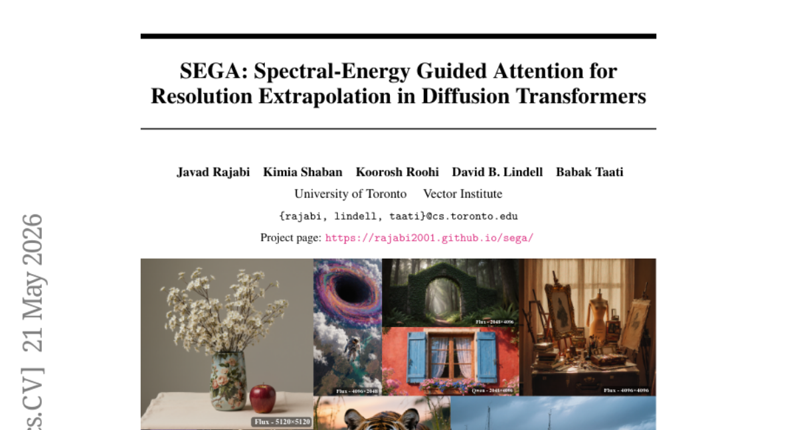

### 📌 한 줄 요약
학습 없이 DiT의 해상도 확장 시 발생하는 구조적 왜곡과 디테일 손실 문제를 주파수 기반 어텐션 스케일링으로 해결한 기술

### 🔑 핵심 포인트
- 주파수 특성을 고려한 동적 어텐션 스케일링(SEGA) 도입
- 학습 없이(Training-free) 고해상도 해상도 외삽(Extrapolation) 성능 극대화
- 글로벌 구조 유지와 로컬 디테일 복구 사이의 균형 최적화

### 🧑‍💻 개발자 관점
추가적인 모델 재학습 없이 기존 DiT 모델의 생성 해상도를 높일 수 있어, 고해상도 이미지 생성 파이프라인 구축 시 비용 효율적인 솔루션을 제공합니다.

### 🚀 실무 적용 아이디어
- 기존 RoPE 기반 DiT 모델에 SEGA 알고리즘 적용 및 해상도별 품질 비교
- 디노이징 스텝별 주파수 스케일링 파라미터 변화에 따른 생성 결과 분석
- 다양한 체크포인트(Stable Diffusion 3 등)에서의 범용성 테스트

### ⚠️ 리스크/한계
- 특정 주파수 대역에 편향된 스케일링 시 발생할 수 있는 아티팩트 가능성
- 추론 시 계산 복잡도 증가 여부 확인 필요

### 📝 초록 기반 상세 설명
최근 텍스트-이미지 생성에 Diffusion Transformers(DiTs)가 널리 쓰이지만, 학습 범위를 벗어난 고해상도 생성 시 성능이 저하되는 문제가 있습니다. 기존의 학습 없는 해상도 확장 방식은 RoPE와 어텐션 스케일링을 사용하지만, 모든 주파수 성분에 일괄적인 스케일링을 적용하여 구조 유지와 디테일 복구 사이의 트레이드오프가 발생합니다. 이를 해결하기 위해 본 논문은 SEGA를 제안하며, 이는 각 디노이징 단계에서 잠재 변수의 공간-주파수 구조에 따라 어텐션 스케일링을 동적으로 조절합니다. 실험 결과, SEGA는 다양한 고해상도 합성 작업에서 기존 SOTA 방식보다 뛰어난 구조적 일관성과 세부 묘사 능력을 보여주었습니다.

---

## 16. [Maestro: Reinforcement Learning to Orchestrate Hierarchical Model-Skill Ensembles](https://huggingface.co/papers/2605.22177)
**Upvotes**: 17 | **도입 난이도**: 중 | **신뢰도**: 상
**arXiv**: https://arxiv.org/abs/2605.22177

**태그**: AI Agent, Reinforcement Learning, Multi-modal, Model Orchestration, Agent, RAG, Reasoning, Multimodal, Vision, Benchmark, Evaluation, Inference

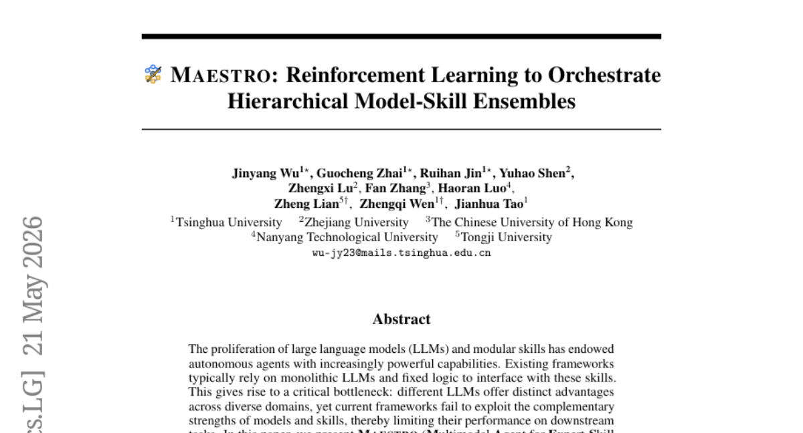

### 📌 한 줄 요약
RL 기반의 경량 오케스트레이터를 통해 다양한 전문가 모델과 스킬을 동적으로 조합하여 성능을 극대화하는 프레임워크

### 🔑 핵심 포인트
- RL 기반의 경량 오케스트레이터를 통한 동적 모델-스킬 앙상블 구성
- 단계별 감독 없이 결과 기반 RL(Outcome-based RL)을 통한 정책 최적화
- 미학습 모델/스킬에 대한 높은 일반화 성능 및 낮은 지연 시간(Low Latency)

### 🧑‍💻 개발자 관점
단일 거대 모델에 의존하는 대신, 특정 도메인에 특화된 작은 모델들을 효율적으로 조합하여 비용과 성능을 동시에 잡는 아키텍처 설계 방식을 제시합니다.

### 🚀 실무 적용 아이디어
- 특정 도메인(예: 코딩, 수학)에 특화된 소형 모델들을 모아 Maestro 구조로 구성해보기
- RL 정책 학습을 위한 환경(Environment) 및 보상 함수(Reward Function) 설계 실험
- 새로운 스킬/모델 추가 시 기존 정책의 일반화 성능 테스트

### ⚠️ 리스크/한계
- RL 학습 시 보상 설계(Reward Design)의 난이도 및 수렴 문제
- 오케스트레이터가 잘못된 판단을 내릴 경우 전체 시스템 성능이 급격히 저하될 위험

### 📝 초록 기반 상세 설명
최근 LLM과 모듈형 스킬의 발전에도 불구하고, 기존 프레임워크는 단일 모델이나 고정된 로직에 의존하여 모델별 강점을 활용하지 못하는 한계가 있습니다. 이를 해결하기 위해 Maestro는 이질적인 멀티모달 작업을 계층적 모델-스킬 레지스트리 상의 순차적 의사결정 문제로 재정의합니다. Maestro는 경량 정책(Policy)을 학습하여 외부 전문가 호출, 모델-스킬 쌍 선택, 작업 종료 여부를 동적으로 결정하는 RL 기반 오케스트레이션 방식을 제안합니다. 결과적으로 4B 규모의 작은 오케스트레이터만으로도 GPT-5나 Gemini-2.5-Pro와 같은 거대 모델들을 능가하는 성능을 달성했습니다. 또한 학습되지 않은 새로운 모델이나 스킬이 추가되어도 재학습 없이 일반화되는 뛰어난 유연성을 보여주었습니다.

---

## 17. [Q-ARVD: Quantizing Autoregressive Video Diffusion Models](https://huggingface.co/papers/2605.21072)
**Upvotes**: 15 | **도입 난이도**: 중 | **신뢰도**: 상
**arXiv**: https://arxiv.org/abs/2605.21072

**태그**: Video Generation, Model Quantization, Diffusion Models, Efficiency, Video, Inference, Optimization

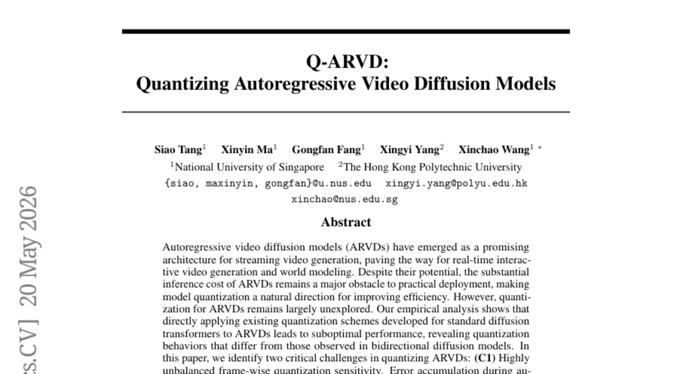

### 📌 한 줄 요약
자기회귀식 비디오 확산 모델(ARVD)의 고유한 오차 누적 및 이상치 문제를 해결하여 효율적인 추론을 가능하게 하는 양자화 프레임워크 제안

### 🔑 핵심 포인트
- ARVD 특유의 프레임별 불균형한 양자화 민감도 및 가중치 이상치 패턴 식별
- 최종 생성 품질을 고려한 프레임 가중치 기반 양자화 목적 함수 도입
- 이상치 채널을 자동으로 감지하고 격리하는 적응형 이중 스케일 양자화 기법 개발

### 🧑‍💻 개발자 관점
비디오 생성 모델의 추론 비용을 낮추면서도 자기회귀 방식 특유의 오차 누적 문제를 방지할 수 있는 실질적인 최적화 가이드를 제공합니다.

### 🚀 실무 적용 아이디어
- 기존 Diffusion Transformer 양자화 기법을 ARVD 모델에 적용하여 성능 저하 폭 측정
- 프레임별 민감도 변화가 실제 생성된 비디오의 일관성에 미치는 영향 분석
- 제안된 이중 스케일 양자화가 다양한 레이어 깊이에서 얼마나 안정적으로 작동하는지 검증

### ⚠️ 리스크/한계
- 양자화 과정에서 프레임 가중치 계산을 위한 추가적인 연산 오버헤드 발생 가능성
- 특정 모델 구조나 데이터셋에 대한 범용성 검증 필요

### 📝 초록 기반 상세 설명
실시간 비디오 생성 및 월드 모델링을 위한 자기회귀식 비디오 확산 모델(ARVD)은 높은 추론 비용이 실용화의 걸림돌입니다. 기존 확산 모델용 양자화 기법을 ARVD에 직접 적용할 경우 성능이 저하되는 문제가 발생하며, 이는 ARVD 특유의 양자화 거동 때문입니다. 본 논문은 프레임 간 불균형한 민감도(C1)와 레이어/깊이에 따른 이질적인 가중치 이상치(C2)라는 두 가지 핵심 과제를 식별합니다. 이를 해결하기 위해 최종 품질을 고려한 프레임 가중치 메커니즘(S1)과 이상치 채널을 격리하는 적응형 이중 스케일 양자화(S2)를 포함하는 Q-ARVD 프레임워크를 제안합니다. 실험 결과, Q-ARVD는 기존 방식보다 뛰어난 정확도와 효율성을 입증했습니다.

---

## 18. [Gated DeltaNet-2: Decoupling Erase and Write in Linear Attention](https://huggingface.co/papers/2605.22791)
**Upvotes**: 14 | **도입 난이도**: 중 | **신뢰도**: 상
**arXiv**: https://arxiv.org/abs/2605.22791

**태그**: Linear Attention, Long-context, Efficient LLM, Memory Management, RAG, Reasoning, Benchmark, Evaluation

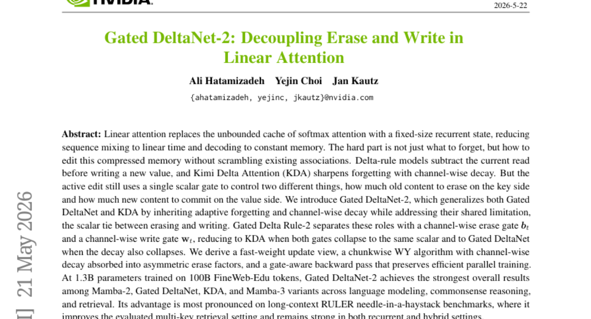

### 📌 한 줄 요약
선형 어텐션의 메모리 업데이트 시 삭제(Erase)와 쓰기(Write)를 채널별로 분리하여 장기 문맥 유지 및 정보 편집 능력을 극대화한 모델

### 🔑 핵심 포인트
- 삭제(Erase)와 쓰기(Write) 과정을 채널별 독립 게이트로 분리하여 정보 편집 정밀도 향상
- Gated DeltaNet과 KDA의 장점을 결합하면서도 스칼라 제어의 한계를 극복한 일반화된 구조
- 병렬 학습 효율성을 유지하는 chunkwise WY 알고리즘 및 gate-aware backward pass 설계

### 🧑‍💻 개발자 관점
긴 문맥(Long-context)을 다루는 LLM 개발 시, 메모리 효율을 유지하면서도 특정 정보를 정확히 기억하거나 수정해야 하는 작업에 매우 유용한 구조입니다.

### 🚀 실무 적용 아이디어
- 기존 Linear Attention 모델과 Gated DeltaNet-2의 Retrieval 성능 비교 실험
- 채널별 게이트 분리가 학습 안정성에 미치는 영향 분석
- 긴 시퀀스 데이터셋에서의 메모리 효율성 및 추론 속도 벤치마크

### ⚠️ 리스크/한계
- 게이트 파라미터 증가로 인한 모델 복잡도 및 연산 비용 상승 가능성
- 특정 하드웨어 가속기에서의 커스텀 커널 최적화 필요성

### 📝 초록 기반 상세 설명
선형 어텐션은 고정된 크기의 재귀적 상태를 사용하여 효율적인 추론을 가능하게 하지만, 압축된 메모리 내에서 기존 정보를 유지하며 새로운 정보를 업데이트하는 데 어려움이 있습니다. 기존 Delta-rule 기반 모델들은 삭제와 쓰기 과정을 하나의 스칼라 게이트로 제어하여 정보 혼선이 발생하는 한계가 있었습니다. 본 논문은 이를 해결하기 위해 채널별 삭제 게이트(b_t)와 쓰기 게이트(w_t)를 분리한 Gated DeltaNet-2를 제안합니다. 제안된 방식은 효율적인 병렬 학습을 위한 chunkwise WY 알고리즘과 게이트 인식 역전파(gate-aware backward pass)를 포함합니다. 실험 결과, 1.3B 파라미터 모델로서 Mamba-2 등 기존 모델들을 상회하는 성능을 보였으며, 특히 긴 문맥에서의 정보 검색(Needle-in-a-haystack) 작업에서 탁월한 성능을 입증했습니다.

---

## 19. [Unsupervised Process Reward Models](https://huggingface.co/papers/2605.10158)
**Upvotes**: 12 | **도입 난이도**: 중 | **신뢰도**: 상
**arXiv**: https://arxiv.org/abs/2605.10158

**태그**: LLM, Reasoning, Reinforcement Learning, Unsupervised Learning, Vision

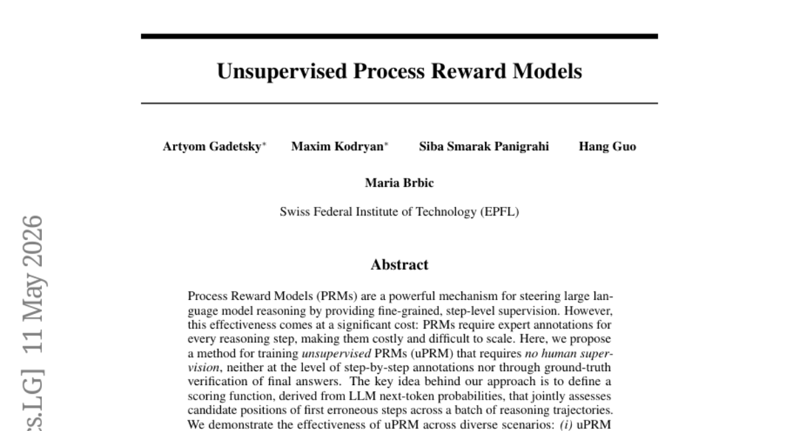

### 📌 한 줄 요약
인간의 개입 없이 LLM의 토큰 확률을 활용하여 추론 과정의 오류 지점을 찾아내는 비지도 학습 기반 PRM 방법론 제안

### 🔑 핵심 포인트
- 인간의 주석이나 정답 데이터 없이 학습 가능한 비지도(Unsupervised) PRM 프레임워크 개발
- LLM의 next-token 확률을 활용하여 추론 경로 내 첫 번째 오류 지점을 식별하는 스코어링 함수 설계
- 테스트 타임 스케일링 및 강화학습(RL) 환경에서 지도 학습 모델에 근접하는 강력한 성능 입증

### 🧑‍💻 개발자 관점
고비용의 전문가 데이터 구축 없이도 모델의 추론 과정을 정교하게 제어하고 강화학습 효율을 높일 수 있는 확장 가능한 방법론을 제공합니다.

### 🚀 실무 적용 아이디어
- 기존 LLM 추론 로그를 활용하여 제안된 스코어링 함수로 오류 지점 탐지 성능 테스트
- RLHF/PPO 환경에서 uPRM을 보상 모델로 적용하여 정책 최적화 안정성 비교
- 다양한 수학/코드 추론 데이터셋에 대한 zero-shot/unsupervised 학습 적용 실험

### ⚠️ 리스크/한계
- 정답 데이터가 없는 환경에서의 학습이므로 특정 도메인에서 편향이 발생할 가능성
- 복잡한 논리 구조에서 단순 토큰 확률 기반 스코어링의 신뢰도 문제

### 📝 초록 기반 상세 설명
기존의 과정 보상 모델(PRM)은 단계별 전문가 주석이 필요하여 비용이 높고 확장성이 낮다는 문제가 있습니다. 본 논문은 인간의 주석이나 정답 검증 없이 학습 가능한 비지도 PRM(uPRM) 방식을 제안합니다. 핵심 아이디어는 LLM의 다음 토큰 확률에서 유도된 스코어링 함수를 사용하여 배치 내 추론 경로들 사이에서 첫 번째 오류 발생 지점을 공동으로 평가하는 것입니다. 실험 결과, uPRM은 오류 지점 식별 성능이 우수할 뿐만 아니라 테스트 타임 스케일링 및 강화학습 보상 신호로서도 지도 학습 기반 PRM에 필적하는 성능을 보였습니다. 이를 통해 복잡한 추론 작업에서 확장 가능한 보상 모델링의 가능성을 제시합니다.

---

## 20. [GenEvolve: Self-Evolving Image Generation Agents via Tool-Orchestrated Visual Experience Distillation](https://huggingface.co/papers/2605.21605)
**Upvotes**: 10 | **도입 난이도**: 상 | **신뢰도**: 상
**arXiv**: https://arxiv.org/abs/2605.21605

**태그**: Agent, Image Generation, Self-Distillation, Reinforcement Learning, Vision, Benchmark, Distillation

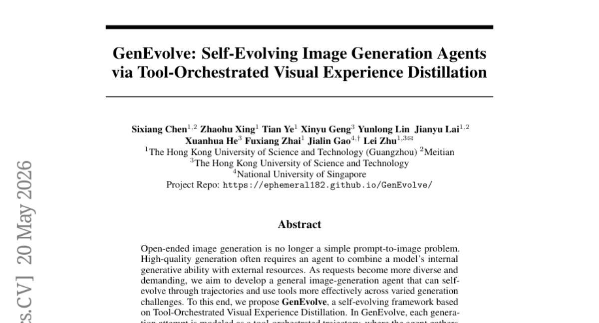

### 📌 한 줄 요약
도구 활용과 시각적 경험 증류를 통해 스스로 진화하며 고품질 이미지를 생성하는 에이전트 프레임워크

### 🔑 핵심 포인트
- Tool-Orchestrated Visual Experience Distillation: 궤적 간 차이를 분석하여 구조화된 시각적 경험을 학습하는 자가 진화 메커니즘
- On-policy Self-distillation: 스칼라 보상을 넘어 토큰 수준의 밀도 높은 감독을 통한 정교한 에이전트 능력 내재화
- GenEvolve-Data & Bench: 에이전트 성능 평가를 위한 전용 데이터셋 및 벤치마크 구축

### 🧑‍💻 개발자 관점
단순 생성 모델을 넘어, 도구(Tool)를 활용해 복잡한 요구사항을 해결하는 '에이전트형 이미지 생성 파이프라인'의 설계 패턴을 제시합니다.

### 🚀 실무 적용 아이디어
- 에이전트의 궤적(Trajectory)을 데이터화하여 학습에 활용하는 파이프라인 설계 검토
- 단순 RLHF(스칼라 보상) 대신 텍스트/이미지 간 차이를 분석하는 증류 방식 적용 실험
- 멀티 스텝 프롬프트 구성 및 외부 참조(Reference) 활용 로직 구현

### ⚠️ 리스크/한계
- 교사 모델(Teacher)의 성능에 따른 학생 모델의 성능 종속성 및 편향 발생 가능성
- 복잡한 궤적 생성 및 증류 과정에 따른 높은 연산 비용과 학습 난이도

### 📝 초록 기반 상세 설명
단순한 프롬프트 입력을 넘어 외부 자원과 모델 능력을 결합해야 하는 복잡한 이미지 생성 요구가 증가하고 있습니다. 기존 에이전트 방식은 이미지 수준의 스칼라 보상에 의존하여 정교한 학습에 한계가 있었습니다. 이를 해결하기 위해 GenEvolve는 도구 오케스트레이션 기반의 궤적을 생성하고, 최적과 최악의 차이를 구조화된 시각적 경험으로 추출하는 증류 방식을 제안합니다. 교사 모델이 추출한 밀도 높은 토큰 수준의 피드백을 학생 모델이 학습함으로써 검색, 지식 활성화, 프롬프트 구성 능력을 내재화합니다. 실험 결과, 제안된 프레임워크는 기존 강력한 베이스라인들을 상회하는 SOTA 성능을 달성했습니다.

---

## 21. [KVServe: Service-Aware KV Cache Compression for Communication-Efficient Disaggregated LLM Serving](https://huggingface.co/papers/2605.13734)
**Upvotes**: 10 | **도입 난이도**: 상 | **신뢰도**: 상
**arXiv**: https://arxiv.org/abs/2605.13734

**태그**: LLM Serving, KV Cache, Distributed Systems, Optimization, RAG, Evaluation, Inference, Distillation

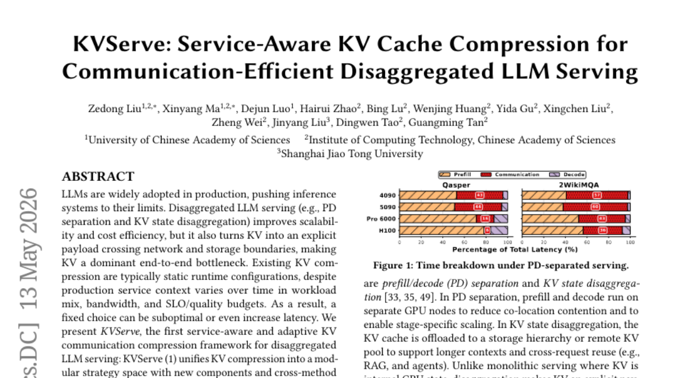

### 📌 한 줄 요약
분산형 LLM 서빙 환경에서 네트워크 병목을 해결하기 위해 서비스 상황에 맞춰 KV 캐시 압축 방식을 실시간으로 최적화하는 프레임워크

### 🔑 핵심 포인트
- 모듈형 KV 압축 전략 공간 설계 및 재구성 가능 구조 도입
- Bayesian Profiling Engine을 통한 50배 빠른 오프라인 탐색 및 Pareto 후보군 추출
- 분석 모델과 Bandit 알고리즘을 결합한 서비스 인지형(Service-Aware) 온라인 컨트롤러

### 🧑‍💻 개발자 관점
분산형 인프라(PD 분리 등) 구축 시 발생하는 네트워크 전송 비용과 지연 시간을 동적으로 관리할 수 있는 실무적인 가이드를 제공합니다.

### 🚀 실무 적용 아이디어
- vLLM 환경에서 KV 캐시 압축률과 네트워크 대역폭 간의 상관관계 측정
- 워크로드 변화(Prompt 길이 변화 등)에 따른 압축 프로필 전환 지연 시간 테스트
- 분산형 서빙 환경에서의 KV 전송 오버헤드 벤치마크 수행

### ⚠️ 리스크/한계
- 압축 알고리즘 적용에 따른 연산 오버헤드가 네트워크 이득을 상쇄할 가능성
- 모델별/하드웨어별로 최적의 압축 전략이 상이하여 범용적 적용이 어려울 수 있음

### 📝 초록 기반 상세 설명
LLM 서비스가 분산형(Disaggregated) 구조로 진화함에 따라 KV 캐시 전송이 네트워크의 주요 병목 지점이 되고 있습니다. 기존의 정적 압축 방식은 변화하는 워크로드와 대역폭, SLO 요구사항에 유연하게 대응하지 못해 성능 저하를 초래합니다. 이를 해결하기 위해 KVServe는 모듈형 압축 전략 공간을 정의하고, Bayesian Profiling Engine을 통해 효율적인 후보군을 도출합니다. 또한, 온라인 컨트롤러가 실시간 제약 조건에 맞춰 최적의 압축 프로필을 선택하여 오프라인-온라인 간의 격차를 해소합니다. 실험 결과, PD 분리 및 KV 분리 서빙 환경에서 JCT(Job Completion Time)와 TTFT(Time To First Token)를 획기적으로 개선했습니다.

### 🖼️ 추가 자료
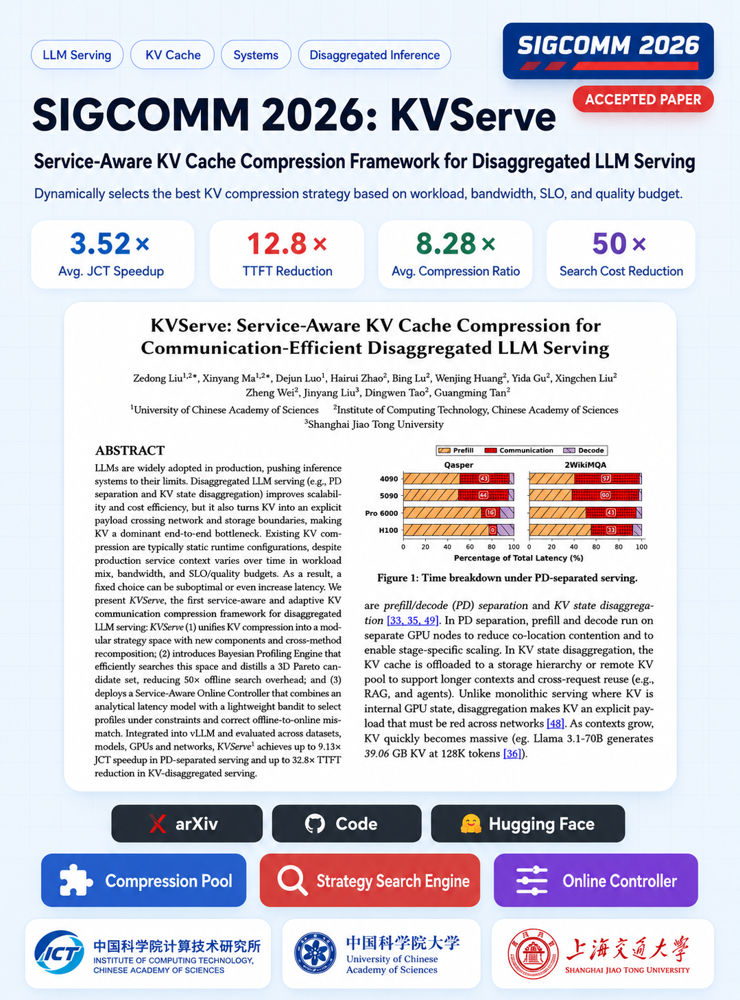
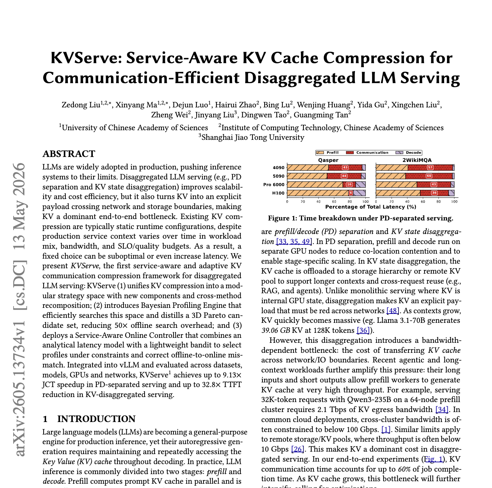
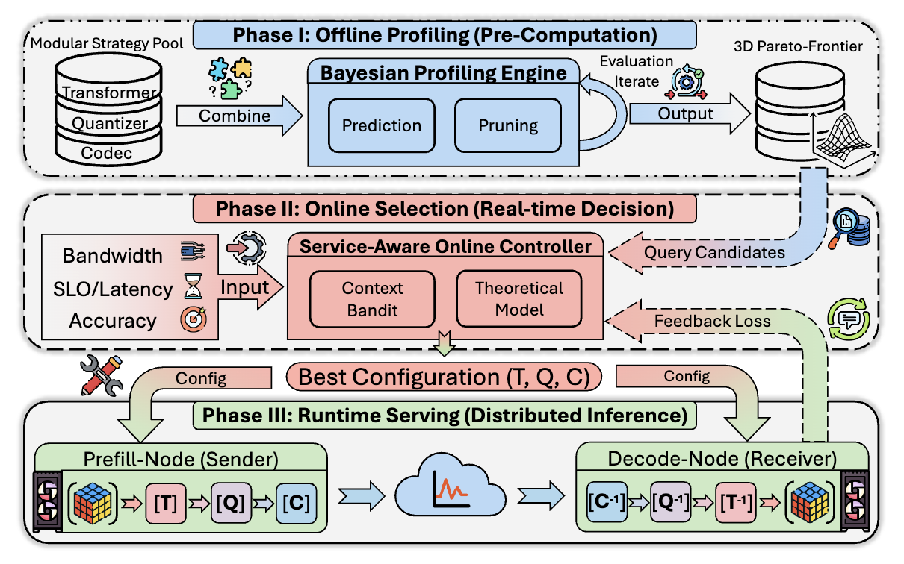
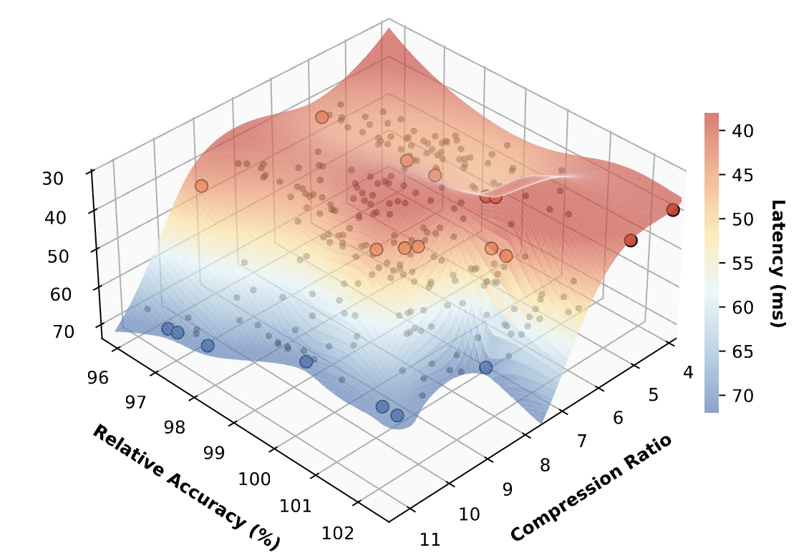
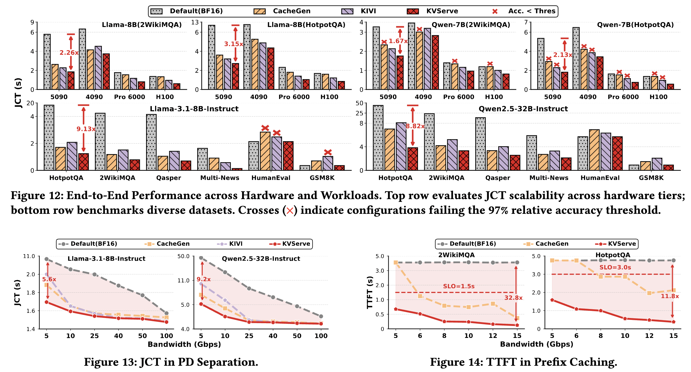

---

## 22. [Forecasting Downstream Performance of LLMs With Proxy Metrics](https://huggingface.co/papers/2605.18607)
**Upvotes**: 8 | **도입 난이도**: 중 | **신뢰도**: 상
**arXiv**: https://arxiv.org/abs/2605.18607

**태그**: LLM Training, Model Evaluation, Efficiency, Data Selection, Reasoning, Evaluation

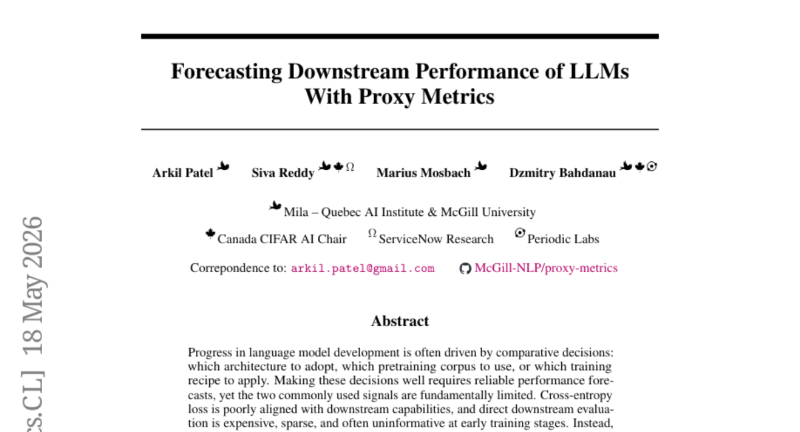

### 📌 한 줄 요약
전문가 작성 솔루션의 토큰 통계량을 활용하여 모델의 최종 성능을 저비용으로 예측하는 프록시 지표 제안

### 🔑 핵심 포인트
- 전문가 작성 솔루션의 토큰 통계량을 활용한 새로운 성능 예측 프록시 지표 개발
- 모델 선택, 데이터셋 선정, 학습 중 성능 예측 등 다양한 시나리오에서 기존 방식(Loss, Compute-based) 대비 우수한 성능 입증
- 직접 평가 대비 압도적으로 낮은 연산 비용으로 효율적인 모델 개발 사이클 지원

### 🧑‍💻 개발자 관점
모델 학습 초기 단계나 데이터셋 선정 단계에서 막대한 비용을 들이지 않고도 어떤 모델이나 데이터가 최종 성능이 좋을지 미리 판단할 수 있습니다.

### 🚀 실무 적용 아이디어
- 보유 중인 골든 데이터셋(정답지)에 대해 모델의 토큰 분포 통계량 추출 실험
- 기존 Cross-entropy loss와 제안된 프록시 지표 간의 상관관계 비교 분석
- 학습 초기 단계의 프록시 지표가 최종 성능을 얼마나 잘 예측하는지 검증

### ⚠️ 리스크/한계
- 전문가가 작성한 고품질의 정답 데이터(Expert trajectories)가 반드시 필요함
- 제안된 지표가 특정 도메인이나 태스크에 국한될 가능성 존재

### 📝 초록 기반 상세 설명
LLM 개발 과정에서 아키텍처나 데이터셋 선택을 위한 성능 예측은 필수적이지만, 기존의 크로스 엔트로피 손실값은 실제 성능과 괴리가 있고 직접적인 평가 방식은 비용이 너무 많이 듭니다. 이를 해결하기 위해 본 논문은 전문가가 작성한 정답 데이터에 대한 모델의 차기 토큰 분포(entropy, top-k accuracy, expert token rank 등)를 집계하는 프록시 지표를 제안합니다. 실험 결과, 제안된 지표는 모델 선택, 데이터셋 선정, 학습 과정 중 성능 예측 등 세 가지 시나리오에서 기존 방식보다 월등한 성능을 보였습니다. 특히 데이터 선택 시 직접 평가 대비 약 10,000배 적은 연산량으로도 높은 정확도를 달성했습니다. 결과적으로 전문가의 추론 경로(expert trajectories)가 모델 역량 평가를 위한 강력한 신호가 될 수 있음을 입증했습니다.

### 🖼️ 추가 자료
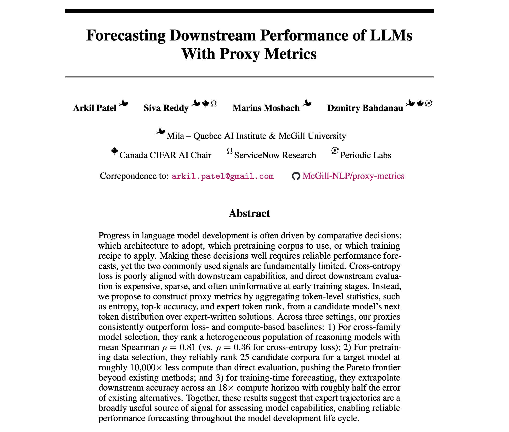

---

## 23. [One Sentence, One Drama: Personalized Short-Form Drama Generation via Multi-Agent Systems](https://huggingface.co/papers/2605.22144)
**Upvotes**: 7 | **도입 난이도**: 상 | **신뢰도**: 상
**arXiv**: https://arxiv.org/abs/2605.22144

**태그**: Multi-Agent, Video-Generation, Storytelling, Spatial-Consistency, Agent, Vision, Video, Benchmark, Evaluation

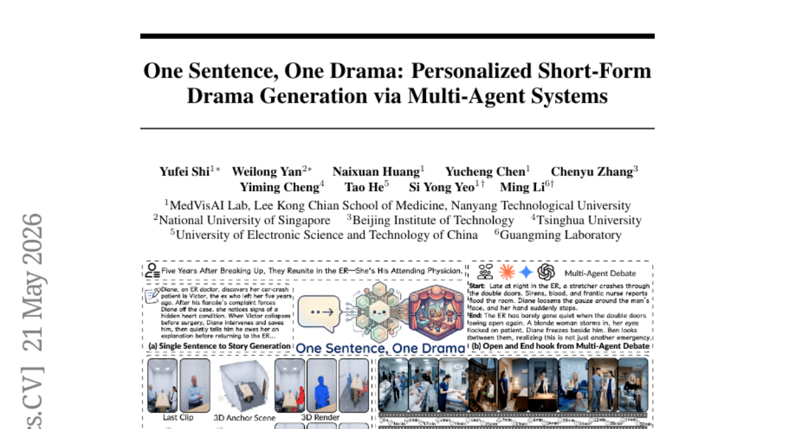

### 📌 한 줄 요약
단 한 문장의 아이디어를 일관성 있는 서사와 공간감을 갖춘 고품질 숏폼 드라마로 변환하는 멀티 에이전트 프레임워크

### 🔑 핵심 포인트
- 멀티 에이전트 토론 기반의 서사 페이싱 및 일관성 확보
- 3D 공간 참조를 활용한 클립 간 캐릭터 위치 및 레이아웃 일관성 유지
- 스크립트-비주얼-비디오 전 단계에 걸친 다단계 리뷰어 루프를 통한 품질 제어

### 🧑‍💻 개발자 관점
단순 영상 생성을 넘어, 복잡한 서사 구조와 공간적 일관성이 필요한 자동화된 콘텐츠 제작 파이프라인 구축의 가능성을 제시합니다.

### 🚀 실무 적용 아이디어
- 멀티 에이전트 간의 토론 프로토콜(Debate Protocol) 설계 방식 분석
- 3D Grounded First-frame 기법을 활용한 일관성 유지 로직 검토
- 제안된 Short-Drama-Bench 벤치마크를 활용한 기존 모델 성능 비교

### ⚠️ 리스크/한계
- 멀티 에이전트 루프 반복에 따른 높은 컴퓨팅 비용 및 생성 시간
- 복잡한 서사 구조 생성 시 에이전트 간 충돌로 인한 제어 난이도

### 📝 초록 기반 상세 설명
기존의 숏폼 드라마 생성 방식은 단발성 LLM 스크립트 생성과 느슨한 파이프라인 구조로 인해 서사적 긴장감 부족, 공간적 불일치, 품질 관리의 어려움이라는 문제를 안고 있습니다. 이를 해결하기 위해 본 논문은 'One Sentence, One Drama'라는 계층적 멀티 에이전트 프레임워크를 제안합니다. 이 시스템은 에이전트 간 토론을 통한 서사 생성, 3D 기반 첫 프레임 생성을 통한 공간 일관성 확보, 그리고 다단계 리뷰어 루프를 통한 품질 제어 과정을 거칩니다. 또한 몰입감을 높이기 위해 장면별 BGM 매칭과 전환 계획 기능을 포함합니다. 실험 결과, 제안된 방식은 기존 파이프라인 대비 서사 품질과 클립 간 일관성 측면에서 뛰어난 성능을 보였습니다.

---

## 24. [ClinSeekAgent: Automating Multimodal Evidence Seeking for Agentic Clinical Reasoning](https://huggingface.co/papers/2605.20176)
**Upvotes**: 6 | **도입 난이도**: 상 | **신뢰도**: 상
**arXiv**: https://arxiv.org/abs/2605.20176

**태그**: Agent, Multimodal, Clinical-AI, Knowledge-Distillation, EHR, RAG, Reasoning, Evaluation, Inference, Distillation

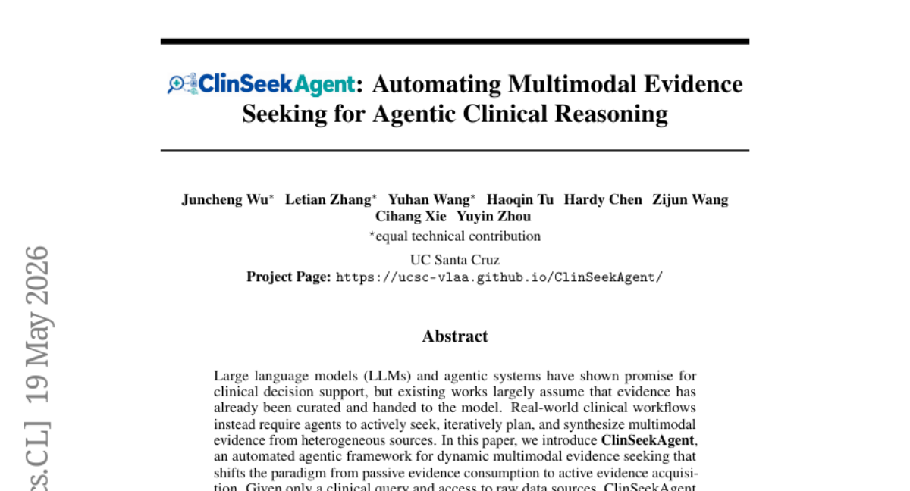

### 📌 한 줄 요약
수동적인 정보 소비를 넘어, 원천 데이터(EHR, 영상, 지식 베이스)에서 직접 증거를 탐색하고 추론하는 에이전트 프레임워크 개발

### 🔑 핵심 포인트
- 수동적 데이터 소비에서 능동적 증거 탐색(Active Evidence Seeking)으로의 패러다임 전환
- EHR, 의료 지식 베이스, 영상 도구를 통합하는 멀티모달 에이전트 워크플로우 구축
- 에이전트 궤적(Trajectory)을 활용한 고성능 소형 모델(ClinSeek-35B-A3B) 학습 파이프라인 제공

### 🧑‍💻 개발자 관점
단순 RAG를 넘어 에이전트가 스스로 도구를 사용해 데이터를 탐색하는 'Agentic Workflow'의 실질적인 임상 적용 가능성을 보여줍니다.

### 🚀 실무 적용 아이디어
- 제시된 ClinSeek-Bench를 활용하여 기존 RAG 시스템의 데이터 탐색 능력 벤치마킹
- 에이전트의 도구 호출(Tool-use) 로그를 데이터셋으로 변환하여 소형 모델 파인튜닝 실험
- 멀티모달 데이터(영상+텍스트) 통합 시 에이전트의 추론 루프 설계 구조 분석

### ⚠️ 리스크/한계
- 실제 임상 환경에서의 도구 호출 시 발생할 수 있는 비정형 데이터 처리의 복잡성
- 에이전트의 반복적인 탐색 과정에서 발생할 수 있는 높은 추론 비용 및 지연 시간

### 📝 초록 기반 상세 설명
기존의 임상 의사결정 지원 시스템은 이미 정제된 데이터만을 활용하는 수동적인 방식에 의존해 왔습니다. 하지만 실제 임상 환경에서는 에이전트가 직접 다양한 소스에서 증거를 찾고 계획을 세우는 능력이 필수적입니다. 본 논문은 원천 데이터로부터 능동적으로 증거를 수집하고 가설을 정제하는 ClinSeekAgent 프레임워크를 제안합니다. 이 시스템은 의료 지식 베이스 쿼리, EHR 탐색, 영상 도구 호출을 통해 정보를 통합하며, 추론 및 모델 학습 파이프라인으로 모두 활용 가능합니다. 실험 결과, 텍스트 및 멀티모달 작업 모두에서 기존 모델들의 성능을 유의미하게 향상시켰으며, 지식 증류(Distillation)를 통해 소형 모델에서도 높은 성능을 달성했습니다.

---

## 25. [Swift Sampling: Selecting Temporal Surprises via Taylor Series](https://huggingface.co/papers/2605.22678)
**Upvotes**: 5 | **도입 난이도**: 하 | **신뢰도**: 상
**arXiv**: https://arxiv.org/abs/2605.22678

**태그**: Video Understanding, Efficient Sampling, Computer Vision, Video, Benchmark

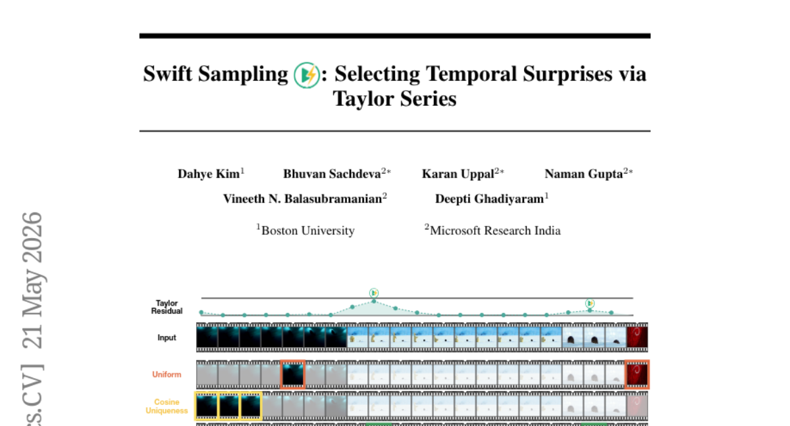

### 📌 한 줄 요약
테일러 급수를 이용해 비디오 내 정보가 밀집된 '시간적 놀라움(Temporal Surprises)' 구간을 저비용으로 추출하는 프레임 샘플링 알고리즘

### 🔑 핵심 포인트
- 테일러 급수를 활용한 예측 기반의 학습 불필요(Training-free) 프레임 선택 알고리즘
- 비디오 특징(Feature)의 속도와 가속도를 이용한 시간적 변화량(Temporal Surprise) 포착
- 기존 베이스라인 대비 30배 낮은 연산 비용과 높은 효율성 확보

### 🧑‍💻 개발자 관점
비디오 데이터가 방대해질수록 연산 비용이 기하급수적으로 증가하는데, 이 방식은 최소한의 비용으로 핵심 프레임만 골라내어 모델의 입력 효율을 극대화할 수 있습니다.

### 🚀 실무 적용 아이디어
- 사전 학습된 비디오 인코더를 사용하여 특징 벡터 추출 파이프라인 구축
- 다양한 프레임 레이트 환경에서 테일러 급수 기반의 예측 오차 임계값 테스트
- Long-form 비디오 QA 태스크에 적용하여 샘플링 효율성 검증

### ⚠️ 리스크/한계
- 급격한 장면 전환(Cut)이 빈번한 영상에서 오탐지 가능성
- 특징 추출 모델(Backbone)의 품질에 따라 샘플링 성능이 종속될 위험

### 📝 초록 기반 상세 설명
긴 영상 데이터는 대부분 중복된 프레임으로 구성되어 있어 효율적인 정보 추출이 어렵습니다. 기존 방식은 별도의 학습이나 복잡한 하이퍼파라미터 튜닝이 필요하다는 단점이 있었습니다. 본 논문은 비디오를 잠재 공간 내의 미분 가능한 궤적으로 모델링하고, 테일러 전개를 통해 다음 프레임의 예상 경로를 예측하는 Swift Sampling 방식을 제안합니다. 예측된 경로에서 크게 벗어나는 '놀라운' 프레임을 핵심 정보로 간주하여 샘플링합니다. 실험 결과, 기존 방식 대비 매우 낮은 연산 오버헤드(0.02x)를 유지하면서도 다양한 벤치마크에서 높은 정확도 향상을 입증했습니다.

---

## 26. [Efficient Agentic Reasoning Through Self-Regulated Simulative Planning](https://huggingface.co/papers/2605.22138)
**Upvotes**: 4 | **도입 난이도**: 중 | **신뢰도**: 상
**arXiv**: https://arxiv.org/abs/2605.22138

**태그**: Agent, LLM, Planning, Efficiency, Reinforcement Learning, RAG, Reasoning

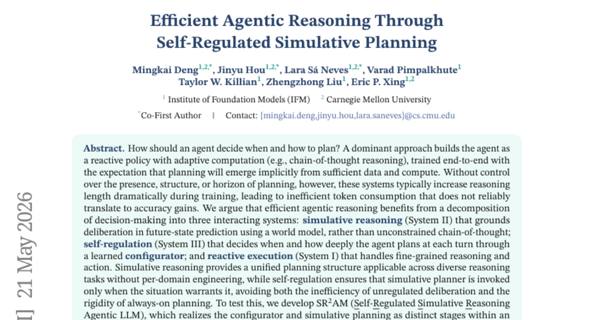

### 📌 한 줄 요약
자기 조절형 시뮬레이션 계획 기법을 통해 토큰 효율성을 극대화하면서도 고성능 추론을 구현하는 에이전트 프레임워크 제안

### 🔑 핵심 포인트
- 의사결정 과정을 시뮬레이션, 자기 조절, 실행의 세 계층으로 분리하여 효율성 확보
- LLM을 월드 모델로 활용하여 미래 상태를 예측하는 시뮬레이션 기반 계획 수립
- 자기 조절(Self-regulation)을 통해 불필요한 추론을 줄이고 필요한 순간에만 깊은 계획 수행

### 🧑‍💻 개발자 관점
에이전트 설계 시 무조건적인 CoT(Chain-of-Thought) 대신, 상황에 따라 계획의 깊이를 조절하는 구조가 비용과 성능 면에서 훨씬 유리함을 시사합니다.

### 🚀 실무 적용 아이디어
- 에이전트 워크플로우에 '계획 단계'와 '실행 단계'를 명시적으로 분리하여 적용해보기
- LLM의 출력 결과(trace)를 기반으로 계획을 재구성하는 구조 설계 실험
- RL을 활용하여 에이전트의 계획 빈도와 깊이 사이의 트레이드오프 최적화 시도

### ⚠️ 리스크/한계
- 모델 크기에 따른 시뮬레이션(월드 모델)의 정확도 의존성
- 자기 조절 로직이 복잡해질 경우 시스템 전체의 오버헤드 발생 가능성

### 📝 초록 기반 상세 설명
기존의 에이전트 방식은 계획 수립 시점과 구조를 제어하지 못해 불필요하게 긴 추론 과정과 토큰 낭비를 초래합니다. 이를 해결하기 위해 의사결정을 시뮬레이션(System II), 자기 조절(System III), 반응적 실행(System I)의 세 단계로 분리하는 구조를 제안합니다. 연구진은 LLM을 월드 모델로 활용하여 계획의 깊이와 빈도를 스스로 조절하는 SR^2AM 프레임워크를 개발했습니다. 실험 결과, 소규모 모델(30B)이 훨씬 거대한 모델(1T)과 경쟁할 수 있는 성능을 보이면서도 토큰 사용량은 25.8~95.3% 절감했습니다. 특히 RL을 통해 계획의 빈도를 높이기보다 계획의 수평적 깊이(horizon)를 확장하는 방향으로 학습됨을 확인했습니다.

### 🖼️ 추가 자료
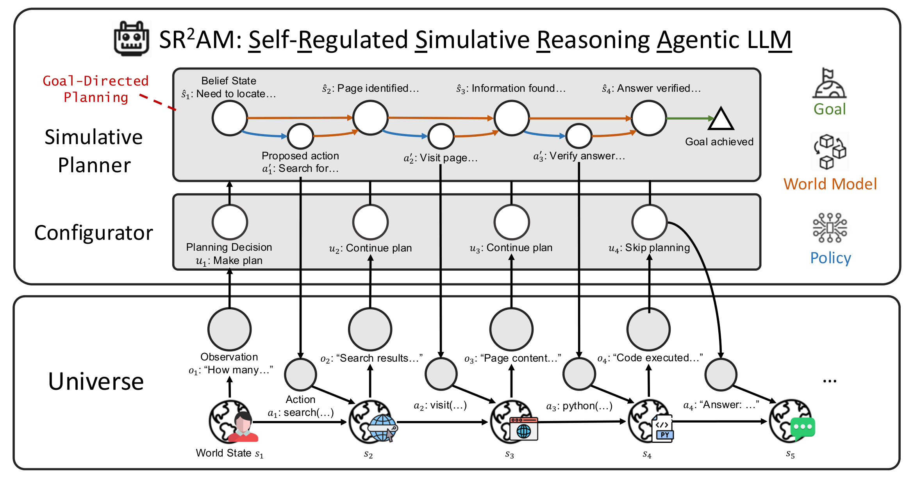

---

## 27. [Segment Anything with Motion, Geometry, and Semantic Adaptation for Complex Nonlinear Visual Object Tracking](https://huggingface.co/papers/2605.22538)
**Upvotes**: 4 | **도입 난이도**: 중 | **신뢰도**: 상
**arXiv**: https://arxiv.org/abs/2605.22538

**태그**: Computer Vision, Object Tracking, SAM 2, Motion Modeling, RAG, Vision, Video, Benchmark

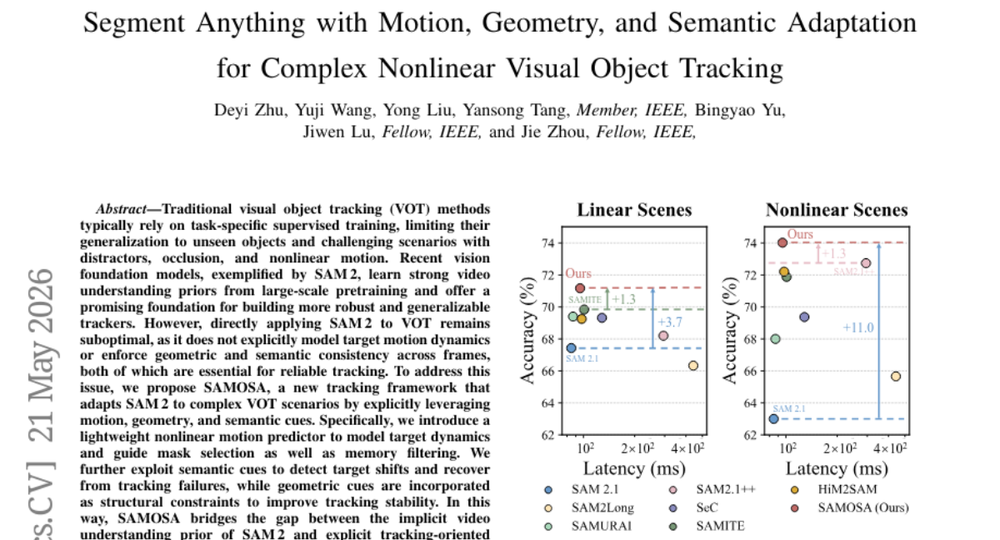

### 📌 한 줄 요약
SAM 2의 강력한 사전 학습 능력을 활용하면서도, 비선형적 움직임과 기하학적 일관성을 보완하여 복잡한 환경에서의 추적 성능을 극대화한 프레임워크

### 🔑 핵심 포인트
- SAM 2의 암시적 이해를 명시적 추적 모델링(Motion, Geometry, Semantic)으로 확장
- 경량 비선형 모션 예측기를 통한 타겟 동역학 모델링 및 메모리 필터링
- 의미적 단서와 기하학적 제약을 결합하여 추적 실패 복구 및 안정성 확보

### 🧑‍💻 개발자 관점
강력한 범용 모델(SAM 2)을 특정 도메인(UAV, 복잡한 움직임)의 실무적 요구사항에 맞게 최적화하는 방법론을 제시합니다.

### 🚀 실무 적용 아이디어
- 제공된 GitHub 코드를 활용하여 UAV 데이터셋에서의 성능 벤치마크 수행
- 경량 모션 예측기가 실제 실시간 추적 환경에서 연산 오버헤드를 얼마나 유발하는지 테스트
- 다양한 비선형 움직임 시나리오에서 기하학적 제약 조건의 효과 검증

### ⚠️ 리스크/한계
- 경량 모션 예측기 도입에 따른 추가적인 연산 비용 발생 가능성
- 매우 복잡한 배경이나 심한 폐쇄(Occlusion) 상황에서의 의미적 단서 의존도 문제

---

## 28. [Diversed Model Discovery via Structured Table Discovery](https://huggingface.co/papers/2605.22766)
**Upvotes**: 4 | **도입 난이도**: 중 | **신뢰도**: 상
**arXiv**: https://arxiv.org/abs/2605.22766

**태그**: Information Retrieval, Data Engineering, Model Management, Structured Data, RAG, Benchmark, Evaluation, Safety

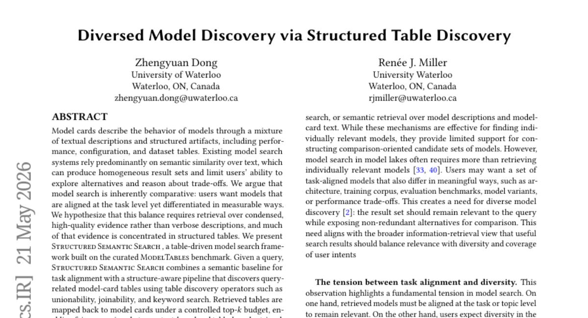

### 📌 한 줄 요약
텍스트 유사도에 의존하는 기존 모델 검색의 한계를 극복하기 위해, 모델 카드의 구조화된 테이블 데이터를 활용하여 다양하고 정밀한 모델 탐색을 지원하는 프레임워크 제안

### 🔑 핵심 포인트
- 텍스트 중심 검색에서 탈피하여 모델 카드의 구조화된 테이블 데이터를 활용한 검색 프레임워크 제안
- Unionability, Joinability 등 테이블 특화 연산자를 활용한 구조 인식형(Structure-aware) 파이프라인 구축
- 중복되거나 형식이 다른 테이블을 효율적으로 통합하는 Orientation-aware integration 기술 적용

### 🧑‍💻 개발자 관점
수많은 모델이 존재하는 환경에서 단순 키워드 검색이 아닌, 성능 지표나 설정값 등 구체적인 수치 기반의 정밀한 모델 비교 및 탐색이 가능해집니다.

### 🚀 실무 적용 아이디어
- 자체 보유한 모델 카드 데이터셋에 테이블 추출 및 정규화 파이프라인 적용 테스트
- 텍스트 임베딩 기반 검색과 테이블 기반 검색의 결과 다양성(Diversity) 비교 실험
- 다양한 포맷의 테이블을 하나의 통합 뷰로 변환하는 데이터 엔지니어링 로직 검증

### ⚠️ 리스크/한계
- 모델 카드의 테이블 형식이 비표준화되어 있을 경우 데이터 추출 및 정규화 난이도 상승
- 테이블 데이터의 복잡도가 높을 경우 연산 비용 및 통합 과정의 복잡성 증가

### 📝 초록 기반 상세 설명
모델 카드는 텍스트와 구조화된 테이블(성능, 설정 등)로 구성되지만, 기존 검색 시스템은 텍스트 기반의 의미적 유사도에만 치중하여 결과가 편향되는 문제가 있습니다. 본 논문은 모델 검색이 단순 유사성보다는 측정 가능한 차이점을 찾는 비교 과정이어야 한다고 주장합니다. 이를 위해 테이블 기반의 모델 검색 프레임워크인 StructuredSemanticSearch를 제안합니다. 이 시스템은 테이블 탐색 연산(결합, 조인 등)을 통해 쿼리와 관련된 테이블을 추출하고, 이를 통합하여 압축된 뷰를 생성합니다. 실험 결과, 제안된 방식이 기존 텍스트 기반 방식보다 더 높은 증거 커버리지와 다양성을 제공함을 입증했습니다.

---

## 29. [SceneAligner: 3D-Grounded Floorplan Localization in the Wild](https://huggingface.co/papers/2605.22581)
**Upvotes**: 3 | **도입 난이도**: 상 | **신뢰도**: 상
**arXiv**: https://arxiv.org/abs/2605.22581

**태그**: 3D Reconstruction, Localization, Foundation Models, Computer Vision, RAG, Vision

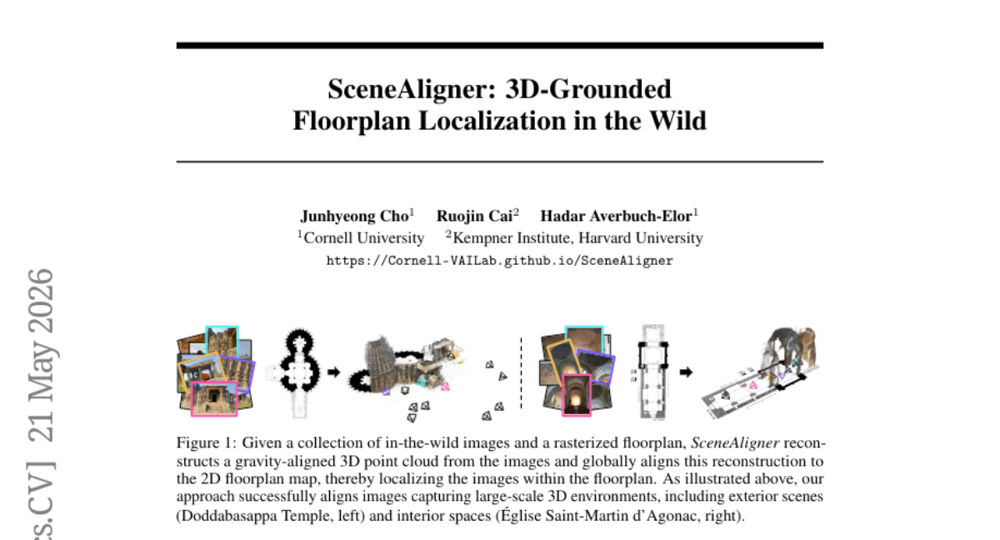

### 📌 한 줄 요약
3D 재구성 기반의 밀도 맵과 2D 파운데이션 모델을 활용하여, 비정형 환경에서도 정밀한 평면도 위치 추적을 가능하게 하는 기술

### 🔑 핵심 포인트
- 3D 재구성을 통한 2D 밀도 맵 생성으로 평면도 대용물(proxy) 확보
- 2D 파운데이션 모델을 활용한 밀도 맵과 건축 평면도 간의 교차 모달 정렬
- 단일 이미지와 같은 극도로 희소한 데이터 환경에서의 강력한 위치 추적 성능

### 🧑‍💻 개발자 관점
실제 건물 내부의 복잡한 환경이나 정밀하지 않은 평면도 데이터가 주어지는 실무 환경에서 위치 기반 서비스(LBS)를 구현할 때 유용한 프레임워크를 제공합니다.

### 🚀 실무 적용 아이디어
- Colmap 등 3D 재구성 라이브러리와의 연동 테스트
- 제안된 밀도 맵 생성 방식의 다양한 뷰(View)에서의 일관성 검증
- 파운데이션 모델 미세 조정 시 구조적 일관성 유지 성능 측정

### ⚠️ 리스크/한계
- 3D 재구성 단계에서의 정밀도에 따른 위치 추적 오차 발생 가능성
- 복잡한 구조의 건물에서 2D 밀도 맵 투영 시 발생하는 정보 손실

### 📝 초록 기반 상세 설명
기존의 평면도 위치 추적 기술은 통제된 소규모 환경이나 정밀한 벡터 데이터에 의존하여 대규모 건물이나 래스터화된 평면도 적용에 한계가 있었습니다. 본 논문은 3D 장면 재구성을 통해 위치 추적 문제를 해결하는 SceneAligner를 제안합니다. 입력된 이미지로부터 중력 정렬된 3D 장면을 재구성한 뒤, 이를 2D 밀도 맵으로 투영하여 평면도 대용물(proxy)로 사용합니다. 이후 2D 파운데이션 모델을 미세 조정하여 밀도 맵과 실제 평면도 사이의 의미적/구조적 차이를 극복하며 정렬합니다. 실험 결과, 단 한 장의 이미지만 있는 희소한 환경에서도 기존 방식보다 뛰어난 성능을 입증했습니다.

---

## 30. [Bernini: Latent Semantic Planning for Video Diffusion](https://huggingface.co/papers/2605.22344)
**Upvotes**: 3 | **도입 난이도**: 중 | **신뢰도**: 상
**arXiv**: https://arxiv.org/abs/2605.22344

**태그**: Video Generation, MLLM, Diffusion, Video Editing, Reasoning, Multimodal, Vision, Video, Benchmark

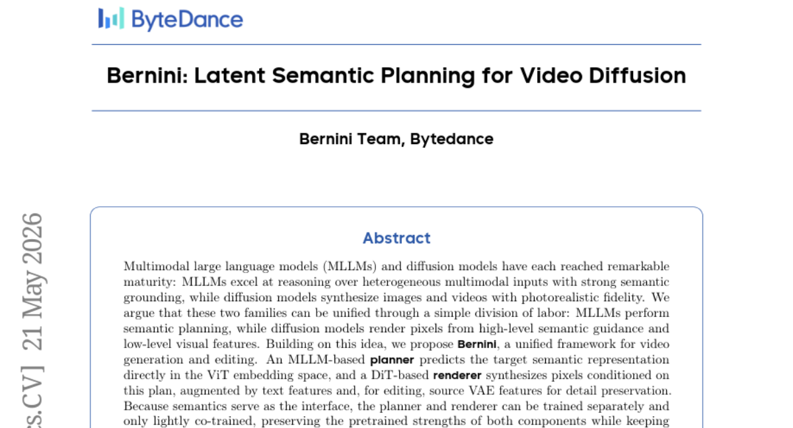

### 📌 한 줄 요약
MLLM의 추론 능력과 Diffusion의 생성 능력을 분리하여 효율적인 비디오 생성 및 편집을 구현한 프레임워크

### 🔑 핵심 포인트
- 역할 분담 구조: MLLM(의미론적 계획)과 DiT(픽셀 렌더링)의 명확한 분리를 통한 효율적 학습
- ViT 임베딩 기반 플래닝: 텍스트가 아닌 잠재 공간(Latent Space)에서의 의미론적 가이드 제공
- SA-3D RoPE 및 CoT 도입: 다중 시각 입력 처리를 위한 위치 임베딩과 추론 능력 강화

### 🧑‍💻 개발자 관점
모델의 역할을 분리함으로써 사전 학습된 MLLM의 지식을 손상시키지 않고도 고품질 비디오 생성 및 정교한 편집 기능을 구현할 수 있는 아키텍처를 제시합니다.

### 🚀 실무 적용 아이디어
- ViT 임베딩 공간에서의 플래닝이 실제 렌더링 품질에 미치는 영향 분석
- CoT(Chain-of-Thought) 프롬프팅이 비디오 일관성에 미치는 효과 검증
- 편집 작업 시 소스 VAE 특징 유지와 생성 품질 간의 트레이드오프 테스트

### ⚠️ 리스크/한계
- 플래너와 렌더러 간의 미세 조정(Co-training) 시 균형을 맞추기 어려울 수 있음
- 고해상도 비디오 생성 시 플래너의 임베딩 예측 정확도에 따른 품질 의존성

### 📝 초록 기반 상세 설명
최근 MLLM의 강력한 의미론적 추론 능력과 Diffusion 모델의 고화질 생성 능력이 각각 발전하고 있습니다. 기존 방식은 두 모델의 결합 방식이 복잡하거나 학습 효율이 떨어지는 문제가 있었습니다. 본 논문은 MLLM을 '의미론적 플래너(Planner)'로, DiT를 '픽셀 렌더러(Renderer)'로 역할 분담하는 Bernini 프레임워크를 제안합니다. 플래너는 ViT 임베딩 공간에서 타겟 의미를 예측하고, 렌더러는 이를 바탕으로 픽셀을 생성하며 편집 시에는 소스 VAE 특징을 활용합니다. 이를 통해 두 모델을 독립적으로 학습하면서도 강력한 시너지를 낼 수 있습니다. 결과적으로 SOTA 성능을 달성하며 복잡한 비디오 편집 작업에서도 뛰어난 일반화 성능을 보여줍니다.

---

## 31. [TerminalWorld: Benchmarking Agents on Real-World Terminal Tasks](https://huggingface.co/papers/2605.22535)
**Upvotes**: 3 | **도입 난이도**: 하 | **신뢰도**: 상
**arXiv**: https://arxiv.org/abs/2605.22535

**태그**: AI Agent, Benchmarking, Terminal, Automation, Agent, Benchmark, Evaluation

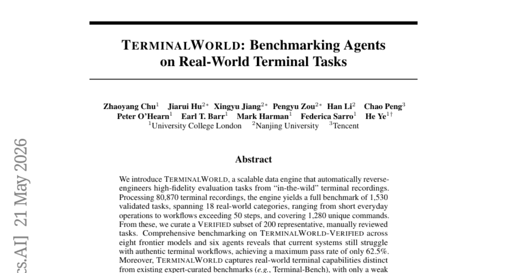

### 📌 한 줄 요약
실제 터미널 사용 기록을 기반으로 자동 생성된 고충실도 벤치마크를 통해 AI 에이전트의 실무 역량을 검증하는 프레임워크

### 🔑 핵심 포인트
- 실제 터미널 기록을 활용한 자동화된 고충실도 태스크 생성 엔진 개발
- 단순 명령 수행을 넘어 50단계 이상의 복잡한 워크플로우를 포함하는 대규모 벤치마크 구축
- 기존 벤치마크와 차별화된 실무 중심의 에이전트 평가 지표 제공

### 🧑‍💻 개발자 관점
AI 에이전트가 단순 코딩을 넘어 실제 개발자의 터미널 환경에서 복잡한 작업을 수행할 수 있는지 검증하는 실무적 기준을 제공합니다.

### 🚀 실무 적용 아이디어
- 제공된 데이터셋을 활용하여 현재 개발 중인 에이전트의 터미널 작업 성공률 테스트
- 에이전트가 복잡한 멀티 스텝 워크플로우에서 발생하는 오류를 어떻게 처리하는지 분석
- 기존 벤치마크 점수와 TerminalWorld 점수 간의 격차를 통한 에이전트 성능 재평가

### ⚠️ 리스크/한계
- 자동 생성된 데이터의 특성상 특정 환경에 편향될 가능성 존재
- 실제 환경의 보안 및 권한 이슈가 반영되지 않은 가상 환경에서의 평가 한계

### 📝 초록 기반 상세 설명
기존의 전문가 큐레이션 방식 벤치마크는 실제 개발 환경의 복잡한 워크플로우를 반영하는 데 한계가 있습니다. 이를 해결하기 위해 실제 터미널 기록을 역공학하여 태스크를 자동 생성하는 데이터 엔진인 TerminalWorld를 제안합니다. 8만 개 이상의 기록을 처리하여 1,530개의 검증된 태스크를 생성하였으며, 이 중 200개의 정제된 데이터셋을 구축했습니다. 실험 결과, 최신 모델과 에이전트들은 실무 워크플로우에서 최대 성공률 62.5%에 머무는 등 여전히 낮은 성능을 보였습니다. 또한 기존 벤치마크와 낮은 상관관계를 보여, TerminalWorld가 실무 역량을 측정하는 데 더 차별화된 지표임을 입증했습니다.

---

## 32. [Training Large Language Models to Predict Clinical Events](https://huggingface.co/papers/2605.12817)
**Upvotes**: 3 | **도입 난이도**: 중 | **신뢰도**: 상
**arXiv**: https://arxiv.org/abs/2605.12817

**태그**: LLM, Fine-tuning, Clinical NLP, LoRA, Vision

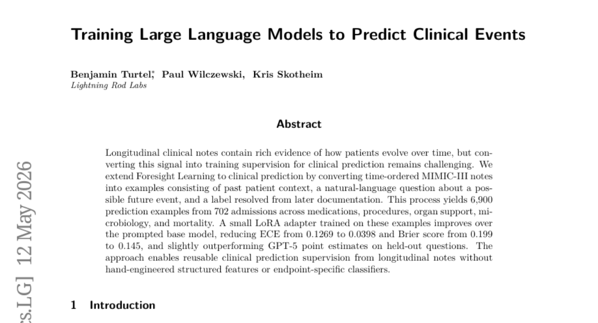

### 📌 한 줄 요약
시계열 임상 기록을 자연어 질문-답변 쌍으로 변환하여 LLM을 임상 이벤트 예측 모델로 학습시키는 방법론

### 🔑 핵심 포인트
- 시계열 임상 노트를 자연어 질문-답변 형식의 학습 데이터로 자동 변환하는 프레임워크 제안
- LoRA 어댑터를 활용한 효율적인 미세 조정으로 모델의 예측 신뢰도(Calibration) 및 정확도 향상
- 구조화된 피처 엔지니어링 없이 비정형 텍스트만으로 다양한 임상 이벤트 예측 가능

### 🧑‍💻 개발자 관점
정형 데이터 추출 없이 비정형 텍스트를 직접 학습 데이터로 변환하는 파이프라인을 통해 임상 예측 모델 구축 비용을 획기적으로 낮출 수 있습니다.

### 🚀 실무 적용 아이디어
- MIMIC-III와 같은 공개 데이터셋을 활용한 데이터 변환 파이프라인 프로토타이핑
- LoRA를 이용한 소규모 파라미터 튜닝과 Zero-shot 프롬프팅 성능 비교 실험
- 다양한 임상 이벤트(사망, 재입원 등)에 대한 데이터 생성 로직 검증

### ⚠️ 리스크/한계
- 추후 기록에서 라벨을 추출하는 과정에서의 데이터 누수(Data Leakage) 위험
- 특정 임상 도메인에 편향된 데이터 생성 시 모델의 일반화 성능 저하 가능성

### 📝 초록 기반 상세 설명
시계열 임상 노트는 환자의 상태 변화를 담고 있지만, 이를 예측 모델을 위한 학습 데이터로 변환하는 것은 매우 어렵습니다. 본 연구는 Foresight Learning을 확장하여 MIMIC-III 데이터를 과거 맥락, 자연어 질문, 그리고 추후 기록에서 추출한 라벨로 구성된 예측 예제로 변환했습니다. 이를 통해 약물, 시술, 장기 지원, 미생물학 및 사망률 등 다양한 분야에 대해 6,900개의 예측 예제를 생성했습니다. 소규모 LoRA 어댑터를 사용하여 학습한 결과, 베이스 모델 대비 Calibration Error와 Brier Score가 크게 개선되었습니다. 이 방식은 수동 피처 엔지니어링 없이도 시계열 기록으로부터 재사용 가능한 임상 예측 감독 신호를 생성할 수 있게 합니다.

---

## 33. [From Reasoning Chains to Verifiable Subproblems: Curriculum Reinforcement Learning Enables Credit Assignment for LLM Reasoning](https://huggingface.co/papers/2605.22074)
**Upvotes**: 2 | **도입 난이도**: 중 | **신뢰도**: 상
**arXiv**: https://arxiv.org/abs/2605.22074

**태그**: Reinforcement Learning, LLM Reasoning, Curriculum Learning, Credit Assignment, RAG, Reasoning, Benchmark

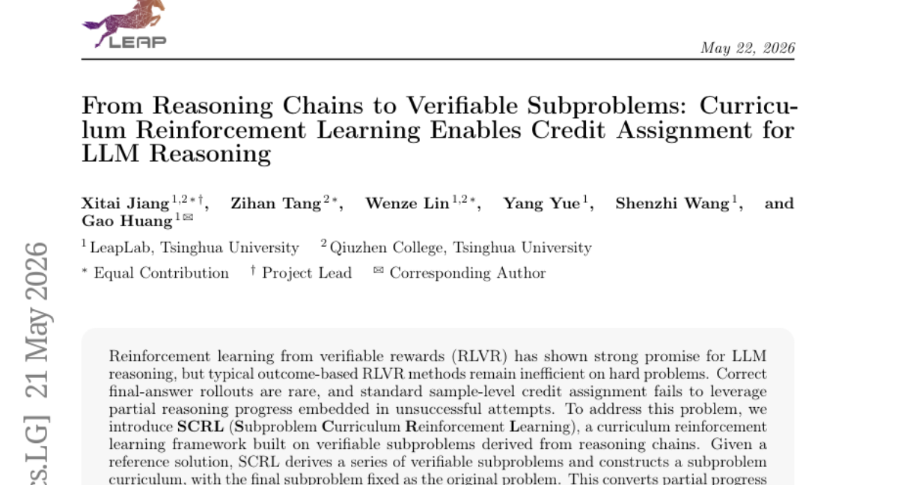

### 📌 한 줄 요약
복잡한 추론 문제를 단계별 검증 가능한 하위 문제로 분해하여 강화학습의 신용 할당(Credit Assignment) 문제를 해결한 커리큘럼 학습 프레임워크

### 🔑 핵심 포인트
- 참조 추론 체인을 활용하여 검증 가능한 하위 문제(Subproblems)를 생성하는 커리큘럼 학습 도입
- 하위 문제별 독립적 정규화를 통한 정교한 신용 할당(Credit Assignment) 메커니즘 구현
- 난도가 높은 문제에서 발생하는 그래디언트 소실(Gradient Dead Zones) 문제 해결

### 🧑‍💻 개발자 관점
LLM이 복잡한 단계별 추론을 수행할 때, 최종 결과만으로 학습하는 대신 중간 과정의 정답 여부를 학습 신호로 활용하는 실질적인 방법론을 제시합니다.

### 🚀 실무 적용 아이디어
- 기존 GRPO 모델에 참조 데이터(Reference Chains)를 활용한 하위 문제 생성 파이프라인 구축 실험
- 수학/코드 등 단계별 검증이 가능한 도메인에서 하위 문제 정규화 효율성 테스트
- 문제 난이도 변화에 따른 커리큘럼 스케줄링 전략 비교

### ⚠️ 리스크/한계
- 참조 데이터(Reference Chains)의 품질에 따라 학습 성능이 크게 좌우될 수 있음
- 하위 문제 분할 방식이 복잡한 문제에 대해 항상 유효한 학습 신호를 보장하지 않을 수 있음

### 📝 초록 기반 상세 설명
기존의 결과 기반 강화학습(RLVR)은 정답이 나오기 전까지 학습 신호를 얻기 어려워 난도가 높은 추론 문제 해결에 비효율적입니다. 이를 해결하기 위해 본 논문은 참조 추론 체인으로부터 검증 가능한 하위 문제를 도출하는 SCRL(Subproblem Curriculum Reinforcement Learning) 프레임워크를 제안합니다. SCRL은 하위 문제 수준의 정규화를 통해 각 단계별로 독립적인 보상을 부여함으로써 정교한 신용 할당을 가능하게 합니다. 실험 결과, SCRL은 수학적 추론 벤치마크에서 기존 GRPO 대비 높은 정확도를 기록하며 난도가 높은 문제일수록 더 큰 성능 향상을 보였습니다. 특히 AIME 및 IMO-Bench와 같은 고난도 벤치마크에서 탐색 능력을 크게 개선하며 우수한 성능을 입증했습니다.

---

## 34. [Rule2DRC: Benchmarking LLM Agents for DRC Script Synthesis with Execution-Guided Test Generation](https://huggingface.co/papers/2605.15669)
**Upvotes**: 2 | **도입 난이도**: 중 | **신뢰도**: 상
**arXiv**: https://arxiv.org/abs/2605.15669

**태그**: LLM Agent, Code Generation, Automated Testing, EDA, Agent, Benchmark, Evaluation

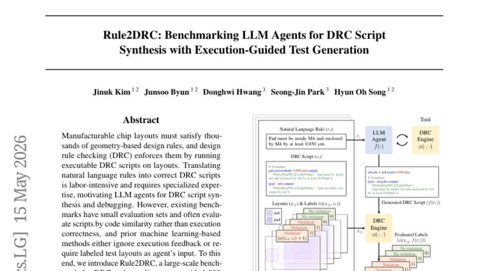

### 📌 한 줄 요약
실행 피드백 기반의 테스트 생성 기법을 통해 LLM 에이전트의 DRC 스크립트 작성 및 디버깅 성능을 극대화하는 벤치마크와 프레임워크 제안

### 🔑 핵심 포인트
- 1,000개의 규칙-스크립트 작업과 13,921개의 레이아웃을 포함한 대규모 벤치마크 Rule2DRC 구축
- 코드 유사도가 아닌 실제 실행 결과(Functional Correctness)를 기반으로 하는 평가 파이프라인 제공
- 실행 피드백을 통해 변별력 있는 테스트 케이스를 생성하는 SplitTester 에이전트 제안

### 🧑‍💻 개발자 관점
코드 생성 에이전트가 단순히 문법적으로 맞는 코드를 넘어, 실제 환경(Execution)에서 의도대로 동작하는지 검증하는 방법론을 제시합니다.

### 🚀 실무 적용 아이디어
- 제공된 GitHub 코드를 활용하여 기존 LLM 모델의 DRC 스크립트 생성 성능 테스트
- SplitTester의 테스트 케이스 생성 로직이 다른 도메인의 코드 디버깅에도 유효한지 실험
- 실행 피드백 기반 평가 방식과 기존 코드 유사도 방식의 성능 차이 비교

### ⚠️ 리스크/한계
- 실제 복잡한 반도체 설계 환경의 모든 변수를 벤치마크가 완벽히 반영하기 어려울 수 있음
- 실행 기반 평가는 테스트 환경(Simulator/Tool) 구축 비용이 발생함

### 📝 초록 기반 상세 설명
반도체 설계 규칙 검사(DRC)를 위해 자연어를 실행 가능한 스크립트로 변환하는 작업은 전문 지식이 필요하며 많은 비용이 소요됩니다. 기존 벤치마크는 평가 데이터셋이 작고 코드 유사도에 의존하여 실제 실행 정확도를 검증하기 어렵다는 한계가 있었습니다. 이를 해결하기 위해 1,000개의 작업과 13,921개의 레이아웃을 포함한 대규모 벤치마크인 Rule2DRC를 도입합니다. 또한, 실행 피드백을 활용해 변별력 있는 테스트 케이스를 생성하고 후보 스크립트를 구분하는 SplitTester 에이전트를 제안합니다. 결과적으로 실행 결과 기반의 정밀한 평가와 효율적인 Best-of-N 선택이 가능해졌습니다.

### 🖼️ 추가 자료
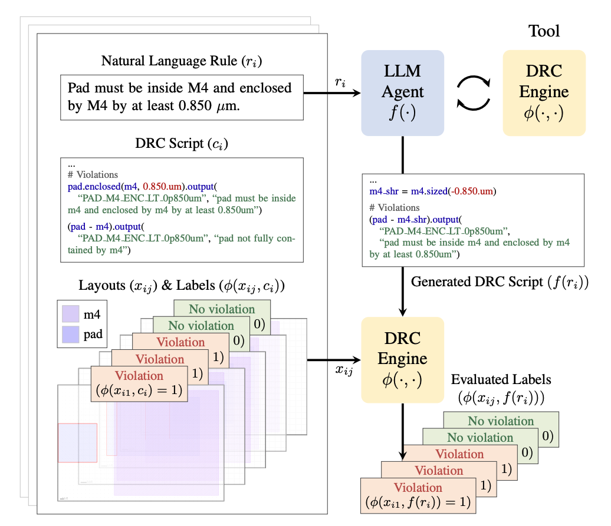

---

## 35. [AnyMo: Geometry-Aware Setup-Agnostic Modeling of Human Motion in the Wild](https://huggingface.co/papers/2605.22715)
**Upvotes**: 1 | **도입 난이도**: 상 | **신뢰도**: 상
**arXiv**: https://arxiv.org/abs/2605.22715

**태그**: Wearable, IMU, LLM, Zero-shot, Motion-to-Language, RAG, Evaluation

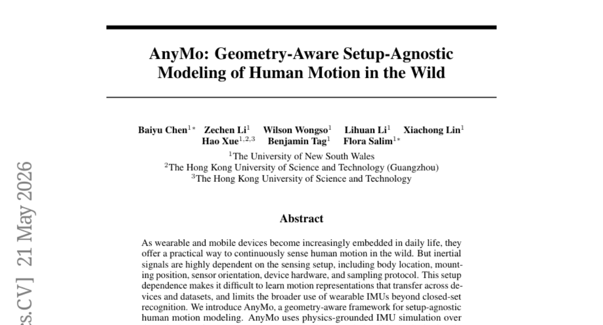

### 📌 한 줄 요약
센서 위치와 환경에 구애받지 않는 범용적인 웨어러블 동작 인식 및 언어 이해 프레임워크

### 🔑 핵심 포인트
- 물리 기반 시뮬레이션을 활용한 다양한 센서 배치 시나리오 생성 및 데이터 증강
- 그래프 인코더와 LLM을 결합한 멀티 포지션 IMU 데이터의 전신 동작 토큰화
- 제로샷 환경에서도 높은 성능을 발휘하는 범용 동작 이해 모델 구축

### 🧑‍💻 개발자 관점
센서 부착 위치가 매번 달라지는 실제 웨어러블 서비스 환경에서, 재학습 없이 다양한 기기에 즉시 적용 가능한 모델 아키텍처를 제시합니다.

### 🚀 실무 적용 아이디어
- 물리 기반 IMU 시뮬레이션 데이터 생성 파이프라인 구현 검토
- 그래프 신경망(GNN)을 활용한 센서 간 관계 모델링 실험
- LLM 기반의 동작 캡셔닝 및 멀티모달 정렬 구조 테스트

### ⚠️ 리스크/한계
- 시뮬레이션 데이터와 실제 환경 데이터 간의 도메인 차이(Sim-to-Real gap) 존재 가능성
- LLM 결합으로 인한 모델의 높은 연산 복잡도 및 실시간성 확보 문제

### 📝 초록 기반 상세 설명
일상적인 웨어러블 기기의 IMU 신호는 센서의 부착 위치, 방향, 하드웨어 등 설치 환경에 따라 데이터 특성이 크게 달라지는 문제가 있습니다. 이러한 의존성 때문에 특정 환경에서 학습된 모델을 다른 기기나 데이터셋에 적용하기 어렵습니다. 이를 해결하기 위해 AnyMo는 물리 기반의 시뮬레이션을 통해 다양한 센서 배치 시나리오를 생성하고, 이를 통해 범용적인 동작 표현을 학습하는 프레임워크를 제안합니다. 그래프 인코더와 LLM을 결합하여 멀티 포지션 IMU 데이터를 전신 동작 토큰으로 변환하고 언어 모델과 정렬하는 방식을 사용합니다. 실험 결과, 제로샷 활동 인식, 교차 모달 검색, 동작 캡셔닝 등 다양한 태스크에서 기존 모델 대비 뛰어난 성능 향상을 입증했습니다.

### 🖼️ 추가 자료
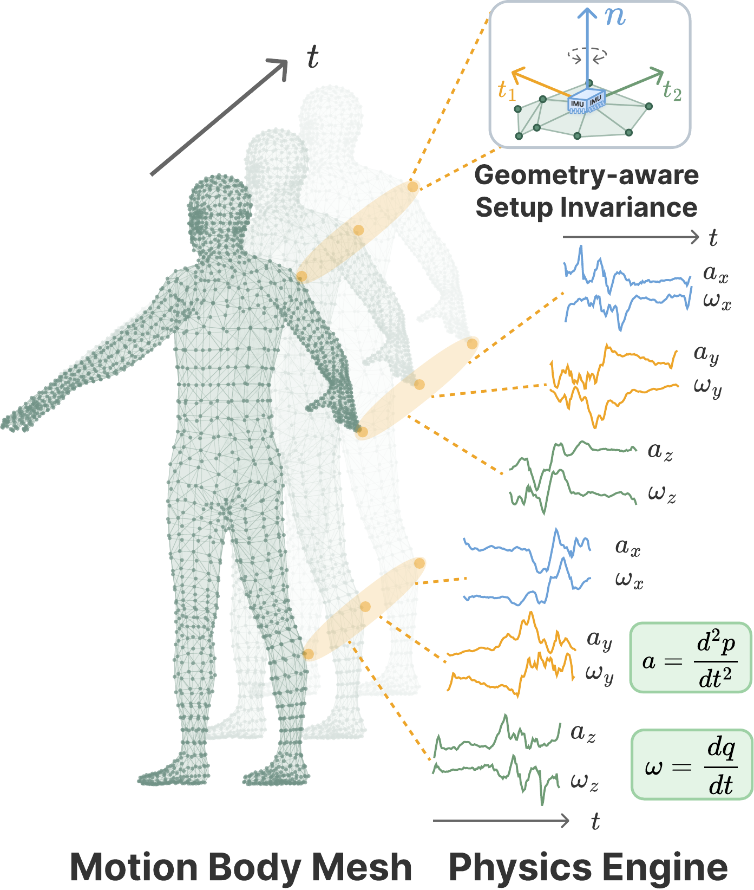
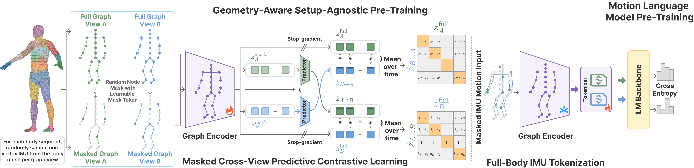
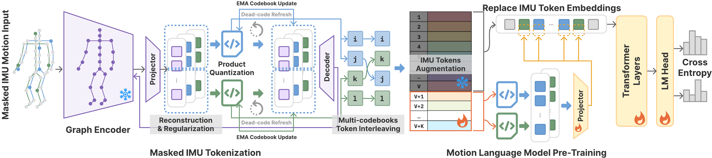
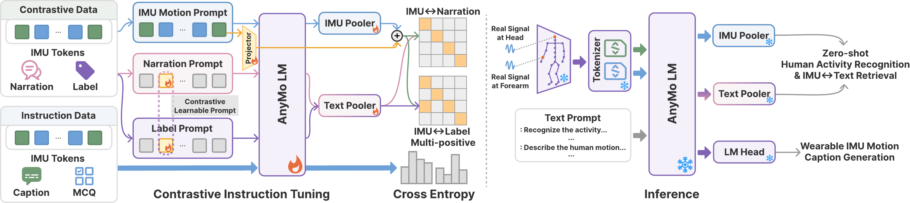

---

## 36. [More Context, Larger Models, or Moral Knowledge? A Systematic Study of Schwartz Value Detection in Political Texts](https://huggingface.co/papers/2605.22641)
**Upvotes**: 1 | **도입 난이도**: 중 | **신뢰도**: 상
**arXiv**: https://arxiv.org/abs/2605.22641

**태그**: NLP, RAG, LLM, Knowledge-Augmentation, Evaluation

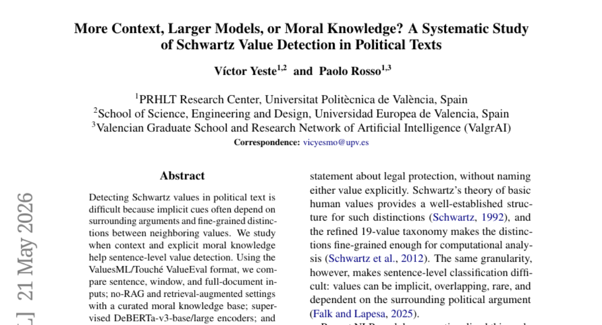

### 📌 한 줄 요약
가치 탐지 작업에서 모델 크기나 컨텍스트 확장보다 도메인 지식(Moral Knowledge)의 결합이 더 효과적일 수 있음을 입증한 연구

### 🔑 핵심 포인트
- 모델 크기(Scaling)와 컨텍스트 확대가 성능 향상을 보장하지 않는다는 것을 입증
- 큐레이션된 도메인 지식을 활용한 RAG 방식이 모든 모델 환경에서 가장 일관된 성능 향상을 제공
- 사회적 맥락이나 개념적 혼동이 잦은 가치 탐지에서 지식 결합의 효과가 극대화됨

### 🧑‍💻 개발자 관점
특정 도메인 지식이 필요한 태스크에서 무작정 큰 모델이나 긴 컨텍스트를 쓰는 것보다, 정교한 지식 베이스를 활용한 RAG 전략이 더 효율적이고 강력할 수 있음을 시사합니다.

### 🚀 실무 적용 아이디어
- 도메인 특화 태스크에서 모델 크기 확장 대신 지식 베이스(Knowledge Base) 구축 실험 진행
- Late-fusion 방식보다 Early-fusion 방식의 지식 결합 전략 테스트
- 가치/의도 탐지 모델 구축 시 컨텍스트 윈도우 크기에 따른 성능 변화 정밀 측정

### ⚠️ 리스크/한계
- 특정 가치(Schwartz values)에 특화된 연구이므로 일반적인 NLP 태스크로의 일반화에는 주의 필요
- 지식 베이스의 품질이 성능의 병목이 될 수 있음

### 📝 초록 기반 상세 설명
정치적 텍스트에서 슈워츠 가치(Schwartz values)를 탐지하는 것은 문맥 의존성과 가치 간 미세한 차이로 인해 매우 어렵습니다. 본 연구는 문맥의 양, 모델 크기, 그리고 외부 도메인 지식(RAG)이 가치 탐지 성능에 미치는 영향을 체계적으로 비교했습니다. 실험에는 DeBERTa 계열의 인코더와 12B~123B 규모의 LLM을 활용하였으며, 문장/윈도우/전체 문서 컨텍스트 및 RAG 설정을 포함했습니다. 연구 결과, 모델 크기 확장이나 단순 컨텍스트 확대가 항상 성능 향상을 보장하지는 않았습니다. 반면, 정교하게 큐레이션된 도메인 지식을 결합하는 방식이 모든 모델군에서 가장 일관된 성능 향상을 이끌어냈습니다. 결론적으로 가치 민감형 NLP에서는 모델 스케일링보다 컨텍스트와 지식의 적절한 결합이 중요함을 시사합니다.

### 🖼️ 추가 자료
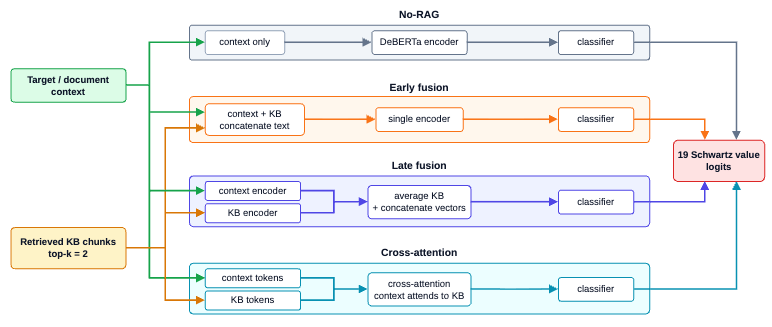
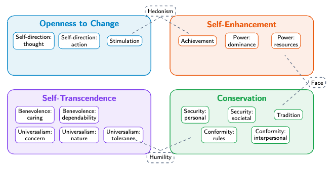
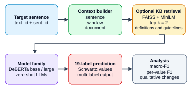

---

## 37. [DecQ: Detail-Condensing Queries for Enhanced Reconstruction and Generation in Representation Autoencoders](https://huggingface.co/papers/2605.22777)
**Upvotes**: 1 | **도입 난이도**: 하 | **신뢰도**: 상
**arXiv**: https://arxiv.org/abs/2605.22777

**태그**: Computer Vision, Generative Models, Autoencoders, Foundation Models, RAG, Vision

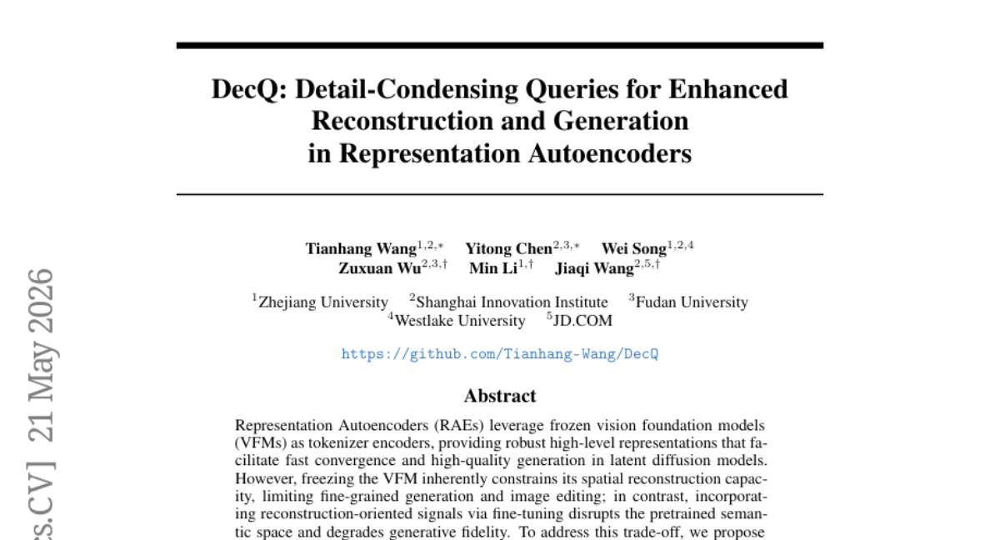

### 📌 한 줄 요약
VFM의 의미론적 공간을 유지하면서도 세부 재구성 능력을 극대화하는 경량 쿼리 기반의 RAE 프레임워크

### 🔑 핵심 포인트
- VFM의 의미적 공간을 보존하면서 세부 정보를 추출하는 경량 쿼리(DecQ) 도입
- 재구성(Reconstruction)과 생성(Generation) 사이의 트레이드오프 해결
- 중간 레이어의 특징을 활용하여 고해상도 디테일을 복원하는 Condenser 모듈 설계

### 🧑‍💻 개발자 관점
사전 학습된 모델을 건드리지 않고도 이미지 편집 및 고해상도 생성을 위한 정교한 디테일을 확보할 수 있는 효율적인 방법론을 제시합니다.

### 🚀 실무 적용 아이디어
- DINOv2와 같은 고정된 VFM 기반 RAE 구조에 DecQ 쿼리 모듈 이식 실험
- 추가 연산량 대비 PSNR 및 FID 개선 폭에 대한 벤치마크 테스트
- 다양한 해상도 및 이미지 도메인에서의 디테일 복원 성능 검증

### ⚠️ 리스크/한계
- 쿼리 개수 증가에 따른 메모리 사용량 및 추론 속도 영향성 확인 필요
- 특정 VFM 아키텍처에 대한 의존성 및 범용성 검증 필요

### 📝 초록 기반 상세 설명
최근 Representation Autoencoders(RAEs)는 고정된 Vision Foundation Models(VFMs)를 사용하여 강력한 표현력을 확보하지만, 고정된 가중치로 인해 세부적인 이미지 재구성 능력이 제한되는 문제가 있습니다. 반면, 재구성을 위해 VFM을 미세 조정하면 사전 학습된 의미 공간이 파괴되어 생성 품질이 저하되는 트레이드오프가 발생합니다. 이를 해결하기 위해 본 논문은 DecQ 프레임워크를 제안합니다. DecQ는 중간 레이어의 특징에서 세부 정보를 추출하는 경량화된 'detail-condensing queries'를 도입하여 디코더와 생성 모델에 결합합니다. 실험 결과, 매우 적은 연산량 증가만으로도 재구성 품질(PSNR)을 크게 높였으며, 생성 모델의 수렴 속도와 FID 성능을 동시에 개선했습니다.

---

## 38. ["I didn't Make the Micro Decisions": Measuring, Inducing, and Exposing Goal-Level AI Contributions in Collaboration](https://huggingface.co/papers/2605.21363)
**Upvotes**: 1 | **도입 난이도**: 중 | **신뢰도**: 상
**arXiv**: https://arxiv.org/abs/2605.21363

**태그**: Human-AI Collaboration, LLM, Attribution, UX Design, Evaluation

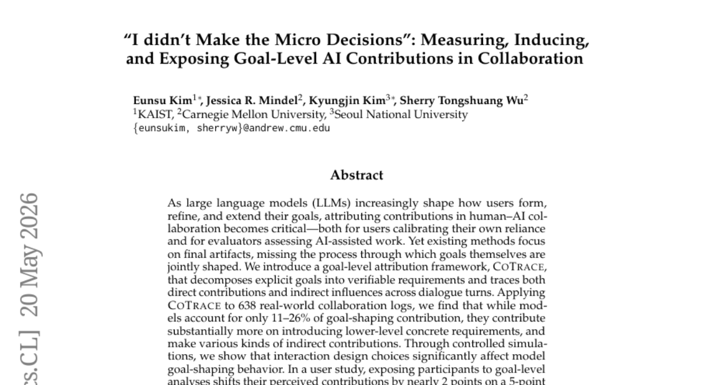

### 📌 한 줄 요약
AI가 사용자의 목표 설정 과정에 미치는 영향력을 정밀하게 추적하고, 사용자의 과대평가된 기여도를 교정하는 프레임워크 제안

### 🔑 핵심 포인트
- CoTrace: 목표를 세부 요구사항으로 분해하고 대화 맥락을 추적하는 기여도 산정 프레임워크
- AI의 역할 재정의: 단순 결과물 생성을 넘어 목표 구체화 및 간접적 영향력 행사 확인
- 사용자 오인(Miscalibration) 발견: 사용자가 자신의 기여도를 실제보다 높게 평가하는 경향 확인

### 🧑‍💻 개발자 관점
AI 협업 툴 설계 시, 사용자가 AI의 개입 정도를 명확히 인지하고 자신의 역할을 객관적으로 파악할 수 있는 인터페이스 설계의 근거를 제공합니다.

### 🚀 실무 적용 아이디어
- AI 협업 로그를 CoTrace 프레임워크와 같은 방식으로 세분화하여 분석해보기
- 사용자에게 AI의 기여도를 시각화하여 보여주는 UI/UX 실험 진행
- 목표 설정 단계에서의 AI 개입 정도를 정량화하는 지표 설계

### ⚠️ 리스크/한계
- 대화 맥락의 복잡성에 따라 기여도 산정의 객관성 확보가 어려울 수 있음
- 사용자에게 기여도를 노출하는 것이 오히려 협업 의욕을 저하시킬 가능성 존재

### 📝 초록 기반 상세 설명
LLM이 사용자의 목표 형성 및 구체화 과정에 깊이 관여함에 따라, 협업 과정에서의 기여도 산정이 중요해지고 있습니다. 기존 방식은 최종 결과물에만 집중하여 목표 형성 과정에서의 상호작용을 놓치는 한계가 있습니다. 본 논문은 목표를 검증 가능한 요구사항으로 분해하고 대화 흐름에 따른 직접/간접적 영향을 추적하는 CoTrace 프레임워크를 제안합니다. 638개의 실제 협업 로그 분석 결과, AI는 구체적인 요구사항 도입과 간접적 영향력 측면에서 유의미한 기여를 하고 있었습니다. 실험을 통해 인터랙션 디자인이 AI의 목표 형성 행동에 영향을 미침을 확인했으며, 사용자에게 분석 결과를 제공했을 때 AI 보조 작업에 대한 사용자의 기여도 인식이 크게 변화함을 입증했습니다.

---

## 39. [Same Architecture, Different Capacity: Optimizer-Induced Spectral Scaling Laws](https://huggingface.co/papers/2605.21803)
**Upvotes**: 1 | **도입 난이도**: 중 | **신뢰도**: 상
**arXiv**: https://arxiv.org/abs/2605.21803

**태그**: Optimization, Scaling Laws, Transformer, Representation Learning

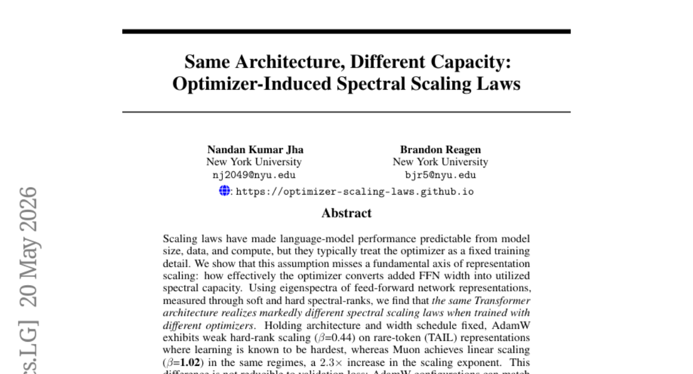

### 📌 한 줄 요약
옵티마이저가 모델의 표현력(Spectral Capacity)을 결정하는 핵심 축임을 밝혀, 단순 손실 함수 최적화를 넘어 아키텍처 설계와 옵티마이저의 공동 설계 필요성을 제시함

### 🔑 핵심 포인트
- 옵티마이저가 모델의 유효 스펙트럼 용량(Spectral Capacity)을 결정하는 핵심 변수임을 입증
- 동일한 손실(Loss) 값이라도 옵티마이저에 따라 모델 내부의 표현 구조(Spectral Geometry)가 다를 수 있음을 확인
- 희귀 토큰(TAIL) 영역에서 옵티마이저 간 스케일링 지수 차이가 뚜렷하게 나타남

### 🧑‍💻 개발자 관점
모델의 크기를 키워도 성능 향상이 정체된다면, 아키텍처 변경 이전에 옵티마이저가 모델의 잠재적 용량을 제대로 활용하고 있는지 검토해야 합니다.

### 🚀 실무 적용 아이디어
- 동일한 아키텍처에서 서로 다른 옵티마이저로 학습 시, 검증 손실 외에 표현력(Rank/Spectrum) 변화 모니터링
- 모델 확장(Scaling) 시 옵티마이저가 스케일링 법칙을 어떻게 변화시키는지 실험적 검증
- 특정 도메인(희귀 데이터) 학습 시 옵티마이저가 표현 용량 확보에 미치는 영향 분석

### ⚠️ 리스크/한계
- 손실 함수(Loss)가 같아도 내부 표현 구조가 다를 수 있어, 단순 성능 지표만으로는 모델의 잠재력을 오판할 위험이 있음
- 특정 옵티마이저의 효과가 특정 아키텍처에 국한될 가능성 존재

### 📝 초록 기반 상세 설명
기존 스케일링 법칙은 옵티마이저를 고정된 요소로 취급했으나, 이는 모델의 표현력 확장 측면을 간과하는 것입니다. 본 연구는 FFN의 고유값 스펙트럼(Eigenspectra) 분석을 통해 옵티마이저가 모델 너비(Width)를 실제 표현 용량으로 변환하는 효율성을 조사했습니다. 실험 결과, 동일한 아키텍처에서도 AdamW와 Muon 같은 옵티마이저에 따라 스펙트럼 스케일링 법칙이 판이하게 다르게 나타났습니다. 특히 학습이 어려운 희귀 토큰(TAIL) 영역에서 Muon은 AdamW보다 훨씬 높은 스케일링 지수를 보였습니다. 이는 손실 함수(Loss)가 동일하더라도 옵티마이저에 따라 모델 내부의 표현 구조가 근본적으로 다를 수 있음을 의미합니다. 결론적으로 옵티마이저는 아키텍처만큼이나 중요한 표현력 스케일링의 핵심 요소입니다.

---

## 40. [Platonic Representations in the Human Brain: Unsupervised Recovery of Universal Geometry](https://huggingface.co/papers/2605.20496)
**Upvotes**: 1 | **도입 난이도**: 상 | **신뢰도**: 상
**arXiv**: https://arxiv.org/abs/2605.20496

**태그**: Neuroscience, Self-Supervised, Representation Learning, Geometry, RAG, Evaluation

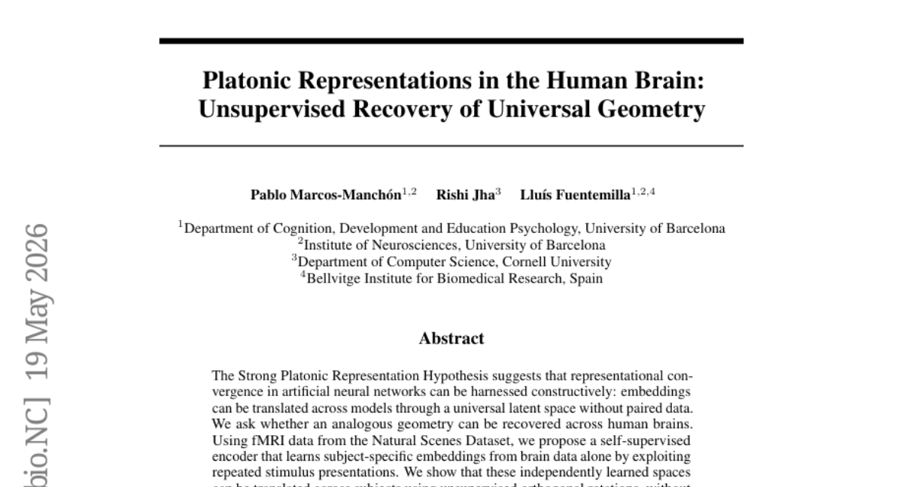

### 📌 한 줄 요약
인간 뇌의 시각 피질 데이터에서 공통된 기하학적 구조를 추출하여 개인 간 데이터 정렬이 가능함을 입증함

### 🔑 핵심 포인트
- 비지도 학습 기반의 피험자 간 뇌 임베딩 정렬 기술 제안
- 개별 피험자의 뇌 표현이 공통된 기하학적 구조(Universal Geometry)를 공유함을 입증
- 쌍을 이루는 데이터 없이 직교 회전만으로 가능한 교차 피험자 정렬 성공

### 🧑‍💻 개발자 관점
데이터 정렬(Alignment) 문제에서 레이블이나 쌍이 없는 상황에서도 기하학적 변환만으로 서로 다른 도메인을 통합할 수 있는 방법론적 영감을 제공합니다.

### 🚀 실무 적용 아이디어
- 비지도 학습 기반의 임베딩 정렬(Procrustes analysis 등) 기법 검토
- 도메인 간 데이터 불일치 해결을 위한 기하학적 변환 알고리즘 실험
- 자기주도 학습(Self-supervised learning)을 통한 특징 추출 구조 설계

### ⚠️ 리스크/한계
- fMRI 데이터라는 특수 환경에 의존하므로 일반적인 AI 모델로의 직접 적용에는 한계가 있음
- 복잡한 비선형 변환이 필요한 경우 단순 직교 회전만으로는 정렬이 어려울 수 있음

### 📝 초록 기반 상세 설명
인공 신경망의 표현 수렴 현상을 인간 뇌에 적용할 수 있는지에 대한 의문에서 연구가 시작되었습니다. 연구진은 fMRI 데이터를 활용하여 반복적인 자극 제시를 통해 개별 피험자의 뇌 임베딩을 학습하는 자기주도형 인코더를 제안했습니다. 별도의 쌍을 이루는 데이터 없이 비지도 직교 회전(unsupervised orthogonal rotations)을 통해 서로 다른 피험자의 공간을 하나의 공유 잠재 공간으로 변환했습니다. 실험 결과, 개별 피험자의 뇌 표현은 서로 호환 가능한 공통 좌표계를 공유하며 기하학적으로 유사함을 확인했습니다. 이는 인간 시각 피질에 보편적인 신경 기하학적 구조가 존재함을 시사합니다.

### 🖼️ 추가 자료
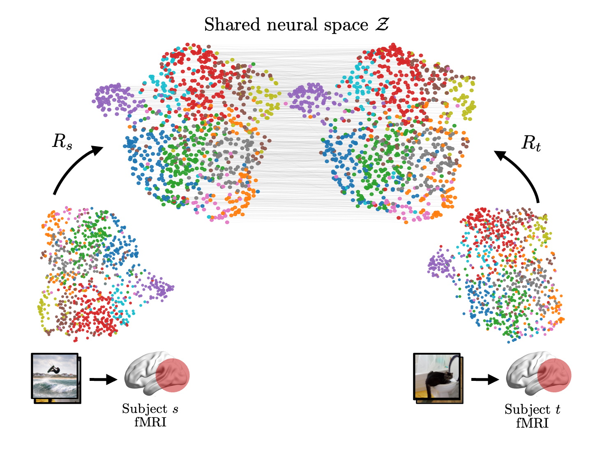
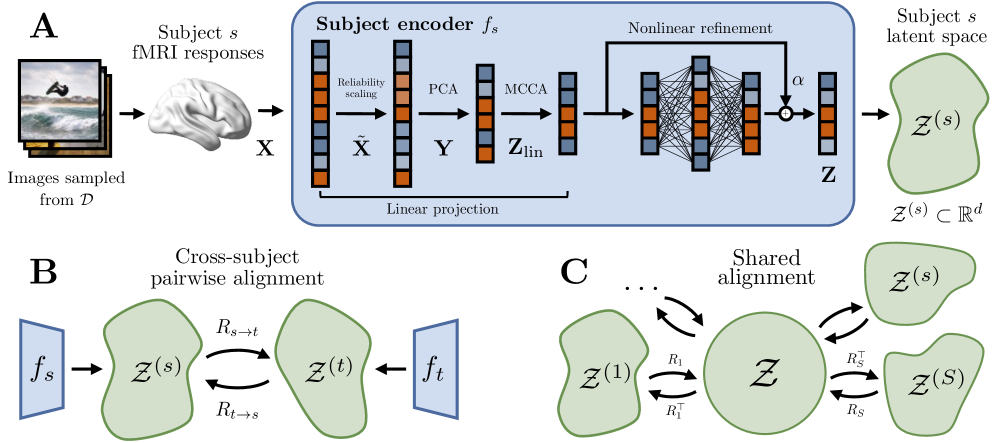

---

## 41. [Disentangling Sampling from Training Budget in Class-Imbalanced CT Body Composition Segmentation](https://huggingface.co/papers/2605.20405)
**Upvotes**: 1 | **도입 난이도**: 하 | **신뢰도**: 상
**arXiv**: https://arxiv.org/abs/2605.20405

**태그**: Medical Imaging, Segmentation, Data Sampling, Class Imbalance, Vision, Evaluation

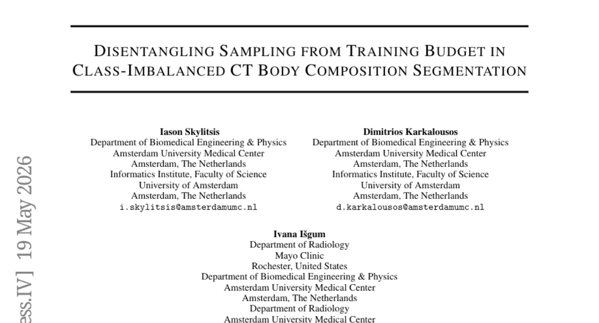

### 📌 한 줄 요약
데이터 부족 및 클래스 불균형 상황에서 학습 반복 횟수(Iteration Budget)를 고려한 에피소딕 샘플링(Episodic Sampling)의 효과 검증

### 🔑 핵심 포인트
- Few-shot learning의 에피소딕 샘플링을 지도 학습(Supervised learning)에 적용하여 배치 내 클래스 균형 확보
- 학습 반복 횟수(Iteration budget)가 샘플링 전략의 성능 평가에 미치는 결정적 영향 규명
- 데이터 부족 상황에서 에피소딕 샘플링의 우수한 일반화 성능 및 규제 효과 확인

### 🧑‍💻 개발자 관점
데이터가 부족하거나 특정 클래스가 매우 희귀한 의료/정밀 산업용 AI 모델 학습 시, 단순 무작위 샘플링 대신 배치 구성을 제어하는 것이 학습 효율과 안정성에 직결됨을 시사합니다.

### 🚀 실무 적용 아이디어
- 데이터 불균형이 심한 데이터셋에 에피소딕 샘플링 적용 및 성능 비교
- 학습 반복 횟수(Iteration)를 고정하고 샘플링 전략별 수렴 속도 측정
- 모델 아키텍처 변경 없이 샘플링 전략만으로 성능 변화 확인

### ⚠️ 리스크/한계
- 데이터가 충분한 대규모 학습 환경에서는 기존 방식과 성능 차이가 미미할 수 있음
- 배치 구성 방식에 따른 학습 시간 및 연산 오버헤드 발생 가능성

### 📝 초록 기반 상세 설명
의료 영상 분할 작업에서 클래스 불균형은 희귀 클래스의 학습을 저해하는 고질적인 문제입니다. 기존의 손실 함수 가중치 조절이나 단순 샘플링 방식은 배치 내 클래스 분포를 직접 제어하지 못하는 한계가 있습니다. 본 연구는 Few-shot learning의 에피소딕 샘플링 기법을 도입하여 배치 내 클래스 균형을 맞추는 전략을 제안합니다. 실험 결과, 데이터가 적은 환경에서 에피소딕 샘플링은 기존 방식보다 높은 성능을 보였으며, 동일한 학습 예산(Iteration budget) 하에서도 더 긴 학습 안정성을 유지했습니다. 이는 에피소딕 샘플링이 클래스 균형을 통한 암시적 규제(Regularization) 효과를 제공함을 시사합니다.

---

## 42. [Lean Refactor: Multi-Objective Controllable Proof Optimization via Agentic Strategy Search](https://huggingface.co/papers/2605.20244)
**Upvotes**: 1 | **도입 난이도**: 중 | **신뢰도**: 상
**arXiv**: https://arxiv.org/abs/2605.20244

**태그**: Agent, RAG, Formal-Verification, Code-Refactoring, Multi-Objective-Optimization, Benchmark, Evaluation, Optimization

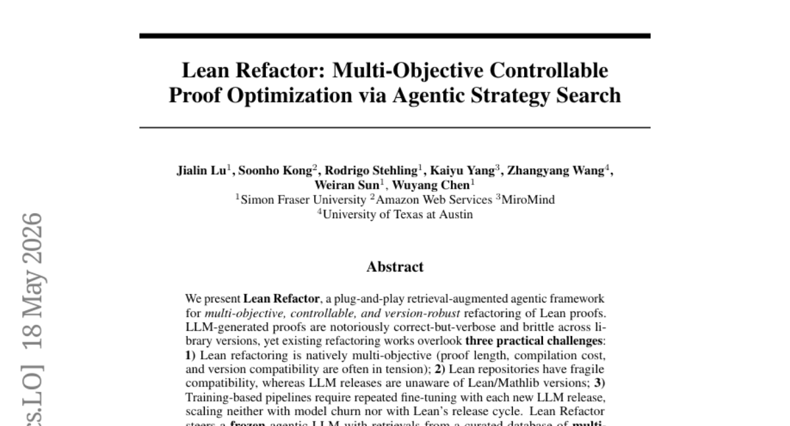

### 📌 한 줄 요약
RAG 기반 에이전트 전략 검색을 통해 Lean 증명 코드의 길이, 컴파일 비용, 버전 호환성을 동시에 최적화하는 리팩터링 프레임워크

### 🔑 핵심 포인트
- 다중 목적 최적화: 증명 길이 축소, 컴파일 비용 절감, 버전 호환성을 동시에 고려하는 리팩터링
- RAG 기반 에이전트 전략: 모델 재학습 없이 메타데이터가 포함된 전략 데이터베이스를 통해 최적의 리팩터링 경로 탐색
- 버전 강건성: 버전 필터링 검색을 통해 특정 Lean/Mathlib 버전에 최적화된 코드 생성 및 미래 버전으로의 전이성 확보

### 🧑‍💻 개발자 관점
수학적 증명 코드의 가독성을 높이고 컴파일 효율을 극대화하며, 라이브러리 업데이트 시 발생하는 코드 깨짐 문제를 자동화된 방식으로 해결할 수 있습니다.

### 🚀 실무 적용 아이디어
- 자체 보유한 Lean 코드 저장소에 전략 데이터베이스(Metadata-rich strategies) 구축 실험
- 다양한 Lean/Mathlib 버전 환경에서 RAG 기반 리팩터링의 성공률 측정
- LLM 모델 교체 시 성능 유지 여부 확인을 위한 벤치마크 테스트

### ⚠️ 리스크/한계
- 전략 데이터베이스의 품질과 메타데이터 정확도에 대한 의존도가 높음
- 복잡한 증명 구조의 경우 단순 압축 과정에서 논리적 오류가 발생할 가능성

### 📝 초록 기반 상세 설명
LLM이 생성한 Lean 증명 코드는 정답은 맞지만 지나치게 장황하고 라이브러리 버전 변화에 취약하다는 문제가 있습니다. 기존 방식은 다중 목적 최적화(길이, 비용, 버전)와 빈번한 모델/라이브러리 업데이트에 대응하는 데 한계가 있었습니다. 이를 해결하기 위해 Lean Refactor는 고정된 LLM에 메타데이터가 포함된 전략 데이터베이스를 결합한 RAG 기반 에이전트 프레임워크를 제안합니다. 실험 결과, 경쟁 벤치마크에서 70% 이상의 토큰 압축과 최대 60%의 컴파일 시간 단축을 달성했습니다. 또한 버전 필터링 기술을 통해 향후 Lean 버전 업데이트 시에도 높은 호환성을 유지하는 성능을 보였습니다.

---

## 43. [OmniPro: A Comprehensive Benchmark for Omni-Proactive Streaming Video Understanding](https://huggingface.co/papers/2605.18577)
**Upvotes**: 1 | **도입 난이도**: 하 | **신뢰도**: 상
**arXiv**: https://arxiv.org/abs/2605.18577

**태그**: Multimodal, Video-Understanding, Agent, Benchmark, Video, Audio, Evaluation

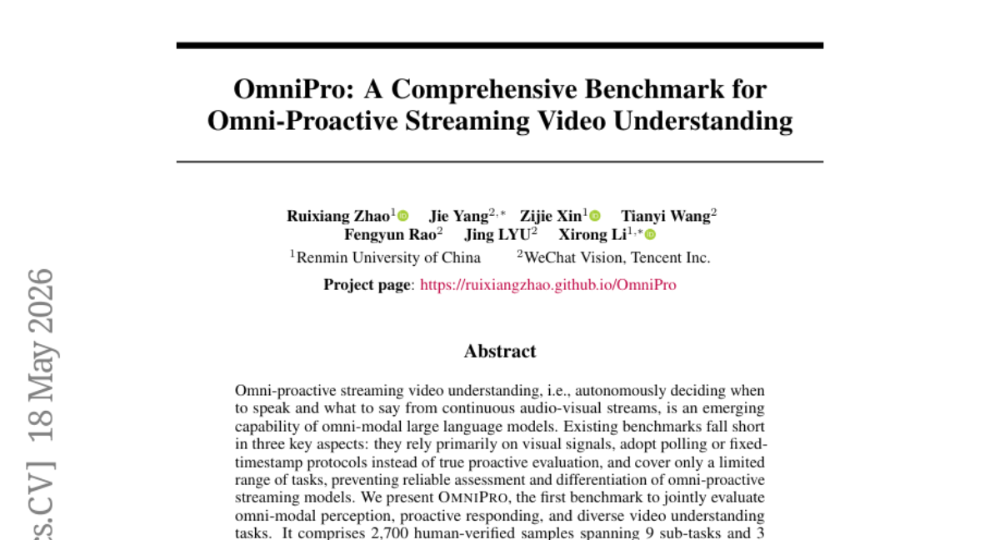

### 📌 한 줄 요약
실시간 스트리밍 비디오 환경에서 모델의 자율적 판단과 멀티모달 이해 능력을 종합적으로 평가하는 벤치마크 제안

### 🔑 핵심 포인트
- 오디오-비디오 통합 인지 및 자율적 응답 능력을 평가하는 최초의 프로액티브 스트리밍 벤치마크 구축
- Probe(내용 이해)와 Online(자율 응답 결정) 모드를 통한 이중 평가 프로토콜 도입
- 9개 하위 태스크와 3개 인지 수준을 포함하는 2,700개의 고품질 멀티모달 데이터셋 제공

### 🧑‍💻 개발자 관점
에이전트가 실시간 영상 스트림을 관찰하며 적절한 타이밍에 개입해야 하는 인터랙티브 AI 시스템 개발 시 필수적인 평가 기준을 제공합니다.

### 🚀 실무 적용 아이디어
- 자체 개발 중인 멀티모달 모델을 OmniPro의 Online 모드에 적용하여 응답 타이밍 정확도 테스트
- 모델의 장기 스트리밍 처리 능력(Long-horizon robustness) 확인을 위한 성능 저하 곡선 분석
- 비음성 오디오(환경음 등) 인지 능력이 모델 성능에 미치는 영향 분석

### ⚠️ 리스크/한계
- 실제 서비스 환경의 복잡한 노이즈와 변동성을 완벽히 반영하기에는 데이터셋의 통제된 환경적 한계가 있을 수 있음
- 모델의 응답 타이밍 결정 로직이 데이터셋의 트리거 패턴에 과적합될 가능성

### 📝 초록 기반 상세 설명
기존의 비디오 이해 벤치마크는 시각 정보에 편중되어 있고, 고정된 시점의 데이터만 처리하는 폴링 방식 위주라 실시간 프로액티브(proactive) 능력을 평가하기 어려웠습니다. 이를 해결하기 위해 오디오와 비디오를 결합한 인지, 자율적 응답, 다양한 비디오 이해 과제를 통합 평가하는 OmniPro 벤치마크를 제안합니다. 2,700개의 검증된 샘플과 함께, 모델의 응답 시점과 이해도를 정밀하게 측정하는 Probe 및 Online 이중 모드 평가 프로토콜을 도입했습니다. 11개 모델을 평가한 결과, 오디오 활용 능력의 편차, 장기 스트리밍 시 성능 저하, 비음성 오디오 인식의 취약성 등의 문제를 확인했습니다.

---

## 44. [FashionLens: Toward Versatile Fashion Image Retrieval via Task-Adaptive Learning](https://huggingface.co/papers/2605.22552)
**Upvotes**: 0 | **도입 난이도**: 상 | **신뢰도**: 상
**arXiv**: https://arxiv.org/abs/2605.22552

**태그**: Multimodal, Image Retrieval, MLLM, E-commerce, RAG, Vision, Benchmark, Evaluation

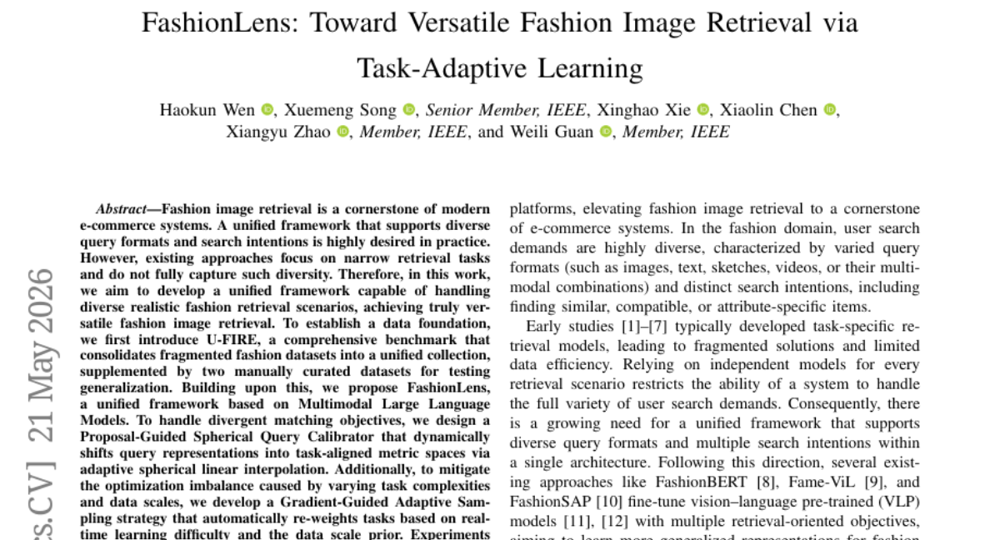

### 📌 한 줄 요약
다양한 검색 의도와 데이터 규모에 대응 가능한 MLLM 기반의 범용 패션 이미지 검색 프레임워크

### 🔑 핵심 포인트
- U-FIRE: 파편화된 패션 데이터셋을 통합하고 일반화 테스트를 위한 수동 큐레이션 데이터셋을 포함한 벤치마크 구축
- Proposal-Guided Spherical Query Calibrator: 적응형 구면 선형 보간을 통해 쿼리 표현을 작업에 맞는 메트릭 공간으로 동적 이동
- Gradient-Guided Adaptive Sampling: 학습 난이도와 데이터 규모를 고려하여 작업별 가중치를 자동 조절하는 최적화 전략

### 🧑‍💻 개발자 관점
단일 모델로 텍스트-이미지, 이미지-이미지 등 다양한 검색 시나리오를 통합 관리해야 하는 이커머스 검색 엔진 개발에 직접적인 영감을 제공합니다.

### 🚀 실무 적용 아이디어
- 제공된 U-FIRE 벤치마크를 활용하여 기존 검색 모델의 범용성 테스트
- MLLM 기반의 임베딩 공간에서 작업별 쿼리 보정(Calibration) 효과 검증
- 데이터 규모가 불균형한 멀티태스크 학습 환경에서 제안된 샘플링 전략 적용

### ⚠️ 리스크/한계
- MLLM 기반 모델로 인해 추론 시 높은 컴퓨팅 자원 및 지연 시간(Latency) 발생 가능성
- 특정 도메인(패션)에 특화된 방법론이므로 타 도메인 적용 시 성능 저하 우려

### 📝 초록 기반 상세 설명
현대 이커머스에서는 다양한 쿼리 형식과 검색 의도를 지원하는 통합 프레임워크가 필요하지만, 기존 방식은 특정 작업에만 국한되어 범용성이 부족합니다. 이를 해결하기 위해 먼저 파편화된 데이터셋을 통합한 벤치마크인 U-FIRE를 구축하였습니다. 제안하는 FashionLens는 MLLM을 기반으로 하며, 작업별로 최적화된 매칭을 위해 Proposal-Guided Spherical Query Calibrator를 설계했습니다. 또한, 작업 간 난이도와 데이터 규모 차이로 인한 불균형을 해결하기 위해 Gradient-Guided Adaptive Sampling 전략을 도입했습니다. 실험 결과, FashionLens는 U-FIRE 벤치마크에서 SOTA 성능을 달성하며 뛰어난 일반화 능력을 입증했습니다.

---

## 45. [Minimalist Visual Inertial Odometry](https://huggingface.co/papers/2605.19990)
**Upvotes**: 0 | **도입 난이도**: 중 | **신뢰도**: 상
**arXiv**: https://arxiv.org/abs/2605.19990

**태그**: Robotics, VIO, EdgeAI, SensorFusion, Vision

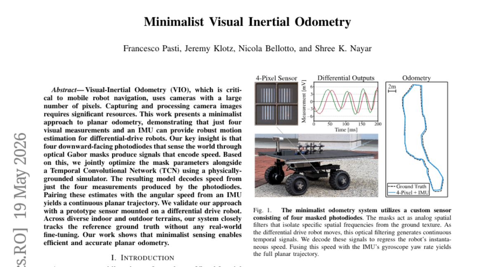

### 📌 한 줄 요약
4개의 광다이오드와 IMU만을 활용하여 고해상도 카메라 없이도 정밀한 평면 주행 궤적을 추정하는 초경량 VIO 시스템

### 🔑 핵심 포인트
- Gabor 마스크를 적용한 4개의 광다이오드를 활용한 초저전력/초경량 시각 센싱
- 물리 기반 시뮬레이터를 이용한 마스크 파라미터와 TCN 모델의 공동 최적화
- 4개의 시각 신호와 IMU 각속도를 결합한 견고한 평면 궤적 추정

### 🧑‍💻 개발자 관점
고성능 GPU가 없는 저사양 임베디드 환경이나 초소형 로봇에서 카메라 없이도 효율적인 위치 추정이 가능함을 시사합니다.

### 🚀 실무 적용 아이디어
- Gabor 필터 기반의 특징 추출 방식이 저해상도 신호에서 어떻게 작동하는지 시뮬레이션 구현
- TCN 모델을 활용한 시계열 데이터 기반 속도 추정 알고리즘 검증
- 다양한 조도 환경에서의 광다이오드 신호 안정성 테스트

### ⚠️ 리스크/한계
- 평면 주행(Planar Odometry)에 국한되어 3차원 공간 이동 추정에는 한계가 있음
- 하향식 센싱 방식이므로 바닥면의 질감이나 조도 변화에 민감할 수 있음

### 📝 초록 기반 상세 설명
로봇 내비게이션에 필수적인 VIO는 고해상도 카메라 사용으로 인해 막대한 연산 자원을 소모하는 문제가 있습니다. 본 연구는 단 4개의 시각적 측정값과 IMU만으로 견고한 모션 추정을 수행하는 미니멀리즘 접근 방식을 제안합니다. Gabor 마스크를 통해 생성된 4개의 광다이오드 신호에 속도 정보가 인코딩된다는 통찰을 바탕으로, 물리 기반 시뮬레이터를 통해 마스크 파라미터와 TCN(Temporal Convolutional Network)을 공동 최적화했습니다. 이를 통해 4개의 신호에서 속도를 디코딩하고 IMU의 각속도와 결합하여 연속적인 평면 궤적을 생성합니다. 프로토타입 실험 결과, 다양한 실내외 환경에서 별도의 미세 조정 없이도 기준값(Ground Truth)을 정확하게 추적하는 성능을 보였습니다.

---

## 46. [SAM 3D Animal: Promptable Animal 3D Reconstruction from Images in the Wild](https://huggingface.co/papers/2605.07604)
**Upvotes**: 0 | **도입 난이도**: 중 | **신뢰도**: 상
**arXiv**: https://arxiv.org/abs/2605.07604

**태그**: 3D Reconstruction, Computer Vision, Animal Modeling, Multi-Object, Vision, Evaluation

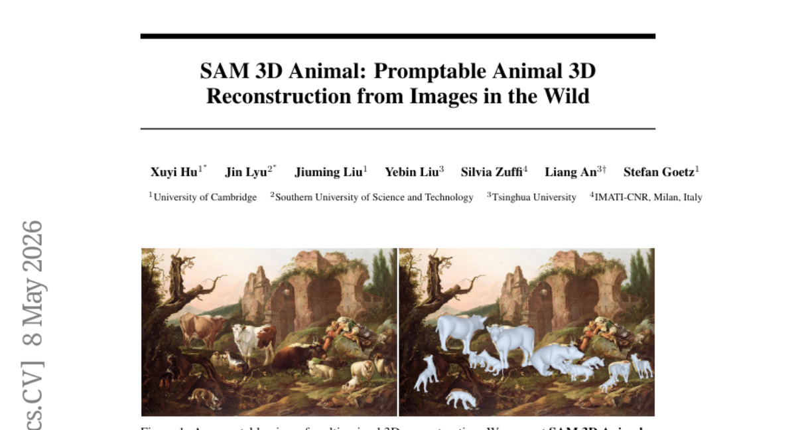

### 📌 한 줄 요약
프롬프트(키포인트, 마스크)를 활용하여 복잡한 야생 환경 내 다수 동물의 3D 모델을 단일 이미지에서 재구성하는 프레임워크

### 🔑 핵심 포인트
- 단일 이미지 내 다수 개체 3D 재구성을 지원하는 최초의 프롬프트 기반 프레임워크 개발
- 키포인트 및 마스크 프롬프트를 활용한 가려짐(Occlusion) 및 개체 모호성 해결
- 다양한 종과 상호작용 패턴을 포함한 대규모 멀티 애니멀 데이터셋 'Herd3D' 구축

### 🧑‍💻 개발자 관점
복잡한 배경이나 개체 간 간섭이 있는 실제 환경(In-the-wild)에서 정교한 3D 에셋을 자동 생성하는 기술적 토대를 제공합니다.

### 🚀 실무 적용 아이디어
- SMAL+ 모델과 제안된 프레임워크의 파라미터 결합 방식 분석
- 제공된 Herd3D 데이터셋의 데이터 분포 및 다양성 검토
- 다양한 가려짐 시나리오에서 프롬프트(키포인트/마스크)의 강건성 테스트

### ⚠️ 리스크/한계
- 파라메트릭 모델(SMAL+) 의존성으로 인한 특정 종에 대한 표현력 제한 가능성
- 프롬프트 입력(키포인트, 마스크)에 따른 재구성 품질의 가변성

### 📝 초록 기반 상세 설명
기존의 3D 동물 재구성 방식은 종의 다양성, 빈번한 가려짐, 다수 개체 존재 등의 야생 환경 문제로 인해 단일 개체 중심의 연구에 머물러 있었습니다. 본 논문은 단일 이미지에서 여러 마리의 동물을 동시에 재구성할 수 있는 프롬프트 기반 프레임워크인 SAM 3D Animal을 제안합니다. SMAL+ 파라메트릭 모델을 기반으로 하며, 키포인트와 마스크 형태의 프롬프트를 통해 복잡한 장면에서의 개체 식별 문제를 해결합니다. 이를 위해 다양한 종과 상호작용을 포함한 5,000장 이상의 이미지를 담은 Herd3D 데이터셋을 새롭게 구축했습니다. 실험 결과, 기존 모델 기반 및 모델 프리 방식 대비 최첨단(SOTA) 성능을 달성하며 확장성과 효과를 입증했습니다.

---

