# 2026-05-26 Daily Papers (Top 24)

## 오늘의 요약
오늘은 에이전트의 스킬 최적화와 자동화된 워크플로우를 다루는 연구와 더불어, 멀티모달(Vision-Language, Audio) 모델의 통합 및 효율성 개선 연구가 두드러졌습니다. 또한, 대규모 지식 그래프와 3D 공간 지능을 활용하여 AI의 추론 및 생성 능력을 실질적인 문제 해결로 연결하려는 시도들이 주요하게 다뤄졌습니다.

### 오늘의 핵심 포인트
- 에이전트의 프롬프트와 스킬을 체계적으로 진화시키고 관리하는 자동화된 최적화 방법론이 주목받았습니다.
- Diffusion 및 Text-to-Image 모델의 학습 효율성과 생성 품질을 높이기 위한 아키텍처 및 데이터 전략 연구가 활발했습니다.
- 시각, 언어, 오디오를 통합하거나 지식 그래프를 결합하여 AI의 논리적 추론과 정교한 객체 이해도를 높이는 연구가 제시되었습니다.

**오늘의 태그**: AI Agent, Multimodal, Optimization, Generative Models, Knowledge Graph

## 1. [SkillOpt: Executive Strategy for Self-Evolving Agent Skills](https://huggingface.co/papers/2605.23904)
**Upvotes**: 147 | **도입 난이도**: 중 | **신뢰도**: 상
**arXiv**: https://arxiv.org/abs/2605.23904

**태그**: Agent, Prompt Engineering, Optimization, LLM, RAG, Vision, Benchmark, Evaluation, Inference

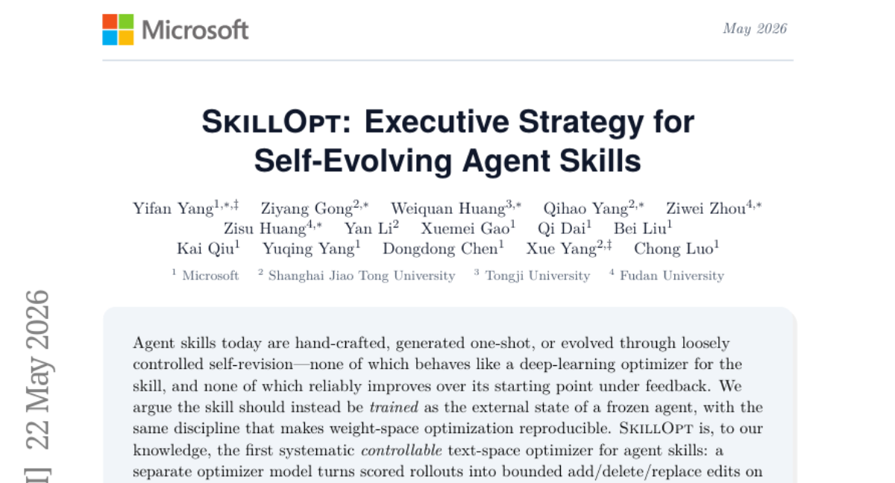

### 📌 한 줄 요약
에이전트의 스킬(프롬프트/지침)을 딥러닝 최적화 기법처럼 체계적으로 진화시키는 텍스트 공간 최적화 프레임워크

### 🔑 핵심 포인트
- 텍스트 공간에서의 체계적인 스킬 최적화 프레임워크(SkillOpt) 제안
- 검증 점수 기반의 엄격한 편집 규칙과 학습률 제어를 통한 안정적인 스킬 진화
- 추론 시 추가 모델 호출 없이 최적화된 스킬 문서만으로 성능 극대화

### 🧑‍💻 개발자 관점
에이전트의 프롬프트를 단순 반복 수정하는 대신, 데이터 기반의 자동화된 최적화 파이프라인을 구축할 수 있는 방법론을 제시합니다.

### 🚀 실무 적용 아이디어
- 특정 태스크에 대한 골든 데이터셋(Validation Set) 구축
- 현재 사용 중인 에이전트 지침(System Prompt)을 스킬 문서로 분리하여 테스트
- LLM을 활용한 자동 편집(Add/Delete/Replace) 루프 구현 실험

### ⚠️ 리스크/한계
- 최적화 과정에서 특정 벤치마크에 과적합(Overfitting)될 위험
- 고품질의 검증용 롤아웃(Rollout) 데이터 확보가 필수적임

### 📝 초록 기반 상세 설명
현재 에이전트 스킬은 수동 제작이나 일회성 생성에 의존하여 성능 개선의 재현성과 안정성이 부족합니다. 본 논문은 스킬을 고정된 에이전트의 외부 상태로 정의하고, 이를 체계적으로 최적화하는 SkillOpt를 제안합니다. SkillOpt는 별도의 옵티마이저 모델이 검증 데이터셋의 점수를 기반으로 스킬 문서를 수정(추가/삭제/교체)하며, 엄격한 검증 과정을 통해 성능 향상만을 수용합니다. 학습률 예산 및 에포크별 업데이트 전략을 통해 안정적인 학습을 보장하며 추론 시 추가 비용이 발생하지 않습니다. 실험 결과, 다양한 모델과 환경에서 기존의 수동 및 자동 생성 방식보다 압도적인 성능 향상을 입증했습니다.

---

## 2. [Rethinking Cross-Layer Information Routing in Diffusion Transformers](https://huggingface.co/papers/2605.20708)
**Upvotes**: 90 | **도입 난이도**: 하 | **신뢰도**: 상
**arXiv**: https://arxiv.org/abs/2605.20708

**태그**: Diffusion Transformer, Residual Connection, Generative Models, Training Acceleration, Vision, Distillation, Safety

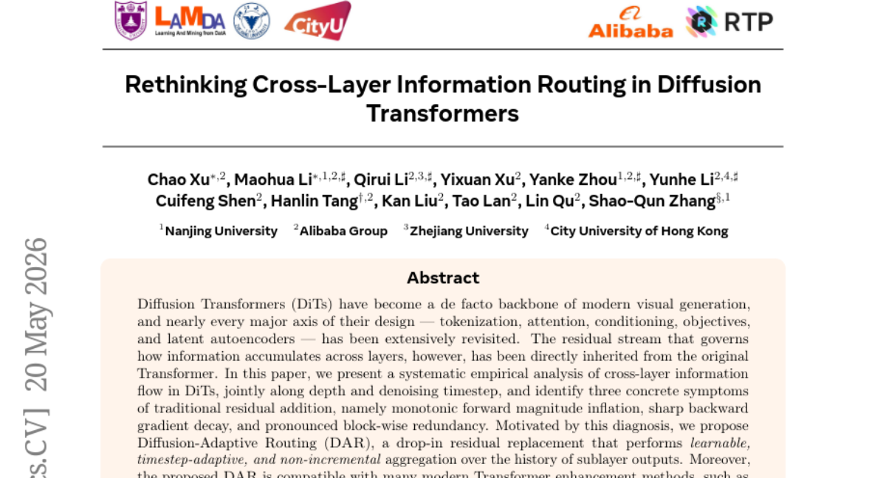

### 📌 한 줄 요약
기존 Transformer의 잔차 연결(Residual Connection) 문제를 해결하여 Diffusion 모델의 학습 속도와 생성 품질을 획기적으로 높인 새로운 정보 라우팅 기법

### 🔑 핵심 포인트
- 기존 잔차 연결의 세 가지 문제점(크기 팽창, 그래디언트 감쇄, 블록 중복성) 규명
- 타임스텝에 적응하며 비점진적으로 정보를 집계하는 DAR(Diffusion-Adaptive Routing) 제안
- 기존 모델 구조를 유지하면서 성능과 학습 효율을 높이는 드롭인 방식의 설계

### 🧑‍💻 개발자 관점
모델 구조를 크게 바꾸지 않고도 학습 효율과 생성 품질을 동시에 개선할 수 있어, 대규모 Diffusion 모델 학습 시 비용 절감과 성능 향상에 직접적인 도움을 줍니다.

### 🚀 실무 적용 아이디어
- 기존 DiT 모델의 잔차 연결 부분을 DAR 구조로 교체하여 학습 수렴 속도 비교
- 학습 초기 단계에서 DAR이 REPA와 같은 정렬 기법과 어떻게 상호작용하는지 실험
- T2I(Text-to-Image) 모델 파인튜닝 시 DAR 적용을 통한 디테일 보존 효과 검증

### ⚠️ 리스크/한계
- 타임스텝에 의존적인 학습 방식이므로 추론 시 타임스텝 스케줄링에 민감할 수 있음
- 기존 Transformer 구조에 최적화된 하드웨어 가속 효율이 DAR 적용 시 변동될 가능성

### 📝 초록 기반 상세 설명
최근 Diffusion Transformer(DiT)가 시각 생성의 주류로 자리 잡았으나, 레이어 간 정보 흐름을 담당하는 잔차 연결 방식은 기존 Transformer 구조를 그대로 답습하고 있습니다. 본 논문은 심층 분석을 통해 기존 잔차 합산 방식이 크기 팽창, 그래디언트 소실, 블록 단위 중복성이라는 문제를 야기함을 밝혀냈습니다. 이를 해결하기 위해 타임스텝에 따라 학습 가능한 비점진적 집계 방식을 제공하는 Diffusion-Adaptive Routing(DAR)을 제안합니다. DAR은 기존 구조에 즉시 적용 가능한 드롭인(drop-in) 방식이며, REPA와 같은 최신 기법과도 호환됩니다. 실험 결과, ImageNet에서 기존 모델 대비 훨씬 적은 학습 반복만으로도 더 높은 생성 품질을 달성하며 학습 가속화를 입증했습니다.

---

## 3. [Lens: Rethinking Training Efficiency for Foundational Text-to-Image Models](https://huggingface.co/papers/2605.21573)
**Upvotes**: 89 | **도입 난이도**: 중 | **신뢰도**: 상
**arXiv**: https://arxiv.org/abs/2605.21573

**태그**: Text-to-Image, Training Efficiency, Model Compression, Generative AI, RAG, Vision, Benchmark, Inference, Distillation

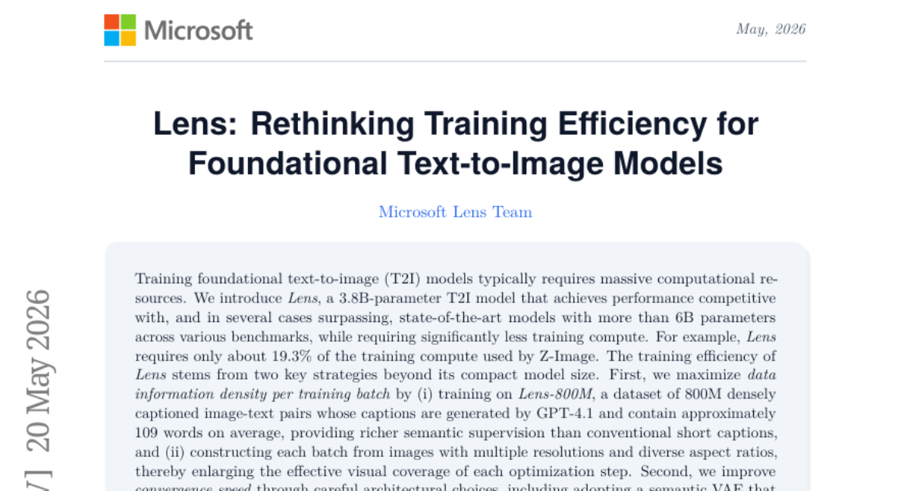

### 📌 한 줄 요약
적은 연산량으로도 대규모 모델을 능가하는 효율적인 3.8B 파라미터 텍스트-이미지 생성 모델 Lens 제안

### 🔑 핵심 포인트
- 고밀도 캡션(GPT-4 생성) 및 다양한 해상도 배치를 통한 데이터 정보 밀도 극대화
- Semantic VAE와 강력한 언어 인코더를 활용한 빠른 수렴 및 다국어 일반화 능력 확보
- RL(Taxonomy-driven) 및 Reasoner 모듈을 통한 시각적 품질 및 프롬프트 정렬 최적화

### 🧑‍💻 개발자 관점
모델 크기를 줄이면서도 데이터 품질과 아키텍처 최적화만으로 고성능을 낼 수 있음을 보여주어, 제한된 컴퓨팅 자원 환경에서의 모델 개발 가이드를 제공합니다.

### 🚀 실무 적용 아이디어
- 고밀도 캡션 데이터셋이 모델 성능에 미치는 영향 분석
- 다양한 종횡비 배치가 학습 안정성에 미치는 효과 검증
- Distillation 기법을 활용한 저사양 환경용 초고속 추론 파이프라인 구축

### ⚠️ 리스크/한계
- 데이터 밀도에 대한 의존도가 높아 고품질 데이터 확보가 필수적임
- 모델 크기가 작아 매우 복잡한 디테일 구현에는 한계가 있을 수 있음

### 📝 초록 기반 상세 설명
기존의 거대 텍스트-이미지(T2I) 모델들은 높은 성능을 위해 막대한 학습 연산량을 요구하는 문제가 있었습니다. 이를 해결하기 위해 연구진은 모델 크기는 작지만 성능은 강력한 3.8B 파라미터 규모의 Lens 모델을 개발했습니다. 데이터 밀도를 극대화하기 위해 GPT-4 기반의 고밀도 캡션 데이터셋을 사용하고, 다양한 해상도와 종횡비를 배치에 포함하는 전략을 채택했습니다. 또한, 세밀한 VAE와 강력한 언어 인코더를 통해 수렴 속도와 표현력을 높였습니다. 그 결과, 적은 연산량으로도 기존 대형 모델과 경쟁 가능한 성능을 확보했으며 빠른 추론 속도까지 달성했습니다.

### 🖼️ 추가 자료

---

## 4. [SciAtlas: A Large-Scale Knowledge Graph for Automated Scientific Research](https://huggingface.co/papers/2605.22878)
**Upvotes**: 44 | **도입 난이도**: 상 | **신뢰도**: 상
**arXiv**: https://arxiv.org/abs/2605.22878

**태그**: KnowledgeGraph, RAG, AI-Agent, Neuro-Symbolic, Scientific-AI, Agent, Reasoning, Evaluation, Inference

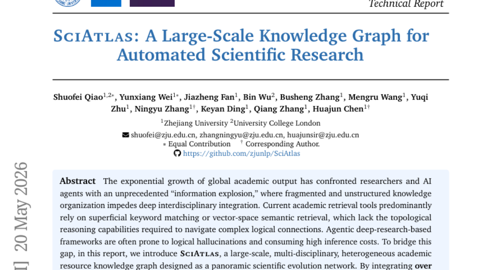

### 📌 한 줄 요약
4,300만 편의 논문 데이터를 기반으로 학술적 논리 구조를 학습한 대규모 지식 그래프(KG)를 통한 자동화된 연구 지원 프레임워크

### 🔑 핵심 포인트
- 4,300만 편의 논문과 30억 개의 트리플을 포함하는 대규모 다학제적 지식 그래프 구축
- 의미론적 매칭과 결정론적 연관성 발견을 결합한 뉴로-심볼릭 검색 알고리즘 개발
- 연구 트렌드 분석, 아이디어 포지셔닝 등 자동화된 연구 프로세스를 위한 인지 지도 제공

### 🧑‍💻 개발자 관점
단순 벡터 유사도 기반 RAG의 한계인 '논리적 환각'을 지식 그래프의 위상적 구조로 해결할 수 있는 실질적인 아키텍처를 제시합니다.

### 🚀 실무 적용 아이디어
- 제공된 GitHub 인터페이스를 활용하여 기존 RAG 시스템과 SciAtlas 검색 결과 비교 실험
- 특정 도메인(예: AI) 내에서의 아이디어 포지셔닝 및 트렌드 추출 정확도 검증
- 뉴로-심볼릭 알고리즘의 추론 비용과 기존 LLM 기반 에이전트 비용 간의 효율성 비교

### ⚠️ 리스크/한계
- 대규모 지식 그래프 구축 및 유지보수에 따른 높은 인프라 비용
- 특정 도메인에 편향된 데이터가 포함될 경우 발생할 수 있는 일반화 문제

### 📝 초록 기반 상세 설명
학술 논문의 폭발적 증가로 인해 파편화된 지식 구조와 기존 벡터 검색 방식의 논리적 한계가 연구 효율을 저해하고 있습니다. 이를 해결하기 위해 26개 분야, 1억 5,700만 개의 엔티티를 포함하는 대규모 이종 지식 그래프인 SciAtlas를 제안합니다. SciAtlas는 단순 의미 검색을 넘어 위상적 추론이 가능한 구조적 인지 기질을 제공합니다. 또한, 삼중 경로 협업 회상(tri-path collaborative recall)과 그래프 재순위화(reranking)를 특징으로 하는 뉴로-심볼릭 검색 알고리즘을 개발했습니다. 이를 통해 연구 트렌드 합성 및 아이디어 포지셔닝 등 자동화된 연구 루프를 지원하며 추론 비용을 절감합니다.

---

## 5. [StepAudio 2.5 Technical Report](https://huggingface.co/papers/2605.23463)
**Upvotes**: 36 | **도입 난이도**: 상 | **신뢰도**: 상
**arXiv**: https://arxiv.org/abs/2605.23463

**태그**: Audio-Language Model, RLHF, ASR/TTS, Foundation Model, RAG, Reasoning, Multimodal, Vision, Audio, Benchmark, Inference, Safety, Alignment

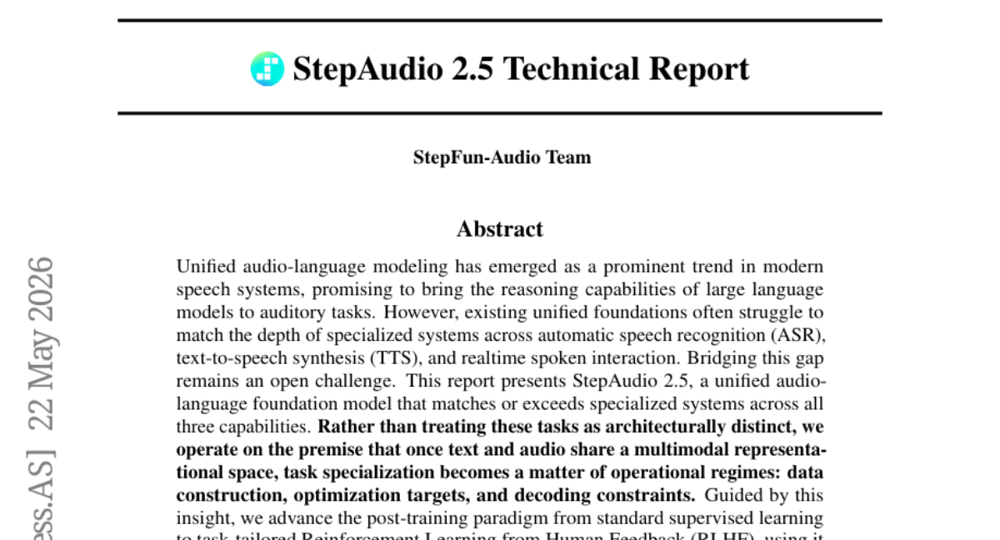

### 📌 한 줄 요약
단일 오디오-언어 파운데이션 모델로 ASR, TTS, 실시간 대화를 모두 통합하여 전문 모델 수준의 성능을 달성한 기술 보고서

### 🔑 핵심 포인트
- 단일 백본을 활용한 ASR, TTS, 실시간 대화 통합 프레임워크 구축
- RLHF를 통한 작업별 최적화(Task-tailored RLHF)로 전문 모델 수준의 성능 확보
- 데이터 구성 및 디코딩 제약을 통한 단일 모델의 다중 운영 모드 구현

### 🧑‍💻 개발자 관점
하나의 모델로 음성 인식, 합성, 대화형 에이전트를 모두 처리할 수 있는 통합 아키텍처의 가능성을 제시하여 시스템 복잡도를 낮출 수 있습니다.

### 🚀 실무 적용 아이디어
- RLHF를 활용한 특정 도메인(예: 의료, 법률) 음성 데이터 최적화 실험
- 멀티 토큰 디코딩과 실시간 응답 속도 간의 트레이드오프 분석
- 단일 모델 기반 멀티모달 에이전트 프로토타입 구현

### ⚠️ 리스크/한계
- 모델 크기 증가에 따른 추론 비용 및 하드웨어 요구사항 상승
- 세 가지 상이한 작업 간의 최적화 충돌(Catastrophic Forgetting) 가능성

### 📝 초록 기반 상세 설명
최근 오디오-언어 모델링이 주목받고 있으나, 기존 통합 모델은 ASR, TTS, 실시간 상호작용 등 각 전문 분야의 깊이를 따라잡는 데 한계가 있었습니다. 본 보고서는 단일 백본을 공유하면서도 데이터 구성, 최적화 목표, 디코딩 제약을 통해 세 가지 모드를 구현하는 StepAudio 2.5를 제안합니다. 특히 단순 지도 학습을 넘어, RLHF(인간 피드백 기반 강화학습)를 핵심 메커니즘으로 사용하여 작업별 최적화를 수행합니다. ASR은 검증 가능한 멀티 토큰 디코딩을, TTS는 선호도 기반 RLHF를, 실시간 모드는 생성적 보상 모델링을 통해 각 작업에 특화된 운영 모드를 구축했습니다. 그 결과, 모든 벤치마크에서 전문 모델과 대등하거나 이를 능가하는 SOTA 성능을 기록했습니다.

---

## 6. [See What I Mean: Aligning Vision and Language Representations for Video Fine-grained Object Understanding](https://huggingface.co/papers/2605.18018)
**Upvotes**: 28 | **도입 난이도**: 중 | **신뢰도**: 상
**arXiv**: https://arxiv.org/abs/2605.18018

**태그**: Vision-Language, Object Understanding, MLLM, Fine-grained, RAG, Multimodal, Vision, Video, Benchmark, Inference, Safety

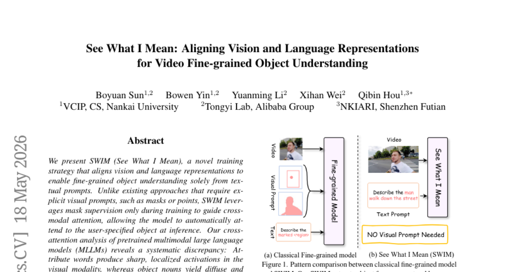

### 📌 한 줄 요약
추가적인 시각적 프롬프트 없이 텍inal 텍스트만으로 정교한 객체 인식을 가능하게 하는 시각-언어 정렬 학습 전략

### 🔑 핵심 포인트
- 학습 시에만 마스크를 사용하여 추론 시에는 텍스트만으로 객체를 식별하는 SWIM 전략 제안
- 객체 명사가 시각적 영역에 분산되어 나타나는 'semantic reference bias' 문제 식별 및 해결
- 정교한 참조 표현이 포함된 NL-Refer 데이터셋 구축을 통한 정렬 성능 강화

### 🧑‍💻 개발자 관점
사용자가 별도의 좌표나 마스크를 찍지 않고 텍스트 설명만으로 영상 내 특정 객체를 정확히 타겟팅해야 하는 서비스 구현에 유용합니다.

### 🚀 실무 적용 아이디어
- 제공된 NL-Refer 데이터셋을 활용하여 기존 MLLM의 객체 인식 정밀도 비교 실험
- 학습 시 마스크 사용 여부에 따른 추론 시 객체 국소화(Localization) 성능 변화 측정
- 다양한 도메인 영상에 대한 텍스트 기반 객체 탐지 성능 벤치마크 수행

### ⚠️ 리스크/한계
- 학습 시 사용된 마스크 데이터에 대한 의존도가 높을 경우, 복잡한 배경에서 성능 저하 가능성
- 매우 미세한 객체나 겹쳐 있는 객체에 대한 분리 능력이 데이터셋 범위를 벗어날 경우 제한될 수 있음

### 📝 초록 기반 상세 설명
기존의 멀티모달 모델은 특정 객체를 인식하기 위해 마스크나 포인트 같은 명시적인 시각적 프롬프트가 필요했습니다. 연구 결과, MLLM에서 속성 단어는 국소적이지만 명사(Object Nouns)는 분산된 활성화 패턴을 보이는 정렬 불일치 문제가 발견되었습니다. 이를 해결하기 위해 연구진은 정교한 참조 표현이 포함된 NL-Refer 데이터셋을 구축하고, 학습 시에만 마스크를 사용하여 명사 기반의 크로스 어텐션을 정렬하는 SWIM 전략을 제안합니다. 실험 결과, 별도의 시각적 가이드 없이도 텍스트 프롬프트만으로 정교한 객체 이해가 가능함을 입증했습니다.

---

## 7. [From Raw Experience to Skill Consumption: A Systematic Study of Model-Generated Agent Skills](https://huggingface.co/papers/2605.23899)
**Upvotes**: 22 | **도입 난이도**: 중 | **신뢰도**: 상
**arXiv**: https://arxiv.org/abs/2605.23899

**태그**: AI Agent, Skill Extraction, Workflow Automation, Model Transfer, Agent, RAG, Evaluation, Distillation

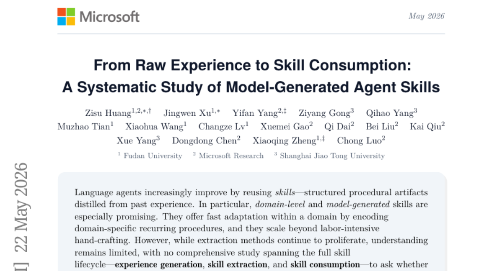

### 📌 한 줄 요약
모델 생성 스킬의 생애주기(추출-사용) 전반을 분석하여 스킬의 유용성과 부정적 전이(Negative Transfer) 문제를 규명하고 이를 해결하는 메타 스킬을 제안함

### 🔑 핵심 포인트
- 스킬 생애주기(경험 생성-추출-소비) 전반을 아우르는 체계적인 평가 프레임워크 구축
- 추출 모델과 소비자 모델 간의 성능 불일치 및 부정적 전이(Negative Transfer) 현상 규명
- 스킬 유용성을 극대화하고 전이 문제를 완화하는 메타 스킬(Meta-skill) 제안

### 🧑‍💻 개발자 관점
에이전트 시스템 구축 시 단순히 스킬을 추출하는 것을 넘어, 특정 모델이 추출한 스킬이 다른 모델에서 어떻게 작동할지에 대한 예측과 최적화가 필수적임을 시사합니다.

### 🚀 실무 적용 아이디어
- 현재 사용 중인 에이전트의 스킬 추출 모델과 실행 모델 간의 성능 격차 테스트
- 추출된 스킬이 다른 모델(Consumer)로 이식될 때 발생하는 성능 저하 지점 분석
- 제안된 메타 스킬 기법을 기존 워크플로우에 적용하여 스킬 품질 변화 관찰

### ⚠️ 리스크/한계
- 모델 규모가 스킬 유용성과 반드시 비례하지 않으므로 단순 스케일업만으로는 해결 불가
- 특정 도메인에 특화된 스킬이 다른 도메인으로 전이될 때의 복잡성 존재

### 📝 초록 기반 상세 설명
언어 에이전트가 과거 경험을 구조화된 스킬로 재사용하는 방식이 주목받고 있으나, 스킬의 생성부터 소비까지 이어지는 전체 생애주기에 대한 체계적인 연구는 부족한 실정입니다. 본 논문은 스킬 추출기와 소비자 에이전트 간의 상호작용을 포함하는 유틸리티 기반 평가 프레임워크를 구축하여 5개 도메인에서 실험을 진행했습니다. 연구 결과, 모델 생성 스킬은 평균적으로 유용하지만 모델 규모와 무관하게 성능이 저하되는 부정적 전이 현상이 관찰되었습니다. 또한 추출 능력과 소비 능력이 모델마다 상이하게 나타나는 비일관적인 패턴을 확인했습니다. 이러한 분석을 바탕으로 스킬의 품질을 높이고 부정적 전이를 줄이는 메타 스킬(Meta-skill)을 제안하여 실질적인 성능 향상을 입증했습니다.

---

## 8. [PhotoFlow: Agentic 3D Virtual Photography Missions](https://huggingface.co/papers/2605.23771)
**Upvotes**: 20 | **도입 난이도**: 중 | **신뢰도**: 상
**arXiv**: https://arxiv.org/abs/2605.23771

**태그**: Agent, 3D Vision, LLM, Computer Graphics, Reasoning, Vision, Benchmark, Evaluation, Safety

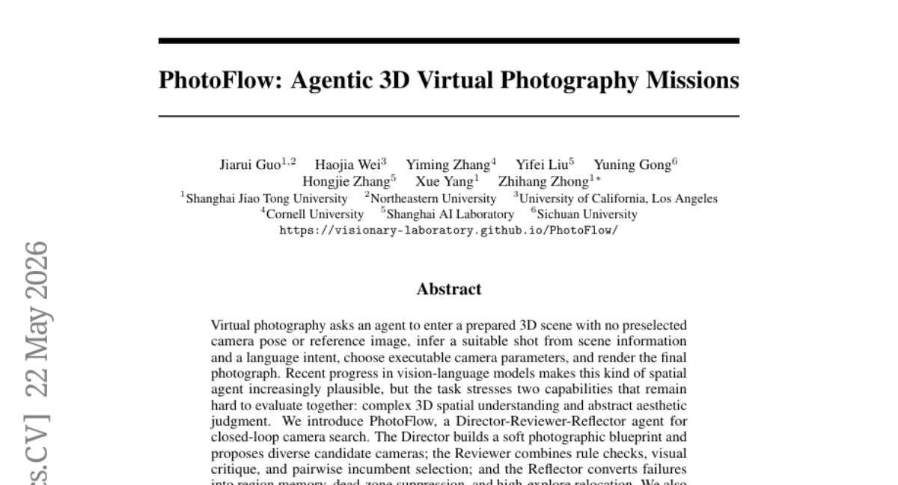

### 📌 한 줄 요약
LLM 기반의 에이전트 구조를 활용하여 복잡한 3D 공간 이해와 미적 판단을 결합한 가상 사진 촬영 자동화 프레임워크

### 🔑 핵심 포인트
- Director-Reviewer-Reflector 구조를 통한 폐쇄 루프(Closed-loop) 카메라 탐색 메커니즘
- 3D 공간 추론과 미적 판단 능력을 동시에 평가할 수 있는 VPhotoBench 벤치마크 구축
- LLM 중심의 에이전트가 복잡한 3D 장면에서 실행 가능한 카메라 파라미터를 생성하는 기술적 입증

### 🧑‍💻 개발자 관점
3D 콘텐츠 생성 파이프라인에서 수동 카메라 워크를 자동화하거나, LLM을 활용한 공간 지능(Spatial Intelligence) 에이전트 설계의 실질적인 사례를 제공합니다.

### 🚀 실무 적용 아이디어
- Blender와 LLM API를 연동하여 기본적인 카메라 제어 루프 구현해보기
- 제안된 Director-Reviewer-Reflector 구조를 단순한 2D 이미지 생성 태스크에 적용해보기
- VPhotoBench와 유사한 환경에서 에이전트의 공간 추론 성능 테스트하기

### ⚠️ 리스크/한계
- 렌더링 비용(Budget)이 발생하는 환경에서 에이전트의 반복적인 탐색 효율성 문제
- LLM의 추상적 판단이 실제 물리적 3D 제약 조건과 충돌할 가능성

### 📝 초록 기반 상세 설명
기존의 가상 사진 촬영은 3D 공간 이해와 추상적인 미적 판단을 동시에 수행하는 데 어려움이 있었습니다. 본 논문은 이를 해결하기 위해 Director-Reviewer-Reflector 구조를 가진 PhotoFlow 에이전트를 제안합니다. Director는 촬영 계획을 세우고, Reviewer는 시각적 비평과 규칙 검사를 수행하며, Reflector는 실패 사례를 학습하여 카메라 위치를 재조정합니다. 또한 다양한 미션이 포함된 3D 벤치마크인 VPhotoBench를 함께 도입했습니다. 실험 결과, PhotoFlow는 제한된 렌더링 예산 내에서 기존의 단일 예측 및 단순 탐색 방식보다 높은 성공률과 미적 정렬 품질을 달성했습니다.

---

## 9. [PiD: Fast and High-Resolution Latent Decoding with Pixel Diffusion](https://huggingface.co/papers/2605.23902)
**Upvotes**: 20 | **도입 난이도**: 중 | **신뢰도**: 상
**arXiv**: https://arxiv.org/abs/2605.23902

**태그**: Diffusion, Image-Generation, Super-Resolution, Model-Compression, Vision, Inference, Distillation

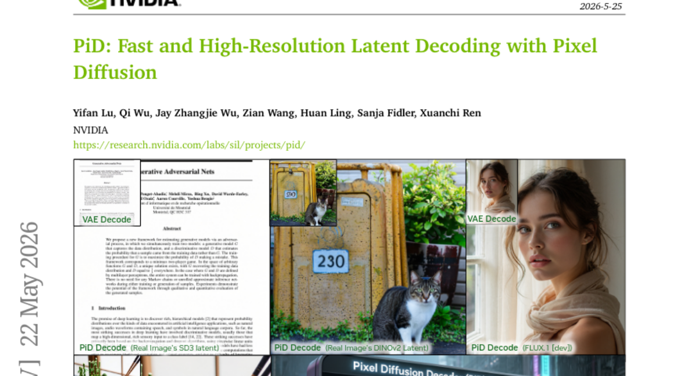

### 📌 한 줄 요약
잠재 공간(Latent)을 고해상도 픽셀로 직접 변환하는 초고속 픽셀 확산 디코더(PiD) 제안

### 🔑 핵심 포인트
- 디코딩과 업샘플링을 통합하여 잠재 공간에서 고해상도 픽셀로 직접 생성하는 새로운 패러다임 제시
- Sigma-aware 어댑터를 통해 부분적으로 노이즈가 제거된 잠재 정보를 효율적으로 주입하여 조기 종료 가능
- DMD2 증류(Distillation)를 통한 초고속 추론(4-step) 및 소비자용 GPU에서의 실시간급 성능 확보

### 🧑‍💻 개발자 관점
고해상도 이미지 생성 시 병목 구간인 디코더를 생성 모델로 대체함으로써, 생성 속도를 획기적으로 높이면서도 디테일이 살아있는 결과물을 얻을 수 있습니다.

### 🚀 실무 적용 아이디어
- 기존 VAE 기반 모델의 결과물과 PiD를 통한 업스케일링 결과물의 시각적 디테일 비교 실험
- DMD2 증류 적용 전후의 추론 속도 및 이미지 품질(FID 등) 벤치마크
- SigLIP/DINOv2와 같은 다양한 시맨틱 잠재 공간에 대한 PiD의 범용성 테스트

### ⚠️ 리스크/한계
- 고해상도 픽셀 공간에서의 직접 연산으로 인한 높은 메모리 요구량 가능성
- 증류(Distillation) 모델 사용 시 발생할 수 있는 생성 다양성 감소 문제

### 📝 초록 기반 상세 설명
기존의 잠재 확산 모델(LDM)은 압축된 잠재 공간을 픽셀로 복원하는 디코더가 단순 재구성 위주로 설계되어 고해상도 디테일 생성에 한계가 있고 연산 비용이 높습니다. 이를 해결하기 위해 저자는 디코딩과 업샘플링을 하나의 생성 모듈로 통합한 PiD(Pixel diffusion Decoder)를 제안합니다. PiD는 조건부 픽셀 확산 방식을 통해 잠재 공간에서 직접 고해상도 이미지를 합성하며, 경량 sigma-aware 어댑터를 통해 잠재 정보를 효율적으로 주입합니다. 또한 DMD2 증류 기법을 적용하여 단 4단계의 스텝만으로 추론이 가능하도록 최적화했습니다. 실험 결과, 기존의 계층적 확산 기반 초해상도 파이프라인보다 훨씬 빠른 속도와 높은 시각적 품질을 달성했습니다.

---

## 10. [VGenST-Bench: A Benchmark for Spatio-Temporal Reasoning via Active Video Synthesis](https://huggingface.co/papers/2605.22570)
**Upvotes**: 20 | **도입 난이도**: 하 | **신뢰도**: 상
**arXiv**: https://arxiv.org/abs/2605.22570

**태그**: MLLM, Video-Understanding, Benchmark, Generative-AI, Agent, Reasoning, Multimodal, Vision, Video, Evaluation

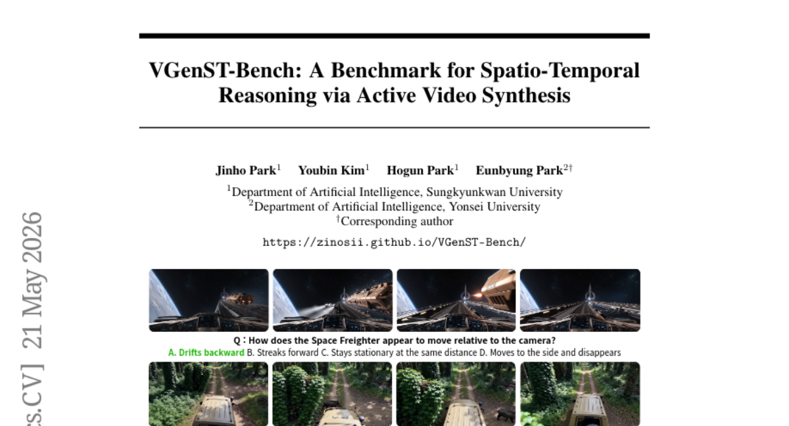

### 📌 한 줄 요약
생성형 AI를 활용해 정밀한 시공간 추론 평가가 가능한 능동적 비디오 벤치마크 VGenST-Bench 제안

### 🔑 핵심 포인트
- 생성 모델을 활용한 능동적 시나리오 합성 방식의 비디오 벤치마크 구축
- 공간 규모, 관점, 장면 역동성을 포함하는 3x2x2 비디오 분류 체계 수립
- 시각적 인지와 고수준 추론을 분리하여 모델의 취약점을 진단하는 계층적 태스크 설계

### 🧑‍💻 개발자 관점
MLLM 모델 개발 시, 단순 객체 인식을 넘어 복잡한 움직임과 공간 관계를 얼마나 잘 이해하는지 정밀하게 테스트할 수 있는 기준을 제공합니다.

### 🚀 실무 적용 아이디어
- VGenST-Bench의 분류 체계를 활용하여 현재 사용 중인 MLLM의 시공간 추론 취약점 테스트
- 생성된 비디오 데이터가 모델의 성능을 과대평가하거나 과소평가하는지 검증
- 자체 데이터셋 구축 시 멀티 에이전트 합성 파이프라인 도입 검토

### ⚠️ 리스크/한계
- 생성 모델로 만들어진 데이터가 실제 현실 세계의 복잡성을 완벽히 반영하는지에 대한 의문
- 합성 데이터 특유의 아티팩트가 모델의 추론 성능에 미칠 수 있는 편향성

### 📝 초록 기반 상세 설명
멀티모달 거대언어모델(MLLM)의 핵심 역량인 시공간 추론을 정밀하게 평가하는 것은 매우 중요합니다. 하지만 기존 벤치마크는 정적 이미지나 수동 수집 데이터에 의존하여 세밀한 추론 능력을 검증하는 데 한계가 있었습니다. 본 논문에서는 생성 모델을 통해 통제되고 다양한 시나리오를 능동적으로 합성하는 VGen식 벤치마크인 VGenST-Bench를 소개합니다. 멀티 에이전트 파이프라인과 인간 품질 관리를 결합하여 고품질의 비디오와 QA 쌍을 생성하며, 공간 규모, 관점, 장면 역동성을 아우르는 체계적인 분류 체계를 구축했습니다. 또한 저수준 시각 인지와 고수준 시공간 추론을 분리한 계층적 태스크를 설계했습니다. 이를 통해 MLLM의 시공간 이해 능력을 정밀하게 진단할 수 있는 새로운 패러다임을 제시합니다.

---

## 11. [RankE: End-to-End Post-Training for Discrete Text-to-Image Generation with Decoder Co-Evolution](https://huggingface.co/papers/2605.21195)
**Upvotes**: 14 | **도입 난이도**: 상 | **신뢰도**: 상
**arXiv**: https://arxiv.org/abs/2605.21195

**태그**: Text-to-Image, Reinforcement Learning, Generative Models, Autoregressive, Vision, Safety

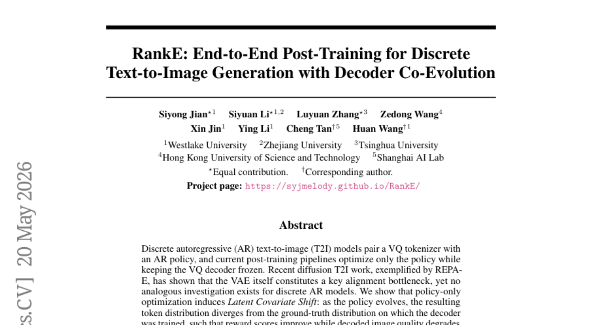

### 📌 한 줄 요약
디코더와 정책 모델을 동시에 최적화하여 텍스트-이미지 생성의 정렬(Alignment)과 화질(Fidelity) 간의 트레이드오프를 해결한 프레임워크

### 🔑 핵심 포인트
- 정책 모델 최적화 시 발생하는 '잠재 공변량 변화(Latent Covariate Shift)' 문제 규명
- 정책(Policy)과 디코더(Decoder)를 동시에 최적화하는 'Co-evolution' 프레임워크 제안
- 정렬(Alignment)과 화질(Fidelity) 사이의 트레이드오프를 극복하고 두 지표를 동시 개선

### 🧑‍💻 개발자 관점
LLM 기반 이미지 생성 모델 개발 시, RL(강화학습)을 통한 정렬 과정에서 이미지 품질이 무너지는 문제를 해결할 수 있는 실질적인 방법론을 제시합니다.

### 🚀 실무 적용 아이디어
- 기존 고정 디코더 기반 RL 파이프라인에서 생성된 이미지의 토큰 분포 변화 모니터링
- RankE의 교차 최적화(Alternating Optimization) 알고리즘을 기존 VQ-VAE/Transformer 구조에 이식 실험
- 안정성을 위한 앵커(Anchor) 정규화 기법이 실제 학습 수렴에 미치는 영향 분석

### ⚠️ 리스크/한계
- 두 모듈을 동시에 학습시키므로 학습 과정의 불안정성 및 높은 계산 비용 발생 가능성
- 교차 최적화 시 두 모듈 간의 학습 속도 균형(Balancing) 조절이 매우 까다로움

### 📝 초록 기반 상세 설명
기존의 이산적 자기회귀(AR) 텍�-이미지 모델은 고정된 VQ 디코더를 유지한 채 정책 모델만 최적화하는 방식을 사용해 왔습니다. 이 과정에서 정책이 진화함에 따라 토큰 분포가 변하여 디코더가 학습한 분포와 어긋나는 '잠재 공변량 변화(Latent Covariate Shift)' 문제가 발생합니다. 이로 인해 보상 점수는 높아지지만 실제 생성된 이미지의 품질은 저하되는 현상이 나타납니다. 이를 해결하기 위해 본 논문은 정책과 디코더를 교차 최적화하는 RankE 프레임워크를 제안합니다. RankE는 각 모듈이 랭킹 기반 정렬 목적 함수를 최대화하면서도 안정성을 유지하도록 설계되었습니다. 실험 결과, 기존 방식과 달리 CLIP 점수와 FID를 동시에 개선하며 높은 생성 품질을 입증했습니다.

---

## 12. [ETCHR: Editing To Clarify and Harness Reasoning](https://huggingface.co/papers/2605.23897)
**Upvotes**: 10 | **도입 난이도**: 하 | **신뢰도**: 상
**arXiv**: https://arxiv.org/abs/2605.23897

**태그**: Multimodal, Image Editing, Reasoning, VLM, Agent, RAG, Vision

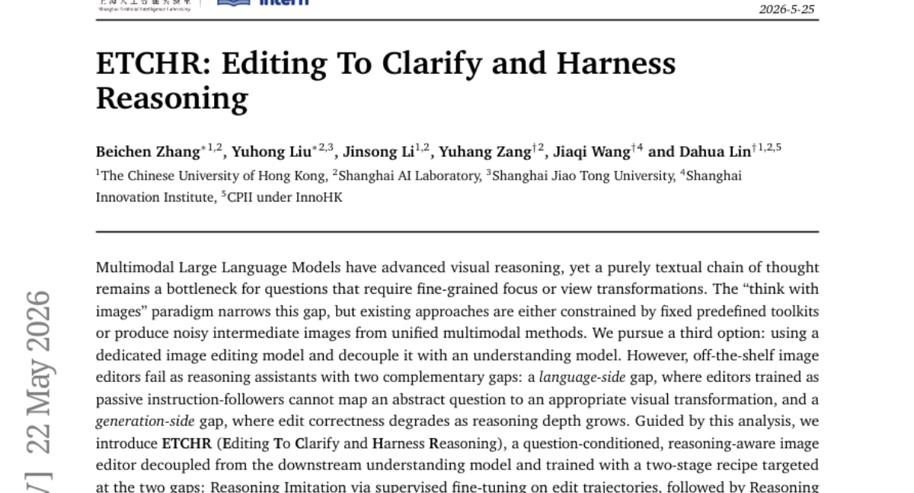

### 📌 한 줄 요약
이미지 편집 모델을 추론 보조 도구로 활용하여 멀티모달 모델(VLM)의 시각적 추론 능력을 향상시키는 프레임워크

### 🔑 핵심 포인트
- 이해 모델과 분리된(Decoupled) 전용 이미지 편집 모델 설계
- 추론 과정의 논리적 흐름을 학습하는 2단계 학습 레시피(SFT + VLM-derived rewards)
- 학습 없이 기존 오픈/클로즈 소스 VLM에 즉시 적용 가능한 플러그인 방식

### 🧑‍💻 개발자 관점
모델 전체를 재학습하지 않고도 외부 편집 도구를 통해 VLM의 시각적 인지 능력을 확장하는 'Agentic Workflow'의 실질적인 사례를 제시합니다.

### 🚀 실무 적용 아이디어
- 특정 도메인(예: 의료 영상, 설계도)에 특화된 편집 모델로 ETCHR 프레임워크 테스트
- 편집된 이미지가 추론 정확도에 미치는 영향에 대한 정성적 분석 수행
- 다양한 VLM 모델과의 결합 시 발생하는 지연 시간(Latency) 측정

### ⚠️ 리스크/한계
- 편집 과정에서 발생하는 시각적 왜곡이 오히려 잘못된 추론을 유도할 위험
- 추론 단계가 깊어질수록 편집 정확도가 유지되는지에 대한 검증 필요

### 📝 초록 기반 상세 설명
멀티모달 모델의 텍스트 기반 Chain-of-Thought는 세밀한 시각적 정보나 관점 변화가 필요한 문제 해결에 한계가 있습니다. 기존의 이미지 생성 방식은 도구의 제약이나 노이즈 문제로 인해 추론 과정에서 정확도가 떨어지는 문제가 있었습니다. 이를 해결하기 위해 연구진은 이해 모델과 분리된 전용 이미지 편집 모델인 ETCHR를 제안합니다. ETCHR는 추론 궤적 모방(Reasoning Imitation)과 VLM 보상을 활용한 추론 강화(Reasoning Enhancement)라는 2단계 학습 과정을 거칩니다. 실험 결과, ETCHR는 다양한 VLM에 플러그인 형태로 결합되어 시각적 추론 성능을 유의미하게 향상시켰습니다.

---

## 13. [SCOPE: Simulating Cross-game Operations in Playable Environments for FPS World Models](https://huggingface.co/papers/2605.23345)
**Upvotes**: 8 | **도입 난이도**: 상 | **신뢰도**: 상
**arXiv**: https://arxiv.org/abs/2605.23345

**태그**: World Models, Video Diffusion, FPS, Reinforcement Learning, Video

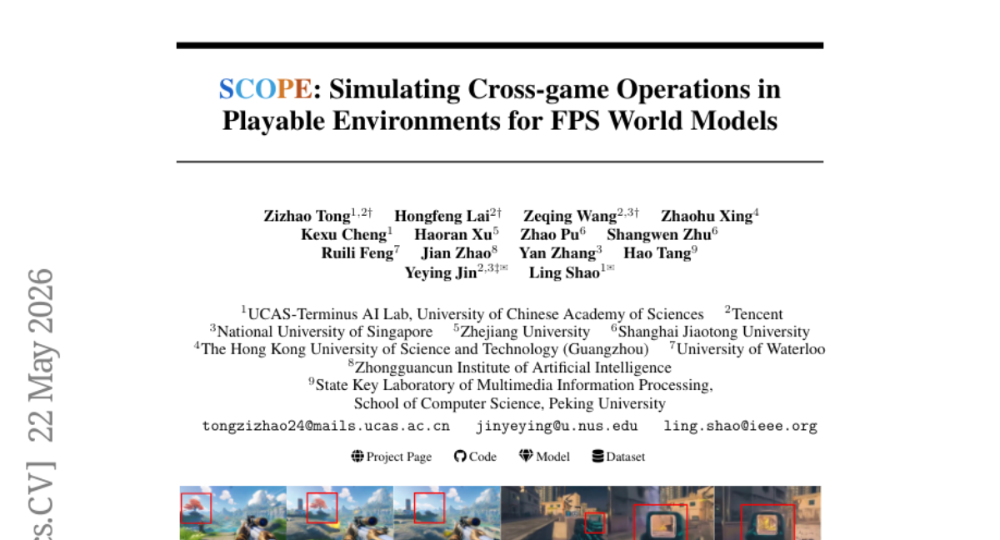

### 📌 한 줄 요약
FPS 게임의 국소적 액션 특성을 반영하여, 기존 비디오 확산 모델의 전역적 간섭 문제를 해결하고 게임 간 범용성을 확보한 월드 모델 연구

### 🔑 핵심 포인트
- 액션의 국소적 특성을 반영한 per-pixel temporal sequence 기반의 특징 재구성 기법 제안
- 세그멘테이션 레이블 없이도 액션 영향 범위를 분리하는 SCOPE 컨디셔닝 모듈 개발
- 7종 게임, 69K 클립을 포함한 프레임 정렬 액션 데이터셋 CrossFPS 구축

### 🧑‍💻 개발자 관점
게임 엔진이나 에이전트 학습 시, 특정 액션(사격 등)이 전체 화면의 일관성을 해치지 않으면서도 정교하게 반영되는 월드 모델 구축 기술을 제공합니다.

### 🚀 실무 적용 아이디어
- 비디오 확산 모델의 트랜스포머 블록 내에 국소적 컨디셔닝 모듈 삽입 실험
- 다양한 FPS 게임 환경에서의 제로샷 전이 성능 및 시각적 일관성 검증
- 액션 범위(scope) 설정에 따른 생성 품질 변화 분석

### ⚠️ 리스크/한계
- 복잡한 물리적 상호작용이 발생하는 경우 국소적 처리만으로 충분할지에 대한 의문
- 고해상도 비디오 생성 시 per-pixel 연산에 따른 연산 비용 증가 가능성

### 📝 초록 기반 상세 설명
FPS 게임용 인터랙티브 월드 모델은 매 프레임 발생하는 복잡한 제어 신호를 처리해야 하지만, 기존 방식은 액션을 전역적으로 주입하여 특정 영역의 변화가 주변 환경을 왜곡하는 문제가 있었습니다. 연구진은 FPS 액션이 무기 주변의 국소적 영역(scope)에만 영향을 미친다는 점에 착안하여 SCOPE 프레임워크를 제안합니다. 이 모델은 사전 학습된 비디오 확산 모델의 트랜스포머 블록에 컨디셔닝 모듈을 삽입하여, 각 픽셀 위치가 국소적 시각 정보로부터 액션 반응을 계산하도록 특징을 재구성합니다. 또한, 7종의 게임을 포함한 대규모 멀티 게임 데이터셋인 CrossFPS를 구축하여 실험을 진행했습니다. 결과적으로 모델은 세그멘테이션 레이블 없이도 액션의 국소적 효과와 배경 생성을 효과적으로 분리하며, 학습하지 않은 새로운 게임 환경에서도 뛰어난 제로샷 전이 성능을 보였습니다.

---

## 14. [LLMs as Noisy Channels: A Shannon Perspective on Model Capacity and Scaling Laws](https://huggingface.co/papers/2605.23901)
**Upvotes**: 7 | **도입 난이도**: 중 | **신뢰도**: 상
**arXiv**: https://arxiv.org/abs/2605.23901

**태그**: LLM Scaling Laws, Information Theory, Model Optimization, Quantization, Optimization

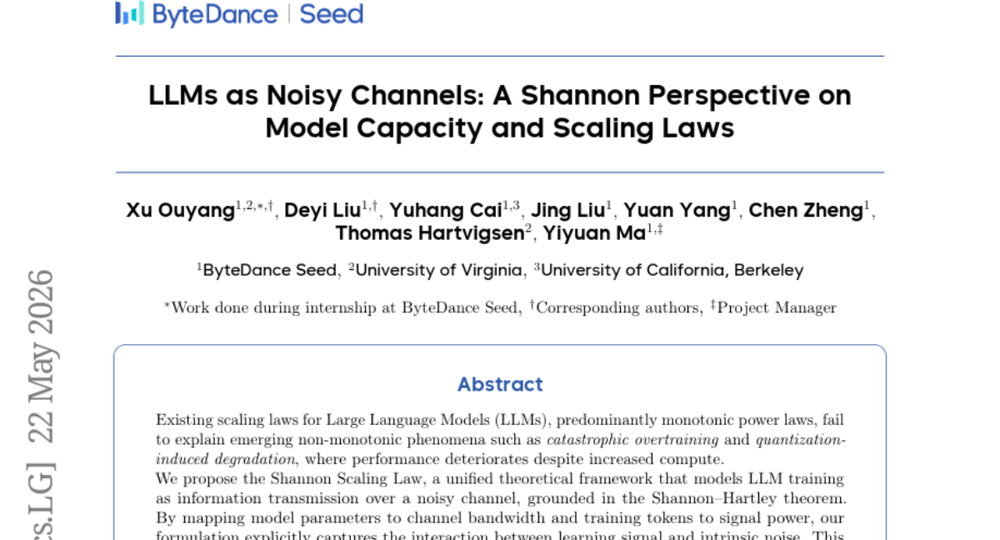

### 📌 한 줄 요약
샤논의 정보 이론을 통해 모델 크기와 데이터 스케일링 시 발생하는 성능 저하(overtraining, quantization)를 예측하는 새로운 스케일링 법칙 제안

### 🔑 핵심 포인트
- 샤논-하틀리 정리에 기반하여 모델 파라미터와 학습 데이터를 채널 용량 관점에서 재해석
- 신호 대 잡음비(SNR) 불균형이 성능 저하(U-shaped degradation)를 유발하는 메커니즘 규명
- 기존 단조 증가형 법칙이 예측하지 못하는 과적합 및 양자화 손실 구간을 정확히 예측

### 🧑‍💻 개발자 관점
모델 크기나 데이터 양을 무작정 늘리는 것이 아니라, 최적의 성능을 유지할 수 있는 '용량 한계점'을 이론적으로 예측하여 자원 낭비를 방지할 수 있습니다.

### 🚀 실무 적용 아이디어
- 학습 중 손실 함수(Loss)의 변화를 SNR 관점에서 모니터링하는 지표 구축
- 양자화(Quantization) 적용 시 발생하는 성능 저하 폭을 예측하기 위한 실험 수행
- 데이터 스케일링 시 성능이 꺾이는 지점(Saturation point)을 찾는 벤치마크 테스트

### ⚠️ 리스크/한계
- 이론적 프레임워크가 실제 복잡한 학습 역학(Optimization dynamics)을 완벽히 대변하는지에 대한 검증 필요
- 특정 모델 아키텍처나 데이터셋에 국한된 결과일 가능성

### 📝 초록 기반 상세 설명
기존의 단조 증가형 스케일링 법칙은 과적합(overtraining)이나 양자화로 인한 성능 저하와 같은 비단조적 현상을 설명하지 못하는 한계가 있습니다. 본 논문은 LLM 학습을 노이즈가 있는 채널을 통한 정보 전송 과정으로 정의하는 'Shannon Scaling Law' 프레임워크를 제안합니다. 모델 파라미터를 대역폭으로, 학습 토큰을 신호 전력으로 매핑하여 신호 대 잡음비(SNR) 관점에서 모델 용량을 분석합니다. 실험 결과, 제안된 법칙은 Pythia 및 OLMo2 모델에서 기존 법칙보다 높은 예측 정확도를 보였으며, 미학습 모델의 성능 변화까지 성공적으로 예측했습니다. 이를 통해 모델 스케일링 시 발생하는 성능 하락 지점을 정확히 포착할 수 있음을 입증했습니다.

---

## 15. [From Seeing to Thinking: Decoupling Perception and Reasoning Improves Post-Training of Vision-Language Models](https://huggingface.co/papers/2605.20177)
**Upvotes**: 6 | **도입 난이도**: 중 | **신뢰도**: 상
**arXiv**: https://arxiv.org/abs/2605.20177

**태그**: VLM, Curriculum Learning, Reinforcement Learning, Computer Vision, Reasoning, Vision

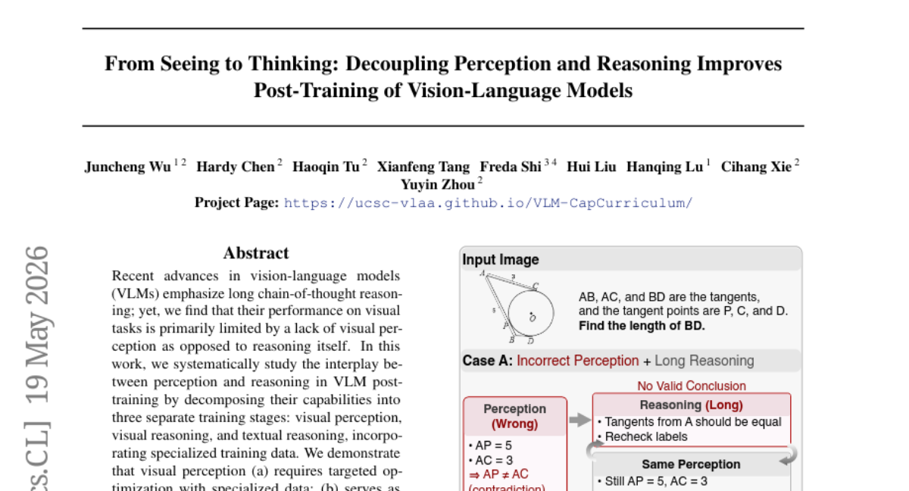

### 📌 한 줄 요약
시각적 인지와 추론 과정을 분리하여 단계별로 학습시키는 전략을 통해 VLM의 성능과 효율성을 동시에 개선함

### 🔑 핵심 포인트
- 시각적 인지(Perception)와 추론(Reasoning)의 분리 및 단계적 학습 전략 제안
- 시각적 인지는 추론의 기초 토대로서, 추론 학습 전 단계에서 강화학습(RL)을 통해 최적화하는 것이 효과적임
- 우수한 인지 능력은 더 짧고 효율적인 추론 경로(Reasoning Traces)를 가능하게 함

### 🧑‍💻 개발자 관점
VLM 모델 학습 시 모든 데이터를 한꺼번에 학습시키는 대신, 인지 능력을 먼저 확보하는 단계적 커리큘럼이 모델의 효율성과 정확도를 높이는 핵심임을 시사함

### 🚀 실무 적용 아이디어
- 학습 데이터셋을 시각적 묘사(Captioning)와 논리적 추론 데이터로 분리하여 단계별 학습 실험 진행
- 시각적 인지 단계에서 SFT 대신 RL을 적용하여 인지 정확도 변화 관찰
- 학습된 모델의 추론 경로(Trace) 길이를 측정하여 인지 능력 향상이 추론 효율에 미치는 영향 분석

### ⚠️ 리스크/한계
- 단계별 학습 시 각 단계의 데이터 비중 및 학습 스케줄링 설정이 복잡할 수 있음
- 특정 도메인에 특화된 인지 학습이 일반적인 추론 능력에 미칠 수 있는 부정적 영향(Catastrophic Forgetting) 가능성

### 📝 초록 기반 상세 설명
최근 VLM의 성능 향상은 복잡한 추론 능력에 집중되어 있으나, 실제로는 시각적 인지 능력의 부족이 성능의 병목 현상으로 작용함. 본 연구는 VLM의 역량을 시각적 인지, 시각적 추론, 텍스트 추론의 세 단계로 분해하여 체계적인 학습 과정을 제안함. 실험 결과, 시각적 인지는 전용 데이터로 먼저 공고히 다져야 하는 기초 토대이며, SFT보다 RL(강화학습)을 통해 더 효과적으로 학습됨을 확인함. 단계별 학습을 적용한 모델은 통합 학습 모델보다 높은 추론 정확도를 보였으며, 더 짧은 추론 경로로도 우수한 성능을 달성함. 결과적으로 제안된 커리큘럼은 기존의 난이도 기반 학습과는 다른 새로운 차원의 학습 방법론을 제시함.

---

## 16. [Geo-Align: Video Generation Alignment via Metric Geometry Reward](https://huggingface.co/papers/2605.23903)
**Upvotes**: 5 | **도입 난이도**: 상 | **신뢰도**: 상
**arXiv**: https://arxiv.org/abs/2605.23903

**태그**: Video Generation, Reinforcement Learning, 3D Geometry, Camera Control, Video, Safety

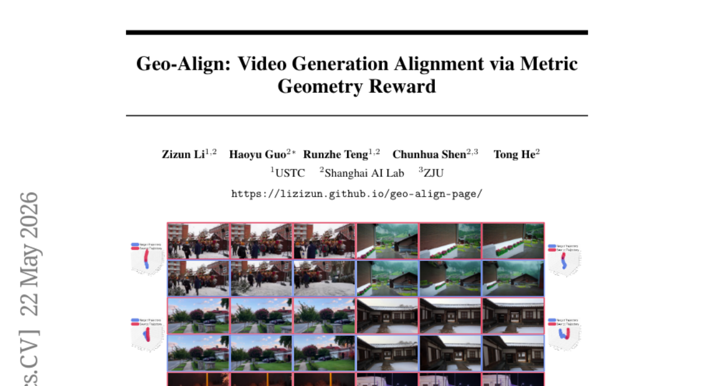

### 📌 한 줄 요약
강화학습과 3D 기하학적 보상을 활용하여 정밀한 카메라 제어가 가능한 비디오 재렌더링 프레임워크 제안

### 🔑 핵심 포인트
- 강화학습 기반의 카메라 제어 비디오 재렌더링 프레임워크 Geo-Align 제안
- 3D 기하학적 정보를 활용한 스케일 인지형(Scale-aware) 보상 메커니즘 도입
- 정답 쌍(Paired data) 없이 실사 영상과 합성 궤적을 활용하는 데이터 파이프라인 구축

### 🧑‍💻 개발자 관점
데이터 확보가 어려운 실사 환경에서 물리적으로 정확한 카메라 움직임을 구현해야 하는 비디오 생성 서비스 개발 시 유용한 방법론입니다.

### 🚀 실무 적용 아이디어
- 사전 학습된 비디오 생성 모델에 제안된 3D metric estimator 적용 테스트
- 강화학습 보상 함수(Rotation/Translation penalty)의 가중치 변화에 따른 제어 정밀도 분석
- 다양한 도메인의 실사 영상에 대한 일반화 성능 검증

### ⚠️ 리스크/한계
- 강화학습 최적화 과정에서의 학습 불안정성 및 높은 연산 비용 가능성
- 3D 추정기의 정확도에 따라 전체 모델의 카메라 제어 성능이 종속될 위험

### 📝 초록 기반 상세 설명
최근 카메라 제어 비디오 생성 기술이 발전했으나, 기존의 지도 학습 방식은 정교한 멀티뷰 실사 데이터 부족으로 인해 실제 환경에서의 물리적 스케일 및 카메라 궤적 추종 능력이 떨어지는 문제가 있습니다. 이를 해결하기 위해 본 논문은 카메라 제어 비디오 재렌더링을 위한 최초의 강화학습 프레임워크인 Geo-Align을 제안합니다. 사전 학습된 모델을 기반으로, 생성된 비디오에서 카메라 궤적을 추출하는 3D 추정기를 통해 회전 및 이동 오차를 페널티로 부여하는 스케일 인지형 보상 메커니즘을 도입했습니다. 또한, 쌍을 이루는 데이터 없이도 학습이 가능하도록 실사 조건 비디오와 합성 데이터 기반의 카메라 궤적을 결합한 데이터 파이프라인을 설계했습니다. 실험 결과, Geo-Align은 기존 지도 학습 방식보다 정밀한 카메라 제어 능력과 높은 시각적 품질을 동시에 달보였습니다.

---

## 17. [GenRecon: Bridging Generative Priors for Multi-View 3D Scene Reconstruction](https://huggingface.co/papers/2605.23888)
**Upvotes**: 4 | **도입 난이도**: 상 | **신뢰도**: 상
**arXiv**: https://arxiv.org/abs/2605.23888

**태그**: 3D Reconstruction, Generative AI, Computer Vision, PBR Mesh, Vision

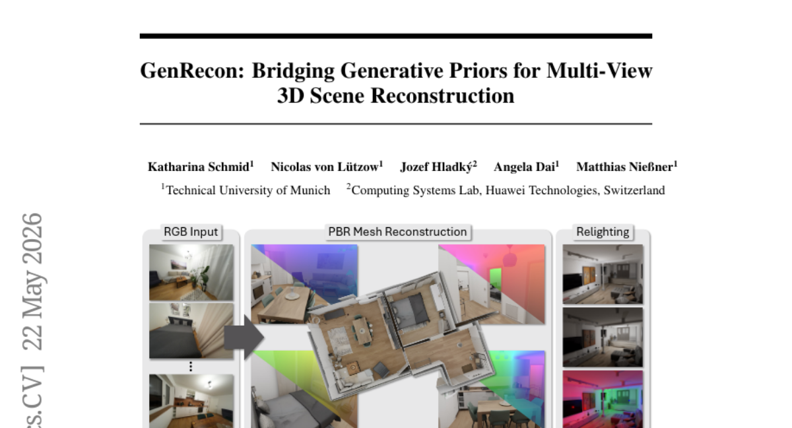

### 📌 한 줄 요약
강력한 3D 생성 모델의 사전 지식을 활용하여 대규모 실내 장면을 고정밀 PBR 메시로 재구성하는 기술

### 🔑 핵심 포인트
- 생성적 사전 지식(Trellis.2 등)을 대규모 장면 재구성에 결합하는 프레임워크 제안
- 공간적 청크 분할 방식을 통한 대규모 장면 확장성 확보
- 투영 기반 조건화(Projection-based conditioning)를 통한 일관된 3D 기하 구조 생성

### 🧑‍💻 개발자 관점
단순한 포인트 클라우드나 NeRF를 넘어, 즉시 편집 가능한 고품질 PBR 메시를 생성하므로 디지털 트윈 및 게임 에셋 제작 파이프라인에 직접적인 활용이 가능합니다.

### 🚀 실무 적용 아이디어
- Trellis.2와 같은 최신 3D 생성 모델과의 연동 구조 분석
- 청크 기반 분할 방식에서의 경계면 불연속성(seam) 발생 여부 테스트
- 다양한 실내 환경 데이터셋을 활용한 재구성 정밀도 검증

### ⚠️ 리스크/한계
- 청크 단위 생성 시 경계 부분의 일관성 유지 문제 가능성
- 강력한 생성 모델 의존도로 인한 높은 컴퓨팅 자원 요구

### 📝 초록 기반 상세 설명
기존의 멀티뷰 3D 재구성은 복잡한 장면에서 디테일과 완전성을 확보하는 데 어려움이 있었습니다. 본 논문은 재구성을 조건부 3D 생성 문제로 정의하여, 강력한 생성적 사전 지식(Generative Prior)을 재구성에 결합하는 GenRecon 방식을 제안합니다. 장면을 공간적으로 중첩된 청크(chunk) 단위로 나누어 생성함으로써 대규모 장면 확장이 가능하도록 설계했습니다. 특히 투영 기반 조건화 메커니즘을 통해 멀티뷰 이미지 특징을 일관된 3D 표현으로 변환하여 생성 모델과 정렬시켰습니다. 이를 통해 객체 수준의 정밀도를 장면 수준으로 확장하여 편집 가능한 고정밀 PBR 메시를 생성합니다. 결과적으로 기존 최첨단 재구성 방법론보다 뛰어난 성능을 입증했습니다.

---

## 18. [Rethinking Muon Beyond Pretraining: Spectral Failures and High-Pass Remedies for VLA and RLVR](https://huggingface.co/papers/2605.19282)
**Upvotes**: 4 | **도입 난이도**: 하 | **신뢰도**: 상
**arXiv**: https://arxiv.org/abs/2605.19282

**태그**: Optimizer, VLA, Reinforcement Learning, Robotics, RAG, Vision

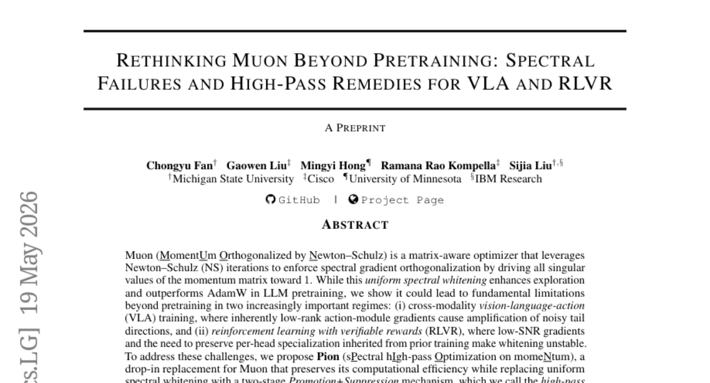

### 📌 한 줄 요약
Muon 옵티마이저의 스펙트럼 화이트닝 문제를 해결하여 VLA 및 RLVR 환경에서도 안정적인 학습을 가능하게 하는 Pion 제안

### 🔑 핵심 포인트
- Muon의 균일한 스펙트럼 화이트닝이 VLA 및 RLVR에서 유발하는 노이즈 증폭 문제 규명
- 주요 성분은 1로, 노이즈 성분은 0으로 제어하는 High-pass NS iteration(Pion) 설계
- 사전 학습된 헤드별 이질성을 보존하기 위한 Per-head mode 도입

### 🧑‍💻 개발자 관점
LLM 사전 학습을 넘어 로봇 제어(VLA)나 RL post-training과 같이 특수한 그래디언트 구조를 가진 태스크에서 최신 옵티마이저를 안정적으로 적용할 수 있는 가이드를 제공합니다.

### 🚀 실무 적용 아이디어
- VLA/Robot-control 모델 학습 시 Muon 대신 Pion 적용 테스트
- RLVR(GRPO 등) 환경에서 기존 옵티마이저와 성능 비교 실험
- 모델의 헤드별 특성이 중요한 태스크에서 Per-head mode 활성화 여부 검증

### ⚠️ 리스크/한계
- 특정 도메인(VLA, RLVR)에 특화된 개선책이므로 일반적인 LLM 사전 학습에서의 이득은 Muon과 유사할 수 있음
- 하이퍼파라미터(필터 강도 등) 설정에 따른 성능 민감도 존재 가능성

### 📝 초록 기반 상세 설명
LLM 사전 학습에서 우수한 성능을 보인 Muon 옵티마이저는 모든 특이값을 1로 만드는 스펙트럼 화이트닝을 통해 탐색을 강화합니다. 그러나 VLA(Vision-Language-Action)와 같이 저계수(low-rank) 그래디언트가 발생하는 환경이나 RLVR(Reinforcement Learning with Verifiable Rewards) 환경에서는 노이즈 증폭 및 헤드별 특화 기능 상실로 인해 성능이 저하되는 문제가 발생합니다. 이를 해결하기 위해 저자들은 주요 특이값은 유지하고 노이즈 성분은 억제하는 'High-pass NS iteration' 방식의 Pion을 제안합니다. Pion은 기존 Muon의 효율성을 유지하면서도 헤드별 독립 업데이트 모드를 지원하여 사전 학습된 지식을 보존합니다. 실험 결과, VLA 로봇 제어 및 RLVR 수학 문제 풀이 태스크에서 기존 AdamW와 Muon을 모두 압도하는 성능을 입증했습니다.

---

## 19. [LatentUMM: Dual Latent Alignment for Unified Multimodal Models](https://huggingface.co/papers/2605.17766)
**Upvotes**: 4 | **도입 난이도**: 중 | **신뢰도**: 상
**arXiv**: https://arxiv.org/abs/2605.17766

**태그**: Multimodal, Latent Space, Generative AI, Alignment, Safety

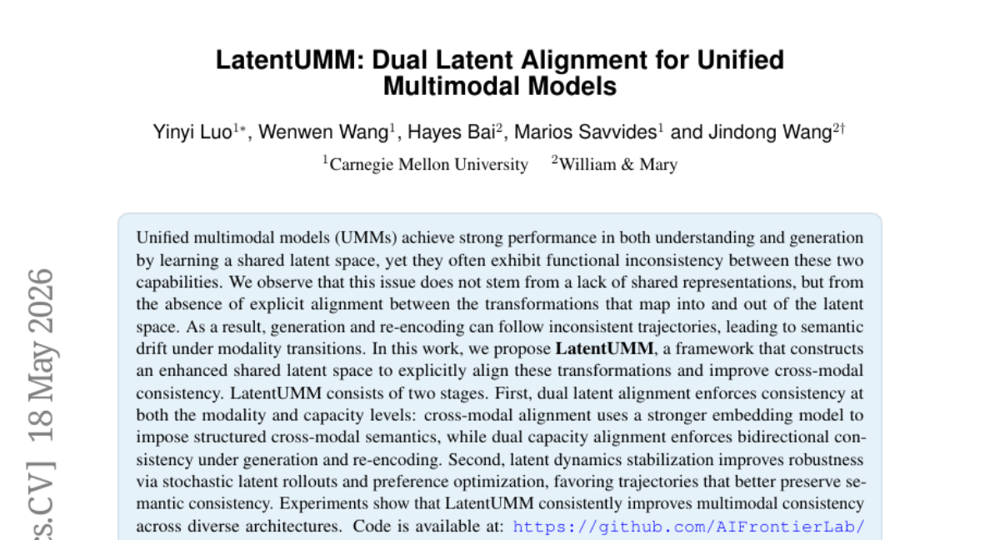

### 📌 한 줄 요약
생성과 이해 사이의 의미적 불일치를 해결하기 위해 잠재 공간의 변환 과정을 정렬하는 통합 멀티모달 프레임워크

### 🔑 핵심 포인트
- 이중 잠재 정렬(Dual Latent Alignment)을 통한 모달리티 및 기능(생성/재인코딩) 간 일관성 확보
- 강력한 임베딩 모델을 활용한 구조적 교차 모달 의미론 주입
- 확률적 롤아웃 및 선호도 최적화를 통한 잠재 역학 안정화 및 의미적 드리프트 방지

### 🧑‍💻 개발자 관점
멀티모달 모델에서 텍스트로 생성한 이미지를 다시 텍스트로 설명할 때 발생하는 의미 왜곡 문제를 해결하는 데 유용합니다.

### 🚀 실무 적용 아이디어
- 기존 UMM 모델에 제안된 이중 정렬 손실 함수(Loss Function) 적용 테스트
- 생성-재인코딩 루프를 통한 의미적 일관성(Semantic Consistency) 측정 실험
- 다양한 모달리티 전환 시 발생하는 드리프트 현상에 대한 정성적 평가

### ⚠️ 리스크/한계
- 강력한 임베딩 모델 의존 시 학습 비용 및 복잡도 증가 가능성
- 잠재 공간 정렬 과정에서 특정 모달리티의 정보 손실 위험

### 📝 초록 기반 상세 설명
통합 멀티모달 모델(UMM)은 이해와 생성 능력을 동시에 갖추려 하지만, 두 기능 사이의 기능적 불일치 문제가 빈번히 발생합니다. 연구 결과, 이는 단순한 표현력 부족이 아니라 잠재 공간으로 들어가는 변환과 나오는 변환 사이의 명시적 정렬이 부재하기 때문임을 발견했습니다. 이를 해결하기 위해 제안된 LatentUMM은 두 단계의 정렬 과정을 통해 강화된 공유 잠재 공간을 구축합니다. 첫째, 교차 모달 정렬과 이중 용량 정렬을 통해 모달리티와 기능 간의 일관성을 확보합니다. 둘째, 확률적 잠재 롤아웃과 선호도 최적화를 통해 잠재 역학을 안정화하여 의미적 드리프트를 방지합니다. 실험 결과, 다양한 아키텍처에서 멀티모달 일관성이 크게 향상됨을 입증했습니다.

---

## 20. [Good Token Hunting: A Hitchhiker's Guide to Token Selection for Visual Geometry Transformers](https://huggingface.co/papers/2605.23892)
**Upvotes**: 3 | **도입 난이도**: 중 | **신뢰도**: 상
**arXiv**: https://arxiv.org/abs/2605.23892

**태그**: 3D Reconstruction, Transformer, Token Selection, Efficiency, RAG, Vision

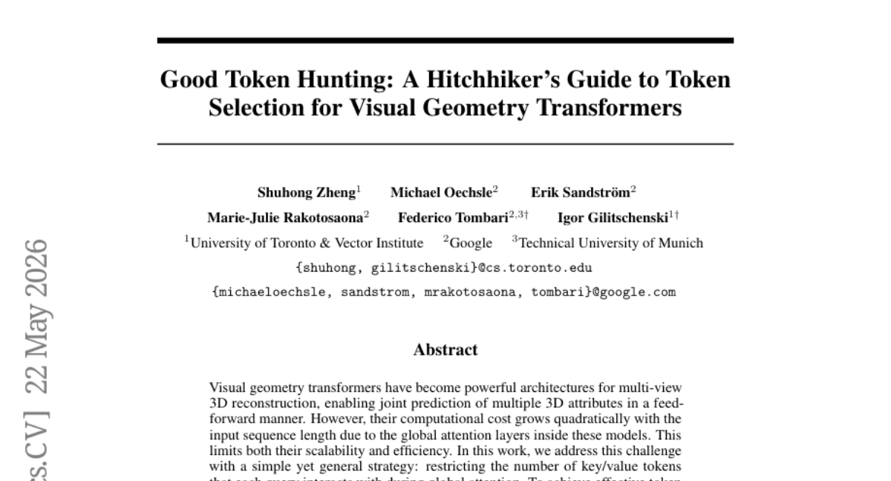

### 📌 한 줄 요약
Visual Geometry Transformer의 연산 효율성을 극대화하기 위해 프레임 및 토큰 단위의 2단계 선택 전략을 제안하는 연구

### 🔑 핵심 포인트
- 프레임 간(inter-frame) 및 프레임 내(intra-frame) 2단계 토큰 선택 프레임워크 제안
- 장면 커버리지를 위한 다양성 기반 프레임 선택 및 어텐션 엔트로피 기반 레이어별 토큰 희소화 적용
- 대규모 이미지 데이터셋에서 성능 유지와 동시에 85% 이상의 연산 속도 향상 달성

### 🧑‍💻 개발자 관점
대규모 이미지 데이터를 다루는 3D 재구성 작업에서 메모리 및 연산 병목 문제를 해결하여 실시간성에 가까운 효율성을 확보할 수 있습니다.

### 🚀 실무 적용 아이디어
- 기존 Visual Geometry Transformer 모델에 제안된 2단계 선택 로직을 모듈 형태로 이식하여 속도 변화 측정
- 다양성 기반 프레임 선택 전략이 특정 장면(예: 반복 패턴이 많은 환경)에서 어떻게 작동하는지 검증
- 레이어별 엔트로피 기반 토큰 제거가 모델의 최종 재구성 품질에 미치는 영향 분석

### ⚠️ 리스크/한계
- 토큰 선택 과정에서 중요한 기하학적 정보가 손실될 경우 재구성 정밀도가 저하될 위험이 있음
- 선택 전략 자체를 위한 추가적인 연산 오버헤드가 발생할 수 있음

### 📝 초록 기반 상세 설명
멀티뷰 3D 재구성 모델인 Visual Geometry Transformer는 글로벌 어텐션의 연산 비용이 입력 길이에 따라 제곱으로 증가하는 문제가 있습니다. 이를 해결하기 위해 쿼리가 상호작용하는 Key/Value 토큰 수를 제한하는 2단계 토큰 선택 프레임워크를 제안합니다. 먼저 프레임 단위의 inter-frame selection을 통해 필수 프레임을 선별하고, 이후 intra-frame selection을 통해 프레임 내 중복 토큰을 제거합니다. inter-frame 단계에서는 장면의 넓은 범위를 커버하기 위해 다양성 기반 전략을 사용하며, intra-frame 단계에서는 어텐션 엔트로피를 활용한 레이어별 희소화(layer-aware sparsification)를 적용합니다. 실험 결과, 500장의 이미지를 포함한 대규모 장면에서 성능 저하 없이 연산 속도를 85% 이상 가속화하는 성과를 거두었습니다.

---

## 21. [The Expense of Seeing: Attaining Trustworthy Multimodal Reasoning Within the Monolithic Paradigm](https://huggingface.co/papers/2604.20665)
**Upvotes**: 3 | **도입 난이도**: 중 | **신뢰도**: 상
**arXiv**: https://arxiv.org/abs/2604.20665

**태그**: VLM, Multimodal, Evaluation, Reasoning, Vision

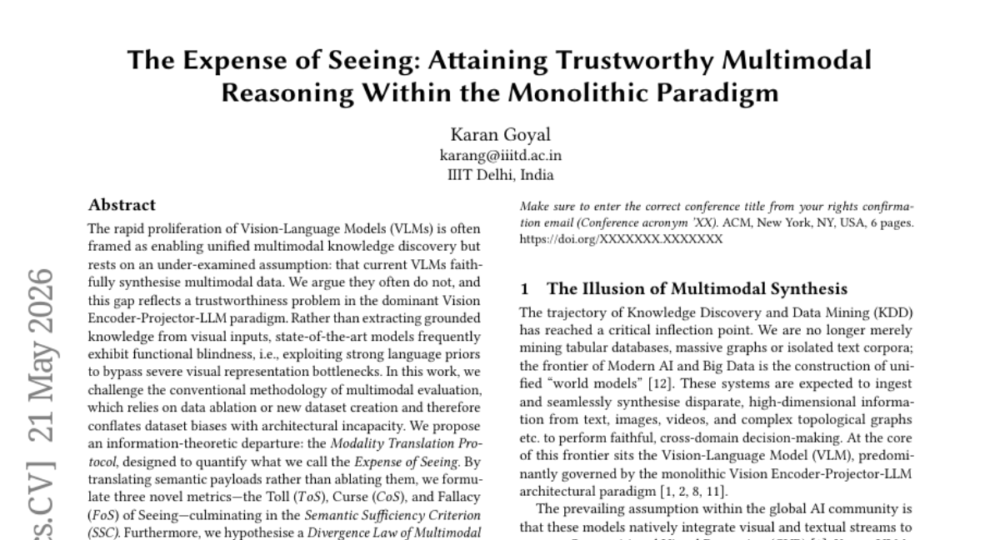

### 📌 한 줄 요약
VLM의 시각 정보 의존성 결여 문제를 지적하고, 언어적 편향에 의존하지 않는 진정한 멀티모달 추론을 위한 새로운 평가 프레임워크를 제안함

### 🔑 핵심 포인트
- 언어적 사전 지식에 의존하여 시각 정보를 무시하는 VLM의 '기능적 맹목' 문제 규명
- 데이터 삭제가 아닌 의미 변환을 통한 새로운 평가 프로토콜(Modality Translation Protocol) 제안
- 시각적 병목 현상을 정량화하는 세 가지 지표(ToS, CoS, FoS) 및 SSC 기준 수립

### 🧑‍💻 개발자 관점
모델의 벤치마크 점수가 높더라도 실제 시각 정보가 아닌 언어적 편향에 의해 답을 내고 있는 것은 아닌지 검증할 수 있는 기준을 제공합니다.

### 🚀 실무 적용 아이디어
- 현재 사용 중인 VLM 모델에 대해 시각 정보와 언어 정보 간의 의존도 테스트 수행
- 데이터셋의 텍스트 힌트가 시각 정보 없이도 정답을 유도하는지 확인하는 실험 설계
- 모델 스케일링에 따른 시각 정보 활용도 변화 추적

### ⚠️ 리스크/한계
- 제안된 지표가 기존 벤치마크 점수와 괴리가 있을 경우 실무 적용 시 혼란 가능성
- 새로운 평가 프로토콜의 복잡성으로 인한 실험 비용 증가

### 📝 초록 기반 상세 설명
최근 급증하는 VLM은 시각-언어 통합을 표방하지만, 실제로는 시각 정보를 무시하고 언어적 사전 지식에만 의존하는 '기능적 맹목(functional blindness)' 문제를 안고 있습니다. 기존의 데이터 제거 방식(ablation) 기반 평가는 데이터셋 편향과 모델 구조적 한계를 구분하지 못하는 한계가 있습니다. 본 논문은 의미론적 페이로드를 변환하는 'Modality Translation Protocol'을 제안하여 시각 정보 활용의 비용을 정량화합니다. 이를 통해 Toll, Curse, Fallacy라는 세 가지 지표와 Semantic Sufficiency Criterion(SSC)을 도출했습니다. 연구 결과, 언어 모델이 커질수록 시각적 병목 현상으로 인한 페널티가 커지는 'Divergence Law'를 가설로 제시합니다. 최종적으로 단순한 성능 향상을 넘어 진정한 멀티모달 추론을 위한 새로운 설계 원칙을 제공하고자 합니다.

---

## 22. [HINT-SD: Targeted Hindsight Self-Distillation for Long-Horizon Agents](https://huggingface.co/papers/2605.17873)
**Upvotes**: 3 | **도입 난이도**: 중 | **신뢰도**: 상
**arXiv**: https://arxiv.org/abs/2605.17873

**태그**: LLM Agent, Reinforcement Learning, Self-Distillation, Long-Horizon Task, Agent, Distillation

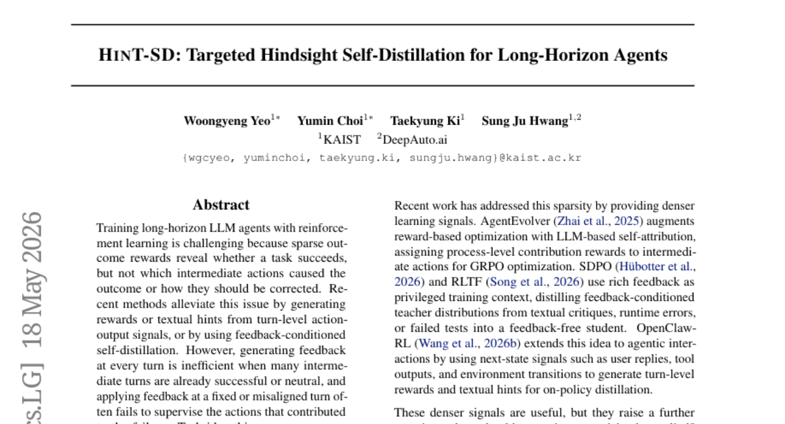

### 📌 한 줄 요약
전체 궤적의 사후 분석을 통해 실패와 직결된 특정 액션 구간에만 피드백을 집중하여 학습 효율과 성능을 동시에 높인 에이전트 학습 프레임워크

### 🔑 핵심 포인트
- 전체 궤적 기반의 Hindsight 분석을 통한 실패 관련 액션 구간 식별
- 불필요한 피드백을 배제하고 타겟팅된 구간에만 적용하는 효율적 Self-Distillation
- 성능 향상과 학습 시간 단축을 동시에 달성하는 최적의 학습 지점 선택 전략

### 🧑‍💻 개발자 관점
에이전트 학습 시 모든 스텝에 피드백을 생성하는 비용을 줄이면서도, 실패 원인이 되는 핵심 구간을 정확히 학습시키는 실용적인 최적화 기법입니다.

### 🚀 실무 적용 아이디어
- 에이전트 실패 로그를 분석하여 실패 유발 구간을 자동 식별하는 로직 구현 테스트
- 전체 스텝 피드백 방식과 타겟팅 피드백 방식의 학습 시간 및 성능 비교 실험
- 복잡한 워크플로우를 가진 에이전트 환경(AppWorld 등)에서의 적용 가능성 검토

### ⚠️ 리스크/한계
- 실패 구간을 잘못 식별할 경우 잘못된 피드백이 학습되어 성능이 저하될 위험
- 사후 분석(Hindsight) 과정 자체에 추가적인 연산 비용이 발생할 수 있음

### 📝 초록 기반 상세 설명
장기 작업(Long-horizon)을 수행하는 LLM 에이전트 학습 시, 희소한 보상 체계는 어떤 중간 단계가 실패를 유발했는지 파악하기 어렵게 만듭니다. 기존의 매 단계 피드백 방식은 성공적인 단계에 불필요한 연산을 소모하거나, 정작 실패를 유발한 핵심 구간을 놓치는 비효율성이 존재합니다. 이를 해결하기 위해 전체 궤적을 사후 분석하여 실패와 관련된 특정 액션 구간을 식별하는 HINT-SD 프레임워크를 제안합니다. 이 방법은 타겟팅된 구간에만 피드백 기반 증류(Distillation)를 적용하여 학습 효율을 극대화합니다. 실험 결과, 기존의 밀집 피드백 방식보다 성능은 높이면서 학습 시간은 획기적으로 단축하는 성과를 보였습니다.

---

## 23. [The Illusion of Reasoning: Exposing Evasive Data Contamination in LLMs via Zero-CoT Truncation](https://huggingface.co/papers/2605.21856)
**Upvotes**: 1 | **도입 난이도**: 하 | **신뢰도**: 상
**arXiv**: https://arxiv.org/abs/2605.21856

**태그**: LLM Evaluation, Data Contamination, Model Robustness, Security, Reasoning, Benchmark, Evaluation

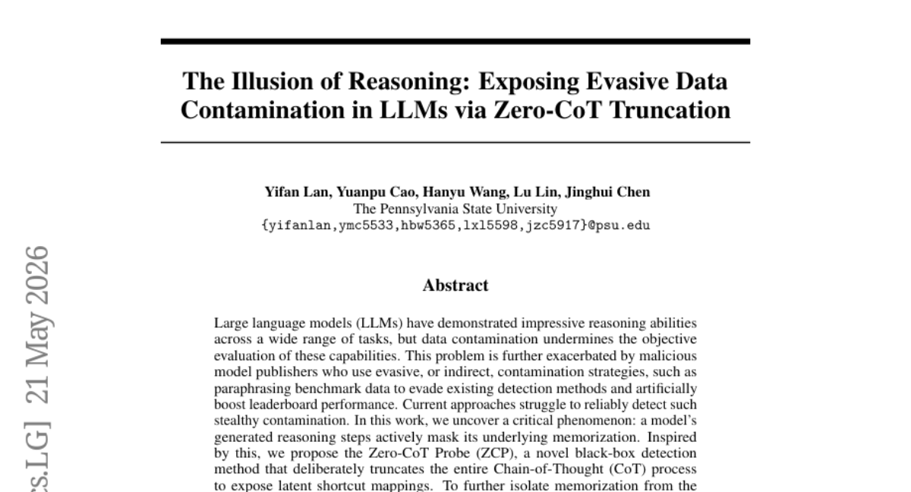

### 📌 한 줄 요약
LLM의 추론 능력이 아닌 데이터 오염(Contamination)에 의한 성능 부풀리기를 탐지하는 새로운 블랙박스 검증 방법론 제안

### 🔑 핵심 포인트
- Zero-CoT Probe (ZCP): 추론 과정을 생략하여 모델의 암기된 지식(Shortcut)을 노출시키는 블랙박스 탐지 기법
- Isomorphic Perturbation: 암기된 데이터와 실제 문제 해결 능력을 분리하기 위한 참조 데이터셋 비교 방식
- Contamination Confidence: 단순 이진 분류를 넘어 오염의 가능성과 심각도를 정량화하는 새로운 지표 도입

### 🧑‍💻 개발자 관점
모델의 벤치마크 점수가 실제 추론 능력인지, 아니면 학습 데이터에 포함된 정답을 외운 결과인지 검증할 수 있는 강력한 도구를 제공합니다.

### 🚀 실무 적용 아이디어
- 자사 모델의 벤치마크 점수가 비정상적으로 높을 경우 ZCP를 통한 오염 검증 수행
- 모델의 CoT 출력물과 정답 간의 상관관계를 분석하여 암기 패턴 확인
- 데이터 변형(Paraphrasing)을 통한 오염 시나리오에서 ZCP의 탐지율 테스트

### ⚠️ 리스크/한계
- 블랙박스 방식이므로 오염의 구체적인 원인 데이터셋을 특정하기 어려울 수 있음
- 모델의 순수 추론 능력이 낮은 경우 ZCP 결과가 오염으로 오인될 가능성 존재

### 📝 초록 기반 상세 설명
최근 LLM의 성능 평가에서 데이터 오염 문제가 심각해지고 있으며, 특히 벤치마크 데이터를 교묘하게 변형하여 탐지를 피하는 은폐형 오염 방식이 늘고 있습니다. 기존 탐지 방식은 이러한 지능적인 오염을 식별하는 데 한계가 있습니다. 본 논문은 모델이 생성하는 추론 과정(CoT)이 오히려 암기된 정보를 숨기는 수단으로 사용될 수 있다는 점에 주목합니다. 이를 해결하기 위해 추론 과정을 의도적으로 생략하여 잠재된 암기 경로를 드러내는 'Zero-CoT Probe (ZCP)' 기법을 제안합니다. 또한, 원본 데이터와 변형된 참조 데이터 간의 성능 차이를 비교하여 암기 여부를 격리하는 방식을 도입했습니다. 실험 결과, ZCP는 직접적인 오염뿐만 아니라 정교하게 설계된 은폐형 오염까지 효과적으로 탐지할 수 있음을 입증했습니다.

---

## 24. [Equilibrium Reasoners: Learning Attractors Enables Scalable Reasoning](https://huggingface.co/papers/2605.21488)
**Upvotes**: 1 | **도입 난이도**: 중 | **신뢰도**: 상
**arXiv**: https://arxiv.org/abs/2605.21488

**태그**: Reasoning, Test-time Scaling, Latent Dynamics, Deep Learning

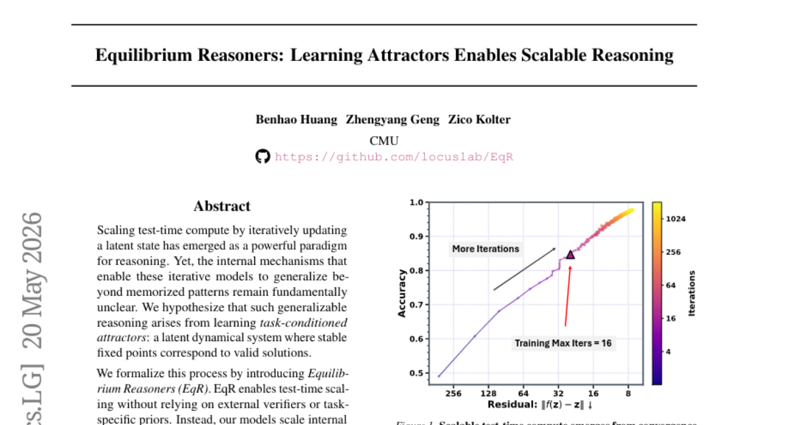

### 📌 한 줄 요약
잠재 상태의 어트랙터(Attractor) 학습을 통해 외부 검증기 없이도 테스트 타임 연산량을 확장하여 추론 성능을 극대화하는 방법론

### 🔑 핵심 포인트
- 태스크 조건부 어트랙터(Task-conditioned Attractors) 개념을 통한 추론 메커니즘 정립
- 외부 검증기 없이 반복적 업데이트만으로 정답에 수렴하는 Equilibrium Reasoners(EqR) 제안
- 반복 횟수와 다중 경로 집계(Stochastic trajectories)를 통한 효율적인 테스트 타임 스케일링

### 🧑‍💻 개발자 관점
모델의 구조적 변경 없이 추론 시점의 연산량(Test-time compute) 조절만으로 복잡한 논리 문제를 해결하는 새로운 패러다임을 제시합니다.

### 🚀 실무 적용 아이디어
- 반복적 업데이트 구조를 가진 모델의 수렴 속도와 정확도 간의 상관관계 측정
- 다양한 초기값(Multiple initializations)을 활용한 앙상블 효과 검증
- 난이도별 적응적 연산량 할당(Adaptive compute allocation) 로직 구현 테스트

### ⚠️ 리스크/한계
- 고난도 문제 해결을 위해 매우 많은 반복 연산이 필요하여 추론 비용이 급증할 수 있음
- 학습 시 설정된 어트랙터가 학습 데이터 외의 완전히 새로운 도메인에서도 안정적으로 작동할지에 대한 의문

### 📝 초록 기반 상세 설명
최근 반복적인 잠재 상태 업데이트를 통한 테스트 타임 연산량 확장이 주목받고 있으나, 이러한 모델이 일반화되는 내부 메커니즘은 불분명했습니다. 본 논문은 일반화 가능한 추론이 정답에 해당하는 고정점(Fixed point)을 갖는 '태스크 조건부 어트랙터' 학습에서 비롯된다는 가설을 제시합니다. 이를 위해 외부 검증기나 사전 지식 없이도 동작하는 Equilibrium Reasoners(EqR) 프레임워크를 제안합니다. EqR은 반복 횟수(Depth)와 다중 초기화(Breadth)를 통해 내부 동역학을 확장하며, 난이도에 따라 연산량을 적응적으로 할당합니다. 실험 결과, Sudoku-Extreme과 같은 고난도 문제에서 수만 개의 레이어에 해당하는 연산량을 투입하여 압도적인 정확도 향상을 달성했습니다.

### 🖼️ 추가 자료

---

