# 2026-06-03 Daily Papers (Top 50)

## 오늘의 요약
오늘의 연구는 LLM의 추론 효율을 높이기 위한 Speculative Decoding 최적화와 에이전트의 성능을 검증하기 위한 고난도 벤치마크 구축에 집중되었습니다. 또한, 거대 모델을 개인화하는 PEFT 전략과 생성된 결과물의 편집 가능성을 확보하는 실무적 접근법 등 모델의 활용성과 보안성을 다루는 연구들이 주목받았습니다.

### 오늘의 핵심 포인트
- Speculative Decoding의 성능을 극대화하기 위해 인과적 모델링과 병렬 드래프팅을 분리하거나 온폴리시 증류 기법을 적용하는 등 추론 가속화 연구가 활발히 진행되었습니다.
- 단순한 성능 측정을 넘어 에이전트의 복잡한 도구 사용 능력과 특정 문화적 맥락(한국어)을 검증할 수 있는 정교한 벤치마크 프레임워크들이 제안되었습니다.
- 모델의 파라미터를 효율적으로 관리하는 PEFT 기반의 개인화 전략과 생성된 데이터의 보안 및 편집 가능성을 다루는 실용적인 연구들이 발표되었습니다.

**오늘의 태그**: LLM Inference, AI Agent, PEFT, Benchmark, Optimization

## 1. [Crafter: A Multi-Agent Harness for Editable Scientific Figure Generation from Diverse Inputs](https://huggingface.co/papers/2605.30611)
**Upvotes**: 106 | **도입 난이도**: 중 | **신뢰도**: 상
**arXiv**: https://arxiv.org/abs/2605.30611

**태그**: Multi-Agent, SVG-Generation, Scientific-Visualization, Automation, Agent, Benchmark

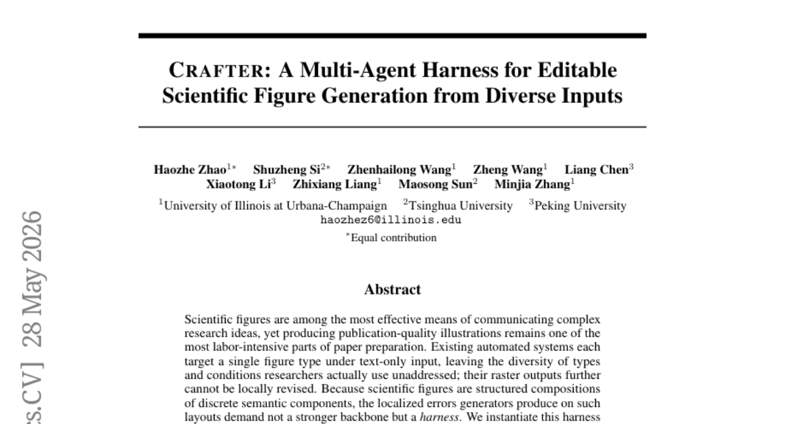

### 📌 한 줄 요약
다양한 입력 조건과 피규어 유형에 대응하며 편집 가능한 SVG 출력을 생성하는 멀티 에이전트 기반 과학 도식 생성 프레임워크

### 🔑 핵심 포인트
- 다양한 도식 유형과 입력 조건에 범용적으로 대응하는 멀티 에이전트 하네스(Crafter) 제안
- 래스터 출력을 편집 가능한 SVG로 변환하여 사후 수정이 가능하게 하는 CraftEditor 개발
- 인간 수준의 품질 주석이 포함된 새로운 벤치마크 CraftBench 구축

### 🧑‍💻 개발자 관점
단순 이미지 생성을 넘어, 구조화된 데이터(SVG)를 생성함으로써 생성형 AI 결과물의 고질적인 문제인 '수정 불가능성'을 해결하는 실무적 접근법을 제시합니다.

### 🚀 실무 적용 아이디어
- 제공된 GitHub 코드를 통해 다양한 입력 조건(텍inal, data-driven 등)에서의 생성 품질 테스트
- CraftEditor를 활용하여 생성된 SVG의 레이어 구조와 편집 용이성 검증
- 기존 단일 모델 기반 생성 방식과 에이전트 기반 방식의 워크플로우 효율성 비교

### ⚠️ 리스크/한계
- 에이전트 기반 구조로 인해 단일 모델 대비 추론 비용 및 시간이 높을 수 있음
- 복잡도가 매우 높은 도식의 경우 에이전트 간 협업 과정에서 논리적 오류가 발생할 가능성

### 📝 초록 기반 상세 설명
과학 논문 작성을 위한 고품질 도식 생성은 노동 집약적이며, 기존 자동화 시스템은 단일 유형에 국한되거나 수정이 불가능한 래스터 이미지만을 생성하는 한계가 있습니다. 본 논문은 도식이 이산적인 의미적 구성 요소로 이루어져 있다는 점에 착안하여, 아키텍처 변경 없이 다양한 유형에 대응하는 멀티 에이전트 하네스 구조를 제안합니다. 이를 위해 범용적인 도식 생성을 위한 'Crafter'와 생성된 이미지를 편집 가능한 SVG로 변환하는 'CraftEditor'를 개발했습니다. 또한 세 가지 도식 유형과 네 가지 입력 조건을 포함하는 벤치마크인 'CraftBench'를 도입했습니다. 실험 결과, Crafter는 기존 단일 모델 및 에이전트 베이스라인을 상회하는 성능을 보였으며, CraftEditor는 높은 충실도로 편집 가능한 결과물을 생성함을 입증했습니다.

---

## 2. [On the Scaling of PEFT: Towards Million Personal Models of Trillion Parameters](https://huggingface.co/papers/2606.02437)
**Upvotes**: 55 | **도입 난이도**: 중 | **신뢰도**: 상
**arXiv**: https://arxiv.org/abs/2606.02437

**태그**: PEFT, Personalization, LLM-Ops, Scalability, Vision, Evaluation

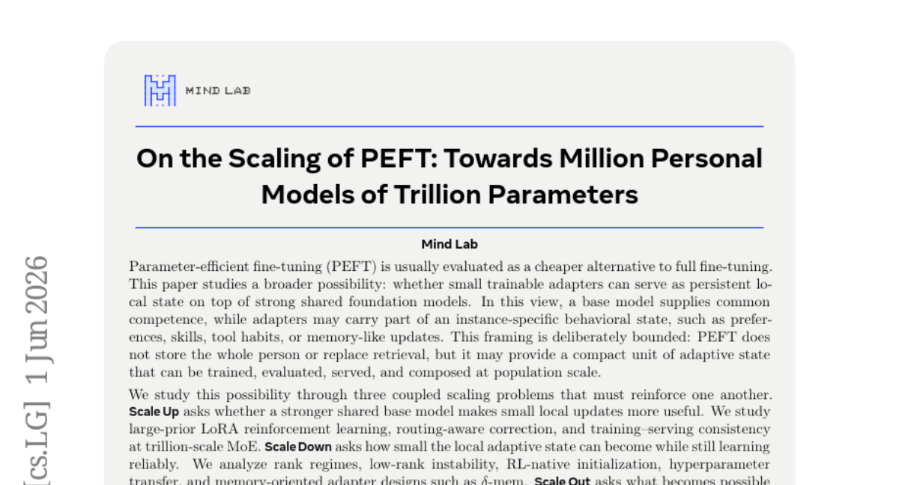

### 📌 한 줄 요약
PEFT를 단순 비용 절감 수단이 아닌, 거대 모델 위에 개인화된 상태를 유지하는 '개인용 모델(Personal Models)' 구축 프레임워크로 재정의함

### 🔑 핵심 포인트
- PEFT를 공유 지식(Base Model)과 개인화된 상태(Adapter)를 분리하는 아키텍처로 재정의
- 확장성 확보를 위한 세 가지 축(Scale Up, Down, Out) 제시
- 수많은 개인화된 어댑터를 관리하기 위한 인프라(MinT) 개념 도입

### 🧑‍💻 개발자 관점
거대 모델을 매번 새로 학습할 필요 없이, 아주 작은 어댑터만 교체함으로써 수만 명의 사용자에게 맞춤형 AI를 저비용으로 제공할 수 있는 설계 방향을 제시합니다.

### 🚀 실무 적용 아이디어
- 특정 도구 사용 습관이나 개인 말투를 학습시킨 작은 어댑터 생성 실험
- 하나의 베이스 모델에 여러 사용자 프로필 어댑터를 스위칭하며 성능 변화 관찰
- 어댑터 크기를 극단적으로 줄였을 때(Scale Down)의 성능 유지 한계 테스트

### ⚠️ 리스크/한계
- 어댑터 간의 간섭이나 데이터 오염 문제
- 수많은 어댑터를 실시간으로 서빙할 때의 인프라 복잡도 및 관리 비용

### 📝 초록 기반 상세 설명
기존의 PEFT는 주로 풀 파인튜닝의 저비용 대안으로만 취급되어 왔습니다. 본 논문은 PEFT를 강력한 공유 기반 모델 위에 개인의 선호도, 기술, 기억을 담는 지속적인 로컬 상태로 활용하는 새로운 관점을 제시합니다. 이를 위해 Scale Up(강력한 사전 학습), Scale Down(어댑터의 최소화), Scale Out(수많은 인스턴스 공존)이라는 세 가지 확장 축을 중심으로 문제를 구조화합니다. 또한, 어댑터의 식별, 버전 관리, 평가 및 서빙을 관리하기 위한 인프라 예시인 MinT를 제안합니다. 결과적으로 PEFT가 단순한 예산 절약 수단을 넘어, 수조 개의 파라미터를 가진 모델을 개인화하는 압축된 기질(substrate)이 될 수 있음을 시사합니다.

---

## 3. [A Matter of TASTE: Improving Coverage and Difficulty of Agent Benchmarks](https://huggingface.co/papers/2605.28556)
**Upvotes**: 53 | **도입 난이도**: 중 | **신뢰도**: 상
**arXiv**: https://arxiv.org/abs/2605.28556

**태그**: AI Agent, Benchmark, Automated Task Generation, Tool-use, Agent, RAG, Evaluation

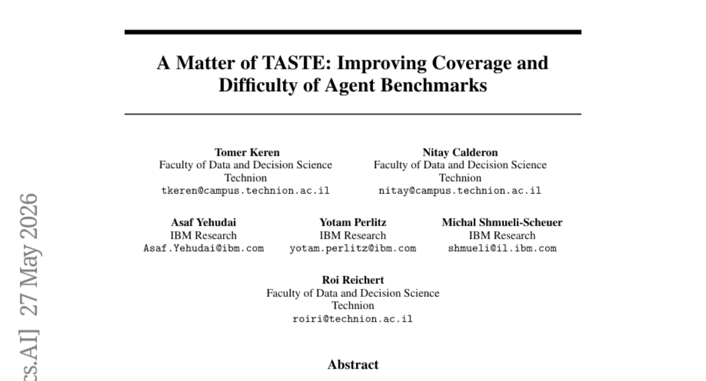

### 📌 한 줄 요약
기존 벤치마크의 포화 문제를 해결하기 위해 도구 사용 시퀀스 기반의 자동화된 고난도 태스크 생성 프레임워크인 TASTE를 제안합니다.

### 🔑 핵심 포인트
- 도구 시퀀스 기반의 역방향 태스크 생성 방식(Task Synthesis from Tool Sequence Evolution) 제안
- LLM 피드백을 활용한 적응형 대조 n-gram 모델을 통한 유효하고 다양한 도구 조합 샘플링
- 클러스터링 및 반복적 난이도 진화 과정을 통한 자동화된 고난도 벤치마크 구축

### 🧑‍💻 개발자 관점
에이전트 개발 시 기존 벤치마크 점수에 안주하지 않고, 실제 복잡한 도구 사용 환경에서의 성능을 검증할 수 있는 새로운 평가 기준을 제시합니다.

### 🚀 실무 적용 아이디어
- 현재 개발 중인 에이전트의 도구 사용 시퀀스를 추출하여 TASTE 방식의 자동 생성 파이프라인 적용 테스트
- 기존 벤치마크와 TASTE 기반 벤치마크 간의 성능 격차를 통한 모델의 한계점 파악
- 도구 조합의 다양성을 확보하기 위한 클러스터링 및 난이도 조절 로직 실험

### ⚠️ 리스크/한계
- 생성된 태스크가 특정 도구 조합에 편향될 가능성
- 자동 생성된 시나리오의 논리적 일관성 및 자연어 품질 유지 문제

### 📝 초록 기반 상세 설명
에이전트 능력이 발전함에 따라 기존 벤치마크가 쉽게 포화되는 문제가 발생하고 있으며, 새로운 태스크를 수동으로 구축하는 것은 비용과 시간이 많이 소요됩니다. 또한 기존 방식은 자연어 시나리오를 도구 시퀀스로 매핑하는 방식이라 도구 활용 패턴이 제한적이라는 한계가 있습니다. 본 논문은 태스크 생성 과정을 역전시켜 도구 시퀀스에서 태스크를 도출하는 TASTE 프레임워크를 제안합니다. TASTE는 LLM 피드백 기반의 적응형 대조 n-gram 모델을 통해 다양한 도구 조합을 포함하는 유효한 시퀀스를 샘플링하고, 클러스터링과 반복적인 난이도 진화를 통해 완성도 높은 벤치마크를 자동 생성합니다. 이를 통해 구축된 τ^c-Bench에서 기존 모델들은 성능 저하를 보였으며, 도구 조합의 다양성 또한 크게 향상되었습니다. 결과적으로 TASTE는 미래 에이전트의 능력을 지속적이고 확장 가능하게 평가할 수 있는 기반을 제공합니다.

### 🖼️ 추가 자료
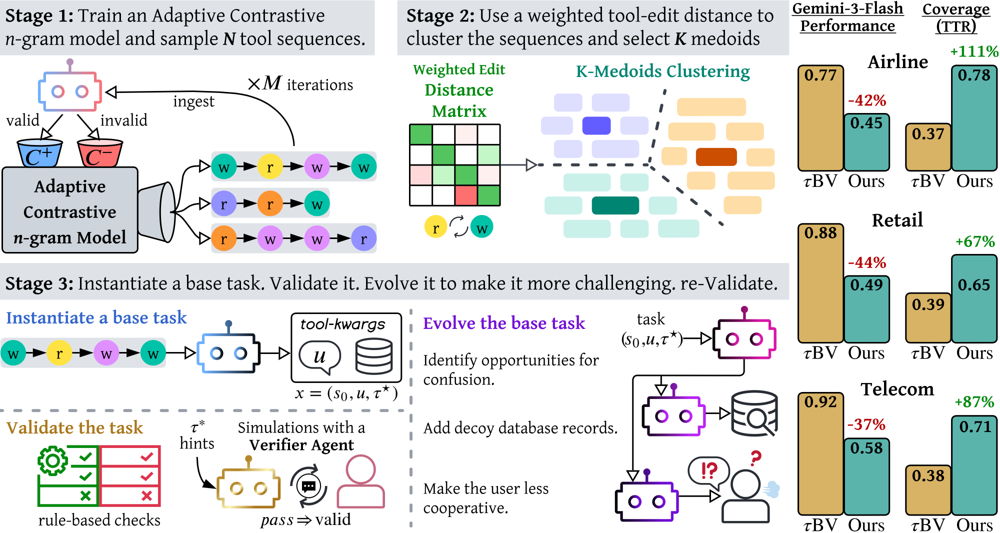

---

## 4. [K-BrowseComp: A Web Browsing Agent Benchmark Grounded in Korean Contexts](https://huggingface.co/papers/2606.02404)
**Upvotes**: 43 | **도입 난이도**: 하 | **신뢰도**: 상
**arXiv**: https://arxiv.org/abs/2606.02404

**태그**: Agent, Benchmark, Web-Browsing, Korean-Context, Reasoning, Evaluation

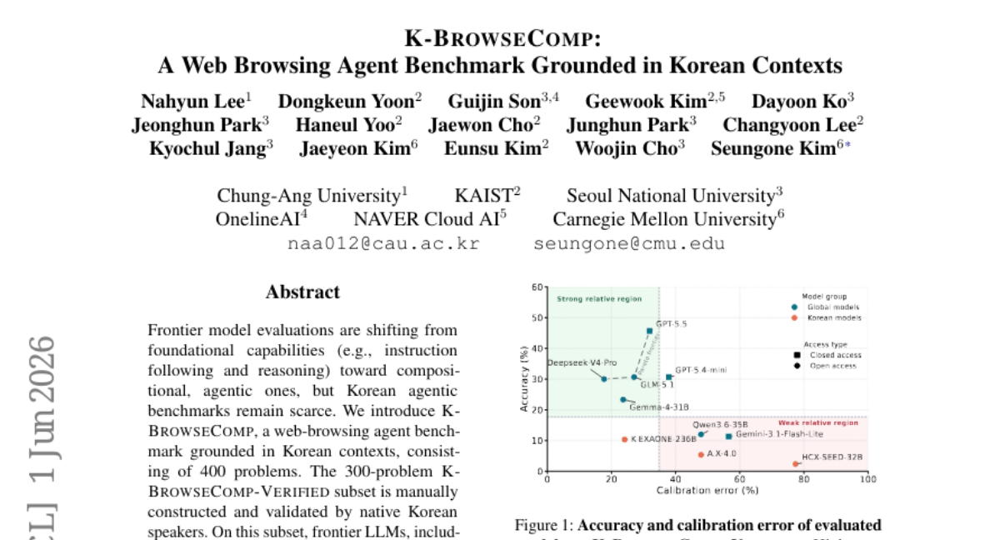

### 📌 한 줄 요약
한국적 맥락을 반영한 웹 브라우징 에이전트 벤치마크 K-BrowseComp를 제안하고 기존 모델의 한계를 검증함

### 🔑 핵심 포인트
- 한국적 맥락이 반영된 400개 규모의 웹 브라우징 에이전트 벤치마크 K-BrowseComp 제안
- 원어민 검증을 거친 300개 문제셋(K-BrowseComp-Verified)을 통한 신뢰성 확보
- 모델의 취약점을 타겟팅한 합성 데이터셋(Synthetic Split)을 통한 스트레스 테스트 방법론 제시

### 🧑‍💻 개발자 관점
한국어 기반 웹 에이전트 개발 시, 단순 언어 능력을 넘어 실제 한국 웹 환경에서의 문제 해결 능력을 측정할 수 있는 기준을 제공합니다.

### 🚀 실무 적용 아이디어
- 개발 중인 에이전트 모델을 K-BrowseComp-Verified 셋에 적용하여 성능 측정
- 합성 데이터셋(Synthetic Split)을 활용한 모델의 취약점 및 실패 모드 분석
- 글로벌 모델과 로컬 모델 간의 한국어 에이전트 성능 격차 비교 실험

### ⚠️ 리스크/한계
- 특정 도메인이나 특정 웹 환경에 국한된 성능 지표일 가능성
- 합성 데이터셋을 통한 테스트가 모델의 일반화 성능을 왜곡할 위험

### 📝 초록 기반 상세 설명
최근 LLM 평가가 단순 추론에서 에이전트 역량으로 이동하고 있으나, 한국어 맥락을 반영한 에이전트 벤치마크는 부족한 실정입니다. 이를 해결하기 위해 한국적 상황을 반영한 400개의 문제를 포함하는 K-BrowseComp를 도입했습니다. 검증된 300개 문제셋에서 최신 글로벌 모델들도 낮은 성능을 보였으며, 특히 한국 로컬 모델들의 성능은 더욱 낮게 나타났습니다. 또한 문제 생성과 해결 사이의 비대칭성을 이용한 합성 데이터셋을 구축하여 모델의 취약점을 정밀하게 테스트했습니다. 본 연구는 데이터와 코드를 공개하여 한국어 에이전트 성능 향상을 위한 기반을 제공합니다.

---

## 5. [Draft-OPD: On-Policy Distillation for Speculative Draft Models](https://huggingface.co/papers/2605.29343)
**Upvotes**: 26 | **도입 난이도**: 중 | **신뢰도**: 상
**arXiv**: https://arxiv.org/abs/2605.29343

**태그**: LLM Inference, Speculative Decoding, Knowledge Distillation, Optimization, Evaluation, Inference, Distillation

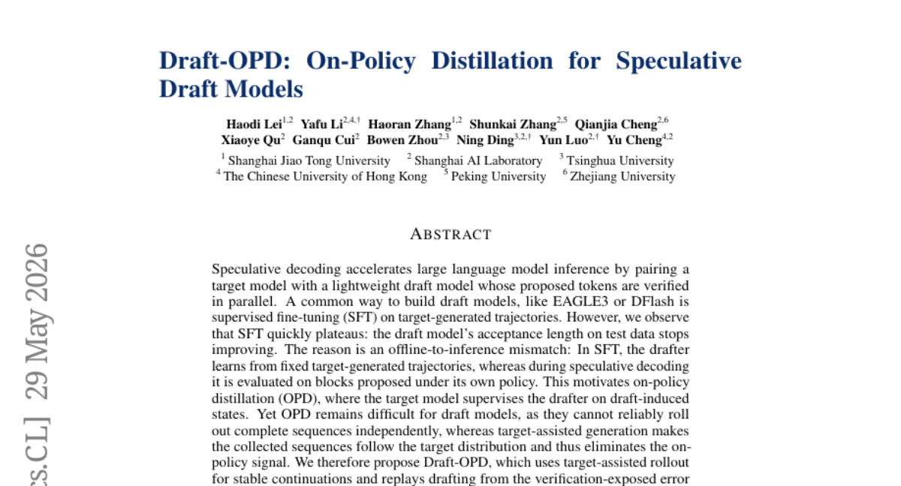

### 📌 한 줄 요약
SFT의 데이터 불일치 문제를 해결하여 추론 가속 성능을 극대화한 온폴리시(On-Policy) 증류 기법

### 🔑 핵심 포인트
- SFT 방식의 한계인 '오프라인-추론 간 미스매치' 문제 식별
- 타겟 모델의 피드백을 활용하여 드래프트 모델의 오류를 직접 교정하는 Draft-OPD 제안
- 검증 과정에서 발생하는 오류 위치를 재현하여 학습 효율 극대화

### 🧑‍💻 개발자 관점
LLM 서비스 운영 시 추론 비용과 지연 시간을 줄이기 위한 Speculative Decoding의 성능을 실질적으로 끌어올릴 수 있는 방법론입니다.

### 🚀 실무 적용 아이디어
- 기존 SFT 기반 드래프트 모델(EAGLE 등)과 Draft-OPD의 가속 성능 비교 실험
- 다양한 크기의 타겟 모델에 대한 드래프트 모델 학습 파이프라인 구축
- 생성된 시퀀스의 오류 위치를 추출하여 재학습에 활용하는 워크플로우 테스트

### ⚠️ 리스크/한계
- 타겟 모델의 피드백을 통한 롤아웃 과정이 추가적인 학습 비용을 발생시킴
- 드래프트 모델의 독립적인 시퀀스 생성 능력에 따라 학습 안정성이 달라질 수 있음

### 📝 초록 기반 상세 설명
Speculative decoding은 타겟 모델과 경량 드래프트 모델을 결합하여 추론 속도를 높이는 기술입니다. 기존의 SFT 방식은 학습 데이터와 실제 추론 환경 간의 분포 차이(offline-to-inference mismatch)로 인해 성능 정체 현상이 발생합니다. 이를 해결하기 위해 본 논문은 드래프트 모델이 생성한 시퀀스에서 발생하는 오류를 학습하는 Draft-OPD를 제안합니다. 타겟 모델의 도움을 받아 안정적인 롤아웃을 수행하면서도, 검증 과정에서 발생하는 오류 위치를 재현(replay)하여 학습에 활용합니다. 실험 결과, 기존 EAGLE-3 및 DFlash 대비 높은 가속 성능을 달성하며 특히 사고형 모델(thinking models)에서 뛰어난 성능을 보였습니다.

---

## 6. [Domino: Decoupling Causal Modeling from Autoregressive Drafting in Speculative Decoding](https://huggingface.co/papers/2605.29707)
**Upvotes**: 26 | **도입 난이도**: 중 | **신뢰도**: 상
**arXiv**: https://arxiv.org/abs/2605.29707

**태그**: LLM Inference, Speculative Decoding, Optimization, Efficiency, Inference

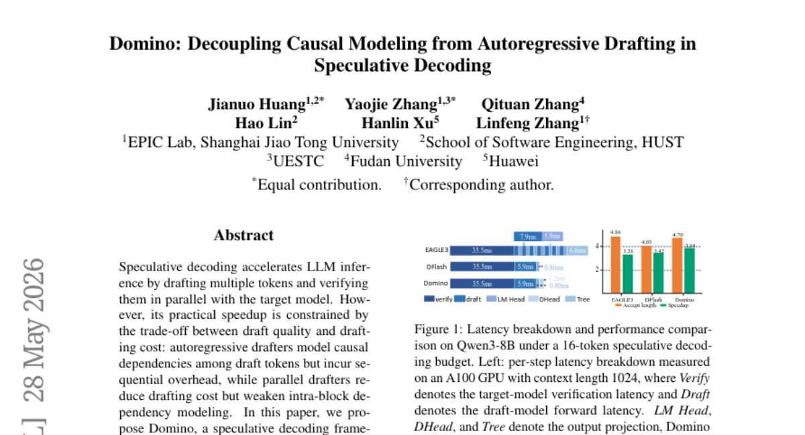

### 📌 한 줄 요약
병렬 드래프팅과 인과적 정제 기술을 결합하여 추론 속도와 품질 사이의 트레이드오프를 해결한 Speculative Decoding 프레임워크

### 🔑 핵심 포인트
- 인과적 의존성 모델링과 병렬 드래프트 실행의 분리 (Decoupling)
- 병렬 백본과 경량 Domino 헤드를 결합한 하이브리드 구조
- 학습 안정성을 위한 베이스 앵커 기반 커리큘럼 학습 도입

### 🧑‍💻 개발자 관점
LLM 서빙 시 발생하는 추론 지연 시간을 획기적으로 줄이면서도, 병렬 생성의 품질 저하 문제를 해결할 수 있는 실용적인 아키텍처를 제시합니다.

### 🚀 실무 적용 아이디어
- 제시된 Domino 헤드 구조를 기존 병렬 드래프터에 적용하여 성능 비교
- SGLang 등 고성능 서빙 프레임워크 환경에서의 처리량 변화 측정
- 다양한 모델 크기(Small vs Large)에 따른 커리큘럼 학습 효과 검증

### ⚠️ 리스크/한계
- 추가적인 Domino 헤드 연산으로 인한 오버헤드 발생 가능성
- 특정 모델 아키텍처에 최적화된 커리큘럼 학습의 범용성 검증 필요

### 📝 초록 기반 상세 설명
LLM 추론 가속을 위한 Speculative Decoding은 드래프트 품질과 생성 비용 사이의 상충 관계라는 문제에 직면해 있습니다. 기존의 자기회귀(Autoregressive) 방식은 품질은 높지만 속도가 느리고, 병렬 방식은 빠르지만 토큰 간 의존성 모델링이 약합니다. 본 논문은 제안하는 Domino 프레임워크를 통해 인과적 의존성 모델링과 드래프트 실행 과정을 분리합니다. 먼저 병렬 백본으로 블록 전체의 예비 분포를 생성한 후, 가벼운 Domino 헤드를 통해 접두사 의존적 인과 정보를 반영하여 정제합니다. 학습 안정성을 위해 베이스 앵커 기반의 커리큘럼 학습을 도입하여 최적화를 수행합니다. 실험 결과, Qwen3 모델에서 높은 엔드투엔드 및 처리량(Throughput) 가속 성능을 입증했습니다.

---

## 7. [Linear Ensembles Wash Away Watermarks: On the Fragility of Distributional Perturbations in LLMs](https://huggingface.co/papers/2605.30501)
**Upvotes**: 24 | **도입 난이도**: 중 | **신뢰도**: 상
**arXiv**: https://arxiv.org/abs/2605.30501

**태그**: LLM Security, Watermarking, Ensemble Learning, Generative AI, RAG, Safety

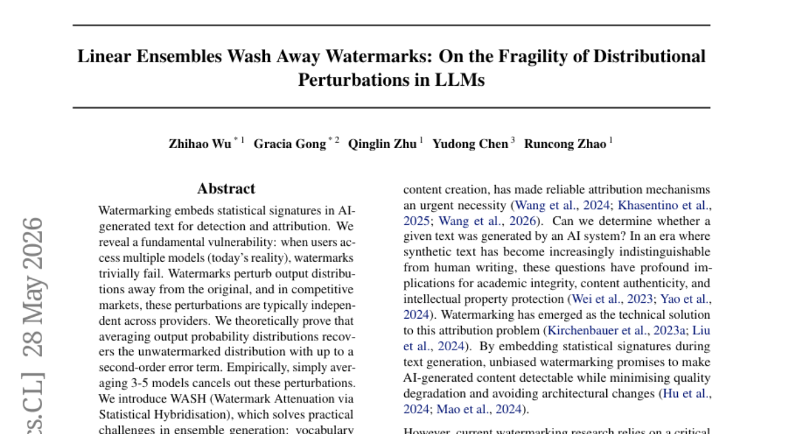

### 📌 한 줄 요약
여러 LLM의 출력 분포를 평균화하는 것만으로도 워터마크를 효과적으로 제거할 수 있는 취약성을 증명함

### 🔑 핵심 포인트
- 앙상블(Averaging)을 통한 워터마크 제거의 이론적/실증적 증명
- 이종 모델 간 토큰화 차이를 극복하는 WASH 프레임워크 제안
- 적은 수의 모델 조합만으로도 탐지 성능을 무력화하는 높은 효율성

### 🧑‍💻 개발자 관점
LLM 워터마크가 완벽한 보안책이 될 수 없음을 인지하고, 텍스트 생성 파이프라인 설계 시 앙상블 기법이 보안에 미치는 영향을 고려해야 합니다.

### 🚀 실무 적용 아이디어
- 다양한 오픈소스 LLM을 활용한 앙상블 기반 워터마크 제거 실험
- WASH 알고리즘을 활용한 토큰화 불일치 해결 방식 검증
- 워터마크가 적용된 모델과 앙상블 모델 간의 품질 및 속도 벤치마크

### ⚠️ 리스크/한계
- 모델 제공자 간의 긴밀한 협업 없이는 워터마크의 실효성 확보가 어려움
- 앙상블 과정에서 발생할 수 있는 생성 품질 저하 및 연산 비용 문제

### 📝 초록 기반 상세 설명
AI 생성 텍스트의 출처를 밝히기 위해 통계적 워터마크가 사용되고 있으나, 사용자가 여러 모델을 동시에 사용하는 환경에서는 보안에 취약할 수 있습니다. 연구진은 워터마크가 출력 분포를 미세하게 변형한다는 점을 이용해, 여러 모델의 출력 확률 분포를 평균 내면 원래의 분포로 회귀한다는 것을 이론적으로 증명했습니다. 이를 위해 서로 다른 모델 간의 어휘 및 토큰화 차이를 해결하는 WASH(Watermark Attenuation via Statistical Hybridisation) 기법을 제안했습니다. 실험 결과, 단 3~5개의 모델을 평균 내는 것만으로도 워터마크 탐지율을 임계치 이하로 급격히 낮추면서도 텍스트 품질을 유지할 수 있었습니다. 이는 현재의 분산된 모델 제공 환경에서 워터마크 기술이 가진 근본적인 한계를 시사합니다.

---

## 8. [VLMs are Good Teachers for Video Reasoning via Adaptive Test-Time Optimization](https://huggingface.co/papers/2606.02564)
**Upvotes**: 22 | **도입 난이도**: 중 | **신뢰도**: 상
**arXiv**: https://arxiv.org/abs/2606.02564

**태그**: Video-Generation, VLM, LoRA, Test-Time-Optimization, Reasoning, RAG, Vision, Video, Benchmark, Evaluation

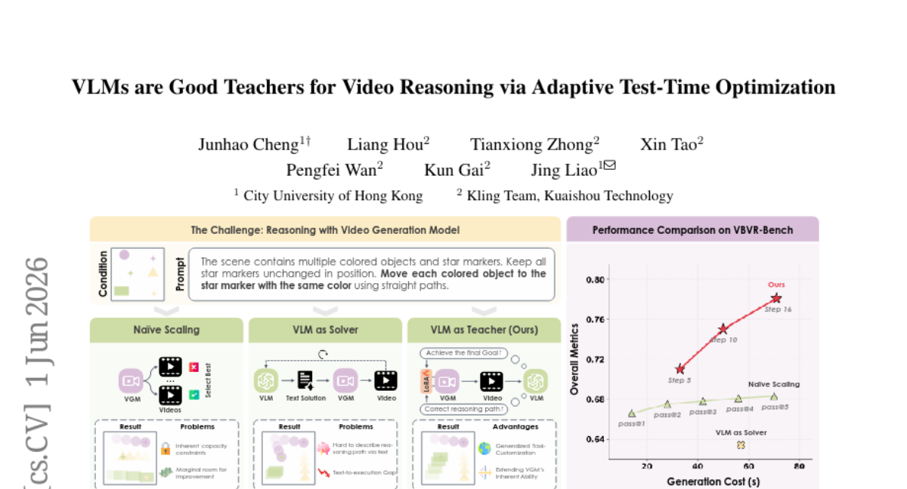

### 📌 한 줄 요약
VLM을 문제 해결사가 아닌 '교사'로 활용하여, 테스트 단계에서 비디오 생성 모델(VGM)의 논리적 추론 능력을 최적화하는 새로운 패러다임 제안

### 🔑 핵심 포인트
- VLM의 역할을 'Solver'에서 'Teacher'로 전환하여 시공간적 규칙을 보상 함수로 변환
- 테스트 시점(Test-time)에 경량 LoRA 모듈을 온라인 최적화하는 적응형 학습 전략
- 기존 텍스트 기반 가이드 방식의 한계를 극복하고 모델의 논리적 추론 능력 확장

### 🧑‍💻 개발자 관점
모델의 파라미터를 전체 재학습하지 않고도 테스트 시점에 특정 태스크에 맞춰 성능을 끌어올리는 LoRA 최적화 기법의 실용적 활용 사례를 제시함

### 🚀 실무 적용 아이디어
- 제시된 LoRA 기반 온라인 최적화 루프를 오픈소스 비디오 생성 모델에 적용해보기
- VLM이 추출한 보상 함수가 실제 비디오의 시공간적 일관성을 얼마나 잘 반영하는지 검증하기
- 다양한 벤치마크(VBVR, RULER)를 통해 태스크 복잡도에 따른 최적화 비용 분석하기

### ⚠️ 리스크/한계
- 테스트 시점의 온라인 최적화로 인한 추가적인 연산 비용 발생
- VLM이 생성하는 보상 함수 자체가 편향되거나 부정확할 경우 모델 성능 저하 위험

### 📝 초록 기반 상세 설명
최근 비디오 생성 모델(VGM)을 활용한 비디오 추론 방식이 주목받고 있으나, 모델이 복잡한 규칙이나 세부적인 시공간적 지시사항을 따르지 못하는 논리적 결함이 발생합니다. 기존에는 VLM을 직접적인 해결사(Solver)로 사용하여 텍스트 가이드를 생성하려 했으나, 이는 미세한 시공간 정보 전달에 한계가 있었습니다. 본 논문은 VLM의 강력한 인지 능력을 활용하여 규칙을 추출하고, 이를 미분 가능한 보상(Reward)으로 변환하여 VGM을 가이드하는 'Teacher' 역할을 부여하는 방식을 제안합니다. 테스트 시점에 경량 LoRA 모듈을 온라인 최적화함으로써 VGM의 내재적 한계를 넘어선 적응형 추론을 가능하게 합니다. 실험 결과, 기존의 VLM-as-Solver 방식이나 Best-of-N 방식보다 월등한 성능 향상을 보이며 범용 비디오 추론의 가능성을 입증했습니다.

---

## 9. [NITP: Next Implicit Token Prediction for LLM Pre-training](https://huggingface.co/papers/2605.24956)
**Upvotes**: 22 | **도입 난이도**: 중 | **신뢰도**: 상
**arXiv**: https://arxiv.org/abs/2605.24956

**태그**: LLM Pre-training, Representation Learning, Optimization, MoE, RAG, Vision, Inference

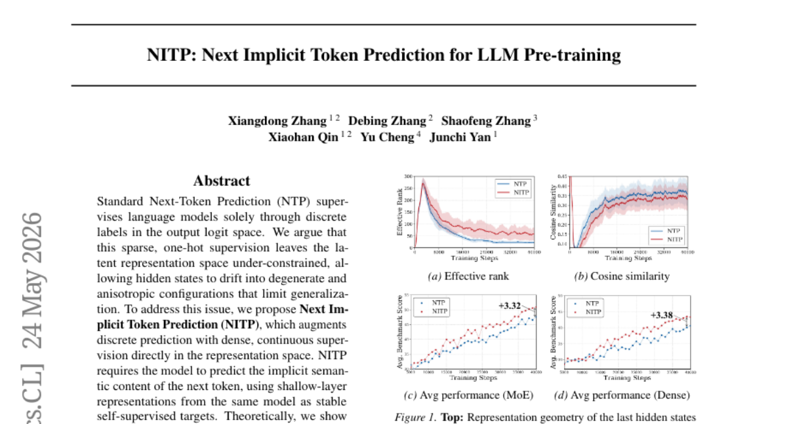

### 📌 한 줄 요약
차세대 토큰 예측(NITP)을 통해 모델의 잠재 표현 공간을 정교화하여 성능을 높이는 새로운 사전 학습 방법론

### 🔑 핵심 포인트
- 이산적 레이블(One-hot)의 한계를 극복하기 위해 밀집 연속 감독(Dense continuous supervision) 도입
- 모델 내부의 얕은 레이어 표현을 활용한 암시적 의미 예측을 통한 표현 공간 정규화
- 추가적인 추론 비용 없이 학습 단계에서의 미세한 연산량 증가만으로 성능 최적화

### 🧑‍💻 개발자 관점
모델 학습 시 표현 공간의 구조적 문제를 해결하여, 추가적인 추론 비용 없이 모델의 일반화 성능과 벤치마크 점수를 높일 수 있는 효율적인 기법입니다.

### 🚀 실무 적용 아이디어
- 기존 NTP 기반 사전 학습 파이프라인에 NITP의 연속적 타겟 손실 함수 통합 실험
- 모델 크기 변화에 따른 NITP의 정규화 효과 및 수렴 속도 비교
- MoE 구조에서 레이어 간 정보 전달 효율성 검증

### ⚠️ 리스크/한계
- 학습 시 미세한 연산량 증가가 발생하므로 대규모 학습 시 스케일링 비용 고려 필요
- 특정 레이어의 표현을 타겟으로 삼을 때 발생할 수 있는 레이어 간 불일치 문제

### 📝 초록 기반 상세 설명
기존의 차세대 토큰 예측(NTP) 방식은 이산적인 레이블만을 사용하여 잠재 표현 공간이 제약 없이 드리프트되거나 비등방성(anisotropic) 구조를 갖는 문제가 있습니다. 이를 해결하기 위해 본 논문은 이산적 예측에 더해 표현 공간 내의 밀집 연속 감독을 추가하는 NITP를 제안합니다. NITP는 모델 내부의 얕은 레이어 표현을 타겟으로 사용하여 다음 토큰의 암시적 의미를 예측하도록 학습합니다. 이론적으로는 최적화 지형을 정규화하여 구조화된 표현 기하학을 유도하며, 실험적으로는 0.5B에서 9B 규모의 모델에서 성능 향상을 입증했습니다. 특히 9B MoE 모델에서 MMLU-Pro 등 주요 벤치마크에서 유의미한 성능 향상을 보이면서도 추가적인 추론 비용은 발생하지 않았습니다.

---

## 10. [X-Stream: Exploring MLLMs as Multiplexers for Multi-Stream Understanding](https://huggingface.co/papers/2606.02482)
**Upvotes**: 21 | **도입 난이도**: 하 | **신뢰도**: 상
**arXiv**: https://arxiv.org/abs/2606.02482

**태그**: MLLM, Multi-Stream, Benchmark, Video-Understanding, Agent, Reasoning, Video, Evaluation, Inference

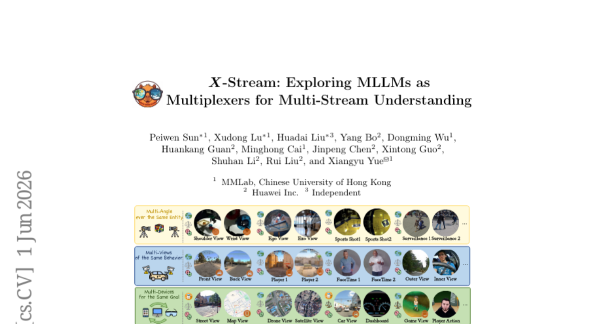

### 📌 한 줄 요약
멀티 스트림 환경에서의 실시간 추론 능력을 평가하기 위한 최초의 벤치마크 X-Stream 제안

### 🔑 핵심 포인트
- 멀티 윈도우, 멀티 뷰, 멀티 디바이스를 아우르는 최초의 멀티 스트림 벤치마크 X-Stream 구축
- 단일 스트림 편향을 방지하기 위한 독창적인 이중 검증(dual-verification) 데이터 파이프라인 적용
- 신호 멀티플렉싱 이론(Signal Multiplexing Theory)을 통한 MLLM의 멀티 스트림 처리 능력 체계적 평가

### 🧑‍💻 개발자 관점
멀티 카메라, 멀티 디바이스 환경을 다루는 에이전트 개발 시, 기존 단일 비디오 모델이 가진 한계를 파악하고 성능을 검증하는 데 필수적인 기준을 제공합니다.

### 🚀 실무 적용 아이디어
- 현재 사용 중인 MLLM 모델을 X-Stream 벤치마크에 적용하여 멀티 스트림 처리 성능 측정
- 멀티 스트림 환경에서 모델의 정보 누락 및 간섭 현상 분석
- 동시 스트림 처리 능력을 높이기 위한 프롬프트 엔지니어링 및 아키텍처 실험

### ⚠️ 리스크/한계
- 현재 MLLM의 낮은 성능으로 인해 벤치마크 결과가 모델의 잠재력을 과소평가할 가능성
- 실제 복잡한 물리적 환경과 벤치마크 시나리오 간의 간극 존재 가능성

### 📝 초록 기반 상세 설명
기존의 비디오 이해 연구는 단일 스트림에 국한되어 있어, 실시간 스포츠 중계나 자율 주행과 같은 멀티 스트림 상호작용 환경을 평가하기 어려웠습니다. 이를 해결하기 위해 다양한 시나리오를 포함하는 멀티 스트림 전용 벤치마크인 X-Stream을 도입했습니다. 데이터셋은 단일 스트림에 의존하지 않도록 이중 검증 파이프라인을 통해 구축되었으며, MLLM을 멀티플렉서로 간주하는 새로운 평가 프레임워크를 적용했습니다. 실험 결과, 최신 MLLM들은 동시 스트림 처리에서 성능이 급격히 저하되며 능동적인 추론 능력도 부족함을 확인했습니다. 본 연구는 차세대 멀티 스트림 에이전트 개발을 위한 실질적인 평가 프로토콜과 가이드를 제공합니다.

---

## 11. [SkillAdaptor: Self-Adapting Skills for LLM Agents from Trajectories](https://huggingface.co/papers/2606.01311)
**Upvotes**: 20 | **도입 난이도**: 하 | **신뢰도**: 상
**arXiv**: https://arxiv.org/abs/2606.01311

**태그**: LLM Agent, Skill Adaptation, Error Attribution, Automation, Agent, Vision, Evaluation

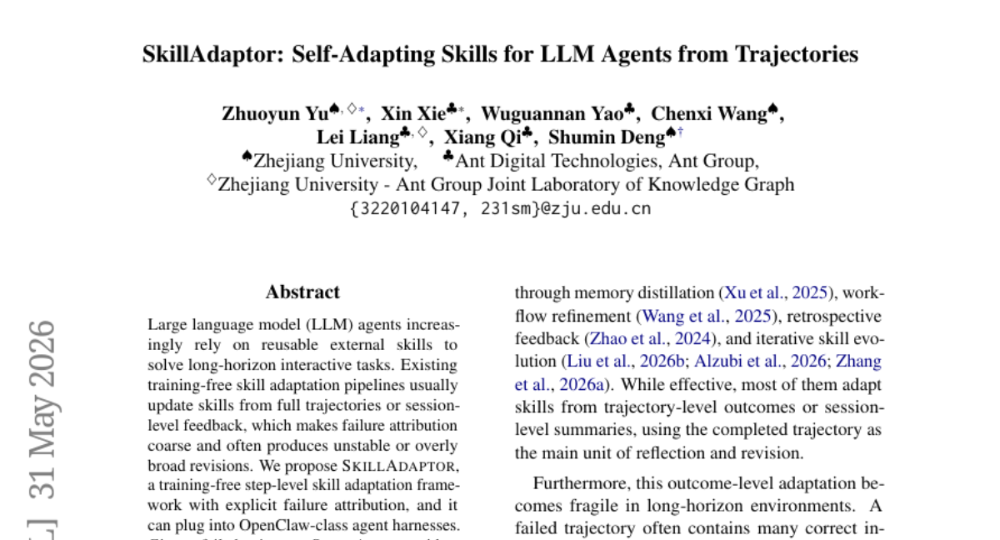

### 📌 한 줄 요약
실패 원인을 단계별로 정밀 분석하여 LLM 에이전트의 외부 스킬을 안정적으로 업데이트하는 프레임워크

### 🔑 핵심 포인트
- 실패 원인을 세션 단위가 아닌 단계(step-level) 단위로 정밀하게 식별하는 메커니즘
- 백본 모델을 수정하지 않고 스킬만 업데이트하는 training-free 방식의 효율성
- 명시적인 수용 검사(acceptance checks)를 통한 안정적인 스킬 수정 프로세스

### 🧑‍💻 개발자 관점
에이전트가 작업 중 실패했을 때 전체를 다시 학습시키는 대신, 문제가 된 특정 스킬만 정밀하게 수정하여 운영 비용을 줄이고 안정성을 높일 수 있습니다.

### 🚀 실무 적용 아이디어
- 실패한 에이전트 로그에서 특정 스텝의 오류를 스킬 정의와 매핑하는 로직 구현해보기
- 기존의 전체 궤적 기반 피드백 방식과 단계별 피드백 방식의 성능 차이 비교 실험
- OpenClaw와 같은 에이전트 하네스에 SkillAdaptor 로직 통합 테스트

### ⚠️ 리스크/한계
- 실패 원인이 스킬이 아닌 환경이나 모델의 추론 능력 문제일 경우 잘못된 업데이트 발생 가능성
- 복잡한 작업에서 오류 단계(fault step)를 정확히 식별하지 못할 경우의 불안정성

### 📝 초록 기반 상세 설명
LLM 에이전트가 복잡한 작업을 수행하기 위해 재사용 가능한 외부 스킬을 활용하는 사례가 늘고 있습니다. 기존의 학습이 없는(training-free) 스킬 적응 방식은 전체 궤적이나 세션 단위로 피드백을 처리하여 실패 원인 파악이 모호하고 업데이트가 불안정하다는 문제가 있었습니다. 이를 해결하기 위해 본 논문은 명시적인 실패 원인 분석을 포함하는 단계별 스킬 적응 프레임워크인 SkillAdaptor를 제안합니다. SkillAdaptor는 실패한 궤적에서 첫 번째 실행 가능한 오류 단계를 식별하고, 이를 관련 스킬과 연결하여 백본 모델을 고정시킨 채 타겟팅된 업데이트를 수행합니다. 실험 결과 WebShop, PinchBench, Claw-Eval 등 다양한 벤치마크에서 기존 방식보다 높은 성능 향상을 보였습니다. 이는 단계별 원인 분석이 더 안정적이고 검증 가능한 스킬 유지 관리를 가능하게 함을 시사합니다.

---

## 12. [Where to Look: Can Foundation Models Reach a Target Viewpoint Through Active Exploration?](https://huggingface.co/papers/2606.01247)
**Upvotes**: 20 | **도입 난이도**: 상 | **신뢰도**: 상
**arXiv**: https://arxiv.org/abs/2606.01247

**태그**: Embodied AI, Reinforcement Learning, 3D Vision, Agent, Vision, Benchmark, Evaluation

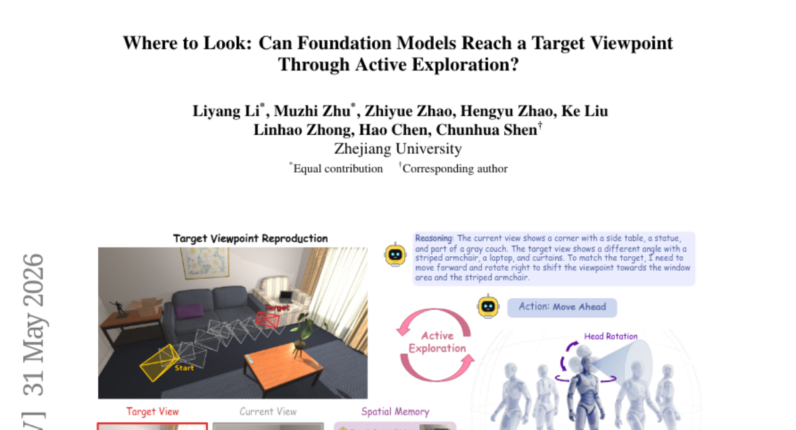

### 📌 한 줄 요약
수동적 시각 이해를 넘어, 목표 이미지와 일치하는 시점을 찾기 위해 능동적으로 움직이는 에이전트 학습 프레임워크 제안

### 🔑 핵심 포인트
- 능동적 시점 재현(TVR) 태스크 및 벤치마크(TVRBench) 정의
- 시각적 차이를 물리적 움직임으로 매핑하는 능력의 중요성 확인
- SFT 및 GRPO(Group Relative Policy Optimization)를 활용한 통합 학습 프레임워크 제안

### 🧑‍💻 개발자 관점
로봇 공학이나 가상 환경 에이전트 개발 시, 단순 객체 인식을 넘어 목표 상태를 달성하기 위한 능동적 탐색 및 제어 로직 설계에 직접적인 영감을 줍니다.

### 🚀 실무 적용 아이디어
- 제공된 TVRBench 환경에서 기본 모델의 이동(translation) vs 회전(rotation) 성능 차이 측정
- Visual-action SFT를 통한 에이전트의 행동 제어 능력 향상 실험
- 멀티턴 시각 이력을 처리하기 위한 메모리 구조 도입 및 성능 비교

### ⚠️ 리스크/한계
- 시뮬레이션 환경과 실제 물리 환경 간의 Sim-to-Real 간극 존재
- 복잡한 환경에서 멀티턴 상호작용 시 발생하는 누적 오차 문제

### 📝 초록 기반 상세 설명
기존의 시각 모델은 수집된 데이터를 이해하는 수동적 방식에 치중되어 있어, 목표 시점을 찾아가는 능동적 공간 지능 연구가 부족했습니다. 본 논문은 목표 이미지와 일치할 때까지 3D 환경에서 시점을 조정하는 'Target Viewpoint Reproduction (TVR)' 태스크와 벤치마크인 TVRBench를 제안합니다. 실험 결과, 기존 모델들은 멀티턴 시각 이력 관리와 이동(translation)이 필요한 상황에서 낮은 성공률을 보였습니다. 이를 해결하기 위해 전문가 궤적 SFT, CoT-SFT, 그리고 GRPO 기반의 강화학습을 포함하는 통합 사후 학습 프레임워크를 구축했습니다. 실험을 통해 Visual-action SFT가 성능 향상의 핵심임을 입증하였으며, 최종적으로 9B 모델의 성공률을 크게 끌어올렸습니다.

---

## 13. [VideoMLA: Low-Rank Latent KV Cache for Minute-Scale Autoregressive Video Diffusion](https://huggingface.co/papers/2605.30351)
**Upvotes**: 20 | **도입 난이도**: 상 | **신뢰도**: 상
**arXiv**: https://arxiv.org/abs/2605.30351

**태그**: Video Generation, KV Cache, Efficiency, Diffusion Model, Video, Evaluation, Inference, Optimization

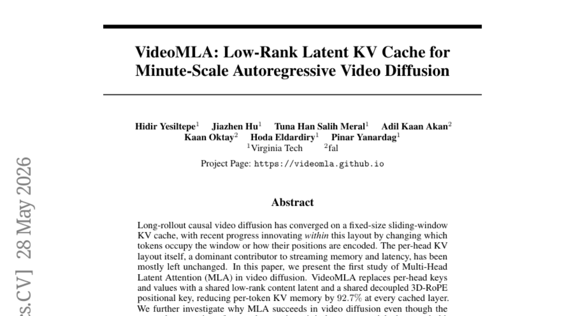

### 📌 한 줄 요약
저차원 잠재 KV 캐시(VideoMLA)를 통해 메모리 사용량을 92.7% 절감하며 장기 비디오 생성을 가능하게 하는 기술

### 🔑 핵심 포인트
- VideoMLA: 저차원 콘텐츠 잠재 벡터와 3D-RoPE를 결합한 새로운 KV 캐시 구조 제안
- 메모리 효율성: per-token KV 메모리를 기존 대비 92.7% 절감
- 성능 유지: 높은 스펙트럴 랭크를 가진 사전 학습 모델에서도 품질 저하 없는 압축 성공

### 🧑‍💻 개발자 관점
메모리 병목 현상으로 인해 제한적이었던 초장기(minute-scale) 비디오 생성 모델의 실용적 배포와 추론 속도 개선에 직접적인 도움을 줍니다.

### 🚀 실무 적용 아이디어
- 기존 슬라이딩 윈도우 방식과 VideoMLA의 메모리 점유율 및 생성 속도 비교 실험
- 다양한 해상도 및 프레임 수 변화에 따른 저차원 잠재 벡터의 재구성 오차 측정
- B200 등 최신 GPU 환경에서의 KV 캐시 압축 효율성 검증

### ⚠️ 리스크/한계
- 저차원 압축 시 발생할 수 있는 미세한 시각적 디테일 손실 가능성
- 사전 학습된 모델의 랭크 특성에 따른 구조적 최적화 난이도

### 📝 초록 기반 상세 설명
기존의 장기 비디오 확산 모델은 고정된 크기의 슬라이딩 윈도우 KV 캐시를 사용하여 메모리와 지연 시간 문제가 발생했습니다. 본 논문은 Multi-Head Latent Attention(MLA) 구조를 비디오 확산 모델에 최초로 도입하여 per-head KV 레이아웃을 혁신했습니다. VideoMLA는 공유된 저차원 콘텐츠 잠재 벡터와 분리된 3D-RoPE 위치 키를 사용하여 KV 메모리를 획기적으로 줄였습니다. 연구 결과, 사전 학습된 비디오 어텐션의 랭크가 높음에도 불구하고 MLA 구조가 효과적인 랭크 제어를 통해 품질 저하 없이 압축을 수행함을 확인했습니다. 최종적으로 VBench에서 장기 비디오 생성 성능에서 최고 점수를 기록했으며, B200 단일 GPU에서 처리량을 1.23배 향상시켰습니다.

---

## 14. [Which Pretraining Paradigm Better Serves Spatial Intelligence? An Empirical Comparison of Vision-Language and Video Generation Models](https://huggingface.co/papers/2605.28132)
**Upvotes**: 17 | **도입 난이도**: 하 | **신뢰도**: 상
**arXiv**: https://arxiv.org/abs/2605.28132

**태그**: Computer Vision, Spatial Intelligence, VLM, VGM, Representation Learning, Vision, Video

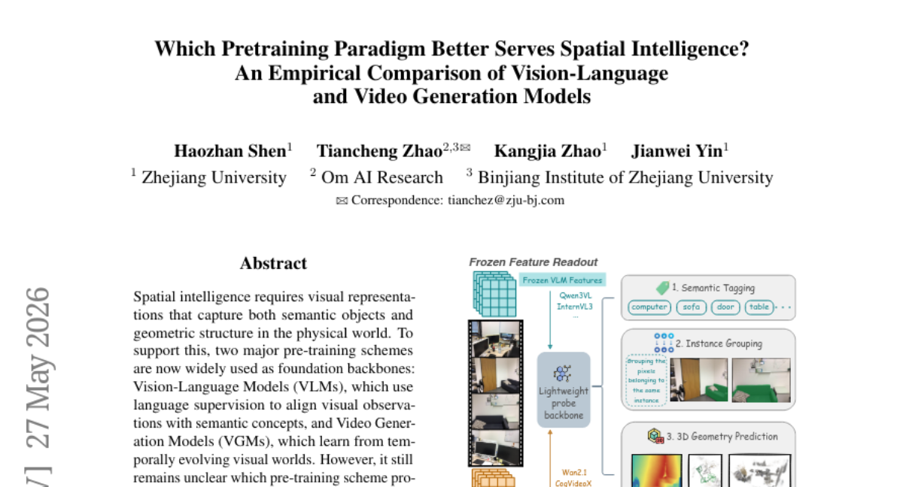

### 📌 한 줄 요약
VLM과 VGM의 공간 지능 특성을 비교 분석하여, 의미론적 태깅과 기하학적 구조를 위한 최적의 모델 조합 방향을 제시함

### 🔑 핵심 포인트
- VLM과 VGM의 공간 지능 표현 능력에 대한 체계적인 프로빙 비교 연구 수행
- VLM은 의미론적/객체 중심 정보에, VGM은 기하학적/동적 정보에 특화됨을 입증
- 두 모델의 특징을 결합(fusion)하여 의미와 기하 정보를 모두 잡는 시너지 효과 확인

### 🧑‍💻 개발자 관점
로봇 공학이나 AR/VR 같은 공간 지능이 필요한 서비스 개발 시, 목적에 따라 VLM과 VGM 중 어떤 백본을 선택하거나 결합해야 할지에 대한 가이드를 제공합니다.

### 🚀 실무 적용 아이디어
- 특정 도메인 데이터셋에 대해 VLM과 VGM의 특징 추출 성능 비교 실험
- 두 모델의 임베딩을 결합하는 간단한 퓨전 레이어 설계 및 성능 테스트
- 3D 재구성 작업 시 VLM의 의미 정보와 VGM의 기하 정보를 결합하는 파이프라인 구축

### ⚠️ 리스크/한계
- 특정 모델 아키텍처에 국한된 결과일 수 있어 일반화에 주의 필요
- 두 모델을 결합할 때 발생하는 연산 비용 및 추론 속도 문제 고려 필요

### 📝 초록 기반 상세 설명
공간 지능을 위해서는 의미적 객체와 기하학적 구조를 모두 포착하는 시각적 표현이 필수적입니다. 현재 VLM(언어 기반)과 VGM(비디오 생성 기반)이 주요 사전 학습 방식으로 사용되고 있으나, 어떤 방식이 공간 지능에 더 적합한지는 명확하지 않았습니다. 본 논문은 고정된 특징(frozen features)을 활용한 프로빙 실험을 통해 두 모델의 공간 지능 축(의미 태깅, 인스턴스 그룹화, 3D 기하 예측)을 비교했습니다. 실험 결과, VLM은 의미론적 태깅과 그룹화에 강점이 있고, VGM은 밀집 기하 정보와 카메라 움직임 파악에 강점이 있음이 밝혀졌습니다. 최종적으로 두 모델의 특징을 결합했을 때 두 영역 모두에서 뛰어난 성능을 보여, 향후 공간 지능 백본 구축을 위한 통합적 접근의 가능성을 제시했습니다.

---

## 15. [Harness-1: Reinforcement Learning for Search Agents with State-Externalizing Harnesses](https://huggingface.co/papers/2606.02373)
**Upvotes**: 16 | **도입 난이도**: 상 | **신뢰도**: 상
**arXiv**: https://arxiv.org/abs/2606.02373

**태그**: Agent, Reinforcement Learning, Information Retrieval, Search, RAG, Benchmark, Evaluation

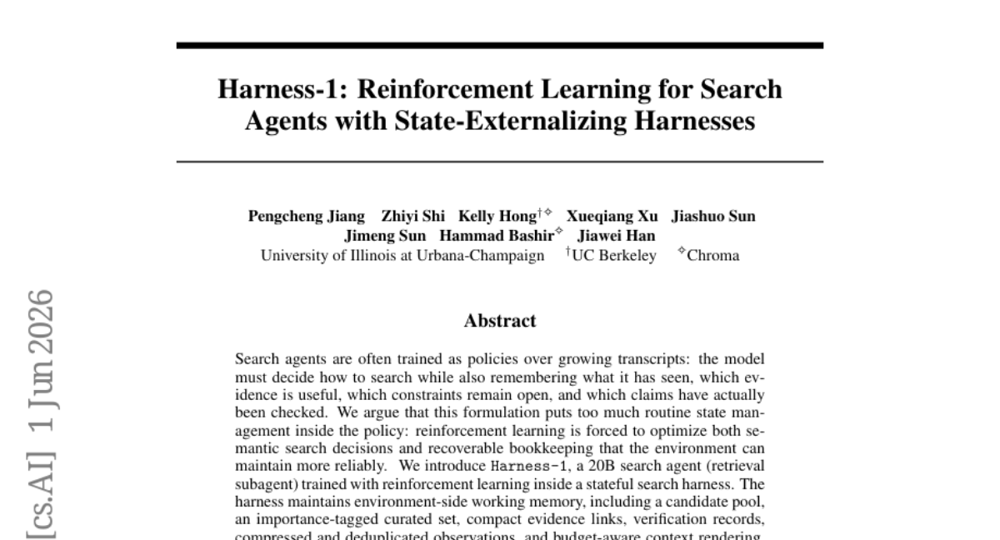

### 📌 한 줄 요약
에이전트의 정책(Policy)과 상태 관리(State Management)를 분리하여 검색 효율과 일반화 성능을 극대화한 RL 기반 검색 에이전트 프레임워크

### 🔑 핵심 포인트
- 상태 관리(State Management)와 정책(Policy)의 분리를 통한 RL 학습 효율 최적화
- 환경 측에서 작동하는 'Stateful Search Harness' 도입 (메모리, 검증 기록, 컨텍스트 렌더링 관리)
- 다양한 도메인(웹, 금융, 특허 등)에서 검증된 높은 일반화 성능 및 검색 정확도

### 🧑‍💻 개발자 관점
에이전트 설계 시 모든 정보를 컨텍스트에 때려 넣는 대신, 환경(Environment)이 상태를 관리하도록 설계하는 것이 모델의 추론 성능과 일반화에 얼마나 중요한지 보여줍니다.

### 🚀 실무 적용 아이디어
- 에이전트 워크플로우에서 '상태 관리' 로직을 모델 외부(Python/DB)로 분리하는 아키텍처 설계 실험
- RL 학습 시 보상 함수(Reward Function)에 검색 결과뿐만 아니라 상태 관리 효율성을 포함하는 실험
- 제한된 컨텍스트 윈도우 내에서 정보 압축 및 중복 제거 로직 적용 테스트

### ⚠️ 리스크/한계
- 상태 관리 로직이 복잡해질수록 환경(Harness) 구현 및 유지보수 난이도 상승
- 모델 크기(20B)와 환경 설계 간의 의존성으로 인해 소형 모델로의 이식 시 성능 저하 가능성

### 📝 초록 기반 상세 설명
기존 검색 에이전트는 모델이 검색 결정과 복잡한 상태 관리(기록 유지, 제약 조건 확인 등)를 동시에 수행해야 하는 비효율적인 구조를 가집니다. 이로 인해 RL 학습 시 정책이 불필요한 부수 작업에 자원을 소모하는 문제가 발생합니다. 본 논문은 상태 관리 기능을 환경 측(Harness)으로 분리하고 모델은 오직 의미론적 결정에만 집중하게 하는 Harness-1을 제안합니다. Harness-1은 후보 풀 관리, 검증 기록, 중복 제거 등을 수행하는 상태 유지형 하네스를 통해 20B 규모의 검색 에이전트를 학습시켰습니다. 실험 결과, 다양한 도메인에서 기존 오픈 소스 모델을 압도하는 성능을 보였으며 특히 미학습 도메인에 대한 일반화 능력이 뛰어났습니다.

---

## 16. [Masking Stale Observations Helps Search Agents -- Until It Doesn't: A Regime Map and Its Mechanism](https://huggingface.co/papers/2606.00408)
**Upvotes**: 14 | **도입 난이도**: 중 | **신뢰도**: 상
**arXiv**: https://arxiv.org/abs/2606.00408

**태그**: AI Agent, Context Management, RAG, Search Agent, Agent, Benchmark

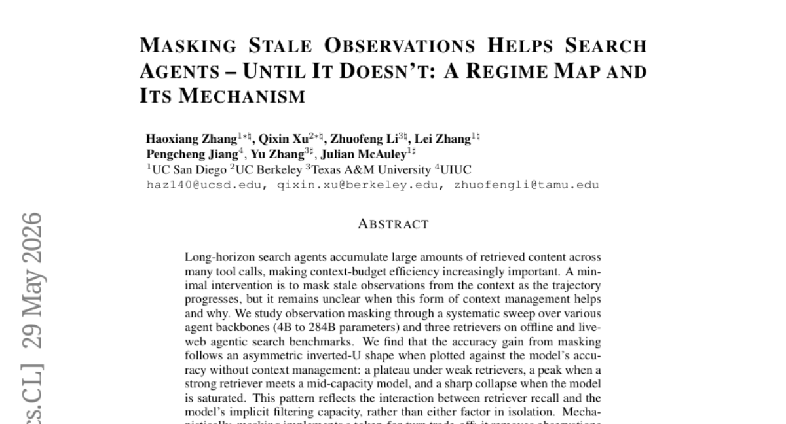

### 📌 한 줄 요약
에이전트의 컨텍스트 관리를 위한 '관찰 데이터 마스킹'이 모델 성능과 검색 품질에 따라 성능을 높이거나 급격히 떨어뜨리는 임계점이 존재함을 규명함

### 🔑 핵심 포인트
- 모델 용량과 검색기 성능 간의 상호작용에 따른 비대칭적 역U자형 성능 패턴 발견
- 마스킹이 '토큰 확보'와 '증거 손실' 사이의 트레이드오프를 유발하는 메커니즘 규명
- 컨텍스트 관리를 단순 최적화가 아닌 모델/검색기 역량에 따른 '레짐(Regime)' 관점으로 재정의

### 🧑‍💻 개발자 관점
에이전트 개발 시 무조건적인 컨텍스트 압축이나 오래된 데이터 삭제가 오히려 모델의 추론 능력을 저해할 수 있음을 인지하고, 모델 규모에 맞는 전략을 세워야 합니다.

### 🚀 실무 적용 아이디어
- 현재 사용 중인 에이전트 모델의 성능 수준에 따른 마스킹 임계점 테스트
- 검색 결과의 재사용 빈도(Re-open rate)를 기반으로 한 동적 마스킹 전략 실험
- 모델 용량 변화에 따른 컨텍스트 유지 기간(Turn-based) 최적화 실험

### ⚠️ 리스크/한계
- 모델이 특정 정보를 중요하게 판단할 경우, 마스킹이 결정적인 증거를 삭제할 위험이 있음
- 검색기의 재현율(Recall)이 낮을 경우 마스킹이 성능 저하로 직결될 수 있음

### 📝 초록 기반 상세 설명
장기 검색 에이전트는 많은 양의 데이터를 축적하며, 이로 인해 컨텍스트 예산 효율성이 중요한 과제로 떠오르고 있습니다. 연구진은 오래된 관찰 데이터를 마스킹하여 컨텍스트를 관리하는 방식이 언제 유효하고 왜 성능 변화를 일으키는지 분석했습니다. 다양한 파라미터 규모의 모델과 검색기를 활용해 실험한 결과, 마스킹의 효과는 모델의 기본 성능과 검색기 성능의 상호작용에 따라 비대칭적인 역U자형 곡선을 그리며 나타났습니다. 특히 모델의 용량이 포화 상태에 이르면 마스킹이 오히려 필수적인 증거를 제거하여 성능이 급락하는 현상이 관찰되었습니다. 이를 통해 컨텍스트 관리가 단순한 최적화가 아닌, 모델과 검색기 간의 정교한 균형이 필요한 '레짐(Regime)' 의존적 개입임을 밝혀냈습니다.

---

## 17. [ESPO: Early-Stopping Proximal Policy Optimization](https://huggingface.co/papers/2605.29860)
**Upvotes**: 13 | **도입 난이도**: 중 | **신뢰도**: 상
**arXiv**: https://arxiv.org/abs/2605.29860

**태그**: Reinforcement Learning, LLM Reasoning, Efficiency, PPO, Reasoning, Distillation

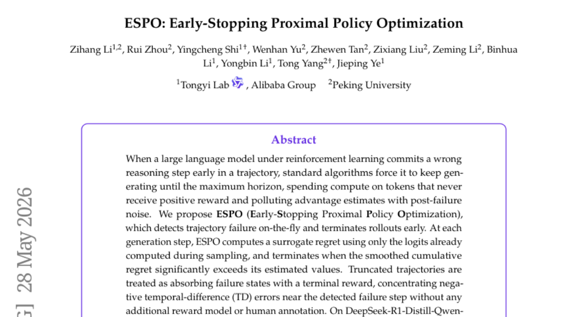

### 📌 한 줄 요약
추론 과정 중 조기 실패를 감지하여 불필요한 토큰 생성을 중단함으로써 연산 효율과 학습 성능을 동시에 높이는 PPO 최적화 기법

### 🔑 핵심 포인트
- 실시간 실패 감지를 통한 조기 종료(Early-Stopping) 메커니즘 도입
- 추가적인 보상 모델이나 휴먼 어노테이션 없이 로짓 기반의 대리 후회(surrogate regret) 활용
- 실패 시점의 TD 오차 집중을 통한 효율적인 정책 업데이트 및 연산 자원 절약

### 🧑‍💻 개발자 관점
추론 모델 학습 시 발생하는 무의미한 토큰 생성 비용을 줄이고, 잘못된 추론 경로가 학습 데이터에 노이즈로 작용하는 것을 방지할 수 있습니다.

### 🚀 실무 적용 아이디어
- 현재 사용 중인 PPO 학습 파이프라인에 로짓 기반 조기 종료 로직 적용 테스트
- 수학/코드 등 단계별 추론이 중요한 태스크에서 토큰 절감률 및 성능 변화 측정
- 실패 감지 임계값(threshold) 설정에 따른 학습 안정성 실험

### ⚠️ 리스크/한계
- 조기 종료 임계값이 너무 낮을 경우 정상적인 추론 과정도 중단될 위험(False Positive)
- 특정 도메인(수학 등) 외의 일반 대화형 태스크에서의 범용성 검증 필요

### 📝 초록 기반 상세 설명
LLM이 강화학습 과정에서 추론 초기에 오류를 범할 경우, 기존 알고리즘은 최대 길이까지 토큰을 생성하며 불필요한 연산 자원을 소모하고 잘못된 어드밴티지 추정치를 생성합니다. 이를 해결하기 위해 ESPO는 생성 과정 중 실시간으로 실패를 감지하고 롤아웃을 조기에 종료하는 기법을 제안합니다. 샘플링 시 계산된 로짓을 활용해 대리 후회(surrogate regret)를 계산하며, 누적 후회가 임계치를 넘으면 즉시 종료합니다. 조기 종료된 궤적은 흡수 실패 상태로 처리되어 부정적인 TD 오차를 실패 시점에 집중시킵니다. 실험 결과, 수학적 추론 작업에서 PPO 대비 성능 향상과 함께 20% 이상의 토큰 절감 효과를 입증했습니다.

---

## 18. [When Does Multi-Agent RL Improve LLM Workflows? Workflow, Scale, and Policy-Sharing Tradeoffs](https://huggingface.co/papers/2605.24202)
**Upvotes**: 13 | **도입 난이도**: 중 | **신뢰도**: 상
**arXiv**: https://arxiv.org/abs/2605.24202

**태그**: Multi-Agent, LLM, Reinforcement Learning, Workflow Optimization, Agent, Evaluation, Inference

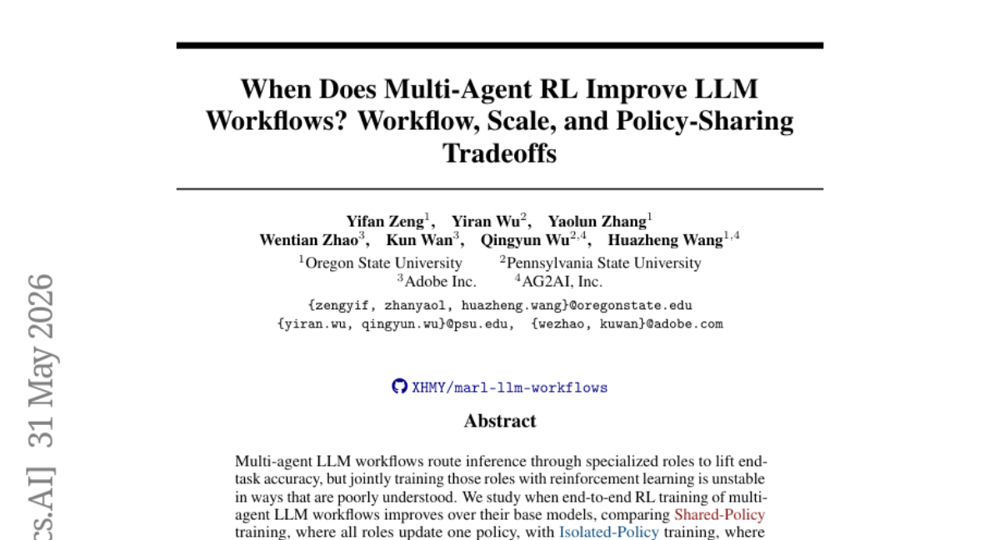

### 📌 한 줄 요약
멀티 에이전트 LLM 워크플로우에서 정책 공유(Shared-Policy)와 개별 정책(Isolated-Policy) 방식의 학습 안정성 및 성능 트레이드오프 분석

### 🔑 핵심 포인트
- 정책 공유(Shared-Policy)와 개별 정책(Isolated-Policy) 방식의 성능 및 안정성 트레이드오프 규명
- 워크플로우 구조(Voting, Orch-Workers 등)와 모델 규모에 따른 RL 학습 성공 조건 분석
- 그래디언트 역학을 통한 멀티 에이전트 학습 실패 패턴(성능 급락 및 역할 잠식) 원인 규명

### 🧑‍💻 개발자 관점
에이전트 시스템 구축 시 단순히 모델을 늘리는 것이 아니라, 학습 시 정책 공유 여부가 워크플로우 안정성에 미치는 영향을 고려해야 함을 시사합니다.

### 🚀 실무 적용 아이디어
- 동일한 모델을 사용하는 멀티 에이전트 환경에서 정책 공유 방식과 개별 파라미터 방식의 성능 변화 비교 실험
- Voting이나 Orchestrator 구조에서 특정 역할이 학습을 주도하여 다른 역할이 무력화되는지 모니터링
- 모델 규모(Scale) 변화에 따른 RL 학습 안정성 임계점 테스트

### ⚠️ 리스크/한계
- 개별 정책 방식 사용 시 특정 시점에 성능이 급격히 무너지는 'accuracy cliff' 위험 존재
- 정책 공유 방식 사용 시 특정 역할의 그래디언트가 전체 정책을 지배하여 역할 분담이 깨질 위험

### 📝 초록 기반 상세 설명
멀티 에이전트 LLM 워크플로우는 전문화된 역할을 통해 정확도를 높이지만, RL을 통한 공동 학습 시 발생하는 불안정성에 대한 이해가 부족합니다. 본 연구는 정책 공유 방식과 개별 정책 방식 간의 성능 차이를 워크플로우 구조, 작업 유형, 모델 규모에 따라 체계적으로 비교했습니다. 실험 결과, 멀티 에이전트 RL은 일반적으로 성능을 향상시키지만 그 이득은 워크플로우와 모델 규모에 따라 다르게 나타났습니다. 특히 개별 정책 방식은 높은 피크 성능을 보이지만 급격한 성능 저하(cliff)가 발생할 위험이 있고, 정책 공유 방식은 실패 패턴이 다르게 나타나는 특성을 보였습니다. 연구진은 이러한 현상을 워크플로우 토폴로지와 정책 라우팅에 의한 그래디언트 역학(gradient dynamics) 관점에서 설명했습니다.

### 🖼️ 추가 자료
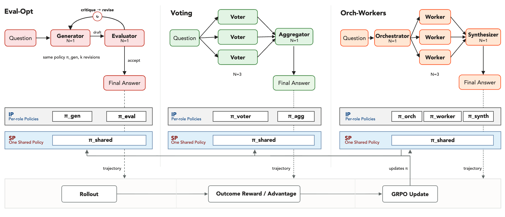

---

## 19. [MCP-Persona: Benchmarking LLM Agents on Real-World Personal Applications via Environment Simulation](https://huggingface.co/papers/2606.02470)
**Upvotes**: 12 | **도입 난이도**: 하 | **신뢰도**: 상
**arXiv**: https://arxiv.org/abs/2606.02470

**태그**: LLM Agent, MCP, Benchmarking, Personalization, Agent, Benchmark, Evaluation

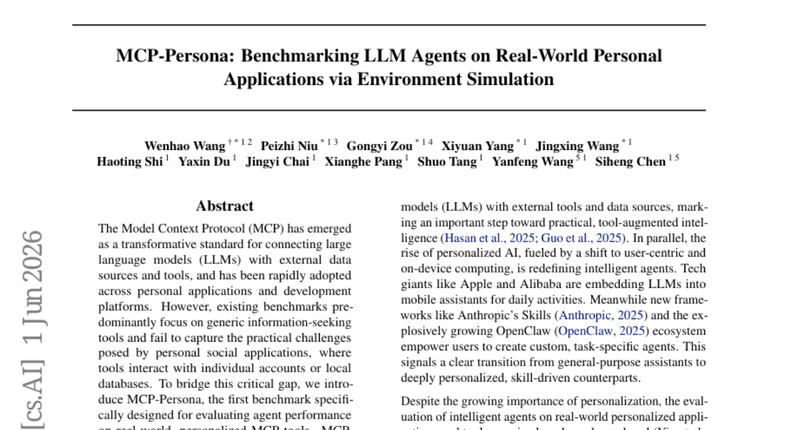

### 📌 한 줄 요약
개인화된 도구 사용 환경을 시뮬레이션하여 LLM 에이전트의 실무 역량을 평가하는 새로운 벤치마크 MCP-Persona 제안

### 🔑 핵심 포인트
- 개인화된 도구(Social, Enterprise) 활용 능력을 평가하는 최초의 MCP 전용 벤치마크 제안
- 실제 환경과 유사한 다양한 개인용 애플리케이션 시나리오 포함
- 기존 SOTA 에이전트들이 개인화된 데이터/도구 환경에서 겪는 한계점 규명

### 🧑‍💻 개발자 관점
에이전트가 단순 정보 검색을 넘어 사용자의 개인 계정이나 협업 툴을 직접 제어해야 하는 실무 환경에서의 신뢰성을 검증할 수 있습니다.

### 🚀 실무 적용 아이디어
- 제공된 벤치마크를 활용하여 현재 개발 중인 에이전트의 개인화 도구 제어 능력 테스트
- MCP 프로토콜 기반의 에이전트 워크플로우 최적화 실험
- 개인 데이터 보안과 도구 사용 권한 관리 로직 검증

### ⚠️ 리스크/한계
- 시뮬레이션 환경이 실제 복잡한 사용자 맥락을 완벽히 반영하는지에 대한 의문
- 개인화된 도구 사용 시 발생할 수 있는 보안 및 프라이버시 이슈에 대한 직접적 해결책은 아님

### 📝 초록 기반 상세 설명
최근 LLM과 외부 도구를 연결하는 MCP 표준이 급부상하며 개인용 애플리케이션에 널리 도입되고 있습니다. 그러나 기존 벤치마크는 일반적인 정보 검색에 치중되어 있어, 개인 계정이나 로컬 데이터베이스를 다루는 실무적인 개인화 도구 활용 능력을 평가하기 어렵습니다. 이를 해결하기 위해 연구진은 소셜 미디어(Reddit, Xiaohongshu) 및 협업 툴(Lark, Slack)을 포함하는 MCP-Persona 벤치마크를 개발했습니다. 다양한 최신 에이전트를 대상으로 실험한 결과, 기존 모델들이 개인화된 도구 사용 환경에서 심각한 성능 저하를 보임을 확인했습니다. 이 벤치마크는 개인화된 에이전트 개발의 한계를 식별하고 개선하는 데 중요한 역할을 할 것입니다.

---

## 20. [LVSA: Training-Free Sparse Attention for Long Video Diffusion](https://huggingface.co/papers/2605.31057)
**Upvotes**: 12 | **도입 난이도**: 하 | **신뢰도**: 상
**arXiv**: https://arxiv.org/abs/2605.31057

**태그**: Video-Generation, Sparse-Attention, Efficiency, Diffusion-Models, Video, Evaluation, Inference

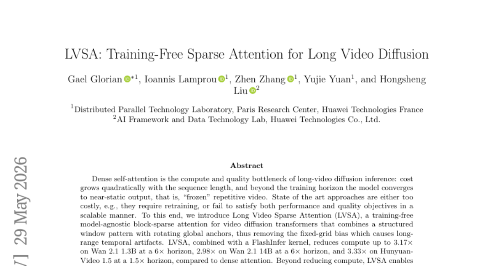

### 📌 한 줄 요약
재학습 없이 긴 영상 생성을 가능하게 하는 효율적인 Sparse Attention 기법 개발

### 🔑 핵심 포인트
- 재학습이 필요 없는 모델 불가지론적(Model-agnostic) Sparse Attention 구조
- 윈도우 패턴과 회전형 글로벌 앵커를 통한 장거리 시간적 아티팩트 제거
- FlashInfer 커널 최적화를 통한 연산 속도 및 메모리 효율 극대화

### 🧑‍💻 개발자 관점
추가 학습 비용 없이 기존 비디오 확산 모델(Diffusion Model)의 컨텍스트 길이를 확장하고 GPU 메모리 한계를 극복할 수 있는 실용적인 최적화 기법입니다.

### 🚀 실무 적용 아이디어
- Wan 2.1 또는 HunyuanVideo 모델에 LVSA 구조 적용 테스트
- FlashInfer 커널과의 결합을 통한 추론 속도 벤치마크 수행
- 제안된 VQeval을 활용한 생성 영상의 시간적 일관성 검증

### ⚠️ 리스크/한계
- Sparse Attention 특성상 특정 모델 구조에서는 성능 최적화가 다를 수 있음
- 매우 긴 시퀀스에서는 여전히 메모리 및 연산 효율의 트레이드오프 존재

### 📝 초록 기반 상세 설명
기존의 Dense Self-attention 방식은 영상 길이가 길어질수록 연산 비용이 기하급수적으로 증가하며, 학습 범위를 벗어날 경우 영상이 정지된 것처럼 보이는 품질 저하 문제가 발생합니다. 이를 해결하기 위해 구조적 윈도우 패턴과 회전형 글로벌 앵커를 결합한 'LVSA(Long Video Sparse Attention)'를 제안합니다. LVSA는 별도의 재학습이 필요 없는 모델 불가지론적(model-agnostic) 방식이며, FlashInfer 커널과 결합하여 연산 효율을 극대화합니다. 실험 결과, 기존 방식 대비 연산량을 대폭 절감하면서도 단일 GPU 환경에서 더 긴 영상 생성을 가능하게 했습니다. 또한, 기존 평가 지표의 한계를 보완하기 위해 반복적인 영상 오류를 잡아내는 VQeval을 함께 도입하여 품질 우수성을 입증했습니다.

---

## 21. [Joint Agent Memory and Exploration Learning via Novelty Signals](https://huggingface.co/papers/2606.01528)
**Upvotes**: 11 | **도입 난이도**: 중 | **신뢰도**: 상
**arXiv**: https://arxiv.org/abs/2606.01528

**태그**: Agent, Exploration, Memory, Reinforcement Learning, RAG, Vision, Evaluation

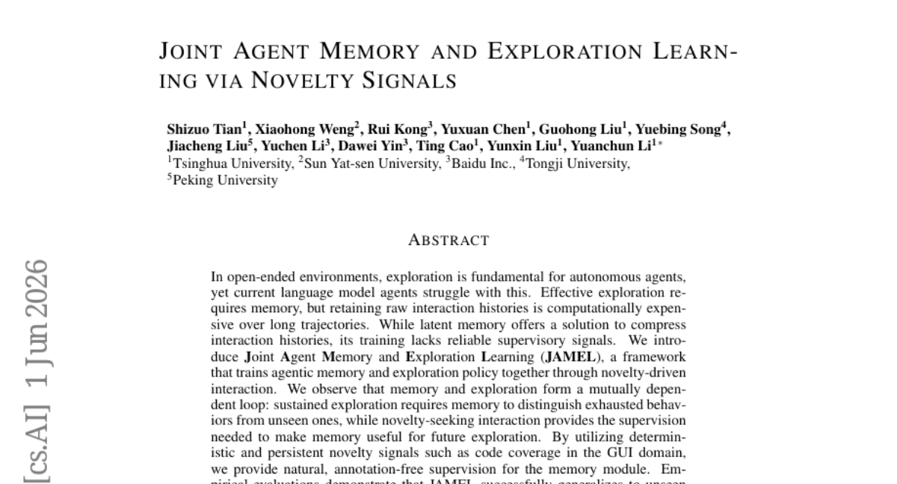

### 📌 한 줄 요약
새로운 환경 탐색을 위해 메모리와 탐색 정책을 상호 보완적으로 학습시키는 JAMEL 프레임워크 제안

### 🔑 핵심 포인트
- 메모리와 탐색 정책을 상호 의존적인 루프로 결합하여 동시 학습하는 프레임워크 제안
- 코드 커버리지와 같은 도메인 특화 신호를 활용한 어노테이션 프리(Annotation-free) 학습 방식
- 토큰 효율성을 유지하면서도 미학습 환경에 대한 강력한 일반화 및 탐색 능력 확보

### 🧑‍💻 개발자 관점
에이전트가 긴 대화 맥락을 유지하면서도 비용 효율적으로 새로운 환경을 탐색해야 하는 실무적 과제에 대한 해법을 제시합니다.

### 🚀 실무 적용 아이디어
- GUI 환경에서 코드 커버리지를 활용한 novelty signal 추출 로직 구현 테스트
- 기존 RAG 기반 에이전트와 JAMEL 방식의 토큰 효율성 및 탐색 깊이 비교 실험
- 특정 도메인(예: OS 제어)에서의 novelty signal 정의 및 학습 루프 검증

### ⚠️ 리스크/한계
- 도메인 특화된 novelty signal(예: 코드 커버리지)에 의존하므로 환경 변화에 따른 신호 설계의 어려움
- 학습 과정에서의 메모리와 탐색 정책 간의 균형(Stability) 유지 문제

### 📝 초록 기반 상세 설명
오픈 엔드 환경에서 에이전트의 효과적인 탐색을 위해서는 과거 이력을 압축하는 메모리가 필수적이지만, 기존의 잠재 메모리 학습 방식은 신뢰할 수 있는 감독 신호가 부족하다는 문제가 있습니다. 이를 해결하기 위해 본 논문은 메모리와 탐색 정책을 동시에 학습시키는 JAMEL 프레임워크를 도입합니다. 메모리는 이미 수행한 행동과 새로운 행동을 구분하게 하고, 탐색은 메모리를 유용하게 만드는 감독 신호를 제공하는 상호 의존적 루프를 구축합니다. 특히 GUI 도메인에서 코드 커버리지와 같은 결정론적이고 지속적인 신호를 활용하여 별도의 어노테이션 없이 메모리를 학습시킵니다. 실험 결과, JAMEL은 미학습 환경에서도 뛰어난 일반화 성능을 보였으며, 폐쇄형 모델 수준의 탐색 깊이를 유지하면서도 토큰 소비를 크게 줄였습니다.

---

## 22. [LongLive-RAG: A General Retrieval-Augmented Framework for Long Video Generation](https://huggingface.co/papers/2606.02553)
**Upvotes**: 11 | **도입 난이도**: 중 | **신뢰도**: 상
**arXiv**: https://arxiv.org/abs/2606.02553

**태그**: Video-Generation, RAG, Autoregressive, Diffusion-Models, Video, Evaluation

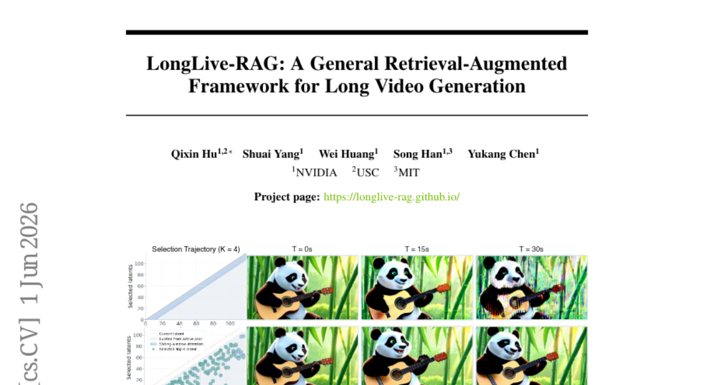

### 📌 한 줄 요약
자기회귀(AR) 방식의 장기 비디오 생성 시 발생하는 오류 누적과 정체성 드리프트 문제를 RAG(검색 증강 생성) 프레임워크로 해결한 연구

### 🔑 핵심 포인트
- 장기 비디오 생성을 위한 RAG(Retrieval-Augmented Generation) 프레임워크 제안
- 과거 생성된 잠재 변수를 검색 가능한 메모리로 활용하여 비국소적 문맥 유지
- Window Temporal Delta Loss를 통한 검색 변별력 강화 및 오류 누적 방지

### 🧑‍💻 개발자 관점
슬라이딩 윈도우 방식의 한계인 '오류 전파' 문제를 데이터 검색 기술로 해결하여, 일관성 있는 장기 영상 생성 파이프라인 구축의 실마리를 제공합니다.

### 🚀 실무 적용 아이디어
- 기존 슬라이딩 윈도우 기반 AR 모델에 RAG 구조 적용 테스트
- 제안된 Window Temporal Delta Loss의 임베딩 공간 변화 분석
- 다양한 해상도 및 프레임 레이트에서의 검색 효율성 검증

### ⚠️ 리스크/한계
- 검색 과정에서 발생하는 추가적인 연산 오버헤드
- 잘못된 과거 프레임이 검색될 경우 발생할 수 있는 새로운 형태의 오류

### 📝 초록 기반 상세 설명
자기회귀 비디오 확산 모델은 가변 길이 생성이 가능하지만, 슬라이딩 윈도우 방식 사용 시 오류가 누적되어 영상의 정체성이 변하는 문제가 발생합니다. 본 논문은 장기 비디오 생성을 RAG 문제로 재정의하여, 이전 생성된 잠재 변수(latents)를 검색 가능한 동적 히스토리로 활용합니다. 제안하는 LongLive-RAG는 쿼리 임베딩을 통해 과거의 관련 있는 잠재 변수를 검색하여 비국소적 문맥을 참조할 수 있게 합니다. 또한, 중복된 로컬 유사성을 억제하고 의미 있는 시간적 변화를 포착하기 위해 Window Temporal Delta Loss를 도입했습니다. 실험 결과, 다양한 AR 백본에서 오류 누적을 줄이고 VBench-Long 벤치마크에서 우수한 성능을 입증했습니다.

---

## 23. [Brain-IT-VQA: From Brain Signals to Answers](https://huggingface.co/papers/2605.29588)
**Upvotes**: 11 | **도입 난이도**: 상 | **신뢰도**: 상
**arXiv**: https://arxiv.org/abs/2605.29588

**태그**: BCI, Multimodal, fMRI, VQA, Brain-AI, RAG, Vision, Benchmark, Evaluation

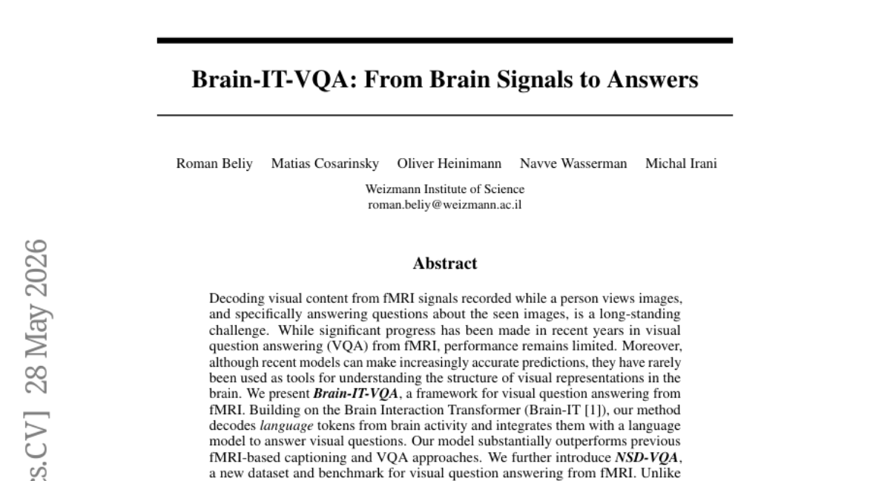

### 📌 한 줄 요약
fMRI 신호를 언어 토큰으로 디코딩하여 시각적 질문에 답하는 고성능 VQA 프레임워크 및 벤치마크 제안

### 🔑 핵심 포인트
- Brain-IT를 활용하여 fMRI 신호에서 언어 토큰을 직접 디코딩하고 LLM과 통합하는 프레임워크 개발
- 다양한 질문 카테고리를 포함하여 시각적 이해 수준을 정밀하게 측정하는 NSD-VQA 데이터셋 구축
- 기존 fMRI 기반 VQA 모델 대비 월등한 성능 달성 및 뇌의 시각적 표현 분석 도구로서의 가치 입증

### 🧑‍💻 개발자 관점
뇌-컴퓨터 인터페이스(BCI)와 멀티모달 AI를 결합하여 인간의 시각적 인지 과정을 모델링하고 검증하는 데 중요한 기술적 토대를 제공합니다.

### 🚀 실무 적용 아이디어
- Brain-IT 아키텍처의 언어 토큰 디코딩 메커니즘 분석
- NSD-VQA 데이터셋을 활용한 뇌 신호 기반 멀티모달 모델 벤치마킹
- 특정 뇌 영역의 활성도가 질문 유형별로 어떻게 기여하는지 상관관계 분석

### ⚠️ 리스크/한계
- fMRI 데이터의 특성상 데이터 확보 및 실험 비용이 매우 높음
- 실제 환경에서의 실시간 디코딩 및 범용적 적용을 위한 하드웨어/데이터 제약 존재

### 📝 초록 기반 상세 설명
fMRI 신호를 통해 사람이 보는 이미지를 이해하고 질문에 답하는 기술은 오랫동안 도전적인 과제였습니다. 기존의 fMRI 기반 VQA 모델들은 성능이 제한적이었으며, 뇌의 시각적 표현 구조를 이해하는 도구로서의 활용도 부족했습니다. 본 논문은 Brain-IT를 기반으로 뇌 활동에서 언어 토큰을 추출하고 이를 언어 모델과 결합하는 Brain-IT-VQA 프레임워크를 제안합니다. 또한, 다양한 시각적 이해 수준을 평가할 수 있는 정교한 데이터셋인 NSD-VQA를 새롭게 도입했습니다. 실험 결과, 제안 모델은 기존의 fMRI 기반 캡셔닝 및 VQA 성능을 크게 상회했습니다. 이를 통해 뇌의 시각적/의미적 정보 디코딩 능력과 영역별 기여도를 정밀하게 분석할 수 있는 기반을 마련했습니다.

### 🖼️ 추가 자료
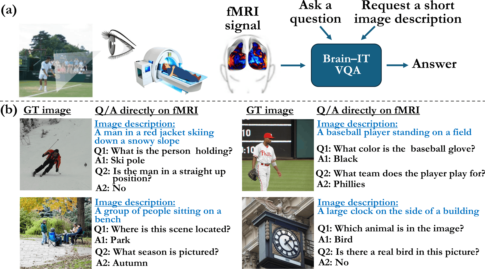

---

## 24. [StreamChar: Long-Horizon Streaming Character Audio-Video Generation with Decoupled Orchestration](https://huggingface.co/papers/2605.25659)
**Upvotes**: 11 | **도입 난이도**: 상 | **신뢰도**: 상
**arXiv**: https://arxiv.org/abs/2605.25659

**태그**: Generative AI, Streaming, Digital Human, Audio-Visual, Video, Audio, Inference, Distillation, Safety

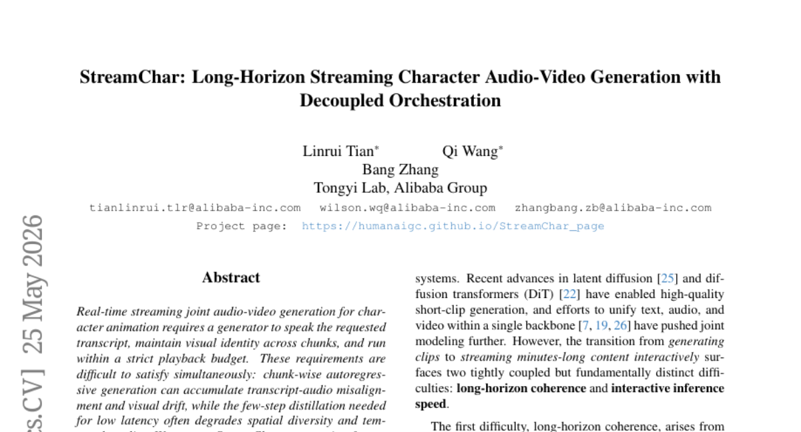

### 📌 한 줄 요약
실시간 스트리밍 환경에서 시각적 드리프트와 오디오-비디오 불일치 없이 장기적인 캐릭터 애니메이션을 생성하는 분리형 오케스트레이션 프레임워크

### 🔑 핵심 포인트
- LLM 기반 오케스트레이터와 DiT 기반 디노이저를 분리하여 장기 제어와 국소 품질을 동시에 확보
- 온라인 청크 롤아웃 및 프로그레스 인지 포인터를 통한 텍스트-오디오 정렬 최적화
- 싱크-청크 메모리(sink-chunk memory)를 활용하여 장기 생성 시 발생하는 시각적 드리프트 방지

### 🧑‍💻 개발자 관점
실시간 대화형 AI 에이전트 구현 시, 끊김 없는 영상 스트리밍과 캐릭터 일관성을 유지하면서도 낮은 지연 시간을 확보할 수 있는 아키텍처 가이드를 제공합니다.

### 🚀 실무 적용 아이디어
- LLM 오케스트레이터의 문맥 윈도우 크기에 따른 오디오-비디오 동기화 변화 관찰
- 싱크-청크 메모리 구조를 활용한 장기 생성 시 캐릭터 일관성 유지 테스트
- 단일 GPU 환경에서의 추론 지연 시간(Latency) 및 처리량(Throughput) 벤치마크

### ⚠️ 리스크/한계
- LLM 오케스트레이터의 연산 부하가 전체 시스템 지연 시간에 미치는 영향
- 매우 긴 생성 시 메모리 관리 및 누적 오차 제어의 복잡성

### 📝 초록 기반 상세 설명
실시간 캐릭터 오디오-비디오 생성은 텍스트 일치, 시각적 정체성 유지, 낮은 지연 시간이라는 세 가지 상충하는 요구사항을 동시에 만족해야 합니다. 기존의 청크 단위 생성 방식은 텍스트-오디오 불일치와 시각적 드리프트 문제를 야기하며, 저지연을 위한 증류(distillation) 과정은 품질 저하를 초래합니다. 이를 해결하기 위해 StreamChar는 장기적 오케스트레이션과 단기 윈도우 디노이징을 분리하는 프레임워크를 제안합니다. LLM 기반 오케스트레이터가 문맥에 맞는 오디오 조건을 생성하고, DiT가 참조 프레임과 모션 프레임을 활용해 국소적 디노이징을 수행합니다. 또한, 온라인 롤아웃 학습과 싱크-청크 메모리를 통해 장기적인 시각적 안정성을 확보했습니다. 실험 결과, 단일 H100 GPU에서 실시간 구동이 가능하며 높은 정밀도와 안정성을 입증했습니다.

---

## 25. [OpenWebRL: Demystifying Online Multi-turn Reinforcement Learning for Visual Web Agents](https://huggingface.co/papers/2606.02031)
**Upvotes**: 9 | **도입 난이도**: 상 | **신뢰도**: 상
**arXiv**: https://arxiv.org/abs/2606.02031

**태그**: Web Agent, Reinforcement Learning, Multimodal, Automation, Agent, RAG, Reasoning, Benchmark

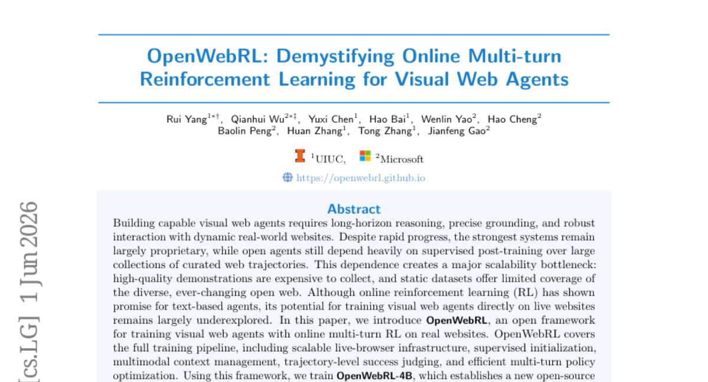

### 📌 한 줄 요약
실제 웹 환경에서 온라인 강화학습(RL)을 통해 시각적 웹 에이전트의 성능을 극대화하는 오픈 프레임워크 제안

### 🔑 핵심 포인트
- 실제 웹 환경에서 동작하는 온라인 멀티턴 강화학습(RL) 프레임워크 구축
- 적은 양의 초기 데이터(0.4K)와 RL 학습(2.2K)만으로 높은 성공률 달성
- 브라우저 인프라부터 성공 판정까지 포함하는 엔드투엔드 학습 파이프라인 설계

### 🧑‍💻 개발자 관점
정적 데이터셋 구축 비용을 줄이면서도, 변화하는 웹 UI에 적응할 수 있는 에이전트 학습 방법론을 제시합니다.

### 🚀 실무 적용 아이디어
- 제공되는 데이터셋과 코드를 활용하여 소규모 모델의 RL 학습 파이프라인 테스트
- 특정 도메인(예: 쇼핑, 예약)에 특화된 환경에서의 성공 판정 로직 실험
- 멀티모달 컨텍스트 관리 방식이 에이전트의 추론에 미치는 영향 분석

### ⚠️ 리스크/한계
- 실제 웹 환경에서의 RL 학습 시 발생할 수 있는 비정상적 동작 및 보안 리스크
- 실시간 브라우저 환경에서의 인프라 비용 및 학습 안정성 확보 문제

### 📝 초록 기반 상세 설명
기존의 시각적 웹 에이전트는 고비용의 정적 데이터셋에 의존하여 변화하는 웹 환경에 대응하는 데 한계가 있었습니다. 본 논문은 실제 웹사이트에서 직접 학습할 수 있는 온라인 멀티턴 강화학습 프레임워크인 OpenWebRL을 소개합니다. 이 프레임워크는 브라우저 인프라, 멀티모달 컨텍스트 관리, 성공 판정 및 정책 최적화 과정을 포함하는 전체 파이프라인을 제공합니다. 이를 통해 학습된 OpenWebRL-4B 모델은 적은 양의 초기 데이터만으로도 주요 벤치마크에서 기존 오픈소스 모델을 압도하는 성능을 기록했습니다. 결과적으로 본 연구는 비용 효율적이고 확장 가능한 웹 에이전트 학습 경로를 제시합니다.

---

## 26. [Skill is Not One-Size-Fits-All: Model-Aware Skill Alignment for LLM Agents](https://huggingface.co/papers/2605.30723)
**Upvotes**: 9 | **도입 난이도**: 중 | **신뢰도**: 상
**arXiv**: https://arxiv.org/abs/2605.30723

**태그**: LLM Agent, Skill Alignment, Prompt Engineering, Optimization, Agent, Inference, Safety

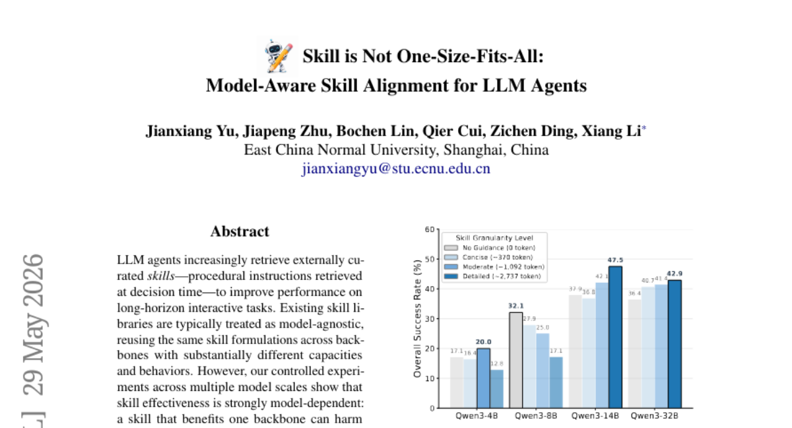

### 📌 한 줄 요약
모델의 역량에 맞춰 외부 스킬(Instruction)을 최적화하여 에이전트의 성능을 극대화하는 MASA 프레임워크 제안

### 🔑 핵심 포인트
- 스킬의 효과가 모델의 용량과 행동 양식에 따라 달라진다는 모델 의존성 발견
- Hill climbing 및 UCB 기반 트리 탐색을 활용한 계층적 스킬 진화 파이프라인 구축
- 학습된 경량 리라이터를 통해 모델 가중치 수정 없이 실시간으로 스킬을 최적화

### 🧑‍💻 개발자 관점
에이전트 개발 시 동일한 프롬프트/스킬을 모든 모델에 공통 적용하는 대신, 모델별 최적화된 지시문(Instruction)을 자동 생성하는 전략의 중요성을 시사합니다.

### 🚀 실무 적용 아이디어
- 동일한 스킬 라이브러리를 서로 다른 크기의 LLM(예: GPT-4 vs Llama-3-8B)에 적용했을 때의 성능 차이 측정
- 특정 모델에 최적화된 스킬이 다른 모델로 전이될 때 발생하는 성능 저하(Negative Transfer) 현상 관찰
- 경량 리라이터 모델을 구축하기 위한 데이터셋(Evolution Trajectories) 구성 방식 검토

### ⚠️ 리스크/한계
- 스킬 진화 과정(Search)에 따른 초기 연산 비용 발생 가능성
- 특정 도메인에 과적합된 스킬이 생성될 경우 범용성 저하 우려

### 📝 초록 기반 상세 설명
LLM 에이전트가 외부 스킬 라이브러리를 활용하는 방식은 기존에 모델의 성능과 무관하게 동일한 형식을 사용하는 모델 불가지론적(model-agnostic) 방식이었습니다. 하지만 연구 결과, 특정 스킬이 특정 모델에는 도움이 되지만 다른 모델에는 오히려 성능 저하를 일으키는 모델 의존적 특성이 발견되었습니다. 이를 해결하기 위해 모델 가중치를 수정하지 않고도 각 백본에 맞게 스킬을 조정하는 MASA 프레임워크를 제안합니다. MASA는 계층적 스킬 진화 파이프라인을 통해 최적의 스킬을 탐색하고, 이를 경량화된 모델 조건부 리라이터(rewriter)로 학습하여 단일 추론 과정에서 적응을 수행합니다. 실험 결과, MASA는 다양한 환경과 모델 규모에서 기존 베이스라인 대비 월등한 성능 향상을 보였으며, 학습된 리라이터는 미학습 태스크에서도 높은 일반화 성능을 입증했습니다.

---

## 27. [Speculative Pipeline Decoding: Higher-Accruacy and Zero-Bubble Speculation via Pipeline Parallelism](https://huggingface.co/papers/2605.30852)
**Upvotes**: 8 | **도입 난이도**: 상 | **신뢰도**: 상
**arXiv**: https://arxiv.org/abs/2605.30852

**태그**: LLM Inference, Pipeline Parallelism, Speculative Decoding, Optimization, Inference

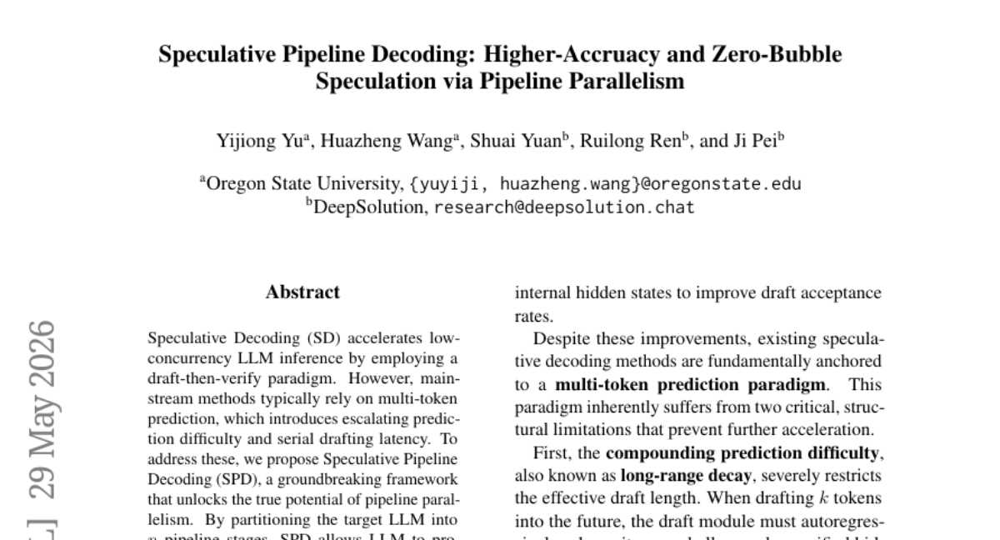

### 📌 한 줄 요약
파이프라인 병렬화를 활용하여 추론 지연 시간 없이 토큰을 예측하는 고성능 Speculative Decoding 프레임워크

### 🔑 핵심 포인트
- 파이프라인 병렬화를 통한 n개 토큰의 병렬 처리 구조 설계
- 중간 피처 집계 기반의 스펙큘레이션 모듈로 예측 정확도 및 수락률 향상
- 타겟 모델 연산과 예측 모듈의 동시 실행을 통한 제로 버블(Zero-bubble) 달성

### 🧑‍💻 개발자 관점
LLM 추론 시 발생하는 병렬 처리 효율 저하 문제를 하드웨어 활용도를 극대화하는 방식으로 해결하여, 실시간 서비스의 처리량(Throughput)을 크게 개선할 수 있습니다.

### 🚀 실무 적용 아이디어
- 파이프라인 단계 수(n) 변화에 따른 수락률 및 가속도 변화 측정
- 기존 Speculative Decoding(Draft-then-verify) 방식과의 지연 시간 비교 실험
- 모델 크기 및 파이프라인 깊이에 따른 스케일링 효율성 검증

### ⚠️ 리스크/한계
- 파이프라인 분할 및 피처 집계 로직 구현의 복잡성
- 모델 구조 변경 또는 특정 파이프라인 환경에 대한 의존성 가능성

### 📝 초록 기반 상세 설명
기존의 Speculative Decoding은 멀티 토큰 예측 방식의 높은 난이도와 직렬적인 드래프트 지연 시간이라는 문제를 안고 있었습니다. 이를 해결하기 위해 본 논문은 타겟 LLM을 n개의 파이프라인 단계로 분할하는 Speculative Pipeline Decoding(SPD)을 제안합니다. SPD는 파이프라인의 각 단계에서 생성되는 중간 피처를 집계하여 다음 토큰을 예측하는 모듈을 통해, 타겟 모델의 연산과 동시에 예측을 수행합니다. 이를 통해 예측 난이도를 낮추고 수락률을 높이는 동시에, 파이프라인 공백(bubble)이 없는 제로 레이턴시 구조를 구현했습니다. 실험 결과, SPD는 기존 방식 대비 높은 이론적 가속도를 달성하며 확장 가능한 디코딩 솔루션을 입증했습니다.

---

## 28. [Policy and World Modeling Co-Training for Language Agents](https://huggingface.co/papers/2606.02388)
**Upvotes**: 7 | **도입 난이도**: 중 | **신뢰도**: 상
**arXiv**: https://arxiv.org/abs/2606.02388

**태그**: LLM Agent, Reinforcement Learning, World Models, Co-training, Agent, Vision, Benchmark, Inference

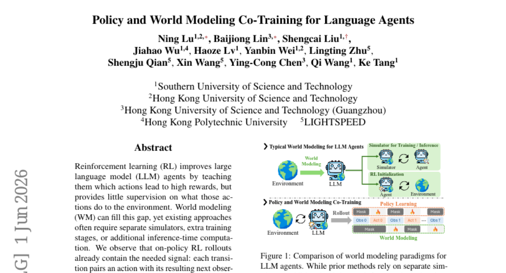

### 📌 한 줄 요약
추가적인 시뮬레이터 없이 RL 학습 과정 중 발생하는 데이터를 활용하여 정책과 세계 모델을 동시에 학습하는 효율적인 에이전트 학습 프레임워크

### 🔑 핵심 포인트
- RL 롤아웃 데이터를 활용한 정책(Policy)과 세계 모델(WM)의 공동 학습(Co-training) 프레임워크 제안
- 추가적인 시뮬레이터나 추론 시 연산량 증가 없이 환경 변화에 대한 이해도 증진
- 데이터 선택, 노이즈 내성, 손실 균형을 통한 안정적인 보조 학습 메커니즘 구축

### 🧑‍💻 개발자 관점
에이전트 학습 시 별도의 환경 시뮬레이터를 구축하는 비용을 줄이면서도, 모델이 환경의 변화를 더 잘 예측하도록 유도하여 에이전트의 지능을 높일 수 있습니다.

### 🚀 실무 적용 아이디어
- 기존 RL 에이전트 학습 루프에 보조적인 WM 손실 함수(Auxiliary Loss)를 추가하여 성능 변화 관찰
- 학습 데이터 중 어떤 액션이 세계 모델 학습에 가장 유효한지 엔트로피 기반 필터링 실험
- RL 보상 신호와 WM 손실 신호 간의 가중치 밸런싱 최적화

### ⚠️ 리스크/한계
- 온폴리시 데이터에 의존하므로 데이터의 다양성이 부족할 경우 세계 모델이 편향될 위험
- RL 학습의 불안정성이 WM 학습의 손실로 전이될 가능성

### 📝 초록 기반 상세 설명
기존의 RL 기반 LLM 에이전트 학습은 보상 중심의 학습으로 인해 행동이 환경에 미치는 영향에 대한 이해가 부족한 문제가 있었습니다. 이를 해결하기 위해 세계 모델링(WM)이 필요하지만, 기존 방식은 별도의 시뮬레이터나 추가적인 추론 비용을 요구하는 단점이 있었습니다. 본 논문은 온폴리시(on-policy) RL 롤아웃 데이터 자체에 세계 모델 학습을 위한 충분한 신호가 포함되어 있다는 점에 주목하여 PaW 프레임워크를 제안합니다. PaW는 액션 엔트로피 기반 데이터 선택, 노이즈 내성 손실 함수, 보상 적응형 손실 균형 기법을 통해 안정적인 공동 학습을 지원합니다. 실험 결과, 별도의 추론 패러다임 변경 없이도 다양한 벤치마크에서 기존 RL 베이스라인보다 뛰어난 성능 향상을 입증했습니다.

---

## 29. [RoboStressBench: Benchmarking VLM Robustness to Physical Visual Stress in Embodied Scenes](https://huggingface.co/papers/2606.00828)
**Upvotes**: 6 | **도입 난이도**: 중 | **신뢰도**: 상
**arXiv**: https://arxiv.org/abs/2606.00828

**태그**: VLM, Embodied AI, Robustness, Benchmark, Agent, Reasoning, Vision, Evaluation

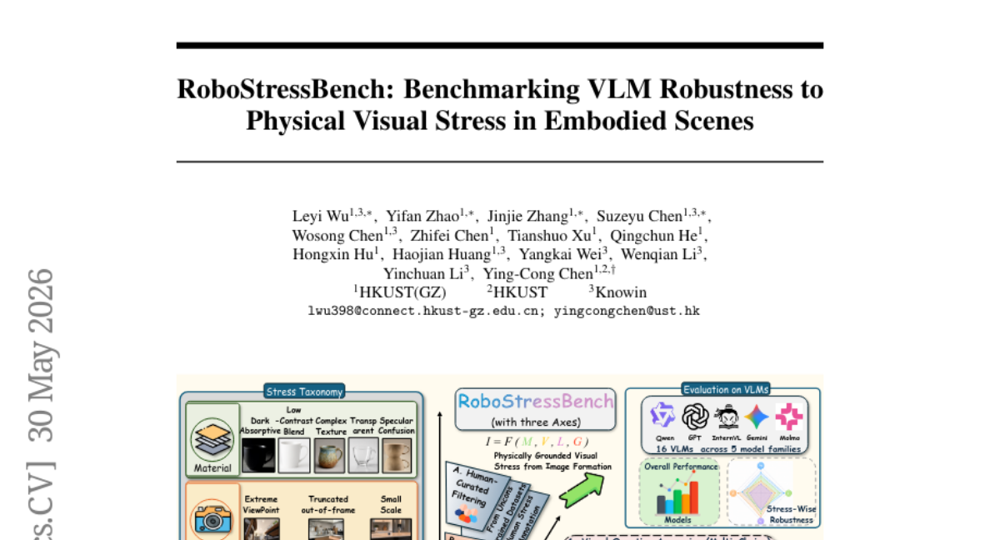

### 📌 한 줄 요약
물리적 렌더링 요소를 기반으로 VLM의 시각적 강건성을 평가하는 새로운 벤치마크와 에이전트 솔루션 제안

### 🔑 핵심 포인트
- 물리적 렌더링 방정식에서 영감을 받은 4가지 차원(M, V, L, G) 기반의 시각적 스트레스 프레임워크 구축
- 단순 정확도가 아닌, 물리적 요인별로 VLM의 인식/추론/계획 능력을 정밀 진단하는 벤치마크 제공
- 스트레스 요인을 감지하고 시각 편집(Visual-editing)을 통해 문제를 해결하는 에이전트 방식 제안

### 🧑‍💻 개발자 관점
로봇이나 자율 주행 등 실세계에 배포될 AI 모델이 조명, 각도, 재질 변화 등 실제 환경 변수에 얼마나 취약한지 정량적으로 검증할 수 있습니다.

### 🚀 실무 적용 아이디어
- 현재 개발 중인 VLM 모델에 RoboStressBench의 4가지 물리적 변수를 적용하여 취약점 테스트
- 모델의 실패 모드가 특정 물리적 요인(예: 조명 vs 기하학)에 편중되어 있는지 분석
- 제안된 에이전트 방식처럼 시각적 전처리를 통한 강건성 향상 파이프라인 실험

### ⚠️ 리스크/한계
- 시뮬레이션 기반 벤치마크이므로 실제 물리 환경과의 간극이 존재할 수 있음
- 시각 편집 기술을 통한 해결 방식은 연산 비용을 증가시킬 수 있음

### 📝 초록 기반 상세 설명
최근 VLM이 로봇 공학 등 실세계 환경에 도입되고 있으나, 기존 벤치마크는 정제된 이미지 위주로 구성되어 실제 물리적 환경의 변동성을 충분히 반영하지 못합니다. 본 논문은 역 그래픽스(Inverse Graphics) 관점에서 시각적 스트레스를 정의하고, 이를 Material, Viewpoint, Lighting, Geometry의 네 가지 차원으로 분해한 RoboStressBench를 제안합니다. 이 벤치마크를 통해 VLM의 인식, 추론, 계획 능력이 물리적 요인에 따라 어떻게 다르게 저하되는지 정밀하게 분석할 수 있습니다. 실험 결과, 특정 물리적 요인이 특정 에이전트 역량에 미치는 차별적 영향을 확인하였으며, 스트레스 요인을 감지하고 시각 편집 기술을 활용하는 에이전트 솔루션을 통해 강건성을 개선했습니다. 결과적으로 본 연구는 신뢰할 수 있는 Embodied AI 시스템 구축을 위한 체계적인 평가 프레임워크를 제공합니다.

---

## 30. [MineExplorer: Evaluating Open-World Exploration of MLLM Agents in Minecraft](https://huggingface.co/papers/2605.30931)
**Upvotes**: 6 | **도입 난이도**: 중 | **신뢰도**: 상
**arXiv**: https://arxiv.org/abs/2605.30931

**태그**: Agent, MLLM, Benchmark, Open-World, Minecraft, Reasoning, Multimodal, Evaluation

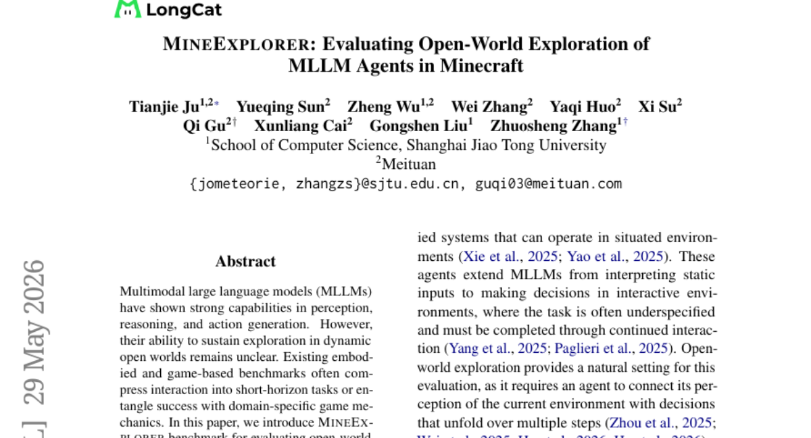

### 📌 한 줄 요약
Minecraft 환경을 활용하여 MLLM 에이전트의 장기적이고 복합적인 오픈월드 탐사 능력을 평가하는 새로운 벤치마크 MineExplorer 제안

### 🔑 핵심 포인트
- 게임 특화 지식을 배제하고 일반적 오픈월드 추론을 측정하기 위한 원자적 태스크 필터링 기법 적용
- ReAct 스타일의 역량 정식화 및 멀티홉(multi-hop) 태스크 구성을 통한 복합 문제 해결 능력 평가
- 멀티 에이전트 협업을 통한 신뢰성 높은 태스크 그래프 및 샌드박스 환경 자동 생성 워크플로우 개발

### 🧑‍💻 개발자 관점
에이전트가 단순 명령 수행을 넘어, 복잡한 환경에서 장기적인 계획과 선행 조건 해결 능력을 갖추었는지 검증하는 프레임워크를 제공합니다.

### 🚀 실무 적용 아이디어
- 제공된 데이터셋을 활용하여 현재 사용 중인 MLLM 에이전트의 장기 추론 한계점 테스트
- 멀티홉 태스크에서 에이전트의 실패 지점(Bottleneck) 분석
- 모델의 추론 모드(Thinking mode) 변화가 복합 태스크 성공률에 미치는 영향 실험

### ⚠️ 리스크/한계
- Minecraft라는 특정 게임 환경에 국한된 평가 환경
- 모델 크기나 추론 방식이 반드시 성능 향상으로 직결되지 않는 복잡한 태스크 구조

### 📝 초록 기반 상세 설명
최근 MLLM의 발전에도 불구하고, 동적인 오픈월드에서 지속적인 탐사 능력을 평가하는 것은 여전히 어려운 과제입니다. 기존 벤치마크는 단기 작업 위주이거나 게임 특화 지식에 의존하는 경향이 있어 일반적인 추론 능력을 측정하기에 한계가 있습니다. 본 논문은 이를 해결하기 위해 Minecraft를 배경으로 하는 MineExplorer 벤치마크를 도입합니다. 멀티 에이전트 합성 워크플로우를 통해 태스크 그래프, 샌드박스 장면, 규칙 기반 평가기를 설계하여 신뢰도 높은 인스턴스를 생성합니다. 실험 결과, 모델의 크기가 커지더라도 복합적인 선행 조건이 필요한 장기 궤적 작업에서는 성능이 급격히 저하되는 현상이 관찰되었습니다.

---

## 31. [Off-the-Shelf LLMs as Process Scorers: Training-Free Alternative to PRMs for Mathematical Reasoning](https://huggingface.co/papers/2606.01682)
**Upvotes**: 5 | **도입 난이도**: 하 | **신뢰도**: 상
**arXiv**: https://arxiv.org/abs/2606.01682

**태그**: LLM, Reasoning, Inference-time Optimization, Mathematical Reasoning, Benchmark, Inference

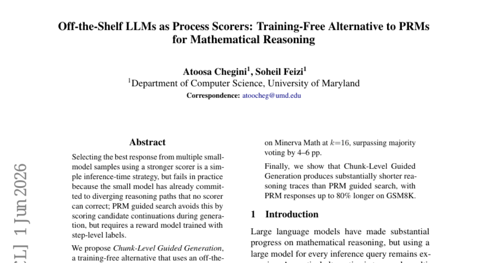

### 📌 한 줄 요약
추가 학습 없이 강력한 LLM의 Log-probability를 활용하여 소형 모델의 추론 오류를 실시간으로 교정하는 효율적인 생성 기법

### 🔑 핵심 포인트
- 학습이 필요 없는(Training-free) 오프더쉘 LLM 기반의 프로세스 스코어링 프레임워크 제안
- 가변 길이 스텝의 편향 문제를 해결하기 위해 고정된 길이의 청크(Fixed-length chunks) 단위로 생성 및 선택 수행
- CGS(Contrastive-Guided Selection)를 통해 소형 모델의 편향을 제거하고 대형 모델의 선호도를 효과적으로 반영

### 🧑‍💻 개발자 관점
별도의 Reward Model 학습 비용 없이도 강력한 모델의 지식을 활용해 소형 모델의 추론 정확도를 비약적으로 높일 수 있는 실용적인 추론 전략임

### 🚀 실무 적용 아이디어
- 소형 모델(Generator)과 대형 모델(Scorer) 조합으로 CGS 알고리즘 구현 및 성능 테스트
- 다양한 청크 길이(Chunk size) 설정에 따른 추론 정확도 및 생성 속도 변화 측정
- 수학 문제 외에 논리적 추론이 필요한 다른 도메인에서의 범용성 검증

### ⚠️ 리스크/한계
- 추론 시 매 단계마다 대형 모델의 Log-probability를 계산해야 하므로 추론 비용(Inference cost) 및 지연 시간 발생
- 고정된 청크 길이를 사용하는 방식이 자연스러운 문장 구조나 복잡한 논리 전개와 충돌할 가능성

### 📝 초록 기반 상세 설명
기존의 다수결 투표 방식은 모델이 잘못된 추론 경로에 진입하면 이를 바로잡기 어렵고, PRM(Process Reward Model) 방식은 단계별 라벨을 통한 별도의 학습이 필요하다는 단점이 있다. 본 논문은 학습 없이 오프더쉘(Off-the-shelf) LLM을 프로세스 스코어로 사용하는 'Chunk-Level Guided Generation'을 제안한다. 이 방식은 고정된 길이의 청크 단위로 후보군을 생성하고, 대형 모델의 likelihood를 통해 최적의 청크를 선택하여 오류 전파를 방지한다. 특히 대형 모델과 소형 모델의 확률 차이를 이용하는 CGS(Contrastive-Guided Selection) 규칙을 통해 성능을 극대화한다. 실험 결과, 제안 방식은 별도의 학습 없이도 기존 PRM 기반 탐색과 대등하거나 더 높은 수학적 추론 성능을 보였으며, 더 짧고 효율적인 추론 경로를 생성했다.

---

## 32. [Multi-Agent Computer Use](https://huggingface.co/papers/2606.01533)
**Upvotes**: 5 | **도입 난이도**: 상 | **신뢰도**: 상
**arXiv**: https://arxiv.org/abs/2606.01533

**태그**: Multi-Agent, Task Decomposition, Automation, Planning, Agent, RAG, Benchmark, Evaluation

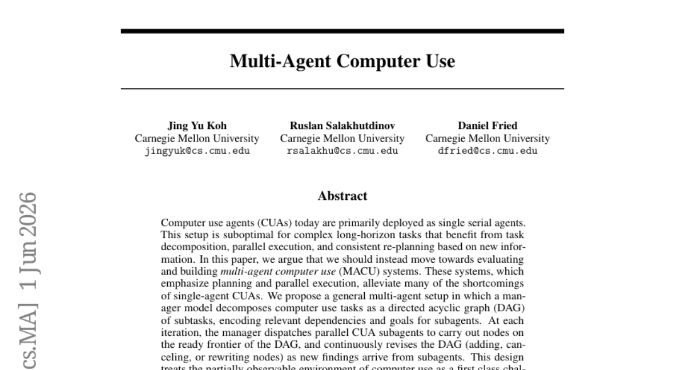

### 📌 한 줄 요약
단일 에이전트의 한계를 극복하기 위해 DAG 기반의 계획 및 병렬 실행을 도입한 멀티 에이전트 컴퓨터 사용(MACU) 프레임워크 제안

### 🔑 핵심 포인트
- DAG 기반의 작업 분해 및 동적 재계획을 통한 멀티 에이전트 협업 구조 설계
- 병렬 실행을 통한 작업 처리 속도 향상 및 긴 작업(long-horizon) 해결 능력 강화
- 부분 관측성 문제를 해결하기 위해 매니저 모델이 정보를 중앙 집중식으로 관리 및 전달

### 🧑‍💻 개발자 관점
복잡한 워크플로우 자동화 시 단일 에이전트의 병목 현상을 해결하고, 작업 효율성과 확장성을 높이는 아키텍처 설계 패턴을 제시합니다.

### 🚀 실무 적용 아이디어
- 기존 단일 에이전트 워크플로우를 DAG 기반의 작업 분해 구조로 변환하는 실험
- 병렬 에이전트 투입 시 발생하는 리소스 충돌 및 상태 동기화 문제 검증
- 작업 복잡도 증가에 따른 매니저 모델의 오버헤드 및 스케일링 효율 측정

### ⚠️ 리스크/한계
- 매니저 모델의 의사결정 오류가 전체 시스템의 실패로 이어질 위험
- 병렬 실행 시 발생하는 환경 상태(State) 충돌 및 동기화 복잡성

### 📝 초록 기반 상세 설명
현재의 컴퓨터 사용 에이전트(CUA)는 주로 단일 에이전트의 직렬 방식에 의존하여 복잡하고 긴 작업 수행에 한계가 있습니다. 본 논문은 작업 분해, 병렬 실행, 지속적인 재계획이 가능한 멀티 에이전트 시스템(MACU)으로의 전환을 제안합니다. 매니저 모델이 작업을 DAG(Directed Acyclic Graph) 구조로 분해하고, 준비된 노드에 대해 하위 에이전트를 병렬로 투입하며 새로운 정보에 따라 DAG를 동적으로 수정합니다. 이 방식은 부분 관측 가능한 환경 문제를 해결하며 정보 손실을 최소화합니다. 실험 결과, OSWorld 및 웹 내비게이션 벤치마크에서 단일 에이전트 대비 성능이 크게 향상되었으며, 특히 긴 작업 수행 시간(wall-clock time)을 단축하는 효과를 보였습니다.

---

## 33. [RoboSemanticBench: Diagnosing Semantic Grounding in Action Prediction for VLA Models](https://huggingface.co/papers/2606.02277)
**Upvotes**: 5 | **도입 난이도**: 하 | **신뢰도**: 상
**arXiv**: https://arxiv.org/abs/2606.02277

**태그**: VLA, Embodied AI, Benchmark, Reasoning, Vision, Evaluation

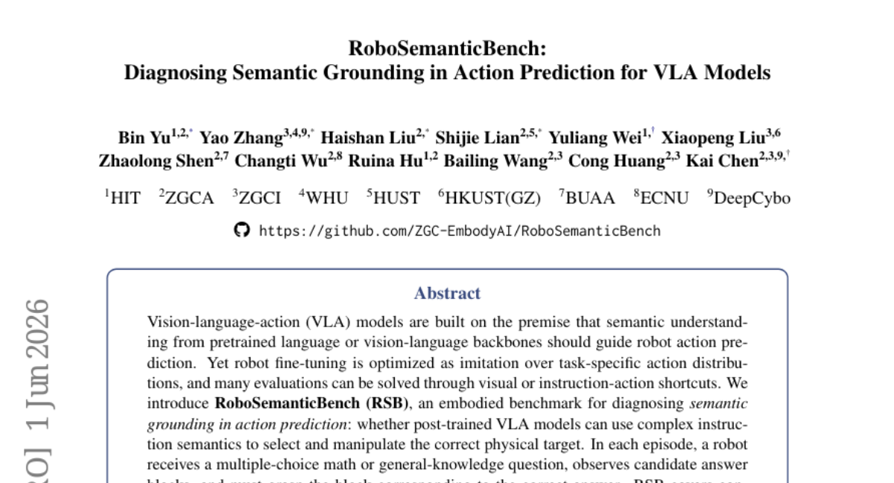

### 📌 한 줄 요약
VLA 모델이 지시사항의 의미를 실제 행동으로 연결하지 못하는 '시맨틱 그라운딩' 문제를 진단하는 새로운 벤치마크 제안

### 🔑 핵심 포인트
- 의미론적 이해와 행동 예측 사이의 간극을 측정하는 RoboSemanticBench(RSB) 개발
- 단순 동작 성공률이 아닌, 지시사항의 논리적 맥락에 따른 정확한 타겟 선택 능력 검증
- 기존 VLA 모델들이 지시사항의 의미를 무시하고 단순 시각적/동작적 지름길을 활용하는 문제 식별

### 🧑‍💻 개발자 관점
로봇 모델 개발 시 단순 동작 성공률(Success Rate)에 매몰되지 않고, 복잡한 명령 수행을 위한 논리적 추론 능력을 검증하는 기준을 제공합니다.

### 🚀 실무 적용 아이디어
- 현재 개발 중인 VLA 모델에 RSB 환경을 적용하여 지름길 학습(Shortcut learning) 여부 확인
- 동작 성공률과 정답 선택률 사이의 상관관계를 분석하여 모델의 추론 능력 정량화
- 멀티플 초이스 환경에서 모델의 의사결정 편향성 테스트

### ⚠️ 리스크/한계
- 실제 복잡한 물리 환경에서의 상호작용보다는 정적인 블록 선택 위주의 태스크로 구성됨
- 모델의 성능 저하가 순수하게 추론 능력 부족인지, 아니면 환경적 제약 때문인지 구분하기 어려울 수 있음

### 📝 초록 기반 상세 설명
최근 VLA 모델은 사전 학습된 언어/시각 능력을 로봇 행동에 활용하려 하지만, 실제 미세 조정 과정에서는 단순 모방 학습에 치중되어 지시사항의 의미를 무시하는 경향이 있습니다. 기존 평가 방식은 시각적 단서나 단순 동작 반복을 통한 지름길(shortcut) 학습 문제를 잡아내지 못하는 한계가 있습니다. 이를 해결하기 위해 본 논문은 복잡한 질문에 답하기 위해 특정 물체를 선택하고 조작해야 하는 RoboSemanticBench(RSB)를 제안합니다. RSB는 산술 및 일반 상식 문제를 통해 모델이 지시사항의 의미를 정확히 이해하고 행동에 반영하는지 테스트합니다. 실험 결과, 기존 VLA 모델들은 물체를 잡는 능력은 갖추었으나 정답 블록을 선택하는 능력은 무작위 수준에 머무는 심각한 의미론적 격차를 보였습니다.

---

## 34. [Agent Skills Should Go Beyond Text: The Case for Visual Skills](https://huggingface.co/papers/2606.01414)
**Upvotes**: 5 | **도입 난이도**: 중 | **신뢰도**: 상
**arXiv**: https://arxiv.org/abs/2606.01414

**태그**: AI Agent, Multimodal, GUI Automation, Visual Grounding, Agent, Reasoning

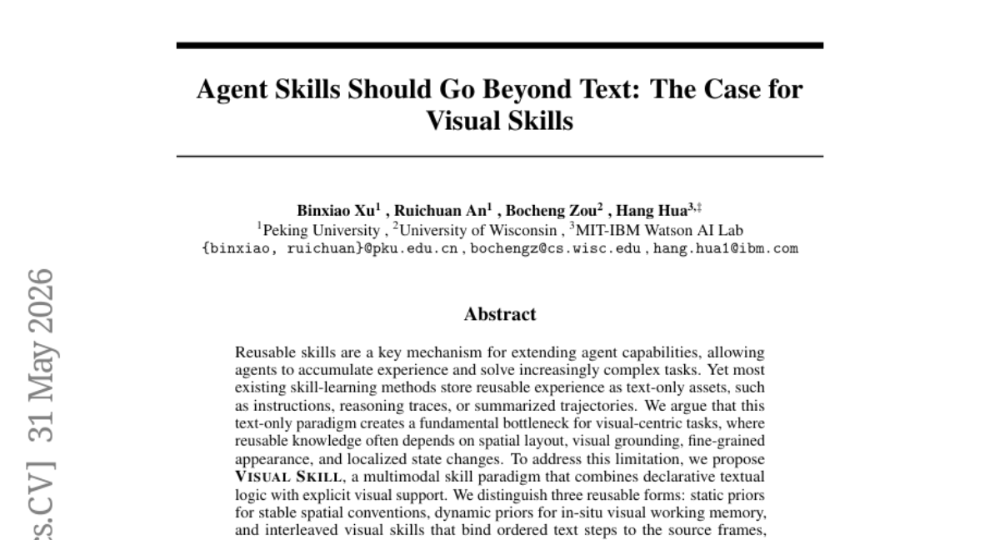

### 📌 한 줄 요약
텍스트 중심의 에이전트 스킬을 넘어, 시각적 정보(공간, 레이아웃, 상태 변화)를 포함하는 멀티모달 스킬 학습 프레임워크 제안

### 🔑 핵심 포인트
- 텍스트 중심 스킬의 한계를 극복하기 위한 시각적 근거(Visual Grounding) 기반의 멀티모달 스킬 패러다임 제안
- 정적/동적 사전 지식 및 텍스트-시각 정보가 결합된 인터리브 스킬 구조 설계
- 에이전트의 작업 궤적에서 공간 참조와 상호작용 패턴을 추출하여 스킬로 자동 변환하는 시스템 구축

### 🧑‍💻 개발자 관점
GUI 자동화나 복잡한 시각적 인터페이스 조작 에이전트 개발 시, 단순 텍스트 프롬프트를 넘어 시각적 컨텍스트를 어떻게 구조화하여 저장할지에 대한 방법론을 제공합니다.

### 🚀 실무 적용 아이디어
- 기존 텍스트 기반 에이전트 워크플로우에 시각적 좌표/영역 정보를 포함한 스킬 데이터셋 구축 실험
- GUI 태스크에서 텍스트 지시문과 스크린샷 영역(Bounding Box)을 결합한 프롬프트 엔지니어링 테스트
- 에이전트의 성공/실패 사례를 시각적 증거와 함께 저장하는 데이터 파이프라인 설계

### ⚠️ 리스크/한계
- 시각적 정보 포함 시 데이터 용량 및 토큰 소모량 증가 문제
- 다양한 해상도와 레이아웃 변화에 대한 시각적 스킬의 일반화 성능 확보 필요

### 📝 초록 기반 상세 설명
기존 에이전트의 재사용 가능한 스킬은 주로 텍스트 기반의 지시어나 추론 로그 형태로 저장되어 시각적 정밀도가 필요한 작업에서 한계를 보입니다. 본 논문은 공간적 레이아웃과 시각적 근거가 중요한 태스크를 해결하기 위해 텍스트 논리와 시각적 지원을 결합한 멀티모달 스킬 패러다임을 제안합니다. 제안된 방식은 정적/동적 사전 지식과 텍스트 단계에 시각적 영역을 바인딩하는 인터리브(interleaved) 스킬로 구성됩니다. 또한, 에이전트의 경험을 자동으로 멀티모달 스킬로 변환하는 자동화 시스템을 도입했습니다. 실험 결과, GUI 및 시각 중심 태스크에서 텍스트 전용 스킬보다 월등한 성능을 보였으며 공간 대응 및 상태 인식 능력이 크게 향상되었습니다.

### 🖼️ 추가 자료
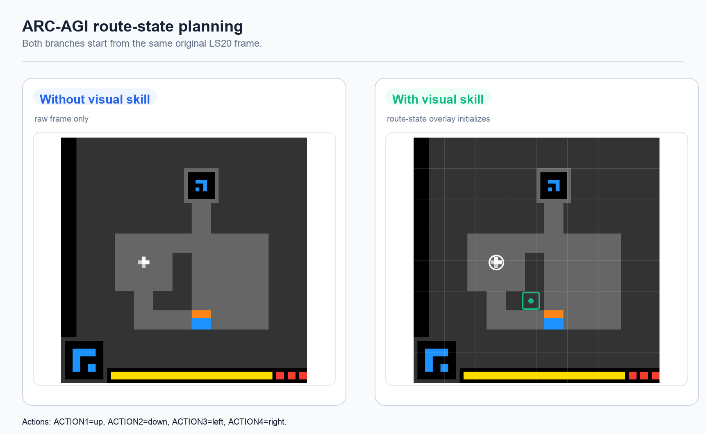
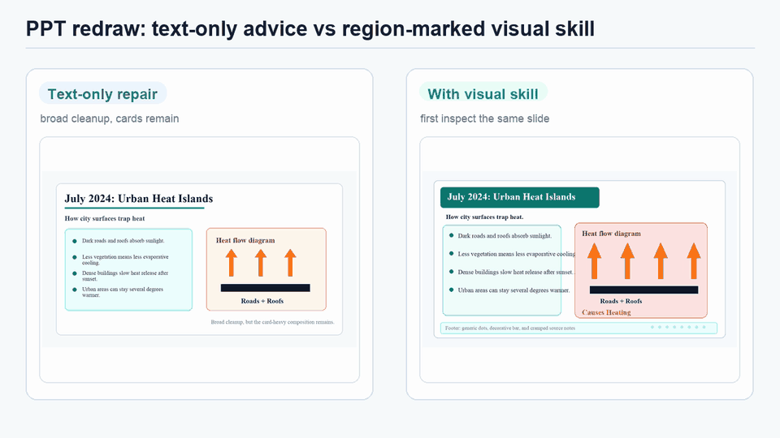

---

## 35. [SOCO: Benchmarking Semantic Object Correspondence in Vision Foundation Models](https://huggingface.co/papers/2605.31597)
**Upvotes**: 5 | **도입 난이도**: 하 | **신뢰도**: 상
**arXiv**: https://arxiv.org/abs/2605.31597

**태그**: Computer Vision, Foundation Models, Benchmark, Multimodal, Vision, Evaluation

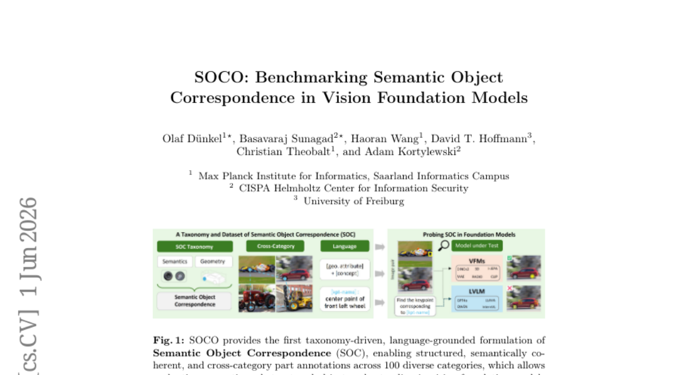

### 📌 한 줄 요약
비전 파운데이션 모델의 객체 구조 이해도를 정밀하게 측정하기 위한 새로운 시맨틱 대응(Semantic Correspondence) 벤치마크 SOCO 제안

### 🔑 핵심 포인트
- 100개 카테고리 및 100만 개 이상의 대응 쌍을 포함하는 정밀한 SOCO 벤치마크 구축
- 언어적 설명을 통한 LVLM의 파트 수준 이해도 및 텍스트-시각 간 격차 분석
- 시맨틱 대응 성능이 3D 포즈 추정 및 트래킹 등 하위 태스크 성능의 핵심 예측 인자임을 입증

### 🧑‍💻 개발자 관점
객체 기반의 3D 재구성, 로봇 제어, 정밀 트래킹 등 구조적 이해가 필수적인 비전 시스템 개발 시 모델의 잠재력을 평가하는 핵심 지표로 활용 가능합니다.

### 🚀 실무 적용 아이디어
- 현재 사용 중인 비전 백본 모델을 SOCO 벤치마크에 적용하여 구조적 이해도 테스트
- LVLM 모델의 텍스트 프롬프트 기반 파트 로컬라이제이션 성능 검증
- 모델의 시맨틱 대응 성능과 실제 하위 태스크(3D Pose 등) 성능 간의 상관관계 분석

### ⚠️ 리스크/한계
- 특정 카테고리에 편향된 데이터셋일 경우 범용적인 구조 이해도로 일반화하기 어려움
- 실시간 시스템 적용 시 정밀한 대응 계산에 따른 연산 비용 발생 가능성

### 📝 초록 기반 상세 설명
비전 파운데이션 모델의 구조적 객체 이해도를 측정하는 것은 일관된 평가 프로토콜과 세밀한 파트 수준 지도 데이터의 부족으로 인해 어려움이 있었습니다. 이를 해결하기 위해 본 논문은 100개 카테고리와 100만 개 이상의 대응 쌍을 포함하는 새로운 벤치마크인 SOCO를 도입합니다. SOCO는 대응 유형의 분류 체계와 언어적 설명을 포함하여 대규모 비전-언어 모델(LVLM)의 미세한 파트 이해도를 평가할 수 있도록 설계되었습니다. 실험 결과, 비전 백본은 강력한 구조를 인코딩하지만 카테고리 간 전이 성능은 제한적이며, LVLM은 텍스트 기반 위치 지정에는 강하나 시각적 참조 매칭에는 약한 격차를 보였습니다. 또한, 대응 성능이 세그멘테이션, 트래킹, 3D 포즈 추정 등 하위 태스크의 성능을 예측하는 강력한 지표임을 확인했습니다.

---

## 36. [PARCEL: Pool-Anchored Resampling with Conditioned Elastic Queries for Efficient Vision-Language Understanding](https://huggingface.co/papers/2605.30126)
**Upvotes**: 5 | **도입 난이도**: 중 | **신뢰도**: 상
**arXiv**: https://arxiv.org/abs/2605.30126

**태그**: Vision-Language, Model Compression, Efficiency, Inference Optimization, RAG, Vision, Benchmark, Evaluation, Inference, Optimization

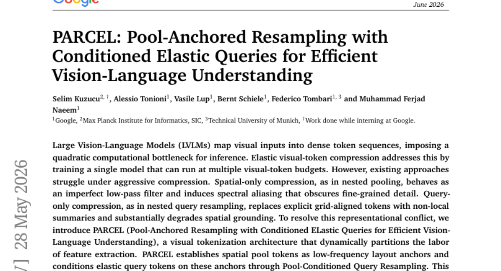

### 📌 한 줄 요약
공간 정보 유지와 효율적 압축 사이의 트레이드오프를 해결하여, 단일 모델로 다양한 토큰 예산에 대응 가능한 시각-언어 모델 압축 기술

### 🔑 핵심 포인트
- Pool-Anchored Resampling: 공간 정보를 담은 풀링 토큰을 앵커로 활용하여 구조적 안정성 확보
- Conditioned Elastic Queries: 앵커에 조건화된 쿼리를 통해 중복을 줄이고 세부 특징 추출 최적화
- Efficient Pareto Frontier: 단일 모델로 다양한 토큰 예산(Budget)에 대응 가능한 유연한 압축 구조

### 🧑‍💻 개발자 관점
모델 재학습 없이 추론 시 토큰 수를 조절하여 성능과 속도 사이의 균형을 동적으로 맞출 수 있어, 리소스가 제한된 환경에서 유용합니다.

### 🚀 실무 적용 아이디어
- 다양한 해상도 및 토큰 예산 설정에 따른 성능 저하 곡선(Pareto curve) 비교 실험
- 기존 Matryoshka 기반 압축 모델과의 추론 속도 및 정확도 벤치마크
- 특정 도메인(예: OCR, 세밀한 객체 탐지)에서의 공간 정렬 유지 능력 검증

### ⚠️ 리스크/한계
- 압축률이 극단적으로 높을 경우 발생하는 정보 손실 가능성
- 앵커 기반 구조가 복잡한 멀티-스케일 시각 정보 처리에 미치는 영향

### 📝 초록 기반 상세 설명
대규모 시각-언어 모델(LVLM)은 시각적 토큰 수가 많아 추론 시 연산 비용이 급증하는 문제가 있습니다. 기존의 가변적 토큰 압축 방식은 공간 정보 손실(Pooling)이나 공간 정렬 저하(Query-only)라는 상충하는 문제를 겪습니다. 이를 해결하기 위해 PARCEL은 공간 풀링 토큰을 레이아웃 앵커로 사용하고, 이를 기반으로 탄력적 쿼리 토큰을 생성하는 방식을 제안합니다. 이 구조는 쿼리 토큰이 중복된 공간 매핑 대신 보완적인 시각적 특징에 집중하도록 유도합니다. 실험 결과, PARCEL은 다양한 토큰 예산 환경에서 기존 방식보다 우수한 성능-효율성 균형을 보여주었습니다.

---

## 37. [Measuring the Depth of LLM Unlearning via Activation Patching](https://huggingface.co/papers/2605.24614)
**Upvotes**: 5 | **도입 난이도**: 중 | **신뢰도**: 상
**arXiv**: https://arxiv.org/abs/2605.24614

**태그**: LLM Unlearning, Mechanistic Interpretability, AI Safety, Model Auditing, Benchmark, Evaluation, Safety

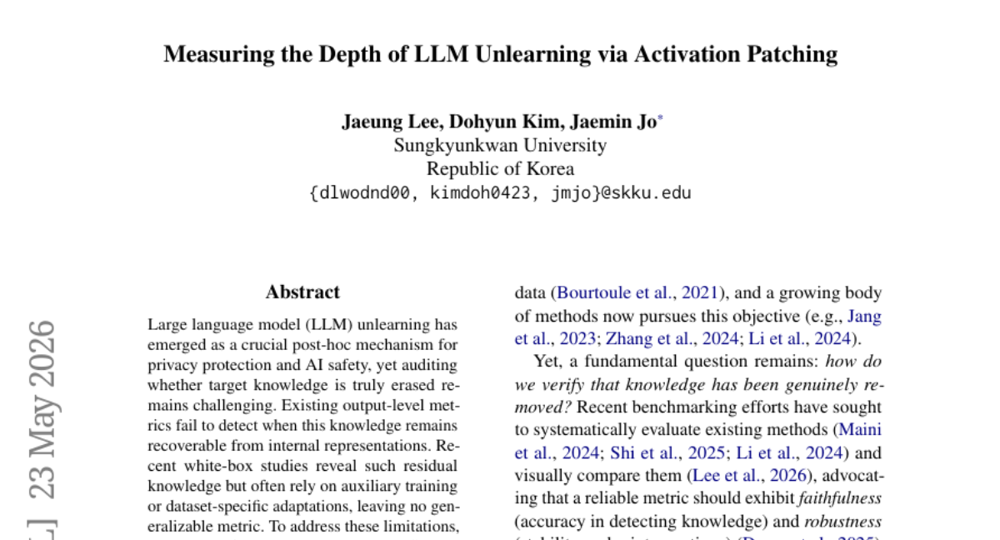

### 📌 한 줄 요약
Activation Patching을 통해 LLM의 지식 삭제(Unlearning)가 모델 내부 레이어 수준에서 얼마나 실질적으로 이루어졌는지 측정하는 새로운 지표(UDS) 제안

### 🔑 핵심 포인트
- Activation Patching을 활용한 인과적(Causal) 지식 삭제 측정 방식 도입
- 모델 내부 레이어별 지식 잔존 여부를 파악하는 Unlearning Depth Score(UDS) 개발
- 다양한 언러닝 방법론과 모델에 대해 높은 일반화 성능 및 신뢰성 검증

### 🧑‍💻 개발자 관점
단순히 모델의 답변이 바뀌었는지 확인하는 것을 넘어, 모델 내부의 가중치나 활성화 값에 위험 정보가 여전히 남아있는지 정밀하게 감사(Audit)할 수 있습니다.

### 🚀 실무 적용 아이디어
- 자체 구축한 언러닝 모델의 내부 레이어별 지식 잔존도를 UDS로 측정해보기
- 기존 출력 기반 평가 지표와 UDS 결과 간의 차이 분석하기
- 특정 레이어에 집중된 지식 삭제가 모델 성능에 미치는 영향 평가하기

### ⚠️ 리스크/한계
- Activation Patching 과정에서 발생하는 연산 비용이 기존 지표보다 높을 수 있음
- 모델 구조나 특정 아키텍처에 따른 일반화 가능성 검토 필요

### 📝 초록 기반 상세 설명
LLM의 프라이버시 보호와 안전을 위한 언러닝(Unlearning) 기술이 중요해지고 있으나, 출력값만으로는 내부 모델에 잔존하는 지식을 완벽히 검증하기 어렵습니다. 기존 방식은 특정 데이터셋에 의존하거나 일반화가 어렵다는 한계가 있었습니다. 본 논문은 Activation Patching 기법을 활용하여 지식 삭제의 메커니즘적 깊이를 정량화하는 Unlearning Depth Score(UDS)를 제안합니다. UDS는 리테인 모델(Retain model)을 기준으로 지식이 인코딩된 레이어를 식별한 후, 삭제된 정도를 0-1 스케일로 측정합니다. 150개의 언러닝 모델을 대상으로 한 메타 평가 결과, UDS는 기존 20개 지표 중 가장 높은 신뢰성과 강건성을 입증했습니다.

### 🖼️ 추가 자료
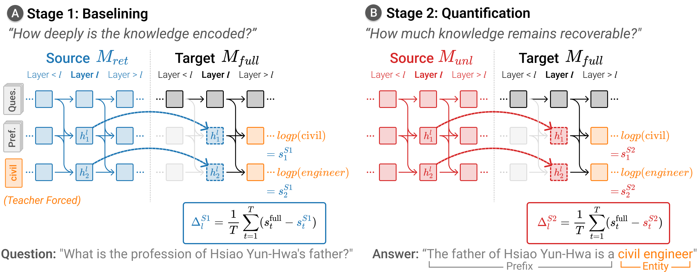

---

## 38. [AFUN: Towards an Affordance Foundation Model for Functionality Understanding](https://huggingface.co/papers/2606.02551)
**Upvotes**: 4 | **도입 난이도**: 중 | **신뢰도**: 상
**arXiv**: https://arxiv.org/abs/2606.02551

**태그**: Robotics, Computer Vision, Foundation Model, 3D Motion, Benchmark, Evaluation

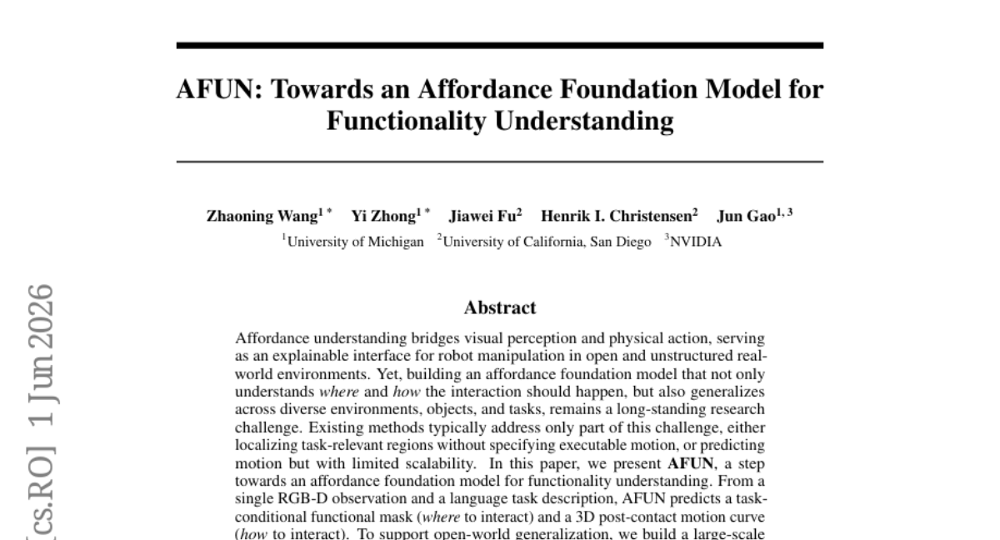

### 📌 한 줄 요약
단일 RGB-D 입력과 언어 명령만으로 상호작용 위치와 3D 동작 궤적을 동시에 예측하는 범용 어포던스 파운데이션 모델 제안

### 🔑 핵심 포인트
- 위치(Mask)와 동작(3D Motion)을 동시에 예측하는 통합 어포단스 모델 프레임워크 구축
- 이종 데이터를 통합하여 학습 가능한 대규모 표준화 데이터 파이프라인 개발
- 로봇 하드웨어에 구애받지 않는 오픈 월드 일반화 성능 확보

### 🧑‍💻 개발자 관점
로봇 제어 시 작업별로 별도의 휴리스틱을 설계할 필요 없이, 시각 정보와 언어 명령만으로 즉각적인 조작 가이드를 생성할 수 있습니다.

### 🚀 실무 적용 아이디어
- 제공된 데이터 파이프라인을 활용하여 특정 도메인(예: 주방 가전) 데이터셋 구축 실험
- 다양한 로봇 그리퍼/매니퓰레이터 환경에서의 3D 동작 궤적 정밀도 검증
- 실제 로봇 하드웨어에 모델을 배포하여 실시간 추론 지연 시간(Latency) 테스트

### ⚠️ 리스크/한계
- 복잡한 물리적 상호작용(예: 부드러운 물체 조작)에서의 3D 궤적 정확도 한계 가능성
- 실제 환경의 노이즈가 심한 RGB-D 데이터에 대한 강건성 검증 필요

### 📝 초록 기반 상세 설명
로봇 조작을 위해 시각적 인지와 물리적 행동을 연결하는 어포던스 이해는 중요하지만, 다양한 환경과 객체에 대한 일반화가 어렵다는 문제가 있습니다. 기존 방식은 위치만 찾거나 동작만 예측하는 등 기능적 이해가 불완전했습니다. 본 논문에서는 RGB-D 데이터와 언어 설명을 기반으로 작업 조건부 기능 마스크(어디를)와 3D 접촉 후 동작 곡선(어떻게)을 동시에 예측하는 AFUN 모델을 제안합니다. 이를 위해 다양한 소스의 데이터를 표준화된 스키마로 변환하는 대규모 데이터 파이프라인을 구축했습니다. 실험 결과, 세그멘테이션, 접촉점 예측, 3D 동작 모든 측면에서 기존 베이스라인을 크게 상회하는 성능을 보였습니다. 결과적으로 별도의 파인튜닝 없이도 다양한 로봇 환경에 즉시 배포 가능한 범용성을 입증했습니다.

---

## 39. [HakushoBench: A Japanese Chart and Table VQA Benchmark from Governmental White Papers](https://huggingface.co/papers/2606.01132)
**Upvotes**: 4 | **도입 난이도**: 하 | **신뢰도**: 상
**arXiv**: https://arxiv.org/abs/2606.01132

**태그**: VLM, Benchmark, Vision-Language, Multilingual, RAG, Vision

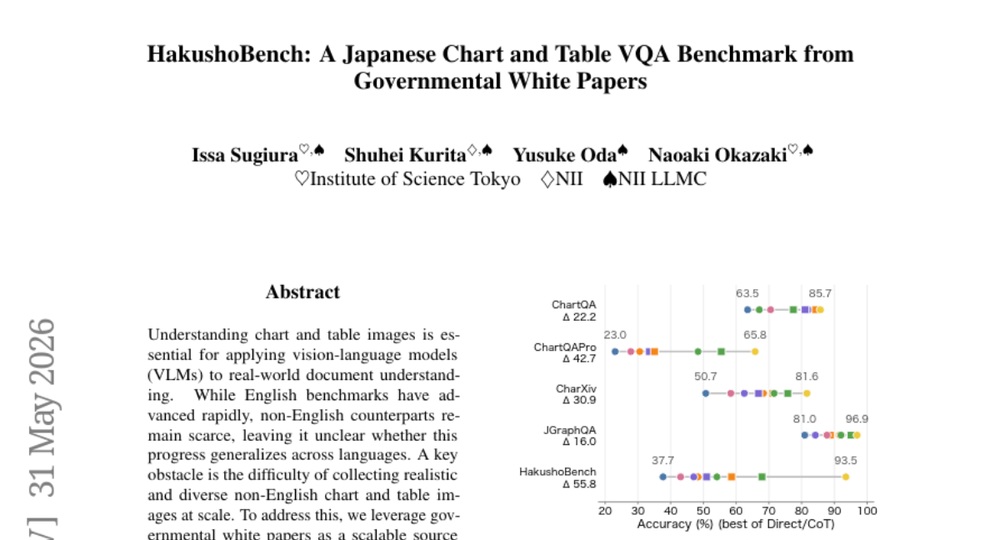

### 📌 한 줄 요약
일본 정부 백서를 활용하여 비영어권 환경의 복잡한 차트 및 표 이해 능력을 평가하는 새로운 VQA 벤치마크 HakushoBench 제안

### 🔑 핵심 포인트
- 정부 백서를 활용한 확장 가능한 비영어권 차트/표 데이터 수집 방법론 제시
- 10개 이상의 이미지 유형과 2,053개의 수동 주석 QA 쌍을 포함한 HakushoBench 구축
- 단순 시각적 단서가 아닌 심층적이고 총체적인 데이터 이해 능력을 평가하도록 설계

### 🧑‍💻 개발자 관점
글로벌 서비스를 개발할 때 영어 외 언어(특히 일본어 등) 환경에서 VLM의 시각적 추론 성능을 검증할 수 있는 기준을 제공합니다.

### 🚀 실무 적용 아이디어
- HakushoBench 데이터셋을 활용하여 현재 사용 중인 VLM의 일본어 시각 추론 성능 테스트
- 오픈 웨이트 모델(Llama-3-Vision 등)과 독점 모델(GPT-4o 등)의 성능 격차 비교 실험
- 백서 데이터와 같은 복잡한 레이아웃을 처리하기 위한 프롬프트 엔지니어링 전략 수립

### ⚠️ 리스크/한계
- 일본어에 특화된 벤치마크이므로 타 언어에 대한 일반화 성능은 추가 검증 필요
- 정부 문서 특유의 정제된 형식이 실제 비정형 문서 환경과 차이가 있을 수 있음

### 📝 초록 기반 상세 설명
시각-언어 모델(VLM)의 발전에도 불구하고 비영어권 환경에서의 차트 및 표 이해를 위한 벤치마크는 부족한 실정입니다. 특히 현실적이고 다양한 비영어권 데이터셋을 대규모로 수집하는 것이 주요 과제로 남아 있습니다. 본 논문은 다양한 형식과 도메인을 포함하는 정부 백서를 활용하여 확장 가능한 데이터 수집 방법론을 제시합니다. 이를 바탕으로 일본어 기반의 차트 및 표 VQA 벤치마크인 HakushoBench를 구축하였습니다. 실험 결과, 오픈 웨이트 모델과 독점 모델 간의 성능 격차가 크게 나타나 복잡한 시각 데이터 이해에 대한 개선 여지를 확인했습니다.

---

## 40. [FineVerify: Scaling Test-Time Compute with Fine-Grained Self-Verification for Agentic Search](https://huggingface.co/papers/2606.00660)
**Upvotes**: 4 | **도입 난이도**: 중 | **신뢰도**: 상
**arXiv**: https://arxiv.org/abs/2606.00660

**태그**: Agentic Search, Self-Verification, Test-Time Compute, Reasoning, Agent, RAG, Benchmark

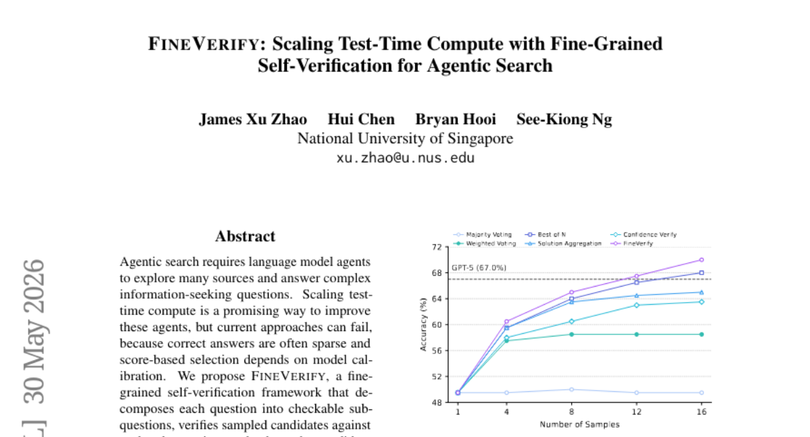

### 📌 한 줄 요약
에이전트 검색 성능 향상을 위해 질문을 세부 검증 항목으로 분해하여 정답을 선택하는 Fine-grained self-verification 프레임워크

### 🔑 핵심 포인트
- 질문을 검증 가능한 하위 질문(sub-questions)으로 분해하여 검증의 정밀도 향상
- 개별 항목별 검증을 통한 점수 합산 방식으로 선택 과정의 신뢰도 확보
- 적은 샘플링(4~12개)만으로도 기존 모델의 성능을 크게 개선하는 효율적인 스케일링

### 🧑‍💻 개발자 관점
에이전트 시스템 구축 시 단순히 여러 답변 중 하나를 고르는 것이 아니라, 논리적 근거를 바탕으로 정답을 필터링하는 구조적 방법론을 제시합니다.

### 🚀 실무 적용 아이디어
- 현재 운영 중인 RAG/Agent 시스템에 질문 분해 및 단계별 검증 로직 적용 테스트
- 모델의 출력 결과에 대한 '검증 트레이스(verification traces)' 생성 파이프라인 구축
- 소형 모델(SLM)을 활용한 고성능 에이전트 구현 가능성 검토

### ⚠️ 리스크/한계
- 하위 질문 분해 및 개별 검증 과정에서 발생하는 추가적인 추론 비용(latency) 발생
- 분해된 하위 질문 자체가 편향되거나 불완전할 경우 전체 검증 결과가 왜곡될 위험

### 📝 초록 기반 상세 설명
에이전트 기반 검색은 복잡한 질문 해결을 위해 많은 소스를 탐색해야 하며, 테스트 타임 연산(test-time compute)을 늘리는 것이 성능 향상의 핵심입니다. 하지만 기존의 점수 기반 선택 방식은 정답이 희소하거나 모델의 캘리브레이션 문제로 인해 실패할 위험이 있습니다. 이를 해결하기 위해 질문을 검증 가능한 하위 질문들로 분해하고, 각 후보군을 개별 항목별로 검증하여 점수를 합산하는 FineVerify 프레임워크를 제안합니다. 실험 결과, FineVerify는 적은 수의 샘플링만으로도 기존 베이스라인을 상회하는 성능을 보였으며, 특히 소형 모델이 거대 모델의 성능을 추월하는 결과를 냈습니다. 또한 검증 과정이 투명하여 에이전트의 오류를 감사(audit)하는 데 유용합니다.

---

## 41. [Adapting Multilingual Embedding Models to Turkish via Cross-Lingual Tokenizer Surgery and Offline Distillation](https://huggingface.co/papers/2605.29992)
**Upvotes**: 4 | **도입 난이도**: 중 | **신뢰도**: 상
**arXiv**: https://arxiv.org/abs/2605.29992

**태그**: NLP, Embedding, Distillation, Tokenizer, Turkish, RAG, Evaluation, Inference

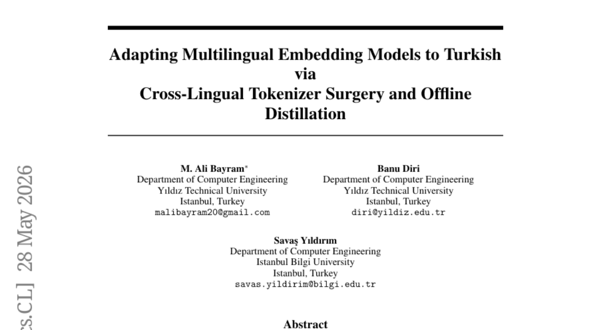

### 📌 한 줄 요약
효율적인 토크나이저 재구성 및 오프라인 증류 기법을 통해 저비용으로 고성능 터키어 임베딩 모델을 구축하는 방법론 제시

### 🔑 핵심 포인트
- 토크나이저 수술(Tokenizer Surgery): 불필요한 토큰을 제거하고 언어별 빈도 분석을 통해 최적화된 어휘집 구축
- 오프라인 증류(Offline Distillation): 학습 중 교사 모델 추론을 배제하여 학습 속도와 비용을 극대화
- 고성능/저비용 트레이드오프: 200M 파라미터로 더 큰 교사 모델을 능가하는 성능 확보

### 🧑‍💻 개발자 관점
특정 언어에 특화된 임베딩 모델을 구축할 때, 전체 재학습 없이도 토크나이저와 증류 기법만으로 효율적인 모델 최적화가 가능함을 보여줍니다.

### 🚀 실무 적용 아이디어
- 제공된 오픈소스 툴링을 사용하여 특정 언어 전용 토크나이저 구축 실험
- 기존 다국어 모델과 제안된 방식의 성능/비용 효율성 비교 테스트
- 도메인 특화 데이터셋을 활용한 오프라인 증류 파이프라인 적용

### ⚠️ 리스크/한계
- 특정 언어에 최적화된 토크나이저는 다른 언어에 대한 성능 저하를 야기할 수 있음
- 교사 모델의 성능에 의존적인 증류 방식의 한계

### 📝 초록 기반 상세 설명
문장 임베딩은 검색 및 RAG 등 다양한 태스크의 핵심 요소이나, 기존 모델은 특정 언어(터키어)에 대한 토큰 효율성이 낮고 컨텍스트 제한이 있는 문제가 있었습니다. 본 논문은 전체 사전학습 대신 3단계의 효율적인 적응 파이프라인을 제안합니다. 먼저 불필요한 토큰을 제거하고 터키어에 최적화된 대규모 어휘집을 가진 토크나이저를 구축하고, 이후 교사 모델의 가중치를 보존하며 새로운 어휘 테이블을 초기화합니다. 마지막으로 사전 계산된 벡터를 활용한 오프라인 증류를 통해 단일 GPU에서 매우 저렴한 비용으로 학습을 완료합니다. 결과적으로 제안된 모델은 더 적은 파라미터로도 기존 300M 규모의 교사 모델보다 뛰어난 성능을 달성했습니다.

### 🖼️ 추가 자료
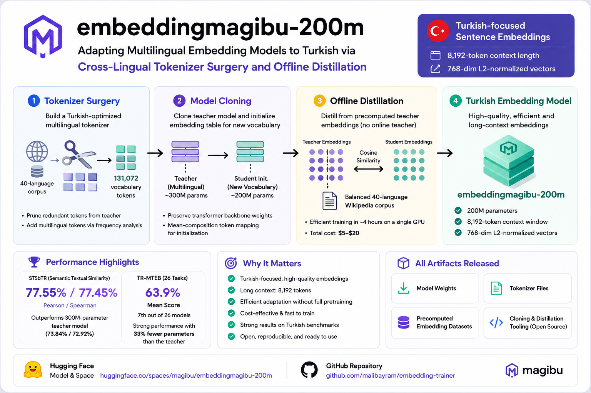

---

## 42. [Not only where, But when: Temporal Scheduling for RLVR](https://huggingface.co/papers/2605.25381)
**Upvotes**: 4 | **도입 난이도**: 중 | **신뢰도**: 상
**arXiv**: https://arxiv.org/abs/2605.25381

**태그**: LLM, Reinforcement Learning, RLVR, Optimization, Reasoning, Benchmark

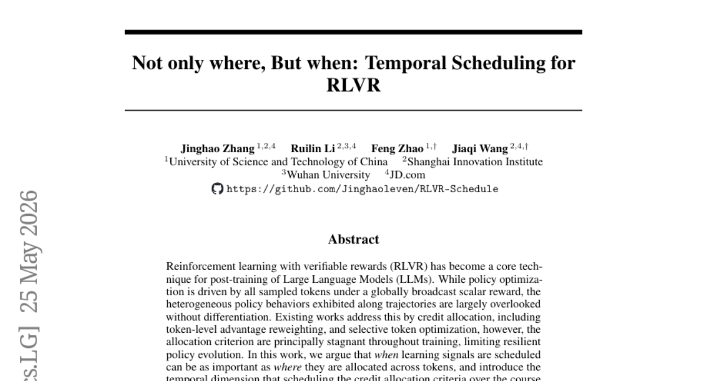

### 📌 한 줄 요약
RLVR 학습 시 토큰별 보상 할당 기준을 학습 단계에 따라 동적으로 조절하여 모델의 정책 진화 안정성과 효율성을 높이는 방법론

### 🔑 핵심 포인트
- 학습 단계에 따라 크레딧 할당 기준을 변화시키는 'Temporal Scheduling' 개념 도입
- 특정 정책 행동을 보이는 토큰에 가중치를 두었다가 점진적으로 완화하는 전략 제안
- 트래젝토리 백분위수(trajectory percentiles)를 활용한 효율적인 행동 구분 방식 제시

### 🧑‍💻 개발자 관점
LLM 강화학습 시 특정 태스크(수학, 코딩 등)에 대한 모델의 급격한 붕괴를 막으면서도 성능을 끌어올리는 스케줄링 전략의 중요성을 시사합니다.

### 🚀 실무 적용 아이디어
- 학습 초기와 후기의 토큰별 가중치 스케줄링 프로토콜 설계 및 비교 실험
- 트래젝토리 백분위수를 활용한 데이터 샘플링/가중치 적용 실험
- 학습 과정 중 정책 엔트로피 변화 추이 모니터링

### ⚠️ 리스크/한계
- 스케줄링 파라미터(감쇠 속도 등) 설정에 따른 학습 불안정성 가능성
- 특정 도메인에 특화된 스케줄링이 일반적인 추론 능력에 미치는 영향 검증 필요

### 📝 초록 기반 상세 설명
LLM의 사후 학습(post-training)을 위한 RLVR 기법에서 토큰별 정책 행동의 이질성을 고려하지 않는 기존 방식은 학습 효율을 저해합니다. 기존의 크레딧 할당(credit allocation) 방식은 학습 과정 내내 고정된 기준을 사용하여 정책의 유연한 진화를 방해하는 문제가 있습니다. 본 논문은 보상 할당의 '위치'뿐만 아니라 '시기(when)'가 중요함을 제안하며, 학습 과정에 따라 할당 기준을 변화시키는 시간적 스케줄링(temporal scheduling)을 도입합니다. 특정 행동을 보이는 토큰에 우선순위를 두었다가 점진적으로 일반 최적화로 전환하는 방식이 더 안정적인 학습 역학을 제공함을 확인했습니다. 실험 결과, 수학 및 일반 추론 벤치마크에서 기존 방식보다 우수한 성능과 건강한 정책 엔트로피 유지 능력을 보여주었습니다.

---

## 43. [3DCodeBench: Benchmarking Agentic Procedural 3D Modeling Via Code](https://huggingface.co/papers/2606.01057)
**Upvotes**: 3 | **도입 난이도**: 중 | **신뢰도**: 상
**arXiv**: https://arxiv.org/abs/2606.01057

**태그**: Agent, 3D Modeling, VLM, Benchmark, Reasoning, Multimodal, Vision, Evaluation

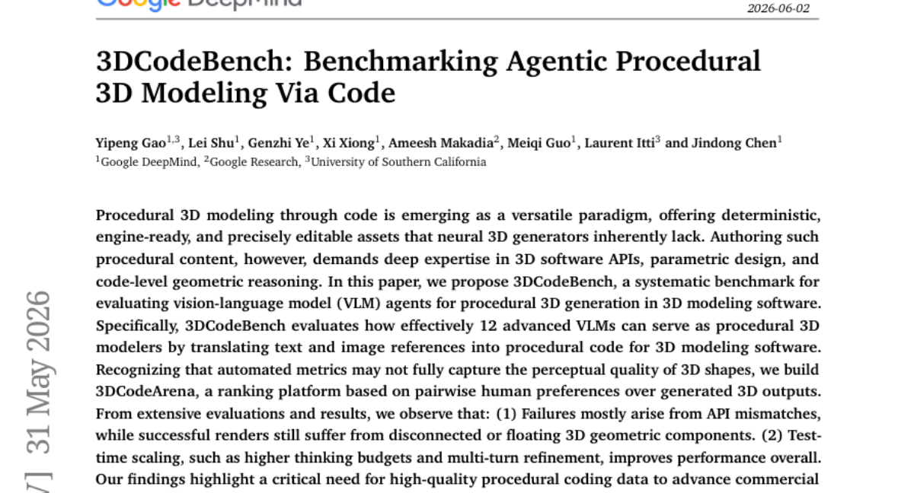

### 📌 한 줄 요약
VLM 에이전트의 절차적 3D 모델링 능력을 평가하기 위한 벤치마크 및 인간 선호도 기반 랭킹 플랫폼 제안

### 🔑 핵심 포인트
- VLM 에이전트의 3D 모델링 역량 평가를 위한 체계적인 벤치마크(3DCodeBench) 구축
- 인간의 시각적 선호도를 반영한 랭킹 플랫폼(3DCodeArena) 개발
- 멀티모달 프롬프트, 절차적 코드, 3D 객체 트리플렛을 포함한 대규모 데이터셋 공개

### 🧑‍💻 개발자 관점
LLM/VLM을 활용한 자동화된 3D 에셋 생성 파이프라인 구축 시, 모델의 코드 생성 및 기하학적 정밀도를 검증하는 표준 가이드라인을 제공합니다.

### 🚀 실무 적용 아이디어
- 공개된 3DCodeBench 데이터셋을 활용하여 현재 사용 중인 VLM의 3D 코드 생성 능력 테스트
- Multi-turn refinement(다회차 정제) 기법을 적용하여 생성된 3D 모델의 기하학적 결함 개선 실험
- 에이전트의 실행 환경(Execution Environment) 피드백 루프 설계 및 최적화

### ⚠️ 리스크/한계
- API 명세 변화에 따른 모델 성능의 민감도 및 의존성 문제
- 자동화 지표가 포착하지 못하는 시각적/기하학적 품질의 주관성

### 📝 초록 기반 상세 설명
코드 기반의 절차적 3D 모델링은 정밀한 편집이 가능하지만, API 활용과 기하학적 추론에 높은 전문성이 요구됩니다. 본 논문은 텍스트 및 이미지를 3D 모델링 코드로 변환하는 VLM 에이전트의 성능을 측정하기 위한 3DCodeBench를 제안합니다. 자동화된 지표의 한계를 극복하기 위해 인간의 쌍체 비교를 통한 랭킹 플랫폼인 3DCodeArena를 함께 구축했습니다. 실험 결과, API 미스매치와 기하학적 불연속성이 주요 실패 원인으로 나타났으며, 추론 시간 스케일링(Test-time scaling)이 성능 향상에 효과적임을 확인했습니다. 최종적으로 연구진은 고품질 데이터셋과 평가 프로토콜을 포함한 3DCodeBench를 공개합니다.

---

## 44. [Silent Failures in Physical AI: A Literature Review of Runtime Action Authorization for Autonomous Systems](https://huggingface.co/papers/2606.00090)
**Upvotes**: 3 | **도입 난이도**: 상 | **신뢰도**: 상
**arXiv**: https://arxiv.org/abs/2606.00090

**태그**: Physical AI, Robotics, Safety, Guardrails, Autonomous Systems, Multimodal, Vision, Benchmark, Evaluation

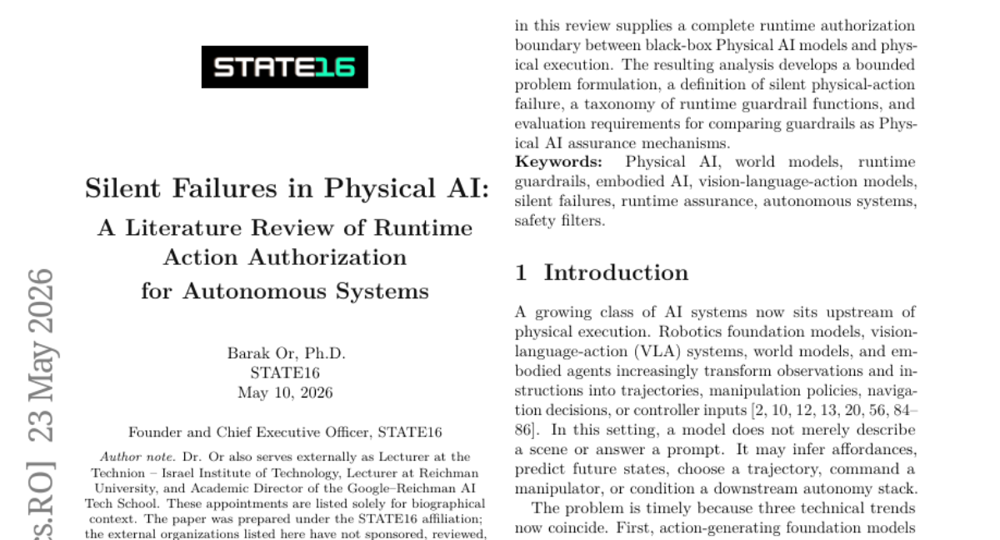

### 📌 한 줄 요약
물리적 AI 모델의 블랙박스 특성으로 인한 '침묵하는 실패(Silent Failure)'를 방지하기 위한 런타임 권한 부여(Runtime Authorization) 체계 연구

### 🔑 핵심 포인트
- 물리적 AI 특유의 '침묵하는 실패(Silent Failure)' 개념 정의 및 문제 정식화
- 모델 역량과 안전 메커니즘 간의 기술적 격차 분석
- 런타임 가드레일 기능에 대한 분류 체계(Taxonomy) 및 평가 프레임워크 제안

### 🧑‍💻 개발자 관점
모델의 출력이 논리적으로 완벽해 보이더라도 물리적 환경에서 치명적 오류를 일으킬 수 있음을 인지하고, 이를 차단할 런타임 검증 계층 설계의 필요성을 시사합니다.

### 🚀 실무 적용 아이디어
- 모델의 출력값과 실제 물리 상태 간의 괴리를 감지하는 모니터링 로직 설계
- 시뮬레이션 환경에서 의도적 센서 노이즈/환각을 통한 가드레일 강건성 테스트
- 모델의 확신도(Confidence)와 물리적 안전성 사이의 상관관계 분석

### ⚠️ 리스크/한계
- 가드레일 도입 시 발생할 수 있는 시스템 지연(Latency) 문제
- 가드레일 자체가 새로운 단일 실패 지점(Single Point of Failure)이 될 위험

### 📝 초록 기반 상세 설명
최근 로봇 및 자율 시스템은 멀티모달 데이터를 기반으로 물리적 동작을 수행하는 Foundation Model을 적극 도입하고 있습니다. 그러나 모델이 겉으로는 논리적이고 확신에 차 보이지만, 센서 오차나 환각(Hallucination)으로 인해 실제 물리적 위험을 초래하는 '침묵하는 실패' 문제가 발생하고 있습니다. 기존의 AI 콘텐츠 검수나 고전적 로봇 안전 제어 방식은 이러한 복합적인 위험을 완전히 해결하지 못하는 격차가 존재합니다. 본 논문은 이러한 문제를 해결하기 위해 침묵하는 실패의 정의를 정립하고, 런타임 가드레일의 분류 체계 및 평가 요구사항을 제안합니다. 이를 통해 블랙박스 모델과 물리적 실행 사이의 안전한 경계(Authorization Boundary)를 구축하는 방법론을 제시합니다.

---

## 45. [EVA01: Unified Native 3D Understanding and Generation via Mixture-of-Transformers](https://huggingface.co/papers/2605.16745)
**Upvotes**: 3 | **도입 난이도**: 상 | **신뢰도**: 상
**arXiv**: https://arxiv.org/abs/2605.16745

**태그**: 3D Generation, MLLM, Mixture-of-Transformers, Computer Vision, Reasoning, Multimodal

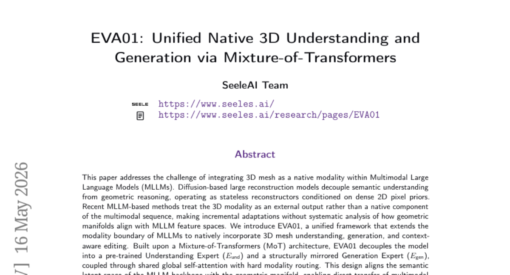

### 📌 한 줄 요약
3D 메시지를 MLLM의 네이티브 모달리티로 통합하여 이해, 생성, 편집을 동시에 수행하는 MoT 기반 프레임워크

### 🔑 핵심 포인트
- 3D 메시지를 MLLM의 네이티브 모달리티로 통합하여 이해/생성/편집을 단일 프레임워크에서 수행
- Mixture-of-Transformers(MoT) 아키텍처를 통한 이해(Understanding)와 생성(Generation) 전문가의 효율적 분리 및 결합
- 시맨틱 잠재 공간과 기하학적 매니폴드 간의 정렬을 통한 고정밀 3D 생성 및 멀티턴 편집 기능 확보

### 🧑‍💻 개발자 관점
단순한 2D 기반 3D 재구성을 넘어, LLM의 추론 능력을 3D 기하 구조에 직접 투영하여 복잡한 편집과 맥락 유지가 가능한 시스템 구축의 가능성을 제시합니다.

### 🚀 실무 적용 아이디어
- 제공된 MoT 구조가 2D-3D 정렬에 미치는 영향 분석
- 멀티턴 편집 시 정체성 유지(Identity Preservation) 성능 검증
- 기존 Diffusion 기반 3D 모델과의 생성 속도 및 품질 비교

### ⚠️ 리스크/한계
- MoT 구조의 복잡성으로 인한 높은 연산 비용 및 학습 난이도
- 3D 메시지 데이터의 복잡도에 따른 모델 확장성 문제

### 📝 초록 기반 상세 설명
기존의 3D 생성 모델은 의미적 이해와 기하학적 추론이 분리되어 있거나, 3D를 외부 출력으로만 취급하여 MLLM의 특징 공간과 정렬되지 않는 문제가 있었습니다. 이를 해결하기 위해 본 논문은 3D 메시지를 모델 내부의 네이티브 모달리티로 통합한 EVA01 프레임워크를 제안합니다. Mixture-of-Transformers(MoT) 구조를 통해 이해 전문가(E_und)와 생성 전문가(E_gen)를 분리하되, 공유된 글로벌 셀프 어텐션과 하드 모달리티 라우팅을 통해 두 전문가를 결합했습니다. 이 설계는 MLLM의 시맨틱 잠재 공간과 기하학적 매니폴드를 정렬하여 중간 2D 표현 없이도 직접적인 정보 전달을 가능하게 합니다. 실험 결과, EVA01은 최첨단 수준의 텍스트-to-3D 생성 성능을 보였으며, 정체성 유지와 정교한 멀티턴 편집 기능을 성공적으로 수행했습니다.

---

## 46. [Confidence-Adaptive SwiGLU for Mixture-of-Experts](https://huggingface.co/papers/2606.00761)
**Upvotes**: 2 | **도입 난이도**: 하 | **신뢰도**: 상
**arXiv**: https://arxiv.org/abs/2606.00761

**태그**: MoE, Transformer, Activation Function, Optimization, Evaluation

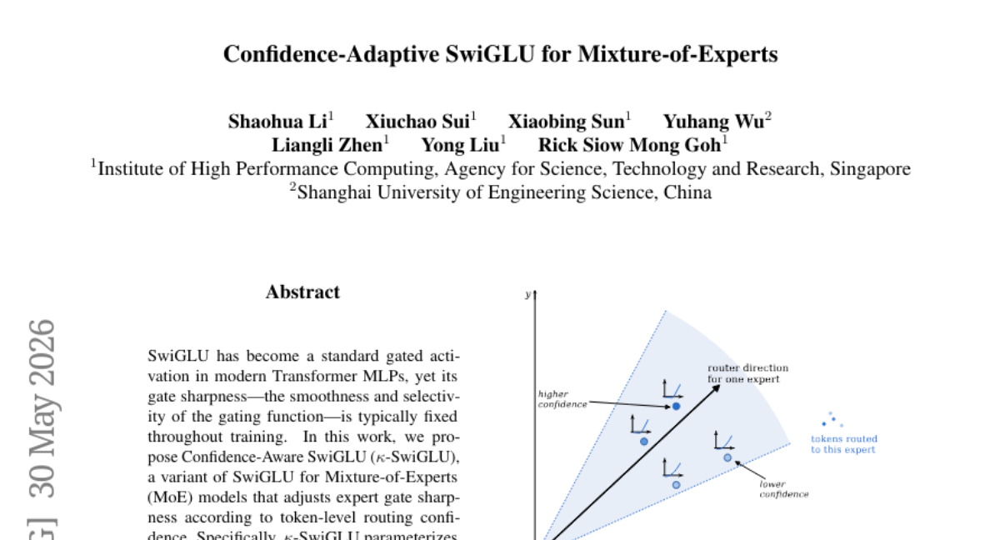

### 📌 한 줄 요약
라우터의 신뢰도에 따라 활성화 함수의 날카로움을 조절하여 MoE 모델의 전문가 선택 효율을 높인 기술

### 🔑 핵심 포인트
- 라우터 로짓을 기반으로 SiLU 게이트의 날카로움을 동적으로 조절하는 κ-SwiGLU 제안
- 토큰별 라우팅 신뢰도에 따라 부드러운(smooth) 게이트와 날카로운(sharp) 게이트 사이의 보간 가능
- 매우 적은 파라미터 추가와 낮은 연산 오버헤드로 성능 향상 달성

### 🧑‍💻 개발자 관점
MoE 모델의 전문가 선택(Routing) 효율을 높이면서도 모델 복잡도를 크게 증가시키지 않는 실용적인 최적화 기법입니다.

### 🚀 실무 적용 아이디어
- 기존 SwiGLU 기반 MoE 모델에 κ-SwiGLU 레이어를 교체하여 성능 변화 측정
- 라우터 로짓의 스케일에 따른 학습 안정성 및 수렴 속도 비교 실험
- 다양한 모델 크기(Layer 수)에서의 확장성 검증

### ⚠️ 리스크/한계
- 라우터 로짓에 의존하는 특성상 학습 초기 단계의 불안정성 가능성
- 특정 데이터셋이나 모델 구조에 국한된 효과일 가능성

### 📝 초록 기반 상세 설명
최근 Transformer MLP에서 SwiGLU가 표준적인 게이트 활성화 함수로 사용되고 있으나, 게이트의 날카로움(sharpness)이 학습 과정 내내 고정되어 있다는 한계가 있습니다. 본 논문에서는 라우팅 신뢰도에 따라 게이트의 날카로움을 동적으로 조정하는 κ-SwiGLU를 제안합니다. 구체적으로 SiLU 게이트의 계수를 라우터 로짓의 학습 가능한 함수로 매개변수화하여, 부드러운 활성화와 날카로운 선택 사이를 유연하게 보간합니다. FineWeb-Edu 데이터셋을 활용한 다양한 MoE 모델 실험 결과, 추가 파라미터와 연산 비용을 최소화하면서도 성능(CORE)을 향상시켰습니다. 이는 신뢰도 기반의 게이트 조절이 MoE MLP 성능 개선에 효과적임을 입증합니다.

---

## 47. [StressDream: Steering Video World Models for Robust Policy Evaluation and Improvement](https://huggingface.co/papers/2606.00267)
**Upvotes**: 2 | **도입 난이도**: 상 | **신뢰도**: 상
**arXiv**: https://arxiv.org/abs/2606.00267

**태그**: World Models, Robot Learning, Diffusion Models, Edge Case Generation, Reasoning, Vision, Video, Evaluation, Inference

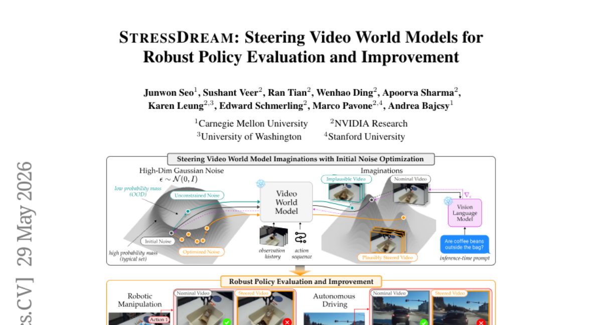

### 📌 한 줄 요약
비디오 월드 모델의 초기 노이즈를 제어하여 위험하거나 중요한 시나리오를 의도적으로 생성함으로써 로봇 정책의 강건성을 평가하고 개선하는 기술

### 🔑 핵심 포인트
- Diffusion 기반 월드 모델의 초기 노이즈 최적화를 통한 의도적 시나리오 생성
- VLM(Vision-Language Model)을 활용하여 영상 내용에 기반한 정교한 그래디언트 제공
- Plausibility objective를 통해 생성된 영상이 현실적인 범위를 벗어나지 않도록 제어

### 🧑‍💻 개발자 관점
로봇이나 자율주행 모델을 학습시킬 때, 발생하기 어려운 엣지 케이스(Edge Case)를 시뮬레이션 환경에서 효율적으로 생성하여 모델의 안전성을 검증할 수 있습니다.

### 🚀 실무 적용 아이디어
- Diffusion 모델의 초기 노이즈 최적화 기법(Latent Optimization) 구현 검토
- VLM을 활용한 영상-텍스트 정렬(Alignment) 손실 함수 적용 실험
- 특정 실패 시나리오(예: 충돌, 낙하)를 타겟으로 한 데이터 증강 파이프라인 구축

### ⚠️ 리스크/한계
- 최적화 과정에서 생성된 영상이 물리적으로 불가능하거나 부자연스러울 위험
- 고차원 노이즈 최적화에 따른 높은 계산 비용 및 학습 불안정성

### 📝 초록 기반 상세 설명
비디오 월드 모델(WM)은 로봇의 미래 관측치를 생성하여 정책 평가에 활용될 수 있지만, 일반적인 샘플링 방식으로는 발생 빈도는 낮지만 치명적인 결과를 놓칠 위험이 있습니다. 이를 해결하기 위해 본 논문은 텍스트로 지정된 고영향(high-impact) 시나리오를 생성하도록 초기 노이즈를 최적화하는 StressDream을 제안합니다. 고차원 노이즈 최적화 과정에서 발생할 수 있는 비현실적인 결과(OOD)를 방지하기 위해, VLM을 활용한 의미론적 목적 함수와 타당성 유지 목적 함수를 동시에 사용합니다. 실험 결과, 자율 주행 및 로봇 조작 환경에서 텍스트로 지정된 실패 시나리오 등을 효과적으로 생성하여 정책의 취약점을 식별하고 개선하는 데 성공했습니다.

---

## 48. [Unified Neural Scaling Laws](https://huggingface.co/papers/2605.26248)
**Upvotes**: 2 | **도입 난이도**: 중 | **신뢰도**: 상
**arXiv**: https://arxiv.org/abs/2605.26248

**태그**: Scaling Laws, Deep Learning, Optimization, Resource Planning, Vision, Evaluation, Inference

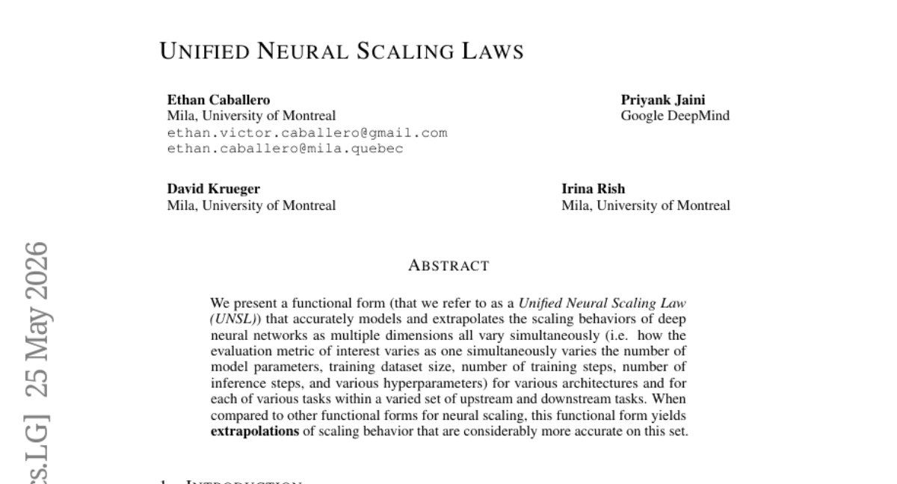

### 📌 한 줄 요약
다양한 변수(파라미터, 데이터, 연산량 등)가 동시에 변화하는 복합적인 환경에서도 모델 성능을 정확히 예측하는 통합 스케일링 법칙 제안

### 🔑 핵심 포인트
- 다차원 변수(파라미터, 데이터, 연산량, 단계 등)를 동시에 고려하는 통합 함수 형태 제안
- 비전, 언어, 수학, RL 등 다양한 도메인과 아키텍처에 걸친 범용적 적용 가능성 입증
- 기존 스케일링 법칙 대비 높은 외삽(Extrapolation) 정확도 확보

### 🧑‍💻 개발자 관점
모델 학습 계획 수립 시, 자원 투입량(Compute)과 데이터 규모에 따른 성능 변화를 사전에 정밀하게 예측하여 비용 효율적인 실험 설계를 가능하게 합니다.

### 🚀 실무 적용 아이디어
- 현재 진행 중인 프로젝트의 학습 로그를 활용하여 제안된 UNSL 함수 형태가 데이터에 부합하는지 피팅 실험 수행
- 특정 하이퍼파라미터 변화가 전체 스케일링 곡선에 미치는 영향 분석
- 자원 제약 조건 하에서 최적의 모델 크기와 데이터 규모 조합 도출 실험

### ⚠️ 리스크/한계
- 특정 도메인이나 극단적인 아키텍처 변화 시 예측 정확도가 저하될 가능성
- 함수 형태의 복잡도에 따라 실제 데이터 피팅을 위한 계산 비용 발생 가능성

### 📝 초록 기반 상세 설명
기존의 신경망 스케일링 법칙은 특정 변수 변화에 따른 성능 예측에 집중하여 복합적인 변수 변화를 반영하는 데 한계가 있었습니다. 본 논문은 모델 파라미터, 데이터 크기, 학습/추론 단계, 연산량 및 하이퍼파라미터가 동시에 변하는 상황을 모델링하는 '통합 신경 스케일링 법칙(UNSL)'을 제안합니다. 이 법칙은 비전, 언어, 수학, 강화학습 등 다양한 아키텍처와 태스크를 포괄하여 검증되었습니다. 실험 결과, 제안된 함수 형태는 기존 방식보다 훨씬 더 정확한 성능 외삽(extrapolation) 성능을 보여주었습니다. 이를 통해 복잡한 환경에서의 모델 확장성을 정밀하게 예측할 수 있게 되었습니다.

---

## 49. [Can Predicted Dynamics Exist in the Physical World?](https://huggingface.co/papers/2606.00089)
**Upvotes**: 2 | **도입 난이도**: 중 | **신뢰도**: 상
**arXiv**: https://arxiv.org/abs/2606.00089

**태그**: Robotics, Physical AI, Control Theory, Motion Planning, Evaluation

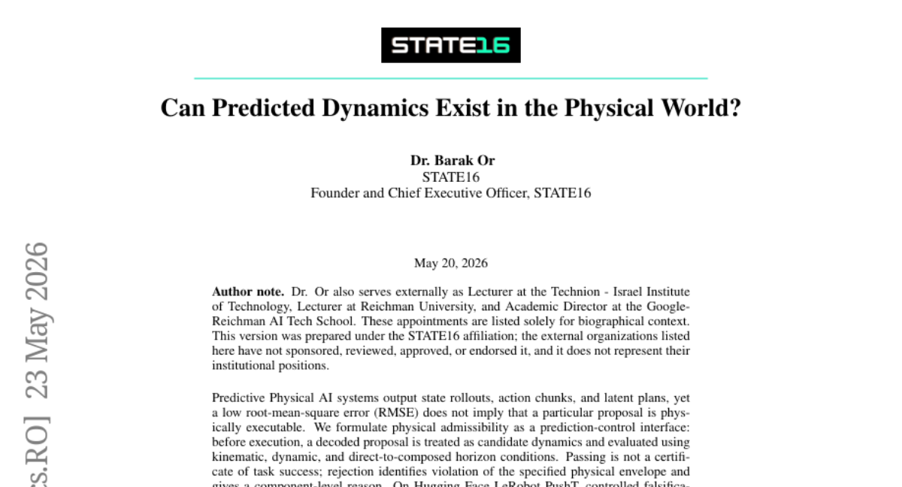

### 📌 한 줄 요약
낮은 예측 오차(RMSE)가 물리적 실행 가능성을 보장하지 않는 문제를 해결하기 위해, 물리적 허용성(Physical Admissibility) 검증 프레임워크를 제안합니다.

### 🔑 핵심 포인트
- RMSE(예측 오차)와 물리적 실행 가능성 사이의 괴리 문제 정의
- 운동학 및 역학 조건을 결합한 '물리적 허용성(Physical Admissibility)' 검증 프레임워크 제안
- 실행 전 후보 동작을 필터링하여 물리적 제약 위반을 방지하는 예측-제어 인터페이스 구축

### 🧑‍💻 개발자 관점
로봇 제어 모델이 생성한 경로가 실제 하드웨어에서 구동 가능한지(예: 관절 한계, 충돌 등)를 수학적으로 검증하는 가이드라인을 제공합니다.

### 🚀 실무 적용 아이디어
- 기존 학습된 로봇 정책(Policy)에 물리적 제약 조건 기반의 필터 레이어 추가 실험
- 단순 RMSE 기반의 모델 평가와 제안된 물리적 허용성 지표 간의 상관관계 분석
- 시뮬레이션 환경에서 제안된 게이트가 실제 하드웨어 손상을 얼마나 방지할 수 있는지 검증

### ⚠️ 리스크/한계
- 물리적 검증 과정이 추가됨에 따라 실시간 제어 루프에서의 연산 오버헤드 발생 가능성
- 정교한 물리 모델이 필요하며, 모델이 실제 물리 법칙과 다를 경우 오작동 위험

### 📝 초록 기반 상세 설명
물리적 AI 시스템이 생성하는 상태 예측이나 계획이 낮은 RMSE를 기록하더라도 실제 환경에서는 실행 불가능한 경우가 많습니다. 본 논문은 예측된 결과가 물리적 법칙을 준수하는지 검증하는 '물리적 허용성(Physical Admissibility)' 개념을 제안합니다. 이를 위해 디코딩된 제안을 후보 역학으로 간주하고 운동학적, 역학적, 지평선 조건 등을 통해 평가하는 예측-제어 인터페이스를 구축했습니다. 실험 결과, 단순 RMSE보다 제안된 게이트 방식이 유효하지 않은 제안을 식별하는 데 훨씬 높은 성능을 보였습니다. 최종적으로 이 필터링 기법은 작업 성공률을 유지하면서도 물리적으로 불가능한 동작을 효과적으로 차단합니다.

---

## 50. [ACL-Verbatim: hallucination-free question answering for research](https://huggingface.co/papers/2605.21102)
**Upvotes**: 2 | **도입 난이도**: 중 | **신뢰도**: 상
**arXiv**: https://arxiv.org/abs/2605.21102

**태그**: RAG, Information Extraction, NLP, Benchmark, Vision, Evaluation

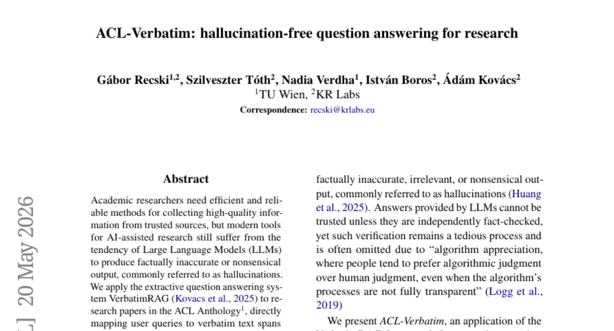

### 📌 한 줄 요약
연구 논문 데이터에서 환각(Hallucination) 없이 정확한 답변을 추출하기 위한 텍스트 스팬 매핑 벤치마크 및 모델 제안

### 🔑 핵심 포인트
- 연구 논문 특화 텍스트 스팬 매핑(Extractive QA) 벤치마크 데이터셋 구축
- ScIRGen 기반의 합성 질의 생성 파이프라인을 통한 고품질 데이터 확보
- LLM보다 효율적이고 정확한 소형 모델(ModernBERT) 기반의 추출 성능 입증

### 🧑‍💻 개발자 관점
RAG 시스템 구축 시 생성형 모델의 환각을 방지하기 위해, 답변을 생성하는 대신 원문 텍스트를 직접 추출하는 방식의 유효성을 확인해 줍니다.

### 🚀 실무 적용 아이디어
- ScIRGen 방법론을 활용한 도메인 특화 합성 데이터 생성 파이프라인 테스트
- LLM 기반 생성형 RAG와 소형 모델 기반 추출형 RAG의 성능 및 비용 비교 실험
- 제공된 벤치마크 데이터셋을 활용한 기존 추출 모델의 성능 검증

### ⚠️ 리스크/한계
- 합성 데이터(Synthetic data) 기반 학습으로 인한 데이터 편향 가능성
- 특정 도메인(학술 논문)에 최적화된 결과로 일반적인 대화형 태스크로의 확장성 제한

### 📝 초록 기반 상세 설명
학술 연구를 위한 AI 도구는 신뢰할 수 있는 정보 수집이 필수적이지만, LLM의 환각 현상으로 인해 정확한 정보 추출에 어려움이 있습니다. 본 연구는 ACL Anthology 논문을 대상으로 사용자 질의를 문서 내 실제 텍스트 구간과 직접 매핑하는 VerbatimRAG 시스템을 적용했습니다. 이를 위해 연구 논문 내 질의-텍스트 구간 매핑을 위한 새로운 Ground Truth 데이터셋을 구축했습니다. 데이터셋 구축에는 ScIRGen 방법론을 활용한 합성 질의 생성 파이프라인이 사용되었습니다. 실험 결과, 150M 파라미터 규모의 ModernBERT 모델이 강력한 LLM 추출기보다 높은 성능을 기록하며 정답 구간 추출 능력을 입증했습니다.

### 🖼️ 추가 자료
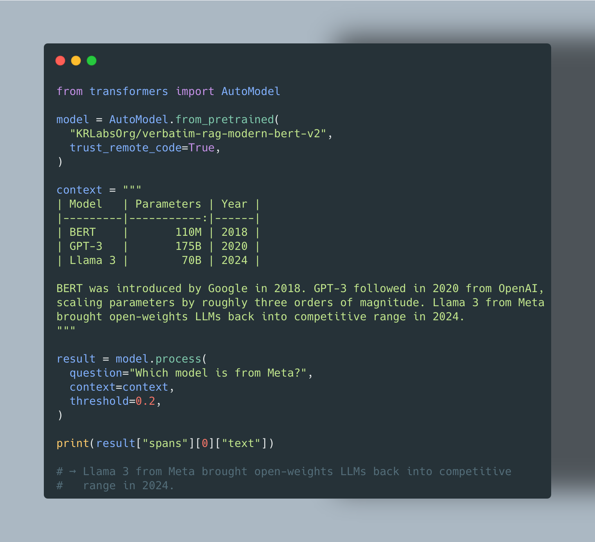

---

