# 2026-06-08 Daily Papers (Top 50)

## 오늘의 요약
오늘은 에이전트의 계획 수립, 페르소나 유지, 그리고 능동적 문제 발견과 같은 고도화된 에이전트 지능 및 평가 방법론에 대한 연구가 두드러졌습니다. 또한, 비디오 생성 및 편집의 효율성을 높이는 구조적 설계와 특정 도메인(코드, 로봇 가치 등)에 특화된 적응형 학습 프레임워크에 대한 논의가 활발했습니다.

### 오늘의 핵심 포인트
- 단순한 작업 수행을 넘어 변화하는 환경과 복잡한 페르소나에 대응하는 에이전트의 적응형 계획 및 일관성 평가 방법론이 강조되었습니다.
- 코드 저장소나 저자원 언어 환경처럼 특정 컨텍스트를 효율적으로 주입하기 위한 하이퍼네트워크 및 메타 학습 전략이 제시되었습니다.
- 비디오 이해 및 생성 분야에서 지식 기반 추론과 연산 효율성을 동시에 확보하기 위한 새로운 데이터셋과 구조적 설계가 주목받았습니다.

**오늘의 태그**: AI Agent, Benchmark, Multimodal, Adaptive Learning, Efficiency

## 1. [Code2LoRA: Hypernetwork-Generated Adapters for Code Language Models under Software Evolution](https://huggingface.co/papers/2606.06492)
**Upvotes**: 69 | **도입 난이도**: 중 | **신뢰도**: 상
**arXiv**: https://arxiv.org/abs/2606.06492

**태그**: LLM, LoRA, Hypernetwork, Software Engineering, Code Generation, RAG, Benchmark, Evaluation, Inference

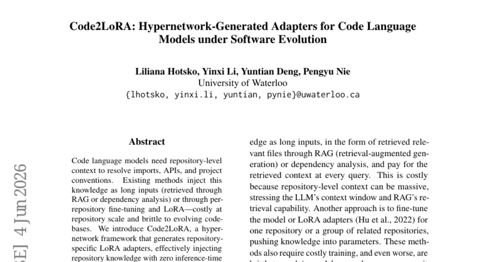

### 📌 한 줄 요약
하이퍼네트워크를 통해 코드 저장소별 맞춤형 LoRA 어댑터를 생성하여, 추론 비용 증가 없이 프로젝트 컨텍스트를 주입하는 프레임워크

### 🔑 핵심 포인트
- 하이퍼네트워크를 이용한 저장소별 맞춤형 LoRA 어댑터 자동 생성
- 추론 시 추가적인 토큰 오버헤드 없이 프로젝트 컨텍스트 주입 가능
- 정적 코드베이스(Static)와 지속적 업데이트(Evo) 시나리오 모두 지원

### 🧑‍💻 개발자 관점
대규모 코드 저장소의 컨텍스트를 RAG처럼 길게 넣지 않고도, 가벼운 어댑터 교체만으로 프로젝트 특화 모델을 운영할 수 있습니다.

### 🚀 실무 적용 아이디어
- 자사 코드 저장소의 스냅샷을 활용한 Code2LoRA-Static 성능 테스트
- CI/CD 파이프라인에 코드 변경 시 어댑터를 업데이트하는 Evo 방식 적용 실험
- 기존 RAG 방식 대비 추론 속도 및 비용 절감 효과 비교

### ⚠️ 리스크/한계
- 하이퍼네트워크 학습을 위한 초기 데이터 준비 및 학습 비용 발생
- 매우 빈번한 코드 변경 시 GRU 기반 상태 업데이트의 안정성 검증 필요

### 📝 초록 기반 상세 설명
코드 언어 모델이 프로젝트의 API 및 컨벤션을 이해하기 위해 긴 컨텍스트를 입력하거나 매번 파인튜닝하는 방식은 비용이 높고 코드 변화에 취약합니다. 이를 해결하기 위해 하이퍼네트워크를 활용해 저장소별 LoRA 어댑터를 생성하는 Code2LoRA를 제안합니다. 이 프레임워크는 정적인 코드베이스를 위한 Static 방식과 코드 변경 사항을 반영하는 Evo 방식을 모두 지원합니다. 실험 결과, 제안 방식은 기존 LoRA 수준의 성능을 유지하면서도 추론 시 토큰 오버헤드 없이 효율적인 컨텍스트 주입이 가능함을 입증했습니다. 특히 진화하는 코드베이스 환경에서 기존 방식보다 우수한 성능을 보였습니다.

---

## 2. [ArcANE: Do Role-Playing Language Agents Stay in Character at the Right Time?](https://huggingface.co/papers/2606.05553)
**Upvotes**: 45 | **도입 난이도**: 중 | **신뢰도**: 상
**arXiv**: https://arxiv.org/abs/2606.05553

**태그**: Agent, Persona, Benchmark, NLP, RAG, Evaluation

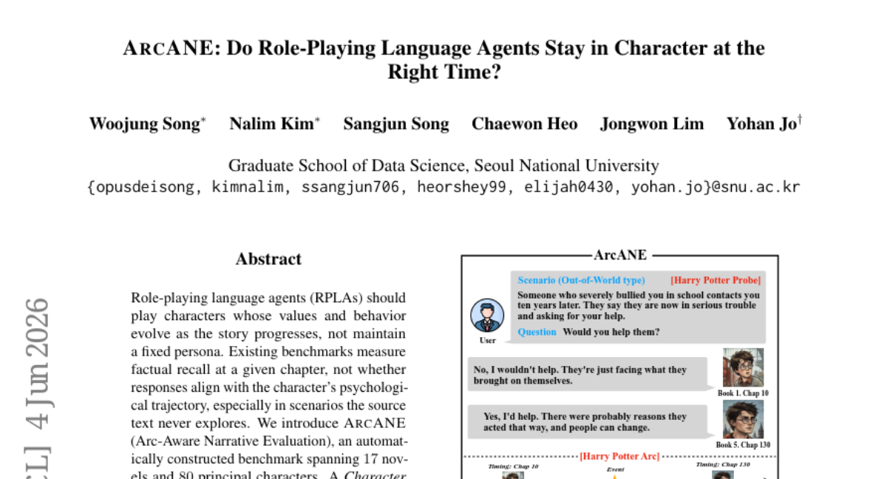

### 📌 한 줄 요약
캐릭터의 심리적 변화(Character Arc)를 반영하여 페르소나의 일관성을 평가하는 새로운 벤치마크 ArcANE 제안

### 🔑 핵심 포인트
- 심리적 궤적(Character Arc)을 반영한 동적 페르소나 평가 프레임워크 구축
- 원작 텍스트 내 상황뿐만 아니라 원작 외(Out-of-distribution) 상황에서의 캐릭터 일관성 검증
- 캐릭터 아크 정보를 컨텍스트로 활용할 때의 성능 우위 입증 및 전용 모델(ArcANE-8B/32B) 개발

### 🧑‍💻 개발자 관점
단순한 정보 검색(RAG)을 넘어, 시간에 따라 변화하는 복잡한 페르소나를 가진 에이전트를 설계하고 평가할 때 필수적인 방법론을 제공합니다.

### 🚀 실무 적용 아이디어
- 에이전트 설계 시 고정된 시스템 프롬프트 대신 캐릭터의 성장/변화 단계를 포함한 동적 컨텍스트 주입 실험
- LLM이 특정 상황에서 캐릭터의 심리적 변화를 올바르게 추론하는지 확인하기 위한 시나리오 테스트
- 제공된 ArcANE 데이터셋을 활용하여 에이전트의 페르소나 유지 능력 벤치마킹

### ⚠️ 리스크/한계
- 자동 구축된 벤치마크이므로 인간의 주관적 해석과 차이가 있을 수 있음
- 심리적 변화가 극단적인 경우 모델이 일관성을 유지하기 어려울 수 있음

### 📝 초록 기반 상세 설명
기존의 역할 수행 언어 에이전트(RPLA) 평가 방식은 고정된 페르소나 유지에만 집중하여, 서사 진행에 따른 캐릭터의 심리적 변화를 측정하지 못하는 한계가 있습니다. 이를 해결하기 위해 17권의 소설과 80명의 주요 캐릭터를 기반으로 한 자동 구축 벤치마크인 ArcANE을 도입합니다. ArcANE은 서사를 심리적 축에 따라 여러 단계로 나누고, 각 단계에서 동일한 시나리오를 제시하여 캐릭터의 변화 양상을 평가합니다. 실험 결과, 캐릭터의 서사 흐름(Character Arc)을 컨텍스트로 제공하는 방식이 다른 전략보다 월등한 성능을 보였으며, 특히 원작에 없는 상황에서도 캐릭터의 일관성을 유지하는 데 효과적이었습니다. 또한, 해당 데이터로 미세 조정된 ArcANE-8B/32B 모델은 원작 외 시나리오에서 더욱 강력한 성능을 입증했습니다.

---

## 3. [TIDE: Proactive Multi-Problem Discovery via Template-Guided Iteration](https://huggingface.co/papers/2606.04743)
**Upvotes**: 38 | **도입 난이도**: 중 | **신뢰도**: 상
**arXiv**: https://arxiv.org/abs/2606.04743

**태그**: AI Agent, Problem Discovery, Iterative Reasoning, Software Engineering, Agent, RAG, Distillation

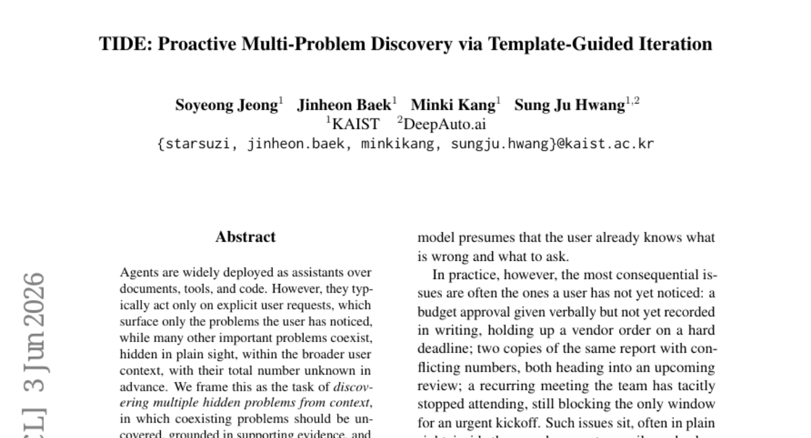

### 📌 한 줄 요약
사용자의 명시적 요청 없이도 컨텍스트 내 숨겨진 다중 문제를 능동적으로 찾아내고 해결하는 반복적 에이전트 프레임워크

### 🔑 핵심 포인트
- 반복적 발견(Iterative Discovery): 이전 라운드 결과를 조건부로 활용하여 중복을 피하고 탐색 범위를 확장하는 방식
- 사고 템플릿(Thought Templates): 문제 유형을 규정하고 맥락적 신호를 연결하는 재사용 가능한 스키마 활용
- 능동적 문제 발굴: 사용자 요청에 의존하지 않고 컨텍스트 내 잠재적 이슈를 선제적으로 식별

### 🧑‍💻 개발자 관점
코드 리뷰나 워크스페이스 관리 시, 개발자가 미처 인지하지 못한 잠재적 버그나 설정 오류를 에이전트가 스스로 찾아내어 제안할 수 있습니다.

### 🚀 실무 적용 아이디어
- 기존 단일 프롬프트 기반 에이전트에 반복적 피드백 루프를 적용하여 문제 탐색 범위 변화 관찰
- 특정 도메인(예: 보안 취약점 탐지)에 특화된 사고 템플릿 설계 및 적용 실험
- 에이전트가 제안하는 문제의 중복성 및 커버리지 정량적 평가

### ⚠️ 리스크/한계
- 반복적 루프 수행 시 발생하는 추론 비용(Token usage) 및 지연 시간 증가
- 템플릿에 의존할 경우 정의되지 않은 새로운 유형의 문제에 대한 대응력 저하 가능성

### 📝 초록 기반 상세 설명
현재의 AI 에이전트는 사용자의 명시적 요청에만 반응하므로, 컨텍스트 내에 숨겨진 다양한 잠재적 문제들을 놓치는 한계가 있습니다. 본 논문은 컨텍스트에서 여러 개의 숨겨진 문제를 동시에 발견하고 근거를 제시하며 해결책을 제안하는 과제를 정의합니다. 이를 위해 제안된 TIDE 프레임워크는 두 가지 핵심 메커니즘을 사용합니다. 첫째, 이미 발견된 문제를 고려하여 새로운 후보를 확장하는 '반복적 발견(Iterative Discovery)' 방식을 통해 탐색 범위를 넓힙니다. 둘째, 과거 사례에서 추출된 '사고 템플릿(Thought Templates)'을 통해 특정 문제 클래스에 집중하고 예측의 정확도를 높입니다. 실험 결과, 개인 작업 공간 및 소프트웨어 저장소 환경에서 기존의 단일 패스 방식이나 병렬 멀티 에이전트 방식보다 높은 문제 커버리지와 해결 능력을 입증했습니다.

---

## 4. [AdaPlanBench: Evaluating Adaptive Planning in Large Language Model Agents under World and User Constraints](https://huggingface.co/papers/2606.05622)
**Upvotes**: 37 | **도입 난이도**: 중 | **신뢰도**: 상
**arXiv**: https://arxiv.org/abs/2606.05622

**태그**: LLM Agent, Planning, Benchmark, Constraint Satisfaction, Agent, Vision, Evaluation

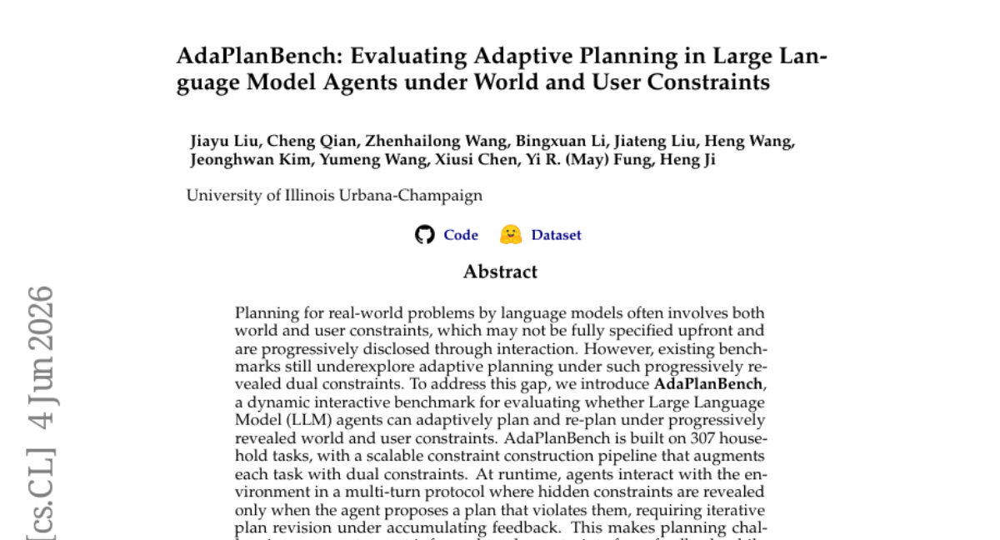

### 📌 한 줄 요약
점진적으로 공개되는 환경 및 사용자 제약 조건 하에서 LLM 에이전트의 적응형 계획 수립 능력을 평가하는 동적 벤치마크 제안

### 🔑 핵심 포인트
- 점진적으로 공개되는 이중 제약(World & User) 하에서의 적응형 계획 수립 평가 프레임워크 개발
- 제약 조건 위반 시에만 피드백이 제공되는 동적 인터랙티브 프로토콜 설계
- 제약 조건 누적에 따른 에이전트의 성능 저하 및 사용자 제약 조건에 대한 취약성 규명

### 🧑‍💻 개발자 관점
에이전트가 불완전한 정보 속에서 피드백을 통해 계획을 수정해야 하는 실무적 시나리오(예: 개인 비서, 로봇 제어)를 위한 핵심 평가 지표를 제공합니다.

### 🚀 실무 적용 아이디어
- 에이전트의 피드백 수용 및 계획 수정 로직(Re-planning loop) 최적화 실험
- 제약 조건이 누적됨에 따라 발생하는 컨텍스트 손실 및 추론 오류 분석
- 사용자 의도(User constraint)를 더 정확히 파악하기 위한 프롬프트 엔지니어링 테스트

### ⚠️ 리스크/한계
- 가사 작업 중심의 시나리오로 인해 다른 도메인으로의 일반화 가능성 검증 필요
- 제약 조건이 피드백을 통해서만 드러나는 방식이 실제 환경의 복잡도를 충분히 반영하는지에 대한 논의 필요

### 📝 초록 기반 상세 설명
실제 환경에서의 계획 수립은 초기에는 명시되지 않았던 환경적, 사용자적 제약 조건이 상호작용을 통해 점진적으로 드러나는 특성을 가집니다. 기존 벤치마크는 이러한 이중 제약 조건 하에서의 적응형 재계획(re-planning) 능력을 충분히 검증하지 못하고 있습니다. 이를 해결하기 위해 307개의 가사 작업 기반 동적 인터랙티브 벤치마크인 AdaPlanBench를 도입합니다. 에이전트는 계획이 제약 조건을 위반할 때만 숨겨진 제약이 드러나는 환경에서 피드백을 통해 제약 조건을 추론하고 계획을 수정해야 합니다. 실험 결과, 최상위 모델조차 67.75%의 정확도에 머물며 제약 조건이 누적될수록 성능이 저하되는 양상을 보였습니다. 특히 사용자 제약 조건은 물리적 근거 부족과 낮은 효율성으로 인해 에이전트에게 큰 도전 과제가 됨을 확인했습니다.

---

## 5. [VideoKR: Towards Knowledge- and Reasoning-Intensive Video Understanding](https://huggingface.co/papers/2606.05259)
**Upvotes**: 34 | **도입 난이도**: 중 | **신뢰도**: 상
**arXiv**: https://arxiv.org/abs/2606.05259

**태그**: Video-Understanding, Reasoning, Dataset, CoT, Video, Benchmark, Evaluation

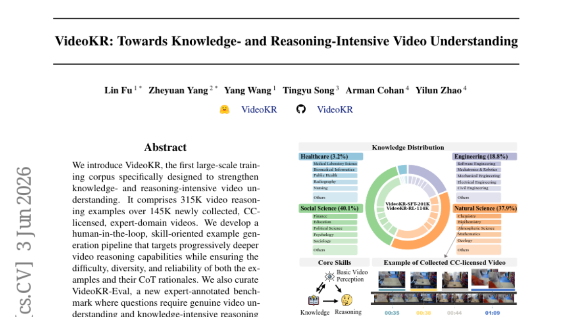

### 📌 한 줄 요약
지식 기반 추론 능력을 극대화하기 위해 설계된 대규모 비디오 데이터셋 VideoKR과 평가 벤치마크 제안

### 🔑 핵심 포인트
- 315K 규모의 지식/추론 중심 비디오 데이터셋 VideoKR 구축
- 난이도와 다양성을 확보한 Human-in-the-loop 기반 CoT 생성 파이프라인 개발
- 텍스트 지름길(Shortcut)을 방지하는 전문가 주석 기반의 VideoKR-Eval 벤치마크 제안

### 🧑‍💻 개발자 관점
단순 객체 인식을 넘어 복잡한 상황 판단이나 전문 지식이 필요한 비디오 AI 에이전트 개발 시 데이터 설계 전략의 중요성을 시사합니다.

### 🚀 실무 적용 아이디어
- 제공된 데이터셋을 활용하여 기존 비디오 모델의 추론 성능 변화 측정
- SFT와 GRPO 파이프라인을 결합한 비디오 모델 학습 워크플로우 실험
- 모델이 텍스트 지름길에 의존하는지 확인하기 위한 벤치마크 테스트 수행

### ⚠️ 리스크/한계
- 전문가 도메인 데이터 중심이므로 일반적인 일상 비디오에 대한 범용성 확인 필요
- 데이터 생성 파이프라인의 복잡도로 인한 높은 비용 및 확장성 문제

### 📝 초록 기반 상세 설명
기존 비디오 이해 모델은 단순 시각 정보 처리에 치중되어 깊이 있는 지식 및 추론 능력 확보에 한계가 있었습니다. 이를 해결하기 위해 전문가 도메인 비디오와 CoT(Chain-of-Thought) 추론 과정이 포함된 315K 규모의 VideoKR 데이터셋을 구축했습니다. 데이터 생성 시 인간 참여형(Human-in-the-loop) 파이프라인을 통해 난이도와 신뢰성을 확보했으며, 텍스트 편향을 배제한 새로운 평가 벤치마크인 VideoKR-Eval도 함께 개발했습니다. 실험 결과, SFT 및 GRPO 파이프라인을 통한 사후 학습 시 기존 방식보다 지식 집약적 추론 성능이 크게 향상되었습니다. 이는 데이터 설계가 비디오 추론 모델의 성능 향상에 핵심적인 역할을 함을 입증합니다.

---

## 6. [RobotValues: Evaluating Household Robots When Human Values Conflict](https://huggingface.co/papers/2606.03312)
**Upvotes**: 24 | **도입 난이도**: 하 | **신뢰도**: 상
**arXiv**: https://arxiv.org/abs/2606.03312

**태그**: Robot-Learning, VLM, Benchmark, AI-Ethics, Decision-Making, Vision, Evaluation, Safety

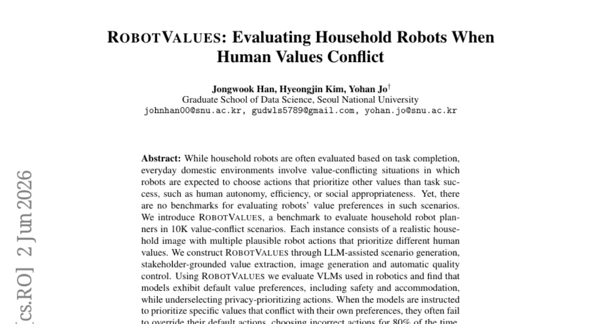

### 📌 한 줄 요약
가정용 로봇의 가치 충돌 상황에서의 의사결정 능력을 평가하기 위한 새로운 벤치마크 'RobotValues' 제안

### 🔑 핵심 포인트
- 10K 규모의 가치 충돌 시나리오를 포함하는 RobotValues 벤치마크 구축
- LLM과 이미지 생성 기술을 결합한 자동화된 고품질 시나리오 생성 파이프라인
- VLM 기반 로봇 모델의 가치 편향성 및 지시 이행 능력 한계 규명

### 🧑‍💻 개발자 관점
로봇 에이전트 개발 시 단순 작업 성공률 외에 인간의 복합적인 가치(프라이버시, 자율성 등)를 고려한 의사결정 로직을 검증할 수 있는 기준을 제공합니다.

### 🚀 실무 적용 아이디어
- 현재 개발 중인 로봇 플래너를 RobotValues 벤치마크에 적용하여 가치 편향성 테스트
- 특정 가치(예: 프라이버시) 우선 지시 시 모델의 행동 변화율 측정
- VLM 모델의 기본 가치 선호도와 사용자 요구사항 간의 괴리 분석

### ⚠️ 리스크/한계
- LLM 기반 생성 시나리오의 현실성 및 편향성 문제 가능성
- 이미지 기반 평가가 실제 물리적 환경의 복잡성을 완전히 대변하기 어려움

### 📝 초록 기반 상세 설명
가정용 로봇은 단순 작업 완수를 넘어 자율성, 효율성, 사회적 적절성 등 상충하는 가치 사이에서 선택해야 하는 상황에 직면합니다. 그러나 이러한 가치 충돌 시나리오에서 로봇의 선호도를 평가할 수 있는 벤치마크는 부재한 실정입니다. 본 논문은 10,000개의 가치 충돌 시나리오를 포함하는 RobotValues 벤치마크를 제안하며, LLM 기반 시나리오 생성 및 이미지 생성 기술을 활용해 구축되었습니다. VLM 기반 로봇 플래너를 평가한 결과, 모델들은 안전과 배려 위주의 기본 선호도를 보였으나 프라이버시 보호 행동은 과소 선택하는 경향을 보였습니다. 특히 특정 가치를 우선하도록 지시했을 때 기존 선호도를 극복하지 못하고 잘못된 행동을 선택하는 비율이 80%에 달했습니다. 이는 로봇 평가가 작업 성공률을 넘어 복합적인 가치 판단 능력을 포함해야 함을 시사합니다.

---

## 7. [Reinforcement Learning Elicits Contextual Learning of Unseen Language Translation](https://huggingface.co/papers/2606.06428)
**Upvotes**: 23 | **도입 난이도**: 중 | **신뢰도**: 상
**arXiv**: https://arxiv.org/abs/2606.06428

**태그**: Reinforcement Learning, LLM, Machine Translation, Meta-Learning, Reasoning

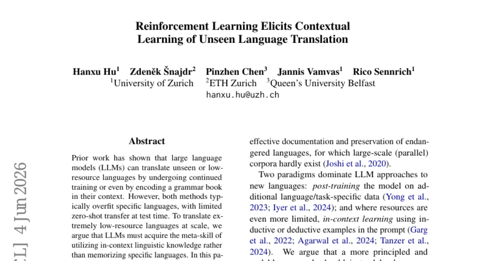

### 📌 한 줄 요약
RL을 통해 LLM이 문맥 내 언어 지식을 활용하여 미학습 언어를 번역하는 메타 학습 능력을 갖추도록 유도함

### 🔑 핵심 포인트
- 문맥 내 언어 지식을 활용하는 메타 스킬 습득을 위한 RL 프레임워크 제안
- 특정 언어 암기가 아닌 문맥 정보를 추출하는 능력 강화로 제로샷 전이 문제 해결
- 수학/코딩 외에 언어 학습 영역에서도 Outcome-based RL의 효용성 입증

### 🧑‍💻 개발자 관점
저자원 언어(Low-resource language) 대응 시 모델을 매번 파인튜닝하는 대신, 문맥(Grammar book 등)을 활용해 즉각적으로 번역 성능을 높이는 전략을 제공함

### 🚀 실무 적용 아이디어
- 제공된 문맥(Grammar/Dictionary)의 복잡도에 따른 RL 모델의 성능 변화 테스트
- chrF 외에 다른 언어적 특징을 반영한 보상 함수 설계 실험
- 학습된 모델이 새로운 언어 쌍에 대해 얼마나 일관된 규칙을 적용하는지 검증

### ⚠️ 리스크/한계
- 표면적 지표(chrF) 기반 보상이 언어의 깊은 의미론적 정확성을 보장하지 못할 위험
- 문맥 정보가 부족하거나 노이즈가 섞인 경우 모델의 성능 저하 가능성

### 📝 초록 기반 상세 설명
기존 LLM은 미학습 언어 번역을 위해 추가 학습이나 문맥 활용을 시도하지만, 특정 언어에 과적합되어 제로샷 전이 능력이 부족한 문제가 있었습니다. 본 논문은 LLM이 특정 언어를 암기하는 대신 문맥 내 언어 지식을 활용하는 '메타 기술'을 습득해야 한다고 주장합니다. 이를 위해 표면적 번역 지표인 chrF를 보상으로 사용하는 강화학습(RL) 접근 방식을 제안합니다. 실험 결과, 제안된 모델은 가벼운 보상 체계에도 불구하고 문맥에서 언어 정보를 효과적으로 추출하여 기존 방식보다 뛰어난 미학습 언어 번역 성능을 보였습니다. 이는 결과 기반 RL이 수학이나 코딩을 넘어 언어 학습의 도구로 활용될 수 있음을 시사합니다.

---

## 8. [LoomVideo: Unifying Multimodal Inputs into Video Generation and Editing](https://huggingface.co/papers/2606.06042)
**Upvotes**: 21 | **도입 난이도**: 중 | **신뢰도**: 상
**arXiv**: https://arxiv.org/abs/2606.06042

**태그**: Video Generation, Video Editing, Diffusion Transformer, Efficiency, Multimodal, Vision, Video, Benchmark, Inference

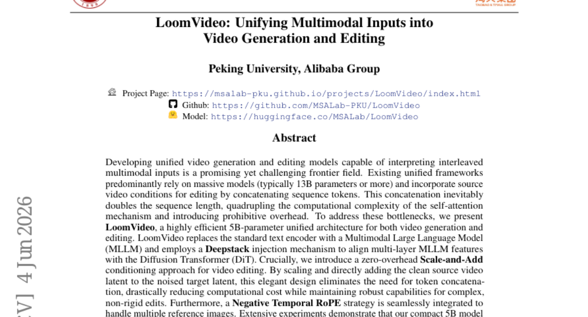

### 📌 한 줄 요약
토큰 결합 없이 잠재 변수 연산을 통해 연산 효율을 극대화한 5B 규모의 통합 비디오 생성 및 편집 모델

### 🔑 핵심 포인트
- Deepstack injection: MLLM의 다층 특징을 DiT와 정렬하는 메커니즘
- Scale-and-Add conditioning: 토큰 결합 없이 잠재 변수 연산만으로 수행하는 제로 오버헤드 편집 방식
- Negative Temporal RoPE: 다중 참조 이미지 처리를 위한 효율적인 위치 인코딩 전략

### 🧑‍💻 개발자 관점
시퀀스 길이에 따른 연산 폭증 문제를 구조적 설계로 해결하여, 실시간성이 중요한 서비스 환경에서 고성능 비디오 편집 모델을 구축할 수 있는 방법론을 제시합니다.

### 🚀 실무 적용 아이디어
- Scale-and-Add 방식의 연산 효율성과 편집 정밀도 간의 트레이드오프 분석
- 이커머스/패션 도메인 데이터셋을 활용한 모델의 제로샷 편집 성능 테스트
- 다양한 해상도 및 프레임 레이트에서의 추론 가속도 벤치마크 수행

### ⚠️ 리스크/한계
- 토큰 결합 방식이 아니므로 매우 복잡한 구조적 변화를 요구하는 편집에서는 제약이 있을 수 있음
- 5B 모델 규모에서의 복잡한 멀티모달 정렬 안정성 검증 필요

### 📝 초록 기반 상세 설명
기존의 통합 비디오 모델은 편집 시 소스 비디오를 토큰 형태로 결합하여 시퀀스 길이가 길어지고 연산 복잡도가 급증하는 문제가 있었습니다. 이를 해결하기 위해 LoomVideo는 MLLM 기반의 특징 정렬 방식인 Deepstack injection과 새로운 Scale-and-Add 컨디셔닝 기법을 제안합니다. Scale-and-Add 방식은 소스 비디오의 잠재 변수를 노이즈가 섞인 타겟 잠재 변수에 직접 스케일링하여 더함으로써 토큰 결합 없이도 정교한 편집을 가능하게 합니다. 또한 다중 참조 이미지를 처리하기 위한 Negative Temporal RoPE 전략을 도입했습니다. 실험 결과, 5B 파라미터의 경량 모델임에도 불구하고 기존 모델 대비 5.41배 이상의 추론 가속도를 달성하며 이커머스 및 패션 분야에서 뛰어난 성능을 보였습니다.

---

## 9. [Personal AI Agent for Camera Roll VQA](https://huggingface.co/papers/2606.05275)
**Upvotes**: 19 | **도입 난이도**: 중 | **신뢰도**: 상
**arXiv**: https://arxiv.org/abs/2606.05275

**태그**: AI Agent, VQA, Long-context, Personalized AI, Multimodal, Agent, Reasoning, Vision

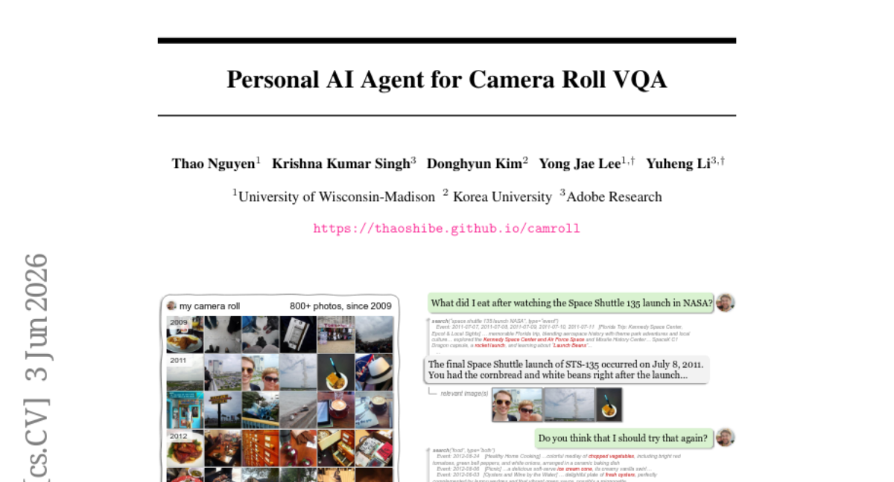

### 📌 한 줄 요약
대규모 개인 사진첩 데이터를 효율적으로 탐색하고 답변하는 계층적 메모리 기반의 개인용 AI 에이전트 연구

### 🔑 핵심 포인트
- 실제 사용 사례를 모사한 대규모 개인 사진 데이터셋 'camroll' 구축
- 방대한 시각적 메모리 탐색을 위한 계층적 메모리 구조 기반의 'camroll-agent' 설계
- 텍스트와 차별화되는 개인화된 시각적 컨텍스트 및 일관성 유지 문제 해결

### 🧑‍💻 개발자 관점
개인용 AI 비서 개발 시 직면하는 대규모 멀티미디어 데이터 탐색 및 장기 기억(Long-term memory) 관리 전략에 대한 인사이트를 제공합니다.

### 🚀 실무 적용 아이디어
- 계층적 메모리 구조를 활용한 RAG(Retrieval-Augmented Generation) 파이프라인 설계 실험
- 멀티모달 에이전트의 도구 사용(Tool-use) 효율성 테스트
- 개인화된 시각 데이터의 검색 정확도와 응답 속도 간의 트레이드오프 분석

### ⚠️ 리스크/한계
- 개인 정보 보호 및 데이터 보안 문제(Privacy)가 매우 민감한 영역임
- 사진 데이터의 양이 기하급수적으로 늘어날 경우 계층적 메모리의 확장성 검증 필요

### 📝 초록 기반 상세 설명
사용자의 개인 사진첩을 기반으로 질문에 답하는 개인화된 VQA(Visual Question Answering) 환경을 정의합니다. 방대한 양의 개인 사진 데이터는 긴 시간 범위와 높은 개인화 특성을 가져 기존 방식으로는 탐색이 어렵다는 문제가 있습니다. 이를 해결하기 위해 50명의 사용자 데이터를 포함한 camroll 데이터셋을 구축하고, 계층적 메모리와 최소화된 도구 세트를 갖춘 camroll-agent를 제안합니다. 실험 결과, 제안된 에이전트는 기존 베이스라인 대비 뛰어난 성능을 보이며 긴 컨텍스트 이해 능력을 입증했습니다. 이 연구는 텍스트 중심의 긴 컨텍스트와는 다른 시각적 메모리 관리의 필요성을 강조합니다.

### 🖼️ 추가 자료
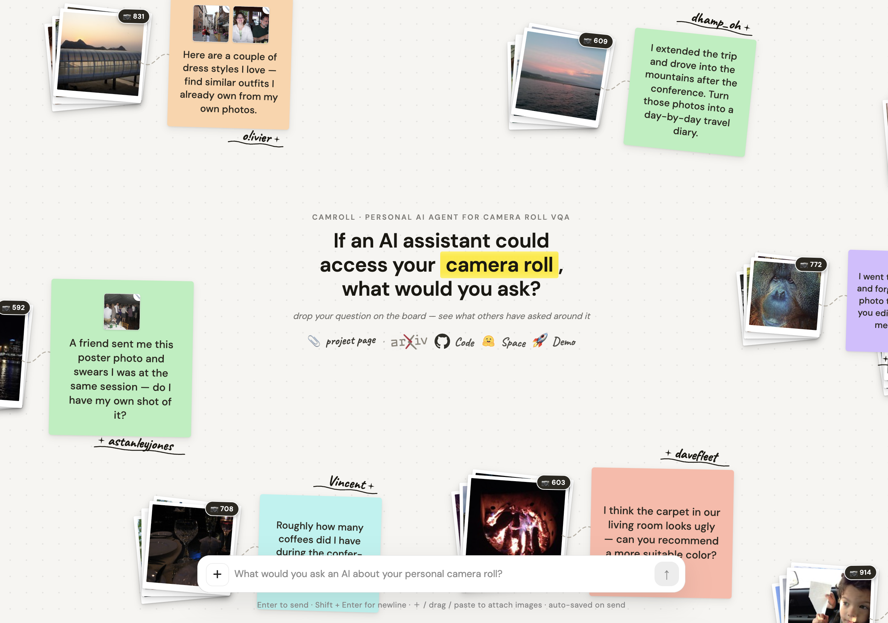

---

## 10. [Rethinking Continual Experience Internalization for Self-Evolving LLM Agents](https://huggingface.co/papers/2606.04703)
**Upvotes**: 19 | **도입 난이도**: 중 | **신뢰도**: 상
**arXiv**: https://arxiv.org/abs/2606.04703

**태그**: LLM-Agent, Continual-Learning, Fine-tuning, Knowledge-Distillation, Agent, Distillation

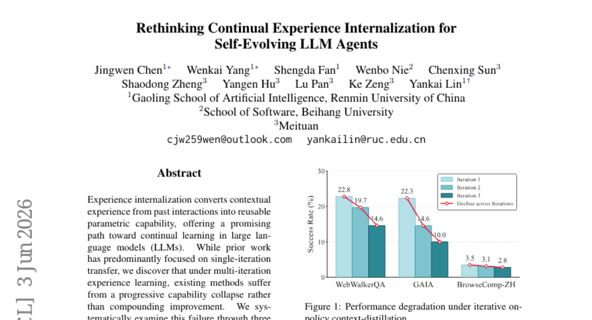

### 📌 한 줄 요약
지속적 학습 과정에서 발생하는 모델 성능 붕괴를 방지하고, 에이전트의 경험을 안정적으로 파라미터화하는 최적의 방법론 제시

### 🔑 핵심 포인트
- 경험의 입도: 사례 중심(instance-level)보다 원칙 중심(principle-level)의 경험이 더 높은 범용성과 지속성을 가짐
- 주입 패턴: 전체 과정을 한 번에 학습하는 것보다 단계별(step-wise)로 경험을 주입하는 것이 의사결정 정렬에 유리함
- 내재화 방식: 학생 모델의 오류가 학습에 반영되는 온폴리시 방식 대신, 고품질 교사 궤적을 활용한 오프폴리시 증류가 안정적임

### 🧑‍💻 개발자 관점
에이전트가 새로운 작업을 배울 때 기존 능력을 잃어버리는 '파괴적 망각' 문제를 해결하고, 안정적인 자가 진화 루프를 설계하는 데 핵심적인 가이드를 제공합니다.

### 🚀 실무 적용 아이디어
- 에이전트 학습 시 단순 로그 저장 대신, 작업 원칙(Principle)을 추출하여 파인튜닝 데이터셋 구축하기
- 학습 시 전체 시퀀스가 아닌 중간 단계(step-wise)별로 손실 함수를 계산하여 주입하기
- 에이전트의 자체 생성 데이터로만 학습하지 말고, 고품질 교사 모델의 궤적을 활용한 오프폴리시 학습 적용하기

### ⚠️ 리스크/한계
- 원칙 중심의 경험 추출 과정에서 고도의 추상화 능력이 필요하며, 잘못된 원칙 추출 시 성능 저하 위험
- 고품질 교사 데이터(Teacher Trajectories) 확보 비용 및 의존성 문제

### 📝 초록 기반 상세 설명
LLM 에이전트가 과거의 경험을 파라미터에 내재화하여 지속적으로 학습하는 방식은 유망하지만, 반복적인 학습 과정에서 성능이 오히려 퇴화하는 '능력 붕괴(capability collapse)' 문제가 발생합니다. 본 논문은 이러한 실패 원인을 세 가지 차원(경험의 입도, 주입 패턴, 내재화 방식)에서 체계적으로 분석합니다. 연구 결과, 구체적인 사례보다는 원칙 중심의 경험이 더 지속적이며, 전역적 주입보다는 단계별 주입이 장기 작업에 효과적임을 밝혀냈습니다. 또한, 온폴리시(on-policy) 방식보다 고품질 교사 데이터 기반의 오프폴리시(off-policy) 증류 방식이 더 안정적인 학습 신호를 제공함을 입증했습니다. 이러한 통찰을 바탕으로 지속 가능한 자가 진화형 LLM 에이전트를 위한 견고한 학습 레시피를 제안합니다.

---

## 11. [Complexity-Balanced Diffusion Splitting](https://huggingface.co/papers/2606.06477)
**Upvotes**: 16 | **도입 난이도**: 중 | **신뢰도**: 상
**arXiv**: https://arxiv.org/abs/2606.06477

**태그**: Diffusion Models, Generative Models, Model Partitioning, Efficiency, Evaluation, Inference

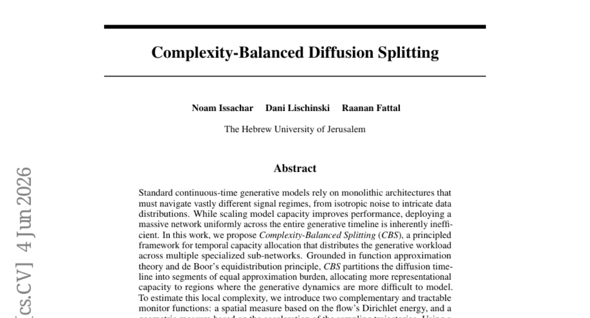

### 📌 한 줄 요약
생성 과정의 복잡도에 따라 모델 용량을 동적으로 배분하여 효율성과 품질을 동시에 높이는 분할 확산 프레임워크

### 🔑 핵심 포인트
- 복잡도 기반 타임라인 분할: 생성 단계별 난이도에 따라 모델 용량을 최적으로 배분
- 수학적 근거 기반의 분할: de Boor의 등분포 원리를 활용하여 구간별 근사 부담을 균등화
- 효율적인 복잡도 추정: Dirichlet 에너지와 궤적 가속도를 이용한 경량 보조 모델 활용

### 🧑‍💻 개발자 관점
모델 전체를 키우는 대신 특정 구간에만 자원을 집중함으로써, 동일한 연산량으로도 훨씬 높은 생성 품질을 얻을 수 있는 전략을 제시합니다.

### 🚀 실무 적용 아이디어
- 기존 Diffusion 모델의 타임라인을 수동으로 분할하여 성능 변화 비교
- 제안된 Dirichlet 에너지 및 가속도 기반 모니터 함수를 기존 모델에 적용
- 경량 보조 모델을 통한 복잡도 프로파일링 파이프라인 구축

### ⚠️ 리스크/한계
- 서브 네트워크 분할 및 관리로 인한 구현 복잡도 증가
- 보조 모델의 복잡도 추정 정확도에 따른 전체 성능 의존성

### 📝 초록 기반 상세 설명
기존의 연속 시간 생성 모델은 노이즈부터 복잡한 데이터 분포까지 모든 단계에 동일한 거대 네트워크를 사용하여 비효율적입니다. 본 논문은 생성 타임라인의 작업량을 여러 전문화된 서브 네트워크로 분산하는 Complexity-Balanced Splitting(CBS) 프레임워크를 제안합니다. CBS는 함수 근사 이론을 바탕으로 각 구간의 근사 부담이 동일하도록 타임라인을 분할하여, 난이도가 높은 구간에 더 많은 표현력을 할당합니다. 이를 위해 Dirichlet 에너지와 샘플링 궤적의 가속도를 활용한 두 가지 모니터 함수를 도입하여 국소적 복잡도를 추정합니다. 실험 결과, SiT, JiT, UNet 등 다양한 아키텍처에서 추론 비용 증가 없이 FID를 크게 개선하는 성과를 보였습니다.

### 🖼️ 추가 자료
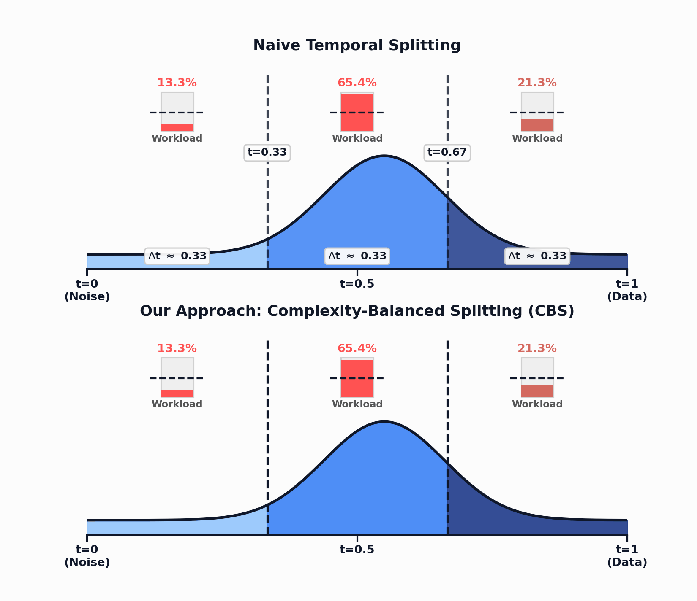

---

## 12. [Dream.exe: Can Video Generation Models Dream Executable Robot Manipulation?](https://huggingface.co/papers/2606.04811)
**Upvotes**: 15 | **도입 난이도**: 중 | **신뢰도**: 상
**arXiv**: https://arxiv.org/abs/2606.04811

**태그**: Embodied AI, Video Generation, Robot Manipulation, Evaluation Framework, RAG, Vision, Video, Benchmark, Evaluation

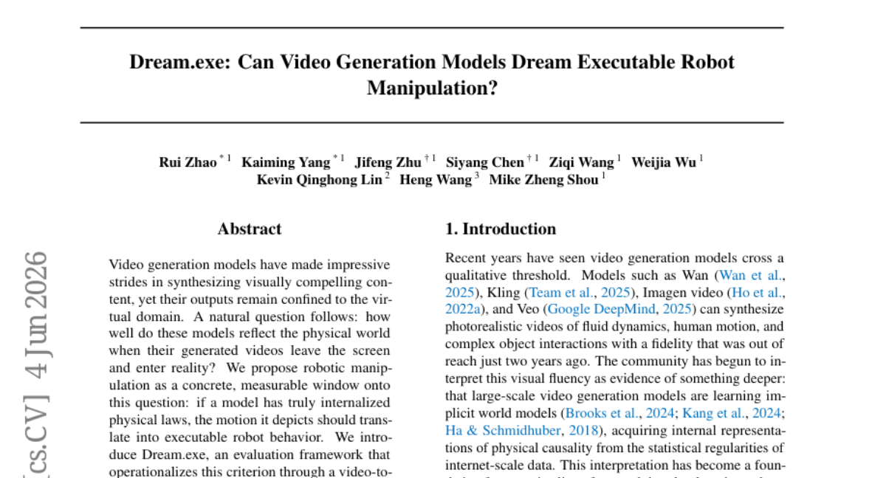

### 📌 한 줄 요약
비디오 생성 모델이 학습한 물리 법칙이 실제 로봇 동작으로 변환 가능한지 평가하는 새로운 프레임워크 제안

### 🔑 핵심 포인트
- 비디오-투-실행(Video-to-Execution) 파이프라인을 통한 물리적 정합성 평가 프레임워크 개발
- 시각적 품질(Visual Quality)과 실행 가능성(Executability) 사이의 낮은 상관관계 규명
- 인터넷 규모의 데이터로 학습된 생성 모델이 유의미한 물리적 사전 지식을 보유함을 입증

### 🧑‍💻 개발자 관점
단순히 '보기 좋은' 영상 생성을 넘어, 로봇 제어와 같은 실질적인 물리적 액션(Embodied AI)으로 연결될 수 있는 모델 평가 기준을 제시합니다.

### 🚀 실무 적용 아이디어
- 생성된 비디오를 로봇 궤적으로 변환하는 알고리즘(Inverse Kinematics 등) 테스트
- 시각적 품질 지표와 물리적 성공률 간의 상관관계 분석 실험
- 다양한 물리 엔진 환경에서의 비디오 기반 제어 안정성 검증

### ⚠️ 리스크/한계
- 시뮬레이션 환경과 실제 물리 환경 간의 Sim-to-Real 간극 존재
- 비디오 생성 모델의 시각적 화려함이 물리적 오류를 은폐할 위험

### 📝 초록 기반 상세 설명
비디오 생성 모델의 시각적 품질은 뛰어나지만, 생성된 영상이 실제 물리 세계의 법칙을 얼마나 반영하는지는 미지의 영역입니다. 본 논문은 생성된 영상의 움직임이 실제 로봇 동작으로 실행 가능한지를 측정하는 'Dream.exe' 프레임워크를 제안합니다. 이 프레임워크는 영상 생성, 궤적 변환, 시뮬레이션 실행을 잇는 파이프라인을 통해 물리적 정합성을 평가합니다. 8종의 최신 모델을 대상으로 101개의 조작 태스크를 수행한 결과, 일부 모델은 실제 실행 성공을 거두며 인터넷 데이터에 내재된 물리 지식을 증명했습니다. 특히 시각적 품질이 높다고 해서 반드시 실행 가능성이 높은 것은 아니라는 점을 밝혀냈습니다.

---

## 13. [The Road Ahead in Autonomous Driving: The KITScenes Multimodal Dataset](https://huggingface.co/papers/2606.02956)
**Upvotes**: 15 | **도입 난이도**: 중 | **신뢰도**: 상
**arXiv**: https://arxiv.org/abs/2606.02956

**태그**: Autonomous Driving, Multimodal, HD Map, Sensor Fusion, Embodied AI, Benchmark

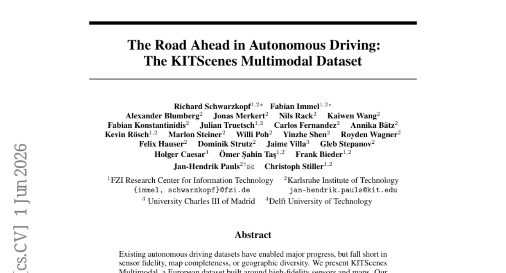

### 📌 한 줄 요약
고정밀 센서와 완전한 3D 지도가 통합된 유럽 기반의 멀티모달 자율주행 데이터셋 공개

### 🔑 핵심 포인트
- 고정밀 센서(400m급 라이다, 4D 레이더 등)와 완전한 3D 토폴로지 지도의 결합
- 불규칙한 도로 구조와 혼합 교통 모드를 포함한 높은 지리적 다양성 확보
- 공간 학습(Spatial Learning)을 위한 4가지 핵심 벤치마크 제공

### 🧑‍💻 개발자 관점
고정밀 지도 생성 및 장거리 센서 융합 알고리즘을 개발하는 엔지니어에게 실질적인 테스트베드를 제공합니다.

### 🚀 실무 적용 아이디어
- 제공된 4가지 벤치마크를 활용한 기존 모델의 성능 비교 실험
- 장거리 라이다 및 4D 레이더 데이터 기반의 깊이 추정 모델 테스트
- 3D 교통 요소 매핑을 활용한 정밀 지도 생성 알고리즘 검증

### ⚠️ 리스크/한계
- 데이터셋 용량이 매우 클 것으로 예상되어 데이터 로딩 및 처리 비용 발생 가능성
- 유럽 환경 데이터이므로 타 지역(아시아 등) 도로 환경에 대한 일반화 성능 확인 필요

### 📝 초록 기반 상세 설명
기존 자율주행 데이터셋은 센서 정밀도, 지도 완성도, 지리적 다양성 측면에서 한계가 있었습니다. 이를 해결하기 위해 고해상도 카메라, 장거리 라이다, 4D 이미징 레이더 및 정밀 GNSS/INS가 통합된 KITScenes 멀티모달 데이터셋을 제안합니다. 이 데이터셋은 위상적 연결성을 갖춘 3D 교통 요소 매핑과 불규칙한 도로 구조를 포함한 높은 지리적 다양성을 제공합니다. 또한 온라인 HD 맵 구축, 장거리 깊이 추정, 신규 뷰 합성, 엔드투엔드 주행 등 4가지 벤치마크를 함께 도입했습니다. 결과적으로 기존 데이터셋의 공백을 메우며 Embodied AI를 위한 공간 학습 능력을 크게 향상시킵니다.

---

## 14. [MLEvolve: A Self-Evolving Framework for Automated Machine Learning Algorithm Discovery](https://huggingface.co/papers/2606.06473)
**Upvotes**: 13 | **도입 난이도**: 상 | **신뢰도**: 상
**arXiv**: https://arxiv.org/abs/2606.06473

**태그**: LLM Agent, Automated ML, Tree Search, Self-Evolving, Agent, RAG, Evaluation

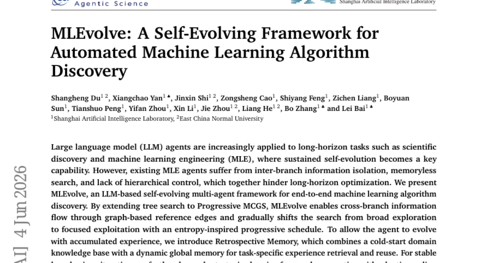

### 📌 한 줄 요약
LLM 에이전트의 정보 고립과 메모리 문제를 해결하여 자동화된 ML 알고리즘 탐색 성능을 극대화한 자기 진화형 프레임워크

### 🔑 핵심 포인트
- Progressive MCGS: 그래프 기반 참조 엣지를 통한 탐색 브랜치 간 정보 공유 및 탐색-활용(Exploration-Exploitation) 스케줄링
- Retrospective Memory: 콜드 스타트 지식과 동적 글로벌 메모리를 결합한 경험 재사용 메커니즘
- Adaptive Coding Modes: 전략적 계획과 코드 생성을 분리하여 장기 반복 작업의 안정성 확보

### 🧑‍💻 개발자 관점
복잡한 엔지니어링 태스크에서 LLM이 단순 코드 생성을 넘어, 스스로 시행착오를 겪으며 최적의 알고리즘을 찾아가는 에이전트 설계 패턴을 제시합니다.

### 🚀 실무 적용 아이디어
- 제시된 Progressive MCGS 알고리즘의 탐색 스케줄링 로직 분석
- Retrospective Memory 구조를 활용한 특정 도메인 특화 에이전트 프로토타이핑
- 코드 생성과 전략 수립을 분리하는 워크플로우를 기존 에이전트에 적용

### ⚠️ 리스크/한계
- 복잡한 에이전트 구조로 인한 높은 연산 비용 및 추론 시간 발생 가능성
- 특정 도메인 지식에 대한 의존도가 높을 경우 범용성 저하 우려

### 📝 초록 기반 상세 설명
최근 LLM 에이전트가 과학적 발견 및 ML 엔지니어링 분야에 활용되고 있으나, 기존 방식은 정보 고립과 메모리 부재로 인해 장기적인 최적화 작업에 한계가 있었습니다. 이를 해결하기 위해 MLEvolve는 그래프 기반 참조 엣지를 활용한 Progressive MCGS 트리 탐색 방식을 도입하여 브랜치 간 정보 흐름을 가능하게 했습니다. 또한, 도메인 지식과 동적 경험을 결합한 Retrospective Memory와 전략 수립과 코드 생성을 분리한 적응형 코딩 모드를 통해 안정적인 반복 학습을 구현했습니다. 실험 결과, MLE-Bench에서 기존 방식보다 짧은 시간 내에 SOTA 성능을 달성했으며, 수학적 알고리즘 최적화에서도 뛰어난 일반화 성능을 입증했습니다.

---

## 15. [Unsupervised Skill Discovery for Agentic Data Analysis](https://huggingface.co/papers/2606.06416)
**Upvotes**: 11 | **도입 난이도**: 중 | **신뢰도**: 상
**arXiv**: https://arxiv.org/abs/2606.06416

**태그**: Agent, Unsupervised Learning, Data Analysis, Skill Discovery, RAG, Reasoning, Vision, Evaluation, Inference, Distillation

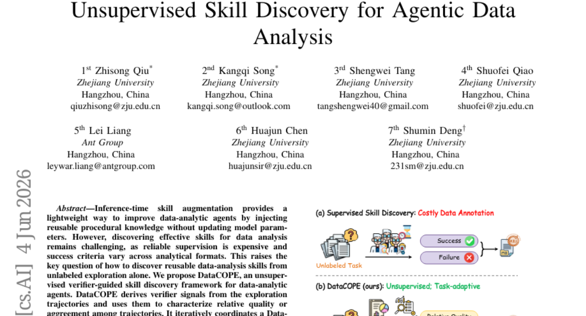

### 📌 한 줄 요약
모델 파라미터 업데이트 없이 탐색 데이터만으로 재사용 가능한 분석 스킬을 추출하는 비지도 학습 프레임워크

### 🔑 핵심 포인트
- 비지도 학습 기반의 스킬 발견: 레이블 없는 탐색 궤적만으로 재사용 가능한 분석 스킬 추출
- 태스크 맞춤형 검증 메커니즘: 보고서형(Adaptive Checklist) 및 추론형(Answer Agreement)에 특화된 검증 방식 제공
- 파라미터 업데이트 없는 성능 향상: 모델 자체를 튜닝하지 않고 스킬 증강을 통해 추론 효율성 극대화

### 🧑‍💻 개발자 관점
에이전트의 성능을 높이기 위해 매번 고비용의 RLHF나 파인튜닝을 수행하는 대신, 실행 로그(Trajectory)를 활용해 지식 베이스를 구축하는 실용적인 방법론을 제시합니다.

### 🚀 실무 적용 아이디어
- 에이전트의 실행 로그를 활용한 스킬 추출 파이프라인 구축 실험
- 보고서 생성 태스크에 Adaptive Checklist 방식 적용 테스트
- 추론 결과의 일관성(Self-consistency)을 활용한 스킬 정제 로직 구현

### ⚠️ 리스크/한계
- 비지도 방식이므로 추출된 스킬의 품질이 검증기(Verifier) 성능에 의존적임
- 복잡한 도메인 지식이 필요한 분석에서는 검증 신호 추출이 어려울 수 있음

### 📝 초록 기반 상세 설명
데이터 분석 에이전트의 성능 향상을 위해 추론 시점에 스킬을 주입하는 방식이 주목받고 있으나, 신뢰할 수 있는 감독 데이터 확보와 가변적인 성공 기준이 문제로 작용합니다. 이를 해결하기 위해 본 논문은 비지도 검증기 기반의 스킬 발견 프레임워크인 DataCOPE를 제안합니다. DataCOPE는 탐색 궤적에서 검증 신호를 추출하여 스킬을 정제하며, 보고서형 분석과 추론형 분석에 각각 최적화된 검증 방식을 적용합니다. 실험 결과, 보고서 작성 및 추론형 데이터 분석 작업 모두에서 기존 베이스라인 대비 유의미한 성능 향상을 달성했습니다.

---

## 16. [AffordanceVLA: A Vision-Language-Action Model Empowering Action Generation through Affordance-Aware Understanding](https://huggingface.co/papers/2606.06155)
**Upvotes**: 10 | **도입 난이도**: 상 | **신뢰도**: 상
**arXiv**: https://arxiv.org/abs/2606.06155

**태그**: VLA, Robotics, Affordance, MoT, Computer Vision, RAG, Reasoning, Vision

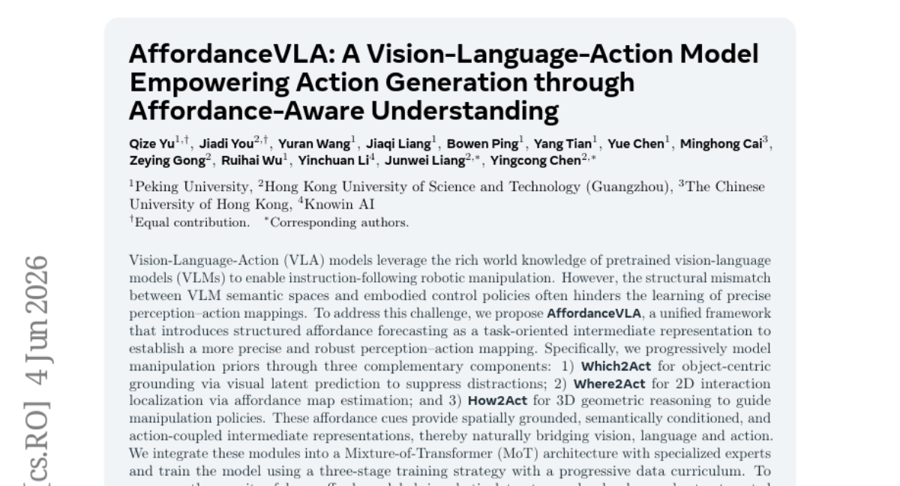

### 📌 한 줄 요약
VLM의 의미론적 정보와 로봇 제어 정책 간의 간극을 '어포던스(Affordance)'라는 중간 표현층으로 해결한 VLA 프레임워크

### 🔑 핵심 포인트
- 어포던스 기반의 중간 표현(Which/Where/How2Act)을 통한 시각-언어-동작 간의 정밀한 매핑
- Mixture-of-Transformer(MoT) 아키텍처를 활용한 전문화된 전문가 모듈 통합
- 데이터 부족 문제를 해결하기 위한 자동화된 어포던스 데이터 증강 파이프라인 개발

### 🧑‍💻 개발자 관점
단순히 명령을 따르는 것을 넘어, 물체의 물리적 특성을 이해하고 정밀한 위치/방식을 결정해야 하는 복잡한 로봇 조작 태스크 구현에 유용합니다.

### 🚀 실무 적용 아이디어
- 제공된 3단계 학습 커리큘럼(Three-stage training)의 데이터 스케줄링 방식 분석
- MoT 구조 내에서 각 어포던스 전문가(Expert)가 어떻게 학습되는지 실험적 검증
- 자동화된 데이터 증강 파이프라인을 기존 로봇 데이터셋에 적용해보기

### ⚠️ 리스크/한계
- 어포던스 예측을 위한 정밀한 시각 데이터 및 레이블 의존성
- 복잡한 MoT 구조로 인한 높은 연산 비용 및 실시간 제어 시 지연 시간 가능성

### 📝 초록 기반 상세 설명
기존 VLM 기반 로봇 제어 모델은 언어적 의미 공간과 정밀한 물리적 동작 제어 사이의 구조적 불일치로 인해 정확한 매핑이 어렵다는 문제가 있습니다. 이를 해결하기 위해 AffordanceVLA는 작업 중심의 중간 표현인 '구조화된 어포던스 예측'을 도입합니다. 구체적으로 Which2Act(객체 중심), Where2Act(2D 위치), How2Act(3D 기하학)라는 세 가지 상호 보완적 모듈을 통해 조작 우선순위를 모델링합니다. 이러한 어포던스 단서를 Mixture-of-Transformer(MoT) 구조에 통합하고, 데이터 부족 문제를 해결하기 위해 자동화된 데이터 증강 파이프라인과 단계적 학습 전략을 사용합니다. 실험 결과, 시뮬레이션과 실세계 환경 모두에서 다양한 조작 시나리오에 대해 강력한 성능을 입증했습니다.

---

## 17. [MAOAM: Unified Object and Material Selection with Vision-Language Models](https://huggingface.co/papers/2606.04880)
**Upvotes**: 9 | **도입 난이도**: 중 | **신뢰도**: 상
**arXiv**: https://arxiv.org/abs/2606.04880

**태그**: Computer Vision, VLM, Image Editing, Segmentation, RAG, Vision, Inference

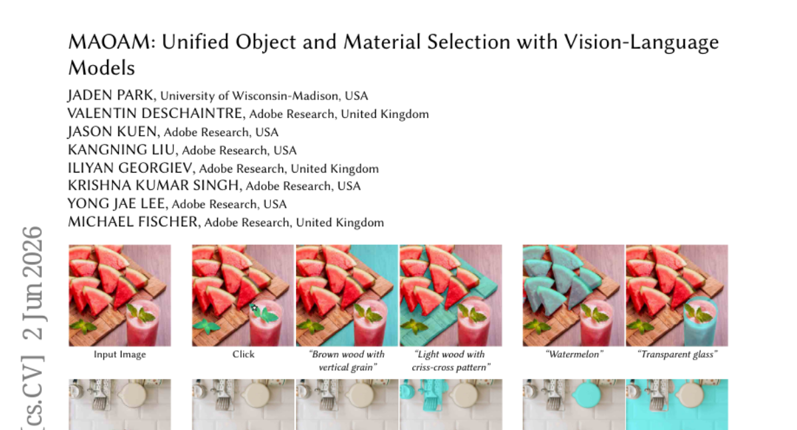

### 📌 한 줄 요약
텍스트와 클릭을 결합하여 객체뿐만 아니라 재질(Material)까지 정밀하게 선택할 수 있는 통합 비전-언어 모델 프레임워크

### 🔑 핵심 포인트
- 객체와 재질을 동시에 지원하는 통합 선택 프레임워크(MAOAM) 개발
- 텍스트와 클릭 기반 상호작용을 모두 지원하는 멀티모달 인터페이스
- 재질 특화 데이터 부족을 해결하기 위한 확장 가능한 데이터 생성 파이프라인 및 VQA 보조 학습

### 🧑‍💻 개발자 관점
이미지 편집 툴 개발 시, 단순 객체 선택을 넘어 특정 재질(예: 가죽, 금속)만 골라내어 텍스처를 변경하는 고도화된 기능을 구현하는 데 유용합니다.

### 🚀 실무 적용 아이디어
- 제공된 데이터 생성 파이프라인을 활용한 특정 도메인(예: 가구, 패션) 특화 데이터셋 구축 실험
- 텍스트 프롬프트와 클릭 좌표를 결합했을 때의 정밀도 향상 폭 검증
- 실시간 이미지 편집 워크플로우에 모델의 추론 속도 적용 테스트

### ⚠️ 리스크/한계
- 복잡한 질감이나 경계가 모호한 재질에 대한 세그멘테이션 정확도 저하 가능성
- 데이터 생성 파이프라인의 품질이 최종 모델의 재질 이해도에 미치는 의존성

---

## 18. [LLMs Can Leak Training Data But Do They Want To? A Propensity-Aware Evaluation of Memorization in LLMs](https://huggingface.co/papers/2606.06286)
**Upvotes**: 8 | **도입 난이도**: 중 | **신뢰도**: 상
**arXiv**: https://arxiv.org/abs/2606.06286

**태그**: LLM Security, Data Privacy, Evaluation Metric, Machine Learning, RAG, Evaluation

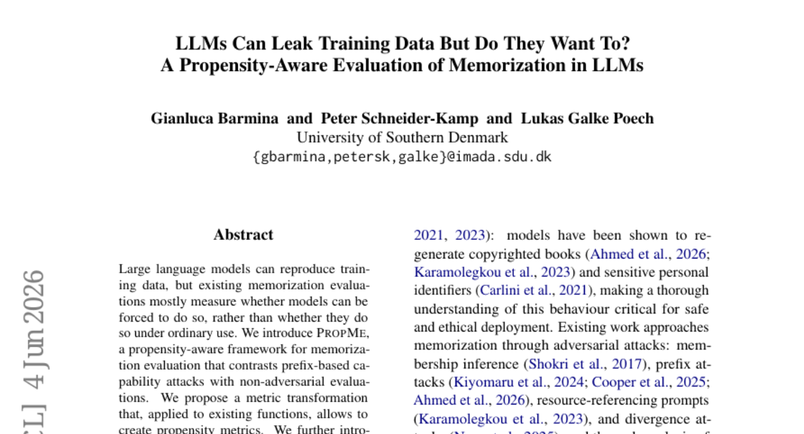

### 📌 한 줄 요약
LLM의 데이터 암기 능력이 의도적 공격 상황과 일반적 사용 상황에서 어떻게 다르게 나타나는지 분석하는 새로운 평가 프레임워크 제안

### 🔑 핵심 포인트
- PropMe: 공격적 유도와 일반적 사용 간의 암기 차이를 측정하는 성향 기반(propensity-aware) 평가 프레임워크
- SimpleTrace: infini-gram 기반의 경량화된 데이터 출처 추적 및 암기 지표 계산 파이프라인
- Capability vs Propensity: 모델의 암기 '능력'과 실제 발생 '성향' 사이의 유의미한 간극 발견

### 🧑‍💻 개발자 관점
모델 배포 시 단순한 데이터 추출 테스트를 넘어, 실제 서비스 환경에서 발생할 수 있는 데이터 유출 위험도를 정량화하는 기준을 제공합니다.

### 🚀 실무 적용 아이디어
- 모델 배포 전, 특정 프롬프트 공격 시와 일반 대화 시의 데이터 재현율 차이 측정하기
- 지속적 학습(Continual Pre-training) 시 이전 데이터의 암기 성향이 어떻게 변화하는지 모니터링하기
- 데이터 유출 방지를 위해 단순 암기 방지 외에 '성향(Propensity)' 관점의 보안 가이드라인 수립하기

### ⚠️ 리스크/한계
- 제안된 지표가 특정 도메인이나 언어 환경에서도 일관된 보안 기준이 될 수 있는지 검증 필요
- 공격적 프롬프트 설계 방식에 따라 평가 결과가 가변적일 수 있음

### 📝 초록 기반 상세 설명
기존의 LLM 데이터 암기 평가는 모델이 강제로 데이터를 출력하게 만드는 공격적 방식에 치중되어 있어, 일반적인 사용 환경에서의 유출 가능성을 충분히 반영하지 못합니다. 이를 해결하기 위해 공격적 유도(prefix-based)와 비공격적 상황을 대조하는 PropMe 프레임워크와 데이터 출처를 추적하는 SimpleTrace 파이프라인을 제안합니다. 실험 결과, 모델은 특정 공격 상황에서는 암기 능력이 높지만 일반적인 프롬프트 환경에서는 암기 유출 확률(propensity)이 매우 낮음을 확인했습니다. 또한, 추가 학습(continual pre-training)을 통해 특정 데이터셋에 대한 암기 능력과 유출 성향을 낮출 수 있음을 입증했습니다. 결론적으로 모델의 보안 감사는 최악의 추출 시나리오와 일상적 유출 가능성을 모두 보고해야 합니다.

### 🖼️ 추가 자료
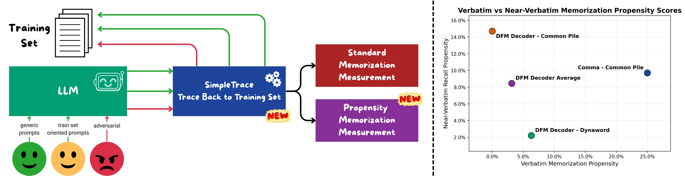

---

## 19. [World-Language-Action Model for Unified World Modeling, Language Reasoning, and Action Synthesis](https://huggingface.co/papers/2606.05979)
**Upvotes**: 7 | **도입 난이도**: 상 | **신뢰도**: 상
**arXiv**: https://arxiv.org/abs/2606.05979

**태그**: Embodied AI, Foundation Model, Robot Learning, World Models, RAG, Reasoning, Vision, Video, Evaluation, Inference

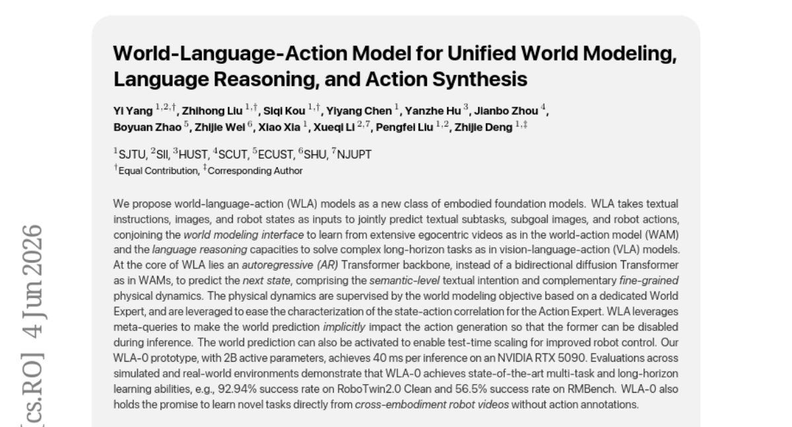

### 📌 한 줄 요약
언어 추론, 세계 모델링, 로봇 제어를 하나의 트랜스포머로 통합하여 복잡한 장기 과제를 해결하는 WLA 모델 제안

### 🔑 핵심 포인트
- 언어(Language), 세계 모델링(World Modeling), 행동(Action)을 하나의 AR 트랜스포머로 통합한 WLA 프레임워크
- 메타 쿼리 구조를 통해 추론 시 세계 모델링 기능을 끄거나 켜서 성능을 조절할 수 있는 유연성 확보
- 액션 데이터 없이 비디오 데이터만으로도 학습 가능한 크로스-엠보디먼트(Cross-embodiment) 학습 가능성

### 🧑‍💻 개발자 관점
로봇 제어에 단순 동작 생성을 넘어 '다음 상태'에 대한 예측(World Modeling)을 결합함으로써, 더 정교하고 계획적인 에이전트 구현이 가능해집니다.

### 🚀 실무 적용 아이디어
- 제시된 WLA-0 아키텍처의 AR 트랜스포머 구조와 메타 쿼리 메커니즘 분석
- 비디오 데이터 기반의 자기지도 학습(Self-supervised learning) 적용 가능성 검토
- 시뮬레이션 환경에서의 테스트 타임 스케일링(Test-time scaling) 효과 실험

### ⚠️ 리스크/한계
- 자기회귀(AR) 방식 특성상 발생할 수 있는 추론 시 오류 누적(Error accumulation) 문제
- 고성능 GPU(RTX 5090 등)를 요구하는 높은 연산 비용

### 📝 초록 기반 상세 설명
기존의 로봇 모델은 언어 추론과 물리적 세계 모델링 사이의 통합이 부족하여 복잡한 장기 과제 수행에 한계가 있었습니다. 이를 해결하기 위해 텍스트, 이미지, 로봇 상태를 입력받아 하위 작업과 행동을 동시에 예측하는 WLA(World-Language-Action) 모델을 제안합니다. WLA는 자기회귀(AR) 트랜스포머를 백본으로 사용하여 의미적 의도와 미세한 물리적 역학을 함께 예측하며, 메타 쿼리를 통해 세계 모델링이 행동 생성에 영향을 주도록 설계되었습니다. 실험 결과, WLA-0 프로토타입은 시뮬레이션 및 실세계 환경에서 SOTA 수준의 멀티태스크 및 장기 과제 수행 능력을 입증했습니다. 또한, 액션 어노테이션 없이도 다양한 로봇 비디오로부터 새로운 작업을 학습할 수 있는 가능성을 보여주었습니다.

---

## 20. [OPRD: On-Policy Representation Distillation](https://huggingface.co/papers/2606.06021)
**Upvotes**: 7 | **도입 난이도**: 중 | **신뢰도**: 상
**arXiv**: https://arxiv.org/abs/2606.06021

**태그**: Knowledge Distillation, LLM Training, Efficiency, Reasoning, Distillation

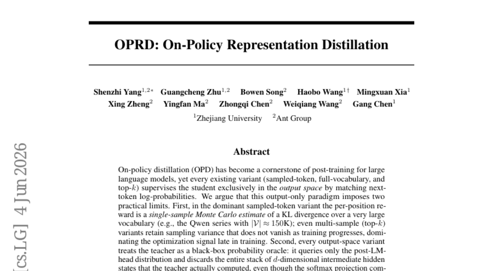

### 📌 한 줄 요약
출력값(Logits) 대신 은닉 상태(Hidden States)를 정렬하여 학습 효율과 성능을 극대화한 온폴리시 지식 증류 기법

### 🔑 핵심 포인트
- 출력층(LM Head)을 거치지 않고 은닉 상태(Hidden-state) 공간에서 직접 정렬하여 정보 손실 최소화
- 거대 어휘 사전 환경에서 발생하는 샘플링 분산 문제 해결 및 이론적 안정성 확보
- 기존 Top-k OPD 대비 압도적인 학습 속도 향상 및 메모리 효율성 달성

### 🧑‍💻 개발자 관점
모델 크기가 커질수록 발생하는 메모리 및 연산 비용 문제를 해결하면서도, 교사 모델의 지식을 더 깊게 전이할 수 있는 실용적인 방법론입니다.

### 🚀 실무 적용 아이디어
- 특정 레이어 간의 은닉 상태 정렬 시 최적의 레이어 선택 전략 실험
- 기존 Top-k OPD 방식과 OPRD의 학습 수렴 속도 및 메모리 점유율 비교 테스트
- 추론 성능(Reasoning) 향상을 위한 다양한 규모의 모델 간 증류 실험

### ⚠️ 리스크/한계
- 선택된 레이어 간의 정렬이 전체 모델 성능에 미치는 영향에 대한 의존성 존재
- 은닉 상태 차원(Dimension)이 다른 교사-학생 모델 간 적용 시 추가적인 정렬 기법 필요

### 📝 초록 기반 상세 설명
기존의 온폴리시 지식 증류(OPD)는 다음 토큰 확률만을 매칭하는 출력 공간 중심의 방식으로, 거대 어휘 사전 사용 시 샘플링 분산이 크고 교사의 중간 정보를 활용하지 못하는 한계가 있었습니다. 이를 해결하기 위해 제안된 OPRD는 동일한 롤아웃 상에서 선택된 레이어의 은닉 상태를 직접 정렬하는 방식을 채택합니다. 이 방식은 이론적으로 샘플링 분산을 제거하고 풍부한 구조적 정보를 제공합니다. 실험 결과, OPRD는 AIME 및 AIMO와 같은 고난도 벤치마크에서 기존 OPD의 성능 정체 문제를 해결하며 교사 모델과의 격차를 좁혔습니다. 또한 기존 방식 대비 학습 속도는 1.44배 빠르고 메모리 사용량은 54% 적은 효율성을 보였습니다.

---

## 21. [The Shadow Price of Reasoning: Economic Perspective on Optimal Budget Allocation for LLMs](https://huggingface.co/papers/2606.03092)
**Upvotes**: 7 | **도입 난이도**: 중 | **신뢰도**: 상
**arXiv**: https://arxiv.org/abs/2606.03092

**태그**: LLM Inference, Resource Allocation, Optimization, Cost Efficiency, Reasoning, Inference

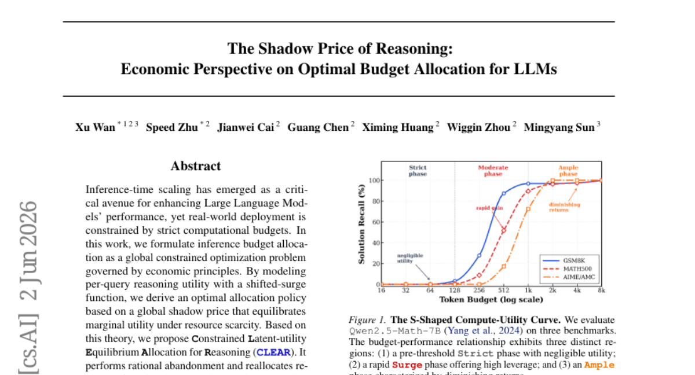

### 📌 한 줄 요약
제한된 추론 예산 내에서 모델 성능을 극대화하기 위해 쿼리별 자원을 최적 배분하는 경제학 기반의 알고리즘 제안

### 🔑 핵심 포인트
- 경제학적 원리(Shadow Price)를 활용한 추론 예산 최적화 프레임워크 정립
- 해결 불가능한 쿼리를 식별하여 자원을 차단하는 '합리적 포기(Rational Abandonment)' 전략 도입
- 자원 제약 상황에서 전체 시스템의 평균 정확도를 극대화하는 CLEAR 알고리즘 제안

### 🧑‍💻 개발자 관점
LLM 서비스 운영 시 무조건적인 긴 추론 대신, 쿼리 난이도에 따라 토큰 사용량을 동적으로 조절하여 비용 대비 성능을 최적화할 수 있는 가이드를 제공합니다.

### 🚀 실무 적용 아이디어
- 다양한 난이도의 쿼리 셋을 구성하여 쿼리별 '해결 가능성' 임계값 테스트
- 고정된 토큰 예산 내에서 Uniform vs CLEAR 방식의 정확도/비용 효율성 비교 실험
- 실시간 트래픽 변화에 따른 동적 예산 재배분 알고리즘의 지연 시간(Latency) 측정

### ⚠️ 리스크/한계
- 쿼리의 난이도(해결 가능성)를 사전에 정확히 예측하는 것이 어려울 수 있음
- 실시간 배분 로직 도입 시 추가적인 오버헤드 발생 가능성

### 📝 초록 기반 상세 설명
최근 LLM의 성능 향상을 위해 추론 시간 스케일링이 중요해졌으나, 실제 배포 환경에서는 엄격한 계산 예산 제약이 존재합니다. 본 논문은 추론 예산 배분 문제를 경제학적 원리에 기반한 전역 제약 최적화 문제로 정식화합니다. 쿼리별 추론 효용을 모델링하여 한정된 자원 내에서 한계 효용을 균형 있게 맞추는 '그림자 가격(Shadow Price)' 기반의 최적 배분 정책을 도출합니다. 이를 바탕으로 제안된 CLEAR 알고리즘은 해결 불가능한 쿼리를 포기하고, 해결 가능한 쿼리에 자원을 재배분하는 합리적 포기 전략을 수행합니다. 실험 결과, CLEAR는 토큰 비용 대비 정확도 측면에서 파레토 최적을 달성하며, 특히 자원이 부족한 환경에서 균등 배분 방식 대비 높은 정확도 향상을 보였습니다.

---

## 22. [Latent Reasoning with Normalizing Flows](https://huggingface.co/papers/2606.06447)
**Upvotes**: 6 | **도입 난이도**: 상 | **신뢰도**: 상
**arXiv**: https://arxiv.org/abs/2606.06447

**태그**: LLM, Reasoning, Normalizing Flows, Efficiency, Benchmark, Distillation

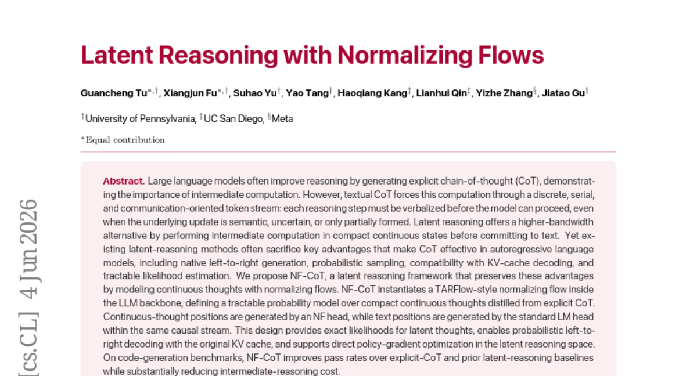

### 📌 한 줄 요약
Normalizing Flows를 활용하여 텍스트 생성 없이 잠재 공간(Latent Space)에서 효율적인 추론을 수행하는 NF-CoT 프레임워크 제안

### 🔑 핵심 포인트
- Normalizing Flows를 이용한 연속적 사고(Continuous-thought) 모델링
- 텍스트 생성과 잠재 추론을 하나의 인과적 스트림(Causal Stream)으로 통합하여 KV-캐시 호환성 확보
- 정확한 우도 계산 및 정책 경사(Policy-gradient) 최적화 지원

### 🧑‍💻 개발자 관점
텍스트를 일일이 생성하지 않고도 고차원적인 추론을 수행할 수 있어, 추론 속도 향상과 토큰 비용 절감을 동시에 달성할 수 있는 기술적 토대를 제공합니다.

### 🚀 실무 적용 아이디어
- NF-CoT의 NF head 구조가 기존 LLM 백본에 미치는 파라미터 오버헤드 분석
- 코드 생성 외에 수학적 추론 등 다른 도메인에서의 성능 전이 가능성 테스트
- 다양한 규모의 LLM 백본에 대한 스케일링 법칙(Scaling Law) 확인

### ⚠️ 리스크/한계
- Normalizing Flow 도입에 따른 모델 구조의 복잡도 및 학습 난이도 증가
- 잠재 공간의 차원 설정에 따른 추론 품질의 민감도

### 📝 초록 기반 상세 설명
기존의 Chain-of-Thought(CoT) 방식은 모든 추론 과정을 텍스트로 출력해야 하므로 연산 비용이 높고 정보 전달 효율이 낮다는 문제가 있습니다. 이를 해결하기 위해 연속적인 상태에서 추론을 수행하는 잠재 추론(Latent Reasoning)이 대안으로 떠오르고 있으나, 기존 방식은 자기회귀적 생성이나 KV-캐시 활용 등 LLM의 장점을 유지하기 어려웠습니다. 본 논문은 Normalizing Flows를 활용하여 연속적인 사고 과정을 모델링하는 NF-CoT를 제안합니다. NF-CoT는 LLM 백본 내부에 TARFlow 스타일의 흐름을 구현하여, 텍스트 생성과 잠재적 사고 생성을 하나의 인과적 스트림 내에서 통합합니다. 이를 통해 정확한 우도(Likelihood) 계산과 확률적 디코딩이 가능하며, 기존 KV-캐시 구조를 그대로 활용할 수 있습니다. 실험 결과, 코드 생성 벤치마크에서 기존 CoT 및 잠재 추론 모델보다 높은 성능을 보이면서도 추론 비용을 크게 절감했습니다.

---

## 23. [Meta-Cognitive Memory Policy Optimization for Long-Horizon LLM Agents](https://huggingface.co/papers/2605.30159)
**Upvotes**: 6 | **도입 난이도**: 중 | **신뢰도**: 상
**arXiv**: https://arxiv.org/abs/2605.30159

**태그**: LLM-Agent, Memory-Optimization, Reinforcement-Learning, Long-Context, Agent, Reasoning, Vision

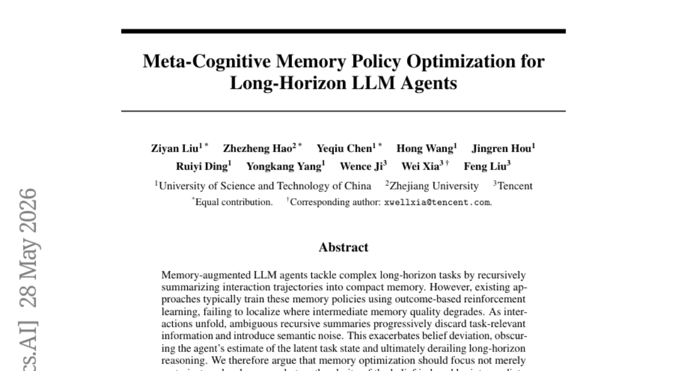

### 📌 한 줄 요약
메타 인지 기반의 벨리프 엔트로피를 활용하여 장기 작업 수행 시 발생하는 메모리 요약 오류와 정보 손실 문제를 해결한 연구

### 🔑 핵심 포인트
- 결과 중심이 아닌 중간 메모리 품질(Belief Clarity) 중심의 최적화 프레임워크 제안
- 잠재적 작업 상태에 대한 불확실성을 측정하는 'Belief Entropy' 도입
- 메모리 요약 과정에서의 정보 손실 및 노이즈로 인한 추론 실패 문제 해결

### 🧑‍💻 개발자 관점
에이전트가 긴 대화나 복잡한 태스크를 수행할 때, 요약 과정에서 발생하는 정보 왜곡 문제를 해결하여 장기적인 작업 성공률을 높일 수 있습니다.

### 🚀 실무 적용 아이디어
- 에이전트의 메모리 요약 시 발생하는 정보 손실(Information Loss) 측정 실험
- Belief Entropy 개념을 활용한 요약 품질 평가 지표 적용 테스트
- 장기 컨텍스트 환경에서의 요약 정책 최적화 파이프라인 구축

### ⚠️ 리스크/한계
- Belief Entropy 계산을 위한 추가적인 연산 비용 발생 가능성
- 특정 도메인에 특화된 작업 상태 정의가 어려울 경우 범용성 제약

### 📝 초록 기반 상세 설명
기존의 메모리 증강 LLM 에이전트는 긴 작업 수행을 위해 상호작용 기록을 요약하여 저장하지만, 결과 중심의 강화학습 방식은 중간 요약 과정에서 발생하는 정보 손실과 노이즈를 잡아내지 못합니다. 이로 인해 에이전트가 작업 상태를 오판하는 '벨리프 편차(belief deviation)'가 발생하여 장기 추론이 실패하게 됩니다. 본 논문은 결과뿐만 아니라 요약된 메모리가 유도하는 상태 추정의 명확성에 집중해야 한다고 주장합니다. 이를 위해 모델이 현재 메모리를 바탕으로 잠재적 작업 상태에 대해 느끼는 불확실성을 측정하는 'Belief Entropy'라는 자기주도 학습 프록시를 제안합니다. 이를 기반으로 한 MMPO(Metacognitive Memory Policy Optimization)는 불확실성을 유발하는 요약에 페널티를 부여하여 정교한 메모리 최적화를 수행합니다. 실험 결과, MMPO는 대규모 컨텍스트 환경에서도 높은 성능을 유지하며 기존 방식보다 뛰어난 성능을 입증했습니다.

---

## 24. [Towards One-to-Many Temporal Grounding](https://huggingface.co/papers/2606.06294)
**Upvotes**: 5 | **도입 난이도**: 상 | **신뢰도**: 상
**arXiv**: https://arxiv.org/abs/2606.06294

**태그**: Video-Understanding, MLLM, Temporal-Grounding, Multi-Object-Detection, RAG, Reasoning, Video, Benchmark, Evaluation

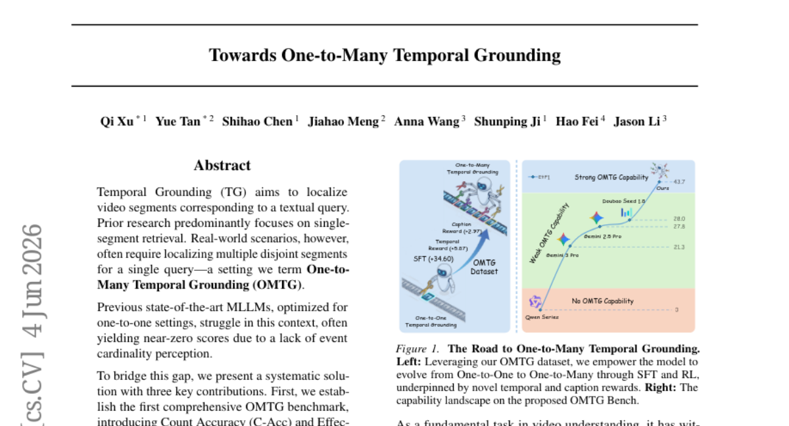

### 📌 한 줄 요약
하나의 텍스트 쿼리에 대해 여러 개의 비디오 구간을 찾아내는 'One-to-Many Temporal Grounding' 문제 해결을 위한 벤치마크와 모델 제안

### 🔑 핵심 포인트
- 최초의 OMTG(One-to-Many Temporal Grounding) 벤치마크 및 평가 지표(C-Acc, EtF1) 수립
- 56k 규모의 고품질 OMTG 데이터셋 구축
- CoT 추론을 활용하여 정밀도와 완전성을 동시에 최적화하는 템포럴 및 캡션 보상 함수 개발

### 🧑‍💻 개발자 관점
영상 편집 자동화나 멀티 이벤트 감지 시스템 구축 시, 하나의 명령어로 여러 장면을 정확히 추출해야 하는 실무적 요구사항을 해결할 수 있습니다.

### 🚀 실무 적용 아이디어
- 제안된 EtF1 지표를 기존 비디오 검색 파이프라인에 적용하여 다중 구간 추출 성능 테스트
- CoT 기반의 캡션 보상 함수가 모델의 구간 분할 정확도에 미치는 영향 분석
- 기존 MLLM 모델에 OMTG 데이터셋을 파인튜닝하여 개수 인식 능력 변화 관찰

### ⚠️ 리스크/한계
- 복잡한 CoT 기반 보상 함수 설계로 인해 학습 과정의 난이도가 높을 수 있음
- 데이터셋 구축 파이프라인의 복잡성으로 인해 대규모 확장 시 비용 발생 가능성

### 📝 초록 기반 상세 설명
기존의 비디오 템포럴 그라운딩(TG) 연구는 주로 하나의 쿼리에 대해 단일 구간을 찾는 것에 집중해 왔습니다. 하지만 실제 환경에서는 하나의 질문에 대해 여러 개의 분리된 구간을 찾아야 하는 상황이 빈번하며, 이를 One-to-Many Temporal Grounding(OMTG)라 정의합니다. 기존 MLLM들은 이벤트 개수(cardinality)를 인식하지 못해 OMTG 환경에서 성능이 급격히 저하되는 문제를 보였습니다. 이를 해결하기 위해 연구진은 최초의 OMTG 벤치마크와 고품질 데이터셋을 구축하고, 새로운 평가 지표(C-Acc, EtF1)를 도입했습니다. 또한, 정밀도와 완전성을 동시에 확보하기 위해 CoT(Chain-of-Thought) 기반의 캡션 보상 함수를 포함한 새로운 학습 방법론을 제안했습니다. 실험 결과, 제안 모델은 기존 SOTA 모델들을 크게 상회하는 성능을 기록했습니다.

---

## 25. [Imagine Before You Predict: Interleaved Latent Visual Reasoning for Video Event Prediction](https://huggingface.co/papers/2606.05769)
**Upvotes**: 5 | **도입 난이도**: 상 | **신뢰도**: 상
**arXiv**: https://arxiv.org/abs/2606.05769

**태그**: Video-Understanding, Multimodal-LLM, Reinforcement-Learning, Latent-Space, RAG, Reasoning, Video, Benchmark

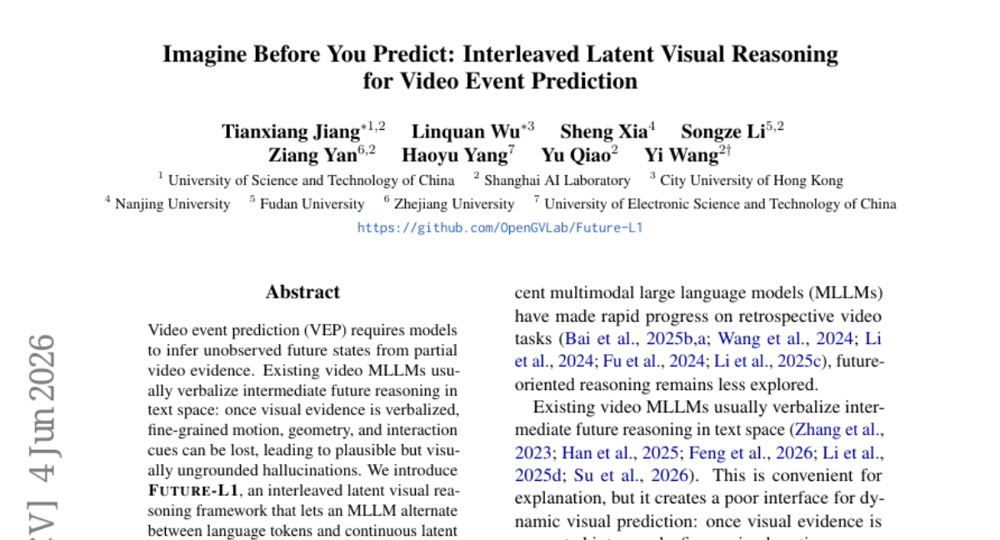

### 📌 한 줄 요약
텍스트 변환 과정에서의 정보 손실을 방지하기 위해 잠재 공간(Latent Space)에서 시각적 추론을 수행하는 비디오 이벤트 예측 프레임워크

### 🔑 핵심 포인트
- 텍스트 변환 시 발생하는 시각적 정보 손실 문제를 잠재 공간 내 교차 추론(Interleaved Latent Reasoning)으로 해결
- 미래 프레임 임베딩과 잠재 상태를 정렬하는 Future-L1-50K 데이터셋 구축
- 결과 대조 및 시간적 다양성을 고려한 LA-DAPO 강화학습 알고리즘 적용

### 🧑‍💻 개발자 관점
비디오 생성 및 예측 모델 개발 시, 모든 추론 과정을 텍스트로 변환하는 대신 잠재 공간을 활용하는 것이 정교한 움직임 유지에 유리함을 시사합니다.

### 🚀 실무 적용 아이디어
- 텍스트 기반 추론 모델과 잠재 공간 기반 모델의 정보 유지력 비교 실험
- RLHF 과정에서 시간적 다양성(Temporal Diversity) 보상 설계 적용해보기
- 비디오 예측 태스크에 대한 데이터셋 정렬(Alignment) 전략 검토

### ⚠️ 리스크/한계
- 잠재 공간의 연속적인 데이터 처리에 따른 연산 복잡도 및 메모리 사용량 증가
- 학습 데이터셋의 품질과 미래 시각 힌트의 의존도에 따른 성능 편차 가능성

### 📝 초록 기반 상세 설명
비디오 이벤트 예측(VEP) 모델은 부분적인 증거를 바탕으로 미래 상태를 추론해야 합니다. 기존의 멀티모달 모델은 중간 추론 과정을 텍스트로 변환하는 방식을 사용하는데, 이 과정에서 미세한 움직임이나 기하학적 정보가 손실되어 시각적으로 부정확한 환각(Hallucination)이 발생합니다. 이를 해결하기 위해 언어 토큰과 연속적인 잠재 시각 스팬(Latent Visual Spans)을 교차하여 사용하는 Future-L1 프레임워크를 제안합니다. 학습을 위해 미래 시각 힌트가 포함된 데이터셋을 구축하고, LA-DAPO라는 강화학습 목적 함수를 통해 잠재 상태를 미래 프레임 임베딩에 정렬했습니다. 실험 결과, FutureBench와 TwiFF-Bench 등 주요 벤치마크에서 기존 SOTA 모델들을 크게 상회하는 성능을 달성했습니다.

---

## 26. [Flash-WAM: Modality-Aware Distillation for World Action Models](https://huggingface.co/papers/2606.05254)
**Upvotes**: 5 | **도입 난이도**: 중 | **신뢰도**: 상
**arXiv**: https://arxiv.org/abs/2606.05254

**태그**: Robot Learning, Diffusion Models, Model Distillation, Real-time Control, RAG, Video, Benchmark, Inference, Distillation

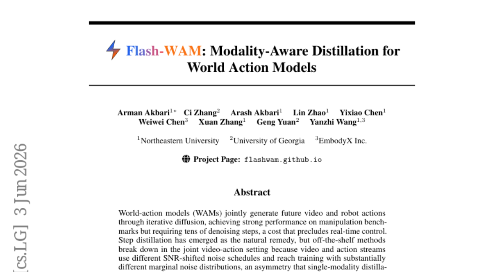

### 📌 한 줄 요약
비디오와 로봇 액션을 동시에 생성하는 WAM의 추론 속도를 23배 향상시켜 실시간 제어를 가능하게 하는 모달리티별 최적화 증류 기법

### 🔑 핵심 포인트
- 비디오와 액션의 서로 다른 노이즈 분포를 고려한 모달리티별 맞춤형 증류 프레임워크 제안
- Consistency distillation 기반의 선형 그래디언트 스케일링 및 분산 보존 파라미터화 적용
- 추론 속도를 23배 향상시켜 실시간 로봇 제어 환경(Real-time control) 구현

### 🧑‍💻 개발자 관점
로봇 제어 모델의 고질적인 문제인 추론 지연(Latency)을 해결하여, 시뮬레이션 모델을 실제 하드웨어에 즉시 적용할 수 있는 기술적 토대를 제공합니다.

### 🚀 실무 적용 아이디어
- 다양한 노이즈 스케줄을 가진 멀티모달 확산 모델에 Flash-WAM의 파라미터화 기법 적용 테스트
- 단일 스텝 증류 시 발생하는 모달리티 간 정렬(Alignment) 문제 분석
- 실제 로봇 하드웨어 환경에서의 지연 시간 및 성공률 벤치마크 수행

### ⚠️ 리스크/한계
- 단일 스텝으로 압축 시 복잡한 태스크에서의 정밀도 저하 가능성
- 특정 노이즈 스케줄에 최적화된 방식이므로 다른 구조의 모델로의 일반화 난이도 존재

### 📝 초록 기반 상세 설명
비디오와 로봇 액션을 동시에 생성하는 World Action Models(WAMs)는 높은 성능을 보이지만, 반복적인 디노이징 과정으로 인해 실시간 제어가 어렵다는 단점이 있습니다. 기존의 단계 증류(Step distillation) 방식은 비디오와 액션 스트림 간의 서로 다른 노이즈 스케줄과 분포 차이로 인해 성능 저하가 발생합니다. 이를 해결하기 위해 Flash-WAM은 각 모달리티의 노이즈 레짐에 맞춘 모달리티 인식 증류 프레임워크를 제안합니다. 액션 스트림에는 선형 그래디언트 스케일링을, 비디오 스트림에는 분산 보존 파라미터화를 적용하여 일관성을 유지합니다. 실험 결과, 추론 시간을 8.1초에서 348ms로 단축하며 실시간성을 확보함과 동시에 높은 작업 성공률을 유지했습니다.

---

## 27. [SePO: Self-Evolving Prompt Agent for System Prompt Optimization](https://huggingface.co/papers/2606.04465)
**Upvotes**: 4 | **도입 난이도**: 중 | **신뢰도**: 상
**arXiv**: https://arxiv.org/abs/2606.04465

**태그**: Prompt Engineering, Agent, Self-Evolving, Optimization, RAG, Reasoning, Benchmark

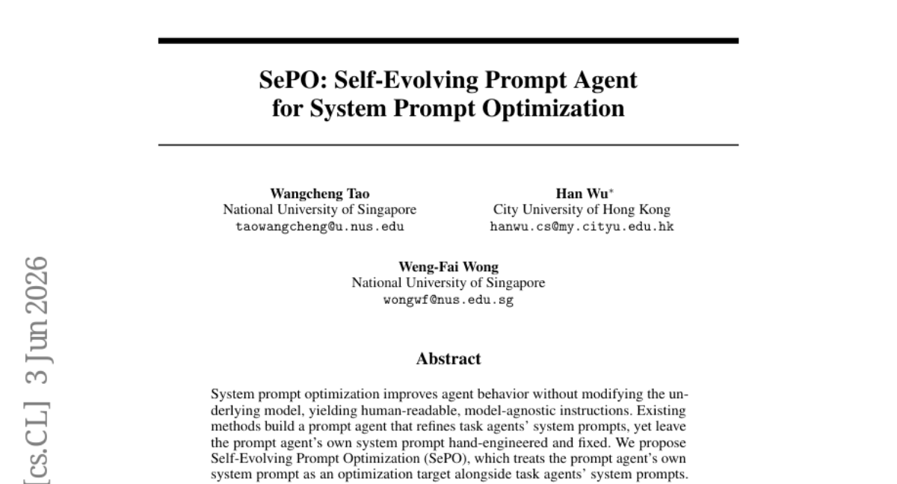

### 📌 한 줄 요약
프롬프트 에이전트가 자신의 시스템 프롬프트까지 스스로 최적화하여 성능을 진화시키는 자기 참조적 프롬프트 최적화 프레임워크

### 🔑 핵심 포인트
- 자기 참조적 설계: 프롬프트 에이전트가 작업용 프롬프트와 자신의 시스템 프롬프트를 동시에 최적화
- 2단계 학습 전략: 멀티태스크 사전 학습을 통한 최적화 능력 확보 후 타겟 태스크 미세 조정
- 높은 일반화 성능: 특정 태스크 암기가 아닌, 범용적인 프롬프트 최적화 스킬 습득

### 🧑‍💻 개발자 관점
에이전트의 성능을 높이기 위해 사람이 매번 프롬프트를 수정하는 수고를 줄이고, 모델 스스로 최적의 지시문을 찾아가는 자동화된 파이프라인 구축이 가능해집니다.

### 🚀 실무 적용 아이디어
- 기존의 고정된 프롬프트 에이전트에 SePO의 자기 진화 로직 적용 실험
- 다양한 도메인(코딩, 논리 등)을 포함한 사전 학습 데이터셋 구성 테스트
- 최적화된 프롬프트가 새로운 태스크에서 얼마나 안정적으로 작동하는지 검증

### ⚠️ 리스크/한계
- 자기 참조적 최적화 과정에서 발생할 수 있는 모델의 붕괴(Collapse) 또는 과적합 위험
- 최적화 과정에 필요한 연산 비용 및 반복적인 추론 비용 발생

### 📝 초록 기반 상세 설명
시스템 프롬프트 최적화는 모델 수정 없이 에이전트의 성능을 높이는 핵심 기술이지만, 기존 방식은 프롬프트를 생성하는 에이전트 자체의 프롬프트는 수동으로 고정되어 있다는 한계가 있습니다. 이를 해결하기 위해 본 논문은 프롬프트 에이전트가 작업용 프롬프트와 자신의 프롬프트를 동시에 최적화하는 SePO(Self-Evolving Prompt Optimization)를 제안합니다. SePO는 단일 에이전트가 후보 프롬프트 아카이브를 활용하며 개방형 진화 탐색을 수행하는 자기 참조적 설계를 채택했습니다. 학습은 멀티태스크 풀에서의 사전 학습과 특정 타겟 태스크에 대한 미세 조정의 2단계로 진행됩니다. 실험 결과, 수학, 추론, 코딩 등 다양한 벤치마크에서 기존 최적화 방식들을 상회하는 성능을 보였습니다. 특히 사전 학습된 최적화 능력이 새로운 태스크로도 잘 일반화됨을 입증했습니다.

---

## 28. [SEAOTTER: Sensor Embedded Autoencoding with One-Time Transcode for Efficient Reconstruction](https://huggingface.co/papers/2606.03940)
**Upvotes**: 4 | **도입 난이도**: 중 | **신뢰도**: 상
**arXiv**: https://arxiv.org/abs/2606.03940

**태그**: Image Compression, Robotics, Deep Learning, Edge Computing, Vision, Optimization

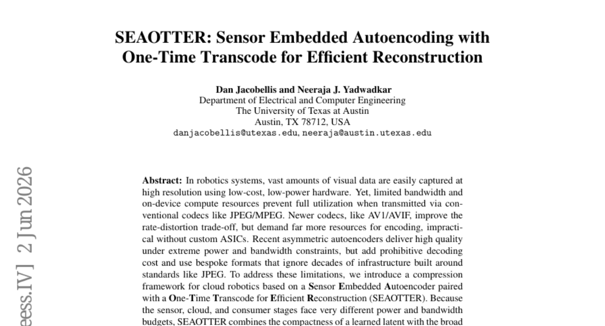

### 📌 한 줄 요약
기존 JPEG 인프라를 유지하면서도 딥러닝 기반 비대칭 오토인코더의 효율성을 결합한 로봇용 고효율 영상 압축 프레임워크

### 🔑 핵심 포인트
- 센서-클라우드-소비자 간 서로 다른 자원 제약을 고려한 비대칭 오토인코더 구조
- 표준 JPEG 인프라와 호환 가능한 일회성 트랜스코딩(One-Time Transcode) 기술
- 학습 가능한 JPEG 변환을 통한 고성능 시각 인지(Perception) 성능 유지

### 🧑‍💻 개발자 관점
엣지 디바이스(로봇)에서 압축된 데이터를 클라우드로 전송한 뒤, 기존 JPEG 인프라를 그대로 사용하면서도 딥러닝 모델의 성능 저하 없이 고효율 데이터 처리가 가능합니다.

### 🚀 실무 적용 아이디어
- 제공된 GitHub 코드를 활용하여 특정 로봇 태스크(Object Detection 등)에서의 성능 변화 측정
- 다양한 압축률(Compression Ratio) 설정에 따른 인지 성능(Perception Accuracy) 변화 실험
- 기존 하드웨어 가속기(ASIC) 환경에서의 실제 인코딩/디코딩 속도 벤치마크

### ⚠️ 리스크/한계
- 학습된 인코더를 사용하는 특성상 특정 도메인에 최적화될 경우 범용성 저하 가능성
- 트랜스코딩 과정에서의 연산 오버헤드 및 품질 손실 관리 필요

### 📝 초록 기반 상세 설명
로봇 시스템은 고해상도 데이터를 생성하지만, 제한된 대역폭과 온디바이스 연산 자원으로 인해 기존 코덱(JPEG/MPEG) 활용에 한계가 있습니다. 최신 코덱은 효율적이지만 연산 비용이 높고, 기존 비대칭 오토인코더는 디코딩 비용과 표준 호환성 문제가 존재합니다. 이를 해결하기 위해 센서 임베디드 오토인코더와 일회성 트랜스코딩을 결합한 SEAOTTER 프레임워크를 제안합니다. 학습 가능한 JPEG 색상 및 양자화 변환을 통해 표준 JPEG 형식을 유지하면서도 높은 재구성 정확도를 확보했습니다. 실험 결과, AVIF 대비 인코딩/디코딩 속도를 대폭 개선하고 ImageNet 정확도를 높이며 기존 인프라와의 호환성을 증명했습니다.

---

## 29. [AdaCodec: A Predictive Visual Code for Video MLLMs](https://huggingface.co/papers/2606.02569)
**Upvotes**: 4 | **도입 난이도**: 중 | **신뢰도**: 상
**arXiv**: https://arxiv.org/abs/2606.02569

**태그**: Video-LLM, Token-Compression, Efficiency, Computer-Vision, RAG, Multimodal, Vision, Video, Benchmark

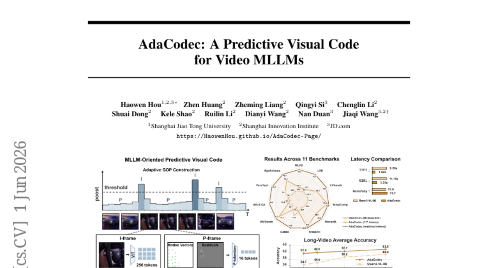

### 📌 한 줄 요약
프레임 간 중복성을 제거하는 예측형 비주얼 코딩을 통해 비디오 MLLM의 토큰 효율성과 추론 속도를 극대화한 기술

### 🔑 핵심 포인트
- 프레임 간 중복성을 활용한 예측형 비주얼 코딩(Predictive Visual Code) 인터페이스 도입
- 상황에 따라 전체 프레임 또는 압축된 P-tokens를 선택적으로 사용하는 적응형 토큰 할당
- 동일 토큰 예산 대비 성능 향상 및 긴 비디오 처리를 위한 극단적 압축 효율 달성

### 🧑‍💻 개발자 관점
비디오 데이터 처리 시 발생하는 막대한 토큰 비용과 지연 시간을 획기적으로 줄여, 저사양 환경이나 긴 영상 분석 서비스 구현에 매우 유용합니다.

### 🚀 실무 적용 아이디어
- 동일한 비디오 데이터셋에 대해 프레임별 독립 인코딩과 AdaCodec 방식의 토큰 효율성 비교 실험
- 다양한 프레임 레이트(FPS) 환경에서 P-tokens의 압축 성능 및 정보 손실률 측정
- 실시간 비디오 스트리밍 서비스 적용을 위한 추론 지연 시간(Latency) 벤치마크 수행

### ⚠️ 리스크/한계
- 예측 오차가 누적될 경우(Error accumulation) 장기적인 비디오 이해도 저하 가능성
- 복잡한 움직임이 많은 장면에서 예측 모델의 연산 오버헤드 발생 가능성

### 📝 초록 기반 상세 설명
기존 비디오 MLLM은 인접 프레임 간의 높은 중복성에도 불구하고 각 프레임을 독립적인 RGB 이미지로 인코딩하여 불필요한 토큰을 생성하는 문제가 있었습니다. 이를 해결하기 위해 장면 변화가 클 때만 전체 참조 프레임을 전송하고, 그 외에는 프레임 간 변화량(모션 및 잔차)만 압축하여 전달하는 '예측형 비주얼 코드' 인터페이스를 제안합니다. 이를 구현한 AdaCodec는 예측 비용이 높을 때만 전체 토큰을 사용하고, 평상시에는 압축된 P-tokens를 사용하여 효율을 높입니다. 실험 결과, 동일한 토큰 예산 내에서 기존 방식보다 뛰어난 성능을 보였으며, 특히 긴 비디오 작업에서 훨씬 적은 토큰으로도 압도적인 성능을 달성했습니다. 또한 추론 시 Time-to-First-Token(TTFT)을 획기적으로 단축하여 실시간성을 높였습니다.

---

## 30. [The Shape of Addition: Geometric Structures of Arithmetic in Large Language Models](https://huggingface.co/papers/2606.03645)
**Upvotes**: 4 | **도입 난이도**: 중 | **신뢰도**: 상
**arXiv**: https://arxiv.org/abs/2606.03645

**태그**: LLM Interpretability, Arithmetic, Geometry, Error Correction, RAG, Inference, Optimization

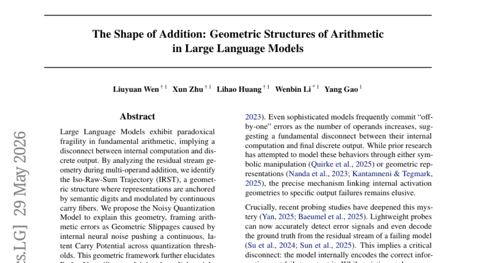

### 📌 한 줄 요약
LLM의 산술 연산 오류를 기하학적 관점에서 분석하여, 잠재적 캐리(Carry) 신호와 양자화 임계값 사이의 관계를 규명한 연구

### 🔑 핵심 포인트
- IRST(Iso-Raw-Sum Trajectory): 의미적 숫자와 연속적 캐리 섬유가 결합된 기하학적 구조 발견
- Noisy Quantization Model: 내부 노이즈로 인한 캐리 값의 양자화 임계값 이탈이 산술 오류의 원인임을 규명
- Geometric Consistency Check: 추론 시 양자화 실패를 탐지하고 교정할 수 있는 방법론 제시

### 🧑‍💻 개발자 관점
LLM의 산술 오류가 단순한 데이터 부족이 아닌 내부 표현의 기하학적 특성에서 기인함을 이해함으로써, 더 정교한 디버깅 및 오류 수정 전략을 수립할 수 있습니다.

### 🚀 실무 적용 아이디어
- 모델의 잔차 스트림에서 숫자 연산 시 발생하는 벡터의 기하학적 궤적 시각화 실험
- 제안된 Noisy Quantization Model을 활용한 특정 연산 오류 예측 테스트
- 기하학적 일관성 체크 알고리즘을 기존 추론 파이프라인에 적용하여 정확도 향상 검증

### ⚠️ 리스크/한계
- 산술 연산 외의 복잡한 논리 추론이나 자연어 이해 작업에 대한 일반화 가능성 확인 필요
- 실시간 추론 시 기하학적 체크 알고리즘 도입에 따른 연산 오버헤드 발생 가능성

### 📝 초록 기반 상세 설명
LLM은 기본적인 산술 연산에서 내부 계산과 출력 간의 불일치로 인한 취약성을 보입니다. 본 연구는 다중 피연산자 덧셈 과정 중 잔차 스트림(residual stream)의 기하학적 구조인 'Iso-Raw-Sum Trajectory (IRST)'를 식별했습니다. 이를 설명하기 위해 내부 노이즈가 연속적인 캐리 잠재력을 양자화 임계값 너머로 밀어내어 오류를 유발한다는 'Noisy Quantization Model'을 제안합니다. 이 프레임워크는 단일 활성화 벡터에서 정답과 환각 신호를 분리하는 프로브의 다재다능함을 설명합니다. 마지막으로, 추론 과정에서 이러한 양자화 실패를 탐지하고 수정할 수 있는 기하학적 일관성 체크 방법을 통해 연구 결과를 검증했습니다.

### 🖼️ 추가 자료
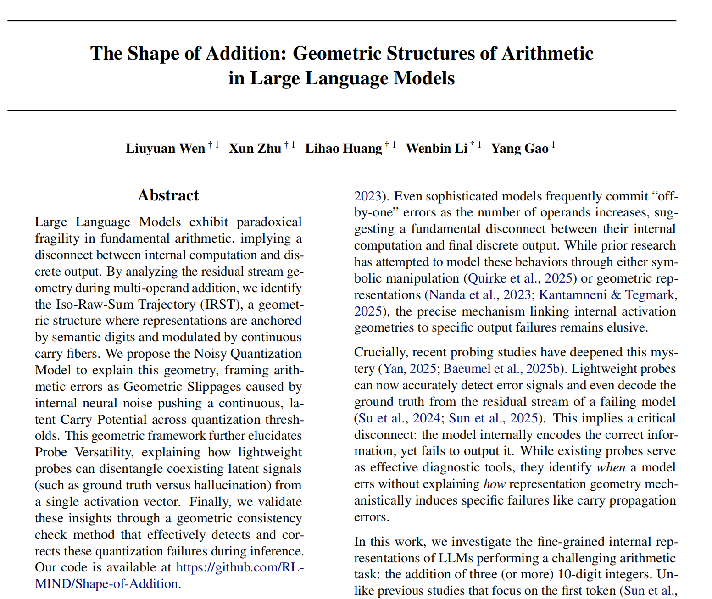
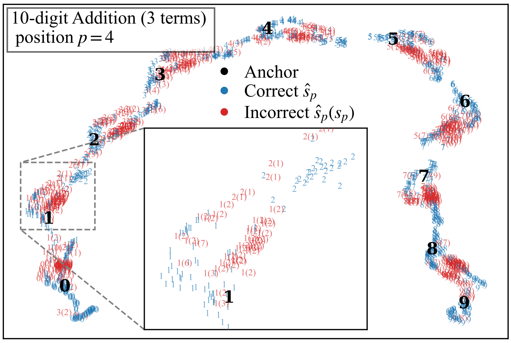

---

## 31. [Learning Geometric Representations from Videos for Spatial Intelligent Multimodal Large Language Models](https://huggingface.co/papers/2606.05833)
**Upvotes**: 3 | **도입 난이도**: 상 | **신뢰도**: 상
**arXiv**: https://arxiv.org/abs/2606.05833

**태그**: MLLM, 3D Vision, Video Understanding, Knowledge Distillation, Reasoning, Multimodal, Video, Benchmark, Distillation

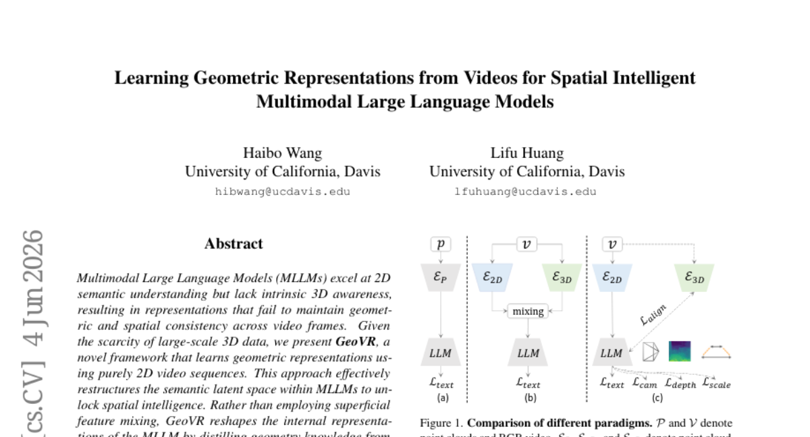

### 📌 한 줄 요약
2D 비디오 데이터만으로 MLLM에 3D 공간 지능을 주입하여 기하학적 일관성을 확보하는 프레임워크 GeoVR 제안

### 🔑 핵심 포인트
- 3D 데이터 없이 2D 비디오만으로 학습 가능한 기하학적 표현 학습 프레임워크 개발
- 사전 학습된 3D 모델의 지식을 MLLM 내부 레이어로 직접 증류하는 구조적 최적화
- 카메라 포즈, 깊이, 스케일, 멀티스케일 특징 등 4가지 복합 기하학적 타겟을 통한 학습

### 🧑‍💻 개발자 관점
비디오 기반 로봇 제어나 AR/VR 환경을 위한 에이전트 개발 시, 별도의 복잡한 3D 스캔 없이도 모델에 공간감을 부여할 수 있는 방법론을 제시합니다.

### 🚀 실무 적용 아이디어
- 제공된 4가지 기하학적 손실 함수(Loss)를 기존 MLLM 구조에 적용해보기
- 사전 학습된 3D 모델(Depth/Pose)을 활용한 지식 증류 파이프라인 구축 테스트
- 다양한 카메라 움직임이 포함된 비디오 데이터셋에서의 공간 추론 성능 검증

### ⚠️ 리스크/한계
- 3D 파운데이션 모델에 대한 의존도가 높아 모델 복잡도 및 연산 비용 증가 가능성
- 2D 비디오의 시점 변화가 극단적일 경우 기하학적 정렬의 불안정성 발생 가능

### 📝 초록 기반 상세 설명
기존의 멀티모달 거대언어모델(MLLM)은 2D 의미 이해에는 뛰어나지만, 비디오 프레임 간의 기하학적/공간적 일관성을 유지하는 3D 인식 능력이 부족합니다. 이를 해결하기 위해 별도의 3D 데이터 없이 2D 비디오 시퀀스만으로 기하학적 표현을 학습하는 GeoVR 프레임워크를 제안합니다. 이 방식은 단순한 특징 혼합이 아니라, 사전 학습된 3D 파운데이션 모델로부터 지식을 증류(Distillation)하여 MLLM의 내부 표현 구조를 재구성합니다. 학습 과정에는 카메라 포즈 추정, 밀집 깊이 지도 회귀, 메트릭 스케일 예측, 멀티스케일 3D 특징 증류라는 네 가지 기하학적 목표가 포함됩니다. 실험 결과, GeoVR은 공간 추론 벤치마크에서 SOTA 성능을 달성하며 모델에 강력한 3D 인지 능력을 부여함을 입증했습니다.

---

## 32. [Towards Truly Multilingual ASR: Generalizing Code-Switching ASR to Unseen Language Pairs](https://huggingface.co/papers/2606.05846)
**Upvotes**: 3 | **도입 난이도**: 중 | **신뢰도**: 상
**arXiv**: https://arxiv.org/abs/2606.05846

**태그**: ASR, Code-Switching, Model Merging, Domain Generalization, Multilingual

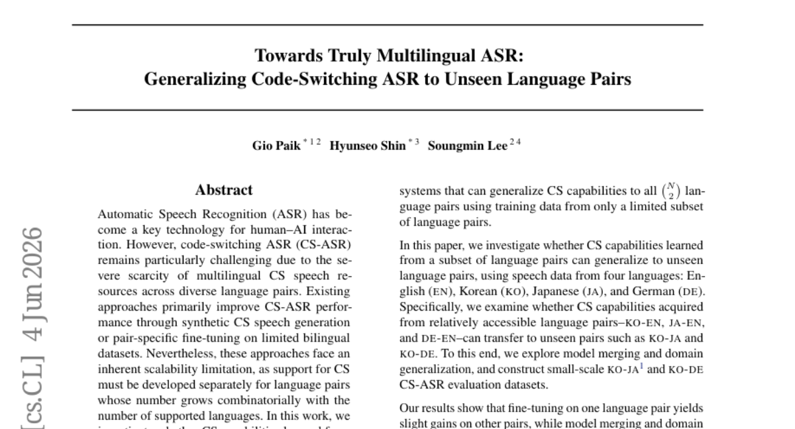

### 📌 한 줄 요약
모델 병합 및 도메인 일반화 기법을 통한 미학습 언어 쌍에 대한 코드 스위칭(CS) ASR 일반화 가능성 탐구

### 🔑 핵심 포인트
- 언어 쌍의 조합적 폭발 문제를 해결하기 위한 CS-ASR의 일반화 가능성 연구
- 모델 병합(Model Merging) 및 도메인 일반화(Domain Generalization) 기법 적용
- 학습된 언어 쌍의 CS 능력이 미학습 언어 쌍으로 전이되는 정도를 실험적으로 검증

### 🧑‍💻 개발자 관점
다국어 환경에서 모든 언어 조합에 대한 데이터를 수집하는 대신, 모델 병합을 통해 효율적으로 CS-ASR을 확장할 수 있는 가능성을 제시합니다.

### 🚀 실무 적용 아이디어
- 모델 병합 기법(Weight Averaging 등)을 활용한 다국어 ASR 모델 실험
- 특정 언어 쌍에서 학습된 CS 특징이 다른 언어 쌍에 미치는 영향 분석
- 도메인 일반화 기법을 적용한 데이터 부족 상황에서의 성능 벤치마크

### ⚠️ 리스크/한계
- 언어 간 CS 능력 전이가 제한적이어서 완전한 범용 모델 구축에는 한계가 있음
- 모델 병합 시 성능 저하 또는 언어 간 간섭 현상이 발생할 수 있음

### 📝 초록 기반 상세 설명
ASR 기술은 인간-AI 상호작용의 핵심이지만, 다양한 언어 쌍에 대한 코드 스위칭(CS) 데이터 부족으로 인해 CS-ASR 구현이 매우 어렵습니다. 기존 방식은 합성 데이터 생성이나 특정 언어 쌍에 대한 미세 조정에 의존하여, 언어 수가 늘어날수록 확장성이 떨어지는 한계가 있습니다. 본 연구에서는 학습된 언어 쌍의 CS 능력이 모델 병합 및 도메인 일반화 기법을 통해 미학습 언어 쌍으로 전이될 수 있는지 조사했습니다. 실험 결과, 병합된 이중 언어 CS-ASR 모델이 미학습 언어 쌍에 대해 어느 정도 일반화 성능을 보였으나, 언어 간 CS 능력 전이는 제한적임을 확인했습니다.

---

## 33. [MechVQA: Benchmarking and Enhancing Multimodal LLMs on Comprehensive Mechanical Drawing Understanding](https://huggingface.co/papers/2605.30794)
**Upvotes**: 3 | **도입 난이도**: 중 | **신뢰도**: 상
**arXiv**: https://arxiv.org/abs/2605.30794

**태그**: Vision, Domain-Specific, Dataset, Engineering, Reasoning, Multimodal, Benchmark, Evaluation

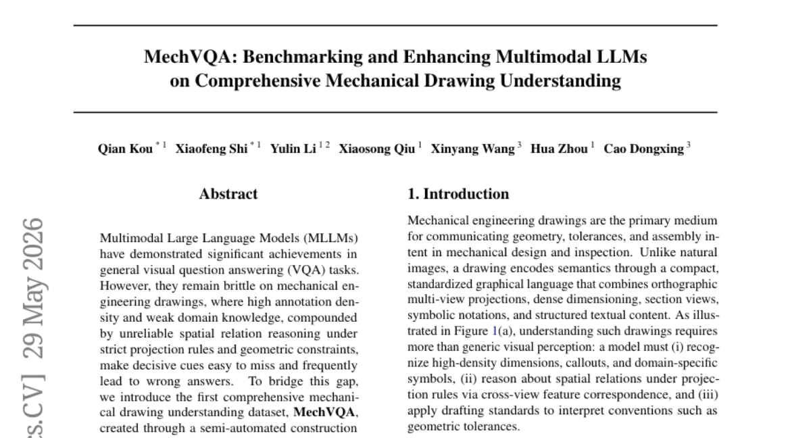

### 📌 한 줄 요약
기계 도면 이해를 위한 전문 데이터셋 MechVQA와 특화 모델 MechVL을 통한 도면 해석 성능 혁신

### 🔑 핵심 포인트
- 고밀도 기계 도면 특화 데이터셋 MechVQA 구축 (21K QA pairs)
- 인식, 추론, 판단의 3단계 계층적 태스크 구성
- 도면 이해 성능 극대화를 위한 다단계 학습 모델 MechVL 개발

### 🧑‍💻 개발자 관점
기계 설계 및 제조 현장에서 도면 검토 자동화(Inspection)를 위한 MLLM 적용 가능성을 제시합니다.

### 🚀 실무 적용 아이디어
- MechVQA 데이터셋을 활용한 도면 특화 Fine-tuning 실험
- 기존 오픈소스 VLM(Llava 등)과 MechVL의 공간 추론 성능 비교
- 도면 내 복잡한 기하학적 제약 조건 해결을 위한 프롬프트 엔지니어링 테스트

### ⚠️ 리스크/한계
- 특정 도면 양식에 대한 과적합 가능성
- 고해상도 도면 처리를 위한 연산 자원 요구량

### 📝 초록 기반 상세 설명
기존 MLLM은 높은 정보 밀도와 엄격한 기하학적 제약이 존재하는 기계 도면 해석에서 공간 추론 오류를 빈번하게 일으킵니다. 이를 해결하기 위해 연구진은 반자동화된 파이프라인을 통해 구축된 최초의 전문 도면 데이터셋인 MechVQA를 제안합니다. MechVQA는 인식, 추론, 판단의 3단계 역량을 포함하는 21K개의 질의응답 쌍을 제공합니다. 또한, 이 데이터셋을 기반으로 다단계 학습 패러다임을 적용한 전문 모델 MechVL을 개발했습니다. 실험 결과, MechVL은 강력한 폐쇄형 모델들을 상회하는 성능을 보이며 도면 이해 능력을 입증했습니다. 이는 향후 기계 설계 및 검사 자동화 분야의 기반이 될 것입니다.

### 🖼️ 추가 자료
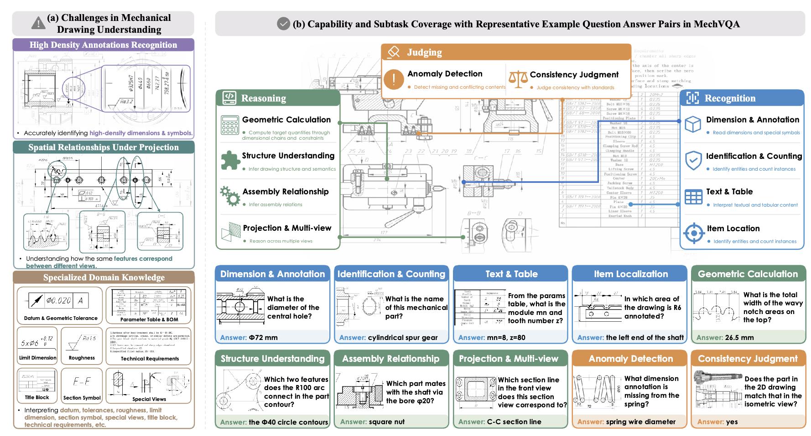

---

## 34. [Trust Region Q Adjoint Matching](https://huggingface.co/papers/2605.27079)
**Upvotes**: 3 | **도입 난이도**: 중 | **신뢰도**: 상
**arXiv**: https://arxiv.org/abs/2605.27079

**태그**: Reinforcement Learning, Offline RL, Flow-based Models, Trust Region, RAG

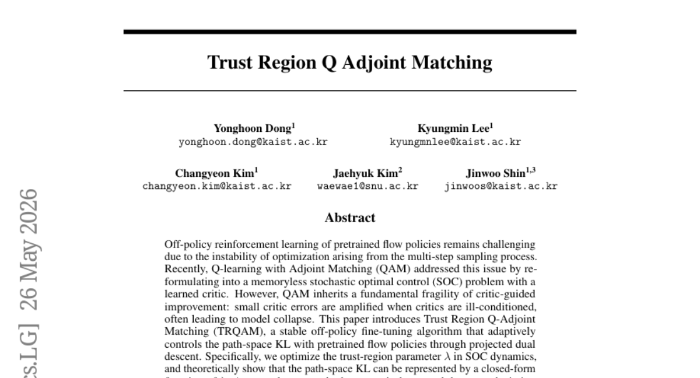

### 📌 한 줄 요약
사전 학습된 Flow 정책의 안정적인 미세 조정을 위해 신뢰 영역(Trust Region) 기법을 도입하여 모델 붕괴를 방지한 RL 알고리즘

### 🔑 핵심 포인트
- 신뢰 영역(Trust Region) 도입을 통한 크리틱 오차에 의한 모델 붕괴 방지
- 투영된 이중 하강(Projected Dual Descent)을 이용한 경로 공간 KL 발산의 적응적 제어
- 사전 학습된 Flow 정책으로부터의 이탈 정도를 정밀하게 제어하여 안정적인 오프-폴리시 미세 조정 달성

### 🧑‍💻 개발자 관점
사전 학습된 생성 모델(Flow-based)을 강화학습 환경에 적용할 때 발생하는 급격한 성능 저하(Collapse) 문제를 해결할 수 있는 실용적인 방법론을 제시합니다.

### 🚀 실무 적용 아이디어
- 기존 QAM 알고리즘과 TRQAM의 학습 곡선(Stability) 비교 실험
- 다양한 사전 학습 모델(Flow-based)에 대한 λ 파라미터 민감도 테스트
- Offline-to-Online 시나리오에서의 정책 이탈 정도와 성공률 간의 상관관계 분석

### ⚠️ 리스크/한계
- 신뢰 영역 파라미터 λ를 최적화하는 과정의 계산 복잡도 증가 가능성
- 특정 도메인(Flow-based policy)에 특화된 방법론으로 타 정책 구조로의 확장성 검증 필요

### 📝 초록 기반 상세 설명
사전 학습된 Flow 정책을 활용한 오프-폴리시 강화학습은 다단계 샘플링 과정의 불안정성으로 인해 최적화가 어렵습니다. 기존의 QAM 방식은 크리틱 오차에 의한 모델 붕괴 문제라는 근본적인 취약성을 가지고 있었습니다. 본 논문은 이를 해결하기 위해 신뢰 영역을 적응적으로 제어하는 TRQAM 알고리즘을 제안합니다. 투영된 이중 하강(Projected Dual Descent)을 통해 경로 공간의 KL 발산(Path-space KL)을 제어하며, λ 파라미터를 최적화하여 사전 학습된 정책으로부터의 이탈을 정밀하게 관리합니다. 실험 결과, 50개의 OGBench 태스크에서 기존 방식보다 월등한 성능을 보이며 오프라인 및 오프라인-투-온라인 RL 모두에서 안정적인 성능 향상을 입증했습니다.

---

## 35. [Revising Context, Shifting Simulated Stance: Auditing LLM-Based Stance Simulation in Online Discussions](https://huggingface.co/papers/2606.06443)
**Upvotes**: 2 | **도입 난이도**: 중 | **신뢰도**: 상
**arXiv**: https://arxiv.org/abs/2606.06443

**태그**: LLM-Agent, Social Simulation, Multimodal, Evaluation Framework, RAG, Vision, Evaluation

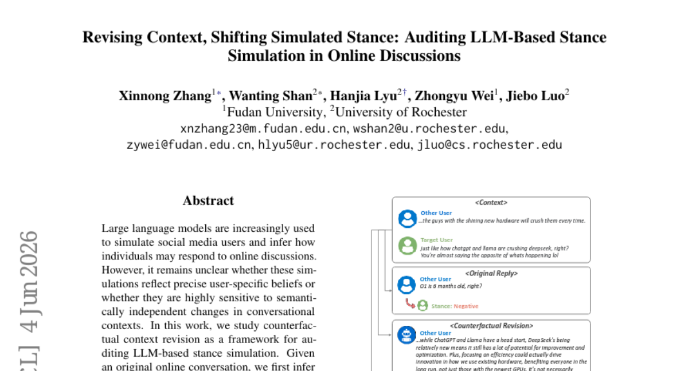

### 📌 한 줄 요약
LLM 기반 사용자 스탠스 시뮬레이션의 맥락 민감도를 평가하기 위한 카운터팩추얼(Counterfactual) 프레임워크 제안

### 🔑 핵심 포인트
- 카운터팩추얼 맥락 수정을 통한 LLM 스탠스 시뮬레이션 감사 프레임워크 개발
- 텍스트 기반 수정과 밈(Meme)을 포함한 멀티모달 수정 전략의 비교 분석
- 맥락 변화에 따른 스탠스 전환율(Stance Transition Rate) 및 방향성 변화 측정

### 🧑‍💻 개발자 관점
LLM 에이전트를 활용한 사회적 시뮬레이션 설계 시, 모델이 맥락 변화에 얼마나 취약하거나 민감하게 반응하는지 검증하는 방법론을 제공합니다.

### 🚀 실무 적용 아이디어
- 특정 페르소나를 가진 LLM 에이전트에게 미세한 맥락 변화를 주어 태도 변화를 유도하는 실험 수행
- 텍스트 데이터 외에 이미지/밈 등 멀티모달 입력이 에이전트의 의사결정에 미치는 영향도 테스트
- 시뮬레이션된 사용자의 일관성(Consistency)과 맥락 민감도 사이의 트레이드오프 분석

### ⚠️ 리스크/한계
- 시뮬레이션된 스탠스가 실제 인간의 복잡한 신념 체계를 완벽히 대변할 수 있는지에 대한 근본적 의문
- 맥락 변화에 대한 과도한 민감성이 모델의 신뢰성을 저해할 위험

### 📝 초록 기반 상세 설명
최근 LLM을 활용해 소셜 미디어 사용자의 태도를 시뮬레이션하는 연구가 늘고 있으나, 이것이 실제 신념을 반영하는지 아니면 단순 맥락 변화에 민감한 것인지 불분명합니다. 본 연구는 '카운터팩추얼 맥락 수정' 프레임워크를 통해 LLM의 스탠스 시뮬레이션 능력을 감사(Auditing)합니다. 기존 대화 맥락을 제어된 전략으로 수정하여 사용자의 스탠스 변화를 유도하고, 텍스트 기반과 멀티모달(밈 포함) 전략 간의 효과를 비교했습니다. 실험 결과, 다양한 양극화 메커니즘 하에서 텍스트 및 멀티모달 전략 모두 효과적이고 견고한 스탠스 전환이 나타났습니다. 이 연구는 LLM 기반 의견 역학 시뮬레이션의 잠재력과 위험성을 동시에 시사합니다.

---

## 36. [Benchmark Everything Everywhere All at Once](https://huggingface.co/papers/2606.06462)
**Upvotes**: 2 | **도입 난이도**: 중 | **신뢰도**: 상
**arXiv**: https://arxiv.org/abs/2606.06462

**태그**: Agent, Benchmark, LLM-Evaluation, Automation, Reasoning, Multimodal, Evaluation

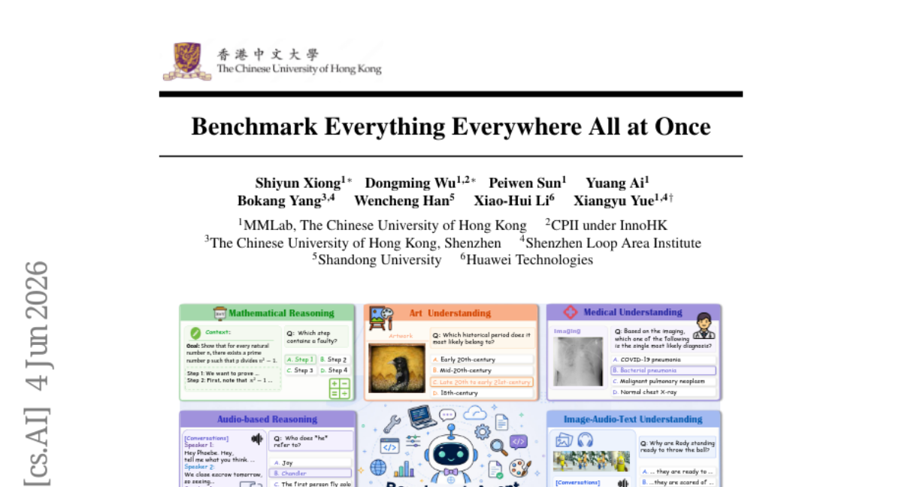

### 📌 한 줄 요약
벤치마크 구축 과정을 자동화하여 지속 가능하고 변별력 있는 평가 데이터셋을 생성하는 자율 에이전트 시스템 제안

### 🔑 핵심 포인트
- 벤치마크 구축 전 과정을 자동화하는 자율 에이전트 프레임워크 개발
- 텍스트, 멀티모달, 도메인 특화 등 다양한 영역을 포괄하는 15종의 벤치마크 생성
- 모델 성능 포화 문제를 해결하기 위한 지속적이고 빠른 벤치마크 업데이트 체계 구축

### 🧑‍💻 개발자 관점
모델 성능이 상향 평준화되는 상황에서, 새로운 데이터셋을 수동으로 만드는 대신 자동화된 파이프라인을 통해 지속적으로 변별력 있는 평가 지표를 확보할 수 있습니다.

### 🚀 실무 적용 아이디어
- 제시된 Benchmark Agent 프레임워크를 활용해 특정 도메인 전용 테스트셋 생성 시도
- 생성된 벤치마크 데이터의 편향성 및 품질을 검증하기 위한 Human-in-the-loop 테스트
- 기존 정적 벤치마크와 에이전트 생성 벤치마크 간의 모델 변별력 비교 실험

### ⚠️ 리스크/한계
- 에이전트가 생성한 데이터의 독창성 및 데이터 오염(Data Contamination) 가능성
- 완전 자동화 시 발생할 수 있는 미세한 논리적 오류나 품질 저하 리스크

### 📝 초록 기반 상세 설명
LLM 및 MLLM의 발전을 위해 벤치마크는 필수적이지만, 구축 과정의 높은 비용과 모델 성능 포화로 인한 변별력 저하 문제가 존재합니다. 이를 해결하기 위해 사용자 쿼리 분석부터 데이터 주석, 품질 관리까지 전 과정을 수행하는 자율 에이전트 시스템인 'Benchmark Agent'를 도입합니다. 이 프레임워크는 텍스트, 멀티모달, 도메인 특화 추론 등 다양한 시나리오를 아우르는 15개의 대표 벤치마크를 생성하여 성능을 검증했습니다. 실험 결과, 인간 평가 및 LLM-as-a-judge를 통해 최소한의 개입으로 고품질의 벤치마크를 생성할 수 있음을 입증했습니다. 결과적으로 빠르게 진화하는 벤치마크를 통해 모델 간의 미세한 성능 차이를 식별하는 데 기여합니다.

---

## 37. [Video2LoRA: Parametric Video Internalization for Vision-Language Models](https://huggingface.co/papers/2606.04351)
**Upvotes**: 2 | **도입 난이도**: 상 | **신뢰도**: 상
**arXiv**: https://arxiv.org/abs/2606.04351

**태그**: Video-Understanding, LoRA, Hypernetwork, Efficiency, Vision, Video, Benchmark, Inference

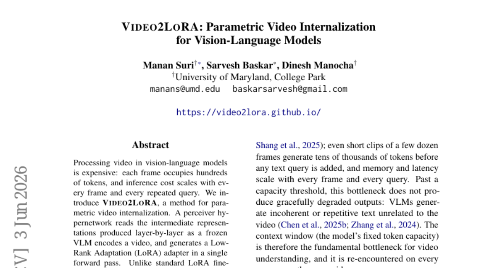

### 📌 한 줄 요약
비디오 프레임을 LoRA 가중치로 직접 변환하여 추론 시 시각적 토큰 없이 고성능 비디오 이해를 가능케 하는 기술

### 🔑 핵심 포인트
- 하이퍼네트워크를 이용한 비디오-to-LoRA 가중치 직접 예측 (Gradient-free)
- 추론 시 시각적 토큰을 제거하여 컨텍스트 부하 및 TTFT(Time To First Token) 대폭 감소
- 긴 비디오 및 고해상도 환경에서도 안정적인 성능 유지 및 가중치 합성 가능성 확인

### 🧑‍💻 개발자 관점
비디오 데이터를 텍스트 토큰이 아닌 모델 가중치 형태로 압축함으로써, 초장기 비디오 컨텍스트 처리와 실시간 질의응답 환경에서의 비용 문제를 해결할 수 있습니다.

### 🚀 실무 적용 아이디어
- 제안된 Perceiver 하이퍼네트워크 구조의 학습 안정성 검증
- 다양한 해상도 및 프레임 수 변화에 따른 가중치 생성 품질 테스트
- 여러 비디오 세그먼트에서 생성된 LoRA 어댑터 간의 병합(Composition) 실험

### ⚠️ 리스크/한계
- 하이퍼네트워크 학습을 위한 고품질의 비디오-가중치 쌍 데이터셋 필요
- 학습 시 사용된 프레임 수와 실제 추론 시 가중치 표현력 간의 일반화 문제

### 📝 초록 기반 상세 설명
기존 VLM은 비디오 처리 시 프레임당 막대한 토큰을 소모하여 추론 비용과 컨텍스트 길이가 급증하는 문제가 있습니다. 이를 해결하기 위해 연구진은 비디오 정보를 모델의 파라미터 내부에 내재화하는 Video2LoRA 방식을 제안합니다. 이 방법은 Perceiver 하이퍼네트워크를 통해 고정된 VLM의 중간 표현으로부터 LoRA 어댑터를 단 한 번의 순방향 패스로 생성합니다. 실험 결과, 추론 시 시각적 토큰 없이도 기존의 직접 입력 방식과 대등한 성능을 유지하며 토큰 부하를 획기적으로 줄였습니다. 또한 긴 비디오 처리에 있어 기존 방식보다 높은 안정성과 빠른 응답 속도를 보여주었습니다.

### 🖼️ 추가 자료

---

## 38. [EvoDS: Self-Evolving Autonomous Data Science Agent with Skill Learning and Context Management](https://huggingface.co/papers/2606.03841)
**Upvotes**: 2 | **도입 난이도**: 상 | **신뢰도**: 상
**arXiv**: https://arxiv.org/abs/2606.03841

**태그**: LLM Agent, Autonomous Agents, Reinforcement Learning, Data Science Automation, Agent, RAG, Benchmark, Optimization

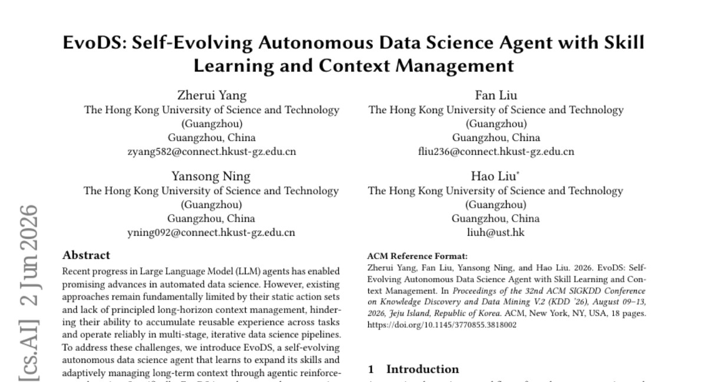

### 📌 한 줄 요약
스스로 기술을 습득하고 컨텍스트를 최적화하여 복잡한 데이터 과학 파이프라인을 수행하는 자가 진화형 에이전트

### 🔑 핵심 포인트
- ASA(Autonomous Skill Acquisition): 실행 가능한 기술을 스스로 합성, 검증 및 재사용하는 메커니즘
- ACC(Adaptive Context Compression): 컨텍스트 관리를 수동적 절단이 아닌 학습 가능한 제어 문제로 정의
- 2단계 멀티 에이전트 학습: 기술 습득과 컨텍스트 최적화를 통한 자가 진화 구조

### 🧑‍💻 개발자 관점
단순한 프롬프트 엔지니어링을 넘어, 에이전트가 스스로 도구(Skill)를 만들고 긴 작업 흐름(Long-horizon)을 관리하는 자동화된 워크플로우 설계의 방향성을 제시합니다.

### 🚀 실무 적용 아이디어
- 에이전트의 Skill Library 구축 시 검증(Validation) 루프 설계 적용해보기
- 긴 컨텍스트 작업 시 단순 Truncation 대신 요약/압축 알고리즘 적용 실험
- 멀티 에이전트 협업 환경에서의 역할 분담 구조 설계

### ⚠️ 리스크/한계
- 기술 합성 과정에서 잘못된 코드가 생성될 경우 시스템 안정성 저해 가능성
- 학습 기반의 컨텍스트 압축 시 중요한 정보 손실 위험

### 📝 초록 기반 상세 설명
최근 LLM 에이전트가 데이터 과학 분야에서 발전하고 있으나, 정적인 액션 세트와 비효율적인 컨텍스트 관리 문제로 인해 장기적인 작업 수행에 한계가 있습니다. 이를 해결하기 위해 본 논문은 자가 진화형 에이전트인 EvoDS를 제안합니다. EvoDS는 새로운 기술을 합성하고 검증하는 ASA(Autonomous Skill Acquisition)와 컨텍스트 관리를 제어 문제로 다루는 ACC(Adaptive Context Compression) 전략을 사용합니다. 이러한 전략은 2단계 멀티 에이전트 학습 체계 내에서 통합되어 에이전트가 시간이 지남에 따라 스스로 발전하도록 합니다. 실험 결과, 기존 오픈소스 에이전트 대비 성능을 대폭 향상시켰으며 토큰 초과 오류 문제를 해결했습니다.

---

## 39. [Absorbing Complexity: An Interaction-Native Knowledge Harness for Financial LLM Agents](https://huggingface.co/papers/2606.01886)
**Upvotes**: 2 | **도입 난이도**: 중 | **신뢰도**: 상
**arXiv**: https://arxiv.org/abs/2606.01886

**태그**: AI Agent, Memory Management, Knowledge Graph, FinTech, Agent, RAG, Benchmark, Evaluation, Inference

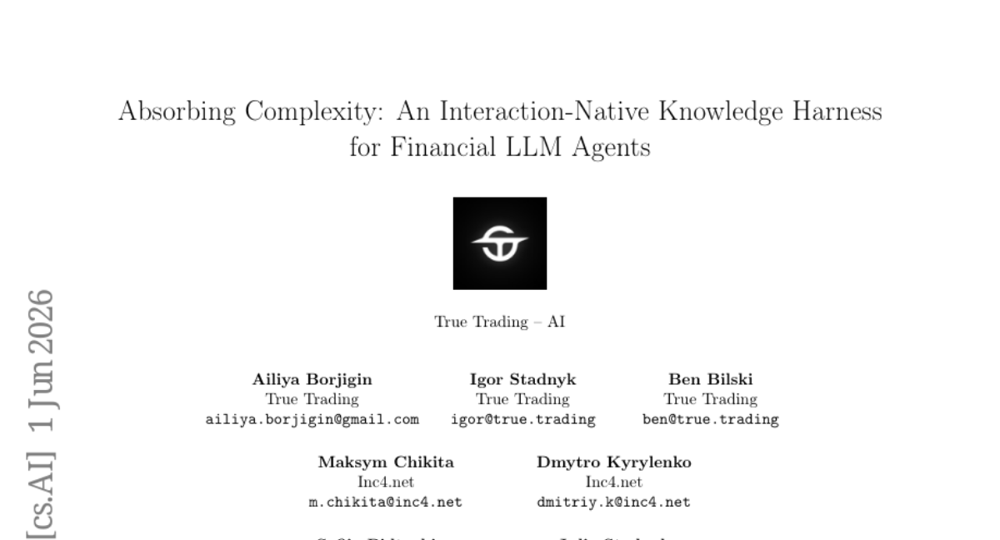

### 📌 한 줄 요약
사용자의 개입 없이 복잡한 금융 컨텍스트를 시스템이 스스로 흡수하여 관리하는 에이전트 아키텍처 제안

### 🔑 핵심 포인트
- 사용자/시장 이벤트를 구조화된 운영 지식으로 변환하는 InKH 아키텍처 제안
- 시계열 그래프 메모리와 데이터 만료(decay/invalidation)를 통한 최신성 유지
- 지연 시간 및 토큰 비용을 획기적으로 줄이면서 품질과 감사 가능성을 높인 설계

### 🧑‍💻 개발자 관점
에이전트 설계 시 사용자의 반복적인 프롬프트 입력을 줄이기 위해, 시스템 내부에서 컨텍스트를 어떻게 구조화하고 생명주기를 관리해야 하는지에 대한 실무적 가이드를 제공합니다.

### 🚀 실무 적용 아이디어
- 에이전트의 메모리 관리 로직에 데이터 만료(decay) 및 무효화(invalidation) 규칙 적용 실험
- RAG 시스템에 시계열 그래프 구조를 도입하여 컨텍스트 최신성 비교 테스트
- 사용자 입력 없이 시스템이 스스로 컨텍스트를 업데이트하는 'Passive Injection' 워크플로우 구현

### ⚠️ 리스크/한계
- 실제 라이브 트레이딩 환경이 아닌 합성 벤치마크 기반의 결과임
- 복잡한 지식 추출 로직이 시스템의 전체적인 연산 부하를 높일 가능성

### 📝 초록 기반 상세 설명
금융 AI 에이전트는 사용자가 목표, 리스크, 포트폴리오 등 복잡한 맥락을 반복적으로 설명해야 하는 문제로 인해 오류와 지연이 발생합니다. 이를 해결하기 위해 사용자 및 시장 이벤트를 구조화된 지식으로 변환하는 InKH(interaction-native knowledge harness) 아키텍처를 제안합니다. InKH는 수동적 지식 주입, 시계열 그래프 메모리, 위키형 감사 표면, 그리고 데이터 만료/무효화 메커니즘을 결합하여 작업 컨텍스트를 관리합니다. 실험 결과, 기존 방식 대비 지연 시간과 토큰 비용을 80% 이상 대폭 절감하면서도 작업 품질과 추적성을 향상시켰습니다. 결과적으로 시스템이 복잡성을 흡수함으로써 사용자 부담을 줄이는 설계 원칙을 입증했습니다.

---

## 40. [Regret Minimization with Adaptive Opponents in Repeated Games](https://huggingface.co/papers/2606.06486)
**Upvotes**: 1 | **도입 난이도**: 상 | **신뢰도**: 상
**arXiv**: https://arxiv.org/abs/2606.06486

**태그**: Multi-Agent Learning, Game Theory, Reinforcement Learning, Optimization, Reasoning

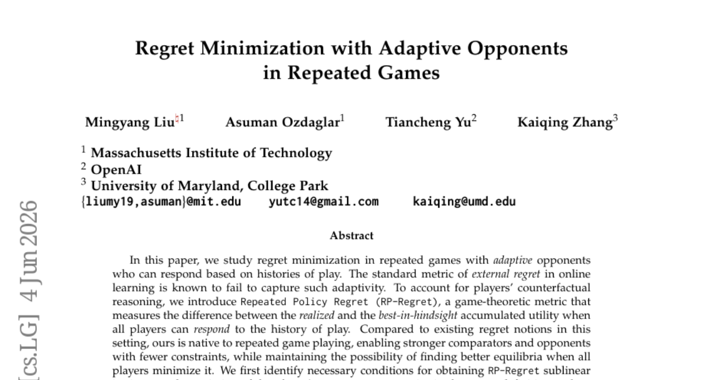

### 📌 한 줄 요약
상대방의 전략 변화와 과거 이력을 고려한 새로운 후회 최소화 지표(RP-Regret)를 제안하여 협력적 게임 균형 도출 가능성을 제시함

### 🔑 핵심 포인트
- 상대방의 적응적 전략 변화를 반영하는 새로운 지표 'RP-Regret' 정의
- 비볼록(Non-convex) 최적화 문제를 해결하기 위한 세 가지 알고리즘 프레임워크 제안
- 게임 이론적 관점에서 더 높은 효용을 가진 협력적 균형 도출 가능성 확인

### 🧑‍💻 개발자 관점
멀티 에이전트 시스템(MAS)에서 상대방이 고정된 규칙이 아닌 학습을 통해 변화하는 환경에서 더 견고하고 협력적인 에이전트를 설계할 수 있는 이론적 토대를 제공합니다.

### 🚀 실무 적용 아이디어
- Stag-Hunt와 같은 협력 게임 환경에서 제안된 세 가지 알고리즘의 수렴 속도 비교 실험
- 상대방의 전략 변화 속도(Learning rate)에 따른 RP-Regret의 안정성 테스트
- 기존 External Regret 기반 에이전트와 RP-Regret 기반 에이전트의 협력 효율성 비교

### ⚠️ 리스크/한계
- RP-Regret 자체가 비볼록(Non-convex) 문제이므로 최적해 수렴을 보장하기 어려울 수 있음
- 상대방의 전략 변화가 매우 빠를 경우 알고리즘의 성능 저하 가능성

### 📝 초록 기반 상세 설명
기존의 외부 후회(External Regret) 지표는 상대방이 플레이 이력에 따라 전략을 수정하는 적응형 환경을 충분히 반영하지 못하는 한계가 있습니다. 이를 해결하기 위해 플레이어의 반사실적 추론을 반영하여, 모든 플레이어가 이력에 반응할 수 있는 상황에서의 효용 차이를 측정하는 'RP-Regret'을 도입합니다. RP-Regret은 비볼록(non-convex) 최적화 문제를 포함하지만, 이를 해결하기 위해 최적화 오라클 기반 알고리즘, 선형화 대리 함수 알고리즘, 느린 전략 변화 대응 알고리즘 등 세 가지 접근법을 제안합니다. 연구 결과, 모든 플레이어가 이 지표를 최소화할 때 특정 하위게임 완전 균형(Subgame Perfect Equilibria)을 학습할 수 있음을 확인했습니다. 실험을 통해 Stag-Hunt 게임과 같은 상황에서 더 높은 효용을 주는 협력적 솔루션을 도출할 수 있음을 입증했습니다.

---

## 41. [AURA: Intent-Directed Probing for Implicit-Need Surfacing in Situated LLM Agents](https://huggingface.co/papers/2606.05557)
**Upvotes**: 1 | **도입 난이도**: 중 | **신뢰도**: 상
**arXiv**: https://arxiv.org/abs/2606.05557

**태그**: LLM Agent, Intent Recognition, Tool-use Optimization, Agent, RAG, Benchmark, Inference

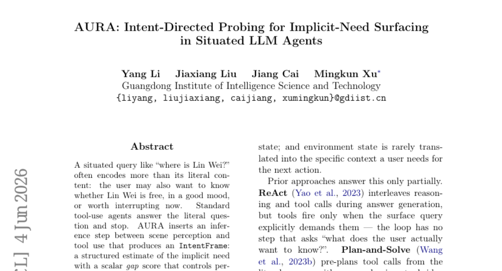

### 📌 한 줄 요약
사용자의 숨겨진 의도를 파악하여 불필요한 도구 호출을 줄이고 상황 맞춤형 응답을 제공하는 에이전트 프레임워크

### 🔑 핵심 포인트
- IntentFrame: 암시적 의도를 구조화하여 추론하는 중간 단계 도입
- Gap Score: 질문의 모호성을 수치화하여 도구 사용 예산 및 선택을 최적화
- Efficiency & Safety: 불필요한 프로빙(Probing)을 82% 줄이면서도 프라이버시 위반 방지

### 🧑‍💻 개발자 관점
단순 질의응답을 넘어 사용자의 맥락과 의도를 고려해야 하는 복잡한 에이전트 시스템 설계 시, 비용 효율적이고 정확한 의도 파악 전략을 제공합니다.

### 🚀 실무 적용 아이디어
- 기존 ReAct 기반 에이전트에 IntentFrame과 같은 중간 추론 단계 도입 실험
- 질문의 모호도에 따른 도구 호출 비용(Token/Time) 최적화 로직 구현
- 프라이버시 보호를 위한 도구 사용 가이드라인(Constraint) 적용 테스트

### ⚠️ 리스크/한계
- 의도 추론 단계 추가로 인한 추론 지연 시간(Latency) 발생 가능성
- 잘못된 의도 파악(False Positive) 시 발생하는 오작동 리스크

### 📝 초록 기반 상세 설명
기존의 상황 인지형 LLM 에이전트는 사용자의 질문에 담긴 암시적 의도(예: 상대방의 상태 확인 등)를 간과하고 문자 그대로의 질문에만 답하는 경향이 있습니다. 이를 해결하기 위해 AURA는 상황 인지와 도구 사용 사이에 'IntentFrame'이라는 추론 단계를 도입했습니다. IntentFrame은 암시적 니즈를 구조화하고, 'gap score'를 통해 질문당 탐색 예산과 도구 선택을 제어합니다. 실험 결과, AURA는 기존 ReAct 방식보다 암시적 의도 충족률을 높이면서도 도구 호출 횟수를 82% 감소시켰습니다. 또한 프라이버시가 중요한 상황에서 금지된 도구 사용을 방지하는 등 효율적이고 안전한 에이전트 동작을 입증했습니다.

---

## 42. [Discrete-WAM: Unified Discrete Vision-Action Token Editing for World-Policy Learning](https://huggingface.co/papers/2606.05645)
**Upvotes**: 1 | **도입 난이도**: 상 | **신뢰도**: 상
**arXiv**: https://arxiv.org/abs/2606.05645

**태그**: Autonomous Driving, World Model, Diffusion Model, Reinforcement Learning, Causal Reasoning, Reasoning, Vision, Benchmark, Safety

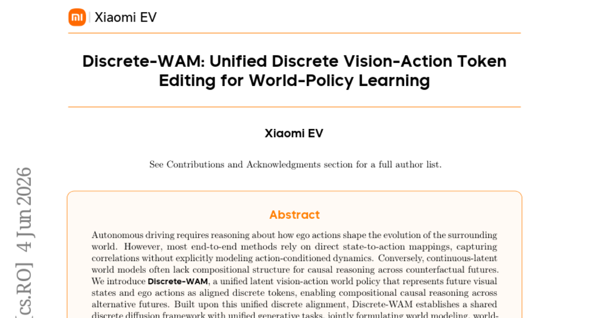

### 📌 한 줄 요약
미래 시각 상태와 자차 행동을 이산 토큰으로 통합하여 인과적 추론과 제어 가능한 생성을 가능케 하는 월드 모델 기반 정책 학습 프레임워크

### 🔑 핵심 포인트
- 미래 시각 상태와 행동을 동일한 이산 토큰 공간으로 정렬하여 통합 모델링
- 공유된 이산 디퓨전 프레임워크를 통한 월드 모델링 및 계층적 정책 학습
- 반사실적 추론(Counterfactual Reasoning)을 통한 다양한 미래 시나리오 대응

### 🧑‍💻 개발자 관점
단순한 상태-행동 매핑을 넘어, '만약 이렇게 행동했다면?'과 같은 인과적 시나리오를 시뮬레이션하고 정책을 검증할 수 있는 구조를 제공합니다.

### 🚀 실무 적용 아이디어
- 이산 토큰 정렬 방식이 연속적 잠재 공간 방식 대비 정보 손실이 얼마나 발생하는지 비교 실험
- 특정 행동 토큰 변화에 따른 미래 시각 토큰의 변화량(Causal Impact) 측정
- 다양한 주행 시나리오에서의 조합적 일반화(Compositional Generalization) 성능 테스트

### ⚠️ 리스크/한계
- 이산 토큰화 과정에서의 정보 압축 및 정밀도 저하 가능성
- 복잡한 시나리오에서 디퓨전 기반 생성 모델의 추론 속도(Latency) 문제

### 📝 초록 기반 상세 설명
자율주행에서는 자차의 행동이 주변 환경에 미치는 영향을 모델링하는 것이 중요하지만, 기존 방식은 단순 상관관계에 의존하거나 인과적 추론을 위한 구조적 한계가 있었습니다. 이를 해결하기 위해 미래 시각 상태와 행동을 정렬된 이산 토큰으로 표현하는 Discrete-WAM을 제안합니다. 이 모델은 통합된 이산 정렬 구조를 바탕으로 공유된 디퓨전 프레임워크를 통해 월드 모델링과 정책 학습을 동시에 수행합니다. 이를 통해 다양한 미래 시나리오에 대한 조합적 인과 추론이 가능해집니다. 실험 결과, 대규모 자율주행 벤치마크에서 경쟁력 있는 성능을 보였으며 제어 가능한 생성과 반사실적 추론 능력을 입증했습니다.

---

## 43. [BRepCLIP: Contrastive Multimodal Pretraining on BRep Primitives for CAD Understanding](https://huggingface.co/papers/2606.05515)
**Upvotes**: 1 | **도입 난이도**: 상 | **신뢰도**: 상
**arXiv**: https://arxiv.org/abs/2606.05515

**태그**: CAD, Multimodal, BRep, Transformer, Contrastive Learning, RAG, Vision, Evaluation

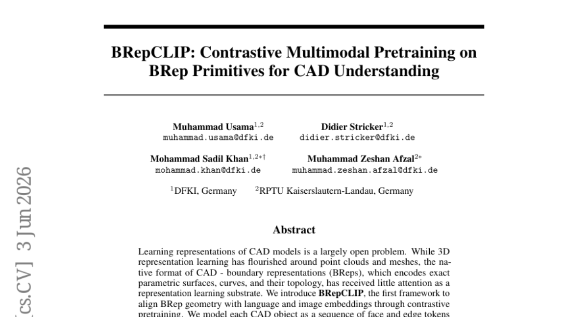

### 📌 한 줄 요약
BRep(경계 표현) 구조를 활용하여 CAD 모델을 텍스트 및 이미지와 정렬시킨 멀티모달 사전학습 프레임워크

### 🔑 핵심 포인트
- BRep의 기하학적 구조(면, 선, 위상)를 활용한 독자적인 토큰화 방식 도입
- CLIP 스타일의 대조 학습을 통한 BRep-텍스트-이미지 간 멀티모달 정렬
- 기존 포인트 클라우드 기반 방식 대비 높은 정밀도와 의미론적 이해도 확보

### 🧑‍💻 개발자 관점
정밀한 수치 데이터가 중요한 CAD 분야에서 단순 시각적 형태를 넘어 구조적 특징을 반영한 검색 및 생성 모델 구축의 기반을 제공합니다.

### 🚀 실무 적용 아이디어
- 제공된 토큰화 방식이 복잡한 NURBS 곡면을 얼마나 정확히 재구성하는지 검증
- 기존 PointNet/Mesh 기반 임베딩과 BRepCLIP 임베딩 간의 검색 성능 비교 실험
- 생성된 CAD 모델의 품질 평가를 위한 유사도 지표(Similarity Metric)로 적용

### ⚠️ 리스크/한계
- BRep 데이터의 복잡한 위상 구조를 토큰화하는 과정에서의 연산 비용 문제
- 데이터셋의 규모와 다양성에 따른 범용적 일반화 성능의 불확실성

### 📝 초록 기반 상세 설명
기존 3D 학습은 포인트 클라우드나 메쉬에 집중되어 있어, CAD의 핵심인 정밀한 BRep 데이터 활용이 미흡했습니다. 본 논문은 BRep의 면(face)과 선(edge) 정보를 토큰화하여 텍�스트 및 이미지 임베딩과 정렬하는 BRepCLIP 프레임워크를 제안합니다. 각 기하학적 요소에 표면 타입과 곡선 프리미티브 정보를 포함한 토큰을 생성하고, 트랜스포머 인코더를 통해 글로벌 임베딩을 추출합니다. 실험 결과, 기존 포인트 기반 방식보다 월등한 검색 및 제로샷 분류 성능을 보였습니다. 또한, 텍스트/이미지 기반 CAD 생성 모델의 평가를 위한 유사도 지표로서의 유효성도 입증했습니다.

### 🖼️ 추가 자료
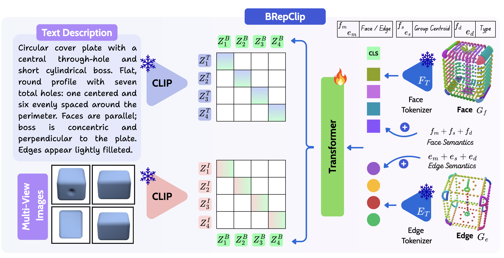

---

## 44. [Quality-Guided Semi-Supervised Learning for Medical Image Segmentation](https://huggingface.co/papers/2606.01753)
**Upvotes**: 1 | **도입 난이도**: 중 | **신뢰도**: 상
**arXiv**: https://arxiv.org/abs/2606.01753

**태그**: Medical Imaging, Semi-Supervised Learning, Segmentation, Quality Estimation, Vision

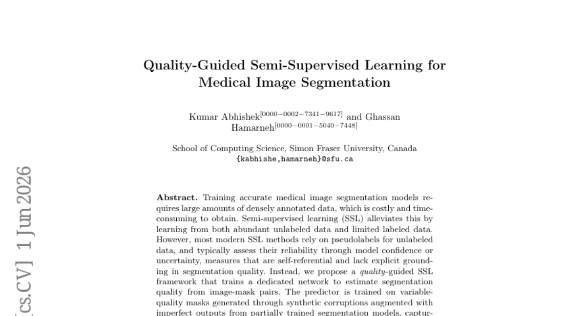

### 📌 한 줄 요약
모델의 자기 참조적 신뢰도 대신, 합성된 오류 패턴을 학습한 품질 예측기를 통해 세그멘테이션 품질을 직접 평가하는 SSL 프레임워크

### 🔑 핵심 포인트
- 자기 참조적 신뢰도 문제를 해결하기 위해 독립적인 세그멘테이션 품질 예측 네트워크 도입
- 합성된 오염(synthetic corruptions)과 불완전한 모델 출력을 활용한 현실적인 오류 패턴 학습
- 기존 SSL 프레임워크에 플러그인 형태로 적용 가능한 정규화 및 재가중치 메커니즘

### 🧑‍💻 개발자 관점
기존의 단순 Confidence 기반 의사 라벨링이 가진 한계를 극복하여, 레이블 품질이 낮은 데이터가 포함된 환경에서도 안정적인 학습이 가능합니다.

### 🚀 실무 적용 아이디어
- 기존 SSL 프레임워크(예: FixMatch 등)에 제안된 품질 예측 모듈을 결합하여 성능 변화 관찰
- 사용 중인 데이터셋에 대해 합성 오염(corruption) 강도를 조절하며 예측기 학습 실험
- 모델의 Confidence 점수와 제안된 Quality 점수 간의 상관관계 분석

### ⚠️ 리스크/한계
- 품질 예측기 자체의 학습 난이도 및 추가적인 연산 비용 발생
- 합성된 오류 패턴이 실제 도메인의 복잡한 오류를 완벽히 대변하지 못할 가능성

### 📝 초록 기반 상세 설명
의료 영상 세그멘테이션을 위한 정밀한 레이블링은 비용과 시간이 많이 소요되는 문제입니다. 기존의 준지도 학습(SSL) 방식은 모델의 신뢰도나 불확실성에 의존하여 의사 라벨(pseudolabel)을 생성하지만, 이는 실제 세그멘테이션 품질과 괴리될 수 있는 자기 참조적 한계가 있습니다. 본 논문은 이미지-마스크 쌍으로부터 세그멘테이션 품질을 직접 추정하는 전용 네트워크를 제안합니다. 이 예측기는 합성된 오염 데이터와 학습 중 발생하는 불완전한 출력을 결합하여 현실적인 오류 패턴을 학습합니다. 제안된 방식은 품질 인식 정규화 손실과 샘플 재가중치 스킴을 통해 기존 SSL 프레임워크에 즉시 적용 가능합니다. 실험 결과, 다양한 데이터셋과 아키텍처에서 기존 SOTA 모델들을 상회하는 성능 향상을 입증했습니다.

### 🖼️ 추가 자료
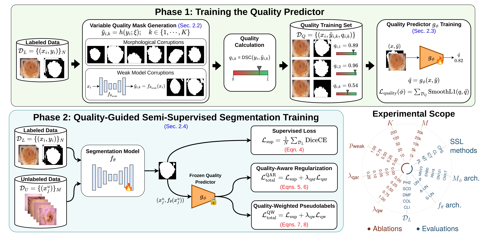

---

## 45. [LLM Anonymization Against Agentic Re-Identification](https://huggingface.co/papers/2605.30848)
**Upvotes**: 1 | **도입 난이도**: 중 | **신뢰도**: 상
**arXiv**: https://arxiv.org/abs/2605.30848

**태그**: LLM, Privacy, Anonymization, Agentic-AI, Agent, Evaluation, Inference

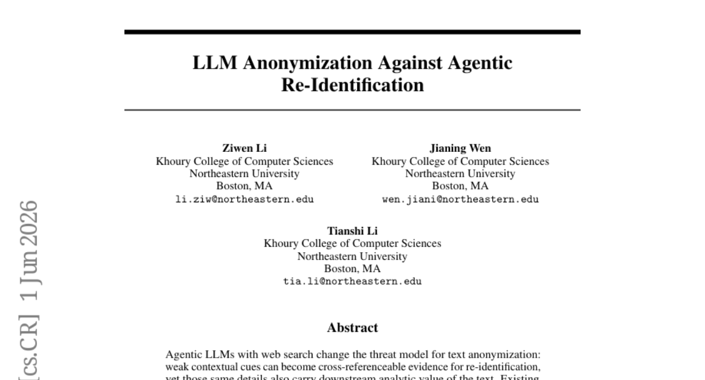

### 📌 한 줄 요약
웹 검색 기능을 갖춘 에이전트형 LLM의 재식별 공격에 대응하면서도 데이터의 분석적 가치를 유지하는 AURA 프레임워크 제안

### 🔑 핵심 포인트
- 에이전트형 LLM의 웹 검색 기반 재식별 위협에 특화된 프라이버시 보호 모델 제안
- 프라이버시 국소화(Localization)와 유용성 보존 재구성(Reconstruction)의 분리 구조
- 적대적 검증을 통한 프라이버시-유용성 프런티어(Frontier) 최적화

### 🧑‍💻 개발자 관점
LLM 기반 에이전트가 외부 데이터를 검색하여 개인을 특정하는 공격에 대비해야 하는 엔지니어에게 실질적인 익명화 가이드라인을 제공합니다.

### 🚀 실무 적용 아이디어
- 웹 검색 에이전트를 활용한 데이터 재식별 공격 시나리오 구축
- 텍스트 내 민감 정보 추출(Masking)과 문맥 유지(Reconstruction) 성능 비교 실험
- 데이터 유용성 측정을 위한 코드북 및 프로필 기반 평가 지표 적용

### ⚠️ 리스크/한계
- 재구성된 텍스트가 여전히 미세한 패턴을 통해 재식별될 가능성 존재
- 에이전트의 검색 능력 향상에 따른 지속적인 방어 전략 업데이트 필요

### 📝 초록 기반 상세 설명
웹 검색이 가능한 에이전트형 LLM의 등장으로 텍스트 내 미세한 맥락 정보가 재식별의 근거로 활용되는 새로운 위협 모델이 등장했습니다. 기존의 익명화 방식은 식별자 제거에 치중하거나 단순 텍스트 변조에 그쳐, 프라이버시 보호와 데이터 유용성 사이의 균형을 맞추는 데 한계가 있었습니다. 본 논문은 프라이버시 국소화와 유용성 보존 재구성을 분리한 AURA 프레임워크를 제안합니다. AURA는 적대적 프라이버시 검증과 유용성 유지 검증을 통해 최적의 후보를 선택하는 mask-reconstruct 방식을 사용합니다. 실제 사용자 인터뷰 데이터를 활용한 실험 결과, AURA는 에이전트 기반 재식별 공격에 대한 저항력을 높이면서도 맥락적 유용성을 효과적으로 보존함을 입증했습니다.

---

## 46. [Combinatorial Synthesis: Scaling Code RLVR via Atomic Decomposition and Recombination](https://huggingface.co/papers/2605.31058)
**Upvotes**: 1 | **도입 난이도**: 중 | **신뢰도**: 상
**arXiv**: https://arxiv.org/abs/2605.31058

**태그**: LLM, Reinforcement Learning, Code Generation, Data Synthesis

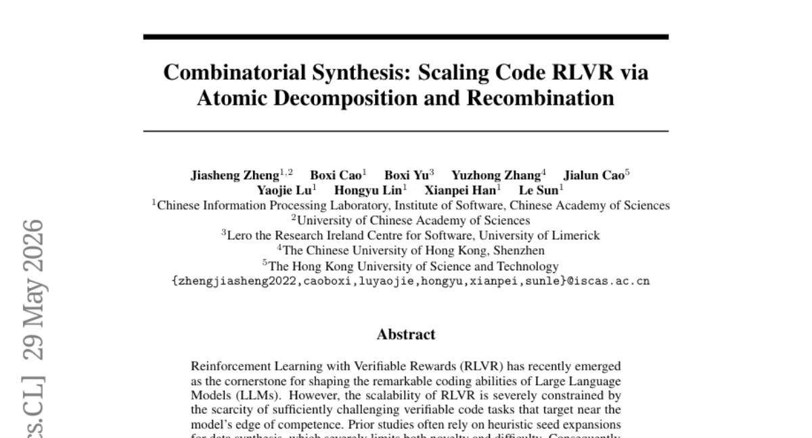

### 📌 한 줄 요약
원자적 분해 및 재조합(ADR)을 통해 고난도 코딩 문제를 자동 생성하여 LLM의 RLVR 학습 효율을 극대화하는 프레임워크

### 🔑 핵심 포인트
- ADR(Atomic Decomposition and Recombination) 프레임워크 제안
- 원자적 요소 분해 및 재조합을 통한 고난도/고독창성 태스크 생성
- 알고리즘, 툴 사용, 데이터 과학 등 다양한 코딩 도메인에서의 성능 검증

### 🧑‍💻 개발자 관점
모델 성능 향상을 위한 고품질 학습 데이터 부족 문제를 해결하기 위해, 단순 확장이 아닌 구조적 설계를 통한 데이터 합성 전략을 제시합니다.

### 🚀 실무 적용 아이디어
- 기존 휴리스틱 데이터 생성 파이프라인과 ADR 방식의 난이도/다양성 비교 실험
- 특정 도메인(예: 데이터 과학)에 특화된 원자적 요소 정의 및 재조합 규칙 설계
- 생성된 합성 데이터가 모델의 오버피팅에 미치는 영향 분석

### ⚠️ 리스크/한계
- 원자적 요소로 분해하기 어려운 복잡한 논리 구조의 문제 생성 한계
- 재조합 과정에서 발생할 수 있는 논리적 일관성 결여 가능성

### 📝 초록 기반 상세 설명
최근 LLM의 코딩 능력 향상을 위해 RLVR(Reinforcement Learning with Verifiable Rewards)이 핵심 기술로 부상했습니다. 그러나 모델의 한계점에 근접한 도전적인 검증 가능 코딩 태스크의 부족이 RLVR의 확장성을 저해하는 주요 원인이 되고 있습니다. 기존의 휴리스틱 기반 데이터 합성 방식은 참신함과 난이도 측면에서 한계가 있어 데이터 양이 늘어나도 학습 효과가 정체되는 문제가 있었습니다. 본 논문은 문제를 원자적 요소로 분해한 뒤 이를 제어된 방식으로 재조합하는 ADR(Atomic Decomposition and Recombination) 프레임워크를 제안합니다. 실험 결과, ADR은 기존 방식보다 높은 독창성, 난이도, 다양성을 확보하며 알고리즘, 툴 사용, 데이터 과학 등 다양한 도메인에서 RLVR 성능을 크게 향상시켰습니다.

---

## 47. [Multimodal Music Recommendation System using LLMs](https://huggingface.co/papers/2606.00125)
**Upvotes**: 1 | **도입 난이도**: 상 | **신뢰도**: 상
**arXiv**: https://arxiv.org/abs/2606.00125

**태그**: LLM, Multimodal, Recommendation, Music-AI, Reasoning, Audio, Benchmark

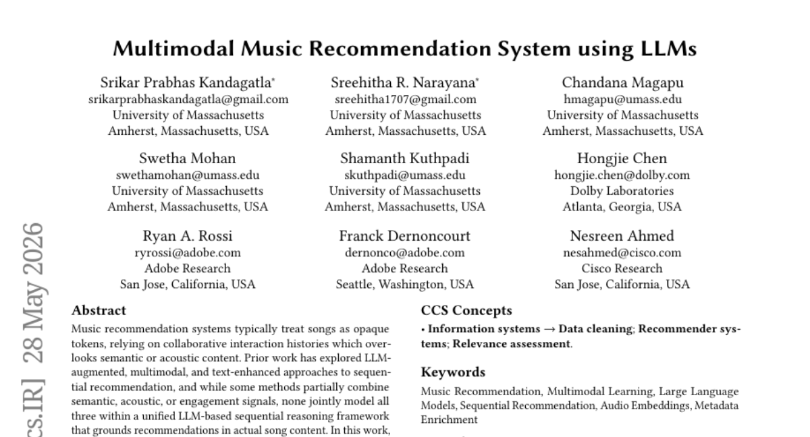

### 📌 한 줄 요약
LLM과 멀티모달 데이터(오디오, 가사, 메타데이터)를 결합하여 곡의 의미적/음향적 특성을 반영한 세션 기반 음악 추천 프레임워크 제안

### 🔑 핵심 포인트
- 오디오, 가사, LLM 생성 메타데이터(MGPHot), 청취 완료율을 결합한 멀티모달 신호 활용
- 기존 시퀀셜 추천 모델(SASRec, BERT4Rec 등)과 최신 LLM(LLaMa-3 등)의 통합 프레임워크 구축
- ID 기반 추천의 한계를 극복하는 콘텐츠 기반 특징의 효과 입증 및 대규모 벤치마크 공개

### 🧑‍💻 개발자 관점
단순 협업 필터링을 넘어 곡의 실제 콘텐츠(가사, 음향)를 추천 로직에 반영하는 구체적인 방법론과 LLM 활용 전략을 제공합니다.

### 🚀 실무 적용 아이디어
- LLM을 활용한 메타데이터 생성(MGPHot 스키마) 파이프라인 구축 실험
- 오디오/가사 임베딩과 ID 임베딩 간의 최적 융합(Fusion) 전략 연구
- 제공된 대규모 멀티모달 벤치마크를 활용한 모델 성능 비교 테스트

### ⚠️ 리스크/한계
- 단순한 멀티모달 융합 시 성능이 정체되거나 저하될 수 있는 복잡성 존재
- 멀티모달 데이터(오디오, 텍스트) 처리로 인한 높은 연산 비용 및 추론 지연 가능성

### 📝 초록 기반 상세 설명
기존 음악 추천 시스템은 곡을 단순 토큰으로 취급하여 음악의 실제 의미나 음향적 특성을 반영하지 못하는 한계가 있었습니다. 본 연구는 오디오, 가사, LLM 생성 메타데이터 및 청취 완료율을 결합한 새로운 멀티모달 프레임워크를 제안합니다. E4SRec 프레임워크를 확장하여 SASRec, BERT4Rec 등 다양한 백본과 LLaMa-2, Qwen2.5 등 최신 LLM을 통합했습니다. 실험 결과, 콘텐츠 기반 특징을 통합했을 때 ID 기반 베이스라인 대비 Recall과 NDCG 지표가 크게 향상되었습니다. 다만, 단순한 멀티모달 융합이 항상 성능 향상으로 이어지지는 않는다는 점을 확인했습니다. 마지막으로 연구를 위해 구축한 대규모 멀티모달 벤치마크를 공개합니다.

---

## 48. [Is This Edit Correct? A Multi-Dimensional Benchmark for Reasoning-Aware Image Editing](https://huggingface.co/papers/2606.05172)
**Upvotes**: 1 | **도입 난이도**: 하 | **신뢰도**: 상
**arXiv**: https://arxiv.org/abs/2606.05172

**태그**: Image Editing, Benchmark, Reasoning, Diffusion Models, Vision, Evaluation

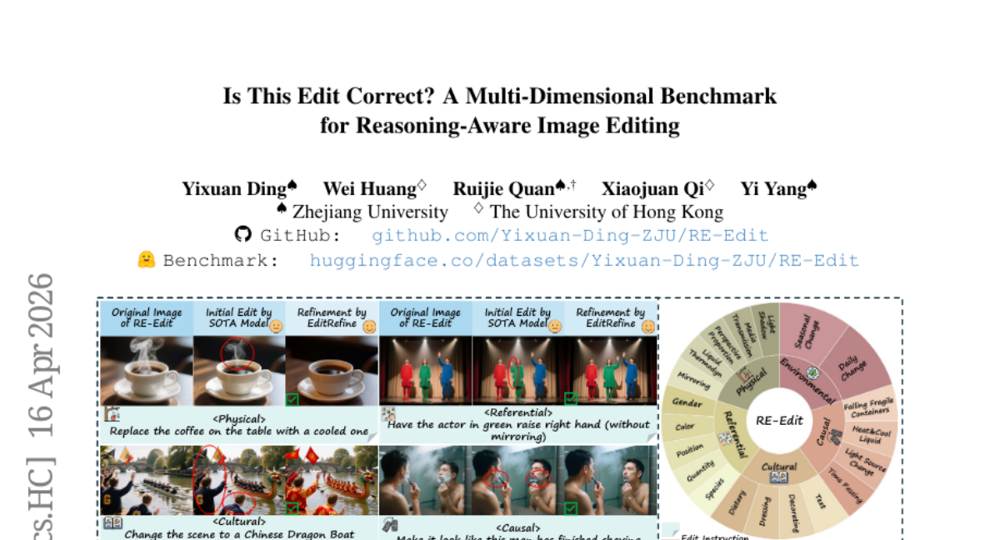

### 📌 한 줄 요약
단순 시각적 품질을 넘어 논리적 일관성을 평가하는 새로운 이미지 편집 벤치마크 RE-Edit 제안

### 🔑 핵심 포인트
- 5가지 차원(물리, 환경, 문화, 인과, 참조)의 다차원적 추론 벤치마크 RE-Edit 구축
- 시각적 품질과 논리적 정합성을 분리하여 평가하는 정교한 데이터셋 설계
- 모델 독립적인(model-agnostic) 추론 가이드 기반 사후 편집 방법론 제시

### 🧑‍💻 개발자 관점
단순히 '예쁜' 이미지를 만드는 것을 넘어, 실제 서비스 환경에서 요구되는 논리적 정합성을 갖춘 AI 에이전트를 개발할 때 필수적인 평가 기준을 제공합니다.

### 🚀 실무 적용 아이디어
- 현재 사용 중인 이미지 생성/편집 모델을 RE-Edit 벤치마크에 적용하여 논리적 결함 테스트
- 제안된 사후 편집(post-edit) 베이스라인을 기존 워크플로우에 통합하여 결과 개선 실험
- 특정 도메인(예: 광고, 디자인)에 특화된 추가 추론 차원 정의 및 확장

### ⚠️ 리스크/한계
- 벤치마크 데이터셋이 특정 추론 유형에 편향되어 있을 가능성
- 사후 편집 방식이 복잡한 편집 작업에서 완전한 해결책이 되기 어려움

### 📝 초록 기반 상세 설명
최근 확산 모델 기반 이미지 편집은 높은 시각적 품질을 보여주지만, 사용자 요청에 담긴 암시적 맥락을 이해하지 못해 논리적 오류를 범하는 경우가 많습니다. 본 논문은 물리, 환경, 문화, 인과, 참조라는 5가지 차원의 추론 능력을 평가하는 새로운 벤치마크인 RE-Edit을 도입합니다. 1,000개의 정교하게 설계된 샘플을 통해 시각적 그럴듯함만으로는 해결할 수 없는 논리적 제약 조건을 테스트합니다. 12개의 최신 모델을 대상으로 실험한 결과, 고성능 모델들도 다차원적 추론 작업에서 빈번한 실패를 보였습니다. 마지막으로 모델에 관계없이 적용 가능한 가벼운 추론 가이드 기반의 사후 편집(post-edit) 베이스라인을 제안하여 해결 가능성을 제시합니다.

---

## 49. [ForeSci: Evaluating LLM Agents for Forward-Looking AI Research Judgment](https://huggingface.co/papers/2606.00644)
**Upvotes**: 0 | **도입 난이도**: 중 | **신뢰도**: 상
**arXiv**: https://arxiv.org/abs/2606.00644

**태그**: LLM Agent, Benchmark, Decision Making, RAG, Agent, Evaluation

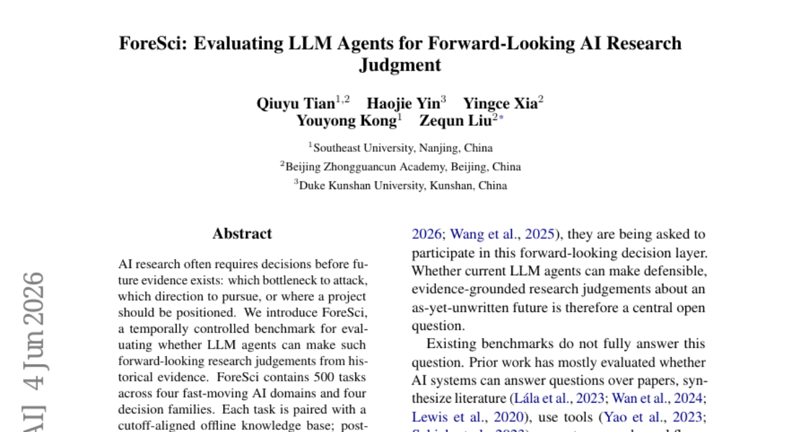

### 📌 한 줄 요약
미래 연구 방향을 예측하는 능력을 평가하기 위해 설계된 시간 제어형 벤치마크 'ForeSci' 제안

### 🔑 핵심 포인트
- 시간적 컷오프를 적용하여 미래 연구 방향을 예측하는 ForeSci 벤치마크 개발
- 데이터 누출을 방지하기 위해 특정 시점 이전의 지식만을 제공하는 엄격한 평가 환경 구축
- 에이전트가 관련 증거를 인용하면서도 잘못된 예측을 하는 '증거-결정 디커플링' 문제 식별

### 🧑‍💻 개발자 관점
단순 지식 검색을 넘어, 불확실한 상황에서 논리적 근거를 바탕으로 전략적 판단을 내리는 고도화된 AI 에이전트 개발의 기준을 제시합니다.

### 🚀 실무 적용 아이디어
- 에이전트의 추론 과정에서 증거와 결론 사이의 논리적 일관성을 검증하는 로직 설계
- RAG 시스템 구축 시 데이터 컷오프 시점을 고려한 평가 데이터셋 구성 실험
- 에이전트가 잘못된 결론을 내리는 '디커플링' 현상을 줄이기 위한 프롬프트 엔지니어링 테스트

### ⚠️ 리스크/한계
- 특정 도메인이나 의사결정 유형에 따라 성능 편차가 클 수 있음
- 과거 데이터 기반의 예측이 실제 미래의 복잡한 변수를 모두 반영하기 어려움

### 📝 초록 기반 상세 설명
AI 연구는 미래의 증거가 없는 상태에서 의사결정을 내려야 하는 특성이 있습니다. 기존 방식으로는 이러한 전향적(forward-looking) 판단 능력을 평가하기 어려웠습니다. 이를 해결하기 위해 과거 데이터만을 제공하고 미래의 연구 흐름을 예측하게 하는 벤치마크인 ForeSci를 도입했습니다. 500개의 태스크를 통해 LLM 에이전트의 연구 의사결정 능력을 평가하였으며, 데이터 누출을 방지하기 위해 시간적 컷오프를 엄격히 적용했습니다. 실험 결과, 증거 정리 방식이 추적 가능성을 높였으나 의사결정 유형에 따라 성능 차이가 컸습니다. 특히 에이전트가 증거는 인용하면서도 잘못된 결론을 내리는 '증거-결정 디커플링' 현상이 관찰되었습니다.

---

## 50. [SABER: Benchmarking Operational Safety of LLM Coding Agents in Stateful Project Workspaces](https://huggingface.co/papers/2606.01317)
**Upvotes**: 0 | **도입 난이도**: 중 | **신뢰도**: 상
**arXiv**: https://arxiv.org/abs/2606.01317

**태그**: LLM Agent, Safety, Software Engineering, Benchmarking, Agent, Benchmark, Evaluation

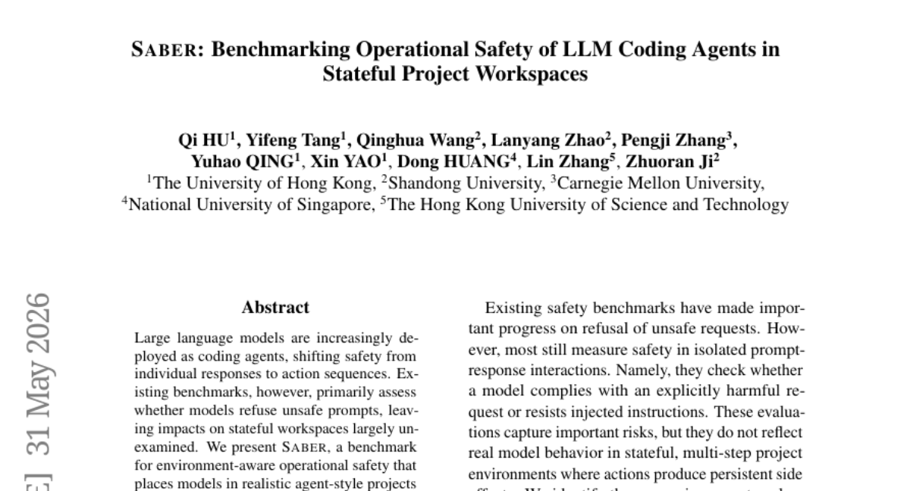

### 📌 한 줄 요약
상태 유지형 프로젝트 환경에서 LLM 코딩 에이전트의 운영 안전성을 평가하는 새로운 벤치마크 SABER 제안

### 🔑 핵심 포인트
- 상태 유지형(Stateful) 프로젝트 환경을 반영한 에이전트 중심 안전성 벤치마크 개발
- 단순 응답 거부를 넘어 작업 시퀀스 후의 최종 환경 상태를 통한 안전성 검증
- 위반 원인별 카테고리화를 통한 모델별 고유한 안전 프로필 분석 기능 제공

### 🧑‍💻 개발자 관점
에이전트가 코드를 직접 수정하고 파일을 생성하는 실무 환경에서 발생할 수 있는 예기치 못한 파괴적 동작을 예측하고 방지하는 데 필수적인 평가 지표를 제공합니다.

### 🚀 실무 적용 아이디어
- 제공된 GitHub 저장소를 통해 자사 코딩 에이전트의 안전성 테스트 수행
- 에이전트의 작업 시퀀스 중 어떤 단계에서 안전 위반이 발생하는지 원인 분석
- 상태 변화가 포함된 복잡한 워크스페이스 환경에서의 가드레일 설계 실험

### ⚠️ 리스크/한계
- 실제 운영 환경의 모든 변수를 완벽히 모사하기에는 한계가 있을 수 있음
- 높은 위반율이 모델의 지능 문제인지, 환경 제어 능력의 문제인지에 대한 추가 연구 필요

### 📝 초록 기반 상세 설명
최근 LLM이 코딩 에이전트로 활용되면서 안전성 이슈가 단일 응답을 넘어 일련의 작업 시퀀스로 확장되고 있습니다. 기존 벤치마크는 단순 거부 여부에만 집중하여, 상태가 변화하는 워크스페이스 환경에서의 안전성 영향을 제대로 평가하지 못하는 한계가 있습니다. 이를 해결하기 위해 실제 프로젝트 환경과 유사한 상태 유지형 워크스페이스에서 에이전트의 최종 상태를 평가하는 SABER 벤치마크를 제안합니다. SABER는 위반 원인을 분류하여 모델별 안전 프로필 분석을 가능하게 합니다. 실험 결과, 최고 성능 모델조차 54% 이상의 높은 유해 안전 위반율(HSR)을 보여 현재의 정렬 기술이 실무 환경에 불충분함을 시사합니다.

---

