# 2026-06-09 Daily Papers (Top 42)

## 오늘의 요약
오늘의 연구는 LLM 에이전트의 신뢰성 있는 평가와 오류 복구 능력, 그리고 멀티모달(오디오, 3D, 로봇) 환경에서의 정밀한 벤치마크 구축에 집중되었습니다. 또한, 임베딩 효율화 및 3D 객체 삽입과 같은 실용적인 최적화 기술과 로봇 제어를 위한 데이터 인터페이스 설계 등 모델의 실제 적용 가능성을 높이는 연구들이 주목받았습니다.

### 오늘의 핵심 포인트
- 단순 성능 지표를 넘어 에이전트의 오류 복구, 사회적 맥락 이해, 도메인 특화 성능을 측정하기 위한 정밀한 벤치마크 프레임워크가 다수 제안되었습니다.
- LLM 임베딩의 차원 효율성을 높이거나 3D 공간감을 유지하는 객체 삽입 기술 등 실무적인 최적화 및 생성 기법이 논의되었습니다.
- 로봇 공학 및 시뮬레이션 분야에서 비정형 데이터의 활용과 정교한 환경 상호작용을 위한 데이터 인터페이스 및 시뮬레이션 기술의 중요성이 강조되었습니다.

**오늘의 태그**: LLM-Agent, Benchmarking, Multimodal, Robotics, 3D-Vision

## 1. [Your UnEmbedding Matrix is Secretly a Feature Lens for Text Embeddings](https://huggingface.co/papers/2606.07502)
**Upvotes**: 69 | **도입 난이도**: 하 | **신뢰도**: 상
**arXiv**: https://arxiv.org/abs/2606.07502

**태그**: LLM, Embedding, RAG, Dimensionality Reduction, Benchmark, Evaluation

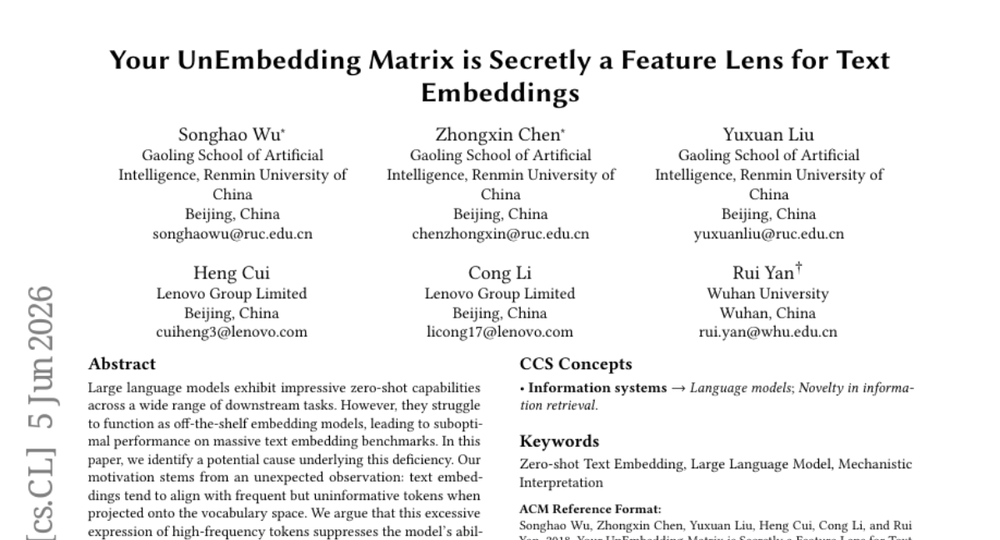

### 📌 한 줄 요약
LLM의 Unembedding Matrix를 활용해 고빈도 토큰의 간섭을 제거함으로써 임베딩의 의미적 정밀도와 차원 효율성을 동시에 높이는 기술

### 🔑 핵심 포인트
- 고빈도 토큰이 임베딩 공간을 점유하여 의미적 변별력을 떨어뜨리는 현상 규명
- Unembedding matrix 내의 특정 subspace를 필터링하는 EmbedFilter 방법론 제안
- 차원 축소를 통한 저장 공간 절약 및 검색 속도 향상과 성능 유지의 병행

### 🧑‍💻 개발자 관점
RAG 시스템 구축 시 LLM 임베딩의 차원을 줄이면서도 검색 정확도를 유지할 수 있는 실용적인 최적화 기법을 제공합니다.

### 🚀 실무 적용 아이디어
- 현재 사용 중인 LLM의 Unembedding matrix를 활용한 임베딩 필터링 실험
- 차원 축소 전후의 Retrieval 성능(Hit Rate, MRR 등) 비교 테스트
- 다양한 도메인 데이터셋에서의 고빈도 토큰 간섭 정도 측정

### ⚠️ 리스크/한계
- 특정 언어나 도메인에 따라 고빈도 토큰 필터링의 효과가 달라질 수 있음
- Unembedding matrix의 특성에 의존하므로 모든 모델에 범용적으로 적용 가능한지 검증 필요

### 📝 초록 기반 상세 설명
LLM은 뛰어난 제로샷 능력을 갖췄음에도 불구하고, 범용 임베딩 모델로서의 성능은 여전히 부족한 경우가 많습니다. 연구진은 텍스트 임베딩이 어휘 공간(vocabulary space)으로 투영될 때 정보량이 적은 고빈도 토큰에 과도하게 정렬되는 현상이 의미적 정밀도를 저해함을 발견했습니다. 이를 해결하기 위해 Unembedding matrix가 고빈도 토큰을 생성하는 잠재 공간을 필터링하는 'EmbedFilter' 기법을 제안합니다. 이 방식은 고빈도 토큰의 영향을 억제하여 정교한 의미 표현을 가능하게 합니다. 결과적으로 임베딩 차원을 대폭 축소하면서도 우수한 성능을 유지하여 검색 효율성을 높였습니다. 다양한 LLM 백본에서 실험한 결과, 제안 기법은 차원 축소와 성능 향상을 동시에 달성했습니다.

---

## 2. [SoCRATES: Towards Reliable Automated Evaluation of Proactive LLM Mediation across Domains and Socio-cognitive Variations](https://huggingface.co/papers/2606.05563)
**Upvotes**: 42 | **도입 난이도**: 중 | **신뢰도**: 상
**arXiv**: https://arxiv.org/abs/2606.05563

**태그**: LLM-Agent, Evaluation, Multi-Agent, Social-Intelligence, Agent, Benchmark, Safety

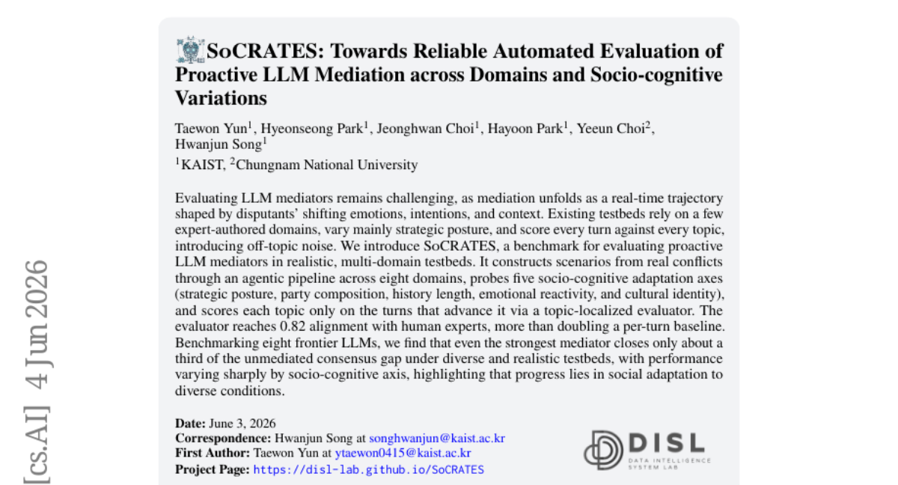

### 📌 한 줄 요약
다양한 사회적·인지적 변수를 반영하여 LLM 중재자(Mediator)의 성능을 정밀하게 평가하는 벤치마크 SoCRATES 제안

### 🔑 핵심 포인트
- 8개 도메인 및 5가지 사회-인지적 변수를 포함한 현실적인 멀티 도메인 벤치마크 구축
- 토픽별 국소화된 평가기를 통해 대화 맥락에 따른 정밀한 중재 성능 측정
- 최신 LLM들의 중재 성능 한계와 사회적 적응력의 중요성 입증

### 🧑‍💻 개발자 관점
단순 질의응답을 넘어 복잡한 협상이나 갈등 해결을 위한 에이전트 설계 시, 사회적 맥락(감정, 문화 등)을 고려한 평가 프레임워크로 활용 가능합니다.

### 🚀 실무 적용 아이디어
- 에이전트 기반 시나리오 생성 파이프라인 구현 테스트
- 다양한 페르소나(감정, 문화적 배경)를 가진 멀티 에이전트 환경 구축
- 토픽별 국소화된 평가 로직을 활용한 모델 튜닝 실험

### ⚠️ 리스크/한계
- 현실의 복잡한 갈등을 에이전트 파이프라인으로 완벽히 재현하는 데 한계가 있을 수 있음
- 평가 모델의 편향성이 벤치마크 결과에 영향을 미칠 가능성

### 📝 초록 기반 상세 설명
LLM 중재 모델의 평가는 실시간으로 변화하는 대화 흐름과 맥락을 반영하기 어려워 기존 방식은 도메인 제한 및 노이즈 문제라는 한계가 있었습니다. 이를 해결하기 위해 연구진은 실제 갈등 시나리오를 기반으로 8개 도메인과 5가지 사회-인지적 축(전략적 태도, 구성원, 대화 이력, 감정 반응성, 문화적 정체성)을 반영한 SoCRATES 벤치마크를 개발했습니다. 평가 방식은 토픽별로 국소화된 평가기를 사용하여 대화 흐름에 따른 정확한 점수를 산출하며, 이는 인간 전문가와 높은 일치도를 보입니다. 8종의 최신 LLM을 테스트한 결과, 가장 강력한 모델조차 중재를 통한 합의 격차를 3분의 1 수준만 해소할 수 있었으며, 사회적 변수에 따라 성능 차이가 크게 나타났습니다. 이는 향후 LLM 중재 기술의 핵심이 다양한 사회적 조건에 대한 적응력에 있음을 시사합니다.

---

## 3. [GENEB: Why Genomic Models Are Hard to Compare](https://huggingface.co/papers/2606.04525)
**Upvotes**: 41 | **도입 난이도**: 중 | **신뢰도**: 상
**arXiv**: https://arxiv.org/abs/2606.04525

**태그**: Genomics, Foundation Models, Benchmarking, Evaluation, RAG, Benchmark, Safety

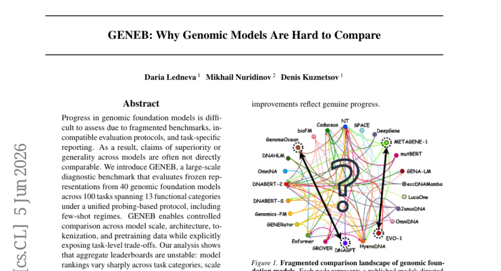

### 📌 한 줄 요약
파편화된 벤치마크 문제를 해결하기 위해 40개 유전체 모델을 통합 평가하는 표준 진단 프레임워크 GENEB 제안

### 🔑 핵심 포인트
- 40개 모델, 100개 태스크, 13개 카테고리를 아우르는 통합 진단 벤치마크 GENEB 구축
- 모델 규모(Scale)보다 아키텍처 및 사전 학습 데이터 정렬이 성능에 더 결정적인 영향을 미침을 입증
- 단일 리더보드 점수가 모델의 범용성을 보장하지 못하는 '순위 불안정성' 문제 제기

### 🧑‍💻 개발자 관점
모델 선택 시 단순 파라미터 수나 통합 점수에 의존하지 않고, 특정 도메인/태스크에 최적화된 모델을 선택할 수 있는 기준을 제공합니다.

### 🚀 실무 적용 아이디어
- 사용 중인 유전체 모델을 GENEB의 카테고리별 태스크에 적용하여 특정 기능적 강점 확인
- 모델 규모 확장 시 성능 향상 폭과 태스크별 트레이드오프 분석
- 현재 모델의 토큰화 방식과 사전 학습 데이터가 타겟 태스크와 일치하는지 검토

### ⚠️ 리스크/한계
- 특정 태스크 카테고리에 편향된 모델 선택 가능성
- 프로빙 기반 평가가 모델의 실제 생성/추론 능력을 완벽히 대변하지 못할 위험

### 📝 초록 기반 상세 설명
유전체 파운데이션 모델의 발전에도 불구하고, 파편화된 벤치마크와 비호환적인 평가 프로토콜로 인해 모델 간 직접적인 비교가 어려운 상황입니다. 이를 해결하기 위해 연구진은 40개의 모델과 100개의 태스크를 대상으로 통합된 프로빙(probing) 프로토콜을 적용한 대규모 진단 벤치마크 GENEB를 도입했습니다. GENEB는 모델 규모, 아키텍처, 토큰화 방식, 사전 학습 데이터 간의 상관관계를 통제된 환경에서 비교할 수 있게 합니다. 분석 결과, 단순 통합 리더보드는 불안정하며 모델 순위가 태스크 카테고리에 따라 급격히 변하는 것을 확인했습니다. 또한 모델 규모의 이점보다 아키텍처와 사전 학습 데이터의 정렬이 성능에 더 큰 영향을 미칠 수 있음을 밝혀냈습니다.

### 🖼️ 추가 자료
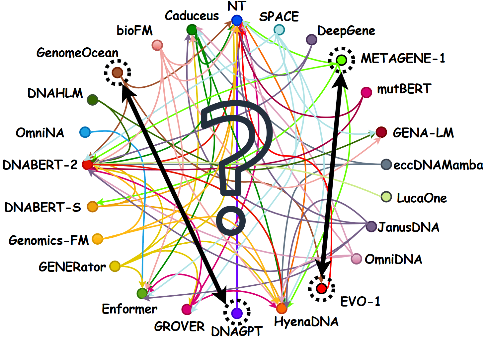
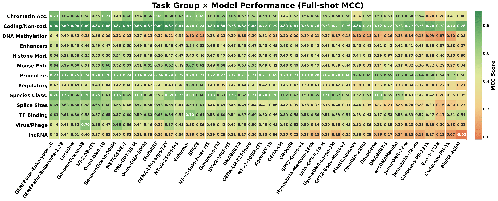
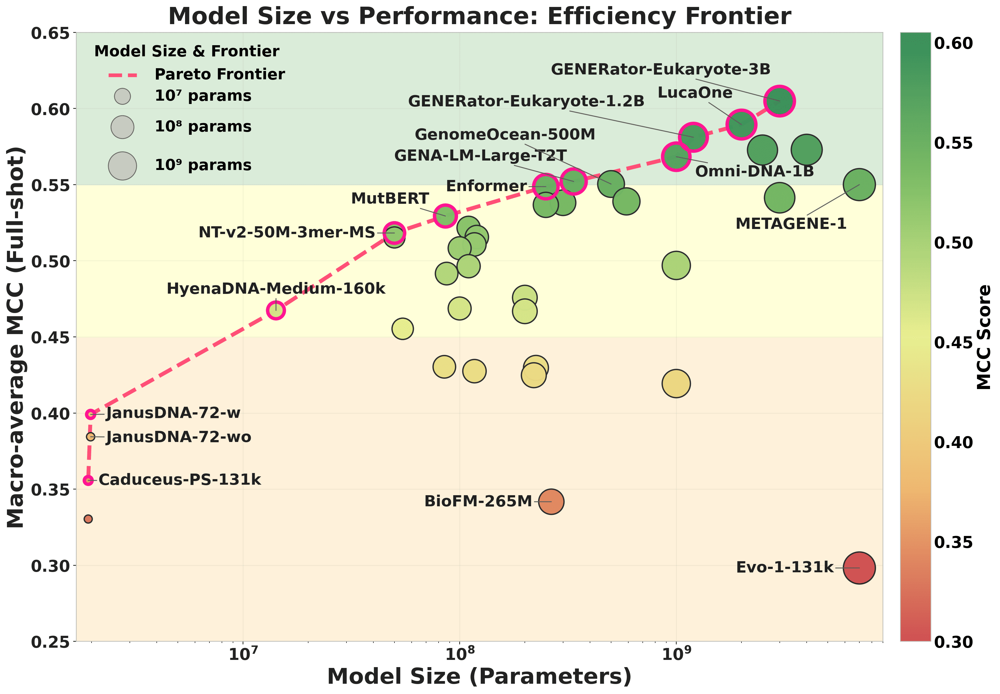
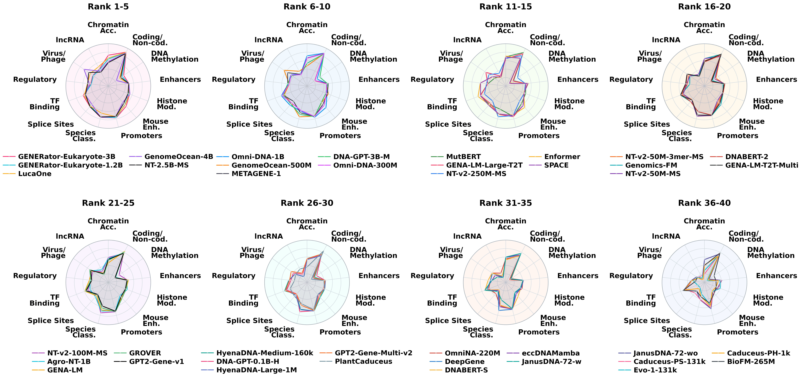

---

## 4. [MMAE: A Massive Multitask Audio Editing Benchmark](https://huggingface.co/papers/2606.07229)
**Upvotes**: 38 | **도입 난이도**: 하 | **신뢰도**: 상
**arXiv**: https://arxiv.org/abs/2606.07229

**태그**: Audio Editing, Benchmark, Multi-task Learning, Evaluation Framework, Agent, RAG, Reasoning, Vision, Video, Audio, Evaluation

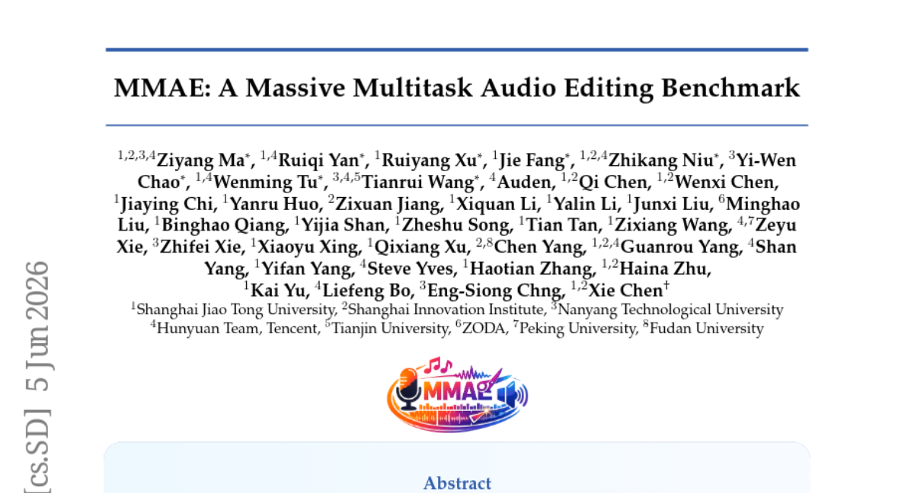

### 📌 한 줄 요약
범용 지시 기반 오디오 편집 모델의 성능을 정밀하게 측정하기 위한 대규모 멀티태스크 벤치마크(MMAE) 제안

### 🔑 핵심 포인트
- 7개 모달리티 및 6단계 복잡도를 아우르는 포괄적인 오디오 편집 벤치마크(MMAE) 구축
- 17,741개의 세부 기준을 활용한 루브릭 기반의 정밀한 다차원 평가 프레임워크 개발
- 현존하는 모델들의 복잡한 오디오 편집 및 멀티 모달리티 작업 수행 능력의 한계 입증

### 🧑‍💻 개발자 관점
오디오 편집 모델 개발 시 단순 생성 성능을 넘어, 지시 이행 능력과 문맥 일관성을 정밀하게 검증할 수 있는 평가 기준을 제공합니다.

### 🚀 실무 적용 아이디어
- 현재 개발 중인 오디오 모델을 MMAE 벤치마크 데이터셋에 적용하여 성능 측정
- 모델의 복잡한 멀티-홉(multi-hop) 편집 및 멀티-라운드 편집 능력 테스트
- 제시된 루브릭 기준을 활용하여 모델의 지시 이행(Instruction Following) 정밀도 분석

### ⚠️ 리스크/한계
- 현존 모델들의 낮은 성능으로 인해 벤치마크 결과가 지나치게 낮게 측정될 가능성
- 인간-에이전트 협업으로 구축된 데이터셋의 주관성 개입 여부 확인 필요

### 📝 초록 기반 상세 설명
최근 생성형 AI가 시각 분야를 넘어 오디오 편집으로 확장되고 있으나, 기존의 평가 인프라는 특정 도메인에 국한되어 범용적인 평가가 어려운 상황입니다. 이를 해결하기 위해 7가지 오디오 모달리티와 6단계 복잡도를 포함하는 대규모 벤치마크인 MMAE를 도입합니다. 2,000개의 고품질 샘플과 17,741개의 검증 가능한 기준을 포함한 루브릭 기반 평가 프레임워크를 구축하여 정밀한 평가를 가능하게 했습니다. 실험 결과, 현재의 선도적인 모델들도 복잡한 작업에서 매우 낮은 정확도를 보이며 신뢰할 수 있는 편집 능력이 부족함을 확인했습니다. 본 연구는 차세대 오디오 편집 시스템 발전을 위한 표준화된 평가 패러다임을 제공하고자 합니다.

### 🖼️ 추가 자료
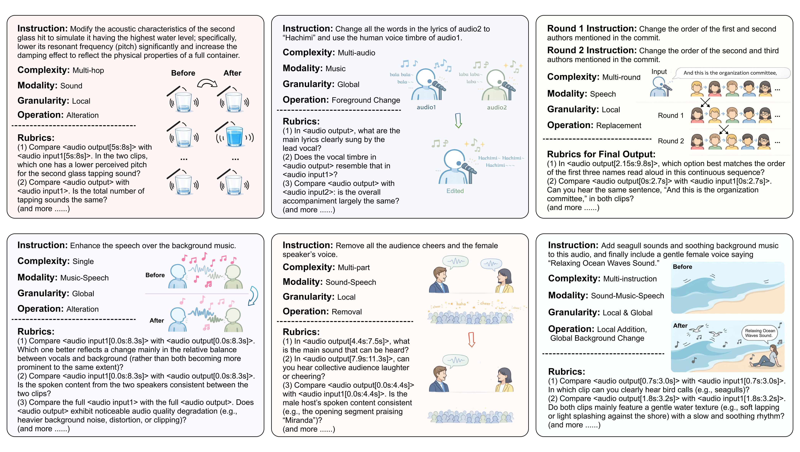
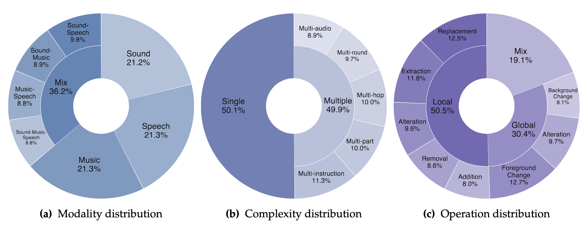
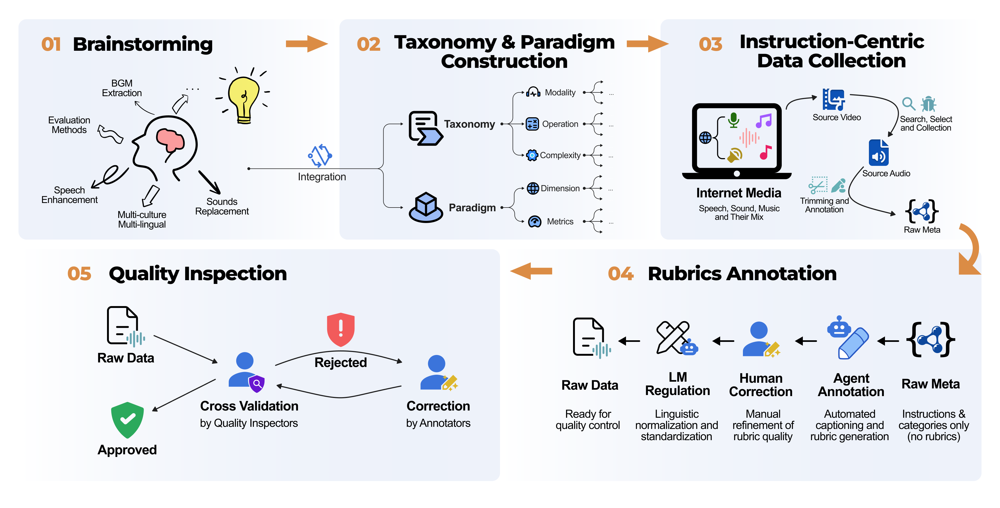

---

## 5. [AnchorWorld: Embodied Egocentric World Simulation with View-based Evolution Customization](https://huggingface.co/papers/2606.07326)
**Upvotes**: 24 | **도입 난이도**: 상 | **신뢰도**: 상
**arXiv**: https://arxiv.org/abs/2606.07326

**태그**: Egocentric Simulation, 3D Human Motion, World Modeling, Embodied AI, Agent, Vision

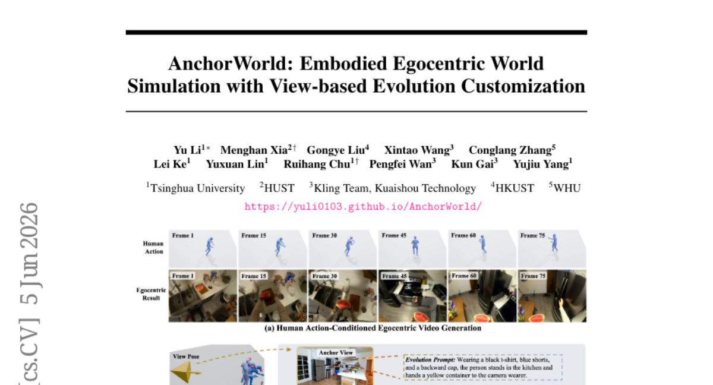

### 📌 한 줄 요약
3D 모션과 앵커 뷰를 활용하여 정교한 상호작용과 환경 변화가 가능한 1인칭 시점(Egocentric) 세계 시뮬레이션 프레임워크

### 🔑 핵심 포인트
- 외부 시점(Exogenous viewpoints)을 활용한 신체 정보 보완으로 정교한 공간적 상호작용 구현
- 통합 좌표계 기반의 앵커 뷰와 텍스트를 결합한 동적 환경 커스텀 메커니즘
- 1인칭 시점의 한계를 극복하는 강건한 공간 접지(Spatial Grounding) 기술

### 🧑‍💻 개발자 관점
로봇 공학이나 VR/AR 환경에서 에이전트의 움직임과 주변 환경 변화가 결합된 고품질 학습 데이터를 생성하는 데 유용합니다.

### 🚀 실무 적용 아이디어
- 제안된 외부 시점 보조 학습 방식이 1인칭 시점의 공간 일관성에 미치는 영향 분석
- 텍스트 기반 환경 변화 명령이 복잡한 기하학적 구조에서 어떻게 작동하는지 테스트
- 기존 1인칭 시뮬레이터와 AnchorWorld의 상호작용 정밀도 비교 실험

### ⚠️ 리스크/한계
- 외부 시점 데이터 의존성으로 인한 학습 복잡도 및 연산 비용 증가
- 매우 복잡하거나 거대한 규모의 환경에서의 확장성 문제

### 📝 초록 기반 상세 설명
기존의 인터랙티브 월드 모델링은 실무 시나리오에서 요구되는 다각적인 제어 능력이 부족한 상태였습니다. 이를 해결하기 위해 본 논문은 상호작용의 무결성과 유연한 환경 커스텀이 가능한 AnchorWorld 프레임워크를 제안합니다. 3D 인간 모션을 주 상호작용 모달리티로 사용하되, 1인칭 시점에서 가려지거나 잘리는 신체 부위를 보완하기 위해 외부 시점(Exogenous viewpoints)을 활용한 보조 학습 기법을 도입했습니다. 또한, 통합된 세계 좌표계 내의 앵커 뷰와 텍스트 설명을 결합하여 환경이 동적으로 진화하는 커스텀 메커니즘을 구축했습니다. 실험 결과, 제안된 방식은 기존 SOTA 모델 대비 뛰어난 성능을 보였으며 시공간적 기하학적 일관성을 유지하며 텍스트 지시를 충실히 따르는 것을 확인했습니다.

---

## 6. [Direct 3D-Aware Object Insertion via Decomposed Visual Proxies](https://huggingface.co/papers/2606.06601)
**Upvotes**: 22 | **도입 난이도**: 중 | **신뢰도**: 상
**arXiv**: https://arxiv.org/abs/2606.06601

**태그**: Computer Vision, Diffusion Models, 3D-Aware, Image Synthesis, Vision

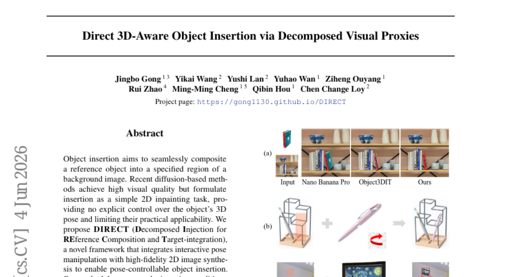

### 📌 한 줄 요약
사용자의 3D 포즈 제어가 가능한 고정밀 객체 삽입(Object Insertion) 프레임워크 제안

### 🔑 핵심 포인트
- 3D 프록시를 활용한 인터랙티브한 포즈 조작 기능 제공
- 외형, 기하, 문맥 가이드를 분리하여 주입하는 디컴포즈드(Decomposed) 구조
- 데이터 다양성과 품질을 높이기 위한 자동화된 데이터 구축 파이프라인 도입

### 🧑‍💻 개발자 관점
단순한 이미지 합성을 넘어, 3D 공간감을 유지하며 특정 위치에 객체를 배치해야 하는 게임 에셋 제작이나 광고 이미지 생성 워크플로우에 즉시 적용 가능합니다.

### 🚀 실무 적용 아이디어
- 제시된 3D 프록시 제어 방식이 실제 3D 모델링 툴과 얼마나 호환되는지 검토
- 분해된 가이드(Appearance/Geometry/Context)의 가중치 조절 실험
- 자동화된 데이터 파이프라인의 생성 데이터 품질 검증

### ⚠️ 리스크/한계
- 3D 프록시 설정 시 사용자의 숙련도에 따라 결과물의 품질 편차가 발생할 가능성
- 복잡한 배경이나 가려짐(Occlusion)이 심한 상황에서의 정밀도 유지 여부

### 📝 초록 기반 상세 설명
기존의 확산 모델 기반 객체 삽입 방식은 2D 인페인팅 방식에 의존하여 객체의 3D 포즈를 정밀하게 제어하기 어렵다는 한계가 있었습니다. 이를 해결하기 위해 본 논문은 DIRECT라는 새로운 프레임워크를 제안합니다. 이 방법은 삽입 조건을 외형(Appearance), 기하 구조(Geometry), 문맥(Context)의 세 가지 요소로 분해하여 각각 별도의 경로로 주입함으로써 특징 간의 얽힘을 방지합니다. 사용자가 조절하는 3D 프록시를 통해 정교한 포즈 제어를 가능하게 하며, 동시에 참조 객체의 디테일과 배경과의 조화를 유지합니다. 실험 결과, 제안된 방식은 기존 방법론 대비 기하학적 제어력과 시각적 품질 모두에서 우수한 성능을 보였습니다.

---

## 7. [Robots Need More than VLA and World Models](https://huggingface.co/papers/2606.06556)
**Upvotes**: 18 | **도입 난이도**: 상 | **신뢰도**: 상
**arXiv**: https://arxiv.org/abs/2606.06556

**태그**: Robotics, Foundation Models, Embodiment, World Models, Reasoning, Vision, Video

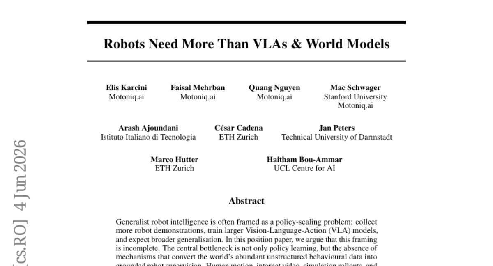

### 📌 한 줄 요약
단순한 정책 스케일링을 넘어, 비정형 데이터(인터넷 영상, 인간 동작 등)를 로봇 제어에 활용하기 위한 인터페이스 구축의 필요성을 제안함

### 🔑 핵심 포인트
- 단순 정책 스케일링(Policy-scaling) 중심의 연구 프레임워크 비판
- 비정형 데이터(인간 동작, 영상 등)를 로봇용 데이터로 변환하는 4가지 인터페이스 제안
- 데이터 라벨링, 모션 리타겟팅, 물리 기반 3D 추론, 보상 추론 기술의 통합 필요성

### 🧑‍💻 개발자 관점
로봇 개발 시 단순 데이터 증강을 넘어, 영상이나 인간 동작 데이터를 어떻게 로봇의 액션 레이블로 변환할지에 대한 아키텍처 설계 방향을 제시함

### 🚀 실무 적용 아이디어
- 인터넷 영상 데이터에서 로봇 동작을 추출하는 리타겟팅 알고리즘 조사
- 비정형 영상 데이터로부터 보상(Reward)을 추론하는 모델 실험
- 시뮬레이션과 실물 로봇 간의 데이터 인터페이스 구축 전략 수립

### ⚠️ 리스크/한계
- 비정형 데이터의 노이즈가 로봇의 물리적 제어 안정성을 해칠 위험
- 신체 구조(Embodiment) 차이로 인한 데이터 변환의 정확도 한계

### 📝 초록 기반 상세 설명
현재 로봇 지능 연구는 데이터 수집과 VLA 모델 크기 확장에 집중하는 정책 스케일링 문제로 정의되는 경향이 있습니다. 그러나 이러한 방식은 세상에 존재하는 풍부한 비정형 데이터(인간 동작, 영상 등)를 로봇의 구체적인 동작으로 변환하는 데 한계가 있습니다. 본 논문은 데이터 인터페이스, 신체(Embodiment) 인터페이스, 월드 모델 인터페이스, 보상 인터페이스라는 네 가지 핵심 구성 요소의 부재를 지적합니다. 이를 통해 로봇이 단순 데모를 넘어 물리적 세계 전반에서 학습할 수 있는 연구 아젠다를 제시합니다. 결과적으로 차세대 로봇 지능은 단순 정책 학습을 넘어 데이터의 의미를 추출하고 신체에 투영하는 능력이 핵심이 될 것입니다.

---

## 8. [When Tools Fail: Benchmarking Dynamic Replanning and Anomaly Recovery in LLM Agents](https://huggingface.co/papers/2606.05806)
**Upvotes**: 18 | **도입 난이도**: 하 | **신뢰도**: 상
**arXiv**: https://arxiv.org/abs/2606.05806

**태그**: LLM Agent, Benchmarking, Error Recovery, Reasoning, Agent, Benchmark, Evaluation

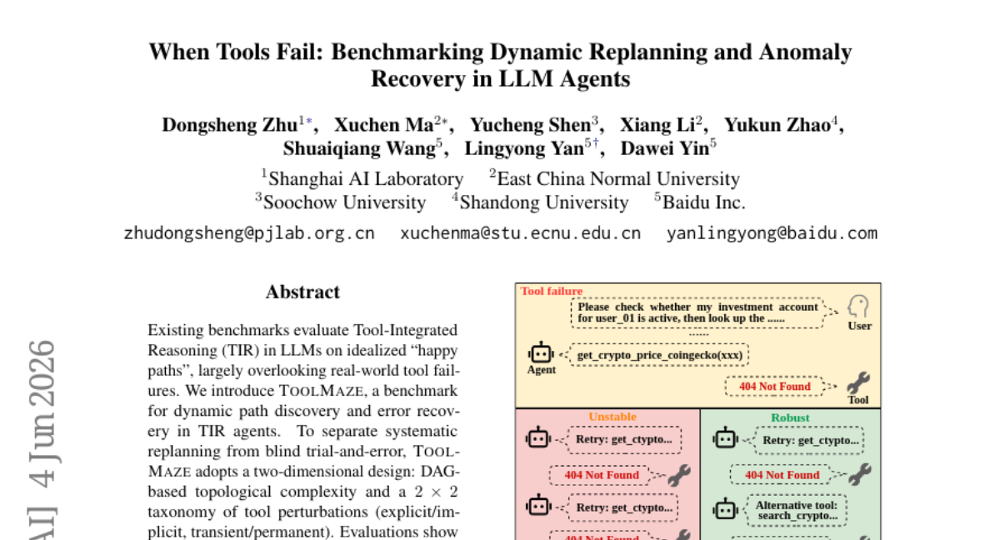

### 📌 한 줄 요약
LLM 에이전트의 도구 사용 중 발생하는 오류 복구 및 동적 재계획 능력을 평가하기 위한 새로운 벤치마크 ToolMaze 제안

### 🔑 핵심 포인트
- 도구 오류 상황을 반영한 2차원 설계(DAG 기반 복잡도 및 4가지 유형의 도구 섭동)의 ToolMaze 벤치마크 개발
- 모델 규모가 커져도 오류 복구 능력(PRR)은 작업 수행 능력보다 훨씬 느리게 향상됨을 입증
- 의미론적 오류(implicit failure) 시 발생하는 에이전트의 과도한 신뢰와 무의미한 반복 루프 문제 식별

### 🧑‍💻 개발자 관점
실제 프로덕션 환경에서 도구 호출 실패나 잘못된 데이터 반환 시 에이전트가 어떻게 대응할지 예측하고 대비하는 데 필수적인 지표를 제공합니다.

### 🚀 실무 적용 아이디어
- 현재 개발 중인 에이전트 워크플로우에 ToolMaze의 섭동 시나리오를 적용하여 강건성 테스트 수행
- 에이전트가 잘못된 도구 출력에 대해 무조건 신뢰하지 않도록 하는 검증 로직(Self-correction) 설계
- 복잡한 의존성을 가진 작업(DAG 구조)에서 에이전트의 재계획 루프 탈출 능력 확인

### ⚠️ 리스크/한계
- 모델 스케일링만으로는 해결되지 않는 복잡한 논리적 재계획 능력의 한계
- 의미론적 오류와 같은 미묘한 실패 상황에서의 에이전트 신뢰도 문제

### 📝 초록 기반 상세 설명
기존의 LLM 도구 활용 벤치마크는 오류가 없는 이상적인 상황만을 가정하여 실제 환경에서의 문제 해결 능력을 평가하기 어려웠습니다. 이를 해결하기 위해 복잡한 경로 구조와 다양한 도구 오류 시나리오를 결합한 ToolMaze 벤치마크를 도입했습니다. 실험 결과, 모델 규모가 커지더라도 오류 복구 능력은 작업 수행 능력만큼 빠르게 향상되지 않는 병목 현상이 관찰되었습니다. 특히 의미론적 오류(implicit failure) 상황에서 에이전트가 잘못된 출력에 과도하게 신뢰하여 성능이 급격히 저하되는 문제가 확인되었습니다. 결과적으로 모델 스케일링만으로는 해결하기 어려운 동적 재계획 능력이 에이전트 성능의 핵심 과제임을 시사합니다.

---

## 9. [OpenSkill: Open-World Self-Evolution for LLM Agents](https://huggingface.co/papers/2606.06741)
**Upvotes**: 17 | **도입 난이도**: 상 | **신뢰도**: 상
**arXiv**: https://arxiv.org/abs/2606.06741

**태그**: LLM Agent, Self-Evolution, Automated Learning, Open-World, Agent, Vision, Benchmark, Evaluation

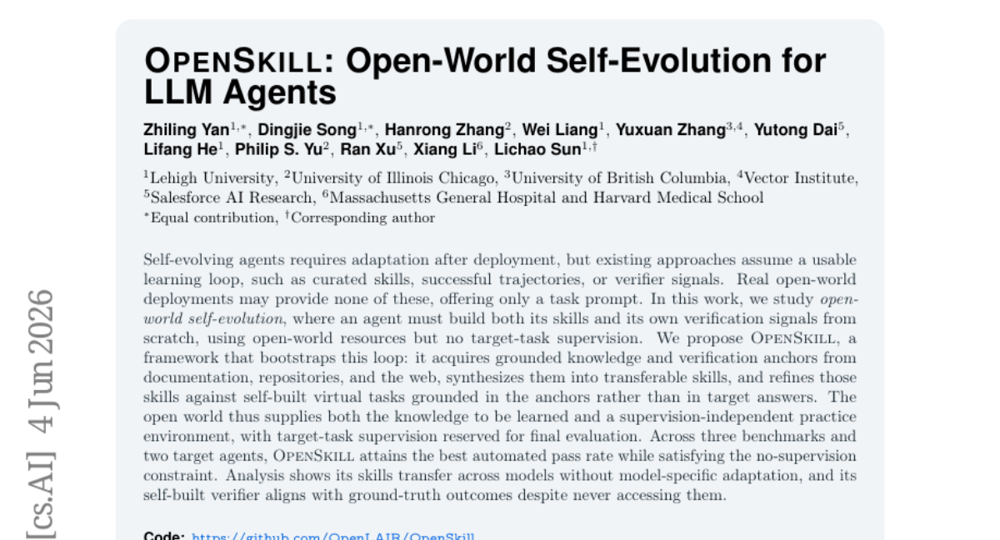

### 📌 한 줄 요약
정답 데이터 없이 웹 리소스만으로 에이전트의 기술과 검증 체계를 스스로 구축하는 자가 진화 프레임워크

### 🔑 핵심 포인트
- 감독 데이터(Target-task supervision) 없이 오픈 월드 리소스만으로 학습하는 자가 진화 루프 제안
- 문서 및 웹 데이터를 활용한 지식 추출과 이를 기반으로 한 가상 검증 환경(Self-built virtual tasks) 구축
- 모델 특정 적응 없이도 다양한 모델로 전이 가능한 범용적 스킬 합성 기술

### 🧑‍💻 개발자 관점
정답지(Ground-truth)가 없는 실제 운영 환경에서 에이전트가 스스로 학습하고 성능을 개선할 수 있는 방법론을 제시합니다.

### 🚀 실무 적용 아이디어
- 도메인 특화 문서(API Docs, Wiki)를 활용한 지식 추출 및 가상 태스크 생성 파이프라인 구현 실험
- 학습된 스킬이 다른 LLM 모델로 이식될 때의 성능 유지력 테스트
- 자체 구축한 검증 신호와 실제 정답 간의 상관관계 분석

### ⚠️ 리스크/한계
- 초기 단계에서 웹 데이터의 노이즈가 잘못된 스킬이나 검증 신호를 생성할 위험
- 복잡한 태스크로 갈수록 가상 환경과 실제 환경 간의 간극(Sim-to-Real gap) 발생 가능성

### 📝 초록 기반 상세 설명
기존의 에이전트 자가 진화 방식은 정제된 스킬이나 성공적인 궤적 같은 학습 루프를 전제로 하지만, 실제 오픈 월드 환경에서는 이러한 데이터가 부족한 경우가 많습니다. 본 논문은 타겟 작업에 대한 감독 없이 오픈 월드 리소스만을 활용하여 스킬과 검증 신호를 동시에 구축하는 'OpenSkill' 프레임워크를 제안합니다. OpenSkill은 문서, 저장소, 웹에서 지식과 검증 앵커를 추출하고, 이를 기반으로 전이 가능한 스킬을 합성하며, 스스로 만든 가상 태스크를 통해 스킬을 정교화합니다. 실험 결과, OpenSkill은 감독 없이도 높은 자동 통과율을 달성하며 모델 간 스킬 전이성과 검증 신호의 정확성을 입증했습니다.

---

## 10. [SubtleMemory: A Benchmark for Fine-Grained Relational Memory Discrimination in Long-Horizon AI Agents](https://huggingface.co/papers/2606.05761)
**Upvotes**: 16 | **도입 난이도**: 중 | **신뢰도**: 상
**arXiv**: https://arxiv.org/abs/2606.05761

**태그**: AI Agent, Long-term Memory, Benchmark, Reasoning, Agent, RAG, Evaluation

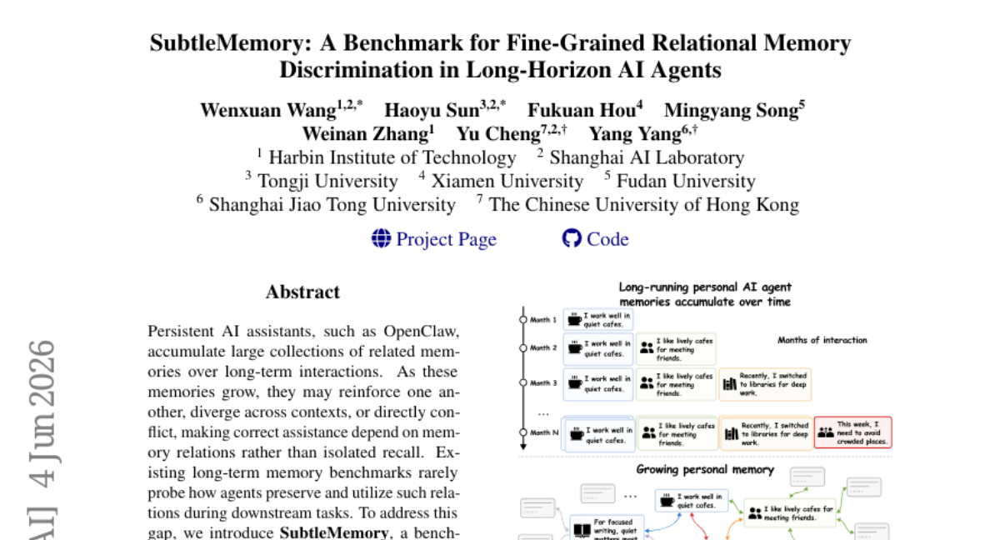

### 📌 한 줄 요약
장기 기억을 가진 AI 에이전트가 복잡한 관계적 맥락을 정확히 식별할 수 있는지 평가하는 새로운 벤치마크 제안

### 🔑 핵심 포인트
- 관계 제어형 잠재 의미 아티팩트를 활용한 미세 관계 식별 벤치마크 'SubtleMemory' 개발
- 단순 정보 회상을 넘어 기억 간의 상충, 보완, 변형 관계를 다루는 복잡한 시나리오 구축
- 메모리 보존, 검색, 추론 단계별 역량을 분석할 수 있는 진단 프로토콜 제공

### 🧑‍💻 개발자 관점
단순 RAG(검색 증강 생성)를 넘어, 에이전트가 축적된 데이터 간의 논리적 모순이나 맥락적 변화를 어떻게 처리해야 하는지에 대한 가이드라인을 제공합니다.

### 🚀 실무 적용 아이디어
- 현재 개발 중인 에이전트의 메모리 모듈에 SubtleMemory 시나리오를 적용하여 관계 식별 능력 테스트
- 메모리 저장(Preservation)과 추론(Reasoning) 중 어느 단계에서 오류가 발생하는지 진단 프로토콜 실행
- 상충하는 정보가 입력되었을 때 에이전트의 의사결정 일관성 검증

### ⚠️ 리스크/한계
- 제시된 시나리오가 특정 도메인에 국한될 경우 일반화 성능 확인 필요
- 복잡한 관계 설정이 실제 자연어 대화의 복잡도를 완벽히 대변하는지에 대한 검증 필요

### 📝 초록 기반 상세 설명
장기 상호작용을 수행하는 AI 에이전트는 시간이 지남에 따라 축적된 기억들 사이의 관계를 파악하는 것이 필수적입니다. 그러나 기존의 장기 기억 벤치마크는 단순 회상을 넘어 기억 간의 미묘한 관계를 활용하는 능력을 충분히 검증하지 못합니다. 이를 해결하기 위해 본 논문은 관계 제어형 잠재 의미 아티팩트를 활용한 벤치마크인 SubtleMemory를 제안합니다. 이 벤치마크는 상충하거나 미묘하게 다른 관계를 포함한 시나리오를 통해 에이전트의 관계적 기억 식별 능력을 테스트합니다. 실험 결과, 현재의 다양한 메모리 시스템들은 미세한 관계적 차이를 구분하는 데 취약함을 확인했습니다. 또한, 기억 보존, 검색, 추론 단계별로 능력을 진단할 수 있는 프로토콜을 함께 제시합니다.

---

## 11. [UniSHARP: Universal Sharp Monocular View Synthesis](https://huggingface.co/papers/2606.07514)
**Upvotes**: 13 | **도입 난이도**: 상 | **신뢰도**: 상
**arXiv**: https://arxiv.org/abs/2606.07514

**태그**: View Synthesis, Gaussian Splatting, Computer Vision, Omnidirectional, Vision, Benchmark, Evaluation, Safety

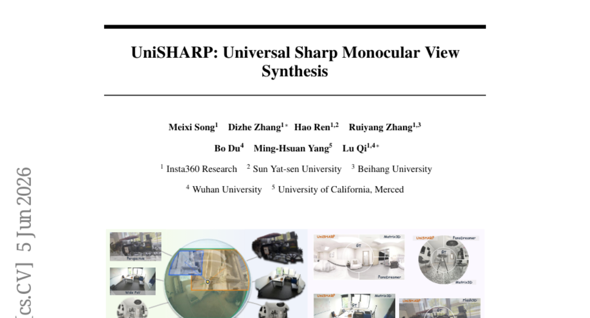

### 📌 한 줄 요약
다양한 카메라 렌즈(핀홀, 어안, 파노라마) 환경에서도 일관된 렌더링이 가능한 범용 단안 뷰 합성 기술

### 🔑 핵심 포인트
- 핀홀부터 파노라마까지 대응 가능한 범용 단안 뷰 합성 프레임워크 개발
- 광선(ray) 및 반경 거리를 활용한 범용 Gaussian 표현 방식 도입
- 특징(feature) 및 Gaussian 공간에서의 암시적 정렬(implicit alignment) 기술

### 🧑‍💻 개발자 관점
카메라 하드웨어 사양(화각, 렌즈 타입)에 구애받지 않고 일관된 품질의 3D 렌더링 결과물을 얻을 수 있어 다양한 디바이스 대응이 가능합니다.

### 🚀 실무 적용 아이디어
- 다양한 화각의 데이터셋을 활용한 범용 렌더링 성능 테스트
- 기존 SHARP 모델과의 렌더링 결과물 비교 분석
- 특정 렌즈 왜곡 환경에서의 Gaussian 정렬 정확도 검증

### ⚠️ 리스크/한계
- 복잡한 Gaussian 정렬 과정으로 인한 높은 연산 비용 가능성
- 극단적인 화각 변화 시 발생하는 기하학적 왜곡 제어 문제

### 📝 초록 기반 상세 설명
기존의 SHARP 방식은 핀홀 카메라 모델에 특화되어 있어 광각이나 어안 렌즈와 같은 다양한 카메라 시스템에 적용하기 어려웠습니다. 이를 해결하기 위해 모든 이미지를 통합된 전방향(omnidirectional) 잠재 공간으로 정렬하는 UniSHARP를 제안합니다. Gaussian primitives를 광선(ray)과 반경 거리 기반의 범용 표현 방식으로 배치하고, 2D 시맨틱 및 3D 공간 특징을 결합하여 Gaussian cloud를 생성합니다. 제안된 벤치마크를 통해 다양한 화각(FoV) 환경에서의 성능을 검증하였으며, 기존 방식 대비 월등한 성능을 입증했습니다.

---

## 12. [LIMMT: Less is More for Motion Tracking](https://huggingface.co/papers/2606.06953)
**Upvotes**: 12 | **도입 난이도**: 중 | **신뢰도**: 상
**arXiv**: https://arxiv.org/abs/2606.06953

**태그**: Motion Tracking, Data-Centric AI, Humanoid, Physics-based

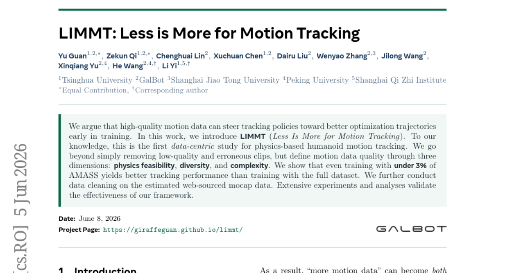

### 📌 한 줄 요약
고품질 소량의 데이터가 대규모 저품질 데이터보다 휴머노이드 모션 트래킹 성능을 더 효과적으로 향상시킨다는 데이터 중심 연구

### 🔑 핵심 포인트
- 물리적 타당성, 다양성, 복잡성을 기준으로 한 새로운 데이터 품질 정의
- 데이터 양보다 질이 트래킹 정책의 초기 최적화에 미치는 영향 규명
- 전체 데이터셋 대비 3% 미만의 정제된 데이터만으로도 더 높은 성능 달성

### 🧑‍💻 개발자 관점
데이터 정제(Data Cleaning)와 품질 관리가 모델 아키텍처 개선만큼이나 성능 향상에 결정적임을 시사합니다.

### 🚀 실무 적용 아이디어
- 현재 학습 데이터셋에 대한 물리적 타당성 및 복잡도 필터링 적용
- 데이터 양을 점진적으로 늘려가며 성능 변화를 관찰하는 커브 분석 수행
- 웹 소스 데이터 사용 시 노이즈 제거를 위한 정제 파이프라인 구축

### ⚠️ 리스크/한계
- 데이터 정제 기준이 특정 도메인이나 환경에 편향될 가능성
- 고품질 데이터 추출을 위한 정제 비용(Computational/Manual cost) 발생

### 📝 초록 기반 상세 설명
물리 기반 휴머노이드 모션 트래킹에서 데이터의 양보다 질이 최적화 경로에 미치는 영향에 주목했습니다. 기존 연구들은 단순히 데이터 양을 늘리는 데 집중했으나, 이는 잘못된 궤적을 학습시킬 위험이 있습니다. 본 논문은 물리적 타당성, 다양성, 복잡성이라는 세 가지 차원으로 데이터 품질을 정의하는 LIMMT 프레임워크를 제안합니다. 실험 결과, 전체 데이터셋을 사용하는 것보다 엄선된 3% 미만의 데이터로 학습했을 때 더 우수한 트래킹 성능을 보였습니다. 또한 웹 소스 모션 캡처 데이터의 정제 과정을 통해 데이터 중심 접근법의 유효성을 입증했습니다.

---

## 13. [Watch, Remember, Reason: Human-View Video Understanding with MLLMs](https://huggingface.co/papers/2606.07433)
**Upvotes**: 12 | **도입 난이도**: 하 | **신뢰도**: 상
**arXiv**: https://arxiv.org/abs/2606.07433

**태그**: Video-Understanding, MLLM, Memory-Modeling, Survey, Reasoning, Multimodal, Vision, Video, Audio, Benchmark, Evaluation, Inference, Safety

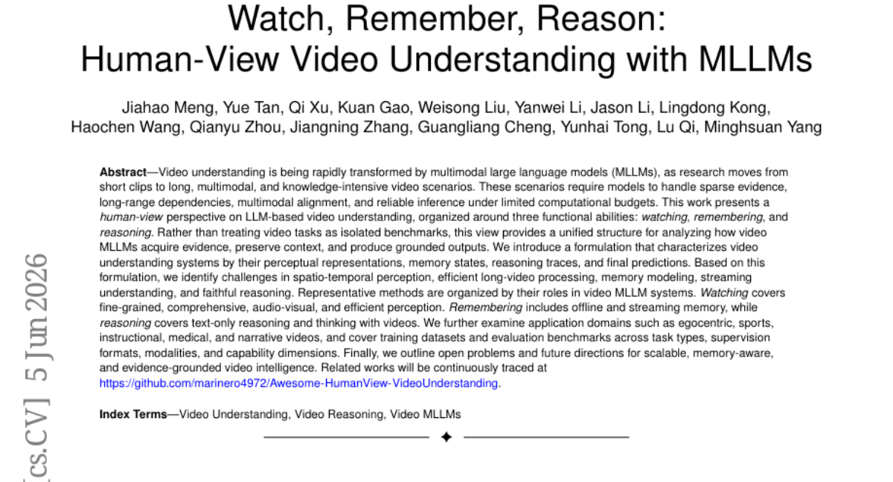

### 📌 한 줄 요약
MLLM 기반 비디오 이해를 'Watch, Remember, Reason'이라는 세 가지 핵심 기능적 관점으로 체계화한 통합 프레임워크 제안

### 🔑 핵심 포인트
- 비디오 이해를 'Watch(인지), Remember(기억), Reason(추론)'의 세 가지 기능적 계층으로 구조화
- 시공간적 인지, 효율적인 장기 비디오 처리, 메모리 모델링 등 핵심 기술적 도전 과제 식별
- 에고센트릭, 스포츠, 의료 등 다양한 도메인과 데이터셋을 포괄하는 통합적 분류 체계 제공

### 🧑‍💻 개발자 관점
비디오 기반 AI 에이전트나 장기 컨텍스트 처리가 필요한 시스템 설계 시, 인지-기억-추론의 각 단계별 최적 아키텍처를 선택하는 가이드라인이 됩니다.

### 🚀 실무 적용 아이디어
- 제시된 'Watch-Remember-Reason' 프레임워크를 현재 개발 중인 비디오 모델의 모듈 설계에 적용해보기
- 모델의 성능 병목이 인지(Watching) 단계인지, 메모리(Remembering) 단계인지 분석하기
- GitHub에 공개된 관련 연구 리스트를 통해 최신 SOTA 모델들의 모듈별 특성 비교하기

### ⚠️ 리스크/한계
- 특정 벤치마크 성능 수치를 제시하는 것이 아닌 방법론적 프레임워크 중심의 논문임
- 실제 구현 시 각 모듈(인지/기억/추론) 간의 복잡한 상호작용 최적화가 어려울 수 있음

### 📝 초록 기반 상세 설명
최근 비디오 이해 연구는 짧은 클립을 넘어 길고 복잡하며 지식 집약적인 시나리오로 확장되고 있습니다. 기존의 단편적인 벤치마크 중심 접근 방식은 장기 의존성, 멀티모달 정렬, 효율적인 추론 문제를 통합적으로 다루기에 한계가 있습니다. 본 논문은 비디오 이해를 'Watching(인지)', 'Remembering(기억)', 'Reasoning(추론)'이라는 세 가지 기능적 축으로 정의하는 새로운 관점을 제시합니다. 이를 통해 인지적 표현, 메모리 상태, 추론 흔적을 포함하는 통합적인 시스템 구조를 정립합니다. 결과적으로 다양한 비디오 도메인과 학습 데이터셋, 평가 벤치마크를 이 프레임워크에 따라 체계적으로 분류하여 향후 연구 방향을 제시합니다.

---

## 14. [dots.tts Technical Report](https://huggingface.co/papers/2606.07080)
**Upvotes**: 12 | **도입 난이도**: 중 | **신뢰도**: 상
**arXiv**: https://arxiv.org/abs/2606.07080

**태그**: TTS, Foundation Model, Generative AI, Low-latency, RAG, Audio, Benchmark, Evaluation, Inference, Distillation

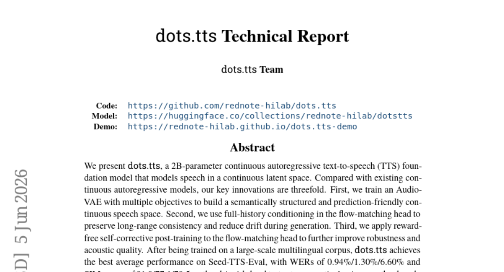

### 📌 한 줄 요약
고성능 음성 합성 및 저지연 스트리밍을 구현한 2B 파라미터 규모의 연속적 자기회귀 TTS 파운데이션 모델

### 🔑 핵심 포인트
- 다중 목적 AudioVAE를 통한 의미적 구조를 갖춘 연속 음성 잠재 공간 구축
- Full-history conditioning 및 self-corrective post-training을 통한 생성 안정성 및 일관성 확보
- CFG-aware MeanFlow distillation을 통한 초저지연(85ms/54ms) 스트리밍 추론 구현

### 🧑‍💻 개발자 관점
고품질 음성 합성뿐만 아니라 실시간 서비스에 필수적인 저지연 추론 기술을 동시에 제공하므로, 대화형 AI 서비스 개발에 즉각적인 가치가 있습니다.

### 🚀 실무 적용 아이디어
- 제공된 체크포인트를 활용한 다양한 언어 및 감정 표현 테스트
- MeanFlow 증류 모델을 활용한 실시간 스트리밍 지연 시간 벤치마크 수행
- 특정 도메인 음성 데이터셋을 이용한 Voice Cloning 성능 검증

### ⚠️ 리스크/한계
- 2B 파라미터 규모로 인해 고사양 GPU 자원이 필요할 수 있음
- 복잡한 학습 구조로 인해 모델 자체를 처음부터 재학습하기에는 높은 난이도 존재

### 📝 초록 기반 상세 설명
기존의 연속적 자기회귀 TTS 모델들은 음성 공간의 구조화 및 장기 일관성 유지에 어려움이 있었습니다. 이를 해결하기 위해 dots.tts는 다중 목적 함수를 적용한 AudioVAE를 통해 예측에 최적화된 연속 음성 공간을 구축했습니다. 또한, flow-matching 헤드에 전체 이력 조건부(full-history conditioning)와 보상 없는 자기 수정(reward-free self-corrective) 포스트 트레이닝을 적용하여 생성 안정성과 음향 품질을 높였습니다. 결과적으로 Seed-TTS-Eval에서 최고 성능을 기록했으며, MeanFlow 증류 기술을 통해 실시간 스트리밍이 가능한 수준의 낮은 지연 시간을 달성했습니다. 모든 코드와 체크포인트는 Apache 2.0 라이선스로 공개되어 실무 활용도가 높습니다.

---

## 15. [Thinking with Imagination: Agentic Visual Spatial Reasoning with World Simulators](https://huggingface.co/papers/2606.06476)
**Upvotes**: 12 | **도입 난이도**: 상 | **신뢰도**: 상
**arXiv**: https://arxiv.org/abs/2606.06476

**태그**: Agent, VLM, World Model, Spatial Reasoning, Reinforcement Learning, Reasoning, Vision

### 📌 한 줄 요약
월드 시뮬레이터를 활용한 시각적 상상력을 통해 VLM의 공간 추론 및 미관측 영역 추론 능력을 극대화한 에이전트 프레임워크

### 🔑 핵심 포인트
- Astra-WM: 자연어 명령으로 새로운 시점의 이미지를 생성하는 일관성 있는 월드 시뮬레이터 개발
- Astra-VL: 시뮬레이터 활용 시점과 방법을 학습하는 RL 기반의 에이전트 정책 모델
- Two-phase RL Curriculum: 도구 사용 탐색 안정화 및 효율적인 상상(Imagination) 호출 전략 학습

### 🧑‍💻 개발자 관점
단순히 주어진 이미지를 분석하는 것을 넘어, 에이전트가 스스로 가상의 시점을 생성하여 공간을 탐색하는 '능동적 추론'의 가능성을 제시합니다.

### 🚀 실무 적용 아이디어
- Diffusion 기반 모델을 활용한 가상 시점 생성 파이프라인 구축 실험
- RL을 이용한 LLM/VLM의 외부 도구(Simulator) 호출 정책 학습 테스트
- 다양한 3D 환경 데이터셋을 활용한 시점 일관성(View Consistency) 유지 성능 검증

### ⚠️ 리스크/한계
- 시뮬레이터가 생성한 가상 이미지가 실제 물리 법칙과 다를 경우 잘못된 추론 유발 가능성
- RL 학습 과정에서의 높은 연산 비용 및 학습 불안정성

### 📝 초록 기반 상세 설명
기존 VLM은 관찰된 이미지와 텍스트에 의존하여 보이지 않는 공간 구조나 시점 변화에 대한 추론에 한계를 보입니다. 본 논문은 이를 '상상력을 통한 사고' 문제로 정의하고, 에이전트가 시뮬레이터와 상호작용하며 가상의 시각적 증거를 생성하는 Astra 프레임워크를 제안합니다. Astra는 RL로 학습된 정책 모델(Astra-VL)과 자연어 카메라 움직임을 통해 새로운 시점을 생성하는 월드 시뮬레이터(Astra-WM)를 결합합니다. 특히 시점 간 일관성을 유지하기 위한 뷰 일관성 튜닝과, 시뮬레이터 사용 시점을 최적화하는 2단계 RL 커리큘럼을 도입했습니다. 실험 결과, 시뮬레이터를 통한 상상된 관찰값이 공간 추론 성능을 유의미하게 향상시킴을 입증했습니다.

---

## 16. [Physics in 2-Steps: Locking Motion Priors Before Visual Refinement Erases Them](https://huggingface.co/papers/2606.06361)
**Upvotes**: 12 | **도입 난이도**: 하 | **신뢰도**: 상
**arXiv**: https://arxiv.org/abs/2606.06361

**태그**: Video Generation, Diffusion Models, Motion Prior, Physics-Consistency, RAG, Vision, Video, Inference

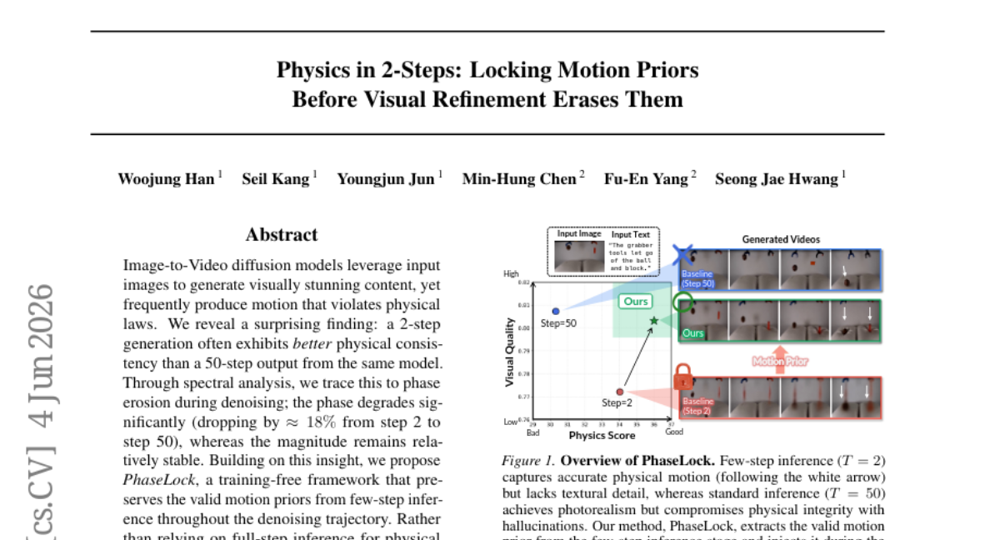

### 📌 한 줄 요약
초기 단계의 물리적 움직임 정보를 보존하여 비디오 생성 모델의 물리 법칙 위반 문제를 해결하는 PhaseLock 프레임워크

### 🔑 핵심 포인트
- 생성 단계가 길어질수록 물리적 일관성을 결정하는 위상(Phase) 정보가 손실되는 현상 규명
- 초기 단계(2-step)의 모션 프라이어를 활용하는 학습이 필요 없는(Training-free) PhaseLock 제안
- Latent Delta Guidance를 통한 위상 보존 및 물리적 일관성 향상

### 🧑‍💻 개발자 관점
추가 학습 없이 기존 비디오 생성 모델의 물리적 오류를 효과적으로 수정할 수 있어 실무 적용성이 매우 높습니다.

### 🚀 실무 적용 아이디어
- 기존 Diffusion 모델에 PhaseLock의 Latent Delta Guidance 로직 적용 테스트
- 단계별 위상(Phase) 변화량 측정을 통한 물리적 일관성 지표 검증
- 다양한 비디오 생성 모델에서의 연산 오버헤드 및 품질 유지율 비교

### ⚠️ 리스크/한계
- 초기 단계의 모션 정보가 잘못되었을 경우 전체 생성 결과에 부정적 영향을 줄 가능성
- 매우 복잡하거나 역동적인 움직임에서의 위상 보존 한계

### 📝 초록 기반 상세 설명
이미지-투-비디오 확산 모델은 시각적으로 뛰어나지만 물리 법칙을 위반하는 움직임을 생성하는 경우가 많습니다. 연구 결과, 생성 단계가 진행될수록 물리적 일관성을 결정하는 위상(Phase) 정보가 급격히 손실되는 현상을 발견했습니다. 이를 해결하기 위해 초기 2단계에서 추출한 유효한 움직임 정보를 전체 생성 과정에 유지하는 PhaseLock 프레임워크를 제안합니다. Latent Delta Guidance를 통해 초기 단계의 모션 프라이어를 고해상도 생성 과정에 강제함으로써 위상 퇴화를 방지합니다. 실험 결과, 시각적 품질을 유지하면서도 물리적 일관성을 크게 향상시켰으며 연산 오버헤드도 매우 낮았습니다.

---

## 17. [LLM Explainability with Counterfactual Chains and Causal Graphs](https://huggingface.co/papers/2606.05972)
**Upvotes**: 10 | **도입 난이도**: 중 | **신뢰도**: 상
**arXiv**: https://arxiv.org/abs/2606.05972

**태그**: LLM, Explainability, Causal Inference, Machine Learning, Reasoning, Evaluation, Inference

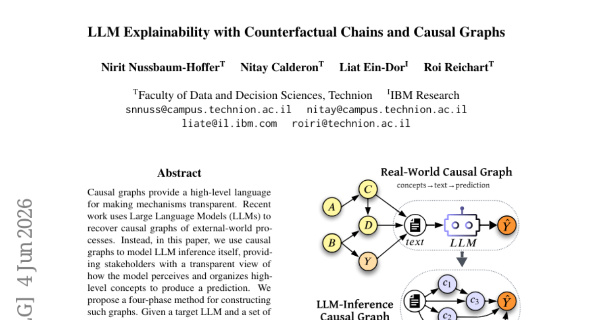

### 📌 한 줄 요약
LLM의 추론 과정을 인과 그래프로 모델링하여 모델이 개념을 어떻게 조직하고 예측하는지 시각화하는 설명 가능한 AI 프레임워크 제안

### 🔑 핵심 포인트
- LLM 내부 추론 과정을 모델링하기 위한 인과 그래프 기반의 4단계 방법론 제안
- MCMC 기반의 반사실적 증강(Counterfactual Augmentation)을 통한 안정적인 인과 관계 발견(σ-CG)
- 인간이 이해할 수 있는 개념 단위의 설명 가능성(Concept-level Explainability) 확보

### 🧑‍💻 개발자 관점
LLM의 블랙박스 문제를 해결하기 위해 모델이 어떤 개념적 근거로 특정 결론을 내리는지 구조적으로 파악할 수 있는 방법론을 제공합니다.

### 🚀 실무 적용 아이디어
- 특정 도메인(예: 법률, 의료) 데이터셋에 대해 모델의 개념 추출 및 인과 그래프 생성 테스트
- 제안된 σ-CG 알고리즘을 활용하여 모델의 예측 변화에 따른 인과적 영향력 분석
- 기존 SHAP/LIME 등 피처 기반 설명 방식과 인과 그래프 기반 방식의 해석력 비교

### ⚠️ 리스크/한계
- 추출된 개념이 실제 모델의 내부 가중치와 완벽히 일치하지 않을 수 있는 해석의 간극 존재
- 복잡한 태스크로 갈수록 인과 그래프의 구조가 비대해져 해석이 어려워질 가능성

### 📝 초록 기반 상세 설명
최근 LLM이 외부 세계의 인과 관계를 복구하는 연구는 많았으나, LLM 내부의 추론 메커니즘 자체를 투명하게 설명하는 연구는 부족했습니다. 본 논문은 LLM의 추론 과정을 모델링하기 위해 인과 그래프를 활용하는 4단계 방법론을 제안합니다. 먼저 텍스트 예시로부터 해석 가능한 개념을 발견하고 입력 데이터를 해당 개념 상태로 매핑합니다. 이후 MCMC 방식의 반사실적 증강(Counterfactual Augmentation)을 통해 희소한 데이터를 확장하여 안정적인 인과 관계를 발견하는 σ-CG 알고리즘을 적용합니다. 질병 진단, 감성 분석 등 다양한 태스크에서 실험한 결과, 제안된 그래프가 LLM의 실제 추론 논리와 일치하는 의미 있는 의존성을 포착함을 확인했습니다. 이를 통해 LLM의 개념 수준 설명 가능성을 위한 기초를 마련했습니다.

---

## 18. [PaperFlow: Profiling, Recommending, and Adapting Across Daily Paper Streams](https://huggingface.co/papers/2606.07454)
**Upvotes**: 8 | **도입 난이도**: 중 | **신뢰도**: 상
**arXiv**: https://arxiv.org/abs/2606.07454

**태그**: Recommendation System, Time-series, User Profiling, Information Retrieval, Benchmark, Evaluation, Safety

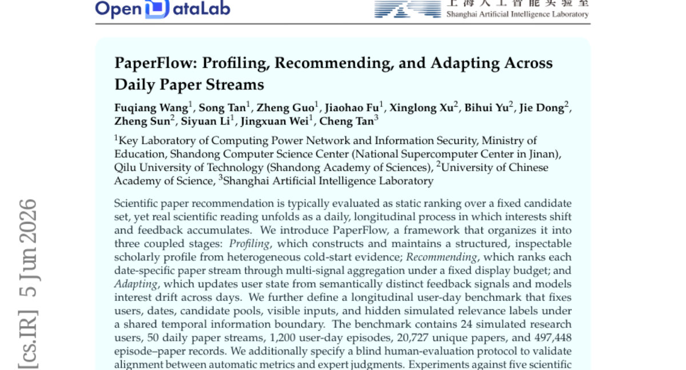

### 📌 한 줄 요약
사용자의 관심사 변화와 일상적인 논문 읽기 패턴을 반영한 시계열적 논문 추천 프레임워크 제안

### 🔑 핵심 포인트
- Profiling, Recommending, Adapting으로 이어지는 시계열적 추천 파이프라인 구축
- 사용자의 관심사 변화(Interest Drift)와 다양한 피드백 신호를 반영하는 적응 메커니즘
- 시간적 정보 경계를 엄격히 통제한 새로운 종단적(Longitudinal) 사용자-일 단위 벤치마크 제안

### 🧑‍💻 개발자 관점
정적인 추천 시스템을 넘어, 사용자 피드백에 따라 실시간으로 프로필이 업데이트되는 동적 추천 엔진 설계 패턴을 학습할 수 있습니다.

### 🚀 실무 적용 아이디어
- 사용자 프로필 업데이트 로직(Adapting)의 시계열 모델링 방식 분석
- 제한된 디스플레이 예산(Fixed budget) 하에서의 랭킹 최적화 기법 검토
- 시뮬레이션 기반 벤치마크 데이터셋의 구조 및 평가 지표 확인

### ⚠️ 리스크/한계
- 시뮬레이션 기반 벤치마크 결과이므로 실제 복잡한 인간 행동과의 괴리 가능성 존재
- 사용자 프로필의 구조화 및 업데이트 과정에서의 연산 복잡도 증가

### 📝 초록 기반 상세 설명
기존의 논문 추천 방식은 고정된 후보군에 대한 정적 순위 산출에 집중하여, 시간이 흐름에 따라 변화하는 연구자의 관심사와 피드백을 반영하는 데 한계가 있었습니다. 이를 해결하기 위해 PaperFlow 프레임워크를 제안하며, 이는 프로파일링(Profiling), 추천(Recommending), 적응(Adapting)의 세 단계로 구성됩니다. 프로파일링은 초기 데이터로부터 구조화된 사용자 프로필을 구축하고, 추천은 일일 단위의 제한된 예산 내에서 최적의 논문 스트림을 생성하며, 적응은 피드백을 통해 관심사 변화를 모델링합니다. 또한, 시계열적 특성을 엄격히 통제한 새로운 벤치마크를 정의하여 실험을 진행했습니다. 실험 결과, PaperFlow는 기존 베이스라인 대비 높은 순위 정확도와 사용자 행동 정렬 및 인간 평가에서 우수한 성능을 보였습니다.

---

## 19. [Socratic-SWE: Self-Evolving Coding Agents via Trace-Derived Agent Skills](https://huggingface.co/papers/2606.07412)
**Upvotes**: 8 | **도입 난이도**: 상 | **신뢰도**: 상
**arXiv**: https://arxiv.org/abs/2606.07412

**태그**: AI Agent, Self-Evolving, Synthetic Data, Software Engineering, Agent, Distillation, Safety

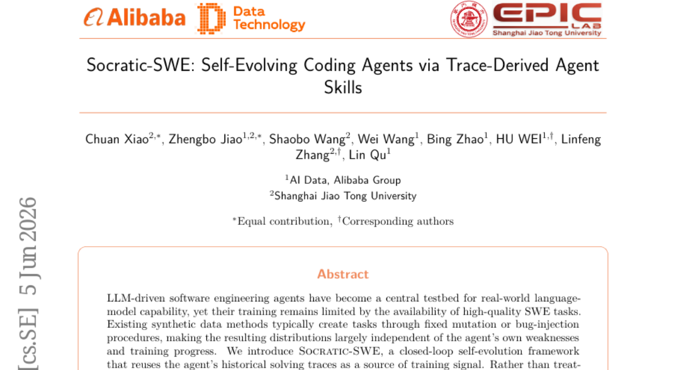

### 📌 한 줄 요약
에이전트의 과거 작업 이력(Trace)을 분석하여 스스로 학습용 태스크를 생성하고 진화하는 폐쇄 루프(Closed-loop) 자가 진화 프레임워크

### 🔑 핵심 포인트
- 에이전트의 과거 작업 이력(Trace)을 학습 신호로 활용하는 폐쇄 루프 자가 진화 프레임워크 제안
- 실패 패턴과 성공 패턴을 구조화된 '스킬'로 추출하여 맞춤형 학습 태스크 생성
- 실행 기반 검증 및 솔버-그래디언트 정렬 보상을 통한 고품질 합성 데이터 확보

### 🧑‍💻 개발자 관점
에이전트가 단순히 문제를 푸는 것을 넘어, 자신의 실수로부터 학습 데이터를 스스로 생성하여 성능을 높이는 자동화된 학습 파이프라인의 가능성을 제시합니다.

### 🚀 실무 적용 아이디어
- 에이전트의 작업 로그(Trace)를 구조화된 데이터로 변환하는 파이프라인 구축 실험
- 특정 도메인(예: 프론트엔드, 데이터 엔지니어링)에 특화된 스킬 추출 로직 테스트
- 생성된 합성 태스크가 실제 코드베이스의 복잡도를 충분히 반영하는지 검증

### ⚠️ 리스크/한계
- 에이전트가 잘못된 패턴을 학습할 경우 발생하는 '자기 강화적 오류(Self-reinforcing error)' 위험
- 실제 저장소 기반의 태스크 생성 시 발생하는 높은 컴퓨팅 비용 및 복잡성

### 📝 초록 기반 상세 설명
LLM 기반 소프트웨어 엔지니어링(SWE) 에이전트의 성능 향상을 위해서는 고품질 데이터가 필수적이지만, 기존의 합성 데이터 생성 방식은 에이전트의 실제 약점을 반영하지 못하는 한계가 있습니다. 이를 해결하기 위해 Socratic-SWE는 에이전트가 과거에 수행했던 작업 이력(Trace)을 분석하여 반복되는 실패 패턴과 효과적인 수정 패턴을 구조화된 '스킬'로 추출합니다. 추출된 스킬은 실제 저장소에서 타겟팅된 수리 태스크를 생성하는 가이드로 활용되며, 생성된 태스크는 실행 기반 검증과 보상 모델을 통해 품질이 관리됩니다. 이 과정을 통해 에이전트는 자신의 약점을 보완하는 커리큘럼을 스스로 구축하며 반복적으로 진화합니다. 실험 결과, SWE-bench 등 주요 벤치마크에서 기존 자가 진화 방식보다 뛰어난 성능 향상을 입증했습니다.

---

## 20. [UnpredictaBench: A Benchmark for Evaluating Distributional Randomness in LLMs](https://huggingface.co/papers/2606.06622)
**Upvotes**: 8 | **도입 난이도**: 하 | **신뢰도**: 상
**arXiv**: https://arxiv.org/abs/2606.06622

**태그**: LLM Evaluation, Simulation, Statistics, Agent, Reasoning, Benchmark, Evaluation

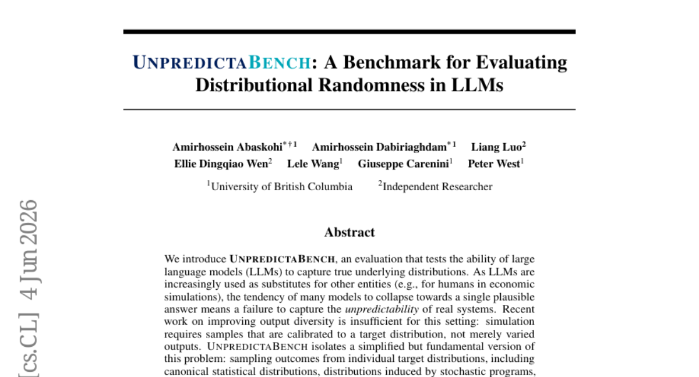

### 📌 한 줄 요약
LLM이 단순한 답변 생성을 넘어 실제 확률 분포를 정확히 모사할 수 있는지 평가하는 새로운 벤치마크 UnpredictaBench 제안

### 🔑 핵심 포인트
- LLM의 확률 분포 모사 능력을 측정하는 벤치마크 UnpredictaBench 개발
- 통계적 검정 기반의 새로운 평가 지표 KS@N 도입
- 단순한 다양성 확보가 아닌, 타겟 분포에 대한 정교한 샘플링 능력 검증

### 🧑‍💻 개발자 관점
LLM을 에이전트나 시뮬레이션 환경의 개체로 사용할 때, 모델이 예측 불가능한 현실 세계의 변동성을 제대로 재현하는지 검증하는 기준이 됩니다.

### 🚀 실무 적용 아이디어
- 사용 중인 LLM에 UnpredictaBench의 통계적 샘플링 문제 적용 테스트
- 모델의 출력값이 특정 값으로 쏠리는 '모드 붕괴(Mode Collapse)' 현상 모니터링
- 시뮬레이션 목적의 LLM 활용 시 KS@N 지표를 통한 신뢰도 검증

### ⚠️ 리스크/한계
- 현재 모델들의 낮은 점수는 복잡한 시스템 시뮬레이션 시 예측 불가능한 오류를 야기할 수 있음
- 추론 능력 향상이 반드시 정확한 분포 샘플링으로 이어지지는 않음

### 📝 초록 기반 상세 설명
LLM이 경제 시뮬레이션 등 복잡한 시스템의 대리인으로 활용됨에 따라, 모델이 특정 답변으로 수렴하지 않고 실제 확률 분포를 재현하는 능력이 중요해졌습니다. 기존의 다양성 개선 방식은 타겟 분포에 정교하게 정렬된 샘플링을 보장하지 못한다는 한계가 있습니다. 이를 해결하기 위해 통계적 분포 및 자연어 시나리오를 포함한 448개의 문제를 담은 UnpredictaBench를 도입했습니다. 평가 지표로는 Kolmogorov-Smirnov 검정을 활용한 KS@N을 제안하여 모델 출력의 분포 일치도를 측정합니다. 실험 결과, 모델 간 분포 재현 능력의 격차가 컸으며 어떤 모델도 높은 점수를 기록하지 못해 개선 여지가 큼을 확인했습니다.

---

## 21. [SIA: Self Improving AI with Harness & Weight Updates](https://huggingface.co/papers/2605.27276)
**Upvotes**: 8 | **도입 난이도**: 상 | **신뢰도**: 상
**arXiv**: https://arxiv.org/abs/2605.27276

**태그**: Agent, Self-Improving, Fine-tuning, Automation, Benchmark, Evaluation

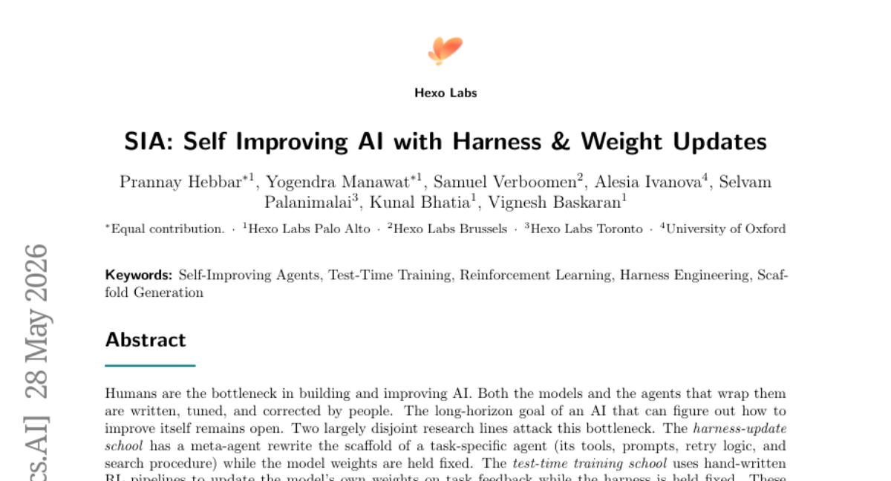

### 📌 한 줄 요약
에이전트의 프롬프트/도구(Harness)와 모델 가중치(Weights)를 동시에 최적화하여 자가 개선을 달성하는 프레임워크

### 🔑 핵심 포인트
- Harness(프롬프트, 도구, 로직)와 Weights(모델 가중치)를 동시에 최적화하는 통합 루프 제안
- 피드백 에이전트가 작업 에이전트의 환경과 지식을 스스로 개선하는 자가 학습 구조
- 다양한 도메인(법률, GPU 커널, 생물학)에서의 강력한 성능 검증

### 🧑‍💻 개발자 관점
에이전트 설계 시 프롬프트 엔지니어링과 파인튜닝을 별개로 관리하던 기존 방식에서 벗어나, 자동화된 자가 개선 파이프라인 구축의 가능성을 제시합니다.

### 🚀 실무 적용 아이디어
- 특정 도메인 데이터셋을 활용하여 프롬프트 최적화와 파인튜닝을 병행하는 루프 구현 테스트
- 피드백 에이전트(Teacher)와 작업 에이전트(Student) 간의 역할 분리 및 보상 설계 실험
- 하네스 업데이트와 가중치 업데이트 중 어떤 요소가 특정 태스크에 더 큰 영향을 주는지 정량적 분석

### ⚠️ 리스크/한계
- 피드백 에이전트의 오류가 가중치와 하네스 모두에 전파되어 모델이 붕괴될 위험(Model Collapse)
- 반복적인 학습 루프로 인한 높은 컴퓨팅 비용 및 자원 소모

### 📝 초록 기반 상세 설명
AI 모델과 에이전트 개발 과정에서 인간의 개입이 병목 현상을 일으키는 문제가 지속되고 있습니다. 기존 연구는 프롬프트/도구를 수정하는 방식과 모델 가중치를 업데이트하는 방식이 서로 분리되어 발전해 왔습니다. 본 논문은 이 두 방식을 통합하여 피드백 에이전트가 작업용 에이전트의 하네스와 가중치를 모두 업데이트하는 SIA 프레임워크를 제안합니다. 법률 분류, GPU 커널 최적화, RNA 노이즈 제거 등 다양한 도메인에서 실험을 진행했습니다. 실험 결과, 하네스와 가중치를 동시에 업데이트하는 방식이 단일 방식보다 월등한 성능 향상을 보였습니다. 하네스 업데이트는 에이전트의 행동 양식을 형성하고, 가중치 업데이트는 프롬프트로 구현 불가능한 도메인 직관을 구축합니다.

### 🖼️ 추가 자료
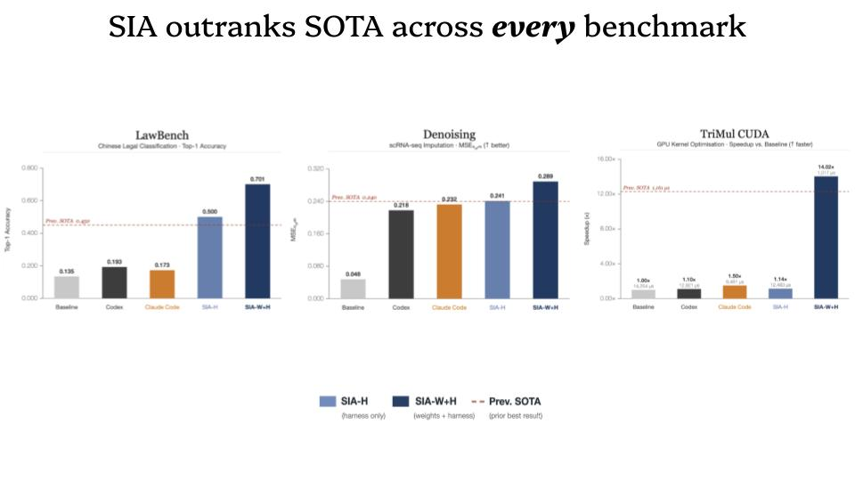

---

## 22. [SPACENUM: Revisiting Spatial Numerical Understanding in VLMs](https://huggingface.co/papers/2605.23898)
**Upvotes**: 5 | **도입 난이도**: 하 | **신뢰도**: 상
**arXiv**: https://arxiv.org/abs/2605.23898

**태그**: VLM, Spatial-Reasoning, Embodied-AI, Evaluation, Reasoning, Vision, Benchmark

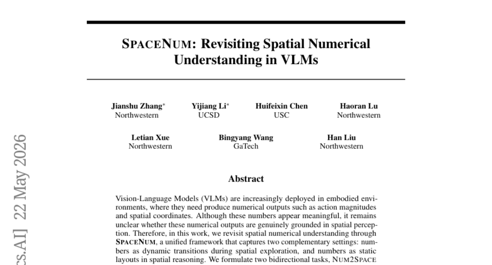

### 📌 한 줄 요약
VLM이 공간적 맥락에서 숫자를 실제 의미와 연결하지 못하는 근본적인 한계를 규명하고 평가 프레임워크를 제안함

### 🔑 핵심 포인트
- 공간적 탐색(동적)과 레이아웃(정적)을 모두 아우르는 통합 프레임워크 SpaceNum 제안
- 시각-언어 간 수치 매핑 능력을 측정하는 양방향 태스크(Num2Space, Space2Num) 설계
- 현재 VLM이 공간적 맥락에서 숫자를 실제 의미와 연결하지 못하는 'Grounding' 실패 문제 규명

### 🧑‍💻 개발자 관점
로봇 제어나 AR/VR 등 정밀한 좌표/수치가 필요한 에이전트 개발 시, 모델의 수치 출력이 단순 텍스트 생성인지 실제 공간 이해인지 검증할 필요가 있음을 시사합니다.

### 🚀 실무 적용 아이디어
- 사용 중인 VLM 모델에 SpaceNum 프레임워크를 적용하여 공간 수치 이해도 벤치마킹
- 에이전트의 수치 출력(좌표, 크기 등)이 시각적 변화에 따라 일관성을 유지하는지 테스트
- 수치적 추론 성능 향상을 위한 미세 조정(Fine-tuning) 전략 수립

### ⚠️ 리스크/한계
- 현재 VLM의 구조적 한계로 인해 단순 프롬프팅(Reasoning)만으로는 해결이 어려울 수 있음
- 실제 물리 환경 적용 시 모델의 수치 오류가 치명적인 물리적 사고로 이어질 위험 존재

### 📝 초록 기반 상세 설명
최근 VLM은 로봇 제어 등 물리적 환경에서 수치적 출력을 생성하는 데 널리 사용되고 있습니다. 그러나 이러한 수치 데이터가 실제 공간적 지각에 기반한 것인지에 대한 의문이 제기되었습니다. 본 논문은 공간적 탐색 중의 동적 변화와 정적 레이아웃이라는 두 가지 상호 보완적 설정을 포함하는 'SpaceNum' 프레임워크를 제안합니다. 이를 위해 시각적 공간 구조와 언어적 수치 표현 간의 매핑 능력을 평가하는 Num2Space 및 Space2Num 태스크를 설계했습니다. 실험 결과, 현재의 VLM은 공간적 의미에 숫자를 결합하는 데 실패하며 무작위 추측에 가까운 성능을 보였습니다. 분석 결과 모델들은 얕은 공간 단서에 의존할 뿐, 안정적인 좌표 표현이나 구조적 레이아웃 추상화 능력이 부족함을 확인했습니다.

### 🖼️ 추가 자료
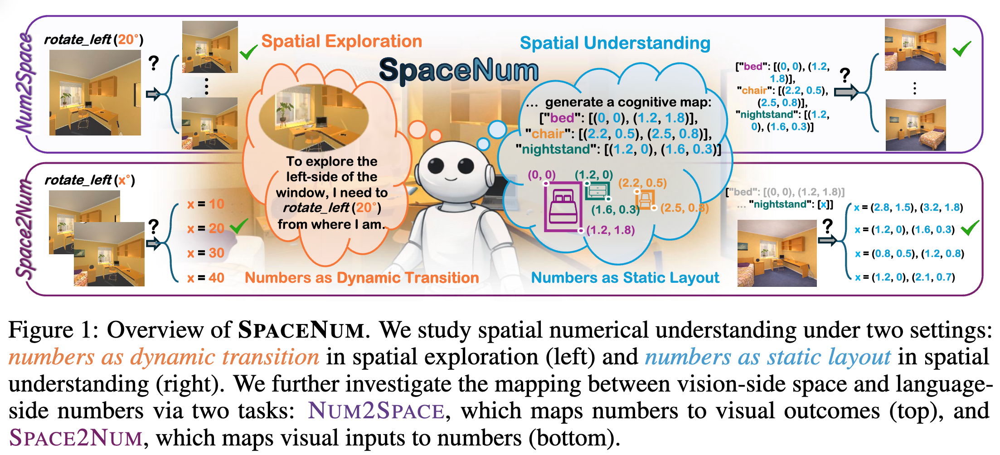

---

## 23. [Stream3D-VLM: Online 3D Spatial Understanding with Incremental Geometry Priors](https://huggingface.co/papers/2606.06891)
**Upvotes**: 4 | **도입 난이도**: 상 | **신뢰도**: 상
**arXiv**: https://arxiv.org/abs/2606.06891

**태그**: 3D-Vision, Real-time, VLM, Robotics, Reasoning, Multimodal, Vision, Video, Benchmark, Optimization

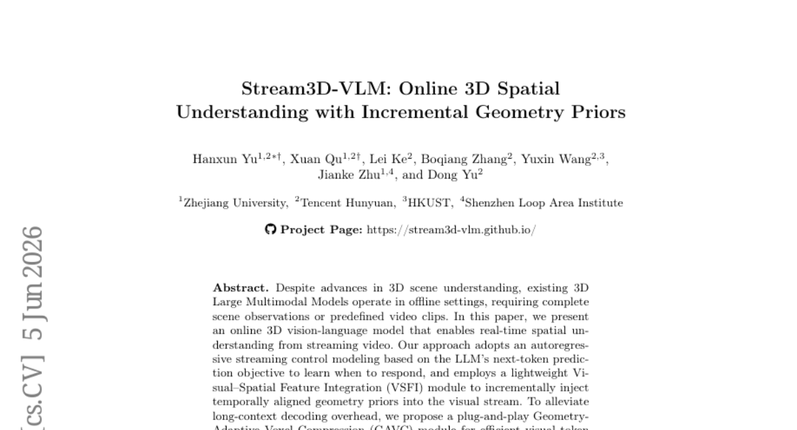

### 📌 한 줄 요약
실시간 스트리밍 비디오를 통해 점진적인 3D 공간 정보를 이해하고 응답하는 온라인 3D VLM 프레임워크

### 🔑 핵심 포인트
- 실시간 스트리밍 대응을 위한 자기회귀적 스트리밍 제어 및 점진적 기하학 정보 주입(VSFI)
- 효율적인 토큰 관리를 위한 기하학 적응형 복셀 압축(GAVC) 모듈 개발
- 1M 이상의 대규모 온라인 시공간 3D QA 데이터셋 및 종합 벤치마크 구축

### 🧑‍💻 개발자 관점
로봇 공학이나 자율 주행과 같이 끊임없이 변화하는 실시간 환경에서 3D 공간 정보를 즉각적으로 처리해야 하는 에이전트 개발에 핵심적인 기술입니다.

### 🚀 실무 적용 아이디어
- 제공된 데이터 생성 파이프라인을 활용한 특정 도메인(예: 실내 가전) 데이터셋 구축 실험
- GAVC 모듈의 압축률에 따른 공간 이해 정확도 변화 측정
- 실시간 스트리밍 환경에서의 추론 지연 시간(Latency) 및 메모리 사용량 벤치마크

### ⚠️ 리스크/한계
- 실시간 처리를 위한 경량화 모델임에도 불구하고, 복잡한 3D 장면에서의 연산 부하 문제
- 스트리밍 데이터의 노이즈나 급격한 시점 변화 시 기하학적 사전 정보의 안정성 문제

### 📝 초록 기반 상세 설명
기존의 3D VLM은 완전한 장면 관측이나 사전 정의된 비디오 클립이 필요한 오프라인 환경에 국한되어 있었습니다. 본 논문은 스트리밍 비디오로부터 실시간 공간 이해를 가능하게 하는 온라인 3D VLM을 제안합니다. LLM의 차기 토큰 예측 목적 함수를 활용한 자기회귀적 스트리밍 제어 모델링과, 시계열적으로 정렬된 기하학적 사전 정보를 주입하는 경량 VSFI 모듈을 도입했습니다. 또한, 긴 컨텍스트 디코딩 부하를 줄이기 위해 GAVC 모듈을 통한 효율적인 시각 토큰 압축 기술을 적용했습니다. 100만 개 이상의 데이터셋과 29개 태스크로 구성된 벤치마크를 통해 성능을 검증했으며, 실험 결과 기존 모델들을 상회하는 온라인/오프라인 3D 이해 능력을 입증했습니다.

---

## 24. [HarnessForge: Joint Harness and Policy Evolution for Adaptive Agent Systems](https://huggingface.co/papers/2606.01779)
**Upvotes**: 4 | **도입 난이도**: 상 | **신뢰도**: 상
**arXiv**: https://arxiv.org/abs/2606.01779

**태그**: LLM Agent, Meta-Adaptation, System Optimization, Co-evolution, Agent, Reasoning, Benchmark, Safety

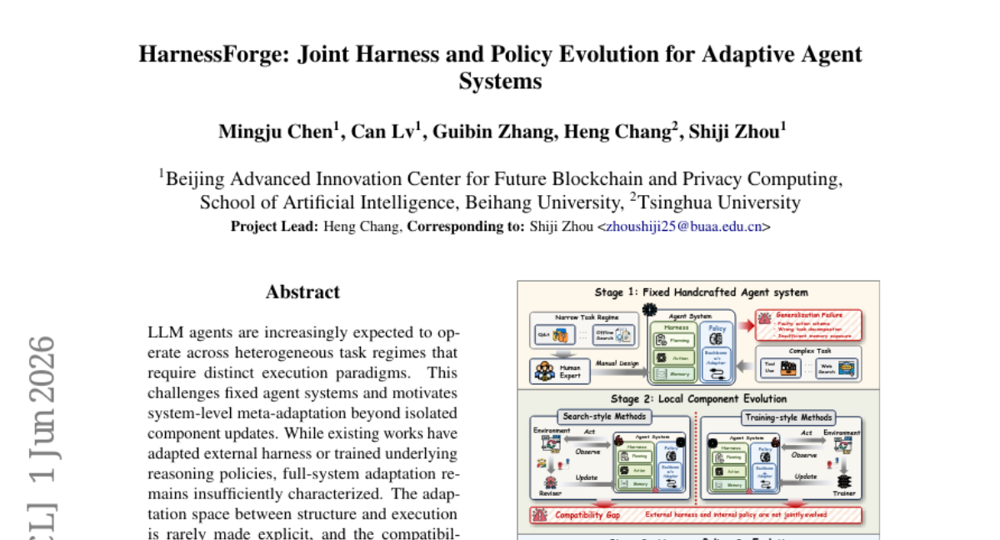

### 📌 한 줄 요약
에이전트의 실행 구조(Harness)와 추론 정책(Policy)을 동시에 최적화하여 시스템 전체의 적응력을 높이는 공동 진화 프레임워크

### 🔑 핵심 포인트
- 에이전트 시스템을 실행 구조(Harness)와 추론 정책(Policy)의 결합체로 정의
- 결함 가이드 기반의 Harness 테일러링과 Harness 조건부 정책 정렬을 통한 공동 진화(Co-evolution) 메커니즘
- 구조와 정책 간의 상호 호환성을 최적화하여 시스템 전체의 적응 성능 극대화

### 🧑‍💻 개발자 관점
단순히 모델 성능을 높이는 것을 넘어, 에이전트가 동작하는 환경(Tool, Workflow)과 모델의 추론 방식 간의 정렬이 성능에 결정적임을 시사합니다.

### 🚀 실무 적용 아이디어
- 현재 사용 중인 에이전트 워크플로우(Harness)를 고정하지 않고 모델 성능에 따라 가변적으로 변경하는 실험 설계
- 특정 도구 사용 환경에서 모델의 추론 로그를 기반으로 워크플로우 구조를 자동 수정하는 파이프라인 구축
- 모델의 추론 방식(Policy)과 실행 환경(Harness) 간의 정렬도를 측정하는 지표 개발

### ⚠️ 리스크/한계
- Harness와 Policy를 동시에 변경할 경우 시스템의 안정성 및 예측 가능성이 저하될 위험
- 최적의 Harness-Policy 쌍을 찾기 위한 탐색 비용 및 연산 복잡도 증가

### 📝 초록 기반 상세 설명
LLM 에이전트가 다양한 작업 환경에 대응해야 함에 따라, 개별 컴포넌트 업데이트를 넘어선 시스템 차원의 메타 적응이 필요해졌습니다. 기존 방식은 실행 구조와 추론 정책 사이의 상호 호환성을 최적화하지 못하는 한계가 있었습니다. 이를 해결하기 위해 HarnessForge는 에이전트 시스템을 'Harness-Policy' 쌍으로 정의하고, 결함 기반의 구조 조정과 구조 조건부 정책 정렬을 통한 공동 진화 방식을 제안합니다. 실험 결과, HarnessForge는 단일 요소만 업데이트하는 기존 방식보다 뛰어난 성능 향상을 보였으며, 구조와 정책 간의 실행 호환성이 에이전트 적응에 필수적임을 입증했습니다.

---

## 25. [When Gradients Collide: Failure Modes of Multi-Objective Prompt Optimization for LLM Judges](https://huggingface.co/papers/2605.26046)
**Upvotes**: 3 | **도입 난이도**: 중 | **신뢰도**: 상
**arXiv**: https://arxiv.org/abs/2605.26046

**태그**: LLM-as-a-Judge, Prompt-Optimization, Multi-Objective, Evaluation, Inference

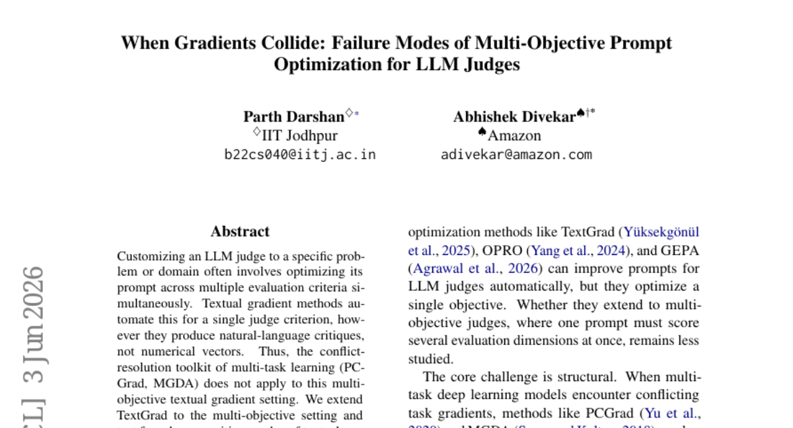

### 📌 한 줄 요약
멀티 목적 LLM 평가 프롬프트 최적화 시 발생하는 그래디언트 희석 및 지시문 간섭 문제를 규명함

### 🔑 핵심 포인트
- 멀티 목적 텍스트 그래디언트 최적화 시 발생하는 두 가지 실패 모드(그래디언트 희석, 지시문 간섭) 식별
- 여러 평가 기준을 하나의 그래디언트 LLM이 동시에 처리할 때 발생하는 성능 저하 확인
- 단순히 여러 지시문을 하나의 프롬프트로 결합하는 방식의 위험성 증명

### 🧑‍💻 개발자 관점
LLM을 평가자로 사용할 때, 여러 기준을 하나의 프롬프트에 몰아넣는 방식이 오히려 평가 정확도를 떨어뜨릴 수 있음을 시사합니다.

### 🚀 실무 적용 아이디어
- 여러 평가 기준을 하나의 프롬프트에 통합하는 대신, 각 기준별로 독립적인 최적화 루프를 구성해보기
- 최적화 시 각 기준(Criterion)에 대한 피드백을 분리하여 생성하는 구조 설계하기
- 프롬프트 결합 시 발생하는 지시문 간 간섭을 방지하기 위한 구조적 분리(Modular Prompting) 실험하기

### ⚠️ 리스크/한계
- 텍스트 기반 최적화의 특성상 수치적 충돌 해결 기법(PCGrad 등)을 직접 적용하기 어려움
- 최적화 과정에서 특정 기준에 편향되거나 모든 기준의 성능이 정체될 위험이 있음

### 📝 초록 기반 상세 설명
특정 도메인에 특화된 LLM Judge를 구축하기 위해 여러 평가 기준을 동시에 최적화하는 과정에서 발생하는 문제를 다룹니다. 기존의 텍스트 기반 그래디언트 방식은 수치형 벡터가 아닌 자연어 비평을 생성하므로 기존의 멀티태스크 학습 기법을 적용하기 어렵습니다. 본 연구는 손실 함수, 그래디언트 생성, 옵티마이저 LLM 간의 정보 공유 방식을 다르게 설정하여 5가지 분해 모드를 테스트했습니다. 실험 결과, 여러 기준을 동시에 처리할 때 그래디언트의 특이성이 급격히 저하되거나 지시문 간의 간섭으로 인해 성능이 오히려 퇴보하는 현상이 관찰되었습니다. 이를 통해 최적화 단계의 '그래디언트 희석'과 추론 단계의 '지시문 간섭'이라는 두 가지 주요 실패 모드를 식별했습니다.

### 🖼️ 추가 자료
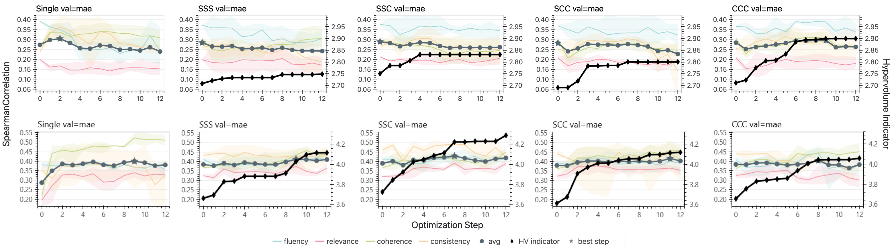
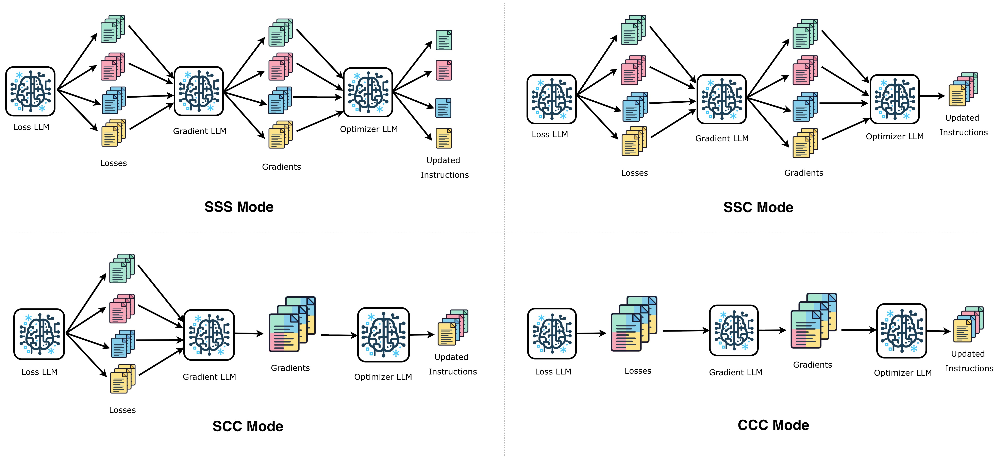
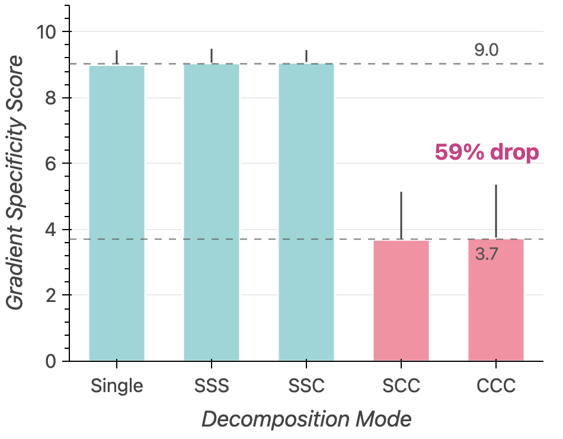
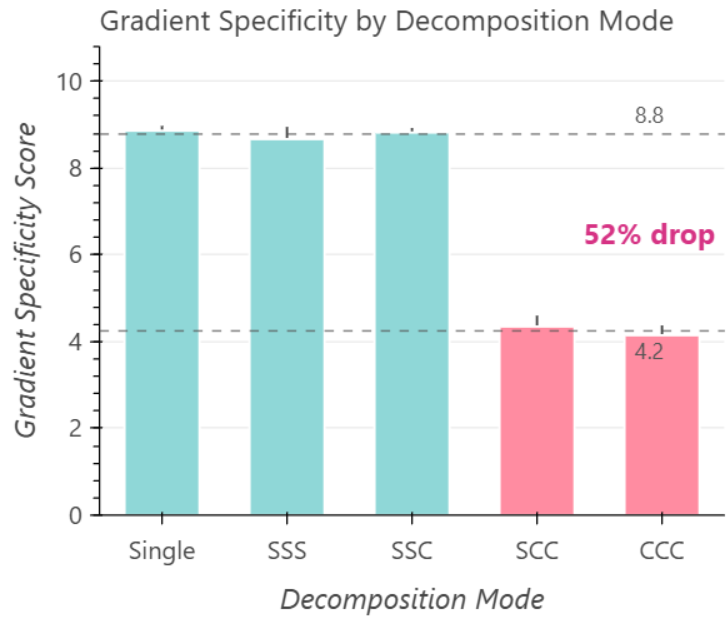

---

## 26. [Entropy as a Structural Prior: How a Log-Barrier on DiT Belief Space Drives Musical Diversity and Development](https://huggingface.co/papers/2606.07207)
**Upvotes**: 2 | **도입 난이도**: 중 | **신뢰도**: 상
**arXiv**: https://arxiv.org/abs/2606.07207

**태그**: Diffusion, DiT, Music Generation, Loss Weighting, Fine-tuning, Audio

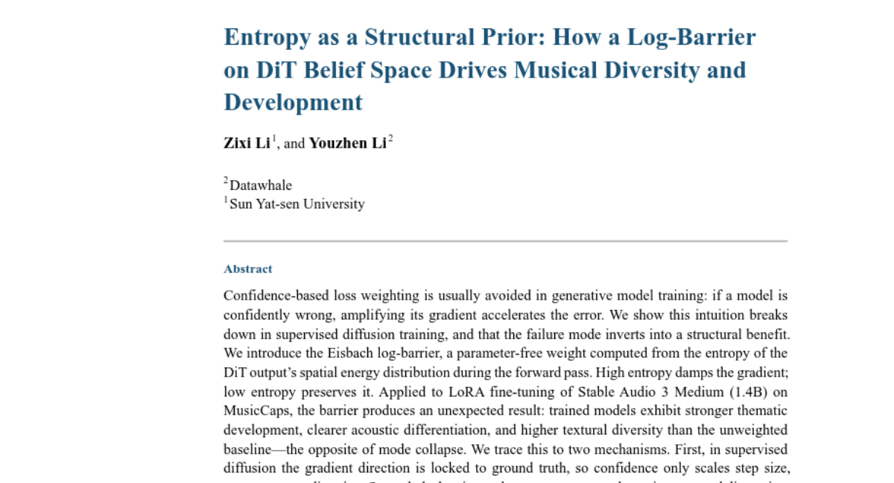

### 📌 한 줄 요약
DiT의 출력 엔트로피를 활용한 로그 배리어(Log-barrier) 기법을 통해 음악 생성 모델의 다양성과 테마 전개 능력을 향상시킨 연구

### 🔑 핵심 포인트
- Eisbach log-barrier: DiT 출력 엔트로피를 이용해 그래디언트 크기를 조절하는 파라미터 프리 가중치 방식
- 지도 학습 기반 확산 모델에서의 새로운 학습 역학 발견 (Confidence-based weighting의 재해석)
- 음악 생성 시 테마 전개 및 텍스처 다양성 향상 (Self-referential data curriculum 효과)

### 🧑‍💻 개발자 관점
모델의 확신도를 활용한 가중치 조절이 모드 붕괴가 아닌, 오히려 데이터의 특징을 살리는 커리큘럼 학습으로 작용할 수 있음을 보여줍니다.

### 🚀 실무 적용 아이디어
- Diffusion 모델의 LoRA 파인튜닝 시 출력 엔트로피 기반 가중치 적용 실험
- 학습 데이터의 복잡도(Entropy)에 따른 그래디언트 스케일링 효과 검증
- 음악 외의 다른 도메인(이미지, 비디오) 생성 모델에 대한 전이 가능성 테스트

### ⚠️ 리스크/한계
- 지도 학습(Supervised) 환경에 특화된 기법이므로, 완전 비지도 학습 환경에서는 결과가 다를 수 있음
- 엔트로피 계산에 따른 추가적인 연산 비용 발생 가능성

### 📝 초록 기반 상세 설명
기존 생성 모델에서는 모델의 확신도(Confidence)를 기반으로 한 손실 가중치가 오류를 증폭시킬 위험이 있어 피하게 되어 왔습니다. 하지만 본 연구는 지도 학습 기반의 확산 모델(Diffusion)에서는 이 직관이 다르게 작용할 수 있음을 발견했습니다. 이를 위해 DiT 출력의 공간 에너지 분포 엔트로피를 활용한 파라미터 프리(Parameter-free) 방식인 'Eisbach log-barrier'를 제안합니다. Stable Audio 3 Medium 모델에 이 기법을 적용한 결과, 모드 붕괴(Mode collapse) 대신 오히려 더 높은 텍스처 다양성과 명확한 음향적 차별성을 확보했습니다. 이는 정답이 고정된 지도 학습 환경에서 엔트로피가 학습 스텝 크기를 조절하는 커리큘럼 역할을 하기 때문입니다.

---

## 27. [A Cookbook of 3D Vision: Data, Learning Paradigms, and Application](https://huggingface.co/papers/2606.04291)
**Upvotes**: 2 | **도입 난이도**: 하 | **신뢰도**: 상
**arXiv**: https://arxiv.org/abs/2606.04291

**태그**: 3D Vision, Deep Learning, Data Taxonomy, Computer Graphics, RAG, Multimodal, Vision, Video, Benchmark

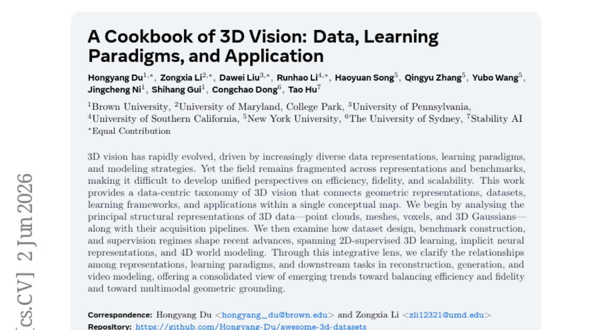

### 📌 한 줄 요약
3D 비전의 데이터 표현 방식, 학습 패러다임, 응용 분야를 통합적으로 정리한 체계적인 가이드라인

### 🔑 핵심 포인트
- 데이터 중심의 통합적 3D 비전 분류 체계(Taxonomy) 구축
- 다양한 3D 표현 방식(Point Clouds, Meshes, Voxels, 3D Gaussians)과 획득 파이프라인 분석
- 학습 패러다임(2D-supervised, Implicit, 4D)과 하위 작업(Reconstruction, Generation) 간의 관계 정립

### 🧑‍💻 개발자 관점
3D 데이터 구조와 학습 방법론 간의 상관관계를 이해함으로써, 특정 프로젝트 목적(생성, 재구성, 시뮬레이션 등)에 최적화된 기술 스택을 선택하는 데 도움을 줍니다.

### 🚀 실무 적용 아이디어
- 프로젝트 요구사항에 따른 3D 표현 방식(Mesh vs Gaussian)의 장단점 비교 분석
- 최신 3D 가우시안 스플래팅(3DGS) 기술의 데이터 파이프라인 검토
- 제시된 분류 체계를 바탕으로 현재 사용 중인 3D 모델의 한계점 파악

### ⚠️ 리스크/한계
- 특정 알고리즘의 성능 수치를 제시하는 것이 아닌 이론적/개념적 정리 위주의 논문임
- 기술 변화 속도가 빨라 최신 연구 결과가 실시간으로 반영되지 않을 수 있음

### 📝 초록 기반 상세 설명
3D 비전 기술은 급격히 발전하고 있으나, 다양한 데이터 표현 방식과 벤치마크로 인해 분야가 파편화되어 통합적인 관점을 갖기 어려운 상황입니다. 본 논문은 기하학적 표현, 데이터셋, 학습 프레임워크, 응용 분야를 하나의 개념적 지도로 연결하는 데이터 중심의 분류 체계를 제안합니다. 점 구름(Point Clouds), 메쉬(Meshes), 복셀(Voxels), 3D 가우시안(3D Gaussians) 등 주요 구조적 표현과 데이터 획득 파이프라인을 분석합니다. 또한 2D 지도 학습, 암시적 신경 표현(Implicit Neural Representations), 4D 월드 모델링을 아우르는 학습 방식과 데이터셋 설계의 관계를 고찰합니다. 이를 통해 재구성, 생성, 비디오 모델링 등 하위 작업 간의 관계를 명확히 하고 효율성과 충실도 사이의 균형을 맞추는 최신 트렌드를 제시합니다.

---

## 28. [LayerRoute: Input-Conditioned Adaptive Layer Skipping via LoRA Fine-Tuning for Agentic Language Models](https://huggingface.co/papers/2606.01838)
**Upvotes**: 2 | **도입 난이도**: 하 | **신뢰도**: 상
**arXiv**: https://arxiv.org/abs/2606.01838

**태그**: Agent, Inference-Optimization, LoRA, Dynamic-Computation, Reasoning, Inference

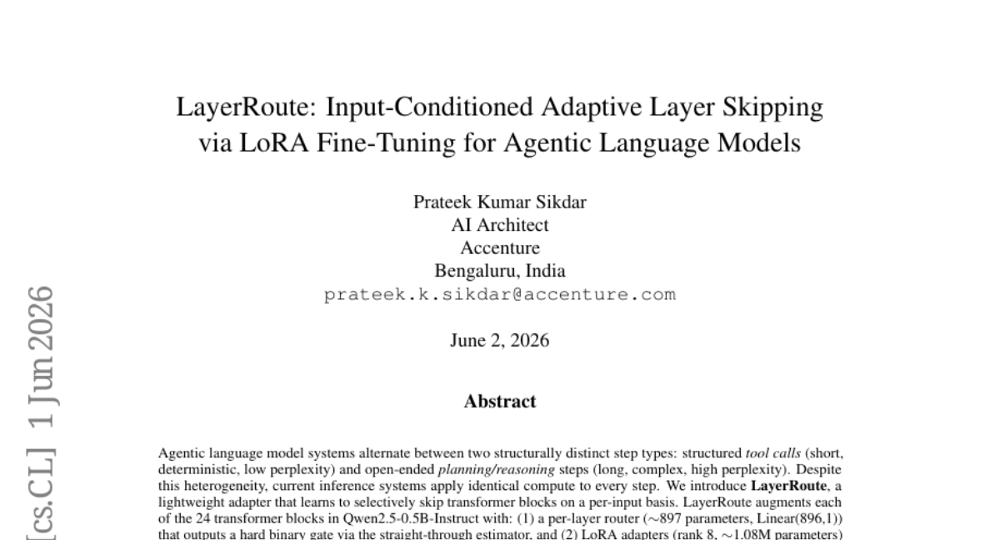

### 📌 한 줄 요약
에이전트 작업의 복잡도에 따라 트랜스포머 레이어를 동적으로 건너뛰어 추론 효율을 극대화하는 LoRA 기반 적응형 스킵 기술

### 🔑 핵심 포인트
- 입력 데이터의 특성(도구 호출 vs 추론)에 따라 레이어 스킵 비율을 동적으로 조절
- 백본 가중치를 고정한 상태에서 초경량 라우터와 LoRA만을 활용한 효율적 학습
- 연산량 절감과 동시에 LoRA 적응을 통한 모델 성능(Perplexity) 향상

### 🧑‍💻 개발자 관점
에이전트 시스템 구축 시, 단순 작업(Tool call)에 불필요한 연산을 줄여 추론 비용과 지연 시간을 획기적으로 낮출 수 있는 실용적인 방법론입니다.

### 🚀 실무 적용 아이디어
- 특정 도메인(예: SQL 생성, 코드 작성)에 특화된 데이터셋으로 레이어 스킵 패턴 분석
- 더 큰 규모의 모델(7B 이상)에 동일한 라우터 구조 적용 시 스킵 효율성 검증
- 추론 지연 시간(Latency)과 정확도 사이의 최적 트레이드오프 지점 탐색

### ⚠️ 리스크/한계
- 특정 데이터셋에 과적합될 경우 일반적인 추론 성능이 저하될 위험
- 하드웨어 가속기(GPU) 환경에서 동적 스킵이 실제 처리량(Throughput) 향상으로 이어지는지에 대한 실질적 검증 필요

### 📝 초록 기반 상세 설명
에이전트형 언어 모델은 결정론적인 도구 호출과 복잡한 추론 단계가 혼재되어 있어 모든 단계에 동일한 연산량을 투입하는 것은 비효율적입니다. 이를 해결하기 위해 입력 조건에 따라 레이어를 선택적으로 건너뛰는 경량 어댑터인 LayerRoute를 제안합니다. 모델의 가중치는 고정한 채, 각 레이어에 라우터와 LoRA 어댑터를 추가하여 입력 유형에 따라 스킵 여부를 결정하도록 학습시켰습니다. 실험 결과, 단순한 도구 호출 시에는 연산량을 대폭 절감하고 복잡한 추론 시에는 레이어를 유지함으로써 효율성과 성능을 동시에 잡았습니다. 결과적으로 매우 적은 파라미터 추가만으로 추론 속도 향상과 모델 성능 개선을 모두 달성했습니다.

---

## 29. [Towards Retrieving Interaction Spaces for Agentic Search](https://huggingface.co/papers/2606.06880)
**Upvotes**: 1 | **도입 난이도**: 중 | **신뢰도**: 상
**arXiv**: https://arxiv.org/abs/2606.06880

**태그**: Agentic Search, RAG, Information Retrieval, Scalability, Agent, Evaluation, Inference

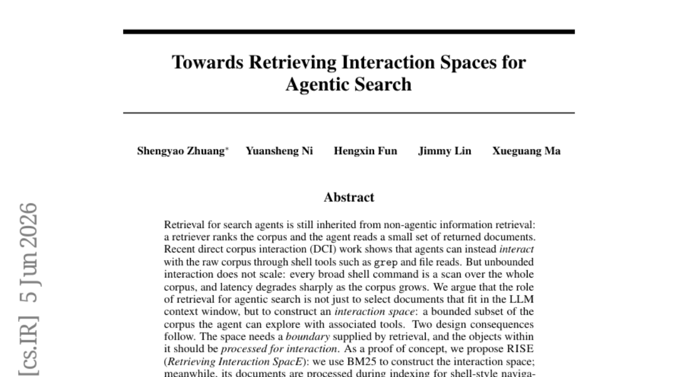

### 📌 한 줄 요약
에이전트의 무분별한 데이터 탐색 비용을 줄이기 위해, 검색을 통해 탐색 가능한 '상호작용 공간(Interaction Space)'을 구축하는 새로운 RAG 패러다임 제안

### 🔑 핵심 포인트
- 검색의 목적을 단순 문서 추출에서 '제한된 탐색 공간(Interaction Space)' 구축으로 확장
- RISE 프레임워크: BM25를 통한 경계 설정과 쉘 기반 탐색을 위한 문서 전처리 결합
- 대규모 코퍼스 환경에서 기존 DCI 방식 대비 비용 효율성 및 확장성(Scalability) 확보

### 🧑‍💻 개발자 관점
에이전트가 수만 개의 문서를 직접 뒤지는 대신, 효율적인 '샌드박스'를 먼저 구축하여 비용과 속도 문제를 해결하는 실무적 가이드를 제공합니다.

### 🚀 실무 적용 아이디어
- BM25 기반의 검색 결과가 에이전트의 탐색 범위로서 충분한 품질을 갖는지 검증
- 문서 인덱싱 시 쉘 명령(grep 등)이 용이하도록 텍스트를 구조화하는 전처리 파이프라인 설계
- 에이전트의 도구 사용(Tool-use)과 검색 결과 간의 경계 설정 로직 실험

### ⚠️ 리스크/한계
- BM25 기반의 경계 설정이 실제 정답이 포함된 영역을 놓칠 경우 에이전트의 성능이 급격히 저하될 위험
- 문서 전처리 방식에 따라 쉘 기반 탐색의 효율성이 크게 좌우될 수 있음

### 📝 초록 기반 상세 설명
기존의 에이전트 기반 검색은 단순히 문서를 추출하는 데 그치거나, 전체 코퍼스를 대상으로 하는 무분별한 쉘 명령(DCI)을 사용하여 데이터 규모가 커질수록 지연 시간과 비용이 급증하는 문제가 있었습니다. 본 논문은 검색의 역할을 단순 문서 선택을 넘어, 에이전트가 도구를 사용해 탐색할 수 있는 제한된 '상호작용 공간'을 구축하는 것으로 재정의합니다. 이를 위해 제안된 RISE(Retrieving Interaction SpacE)는 BM25로 탐색 경계를 설정하고, 인덱싱 단계에서 쉘 스타일의 탐색이 가능하도록 문서를 전처리합니다. 실험 결과, RISE는 대규모 데이터셋에서도 기존 DCI 방식보다 훨씬 낮은 비용과 높은 정확도로 효율적인 탐색 성능을 입증했습니다.

---

## 30. [Streaming Video Generation with Streaming Force Control](https://huggingface.co/papers/2606.07508)
**Upvotes**: 1 | **도입 난이도**: 중 | **신뢰도**: 상
**arXiv**: https://arxiv.org/abs/2606.07508

**태그**: Video Generation, Physics-based Control, Streaming, Computer Vision, Video, Distillation

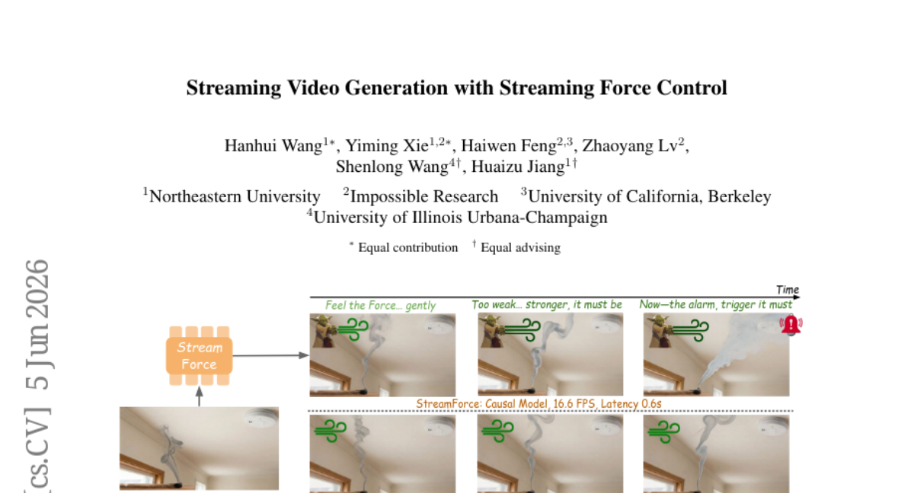

### 📌 한 줄 요약
실시간 물리적 힘(Force) 입력에 즉각 반응하는 인과적(Causal) 스트리밍 비디오 생성 프레임워크

### 🔑 핵심 포인트
- 연속적인 힘(Force) 입력을 제어 신호로 사용하는 통합된 물리 기반 제어 프레임워크 개발
- 인과적(Causal) 모델 설계를 통해 실시간 변화하는 국소적/전역적 힘에 즉각적 반응 가능
- 자기회귀 효율성과 물리적 반응성을 결합한 증류 파이프라인을 통한 고속 생성(16.6 FPS)

### 🧑‍💻 개발자 관점
실시간 상호작용이 필요한 시뮬레이션이나 로봇 제어 연동 비디오 생성 분야에서 즉각적인 제어 신호 반영이 가능하다는 점이 핵심입니다.

### 🚀 실무 적용 아이디어
- 제공된 프로젝트 웹사이트의 데모를 통해 힘의 변화에 따른 비디오 반응성 확인
- 단일 GPU 환경에서의 추론 속도와 물리적 일관성 간의 트레이드오프 분석
- 특정 물리 법칙(중력, 마찰 등)을 입력값으로 주었을 때의 생성 품질 테스트

### ⚠️ 리스크/한계
- 자기회귀 방식 특성상 장기 생성 시 발생할 수 있는 드리프트(Drift) 현상 가능성
- 복잡한 물리적 상호작용이 포함된 경우 모델의 물리적 정확도 검증 필요

### 📝 초록 기반 상세 설명
기존 비디오 생성 모델은 다양한 힘의 종류에 따라 별도의 모델을 학습하거나, 고정된 힘을 가정하거나, 비인과적(Non-causal) 처리 방식에 의존하는 한계가 있었습니다. 이를 해결하기 위해 StreamForce는 연속적인 힘 입력에 물리적으로 근거하여 반응하는 통합 스트리밍 프레임워크를 제안합니다. 연구진은 통합된 힘 표현 방식과 힘 제어가 가능한 비디오 생성을 위한 증류(Distillation) 파이프라인을 설계했습니다. 이 모델은 자기회귀(Autoregressive) 방식의 효율성과 힘에 대한 반응성을 결합하여 안정적인 광학적 및 동적 리얼리즘을 유지합니다. 결과적으로 단일 GPU에서 최대 16.6 FPS의 속도로 동작하며, 힘 준수와 움직임의 사실성 측면에서 최첨단 성능을 달성했습니다.

---

## 31. [Data-Efficient Autoregressive-to-Diffusion Language Models via On-Policy Distillation](https://huggingface.co/papers/2606.06712)
**Upvotes**: 1 | **도입 난이도**: 중 | **신뢰도**: 상
**arXiv**: https://arxiv.org/abs/2606.06712

**태그**: LLM, Diffusion, Knowledge Distillation, Post-training, Inference, Distillation

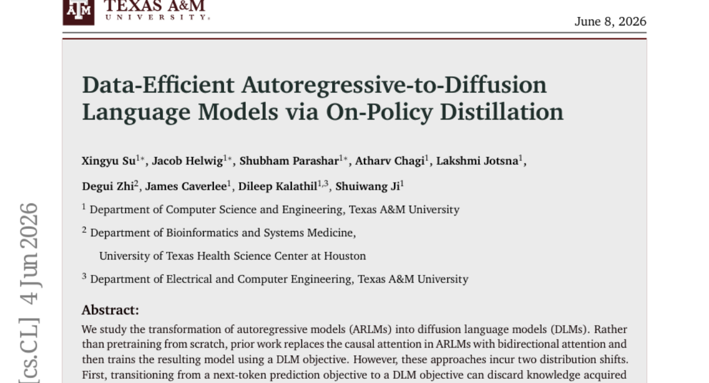

### 📌 한 줄 요약
기존 ARLM의 지식을 보존하면서 학습 효율을 극대화한 온폴리시 증류 기반의 확산 언어 모델(DLM) 변환 기술

### 🔑 핵심 포인트
- On-Policy Distillation(OPD)을 통한 ARLM의 지식 보존 및 학습-추론 불일치 해결
- 자기회귀 모델을 확산 모델로 변환하는 과정의 데이터 효율성 극대화
- DLM을 사전 학습이 아닌 효율적인 사후 학습(Post-training) 프레임워크로 정립

### 🧑‍💻 개발자 관점
거대한 ARLM을 처음부터 다시 학습시키지 않고도, 적은 비용으로 고성능의 확산 언어 모델로 전환할 수 있는 실용적인 방법론을 제시합니다.

### 🚀 실무 적용 아이디어
- 기존 오픈소스 ARLM(Llama 등)을 기반으로 양방향 어텐션 레이어를 적용한 실험 수행
- Self-OPD 방식의 학습 수렴 속도와 기존 DLM 학습 방식 간의 비교 실험
- 다양한 태스크(생성, 편집 등)에서의 성능 유지력 검증

### ⚠️ 리스크/한계
- 교사 모델(ARLM)의 성능에 대한 의존도가 높을 수 있음
- 양방향 어텐션 구조로의 변환 시 모델 아키텍처 수정 필요

### 📝 초록 기반 상세 설명
기존의 자기회귀 언어 모델(ARLM)을 확산 언어 모델(DLM)로 변환할 때, 목적 함수 변경에 따른 지식 손실과 학습-추론 간의 불일치 문제가 발생합니다. 이를 해결하기 위해 본 논문은 온폴리시 증류(On-Policy Distillation, OPD) 기법을 도입한 OPDLM을 제안합니다. OPDLM은 학생 모델이 생성한 궤적에 대해 동결된 교사 모델(ARLM)이 로짓을 제공하는 방식으로 학습하여 지식 유지와 학습-추론 불일치를 동시에 해결합니다. 실험 결과, 기존 방식 대비 15배에서 최대 7,000배 적은 토큰만으로도 강력한 성능을 달성했습니다. 결과적으로 DLM 변환을 사전 학습이 아닌 효율적인 사후 학습(Post-training) 단계로 전환했습니다.

---

## 32. [Compress-Distill: Reasoning Trace Compression for Efficient Knowledge Distillation](https://huggingface.co/papers/2606.05988)
**Upvotes**: 1 | **도입 난이도**: 중 | **신뢰도**: 상
**arXiv**: https://arxiv.org/abs/2606.05988

**태그**: LLM, Knowledge Distillation, Chain-of-Thought, Efficiency, RAG, Reasoning, Inference, Distillation, Optimization

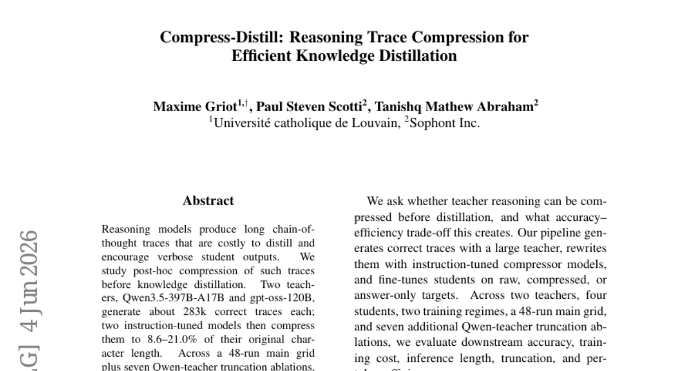

### 📌 한 줄 요약
추론 모델의 긴 Chain-of-Thought(CoT)를 압축하여 지식 증류(Distillation)의 효율성과 추론 속도를 극대화하는 방법론 연구

### 🔑 핵심 포인트
- CoT 추론 경로의 사후 압축을 통한 지식 증류 효율화
- 학습 토큰 수 감소 및 추론 시 출력 길이 단축을 통한 비용 절감
- 단순 절단(Truncation) 대비 우수한 성능과 정확도-효율성 트레이드오프 확인

### 🧑‍💻 개발자 관점
LLM의 긴 추론 과정을 효율적으로 학습시키고, 학생 모델이 불필요하게 긴 답변을 생성하는 문제를 해결하는 데 실무적인 가이드라인을 제공합니다.

### 🚀 실무 적용 아이디어
- 기존 CoT 데이터셋에 대해 모델 기반 압축 적용 후 성능 변화 측정
- 학습 비용 절감을 위한 압축률(Compression Ratio) 최적점 탐색
- 작은 규모의 학생 모델(Small Student)에 대한 압축 데이터 효과 검증

### ⚠️ 리스크/한계
- 원본 데이터를 사용했을 때보다 미세한 정확도 저하 발생 가능성
- 압축 과정에서 핵심적인 추론 논리가 손실될 위험

### 📝 초록 기반 상세 설명
최근 추론 모델은 긴 사고 과정(CoT)을 생성하지만, 이는 지식 증류 시 비용이 높고 학생 모델의 불필요한 장황함을 유발하는 문제가 있습니다. 본 연구는 지식 증류 전 단계에서 추론 경로를 사후 압축(Post-hoc compression)하는 방식을 제안합니다. 실험 결과, 압축된 데이터는 학습 토큰 수를 대폭 줄여 학습 속도를 높이고 추론 시 출력 길이를 단축시켰습니다. 다만, 원본 데이터를 사용했을 때의 정확도가 가장 높게 나타나며, 압축은 정확도와 효율성 사이의 트레이드오프를 수반합니다. 결과적으로 압축된 경로는 원본 대비 높은 토큰당 효율성을 제공하면서도 높은 수준의 정확도를 유지할 수 있음을 보여줍니다.

---

## 33. [Imaginative Perception Tokens Enhance Spatial Reasoning in Multimodal Language Models](https://huggingface.co/papers/2606.03988)
**Upvotes**: 1 | **도입 난이도**: 중 | **신뢰도**: 상
**arXiv**: https://arxiv.org/abs/2606.03988

**태그**: VLM, Spatial Reasoning, Multimodal, Representation Learning, Reasoning, Vision, Benchmark, Evaluation, Inference

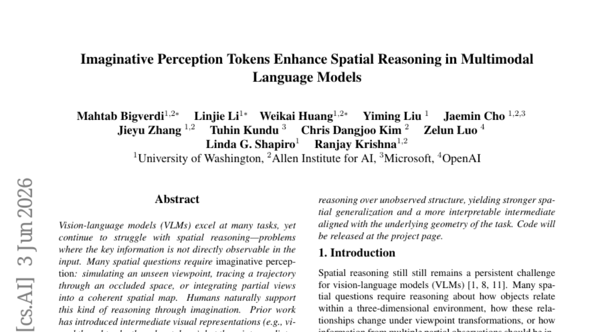

### 📌 한 줄 요약
시각적 추론 능력을 높이기 위해 보이지 않는 공간 정보를 중간 토큰 형태로 학습하는 IPT 기법 제안

### 🔑 핵심 포인트
- 보이지 않는 공간 정보를 추론하는 중간 표현인 IPT(Imaginative Perception Tokens) 도입
- 공간적 추론을 위한 3가지 특화 태스크(PET, PT, MVC) 및 데이터셋 구축
- 텍스트 기반 CoT보다 효율적이며, 이미지 생성 없이도 공간 추론 성능을 높이는 방식

### 🧑‍💻 개발자 관점
단순히 텍스트로 설명하는 것을 넘어, 모델이 내부적으로 공간 구조를 시각적으로 모델링하도록 유도하는 새로운 학습 패러다임을 제시합니다.

### 🚀 실무 적용 아이디어
- 기존 VLM 모델에 공간 정보가 담긴 중간 토큰(Latent Tokens)을 추가하여 미세 조정 실험
- 텍스트 CoT와 IPT 방식의 성능 및 추론 비용 비교 테스트
- 복잡한 3D 공간 데이터셋을 활용한 IPT의 일반화 성능 검증

### ⚠️ 리스크/한계
- 추가적인 토큰 학습을 위한 고품질의 공간 정보 데이터셋 필요
- 언어적 추론과 시각적 추론 간의 모달리티 불일치 문제 발생 가능성

### 📝 초록 기반 상세 설명
기존 VLM은 관찰되지 않은 공간 정보를 추론하는 공간적 추론(Spatial Reasoning) 능력에 한계가 있습니다. 이를 해결하기 위해 관찰된 입력을 바탕으로 가상의 시점이나 경로를 외부화하는 'Imaginative Perception Tokens(IPT)'를 도입합니다. 연구진은 Perspective Taking, Path Tracing, Multiview Counting 등 세 가지 공간 추론 태스크와 2만 개의 데이터셋을 구축했습니다. 실험 결과, IPT는 텍스트 기반의 Chain-of-Thought보다 우수한 성능을 보였으며, 특히 MVC 태스크에서 정확도를 향상시켰습니다. 결과적으로 IPT는 언어적 한계를 넘어 공간 구조를 이해하는 원칙적인 지도 학습 신호를 제공합니다.

### 🖼️ 추가 자료
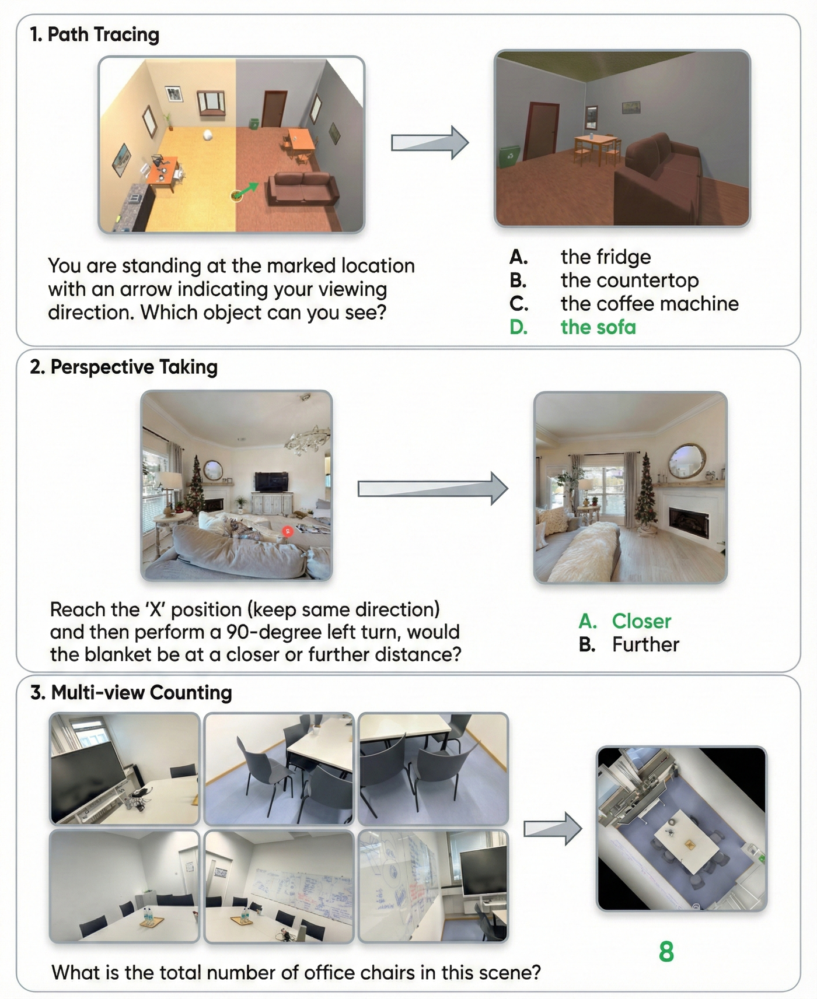

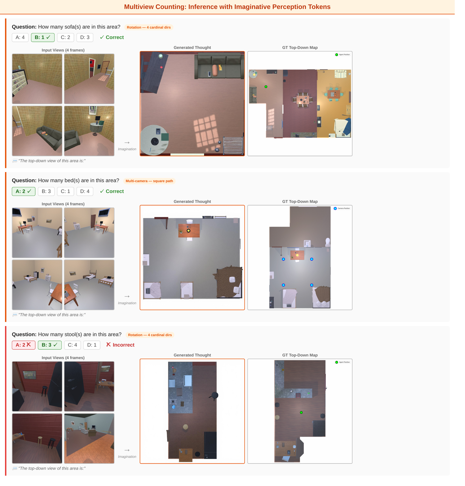
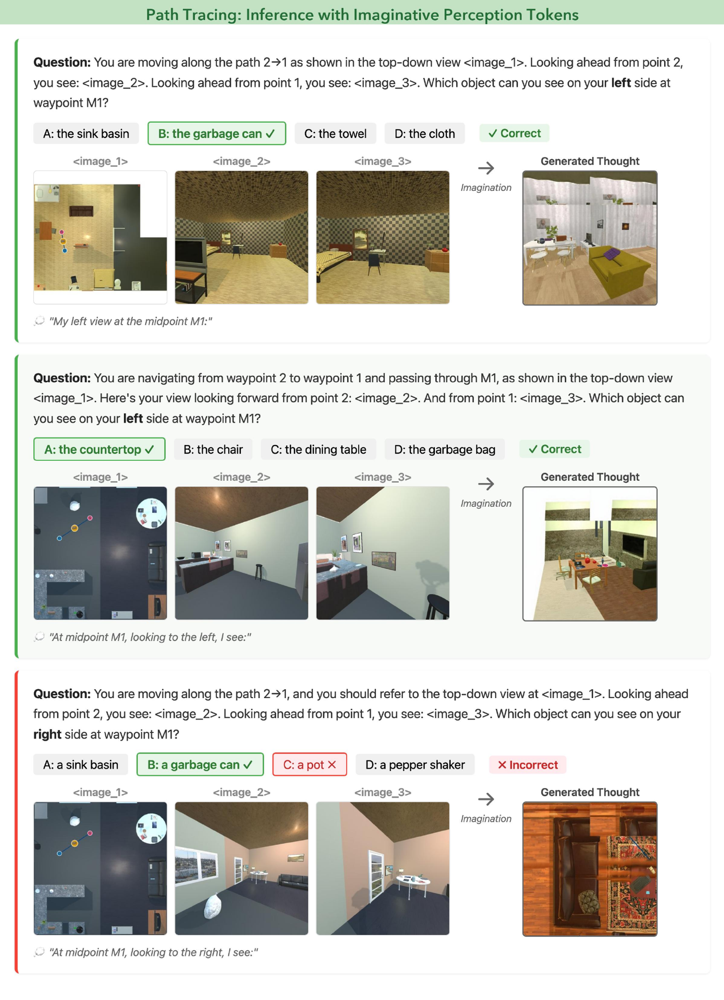

---

## 34. [Measuring Model Robustness via Fisher Information: Spectral Bounds, Theoretical Guarantees, and Practical Algorithms](https://huggingface.co/papers/2606.04767)
**Upvotes**: 1 | **도입 난이도**: 중 | **신뢰도**: 상
**arXiv**: https://arxiv.org/abs/2606.04767

**태그**: Robustness, Fisher Information, Deep Learning Theory, Model Evaluation, Vision, Evaluation, Safety

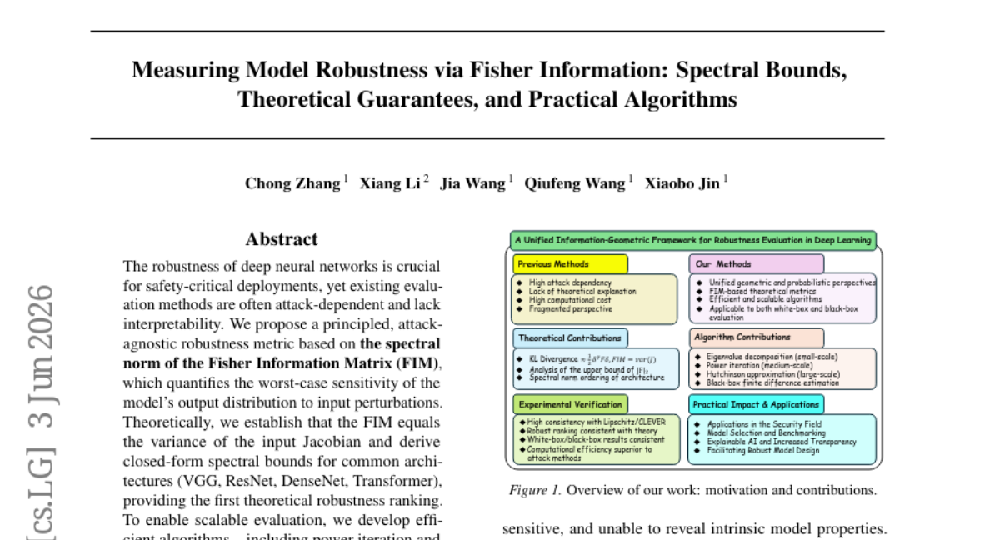

### 📌 한 줄 요약
공격 방식에 의존하지 않고 모델의 구조적 취약성을 정량화하는 Fisher Information 기반의 새로운 강건성 측정 프레임워크 제안

### 🔑 핵심 포인트
- FIM의 스펙트럴 노름을 이용한 공격 독립적(attack-agnostic) 강건성 지표 제안
- 주요 아키텍처(ResNet, Transformer 등)에 대한 이론적 스펙트럴 경계 및 강건성 순위 도출
- 대규모 모델 적용을 위한 효율적인 추정 알고리즘(Power iteration, Hutchinson-based) 개발

### 🧑‍💻 개발자 관점
특정 공격 시나리오를 시뮬레이션하지 않고도 모델 구조 자체의 취약성을 사전에 진단할 수 있어, 모델 설계 및 검증 단계에서 유용한 가이드라인을 제공합니다.

### 🚀 실무 적용 아이디어
- 현재 사용 중인 모델 아키텍처에 대해 제안된 알고리즘을 적용하여 스펙트럴 노름 계산
- 계산된 지표와 실제 적대적 공격(PGD 등) 성공률 간의 상관관계 검증
- 모델 파라미터 변경 시 지표 변화를 관찰하여 구조적 강건성 최적화 실험

### ⚠️ 리스크/한계
- FIM 계산 및 스펙트럴 노름 추정에 여전히 상당한 계산 자원이 필요할 수 있음
- 이론적 지표가 실제 복잡한 환경에서의 일반화 성능을 완벽히 대변하는지에 대한 추가 검증 필요

### 📝 초록 기반 상세 설명
딥러닝 모델의 안전한 배포를 위해 강건성 평가가 필수적이지만, 기존 방식은 특정 공격 기법에 의존적이며 해석력이 부족하다는 문제가 있습니다. 본 논문은 입력 변화에 대한 출력 분포의 최악의 민감도를 측정하기 위해 Fisher Information Matrix(FIM)의 스펙트럴 노름(Spectral Norm)을 활용한 공격 불가지론적(attack-agnostic) 지표를 제안합니다. 이론적으로 FIM과 입력 Jacobian 분산 사이의 관계를 정립하고, VGG, ResNet, Transformer 등 주요 아키텍처에 대한 폐쇄형 스펙트럴 경계(closed-form spectral bounds)를 도출하여 이론적 강건성 순위를 제시합니다. 또한, 대규모 모델 평가를 위해 Power iteration 및 Hutchinson 기반의 효율적인 알고리즘을 개발했습니다. 실험 결과, 제안된 지표는 다양한 데이터셋과 아키텍처에서 실제 적대적 공격 취약성과 높은 상관관계를 보였습니다. 결과적으로 이 프레임워크는 모델 설계 단계에서 구조적 민감도를 진단하고 더 강건한 모델을 설계하는 데 기여합니다.

---

## 35. [Reinforcement Learning from Rich Feedback with Distributional DAgger](https://huggingface.co/papers/2606.05152)
**Upvotes**: 1 | **도입 난이도**: 중 | **신뢰도**: 상
**arXiv**: https://arxiv.org/abs/2606.05152

**태그**: Reinforcement Learning, Reasoning Models, Imitation Learning, Distillation, Reasoning, Evaluation

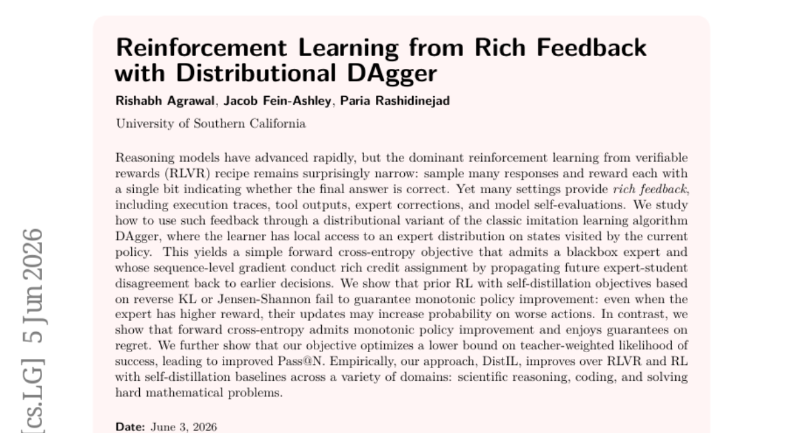

### 📌 한 줄 요약
단순 정답 여부(0/1)를 넘어 실행 로그 등 풍부한 피드백을 활용하여 모델의 추론 성능을 극대화하는 새로운 RL 알고리즘(DistIL) 제안

### 🔑 핵심 포인트
- 풍부한 피드백(실행 로그, 전문가 수정 등)을 활용하는 DAgger 기반의 분포적 학습 프레임워크 제안
- 기존 KL/JS 발산 기반 self-distillation의 정책 개선 실패 문제를 해결하는 forward cross-entropy 목적 함수 도입
- 단조적 정책 개선(monotonic improvement) 및 regret에 대한 이론적 보장 확보

### 🧑‍💻 개발자 관점
단순히 정답/오답만 주는 환경을 넘어, 에이전트의 실행 과정(trace)이나 중간 단계의 피드백을 학습에 직접 활용할 수 있는 방법론을 제시합니다.

### 🚀 실무 적용 아이디어
- 에이전트의 실행 로그(trace)를 전문가 데이터로 변환하여 학습 루프에 적용해보기
- 기존 RLHF/RLVR 파이프라인에 forward cross-entropy 목적 함수를 교체하여 성능 비교하기
- 복잡한 단계가 필요한 코딩/수학 태스크에서 Pass@N 지표 변화 관찰하기

### ⚠️ 리스크/한계
- 전문가 데이터(expert distribution)의 품질에 따라 성능이 크게 좌우될 수 있음
- 풍부한 피드백을 생성하기 위한 추가적인 데이터 처리 비용 발생 가능성

### 📝 초록 기반 상세 설명
최근 추론 모델 학습은 정답 여부만 확인하는 단순한 RLVR 방식에 의존하고 있어, 실행 로그나 전문가 피드백 같은 풍부한 정보를 활용하지 못하는 한계가 있습니다. 본 논문은 전문가 분포를 활용하는 DAgger 알고리즘의 분포적 변형을 통해 이러한 풍부한 피드백을 학습에 반영하는 방법을 연구합니다. 기존의 self-distillation 방식이 정책 개선을 보장하지 못하는 것과 달리, 제안된 forward cross-entropy 목적 함수는 단조적인 정책 개선과 regret에 대한 보장을 제공합니다. 실험 결과, 제안된 DistIL 방식은 과학적 추론, 코딩, 수학 문제 해결 등 다양한 도메인에서 기존 RLVR 및 self-distillation 방식보다 뛰어난 성능을 보였습니다. 특히 성공 확률의 하한선을 최적화함으로써 Pass@N 지표를 효과적으로 개선했습니다.

---

## 36. [Towards Human-Like Interactive Speech Recognition With Agentic Correction and Semantic Evaluation](https://huggingface.co/papers/2605.29430)
**Upvotes**: 1 | **도입 난이도**: 중 | **신뢰도**: 상
**arXiv**: https://arxiv.org/abs/2605.29430

**태그**: ASR, LLM, Agent, Human-Computer Interaction, Reasoning, Benchmark, Evaluation, Safety

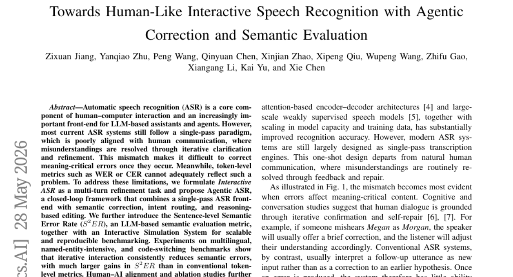

### 📌 한 줄 요약
단일 통과 방식의 ASR 한계를 극복하기 위해 LLM 기반의 반복적 교정 및 의미론적 평가를 도입한 에이전트형 대화형 음성 인식 프레임워크 제안

### 🔑 핵심 포인트
- Agentic ASR: 단일 통과 ASR과 LLM 기반의 의미 교정/의도 라우팅을 결합한 폐쇄 루프 프레임워크
- S^2ER (Sentence-level Semantic Error Rate): 토큰 단위 지표의 한계를 극복하기 위한 LLM 기반 의미론적 평가 지표
- Interactive Simulation System: 확장 가능하고 재현 가능한 벤치마킹을 위한 상호작용 시뮬레이션 환경

### 🧑‍💻 개발자 관점
LLM 기반 AI 에이전트의 음성 인터페이스를 구축할 때, 단순 텍스트 변환을 넘어 문맥적 의미를 유지하며 오류를 수정하는 고도화된 UX 구현 전략을 제공합니다.

### 🚀 실무 적용 아이디어
- 기존 ASR 결과물을 LLM에 입력하여 의미적 오류를 수정하는 에이전트 루프 프로토타입 구현
- WER/CER 외에 LLM을 활용한 의미론적 평가 지표(S^2ER 방식)를 자체 평가 파이프라인에 도입
- 고유 명사나 코드 스위칭(언어 혼용) 상황에서의 에이전트 교정 성능 테스트

### ⚠️ 리스크/한계
- 반복적인 LLM 호출로 인한 추론 지연 시간(Latency) 및 비용 증가 문제
- 에이전트의 반복적 수정 과정에서 발생할 수 있는 환각(Hallucination) 및 과잉 교정 리스크

### 📝 초록 기반 상세 설명
기존의 단일 통과(single-pass) ASR 방식은 인간의 대화 방식과 달리 오인식 발생 시 의미를 정정하기 어렵다는 한계가 있습니다. 또한 WER/CER 같은 토큰 단위 지표는 실제 의미 전달의 정확도를 충분히 반영하지 못합니다. 본 논문은 이를 해결하기 위해 ASR을 다회차 정제 작업으로 정의하고, 의미 교정 및 추론 기반 편집을 결합한 'Agentic ASR' 프레임워크를 제안합니다. 또한 LLM 기반의 의미론적 평가 지표인 S^2ER과 시뮬레이션 벤치마크 시스템을 함께 도입했습니다. 실험 결과, 반복적인 상호작용을 통해 의미론적 오류를 효과적으로 줄였으며, 특히 S^2ER 지표에서 기존 지표보다 큰 성능 향상을 확인했습니다.

---

## 37. [How Far Can Chord-Symbol Time-Series Adaptation Carry Genre Identity? Capabilities and Boundaries in Multi-Genre Chord-Symbol Modeling](https://huggingface.co/papers/2606.07334)
**Upvotes**: 0 | **도입 난이도**: 중 | **신뢰도**: 상
**arXiv**: https://arxiv.org/abs/2606.07334

**태그**: Music-AI, Parameter-Efficient-Fine-Tuning, Time-Series, Transformer, Evaluation

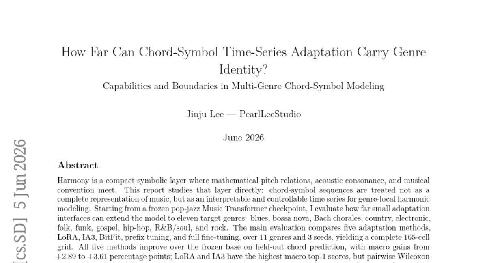

### 📌 한 줄 요약
경량 어댑터 기법을 통한 장르별 코드 진행 예측 모델의 성능 향상 및 데이터 규모에 따른 효율성 검증

### 🔑 핵심 포인트
- LoRA, IA3, BitFit 등 경량 어댑터 기법을 활용한 다중 장르 코드 예측 성능 비교
- 데이터 규모 제어 실험을 통해 어댑터 성능 차이가 데이터 크기에 의한 것임을 규명
- 코드 심볼 기반 어댑터가 장르별 화성 예측은 개선하지만, 완전한 장르 정체성 구현에는 한계가 있음을 확인

### 🧑‍💻 개발자 관점
특정 도메인(장르)에 특화된 음악 생성 모델을 구축할 때, 전체 파라미터를 튜닝하는 대신 경량 어댑터를 활용한 효율적인 미세 조정 전략을 수립하는 데 도움을 줍니다.

### 🚀 실무 적용 아이디어
- 데이터 규모를 일정하게 맞춘 상태에서 LoRA와 IA3의 성능 차이 재검증
- 코드 심볼 외에 리듬이나 멜로디 정보를 결합했을 때의 장르 식별력 변화 실험
- 잘못된 장르 어댑터 적용 시 발생하는 성능 변화(Conditioning 효과) 분석

### ⚠️ 리스크/한계
- 코드 심볼 데이터만으로는 음악적 질감이나 완전한 장르적 특성을 표현하기 어려움
- 실험 결과가 데이터 크기에 민감하게 반응하므로 데이터 불균형 시 성능 왜곡 가능성 있음

### 📝 초록 기반 상세 설명
음악의 화성적 특징을 담은 코드 심볼 시퀀스를 활용하여 장르별 화성 모델링의 한계를 탐구합니다. 기존 Pop-Jazz Music Transformer 모델을 고정한 상태에서 LoRA, IA3, BitFit 등 다양한 경량 어댑터 기법을 11개 장르에 적용하여 성능을 비교했습니다. 실험 결과, 모든 어댑터 방식이 기본 모델보다 향상된 예측 성능을 보였으나, 데이터 규모를 동일하게 맞췄을 때 LoRA의 우위가 사라지는 등 성능 차이는 데이터 의존적임이 밝혀졌습니다. 또한, 잘못된 장르 어댑터를 적용해도 기본 모델보다 성능이 높게 나타나, 이는 특정 기법의 우수성보다는 경량 조건부 학습의 효과임을 시사합니다. 결론적으로 코드 심볼 어댑터는 장르별 화성 예측을 개선하지만, 코드만으로는 완전한 장르 정체성을 구현하기에 한계가 있습니다.

---

## 38. [WorldBench: A Challenging and Visually Diverse Multimodal Reasoning Benchmark](https://huggingface.co/papers/2606.06538)
**Upvotes**: 0 | **도입 난이도**: 하 | **신뢰도**: 상
**arXiv**: https://arxiv.org/abs/2606.06538

**태그**: MLLM, Benchmark, Computer Vision, Reasoning, Multimodal, Vision, Evaluation

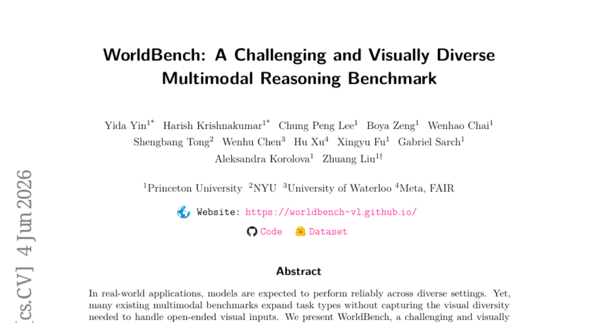

### 📌 한 줄 요약
기존 벤치마크의 시각적 편향을 극복하기 위해 광범위한 시각적 다양성을 확보한 MLLM 추론 평가 벤치마크 제안

### 🔑 핵심 포인트
- 수천 개의 시각적 개념을 포함하는 체계적인 분류 체계(Taxonomy) 구축
- 현존하는 모델들의 취약점을 공략하는 고난도 시각적 추론 질문 설계
- 기존 벤치마크 대비 압도적인 시각적 다양성 확보

### 🧑‍💻 개발자 관점
모델이 특정 데이터셋에 과적합(Overfitting)되지 않고, 실제 다양한 환경의 시각적 입력에 얼마나 강건(Robust)하게 반응하는지 검증하는 기준을 제공합니다.

### 🚀 실무 적용 아이디어
- 개발 중인 MLLM 모델을 WorldBench 데이터셋에 적용하여 시각적 취약점 파악
- 모델의 도메인별(생물, 사물 등) 인식 성능 편차 분석
- 데이터 증강(Augmentation) 전략이 시각적 다양성 확보에 미치는 영향 테스트

### ⚠️ 리스크/한계
- 수동 설계된 질문이 특정 패턴에 편향될 가능성
- 데이터셋의 규모나 특정 도메인에 대한 편중 여부 확인 필요

### 📝 초록 기반 상세 설명
현실 세계의 다양한 환경에서 MLLM의 신뢰성을 확보하는 것이 중요해졌으나, 기존 벤치마크는 작업 유형 확장에는 집중할 뿐 시각적 다양성을 충분히 반영하지 못하고 있습니다. 이를 해결하기 위해 연구진은 수천 개의 시각적 개념을 포함하는 분류 체계를 구축하고, 이를 바탕으로 광범위한 도메인을 커버하는 WorldBench를 개발했습니다. 이 벤치마크는 검색 엔진과 기존 데이터셋을 활용해 시각적 세계를 포괄적으로 재현하며, 최신 모델들이 해결하기 어려운 도전적인 질문들을 수동으로 설계했습니다. 실험 결과, WorldBench는 기존 벤치마크보다 높은 시각적 다양성을 입증했으며, 15종의 최신 MLLM을 평가한 결과 가장 강력한 모델조차 낮은 정확도를 보여 시각적 이해의 한계를 드러냈습니다.

---

## 39. [Parametric Social Identity Injection and Diversification in Public Opinion Simulation](https://huggingface.co/papers/2603.16142)
**Upvotes**: 0 | **도입 난이도**: 상 | **신뢰도**: 상
**arXiv**: https://arxiv.org/abs/2603.16142

**태그**: LLM-Agent, Representation-Learning, Social-Simulation, Parameter-Efficient-Fine-Tuning, Agent

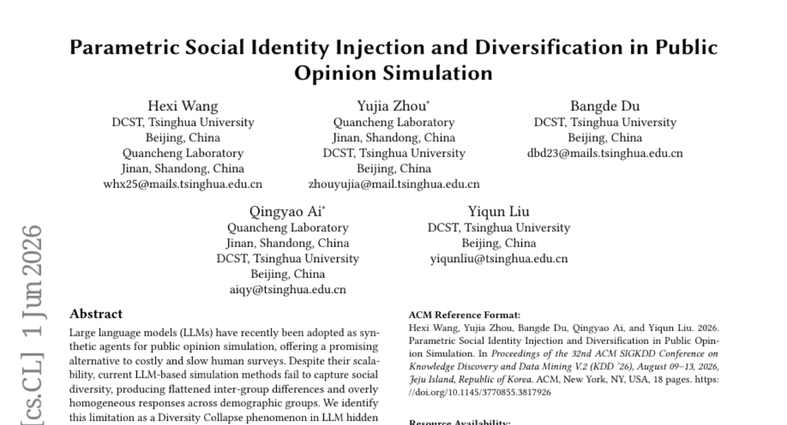

### 📌 한 줄 요약
LLM 기반 여론 시뮬레이션의 다양성 붕괴 문제를 해결하기 위해 은닉 상태(Hidden State)에 사회적 정체성을 직접 주입하는 프레임워크 제안

### 🔑 핵심 포인트
- LLM 레이어 심화 시 발생하는 '다양성 붕괴(Diversity Collapse)' 현상 규명
- 프롬프트 기반 페르소나 주입의 한계를 넘는 은닉 상태 직접 제어(PSII) 방식 제안
- 실제 여론 데이터(WVS)와의 분포 유사성(KL Divergence 감소) 및 다양성 확보

### 🧑‍💻 개발자 관점
단순 프롬프트 엔지니어링만으로는 구현하기 어려운 복잡한 페르소나와 집단 간 차이를 모델 내부 파라미터 수준에서 정교하게 제어하는 방법론을 제시합니다.

### 🚀 실무 적용 아이디어
- 모델의 중간 레이어에 특정 속성 벡터를 주입했을 때의 출력 변화 관찰
- 프롬프트 기반 페르소나와 PSII 방식 간의 응답 다양성 비교 실험
- 특정 인구통계적 편향이 모델 내부 표현에 미치는 영향 분석

### ⚠️ 리스크/한계
- 은닉 상태 조작 시 모델의 원래 언어 생성 능력이나 논리적 일관성이 저해될 위험
- 특정 데이터셋에 최적화된 주입 방식이 일반적인 도메인에 적용 가능한지에 대한 의문

### 📝 초록 기반 상세 설명
최근 LLM을 활용한 여론 시뮬레이션이 주목받고 있으나, 기존 방식은 집단 간 차이가 사라지는 '다양성 붕괴(Diversity Collapse)' 현상을 보입니다. 연구진은 모델의 레이어를 거칠수록 사회적 정체성 구분이 모호해지는 현상을 발견했습니다. 이를 해결하기 위해 프롬프트 방식이 아닌, 은닉 상태에 인구통계적 속성과 가치관을 직접 주입하는 PSII(Parametric Social Identity Injection) 프레임워크를 제안합니다. 실험 결과, PSII는 실제 세계 데이터(World Values Survey)와의 분포 일치성을 높이고 사회적 다양성을 효과적으로 복원했습니다. 이 연구는 LLM 에이전트의 정체성 제어를 표현 수준(Representation-level)에서 수행할 수 있음을 입증했습니다.

---

## 40. [Critic-R: Improving Agentic Search using Instruction-tuned Retrievers with Natural Language Introspective Feedback](https://huggingface.co/papers/2606.00590)
**Upvotes**: 0 | **도입 난이도**: 중 | **신뢰도**: 상
**arXiv**: https://arxiv.org/abs/2606.00590

**태그**: Agentic Search, RAG, Self-Correction, Retrieval Optimization, Agent, Reasoning, Vision, Evaluation, Inference

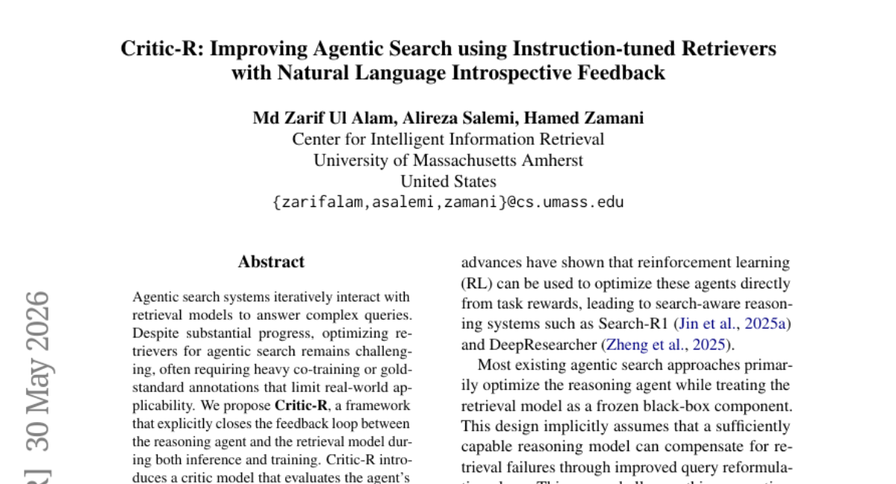

### 📌 한 줄 요약
에이전트의 추론 과정과 검색 모델 간의 피드백 루프를 통해 별도의 정답 데이터 없이도 검색 성능을 최적화하는 프레임워크

### 🔑 핵심 포인트
- 에이전트의 추론 궤적을 평가하여 검색 품질을 검증하는 크리틱 모델 도입
- Critic-R-Zero: 추론 단계에서 쿼리와 검색 지침을 반복적으로 정제하는 루프
- Critic-Embed: 수동 레이블 없이 성공/실패한 궤적을 활용한 검색 모델 최적화

### 🧑‍💻 개발자 관점
정답 데이터(Gold-standard)가 부족한 실무 환경에서 에이전트의 추론 로그만으로 검색 모델을 자동 개선할 수 있는 방법론을 제시합니다.

### 🚀 실무 적용 아이디어
- 에이전트의 추론 로그를 활용한 데이터셋 구축 실험
- 기존 RAG 파이프라인에 쿼리 재작성(Query Rewriting) 루프 적용 테스트
- 모델의 추론 단계별 검색 만족도(Sufficiency) 측정 지표 실험

### ⚠️ 리스크/한계
- 크리틱 모델의 판단 오류가 전체 시스템의 성능 저하로 이어질 위험
- 반복적인 쿼리 수정 및 최적화 과정에서 발생하는 추론 비용(Latency) 증가

### 📝 초록 기반 상세 설명
에이전트 기반 검색 시스템은 복잡한 질의 해결을 위해 반복적인 검색 과정을 거치지만, 검색 모델을 최적화하기 위해 막대한 양의 정답 데이터나 공동 학습이 필요하다는 한계가 있습니다. 이를 해결하기 위해 본 논문은 에이전트의 추론 과정과 검색 모델 사이의 피드백 루프를 명시적으로 구축하는 Critic-R 프레임워크를 제안합니다. Critic-R는 에이전트가 검색된 증거를 바탕으로 수행한 추론 과정을 평가하여, 검색된 컨텍스트가 다음 추론 단계에 충분한지를 판단하는 크리틱 모델을 도입합니다. 구체적으로는 추론 시 쿼리를 반복 수정하는 Critic-R-Zero와, 성공/실패한 궤적을 자동 감독 신호로 활용해 검색 모델을 최적화하는 Critic-Embed라는 두 가지 메커니즘을 제공합니다. 실험 결과, 제안된 방식은 멀티홉 질의 해결 성능과 검색 품질을 모두 유의미하게 향상시켰습니다.

### 🖼️ 추가 자료
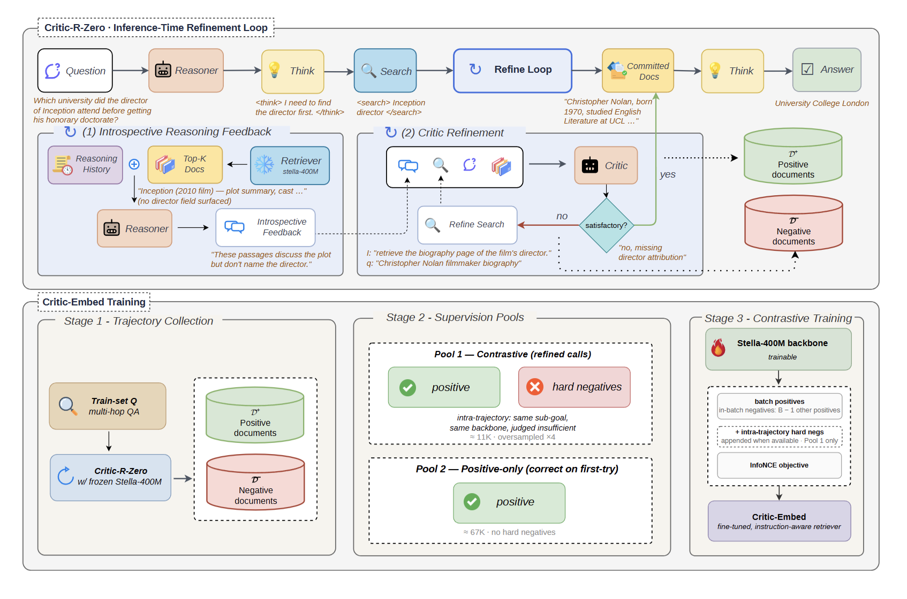

---

## 41. [CORE: Contrastive Reflection Enables Rapid Improvements in Reasoning](https://huggingface.co/papers/2605.28742)
**Upvotes**: 0 | **도입 난이도**: 중 | **신뢰도**: 상
**arXiv**: https://arxiv.org/abs/2605.28742

**태그**: Reasoning, Self-Improvement, Prompt Engineering, Efficiency, RAG, Distillation

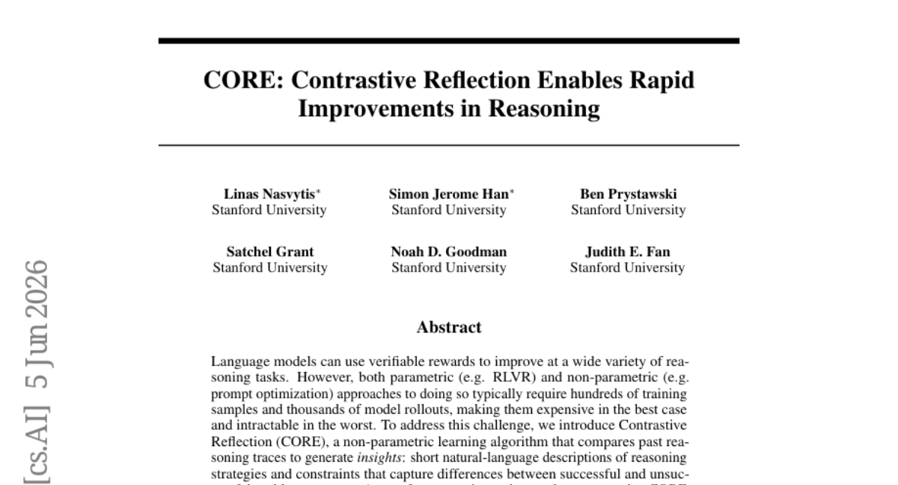

### 📌 한 줄 요약
성공과 실패 사례의 차이를 자연어로 추출하여 모델의 추론 능력을 효율적으로 개선하는 비매개변수적 학습 알고리즘 CORE 제안

### 🔑 핵심 포인트
- 성공/실패 사례 간의 차이를 자연어 통찰(Insight)로 추출하는 대조적 성찰(Contrastive Reflection) 기법 제안
- 기존 RL(GRPO) 및 RAG 기반 방식 대비 적은 샘플과 적은 롤아웃으로 더 빠른 성능 향상 달성
- 학습된 지식을 압축된 자연어 형태로 저장하여 컨텍스트 효율성 및 해석 가능성 극대화

### 🧑‍💻 개발자 관점
모델의 가중치를 직접 수정하거나 방대한 프롬프트를 사용하는 대신, 핵심적인 '실수 패턴'과 '성공 전략'을 자연어로 요약하여 관리함으로써 비용 효율적인 모델 개선이 가능합니다.

### 🚀 실무 적용 아이디어
- 특정 도메인 추론 태스크에서 성공/실패 케이스를 생성하고 이를 자연어 통찰로 변환하는 파이프라인 구축 실험
- 생성된 통찰(Insight)을 프롬프트에 포함했을 때와 직접적인 Few-shot 예시를 넣었을 때의 성능 및 토큰 효율성 비교
- 적은 수의 샘플(5개 미만) 환경에서 CORE 방식의 안정성 테스트

### ⚠️ 리스크/한계
- 추출된 자연어 통찰의 품질이 모델의 성능에 직접적인 영향을 미치므로, 통찰 생성 단계의 정교함이 필수적임
- 복잡한 추론 태스크에서 통찰이 너무 추상적일 경우 실질적인 성능 개선으로 이어지지 않을 위험이 있음

### 📝 초록 기반 상세 설명
언어 모델은 검증 가능한 보상을 통해 추론 능력을 향상시킬 수 있지만, 기존의 파라미터 업데이트나 프롬프트 최적화 방식은 막대한 샘플과 연산 비용이 발생한다는 문제가 있습니다. 이를 해결하기 위해 본 논문은 과거의 추론 흔적을 비교하여 성공과 실패의 차이를 자연어 통찰로 생성하는 'Contrastive Reflection (CORE)' 알고리즘을 도입합니다. 실험 결과, CORE는 기존의 RLVR(GRPO)이나 RAG 기반 방식보다 훨씬 적은 샘플과 롤아웃(rollout)만으로도 더 빠른 성능 향상을 달순했습니다. 특히 고정된 예산 내에서 매우 적은 수의 학습 샘플만으로도 기존 방식 대비 대등하거나 우수한 성능을 보였습니다. 또한, 학습된 지식을 압축된 자연어 형태로 저장함으로써 컨텍스트 효율성을 높이고 해석 가능성을 확보했습니다. 결과적으로 성공과 실패의 대조적 분석을 통한 통찰 추출이 모델 자가 개선의 효율적인 경로임을 입증했습니다.

---

## 42. [Augmenting Attention with Exponentially Decaying Memory Improves Query-Aware KV Sparsity](https://huggingface.co/papers/2605.28640)
**Upvotes**: 0 | **도입 난이도**: 중 | **신뢰도**: 상
**arXiv**: https://arxiv.org/abs/2605.28640

**태그**: LLM, KV-Cache, Long-Context, Inference-Optimization, Inference

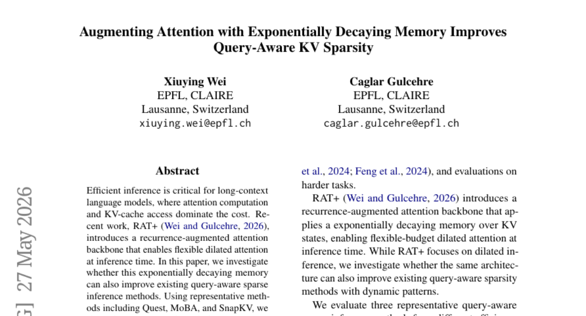

### 📌 한 줄 요약
지수적 감쇠 메모리(RAT+)를 기존의 쿼리 기반 KV 캐시 희소화(Sparsity) 기법에 결합하여 긴 문맥 처리 성능을 향상시키는 방법론 연구

### 🔑 핵심 포인트
- 지수적 감쇠 메모리(RAT+)를 기존 쿼리 기반 KV 희소화 기법(Quest, MoBA, SnapKV)에 통합
- Needle-in-a-haystack 테스트를 통한 긴 문맥 내 정보 추출 정확도 향상 입증
- 메모리 모듈이 희소 추론의 정확도를 높이는 메커니즘에 대한 가설 및 검증

### 🧑‍💻 개발자 관점
KV 캐시를 압축하여 사용하는 Sparse Attention 기법을 사용할 때, 정보 손실을 최소화하면서도 효율적인 긴 문맥 추론을 구현하는 데 유용한 인사이트를 제공합니다.

### 🚀 실무 적용 아이디어
- Quest나 SnapKV 같은 KV 캐시 압축 알고리즘에 RAT+의 재귀적 메모리 구조 적용 실험
- 모델의 컨텍스트 길이가 길어질 때 메모리 감쇠율(decay rate)이 정확도에 미치는 영향 분석
- 학습된 체크포인트와 새로 학습된 모델 간의 성능 차이 비교

### ⚠️ 리스크/한계
- 추가적인 메모리 모듈 도입에 따른 연산 복잡도 및 학습 비용 발생 가능성
- 특정 희소화 기법과의 결합 시 발생하는 하이퍼파라미터 튜닝의 어려움

### 📝 초록 기반 상세 설명
긴 문맥 언어 모델의 추론 효율성을 위해 KV 캐시 접근 비용을 줄이는 것이 핵심 과제로 떠오르고 있습니다. 기존에는 RAT+와 같은 재귀적 메모리 구조를 통해 유연한 어텐션 연산을 수행해 왔습니다. 본 논문에서는 이러한 지수적 감쇠 메모리가 Quest, MoBA, SnapKV와 같은 기존의 쿼리 기반 희소화 기법과 결합했을 때 시너지를 내는지 조사했습니다. 실험 결과, RAT+는 다양한 Needle-in-a-haystack 태스크에서 기존 방식보다 높은 정확도를 보였습니다. 또한 OLMo2-7B 모델에 해당 모듈을 추가하여 10B 토큰 규모의 지속 사전 학습을 통해 성능을 검증했습니다. 마지막으로 이 메모리 모듈이 왜 희소 추론 성능을 높이는지에 대한 가설과 실험적 근거를 제시합니다.

---

