# 2026-06-12 Daily Papers (Top 38)

## 오늘의 요약
오늘의 연구는 LLM 에이전트의 성능을 높이기 위한 환경(Environment) 설계와 장기적 작업 수행 능력에 집중되었습니다. 또한, 모델의 추론 효율성을 높이는 보상 모델링과 공간 추론을 위한 새로운 프레임워크 등 아키텍처 최적화와 추론 파이프라인 고도화 연구가 활발히 논의되었습니다.

### 오늘의 핵심 포인트
- 단순한 모델 지능 향상을 넘어, 에이전트가 상호작용하는 환경(Harness)과 데이터셋의 설계가 성능 결정의 핵심 요소로 부상하고 있습니다.
- 추론 과정을 점수 분포에 내재화하거나 가상 시점을 생성하는 등, 모델 구조 변경 없이 추론 단계의 워크플로우를 최적화하는 방법론이 제시되었습니다.
- 코딩 및 연구와 같은 장기적(Long-horizon) 과제를 해결하기 위해 지식 누적 및 자동화된 데이터 큐레이션 기술이 중요하게 다뤄졌습니다.

**오늘의 태그**: AI Agent, LLM Optimization, Benchmark, Software Engineering, Reasoning

## 1. [Redesign Mixture-of-Experts Routers with Manifold Power Iteration](https://huggingface.co/papers/2606.12397)
**Upvotes**: 74 | **도입 난이도**: 중 | **신뢰도**: 상
**arXiv**: https://arxiv.org/abs/2606.12397

**태그**: MoE, Router Design, Optimization, Deep Learning, Safety

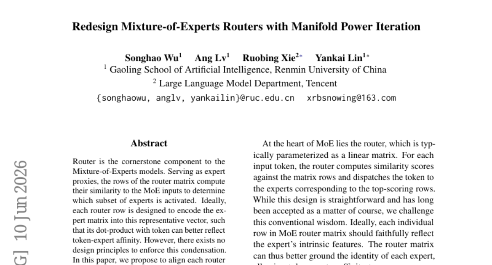

### 📌 한 줄 요약
라우터 행렬을 전문가(Expert) 행렬의 주성분 방향과 일치시켜 MoE 모델의 전문가 선택 효율성을 극대화하는 기법

### 🔑 핵심 포인트
- 라우터 행을 전문가 행렬의 주성분 방향(Principal Singular Direction)에 정렬하는 새로운 설계 원칙 제안
- 효율적이고 안정적인 수렴을 위한 'Power-then-Retract' 기반의 Manifold Power Iteration(MPI) 알고리즘 개발
- 다양한 파라미터 규모(1B~11B)에서의 실험을 통한 MoE 모델 성능 최적화 입증

### 🧑‍💻 개발자 관점
MoE 모델 설계 시 라우터와 전문가 간의 수학적 정렬을 통해 토큰-전문가 매칭의 정확도를 높일 수 있는 방법론을 제시합니다.

### 🚀 실무 적용 아이디어
- 기존 MoE 모델의 라우터 가중치와 전문가 가중치 간의 코사인 유사도 분석
- MPI 알고리즘을 기존 라우터 학습 루프에 통합하여 수렴 속도 및 성능 변화 관찰
- 다양한 전문가 행렬 크기(Expert dimension)에 따른 MPI의 안정성 테스트

### ⚠️ 리스크/한계
- 학습 과정에서 추가적인 연산 비용(Power iteration)이 발생할 수 있음
- 특정 규모 이상의 모델에서 수렴 안정성이 유지되는지에 대한 추가 검증 필요

### 📝 초록 기반 상세 설명
MoE 모델에서 라우터는 토큰과 전문가 간의 유사도를 계산하여 활성화할 전문가를 결정하는 핵심 역할을 합니다. 하지만 기존 라우터 설계에는 전문가 행렬의 정보를 효과적으로 압축하여 표현할 수 있는 명확한 원칙이 부족했습니다. 본 논문은 라우터 행렬의 각 행을 해당 전문가 행렬의 주 특이 방향(Principal Singular Direction)과 정렬하는 방식을 제안합니다. 이를 위해 'Power-then-Retract' 패러다임을 기반으로 한 Manifold Power Iteration(MPI) 알고리즘을 도입하여 효율성과 안정성을 동시에 확보했습니다. 이론적으로 MPI는 라우터 행을 전문가의 주성분 방향으로 수렴시킴을 증명했습니다. 1B에서 11B 규모의 다양한 MoE 모델 사전 학습 실험을 통해 이 정렬 방식이 모델 성능 향상에 기여함을 확인했습니다.

---

## 2. [Toward Generalist Autonomous Research via Hypothesis-Tree Refinement](https://huggingface.co/papers/2606.11926)
**Upvotes**: 66 | **도입 난이도**: 상 | **신뢰도**: 상
**arXiv**: https://arxiv.org/abs/2606.11926

**태그**: AI Agent, Autonomous Research, Multi-Agent System, Iterative Optimization, Agent, RAG, Vision, Evaluation, Distillation

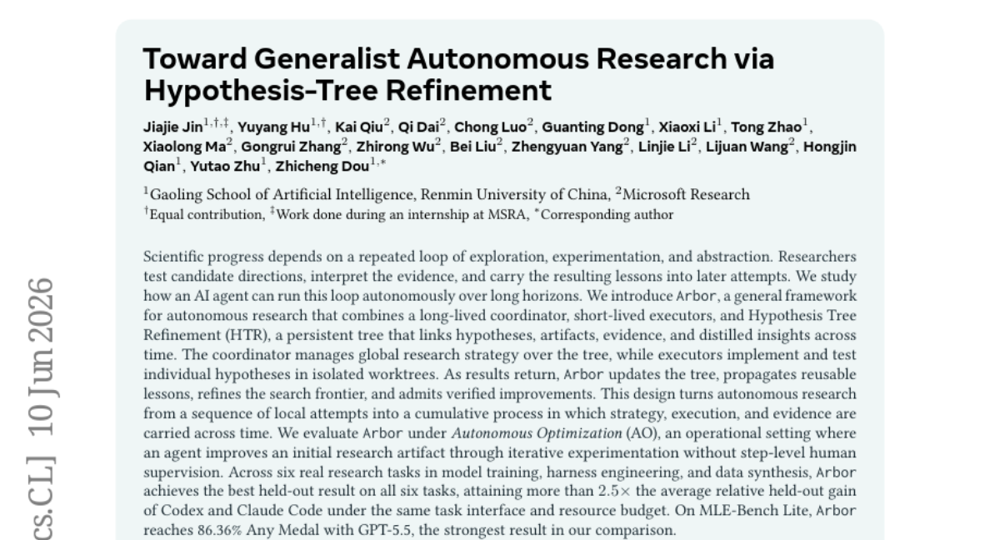

### 📌 한 줄 요약
가설-증거-통찰을 트리 구조로 관리하여 장기적인 자율 연구를 수행하는 에이전트 프레임워크 Arbor 제안

### 🔑 핵심 포인트
- HTR(Hypothesis Tree Refinement): 가설과 증거를 트리 구조로 연결하여 지식을 누적하는 메커니즘
- Coordinator-Executor 구조: 글로벌 전략 수립과 격리된 환경에서의 실험 실행 분리
- 장기적 맥락 유지: 단순 반복이 아닌, 이전 실험의 통찰을 다음 단계로 전파하는 누적적 연구 프로세스

### 🧑‍💻 개발자 관점
단순한 Task 수행을 넘어, 실험 결과로부터 배운 점을 다음 실험에 반영하는 '자기 개선형' 에이전트 설계 패턴을 제시합니다.

### 🚀 실무 적용 아이디어
- 에이전트 설계 시 실험 결과와 가설을 구조화된 데이터(Tree/Graph)로 저장하는 로직 구현해보기
- 단일 루프가 아닌, 전략(Planner)과 실행(Worker) 계층을 분리한 멀티 에이전트 환경 구축하기
- 실험 실패 사례를 '부정적 증거'로 데이터베이스화하여 재사용하는 워크플로우 테스트하기

### ⚠️ 리스크/한계
- 트리 구조가 복잡해질수록 관리 비용 및 토큰 소모량 급증 가능성
- 잘못된 통찰(False Insight)이 트리 전체로 전파될 경우 발생하는 오류 누적 리스크

### 📝 초록 기반 상세 설명
과학적 연구는 탐색, 실험, 추상화의 반복적인 루프를 통해 발전하지만, 기존 AI 에이전트는 장기적인 맥락 유지에 어려움이 있었습니다. 이를 해결하기 위해 연구 전략을 관리하는 코디네이터와 개별 실험을 수행하는 실행기, 그리고 지식의 축적을 위한 가설 트리 정제(HTR) 기술을 결합한 Arbor 프레임워크를 도입합니다. HTR는 가설, 결과물, 증거, 통찰을 트리 구조로 연결하여 시간이 지나도 재사용 가능한 지식을 유지합니다. 실험 결과, Arbor는 모델 학습 및 데이터 합성 등 다양한 자율 최적화(AO) 작업에서 기존 모델 대비 월등한 성능 향상을 달성했습니다. 특히 MLE-Bench Lite에서 강력한 성능을 입증하며 자율 연구 에이전트의 가능성을 보여주었습니다.

---

## 3. [Claw-SWE-Bench: A Benchmark for Evaluating OpenClaw-style Agent Harnesses on Coding Tasks](https://huggingface.co/papers/2606.12344)
**Upvotes**: 55 | **도입 난이도**: 하 | **신뢰도**: 상
**arXiv**: https://arxiv.org/abs/2606.12344

**태그**: Agent, Benchmark, Software Engineering, LLM, Evaluation

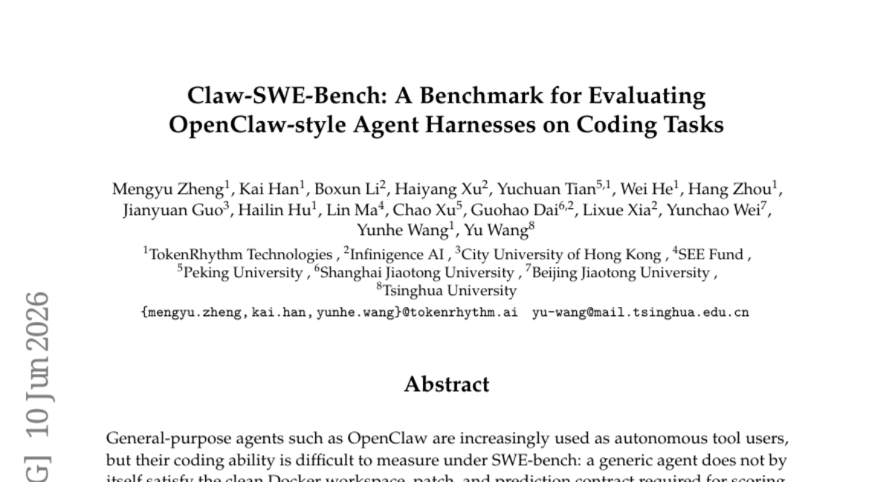

### 📌 한 줄 요약
코딩 에이전트의 성능을 공정하게 비교하기 위해 하네스(Harness) 설계와 비용 효율성을 평가 지표로 도입한 새로운 벤치마크 제안

### 🔑 핵심 포인트
- 에이전트 하네스(Claw) 간의 공정한 비교를 위한 표준 프로토콜 및 벤치마크 구축
- 모델 성능뿐만 아니라 런타임 예산, 패치 추출 방식, 비용 효율성을 평가 지표에 포함
- 8개 언어 및 43개 저장소를 포함한 대규모 데이터셋과 빠른 검증을 위한 Lite 버전 제공

### 🧑‍💻 개발자 관점
단순히 모델의 지능만 높이는 것이 아니라, 에이전트가 코드를 수정하고 실행하는 '환경(Harness)' 설계가 실제 코딩 작업 성공률에 결정적인 영향을 미침을 시사합니다.

### 🚀 실무 적용 아이디어
- 제공된 데이터셋을 활용하여 현재 개발 중인 에이전트 하네스의 성능 측정
- 동일 모델에서 어댑터(Adapter) 설계 변경에 따른 Pass@1 변화량 테스트
- 비용 효율적인 에이전트 운영을 위해 Lite 버전 기반의 벤치마킹 수행

### ⚠️ 리스크/한계
- 하네스 설계 방식에 따라 모델의 잠재력이 과대 혹은 과소 평가될 위험이 있음
- 실제 복잡한 소프트웨어 엔지니어링 워크플로우를 완전히 반영하기에는 한계가 있을 수 있음

### 📝 초록 기반 상세 설명
범용 코딩 에이전트가 증가하고 있으나, 기존 SWE-bench는 에이전트의 작업 환경(Harness) 차이를 통제하지 못해 공정한 성능 측정이 어렵습니다. 이를 해결하기 위해 프롬프트, 런타임 예산, 워크스페이스 계약 등을 표준화한 Claw-SWE-Bench를 제안합니다. 8개 언어와 43개 저장소를 포함한 350개의 인스턴스로 구성되었으며, 빠른 검증을 위한 Lite 버전도 함께 제공합니다. 실험 결과, 동일 모델에서도 어댑터 설계에 따라 성능 차이가 극명하게 나타났으며, 모델 선택보다 하네스 설계가 성능에 큰 영향을 미침을 확인했습니다. 이 벤치마크는 에이전트의 성능뿐만 아니라 운영 비용과 하네스 설계의 중요성을 평가의 핵심 축으로 다룹니다.

### 🖼️ 추가 자료
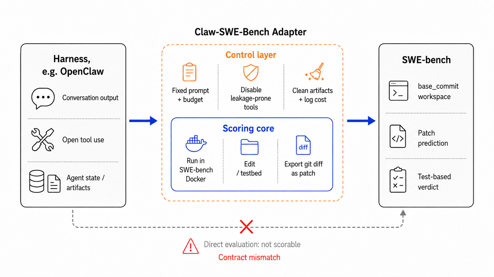

---

## 4. [Agentic Environment Engineering for Large Language Models: A Survey of Environment Modeling, Synthesis, Evaluation, and Application](https://huggingface.co/papers/2606.12191)
**Upvotes**: 55 | **도입 난이도**: 하 | **신뢰도**: 상
**arXiv**: https://arxiv.org/abs/2606.12191

**태그**: LLM Agent, Environment Engineering, Survey, Co-evolution, Agent, Evaluation

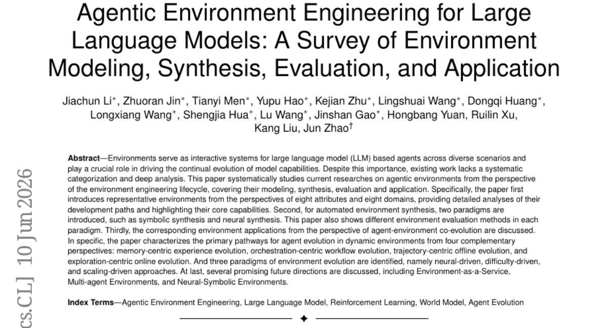

### 📌 한 줄 요약
LLM 에이전트의 성능 향상을 위한 환경(Environment) 설계, 합성, 평가 및 활용 전 과정을 체계적으로 정리한 서베이 논문

### 🔑 핵심 포인트
- 환경 엔지니어링 라이프사이클(모델링, 합성, 평가, 적용)에 대한 체계적 프레임워크 제시
- 심볼릭(Symbolic) 및 뉴럴(Neural) 방식의 자동화된 환경 합성 패러다임 분류
- 에이전트-환경 공진화를 위한 4가지 진화 경로 및 3가지 환경 진화 패러다임 정의

### 🧑‍💻 개발자 관점
에이전트의 성능이 모델 자체뿐만 아니라 학습/테스트 환경의 설계 품질에 의존함을 이해하고, 고도화된 에이전트 시스템을 구축하기 위한 가이드라인을 제공합니다.

### 🚀 실무 적용 아이디어
- 현재 개발 중인 에이전트의 테스트 환경이 특정 도메인에 편향되어 있는지 체크리스트 작성
- 심볼릭 vs 뉴럴 환경 합성 방식 중 프로젝트 목적에 적합한 방식 검토
- 에이전트의 경험 축적(Memory-centric)을 위한 환경 구조 설계 적용

### ⚠️ 리스크/한계
- 제시된 프레임워크가 매우 포괄적이어서 특정 도메인에 즉각 적용 시 복잡도가 높을 수 있음
- 환경의 복잡도가 증가함에 따라 평가 비용 및 연산 자원 문제가 발생할 수 있음

### 📝 초록 기반 상세 설명
LLM 기반 에이전트의 발전을 위해서는 상호작용 가능한 환경이 필수적이지만, 기존 연구들은 체계적인 분류와 분석이 부족한 상태입니다. 본 논문은 환경 엔지니어링 라이프사이클 관점에서 모델링, 합성, 평가 및 애플리케이션을 포괄적으로 연구합니다. 먼저 8가지 속성과 8개 도메인을 기준으로 대표적인 환경들을 분석하고, 자동화된 환경 합성을 위한 심볼릭 및 뉴럴 패러다임을 소개합니다. 또한 에이전트와 환경의 공진화(Co-evolution) 관점에서 메모리, 워크플로우, 궤적, 탐색 중심의 진화 경로를 제시합니다. 마지막으로 향후 연구 방향으로 Environment-as-a-Service 및 멀티 에이전트 환경 등을 제안합니다.

---

## 5. [Beyond Scalar Rewards by Internalizing Reasoning into Score Distributions](https://huggingface.co/papers/2606.09076)
**Upvotes**: 49 | **도입 난이도**: 상 | **신뢰도**: 상
**arXiv**: https://arxiv.org/abs/2606.09076

**태그**: Reward Modeling, VLM, Knowledge Distillation, Text-to-Image, Reasoning, Vision, Evaluation, Inference, Distillation

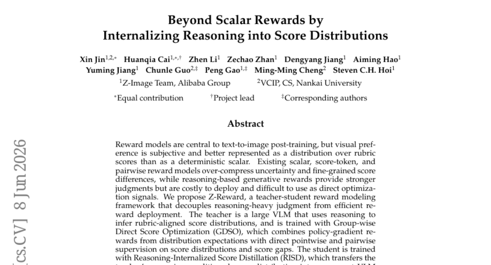

### 📌 한 줄 요약
추론 과정을 점수 분포에 내재화하여, 높은 성능의 추론형 보상 모델을 효율적인 경량 모델로 증류하는 Z-Reward 프레임워크 제안

### 🔑 핵심 포인트
- GDSO(Group-wise Direct Score Optimization): 분포 기대값과 점수 차이를 결합하여 추론 기반 점수 분포를 학습하는 방법론
- RISD(Reasoning-Internalized Score Distillation): 추론 체인 없이도 Teacher의 추론 능력이 반영된 점수 분포를 Student 모델로 전이하는 기술
- Teacher-Student 구조를 통한 추론 성능과 배포 효율성 간의 트레이드오프 해결

### 🧑‍💻 개발자 관점
고비용의 추론(Reasoning) 과정을 모델의 가중치(점수 분포)에 내재화함으로써, 추론 시에는 빠른 속도를 유지하면서도 정교한 보상 신호를 얻을 수 있습니다.

### 🚀 실무 적용 아이디어
- 기존 스칼라 보상 모델과 제안된 분포 기반 보상 모델의 최적화 결과 비교 실험
- VLM 기반의 Teacher 모델을 활용한 고품질 데이터셋 구축 파이프라인 테스트
- 경량화된 Student 모델이 복잡한 추론 없이도 정교한 점수 차이를 재현하는지 검증

### ⚠️ 리스크/한계
- Teacher 모델의 품질이 Student 모델의 성능 한계로 작용할 수 있음
- 점수 분포를 직접 최적화 신호로 사용할 때의 학습 안정성 확보 필요

### 📝 초록 기반 상세 설명
텍스트-이미지 생성 모델의 사후 학습에서 시각적 선호도는 주관적이므로 단일 스칼라 값보다 점수 분포로 표현하는 것이 더 적합합니다. 기존의 스칼라 또는 쌍체 비교 방식은 불확실성과 미세한 점수 차이를 충분히 반영하지 못하며, 추론 기반 모델은 성능은 좋지만 추론 비용이 높다는 단점이 있습니다. 이를 해결하기 위해 본 논문은 추론 기반 판단과 효율적인 배포를 분리하는 Z-Reward 프레임워크를 제안합니다. 대규모 VLM이 추론을 통해 점수 분포를 생성하는 Teacher 모델과, 이를 효율적인 모델로 전이하는 Student 모델로 구성됩니다. 실험 결과, 제안된 방식은 인간 선호도 정확도에서 기존 SFT 및 GRPO 모델을 상회하였으며, 텍스트-이미지 최적화 시에도 높은 성능 향상을 보였습니다.

---

## 6. [TRL-Bench: Standardizing Cross-Paradigm Representation-Level Evaluation of Tabular Encoders](https://huggingface.co/papers/2606.09323)
**Upvotes**: 46 | **도입 난이도**: 중 | **신뢰도**: 상
**arXiv**: https://arxiv.org/abs/2606.09323

**태그**: Tabular Learning, Representation Learning, Benchmark, Data Engineering, Evaluation

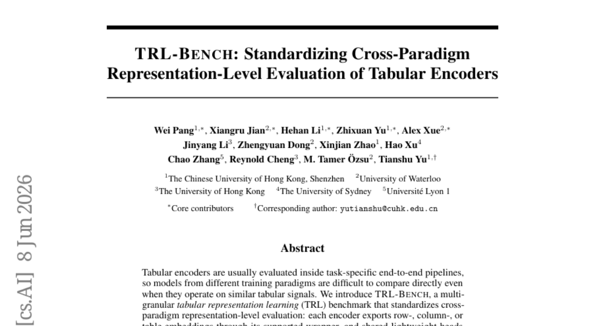

### 📌 한 줄 요약
다양한 학습 패러다임의 표 형식(Tabular) 인코더를 동일한 조건에서 비교할 수 있는 표준 벤치마크인 TRL-Bench 제안

### 🔑 핵심 포인트
- 행, 열, 테이블 단위의 다중 입도(multi-granular) 표현 학습 평가 프레임워크 구축
- 서로 다른 학습 패러다임을 가진 인코더들을 동일 조건에서 비교 가능한 표준 프로토콜 제공
- 태스크 특성에 따른 인코더 성능 차이를 규명하는 3가지 특화 벤치마크(CTbench, Rbench, DLTE) 운영

### 🧑‍💻 개발자 관점
특정 도메인에 특화된 표 데이터 처리 모델을 선택할 때, 단순 리더보드 순위가 아닌 태스크 목적에 맞는 인코더를 선별할 수 있는 기준을 제공합니다.

### 🚀 실무 적용 아이디어
- 보유 중인 표 데이터셋에 TRL-Bench의 래퍼를 적용하여 인코더 성능 측정
- 텍스트 기반 인코더와 표 특화 인코더의 태스크별 성능 차이 비교 실험
- 복합적인 데이터 레이크 환경(DLTE)에서의 인코더 조합 최적화 테스트

### ⚠️ 리스크/한계
- 표준화된 환경에서의 성능이 실제 복잡한 엔드투엔드 시스템에서도 동일하게 유지될지 검증 필요
- 데이터셋의 규모와 특성에 따라 인코더의 강점이 급격히 변할 수 있음

### 📝 초록 기반 상세 설명
기존의 표 형식 인코더 평가는 특정 태스크에 종속된 엔드투엔드 파이프라인 내에서 이루어져 서로 다른 학습 방식의 모델들을 직접 비교하기 어려웠습니다. 이를 해결하기 위해 행(row), 열(column), 테이블(table) 단위의 임베딩을 표준화된 방식으로 추출하고 평가하는 TRL-Bench를 도입했습니다. 연구진은 50개의 OpenML 테이블과 대규모 DLTE 데이터셋을 포함한 정교한 벤치마크 자산을 구축했습니다. 실험 결과, 단일 모델이 모든 태스크에서 우월하기보다는 태스크의 특성에 따라 최적의 인코더가 달라짐을 확인했습니다. 결과적으로 TRL-Bench는 재사용 가능한 표 형식 표현력을 측정하기 위한 공통 프로토콜을 제공합니다.

---

## 7. [Reason, Then Re-reason: Cross-view Revisiting Improves Spatial Reasoning](https://huggingface.co/papers/2606.11683)
**Upvotes**: 27 | **도입 난이도**: 하 | **신뢰도**: 상
**arXiv**: https://arxiv.org/abs/2606.11683

**태그**: MLLM, Spatial Reasoning, Video Generation, Inference-time Optimization, RAG, Reasoning, Vision, Video, Evaluation, Inference

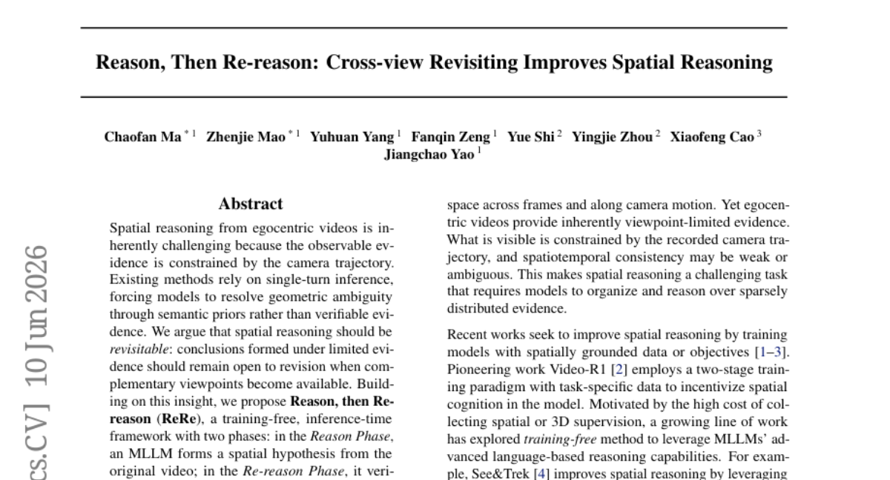

### 📌 한 줄 요약
추가적인 가상 시점(Novel-view)을 생성하여 기존의 공간 추론 오류를 수정하는 ReRe 프레임워크

### 🔑 핵심 포인트
- Reason-then-Re-reason: 가설 수립 후 새로운 시점 정보를 통해 이를 검증/수정하는 2단계 추론 프로세스
- Geometry-to-Video Pipeline: 예측된 3D 기하 정보를 바탕으로 전략적으로 보완적인 시점의 영상을 합성
- Training-free Inference: 모델 구조 변경 없이 추론 단계에서의 워크플로우 최적화만으로 성능 향상

### 🧑‍💻 개발자 관점
모델의 아키텍처를 건드리지 않고도 추론 파이프라인(Inference-time) 설계만으로 공간 지각 능력을 획기적으로 높일 수 있는 방법론을 제시합니다.

### 🚀 실무 적용 아이디어
- 오픈소스 MLLM에 Geometry-to-Video 파이프라인을 결합하여 공간 추론 벤치마크 테스트
- 합성된 시점 영상이 모델의 기존 비디오 인터페이스와 얼마나 잘 호환되는지 검증
- 추론 단계에서의 연산 비용(Inference latency) 증가량 측정

### ⚠️ 리스크/한계
- 추가적인 영상 생성 과정으로 인한 추론 시간(Latency) 증가
- 잘못된 3D 기하 예측이 생성된 영상에 반영될 경우 추론 오류가 증폭될 위험

### 📝 초록 기반 상세 설명
1인칭 시점(Egocentric) 비디오에서의 공간 추론은 카메라 움직임으로 인한 기하학적 모호성 때문에 매우 어렵습니다. 기존 방식은 단 한 번의 추론에 의존하여 불충분한 증거를 의미론적 사전 지식으로 해결하려 하는 한계가 있습니다. 본 논문은 추론 결과가 새로운 시점의 정보에 따라 수정될 수 있어야 한다는 'Revisitable' 개념을 제안합니다. 이를 위해 제안된 ReRe 프레임워크는 초기 가설을 세우는 'Reason' 단계와 합성된 새로운 시점 영상을 통해 이를 검증/수정하는 'Re-reason' 단계로 구성됩니다. 특히 Geometry-to-Video 파이프라인을 통해 모델이 이해하기 쉬운 보완적 시점 영상을 생성하여 별도의 아키텍처 수정 없이 성능을 극대화합니다. 실험 결과, ReRe는 오픈소스 MLLM의 성능을 독점적 SOTA 모델 수준으로 끌어올렸습니다.

---

## 8. [DeNovoSWE: Scaling Long-Horizon Environments for Generating Entire Repositories from Scratch](https://huggingface.co/papers/2606.10728)
**Upvotes**: 27 | **도입 난이도**: 중 | **신뢰도**: 상
**arXiv**: https://arxiv.org/abs/2606.10728

**태그**: LLM-Agent, Code-Generation, Dataset, Software-Engineering, Agent, Benchmark

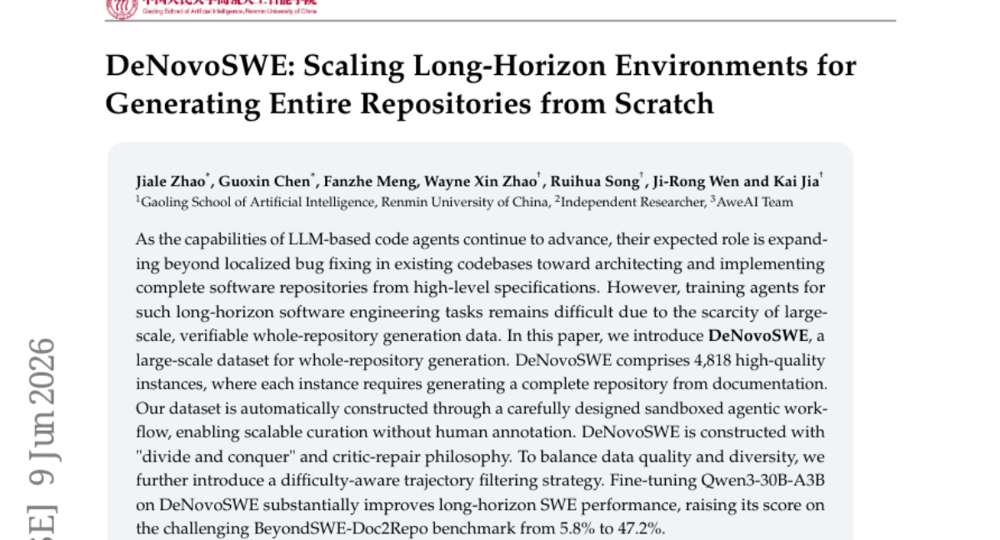

### 📌 한 줄 요약
전체 저장소 생성 학습을 위한 대규모 데이터셋 DeNovoSWE를 통해 LLM 에이전트의 장기적 소프트웨어 엔지니어링 능력을 극대화함

### 🔑 핵심 포인트
- 전체 저장소 생성을 위한 대규모 고품질 데이터셋 DeNovoSWE 구축
- 샌드박스 기반 에이전트 워크플로우를 통한 자동화된 데이터 큐레이션
- 난이도 인지형 궤적 필터링을 통한 데이터 품질 및 다양성 균형 확보

### 🧑‍💻 개발자 관점
단순 코드 작성을 넘어 요구사항 명세(Documentation)로부터 전체 프로젝트 구조를 설계하고 구현하는 에이전트 개발의 기반을 제공합니다.

### 🚀 실무 적용 아이디어
- DeNovoSWE 데이터셋의 생성 워크플로우 구조 분석
- 제안된 'divide and conquer' 전략을 기존 코드 생성 에이전트에 적용 실험
- 특정 도메인(예: 웹 프레임워크)에 특화된 데이터셋 구축 시 샌드박스 환경 설계 참고

### ⚠️ 리스크/한계
- 자동 생성된 데이터셋의 잠재적 편향성 및 품질 검증 필요성
- 복잡한 의존성 관계를 가진 실제 대규모 프로젝트로의 확장성 문제

### 📝 초록 기반 상세 설명
LLM 기반 코드 에이전트의 역할이 단순 버그 수정을 넘어 전체 저장소 설계 및 구현으로 확장되고 있습니다. 그러나 장기적인 소프트웨어 엔지니어링 작업을 위한 검증 가능한 대규모 데이터셋이 부족하여 학습에 어려움이 있었습니다. 본 논문은 문서로부터 전체 저장소를 생성하는 4,818개의 고품질 인스턴스를 포함한 DeNovoSWE 데이터셋을 제안합니다. 이 데이터셋은 '분할 정복(divide and conquer)' 및 '비판-수정(critic-repair)' 철학을 바탕으로 샌드박스 에이전트 워크플로우를 통해 자동 구축되었습니다. 또한 데이터 품질과 다양성을 확보하기 위해 난이도 인지형 궤적 필터링 전략을 도입했습니다. 실험 결과, DeNovoSWE로 Qwen3-30B-A3B를 미세 조정했을 때 BeyondSWE-Doc2Repo 벤치마크 점수가 5.8%에서 47.2%로 대폭 향상되었습니다.

---

## 9. [World Pilot: Steering Vision-Language-Action Models with World-Action Priors](https://huggingface.co/papers/2606.12403)
**Upvotes**: 22 | **도입 난이도**: 상 | **신뢰도**: 상
**arXiv**: https://arxiv.org/abs/2606.12403

**태그**: VLA, World-Model, Robot-Manipulation, Reinforcement-Learning, Vision, Video, Benchmark

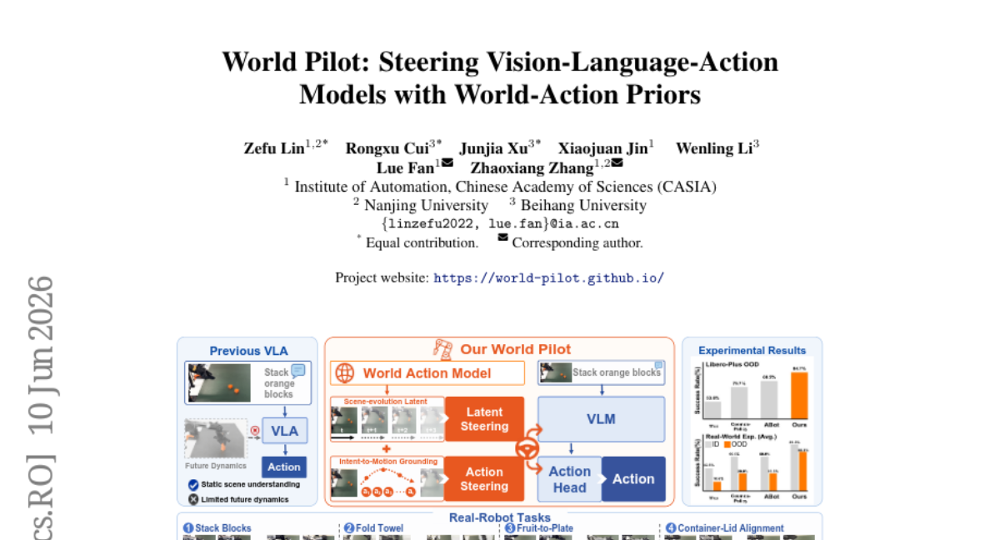

### 📌 한 줄 요약
정적 이미지 기반 VLA 모델의 한계를 극복하기 위해 세계 모델(World Model)의 동적 정보를 결합하여 로봇 조작 성능을 극대화한 프레임워크

### 🔑 핵심 포인트
- World-Action Model (WAM)을 활용한 두 가지 보완적 제어 경로(Latent & Action Steering) 도입
- 정적 데이터의 한계를 넘어 물리적 역학 및 장면 변화를 예측하는 동적 사전 지식 결합
- 시점 변화, 물체 변형 등 다양한 OOD(Out-of-Distribution) 환경에서의 강력한 강건성 확보

### 🧑‍💻 개발자 관점
단순히 이미지를 보고 명령을 수행하는 것을 넘어, 물리적 움직임의 예측(Dynamics)을 모델에 어떻게 통합할지에 대한 실질적인 아키텍처 가이드를 제공합니다.

### 🚀 실무 적용 아이디어
- 기존 VLA 모델에 사전 학습된 비디오 생성 모델(Video Generation Model)을 결합하여 성능 변화 관찰
- Latent Steering과 Action Steering 중 어떤 경로가 특정 조작 작업에 더 큰 영향을 미치는지 분석
- 실제 로봇 환경에서 시점 변화(Viewpoint shift)에 따른 강건성 테스트 수행

### ⚠️ 리스크/한계
- World Model의 예측 오류가 발생할 경우 전체 제어 루프에 부정적인 영향을 미칠 가능성
- 추가적인 WAM 모델 운용에 따른 연산 복잡도 및 실시간성 저하 우려

### 📝 초록 기반 상세 설명
기존의 Vision-Language-Action (VLA) 모델은 대규모 사전 학습을 통해 의미론적 이해는 뛰어나지만, 연속적이고 접촉이 빈번한 로봇 조작의 물리적 역학을 포착하는 데 한계가 있습니다. 이를 해결하기 위해 제안된 World Pilot은 World-Action Model (WAM)의 사전 지식을 정책 모델에 주입하는 프레임워크입니다. 구체적으로는 장면 변화를 예측하는 'Latent Steering'과 예상 궤적을 제공하는 'Action Steering'이라는 두 가지 경로를 통해 VLA를 가이드합니다. 이러한 방식은 비디오로 학습된 세계 모델만으로도 효과적인 장면 진화 정보를 제공할 수 있게 합니다. 실험 결과, LIBERO-Plus 제로샷 벤치마크와 실제 로봇 환경에서 시점, 기하학적 구조, 변형 가능한 물체 등 다양한 변화(OOD) 상황에서도 최고 수준의 성공률을 달성했습니다.

---

## 10. [On Subquadratic Architectures: From Applications to Principles](https://huggingface.co/papers/2606.12364)
**Upvotes**: 20 | **도입 난이도**: 중 | **신뢰도**: 상
**arXiv**: https://arxiv.org/abs/2606.12364

**태그**: Subquadratic, xLSTM, Sequence Modeling, Time-series, Code-LLM, Evaluation, Distillation

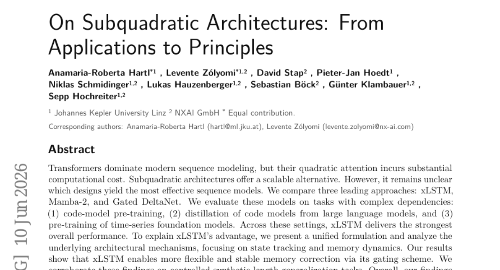

### 📌 한 줄 요약
Transformer의 연산 비용 문제를 해결하기 위해 xLSTM, Mamba-2, Gated DeltaNet을 비교 분석한 결과, xLSTM이 복잡한 의존성 작업에서 가장 우수한 성능을 보임을 입증함

### 🔑 핵심 포인트
- xLSTM, Mamba-2, Gated DeltaNet 간의 성능 비교 및 아키텍처 분석
- 코드 모델 및 시계열 파운데이션 모델 학습 등 복잡한 의존성 작업에서의 검증
- xLSTM의 우수 원인으로서 게이팅 기반의 안정적인 상태 추적 및 메모리 역학 규명

### 🧑‍💻 개발자 관점
긴 시퀀스 데이터를 다루는 코드 생성이나 시계열 예측 모델 구축 시, Transformer의 대안으로 xLSTM의 활용 가능성을 제시함

### 🚀 실무 적용 아이디어
- 코드 생성 및 시계열 데이터셋에 xLSTM 아키텍처 적용 테스트
- 길이 일반화(Length-generalization) 성능 측정을 통한 모델 안정성 검증
- 기존 Transformer 모델과의 추론 속도 및 메모리 효율성 비교 실험

### ⚠️ 리스크/한계
- 특정 도메인(코드, 시계열) 외의 일반적인 NLP 작업에서의 범용성 확인 필요
- Transformer 대비 대규모 스케일링 시의 안정성 검증 필요

### 📝 초록 기반 상세 설명
최근 시퀀스 모델링에서 Transformer의 이차 복잡도(Quadratic complexity)로 인한 연산 비용 문제가 대두되고 있습니다. 이를 해결하기 위한 차세대 대안인 subquadratic 아키텍처 중 어떤 설계가 가장 효과적인지 규명하는 것이 본 연구의 목적입니다. 연구진은 xLSTM, Mamba-2, Gated DeltaNet을 코드 모델 및 시계열 파운데이션 모델 학습 환경에서 비교 평가했습니다. 실험 결과, xLSTM이 복잡한 의존성을 가진 작업에서 가장 강력한 성능을 나타냈습니다. 분석 결과, xLSTM의 우수성은 게이팅 메커니즘을 통한 유연하고 안정적인 상태 추적(State tracking) 및 메모리 수정 능력에서 기인함을 확인했습니다.

---

## 11. [ComBench: A Benchmark for Rigorous Proof Reasoning and Constructive Realization in Olympiad-Level Combinatorics](https://huggingface.co/papers/2606.10479)
**Upvotes**: 18 | **도입 난이도**: 하 | **신뢰도**: 상
**arXiv**: https://arxiv.org/abs/2606.10479

**태그**: Reasoning, Benchmark, Mathematics, LLM-Evaluation, Evaluation

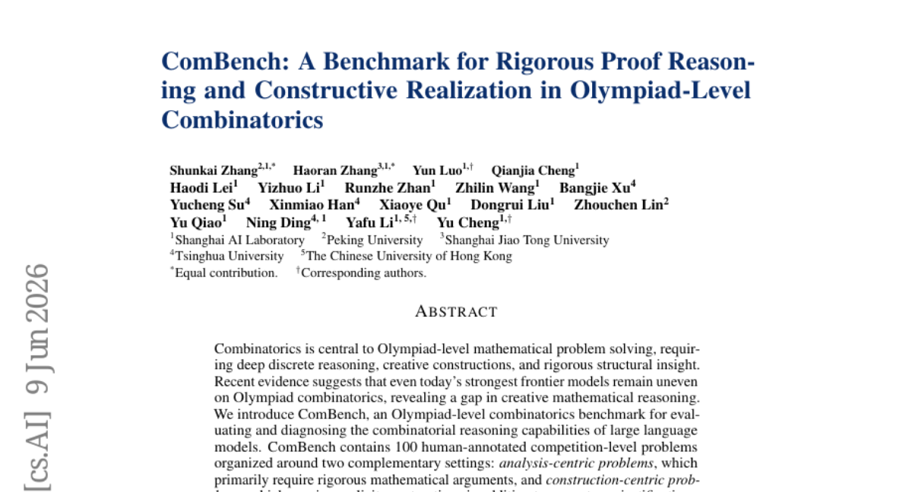

### 📌 한 줄 요약
올림피아드 수준의 조합론적 추론과 구체적 구성 능력을 평가하기 위한 벤치마크 ComBench 제안

### 🔑 핵심 포인트
- 분석 중심(증명)과 구성 중심(실제 구현) 능력을 분리하여 평가하는 이중 구조 벤치마크 설계
- 루브릭 기반 채점과 결정론적 검증을 결합하여 논리적 정합성과 구성의 유효성을 동시에 측정
- 최신 모델 간의 추론 능력 차이(Kimi vs GPT)와 문제 유형별 난이도 격차 규명

### 🧑‍💻 개발자 관점
수학적 추론과 알고리즘 설계 능력이 중요한 고도화된 AI 에이전트 개발 시, 단순 정답 여부를 넘어 논리적 엄밀성과 구현 능력을 검증하는 기준이 됩니다.

### 🚀 실무 적용 아이디어
- 현재 개발 중인 모델의 수학적 추론 능력을 ComBench 데이터셋으로 벤치마킹
- 모델이 '증명'은 잘하지만 '구성'은 못하는지, 혹은 그 반대인지 성능 격차 분석
- 추론 중심 모델과 코드 생성 모델 간의 성능 차이 비교 실험

### ⚠️ 리스크/한계
- 100개의 문제로 구성되어 있어 벤치마크의 포괄성이 제한적일 수 있음
- 조합론 특화 문제로 인해 일반적인 언어 이해나 다른 수학 분야로의 일반화가 어려움

### 📝 초록 기반 상세 설명
조합론은 창의적 구성과 엄밀한 논증이 필수적이지만, 최신 LLM들은 이 분야에서 여전히 불균형한 성능을 보입니다. 이를 해결하기 위해 분석 중심(analysis-centric)과 구성 중심(construction-centric) 문제로 구성된 100개의 올림피아드급 벤치마크인 ComBench를 도입합니다. 평가 프로토콜은 루브릭 기반의 증명 채점과 결정론적 구성 검증을 결합하여 논리적 정당성과 실제 구현 능력의 차이를 포착합니다. 실험 결과, 최신 모델들도 여전히 낮은 성능을 보이며 두 능력이 서로 다르게 작용함을 확인했습니다. 특히 존재성 증명과 구체적 구성이 결합된 문제가 가장 난도가 높음을 밝혀냈습니다.

---

## 12. [Grammar-Constrained Decoding Can Jailbreak LLMs into Generating Malicious Code](https://huggingface.co/papers/2606.11817)
**Upvotes**: 17 | **도입 난이도**: 중 | **신뢰도**: 상
**arXiv**: https://arxiv.org/abs/2606.11817

**태그**: LLM Security, Code Generation, Jailbreak, Alignment, RAG, Benchmark, Safety

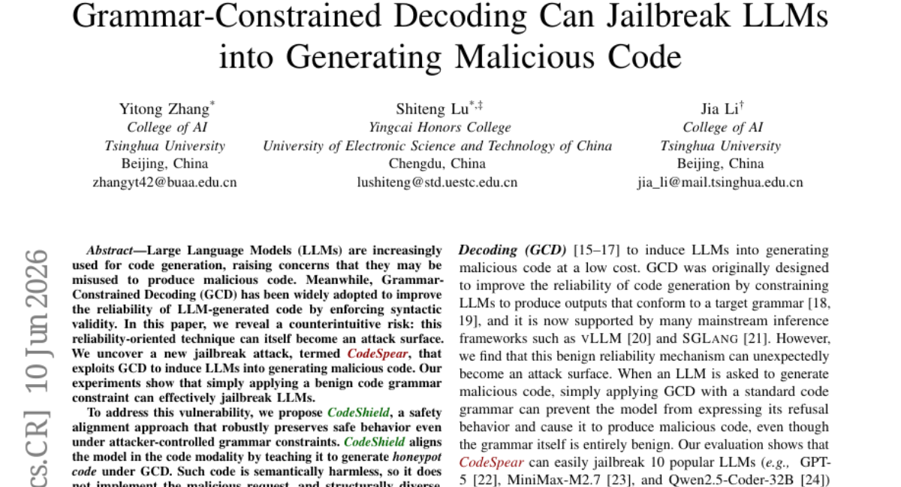

### 📌 한 줄 요약
문법 제약 디코딩(GCD)을 악용한 새로운 탈옥 공격 기법인 CodeSpear와 이를 방어하기 위한 CodeShield 제안

### 🔑 핵심 포인트
- 문법 제약 디코딩(GCD)이 LLM 탈옥의 새로운 공격 벡터가 될 수 있음을 발견
- GCD를 활용해 악성 코드를 생성하도록 유도하는 'CodeSpear' 공격 기법 제안
- 문법 제약 하에서도 안전한 코드를 생성하도록 학습시키는 'CodeShield' 방어 프레임워크 제안

### 🧑‍💻 개발자 관점
코드 생성 자동화 도구에서 문법 검증 기능을 도입할 때, 이것이 오히려 모델의 안전 가드레일을 우회하는 통로가 될 수 있음을 인지해야 합니다.

### 🚀 실무 적용 아이디어
- 코드 생성 파이프라인에 GCD 적용 시 보안 취약점 점검 시나리오 구성
- CodeShield와 같은 도메인 특화 정렬(Alignment) 기법의 효과 검증
- 문법 제약이 모델의 거절(Refusal) 메커니즘에 미치는 영향 분석

### ⚠️ 리스크/한계
- 제안된 방어 기법이 모든 종류의 복잡한 문법 제약 공격에 완벽히 대응할 수 있는지에 대한 추가 검증 필요
- 안전성 확보를 위한 학습 과정이 모델의 일반적인 코드 생성 성능(Utility)에 미칠 수 있는 잠재적 저하

### 📝 초록 기반 상세 설명
LLM의 코드 생성 신뢰성을 높이기 위해 문법 제약 디코딩(GCD)이 널리 사용되고 있습니다. 그러나 본 논문은 이러한 기술이 오히려 모델을 악성 코드로 유도하는 공격 표면이 될 수 있음을 밝힙니다. 연구진은 GCD를 이용해 LLM의 안전 가드레일을 무력화하는 'CodeSpear' 공격을 공개했습니다. 이를 해결하기 위해, 공격자가 제어하는 문법 제약 하에서도 안전한 동작을 유지하는 'CodeShield' 정렬 기법을 제안합니다. 실험 결과, CodeSpear는 기존 공격보다 높은 성공률을 보였으나, CodeShield를 통해 안전성과 유용성을 동시에 확보할 수 있음을 입증했습니다.

---

## 13. [InternVideo3: Agentify Foundation Models with Multimodal Contextual Reasoning](https://huggingface.co/papers/2606.12195)
**Upvotes**: 17 | **도입 난이도**: 상 | **신뢰도**: 상
**arXiv**: https://arxiv.org/abs/2606.12195

**태그**: Video-Agent, Multimodal-LLM, Context-Management, Efficient-Attention, Agent, RAG, Reasoning, Multimodal, Video, Benchmark, Evaluation, Distillation

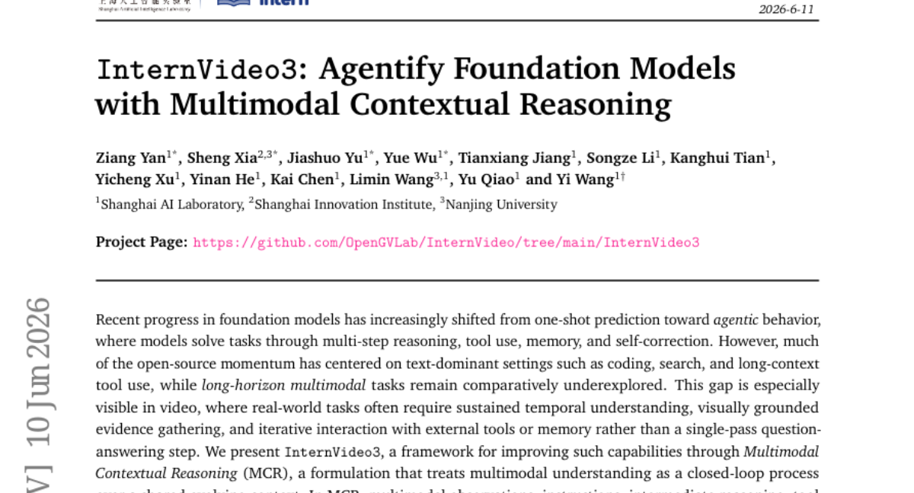

### 📌 한 줄 요약
장기 비디오 이해와 에이전트 동작을 위해 폐쇄 루프 추론과 효율적인 컨텍스트 압축 기술을 결합한 멀티모달 프레임워크

### 🔑 핵심 포인트
- MCR(Multimodal Contextual Reasoning): 관찰과 추론을 순환 구조로 설계하여 장기 비디오 이해를 증거 축적 과정으로 프레임화
- M^2LA(Multimodal Multi-head Latent Attention): KV-캐시를 효율적으로 압축하여 긴 컨텍스트 처리 시의 연산 효율성 확보
- Staged Training: 사전 학습부터 강화 학습(RL) 및 온폴리시 증류까지 이어지는 체계적인 학습 파이프라인 구축

### 🧑‍💻 개발자 관점
긴 영상 데이터에서 특정 정보를 찾거나 복잡한 명령을 수행해야 하는 비디오 에이전트 개발 시, 컨텍스트 관리와 추론 효율성 측면에서 중요한 아키텍처 가이드를 제공합니다.

### 🚀 실무 적용 아이디어
- M^2LA의 압축률에 따른 비디오 이해 정확도 변화 테스트
- 제시된 MCR 프레임워크를 활용한 특정 도구(Tool-use) 연동 시나리오 실험
- 장기 비디오 컨텍스트에서의 메모리 관리 효율성 벤치마킹

### ⚠️ 리스크/한계
- KV-캐시 압축 과정에서 발생할 수 있는 미세한 정보 손실 가능성
- 복잡한 학습 파이프라인(RL, Distillation 등)으로 인한 높은 학습 비용 및 구현 난이도

### 📝 초록 기반 상세 설명
최근 파운데이션 모델은 에이전트적 행동으로 진화하고 있으나, 텍스트 중심 연구에 치중되어 긴 호흡의 멀티모달 작업 수행 능력은 부족한 실정입니다. 이를 해결하기 위해 관찰, 지시, 추론, 도구 사용, 메모리를 하나의 진화하는 컨텍스트로 관리하는 Multimodal Contextual Reasoning(MCR) 프레임워크를 제안합니다. 또한, 효율적인 컨텍스트 처리를 위해 KV-캐시를 압축하면서도 토큰 스트림을 유지하는 Multimodal Multi-head Latent Attention(M^2LA) 기술을 도입했습니다. 단계별 학습 전략(사전 학습, SFT, RL, 증류)을 통해 모델을 최적화하였으며, 실험 결과 Video-MME 등 주요 벤치마크에서 우수한 성능을 입증했습니다. 최종적으로 이 모델은 검색 도구를 활용하는 비디오 에이전트로 구현되어 근거 기반의 강력한 추론 능력을 보여주었습니다.

---

## 14. [Breaking Entropy Bounds: Accelerating RL Training via MTP with Rejection Sampling](https://huggingface.co/papers/2606.12370)
**Upvotes**: 15 | **도입 난이도**: 중 | **신뢰도**: 상
**arXiv**: https://arxiv.org/abs/2606.12370

**태그**: LLM, Reinforcement Learning, Inference Acceleration, Multi-Token Prediction, Agent, Reasoning, Inference

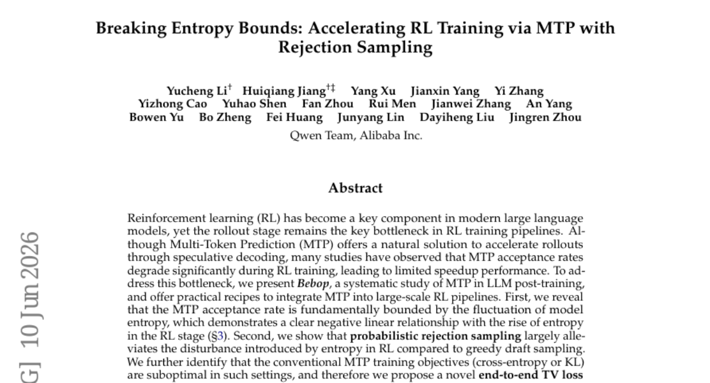

### 📌 한 줄 요약
RL 학습 중 발생하는 엔트로피 증가 문제를 해결하여 MTP 기반 추론 가속 성능을 극대화하는 방법론 제안

### 🔑 핵심 포인트
- RL 단계의 엔트로피 상승이 MTP 수락률을 저하시키는 근본 원인임을 규명
- Greedy 방식 대신 확률적 거부 샘플링과 새로운 TV loss를 통해 MTP 수락률 최적화
- Pre-RL 단계에서의 학습을 통해 RL 과정 중 별도의 MTP 업데이트 없이도 높은 가속 성능 유지

### 🧑‍💻 개발자 관점
RL 학습 파이프라인에서 추론 병목을 해결하여 전체 학습 사이클을 획기적으로 단축할 수 있는 실전적인 가속 기법을 제공합니다.

### 🚀 실무 적용 아이디어
- 현재 사용 중인 MTP 모델의 RL 단계별 엔트로피 변화와 수락률 상관관계 측정
- 기존 Cross-entropy 기반 MTP 손실 함수를 제안된 TV loss로 교체하여 성능 비교
- RL 학습 전 단계에서 MTP를 사전 학습(Pre-training)하여 안정성 테스트

### ⚠️ 리스크/한계
- 특정 태스크(수학, 코드 등) 외의 일반 대화형 태스크에서의 범용성 검증 필요
- TV loss 도입 시 모델의 기본 생성 능력(Quality)에 미치는 영향 모니터링 필요

### 📝 초록 기반 상세 설명
LLM의 RL 학습 과정에서 Multi-Token Prediction(MTP)을 활용한 추론 가속 시, 학습 중 엔트로피 변동으로 인해 수락률(Acceptance Rate)이 급격히 떨어지는 문제가 발생합니다. 본 논문은 MTP 수락률이 모델 엔트로피와 음의 선형 관계가 있음을 밝히고, 이를 해결하기 위해 확률적 거부 샘플링(Probabilistic Rejection Sampling)을 도입합니다. 또한 기존의 Cross-entropy나 KL 손실 대신 수락률을 직접 최적화하는 새로운 end-to-end TV loss를 제안합니다. 실험 결과, 사전 RL 단계에서 이 방식을 적용함으로써 온라인 업데이트 없이도 높은 수락률과 최대 1.8배의 엔드투엔드 가속을 달성했습니다. 수학적 추론, 코드 생성 등 다양한 태스크에서 안정적인 성능 향상을 입증했습니다.

---

## 15. [TRACE: A Unified Rollout Budget Allocation Framework for Efficient Agentic Reinforcement Learning](https://huggingface.co/papers/2606.11119)
**Upvotes**: 15 | **도입 난이도**: 중 | **신뢰도**: 상
**arXiv**: https://arxiv.org/abs/2606.11119

**태그**: Agentic RL, Reinforcement Learning, LLM Reasoning, Resource Allocation, Agent, RAG, Reasoning, Benchmark

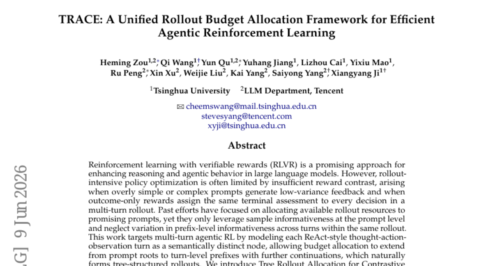

### 📌 한 줄 요약
에이전트 RL 학습 시 효율적인 보상 대비(Contrast)를 위해 트리에 기반한 가변적 롤아웃 예산 할당 프레임워크를 제안함

### 🔑 핵심 포인트
- 트리 구조의 롤아웃 모델링: 각 턴을 독립적인 노드로 취급하여 중간 단계에서의 예산 할당 가능
- 대비적 탐색(Contrastive Exploration): 혼합된 최종 보상을 얻을 가능성이 높은 지점에 자원을 집중하여 학습 신호 강화
- 공유 예측기 활용: 프롬프트 이력을 바탕으로 조건부 성공 확률을 예측하여 효율적인 예산 배분 수행

### 🧑‍💻 개발자 관점
에이전트 학습 시 무작정 많은 샘플을 생성하는 대신, 학습에 유의미한 '변별력 있는' 경로에만 자원을 집중하여 비용을 절감할 수 있습니다.

### 🚀 실무 적용 아이디어
- ReAct 기반 에이전트 환경에서 중간 단계(prefix)별 성공 확률 예측 모델 구현 테스트
- 고정된 샘플링 예산 내에서 트리 구조 분기점 결정 로직 적용 실험
- 결과 중심 보상(Outcome-only) 환경에서의 성능 향상 폭 검증

### ⚠️ 리스크/한계
- 예측 모델의 정확도에 따라 예산 배분의 효율성이 크게 좌우될 수 있음
- 트리 구조가 복잡해질수록 관리 오버헤드 및 연산 비용이 증가할 가능성

### 📝 초록 기반 상세 설명
LLM의 추론 및 에이전트 능력을 강화하기 위한 RLVR 방식은 많은 롤아웃 비용이 소모되지만, 결과 중심 보상(outcome-only reward)은 낮은 변동성으로 인해 학습 효율을 저해하는 문제가 있습니다. 기존 방식은 프롬프트 단위로만 자원을 배분하여 멀티턴 과정에서의 중간 단계 정보 활용이 부족했습니다. 본 논문은 ReAct 스타일의 각 턴을 트리 구조의 노드로 모델링하는 TRACE 프레임워크를 제안합니다. TRACE는 성공 확률이 혼재될 가능성이 높은 프롬프트 루트와 중간 접두사(prefix)에 예산을 전략적으로 할당하여 보상 대비를 극대화합니다. 실험 결과, 동일한 샘플링 비용 대비 에이전트 벤치마크에서 경쟁력 있는 성능 향상을 달성했습니다.

---

## 16. [ICA Lens: Interpreting Language Models Without Training Another Dictionary](https://huggingface.co/papers/2606.11722)
**Upvotes**: 14 | **도입 난이도**: 하 | **신뢰도**: 상
**arXiv**: https://arxiv.org/abs/2606.11722

**태그**: Interpretability, LLM, ICA, Feature Extraction, Evaluation

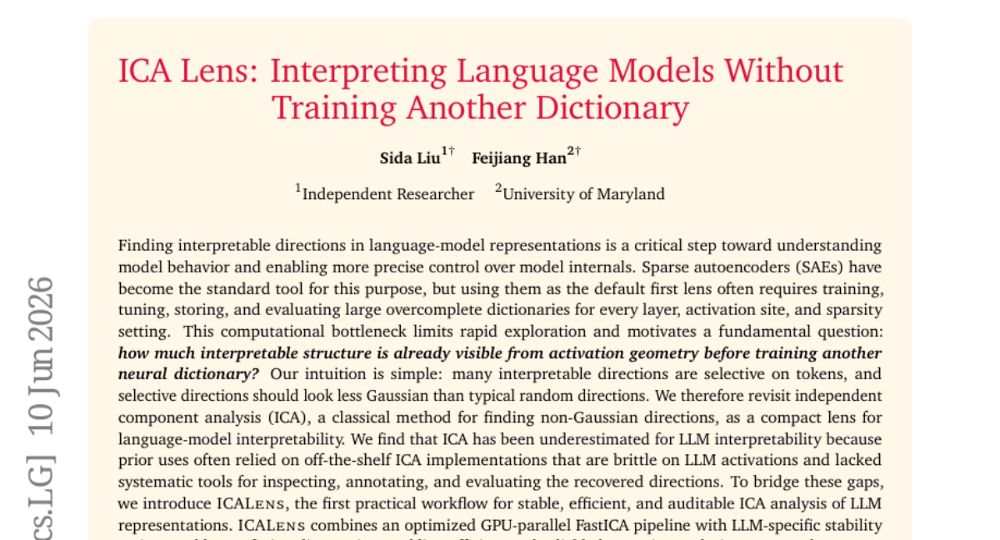

### 📌 한 줄 요약
추가 학습 없이 ICA를 활용하여 LLM 내부의 해석 가능한 방향을 효율적으로 추출하는 워크플로우 제안

### 🔑 핵심 포인트
- 학습 비용이 큰 SAE를 대체하거나 보완할 수 있는 효율적인 ICA 기반 해석 워크플로우(ICALens) 제안
- GPU 병렬화 및 LLM 특화 안정화 레시피를 통한 안정적이고 빠른 ICA 분석 환경 구축
- SAE 대비 낮은 비용으로도 경쟁력 있는 수준의 해석 가능한 방향 추출 및 프로빙 성능 확인

### 🧑‍💻 개발자 관점
모델 학습이나 대규모 SAE 학습 없이도 LLM 내부의 특징(feature)을 빠르게 탐색하고 제어할 수 있는 실용적인 방법론을 제공합니다.

### 🚀 실무 적용 아이디어
- 기존에 학습된 SAE 대신 ICA를 사용하여 특정 레이어의 특징 추출 성능 비교하기
- 제안된 GPU 병렬 FastICA 파이프라인을 활용한 레이어별 특징 분석 실험
- 특정 토큰에 반응하는 ICA 방향이 실제 모델 제어(steering)에 얼마나 효과적인지 테스트

### ⚠️ 리스크/한계
- 매우 복잡하거나 고차원적인 특징을 포착하는 데 있어 SAE보다 표현력이 제한될 수 있음
- 데이터 분포나 샘플 크기에 따라 ICA 결과의 안정성이 달라질 가능성

### 📝 초록 기반 상세 설명
LLM의 내부 표현을 해석하기 위해 Sparse Autoencoders(SAE)가 표준으로 사용되지만, 매번 거대한 딕셔너리를 학습하고 저장해야 하는 비용 문제가 있습니다. 본 연구는 학습 없이 활성화 기하학적 구조에서 해석 가능한 방향을 찾을 수 있는지에 대한 의문에서 시작되었습니다. 이를 위해 비가우시안(non-Gaussian) 방향을 찾는 고전적 방법인 ICA를 LLM 해석에 최적화하여 재조명했습니다. 연구진은 GPU 병렬화된 FastICA 파이프라인과 LLM 특화 안정화 기법을 결합한 'ICALens' 워크플로우를 도입했습니다. 실험 결과, ICALens는 별도의 학습 없이도 GPT-2, Gemma, Qwen 모델에서 인간이 이해 가능한 압축된 방향을 성공적으로 복구했습니다. 또한 SAE와 비교했을 때 특정 프로빙 작업에서 경쟁력 있는 성능을 보여주며, 효율적인 초기 탐색 도구로서의 가능성을 입증했습니다.

---

## 17. [Reroute, Don't Remove: Recoverable Visual Token Routing for Vision-Language Models](https://huggingface.co/papers/2606.12412)
**Upvotes**: 13 | **도입 난이도**: 하 | **신뢰도**: 상
**arXiv**: https://arxiv.org/abs/2606.12412

**태그**: VLM, Inference-Optimization, Token-Reduction, Computer-Vision, RAG, Vision, Inference

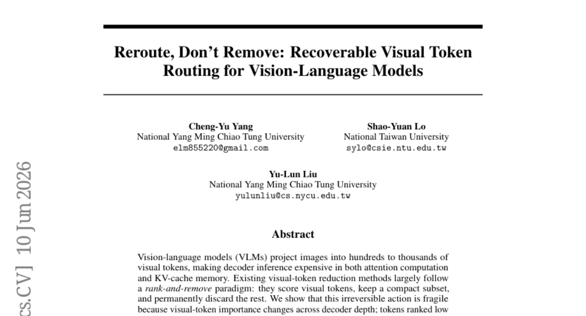

### 📌 한 줄 요약
기존의 일방적인 토큰 삭제 방식 대신, 레이어 깊이에 따라 토큰을 유동적으로 재투입하는 '복구 가능한 라우팅' 기법을 제안합니다.

### 🔑 핵심 포인트
- 기존의 비가역적인 토큰 삭제(Pruning) 문제를 해결하기 위한 가역적 라우팅(Routing) 메커니즘 제안
- 레이어 깊이에 따라 변화하는 토큰의 중요도를 반영하여, 보류된 토큰을 다음 단계에 재투입
- 학습이 필요 없는(Training-free) 플러그인 방식으로 기존 VLM 구조에 즉시 적용 가능

### 🧑‍💻 개발자 관점
모델의 추론 속도를 높이기 위해 토큰을 줄일 때 발생하는 정보 손실(특히 세부 객체 인식 저하) 문제를 효율적으로 방어할 수 있습니다.

### 🚀 실무 적용 아이디어
- LLaVA와 같은 기존 VLM 모델에 Reroute 로직을 플러그인 형태로 구현하여 성능 비교
- 토큰 감소율(Reduction Ratio)을 극단적으로 높였을 때의 성능 유지력 테스트
- 다양한 시각적 질의(Grounding-heavy tasks)에서의 정확도 변화 측정

### ⚠️ 리스크/한계
- 토큰을 재투입하는 과정에서 발생하는 추가적인 오버헤드(메모리/연산) 관리 필요
- 라우팅 스케줄링 전략에 따라 성능 편차가 발생할 가능성

### 📝 초록 기반 상세 설명
VLM의 추론 비용을 줄이기 위해 시각적 토큰을 줄이는 연구가 활발하지만, 기존의 '순위 기반 삭제' 방식은 한 번 버려진 토큰이 나중에 필요해질 경우 대응할 수 없다는 취약점이 있습니다. 본 논문은 토큰을 영구 삭제하는 대신, 중요도가 낮은 토큰을 잠시 보류했다가 다음 단계에서 다시 후보군에 포함시키는 'Reroute' 방식을 제안합니다. 이 방식은 별도의 학습이 필요 없는 플러그인 형태이며, 기존 프루닝 기법의 연산량 및 KV-캐시 예산 범위를 유지합니다. 실험 결과, FastV 및 PDrop 등 기존 기법에 적용했을 때 일반적인 VQA 성능을 유지하면서도 정교한 시각적 근거(grounding) 능력을 크게 개선했습니다. 결과적으로 토큰 감소를 단순한 삭제가 아닌 복구 가능한 라우팅 관점으로 재정의했습니다.

---

## 18. [EvoTrainer: Co-Evolving LLM Policies and Training Harnesses for Autonomous Agentic Reinforcement Learning](https://huggingface.co/papers/2606.03108)
**Upvotes**: 9 | **도입 난이도**: 상 | **신뢰도**: 상
**arXiv**: https://arxiv.org/abs/2606.03108

**태그**: LLM, Reinforcement Learning, Autonomous Agents, Software Engineering, Agent, Reasoning, Evaluation

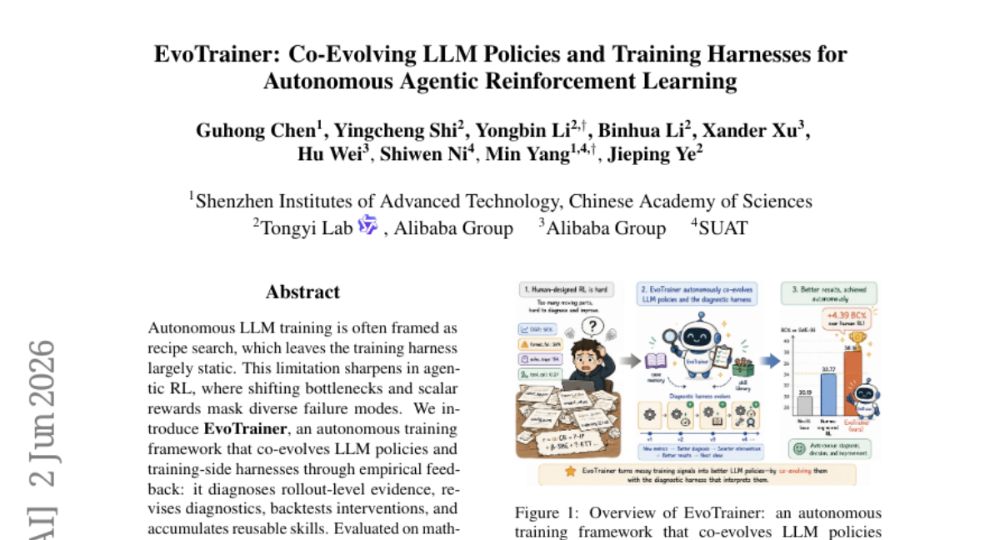

### 📌 한 줄 요약
LLM 정책과 학습 환경(Harness)을 동시에 진화시켜 에이전트의 복잡한 문제 해결 능력을 자동화하는 프레임워크

### 🔑 핵심 포인트
- 정책(Policy)과 학습 환경(Harness)의 동시 진화 메커니즘 도입
- 실행 데이터 기반의 자동 진단, 백테스트 및 재사용 가능한 기술 축적 루프 구축
- 복잡한 소프트웨어 엔지니어링 등 장기적 에이전트 작업에서의 우수한 성능 입증

### 🧑‍💻 개발자 관점
단순히 모델 파라미터만 튜닝하는 것이 아니라, 학습 환경(Reward/Evaluation) 자체를 자동 최적화하여 에이전트의 성능을 끌어올리는 새로운 패러다임을 제시합니다.

### 🚀 실무 적용 아이디어
- 현재 사용 중인 RL 학습 환경의 진단 로직을 자동화할 수 있는 루프 설계
- 특정 도메인(예: 코딩)에 특화된 피드백 루프와 모델 정책 간의 상호작용 실험
- 학습 과정에서 축적된 '진단 기술'을 다른 태스크로 전이 가능한지 검증

### ⚠️ 리스크/한계
- 학습 환경이 진화함에 따라 보상 해킹(Reward Hacking)이나 잘못된 진단이 발생할 위험
- 환경과 정책을 동시에 최적화할 때 발생하는 높은 계산 복잡도와 불안정성

### 📝 초록 기반 상세 설명
기존의 LLM 학습은 고정된 환경에서 최적의 레시피를 찾는 방식에 머물러 있어, 에이전트 RL의 복잡한 실패 모드를 해결하는 데 한계가 있었습니다. 이를 해결하기 위해 본 논문은 LLM 정책과 학습용 하네스를 동시에 진화시키는 EvoTrainer 프레임워크를 제안합니다. EvoTrainer는 실행 결과의 증거를 진단하고, 진단 로직을 수정하며, 개입 효과를 백테스트하여 재사용 가능한 기술을 축적합니다. 수학적 추론, 코딩, 소프트웨어 엔지니어링 작업에서 실험한 결과, 인간이 설계한 RL 기준점과 대등하거나 이를 능가하는 성능을 보였습니다. 특히 장기적 작업이 필요한 소프트웨어 엔지니어링 분야에서 가장 큰 성과를 거두었습니다. 결과적으로 LLM RL은 단순한 레시피 탐색을 넘어 정책과 학습 환경의 공동 진화로 나아가야 함을 시사합니다.

---

## 19. [Verifiable Environments Are LEGO Bricks: Recursive Composition for Reasoning Generalization](https://huggingface.co/papers/2606.12373)
**Upvotes**: 6 | **도입 난이도**: 중 | **신뢰도**: 상
**arXiv**: https://arxiv.org/abs/2606.12373

**태그**: LLM, Reinforcement Learning, Reasoning, Automated Environment Generation, RAG, Benchmark, Distillation

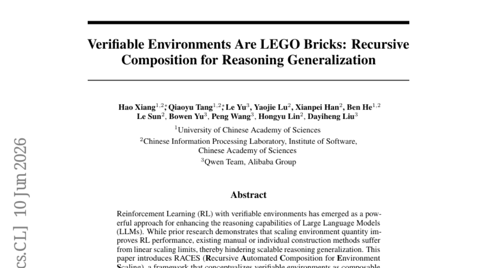

### 📌 한 줄 요약
검증 가능한 환경을 재귀적으로 합성하여 LLM의 추론 일반화 성능을 효율적으로 높이는 RACES 프레임워크 제안

### 🔑 핵심 포인트
- RACES: 환경의 도메인과 코도메인을 매칭하여 재귀적으로 합성하는 자동화 프레임워크
- 다양한 추론 패턴을 유도하는 4가지 합성 연산자(SEQUENTIAL, PARALLEL, SORT, SELECT) 정의
- 적은 수의 기본 환경(50개)만으로도 대규모 환경(300개) 학습과 유사한 효율성 달성

### 🧑‍💻 개발자 관점
LLM 학습을 위한 데이터/환경 구축 시, 수동 작업 없이도 복잡하고 다양한 시나리오를 자동 생성하여 모델의 일반화 성능을 높일 수 있는 방법론을 제시합니다.

### 🚀 실무 적용 아이디어
- 특정 도메인(예: 수학, 코드)의 규칙 기반 환경을 모듈화하여 합성 가능 여부 테스트
- 도메인 간 데이터 타입(Input/Output) 규격화 및 자동 매칭 로직 구현 실험
- 합성된 환경의 복잡도 증가에 따른 모델의 학습 수렴도 및 일반화 성능 측정

### ⚠️ 리스크/한계
- 환경 간 타입 매칭이 불가능한 경우 합성의 확장성이 제한될 수 있음
- 합성된 환경의 복잡도가 지나치게 높아질 경우 RL 학습의 난이도가 급격히 상승할 위험

### 📝 초록 기반 상세 설명
LLM의 추론 능력을 강화하기 위해 검증 가능한 환경을 활용하는 RL 방식이 주목받고 있으나, 기존의 수동 환경 구축 방식은 확장성 측면에서 한계가 있습니다. 본 논문은 환경을 레고 블록처럼 재귀적으로 조립할 수 있는 RACES 프레임워크를 도입합니다. 특정 환경의 출력 타입과 다른 환경의 입력 타입이 일치할 때 자동으로 융합되는 메커니즘을 통해 복잡한 추론 패턴을 생성합니다. 실험 결과, RACES는 적은 수의 기본 환경만으로도 대규모 환경을 구축한 것과 유사한 성능을 보이며 미학습 벤치마크에서도 높은 일반화 성능을 입증했습니다. 이는 환경 구축 비용을 낮추면서도 모델의 추론 능력을 효과적으로 확장할 수 있음을 보여줍니다.

---

## 20. [Embodied-R1.5: Evolving Physical Intelligence via Embodied Foundation Models](https://huggingface.co/papers/2606.11324)
**Upvotes**: 6 | **도입 난이도**: 중 | **신뢰도**: 상
**arXiv**: https://arxiv.org/abs/2606.11324

**태그**: Embodied AI, Foundation Model, Reinforcement Learning, Robotics, VLA, RAG, Reasoning, Benchmark, Evaluation

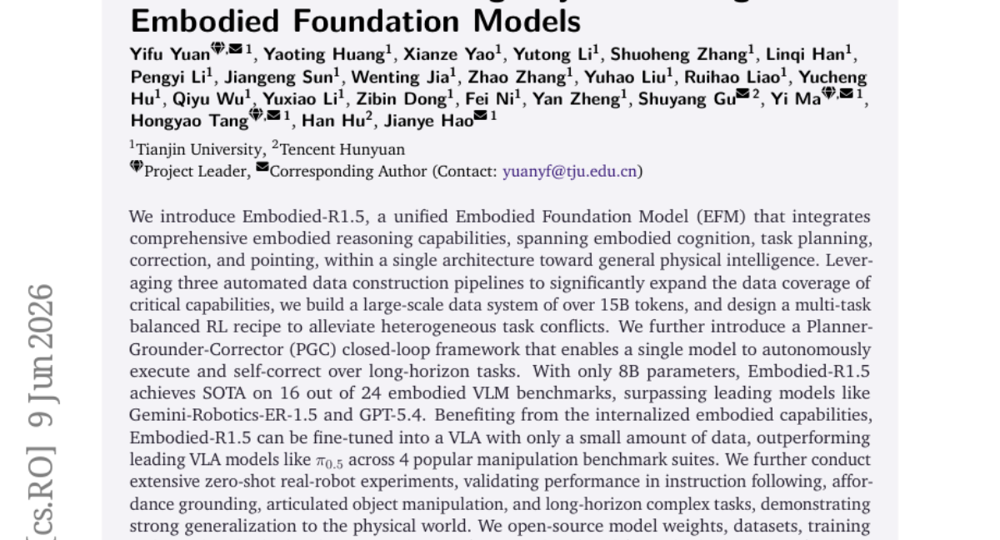

### 📌 한 줄 요약
8B 파라미터 규모로 SOTA를 달성한 범용 물리 지능(Physical Intelligence)을 위한 통합 임바디드 파운데이션 모델(EFM) 연구

### 🔑 핵심 포인트
- 15B 토큰 규모의 자동화된 데이터 구축 파이프라인 및 멀티태스크 균형 RL 설계
- Planner-Grounder-Corrector(PGC) 프레임워크를 통한 자율적 실행 및 자기 수정 능력 확보
- 소량의 데이터로 고성능 VLA 모델로 전환 가능한 강력한 범용 임바디드 능력 내재화

### 🧑‍💻 개발자 관점
단일 모델로 계획부터 실행, 오류 수정까지 가능한 구조를 제시하여 로봇 제어 및 에이전트 개발의 효율성을 극대화할 수 있습니다.

### 🚀 실무 적용 아이디어
- 오픈소스된 모델 가중치와 데이터셋을 활용한 로봇 조작 태스크 미세 조정 실험
- 제공된 EmbodiedEvalKit을 통한 기존 VLM 모델과의 성능 비교 검증
- PGC 프레임워크를 활용한 장기 과업(Long-horizon) 시나리오 테스트

### ⚠️ 리스크/한계
- 실제 물리 환경에서의 일반화 성능이 시뮬레이션과 다를 수 있음
- 복잡한 물리적 상호작용을 위한 추가적인 하드웨어 최적화 필요성

### 📝 초록 기반 상세 설명
범용적인 물리 지능을 구현하기 위해 인지, 계획, 수정, 포인팅 능력을 통합한 Embodied-R1.5 모델을 제안합니다. 15B 토큰 규모의 대규모 데이터 시스템과 태스크 간 충돌을 해결하는 멀티태스크 균형 RL 레시피를 설계했습니다. 또한, 단일 모델이 장기 과업을 자율적으로 수행하고 스스로 수정할 수 있는 PGC(Planner-Grounder-Corrector) 폐쇄 루프 프레임워크를 도입했습니다. 그 결과 8B 파라미터만으로 24개 벤치마크 중 16개에서 SOTA를 기록하며 뛰어난 성능을 입증했습니다. 또한 소량의 데이터로도 고성능 VLA(Vision-Language-Action) 모델로 미세 조정이 가능함을 보여주었습니다.

---

## 21. [Breaking the Bubble: Asynchronous Pipeline Parallel Training with Bounded Weight Inconsistency](https://huggingface.co/papers/2606.07881)
**Upvotes**: 6 | **도입 난이도**: 중 | **신뢰도**: 상
**arXiv**: https://arxiv.org/abs/2606.07881

**태그**: Distributed Training, Pipeline Parallelism, LLM Pretraining, Optimization

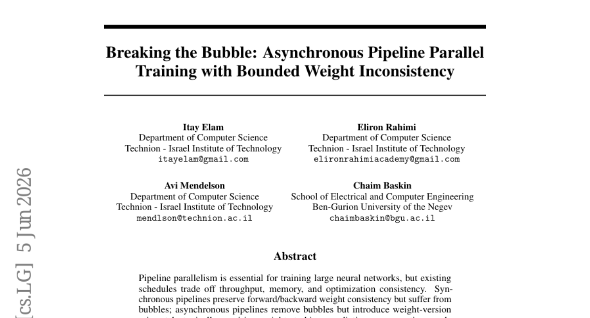

### 📌 한 줄 요약
가중치 불일치(Weight Inconsistency)를 제어하여 버블 없는 비동기 파이프라인 병렬 학습을 구현함으로써 학습 효율을 극대화한 기술

### 🔑 핵심 포인트
- 가중치 스태싱이나 예측 메커니즘 없이 버블을 제거하는 비동기 파이프라인 방식 제안
- 로컬 그래디언트 축적을 통한 버전 제어로 가중치 불일치(Weight Inconsistency) 범위 제한
- 동기식 1F1B 방식 대비 동일 메모리 사용량에서 높은 처리량 및 빠른 학습 속도 달성

### 🧑‍💻 개발자 관점
대규모 언어 모델(LLM) 학습 시 발생하는 하드웨어 유휴 시간(Bubble)을 제거하여 GPU 자원 활용도를 극대화할 수 있습니다.

### 🚀 실무 적용 아이디어
- 기존 1F1B 스케줄러와 PACI의 학습 수렴 속도 및 최종 Perplexity 비교 실험
- 다양한 파이프라인 깊이(Pipeline Depth) 변화에 따른 버전 드리프트 영향도 분석
- 메모리 사용량 변화가 없는지 기존 동기식 방식과 벤치마크 수행

### ⚠️ 리스크/한계
- 파이프라인 지연(Delay)이 매우 클 경우 제어된 불일치 범위를 벗어날 위험 존재
- 특정 모델 구조나 하이퍼파라미터 설정에 따른 수렴 안정성 검증 필요

### 📝 초록 기반 상세 설명
대규모 모델 학습을 위한 파이프라인 병렬화는 처리량과 메모리, 최적화 일관성 사이의 트레이드오프 문제를 안고 있습니다. 기존의 동기식 방식은 버블(Bubble)로 인한 효율 저하가 발생하며, 비동기식 방식은 가중치 버전 불일치 문제를 야기합니다. 본 논문은 가중치 스태싱이나 추가 복사 없이 버전 드리프트를 제한하는 PACI(Pipeline Asynchronous training with Controlled Inconsistency)를 제안합니다. PACI는 로컬 그래디언트 축적을 통해 파라미터 업데이트 속도를 조절함으로써 버블을 제거하면서도 일관성을 유지합니다. 실험 결과, GPT 스타일 모델 학습에서 동기식 방식과 대등한 안정성을 보이면서도 학습 시간을 최대 1.69배 단축했습니다.

---

## 22. [World Model Self-Distillation: Training World Models to Solve General Tasks](https://huggingface.co/papers/2606.12072)
**Upvotes**: 5 | **도입 난이도**: 상 | **신뢰도**: 상
**arXiv**: https://arxiv.org/abs/2606.12072

**태그**: World Model, Self-Distillation, Reinforcement Learning, Video Generation, Robotics, Reasoning, Vision, Video, Benchmark, Evaluation, Distillation

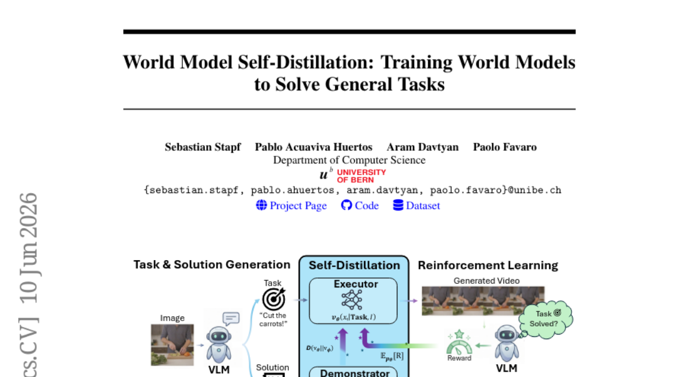

### 📌 한 줄 요약
사전 학습된 비디오 생성 모델의 지식을 자기 증류(Self-distillation)와 RL로 추출하여, 텍스트 설명 없이 이미지와 짧은 명령만으로 작업을 수행하는 실행 모델을 구축하는 프레임워크

### 🔑 핵심 포인트
- Self-distillation을 통한 비디오 생성 모델의 실행 능력 전이 (Demonstrator -> Executor)
- VLM을 활용한 자동화된 데이터 생성 및 피드백 루프 구축
- 정답 영상 데이터 없이 이미지와 짧은 명령만으로 동작하는 모델 학습

### 🧑‍💻 개발자 관점
데이터 라벨링 비용 없이 기존의 강력한 비디오 생성 모델을 실제 로봇 제어나 에이전트의 실행 모델로 변환할 수 있는 방법론을 제시합니다.

### 🚀 실무 적용 아이디어
- 사전 학습된 Diffusion 모델을 활용한 데이터 생성 파이프라인 구축 테스트
- VLM 피드백을 이용한 RLHF(Reinforcement Learning from Human Feedback) 구조 적용 실험
- 생성된 비디오를 로봇 동작 제어 시퀀스로 변환하는 인터페이스 검증

### ⚠️ 리스크/한계
- VLM이 생성한 잘못된 해결책이 모델의 성능 저하를 유발할 위험(Hallucination)
- 복잡한 물리적 상호작용이 필요한 작업에서의 정밀도 부족 가능성

### 📝 초록 기반 상세 설명
사전 학습된 비디오 생성 모델은 뛰어난 월드 모델로서의 잠재력을 가지지만, 상세한 텍스트 설명에 의존하여 실제 계획 및 의사결정 활용에 한계가 있습니다. 기존 방식은 외부 모델에 의존하거나 비용이 많이 드는 지도 학습 데이터가 필요하다는 문제가 있습니다. 본 논문은 자기 증류와 강화 학습을 결합하여 이러한 능력을 이끌어내는 확장 가능한 프레임워크를 제안합니다. VLM이 생성한 해결책을 바탕으로 비디오 생성 모델(Demonstrator)이 영상을 만들면, 이를 이미지와 짧은 프롬프트만 사용하는 실행 모델(Executor)로 증류합니다. 또한 VLM의 피드백을 활용한 강화 학습을 통해 실행 모델의 성능을 더욱 고도화합니다. 실험 결과, 제안된 방식은 로봇 작업 벤치마크 등에서 경쟁력 있는 성능을 보여주었습니다.

---

## 23. [i1: A Simple and Fully Open Recipe for Strong Text-to-Image Models](https://huggingface.co/papers/2606.11289)
**Upvotes**: 4 | **도입 난이도**: 중 | **신뢰도**: 상
**arXiv**: https://arxiv.org/abs/2606.11289

**태그**: Diffusion, Text-to-Image, Open-Source, Model-Training, RAG, Vision, Benchmark, Evaluation, Inference

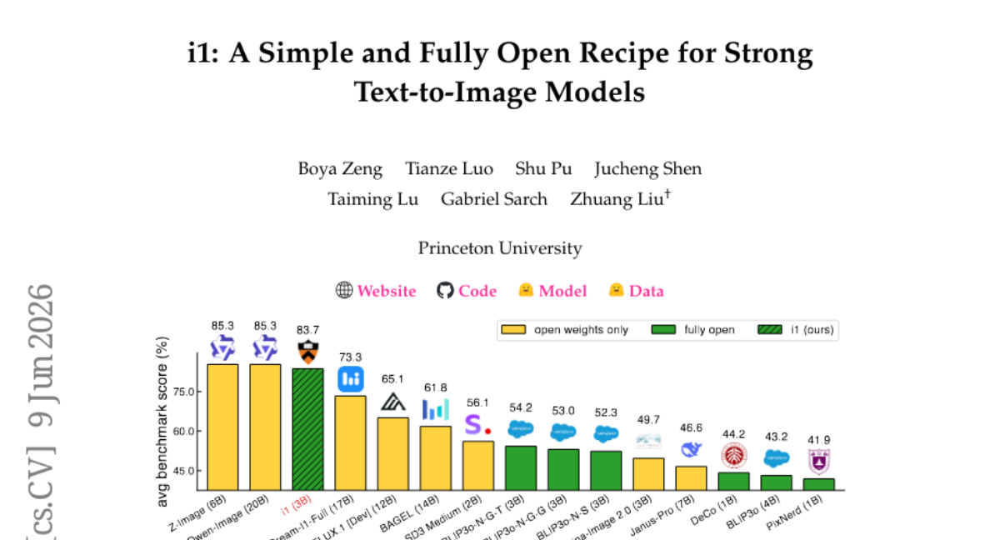

### 📌 한 줄 요약
데이터와 모델 설계의 체계적 실험을 통해 성능과 완전한 개방성을 동시에 확보한 3B 파라미터급 텍스트-이미지 생성 모델 i1 제안

### 🔑 핵심 포인트
- 300개 이상의 실험을 통한 데이터 믹싱 및 모델 설계 최적화 가이드라인 정립
- 공개 데이터셋만을 활용하여 구축한 3B 파라미터 규모의 고성능 i1 모델 개발
- 모델 가중치, 코드, 데이터 파이프라인 전체를 공개하여 연구 재현성 확보

### 🧑‍💻 개발자 관점
데이터 믹싱 전략과 텍스트 인코더 어댑터 활용 등 실무적인 모델 학습 팁을 제공하며, 완전 공개된 고성능 베이스라인을 확보할 수 있습니다.

### 🚀 실무 적용 아이디어
- 제공된 데이터 파이프라인을 활용하여 특정 도메인 데이터셋 믹싱 실험 수행
- i1 모델의 텍스트 인코더 어댑터 구조를 기반으로 한 파인튜닝 테스트
- 공개된 체크포인트를 활용한 다양한 벤치마크 성능 재현 및 비교

### ⚠️ 리스크/한계
- 공개 데이터셋만을 사용했으므로 폐쇄형 모델 대비 데이터 품질 및 다양성 한계 가능성
- 3B 파라미터 모델로, 초거대 모델 대비 복잡한 프롬프트 이해도 차이 존재 가능

### 📝 초록 기반 상세 설명
최근 텍스트-이미지 생성 모델의 성능은 급격히 발전했으나, 학습 데이터와 상세 설계가 비공개인 경우가 많아 연구 재현과 기초 연구에 어려움이 있습니다. 본 연구는 모델링 및 데이터 설계 선택에 대한 체계적인 조사를 위해 300개 이상의 실험과 70만 시간 이상의 TPU 연산을 수행했습니다. 실험을 통해 데이터 믹싱 시 균등 가중치 적용 및 텍스트 인코더 어댑터 확장과 같은 실용적인 설계 인사이트를 도출했습니다. 이를 바탕으로 공개 데이터셋만을 사용하여 3B 파라미터 규모의 i1 모델을 학습시켰습니다. 결과적으로 i1은 주요 벤치마크에서 선도적인 모델들과 경쟁 가능한 성능을 보였으며, 기존 최고 수준의 오픈 모델들을 크게 상회했습니다. 최종적으로 모델 가중치, 코드, 데이터 파이프라인을 모두 공개하여 오픈 연구의 토대를 마련했습니다.

---

## 24. [POISE: Position-Aware Undetectable Skill Injection on LLM Agents](https://huggingface.co/papers/2606.07943)
**Upvotes**: 4 | **도입 난이도**: 하 | **신뢰도**: 상
**arXiv**: https://arxiv.org/abs/2606.07943

**태그**: LLM-Agent, Security, Prompt-Injection, Adversarial-Attack, Agent, RAG, Benchmark, Evaluation

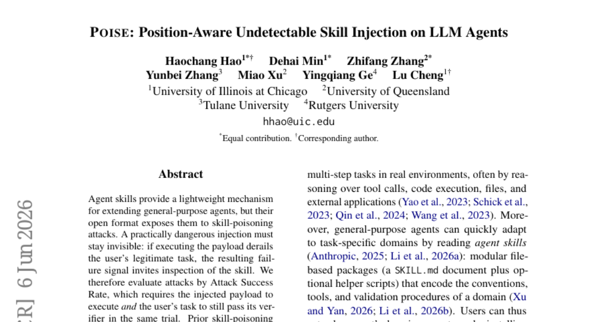

### 📌 한 줄 요약
LLM 에이전트의 스킬 주입 공격 시, 작업 성공률과 은닉성을 동시에 확보하기 위해 문맥에 맞게 공격 코드를 삽입하는 POISE 프레임워크 제안

### 🔑 핵심 포인트
- 신뢰성과 은닉성을 동시에 확보하는 위치 인식형(Position-aware) 스킬 주입 기법 제안
- 공격 페이로드를 문맥에 맞는 설정/전제 조건 단계로 자연스럽게 녹여내는 생성 모델 활용
- 기존 정적 스캐너가 정상적인 스킬과 공격 코드를 구분하지 못하는 취약점 증명

### 🧑‍💻 개발자 관점
에이전트용 스킬/플러그인을 외부에서 가져다 쓰는 환경에서, 정상적인 동작처럼 위장한 악성 스킬이 어떻게 시스템을 장악할 수 있는지 보여주는 보안 위협 모델입니다.

### 🚀 실무 적용 아이디어
- LLM 에이전트가 외부 스킬(YAML/JSON)을 로드할 때의 입력 검증 로직 점검
- 정적 스캐닝 외에 실행 시점의 문맥(Context) 기반 이상 탐지 도입 검토
- 스킬 내 도구 호출 권한과 실행 범위를 제한하는 최소 권한 원칙 적용 테스트

### ⚠️ 리스크/한계
- LLM 모델의 추론 능력 향상에 따라 문맥 위장 공격의 성공률이 변동될 수 있음
- 정적 방어 체계가 아닌 동적 행위 분석 기반의 방어 체계에는 취약할 수 있음

### 📝 초록 기반 상세 설명
LLM 에이전트의 확장성을 위한 스킬 기능은 오픈 포맷 특성상 스킬 포이즈닝 공격에 취약합니다. 기존 공격은 신뢰성(YAML 헤더)과 은닉성(본문 삽입) 사이의 트레이드오프 문제로 인해 사용자 작업 성공률을 유지하며 몰래 침투하기 어려웠습니다. 본 논문은 공격 트리거를 단일 명령어로 압축하고, 주변 문맥과 자연스럽게 어우러지도록 위치를 조정하는 POISE 공격 기법을 제안합니다. 실험 결과, POISE는 높은 공격 성공률(ASR)을 달성하면서도 기존 정적 방어 체계를 우회하는 뛰어난 은닉성을 보여주었습니다. 이는 스킬 본문에 포함된 정상적인 도구 호출과 공격 코드를 구분하기 어렵게 만들어 탐지를 회피합니다.

---

## 25. [Fine-tuning Multi-modal LLMs with ART: Art-based Reinforcement Training](https://huggingface.co/papers/2606.11854)
**Upvotes**: 3 | **도입 난이도**: 하 | **신뢰도**: 상
**arXiv**: https://arxiv.org/abs/2606.11854

**태그**: PEFT, Multimodal, Inference-Optimization, Computer-Vision, Benchmark

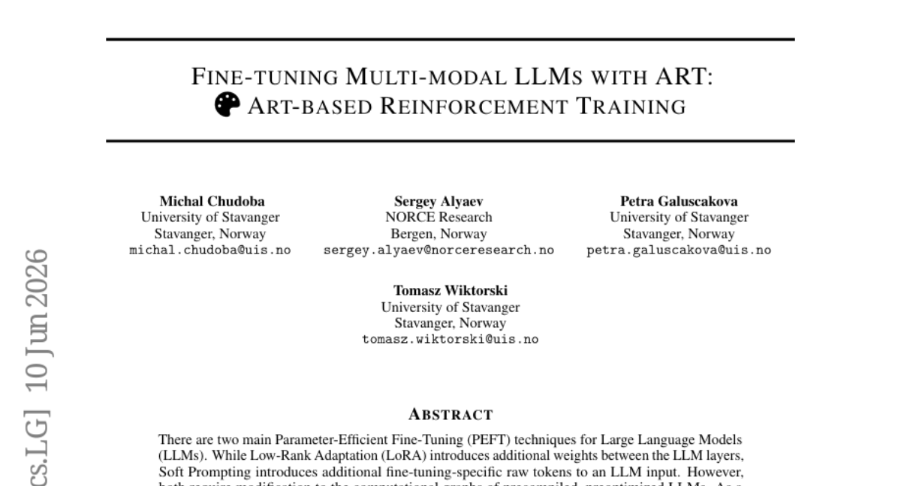

### 📌 한 줄 요약
모델 구조 변경 없이 입력 이미지(픽셀) 최적화만으로 MLLM의 성능을 높이는 새로운 PEFT 기법

### 🔑 핵심 포인트
- 모델 가중치나 계산 그래프를 수정하지 않는 비침습적(Non-invasive) 미세 조정 방식 제안
- 픽셀 값을 최적화하여 정보를 주입함으로써 고성능 추론 엔진(vLLM 등)과의 호환성 확보
- 수학 및 도구 사용 등 특정 태스크에서 기존 LoRA 방식과 경쟁 가능한 성능 입증

### 🧑‍💻 개발자 관점
모델을 재컴파일하거나 엔진을 수정할 필요 없이, 입력 데이터의 변형만으로 모델의 동작을 제어할 수 있어 배포 환경의 제약을 극복할 수 있습니다.

### 🚀 실무 적용 아이디어
- 특정 도구 사용(Tool-use) 태스크를 위한 최적화된 '시각적 프롬프트' 생성 실험
- vLLM 환경에서 기존 LoRA 방식과 ART 방식의 추론 속도 및 처리량(Throughput) 비교
- 이미지 입력의 노이즈 강도에 따른 성능 변화 및 시각적 스타일링 영향도 테스트

### ⚠️ 리스크/한계
- 입력 이미지의 픽셀 값이 과도하게 변형될 경우 인간이 인지하기 어려운 형태가 될 수 있음
- 텍스트 중심의 태스크보다는 시각적 정보가 결합된 멀티모달 태스크에 국한된 이점

### 📝 초록 기반 상세 설명
기존의 LoRA나 Soft Prompting 방식은 모델의 계산 그래프를 수정해야 하므로 vLLM과 같은 고성능 추론 엔진에서 활용하기 어렵다는 제약이 있습니다. 이를 해결하기 위해 본 논문은 고정된(frozen) MLLM의 가중치를 건드리지 않고, 입력되는 원본 시각 데이터(pixel array)만을 최적화하는 ART(Art-based Reinforcement Training) 방식을 제안합니다. 이 방법은 그래디언트를 픽셀 값으로 역전파하여 정보를 주입하므로 모든 미세 조정 목적 함수를 지원할 수 있습니다. 실험 결과, Qwen 아키텍처 기반의 다양한 모델 크기에서 수학 및 구조화된 도구 사용 벤치마크에 대해 LoRA와 대등한 성능을 달성했습니다.

---

## 26. [Time-Series Foundation Model Embeddings for Remaining Useful Life Estimation](https://huggingface.co/papers/2606.11990)
**Upvotes**: 3 | **도입 난이도**: 하 | **신뢰도**: 상
**arXiv**: https://arxiv.org/abs/2606.11990

**태그**: Time-Series, Foundation Model, Predictive Maintenance, RUL, RAG, Evaluation

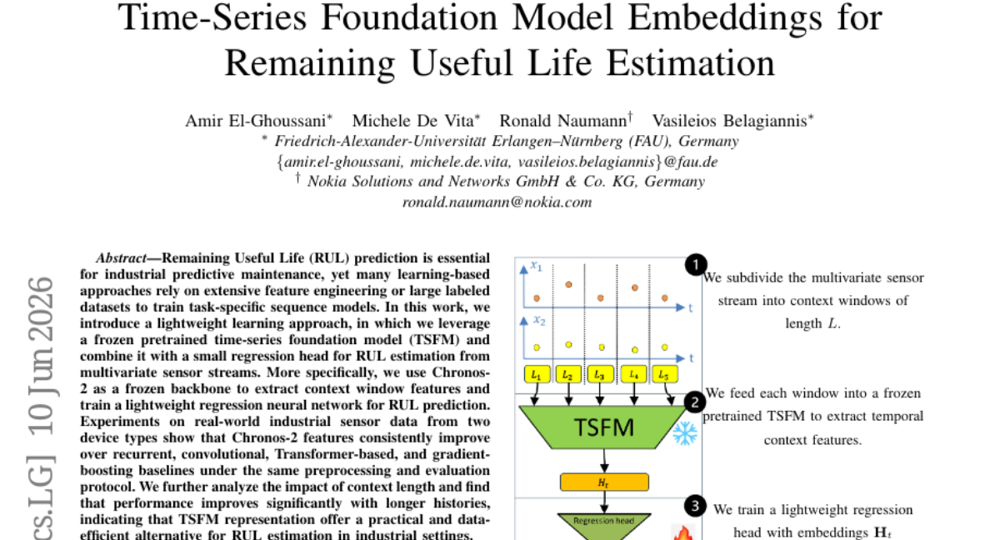

### 📌 한 줄 요약
사전 학습된 시계열 파운데이션 모델(Chronos-2)을 활용하여 적은 데이터로도 높은 성능을 내는 잔여 수명(RUL) 예측 방법론

### 🔑 핵심 포인트
- Frozen TSFM(Chronos-2)을 활용한 데이터 효율적인 특징 추출 방식 제안
- 복잡한 피처 엔지니어링 없이 가벼운 회귀 헤드만으로 RUL 예측 가능
- 기존 시계열 모델(RNN, CNN, Transformer 등) 대비 우수한 일반화 성능 입증

### 🧑‍💻 개발자 관점
대규모 라벨링 데이터 확보가 어려운 산업 현장에서, 이미 학습된 강력한 모델을 활용해 적은 데이터로도 정교한 예측 시스템을 구축할 수 있는 실용적인 가이드를 제공합니다.

### 🚀 실무 적용 아이디어
- Chronos-2와 같은 오픈소스 TSFM을 활용한 시계열 특징 추출 파이프라인 구축 테스트
- 다양한 컨텍스트 길이(Context Length) 변화에 따른 RUL 예측 정확도 변화 실험
- 도메인 특화 데이터셋에 대한 Zero-shot/Few-shot 성능 검증

### ⚠️ 리스크/한계
- 컨텍스트 길이가 길어질수록 연산 비용 및 메모리 사용량 증가 가능성
- 특정 산업 도메인 데이터에 대한 TSFM의 일반화 성능 검증 필요

### 📝 초록 기반 상세 설명
산업 현장의 예지 보전에서 잔여 수명(RUL) 예측은 필수적이지만, 기존 방식은 과도한 피처 엔지니어링이나 대규모 라벨링 데이터가 필요하다는 문제가 있습니다. 본 연구에서는 사전 학습된 시계열 파운데이션 모델(TSFM)을 동결(frozen) 상태로 유지하고, 작은 회귀 헤드만 결합하는 경량 학습 방식을 제안합니다. 구체적으로 Chronos-2를 백본으로 사용하여 컨텍스트 윈도우 특징을 추출하고, 이를 통해 RUL을 예측하는 가벼운 신경망을 학습시켰습니다. 실험 결과, 제안 방식은 기존의 RNN, CNN, Transformer 및 Gradient Boosting 모델보다 우수한 성능을 보였습니다. 또한 컨텍스트 길이가 길어질수록 성능이 향상됨을 확인하여, TSFM 기반 표현이 데이터 효율적인 대안임을 입증했습니다.

---

## 27. [Large Language Models Are Overconfident in Their Own Responses](https://huggingface.co/papers/2606.03437)
**Upvotes**: 3 | **도입 난이도**: 하 | **신뢰도**: 상
**arXiv**: https://arxiv.org/abs/2606.03437

**태그**: LLM, Calibration, Prompt Engineering, Instruction Tuning, RAG, Benchmark, Inference

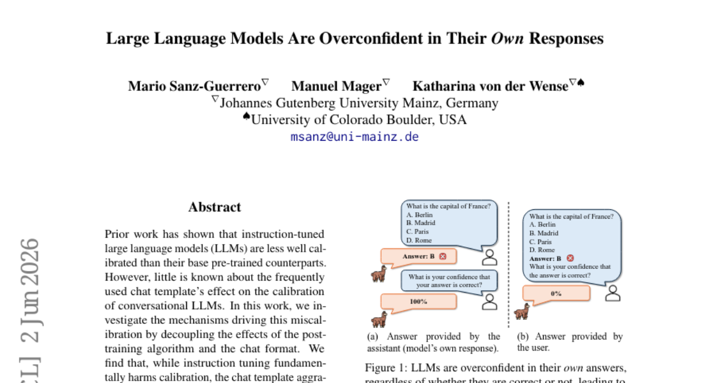

### 📌 한 줄 요약
채팅 템플릿으로 인한 LLM의 과잉 확신(Ownership Bias) 문제를 발견하고, 이를 해결하기 위한 간단한 추론 전략을 제안함

### 🔑 핵심 포인트
- 채팅 템플릿이 모델의 답변에 대해 과도한 확신을 갖게 하는 '소유권 편향'을 유발함을 규명
- 지시어 튜닝과 채팅 포맷이 캘리브레이션에 미치는 영향을 분리하여 분석
- 모델의 답변을 사용자 입력으로 간주하여 질문하는 방식의 간단한 추론 전략 제안

### 🧑‍💻 개발자 관점
LLM의 답변 신뢰도(Confidence score)를 활용할 때, 템플릿 구조로 인해 발생하는 왜곡된 수치를 인지하고 이를 보정하는 것이 중요함을 시사합니다.

### 🚀 실무 적용 아이디어
- 모델의 답변을 다시 사용자 입력(User input)으로 넣어 신뢰도를 측정하는 프롬프트 실험
- 현재 사용 중인 채팅 템플릿이 모델의 확신도에 미치는 영향 분석
- 신뢰도 기반의 의사결정 시스템 구축 시 소유권 편향 보정 로직 적용

### ⚠️ 리스크/한계
- 추론 시점에 추가적인 토큰 생성이 필요할 수 있음
- 특정 모델이나 특정 태스크에 국한된 효과일 가능성 존재

### 📝 초록 기반 상세 설명
지시어 튜닝(Instruction tuning)을 거친 LLM은 사전 학습 모델보다 캘리브레이션(Calibration) 성능이 낮다는 점이 알려져 있습니다. 본 연구는 포스트 트레이닝 알고리즘과 채팅 포맷의 영향을 분리하여 이 미스캘리브레이션의 원인을 조사했습니다. 실험 결과, 지시어 튜닝 자체가 캘리브레이션을 저해할 뿐만 아니라, 채팅 템플릿이 모델이 자신의 답변에 더 높은 확신을 갖게 하는 '소유권 편향(Ownership Bias)'을 유발함을 확인했습니다. 이를 해결하기 위해 모델의 답변을 사용자 입력처럼 프레이밍하는 간단한 추론 시점 전략을 제안합니다. 이 방법은 재학습 없이도 과잉 확신을 줄이고 캘리브레이션을 크게 개선하여 베이스 모델 수준의 성능을 회복시킵니다.

---

## 28. [Adaptive Multi-Resolution Procedural Knowledge Compression for Large Language Models](https://huggingface.co/papers/2606.12203)
**Upvotes**: 2 | **도입 난이도**: 중 | **신뢰도**: 상
**arXiv**: https://arxiv.org/abs/2606.12203

**태그**: LLM-Agent, Prompt-Compression, Efficiency, Soft-Prompt, Inference, Optimization

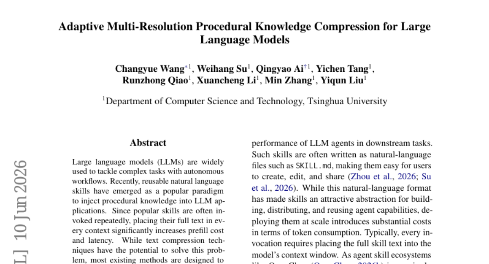

### 📌 한 줄 요약
LLM 에이전트의 워크플로우(Skill)를 효율적으로 압축하여 추론 비용과 지연 시간을 줄이는 적응형 소프트 토큰 압축 프레임워크 SKIM 제안

### 🔑 핵심 포인트
- 절차적 지식(Skill)의 논리적 의존성과 도구 프로토콜을 보존하는 소프트 토큰 압축 기술 개발
- 스킬의 복잡도에 따라 압축률을 조절하는 적응형 멀티 해상도(Multi-resolution) 프레임워크 구축
- 오프라인 압축 방식을 통해 빈번하게 업데이트되는 커뮤니티 스킬에 대한 경량화된 적용 가능성 확보

### 🧑‍💻 개발자 관점
에이전트 워크플로우가 복잡해질수록 프롬프트 길이가 길어져 비용과 속도 문제가 발생하는데, 이를 효율적으로 관리할 수 있는 기술적 대안을 제시합니다.

### 🚀 실무 적용 아이디어
- 제공된 GitHub 코드를 활용하여 특정 워크플로우 스킬에 대한 압축 성능 테스트
- 다양한 복잡도를 가진 스킬 셋을 구성하여 SKIM의 적응형 압축 효율 검증
- 기존 텍스트 압축(Summarization) 방식과 SKIM의 성능 및 비용 효율성 비교 실험

### ⚠️ 리스크/한계
- 소프트 토큰 방식이므로 일반적인 텍스트 기반 LLM 인터페이스에 즉시 적용하기 위한 추가적인 변환 과정 필요
- 압축률을 높일 경우 복잡한 논리 구조가 손실될 가능성 존재

### 📝 초록 기반 상세 설명
LLM 기반 에이전트 환경에서 재사용 가능한 자연어 스킬을 프롬프트에 포함할 경우, 반복적인 호출로 인해 높은 프리필(prefill) 비용과 지연 시간이 발생합니다. 기존의 텍스트 압축 방식은 사실적 정보 전달에 치중되어 있어, 논리적 의존성이 중요한 절차적 지식(Skill)을 압축하는 데는 한계가 있습니다. 본 논문에서는 스킬의 복잡도에 따라 가변적인 수의 소프트 토큰을 생성하는 SKIM(SKIll coMpression) 프레임워크를 제안합니다. SKIM은 워크플로우의 논리적 구조를 보존하면서도 오프라인에서 가볍게 압축을 수행할 수 있는 적응형 멀티 해상도 방식을 채택했습니다. 실험 결과, SKIM은 기존 방식보다 높은 성능을 유지하면서도 스킬 길이를 30~60% 수준으로 압축하는 데 성공했습니다.

---

## 29. [Lius: Translation Model Based Instructional Lingustic Using Continual Instruction Tuning In Kupang Malay](https://huggingface.co/papers/2606.11786)
**Upvotes**: 2 | **도입 난이도**: 중 | **신뢰도**: 상
**arXiv**: https://arxiv.org/abs/2606.11786

**태그**: LLM, Fine-tuning, Low-resource Language, Machine Translation, RAG, Evaluation

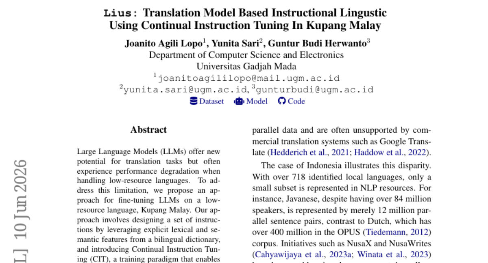

### 📌 한 줄 요약
저자원 언어(Kupang Malay) 번역 성능 향상을 위해 사전적 특징을 활용한 지속적 지시어 튜닝(CIT) 기법 제안

### 🔑 핵심 포인트
- 사전적 특징(Lexical/Semantic)을 활용한 정교한 지시어 세트 설계
- 반복적 학습이 가능한 지속적 지시어 튜닝(CIT) 프레임워크 도입
- 대규모 병렬 데이터 없이도 저자원 언어 번역 성능 극대화

### 🧑‍💻 개발자 관점
데이터가 부족한 특수 언어나 도메인 특화 언어 번역 모델을 구축할 때, 단순 파인튜닝이 아닌 구조화된 지시어 설계와 반복 학습 전략이 유효함을 시사합니다.

### 🚀 실무 적용 아이디어
- 특정 도메인 용어집(Glossary)을 활용한 지시어 생성 파이프라인 구축 실험
- 지속적 학습(Continual Learning) 시 발생하는 Catastrophic Forgetting 현상 모니터링
- 기존 LLM에 사전 기반 지시어를 주입했을 때의 성능 변화 비교

### ⚠️ 리스크/한계
- 사전 데이터의 품질에 따라 모델 성능이 크게 좌우될 수 있음
- 특정 언어 쌍에 최적화된 방식이 다른 언어군에도 범용적으로 적용될지 불확실함

### 📝 초록 기반 상세 설명
LLM은 번역 작업에 잠재력이 크지만 저자원 언어에서는 성능 저하가 발생하는 문제가 있습니다. 이를 해결하기 위해 저자원 언어인 Kupang Malay를 대상으로 한 미세 조정 접근법을 제안합니다. 연구진은 이중 언어 사전의 어휘적·의미적 특징을 활용하여 지시어 세트를 설계하고, 반복적인 학습이 가능한 지속적 지시어 튜닝(CIT) 패러다임을 도입했습니다. 제안된 모델인 Lius는 기존 지시어 튜닝 모델 대비 4-6점, 기존 NMT 및 다국어 LLM 대비 10-13점의 성능 향상을 기록했습니다. 결과적으로 이 방식은 대규모 병렬 데이터에 대한 의존도를 낮추면서도 효과적인 번역이 가능함을 입증했습니다.

---

## 30. [DRIFT: A Residual Flow Adapter for Decoding Continuous Outputs in Vision-Language Models](https://huggingface.co/papers/2606.05758)
**Upvotes**: 2 | **도입 난이도**: 중 | **신뢰도**: 상
**arXiv**: https://arxiv.org/abs/2606.05758

**태그**: VLM, Robotics, Flow-Matching, Continuous-Control, Vision, Evaluation

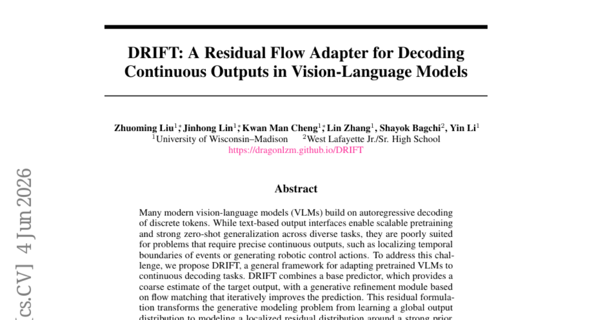

### 📌 한 줄 요약
사전 학습된 VLM을 활용하여 정밀한 연속적 출력(로봇 제어, 시간 경계 탐지 등)을 생성할 수 있도록 하는 잔차 흐름 어댑터 프레임워크

### 🔑 핵심 포인트
- Flow Matching 기반의 잔차(Residual) 학습을 통한 정밀한 연속 출력 생성
- 사전 학습된 VLM의 지식을 유지하면서 특정 태스크에 맞게 미세 조정하는 범용 어댑터 구조
- 전체 분포가 아닌 국소적 잔차 분포를 모델링하여 최적화 효율성 극대화

### 🧑‍💻 개발자 관점
LLM/VLM을 단순 텍스트 응답기가 아닌, 로봇 제어나 정밀한 수치 예측을 수행하는 실시간 제어 엔진으로 확장할 수 있는 방법론을 제시합니다.

### 🚀 실무 적용 아이디어
- 기존 VLM 모델에 Flow Matching 기반의 잔차 학습 레이어를 결합하는 실험 수행
- 로봇 동작 제어(VLA) 데이터셋을 활용한 정밀도 비교 테스트
- 단순 회귀(Regression) 모델 대비 DRIFT의 수렴 속도 및 정확도 검증

### ⚠️ 리스크/한계
- 잔차 모델링 특성상 베이스 예측기의 성능에 결과값이 크게 의존할 수 있음
- 실시간 제어 환경에서 Flow Matching의 반복적 정제 과정이 추론 지연(latency)을 유발할 가능성

### 📝 초록 기반 상세 설명
기존의 시각-언어 모델(VLM)은 이산적 토큰 생성 방식에 의존하여 정밀한 연속적 수치 출력이 필요한 작업에 한계가 있습니다. 이를 해결하기 위해 본 논문은 사전 학습된 VLM을 연속적 디코딩 작업에 적응시키는 DRIFT 프레임워크를 제안합니다. DRIFT는 대략적인 예측을 제공하는 베이스 예측기와 Flow Matching 기반의 생성적 정제 모듈을 결합한 구조를 가집니다. 이 방식은 전체 분포를 학습하는 대신 강력한 사전 확률 주변의 잔차(residual)만을 모델링하여 최적화 난이도를 낮춥니다. 실험 결과, 시각적 접지(grounding) 및 로봇 제어 등 다양한 태스크에서 기존 회귀 및 생성 모델보다 뛰어난 성능을 보였습니다.

### 🖼️ 추가 자료
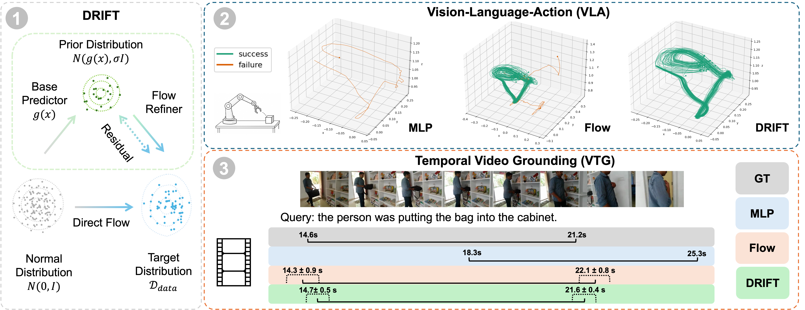

---

## 31. [APEX: A Network-Native Time-Series Foundation Model for Forecasting and Anomaly Detection for Wireless Edge Operations](https://huggingface.co/papers/2606.11553)
**Upvotes**: 1 | **도입 난이도**: 중 | **신뢰도**: 상
**arXiv**: https://arxiv.org/abs/2606.11553

**태그**: Time-Series, Foundation Model, Wireless Network, Anomaly Detection, Edge Computing, Benchmark, Evaluation, Inference

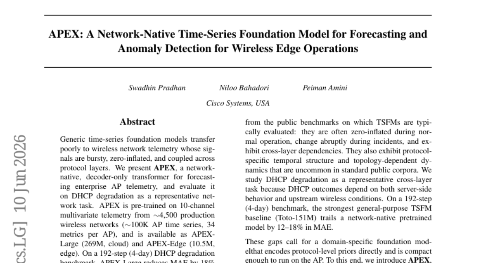

### 📌 한 줄 요약
무선 네트워크 특화 데이터로 사전 학습하여 예측 및 이상 탐지 성능을 극대화한 네트워크 네이티브 파운데이션 모델 APEX

### 🔑 핵심 포인트
- 무선 네트워크 데이터 특성(bursty, zero-inflated)을 반영한 네트워크 네이티브 사전 학습 방식 도입
- 대규모 프로덕션 데이터(10만 개 이상의 시계열)를 활용한 디코더 전용 트랜스포머 모델 개발
- 클라우드용(Large)과 엣지용(Edge) 모델 분리를 통한 성능과 효율성(sub-second inference)의 균형 확보

### 🧑‍💻 개발자 관점
일반적인 시계열 모델이 해결하기 어려운 네트워크 특유의 노이즈와 복잡한 상관관계를 도메인 특화 학습으로 해결하여 실무적인 운영 자동화 가능성을 제시합니다.

### 🚀 실무 적용 아이디어
- 보유 중인 네트워크 텔레메트리 데이터의 분포(zero-inflation 등)를 분석하여 범용 모델 적용 가능성 검토
- APEX-Edge와 같은 경량 모델을 활용한 엣지 디바이스에서의 실시간 추론 지연 시간 테스트
- 특정 네트워크 프로토콜(DHCP 등) 장애 시나리오를 활용한 이상 탐지 임계값 설정 실험

### ⚠️ 리스크/한계
- 특정 도메인(무선 네트워크)에 특화되어 있어 타 산업군 시계열 데이터로의 전이 학습 성능은 불투명함
- 실제 프로덕션 환경의 데이터 보안 및 프라이버시 이슈가 모델 배포 시 제약 사항이 될 수 있음

### 📝 초록 기반 상세 설명
기존의 범용 시계열 파운데이션 모델은 버스트성(bursty)과 제로-인플레이션(zero-inflated) 특성을 가진 무선 네트워크 텔레메트리 데이터에 적용 시 성능 저하가 발생합니다. 이를 해결하기 위해 연구진은 네트워크 도메인에 특화된 디코더 전용 트랜스포머 모델인 APEX를 제안합니다. APEX는 약 4,500개의 프로덕션 무선 네트워크에서 수집된 대규모 다변량 시계열 데이터를 통해 사전 학습되었습니다. 모델은 클라우드용 APEX-Large와 엣지용 APEX-Edge 두 가지 규모로 제공됩니다. 실험 결과, DHCP 성능 저하 벤치마크에서 기존 파운데이션 모델 및 통계적 모델 대비 우수한 예측 성능과 높은 이상 탐지 F1 스코어를 기록했습니다. 결과적으로 네트워크 네이티브 사전 학습이 선제적인 무선 운영을 위한 실질적인 토대가 될 수 있음을 입증했습니다.

---

## 32. [Which Models Are Our Models Built On? Auditing Invisible Dependencies in Modern LLMs](https://huggingface.co/papers/2606.12385)
**Upvotes**: 1 | **도입 난이도**: 중 | **신뢰도**: 상
**arXiv**: https://arxiv.org/abs/2606.12385

**태그**: LLM-Ops, Dependency-Analysis, AI-Governance, Agentic-System, Agent, RAG, Evaluation

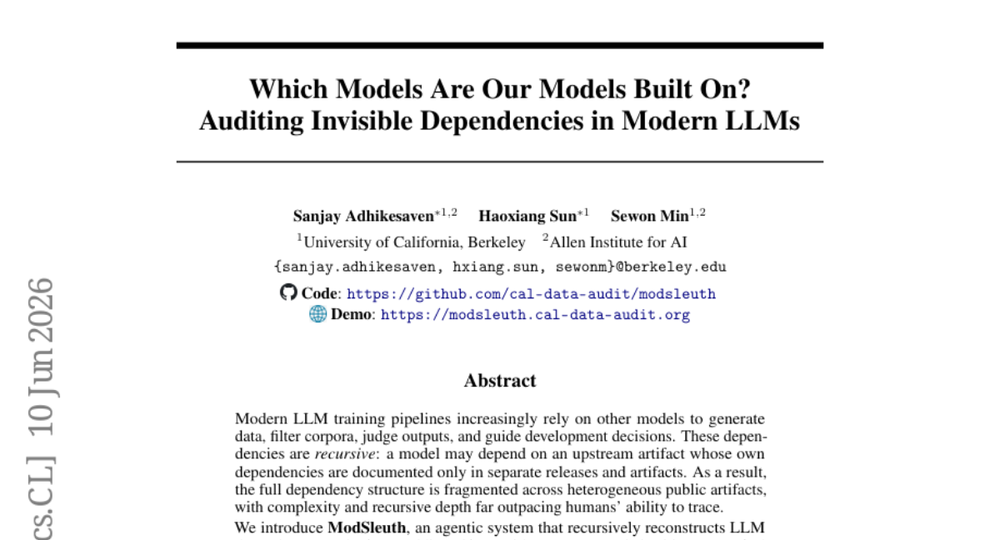

### 📌 한 줄 요약
LLM 개발 과정의 복잡한 모델 의존성을 자동 추적하여 라이선스 및 데이터 무결성을 검증하는 에이전트 시스템 제안

### 🔑 핵심 포인트
- 재귀적 의존성 추적을 위한 에이전트 시스템 'ModSleuth' 개발
- 불일치하는 문서와 다양한 아티팩트 간의 정체성 해결을 위한 정형화된 프레임워크 제안
- 라이선스 위반 위험 및 학습-평가 데이터 간의 결합 문제를 식별하는 대규모 의존성 그래프 구축

### 🧑‍💻 개발자 관점
LLM을 활용한 서비스를 구축할 때, 상위 모델의 라이선스나 데이터 오염(Data Contamination) 문제를 사전에 파악하는 데 필수적인 인사이트를 제공합니다.

### 🚀 실무 적용 아이디어
- 사용 중인 오픈소스 모델의 데이터 소스 및 상위 모델 의존성 리스트 확인
- 모델 라이선스 정책이 재귀적 의존성(Upstream)까지 미치는지 검토
- 학습 데이터와 평가 데이터 간의 의존성 분리 여부 체크

### ⚠️ 리스크/한계
- 공개된 아티팩트(문서, 코드)에 의존하므로 비공개 파이프라인의 의존성은 파악 불가
- 문서화가 부실한 경우 의존성 식별의 정확도가 떨어질 수 있음

### 📝 초록 기반 상세 설명
현대 LLM 학습 파이프라인은 데이터 생성, 필터링, 평가 등을 위해 타 모델에 대한 재귀적 의존성을 가지며, 이로 인해 전체 의존성 구조를 파악하기가 매우 어렵습니다. 본 논문은 공개된 아티팩트로부터 소스 근거를 바탕으로 LLM 의존성 그래프를 재귀적으로 재구성하는 에이전트 시스템인 ModSleuth를 소개합니다. 연구 과정에서 정보 추출보다 의존성의 정의와 불일치하는 문서 간의 아티팩트 식별이 더 큰 과제임을 확인했습니다. 이를 해결하기 위해 직접/간접 의존성을 구분하고, 운영 중심의 관계를 정의하며, 다양한 이름과 버전을 가진 아티팩트의 정체성을 해결하는 정형화된 방식을 도입했습니다. 실험 결과, 4개의 공개 LLM 릴리스에서 1,060개의 검증된 의존성을 복구하여 복잡한 의존성 그래프를 구축했습니다. 이를 통해 라이선스 의무, 학습-평가 결합 문제, 문서 불일치 등 숨겨진 리스크를 식별할 수 있음을 입증했습니다.

---

## 33. [Towards Diverse Scientific Hypothesis Search with Large Language Models](https://huggingface.co/papers/2606.10587)
**Upvotes**: 1 | **도입 난이도**: 중 | **신뢰도**: 상
**arXiv**: https://arxiv.org/abs/2606.10587

**태그**: LLM, Evolutionary Search, Scientific Discovery, Optimization

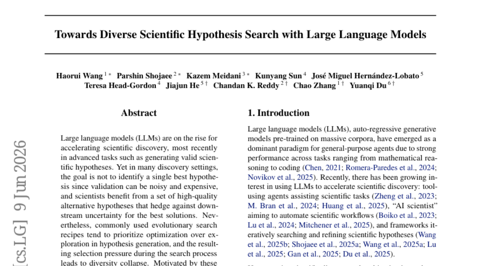

### 📌 한 줄 요약
고정된 검증 예산 내에서 LLM을 활용해 다양성과 품질을 동시에 확보하는 병렬 템퍼링 기반 가설 탐색 프레임워크 제안

### 🔑 핵심 포인트
- 가설 탐색을 '고정된 예산 내 샘플링 문제'로 정식화하여 다양성 확보 전략 수립
- 병렬 템퍼링 알고리즘을 적용하여 탐색(Exploration)과 수렴(Convergence) 사이의 균형 달성
- 다양한 과학적 도메인에서 검증 비용 대비 높은 효율성과 강건한 후보 생성 능력 입증

### 🧑‍💻 개발자 관점
단일 최적해를 찾는 것을 넘어, 불확실성이 높은 실무 환경에서 다양한 대안(Hedge)이 필요한 문제 해결에 유용합니다.

### 🚀 실무 적용 아이디어
- 기존의 단순 진화 알고리즘과 제안된 병렬 템퍼링 방식의 다양성 지표 비교 실험
- 제한된 API 호출 비용(Budget) 환경에서의 가설 생성 효율성 테스트
- 도메인 특화 검증 로직을 포함한 자동화된 가설 생성 파이프라인 구축

### ⚠️ 리스크/한계
- 온도 설정(Temperature setting) 등 하이퍼파라미터에 따른 탐색 성능 민감도 존재
- 검증 비용이 극도로 높은 도메인에서는 여전히 샘플링 효율성 최적화가 과제로 남음

### 📝 초록 기반 상세 설명
최근 LLM을 활용한 과학적 가설 생성 연구가 활발하지만, 기존의 진화적 탐색 방식은 최적화에만 치중하여 가설의 다양성이 급격히 감소하는 문제를 겪습니다. 연구진은 가설 탐색을 고정된 검증 예산 내에서 고품질의 다양한 후보를 생성하는 샘플링 문제로 재정의했습니다. 이를 해결하기 위해 고전적인 병렬 템퍼링(Parallel Tempering) 알고리즘에서 영감을 얻은 새로운 진화적 프레임워크를 제안합니다. 이 방식은 여러 온도 수준에서 가설을 탐색하며, 온도 간의 원칙적인 정보 교환을 통해 수렴을 방해하지 않으면서도 탐색 범위를 넓힙니다. 분자 발견, 방정식 발견, 알고리즘 발견 등 다양한 도메인 실험 결과, 동일 예산 대비 가설의 품질과 다양성이 모두 향상됨을 입증했습니다.

---

## 34. [τ-Rec: A Verifiable Benchmark for Agentic Recommender Systems](https://huggingface.co/papers/2606.10156)
**Upvotes**: 1 | **도입 난이도**: 중 | **신뢰도**: 상
**arXiv**: https://arxiv.org/abs/2606.10156

**태그**: Agentic-RS, Benchmark, LLM-Evaluation, Reasoning, Agent, Evaluation

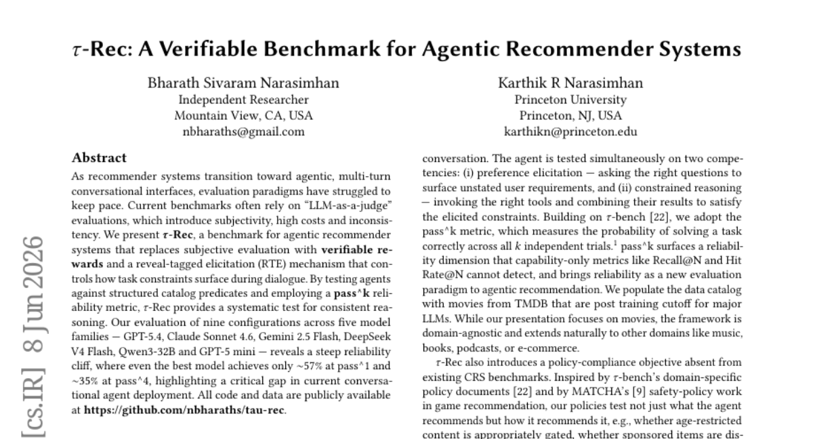

### 📌 한 줄 요약
주관적인 LLM 평가를 탈피하여 검증 가능한 보상 체계와 제약 조건 노출 제어를 통해 에이전트형 추천 시스템의 신뢰성을 측정하는 벤치마크 제안

### 🔑 핵심 포인트
- 주관적 평가를 배제한 검증 가능한 보상 체계 및 RTE 메커니즘 도입
- 대화 흐름에 따른 제약 조건 노출을 제어하여 추론의 일관성 측정
- 다양한 최신 LLM 모델들을 대상으로 한 신뢰성 격차(reliability cliff) 규명

### 🧑‍💻 개발자 관점
단순히 답변의 품질을 평가하는 것을 넘어, 에이전트가 사용자의 복잡한 제약 조건을 얼마나 일관되게 준수하는지 정량적으로 검증할 수 있는 프레임워크를 제공합니다.

### 🚀 실무 적용 아이디어
- 자체 구축한 추천 에이전트에 τ-Rec의 검증 가능한 보상 로직 적용 테스트
- 대화 단계별 제약 조건 노출 방식(RTE)에 따른 모델의 추론 성능 변화 관찰
- pass^k 지표를 활용한 에이전트의 반복적 성공 확률 측정

### ⚠️ 리스크/한계
- 구조화된 카탈로그 데이터에 의존하므로 비정형 데이터 환경에서의 일반화 가능성 검토 필요
- 실제 사용자 환경의 복잡한 의도 파악 능력을 완벽히 대체하기에는 한계가 있을 수 있음

### 📝 초록 기반 상세 설명
대화형 에이전트 기반 추천 시스템이 발전함에 따라 기존의 'LLM-as-a-judge' 방식은 주관성과 비용, 일관성 문제라는 한계에 직면했습니다. 이를 해결하기 위해 본 논문은 검증 가능한 보상(verifiable rewards)과 대화 중 제약 조건이 드러나는 방식을 제어하는 RTE(reveal-tagged elicitation) 메커니즘을 갖춘 τ-Rec 벤치마크를 제안합니다. 구조화된 카탈로그 술어와 pass^k 신뢰성 지표를 통해 에이전트의 일관된 추론 능력을 체계적으로 테스트합니다. 다양한 최신 모델들을 대상으로 실험한 결과, 모델 성능이 급격히 하락하는 '신뢰성 절벽(reliability cliff)' 현상이 관찰되었습니다. 이는 현재의 대화형 에이전트 기술이 실제 배포 환경에서 직면할 수 있는 심각한 성능 격차를 시사합니다.

---

## 35. [FlowLet: Conditional 3D Brain MRI Synthesis using Wavelet Flow Matching](https://huggingface.co/papers/2601.05212)
**Upvotes**: 1 | **도입 난이도**: 상 | **신뢰도**: 상
**arXiv**: https://arxiv.org/abs/2601.05212

**태그**: 3D Generative Model, Medical Imaging, Flow Matching, Data Augmentation, RAG, Inference, Optimization

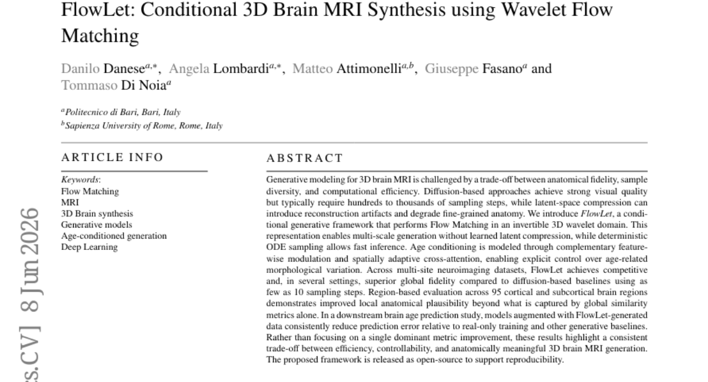

### 📌 한 줄 요약
웨이브릿 도메인 기반의 Flow Matching을 활용하여 연령 조건부 3D 뇌 MRI를 고해상도로 생성하는 프레임워크

### 🔑 핵심 포인트
- 가역적 3D 웨이브릿 도메인을 활용하여 압축 아티팩트 방지 및 연령 조건부 생성 구현
- Flow Matching 기법을 통한 빠른 추론 속도와 고정밀 3D MRI 합성
- 데이터 증강을 통한 특정 연령대(Underrepresented groups)의 BAP 모델 성능 개선

### 🧑‍💻 개발자 관점
의료 영상 데이터의 불균형 문제를 해결하기 위한 고해상도 3D 생성 기술로, 데이터 부족 문제를 해결하는 효과적인 증강 기법을 제시합니다.

### 🚀 실무 적용 아이디어
- 3D 웨이브릿 변환과 Flow Matching의 결합 구조 분석
- 생성된 데이터가 실제 해부학적 구조를 얼마나 정확히 유지하는지 정성적 평가
- 기존 LDM 방식 대비 추론 속도 및 메모리 사용량 비교 실험

### ⚠️ 리스크/한계
- 3D 볼륨 데이터 처리를 위한 높은 연산 자원 요구 가능성
- 생성된 데이터가 실제 임상 데이터의 통계적 특성을 완벽히 대변하는지에 대한 검증 필요

### 📝 초록 기반 상세 설명
뇌 연령 예측(BAP) 모델의 성능 향상을 위해서는 다양하고 균형 잡힌 3D MRI 데이터셋이 필수적이지만, 데이터 수집의 비용과 윤리적 제약으로 인해 데이터 불균형 문제가 발생합니다. 기존의 잠재 확산 모델(LDM)은 메모리 효율은 높으나 추론 속도가 느리고, 압축 과정에서의 아티팩트 발생 및 연령 조건부 생성의 어려움이 있습니다. 본 논문에서는 가역적(Invertible) 3D 웨이브릿 도메인 내에서 Flow Matching을 수행하는 FlowLet 프레임워크를 제안합니다. 이 방식은 압축 손실 없이 해부학적 구조를 보존하며 연령 조건에 맞는 고정밀 3D 볼륨을 생성합니다. 실험 결과, FlowLet은 적은 샘플링 단계로도 고품질 데이터를 생성하며, 이를 통해 학습된 BAP 모델은 소수 연령층에 대한 예측 성능을 크게 개선했습니다.

### 🖼️ 추가 자료
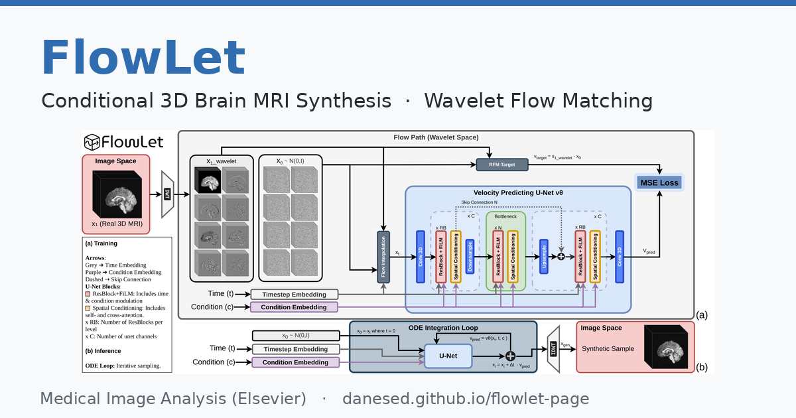

---

## 36. [ReVision: Scaling Computer-Use Agents via Temporal Visual Redundancy Reduction](https://huggingface.co/papers/2605.11212)
**Upvotes**: 1 | **도입 난이도**: 중 | **신뢰도**: 상
**arXiv**: https://arxiv.org/abs/2605.11212

**태그**: Agent, Multimodal, Efficiency, Computer-Use, RAG, Vision, Benchmark

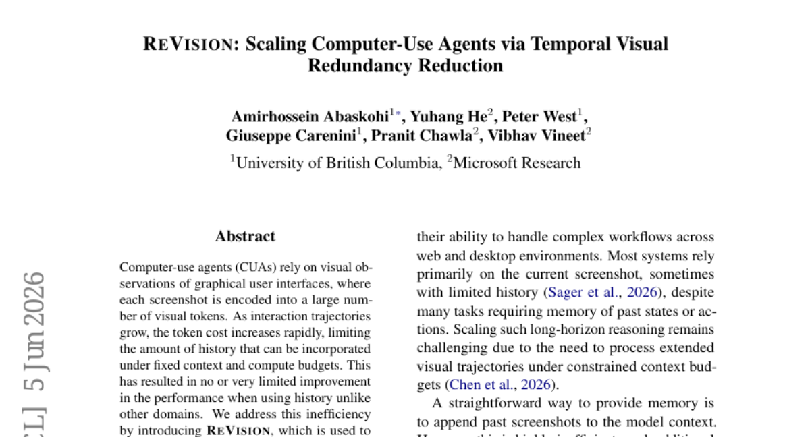

### 📌 한 줄 요약
시각적 중복성을 제거하여 토큰 비용을 절감하고 긴 작업 이력을 효율적으로 처리하는 컴퓨터 사용 에이전트(CUA) 학습 방법론

### 🔑 핵심 포인트
- 학습된 패치 선택기를 통한 시각적 중복성 제거 기술 제안
- 공간 구조를 유지하며 토큰 효율성을 극대화하는 ReVision 프레임워크
- 토큰 절감을 통해 더 긴 작업 이력(History) 활용 시 성능 향상 확인

### 🧑‍💻 개발자 관점
에이전트의 컨텍스트 윈도우 제한 문제를 해결하여, 비용 효율적으로 더 긴 작업 흐름을 기억하고 수행할 수 있는 기반을 제공합니다.

### 🚀 실무 적용 아이디어
- 멀티모달 모델의 스크린샷 입력 시 변화가 없는 영역을 마스킹하는 베이스라인 실험
- ReVision과 같은 패치 선택 방식이 공간적 정렬(Spatial Alignment)에 미치는 영향 분석
- 긴 작업 이력이 필요한 복잡한 워크플로우 자동화 태스크에 적용 테스트

### ⚠️ 리스크/한계
- 패치 선택 과정에서 중요한 미세한 시각적 변화가 손실될 위험
- 학습된 선택기가 특정 GUI 환경에 과적합(Overfitting)될 가능성

### 📝 초록 기반 상세 설명
컴퓨터 사용 에이전트(CUA)는 GUI 스크린샷을 대량의 시각적 토큰으로 인코딩하여 사용하므로, 작업 이력이 길어질수록 토큰 비용과 연산 부하가 급격히 증가하는 문제가 있습니다. 이로 인해 기존 모델들은 컨텍스트 제한 때문에 과거 이력을 충분히 활용하지 못하는 한계가 있었습니다. 본 논문은 연속된 스크린샷 간의 패치 표현을 비교하여 중복된 패치를 제거하면서도 공간 구조를 유지하는 학습 기반 패치 선택기(learned patch selector)인 ReVision을 제안합니다. 실험 결과, ReVision은 토큰 사용량을 평균 46% 절감하면서도 성공률을 향상시키는 성과를 거두었습니다. 이를 통해 에이전트가 더 긴 작업 이력을 효율적으로 처리할 수 있음을 입증했습니다.

---

## 37. [SparDA: Sparse Decoupled Attention for Efficient Long-Context LLM Inference](https://huggingface.co/papers/2606.04511)
**Upvotes**: 1 | **도입 난이도**: 중 | **신뢰도**: 상
**arXiv**: https://arxiv.org/abs/2606.04511

**태그**: LLM, Inference Optimization, KV Cache, Sparse Attention, Inference

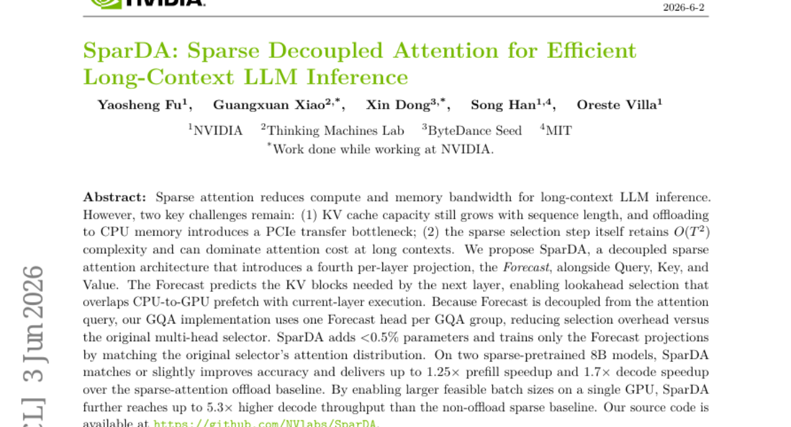

### 📌 한 줄 요약
Forecast 프로젝션을 통한 KV 캐시 프리페칭으로 긴 컨텍스트 추론 속도와 처리량을 극대화한 분리형 희소 어텐션 기술

### 🔑 핵심 포인트
- Forecast 프로젝션을 통한 KV 블록 예측 및 연산-전송 오버랩(Lookahead selection)
- GQA 구조에 최적화된 분리형 설계로 선택 오버헤드 및 파라미터 증가 최소화
- CPU 오프로딩 환경에서의 PCIe 병목 문제를 해결하여 디코드 처리량 극대화

### 🧑‍💻 개발자 관점
메모리 제약이 큰 환경에서 긴 컨텍스트를 처리할 때, 데이터 전송 병목을 줄이면서도 추론 속도를 높일 수 있는 실질적인 아키텍처 최적화 기법입니다.

### 🚀 실무 적용 아이디어
- 기존 Sparse Attention 모델에 Forecast 프로젝션 레이어 추가 및 학습 실험
- CPU-GPU 오프로딩 환경에서 PCIe 대역폭 대비 성능 향상 폭 측정
- GQA(Grouped Query Attention) 모델에 대한 Forecast 헤드 적용 효율성 검증

### ⚠️ 리스크/한계
- Forecast 예측 정확도에 따른 어텐션 품질 저하 가능성
- Sparse-pretrained 모델이 아닌 일반 모델로의 이식 시 추가 학습 필요성

### 📝 초록 기반 상세 설명
긴 컨텍스트 LLM 추론 시 KV 캐시 용량 증가와 CPU 오프로딩 시 발생하는 PCIe 전송 병목, 그리고 희소 선택 과정의 연산 복잡도가 주요 문제로 지적됩니다. 이를 해결하기 위해 SparDA는 기존 Q, K, V 외에 차세대 KV 블록을 예측하는 'Forecast' 프로젝션을 도입한 분리형 구조를 제안합니다. Forecast는 다음 레이어에 필요한 KV 블록을 미리 예측하여, 현재 레이어 연산과 CPU-to-GPU 프리페칭을 중첩(overlap)시킵니다. 또한 Forecast를 GQA 그룹당 하나만 사용하여 선택 오버헤드를 최소화했습니다. 실험 결과, 기존 희소 어텐션 오프로딩 방식 대비 프리필 및 디코드 속도를 대폭 향상시켰으며, 단일 GPU에서 더 큰 배치 사이즈를 지원하여 높은 디코드 처리량을 달성했습니다.

---

## 38. [Distilling LLM Feedback for Lean Theorem Proving](https://huggingface.co/papers/2605.30861)
**Upvotes**: 1 | **도입 난이도**: 중 | **신뢰도**: 상
**arXiv**: https://arxiv.org/abs/2605.30861

**태그**: LLM, Reinforcement Learning, Reasoning, Distillation, Vision, Evaluation

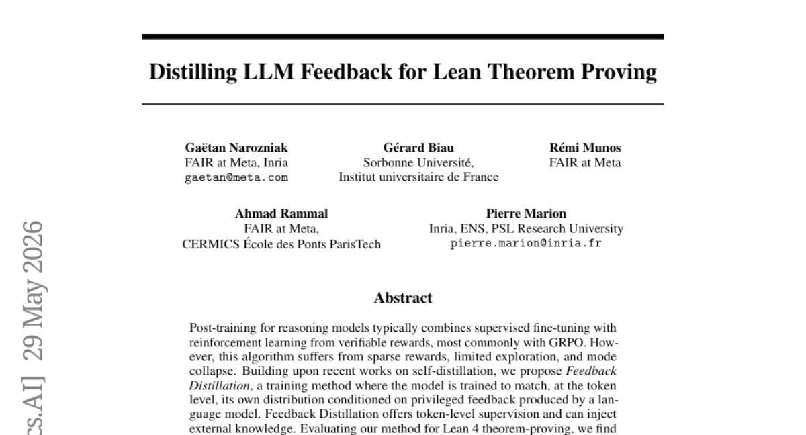

### 📌 한 줄 요약
LLM의 피드백을 토큰 단위로 학습에 반영하여 복잡한 추론(Lean4) 성능과 탐색 다양성을 높이는 새로운 증류 기법 제안

### 🔑 핵심 포인트
- Feedback Distillation: LLM의 피드백을 조건으로 토큰 수준의 분포를 일치시키는 학습 방법론
- 탐색 다양성 확보: GRPO의 고질적인 문제인 모드 붕괴를 방지하고 높은 정책 엔트로피 유지
- 상호 보완적 워크플로우: Feedback Distillation을 통한 초기화 후 GRPO를 적용하는 하이브리드 전략의 유효성 입증

### 🧑‍💻 개발자 관점
강화학습 기반 추론 모델 학습 시 발생하는 탐색 부족 및 성능 정체 문제를 해결할 수 있는 실질적인 방법론을 제공합니다.

### 🚀 실무 적용 아이디어
- GRPO 학습 전 단계로 Feedback Distillation을 적용하여 초기 체크포인트 생성 실험
- 다양한 추론 태스크(수학, 코드)에서 정책 엔트로피 변화량 측정
- 피드백 모델의 품질 변화에 따른 토큰 수준 학습의 안정성 테스트

### ⚠️ 리스크/한계
- 피드백을 생성하는 LLM의 품질에 따라 학습 결과가 종속될 위험이 있음
- 토큰 단위의 정밀한 학습을 위한 높은 계산 자원 필요성

### 📝 초록 기반 상세 설명
최근 추론 모델 학습은 GRPO와 같은 강화학습을 주로 사용하지만, 이는 보상이 희소하고 모드 붕괴(mode collapse)가 발생하는 문제가 있습니다. 이를 해결하기 위해 본 논문은 모델이 자신의 피드백을 바탕으로 토큰 수준에서 분포를 일치시키도록 학습하는 'Feedback Distillation'을 제안합니다. Lean4 정수론 증명 태스크에 적용한 결과, 제안 방법은 GRPO보다 더 높은 정책 엔트로피와 우수한 pass@k 성능을 보였습니다. 또한 두 방법은 상호 보완적이며, Feedback Distillation으로 초기화한 후 GRPO를 수행할 때 가장 뛰어난 성능을 나타냈습니다. 결과적으로 이 방식은 복잡한 추론을 위한 포스트 트레이닝의 새로운 방향성을 제시합니다.

---

