# 2026-06-14 Daily Papers (Top 44)

## 오늘의 요약
오늘의 연구는 단순한 성능 향상을 넘어, 복합적인 인터페이스와 동적 환경에서 에이전트의 실질적인 작업 수행 능력을 검증하고 강화하는 데 집중되었습니다. 특히 장기적 추론, 코드 기반의 상태 유지, 그리고 강화 학습을 통한 자기 복구 및 정교한 데이터 합성 등 에이전트의 강건성과 효율성을 높이는 방법론들이 주요하게 다뤄졌습니다.

### 오늘의 핵심 포인트
- GUI, CLI, 코드 편집 등 복합적인 환경에서 에이전트의 장기적 작업 수행 능력을 검증하기 위한 벤치마크와 프레임워크가 중요하게 다뤄졌습니다.
- 강화 학습(RL)과 테스트 타임 스케일링을 활용하여 수학적 증명, 이미지 복구, 멀티모달 생성 등 복잡한 추론 문제를 해결하려는 시도가 돋보였습니다.
- 모델이 편법(Shortcut)을 쓰지 않고 정교한 추론을 수행할 수 있도록 하는 데이터 합성 및 메모리 관리 전략이 핵심적인 연구 주제로 등장했습니다.

**오늘의 태그**: AI Agent, Reinforcement Learning, Reasoning, Benchmark, Multimodal

## 1. [EvoArena: Tracking Memory Evolution for Robust LLM Agents in Dynamic Environments](https://huggingface.co/papers/2606.13681)
**Upvotes**: 117 | **도입 난이도**: 중 | **신뢰도**: 상
**arXiv**: https://arxiv.org/abs/2606.13681

**태그**: LLM Agent, Memory Management, Dynamic Environment, Benchmark, Agent, RAG, Evaluation

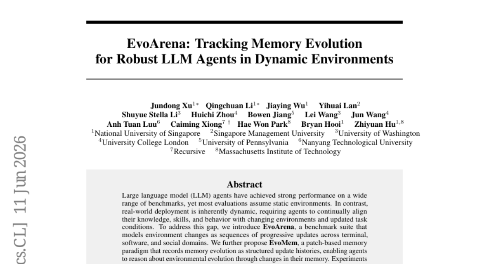

### 📌 한 줄 요약
동적 환경 변화에 대응하기 위해 메모리 업데이트 이력을 구조화하여 관리하는 새로운 에이전트 평가 벤치마크와 메모리 패러다임 제안

### 🔑 핵심 포인트
- 동적 환경 변화를 반영한 벤치마크 EvoArena 개발 (Terminal, Software, Social 도메인)
- 메모리 진화 과정을 구조화된 이력으로 관리하는 패치 기반 EvoMem 패러다임 제안
- 환경 변화에 따른 지식 및 행동 정렬을 위한 메모리 관리 기법의 효과 입증

### 🧑‍💻 개발자 관점
실제 서비스 환경처럼 데이터나 규칙이 계속 변하는 상황에서 에이전트의 메모리 관리 전략이 성능에 미치는 영향을 이해하는 데 중요합니다.

### 🚀 실무 적용 아이디어
- 동적 환경 변화 시나리오를 포함한 에이전트 테스트 셋 구축
- 기존 RAG 시스템에 패치 기반의 업데이트 이력 관리 로직 적용 실험
- 환경 변화가 발생했을 때 이전 메모리와의 충돌을 해결하는 프롬프트 엔지니어링 테스트

### ⚠️ 리스크/한계
- 메모리 이력이 길어질 경우 컨텍스트 윈도우 관리 및 비용 문제 발생 가능성
- 환경 변화의 복잡도가 높을 경우 구조화된 업데이트 방식의 효율성 검증 필요

### 📝 초록 기반 상세 설명
기존 LLM 에이전트 평가는 정적인 환경을 가정하지만, 실제 환경은 지속적으로 변화하는 동적인 특성을 가집니다. 이를 해결하기 위해 환경 변화를 단계적 업데이트로 모델링한 벤치마크인 EvoArena를 도입합니다. 또한, 메모리 진화 과정을 구조화된 업데이트 이력으로 기록하는 패치 기반 메모리 방식인 EvoMem을 제안합니다. 실험 결과, 기존 에이전트들은 변화하는 환경에서 낮은 성능을 보였으나 EvoMem을 통해 성능이 유의미하게 향상되었습니다. 특히 연속적인 하위 작업 수행 시 체인 수준의 정확도가 개선되었으며, 이는 메모리 내 증거 캡처 능력이 향상되었음을 시사합니다.

---

## 2. [MiniMax Sparse Attention](https://huggingface.co/papers/2606.13392)
**Upvotes**: 99 | **도입 난이도**: 중 | **신뢰도**: 상
**arXiv**: https://arxiv.org/abs/2606.13392

**태그**: Long-Context, LLM-Inference, Sparse-Attention, GPU-Optimization, Agent, RAG, Reasoning, Multimodal, Evaluation, Inference

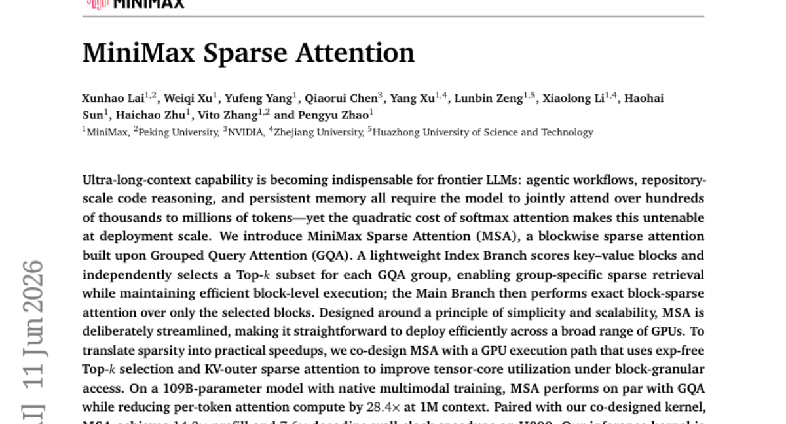

### 📌 한 줄 요약
GQA 기반의 블록 단위 희소 어텐션(MSA)을 통해 1M 컨텍스트 환경에서 연산량을 획기적으로 줄이면서도 성능을 유지하는 기술

### 🔑 핵심 포인트
- GQA 구조를 활용한 블록 단위 희소 어텐션(MSA) 설계
- Index Branch를 통한 그룹별 Top-k 블록 선택 및 Main Branch의 정밀 어텐션 결합
- GPU 텐서 코어 활용도를 높이기 위한 exp-free Top-k 및 전용 커널 최적화

### 🧑‍💻 개발자 관점
수십만 토큰 이상의 초장기 컨텍스트를 다루는 에이전트나 코드 분석 워크플로우에서 추론 비용과 지연 시간을 획기적으로 낮출 수 있습니다.

### 🚀 실무 적용 아이디어
- 제공된 GitHub 커널을 사용하여 기존 GQA 모델과 추론 속도 및 메모리 점유율 비교
- 1M 이상의 긴 컨텍스트 환경에서 정보 회수(Retrieval) 성능 테스트
- 다양한 GPU 아키텍처에서의 커널 최적화 효율성 검증

### ⚠️ 리스크/한계
- Top-k 선택 방식에 따른 특정 컨텍스트에서의 정보 손실 가능성
- 블록 단위 접근 방식이 매우 미세한(fine-grained) 어텐션이 필요한 작업에 미치는 영향

### 📝 초록 기반 상세 설명
초장기 컨텍스트 처리가 필수적인 LLM 환경에서 기존 소프트맥스 어텐션의 이차 복잡도 문제는 배포 규모 확장을 어렵게 만듭니다. 이를 해결하기 위해 GQA를 기반으로 한 블록 단위 희소 어텐션인 MiniMax Sparse Attention(MSA)을 제안합니다. Index Branch가 KV 블록을 스코어링하여 그룹별로 Top-k 블록을 선택하면, Main Branch가 선택된 블록에 대해서만 정밀한 어텐션을 수행합니다. 또한 GPU 연산 효율을 극대화하기 위해 exp-free Top-k 선택 및 KV-outer sparse attention이 적용된 전용 커널을 공동 설계했습니다. 실험 결과, 109B 모델에서 1M 컨텍스트 기준 연산량을 28.4배 절감하면서도 GQA 수준의 성능을 유지하며 압도적인 추론 속도 향상을 달성했습니다.

---

## 3. [WeaveBench: A Long-Horizon, Real-World Benchmark for Computer-Use Agents with Hybrid Interfaces](https://huggingface.co/papers/2606.09426)
**Upvotes**: 94 | **도입 난이도**: 중 | **신뢰도**: 상
**arXiv**: https://arxiv.org/abs/2606.09426

**태그**: AI Agent, Benchmark, Automation, Computer-Use, Agent, Evaluation

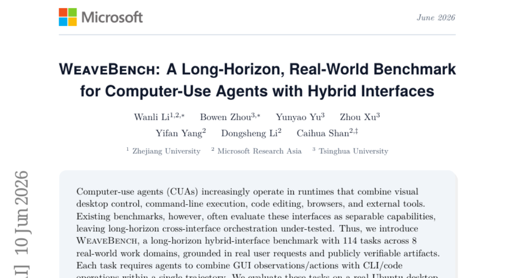

### 📌 한 줄 요약
GUI, CLI, 코드 편집을 넘나드는 복합 인터페이스 환경에서 에이전트의 장기 작업 수행 능력을 검증하는 벤치마크 제안

### 🔑 핵심 포인트
- GUI, CLI, 코드 편집이 결합된 하이브리드 인터페이스 기반의 장기 작업 벤치마크 구축
- 결과물뿐만 아니라 실행 로그, 스크린샷, 액션 트레이스를 모두 검증하는 궤적 인식 판정기 제안
- 단순 결과 중심 평가가 에이전트 성능을 과대평가하는 문제를 지적하고 실질적인 수행 능력 검증

### 🧑‍💻 개발자 관점
에이전트가 단순한 챗봇을 넘어 실제 개발 환경(IDE, 터미널, 브라우저)에서 복합적인 워크플로우를 수행할 수 있는지 측정하는 실무적 기준을 제공합니다.

### 🚀 실무 적용 아이디어
- 에이전트의 작업 과정 중 '지름길(shortcut)'이나 허위 증거 생성 여부 모니터링
- 단순 결과(Pass/Fail) 외에 실행 로그와 스크린샷을 포함한 다각도 평가 파이프라인 구축
- GUI와 CLI를 교차로 사용하는 복합 시나리오 테스트 케이스 설계

### ⚠️ 리스크/한계
- 실제 데스크톱 환경(Ubuntu) 기반이므로 에이전트 실행을 위한 인프라 비용 발생
- 복합적인 궤적 검증을 위한 판정기(Judge) 모델의 신뢰도 확보 필요

### 📝 초록 기반 상세 설명
최근 컴퓨터 사용 에이전트(CUA)는 시각적 데스크톱 제어와 코드/CLI 실행이 결합된 복합 환경에서 동작하지만, 기존 벤치마크는 각 인터페이스를 분리하여 평가하는 한계가 있습니다. 이를 해결하기 위해 8개 실무 도메인과 114개 태스크로 구성된 장기 작업 벤치마크인 WeaveBench를 도입합니다. 이 벤치마크는 단일 궤적 내에서 GUI와 CLI/코드 작업을 통합하는 능력을 요구하며, 결과물뿐만 아니라 실행 과정을 검증하는 궤적 인식 판정기(trajectory-aware judge)를 함께 제안합니다. 실험 결과, 최신 모델들의 최고 성공률이 41.2%에 그쳐 복합 인터페이스 오케스트레이션 능력이 여전히 부족함을 확인했습니다. 또한, 결과 중심의 평가 방식이 에이전트의 성능을 과대평가할 수 있음을 밝혀냈습니다.

---

## 4. [SpatialClaw: Rethinking Action Interface for Agentic Spatial Reasoning](https://huggingface.co/papers/2606.13673)
**Upvotes**: 80 | **도입 난이도**: 중 | **신뢰도**: 상
**arXiv**: https://arxiv.org/abs/2606.13673

**태그**: Agent, Spatial Reasoning, Code-as-Interface, VLM, RAG, Reasoning, Vision, Benchmark, Evaluation

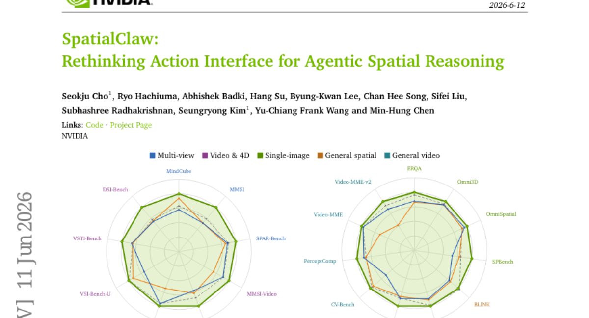

### 📌 한 줄 요약
코드 인터페이스를 통해 상태를 유지하며 유연한 3D/4D 공간 추론을 수행하는 에이전트 프레임워크 제안

### 🔑 핵심 포인트
- 코드 기반의 상태 유지(Stateful) 인터페이스를 통한 유연한 공간 추론 구현
- Perception 및 Geometry 프리미티브가 사전 로드된 Python 커널 활용
- 학습 없이(Training-free) 다양한 VLM 백본에서 범용적으로 작동하는 프레임워크

### 🧑‍💻 개발자 관점
에이전트 설계 시 단순한 API 호출을 넘어, 코드 실행 환경을 통한 상태 유지와 단계적 추론이 성능에 미치는 결정적 영향을 보여줍니다.

### 🚀 실무 적용 아이디어
- 제공된 Python 프리미티브 라이브러리를 활용한 에이전트 워크플로우 구현 테스트
- 다양한 VLM 모델(GPT-4o, Claude 등)을 커널에 연결하여 성능 변화 관찰
- 정적 3D 데이터 외에 동적 4D 시나리오에서의 코드 생성 정확도 검증

### ⚠️ 리스크/한계
- 코드 실행 환경(Sandbox)의 보안 및 안정성 확보 필요
- 복잡한 코드 생성 시 발생할 수 있는 논리적 오류 및 무한 루프 위험

### 📝 초록 기반 상세 설명
기존 VLM 기반 공간 추론 에이전트는 단일 실행 방식이나 경직된 도구 호출 인터페이스로 인해 복잡하고 개방적인 공간 문제 해결에 한계가 있었습니다. 본 논문은 이러한 인터페이스 설계가 에이전트의 추론 능력에 미치는 영향을 분석합니다. 이를 해결하기 위해 코드 자체를 액션 인터페이스로 사용하는 SpatialClaw 프레임워크를 제안합니다. SpatialClaw는 상태를 유지하는 Python 커널을 통해 에이전트가 이전 단계의 결과를 바탕으로 코드를 단계적으로 작성하며 유연하게 작업을 수행할 수 있게 합니다. 20개의 다양한 공간 추론 벤치마크에서 실험한 결과, 기존 방식보다 월등한 성능 향상을 입증했습니다.

---

## 5. [InterleaveThinker: Reinforcing Agentic Interleaved Generation](https://huggingface.co/papers/2606.13679)
**Upvotes**: 74 | **도입 난이도**: 중 | **신뢰도**: 상
**arXiv**: https://arxiv.org/abs/2606.13679

**태그**: Multi-Agent, Image Generation, Reinforcement Learning, Multimodal, Agent, Reasoning, Vision, Benchmark, Evaluation

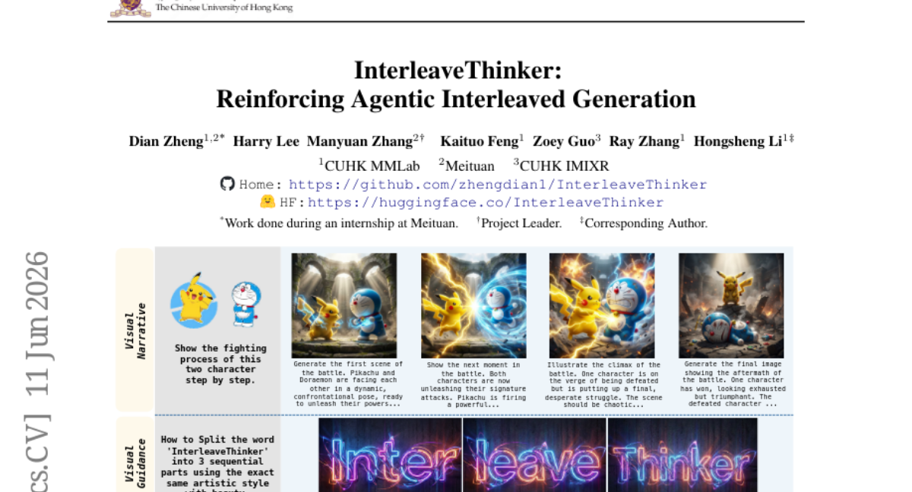

### 📌 한 줄 요약
기존 이미지 생성 모델에 에이전트 파이프라인을 결합하여 텍스트-이미지 교차 생성(Interleaved Generation) 능력을 부여하는 프레임워크

### 🔑 핵심 포인트
- Planner-Critic 구조를 통한 범용 이미지 생성 모델의 인터리브 생성 능력 부여
- GRPO를 활용한 단계별 지시 수정(Step-wise instruction correction) 강화 학습
- 단일 단계 RL 최적화를 통해 긴 생성 트래젝토리의 효율적 학습 문제 해결

### 🧑‍💻 개발자 관점
이미지 생성 모델을 직접 재학습시키지 않고도 에이전트 구조를 통해 시각적 내러티브나 복잡한 멀티모달 태스크를 수행할 수 있는 방법론을 제시합니다.

### 🚀 실무 적용 아이디어
- 기존 오픈소스 이미지 모델(FLUX 등)에 Planner/Critic 에이전트 프롬프트 엔지니어링 적용해보기
- 제안된 SFT 데이터셋 구조를 참고하여 특정 도메인용 인터리브 데이터셋 구축 실험
- GRPO를 이용한 멀티모달 피드백 루프 구현 가능성 검토

### ⚠️ 리스크/한계
- 에이전트 호출 횟수가 많아질 경우 발생하는 추론 비용 및 지연 시간(Latency) 문제
- Planner의 초기 계획 오류가 전체 생성 시퀀스에 미치는 영향

### 📝 초록 기반 상세 설명
최근 이미지 생성 모델의 성능은 뛰어나지만, 텍스트와 이미지가 교차되는 시퀀스 생성 능력은 여전히 부족한 실정입니다. 본 논문은 기존의 어떤 이미지 생성기라도 사용할 수 있도록 설계된 멀티 에이전트 파이프라인인 InterleaveThinker를 제안합니다. Planner 에이전트가 시퀀스를 계획하고, Critic 에이전트가 생성된 결과물을 평가 및 수정하여 정교한 제어를 수행합니다. 이를 위해 SFT와 GRPO 기반의 RL을 활용하여 단계별 지시 이행 및 수정 능력을 학습시켰습니다. 실험 결과, InterleaveThinker는 최신 모델들과 대등한 성능을 보였으며, 기존 모델의 추론 기반 벤치마크 성능까지 향상시키는 효과를 입증했습니다.

---

## 6. [MaxProof: Scaling Mathematical Proof with Generative-Verifier RL and Population-Level Test-Time Scaling](https://huggingface.co/papers/2606.13473)
**Upvotes**: 73 | **도입 난이도**: 상 | **신뢰도**: 상
**arXiv**: https://arxiv.org/abs/2606.13473

**태그**: Reasoning, Reinforcement Learning, Test-Time Scaling, Mathematical Proof

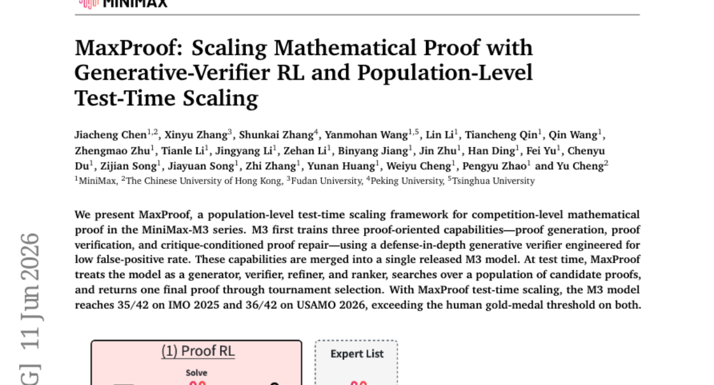

### 📌 한 줄 요약
생성-검증 RL과 개체군 기반 테스트 타임 스케일링을 결합하여 수학적 증명 성능을 극대화한 프레임워크

### 🔑 핵심 포인트
- 생성-검증 RL을 통한 고정밀 증명 및 수정 능력 확보
- 테스트 타임에 후보군을 탐색하고 토너먼트 방식으로 선택하는 스케일링 전략
- 단일 모델 내에 생성, 검증, 수정, 랭킹 기능을 통합한 아키텍처

### 🧑‍💻 개발자 관점
추론 모델의 성능을 모델 크기 확장 없이 테스트 타임의 연산량(Compute) 조절만으로 극대화하는 최신 트렌드를 보여줍니다.

### 🚀 실무 적용 아이디어
- Self-correction 및 Verifier 루프를 활용한 에이전트 워크플로우 설계 실험
- 다양한 후보 해를 생성한 후 랭킹 알고리즘을 통한 최적해 선택 로직 구현
- 특정 도메인(코드 생성 등)에 대한 검증기(Verifier) 학습 데이터셋 구축

### ⚠️ 리스크/한계
- 테스트 타임 연산 비용(Inference Cost)이 매우 높을 수 있음
- 검증기(Verifier)의 오판(False Positive)이 전체 시스템의 신뢰도를 저해할 위험

### 📝 초록 기반 상세 설명
수학적 증명과 같은 고난도 추론 작업에서 모델의 성능을 극대화하기 위한 새로운 프레임워크인 MaxProof를 제안합니다. 기존 모델의 한계를 극복하기 위해 증명 생성, 검증, 수정(repair) 능력을 분리하여 학습시킨 후 이를 하나의 모델로 통합하는 defense-in-depth 전략을 사용합니다. 테스트 타임에는 모델을 생성기, 검증기, 정제기, 순위 지정기로 활용하여 후보 증명군 사이에서 토너먼트 선택 방식을 통해 최적의 해를 찾습니다. 이러한 인구 통계적 스케일링(population-level scaling)을 통해 M3 모델은 IMO 및 USAMO 수준의 최고 난도 수학 문제에서 골드 메달 수준의 성적을 달성했습니다.

---

## 7. [Robust-U1: Can MLLMs Self-Recover Corrupted Visual Content for Robust Understanding?](https://huggingface.co/papers/2606.08063)
**Upvotes**: 73 | **도입 난이도**: 상 | **신뢰도**: 상
**arXiv**: https://arxiv.org/abs/2606.08063

**태그**: MLLM, Image Restoration, Robustness, Reinforcement Learning, Reasoning, Multimodal, Vision, Benchmark, Safety

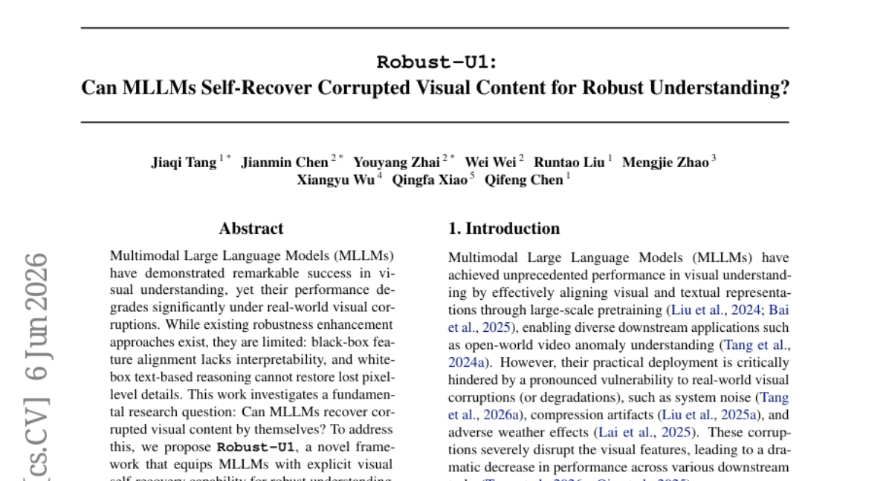

### 📌 한 줄 요약
MLLM이 손상된 이미지를 스스로 복구하여 시각적 이해도를 높이는 Robust-U1 프레임워크 제안

### 🔑 핵심 포인트
- 시각적 자기 복구(Visual Self-recovery) 능력을 갖춘 MLLM 프레임워크 Robust-U1 제안
- 픽셀 수준(SSIM)과 의미적 수준(CLIP)의 이중 보상을 활용한 강화 학습 적용
- 손상된 입력과 복구된 이미지를 결합하여 추론하는 멀티모달 워크플로우 구축

### 🧑‍💻 개발자 관점
이미지 노이즈나 저화질 데이터가 포함된 실제 환경의 비전 AI 시스템 구축 시, 데이터 전처리 없이 모델 자체의 복구 능력을 통해 강건성을 확보하는 전략을 제시합니다.

### 🚀 실무 적용 아이디어
- 제공된 소스 코드를 활용하여 다양한 노이즈 환경에서의 복구 품질 테스트
- 강화 학습 단계에서의 SSIM과 CLIP 보상 비율 변화에 따른 성능 민감도 분석
- 특정 도메인(의료, 위성 등)의 특수 손상 데이터셋에 대한 적용 가능성 검토

### ⚠️ 리스크/한계
- 복구 과정에서 발생할 수 있는 환각(Hallucination) 현상이 추론 오류로 이어질 위험
- 고해상도 이미지 복구 시 추가적인 연산 비용 및 추론 지연 시간 발생 가능성

### 📝 초록 기반 상세 설명
최근 MLLM은 뛰어난 성능을 보이지만, 실제 환경의 시각적 노이즈나 손상에 취약하다는 문제가 있습니다. 기존 방식은 특징 정렬에 치중하거나 텍스트 기반 추론에만 의존하여 픽셀 수준의 세부 정보를 복구하지 못하는 한계가 있습니다. 본 논문은 MLLM이 스스로 손상된 시각 정보를 복구할 수 있는지 탐구하며, 이를 위해 Robust-U1 프레임워크를 제안합니다. 이 프레임워크는 지도 학습 기반의 초기 재구성, 픽셀 및 의미론적 보상을 결합한 강화 학습, 그리고 복구된 이미지와 원본을 동시에 고려하는 추론 단계로 구성됩니다. 실험 결과, Robust-U1은 실세계 손상 벤치마크에서 SOTA 성능을 달성했으며, 고품질 시각 복구가 추론 성능 향상으로 직결됨을 입증했습니다.

---

## 8. [FORT-Searcher: Synthesizing Shortcut-Resistant Search Tasks for Training Deep Search Agents](https://huggingface.co/papers/2606.12087)
**Upvotes**: 71 | **도입 난이도**: 중 | **신뢰도**: 상
**arXiv**: https://arxiv.org/abs/2606.12087

**태그**: AI Agent, Data Synthesis, Reasoning, Search, Agent, RAG, Benchmark

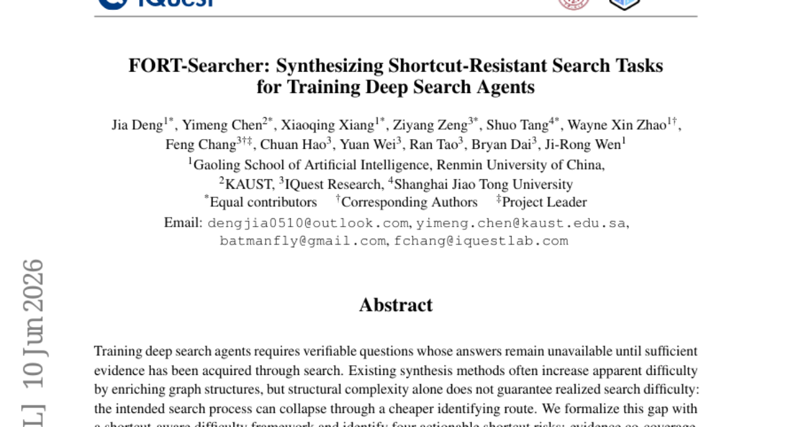

### 📌 한 줄 요약
지름길(Shortcut) 문제를 해결하여 심층 검색 에이전트의 추론 능력을 극대화하는 데이터 합성 프레임워크 제안

### 🔑 핵심 포인트
- 지름길 위험 요소(Evidence co-coverage, Single-clue selectivity 등)를 정의한 난이도 프레임워크 정립
- 지름길을 방지하는 4단계 데이터 합성 프로세스(FORT) 개발
- SFT(Supervised Fine-Tuning)만으로 고성능 심층 검색 에이전트 구현 성공

### 🧑‍💻 개발자 관점
단순히 복잡한 그래프를 만드는 것이 아니라, 모델이 편법을 쓰지 못하게 하는 정교한 데이터 엔지니어링 기법을 제공합니다.

### 🚀 실무 적용 아이디어
- 현재 보유한 RAG/Search 데이터셋에 '지름길 위험 요소'가 포함되어 있는지 진단
- 데이터 합성 파이프라인에 적대적 정제(Adversarial Refinement) 단계 도입 검토
- 에이전트 성능 평가 시 '정답 도달 시간'과 '지름길 사용률' 지표 적용

### ⚠️ 리스크/한계
- 데이터 합성 과정의 복잡도로 인한 높은 연산 비용 발생 가능성
- 정교하게 설계된 지름길 방지 기법이 일반적인 검색 태스크의 효율성을 저해할 가능성

### 📝 초록 기반 상세 설명
심층 검색 에이전트 학습을 위해서는 충분한 탐색이 선행되어야 하는 검증 가능한 질문이 필요합니다. 기존의 데이터 합성 방식은 구조적 복잡성만 높일 뿐, 정답을 쉽게 찾아내는 '지름길' 문제를 해결하지 못해 실제 검색 난이도를 보장하지 못합니다. 본 논문은 지름길 위험 요소를 정의하는 프레임워크를 통해 데이터 합성 과정에서 이를 제어하는 FORT를 제안합니다. FORT는 엔티티 선택부터 적대적 정제까지 전 과정에서 지름길 위험을 관리하여 견고한 학습 데이터를 생성합니다. 실험 결과, FORT로 학습된 FORT-Searcher는 기존 오픈소스 에이전트 대비 뛰어난 심층 검색 성능을 입증했습니다.

---

## 9. [LabVLA: Grounding Vision-Language-Action Models in Scientific Laboratories](https://huggingface.co/papers/2606.13578)
**Upvotes**: 52 | **도입 난이도**: 상 | **신뢰도**: 상
**arXiv**: https://arxiv.org/abs/2606.13578

**태그**: VLA, Robotics, Simulation, Foundation Model, RAG, Vision, Benchmark, Evaluation

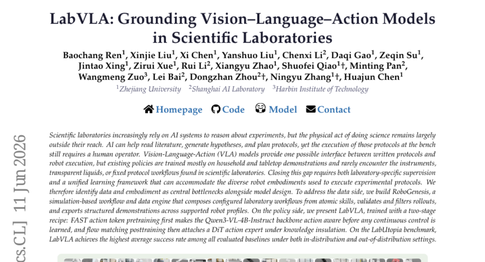

### 📌 한 줄 요약
실험실 환경의 복잡한 워크플로우와 다양한 로봇 하드웨어를 지원하는 시각-언어-행동(VLA) 모델 프레임워크 제안

### 🔑 핵심 포인트
- RoboGenesis: 실험실 워크플로우를 원자적 기술 단위로 구성하고 검증하는 시뮬레이션 기반 데이터 엔진 개발
- LabVLA: FAST 사전 학습(행동 인식)과 Flow Matching 사후 학습(연속 제어)을 결합한 2단계 학습 전략
- 다양한 로봇 하드웨어와 실험실 환경에 대한 범용적인 적응력 확보

### 🧑‍💻 개발자 관점
실제 물리적 환경(실험실)에서 LLM/VLM 기반 에이전트가 어떻게 정교한 동작 제어와 복잡한 워크플로우를 수행할 수 있는지에 대한 방법론을 제시합니다.

### 🚀 실무 적용 아이디어
- 시뮬레이션 환경(RoboGenesis 유사 환경) 구축 및 데이터 생성 파이프라인 설계
- VLM 백본에 행동 토큰을 주입하는 사전 학습 전략 실험
- Flow Matching을 이용한 연속적인 로봇 제어(Action Expert) 결합 테스트

### ⚠️ 리스크/한계
- 시뮬레이션 데이터와 실제 실험실 환경 간의 Sim-to-Real 간극 존재 가능성
- 복잡한 실험 장비 및 투명 액체 등 특수 환경에 대한 일반화 한계

### 📝 초록 기반 상세 설명
과학 실험실의 자동화를 위해 AI가 프로토콜을 실행하는 능력이 필요하지만, 기존 VLA 모델은 가정용 데이터 위주로 학습되어 실험실 특유의 환경과 장비에 적합하지 않습니다. 이를 해결하기 위해 데이터와 로봇 형태(embodiment)의 차이를 극복할 수 있는 통합 학습 프레임워크가 필요합니다. 본 논문은 시뮬레이션 기반 데이터 엔진인 RoboGenesis를 구축하여 실험실 워크플로우를 자동 생성하고 검증합니다. 모델 측면에서는 Qwen3-VL을 백본으로 하여 FAST 사전 학습과 Flow Matching 사후 학습을 결합한 LabVLA를 제안합니다. 실험 결과, LabVLA는 LabUtopia 벤치마크에서 기존 모델들을 상회하는 높은 성공률을 기록했습니다.

---

## 10. [HYDRA-X: Native Unified Multimodal Models with Holistic Visual Tokenizers](https://huggingface.co/papers/2606.13289)
**Upvotes**: 25 | **도입 난이도**: 상 | **신뢰도**: 상
**arXiv**: https://arxiv.org/abs/2606.13289

**태그**: Multimodal, Vision-Transformer, Video-Generation, Tokenization, Vision, Video, Optimization

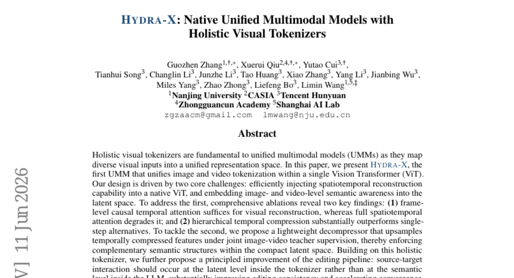

### 📌 한 줄 요약
이미지와 비디오 토큰화를 단일 ViT로 통합하여 일관된 시공간 표현을 구현한 차세대 멀티모달 모델(UMM) 연구

### 🔑 핵심 포인트
- 단일 ViT 구조 내에서 이미지와 비디오 토큰화를 통합하는 홀리스틱 토크나이저 설계
- 계층적 시간 압축 및 프레임 단위 인과적 어텐션을 통한 효율적인 시공간 재구성
- 잠재 공간 수준에서의 소스-타겟 상호작용을 통한 편집 일관성 및 수렴 속도 개선

### 🧑‍💻 개발자 관점
이미지와 비디오를 별도의 모델로 처리하지 않고 하나의 토크나이저로 통합함으로써, 멀티모달 작업 간의 데이터 일관성을 확보하고 모델 구조를 단순화할 수 있습니다.

### 🚀 실무 적용 아이디어
- 제안된 계층적 시간 압축 방식이 단일 단계 압축 대비 연산 효율성에서 갖는 이점 검증
- LLM 내부가 아닌 토크나이저 레벨에서의 편집 방식이 생성 품질에 미치는 영향 분석
- 다양한 해상도 및 프레임 레이트 환경에서의 토크나이저 강건성 테스트

### ⚠️ 리스크/한계
- 단일 ViT 구조 내에서 이미지와 비디오의 복잡한 특징을 모두 수용할 때 발생하는 연산 부하
- 7B 규모의 모델 크기로 인해 실시간 추론 환경에서의 배포 제약 가능성

### 📝 초록 기반 상세 설명
기존의 통합 멀티모달 모델(UMM)은 다양한 시각적 입력을 하나의 표현 공간으로 매핑하는 홀리스틱 토크나이저가 필수적입니다. 본 논문은 이미지와 비디오 토큰화를 단일 ViT 내에서 통합하는 최초의 모델인 HYDRA-X를 제안합니다. 연구팀은 시공간 재구성 능력 주입과 이미지/비디오 수준의 의미론적 인지 결합이라는 두 가지 핵심 과제를 해결하고자 했습니다. 이를 위해 프레임 단위의 인과적 시간 어텐션과 계층적 시간 압축 방식을 도입하고, 교사 모델의 감독을 받는 경량 디컴프레서를 통해 잠재 공간의 의미 구조를 강화했습니다. 또한, 편집 파이프라인을 LLM이 아닌 토크나이저 내부의 잠재 수준에서 수행하도록 설계하여 일관성을 높였습니다. 7B 모델 실험 결과, 이미지 및 비디오 이해와 생성 작업 모두에서 강력한 성능을 입증했습니다.

### 🖼️ 추가 자료
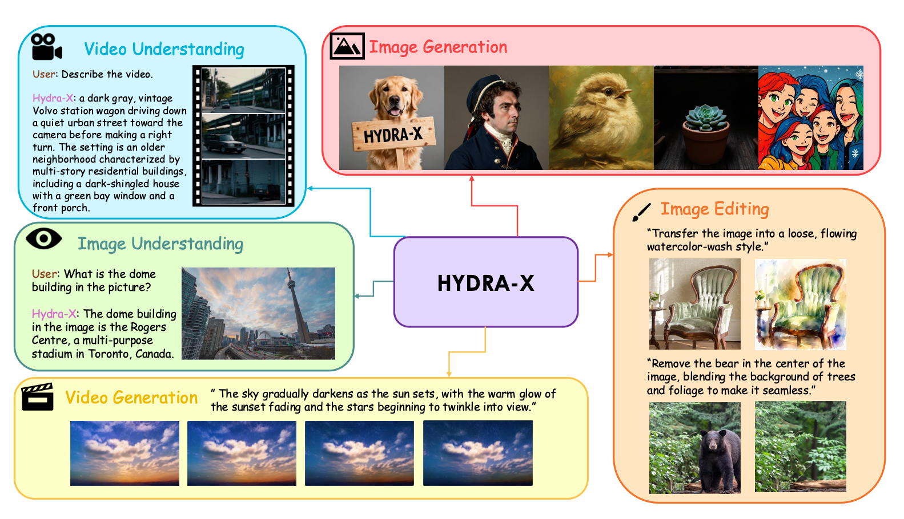

---

## 11. [N-GRPO: Embedding-Level Neighbor Mixing for Enhanced Policy Optimization](https://huggingface.co/papers/2606.10768)
**Upvotes**: 22 | **도입 난이도**: 중 | **신뢰도**: 상
**arXiv**: https://arxiv.org/abs/2606.10768

**태그**: LLM, Reinforcement Learning, Reasoning, Optimization, RAG, Benchmark, Evaluation, Distillation

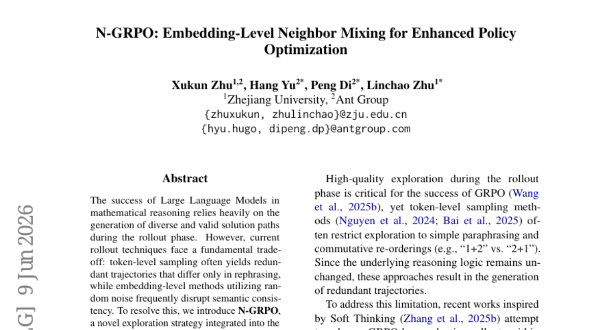

### 📌 한 줄 요약
임베딩 수준의 이웃 믹싱을 통해 추론 모델의 탐색 다양성과 의미적 일관성을 동시에 확보하는 새로운 정책 최적화 기법

### 🔑 핵심 포인트
- Semantic Neighbor Mixing: 앵커 토큰과 인접한 의미적 이웃의 임베딩을 혼합하여 새로운 탐색 경로 생성
- GRPO 프레임워크 통합: 기존 강화학습 프레임워크 내에서 효율적으로 작동하는 탐색 전략 제공
- 의미적 일관성 유지: 단순 노이즈 주입과 달리 로컬 의미 구조를 유지하며 중복되지 않는 경로 생성

### 🧑‍💻 개발자 관점
추론 모델 학습 시 단순 샘플링의 한계를 넘어, 의미적으로 유효하면서도 다양한 정답 경로를 생성하는 고도화된 탐색 기법을 제공합니다.

### 🚀 실무 적용 아이디어
- GRPO 프레임워크에 Semantic Neighbor Mixing 로직 구현 및 통합 테스트
- 기존 토큰 샘플링(Temperature scaling) 대비 탐색 효율성 비교 실험
- 수학적 추론 외에 논리적 추론 작업에서의 일반화 성능 검증

### ⚠️ 리스크/한계
- 임베딩 공간의 밀도나 품질에 따라 믹싱 결과의 품질이 좌우될 수 있음
- 연산 복잡도 측면에서 이웃 탐색(Nearest Neighbor Search) 비용 발생 가능성

### 📝 초록 기반 상세 설명
LLM의 수학적 추론 성능은 롤아웃 단계에서의 다양한 해결 경로 생성에 크게 의존합니다. 기존의 토큰 단위 샘플링은 중복된 경로를 생성하기 쉽고, 임베딩 노이즈 방식은 의미적 일관성을 해치는 트레이드오프가 존재했습니다. 이를 해결하기 위해 본 논문은 GRPO 프레임워크에 통합 가능한 N-GRPO를 제안합니다. N-GRPO는 앵커 토큰과 의미적 이웃의 임베딩을 혼합하는 'Semantic Neighbor Mixing'을 통해 의미적 매니폴드를 유지하면서도 효과적인 다양성을 주입합니다. 실험 결과, DeepSeek-R1-Distill-Qwen 모델에서 수학적 추론 벤치마크 성능 향상과 OOD(Out-of-Distribution) 작업에 대한 강력한 일반화 능력을 입증했습니다.

---

## 12. [EurekAgent: Agent Environment Engineering is All You Need For Autonomous Scientific Discovery](https://huggingface.co/papers/2606.13662)
**Upvotes**: 21 | **도입 난이도**: 중 | **신뢰도**: 상
**arXiv**: https://arxiv.org/abs/2606.13662

**태그**: AI Agent, Autonomous Discovery, Environment Engineering, LLM, Agent, Vision, Evaluation

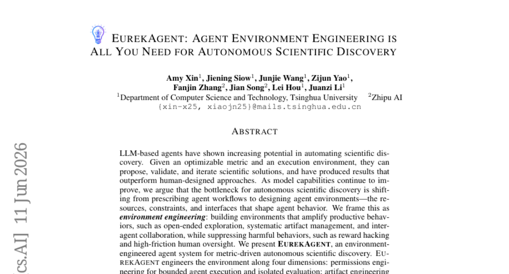

### 📌 한 줄 요약
에이전트 워크플로우 설계보다 환경(Environment) 설계가 자율적 과학 발견의 핵심임을 입증한 연구

### 🔑 핵심 포인트
- 에이전트 워크플로우 중심에서 환경 엔지니어링(Environment Engineering)으로의 패러다임 전환 제안
- 권한, 아티팩트, 예산, 인간 개입(HITL)의 4가지 차원을 통한 체계적인 환경 설계
- 수학, 커널 엔지니어링, ML 태스크에서 저비용 고효율의 SOTA 성과 달성

### 🧑‍💻 개발자 관점
에이전트의 프롬프트 엔지니어링만큼이나 실행 환경(파일 시스템, Git, 권한 제어 등)을 어떻게 구축하느냐가 에이전트의 성능과 안정성을 결정짓는 핵심 요소임을 시사합니다.

### 🚀 실무 적용 아이디어
- 에이전트의 작업 범위를 제한하는 샌드박스 환경 구축 실험
- Git 기반의 아티팩트 관리 및 버전 제어 워크플로우 적용
- API 비용 최적화를 위한 예산 제어 로직 설계

### ⚠️ 리스크/한계
- 환경 설계의 복잡도가 증가함에 따라 시스템 유지보수 비용이 상승할 수 있음
- 특정 도메인(과학적 발견)에 특화된 환경 설계가 범용 에이전트에는 적용하기 어려울 수 있음

### 📝 초록 기반 상세 설명
LLM 기반 에이전트가 과학적 발견을 자동화하는 능력이 향상됨에 따라, 기존의 워크플로우 중심 접근법이 한계에 직면하고 있습니다. 연구진은 에이전트의 행동을 제어하고 생산성을 극대화하는 '환경 엔지니어링(Environment Engineering)'이 새로운 병목 해결책임을 제안합니다. 이를 위해 권한, 아티팩트 관리, 예산, 인간 개입의 4가지 차원을 설계한 EurekAgent 시스템을 개발했습니다. 실험 결과, 수학 및 머신러닝 등 다양한 태스크에서 SOTA를 달성하며 저비용으로도 높은 성과를 낼 수 있음을 증명했습니다. 최종적으로 신뢰할 수 있는 자율 연구 에이전트 개발을 위한 핵심 방향성으로 환경 엔지니어링을 제시합니다.

---

## 13. [Demystifying Hidden-State Recurrence: Switchable Latent Reasoning with On-Policy Reinforcement Learning](https://huggingface.co/papers/2606.13106)
**Upvotes**: 18 | **도입 난이도**: 중 | **신뢰도**: 상
**arXiv**: https://arxiv.org/abs/2606.13106

**태그**: LLM, Reinforcement Learning, Reasoning, Interpretability

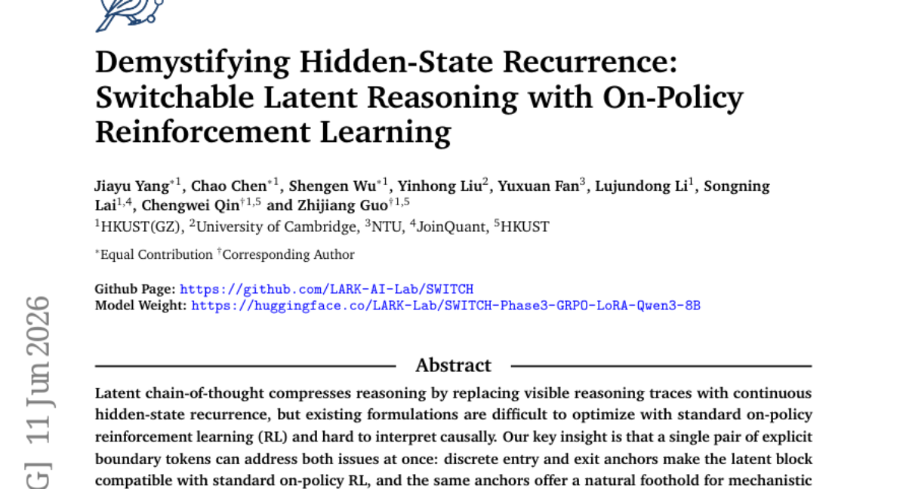

### 📌 한 줄 요약
명시적인 경계 토큰을 도입하여 RL 학습이 가능하고 해석 가능한 잠재적 추론(Latent Reasoning) 프레임워크 제안

### 🔑 핵심 포인트
- <swi>/</swi> 경계 토큰을 통한 온폴리시 RL 최적화 문제 해결
- 가시적-잠재적 추론 커리큘럼 학습 및 Switch-GRPO 알고리즘 제안
- 메커니즘 분석을 통해 잠재적 단계의 유의미한 연산 수행 능력 입증

### 🧑‍💻 개발자 관점
모델의 추론 과정을 토큰 단위로 제어하면서도, 내부 연산 과정을 블랙박스로 남겨두지 않고 분석 및 최적화할 수 있는 방법론을 제시합니다.

### 🚀 실무 적용 아이디어
- GRPO와 같은 RL 알고리즘에 경계 토큰 기반의 잠재적 추론 블록 적용 실험
- 커리큘럼 학습(Visible-to-Latent) 스케줄링에 따른 성능 변화 관찰
- 경계 토큰을 활용한 내부 은닉 상태의 인과적 개입(Causal Intervention) 실험

### ⚠️ 리스크/한계
- 잠재적 추론 단계의 연산 효율성이 토큰 생성 비용 대비 충분한지 검증 필요
- 특정 문제 도메인에 국한된 연산 집중 현상이 발생할 가능성

### 📝 초록 기반 상세 설명
기존의 잠재적 추론(Latent CoT) 방식은 연속적인 은닉 상태 순환을 사용하여 표준 온폴리시(on-policy) RL로 최적화하기 어렵고 인과적 해석이 까다로운 문제가 있었습니다. 본 논문은 <swi>와 </swi>라는 명시적인 경계 토큰을 도입하여 잠재적 추론 블록을 제어하는 SWITCH 프레임워크를 제안합니다. 이 경계 토큰은 RL의 정책 비율(policy ratio)을 정의 가능하게 만들며, 동시에 내부 연산 과정을 분석할 수 있는 지표가 됩니다. 가시적 추론에서 잠재적 추론으로 넘어가는 커리큘럼 학습과 Switch-GRPO 목적 함수를 통해 모델을 학습시켰습니다. 실험 결과, SWITCH는 기존 방식보다 뛰어난 성능을 보였으며, 경계 토큰을 통한 분석을 통해 잠재적 단계가 실제 문제 해결에 기여하는 유의미한 연산을 수행함을 입증했습니다.

---

## 14. [VideoMDM: Towards 3D Human Motion Generation From 2D Supervision](https://huggingface.co/papers/2606.13364)
**Upvotes**: 16 | **도입 난이도**: 중 | **신뢰도**: 상
**arXiv**: https://arxiv.org/abs/2606.13364

**태그**: 3D Motion Generation, Diffusion Model, Computer Vision, Human Pose Estimation, Vision, Video, Inference, Safety

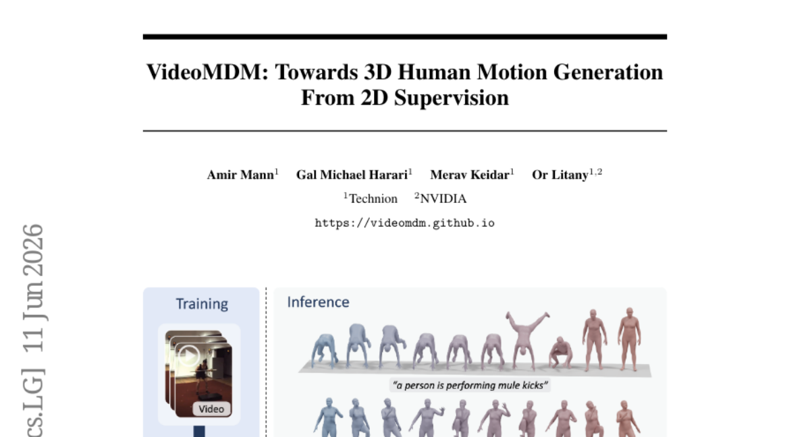

### 📌 한 줄 요약
3D 데이터 없이 2D 비디오 데이터만으로 고품질 3D 인간 동작을 생성하는 디퓨전 기반 프레임워크

### 🔑 핵심 포인트
- 3D Ground Truth 없이 2D 비디오 데이터만으로 3D 동작 학습 가능
- 2D 재투영 손실(Reprojection Loss)을 통한 3D 동작 생성 최적화 기법
- 학습 단계에서 3D 모션 매니폴드를 직접 학습하여 일관성 있는 동작 생성

### 🧑‍💻 개발자 관점
고비용의 3D 스캔 데이터 없이 일반적인 2D 영상만으로도 정교한 3D 캐릭터 애니메이션을 생성할 수 있는 기술적 토대를 제공합니다.

### 🚀 실무 적용 아이디어
- 2D 포즈 추출 모델(Lifter)의 정확도에 따른 3D 생성 품질 변화 테스트
- 다양한 카메라 각도(Viewpoint) 변화에 대한 재투영 손실의 강건성 검증
- 제안된 2D 재투영 손실과 기존 3D 손실 간의 학습 수렴 속도 비교

### ⚠️ 리스크/한계
- 2D 포즈 추출 단계의 오차가 3D 생성 결과에 직접적인 영향을 미칠 수 있음
- 복잡한 가려짐(Occlusion)이 발생하는 영상에서의 3D 복원 정확도 문제

### 📝 초록 기반 상세 설명
기존 3D 동작 생성 모델은 정교한 3D Ground Truth 데이터에 의존해야 하는 한계가 있었습니다. 본 논문은 2D 포즈 데이터만을 활용하여 3D 동작 프리오어를 학습하는 VideoMDM 프레임워크를 제안합니다. 사전 학습된 2D-to-3D lifter를 노이즈 섞인 교사(teacher)로 활용하고, 3D에서 디퓨전 과정을 거친 후 2D 재투영 손실(reprojection loss)을 통해 학습을 최적화합니다. 이론적으로 2D 재투영 손실이 3D 직접 감독과 유사한 효과를 낼 수 있음을 입증하며, 속도 일관성 및 과잉 매개변수 정렬과 같은 정규화 기법을 적용했습니다. 실험 결과, 3D 데이터 없이도 HumanML3D 및 실영상 데이터셋에서 기존 3D 감독 방식에 근접하는 우수한 생성 성능을 보였습니다.

---

## 15. [VIA-SD: Verification via Intra-Model Routing for Speculative Decoding](https://huggingface.co/papers/2606.12243)
**Upvotes**: 14 | **도입 난이도**: 중 | **신뢰도**: 상
**arXiv**: https://arxiv.org/abs/2606.12243

**태그**: LLM Inference, Speculative Decoding, Model Optimization, Efficiency, Inference

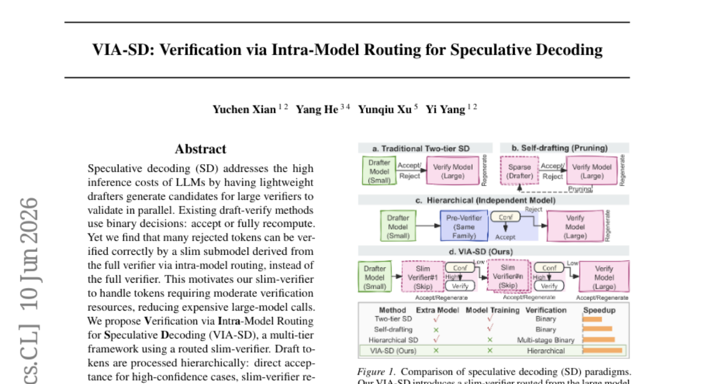

### 📌 한 줄 요약
모델 내부 라우팅을 통해 검증 단계를 계층화하여 추론 속도와 효율성을 높인 새로운 Speculative Decoding 프레임워크

### 🔑 핵심 포인트
- Intra-model routing을 통한 계층적 검증(Multi-tier) 프레임워크 제안
- 확신도에 따라 Slim-verifier와 Full-verifier를 적절히 활용하여 연산 비용 최적화
- 기존 모델의 재학습 없이 적용 가능한 높은 호환성

### 🧑‍💻 개발자 관점
모델 전체를 돌리지 않고도 검증 효율을 높일 수 있어, 서빙 비용 절감과 추론 지연 시간(Latency) 단축에 직접적인 도움이 됩니다.

### 🚀 실무 적용 아이디어
- 기존 Speculative Decoding 프레임워크에 VIA-SD의 라우팅 로직 이식 테스트
- 모델 크기 및 하드웨어 환경에 따른 Slim-verifier의 최적 크기 탐색
- 다양한 도메인 데이터셋에서의 확신도 기반 라우팅 정확도 검증

### ⚠️ 리스크/한계
- 라우팅 결정 과정에서 발생하는 오버헤드가 전체 속도 향상을 상쇄할 가능성
- 특정 모델 구조에 종속적인 Slim-verifier 설계의 범용성 문제

### 📝 초록 기반 상세 설명
LLM의 높은 추론 비용을 해결하기 위해 경량 모델이 생성한 후보를 대형 모델이 검증하는 Speculative Decoding이 널리 사용됩니다. 기존 방식은 토큰의 수락/거절 여부만 결정하는 이진 방식이라 불필요한 재계산 비용이 발생합니다. 본 논문은 검증에 필요한 자원이 토큰마다 다르다는 점에 착안하여, 모델 내부의 일부 파라미터만 사용하는 'slim-verifier'를 제안합니다. VIA-SD는 확신도에 따라 직접 수락, slim-verifier 재생성, 전체 모델 검증의 3단계 계층 구조로 토큰을 처리합니다. 실험 결과, 기존 SD 방식 대비 10-20%의 속도 향상을 달성하며 효율적인 추론 성능을 입증했습니다.

---

## 16. [Where, What, Why, and Importance: Structured Defect Grounding for Text-to-Image Feedback](https://huggingface.co/papers/2606.06113)
**Upvotes**: 13 | **도입 난이도**: 중 | **신뢰도**: 상
**arXiv**: https://arxiv.org/abs/2606.06113

**태그**: Generative AI, Computer Vision, Reinforcement Learning, VLM, Vision, Evaluation, Safety

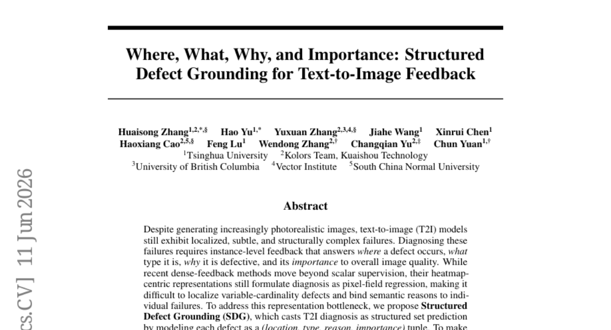

### 📌 한 줄 요약
T2I 모델의 결함을 위치, 유형, 원인, 중요도로 구조화하여 정밀하게 진단하고 정렬(Alignment)하는 프레임워크 제안

### 🔑 핵심 포인트
- 결함을 (위치, 유형, 원인, 중요도) 튜플로 정의하는 구조적 집합 예측(Structured Set Prediction) 방식 도입
- 4종의 최신 T2I 모델을 포함한 3만 장 규모의 정밀 주석 데이터셋(SDG-30K) 구축
- VLM 기반 탐지와 BoxFlow-GRPO를 결합하여 결함 정보를 정렬 보상(Reward)으로 변환하는 프레임워크 개발

### 🧑‍💻 개발자 관점
단순히 '이미지가 나쁘다'는 식의 스칼라 점수가 아니라, 구체적인 결함 위치와 이유를 기반으로 생성 모델을 미세 조정(Fine-tuning)하거나 수정할 수 있는 실무적 가이드를 제공합니다.

### 🚀 실무 적용 아이디어
- 제안된 SDG-30K 데이터셋을 활용하여 기존 VLM의 결함 탐지 성능 벤치마킹
- 생성 모델의 RLHF(인간 피드백 기반 강화학습) 과정에 구조화된 결함 보상 체계 적용 실험
- 특정 도메인(예: 인물, 풍경)에 특화된 결함 유형 정의 및 데이터셋 확장

### ⚠️ 리스크/한계
- 결함의 정의와 주석 작업에 높은 수준의 정밀도와 비용이 요구됨
- 복잡한 구조적 결함에 대해 VLM이 모든 유형의 원인을 정확히 추론할 수 있는지에 대한 의존성

### 📝 초록 기반 상세 설명
최근 텍스트-이미지(T2I) 생성 모델은 발전하고 있으나, 국소적이고 구조적인 결함을 식별하는 데 어려움이 있습니다. 기존의 히트맵 방식은 결함의 개수가 가변적인 상황에서 의미론적 원인을 결합하거나 정확한 위치를 특정하는 데 한계가 있습니다. 이를 해결하기 위해 결함을 (위치, 유형, 원인, 중요도) 튜플로 모델링하는 Structured Defect Grounding(SDG) 방식을 제안합니다. 연구진은 3만 장 규모의 데이터셋인 SDG-30K와 전용 평가 프로토콜인 SDG-Eval을 함께 구축했습니다. 제안된 프레임워크는 VLM을 탐지기로 사용하고 BoxFlow-GRPO를 통해 결함 기반의 공간적 보상을 생성하여 모델 정렬을 수행합니다. 실험 결과, SDG는 기존 VLM보다 뛰어난 결함 탐지 성능을 보였으며, 생성 모델의 정렬 및 국소적 이미지 개선에 효과적임을 입증했습니다.

---

## 17. [From 2D Grids to 1D Tokens: Reforming Shared Representations for Multimodal Image Fusion](https://huggingface.co/papers/2606.12303)
**Upvotes**: 12 | **도입 난이도**: 중 | **신뢰도**: 상
**arXiv**: https://arxiv.org/abs/2606.12303

**태그**: Image Fusion, Multimodal, Tokenization, Computer Vision, RAG, Vision, Benchmark

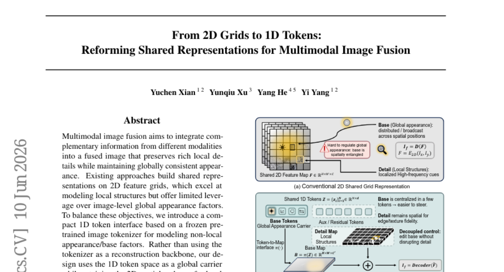

### 📌 한 줄 요약
2D 그리드 기반의 국소적 디테일과 1D 토큰 기반의 전역적 일관성을 결합하여 멀티모달 이미지 융합 성능을 극대화한 연구

### 🔑 핵심 포인트
- 2D 공간 경로와 1D 토큰 인터페이스의 이중 구조를 통한 국소/전역 정보 균형 확보
- Selective Token Editing(STE)을 통한 가볍고 효율적인 전역 외형 제어 메커니즘
- 사전 학습된 토크나이저를 활용하여 추가적인 손실 함수 없이 기존 백본 유지 가능

### 🧑‍💻 개발자 관점
이미지 융합 시 발생하는 구조적 왜곡과 전역적 부조화를 해결하는 효율적인 아키텍처 설계 패턴을 제시합니다.

### 🚀 실무 적용 아이디어
- 사전 학습된 VQ-VAE 또는 ViT 토크나이저를 기존 융합 모델에 결합하는 실험 진행
- STE 기법 적용 시 업데이트되는 토큰의 비율(sparsity)에 따른 성능 변화 측정
- 다양한 해상도의 데이터셋에서 1D 토큰이 전역 일관성에 미치는 영향 분석

### ⚠️ 리스크/한계
- 사전 학습된 토크나이저의 품질에 따라 전체 시스템 성능이 종속될 가능성
- 특정 도메인 데이터에 대해 1D 토큰이 전역 정보를 과도하게 지배할 위험

### 📝 초록 기반 상세 설명
기존의 멀티모달 이미지 융합 방식은 2D 피처 그리드에 의존하여 국소적 구조는 잘 포착하지만, 이미지 전체의 전역적 일관성을 유지하는 데 한계가 있었습니다. 이를 해결하기 위해 본 논문은 사전 학습된 이미지 토크나이저를 활용한 1D 토큰 인터페이스를 제안합니다. 2D 공간 경로는 국소 구조 복원을 담당하고, 1D 토큰 공간은 전역적 외형 정보를 전달하는 매개체 역할을 합니다. 특히 Selective Token Editing(STE) 기법을 통해 핵심 토큰만을 선택적으로 업데이트하여 모델 구조 변경 없이 효율적으로 전역 일관성을 제어합니다. 실험 결과, 제안된 방법은 주요 벤치마크에서 국소적 정밀도와 전역적 일관성 모두에서 뛰어난 성능을 입증했습니다.

---

## 18. [MoVerse: Real-Time Video World Modeling with Panoramic Gaussian Scaffold](https://huggingface.co/papers/2606.13376)
**Upvotes**: 10 | **도입 난이도**: 상 | **신뢰도**: 상
**arXiv**: https://arxiv.org/abs/2606.13376

**태그**: 3D-GS, Video-Generation, World-Model, Real-Time, Reasoning, Vision, Video, Inference, Distillation

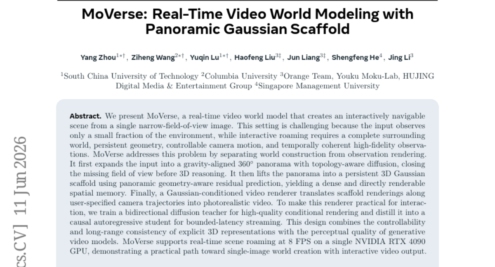

### 📌 한 줄 요약
단일 이미지로부터 실시간 탐색이 가능한 360도 파노라마 기반 3D 가우시안 월드 모델 구현

### 🔑 핵심 포인트
- Topology-aware diffusion을 이용한 360도 파노라마 확장 및 3D 가우시안 스캐폴드 생성
- 3D 표현의 제어력과 생성 모델의 화질을 결합한 하이브리드 렌더링 구조
- 실시간 스트리밍을 위한 양방향 확산 모델의 인과적 자기회귀(Causal Autoregressive) 학생 모델 증류

### 🧑‍💻 개발자 관점
단일 이미지로 3D 공간을 생성하고 실시간으로 탐색할 수 있는 기술적 프레임워크를 제시하여, 가상 환경 생성 및 디지털 트윈 분야의 효율성을 높입니다.

### 🚀 실무 적용 아이디어
- 제공된 3D 가우시안 스캐폴드 구조의 기하학적 정확도 검증
- RTX 4090 환경에서의 추론 지연 시간(Latency) 및 프레임 안정성 테스트
- 다양한 복잡한 배경 이미지에 대한 파노라마 확장 품질 테스트

### ⚠️ 리스크/한계
- 단일 이미지 기반 확장 시 발생하는 원거리/사각지대 기하학적 왜곡 가능성
- 8 FPS의 속도는 완전한 실시간(60 FPS) 환경에서는 여전히 제약 사항임

### 📝 초록 기반 상세 설명
단일 좁은 시야(FoV) 이미지만으로 상호작용 가능한 완전한 3D 환경을 구축하는 것은 기하학적 일관성과 고화질 렌더링 측면에서 매우 도전적인 과제입니다. MoVerse는 월드 구축과 관찰 렌더링을 분리하여 이 문제를 해결합니다. 먼저 위상 인식 확산 모델을 통해 입력 이미지를 360도 파노라마로 확장한 뒤, 이를 3D 가우시안 스캐폴드(Scaffold)로 변환하여 영속적인 공간 메모리를 생성합니다. 이후 가우시안 조건부 비디오 렌더러를 통해 사용자 카메라 경로에 따른 고화질 영상을 생성하며, 실시간성을 위해 교사-학생(Teacher-Student) 증류 기법을 적용했습니다. 결과적으로 단일 RTX 4090 GPU에서 8 FPS의 속도로 실시간 장면 탐색이 가능함을 입증했습니다.

---

## 19. [TreeSeeker: Tree-Structured Trial, Error, and Return in Deep Search](https://huggingface.co/papers/2606.11662)
**Upvotes**: 10 | **도입 난이도**: 중 | **신뢰도**: 상
**arXiv**: https://arxiv.org/abs/2606.11662

**태그**: AI Agent, Deep Search, Tree Search, Reasoning, Agent, Inference

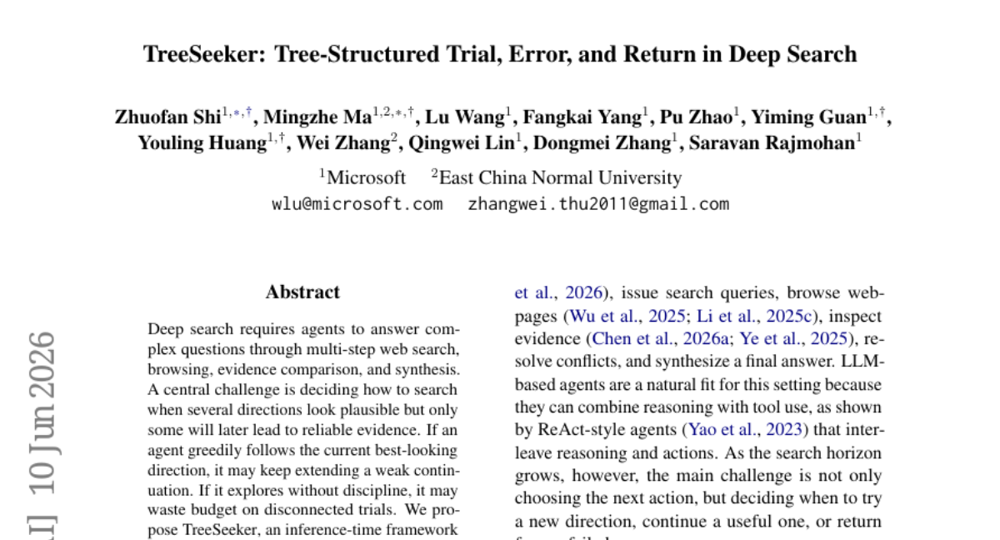

### 📌 한 줄 요약
복잡한 추론이 필요한 딥 서치(Deep Search) 환경에서 효율적인 탐색과 복귀를 가능하게 하는 트리 구조 기반의 제어 프레임워크

### 🔑 핵심 포인트
- 트리 구조 기반의 분기 및 복귀(branch-and-return) 탐색 프레임워크 제안
- 가치, 불확실성, 리스크를 고려한 텍스트 기반 UCB(Upper Confidence Bound) 신호를 통한 동적 제어
- 탐색 과정의 증거와 실패 이력을 관리하는 TreeMem을 통한 효율적인 상태 관리

### 🧑‍💻 개발자 관점
에이전트가 잘못된 정보에 빠져 무한 루프를 돌거나 자원을 낭비하는 문제를 구조적으로 해결하는 전략을 배울 수 있습니다.

### 🚀 실무 적용 아이디어
- 에이전트의 검색 경로를 트리 구조로 시각화하여 실패 지점 분석하기
- 현재 사용 중인 에이전트에 '복귀(Return)' 로직을 도입하여 자원 효율성 테스트하기
- 상태 관리 메모리(TreeMem 방식)를 적용하여 이전 단계의 실패를 현재 단계에 반영하기

### ⚠️ 리스크/한계
- 트리 구조가 깊어질수록 관리해야 할 상태와 연산 비용이 급격히 증가할 수 있음
- UCB 신호를 생성하는 텍스트 기반 판단 로직의 정교함에 따라 성능 편차가 클 수 있음

### 📝 초록 기반 상세 설명
에이전트가 복잡한 질문에 답하기 위해 다단계 웹 검색과 추론을 수행할 때, 잘못된 방향에 매몰되거나 무분별한 탐색으로 자원을 낭비하는 문제가 발생합니다. 이를 해결하기 위해 제안된 TreeSeeker는 탐색 과정을 트리 구조의 상태로 조직화하여 '분기 및 복귀(branch-and-return)' 방식을 적용합니다. TreeSearch 모듈은 가치, 불확실성, 리스크를 기반으로 한 텍스트 UCB 신호를 사용하여 탐색, 확장, 또는 이전 분기점으로의 복귀를 결정합니다. 또한 TreeMem은 각 분기에서 발생한 증거와 실패 큐를 유지하여 의사결정을 지원합니다. 실험 결과, TreeSeeker는 기존 오픈소스 베이스라인보다 뛰어난 성능을 보이며 명시적인 제어 로직이 추론 능력과 결합될 때의 효과를 입증했습니다.

---

## 20. [HarnessBridge: Learnable Bidirectional Controller for LLM Agent Harness](https://huggingface.co/papers/2606.12882)
**Upvotes**: 9 | **도입 난이도**: 중 | **신뢰도**: 상
**arXiv**: https://arxiv.org/abs/2606.12882

**태그**: LLM Agent, Interface Optimization, Instruction Tuning, Agent, Vision, Distillation

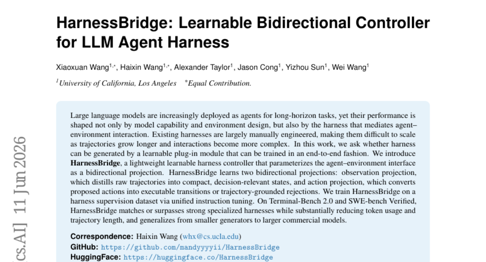

### 📌 한 줄 요약
LLM 에이전트와 환경 사이의 상호작용을 최적화하는 학습 가능한 양방향 컨트롤러 'HarnessBridge' 제안

### 🔑 핵심 포인트
- 학습 가능한 양방향 투영(Observation & Action Projection)을 통한 인터페이스 최적화
- 통합 인스트럭션 튜닝을 통한 효율적인 하네스 감독 학습
- 토큰 사용량 및 트래젝토리 길이의 획기적 감소와 모델 일반화 능력 확보

### 🧑‍💻 개발자 관점
에이전트 운영 시 발생하는 막대한 토큰 비용과 긴 컨텍스트 문제를 해결할 수 있는 실질적인 인터페이스 최적화 기법입니다.

### 🚀 실무 적용 아이디어
- 특정 도메인(예: 코딩, DB 관리) 환경에 대한 커스텀 하네스 데이터셋 구축 실험
- 기존 수동 프롬프트 기반 하네스와 HarnessBridge의 비용 대비 성능(ROI) 비교
- 다양한 규모의 LLM(Small to Large)에 대한 컨트롤러 전이 학습 성능 테스트

### ⚠️ 리스크/한계
- 학습 데이터셋의 품질에 따라 특정 환경에 과적합될 가능성
- 새로운 환경 도입 시 추가적인 학습 또는 미세 조정 필요성

### 📝 초록 기반 상세 설명
LLM 에이전트가 복잡한 장기 과제를 수행할 때, 에이전트와 환경 사이의 인터페이스인 '하네스(Harness)' 설계가 성능에 큰 영향을 미칩니다. 기존의 수동 설계 방식은 복잡한 상호작용과 긴 트래젝토리를 처리하는 데 확장성 한계가 있습니다. 본 논문에서는 에이전트-환경 인터페이스를 양방향 투영(bidirectional projection) 방식으로 매개하는 경량 학습형 컨트롤러인 HarnessBridge를 제안합니다. 이는 관찰 정보를 핵심 상태로 압축하는 'observation projection'과 제안된 액션을 실행 가능한 전환으로 변환하는 'action projection'을 학습합니다. 실험 결과, HarnessBridge는 기존 전문 하네스 대비 토큰 사용량과 트래젝토리 길이를 크게 줄이면서도 우수한 성능을 보였습니다.

---

## 21. [Risk Under Pressure: Compute-Aware Evaluation of Adversarial Robustness in Language Models](https://huggingface.co/papers/2606.11409)
**Upvotes**: 8 | **도입 난이도**: 중 | **신뢰도**: 상
**arXiv**: https://arxiv.org/abs/2606.11409

**태그**: LLM Security, Adversarial Robustness, Compute-aware Evaluation, AI Safety, RAG, Benchmark, Evaluation, Safety

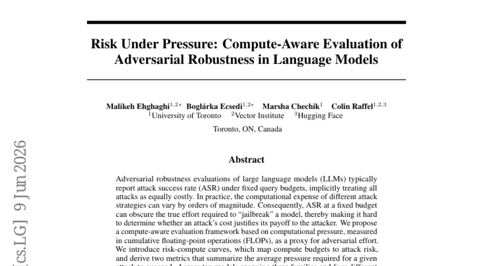

### 📌 한 줄 요약
공격 성공률(ASR)뿐만 아니라 연산 비용(FLOPs)을 고려한 새로운 LLM 보안 평가 프레임워크 제안

### 🔑 핵심 포인트
- 연산량(FLOPs)을 지표로 활용한 새로운 LLM 적대적 강건성 평가 프레임워크 제안
- 연산 예산과 공격 위험도 간의 관계를 시각화하는 'risk-compute curves' 도입
- 모델 크기, 학습 단계, 공격 유형에 따른 비용-효율적 보안 취약성 분석

### 🧑‍💻 개발자 관점
단순히 공격 성공 여부만 보는 것이 아니라, 공격자가 투입하는 실제 자원(Compute) 대비 보안 취약성을 파악하여 실질적인 방어 전략을 세울 수 있습니다.

### 🚀 실무 적용 아이디어
- 자사 모델의 보안 평가 시 쿼리 수 외에 추론/연산 비용을 포함한 지표 도입 검토
- 모델 크기 증가가 특정 공격 유형(예: 템플릿 기반)의 비용 효율성을 어떻게 변화시키는지 테스트
- RLHF 등 정렬 학습이 특정 유해 카테고리의 공격 비용을 낮추는지 확인

### ⚠️ 리스크/한계
- FLOPs가 공격자의 실제 노력(시간, 인력 등)을 완벽하게 대변하지 못할 수 있음
- 특정 하드웨어 환경에 따라 연산량 기반 지표의 실질적 의미가 달라질 수 있음

### 📝 초록 기반 상세 설명
기존 LLM의 적대적 강건성 평가는 고정된 쿼리 예산만을 사용하여 공격에 소요되는 실제 연산 비용 차이를 간과하는 문제가 있었습니다. 이를 해결하기 위해 본 논문은 연산량(FLOPs)을 기준으로 공격 노력을 측정하는 'compute-aware' 평가 프레임워크를 제안합니다. 연구진은 연산 예산 대비 공격 위험도를 나타내는 'risk-compute curves'와 평균 압력 지표를 도입했습니다. 10개의 모델과 다양한 공격 전략을 대상으로 실험한 결과, 모델 크기나 정렬(Alignment) 단계에 따라 연산 비용 대비 보안 취약성이 비선형적으로 변화함을 확인했습니다. 최종적으로 연구진은 보다 현실적인 보안 위험 평가를 위해 이 프레임워크를 공개합니다.

### 🖼️ 추가 자료
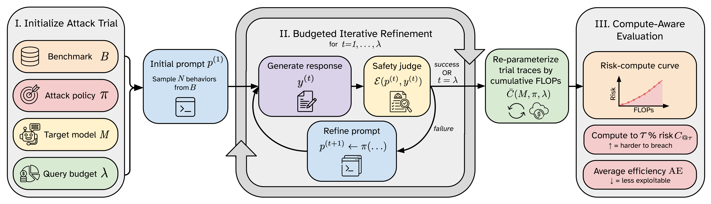

---

## 22. [High-Fidelity Two-Step Image Generation via Teacher-Aligned End-to-End Distillation](https://huggingface.co/papers/2606.12575)
**Upvotes**: 7 | **도입 난이도**: 중 | **신뢰도**: 상
**arXiv**: https://arxiv.org/abs/2606.12575

**태그**: Diffusion, Image Generation, Model Distillation, Efficiency, Vision, Evaluation, Distillation

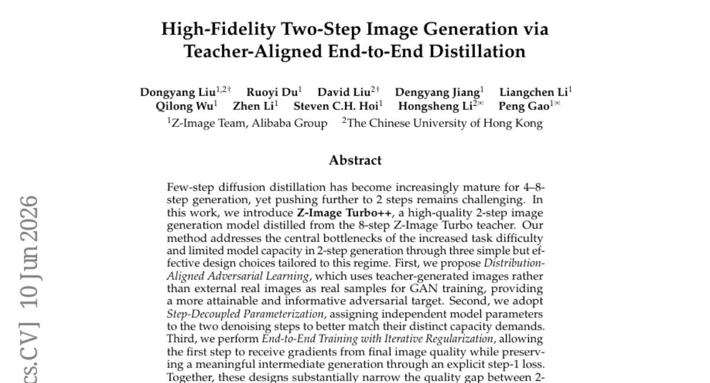

### 📌 한 줄 요약
8단계 생성 모델을 2단계로 압축하면서도 고화질을 유지하는 정교한 증류(Distillation) 기법 제안

### 🔑 핵심 포인트
- Distribution-Aligned Adversarial Learning: 외부 실사 이미지 대신 교사 모델 생성 이미지를 GAN 학습 타겟으로 사용하여 학습 난이도 완화
- Step-Decoupled Parameterization: 각 생성 단계의 서로 다른 요구 용량을 충족하기 위해 단계별 독립 파라미터 할당
- End-to-End Training with Iterative Regularization: 최종 이미지 품질과 중간 단계의 의미 있는 생성을 동시에 보존하는 손실 함수 설계

### 🧑‍💻 개발자 관점
실시간 이미지 생성 서비스 구축 시, 생성 속도를 극대화하면서도 품질 저하를 최소화할 수 있는 최적화 전략을 제공합니다.

### 🚀 실무 적용 아이디어
- 기존 8-step 모델을 교사로 설정하여 2-step 모델로 압축하는 파이프라인 구축 실험
- 단계별 파라미터 분리(Step-Decoupled)가 모델 용량 대비 효율적인지 비교 테스트
- 교사 모델의 데이터 분포가 학습 안정성에 미치는 영향 분석

### ⚠️ 리스크/한계
- 교사 모델의 품질에 의존적인 생성 결과(Mode Collapse 위험)
- 단계별 파라미터 분리로 인한 모델 파라미터 수 증가

### 📝 초록 기반 상세 설명
최근 확산 모델의 증류 기술이 발전했으나, 2단계 이내의 초고속 생성은 작업 난이도와 모델 용량 문제로 인해 품질 저하가 발생합니다. 본 논문은 8단계 모델인 Z-Image Turbo를 교사 모델로 사용하여 고품질 2단계 생성을 구현하는 Z-Image Turbo++를 제안합니다. 이를 위해 교사 모델의 이미지를 학습 타겟으로 사용하는 분포 정렬 적대적 학습, 단계별 독립 파라미터를 할당하는 단계 분리 파라미터화, 그리고 최종 품질과 중간 단계 품질을 모두 고려하는 엔드투엔드 반복 정규화 방식을 도입했습니다. 실험 결과, 2단계 생성에서도 8단계 모델에 근접하는 높은 품질을 달성하며 효율성과 품질 사이의 간극을 좁혔습니다.

---

## 23. [Visual Para-Thinker++: A Single-Policy Multi-Agent Framework for Visual Reasoning](https://huggingface.co/papers/2606.09290)
**Upvotes**: 7 | **도입 난이도**: 중 | **신뢰도**: 상
**arXiv**: https://arxiv.org/abs/2606.09290

**태그**: Multi-Agent, MLLM, Visual-Reasoning, Optimization, Agent, Reasoning, Inference

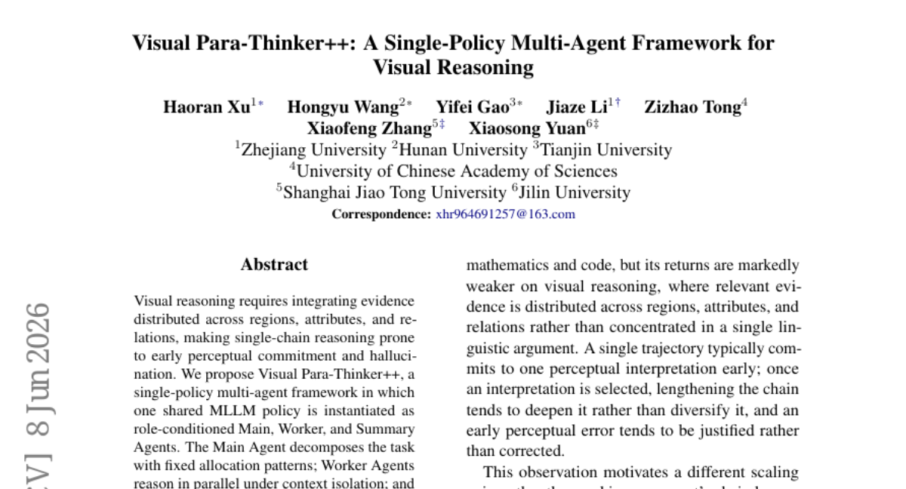

### 📌 한 줄 요약
단일 정책 기반의 멀티 에이전트 프레임워크를 통해 시각적 추론의 환각을 줄이고 병렬적 사고를 구현한 연구

### 🔑 핵심 포인트
- 단일 정책(Single-Policy)을 역할 기반(Main/Worker/Summary)으로 분리하여 활용하는 멀티 에이전트 구조
- 역할별 보상 및 이점(Advantage)을 다르게 할당하는 'Role-Decoupled Multi-Agent Optimization'을 통한 학습 효율화
- KV 캐시 재사용 및 공유 비주얼 프리픽스를 활용한 효율적인 멀티 에이전트 추론 엔진

### 🧑‍💻 개발자 관점
복잡한 시각적 분석 작업에서 단일 모델의 편향된 판단을 방지하기 위해 에이전트 역할을 분리하는 설계 패턴을 제시합니다.

### 🚀 실무 적용 아이디어
- 단일 MLLM에 역할(System Prompt)만 부여했을 때와 본 논문의 구조를 비교 실험
- KV 캐시 재사용을 통한 추론 속도 최적화 로직 구현 검토
- 역할 분리 학습 시 발생하는 그래디언트 충돌 문제 해결을 위한 손실 함수 설계 실험

### ⚠️ 리스크/한계
- 역할 분리 방식이므로 특정 작업에서는 오히려 오버헤드가 발생할 수 있음
- 에이전트 간의 역할 정의가 모호할 경우 성능 저하 가능성

### 📝 초록 기반 상세 설명
시각적 추론은 여러 영역과 관계를 통합해야 하므로, 단일 경로 추론 시 초기 인지에 매몰되거나 환각이 발생하는 문제가 있습니다. 이를 해결하기 위해 하나의 MLLM 정책을 Main, Worker, Summary 에이전트로 역할을 나누어 사용하는 Visual Para-Thinker++를 제안합니다. Main 에이전트는 작업을 분해하고, Worker 에이전트는 격리된 컨텍스트에서 병렬로 추론하며, Summary 에이전트는 최종 라벨 투표 대신 전체 추론 과정을 통합합니다. 학습 과정에서는 역할별 보상을 다르게 부여하는 최적화 기법을 통해 에이전트 간의 그래디언트 충돌을 방지합니다. 실험 결과, 다양한 시각적 추론 벤치마크에서 기존 단일 경로 및 병렬 추론 방식보다 뛰어난 성능을 보였으며 특히 환각 문제 해결에 강점을 보였습니다.

---

## 24. [SG-OPD: Sign-Gated On-Policy Distillation via Sign-Consistency Gating and Phased Teacher Sampling](https://huggingface.co/papers/2606.09304)
**Upvotes**: 6 | **도입 난이도**: 중 | **신뢰도**: 상
**arXiv**: https://arxiv.org/abs/2606.09304

**태그**: Knowledge Distillation, Reinforcement Learning, Reasoning, LLM Training, RAG, Vision, Benchmark, Distillation, Safety

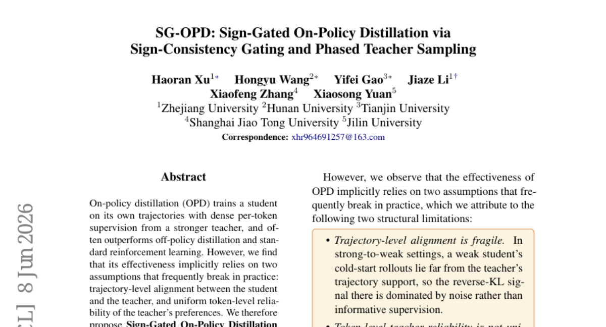

### 📌 한 줄 요약
교사 모델의 신뢰도 문제를 해결하기 위해 검증기(Verifier)를 활용한 단계적 샘플링과 부호 일관성 게이팅을 도입한 온폴리시 증류 기법

### 🔑 핵심 포인트
- 검증기(Verifier)를 활용한 교사 모델의 신뢰도 제어 메커니즘 도입
- Phased Teacher Sampling을 통한 초기 학습 안정성 확보
- Sign-Consistency Gating을 통한 토큰 단위의 정밀한 증류 업데이트

### 🧑‍💻 개발자 관점
강력한 교사 모델이 항상 정답을 보장하지 않는 상황에서, 검증기를 통해 학습 데이터의 품질을 동적으로 필터링하고 학습 효율을 높이는 실전적인 방법론을 제시합니다.

### 🚀 실무 적용 아이디어
- 보유 중인 검증기(Verifier)를 활용하여 교사 모델의 신뢰도 점수 산출 로직 구현
- 학습 단계별로 교사 데이터의 비중을 조절하는 스케줄링 실험
- 토큰별 신뢰도에 따른 Loss 가중치 조절(Gating) 적용 테스트

### ⚠️ 리스크/한계
- 검증기(Verifier) 자체의 성능이 낮을 경우 잘못된 신호로 인해 학습이 왜곡될 위험
- 검증기 의존도가 높아짐에 따라 검증기가 해결하지 못하는 도메인에서는 성능 한계 발생

### 📝 초록 기반 상세 설명
온폴리시 증류(OPD)는 학생 모델이 생성한 궤적을 바탕으로 교사 모델의 피드백을 받는 방식으로, 높은 성능을 보이지만 학생과 교사 간의 궤적 불일치 및 교사 피드백의 불균일한 신뢰도 문제에 취약합니다. 이를 해결하기 위해 본 논문은 SG-OPD를 제안합니다. SG-OPD는 이진 검증기(Binary Verifier)를 신뢰 신호로 사용하여, 초기 단계에서는 검증기가 승인한 교사의 궤적을 섞는 'Phased Teacher Sampling'을 수행합니다. 또한, 토큰 단위에서는 검증기와 교사의 방향이 일치하는 경우 업데이트를 강화하고 불일치 시 보간하는 'Sign-Consistency Gating'을 적용합니다. 수학적 추론 벤치마크 실험 결과, SG-OPD는 기존 OPD 대비 샘플 및 질문 단위에서 모두 성능 향상을 입증했습니다.

---

## 25. [Rethinking Psychometric Evaluation of LLMs: When and Why Self-Reports Predict Behavior](https://huggingface.co/papers/2606.12730)
**Upvotes**: 5 | **도입 난이도**: 하 | **신뢰도**: 상
**arXiv**: https://arxiv.org/abs/2606.12730

**태그**: LLM Evaluation, AI Safety, Psychometrics, Prompt Engineering, Evaluation, Safety

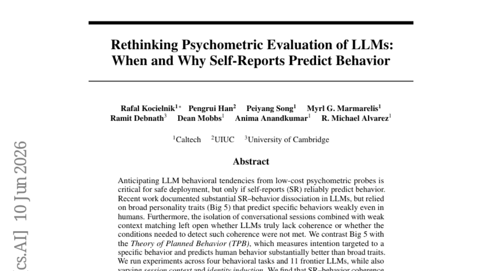

### 📌 한 줄 요약
LLM의 성격 검사(Big 5)가 실제 행동을 예측하지 못하는 이유를 분석하고, 특정 상황에서만 유효한 자기 보고(Self-report)의 한계를 규명함

### 🔑 핵심 포인트
- Big 5와 같은 광범위한 성격 모델은 LLM의 구체적인 행동 예측에 한계가 있음
- 특정 행동 의도를 타겟팅하는 TPB 모델이 동일 대화 맥락 내에서 더 높은 예측력을 가짐
- 맥락적 프라이밍(Sycophancy 등)이나 대화 분리 상황에서는 자기 보고와 행동 간의 일관성이 붕괴됨

### 🧑‍💻 개발자 관점
LLM의 안전성/윤리성 테스트 시 단순 성격 검사가 아닌, 특정 작업 맥락과 의도를 반영한 정교한 벤치마크 설계가 필수적임을 시사합니다.

### 🚀 실무 적용 아이디어
- LLM 평가 시 Big 5 대신 특정 작업 목적에 맞춘 TPB 기반 프롬프트 설계
- 단일 세션이 아닌 멀티 세션 환경에서의 행동 일관성 테스트 수행
- 프롬프트 주입(Persona)이 실제 행동 변화로 이어지는지 검증하는 실험

### ⚠️ 리스크/한계
- 제시된 프레임워크가 모든 도메인의 LLM 행동을 일반화하기에는 어려움이 있음
- 맥락 변화에 따른 예측력 변동이 커서 평가의 안정성 확보가 어려움

### 📝 초록 기반 상세 설명
LLM의 안전한 배포를 위해 저비용 심리 측정 도구로 행동을 예측하는 것이 중요하지만, 기존 연구에서는 자기 보고와 실제 행동 간의 괴리가 크게 나타났습니다. 본 연구는 기존의 광범위한 성격 모델(Big 5) 대신 특정 행동 의도를 측정하는 계획된 행동 이론(TPB)을 도입하여 비교 분석했습니다. 11종의 최신 LLM을 대상으로 대화 맥락과 페르소나 주입 등 다양한 환경에서 실험을 진행했습니다. 연구 결과, 동일 대화 내에서는 TPB가 인간 수준의 예측력을 보였으나, 대화가 분리되거나 맥락적 프라이밍(예: 아첨)이 강할 경우 예측력이 급격히 떨어졌습니다. 결론적으로 광범위한 성격 프레임워크는 LLM의 실제 행동을 예측하는 데 부적합하며, 작업 및 맥락에 특화된 평가 도구가 필요함을 시사합니다.

---

## 26. [EvoBrowseComp: Benchmarking Search Agents on Evolving Knowledge](https://huggingface.co/papers/2606.13120)
**Upvotes**: 4 | **도입 난이도**: 하 | **신뢰도**: 상
**arXiv**: https://arxiv.org/abs/2606.13120

**태그**: AI Agent, Benchmarking, Automated Synthesis, Web Search, Agent, RAG, Reasoning, Benchmark, Evaluation

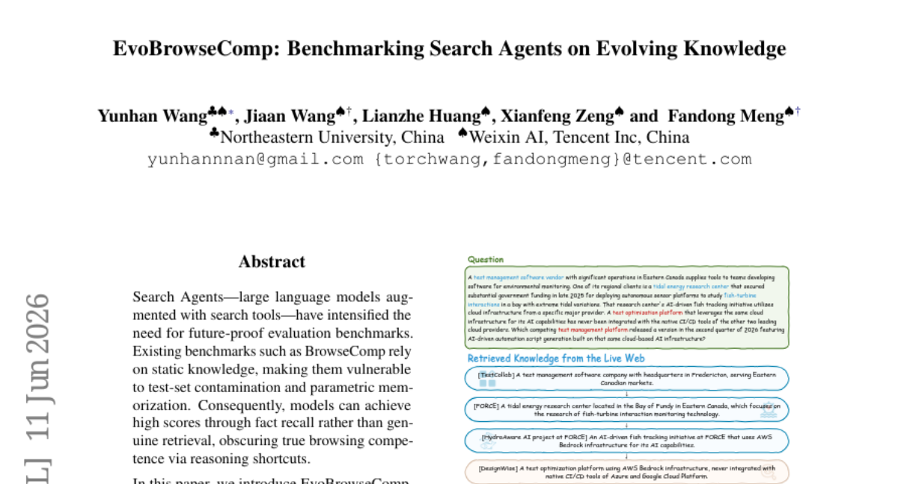

### 📌 한 줄 요약
데이터 오염 문제를 해결하기 위해 실시간 웹 탐색을 통해 지속적으로 업데이트되는 에이전트 평가 벤치마크 제안

### 🔑 핵심 포인트
- 실시간 웹 탐색 기반의 오염 방지(Contamination-free) 벤치마크 구축
- 3-Agent 협업 프레임워크를 통한 자동화된 고난도 QA 합성 프로세스
- 지식의 신선도와 논리적 추론 능력을 동시에 검증하는 확장 가능한 평가 패러다임

### 🧑‍💻 개발자 관점
에이전트 모델 개발 시 학습 데이터에 포함된 지식을 단순히 암기하여 점수를 높이는 '치팅' 문제를 방지하고, 실제 검색 역량을 정확히 측정할 수 있습니다.

### 🚀 실무 적용 아이디어
- 현재 개발 중인 검색 에이전트의 성능을 EvoBrowseComp 데이터셋으로 검증
- 에이전트의 추론 그래프 생성 능력을 테스트하기 위한 질문 구조 분석
- 자동화된 벤치마크 업데이트 파이프라인의 효율성 검토

### ⚠️ 리스크/한계
- 실시간 웹 데이터 의존성으로 인한 데이터 품질 변동 가능성
- 질문 생성 과정에서의 특정 도메인 편향 발생 가능성

### 📝 초록 기반 상세 설명
기존의 검색 에이전트 평가 벤치마크는 정적인 지식에 의존하여 모델의 단순 암기나 데이터 오염에 취약하다는 문제가 있습니다. 이를 해결하기 위해 본 논문은 실시간 웹 탐색을 통해 생성된 800개의 복합 질문 세트인 EvoBrowseComp를 제안합니다. 연구진은 QA 합성, 정보 필터링, 고수준 가이드라는 세 가지 에이전트 협업 프레임워크를 설계하여 신선하고 신뢰도 높은 질문을 자동 생성합니다. 실험 결과, 제안된 벤치마크는 모델의 단순 암기가 아닌 광범위한 수평적 검색 능력을 요구하는 높은 난이도를 입증했습니다. 이 프레임워크는 자동화된 업데이트를 지원하여 변화하는 지식과 발전하는 에이전트 성능에 맞춰 지속적인 평가가 가능합니다.

---

## 27. [MaskAlign: Token-Subset Representation Alignment for Efficient Diffusion Training](https://huggingface.co/papers/2606.08788)
**Upvotes**: 4 | **도입 난이도**: 중 | **신뢰도**: 상
**arXiv**: https://arxiv.org/abs/2606.08788

**태그**: Diffusion, Representation Learning, Computer Vision, Training Optimization, RAG, Vision, Safety

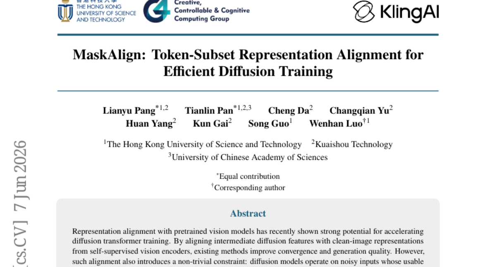

### 📌 한 줄 요약
사전 학습된 비전 모델의 특징을 활용한 디퓨전 학습 시, 토큰 선택적 정렬을 통해 학습 효율과 안정성을 높이는 방법론

### 🔑 핵심 포인트
- 전체 토큰 정렬 시 발생하는 특정 공간적 편향 및 과도한 의존성 문제 식별
- MaskAlign: 무작위 토큰 서브셋을 활용한 정렬 방식으로 모델의 강건성 확보
- Pre-mask token mixing block: 토큰 드롭에 따른 정보 손실을 최소화하는 경량 구조 도입

### 🧑‍💻 개발자 관점
디퓨전 모델 학습 시 고가의 사전 학습 모델(ViT 등)을 가이드로 사용할 때, 학습 효율을 높이고 특정 토큰에 매몰되지 않는 안정적인 학습 전략을 제공합니다.

### 🚀 실무 적용 아이디어
- 기존의 Full-token alignment 방식과 MaskAlign의 수렴 속도 및 생성 품질 비교 실험
- 다양한 노이즈 레벨(Timestep)에서 토큰 서브셋 크기에 따른 성능 변화 측정
- 제안된 pre-mask mixing 블록의 연산 오버헤드와 성능 간의 트레이드오프 분석

### ⚠️ 리스크/한계
- 토큰 서브셋 선택 방식에 따라 학습 안정성이 달라질 수 있는 불확실성 존재
- 가벼운 믹싱 블록이 추가됨에 따라 학습 파라미터 및 연산 복잡도가 소폭 증가

### 📝 초록 기반 상세 설명
최근 사전 학습된 비전 모델의 표현력을 디퓨전 모델 학습에 활용하여 수렴 속도와 생성 품질을 높이는 연구가 활발합니다. 하지만 노이즈가 포함된 디퓨전 입력과 깨끗한 이미지 기반의 참조 특징 사이에는 정보 불일치 문제가 존재합니다. 연구 결과, 전체 토큰을 대상으로 하는 정렬 방식은 특정 토큰에 과도하게 의존하게 만드는 부작용이 발견되었습니다. 이를 해결하기 위해 본 논문은 학습 시 무작위로 선택된 토큰 서브셋에 대해서만 정렬을 수행하는 MaskAlign을 제안합니다. 또한 토큰 누락으로 인한 정보 손실을 방지하기 위해 가벼운 pre-mask 토큰 믹싱 블록을 도입했습니다. 결과적으로 MaskAlign은 토큰 변화에 강건하면서도 효율적인 표현 정렬을 가능하게 합니다.

---

## 28. [See What I See, Know What I Think: Dense Latent Communication Across Heterogeneous Agents](https://huggingface.co/papers/2606.13594)
**Upvotes**: 3 | **도입 난이도**: 상 | **신뢰도**: 상
**arXiv**: https://arxiv.org/abs/2606.13594

**태그**: Multi-Agent, KV-Cache, Model-Alignment, Efficient-Inference, Agent, Reasoning, Benchmark, Safety

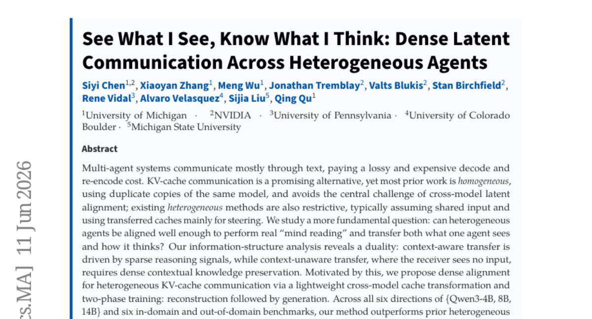

### 📌 한 줄 요약
서로 다른 크기와 구조를 가진 멀티 에이전트 간에 텍스트 변환 없이 KV-캐시를 직접 전달하여 효율적이고 정밀한 정보 공유를 가능하게 하는 기술

### 🔑 핵심 포인트
- 이종 모델 간 KV-캐시 정렬을 위한 경량 크로스 모델 변환 기술 제안
- 재구성(Reconstruction)과 생성(Generation)을 결합한 2단계 학습 전략 도입
- 텍스트 기반 통신 대비 낮은 연산 비용으로 높은 정보 밀도 유지

### 🧑‍💻 개발자 관점
모델 크기가 다른 에이전트들이 협업할 때, 텍스트로 변환하는 과정 없이 모델 내부의 잠재 정보를 직접 주고받아 속도와 정확도를 동시에 높일 수 있습니다.

### 🚀 실무 적용 아이디어
- 서로 다른 파라미터 규모를 가진 모델(예: Llama-3-8B와 Qwen-4B) 간의 KV-캐시 전송 실험
- 제안된 2단계 학습 방식이 모델 간 지식 전이(Knowledge Transfer)에 미치는 영향 분석
- 텍스트 기반 프롬프트 전달 방식과 제안 방식의 추론 속도(Latency) 비교 테스트

### ⚠️ 리스크/한계
- 모델 아키텍처가 완전히 다를 경우(예: Attention 구조 차이) 정렬 난이도 급증 가능성
- 학습 과정에서 특정 모델에 과적합될 경우 범용적인 이종 모델 통신 성능 저하 우려

### 📝 초록 기반 상세 설명
기존 멀티 에이전트 시스템은 텍스트 기반 통신으로 인해 정보 손실과 높은 연산 비용이 발생하는 문제가 있었습니다. 특히 서로 다른 모델(heterogeneous agents) 간의 KV-캐시 정렬은 매우 까다로운 과제였습니다. 본 논문은 정보 구조 분석을 통해 컨텍스트 인지/비인지 상황에 따른 전송 전략의 이중성을 규명했습니다. 이를 바탕으로 경량화된 크로스 모델 캐시 변환 기술과 재구성 및 생성의 2단계 학습 방식을 제안합니다. 실험 결과, 제안 방법은 기존 텍스트 통신 대비 2~3배 낮은 연산 비용으로 동등하거나 더 우수한 성능을 보였으며, 입력값이 없는 상황에서도 안정적인 정보 전달이 가능함을 입증했습니다.

---

## 29. [Evoflux: Inference-Time Evolution of Executable Tool Workflows for Compact Agents](https://huggingface.co/papers/2606.12674)
**Upvotes**: 3 | **도입 난이도**: 중 | **신뢰도**: 상
**arXiv**: https://arxiv.org/abs/2606.12674

**태그**: AI Agent, Workflow Automation, Inference-time Search, Small Language Models, Agent, Inference, Distillation

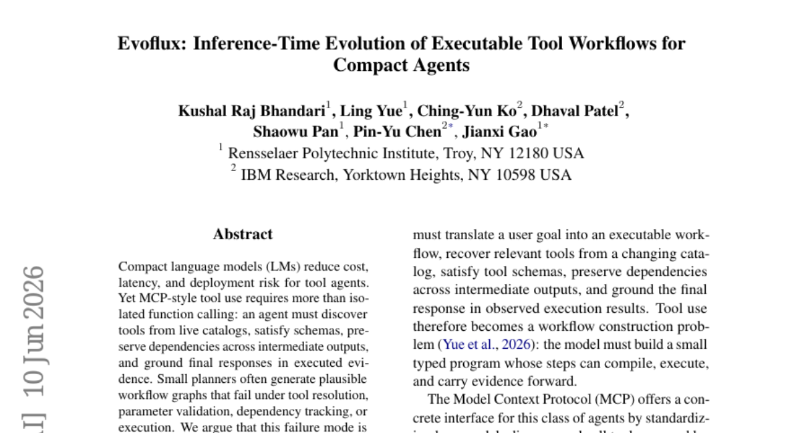

### 📌 한 줄 요약
소형 언어 모델(SLM)의 도구 사용 실패를 해결하기 위해 추론 시점에 워크플로우를 진화시키는 검색 기반 방법론 제안

### 🔑 핵심 포인트
- 실행 피드백을 활용한 추론 시점의 워크플로우 진화(Inference-time Evolution) 기법 제안
- SFT/DPO와 같은 데이터 학습 방식이 해결하지 못하는 '실행 실패 복구' 문제 해결
- 구조적 편집, 적응형 강도 조절, 다양성 가지치기를 결합한 워크플로우 그래프 최적화

### 🧑‍💻 개발자 관점
모델 크기를 키우지 않고도(SLM 활용) 복잡한 도구 호출 및 워크플로우 자동화의 신뢰성을 높일 수 있는 실용적인 전략을 제시합니다.

### 🚀 실무 적용 아이디어
- 소형 모델(Llama-3-8B 등)을 대상으로 도구 호출 워크플로우 생성 실험 수행
- 실행 피드백(Error message, Schema mismatch)을 프롬프트/검색 루프에 반영하는 구조 설계
- 기존 SFT 방식과 Evoflux 방식의 실행 성공률 및 토큰 비용 비교 테스트

### ⚠️ 리스크/한계
- 추론 시점에 검색(Search) 과정을 거치므로 ReAct 방식과 유사하게 지연 시간(Latency)이 발생할 수 있음
- 도구의 종류나 복잡도가 극도로 높아질 경우 검색 공간이 폭발할 위험이 있음

### 📝 초록 기반 상세 설명
소형 언어 모델은 비용과 지연 시간 측면에서 유리하지만, 복잡한 도구 사용 시 스키마 준수나 의존성 관리 실패로 인해 실행 가능한 워크플로우를 생성하는 데 어려움을 겪습니다. 기존의 미세 조정(SFT/DPO) 방식은 변화하는 도구 카탈로그에 대응하는 복구 능력을 학습시키기에 데이터가 부족하다는 한계가 있습니다. 이를 해결하기 위해 본 논문은 실행 피드백을 바탕으로 워크플로우 그래프를 구조적으로 수정하는 'Evoflux'라는 추론 시점 진화 검색 방법을 도입합니다. Evoflux는 실행 피드백, 적응형 강도 조절, 메타 가이드 재설계 등을 통해 실행 가능한 워크플로우를 찾아냅니다. 실험 결과, Evoflux는 소형 플래너의 실행 성공률을 기존 대비 크게 향상시켰으며, 데이터 기반 학습 방식보다 더 높은 신뢰성을 보여주었습니다.

---

## 30. [MuJoCo-Drones-Gym: A GPU-Accelerated Multi-Drone Simulator for Control and Reinforcement Learning](https://huggingface.co/papers/2606.08039)
**Upvotes**: 3 | **도입 난이도**: 중 | **신뢰도**: 상
**arXiv**: https://arxiv.org/abs/2606.08039

**태그**: Multi-Agent, Reinforcement Learning, Robotics, MuJoCo, Drone, Agent, RAG

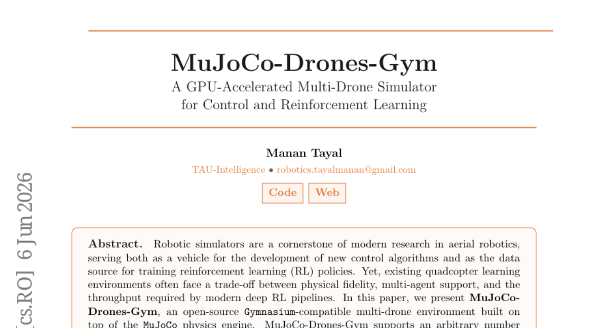

### 📌 한 줄 요약
MuJoCo 엔진을 활용하여 고정밀 물리 시뮬레이션과 대규모 병렬 학습을 동시에 지원하는 멀티 드론 강화학습 환경

### 🔑 핵심 포인트
- MuJoCo 엔진 기반의 고정밀 물리 모델 및 모듈형 API 제공
- PettingZoo 통합을 통한 손쉬운 멀티 에이전트 강화학습(MARL) 환경 구축
- 다양한 제어 인터페이스(RPM부터 PID까지) 및 관측 공간(RGB, Depth 등) 지원

### 🧑‍💻 개발자 관점
고성능 물리 엔진을 활용하여 시뮬레이션과 학습 간의 간극(Sim-to-Real)을 줄이면서도, 대규모 병렬 처리가 필요한 최신 RL 파이프라인에 즉시 적용 가능합니다.

### 🚀 실무 적용 아이디어
- 제공된 7가지 태스크 중 'formation flight'를 활용한 멀티 에이전트 협업 학습 실험
- 물리 모델 옵션(ground effect, downwash 등) 변화에 따른 제어 안정성 테스트
- 기존 gym-pybullet-drones 환경과의 성능 및 병렬 처리 효율 비교

### ⚠️ 리스크/한계
- MuJoCo 엔진 특성에 따른 하드웨어 리소스 요구량 확인 필요
- 실제 하드웨어(Crazyflie 2.x)로의 Sim-to-Real 전이 시 물리 모델 정밀도 검증 필요

### 📝 초록 기반 상세 설명
항공 로보틱스 연구에서 시뮬레이터는 제어 알고리즘 개발과 강화학습 데이터 생성의 핵심이지만, 기존 환경은 물리적 정밀도와 멀티 에이전트 확장성 사이의 트레이드오프 문제를 안고 있었습니다. 본 논문에서는 MuJoCo 물리 엔진을 기반으로 한 오픈소스 Gymnasium 호환 환경인 MuJoCo-Drones-Gym을 제안합니다. 이 환경은 다양한 물리 모델(지면 효과, 블레이드 항력 등)과 제어 인터페이스(RPM, PID 등), 그리고 시각적/운동학적 관측 공간을 모듈식으로 선택할 수 있는 API를 제공합니다. 또한 PettingZoo 래퍼를 통해 멀티 에이전트 강화학습(MARL)을 손쉽게 지원하며, 7가지 다양한 태스크를 통해 범용성을 입증했습니다. 결과적으로 기존 환경 대비 개선된 접촉 처리와 렌더링, 병렬 처리 능력을 바탕으로 효율적인 드론 제어 및 학습이 가능함을 보여줍니다.

---

## 31. [Getting Better at Working With You: Compiling User Corrections into Runtime Enforcement for Coding Agents](https://huggingface.co/papers/2606.13174)
**Upvotes**: 2 | **도입 난이도**: 중 | **신뢰도**: 상
**arXiv**: https://arxiv.org/abs/2606.13174

**태그**: AI Agent, Runtime Enforcement, Prompt Engineering, Feedback Loop, Agent, Evaluation

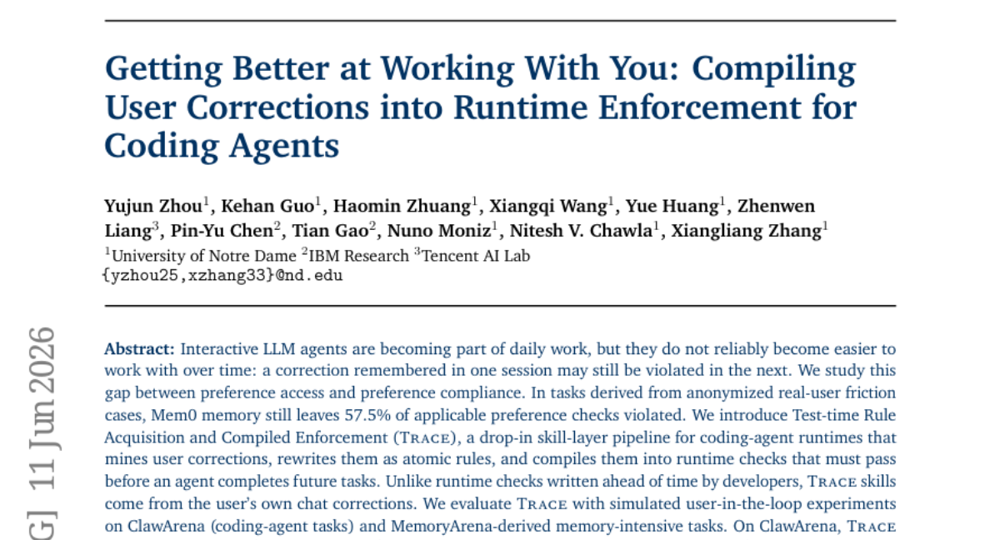

### 📌 한 줄 요약
사용자의 피드백을 자동 규칙으로 변환하여 에이전트의 반복적인 실수를 방지하는 런타임 검증 프레임워크 제안

### 🔑 핵심 포인트
- 사용자의 채팅 피드백을 자동화된 규칙(Atomic Rules)으로 변환하는 기술
- 에이전트의 작업 완료 전 규칙 준수 여부를 검증하는 런타임 컴파일 방식
- 메모리 기반 방식의 한계인 '반복적 실수' 문제를 해결하는 스킬 레이어 도입

### 🧑‍💻 개발자 관점
에이전트 개발 시 사용자가 매번 같은 지시를 반복하지 않도록 하는 '한 번의 수정으로 영구적 교정'이 가능한 구조를 제공합니다.

### 🚀 실무 적용 아이디어
- 사용자의 피드백을 정형화된 규칙(JSON/Code)으로 변환하는 프롬프트 엔지니어링 테스트
- 에이전트의 출력 결과물에 대한 자동 검증(Assertion) 파이프라인 구축 실험
- 기존 RAG/Memory 시스템과 TRACE 방식의 위반율 비교 실험

### ⚠️ 리스크/한계
- 추출된 규칙이 너무 엄격할 경우 에이전트의 유연성이나 작업 성공률이 저하될 위험
- 사용자의 모호한 피드백을 정확한 규칙으로 변환하는 과정에서의 오류 가능성

### 📝 초록 기반 상세 설명
LLM 에이전트가 사용자의 수정 사항을 기억하더라도 다음 세션에서 동일한 실수를 반복하는 문제가 발생합니다. 기존의 메모리 기반 방식은 선호도 준수(compliance) 측면에서 한계가 있음을 확인했습니다. 이를 해결하기 위해 사용자의 피드백을 원자적 규칙으로 추출하고 런타임 검증 단계로 컴파일하는 TRACE 프레임워크를 제안합니다. TRACE는 에이전트가 작업을 완료하기 전 추출된 규칙을 통과하도록 강제하는 스킬 레이어 역할을 합니다. 실험 결과, TRACE는 기존 메모리 방식 대비 규칙 위반율을 획기적으로 낮추며 사용자 피드백의 지속성을 확보했습니다.

---

## 32. [ArogyaSutra: A Multi-Agent Framework for Multimodal Medical Reasoning in Indic Languages](https://huggingface.co/papers/2606.13572)
**Upvotes**: 2 | **도입 난이도**: 상 | **신뢰도**: 상
**arXiv**: https://arxiv.org/abs/2606.13572

**태그**: Multi-Agent, Multimodal, Medical AI, Low-resource NLP, Agent, Reasoning, Vision, Distillation

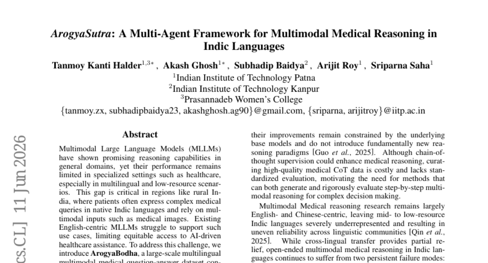

### 📌 한 줄 요약
인도 지역의 다국어 의료 환경을 위해 멀티모달 데이터셋과 Actor-Critic 기반 멀티 에이전트 프레임워크를 제안함

### 🔑 핵심 포인트
- 8개 소스 기반의 대규모 다국어 멀티모달 의료 QA 데이터셋(ArogyaBodha) 구축
- Actor-Critic 구조를 활용한 단계별 추론 및 도구 활용 프레임워크(ArogyaSutra) 제안
- 이중 메모리 메커니즘과 시뮬레이션 궤적 증류(Distillation)를 통한 추론 최적화

### 🧑‍💻 개발자 관점
특정 도메인(의료)과 특정 언어(저자원 언어)가 결합된 복합적인 멀티 에이전트 설계 패턴을 학습할 수 있습니다.

### 🚀 실무 적용 아이디어
- 제공된 데이터셋을 활용하여 기존 MLLM의 다국어 의료 추론 성능 벤치마킹
- Actor-Critic 프레임워크의 메모리 메커니즘이 추론 일관성에 미치는 영향 분석
- 도구 접지(Tool Grounding) 기능의 정확도와 지연 시간(Latency) 측정

### ⚠️ 리스크/한계
- 의료 분야 특성상 모델의 환각(Hallucination) 발생 시 치명적인 위험 존재
- 특정 지역(인도) 언어에 특화되어 있어 타 언어권으로의 일반화 가능성 검증 필요

### 📝 초록 기반 상세 설명
기존 MLLM은 의료와 같은 전문 분야와 저자원 다국어 환경에서 성능 한계가 뚜렷합니다. 특히 인도와 같이 다양한 언어와 의료 이미지가 혼합된 환경에서는 영어 중심 모델이 대응하기 어렵습니다. 이를 해결하기 위해 21개 임상 도메인을 포함한 대규모 다국어 멀티모달 데이터셋인 ArogyaBodha를 구축했습니다. 또한, 도구 접지(Tool Grounding)와 이중 메모리 메커니즘을 결합한 Actor-Critic 기반 멀티 에이전트 프레임워크인 ArogyaSutra를 제안합니다. 실험 결과, 제안된 방식은 모든 인도 언어에서 의료 추론 정확도를 크게 향상시켰습니다.

---

## 33. [WEAVER, Better, Faster, Longer: An Effective World Model for Robotic Manipulation](https://huggingface.co/papers/2606.13672)
**Upvotes**: 2 | **도입 난이도**: 상 | **신뢰도**: 상
**arXiv**: https://arxiv.org/abs/2606.13672

**태그**: Robotics, World Models, Reinforcement Learning, Computer Vision, Reasoning, Video, Evaluation, Distillation

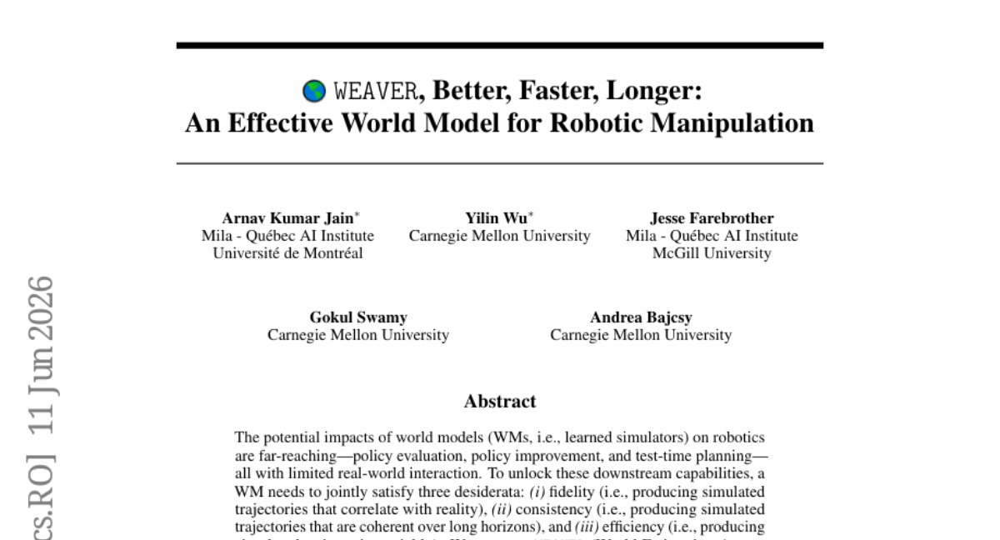

### 📌 한 줄 요약
고충실도, 일관성, 효율성을 동시에 달성하여 로봇 조작 작업의 성능을 극대화한 멀티뷰 월드 모델 WEAVER

### 🔑 핵심 포인트
- Fidelity(정확도), Consistency(일관성), Efficiency(효율성)를 동시에 만족하는 멀티뷰 월드 모델 아키텍처 제안
- Flow-matching loss를 활용한 미래 잠재 상태 및 보상 예측 방식 도입
- 실제 로봇 하드웨어에서 정책 개선 및 테스트 타임 플래닝 성능 입증

### 🧑‍💻 개발자 관점
시뮬레이션과 현실의 간극(Sim-to-Real)을 줄이면서도 빠른 연산 속도를 제공하여, 실제 로봇 제어 루프에 적용 가능한 수준의 효율적인 월드 모델 설계 방식을 제시합니다.

### 🚀 실무 적용 아이디어
- 제공된 코드를 활용하여 다양한 로봇 조작 환경에서의 재현 실험 수행
- Flow-matching 기반의 잠재 상태 예측이 기존 Diffusion 기반 모델과 비교해 어떤 효율성을 갖는지 분석
- 다양한 시각적 입력(Multi-view) 환경에서의 메모리 관리 전략 검토

### ⚠️ 리스크/한계
- 멀티뷰 데이터 및 고성능 연산 자원에 대한 의존도
- 복잡한 물리적 상호작용이 포함된 환경에서의 일반화 가능성 검증 필요

### 📝 초록 기반 상세 설명
로봇 공학에서 월드 모델(WM)은 정책 평가, 개선, 계획 수립에 필수적이지만, 현실과의 정합성, 장기적 일관성, 연산 효율성을 동시에 확보하기 어렵다는 문제가 있습니다. 이를 해결하기 위해 제안된 WEAVER는 멀티뷰 기반의 월드 모델로, flow-matching 손실 함수를 통해 미래의 잠재 상태(latent)와 보상 값을 예측합니다. 모델 아키텍처와 메모리 구조, 예측 목적 함수를 최적화하여 장기적인 동적 조작 작업이 가능하도록 설계되었습니다. 실험 결과, 정책 평가에서의 높은 상관관계는 물론, 기존 파운데이션 모델 대비 성공률 향상과 계획 수립 속도 개선을 입증했습니다. 또한 OOD(Out-of-Distribution) 시나리오에서도 기존 모델보다 뛰어난 성능을 보여주었습니다.

---

## 34. [Surflo: Consistent 3D Surface Flow Model with Global State](https://huggingface.co/papers/2606.13644)
**Upvotes**: 2 | **도입 난이도**: 중 | **신뢰도**: 상
**arXiv**: https://arxiv.org/abs/2606.13644

**태그**: 3D Reconstruction, Generative AI, Computer Vision, Flow Matching, Vision, Inference

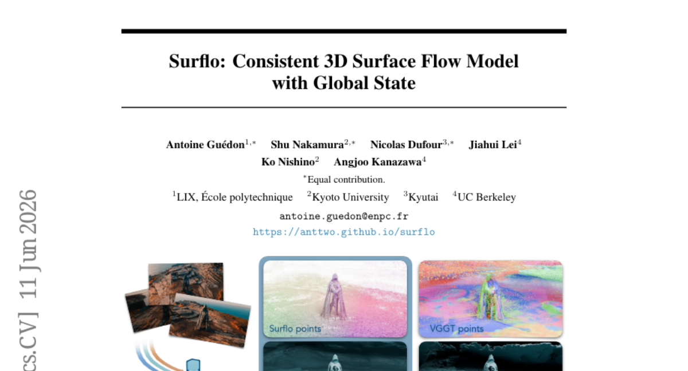

### 📌 한 줄 요약
가변적인 수의 입력 이미지로부터 고해상도 3D 표면을 생성하는 글로벌 상태 기반의 일관된 3D 재구성 모델

### 🔑 핵심 포인트
- 글로벌 잠재 토큰(Global Latent)을 통한 가변 입력 이미지의 효율적 압축
- Flow Matching 기반의 포인트 전송을 통한 고정 해상도 제약 탈피
- 추론 시 광학적 그래디언트 가이던스를 통한 국소적 불일치 해결

### 🧑‍💻 개발자 관점
입력 이미지 수에 관계없이 단일 포워드 패스로 고해상도 3D 모델을 생성할 수 있어, 실시간 3D 스캐닝 및 디지털 트윈 구축에 매우 효율적입니다.

### 🚀 실무 적용 아이디어
- 다양한 수의 입력 이미지(Few-shot vs Many-shot)에 따른 포인트 밀도 변화 테스트
- 제안된 광학적 가이던스 기법이 표면 디테일에 미치는 영향 분석
- 기존 최적화 기반(NeRF/Gaussian Splatting) 방식과의 생성 속도 및 품질 비교

### ⚠️ 리스크/한계
- 포인트 기반 생성 방식이므로 복잡한 위상(Topology)을 가진 물체의 완전한 메쉬 생성에는 추가 작업 필요
- 추론 시 가이던스 단계가 포함되어 연산 비용이 발생할 수 있음

### 📝 초록 기반 상세 설명
기존의 3D 재구성 모델은 뷰별로 중복된 포인트맵을 생성하거나, 고정된 저해상도 출력에 갇히는 한계가 있었습니다. 본 논문은 다양한 수의 RGB 이미지를 하나의 글로벌 잠재 상태(Global Latent)로 압축하는 Surflo를 제안합니다. 이 모델은 노이즈로부터 표면 위로 포인트를 이동시키는 Flow Matching 방식을 통해 고정된 그리드 없이 임의 해상도의 3D 포인트를 생성합니다. 또한, 추론 시 광학적 그래디언트를 주입하는 가이던스 기법을 통해 인접 포인트 간의 일관성을 유지합니다. 결과적으로 Surflo는 기존 최적화 방식보다 훨씬 빠르면서도 고해상도 3D 표면을 정밀하게 재구성할 수 있습니다.

---

## 35. [WebChallenger: A Reliable and Efficient Generalist Web Agent](https://huggingface.co/papers/2606.10423)
**Upvotes**: 2 | **도입 난이도**: 중 | **신뢰도**: 상
**arXiv**: https://arxiv.org/abs/2606.10423

**태그**: Web Agent, LLM Architecture, Automation, DOM Parsing, Agent, Reasoning, Inference

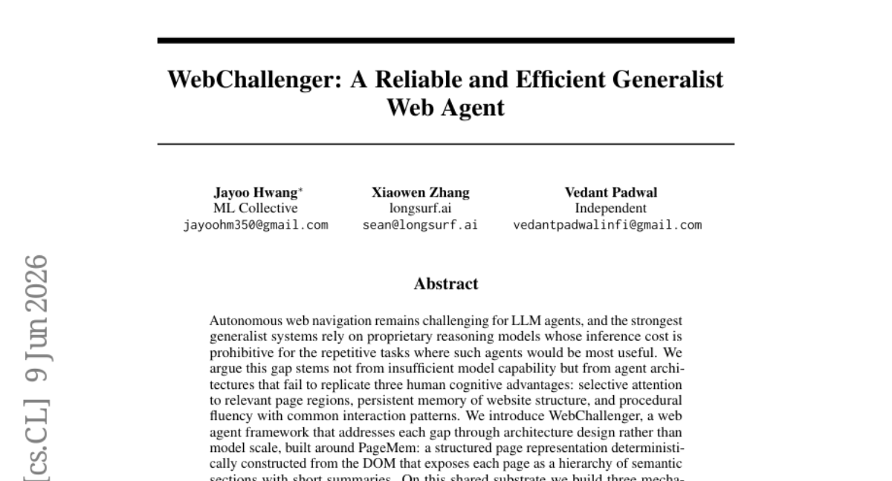

### 📌 한 줄 요약
모델 크기 확장 대신 구조적 아키텍처 설계를 통해 저비용·고효율의 범용 웹 에이전트를 구현한 프레임워크

### 🔑 핵심 포인트
- PageMem: DOM 기반의 계층적 세만틱 섹션 구조를 통한 정형화된 페이지 표현
- 인지 모방 아키텍처: 선택적 주의(Divide-and-conquer), 구조적 기억(Exploration), 절차적 숙련도(Compound actions) 구현
- 모델 스케일링이 아닌 아키텍처 설계를 통한 비용 효율적 고성능 달성

### 🧑‍💻 개발자 관점
고가의 GPT-4급 모델 없이도 오픈 소스 모델을 활용해 실무 수준의 웹 자동화 에이전트를 구축할 수 있는 방법론을 제시합니다.

### 🚀 실무 적용 아이디어
- 제공된 GitHub 코드를 활용하여 특정 도메인(예: 이커머스)에서의 성능 재현 테스트
- 사용 중인 로컬 LLM(Llama 3 등)에 PageMem 구조를 적용하여 추론 비용 변화 측정
- 복잡한 멀티 스텝 워크플로우에서 Compound action의 안정성 검증

### ⚠️ 리스크/한계
- DOM 구조가 매우 복잡하거나 비표준적인 사이트에서의 정형화된 표현 한계
- 에이전트가 생성하는 '복합 액션'의 경우, 중간 단계 실패 시 디버깅 및 복구의 어려움

### 📝 초록 기반 상세 설명
기존 LLM 기반 웹 에이전트는 높은 추론 비용과 복잡한 웹 환경에서의 효율성 저하라는 문제를 안고 있습니다. 저자들은 이 문제가 모델의 성능 부족보다는 인간의 인지 방식(선택적 주의, 구조적 기억, 절차적 숙련도)을 모방하지 못한 아키텍처에서 기인한다고 분석했습니다. 이를 해결하기 위해 DOM 기반의 계층적 페이지 표현 방식인 'PageMem'을 도입했습니다. 이 구조 위에서 필요한 영역만 탐색하는 관찰 파이프라인, 사이트 구조를 저장하는 메모리 시스템, 그리고 반복적 동작을 자동화하는 복합 액션 워크플로우를 구축했습니다. 결과적으로 오픈 웨이트 모델만으로도 고가의 독점 모델에 근접하는 높은 성능을 달성하며 범용성을 입증했습니다.

---

## 36. [Flash-GMM: A Memory-Efficient Kernel for Scalable Soft Clustering](https://huggingface.co/papers/2606.10896)
**Upvotes**: 2 | **도입 난이도**: 중 | **신뢰도**: 상
**arXiv**: https://arxiv.org/abs/2606.10896

**태그**: GPU Kernel, Clustering, Vector Search, Triton, Scalability, RAG

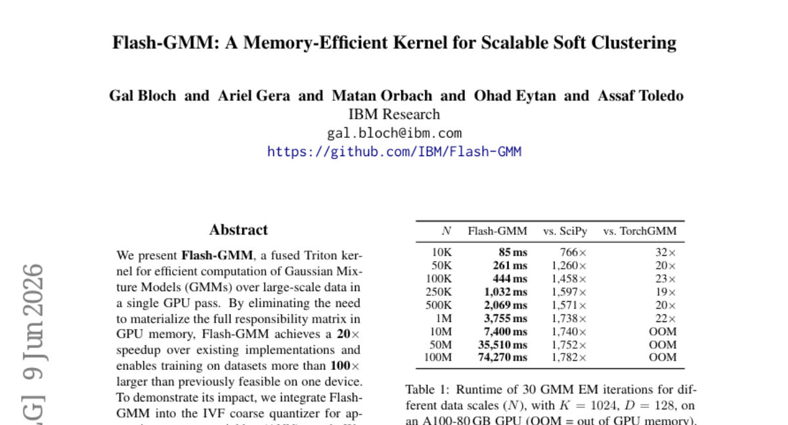

### 📌 한 줄 요약
메모리 효율적인 Triton 커널을 통해 대규모 데이터셋에서도 가능한 고성능 GMM 클러스터링 기술

### 🔑 핵심 포인트
- Triton 기반의 퓨즈드(fused) 커널을 통한 메모리 효율 극대화
- 책임 행렬의 완전 생성 없이 연산하여 대규모 데이터셋 확장성 확보
- ANN 검색(IVF) 환경에서 k-means를 대체 가능한 수준의 성능 입증

### 🧑‍💻 개발자 관점
대규모 벡터 데이터베이스 구축 시 메모리 부족 문제 없이 GMM의 정교한 소프트 클러스터링을 활용할 수 있습니다.

### 🚀 실무 적용 아이디어
- 기존 k-means 기반 IVF 인덱스와 Flash-GMM 기반 인덱스의 검색 속도 및 Recall 비교
- GPU 메모리 한계 상황에서 데이터 크기 변화에 따른 학습 안정성 테스트
- 오픈소스 커널을 활용한 대규모 벡터 검색 엔진(Faiss 등)과의 통합 실험

### ⚠️ 리스크/한계
- Triton 커널 의존성으로 인한 특정 하드웨어/환경 제약 가능성
- 소프트 클러스터링 특성상 하드 클러스터링 대비 복잡한 인덱스 관리 필요

### 📝 초록 기반 상세 설명
기존의 Gaussian Mixture Models(GMM)는 전체 책임 행렬(responsibility matrix)을 메모리에 생성해야 하므로 대규모 데이터 처리에 한계가 있었습니다. 이를 해결하기 위해 단일 GPU 패스 내에서 연산을 수행하는 Flash-GMM 커널을 제안합니다. 이 커널은 메모리 사용량을 획기적으로 줄여 기존보다 100배 더 큰 데이터셋에서도 학습이 가능하도록 설계되었습니다. 연구진은 이를 IVF 코스 퀀타이저(coarse quantizer)에 통합하여 ANN 검색 성능을 검증했습니다. 결과적으로 k-means를 대체할 수 있는 수준의 효율성을 달성하며 검색 정확도와 연산 효율을 동시에 개선했습니다.

---

## 37. [IDEAL: In-DEpth ALignment Makes A Discrete Representation AutoEncoder](https://huggingface.co/papers/2606.11096)
**Upvotes**: 2 | **도입 난이도**: 중 | **신뢰도**: 상
**arXiv**: https://arxiv.org/abs/2606.11096

**태그**: Computer Vision, Generative Models, Autoencoder, Representation Learning, Vision, Safety

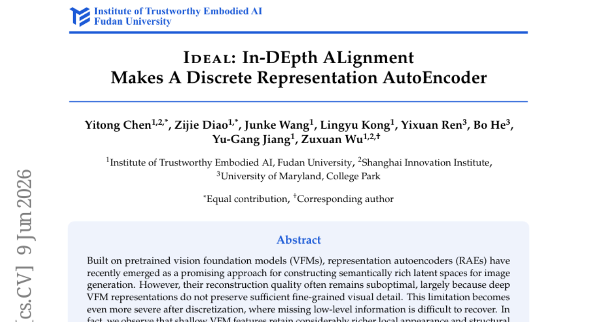

### 📌 한 줄 요약
심층 및 얕은 VFM 특징을 동시에 정렬하여 고해상도 디테일과 의미적 풍부함을 모두 잡은 이산 표현 오토인코더 프레임워크

### 🔑 핵심 포인트
- 심층(Deep)과 얕은(Shallow) VFM 특징의 상호 보완적 특성 활용
- 양자화된 토큰을 다중 스케일 특징에 정렬하는 In-depth Alignment 기법 제안
- 이산적 토큰 표현에서도 높은 시각적 디테일과 의미적 일관성 유지

### 🧑‍💻 개발자 관점
고품질 이미지 생성 모델(Diffusion, Autoregressive)의 핵심인 VQ-VAE/VAE 구조를 개선하여, 생성된 이미지의 디테일 손실 문제를 해결하는 데 직접적인 도움을 줍니다.

### 🚀 실무 적용 아이디어
- 기존 VQ-VAE 모델에 Shallow feature alignment 레이어를 추가하여 재학습 실험
- 다양한 스케일의 VFM(예: CLIP, DINOv2)을 활용한 정렬 성능 비교
- 생성 모델의 토큰 압축률 변화에 따른 재구성 품질 변화 측정

### ⚠️ 리스크/한계
- 다중 스케일 특징 정렬로 인한 학습 복잡도 및 연산 비용 증가 가능성
- 특정 VFM 아키텍처에 대한 의존성 및 일반화 성능 검증 필요

### 📝 초록 기반 상세 설명
최근 VFM 기반의 표현 오토인코더(RAE)는 풍부한 잠재 공간을 제공하지만, 심층 특징 위주의 학습으로 인해 세부적인 시각적 디테일 복원력이 떨어지는 문제가 있습니다. 특히 이산화(discretization) 과정에서 저수준 정보의 손실이 더욱 심화됩니다. 본 논문은 심층 특징의 의미론과 얕은 특징의 국소적 구조 정보가 상호 보완적이라는 점에 착안하여 IDEAL 프레임워크를 제안합니다. IDEAL은 양자화된 토큰을 심층 및 얕은 VFM 특징 모두에 정렬함으로써 시각적 충실도와 의미적 풍부함을 동시에 확보합니다. 실험 결과, ImageNet 및 자기회귀적 이미지 생성 작업에서 기존 SOTA를 뛰어넘는 성능을 입증했습니다.

---

## 38. [Revisiting Articulated Parts Perception in Robot Manipulation](https://huggingface.co/papers/2606.08103)
**Upvotes**: 2 | **도입 난이도**: 중 | **신뢰도**: 상
**arXiv**: https://arxiv.org/abs/2606.08103

**태그**: Robot Manipulation, Computer Vision, VR, Geometric Learning, Vision

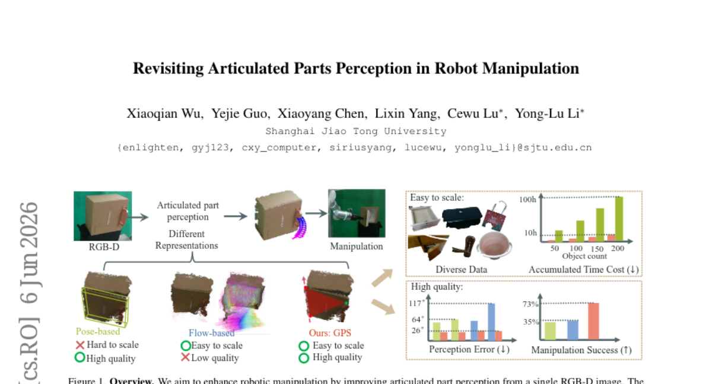

### 📌 한 줄 요약
VR 기반의 효율적인 데이터 수집과 기하학적 구조(GPS) 표현을 통해 로봇의 관절형 물체 조작 성능을 높인 연구

### 🔑 핵심 포인트
- 확장성과 품질의 균형을 맞춘 새로운 기하학적 구조 표현 방식(GPS) 제안
- VR 기기를 활용한 초고속/고품질 데이터 어노테이션 파이프라인 구축
- 단일 RGB-D 이미지 입력만으로 동작하는 일반화 가능한 파트 인식 모델 개발

### 🧑‍💻 개발자 관점
수동 작업 비용을 획기적으로 줄이면서도 고품질의 학습 데이터를 확보할 수 있는 방법론을 제시하여, 실무적인 로봇 학습 데이터 구축에 유용합니다.

### 🚀 실무 적용 아이디어
- 제공된 VR 툴을 활용하여 특정 도메인 물체에 대한 데이터셋 구축 테스트
- RGB-D 입력 기반의 GPS 모델을 기존 로봇 제어 알고리즘에 통합 실험
- 다양한 조명 및 배경 환경에서의 모델 강건성 검증

### ⚠️ 리스크/한계
- VR 기반 수동 어노테이션에 의존하므로 데이터 규모 확장에 따른 인적 자원 필요
- 제안된 휴리스틱 정책이 복잡한 환경에서는 성능 저하 가능성 있음

### 📝 초록 기반 상세 설명
로봇이 문이나 손잡이 같은 관절형 물체를 다루기 위해서는 정교한 파트 인식이 필수적입니다. 기존의 포즈 기반 방식은 수동 작업 비용이 높고, 어포던스 기반 방식은 데이터 품질이 낮다는 한계가 있었습니다. 본 논문은 확장성과 품질을 동시에 확보하기 위해 기하학적 기본 구조인 GPS(Geometric Primary Structure)라는 새로운 표현 방식을 제안합니다. 이를 위해 VR 기기를 활용하여 객체당 1분 내외로 빠르게 어노테이션할 수 있는 효율적인 데이터 수집 시스템을 구축했습니다. 수집된 234개 객체 데이터를 통해 학습된 GPS 모델은 단일 RGB-D 이미지 입력만으로도 일반화된 파트 인식을 수행합니다. 실험 결과, 별도의 미세 조정 없이도 다양한 초기 상태에서 높은 조작 성공률을 달립했습니다.

---

## 39. [The Cold-Start Safety Gap in LLM Agents](https://huggingface.co/papers/2606.07867)
**Upvotes**: 2 | **도입 난이도**: 하 | **신뢰도**: 상
**arXiv**: https://arxiv.org/abs/2606.07867

**태그**: LLM-Agent, AI-Safety, Deployment-Strategy, Agent, Benchmark, Evaluation, Safety

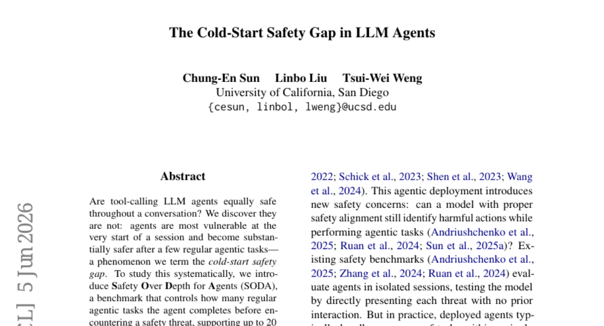

### 📌 한 줄 요약
LLM 에이전트의 초기 세션 취약성을 해결하기 위해, 정규 작업을 통한 '워밍업'이 안전성을 높인다는 새로운 현상 발견

### 🔑 핵심 포인트
- 에이전트 세션 초기 단계에서 안전성이 급격히 떨어지는 'Cold-Start Safety Gap' 현상 규명
- 선행 작업 수행 횟수에 따른 안전성 변화를 측정하는 SODA 벤치마크 도입
- 정규 작업 수행이 모델의 내부 표현(Hidden States)을 안전 지향적으로 변화시킴을 확인

### 🧑‍💻 개발자 관점
에이전트 시스템 배포 시, 보안 위협이 있는 요청을 받기 전 몇 가지 일반적인 작업을 먼저 수행하게 함으로써 보안 취약점을 완화할 수 있습니다.

### 🚀 실무 적용 아이디어
- 에이전트 배포 시 초기 세션에 '워밍업'용 정규 작업 시퀀스 삽입 실험
- 작업의 종류(Task Type)가 안전성 향상 폭에 미치는 영향 분석
- 워밍업 작업이 에이전트의 최종 유틸리티(성능)에 미치는 트레이드오프 검증

### ⚠️ 리스크/한계
- 워밍업 작업의 종류에 따라 안전성 향상 효과가 달라질 수 있음
- 세션이 길어질 경우 안전성 이점이 유지되는지에 대한 장기적 관찰 필요

### 📝 초록 기반 상세 설명
LLM 에이전트가 대화 초기 단계에서 보안 위협에 가장 취약하다는 'Cold-Start Safety Gap' 현상을 발견했습니다. 이를 체계적으로 연구하기 위해 선행 작업 수에 따른 안전성 변화를 측정하는 SODA 벤치마크를 제안합니다. 실험 결과, 정규 에이전트 작업을 수행할수록 모델의 은닉 상태가 안전 영역으로 이동하며 안전성이 크게 향상되었습니다. 분석 결과, 이전 대화 내용보다 수행된 작업 자체가 안전성 향상의 주요 동인임을 확인했습니다. 따라서 배포 전 몇 가지 정규 작업을 수행하는 전략이 에이전트의 안전성과 유틸리티를 동시에 확보하는 효과적인 방법임을 입증했습니다.

---

## 40. [ToolSense: A Diagnostic Framework for Auditing Parametric Tool Knowledge in LLMs](https://huggingface.co/papers/2606.12451)
**Upvotes**: 2 | **도입 난이도**: 하 | **신뢰도**: 상
**arXiv**: https://arxiv.org/abs/2606.12451

**태그**: LLM-Agent, Tool-Retrieval, Evaluation, Reliability, Agent, RAG, Benchmark

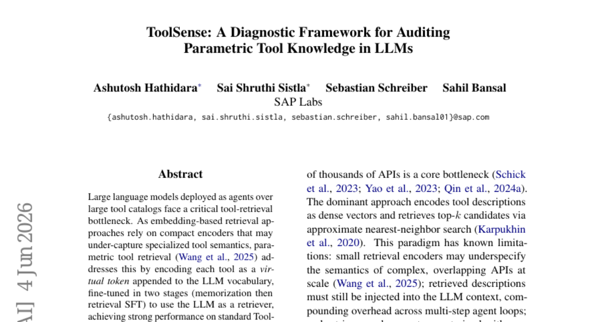

### 📌 한 줄 요약
LLM의 파라미터 기반 툴 검색 성능이 실제 도구 이해도와 괴리되어 있음을 밝히고 이를 진단하는 프레임워크를 제안함

### 🔑 핵심 포인트
- LLM의 툴 이해도를 정밀하게 측정하기 위한 진단 프레임워크 ToolSense 제안
- 기존 벤치마크의 한계(과도하게 명확한 쿼리)로 인한 성능 과대평가 지적
- 높은 검색 성능이 반드시 도구에 대한 실제 지식/이해를 의미하지 않는다는 '지식-검색 괴리' 현상 규명

### 🧑‍💻 개발자 관점
에이전트 개발 시 벤치마크 점수만 믿고 배포할 경우, 실제 운영 환경의 모호한 사용자 요청에서 시스템이 붕괴될 수 있음을 경고합니다.

### 🚀 실무 적용 아이디어
- 현재 개발 중인 에이전트의 툴 검색 성능을 ToolSense의 모호성 티어별로 테스트해보기
- 모델이 툴의 파라미터와 기능을 실제로 이해하는지 MCQ/QA 프로빙 방식으로 검증하기
- 단순 검색 정확도 외에 실제 사용자 쿼리 환경을 모사한 자체 벤치마크 구축하기

### ⚠️ 리스크/한계
- 기존 벤치마크와 ToolSense 간의 성능 격차가 모델 아키텍처에 따라 다를 수 있음
- 진단 프레임워크 자체가 새로운 평가 기준이 될 수 있어 모델 최적화 방향이 바뀔 수 있음

### 📝 초록 기반 상세 설명
LLM 에이전트가 방대한 툴 카탈로그를 사용할 때 발생하는 검색 병목 현상을 해결하기 위해, 툴을 가상 토큰으로 인코딩하는 파라미터 기반 검색 방식이 주목받고 있습니다. 그러나 기존 벤치마크는 지나치게 명확한 쿼리를 사용하여 모델의 실제 이해도를 측정하기 어렵다는 문제가 있습니다. 이를 해결하기 위해 연구진은 다양한 모호성 수준과 질문 유형을 포함하는 진단 프레임워크인 ToolSense를 개발했습니다. ToolSense를 통해 실험한 결과, 기존 벤치마크에서 높은 성능을 보이던 모델들이 실제 모호한 상황에서는 성능이 급격히 저하되는 '지식-검색 괴리(knowledge-retrieval dissociation)' 현상이 발견되었습니다. 본 연구는 ToolSense와 진단용 벤치마크를 오픈소스로 공개하여 모델의 신뢰성을 검증할 수 있는 기반을 마련했습니다.

---

## 41. [A Stationary (and Therefore Compatible) Representation is All You Need](https://huggingface.co/papers/2606.12488)
**Upvotes**: 1 | **도입 난이도**: 중 | **신뢰도**: 상
**arXiv**: https://arxiv.org/abs/2606.12488

**태그**: Representation Learning, Model Update, Fine-tuning, Vector Search, RAG, Vision, Evaluation

_Representation_is_All_You_Need_img.jpg)

### 📌 한 줄 요약
모델 업데이트 시 데이터 재처리 없이도 호환 가능한 특징 표현(Representation)을 학습하는 방법론 제안

### 🔑 핵심 포인트
- d-Simplex 고정 분류기를 통한 정적 표현이 호환성을 보장함을 이론적으로 입증
- 교차 엔트로피와 대조 학습의 결합을 통해 고차 의존성을 포착하는 호환성 학습 방법 제안
- 모델 업데이트 시 기존 데이터 재처리(Reprocessing) 없이 성능 향상 및 서비스 연속성 확보

### 🧑‍💻 개발자 관점
모델을 지속적으로 파인튜닝하거나 교체해야 하는 운영 환경에서, 기존에 저장된 벡터 DB(Gallery)를 다시 인덱싱하지 않고도 즉시 업데이트된 모델을 적용할 수 있습니다.

### 🚀 실무 적용 아이디어
- 기존 모델의 벡터 DB를 유지한 상태에서 새로운 모델로 교체 시 성능 변화 측정
- 제안된 손실 함수(CE + Contrastive)를 기존 파인튜닝 파이프라인에 적용
- 모델 업데이트 주기별로 데이터 재처리 비용과 성능 간의 트레이드오프 분석

### ⚠️ 리스크/한계
- 고차 의존성 학습을 위한 손실 함수 설계가 복잡할 수 있음
- 특정 도메인이나 데이터 분포 변화가 극심할 경우 정적 표현의 한계 가능성

### 📝 초록 기반 상세 설명
모델이 업데이트될 때마다 기존 데이터와 호환되는 특징 표현을 학습하는 것은 매우 중요합니다. 본 논문은 d-Simplex 고정 분류기를 통해 학습된 정적(Stationary) 표현이 호환성을 보장한다는 것을 이론적으로 증명합니다. 기존의 교차 엔트로피(Cross-entropy) 손실 함수는 1차 통계량만 정렬하여 고차 의존성을 포착하지 못하는 한계가 있습니다. 이를 해결하기 위해 교차 엔트로피와 대조 학습(Contrastive loss)을 결합한 새로운 손실 함수를 제안하여 고차 의존성까지 확보합니다. 실험 결과, 모델 업데이트나 교체 시에도 기존 갤러리 이미지를 재처리할 필요 없이 성능을 유지하며 최신 성능(SOTA)을 달성했습니다.

---

## 42. [PianoKontext: Expressive Performance Rendering from Deadpan Context](https://huggingface.co/papers/2606.12282)
**Upvotes**: 1 | **도입 난이도**: 상 | **신뢰도**: 상
**arXiv**: https://arxiv.org/abs/2606.12282

**태그**: Generative AI, Audio Synthesis, Flow Matching, Music Information Retrieval, Audio

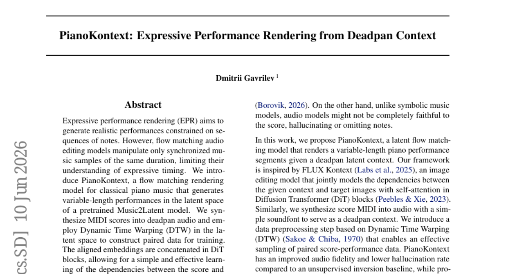

### 📌 한 줄 요약
악보 데이터와 오디오 잠재 공간을 정렬하여 가변 길이의 표현력 있는 피아노 연주를 생성하는 Flow Matching 모델

### 🔑 핵심 포인트
- Music2Latent의 잠재 공간을 활용한 가변 길이 연주 생성 기술
- DTW를 이용한 악보-오디오 간 정밀한 잠재 공간 정렬 및 데이터셋 구축
- DiT 블록 내 임베딩 결합을 통한 악보와 표현력 있는 연주 간의 관계 학습

### 🧑‍💻 개발자 관점
고정된 길이의 오디오 편집을 넘어, 악보(MIDI)를 기반으로 자연스러운 시간적 변화가 포함된 가변 길이 음악 생성 파이프라인을 구축할 수 있습니다.

### 🚀 실무 적용 아이디어
- Music2Latent 모델의 사전 학습 가중치 및 구조 분석
- DTW를 활용한 오디오-악보 정렬 알고리즘 구현 테스트
- DiT 블록 내 임베딩 결합 방식의 효율성 검증

### ⚠️ 리스크/한계
- DTW 기반 데이터 생성 시 발생할 수 있는 정렬 오차의 영향
- 클래식 피아노 외의 다른 악기나 장르로의 확장성 문제

### 📝 초록 기반 상세 설명
기존의 오디오 편집 모델은 동일한 길이의 샘플만 다룰 수 있어 연주의 시간적 표현력을 학습하는 데 한계가 있었습니다. 본 논문에서는 클래식 피아노 음악을 위한 Flow Matching 기반 렌더링 모델인 PianoKontext를 제안합니다. 사전 학습된 Music2Latent 모델의 잠재 공간 내에서 가변 길이의 연주를 생성할 수 있도록 설계되었습니다. MIDI 악보를 무미건조한(deadpan) 오디오로 합성한 뒤, DTW(Dynamic Time Warping)를 통해 잠재 공간 상에서 정렬된 쌍을 구축하여 학습 데이터를 생성합니다. 정렬된 임베딩을 DiT(Diffusion Transformer) 블록에 결합함으로써 악보와 연주 사이의 의존성을 효과적으로 학습합니다.

---

## 43. [Leveraging Morphology for Historical Script Metrological Analysis](https://huggingface.co/papers/2606.09446)
**Upvotes**: 1 | **도입 난이도**: 중 | **신뢰도**: 상
**arXiv**: https://arxiv.org/abs/2606.09446

**태그**: Computer Vision, Document Analysis, Transformer, Deep Learning, RAG, Vision

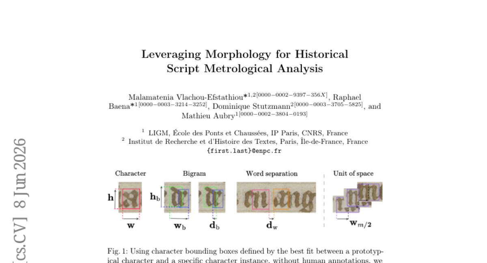

### 📌 한 줄 요약
라인 단위 전사 데이터만으로 캐릭터 프로토타입을 학습하여 역사적 필사본의 정밀한 형태학적 분석을 가능하게 하는 딥러닝 프레임워크

### 🔑 핵심 포인트
- 라인 단위 전사(line-level transcription)만으로 정밀한 캐릭터 바운딩 박스 및 형태학적 특징 추출 가능
- 캐릭터 프로토타입 학습을 통한 변형 및 위치 정보의 안정적인 측정 기술 확보
- 소량의 데이터(단일 컬럼)로도 대규모 페이지에 적용 가능한 높은 확장성과 효율성

### 🧑‍💻 개발자 관점
데이터 라벨링 비용을 최소화하면서도 객체 탐지(Object Detection)를 넘어선 정밀한 형태적 특징(Morphology) 추출 기술을 제공합니다.

### 🚀 실무 적용 아이디어
- Transformer 기반의 Detection 모델과 Prototype 학습 구조 결합 실험
- Line-level supervision 환경에서의 데이터 효율성 테스트
- 학습된 프로토타입을 활용한 미세한 스타일 변이(Style Variation) 분석

### ⚠️ 리스크/한계
- 라인 단위 데이터에 의존하므로 매우 복잡하거나 훼손된 텍스트에서의 정확도 저하 가능성
- 특정 시대/스타일의 필체에 특화된 프로토타입이 다른 양식에 일반화되기 어려울 수 있음

### 📝 초록 기반 상세 설명
역사적 문헌의 대규모 전사는 가능해졌으나, 고문서학 연구에 필요한 시각적 측정값 추출은 여전히 어려운 과제입니다. 본 논문은 라인 단위 전사 데이터만으로 캐릭터 프로토타입을 학습하는 형태학적 분석 기법을 제안합니다. 트랜스포머 기반 탐지 구조와 프로토타입 기반 라인 재구성 모듈을 결합하여 캐릭터의 발생, 변형, 위치를 학습합니다. 이를 통해 캐릭터, 바이그램(bi-grams), 공백 간의 정밀한 자동 측정이 가능해졌습니다. 14세기 필사본 데이터셋을 통해 제안 모델의 확장성과 미세한 필체 차이 식별 능력을 입증했습니다.

---

## 44. [On the Limits of LLM Adaptability: Impact of Model-Internalized Priors on Annotation Task Performance](https://huggingface.co/papers/2606.00467)
**Upvotes**: 0 | **도입 난이도**: 하 | **신뢰도**: 상
**arXiv**: https://arxiv.org/abs/2606.00467

**태그**: LLM-as-a-Judge, Prompt Engineering, Data Annotation, Model Bias, Safety

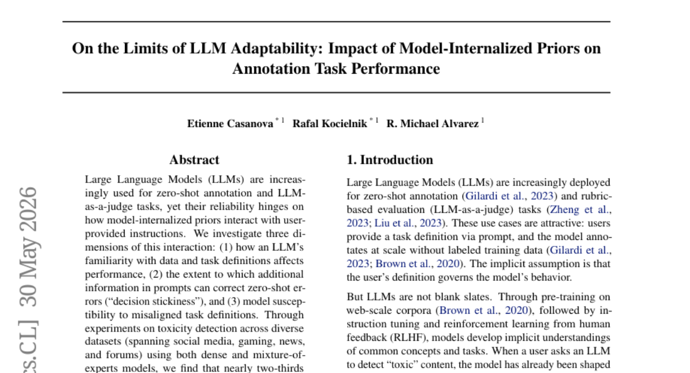

### 📌 한 줄 요약
LLM의 내부 사전 지식(Priors)이 프롬프트 지시사항보다 우선하여 발생하는 어노테이션 오류와 그 수정의 한계를 규명함

### 🔑 핵심 포인트
- 제로샷 오류의 상당 부분(약 65%)은 추가 프롬프트로 수정되지 않는 '결정 고착' 현상을 보임
- 단순한 텍스트 암기(ROUGE-L 등)보다 모델 내부 개념과 정의의 일치도(DSF)가 성능에 더 중요한 역할을 함
- 잘못된 태스크 정의를 주더라도 모델은 높은 확신을 유지하며 해당 정의를 따르는 경향이 있음

### 🧑‍💻 개발자 관점
LLM을 데이터 라벨링이나 평가 도구로 쓸 때, 프롬프트를 정교하게 짜는 것만으로는 모델 내부의 편향이나 사전 지식에 의한 오류를 해결하기 어려울 수 있음을 인지해야 합니다.

### 🚀 실무 적용 아이디어
- LLM 기반 라벨링 시, 프롬프트 수정만으로 오류가 해결되는지 '결정 고착' 여부 테스트하기
- 모델이 가진 내부 개념과 작업 정의가 일치하는지(DSF 관점) 검증 프로세스 구축하기
- 고확신 오류(High-confidence errors)를 식별하여 수동 검수 대상 리스트로 관리하기

### ⚠️ 리스크/한계
- 프롬프트 엔지니어링만으로는 모델의 근본적인 사전 지식 오류를 해결하는 데 한계가 있음
- 모델이 잘못된 정의를 확신을 가지고 따를 경우, 검수 없이 자동화할 시 데이터 오염 위험이 큼

### 📝 초록 기반 상세 설명
LLM을 제로샷 어노테이터나 판사로 활용하는 사례가 늘고 있으나, 모델 내부의 사전 지식과 사용자 지시사항 간의 충돌 문제가 발생합니다. 본 연구는 데이터 친숙도, 프롬프트에 의한 오류 수정 가능성(decision stickiness), 잘못된 정의에 대한 순응도를 중심으로 이 상호작용을 조사했습니다. 독성 탐지 태스크를 통해 실험한 결과, 제로샷 오류의 약 2/3는 프롬프트로 수정되지 않는 '결정 고착(decision stickiness)' 현상을 보였습니다. 특히 모델 내부의 개념과 태스크 정의 간의 일치도를 나타내는 'Definition-Specific Familiarity(DSF)'가 단순 텍스트 암기보다 성능에 더 큰 영향을 미침을 확인했습니다. 결과적으로 프롬프트 기반의 오류 수정에는 명확한 한계가 존재함을 시사합니다.

---

