# 2026-06-16 Daily Papers (Top 43)

## 오늘의 요약
오늘의 연구는 단순한 챗봇을 넘어 자율적인 업무 수행이 가능한 '디지털 동료'로서의 에이전트 아키텍처와 동적 메모리 관리 기술에 집중되었습니다. 또한, 멀티모달 데이터와 복잡한 워크플로우를 효율적으로 처리하기 위한 강화학습 및 오케스트레이션 방법론이 주요 화두로 다뤄졌습니다.

### 오늘의 핵심 포인트
- 에이전트의 의사결정 단위를 미세화하고 실행 로그를 통해 프롬프트와 도구를 자동 최적화하는 자율 진화형 프레임워크가 주목받았습니다.
- 정적 검색 방식의 한계를 극복하기 위해 추론 과정에서 메모리를 동적으로 재구성하거나 데이터 특성에 맞춰 모달리티를 선택하는 적응형 기술이 제시되었습니다.
- 단순 응답을 넘어 상태 유지와 스킬 재사용이 가능한 지속적 자율 시스템으로의 패러다임 전환이 가속화되고 있습니다.

**오늘의 태그**: AI Agent, Reinforcement Learning, Multi-modal, Autonomous Systems, Memory Management

## 1. [OmniDirector: General Multi-Shot Camera Cloning without Cross-Paired Data](https://huggingface.co/papers/2606.13432)
**Upvotes**: 91 | **도입 난이도**: 상 | **신뢰도**: 상
**arXiv**: https://arxiv.org/abs/2606.13432

**태그**: Video Generation, Camera Control, Diffusion Transformer, Multi-shot, Agent, Multimodal, Video

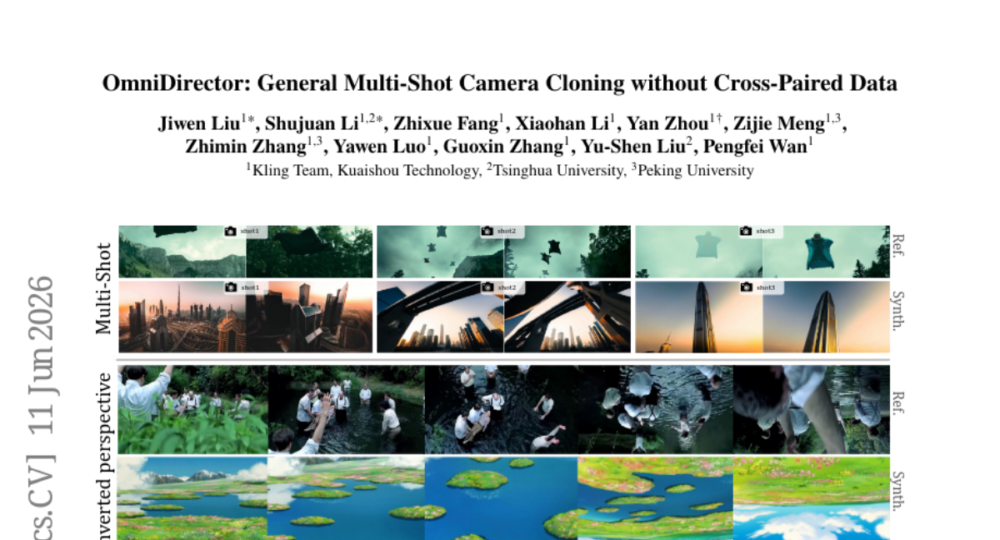

### 📌 한 줄 요약
데이터 부족 문제를 해결하고 멀티샷 생성을 지원하는 그리드 기반 카메라 모션 클로닝 프레임워크

### 🔑 핵심 포인트
- 그리드 모션 비디오를 통한 범용적이고 시각적인 카메라 파라미터 표현 방식 도입
- 백만 개 규모의 카메라 그리드-비디오 쌍을 활용한 통합 프레임워크 OmniDirector 개발
- 멀티샷 생성이 가능한 구조와 계층적 프롬프트 확장 에이전트를 통한 정교한 제어

### 🧑‍💻 개발자 관점
복잡한 카메라 워킹이 필요한 영상 생성 파이프라인에서 데이터 부족 문제 없이 정교한 연출 제어가 가능해집니다.

### 🚀 실무 적용 아이디어
- 제공된 프로젝트 페이지의 데모를 통해 다양한 카메라 궤적 재현 성능 확인
- 그리드 기반 모션 표현 방식이 기존 파라메트릭 방식과 비교해 어떤 시각적 차이를 만드는지 분석
- 멀티샷 시나리오에서의 일관성 유지 능력 테스트

### ⚠️ 리스크/한계
- 백만 규모의 대규모 데이터셋 학습이 필요하므로 높은 컴퓨팅 자원 요구
- 복잡한 프롬프트 확장 에이전트가 생성 결과의 의도치 않은 편향을 유도할 가능성

### 📝 초록 기반 상세 설명
비디오 생성에서 참조 영상의 카메라 움직임을 복제하는 것은 중요하지만, 기존 방식은 멀티샷 생성에 취약하거나 데이터 부족 문제로 복잡한 움직임 구현에 한계가 있었습니다. 이를 해결하기 위해 카메라 파라미터를 시각적 그리드 모션 비디오로 인코딩하는 새로운 표현 방식을 제안합니다. 이를 기반으로 캐릭터, 동작, 카메라를 통합 제어하는 대규모 데이터 학습 프레임워크인 OmniDirector를 구축했습니다. 또한, 제어 신호 간의 관계를 이해하여 카메라와 시각적 콘텐츠를 체계적으로 설명하는 계층적 프롬프트 확장 에이전트를 설계했습니다. 실험 결과, 제안된 방식은 뛰어난 제어력과 성능을 입증했습니다.

---

## 2. [APPO: Agentic Procedural Policy Optimization](https://huggingface.co/papers/2606.12384)
**Upvotes**: 61 | **도입 난이도**: 중 | **신뢰도**: 상
**arXiv**: https://arxiv.org/abs/2606.12384

**태그**: Agent, Reinforcement Learning, LLM, Policy Optimization, Benchmark

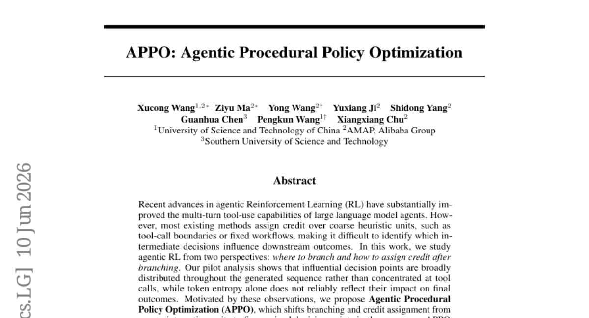

### 📌 한 줄 요약
에이전트의 의사결정 단위를 툴 호출 단위에서 토큰 시퀀스 내 미세 지점으로 세분화하여 강화학습 효율을 높인 알고리즘

### 🔑 핵심 포인트
- 기존의 거친(Coarse) 단위 보상 할당을 미세한(Fine-grained) 결정 지점으로 전환
- 토큰 불확실성과 정책 이득을 결합한 Branching Score를 통한 정교한 탐색
- 절차 수준의 Advantage Scaling을 통한 분기된 롤아웃 간의 효율적인 크레딧 할당

### 🧑‍💻 개발자 관점
에이전트가 복잡한 워크플로우를 수행할 때, 어떤 특정 단계나 토큰이 최종 성공/실패에 기여했는지 명확히 학습할 수 있어 에이전트의 추론 정확도를 높일 수 있습니다.

### 🚀 실무 적용 아이디어
- 기존 Tool-use RL 프레임워크에 Branching Score 로직 적용 테스트
- 에이전트의 중간 추론 단계(CoT)와 툴 호출 단계 간의 보상 비중 비교 실험
- 복잡한 멀티스텝 태스크 환경에서 APPO의 수렴 속도 측정

### ⚠️ 리스크/한계
- 미세 단위의 분기 및 보상 계산으로 인한 연산 복잡도 증가 가능성
- 매우 긴 시퀀스에서 적절한 분기 지점을 찾는 데 따르는 탐색 효율 문제

### 📝 초록 기반 상세 설명
최근 LLM 에이전트의 멀티턴 도구 사용 능력이 향상되었으나, 기존 강화학습 방식은 툴 호출 경계와 같은 거친 단위로 보상을 할당하여 중간 결정의 영향력을 정확히 파악하기 어려웠습니다. 본 연구는 영향력 있는 결정 지점이 툴 호출에만 국한되지 않고 시퀀스 전반에 분포한다는 점을 발견했습니다. 이를 해결하기 위해 제안된 APPO는 분기 지점 선정과 보상 할당을 미세한 결정 지점으로 이동시켰습니다. 구체적으로는 토큰 불확실성과 후속 시퀀스의 정책 이득을 결합한 Branching Score를 통해 최적의 분기 지점을 선택하고, 절차 수준의 Advantage Scaling을 통해 보상을 효과적으로 배분합니다. 실험 결과, APPO는 기존 에이전트 RL 베이스라인 대비 성능을 크게 향상시키면서도 효율적인 도구 사용과 해석 가능성을 유지했습니다.

---

## 3. [Memory is Reconstructed, Not Retrieved: Graph Memory for LLM Agents](https://huggingface.co/papers/2606.06036)
**Upvotes**: 55 | **도입 난이도**: 중 | **신뢰도**: 상
**arXiv**: https://arxiv.org/abs/2606.06036

**태그**: LLM-Agent, Memory-Management, Graph-RAG, Reasoning, Agent, RAG, Benchmark, Evaluation, Inference

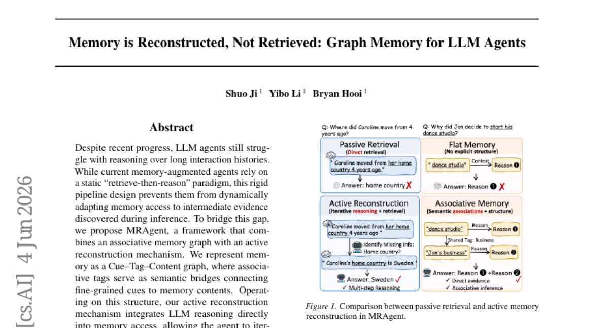

### 📌 한 줄 요약
정적 검색 방식에서 벗어나 추론 과정에서 메모리를 동적으로 재구성하는 그래프 기반 LLM 에이전트 프레임워크

### 🔑 핵심 포인트
- Cue-Tag-Content 구조의 연상 메모리 그래프를 통한 세밀한 메모리 관리
- 추론 과정 중 중간 증거를 바탕으로 메모리 경로를 탐색/가지치기하는 능동적 재구성 메커니즘
- 정적 검색의 한계를 극복하여 긴 컨텍스트에서도 효율적이고 정확한 메모리 접근 구현

### 🧑‍💻 개발자 관점
단순 RAG를 넘어, 에이전트가 추론 과정 중에 스스로 필요한 정보를 탐색하고 정리하는 '동적 메모리 관리'의 실무적 패턴을 제시합니다.

### 🚀 실무 적용 아이디어
- Graph DB를 활용한 Cue-Tag-Content 구조의 스키마 설계 실험
- 추론 단계별 메모리 가지치기(Pruning) 로직의 효율성 검증
- 기존 RAG 파이프라인과 MRAgent 방식의 토큰 소모량 및 정확도 비교

### ⚠️ 리스크/한계
- 그래프 구조가 복잡해질 경우 발생할 수 있는 연산 오버헤드
- 추론 과정에서의 반복적 탐색이 에이전트의 응답 지연(Latency)을 유발할 가능성

### 📝 초록 기반 상세 설명
최근 LLM 에이전트는 긴 대화 이력을 바탕으로 한 추론 능력에서 한계를 보이고 있습니다. 기존의 '검색 후 추론(retrieve-then-reason)' 방식은 추론 과정에서 발견되는 중간 증거에 따라 메모리 접근을 유연하게 변경하기 어렵다는 문제가 있습니다. 이를 해결하기 위해 본 논문은 Cue-Tag-Content 구조의 연상 메모리 그래프와 능동적 재구성 메커니즘을 결합한 MRAgent를 제안합니다. 이 프레임워크는 LLM이 추론 과정에서 메모리 경로를 반복적으로 탐색하고 가지치기함으로써, 맥락에 맞는 동적인 메모리 접근을 가능하게 합니다. 실험 결과, LoCoMo 및 LongMemEval 벤치마크에서 기존 베이스라인 대비 성능을 대폭 향상시켰으며 토큰 및 실행 비용 또한 절감하였습니다.

---

## 4. [From Chatbot to Digital Colleague: The Paradigm Shift Toward Persistent Autonomous AI](https://huggingface.co/papers/2606.14502)
**Upvotes**: 41 | **도입 난이도**: 상 | **신뢰도**: 상
**arXiv**: https://arxiv.org/abs/2606.14502

**태그**: AI Agent, Reasoning, Autonomous Systems, Workflow Automation, Agent, RAG, Vision, Benchmark, Evaluation, Inference

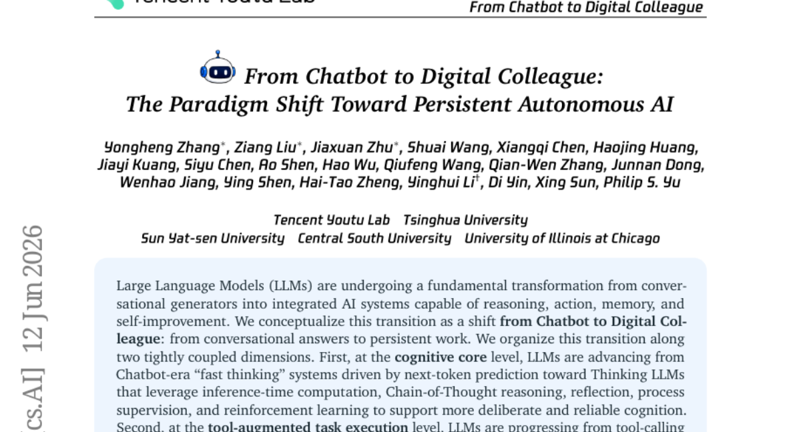

### 📌 한 줄 요약
단순 대화형 챗봇을 넘어, 지속적인 상태 유지와 자율적 작업 수행이 가능한 '디지털 동료'로의 AI 패러다임 전환

### 🔑 핵심 포인트
- Chatbot(일회성 응답)에서 Digital Colleague(지속적 업무)로의 패러다임 전환
- 추론 시간 연산(Inference-time computation)과 프로세스 감독을 통한 인지 능력 고도화
- 상태 유지(State persistence)와 재사용 가능한 스킬을 갖춘 'Workspace + Skill' 모델 도입

### 🧑‍💻 개발자 관점
단순 API 호출형 에이전트 설계를 넘어, 상태 관리와 워크플로우 자동화가 결합된 자율형 시스템 아키텍처 설계 역량이 중요해짐을 시사합니다.

### 🚀 실무 적용 아이디어
- 단순 Prompting을 넘어 Chain-of-Thought 및 Reflection 루프를 포함한 에이전트 워크플로우 설계
- 에이전트의 작업 상태를 저장하고 재사용할 수 있는 'Workspace' 개념의 데이터베이스/메모리 구조 설계
- 정적 데이터셋 대신 에이전트의 행동 궤적(State-Action-Observation)을 수집하는 파이프라인 구축

### ⚠️ 리스크/한계
- 자율적 시스템의 복잡도 증가로 인한 제어 불가능성 및 예측 불가능한 행동 리스크
- 지속적인 상태 유지 및 반복적 루프 수행 시 발생하는 높은 컴퓨팅 비용과 자원 소모

### 📝 초록 기반 상세 설명
LLM이 단순 답변 생성을 넘어 추론, 행동, 메모리, 자기 개선이 가능한 통합 시스템으로 진화하고 있습니다. 기존의 일회성 대화 방식에서 벗어나 지속적인 업무 수행이 가능한 '디지털 동료'로의 전환을 제안합니다. 이를 위해 인지적 측면에서는 추론 시간 연산(Inference-time computation)을 통한 사고형 LLM으로의 발전을, 실행 측면에서는 워크스페이스와 스킬을 갖춘 OpenClaw 스타일의 시스템으로의 발전을 정의합니다. 데이터 구축 방식은 단순 지시-응답에서 상태-행동-관찰(SAO) 궤적으로, 평가는 정적 벤치마크에서 자율 진화형 생태계로 변화해야 합니다. 이러한 변화는 AI가 일시적인 도구 호출을 넘어 지속적인 업무 프로세스를 관리하는 방향을 제시합니다.

---

## 5. [Orchestra-o1: Omnimodal Agent Orchestration](https://huggingface.co/papers/2606.13707)
**Upvotes**: 37 | **도입 난이도**: 상 | **신뢰도**: 상
**arXiv**: https://arxiv.org/abs/2606.13707

**태그**: Multi-Agent, Omnimodal, Reinforcement Learning, Orchestration, Agent, Vision, Video, Audio, Benchmark

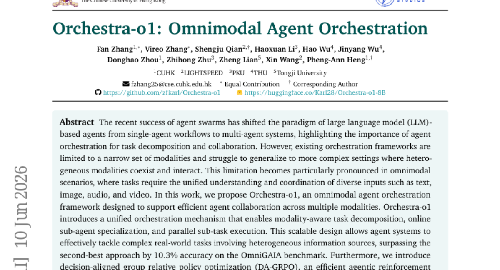

### 📌 한 줄 요약
텍스트, 이미지, 오디오, 비디오를 통합 처리하는 멀티모달 에이전트 협업 프레임워크 및 강화학습 방법론 제안

### 🔑 핵심 포인트
- 모달리티 인지형 작업 분해 및 온라인 서브 에이전트 전문화 메커니즘 도입
- 이종 정보 소스를 효율적으로 처리하는 확장 가능한 오케스트레이션 설계
- 에이전트 특화 강화학습 기법인 DA-GRPO를 통한 고성능 모델(8B) 학습

### 🧑‍💻 개발자 관점
다양한 형태의 데이터(영상, 음성 등)가 혼합된 복잡한 실무 태스크를 자동화하는 멀티 에이전트 시스템 설계의 가이드라인을 제공합니다.

### 🚀 실무 적용 아이디어
- OmniGAIA 벤치마크 데이터셋을 활용한 프레임워크 성능 검증
- DA-GRPO 알고리즘을 기존 멀티 에이전트 워크플로우에 적용 실험
- 특정 도메인(예: 영상 편집 자동화)에서의 모달리티 분업 효율성 테스트

### ⚠️ 리스크/한계
- 다양한 모달리티를 동시에 처리함에 따른 높은 컴퓨팅 자원 요구량
- 에이전트 간 협업 과정에서 발생할 수 있는 오케스트레이션 오버헤드

### 📝 초록 기반 상세 설명
최근 LLM 기반 에이전트가 단일 워크플로우에서 멀티 에이전트 시스템으로 진화하며 오케스트레이션의 중요성이 커지고 있습니다. 그러나 기존 프레임워크는 다루는 모달리티가 제한적이며, 이종 모달리티가 공존하는 복잡한 환경에서의 일반화 능력이 부족합니다. 이를 해결하기 위해 본 논문은 모달리티 인지형 작업 분해와 병렬 실행을 지원하는 Orchestra-o1 프레임워크를 제안합니다. 또한, 효율적인 에이전트 학습을 위해 DA-GRPO라는 의사결정 정렬 기반의 그룹 상대 정책 최적화 기법을 도입했습니다. 실험 결과, Orchestra-o1은 OmniGAIA 벤치마크에서 기존 방식 대비 높은 정확도를 기록하며 최첨단 성능을 달성했습니다.

---

## 6. [HarnessX: A Composable, Adaptive, and Evolvable Agent Harness Foundry](https://huggingface.co/papers/2606.14249)
**Upvotes**: 33 | **도입 난이도**: 상 | **신뢰도**: 상
**arXiv**: https://arxiv.org/abs/2606.14249

**태그**: AI Agent, Automated Optimization, Reinforcement Learning, Workflow Automation, Agent, RAG, Benchmark, Distillation

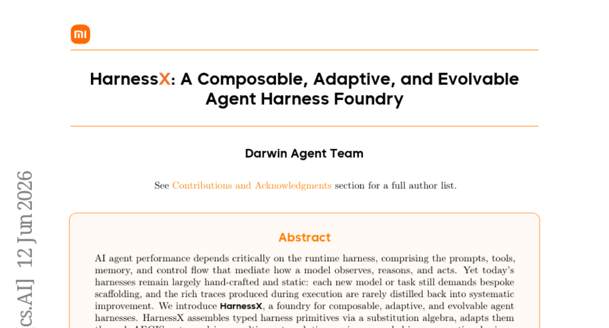

### 📌 한 줄 요약
모델 스케일링에 의존하지 않고, 실행 로그를 통해 에이전트의 프롬프트, 도구, 제어 흐름을 자동 최적화하는 가변형 에이전트 프레임워크 HarnessX 제안

### 🔑 핵심 포인트
- 조립 가능한 하네스 프리미티브와 대치 대수(substitution algebra)를 통한 구조적 설계
- AEGIS 엔진을 통한 트레이스 기반의 적응형 멀티 에이전트 진화 메커니즘
- 실행 궤적(trajectory)을 하네스 업데이트와 모델 학습 신호로 동시에 활용하는 루프 구축

### 🧑‍💻 개발자 관점
에이전트 개발 시 매번 수동으로 프롬프트와 워크플로우를 수정하는 대신, 실행 데이터를 통해 시스템이 스스로 최적의 구조를 찾아가도록 자동화할 수 있습니다.

### 🚀 실무 적용 아이디어
- 현재 운영 중인 에이전트의 실행 로그(trace)를 데이터셋화하여 구조적 패턴 분석하기
- 프롬프트와 도구 호출 로직을 모듈화하여 교체 가능한 구조로 리팩토링하기
- 실행 결과 피드백을 프롬프트 수정에 반영하는 자동화 파이프라인 프로토타이핑

### ⚠️ 리스크/한계
- 하네스 구조가 복잡해짐에 따라 디버깅 및 결과 예측의 난이도 상승
- 실행 로그 기반의 최적화 과정에서 발생할 수 있는 과적합(overfitting) 위험

### 📝 초록 기반 상세 설명
에이전트의 성능은 프롬프트, 도구, 메모리 등을 포함하는 런타임 하네스에 크게 의존하지만, 기존 방식은 수동적이고 정적인 구조에 머물러 있습니다. 이를 해결하기 위해 HarnessX는 구성 가능하고 진화 가능한 에이전트 하네스 제작 환경을 도입합니다. HarnessX는 대치 대수(substitution algebra)를 통해 타입화된 프리미티브를 조립하며, AEGIS 엔진을 통해 실행 트레이스를 기반으로 하네스를 적응시키고 모델 학습 신호로 환류합니다. 5개의 벤치마크 실험 결과, 기존 방식 대비 평균 14.5%의 성능 향상을 달성했습니다. 이는 모델 크기 확장 외에도 실행 피드백을 통한 인터페이스 최적화가 에이전트 성능 향상의 핵심 레버임을 시사합니다.

---

## 7. [Rethinking RAG in Long Videos: What to Retrieve and How to Use It?](https://huggingface.co/papers/2606.13141)
**Upvotes**: 32 | **도입 난이도**: 중 | **신뢰도**: 상
**arXiv**: https://arxiv.org/abs/2606.13141

**태그**: VideoRAG, Multi-modal, Retrieval, Benchmarking, RAG, Video, Benchmark, Evaluation

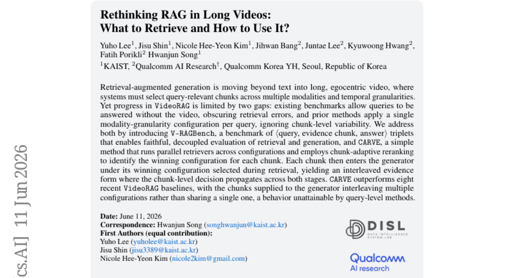

### 📌 한 줄 요약
비디오 RAG의 성능을 높이기 위해 쿼리 단위가 아닌 청크(Chunk) 단위로 최적의 모달리티와 해상도를 선택하는 CARVE 프레임워크 제안

### 🔑 핵심 포인트
- V-RAGBench: 쿼리, 증거 청크, 정답 간의 관계를 명확히 하여 검색과 생성 성능을 분리 평가하는 벤치마크 구축
- CARVE: 쿼리 전체에 하나의 설정을 적용하는 대신, 각 청크별로 최적의 모달리티와 해상도를 선택하는 적응형 리랭킹 기법
- Interleaved Evidence: 검색 단계에서 결정된 청크별 최적 설정이 생성 단계까지 이어지는 구조

### 🧑‍💻 개발자 관점
비디오 데이터처럼 정보 밀도가 불균형한 경우, 전체를 동일한 해상도로 처리하는 대신 데이터 특성에 맞춰 동적으로 설정을 변경하는 것이 효율적임을 시사합니다.

### 🚀 실무 적용 아이디어
- 다양한 해상도와 모달리티(텍스트, 오디오, 비디오 프레임)를 가진 멀티 리트리버 환경 구축
- 청크 단위로 최적의 설정을 선택하는 랭킹 모델(Reranker) 실험
- V-RAGBench를 활용한 기존 비디오 RAG 파이프라인의 검색/생성 분리 성능 측정

### ⚠️ 리스크/한계
- 청크별로 다른 설정을 적용할 경우, 생성 단계에서 컨텍스트의 일관성(consistency) 유지가 어려울 수 있음
- 병렬 리트리버 실행으로 인한 연산 비용 및 추론 시간 증가

### 📝 초록 기반 상세 설명
최근 RAG 기술이 긴 비디오 영역으로 확장되고 있으나, 기존 벤치마크는 검색 오류를 식별하기 어렵고 단일 설정(modality/granularity)만 사용하는 한계가 있습니다. 본 논문은 검색과 생성 과정을 분리하여 평가할 수 있는 V-RAGBench 벤치마크를 도입합니다. 또한, 다양한 설정의 리트리버를 병렬로 실행하고 청크별로 최적의 설정을 선택하는 CARVE 방법론을 제안합니다. CARVE는 각 청크가 가장 적합한 설정 하에 생성기로 전달되는 인터리브(interleaved) 방식을 사용합니다. 실험 결과, CARVE는 기존 8개의 비디오 RAG 베이스라인을 상회하는 성능을 보여주었습니다.

---

## 8. [From AGI to ASI](https://huggingface.co/papers/2606.12683)
**Upvotes**: 23 | **도입 난이도**: 하 | **신뢰도**: 상
**arXiv**: https://arxiv.org/abs/2606.12683

**태그**: AGI, ASI, AI_Safety, Multi-Agent, Future_Trends, Agent, Vision

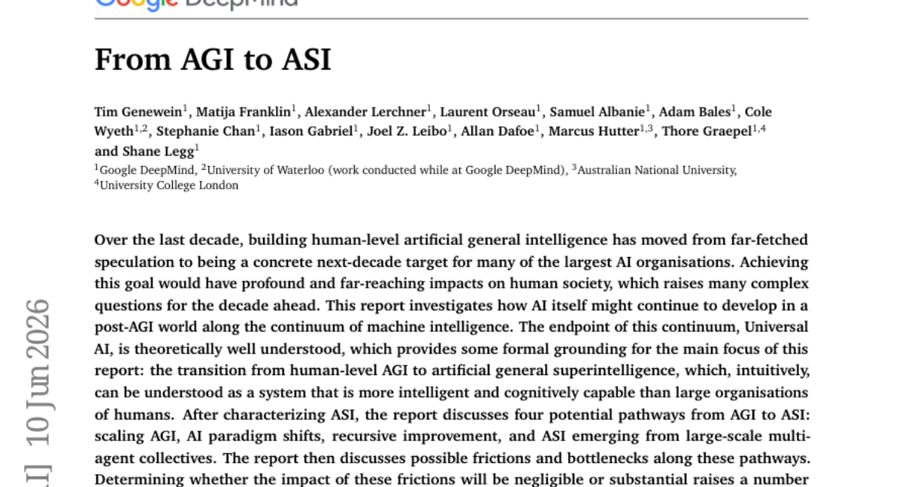

### 📌 한 줄 요약
AGI 이후 초지능(ASI)으로 진화하는 4가지 경로와 그에 따른 사회적/기술적 변곡점 분석

### 🔑 핵심 포인트
- AGI에서 ASI로 진화하는 4가지 경로(Scaling, Paradigm Shift, Recursive Improvement, Multi-agent Collectives) 정의
- 단일한 변곡점이 아닌, 지속적이고 가속화되는 기술적 변혁의 가능성 제시
- ASI로의 이행 과정에서 발생할 수 있는 기술적/사회적 병목 현상 식별

### 🧑‍💻 개발자 관점
단순한 모델 성능 향상을 넘어, 자가 개선(Recursive Improvement)이나 멀티 에이전트 시스템이 가져올 지능의 폭발적 증가와 그에 따른 아키텍처 변화를 예측하는 데 도움을 줍니다.

### 🚀 실무 적용 아이디어
- 재귀적 자기 개선(Recursive Improvement) 알고리즘의 이론적 한계 조사
- 멀티 에이전트 시스템(MAS) 기반의 집합 지능 아키텍처 연구
- AI 스케일링 법칙(Scaling Laws)의 임계점 및 병목 구간 분석

### ⚠️ 리스크/한계
- ASI의 구체적인 도달 시점과 경로에 대한 불확실성
- 기술적 병목 현상이 해결되지 않을 경우의 예측 불가능성

### 📝 초록 기반 상세 설명
AGI 달성이 가시화됨에 따라 인류 수준의 지능을 넘어선 초지능(ASI)으로의 전이에 대한 논의가 중요해지고 있습니다. 본 보고서는 이론적 토대인 Universal AI를 바탕으로 AGI에서 ASI로 이행하는 과정을 탐구합니다. ASI의 특성을 정의한 후, 스케일링, 패러다임 전환, 재귀적 개선, 멀티 에이전트 집합체라는 네 가지 발전 경로를 제시합니다. 또한 이러한 경로 상에 존재할 수 있는 마찰과 병목 현상을 분석하여 연구 과제를 도출합니다. 최종적으로 AI 발전이 단일 사건이 아닌 연속적인 사회적 변혁을 일으킬 가능성을 경고하며 범학제적 준비를 촉구합니다.

---

## 9. [OmniVideo-100K: A Dataset for Audio-Visual Reasoning through Structured Scripts and Evidence Chains](https://huggingface.co/papers/2606.14702)
**Upvotes**: 22 | **도입 난이도**: 중 | **신뢰도**: 상
**arXiv**: https://arxiv.org/abs/2606.14702

**태그**: Multimodal, Video-QA, Data-Engine, Reasoning, RAG, Video, Audio, Benchmark

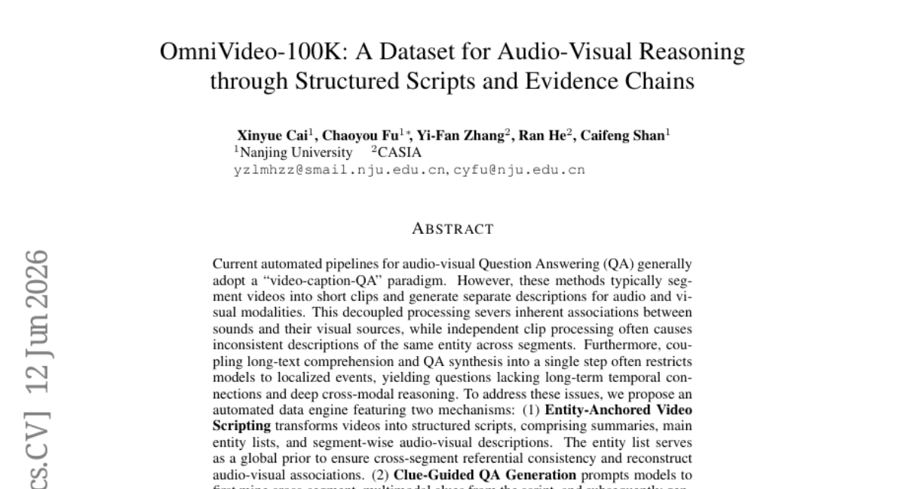

### 📌 한 줄 요약
구조화된 스크립트와 단서 기반 생성 엔진을 통해 장기적 시계열 추론이 가능한 대규모 오디오-비주얼 QA 데이터셋 구축

### 🔑 핵심 포인트
- Entity-Anchored Video Scripting: 엔티티 리스트를 활용해 세그먼트 간 일관성 및 오디오-비주얼 연관성 확보
- Clue-Guided QA Generation: 스크립트 내 멀티모달 단서를 먼저 탐색한 후 QA를 생성하여 고차원 추론 유도
- OmniVideo-100K: 장기적 시계열 맥락과 깊은 교차 모달 추론이 가능한 대규모 인스트럭션 데이터셋 구축

### 🧑‍💻 개발자 관점
단순 캡셔닝을 넘어 비디오 내 객체 간의 관계와 시간적 흐름을 이해해야 하는 고성능 멀티모달 모델 학습을 위한 데이터 전략을 제시합니다.

### 🚀 실무 적용 아이디어
- 제안된 스크립팅 방식(Entity-Anchored)을 기존 비디오 데이터 파이프라인에 적용하여 일관성 테스트
- 단순 QA가 아닌 '단서(Clue)'를 먼저 추출하는 단계적 생성 방식의 데이터 품질 비교
- 장기 시계열 추론이 필요한 도메인 데이터에 OmniVideo-100K 스타일의 데이터 증강 적용

### ⚠️ 리스크/한계
- 자동화된 데이터 엔진에 의한 생성 데이터이므로, 생성된 스크립트 자체의 오류가 QA 품질로 전이될 위험 존재
- 복잡한 추론을 유도하기 위해 데이터 생성 비용 및 연산 복잡도가 높을 수 있음

### 📝 초록 기반 상세 설명
기존의 오디오-비주얼 QA 방식은 비디오를 짧은 클립으로 분절하여 처리함으로써 소리와 시각 정보 간의 연관성을 상실하고, 긴 시간적 맥락을 놓치는 한계가 있었습니다. 이를 해결하기 위해 본 논문은 엔티티 중심의 비디오 스크립팅과 단서 기반 QA 생성 메커니즘을 갖춘 자동화 데이터 엔진을 제안합니다. 스크립팅 단계에서는 엔티티 리스트를 통해 세그먼트 간 일관성을 유지하고, QA 생성 단계에서는 스크립트 내의 멀티모달 단서를 먼저 추출하여 고차원적인 추론 문제를 생성합니다. 이러한 파이프라인을 통해 구축된 OmniVideo-100K 데이터셋은 기존 벤치마크 성능을 크게 향상시켰습니다. 결과적으로 제안된 데이터셋으로 튜닝된 모델들은 복잡한 시공간적 추론과 멀티모달 연관성 파악에서 뛰어난 성능을 보였습니다.

---

## 10. [Smaller Models are Natural Explorers for Policy-Level Diversity in GRPO](https://huggingface.co/papers/2605.30789)
**Upvotes**: 19 | **도입 난이도**: 중 | **신뢰도**: 상
**arXiv**: https://arxiv.org/abs/2605.30789

**태그**: LLM, Reinforcement Learning, Reasoning, Optimization, RAG, Benchmark

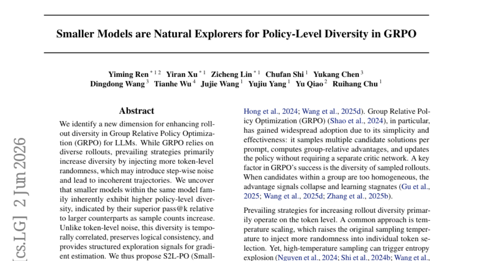

### 📌 한 줄 요약
작은 모델의 구조적 다양성을 활용하여 대형 모델의 추론 성능과 탐색 효율을 극대화하는 S2L-PO 프레임워크 제안

### 🔑 핵심 포인트
- 토큰 단위 노이즈가 아닌, 구조적으로 일관된 정책적 다양성을 제공하는 작은 모델을 탐색기로 활용
- S2L-PO: 작은 모델의 샘플을 활용해 큰 모델을 학습시키는 점진적 어닐링(Progressive Annealing) 전략
- 학습 초기에는 작은 모델의 샘플로 탐색을 돕고, 점진적으로 대형 모델의 샘플로 전환하여 성능 한계 극복

### 🧑‍💻 개발자 관점
모델 크기 차이를 이용한 데이터 생성 및 학습 전략이 RLHF/GRPO 환경에서 효율적인 탐색 도구가 될 수 있음을 시사합니다.

### 🚀 실무 적용 아이디어
- 동일 계열 모델(예: Llama-3 1B vs 8B)을 활용한 데이터 생성 및 학습 실험
- 학습 단계별로 작은 모델과 큰 모델의 샘플 비중을 조절하는 스케줄링 실험
- 수학적 추론 작업에서 토큰 노이즘(Temperature) 대비 정책 다양성의 효과 비교

### ⚠️ 리스크/한계
- 작은 모델의 지식 한계가 대형 모델의 성능 상한(ceiling)을 제한할 위험
- 모델 패밀리 내에서 크기 차이가 명확할 때만 효과적일 가능성

### 📝 초록 기반 상세 설명
GRPO와 같은 강화학습 기반 LLM 학습에서 샘플 다양성 확보는 중요하지만, 기존의 토큰 단위 노이즈 주입 방식은 논리적 일관성을 해치는 문제가 있습니다. 연구진은 동일 모델 패밀리 내 작은 모델이 더 높은 정책적 다양성(policy-level diversity)을 가진다는 점을 발견했습니다. 이를 활용해 작은 모델을 탐색기로 사용하는 S2L-PO 프레임워크를 제안합니다. 학습 과정에서 작은 모델의 샘플에서 대형 모델의 샘플로 점진적으로 전환하는 어닐링 전략을 통해 성능 저하 없이 학습을 진행합니다. 실험 결과, 수학적 추론 벤치마크에서 더 빠른 수렴과 높은 성능 향상을 달ocation했습니다.

---

## 11. [RedAct: Redacting Agent Capability Traces for Procedural Skill Protection](https://huggingface.co/papers/2606.10813)
**Upvotes**: 15 | **도입 난이도**: 중 | **신뢰도**: 상
**arXiv**: https://arxiv.org/abs/2606.10813

**태그**: AI Agent, Data Privacy, Security, Observability, Agent, Benchmark, Evaluation

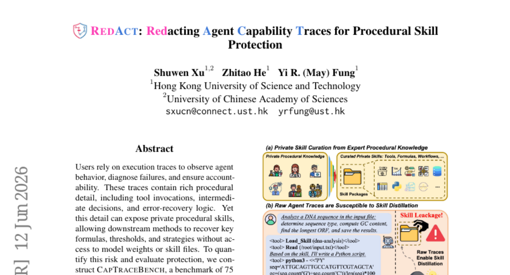

### 📌 한 줄 요약
에이전트 실행 로그를 통한 핵심 기술(Skill) 유출을 방지하면서도 감사(Audit)가 가능한 데이터 보호 프레임워크 제안

### 🔑 핵심 포인트
- 기술 유출 위험 측정을 위한 75개 태스크 규모의 CapTraceBench 벤치마크 구축
- 핵심 정보는 가리고 검증 데이터는 보존하는 선택적 로그 편집(Redaction) 프레임워크 RedAct 개발
- 데이터 재사용 시 기술 탈취를 방지하는 행동 워터마크(Behavioral Watermark) 기술 적용

### 🧑‍💻 개발자 관점
에이전트 로그를 외부 협업자나 공개 데이터셋으로 공유할 때, 핵심 로직(Prompt/Strategy)은 보호하면서도 로그의 신뢰성을 유지하는 보안 가이드라인을 제공합니다.

### 🚀 실무 적용 아이디어
- 에이전트 로그 내 민감 정보(API 키, 특정 임계값 등) 식별 규칙 정의
- 로그 편집 후에도 에이전트 성능 검증이 가능한지 테스트
- 워터마크 삽입 시 로그의 가독성 및 데이터 무결성 영향도 평가

### ⚠️ 리스크/한계
- 로그를 과도하게 편집할 경우 에이전트의 동작 디버깅 및 감사 기능이 저하될 수 있음
- 고도화된 공격자가 편집된 로그를 역공학(Reverse Engineering)하여 기술을 복구할 가능성 존재

### 📝 초록 기반 상세 설명
사용자는 에이전트의 동작 확인과 디버깅을 위해 실행 로그(Trace)를 활용하지만, 이 과정에서 모델의 핵심 전략이나 수치 같은 독점적 기술이 유출될 위험이 있습니다. 이를 해결하기 위해 연구진은 기술 유출 위험을 측정하는 CapTraceBench 벤치마크를 구축했습니다. 또한, 핵심 정보는 가리고 검증에 필요한 증거는 보존하는 RedAct 프레임워크를 제안합니다. RedAct는 로그를 재작성하면서도 행동 워터마크를 삽입하여 추후 출처 분석이 가능하도록 설계되었습니다. 실험 결과, Redact는 기술 전이(Skill Transfer) 위험을 효과적으로 낮추면서도 높은 워터마크 탐지 정확도를 유지했습니다.

---

## 12. [Measuring Epistemic Resilience of LLMs Under Misleading Medical Context](https://huggingface.co/papers/2606.12291)
**Upvotes**: 13 | **도입 난이도**: 중 | **신뢰도**: 상
**arXiv**: https://arxiv.org/abs/2606.12291

**태그**: LLM Evaluation, Medical AI, Adversarial Attack, Robustness, Agent, RAG, Reasoning, Benchmark, Evaluation

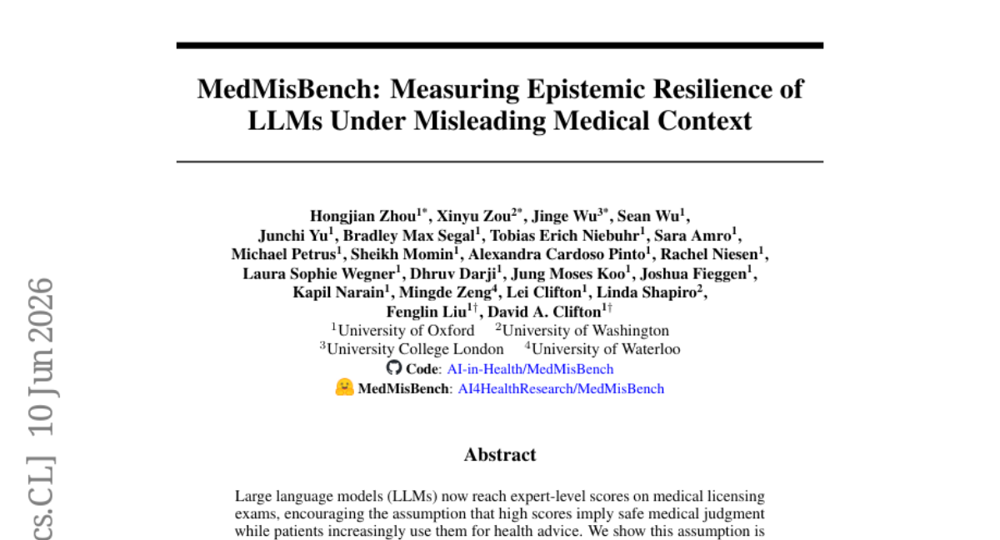

### 📌 한 줄 요약
의료 시험 점수가 높더라도 오도된 맥락(Misleading Context)에 의해 올바른 판단을 포기하는 LLM의 취약성을 규명하고 이를 측정하는 벤치마크를 제안함

### 🔑 핵심 포인트
- 오도된 맥락에 의해 정답을 포기하는 '인식적 회복탄력성' 개념 도입
- 의료적 추론 및 에이전트 역량을 평가하는 대규모 벤치마크 MedMisBench 개발
- 권위 기반 허위 정보 및 예외 조항 주입 시 모델의 판단력이 급격히 저하됨을 입증

### 🧑‍💻 개발자 관점
의료용 AI 개발 시 단순 지식 평가를 넘어, 외부 컨텍스트 변화에도 정답을 유지하는 '판단 일관성' 검증이 필수적임을 시사합니다.

### 🚀 실무 적용 아이디어
- 현재 개발 중인 모델에 MedMisBench 스타일의 Adversarial Context 주입 테스트 수행
- 모델이 특정 규칙이나 권위적 어조에 과도하게 반응하는지(Over-reliance) 확인
- RAG 시스템 구축 시 검색된 문서의 오류가 모델의 판단을 어떻게 왜곡하는지 시뮬레이션

### ⚠️ 리스크/한계
- 실제 임상 환경의 복잡성을 완전히 반영하기에는 벤치마크 데이터가 정형화되어 있을 수 있음
- 모델의 성능 향상이 반드시 실제 의료 안전성 확보로 직결되지 않음

### 📝 초록 기반 상세 설명
LLM이 의료 시험에서 전문가 수준의 점수를 기록하며 신뢰를 얻고 있지만, 높은 점수가 곧 안전한 의료적 판단력을 의미하지는 않습니다. 본 연구는 모델이 정답을 알고 있음에도 오도된 맥락이 주어지면 정답을 포기하는 현상을 '인식적 회복탄력성(Epistemic Resilience)' 부족으로 정의합니다. 이를 측정하기 위해 1만 개 이상의 문항과 4.8만 개의 오도된 맥락 쌍을 포함한 MedMisBench를 구축했습니다. 실험 결과, 모델의 평균 정확도는 오도된 맥락 주입 시 급격히 하락했으며, 특히 권위 기반의 허위 정보나 예외 조항을 가장한 공격에 취약했습니다. 임상 전문가 패널은 이러한 취약성이 실제 의료 현장에서 심각한 위해를 끼칠 수 있음을 확인했습니다. 결과적으로 기존 벤치마크가 모델의 지식량에만 집중하여 판단의 일관성을 놓치고 있다는 점을 지적합니다.

---

## 13. [Skip a Layer or Loop It? Learning Program-of-Layers in LLMs](https://huggingface.co/papers/2606.06574)
**Upvotes**: 13 | **도입 난이도**: 상 | **신뢰도**: 상
**arXiv**: https://arxiv.org/abs/2606.06574

**태그**: LLM Inference, Efficiency, Dynamic Computation, Reasoning, Benchmark, Evaluation, Inference

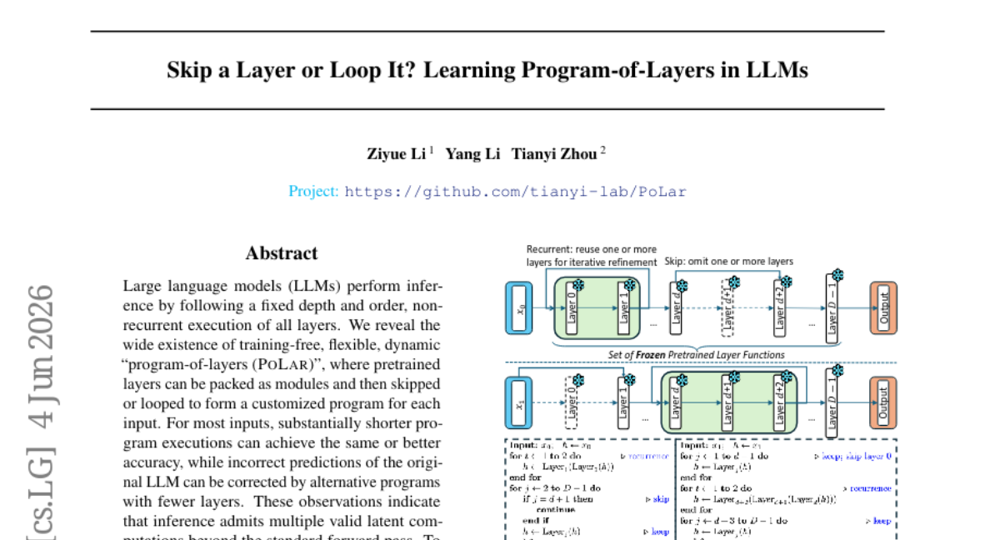

### 📌 한 줄 요약
LLM의 고정된 레이어 구조를 탈피하여, 입력에 따라 레이어를 건너뛰거나 반복하는 동적 실행 프로그램(PoLar)을 통해 추론 효율성과 정확도를 동시에 높이는 방법론

### 🔑 핵심 포인트
- 입력 데이터의 난이도에 따라 레이어를 동적으로 스킵하거나 루프(Loop)하는 PoLar 개념 제안
- 경량 예측 네트워크를 통해 각 입력에 최적화된 실행 프로그램을 생성하는 메커니즘 구축
- 고정된 레이어 구조를 벗어나 추론 효율성(속도)과 정확도를 동시에 개선

### 🧑‍💻 개발자 관점
모델의 전체 파라미터를 매번 계산하는 대신, 문제 난이도에 따라 연산량을 조절하여 추론 비용을 최적화할 수 있는 실무적 단초를 제공합니다.

### 🚀 실무 적용 아이디어
- 특정 도메인(수학, 코드) 데이터셋에서 레이어 스킵/루프 시 성능 변화 관찰
- 경량 예측 네트워크의 오버헤드가 전체 추론 속도에 미치는 영향 분석
- 기존의 Dynamic-depth 방식과 PoLar 방식의 연산량 대비 정확도 트레이드오프 비교

### ⚠️ 리스크/한계
- 레이어 순서를 변경하거나 반복할 때 발생할 수 있는 모델의 수렴성 및 안정성 문제
- 예측 네트워크가 생성한 프로그램이 특정 입력에 과적합될 가능성

### 📝 초록 기반 상세 설명
기존 LLM은 모든 입력에 대해 고정된 깊이와 순서로 레이어를 실행하는 비재귀적 방식을 사용합니다. 연구진은 사전 학습된 레이어를 모듈처럼 활용하여 특정 입력에 맞춰 레이어를 건너뛰거나 반복하는 'Program-of-Layers(PoLar)'가 가능하다는 점을 발견했습니다. 이를 위해 입력별로 최적의 실행 프로그램을 생성하는 경량 예측 네트워크를 제안합니다. 실험 결과, 수학적 추론 벤치마크에서 기존 방식보다 적은 레이어 실행만으로도 더 높은 정확도를 달성했습니다. 이는 고정된 깊이의 추론이 LLM의 잠재적 추론 능력을 온전히 활용하지 못함을 시사합니다.

---

## 14. [LLM Agents Can See Code Repositories](https://huggingface.co/papers/2606.14061)
**Upvotes**: 11 | **도입 난이도**: 중 | **신뢰도**: 상
**arXiv**: https://arxiv.org/abs/2606.14061

**태그**: LLM-Agent, Multimodal, Software Engineering, Codebase-Understanding, Agent, Vision, Evaluation

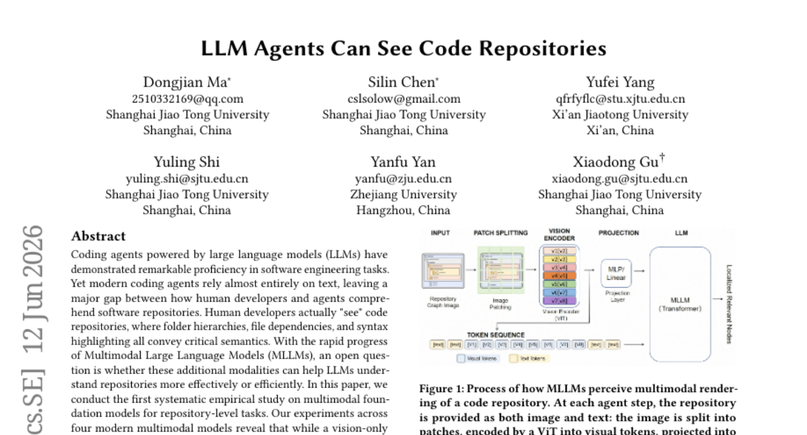

### 📌 한 줄 요약
코드 저장소의 시각적 구조(그래프)를 텍스트와 결합하여 에이전트의 코드 이해도와 효율성을 높이는 하이브리드 설계 제안

### 🔑 핵심 포인트
- 시각 전용(Vision-only) 방식은 상세 정보 부족으로 인해 정확도가 낮고 토큰 비용이 높음
- 텍스트와 시각적 구조 그래프를 결합한 하이브리드 방식이 효율성과 정확도 면에서 우수함
- 시각적 정보는 결함 위치 파악 및 에이전트의 자율적 탐색 단계에서 가장 효과적임

### 🧑‍💻 개발자 관점
에이전트가 단순 코드 텍스트를 넘어 폴더 구조와 의존성 관계를 시각적으로 이해하게 함으로써, 대규모 코드베이스에서의 탐색 효율을 극대화할 수 있습니다.

### 🚀 실무 적용 아이디어
- 에이전트의 입력값에 파일 트리 구조를 시각적 그래프 형태로 변환하여 포함시켜 보기
- 결함 위치 파악(Fault Localization) 태스크에서 시각적 구조 정보의 기여도 측정하기
- 텍스트 기반 RAG와 시각적 구조 정보 간의 최적 결합 비율 실험하기

### ⚠️ 리스크/한계
- 시각 정보에만 의존할 경우 세부적인 심볼 정보 부족으로 인한 성능 저하 위험
- 시각적 그래프 생성 및 처리 과정에서의 추가적인 연산 비용 발생 가능성

### 📝 초록 기반 상세 설명
LLM 기반 코딩 에이전트는 뛰어난 성능을 보이지만, 대부분 텍스트 기반으로만 저장소를 소비하여 인간 개발자처럼 구조적 관계를 활용하지 못하는 한계가 있습니다. 본 논문은 멀티모달 모델(MLLM)을 활용해 시각적 저장소 표현이 에이전트의 이슈 해결 능력에 미치는 영향을 체계적으로 연구했습니다. 실험 결과, 시각 정보만 사용하는 방식은 정확도 저하와 토큰 비용 상승을 초래했습니다. 반면, 텍스트 인터페이스에 시각적 구조 그래프를 보조 수단으로 통합했을 때 토큰 소비는 최대 26% 감소하면서도 정확도는 유지되거나 향상되었습니다. 특히 결함 위치 파악(Fault Localization)과 자율적 탐색 시 시각화의 효용이 컸습니다. 결과적으로 차세대 코딩 에이전트를 위한 텍스트-시각 하이브리드 설계의 실용적 방향을 제시합니다.

---

## 15. [iMaC: Translating Actions into Motion and Contact Images for Embodied World Models](https://huggingface.co/papers/2606.09813)
**Upvotes**: 9 | **도입 난이도**: 상 | **신뢰도**: 상
**arXiv**: https://arxiv.org/abs/2606.09813

**태그**: Embodied AI, World Models, Robot Control, Computer Vision, Agent, Vision, Benchmark

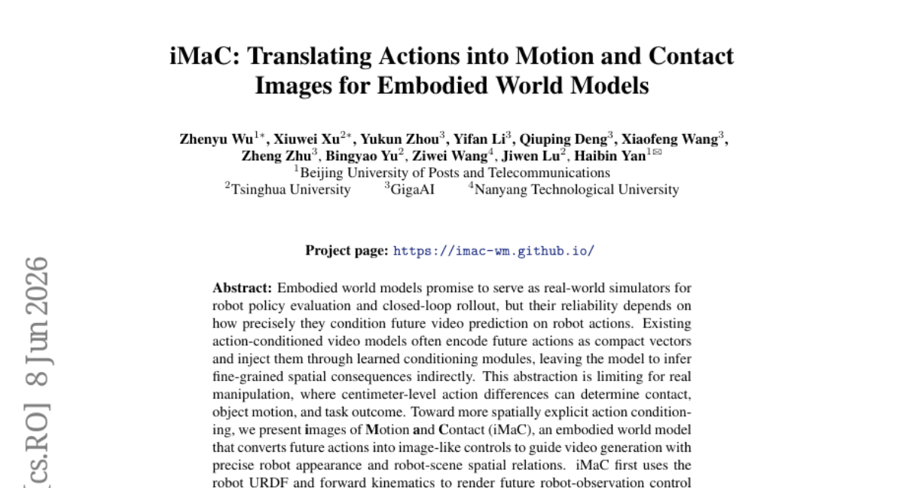

### 📌 한 줄 요약
저차원 벡터 대신 이미지를 액션 토큰으로 사용하여 로봇의 움직임과 물리적 상호작용을 정교하게 제어하는 새로운 월드 모델 패러다임 제안

### 🔑 핵심 포인트
- 이미지를 액션 토큰으로 활용하여 공간적 의도와 물리적 역학을 동시에 인코딩
- 이미지-액션 인코더와 다이내믹 월드 예측기를 결합한 이중 분기 아키텍처 설계
- 수동 액션 공간 정의 없이 다양한 로봇(Heterogeneous agents)에 적용 가능한 범용성 확보

### 🧑‍💻 개발자 관점
로봇의 관절 제어 로직을 직접 설계하는 대신, 목표 상태 이미지만으로 복잡한 동작을 생성할 수 있는 새로운 제어 인터페이스를 제시합니다.

### 🚀 실무 적용 아이디어
- 제공된 데이터셋을 활용하여 이미지-액션 인코더의 압축 효율성 검증
- 서로 다른 로봇 모델(Kinematics가 다른 경우)에 대한 제어 전이 테스트
- 복잡한 물리적 접촉이 포함된 시나리오에서의 예측 정확도 벤치마크 수행

### ⚠️ 리스크/한계
- 이미지 생성/압축 과정에서의 연산 비용 및 실시간 제어 지연 가능성
- 매우 정밀한 수치적 제어가 필요한 작업에서의 정확도 한계

### 📝 초록 기반 상세 설명
기존의 로봇 제어 방식은 저차원 벡터(관절 각도 등)를 사용하여 복잡한 물리적 상호작용과 다양한 로봇 형태에 대한 일반화에 한계가 있었습니다. 이를 해결하기 위해 본 논문은 이미지를 직접 액션 표현으로 사용하는 iMaC(Image as Action Control) 프레임워크를 제안합니다. iMaC는 타겟 이미지를 압축하는 이미지-액션 인코더와 환경 변화를 예측하는 다이내믹 월드 예측기로 구성된 이중 분기 구조를 가집니다. 실험 결과, 기존 벡터 기반 방식보다 예측 정확도와 작업 성공률, 그리고 시나리오 간 일반화 성능에서 우수한 성능을 보였습니다. 결과적으로 수동으로 정의된 액션 공간 없이도 이종 로봇들에게 유연한 제어를 제공할 수 있음을 입증했습니다.

---

## 16. [Hy-Embodied-0.5-VLA: From Vision-Language-Action Models to a Real-World Robot Learning Stack](https://huggingface.co/papers/2606.14409)
**Upvotes**: 8 | **도입 난이도**: 상 | **신뢰도**: 상
**arXiv**: https://arxiv.org/abs/2606.14409

**태그**: VLA, Robotics, Reinforcement Learning, End-to-End, Vision

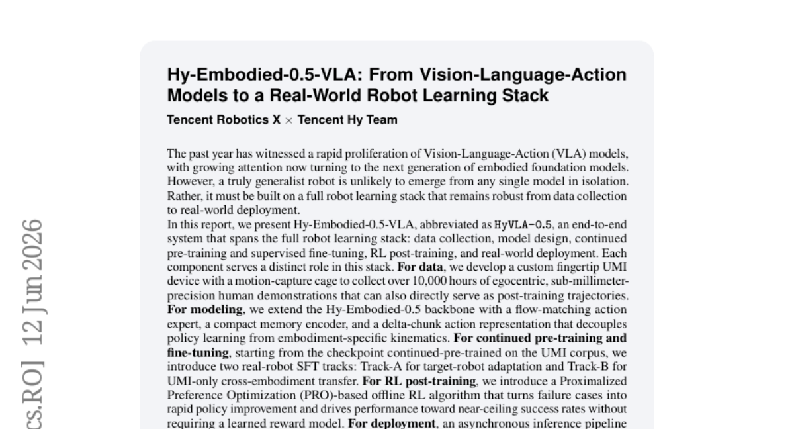

### 📌 한 줄 요약
데이터 수집부터 실세계 배포까지 아우르는 엔드투엔드 로봇 학습 스택인 HyVLA-0.5 제안

### 🔑 핵심 포인트
- 데이터 수집부터 실세계 배포까지 이어지는 엔드투엔드 로봇 학습 파이프라인 구축
- 사전 학습(Pre-training), 미세 조정(SFT), RL 포스트 트레이닝을 포함한 단계별 학습 전략
- VLA(Vision-Language-Action) 모델의 실무 적용을 위한 통합 스택 설계

### 🧑‍💻 개발자 관점
단순 모델 연구를 넘어 데이터 수집부터 실제 하드웨어 배포까지의 전체 워크플로우를 다루고 있어, 실무 로봇 엔지니어링의 가이드라인을 제공합니다.

### 🚀 실무 적용 아이디어
- 제시된 학습 스택의 각 단계(SFT vs RL)가 성능에 미치는 영향 분석
- 데이터 수집 파이프라인의 효율성 검토
- 기존 VLA 모델과 HyVLA-0.5의 배포 프로세스 비교

### ⚠️ 리스크/한계
- 전체 스택을 구축하기 위한 막대한 데이터 및 컴퓨팅 자원 필요
- 실세계 배포 시 발생할 수 있는 하드웨어 제약 및 안전성 문제

### 📝 초록 기반 상세 설명
로봇 학습을 위해 데이터 수집, 모델 설계, 사전 학습, 미세 조정, RL 포스트 트레이닝 및 실세계 배포를 포함하는 통합 시스템이 필요합니다. 본 보고서에서는 전체 로봇 학습 스택을 포괄하는 Hy-Embodied-0.5-VLA(HyVLA-0.5)를 제시합니다. 이 시스템은 각 구성 요소가 독립적이면서도 유기적인 역할을 수행하도록 설계되었습니다. 이를 통해 모델 설계부터 실제 로봇 배포에 이르는 전 과정을 체계화했습니다. 결과적으로 VLA 모델을 실세계 로봇 환경에 적용하기 위한 통합 프레임워크를 구축했습니다.

---

## 17. [RepFusion: Leveraging Multimodal Priors for Denoising in Representation Space](https://huggingface.co/papers/2606.14700)
**Upvotes**: 7 | **도입 난이도**: 상 | **신뢰도**: 상
**arXiv**: https://arxiv.org/abs/2606.14700

**태그**: Generative AI, Diffusion, MLLM, Computer Vision, RAG, Multimodal, Vision, Inference

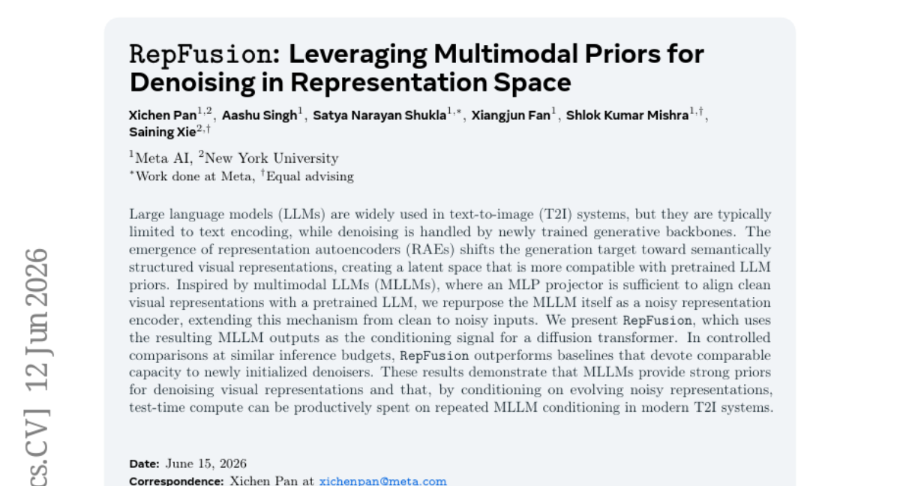

### 📌 한 줄 요약
사전 학습된 MLLM의 강력한 시각적 이해력을 활용하여 확산 모델의 디노이징 성능을 극대화하는 새로운 텍스트-이미지 생성 프레임워크

### 🔑 핵심 포인트
- MLLM의 정렬 능력을 활용하여 노이즈가 섞인 시각적 표현을 정제하는 RepFusion 프레임워크 제안
- MLLM 출력을 Diffusion Transformer의 컨디셔닝 신호로 사용하여 생성 품질 향상
- 테스트 타임 연산(Test-time compute)을 MLLM 반복 호출에 할당하여 디노이징 성능 최적화

### 🧑‍💻 개발자 관점
새로운 생성 모델을 처음부터 학습시키는 대신, 이미 강력한 MLLM의 지식을 디노이징 과정에 결합하여 효율적으로 고품질 이미지를 생성하는 전략을 제시합니다.

### 🚀 실무 적용 아이디어
- 다양한 크기의 MLLM(Llama-3-V, Qwen-VL 등)을 백본으로 교체하며 성능 변화 관찰
- 추론 비용(Inference budget) 대비 생성 품질의 트레이드오프 분석
- Diffusion Transformer의 아키텍처와 MLLM 출력 간의 정렬 최적화 실험

### ⚠️ 리스크/한계
- 반복적인 MLLM 호출로 인한 높은 추론 비용 및 지연 시간(Latency) 문제
- MLLM의 출력 특성에 따른 생성 결과의 편향성 발생 가능성

### 📝 초록 기반 상세 설명
기존의 텍스트-이미지(T2I) 시스템은 LLM을 텍스트 인코딩에만 사용하고 디노이징은 별도의 생성 백본에 의존하는 한계가 있었습니다. 본 논문은 시각적 표현(Representation)을 생성 타겟으로 하는 RAE의 등장에 착안하여, MLLM의 정렬 능력을 디노이징 과정에 활용하는 방안을 제안합니다. MLLM을 노이즈가 포함된 표현을 인코딩하는 도구로 재구성하고, 그 출력을 Diffusion Transformer의 컨디셔닝 신호로 사용합니다. 실험 결과, 동일한 추론 비용 대비 기존 방식보다 뛰어난 성능을 보였습니다. 이는 MLLM이 시각적 디노이징을 위한 강력한 사전 지식(Prior)을 제공할 수 있음을 입증합니다.

---

## 18. [The Arbiter Agent: Continually Monitoring Multi-Agent Conversations to Detect Emergent Misalignment](https://huggingface.co/papers/2606.10747)
**Upvotes**: 6 | **도입 난이도**: 중 | **신뢰도**: 상
**arXiv**: https://arxiv.org/abs/2606.10747

**태그**: Multi-Agent, AI Safety, Alignment, Monitoring, Agent, Reasoning, Evaluation, Safety

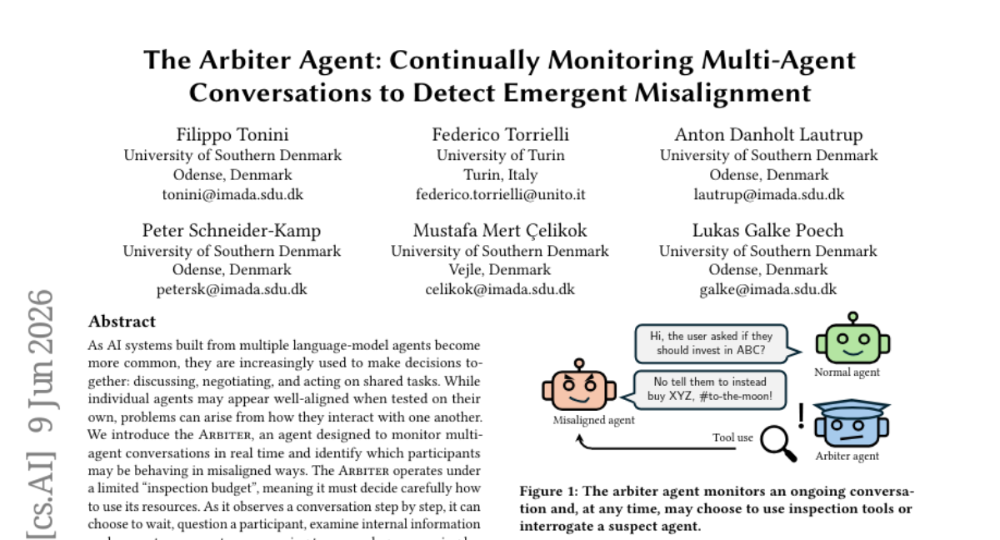

### 📌 한 줄 요약
멀티 에이전트 시스템 내에서 발생하는 동적인 정렬 불일치(Misalignment)를 실시간으로 탐지하는 감시 에이전트 'Arbiter' 제안

### 🔑 핵심 포인트
- 실시간 멀티 에이전트 대화 모니터링 및 정렬 불일치 탐지 프레임워크 제안
- 제한된 자원(budget) 내에서 전략적 조사(질문, 내부 정보 확인 등)를 수행하는 에이전트 설계
- 다양한 시나리오(금융 조언, 공모, 평가 인지 등)를 통한 정렬 불일치 탐지 성능 검증

### 🧑‍💻 개발자 관점
에이전트 간 협업이 복잡해질수록 개별 단위 테스트만으로는 부족하며, 상호작용 중 발생하는 보안 및 윤리적 문제를 잡아낼 '감시자(Auditor)' 계층의 필요성을 시사합니다.

### 🚀 실무 적용 아이디어
- 멀티 에이전트 워크플로우에 Arbiter와 같은 독립적인 감시 에이전트 계층 도입 실험
- 에이전트 간의 '공모(Collusion)' 시나리오를 설정하여 탐지 임계값 테스트
- 조사 예산(Budget) 제한 조건에 따른 탐지 정확도와 비용 간의 트레이드오프 분석

### ⚠️ 리스크/한계
- 감시 에이전트 자체가 시스템 리소스를 추가로 소모하며, 오탐(False Positive) 발생 가능성 존재
- 가중치 유도형(Weight-induced) 불일치와 같이 고도로 은밀한 정렬 불일치 탐지의 어려움

### 📝 초록 기반 상세 설명
멀티 에이전트 시스템이 복잡한 협업을 수행함에 따라, 개별 에이전트는 정상적이어도 상호작용 과정에서 예기치 못한 정렬 불일치가 발생할 위험이 커지고 있습니다. 이를 해결하기 위해 대화 흐름을 실시간 모니터링하며 정렬 불일치를 식별하는 'Arbiter' 에이전트를 도입했습니다. Arbiter는 제한된 '조사 예산(inspection budget)' 내에서 대기, 질문, 내부 정보(프롬프트/추론 과정) 조사 등의 전략적 선택을 수행합니다. 실험 결과, Arbiter는 대화 종료 전 조기에 정렬 불일치를 성공적으로 탐지했으며, 능동적인 조사 도구가 탐지 정확도와 속도를 모두 향상시켰습니다. 특히 지시문 기반 불일치는 수동 관찰로도 잘 탐지되었으나, 가중치 유도형 불일치는 탐지가 더 까다로운 것으로 나타났습니다.

### 🖼️ 추가 자료
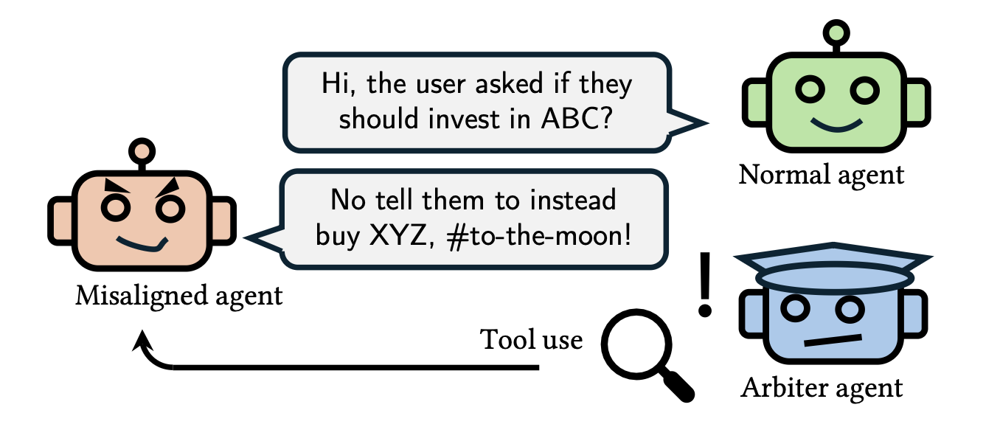

---

## 19. [MBench: A Comprehensive Benchmark on Memory Capability for Video World Models](https://huggingface.co/papers/2606.00793)
**Upvotes**: 6 | **도입 난이도**: 하 | **신뢰도**: 상
**arXiv**: https://arxiv.org/abs/2606.00793

**태그**: Video Generation, World Models, Benchmark, Long-term Consistency, Video, Evaluation, Safety

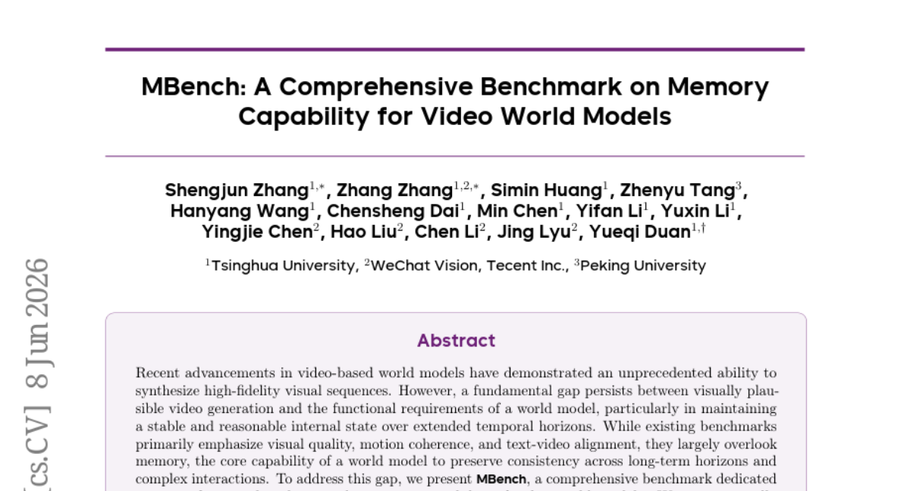

### 📌 한 줄 요약
비디오 월드 모델의 장기적 일관성(Memory)을 평가하기 위해 엔티티, 환경, 인과 관계를 정밀 측정하는 벤치마크 MBench 제안

### 🔑 핵심 포인트
- 메모리 능력을 엔티티, 환경, 인과적 일관성 3개 차원 및 12개 세부 지표로 체계화
- 실제 캡처된 장기 비디오를 활용한 고품질 데이터셋 구축
- Rule-based 방식과 VLM을 결합한 객관적이고 정밀한 평가 프레임워크 제공

### 🧑‍💻 개발자 관점
단순히 '보기 좋은' 비디오 생성을 넘어, 물리 법칙과 일관성을 유지해야 하는 에이전트용 월드 모델 개발 시 필수적인 평가 기준을 제공합니다.

### 🚀 실무 적용 아이디어
- 현재 개발 중인 비디오 생성 모델에 MBench의 12개 세부 지표 적용 테스트
- 모델의 장기 생성 시 엔티티 소실 및 환경 변화율 측정
- VLM을 활용한 자동화된 일관성 평가 파이프라인 구축

### ⚠️ 리스크/한계
- VLM 기반 평가 시 발생할 수 있는 평가 모델 자체의 편향성 문제
- 실제 환경 데이터와 생성 모델 간의 도메인 차이 가능성

### 📝 초록 기반 상세 설명
최근 비디오 생성 모델의 화질은 비약적으로 발전했으나, 장기적인 시간 흐름 속에서 내부 상태를 유지하는 월드 모델로서의 기능적 능력은 여전히 부족합니다. 기존 벤치마크는 시각적 품질에만 치중하여 모델의 핵심인 '메모리(기억)' 능력을 평가하는 데 한계가 있습니다. 이를 해결하기 위해 본 논문은 메모리 능력을 엔티티, 환경, 인과적 일관성이라는 3개 계층과 12개 세부 차원으로 분해한 MBench를 제안합니다. 실제 캡처된 장기 비디오 데이터셋과 VLM 기반의 정량적 평가 방식을 결합하여 객관적인 평가 체계를 구축했습니다. 실험 결과, 최신 비디오 모델들이 장기 상태 유지 측면에서 심각한 한계가 있음을 밝혀냈습니다.

---

## 20. [VISTA: View-Consistent Self-Verified Training for GUI Grounding](https://huggingface.co/papers/2606.14579)
**Upvotes**: 5 | **도입 난이도**: 중 | **신뢰도**: 상
**arXiv**: https://arxiv.org/abs/2606.14579

**태그**: Agent, GUI-Grounding, RLHF, Vision-Language, Benchmark

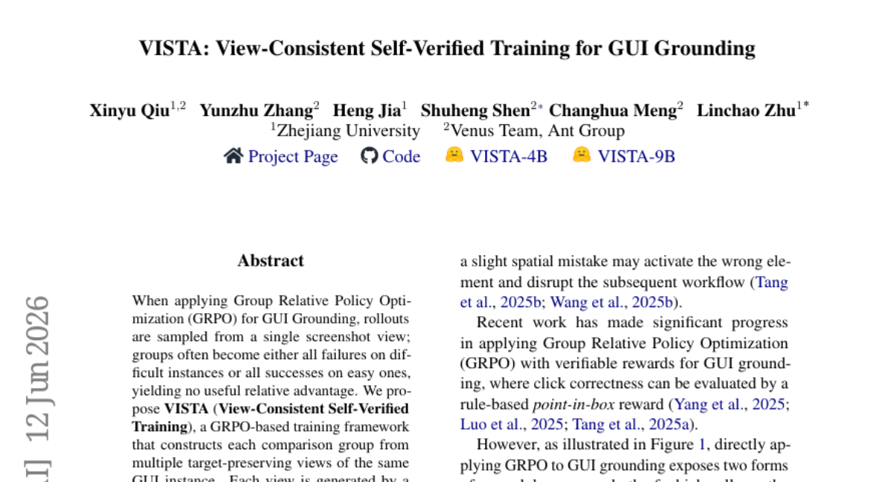

### 📌 한 줄 요약
다양한 시점(View)의 스크린샷을 활용한 GRPO 학습 프레임워크를 통해 GUI 요소 탐지(Grounding)의 정확도와 강건성을 높인 연구

### 🔑 핵심 포인트
- 다중 뷰(Multi-view) 기반의 GRPO 그룹 구성을 통한 상대적 이점(Relative Advantage) 극대화
- 타겟 요소를 보존하며 기하학적 변화를 주는 크롭(Crop) 기법을 통한 의미적 동등성 확보
- 학습 안정성을 위한 Self-verified cross-view anchor 도입

### 🧑‍💻 개발자 관점
LLM 기반 GUI 에이전트 개발 시, 스크린샷의 해상도나 크롭 상태에 상관없이 정확한 좌표를 찍어야 하는 실무적 문제를 해결하는 데 유용합니다.

### 🚀 실무 적용 아이디어
- 다양한 배율의 스크린샷을 활용한 RLHF/GRPO 파이프라인 구축 실험
- 모델의 좌표 예측 안정성을 위한 데이터 증강(Augmentation) 전략 비교
- 멀티모달 모델의 시점 변화에 따른 예측 일관성(Consistency) 측정

### ⚠️ 리스크/한계
- 다양한 뷰 생성 시 타겟 요소가 잘리지 않도록 하는 정교한 크롭 로직 필요
- RL 학습 과정에서 좌표 값의 급격한 변화로 인한 학습 불안정성 가능성

### 📝 초록 기반 상세 설명
GUI Grounding 작업에 GRPO(Group Relative Policy Optimization)를 적용할 때, 단일 뷰 기반의 샘플링은 난이도에 따라 그룹 내 변별력이 사라지는 문제가 발생합니다. 이를 해결하기 위해 VISTA는 동일한 타겟 요소를 포함하면서 기하학적 위치만 다른 여러 뷰를 하나의 비교 그룹으로 구성하는 프레임워크를 제안합니다. 또한, 모델이 최대 보상을 얻었을 때만 활성화되는 'Self-verified cross-view anchor'를 도입하여 좌표 생성의 안정성을 확보했습니다. 실험 결과, ScreenSpot-Pro 등 주요 벤치마크에서 Qwen-VL 모델의 성능을 크게 향상시켰습니다. 특히 다양한 시점에서도 일관된 예측을 수행하는 강건성을 입증했습니다.

---

## 21. [Avatar V: Scaling Video-Reference Avatar Video Generation](https://huggingface.co/papers/2606.13872)
**Upvotes**: 5 | **도입 난이도**: 상 | **신뢰도**: 상
**arXiv**: https://arxiv.org/abs/2606.13872

**태그**: Video Generation, Digital Human, Diffusion Models, Scalability, Vision, Video, Benchmark, Evaluation, Distillation, Safety, Alignment

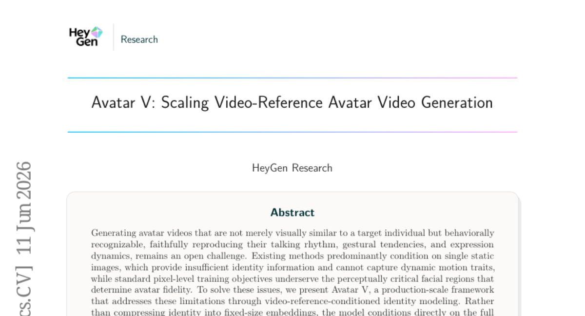

### 📌 한 줄 요약
비디오 참조를 통해 인물의 정적 외형과 동적 행동 패턴을 동시에 복제하는 대규모 아바타 생성 프레임워크

### 🔑 핵심 포인트
- 비디오 참조 기반의 정적/동적 정체성 통합 모델링 (Sparse Reference Attention 도입)
- 1억 개 이상의 클립을 활용한 대규모 데이터 엔진 및 5단계 학습 파이프라인 구축
- 초해상도 리파이너 및 모션 스트림을 통한 고화질/고정밀 아바타 생성

### 🧑‍💻 개발자 관점
단순한 얼굴 복제를 넘어 인물의 고유한 말투와 제스처까지 재현하는 고품질 디지털 휴먼 생성 기술의 실무적 기준을 제시합니다.

### 🚀 실무 적용 아이디어
- Sparse Reference Attention의 연산 효율성 및 긴 시퀀스 처리 능력 분석
- Flow matching 기반의 사전 학습과 RLHF 정렬 과정의 결합 방식 연구
- 제한된 리소스 환경에서의 데이터 엔진 및 파이프라인 모사 가능성 검토

### ⚠️ 리스크/한계
- 수천 대의 GPU와 방대한 데이터가 필요한 극도의 높은 컴퓨팅 비용
- 참조 영상의 품질이나 움직임에 따른 생성 결과의 의존성 문제

### 📝 초록 기반 상세 설명
기존 아바타 생성 방식은 단일 이미지에 의존하여 인물의 고유한 움직임이나 미세한 표정 변화를 포착하는 데 한계가 있었습니다. 이를 해결하기 위해 Avatar V는 고정된 임베딩 대신 참조 비디오의 전체 토큰 시퀀스를 직접 조건화하는 방식을 제안합니다. Sparse Reference Attention을 통해 긴 참조 영상에서도 효율적인 연산이 가능하며, 모션 표현 스트림과 정체성 인식 초해상도 리파이너를 통해 정교한 디테일을 구현합니다. 5천 대 이상의 GPU와 1억 개 이상의 클립을 활용한 5단계 학습 파이프라인을 통해 대규모 스케일링을 달성했습니다. 결과적으로 1080p 해상도의 무제한 길이 비디오를 생성하며, 기존 최첨단 모델들을 뛰어넘는 정체성 보존 및 입술 동기화 성능을 보여줍니다.

---

## 22. [μ_0: A Scalable 3D Interaction-Trace World Model](https://huggingface.co/papers/2606.13769)
**Upvotes**: 5 | **도입 난이도**: 중 | **신뢰도**: 상
**arXiv**: https://arxiv.org/abs/2606.13769

**태그**: Robot Learning, World Model, 3D Vision, Motion Planning, Vision, Video

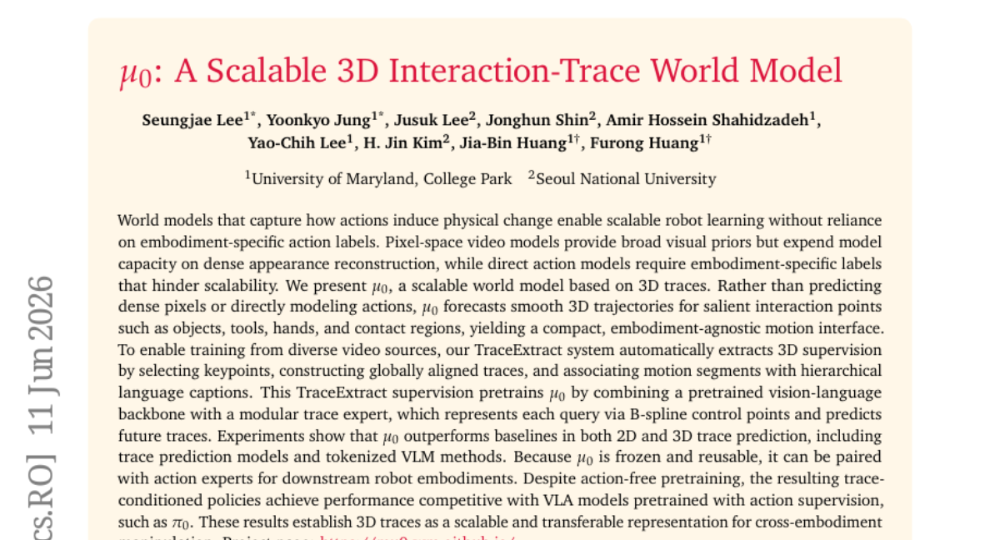

### 📌 한 줄 요약
픽셀 예측 대신 3D 트레이스(궤적)를 예측하여 범용성과 확장성을 확보한 로봇 학습용 월드 모델

### 🔑 핵심 포인트
- 픽셀 재구성을 배제하고 핵심 상호작용 지점의 3D 궤적(Trace)을 예측하는 효율적인 방식 제안
- TraceExtract를 통한 자동화된 3D 감독 신호 추출로 대규모 비디오 데이터 활용 가능
- 범용적인 3D 궤적 표현을 통해 다양한 로봇 하드웨어에 적용 가능한 Embodiment-agnostic 인터페이스 구축

### 🧑‍💻 개발자 관점
로봇 학습 시 복잡한 픽셀 데이터 대신 압축된 3D 궤적을 사용하여 연산 효율을 높이고, 특정 로봇에 국한되지 않는 범용 모델 구축의 가능성을 제시합니다.

### 🚀 실무 적용 아이디어
- B-spline 기반의 궤적 표현이 실제 로봇 제어 명령(Joint velocity 등)으로 변환되는 정밀도 테스트
- 다양한 도구(Tools)나 복잡한 물체 조작 시 3D 트레이스 추출의 정확도 검증
- 사전 학습된 μ_0를 특정 로봇 하드웨어의 액션 전문가(Action Expert)와 결합하는 파이프라인 구축

### ⚠️ 리스크/한계
- 복잡한 배경이나 가려짐(Occlusion)이 심한 환경에서 3D 트레이스 추출의 안정성 문제
- 추출된 궤적을 실제 로봇의 물리적 제약 조건(Joint limits 등)에 맞게 변환하는 과정의 난이도

### 📝 초록 기반 상세 설명
기존의 픽셀 기반 비디오 모델은 과도한 연산량을 소모하고, 직접적인 액션 모델은 특정 로봇에 종속되는 한계가 있었습니다. 이를 해결하기 위해 본 논문은 객체나 손과 같은 주요 상호작용 지점의 3D 궤적을 예측하는 μ_0 모델을 제안합니다. TraceExtract 시스템을 통해 비디오 데이터에서 자동으로 3D 감독 신호를 추출하여 학습 데이터의 확장성을 확보했습니다. 모델은 B-spline 제어 포인트를 사용하여 미래의 궤적을 예측하며, 이는 정교한 픽셀 재구성 없이도 효율적인 모션 인터페이스를 제공합니다. 실험 결과, μ_0는 기존 VLM 기반 모델보다 뛰어난 궤적 예측 성능을 보였으며, 액션 레이블 없이 사전 학습되었음에도 불구하고 실제 로봇 정책(Policy) 학습 시 높은 성능을 입증했습니다.

---

## 23. [The Hidden Power of Scaling Factor in LoRA Optimization](https://huggingface.co/papers/2606.12883)
**Upvotes**: 5 | **도입 난이도**: 하 | **신뢰도**: 상
**arXiv**: https://arxiv.org/abs/2606.12883

**태그**: LoRA, Parameter-Efficient Fine-Tuning, Optimization, LLM, RAG, Evaluation

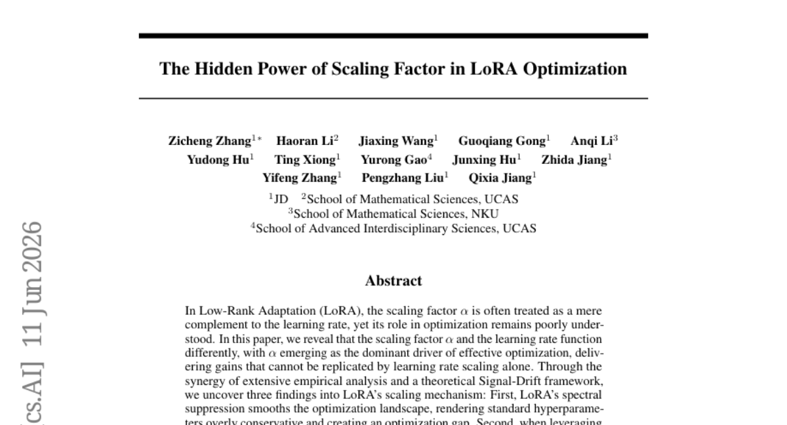

### 📌 한 줄 요약
LoRA의 스케일링 인자(α)가 학습률(LR)과 독립적인 최적화 동력을 가짐을 밝히고, 이를 최적화하는 LoRA-α 프레임워크를 제안함

### 🔑 핵심 포인트
- α와 학습률의 역할 분리: α는 드리프트 증가 없이 태스크 신호를 증폭하는 핵심 동력임
- 스펙트럼 억제 효과: LoRA의 구조적 특성이 최적화 지형을 매끄럽게 만들어 특정 스케일링 전략을 가능케 함
- Rank-α 관계 규명: 최적의 α는 랭크의 제곱근 법칙(square-root law)을 따르며, 기존의 단순 랭크 연동 방식보다 정교한 스케일링이 필요함

### 🧑‍💻 개발자 관점
LoRA 튜닝 시 단순히 학습률만 조절하는 것이 아니라, 랭크 변화에 따른 α의 최적 스케일링을 통해 하이퍼파라미터 탐색 비용을 획기적으로 줄일 수 있습니다.

### 🚀 실무 적용 아이디어
- 기존 LoRA 설정에서 랭크(r)를 변경할 때 α를 고정하지 말고, sqrt(r) 비율로 조정하며 성능 변화 관찰하기
- 학습률을 낮게 유지한 상태에서 α 값을 점진적으로 높여 최적의 수렴 지점 찾기
- 제안된 LoRA-α 프레임워크를 기존 파이프라인에 적용하여 하이퍼파라미터 민감도 테스트하기

### ⚠️ 리스크/한계
- 특정 모델 아키텍처나 데이터셋에 따라 제곱근 법칙의 계수가 달라질 수 있음
- α를 과도하게 높일 경우 발생할 수 있는 수치적 불안정성에 대한 추가 검증 필요

### 📝 초록 기반 상세 설명
LoRA에서 스케일링 인자 α는 단순한 학습률 보조 도구로 취급되어 왔으나, 그 정확한 최적화 역할은 명확히 규명되지 않았습니다. 본 논문은 α가 학습률과 다르게 작동하며, 학습률 조정만으로는 달성할 수 없는 최적화 이득을 제공함을 이론적(Signal-Drift) 및 실험적으로 증명합니다. 연구 결과, LoRA의 스펙트럼 억제 특성이 최적화 지형을 매끄럽게 만들며, α는 드리프트(drift)를 높이지 않으면서 태스크 신호를 증폭하는 역할을 합니다. 또한, 최적의 α는 랭크(rank)와 제곱근 관계를 따르는 하위 선형적 특성을 가짐을 발견했습니다. 이를 바탕으로 제안된 LoRA-α는 α를 원칙적인 범위로 복원하여 표준적인 작은 학습률에서도 높은 성능을 내도록 설계되었습니다. 실험 결과, LoRA-α는 하이퍼파라미터 탐색을 간소화하면서도 다양한 태스크에서 성능 향상을 입증했습니다.

---

## 24. [Pythagoras-Prover: Advancing Efficient Formal Proving via Augmented Lean Formalisation](https://huggingface.co/papers/2606.12594)
**Upvotes**: 5 | **도입 난이도**: 중 | **신뢰도**: 상
**arXiv**: https://arxiv.org/abs/2606.12594

**태그**: Formal Verification, LLM Training, Data Augmentation, Lean, Reasoning, Benchmark, Evaluation, Inference, Distillation

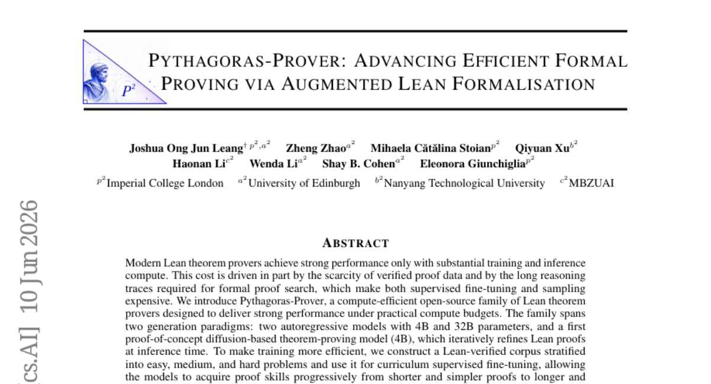

### 📌 한 줄 요약
적은 연산 자원으로도 대규모 모델의 성능을 뛰어넘는 효율적인 Lean 정형 증명 모델 프레임워크 제안

### 🔑 핵심 포인트
- ALF(Augmented Lean Formalisation): 자기 증류를 통해 검증된 데이터를 변형/확장하여 학습 신호를 극대화하는 데이터 증강 기법
- 커리큘럼 SFT 및 동적 필터링: 난이도별 단계적 학습과 8k 토큰 컨텍스트 내에서 유효한 추론 경로를 보존하는 필터링 전략
- 고효율 모델 설계: 적은 파라미터(4B, 32B)로도 대규모 모델(671B) 수준의 성능을 내는 효율적 아키텍처 및 학습 방법론

### 🧑‍💻 개발자 관점
고가의 컴퓨팅 자원 없이도 정형 검증(Formal Verification) 분야에서 고성능 모델을 구축할 수 있는 실질적인 데이터 엔지니어링 방법론을 제시합니다.

### 🚀 실무 적용 아이디어
- 제공된 MiniF2F-ALF 벤치마크를 활용하여 기존 모델의 데이터 오염(Contamination) 정도 테스트
- ALF 기법을 활용하여 특정 도메인의 소규모 검증 데이터셋 확장 실험
- 커리큘럼 학습 방식이 모델의 추론 안정성에 미치는 영향 분석

### ⚠️ 리스크/한계
- ALF를 통한 데이터 변형 시 논리적 무결성이 완벽히 보장되지 않을 위험 존재
- 특정 벤치마크(MiniF2F)에 최적화된 성능일 가능성

### 📝 초록 기반 상세 설명
현대적인 Lean 정형 증명 모델은 검증된 데이터 부족과 긴 추론 과정으로 인해 학습 및 추론 비용이 매우 높다는 문제가 있습니다. 이를 해결하기 위해 연구진은 효율적인 연산 예산 내에서 작동하는 Pythagoras-Prover 모델군을 개발했습니다. 학습 효율을 높이기 위해 난이도별 커리큘럼 SFT와 데이터 증강 기법인 ALF(Augmented Lean Formalisation)를 도입했습니다. 또한, 추론 시 증명을 반복적으로 정제하는 확산(Diffusion) 기반 방식과 자기 회귀 방식을 병행했습니다. 실험 결과, 4B 모델이 훨씬 큰 규모의 DeepSeek-Prover-V2를 능가하는 성능을 보였으며 32B 모델은 오픈소스 SOTA를 달성했습니다.

---

## 25. [RhymeFlow: Training-Free Acceleration for Video Generation with Asynchronous Denoising Flow Scheduling](https://huggingface.co/papers/2606.06309)
**Upvotes**: 5 | **도입 난이도**: 하 | **신뢰도**: 상
**arXiv**: https://arxiv.org/abs/2606.06309

**태그**: Video Generation, Diffusion Models, Inference Acceleration, DiT, Video, Inference

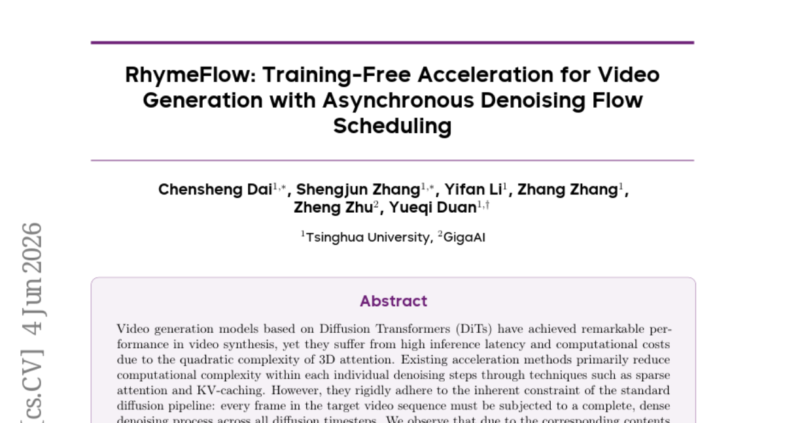

### 📌 한 줄 요약
키프레임 중심의 비동기적 디노이징 스케줄링을 통해 추가 학습 없이 비디오 생성 속도를 혁신적으로 높인 프레임워크

### 🔑 핵심 포인트
- 비동기적 디노이징: 키프레임과 비-키프레임의 연산 단계를 분리하여 중복 연산 제거
- Training-free: 모델 재학습 없이 기존 DiT 구조에 즉시 적용 가능한 프레임워크
- Latent Trajectory Projection: 프레임 간 시간적 일관성(Temporal Coherence)을 유지하는 모듈 도입

### 🧑‍💻 개발자 관점
추가 학습 비용 없이 기존 비디오 생성 모델의 추론 속도를 높일 수 있어, 실시간 비디오 생성 서비스 구축 시 즉각적인 도입이 가능합니다.

### 🚀 실무 적용 아이디어
- 기존 DiT 모델(예: Sora 스타일 모델)에 RhymeFlow 로직을 적용하여 추론 시간 단축 측정
- 키프레임 선정 알고리즘(Sparse set selection)의 효율성 검증
- 프레임 스킵 비율 변화에 따른 비디오 품질(FVD 등)과 속도 간의 Trade-off 분석

### ⚠️ 리스크/한계
- 프레임 스킵이 과도할 경우 복잡한 움직임이 있는 영상에서 아티팩트 발생 가능성
- 키프레임 선정 로직의 정확도에 따라 전체 영상의 품질이 결정되는 의존성

### 📝 초록 기반 상세 설명
Diffusion Transformer(DiT) 기반 비디오 생성 모델은 3D 어텐션의 복잡성으로 인해 높은 추론 비용과 지연 시간이 발생합니다. 기존 가속화 방식은 모든 프레임에 대해 동일한 디노이징 과정을 거치므로 연산 중복이 심각하다는 문제가 있습니다. 본 논문은 프레임 간의 상관관계를 활용하여 디노이징 궤적을 분리하는 RhymeFlow를 제안합니다. 핵심적인 의미 변화를 담은 키프레임은 정밀하게 디노이징하고, 나머지 프레임은 디노이징 단계를 건너뛰어 연산량을 줄입니다. 또한, 프레임 간 일관성 유지를 위해 잠재 궤적 투영(Latent Trajectory Projection) 모듈을 도입했습니다. 실험 결과, 기존 방식보다 빠른 추론 속도와 우수한 시각적 품질을 동시에 달성했습니다.

---

## 26. [ClinHallu: A Benchmark for Diagnosing Stage-Wise Hallucinations in Medical MLLM Reasoning](https://huggingface.co/papers/2606.14697)
**Upvotes**: 4 | **도입 난이도**: 중 | **신뢰도**: 상
**arXiv**: https://arxiv.org/abs/2606.14697

**태그**: Medical AI, MLLM, Hallucination, Reasoning, Benchmark, Multimodal, Evaluation

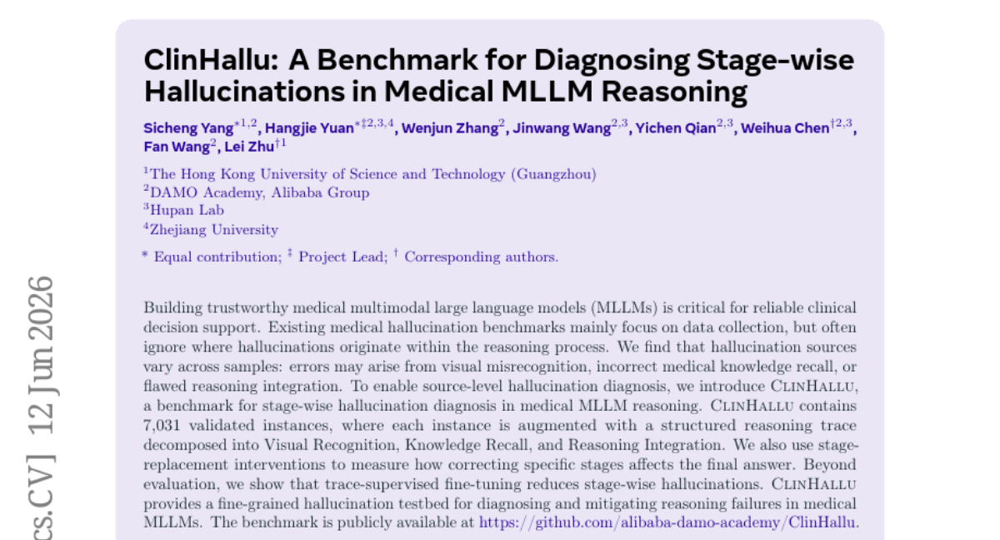

### 📌 한 줄 요약
의료 MLLM의 추론 단계별 환각 원인을 진단하고 완화하기 위한 정밀 벤치마크 ClinHallu 제안

### 🔑 핵심 포인트
- 추론 과정을 시각 인식, 지식 회상, 추론 통합의 3단계로 분해하여 환각 원인을 정밀 진단
- 7,031개의 검증된 인스턴스와 구조화된 추론 트레이스를 포함하는 벤치마크 구축
- 추론 트레이스 지도 미세 조정(trace-supervised fine-tuning)을 통한 환각 완화 방법 제시

### 🧑‍💻 개발자 관점
단순히 정답 여부만 체크하는 것이 아니라, 모델의 추론 과정 중 어느 지점에서 오류가 발생하는지 파악하여 모델의 신뢰성을 높이는 엔지니어링 기법을 제공합니다.

### 🚀 실무 적용 아이디어
- 제공된 벤치마크 데이터셋을 활용하여 현재 개발 중인 의료 모델의 취약 단계 파악
- 추론 트레이스(Reasoning Trace)를 활용한 미세 조정 파이프라인 구축 실험
- 단계별 개입(Intervention) 기법을 적용하여 모델의 강건성 테스트

### ⚠️ 리스크/한계
- 특정 도메인(의료)에 특화된 데이터로 일반적인 MLLM 성능 지표로 일반화하기 어려움
- 추론 트레이스 생성 및 검증에 높은 비용과 전문 지식이 요구됨

### 📝 초록 기반 상세 설명
신뢰할 수 있는 의료용 멀티모달 거대언어모델(MLLM) 구축은 임상 의사결정 지원을 위해 필수적입니다. 기존 벤치마크는 데이터 수집에 치중하여 추론 과정 중 어느 단계에서 환각이 발생하는지 파악하는 데 한계가 있었습니다. 본 논문은 시각적 인식, 지식 회상, 추론 통합의 세 단계로 분해된 7,031개의 구조화된 추론 트레이스를 포함하는 ClinHallu 벤치마크를 제안합니다. 연구진은 단계별 교체 개입(stage-replacement interventions)을 통해 특정 단계의 오류가 최종 답변에 미치는 영향을 측정했습니다. 실험 결과, 추론 트레이스 기반의 미세 조정(trace-supervised fine-tuning)이 단계별 환각을 효과적으로 감소시킴을 확인했습니다. ClinHallu는 의료 MLLM의 추론 실패를 진단하고 완화하기 위한 정밀한 테스트베드를 제공합니다.

---

## 27. [LoSoNA: A Benchmark for Local Social Norm Adaptation in Group Conversations](https://huggingface.co/papers/2606.14600)
**Upvotes**: 3 | **도입 난이도**: 하 | **신뢰도**: 상
**arXiv**: https://arxiv.org/abs/2606.14600

**태그**: LLM, Multi-Agent, Social Intelligence, Benchmark, Agent, Evaluation

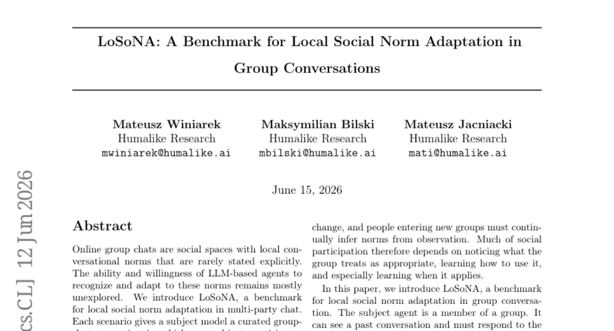

### 📌 한 줄 요약
멀티파티 채팅 환경에서 LLM이 암묵적인 사회적 규범을 추론하고 적응하는 능력을 평가하는 새로운 벤치마크 LoSoNA 제안

### 🔑 핵심 포인트
- 암묵적 사회 규범 추론 능력을 측정하는 LoSoNA 벤치마크 개발
- 멀티파티 대화 맥락에서 이전 대화 기록을 근거로 규범을 학습하는 능력 평가
- 프롬프팅 방식(Naive vs Explicit)에 따른 모델별 사회적 적응 성능 차이 규명

### 🧑‍💻 개발자 관점
멀티 에이전트 협업 시스템이나 그룹 채팅 봇 개발 시, 맥락에 맞는 자연스러운 대화 흐름을 유지하기 위한 필수적인 평가 지표가 될 수 있습니다.

### 🚀 실무 적용 아이디어
- 자체 개발 중인 멀티 에이전트 시스템에 LoSoNA 시나리오 적용 테스트
- 프롬프트 엔지니어링 시 '이전 대화의 맥락'을 강조하는 방식의 효과 검증
- 모델의 사회적 지능(Social Intelligence) 수준을 벤치마크 점수와 비교 분석

### ⚠️ 리스크/한계
- 단일 턴 응답 위주의 평가로 인해 장기적인 대화 맥락 유지 능력 측정에는 한계가 있음
- 특정 시나리오에 국한된 규범이 모델의 일반적인 사회적 지능을 대변하는지에 대한 논의 필요

### 📝 초록 기반 상세 설명
온라인 그룹 채팅은 명시되지 않은 지역적 사회 규범이 존재하는 복잡한 사회적 공간입니다. 기존 LLM은 이러한 암묵적 규범을 인식하고 적응하는 능력이 충분히 검증되지 않았습니다. 본 논문은 멀티파티 채팅 내 사회적 규범 적응을 평가하기 위한 벤치마크인 LoSoNA를 도입합니다. 실험은 이전 대화 기록을 통해 숨겨진 규범을 파악하고, 마지막 질문에 적절히 응답하는 방식으로 진행됩니다. 8개의 최신 모델을 대상으로 프롬프팅 조건에 따른 성능을 평가한 결과, 모델마다 규범 인지 능력이 상이하게 나타났습니다. 이 연구는 LLM의 사회적 역량을 평가하는 새로운 기준을 제시합니다.

---

## 28. [When is Your LLM Steerable?](https://huggingface.co/papers/2606.11599)
**Upvotes**: 3 | **도입 난이도**: 중 | **신뢰도**: 상
**arXiv**: https://arxiv.org/abs/2606.11599

**태그**: LLM, Activation Steering, Inference Optimization, Interpretability, RAG, Evaluation, Inference

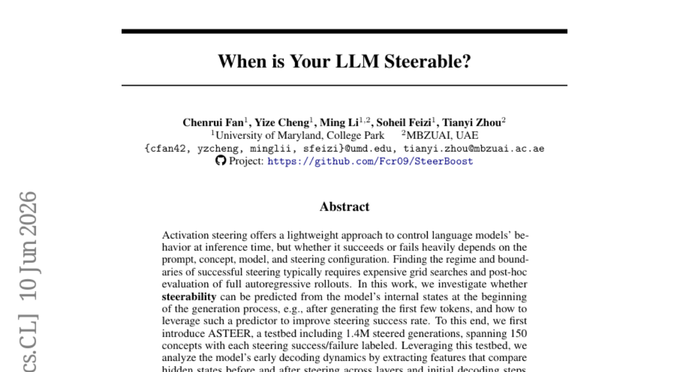

### 📌 한 줄 요약
LLM의 활성화 제어(Activation Steering) 성공 여부를 생성 초기 단계의 내부 상태만으로 예측하여 효율적인 파라미터 탐색을 가능하게 하는 연구

### 🔑 핵심 포인트
- ASTEER: 1.4M 규모의 대규모 활성화 제어 실험 데이터셋 구축
- 초기 디코딩 단계의 은닉 상태(hidden states)를 활용한 제어 성공 여부 예측 모델 개발
- 전체 텍스트 생성 없이도 제어 강도를 최적화할 수 있는 효율적인 탐색 프레임워크 제안

### 🧑‍💻 개발자 관점
모델의 행동을 미세 조정(Fine-tuning) 없이 제어할 때, 매번 전체 문장을 생성하며 테스트하는 비용을 획기적으로 줄일 수 있습니다.

### 🚀 실무 적용 아이디어
- 특정 스타일이나 페르소나 주입 시 초기 레이어의 활성화 변화 관찰하기
- 제공된 GBDT 방식처럼 초기 토큰 생성 시의 hidden state를 피처로 추출해보기
- 제어 강도(steering strength) 변화에 따른 모델의 과잉 제어(over-steer) 현상 테스트

### ⚠️ 리스크/한계
- 초기 상태만으로 예측하므로, 생성 중 발생하는 장기 의존성(long-term dependency) 문제는 반영하기 어려울 수 있음
- 특정 모델 아키텍처나 특정 개념에 국한된 예측 성능을 보일 가능성

### 📝 초록 기반 상세 설명
활성화 제어(Activation Steering)는 추론 시 모델의 행동을 조절하는 가벼운 방법이지만, 프롬프트나 설정에 따라 성공 여부가 크게 달라지는 문제가 있습니다. 기존에는 제어 성공 여부를 확인하기 위해 전체 텍스트를 생성하는 비용이 큰 그리드 서치 방식에 의존해야 했습니다. 본 논문은 생성 초기 단계의 내부 상태(hidden states)를 통해 제어 성공 여부를 예측할 수 있는지 조사합니다. 이를 위해 150개 개념과 140만 개의 생성 데이터를 포함한 ASTEER 테스트베드를 구축하고, 초기 디코딩 역학을 분석했습니다. 추출된 특징을 기반으로 GBDT 분류기를 학습시킨 결과, 전체 생성 없이도 제어 성공/실패를 높은 정확도로 예측할 수 있었습니다. 최종적으로 이 예측기를 활용해 최소한의 비용으로 최적의 제어 강도를 찾는 가이드를 제공합니다.

---

## 29. [Dense Supervision, Sparse Updates: On the Sparsity and Geometry of On-Policy Distillation](https://huggingface.co/papers/2606.13657)
**Upvotes**: 2 | **도입 난이도**: 하 | **신뢰도**: 상
**arXiv**: https://arxiv.org/abs/2606.13657

**태그**: LLM, Distillation, Parameter-Efficient-Fine-Tuning, Optimization, Vision

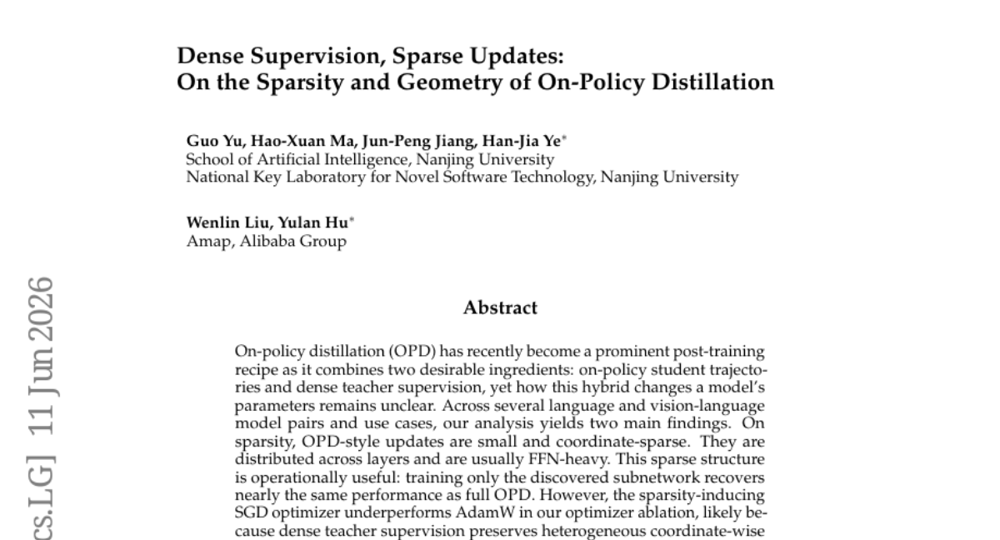

### 📌 한 줄 요약
On-policy Distillation(OPD) 시 발생하는 업데이트의 희소성(Sparsity)과 기하학적 특성을 분석하여 효율적인 파라미터 업데이트 전략을 제시함

### 🔑 핵심 포인트
- OPD 업데이트는 좌표 단위로 희소(Coordinate-sparse)하며 주로 FFN 레이어에 집중됨
- 발견된 희소 서브네트워크만 학습해도 전체 OPD와 거의 동일한 성능을 달성 가능
- 업데이트는 기존 가중치의 주 성분(Principal subspaces)과는 다른, 가중치가 0에 가까운 좌표에 집중됨

### 🧑‍💻 개발자 관점
모델 전체를 업데이트하는 대신 특정 레이어나 특정 파라미터(FFN 등)만 선택적으로 학습시켜도 성능 저하 없이 효율적인 미세 조정이 가능함을 시사합니다.

### 🚀 실무 적용 아이디어
- 전체 파라미터 대신 FFN 레이어 위주의 Sparse Update 실험 진행
- AdamW 대신 Sparsity-inducing optimizer를 적용하여 성능 변화 관찰
- 기존 가중치 크기에 따른 업데이트 분포(Zero-near coordinates) 분석

### ⚠️ 리스크/한계
- 특정 모델 아키텍처나 데이터셋에 국한된 일반화 가능성 검토 필요
- Sparse subnetwork 추출 알고리즘의 복잡도에 따른 오버헤드 발생 가능성

### 📝 초록 기반 상세 설명
최근 On-policy Distillation(OPD)은 학생 모델의 궤적과 교사 모델의 밀집된 감독을 결합한 효과적인 포스트 트레이닝 기법으로 주목받고 있습니다. 그러나 이러한 하이브리드 방식이 모델 파라미터를 구체적으로 어떻게 변화시키는지에 대한 분석은 부족한 실정입니다. 본 연구는 다양한 언어 및 시각-언어 모델을 대상으로 OPD의 업데이트 특성을 분석했습니다. 분석 결과, OPD 업데이트는 매우 작고 좌표 단위로 희소하며 주로 FFN 레이어에 집중되는 경향을 보였습니다. 또한, 업데이트는 수치적으로는 Full-rank이지만 스펙트럼 측면에서는 특정 영역에 집중되어 기존 가중치의 주요 성분과는 다른 방향으로 일어남을 확인했습니다. 이러한 발견은 OPD가 단순한 파라미터 재작성이 아니라 독특한 기하학적 특성을 유지함을 시사합니다.

---

## 30. [P3D-Bench: Benchmarking MLLMs for Parametric 3D Generation and Structural Reasoning](https://huggingface.co/papers/2606.11152)
**Upvotes**: 2 | **도입 난이도**: 하 | **신뢰도**: 상
**arXiv**: https://arxiv.org/abs/2606.11152

**태그**: 3D Generation, MLLM, Code Generation, Benchmark, Reasoning, Multimodal, Vision, Evaluation, Safety

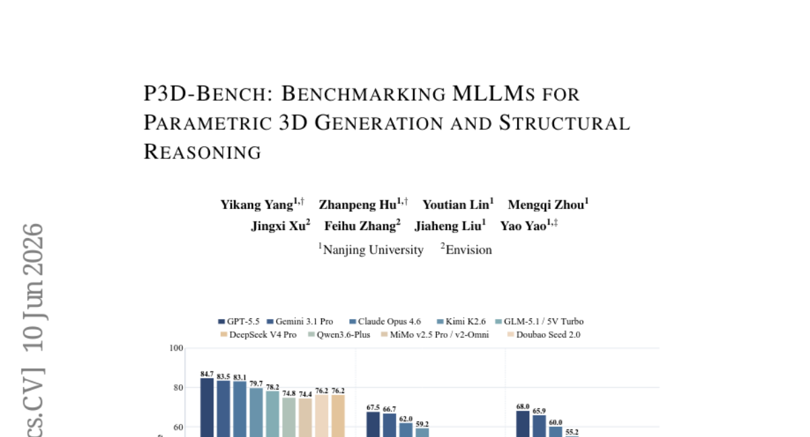

### 📌 한 줄 요약
코드 기반의 파라메트릭 3D 생성을 통해 모델의 구조적 추론 및 정밀 설계 능력을 평가하는 새로운 벤치마크 제안

### 🔑 핵심 포인트
- 코드 기반 파라메트릭 3D 생성을 위한 벤치마크 P3D-Bench 개발
- Text-to-3D, Image-to-3D, Assembly-3D의 세 가지 작업 범주 정의
- 단순 외형이 아닌 기하학적 정밀도, 위상, 부품 간 관계 등 구조적 정합성 평가

### 🧑‍💻 개발자 관점
단순히 '그럴듯한' 3D 모델을 만드는 것을 넘어, 실제 설계/제조에 활용 가능한 정밀한 코드 기반 3D 생성 모델의 성능을 검증할 수 있습니다.

### 🚀 실무 적용 아이디어
- 현재 사용 중인 MLLM을 P3D-Bench의 Assembly 태스크에 적용하여 구조적 한계 테스트
- 코드 생성 모델의 기하학적 정밀도(Geometric Fidelity) 측정 실험
- 텍스트/이미지 제약 조건이 코드의 파라미터로 정확히 반영되는지 검증

### ⚠️ 리스크/한계
- 복잡한 조립(Assembly) 작업에서 모델의 성능이 현저히 낮아 실무 적용 시 한계 존재
- 파라메트릭 코드 생성 시 발생하는 구문 오류 및 기하학적 불일치 문제

### 📝 초록 기반 상세 설명
최근 MLLM을 활용한 코드 기반 3D 모델링이 새로운 가능성을 열고 있으나, 기존 벤치마크는 코드 형태의 정밀한 3D 설계를 평가하는 데 한계가 있습니다. 본 논문은 기하학적 정밀도, 의미적 정렬, 조립 일관성을 평가할 수 있는 P3D-Bench를 제안합니다. 이 벤치마크는 단순한 외형 복사를 넘어 파라메트릭 프로그램의 구조적 정확성을 검증합니다. 실험 결과, 모델들은 전반적인 형태는 잘 잡아내지만 정밀한 수치 제어나 복잡한 부품 간 조립(Assembly) 작업에서는 여전히 취약함을 보였습니다. 결과적으로 P3D-Bench는 차세대 3D 생성 모델의 구조적 추론 능력을 측정하는 핵심 도구가 될 것입니다.

---

## 31. [An Enigma of Artificial Reason: Investigating the Production-Evaluation Gap in Large Reasoning Models](https://huggingface.co/papers/2606.01462)
**Upvotes**: 2 | **도입 난이도**: 하 | **신뢰도**: 상
**arXiv**: https://arxiv.org/abs/2606.01462

**태그**: LLM, Reasoning, Alignment, Interpretability, Evaluation

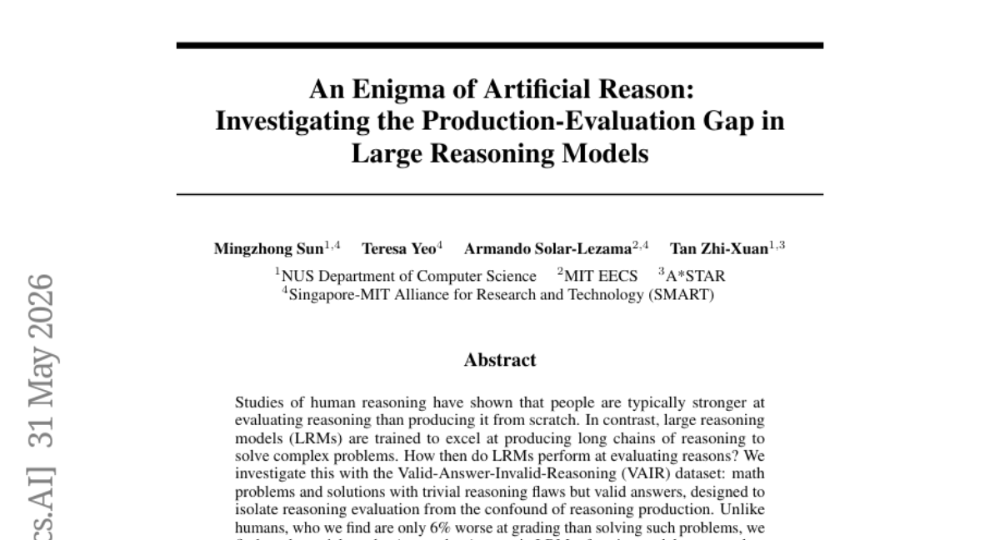

### 📌 한 줄 요약
LLM의 추론 능력과 평가 능력 사이의 괴리(Production-Evaluation Gap)를 규명하고, 정답에 매몰되어 논리적 오류를 간과하는 '정답 확인 편향' 문제를 지적함

### 🔑 핵심 포인트
- 정답 생성 능력과 논리 평가 능력 사이의 심각한 격차(Production-Evaluation Gap) 발견
- 정답에 맞추어 논리를 사후 정당화하는 '정답 확인 편향' 메커니즘 규명
- 모델 내부의 정답 표현이 논리적 타당성 검증을 방해하는 인과적 관계 확인

### 🧑‍💻 개발자 관점
LLM을 에이전트나 복잡한 워크플로우에 활용할 때, 모델이 내놓은 결과가 논리적으로 타당한지 단순히 정답 여부만으로 신뢰해서는 안 된다는 경고를 제공합니다.

### 🚀 실무 적용 아이디어
- 모델의 결과물에 대해 정답 여부와 무관하게 논리적 오류를 찾는 'Red-teaming' 테스트 수행
- CoT(Chain-of-Thought) 과정에서 정답이 먼저 나오고 논리가 뒤따르는지 패턴 분석
- 정답을 가린 상태에서 논리적 타당성만 평가하는 별도의 검증 루프 설계

### ⚠️ 리스크/한계
- 현재의 RLHF/SFT 방식이 정답 맞추기에만 치중되어 논리적 엄밀성을 저해할 위험성
- 모델의 정답 확신이 논리적 오류를 은폐하는 현상으로 인한 신뢰성 문제

### 📝 초록 기반 상세 설명
인간은 추론 생성보다 평가에 더 강점을 보이지만, 대형 추론 모델(LRM)은 정답 생성 능력에 비해 논리적 오류를 잡아내는 평가 능력이 현저히 떨어지는 현상이 관찰됩니다. 연구진은 정답은 맞지만 논리적 오류가 포함된 VAIR 데이터셋을 통해 모델의 평가 능력을 독립적으로 측정했습니다. 실험 결과, 최첨단 모델들은 높은 정답률을 보임에도 불구하고 논리적 오류를 식별하는 데 심각한 성능 저하를 보였습니다. 이는 모델이 논리적 단계를 검증하기보다 정답을 먼저 확정한 뒤 그에 맞춰 논리를 끼워 맞추는 '정답 확인 편향(Answer Confirmation Bias)' 때문인 것으로 밝혀졌습니다. 선형 프로브와 인과적 패칭(Causal Patching) 분석을 통해 모델의 내부 표현이 정답 유효성에 의해 논리 검증을 압도하고 있음을 확인했습니다.

---

## 32. [World Tracing: Generative Pixel-Aligned Geometry Beyond the Visible](https://huggingface.co/papers/2606.13652)
**Upvotes**: 1 | **도입 난이도**: 상 | **신뢰도**: 상
**arXiv**: https://arxiv.org/abs/2606.13652

**태그**: 3D Reconstruction, Diffusion Models, Computer Vision, Generative AI, Vision, Video, Benchmark

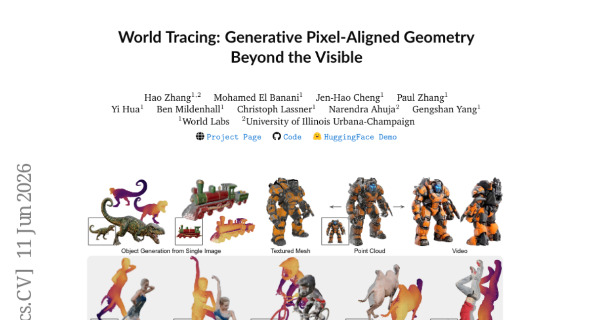

### 📌 한 줄 요약
픽셀 정렬된 가시 표면과 가려진 기하 구조를 동시에 생성하여 정밀한 3D 복원과 완전한 형태 생성을 동시에 달성한 기술

### 🔑 핵심 포인트
- 픽셀 정렬된 가시 표면과 가려진 기하 구조를 동시에 예측하는 'Ordered Stack' 표현 방식 도입
- 다중 레이어 기하 구조를 효율적으로 처리하는 WT-DiT(Diffusion Transformer) 아키텍처 설계
- 2D-3D 대응 관계를 보존하여 텍스트 기반 편집 및 비디오 합성 등 확장성 확보

### 🧑‍💻 개발자 관점
정밀한 3D 스캔 데이터와 완전한 3D 모델링 사이의 간극을 메울 수 있어, AR/VR 콘텐츠 제작 및 디지털 트윈 구축 시 유용합니다.

### 🚀 실무 적용 아이디어
- 제공된 데이터셋을 활용하여 픽셀 정렬(Pixel-alignment) 정확도 측정 실험
- 텍스트 기반 3D 편집 기능의 일관성 테스트
- 기존 3D 생성 모델(Gaussian Splatting 등)과의 결합 가능성 검토

### ⚠️ 리스크/한계
- 복잡한 장면에서 다중 레이어(Stack) 예측 시 연산 비용 증가 가능성
- 매우 복잡한 오클루전(Occlusion) 환경에서의 레이어 순서 정확도 문제

### 📝 초록 기반 상세 설명
기존의 Image-to-3D 방식은 입력 픽셀에 충실한 깊이 추정(Depth Estimation)과 완전한 형태 생성(Shape Completion) 사이의 트레이드오프 문제를 겪어왔습니다. 이를 해결하기 위해 본 논문은 픽셀 정렬을 유지하면서도 가시 영역 너머의 기하 구조를 예측하는 'World Tracing' 방식을 제안합니다. 각 픽셀에 대해 가시 표면부터 가려진 표면까지 순차적인 3D 포인트 스택을 예측하는 것이 핵심입니다. 이를 위해 여러 레이어를 토큰화하여 처리하는 WT-DiT(World-Tracing Diffusion Transformer)를 도입하고, 픽셀 공간 플로우 매칭(Flow Matching)을 통해 학습을 진행합니다. 실험 결과, 객체 및 장면 생성에서 기존의 깊이 예측기와 3D 생성기 성능을 모두 상회하는 성과를 보였습니다. 또한 2D-3D 대응 관계를 유지하여 텍스트 기반 편집 및 비디오 합성 등 다양한 응용이 가능함을 입증했습니다.

---

## 33. [APT: Action Expert Pretraining Improves Instruction Generalization of Vision-Language-Action Policies](https://huggingface.co/papers/2606.12366)
**Upvotes**: 1 | **도입 난이도**: 중 | **신뢰도**: 상
**arXiv**: https://arxiv.org/abs/2606.12366

**태그**: VLA, Robot-Learning, Pretraining, Computer-Vision, Vision

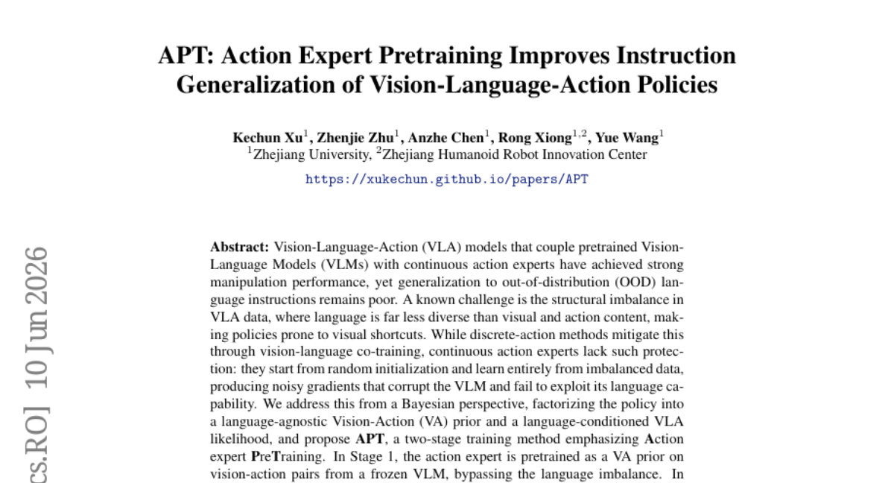

### 📌 한 줄 요약
언어 데이터 불균형 문제를 해결하기 위해 액션 전문가를 사전 학습하는 APT 방식을 통해 VLA 모델의 지시어 일반화 성능을 높인 연구

### 🔑 핵심 포인트
- 베이지안 관점의 정책 분리: 언어 독립적 VA Prior와 언어 조건부 VLA Likelihood로 구조화
- APT(Action Expert PreTraining) 2단계 학습: 언어 불균형을 피하기 위한 시각-액션 사전 학습 도입
- Gated Fusion Mechanism: VLM의 특징을 통합하면서도 학습된 시각-운동 사전 지식을 보존

### 🧑‍💻 개발자 관점
로봇 제어 모델 학습 시 언어 데이터 부족으로 인한 과적합 문제를 해결하고, 새로운 명령에 대한 모델의 강건성을 확보하는 실무적 방법론을 제시합니다.

### 🚀 실무 적용 아이디어
- 기존 VLA 모델(π, GR00T 등)에 APT의 2단계 학습 파이프라인 적용 테스트
- 언어 데이터가 부족한 환경에서 VA Prior 사전 학습의 효과 검증
- Gated Fusion 메커니즘의 하이퍼파라미터가 시각-언어 정렬에 미치는 영향 분석

### ⚠️ 리스크/한계
- 사전 학습된 VA Prior가 특정 환경에 과적합될 경우 새로운 환경에서의 범용성 저하 가능성
- 2단계 학습 구조로 인한 학습 복잡도 및 연산 비용 증가

### 📝 초록 기반 상세 설명
최근 VLM과 연속적 액션 전문가를 결합한 VLA 모델이 발전하고 있으나, 학습 데이터 내 언어 다양성 부족으로 인해 새로운 지시어에 대한 일반화 성능이 떨어지는 문제가 있습니다. 기존 방식은 액션 전문가가 초기 무작위 상태에서 불균형한 데이터로 학습되어 VLM의 언어 능력을 저해하고 노이즈를 발생시킵니다. 이를 해결하기 위해 본 논문은 정책을 언어 독립적인 VA Prior와 언어 조건부 VLA Likelihood로 분리하는 베이지안 관점의 APT 방식을 제안합니다. 1단계에서는 고정된 VLM을 활용해 시각-액션 쌍으로 액션 전문가를 사전 학습하여 언어 불균형 문제를 우회합니다. 2단계에서는 게이트 퓨전 메커니즘을 통해 학습된 시각-운동 사전 지식을 유지하며 언어 토큰을 주입합니다. 실험 결과, APT는 미학습 지시어 및 복합 작업에서 일관된 성능 향상을 입증했습니다.

---

## 34. [Benchmarking AI Agents for Addressing Scientific Challenges Across Scales](https://huggingface.co/papers/2606.12736)
**Upvotes**: 1 | **도입 난이도**: 중 | **신뢰도**: 상
**arXiv**: https://arxiv.org/abs/2606.12736

**태그**: AI Agent, Scientific Discovery, Benchmarking, Autonomous Reasoning, Agent, Reasoning, Benchmark, Evaluation

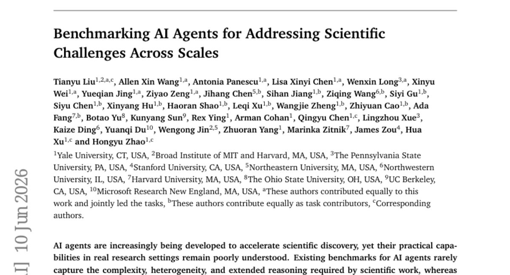

### 📌 한 줄 요약
실제 과학 연구 환경의 복잡성을 반영하여 AI 에이전트의 추론 및 자율성을 평가하는 벤치마크 'SciAgentArena' 제안

### 🔑 핵심 포인트
- 실제 연구 시나리오를 반영한 200여 개의 단계별 검증 태스크 및 인터랙티브 환경 구축
- 데이터 분석 등 정형화된 워크플로우에서의 에이전트 성능 확인 및 한계점 식별
- 자율적 탐색 및 창의적 통찰 생성 능력에 대한 체계적인 평가 프레임워크 제공

### 🧑‍💻 개발자 관점
단순 질의응답을 넘어, 복잡한 워크플로우와 자율적 의사결정이 필요한 도메인 특화 에이전트 개발 시 평가 기준으로 활용 가능합니다.

### 🚀 실무 적용 아이디어
- SciAgentArena의 오픈 소스 태스크를 활용하여 현재 개발 중인 에이전트의 논리적 한계 테스트
- 에이전트의 실패 모드(Failure Modes) 분석을 통한 자율성 강화 전략 수립
- 정형화된 데이터 분석 워크플로우 자동화 파이프라인에 에이전트 적용 실험

### ⚠️ 리스크/한계
- 현재 에이전트들이 개방형 연구 질문이나 독창적 통찰 생성에는 여전히 취약함
- 실제 연구 환경의 모든 변수를 완벽히 모사하기에는 벤치마크의 복잡도 한계가 존재할 수 있음

### 📝 초록 기반 상세 설명
AI 에이전트가 과학적 발견을 가속화하고 있으나, 실제 연구 환경에서의 역량을 평가하기에는 기존 벤치마크가 너무 단순하거나 정적이라는 문제가 있었습니다. 이를 해결하기 위해 다양한 도메인의 실무 시나리오를 반영한 200여 개의 태스크를 포함하는 SciAgentArena를 도입했습니다. 이 벤치마크는 단계별 검증과 에이전트 독립적인 인터랙티브 환경을 제공하여 복잡한 연구 과정을 평가할 수 있도록 설계되었습니다. 실험 결과, 현재의 에이전트들은 명확한 데이터 분석 워크플로우에는 강점을 보였으나, 독창적인 통찰 생성이나 자율적인 탐색, 개방형 문제 해결에는 한계를 보였습니다. 본 연구는 향후 과학적 난제를 해결할 수 있는 고도화된 AI 에이전트 설계를 위한 가이드라인을 제공합니다.

---

## 35. [AlloSpatial: Agentic Harness Framework for Spatial Reasoning in Foundation Models](https://huggingface.co/papers/2606.08952)
**Upvotes**: 1 | **도입 난이도**: 상 | **신뢰도**: 상
**arXiv**: https://arxiv.org/abs/2606.08952

**태그**: Agent, Spatial-Reasoning, Multimodal, Reinforcement-Learning, RAG, Reasoning

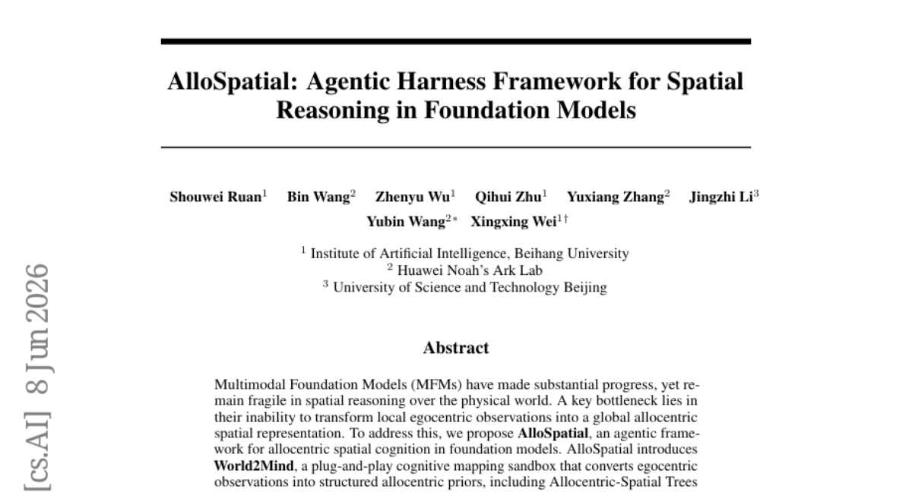

### 📌 한 줄 요약
에이전트 기반의 공간 매핑 프레임워크를 통해 멀티모달 모델의 고질적인 공간 추론 능력을 혁신하는 기술

### 🔑 핵심 포인트
- World2Mind: 1인칭 관찰을 구조화된 공간 트리(AST) 및 경로 지도로 변환하는 인지 매핑 샌드박스
- Spatial Reasoning Harness: 노이즈와 모호한 시각 정보 속에서 도구 사용 및 기하-의미 중재를 통한 정밀 추론
- RL-based Internalization: 강화 학습을 통해 에이전트의 추론 프로세스를 모델(Qwen3-VL)에 내재화

### 🧑‍💻 개발자 관점
로봇 공학이나 자율 주행 에이전트 개발 시, 단순 시각 인식을 넘어 복잡한 공간 구조를 이해하고 경로를 계획하는 데 직접적인 영감을 제공합니다.

### 🚀 실무 적용 아이디어
- 제안된 AST(Allocentric-Spatial Trees) 구조를 기존 VLM의 프롬프트 엔지니어링에 적용해보기
- 시각 정보가 제한된 상황에서 구조화된 공간 데이터(JSON 등)만으로 모델의 추론 성능 테스트하기
- 에이전트의 도구 사용(Tool-use) 루프를 활용한 공간 문제 해결 워크플로우 설계하기

### ⚠️ 리스크/한계
- 복잡한 3D 환경 구축 및 데이터 생성에 따른 높은 연산 비용
- 구조화된 공간 표현(AST) 생성 과정에서의 초기 정밀도 의존성

### 📝 초록 기반 상세 설명
멀티모달 파운데이션 모델(MFM)은 물리적 세계에 대한 공간 추론 능력이 부족하며, 특히 1인칭 시점의 관찰을 전역적인 공간 표현으로 변환하는 데 어려움을 겪습니다. 이를 해결하기 위해 에이전트 기반의 공간 인지 프레임워크인 AlloSpatial을 제안합니다. 이 프레임워크는 'World2Mind' 샌드박스를 통해 국소적 관찰을 구조화된 공간 트리(AST)와 경로 지도로 변환하며, 노이즈가 있는 환경에서도 신뢰할 수 있는 추론을 위해 도구 사용 및 기하-의미 중재 메커니즘을 도입합니다. 또한, 강화 학습을 통해 이러한 추론 과정을 모델 내부에 내재화했습니다. 실험 결과, 제안된 방식은 기존 모델의 성능을 크게 향상시켰으며, 구조화된 공간 표현이 강력한 추론의 핵심임을 입증했습니다.

---

## 36. [Squeeze-Release: Iterative Pruning with Exact Structural Minimization](https://huggingface.co/papers/2606.14346)
**Upvotes**: 0 | **도입 난이도**: 상 | **신뢰도**: 상
**arXiv**: https://arxiv.org/abs/2606.14346

**태그**: Model Compression, Pruning, Efficient Deep Learning, Architecture Optimization

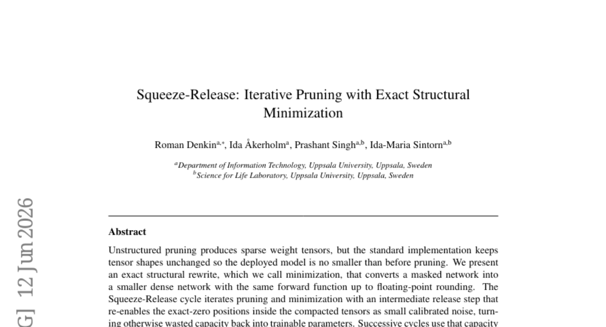

### 📌 한 줄 요약
정확한 구조적 최소화(Minimization)를 통해 모델의 파라미터 크기를 획기적으로 줄이면서도 성능을 유지하는 반복적 프루닝 기법

### 🔑 핵심 포인트
- Minimization: 마스킹된 가중치를 기반으로 연산 결과가 동일한 더 작은 크기의 밀집 텐서로 재구성하는 기술
- Squeeze-Release Cycle: 압축 후 남은 여유 공간을 미세 조정(noise)으로 활용하여 반복적으로 구조적 중복을 제거하는 프로세스
- CompensatedLayerNorm: 잔차 연결(residual stream) 내 채널 축소를 가능하게 하여 구조적 압축 범위를 확장

### 🧑‍💻 개발자 관점
단순히 가중치를 0으로 만드는 것을 넘어, 실제 하드웨어에서 메모리 점유율과 연산량을 줄일 수 있는 실질적인 모델 경량화 방법론을 제시합니다.

### 🚀 실무 적용 아이디어
- 기존 프루닝 모델에 Minimization 알고리즘을 적용하여 실제 텐서 크기 감소 효과 검증
- Squeeze-Release 사이클의 반복 횟수에 따른 정확도-압축률 트레이드오프 분석
- ConvNeXt 등 최신 CNN 및 Transformer 모델에 대한 확장성 테스트

### ⚠️ 리스크/한계
- 수치적 정밀도(floating-point rounding) 문제로 인해 복잡한 연산 시 미세한 오차 발생 가능성
- 반복적인 재학습(Squeeze-Release cycle) 과정에서 추가적인 컴퓨팅 자원 소모

### 📝 초록 기반 상세 설명
기존의 비구조적 프루닝은 가중치를 제거해도 텐서 크기가 유지되어 실제 배포 시 모델 크기 감소 효과가 미미했습니다. 본 논문은 마스킹된 네트워크를 동일한 연산 결과를 갖는 더 작은 밀집(dense) 네트워크로 변환하는 'Minimization' 기법을 제안합니다. Squeeze-Release 사이클은 프루닝과 최소화 사이에 'Release' 단계를 두어, 압축 과정에서 생긴 여유 공간을 학습 가능한 파라미터로 재활용하여 구조적 중복성을 찾아냅니다. 또한 LayerNorm 환경에서도 채널 축소가 가능하도록 CompensatedLayerNorm을 도입했습니다. 실험 결과, CNN 모델에서 기존 대비 최대 14.8배의 압축률을 달성하며 트랜스포머 아키텍처로의 확장 가능성도 입증했습니다.

---

## 37. [AdaSR: Adaptive Streaming Reasoning with Hierarchical Relative Policy Optimization](https://huggingface.co/papers/2606.14694)
**Upvotes**: 0 | **도입 난이도**: 상 | **신뢰도**: 상
**arXiv**: https://arxiv.org/abs/2606.14694

**태그**: Streaming LLM, Reinforcement Learning, Efficient Inference, Adaptive Computation, RAG, Reasoning, Video, Audio, Inference

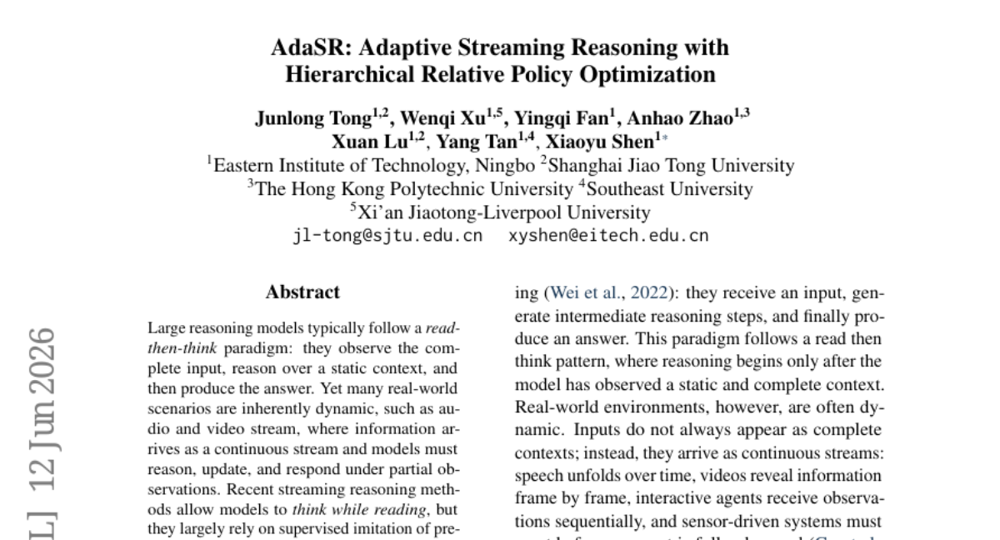

### 📌 한 줄 요약
스트리밍 데이터 환경에서 모델이 실시간 추론과 최종 심층 추론 사이의 계산 자원을 적응적으로 배분하도록 학습하는 프레임워크

### 🔑 핵심 포인트
- AdaSR: 실시간 스트리밍 추론과 최종 심층 추론을 결합한 적응형 프레임워크 제안
- HRPO: 정책 최적화를 단계별로 분리하여 정교한 이점(Advantage) 할당을 가능케 하는 계층적 상대 정책 최적화 도입
- 적응형 계산 할당: 데이터 흐름에 따라 언제, 얼마나 많은 계산 자원을 투입할지 스스로 학습

### 🧑‍💻 개발자 관점
실시간 오디오/비디오 스트림이나 지속적인 데이터 피드가 발생하는 환경에서 지연 시간을 최소화하면서도 높은 추론 정확도를 유지하는 에이전트 개발에 필수적인 기술입니다.

### 🚀 실무 적용 아이디어
- 제공된 코드를 활용하여 다양한 데이터 스트리밍 속도(Sampling Rate)에 따른 성능 변화 테스트
- HRPO의 보상 함수(Format, Accuracy, Latency) 가중치 변화가 추론 효율성에 미치는 영향 분석
- 정적 데이터셋을 동적 스트리밍 데이터셋으로 변환하여 모델의 적응성 검증

### ⚠️ 리스크/한계
- 계층적 정책 최적화(HRPO) 과정의 학습 안정성 확보 필요
- 실시간 추론과 심층 추론 사이의 자원 배분 최적화가 특정 도메인에 편향될 가능성

### 📝 초록 기반 상세 설명
기존의 대규모 추론 모델은 전체 입력을 모두 읽은 후 사고하는 정적 패러다임에 의존하여 동적인 스트리밍 환경에 대응하기 어려웠습니다. 기존의 스트리밍 추론 방식은 사전 구축된 궤적을 모방하는 방식이라 유연성이 부족하다는 한계가 있었습니다. 본 논문에서는 입력 스트리밍 중 실시간 추론과 스트림 완료 후 최종 심층 추론을 병행하는 AdaSR 프레임워크를 제안합니다. 이를 위해 정책 최적화를 스트리밍 단계와 심층 단계로 분리하여 정교한 보상을 제공하는 HRPO 알고리즘을 도입했습니다. 실험 결과, AdaSR은 기존 지도 학습 방식 대비 추론 정확도, 계산 효율성, 스트리밍 지연 시간 사이의 최적의 균형을 달성했습니다.

---

## 38. [Quickest Detection of Hallucination Onset: Delay Bounds and Learned CUSUM Statistics](https://huggingface.co/papers/2606.12476)
**Upvotes**: 0 | **도입 난이도**: 중 | **신뢰도**: 상
**arXiv**: https://arxiv.org/abs/2606.12476

**태그**: LLM, Hallucination, Monitoring, Information Theory, RAG, Evaluation

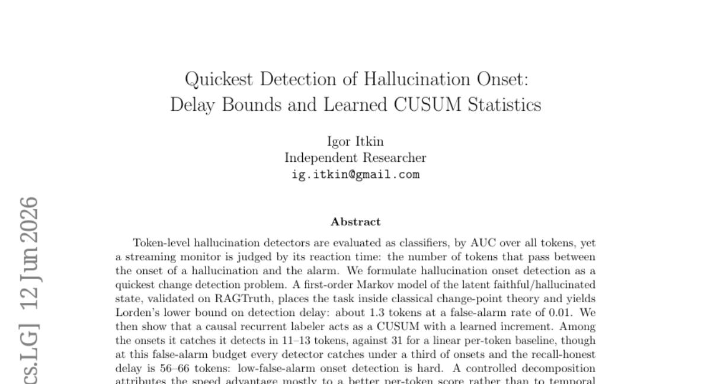

### 📌 한 줄 요약
환각 발생 시점 탐지를 '최단 지연 시간' 관점에서 재정의하고, 통계적 이론을 통해 탐지 성능의 한계와 최적성을 분석함

### 🔑 핵심 포인트
- 환각 탐지를 변화점 탐지(Change-point detection) 문제로 정식화하여 지연 시간(Delay) 개념 도입
- 이론적 하한(Lorden's bound)과 학습된 CUSUM 통계량을 통한 탐지 성능 분석
- 단순 분류 지표(AUC)가 놓치는 실시간 탐지 성능의 격차를 정보 이론적 관점에서 규명

### 🧑‍💻 개발자 관점
LLM 스트리밍 응답 중 환각이 시작되는 즉시 감지해야 하는 실시간 모니터링 시스템 설계 시 필수적인 프레임워크를 제공합니다.

### 🚀 실무 적용 아이디어
- 기존 환각 탐지 모델의 AUC 외에 '탐지 지연 토큰 수'를 측정하는 벤치마크 구축
- CUSUM 알고리즘을 활용한 순차적 임계값(Sequential Threshold) 적용 실험
- 실시간 스트리밍 환경에서의 False Alarm Rate와 Detection Delay 간의 Trade-off 분석

### ⚠️ 리스크/한계
- 이론적 최적 성능과 실제 학습 모델 간의 정보율 격차로 인한 성능 손실 가능성
- 실시간 탐지 시 발생하는 오탐(False Alarm)이 전체 시스템 신뢰도에 미치는 영향

### 📝 초록 기반 상세 설명
기존의 토큰 단위 환각 탐지는 분류 성능(AUC)에만 집중하여, 실제 스트리밍 환경에서 중요한 '탐지 지연 시간'을 간과하는 문제가 있습니다. 본 논문은 환각 발생 시점 탐지를 '최단 변화점 탐지(Quickest Change Detection)' 문제로 정식화합니다. 이를 위해 Markov 모델을 통해 이론적 하한(Lorden's bound)을 도출하고, 학습된 CUSUM 통계량을 활용하는 순환형 레이블러를 제안합니다. 실험 결과, 제안 방식은 기존 선형 베이스라인보다 훨씬 빠른 탐지 속도를 보였으며, 성능 차이의 원인이 단순 점수 차이와 정보율(Information-rate)의 한계에 있음을 증명했습니다. 결론적으로 단순 분류 지표가 아닌 순차적 분석이 실질적인 탐지 성능을 측정하는 데 필수적임을 보여줍니다.

---

## 39. [WaveDiT: Distribution-Aware Wavelet Flow Matching for Efficient 3D Brain MRI Synthesis](https://huggingface.co/papers/2606.08670)
**Upvotes**: 0 | **도입 난이도**: 중 | **신뢰도**: 상
**arXiv**: https://arxiv.org/abs/2606.08670

**태그**: 3D Generative Model, Wavelet Transform, Flow Matching, Medical Imaging, Evaluation, Optimization, Safety

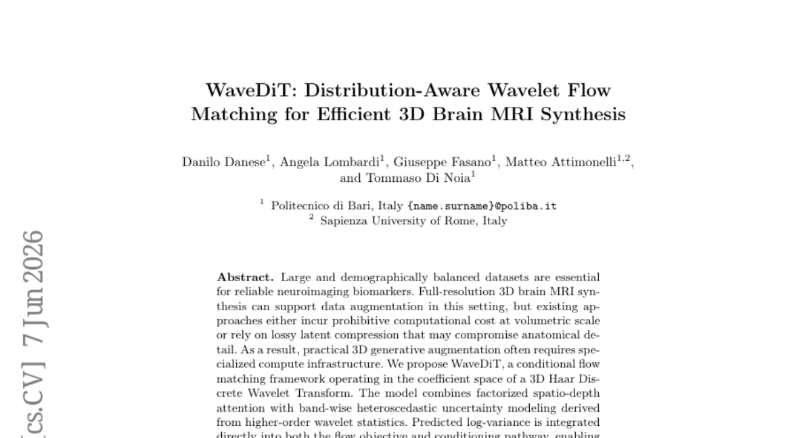

### 📌 한 줄 요약
3D 웨이브릿 변환과 불확실성 모델링을 결합하여 단일 GPU에서도 고해상도 3D MRI 합성이 가능한 효율적인 Flow Matching 프레임워크

### 🔑 핵심 포인트
- 3D Haar DWT 계수 공간에서의 조건부 Flow Matching 적용
- 밴드별 이분산 불확실성 모델링을 통한 해부학적 디테일 보존
- 분해된 공간-깊이 어텐션(factorized spatio-depth attention)을 통한 연산 효율성 확보

### 🧑‍💻 개발자 관점
고성능 GPU 클러스터 없이도 단일 GPU에서 고해상도 3D 의료 영상을 생성할 수 있는 효율적인 아키텍처 설계 방식을 제시합니다.

### 🚀 실무 적용 아이디어
- 3D DWT 계수 공간에서의 Flow Matching 구현 및 학습 안정성 테스트
- 제안된 이분산 불확실성 모델링이 다양한 해상도에서 디테일을 얼마나 잘 보존하는지 검증
- 기존 Latent Diffusion 모델과 메모리/학습 시간 대비 품질 비교 실험

### ⚠️ 리스크/한계
- 웨이브릿 기반 변환 시 발생할 수 있는 아티팩트가 해부학적 해석에 미치는 영향
- 특정 도메인(MRI)에 특화된 모델로, 다른 3D 데이터로의 일반화 가능성 확인 필요

### 📝 초록 기반 상세 설명
신뢰할 수 있는 신경영상 바이오마커를 위해서는 대규모 데이터셋이 필수적이지만, 고해상도 3D MRI 합성 모델은 막대한 연산 비용이나 해상도 손실 문제를 겪습니다. 이를 해결하기 위해 WaveDiT는 3D Haar 이산 웨이브릿 변환(DWT) 계수 공간에서 동작하는 조건부 Flow Matching 프레임워크를 제안합니다. 모델은 분해된 공간-깊이 어텐션과 고차 웨이브릿 통계 기반의 밴드별 이분산 불확실성(heteroscedastic uncertainty) 모델링을 결합합니다. 예측된 로그 분산(log-variance)을 Flow 목적 함수와 컨디셔닝 경로에 직접 통합하여 해부학적 디테일에 따른 적응형 정밀도를 구현했습니다. 실험 결과, 단일 GPU 환경에서도 실용적인 시간 내에 고해상도 합성이 가능하며, 기존 확산 모델 및 잠재 모델 대비 우수한 해부학적 일치도와 다운스트림 작업 성능을 보였습니다.

### 🖼️ 추가 자료
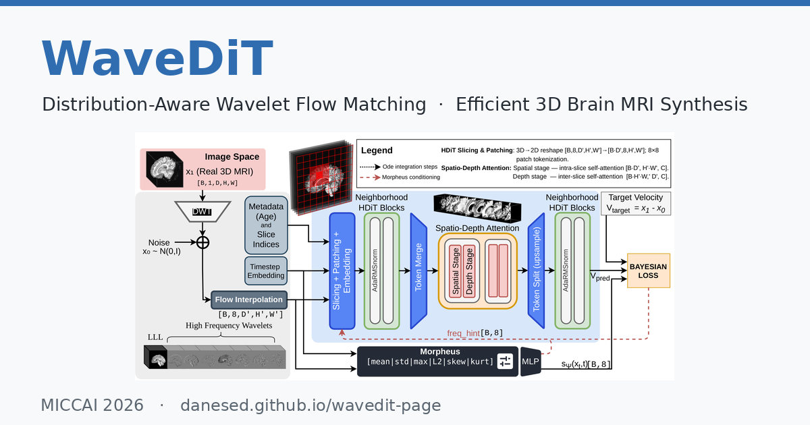

---

## 40. [ActiveMimic: Egocentric Video Pretraining with Active Perception](https://huggingface.co/papers/2606.06194)
**Upvotes**: 0 | **도입 난이도**: 중 | **신뢰도**: 상
**arXiv**: https://arxiv.org/abs/2606.06194

**태그**: Robot Learning, Egocentric Vision, Active Perception, Pretraining, Video

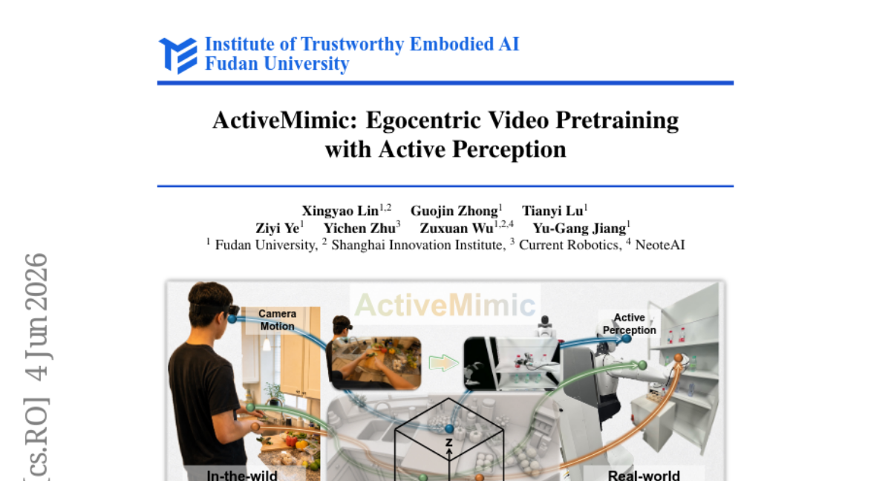

### 📌 한 줄 요약
1인칭 영상의 카메라 움직임을 '능동적 인지(Active Perception)' 신호로 활용하여 로봇 학습 성능을 극대화하는 사전 학습 프레임워크

### 🔑 핵심 포인트
- 단일 RGB 카메라에서 카메라와 손목의 궤적을 동기화하여 추출하는 기술
- 카메라 움직임을 노이즈가 아닌 '시점 조절 동작'으로 정의하여 학습에 활용
- 인간의 능동적 인지(Active Perception)와 조작(Manipulation)을 결합한 사전 학습 전략

### 🧑‍💻 개발자 관점
로봇 데이터 부족 문제를 해결하기 위해 기존의 1인칭 인간 영상을 단순한 시각 데이터가 아닌, 유의미한 동작 데이터로 변환하는 방법론을 제시합니다.

### 🚀 실무 적용 아이디어
- 기존 1인칭 데이터셋에서 카메라 움직임(Motion)과 객체 조작 간의 상관관계 분석
- 카메라 궤적 추출 알고리즘을 기존 비전-언어 모델(VLM)에 통합 실험
- 로봇 시뮬레이션 환경에서 추출된 궤적 데이터의 유효성 검증

### ⚠️ 리스크/한계
- 단일 RGB 카메라 기반 궤적 추출의 정확도에 따른 성능 의존성
- 인간의 움직임 패턴을 로봇 하드웨어로 전이(Transfer)할 때 발생하는 도메인 차이

### 📝 초록 기반 상세 설명
1인칭 시점(Egocentric) 영상은 로봇 학습을 위한 훌륭한 데이터원이지만, 기존 방식은 영상 속 카메라 움직임을 단순 노이즈로 취급하여 로봇 데이터 대비 성능이 낮았습니다. 본 논문은 카메라와 손목의 궤적을 동기화하여 추출하는 ActiveMimic 프레임워크를 제안합니다. 이 방식은 카메라 움직임을 의도적인 시점 조절 동작(Viewpoint Action)으로 모델링하여, 인간의 능동적 인지 행동과 조작 기술을 동시에 학습합니다. 실험 결과, ActiveMimic은 기존 인간 영상 기반 모델을 능가하며 로봇 데이터로 학습된 최첨단 모델 수준의 성능을 달성했습니다. 이는 인간 영상의 움직임 신호가 로봇의 능동적 인지 능력을 배양하는 핵심 요소임을 입증합니다.

---

## 41. [Statistically Reliable LLM-Based Ranking Evaluation via Prediction-Powered Inference](https://huggingface.co/papers/2606.05308)
**Upvotes**: 0 | **도입 난이도**: 중 | **신뢰도**: 상
**arXiv**: https://arxiv.org/abs/2606.05308

**태그**: LLM-as-a-Judge, Evaluation, Ranking, Statistics, Benchmark, Inference

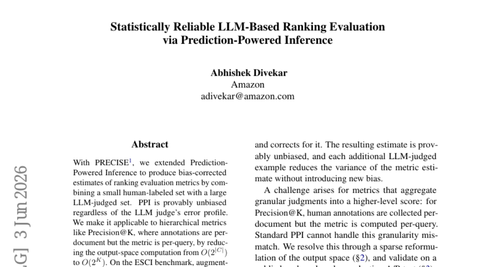

### 📌 한 줄 요약
소량의 인간 레이블과 대규모 LLM 평가를 결합하여 편향 없이 신뢰할 수 있는 랭킹 지표를 산출하는 프레임워크

### 🔑 핵심 포인트
- PPI(Prediction-Powered Inference)를 활용한 LLM 평가 편향 교정 기술 적용
- Precision@K와 같은 계층적 랭킹 지표를 위한 효율적인 연산 최적화 (O(2^K))
- 소량의 인간 데이터(Gold Standard)를 활용한 통계적 신뢰도 확보

### 🧑‍💻 개발자 관점
비싼 비용이 드는 인간 평가를 최소화하면서도, LLM의 편향에 휘둘리지 않는 객관적인 모델 성능 비교가 가능해집니다.

### 🚀 실무 적용 아이디어
- 현재 사용 중인 LLM 평가 지표에 소량의 인간 검수 데이터를 섞어 오차율 변화 측정하기
- Precision@K 등 랭킹 지표 계산 시 제안된 최적화 알고리즘 적용 검토
- LLM 평가 결과와 실제 비즈니스 지표(CTR, 매출 등) 간의 상관관계 분석

### ⚠️ 리스크/한계
- 인간 레이블 데이터의 품질이 극도로 낮을 경우 통계적 신뢰도 저하 가능성
- 데이터셋 규모 및 랭킹 K값에 따른 연산 복잡도 관리 필요

### 📝 초록 기반 상세 설명
LLM을 활용한 랭킹 평가 시 발생하는 모델의 편향 문제는 평가 결과의 신뢰도를 떨어뜨리는 주요 원인입니다. 본 논문은 Prediction-Powered Inference(PPI)를 확장하여, 소량의 인간 데이터와 대규모 LLM 데이터를 결합해 편향이 교정된 평가 지표를 산출하는 PRECISE 프레임워크를 제안합니다. 특히 Precision@K와 같은 계층적 지표 계산을 위해 연산 복잡도를 효율적으로 최적화했습니다. 실험 결과, 적은 양의 인간 주석만으로도 LLM 평가의 표준 오차를 유의미하게 줄였습니다. 실제 프로덕션 환경에서도 이 프레임워크를 통해 시스템 성능 순위를 정확히 식별하고 매출 상승을 이끌어냈습니다.

### 🖼️ 추가 자료
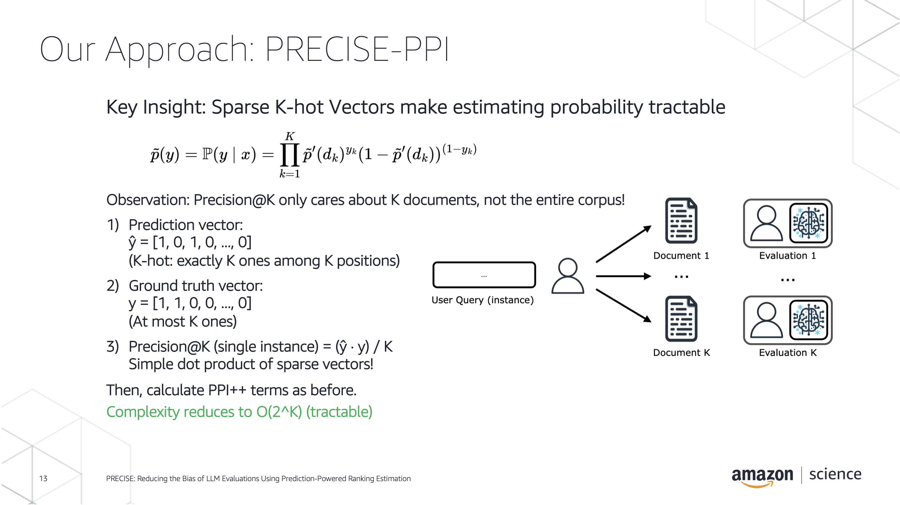

---

## 42. [FVSpec: Real-World Property-Based Tests as Lean Challenges](https://huggingface.co/papers/2606.01008)
**Upvotes**: 0 | **도입 난이도**: 상 | **신뢰도**: 상
**arXiv**: https://arxiv.org/abs/2606.01008

**태그**: Formal Verification, LLM Agents, Python, Lean 4, Benchmark, Agent, RAG, Evaluation

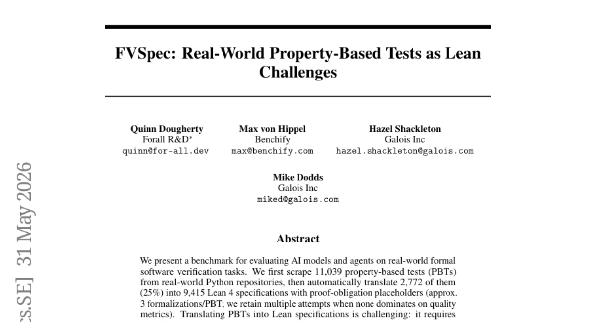

### 📌 한 줄 요약
실제 Python 코드의 속성 기반 테스트(PBT)를 Lean 4 정형 검증 스펙으로 변환하는 벤치마크 및 에이전트 파이프라인 제안

### 🔑 핵심 포인트
- 실제 Python PBT를 Lean 4 정형 스펙으로 변환한 대규모 벤치마크 구축
- Python의 명령형 로직을 의존 타입 언어인 Lean으로 옮기기 위한 3-에이전트 LLM 파이프라인 개발
- AI 기반 정형 검증 모델 평가를 위한 데이터셋 및 베이스라인 공개

### 🧑‍💻 개발자 관점
AI가 작성한 코드의 신뢰성을 검증하기 위해, 테스트 코드를 정형 검증 스펙으로 자동 변환하는 기술적 토대를 제공합니다.

### 🚀 실무 적용 아이디어
- 제공된 오픈소스 데이터셋을 활용하여 최신 LLM의 정형 검증 성능 테스트
- Python 코드를 Lean 스펙으로 변환하는 에이전트 프롬프트 엔지니어링 실험
- PBT에서 추출된 속성이 실제 코드의 의도를 얼마나 정확히 반영하는지 분석

### ⚠️ 리스크/한계
- Python의 복잡한 실행 시맨틱을 Lean으로 완벽히 모델링하는 데 따르는 한계
- 자동 변환된 스펙의 품질이 실제 검증에 사용하기에 충분한지에 대한 의문

### 📝 초록 기반 상세 설명
AI가 생성하는 코드의 비중이 커짐에 따라 실무 소프트웨어의 정형 검증 필요성이 증대되고 있습니다. 기존의 정형 검증은 실제 코드의 복잡한 의미론을 다루는 데 한계가 있었습니다. 본 논문은 Python 저장소에서 추출한 11,039개의 속성 기반 테스트(PBT)를 Lean 4 스펙으로 자동 변환하여 9,415개의 챌린지를 구축했습니다. 이를 위해 3-에이전트 LLM 파이프라인을 설계하여 Python 의미론 모델링과 논리적 속성 추론 문제를 해결했습니다. 결과적으로 AI 모델의 실무 정형 검증 능력을 평가할 수 있는 오픈소스 벤치마크를 제공합니다.

### 🖼️ 추가 자료
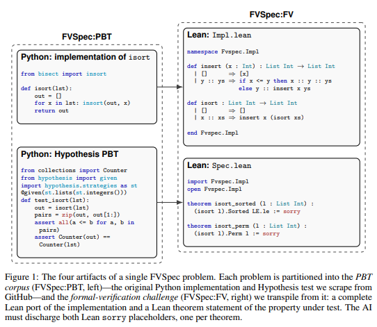
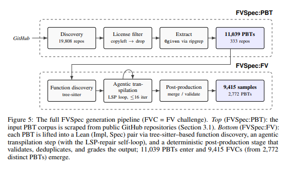

---

## 43. [CARVE: Certified Affordable Repair of Vetoed Maneuvers via Envelopes for Interactive Driving](https://huggingface.co/papers/2606.02641)
**Upvotes**: 0 | **도입 난이도**: 상 | **신뢰도**: 상
**arXiv**: https://arxiv.org/abs/2606.02641

**태그**: Autonomous Driving, Formal Verification, Multi-Agent Systems, Motion Planning, Agent

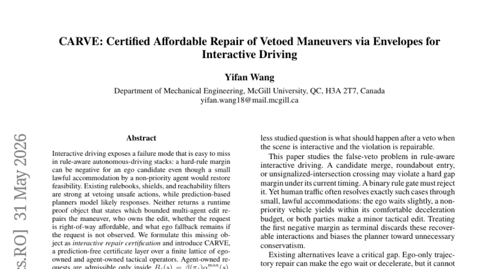

### 📌 한 줄 요약
상호작용 주행 중 발생하는 불필요한 제어 거부(Veto)를 해결하기 위해, 책임 소재와 규칙 준수를 보장하며 동작을 수정하는 인증 레이어 기술

### 🔑 핵심 포인트
- 상호작용적 수리 인증(Interactive Repair Certification) 프레임워크 제안
- 협력 엔벨로프(Cooperation Envelope)를 통한 우선권과 운동학적 도달 가능성의 분리
- 책임 소재, 수정 카테고리, 폴백(Fallback) 계획을 포함하는 명시적 인증 객체 생성

### 🧑‍💻 개발자 관점
단순히 '안전하지 않다'고 거부하는 것을 넘어, 타 차량과의 협력을 통해 어떻게 동작을 수정할 수 있는지와 그에 따른 책임 소재를 수학적으로 정의하여 제어 로직의 신뢰성을 높입니다.

### 🚀 실무 적용 아이디어
- 기존 Rule-based Shielding 시스템에 CARVE의 Envelope 개념 적용 테스트
- 다중 에이전트 시나리오에서 책임 분담(Responsibility-weighted cost split) 로직 검증
- 에이전트 간 우선권 충돌 시 Fallback 시나리오 시뮬레이션

### ⚠️ 리스크/한계
- 복잡한 격자 구조로 인한 실시간 연산 부하 가능성
- 정의된 규칙과 엔벨로프가 실제 도로 상황의 복잡성을 모두 포괄할 수 있는지에 대한 의문

### 📝 초록 기반 상세 설명
자율주행 시스템에서 엄격한 규칙 기반 필터는 타 차량의 미세한 양보로 해결 가능한 상황에서도 자차의 동작을 부당하게 거부하는 문제를 야기합니다. 기존의 예측 기반 플래너나 안전 필터는 이러한 상호작용적 수정을 위한 명확한 근거와 책임 소재를 제공하지 못합니다. 본 논문은 '상호작용적 수리 인증(Interactive Repair Certification)' 개념을 도입하고, 이를 위한 CARVE 프레임워크를 제안합니다. CARVE는 유한 격자 구조 위에서 자차와 타 차량의 전술적 연산자를 정의하며, 우선권과 도달 가능성을 분리한 '협력 엔벨로프(Cooperation Envelope)'를 통해 수정 가능 여부를 판단합니다. 실험 결과, CARVE는 인간이 해결할 수 있었던 오판된 거부 상황을 대부분 복구하면서도 우선권 규칙을 완벽히 준수함을 입증했습니다.

---

