# 2026-06-19 Daily Papers (Top 32)

## 오늘의 요약
오늘의 연구는 로봇 및 물리적 환경에서의 에이전트 성능을 극대화하기 위한 월드 모델, 공간 추론, 그리고 정밀한 조작 기술에 집중되었습니다. 특히 모델의 크기를 키우는 것 외에도 효율적인 워크플로우 설계, 강화학습을 통한 추론 능력 강화, 그리고 시스템 최적화를 통해 실질적인 물리적 지능을 구현하려는 시도가 돋보였습니다.

### 오늘의 핵심 포인트
- 물리적 AI와 로봇 조작을 위해 장기 기억, 3D 공간 이해, 그리고 효율적인 에이전트 워크플로우를 결합하는 연구가 활발히 진행되었습니다.
- 강화학습(RL)과 자기 증류(Self-Distillation)를 활용하여 모델의 추론 정확도와 실시간 제어 성능을 높이는 방법론들이 제시되었습니다.
- AI 안전성 측면에서 SAE(Sparse Autoencoders)를 통한 피처 제어의 한계를 지적하며, 보다 근본적인 모델 제어 및 안전 가드레일의 필요성을 시사했습니다.

**오늘의 태그**: Embodied AI, Robotics, Reinforcement Learning, VLM, World Models

## 1. [Beyond the Current Observation: Evaluating Multimodal Large Language Models in Controllable Non-Markov Games](https://huggingface.co/papers/2606.19338)
**Upvotes**: 36 | **도입 난이도**: 중 | **신뢰도**: 상
**arXiv**: https://arxiv.org/abs/2606.19338

**태그**: Agent, Multimodal, Long-context, Reinforcement Learning, Vision, Benchmark, Evaluation

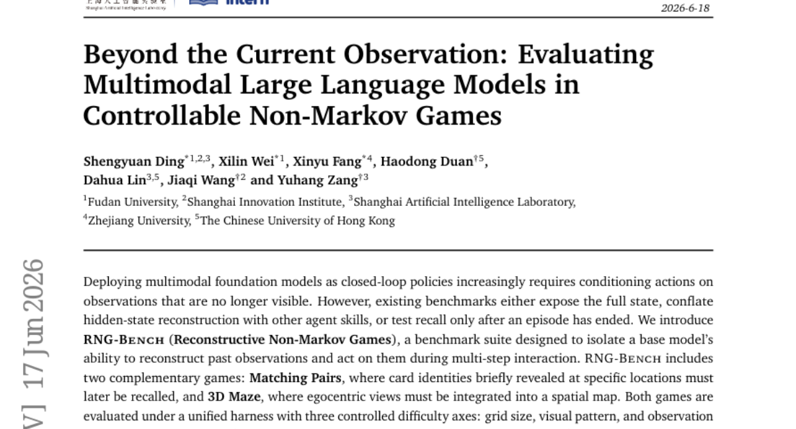

### 📌 한 줄 요약
과거 관찰 정보를 기억하여 의사결정에 활용하는 MLLM의 비마르코프(Non-Markov) 환경 대응 능력을 평가하는 새로운 벤치마크와 학습 방법론 제안

### 🔑 핵심 포인트
- RNG-Bench: 과거 관찰 정보의 재구성과 행동 선택 능력을 분리하여 평가하는 벤치마크 개발
- Memory Gap Metric: 의사결정 오류와 정보 망각(forgetting)을 구분하는 새로운 평가 지표 도입
- Fine-tuning Strategy: 최적 정책 롤아웃 및 필터링된 데모를 통한 MLLM의 장기 기억 및 행동 제어 성능 개선

### 🧑‍💻 개발자 관점
에이전트가 실시간 환경에서 과거 데이터를 기반으로 판단해야 하는 복잡한 워크플로우(예: 로봇 제어, 장기 작업 수행) 설계 시 필수적인 평가 기준을 제공합니다.

### 🚀 실무 적용 아이디어
- 현재 사용 중인 MLLM 에이전트를 RNG-Bench 환경에 투입하여 망각(Memory Gap) 수준 측정
- 긴 컨텍스트를 가진 멀티모달 작업에서 정보 손실이 발생하는 지점 분석
- 에이전트의 행동 데이터(Rollouts)를 활용한 미세 조정 파이프라인 구축 테스트

### ⚠️ 리스크/한계
- 벤치마크 환경이 특정 게임(카드, 미로)에 국선되어 실제 복잡한 현실 세계로의 일반화 여부 확인 필요
- 매우 긴 컨텍스트(128K 토큰 등) 처리에 따른 높은 컴퓨팅 비용 발생

### 📝 초록 기반 상세 설명
멀티모달 모델을 폐쇄 루프 정책(closed-loop policy)으로 활용할 때, 과거의 관찰 정보를 기억하고 활용하는 능력이 필수적입니다. 그러나 기존 벤치마크는 전체 상태를 노출하거나 단순 회상 능력만을 테스트하여 실제 에이전트의 의사결정 능력과 혼재되는 문제가 있었습니다. 이를 해결하기 위해 과거 관찰 정보의 재구성과 이를 활용한 행동을 분리하여 평가하는 RNG-Bench를 도입했습니다. 이 벤치마크는 카드 매칭 및 3D 미로 게임을 통해 기억력과 행동 선택 능력을 정밀하게 측정합니다. 실험 결과, 최신 MLLM들은 여전히 긴 컨텍스트 내의 과거 정보를 유지하는 데 어려움을 겪고 있으며, 이는 주로 망각 문제에서 기인함을 확인했습니다. 마지막으로 최적 정책 롤아웃을 통한 미세 조정이 일반 성능 저하 없이 성능을 개선함을 입증했습니다.

---

## 2. [Kairos: A Native World Model Stack for Physical AI](https://huggingface.co/papers/2606.16533)
**Upvotes**: 25 | **도입 난이도**: 상 | **신뢰도**: 상
**arXiv**: https://arxiv.org/abs/2606.16533

**태그**: World Models, Physical AI, Robotics, Efficient Inference, Video, Benchmark, Inference

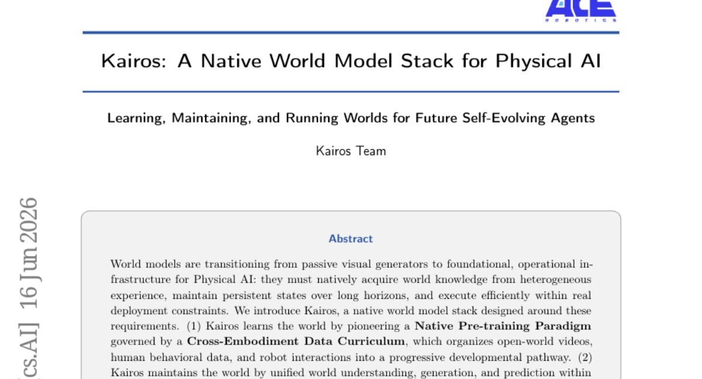

### 📌 한 줄 요약
물리적 AI를 위한 고성능·저지연·장기 기억이 가능한 통합 월드 모델 스택 'Kairos' 제안

### 🔑 핵심 포인트
- Cross-Embodiment Data Curriculum: 비디오, 인간 행동, 로봇 상호작용 데이터를 단계적으로 학습하는 사전 학습 패러다임
- Hybrid Linear Temporal Attention: 슬라이딩 윈도우와 게이트형 선형 어텐션을 결합하여 국소적 역동성과 전역적 기억을 동시에 확보
- Deployment-Aware System Co-Design: 서버 및 소비자용 하드웨어에서 실시간 루프를 지원하는 저지연 추론 최적화

### 🧑‍💻 개발자 관점
로봇이나 에이전트 개발 시, 긴 시간 동안 상태를 유지하면서도 실제 하드웨어에서 지연 없이 동작하는 월드 모델의 구조적 가이드를 제공합니다.

### 🚀 실무 적용 아이디어
- 제안된 하이브리드 어텐션 구조를 기존 Transformer 기반 모델에 적용하여 메모리 효율성 비교
- 다양한 데이터 소스(비디오 vs 로봇 데이터)를 혼합한 커리큘럼 학습 스케줄링 실험
- 엣지 디바이스 환경에서의 추론 지연 시간(Latency) 및 오차 누적 테스트

### ⚠️ 리스크/한계
- 복잡한 하이브리드 아키텍처로 인한 구현 난이도 및 학습 안정성 확보 문제
- 다양한 물리적 환경(Cross-Embodiment)에 대한 일반화 성능의 실질적 검증 필요

### 📝 초록 기반 상세 설명
기존의 월드 모델은 단순 시각 생성기를 넘어 물리적 AI의 운영 인프라로서 이질적 데이터 학습, 장기 상태 유지, 실시간 실행 능력을 갖춰야 하는 과제에 직면해 있습니다. 이를 해결하기 위해 본 논문은 Kairos라는 네이티브 월드 모델 스택을 제안합니다. Kairos는 교차 임보디먼트(Cross-Embodiment) 커리큘럼을 통한 사전 학습, 하이브리드 선형 시간 어텐션을 활용한 통합 아키텍처, 그리고 저지연 배포를 위한 시스템 공동 설계(Co-Design)를 특징으로 합니다. 특히 이론적 분석을 통해 장기적인 상태 전파 시 발생하는 오차 누적을 수학적으로 제한했습니다. 실험 결과, Kairos는 임보디드 월드 모델 및 장기 시계열 벤치마크에서 뛰어난 성능과 효율성 사이의 균형을 입증했습니다.

---

## 3. [Guava: An Effective and Universal Harness for Embodied Manipulation](https://huggingface.co/papers/2606.18363)
**Upvotes**: 23 | **도입 난이도**: 중 | **신뢰도**: 상
**arXiv**: https://arxiv.org/abs/2606.18363

**태그**: Embodied AI, Agent Workflow, Model Distillation, Robotics, Agent, Reasoning, Multimodal, Vision, Distillation

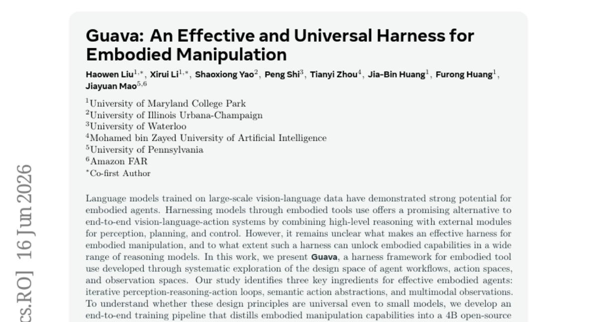

### 📌 한 줄 요약
모델 크기에 구애받지 않고 강력한 로봇 조작 능력을 끌어내는 범용적 에이전트 워크플로우 프레임워크 제안

### 🔑 핵심 포인트
- 에이전트 워크플로우, 액션 및 관찰 공간의 체계적 설계를 통한 Guava 프레임워크 개발
- 반복적 루프, 의미론적 액션 추상화, 멀티모달 관찰이라는 3가지 핵심 설계 원칙 식별
- 소규모 모델(4B)에 소량의 시뮬레이션 데이터(2K 미만)로 고성능 조작 능력을 이식하는 파이프라인 구축

### 🧑‍💻 개발자 관점
모델 자체의 크기를 키우는 대신, 잘 설계된 인터페이스(Harness)를 통해 저사양 모델에서도 복잡한 물리적 작업을 수행할 수 있는 실용적인 방법론을 제시합니다.

### 🚀 실무 적용 아이디어
- 제시된 3가지 핵심 요소(반복 루프, 액션 추상화, 멀티모달 관찰)를 기존 에이전트 워크플로우에 적용해보기
- 소규모 모델을 대상으로 시뮬레이션 데이터를 활용한 지식 증류(Distillation) 실험 설계
- 추상화된 액션 공간이 실제 로봇 제어 정밀도에 미치는 영향 분석

### ⚠️ 리스크/한계
- 시뮬레이션 기반 학습 데이터가 실제 환경(Sim-to-Real)의 복잡성을 완전히 커버하지 못할 가능성
- 추상화된 액션 공간이 매우 정밀한 제어가 필요한 작업에서는 한계가 될 수 있음

### 📝 초록 기반 상세 설명
최근 시각-언어 모델을 활용한 에이전트 연구가 활발하지만, 어떤 설계 요소가 효과적인 에이전트 구동을 가능케 하는지는 불분명했습니다. 본 논문은 에이전트 워크플로우, 액션 공간, 관찰 공간을 체계적으로 탐색하여 설계된 'Guava' 프레임워크를 제안합니다. 연구 결과, 반복적인 인지-추론-행동 루프, 의미론적 액션 추상화, 멀티모달 관찰이 핵심 요소임을 밝혀냈습니다. 이를 바탕으로 소규모 모델(4B)에 이러한 능력을 증류(Distillation)하는 파이프라인을 구축했습니다. 실험 결과, 소량의 시뮬레이션 데이터만으로도 거대 모델에 필적하는 성능과 높은 일반화 능력을 확보했습니다.

---

## 4. [MolmoMotion: Forecasting Point Trajectories in 3D with Language Instruction](https://huggingface.co/papers/2606.18558)
**Upvotes**: 16 | **도입 난이도**: 중 | **신뢰도**: 상
**arXiv**: https://arxiv.org/abs/2606.18558

**태그**: 3D Vision, Motion Forecasting, Robotics, Generative AI, Agent, Video, Benchmark

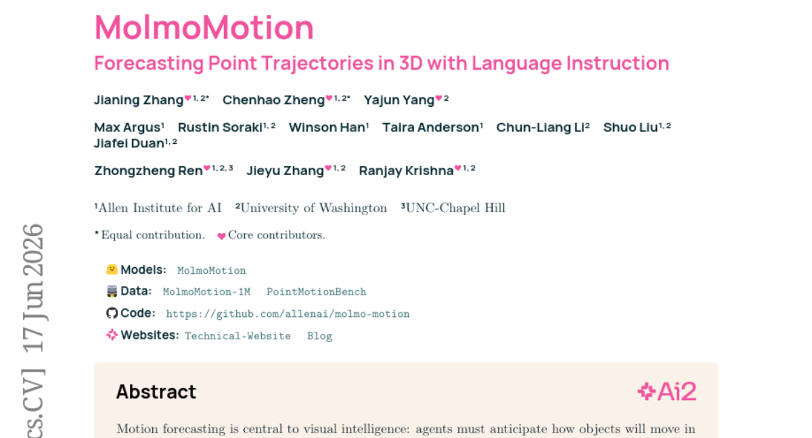

### 📌 한 줄 요약
언어 지시를 통해 3D 공간 내 객체의 미래 움직임을 정밀하게 예측하는 범용 모션 포캐스팅 모델 및 데이터셋 제안

### 🔑 핵심 포인트
- 1.16M 비디오 기반의 대규모 3D 포인트 궤적 데이터셋(MolmoMotion-1M) 구축
- 언어 지시와 3D 쿼리 포인트를 결합한 범용 모션 포캐스팅 프레임워크 제안
- 로봇 조작(Robot Manipulation) 및 비디오 생성(Video Generation) 분야로의 뛰어난 전이 학습 능력

### 🧑‍💻 개발자 관점
로봇 제어 및 물리 기반 비디오 생성 모델을 개발할 때, 단순한 픽셀 변화가 아닌 물리적으로 타당한 3D 움직임 가이드를 제공할 수 있습니다.

### 🚀 실무 적용 아이디어
- 제공된 벤치마크를 활용하여 기존 모션 예측 모델의 3D 정밀도 비교 테스트
- 로봇 시뮬레이션 환경에 3D 궤적 가이드를 적용하여 조작 성공률 변화 확인
- 비디오 생성 파이프라인에 예측된 궤적을 조건부 입력으로 넣어 움직임의 일관성 검증

### ⚠️ 리스크/한계
- 복잡한 물리적 상호작용(충돌 등)이 포함된 환경에서의 예측 정확도 불확실성
- 대규모 데이터셋과 모델 구조로 인한 높은 연산 자원 요구량

### 📝 초록 기반 상세 설명
시각적 지능의 핵심인 모션 포캐스팅을 위해 클래스에 구애받지 않고 뷰 안정성이 높은 3D 포인트 궤적 표현을 제안합니다. 본 논문은 시각적 이력, 3D 쿼리 포인트, 그리고 언어적 목표가 주어졌을 때 미래 궤적을 예측하는 '목표 조건부 3D 포인트 모션 포캐스팅' 문제를 정형화합니다. 이를 위해 116만 개의 비디오에서 추출한 대규모 데이터셋인 MolmoMotion-1M과 벤치마크인 PointMotionBench를 구축했습니다. 제안된 모델 MolmoMotion은 자기회귀 방식과 Flow-matching 방식을 모두 지원하며, 다양한 언어 지시에 따라 정확한 모션 패턴을 예측합니다. 실험 결과 기존 베이스라인을 크게 상회하였으며, 로봇 조작 및 비디오 생성 모델의 성능 향상에도 효과적임을 입증했습니다.

---

## 5. [EfficientRollout: System-Aware Self-Speculative Decoding for RL Rollouts](https://huggingface.co/papers/2606.18967)
**Upvotes**: 16 | **도입 난이도**: 중 | **신뢰도**: 상
**arXiv**: https://arxiv.org/abs/2606.18967

**태그**: LLM, Reinforcement Learning, Speculative Decoding, Inference Optimization, Agent, Reasoning, Inference

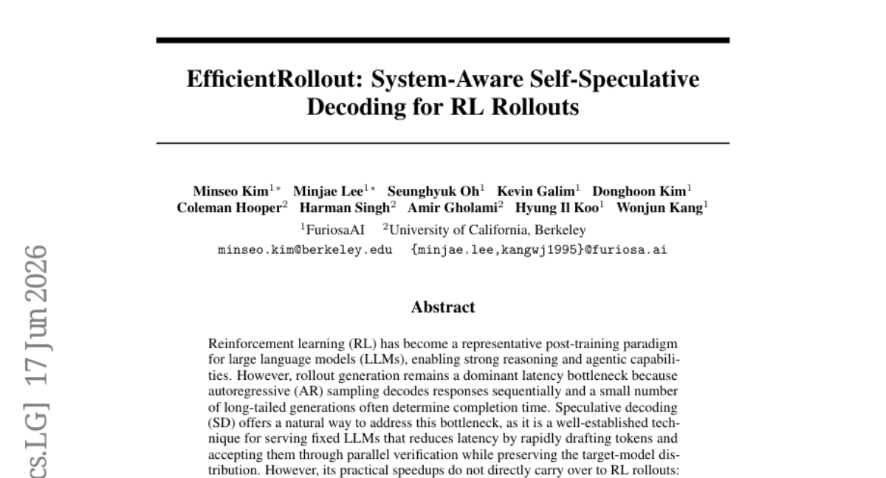

### 📌 한 줄 요약
RL 학습 시 발생하는 추론 지연을 해결하기 위해 정책 변화에 유연하게 대응하는 시스템 인지형 Self-Speculative Decoding 프레임워크를 제안합니다.

### 🔑 핵심 포인트
- Self-Speculative Decoding: 타겟 모델에서 양자화된 드래프터를 추출하여 정책 변화에 실시간 대응
- System-aware SD Toggle: 연산 효율(Compute-bound vs Memory-bound)에 따라 SD 활성화 여부를 결정
- Acceptance-aware Draft-length Adaptation: 드래프터의 품질에 맞춰 초안 생성 길이를 동적으로 조절

### 🧑‍💻 개발자 관점
RL 기반 에이전트 학습 시 발생하는 긴 생성 시간(Rollout latency)을 줄여 학습 루프의 전체 사이클 타임을 단축할 수 있습니다.

### 🚀 실무 적용 아이디어
- 양자화된 소형 모델을 드래프터로 사용할 때의 수용률(Acceptance rate) 변화 측정
- 배치 크기 변화에 따른 SD 적용 시의 실제 처리량(Throughput) 변화 실험
- RL 학습 루프 내에서 전체 학습 시간 단축 효과 검증

### ⚠️ 리스크/한계
- 드래프터 양자화 과정에서 발생할 수 있는 모델 품질 저하 가능성
- 시스템 제어 로직(Toggle policy)의 오버헤드가 실제 이득을 상쇄할 위험

### 📝 초록 기반 상세 설명
LLM의 RL 포스트 트레이닝 과정에서 자기회귀적 샘플링(Rollout)은 심각한 지연 병목을 야기합니다. 기존의 Speculative Decoding(SD)은 학습 중인 정책의 분포 변화와 배치 크기 감소에 따른 연산 효율 저하 문제로 인해 RL 환경에 직접 적용하기 어렵습니다. 이를 해결하기 위해 본 논문은 타겟 모델에서 양자화된 드래프터를 추출하는 Self-SD 방식과 시스템 상태를 고려한 토글 정책을 결합한 EfficientRollout을 제안합니다. 이 프레임워크는 정책 변화에 맞춰 드래프터를 동기화하고, 연산 효율이 높은 구간에서만 추측적 디코딩을 수행하도록 제어합니다. 실험 결과, 모델 품질을 유지하면서도 Rollout 및 엔드투엔드 지연 시간을 효과적으로 단축했습니다.

---

## 6. [SAE Interventions are Unreliable: Post-Intervention Recovery of Suppressed Behavior](https://huggingface.co/papers/2606.18322)
**Upvotes**: 14 | **도입 난이도**: 중 | **신뢰도**: 상
**arXiv**: https://arxiv.org/abs/2606.18322

**태그**: AI Safety, SAE, Mechanistic Interpretability, Adversarial Attack, Safety

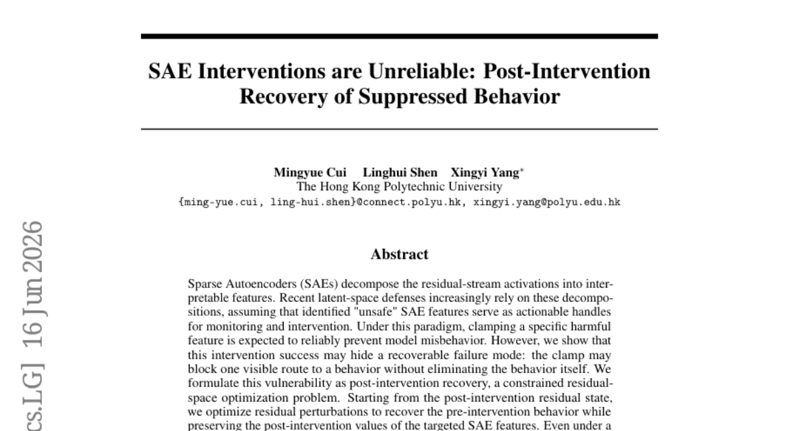

### 📌 한 줄 요약
SAE를 통한 특정 유해 피처 제어가 실제 모델의 유해 행동을 완전히 차단하지 못하고 우회될 수 있음을 경고함

### 🔑 핵심 포인트
- SAE 피처 억제가 행동 제어의 완전성을 보장하지 못하는 '사후 개입 복구' 취약점 발견
- 개입된 피처 값을 유지하면서도 원래의 유해 행동을 복구하는 최적화 프레임워크 제안
- 복구 경로가 SAE가 포착하지 못한 잔차(reconstruction residual)에 존재함을 규명

### 🧑‍💻 개발자 관점
SAE 기반의 안전 가드레일을 구축할 때, 특정 피처를 끄는 것만으로는 모델의 유해 행동을 완전히 막을 수 없음을 인지해야 합니다.

### 🚀 실무 적용 아이디어
- SAE 피처 억제 시 잔차(residual)를 통한 행동 우회 가능성 테스트
- 피처 클램핑 강도와 행동 복구율 간의 상관관계 분석
- 행동 제어를 위해 피처 단위가 아닌 모델 전체 출력/잔차를 고려한 방어 전략 검토

### ⚠️ 리스크/한계
- 피처 수준의 제어와 행동 수준의 제어 사이의 간극(gap) 존재
- SAE가 설명하지 못하는 정보가 여전히 모델 행동에 영향을 미칠 수 있음

### 📝 초록 기반 상세 설명
최근 Sparse Autoencoders(SAEs)를 활용해 특정 유해 피처를 억제함으로써 모델의 행동을 제어하려는 시도가 늘고 있습니다. 하지만 특정 피처를 클램핑(clamping)하더라도 모델의 원래 행동이 다른 경로를 통해 복구될 수 있는 취약점이 존재합니다. 본 논문은 이를 '사후 개입 복구(post-intervention recovery)' 문제로 정의하고, 개입된 피처 값을 유지하면서도 원래의 행동을 복구하는 최적화 문제를 제안합니다. 실험 결과, 거절(refusal) 제어와 같은 안전 관련 설정에서 피처 값은 유지되면서도 행동이 복구되는 높은 비율이 관찰되었습니다. 분석 결과, 이러한 복구는 SAE가 설명하지 못하는 잔차(reconstruction residual) 영역을 통해 발생함을 확인했습니다. 이는 피처 단위의 제어가 행동의 완전한 통제를 보장하지 못함을 시사합니다.

---

## 7. [Reinforcing Dual-Path Reasoning in Spatial Vision Language Models](https://huggingface.co/papers/2606.17539)
**Upvotes**: 13 | **도입 난이도**: 상 | **신뢰도**: 상
**arXiv**: https://arxiv.org/abs/2606.17539

**태그**: VLM, Reinforcement Learning, Spatial Reasoning, 3D Vision, Reasoning, Vision, Benchmark, Inference, Safety

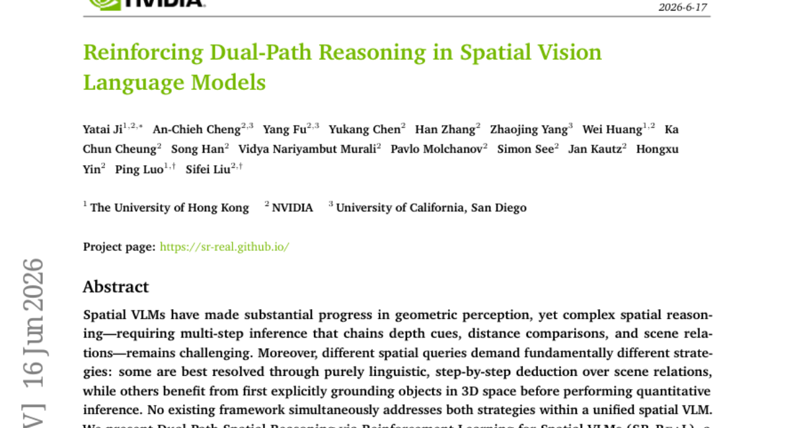

### 📌 한 줄 요약
언어적 추론과 3D 탐지 경로를 결합한 강화학습 프레임워크를 통해 공간 추론 능력을 극대화한 VLM 모델 제안

### 🔑 핵심 포인트
- LOR(언어적 추론)과 DTR(탐지 후 추론)이라는 이중 경로(Dual-Path) 구조 도입
- 정확도, 포맷, 3D 중심점 탐지 보상을 결합한 강화학습(RL) 최적화
- 두 경로 간의 상호 보완적 학습을 통한 높은 일반화 성능 및 정밀도 확보

### 🧑‍💻 개발자 관점
로봇 공학이나 AR/VR 환경에서 필요한 정밀한 공간 이해와 논리적 추론을 단일 모델로 통합할 수 있는 방법론을 제시합니다.

### 🚀 실무 적용 아이디어
- 제공된 CoT 데이터셋 구조를 활용한 SFT 파이프라인 구축 실험
- 특정 도메인(예: 실내 가구 배치)에 대한 DTR 경로의 정밀도 검증
- RL 보상 함수 설계 시 LOR와 DTR 간의 가중치 균형 테스트

### ⚠️ 리스크/한계
- 강화학습 단계에서 두 경로 간의 균형을 맞추기 위한 정교한 하이퍼파라미터 튜닝 필요
- 고품질의 혼합 데이터셋(Cold-start data) 확보에 대한 의존도가 높음

### 📝 초록 기반 상세 설명
기존 공간 VLM은 복잡한 다단계 공간 추론과 정밀한 기하학적 관계 파악에 어려움을 겪고 있습니다. 이를 해결하기 위해 언어적 연역(LOR)과 3D 탐지 후 추론(DTR)이라는 두 가지 상호 보완적인 경로를 제공하는 SR-REAL 프레임워크를 제안합니다. 먼저 지도 학습(SFT)을 통해 CoT 데이터와 3D 인터페이스를 학습시킨 후, 정확도와 포맷, 그리고 탐지 정밀도를 보상으로 하는 강화학습(RL)을 수행합니다. 실험 결과, 단일 모델이 두 경로를 모두 지원하며 정밀한 지역 인식 작업과 일반적 공간 추론 모두에서 기존 모델을 상회하는 성능을 보였습니다. 특히 두 경로 간의 상호 강화와 데이터 혼합 전략이 모델의 안정적인 최적화와 일반화에 핵심적인 역할을 함을 입증했습니다.

---

## 8. [Trust the Right Teacher: Quality-Aware Self-Distillation for GUI Grounding](https://huggingface.co/papers/2606.18101)
**Upvotes**: 13 | **도입 난이도**: 중 | **신뢰도**: 상
**arXiv**: https://arxiv.org/abs/2606.18101

**태그**: VLM, GUI-Agent, Self-Distillation, Computer-Vision, Vision, Benchmark, Evaluation, Distillation

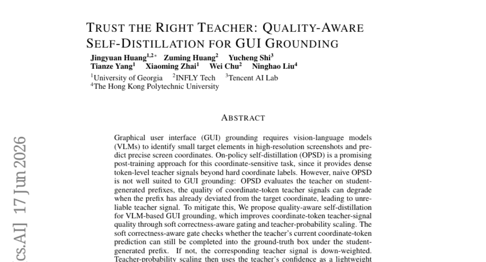

### 📌 한 줄 요약
GUI Grounding 성능 향상을 위해 잘못된 예측 신호를 필터링하고 신뢰도를 조절하는 품질 인식 자기 증류(Quality-Aware Self-Distillation) 기법 제안

### 🔑 핵심 포인트
- 잘못된 좌표 예측 신호를 차단하는 Soft Correctness-aware Gating 도입
- 교사의 확신도를 활용해 학습 신호 강도를 조절하는 Teacher-probability Scaling 적용
- 두 메커니즘의 상호 보완적 결합을 통한 정밀한 GUI 좌표 예측 성능 확보

### 🧑‍💻 개발자 관점
VLM 기반 GUI 에이전트 개발 시, 모델이 잘못된 좌표 정보를 학습하여 성능이 저하되는 문제를 해결하는 실질적인 포스트 트레이닝 기법을 제공합니다.

### 🚀 실무 적용 아이디어
- 기존 OPSD 파이프라인에 Gating 로직을 적용하여 학습 안정성 테스트
- 다양한 해상도 및 복잡한 UI 환경에서의 좌표 정밀도 변화 관찰
- 모델 크기 변화에 따른 Gating 및 Scaling 파라미터의 민감도 분석

### ⚠️ 리스크/한계
- Gating 로직이 정답 근처의 유효한 신호까지 과도하게 억제할 위험 존재
- 학습 시 계산 복잡도가 추가되어 학습 시간이 증가할 수 있음

### 📝 초록 기반 상세 설명
GUI Grounding 작업은 고해상도 스크린샷에서 정밀한 좌표를 예측해야 하는 과제입니다. 기존의 On-policy self-distillation(OPSD)은 학생 모델이 생성한 접두사(prefix)를 기반으로 교사 모델의 신호를 학습하지만, 접두사가 이미 목표 좌표에서 벗어난 경우 잘못된 신호를 제공하는 문제가 있습니다. 이를 해결하기 위해 본 논문은 'soft correctness-aware gating'과 'teacher-probability scaling'을 결합한 품질 인식 자기 증류 방식을 제안합니다. 게이팅 메커니즘은 현재 예측이 정답 박스로 이어질 수 있는지 판단하여 신뢰할 수 없는 신호를 억제하고, 확률 스케일링은 교사의 확신도를 바탕으로 신호 강도를 미세 조정합니다. 실험 결과, 두 기법의 상호 보완적인 결합을 통해 6개의 벤치마크에서 기존 모델 및 베이스라인 대비 우수한 성능을 입증했습니다.

---

## 9. [From Trainee to Trainer: LLM-Designed Training Environment for RL with Multi-Agent Reasoning](https://huggingface.co/papers/2606.17682)
**Upvotes**: 11 | **도입 난이도**: 중 | **신뢰도**: 상
**arXiv**: https://arxiv.org/abs/2606.17682

**태그**: Reinforcement Learning, LLM-as-Agent, Automated ML, Environment Design, Agent, Reasoning, Benchmark

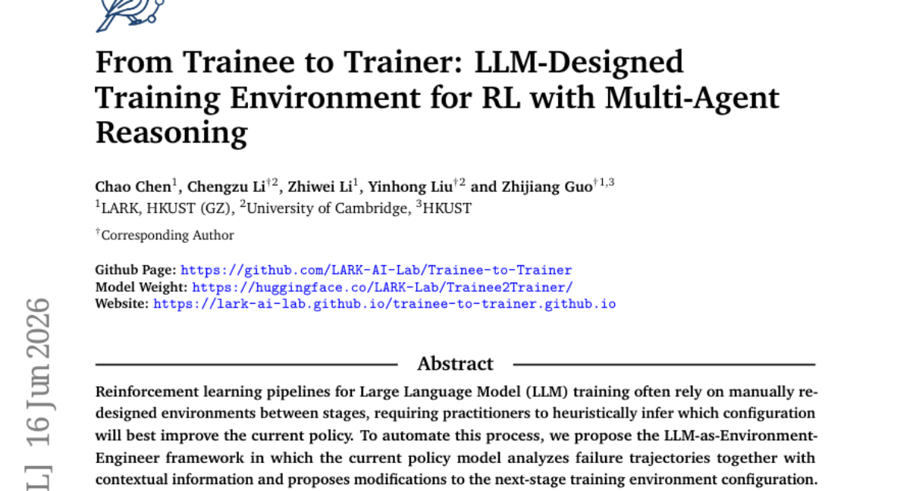

### 📌 한 줄 요약
LLM이 RL 학습 실패 사례를 분석하여 다음 단계의 학습 환경 설정을 자동으로 최적화하는 프레임워크 제안

### 🔑 핵심 포인트
- LLM이 실패 사례와 통계 데이터를 기반으로 학습 환경을 자동 수정하는 프레임워크 개발
- 환경 재설계 연구를 위한 다차원 제어 가능한 MAPF-FrozenLake 테스트베드 구축
- 학습된 정책 모델이 자신의 약점을 진단하는 능력이 더 뛰어남을 입증

### 🧑‍💻 개발자 관점
RL 학습 시 수동으로 환경 파라미터를 튜닝하는 번거로움을 자동화하여 학습 효율을 높일 수 있는 방법론을 제시합니다.

### 🚀 실무 적용 아이디어
- 실패 궤적(Failure Trajectory)을 텍스트로 구조화하여 LLM에 입력하는 프롬프트 엔지니어링 실험
- 학습 단계별 환경 변화가 정책 성능에 미치는 영향 분석
- 작은 규모의 모델(SLM)을 활용한 환경 설계 자동화 파이프라인 구축

### ⚠️ 리스크/한계
- 환경 설정 변경이 학습의 안정성을 해칠 가능성
- 실제 복잡한 물리 환경에 적용 시 시뮬레이션과 현실 간의 간극 문제

### 📝 초록 기반 상세 설명
기존의 RL 학습 파이프라인은 단계별 환경 재설계 과정에서 전문가의 휴리스틱한 판단에 의존해야 하는 문제가 있었습니다. 이를 해결하기 위해 현재 정책 모델이 실패 궤적과 문맥을 분석하여 환경 설정을 제안하는 'LLM-as-Environment-Engineer' 프레임워크를 제안합니다. 연구진은 환경 재설계 벤치마킹을 위해 다차원 설정이 가능한 MAPF-FrozenLake 테스트베드를 도입했습니다. 실험 결과, Qwen3-4B 기반의 프레임워크가 더 큰 규모의 상용 모델보다 뛰어난 성능을 보였습니다. 특히 학습된 RL 체크포인트가 원본 모델보다 환경 설계 능력이 뛰어남을 확인했습니다.

---

## 10. [Native Active Perception as Reasoning for Omni-Modal Understanding](https://huggingface.co/papers/2606.19341)
**Upvotes**: 10 | **도입 난이도**: 상 | **신뢰도**: 상
**arXiv**: https://arxiv.org/abs/2606.19341

**태그**: Agent, Video-Understanding, Reinforcement-Learning, Active-Perception, RAG, Reasoning, Video, Audio, Benchmark, Distillation

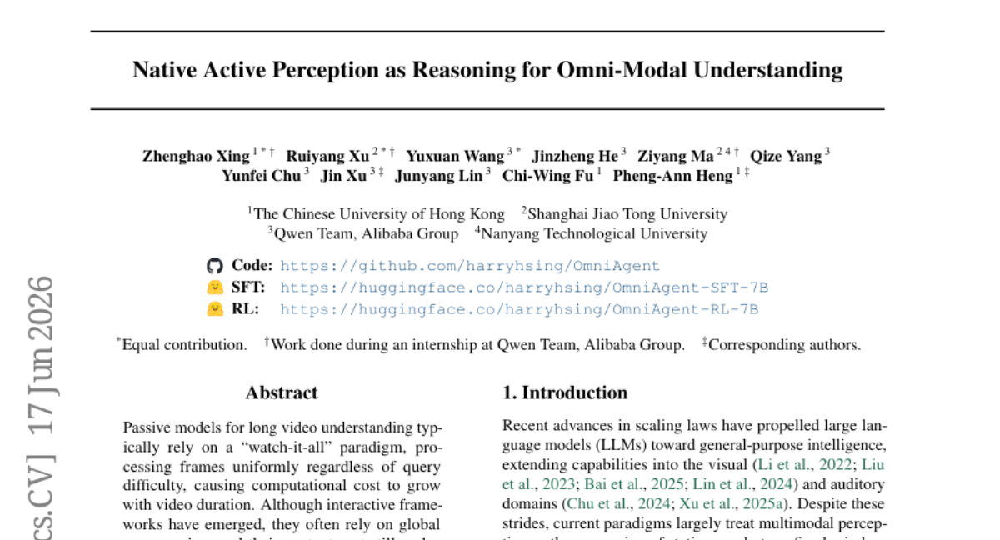

### 📌 한 줄 요약
비디오 길이에 상관없이 필요한 정보만 선택적으로 추출하여 추론 효율성을 극대화한 능동적 인지 에이전트 프레임워크

### 🔑 핵심 포인트
- POMDP 기반의 능동적 인지(Active Perception)를 통한 비디오 이해의 효율적 모델링
- Agentic SFT 및 TAURA(Turn-aware Adaptive Uncertainty Rescaled Advantage)를 통한 에이전트 학습 최적화
- 비디오 길이에 관계없이 성능이 향상되는 긍정적 테스트 타임 스케일링(Positive Test-time Scaling) 달성

### 🧑‍💻 개발자 관점
긴 비디오 데이터를 처리할 때 모든 프레임을 연산하는 대신, 에이전트가 필요한 부분만 탐색하게 함으로써 컴퓨팅 자원을 획기적으로 절약할 수 있는 아키텍처를 제시합니다.

### 🚀 실무 적용 아이디어
- POMDP 기반의 에이전트 행동 루프(Observation-Thought-Action) 구현 검토
- 데이터셋의 턴(turn) 단위 보상 설계를 위한 엔트로피 기반 신용 할당(Credit Assignment) 로직 실험
- 긴 비디오 데이터에 대한 효율적인 텍스트 메모리 압축 및 관리 전략 수립

### ⚠️ 리스크/한계
- 에이전트의 행동 결정 오류가 누적될 경우 전체 추론 결과가 왜곡될 위험
- 특정 도메인에 편향된 행동 패턴이 학습될 경우 범용적인 비디오 이해 능력 저하 가능성

### 📝 초록 기반 상세 설명
기존의 비디오 이해 모델은 모든 프레임을 균일하게 처리하는 'watch-it-all' 방식 때문에 비디오 길이에 따라 연산 비용이 급증하는 문제가 있었습니다. 이를 해결하기 위해 본 논문은 비디오 이해를 POMDP 기반의 '관찰-사고-행동' 사이클로 정의한 OmniAgent를 제안합니다. OmniAgent는 필요한 시점에만 행동을 수행하여 오디오-비주얼 단서를 텍스트 메모리로 변환함으로써, 추론 복잡도를 비디오 길이에 종속되지 않게 분리합니다. 이를 위해 에이전트 기반 SFT와 턴 단위 엔트로피를 활용한 TAURA 강화학습 기법을 도입했습니다. 실험 결과, OmniAgent는 테스트 타임 스케일링(test-time scaling) 효과를 보이며 대규모 모델보다 뛰어난 성능을 기록했습니다.

---

## 11. [STARE: Surprisal-Guided Token-Level Advantage Reweighting for Policy Entropy Stability](https://huggingface.co/papers/2606.19236)
**Upvotes**: 8 | **도입 난이도**: 중 | **신뢰도**: 상
**arXiv**: https://arxiv.org/abs/2606.19236

**태그**: Reinforcement Learning, LLM Reasoning, GRPO, Entropy Stability, RAG, Reasoning

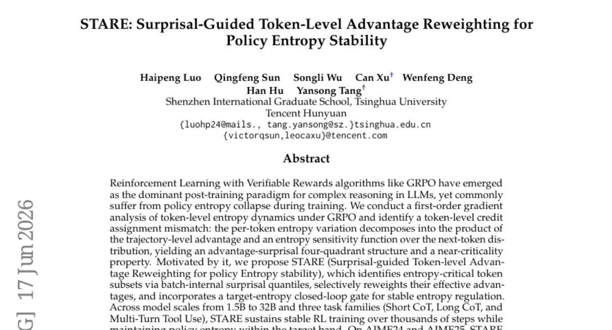

### 📌 한 줄 요약
GRPO 학습 시 발생하는 정책 엔트로피 붕괴 문제를 해결하여, 장기적인 탐색과 성능 향상을 동시에 달성하는 토큰 단위 어드밴티지 재가중치 기법

### 🔑 핵심 포인트
- GRPO의 토큰 단위 엔트로피 변화를 분석하여 어드밴티지-서프라이절 간의 관계 규명
- STARE: 서프라이절 기반의 토큰 선택적 어드밴티지 재가중 및 타겟 엔트로피 조절 메커니즘
- 학습 과정 중 엔트로피 붕괴를 방지하여 장기적인 추론 능력 및 탐색 성능 극대화

### 🧑‍💻 개발자 관점
LLM 강화학습(RL) 시 모델이 특정 답변 패턴에 매몰되어 탐색 능력을 잃는 문제를 해결하여, 더 복잡한 추론 태스크에서 안정적인 학습을 가능하게 합니다.

### 🚀 실무 적용 아이디어
- 현재 사용 중인 GRPO/PPO 학습 루프에 토큰별 서프라이절 기반 가중치 적용 테스트
- 학습 곡선에서 엔트로피 급락 시 STARE의 타겟 엔트로피 게이트 효과 검증
- CoT(Chain-of-Thought) 데이터셋 학습 시 응답 길이와 정확도 상관관계 모니터링

### ⚠️ 리스크/한계
- 서프라이절 기반 토큰 선택 시 계산 오버헤드 발생 가능성
- 특정 태스크(추론 위주) 외 일반 대화형 태스크에서의 범용성 검증 필요

### 📝 초록 기반 상세 설명
최근 LLM의 복잡한 추론을 위해 GRPO와 같은 강화학습 방식이 널리 쓰이지만, 학습 과정에서 정책 엔트로피가 급격히 감소하는 붕괴 현상이 빈번히 발생합니다. 연구진은 GRPO의 토큰 단위 엔트로피 변화가 어드밴티지와 서프라이절(Surprisal)의 상호작용에 의해 결정된다는 점을 분석하여 크레딧 할당 불일치 문제를 식별했습니다. 이를 해결하기 위해 제안된 STARE는 배치 내 서프라이절 분위수를 통해 엔트로피에 결정적인 토큰을 식별하고, 이들의 어드밴티지를 선택적으로 재가중하며 타겟 엔트로피 폐쇄 루프 게이트를 적용합니다. 실험 결과, 1.5B에서 32B 규모의 모델 전반에서 안정적인 엔트로피 유지를 확인했으며, AIME 벤치마크에서 기존 베이스라인 대비 높은 정확도를 달이는 성과를 거두었습니다. 특히 반성(reflection) 토큰과 응답 길이가 함께 증가하며 지속적인 탐색-활용 균형을 유지하는 것이 특징입니다.

---

## 12. [MaineCoon: Pursuing A Real-Time Audio-Visual Social World Model](https://huggingface.co/papers/2606.17800)
**Upvotes**: 8 | **도입 난이도**: 상 | **신뢰도**: 상
**arXiv**: https://arxiv.org/abs/2606.17800

**태그**: Generative AI, Audio-Visual, Real-time, World Model, Streaming, Agent, Video, Audio, Benchmark, Inference, Distillation, Safety

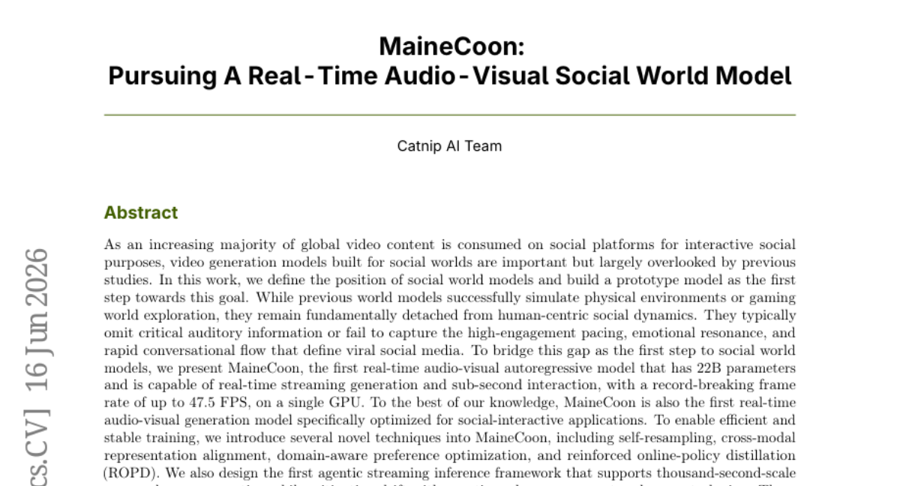

### 📌 한 줄 요약
실시간 소셜 상호작용을 위해 설계된 22B 파라미터 규모의 초고속 오디오-비주얼 월드 모델 개발

### 🔑 핵심 포인트
- 22B 파라미터 규모의 실시간 오디오-비주얼 자기회귀(Autoregressive) 모델 구현
- 단일 GPU에서 초당 47.5 FPS를 달성하는 고성능 스트리밍 생성 기술
- 에이전트 기반 캐시 관리 및 프롬프트 플래닝을 통한 장기 생성 드리프트 억제

### 🧑‍💻 개발자 관점
실시간 인터랙티브 콘텐츠나 메타버스 환경에서 지연 시간 없이 고품질 영상/음향을 생성해야 하는 엔지니어에게 기술적 이정표를 제시합니다.

### 🚀 실무 적용 아이디어
- 단일 GPU 환경에서의 추론 속도와 메모리 점유율 벤치마크 분석
- 장기 생성 시 발생하는 시각적/청각적 일관성 유지 능력 테스트
- 에이전트 기반 캐시 관리 기법의 구현 가능성 검토

### ⚠️ 리스크/한계
- 22B 모델의 높은 연산 요구량으로 인한 일반적인 하드웨어 배포 제약
- 장기 생성 시 발생할 수 있는 잠재적인 품질 저하 및 제어 어려움

### 📝 초록 기반 상세 설명
기존의 월드 모델은 물리적 환경 시뮬레이션에 집중하여 인간 중심의 소셜 다이내믹스를 반영하는 데 한계가 있었습니다. 이를 해결하기 위해 소셜 상호작용에 최적화된 실시간 오디오-비주얼 생성 모델인 MaineCoon을 제안합니다. 22B 파라미터 규모임에도 단일 GPU에서 최대 47.5 FPS의 초고속 스트리밍 생성을 구현했습니다. 학습 효율을 위해 self-resampling, ROPD 등 독자적인 최적화 기술을 도입하였으며, 장기 생성 시 발생하는 드리프트 문제를 해결하기 위한 에이전트 기반 스트리밍 추론 프레임워크를 설계했습니다. 결과적으로 고품질, 저지연, 장기 호라이즌을 동시에 만족하는 차세대 소셜 AI 플랫폼의 기반을 마련했습니다.

---

## 13. [Sumi: Open Uniform Diffusion Language Model from Scratch](https://huggingface.co/papers/2606.19005)
**Upvotes**: 7 | **도입 난이도**: 중 | **신뢰도**: 상
**arXiv**: https://arxiv.org/abs/2606.19005

**태그**: Diffusion Model, LLM, Open Source, Pretraining, Reasoning, Benchmark

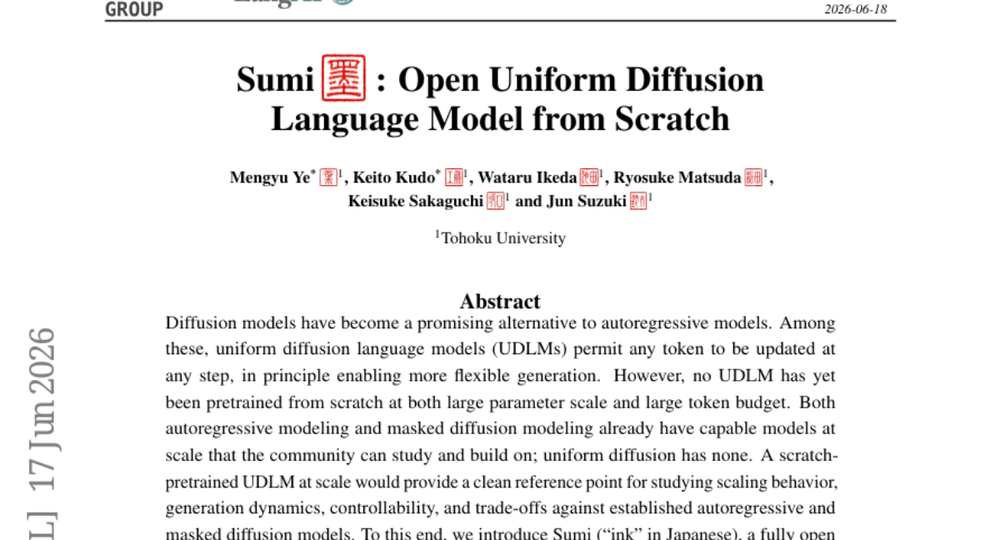

### 📌 한 줄 요약
대규모 토큰(1.5T)으로 사전 학습된 최초의 오픈 소스 7B 규모 Uniform Diffusion 언어 모델(UDLM) 공개

### 🔑 핵심 포인트
- 7B 파라미터 규모의 대규모 Uniform Diffusion 모델(UDLM)을 처음부터 사전 학습 성공
- 1.5T 토큰 규모의 학습 레시피 및 데이터 믹스 구성 전면 공개
- 지식, 추론, 코딩 분야에서 기존 AR 모델과 대등한 수준의 성능 입증

### 🧑‍💻 개발자 관점
기존 AR 방식이 아닌 확산 모델 기반의 대규모 언어 모델 연구를 위한 강력한 베이스라인과 학습 가이드를 제공합니다.

### 🚀 실무 적용 아이디어
- 공개된 데이터 믹스를 활용하여 특정 도메인에 특화된 UDLM 미세 조정 실험
- AR 모델과 UDLM 간의 생성 속도 및 제어 가능성(Controllability) 비교 테스트
- Sumi 모델을 활용한 비선형적 텍스트 편집 및 생성 다이내믹스 분석

### ⚠️ 리스크/한계
- 상식(Commonsense) 관련 벤치마크에서의 상대적 성능 저하
- 확산 모델 특유의 생성 효율성 및 수렴 속도에 대한 추가 검증 필요

### 📝 초록 기반 상세 설명
기존의 자기회귀(AR) 모델과 달리 모든 토큰을 동시에 업데이트할 수 있는 Uniform Diffusion Language Model(UDLM)은 유연한 생성 가능성을 제공하지만, 대규모 스케일에서의 사전 학습 사례가 부족했습니다. 본 논문은 이러한 공백을 메우기 위해 1.5T 토큰을 사용하여 처음부터 학습시킨 7B 규모의 UDLM인 'Sumi'를 제안합니다. Sumi는 지식, 추론, 코딩 벤치마크에서 유사한 규모의 AR 모델과 경쟁할 수 있는 성능을 보여주었습니다. 다만, 데이터 믹스 특성상 상식(commonsense) 관련 벤치마크에서는 다소 낮은 성능을 보였습니다. 연구진은 모델 가중치, 체크포인트, 데이터 믹스 사양을 포함한 전체 학습 레시피를 공개하여 향후 확산 모델 연구의 기준점을 제공하고자 합니다.

---

## 14. [Beyond Alignment: Value Diversity as a Collective Property in Multicultural Agent Systems](https://huggingface.co/papers/2606.05985)
**Upvotes**: 7 | **도입 난이도**: 중 | **신뢰도**: 상
**arXiv**: https://arxiv.org/abs/2606.05985

**태그**: Multi-Agent Systems, LLM Evaluation, Value Alignment, Social Intelligence, Agent, Evaluation, Safety

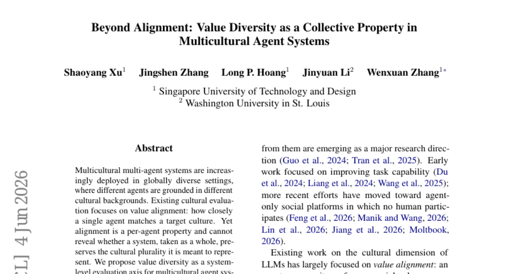

### 📌 한 줄 요약
다문화 멀티 에이전트 시스템에서 개별 정렬(Alignment)을 넘어 시스템 전체의 가치 다양성을 평가하는 새로운 지표를 제안하고, 현재 LLM 기반 사회의 동질화 문제를 경고함

### 🔑 핵심 포인트
- 시스템 차원의 새로운 평가 지표인 '가치 다양성(Value Diversity)' 제안
- 가치 정렬(Alignment)과 다양성(Diversity)이 서로 독립적이며 보완적인 관계임을 입증
- 사회적 상호작용이 에이전트 간의 의견 수렴(Homogenization)을 유도하여 다양성을 저해함을 확인

### 🧑‍💻 개발자 관점
멀티 에이전트 협업 시스템 설계 시, 개별 모델의 성능뿐만 아니라 시스템 전체의 의사결정 폭을 유지하기 위한 다양성 관리 전략이 필수적임을 시사합니다.

### 🚀 실무 적용 아이디어
- 멀티 에이전트 시스템 구축 시 개별 에이전트의 가치 편향성을 측정하는 다양성 지표 도입
- 에이전트 간 상호작용 프로토콜 설계 시 의견 수렴(Consensus)과 다양성 유지 사이의 균형점 탐색
- 다양한 백본 모델을 혼합하여 시스템의 가치 다양성을 확보하는 실험 수행

### ⚠️ 리스크/한계
- 사회적 상호작용이 다양성을 해치는 메커니즘이 특정 시나리오에 국한될 가능성
- 가치 다양성 지표가 실제 인간 사회의 복잡한 가치 체계를 완벽히 대변하기 어려움

### 📝 초록 기반 상세 설명
글로벌 환경에 배포되는 멀티 에이전트 시스템은 다양한 문화적 배경을 가진 에이전트들로 구성됩니다. 기존의 문화적 평가는 개별 에이전트가 특정 문화에 얼마나 부합하는지(Alignment)에만 집중하여, 시스템 전체의 문화적 다양성을 측정하지 못하는 한계가 있었습니다. 본 논문은 공유된 가치 설문 응답의 차이를 기반으로 시스템 차원의 '가치 다양성(Value Diversity)'이라는 새로운 평가 축을 제안합니다. 19개 문화와 18개 모델을 대상으로 실험한 결과, 다양성은 정렬도와 무관한 독립적인 속성임이 밝혀졌으며, 현재의 에이전트 시스템은 인간 사회에 비해 현저히 낮은 다양성을 보였습니다. 특히 에이전트 간 사회적 상호작용이 발생할 경우 의견이 수렴되는 동질화 현상이 나타나며, 이는 집단 의사결정의 폭을 좁히는 결과를 초래합니다.

---

## 15. [The Reward Was in Your Data All Along: Correcting Flow Matching with Discriminator-Guided RL](https://huggingface.co/papers/2606.19162)
**Upvotes**: 5 | **도입 난이도**: 중 | **신뢰도**: 상
**arXiv**: https://arxiv.org/abs/2606.19162

**태그**: Generative Models, Reinforcement Learning, Flow Matching, Computer Vision, Vision, Evaluation, Inference, Safety

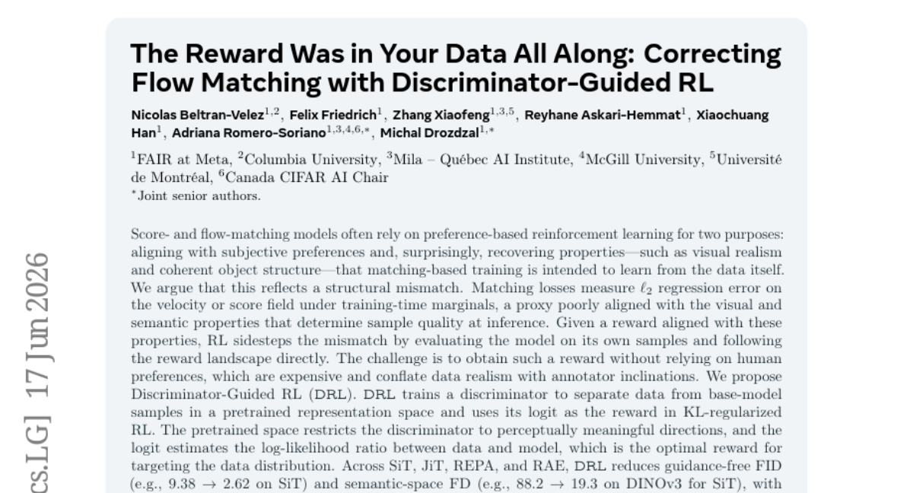

### 📌 한 줄 요약
사전 학습된 표현 공간의 Discriminator를 RL 보상으로 활용하여 Flow Matching 모델의 데이터 분포 정합성을 극대화하는 기법

### 🔑 핵심 포인트
- L2 매칭 손실과 실제 샘플 품질 사이의 구조적 불일치(Structural Mismatch) 문제 제기
- 사전 학습된 표현 공간(Pretrained representation space)을 활용한 Discriminator 기반 RL 프레임워크 제안
- 인간의 개입 없이 데이터 분포 자체를 타겟팅하는 최적의 보상(Log-likelihood ratio) 확보

### 🧑‍💻 개발자 관점
인간의 피드백(RLHF) 없이도 모델이 데이터의 시각적 품질과 구조적 정밀도를 높일 수 있는 자동화된 최적화 경로를 제시합니다.

### 🚀 실무 적용 아이디어
- 기존 Diffusion/Flow 모델에 사전 학습된 Vision 모델(DINO 등) 기반 Discriminator를 보상으로 적용해보기
- KL-regularization 계수 변화에 따른 생성 다양성 및 품질 변화 관찰하기
- RL 학습 시 Discriminator의 표현 공간이 생성 품질에 미치는 영향 분석하기

### ⚠️ 리스크/한계
- 사전 학습된 표현 공간의 품질에 따라 Discriminator의 성능과 생성 결과가 종속될 수 있음
- RL 학습 과정에서의 불안정성 및 모드 붕괴(Mode collapse) 가능성

### 📝 초록 기반 상세 설명
기존의 Score/Flow-matching 모델은 학습 시 사용하는 L2 손실 함수와 실제 생성 품질 사이의 구조적 불일치로 인해 데이터의 시각적/의미적 특성을 완벽히 복원하지 못하는 문제가 있습니다. 이를 해결하기 위해 인간의 선호도에 의존하지 않고 데이터 자체의 특성을 학습할 수 있는 Discriminator-Guided RL(DRL)을 제안합니다. DRL은 사전 학습된 표현 공간에서 데이터와 모델 생성물을 구분하는 Discriminator를 학습시키고, 그 logit을 KL-regularized RL의 보상으로 사용합니다. 실험 결과, SiT 등 다양한 백본에서 FID와 semantic-space FD를 크게 개선하며 데이터 분포로의 정밀한 수렴을 보여주었습니다. 또한, 이후 진행되는 인간 선호도 기반 학습 시에도 더 나은 Pareto frontier를 제공하여 정렬과 품질 사이의 균형을 개선합니다.

---

## 16. [PAIWorld: A 3D-Consistent World Foundation Model for Robotic Manipulation](https://huggingface.co/papers/2606.18375)
**Upvotes**: 4 | **도입 난이도**: 상 | **신뢰도**: 상
**arXiv**: https://arxiv.org/abs/2606.18375

**태그**: Robotics, World Models, 3D Vision, Diffusion Transformer, Reasoning, Benchmark, Distillation, Safety

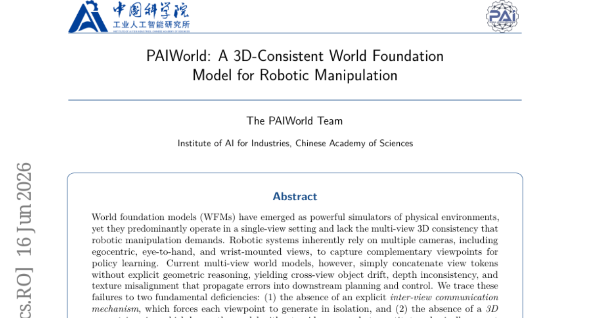

### 📌 한 줄 요약
멀티뷰 시각 데이터 간의 3D 일관성을 확보하여 로봇 조작 성능을 극대화한 세계 모델(World Foundation Model) 프레임워크

### 🔑 핵심 포인트
- Geometry-Aware Cross-View Attention: 뷰 간 명시적인 정보 교환 경로 구축
- Geometric Rotary Position Embedding (GRPE): 카메라 레이 방향 및 외적 파라미터를 어텐션에 인코딩
- Latent 3D-REPA: 사전 학습된 3D 모델의 특징을 증류하여 3D 일관성 확보

### 🧑‍💻 개발자 관점
로봇이 여러 카메라(손목, 머리 등)를 사용할 때 발생하는 시각적 불일치 문제를 해결하여, 더 정교한 물리적 상호작용과 계획 수립을 가능하게 합니다.

### 🚀 실무 적용 아이디어
- 제공된 프레임워크를 활용하여 다양한 카메라 각도에서의 3D 일관성 유지 여부 테스트
- 기존 DiT 모델에 GRPE와 3D-REPA 모듈을 결합했을 때의 성능 변화 비교
- 로봇의 실시간 정책 학습(Policy Post-training) 환경에 적용 가능한지 검토

### ⚠️ 리스크/한계
- 3D foundation model의 특징을 증류하는 과정에서 발생하는 연산 비용 및 복잡도
- 실제 물리 환경의 복잡한 광학적 특성(반사, 투명도 등)에 대한 일반화 가능성 미지수

### 📝 초록 기반 상세 설명
기존의 세계 모델은 단일 뷰 중심이거나 멀티뷰 통합 시 기하학적 추론 부족으로 인해 객체 드리프트 및 텍스처 불일치 문제를 겪습니다. 본 논문은 이러한 문제가 뷰 간 통신 메커니즘의 부재와 3D 기하학적 사전 지식의 부족에서 기인한다고 분석합니다. 이를 해결하기 위해 PAIWorld는 DiT 기반 모델에 기하학적 인지 크로스 뷰 어텐션, 카메라 정보를 인코딩하는 GRPE, 그리고 3D 특징을 증류하는 Latent 3D-REPA를 도입합니다. 실험 결과, PAIWorld는 로봇 조작 벤치마크에서 최고 수준의 3D 일관성을 달성하며 WorldArena 1위 등 뛰어난 성능을 입증했습니다. 결과적으로 이 모델은 모델 기반 계획 및 멀티뷰 정책 학습 등 다양한 로봇 제어 애플리케이션에 활용 가능합니다.

---

## 17. [CEO-Bench: Can Agents Play the Long Game?](https://huggingface.co/papers/2606.18543)
**Upvotes**: 4 | **도입 난이도**: 중 | **신뢰도**: 상
**arXiv**: https://arxiv.org/abs/2606.18543

**태그**: AI Agent, Benchmarking, Long-horizon Planning, Simulation, Agent, Evaluation

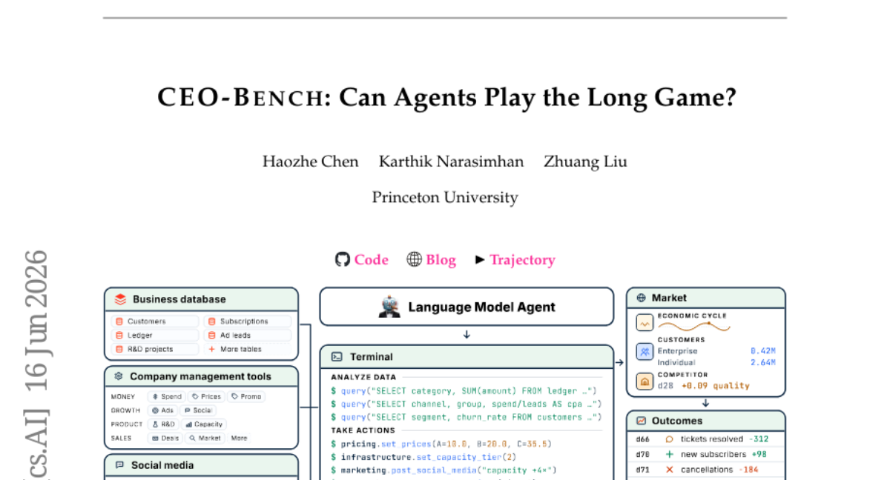

### 📌 한 줄 요약
장기적 의사결정과 복합적 전략 수립 능력을 평가하기 위한 스타트업 운영 시뮬레이션 벤치마크 제안

### 🔑 핵심 포인트
- 장기적 의사결정(Long-horizon)과 환경 변화 적응력을 평가하는 CEO-Bench 개발
- 단순 작업 수행을 넘어 데이터 분석, 전략 수립, 코드 기반 예측이 결합된 복합 환경 구축
- 최신 SOTA 모델들도 장기적인 수익 창출 및 지속 가능한 운영에 실패함을 입증

### 🧑‍💻 개발자 관점
에이전트가 단순한 챗봇을 넘어 자율적인 비즈니스 로직을 수행할 때 직면할 '장기적 목표 달성'과 '복합적 문제 해결'의 난이도를 이해하는 데 중요합니다.

### 🚀 실무 적용 아이디어
- 에이전트의 장기 계획 수립 능력을 테스트하기 위한 시뮬레이션 환경 구축
- 코드 생성 능력이 전략적 의사결정에 미치는 영향 분석
- 에이전트의 피드백 루프와 환경 적응 메커니즘 설계 실험

### ⚠️ 리스크/한계
- 시뮬레이션 환경이 실제 비즈니스 복잡성을 완벽히 반영하는지에 대한 의문
- 모델의 성능이 환경의 프로그래밍 인터페이스 설계에 따라 편향될 가능성

### 📝 초록 기반 상세 설명
현재의 LLM 에이전트는 단기적이고 고립된 작업에는 능숙하지만, 불확실성 속에서의 장기적 계획 수립과 복합적인 문제 해결 능력은 검증되지 않았습니다. 이를 위해 500일 동안 가상의 스타트업을 운영하며 가격 책정, 마케팅, 예산 관리 등을 수행하는 CEO-Bench를 도입했습니다. 에이전트는 프로그래밍 인터페이스를 통해 노이즈가 있는 데이터베이스를 분석하고 전략을 수립하며 코드를 통해 미래를 예측해야 합니다. 실험 결과, 최신 모델들도 수익을 내거나 지속 가능한 운영을 하는 데 큰 어려움을 겪었습니다. 이 벤치마크는 시간이 흐름에 따라 변화하는 환경에 적응하며 성과를 내는 지능을 측정하는 새로운 기준을 제시합니다.

---

## 18. [SciOrch: Learning to Orchestrate Expert LLMs for Solving Frontier Multimodal Scientific Reasoning Tasks](https://huggingface.co/papers/2606.15872)
**Upvotes**: 4 | **도입 난이도**: 상 | **신뢰도**: 상
**arXiv**: https://arxiv.org/abs/2606.15872

**태그**: Agent, LLM-Orchestration, Reinforcement Learning, Scientific Reasoning, RAG, Reasoning, Multimodal, Evaluation, Inference

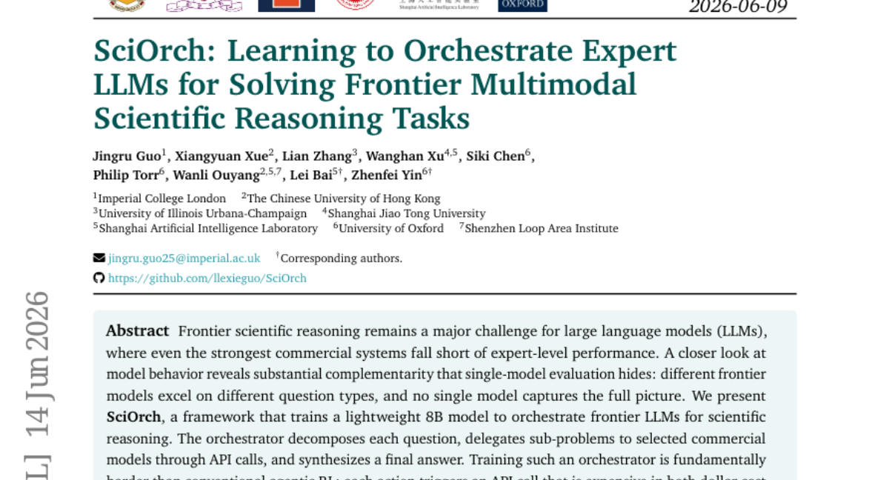

### 📌 한 줄 요약
경량 모델이 최상위 LLM들을 효율적으로 지휘하여 복잡한 과학적 추론 문제를 해결하는 오케스트레이션 프레임워크

### 🔑 핵심 포인트
- 경량 8B 모델을 활용한 상용 LLM 오케스트레이션 프레임워크 개발
- MCTS와 GRPO를 결합하여 API 비용 및 지연 시간 문제를 극복한 효율적 학습 방법론
- 문제 분해, 모델별 작업 위임, 결과 합성을 통한 고난도 과학적 추론 해결

### 🧑‍💻 개발자 관점
단일 거대 모델에 의존하는 대신, 특정 작업에 특화된 모델들을 저비용으로 조합하여 성능을 극대화하는 에이전트 설계 패턴을 제시합니다.

### 🚀 실무 적용 아이디어
- MCTS 기반의 데이터 생성 및 GRPO 학습 파이프라인 구현 검토
- 도메인 특화 문제(수학, 코딩 등)에 대한 오케스트레이터 성능 테스트
- API 비용 최적화를 위한 모델 선택 로직 실험

### ⚠️ 리스크/한계
- API 호출 기반이므로 오케스트레이터 모델의 의존도와 지연 시간 문제 잔존
- 학습 과정에서의 복잡한 MCTS 궤적 추출 및 최적화 난이도

### 📝 초록 기반 상세 설명
최신 LLM들은 과학적 추론 분야에서 각기 다른 강점을 가지지만, 단일 모델만으로는 복잡한 문제를 해결하는 데 한계가 있습니다. 이를 해결하기 위해 8B 규모의 경량 모델이 상용 모델들을 적재적소에 활용하는 SciOrch 프레임워크를 제안합니다. 오케스트레이터는 문제를 분해하고 API를 통해 모델별로 작업을 할당한 뒤 최종 답변을 합성합니다. 학습 과정에서의 높은 비용과 지연 시간 문제를 해결하기 위해 MCTS 기반의 궤적 생성과 GRPO 방식의 최적화를 결합했습니다. 실험 결과, SciOrch는 기존 단일 모델 및 멀티 에이전트 방식보다 높은 정확도를 기록하며 비용 효율성까지 입증했습니다.

---

## 19. [ViT-Up: Faithful Feature Upsampling for Vision Transformers](https://huggingface.co/papers/2606.14024)
**Upvotes**: 4 | **도입 난이도**: 중 | **신뢰도**: 상
**arXiv**: https://arxiv.org/abs/2606.14024

**태그**: Vision Transformer, Upsampling, Dense Prediction, Feature Extraction, RAG, Vision, Safety

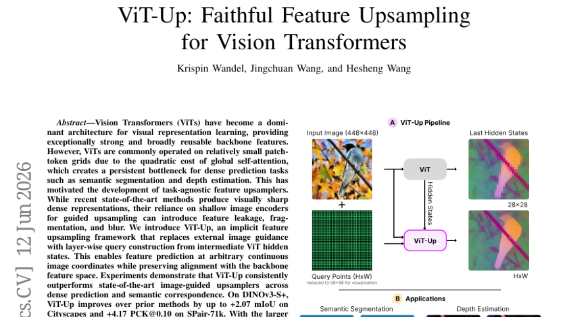

### 📌 한 줄 요약
외부 이미지 가이드 없이 ViT 내부 상태를 활용하여 정밀한 고해상도 특징 맵을 생성하는 업샘플링 프레임워크

### 🔑 핵심 포인트
- 외부 이미지 가이드 없이 ViT 내부 은닉 상태를 활용한 암시적(Implicit) 업샘플링 방식 제안
- 임의의 연속적인 좌표에서 특징 추출이 가능한 레이어별 쿼리 구성 메커니즘 도입
- 백본 모델 용량 증가에 따라 성능이 향상되는 우수한 확장성(Scalability) 확보

### 🧑‍💻 개발자 관점
고해상도 정밀 예측이 필요한 세그멘테이션이나 Depth Estimation 작업 시, 연산 효율을 유지하면서도 백본의 특징을 손상 없이 고해상도로 확장할 수 있습니다.

### 🚀 실무 적용 아이디어
- DINOv2/v3와 같은 사전 학습된 ViT 백본에 ViT-Up 모듈을 결합하여 성능 테스트
- 다양한 해상도 입력에 대해 특징 정렬(Alignment)이 얼마나 정확한지 시각적 검증
- 기존의 Bilinear/Bicubic 업샘플링 대비 연산 오버헤드 비교 분석

### ⚠️ 리스크/한계
- 백본 모델의 특징 공간에 의존하므로, 백본 성능이 낮을 경우 업샘플링 품질도 제한됨
- 쿼리 생성 및 연산 과정에서 추가적인 메모리/연산 비용 발생 가능성

### 📝 초록 기반 상세 설명
Vision Transformer(ViT)는 강력한 특징을 제공하지만, 셀프 어텐션의 연산 비용 문제로 인해 낮은 해상도의 패치 그리드에서 동작하는 한계가 있습니다. 이를 해결하기 위해 기존에는 외부 이미지 가이드를 활용한 업샘플링 방식이 사용되었으나, 이는 특징 누출(leakage)이나 블러 현상을 유발할 수 있습니다. 본 논문에서는 외부 가이드 대신 ViT의 중간 레이어 은닉 상태로부터 쿼리를 구성하는 ViT-Up 프레임워크를 제안합니다. 이 방식은 임의의 연속적인 좌표에서 특징 예측을 가능하게 하며 백본의 특징 공간과 정렬을 유지합니다. 실험 결과, ViT-Up은 시맨틱 세그멘테이션 및 시맨틱 대응 작업에서 기존 SOTA 방식들을 상회하는 성능을 보였습니다. 특히 백본 모델의 크기가 커질수록 성능 향상 폭이 커지는 우수한 확장성을 입증했습니다.

---

## 20. [RODS: Reward-Driven Online Data Synthesis for Multi-Turn Tool-Use Agents](https://huggingface.co/papers/2606.19047)
**Upvotes**: 2 | **도입 난이도**: 중 | **신뢰도**: 상
**arXiv**: https://arxiv.org/abs/2606.19047

**태그**: LLM-Agent, Reinforcement Learning, Data Synthesis, Tool-use, Agent, Inference

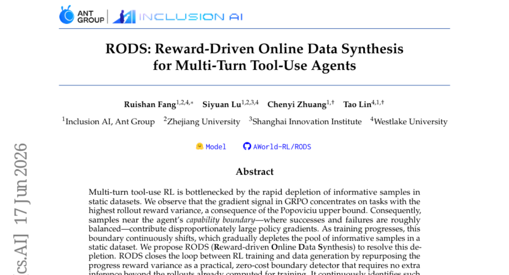

### 📌 한 줄 요약
학습 진행에 따라 변화하는 에이전트의 능력 경계에 맞춰 데이터를 실시간으로 합성하여 학습 효율을 극대화하는 RL 프레임워크

### 🔑 핵심 포인트
- 보상 분산(Reward Variance)을 활용한 비용 효율적인 데이터 경계 탐지 기법 제안
- 에이전트의 능력 수준에 맞춘 구조적 복잡도(API 토폴로지, 의존성 깊이 등) 기반 데이터 합성 파이프라인
- 적은 수의 시드 데이터로 대규모 오프라인 학습 데이터셋과 유사한 성능을 내는 고효율 학습 루프 구축

### 🧑‍💻 개발자 관점
데이터를 무작정 늘리는 대신, 모델이 '성공과 실패를 오가는' 지점의 데이터를 지능적으로 생성하여 학습 비용을 획기적으로 줄일 수 있습니다.

### 🚀 실무 적용 아이디어
- 현재 사용 중인 RL 에이전트의 보상 분산 추이를 모니터링하여 데이터 고갈 시점 파악하기
- 고정된 데이터셋 대신 에이전트의 성능에 따라 난이도를 조절하는 커리큘럼 학습 적용 검토
- LLM을 활용한 데이터 합성 시 기존 데이터의 구조적 특징(Dependency depth 등)을 유지하는 프롬프트 설계 실험

### ⚠️ 리스크/한계
- 데이터 합성 과정에서 발생할 수 있는 편향(Bias)이 모델의 특정 패턴 고착화를 유발할 위험
- 합성된 데이터의 품질이 낮을 경우 학습 루프 전체가 불안정해질 가능성

### 📝 초록 기반 상세 설명
멀티턴 도구 사용 RL 학습 시, 정적 데이터셋은 에이전트의 능력이 향상됨에 따라 유의미한 학습 신호를 제공하는 샘플이 빠르게 고갈되는 문제가 발생합니다. 연구진은 GRPO의 그래디언트 신호가 보상 분산이 큰 '능력 경계' 샘플에 집중된다는 점에 주목했습니다. 이를 해결하기 위해 제안된 RODS는 학습 중 발생하는 보상 분산을 경계 탐지기로 활용하여 새로운 데이터를 실시간으로 합성합니다. 합성된 데이터는 기존 샘플의 구조적 복잡도를 유지하며, 동적 리플레이 버퍼를 통해 정책과 함께 진화합니다. 실험 결과, RODS는 훨씬 적은 데이터량으로도 대규모 오프라인 데이터셋에 필적하는 성능을 달성했습니다.

---

## 21. [Learning User Simulators with Turing Rewards](https://huggingface.co/papers/2606.19336)
**Upvotes**: 2 | **도입 난이도**: 중 | **신뢰도**: 상
**arXiv**: https://arxiv.org/abs/2606.19336

**태그**: LLM, Reinforcement Learning, User Simulation, Synthetic Data, Agent, Evaluation

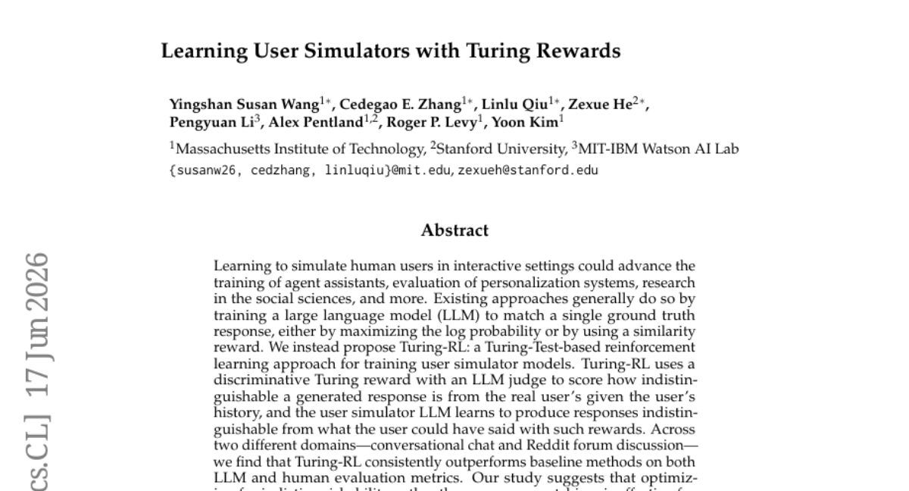

### 📌 한 줄 요약
단순 응답 매칭이 아닌 '인간과의 구별 불가능성'을 목표로 하는 강화학습 기반 사용자 시뮬레이터 학습 방법론

### 🔑 핵심 포인트
- 기존의 정답 매칭(Response Matching) 방식에서 탈피하여 튜링 테스트 기반의 보상 체계 도입
- LLM 판정관을 활용해 대화 맥락 내에서의 '인간스러움(Indistinguishability)'을 정교하게 측정
- 대화형 채팅 및 포럼 토론 등 다양한 도메인에서의 성능 검증

### 🧑‍💻 개발자 관점
에이전트 학습용 합성 데이터(Synthetic Data) 생성 시, 더 자연스럽고 예측 불가능한 사용자 시나리오를 확보할 수 있습니다.

### 🚀 실무 적용 아이디어
- 기존 SFT(Supervised Fine-tuning) 모델과 Turing-RL 모델의 대화 다양성 비교 실험
- LLM 판정관의 프롬프트 설계에 따른 보상 값의 변동성 테스트
- 특정 도메인(예: 고객 상담)에 특화된 튜링 보상 함수 설계

### ⚠️ 리스크/한계
- LLM 판정관 자체의 편향(Bias)이 시뮬레이터의 성향을 결정할 위험
- 학습 과정에서 모델이 특정 패턴에 과적합되어 대화의 질이 저하될 가능성

### 📝 초록 기반 상세 설명
에이전트 학습 및 개인화 시스템 평가를 위해 인간 사용자를 모사하는 시뮬레이터 개발이 중요해지고 있습니다. 기존 방식은 단일 정답(Ground Truth)에 맞추는 로그 확률 최대화나 유사도 기반 보상을 사용해 실제 인간의 다양성을 담아내기 어려웠습니다. 본 논문은 튜링 테스트 개념을 도입한 강화학습 방식인 {Turing-RL}을 제안합니다. LLM 판정관이 대화 이력을 바탕으로 생성된 응답이 실제 사용자와 얼마나 구별되지 않는지를 점수로 산출하며, 시뮬레이터는 이 보상을 최대화하도록 학습됩니다. 실험 결과, 대화형 채팅과 레딧 포럼 환경 모두에서 기존 방식보다 LLM 및 인간 평가 지표에서 우수한 성능을 보였습니다. 이는 단순 응답 일치보다 '구별 불가능성'을 최적화하는 것이 효과적인 시뮬레이터 학습 전략임을 시사합니다.

---

## 22. [Externalizing Research Synthesis and Validation in AI Scientists through a Research Harness](https://huggingface.co/papers/2606.18874)
**Upvotes**: 2 | **도입 난이도**: 중 | **신뢰도**: 상
**arXiv**: https://arxiv.org/abs/2606.18874

**태그**: AI Agent, Research Automation, Explainable AI, Workflow Engineering, Reasoning, Vision, Evaluation, Inference

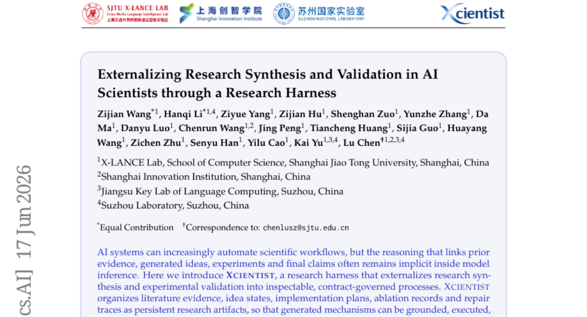

### 📌 한 줄 요약
AI 연구 프로세스의 추론 과정을 외부화하여 검증 가능하고 추적 가능한 연구 프레임워크(Xcientist) 제안

### 🔑 핵심 포인트
- 연구 합성 및 실험 검증 과정을 외부화하여 검사 가능한 프로세스로 구축
- 아이디어 상태, 실험 계획, 수정 이력 등을 영속적 아티팩트로 관리하여 근거 유지
- 자동화된 연구에서 발생하는 'Claim Drift(주장 괴리)' 현상 정의 및 해결

### 🧑‍💻 개발자 관점
AI 에이전트가 생성한 결과물의 신뢰성을 확보하기 위해, 단순 결과값이 아닌 '추론 과정의 로그와 근거'를 어떻게 구조화하고 관리해야 하는지에 대한 아키텍처 가이드를 제공합니다.

### 🚀 실무 적용 아이디어
- LLM 기반 에이전트 워크플로우에 상태 관리(State Management) 레이어 도입 실험
- 에이전트의 최종 결과물과 중간 추론 단계 간의 일관성을 측정하는 지표 설계
- 실험 이력 및 근거를 데이터베이스화하여 추적하는 RAG 파이프라인 구축

### ⚠️ 리스크/한계
- 외부화된 프로세스 관리로 인한 시스템 복잡도 및 오버헤드 증가
- 모든 연구 단계의 정형화가 복잡한 비정형 연구 문제에 적용 가능한지에 대한 의문

### 📝 초록 기반 상세 설명
AI 시스템이 과학적 워크플로우를 자동화하고 있으나, 근거와 실험 결과 사이의 논리적 연결이 모델 내부의 암묵적 추론에 머물러 있는 문제가 있습니다. 이를 해결하기 위해 연구 합성 및 실험 검증 과정을 검사 가능한 계약 기반 프로세스로 외부화하는 'Xcientist' 연구 하네스를 도입합니다. Xcientist는 문헌 근거, 아이디어 상태, 실험 계획 및 수정 이력을 영속적인 아티팩트로 관리하여 생성된 메커니즘의 근거를 유지합니다. 연구 과정에서 결과물이 초기 주장과 괴리되는 'Claim Drift' 현상을 식별하고, 다양한 도메인 실험을 통해 문제 정의부터 검증까지의 추적 가능한 궤적을 입증했습니다. 결과적으로 AI 과학자의 성능은 최종 결과물뿐만 아니라 합성 및 검증 과정의 투명성과 책임성에 의해 평가되어야 함을 시사합니다.

---

## 23. [MyPCBench: A Benchmark for Personally Intelligent Computer-Use Agents](https://huggingface.co/papers/2606.16748)
**Upvotes**: 2 | **도입 난이도**: 중 | **신뢰도**: 상
**arXiv**: https://arxiv.org/abs/2606.16748

**태그**: AI Agent, Benchmark, Automation, Linux, Agent, Evaluation

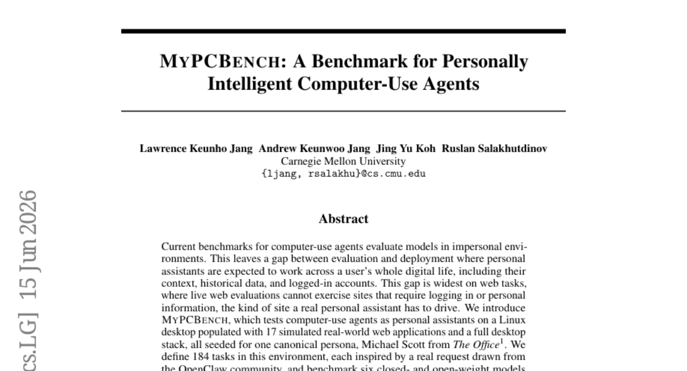

### 📌 한 줄 요약
개인화된 데이터와 로그인 환경을 포함한 실생활 시나리오 기반의 컴퓨터 사용 에이전트 벤치마크 제안

### 🔑 핵심 포인트
- 로그인 및 개인 데이터가 포함된 실생활 시나리오 기반의 벤치마크 환경 구축
- 특정 페르소나를 기반으로 한 184개의 실무 중심 태스크 정의
- 컴퓨터 제어 및 Bash 툴을 활용한 에이전트 성능 평가 프레임워크 제공

### 🧑‍💻 개발자 관점
단순한 웹 브라우징을 넘어, 사용자의 개인 정보와 계정 권한이 포함된 복잡한 워크플로우를 처리해야 하는 차세대 AI 에이전트 개발의 기준을 제시합니다.

### 🚀 실무 적용 아이디어
- 제공된 환경과 태스크 셋을 활용하여 현재 개발 중인 에이전트의 개인화 역량 테스트
- 멀티 앱 간 데이터 이동 및 긴 작업 경로에서의 에이전트 실패 지점 분석
- Bash 툴 인터페이스를 통한 에이전트의 시스템 제어 안정성 검증

### ⚠️ 리스크/한계
- 특정 페르소나(Michael Scott)에 편향된 데이터셋으로 인한 일반화 문제 가능성
- 시뮬레이션된 환경이 실제 복잡한 웹 생태계의 모든 변수를 반영하지 못할 위험

### 📝 초록 기반 상세 설명
기존의 컴퓨터 사용 에이전트 벤치마크는 비개인화된 환경에 국한되어 있어, 실제 사용자의 데이터와 계정을 다루는 개인 비서로서의 역량을 평가하기 어렵습니다. 이를 해결하기 위해 연구진은 특정 페르소나(Michael Scott)의 데이터와 17개의 시뮬레이션된 웹 애플리케이션이 포함된 Linux 데스크톱 환경인 MyPCBench를 도입했습니다. 184개의 실무 기반 태스크를 통해 6종의 모델을 평가하였으며, 모든 모델은 동일한 컴퓨터 및 Bash 도구 인터페이스를 사용합니다. 실험 결과, Claude Opus 4.6이 55.4%의 성공률로 가장 우수한 성능을 보였습니다. 모델의 실패는 주로 여러 애플리케이션을 넘나드는 복잡한 작업이나 긴 실행 경로에서 발생하는 것으로 나타났습니다.

---

## 24. [IndustryBench-MIPU: Benchmarking Multi-Image Attribute Value Extraction for Industrial Products](https://huggingface.co/papers/2606.14383)
**Upvotes**: 2 | **도입 난이도**: 중 | **신뢰도**: 상
**arXiv**: https://arxiv.org/abs/2606.14383

**태그**: MLLM, Multi-Image, Industrial AI, Information Extraction, Reasoning, Multimodal, Vision, Benchmark, Evaluation, Safety

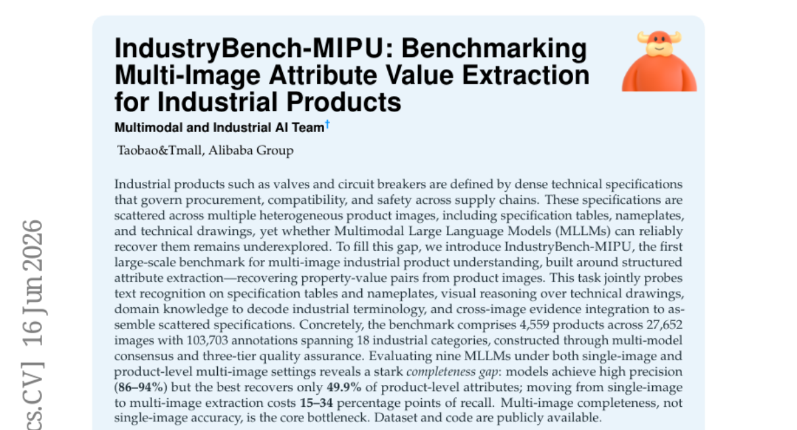

### 📌 한 줄 요약
산업용 제품의 복잡한 스펙을 여러 이미지에서 추출하는 멀티 이미지 기반 벤치마크(IndustryBench-MIPU) 제안

### 🔑 핵심 포인트
- 산업용 제품의 다중 이미지 속성 추출을 위한 최초의 대규모 벤치마크 구축
- 텍스트 인식, 도면 추론, 도메인 지식, 이미지 간 정보 통합 능력을 종합적으로 평가
- 단일 이미지 정확도와 제품 단위 전체 속성 복원율 사이의 큰 격차(Completeness Gap) 발견

### 🧑‍💻 개발자 관점
현업의 복잡한 제품 사양 관리 자동화를 위해, 단순 OCR을 넘어 여러 이미지 간의 관계를 파악하는 멀티-이미지 추론 모델 개발의 필요성을 제시합니다.

### 🚀 실무 적용 아이디어
- 현재 사용 중인 MLLM을 해당 벤치마크 데이터셋에 적용하여 Recall 성능 측정
- 단일 이미지 추출 결과와 멀티 이미지 통합 결과 간의 성능 차이 분석
- 이미지 간 정보 정합성을 높이기 위한 에이전트 기반 워크플로우 실험

### ⚠️ 리스크/한계
- 모델의 높은 정밀도(Precision)에 비해 낮은 재현율(Recall)로 인한 정보 누락 위험
- 특정 산업 도메인에 특화된 데이터셋이므로 범용 모델로의 일반화 성능 검증 필요

### 📝 초록 기반 상세 설명
산업 현장에서는 밸브나 차단기 같은 제품의 기술 사양이 여러 이미지(명판, 도면, 표 등)에 흩어져 있어 정확한 정보 추출이 필수적입니다. 기존 MLLM이 이러한 다중 이미지 환경에서의 속성 추출 능력을 검증할 수 있는 벤치마크가 부족한 상황입니다. 이를 해결하기 위해 18개 산업 카테고리와 27,652개의 이미지를 포함하는 대규모 벤치마크인 IndustryBench-MIPU를 구축했습니다. 실험 결과, 모델들이 개별 이미지의 정확도는 높지만 여러 이미지를 통합하여 전체 속성을 복원하는 능력(Recall)은 현저히 낮음을 확인했습니다. 이는 단일 이미지 정확도보다 이미지 간 정보 통합 능력이 산업용 MLLM의 핵심 병목임을 시사합니다.

---

## 25. [iOSWorld: A Benchmark for Personally Intelligent Phone Agents](https://huggingface.co/papers/2606.09764)
**Upvotes**: 2 | **도입 난이도**: 중 | **신뢰도**: 상
**arXiv**: https://arxiv.org/abs/2606.09764

**태그**: Mobile Agent, Personalization, Benchmark, iOS, Agent, Vision, Evaluation

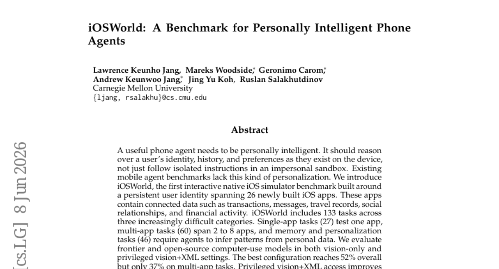

### 📌 한 줄 요약
사용자의 개인 데이터와 앱 간 상호작용을 반영한 차세대 개인화 모바일 에이전트 평가 벤치마크인 iOSWorld 제안

### 🔑 핵심 포인트
- 개인화된 사용자 정체성과 데이터가 포함된 26개의 신규 iOS 앱 시뮬레이터 구축
- 단일 앱부터 멀티 앱, 메모리 기반 개인화까지 아우르는 133개의 계층적 태스크 설계
- 비전 기반 및 XML 접근 권한이 포함된 환경에서의 에이전트 성능 비교 분석

### 🧑‍💻 개발자 관점
단순 명령 수행을 넘어 사용자의 과거 기록과 관계를 활용하는 '개인화된 에이전트' 개발을 위한 실질적인 테스트 환경을 제공합니다.

### 🚀 실무 적용 아이디어
- 공개된 iOSWorld 환경에 현재 사용 중인 LLM 에이전트 이식 및 성능 테스트
- 멀티 앱 태스크에서의 낮은 성공률을 극복하기 위한 에이전트 워크플로우 최적화 실험
- Vision-only 모델과 XML 보조 모델 간의 성능 격차 분석을 통한 입력 방식 결정

### ⚠️ 리스크/한계
- 멀티 앱 및 개인화 태스크에서의 낮은 성공률로 인한 복잡한 시나리오 해결의 어려움
- 시뮬레이터 환경과 실제 물리적 기기 간의 괴리 가능성

### 📝 초록 기반 상세 설명
기존 모바일 에이전트 벤치마크는 사용자의 개인적 맥락과 선호도를 반영하는 개인화 능력을 평가하기에 부족했습니다. 이를 해결하기 위해 26개의 앱과 연결된 데이터(거래, 메시지, 여행 기록 등)를 포함하는 iOS 시뮬레이터 벤치마크인 iOSWorld를 도입했습니다. 벤치마크는 단일 앱, 멀티 앱, 그리고 메모리 및 개인화라는 세 가지 난이도별 태스크로 구성됩니다. 최신 모델들을 대상으로 비전 전용 및 XML 결합 환경에서 성능을 평가했습니다. 실험 결과, 모델의 성능은 태스크 복잡도에 따라 차이를 보였으며 특히 멀티 앱 태스크에서 낮은 성능을 기록했습니다. 연구팀은 모든 앱, 데이터, 태스크 및 평가 코드를 오픈소스로 공개했습니다.

---

## 26. [Bag of Dims: Training-Free Mechanistic Interpretability via Dimension-Level Sign Patterns](https://huggingface.co/papers/2606.12629)
**Upvotes**: 1 | **도입 난이도**: 하 | **신뢰도**: 상
**arXiv**: https://arxiv.org/abs/2606.12629

**태그**: Mechanistic Interpretability, Transformer, Zero-shot, Feature Extraction, Vision, Audio

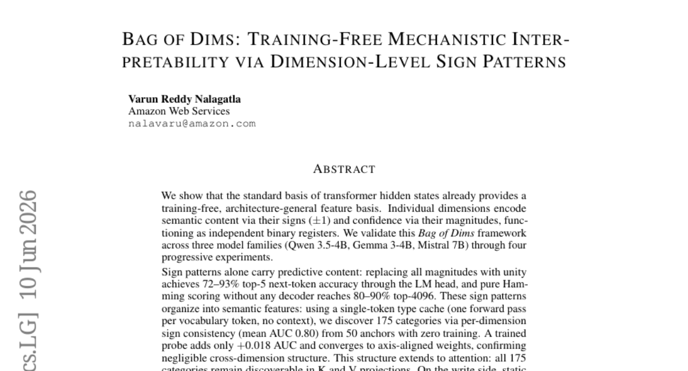

### 📌 한 줄 요약
학습이나 회전 변환 없이 트랜스포머의 표준 기저(Standard Basis) 차원별 부호 패턴만으로 특징을 추출하는 기계론적 해석 방법론

### 🔑 핵심 포인트
- 학습이나 회전(Rotation) 없이 표준 기저의 부호 패턴만으로 특징을 읽는 'Bag of Dims' 프레임워크 제안
- 언어, 시각(ViT), 오디오(AST) 등 다양한 도메인의 트랜스포머 모델에서 범용적으로 작동함을 검증
- 차원별 부호가 독립적인 의미를 담고 있으며, 특정 개념을 제어(Flipping)할 수 있는 인과적 효과 확인

### 🧑‍💻 개발자 관점
모델을 재학습하거나 복잡한 프로브(Probe)를 설계하지 않고도, 단 한 번의 Forward Pass만으로 모델 내부의 특징을 즉각적으로 해석하고 제어할 수 있는 실용적인 방법론을 제시합니다.

### 🚀 실무 적용 아이디어
- 사용 중인 오픈소스 모델(Llama, Mistral 등)의 Hidden State 부호 패턴을 추출하여 특정 개념이 특정 차원에 매핑되는지 확인
- 특정 차원의 부호를 반전(Sign-flipping)시켰을 때 모델의 출력이 의도대로 변하는지 인과성 테스트 수행
- 다양한 모달리티 모델에서 차원 간 독립성(Mutual Information)이 유지되는지 검증

### ⚠️ 리스크/한계
- 복잡한 고차원 개념이 단일 차원의 부호 패턴만으로 모두 설명 가능한지에 대한 의문
- 특정 모델 아키텍처나 학습 스케일에 따라 차원 독립성이 깨질 가능성

### 📝 초록 기반 상세 설명
기존의 기계론적 해석은 최적의 회전 행렬을 찾는 데 집중해 왔으나, 이는 복잡하고 연산 비용이 큽니다. 본 논문은 트랜스포머의 표준 기저 차원 자체가 이미 독립적인 이진 레지스터 역할을 수행한다는 점을 발견했습니다. 연구진은 차원의 부호(Sign) 패턴을 통해 특징을 식별하는 'Bag of Dims' 프레임워크를 제안했습니다. 실험 결과, 언어, 시각, 오디오 모델 전반에서 별도의 학습 없이도 높은 정확도로 의미론적 특징을 추출할 수 있었습니다. 이는 차원 간 상호 정보량이 매우 낮아 독립성이 유지됨을 시사하며, 모델 학습 과정에서 자연스럽게 형성된 구조임을 입증합니다.

---

## 27. [Physics-IQ Verified](https://huggingface.co/papers/2606.18943)
**Upvotes**: 1 | **도입 난이도**: 하 | **신뢰도**: 상
**arXiv**: https://arxiv.org/abs/2606.18943

**태그**: Video Generation, Benchmark, Physics-Informed, Evaluation, Vision, Video

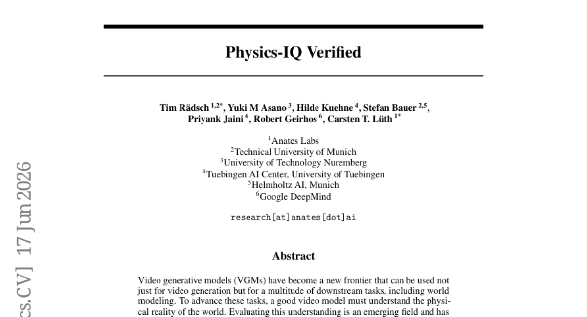

### 📌 한 줄 요약
물리 법칙 이해도를 측정하는 Physics-IQ 벤치마크의 결함을 개선하여 더 신뢰할 수 있는 평가 체계를 구축한 연구

### 🔑 핵심 포인트
- Physics-IQ 벤치마크의 취약점 분석 및 체계적 감사 수행
- 프롬프트 및 정답 데이터 품질 개선을 통한 혼란 변수 제거
- 샘플별 가중치를 적용한 새로운 스코어링 시스템 도입

### 🧑‍💻 개발자 관점
물리 법칙을 준수해야 하는 시뮬레이션이나 로봇 학습용 비디오 생성 모델을 개발할 때, 모델의 성능을 정확히 검증할 수 있는 기준을 제공합니다.

### 🚀 실무 적용 아이디어
- 기존 Physics-IQ 벤치마크와 Physics-IQ Verified 간의 모델 순위 변화 비교
- 자체 개발 중인 비디오 생성 모델에 개선된 프롬프트/스코어링 방식 적용
- 물리적 정합성이 중요한 특정 도메인 데이터셋에 대한 벤치마크 적용 가능성 검토

### ⚠️ 리스크/한계
- 벤치마크 정제 작업이 특정 데이터셋에 국한될 수 있음
- 물리적 이해도 측정 방식이 모든 물리 현상을 포괄하기에는 한계가 있을 수 있음

### 📝 초록 기반 상세 설명
비디오 생성 모델(VGM)이 월드 모델링 등 다양한 태스크로 확장됨에 따라 물리적 현실 이해도가 중요해지고 있습니다. 기존의 Physics-IQ 벤치마크는 모델의 물리 이해도를 측정하려 했으나, 평가 과정에서의 혼란 변수와 샘플 품질 문제가 존재했습니다. 본 연구는 벤치마크를 체계적으로 감사하여 프롬프트 및 정답(ground-truth) 품질을 개선하고, 샘플별 가중치를 적용한 새로운 스코어링 시스템을 제안합니다. 이를 통해 구축된 Physics-IQ Verified는 기존 데이터의 상당 부분을 정제하여 평가의 신뢰도를 높였습니다. 실험 결과, 모델 간의 순위 변화를 유도하며 더욱 정교한 평가 지표임을 입증했습니다.

---

## 28. [Seeing Before Reasoning: Decoupling Perception and Reasoning for Shortcut-Resilient Multimodal On-Policy Self-Distillation](https://huggingface.co/papers/2606.19120)
**Upvotes**: 1 | **도입 난이도**: 중 | **신뢰도**: 상
**arXiv**: https://arxiv.org/abs/2606.19120

**태그**: MLLM, Self-Distillation, Vision-Language, Reasoning, Multimodal, Vision, Benchmark, Distillation

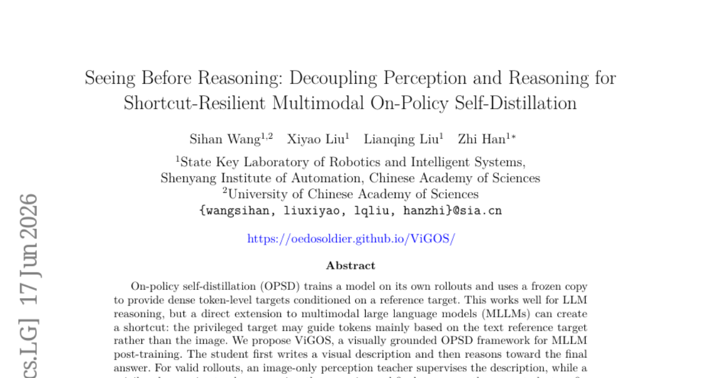

### 📌 한 줄 요약
멀티모달 모델의 텍스트 편향(Shortcut) 문제를 해결하기 위해 시각적 묘사와 추론 과정을 분리하여 학습하는 ViGOS 프레임워크 제안

### 🔑 핵심 포인트
- 시각적 묘사(Perception)와 추론(Reasoning) 단계를 분리하여 텍스트 편향 방지
- 이미지 전용 교사와 추론 전용 교사를 활용한 이중 구조의 self-distillation 적용
- 다양한 벤치마크(시각 수학, 공간 추론 등)에서 이미지 근거 기반 성능 입증

### 🧑‍💻 개발자 관점
멀티모달 모델 학습 시 모델이 이미지를 무시하고 텍스트 패턴만 학습하는 문제를 해결하는 실질적인 방법론을 제시합니다.

### 🚀 실무 적용 아이디어
- 모델의 출력 구조를 '묘사 -> 추론' 순서로 강제하는 프롬프트 엔지니어링 실험
- 학습 데이터셋에서 텍스트와 이미지 정보의 불일치를 유도하여 모델의 시각 의존도 테스트
- Perception 단계와 Reasoning 단계의 Loss 가중치 조절 실험

### ⚠️ 리스크/한계
- 단계별 분리 학습으로 인해 전체 학습 파이프라인의 복잡도 및 연산 비용 증가
- 시각적 묘사 단계의 품질이 전체 추론 성능의 병목이 될 가능성

### 📝 초록 기반 상세 설명
기존의 On-policy self-distillation(OPSD) 방식은 LLM 추론에는 효과적이지만, MLLM에 적용 시 모델이 이미지가 아닌 텍스트 참조에만 의존하는 지름길(Shortcut) 문제가 발생합니다. 이를 해결하기 위해 시각적 근거를 강화한 ViGOS 프레임워크를 제안합니다. 학생 모델이 먼저 시각적 묘사를 작성한 후 최종 답변을 도출하도록 구조화하고, 각 단계에 최적화된 교사 모델(Perception/Reasoning teacher)을 분리하여 지도합니다. 결과적으로 ViGOS는 기존 OPSD의 장점을 유지하면서도 시각 정보에 기반한 정확한 추론 능력을 크게 향상시켰습니다.

---

## 29. [Morpheus: A Morphology-Aware Neural Tokenizer and Word Embedder for Turkish](https://huggingface.co/papers/2606.18717)
**Upvotes**: 1 | **도입 난이도**: 중 | **신뢰도**: 상
**arXiv**: https://arxiv.org/abs/2606.18717

**태그**: NLP, Tokenizer, Morphology, Embedding, Turkish, RAG, Evaluation, Inference, Safety

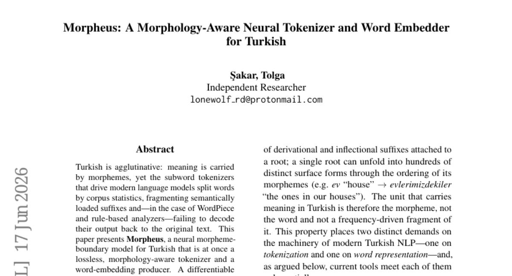

### 📌 한 줄 요약
터키어의 교착어적 특성을 반영하여 손실 없는 토큰화와 고성능 임베딩을 동시에 수행하는 신경망 기반 모형 제안

### 🔑 핵심 포인트
- 손실 없는(Lossless) 형태소 경계 인식 토크나이저 구현
- 토큰화와 임베딩 생성을 단일 신경망 포워드 패스로 처리
- 기존 서브워드 방식 대비 높은 형태소 정렬 정확도 및 낮은 메모리 사용량

### 🧑‍💻 개발자 관점
언어적 특성이 강한 교착어 환경에서 데이터 손실 없이 텍스트를 분절하면서도, 의미론적으로 풍부한 임베딩을 얻을 수 있는 효율적인 아키텍처를 제시합니다.

### 🚀 실무 적용 아이디어
- 제공된 GitHub 코드를 활용하여 터키어 데이터셋에 대한 토큰화 성능 검증
- 기존 BERT 계열 모델과 Morpheus 임베딩 간의 검색(Retrieval) 성능 비교 실험
- 메모리 제약 환경에서의 서브워드 토크나이저 대체 가능성 테스트

### ⚠️ 리스크/한계
- 문맥 의존적 작업(NER 등)에서는 기존 대형 언어 모델(LLM) 대비 성능이 낮을 수 있음
- 터키어 외 타 언어에 대한 범용성 검증 필요

### 📝 초록 기반 상세 설명
터키어는 형태소 중심의 교착어임에도 불구하고, 기존 서브워드 토크나이저는 통계적 빈도에 의존하여 의미 단위인 접미사를 파편화하거나 원문 복원이 어려운 문제를 가집니다. 이를 해결하기 위해 본 논문은 형태소 경계 인식과 임베딩 생성을 동시에 수행하는 Morpheus 모델을 제안합니다. 미분 가능한 Poisson-binomial 동적 계획법을 사용하여 학습 시에는 소프트 멤버십을, 추론 시에는 정확한 세그먼트를 추출하며 원문 복원이 가능한 구조를 갖췄습니다. 실험 결과, 기존 서브워드 방식 대비 낮은 BPC(Bits-per-character)와 높은 형태소 정렬 정확도를 기록했으며, 메모리 효율성 또한 뛰어났습니다. 임베딩 측면에서도 어근 기반 검색 및 검증 작업에서 기존 다국어 모델을 상회하는 성능을 보였습니다.

### 🖼️ 추가 자료
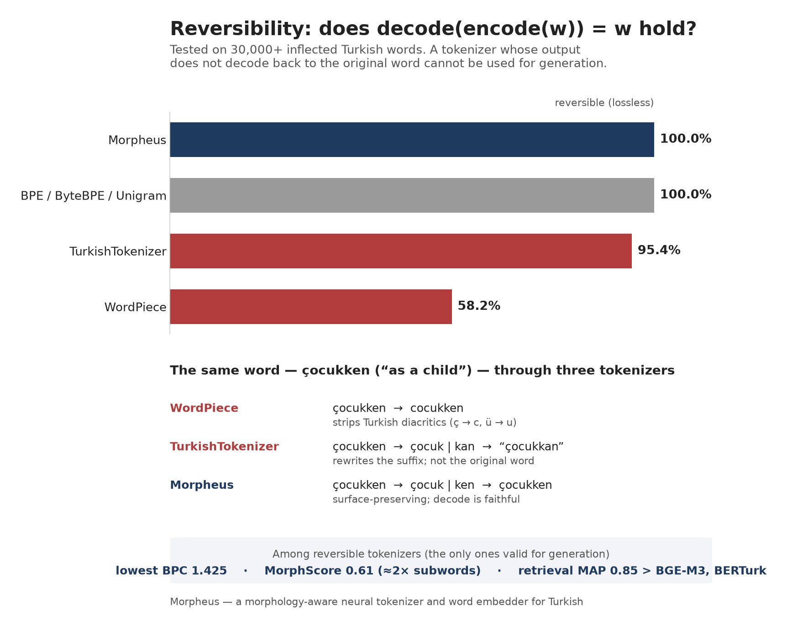
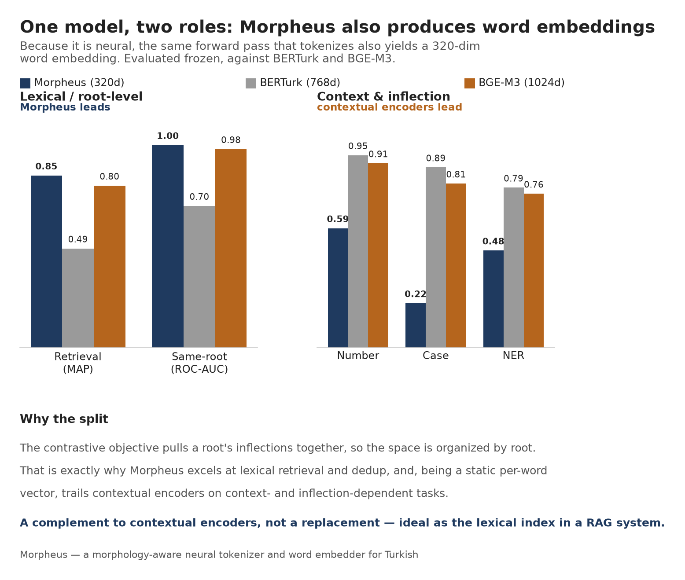

---

## 30. [HiLo-Token: Input-Adaptive High-Low Frequency Token Compression for Efficient Image Editing](https://huggingface.co/papers/2606.13898)
**Upvotes**: 1 | **도입 난이도**: 중 | **신뢰도**: 상
**arXiv**: https://arxiv.org/abs/2606.13898

**태그**: Diffusion Transformer, Image Editing, Token Compression, Efficiency, RAG, Vision, Evaluation, Inference, Distillation, Optimization

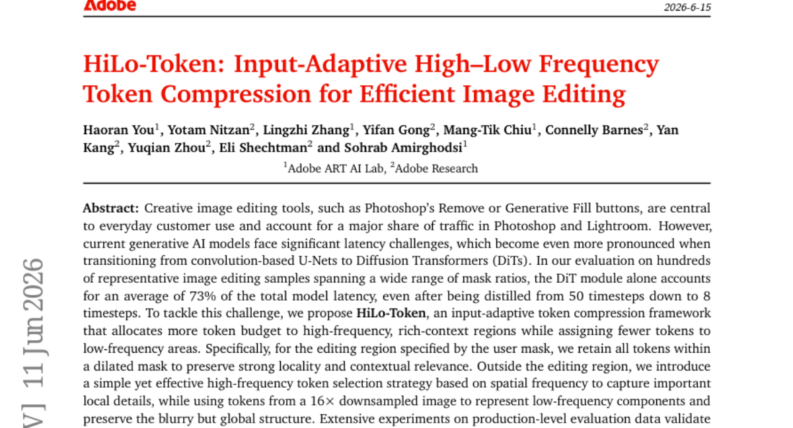

### 📌 한 줄 요약
이미지 편집 시 마스크 영역과 배경의 주파수 특성을 활용하여 DiT 연산량을 획기적으로 줄이는 적응형 토큰 압축 기술

### 🔑 핵심 포인트
- 입력 데이터의 주파수 특성을 활용한 적응형 토큰 압축 프레임워크 제안
- 편집 영역(High-frequency)과 배경 영역(Low-frequency)의 차별적 토큰 관리 전략
- 생성 품질 저하 없이 DiT 연산 속도를 대폭 개선하여 실시간 편집 가능성 확보

### 🧑‍💻 개발자 관점
고비용의 DiT 모델을 실시간 편집 서비스에 적용할 때, 연산 효율을 극대화하여 인프라 비용을 절감하고 사용자 경험을 개선할 수 있는 실무적인 방법론입니다.

### 🚀 실무 적용 아이디어
- 다양한 마스크 크기(Small/Medium/Large)에 따른 속도 및 품질 벤치마크 수행
- 제안된 주파수 기반 토큰 선택 전략을 기존 DiT 아키텍처에 이식 테스트
- 편집 영역 경계에서의 아티팩트 발생 여부 확인

### ⚠️ 리스크/한계
- 마스크 경계면에서의 토큰 불일치로 인한 시각적 아티팩트 발생 가능성
- 특정 주파수 기반 전략이 복잡한 질감의 배경에서 성능 저하를 일으킬 위험

### 📝 초록 기반 상세 설명
최근 생성형 AI 모델이 Diffusion Transformer(DiT)로 전환됨에 따라 이미지 편집 작업에서의 지연 시간(Latency) 문제가 심화되고 있습니다. 특히 DiT 모듈은 전체 모델 지연 시간의 상당 부분을 차지하여 실시간 편집 서비스에 걸림돌이 됩니다. 이를 해결하기 위해 입력 데이터에 적응적으로 토큰을 할당하는 HiLo-Token 프레임워크를 제안합니다. 편집 영역은 확장된 마스크를 통해 컨텍스트를 유지하고, 배경 영역은 공간 주파수 기반의 선택 전략과 다운샘플링된 토큰을 혼합하여 효율적으로 처리합니다. 실험 결과, 생성 품질 저하 없이 마스크 크기에 따라 최대 3.13배의 DiT 속도 향상을 달성했습니다.

---

## 31. [A Benchmark and Framework for Evaluating Next Action Predictions in Spreadsheets](https://huggingface.co/papers/2606.13802)
**Upvotes**: 0 | **도입 난이도**: 중 | **신뢰도**: 상
**arXiv**: https://arxiv.org/abs/2606.13802

**태그**: Agent, Benchmark, LLM, Automation, Evaluation

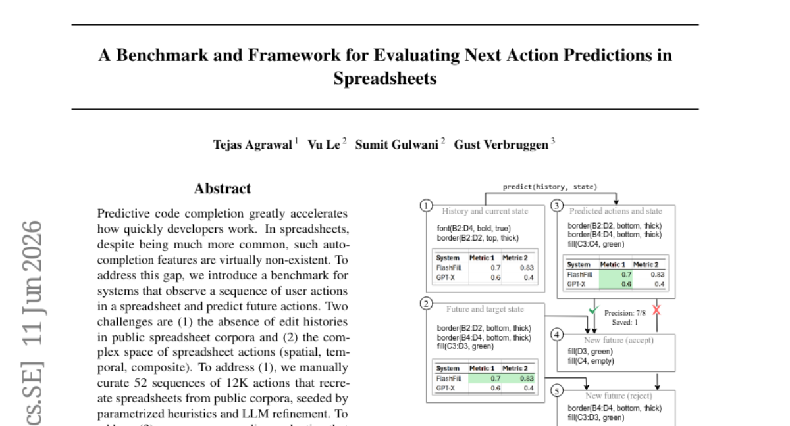

### 📌 한 줄 요약
스프레드시트 작업 자동화를 위한 차세대 액션 예측 벤치마크 및 평가 프레임워크 제안

### 🔑 핵심 포인트
- 편집 이력이 없는 데이터 문제를 해결하기 위한 LLM 기반 시퀀스 생성 기법 도입
- 사용자 피드백 루프를 반영한 실시간 온라인 평가 프레임워크 설계
- 제로샷 LLM부터 미세 조정된 SLM까지 다양한 모델을 아우르는 벤치마크 구축

### 🧑‍💻 개발자 관점
스프레드시트 기반의 업무 자동화 에이전트나 AI 어시스턴트를 개발할 때, 모델의 예측 정확도와 사용자 경험(UX)을 정량적으로 평가할 수 있는 기준을 제공합니다.

### 🚀 실무 적용 아이디어
- 제안된 벤치마크 데이터셋을 활용하여 현재 보유한 LLM의 액션 예측 성능 테스트
- 사용자 피드백(Accept/Reject) 시 시퀀스가 업데이트되는 시나리오 시뮬레이션
- 다양한 사용자 프로필(User Profile) 변화에 따른 모델의 강건성 검증

### ⚠️ 리스크/한계
- 수동 큐레이션된 데이터셋이 실제 복잡한 실무 환경을 완벽히 대변하는지에 대한 의문
- 사용자의 피드백 패턴이 모델 학습에 미치는 복잡한 상호작용 제어의 어려움

### 📝 초록 기반 상세 설명
코드 자동 완성 기술은 개발 생산성을 높이지만, 스프레드시트 환경에서는 관련 기능이 매우 부족한 실정입니다. 기존 공개 데이터셋은 편집 이력이 부족하고 스프레드시트 액션의 복잡성(공간, 시간, 복합성)으로 인해 평가가 어렵다는 문제가 있습니다. 이를 해결하기 위해 연구진은 LLM과 휴리스틱을 활용해 1.2만 개의 액션 시퀀스를 포함한 정교한 벤치마크를 구축했습니다. 또한, 사용자의 수락/거절 피드백을 반영하여 예측의 정확도와 효율성을 측정하는 온라인 평가 방식을 제안했습니다. 다양한 베이스라인 모델을 통해 사용자 프로필, 트리거 조건, 컨텍스트 등이 예측 성능에 미치는 영향을 분석했습니다.

---

## 32. [LLM-Enabled NWDAF: A Step Toward AI-Native 6G Network Intelligence](https://huggingface.co/papers/2606.11877)
**Upvotes**: 0 | **도입 난이도**: 중 | **신뢰도**: 상
**arXiv**: https://arxiv.org/abs/2606.11877

**태그**: NWDAF, LLM, 5G/6G, Network Automation, Open Source, RAG, Evaluation

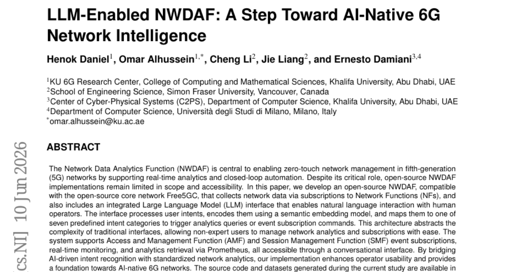

### 📌 한 줄 요약
LLM 기반의 자연어 인터페이스를 통합하여 비전문가도 5G 코어 네트워크 분석 및 관리를 수행할 수 있는 오픈소스 NWDAF 프레임워크 개발

### 🔑 핵심 포인트
- Free5GC와 호환되는 오픈소스 NWDAF 프레임워크 구현
- LLM 기반의 의도 인식(Intent Recognition)을 통한 자연어 네트워크 관리 인터페이스 제공
- AMF/SMF 이벤트 구독 및 Prometheus 연동을 통한 실시간 모니터링 자동화

### 🧑‍💻 개발자 관점
복잡한 네트워크 프로토콜과 API를 직접 다루지 않고도 LLM을 통해 네트워크 상태를 제어하고 분석할 수 있는 운영 자동화의 실질적 모델을 제시합니다.

### 🚀 실무 적용 아이디어
- 제공된 GitHub 저장소를 활용하여 Free5GC 환경에 NWDAF 설치 및 연동 테스트
- LLM의 의도 분류(Intent Mapping) 정확도와 네트워크 명령 실행 간의 정합성 검증
- Prometheus 데이터와 LLM 인터페이스 간의 실시간 데이터 동기화 성능 측정

### ⚠️ 리스크/한계
- LLM의 의도 오분류 시 잘못된 네트워크 설정 명령이 실행될 위험성
- 실시간 네트워크 제어 시 LLM 추론 지연(Latency)이 미치는 영향

### 📝 초록 기반 상세 설명
5G 네트워크의 제로 터치 관리를 위한 핵심 요소인 NWDAF는 중요성에도 불구하고 오픈소스 구현체가 부족한 실정입니다. 본 논문에서는 Free5GC와 호환되는 오픈소스 NWDAF를 개발하여 네트워크 데이터 수집 및 관리 기능을 제공합니다. 특히 LLM 인터페이스를 통합하여 사용자의 자연어 의도를 7가지 카테고리로 분류하고, 이를 분석 쿼리나 이벤트 구독 명령으로 매핑하는 구조를 제안합니다. 이를 통해 AMF/SMF 이벤트 구독, 실시간 모니터링, Prometheus 기반 데이터 조회가 대화형으로 가능해집니다. 결과적으로 복잡한 네트워크 인터페이스를 추상화하여 비전문가도 쉽게 네트워크 분석을 수행할 수 있는 AI-네이티브 6G 기반을 마련했습니다.

---

