# 2026-06-22 Daily Papers (Top 34)

## 오늘의 요약
오늘의 연구는 모델의 효율성을 극대화하는 경량화 기술과 로봇의 물리적 상호작용을 위한 에이전트 학습 방법론이 주요 흐름을 형성했습니다. 또한, 기존 벤치마크의 한계를 극복하기 위한 다국어 코딩 및 실무 환경 중심의 새로운 평가 프레임워크 제안이 활발히 이루어졌습니다.

### 오늘의 핵심 포인트
- 초경량 파라미터로 거대 모델급 성능을 구현하는 효율적인 이미지 인페인팅 및 생성 기술이 주목받았습니다.
- 단순한 정적 인식을 넘어 물리적 역학이나 시공간적 증거를 활용하는 로봇 에이전트의 지능 고도화 연구가 진행되었습니다.
- 기존 벤치마크의 편향성과 예측력 한계를 지적하며, 실제 배포 환경과 다양한 언어 환경을 반영한 정교한 평가 체계가 제안되었습니다.

**오늘의 태그**: Robot Learning, Model Compression, LLM Evaluation, Generative AI, Agentic Workflow

## 1. [Moebius: 0.2B Lightweight Image Inpainting Framework with 10B-Level Performance](https://huggingface.co/papers/2606.19195)
**Upvotes**: 112 | **도입 난이도**: 중 | **신뢰도**: 상
**arXiv**: https://arxiv.org/abs/2606.19195

**태그**: Image Inpainting, Model Compression, Diffusion Models, Efficiency, Vision, Benchmark, Inference, Distillation, Optimization, Safety

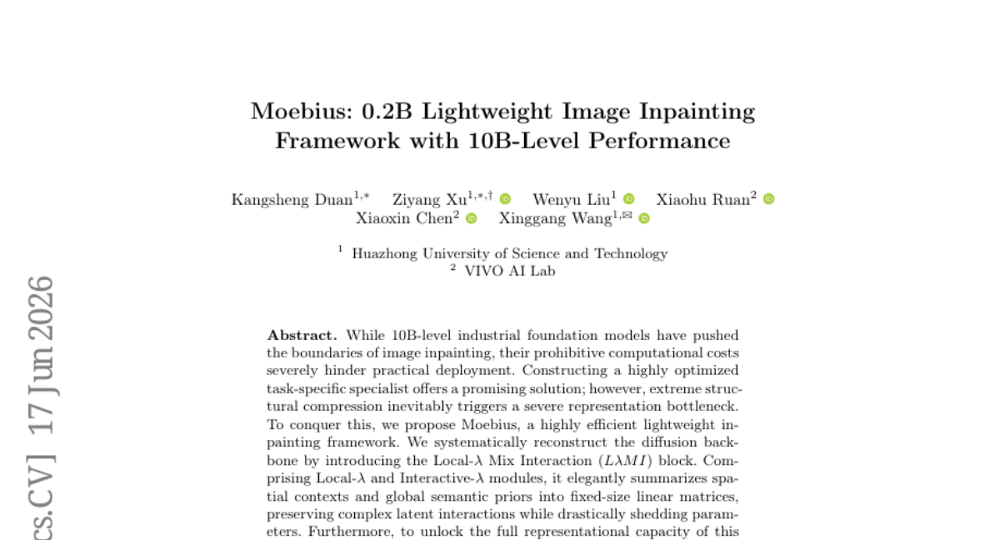

### 📌 한 줄 요약
0.2B 규모의 초경량 파라미터로 10B급 성능을 구현한 고효율 이미지 인페인팅 프레임워크

### 🔑 핵심 포인트
- LλMI(Local-λ Mix Interaction) 블록을 통한 효율적인 공간 및 글로벌 정보 요약
- 잠재 공간 내에서 수행되는 적응형 다중 입도 증류(Multi-granularity Distillation) 전략
- 거대 모델(FLUX.1-Fill-Dev) 대비 압도적인 추론 속도 및 파라미터 효율성 확보

### 🧑‍💻 개발자 관점
엣지 디바이스나 실시간 서비스 환경에서 고성능 인페인팅 기능을 저비용·고속으로 구현할 수 있는 실질적인 가이드를 제공합니다.

### 🚀 실무 적용 아이디어
- 제안된 LλMI 블록 구조를 기존 경량 Diffusion 모델에 이식하여 성능 변화 확인
- 다양한 해상도 환경에서 잠재 공간 기반 증류 전략의 안정성 테스트
- 실제 프로덕션 환경에서의 추론 속도(Latency)와 메모리 점유율 벤치마크

### ⚠️ 리스크/한계
- 극단적인 압축으로 인해 특정 복잡한 텍스처에서 디테일 손실 가능성
- 증류(Distillation) 과정에서의 하이퍼파라미터 튜닝 난이도

### 📝 초록 기반 상세 설명
최근 10B 이상의 거대 모델이 이미지 인페인팅 성능을 높였으나, 막대한 연산 비용으로 인해 실무 배포에 어려움이 있습니다. 모델을 압축할 경우 발생하는 표현력 저하 문제를 해결하기 위해 Moebius 프레임워크를 제안합니다. 핵심 기술로 공간 컨텍스트와 글로벌 의미를 고정 크기 행렬로 요약하는 LλMI 블록을 도입하여 파라미터를 획기적으로 줄였습니다. 여기에 잠재 공간 내에서 다중 그래디언트 손실을 조절하는 적응형 다중 입도 증류(Multi-granularity Distillation) 전략을 결합했습니다. 실험 결과, Moebius는 기존 거대 모델 대비 2% 미만의 파라미터만 사용하면서도 대등하거나 더 뛰어난 생성 품질을 보여주었습니다.

---

## 2. [DragMesh-2: Physically Plausible Dexterous Hand-Object Interaction with Articulated Objects](https://huggingface.co/papers/2606.15133)
**Upvotes**: 68 | **도입 난이도**: 상 | **신뢰도**: 상
**arXiv**: https://arxiv.org/abs/2606.15133

**태그**: Robotics, Reinforcement Learning, Dexterous Manipulation, Physics-Informed Learning, RAG, Evaluation

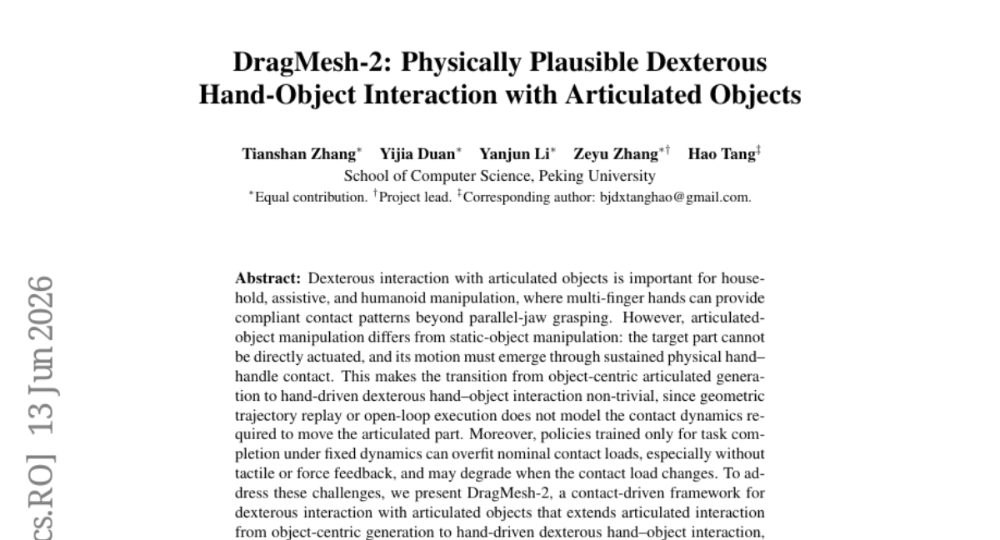

### 📌 한 줄 요약
물리적 접촉 역학을 고려하여 관절형 물체를 정교하게 조작하는 새로운 학습 프레임워크 DragMesh-2 제안

### 🔑 핵심 포인트
- 물리적 접촉 기반의 관절형 물체 조작을 위한 DragMesh-2 프레임워크 개발
- 촉각/힘 피드백 없이도 물리적 신호를 학습에 활용하는 PICA 메커니즘 제안
- 접촉 부하 변화(Damping)에 강건한 정교한 손-물체 상호작용 구현

### 🧑‍💻 개발자 관점
로봇이 단순한 위치 제어를 넘어, 실제 물리적 저항과 접촉 역학이 발생하는 복잡한 환경에서 어떻게 안정적으로 물체를 조작할 수 있는지에 대한 방법론을 제시합니다.

### 🚀 실무 적용 아이디어
- 제공된 pure-geometry 데이터셋을 활용한 로봇 핸드 제어 시뮬레이션 테스트
- PICA 메커니즘을 기존 강화학습 정책에 적용하여 환경 변화에 대한 강건성 비교
- 다양한 댐핑(Damping) 환경에서의 조작 성공률 벤치마크 수행

### ⚠️ 리스크/한계
- 촉각 센서 없이 물리 신호를 주입하는 방식이므로, 실제 하드웨어의 비선형적 마찰/충돌 시 한계가 있을 수 있음
- 시뮬레이션 기반 학습이 실제 물리 환경(Sim-to-Real)으로 전이될 때의 격차 존재 가능성

### 📝 초록 기반 상세 설명
가정용 및 휴머노이드 로봇을 위한 관절형 물체 조작은 단순한 파지 이상의 정교한 손-물체 상호작용을 요구합니다. 기존의 객체 중심 생성 방식은 실제 물리적 접촉을 통한 움직임 변화를 모델링하기 어렵고, 고정된 환경에 과적합되어 접촉 부하 변화에 취약하다는 문제가 있습니다. 이를 해결하기 위해 본 논문은 물리적 접촉을 통해 관절 움직임을 유도하는 DragMesh-2 프레임워크를 제안합니다. 또한, 촉각 센서 없이도 물리적 신호를 정책 학습에 주입하는 PICA 학습 메커니즘을 도입하여 강건성을 높였습니다. 실험 결과, 다양한 댐핑 조건과 물체 카테고리에서 기존 방식보다 높은 성공률과 변화에 대한 강건성을 입증했습니다.

---

## 3. [Multi-LCB: Extending LiveCodeBench to Multiple Programming Languages](https://huggingface.co/papers/2606.20517)
**Upvotes**: 48 | **도입 난이도**: 하 | **신뢰도**: 상
**arXiv**: https://arxiv.org/abs/2606.20517

**태그**: LLM-Evaluation, Code-Generation, Benchmark, Multi-Language, Reasoning, Evaluation

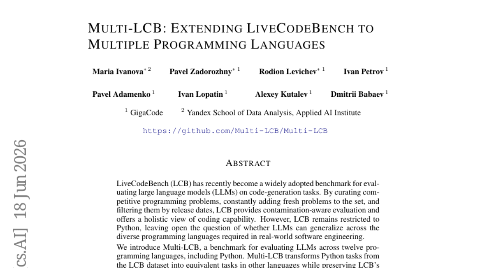

### 📌 한 줄 요약
Python에 국한된 기존 LCB 벤치마크를 12개 언어로 확장하여 LLM의 진정한 다국어 코딩 능력을 검증하는 Multi-LCB 제안

### 🔑 핵심 포인트
- LCB의 오염 방지 메커니즘을 유지하며 12개 언어로 확장한 Multi-LCB 벤치마크 개발
- Python 중심의 모델 학습이 초래하는 언어별 성능 불균형 및 과적합 문제 식별
- 기존 LCB 포맷과의 호환성을 통해 지속적인 벤치마크 업데이트 및 추적 가능성 확보

### 🧑‍💻 개발자 관점
실무에서는 Python 외 다양한 언어를 사용하므로, 특정 언어에 편향되지 않은 범용적인 코딩 모델을 선택하는 데 중요한 기준이 됩니다.

### 🚀 실무 적용 아이디어
- 사용 중인 LLM을 Multi-LCB를 통해 다양한 언어 환경에서 성능 테스트하기
- 모델이 특정 언어(Python)에 과적합되어 다른 언어에서 성능이 급락하는지 확인하기
- 멀티 언어 코딩 작업 투입 전, 모델의 언어 간 성능 격차(Disparity) 측정하기

### ⚠️ 리스크/한계
- Python 문제를 타 언어로 변환하는 과정에서 발생하는 언어별 난이도 불균형 가능성
- 변환된 문제의 논리적 동등성 유지 여부에 대한 검증 필요

### 📝 초록 기반 상세 설명
최근 널리 쓰이는 LiveCodeBench(LCB)는 데이터 오염 방지에 탁월하지만, 평가 언어가 Python에만 국한되어 실무적인 다국어 코딩 능력을 측정하기 어렵다는 한계가 있습니다. 이를 해결하기 위해 연구진은 LCB의 평가 프로토콜과 오염 방지 메커니즘을 유지하면서 12개 프로그래밍 언어로 확장한 Multi-LCB를 도입했습니다. Multi-LCB는 기존 Python 태스크를 다른 언어로 변환하여 LCB의 업데이트를 자동으로 추적할 수 있도록 설계되었습니다. 24개의 LLM을 대상으로 실험한 결과, 모델들이 Python에 과적합되어 있거나 언어별 성능 격차가 크다는 점을 발견했습니다. 결과적으로 Multi-LCB는 모델의 범용적 코딩 역량을 평가하는 엄격한 새로운 기준을 제시합니다.

### 🖼️ 추가 자료
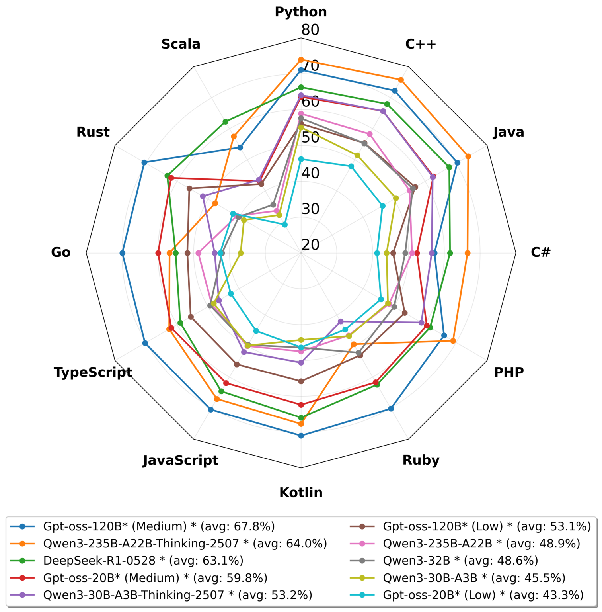
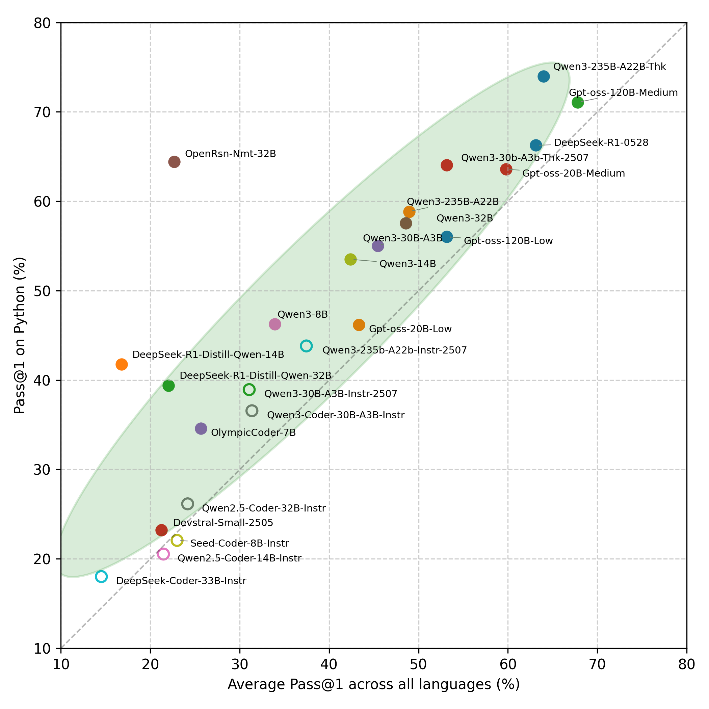
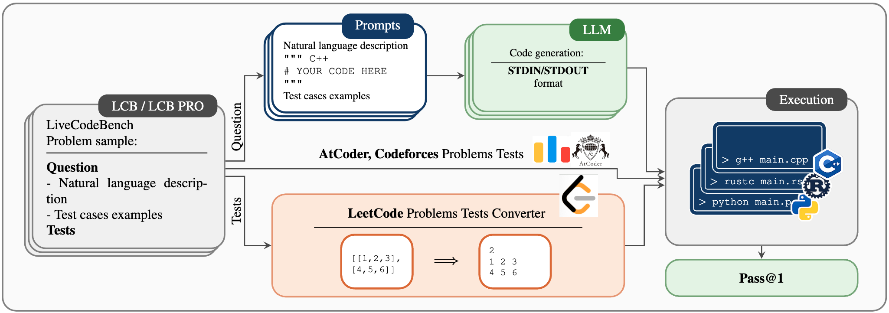

---

## 4. [Playful Agentic Robot Learning](https://huggingface.co/papers/2606.19419)
**Upvotes**: 43 | **도입 난이도**: 중 | **신뢰도**: 상
**arXiv**: https://arxiv.org/abs/2606.19419

**태그**: Robot Learning, Agentic Workflow, Code-as-Policy, Skill Library, Agent, Inference, Distillation

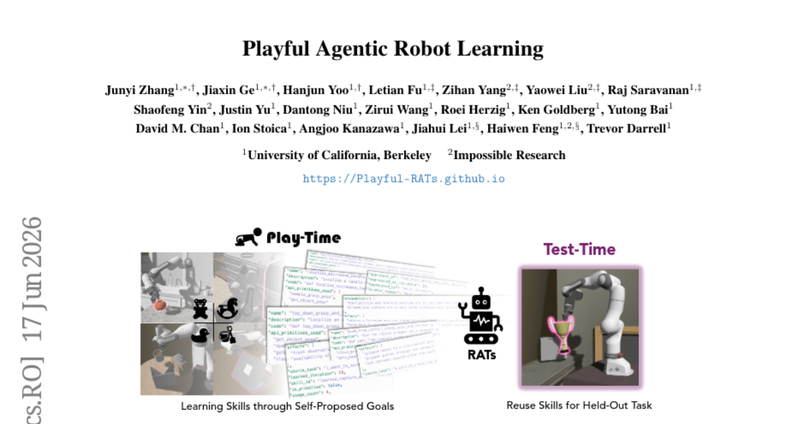

### 📌 한 줄 요약
자율적인 '놀이(Play)'를 통해 로봇의 재사용 가능한 코드 스킬 라이브러리를 사전 구축하는 에이전트 학습 프레임워크

### 🔑 핵심 포인트
- 자율적 놀이(Self-directed play)를 통한 지속적인 스킬 습득 메커니즘 제안
- 실패 진단 및 반복 실행을 통해 성공적인 코드를 스킬 라이브러리로 정제하는 RATs 프레임워크
- 학습된 코드를 컨텍스트에 주입하는 것만으로 타 에이전트의 성능을 높이는 높은 재사용성

### 🧑‍💻 개발자 관점
모델 전체를 재학습하지 않고도 코드 스킬 라이브러리(RAG 방식과 유사)를 통해 로봇의 작업 수행 능력을 즉각적으로 확장할 수 있는 실용적인 접근법을 제시합니다.

### 🚀 실무 적용 아이디어
- 코드 기반 정책(Code-as-Policy) 환경에서 스킬 라이브러리 구축 및 검색 로직 구현 실험
- 에이전트의 자율적 과제 생성(Task Generation) 알고리즘의 다양성 검증
- 학습된 코드 스킬이 새로운 환경(Zero-shot)에서 얼마나 견고하게 작동하는지 테스트

### ⚠️ 리스크/한계
- 놀이 단계에서 생성된 스킬이 실제 복잡한 작업에 유효하지 않을 가능성(Skill Gap)
- 라이브러리 규모가 커질 경우 검색 및 컨텍스트 관리의 복잡도 증가

### 📝 초록 기반 상세 설명
기존의 에이전트 기반 로봇 시스템은 작업 중심적이라 명시적인 지시가 있을 때만 기술을 습득하는 한계가 있습니다. 본 논문은 작업 수행 전 단계로 자율적인 '놀이'를 통해 지속적인 스킬 학습을 수행하는 Playful Agentic Robot Learning을 제안합니다. 이를 위해 RATs(Robotics Agent Teams)를 도입하여, 에이전트가 스스로 탐색적 과제를 생성하고, 코드를 실행하며, 실패를 진단하고 성공적인 코드를 스킬 라이브러리에 저장하도록 설계했습니다. 테스트 시에는 이 라이브러리에서 관련 스킬을 검색하여 새로운 작업에 재사용합니다. 실험 결과, 놀이를 통해 학습된 스킬은 기존 방식 대비 다운스트림 작업 성능을 유의미하게 향상시켰습니다. 또한, 학습된 스킬은 모델 파인튜닝 없이 컨텍스트에 삽입하는 것만으로도 다른 에이전트의 성능을 높이는 범용성을 보여주었습니다.

---

## 5. [S-Agent: Spatial Tool-Use Elicits Reasoning for Spatial Intelligence](https://huggingface.co/papers/2606.20515)
**Upvotes**: 35 | **도입 난이도**: 중 | **신뢰도**: 상
**arXiv**: https://arxiv.org/abs/2606.20515

**태그**: Agent, Spatial-Intelligence, VLM, 3D-Vision, Reasoning, Vision, Video, Benchmark, Inference

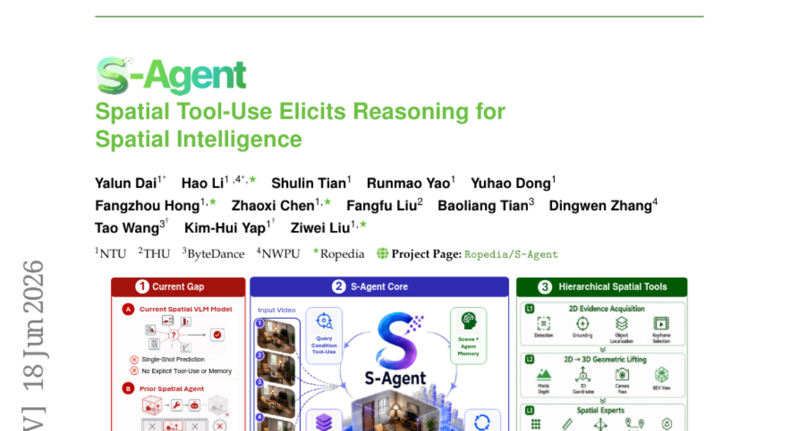

### 📌 한 줄 요약
정적 이미지 인식을 넘어 시공간적 증거 축적을 통해 3D 공간 지능을 구현하는 에이전트 프레임워크

### 🔑 핵심 포인트
- 프레임 중심 인식을 넘어선 시공간적 증거 축적(Spatio-temporal evidence accumulation) 방식 도입
- VLM(플래너)과 계층적 공간 도구(전문가)를 결합한 에이전트 구조 설계
- 장면 상태 유지를 위한 Scene Memory와 추론 맥락 유지를 위한 Agent Memory 메커니즘

### 🧑‍💻 개발자 관점
단순 이미지 캡셔닝을 넘어 로봇 제어나 디지털 트윈 등 실제 3D 환경 상호작용을 위한 에이전트 설계 패턴을 제시합니다.

### 🚀 실무 적용 아이디어
- 기존 VLM에 2D-to-3D 기하학 도구를 결합한 워크플로우 구현 테스트
- 멀티뷰 이미지 입력 시 메모리 메커니즘(Scene/Agent Memory)의 효과 검증
- S-300K와 같은 고품질 공간 추론 데이터셋을 활용한 소형 모델 SFT 실험

### ⚠️ 리스크/한계
- 도구 호출 및 기하학적 연산 과정에서의 연산 오버헤드 발생 가능성
- 복잡한 3D 환경에서 도구 간의 정합성 및 에러 누적 문제

### 📝 초록 기반 상세 설명
기존의 VLM 기반 에이전트는 정적인 프레임 단위의 관찰에 의존하여 연속적인 3D 환경에 대한 추론에 한계가 있었습니다. 이를 해결하기 위해 S-Agent는 공간 추론을 시공간적 증거를 축적하는 과정으로 재정의하는 새로운 패러다임을 제안합니다. VLM을 시맨틱 플래너로 활용하여 필요한 증거를 결정하고, 계층적 공간 도구와 전문가 모델을 통해 2D 객체를 3D 기하학적 정보로 변환 및 통합합니다. 또한 Scene Memory와 Agent Memory를 통해 변화하는 장면 상태와 추론 맥락을 유지합니다. 실험 결과, S-Agent는 별도의 학습 없이도 기존 VLM의 성능을 크게 향상시켰으며, 생성된 데이터로 SFT를 진행한 S-Agent-8B는 소형 모델임에도 강력한 성능을 입증했습니다.

---

## 6. [DF3DV-1K: A Large-Scale Dataset and Benchmark for Distractor-Free Novel View Synthesis](https://huggingface.co/papers/2604.13416)
**Upvotes**: 28 | **도입 난이도**: 하 | **신뢰도**: 상
**arXiv**: https://arxiv.org/abs/2604.13416

**태그**: Computer Vision, NeRF, 3D Gaussian Splatting, Dataset, RAG, Vision, Benchmark, Evaluation

### 📌 한 줄 요약
방해 요소(distractor)가 포함된 실제 환경에서도 깨끗한 뷰를 생성할 수 있는 대규모 벤치마크 데이터셋 DF3DV-1K 제안

### 🔑 핵심 포인트
- 1,048개 장면, 89,924장의 이미지를 포함하는 대규모 실세계 데이터셋 DF3DV-1K 구축
- 방해 요소 제거(distractor-free) 성능 평가를 위한 정교한 벤치마크 및 41개 장면의 큐레이션된 서브셋(DF3DV-41) 제공
- Diffusion 기반 2D 인핸서를 활용한 Radiance Field 품질 개선 가능성 입증

### 🧑‍💻 개발자 관점
실제 카메라로 촬영된 복잡한 환경(가구, 잡동사니 등)에서 특정 물체만 깨끗하게 렌더링해야 하는 AR/VR 및 디지털 트윈 기술 개발에 직접적인 도움을 줍니다.

### 🚀 실무 적용 아이디어
- 제공된 데이터셋을 사용하여 현재 사용 중인 NeRF/3DGS 모델의 방해 요소 제거 성능 테스트
- DF3DV-41 서브셋을 활용하여 모델의 극한 상황(challenging scenarios)에 대한 강건성 검증
- Diffusion 기반 인핸서 기법을 기존 뷰 합성 파이프라인에 결합하여 화질 개선 실험

### ⚠️ 리스크/한계
- 실제 환경의 복잡도가 높을 경우 기존 모델들의 성능 저하가 심각할 수 있음
- 데이터셋이 consumer camera 기반이므로 특수 환경(초고해상도 등)에 대한 일반화 한계 존재

### 📝 초록 기반 상세 설명
최근 Radiance Field 기술의 발전에도 불구하고, 실제 환경의 복잡한 방해 요소가 포함된 대규모 데이터셋은 부족한 실정입니다. 이를 해결하기 위해 연구진은 1,048개의 장면과 약 9만 장의 이미지를 포함하는 DF3DV-1K 데이터셋을 구축했습니다. 이 데이터셋은 깨끗한 이미지와 방해 요소가 포함된 이미지를 쌍으로 제공하여 모델의 강건성을 평가할 수 있게 합니다. 연구진은 이를 통해 기존 9가지 방법론과 3D Gaussian Splatting을 벤치마킹하여 성능을 비교했습니다. 또한, 확산 모델 기반의 2D 인핸서를 결합하여 뷰 합성 품질을 개선하는 응용 사례도 제시했습니다.

---

## 7. [Beyond Static Leaderboards: Predictive Validity for the Evaluation of LLM Agents](https://huggingface.co/papers/2606.19704)
**Upvotes**: 28 | **도입 난이도**: 중 | **신뢰도**: 상
**arXiv**: https://arxiv.org/abs/2606.19704

**태그**: LLM-Agent, Evaluation, Benchmark, OOD, Agent, RAG, Reasoning, Vision

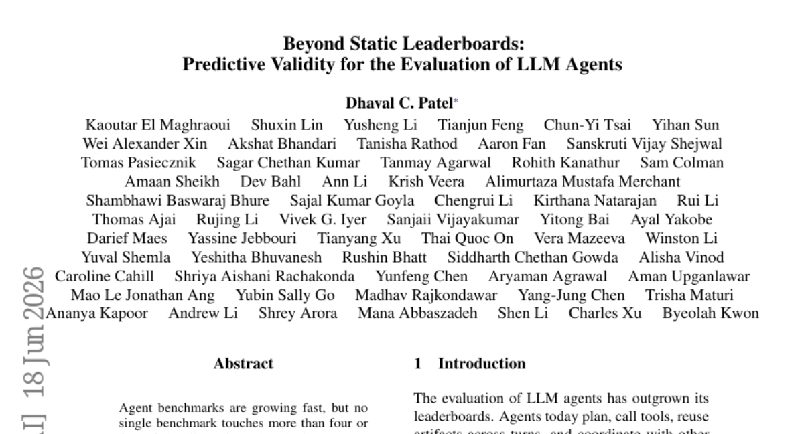

### 📌 한 줄 요약
단순 점수 합산 방식의 리더보드가 가진 예측력 한계를 지적하고, 실제 배포 환경에서의 성능을 보장하는 새로운 평가 프레임워크를 제안합니다.

### 🔑 핵심 포인트
- 단순 합산 점수 기반 리더보드의 낮은 예측 타당성(Predictive Validity) 문제 제기
- 실제 배포 환경(OOD)에서의 순위 전이성을 평가하는 새로운 랭킹 방법론 제안
- 기존 벤치마크가 간과하는 12가지 배포 관련 차원을 포함한 측정 프레임워크 구축

### 🧑‍💻 개발자 관점
에이전트를 실제 서비스에 도입할 때, 벤치마크 점수가 높다고 해서 반드시 실무 환경에서도 잘 작동한다는 보장이 없음을 경고합니다.

### 🚀 실무 적용 아이디어
- 에이전트 평가 시 단일 점수 대신 다양한 시나리오에서의 순위 안정성 테스트 수행
- 학습 데이터와 다른 분포(OOD) 환경에서의 성능 저하 폭 측정
- 에이전트의 오케스트레이션, 검색, 추론 모드 등 다차원적 성능 프로파일링

### ⚠️ 리스크/한계
- 제안된 방법론의 실증적 근거가 아직은 충분히 두껍지 않음
- 새로운 평가 프레임워크 도입 시 높은 계산 비용 및 복잡도 발생 가능성

### 📝 초록 기반 상세 설명
에이전트 벤치마크가 급증하고 있으나, 기존 벤치마크는 실제 배포 시 발생하는 다양한 차원을 충분히 반영하지 못합니다. 본 논문은 14개의 병렬 구현 연구와 7개의 기존 벤치마크를 통합 분석하여, 단순 합산 점수 기반의 리더보드가 새로운 환경(out-of-distribution)에서의 성능을 예측하지 못함을 입증합니다. 이를 해결하기 위해 단순 평균이 아닌, 샘플 내 순위와 샘플 외 순위 간의 상관관계인 '예측 타당성(Predictive Validity)'을 기준으로 하는 새로운 랭킹 구성을 제안합니다. 또한 기존 벤치마크가 놓치는 배포 관련 차원을 드러내는 12단계 측정 장치를 제시합니다. 연구 결과, 기존 방식의 순위 불안정성을 확인하였으며 차세대 에이전트 벤치마크를 위한 새로운 설계 방향을 제시합니다.

---

## 8. [FreeStyle: Free Control of Style-Content Dual-Reference Generation from Community LoRA Mining](https://huggingface.co/papers/2606.20506)
**Upvotes**: 25 | **도입 난이도**: 중 | **신뢰도**: 상
**arXiv**: https://arxiv.org/abs/2606.20506

**태그**: Generative AI, Diffusion Models, LoRA, Image Synthesis, RAG, Vision, Benchmark, Evaluation, Safety

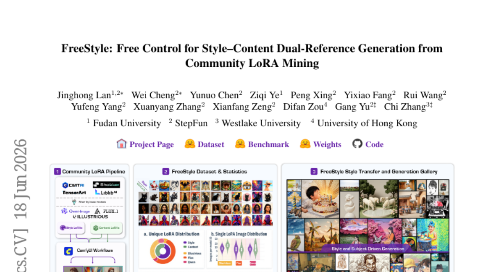

### 📌 한 줄 요약
커뮤니티 LoRA를 활용하여 스타일과 콘텐츠가 분리된 고품질 듀얼 레퍼런스 이미지 생성 프레임워크 제안

### 🔑 핵심 포인트
- 커뮤니티 LoRA 마이닝을 통한 대규모 스타일-콘텐츠 트리플릿 데이터셋 구축
- 스타일 누출 방지를 위한 어텐션 제약 및 주파수 인지형 RoPE 변조 전략 도입
- 스타일 불변 콘텐츠 정렬 점수(CAS) 및 VLM 기반 거부 점수를 포함한 새로운 벤치마크 제안

### 🧑‍💻 개발자 관점
특정 스타일을 유지하면서도 원본 이미지의 구조를 깨뜨리지 않아야 하는 디자인 자동화 및 에셋 생성 파이프라인 구축에 유용합니다.

### 🚀 실무 적용 아이디어
- 커뮤니티 LoRA 데이터셋을 활용한 데이터 파이프라인 구축 실험
- 제안된 2단계 커리큘럼 학습(Attention constraint vs RoPE modulation)의 효과 비교
- 기존 ControlNet 등과 비교하여 콘텐츠 보존력 및 스타일 전이 성능 검증

### ⚠️ 리스크/한계
- LoRA 마이닝 과정에서의 데이터 품질 편향 가능성
- 복잡한 2단계 학습 전략으로 인한 학습 안정성 및 연산 비용 문제

### 📝 초록 기반 상세 설명
스타일과 콘텐츠를 분리하여 생성하는 듀얼 레퍼런스 작업은 스타일 정보가 콘텐츠에 침투하는 '의미적 누출(semantic leakage)' 문제가 주요 과제입니다. 기존에는 정제된 대규모 스타일-콘텐츠 쌍 데이터셋이 부족하여 학습에 어려움이 있었습니다. 본 논문은 커뮤니티 LoRA를 활용해 대규모 스타일-콘텐츠 트리플릿 데이터를 구축하는 FreeStyle 프레임워크를 제안합니다. 학습 과정에서는 어텐션 수준의 제약과 주파수 인지형 RoPE 변조 전략을 통해 스타일 누출을 억제하는 2단계 커리큘럼 학습을 도입했습니다. 실험 결과, 제안된 방식은 스타일 정렬과 콘텐츠 보존 사이의 균형을 효과적으로 유지하며 우수한 성능을 보였습니다.

---

## 9. [FlowBender: Feedback-Aware Training for Self-Correcting Conditional Flows](https://huggingface.co/papers/2606.20404)
**Upvotes**: 19 | **도입 난이도**: 중 | **신뢰도**: 상
**arXiv**: https://arxiv.org/abs/2606.20404

**태그**: Generative Models, Diffusion/Flow, Self-Correction, Computer Vision, Vision, Inference, Optimization, Safety

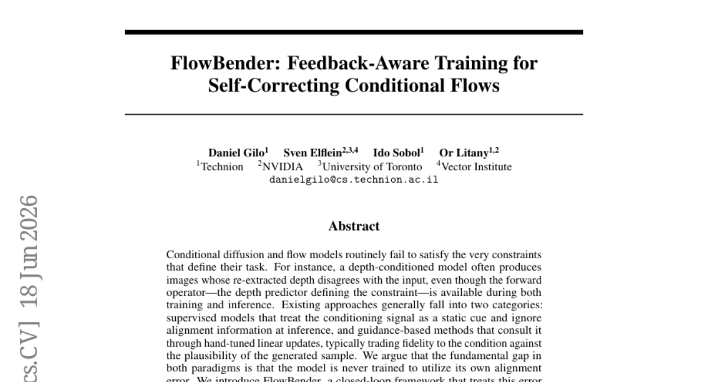

### 📌 한 줄 요약
피드백 루프를 학습 과정에 통합하여 조건부 생성 모델의 정밀도와 품질을 동시에 높이는 self-correcting 프레임워크

### 🔑 핵심 포인트
- 피드백 기반 폐쇄 루프(Closed-loop) 학습을 통한 정렬 오차의 직접적인 활용
- 미분 가능한 연산자(Gradient-based) 및 비미분 연산자(Zero-order)를 모두 지원하는 범용성
- 추론 효율성을 위한 Prior-step shortcut 도입으로 연산 비용 최소화

### 🧑‍💻 개발자 관점
제약 조건(예: 특정 깊이값, 압축 포맷)을 엄격히 지켜야 하는 생성 작업에서 품질 저하 없이 정밀도를 높일 수 있는 실용적인 방법론입니다.

### 🚀 실무 적용 아이디어
- 기존 조건부 모델의 피드백 루프 구현 가능성 검토
- 미분 불가능한 제약 조건(JPEG 등)에 대한 Zero-order variant 적용 실험
- 학습 시 피드백 신호의 노이즈 수준에 따른 수렴성 테스트

### ⚠️ 리스크/한계
- 피드백 루프 도입에 따른 추가적인 학습 비용 발생
- 피드백 신호의 정확도에 따라 생성 결과의 안정성이 좌우될 수 있음

### 📝 초록 기반 상세 설명
조건부 확산 및 플로우 모델은 입력된 제약 조건을 완벽히 준수하지 못하는 문제가 빈번히 발생합니다. 기존 방식은 조건을 정적인 힌트로만 취급하거나, 추론 시 수동 가이던스를 사용하여 품질과 정밀도 사이의 트레이드오프가 발생했습니다. 본 논문은 모델이 스스로의 정렬 오차(alignment error)를 활용하도록 학습하는 FlowBender 프레임워크를 제안합니다. 학습 과정에서 피드백을 입력으로 받아 정정 정책을 학습하며, 미분 가능한 연산자와 비미분 연산자 모두에 적용 가능한 변형 모델을 제공합니다. 실험 결과, 이미지 변환 및 3D 텍스처링 등 다양한 작업에서 기존 방식보다 높은 충실도와 타당성을 동시에 달성했습니다.

---

## 10. [JanusMesh: Fast and Zero-Shot 3D Visual Illusion Generation via Cross-Space Denoising](https://huggingface.co/papers/2606.20563)
**Upvotes**: 19 | **도입 난이도**: 중 | **신뢰도**: 상
**arXiv**: https://arxiv.org/abs/2606.20563

**태그**: 3D Generation, Diffusion Models, Computer Vision, SDF, Safety

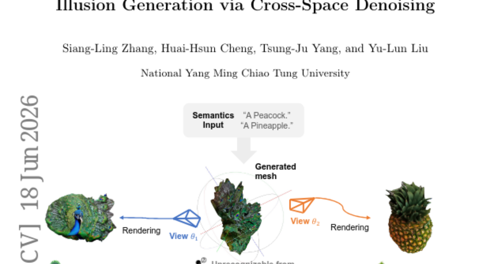

### 📌 한 줄 요약
학습 없이 3~5분 만에 서로 다른 의미를 가진 두 가지 형상을 구현하는 고품질 3D 비주얼 일루전 생성 프레임워크

### 🔑 핵심 포인트
- 학습이 필요 없는(Training-free) 고속 3D 일루전 생성 프레임워크 제안
- SDF 블렌딩과 CLIP 가이드를 결합한 크로스 스페이스 듀얼 브랜치 디노이징 기술
- 2D 확산 모델의 사전 지식을 활용한 뷰 조건부 텍스처 합성 모듈

### 🧑‍💻 개발자 관점
최적화 과정 없이 짧은 시간 내에 복잡한 기하 구조와 텍스처를 생성하므로, 3D 콘텐츠 제작 파이프라인의 효율성을 극대화할 수 있습니다.

### 🚀 실무 적용 아이디어
- 제공된 프로젝트 페이지의 데모를 통해 생성된 메쉬의 기하학적 정밀도 확인
- SDF 블렌딩 방식이 복잡한 형상에서 어떻게 심리스(seamless)한 결과를 내는지 분석
- 기존 2D 확산 모델 기반 3D 생성 기법과 비교하여 생성 속도 및 품질 벤치마킹

### ⚠️ 리스크/한계
- 복잡한 텍스처 합성 과정에서 발생할 수 있는 시점 간 불일치 가능성
- 특정 텍스트 프롬프트에 대한 기하학적 제약 조건 발생 가능성

### 📝 초록 기반 상세 설명
다양한 시점에서 서로 다른 의미를 전달하는 3D 비주얼 일루전 생성은 기존 최적화 방식의 느린 속도와 기하학적 불일치 문제로 인해 어려움이 있었습니다. 본 논문은 별도의 학습이 필요 없는 fast and training-free 프레임워크인 JanusMesh를 제안합니다. 먼저, 크로스 스페이스 듀얼 브랜치 디노이징을 통해 3D 잠재 공간을 복셀 공간으로 디코딩하여 CLIP 가이드 정렬과 SDF 블렌딩을 통한 매끄러운 기하학적 융합을 수행합니다. 이후 뷰 조건부 텍스처 합성 모듈을 통해 2D 확산 모델의 사전 지식을 융합된 기하 구조에 투영합니다. 실험 결과, 제안 방법은 3~5분 내에 높은 기하학적 무결성과 의미적 인식도를 가진 3D 일루전을 생성하며 기존 방식보다 뛰어난 효율성을 입증했습니다.

---

## 11. [ImageWAM: Do World Action Models Really Need Video Generation, or Just Image Editing?](https://huggingface.co/papers/2606.19531)
**Upvotes**: 14 | **도입 난이도**: 중 | **신뢰도**: 상
**arXiv**: https://arxiv.org/abs/2606.19531

**태그**: Robot Control, Diffusion Models, World Models, Efficiency, Vision, Video, Inference

### 📌 한 줄 요약
비디오 생성 대신 사전 학습된 이미지 편집 모델을 활용하여 연산 효율과 제어 정확도를 동시에 높인 로봇 행동 모델(WAM) 프레임워크

### 🔑 핵심 포인트
- 비디오 생성 대신 이미지 편집 모델의 사전 학습된 지식을 활용하여 동작 관련 시각적 변화에 집중
- 이미지 편집 과정의 KV 캐시를 액션 전문가 모델의 컨텍스트로 사용하여 추론 효율 극대화
- 기존 비디오 기반 WAM 대비 연산량 1/6, 지연 시간 1/4 수준으로 대폭 절감

### 🧑‍💻 개발자 관점
로봇 제어 모델에서 무거운 비디오 생성 과정을 생략하고 KV 캐시만 활용함으로써, 실시간성이 중요한 로봇 시스템에 적용 가능한 효율적인 아키텍처를 제시합니다.

### 🚀 실무 적용 아이디어
- 사전 학습된 Diffusion 기반 이미지 편집 모델의 KV 캐시 추출 로직 구현 테스트
- Flow-matching 기반 액션 헤드와 이미지 편집 모델 간의 정렬(Alignment) 실험
- 다양한 시뮬레이션 환경에서의 지연 시간 및 추론 속도 벤치마크 수행

### ⚠️ 리스크/한계
- 이미지 편집 모델의 성능에 따라 액션 예측의 정확도가 종속될 가능성
- 매우 복잡하거나 동적인 환경에서의 장기적 시각 변화 포착 능력 검증 필요

### 📝 초록 기반 상세 설명
기존의 World Action Models(WAMs)는 비디오 생성을 통해 미래를 예측하려 하지만, 과도한 연산 비용과 불필요한 디테일 생성, 장기 예측 시 발생하는 오류 등의 문제를 안고 있습니다. 본 논문은 비디오 생성 대신 이미지 편집 모델을 활용하는 ImageWAM 프레임워크를 제안합니다. 이미지 편집은 동작과 관련된 시각적 변화에만 집중하며, 작업 지시를 국소적인 시각적 변화로 매핑하는 데 유리한 사전 학습된 지식을 제공합니다. 추론 시에는 타겟 프레임을 직접 생성하지 않고, 이미지 편집 디노이징 과정에서 생성된 KV 캐시를 Flow-matching 기반 액션 전문가 모델의 컨텍스트로 활용합니다. 실험 결과, ImageWAM은 기존 VLA 및 경쟁 모델 대비 뛰어난 성능을 보이면서도 연산량(FLOPs)과 지연 시간(Latency)을 획기적으로 줄였습니다.

---

## 12. [Current World Models Lack a Persistent State Core](https://huggingface.co/papers/2606.20545)
**Upvotes**: 11 | **도입 난이도**: 중 | **신뢰도**: 상
**arXiv**: https://arxiv.org/abs/2606.20545

**태그**: World Models, Computer Vision, AI Evaluation, Physical Reasoning, Vision, Video, Benchmark, Evaluation

### 📌 한 줄 요약
현재의 월드 모델은 관찰되지 않는 상황에서도 물리적 상태가 지속되는 '내부 상태 코어'가 결여되어 있음을 증명함

### 🔑 핵심 포인트
- 관찰되지 않는 상태에서도 물리적 사건이 지속되는 '지속적 상태 코어'의 부재 확인
- 카메라 움직임을 개입(Intervention)으로 간주하여 관찰성 변화를 측정하는 WRBench 도입
- 모델 규모(Scale)나 기하학적 사전 지식만으로는 해결되지 않는 근본적 한계 규명

### 🧑‍💻 개발자 관점
단순히 다음 프레임을 잘 생성하는 것을 넘어, 에이전트가 물리적 인과관계를 이해하고 장기적인 계획을 세우기 위한 핵심 과제를 제시함

### 🚀 실무 적용 아이디어
- 현재 개발 중인 비디오 생성 모델에 WRBench를 적용하여 상태 지속성 테스트
- 관찰 중단(Occlusion) 상황에서의 객체 상태 변화(State transition) 추적 실험
- 단순 픽셀 일관성이 아닌 인과적 상태 유지 여부를 평가 지표에 포함

### ⚠️ 리스크/한계
- 현재의 스케일업 중심 학습 방식으로는 해결이 어려울 수 있음
- 물리적 인과관계와 시각적 일관성을 분리하여 평가하는 새로운 아키텍처 설계 필요

### 📝 초록 기반 상세 설명
AGI로 향하는 핵심 기술인 월드 모델은 물리적 세계의 지속적인 상태 변화를 모델링할 수 있어야 합니다. 그러나 기존 벤치마크는 시각적 충실도에만 집중할 뿐, 관찰이 중단되었을 때 세계가 어떻게 진화하는지는 평가하지 못하는 한계가 있습니다. 이를 해결하기 위해 카메라 움직임을 관찰성 변화로 정의하고, 관찰 중단 후 재관찰 시 상태 일관성을 측정하는 WRBench를 제안합니다. 23개 모델을 대상으로 실험한 결과, 현재의 모델들은 관찰되지 않는 동안 사건이 진행되는 것이 아니라 단순히 이전 상태를 유지하는 '트래킹 샷' 방식에 머물러 있음이 밝혀졌습니다. 이러한 문제는 모델 규모나 제어 방식과 무관하게 나타나며, 이는 단순한 스케일업만으로는 해결될 수 없는 근본적인 설계 결함임을 시사합니다.

---

## 13. [ENPIRE: Agentic Robot Policy Self-Improvement in the Real World](https://huggingface.co/papers/2606.19980)
**Upvotes**: 10 | **도입 난이도**: 상 | **신뢰도**: 상
**arXiv**: https://arxiv.org/abs/2606.19980

**태그**: Agentic Workflow, Robotics, Automated ML, Closed-loop Control, Agent, Vision, Evaluation

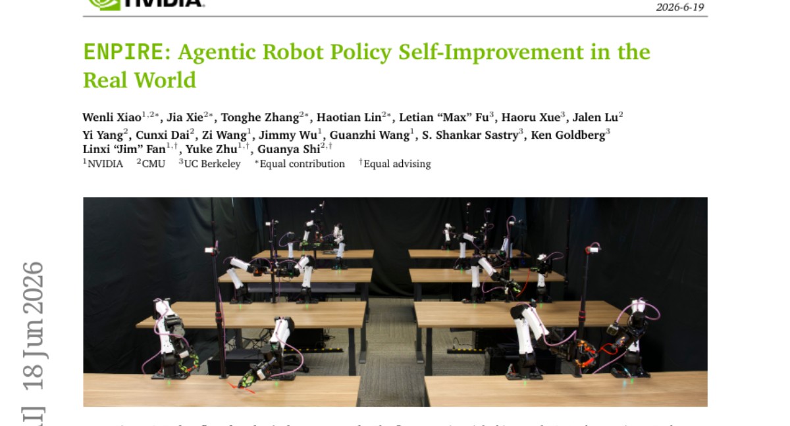

### 📌 한 줄 요약
코딩 에이전트가 물리적 환경의 피드백을 통해 스스로 로봇 제어 알고리즘을 개선하는 폐쇄 루프(Closed-loop) 프레임워크 제안

### 🔑 핵심 포인트
- 물리적 피드백 루프(Reset-Execute-Verify-Refine)를 자동화하는 ENPIRE 프레임워크 개발
- 코딩 에이전트가 로그 분석 및 문헌 조사를 통해 알고리즘과 학습 인프라를 직접 개선하는 Evolution 모듈 도입
- 멀티 로봇 환경에서 에이전트 팀을 운용하여 학습 속도를 가속화하는 확장성 확보

### 🧑‍💻 개발자 관점
로봇 제어 알고리즘 개발 시 반복되는 실험-수정 과정을 자동화하여 엔지니어의 수동 개입을 획기적으로 줄일 수 있는 방법론을 제시합니다.

### 🚀 실무 적용 아이디어
- 에이전트가 생성한 코드가 물리적 하드웨어의 안전 가이드라인을 준수하는지 검증하는 샌드박스 구축
- 실제 로봇 환경과 유사한 시뮬레이션 환경에서 ENPIRE의 피드백 루프 성능 테스트
- 실패 로그를 기반으로 에이전트가 하이퍼파라미터를 조정하는 로직의 유효성 검증

### ⚠️ 리스크/한계
- 물리적 환경의 불확실성 및 하드웨어 마모로 인한 피드백 노이즈 발생 가능성
- 에이전트가 생성한 코드가 하드웨어에 물리적 손상을 줄 수 있는 위험성

### 📝 초록 기반 상세 설명
로봇의 정교한 조작 기술은 여전히 인간의 개입과 알고리즘 엔지니어링에 크게 의존하고 있어 범용 물리 지능 구현의 병목이 되고 있습니다. 기존 코딩 에이전트는 디지털 환경에 국한되어 있어, 실제 물리 환경에서의 반복적인 실험과 개선 루프를 자동화하는 것이 필수적입니다. 본 논문은 환경 리셋, 정책 실행, 결과 검증, 알고리즘 개선이 유기적으로 연결된 ENPIRE 프레임워크를 소개합니다. 이 시스템은 코딩 에이전트가 로그 분석과 문헌 조사를 통해 스스로 학습 인프라와 코드를 수정하며 정책을 최적화하도록 설계되었습니다. 실험 결과, 에이전트는 핀 박스 정리나 도구 사용과 같은 고난도 작업에서 99%의 성공률을 달하는 정책을 자율적으로 학습했습니다. 이는 로봇 연구 프로세스를 자동화 가능한 최적화 문제로 전환하여 인간의 개입을 최소화할 수 있음을 보여줍니다.

---

## 14. [FAPO: Fully Autonomous Prompt Optimization of Multi-Step LLM Pipelines](https://huggingface.co/papers/2606.19605)
**Upvotes**: 10 | **도입 난이도**: 중 | **신뢰도**: 상
**arXiv**: https://arxiv.org/abs/2606.19605

**태그**: LLM-Agent, Prompt-Engineering, Pipeline-Optimization, Automation, RAG, Reasoning, Benchmark, Evaluation

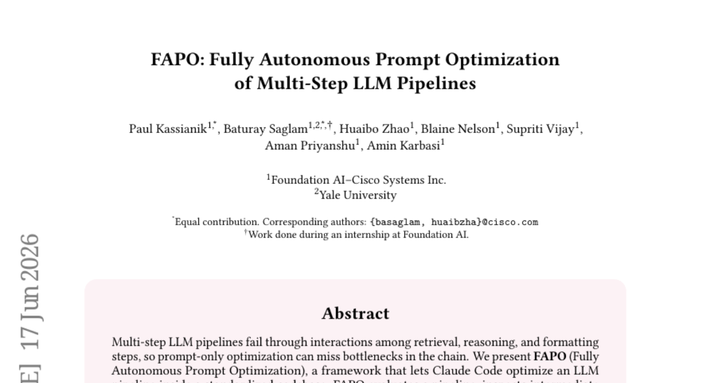

### 📌 한 줄 요약
프롬프트 수정부터 파이프라인 구조 변경까지 자동 수행하는 자율형 LLM 파이프라인 최적화 프레임워크

### 🔑 핵심 포인트
- 프롬프트 수정과 구조적 변경을 결합한 계층적 자율 최적화 전략
- 중간 단계 검사 및 실패 진단을 통한 정밀한 병목 지점 식별
- 일반 작업 및 보안 작업(CVE-to-CWE 등) 모두에서 검증된 높은 성능

### 🧑‍💻 개발자 관점
단순히 프롬프트를 고치는 것을 넘어, 복잡한 LLM 워크플로우의 구조적 결함을 자동 탐지하고 수정할 수 있는 자동화된 엔지니어링 방법론을 제시합니다.

### 🚀 실무 적용 아이디어
- 현재 운영 중인 멀티스텝 LLM 파이프라인의 중간 단계 로그를 수집하여 병목 지점 분석하기
- 프롬프트 최적화만으로 해결되지 않는 작업에 대해 구조적 변경(Chain-of-Thought 등) 적용 실험하기
- FAPO의 진단 로직을 벤치마킹하여 자체 파이프라인 디버깅 툴 구축하기

### ⚠️ 리스크/한계
- 구조적 변경 시 의도치 않은 사이드 이펙트나 비용 증가 가능성
- 최적화 과정에서 발생하는 반복적인 호출로 인한 API 비용 및 시간 소모

### 📝 초록 기반 상세 설명
멀티스텝 LLM 파이프라인은 검색, 추론, 포맷팅 단계 간의 상호작용으로 인해 병목 현상이 발생하기 쉽습니다. 기존의 프롬프트 중심 최적화는 이러한 구조적 문제를 해결하는 데 한계가 있습니다. 이를 해결하기 위해 FAPO는 코드베이스 내에서 파이프라인을 평가, 진단, 수정 및 검증하는 자율 최적화 프레임워크를 제안합니다. FAPO는 먼저 프롬프트를 수정하고, 필요 시 구조적 병목을 식별하여 체인 구조까지 변경하는 계층적 접근 방식을 취합니다. 실험 결과, FAPO는 다양한 벤치마크에서 기존 GEPA 방식보다 우수한 성능을 보였으며 특히 구조적 변경이 필요한 복잡한 작업에서 압도적인 성능 향상을 기록했습니다.

---

## 15. [Context-Aware RL for Agentic and Multimodal LLMs](https://huggingface.co/papers/2606.17053)
**Upvotes**: 10 | **도입 난이도**: 중 | **신뢰도**: 상
**arXiv**: https://arxiv.org/abs/2606.17053

**태그**: Agent, Reinforcement Learning, Multimodal, Reasoning, RAG, Vision, Benchmark

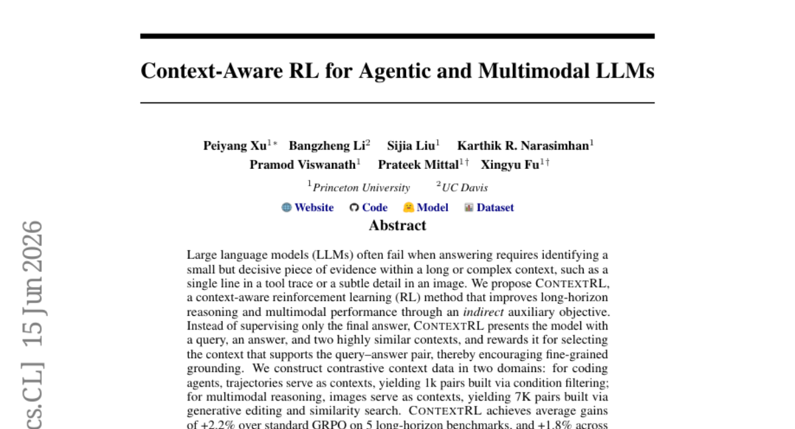

### 📌 한 줄 요약
복잡한 컨텍스트 내 미세한 증거를 찾는 능력을 강화하기 위해 '컨텍스트 선택'을 보상으로 활용하는 새로운 RL 방법론 제안

### 🔑 핵심 포인트
- 간접적 보상 설계를 통한 미세한 근거 탐색(Fine-grained grounding) 능력 강화
- 코딩 트레이스 및 이미지 편집을 활용한 대조적 컨텍스트 데이터 구축
- 단순 데이터 증강과 차별화되는 컨텍스트 선택 목적 함수(Objective)의 효과 입증

### 🧑‍💻 개발자 관점
에이전트가 긴 로그나 복잡한 이미지 속에서 핵심 정보를 놓치는 문제를 해결할 수 있는 RL 학습 전략을 제공합니다.

### 🚀 실무 적용 아이디어
- 에이전트의 작업 로그(Trace)를 활용한 대조적 데이터셋 구축 실험
- 기존 RL 알고리즘에 '컨텍스트 선택' 보상 항을 추가하여 성능 변화 관찰
- RAG 시스템의 검색 결과 정합성 향상을 위한 학습 데이터로 변형 적용

### ⚠️ 리스크/한계
- 데이터 생성 과정(Generative editing 등)의 품질이 모델 성능에 의존적일 수 있음
- 특정 도메인에 특화된 보상 설계가 일반적인 추론 능력에 미칠 영향 확인 필요

### 📝 초록 기반 상세 설명
LLM은 긴 컨텍스트나 멀티모달 데이터 내의 결정적인 단서를 찾는 데 어려움을 겪는 경우가 많습니다. 이를 해결하기 위해 최종 정답뿐만 아니라, 정답을 뒷받침하는 올바른 컨텍스트를 선택하도록 유도하는 ContextRL 방식을 제안합니다. 연구진은 코딩 에이전트의 트레이스 데이터와 멀티모달 이미지 데이터를 활용해 대조적 컨텍스트 데이터셋을 구축했습니다. 실험 결과, 제안된 방식은 기존 GRPO 대비 롱-호라이즌 추론 및 시각적 질의응답 성능을 모두 향상시켰습니다. 특히 단순 데이터 증강이 아닌, 컨텍스트 선택이라는 보상 설계 자체가 성능 향상의 핵심임을 입증했습니다.

---

## 16. [Thinking with Visual Grounding](https://huggingface.co/papers/2606.16122)
**Upvotes**: 10 | **도입 난이도**: 상 | **신뢰도**: 상
**arXiv**: https://arxiv.org/abs/2606.16122

**태그**: VLM, Reasoning, Reinforcement Learning, Object Grounding, Agent, Vision, Benchmark, Distillation

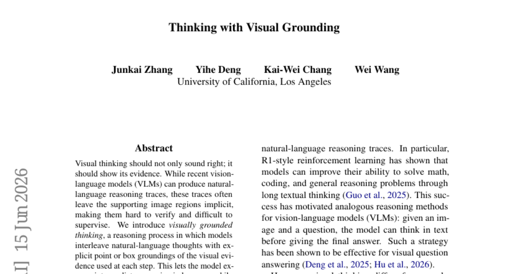

### 📌 한 줄 요약
추론 과정에서 텍스트와 시각적 근거(Point/Box)를 결합하여 모델의 논리적 검증 가능성과 성능을 높이는 새로운 시각적 사고 방식 제안

### 🔑 핵심 포인트
- 텍스트 추론과 시각적 근거(Point/Box)를 교차 배치하는 새로운 추론 프레임워크 제안
- SAM3 기반의 합성 데이터 파이프라인을 통한 대규모 시각적 추론 데이터 구축
- 정답 정확도와 시각적 근거 일치도를 결합한 강화학습(Grounding-aware RL) 기법 도입

### 🧑‍💻 개발자 관점
모델의 추론 과정이 이미지의 어느 부분에 기반하는지 명시하므로, 결과의 신뢰성을 높이고 디버깅 및 검증이 용이한 AI 에이전트 개발이 가능합니다.

### 🚀 실무 적용 아이디어
- SAM과 같은 세그멘테이션 모델을 활용한 데이터 합성 파이프라인 구축 테스트
- RLHF 과정에서 텍스트 정답 외에 시각적 근거(Grounding) 보상 함수 설계 실험
- 소형 모델(SLM)에 시각적 근거 학습을 적용하여 성능 향상 폭 확인

### ⚠️ 리스크/한계
- 데이터 합성 과정에서의 오류가 모델의 잘못된 추론 습관으로 이어질 위험
- 추론 단계마다 시각적 근거를 생성해야 하므로 추론 시간(Latency) 증가 가능성

### 📝 초록 기반 상세 설명
최근 VLM은 자연어 추론을 생성하지만, 추론의 근거가 되는 이미지 영역이 명시되지 않아 검증과 감독이 어렵다는 문제가 있습니다. 이를 해결하기 위해 텍스트 추론과 함께 이미지 내 객체를 점(Point)이나 박스(Box)로 명시하는 '시각적 근거 기반 사고(Visually Grounded Thinking)' 방식을 도입했습니다. 학습을 위해 SAM3 기반 에이전트를 활용한 확장 가능한 합성 데이터 파이프라인과, 정답 여부와 근거 일치도를 동시에 고려하는 'Grounding-aware RL'을 제안했습니다. 실험 결과, Gemma3-4B 모델에 이 방식을 적용했을 때 카운팅 및 공간 추론 벤치마크에서 기존 모델 및 비-근거 모델보다 뛰어난 성능을 보였습니다. 특히 공간 추론 작업에서 소형 모델이 더 큰 모델의 성능을 상회하는 결과를 나타냈습니다.

---

## 17. [LedgerAgent: Structured State for Policy-Adherent Tool-Calling Agents](https://huggingface.co/papers/2606.20529)
**Upvotes**: 6 | **도입 난이도**: 하 | **신뢰도**: 상
**arXiv**: https://arxiv.org/abs/2606.20529

**태그**: AI Agent, Tool-Calling, State Management, Policy Compliance, Agent, RAG, Inference

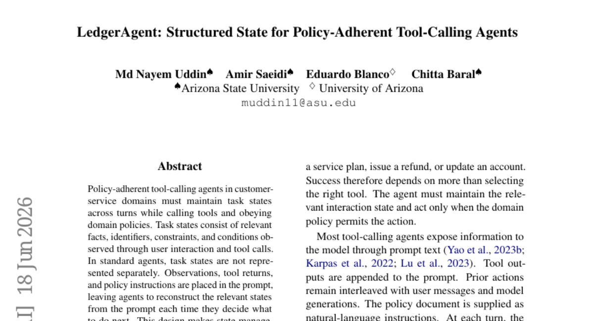

### 📌 한 줄 요약
에이전트의 상태 관리를 별도 장부(Ledger)로 분리하여 정책 위반과 정보 오류를 방지하는 추론 프레임워크

### 🔑 핵심 포인트
- 상태 관리의 명시적 분리: 프롬프트 의존도를 낮추고 별도의 Ledger를 통해 작업 상태(사실, 식별자, 제약 조건 등)를 관리
- 정책 준수 검증: 환경 변화를 일으키는 도구 호출 전, Ledger를 기반으로 정책 위반 여부를 사전에 체크
- 추론 시점 최적화: 별도의 학습 없이 추론 단계에서 적용 가능한 방법론으로 일관성 있는 결과 도출

### 🧑‍💻 개발자 관점
에이전트가 대화가 길어질수록 이전 정보를 잊거나 잘못된 상태를 참조하는 문제를 구조적으로 해결할 수 있는 설계 패턴을 제시합니다.

### 🚀 실무 적용 아이디어
- 현재 운영 중인 에이전트의 상태 정보(ID, 제약사항 등)를 별도 구조체로 추출하여 프롬프트에 주입하는 실험
- 도구 호출 직전 단계에 'Policy Checker' 로직을 Ledger 기반으로 구현하여 테스트
- 대화 맥락이 길어질 때 기존 프롬프트 방식과 Ledger 방식의 일관성 차이 비교

### ⚠️ 리스크/한계
- 상태 정보가 복잡해질 경우 Ledger 관리 및 프롬프트 렌더링 비용 증가 가능성
- Ledger 자체의 정보 업데이트 로직이 잘못될 경우 잘못된 상태가 고착될 위험

### 📝 초록 기반 상세 설명
고객 서비스 도메인의 에이전트는 대화 과정에서 복잡한 작업 상태를 유지하며 도메인 정책을 준수해야 합니다. 기존 방식은 모든 정보를 프롬프트에 포함하여 에이전트가 매번 상태를 재구성하게 함으로써, 잘못된 정보 참조나 정책 위반 문제를 야기합니다. 이를 해결하기 위해 본 논문은 관찰된 상태를 별도의 'Ledger'에 기록하고 이를 프롬프트에 렌더링하는 LedgerAgent를 제안합니다. Ledger는 도구 호출 전 정책 제약 조건을 검증하는 역할도 수행하여 잘못된 실행을 차단합니다. 실험 결과, 다양한 도메인과 모델 환경에서 기존 프롬프트 방식보다 높은 성공률(passk)을 기록하며 성능 향상을 입증했습니다.

---

## 18. [Rethinking Shrinkage Bias in LLM FP4 Pretraining: Geometric Origin, Systemic Impact, and UFP4 Recipe](https://huggingface.co/papers/2606.20381)
**Upvotes**: 6 | **도입 난이도**: 중 | **신뢰도**: 상
**arXiv**: https://arxiv.org/abs/2606.20381

**태그**: LLM Pretraining, Quantization, FP4, Numerical Stability, Optimization

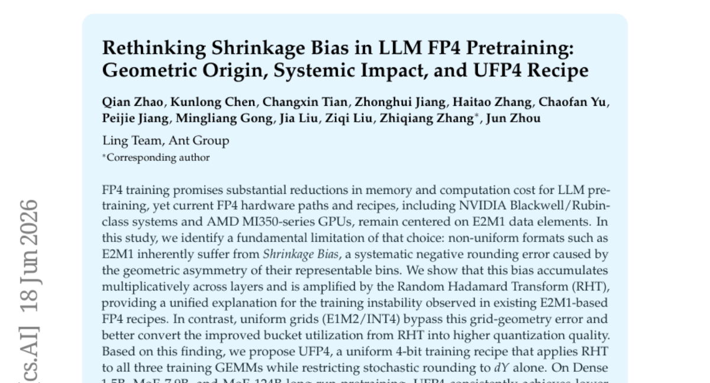

### 📌 한 줄 요약
FP4 정밀도 학습 시 발생하는 수치적 편향(Shrinkage Bias)의 원인을 규명하고, 이를 해결하기 위한 균일 그리드 기반의 UFP4 학습 레시피를 제안함

### 🔑 핵심 포인트
- E2M1 포맷의 기하학적 비대칭성으로 인한 'Shrinkage Bias' 현상 규명
- 비균일 포맷이 RHT와 결합할 때 발생하는 수치적 불안정성 원인 분석
- 균일 그리드(E1M2/INT4) 기반의 UFP4 학습 레시피 제안 및 성능 검증

### 🧑‍💻 개발자 관점
차세대 저정밀도(4-bit) 하드웨어 가속기를 활용한 LLM 학습 시, 단순한 포맷 적용을 넘어 수치적 안정성을 확보하기 위한 최적의 데이터 포맷과 학습 전략을 제시합니다.

### 🚀 실무 적용 아이디어
- 현재 사용 중인 FP4 기반 학습 워크로드에 RHT 적용 시 발생하는 수치적 변화 관찰
- E2M1과 E1M2/INT4 포맷 간의 학습 안정성 및 수렴 속도 비교 실험
- 모델 규모별(Dense vs MoE) 저정밀도 학습 시의 Loss 변화 추이 분석

### ⚠️ 리스크/한계
- 하드웨어 수준에서 E1M2/INT4 포맷 지원이 선행되어야 실질적인 이득을 얻을 수 있음
- 매우 큰 규모의 모델에서 저정밀도 학습 시의 장기적인 수렴 안정성에 대한 추가 검증 필요

### 📝 초록 기반 상세 설명
LLM 사전 학습 시 메모리 및 연산 비용 절감을 위해 FP4 형식을 활용하려는 시도가 늘고 있으나, 현재의 E2M1 중심 방식은 수치적 불안정성을 야기합니다. 연구진은 E2M1과 같은 비균일 포맷이 기하학적 비대칭성으로 인해 발생하는 'Shrinkage Bias(수축 편향)'가 층을 거치며 누적된다는 점을 발견했습니다. 이러한 편향은 RHT(Random Hadamard Transform)와 결합할 때 더욱 증폭되어 학습 불안정성을 초래합니다. 이를 해결하기 위해 균일한 그리드를 사용하는 E1M2/INT4 방식이 더 효과적임을 입증하고, RHT를 활용하면서도 편향을 최소화하는 UFP4 레시피를 제안합니다. 실험 결과, UFP4는 대규모 MoE 모델을 포함한 다양한 규모의 사전 학습에서 기존 E2M1 방식보다 낮은 손실(loss)을 기록하며 우수한 성능을 보였습니다.

---

## 19. [HumanScale: Egocentric Human Video Can Outperform Real-Robot Data for Embodied Pretraining](https://huggingface.co/papers/2606.20521)
**Upvotes**: 6 | **도입 난이도**: 중 | **신뢰도**: 상
**arXiv**: https://arxiv.org/abs/2606.20521

**태그**: Embodied AI, Foundation Models, Egocentric Vision, Robot Learning, RAG, Vision, Video, Safety

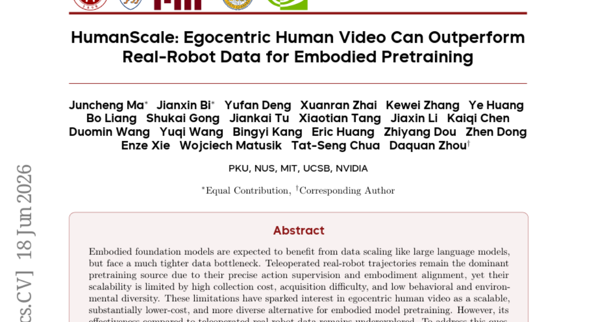

### 📌 한 줄 요약
에고센트릭(Egocentric) 인간 영상 데이터가 정밀한 로봇 데이터보다 더 효율적인 임바디드(Embodied) 사전 학습 소스가 될 수 있음을 입증함

### 🔑 핵심 포인트
- 에고센트릭 인간 영상이 로봇 데이터의 스케일링 문제를 해결할 수 있는 강력한 대안임을 입증
- 정교한 필터링/라벨링을 통해 에고센트릭 데이터가 로봇 데이터보다 높은 일반화 성능을 가질 수 있음을 확인
- 에고센트릭 사전 학습 후 소량의 로봇 데이터로 미세 조정(Fine-tuning)하는 효율적인 학습 워크플로우 제안

### 🧑‍💻 개발자 관점
고비용의 로봇 데이터 수집 대신 대규모 인간 영상 데이터를 활용하여 강력한 월드 모델을 구축할 수 있는 전략적 방향성을 제공합니다.

### 🚀 실무 적용 아이디어
- 기존 로봇 데이터셋과 공개된 에고센트릭 데이터셋(Ego4D 등) 간의 성능 비교 실험
- 에고센트릭 영상에서 로봇 액션을 추출하기 위한 필터링 및 라벨링 파이프라인 설계
- 사전 학습된 비전 모델을 실제 로봇 제어 태스크로 전이 학습(Transfer Learning)하는 실험

### ⚠️ 리스크/한계
- 인간의 움직임과 로봇의 액션 공간 간의 차이(Embodiment Gap)로 인한 정렬 문제
- 데이터 필터링 및 라벨링 파이프라인의 설계 난이도와 품질 의존성

### 📝 초록 기반 상세 설명
임바디드 파운데이션 모델의 발전을 위해서는 데이터 스케일링이 필수적이지만, 기존의 텔레오퍼레이션 기반 로봇 데이터는 수집 비용과 다양성 측면에서 한계가 있습니다. 이에 연구진은 대안으로 에고센트릭 인간 영상을 활용한 사전 학습의 효과를 체계적으로 비교 분석했습니다. 실험 결과, 정교한 필터링 및 라벨링 파이프라인을 거친 에고센트릭 데이터는 동일 데이터 양 대비 로봇 작업 성공률에서 압도적인 성능을 보였습니다. 특히 분포 외(OOD) 작업에서도 높은 성공률을 기록하며 데이터의 범용성을 증명했습니다. 결론적으로 에고센트릭 영상으로 세계 모델을 학습시킨 후, 소량의 로봇 데이터로 액션 공간을 정렬하는 새로운 학습 패러다임을 제시합니다.

---

## 20. [Freeing the Law with LOCUS: A Local Ordinance Corpus for the United States](https://huggingface.co/papers/2606.19334)
**Upvotes**: 6 | **도입 난이도**: 하 | **신뢰도**: 상
**arXiv**: https://arxiv.org/abs/2606.19334

**태그**: Dataset, NLP, Legal-AI, OCR, RAG

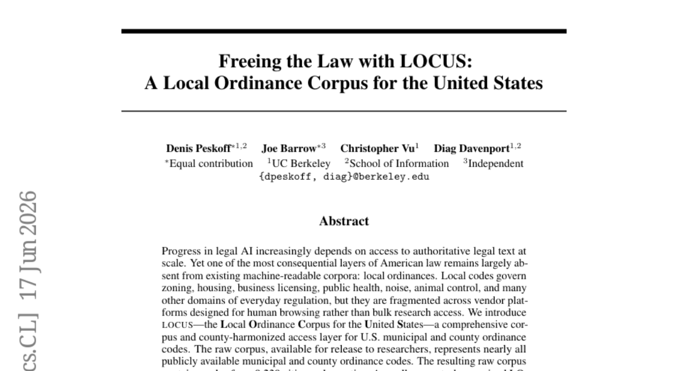

### 📌 한 줄 요약
미국 전역의 지방 조례 데이터를 수집·정형화하여 법률 AI 연구의 사각지대를 해소한 대규모 코퍼스 및 모델 공개

### 🔑 핵심 포인트
- 9,239개 시·군 조례를 포함하는 대규모 미국 지방 조례 코퍼스(LOCUS) 구축
- OCR을 통한 비정형 문서의 기계 판독 가능한 데이터로의 변환 및 정형화
- ModernBERT 기반 분류기를 통한 조례 특성(불투명성 등) 분석 모델 제공

### 🧑‍💻 개발자 관점
파편화된 비정형 법률 데이터를 정형화된 데이터셋으로 확보함으로써, 특정 지역 맞춤형 법률 RAG 시스템이나 규제 준수(Compliance) 자동화 모델 개발이 가능해집니다.

### 🚀 실무 적용 아이디어
- HuggingFace에서 LOCUS 데이터셋을 다운로드하여 데이터 품질 확인
- 제공된 ModernBERT 모델을 활용하여 특정 지역 조례의 특성 분석 실험
- RAG 파이프라인에 LOCUS 데이터를 주입하여 법률 질의응답 성능 테스트

### ⚠️ 리스크/한계
- OCR 기반 데이터이므로 원본 문서의 품질에 따른 노이즈 존재 가능성
- 미국 법률에 특화되어 있어 타 국가 법률 적용 시 도메인 적응 필요

### 📝 초록 기반 상세 설명
법률 AI의 발전은 신뢰할 수 있는 텍스트 데이터에 의존하지만, 일상생활과 밀접한 지방 조례는 파편화된 플랫폼에 갇혀 있어 대규모 연구에 활용하기 어려웠습니다. 이를 해결하기 위해 연구진은 미국 내 9,239개 시·군 조례를 포함하는 대규모 코퍼스인 LOCUS를 구축했습니다. OCR 기술을 활용해 다양한 문서 형식을 처리하고, 인구 대다수를 커버하는 2,309개 카운티 규모의 정형화된 데이터 레이어를 제공합니다. 또한 ModernBERT 기반의 분류기를 학습시켜 조례의 불투명성이나 온정주의와 같은 복잡한 차원을 분석할 수 있도록 했습니다. 이 코퍼스와 모델은 연구 재현성과 향후 법률 AI 연구 확장을 위해 공개되었습니다.

---

## 21. [Understanding the Behaviors of Environment-aware Information Retrieval](https://huggingface.co/papers/2606.16817)
**Upvotes**: 6 | **도입 난이도**: 상 | **신뢰도**: 상
**arXiv**: https://arxiv.org/abs/2606.16817

**태그**: RAG, LLM, Reinforcement Learning, Information Retrieval, Evaluation

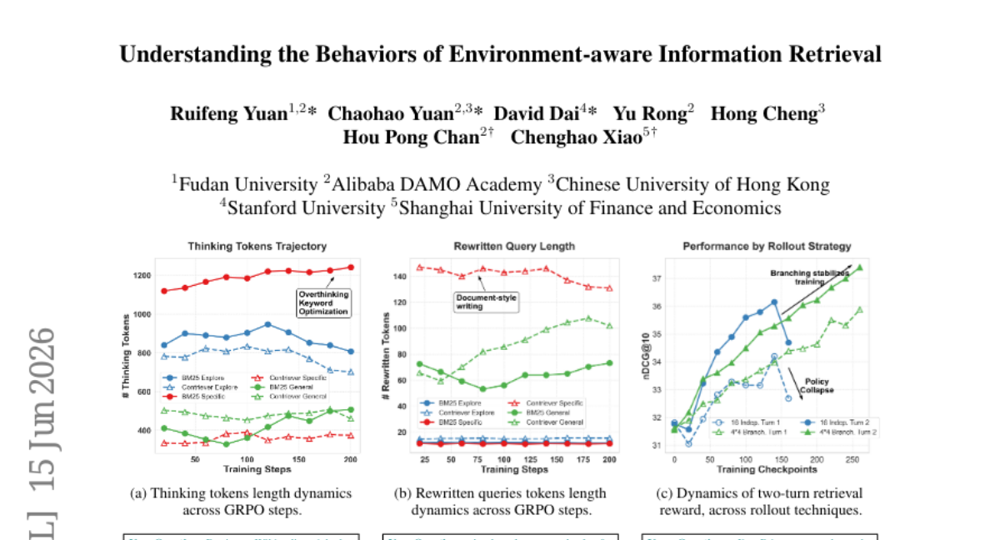

### 📌 한 줄 요약
리트리버의 특성에 맞춰 LLM의 쿼리 생성 전략을 최적화하는 강화학습 기반의 RAG 성능 향상 방법론

### 🔑 핵심 포인트
- 리트리버별로 최적의 쿼리 스타일이 상이함을 최초로 체계적 분석
- 강화학습(RL)을 통해 LLM이 리트리버 특성에 맞게 쿼리를 생성하도록 학습
- 학습 안정성을 위한 분기 기반 롤아웃(branching-based rollout) 기법 제안

### 🧑‍💻 개발자 관점
단일 쿼리 생성 방식이 아닌, 사용하는 임베딩 모델이나 검색 엔진의 특성에 맞춘 동적 쿼리 최적화가 RAG 성능의 핵심임을 시사합니다.

### 🚀 실무 적용 아이디어
- 현재 사용 중인 리트리버(Dense vs Sparse)에 따른 쿼리 스타일 변화 관찰
- RL 기반의 쿼리 최적화 파이프라인 도입 가능성 검토
- 다양한 리트리버를 교체하며 사용할 경우를 대비한 적응형 쿼리 생성 모듈 설계

### ⚠️ 리스크/한계
- 강화학습 도입 시 높은 계산 비용 및 학습 복잡도 발생
- 특정 리트리버에 과적합(overfitting)될 경우 범용성 저하 우려

### 📝 초록 기반 상세 설명
최근 RAG 기술이 발전하고 있으나, 리트리버의 종류에 따라 최적의 쿼리 생성 전략이 다르다는 점은 간과되어 왔습니다. 본 연구는 LLM이 특정 리트리버의 특성에 맞춰 쿼리 스타일을 학습할 수 있도록 강화학습(RL)을 적용하는 체계적인 분석을 수행합니다. 실험 결과, 리트리버마다 최적의 쿼리 스타일(예: 서술형 vs 질문형)이 다르며, 한 리트리버에 학습된 전략이 다른 리트리버에는 효과적이지 않음을 발견했습니다. 이를 위해 학습 안정성을 높이는 분기 기반 롤아웃(branching-based rollout) 기법을 도입하였으며, 모델 크기 확장과 인간의 가이드를 통해 성능을 더욱 향식할 수 있음을 입증했습니다. 결과적으로 리트리버 인지형(retriever-aware) RAG 시스템 구축을 위한 실질적인 통찰을 제공합니다.

---

## 22. [Holo-World: Unified Camera, Object and Weather Control for Video World Model](https://huggingface.co/papers/2606.20083)
**Upvotes**: 5 | **도입 난이도**: 상 | **신뢰도**: 상
**arXiv**: https://arxiv.org/abs/2606.20083

**태그**: Video Generation, World Model, Controllable AI, Computer Vision, Vision, Video

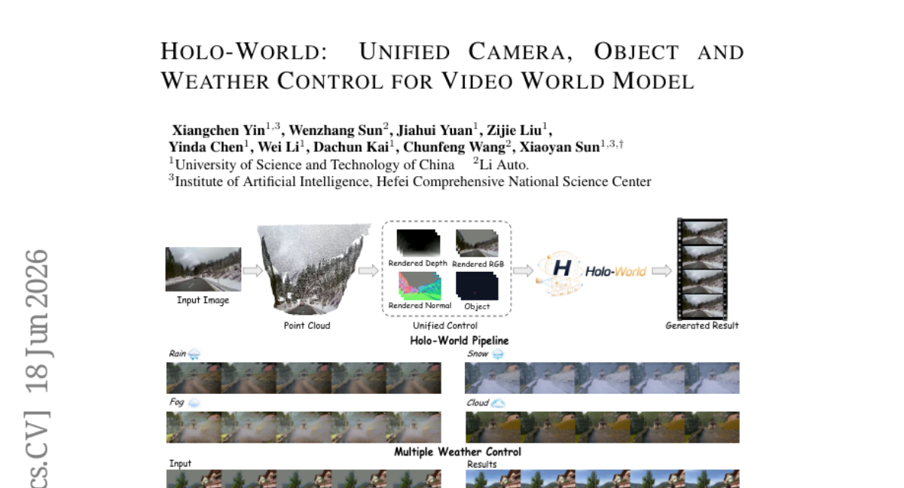

### 📌 한 줄 요약
단일 이미지로부터 카메라, 객체 움직임, 날씨 변화를 동시에 제어하여 일관된 비디오를 생성하는 통합 월드 모델

### 🔑 핵심 포인트
- HoloStateData: 카메라, 객체, 날씨 제어를 위한 통합 상태 비디오 데이터셋 구축
- Unified Scene Adapter: 배경/기하학 버퍼와 객체 제어를 분리하여 구조적 일관성 유지
- Scene-Weather Decomposed CFG: 장면 구조와 날씨 효과를 분리 가이드하여 제어 정밀도 향상

### 🧑‍💻 개발자 관점
단일 이미지로 정교한 카메라 워킹과 날씨 변화가 포함된 고품질 비디오를 생성할 수 있어, 게임 에셋 제작 및 시각 효과(VFX) 파이프라인 자동화에 유용합니다.

### 🚀 실무 적용 아이디어
- 제공된 데이터셋 구조를 활용한 커스텀 환경 제어 학습 실험
- Unified Scene Adapter의 파라미터 분리 효율성 검증
- 기존 비디오 편집 모델과의 제어 정밀도 비교 테스트

### ⚠️ 리스크/한계
- 복잡한 기하학적 구조를 가진 장면에서의 구조 유지 한계 가능성
- 고해상도 비디오 생성 시 연산 비용 및 학습 데이터 요구량 문제

### 📝 초록 기반 상세 설명
기존 비디오 월드 모델은 카메라 및 객체 제어와 환경(날씨) 변화가 분리되어 있으며, 날씨 생성 시 미래 구조에 의존하는 한계가 있었습니다. 본 논문은 단일 프레임에서 시작하여 카메라, 객체, 날씨를 동시에 제어하는 'source-to-state' 설정을 제안합니다. 이를 위해 다양한 비디오를 통합 제어 샘플로 변환한 HoloStateData 데이터셋을 구축했습니다. 모델 구조로는 구조 유지와 날씨 전이를 분리하는 Unified Scene Adapter와 잔차를 개별 제어하는 Scene-Weather Decomposed CFG를 도입했습니다. 실험 결과, Holo-World는 장면 구조의 일관성을 유지하면서도 정밀한 제어와 자연스러운 날씨 변화를 동시에 달성했습니다.

---

## 23. [Configurable Clinical Information Extraction with Agentic RAG: What Works, What Breaks, and Why](https://huggingface.co/papers/2606.19602)
**Upvotes**: 5 | **도입 난이도**: 상 | **신뢰도**: 상
**arXiv**: https://arxiv.org/abs/2606.19602

**태그**: Agentic RAG, Information Extraction, Clinical AI, Reasoning, Agent, RAG, Evaluation

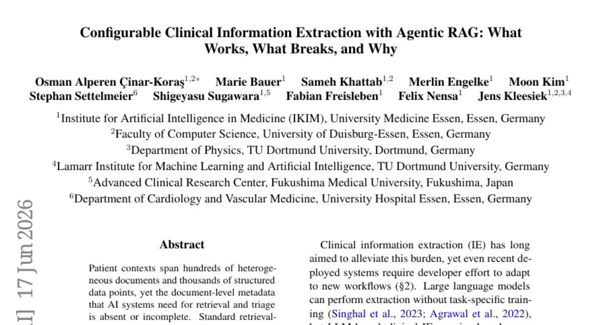

### 📌 한 줄 요약
복잡한 환자 데이터를 처리하기 위해 에이전트 기반 RAG를 활용하여 높은 정확도의 임상 정보 추출 시스템을 구축함

### 🔑 핵심 포인트
- 복잡한 시계열 및 문서 간 의존성 해결을 위한 에이전트 기반 RAG 아키텍처 설계
- 임상의의 검증을 위한 근거 기반(Source-grounded) 추출 방식 도입
- 실제 임상 환경(온프레미스)에서의 대규모 데이터 처리 및 높은 정확도 검증

### 🧑‍💻 개발자 관점
단순 검색을 넘어 복잡한 관계 추론이 필요한 도메인에서 에이전트 워크플로우가 어떻게 RAG의 한계를 극복하는지 보여줍니다.

### 🚀 실무 적용 아이디어
- 멀티-스텝 추론이 필요한 복잡한 데이터셋에 에이전트 워크플로우 적용 실험
- 추출된 결과에 대한 근거(Citation) 매핑 로직 구현 및 검증
- 데이터 간의 시간적 순서(Temporal reasoning)를 처리하는 프롬프트 엔지니어링 테스트

### ⚠️ 리스크/한계
- 에이전트의 추론 과정이 복잡해짐에 따른 지연 시간(Latency) 증가 가능성
- 의료 데이터 특성상 온프레미스 환경 유지 및 보안 관리의 높은 난이도

### 📝 초록 기반 상세 설명
환자의 의료 데이터는 방대하고 이질적이지만, AI 시스템에 필요한 문서 수준의 메타데이터가 부족하여 기존 RAG 방식으로는 시계열 추론 및 문서 간 의존성 해결에 한계가 있습니다. 이를 해결하기 위해 University Medicine Essen에 온프레미스 기반의 에이전트형 임상 정보 추출(ACIE) 파이프라인을 구축했습니다. 이 시스템은 전체 환자 맥락을 추론하며 모든 답변에 근거가 되는 소스 구절을 제공합니다. 림포마 레지스트리 연구를 통해 임상의가 추출된 값을 검증한 결과, 7,326건의 판단 중 96.5%의 높은 수용률을 기록했습니다. 연구를 통해 메타데이터 공백이 아키텍처 설계에 미치는 영향과 에이전트 기반 RAG의 효용성을 입증했습니다.

---

## 24. [LooseControlVideo: Directorial Video Control using Spatial Blocking](https://huggingface.co/papers/2606.19495)
**Upvotes**: 5 | **도입 난이도**: 중 | **신뢰도**: 상
**arXiv**: https://arxiv.org/abs/2606.19495

**태그**: Video-Generation, 3D-Control, Computer-Vision, Generative-AI, Agent, RAG, Video, Benchmark, Evaluation

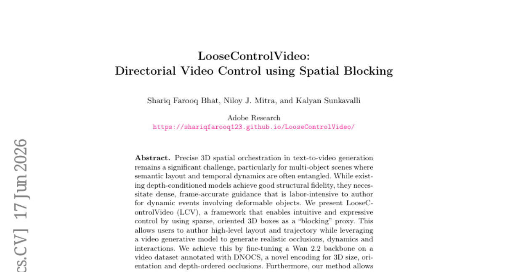

### 📌 한 줄 요약
희소한 3D 박스 정보만으로 복잡한 멀티 객체 영상의 레이아웃과 움직임을 제어하는 새로운 비디오 생성 프레임워크

### 🔑 핵심 포인트
- 희소한 3D 박스(Sparse 3D boxes)를 활용한 직관적인 비디오 레이아웃 및 궤적 제어
- 3D 크기, 방향, 깊이 순서 기반 폐쇄 정보를 포함하는 새로운 인코딩 방식(DNOCS) 도입
- 글로벌 컨텍스트를 유지하면서 특정 객체의 움직임이나 상호작용만 수정 가능한 국소적 정밀 제어 기능

### 🧑‍💻 개발자 관점
복잡한 3D 가이드 없이도 최소한의 박스 정보만으로 정교한 물리적 상호작용이 포함된 비디오를 생성할 수 있어, 영상 제작 워크플로우의 효율성을 크게 높일 수 있습니다.

### 🚀 실무 적용 아이디어
- Wan 2.2 모델과 DNOCS 데이터셋의 호환성 및 학습 리소스 확인
- 제공된 3D 박스 가이드가 복잡한 비정형 객체(예: 사람의 움직임)에 얼마나 잘 적용되는지 테스트
- 기존 2D 기반 제어 방식과의 생성 품질 및 작업 시간 비교 실험

### ⚠️ 리스크/한계
- 박스 기반의 희소한 정보가 매우 복잡한 형태의 객체에 대해 충분한 디테일을 생성할 수 있는지 여부
- 학습에 사용된 특정 데이터셋(nuScenes 등)의 도메인에 국한된 성능 발현 가능성

### 📝 초록 기반 상세 설명
기존의 텍스트-비디오 생성 기술은 멀티 객체 장면에서 의미적 레이아웃과 시간적 역동성을 분리하여 제어하는 데 어려움이 있었습니다. 특히 정밀한 3D 구조를 위해 프레임마다 밀집된 가이드를 제공해야 하는 작업 부하 문제가 존재했습니다. 본 논문은 희소하고 방향성이 있는 3D 박스를 '블로킹(blocking)' 프록시로 사용하는 LooseControlVideo 프레임워크를 제안합니다. 이를 위해 3D 크기, 방향, 폐쇄(occlusion) 순서를 인코딩하는 DNOCS 데이터셋을 활용하여 Wan 2.2 백본을 미세 조정했습니다. 실험 결과, 기존 2D 박스 및 플로우 기반 방식보다 궤적 정확도와 강체 운동 일관성, 폐쇄 정확도 면에서 뛰어난 성능을 입증했습니다.

---

## 25. [Adaptive Volumetric Mechanical Property Fields Invariant to Resolution](https://huggingface.co/papers/2606.18231)
**Upvotes**: 5 | **도입 난이도**: 상 | **신뢰도**: 상
**arXiv**: https://arxiv.org/abs/2606.18231

**태그**: 3D Physics, Sparse Voxel, Transformer, Material Science

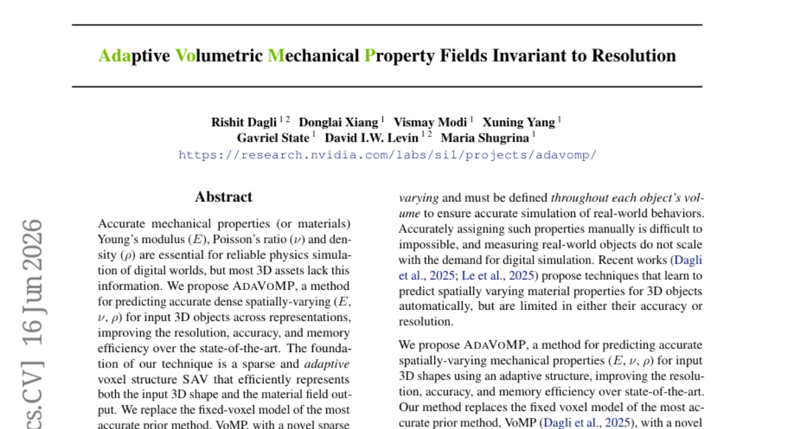

### 📌 한 줄 요약
Sparse Adaptive Voxel 구조를 활용하여 해상도와 메모리 효율을 극대화한 3D 객체용 적응형 물성(E, ν, ρ) 예측 기술

### 🔑 핵심 포인트
- Sparse Adaptive Voxel (SAV) 구조를 통한 고해상도 및 메모리 효율성 확보
- 입력 형상에 최적화된 SAV를 자기회귀(Autoregressive) 방식으로 생성하는 Transformer 모델 도입
- 기존 VoMP 대비 16^3배 높은 해상도와 더 높은 예측 정확도 달성

### 🧑‍💻 개발자 관점
고해상도 3D 모델을 물리 시뮬레이션에 즉시 사용할 수 있는 데이터로 변환할 때, 연산 비용을 낮추면서도 정밀한 물리적 특성을 부여할 수 있습니다.

### 🚀 실무 적용 아이디어
- 제안된 SAV 구조가 복잡한 기하학적 구조(Thin shell 등)에서 얼마나 안정적인지 검증
- Transformer 기반의 자기회귀 생성 방식이 대규모 에셋 생성 시 연산 병목이 되는지 테스트
- 기존 고정 격자 방식과 비교하여 메모리 점유율 및 시뮬레이션 정확도 벤치마크 수행

### ⚠️ 리스크/한계
- 자기회귀 방식의 특성상 생성 속도가 입력 복잡도에 따라 가변적일 수 있음
- 학습 데이터셋의 다양성에 따라 특정 형태의 3D 객체에 대한 물성 예측 편향 가능성

### 📝 초록 기반 상세 설명
정교한 물리 시뮬레이션을 위해서는 정확한 물성 정보가 필수적이지만, 대부분의 3D 에셋은 이러한 정보가 결여되어 있습니다. 기존의 고정 격자 방식은 해상도와 메모리 효율 측면에서 한계가 있었습니다. 본 논문은 입력 형상에 맞춰 독자적인 희소 적응형 복셀(SAV) 구조를 생성하는 Sparse Transformer 인코더-디코더 모델인 AdaVoMP를 제안합니다. 이 방식은 기존 방식보다 16^3배 높은 해상도를 제공하면서도 메모리 효율을 높였습니다. 실험 결과, AdaVoMP는 적은 연산량으로도 더 정확한 부피 물성을 예측하여 복잡한 3D 객체를 시뮬레이션 가능한 에셋으로 변환하는 데 성공했습니다.

---

## 26. [LegalHalluLens: Typed Hallucination Auditing and Calibrated Multi-Agent Debate for Trustworthy Legal AI](https://huggingface.co/papers/2606.18021)
**Upvotes**: 5 | **도입 난이도**: 중 | **신뢰도**: 상
**arXiv**: https://arxiv.org/abs/2606.18021

**태그**: Multi-Agent, Hallucination, Legal-AI, Evaluation, Agent, RAG

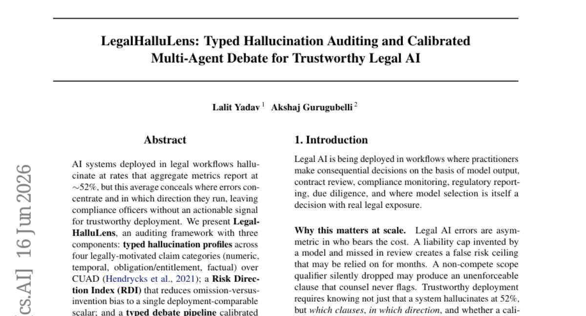

### 📌 한 줄 요약
법률 AI의 환각(Hallucination)을 유형별로 분석하고, 이를 기반으로 정밀한 멀티 에이전트 토론을 수행하여 신뢰성을 높이는 감사 프레임워크

### 🔑 핵심 포인트
- 법률 특화 4대 유형(수치, 시간, 의무/권리, 사실) 기반의 환각 프로파일링 기술
- 누락과 허위 생성 사이의 편향을 단일 스칼라로 관리하는 RDI(Risk Direction Index) 도입
- 측정된 오류 유형에 따라 Skeptic(회의론자)과 비대칭 게이트를 적용하는 정밀 멀티 에이전트 토론

### 🧑‍💻 개발자 관점
단순히 '정확도'라는 지표에 의존하지 않고, 법률 도메인에서 치명적인 특정 오류 유형을 식별하고 이를 에이전트 로직에 반영하는 실무적 방법론을 제시합니다.

### 🚀 실무 적용 아이디어
- 도메인 특화 데이터셋(예: 계약서)을 활용한 유형별 오류 분석 파이프라인 구축
- 단순 토론이 아닌, 특정 오류 유형을 타겟팅하는 'Skeptic' 에이전트 역할 정의 실험
- 모델의 성능 지표를 RDI와 같은 방향성 지표로 변환하여 평가 체계 구축

### ⚠️ 리스크/한계
- 특정 도메인(법률)에 특화된 프레임워크이므로 타 도메인 적용 시 프로파일링 재설계 필요
- 에이전트 간 토론 과정에서 발생할 수 있는 연산 비용 및 지연 시간 문제

### 📝 초록 기반 상세 설명
법률 워크플로우에 도입된 AI의 환각율은 높지만, 기존의 통합 지표는 오류의 구체적인 유형이나 방향성을 파악하기 어려워 실무적 대응이 불가능합니다. 이를 해결하기 위해 본 논문은 LegalHalluLens 프레임워크를 제안합니다. 이 프레임워크는 법률적 맥락에 맞춘 4가지 유형별 환각 프로파일링, 누락과 허위 생성 편향을 관리하는 RDI(Risk Direction Index), 그리고 유형별로 보정된 멀티 에이전트 토론 파이프라인을 포함합니다. 실험 결과, 통합 지표에 가려졌던 유형별 오류 차이를 식별하였으며, 제안된 토론 파이프라인은 적은 파라미터로도 상용 API 수준의 성능을 보였습니다. 결과적으로 이 프레임십은 법률 AI의 투명한 감사와 신뢰할 수 있는 에이전트 설계를 지원합니다.

### 🖼️ 추가 자료
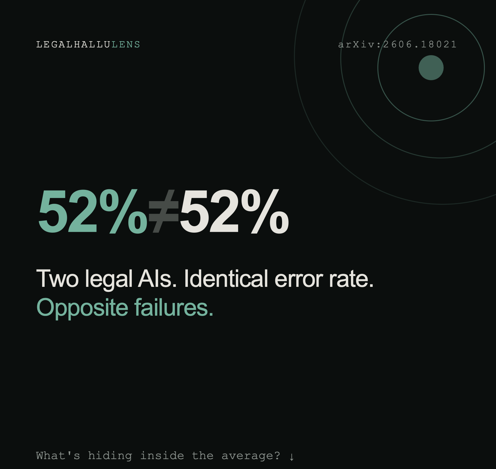

---

## 27. [Taylor-Calibrate: Principled Initialization for Hybrid Linear Attention Distillation](https://huggingface.co/papers/2606.16429)
**Upvotes**: 5 | **도입 난이도**: 중 | **신뢰도**: 상
**arXiv**: https://arxiv.org/abs/2606.16429

**태그**: Model Distillation, Linear Attention, Transformer, Efficient Inference, Inference, Distillation, Safety

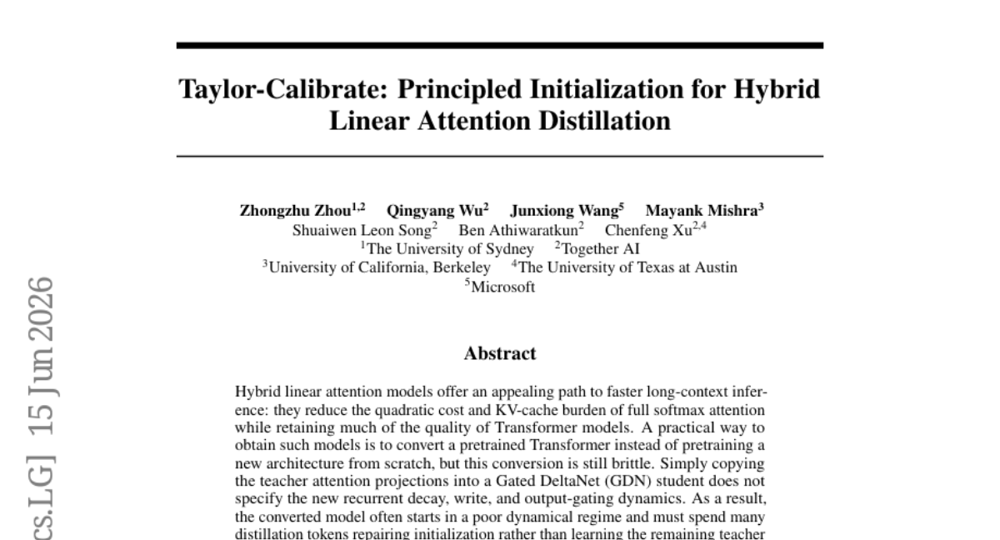

### 📌 한 줄 요약
사전 학습된 Transformer를 효율적인 Hybrid Linear Attention 모델로 변환할 때 발생하는 초기화 문제를 해결하는 Taylor 급수 기반의 정밀 초기화 기법

### 🔑 핵심 포인트
- Taylor 급수 기반의 정밀한 초기화로 학생 모델의 동역학(decay, write, output-gate) 최적화
- 교사 모델의 어텐션 통계량을 활용한 가중치 및 게이트 설정 알고리즘 개발
- 학습 토큰 소모량을 획기적으로 줄이면서도 높은 제로샷 및 복구 성능 달성

### 🧑‍💻 개발자 관점
기존 거대 모델(Transformer)을 효율적인 추론용 모델(Linear Attention)로 전환할 때, 학습 비용을 줄이고 성능 손실을 최소화하는 실질적인 가이드를 제공합니다.

### 🚀 실무 적용 아이디어
- 기존 Transformer 모델을 Gated DeltaNet 구조로 변환 시 단순 복사 방식과 Taylor-Calibrate 방식의 성능 비교 실험
- 다양한 레이어 유지 정책(retained-layer policies)에 따른 초기화 안정성 테스트
- 학습 토큰 수 변화에 따른 수렴 속도 및 최종 성능 상관관계 분석

### ⚠️ 리스크/한계
- 교사 모델의 통계량에 의존하므로 특정 아키텍처에 국한될 가능성 존재
- 초기화 단계에서 계산 복잡도가 추가될 수 있음

### 📝 초록 기반 상세 설명
최근 긴 문맥 처리를 위해 Transformer를 Hybrid Linear Attention 모델로 변환하려는 시도가 늘고 있으나, 단순 가중치 복사 방식은 모델의 동역학(dynamics) 불일치로 인해 성능 저하를 야기합니다. 기존 방식은 모델이 학습 초기 단계에서 초기화 문제를 해결하는 데 너무 많은 토큰을 소모하는 비효율성이 존재합니다. 본 논문은 Taylor 급수를 활용해 교사(Teacher) 모델의 어텐션 통계량을 분석하고, 이를 기반으로 학생(Student) 모델의 가중치와 게이트를 설정하는 Taylor-Calibrate 기법을 제안합니다. 이 방법은 각 레이어를 교사 모델의 출력에 맞추는 짧은 정렬 단계를 포함합니다. 실험 결과, 제안 기법은 제로샷 성능을 대폭 향상시켰으며 기존 방식 대비 훨씬 적은 학습 토큰만으로도 목표 성능에 도달할 수 있음을 입증했습니다.

---

## 28. [The FID Lottery: Quantifying Hidden Randomness in Generative-Model Evaluation](https://huggingface.co/papers/2606.20536)
**Upvotes**: 4 | **도입 난이도**: 하 | **신뢰도**: 상
**arXiv**: https://arxiv.org/abs/2606.20536

**태그**: Generative Models, Evaluation Metric, Reproducibility, Computer Vision, Vision, Evaluation

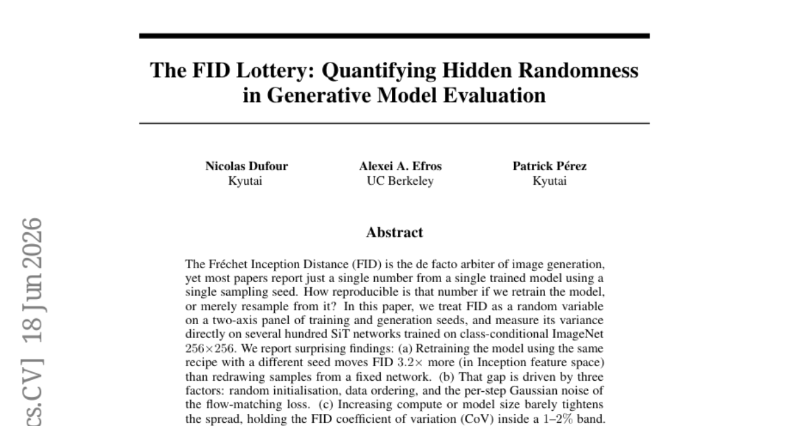

### 📌 한 줄 요약
FID 수치는 모델의 성능뿐만 아니라 학습/샘플링 시의 무작위성에 크게 의존하므로, 단일 수치 보고가 아닌 오차 범위를 포함한 평가 프로토콜이 필요합니다.

### 🔑 핵심 포인트
- 모델 재학습 시 발생하는 FID 변동성이 샘플링 시의 변동성보다 약 3.2배 더 큼
- 모델 크기 증가가 FID의 상대적 변동성(CoV)을 획기적으로 줄이지 못함
- 학습 시드(초기화, 데이터 순서 등)에 따른 성능 편차가 상당하며 이는 연산 효율에 영향을 미침

### 🧑‍💻 개발자 관점
모델 성능 비교 시 단일 FID 수치에 매몰되지 말고, 재현성을 위해 여러 시드에 대한 통계적 유의성을 확인해야 함을 시사합니다.

### 🚀 실무 적용 아이디어
- 모델 성능 비교 시 단일 수치가 아닌 여러 시드에 대한 평균과 표준편차(Error Bar)를 함께 기록하기
- 두 모델 간의 FID 차이가 실험적 변동성 범위(약 1.3% CoV) 내에 있다면 성능 차이가 없는 것으로 간주하기
- 최적의 성능을 위해 Classifier-Free Guidance(CFG) 튜닝을 포함한 평가 프로토콜 적용하기

### ⚠️ 리스크/한계
- 단일 시드 실험만 수행할 경우 '운 좋게' 얻은 수치로 모델 성능을 과대평가할 위험이 있음
- 실험 비용(Compute) 문제로 인해 모든 모델에 대해 다중 시드 평가를 수행하기 어려울 수 있음

### 📝 초록 기반 상세 설명
이미지 생성 모델 평가의 표준인 FID는 대개 단일 모델과 단일 시드에 대한 수치로만 보고되어 재현성 문제가 존재합니다. 본 논문은 FID를 학습 시드와 생성 시드라는 두 축을 가진 확률 변수로 취급하여 수백 개의 SiT 네트워크를 통해 변동성을 정량화했습니다. 연구 결과, 모델 재학습에 따른 FID 변화가 단순 샘플 재추출보다 훨씬 크며, 이는 초기화, 데이터 순서, 학습 노이즈에 의해 발생함을 밝혀냈습니다. 또한 모델 크기를 키워도 FID의 변동 계수(CoV)는 일정 수준 유지되며, 운 좋은 시드가 훨씬 적은 연산으로도 높은 성능을 낼 수 있음을 확인했습니다. 이를 바탕으로 저자들은 오차 범위를 포함한 새로운 FID 평가 프로토콜을 제안합니다.

---

## 29. [JAMER: Project-Level Code Framework Dataset and Benchmark on Professional Game Engines](https://huggingface.co/papers/2606.19830)
**Upvotes**: 3 | **도입 난이도**: 중 | **신뢰도**: 상
**arXiv**: https://arxiv.org/abs/2606.19830

**태그**: GameDev, Benchmark, CodeGeneration, SoftwareEngineering, Agent, Evaluation, Distillation, Safety

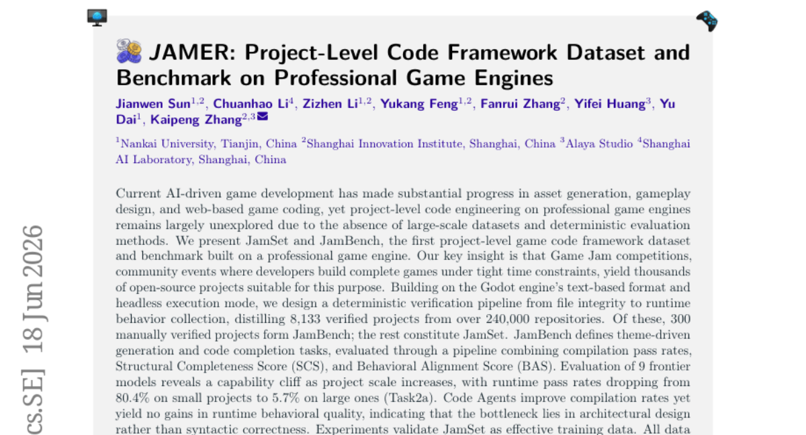

### 📌 한 줄 요약
전문 게임 엔진 환경에서의 프로젝트 단위 코드 생성 및 검증을 위한 대규모 데이터셋과 벤치마크 제안

### 🔑 핵심 포인트
- Game Jam 데이터를 활용한 최초의 전문 엔진 기반 프로젝트 단위 데이터셋(JamSet) 및 벤치마크(JamBench) 구축
- 파일 무결성부터 런타임 동작까지 포함하는 결정론적 검증 파이프라인 설계
- 프로젝트 규모 증가에 따른 모델 성능 저하 및 아키텍처 설계 역량의 한계 규명

### 🧑‍💻 개발자 관점
단순 코드 스니펫 생성을 넘어, 복잡한 파일 구조와 런타임 동작이 중요한 게임 개발 분야에서 AI의 실질적인 프로젝트 관리 능력을 평가하는 기준을 제시합니다.

### 🚀 실무 적용 아이디어
- Godot 엔진 환경에서 대규모 프로젝트 구조를 다루는 멀티 파일 생성 실험
- 코드 에이전트 도입 시 컴파일 성공률과 실제 게임 플레이 동작 간의 상관관계 분석
- 프로젝트 규모(파일 개수, 의존성 복잡도)에 따른 모델 성능 저하 지점 파악

### ⚠️ 리스크/한계
- 특정 엔진(Godot)에 특화된 데이터셋으로 타 엔진으로의 일반화 가능성 검토 필요
- 모델의 아키텍처 설계 역량 부족이 런타임 품질 저하의 주요 원인으로 지적됨

### 📝 초록 기반 상세 설명
기존 AI 게임 개발 연구는 에셋 생성이나 단순 코딩에 치중되어 있어, 전문 엔진 기반의 프로젝트 단위 엔지니어링 연구는 부족한 실정입니다. 본 논문은 Game Jam 프로젝트를 활용하여 Godot 엔진 기반의 대규모 데이터셋인 JamSet과 벤치마크인 JamBench를 구축했습니다. 24만 개 이상의 저장소에서 추출한 8,133개의 프로젝트를 정제하여 데이터셋을 구성하고, 300개의 검증된 프로젝트로 벤치마크를 설계했습니다. 실험 결과, 프로젝트 규모가 커질수록 모델의 런타임 통과율이 급격히 하락하는 '능력 절벽' 현상이 관찰되었습니다. 또한, 코드 에이전트가 컴파일 성공률은 높이지만 런타임 동작 품질은 개선하지 못한다는 점을 밝혀냈습니다.

---

## 30. [No Resource, No Benchmarks, No Problem? Evaluating and Improving LLMs for Code Generation in No-Resource Languages](https://huggingface.co/papers/2606.16827)
**Upvotes**: 3 | **도입 난이도**: 중 | **신뢰도**: 상
**arXiv**: https://arxiv.org/abs/2606.16827

**태그**: Code Generation, Domain-Specific Language, Fine-tuning, LLM Optimization, Benchmark, Evaluation

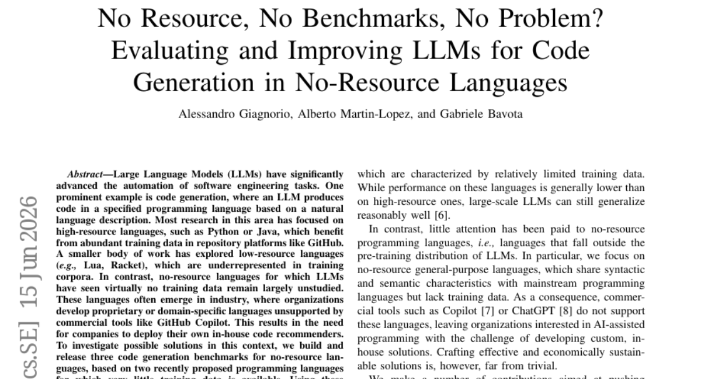

### 📌 한 줄 요약
데이터가 거의 없는 특수 목적용 프로그래밍 언어를 위해 LLM의 성능을 효율적으로 끌어올리는 방법론 제시

### 🔑 핵심 포인트
- 데이터가 거의 없는(No-resource) 특수 언어용 코드 생성 벤치마크 구축
- 추가 사전 학습(Further Pre-training)을 통한 도메인 지식 주입 전략
- Weight Diff Transfer를 활용한 지시 이행 능력 유지 및 효율적 모델 최적화

### 🧑‍💻 개발자 관점
기업 내부의 독자적인 DSL(Domain Specific Language)이나 레거시 언어를 사용하는 환경에서, 적은 데이터로도 고성능 코드 생성기를 구축할 수 있는 실무적 가이드를 제공합니다.

### 🚀 실무 적용 아이디어
- 특수 도메인 언어 데이터셋 구축 및 벤치마크 설계
- Base 모델에 타겟 언어 데이터로 추가 사전 학습 수행
- 학습된 모델에 기존 Instruction 모델의 가중치 차이를 적용하여 지시 이행 능력 복구 테스트

### ⚠️ 리스크/한계
- 데이터가 극도로 적을 경우 과적합(Overfitting) 위험 존재
- Weight Diff Transfer 방식이 모든 모델 아키텍처에 범용적으로 적용 가능한지 검증 필요

### 📝 초록 기반 상세 설명
최근 LLM 기반 코드 생성 연구는 데이터가 풍부한 언어에 집중되어 있어, 산업 현장의 독자적인 도메인 특화 언어(No-resource languages) 대응에는 한계가 있습니다. 본 연구는 데이터가 거의 없는 언어를 위한 3종의 벤치마크를 구축하고, 프롬프트 기법부터 추가 사전 학습(Further Pre-training)까지 다양한 학습 전략을 실험했습니다. 실험 결과, 추가 사전 학습이 성능 향상에 가장 효과적이었으나 기존 지시 이행(Instruction-following) 능력을 저해하는 문제가 발견되었습니다. 이를 해결하기 위해 베이스 모델에 타겟 언어를 학습시킨 후, 지시 모델의 가중치 차이(Weight Diff)를 전이하는 방식을 제안했습니다. 이 접근법은 적은 비용으로도 특정 언어에 특화된 지시 이행 모델을 구축할 수 있음을 입증했습니다.

---

## 31. [The Data Manifold under the Microscope](https://huggingface.co/papers/2606.15760)
**Upvotes**: 3 | **도입 난이도**: 중 | **신뢰도**: 상
**arXiv**: https://arxiv.org/abs/2606.15760

**태그**: Deep Learning Theory, Manifold Learning, Benchmarking, Generative Models, Benchmark

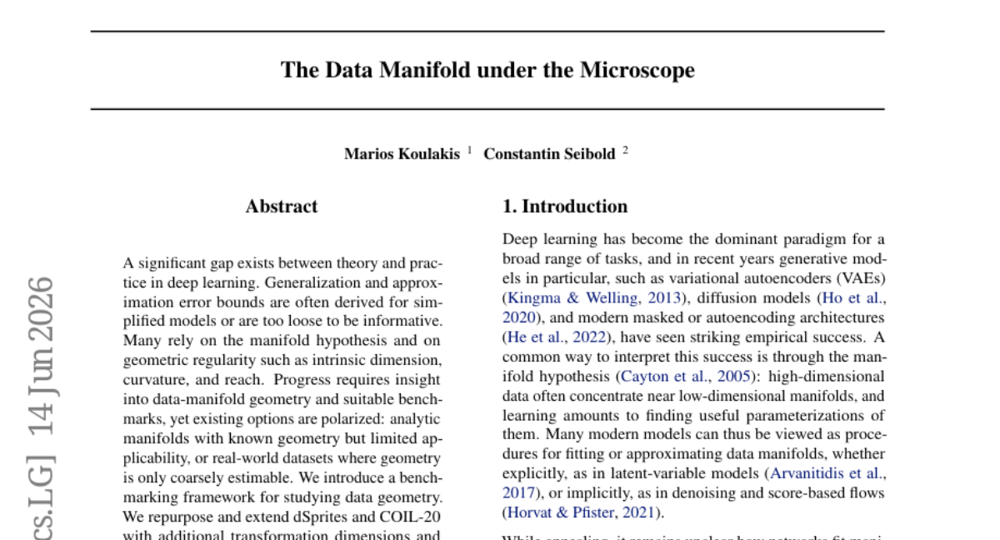

### 📌 한 줄 요약
이론적 일반화 경계 검증과 데이터 매니폴드 기하학 연구를 위한 정밀 벤치마킹 프레임워크 제안

### 🔑 핵심 포인트
- 이론 검증을 위한 정밀한 기하학적 특성(곡률, reach, 부피) 추출 프레임워크 개발
- 기존 데이터셋(dSprites, COIL-20)을 확장한 고밀도 샘플링 기반의 제어된 테스트베드 구축
- 이론적 일반화 경계(Genovese et al., Fefferman et al.) 및 VAE의 계층별 기하학적 변화 검증

### 🧑‍💻 개발자 관점
딥러닝 모델의 일반화 성능을 수학적 경계값과 비교하여 검증하고자 하는 연구자나, 데이터의 기하학적 구조가 모델 학습에 미치는 영향을 분석하려는 엔지니어에게 유용합니다.

### 🚀 실무 적용 아이디어
- 제공된 GitHub 코드를 사용하여 기존 데이터셋의 기하학적 특성 측정해보기
- $\beta$-VAE 모델을 학습시키며 레이어별 매니폴드 변화 추적 실험하기
- 특정 일반화 경계 이론이 실제 데이터 구조에서 어떻게 작동하는지 벤치마크 테스트 수행하기

### ⚠️ 리스크/한계
- 제안된 데이터셋은 통제된 환경을 위한 것이므로 실제 복잡한 고차원 데이터에 대한 직접적인 적용에는 한계가 있을 수 있음
- 유한 차분 추정기는 샘플링 밀도에 민감하므로 데이터 특성에 따른 정밀도 차이가 발생할 수 있음

### 📝 초록 기반 상세 설명
딥러닝의 일반화 및 근사 오차 경계 이론과 실제 모델 간의 간극이 존재하며, 기존 데이터셋은 기하학적 특성을 정밀하게 측정하기에 한계가 있습니다. 본 논문은 데이터 매니폴드의 기하학적 특성(곡률, reach, 부피 등)을 정밀하게 연구할 수 있는 새로운 벤치마킹 프레임워크를 도입합니다. 이를 위해 dSprites와 COIL-20을 확장하여 밀집된 축 정렬 샘플링이 가능한 데이터셋을 구축하고, 유한 차분 추정기(finite-difference estimators)를 결합했습니다. 제안된 프레임워크는 이론적 가설을 검증하는 샌드박스 역할을 수행하며, 기존 일반화 경계 이론의 스케일링 동작과 $\beta$-VAE의 계층별 기하학적 변화를 추적하는 실험을 통해 유효성을 입증했습니다.

### 🖼️ 추가 자료
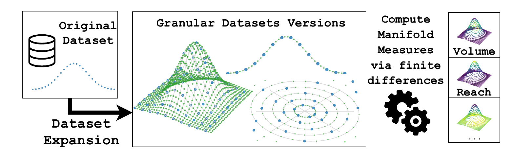

---

## 32. [Selective Synergistic Learning for Video Object-Centric Learning](https://huggingface.co/papers/2606.15527)
**Upvotes**: 3 | **도입 난이도**: 중 | **신뢰도**: 상
**arXiv**: https://arxiv.org/abs/2606.15527

**태그**: Video Understanding, Object-Centric Learning, Self-Supervised Learning, Efficiency, RAG, Video, Distillation, Safety

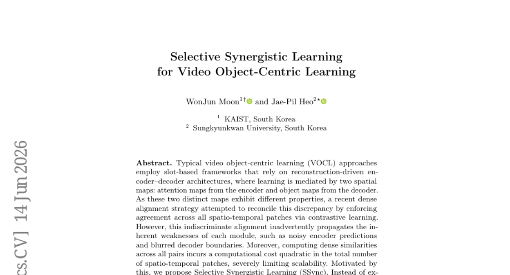

### 📌 한 줄 요약
불필요한 정보 정렬을 배제하고 인코더와 디코더의 강점만 선택적으로 결합하여 비디오 객체 분할 성능과 효율성을 높인 학습 프레임워크

### 🔑 핵심 포인트
- 선택적 증류(Selective Distillation): 인코더(경계)와 디코더(내부)의 강점만을 활용하여 오류 전파 방지
- 선형 복잡도 구현: 모든 패치 간 비교가 아닌 의사 라벨링을 통해 연산 비용을 획기적으로 절감
- 전이적 의사 라벨 병합: 중복된 슬롯을 통합하여 객체 분해의 정확도와 견고함 확보

### 🧑‍💻 개발자 관점
기존의 연산 집약적인 밀집 정렬 방식에서 벗어나 효율적인 객체 분할이 가능하므로, 실시간성이 중요한 비디오 분석 파이프라인에 플러그인 형태로 적용하기 적합합니다.

### 🚀 실무 적용 아이디어
- 기존 Slot-based 모델에 SSync의 의사 라벨링 로직을 적용하여 성능 변화 관찰
- 다양한 해상도 및 프레임 수 환경에서 연산량(Complexity) 변화 테스트
- 중복 슬롯 제거를 위한 병합 알고리즘의 임계값(Threshold) 최적화 실험

### ⚠️ 리스크/한계
- 의사 라벨링의 품질이 초기 학습 단계의 성능에 의존할 가능성
- 특정 데이터셋에 최적화된 병합 전략이 다른 도메인에서 일반화되지 않을 위험

### 📝 초록 기반 상세 설명
기존의 비디오 객체 중심 학습(VOCL)은 인코더의 어텐션 맵과 디코더의 객체 맵 사이의 정렬을 시도하지만, 모든 패치를 일괄적으로 정렬하는 방식은 노이즈 전파와 연산량 급증 문제를 야기합니다. 이를 해결하기 위해 제안된 SSync는 모든 패치를 비교하는 대신, 인코더는 경계 정밀화에, 디코더는 내부 노이즈 제거에만 집중하도록 선택적 증류(Selective Distillation)를 수행합니다. 또한, 중복된 슬롯 문제를 해결하기 위해 시공간적 활성화 일관성을 기반으로 한 전이적 의사 라벨 병합(Transitive Pseudo-label Merging) 기법을 도입했습니다. 결과적으로 SSync는 선형 복잡도로 연산 효율을 확보하면서도 객체 분해 품질을 크게 향상시켰습니다.

---

## 33. [Duration Aware Scheduling for ASR Serving Under Workload Drift](https://huggingface.co/papers/2603.11273)
**Upvotes**: 3 | **도입 난이도**: 중 | **신뢰도**: 상
**arXiv**: https://arxiv.org/abs/2603.11273

**태그**: ASR, Scheduling, vLLM, Latency Optimization, Audio, Evaluation, Inference

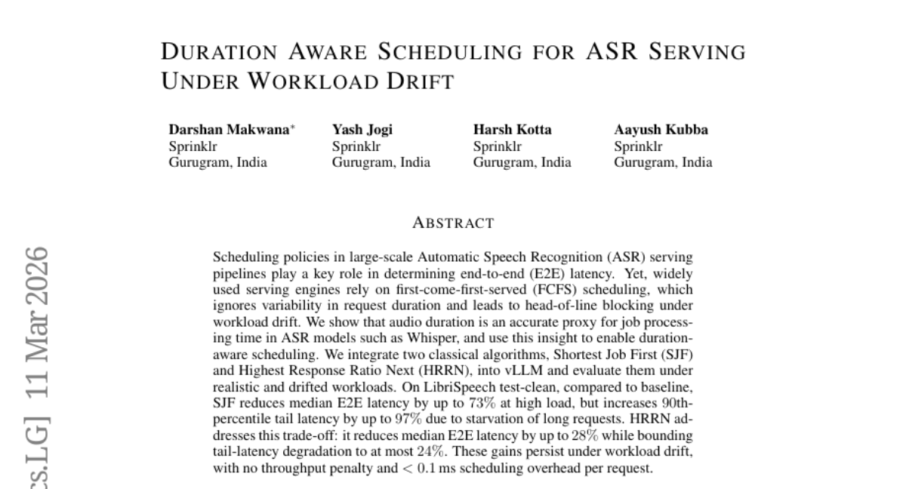

### 📌 한 줄 요약
ASR 서비스의 작업 시간 변동성을 고려한 스케줄링 최적화를 통해 지연 시간(Latency)을 획기적으로 개선

### 🔑 핵심 포인트
- 오디오 길이를 활용한 작업 처리 시간 예측 및 스케줄링 최적화
- SJF와 HRRN 알고리즘을 vLLM 기반 ASR 엔진에 통합
- 워크로드 변화(Workload Drift) 상황에서도 유지되는 낮은 스케줄링 오버헤드와 성능 안정성

### 🧑‍💻 개발자 관점
실시간 음성 인식 서비스 운영 시, 작업 길이 차이로 발생하는 대기 시간을 줄여 사용자 경험을 개선할 수 있는 실무적인 스케줄링 전략을 제시합니다.

### 🚀 실무 적용 아이디어
- vLLM 환경에서 작업 길이 기반의 우선순위 큐 구현 테스트
- SJF 적용 시 발생하는 긴 작업의 기아 현상(Starvation) 모니터링
- 다양한 오디오 길이 분포를 가진 실제 워크로드에서의 HRRN 성능 검증

### ⚠️ 리스크/한계
- SJF 사용 시 긴 작업에 대한 꼬리 지연 시간(Tail latency) 급증 위험
- 오디오 길이가 작업 시간과 완벽히 일치하지 않을 경우의 예측 오차

### 📝 초록 기반 상세 설명
대규모 ASR 서비스에서는 FCFS 방식의 스케줄링이 작업 시간 차이로 인한 Head-of-line blocking 문제를 야기합니다. 연구진은 오디오 길이가 작업 처리 시간의 정확한 지표라는 점에 착안하여 duration-aware 스케줄링을 제안합니다. 이를 위해 SJF와 HRRN 알고리즘을 vLLM에 통합하여 실험을 진행했습니다. 실험 결과, SJF는 중앙값 지연 시간을 크게 줄였으나 긴 작업의 기아 현상(Starvation) 문제를 보였습니다. 반면 HRRN은 지연 시간 단축과 꼬리 지연 시간(Tail latency) 사이의 균형을 효과적으로 유지하며 워크로드 변화에도 안정적인 성능을 보였습니다.

---

## 34. [ReSyn: A Generalized Recursive Regular Expression Synthesis Framework](https://huggingface.co/papers/2603.24624)
**Upvotes**: 2 | **도입 난이도**: 중 | **신뢰도**: 상
**arXiv**: https://arxiv.org/abs/2603.24624

**태그**: Programming-By-Example, Regular Expression, Synthesis, Divide-and-Conquer, Benchmark

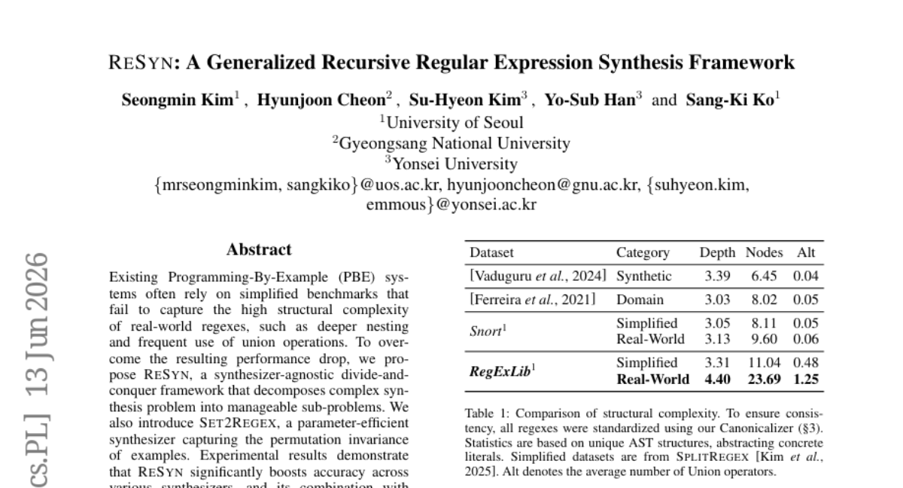

### 📌 한 줄 요약
복잡한 정규표현식 합성 문제를 분할 정복 방식으로 해결하여 성능을 극대화한 범용 프레임워크 ReSyn

### 🔑 핵심 포인트
- 복잡한 정규표현식 문제를 하위 문제로 분해하는 분할 정복(Divide-and-conquer) 프레임워크 제안
- 예시의 순열 불변성을 고려하여 효율성을 높인 Set2Regex 합성기 개발
- 기존 합성기들과 결합 가능한 범용적(Synthesizer-agnostic) 구조 설계

### 🧑‍💻 개발자 관점
실제 복잡한 패턴 매칭 규칙을 자동 생성해야 하는 개발 환경에서, 단순한 예시를 넘어 구조적으로 복잡한 정규표현식을 정확하게 생성할 수 있는 기술적 토대를 제공합니다.

### 🚀 실무 적용 아이디어
- 제공된 GitHub 소스코드를 통해 복잡한 중첩 구조의 정규표현식 생성 테스트
- 기존에 사용하던 정규표현식 합성 엔진에 ReSyn 프레임워크를 결합하여 성능 변화 측정
- Set2Regex의 파라미터 효율성이 실제 대규모 데이터셋에서 어떻게 작동하는지 검증

### ⚠️ 리스크/한계
- 분할 정복 과정에서 하위 문제 간의 의존성이나 전역적 최적해를 놓칠 가능성
- 복잡도가 극도로 높은 문제에 대한 계산 복잡도 증가 우려

### 📝 초록 기반 상세 설명
기존의 Programming-By-Example(PBE) 시스템은 중첩이나 합집합 연산이 빈번한 실제 환경의 복잡한 정규표현식 합성에서 성능 저하 문제를 겪습니다. 이를 해결하기 위해 본 논문은 복잡한 합성 문제를 관리 가능한 하위 문제로 분해하는 분할 정복 방식의 ReSyn 프레임워크를 제안합니다. 또한 예시 데이터의 순열 불변성을 활용하는 파라미터 효율적인 합성기인 Set2Regex를 함께 도입했습니다. 실험 결과, ReSyn은 다양한 합성기들의 정확도를 크게 향상시켰습니다. 특히 Set2Regex와 결합했을 때 도전적인 실무 벤치마크에서 새로운 SOTA(State-of-the-art)를 달립을 입증했습니다.

### 🖼️ 추가 자료

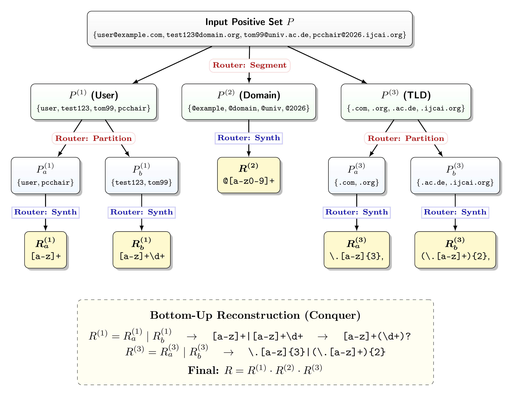

---

