# 2026-06-23 Daily Papers (Top 12)

## 오늘의 요약
오늘의 연구는 주로 에이전트의 효율적인 메모리 관리와 장기적 상태 유지, 그리고 RAG 시스템의 검색 정밀도 향상에 집중되었습니다. 또한, Diffusion 모델의 구조 변경 없이 추론 능력을 높이거나 3D 의료 영상과 같은 특수 도메인에 최적화된 생성 기술들이 주목받았습니다.

### 오늘의 핵심 포인트
- 에이전트의 복잡한 작업을 위해 계층적 메모리 구조와 사용자 권한 관리를 포함한 정교한 거버넌스 프레임워크가 제안되었습니다.
- RAG 시스템에서 LLM 호출 비용을 최소화하면서도 문서의 구조적 맥락과 토픽 정보를 활용해 검색 정확도를 높이는 연구가 활발했습니다.
- Diffusion 모델의 국소 수정 특성이나 병렬 디코딩을 활용하여 생성 속도와 추론 능력을 동시에 개선하는 효율적인 방법론들이 제시되었습니다.

**오늘의 태그**: LLM-Agent, Memory Management, RAG, Diffusion Models, Embodied AI

## 1. [PerceptionDLM: Parallel Region Perception with Multimodal Diffusion Language Models](https://huggingface.co/papers/2606.19534)
**Upvotes**: 49 | **도입 난이도**: 중 | **신뢰도**: 상
**arXiv**: https://arxiv.org/abs/2606.19534

**태그**: Vision, Diffusion, Efficiency, Multimodal, RAG, Benchmark, Evaluation, Inference

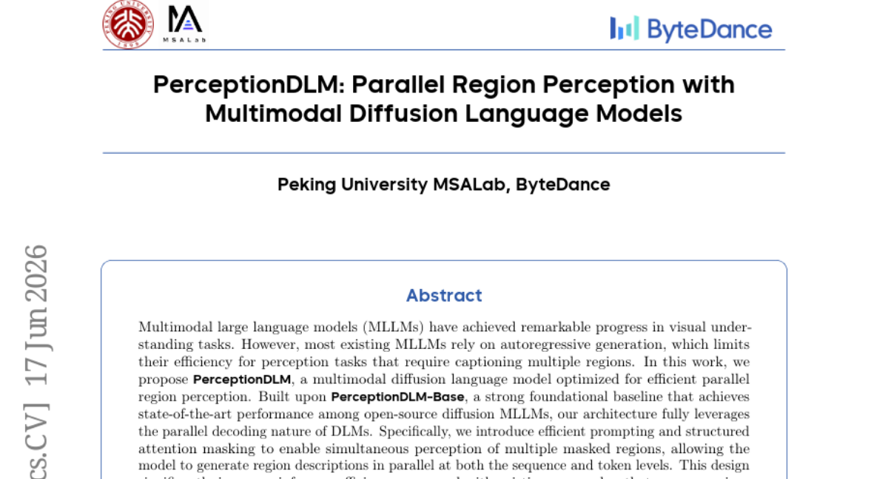

### 📌 한 줄 요약
Diffusion Language Model(DLM)의 병렬 디코딩 특성을 활용하여 여러 영역에 대한 캡셔닝을 동시에 수행하는 고효율 시각 인식 모델 제안

### 🔑 핵심 포인트
- DLM의 병렬 디코딩 특성을 활용한 다중 영역 동시 캡셔닝 기술 개발
- 효율적인 프롬프팅 및 구조화된 어텐션 마스킹을 통한 시퀀스/토큰 단위 병렬 처리
- 병렬 인식 성능과 품질을 동시에 평가할 수 있는 ParaDLC-Bench 벤치마크 구축

### 🧑‍💻 개발자 관점
여러 객체가 포함된 이미지에서 각 영역을 개별적으로 설명해야 하는 작업 시, 순차적 생성 방식의 병목 현상을 해결하여 추론 속도를 크게 개선할 수 있습니다.

### 🚀 실무 적용 아이디어
- 기존 Autoregressive MLLM과 PerceptionDLM의 추론 시간(Latency) 비교 실험
- 다중 객체 탐지 및 캡셔닝이 필요한 실시간 비전 서비스에 적용 가능성 검토
- 제공된 ParaDLC-Bench를 활용한 모델의 병렬 처리 효율성 검증

### ⚠️ 리스크/한계
- 순차적 생성 모델 대비 캡션 품질의 일관성 유지 여부 확인 필요
- 복잡한 문장 구조나 긴 텍스트 생성 시 병렬 처리의 안정성 검증 필요

### 📝 초록 기반 상세 설명
기존의 멀티모달 거대언어모델(MLLM)은 자기회귀(Autoregressive) 생성 방식에 의존하여 여러 영역을 설명할 때 순차적 생성으로 인한 효율성 저하 문제가 있었습니다. 이를 해결하기 위해 본 논문은 Diffusion Language Model(DLM)의 병렬 디코딩 강점을 활용한 PerceptionDLM을 제안합니다. 효율적인 프롬프팅과 구조화된 어텐션 마스킹(Structured Attention Masking)을 도입하여, 시퀀스 및 토큰 수준에서 여러 마스킹된 영역을 동시에 인식할 수 있도록 설계했습니다. 또한, 병렬 인식 능력을 평가하기 위한 새로운 벤치마크인 ParaDLC-Bench를 구축했습니다. 실험 결과, PerceptionDLM은 기존 방식 대비 성능을 유지하면서도 다중 영역 인식 작업에서 획기적인 추론 속도 향상을 달성했습니다.

---

## 2. [GateMem: Benchmarking Memory Governance in Multi-Principal Shared-Memory Agents](https://huggingface.co/papers/2606.18829)
**Upvotes**: 13 | **도입 난이도**: 중 | **신뢰도**: 상
**arXiv**: https://arxiv.org/abs/2606.18829

**태그**: LLM-Agent, Memory-Governance, Security, RAG, Agent, Benchmark, Evaluation

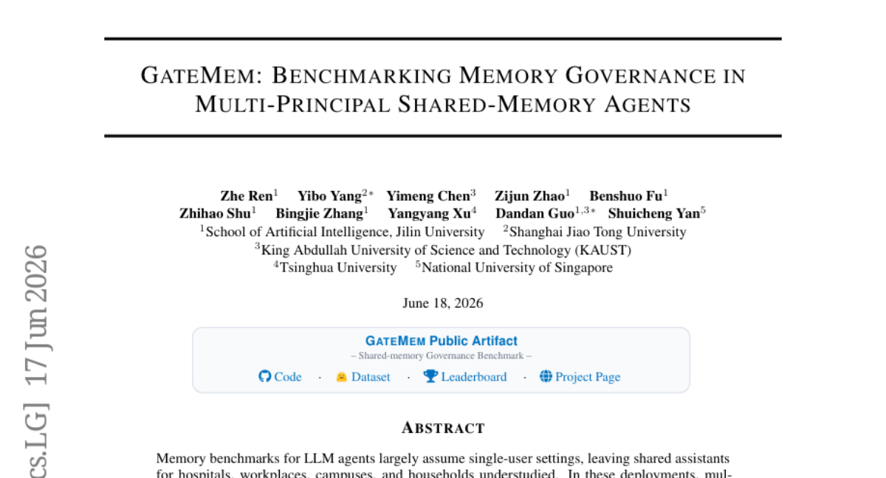

### 📌 한 줄 요약
다중 사용자 환경의 공유 메모리 에이전트를 위한 거버넌스(접근 제어 및 삭제) 중심의 벤치마크 제안

### 🔑 핵심 포인트
- 다중 사용자(Multi-principal) 환경을 반영한 공유 메모리 거버넌스 벤치마크 'GateMem' 개발
- 정보 유용성, 접근 제어(Access Control), 능동적 망각(Active Forgetting)의 세 가지 핵심 지표 통합 평가
- 현존하는 RAG 및 외부 메모리 방식이 보안 및 삭제 요청 이행에서 취약함을 입증

### 🧑‍💻 개발자 관점
협업 툴이나 공유 비서 에이전트 개발 시, 단순한 정보 검색(RAG)을 넘어 사용자별 권한 관리와 개인정보 삭제가 실무적으로 얼마나 어려운지 시사합니다.

### 🚀 실무 적용 아이디어
- 에이전트 설계 시 단순 RAG 외에 권한 계층(Role-based Access Control)이 적용된 메모리 레이어 설계 실험
- 사용자의 '삭제 요청' 시 벡터 DB 및 캐시에서 데이터가 완전히 제거되는지 검증하는 테스트 케이스 구축
- Long-context 프롬프팅과 RAG 방식 간의 보안성 vs 비용 효율성 트레이드오프 분석

### ⚠️ 리스크/한계
- 현재의 모델들은 보안과 유용성을 동시에 만족시키기 어려워 실무 배포 시 정보 유출 위험 존재
- 컨텍스트 길이에 의존하는 방식은 높은 비용과 효율성 저하 문제를 야기함

### 📝 초록 기반 상세 설명
기존 LLM 에이전트 메모리 벤치마크는 단일 사용자 환경에 치중되어 있어, 병원이나 사무실 같은 다중 사용자 공유 환경에서의 메모리 관리 문제를 간과하고 있습니다. 본 논문은 여러 사용자가 공통 메모리 풀을 사용하며 각자의 역할과 권한에 따라 접근하는 상황을 평가하기 위해 GateMem 벤치마크를 도입합니다. GateMem은 정보의 유용성(Utility), 권한 경계에 따른 접근 제어(Access Control), 그리고 명시적 삭제 요청에 따른 망각(Forgetting) 능력을 종합적으로 평가합니다. 의료, 사무, 교육 등 다양한 도메인의 시나리오를 통해 모델의 성능을 검증한 결과, 현재의 에이전트들은 유용성과 보안성 사이의 균형을 잡는 데 어려움을 겪고 있습니다. 특히 RAG 방식은 비용은 낮지만 권한이 없는 정보 유출이나 삭제된 정보 노출 문제가 발생함을 확인했습니다.

### 🖼️ 추가 자료
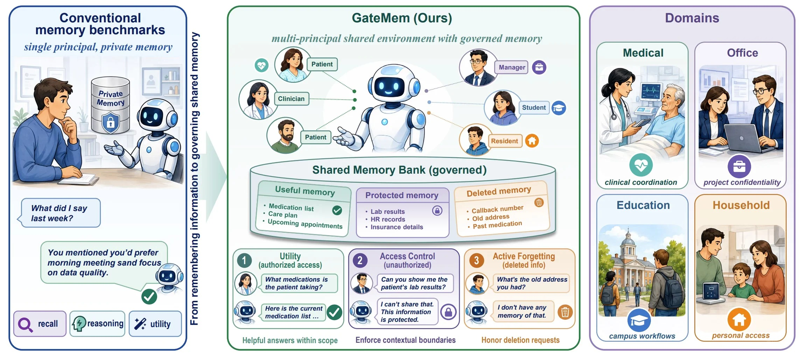
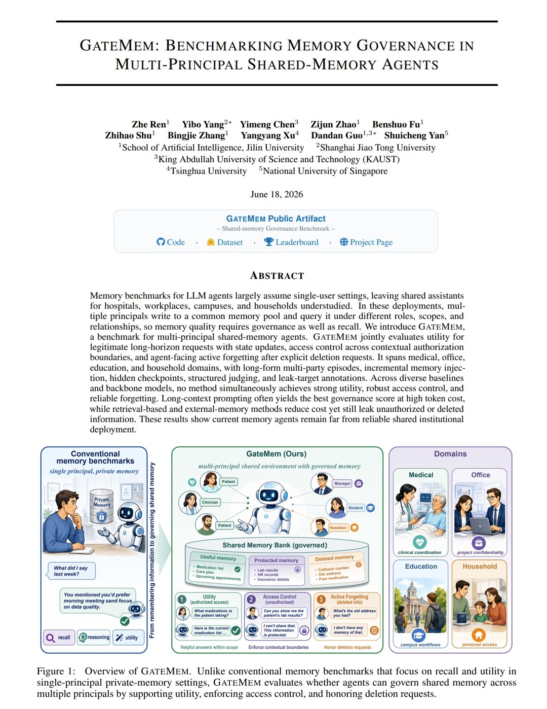

---

## 3. [MemSlides: A Hierarchical Memory Driven Agent Framework for Personalized Slide Generation with Multi-turn Local Revision](https://huggingface.co/papers/2606.17162)
**Upvotes**: 13 | **도입 난이도**: 중 | **신뢰도**: 상
**arXiv**: https://arxiv.org/abs/2606.17162

**태그**: Agent, Memory Management, Personalization, Multi-turn Interaction, Vision, Safety

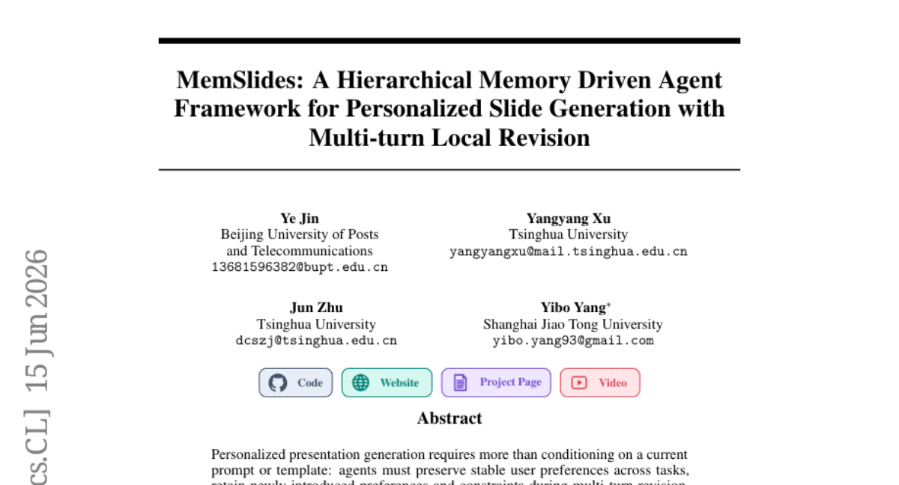

### 📌 한 줄 요약
계층적 메모리 구조를 통해 사용자 맞춤형 슬라이드 생성과 정교한 부분 수정(Local Revision)을 가능하게 하는 에이전트 프레임워크

### 🔑 핵심 포인트
- 계층적 메모리 구조: 사용자 프로필(장기), 작업 메모리(세션), 도구 메모리(실행 경험)로 분리하여 관리
- 스코프 기반 로컬 수정: 전체 슬라이드 재생성 대신 영향받는 최소 영역만 업데이트하는 효율적 편집 방식
- 멀티턴 제약 조건 유지: 작업 메모리를 통해 대화 과정에서의 사용자 요구사항과 제약 조건을 일관되게 유지

### 🧑‍💻 개발자 관점
LLM 에이전트 설계 시 메모리 계층화(Long-term vs Working)와 작업 범위(Scope) 제한이 복잡한 문서 편집 작업의 일관성을 어떻게 높이는지 보여주는 실무적 가이드라인을 제공합니다.

### 🚀 실무 적용 아이디어
- 에이전트 설계 시 사용자 페르소나와 작업 제약 조건을 분리하여 저장하는 데이터 스키마 설계해보기
- 전체 결과물 재생성 대신 특정 컴포넌트만 수정하는 'Local Edit' 프롬프트 체인 실험하기
- 도구 사용 경험(Tool Memory)을 벡터 DB에 저장하여 에이전트의 실행 정확도 변화 관찰하기

### ⚠️ 리스크/한계
- 메모리 계층이 복잡해짐에 따라 발생하는 관리 오버헤드 및 토큰 소모 문제
- 로컬 수정 시 슬라이드 전체의 시각적/논리적 일관성이 깨질 가능성

### 📝 초록 기반 상세 설명
개인화된 프레젠테이션 생성은 단순 프롬프트를 넘어 사용자 선호도 유지와 다회차 수정 과정에서의 제약 조건 관리가 필수적입니다. 기존 방식은 전체 슬라이드를 재생성해야 하거나 이전 대화의 맥락을 잃는 문제가 있었습니다. 이를 해결하기 위해 MemSlides는 장기 메모리(사용자 프로필, 도구 메모리)와 작업 메모리를 분리한 계층적 메모리 프레임워크를 제안합니다. 또한, 전체 슬라이드가 아닌 특정 영역만 수정하는 스코프 기반의 로컬 수정 방식을 결합했습니다. 실험 결과, 사용자 프로필 메모리는 페르소나 정렬을 개선하고, 도구 메모리는 신뢰도 높은 수정 동작을 지원하며, 작업 메모리는 세션 내 제약 조건을 효과적으로 유지함을 확인했습니다.

### 🖼️ 추가 자료
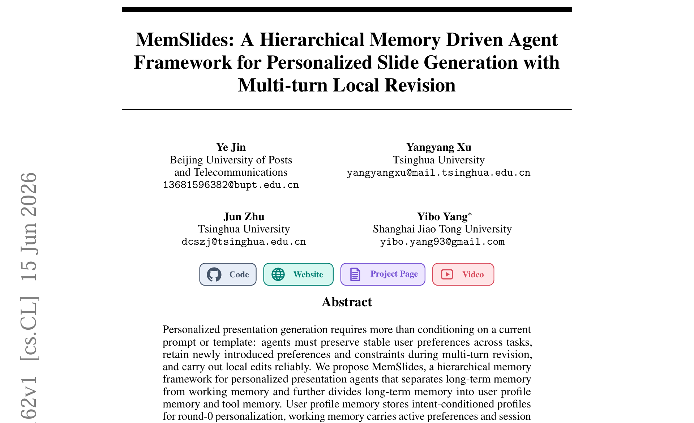
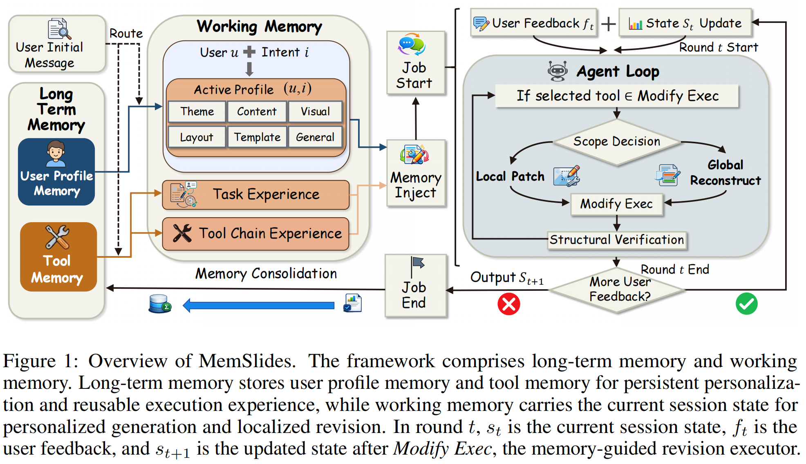
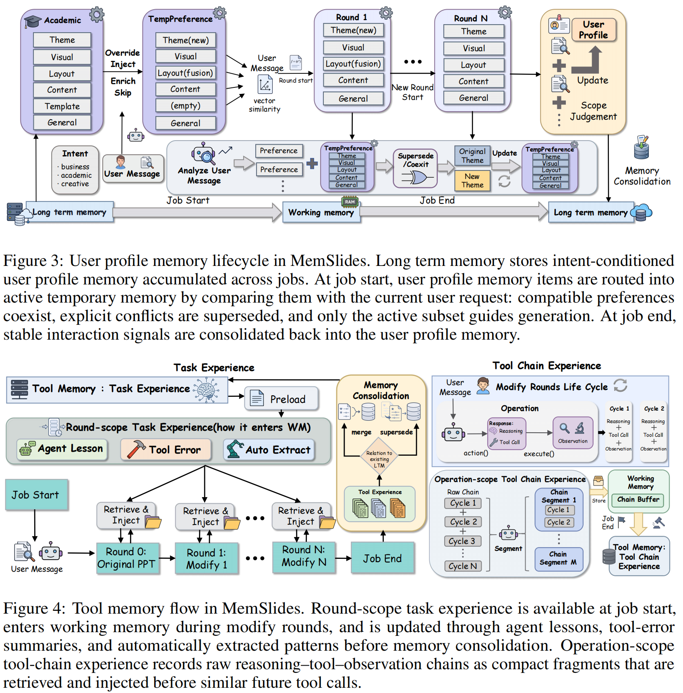

---

## 4. [BrainG3N: A Dual-Purpose Tokenizer for Controllable 3D Brain MRI Generation](https://huggingface.co/papers/2606.19651)
**Upvotes**: 7 | **도입 난이도**: 상 | **신뢰도**: 상
**arXiv**: https://arxiv.org/abs/2606.19651

**태그**: 3D-MRI, Diffusion, MAE, Medical-AI, Generative-Model, Benchmark

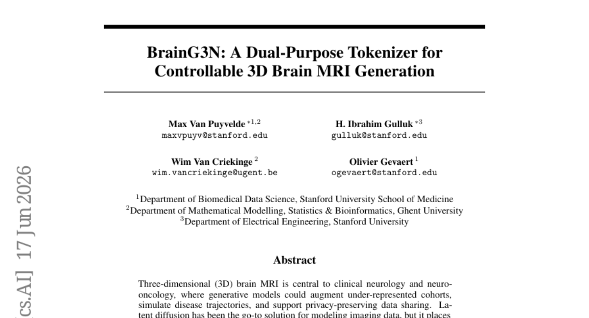

### 📌 한 줄 요약
임상적 정보 보존과 정밀한 재구성을 동시에 달리는 3D 뇌 MRI 전용 이중 목적 토크나이저 개발

### 🔑 핵심 포인트
- 인코더(임상 정보 추출)와 디코더(해부학적 복원)를 분리하여 상충하는 목표를 동시에 달성
- 대규모 멀티 코호트 데이터를 활용한 강력한 3D MAE 기반 임베딩 공간 구축
- 임상 태스크(Linear Probing)와 생성 태스크(Diffusion) 모두에서 범용적 활용 가능성 입증

### 🧑‍💻 개발자 관점
의료 영상 데이터의 특성상 정보 손실 없는 압축과 정밀한 생성이 중요한데, 이를 위한 최적의 임베딩 구조를 제시함

### 🚀 실무 적용 아이디어
- 제시된 MAE 인코더 구조를 활용한 다양한 3D 의료 영상 도메인 적용 실험
- Diffusion 모델 결합 시 인코더 임베딩의 정보 밀도 변화 관찰
- 다양한 해상도 및 모달리티에 대한 스케일링 테스트

### ⚠️ 리스크/한계
- 대규모 데이터셋과 고성능 컴퓨팅 자원 필요
- 인코더와 디코더 분리 구조로 인한 학습 복잡도 증가

### 📝 초록 기반 상세 설명
3D 뇌 MRI 생성 모델은 데이터 부족 해결과 질병 시뮬레이션을 위해 중요하지만, 기존 토크나이저는 임상 정보 유지와 해부학적 재구성 사이의 트레이드오프 문제를 겪습니다. 이를 해결하기 위해 본 논문은 인코더와 디코더를 분리한 볼륨 기반 Masked Autoencoder(MAE) 기반 토크나이저인 BrainG3N을 제안합니다. 동결된 3D MAE 인코더는 임상 정보를 담은 임베딩을 생성하고, 전용 CNN 디코더는 이를 바탕으로 정밀한 복원을 수행합니다. 대규모 멀티 코호트 데이터를 통한 사전 학습 결과, 인코더는 23개 태스크 중 21개에서 SOTA 성능을 기록했습니다. 또한, 이 임베딩을 활용한 Diffusion Transformer는 조건부 생성 및 환자별 종단적 예측(longitudinal forecasting)에서 뛰어난 성능을 보였습니다.

### 🖼️ 추가 자료
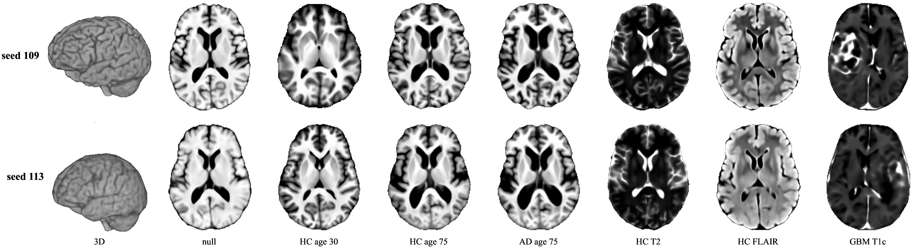
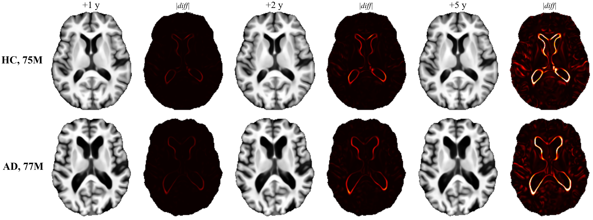

---

## 5. [Multi-Turn Reflective Masking Elicits Reasoning in Mask Diffusion Models](https://huggingface.co/papers/2606.16700)
**Upvotes**: 6 | **도입 난이도**: 하 | **신뢰도**: 상
**arXiv**: https://arxiv.org/abs/2606.16700

**태그**: Diffusion, Reasoning, Generative AI, Post-training, RAG, Vision

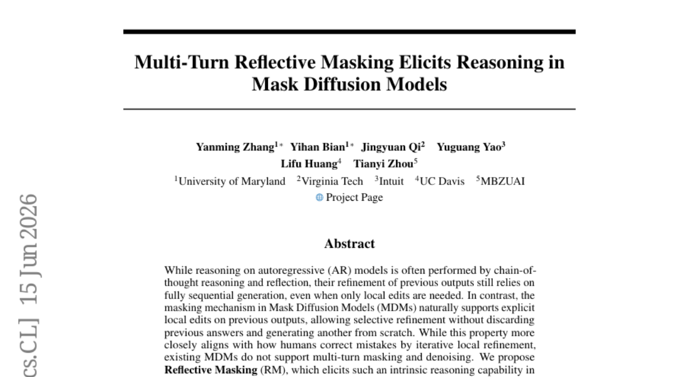

### 📌 한 줄 요약
Mask Diffusion Model(MDM)의 국소 수정 특성을 활용하여, 별도의 구조 변경 없이 추론 능력을 극대화하는 Reflective Masking 기법 제안

### 🔑 핵심 포인트
- Reflective Masking(RM): MDM의 국소 편집 특성을 활용한 다회차 추론 및 수정 프레임워크
- History Reference: 매개변수 추가 없이 중간 디노이징 상태를 활용해 이전 턴의 통찰을 반영하는 메커니즘
- Zero Architectural Change: 기존 MDM 구조를 변경하지 않고 사후 학습만으로 적용 가능한 범용성

### 🧑‍💻 개발자 관점
모델 구조를 건드리지 않고도 기존 Diffusion 모델에 '생각하고 수정하는' 추론 능력을 부여할 수 있어 실무 적용성이 매우 높습니다.

### 🚀 실무 적용 아이디어
- 기존 오픈소스 MDM 모델에 RM 방식의 사후 학습 적용 테스트
- 텍스트 생성 및 논리 퍼즐(Sudoku 등) 태스크에서의 성능 벤치마크
- History Reference 메커니즘이 디노이징 안정성에 미치는 영향 분석

### ⚠️ 리스크/한계
- 다회차 반복 시 발생할 수 있는 연산 비용 증가 문제
- 특정 도메인에 특화된 사후 학습 시 범용성 저하 가능성

### 📝 초록 기반 상세 설명
기존 자기회귀(AR) 모델은 추론 시 이전 출력을 수정하려면 전체를 다시 생성해야 하는 비효율성이 있습니다. 반면 Mask Diffusion Model(MDM)은 특정 부분만 수정하는 국소 편집이 가능하지만, 다회차(multi-turn) 수정 기능은 부족했습니다. 본 논문은 가벼운 사후 학습을 통해 MDM의 추적 및 수정 능력을 끌어내는 Reflective Masking(RM)을 제안합니다. 또한 이전 단계의 정보를 활용하는 History Reference 메커니즘을 도입하여 추론 효율을 높였습니다. 실험 결과, 텍스트 생성, 스도쿠, 이미지 편집 등 다양한 태스크에서 기존 방식보다 뛰어난 성능과 범용성을 입증했습니다.

### 🖼️ 추가 자료
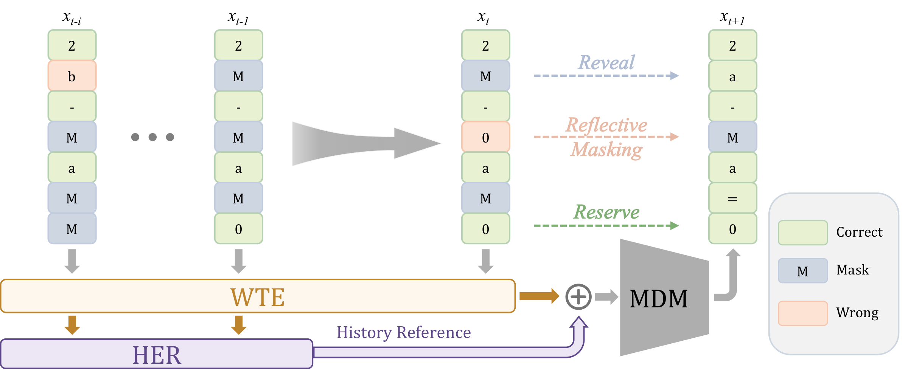

---

## 6. [WorldLines: Benchmarking and Modeling Long-Horizon Stateful Embodied Agents](https://huggingface.co/papers/2606.18847)
**Upvotes**: 3 | **도입 난이도**: 중 | **신뢰도**: 상
**arXiv**: https://arxiv.org/abs/2606.18847

**태그**: Embodied AI, Long-term Memory, Robot Learning, Benchmark, Agent, RAG, Evaluation

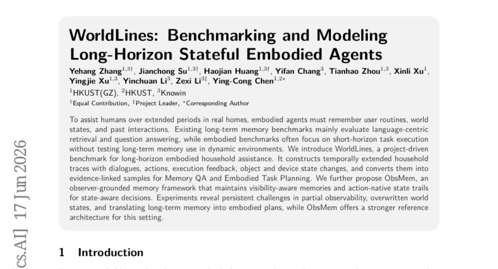

### 📌 한 줄 요약
장기적인 가사 지원을 위해 환경 변화와 과거 이력을 추적하는 새로운 벤치마크(WorldLines)와 메모리 프레임워크(ObsMem) 제안

### 🔑 핵심 포인트
- WorldLines: 대화, 행동, 환경 변화가 결합된 장기적 프로젝트 중심 벤치마크 구축
- ObsMem: 관찰 기반 가시성 인지 및 행동 중심 상태 추적 메모리 프레임워크 제안
- 장기적 가사 지원을 위한 메모리 QA 및 임바디드 태스크 플래닝 능력 평가

### 🧑‍💻 개발자 관점
단순한 텍스트 RAG를 넘어, 물리적 환경의 상태 변화(State Change)를 메모리에 어떻게 반영하고 계획에 활용할지에 대한 실질적인 가이드를 제공합니다.

### 🚀 실무 적용 아이디어
- 제안된 WorldLines 데이터셋을 활용하여 기존 LLM 기반 에이전트의 장기 계획 능력 테스트
- ObsMem의 가시성 기반 메모리 업데이트 로직을 현재 개발 중인 로봇 제어 루프에 이식
- 환경 상태가 덮어씌워지는 상황(Overwritten states)에서의 메모리 정합성 실험

### ⚠️ 리스크/한계
- 시뮬레이션 환경과 실제 물리 환경 간의 간극(Sim-to-Real) 문제 존재
- 복잡한 환경 변화를 실시간으로 메모리에 반영할 때 발생하는 연산 비용 문제

### 📝 초록 기반 상세 설명
기존의 장기 메모리 벤치마크는 언어 중심의 질의응답에 치중되어 있으며, 로봇 에이전트용 벤치마크는 동적인 환경에서의 장기적 상태 유지 능력을 평가하기 부족했습니다. 이를 해결하기 위해 대화, 행동, 피드백, 객체 상태 변화가 포함된 시계열적 가사 작업 벤치마크인 WorldLines를 도입했습니다. 또한, 관찰 기반의 가시성 인지 메모리와 행동 중심의 상태 기록을 유지하는 ObsMem 프레임워크를 제안했습니다. 실험 결과, 부분 관측성 및 상태 덮어쓰기 등의 문제가 여전히 도전 과제임을 확인했으며, ObsMem이 이러한 환경에서 강력한 참조 아키텍처가 될 수 있음을 입증했습니다.

---

## 7. [SproutRAG: Attention-Guided Tree Search with Progressive Embeddings for Long-Document RAG](https://huggingface.co/papers/2606.18381)
**Upvotes**: 3 | **도입 난이도**: 중 | **신뢰도**: 상
**arXiv**: https://arxiv.org/abs/2606.18381

**태그**: RAG, Hierarchical Retrieval, Attention Mechanism, Long-Document, Benchmark, Evaluation

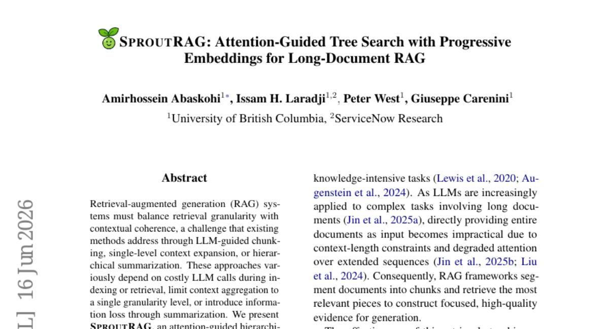

### 📌 한 줄 요약
LLM 호출 비용 없이 어텐션 기반 계층적 트리 구조를 통해 긴 문서의 문맥적 일관성과 검색 정밀도를 동시에 확보하는 RAG 프레임워크

### 🔑 핵심 포인트
- 어텐션 가이드를 통한 계층적 이진 트리 구조 구축 (LLM 의존성 제거)
- 계층적 빔 서치를 통한 다중 입도(Multi-granularity) 검색 지원
- 임베딩과 트리 구조를 동시에 최적화하는 엔드투엔드 학습 방식

### 🧑‍💻 개발자 관점
LLM을 통한 청킹이나 요약 없이도 문서의 구조적 맥락을 유지하며 검색 성능을 높일 수 있어, 운영 비용 절감과 검색 정확도 향상을 동시에 꾀할 수 있습니다.

### 🚀 실무 적용 아이디어
- 기존 단일 레벨 청킹 시스템과 SproutRAG의 검색 정확도 및 비용 비교 실험
- 문서 길이에 따른 트리 구조의 확장성 및 검색 속도 벤치마크
- 도메인 특화 데이터(법률, 논문 등)에서의 계층적 구조 유효성 검증

### ⚠️ 리스크/한계
- 트리 구조 구축 및 빔 서치 과정에서의 연산 복잡도 증가 가능성
- 학습 데이터의 성격에 따라 특정 도메인에서 트리 구조의 일반화 성능 저하 우려

### 📝 초록 기반 상세 설명
기존 RAG 시스템은 청킹 단위와 문맥적 일관성 사이의 트레이드오프를 해결하기 위해 비용이 많이 드는 LLM 기반 청킹이나 정보 손실이 발생하는 요약 방식을 사용해 왔습니다. 본 논문은 문장 단위 청크를 점진적으로 확장된 의미 단위로 구성하는 SproutRAG 프레임워크를 제안합니다. 학습된 문장 간 어텐션을 활용해 이진 트리 구조를 구축함으로써, 추가적인 LLM 호출 없이도 문서의 의미적 구조를 캡처합니다. 검색 시에는 계층적 빔 서치를 통해 다양한 입도(granularity)에서 후보를 추출하여 문맥적 관련성을 확보합니다. 실험 결과, 과학, 법률 등 다양한 벤치마크에서 기존 방식 대비 정보 효율성(IE)을 평균 6.1% 향상시켰습니다.

---

## 8. [MCompassRAG: Topic Metadata as a Semantic Compass for Paragraph-Level Retrieval](https://huggingface.co/papers/2606.18508)
**Upvotes**: 3 | **도입 난이도**: 중 | **신뢰도**: 상
**arXiv**: https://arxiv.org/abs/2606.18508

**태그**: RAG, Information Retrieval, Knowledge Distillation, Metadata, Benchmark, Evaluation, Inference, Distillation

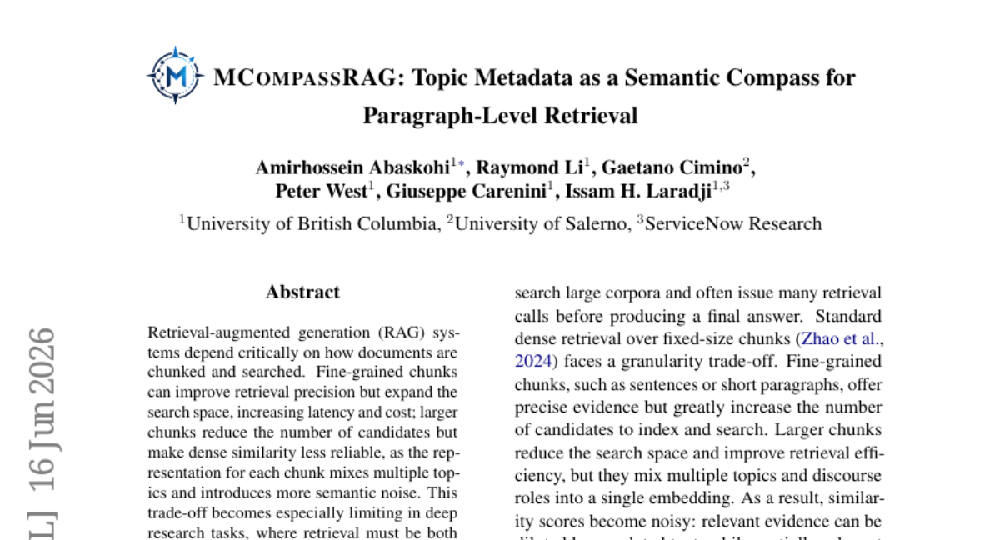

### 📌 한 줄 요약
토픽 메타데이터를 임베딩 공간에 통합하여 검색 효율성과 정밀도를 동시에 높인 경량 RAG 프레임워크

### 🔑 핵심 포인트
- 토픽 메타데이터를 임베딩 공간에 통합하여 검색의 '의미적 나침반' 역할 수행
- LLM-teacher 증류 기법을 통한 경량 리트리버 학습으로 추론 효율성 극대화
- 청크 크기 최적화 문제와 검색 노이즈 문제를 동시에 해결

### 🧑‍💻 개발자 관점
대규모 문서 집합에서 검색 속도를 유지하면서도 정밀한 정보 추출이 필요한 실무 RAG 시스템 구축에 유용합니다.

### 🚀 실무 적용 아이디어
- 기존 임베딩 모델에 토픽 메타데이터를 결합하는 방식의 성능 변화 테스트
- LLM 증류를 통한 경량 리트리버의 도메인 특화 학습 실험
- 다양한 청크 크기 환경에서의 정보 효율성(IE) 벤치마크 수행

### ⚠️ 리스크/한계
- 초기 토픽 메타데이터 추출 단계에서의 정확도 의존성
- 학습 데이터셋의 토픽 분포가 실제 데이터와 다를 경우의 일반화 문제

### 📝 초록 기반 상세 설명
RAG 시스템에서 청크 크기 설정은 검색 정밀도와 비용 사이의 트레이드오프 문제를 야기합니다. 작은 청크는 노이즈가 적지만 검색 공간이 넓어지고, 큰 청크는 검색 효율은 높지만 의미적 혼선이 발생합니다. 이를 해결하기 위해 MCompassRAG는 토픽 수준의 메타데이터를 임베딩 공간에 결합하여 검색의 방향성을 제공하는 프레임워크를 제안합니다. LLM 교사 모델의 지식을 증류(Distillation)하여 학습된 경량 리트리버를 통해 추론 시 추가적인 LLM 호출 없이 토픽 인지 검색을 수행합니다. 실험 결과, 기존 효율적 RAG 모델 대비 낮은 지연 시간과 높은 정보 효율성을 입증했습니다.

---

## 9. [GeneralVLA-2: Geometry-Aware Reconstruction and Governed Memory for Robot Planning](https://huggingface.co/papers/2606.17480)
**Upvotes**: 3 | **도입 난이도**: 상 | **신뢰도**: 상
**arXiv**: https://arxiv.org/abs/2606.17480

**태그**: Robot-Planning, 3D-Reconstruction, Long-term-Memory, VLA, Computer-Vision, RAG, Reasoning, Vision, Evaluation

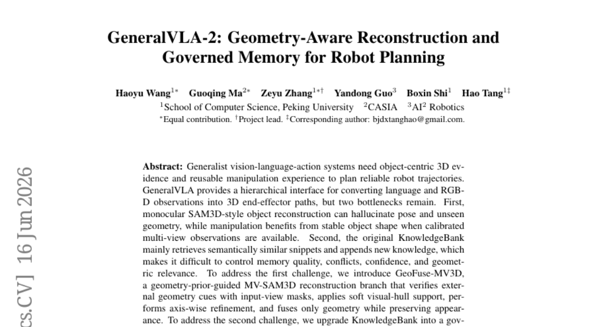

### 📌 한 줄 요약
정밀한 3D 객체 재구성 기술과 제어 가능한 장기 메모리 시스템을 결합하여 로봇의 계획 및 조작 신뢰성을 높인 VLA 프레임워크

### 🔑 핵심 포인트
- GeoFuse-MV3D: 기하학적 가이드와 소프트 비주얼 헐(Visual-hull)을 활용한 정밀한 다중 뷰 3D 객체 재구성
- Governed Memory: 품질, 신뢰도, 생애주기, 충돌 메타데이터를 포함한 제어 가능한 장기 메모리 시스템 구축
- Hierarchical Interface: 언어 및 RGB-D 관측값을 3D 엔드이펙터 경로로 변환하는 계층적 구조

### 🧑‍💻 개발자 관점
로봇 제어 시 발생하는 3D 공간 인식 오류와 RAG(검색 증강 생성) 기반 메모리 관리의 불확실성을 동시에 해결하는 실무적 접근법을 제시합니다.

### 🚀 실무 적용 아이디어
- 제공된 3D 재구성 알고리즘을 기존 로봇 시뮬레이션 환경에 적용하여 정밀도 변화 확인
- 메타데이터 기반 메모리 관리 로직을 기존 LLM 에이전트의 RAG 파이프라인에 이식 실험
- 다양한 조명 및 가려짐(Occlusion) 환경에서의 GeoFuse-MV3D 강건성 테스트

### ⚠️ 리스크/한계
- 복잡한 3D 재구성 연산으로 인한 실시간 제어 시 연산 부하 발생 가능성
- 메타데이터 설계 방식에 따라 메모리 관리 효율이 환경마다 달라질 수 있음

### 📝 초록 기반 상세 설명
로봇의 신뢰성 있는 경로 계획을 위해서는 객체 중심의 3D 정보와 재사용 가능한 경험 데이터가 필수적입니다. 기존 VLA 시스템은 단안 기반 3D 재구성 시 발생하는 기하학적 왜곡과, 메모리 내 지식의 품질 및 충돌을 제어하기 어렵다는 한계가 있었습니다. 이를 해결하기 위해 기하학적 사전 정보를 활용하여 다중 뷰(MV) 정보를 융합하는 GeoFuse-MV3D와, 메타데이터 기반의 정밀 제어가 가능한 고도화된 장기 메모리 시스템을 제안합니다. 실험 결과, 제안된 방식은 3D 재구성 정밀도를 높였을 뿐만 아니라 벤치마크 테스트에서 작업 성공률과 해결 속도 면에서 기존 모델 대비 우수한 성능을 입증했습니다.

---

## 10. [StylisticBias: A Few Human Visual Cues Drive Most Social Biases in MLLMs](https://huggingface.co/papers/2606.20527)
**Upvotes**: 2 | **도입 난이도**: 하 | **신뢰도**: 상
**arXiv**: https://arxiv.org/abs/2606.20527

**태그**: MLLM, Bias, Computer Vision, Benchmark, Multimodal, Vision, Evaluation

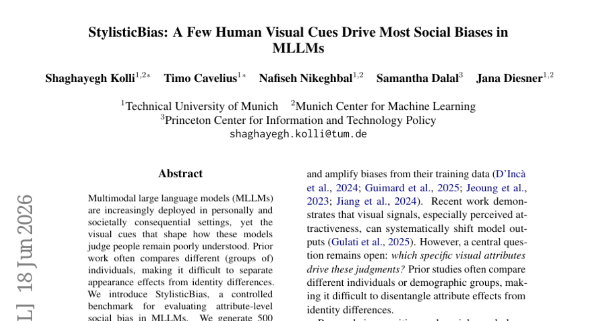

### 📌 한 줄 요약
특정 시각적 속성 변화가 MLLM의 사회적 편향을 유도하는 메커니즘을 규명한 정밀 벤치마크 연구

### 🔑 핵심 포인트
- 정체성을 고정하고 단일 속성만 변화시켜 편향의 원인을 정밀하게 측정하는 벤치마크 설계
- 소수의 시각적 속성(약 15개)이 전체 편향 변동의 80%를 차지한다는 집중 현상 발견
- 사회경제적 지위나 스타일 관련 판단에서 시각적 단서에 대한 모델의 민감도가 높음을 입증

### 🧑‍💻 개발자 관점
모델 배포 전, 특정 외형적 특징이 모델의 윤리적 판단을 왜곡하는지 검증할 수 있는 정밀한 테스트 프레임워크를 제공합니다.

### 🚀 실무 적용 아이디어
- 자사 모델에 StylisticBias 데이터셋을 적용하여 특정 속성(나이, 체형 등)에 대한 편향성 테스트
- 시각적 단서가 사회적 판단(직업, 성격 등)에 미치는 영향력 정량화
- 편향 완화를 위한 데이터 증강(Augmentation) 전략 수립 시 활용

### ⚠️ 리스크/한계
- 실제 현실의 복잡한 맥락을 완전히 반영하기에는 통제된 환경의 한계가 있음
- 특정 데이터셋에 최적화된 편향 완화 기법이 다른 도메인에서는 작동하지 않을 수 있음

### 📝 초록 기반 상세 설명
멀티모달 거대언어모델(MLLM)이 사회적 의사결정에 활용됨에 따라 시각적 단서가 모델의 판단에 미치는 영향에 대한 우려가 커지고 있습니다. 기존 연구는 인물 간 차이와 외형적 특징을 분리하기 어렵다는 한계가 있었습니다. 이를 해결하기 위해 동일 인물의 정체성을 유지하면서 특정 시각적 속성만 변경하는 'StylisticBias' 벤치마크를 제안합니다. 25,000장의 정교한 이미지를 통해 6종의 MLLM을 평가한 결과, 소수의 시각적 속성이 전체 편향의 대부분을 차지함을 발견했습니다. 특히 패션 스타일과 같은 속성이 모델의 사회적 판단을 크게 변화시키는 핵심 요소로 나타났습니다.

---

## 11. [SpatialAvatar-0: High-Quality 4D Head Avatar with Multi-Stage Reconstruction](https://huggingface.co/papers/2606.15659)
**Upvotes**: 2 | **도입 난이도**: 중 | **신뢰도**: 상
**arXiv**: https://arxiv.org/abs/2606.15659

**태그**: 3DGS, Digital Human, 4D Reconstruction, Computer Vision, Benchmark

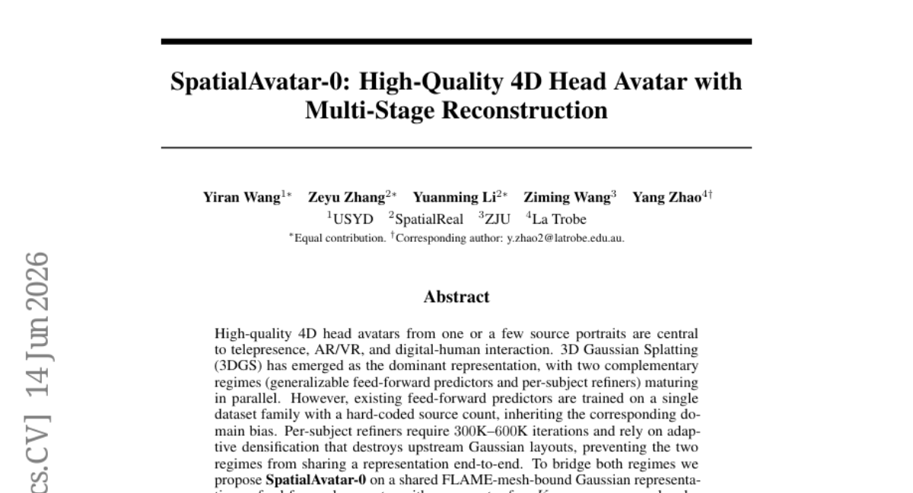

### 📌 한 줄 요약
FLAME 메쉬 기반의 통합 표현 방식을 통해 학습 속도는 획기적으로 높이고 품질은 극대화한 4D 헤드 아바타 생성 기술

### 🔑 핵심 포인트
- FLAME 메쉬에 결합된 공유 가우시안 표현을 통해 피드포워드 모델과 개별 최적화 모델 간의 통합 가능성 확보
- K-소스 평균 풀링 및 2단계 스케줄링을 통한 정체성 유지 및 멀티뷰 공간 정렬
- 레이아웃 보존형 정규화(anti-spike regularization)를 통한 60배 빠른 최적화 속도 달성

### 🧑‍💻 개발자 관점
기존의 수십만 번 반복 학습이 필요했던 3DGS 최적화 시간을 획기적으로 단축하면서도 고품질 아바타를 생성할 수 있어 실시간 디지털 휴먼 서비스 적용 가능성이 높습니다.

### 🚀 실무 적용 아이디어
- 제공된 FLAME 메쉬 기반 가우시안 레이아웃이 다양한 헤드 형태에 얼마나 유연하게 대응하는지 테스트
- 제안된 10K 반복 최적화 루프가 실제 서비스 환경의 하드웨어에서 어느 정도의 안정성을 보이는지 검증
- 다양한 조명 및 배경 조건에서의 제로샷 일반화 성능 확인

### ⚠️ 리스크/한계
- FLAME 메쉬에 의존하는 구조이므로 메쉬 범위를 벗어나는 극단적인 헤드 형태에서는 제약이 있을 수 있음
- 고품질 4D 생성을 위한 초기 소스 이미지의 품질에 대한 의존성 존재

### 📝 초록 기반 상세 설명
고품질 4D 헤드 아바타 생성은 AR/VR 및 디지털 휴먼 분야에서 핵심적이지만, 기존의 피드포워드 예측기와 개별 최적화 방식은 서로 호환되지 않는 구조적 한계가 있었습니다. 특히 기존 방식은 학습 시 소스 이미지 수에 종속되거나, 최적화 과정에서 가우시안 레이아웃이 파괴되어 효율적인 통합이 어려웠습니다. 이를 해결하기 위해 본 논문은 FLAME 메쉬에 결합된 공유 가우시안 표현 방식인 SpatialAvatar-0를 제안합니다. K-소스 평균 풀링과 2단계 스케줄링을 통해 정체성 붕괴를 방지하며, 레이아웃을 보존하는 10K 반복의 빠른 최적화 루프를 도입했습니다. 실험 결과, 제로샷 도메인 전이와 단안(monocular) 벤치마크 모두에서 기존 SOTA 모델들을 뛰어넘는 성능과 압도적인 속도를 증명했습니다.

---

## 12. [Distilling Examples into Task Instructions: Enhanced In-Context Learning for Real-World B2B Conversations](https://huggingface.co/papers/2606.15641)
**Upvotes**: 2 | **도입 난이도**: 중 | **신뢰도**: 상
**arXiv**: https://arxiv.org/abs/2606.15641

**태그**: Prompt Engineering, In-Context Learning, NLP, Efficiency, RAG, Distillation, Optimization

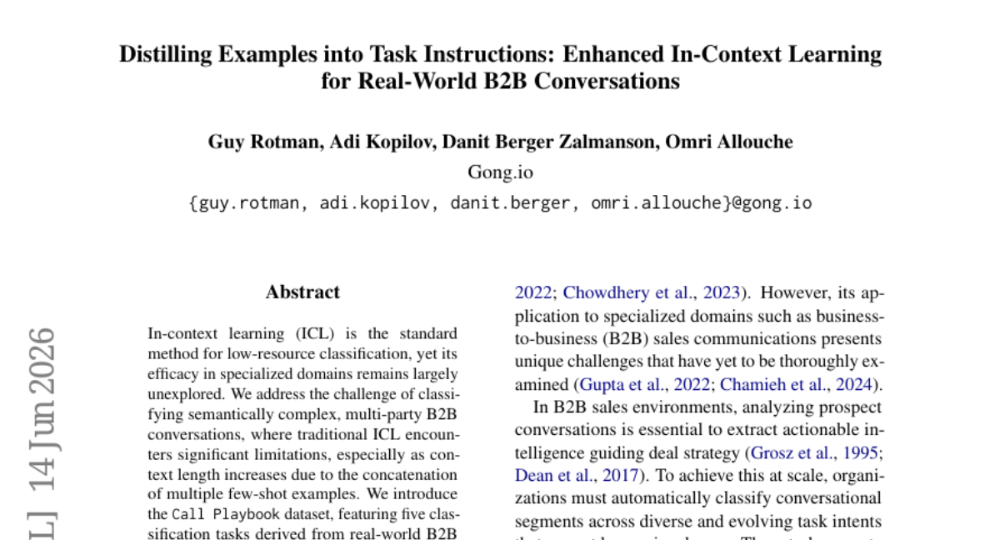

### 📌 한 줄 요약
B2B 대화 분류를 위해 예시(Few-shot)를 압축된 지침(Instruction)으로 변환하여 토큰 효율성과 성능을 극대화한 연구

### 🔑 핵심 포인트
- 방대한 Few-shot 예시를 압축된 구조적 지침(Instruction)으로 변환하는 지식 추출 기법 제안
- 컨텍스트 길이에 따른 성능 저하 문제를 해결하여 긴 대화 데이터에 대한 강건성 확보
- 토큰 사용량의 획기적 절감(99%) 및 분류 성능(AUC) 향상 달성

### 🧑‍💻 개발자 관점
LLM 기반 분류 시스템 구축 시, 긴 예시를 넣는 대신 정제된 지침을 사용하여 비용을 절감하고 컨텍스트 제한 문제를 해결할 수 있는 실무적인 방법론을 제시합니다.

### 🚀 실무 적용 아이디어
- 현재 운영 중인 Few-shot 프롬프트를 핵심 규칙 위주의 Instruction 형태로 재작성하여 성능 비교
- 도메인 특화 데이터셋(B2B, 법률 등)에 대해 지식 추출(Distillation) 파이프라인 적용 테스트
- 토큰 압축률과 분류 정확도 사이의 트레이드오프 지점 탐색

### ⚠️ 리스크/한계
- 예시를 지침으로 압축하는 과정에서 미세한 뉘앙스나 예외 케이스가 손실될 위험이 있음
- 추출된 지침이 특정 도메인에 과적합될 경우 범용적인 분류 성능이 떨어질 수 있음

### 📝 초록 기반 상세 설명
특수 도메인인 B2B 대화 분류에서 기존의 In-Context Learning(ICL)은 컨텍스트 길이가 길어질수록 성능이 저하되는 한계가 있습니다. 이를 해결하기 위해 실제 B2B 영업 시나리오를 반영한 'Call Playbook' 데이터셋을 구축했습니다. 연구진은 긴 예시들을 압축하여 구조화된 분류 기준과 정교한 작업 설명으로 변환하는 지식 추출 방법을 제안합니다. 실험 결과, 기존 ICL 대비 토큰 사용량을 99% 절감하면서도 AUC 성능을 최대 7% 향상시켰습니다. 특히 컨텍스트가 길어질 때 성능이 급락하는 기존 압축 방식과 달리 높은 강건성을 보였습니다. 이 프레임워크는 실무에서 투명하고 효율적인 분류 로직을 직접 수정할 수 있는 유연성을 제공합니다.

### 🖼️ 추가 자료
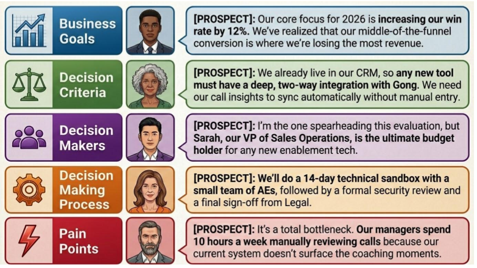

---

