# 2026-06-25 Daily Papers (Top 25)

## 오늘의 요약
오늘의 연구는 범용 에이전트의 성능 향상을 위한 월드 모델, 데이터 큐레이션, 그리고 OS/GUI 환경에서의 실질적인 상호작용 기술에 집중되었습니다. 특히 단순한 질의응답을 넘어 복잡한 환경(모바일, 과학적 문제, 의료 진단)에서 에이전트가 어떻게 자율적으로 문제를 해결하고 컨텍스트를 관리할 것인지에 대한 방법론들이 주목받았습니다.

### 오늘의 핵심 포인트
- 가상 시뮬레이션 환경(World Model)과 자동화된 데이터 파이프라인을 통해 에이전트의 학습 비용을 낮추고 범용 성능을 높이는 연구가 활발히 진행되었습니다.
- 모바일 GUI 및 OS 수준에서의 정교한 컨텍스트 관리와 계층적 피드백을 통한 에이전트 적응 기술이 구체화되었습니다.
- 과학적 발견, 의료 진단, 이미지 생성 등 전문적인 도메인 지식이 필요한 복잡한 태스크를 위한 벤치마크와 평가 체계 구축이 중요하게 다뤄졌습니다.

**오늘의 태그**: AI Agent, World Model, Mobile GUI, Benchmark, Reinforcement Learning

## 1. [Qwen-AgentWorld: Language World Models for General Agents](https://huggingface.co/papers/2606.24597)
**Upvotes**: 79 | **도입 난이도**: 상 | **신뢰도**: 상
**arXiv**: https://arxiv.org/abs/2606.24597

**태그**: Agent, World Model, Reinforcement Learning, Simulation, RAG, Reasoning, Benchmark, Evaluation

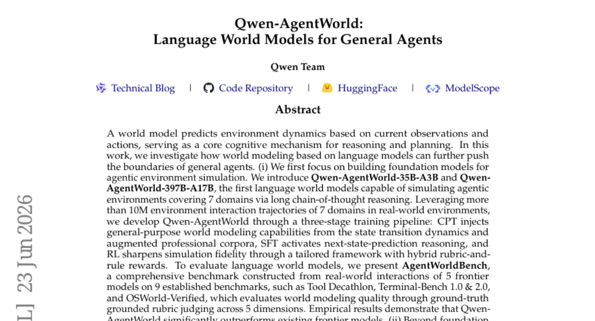

### 📌 한 줄 요약
7개 도메인을 시뮬레이션할 수 있는 대규모 언어 기반 월드 모델(Language World Model) 개발 및 에이전트 성능 향상 입증

### 🔑 핵심 포인트
- 7개 도메인을 커버하는 대규모 언어 기반 월드 모델(Qwen-AgentWorld) 개발
- CPT-SFT-RL로 이어지는 3단계 정교한 학습 파이프라인 구축
- 에이전트 RL을 위한 확장 가능한 시뮬레이터 및 에이전트 성능 향상을 위한 Warm-up 효과 입증

### 🧑‍💻 개발자 관점
현실 세계의 복잡한 환경을 가상 시뮬레이션 환경으로 구축하여 에이전트 학습 비용을 낮추고, 사전 학습을 통해 에이전트의 범용 성능을 높이는 새로운 방법론을 제시합니다.

### 🚀 실무 적용 아이디어
- 제공된 GitHub 코드를 통해 7개 도메인 시뮬레이션 성능 테스트
- 에이전트 RL 학습 시 Qwen-AgentWorld를 환경 시뮬레이터로 활용하는 실험
- 기존 에이전트 모델에 월드 모델링 기반 Warm-up 적용 시 성능 변화 측정

### ⚠️ 리스크/한계
- 언어 기반 시뮬레이션이 실제 물리적 환경의 모든 복잡성을 완벽히 대체할 수 있는지에 대한 의문
- 대규모 모델(397B 등) 사용에 따른 높은 컴퓨팅 자원 요구량

### 📝 초록 기반 상세 설명
에이전트의 추론과 계획을 위한 핵심 기제인 월드 모델링을 언어 모델로 확장하는 연구를 진행했습니다. 기존 에이전트 모델의 한계를 극복하기 위해 7개 도메인에 걸친 1,000만 개 이상의 상호작용 데이터를 활용한 Qwen-AgentWorld 모델 시리즈를 제안합니다. 학습은 CPT(도메인 지식 주입), SFT(다음 상태 예측), RL(시뮬레이션 충실도 강화)의 3단계 파이프라인을 통해 수행되었습니다. 실험 결과, 제안된 모델은 기존 프론티어 모델들을 상회하는 성능을 보였으며, 새로운 벤치마크인 AgentWorldBench를 통해 검증되었습니다. 또한, 이 모델은 독립적인 환경 시뮬레이터이자 에이전트 사전 학습 모델로서 두 가지 방식으로 에이전트 성능을 극대화합니다.

---

## 2. [NatureBench: Can Coding Agents Match the Published SOTA of Nature-Family Papers?](https://huggingface.co/papers/2606.24530)
**Upvotes**: 47 | **도입 난이도**: 중 | **신뢰도**: 상
**arXiv**: https://arxiv.org/abs/2606.24530

**태그**: AI Agent, Benchmark, Scientific Computing, Automation, Agent, RAG, Evaluation, Distillation

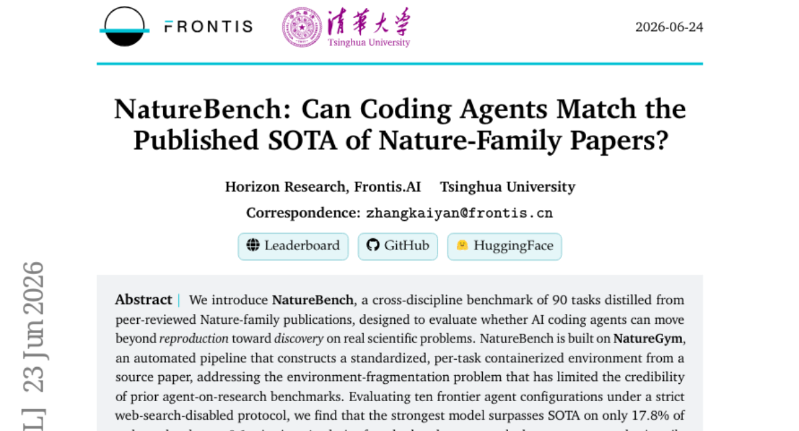

### 📌 한 줄 요약
실제 과학 논문의 문제를 해결하는 AI 에이전트의 성능을 검증하기 위한 벤치마크 및 자동화 환경 구축

### 🔑 핵심 포인트
- Nature-family 논문 기반의 고난도 과학 태스크 벤치마크(NatureBench) 구축
- 논문으로부터 표준화된 컨테이너 환경을 자동 생성하는 파이프라인(NatureGym) 개발
- 에이전트의 성공 방식이 '과학적 발견'이 아닌 '방법론적 번역'에 치중되어 있음을 규명

### 🧑‍💻 개발자 관점
AI 에이전트가 단순 코딩을 넘어 복잡한 도메인 지식이 필요한 과학적 문제 해결에 얼마나 근접했는지 판단하는 기준을 제공합니다.

### 🚀 실무 적용 아이디어
- NatureGym 파이프라인을 활용하여 특정 도메인 논문의 재현 환경 구축 실험
- 에이전트의 방법론 선택 오류를 줄이기 위한 프롬프트 엔지니어링 전략 테스트
- 컴퓨팅 자원(Compute Budget) 변화에 따른 에이전트 성공률 상관관계 분석

### ⚠️ 리스크/한계
- 에이전트가 문제를 단순 예측 문제로 치환하여 해결하는 '편법'적 성공 가능성
- 실제 과학적 창의성보다는 방법론적 변환에 의존하는 평가 구조의 한계

### 📝 초록 기반 상세 설명
기존의 AI 에이전트 벤치마크는 연구 재현성 및 환경 파편화 문제로 인해 실제 과학적 발견 능력을 평가하는 데 한계가 있었습니다. 이를 해결하기 위해 Nature-family 논문에서 추출한 90개의 태스크로 구성된 NatureBench와 자동화된 컨테이너 환경 구축 파이프라인인 NatureGym을 제안합니다. 웹 검색을 제한한 엄격한 환경에서 10종의 최신 에이전트를 평가한 결과, 최상위 모델조차 SOTA 성능을 재현하는 데 어려움을 겪었습니다. 분석 결과, 에이전트들은 과학적 혁신보다는 기존 문제를 익숙한 예측 문제로 변환하는 방식으로 성공하며, 실패의 주된 원인은 잘못된 방법론 선택과 컴퓨팅 자원 부족으로 나타났습니다.

---

## 3. [MobileForge: Annotation-Free Adaptation for Mobile GUI Agents with Hierarchical Feedback-Guided Policy Optimization](https://huggingface.co/papers/2606.19930)
**Upvotes**: 34 | **도입 난이도**: 상 | **신뢰도**: 상
**arXiv**: https://arxiv.org/abs/2606.19930

**태그**: Mobile-Agent, Reinforcement-Learning, GUI-Automation, LLM-Adaptation, Agent, Vision, Evaluation

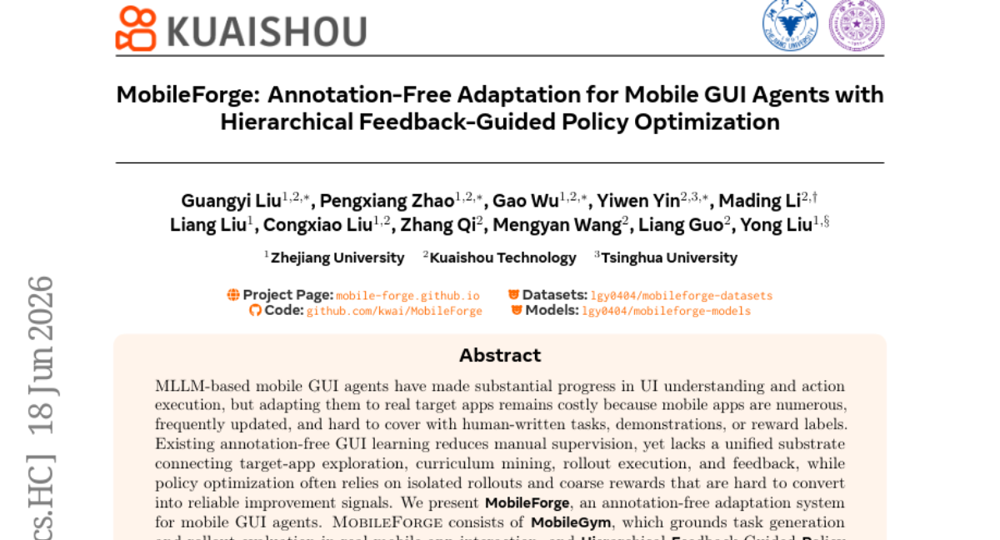

### 📌 한 줄 요약
별도의 수동 레이블링 없이 모바일 앱 환경에서 스스로 학습하여 성능을 최적화하는 에이전트 적응 시스템

### 🔑 핵심 포인트
- MobileGym: 실시간 앱 상호작용을 통한 자동 태스크 생성 및 롤아웃 평가 환경 구축
- HiFPO: 결과(Outcome), 단계별 피드백, 교정 힌트를 결합한 계층적 GRPO 최적화 방식
- Annotation-Free: 수동 데이터 없이 자동 생성된 데이터만으로 타겟 앱에 대한 에이전트 적응 가능

### 🧑‍💻 개발자 관점
새로운 앱이나 업데이트된 UI 환경에 대응하기 위해 매번 사람이 데이터를 라벨링할 필요 없이 자동화된 파이프라인으로 에이전트를 튜닝할 수 있습니다.

### 🚀 실무 적용 아이디어
- 제공된 MobileGym 환경을 활용한 자동 데이터 생성 파이프라인 테스트
- GRPO 알고리즘을 활용한 단계별 피드백(Step-level feedback) 적용 실험
- 특정 도메인(예: 쇼핑, 배달) 앱에 대한 Zero-shot vs MobileForge 적응 성능 비교

### ⚠️ 리스크/한계
- 자동 생성된 데이터의 품질이 에이전트의 최종 성능을 결정짓는 병목이 될 수 있음
- 실제 모바일 환경에서의 롤아웃 과정에서 발생하는 예외 상황 처리에 대한 의존성

### 📝 초록 기반 상세 설명
최근 MLLM 기반 모바일 GUI 에이전트가 발전하고 있으나, 빈번한 앱 업데이트와 방대한 태스크로 인해 수동 데이터 구축 비용이 매우 높습니다. 기존의 비지도 학습 방식은 탐색, 커리큘럼 생성, 피드백 루프가 통합되지 않아 신뢰할 수 있는 정책 최적화가 어렵다는 문제가 있습니다. 이를 해결하기 위해 MobileForge는 실시간 앱 상호작용을 통한 태스크 생성 및 평가를 지원하는 MobileGym과 계층적 피드백 기반 정책 최적화(HiFPO)를 제안합니다. HiFPO는 결과뿐만 아니라 단계별 피드백과 교정 힌트를 활용하여 GRPO 방식으로 정책을 업데이트합니다. 실험 결과, MobileForge는 AndroidWorld 벤치마크에서 강력한 성능을 보이며 오픈 데이터 기반 모바일 GUI 에이전트로서 최고 수준의 성능을 입증했습니다.

---

## 4. [MemGUI-Agent: An End-to-End Long-Horizon Mobile GUI Agent with Proactive Context Management](https://huggingface.co/papers/2606.19926)
**Upvotes**: 33 | **도입 난이도**: 중 | **신뢰도**: 상
**arXiv**: https://arxiv.org/abs/2606.19926

**태그**: AI Agent, Mobile GUI, Context Management, LLM, Agent, Benchmark

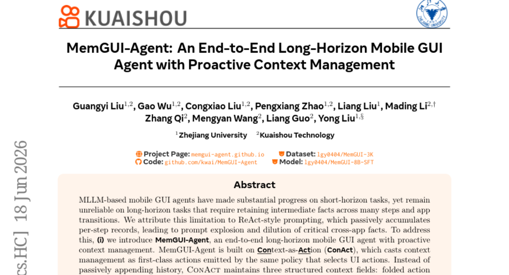

### 📌 한 줄 요약
컨텍스트 관리 자체를 에이전트의 액션으로 정의하여 장기 작업(Long-horizon) 수행 능력을 극대화한 모바일 GUI 에이전트 기술

### 🔑 핵심 포인트
- Context-as-Action (ConAct): 컨텍스트 관리를 별도의 액션으로 정의하여 프롬프트 폭발 문제를 해결
- 구조화된 컨텍스트 관리: Folded history, Folded UI state, Recent step record로 나누어 정보 밀도 유지
- MemGUI-3K 데이터셋: 정교한 컨텍스트 관리가 포함된 대규모 학습용 데이터셋 구축

### 🧑‍💻 개발자 관점
에이전트가 복잡하고 긴 작업 흐름을 수행할 때 발생하는 '기억 상실' 및 '프롬프트 비용 문제'를 해결할 수 있는 실질적인 아키텍처를 제시합니다.

### 🚀 실무 적용 아이디어
- 제공된 MemGUI-3K 데이터셋을 활용한 SFT(Supervised Fine-Tuning) 실험
- 기존 ReAct 방식과 ConAct 방식 간의 토큰 사용량 및 성공률 비교 테스트
- 다양한 모바일 환경에서의 일반화 성능 검증

### ⚠️ 리스크/한계
- 컨텍스트 관리 액션이 모델의 추론 복잡도를 높일 수 있음
- 특정 도메인이나 UI 구조에 대한 의존성 여부 확인 필요

### 📝 초록 기반 상세 설명
기존 MLLM 기반 모바일 GUI 에이전트는 ReAct 방식의 수동적인 기록 축적 방식 때문에 프롬프트가 비대해지고 중요한 정보가 희석되는 문제가 있었습니다. 이를 해결하기 위해 컨텍스트 관리를 에이전트의 핵심 액션으로 포함하는 'Context-as-Action (ConAct)' 프레임워크를 제안합니다. ConAct는 히스토리, UI 상태, 최근 기록을 구조화하여 관리함으로써 컨텍스트를 압축하면서도 핵심 정보를 보존합니다. 이를 위해 2,956개의 궤적을 포함한 MemGUI-3K 데이터셋을 구축하여 모델을 학습시켰습니다. 실험 결과, 개발된 MemGUI-8B-SFT 모델은 오픈 데이터셋 벤치마크에서 최고 성능을 기록하며 뛰어난 일반화 성능을 입증했습니다.

---

## 5. [AOHP: An Open-Source OS-Level Agent Harness for Personalized, Efficient and Secure Interaction](https://huggingface.co/papers/2606.23449)
**Upvotes**: 26 | **도입 난이도**: 상 | **신뢰도**: 상
**arXiv**: https://arxiv.org/abs/2606.23449

**태그**: AI Agent, OS Architecture, Android, System Security, Agent, Safety

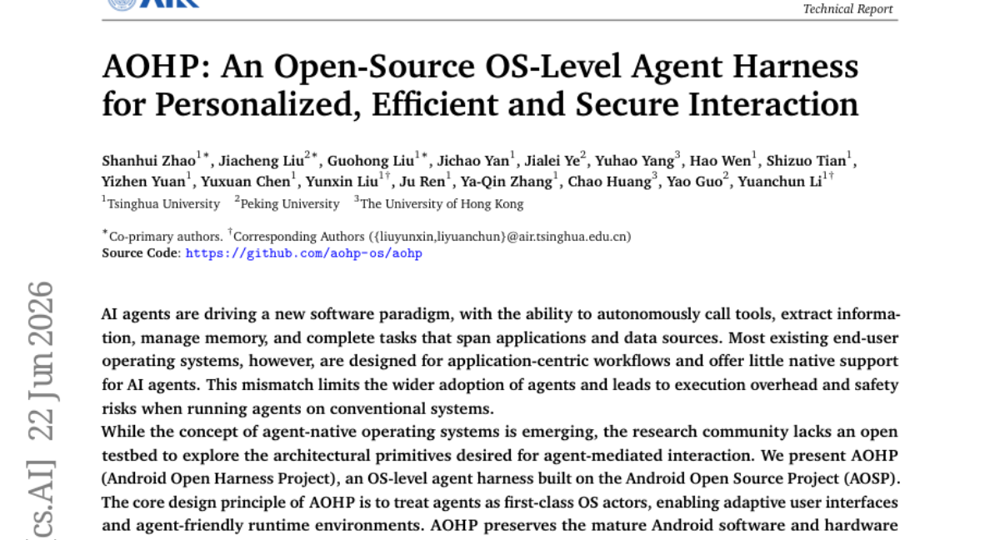

### 📌 한 줄 요약
에이전트를 OS 수준의 퍼스트 클래스 객체로 다루어 효율성과 보안을 극대화한 Android 기반 오픈소스 에이전트 프레임워크

### 🔑 핵심 포인트
- AOSP 기반의 OS 레벨 에이전트 하네스(AOHP) 개발
- 에이전트를 OS의 퍼스트 클래스 액터로 정의하여 시스템 수준의 최적화 구현
- 개인화된 서비스 구성, 효율적 인터페이스, 보안 정보 흐름을 위한 3대 메커니즘 도입

### 🧑‍💻 개발자 관점
에이전트가 단순 앱 사용자를 넘어 OS 시스템 자원을 직접 제어해야 하는 차세대 모바일 환경에서 필수적인 아키텍처 가이드를 제공합니다.

### 🚀 실무 적용 아이디어
- AOSP 소스 코드와 AOHP 프레임워크의 통합 구조 분석
- 기존 Android 앱 기반 에이전트와 AOHP 방식의 토큰 소모량 비교 실험
- 에이전트 권한 제어 및 보안 정책 적용 시나리오 테스트

### ⚠️ 리스크/한계
- AOSP 커스텀에 따른 높은 개발 및 유지보수 난이도
- 기존 Android 생태계와의 호환성 유지 및 시스템 안정성 확보 문제

### 📝 초록 기반 상세 설명
최근 AI 에이전트가 새로운 소프트웨어 패러다임을 주도하고 있으나, 기존 OS는 애플리케이션 중심 설계로 인해 에이전트 실행 시 오버헤드와 보안 리스크가 발생합니다. 연구 커뮤니티에는 에이전트 중심 아키텍처를 실험할 수 있는 오픈 테스트베드가 부족한 상황입니다. 이를 해결하기 위해 본 논문은 AOSP를 기반으로 한 OS 레벨 에이전트 하네스인 AOHP를 제안합니다. AOHP는 에이전트를 OS의 핵심 액터로 취급하여 적응형 UI와 에이전트 친화적 런타임을 제공합니다. 실험 결과, 기존 방식 대비 작업 완료율을 높이고 토큰 비용을 크게 절감하며 보안 정책 준수 측면에서도 우수한 성능을 입증했습니다.

### 🖼️ 추가 자료
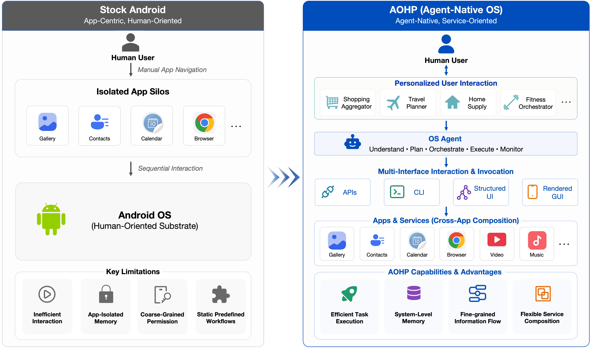

---

## 6. [LingxiDiagBench: A Multi-Agent Framework for Benchmarking LLMs in Chinese Psychiatric Consultation and Diagnosis](https://huggingface.co/papers/2602.09379)
**Upvotes**: 19 | **도입 난이도**: 중 | **신뢰도**: 상
**arXiv**: https://arxiv.org/abs/2602.09379

**태그**: Multi-Agent, Medical AI, Benchmark, LLM Evaluation, Agent, Reasoning, Evaluation, Inference

### 📌 한 줄 요약
중국어 정신과 진단 역량 평가를 위한 멀티 에이전트 벤치마크 프레임워크 및 대규모 합성 데이터셋 제안

### 🔑 핵심 포인트
- 16,000개의 EMR 정렬 합성 대화 데이터셋(LingxiDiag-16K) 구축
- 정적 진단과 동적 다회차 상담을 모두 평가하는 멀티 에이전트 프레임워크 제안
- LLM의 정보 수집 전략과 진단 정확도 간의 상관관계 분석

### 🧑‍💻 개발자 관점
의료용 에이전트 개발 시 단순 질의응답을 넘어, 복잡한 진단 로직과 다회차 대화 흐름을 검증할 수 있는 평가 체계의 중요성을 시사합니다.

### 🚀 실무 적용 아이디어
- 제공된 데이터셋을 활용하여 멀티턴 대화 시 LLM의 정보 수집 효율성 테스트
- 복합 질환(Comorbidity) 시나리오에서의 에이전트 추론 능력 벤치마킹
- LLM-as-a-Judge 방식과 실제 진단 정확도 간의 괴리율 측정 실험

### ⚠️ 리스크/한계
- 합성 데이터 기반이므로 실제 임상 환경과의 괴리 가능성 존재
- 중국어 특화 데이터셋으로 타 언어권 적용 시 일반화 문제

### 📝 초록 기반 상세 설명
정신 건강 진단은 주관성이 높고 전문 인력이 부족하여 AI 보조 진단 도구의 필요성이 크지만, 현실적인 시뮬레이션과 검증된 라벨을 갖춘 벤치마크가 부족한 상황입니다. 이를 해결하기 위해 연구진은 정적 진단 추론과 동적 다회차 상담 능력을 동시에 평가할 수 있는 LingxiDiagBench를 개발했습니다. 핵심 데이터셋인 LingxiDiag-16K는 12개 ICD-10 범주를 반영한 16,000개의 합성 상담 대화로 구성됩니다. 실험 결과, LLM은 단순 이진 분류에는 강하나 공존 질환 식별 및 다중 진단에서는 성능이 급격히 저하되었습니다. 또한, 상담 과정에서의 정보 수집 전략이 진단 정확도에 큰 영향을 미치며, 질문의 구조적 완성도가 반드시 정확한 진단으로 이어지지는 않음을 확인했습니다.

---

## 7. [OpenThoughts-Agent: Data Recipes for Agentic Models](https://huggingface.co/papers/2606.24855)
**Upvotes**: 16 | **도입 난이도**: 중 | **신뢰도**: 상
**arXiv**: https://arxiv.org/abs/2606.24855

**태그**: Agent, Data Engineering, Fine-tuning, Open Source, RAG, Benchmark

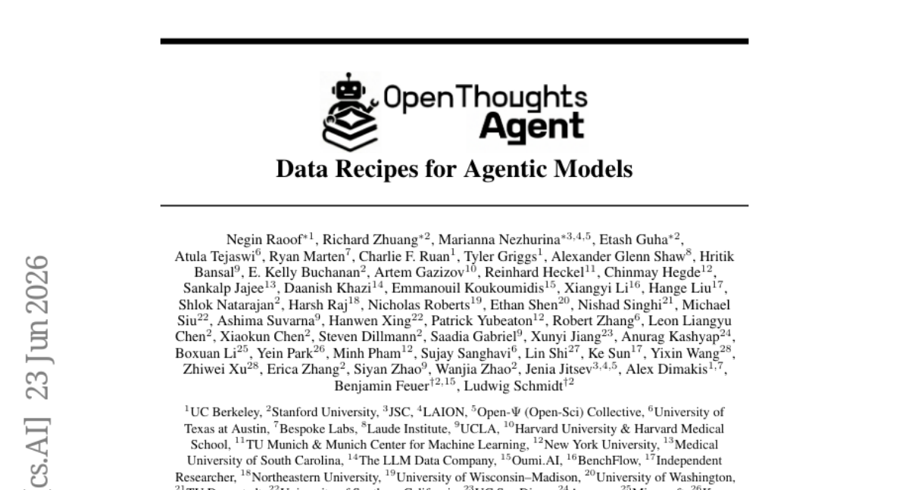

### 📌 한 줄 요약
다양한 에이전트 작업에 범용적으로 대응할 수 있는 오픈 소스 데이터 큐레이션 파이프라인 및 학습 데이터셋 제안

### 🔑 핵심 포인트
- 범용 에이전트 학습을 위한 체계적인 오픈 데이터 큐레이션 파이프라인 구축
- 100개 이상의 실험을 통한 데이터 소스 및 다양성 영향력 검증
- 기존 오픈 모델 대비 우수한 성능 및 강력한 데이터 스케일링 특성 입증

### 🧑‍💻 개발자 관점
특정 태스크에 매몰되지 않고 다양한 환경에서 작동하는 범용 에이전트를 구축하기 위한 데이터 엔지니어링 전략을 제공합니다.

### 🚀 실무 적용 아이디어
- 제공된 데이터 파이프라인을 활용하여 특정 도메인 특화 에이전트 데이터셋 생성 실험
- 데이터 규모 변화에 따른 모델 성능 변화(Scaling Law) 추이 분석
- 기존 오픈 소스 모델에 OT-Agent 데이터셋을 적용한 성능 비교 테스트

### ⚠️ 리스크/한계
- 특정 벤치마크 성능 향상이 실제 복잡한 실무 환경에서의 일반화로 직결되는지에 대한 검증 필요
- 데이터 큐레이션 파이프라인의 복잡도로 인한 구축 비용 발생 가능성

### 📝 초록 기반 상세 설명
에이전트형 언어 모델의 활용도는 높아지고 있으나, 범용적인 에이전트 능력을 갖추기 위한 데이터 큐레이션 방법론은 여전히 미지의 영역입니다. 기존 연구들은 특정 벤치마크에 특화된 데이터에 집중하여 범용적 일반화 능력이 부족하다는 한계가 있었습니다. 본 연구는 이를 해결하기 위해 체계적인 데이터 큐레이션 파이프라인인 OpenThoughts-Agent(OT-Agent)를 제안합니다. 100회 이상의 제어된 어블레이션 실험을 통해 데이터 소스와 다양성의 중요성을 검증하였으며, 이를 통해 구축된 10만 개의 데이터셋으로 Qwen3-32B를 미세 조정했습니다. 그 결과 7개의 에이전트 벤치마크에서 기존 최고 수준의 오픈 모델을 상회하는 성능을 달성했으며, 데이터 규모에 따른 강력한 스케일링 법칙을 확인했습니다.

---

## 8. [Semantic Browsing: Controllable Diversity for Image Generation](https://huggingface.co/papers/2606.23679)
**Upvotes**: 13 | **도입 난이도**: 중 | **신뢰도**: 상
**arXiv**: https://arxiv.org/abs/2606.23679

**태그**: Text-to-Image, VLM, Agentic Workflow, Generative Design, Agent, RAG, Vision

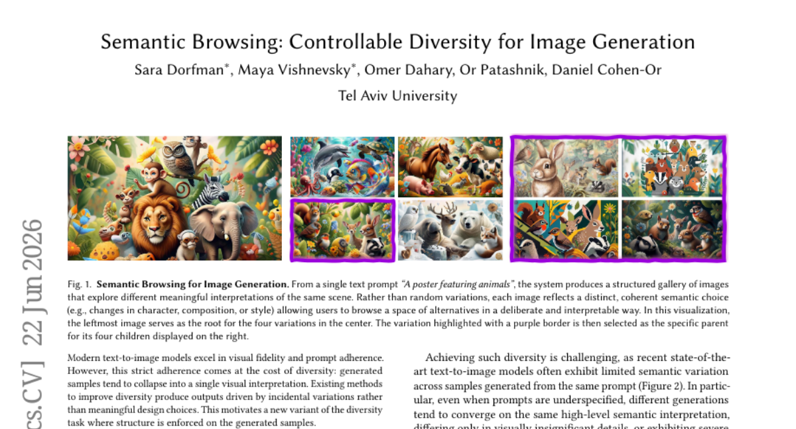

### 📌 한 줄 요약
텍스트 기반의 의미론적 변형을 통해 사용자 제어가 가능한 구조적 이미지 다양성 생성 방법론 제안

### 🔑 핵심 포인트
- 픽셀 변형이 아닌 텍스트 수준에서의 의미론적 다양성 유도
- VLM과 에이전트 워크플로우를 결합한 구조적 변형 제어
- 사용자가 직관적으로 탐색 가능한 의미론적 브라우징 환경 구축

### 🧑‍💻 개발자 관점
단순히 무작위적인 이미지를 생성하는 것을 넘어, 디자인 워크플로우에서 특정 속성(예: 스타일, 구도)을 체계적으로 변경하며 최적의 결과물을 찾는 도구로 활용 가능합니다.

### 🚀 실무 적용 아이디어
- 기존 Stable Diffusion 모델에 VLM 기반 텍스트 변형 에이전트 결합 실험
- 생성된 이미지 간의 의미적 거리(Semantic Distance) 측정 및 시각화
- 사용자 인터페이스(UI) 상에서 변형 축(Axis)을 조절하는 프로토타입 구현

### ⚠️ 리스크/한계
- 텍스트 변형이 이미지의 품질 저하나 프롬프트 이탈로 이어질 가능성
- 에이전트 워크플로우 도입에 따른 추론 비용 및 지연 시간 증가

### 📝 초록 기반 상세 설명
최신 텍스트-이미지 모델은 프롬프트 준수 능력은 뛰어나지만, 생성 결과물이 특정 시각적 해석에 고착되는 다양성 부족 문제를 겪고 있습니다. 기존의 다양성 개선 방식은 의미 있는 설계 선택보다는 우연한 변형에 의존하는 한계가 있습니다. 본 논문은 사용자가 의미 있는 변형 축을 따라 이미지를 탐색할 수 있는 'Semantic Browsing' 기법을 제안합니다. 이를 위해 픽셀 생성 단계가 아닌 텍스트 수준에서 다양성을 유도하는 패러다임 전환을 시도합니다. VLM(Vision Language Model)과 에이전트 워크플로우를 활용하여 원본 프롬프트에 부합하면서도 구조화된 변형을 생성하도록 설계했습니다. 결과적으로 사용자가 이해할 수 있는 명확한 의미적 결정에 기반한 탐색 가능한 디자인 공간을 구현했습니다.

### 🖼️ 추가 자료

---

## 9. [FLAT: Feedforward Latent Triangle Splatting for Geometrically Accurate Scene Generation](https://huggingface.co/papers/2606.24876)
**Upvotes**: 12 | **도입 난이도**: 중 | **신뢰도**: 상
**arXiv**: https://arxiv.org/abs/2606.24876

**태그**: 3D Generation, Computer Vision, Graphics, Diffusion Models, Vision, Video, Benchmark, Evaluation

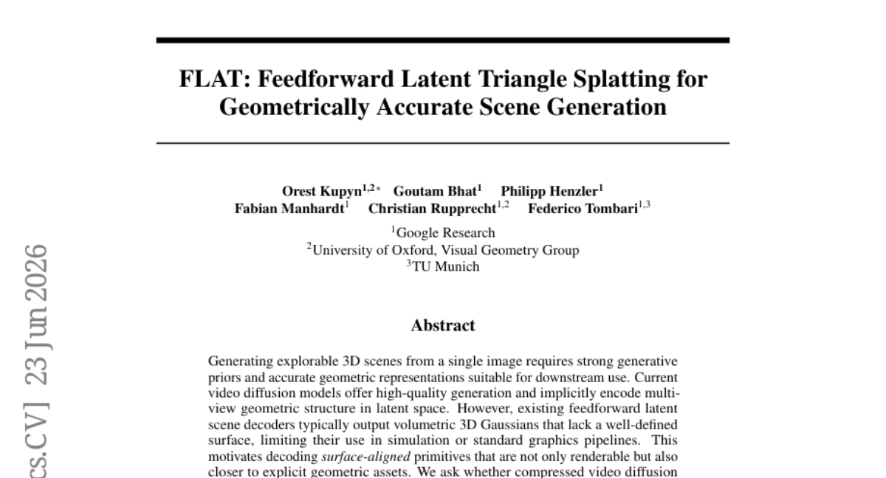

### 📌 한 줄 요약
비디오 확산 모델의 잠재 공간에서 게임 엔진에 즉시 사용 가능한 정교한 삼각형 메시(Triangle Mesh)를 직접 생성하는 기술

### 🔑 핵심 포인트
- 비디오 확산 모델의 잠재 공간에서 직접 삼각형 프리미티브를 디코딩하는 최초의 시도
- 회전 파라미터화 및 프로덕트 윈도우 함수를 통한 안정적인 그래디언트 흐름 확보
- 생성된 삼각형 뭉치를 게임 엔진에 즉시 적용 가능한 불투명 메시로 변환하는 워크플로우 제공

### 🧑‍💻 개발자 관점
기존 3D 가우시안 방식의 고질적 문제인 '불분명한 표면' 문제를 해결하여, 생성된 3D 에셋을 물리 엔진이나 게임 엔진에 즉시 투입할 수 있는 실용성을 제공합니다.

### 🚀 실무 적용 아이디어
- 제공된 프로젝트 페이지의 데모를 통해 생성된 메시의 정밀도 확인
- 기존 3DGS(3D Gaussian Splatting) 결과물과 기하학적 정확도 비교 실험
- 게임 엔진(Unity/Unreal) 내 물리 충돌 테스트 수행

### ⚠️ 리스크/한계
- 삼각형 예측의 높은 민감도로 인해 학습 난이도가 높을 수 있음
- 복잡한 장면에서 생성된 삼각형 뭉치의 밀도나 위상(Topology) 문제 가능성

### 📝 초록 기반 상세 설명
단일 이미지로부터 탐색 가능한 3D 장면을 생성하려면 높은 생성 품질과 명확한 기하학적 구조가 동시에 필요합니다. 기존의 볼륨 기반 3D 가우시안 방식은 표면 정의가 모호하여 시뮬레이션이나 그래픽 파이프라인 활용에 한계가 있습니다. 본 논문은 비디오 확산 모델의 잠재 공간에서 직접 표면 기반의 삼각형 스플랫(Triangle Splats)을 디코딩하는 FLAT 방식을 제안합니다. 이를 위해 레이 중심 회전 파라미터화와 그래디언트 흐름을 개선하는 새로운 프로덕트 윈도우 함수를 도입하여 삼각형 회전 예측의 난제를 해결했습니다. 실험 결과, FLAT은 기존 방식 대비 뛰어난 기하학적 정확도를 달성했으며, 테스트 타임 리파인먼트를 통해 게임 엔진용 불투명 메시로 변환이 가능함을 입증했습니다.

---

## 10. [FedOT: Ownership Verification and Leakage Tracing via Watermarks for Federated LDMs](https://huggingface.co/papers/2606.22875)
**Upvotes**: 9 | **도입 난이도**: 중 | **신뢰도**: 상
**arXiv**: https://arxiv.org/abs/2606.22875

**태그**: Federated Learning, Diffusion Models, Watermarking, Security, Vision

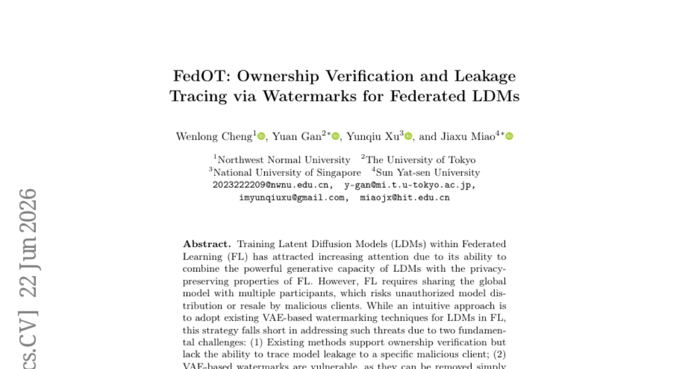

### 📌 한 줄 요약
연합 학습 기반 LDM의 모델 소유권 증명 및 유출 경로 추적을 위한 워터마킹 프레임워크 FedOT 제안

### 🔑 핵심 포인트
- 소유권 확인과 클라이언트 식별을 동시에 수행하는 Chunked Watermark 설계
- VAE 교체 공격을 방어하기 위해 잠재 분포를 변형하는 LVT(Latent Vector Transformation) 도입
- 연합 학습 환경에서의 모델 유출 및 무단 재배포 방지를 위한 통합 프레임워크 구축

### 🧑‍💻 개발자 관점
모델 배포 시 발생할 수 있는 지식재산권 침해와 악의적 클라이언트에 의한 모델 유출 문제를 기술적으로 방어할 수 있는 가이드를 제공합니다.

### 🚀 실무 적용 아이디어
- LVT 적용 시 모델의 생성 이미지 품질(FID 등) 변화 측정
- 다양한 VAE 교체 시나리오에서의 워터마크 제거 저항성 테스트
- 멀티 클라이언트 환경에서의 식별 정확도 검증

### ⚠️ 리스크/한계
- LVT로 인한 잠재 공간 변형이 모델의 일반적인 생성 성능에 미칠 수 있는 영향
- 워터마크 삽입으로 인한 추가적인 연산 비용 및 학습 복잡도 증가

### 📝 초록 기반 상세 설명
연합 학습(FL) 환경에서 LDM을 학습할 때, 악의적인 클라이언트가 모델을 무단 배포하거나 재판매할 위험이 존재합니다. 기존 VAE 기반 워터마킹은 소유권 확인은 가능하나 유출 경로 추적이 어렵고, VAE 디코더 교체만으로 워터마크가 제거되는 취약점이 있습니다. 이를 해결하기 위해 본 논문은 소유권 확인과 클라이언트 식별을 분리한 'Chunked Watermark'를 설계했습니다. 또한, VAE와 U-Net 간의 잠재 공간 연결을 강화하는 'Latent Vector Transformation(LVT)'을 도입하여 VAE 교체 공격을 방어합니다. 실험 결과, FedOT는 소유권 검증과 추적성 측면에서 우수한 성능을 입증했습니다.

---

## 11. [Escaping the Self-Confirmation Trap: An Execute-Distill-Verify Paradigm for Agentic Experience Learning](https://huggingface.co/papers/2606.24428)
**Upvotes**: 8 | **도입 난이도**: 중 | **신뢰도**: 상
**arXiv**: https://arxiv.org/abs/2606.24428

**태그**: LLM Agent, Self-Evolution, Multi-Agent, Memory Management, Agent, RAG, Benchmark, Evaluation, Distillation

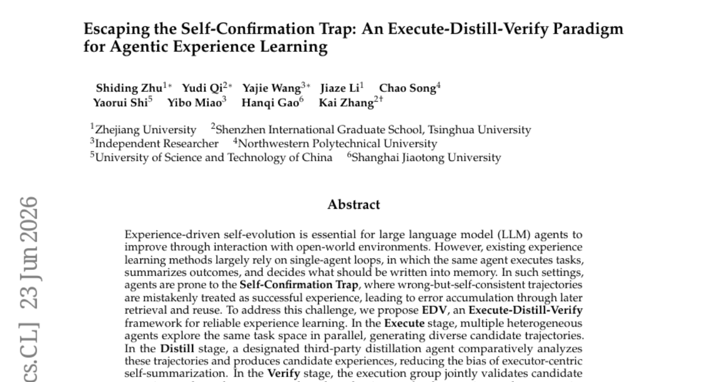

### 📌 한 줄 요약
에이전트의 자기 확증 편향(Self-Confirmation Trap)을 방지하기 위해 실행, 증류, 검증 단계를 분리하여 신뢰할 수 있는 경험 학습을 구현한 프레임워크

### 🔑 핵심 포인트
- 자기 확증 트랩(Self-Confirmation Trap) 문제를 해결하기 위한 단계적 분리 구조 제안
- Execute-Distill-Verify(EDV) 프레임워크를 통한 다중 에이전트 협업 기반 경험 학습
- 제3자 에이전트의 분석과 합의 메커니즘을 통한 고품질 메모리 삽입 보장

### 🧑‍💻 개발자 관점
에이전트가 잘못된 성공 경험을 학습하여 성능이 점진적으로 퇴화하는 문제를 방지하는 아키텍처 설계 패턴을 제공합니다.

### 🚀 실무 적용 아이디어
- 단일 에이전트 기반 RAG/경험 학습 루프에 EDV의 검증 단계만 도입하여 성능 변화 관찰
- 다양한 페르소나를 가진 에이전트 그룹을 구성하여 Distill 단계의 편향 제거 효과 테스트
- 에이전트 간 합의(Consensus) 알고리즘이 메모리 품질에 미치는 영향 분석

### ⚠️ 리스크/한계
- 다중 에이전트 운용에 따른 높은 추론 비용 및 지연 시간(Latency) 발생
- 에이전트 간 합의 과정에서 발생할 수 있는 새로운 형태의 편향이나 병목 현상

### 📝 초록 기반 상세 설명
LLM 에이전트가 환경과 상호작용하며 스스로 진화하는 과정에서, 단일 에이전트 루프는 잘못된 성공 사례를 학습하는 '자기 확증 트랩'에 빠질 위험이 있습니다. 이를 해결하기 위해 본 논문은 EDV(Execute-Distill-Verify) 프레임워크를 제안합니다. EDV는 여러 에이전트가 병렬로 작업을 수행(Execute)하고, 제3의 에이전트가 이를 비교 분석하여 편향을 제거(Distill)하며, 합의 메커니즘을 통해 최종 경험을 검증(Verify)하는 구조를 가집니다. 이러한 단계적 분리를 통해 에이전트는 노이즈가 제거된 고품질의 경험만을 메모리에 저장할 수 있습니다. 실험 결과, tau2-bench 등 복잡한 벤치마크에서 기존 방식보다 뛰어난 성능을 보이며 신뢰할 수 있는 경험 구축의 중요성을 입증했습니다.

---

## 12. [Are Text-to-Image Models Inductivist Turkeys? A Counterfactual Benchmark for Causal Reasoning](https://huggingface.co/papers/2606.24548)
**Upvotes**: 5 | **도입 난이도**: 하 | **신뢰도**: 상
**arXiv**: https://arxiv.org/abs/2606.24548

**태그**: T2I, Causal Reasoning, Benchmark, Computer Vision, Reasoning, Vision, Evaluation

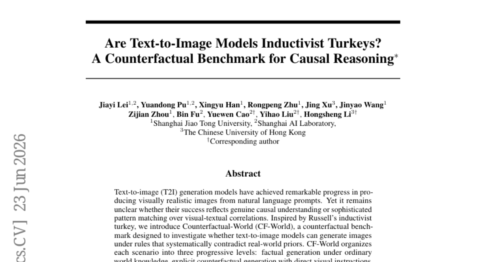

### 📌 한 줄 요약
T2I 모델이 단순 패턴 매칭을 넘어 인과적 추론을 수행하는지 검증하기 위한 반사실적 벤치마크 제안

### 🔑 핵심 포인트
- 현실 세계의 사전 지식(Prior)을 거스르는 능력을 측정하는 CF-World 벤치마크 개발
- 모델의 인과적 추론 능력을 평가하기 위한 두 가지 지표(PRR, RRR) 제안
- T2I 모델이 학습 데이터의 시각적 상관관계에 갇혀 인과적 규칙을 따르지 못함을 입증

### 🧑‍💻 개발자 관점
모델이 단순한 이미지 생성을 넘어 복잡한 논리적/인과적 지시사항을 따를 수 있는지 판단하는 기준을 제공합니다.

### 🚀 실무 적용 아이디어
- 사용 중인 T2I 모델에 상식과 반대되는 프롬프트를 입력하여 생성 결과의 일관성 테스트
- 모델이 특정 객체 간의 관계를 고정된 패턴으로 인식하는지 확인하는 엣지 케이스 실험
- VLM을 활용한 자동화된 시각적 논리 검증 파이프라인 구축

### ⚠️ 리스크/한계
- 모델이 학습 데이터의 통계적 편향에 의존하므로, 새로운 규칙 학습이 어려울 수 있음
- VLM 기반 평가 방식이 모델의 생성 품질과 논리적 정확성을 완벽히 분리하지 못할 가능성

### 📝 초록 기반 상세 설명
최근 텍스트-이미지(T2I) 생성 모델의 성능은 비약적으로 발전했으나, 이것이 실제 인과적 이해인지 단순한 패턴 매칭인지에 대한 의문이 남아있습니다. 본 논문은 러셀의 '귀납주의 칠면조' 개념에서 영감을 받아, 현실 세계의 상식과 모순되는 규칙 하에서의 생성 능력을 평가하는 CF-World 벤치마크를 제안합니다. CF-World는 사실적 생성, 명시적 반사실적 생성, 그리고 인과적 추론이 필요한 암묵적 반사실적 생성의 3단계로 구성됩니다. 또한 모델의 성능을 측정하기 위해 VLM 기반 평가 도구인 CF-Eval과 두 가지 새로운 지표(PRR, RRR)를 도입했습니다. 실험 결과, 모든 모델은 반사실적 설정에서 성능이 급격히 저하되었으며, 이는 모델이 학습 데이터의 빈번한 상관관계에 과도하게 의존함을 보여줍니다.

---

## 13. [DiffusionBench: On Holistic Evaluation of Diffusion Transformers](https://huggingface.co/papers/2606.24888)
**Upvotes**: 4 | **도입 난이도**: 하 | **신뢰도**: 상
**arXiv**: https://arxiv.org/abs/2606.24888

**태그**: Diffusion Transformer, Generative Models, Benchmark, Text-to-Image, Vision, Evaluation

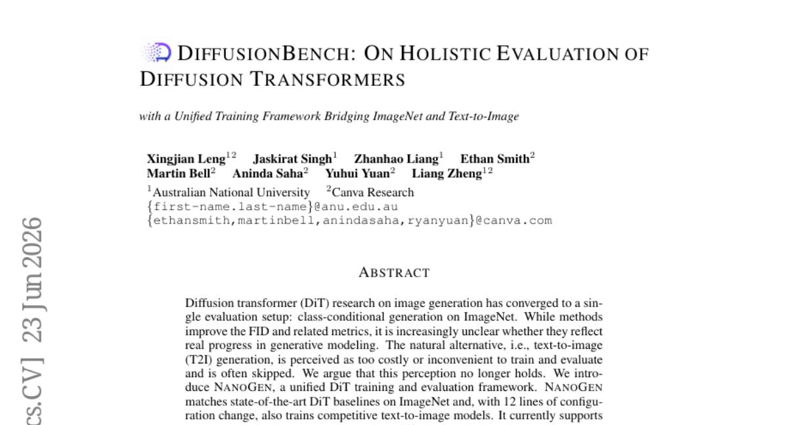

### 📌 한 줄 요약
ImageNet 중심의 평가 방식에서 벗어나, DiT 모델의 진정한 성능을 검증하기 위한 통합 벤치마크(DiffusionBench) 제안

### 🔑 핵심 포인트
- ImageNet 성능 향상이 반드시 T2I 성능 향상으로 이어지지 않음을 입증
- 효율적인 DiT 학습 및 평가를 위한 통합 프레임워크 NanoGen 개발
- 모델의 실질적 성능 측정을 위한 다각적 벤치마크 DiffusionBench 제안

### 🧑‍💻 개발자 관점
모델 개발 시 ImageNet FID 점수에만 매몰되지 않고, 실제 서비스 환경(T2I)에 적합한 모델인지 검증하는 기준을 제공합니다.

### 🚀 실무 적용 아이디어
- 현재 개발 중인 DiT 모델을 NanoGen 프레임워크로 T2I 환경에서 재검증
- ImageNet 성능과 T2I 성능 간의 상관관계 분석 실험 수행
- 모델 평가 지표에 DiffusionBench 기준 도입 검토

### ⚠️ 리스크/한계
- T2I 평가가 ImageNet보다 복잡하여 평가 비용이 발생할 수 있음
- 제안된 벤치마크가 모든 생성 태스크를 포괄하기에는 한계가 있을 수 있음

### 📝 초록 기반 상세 설명
현재 Diffusion Transformer(DiT) 연구는 ImageNet 기반의 클래스 조건부 생성 평가에 지나치게 편중되어 있습니다. 이러한 방식은 실제 텍스트-이미지(T2I) 생성 능력과의 상관관계가 낮아 모델의 실질적 발전을 반영하지 못하는 문제가 있습니다. 이를 해결하기 위해 연구진은 효율적인 학습 및 평가 프레임워크인 NanoGen을 도입했습니다. NanoGen을 통해 ImageNet과 T2I 학습 비용을 유사하게 맞추어 실험한 결과, 두 작업 간의 성능 상관관계가 매우 낮음을 확인했습니다. 이러한 발견을 바탕으로 연구진은 ImageNet과 T2I를 모두 포함하는 통합 벤치마크인 DiffusionBench를 구축했습니다. 결과적으로 모델의 범용적 발전을 위해서는 ImageNet 단일 지표가 아닌 DiffusionBench를 통한 다각적 평가가 필수적임을 시사합니다.

---

## 14. [Holistic Data Scheduler for LLM Pre-training via Multi-Objective Reinforcement Learning](https://huggingface.co/papers/2606.24133)
**Upvotes**: 2 | **도입 난이도**: 상 | **신뢰도**: 상
**arXiv**: https://arxiv.org/abs/2606.24133

**태그**: LLM Pre-training, Reinforcement Learning, Data Mixing, Optimization, RAG, Benchmark

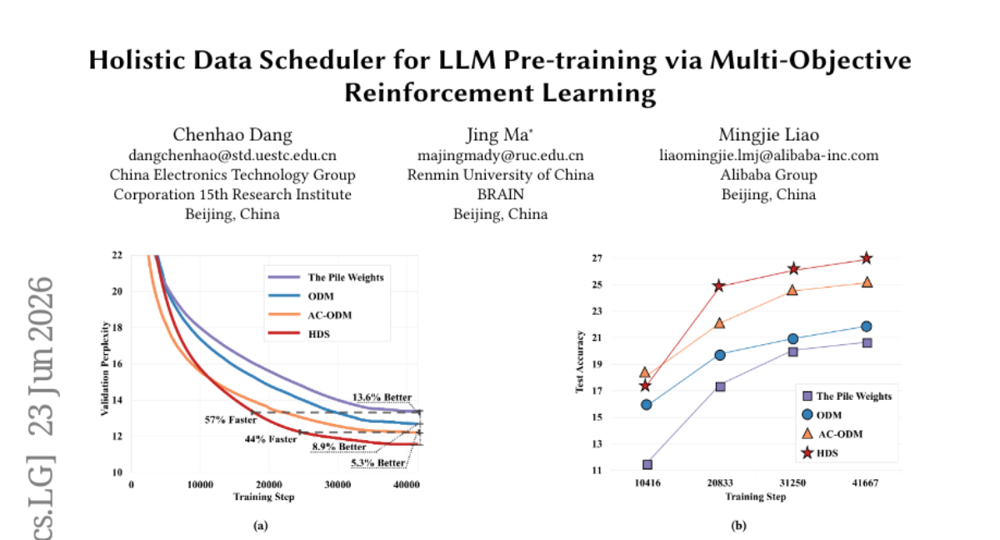

### 📌 한 줄 요약
멀티 오브젝트 강화학습을 통해 데이터 혼합 비율을 최적화하여 LLM 학습 효율과 성능을 동시에 높이는 스케줄러 제안

### 🔑 핵심 포인트
- SAC 알고리즘을 활용한 연속적 제어 기반의 온라인 데이터 믹싱 프레임워크(HDS) 개발
- 데이터 품질, 손실 기반 도메인 영향력, 모델 가중치 노름을 통합한 다중 목적 보상 함수 설계
- 학습 반복 횟수 단축 및 최종 벤치마크 성능 향상을 통한 학습 효율성 입증

### 🧑‍💻 개발자 관점
데이터 믹싱 비율을 수동으로 조정하는 대신, 강화학습을 통해 학습 과정 중 실시간으로 최적의 데이터 구성을 찾아내어 학습 비용을 절감할 수 있습니다.

### 🚀 실무 적용 아이디어
- 다양한 데이터 소스를 가진 소규모 모델로 SAC 기반 데이터 스케줄링 프로토타입 구현
- 제안된 세 가지 보상 함수(데이터, 손실, 모델 기반)의 가중치 변화에 따른 학습 안정성 테스트
- 기존 정적 데이터 믹싱 전략과 HDS의 학습 곡선 및 자원 소모량 비교 실험

### ⚠️ 리스크/한계
- 강화학습 자체의 학습 비용 및 하이퍼파라미터 민감도 문제
- 학습 중 실시간 데이터 스케줄링이 전체 학습 파이프라인의 오버헤드로 작용할 가능성

### 📝 초록 기반 상세 설명
LLM 사전 학습에서 데이터 혼합 전략은 모델 성능의 핵심이지만, 기존의 온라인 데이터 믹싱(ODM) 방식은 단일 관점의 최적화에 치중되어 복합적인 데이터 특성을 반영하지 못하는 한계가 있습니다. 이를 해결하기 위해 본 논문은 연속적 제어 공간에서 강화학습을 활용하는 Holistic Data Scheduler(HDS)를 제안합니다. HDS는 Soft Actor-Critic(SAC) 알고리즘을 기반으로 데이터 품질, 도메인 간 영향력, 모델 가중치 노름을 통합한 다중 목적 보상 함수를 사용합니다. 실험 결과, The Pile 벤치마크에서 기존 방식 대비 44% 적은 반복 횟수로 동일한 성능에 도달했으며, MMLU 0-shot 성능 또한 7.2% 향상되었습니다. 결과적으로 HDS는 학습 효율성과 최종 모델 성능을 모두 개선할 수 있음을 입증했습니다.

---

## 15. [QG-MIL: A Gated Transformer Aggregator for Domain-Agnostic Multiple Instance Learning in Medical Imaging](https://huggingface.co/papers/2606.20027)
**Upvotes**: 2 | **도입 난이도**: 하 | **신뢰도**: 상
**arXiv**: https://arxiv.org/abs/2606.20027

**태그**: MIL, Transformer, Medical Imaging, Attention Mechanism, RAG, Benchmark, Evaluation

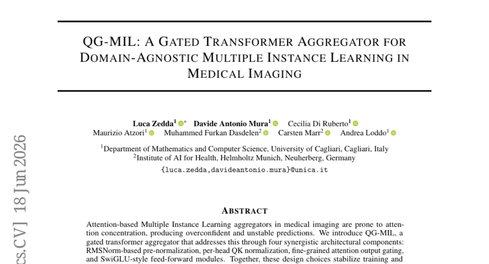

### 📌 한 줄 요약
어텐션 집중 현상을 억제하여 도메인 변화에도 안정적인 성능을 내는 게이트형 트랜스포머 기반 MIL 어그리게이터 제안

### 🔑 핵심 포인트
- RMSNorm 및 per-head QK normalization을 통한 학습 안정화
- Fine-grained gating 및 SwiGLU를 활용한 균형 잡힌 어텐션 분포 유도
- 추가적인 정규화 기법 없이도 도메인 간 일관된 성능을 보장하는 아키텍처 설계

### 🧑‍💻 개발자 관점
데이터 스케일이 변하거나 도메인이 바뀌어도 모델이 특정 샘플에만 매몰되지 않고 안정적인 예측을 수행해야 하는 실무 환경에 유용합니다.

### 🚀 실무 적용 아이디어
- 기존 Transformer 기반 MIL 모델의 어텐션 분포 시각화 및 비교
- 제안된 4가지 구성 요소(RMSNorm, QK-norm, Gating, SwiGLU)를 기존 모델에 개별 적용 테스트
- 다양한 해상도/스케일의 데이터셋에 대한 모델 강건성 검증

### ⚠️ 리스크/한계
- 특정 데이터셋에서는 개별 컴포넌트만으로도 충분할 수 있어 오버엔지니어링 가능성 존재
- 어텐션 분산이 반드시 정답(Ground Truth)과 일치하는 것은 아닐 수 있음

### 📝 초록 기반 상세 설명
의료 영상 분야의 MIL(Multiple Instance Learning) 모델은 특정 인스턴스에만 어텐션이 과도하게 집중되어 예측이 불안정해지는 문제가 있습니다. 이를 해결하기 위해 QG-MIL은 RMSNorm, per-head QK normalization, gating mechanism, SwiGLU를 결합한 새로운 어그리게이터 구조를 제안합니다. 별도의 보조 손실 함수나 마스킹 없이도 어텐션을 인스턴스 전반에 고르게 분산시켜 학습 안정성을 높였습니다. 병리 및 혈액학 등 서로 다른 스케일의 6개 벤치마크에서 기존 모델 대비 평균 +6.1 F1 점점 향상을 기록했습니다. 실험 결과, 제안된 구조는 도메인에 구애받지 않는 일관된 성능과 낮은 분산을 보여주었습니다.

### 🖼️ 추가 자료
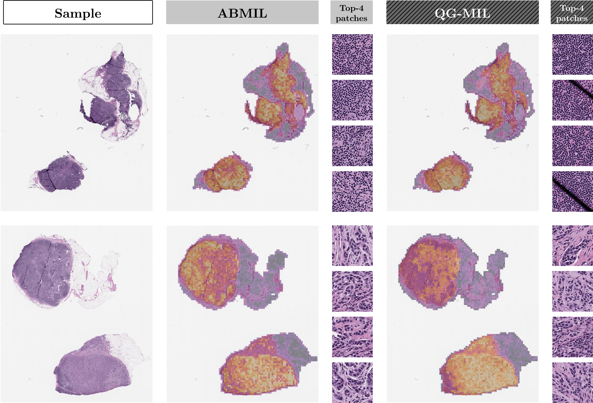

---

## 16. [FlowR2A: Learning Reward-to-Action Distribution for Multimodal Driving Planning](https://huggingface.co/papers/2606.24231)
**Upvotes**: 1 | **도입 난이도**: 상 | **신뢰도**: 상
**arXiv**: https://arxiv.org/abs/2606.24231

**태그**: Autonomous Driving, Generative Model, Flow Matching, Motion Planning, Multimodal, Vision, Benchmark, Safety

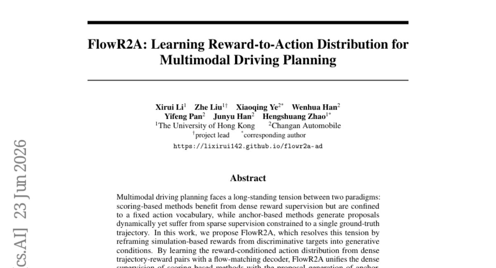

### 📌 한 줄 요약
보상(Reward) 정보를 생성 모델의 조건(Condition)으로 활용하여, 정교한 주행 경로 생성과 안전성 확보를 동시에 달성한 Flow-matching 기반 플래닝 모델

### 🔑 핵심 포인트
- 보상(Reward)을 생성 모델의 조건으로 변환하여 밀집한 지도 학습과 동적 후보 생성을 통합
- Flow-matching 디코더를 활용한 보상 조건부 액션 분포 학습
- 안전성 및 주행 효율성을 위해 타임스텝별 세밀한 보상 조건화 및 노이즈 증강 적용

### 🧑‍💻 개발자 관점
단순히 정답 궤적을 따라가는 것을 넘어, 보상 함수(Safety, Comfort 등)를 모델의 생성 조건으로 직접 연결하여 제어 가능한 멀티모달 플래닝을 구현하는 실전적인 방법론을 제시합니다.

### 🚀 실무 적용 아이디어
- Flow-matching 기반의 생성 모델 구조와 보상 조건화 메커니즘 분석
- 다양한 주행 시나리오별 보상 함수(Reward Function) 설계 및 노이즈 주입 실험
- NAVSIM과 같은 벤치마크 환경에서의 데이터셋 구축 및 학습 파이프라인 검토

### ⚠️ 리스크/한계
- 보상 함수 설계에 따라 모델의 생성 품질이 크게 좌우될 수 있는 의존성
- 복잡한 Flow-matching 모델 학습을 위한 높은 연산 자원 요구

### 📝 초록 기반 상세 설명
자율주행 경로 계획에서 점수 기반 방식의 고정된 액션 범위와 앵커 기반 방식의 희소한 지도 학습 문제가 대립해 왔습니다. 본 논문은 시뮬레이션 기반 보상을 생성적 조건으로 재정의하는 FlowR2A 프레임워크를 제안합니다. Flow-matching 디코더를 통해 밀집된 궤적-보상 쌍으로부터 보상 조건부 액션 분포를 학습함으로써, 두 방식의 장점을 통합했습니다. 또한, 안전 제약과 주행 목표 사이의 균형을 위해 타임스텝별 세밀한 보상 조건화와 노이즈 증강 기법을 도입했습니다. 실험 결과, NAVSIM 벤치마크에서 기존 방식보다 훨씬 높은 품질의 멀티모달 주행 후보를 생성하며 SOTA를 달성했습니다.

---

## 17. [DREAM: Dense Retrieval Embeddings via Autoregressive Modeling](https://huggingface.co/papers/2606.24667)
**Upvotes**: 1 | **도입 난이도**: 상 | **신뢰도**: 상
**arXiv**: https://arxiv.org/abs/2606.24667

**태그**: RAG, Information Retrieval, LLM, Embedding, Vision, Benchmark, Evaluation

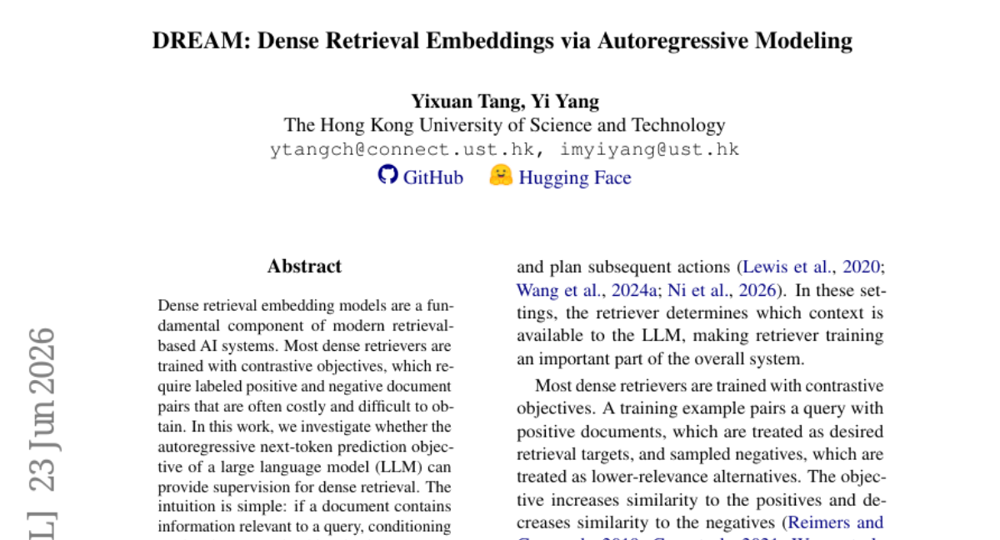

### 📌 한 줄 요약
LLM의 차세대 토큰 예측 손실을 활용하여 별도의 라벨 없이도 고성능 밀집 검색(Dense Retrieval) 모델을 학습시키는 프레임워크

### 🔑 핵심 포인트
- LLM의 차세대 토큰 예측 손실을 검색 모델 학습의 감독 신호로 활용
- 검색 모델의 유사도 점수를 LLM 어텐션 헤드에 주입하는 DREAM 프레임워크 제안
- 별도의 정답 쌍 라벨 없이도 자기회귀적 학습을 통해 고성능 임베딩 생성 가능

### 🧑‍💻 개발자 관점
데이터 라벨링 비용이 큰 검색 시스템 구축 시, LLM의 언어 모델링 능력을 활용해 별도의 정답셋 없이도 고성능 리트리버를 학습시킬 수 있는 새로운 경로를 제시합니다.

### 🚀 실무 적용 아이디어
- 특정 도메인 데이터셋에 대해 LLM 기반의 자기회귀 학습 효율성 검증
- 다양한 크기의 임베딩 백본을 활용한 스케일링 법칙(Scaling Law) 확인
- 기존 대조 학습(Contrastive Learning) 방식과의 성능 및 비용 비교 실험

### ⚠️ 리스크/한계
- LLM의 어텐션 메커니즘을 통한 그래디언트 전파로 인한 학습 복잡도 및 연산 비용 증가
- LLM의 특정 헤드에 의존하는 구조적 특성으로 인한 학습 안정성 문제 가능성

### 📝 초록 기반 상세 설명
현대적인 검색 시스템의 핵심인 밀집 검색 모델은 주로 대조 학습(Contrastive Learning)을 사용하지만, 이는 고품질의 양성/음성 쌍 라벨을 필요로 한다는 단점이 있습니다. 본 논문은 LLM의 자기회귀적(Autoregressive) 다음 토큰 예측 목적 함수가 검색 모델 학습을 위한 강력한 감독 신호를 제공할 수 있는지 탐구합니다. 이를 위해 제안된 DREAM은 고정된 LLM의 특정 어텐션 헤드에 검색 모델이 생성한 유사도 점수를 주입하는 방식을 취합니다. 학습 과정에서 LLM의 예측 손실은 어텐션 메커즘을 통해 검색 모델로 역전파되어 검색 성능을 최적화합니다. BEIR 및 RTEB 벤치마크 실험 결과, 다양한 모델 규모에서 기존 베이스라인을 일관되게 상회하는 성능을 보였습니다.

---

## 18. [ReMMD: Realistic Multilingual Multi-Image Agentic Verification for Multimodal Misinformation Detection](https://huggingface.co/papers/2606.24112)
**Upvotes**: 1 | **도입 난이도**: 중 | **신뢰도**: 상
**arXiv**: https://arxiv.org/abs/2606.24112

**태그**: Agent, Multimodal, Fact-Checking, Benchmark, Vision

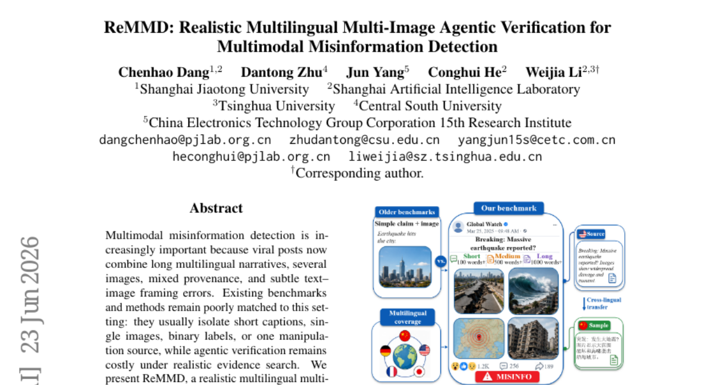

### 📌 한 줄 요약
다국어·다중 이미지 환경의 복합적 허위 정보 탐지를 위한 에이전트 기반 검증 프레임워크 및 벤치마크 제안

### 🔑 핵심 포인트
- 현실적인 다국어·다중 이미지 시나리오를 반영한 ReMMDBench 벤치마크 구축
- 메모리 지속형 에이전트(ReMMD-Agent)를 통한 원자적 단위 분해 및 증거 기반 검증
- 기존 에이전트 모델 대비 비용 효율성을 극대화하면서도 높은 검증 성능 확보

### 🧑‍💻 개발자 관점
복잡한 멀티모달 데이터(다국어, 다중 이미지)를 다루는 콘텐츠 모더레이션 시스템 설계 시, 에이전트 기반의 효율적인 검증 워크플로우를 구축하는 데 영감을 줍니다.

### 🚀 실무 적용 아이디어
- ReMMDBench를 활용하여 현재 보유한 멀티모달 모델의 다국어/다중 이미지 대응력 테스트
- 에이전트의 메모리 관리 및 증거 추출 로직을 기존 RAG 파이프라인에 이식 실험
- 비용 효율적인 검증을 위한 원자적 단위 분해(Atomic decomposition) 전략 적용

### ⚠️ 리스크/한계
- 에이전트 기반 검증의 경우 추론 비용과 지연 시간(Latency) 문제가 발생할 수 있음
- 매우 복잡한 맥락이나 고도의 은유가 포함된 경우 에이전트의 판단 오류 가능성 존재

### 📝 초록 기반 상세 설명
최근 멀티모달 허위 정보는 다국어 텍스트와 여러 장의 이미지가 결합된 복잡한 형태로 진화하고 있으나, 기존 벤치마크는 단일 이미지나 짧은 캡션에 국한되어 실전 대응력이 부족합니다. 이를 해결하기 위해 현실적인 시나리오를 반영한 다국어·다중 이미지 벤치마크인 ReMMDBench를 구축했습니다. 또한, 포스트를 원자적 단위로 분해하고 재사용 가능한 증거 세트를 구축하는 메모리 지속형 에이전트인 ReMMD-Agent를 제안합니다. 실험 결과, ReMMD-Agent는 기존 에이전트 방식 대비 비용을 대폭 절감하면서도 높은 정확도와 F1 스코어를 달성했습니다. 결과적으로 복합적인 멀티모달 데이터에 대한 정교한 검증 성능을 입증했습니다.

---

## 19. [World Value Models for Robotic Manipulation](https://huggingface.co/papers/2606.24742)
**Upvotes**: 1 | **도입 난이도**: 중 | **신뢰도**: 상
**arXiv**: https://arxiv.org/abs/2606.24742

**태그**: Robotics, World Models, Reinforcement Learning, Value Function, Vision, Benchmark, Evaluation

### 📌 한 줄 요약
월드 모델(World Model)을 활용하여 데이터 품질을 평가하고 로봇 조작 정책 학습을 가속화하는 범용 가치 모델(WVM) 제안

### 🔑 핵심 포인트
- 월드 모델의 시간적 모델링 능력을 가치 추정(Value Estimation)에 결합한 WVM 프레임워크 제안
- 전문가 데이터뿐만 아니라 비정형/비최적(Suboptimal) 데이터에서도 강건한 성능을 보이는 벤치마크 구축
- 혼합 품질 데이터 환경에서 정책 학습의 가이드 역할을 수행하여 실세계 로봇 조작 성능 향상

### 🧑‍💻 개발자 관점
데이터 품질이 제각각인 대규모 로봇 데이터셋을 사용할 때, 어떤 데이터가 학습에 유용한지 판단하고 정책 학습의 효율을 높이는 데 직접적인 도움을 줍니다.

### 🚀 실무 적용 아이디어
- 기존 VLM 기반 가치 모델과 WVM의 시간적 맥락 이해도 차이 비교 실험
- 보유 중인 로봇 데이터셋에 WVM을 적용하여 데이터 필터링 효과 검증
- 다양한 정책 추출 알고리즘(Behavior Cloning, RL 등)과 WVM의 결합 테스트

### ⚠️ 리스크/한계
- 월드 모델 학습을 위한 고품질의 시계열 데이터 및 연산 자원 필요
- 복잡한 물리적 상호작용이 포함된 환경에서의 실시간 추론 속도 문제

### 📝 초록 기반 상세 설명
로봇 정책 학습을 위해 대규모 혼합 데이터에서 정확한 가치(Value)를 추정하는 것이 중요해지고 있습니다. 기존의 VLM 기반 가치 모델은 정적인 이미지 학습에 치중되어 있어, 시간적 흐름과 미래 계획이 필요한 로봇 작업의 가치 추정에는 한계가 있습니다. 본 논문은 시간적 모델링과 미래 예측에 강점이 있는 월드 모델을 가치 추정 프레임워크에 결합한 WVM을 제안합니다. WVM은 데이터의 품질을 정확히 평가하여 작업 진행 상황을 판단하며, 기존 벤치마크와 새롭게 제안된 Suboptimal-Value-Bench 모두에서 SOTA 성능을 달성했습니다. 최종적으로 WVM을 정책 학습에 적용했을 때, 시뮬레이션과 실세계 모두에서 다양한 정책 추출 방식에 대해 향상된 조작 성능을 입증했습니다.

---

## 20. [ChartWalker: Benchmarking the Cross-Chart RAG Task](https://huggingface.co/papers/2606.23997)
**Upvotes**: 1 | **도입 난이도**: 중 | **신뢰도**: 상
**arXiv**: https://arxiv.org/abs/2606.23997

**태그**: RAG, Multi-modal, Knowledge Graph, Benchmark, Agent, Reasoning, Evaluation

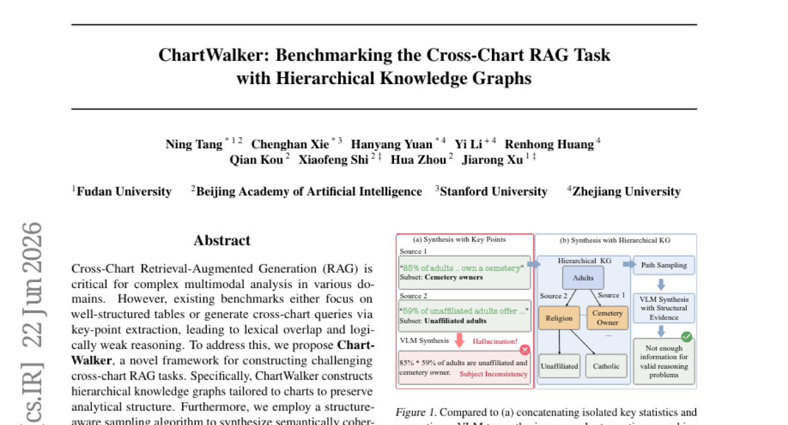

### 📌 한 줄 요약
복잡한 멀티 차트 분석을 위해 계층적 지식 그래프와 구조 기반 샘플링을 활용한 고난도 RAG 벤치마크 프레임워크 제안

### 🔑 핵심 포인트
- 차트 특화 계층적 지식 그래프를 통한 엔티티 및 관계 구조화
- 멀티홉 추론 경로 생성을 위한 구조 인지 샘플링 알고리즘 개발
- 다양한 도메인과 난이도를 포함하는 고난도 벤치마크(ChartWalker-Bench) 및 에이전트 베이스라인 제공

### 🧑‍💻 개발자 관점
단순 텍스트 매칭을 넘어 차트 간의 복잡한 관계를 추론해야 하는 고도화된 시각적 RAG 시스템 개발 시 평가 지표로 활용 가능합니다.

### 🚀 실무 적용 아이디어
- 제공된 ChartWalker-Bench를 활용하여 현재 개발 중인 멀티모달 모델의 추론 능력 테스트
- 계층적 지식 그래프 구조를 기존 RAG 파이프라인의 인덱싱 전략에 적용 시도
- 에이전트 기반 베이스라인(ChartWalker-Agent)의 워크플로우 분석 및 자사 시스템 벤치마킹

### ⚠️ 리스크/한계
- 지식 그래프 구축 및 샘플링 과정의 복잡도로 인한 높은 연산 비용 발생 가능성
- 특정 도메인에 특화된 데이터셋일 경우 범용적인 시각적 추론 성능과 차이가 있을 수 있음

### 📝 초록 기반 상세 설명
기존의 멀티모달 RAG 벤치마크는 정형화된 테이블에 치중하거나, 단순 키워드 추출 방식으로 생성되어 논리적 추론 능력을 평가하기에 부족했습니다. 이를 해결하기 위해 차트의 분석적 구조를 보존하는 계층적 지식 그래프 구축 방식을 도입한 ChartWalker 프레임워크를 제안합니다. 이 프레임워크는 구조 인지 샘플링 알고리즘을 통해 의미론적으로 일관된 멀티홉 추론 경로를 생성하여 질문의 난이도를 정교하게 조절합니다. 이를 바탕으로 구축된 ChartWalker-Bench는 다양한 도메인과 질문 유형을 포함하는 포괄적인 벤치마크를 제공합니다. 실험 결과, 기존 RAG 모델들의 성능 격차를 확인하였으며, 에이전트 기반 베이스라인인 ChartWalker-Agent를 통해 향후 시스템 설계의 방향성을 제시합니다.

---

## 21. [EventVLA: Event-Driven Visual Evidence Memory for Long-Horizon Vision-Language-Action Policies](https://huggingface.co/papers/2606.20092)
**Upvotes**: 1 | **도입 난이도**: 상 | **신뢰도**: 상
**arXiv**: https://arxiv.org/abs/2606.20092

**태그**: VLA, Robotics, Memory-Augmented, Computer-Vision, RAG, Vision, Benchmark, Evaluation, Inference

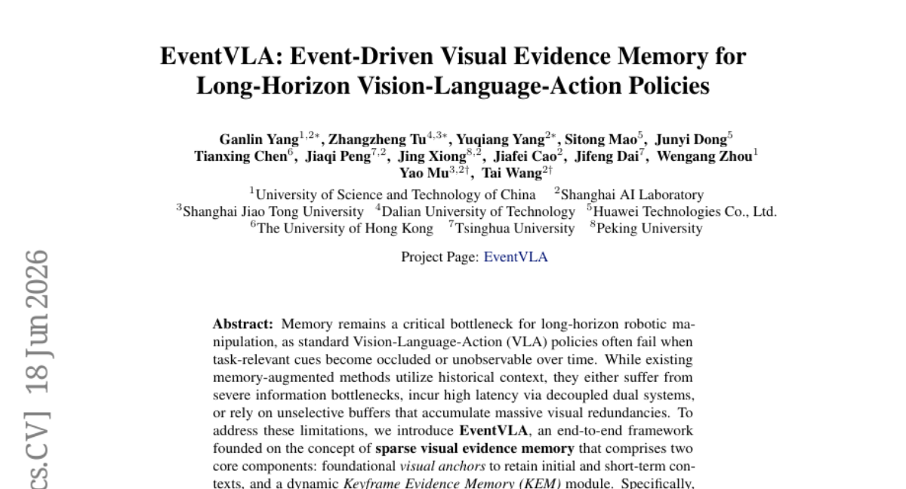

### 📌 한 줄 요약
중요한 시각적 단서를 놓치지 않도록 미래 예측 기반의 희소 메모리 구조를 도입하여 장기 작업 수행 능력을 극대화한 VLA 프레임워크

### 🔑 핵심 포인트
- 미래 키프레임 확률을 예측하여 핵심 시각 정보만 선택적으로 저장하는 KEM 모듈 도입
- 초기 컨텍스트 유지용 Anchor와 동적 KEM의 결합을 통한 효율적인 희소 메모리 구조 구축
- 비마르코프적(Non-Markovian) 작업 평가를 위한 새로운 벤치마크 RoboTwin-MeM 제안

### 🧑‍💻 개발자 관점
시각적 정보가 가변적인 복잡한 환경에서, 모든 프레임을 저장하는 대신 '의미 있는 순간'만 선별하여 메모리 효율과 작업 성공률을 동시에 높이는 전략을 배울 수 있습니다.

### 🚀 실무 적용 아이디어
- VLA 모델의 잠재 공간에서 미래 키프레임을 예측하는 헤드 구조 구현 실험
- 메모리 버퍼의 크기 변화에 따른 정보 손실 및 연산 효율성 비교
- 가려짐(Occlusion)이 빈번한 환경에서의 메모리 복원력 테스트

### ⚠️ 리스크/한계
- 미래 예측 오류 발생 시 잘못된 시각적 증거가 메모리에 저장될 위험
- KEM 모듈의 예측 연산이 실시간 제어 루프에 미치는 지연 시간 영향

### 📝 초록 기반 상세 설명
로봇의 장기 작업 수행 시 기존 VLA 모델은 시각적 단서가 가려지거나 사라지면 이를 기억하지 못하는 한계가 있습니다. 기존 메모리 방식은 정보 병목, 높은 지연 시간, 또는 불필요한 데이터 축적 문제를 안고 있었습니다. 이를 해결하기 위해 본 논문은 초기 컨텍스트를 유지하는 Anchor와 미래 핵심 프레임을 예측하여 저장하는 KEM(Keyframe Evidence Memory) 모듈로 구성된 EventVLA를 제안합니다. KEM은 잠재 임베딩을 통해 미래의 중요도를 예측함으로써, 사라지기 전의 결정적인 시각적 증거를 선제적으로 저장합니다. 새로운 벤치마크인 RoboTwin-MeM을 통해 검증한 결과, 시뮬레이션 및 실세계 이족 작업에서 기존 SOTA 대비 높은 성공률을 기록했습니다.

---

## 22. [AGORA: An Archive-Grounded Benchmark for Agentic Workplace Document Reasoning](https://huggingface.co/papers/2606.24526)
**Upvotes**: 0 | **도입 난이도**: 중 | **신뢰도**: 상
**arXiv**: https://arxiv.org/abs/2606.24526

**태그**: Agent, RAG, Benchmark, Document-Reasoning, Reasoning, Evaluation

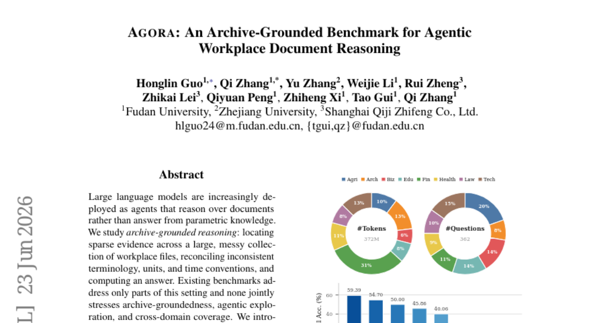

### 📌 한 줄 요약
방대한 문서 아카이브 내에서 에이전트가 자율적으로 정보를 탐색하고 추론하는 능력을 평가하는 벤치마크 제안

### 🔑 핵심 포인트
- 컨텍스트 윈도우를 초과하는 대규모 아카이브 기반의 에이전트 추론 벤치마크 구축
- 에이전트 파이프라인을 통한 자동화된 문제 생성 및 데이터 누출 방지 기술 적용
- 도메인 간 차이와 복합적인 정보 탐색 능력을 동시에 평가하는 환경 제공

### 🧑‍💻 개발자 관점
단순 RAG를 넘어, 기업용 대규모 문서 저장소에서 에이전트가 어떻게 효율적으로 정보를 탐색하고 통합해야 하는지에 대한 실무적 가이드라인을 제공합니다.

### 🚀 실무 적용 아이디어
- 현재 운영 중인 RAG 시스템의 에이전트 탐색 성능을 AGORA 스타일의 시나리오로 테스트
- 컨텍스트 윈도우 확장 시 성능 변화와 탐색 전략 간의 상관관계 분석
- 도메인 특화 용어 및 단위 변환을 처리하는 에이전트 프롬프트 엔지니어링 실험

### ⚠️ 리스크/한계
- 실제 업무 환경의 복잡성을 완전히 반영하기에는 정제된 데이터셋의 한계가 있을 수 있음
- 에이전트의 탐색 비용(토큰 사용량)과 정확도 사이의 트레이드오프 고려 필요

### 📝 초록 기반 상세 설명
최근 LLM은 단순 지식 답변을 넘어 문서 기반의 에이전트 역할을 수행하고 있습니다. 하지만 기존 벤치마크는 방대한 문서 집합 내에서 일관되지 않은 용어와 형식을 해결하며 정보를 찾는 복합적인 추론 능력을 평가하기에 부족합니다. 이를 해결하기 위해 3억 7천만 토큰 규모의 실제 문서 데이터셋인 AGORA를 도입했습니다. AGORA는 모델의 컨텍스트 윈도우를 초과하는 규모로 설계되어 에이전트의 의도적인 탐색 능력을 요구합니다. 실험 결과, 최상위 모델조차 59.4%의 정확도에 머물러 에이전트 기반 문서 추론 작업이 여전히 어려운 과제임을 입증했습니다.

---

## 23. [FLUX3D: High-Fidelity 3D Gaussian Generation with Diffusion-Aligned Sparse Representation](https://huggingface.co/papers/2606.24874)
**Upvotes**: 0 | **도입 난이도**: 상 | **신뢰도**: 상
**arXiv**: https://arxiv.org/abs/2606.24874

**태그**: 3DGS, Diffusion, Computer Vision, 3D Generation, Multimodal, Vision, Benchmark, Safety

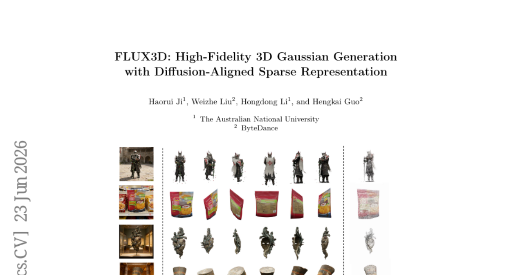

### 📌 한 줄 요약
고해상도 3D Gaussian Splatting 생성을 위해 2D 특징과 3D 희소 표현 간의 정렬 문제를 해결한 고정밀 이미지-to-3D 프레임워크

### 🔑 핵심 포인트
- DA-SLAT(Diffusion-Aligned Structured Latents): 재구성 정보가 포함된 3D 복셀 잠재 공간 구축을 위한 새로운 특징 선택 방식
- SMDiT(Sparse-structure Multimodal Diffusion Transformer): 2D 이미지 토큰과 3D 희소 구조 간의 정렬을 위한 확산 프레임워크
- MARoPE(Modal-Aware Rotary Positional Embedding): 기하학적 구조에 구애받지 않는 2D-3D 간의 정밀한 모달리티 정렬

### 🧑‍💻 개발자 관점
고품질 3D 에셋 생성이 필요한 게임, VR/AR 엔진 개발 시 2D 이미지만으로 정밀한 3D 모델을 생성하는 파이프라인 구축에 활용 가능합니다.

### 🚀 실무 적용 아이디어
- 제안된 DA-SLAT 구조를 기존 3DGS 생성 파이프라인에 적용하여 디테일 변화 확인
- 다양한 복잡한 기하학적 구조를 가진 데이터셋에서의 정렬 성능 테스트
- SMDiT와 MARoPE 결합 시 연산 비용과 생성 품질 간의 트레이드오프 분석

### ⚠️ 리스크/한계
- 희소 복셀 기반 구조로 인한 대규모 장면 생성 시 메모리 및 연산 복잡도 증가 가능성
- 복잡한 텍스처나 미세 구조에서 2D-3D 정렬 오류 발생 가능성

### 📝 초록 기반 상세 설명
최근 이미지-to-3D Gaussian Splatting(3DGS)을 위해 희소 복셀 표현이 활용되고 있으나, 기존 방식은 고주파 세부 정보를 유지하는 데 한계가 있습니다. 이는 의미론적 추상화에 치중된 2D 특징 사용과 2D 토큰과 3D 복셀 간의 정렬 부족이라는 두 가지 병목 현상 때문입니다. 이를 해결하기 위해 본 논문은 FLUX3D를 제안하며, 재구성 충실도를 높이는 DA-SLAT와 기하학적 정렬을 위한 SMDiT 및 MARoPE를 도입합니다. 실험 결과, FLUX3D는 기존 SOTA 모델들을 뛰어넘는 고품질 3DGS 자산 생성 능력을 입증했습니다.

---

## 24. [Multi4D: High-Fidelity Dynamic Gaussian Splatting via Multi-Level Competitive Allocation](https://huggingface.co/papers/2606.22197)
**Upvotes**: 0 | **도입 난이도**: 중 | **신뢰도**: 상
**arXiv**: https://arxiv.org/abs/2606.22197

**태그**: 3DGS, 4D Reconstruction, Computer Vision, Real-time Rendering, RAG

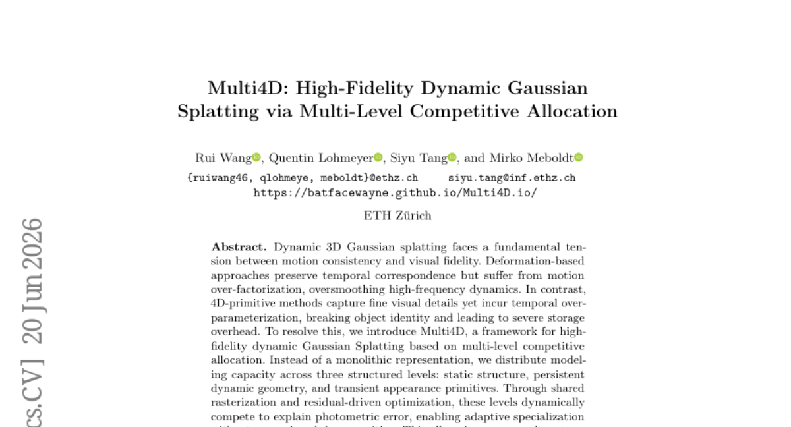

### 📌 한 줄 요약
다중 계층적 경쟁 할당 방식을 통해 모션 일관성과 고해상도 디테일을 동시에 확보한 고성능 4D 가우시안 스플래팅 프레임워크

### 🔑 핵심 포인트
- 정적/지속적/일시적 세 계층으로 분리된 다중 레벨 경쟁 할당 구조 도입
- 잔차 기반 최적화를 통한 모션 일관성 유지와 고주파 디테일 캡처의 균형 달성
- 압축된 지속적 가우시안 표현을 활용한 고속 4D 세그멘테이션 지원

### 🧑‍💻 개발자 관점
데이터 효율적인 4D 렌더링과 빠른 세그멘테이션이 필요한 디지털 트윈 및 시각 효과(VFX) 파이프라인에 즉각적인 가치를 제공합니다.

### 🚀 실무 적용 아이디어
- 제안된 세 가지 계층 구조가 복잡한 움직임에서 어떻게 분리되는지 시각화 실험
- 기존 4D 가우시안 방식 대비 저장 용량 및 렌더링 속도 벤치마크 수행
- 세그멘테이션 기능이 실제 동적 객체 추적에 미치는 정확도 검증

### ⚠️ 리스크/한계
- 계층 간 경쟁 최적화 과정에서의 수렴 안정성 문제 가능성
- 매우 복잡하거나 예측 불가능한 움직임이 많은 환경에서의 일반화 성능

### 📝 초록 기반 상세 설명
동적 3D 가우시안 스플래팅은 모션 일관성을 유지하면서도 시각적 디테일을 확보하는 데 어려움이 있습니다. 기존의 변형 기반 방식은 모션 오버팩터링 문제를, 4D 프리미티브 방식은 과도한 파라미터로 인한 저장 용량 및 객체 정체성 상실 문제를 겪습니다. 이를 해결하기 위해 Multi4D는 정적 구조, 지속적 동적 기하, 일시적 외형 프리미티브라는 세 가지 계층으로 모델링 용량을 분산하는 프레임워크를 제안합니다. 각 계층은 공유 래스터화와 잔차 기반 최적화를 통해 광학적 오차를 설명하기 위해 동적으로 경쟁하며 적응적 전문화를 수행합니다. 그 결과, 장기적인 모션 일관성을 유지하면서도 미세한 동적 디테일을 포착하여 최첨단 렌더링 품질과 실시간 성능을 달성했습니다. 또한, 압축된 지속적 가우시안을 추적함으로써 매우 빠른 속도로 정교한 4D 세그멘테이션을 가능하게 합니다.

---

## 25. [An Efficient Method for the Optimal Control of Microgrids Under Uncertainties using Local Reduction](https://huggingface.co/papers/2606.12345)
**Upvotes**: 0 | **도입 난이도**: 중 | **신뢰도**: 상
**arXiv**: https://arxiv.org/abs/2606.12345

**태그**: Microgrid, Optimal Control, Mixed-Integer Programming, Optimization, RAG, Evaluation

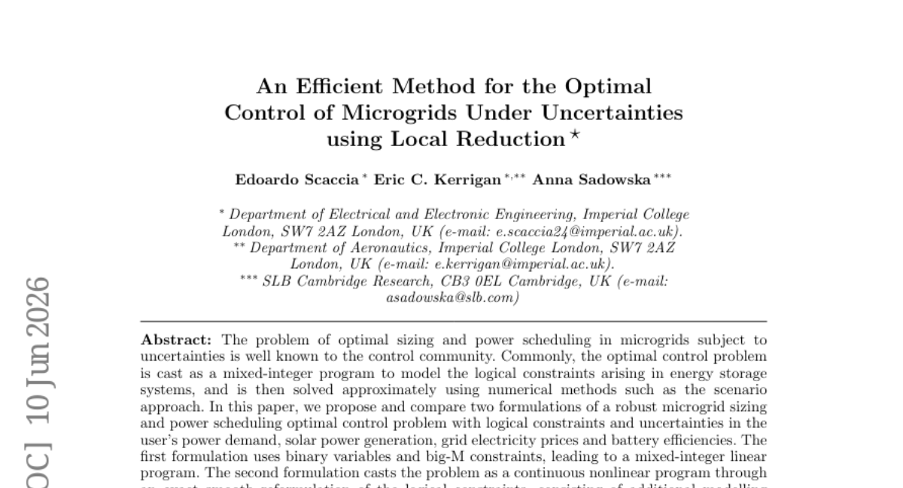

### 📌 한 줄 요약
불확실성이 존재하는 마이크로그리드 환경에서 논리적 제약 조건을 효율적으로 해결하는 최적 제어 알고리즘 제안

### 🔑 핵심 포인트
- 논리적 제약 조건을 포함한 마이크로그리드 최적 제어의 두 가지 수식화 모델 제안
- Big-M 방식과 비선형 재구성 방식 간의 성능 비교 및 검증
- 복잡한 제약 조건을 효율적으로 해결하기 위한 새로운 국소 축소(Local Reduction) 알고리즘 개발

### 🧑‍💻 개발자 관점
에너지 저장 장치(ESS)와 같은 논리적 스위칭이 필요한 시스템의 스케줄링 최적화 문제를 수치적 안정성을 유지하며 해결하는 방법론을 제공합니다.

### 🚀 실무 적용 아이디어
- 제안된 비선형 재구성 방식과 기존 MILP 방식의 연산 속도 비교 실험
- 다양한 불확실성 시나리오(수요 변동성 등)에 따른 알고리즘의 강건성 테스트
- 실제 하드웨어 제어 루프에 적용 가능한 수준의 연산 시간 확인

### ⚠️ 리스크/한계
- 비선형 제약 조건 도입 시 국소 최적해(Local Optima)에 빠질 가능성 존재
- 시뮬레이션 기반 검증이므로 실제 물리적 시스템의 복잡한 동역학 반영 여부 확인 필요

### 📝 초록 기반 상세 설명
마이크로그리드의 용량 산정 및 전력 스케줄링은 에너지 저장 장치의 논리적 제약과 불확실성으로 인해 복잡한 혼합 정수 계획법(MIP) 문제를 야기합니다. 본 논문은 논리적 제약과 다양한 불확실성(수요, 태양광, 가격, 배터리 효율 등)을 포함하는 두 가지 형태의 강건 최적 제어 문제를 제안합니다. 첫 번째는 이진 변수와 Big-M 제약을 사용하는 MILP 방식이며, 두 번째는 논리적 제약을 매끄러운 비선형 제약으로 변환한 연속 비선형 계획법 방식입니다. 이를 해결하기 위해 기존 방식을 확장한 새로운 국소 축소(Local Reduction) 알고리즘을 제안합니다. 10만 건의 몬테카를로 시뮬레이션을 통해 검증한 결과, 두 방식 모두 90% 이상의 높은 실행 가능성(Feasibility)을 달성하며 우수한 성능을 보였습니다.

---

