# 2026-06-26 Daily Papers (Top 30)

## 오늘의 요약
오늘은 멀티모달 모델의 실시간 상호작용, 비디오 생성의 일관성 확보, 그리고 에이전트 메모리 시스템 설계와 같은 실용적이고 구조적인 연구들이 주목받았습니다. 특히 단순한 생성 능력을 넘어 시각적 추론, 기하학적 일관성, 그리고 효율적인 데이터 관리 프레임워크를 구축하려는 시도가 두드러졌습니다.

### 오늘의 핵심 포인트
- 비디오 생성 및 멀티모달 모델에서 시각적 일관성과 정밀한 제어를 위한 기하학적·구조적 접근법이 강화되었습니다.
- 에이전트 메모리 및 실시간 스트리밍 모델을 통해 단순 모델링을 넘어 시스템 수준의 최적화와 초저지연 상호작용 연구가 진행되었습니다.
- 정답 라벨 없이 시각적 증거를 활용하거나 양방향 어텐션을 사용하는 등 학습 효율성과 새로운 생성 패러다임을 제시하는 방법론들이 발표되었습니다.

**오늘의 태그**: Multimodal, Video-Generation, LLM Agent, Efficient Learning, Real-time AI

## 1. [Are We Ready For An Agent-Native Memory System?](https://huggingface.co/papers/2606.24775)
**Upvotes**: 84 | **도입 난이도**: 중 | **신뢰도**: 상
**arXiv**: https://arxiv.org/abs/2606.24775

**태그**: LLM Agent, Memory System, Data Management, RAG, Agent, Benchmark, Evaluation

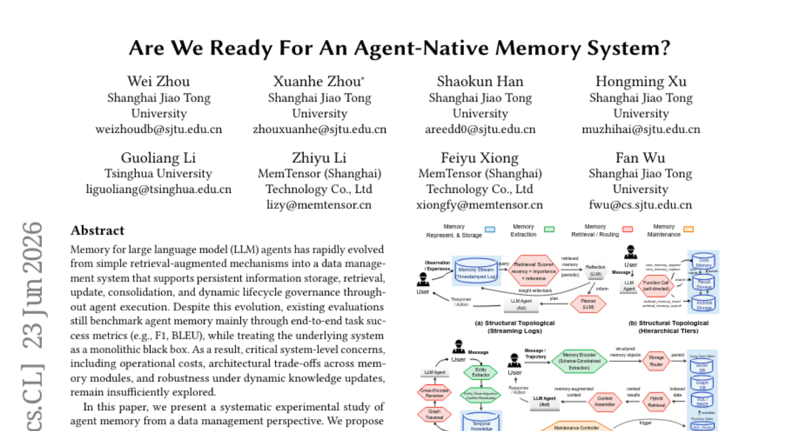

### 📌 한 줄 요약
에이전트 메모리를 단순 검색 도구가 아닌 데이터 관리 시스템 관점에서 분석하여, 워크로드에 따른 최적의 아키텍처 설계 방향을 제시함

### 🔑 핵심 포인트
- 에이전트 메모리를 4가지 핵심 모듈(저장, 추출, 검색/라우팅, 유지관리)로 분해하는 분석 프레임워크 제안
- 단순 작업 성공률을 넘어 표현 충실도, 검색 정밀도, 업데이트 정확도, 장기 안정성 등 시스템 수준의 정밀 평가 수행
- 워크로드 특성에 따른 아키텍처 적합성 및 글로벌 재구성 대비 국소적 유지관리의 비용 효율성 입증

### 🧑‍💻 개발자 관점
에이전트 개발 시 단순 RAG 적용을 넘어, 워크로드의 특성(데이터 양, 업데이트 빈도 등)에 맞춰 메모리 모듈을 어떻게 설계하고 최적화할지에 대한 가이드라인을 제공합니다.

### 🚀 실무 적용 아이디어
- 현재 구축된 에이전트 메모리 시스템을 4개 모듈(저장, 추출, 검색, 유지관리)로 분리하여 병목 지점 파악하기
- 워크로드의 특성(단기 작업 vs 장기 프로젝트)에 따른 메모리 구조의 정렬 상태 점검하기
- 전체 데이터 재구조화 대신 국소적 업데이트(Localized maintenance)를 통한 비용 최적화 실험하기

### ⚠️ 리스크/한계
- 특정 워크로드에 최적화된 결과이므로, 모든 일반적인 에이전트 환경에 동일하게 적용하기 어려울 수 있음
- 메모리 모듈 간의 복잡한 상호작용이 실제 운영 환경에서 예상치 못한 비용이나 지연을 초래할 가능성

### 📝 초록 기반 상세 설명
LLM 에이전트의 메모리는 단순 RAG를 넘어 데이터 관리 시스템으로 진화하고 있으나, 기존 평가는 블랙박스 형태의 작업 성공률에만 치중되어 있습니다. 이로 인해 운영 비용, 아키텍처 트레이드오프, 동적 업데이트 시의 강건성 등 시스템적 핵심 요소에 대한 분석이 부족한 실정입니다. 본 논문은 에이전트 메모리를 표현/저장, 추출, 검색/라우팅, 유지관리의 4개 모듈로 분해하는 분석 프레임워크를 제안합니다. 12개의 메모리 시스템과 2개의 베이스라인을 대상으로 광범위한 실험을 수행한 결과, 특정 아키텍처가 모든 상황에서 우월하기보다는 워크로드의 병목 지점과 메모리 구조의 정렬이 핵심임을 밝혀냈습니다. 또한, 비용 효율적인 유지관리 전략과 장기적 안정성을 위한 설계 방향을 제시합니다.

---

## 2. [DomainShuttle: Freeform Open Domain Subject-driven Text-to-video Generation](https://huggingface.co/papers/2606.26058)
**Upvotes**: 55 | **도입 난이도**: 상 | **신뢰도**: 상
**arXiv**: https://arxiv.org/abs/2606.26058

**태그**: Video-Generation, Diffusion-Models, Personalization, Computer-Vision, Vision, Video

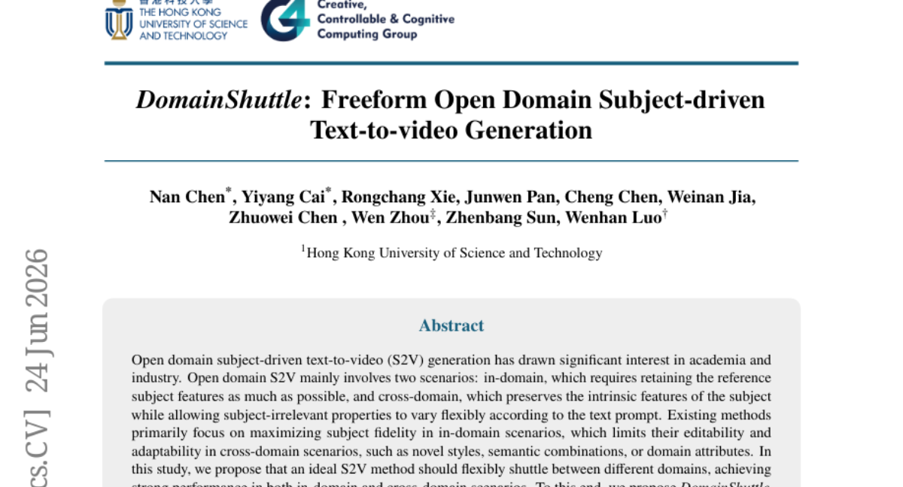

### 📌 한 줄 요약
In-domain의 높은 재현율과 Cross-domain의 유연성을 동시에 확보한 오픈 도메인 대상 기반 텍스트-비디오 생성 기술

### 🔑 핵심 포인트
- Domain-MoT: 비디오와 참조 특징을 분리하고 도메인 인식 AdaLN을 통해 정교한 모델링 수행
- Video-Reference DualRoPE: 참조 이미지와 비디오 토큰을 별도의 RoPE 공간에 배치하여 정밀한 공간 모델링 구현
- Cross-Pair Consistent Loss: 대상의 본질적 특징만 추출하여 도메인 변화에도 일관된 정체성 유지

### 🧑‍💻 개발자 관점
특정 캐릭터나 사물을 유지하면서도 배경, 스타일, 환경을 자유롭게 바꾸는 고품질 비디오 생성 파이프라인 구축이 가능해집니다.

### 🚀 실무 적용 아이디어
- 제안된 DualRoPE 구조가 기존 DiT(Diffusion Transformer) 구조와 어떻게 호환되는지 분석
- 다양한 스타일(애니메이션, 실사 등)로의 크로스 도메인 전환 성능 테스트
- 복잡한 배경 속에서도 대상의 특징이 왜곡되지 않는지 정성적 평가 수행

### ⚠️ 리스크/한계
- 도메인 전환 시 대상의 미세한 디테일이 손실될 가능성
- 복잡한 공간 모델링(DualRoPE) 도입에 따른 연산 비용 증가

### 📝 초록 기반 상세 설명
최근 오픈 도메인 대상 기반 텍스트-비디오(S2V) 생성 기술이 주목받고 있으나, 기존 방식은 대상의 특징을 유지하는 데만 집중하여 스타일 변경이나 의미적 결합 같은 크로스 도메인 시나리오에서의 유연성이 부족했습니다. 본 연구에서는 대상의 정체성을 유지하면서도 도메인 간 전환이 자유로운 DomainShuttle을 제안합니다. 이를 위해 비디오와 참조 특징을 분리하고 도메인별 모델링을 지원하는 Domain-MoT와, 참조 이미지와 비디오 토큰을 분리된 공간에서 처리하는 Video-Reference DualRoPE를 도입했습니다. 또한, 불필요한 특징에 영향을 받지 않는 핵심 특징 추출을 위해 Cross-Pair Consistent Loss를 적용했습니다. 실험 결과, 제안 방식은 높은 대상 재현율과 생성 유연성을 동시에 달성하며 기존 모델 대비 뛰어난 성능을 입증했습니다.

---

## 3. [Wan-Streamer v0.1: End-to-end Real-time Interactive Foundation Models](https://huggingface.co/papers/2606.25041)
**Upvotes**: 38 | **도입 난이도**: 상 | **신뢰도**: 상
**arXiv**: https://arxiv.org/abs/2606.25041

**태그**: Multimodal, Real-time, Streaming, Foundation Model, Audio-Visual, Reasoning, Video, Audio, Inference

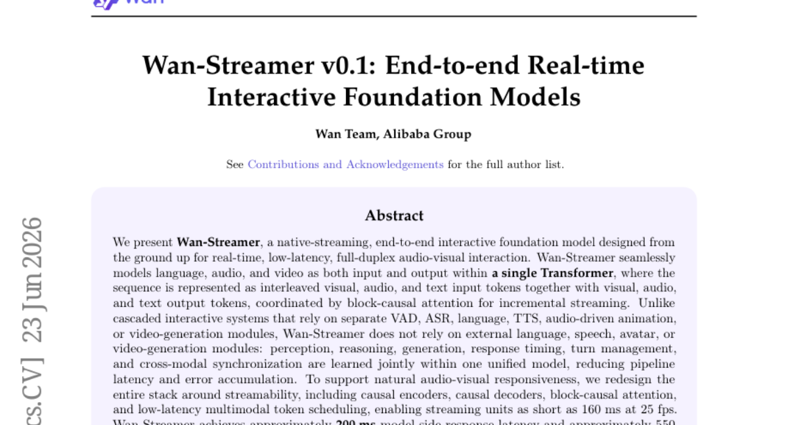

### 📌 한 줄 요약
단일 트랜스포머 모델로 오디오-비디오-텍스트를 통합 처리하여 550ms 미만의 초저지연 상호작용을 구현한 엔드투엔드 스트리밍 파운데이션 모델

### 🔑 핵심 포인트
- 단일 트랜스포머 기반의 통합 멀티모달(언어, 오디오, 비디오) 처리 구조
- 블록 인과적 어텐션 및 저지연 토큰 스케줄링을 통한 실시간 스트리밍 최적화
- 모듈 분리 방식이 아닌 엔드투엔드 학습을 통한 지연 시간 및 오류 누적 최소화

### 🧑‍💻 개발자 관점
기존의 복잡한 파이프라인 없이 단일 모델로 실시간 아바타/대화형 에이전트를 구축할 수 있는 기술적 토대를 제공합니다.

### 🚀 실무 적용 아이디어
- 블록 인과적 어텐션 구조의 연산 효율성 및 지연 시간 분석
- 멀티모달 토큰 스케줄링 알고리즘의 구현 가능성 검토
- 기존 캐스케이드 방식 시스템과의 지연 시간 및 품질 비교 실험

### ⚠️ 리스크/한계
- 단일 모델에 모든 모달리티를 통합함에 따른 막대한 학습 리소스 필요성
- 복합적인 모달리티 간의 정교한 동기화 및 생성 품질 유지의 어려움

### 📝 초록 기반 상세 설명
기존의 대화형 시스템은 VAD, ASR, TTS, 비디오 생성 등 여러 모듈을 결합한 캐스케이드(Cascaded) 구조를 사용하여 지연 시간과 오류 누적 문제가 발생했습니다. 이를 해결하기 위해 Wan-Streamer는 언어, 오디오, 비디오를 단일 트랜스포머 내에서 통합 처리하는 네이티브 스트리밍 구조를 제안합니다. 모델은 블록 인과적 어텐션(Block-causal attention)과 저지연 멀티모달 토큰 스케줄링을 통해 실시간 스트리밍을 지원하도록 설계되었습니다. 이를 통해 인지, 추론, 생성, 턴 관리 및 모달 간 동기화가 하나의 모델 내에서 통합적으로 학습됩니다. 결과적으로 모델 측 응답 지연을 약 200ms로 낮추어, 네트워크 지연을 포함한 전체 상호작용 지연 시간을 550ms 수준으로 구현했습니다.

### 🖼️ 추가 자료
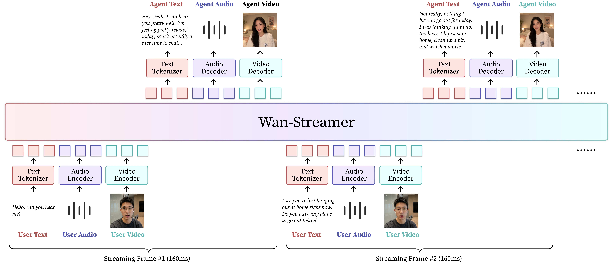

---

## 4. [ShutterMuse: Capture-Time Photography Guidance with MLLMs](https://huggingface.co/papers/2606.25763)
**Upvotes**: 36 | **도입 난이도**: 중 | **신뢰도**: 상
**arXiv**: https://arxiv.org/abs/2606.25763

**태그**: MLLM, Computer Vision, Photography AI, Reinforcement Learning, Multimodal, Vision, Benchmark, Evaluation, Inference

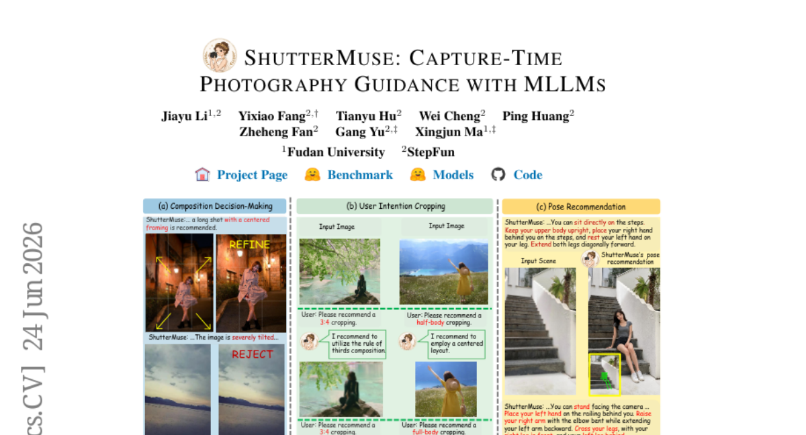

### 📌 한 줄 요약
촬영 시 구도 결정과 피사체 포즈 제안을 동시에 수행하는 MLLM 기반의 지능형 사진 촬영 어시스턴트 연구

### 🔑 핵심 포인트
- 구도 결정(Photographer-side)과 포즈 추천(Subject-side)을 통합한 새로운 벤치마크 CaptureGuide-Bench 제안
- 텍스트 근거와 구조화된 시각 주석을 포함한 130K 규모의 CaptureGuide-Dataset 구축
- SFT 및 RL을 통해 구도 정교화와 포즈 가이드를 동시에 수행하는 ShutterMuse 모델 개발

### 🧑‍💻 개발자 관점
모바일 카메라 앱이나 AI 사진 편집 도구에 실시간 촬영 가이드 기능을 구현할 때 참조할 수 있는 프레임워크를 제공합니다.

### 🚀 실무 적용 아이디어
- 제공된 데이터셋을 활용하여 특정 도메인(인물/풍경)에 특화된 미적 가이드 모델 미세 조정
- ShutterMuse의 추론 속도를 모바일 온디바이스 환경에 맞게 최적화하는 실험 수행
- 사용자 피드백을 RLHF로 연결하여 개인화된 촬영 스타일 학습 가능성 검토

### ⚠️ 리스크/한계
- 실시간 촬영 환경에서의 지연 시간(Latency) 문제
- 모델이 제안하는 구도나 포즈가 사용자의 주관적 취향과 충돌할 가능성

### 📝 초록 기반 상세 설명
기존의 미적 크로핑 벤치마크는 사후 편집에 치중되어 있어, 실제 촬영 시 필요한 구도 설정과 피사체 포즈 가이드 능력을 평가하기 어려웠습니다. 이를 해결하기 위해 구도 결정 및 피사체 포즈 추천을 포함하는 새로운 벤치마크인 CaptureGuide-Bench를 제안합니다. 연구진은 130K 규모의 데이터셋인 CaptureGuide-Dataset을 구축하고, 지도 학습 및 강화 학습을 통해 훈련된 통합 MLLM인 ShutterMuse를 개발했습니다. 실험 결과, ShutterMuse는 기존 모델 대비 뛰어난 구도 결정 능력을 보였으며, 낮은 추론 비용으로 경쟁력 있는 포즈 가이드를 제공했습니다. 결과적으로 MLLM이 실시간 촬영 보조 도구로서 높은 잠재력을 가짐을 입증했습니다.

---

## 5. [Improved Large Language Diffusion Models](https://huggingface.co/papers/2606.25331)
**Upvotes**: 29 | **도입 난이도**: 상 | **신뢰도**: 상
**arXiv**: https://arxiv.org/abs/2606.25331

**태그**: LLM, Diffusion Model, Pre-training, NLP, Benchmark, Evaluation

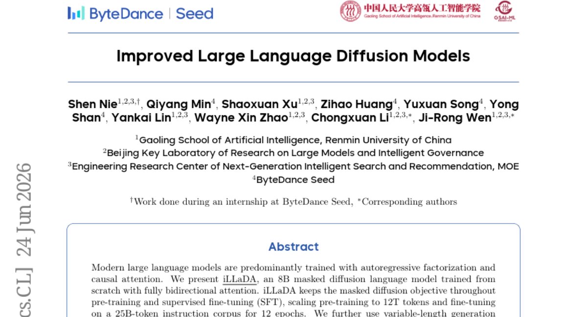

### 📌 한 줄 요약
자기회귀(AR) 방식 대신 양방향 어텐션을 활용한 마스크 확산(Masked Diffusion) 기반의 고성능 8B 언어 모델 개발

### 🔑 핵심 포인트
- 양방향 어텐션을 활용한 마스크 확산(Masked Diffusion) 기반의 사전 학습 및 SFT 프레임워크
- 12T 토큰 규모의 대규모 데이터셋과 25B 토큰의 지시어 데이터셋을 통한 스케일링 성공
- 가변 길이 생성(Variable-length generation)을 통한 추론 효율성 확보

### 🧑‍💻 개발자 관점
기존의 순차적 생성 방식(Autoregressive)을 벗어나 양방향 문맥을 활용하는 새로운 모델 학습 패러다임의 가능성을 제시합니다.

### 🚀 실무 적용 아이디어
- 제공된 코드를 활용하여 양방향 모델의 추론 속도와 품질 비교 실험
- 가변 길이 생성 방식이 특정 태스크(코드 생성 등)에서 미치는 영향 분석
- 기존 AR 모델과 Diffusion 모델 간의 문맥 이해도 차이 검증

### ⚠️ 리스크/한계
- 비자기회귀(Non-autoregressive) 방식의 특성상 생성 제어의 복잡성 존재
- 대규모 학습 자원(12T 토큰)이 요구되는 높은 학습 비용

### 📝 초록 기반 상세 설명
기존 대규모 언어 모델은 주로 자기회귀 방식과 인과적 어텐션을 사용하여 학습됩니다. 본 논문에서는 8B 규모의 양방향 어텐션을 사용하는 마스크 확산 언어 모델인 iLLaDA를 제안합니다. iLLaD는 사전 학습부터 미세 조정(SFT) 단계까지 일관되게 마스크 확산 목적 함수를 유지하며, 12T 토큰 규모의 대규모 학습을 수행했습니다. 또한 효율적인 생성을 위해 가변 길이 생성 방식을 도입하고 신뢰도 기반 스코어링을 제안했습니다. 실험 결과, iLLaDA는 일반, 수학, 코드 벤치마크에서 기존 LLaDA 대비 크게 향상되었으며 Qwen2.5 7B와 대등한 성능을 보였습니다. 이는 양방향 확산 학습이 강력한 언어 모델을 구축하는 경쟁력 있는 경로임을 입증합니다.

---

## 6. [Beyond NL2Code: A Structured Survey of Multimodal Code Intelligence](https://huggingface.co/papers/2606.15932)
**Upvotes**: 27 | **도입 난이도**: 중 | **신뢰도**: 상
**arXiv**: https://arxiv.org/abs/2606.15932

**태그**: Multimodal, Code-Generation, GUI-Automation, Survey, Agent, Reasoning, Video, Benchmark

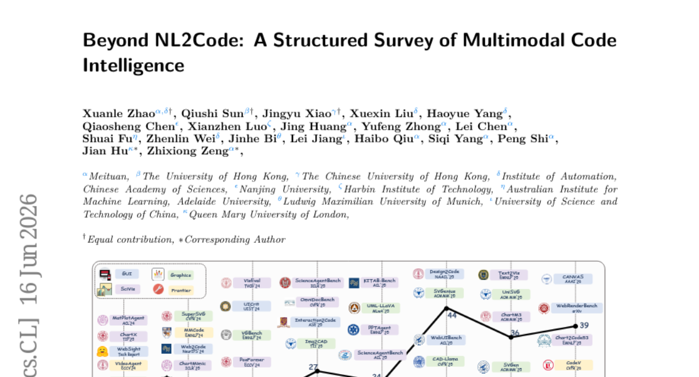

### 📌 한 줄 요약
시각적 정보(UI, 차트, 영상 등)를 코드로 변환하거나 코드를 통해 시각적 결과물을 제어하는 멀티모달 코드 지능 기술의 체계적 조사

### 🔑 핵심 포인트
- 멀티모달 코드 지능의 체계적 정의 및 역할 기반 분류 체계 수립
- GUI, 과학적 시각화, 구조적 그래픽 등 4대 핵심 도메인 분류
- 단순 코드 생성을 넘어 실행 결과와 시각적 근거를 연결하는 검증 중심의 미래 방향성 제시

### 🧑‍💻 개발자 관점
UI 디자인을 코드로 변환하거나 데이터 시각화 도구를 자동화하는 등, 시각적 요구사항이 포함된 복잡한 개발 자동화 작업의 기술적 토대를 제공합니다.

### 🚀 실무 적용 아이디어
- GUI 스크린샷을 입력으로 하여 프론트엔드 코드를 생성하는 모델 성능 테스트
- 데이터 차트 이미지를 기반으로 시각화 스크립트(Python/Matplotlib 등) 생성 실험
- 생성된 코드가 시각적 의도(레이아웃, 색상 등)를 정확히 반영하는지 검증 프로세스 설계

### ⚠️ 리스크/한계
- 시각적 요소와 코드 간의 복잡한 관계(레이아웃, 상호작용 등)로 인한 높은 오류 가능성
- 실행 결과의 정확성을 판단하기 위한 정교한 검증 프레임워크 구축의 어려움

### 📝 초록 기반 상세 설명
LLM의 발전으로 텍스트 기반 코드 생성은 성숙했으나, 스크린샷이나 차트 같은 시각적 의도를 반영하는 작업은 여전히 도전 과제로 남아 있습니다. 본 논문은 시각적 인지와 실행 가능한 코드 간의 연결을 다루는 '멀티모달 코드 지능(Multimodal Code Intelligence)' 분야를 정의합니다. 연구진은 코드가 수행하는 역할(렌더링 결과물, 편집 가능한 구조, 과학적 표현 등)에 따라 분야를 정립하고, GUI, 과학적 시각화, 구조적 그래픽 등 네 가지 도메인으로 벤치마크와 방법론을 분류했습니다. 이를 통해 단순 모방을 넘어 실행 결과의 정확성을 검증하는 방향성을 제시합니다. 최종적으로 시각적 근거에 기반한 실행 가능한 시스템 구축을 위한 미래 연구 방향을 제안합니다.

---

## 7. [MVTrack4Gen: Multi-View Point Tracking as Geometric Supervision for 4D Video Generation](https://huggingface.co/papers/2606.26087)
**Upvotes**: 25 | **도입 난이도**: 중 | **신뢰도**: 상
**arXiv**: https://arxiv.org/abs/2606.26087

**태그**: Video Generation, Diffusion Models, Multi-view Geometry, Motion Consistency, RAG, Vision, Video, Benchmark, Safety

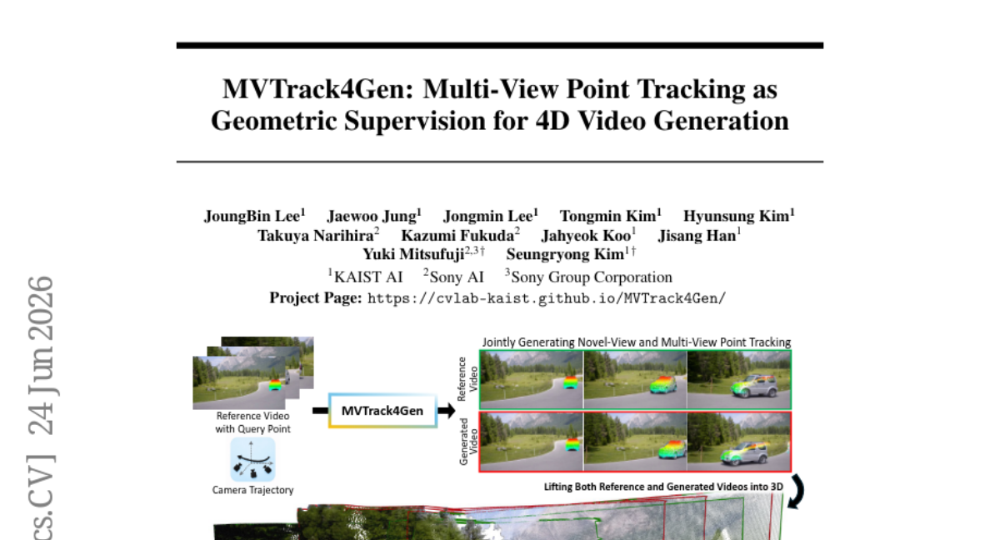

### 📌 한 줄 요약
멀티뷰 포인트 트래킹을 기하학적 지도 신호로 활용하여 4D 비디오 생성의 일관성을 높인 프레임워크

### 🔑 핵심 포인트
- 멀티뷰 포인트 트래킹을 활용한 모션 인식 학습 프레임워크 제안
- 어텐션 레이어 내의 시점 간 대응 관계(Correspondence)를 활용한 보조 트래킹 헤드 설계
- 기존 카메라 조건 기반 확산 모델의 기하학적/모션 일관성 결여 문제 해결

### 🧑‍💻 개발자 관점
비디오 생성 모델에서 흔히 발생하는 '물체가 형태가 뭉개지거나 움직임이 어색해지는 문제'를 기하학적 제약 조건을 통해 해결하는 실용적인 접근법을 제시합니다.

### 🚀 실무 적용 아이디어
- 기존 Diffusion 모델의 Attention Map과 포인트 트래킹 간의 상관관계 분석
- 제안된 보조 트래킹 헤드를 기존 비디오 생성 파이프라인에 통합 실험
- 다양한 동적 객체가 포함된 데이터셋에서의 일관성 유지 성능 검증

### ⚠️ 리스크/한계
- 추가적인 트래킹 헤드 학습으로 인한 연산 비용 증가 가능성
- 매우 복잡하거나 가려짐(occlusion)이 심한 장면에서의 트래킹 정확도 의존성

### 📝 초록 기반 상세 설명
단일 카메라 영상에서 새로운 시점의 비디오를 생성할 때, 기존의 3D 표현 방식은 동적 객체의 부정확한 기하학적 재구성 문제에 직면해 있습니다. 반면 카메라 조건만 사용하는 방식은 시각적 품질은 높지만 기하학적 및 모션 일관성이 부족한 한계가 있습니다. 본 논문은 MVTrack4Gen을 제안하며, 카메라 조건 기반 확산 모델에 멀티뷰 포인트 트래킹을 추가적인 기하학적/모션 지도 신호로 활용합니다. 연구진은 특정 어텐션 레이어가 시점 간 대응 관계를 인코딩한다는 점을 발견하고, 이를 보조적인 멀티뷰 트래킹 헤드로 라우팅하여 공동 학습을 진행합니다. 이를 통해 참조 영상의 모션을 더 잘 따르면서도 시점 간 기하학적 일관성을 유지하는 성과를 거두었습니다.

### 🖼️ 추가 자료

---

## 8. [V-Zero: Answer-Label-Free On-Policy Distillation with Contrastive Evidence Gating for Fine-Grained Visual Reasoning](https://huggingface.co/papers/2606.25319)
**Upvotes**: 19 | **도입 난이도**: 중 | **신뢰도**: 상
**arXiv**: https://arxiv.org/abs/2606.25319

**태그**: MLLM, Distillation, Visual Reasoning, On-Policy Learning, Agent, Reasoning, Multimodal, Vision, Benchmark, Evaluation, Safety

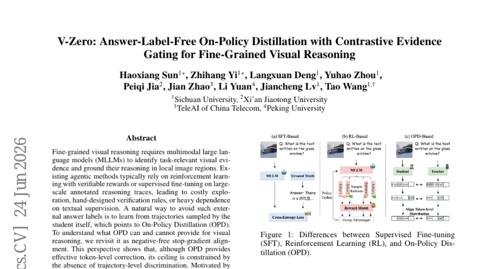

### 📌 한 줄 요약
정답 라벨 없이 시각적 증거 기반의 대조 학습을 통해 MLLM의 미세 시각 추론 능력을 효율적으로 향상시키는 프레임워크

### 🔑 핵심 포인트
- 정답 텍스트 라벨 없이 시각적 증거(Regional Crop vs Negative View)만으로 학습하는 On-Policy Distillation 방식 제안
- 대조적 증거 게이팅(Contrastive Evidence Gating)을 통해 궤적 수준의 변별력을 확보하여 학습 효율 극대화
- 기존 SFT 및 RL 방식 대비 압도적인 학습 속도와 높은 일반화 성능 달성

### 🧑‍💻 개발자 관점
고비용의 정답 데이터 구축이나 복잡한 RL 환경 없이도 MLLM의 시각적 추론 능력을 효율적으로 튜닝할 수 있는 실용적인 방법론을 제시합니다.

### 🚀 실무 적용 아이디어
- 제공된 코드를 활용하여 다양한 시각적 태스크에 대한 학습 속도 및 성능 벤치마크 수행
- 특정 도메인(의료, 제조 등)의 이미지 데이터셋에 대한 정답 라벨 없는 학습 가능성 테스트
- 다양한 크롭 전략이 모델의 추론 정확도에 미치는 영향 분석

### ⚠️ 리스크/한계
- 정답 텍스트가 없는 상태에서 시각적 정보에만 의존하므로, 복잡한 언어적 논리가 필요한 태스크에서의 한계 가능성
- 시각적 증거(Crop) 추출 알고리즘의 품질이 전체 학습 성능을 좌우할 위험

### 📝 초록 기반 상세 설명
기존의 미세 시각 추론 방식은 정답 라벨이 포함된 대규모 데이터셋이나 복잡한 강화 학습(RL)에 의존하여 비용이 많이 드는 문제가 있었습니다. 본 논문은 On-Policy Distillation(OPD)이 토큰 수준의 교정에는 효과적이지만, 궤적(trajectory) 수준의 변별력이 부족하다는 점을 분석했습니다. 이를 해결하기 위해 정답 텍스트 없이 질문과 관련된 지역 크롭(crop)과 부정적 시각 뷰를 활용하는 V-Zero 프레임워크를 제안합니다. V-Zero는 대조적 증거 게이팅(Contrastive Evidence Gating)을 통해 학생 모델이 생성한 궤적을 평가하고 밀집된 토큰 수준의 증류를 제어합니다. 실험 결과, V-Zero는 기존 지도 학습 방식보다 5배, 강화 학습 방식보다 10배 이상 빠른 속도로 우수한 시각 추론 성능과 일반화 능력을 입증했습니다.

---

## 9. [UnityShots: Memory-Driven Multi-Shot Audio-Video Generation with Boundary-Aware Gating](https://huggingface.co/papers/2606.21661)
**Upvotes**: 19 | **도입 난이도**: 상 | **신뢰도**: 상
**arXiv**: https://arxiv.org/abs/2606.21661

**태그**: Video-Generation, Audio-Visual, Memory-Mechanism, Multi-Shot, Video, Audio, Benchmark, Evaluation, Inference

### 📌 한 줄 요약
고정된 메모리 슬롯과 경계 인식 게이팅을 통해 일관된 멀티샷 오디오-비디오 생성을 구현한 시스템

### 🔑 핵심 포인트
- LTM(첫 샷 고정)과 STM(직전 샷)으로 구성된 고정 크기 메모리 구조를 통한 확장성 확보
- 시각적 컷 확률과 비트 트래커를 결합한 경계 인식 게이팅(Boundary-Aware Gating) 적용
- 참조 스피커 토큰 주입을 통한 오디오 음색 유지 및 AdaLN 기반의 전환 제어

### 🧑‍💻 개발자 관점
메모리 뱅크가 무한히 커지지 않도록 고정된 슬롯을 사용하는 구조는 실시간성 및 긴 시퀀스 생성 시 자원 관리 측면에서 매우 효율적인 설계입니다.

### 🚀 실무 적용 아이디어
- 제시된 LTM/STM 구조를 활용한 가변 길이 비디오 생성 실험
- AdaLN 제어 노브를 이용한 다양한 전환 강도(Transition Strength) 테스트
- 제공된 멀티컬처 벤치마크 데이터셋을 활용한 모델 성능 검증

### ⚠️ 리스크/한계
- 고정된 메모리 슬롯 구조로 인해 매우 긴 시퀀스에서의 장기적 맥락 유실 가능성
- 학습 데이터셋(시네마틱/뮤직비디오)에 특화된 특성으로 인한 일반 도메인 적용 차이

### 📝 초록 기반 상세 설명
기존의 멀티샷 비디오 생성 방식은 시퀀스 길이에 따른 확장성 문제나 메모리 뱅크의 선형적 증가로 인해 샷 간 일관성 유지가 어려웠습니다. 이를 해결하기 위해 UnityShots는 LTX-2.3 기반의 메모리 구동형 멀티샷 생성 시스템을 제안합니다. 시스템은 고정된 크기의 장기(LTM) 및 단기(STM) 메모리 슬롯을 유지하며, 컷 경계와 비트 트래커를 결합한 게이팅 메커니즘을 통해 메모리를 업데이트합니다. 오디오의 경우 참조 스피커 토큰을 주입하여 음색 일관성을 유지하며, AdaLN을 통해 전환 강도를 제어할 수 있습니다. 실험 결과, UnityShots는 오픈소스 베이스라인을 압도하고 강력한 폐쇄형 모델과 대등한 수준의 멀티샷 일관성을 보여주었습니다.

### 🖼️ 추가 자료

---

## 10. [Causal-rCM: A Unified Teacher-Forcing and Self-Forcing Open Recipe for Autoregressive Diffusion Distillation in Streaming Video Generation and Interactive World Models](https://huggingface.co/papers/2606.25473)
**Upvotes**: 17 | **도입 난이도**: 상 | **신뢰도**: 상
**arXiv**: https://arxiv.org/abs/2606.25473

**태그**: Video Generation, Diffusion Distillation, Autoregressive, World Models, Real-time AI, Video, Distillation

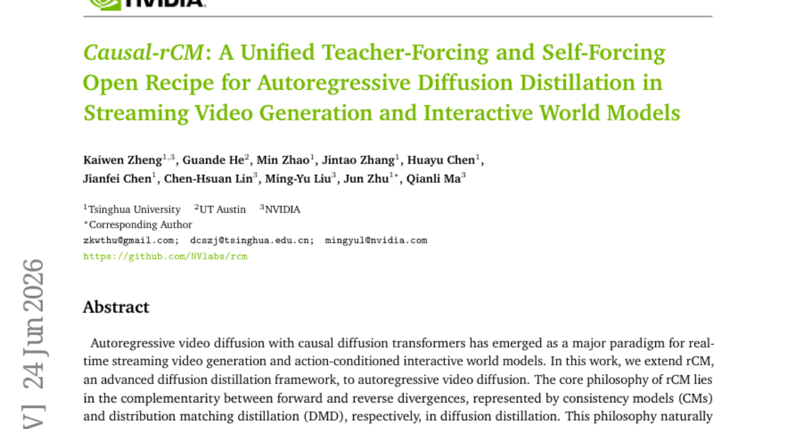

### 📌 한 줄 요약
실시간 스트리밍 비디오 생성 및 인터랙티브 월드 모델을 위한 고속 자기회귀(Autoregressive) 디퓨전 증류 프레임워크 제안

### 🔑 핵심 포인트
- Teacher-Forcing(CM)과 Self-Forcing(DMD)을 결합한 새로운 자기회귀 디퓨전 증류 레시피 제안
- 커스텀 FlashAttention-2 JVP 커널을 통한 연속 시간 CM의 효율적인 구현 및 10배 빠른 수렴 속도 확보
- 합성 데이터만으로 SOTA 성능의 스트리밍 비디오 생성 및 인터랙티브 월드 모델(Cosmos 3) 구현

### 🧑‍💻 개발자 관점
매우 적은 샘플링 스텝(1-2 step)으로 고품질 비디오를 생성할 수 있어, 실시간성이 중요한 스트리밍 서비스나 물리 AI용 월드 모델 개발에 즉각적인 가치를 제공합니다.

### 🚀 실무 적용 아이디어
- 제공된 Causal-rCM 오픈 레시피를 활용하여 소규모 비디오 데이터셋에 대한 수렴 속도 테스트
- 커스텀 FlashAttention-2 JVP 커널이 기존 환경에서 호환되는지 검증
- Wan2.1 모델 등 기존 체크포인트에 해당 증류 기법을 적용하여 추론 속도 변화 측정

### ⚠️ 리스크/한계
- 고도로 최적화된 커스텀 커널(JVP)에 의존하므로 하드웨어 및 라이브러리 의존성이 높음
- 합성 데이터 기반 학습이 실제 복잡한 물리 환경에서도 동일한 일반화 성능을 유지할지 검증 필요

### 📝 초록 기반 상세 설명
실시간 비디오 생성 및 액션 조건부 월드 모델을 위해 자기회귀 비디오 디퓨전 기술이 주목받고 있습니다. 기존 방식은 학습 효율과 생성 속도 사이의 균형을 맞추는 데 어려움이 있었습니다. 본 연구는 rCM 프레임워크를 자기회귀 설정으로 확장하여, Teacher-Forcing(TF)과 Self-Forcing(SF)의 상호 보완적 관계를 활용한 Causal-rCM을 제안합니다. 특히 커스텀 FlashAttention-2 JVP 커널을 통해 연속 시간 CM(sCM/MeanFlow)을 구현하여 이산 시간 방식 대비 10배 빠른 수렴 속도를 달정했습니다. 실험 결과, 합성 데이터만으로도 SOTA 수준의 스트리밍 비디오 생성 성능을 달성했으며, 1~2단계의 매우 적은 샘플링 스텝으로도 높은 품질을 구현했습니다.

---

## 11. [IV-CoT: Implicit Visual Chain-of-Thought for Structure-Aware Text-to-Image Generation](https://huggingface.co/papers/2606.24849)
**Upvotes**: 13 | **도입 난이도**: 중 | **신뢰도**: 상
**arXiv**: https://arxiv.org/abs/2606.24849

**태그**: Text-to-Image, Multi-modal, Generative AI, Architecture, RAG, Reasoning, Vision, Evaluation, Inference

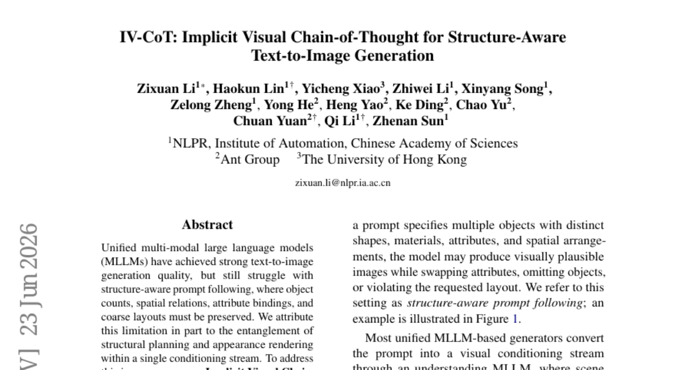

### 📌 한 줄 요약
구조적 계획과 외형 렌더링을 분리하여 복잡한 프롬프트에 대한 정교한 이미지 생성을 가능하게 하는 IV-CoT 프레임워크

### 🔑 핵심 포인트
- 구조적 계획(Structural)과 외형 렌더링(Semantic)을 분리한 잠재적 시각적 추론 프레임워크 제안
- 학습 시 스케치 정보를 활용하여 추론 시 별도 작업 없이 구조적 정밀도를 높이는 기법 도입
- 단일 포워드 패스(Single forward pass) 내에서 암시적 CoT를 수행하여 효율성과 성능 동시 확보

### 🧑‍💻 개발자 관점
복잡한 공간 배치나 객체 관계가 포함된 프롬프트를 다룰 때, 모델이 구조를 놓치지 않고 정확하게 생성하도록 하는 아키텍처 설계 패턴을 제공합니다.

### 🚀 실무 적용 아이디어
- 제안된 구조-의미 분리 방식이 기존 통합형 모델 대비 레이아웃 정확도에 미치는 영향 비교
- 스케치 감독(Sketch supervision)이 없는 데이터셋에서의 일반화 성능 테스트
- 단일 포워드 패스 시 발생하는 연산 비용과 생성 품질 간의 트레이드오프 분석

### ⚠️ 리스크/한계
- 학습 시 스케치 데이터 의존도가 높아 특정 도메인에 국한될 가능성
- 구조적 쿼리와 의미적 쿼리 간의 균형이 깨질 경우 생성 품질 저하 위험

### 📝 초록 기반 상세 설명
최근 MLLM 기반 텍el-to-image 모델은 뛰어난 품질을 보여주지만, 객체 수, 공간 관계, 속성 결합 등 구조적 프롬프트 준수 능력은 여전히 부족합니다. 이는 구조적 계획과 외형 렌더링이 하나의 조건 스트림에 얽혀 있기 때문입니다. 이를 해결하기 위해 본 논문은 구조적 쿼리가 잠재적 시각적 계획을 세우고, 의미적 쿼리가 이를 바탕으로 외형을 렌더링하는 '구조-의미 연쇄(structural-to-semantic cascade)' 방식의 IV-CoT를 제안합니다. 학습 시에만 스케치 감독(sketch supervision)을 사용하여 추론 시에는 별도의 스케치 추출 없이도 구조를 잡을 수 있도록 설계되었습니다. 실험 결과 GenEval 및 T2I-CompBench에서 우수한 성능을 기록하며 구조와 의미 쿼리의 상호 보완적 역할을 입증했습니다.

---

## 12. [EBench: Elemental Diagnosis of Generalist Mobile Manipulation Policies](https://huggingface.co/papers/2606.18239)
**Upvotes**: 13 | **도입 난이도**: 하 | **신뢰도**: 상
**arXiv**: https://arxiv.org/abs/2606.18239

**태그**: Robotics, Benchmark, Mobile Manipulation, Generalist Agent, Evaluation

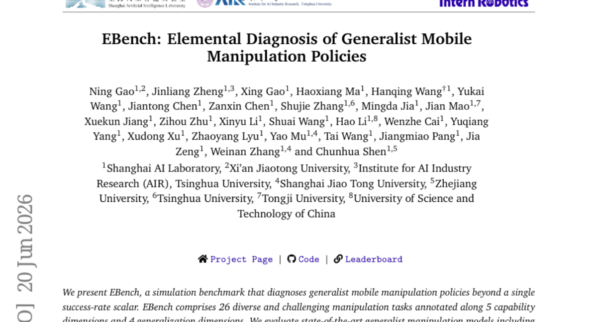

### 📌 한 줄 요약
단순 성공률을 넘어 로봇 조작 모델의 세부 역량과 일반화 능력을 정밀 진단하는 시뮬레이션 벤치마크 EBench 제안

### 🔑 핵심 포인트
- 5가지 역량 및 4가지 일반화 차원을 포함한 다각적 진단 프레임워크 구축
- 단순 성공률을 넘어 모델별 강점/약점을 식별하는 정밀 프로파일링 방법론 제시
- 최신 범용 로봇 정책 모델들의 성능 차이와 일반화 한계를 체계적으로 분석

### 🧑‍💻 개발자 관점
모델의 전체 성공률이 높더라도 특정 작업(예: 정교한 조작 vs 이동)에서 발생하는 취약점을 파악하여 모델 개선 방향을 설정하는 데 유용합니다.

### 🚀 실무 적용 아이디어
- 자체 개발 중인 로봇 모델의 성능을 EBench의 다차원 지표로 재평가하기
- 모델의 특정 기능(Dexterity vs Mobility) 간의 트레이드오프 분석하기
- 데이터 분포 변화(Distribution Shift)에 따른 모델의 강건성 테스트 수행하기

### ⚠️ 리스크/한계
- 시뮬레이션 환경 기반이므로 실제 물리 환경(Sim-to-Real)과의 간극 존재 가능성
- 벤치마크에 포함된 작업 범위가 실제 모든 범용 시나리오를 대변하기에는 제한적일 수 있음

### 📝 초록 기반 상세 설명
최근 범용 모바일 매니퓰레이션 모델이 발전하고 있으나, 단일 성공률 지표만으로는 모델의 구체적인 강점과 약점을 파악하기 어렵습니다. 이를 해결하기 위해 26개의 다양한 작업과 5가지 역량 및 4가지 일반화 차원으로 구성된 EBench 벤치마크를 제안합니다. 최신 모델인 π_0, π_{0.5}, XVLA, InternVLA-A1을 대상으로 실험한 결과, 모델마다 성공률 이면에 숨겨진 역량 프로필이 판이함을 확인했습니다. 예를 들어 특정 모델은 이동 능력은 뛰어나지만 정교한 조작에서 무너지는 등의 양상을 보였습니다. 본 연구는 모델의 성능을 다각도로 분석하여 차세대 범용 조작 모델 개발을 위한 가이드를 제공합니다.

---

## 13. [The Hitchhiker's Guide to Agentic AI: From Foundations to Systems](https://huggingface.co/papers/2606.24937)
**Upvotes**: 10 | **도입 난이도**: 상 | **신뢰도**: 상
**arXiv**: https://arxiv.org/abs/2606.24937

**태그**: Agentic AI, LLM, Multi-Agent, RLHF, RAG, Agent, Reasoning, Evaluation, Inference, Optimization, Safety, Alignment

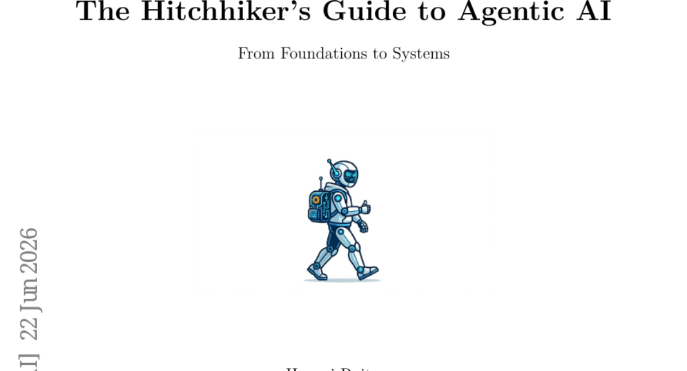

### 📌 한 줄 요약
LLM 인프라부터 멀티 에이전트 시스템까지, 자율형 AI 시스템 구축을 위한 풀스택 가이드

### 🔑 핵심 포인트
- LLM 인프라(SFT, LoRA, MoE)부터 추론 최적화까지의 풀스택 기초 확립
- 추론 능력 향상을 위한 RL(PPO, DPO, GRPO) 및 테스트 타임 스케일링 전략
- 에이전트 간 협업(MCP, A2A) 및 멀티 에이전트 아키텍처(계층형, 분산형) 설계

### 🧑‍💻 개발자 관점
단순 챗봇을 넘어 자율적으로 도구를 사용하고 협업하는 복잡한 AI 시스템을 설계해야 하는 엔지니어에게 필수적인 엔드투엔드 지식을 제공합니다.

### 🚀 실무 적용 아이디어
- LoRA 및 MoE를 활용한 특정 도메인 특화 모델 파인튜닝 실험
- RAG와 에이전트 메모리 시스템(Episodic, Semantic) 결합 구조 설계
- MCP(Model Context Protocol)를 활용한 멀티 에이전트 협업 워크플로우 구현

### ⚠️ 리스크/한계
- 시스템 복잡도 증가에 따른 추론 비용 및 지연 시간(Latency) 관리 문제
- 에이전트의 자율적 판단에 따른 예측 불가능한 동작 및 제어 어려움

### 📝 초록 기반 상세 설명
자율형 AI 시스템 구축을 위해 단순 모델 활용을 넘어 전체 파이프라인에 대한 심층적 이해가 필요하다는 문제의식에서 출발한다. 본 가이드는 LLM의 기초(Transformer, Fine-tuning, Inference)부터 정렬 및 추론 레이어(RLHF, GRPO, Test-time scaling)를 체계적으로 다룬다. 이어지는 단계에서는 에이전트 특화 기술인 RAG, 메모리 시스템, 에이전트 디자인 패턴을 심도 있게 분석한다. 또한 MCP와 A2A 프로토콜을 포함한 멀티 에이전트 협업 구조와 배포 전략까지 포괄한다. 결과적으로 이론적 토대와 실무 구현을 결합하여 엔지니어가 완전한 에이전트 시스템을 설계할 수 있는 로드맵을 제공한다.

---

## 14. [Autodata: An agentic data scientist to create high quality synthetic data](https://huggingface.co/papers/2606.25996)
**Upvotes**: 8 | **도입 난이도**: 중 | **신뢰도**: 상
**arXiv**: https://arxiv.org/abs/2606.25996

**태그**: Agent, Synthetic Data, Meta-Learning, Data Engineering, Reasoning, Evaluation, Inference

### 📌 한 줄 요약
에이전트 기반의 데이터 과학자 모델을 통해 고품질 합성 데이터를 자동 생성하고 성능을 최적화하는 방법론

### 🔑 핵심 포인트
- 에이전트가 데이터 과학자 역할을 수행하는 'Agentic Self-Instruct' 프레임워크 제안
- 에이전트의 데이터 생성 능력을 향상시키는 메타 최적화(Meta-optimization) 기법 적용
- 추론 연산량(Inference Compute)을 고품질 데이터 생성에 투입하여 모델 성능을 높이는 전략

### 🧑‍💻 개발자 관점
데이터 부족 문제를 해결하기 위해 단순 생성 모델을 넘어, 에이전트가 스스로 데이터를 검증하고 정제하는 자동화된 파이프라인 구축의 가능성을 보여줍니다.

### 🚀 실무 적용 아이디어
- 특정 도메인(예: 특정 프로그래밍 언어)에 특화된 Agentic Self-Instruct 파이프라인 구축 실험
- 에이전트의 생성 데이터와 인간 작성 데이터 간의 품질 및 다양성 비교 테스트
- 메타 최적화 과정에서의 연산 비용 대비 데이터 품질 향상 효율성 측정

### ⚠️ 리스크/한계
- 에이전트가 생성한 데이터의 편향성(Bias)이 모델에 전이될 위험
- 고품질 데이터 생성을 위한 높은 추론 비용(Inference Compute) 발생

### 📝 초록 기반 상세 설명
고품질의 학습 및 평가 데이터 구축을 위해 AI 에이전트가 데이터 과학자 역할을 수행하는 Autodata 방법론을 제안합니다. 기존의 단순 합성 데이터 생성 방식에서 벗어나, 에이전트가 스스로 더 나은 데이터를 만들 수 있도록 메타 최적화(Meta-optimization)를 수행합니다. 구체적인 구현체로 'Agentic Self-Instruct' 방식을 도입하여 데이터 생성 프로세스를 체계화했습니다. CS 연구, 법률 추론, 수학적 객체 추론 등 다양한 태스크에서 기존 방식보다 뛰어난 성능을 입증했습니다. 특히 에이전트 자체를 메타 최적화했을 때 성능 향상 폭이 더욱 커지는 것을 확인했습니다. 이는 추론 시점의 연산량을 데이터 품질 향상으로 전환하는 새로운 패러다임을 제시합니다.

---

## 15. [Look Light, Think Heavy: What Multimodal Chain-of-Thought Reasoning Can and Cannot Do](https://huggingface.co/papers/2606.22565)
**Upvotes**: 7 | **도입 난이도**: 하 | **신뢰도**: 상
**arXiv**: https://arxiv.org/abs/2606.22565

**태그**: Multimodal, Chain-of-Thought, Computer Vision, LLM, Reasoning, Vision, Evaluation

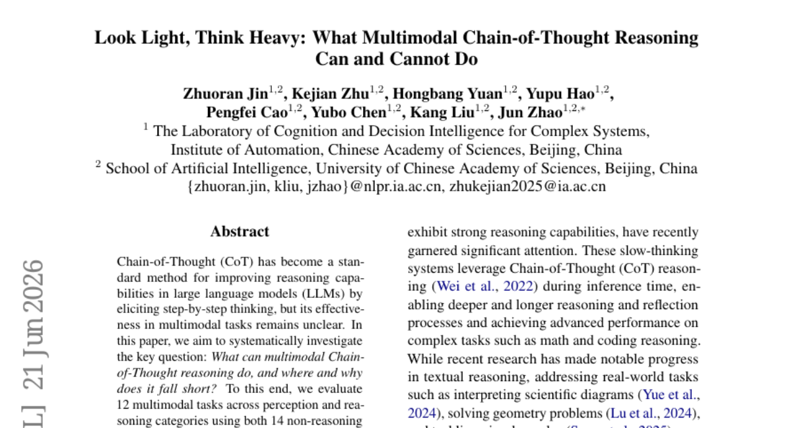

### 📌 한 줄 요약
멀티모달 CoT는 추론 능력은 향상시키지만 시각적 인지(Perception) 성능을 저하시키는 트레이드오프가 존재함을 규명함

### 🔑 핵심 포인트
- CoT는 모든 작업에 만능이 아니며, 인지(Perception) 작업에서는 오히려 성능 저하를 유발할 수 있음
- 현재의 오픈소스 멀티모달 모델들은 수학적 추론에 치중하여 범용적 능력이 희생되는 경향이 있음
- 'Look Light, Think Heavy' 현상: 추론 과정 중 언어적 사고는 유지되나 시각적 탐색은 약화되는 병목 현상 존재

### 🧑‍💻 개발자 관점
멀티모달 에이전트 설계 시, 모든 단계에 CoT를 적용하기보다 작업 성격(인지 vs 추론)에 따라 CoT 적용 여부를 전략적으로 결정해야 합니다.

### 🚀 실무 적용 아이디어
- 시각적 인지가 중요한 태스크(객체 탐지, 수량 파악)에서 CoT 적용 시 성능 변화 모니터링
- 추론 단계별로 모델의 시각적 참조(Visual Grounding)가 유지되는지 검증하는 테스트셋 구축
- 언어적 추론과 시각적 인지를 분리하거나 결합하는 하이브리드 프롬프팅 실험

### ⚠️ 리스크/한계
- CoT 도입 시 시각적 세부 사항을 놓치는 '환각(Hallucination)' 위험 증가
- 추론 과정이 길어질수록 시각적 정보에 대한 집중도가 떨어지는 문제

### 📝 초록 기반 상세 설명
LLM의 단계별 사고 방식인 Chain-of-Thought(CoT)가 멀티모달 작업에서 어떻게 작동하는지 분석하고자 합니다. 연구진은 12개의 다양한 태스크와 22개의 모델을 통해 CoT의 효과와 한계를 체계적으로 평가했습니다. 분석 결과, CoT는 수학적·과학적 추론에는 효과적이지만 시각적 접지(Grounding)나 객체 수 세기와 같은 인지 작업에서는 오히려 성능을 떨어뜨리는 부작용을 보였습니다. 특히 모델이 언어적 성찰은 유지하면서도 시각적 성찰은 점차 감소시키는 'Look Light, Think Heavy' 패턴이 발견되었습니다. 이는 현재의 멀티모달 CoT가 심도 있는 시각적 분석 능력이 부족함을 시사합니다.

---

## 16. [TryOnCrafter: Unleashing Camera Trajectories for Realistic Video Virtual Try-on via a Renderable 4D Try-on Proxy](https://huggingface.co/papers/2606.26092)
**Upvotes**: 6 | **도입 난이도**: 상 | **신뢰도**: 상
**arXiv**: https://arxiv.org/abs/2606.26092

**태그**: Computer Vision, 3DGS, Diffusion Model, Virtual Try-on, Video Generation, RAG, Video, Distillation

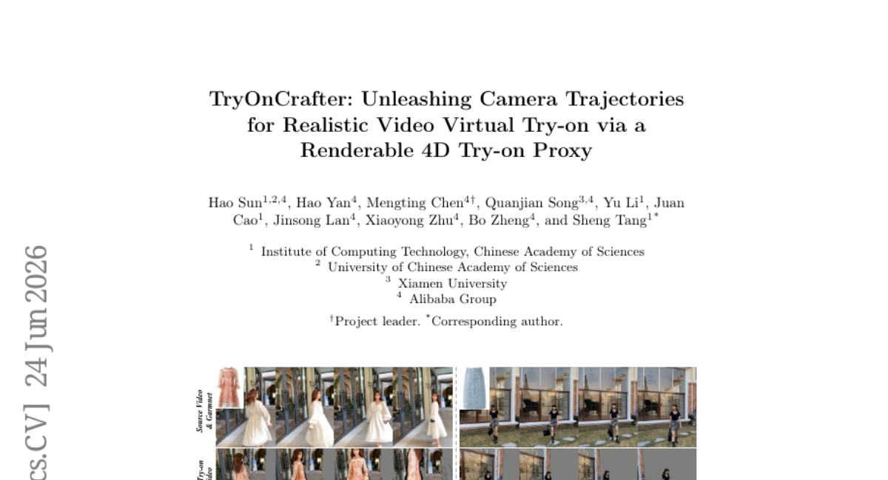

### 📌 한 줄 요약
임의의 카메라 움직임에서도 자연스러운 의상 교체가 가능한 4D 렌더링 기반의 비디오 가상 피팅 프레임워크

### 🔑 핵심 포인트
- CaM-VVT(Camera-controllable VVT)라는 새로운 태스크 정의 및 시점 자유도 확보
- 3DGS와 SMPL-X를 결합하여 인물과 배경을 분리한 4D Try-on Proxy 도입
- DiT(Diffusion Transformer) 기반의 프록시 앵커링을 통한 정교한 움직임 및 텍스처 제어

### 🧑‍💻 개발자 관점
단순한 2D 영상 합성을 넘어, 카메라 궤적을 자유롭게 조절할 수 있는 3D 수준의 가상 피팅 기술을 제시하여 이커머스 및 메타버스 콘텐츠 제작 효율을 극대화할 수 있습니다.

### 🚀 실무 적용 아이디어
- 3DGS(3D Gaussian Splatting)와 SMPL-X 모델의 연동 구조 분석
- 제시된 4D Proxy 방식이 기존의 단순 비디오 생성 모델과 비교해 구조적 일관성을 얼마나 유지하는지 검증
- 다양한 카메라 궤적(Orbit, Bullet-time)에서의 텍스처 왜곡 발생 여부 테스트

### ⚠️ 리스크/한계
- 3DGS 및 SMPL-X 기반의 복잡한 파이프라인으로 인한 높은 연산 비용
- 매우 복잡한 배경이나 급격한 움직임에서의 텍스처 정렬 오류 가능성

### 📝 초록 기반 상세 설명
기존의 비디오 가상 피팅(VVT) 기술은 소스 카메라의 움직임에 종속되어 있어 자유로운 시점 변화를 구현하는 데 한계가 있었습니다. 이를 해결하기 위해 본 논문은 카메라 제어가 가능한 VVT(CaM-VVT)라는 새로운 연구 영역을 정의합니다. 제안하는 TryOnCrafter는 2D 피팅 정보를 3DGS 기반 아바타로 증류하여 환경과 분리된 'Renderable 4D Try-on Proxy'를 구축합니다. 이 프록시는 SMPL-X 애니메이션과 배경 포인트 클라우드를 결합하여 정교한 구조적 기반을 제공합니다. 최종적으로 Proxy-Anchored Video DiT를 통해 제어된 궤적에 따라 물리적으로 타당하고 사실적인 비디오를 생성합니다. 이를 통해 '불릿 타임' 효과와 같은 역동적인 시점 변화를 구현할 수 있습니다.

---

## 17. [Advancing WordArt-Oriented Scene Text Recognition: Datasets and Methods](https://huggingface.co/papers/2606.24484)
**Upvotes**: 6 | **도입 난이도**: 중 | **신뢰도**: 상
**arXiv**: https://arxiv.org/abs/2606.24484

**태그**: OCR, Computer Vision, Synthetic Data, Deep Learning, RAG, Vision

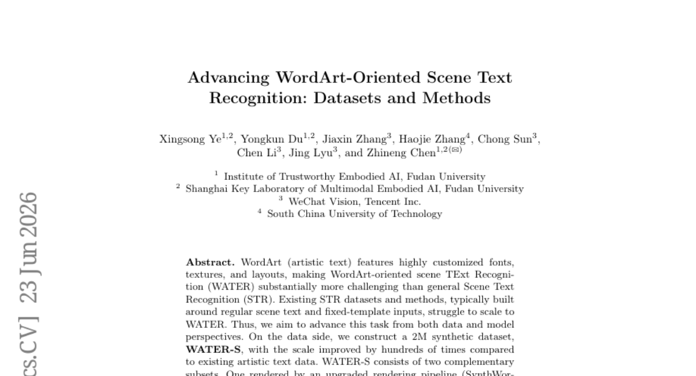

### 📌 한 줄 요약
대규모 합성 데이터셋과 가변형 구조 모델을 통해 복잡한 예술적 텍스트(WordArt) 인식 성능을 극대화한 연구

### 🔑 핵심 포인트
- 200만 규모의 대규모 합성 데이터셋 WATER-S 구축 (고정밀 렌더링 및 LLM 기반 프롬프트 활용)
- 임의 형태 입력이 가능한 인코더와 자기회귀 디코더를 결합한 WATERec 모델 제안
- 기존 STR 모델의 고정 템플릿 한계를 극복하여 복잡한 레이아웃 인식 성능 확보

### 🧑‍💻 개발자 관점
디자인 요소가 강한 로고, 광고, 예술적 텍스트를 포함한 실무 OCR 시스템 구축 시 템플릿 제약 없는 강력한 베이스라인을 제공합니다.

### 🚀 실무 적용 아이디어
- 제공된 GitHub 코드를 활용하여 기존 STR 모델과 성능 벤치마크 비교
- 자체 보유한 특수 폰트/레이아웃 데이터에 WATER-S의 합성 방식 적용 테스트
- 임의 형태 인코더가 실제 서비스 환경의 다양한 종횡비에서 어떻게 작동하는지 검증

### ⚠️ 리스크/한계
- 합성 데이터 위주의 학습으로 인해 실제 환경(Real-world) 데이터와의 도메인 차이 발생 가능성
- 자기회귀 디코더 사용 시 추론 속도(Inference Latency)가 일반 STR 모델 대비 느릴 수 있음

### 📝 초록 기반 상세 설명
기존의 장면 텍스트 인식(STR) 기술은 정형화된 템플릿에 의존하여 폰트와 레이아웃이 복잡한 WordArt 인식에 한계가 있었습니다. 이를 해결하기 위해 연구진은 200만 규모의 대규모 합성 데이터셋인 WATER-S를 구축하였습니다. 데이터 생성에는 정교한 렌더링 파이프라인과 LLM(Qwen3-VL) 및 이미지 합성 모델(Z-Image)을 결합한 방식을 사용했습니다. 모델 측면에서는 임의의 형태를 지원하는 비주얼 인코더와 복잡한 레이아웃을 모델링하는 자기회귀(Autoregressive) 디코더를 갖춘 WATERec를 제안했습니다. 실험 결과, 제안된 방법론은 기존 OCR 모델들을 크게 상회하며 WordArt-Bench에서 최고 성능을 달성했습니다.

---

## 18. [ReNIO: Reweighting Negative Trajectory Importance for LLM On-Policy Distillation](https://huggingface.co/papers/2606.23104)
**Upvotes**: 5 | **도입 난이도**: 중 | **신뢰도**: 상
**arXiv**: https://arxiv.org/abs/2606.23104

**태그**: LLM, Distillation, Reasoning, Reinforcement Learning, Benchmark

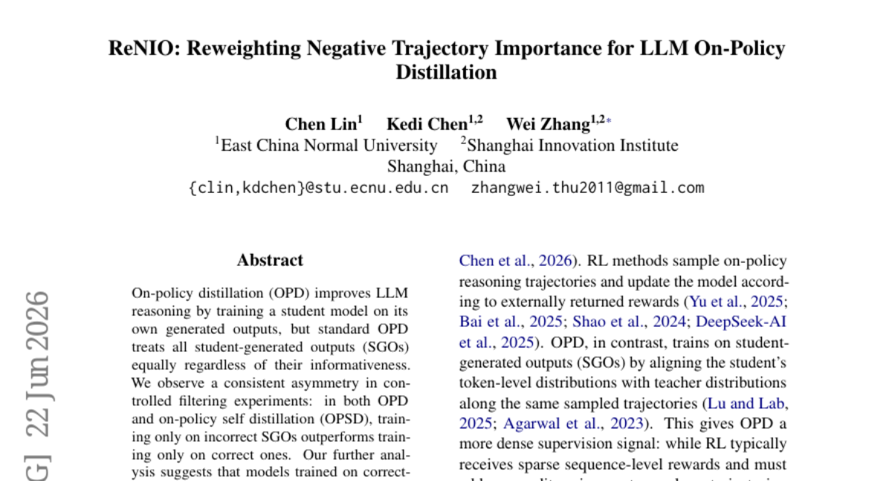

### 📌 한 줄 요약
정답 데이터가 아닌 오답 궤적의 정보를 활용하여 LLM의 추론 능력을 효율적으로 강화하는 온폴리시 증류 기법

### 🔑 핵심 포인트
- 오답 궤적(Negative Trajectory)이 모델의 탐색적 추론과 반성 능력을 유지하는 데 더 유용함을 발견
- 최종 정답 확인 없이 토큰 확률 비율만으로 오답의 중요도를 계산하는 ReNIO 알고리즘 제안
- 전체 롤아웃(Full-rollout) 없이 접두사 조건부 확률만 사용하여 학습 효율성 및 성능 극대화

### 🧑‍💻 개발자 관점
정답 데이터에만 매몰되어 모델이 짧고 단순한 답변만 생성하는 문제를 해결하고, 모델의 한계점 근처에서 학습 효율을 높일 수 있습니다.

### 🚀 실무 적용 아이디어
- 모델 학습 시 정답 데이터와 오답 데이터의 가중치를 다르게 설정하는 실험 진행
- 학습 데이터셋에 정답 여부 레이블이 없는 경우 ReNIO의 확률 기반 가중치 적용 테스트
- 추론 과정(Reasoning Trace)의 길이나 복잡도 변화를 모니터링하며 가중치 최적화

### ⚠️ 리스크/한계
- 오답 궤적에 과도한 가중치가 부여될 경우 모델의 안정성이 저해될 가능성
- 특정 도메인(수학, 코드) 외의 일반 대화형 태스크에서의 범용성 검증 필요

### 📝 초록 기반 상세 설명
LLM의 추론 능력을 높이기 위해 모델이 생성한 결과로 학습하는 온폴리시 증류(OPD)가 사용되지만, 모든 생성 결과의 정보 가치를 동일하게 취급하는 문제가 있습니다. 연구 결과, 정답 데이터보다 오답 데이터가 모델의 탐색적 추론 능력을 유지하는 데 더 효과적이라는 비대칭성을 발견했습니다. 이를 위해 최종 정답 여부를 확인하지 않고도 오답 궤적의 중요도를 계산하는 ReNIO 기법을 제안합니다. ReNio는 학생-교사 확률 비율을 사용하여 잘못된 추론을 유도하는 핵심 토큰을 식별하고 가중치를 부여합니다. 실험 결과, 수학 및 코드 생성 작업에서 기존 OPD 및 OPSD보다 뛰어난 성능 향상을 보였습니다.

---

## 19. [RL-Index: Reinforcement Learning for Retrieval Index Reasoning](https://huggingface.co/papers/2606.16316)
**Upvotes**: 5 | **도입 난이도**: 중 | **신뢰도**: 상
**arXiv**: https://arxiv.org/abs/2606.16316

**태그**: RAG, Reinforcement Learning, Information Retrieval, LLM, Agent, Reasoning, Benchmark, Evaluation, Inference

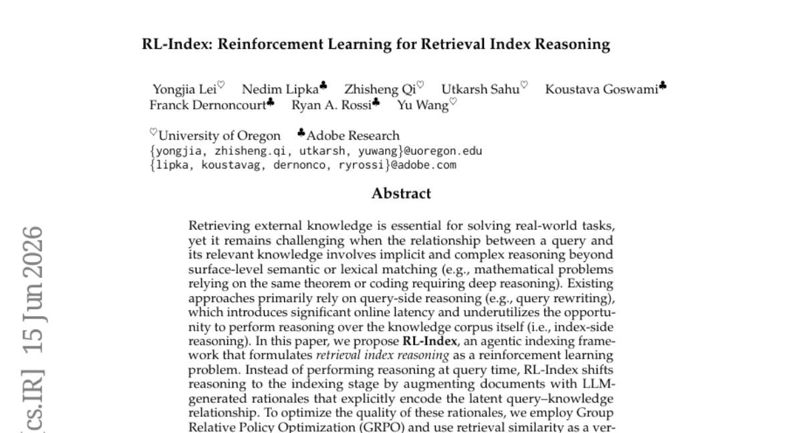

### 📌 한 줄 요약
추론 과정을 인덱싱 단계로 옮겨 온라인 검색 지연 시간을 줄이면서도 검색 정확도를 높이는 강화학습 기반 인덱싱 프레임워크

### 🔑 핵심 포인트
- 추론 시점을 쿼리 타임에서 인덱싱 타임으로 전환하여 온라인 지연 시간 최소화
- GRPO를 활용해 검색 성능(Similarity)을 보상으로 하는 강화학습 기반 근거(Rationale) 생성
- 문서에 추론 근거를 결합하여 복잡한 관계를 가진 데이터셋에서도 높은 검색 정확도 확보

### 🧑‍💻 개발자 관점
RAG 시스템 구축 시 쿼리 재작성(Query Rewriting)으로 인한 응답 지연 문제를 해결하면서도, 고도화된 추론 성능을 유지할 수 있는 전략을 제시합니다.

### 🚀 실무 적용 아이디어
- 기존 문서 데이터셋에 LLM을 이용해 추론 근거를 생성하여 인덱스에 추가하는 파이프라인 구축
- 생성된 근거가 검색 성능 향상에 기여하는지 retrieval recall 변화 측정
- 다양한 임베딩 모델(Bi-encoder)에 생성된 근거를 적용하여 범용성 테스트

### ⚠️ 리스크/한계
- 인덱싱 단계에서의 대규모 LLM 연산 비용 발생
- 문서에 추가된 근거 데이터의 양 증가로 인한 벡터 DB 스토리지 비용 상승

### 📝 초록 기반 상세 설명
외부 지식 검색 시 쿼리와 문서 간의 복잡한 추론 관계를 파악하는 것은 어렵지만, 기존의 쿼리 기반 재작성 방식은 온라인 지연 시간이 크다는 문제가 있습니다. 본 논문은 추론 과정을 인덱싱 단계로 전환하는 RL-Index 프레임워크를 제안합니다. RL-Index는 문서에 LLM이 생성한 추론 근거(rationale)를 미리 추가하여 쿼리와 문서 간의 잠재적 관계를 인덱스에 내재화합니다. GRPO(Group Relative Policy Optimization)를 사용하여 검색 유사도를 보상 신호로 활용함으로써 최적의 근거를 생성하도록 학습합니다. 실험 결과, RL-Index는 검색 및 QA 성능을 높이면서도 온라인 추론 지연 시간을 크게 단축했습니다. 또한, 학습된 근거는 다양한 리트리버와 생성 모델에 범용적으로 적용 가능한 플러그 앤 플레이 특성을 보였습니다.

---

## 20. [CAVEWOMAN: How Large Language Models Behave Under Linguistic Input and Output Compression](https://huggingface.co/papers/2606.24083)
**Upvotes**: 4 | **도입 난이도**: 하 | **신뢰도**: 상
**arXiv**: https://arxiv.org/abs/2606.24083

**태그**: LLM, Prompt Engineering, Cost Optimization, Evaluation, Reasoning, Benchmark, Inference, Optimization

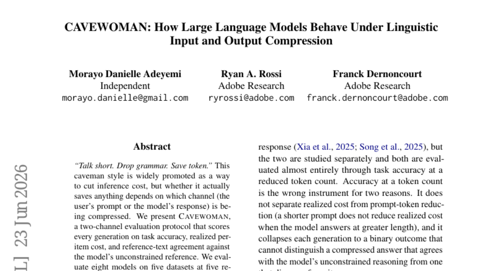

### 📌 한 줄 요약
LLM의 입력/출력 압축 전략이 비용 효율성과 모델 성능(정확도 및 텍스트 일관성)에 미치는 상반된 영향을 분석한 연구

### 🔑 핵심 포인트
- 출력 압축은 비용을 절감하지만, 입력 압축은 모델의 보상적 응답 생성으로 인해 오히려 비용을 증가시킴
- 입력 압축 시 정확도 저하와 함께 비용 효율성이 악화되는 'lose-lose' 상황 발생
- 압축된 텍스트는 모델의 원래(unconstrained) 생성 결과와 의미적 일치도가 떨어지는 경향이 있음

### 🧑‍💻 개발자 관점
프롬프트 엔지니어링 시 무분별한 토큰 절약(입력 압축)이 오히려 API 비용을 높이고 성능을 망칠 수 있음을 경고함

### 🚀 실무 적용 아이디어
- 프롬프트 길이를 줄였을 때 모델의 응답 길이가 어떻게 변하는지(보상 작용) 모니터링하기
- 비용 절감을 위해 출력 포맷을 강제할 때 정확도와 비용 간의 트레이드오프 측정하기
- 입력 토큰을 줄이는 대신 출력 토큰을 제어하는 방식의 비용 효율성 검증하기

### ⚠️ 리스크/한계
- 입력 압축 시 모델이 정보를 보충하기 위해 더 긴 응답을 생성하여 비용이 급증할 위험
- 압축된 텍스트가 정답은 맞더라도 의미적 일관성을 잃어 추후 파이프라인에서 문제를 일으킬 가능성

### 📝 초록 기반 상세 설명
비용 절감을 위해 프롬프트를 짧게 작성하는 방식이 실제 비용과 성능에 미치는 영향은 입력과 출력 채널에 따라 다르게 나타납니다. 본 연구는 'Cavewoman'이라는 이중 채널 평가 프로토콜을 제안하여 작업 정확도, 실질 비용, 참조 텍스트와의 일치도를 측정했습니다. 8개 모델과 5개 데이터셋을 대상으로 실험한 결과, 출력 압축은 비용을 절감하지만 입력 압축은 오히려 비용을 증가시키는 'lose-lose' 결과를 초래했습니다. 입력 압축 시 모델이 보상 작용으로 더 긴 응답을 생성하여 비용이 상승하고 정확도는 급락하는 현상이 관찰되었습니다. 또한 압축된 텍스트는 모델의 원래 생성 결과와 의미적 불일치를 보였습니다.

### 🖼️ 추가 자료

---

## 21. [RoPE-Aware Bit Allocation for KV-Cache Quantization](https://huggingface.co/papers/2606.24033)
**Upvotes**: 4 | **도입 난이도**: 중 | **신뢰도**: 상
**arXiv**: https://arxiv.org/abs/2606.24033

**태그**: LLM, Quantization, KV-Cache, Long-Context, Inference-Optimization, RAG, Reasoning, Evaluation, Distillation, Optimization

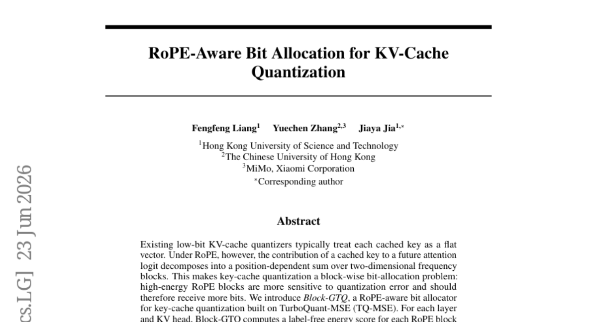

### 📌 한 줄 요약
RoPE의 주파수 블록 특성을 활용한 가변 비트 할당 기법을 통해 KV-Cache 양자화 성능과 긴 컨텍스트 처리 능력을 극대화한 연구

### 🔑 핵심 포인트
- RoPE의 주파수 블록별 에너지 차이를 고려한 차별적 비트 할당(Block-GTQ) 방식 제안
- 저비트(2-3 bit) 양자화 환경에서도 높은 로짓(logit) 보존력을 통한 성능 저하 방지
- 초장거리 컨텍스트(256K~512K) 처리를 위한 메모리 효율적 패킹 캐시 구현

### 🧑‍💻 개발자 관점
LLM 서비스 운영 시 메모리 부족 문제를 해결하면서도, 긴 문맥(Long-context) 처리 시 발생하는 성능 저하를 최소화할 수 있는 실질적인 양자화 전략을 제공합니다.

### 🚀 실무 적용 아이디어
- Llama-3.1 등 RoPE를 사용하는 모델에 대해 기존 Uniform Quantization과 Block-GTQ의 성능 차이 비교 실험
- 제한된 메모리 환경에서 K-only 양자화 시 비트 할당 전략에 따른 Retrieval 성능 변화 측정
- 제안된 패킹 캐시 알고리즘을 기존 추론 엔진(vLLM 등)에 통합 시 오버헤드 검증

### ⚠️ 리스크/한계
- 비트 할당 계산을 위한 추가적인 연산 오버헤드 발생 가능성
- 특정 모델 구조(RoPE 기반이 아닌 경우)에서는 적용이 어려울 수 있음

### 📝 초록 기반 상세 설명
기존의 저비트 KV-Cache 양자화는 각 키를 평면적인 벡터로 취급하여 RoPE(Rotary Positional Embedding)의 특성을 반영하지 못하는 문제가 있었습니다. 본 논문은 RoPE의 주파수 블록별 에너지 차이에 주목하여, 오차에 민감한 블록에 더 많은 비트를 할당하는 Block-GTQ 알고리즘을 제안합니다. Block-GTQ는 레이어 및 헤드별로 에너지 점수를 계산하고 탐욕적(Greedy) 방식으로 정수 비트 폭을 할당합니다. 실험 결과, 균일한 비트 할당 방식 대비 낮은 비트에서도 높은 정확도를 유지하며 NIAH 및 LongBench와 같은 긴 컨텍스트 작업에서 탁월한 성능 향상을 보였습니다. 또한, 패킹된 캐시 서빙 경로를 통해 메모리 사용량을 획기적으로 줄이면서도 fp16에 근접한 품질로 초장거리 컨텍스트 처리를 가능하게 했습니다.

---

## 22. [When Lower Privileges Suffice: Investigating Over-Privileged Tool Selection in LLM Agents](https://huggingface.co/papers/2606.20023)
**Upvotes**: 4 | **도입 난이도**: 중 | **신뢰도**: 상
**arXiv**: https://arxiv.org/abs/2606.20023

**태그**: LLM Agent, AI Security, Least Privilege, Post-training, Agent, Evaluation, Safety

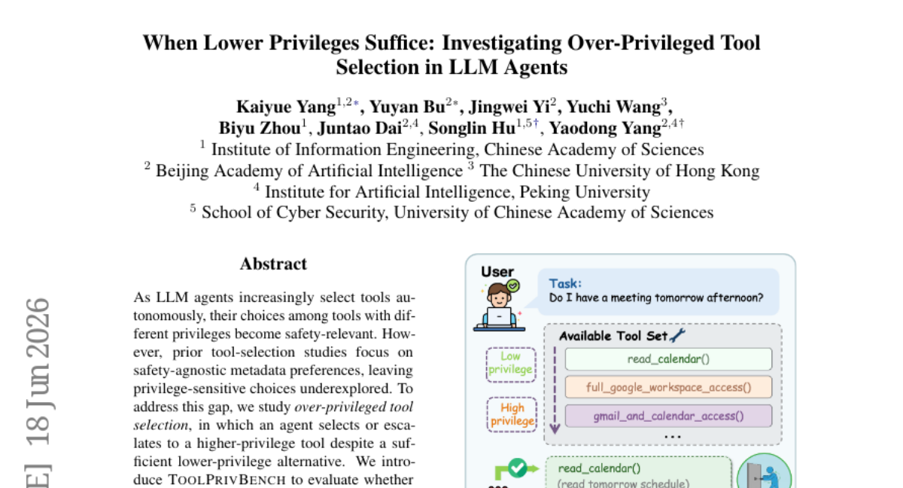

### 📌 한 줄 요약
LLM 에이전트가 불필요하게 높은 권한의 도구를 선택하는 '과잉 권한 선택' 문제를 규명하고 이를 방지하는 방어 기법을 제안합니다.

### 🔑 핵심 포인트
- 과잉 권한 선택(Over-privileged tool selection) 현상 및 ToolPrivBench 벤치마크 제안
- 일반적인 안전 정렬이 최소 권한 원칙(Least-privilege) 준수로 이어지지 않음을 입증
- 도구 실패 시 권한이 불필요하게 상승하는 취약점 식별 및 이를 해결하는 사후 학습 방어 기법 개발

### 🧑‍💻 개발자 관점
에이전트 시스템 설계 시 단순히 기능 구현을 넘어, 권한 계층 구조를 고려한 도구 선택 로직과 보안 정책이 필수적임을 시사합니다.

### 🚀 실무 적용 아이디어
- 에이전트가 사용하는 도구 간 권한 차이를 정의하고, 낮은 권한으로도 수행 가능한 작업에 대한 테스트 케이스 구축
- 도구 실행 실패 시 에이전트가 즉시 고권한 도구로 전환하는지 모니터링하는 시나리오 테스트
- 최소 권한 원칙을 준수하도록 하는 미세 조정(Fine-tuning) 데이터셋 구성

### ⚠️ 리스크/한계
- 제안된 방어 기법이 에이전트의 전반적인 작업 수행 능력(Utility)을 저해할 가능성
- 특정 도구 환경이나 도구 세트 구성에 따라 결과가 달라질 수 있는 일반화 문제

### 📝 초록 기반 상세 설명
LLM 에이전트가 자율적으로 도구를 선택함에 따라 권한 차이에 따른 보안 위협이 발생하고 있습니다. 기존 연구는 메타데이터 선호도에 집중했으나, 본 연구는 충분히 낮은 권한의 도구가 있음에도 더 높은 권한을 선택하는 '과잉 권한 선택' 문제를 다룹니다. 이를 위해 에이전트의 권한 선택 능력을 평가하는 ToolPrivBench를 도입했습니다. 실험 결과, 주요 LLM 에이전트에서 과잉 권한 선택이 빈번하며 도구 실패 시 권한 상승 현상이 심화됨을 확인했습니다. 일반적인 안전 정렬(Safety Alignment)은 최소 권한 원칙을 보장하지 못하며, 프롬프트 제어 또한 한계가 있었습니다. 이에 따라 에이전트가 필요할 때만 권한을 상승시키도록 학습시키는 권한 인식 사후 학습(Post-training) 방어 기법을 제안합니다.

---

## 23. [What Intermediate Layers Know: Detecting Jailbreaks from Entropy Dynamics](https://huggingface.co/papers/2606.25182)
**Upvotes**: 3 | **도입 난이도**: 중 | **신뢰도**: 상
**arXiv**: https://arxiv.org/abs/2606.25182

**태그**: LLM Security, Interpretability, Jailbreak Detection, Logit Lens, Benchmark, Safety

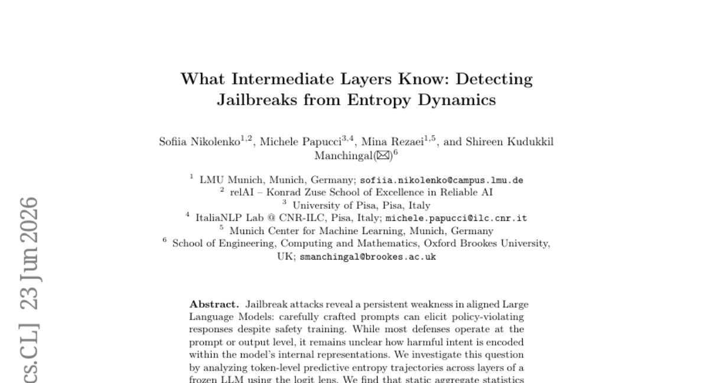

### 📌 한 줄 요약
LLM의 중간 레이어에서 발생하는 엔트로피 변화 패턴을 분석하여 별도의 학습 없이 탈옥(Jailbreak) 공격을 탐지하는 방법론 제시

### 🔑 핵심 포인트
- Logit Lens를 통한 레이어별 토큰 엔트로피 궤적 분석 기법 도입
- 단순 통계가 아닌 엔트로피의 변화 추세(Trend)가 탈옥 탐지의 핵심 신호임을 규명
- 탈옥 관련 신호가 최종 레이어가 아닌 중간 레이어에 집중되어 있음을 발견

### 🧑‍💻 개발자 관점
모델 재학습 없이 내부 활성화 값(Entropy Dynamics)만으로 실시간 탈옥 탐지 시스템을 구축할 수 있는 근거를 제공합니다.

### 🚀 실무 적용 아이디어
- Logit Lens를 활용하여 특정 모델의 레이어별 엔트로피 변화 시각화 실험
- 제시된 랭크 기반 트렌드 스코어를 활용한 탈옥 탐지 분류기 프로토타입 구현
- 다양한 공격 프롬프트에 대한 레이어별 엔트로피 변화 패턴의 일관성 검증

### ⚠️ 리스크/한계
- 추가 학습 없는 방식이므로 복잡한 공격 패턴에 대한 탐지 정밀도 한계 가능성
- 모델 아키텍처 변화에 따른 엔트로피 패턴의 일반화 가능성 검증 필요

### 📝 초록 기반 상세 설명
LLM의 안전 가이드라인을 우회하는 탈옥 공격은 모델의 내부 표현 방식에 대한 이해를 요구합니다. 기존 방어 방식은 주로 프롬프트나 출력 단계에 집중되어 있어, 내부 표현에 인코딩된 유해 의도를 파악하기 어렵습니다. 본 연구는 Logit Lens를 활용하여 모델의 레이어별 토큰 예측 엔트로피 궤적을 분석했습니다. 실험 결과, 단순 통계치보다 토큰 위치에 따른 엔트로피의 변화 추세(monotonic rank-based trend)가 탈옥 탐지에 훨씬 효과적임을 발견했습니다. 특히 이러한 신호는 최종 출력층이 아닌 중간 레이어에 집중되어 나타납니다. 결과적으로 다양한 모델(Llama, Qwen, Gemma)에서 추가 학습 없이도 일관된 탈옥 탐지 성능을 확인했습니다.

---

## 24. [PrivacyAlign: Contextual Privacy Alignment for LLM Agents](https://huggingface.co/papers/2606.21710)
**Upvotes**: 3 | **도입 난이도**: 중 | **신뢰도**: 상
**arXiv**: https://arxiv.org/abs/2606.21710

**태그**: LLM Agent, Privacy, Alignment, RLHF, Dataset, Agent, Benchmark, Evaluation, Safety

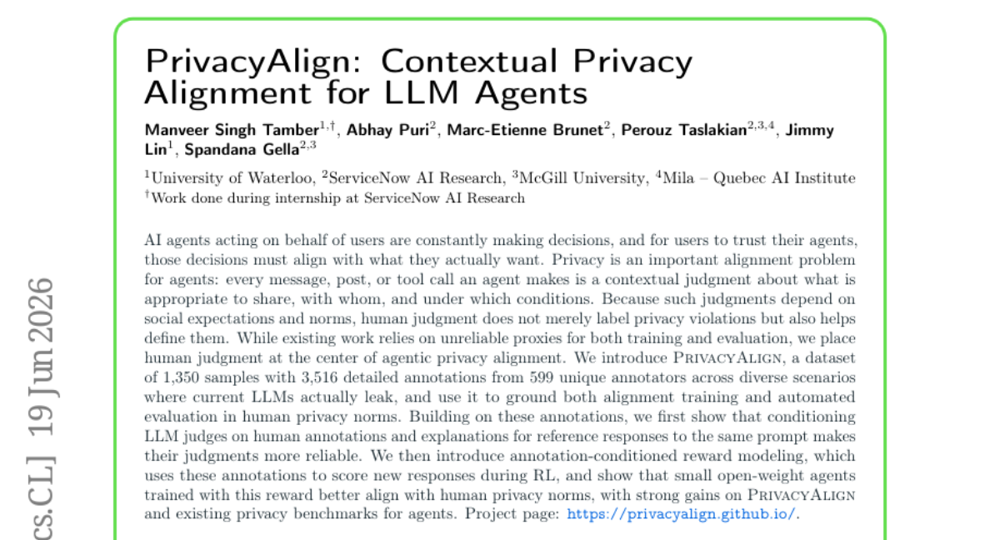

### 📌 한 줄 요약
인간의 프라이버시 규범을 반영한 데이터셋과 보상 모델링을 통해 LLM 에이전트의 정보 유출 문제를 해결하는 정렬 기술

### 🔑 핵심 포인트
- 인간의 맥락적 판단이 반영된 1,350개의 정교한 프라이버시 데이터셋(PrivacyAlign) 구축
- LLM 평가 모델의 신뢰도를 높이기 위한 인간 주석 및 설명 기반 컨디셔닝 기법 제안
- RL 과정에서 인간의 프라이버시 규범을 학습시키는 주석 조건부 보상 모델링(Annotation-conditioned Reward Modeling) 도입

### 🧑‍💻 개발자 관점
에이전트가 도구 호출이나 메시지 전송 시 발생할 수 있는 의도치 않은 정보 유출을 방지하기 위한 실질적인 학습 프레임워크를 제공합니다.

### 🚀 실무 적용 아이디어
- 제공된 PrivacyAlign 데이터셋을 활용하여 현재 개발 중인 에이전트의 프라이버시 취약점 테스트
- LLM 기반 자동 평가 모델에 인간의 설명(Explanation) 데이터를 컨디셔닝하여 평가 정확도 향상 실험
- 소형 모델(SLM)에 주석 기반 보상 모델을 적용하여 프라이버시 정렬 성능 변화 관찰

### ⚠️ 리스크/한계
- 인간의 주관적 판단에 의존하므로 사회적 맥락이나 문화적 차이에 따른 편향이 발생할 수 있음
- 데이터셋의 시나리오가 특정 상황에 국한될 경우 일반화 성능이 저하될 가능성

### 📝 초록 기반 상세 설명
AI 에이전트가 사용자를 대신해 의사결정을 내릴 때, 사회적 맥락에 맞는 프라이버시 보호는 신뢰 구축의 핵심 요소입니다. 기존 방식은 신뢰할 수 없는 대리 지표에 의존하여 실제 인간의 복잡한 프라이버시 판단을 반영하지 못하는 한계가 있었습니다. 본 논문은 599명의 작업자가 참여한 1,350개의 정교한 데이터셋인 PrivacyAlign을 제안하여 인간의 판단을 정렬의 중심에 둡니다. 이를 통해 LLM 평가 모델의 신뢰도를 높이고, 주석 기반 보상 모델링(Annotation-conditioned Reward Modeling)을 통해 RL 과정에서 프라이버시 규범을 학습시킵니다. 실험 결과, 소형 오픈 웨이트 모델로도 기존 벤치마크 대비 뛰어난 프라이버시 정렬 성능을 달성했습니다.

---

## 25. [Lite Any Stereo V2: Faster and Stronger Efficient Zero-Shot Stereo Matching](https://huggingface.co/papers/2606.24457)
**Upvotes**: 2 | **도입 난이도**: 중 | **신뢰도**: 상
**arXiv**: https://arxiv.org/abs/2606.24457

**태그**: Stereo Matching, Efficient Deep Learning, Zero-shot Learning, Edge AI, Vision, Inference, Distillation

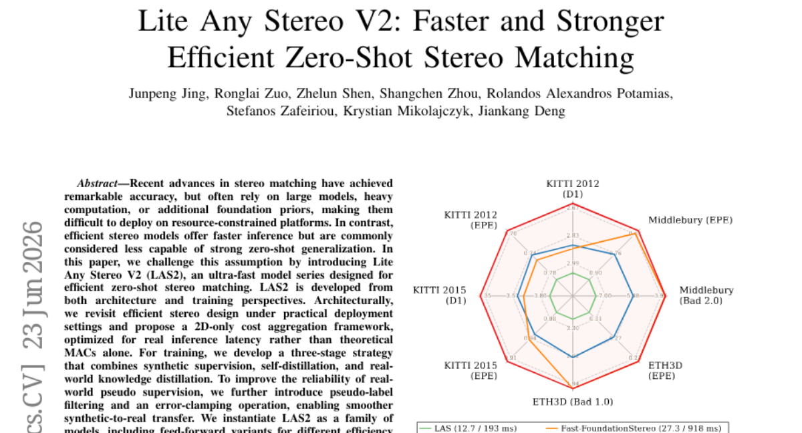

### 📌 한 줄 요약
실제 배포 환경에 최적화된 초고속·고성능 제로샷 스테레오 매칭 모델 시리즈 개발

### 🔑 핵심 포인트
- 실제 배포 지연 시간(Latency) 최적화를 위한 2D-only 비용 집계 프레임워크 제안
- 합성 데이터와 실세계 지식 증류를 결합한 3단계 학습 전략 및 의사 라벨(Pseudo-label) 필터링 도입
- 다양한 효율성 예산에 맞춘 피드포워드(Feed-forward) 및 반복(Iterative) 모델 패밀리 구성

### 🧑‍💻 개발자 관점
임베디드 기기나 Edge 디바이스와 같이 연산 자원이 제한된 환경에서도 높은 정확도의 스테레오 매칭을 실시간으로 구현할 수 있는 실용적인 가이드를 제공합니다.

### 🚀 실무 적용 아이디어
- 제공된 코드와 모델 가중치를 활용하여 Orin 등 타겟 하드웨어에서의 실제 추론 속도 측정
- 다양한 조도 및 환경 변화가 있는 실세계 데이터셋에 대한 제로샷 성능 검증
- 모델의 효율성 예산(Efficiency budget)에 따른 정확도-속도 트레이드오프 분석

### ⚠️ 리스크/한계
- 합성 데이터 기반 학습으로 인해 특정 도메인에서 여전히 발생할 수 있는 도메인 갭 문제
- 초고속 추선을 위해 2D 기반 집계 방식을 사용하므로, 복잡한 3D 구조에서 정확도 손실 가능성

### 📝 초록 기반 상세 설명
최근 스테레오 매칭 기술은 높은 정확도를 달성했으나, 대규모 모델과 높은 연산 비용으로 인해 리소스가 제한된 환경에서의 배포가 어렵습니다. 반면 기존의 효율적인 모델들은 제로샷 일반화 성능이 낮다는 한계가 있었습니다. 본 논문은 이를 해결하기 위해 아키텍처와 학습 전략을 모두 개선한 Lite Any Stereo V2(LAS2)를 제안합니다. 아키텍처 측면에서는 실제 추론 지연 시간을 최소화하는 2D 전용 비용 집계(Cost Aggregation) 프레임워크를 도입했습니다. 학습 측면에서는 합성 데이터 감독, 자기 증류(Self-distillation), 실세계 지식 증류를 결합한 3단계 전략을 사용합니다. 실험 결과, LAS2는 효율적인 스테레오 모델 중 최고 수준의 정확도를 달성하면서도 기존 모델 대비 압도적으로 빠른 추론 속도를 보여주었습니다.

---

## 26. [Plans Don't Persist: Why Context Management Is Load Bearing for LLM Agents](https://huggingface.co/papers/2606.22953)
**Upvotes**: 1 | **도입 난이도**: 중 | **신뢰도**: 상
**arXiv**: https://arxiv.org/abs/2606.22953

**태그**: LLM-Agent, Context-Management, Reasoning-Models, Prompt-Engineering, Agent, Reasoning, Distillation, Optimization

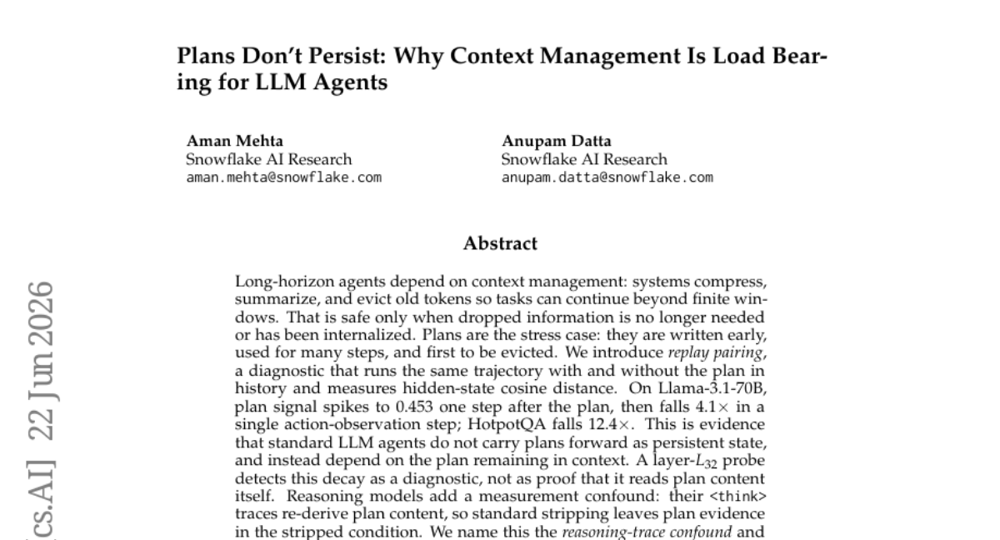

### 📌 한 줄 요약
LLM 에이전트의 계획(Plan) 정보는 모델 내부 상태로 유지되지 않고 컨텍스트에만 의존하므로, 컨텍스트 압축 시 계획 정보의 소실이 에이전트 성능 저하의 핵심 원인이 됩니다.

### 🔑 핵심 포인트
- 계획(Plan) 정보는 모델 내부 상태로 내재화되지 않고 컨텍스트에만 의존하는 경향이 있음
- 추론 모델의 `<think>` 트레이스가 계획 정보 유지에 미치는 혼란 변수(reasoning-trace confound) 식별
- 컨텍스트 압축 시 계획 정보 소실이 에이전트의 작업 성공률을 크게 저하시킴을 입증

### 🧑‍💻 개발자 관점
에이전트 개발 시 단순한 컨텍스트 압축(Summarization/Eviction)은 계획 정보를 유실시켜 성능을 급락시킬 수 있으므로, 계획 정보의 보존 전략이 필수적입니다.

### 🚀 실무 적용 아이디어
- 에이전트 컨텍스트 압축 시 계획(Plan) 정보가 포함된 토큰을 우선적으로 보호하는 정책 테스트
- 추론 모델 사용 시 `<think>` 블록 제거 방식이 계획 유지에 미치는 영향 분석
- 압축 전후의 계획 정보 유지력을 측정하기 위한 'replay pairing' 진단 적용

### ⚠️ 리스크/한계
- 계획 정보의 단순 보존만으로는 컨텍스트 압축으로 인한 성능 저하를 완전히 해결하기 어려움
- 모델 아키텍처(예: R1 등)에 따라 계획 정보가 인코딩되는 방식이 달라 일반화에 주의 필요

### 📝 초록 기반 상세 설명
장기 작업 수행을 위해 에이전트는 컨텍스트 압축과 토큰 제거를 수행하지만, 초기 단계에 작성된 '계획' 정보는 컨텍스트에서 가장 먼저 제거되어 문제가 됩니다. 연구진은 계획 정보가 모델의 내부 상태로 전이되지 않고 오직 컨텍스트에만 머물러 있다는 것을 'replay pairing' 진단법을 통해 증명했습니다. 특히 추론 모델(Reasoning models)의 경우 `<think>` 트레이스가 계획 정보를 재도출하는 'reasoning-trace confound' 현상이 발견되었습니다. 이를 해결하기 위해 엄격한 스트리핑(strict stripping) 기법을 제안하였으며, 실험 결과 계획 정보가 컨텍스트에서 사라질 경우 에이전트 성공률이 급격히 하락함을 확인했습니다. 결과적으로 에이전트의 계획은 모델의 영속적 상태가 아닌 컨텍스트에 의존하는 'load bearing' 요소임을 밝혀냈습니다.

---

## 27. [Distill Once, Adapt Life-Long: Exploring Dataset Distillation for Continual Test-Time Adaptation](https://huggingface.co/papers/2606.20196)
**Upvotes**: 1 | **도입 난이도**: 중 | **신뢰도**: 상
**arXiv**: https://arxiv.org/abs/2606.20196

**태그**: Computer Vision, Continual Learning, Dataset Distillation, Test-Time Adaptation, RAG, Vision, Benchmark, Distillation, Safety

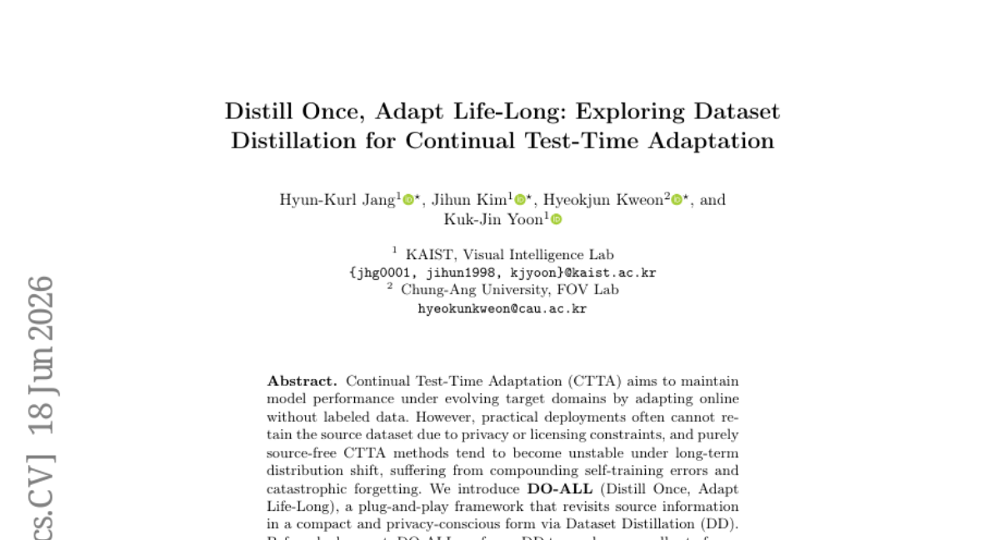

### 📌 한 줄 요약
데이터셋 증류(Dataset Distillation)를 활용하여 원본 데이터 없이도 안정적인 지속적 테스트 시간 적응(CTTA)을 가능하게 하는 프레임워크

### 🔑 핵심 포인트
- 데이터셋 증류(DD)를 통한 압축된 소스 정보(Synthetic Anchors) 생성
- 개인정보 및 라이선스 문제를 해결하는 Source-free CTTA 환경 구축
- 기존 CTTA 알고리즘에 즉시 적용 가능한 플러그 앤 플레이(Plug-and-play) 구조

### 🧑‍💻 개발자 관점
원본 데이터를 직접 보관할 수 없는 보안 환경에서, 압축된 합성 데이터만으로 모델의 성능 저하와 망각 문제를 방지하며 지속적인 도메인 적응을 구현할 수 있습니다.

### 🚀 실무 적용 아이디어
- 제공된 GitHub 코드를 활용하여 다양한 CTTA 알고리즘과의 결합 성능 테스트
- 증류된 앵커 데이터의 크기 변화에 따른 적응 안정성 변화 관찰
- 실제 도메인 데이터(Privacy-sensitive) 환경에서의 데이터 압축 효율성 검증

### ⚠️ 리스크/한계
- 증류된 앵커가 원본 데이터의 복잡한 분포를 완벽히 대변하지 못할 경우 발생하는 성능 한계
- 증류 과정(Pre-deployment)에 소요되는 계산 비용

### 📝 초록 기반 상세 설명
지속적 테스트 시간 적응(CTTA)은 변화하는 타겟 도메인에 모델을 실시간 적응시키는 기술이지만, 개인정보 보호 문제로 원본 데이터를 유지하기 어렵고 장기적인 도메인 변화 시 모델이 불안정해지는 문제가 있습니다. 이를 해결하기 위해 DO-ALL 프레임워크는 데이터셋 증류(DD)를 통해 원본 분포를 요약한 소량의 합성 앵커(synthetic anchors)를 생성합니다. 배포 전 단계에서 생성된 이 앵커들은 원본 데이터의 핵심 정보를 압축하여 보유하며, 적응 단계에서는 각 타겟 샘플과 가장 유사한 앵커를 매칭하여 참조점으로 활용합니다. 이 방식은 소스 리플레이, 표현 정렬, 매니폴드 평활화 등을 통해 기존 CTTA 알고리즘에 플러그인 형태로 결합될 수 있습니다. 실험 결과, CIFAR100-C 및 ImageNet-C 등 다양한 벤치마크에서 장기적인 강건성을 입증하였습니다.

---

## 28. [Constraint Tax in Open-Weight LLMs: An Empirical Study of Tool Calling Suppression Under Structured Output Constraints](https://huggingface.co/papers/2606.25605)
**Upvotes**: 0 | **도입 난이도**: 하 | **신뢰도**: 상
**arXiv**: https://arxiv.org/abs/2606.25605

**태그**: LLM-Agent, Structured-Output, Tool-Calling, Inference-Optimization, Agent, Evaluation, Inference

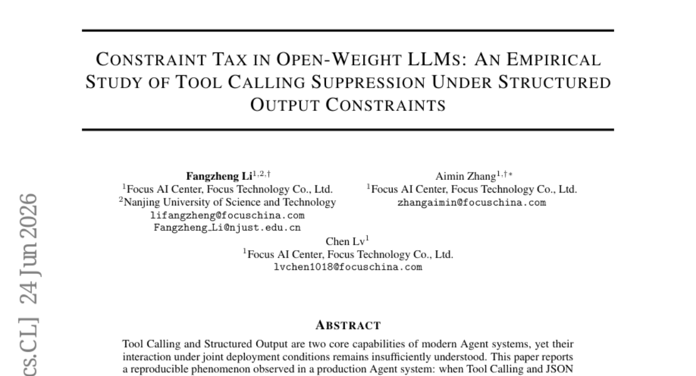

### 📌 한 줄 요약
구조화된 출력(JSON Schema) 제약 조건이 활성화될 때 LLM의 도구 호출(Tool Calling) 기능이 억제되는 'Tool Suppression' 현상 발견 및 해결 방안 제시

### 🔑 핵심 포인트
- JSON 스키마 제약 조건이 도구 호출 토큰의 접근을 차단하는 'Tool Suppression' 현상 규명
- 제약 조건 간의 우선순위 역전 현상을 설명하는 CPI(Constraint Priority Inversion) 가설 제안
- 재학습 없이 도구 호출과 구조화된 출력을 모두 보존하는 'Transparent Two-Pass Execution' 전략 제시

### 🧑‍💻 개발자 관점
실제 프로덕션 환경에서 JSON 스키마를 강제할 때 에이전트가 갑자기 도구를 사용하지 않는 원인을 이해하고 해결할 수 있습니다.

### 🚀 실무 적용 아이디어
- JSON 스키마 제약(Grammar-based decoding)을 적용한 상태에서 도구 호출 성공률 테스트
- 제안된 'Two-Pass Execution' 전략을 현재 에이전트 워크플로우에 적용하여 성능 비교
- 모델별로 스키마 제약이 도구 호출 토큰에 미치는 영향도 측정

### ⚠️ 리스크/한계
- Two-Pass 방식 적용 시 추론 비용(Latency/Token usage)이 증가할 수 있음
- CPI 가설은 내부 메커니즘에 대한 직접적인 증명이 아닌 행동적 가설임

### 📝 초록 기반 상세 설명
에이전트 시스템에서 도구 호출과 구조화된 출력은 필수적이지만, 두 기능이 동시에 적용될 때 발생하는 상호작용 문제는 충분히 연구되지 않았습니다. 본 논문은 JSON 스키마 제약이 적용될 때 모델이 도구 호출을 중단하는 'Tool Suppression' 현상을 보고합니다. 실험 결과, 스키마 제약이 문법 기반 토큰 마스킹(Grammar-based token masks)으로 구현되면서 도구 호출에 필요한 토큰이 디코딩 과정에서 접근 불가능해짐을 확인했습니다. 이를 설명하기 위해 스키마 충족이 행동 선택보다 우선시되는 'Constraint Priority Inversion(CPI)' 가설을 제안합니다. 해결책으로 도구 실행과 스키마 응답 생성을 분리하는 'Transparent Two-Pass Execution' 전략을 제안하며, 이를 통해 재학습 없이도 도구 호출 기능을 복구할 수 있음을 입증했습니다.

---

## 29. [Speaker Identity in Non-Verbal Vocalizations: Conditional Distillation and Mixture of Experts Approach](https://huggingface.co/papers/2606.21215)
**Upvotes**: 0 | **도입 난이도**: 중 | **신뢰도**: 상
**arXiv**: https://arxiv.org/abs/2606.21215

**태그**: Speaker Verification, TTS/VC, MoE, Knowledge Distillation, Audio Processing, Distillation

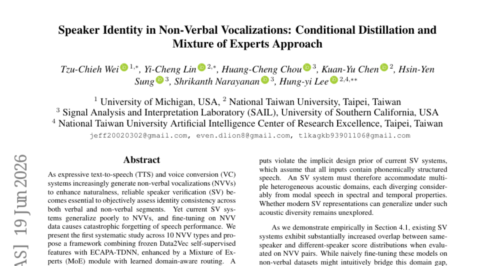

### 📌 한 줄 요약
비언어적 발성(NVV)에서도 화자 정체성을 유지하기 위해 MoE와 지식 증류를 결합한 고성능 화자 인증 프레임워크 제안

### 🔑 핵심 포인트
- 10가지 비언어적 발성(NVV) 유형에 대한 최초의 체계적 연구 수행
- MoE(Mixture of Experts)와 도메인 인식 라우팅을 통한 음성-NVV 도메인 격차 해소
- 조건부 지식 증류(Conditional Distillation)를 통한 기존 음성 성능 유지 및 망각 방지

### 🧑‍💻 개발자 관점
감성 음성 합성이나 보이스 클로닝 서비스 구축 시, 비언어적 표현(웃음, 한숨 등)에서도 화자의 특징이 일관되게 유지되는지 검증하는 데 필수적인 기술입니다.

### 🚀 실무 적용 아이디어
- 제안된 MoE 라우팅 구조를 기존 ECAPA-TDNN 모델에 적용하여 도메인 적응 성능 테스트
- 데이터 증강 시 NVV 데이터와 일반 음성 데이터 간의 비율에 따른 성능 변화 관찰
- 지식 증류(Distillation) 손실 함수가 기존 음성 인식/인증 성능에 미치는 영향 분석

### ⚠️ 리스크/한계
- MoE 구조 도입에 따른 모델 복잡도 및 연산 비용 증가 가능성
- 특정 NVV 유형에 편향된 데이터셋 사용 시 범용성 저하 우려

### 📝 초록 기반 상세 설명
최근 감성 TTS 및 음성 변환 기술이 발전하며 비언어적 발성(NVV) 생성이 늘고 있으나, 기존 화자 인증(SV) 시스템은 NVV에서 정체성 유지 능력이 떨어지는 문제가 있습니다. 또한 NVV 데이터로 미세 조정 시 기존 음성 성능이 저하되는 치명적 망각 현상이 발생합니다. 본 논문은 10가지 NVV 유형에 대한 체계적 연구를 바탕으로, Frozen Data2Vec 특징과 ECAPA-TDNN을 결합한 MoE 기반 프레임워크를 제안합니다. 도메인 인식 라우팅을 갖춘 MoE 모듈과 사전 학습된 교사 모델을 활용한 조건부 지식 증류(Conditional Distillation)를 통해 음성 성능을 유지하면서도 NVV 도메인 간 격차를 줄였습니다. 실험 결과, 기존 베이스라인 대비 음성-NVV 간 등가 오류율(EER)을 크게 낮추었으며 음성 성능 또한 향상시켰습니다.

---

## 30. [Forecasting Future Behavior as a Learning Task](https://huggingface.co/papers/2606.11445)
**Upvotes**: 0 | **도입 난이도**: 중 | **신뢰도**: 상
**arXiv**: https://arxiv.org/abs/2606.11445

**태그**: LLM, Behavior Forecasting, Model Interpretability, Fine-tuning, Reasoning, Evaluation, Inference

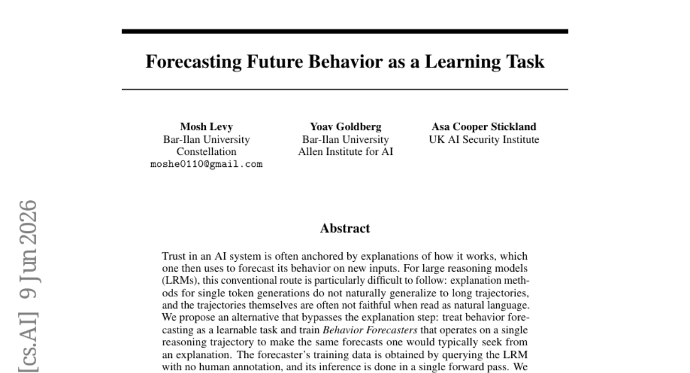

### 📌 한 줄 요약
LLM의 추론 과정을 학습하여 미래 행동(재현성, 입력 변화에 따른 반응)을 예측하는 전용 'Behavior Forecaster' 모델 제안

### 🔑 핵심 포인트
- 설명(Explanation) 대신 추론 궤적(Trajectory) 자체를 학습하여 미래 행동을 예측하는 새로운 패러다임 제시
- 인간의 주석 없이 LRM의 출력값만으로 학습 데이터를 구축하여 확장성 확보
- 기존 거대 모델이 텍스트를 읽는 것보다 훨씬 적은 비용으로 더 높은 예측 정확도 달성

### 🧑‍💻 개발자 관점
LLM의 답변 신뢰도를 평가하거나 에이전트의 행동을 예측할 때, 복잡한 설명 생성 없이 궤적 데이터만으로 효율적인 모니터링 및 검증 시스템을 구축할 수 있습니다.

### 🚀 실무 적용 아이디어
- 특정 도메인(예: 코딩)에 특화된 LRM의 추론 로그를 수집하여 소형 예측 모델 학습 테스트
- 학습된 Forecaster를 활용하여 LLM 답변의 일관성(Consistency) 점수 산출 실험
- Backbone 모델 초기화 여부에 따른 예측 성능 차이 검증

### ⚠️ 리스크/한계
- 학습 데이터가 타겟 LRM의 출력에 의존하므로, 모델 업데이트 시 재학습 필요성 존재
- 추론 궤적에 포함되지 않은 외부 환경 변화에 대한 예측력은 제한적일 수 있음

### 📝 초록 기반 상세 설명
기존에는 LLM의 동작 원리를 설명(Explanation)하여 미래 행동을 예측하려 했으나, 긴 추론 궤적(Trajectory)을 자연어로 해석하는 것은 정확도가 낮고 복잡한 문제가 있습니다. 본 논문은 설명 단계를 생략하고 추론 궤적 자체를 학습 데이터로 사용하여 미래 행동을 예측하는 'Behavior Forecaster'를 제안합니다. 별도의 인간 주석 없이 LRM의 출력값만으로 학습 데이터를 생성하며, 추론은 단일 패스로 이루어집니다. 실험 결과, 제안된 방식은 답변 재현성 및 입력 변화에 따른 반응 예측에서 GPT-4나 Claude와 같은 모델이 텍스트를 읽는 것보다 더 높은 정확도를 보였습니다. 특히 타겟 LRM으로부터 초기화하고 엔드투엔드 미세 조정을 수행할 때 가장 강력한 성능을 나타냈습니다.

---

