# 2026-06-30 Daily Papers (Top 26)

## 오늘의 요약
오늘의 연구는 로봇 조작을 위한 물리적 일관성 확보와 인간-로봇 간 스킬 전이 등 실세계 적용을 위한 기술이 두드러졌습니다. 또한, LLM의 내부 추론 구조 분석, 효율적인 파라미터 관리, 그리고 멀티모달 가드레일과 같은 모델의 신뢰성 및 운영 효율성을 높이는 연구들이 주요하게 다뤄졌습니다.

### 오늘의 핵심 포인트
- 로봇 학습과 시뮬레이션의 신뢰성을 높이기 위해 물리적 법칙을 준수하는 비디오 생성 및 인간-로봇 간 형태 차이를 극복하는 스킬 전이 기술이 제안되었습니다.
- LLM의 내부 추론 과정에 대한 공리적 평가와 멀티 에이전트 시스템에서의 정밀한 기여도 측정 등 모델의 구조적 견고함과 최적화 방법론이 논의되었습니다.
- 이미지 생성 모델의 정체성 유지, 저자원 언어의 텍스트 정화, 해시 기반의 파라미터 효율화 등 특정 도메인과 제약 환경에서의 실전적 해결책들이 제시되었습니다.

**오늘의 태그**: Robotics, LLM, Generative AI, Model Interpretability, Efficiency

## 1. [PhysisForcing: Physics Reinforced World Simulator for Robotic Manipulation](https://huggingface.co/papers/2606.28128)
**Upvotes**: 38 | **도입 난이도**: 상 | **신뢰도**: 상
**arXiv**: https://arxiv.org/abs/2606.28128

**태그**: Robotics, Video Generation, World Models, Diffusion Models, Vision, Video, Safety

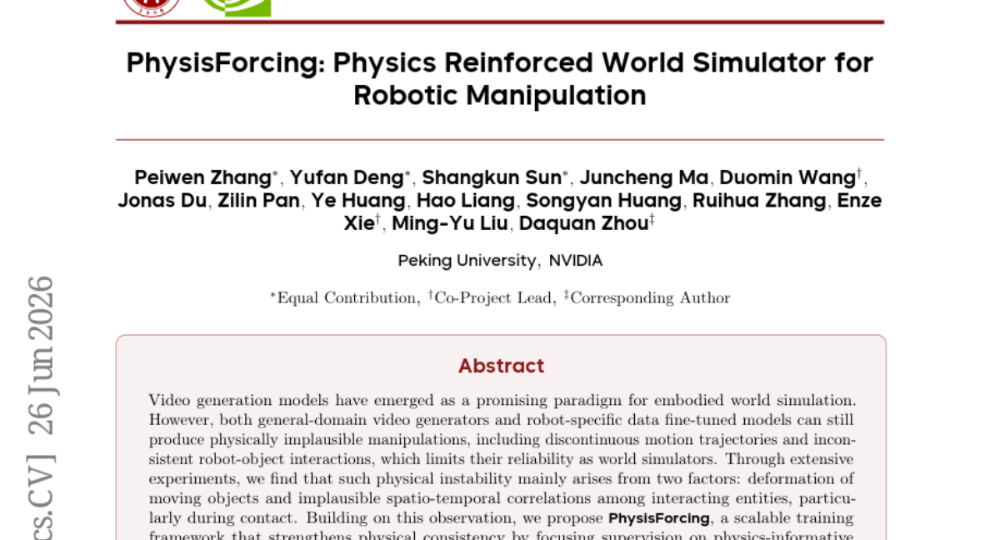

### 📌 한 줄 요약
물리적 일관성을 강화한 비디오 생성 프레임워크를 통해 로봇 조작 시뮬레이션의 신뢰성을 높인 연구

### 🔑 핵심 포인트
- 물리적 일관성 확보를 위한 픽셀 및 시맨틱 수준의 이중 정렬 프레임워크 제안
- 객체 변형 및 접촉 시 발생하는 시공간적 불일치 문제 해결
- 비디오 생성 성능 향상을 넘어 로봇의 폐쇄 루프(Closed-loop) 성공률 개선

### 🧑‍💻 개발자 관점
로봇 학습을 위한 데이터 생성 시 발생할 수 있는 물리적 오류를 줄여, 시뮬레이션과 실세계 간의 간극(Sim-to-Real)을 좁히는 데 유용합니다.

### 🚀 실무 적용 아이디어
- Diffusion Transformer(DiT) 구조에 제안된 궤적 및 관계 정렬 손실 함수 적용 테스트
- 특정 로봇 조작 태스크 데이터셋을 활용한 물리적 일관성 지표 측정
- 사전 학습된 비디오 생성 모델에 PhysisForcing 프레임워크를 통한 미세 조정(Fine-tuning) 실험

### ⚠️ 리스크/한계
- 물리적 일관성 강화 과정에서 생성된 비디오의 시각적 다양성(Diversity)이 저하될 가능성
- 복잡한 물리 법칙을 완벽히 모사하기에는 여전히 데이터 및 모델 용량의 한계 존재

### 📝 초록 기반 상세 설명
최근 비디오 생성 모델이 로봇 시뮬레이션의 대안으로 떠오르고 있으나, 물리적으로 불가능한 움직임이나 객체 간 상호작용 오류가 발생하는 문제가 있습니다. 연구진은 이러한 불안정성이 객체의 변형과 접촉 시 발생하는 시공간적 상관관계 오류에서 기인함을 발견했습니다. 이를 해결하기 위해 픽셀 수준과 시맨틱 수준의 특징을 결합하여 물리적 일관성을 강화하는 PhysisForcing 프레임워크를 제안합니다. 픽셀 단위의 궤적 정렬 손실과 시맨틱 관계 정렬 손실을 통해 DiT(Diffusion Transformer) 모델을 최적화합니다. 실험 결과, 기존 베이스 모델 대비 생성 성능이 크게 향상되었으며, 로봇 정책(Policy)의 성공률 또한 개선되었습니다. 이는 물리적으로 정렬된 비디오 모델이 강력한 로봇 조작 표현력을 제공함을 입증합니다.

---

## 2. [Translation as a Bridging Action: Transferring Manipulation Skills from Humans to Robots](https://huggingface.co/papers/2606.28133)
**Upvotes**: 32 | **도입 난이도**: 중 | **신뢰도**: 상
**arXiv**: https://arxiv.org/abs/2606.28133

**태그**: Robot Learning, Imitation Learning, VLA, Manipulation, Vision

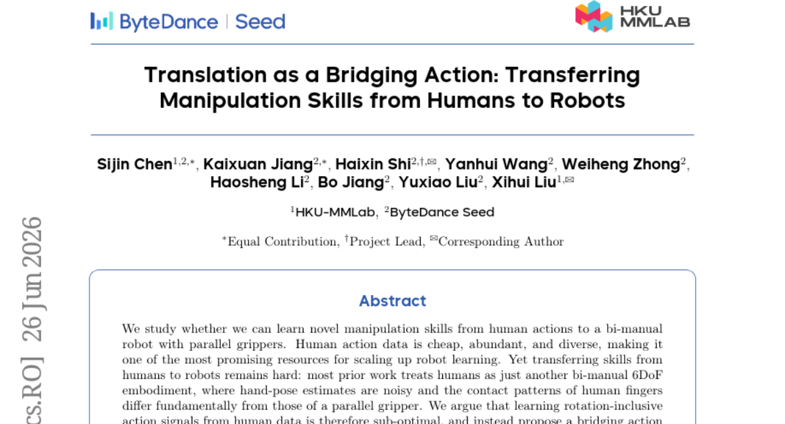

### 📌 한 줄 요약
인간의 손 동작 대신 손목의 상대적 이동량을 학습하여 로봇과 인간 사이의 형태적 차이를 극복하는 기술

### 🔑 핵심 포인트
- 인간과 로봇의 형태 차이를 극복하기 위한 '손목 상대적 이동량' 기반의 브릿징 액션 표현법 제안
- 6DoF 포즈 추정의 노이즈와 그리퍼-손가락 간의 접촉 패턴 차이 문제 해결
- 다양한 로봇 형태에 대응 가능한 VLA 모델 구조 및 어텐션 마스킹 기법 적용

### 🧑‍💻 개발자 관점
로봇의 하드웨어 사양(그리퍼 형태 등)이 바뀌더라도 인간의 영상 데이터만으로 효율적인 스킬 전이가 가능함을 시사합니다.

### 🚀 실무 적용 아이디어
- 기존 6DoF 데이터셋을 손목 이동량 기반 데이터로 변환하여 성능 비교 실험
- 다양한 형태의 그리퍼를 가진 로봇에 해당 브릿징 액션 적용 테스트
- VLA 모델 내에서 액션 토큰 마스킹 전략 최적화 실험

### ⚠️ 리스크/한계
- 손목 이동량에만 의존할 경우 정교한 손가락 조작(Fine manipulation)이 제한될 가능성
- 초기 카메라 프레임 기준 설정에 따른 환경 변화 민감도 문제

### 📝 초록 기반 상세 설명
로봇 학습을 위해 풍부한 인간 동작 데이터를 활용하려는 시도가 많지만, 인간의 손과 로봇 그리퍼 간의 구조적 차이로 인해 직접적인 스킬 전이가 어렵습니다. 기존 방식은 인간의 6DoF 포즈를 그대로 모사하려 하여 노이즈와 접촉 패턴 차이 문제를 야기합니다. 본 논문은 인간과 로봇이 공유할 수 있는 '초기 카메라 프레임 기준 손목의 상대적 이동량'을 브릿징 액션(Bridging Action)으로 제안합니다. 이를 위해 다양한 임베디먼트 대응이 가능한 VLA(Vision-Language-Action) 모델 구조를 구축했습니다. 실험 결과, 제안된 방식은 기존 6DoF 방식보다 효과적으로 지식을 전달하며 데이터 양에 따라 성능이 확장됨을 확인했습니다.

---

## 3. [Qwen-Image-2.0-RL Technical Report](https://huggingface.co/papers/2606.27608)
**Upvotes**: 25 | **도입 난이도**: 상 | **신뢰도**: 상
**arXiv**: https://arxiv.org/abs/2606.27608

**태그**: Diffusion, RLHF, Image-Generation, Distillation, Reasoning, Vision, Evaluation, Safety, Alignment

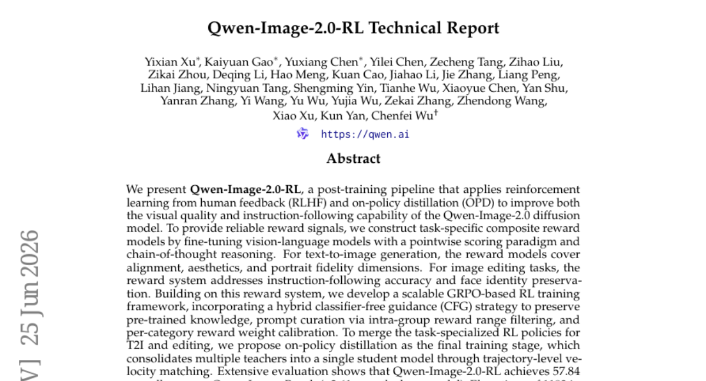

### 📌 한 줄 요약
RLHF와 온폴리시 증류(OPD)를 결합하여 이미지 생성 및 편집 성능을 극대화한 Qwen-Image-2.0-RL 기술 보고서

### 🔑 핵심 포인트
- CoT 기반의 태스크 특화 복합 보상 모델(Alignment, Aesthetics, Identity 등) 구축
- GRPO 기반의 확장 가능한 RL 프레임워크 및 하이브리드 CFG 전략 적용
- 온폴리시 증류(OPD)를 통한 다중 태스크 정책(T2I, Editing)의 단일 모델 통합

### 🧑‍💻 개발자 관점
이미지 생성 모델의 고질적인 문제인 프롬프트 불일치와 편집 시 정체성 유지 문제를 RL과 증류 기법으로 해결하는 실전적인 방법론을 제시합니다.

### 🚀 실무 적용 아이디어
- 보상 모델 설계 시 CoT(Chain-of-Thought)를 활용한 점수 산출 방식 적용해보기
- 멀티 태스크 모델 통합 시 궤적 기반 증류(On-policy Distillation) 기법 검토
- RL 학습 시 사전 학습 지식 손실을 막기 위한 CFG 하이브리드 전략 실험

### ⚠️ 리스크/한계
- 복합 보상 모델 구축 및 RL 학습을 위한 높은 컴퓨팅 자원 요구
- 여러 태스크를 하나의 모델로 통합하는 과정에서의 성능 상충(Trade-off) 가능성

### 📝 초록 기반 상세 설명
기존 확산 모델(Diffusion Model)의 시각적 품질과 지시 이행 능력을 개선하기 위해 RLHF와 온폴리시 증류를 적용한 포스트 트레이닝 파이프라인을 제안합니다. 신뢰할 수 있는 보상 신호를 위해 CoT 추론을 활용한 태스크별 복합 보상 모델을 구축하였습니다. GRPO 기반의 확장 가능한 RL 프레임워크와 하이브리드 CFG 전략을 통해 사전 학습된 지식을 보존하며 학습을 진행합니다. 최종적으로 T2I와 편집 모델을 통합하기 위해 궤적 수준의 속도 매칭(velocity matching)을 이용한 온폴리시 증류를 수행합니다. 실험 결과, 벤치마크 및 Elo 레이팅에서 베이스 모델 대비 유의미한 성능 향상을 달성하며 미적 품질과 프롬프트 준수 능력을 입증했습니다.

---

## 4. [Formalizing Latent Thoughts: Four Axioms of Thought Representation in LLMs](https://huggingface.co/papers/2606.27378)
**Upvotes**: 23 | **도입 난이도**: 중 | **신뢰도**: 상
**arXiv**: https://arxiv.org/abs/2606.27378

**태그**: LLM, Interpretability, Reasoning, Evaluation, Benchmark, Distillation

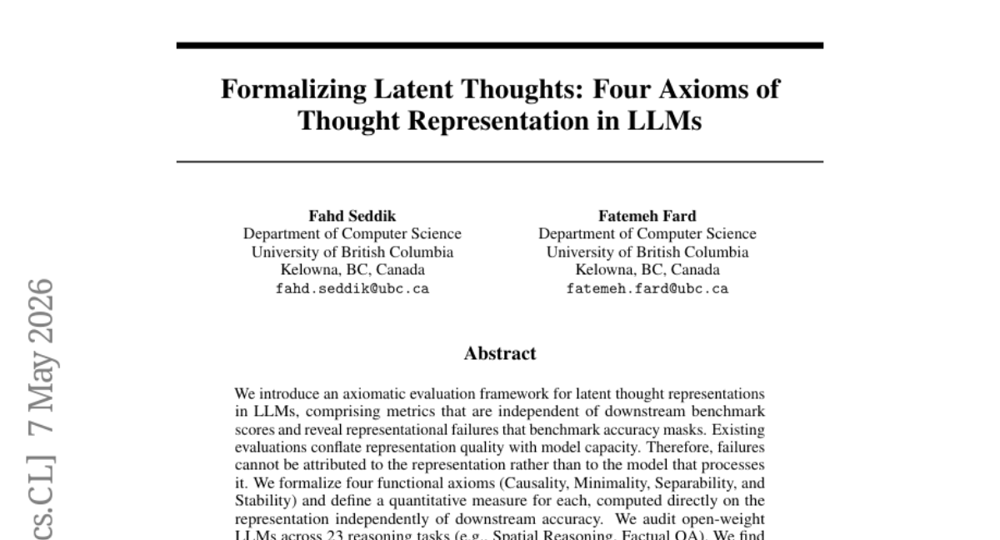

### 📌 한 줄 요약
LLM의 내부 추론 과정(Latent Thought)이 벤치마크 점수와 별개로 얼마나 구조적으로 견고한지를 평가하는 새로운 공리적 프레임워크 제안

### 🔑 핵심 포인트
- 모델 성능(Accuracy)과 독립적인 내부 표현 품질 평가 프레임워크 구축
- Causality, Minimality, Separability, Stability라는 4가지 핵심 공리 정립
- 모델 크기나 학습 방식(RL, Distillation)에 관계없이 발생하는 구조적 표현 한계 규명

### 🧑‍💻 개발자 관점
모델의 벤치마크 점수가 높더라도 내부적인 추론 과정이 논리적으로 정교하지 않을 수 있음을 인지하고, 에이전트 설계 시 단순 성능 외에 표현의 안정성을 고려해야 함을 시사합니다.

### 🚀 실무 적용 아이디어
- 사용 중인 모델의 내부 활성화 값(Activation)이 입력값의 단순 재현인지 아니면 새로운 추론 정보를 담고 있는지 분석
- 특정 태스크에 대한 모델의 내부 표현이 태스크 간에는 구분되지만 질문 간에는 구분되지 않는 현상 확인
- 모델의 성능 향상이 내부 표현의 구조적 개선을 동반하는지 모니터링

### ⚠️ 리스크/한계
- 제시된 공리가 실제 모델의 유용성과 완벽하게 비례하는지에 대한 논쟁 가능성
- 현재 연구가 오픈 웨이트 모델에 국한되어 있어 폐쇄형 모델에 대한 일반화 필요

### 📝 초록 기반 상세 설명
기존 LLM 평가는 모델의 성능(Capacity)과 내부 표현(Representation)의 품질을 혼재하여 평가하는 문제가 있었습니다. 본 논문은 모델 성능과 독립적으로 내부 표현의 질을 측정하기 위해 네 가지 공리(Causality, Minimality, Separability, Stability)를 정의합니다. 연구진은 23개의 추론 태스크를 통해 오픈 웨이트 모델들을 대상으로 이 공리들을 검증했습니다. 실험 결과, 어떤 모델도 네 가지 공리를 동시에 만족하지 못했으며, 내부 표현이 입력 임베딩 이상의 정보를 담지 못하는 구조적 한계가 발견되었습니다. 이는 모델 크기나 학습 방식과 무관하게 발생하는 근본적인 문제임을 시사합니다.

---

## 5. [MultiHashFormer: Hash-based Generative Language Models](https://huggingface.co/papers/2606.28057)
**Upvotes**: 16 | **도입 난이도**: 상 | **신뢰도**: 상
**arXiv**: https://arxiv.org/abs/2606.28057

**태그**: LLM, Parameter-Efficient, Generative-AI, NLP, Benchmark, Evaluation

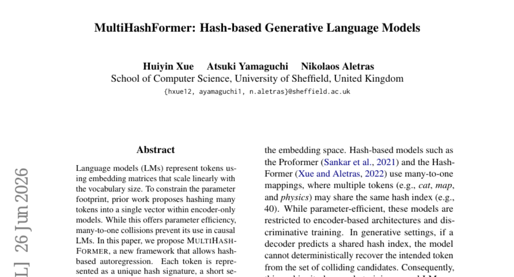

### 📌 한 줄 요약
해시 기반 토큰 표현을 통해 어휘 사전 크기에 관계없이 파라미터 효율성을 극대화한 생성형 언어 모델 프레임워크

### 🔑 핵심 포인트
- 해시 시그니처(Hash Signature)를 이용한 토큰 표현으로 충돌 문제 해결 및 자기회귀 생성 가능
- Hash Encoder와 Hash Decoder 구조를 통한 효율적인 잠재 벡터 압축 및 생성 프로세스
- 어휘 사전 확장 시에도 파라미터 크기가 일정하게 유지되는 높은 확장성

### 🧑‍💻 개발자 관점
대규모 어휘 사전(Vocabulary)을 가진 모델을 구축할 때 발생하는 메모리 및 파라미터 문제를 획기적으로 줄일 수 있는 아키텍처입니다.

### 🚀 실무 적용 아이디어
- 제안된 해시 시그니처 방식이 특정 언어군에서 충돌률에 미치는 영향 분석
- 기존 임베딩 방식 대비 추론 속도 및 메모리 점유율 벤치마크 수행
- 매우 큰 어휘 사전(Large Vocabulary) 환경에서의 스케일링 테스트

### ⚠️ 리스크/한계
- 해시 충돌로 인한 잠재적인 생성 품질 저하 가능성
- 해시 시그니처를 다시 텍스트로 매핑하는 과정에서의 복잡도 증가

### 📝 초록 기반 상세 설명
기존 언어 모델은 어휘 사전 크기에 비례하여 임베딩 파라미터가 선형적으로 증가하는 문제를 가집니다. 기존의 해시 방식은 많은 토큰을 하나의 벡터로 압축하여 효율적이지만, 충돌 문제로 인해 인과적(Causal) 생성 모델에 적용하기 어려웠습니다. 본 논문은 해시 기반 자기회귀 생성이 가능한 MultiHashFormer 프레임워크를 제안합니다. 각 토큰을 여러 해시 함수의 결과인 고유한 '해시 시그니처'로 표현하고, 이를 인코더와 디코더를 통해 처리하는 방식을 사용합니다. 실험 결과, 100M에서 3B 규모까지 표준 트랜스포머 모델보다 우수한 성능을 보였으며, 파라미터 증가 없이 다국어 어휘 확장도 가능함을 입증했습니다.

---

## 6. [SingGuard: A Policy-Adaptive Multimodal LLM Guardrail with Dynamic Reasoning](https://huggingface.co/papers/2606.22873)
**Upvotes**: 11 | **도입 난이도**: 중 | **신뢰도**: 상
**arXiv**: https://arxiv.org/abs/2606.22873

**태그**: VLM, Guardrail, Multimodal, Safety, RAG, Reasoning, Vision, Benchmark, Evaluation, Inference

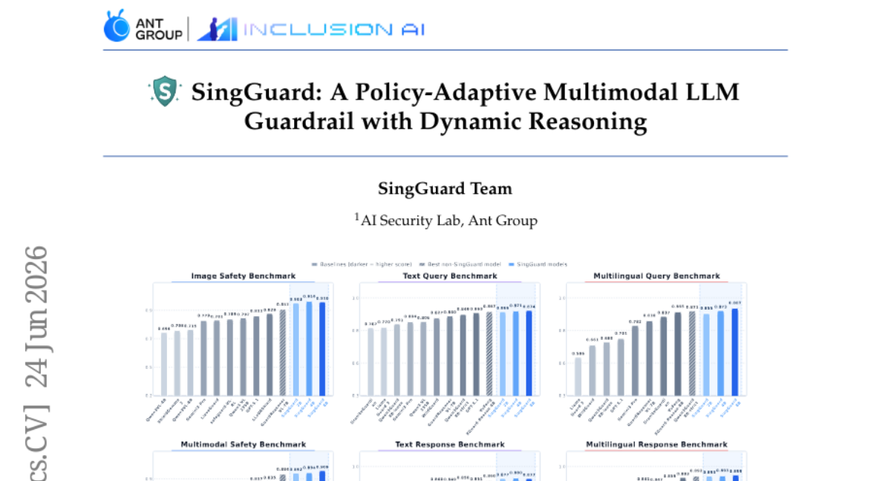

### 📌 한 줄 요약
가변적인 정책에 즉각 대응 가능한 추론 기반의 멀티모달 LLM 가드레일 모델 개발

### 🔑 핵심 포인트
- 자연어 기반 정책을 런타임 입력으로 처리하는 정책 적응형 가드레일 구조
- 효율성과 추론 깊이를 조절할 수 있는 Fast-to-Slow 하이브리드 추론 체계
- 교차 모달 리스크(Cross-modal risk)를 포함한 대규모 멀티모달 벤치마크 구축

### 🧑‍💻 개발자 관점
서비스 운영 중 정책이 변경될 때마다 모델을 재학습할 필요 없이, 자연어 규칙 수정만으로 가드레일을 즉시 업데이트할 수 있습니다.

### 🚀 실무 적용 아이디어
- 제공된 벤치마크를 활용하여 현재 운영 중인 VLM의 취약점 테스트
- 서비스 도메인별(의료, 금융 등) 맞춤형 자연어 정책 규칙 세트 작성 및 테스트
- 추론 속도와 정확도 사이의 트레이드오프를 고려한 Fast/Slow 모드 적용 실험

### ⚠️ 리스크/한계
- 복잡한 정책이 늘어날 경우 추론 시간(Latency) 증가 가능성
- 자연어 규칙 해석 오류로 인한 오탐(False Positive) 발생 위험

### 📝 초록 기반 상세 설명
VLM의 광범위한 활용으로 인해 멀티모달 환경에서의 안전성 리스크가 증가하고 있으나, 기존 가드레일은 고정된 분류 체계로 인해 변화하는 정책에 유연하게 대응하기 어렵습니다. 이를 해결하기 위해 자연어 규칙을 입력받아 규칙별로 검증하는 정책 적응형 가드레일인 SingGuard를 제안합니다. SingGuard는 효율성과 해석력을 위해 직접 판단부터 심층 추론까지 가능한 'Fast-to-Slow' 추론 체계를 지원하며, 이를 위해 분리형 강화학습(decoupled RL)을 적용했습니다. 또한 80개 이상의 세분화된 리스크를 포함하는 대규모 벤치마크인 SingGuard-Bench를 함께 도입했습니다. 실험 결과, SingGuard는 다양한 벤치마크에서 SOTA 성능을 달성했으며 특히 동적 정책 변화 환경에서도 높은 정확도를 보였습니다.

---

## 7. [The Tatoxa System for Text Detoxification in Low-Resource Languages: The Case of Tatar](https://huggingface.co/papers/2606.26015)
**Upvotes**: 8 | **도입 난이도**: 중 | **신뢰도**: 상
**arXiv**: https://arxiv.org/abs/2606.26015

**태그**: NLP, Low-Resource Language, Text Detoxification, LLM, Evaluation, Safety

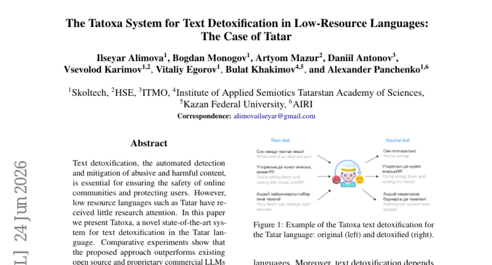

### 📌 한 줄 요약
저자원 언어인 타타르어를 위한 최첨단 텍스트 정화(Detoxification) 시스템 'Tatoxa' 및 전용 데이터셋 제안

### 🔑 핵심 포인트
- 타타르어 특화 텍스트 정화 시스템 'Tatoxa' 개발
- 저자원 언어 환경을 위한 새로운 타타르어 정화 데이터셋 구축
- 문화적 인접 언어(러시아어 등)를 통한 전이 학습보다 현지어 직접 학습의 우수성 입증

### 🧑‍💻 개발자 관점
특정 소수 언어나 문화적 맥락이 중요한 서비스 개발 시, 범용 LLM보다 현지어 특화 데이터셋과 모델이 성능 면에서 압도적일 수 있음을 시사합니다.

### 🚀 실무 적용 아이디어
- 제공된 타타르어 데이터셋을 활용한 저자원 언어 모델 파인튜닝 실험
- 다국어 모델(mBERT, XLM-R 등)과 현지어 특화 모델 간의 성능 비교 테스트
- 문화적 맥락이 포함된 텍스트 정화 시 교차 언어 전이의 한계점 검증

### ⚠️ 리스크/한계
- 타타르어 외 다른 저자원 언어로의 일반화 가능성 미검증
- 데이터셋 규모가 특정 언어에 국한되어 확장성 문제 존재 가능

### 📝 초록 기반 상세 설명
온라인 커뮤니티 안전을 위한 텍스트 정화 기술은 필수적이지만, 타타르어와 같은 저자원 언어에 대한 연구는 부족한 실정입니다. 본 논문에서는 타타르어 전용 텍스트 정화 시스템인 Tatoxa를 제안합니다. 실험 결과, 제안된 방식은 기존 오픈소스 및 상용 LLM보다 주요 품질 지표에서 우수한 성능을 보였습니다. 또한, 저자원 환경에서의 미세 조정 및 평가를 위한 새로운 타타르어 정화 데이터셋을 함께 공개합니다. 특히 교차 언어 전이 실험을 통해, 러시아어와 같은 문화적 인접 언어로부터의 전이보다 타타르어 자체 데이터로 학습하는 것이 훨씬 효과적임을 입증했습니다.

---

## 8. [GBC: Gradient-Based Connections for Optimizing Multi-Agent Systems](https://huggingface.co/papers/2606.28187)
**Upvotes**: 7 | **도입 난이도**: 중 | **신뢰도**: 상
**arXiv**: https://arxiv.org/abs/2606.28187

**태그**: Multi-Agent, Prompt Optimization, Credit Assignment, LLM, Agent, RAG

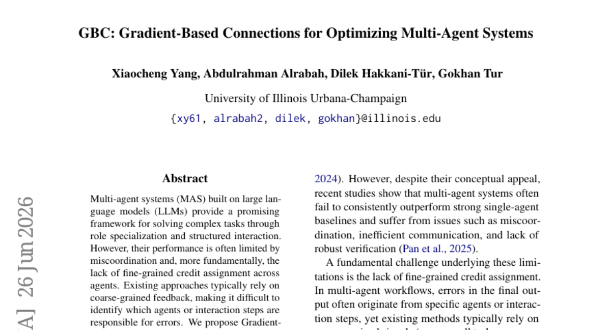

### 📌 한 줄 요약
멀티 에이전트 시스템(MAS) 내 에이전트 간 기여도를 토큰 단위로 정밀하게 측정하여 프롬프트를 최적화하는 GBC 프레임워크 제안

### 🔑 핵심 포인트
- MAS를 계산 그래프로 모델링하여 에이전트 간 영향력을 토큰 단위로 정밀 측정
- 역전파(Backpropagation) 개념을 활용한 정밀한 오류 원인 식별 및 프롬프트 최적화
- Prefix 기반 그래디언트 계산을 활용한 효율적인 구현체 AgentChord 개발

### 🧑‍💻 개발자 관점
복잡한 워크플로우를 가진 멀티 에이전트 시스템 구축 시, 어떤 에이전트의 프롬프트를 수정해야 전체 성능이 올라갈지 데이터 기반으로 결정할 수 있게 해줍니다.

### 🚀 실무 적용 아이디어
- 복잡한 단계가 포함된 멀티 에이전트 워크플로우에 GBC의 attribution 개념 적용해보기
- 에이전트 간 상호작용이 많은 태스크에서 오류 발생 시 GBC를 통한 원인 분석 실험
- 제공된 AgentChord 코드를 활용하여 기존 프롬프트 엔지니어링 결과와 성능 비교

### ⚠️ 리스크/한계
- 계산 그래프 모델링 및 그래디언트 계산에 따른 추가적인 연산 비용 발생 가능성
- 태스크의 성격에 따라 토큰 단위의 영향력 산출이 복잡해질 수 있음

### 📝 초록 기반 상세 설명
LLM 기반 멀티 에이전트 시스템은 역할 분담을 통해 복잡한 문제를 해결할 수 있지만, 에이전트 간 협업 과정에서의 정밀한 신용 할당(Credit Assignment) 문제로 인해 성능 한계가 존재합니다. 기존 방식은 피드백이 거시적이라 어떤 에이전트의 어떤 단계가 오류를 유발했는지 파악하기 어렵습니다. 본 논문은 MAS를 계산 그래프로 모델링하고, 토큰 수준에서 에이전트 간 영향력을 수치화하는 Gradient-Based Connections(GBC)를 제안합니다. 이를 통해 오류 원인을 정밀하게 식별하고 타겟팅된 프롬프트 최적화를 수행할 수 있습니다. 실험 결과, MultiWOZ 및 τ-bench에서 기존 단일/멀티 에이전트 모델보다 우수한 성능을 입증했습니다.

---

## 9. [ProMSA:Progressive Multimodal Search Agents for Knowledge-Based Visual Question Answering](https://huggingface.co/papers/2606.27974)
**Upvotes**: 7 | **도입 난이도**: 상 | **신뢰도**: 상
**arXiv**: https://arxiv.org/abs/2606.27974

**태그**: Agent, RAG, Multimodal, RLHF, VQA, Reasoning, Vision, Evaluation

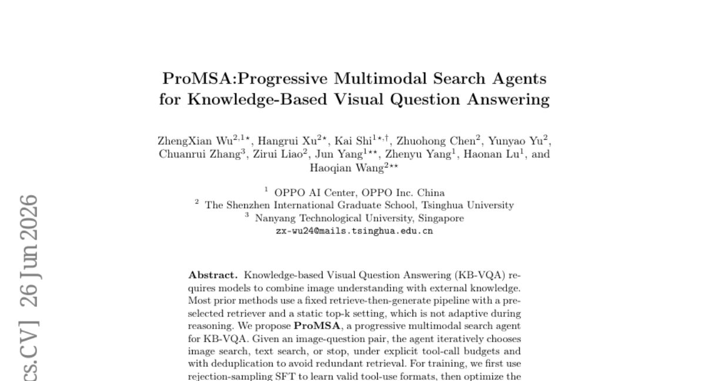

### 📌 한 줄 요약
고정된 RAG 방식에서 벗어나, 추론 과정에서 필요한 도구를 동적으로 선택하는 점진적 멀티모달 검색 에이전트 프레임워크

### 🔑 핵심 포인트
- 동적 도구 선택: 고정된 k-top 방식이 아닌, 추론 단계별로 이미지/텍스트 검색 여부를 결정하는 점진적 에이전트 구조
- TN-GSPO 강화학습: 생성 길이와 도구 상호작용 깊이를 모두 고려하여 최적화하는 시퀀스 레벨 RL 목적 함수 도입
- 중복 방지 및 예산 관리: 명시적인 도구 호출 예산(budget)과 중복 제거 메커니즘을 통한 효율적 검색

### 🧑‍💻 개발자 관점
단순히 정보를 긁어오는 RAG를 넘어, 에이전트가 스스로 '언제, 무엇을 검색할지' 결정하는 지능형 워크플로우 설계 방식을 배울 수 있습니다.

### 🚀 실무 적용 아이디어
- 제한된 API 호출 비용 환경에서 에이전트의 중단(Stop) 결정 로직 테스트
- 멀티모달 데이터(이미지-텍스트) 간의 검색 우선순위 변화 관찰
- TN-GSPO와 같은 복합 보상 함수가 에이전트의 추론 경로에 미치는 영향 분석

### ⚠️ 리스크/한계
- 반복적인 도구 호출로 인한 추론 시간(Latency) 및 비용 증가 가능성
- 에이전트가 잘못된 검색 도구를 선택할 경우 발생하는 연쇄적 오류(Cascading Error)

### 📝 초록 기반 상세 설명
지식 기반 시각 질의응답(KB-VQA)은 이미지 이해와 외부 지식 결합이 필수적입니다. 기존 방식은 고정된 검색-생성 파이프라인을 사용하여 추론 과정 중의 적응성이 부족하다는 문제가 있었습니다. 이를 해결하기 위해 본 논문은 이미지 검색, 텍스트 검색, 또는 중단 여부를 반복적으로 결정하는 ProMSA 에이전트를 제안합니다. 학습을 위해 rejection-sampling SFT와 생성 길이 및 도구 사용 깊이를 고려한 TN-GSPO 강화학습 알고리즘을 적용했습니다. 실험 결과, E-VQA 및 InfoSeek 벤치마크에서 기존 RAG 및 에이전트 모델 대비 우수한 검색 및 최종 답변 정확도를 달성했습니다.

### 🖼️ 추가 자료
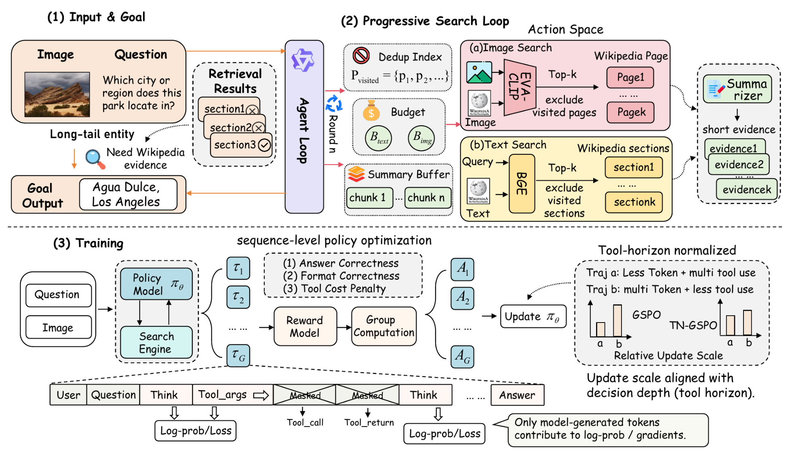

---

## 10. [SimFoundry: Modular and Automated Scene Generation for Policy Learning and Evaluation](https://huggingface.co/papers/2606.28276)
**Upvotes**: 6 | **도입 난이도**: 상 | **신뢰도**: 상
**arXiv**: https://arxiv.org/abs/2606.28276

**태그**: Robotics, Sim-to-Real, Digital Twin, Automated Scene Generation, RAG, Video, Evaluation

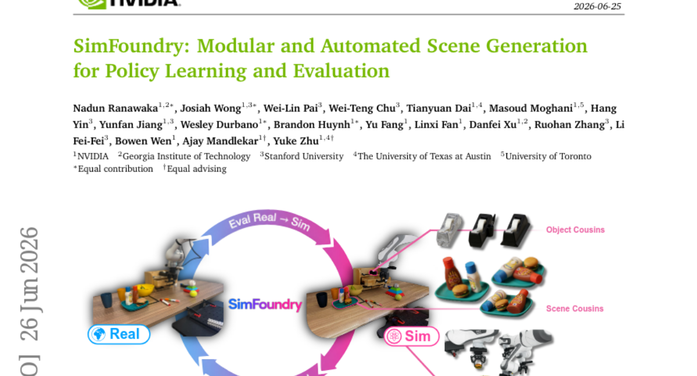

### 📌 한 줄 요약
비디오 기반의 자동화된 디지털 트윈 생성 및 변형(Digital Cousins) 기술을 통해 로봇 정책의 시뮬레이션-실세계 간 간극을 극복하는 프레임워크

### 🔑 핵심 포인트
- 비디오 기반의 자동화된 제로샷 실세계-시뮬레이션 장면 재구성
- 객체, 장면, 작업의 변형을 통한 '디지털 커즌(Digital Cousins)' 생성 기능
- 시뮬레이션 평가 결과와 실제 환경 성능 간의 높은 상관관계 입증

### 🧑‍💻 개발자 관점
로봇 학습 시 데이터 수집 비용을 획기적으로 줄이면서, 시뮬레이션 내 데이터 변형만으로 실제 환경의 다양한 변수에 대응하는 강건한 정책을 학습시킬 수 있습니다.

### 🚀 실무 적용 아이디어
- 비디오 기반 3D 재구성 파이프라인과 SimFoundry의 모듈 결합 가능성 검토
- 특정 조작 작업(Manipulation)에 대한 디지털 커즌 생성 효과 테스트
- 시뮬레이션 평가 지표를 실제 환경 성능 예측 모델로 활용하는 실험

### ⚠️ 리스크/한계
- 비디오 기반 재구성 시 발생하는 정밀도 한계가 실제 로봇 제어에 미치는 영향
- 복잡한 물리적 상호작용이 포함된 장면의 완벽한 디지털 트윈 구현 난이도

### 📝 초록 기반 상세 설명
로봇 정책을 실제 환경에서 학습하고 평가하는 것은 비용이 많이 들고 확장성이 낮다는 문제가 있습니다. 이를 해결하기 위해 비디오로부터 제로샷 실세계-시뮬레이션 장면 구축이 가능한 모듈형 자동화 시스템인 SimFoundry를 제안합니다. SimFoundry는 재구성된 장면의 어포던스(affordance)를 유지하면서 객체, 장면, 작업을 편집할 수 있는 '디지털 커즌(digital cousins)' 생성 기능을 제공합니다. 실험 결과, 시뮬레이션 평가 지표가 실제 성능을 매우 높은 상관관계로 예측함을 확인했습니다. 또한, 시뮬레이션에서 생성된 다양한 변형 데이터로 학습된 정책은 실제 환경에서의 작업 성공률을 크게 향상시켰습니다.

---

## 11. [Parallel Rollout Approximation for Pixel-Space Autoregressive Image Generation](https://huggingface.co/papers/2606.27978)
**Upvotes**: 4 | **도입 난이도**: 상 | **신뢰도**: 상
**arXiv**: https://arxiv.org/abs/2606.27978

**태그**: Generative AI, Autoregressive, Computer Vision, Image Generation, Vision, Inference

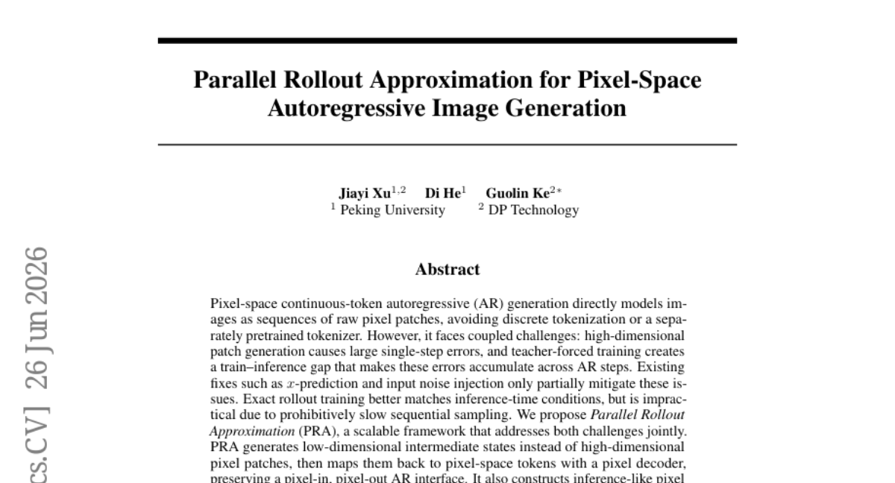

### 📌 한 줄 요약
고차원 픽셀 생성 시 발생하는 오차 누적 문제를 해결하여 SOTA 성능을 달성한 병렬 롤아웃 근사(PRA) 프레임워크

### 🔑 핵심 포인트
- 저차원 중간 상태(Intermediate States)를 활용한 고차원 픽셀 생성 오차 완화
- 병렬 학습이 가능하면서도 추론 시의 피드백 환경을 모사하는 Parallel Rollout Approximation(PRA) 기법
- 픽셀-인/픽셀-아웃 인터페이스를 유지하며 기존 픽셀 기반 AR 모델의 성능 한계 돌파

### 🧑‍💻 개발자 관점
토크나이저 없이 픽셀을 직접 다루면서도 생성 품질과 학습 효율을 동시에 잡는 새로운 아키텍처 설계 패턴을 제시합니다.

### 🚀 실무 적용 아이디어
- 제안된 저차원 중간 상태와 픽셀 디코더 구조의 효율성 검증
- 기존 Diffusion 모델 대비 생성 속도 및 품질 비교 실험
- 다양한 해상도에서의 스케일링 법칙(Scaling Law) 확인

### ⚠️ 리스크/한계
- 픽셀 디코더 의존성으로 인한 복잡한 학습 파이프라인
- 고해상도 생성 시 중간 상태의 차원 및 연산 비용 문제

### 📝 초록 기반 상세 설명
픽셀 공간에서의 자기회귀(AR) 생성은 별도의 토크나이저 없이 직접 이미지를 생성할 수 있지만, 고차원 패치 생성 시 발생하는 오차와 학습-추론 간의 간극(train-inference gap)이 큰 문제입니다. 기존의 노이즈 주입 방식은 이러한 오차 누적을 완전히 해결하지 못하며, 정확한 롤아웃 학습은 속도 문제로 인해 실용성이 떨어집니다. 본 논문은 저차원 중간 상태를 생성한 후 픽셀 디코더로 복원하는 PRA 프레임워크를 제안합니다. PRA는 병렬 학습이 가능하면서도 추론 시의 피드백 환경을 모사하여 오차 누적 문제를 효과적으로 억제합니다. 실험 결과, ImageNet-1K 256x256 해상도에서 기존 픽셀 기반 AR 모델을 뛰어넘는 SOTA 성능을 기록했습니다. 또한 높은 분류 정확도를 보여 생성과 이해를 위한 통합 모델로서의 가능성을 입증했습니다.

---

## 12. [Learning to Fold: prizewinning solution at LeHome Challenge 2026 (1st place online, 2nd offline)](https://huggingface.co/papers/2606.27163)
**Upvotes**: 4 | **도입 난이도**: 상 | **신뢰도**: 상
**arXiv**: https://arxiv.org/abs/2606.27163

**태그**: Robotics, VLA, Reinforcement Learning, Sim-to-Real, Automation, Vision, Inference, Safety

_img.jpg)

### 📌 한 줄 요약
VLA 모델에 RL 루프를 결합하여 시뮬레이션과 실세계 모두에서 높은 성능을 입증한 양손 의류 폴딩 시스템

### 🔑 핵심 포인트
- VLA 정책 내에 성공/진행도 예측 기능을 통합하여 RL 피드백 루프 구축
- AWR과 RECAP을 결합한 Flow-matching 기반 VLA 최적화
- HuggingFace Hub를 활용한 비동기 분산 학습 및 Thompson Sampling 기반 추론 최적화

### 🧑‍💻 개발자 관점
단순한 액션 생성을 넘어, 모델이 자신의 작업 성공 가능성을 스스로 판단하고 이를 학습에 피드백하는 구조는 복잡한 로봇 태스크 자동화에 매우 유용합니다.

### 🚀 실무 적용 아이디어
- VLA 모델에 작업 진행도(Progress) 예측 헤드를 추가하여 RL 보상 설계해보기
- DAgger 방식의 데이터 수집 파이프라인을 기존 로봇 제어 루프에 적용해보기
- 시뮬레이션 데이터와 실물 데이터 간의 도메인 차이를 줄이기 위한 Augmentation 전략 실험

### ⚠️ 리스크/한계
- 복잡한 RL 루프와 VLA 결합으로 인한 학습 안정성 확보의 어려움
- 실제 환경에서의 데이터 수집 및 정렬(Alignment)에 높은 엔지니어링 비용 발생

### 📝 초록 기반 상세 설명
ICRA 2026 LeHome Challenge의 양손 의류 폴딩 문제를 해결하기 위한 연구입니다. 기존의 Vision-Language-Action (VLA) 정책에 강화학습(RL) 루프를 통합하여 성능을 극대화했습니다. 액션 예측 네트워크가 성공 확률과 작업 진행도를 동시에 예측하는 구조를 통해 어드밴티지 추정 및 실패 감지를 수행합니다. 또한 분산 학습 파이프라인과 시뮬레이션-실세계 간 전이(Sim-to-Real) 기술을 적용했습니다. 그 결과 62개 팀 중 온라인 1위, 오프라인 2위를 기록하며 실용성을 입증했습니다.

---

## 13. [Ko-WideSearch: A Korean Breadth-Search Benchmark for Exhaustive Set Enumeration by Web Agents](https://huggingface.co/papers/2606.27595)
**Upvotes**: 4 | **도입 난이도**: 하 | **신뢰도**: 상
**arXiv**: https://arxiv.org/abs/2606.27595

**태그**: Web-Agent, Benchmark, Information-Extraction, Korean-NLP, Agent, Evaluation

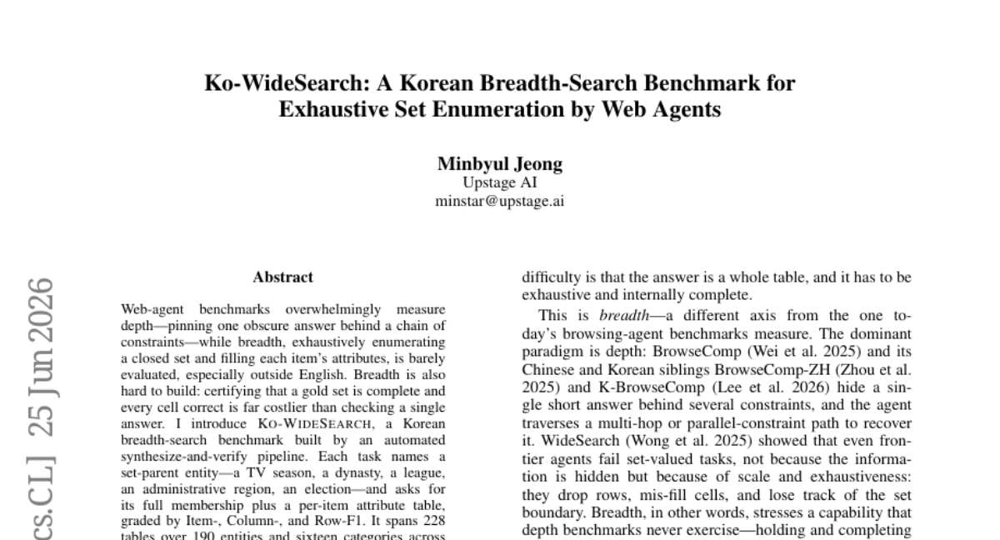

### 📌 한 줄 요약
웹 에이전트의 완전한 정보 추출 능력을 평가하기 위해 한국어 기반의 광범위 탐색(Breadth-Search) 벤치마크인 Ko-WideSearch를 제안함

### 🔑 핵심 포인트
- 한국어 기반의 광범위 탐색(Breadth-Search) 벤치마크 Ko-WideSearch 제안
- 자동화된 합성-검증 파이프라인을 통한 고품질의 완전한 골드 데이터셋 구축
- 에이전트의 집합 누락 및 속성 매핑 능력을 정밀하게 측정하는 다차원 평가 지표 도입

### 🧑‍💻 개발자 관점
에이전트가 단순히 질문에 답하는 것을 넘어, 복잡한 표 형식의 데이터를 누락 없이 추출하고 구조화하는 능력을 검증할 때 필수적인 기준을 제공합니다.

### 🚀 실무 적용 아이디어
- 현재 개발 중인 에이전트의 데이터 추출 정확도(Row-F1) 테스트
- 자유 형식 텍스트 추출 시 발생하는 에이전트의 오류 패턴 분석
- 복잡한 속성 테이블 생성 작업에 대한 에이전트의 확장성 테스트

### ⚠️ 리스크/한계
- 한국어 특화 벤치마크로 영어권 환경으로의 직접적인 일반화에는 한계가 있음
- 자유 형식 텍스트 셀에서의 성능 저하가 에이전트 설계의 근본적인 과제로 남음

### 📝 초록 기반 상세 설명
기존 웹 에이전트 벤치마크는 단일 정답을 찾는 깊이(Depth) 위주로 설계되어 있어, 특정 집합의 모든 요소를 나열하는 광범위한 탐색(Breadth) 능력 평가가 부족합니다. 이를 해결하기 위해 자동화된 합성 및 검증 파이프라인을 통해 한국어 기반의 Ko-WideSearch 벤치마크를 구축했습니다. 이 벤치마크는 엔티티의 전체 멤버십과 속성 테이블을 완성하는 과제를 제공하며, 난이도 조절을 위해 테이블 너비와 복합 키를 독립적으로 제어합니다. 실험 결과, 기존 에이전트들은 집합은 찾아내지만 세부 속성(Row)을 채우는 데 큰 어려움을 겪는 것으로 나타났습니다. 특히 텍스트 기반의 자유 형식 셀에서 성능 저하가 두드러졌으며, 단순히 검색량이나 비용을 늘리는 것만으로는 이 격차를 해소하기 어려움을 확인했습니다.

---

## 14. [Thinking While Speaking: Inference-Time Knowledge Transfer for Responsive and Intelligent Conversational Voice Agents](https://huggingface.co/papers/2511.07397)
**Upvotes**: 4 | **도입 난이도**: 중 | **신뢰도**: 상
**arXiv**: https://arxiv.org/abs/2511.07397

**태그**: Voice Agent, Latency Optimization, SLM, Inference-time Transfer, Agent, RAG, Reasoning, Evaluation, Inference

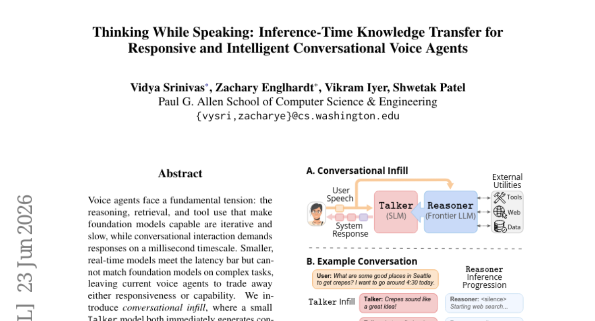

### 📌 한 줄 요약
추론 중 지식 삽입(Conversational Infill) 기술을 통해 응답 속도와 고성능 모델의 지능을 동시에 확보하는 새로운 음성 에이전트 프레임워크

### 🔑 핵심 포인트
- Conversational Infill: 소형 모델의 즉각적 응답과 거대 모델의 지식 통합을 결합한 추론 전략
- 대규모 합성 데이터셋 구축: 29만 개의 예제로 구성된 도메인 특화 데이터셋을 통한 학습 최적화
- Latency-Capability Pareto Frontier 확장: 응답 지연을 숨기면서도 고성능 모델에 근접하는 성능 달성

### 🧑‍💻 개발자 관점
실시간 응답이 필수적인 음성 인터페이스 개발 시, 고비용/고지연 모델을 직접 호출하는 대신 소형 모델과 거대 모델을 병렬로 운용하는 아키텍처 설계의 실질적 가이드를 제공합니다.

### 🚀 실무 적용 아이디어
- 제공된 데이터셋을 활용하여 소형 모델(SLM)의 Infill 능력을 벤치마킹하기
- Streaming API 환경에서 모델 간 지식 통합 시 발생하는 자연스러운 문맥 전환 테스트
- 사용자 경험(UX) 관점에서 지연 시간 은닉(Latency Hiding) 전략의 유효성 검증

### ⚠️ 리스크/한계
- 추론 모델의 결과가 늦게 도착할 경우, 이미 생성된 응답과 지식 간의 문맥적 불일치 발생 가능성
- 합성 데이터 기반 학습이므로 실제 복잡한 대화 상황에서의 일반화 성능 검증 필요

### 📝 초록 기반 상세 설명
기존 음성 에이전트는 복잡한 추론을 수행하는 거대 모델의 느린 응답 속도와 실시간성을 요구하는 사용자 경험 사이에서 트레이드오프 문제에 직면해 있습니다. 이를 해결하기 위해 연구진은 'Conversational Infill'이라는 개념을 도입하여, 작은 모델이 즉각적인 응답을 생성하면서 동시에 외부 추론 모델의 지식을 실시간으로 자연스럽게 통합하는 방식을 제안합니다. 이를 위해 6개 도메인을 아우르는 약 29만 개의 합성 데이터셋을 구축하고 7종의 소형 언어 모델(SLM)에 대한 학습 가능성을 검증했습니다. 구현 시스템인 ConvFill은 밀리초 단위의 응답 속도를 유지하면서도 거대 모델 성능의 93.7% 수준까지 정확도를 끌어올렸습니다. 사용자 테스트 결과, ConvFill은 응답성 측면에서 높은 선호도를 보이며 지연 시간과 성능 사이의 새로운 최적점을 제시했습니다.

---

## 15. [NormGuard: Reward-Preserving Norm Constraints in Flow-Matching Reinforcement Learning](https://huggingface.co/papers/2606.27771)
**Upvotes**: 3 | **도입 난이도**: 하 | **신뢰도**: 상
**arXiv**: https://arxiv.org/abs/2606.27771

**태그**: Generative AI, Reinforcement Learning, Flow-matching, Image Quality, Vision, Inference, Safety

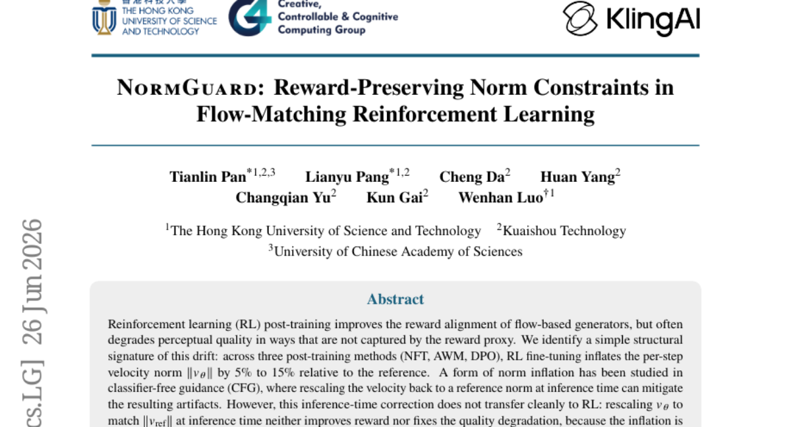

### 📌 한 줄 요약
RL을 통한 Flow-matching 모델의 보상 최적화 과정에서 발생하는 속도 노름(velocity norm) 팽창 문제를 해결하여 이미지 품질 저하를 방지하는 기법

### 🔑 핵심 포인트
- RL 미세 조정 시 발생하는 속도 노름(velocity norm) 팽창이 이미지 품질 저하의 원인임을 규명
- 추론 시 정규화가 아닌 학습 단계에서의 개입(training-time intervention) 필요성 제시
- 보상 손실을 저해하지 않으면서 노름 팽창만 억제하는 힌지 페널티(hinge penalty) 메커니즘 제안

### 🧑‍💻 개발자 관점
생성 모델의 RL 학습 시 보상 점수는 높지만 결과물 품질이 깨지는 현상을 제어할 수 있는 실질적인 정규화 전략을 제공합니다.

### 🚀 실무 적용 아이디어
- 기존 RL 학습 파이프라인에 |v_θ| > |v_{ref}| 조건의 힌지 페널티 항 추가 실험
- 학습 과정 중 스텝별 velocity norm 변화 추이 모니터링
- 적은 샘플 수(few-step inference) 환경에서의 품질 개선 효과 검증

### ⚠️ 리스크/한계
- 참조 모델(reference model)의 노름 값이 기준점이 되므로 적절한 참조 모델 설정이 중요함
- 특정 아키텍처나 학습 스케줄에 따른 일반화 가능성 확인 필요

### 📝 초록 기반 상세 설명
Flow-matching 기반 생성 모델의 RL 사후 학습(post-training)은 보상 정렬을 개선하지만, 보상 지표에 잡히지 않는 시각적 품질 저하를 유발합니다. 연구 결과, RL 미세 조정 과정에서 스텝별 속도 노름(|v_θ|)이 참조 모델 대비 5~15% 증가하는 '노름 팽창' 현상이 발생함을 발견했습니다. 이러한 팽창은 모델 가중치에 내재화되어 추론 시 단순 정규화로는 해결되지 않으며, 보상 신호와도 무관한 것으로 나타났습니다. 이를 해결하기 위해 노름이 참조치를 초과할 때만 활성화되는 힌지 페널티(hinge penalty) 방식인 NormGuard를 제안합니다. 실험 결과, NormGuard는 보상을 유지하면서도 MLLM 평가 기준의 이미지 품질과 포렌식적 사실성을 유의미하게 개선했습니다.

---

## 16. [Towards Automating Scientific Review with Google's Paper Assistant Tool](https://huggingface.co/papers/2606.28277)
**Upvotes**: 3 | **도입 난이도**: 중 | **신뢰도**: 상
**arXiv**: https://arxiv.org/abs/2606.28277

**태그**: AI Agent, Reasoning, Automated Review, Inference Scaling, Agent, Benchmark, Evaluation, Inference

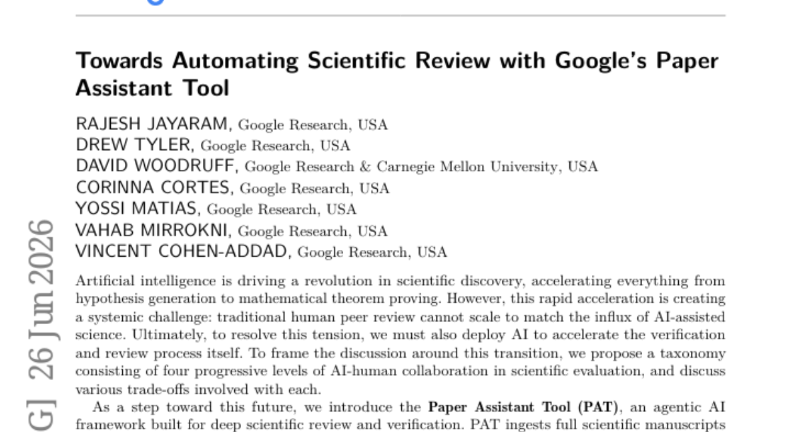

### 📌 한 줄 요약
AI 기반 논문 검증 에이전트(PAT)를 통한 과학적 리뷰 프로세스의 자동화 및 효율화 연구

### 🔑 핵심 포인트
- 심층적 논문 검증을 위한 에이전트 프레임워크 PAT(Paper Assistant Tool) 개발
- 추론 스케일링 기법을 통한 수학적 오류 탐지 성능 향상 (SPOT 벤치마크 기준)
- STOC, ICML 등 주요 학회에서의 파일럿 배포를 통한 실무적 유효성 검증

### 🧑‍💻 개발자 관점
에이전트 기반의 추론 스케일링이 복잡한 논리적 오류를 잡아내는 데 어떻게 기여하는지, 그리고 AI가 인간의 전문성을 보조하는 워크플로우 설계 방식을 배울 수 있습니다.

### 🚀 실무 적용 아이디어
- 에이전트 기반의 Multi-step 추론 워크플로우 설계 방식 분석
- 수학적/논리적 검증을 위한 추론 스케일링 기법 적용 실험
- LLM을 활용한 문서 요약 및 오류 탐지 파이프라인 구축

### ⚠️ 리스크/한계
- AI가 생성한 검증 결과에 대한 인간의 최종 확인 의존성
- 복잡한 도메인 지식에 대한 AI의 오판 가능성

### 📝 초록 기반 상세 설명
AI로 인한 과학적 발견의 가속화로 인해 기존의 인간 중심 피어 리뷰 시스템이 한계에 직면했습니다. 이를 해결하기 위해 연구진은 AI-인간 협업의 4단계 분류 체계를 제안하고, 심층적인 논문 검증을 위한 에이전트 프레임워크인 PAT(Paper Assistant Tool)를 도입했습니다. PAT는 논문 전체를 분석하여 이론적 결과 검증, 실험 유효성 확인, 개선 사항 제안 및 오류 식별을 수행합니다. 추론 스케일링(Inference Scaling) 기법을 활용하여 수학적 오류 탐지 성능을 높였으며, STOC 및 ICML에서의 파일럿 테스트를 통해 실질적인 오류 식별 능력을 입증했습니다. 결과적으로 PAT는 리뷰어의 인지적 부담을 줄이면서도 최종 결정권은 인간이 유지하는 효율적인 리뷰 환경을 제공합니다.

---

## 17. [Object-Centric Residual RL for Zero-Shot Sim-to-Real VLA Enhancement](https://huggingface.co/papers/2606.18953)
**Upvotes**: 3 | **도입 난이도**: 중 | **신뢰도**: 상
**arXiv**: https://arxiv.org/abs/2606.18953

**태그**: VLA, Reinforcement Learning, Sim-to-Real, Robot Manipulation, Vision, Distillation

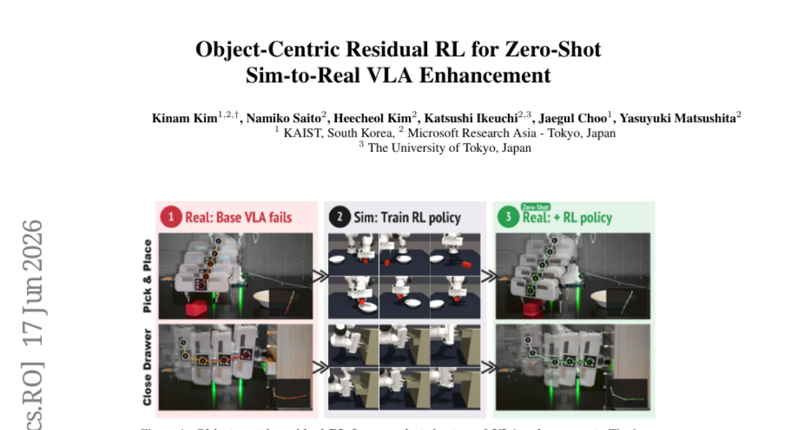

### 📌 한 줄 요약
시뮬레이션에서 학습된 객체 중심 잔차 RL을 통해 실세계 VLA 모델의 정밀 제어 성능을 제로샷으로 향상시키는 프레임워크

### 🔑 핵심 포인트
- 객체 포즈 기반의 압축된 관측 공간을 사용하여 시뮬레이션-실세계 간 도메인 차이 극복
- 시뮬레이션 내 VLA 카운터파트 학습을 통한 도메인 정렬(Domain Alignment) 전략
- 포즈 노이즈 주입 및 드롭아웃을 활용한 강건한 제로샷 잔차 RL 정책 학습

### 🧑‍💻 개발자 관점
기존의 거대 VLA 모델을 수정하지 않고도, 시뮬레이션에서 학습된 가벼운 보정 정책(Residual Policy)만으로 실세계의 정밀도를 높일 수 있는 실용적인 방법론을 제시합니다.

### 🚀 실무 적용 아이디어
- 기존 VLA 모델의 출력값에 객체 포즈 기반의 작은 Delta(잔차)를 더하는 구조 설계
- 시뮬레이션 환경에서 포즈 데이터에 노이즈를 섞어 RL 에이전트의 강건성 테스트
- 학습된 잔차 정책이 VLA의 기본 동작을 방해하지 않는지 확인하기 위한 스케일링 실험

### ⚠️ 리스크/한계
- 객체 포즈 추정(Pose Estimation)의 정확도에 따라 전체 시스템의 성능이 크게 좌우됨
- 복잡한 배경이나 가려짐(Occlusion)이 심한 환경에서는 객체 중심 방식의 한계가 발생할 수 있음

### 📝 초록 기반 상세 설명
VLA 모델은 다양한 작업에 일반화 가능하지만, 모방 학습 기반 정책은 누적되는 실행 오차로 인해 정밀한 물리적 상호작용에서 취약함을 보입니다. 기존의 잔차 RL(Residual RL) 방식은 시뮬레이션과 실세계 사이의 도메인 차이로 인해 제로샷 전이가 어렵다는 한계가 있습니다. 본 논문은 객체 포즈(Object Pose)를 활용하여 관측 공간을 압축함으로써 시뮬레이션과 실세계 간의 간극을 줄이는 객체 중심 잔차 RL 프레임워크를 제안합니다. 또한, 시뮬레이션 내에서 실세계 VLA의 대응 모델을 학습시키는 데이터 재현 기법을 통해 도메인 정렬을 수행합니다. 실험 결과, Franka 로봇 환경에서 제로샷 성공률을 크게 개선하였으며, 개선된 데이터를 통해 기본 VLA를 재학습하는 자가 개선(Self-improvement) 가능성도 확인했습니다.

---

## 18. [Cluster, Route, Escalate: Cascaded Framework for Cost-Aware LLM Serving](https://huggingface.co/papers/2606.27457)
**Upvotes**: 2 | **도입 난이도**: 중 | **신뢰도**: 상
**arXiv**: https://arxiv.org/abs/2606.27457

**태그**: LLM Serving, Cost Optimization, Model Routing, Cascaded Inference

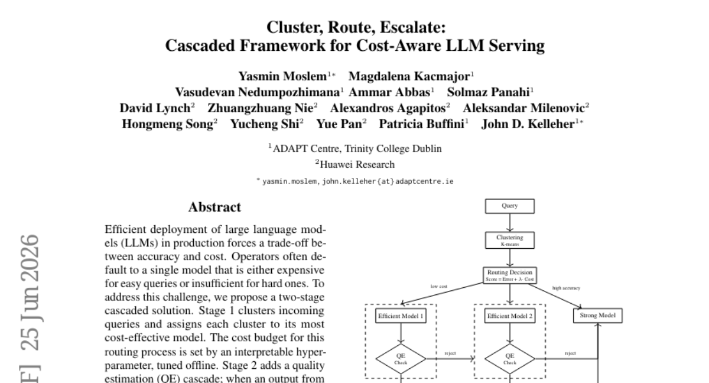

### 📌 한 줄 요약
질문 난이도에 따른 모델 클러스터링과 품질 기반 에스컬레이션을 결합하여 비용과 성능의 균형을 최적화하는 2단계 캐스케이드 프레임워크

### 🔑 핵심 포인트
- 질문 난이도 기반 클러스터링을 통한 비용 최적화 라우팅
- 품질 추정(QE) 기반의 에스컬레이션 메커니즘을 통한 정확도 보장
- 모델 변경에 유연하며 태스크 정답 라벨만으로 동작하는 높은 적응성

### 🧑‍💻 개발자 관점
LLM 서비스 운영 시 무조건 고성능 모델을 쓰는 대신, 질문 난이도에 따라 모델을 동적으로 스위칭하여 운영 비용을 획기적으로 절감할 수 있습니다.

### 🚀 실무 적용 아이디어
- 현재 운영 중인 쿼리 데이터셋을 난이도별로 클러스터링하는 실험 수행
- 저가형 모델의 출력 품질을 판단할 수 있는 가벼운 QE(Quality Estimation) 모듈 테스트
- 에스컬레이션 시 발생하는 지연 시간(Latency)이 사용자 경험에 미치는 영향 분석

### ⚠️ 리스크/한계
- 에스컬레이션 과정에서 발생하는 추가적인 지연 시간(Latency) 문제
- 클러스터링 및 QE 모델의 정확도가 전체 시스템 성능의 병목이 될 가능성

### 📝 초록 기반 상세 설명
LLM을 실제 서비스에 배포할 때 정확도와 비용 사이의 트레이드오프를 해결하는 것이 중요한 과제로 떠오르고 있습니다. 기존에는 단일 모델을 사용하여 쉬운 질문에는 과도한 비용이 발생하거나 어려운 질문에는 성능이 부족한 문제가 있었습니다. 이를 해결하기 위해 본 논문은 2단계 캐스케이드 솔루션을 제안합니다. 1단계에서는 유입되는 쿼리를 클러스터링하여 비용 효율적인 모델에 할당하고, 2단계에서는 품질 추정(QE)을 통해 결과가 미흡할 경우 더 강력한 모델로 에스컬레이션합니다. 실험 결과, 최고 성능 모델 대비 97-99%의 정확도를 유지하면서도 토큰당 생성 시간(TPOT)을 크게 단축했습니다. 이 시스템은 태스크 정답 라벨만 있으면 학습이 가능하며 모델 풀의 변화에도 유연하게 대응합니다.

---

## 19. [AgentOdyssey: Open-Ended Long-Horizon Text Game Generation for Test-Time Continual Learning Agents](https://huggingface.co/papers/2606.24893)
**Upvotes**: 2 | **도입 난이도**: 하 | **신뢰도**: 상
**arXiv**: https://arxiv.org/abs/2606.24893

**태그**: AI Agent, Continual Learning, Benchmark, Long-horizon Planning, Agent, Evaluation, Inference

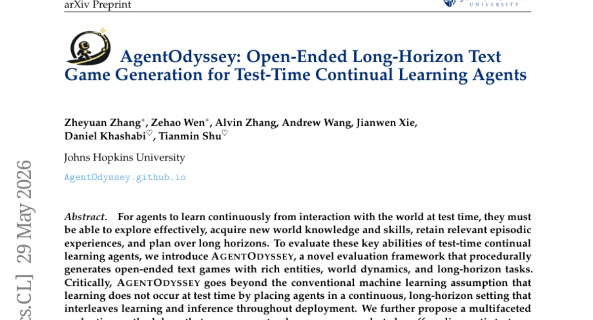

### 📌 한 줄 요약
테스트 시점의 지속적 학습(Test-time Continual Learning) 능력을 평가하기 위한 오픈 엔드 텍스트 게임 생성 프레임워크 제안

### 🔑 핵심 포인트
- 테스트 시점의 지속적 학습을 평가하기 위한 오픈 엔드 텍스트 게임 생성 프레임워크(AgentOdyssey) 개발
- 지식 습득, 에피소드 기억, 탐색 다양성 등 에이전트의 핵심 능력을 측정하는 다면적 평가 방법론 제안
- 에이전트의 성능이 모델 크기에 따라 확장되지만, 여전히 인간 수준의 장기적 작업 수행에는 한계가 있음을 입증

### 🧑‍💻 개발자 관점
에이전트가 단순히 주어진 프롬프트에 답하는 것을 넘어, 환경과 상호작용하며 실시간으로 지식을 업데이트하고 장기 계획을 세우는 능력을 검증하는 벤치마크를 제공합니다.

### 🚀 실무 적용 아이디어
- 제공된 프레임워크를 사용하여 현재 개발 중인 에이전트의 장기 계획 및 기억 유지 능력 테스트
- 에이전트 아키텍처에 단기 기억(Short-term memory) 모듈을 결합하여 성능 변화 관찰
- 에이전트의 지식 습득 속도와 작업 성공률 간의 상관관계 분석

### ⚠️ 리스크/한계
- 텍스트 기반 환경이므로 시각적/물리적 복잡성이 포함된 실세계 환경과의 괴리가 존재할 수 있음
- 에이전트의 성능이 모델의 기본 추론 능력에 크게 의존하여 환경 자체의 변별력이 희석될 가능성

### 📝 초록 기반 상세 설명
에이전트가 실세계에서 지속적으로 학습하려면 탐색, 지식 습득, 장기 계획 능력이 필수적입니다. 기존의 머신러닝 평가는 학습과 추론이 분리되어 있어 테스트 시점의 지속적 학습 능력을 측정하기 어렵다는 문제가 있습니다. 이를 해결하기 위해 풍부한 엔티티와 동적 환경을 갖춘 절차적 생성 텍스트 게임 프레임워크인 AgentOdyssey를 도입합니다. 이 프레임워크는 게임 진행도뿐만 아니라 지식 습득, 에피소드 기억, 탐색 다양성 등 다각적인 진단 테스트를 제공합니다. 실험 결과, 현재의 최상위 에이전트들도 인간의 성능에 크게 못 미치며 장기적 작업 수행에 한계가 있음을 확인했습니다. 특히 단기 기억(Short-term memory)이 에이전트의 테스트 시점 학습에 핵심적인 요소임을 밝혀냈습니다.

---

## 20. [MemoBench: Benchmarking World Modeling in Dynamically Changing Environments](https://huggingface.co/papers/2606.27537)
**Upvotes**: 1 | **도입 난이도**: 하 | **신뢰도**: 상
**arXiv**: https://arxiv.org/abs/2606.27537

**태그**: Video Generation, World Modeling, Benchmark, Computer Vision, Video, Evaluation

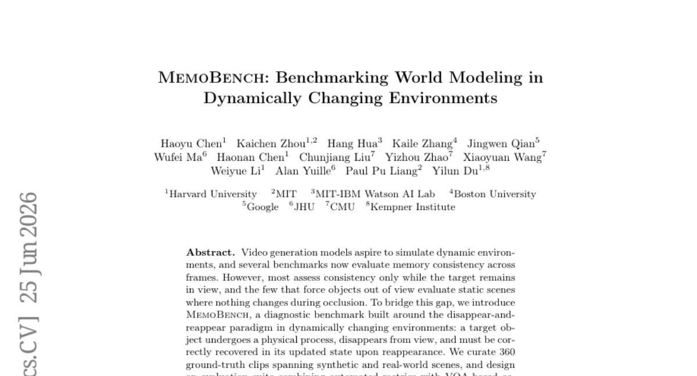

### 📌 한 줄 요약
동적 환경에서 객체의 상태 변화와 재등장을 평가하는 새로운 비디오 생성 모델 벤치마크인 MemoBench 제안

### 🔑 핵심 포인트
- 객체의 상태 변화와 가려짐(occlusion)을 동시에 평가하는 'disappear-and-reappear' 패러다임 도입
- 합성 및 실세계 데이터를 포함한 360개의 고품질 Ground-truth 데이터셋 구축
- 자동화된 지표와 VQA(Visual Question Answering)를 결합한 다각적 평가 프레임워크 설계

### 🧑‍💻 개발자 관점
단순한 시각적 일관성을 넘어, 물리적 변화가 수반되는 복잡한 시나리오에서 비디오 생성 모델의 세계 모델링(World Modeling) 능력을 검증할 수 있습니다.

### 🚀 실무 적용 아이디어
- 현재 개발 중인 비디오 생성 모델에 MemoBench 데이터셋 적용 테스트
- 객체 가려짐 시 상태 변화(색상, 형태 등) 유지 능력을 VQA로 정량화
- 모델의 메모리 일관성 부족 지점(Failure mode) 분석

### ⚠️ 리스크/한계
- 제한된 360개 클립 규모로 인한 데이터 다양성 한계 가능성
- VQA 기반 평가 방식의 주관성 개입 가능성

### 📝 초록 기반 상세 설명
비디오 생성 모델은 동적 환경 시뮬레이션을 목표로 하지만, 기존 벤치마크는 객체가 시야에서 사라졌을 때의 상태 변화를 평가하는 데 한계가 있습니다. 본 논문은 객체가 물리적 변화를 겪은 후 시야에서 사라졌다가 다시 나타날 때의 일관성을 측정하는 'disappear-and-reappear' 패러다임 기반의 MemoBench를 도입합니다. 이를 위해 합성 및 실세계 장면을 포함한 360개의 정답 클립을 구축하고, 자동화된 지표와 VQA 기반 평가를 결합한 진단 스위트를 설계했습니다. 8개의 최신 모델을 평가한 결과, 동적 환경에서의 메모리 일관성 유지에 대한 핵심적인 통찰과 과제를 제시합니다.

---

## 21. [To Run or Not to Run: Analyzing the Cost-Effectiveness of Code Execution in LLM-Based Program Repair](https://huggingface.co/papers/2606.26978)
**Upvotes**: 1 | **도입 난이도**: 하 | **신뢰도**: 상
**arXiv**: https://arxiv.org/abs/2606.26978

**태그**: LLM-Agent, Program Repair, Cost-Efficiency, Software Engineering, Agent, RAG, Evaluation

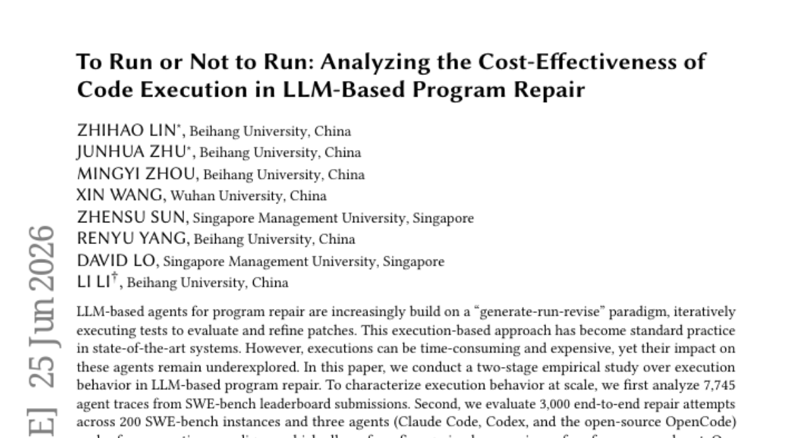

### 📌 한 줄 요약
LLM 기반 프로그램 수정 에이전트의 코드 실행(Execution) 비용 대비 효율성을 분석하여 무분별한 실행의 비효율성을 경고함

### 🔑 핵심 포인트
- SWE-bench 데이터를 통한 대규모 에이전트 실행 패턴 분석 (평균 태스크당 8.8회 실행)
- 실행 제한(Prohibited vs Unrestricted)이 성공률에 미치는 영향이 통계적으로 미미함을 입증
- 실행의 이득이 특정 상황에 집중되어 있어, 무분별한 실행이 비용 낭비를 초래함을 확인

### 🧑‍💻 개발자 관점
에이전트 기반 자동화 도구 구축 시, 무조건적인 테스트 실행이 아닌 비용 효율적인 실행 전략(Early-exit 등) 설계가 필수적임을 시사합니다.

### 🚀 실무 적용 아이디어
- 에이전트의 테스트 실행 횟수에 따른 성공률 변화 추이 모니터링
- 실행 없이 생성된 코드의 유효성을 검증하는 가벼운 정적 분석 도입 검토
- 실행 비용(Token/Time) 대비 성능 향상 폭을 측정하는 비용-편익 지표 설정

### ⚠️ 리스크/한계
- 실행을 제한할 경우 복잡한 버그 수정 시 성공률이 급격히 떨어질 가능성 존재
- 특정 벤치마크(SWE-bench) 환경에 국한된 실험 결과일 수 있음

### 📝 초록 기반 상세 설명
최근 LLM 기반 프로그램 수정 에이전트는 '생성-실행-수정' 루프를 표준 방식으로 채택하고 있습니다. 그러나 코드 실행은 시간과 비용이 많이 소모됨에도 불구하고, 그 실질적인 효용성에 대한 연구는 부족한 실정입니다. 본 논문은 SWE-bench 데이터를 활용하여 다양한 에이전트의 실행 동작을 분석하고, 실행 제한 여부에 따른 성능 및 비용 변화를 실험했습니다. 연구 결과, 모든 에이전트가 높은 빈도로 실행을 수행하지만, 실행 제한이 성공률에 미치는 영향은 미미하며 오히려 비용 절감 효과가 컸습니다. 결론적으로 현재의 에이전트들은 실행을 무분별하게 사용하고 있으며, 실행은 기본 기능이 아닌 비용-편익을 고려해야 하는 자원으로 취급되어야 합니다.

---

## 22. [The Galaxy's Guide to the Tokenizer: A Benchmark for Scientific Foundation Models](https://huggingface.co/papers/2606.25610)
**Upvotes**: 1 | **도입 난이도**: 중 | **신뢰도**: 상
**arXiv**: https://arxiv.org/abs/2606.25610

**태그**: Foundation Models, Tokenization, Computer Vision, Scientific AI, Vision, Benchmark, Evaluation

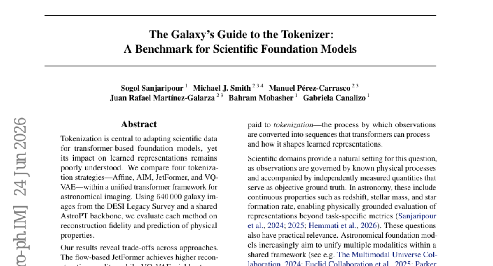

### 📌 한 줄 요약
과학적 데이터(천문 이미지)를 위한 토크나이저 전략별 성능 차이와 재구성 vs 표현 학습 간의 트레이드오프 분석

### 🔑 핵심 포인트
- 네 가지 토크나이징 전략(Affine, AIM, JetFormer, VQ-VAE)의 성능 비교 분석
- 이미지 재구성 품질(Reconstruction)과 물리적 특성 예측(Representation) 간의 상충 관계 확인
- 과학적 데이터의 물리적 정량 값을 활용한 해석 가능한 벤치마크 방법론 제시

### 🧑‍💻 개발자 관점
도메인 특화 데이터(의료, 과학 등)를 다룰 때, 단순 재구성이 아닌 목적(특성 추출 vs 이미지 복원)에 맞는 토크나이저 선택이 필수적임을 시사합니다.

### 🚀 실무 적용 아이디어
- 목적에 따른 토크나이저 스위칭 실험 (재구성 vs 분류/회귀)
- 도메인 특화 데이터셋에 대한 VQ-VAE와 Flow-based 모델의 성능 비교
- 토크나이저가 모델의 Downstream Task 성능에 미치는 영향 정량화

### ⚠️ 리스크/한계
- 특정 도메인(천문학)에 특화된 실험 결과이므로 타 도메인 일반화 여부 확인 필요
- 재구성과 표현 학습이 분리될 수 있어, 단일 지표만으로 모델 성능을 판단할 위험이 있음

### 📝 초록 기반 상세 설명
트랜스포머 기반 파운데이션 모델을 과학 데이터에 적응시키기 위해 토크나이징은 필수적이지만, 이것이 학습된 표현에 미치는 영향은 명확히 밝혀지지 않았습니다. 본 연구는 DESI Legacy Survey의 은하 이미지 64만 장을 활용하여 Affine, AIM, JetFormer, VQ-VAE라는 네 가지 토크나이징 전략을 동일한 AstroPT 백본 프레임워크 내에서 비교했습니다. 실험 결과, JetFormer는 재구성 품질이 뛰어난 반면, VQ-VAE는 은하의 물리적 특성 예측(Probe) 성능에서 강점을 보였습니다. Affine과 AIM은 국소적인 형태학적 정보를 보존하는 데 유리했습니다. 최종적으로 재구성 품질과 표현 학습 품질이 서로 분리될 수 있음을 확인하였으며, 모든 작업에 완벽한 단일 방법론은 없다는 결론을 도출했습니다.

---

## 23. [Qwen-RobotNav Technical Report: A Scalable Navigation Model Designed for an Agentic Navigation System](https://huggingface.co/papers/2606.18112)
**Upvotes**: 1 | **도입 난이도**: 중 | **신뢰도**: 상
**arXiv**: https://arxiv.org/abs/2606.18112

**태그**: Robot Navigation, Multi-task Learning, Vision-Language Model, Agentic System, Agent, Vision, Benchmark, Inference

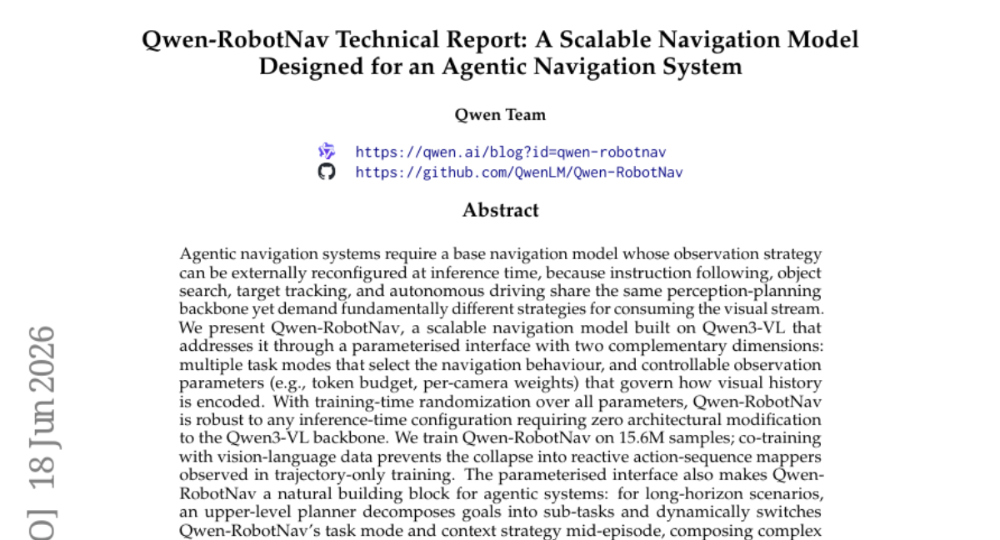

### 📌 한 줄 요약
다양한 내비게이션 태스크를 하나의 모델로 해결할 수 있는 파라미터 기반의 확장 가능한 로봇 내비게이션 모델 개발

### 🔑 핵심 포인트
- 작업 모드 및 관찰 파라미터(토큰 예산, 카메라 가중치 등)를 통한 유연한 전략 제어
- 훈련 시 파라미터 무작위화를 통한 추론 시 제로샷 설정 변경 가능성 확보
- 시각-언어 데이터 공동 학습을 통한 고차원적 공간 계획 능력 유지

### 🧑‍💻 개발자 관점
하나의 백본 모델로 명령 수행, 물체 탐색, 자율 주행 등 서로 다른 전략이 필요한 다양한 로봇 태스크를 통합 관리할 수 있는 구조를 제시합니다.

### 🚀 실무 적용 아이디어
- 제시된 파라미터 인터페이스를 활용한 멀티태스크 스위칭 시나리오 테스트
- 다양한 카메라 입력 환경에서의 가중치 조절 실험
- 장기 계획(Long-horizon) 태스크에서의 모드 전환 효율성 검증

### ⚠️ 리스크/한계
- 복잡한 파라미터 설정에 따른 추론 시 연산 비용 최적화 필요성
- 실제 로봇 하드웨어 적용 시 실시간성 확보 여부 검증 필요

### 📝 초록 기반 상세 설명
에이전트 기반 내비게이션 시스템은 작업 종류에 따라 시각 정보를 소비하는 전략이 달라져야 하는 문제를 안고 있습니다. 이를 해결하기 위해 Qwen-RobotNav는 작업 모드와 관찰 파라미터를 조절할 수 있는 파라미터화된 인터페이스를 제안합니다. 학습 과정에서 모든 파라미터를 무작위로 변형하며 훈련하여, 추론 시 아키텍처 수정 없이 다양한 설정에 대응할 수 있는 강건함을 확보했습니다. 또한 시각-언어 데이터와의 공동 학습을 통해 단순 반응형 모델로 전락하는 것을 방지했습니다. 실험 결과, 이 모델은 주요 벤치마크에서 SOTA를 달성했으며 파라미터 스케일링과 제로샷 일반화 성능에서도 뛰어난 모습을 보였습니다.

---

## 24. [Qwen-RobotManip Technical Report: Alignment Unlocks Scale for Robotic Manipulation Foundation Models](https://huggingface.co/papers/2606.17846)
**Upvotes**: 1 | **도입 난이도**: 상 | **신뢰도**: 상
**arXiv**: https://arxiv.org/abs/2606.17846

**태그**: Robotics, VLA, Foundation Model, Data Synthesis, Multimodal, Vision, Video, Benchmark, Safety

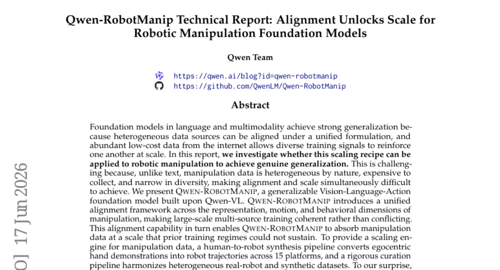

### 📌 한 줄 요약
이종 데이터 정렬 기술을 통해 대규모 데이터 학습을 가능케 하여 로봇 조작의 범용성을 확보한 VLA 파운데이션 모델

### 🔑 핵심 포인트
- 표현·동작·행동 차원을 통합하여 이종 데이터 간 충돌을 방지하는 정렬 프레임워크 개발
- 인간 데모 영상을 로봇 궤적으로 변환하는 합성 파이프라인을 통한 대규모 데이터 확보
- 제로샷 지시 이행, 오류 복구, 교차 임포디먼트 전이 등 강력한 일반화 성능 입증

### 🧑‍💻 개발자 관점
데이터 수집 비용이 높은 로봇 분야에서 기존의 비디오/인간 데이터를 어떻게 유효한 학습 데이터로 변환하고 정렬할 수 있는지에 대한 방법론을 제시합니다.

### 🚀 실무 적용 아이디어
- 제시된 데이터 합성 파이프라인의 로봇 플랫폼별 변환 정확도 분석
- 기존 VLA 모델과 Qwen-RobotManip의 OOD(Out-of-Distribution) 환경 성능 비교 실험
- 오픈소스 데이터셋만으로 구축된 데이터 정렬 프레임워크의 재현 테스트

### ⚠️ 리스크/한계
- 인간-로봇 합성 데이터에 따른 도메인 갭(Sim-to-Real) 발생 가능성
- 대규모 사전 학습을 위한 막대한 컴퓨팅 자원 필요성

### 📝 초록 기반 상세 설명
언어 모델의 성공적인 스케일링 법칙을 로봇 조작 분야에 적용하기 위해, 데이터의 이질성과 수집 비용 문제를 해결하고자 연구가 시작되었습니다. 기존의 로봇 데이터는 다양성이 부족하고 정렬이 어려워 대규모 학습에 제약이 있었습니다. 이를 해결하기 위해 Qwen-VL을 기반으로 표현, 동작, 행동 차원을 통합하는 'Qwen-RobotManip' 정렬 프레임워크를 제안합니다. 또한 인간의 데모 영상을 로봇 궤적으로 변환하는 합성 파이프라인을 통해 약 38,100시간의 대규모 사전 학습 코퍼스를 구축했습니다. 그 결과, 제로샷 지시 이행 및 교차 임포디먼트(cross-embodiment) 전이와 같은 창발적 일반화 능력을 확보했습니다. 최종적으로 기존 SOTA 모델들을 상회하며 다양한 실물 로봇 플랫폼에서 성능을 검증했습니다.

---

## 25. [How Much Static Structure Do Code Agents Need? A Study of Deterministic Anchoring](https://huggingface.co/papers/2606.26979)
**Upvotes**: 0 | **도입 난이도**: 중 | **신뢰도**: 상
**arXiv**: https://arxiv.org/abs/2606.26979

**태그**: Code Agent, Static Analysis, Software Engineering, LLM, Agent

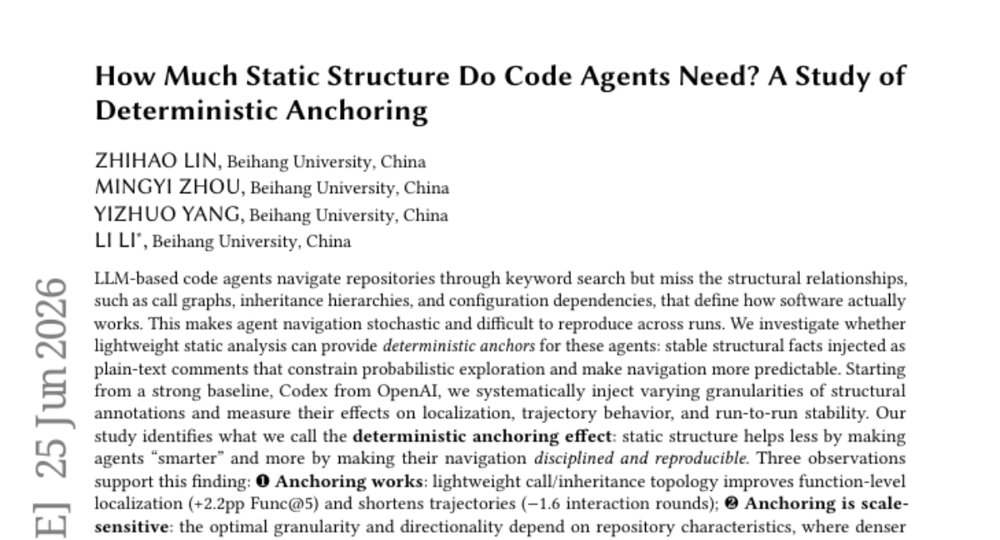

### 📌 한 줄 요약
코드 에이전트의 탐색 안정성을 높이기 위해 정적 분석 기반의 구조적 앵커링(Deterministic Anchoring)을 활용하는 방법론 연구

### 🔑 핵심 포인트
- 정적 분석 정보를 텍스트 주석으로 주입하여 에이전트의 탐색을 제어하는 '결정론적 앵커링' 효과 입증
- 구조적 정보 주입이 탐색 궤적을 단축시키고, 실행 간 변동성(variance)을 줄여 재현성을 높임
- 저장소 규모 및 허브 노드 존재 여부에 따른 최적의 주석 밀도와 방향성 가이드라인 제시

### 🧑‍💻 개발자 관점
에이전트가 단순히 키워드에 의존해 코드를 헤매는 대신, 코드 간의 관계를 바탕으로 더 빠르고 예측 가능한 경로로 탐색하도록 유도할 수 있습니다.

### 🚀 실무 적용 아이디어
- LLM 에이전트 프롬프트에 호출 관계(Call Graph) 정보를 요약하여 주석 형태로 포함해보기
- 대규모 프로젝트에서 에이전트의 토큰 소모를 줄이기 위해 역방향(Who-calls-me) 링크 위주로 주석 구성하기
- 에이전트의 탐색 경로가 매번 달라지는 문제를 해결하기 위해 정적 구조 정보를 앵커로 활용하기

### ⚠️ 리스크/한계
- 구조적 주석 주입 시 입력 토큰 사용량이 증가하여 비용 및 컨텍스트 제한 문제 발생 가능
- 너무 밀집된 구조 정보는 오히려 성능 저하를 일으킬 수 있는 임계점 존재

### 📝 초록 기반 상세 설명
LLM 기반 코드 에이전트는 키워드 검색에 의존하여 코드 저장소의 구조적 관계를 놓치고 탐색의 재현성이 떨어지는 문제를 겪습니다. 본 연구는 정적 분석을 통해 추출한 호출 그래프, 상속 계층 등의 정보를 텍스트 주석 형태로 주입하여 에이전트의 탐색을 제어하는 '결정론적 앵커링' 기법을 제안합니다. Codex 모델을 대상으로 다양한 수준의 구조적 주석을 주입하며 로컬라이제이션 성능과 탐색 궤적의 안정성을 실험했습니다. 연구 결과, 구조적 정보는 에이전트의 지능을 높이기보다 탐색 과정을 규율하고 재현 가능하게 만드는 데 더 큰 효과가 있음을 확인했습니다. 또한 저장소 규모와 구조에 따라 최적의 주석 밀도가 다르며, 앵커링이 탐색의 일관성과 성공률을 유의미하게 향상시킨다는 것을 입증했습니다.

---

## 26. [Boundary-Aware Context Grounding for A Low-Channel EEG Agent](https://huggingface.co/papers/2606.26519)
**Upvotes**: 0 | **도입 난이도**: 중 | **신뢰도**: 상
**arXiv**: https://arxiv.org/abs/2606.26519

**태그**: LLM-Agent, Data-Grounding, Signal-Processing, System-Architecture, Agent, RAG, Benchmark, Evaluation

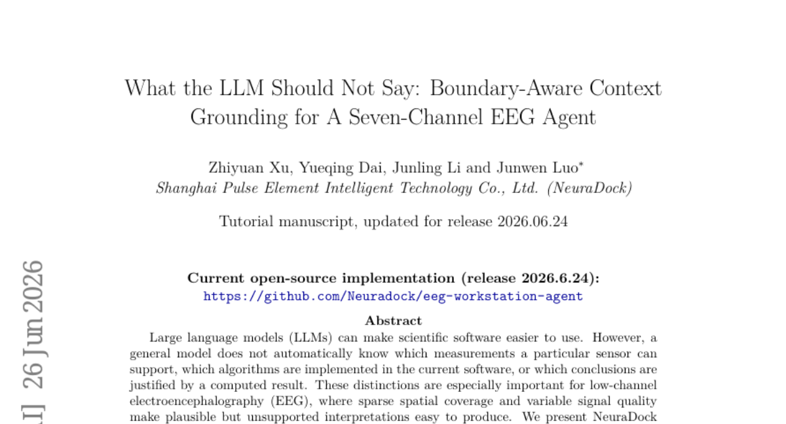

### 📌 한 줄 요약
저채널 EEG 데이터의 불확실성을 제어하기 위해 하드웨어 제약과 분석 범위를 명확히 구분한 LLM 에이전트 아키텍처 제안

### 🔑 핵심 포인트
- 결정론적 수치 엔진과 LLM 레이어의 분리를 통한 데이터 무결성 확보
- 하드웨어 제약 및 분석 범위를 포함한 '컨텍스트 팩' 기반의 Grounding 전략
- 데이터 경계 및 실패 상황(Failure-injection)에서도 안정적인 결과 유지

### 🧑‍💻 개발자 관점
LLM이 원시 데이터(Raw data)를 직접 다루는 대신, 검증된 요약 정보와 명확한 제약 조건(Boundary)만 전달하여 환각(Hallucination)을 방지하는 아키텍처 패턴을 제시합니다.

### 🚀 실무 적용 아이디어
- LLM에 원시 데이터 대신 정제된 메타데이터만 전달하는 파이프라인 설계 실험
- 데이터의 물리적 한계(예: 센서 개수)를 프롬프트/컨텍스트에 포함했을 때의 답변 정확도 비교
- 에러 주입(Failure-injection)을 통한 에이전트의 예외 처리 로직 검증

### ⚠️ 리스크/한계
- 제시된 결과가 임상적 유효성이나 절대적인 인지 부하 지수를 보장하지 않음
- 수치 엔진의 정확도와 컨텍스트 요약 품질에 따라 에이전트 성능이 종속됨

### 📝 초록 기반 상세 설명
LLM을 활용한 과학 소프트웨어의 편의성 증대에도 불구하고, 모델이 센서의 물리적 한계나 데이터의 과학적 타당성을 오인할 위험이 존재합니다. 특히 데이터가 희소한 저채널 EEG 환경에서는 잘못된 해석이 발생하기 쉽습니다. 이를 해결하기 위해 본 논문은 결정론적 로컬 EEG 엔진과 하드웨어 인지형 언어 레이어를 분리한 NeuraDock Agent 아키텍처를 제안합니다. 수치 엔진이 데이터 처리 및 검증을 담당하고, LLM은 허용된 요약 정보와 컨텍스트 팩만을 전달받아 분석 경계를 준수하도록 설계되었습니다. 실험 결과, 시스템은 반복적인 작업에서도 일관된 결과를 생성했으며, 적대적 질문 및 데이터 경계 테스트를 통해 모델이 분석 범위를 정확히 인지하고 제어할 수 있음을 입증했습니다.

---

