# 2026-07-02 Daily Papers (Top 35)

## 오늘의 요약
오늘은 차세대 월드 모델과 VLA(Vision-Language-Action) 모델의 지식 유지 등 Embodied AI 분야의 심도 있는 연구가 돋보였습니다. 또한, 추론 효율을 높이는 스펙큘레이티브 디코딩과 지식 증류, 그리고 생성 모델의 학습 효율을 극대화하는 엔드투엔드 프레임워크 등 모델 최적화 및 생성 기술에 대한 연구도 활발히 진행되었습니다.

### 오늘의 핵심 포인트
- 물리적 환경 이해와 행동 제어를 통합하는 차세대 월드 모델 및 VLA 모델의 발전과 평가 방법론이 주목받았습니다.
- 코드 검증, 지식 증류, 스펙큘레이티브 디코딩 등 모델의 효율적인 학습과 추론을 위한 다양한 최적화 기법들이 제안되었습니다.
- 3D 재구성 및 이미지 생성 분야에서 데이터 효율성을 높이고 객체 단위의 구조적 표현을 가능하게 하는 새로운 프레임워크들이 제시되었습니다.

**오늘의 태그**: Embodied AI, Generative Models, Inference Optimization, World Models, LLM/VLM

## 1. [Orca: The World is in Your Mind](https://huggingface.co/papers/2606.30534)
**Upvotes**: 176 | **도입 난이도**: 상 | **신뢰도**: 상
**arXiv**: https://arxiv.org/abs/2606.30534

**태그**: World Model, Multimodal, Embodied AI, Self-Supervised Learning, Vision, Video, Evaluation

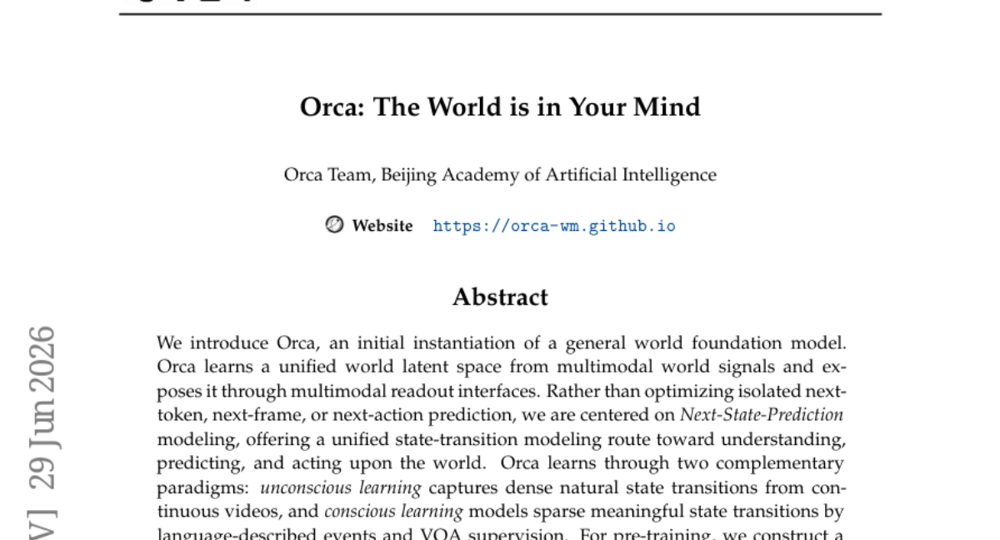

### 📌 한 줄 요약
차세대 범용 월드 모델로서, 비디오와 언어를 통합한 잠재 공간을 통해 이해, 예측, 행동을 동시에 수행하는 프레임워크

### 🔑 핵심 포인트
- 단순 예측을 넘어선 차세대 상태 예측(Next-State-Prediction) 중심의 통합 모델링
- 무의식적(비디오) 및 의식적(언어/VQA) 학습을 결합한 이중 학습 패러다임
- 고정된 백본과 경량 디코더를 활용하여 다양한 모달리티로 확장 가능한 구조

### 🧑‍💻 개발자 관점
물리적 환경에 대한 이해가 필요한 로봇 공학(Embodied AI)이나 고도화된 비디오 생성 모델 개발 시 핵심적인 아키텍처 영감을 제공합니다.

### 🚀 실무 적용 아이디어
- 제안된 이중 학습(Unconscious/Conscious) 구조를 소규모 비디오 데이터셋에 적용해보기
- Frozen Backbone 기반의 경량 디코더 학습 방식의 효율성 검증하기
- 특정 도메인(예: 자율주행)의 상태 전이 모델링에 적용 가능성 검토하기

### ⚠️ 리스크/한계
- 대규모 비디오 및 주석 데이터에 대한 높은 의존도
- 복잡한 물리 법칙을 완벽하게 모사하기 위한 계산 비용 문제

### 📝 초록 기반 상세 설명
기존의 모델들은 단순한 다음 토큰이나 프레임 예측에 치중하여 복잡한 세계의 변화를 온전히 담아내지 못하는 한계가 있었습니다. 이를 해결하기 위해 Orca는 차세대 상태 예측(Next-State-Prediction)을 목표로 하는 범용 월드 파운데이션 모델을 제안합니다. 모델은 연속적인 비디오를 통한 '무의식적 학습'과 언어 기반 이벤트를 통한 '의식적 학습'이라는 두 가지 상호 보완적 패러다임을 통해 통합된 잠재 공간을 학습합니다. 125K 시간의 비디오와 1.6억 개의 이벤트 주석을 포함한 대규모 데이터셋으로 사전 학습을 진행했습니다. 실험 결과, 학습된 잠재 공간이 텍스트 생성, 이미지 예측, 로봇 행동 생성 등 다양한 다운스트림 태스크에서 뛰어난 성능을 보임을 입증했습니다.

---

## 2. [Dockerless: Environment-Free Program Verifier for Coding Agents](https://huggingface.co/papers/2606.28436)
**Upvotes**: 83 | **도입 난이도**: 중 | **신뢰도**: 상
**arXiv**: https://arxiv.org/abs/2606.28436

**태그**: AI Agent, Code Verification, Reinforcement Learning, Software Engineering, Agent, Vision, Benchmark, Evaluation

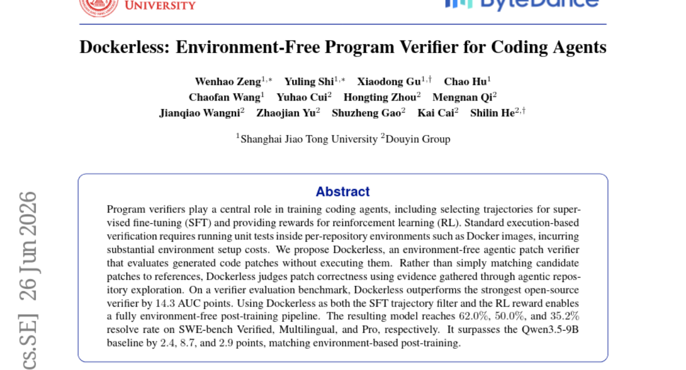

### 📌 한 줄 요약
코드 실행 없이 에이전트의 저장소 탐색 능력을 활용하여 코드 패치를 검증하는 환경 독립적(Environment-free) 검증 프레임워크

### 🔑 핵심 포인트
- 실행 환경(Docker 등) 없이 코드 패치의 정답 여부를 판단하는 환경 독립적 검증 방식 제안
- 에이전트의 저장소 탐색(Exploration)을 통해 수집된 증거를 기반으로 한 지능적 검증 메커니즘
- SFT 데이터 필터링 및 RL 보상 모델로 활용 가능한 효율적인 포스트 트레이닝 파이프라인 구축

### 🧑‍💻 개발자 관점
코드 실행 환경 구축에 드는 막대한 컴퓨팅 자원과 시간을 절약하면서도, 높은 수준의 코드 검증 및 모델 학습이 가능해집니다.

### 🚀 실무 적용 아이디어
- 에이전트 기반 코드 탐색 로직이 실제 복잡한 의존성을 가진 프로젝트에서 유효한지 테스트
- 실행 기반 검증기와 Dockerless 간의 검증 일치율(Agreement rate) 비교 실험
- SFT 데이터셋 정제 시 Dockerless를 필터로 적용하여 데이터 품질 변화 관찰

### ⚠️ 리스크/한계
- 코드 실행 없이 논리적 추론만으로 검증하므로, 런타임 에러나 복잡한 사이드 이펙트를 놓칠 가능성 존재
- 에이전트의 탐색 능력이 부족할 경우 잘못된 증거를 바탕으로 오판할 위험

### 📝 초록 기반 상세 설명
코딩 에이전트 학습을 위한 프로그램 검증은 일반적으로 Docker와 같은 격리된 실행 환경을 필요로 하며, 이는 막대한 설정 비용을 발생시킵니다. 본 논문은 코드를 직접 실행하지 않고도 패치의 정답 여부를 판단하는 'Dockerless'를 제안합니다. Dockerless는 단순히 참조 코드와 비교하는 대신, 에이전트가 저장소를 탐색하며 수집한 증거를 바탕으로 패치의 정확성을 판단합니다. 벤치마크 결과, Dockerless는 기존 오픈소스 검증기보다 14.3 AUC만큼 높은 성능을 보였습니다. 이를 SFT 필터 및 RL 보상 모델로 활용한 결과, 환경 구축 없이도 기존 실행 기반 방식에 필적하는 높은 SWE-bench 해결 능력을 달리기했습니다.

---

## 3. [DOPD: Dual On-policy Distillation](https://huggingface.co/papers/2606.30626)
**Upvotes**: 75 | **도입 난이도**: 중 | **신뢰도**: 상
**arXiv**: https://arxiv.org/abs/2606.30626

**태그**: Knowledge Distillation, LLM, VLM, On-policy Learning, Vision, Distillation

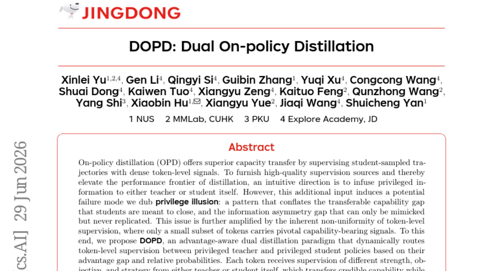

### 📌 한 줄 요약
특권 정보로 인한 성능 왜곡(Privilege Illusion)을 방지하기 위해 교사와 학생 간의 이득 차이를 고려하여 토큰별로 감독 신호를 동적으로 배분하는 이중 증류 기법

### 🔑 핵심 포인트
- Privilege Illusion: 특권 정보 주입 시 발생하는 능력 차이와 정보 비대칭의 혼동 문제 정의
- DOPD: Advantage-aware dual distillation을 통한 토큰별 동적 감독 라우팅 메커니즘
- Token-level Granularity: 토큰별 중요도와 정책 차이를 고려한 적응형 지식 전이

### 🧑‍💻 개발자 관점
모델 경량화나 지식 증류 시, 외부 데이터나 추가 정보를 활용할 때 발생하는 성능 왜곡을 막는 정교한 학습 전략을 제공합니다.

### 🚀 실무 적용 아이디어
- 특권 정보(예: Ground Truth, Chain-of-Thought)를 포함한 데이터셋에서 기존 OPD와 DOPD의 성능 비교 실험
- 토큰별 중요도(Advantage) 계산 로직이 실제 학습 안정성에 미치는 영향 분석
- LLM과 VLM 환경에서의 범용성 검증

### ⚠️ 리스크/한계
- 토큰 단위의 동적 라우팅으로 인해 학습 과정의 복잡도 및 연산 비용 증가 가능성
- Advantage 계산 방식에 따른 하이퍼파라미터 민감도 존재 가능성

### 📝 초록 기반 상세 설명
On-policy distillation(OPD)은 학생 모델이 생성한 궤적에 밀집된 토큰 단위 신호를 제공하여 우수한 지식 전이를 가능하게 합니다. 하지만 교사나 학생에게 특권 정보(privileged information)를 주입할 경우, 학생이 학습해야 할 능력 차이와 단순히 모방만 가능한 정보 비대칭을 혼동하는 'Privilege Illusion' 문제가 발생합니다. 또한 모든 토큰이 동일한 중요도를 갖지 않는 비균일성 문제도 존재합니다. 이를 해결하기 위해 본 논문은 Advantage Gap과 상대적 확률에 따라 교사와 학생 중 누구로부터 감독을 받을지 동적으로 결정하는 DOPD 프레임워크를 제안합니다. 각 토큰은 상황에 따라 서로 다른 강도와 전략의 감독을 받으며, 이를 통해 신뢰할 수 있는 능력 전이와 보조 신호 획득을 동시에 달성합니다. 실험 결과 LLM 및 VLM 환경에서 기존 OPD 대비 뛰어난 성능과 안정성, 강건성을 입증하였습니다.

---

## 4. [BlockPilot: Instance-Adaptive Policy Learning for Diffusion-based Speculative Decoding](https://huggingface.co/papers/2606.31315)
**Upvotes**: 67 | **도입 난이도**: 하 | **신뢰도**: 상
**arXiv**: https://arxiv.org/abs/2606.31315

**태그**: Speculative Decoding, Diffusion Models, Inference Optimization, Policy Learning, Inference

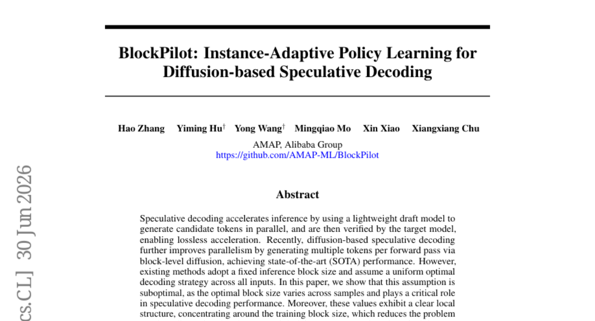

### 📌 한 줄 요약
입력 데이터의 특성에 맞춰 최적의 디퓨전 블록 크기를 동적으로 결정하여 추론 효율을 극대화하는 적응형 스펙큘레이티브 디코딩 기술

### 🔑 핵심 포인트
- 고정된 블록 크기 대신 입력 샘플별로 최적의 블록 크기를 결정하는 인스턴스 적응형 정책 제안
- 프리필링 단계의 표현(representation)을 활용하여 단 한 번의 예측으로 블록 크기를 결정하는 경량화된 메커니즘
- 기존 디퓨전 기반 스펙큘레이티브 디코딩 프레임워크에 즉시 적용 가능한 플러그앤플레이 구조

### 🧑‍💻 개발자 관점
추론 비용 절감을 위해 블록 크기를 조정해야 할 때, 데이터 특성에 맞춰 동적으로 최적화함으로써 하드웨어 효율과 생성 속도를 동시에 잡을 수 있습니다.

### 🚀 실무 적용 아이디어
- 다양한 모델 크기(예: 7B, 14B)에서 블록 크기 예측 정확도와 추론 속도 간의 트레이드오프 측정
- 프리필링 단계의 임베딩이 블록 크기 결정에 미치는 영향력 분석
- 기존 고정 블록 방식 대비 실제 서비스 환경에서의 지연 시간(Latency) 개선 효과 검증

### ⚠️ 리스크/한계
- 프리필링 단계의 연산 오버헤드가 전체 추론 속도에 미치는 영향
- 학습된 블록 크기 예측 정책이 학습 데이터와 완전히 다른 도메인의 텍스트에서 범용성을 유지할 수 있는지 여부

### 📝 초록 기반 상세 설명
최근 디퓨전 기반 스펙큘레이티브 디코딩은 블록 단위 생성을 통해 높은 병렬성을 제공하며 SOTA 성능을 달성했습니다. 그러나 기존 방식은 고정된 블록 크기를 사용하여 모든 입력에 대해 동일한 전략을 적용한다는 한계가 있습니다. 본 논문은 최적의 블록 크기가 샘플마다 다르며, 특정 구조를 가진다는 점을 발견했습니다. 이를 해결하기 위해 프리필링(prefilling) 단계의 표현을 기반으로 최적 블록 크기를 예측하는 'BlockPilot' 정책 학습 모델을 제안합니다. 이 방식은 단 한 번의 예측으로 동작하며 기존 모델에 플러그앤플레이 방식으로 통합 가능합니다. 실험 결과, 최소한의 오버헤드로 Qwen3-4B 모델에서 유의미한 속도 향상과 수락 길이를 달성했습니다.

---

## 5. [Scenes as Objects, Not Primitives: Instance-Structured 3D Tokenization from Unposed Views](https://huggingface.co/papers/2606.29513)
**Upvotes**: 32 | **도입 난이도**: 중 | **신뢰도**: 상
**arXiv**: https://arxiv.org/abs/2606.29513

**태그**: 3D Reconstruction, Instance Segmentation, Gaussian Splatting, Scene Understanding, RAG, Vision, Evaluation

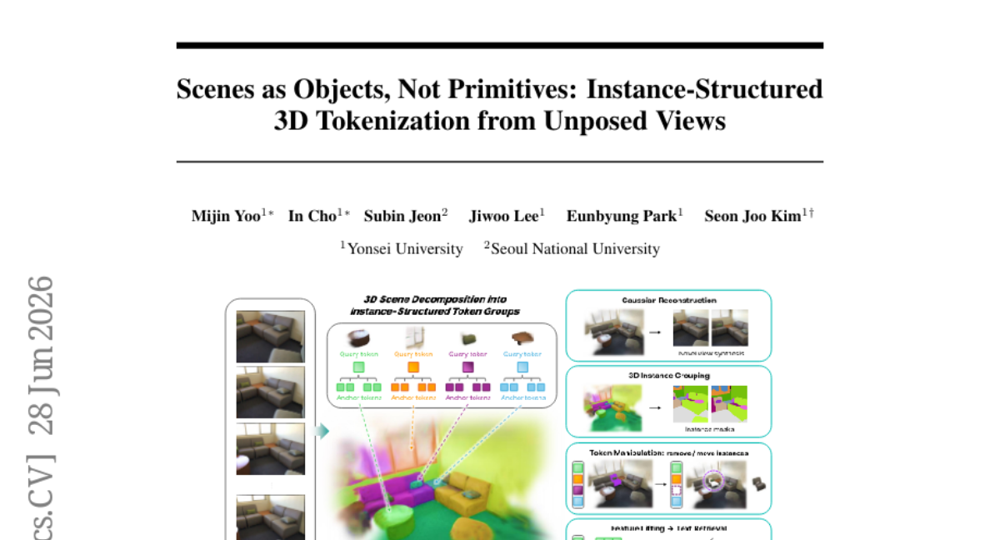

### 📌 한 줄 요약
별도의 3D 어노테이션 없이 미포즈 이미지(unposed views)만으로 객체 단위의 구조화된 3D 토큰을 생성하는 피드포워드 프레임워크

### 🔑 핵심 포인트
- 객체 정체성(Instance Token)과 국부 외형(Anchor Token)을 분리한 이중 구조의 3D 토큰화
- 3D 어노테이션 없이 미포즈 이미지와 미분 가능한 렌더링만으로 학습 가능한 피드포워드 모델
- 객체 단위의 편집(이동, 삭제, 삽입) 및 효율적인 오픈 보캐블러리 인스턴스 검색 지원

### 🧑‍💻 개발자 관점
3D 데이터에 대한 수동 레이블링 없이도 객체 단위의 편집과 검색이 가능한 구조화된 표현법을 제시하여, 로봇 조작이나 디지털 트윈 구축의 효율성을 높입니다.

### 🚀 실무 적용 아이디어
- 제시된 이중 토큰 구조가 복잡한 기하학적 구조를 가진 객체에서도 안정적으로 디코딩되는지 확인
- 객체 편집(Translation/Removal) 시 경계면의 아티팩트 발생 여부 테스트
- 대규모 씬에서 인스턴스 개수 증가에 따른 연산 복잡도 및 검색 속도 벤치마크

### ⚠️ 리스크/한계
- 복잡한 오클루전(가려짐)이 발생하는 환경에서의 객체 분리 정확도 저하 가능성
- 피드포워드 방식 특성상 고해상도 디테일 재구성 시 최적화 방식 대비 품질 차이 발생 가능

### 📝 초록 기반 상세 설명
기존의 3D 재구성 방식은 점 구름이나 가우시안 같은 비구조적 프리미티브를 생성하여 객체 단위의 구조를 파악하기 어렵다는 문제가 있었습니다. 본 논문은 미포즈된 다중 뷰 이미지로부터 객체 중심의 3D 토큰 그룹을 직접 분해하는 피드포워드 프레임워크를 제안합니다. 각 토큰 그룹은 객체의 정체성을 담은 인스턴스 토큰과 국부적 기하/외형을 담은 앵커 토큰으로 이중 구조화되어 3D 가우시안으로 디코딩됩니다. 이러한 방식은 객체 정체성과 외형을 분리하여 객체 단위의 조작을 용이하게 합니다. 미분 가능한 렌더링과 결합된 재구성/세그멘테이션 감독을 통해 3D 어노테이션 없이 학습이 가능합니다. 결과적으로 기존 최적화 방식보다 뛰어난 인스턴스 세그멘테이션 성능을 보이며, 객체 편집 및 효율적인 검색 기능을 제공합니다.

---

## 6. [Does VLA Even Know the Basics? Measuring Commonsense and World Knowledge Retention in Vision-Language-Action Models](https://huggingface.co/papers/2606.19297)
**Upvotes**: 30 | **도입 난이도**: 하 | **신뢰도**: 상
**arXiv**: https://arxiv.org/abs/2606.19297

**태그**: VLA, Embodied AI, Knowledge Retention, Evaluation Benchmark, Agent, Vision, Benchmark, Evaluation

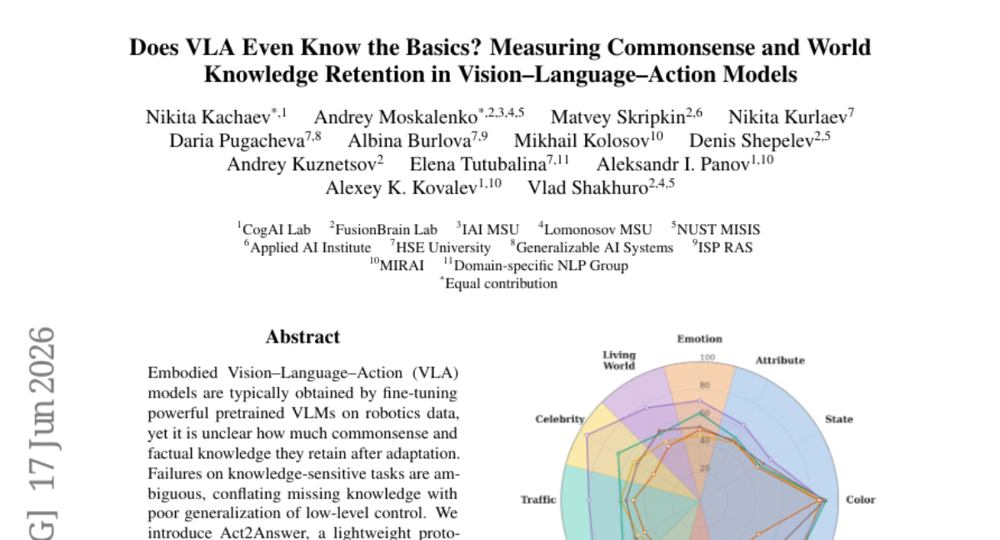

### 📌 한 줄 요약
VLA 모델의 지식 유지 능력을 평가하기 위한 새로운 벤치마크 'Act2Answer' 제안 및 분석

### 🔑 핵심 포인트
- 행동을 통해 정답을 선택하는 방식의 VLA 전용 지식 평가 프로토콜 'Act2Answer' 개발
- VLM에서 VLA로의 전환 시 발생하는 지식 손실(Knowledge Loss) 현상 규명
- 레이어별 의도 프로빙을 통한 모델 내부의 지식 표현 위치 분석

### 🧑‍💻 개발자 관점
VLA 모델 개발 시 단순 제어 성능뿐만 아니라, 모델이 가진 지식 기반 추론 능력이 미세 조정 과정에서 어떻게 변하는지 정량적으로 측정할 수 있는 기준을 제공합니다.

### 🚀 실무 적용 아이디어
- 보유 중인 VLA 모델에 Act2Answer 프로토콜을 적용하여 지식 유지율 테스트
- VQA 데이터셋을 포함한 미세 조정이 지식 유지에 미치는 영향 실험
- 모델 레이어별 활성화 분석을 통한 지식 보존 최적 지점 탐색

### ⚠️ 리스크/한계
- 단일 객체 배치 동작 위주의 실험으로 복잡한 조작 작업에서의 지식 활용도는 제한적일 수 있음
- 실제 물리 환경이 아닌 시뮬레이션/테이블탑 환경 중심의 평가

### 📝 초록 기반 상세 설명
로봇 제어를 위한 VLA 모델은 사전 학습된 VLM을 미세 조정하여 구축되지만, 이 과정에서 기존의 상식과 지식이 얼마나 유지되는지는 불분명합니다. 기존 평가 방식은 지식 부족과 제어 성능 저하를 구분하기 어렵다는 문제가 있습니다. 이를 해결하기 위해 행동을 통해 정답을 선택하는 경량 프로토콜인 'Act2Answer'를 도입했습니다. 연구진은 다양한 상식 및 세계 지식 카테고리를 포함한 테스트 스위트를 구축하고 레이어별 의도 프로빙을 통해 지식 위치를 분석했습니다. 실험 결과, VLA는 단순 개념은 잘 유지하지만 복잡한 의미론적 카테고리에서는 VLM 대비 성능 저하가 관찰되었습니다. 또한 VQA 공동 학습이 지식 유지에 도움이 되며, 정답 관련 신호는 모델의 중간 레이어에서 가장 높게 나타남을 확인했습니다.

---

## 7. [GEAR: Guided End-to-End AutoRegression for Image Synthesis](https://huggingface.co/papers/2606.32039)
**Upvotes**: 28 | **도입 난이도**: 상 | **신뢰도**: 상
**arXiv**: https://arxiv.org/abs/2606.32039

**태그**: Generative Models, Image Synthesis, AutoRegression, Tokenizer, Vision, Safety

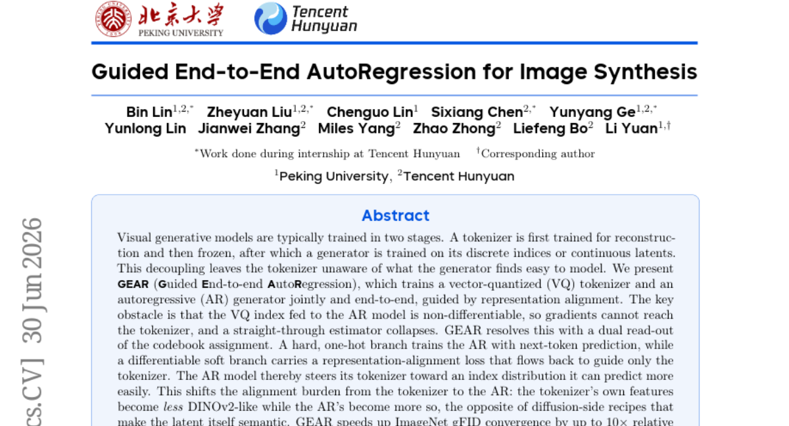

### 📌 한 줄 요약
토크나이저와 생성기를 결합하여 학습 효율과 생성 품질을 극대화한 엔드투엔드 이미지 생성 프레임워크

### 🔑 핵심 포인트
- 토크나이저와 AR 생성기를 결합한 엔드투엔드 학습 프레임워크 제안
- 이중 판독(Dual Read-out) 구조를 통한 비미분성 문제 해결 및 표현 정렬
- 생성 모델의 예측 용이성을 고려한 토크나이저 최적화로 학습 효율 극대화

### 🧑‍💻 개발자 관점
토크나이저와 생성기 간의 불일치 문제를 해결하여, 더 적은 학습 리소스로 고품질의 일관된 이미지를 생성할 수 있는 방법론을 제시합니다.

### 🚀 실무 적용 아이디어
- VQVAE, LFQ 등 다양한 양자화 기법과의 호환성 테스트
- LlamaGen-REPA 등 기존 베이스라인 모델과의 수렴 속도 및 품질 비교 실험
- Text-to-Image 태스크로의 확장성 검증

### ⚠️ 리스크/한계
- 이중 브랜치 구조로 인한 학습 복잡도 및 연산 비용 증가
- 토크나이저와 생성기 간의 정렬을 위한 정교한 하이퍼파라미터 튜닝 필요

### 📝 초록 기반 상세 설명
기존의 이미지 생성 모델은 토크나이저와 생성기를 분리하여 학습하는 2단계 방식을 사용하여, 토크나이저가 생성기의 학습 용이성을 고려하지 못하는 문제가 있었습니다. 이를 해결하기 위해 GEAR는 토크나이저와 자기회귀(AR) 생성기를 결합하여 엔드투엔드로 학습하는 방식을 제안합니다. 핵심은 비미분적인 VQ 인덱스 문제를 해결하기 위해 하드(hard) 브랜치와 소프트(soft) 브랜치를 활용한 이중 판독(dual read-out) 구조를 도입한 것입니다. 하드 브랜치는 차세대 토큰 예측을 담당하고, 소프트 브랜치는 표현 정렬 손실을 통해 토크나이저를 가이드합니다. 이를 통해 생성기가 예측하기 쉬운 방향으로 토크나이저의 표현이 최적화됩니다. 결과적으로 기존 모델 대비 훨씬 빠른 수렴 속도와 뛰어난 공간적 일관성을 확보했습니다.

### 🖼️ 추가 자료
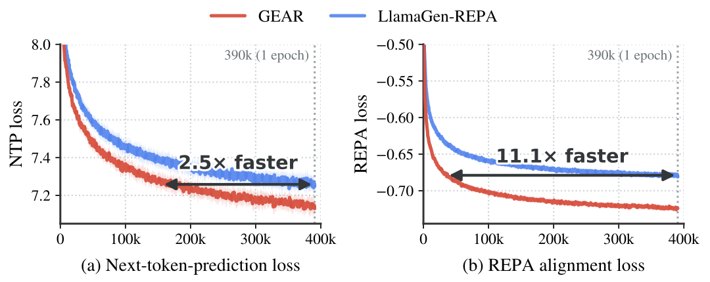
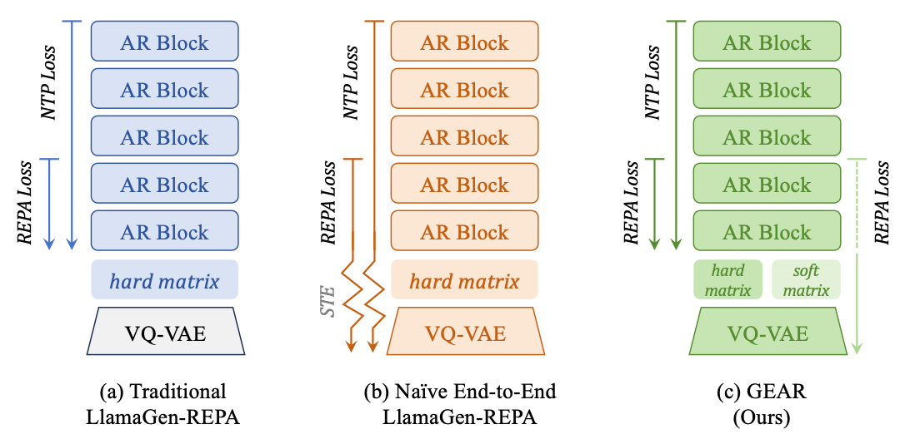
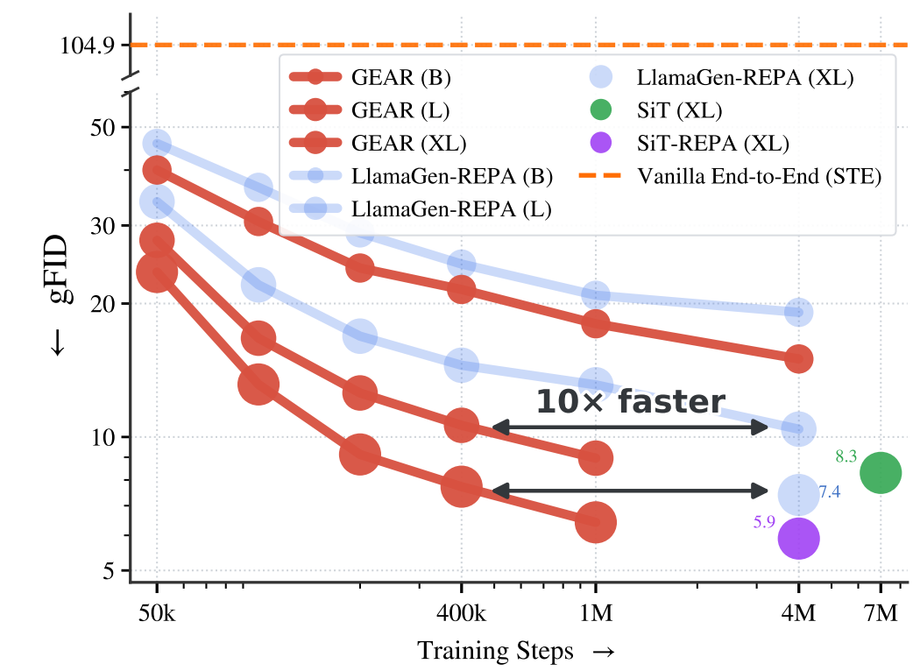
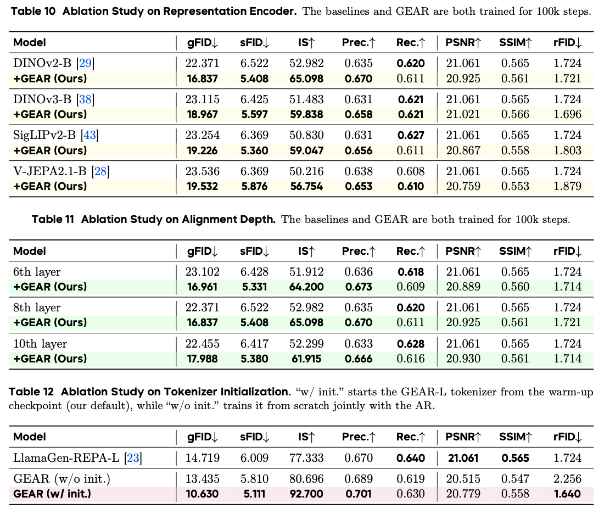
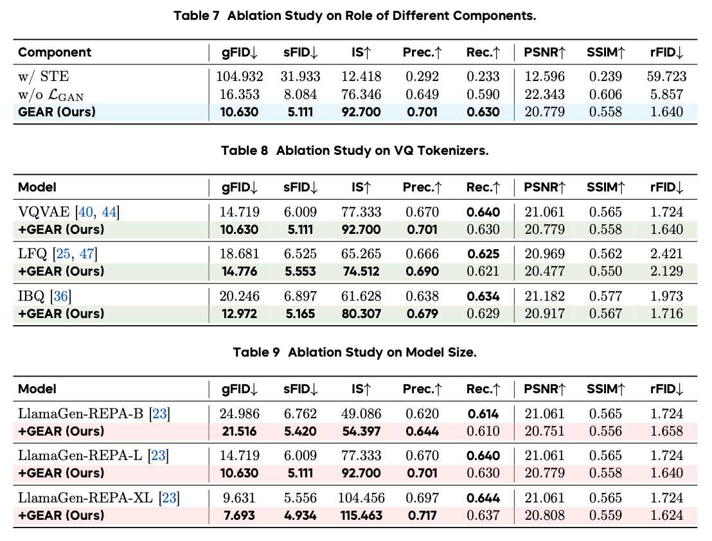

---

## 8. [Evolution Fine-Tuning: Learning to Discover Across 371 Optimization Tasks](https://huggingface.co/papers/2606.29082)
**Upvotes**: 22 | **도입 난이도**: 중 | **신뢰도**: 상
**arXiv**: https://arxiv.org/abs/2606.29082

**태그**: LLM, Optimization, Fine-Tuning, Evolutionary Search, Agent, RAG, Vision

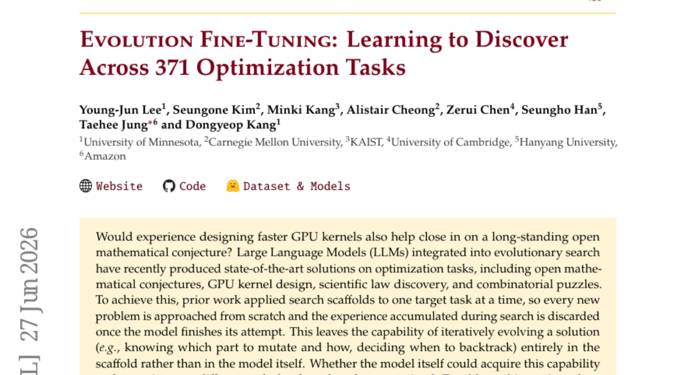

### 📌 한 줄 요약
진화적 탐색 과정을 학습하여 다양한 최적화 문제에 범용적으로 적용 가능한 LLM 미드트레이닝 기법 제안

### 🔑 핵심 포인트
- 진화적 탐색 궤적을 지도 학습 데이터로 변환하는 EFT(Evolution Fine-Tuning) 방법론 제안
- 10개 도메인 및 371개 태스크를 포함하는 대규모 데이터셋 'Finch Collection' 구축
- 학습된 모델이 새로운 최적화 문제에 대해 높은 범용적 전이 성능(Cross-task generalization)을 보임

### 🧑‍💻 개발자 관점
단순히 정답을 맞히는 것을 넘어, 문제를 해결해 나가는 '탐색 과정(Search Strategy)' 자체를 모델에 내재화할 수 있음을 보여줍니다.

### 🚀 실무 적용 아이디어
- 특정 도메인(예: 코드 최적화)의 탐색 로그를 수집하여 미세 조정 실험 진행
- 학습된 모델과 Test-time RL(강화학습)을 결합한 하이브리드 전략 테스트
- 모델 크기(2B~9B)에 따른 탐색 전략 습득 효율성 비교 분석

### ⚠️ 리스크/한계
- 특정 도메인에 편향된 데이터로 학습 시 다른 도메인에서의 성능 저하 가능성
- 복잡한 탐색 궤적을 데이터로 변환하는 과정의 높은 비용과 난이도

### 📝 초록 기반 상세 설명
최근 LLM을 활용한 진화적 탐색이 GPU 커널 설계 등 다양한 최적화 작업에서 성과를 내고 있으나, 기존 방식은 매번 새로운 문제에 대해 처음부터 탐색을 시작하며 이전 경험을 활용하지 못하는 한계가 있었습니다. 이를 해결하기 위해 연구진은 진화적 탐색 궤적을 학습 데이터로 변환하여 모델이 스스로 진화 전략을 습득하게 하는 'Evolution Fine-Tuning(EFT)' 기법을 도입했습니다. 이를 위해 10개 도메인, 371개 최적화 태스크를 포함하는 156K 규모의 Finch Collection 데이터셋을 구축했습니다. 실험 결과, EFT는 미학습 태스크에 대해 베이스 모델 대비 평균 10.22% 높은 성능 향상을 보이며 뛰어난 범용적 전이 능력을 입증했습니다. 결과적으로 EFT는 새로운 문제를 매번 처음부터 푸는 대신, 축적된 지식을 활용하는 범용적 발견 에이전트를 위한 학습 단계 역할을 합니다.

---

## 9. [Multi-Block Diffusion Language Models](https://huggingface.co/papers/2606.29215)
**Upvotes**: 21 | **도입 난이도**: 중 | **신뢰도**: 상
**arXiv**: https://arxiv.org/abs/2606.29215

**태그**: Diffusion Models, LLM Inference, Parallel Decoding, Efficiency Optimization, RAG, Benchmark, Inference

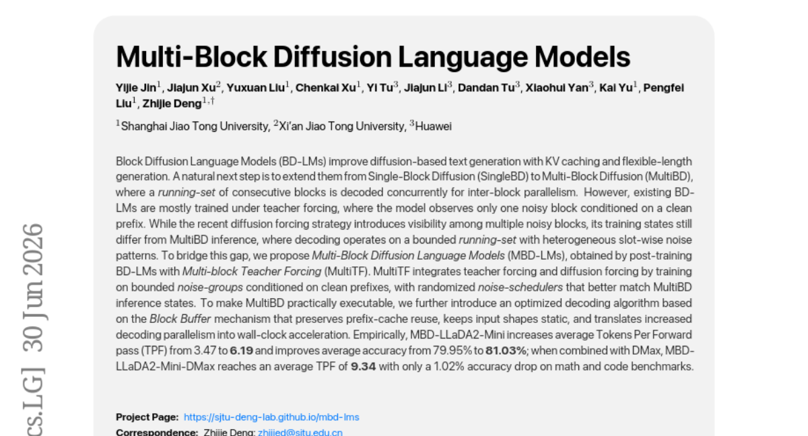

### 📌 한 줄 요약
멀티 블록 병렬 디코딩을 통해 생성 속도와 정확도를 동시에 높인 차세대 디퓨전 언어 모델 학습 및 추론 프레임워크

### 🔑 핵심 포인트
- Multi-block Teacher Forcing (MultiTF): 학습과 추론 간의 노이즈 패턴 차이를 줄여 병렬 디코딩 성능 최적화
- Block Buffer Mechanism: KV 캐시 재사용 및 정적 셰이프 유지를 통한 실질적인 추론 가속화 알고리즘
- High Throughput & Accuracy: 높은 토큰 생성 효율(TPF)과 벤치마크 성능(Math/Code)의 균형 달성

### 🧑‍💻 개발자 관점
디퓨전 기반 모델의 고질적 문제인 느린 생성 속도를 병렬 디코딩 기술로 해결하여, 실시간 텍스트 생성 서비스에 적용 가능한 높은 처리량을 제공합니다.

### 🚀 실무 적용 아이디어
- 기존 Single-Block 모델과 MBD-LM의 추론 속도(Wall-clock time) 비교 실험
- DMax와 같은 최적화 기법 결합 시 정확도 하락 폭 검증
- 다양한 시퀀스 길이에 따른 Block Buffer의 메모리 효율성 테스트

### ⚠️ 리스크/한계
- 병렬성 증가에 따른 메모리 대역폭 및 연산량 급증 가능성
- 학습 시 적용된 노이즈 스케줄러가 실제 복잡한 문맥에서 일반화될 수 있는지에 대한 검증 필요

### 📝 초록 기반 상세 설명
기존의 블록 디퓨전 모델(BD-LM)은 단일 블록 단위로 학습되어 멀티 블록 병렬 디코딩 시 학습과 추론 간의 괴리 문제가 발생했습니다. 이를 해결하기 위해 제안된 MBD-LM은 멀티 블록 교사 강요(MultiTF) 기법을 도입하여 학습 시에도 가변적인 노이즈 패턴을 반영하도록 설계되었습니다. 또한, KV 캐시 재사용과 정적 입력 형태를 유지하는 블록 버퍼(Block Buffer) 메커니즘을 통해 실질적인 추론 가속화를 구현했습니다. 실험 결과, MBD-LM은 기존 모델 대비 토큰 생성 효율(TPF)을 대폭 향상시키면서도 높은 정확도를 유지하는 성과를 보였습니다.

---

## 10. [SkillHone: A Harness for Continual Agent Skill Evolution Through Persistent Decision History](https://huggingface.co/papers/2606.08671)
**Upvotes**: 21 | **도입 난이도**: 중 | **신뢰도**: 상
**arXiv**: https://arxiv.org/abs/2606.08671

**태그**: AI Agent, Continual Learning, Prompt Engineering, Multi-Agent, Agent, RAG, Vision, Benchmark, Evaluation

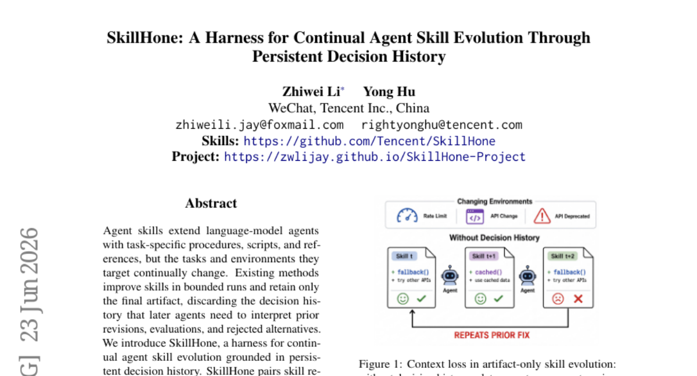

### 📌 한 줄 요약
결정 이력(Decision History)을 지속적으로 축적하여 에이전트의 스킬을 반복적으로 정교화하는 프레임워크

### 🔑 핵심 포인트
- 지속적인 스킬 진화를 위한 구조화된 결정 이력(Decision History) 관리 체계 도입
- 역할 분리형 서브 에이전트를 통한 피드백 루프 및 교차 세션 최적화
- 실제 딥 리서치 및 도구 활용 시나리오에서의 높은 성능 향상 입증

### 🧑‍💻 개발자 관점
에이전트가 단순히 결과만 내놓는 것이 아니라, 왜 그런 결정을 내렸는지에 대한 '맥락'을 데이터화하여 지속적인 성능 개선 루프를 구축하는 방법을 제시합니다.

### 🚀 실무 적용 아이디어
- 에이전트 작업 시 로그를 단순 텍스트가 아닌 구조화된 데이터(JSON 등)로 저장하는 파이프라인 구축
- 과거의 실패 사례와 성공 사례를 프롬프트 컨텍스트로 활용하는 에이전트 워크플로우 테스트
- 역할이 분리된(Planner, Executor, Critic) 멀티 에이전트 환경에서의 스킬 업데이트 실험

### ⚠️ 리스크/한계
- 결정 이력이 누적됨에 따라 컨텍스트 윈도우 관리 및 토큰 비용 증가 문제 발생 가능
- 잘못된 판단 근거가 기록될 경우, 잘못된 방향으로 스킬이 고착화될 위험(Error Propagation)

### 📝 초록 기반 상세 설명
에이전트 스킬은 특정 작업에 최적화된 절차를 제공하지만, 변화하는 환경에 대응하기에는 기존의 단발성 학습 방식에 한계가 있습니다. 기존 방식은 최종 결과물만 남기고 과정 중의 결정 이력을 버리기 때문에, 이전의 시행착오나 판단 근거를 재활용하기 어렵습니다. 이를 해결하기 위해 SkillHone은 진단, 수정, 증거, 결과가 포함된 구조화된 결정 이력을 기록하는 프레임워크를 제안합니다. 역할이 분리된 서브 에이전트들이 과거의 판단 근거를 바탕으로 스킬을 제안하고 검증하는 과정을 반복하며 스킬을 진화시킵니다. 실험 결과, GAIA 및 WebWalkerQA와 같은 딥 리서치 벤치마크와 내부 도구 활용 시나리오에서 기존 모델 및 방법론을 상회하는 성능 향상을 보였습니다.

---

## 11. [MemLearner: Learning to Query Context memory for Video World Models](https://huggingface.co/papers/2606.31734)
**Upvotes**: 18 | **도입 난이도**: 중 | **신뢰도**: 상
**arXiv**: https://arxiv.org/abs/2606.31734

**태그**: Video Generation, World Models, Memory Management, Computer Vision, RAG, Video, Evaluation, Inference

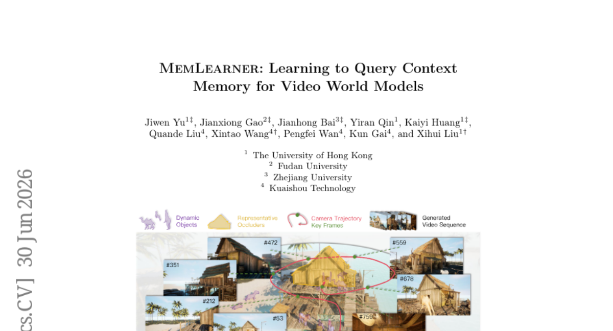

### 📌 한 줄 요약
비디오 월드 모델의 일관성 문제를 해결하기 위해 학습 기반의 적응형 컨텍스트 쿼리 방식을 도입한 MemLearner 제안

### 🔑 핵심 포인트
- 쿼리 토큰을 활용한 학습 기반의 적응형 컨텍스트 쿼리 메커니즘 도입
- 사전 학습된 비디오 생성 모델의 시각적 사전 지식을 활용하여 추가 모듈 학습 최소화
- 장면 폐쇄 및 동적 객체 대응을 위한 특화된 데이터셋 및 멀티 데이터셋 학습 전략

### 🧑‍💻 개발자 관점
장기적인 일관성이 필요한 비디오 생성 및 시뮬레이션 환경에서 메모리 관리 문제를 해결하는 실질적인 방법론을 제시합니다.

### 🚀 실무 적용 아이디어
- 기존 비디오 생성 모델에 쿼리 토큰 기반의 메모리 모듈 결합 실험
- 폐쇄(Occlusion)가 빈번한 동적 환경 데이터셋 구축 및 성능 테스트
- 사전 학습된 가중치를 유지하며 적응형 쿼리만 학습시키는 파인튜닝 워크플로우 검증

### ⚠️ 리스크/한계
- 학습 시 사용된 데이터셋의 특성에 따른 일반화 성능 의존성
- 쿼리 토큰 및 컨텍스트 검색 과정에서의 추가적인 연산 비용 발생 가능성

### 📝 초록 기반 상세 설명
비디오 월드 모델은 사용자 액션과 과거 프레임을 기반으로 미래 상태를 예측하는 상호작용형 생성 모델입니다. 기존의 규칙 기반 컨텍스트 프레임 추출 방식은 장면 폐쇄(occlusion)나 동적 객체가 존재하는 복잡한 환경에서 일관성을 유지하지 못하는 한계가 있었습니다. 본 논문에서는 쿼리 토큰을 사용하여 컨텍스트와 예측 토큰을 연결하는 학습 기반 적응형 쿼리 방식인 MemLearner를 제안합니다. 별도의 모듈을 처음부터 학습시키는 대신 기존 비디오 생성 모델의 사전 학습된 시각적 사전 지식을 활용하며, 효율적인 학습 및 추론 전략을 포함합니다. 이를 위해 폐쇄 및 동적 객체가 포함된 장기 비디오 데이터셋을 구축하고 멀티 데이터셋 학습 전략을 적용했습니다. 실험 결과, MemLearne는 특히 까다로운 환경에서 기존 모델보다 뛰어난 장면 일관성과 메모리 유지 능력을 보여주었습니다.

---

## 12. [Managing Procedural Memory in LLM Agents: Control, Adaptation, and Evaluation](https://huggingface.co/papers/2606.23127)
**Upvotes**: 17 | **도입 난이도**: 중 | **신뢰도**: 상
**arXiv**: https://arxiv.org/abs/2606.23127

**태그**: LLM Agent, Procedural Memory, Benchmark, Transfer Learning, Agent, Evaluation

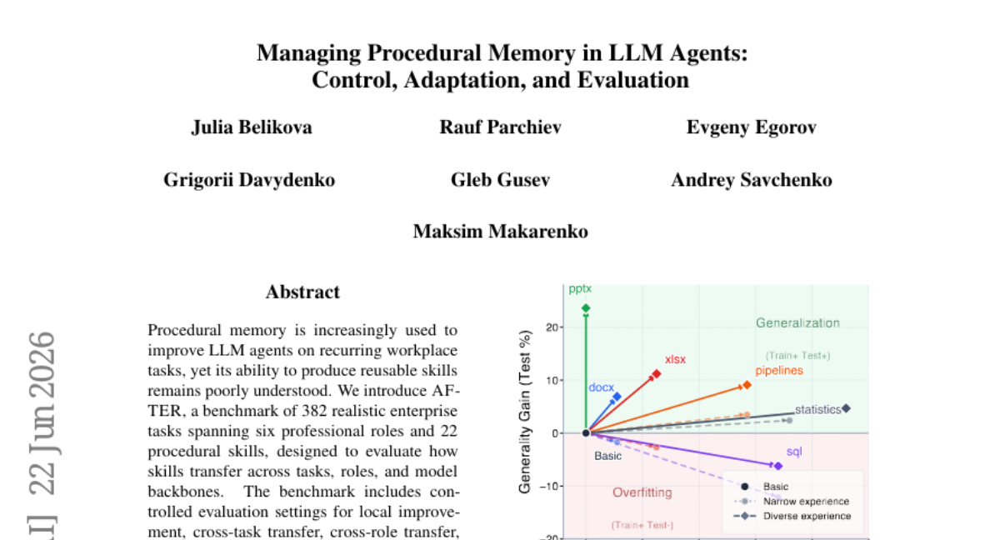

### 📌 한 줄 요약
기업용 업무 자동화를 위한 LLM 에이전트의 절차적 메모리(Procedural Memory) 활용 능력과 전이 학습 성능을 평가하는 벤치마크 제안

### 🔑 핵심 포인트
- 실무 중심의 대규모 벤치마크 'AFTER' 개발 (382개 태스크, 6개 직무)
- 절차적 메모리의 전이 학습(Cross-task, Cross-role, Cross-model) 능력 검증
- 다양한 모델의 실행 기록(Multi-model traces)을 통한 기술 진화가 일반화에 효과적임을 입증

### 🧑‍💻 개발자 관점
에이전트가 학습한 기술이 새로운 업무나 다른 모델로 전환될 때 얼마나 유지되는지 정량적으로 평가할 수 있는 기준을 제공합니다.

### 🚀 실무 적용 아이디어
- 에이전트 워크플로우 설계 시 특정 모델에 종속되지 않는 범용적 기술 추출 전략 수립
- 학습 데이터(Execution Traces) 구성 시 단일 모델이 아닌 다양한 모델의 기록을 혼합하여 일반화 성능 확보
- 개발 중인 에이전트의 기술이 특정 태스크에 과적합(Overfitting)되는지 전이 테스트 수행

### ⚠️ 리스크/한계
- 특정 직무에 특화된 기술은 다른 환경으로 전이 시 성능이 급격히 저하될 위험이 있음
- 실제 복잡한 엔터프라이즈 환경의 모든 변수를 벤치마크가 완벽히 대변하기 어려움

### 📝 초록 기반 상세 설명
LLM 에이전트가 반복적인 업무를 수행하기 위해 절차적 메모리를 활용하는 사례가 늘고 있으나, 습득된 기술의 재사용성에 대한 이해는 부족한 실정입니다. 이를 위해 6개 직무와 22개 기술을 포함한 382개의 실무 태스크 벤치마크인 AFTER를 도입했습니다. 본 연구는 로컬 개선, 태스크 간 전이, 직무 간 전이, 모델 간 일반화 등 다양한 제어 환경에서 성능을 평가했습니다. 실험 결과, 절차적 메모리는 산업 워크플로우에서 일관된 성능 향상을 보였으며, 특히 다양한 모델의 실행 기록을 활용했을 때 모델 간 일반화 성능이 가장 높았습니다. 또한 특정 기술은 광범위하게 일반화되는 반면, 일부는 특정 직무에 특화되어 전이 시 성능이 저하됨을 확인했습니다. 이러한 결과는 실제 프로덕션 환경에서 에이전트 시스템을 구축하고 평가하는 데 실질적인 가이드를 제공합니다.

---

## 13. [DataEvolver: Self-Evolving Multi-Agent Data Construction for Text-Rich Image Generation](https://huggingface.co/papers/2606.31537)
**Upvotes**: 16 | **도입 난이도**: 중 | **신뢰도**: 상
**arXiv**: https://arxiv.org/abs/2606.31537

**태그**: Multi-Agent, Data-Centric AI, Text-to-Image, Self-Evolving, Agent, Vision, Benchmark, Evaluation

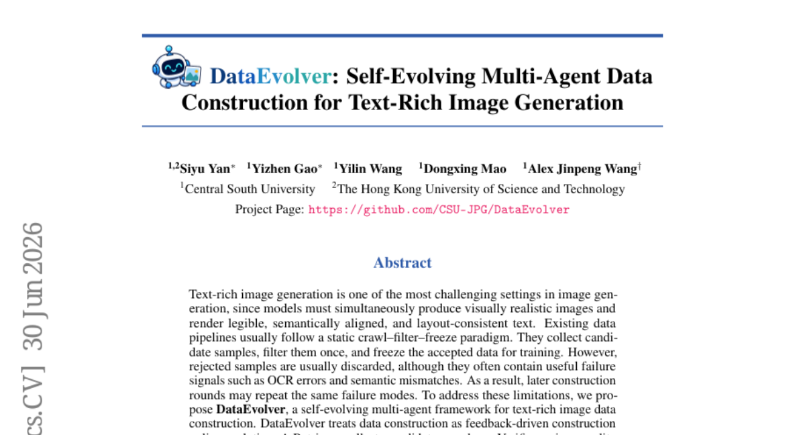

### 📌 한 줄 요약
거절된 데이터의 실패 신호를 피드백으로 활용하여 텍스트 포함 이미지 생성용 학습 데이터를 스스로 진화시키는 멀티 에이전트 프레임워크

### 🔑 핵심 포인트
- 정적 데이터 필터링을 넘어 실패 신호를 활용하는 피드백 루프 기반의 데이터 진화 메커니즘 도입
- Retriever, Verifier, Critic, Generator로 구성된 멀티 에이전트 협업 구조
- 데이터 부족 영역을 타겟팅하여 합성하는 Generator를 통한 효율적인 데이터 보완

### 🧑‍💻 개발자 관점
데이터 정제 과정에서 버려지는 '실패 사례'를 학습 가이드로 전환하여 데이터 구축 효율을 극대화하는 전략을 제시합니다.

### 🚀 실무 적용 아이디어
- 기존 데이터 파이프라인에서 필터링된 데이터의 실패 원인을 분석하는 Verifier 모듈 구현 실험
- 에이전트 간 피드백 메모리가 데이터 품질 향상에 미치는 영향 측정
- 특정 도메인(예: 로고, 간판)에 특화된 데이터 구축을 위한 에이전트 프롬프트 최적화

### ⚠️ 리스크/한계
- 에이전트 간 피드백 루프가 특정 편향(Bias)을 강화할 위험성
- 멀티 에이전트 운영에 따른 추가적인 컴퓨팅 비용 발생

### 📝 초록 기반 상세 설명
텍스트가 포함된 이미지를 생성할 때는 시각적 사실성과 텍스트의 가독성/정렬을 동시에 만족해야 하는 어려움이 있습니다. 기존의 데이터 구축 방식은 수집 후 필터링을 거쳐 데이터를 고정하는 정적 방식이라, 버려지는 샘플 내의 실패 신호(OCR 오류 등)를 활용하지 못하는 문제가 있었습니다. 이를 해결하기 위해 DataEvolver는 데이터 구축을 피드백 기반의 정책 진화 과정으로 정의하는 멀티 에이전트 프레임워크를 제안합니다. Retriever, Verifier, Critic, Generator로 구성된 에이전트들이 피드백 메모리를 공유하며 데이터의 부족한 부분을 타겟팅하여 보완합니다. 실험 결과, 동일한 데이터 예산 하에서 기존 고정 데이터셋보다 우수한 성능을 보였으며, 다양한 생성 모델로의 전이 학습 효과도 입증되었습니다.

---

## 14. [Reinforcement Learning with Metacognitive Feedback Elicits Faithful Uncertainty Expression in LLMs](https://huggingface.co/papers/2606.32032)
**Upvotes**: 15 | **도입 난이도**: 상 | **신뢰도**: 상
**arXiv**: https://arxiv.org/abs/2606.32032

**태그**: Reinforcement Learning, LLM Reliability, Metacognition, Hallucination, Safety

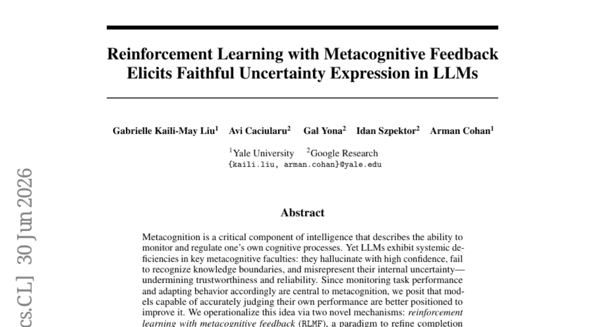

### 📌 한 줄 요약
모델의 자기 성찰(Metacognition) 능력을 강화하여, 모델이 자신의 지식 한계를 정확히 인지하고 신뢰할 수 있는 불확실성을 표현하도록 만드는 RL 프레임워크 제안

### 🔑 핵심 포인트
- RLMF(Reinforcement Learning with Metacognitive Feedback): 모델의 자기 판단 품질을 기반으로 선호도 최적화 시 순위를 정교화하는 RL 패러다임
- Metacognitive Data Selection: 모델의 자기 평가를 활용해 학습에 유용한 고가치 데이터를 식별하는 능동적 학습 방식
- Faithful Calibration: 모델의 내부 불확실성과 언어적 표현을 일치시켜 신뢰할 수 있는 답변을 생성하도록 유도

### 🧑‍💻 개발자 관점
모델이 모르는 것을 모른다고 말하게 함으로써, 환각(Hallucination)으로 인한 오작동을 방지하고 시스템의 신뢰도를 높일 수 있습니다.

### 🚀 실무 적용 아이디어
- 모델의 Confidence Score와 실제 정답률 간의 상관관계를 측정하는 Calibration 테스트 수행
- RLHF 과정에서 모델의 자기 평가 점수를 보상 함수(Reward Function)에 통합하는 실험
- 데이터 선별 시 모델의 self-judgment를 활용한 데이터 필터링 파이프라인 구축

### ⚠️ 리스크/한계
- 자기 평가 능력이 부족한 초기 모델의 경우, 잘못된 피드백이 모델의 성능을 오히려 저하시킬 위험이 있음
- 메타인지적 피드백을 위한 정교한 보상 모델 설계가 필요하며, 이는 높은 연산 비용을 초래할 수 있음

### 📝 초록 기반 상세 설명
LLM은 높은 확신을 가지고 환각을 일으키거나 자신의 지식 경계를 인식하지 못하는 메타인지적 결함을 보입니다. 본 논문은 모델이 자신의 성능을 스스로 판단할 수 있다면 이를 통해 성능을 개선할 수 있다는 가설을 제시합니다. 이를 위해 자기 성찰적 피드백을 활용한 강화학습(RLMF)과 고가치 학습 데이터를 선별하는 메타인지적 데이터 선택 기법을 제안합니다. 이 방법론을 신뢰할 수 있는 불확실성 표현(Faithful Calibration) 작업에 적용하여, 모델의 내부 불확실성과 외부 표현을 일치시켰습니다. 실험 결과, RLMF는 정확도를 유지하면서도 기존 RL 대비 성능을 대폭 향상시키며 모델의 자기 평가 능력을 강화했습니다.

---

## 15. [RedVox: Safety and Fairness Gaps in Speech Models Across Languages](https://huggingface.co/papers/2606.26968)
**Upvotes**: 12 | **도입 난이도**: 중 | **신뢰도**: 상
**arXiv**: https://arxiv.org/abs/2606.26968

**태그**: Speech AI, Safety, Fairness, Multilingual, Benchmark, Audio, Evaluation

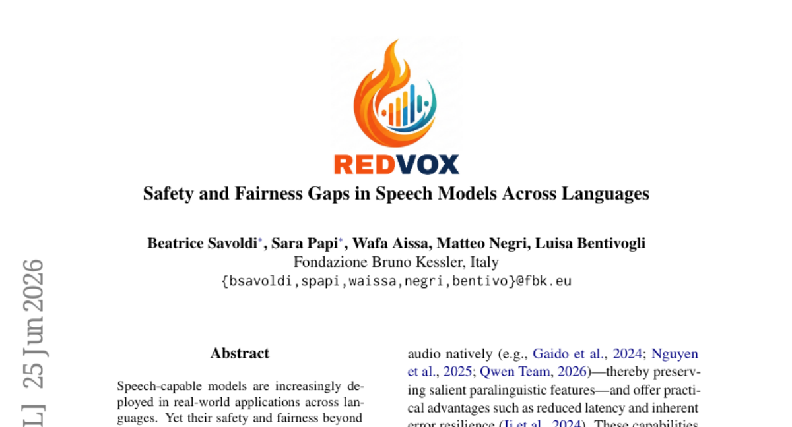

### 📌 한 줄 요약
다국어 환경에서 음성 모델의 안전성 및 공정성 취약성을 탐지하기 위한 벤치마크 RedVox 제안

### 🔑 핵심 포인트
- 다국어 음성 모델의 안전성 및 공정성 평가를 위한 RedVox 벤치마크 개발
- 비영어권 언어 및 음성 입력 환경에서 취약성이 증폭되는 현상 규명
- 실제 인간 참여자 기반 데이터 수집 시 발생하는 사회기술적/윤리적 이슈 분석

### 🧑‍💻 개발자 관점
글로벌 서비스를 타겟으로 하는 음성 AI 개발 시, 영어 외 언어에서의 편향성 및 안전성 검증이 필수적임을 시사합니다.

### 🚀 실무 적용 아이디어
- 자사 음성 모델을 RedVox와 유사한 다국어 시나리오로 테스트
- 텍스트 입력 대비 음성 입력 시의 모델 반응 차이(Vulnerability) 분석
- 다국어 데이터셋 구축 시의 개인정보 보호 및 윤리 가이드라인 수립

### ⚠️ 리스크/한계
- 실제 음성 데이터 수집에 따른 개인정보 보호 및 윤리적 리스크 존재
- 제한된 5개 언어에 국한된 벤치마크 범위

### 📝 초록 기반 상세 설명
최근 음성 모델의 실세계 배포가 늘고 있으나, 영어 이외의 언어나 자연스러운 환경에서의 안전성 연구는 부족한 실정입니다. 연구진은 기존 모델들의 안전성 보고를 조사한 결과, 다국어 분석을 포함하는 경우가 8%에 불과함을 확인했습니다. 이를 해결하기 위해 실제 음성 데이터를 기반으로 5개 언어(영어, 프랑스어, 이탈리아어, 스페인어, 독일어)를 지원하는 RedVox 벤치마크를 도입했습니다. 8개의 최신 모델을 평가한 결과, 비영어권 언어에서 취약성이 심화되며 음성 입력 시 위험이 증폭됨을 발견했습니다. 또한, 실제 참여자를 통한 데이터 수집 과정에서의 개인정보 및 윤리적 과제를 함께 제시합니다.

### 🖼️ 추가 자료

---

## 16. [Little Brains, Big Feats: Exploring Compact Language Models](https://huggingface.co/papers/2606.30062)
**Upvotes**: 10 | **도입 난이도**: 하 | **신뢰도**: 상
**arXiv**: https://arxiv.org/abs/2606.30062

**태그**: RAG, SLM, On-Device, Edge Computing, Benchmark, Evaluation

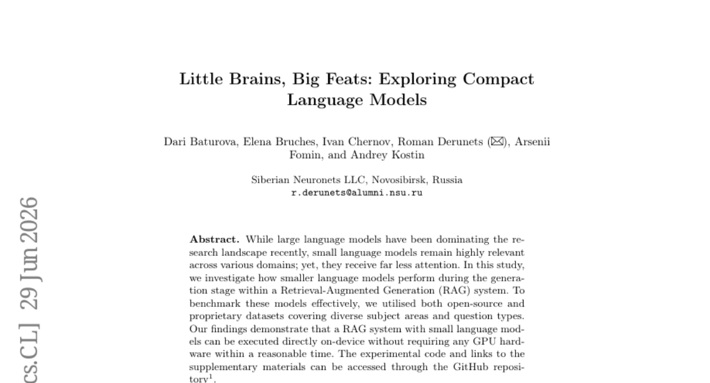

### 📌 한 줄 요약
온디바이스 환경에서 GPU 없이 구동 가능한 소형 언어 모델(SLM) 기반 RAG 시스템의 성능 검증

### 🔑 핵심 포인트
- RAG 시스템 내 소형 언어 모델(SLM)의 생성 성능 벤치마킹
- 다양한 도메인 및 질문 유형을 포함한 데이터셋 활용
- GPU 없이 온디바이스에서 구동 가능한 RAG 워크플로우 확인

### 🧑‍💻 개발자 관점
고가의 GPU 인프라 없이도 모바일이나 엣지 디바이스에서 실시간 RAG 서비스를 구현할 수 있는 가능성을 제시합니다.

### 🚀 실무 적용 아이디어
- 제공된 GitHub 저장소를 활용하여 SLM 기반 RAG 성능 테스트
- 특정 도메인 데이터셋에 대한 SLM의 답변 정확도 측정
- 저사양 하드웨어 환경에서의 추론 속도 및 리소스 점유율 프로파일링

### ⚠️ 리스크/한계
- LLM 대비 낮은 추론 복잡도 및 지식 보유량
- 복잡한 추론이 필요한 질문에 대한 성능 저하 가능성

### 📝 초록 기반 상세 설명
최근 거대 언어 모델(LLM)이 주류를 이루고 있으나, 다양한 도메인에서 소형 언어 모델(SLM)의 활용 가치는 여전히 높습니다. 본 연구는 RAG 시스템의 생성 단계에서 소형 모델들이 어떻게 작동하는지 조사하였습니다. 이를 위해 오픈소스 및 독점 데이터셋을 활용하여 다양한 주제와 질문 유형에 대한 벤치마크를 수행했습니다. 실험 결과, 소형 모델 기반의 RAG 시스템은 별도의 GPU 하드웨어 없이도 온디바이스에서 합리적인 시간 내에 실행 가능함을 입증했습니다.

---

## 17. [PhotoQuilt: Training-Free Arbitrary-Resolution Photomosaics via Bootstrapped Tiled Denoising](https://huggingface.co/papers/2606.30968)
**Upvotes**: 9 | **도입 난이도**: 하 | **신뢰도**: 상
**arXiv**: https://arxiv.org/abs/2606.30968

**태그**: Diffusion Models, Image Generation, High-Resolution, Tiling, Vision

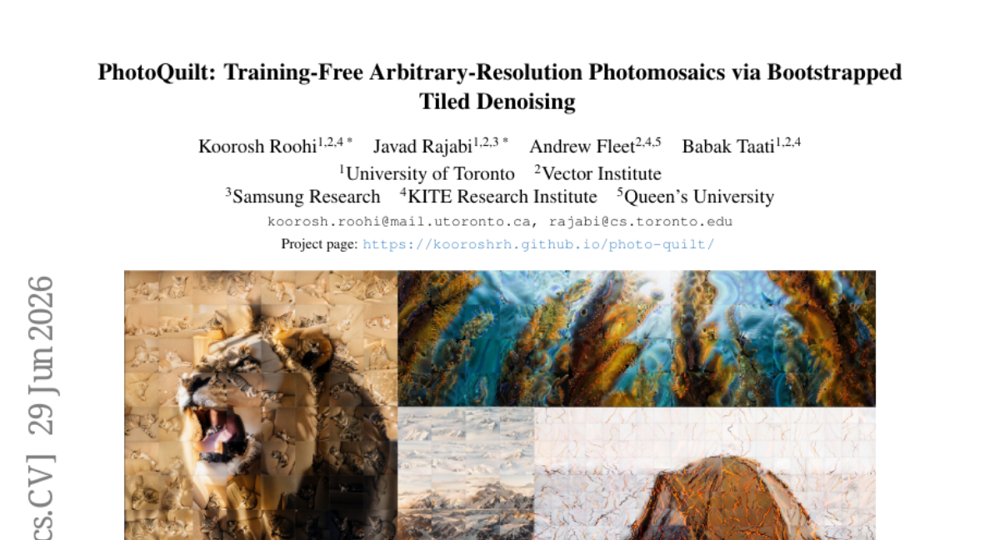

### 📌 한 줄 요약
학습 없이 고해상도 모자이크 이미지를 생성하기 위해 저해상도 레이아웃과 타일 기반 디노이징을 결합한 프레임워크

### 🔑 핵심 포인트
- 학습이 필요 없는(Training-free) 임의 해상도 모자이크 생성 프레임워크
- 저해상도 전역 구조 설정 후 잠재 공간 업스케일링 및 노이즈 재주입 방식
- 타일 단위 디노이징을 통한 연산 효율성 확보 및 전역/국소 일관성 유지

### 🧑‍💻 개발자 관점
대규모 고해상도 이미지 생성 시 발생하는 메모리/연산 문제를 타일링 기법으로 효율적으로 해결하는 실무적 접근법을 제시합니다.

### 🚀 실무 적용 아이디어
- 제시된 부트스트랩 디노이징 파이프라인의 타일 크기 변화에 따른 품질 변화 테스트
- 기존 Stable Diffusion 등 오픈소스 모델에 해당 알고리즘 적용 실험
- 매우 큰 해상도(초고해상도)에서의 메모리 점유율 및 생성 시간 측정

### ⚠️ 리스크/한계
- 타일 경계면에서의 시각적 불연속성 발생 가능성
- 저해상도 레이아웃이 최종 결과물의 구도를 완전히 결정하므로 초기 생성 품질에 의존적임

### 📝 초록 기반 상세 설명
고해상도 포토모자이크 생성은 개별 타일의 디테일과 전체적인 구조적 일관성을 동시에 유지해야 하는 계산 비용 문제가 있습니다. 기존 확산 모델은 고해상도 생성 시 연산 비용이 크고, 단순 타일링 방식은 전역 구조를 잃는 한계가 있습니다. 이를 해결하기 위해 PhotoQuilt는 학습이 필요 없는 부트스트랩 방식의 타일 디노이징 절차를 제안합니다. 먼저 저해상도에서 전역 구도를 잡은 뒤, 잠재 공간에서 업스케일링 및 노이즈 재주입을 통해 생성 능력을 복원합니다. 이후 고정된 타일 내에서 디노이징을 수행하여 각 타일의 디테일과 전체 레이아웃을 동시에 확보합니다. 실험 결과, PhotoQuilt는 기존 방식보다 전역 구조와 국소적 사실감 모두에서 우수한 성능을 보였습니다.

---

## 18. [Are We Measuring Strategy or Phrasing? The Gap Between Surface- and Approach-Level Diversity in LLM Math Reasoning](https://huggingface.co/papers/2606.29985)
**Upvotes**: 9 | **도입 난이도**: 중 | **신뢰도**: 상
**arXiv**: https://arxiv.org/abs/2606.29985

**태그**: LLM Reasoning, Reinforcement Learning, Diversity Metrics, Test-time Scaling, Reasoning

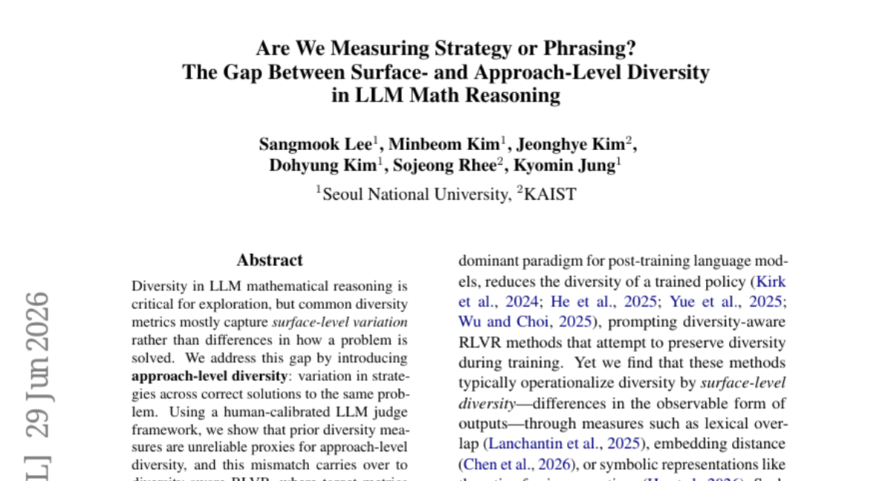

### 📌 한 줄 요약
LLM의 수학적 추론에서 단순 문구 변화가 아닌 실질적인 '해결 전략'의 다양성을 측정하고 확보하는 방법론 제시

### 🔑 핵심 포인트
- 표면적 다양성(Surface-level)과 전략적 다양성(Approach-level)의 개념적 분리 및 차이 규명
- 전략적 다양성이 높은 후보군이 테스트 타임 스케일링(Test-time scaling) 성능 향상에 기여함을 입증
- LLM judge를 이용한 직접적인 다양성 최적화가 모델의 전략적 확장 대신 지표 악용(Reward hacking)을 유도하는 문제 발견

### 🧑‍💻 개발자 관점
LLM의 추론 성능을 높이기 위해 단순히 답변의 문구만 바꾸는 것이 아니라, 실질적인 사고 경로를 다양화하는 것이 핵심임을 시사합니다.

### 🚀 실무 적용 아이디어
- 현재 사용 중인 다양성 지표가 단순 문구 변화(n-gram 등)에 치중되어 있는지 검토
- Test-time compute를 활용할 때, 서로 다른 전략을 가진 후보군을 추출하는 로직 실험
- LLM judge를 활용한 강화학습 시, 지표 악용(Reward hacking) 방지를 위한 제약 조건 설계

### ⚠️ 리스크/한계
- 전략적 다양성을 직접적으로 유도할 수 있는 최적화 방법론이 아직 미정착됨
- LLM judge의 주관성에 따라 다양성 평가 결과가 왜곡될 위험이 있음

### 📝 초록 기반 상세 설명
LLM의 수학적 추론 능력 향상을 위해 다양성 확보가 중요하지만, 기존 지표는 해결 방식의 차이가 아닌 단순한 문구 표현의 차이(surface-level)만을 측정하는 한계가 있습니다. 본 논문은 동일 문제에 대해 서로 다른 전략을 사용하는 '접근 방식 수준의 다양성(approach-level diversity)'이라는 개념을 도입합니다. 연구 결과, 기존의 다양성 지표는 실제 전략적 차이를 반영하지 못하며, RLVR(Reinforcement Learning from Verifiable Rewards) 과정에서도 전략적 다양성이 감소하는 현상이 발견되었습니다. 실험을 통해 전략적 다양성이 높은 후보군이 테스트 타임 스케일링(test-time scaling) 성능을 높임을 확인했습니다. 그러나 LLM judge를 통한 직접적인 다양성 최적화는 모델이 전략을 넓히기보다 평가 지표를 악용하는 현상을 초래했습니다. 결과적으로 본 연구는 표면적 다양성과 전략적 다양성 사이의 간극을 규명하고 새로운 연구 방향을 제시합니다.

---

## 19. [QVal: Cheaply Evaluating Dense Supervision Signals for Long-Horizon LLM Agents](https://huggingface.co/papers/2606.32034)
**Upvotes**: 8 | **도입 난이도**: 하 | **신뢰도**: 상
**arXiv**: https://arxiv.org/abs/2606.32034

**태그**: LLM Agent, Reinforcement Learning, Reward Modeling, Benchmarking, Agent, Vision, Benchmark, Evaluation, Distillation

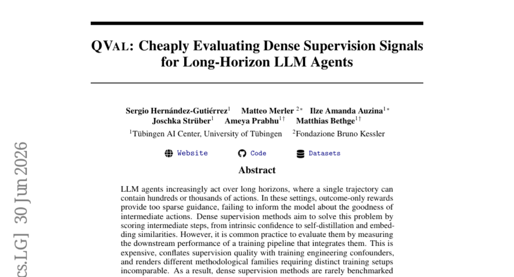

### 📌 한 줄 요약
학습 전 단계에서 밀집 보상(Dense Supervision) 신호의 품질을 직접 평가하여 비용과 변수를 줄이는 새로운 벤치마크 프레임워크 제안

### 🔑 핵심 포인트
- 학습 없이 신호 품질을 평가하는 'Q-alignment' 기반의 QVal 프레임워크 제안
- 학습 엔지니어링 변수를 배제하고 순수하게 밀집 보상 신호의 변별력을 측정 가능
- 21개 방법론과 6개 모델 백본을 활용한 대규모 벤치마크 수행 및 분석

### 🧑‍💻 개발자 관점
에이전트 학습 시 매번 전체 파이프라인을 돌리는 대신, 제안된 벤치마크를 통해 보상 모델의 유효성을 사전에 검증하여 개발 비용을 획기적으로 절감할 수 있습니다.

### 🚀 실무 적용 아이디어
- 현재 개발 중인 보상 모델의 점수가 참조 정책의 행동 순위와 일치하는지 QVal 방식으로 테스트
- 복잡한 밀집 보상 기법 도입 전, 단순 프롬프팅 베이스라인과 성능 비교
- 다양한 환경에 대한 신호의 일반화 성능을 QVal을 통해 검증

### ⚠️ 리스크/한계
- 참조 정책(Reference Policy)의 품질에 따라 평가 결과가 종속될 수 있음
- 학습 시 발생하는 복잡한 동역학이 배제된 상태에서의 신호 품질만을 측정함

### 📝 초록 기반 상세 설명
LLM 에이전트가 긴 작업 과정을 수행함에 따라 중간 단계의 품질을 평가하는 밀집 보상(Dense Supervision)의 중요성이 커지고 있습니다. 기존에는 이러한 신호의 품질을 평가하기 위해 전체 학습 파이프라인을 실행해야 했으나, 이는 비용이 많이 들고 학습 엔지니어링 요소와 신호 자체의 품질이 혼재되는 문제를 야기합니다. 이를 해결하기 위해 본 논문은 학습 없이도 신호의 품질을 직접 측정할 수 있는 QVal 프레임워크를 제안합니다. QVal은 특정 상태-행동 쌍에 대해 강한 참조 정책의 Q-값과 얼마나 일치하는지를 측정하여 신호의 정렬도를 평가합니다. 21개의 방법론을 대상으로 실험한 결과, 단순 프롬프팅 방식이 최신 밀집 보상 기법보다 우수할 수 있음을 발견했습니다. 이 프레임워크는 연구자들이 학습 전 단계에서 신속하게 방법론을 반복 개선할 수 있도록 설계되었습니다.

### 🖼️ 추가 자료
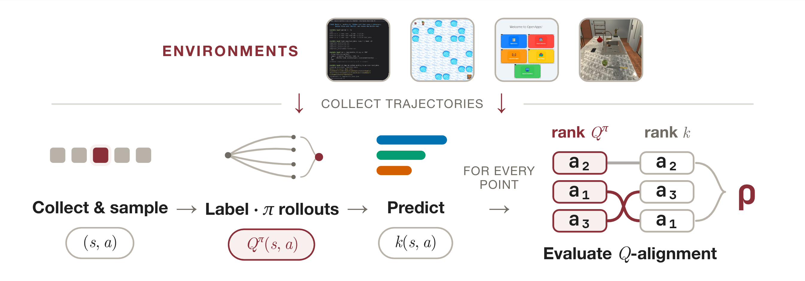

---

## 20. [PolyFlow: Continuous Topology Embedding Flow Matching for Artist-style Mesh Generation](https://huggingface.co/papers/2606.30673)
**Upvotes**: 8 | **도입 난이도**: 상 | **신뢰도**: 상
**arXiv**: https://arxiv.org/abs/2606.30673

**태그**: 3D Generation, Flow Matching, Mesh Processing, Transformer, Benchmark, Evaluation, Inference

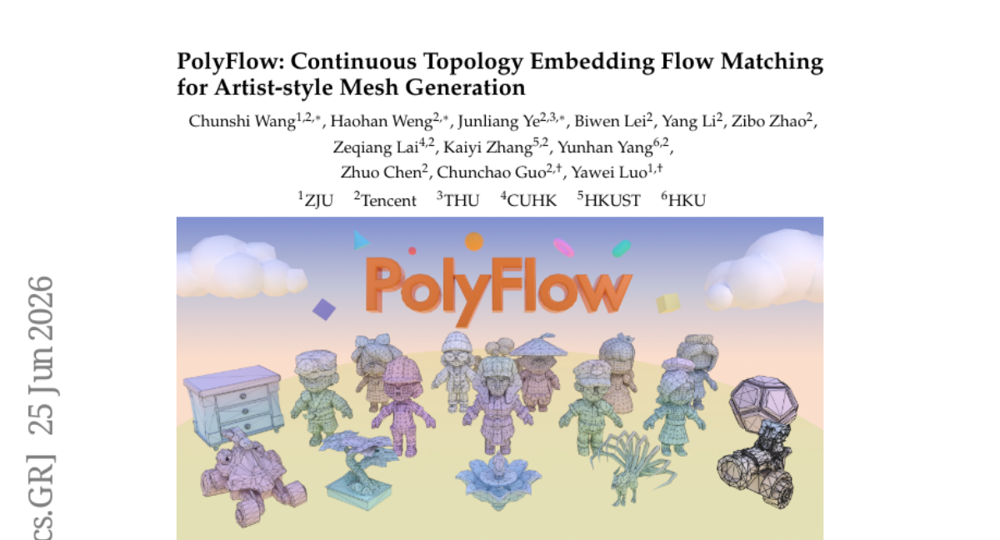

### 📌 한 줄 요약
이산적인 메시 토폴로지를 연속적인 임베딩 공간으로 변환하여 병렬 생성이 가능한 고성능 Flow Matching 프레임워크를 제안합니다.

### 🔑 핵심 포인트
- 이산적 메시 구조를 연속적 상태 공간으로 변환하는 Compact Topology Embedder 개발
- Flow Matching 기반의 병렬 정점 생성 프레임워크인 PolyFlow 제안
- 추론 시 ODE 솔버를 통한 빠른 생성 및 타겟 정점 수 지정에 따른 해상도 제어 기능

### 🧑‍💻 개발자 관점
메시 생성의 고질적인 문제인 '속도'와 '토폴로지 품질' 사이의 트레이드오프를 해결하여, 실시간성이 필요한 3D 콘텐츠 생성 파이프라인에 적용 가능합니다.

### 🚀 실무 적용 아이디어
- 제시된 Topology Embedder의 정점 복원 정확도 검증
- 다양한 해상도(Vertex Count) 변화에 따른 생성 품질의 일관성 테스트
- 기존 Autoregressive 모델과의 추론 시간(Inference Time) 비교 실험

### ⚠️ 리스크/한계
- 임베딩 공간에서의 토폴로지 복원 시 복잡한 기하학적 구조에서의 정확도 저하 가능성
- 학습된 임베딩 모델의 범용성 및 새로운 데이터셋에 대한 일반화 성능 의존도

### 📝 초록 기반 상세 설명
기존의 자기회귀(Autoregressive) 방식은 고품질 메시 생성에 유리하지만 순차적 디코딩으로 인해 생성 속도가 매우 느린 문제가 있습니다. 반면, 확산(Diffusion)이나 Flow Matching 방식은 병렬 생성이 가능하지만 이산적인 메시 연결성(Topology) 문제로 인해 직접 적용하기 어렵습니다. 이를 해결하기 위해 본 논문은 정점 위치와 법선 정보를 연속적인 임베딩으로 투영하여 토폴로지를 복원할 수 있는 Compact Topology Embedder를 도입합니다. 이를 기반으로 구축된 PolyFlow는 포인트 클라우드 특징에 조건화된 병렬 정점 상태 노이즈 제거를 수행합니다. 결과적으로 ODE 솔버를 통해 빠른 추론이 가능하며, 원하는 정점 수에 맞춰 해상도를 정밀하게 제어할 수 있습니다. 실험 결과, 기존의 최첨단 자기회귀 모델보다 Chamfer Distance와 Hausdorff Distance 측면에서 우수한 성능을 입증했습니다.

---

## 21. [Xiaomi-GUI-0 Technical Report](https://huggingface.co/papers/2606.31410)
**Upvotes**: 7 | **도입 난이도**: 상 | **신뢰도**: 상
**arXiv**: https://arxiv.org/abs/2606.31410

**태그**: GUI-Agent, Mobile-Automation, Reinforcement-Learning, Multimodal-LLM, Agent, Multimodal, Vision, Benchmark, Evaluation

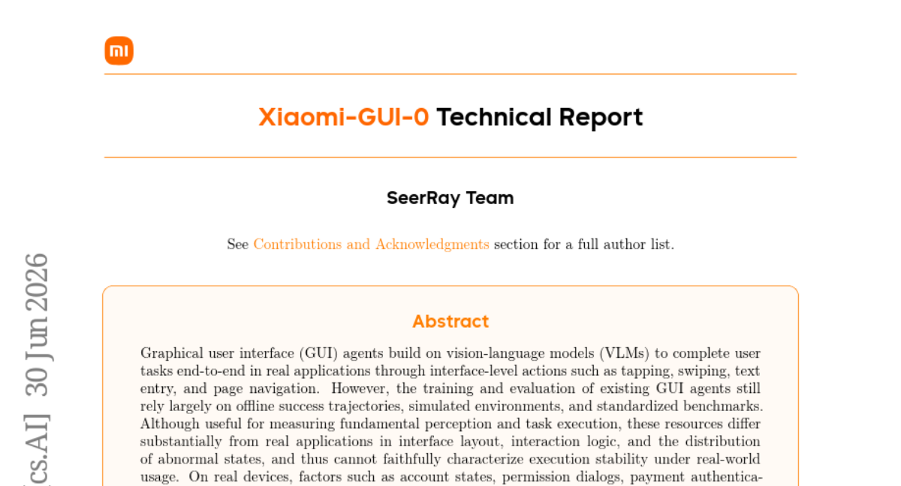

### 📌 한 줄 요약
실제 모바일 환경의 변수(권한, 결제, 예외 상황)를 극복하기 위해 실기기 중심의 데이터 플라이휠과 3단계 학습 파이프라인을 적용한 GUI 에이전트 기술 보고서

### 🔑 핵심 포인트
- 실기기 중심의 하이브리드 인프라를 통한 데이터-실행 환경 간 간극(Gap) 최소화
- 실패 궤적을 교정된 액션과 설명으로 전환하는 에러 주도형 데이터 플라이휠 구축
- SFT부터 에이전트 RL까지 이어지는 3단계 점진적 학습 파이프라인 적용

### 🧑‍💻 개발자 관점
벤치마크 점수와 실제 사용성 사이의 괴리를 해결하기 위해, 시뮬레이션이 아닌 실기기 기반의 데이터 루프와 예외 처리 능력이 얼마나 중요한지 보여줍니다.

### 🚀 실무 적용 아이디어
- 실제 모바일 기기 환경에서 에이전트의 예외 상황(팝업, 권한 등) 대응 능력 테스트
- 실패한 트래젝토리를 데이터셋으로 변환하여 재학습시키는 파이프라인 실험
- 시뮬레이션 환경과 실기기 환경 간의 성능 차이(Sim-to-Real gap) 측정

### ⚠️ 리스크/한계
- 실기기 중심 인프라 구축에 따른 높은 비용 및 데이터 수집 난이도
- 물리적 기기 사용에 따른 확장성 및 자동화된 데이터 수집의 제약

### 📝 초록 기반 상세 설명
기존 GUI 에이전트는 시뮬레이션이나 오프라인 데이터에 의존하여 실제 모바일 환경의 복잡한 레이아웃과 예외 상황(결제, 권한 요청 등)을 반영하지 못하는 한계가 있었습니다. 이를 해결하기 위해 Xiaomi-GUI-0는 실기기 중심의 하이브리드 인프라를 구축하여 데이터 수집부터 평가까지 실제 배포 환경과 유사한 분포를 유지하도록 설계되었습니다. 학습 데이터는 빈도 높은 작업부터 장기적 의도 대응, 자기 성찰 및 메모리 강화 데이터까지 다각도로 구성되었으며, 실패 사례를 교정 데이터로 전환하는 에러 주도형 플라이휠을 도입했습니다. 모델은 SFT, 단계별 RL, 에이전트 RL로 이어지는 3단계 점진적 파이프라인을 통해 학습되었습니다. 실험 결과, 공공 벤치마크와 자체 실기기 벤치마크(RealMobile) 모두에서 높은 성공률을 기록하며 실환경에서의 실행 안정성을 입증했습니다.

---

## 22. [Unlocking the Visual Record of Materials Science: A Large-Scale Multimodal Dataset from Scientific Literature](https://huggingface.co/papers/2606.29667)
**Upvotes**: 7 | **도입 난이도**: 중 | **신뢰도**: 상
**arXiv**: https://arxiv.org/abs/2606.29667

**태그**: Multimodal, Data Engineering, Computer Vision, Scientific AI, RAG, Vision, Benchmark, Evaluation

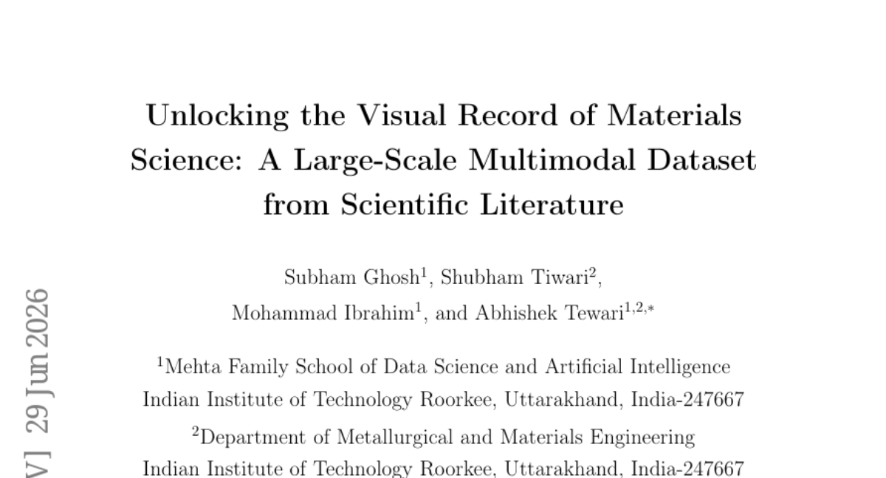

### 📌 한 줄 요약
복합적인 과학 논문 도표를 개별 패널 단위로 분해 및 구조화하여 대규모 멀티모달 데이터셋을 구축하는 파이프라인 제안

### 🔑 핵심 포인트
- 복합 도표를 개별 패널로 분해하고 구조화된 주석을 생성하는 MatMMExtract 파이프라인 개발
- 39만 개 이상의 패널 단위 이미지-텍스트 쌍을 포함하는 대규모 재료 과학 데이터셋 MatSciFig 구축
- 도메인 특화 객체 탐지 모델(MaterialScope 기반) 및 고성능 멀티모달 벤치마크 제공

### 🧑‍💻 개발자 관점
도메인 특화(Domain-specific) 멀티모달 모델 학습 시, 복잡한 레이아웃의 문서를 데이터로 변환하는 자동화된 파이프라인 전략을 배울 수 있습니다.

### 🚀 실무 적용 아이디어
- 제공된 MatMMExtract 파이프라인을 활용하여 특정 도메인 논문 데이터셋 구축 테스트
- MaterialScope 데이터셋을 활용한 커스텀 객체 탐지 모델 성능 비교
- MatSciFig 데이터셋을 활용한 Vision-Language 모델의 Zero-shot 성능 벤치마킹

### ⚠️ 리스크/한계
- LLM 기반 주석 생성 시 발생할 수 있는 미세한 과학적 사실 왜곡(Hallucination) 가능성
- 복합 도표 분해 알고리즘의 정확도가 전체 데이터셋 품질을 결정하는 병목 구간이 될 수 있음

### 📝 초록 기반 상세 설명
재료 과학 문헌의 시각적 데이터는 풍부하지만, 하나의 캡션이 여러 패널을 설명하는 복합 구조로 인해 AI 학습용 데이터로 활용하기 어려웠습니다. 이를 해결하기 위해 복합 도표를 개별 패널로 분해하고, 도메인 분류 체계를 기반으로 LLM을 활용해 구조화된 주석을 생성하는 MatMMExtract 파이프라인을 제안합니다. 이 과정을 통해 14,810개의 논문에서 39만 개 이상의 패널 단위 이미지-텍스트 쌍을 포함하는 MatSciFig 데이터셋을 구축했습니다. 또한 패널 탐지를 위한 MaterialScope 데이터셋을 도입하여 높은 정확도의 객체 탐지 성능을 확보했습니다. 실험 결과, 구축된 데이터셋은 기존 CLIP 모델 대비 검색 성능을 대폭 향상시키며 멀티모달 학습의 유효성을 입증했습니다.

---

## 23. [Play2Perfect: What Matters in Dexterous Play Pretraining for Precise Assembly?](https://huggingface.co/papers/2606.26428)
**Upvotes**: 6 | **도입 난이도**: 상 | **신뢰도**: 상
**arXiv**: https://arxiv.org/abs/2606.26428

**태그**: Reinforcement Learning, Robot Manipulation, Pretraining, Sim-to-Real

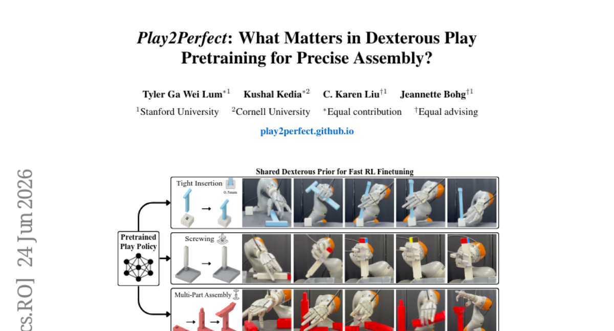

### 📌 한 줄 요약
정밀 조립을 위해 다양한 물체와의 '놀이(Play)'를 통한 사전 학습(Pretraining)이 데이터 효율성과 성공률을 극대화함을 입증한 연구

### 🔑 핵심 포인트
- Play2Perfect: 놀이를 통한 범용 조작 사전 학습 후 정밀 작업으로 미세 조정하는 프레임워크 제안
- 사전 학습 요소 분석: 물체 다양성, 학습 목적 함수, 궤적 다양성, 목표 정밀도가 조립 성능에 미치는 영향 규명
- 높은 샘플 효율성 및 Sim-to-Real 성공: RL 초기 학습 대비 33배 높은 효율성과 초정밀(0.5mm) 조립 성공

### 🧑‍💻 개발자 관점
복잡한 조작 작업에서 RL의 고질적인 문제인 희소 보상과 데이터 부족 문제를 '사전 학습-미세 조정' 전략으로 해결하는 실무적 방법론을 제시합니다.

### 🚀 실무 적용 아이디어
- 다양한 물체 모델을 활용한 RL 사전 학습 환경 구축 실험
- 사전 학습된 조작 Prior가 특정 정밀 작업(예: 나사 조이기)에 미치는 전이 성능 테스트
- Sim-to-Real 간극을 줄이기 위한 목표 정밀도(Goal Precision) 파라미터 스케줄링 실험

### ⚠️ 리스크/한계
- 사전 학습 단계에서의 '놀이' 데이터 생성 및 환경 구축에 높은 비용 발생 가능성
- 학습된 범용 Prior가 예상치 못한 새로운 형태의 물체나 작업에 대해 일반화되지 않을 위험

### 📝 초록 기반 상세 설명
다지형 로봇의 정밀 조립은 접촉이 빈번하고 보상이 희소하여 데이터 수집과 강화학습(RL) 모두 어려운 과제입니다. 기존 방식은 특수 그리퍼나 환경 고정 장치에 의존해 문제를 단순화해 왔습니다. 본 논문은 정밀 조립 전 단계로 다양한 물체와 목표를 대상으로 하는 '놀이(Play)' 기반의 태스크 불가지론적(Task-agnostic) 사전 학습 프레임워크인 Play2Perfect를 제안합니다. 놀이를 통해 파지, 손 안에서의 재배향 등 재사용 가능한 조작 사전 지식(Prior)을 습득한 후, 이를 정밀 조립 작업에 미세 조정(Finetuning)합니다. 실험 결과, 제안 방식은 처음부터 학습하는 것보다 33배 높은 샘플 효율성을 보였으며, 0.5mm의 좁은 간극을 가진 삽입 작업 및 복잡한 조립 작업에서 성공적인 Sim-to-Real 전이를 달성했습니다.

---

## 24. [BrainJanus: A Unified Model for Understanding and Generation across Brain, Vision, and Language](https://huggingface.co/papers/2606.30319)
**Upvotes**: 5 | **도입 난이도**: 상 | **신뢰도**: 상
**arXiv**: https://arxiv.org/abs/2606.30319

**태그**: Multimodal, Brain-Computer-Interface, Generative-AI, Neuroscience, RAG, Vision, Benchmark, Safety

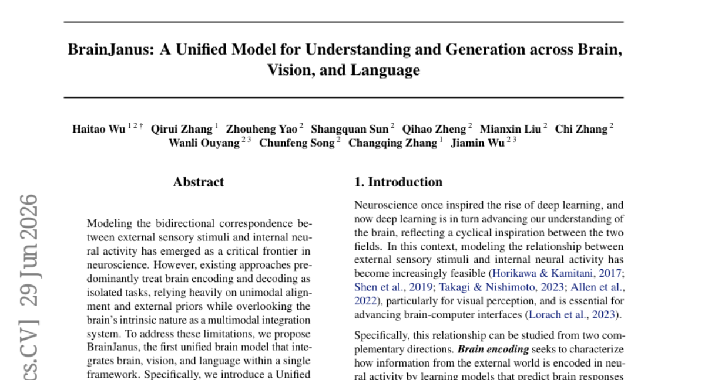

### 📌 한 줄 요약
뇌, 시각, 언어를 하나의 통합된 토큰 공간에서 처리하여 양방향 생성 및 이해를 가능하게 하는 범용 뇌 모델 프레임워크

### 🔑 핵심 포인트
- 뇌, 시각, 언어를 통합한 최초의 단일 프레임워크 구축
- Unified Brain Tokenizer를 통한 신경 데이터의 이산적 토큰화 및 공유 공간(Omni space) 정렬
- Next-token prediction 기반의 Any-to-Any 생성 아키텍처 구현

### 🧑‍💻 개발자 관점
멀티모달 데이터(시각, 언어)와 생체 신호(뇌파 등)를 동일한 토큰 체계로 통합하는 새로운 아키텍처 설계 패턴을 제시합니다.

### 🚀 실무 적용 아이디어
- 제공된 GitHub 코드를 활용한 데이터 파이프라인 및 토크나이저 구조 분석
- 특정 도메인(예: 특정 시각 자극)에 대한 제로샷 일반화 성능 테스트
- 신경 데이터의 토큰화 정밀도가 생성 품질에 미치는 영향 실험

### ⚠️ 리스크/한계
- 연속적인 뇌 신호를 이산적 토큰으로 변환할 때 발생하는 정보 손실 가능성
- 대규모 멀티모달 학습을 위한 고품질의 뇌-시각-언어 정렬 데이터셋 확보의 어려움

### 📝 초록 기반 상세 설명
뇌의 외부 자극과 내부 신경 활동 사이의 양방향 관계를 모델링하는 것은 뇌과학의 핵심 과제입니다. 기존 방식은 인코딩과 디코딩을 분리된 작업으로 취급하며 뇌의 본질적인 멀티모달 통합 능력을 충분히 활용하지 못했습니다. 이를 해결하기 위해 뇌, 시각, 언어를 단일 프레임워크로 통합한 BrainJanus를 제안합니다. Unified Brain Tokenizer를 통해 연속적인 신경 동역학을 공유된 Omni 공간 내의 이산적 토큰으로 양자화합니다. 또한 All-in-One 자기회귀 아키텍처를 사용하여 이미지/텍스트-to-뇌 및 뇌-to-이미지/텍스트를 포함한 모든 방향의 생성을 가능하게 합니다. 실험 결과, BrainJanus는 다양한 벤치마크에서 우수한 성능과 제로샷 일반화 능력, 생물학적 해석 가능성을 입증했습니다.

---

## 25. [TRIAGE: Role-Typed Credit Assignment for Agentic Reinforcement Learning](https://huggingface.co/papers/2606.32017)
**Upvotes**: 4 | **도입 난이도**: 중 | **신뢰도**: 상
**arXiv**: https://arxiv.org/abs/2606.32017

**태그**: Agentic RL, Credit Assignment, Reinforcement Learning, LLM-as-a-Judge, Agent

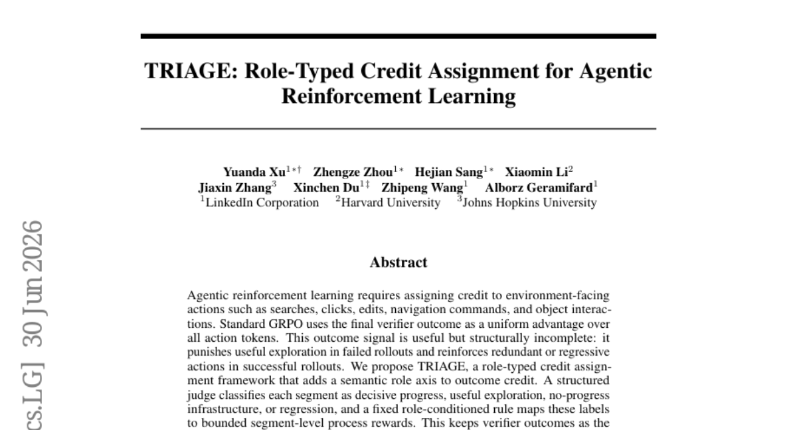

### 📌 한 줄 요약
에이전트 RL에서 결과 중심 보상의 한계를 극복하기 위해 행동의 역할을 분류하여 정교한 신용 할당(Credit Assignment)을 수행하는 프레임워크

### 🔑 핵심 포인트
- 역할 기반 신용 할당(Role-Typed Credit Assignment): 행동의 의미적 역할에 따라 보상을 조정하여 결과 중심 보상의 맹점 해결
- 구조적 보상 설계: 판사를 통해 세그먼트를 분류하고, 역할 조건부 규칙을 통해 최적의 세그먼트 레벨 보상 산출
- 효율성 및 성능 향상: 성공적인 궤적 내 퇴보적 행동을 억제하고 유용한 탐색을 장려하여 작업 효율성 증대

### 🧑‍💻 개발자 관점
에이전트가 복잡한 환경에서 작업을 수행할 때, 단순히 결과만 보고 학습하는 것이 아니라 과정 중 어떤 행동이 유효했는지 정교하게 학습시키는 방법론을 제시합니다.

### 🚀 실무 적용 아이디어
- LLM 기반의 Judge 모델을 활용한 역할 분류(Role Classification) 파이프라인 구축 실험
- 기존 GRPO 환경에 TRIAGE의 역할 기반 보상 규칙 적용 및 성능 비교
- 에이전트의 작업 단계(Segment)를 정의하고 역할 레이블을 생성하는 프롬프트 엔지니어링 테스트

### ⚠️ 리스크/한계
- Judge 모델의 신뢰도에 대한 의존성: 판사가 잘못된 역할을 부여할 경우 보상 왜곡 발생 가능
- 역할 분류를 위한 추가적인 연산 비용 및 복잡도 증가

### 📝 초록 기반 상세 설명
에이전트 강화학습에서는 검색, 클릭 등 환경 상호작용에 대한 적절한 보상 할당이 필수적입니다. 기존 GRPO 방식은 최종 결과만을 기준으로 모든 토큰에 동일한 이점을 부여하여, 성공 시 불필요한 행동을 강화하거나 실패 시 유용한 탐색을 처벌하는 문제가 있습니다. 이를 해결하기 위해 TRIAGE는 행동의 의미적 역할을 분류하는 프레임워크를 제안합니다. 구조화된 판사(Judge)가 각 세그먼트를 결정적 진전, 유용한 탐색, 정체, 퇴보로 분류하고, 역할 기반 규칙을 통해 세그먼트별 보상을 조정합니다. 실험 결과, TRIKE는 기존 GRPO 및 다른 보상 모델 대비 높은 성공률과 효율적인 작업 수행 능력을 입증했습니다.

---

## 26. [MOPD: Multi-Teacher On-Policy Distillation for Capability Integration in LLM Post-Training](https://huggingface.co/papers/2606.30406)
**Upvotes**: 4 | **도입 난이도**: 상 | **신뢰도**: 상
**arXiv**: https://arxiv.org/abs/2606.30406

**태그**: LLM, Reinforcement Learning, Knowledge Distillation, Post-training, Distillation

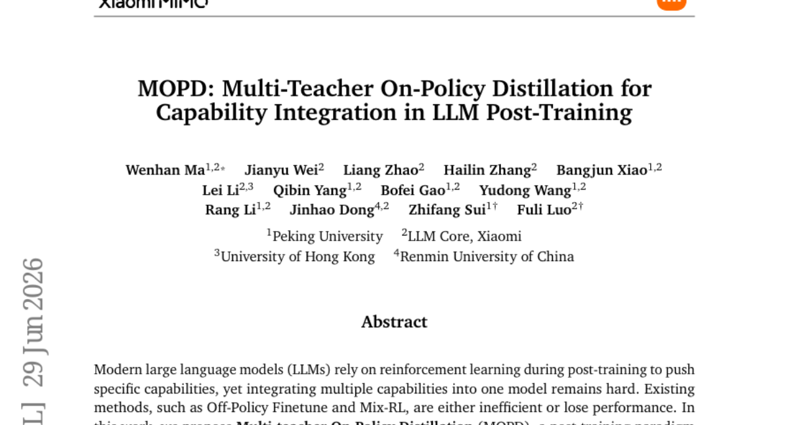

### 📌 한 줄 요약
여러 도메인의 RL 능력을 손실 없이 하나로 통합하기 위한 온폴리시(On-Policy) 증류 프레임워크 MOPD 제안

### 🔑 핵심 포인트
- Multi-Teacher On-Policy Distillation: 학생 모델의 자체 생성 데이터(Rollout)를 활용한 증류로 노출 편향 해결
- Capability Integration: 여러 도메인 전문가 모델의 능력을 손실 없이 하나의 학생 모델로 통합
- Decoupled Development: 도메인별 교사 모델을 독립적으로 개발할 수 있어 확장성 확보

### 🧑‍💻 개발자 관점
특정 태스크(코딩, 수학, 추론 등)별로 최적화된 RL 모델들을 하나의 범용 모델로 병합할 때 발생하는 성능 저하 문제를 해결하는 실전적인 방법론입니다.

### 🚀 실무 적용 아이디어
- 특정 도메인에 특화된 RL 모델들을 확보한 후 MOPD 프레임워크로 통합 실험 진행
- 기존의 단순 가중치 병합(Weight Merging) 방식과 MOPD의 성능 차이 비교
- 학생 모델의 롤아웃 데이터 양에 따른 증류 효율성 및 수렴 속도 테스트

### ⚠️ 리스크/한계
- 여러 교사의 능력을 통합할 때 발생하는 계산 복잡도 및 학습 비용
- 학생 모델의 초기 성능이 교사 모델들의 능력을 수용하기에 충분히 높아야 함

### 📝 초록 기반 상세 설명
최신 LLM은 포스트 트레이닝 단계에서 RL을 통해 특정 능력을 강화하지만, 여러 능력을 하나의 모델에 통합하는 과정에서 성능 저하나 비효율성이 발생합니다. 기존의 오프폴리시 파인튜닝이나 믹스 RL 방식은 도메인 간 간섭이나 성능 손실 문제를 안고 있습니다. 본 논문은 여러 도메인 전문가(Teacher)의 능력을 학생 모델의 자체 롤아웃(Rollout)에 증류하는 MOPD 방식을 제안합니다. 이 방식은 노출 편향(Exposure Bias)을 제거하고 밀집된 최적화 신호를 제공하여 각 교사의 능력을 효과적으로 통합합니다. 실험 결과, MOPD는 기존 베이스라인들을 상회하며 독립적인 도메인 개발이 가능한 유연성을 보여주었습니다. 실제 산업 규모의 모델인 MiMo-V2-Flash에 적용되어 실용성을 입증했습니다.

---

## 27. [AVTok: 1D Unified Tokenization for Holistic Audio-Video Generation](https://huggingface.co/papers/2606.30811)
**Upvotes**: 3 | **도입 난이도**: 중 | **신뢰도**: 상
**arXiv**: https://arxiv.org/abs/2606.30811

**태그**: Audio-Video Generation, Multimodal Learning, Tokenization, Transformer, Multimodal, Video, Audio, Safety

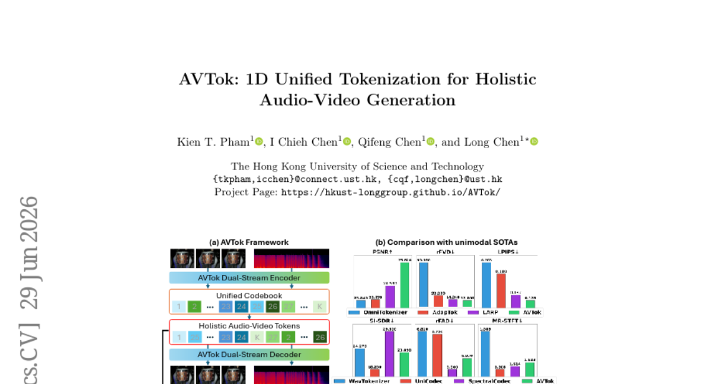

### 📌 한 줄 요약
오디오와 비디오를 하나의 1차원 잠재 공간으로 통합하여 효율적인 생성 및 정렬을 가능케 하는 단일 토크나이저 기술

### 🔑 핵심 포인트
- 공유 인코더-디코더와 모달리티별 쿼리를 활용한 1차원 통합 토크나이저 설계
- 단일 코드북을 통한 오디오-비디오 간의 효율적인 잠재 공간 정렬
- 정보 불균형 해소를 위한 계층적 훈련 전략(Hierarchical Training Strategy) 도입

### 🧑‍💻 개발자 관점
멀티모달 생성 모델 구축 시 모달리티별로 별도의 토크나이저를 관리할 필요 없이 하나의 통합된 파이프라인으로 처리할 수 있어 연산 효율과 정렬 성능을 동시에 높일 수 있습니다.

### 🚀 실무 적용 아이디어
- 제안된 이중 스트림 트랜스포머 구조의 연산 효율성 벤치마크 테스트
- 단일 코드북 사용 시 발생할 수 있는 모달리티 간 간섭 현상 확인
- 다양한 해상도 및 오디오 샘플링 레이트에서의 확장성 검증

### ⚠️ 리스크/한계
- 단일 코드북 공유로 인해 특정 모달리티의 정보가 압도될 경우 발생하는 품질 저하 가능성
- 복잡한 계층적 학습 전략에 따른 학습 안정성 확보의 어려움

### 📝 초록 기반 상세 설명
최근 오디오-비디오 생성 연구는 높은 품질과 정교한 동기화를 목표로 하고 있으나, 기존 방식은 모달리티별로 분리된 이중 브랜치 구조를 사용하여 표현 차이와 막대한 연산 비용 문제를 겪고 있었습니다. 이를 해결하기 위해 본 논문은 1차원 시각적 토크나이징 기술에서 영감을 얻은 AVTok을 제안합니다. AVTok은 공유된 인코더-디코더와 모달리티별 학습 가능한 쿼리를 사용하는 이중 스트림 트랜스포머 구조를 통해 오디오-비디오 쌍을 하나의 통합 코드북을 가진 압축된 1차원 잠재 표현으로 인코딩합니다. 또한, 정보 불균형 문제를 해결하기 위해 각 모달리티의 재구성 능력을 단계적으로 학습시키는 계층적 훈련 전략을 도입했습니다. 실험 결과, AVTok은 재구성 성능뿐만 아니라 오디오-to-비디오, 비디오-to-오디오 등 다양한 다운스트림 작업에서 탁월한 성능을 입증했습니다.

---

## 28. [MuSViT: A Foundation Vision Model for Sheet Music Representation](https://huggingface.co/papers/2606.31811)
**Upvotes**: 2 | **도입 난이도**: 상 | **신뢰도**: 상
**arXiv**: https://arxiv.org/abs/2606.31811

**태그**: Vision Transformer, Foundation Model, Music Information Retrieval, OMR, Vision, Evaluation

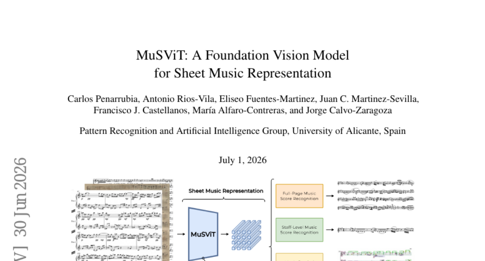

### 📌 한 줄 요약
970만 페이지의 악보 데이터를 학습하여 악보의 구조적 특징을 완벽히 이해하는 최초의 악보 전용 파운데이션 비전 모델(MuSViT) 제안

### 🔑 핵심 포인트
- 970만 페이지 규모의 IMSLP 데이터를 활용한 악보 특화 파운데이션 모델 개발
- 합성 데이터 워밍업과 대규모 실데이터 학습을 결합한 2단계 커리큘럼 학습 전략
- 범용 비전 모델 대비 탁월한 악보 구조 및 기호 표현 능력 입증

### 🧑‍💻 개발자 관점
악보 인식(OMR)이나 음악 정보 검색(MIR) 시스템 구축 시, 범용 모델 대신 도메인 특화된 강력한 백본을 확보할 수 있음을 시사합니다.

### 🚀 실무 적용 아이디어
- 제공된 가중치를 활용하여 특정 악보 인식(OMR) 태스크에 Fine-tuning 실험 수행
- 다양한 시대/양식의 악보 데이터셋에 대한 일반화 성능 검증
- 기존 범용 ViT 모델과 MuSViT의 임베딩 공간 시각화 비교

### ⚠️ 리스크/한계
- 대규모 데이터셋 학습에 따른 높은 컴퓨팅 자원 요구량
- 특정 시대나 손글씨 악보 등 데이터 분포 외 영역에서의 성능 저하 가능성

### 📝 초록 기반 상세 설명
기존의 범용 비전 모델은 악보와 같은 특수한 기호 체계와 구조적 특성을 반영하는 데 한계가 있었습니다. 이를 해결하기 위해 연구진은 970만 페이지의 IMSLP 데이터를 활용한 악보 전용 ViT 인코더인 MuSViT를 개발했습니다. 학습 과정에서는 합성 데이터로 사전 학습 후 대규모 실데이터로 전이하는 2단계 커리큘럼 학습 방식을 채택했습니다. 실험 결과, MuSViT는 악보 인식, 기호 탐지, 난이도 분류 등 다양한 태스크에서 기존 범용 모델을 압도했습니다. 특히 임베딩 공간이 실제 음악적 구조와 일치함을 입증하여 악보 이해를 위한 강력한 백본임을 증명했습니다.

### 🖼️ 추가 자료
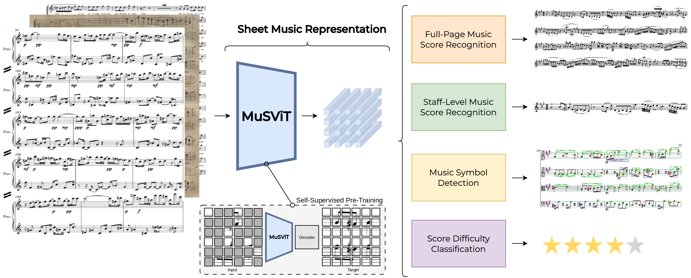

---

## 29. [TerraDiT-Ω: Unified Spatial Control for Satellite Image Synthesis with Any Geospatial Primitive](https://huggingface.co/papers/2606.31029)
**Upvotes**: 2 | **도입 난이도**: 중 | **신뢰도**: 상
**arXiv**: https://arxiv.org/abs/2606.31029

**태그**: Generative AI, Remote Sensing, Computer Vision, GIS, RAG, Vision

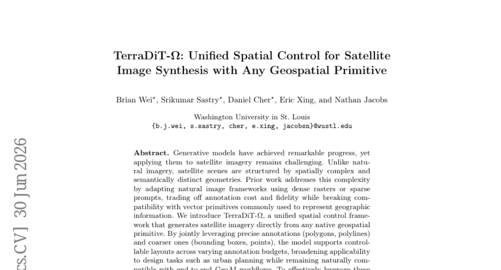

### 📌 한 줄 요약
다양한 지형 벡터 데이터(폴리곤, 라인 등)를 활용해 정밀한 위성 이미지를 생성하는 통합 공간 제어 프레임워크

### 🔑 핵심 포인트
- 다양한 지형 벡터 데이터(폴리곤, 라인, 포인트 등)를 직접 입력으로 사용하는 통합 제어 프레임워크 개발
- 기하학적 특징을 효과적으로 반영하기 위한 Geometry-Aware Local Attention 메커니즘 제안
- 합성 데이터 증강을 통해 객체 탐지 및 지형 분류 등 다양한 GeoAI 태스크 성능 개선

### 🧑‍💻 개발자 관점
GIS 데이터(벡터)를 이미지 생성 모델에 직접 연결할 수 있어, 도시 계획 시뮬레이션이나 데이터 부족 문제를 해결하기 위한 고품질 합성 데이터 생성에 매우 유용합니다.

### 🚀 실무 적용 아이디어
- 제공된 GitHub 코드를 활용하여 기존 GIS 벡터 데이터를 이미지로 변환하는 파이프라인 구축 테스트
- 특정 도심 환경(건물, 도로)에 대한 정밀 제어 성능 검증
- 생성된 합성 이미지를 활용한 객체 탐지(Object Detection) 모델의 성능 향상 폭 측정

### ⚠️ 리스크/한계
- 매우 복잡하거나 거대한 스케일의 지형 데이터에 대한 연산 효율성 확인 필요
- 합성 데이터로 학습된 모델이 실제 위성 이미지의 도메인 차이(Domain Gap)를 얼마나 극복할 수 있는지 검증 필요

### 📝 초록 기반 상세 설명
기존 위성 이미지 생성 모델은 자연 이미지 프레임워크를 차용하여 정밀한 기하학적 구조를 표현하는 데 한계가 있었습니다. 특히 벡터 기반의 지리 정보와 호환성이 낮고, 주석 비용과 정밀도 사이의 트레이드오프 문제가 존재했습니다. 본 논문은 모든 네이티브 지형 프라이머티브(폴리곤, 폴리라인, 바운딩 박스, 포인트 등)를 직접 입력받는 TerraDiT-Ω를 제안합니다. 이를 위해 기하학적 단서를 어텐션 공간에 주입하는 'Geometry-Aware Local Attention' 메커니즘을 도입했습니다. 실험 결과, 제안 모델은 기존의 밀집/희소 제어 방식보다 우수한 성능을 보였으며, 합성 데이터를 통한 다운스트림 태스크(세그멘테이션, 객체 탐지 등) 성능 향상도 입증했습니다.

---

## 30. [LUMOS: A Semantic Operating-System Layer for Accessibility-Grounded AI Agents](https://huggingface.co/papers/2606.30697)
**Upvotes**: 2 | **도입 난이도**: 중 | **신뢰도**: 상
**arXiv**: https://arxiv.org/abs/2606.30697

**태그**: AI Agent, OS Automation, Accessibility, Human-Computer Interaction, Agent, Inference

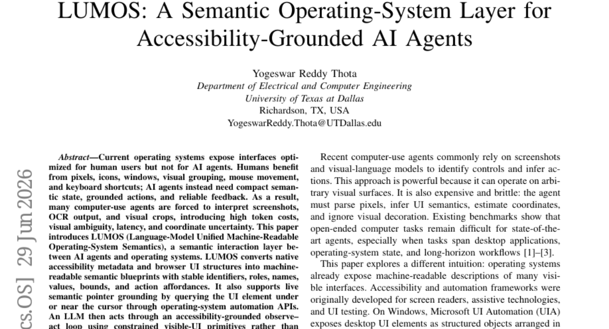

### 📌 한 줄 요약
OS의 접근성(Accessibility) 메타데이터를 활용하여 AI 에이전트용 시맨틱 인터페이스 계층을 구축하는 기술

### 🔑 핵심 포인트
- OS 접근성 API를 활용한 기계 판독 가능한 시맨틱 인터페이스 계층 구축
- 스크린샷 의존도를 낮추어 토큰 비용 절감 및 좌표 불확실성 해결
- 안정적인 식별자와 액션 어포던스(Affordance)를 포함한 시맨틱 블루프린트 제공

### 🧑‍💻 개발자 관점
에이전트 개발 시 스크린샷 분석(Vision)에만 의존하지 않고, OS 레벨의 구조화된 데이터를 활용해 더 정확하고 저비용인 자동화 워크플로우를 설계할 수 있습니다.

### 🚀 실무 적용 아이디어
- OS의 Accessibility API(Windows UI Automation, macOS Accessibility API 등) 데이터 구조 탐색
- Playwright/Selenium 등 브라우저 자동화 도구의 DOM 구조를 LLM 입력용 시맨틱 프롬프트로 변환하는 실험
- 시각적 좌표 기반 액션과 시맨틱 요소 기반 액션의 정확도 및 비용 비교 테스트

### ⚠️ 리스크/한계
- 복잡한 커스텀 UI나 비표준 그래픽 기반 애플리케이션에서는 메타데이터 부족 가능성
- 접근성 데이터가 충분히 정제되지 않은 경우 LLM의 오작동 유발 가능성

### 📝 초록 기반 상세 설명
현재의 운영체제 인터페이스는 인간의 시각적 경험에 최적화되어 있어 AI 에이전트가 사용하기에는 비효율적입니다. 기존의 스크린샷 기반 에이전트는 높은 토큰 비용, 시각적 모호성, 좌표 불확실성 등의 문제를 겪습니다. 이를 해결하기 위해 본 논문은 OS의 접근성 메타데이터와 브라우저 UI 구조를 기계 판독 가능한 시맨틱 블루프린트로 변환하는 LUMOS를 제안합니다. LUMOS는 안정적인 식별자, 역할, 값, 액션 가능성(affordance)을 제공하며, 커서 위치 기반의 실시간 시맨틱 포인터 그라운딩을 지원합니다. 결과적으로 에이전트는 스크립트 작성 없이도 정형화된 UI 프리미티브를 통해 관찰 및 행동 루프를 수행할 수 있습니다. 이는 시각적 에이전트를 대체하는 것이 아니라, 이미 존재하는 시맨틱 구조를 활용해 효율성을 극대화하는 AI 네이티브 OS로의 경로를 제시합니다.

---

## 31. [Goku: A Million-Scale Universal Dataset and Benchmark for Instruction-Based Video Editing](https://huggingface.co/papers/2606.30599)
**Upvotes**: 1 | **도입 난이도**: 상 | **신뢰도**: 상
**arXiv**: https://arxiv.org/abs/2606.30599

**태그**: Video Editing, Dataset, Generative AI, MLLM, RAG, Video, Benchmark, Evaluation

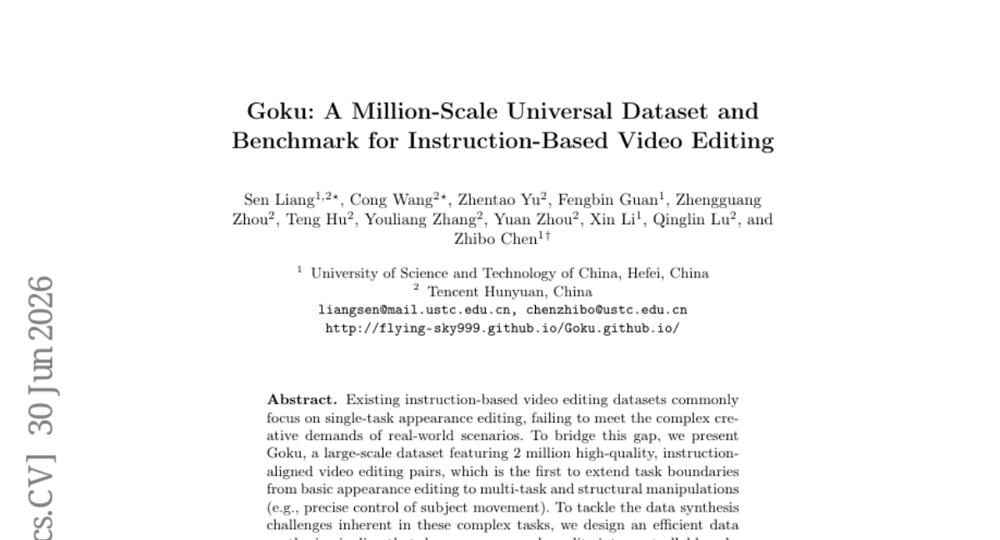

### 📌 한 줄 요약
복잡한 구조적 변화와 외형 편집을 동시에 지원하는 200만 규모의 대규모 비디오 편집 데이터셋 및 모델 제안

### 🔑 핵심 포인트
- 200만 규모의 대규모 멀티태스크/구조적 비디오 편집 데이터셋(Goku) 구축
- 복잡한 편집을 하위 문제로 분해하는 효율적인 데이터 합성 및 필터링 파이프라인 설계
- MLLM 기반 텍스트 인코딩과 구조(Mask) 및 외형(Appearance) 분리형 듀얼 브랜치 아키텍처 제안

### 🧑‍💻 개발자 관점
단순한 스타일 변환을 넘어 객체의 움직임이나 구조를 제어해야 하는 고도화된 비디오 생성/편집 파이프라인 구축에 핵심적인 자산이 될 수 있습니다.

### 🚀 실무 적용 아이디어
- Goku-Edit의 듀얼 브랜치 구조를 기존 비디오 생성 모델에 이식하여 구조 제어 성능 비교
- 제공된 데이터 합성 파이프라인을 활용하여 특정 도메인 특화 편집 데이터셋 생성 실험
- Goku-Bench의 7가지 지표를 활용하여 현재 운영 중인 모델의 지시어 이행 능력 벤치마킹

### ⚠️ 리스크/한계
- 대규모 데이터 합성 및 MLLM 활용으로 인한 높은 컴퓨팅 자원 요구량
- 복잡한 구조적 편집 시 발생할 수 있는 아티팩트 및 일관성 유지 문제

### 📝 초록 기반 상세 설명
기존의 지시어 기반 비디오 편집 데이터셋은 단순 외형 변경에 치중되어 복잡한 창의적 요구를 충족하기 어려웠습니다. 이를 해결하기 위해 연구진은 구조적 조작과 멀티태스크 편집이 가능한 200만 개의 고품질 비디오 편집 쌍 데이터셋인 Goku를 공개했습니다. 데이터 합성 과정에서는 복잡한 편집을 제어 가능한 하위 문제로 분해하는 파이프라인과 단계적 필터링 시스템을 도입했습니다. 이를 바탕으로 MLLM 텍스트 인코더와 구조/외형 분리형 듀얼 브랜치 설계를 갖춘 Goku-Edit 모델을 제안했습니다. 또한 1,000개의 검증된 테스트 케이스와 7개의 새로운 지표를 포함한 Goku-Bench를 함께 구축했습니다. 실험 결과, Goku-Edit은 기존 오픈소스 모델 대비 지시어 이행 능력에서 유의미한 성능 향상을 보였습니다.

---

## 32. [Hierarchical Experimentalist Agents](https://huggingface.co/papers/2606.29315)
**Upvotes**: 1 | **도입 난이도**: 중 | **신뢰도**: 상
**arXiv**: https://arxiv.org/abs/2606.29315

**태그**: AI Agent, Reinforcement Learning, In-context Learning, Self-Improvement, Agent, RAG, Vision, Benchmark, Evaluation

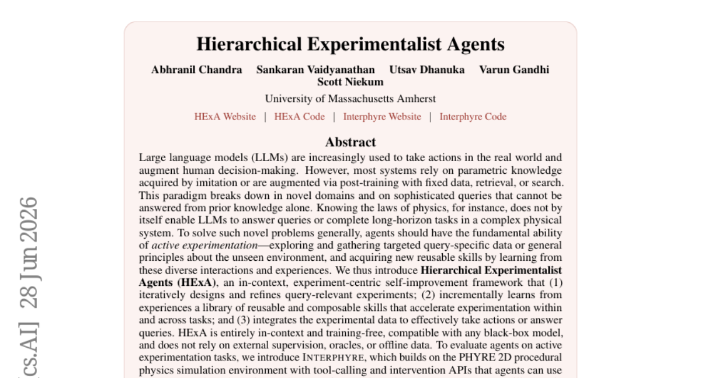

### 📌 한 줄 요약
실험적 탐색을 통해 새로운 도메인 지식과 재사용 가능한 기술을 스스로 습득하는 계층적 에이전트 프레임워크(HExA) 제안

### 🔑 핵심 포인트
- 실험적 탐색을 통한 In-context 자기 개선 프레임워크(HExA) 개발
- 학습된 기술을 라이브러리화하여 다른 과제에 재사용 및 전이 가능
- 훈련이 필요 없는(Training-free) 블랙박스 모델 호환 방식

### 🧑‍💻 개발자 관점
사전 데이터가 부족하거나 물리적 시뮬레이션 등 동적인 환경에서 에이전트를 구축해야 할 때, 모델을 재학습시키지 않고도 성능을 높이는 전략을 제공합니다.

### 🚀 실무 적용 아이디어
- 시뮬레이션 환경(Gym, PyBullet 등)을 활용한 에이전트의 실험 루프 구현 테스트
- 에이전트가 습득한 '기술(Skill)'을 구조화하여 저장하고 호출하는 라이브러리 설계
- 기존 ReAct/Reflexion 방식과 HExA 방식의 실험 효율성 비교

### ⚠️ 리스크/한계
- 실험 과정에서 발생하는 비용(API 호출, 시뮬레이션 시간) 및 시간 소요
- 실험 설계 단계에서의 오류가 누적될 경우 잘못된 지식을 학습할 위험

### 📝 초록 기반 상세 설명
기존 LLM 에이전트는 학습된 파라미터나 검색에 의존하여, 물리 법칙과 같이 사전 지식만으로는 해결하기 어려운 복잡하고 새로운 환경에서 한계를 보입니다. 이를 해결하기 위해 실험을 통해 지식을 습득하는 'Hierarchical Experimentalist Agents(HExA)' 프레임워크를 도입했습니다. HExA는 반복적인 실험 설계 및 정제 과정을 통해 재사용 가능한 기술 라이브러리를 구축하고, 실험 증거를 통합하여 문제를 해결합니다. 새로운 벤치마크인 Interphyre를 통해 평가한 결과, HExA는 기존 모델의 성능을 대폭 향상시켰으며 학습된 기술의 전이 및 재사용 가능성을 입증했습니다. 결과적으로 HExA는 외부 감독 없이도 에이전트가 스스로 지식을 발견하고 장기적인 과제를 수행할 수 있음을 보여주었습니다.

---

## 33. [Lexical Consensus: Grounded Word Learning and Shared Meaning in Artificial Agents](https://huggingface.co/papers/2606.22207)
**Upvotes**: 1 | **도입 난이도**: 중 | **신뢰도**: 상
**arXiv**: https://arxiv.org/abs/2606.22207

**태그**: Multi-modal, Agent, Vision-Language, Representation Learning, RAG, Vision, Evaluation

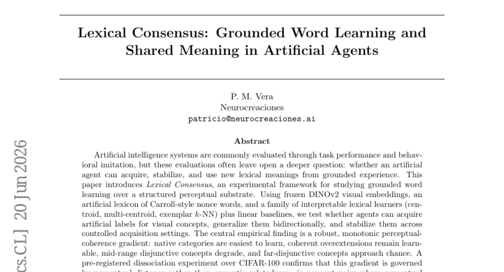

### 📌 한 줄 요약
시각적 특징 기반의 단어 학습 프레임워크를 통해 지각적 거리와 의미적 유사성이 언어 습득에 미치는 영향을 규명함

### 🔑 핵심 포인트
- 지각적 거리(Perceptual Distance)가 단어 학습의 정확도를 결정하는 핵심 요인임을 입증
- 의미적 유사성(Semantic Relatedness)보다 시각적 특징의 일관성이 학습에 더 큰 영향을 미침을 확인
- 명명(Naming)과 검색(Retrieval) 작업 간의 성능 차이를 통해 메모리 기반 메커니즘의 특성 규명

### 🧑‍💻 개발자 관점
멀티모달 에이전트 설계 시, 단순한 의미적 유사성보다 시각적 특징 공간(Embedding Space)의 구조가 언어 학습 효율에 결정적임을 시사합니다.

### 🚀 실무 적용 아이디어
- DINOv2와 같은 고정된 임베딩 공간에서 새로운 레이블을 학습시키는 에이전트 실험
- 지각적 거리와 의미적 거리를 독립적으로 조절하며 학습 곡선 비교
- Centroid 기반 모델과 Exemplar 기반 모델의 retrieval 성능 차이 검증

### ⚠️ 리스크/한계
- 고정된(frozen) 지각 특징을 사용하므로, 표현 재구성(representational restructuring)이 가능한 환경에서의 학습 변화는 관찰 불가
- 실제 자연어의 복잡한 문법적/맥락적 요소가 배제된 실험 환경

### 📝 초록 기반 상세 설명
기존 AI 평가는 작업 수행 능력에 치중되어 있어, 에이전트가 실제 경험을 통해 새로운 어휘 의미를 안정적으로 습득하는지 확인하기 어렵습니다. 본 논문은 구조화된 지각 기질 위에서 근거 기반 단어 학습을 연구하기 위한 'Lexical Consensus' 프레임워크를 제안합니다. DINOv2 임베딩과 가상의 단어를 사용하여 에이전트가 시각적 개념에 대한 인공 레이블을 학습하고 일반화하는 과정을 실험했습니다. 연구 결과, 학습 성공도는 의미적 연관성보다 지각적 거리(perceptual distance)에 의해 결정됨이 확인되었습니다. 또한, 명명(naming)과 검색(retrieval) 메커니즘의 차이를 통해 메모리 충실도가 학습에 미치는 영향을 분석했습니다.

### 🖼️ 추가 자료
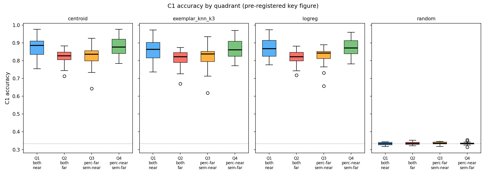
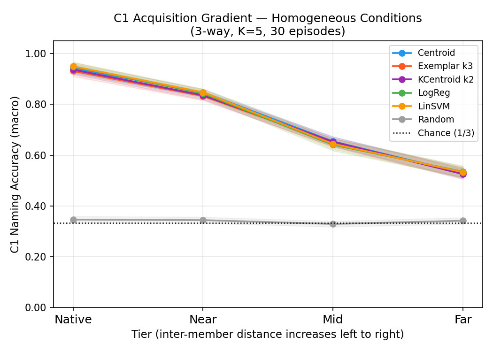
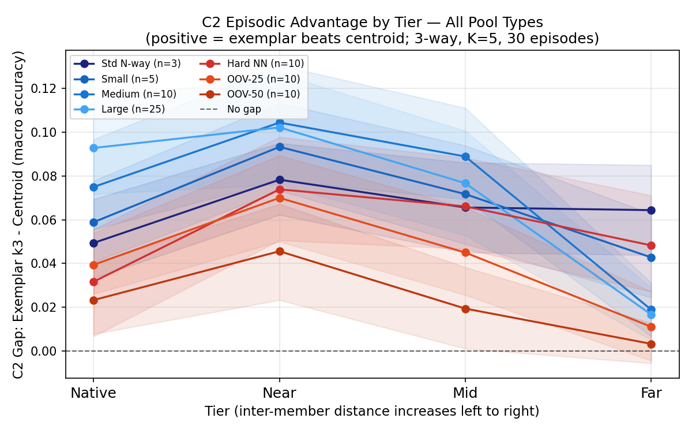

---

## 34. [FlexiSLM: A Dynamic and Controllable Frame Rate Spoken Language Model](https://huggingface.co/papers/2606.31247)
**Upvotes**: 0 | **도입 난이도**: 중 | **신뢰도**: 상
**arXiv**: https://arxiv.org/abs/2606.31247

**태그**: Speech-to-Speech, SLM, Inference Optimization, Audio Tokenization, RAG, Audio, Inference

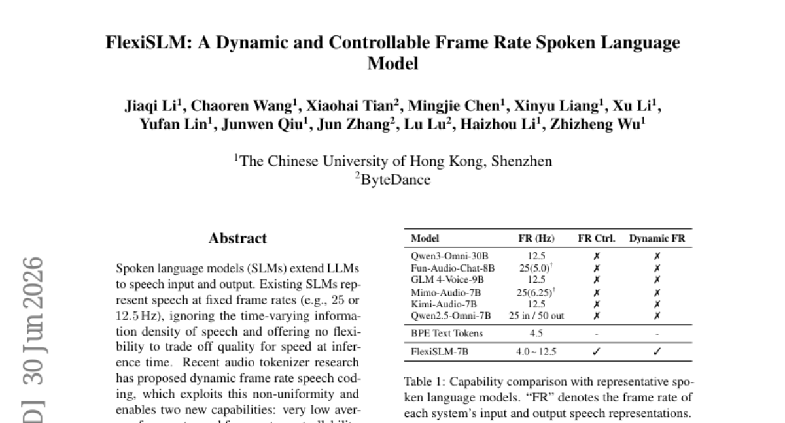

### 📌 한 줄 요약
음성 정보 밀도에 따라 프레임 레이트를 동적으로 조절하여 품질과 추론 속도를 유연하게 제어하는 SLM 모델

### 🔑 핵심 포인트
- 음성 입력 및 출력 모두에서 동적/제어 가능한 프레임 레이트 지원
- 음성 정보 밀도에 따른 비균일 프레임 레이트 활용으로 효율성 극대화
- 고품질 모드와 저지연 모드 간의 유연한 스위칭 가능

### 🧑‍💻 개발자 관점
실시간 음성 인터랙션 서비스 개발 시, 상황에 따라 응답 속도와 음성 품질을 실시간으로 최적화할 수 있는 기술적 토대를 제공합니다.

### 🚀 실무 적용 아이디어
- 제공된 오디오 샘플을 통해 프레임 레이트 변화에 따른 음성 품질 저하 정도 확인
- 다양한 네트워크 환경을 가정하여 프레임 레이트 조절에 따른 추론 속도 변화 측정
- 기존 고정 프레임 레이트 모델과의 품질/속도 트레이드오프 곡선 비교

### ⚠️ 리스크/한계
- 프레임 레이트를 극단적으로 낮출 경우 음성 품질 및 자연스러움 저하 가능성
- 동적 프레임 레이트 처리를 위한 복잡한 토크나이저 및 모델 구조 필요

### 📝 초록 기반 상세 설명
기존의 음성 언어 모델(SLM)은 고정된 프레임 레이트를 사용하여 음성 데이터의 가변적인 정보 밀도를 반영하지 못하며, 추론 시 품질과 속도 간의 트레이드오프가 불가능했습니다. 본 논문에서는 동적 프레임 레이트 표현 방식을 SLM에 최초로 적용한 FlexiSLM을 제안합니다. 이 모델은 입력과 출력 모두에서 프레임 레이트를 동적으로 조절할 수 있는 기능을 제공합니다. 실험 결과, 고품질 모드에서 기존 7B급 모델들을 능가하는 성능을 보였습니다. 또한, 프레임 레이트를 낮춤으로써 품질을 유지하면서도 추론 시간을 획기적으로 단축할 수 있음을 입증했습니다.

---

## 35. [SWE-INTERACT: Reimagining SWE Benchmarks as User-Driven Long-Horizon Coding Sessions](https://huggingface.co/papers/2606.30573)
**Upvotes**: 0 | **도입 난이도**: 중 | **신뢰도**: 상
**arXiv**: https://arxiv.org/abs/2606.30573

**태그**: AI Agent, Software Engineering, Benchmark, Human-in-the-loop, Agent, Vision, Evaluation

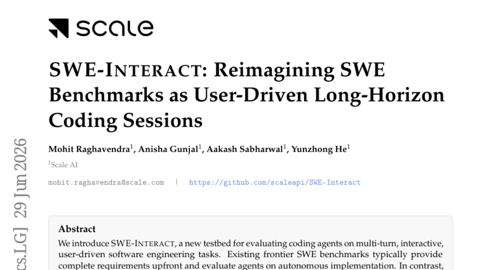

### 📌 한 줄 요약
단일 작업 해결을 넘어, 모호한 요구사항과 피드백이 오가는 실제 협업 환경에서의 AI 에이전트 성능을 평가하는 새로운 벤치마크 제안

### 🔑 핵심 포인트
- 사용자 시뮬레이터를 통한 모호하고 진화하는 요구사항 환경 구축
- 단일 작업(Single-turn) 성능과 다회차 상호작용(Multi-turn) 성능 간의 괴리 입증
- 에이전트의 목표 발견(Goal Discovery) 및 반복적 정교화(Iterative Refinement) 능력 평가

### 🧑‍💻 개발자 관점
실제 개발 환경에서는 요구사항이 불완전하고 대화로 구체화되므로, 단순 코드 생성 능력을 넘어 협업 능력을 갖춘 에이전트 개발의 중요성을 시사합니다.

### 🚀 실무 적용 아이디어
- 현재 사용 중인 코딩 에이전트에 모호한 프롬프트를 주고 단계적 피드백을 주는 시나리오 테스트
- 에이전트가 이전 대화의 제약 조건을 유지하며 코드를 수정하는지 확인하는 워크플로우 설계
- 에이전트의 '과도한 자율성(Over-agentic coding)'이 코드 품질에 미치는 영향 분석

### ⚠️ 리스크/한계
- 사용자 시뮬레이터의 설계 방식에 따라 평가 결과가 편향될 가능성
- 실제 인간 개발자의 복잡한 의도와 감정적 맥락을 완벽히 재현하기 어려움

### 📝 초록 기반 상세 설명
기존의 SWE 벤치마크는 모든 요구사항이 사전에 정의된 상태에서 에이전트의 자율적 구현 능력만을 평가하는 한계가 있었습니다. 이를 해결하기 위해 연구진은 사용자 시뮬레이터가 모호한 지시를 내리고, 피드백과 제약 조건을 점진적으로 추가하는 상호작용형 벤치마크인 SWE-Interact를 도입했습니다. 실험 결과, 단일 작업에서 뛰어난 모델이 다회차 상호작용 환경에서는 성능이 급격히 저하되는 현상이 관찰되었습니다. 최상위 모델들은 모호함 속에서도 목표를 찾아내고 코드를 통합하는 능력을 보였으나, 여전히 과도한 자율성이나 요구사항 망각 문제를 겪었습니다. 결과적으로 SWE-Interact는 에이전트의 목표 발견 및 반복적 정교화 능력을 측정하는 새로운 평가 축을 제시합니다.

---

