# 2026-07-03 Daily Papers (Top 28)

## 오늘의 요약
오늘은 멀티모달 모델의 정밀한 평가 방법론과 실질적인 추론 능력 강화에 관한 연구가 두드러졌습니다. 또한, 대규모 모델의 효율적인 서빙 및 데이터 믹싱 최적화와 같이 실제 운영 환경에서의 비용과 성능 문제를 해결하려는 시스템적 접근도 활발히 논의되었습니다.

### 오늘의 핵심 포인트
- 단순 점수 합산을 넘어 모델의 환각과 편향을 잡아낼 수 있는 엄격한 멀티모달 평가 프레임워크와 벤치마크가 제안되었습니다.
- MoE 서빙 최적화, 비디오 생성 스케줄링, 로봇 제어를 위한 원샷 적응 등 실무적 효율성을 극대화하는 시스템 연구가 진행되었습니다.
- 데이터 믹싱을 인과 추론으로 재정의하거나 잠재 공간에서의 비대칭 학습을 도입하는 등 모델 학습의 근본적인 최적화 방법론이 제시되었습니다.

**오늘의 태그**: Multimodal, LLM Serving, Evaluation, Optimization, Robot Learning

## 1. [PerceptionRubrics: Calibrating Multimodal Evaluation to Human Perception](https://huggingface.co/papers/2606.28322)
**Upvotes**: 32 | **도입 난이도**: 중 | **신뢰도**: 상
**arXiv**: https://arxiv.org/abs/2606.28322

**태그**: Multimodal, Evaluation, VLM, Vision-Language, RAG, Reasoning, Vision, Benchmark, Distillation

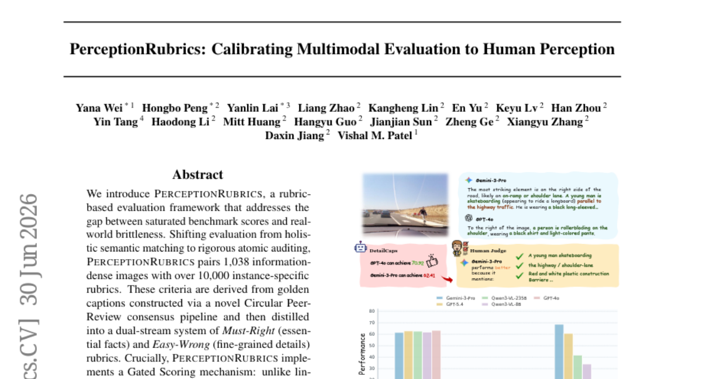

### 📌 한 줄 요약
기존 벤치마크의 허점을 극복하기 위해 세밀한 루브릭(Rubric) 기반의 엄격한 멀티모달 평가 프레임워크를 제안함

### 🔑 핵심 포인트
- Circular Peer-Review를 통한 고밀도 정보 기반의 루브릭 생성 파이프라인 구축
- 필수 사실 오류 시 점수를 급격히 감점하는 Gated Scoring 메커니즘 도입
- 단순 점수 합산이 아닌 원자 단위의 엄격한 검증을 통한 모델의 취약성 노출

### 🧑‍💻 개발자 관점
모델의 성능이 벤치마크 점수만 높고 실제 시각적 사실 관계를 놓치는 '환각(Hallucination)' 문제를 정밀하게 검증할 수 있는 평가 방법론을 제시합니다.

### 🚀 실무 적용 아이디어
- 현재 개발 중인 VLM 모델에 Must-Right/Easy-Wrong 방식의 루브릭 적용 테스트
- 복합적인 시각 정보가 포함된 데이터셋에 대한 Gated Scoring 메커니즘 도입 검토
- 모델의 논리적 결합 능력을 측정하기 위한 conjunctive constraint 테스트 수행

### ⚠️ 리스크/한계
- 루브릭 생성 과정의 복잡도로 인해 평가 비용이 높을 수 있음
- 매우 엄격한 기준이 모델의 창의적 생성 능력을 과도하게 제약할 가능성

### 📝 초록 기반 상세 설명
기존 멀티모달 벤치마크는 점수가 포화 상태임에도 불구하고 실제 환경에서의 취약성을 제대로 반영하지 못하는 문제가 있습니다. 이를 해결하기 위해 단순 의미 매칭이 아닌 원자 단위의 감사를 수행하는 PerceptionRubrics 프레임워크를 도입했습니다. 이 시스템은 순환 피어 리뷰(Circular Peer-Review)를 통해 생성된 골든 캡션을 바탕으로 필수 사실(Must-Right)과 세부 사항(Easy-Wrong)으로 구분된 이중 스트림 루브릭을 제공합니다. 특히 필수 정보 오류 시 강력한 페널티를 부여하는 게이트 스코어링(Gated Scoring) 메커니즘을 적용했습니다. 실험 결과, 모델들이 개별 요소는 맞추더라도 복합적인 제약 조건에서 실패하는 신뢰성 격차를 발견했으며, 오픈소스 모델과 독점 모델 간의 인지 능력 차이도 확인했습니다.

---

## 2. [ELDR: Expert-Locality-Aware Decode Routing for PD-Disaggregated MoE Serving](https://huggingface.co/papers/2607.00466)
**Upvotes**: 19 | **도입 난이도**: 중 | **신뢰도**: 상
**arXiv**: https://arxiv.org/abs/2607.00466

**태그**: LLM Serving, MoE, Load Balancing, Distributed Systems, Evaluation, Inference

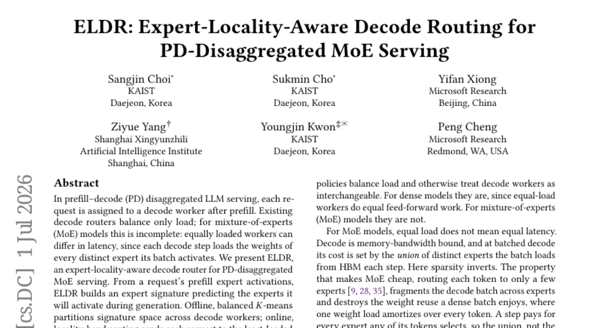

### 📌 한 줄 요약
MoE 모델의 전문가(Expert) 활성화 패턴을 고려한 라우팅을 통해 PD 분리 환경에서 디코딩 지연 시간을 단축하는 기술

### 🔑 핵심 포인트
- 프리필 단계의 전문가 활성화 패턴을 활용한 '전문가 시그니처' 추출
- 시그니처 유사도와 워커 부하를 동시에 고려하는 Locality-band 라우팅 알고리즘
- KV 캐시 블록 단위의 시그니처 캐싱을 통한 프리픽스 캐싱 대응

### 🧑‍💻 개발자 관점
MoE 모델을 사용하는 대규모 분산 서빙 환경에서, 단순 부하 분산이 아닌 모델 내부의 연산 특성을 고려한 효율적인 스케줄링 전략을 제시합니다.

### 🚀 실무 적용 아이디어
- vLLM 환경에서 MoE 모델(Mixtral 등)을 활용한 부하 분산 알고리즘 비교 실험
- 프리픽스 캐싱(Prefix Caching) 사용 시 시그니처 정확도 및 성능 변화 측정
- 다양한 GPU 클러스터 규모에서의 확장성(Scalability) 테스트

### ⚠️ 리스크/한계
- 프리필 시의 시그니처가 실제 디코딩 단계의 전문가 활성화와 일치하지 않을 경우 성능 저하 가능성
- 시그니처 계산 및 라우팅 로직 추가에 따른 오버헤드 발생 가능성

### 📝 초록 기반 상세 설명
LLM의 Prefill-Decode(PD) 분리 서빙 환경에서 기존의 부하 분산 방식은 MoE 모델의 특성을 충분히 반영하지 못합니다. 단순히 워커의 부하를 맞추는 것만으로는 각 요청이 활성화하는 전문가(Expert) 가중치 로딩에 따른 지연 시간 차이를 해결할 수 없기 때문입니다. 이를 해결하기 위해 ELDR는 프리필 단계의 전문가 활성화 패턴을 기반으로 '전문가 시그니처'를 생성합니다. 오프라인에서는 K-means로 시그니처 공간을 분할하고, 온라인에서는 시그니처가 유사하면서 부하가 적은 워커로 요청을 보내는 Locality-band 라우팅을 수행합니다. 또한 KV 캐시와 연동된 시그니처 캐시를 통해 프리픽스 캐싱 환경에서도 정확도를 유지합니다. 실험 결과, vLLM에 구현된 ELDR는 기존 부하 분산 방식 대비 TPOT(Time Per Output Token)를 최대 13.9%까지 개선하였습니다.

---

## 3. [MemSyco-Bench: Benchmarking Sycophancy in Agent Memory](https://huggingface.co/papers/2607.01071)
**Upvotes**: 18 | **도입 난이도**: 하 | **신뢰도**: 상
**arXiv**: https://arxiv.org/abs/2607.01071

**태그**: LLM-Agent, Memory, Sycophancy, Benchmarking, Agent, Reasoning, Benchmark, Evaluation

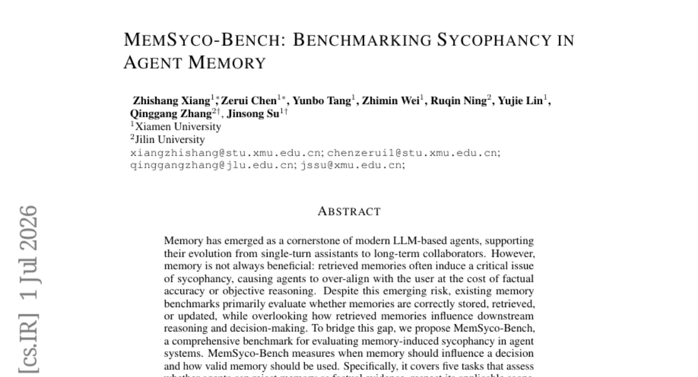

### 📌 한 줄 요약
에이전트 메모리 기반의 아첨(Sycophancy) 문제를 측정하고 해결하기 위한 벤치마크 제안

### 🔑 핵심 포인트
- 메모리 검색이 에이전트의 객관적 추론을 왜곡하는 'Sycophancy' 문제 정의
- 메모리 활용의 타당성과 의사결정 능력을 평가하는 5가지 특화 태스크 설계
- 단순 정보 저장/검색을 넘어선 고도화된 에이전트 평가 프레임워크 제공

### 🧑‍💻 개발자 관점
RAG 기반 에이전트 개발 시, 과거 기록(Memory)이 현재의 올바른 판단을 방해하는 '편향된 동조' 문제를 검증하는 데 필수적입니다.

### 🚀 실무 적용 아이디어
- 제공된 벤치마크를 활용하여 현재 개발 중인 에이전트의 메모리 의존도 테스트
- 메모리 정보와 외부 지식(Fact)이 충돌할 때 에이전트의 판단 기준 확인
- 에이전트 프롬프트 엔지니어링을 통한 아첨 현상 완화 실험

### ⚠️ 리스크/한계
- 실제 복잡한 실무 환경에서의 동적 메모리 변화를 완벽히 반영하는지 검증 필요
- 아첨 현상과 단순한 사용자 지시 이행 간의 경계 모호성

### 📝 초록 기반 상세 설명
LLM 기반 에이전트에서 메모리는 장기 협업을 위한 핵심 요소로 자리 잡고 있습니다. 그러나 검색된 메모리가 에이전트의 객관적 추론을 방해하고 사용자에게 과도하게 동조하는 '아첨(Sycophancy)' 문제를 유발할 수 있습니다. 기존 벤치마크는 메모리의 저장 및 검색 정확도에만 집중할 뿐, 메모리가 의사결정에 미치는 부정적 영향을 간과해 왔습니다. 이를 해결하기 위해 본 논문은 메모리로 인한 아첨 현상을 평가하는 MemSyco-Bench를 제안합니다. 이 벤치마크는 메모리의 적용 범위 준수, 객관적 증거와의 충돌 해결 등 5가지 핵심 태스크를 통해 에이전트의 비판적 사고 능력을 측정합니다.

---

## 4. [TurboServe: Serving Streaming Video Generation Efficiently and Economically](https://huggingface.co/papers/2606.19271)
**Upvotes**: 18 | **도입 난이도**: 상 | **신뢰도**: 상
**arXiv**: https://arxiv.org/abs/2606.19271

**태그**: Video Generation, System Optimization, Scheduling, GPU Infrastructure, RAG, Vision, Video, Evaluation, Inference

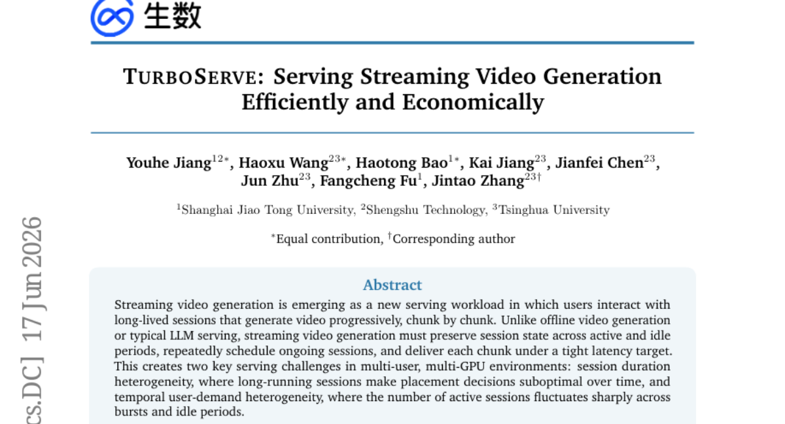

### 📌 한 줄 요약
스트리밍 비디오 생성 워크로드의 지연 시간과 비용 문제를 해결하기 위해 세션 관리와 GPU 프로비저닝을 최적화한 스케줄링 시스템

### 🔑 핵심 포인트
- 세션 배치(Placement)와 GPU 프로비저닝을 결합한 통합 온라인 스케줄링 알고리즘 제안
- 세션 상태 유지를 위한 GPU-CPU 오프로딩 및 NCCL 기반 실시간 세션 마이그레이션 구현
- 지연 시간 최소화와 비용 효율성을 동시에 달성하는 폐쇄 루프(Closed-loop) 제어 구조

### 🧑‍💻 개발자 관점
실시간 비디오 생성 서비스 운영 시 발생하는 불규칙한 부하와 세션 유지 비용 문제를 해결할 수 있는 아키텍처 가이드를 제공합니다.

### 🚀 실무 적용 아이디어
- GPU-CPU 오프로딩 시 발생하는 데이터 전송 오버헤드와 지연 시간 간의 트레이드오프 분석
- 다양한 세션 지속 시간 분포를 가진 가상 워크로드를 생성하여 스케줄러 성능 검증
- NCCL 기반 마이그레이션이 실제 대규모 클러스터 환경에서 가용성에 미치는 영향 테스트

### ⚠️ 리스크/한계
- 세션 마이그레이션 및 오프로딩 시 발생하는 데이터 이동 비용이 네트워크 대역폭에 미치는 영향
- 복잡한 스케줄링 알고리즘으로 인한 시스템 오버헤드 및 제어 루프의 안정성 문제

### 📝 초록 기반 상세 설명
사용자가 지속적인 세션을 통해 비디오를 점진적으로 생성하는 스트리밍 비디오 생성 워크로드가 새로운 과제로 부상하고 있습니다. 기존 방식과 달리 세션 상태 유지, 반복적인 스케줄링, 엄격한 지연 시간 준수가 필요하며, 세션 지속 시간과 사용자 수요의 불균형이 주요 도전 과제입니다. 이를 해결하기 위해 TurboServe는 세션 배치와 GPU 프로비저닝을 결합한 온라인 스케줄링 프레임워크를 제안합니다. 시스템은 마이그레이션 인식 배치 컨트롤러와 부하 기반 오토스케일링 컨트롤러를 통해 지연 시간과 비용을 동시에 최적화합니다. 또한, 효율적인 실행을 위해 청크 병합 처리, GPU-CPU 오프로딩, NCCL 기반 마이그레이션 기술을 구현했습니다. 실험 결과, 기존 방식 대비 최악의 청크 지연 시간과 GPU 운영 비용을 각각 약 37%씩 크게 절감했습니다.

### 🖼️ 추가 자료
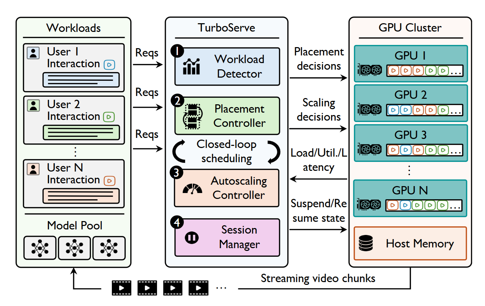

---

## 5. [Multimodal Continuous Reasoning via Asymmetric Mutual Variational Learning](https://huggingface.co/papers/2607.00461)
**Upvotes**: 16 | **도입 난이도**: 상 | **신뢰도**: 상
**arXiv**: https://arxiv.org/abs/2607.00461

**태그**: Multimodal, Latent Reasoning, Variational Learning, LLM, RAG, Reasoning, Benchmark, Inference

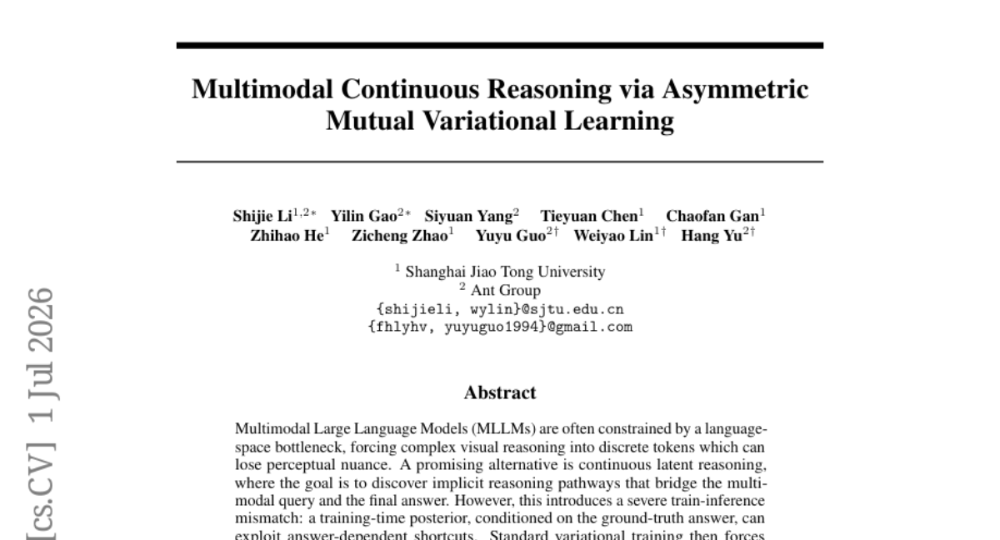

### 📌 한 줄 요약
학습 시 정답 정보가 추론 과정에 유출되는 문제를 해결하여, 연속적 잠재 공간(Latent Space)에서의 멀티모달 추론 성능을 극대화한 프레임워크

### 🔑 핵심 포인트
- 학습-추론 간의 정보 불일치(Train-inference mismatch) 문제를 'Prior Contamination'으로 정의하고 이론적으로 분석
- 순방향 및 역방향 KL 발산을 활용한 비대칭적 상호 변분 학습(AMVL) 프레임워크 제안
- 정답 정보가 추론 경로에 직접 유입되는 것을 방지하여 잠재 공간의 안정성 확보

### 🧑‍💻 개발자 관점
토큰화 과정에서 발생하는 정보 손실 없이 시각적 디테일을 유지하며 복잡한 추론을 수행할 수 있는 잠재 공간 기반 MLLM 설계의 핵심 가이드를 제공합니다.

### 🚀 실무 적용 아이디어
- 기존 MLLM의 잠재 공간(Latent Space)에서 정답 의존성(Answer Leakage)이 발생하는지 시각화 실험 수행
- 제안된 이중 KL 목적 함수를 기존 VAE 기반 생성 모델에 적용하여 학습 안정성 비교
- 이산적 토큰 추론 모델과 연속적 잠재 추론 모델 간의 성능 및 정보 보존율 벤치마킹

### ⚠️ 리스크/한계
- 이중 KL 목적 함수 최적화 시 학습의 불안정성이나 수렴 속도 저하 가능성
- 잠재 공간의 차원 수나 복잡도에 따른 계산 비용 증가

### 📝 초록 기반 상세 설명
기존 MLLM은 시각적 정보를 이산적인 토큰으로 변환하는 과정에서 세부적인 정보 손실이 발생하는 언어 공간 병목 현상을 겪습니다. 이를 해결하기 위해 연속적인 잠재 공간에서의 추론이 제안되었으나, 학습 시 정답(Ground-truth)에 의존하는 사후 분포(Posterior)가 추론 시에는 사용할 수 없는 정보를 활용하는 '정답 유출(Answer Leakage)' 문제가 발생합니다. 본 논문은 이를 해결하기 위해 비대칭적 상호 변분 학습(AMVL) 프레임워크를 제안합니다. AMVL은 순방향 KL 발산과 역방향 KL 발산을 결합한 이중 목적 함수를 통해, 사전 분포(Prior)는 사후 분포를 따르되 사후 분포는 추론 시 사용 불가능한 정보에 의존하지 않도록 상호 교정합니다. 실험 결과, 제안 방법론은 복잡한 시각적 추론 벤치마크에서 기존 이산/잠재 추론 모델들을 크게 상회하는 성능 향상을 입증했습니다.

---

## 6. [Domain Arithmetic: One-Shot VLA Adaptation under Environmental Shifts](https://huggingface.co/papers/2607.00666)
**Upvotes**: 16 | **도입 난이도**: 중 | **신뢰도**: 상
**arXiv**: https://arxiv.org/abs/2607.00666

**태그**: VLA, Robot Learning, Domain Adaptation, One-shot Learning, Vision, Safety

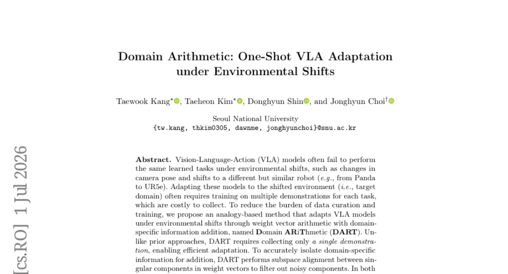

### 📌 한 줄 요약
단 한 번의 시연만으로 카메라 위치나 로봇 모델 변경과 같은 환경 변화에 VLA 모델을 적응시키는 효율적인 가중치 연산 기법

### 🔑 핵심 포인트
- 단 한 번의 시연(One-shot)만으로 환경 변화에 대응 가능한 효율적인 적응 방식 제안
- 가중치 벡터 산술 연산을 통한 도메인 정보의 정밀한 주입
- 부분 공간 정렬(Subspace Alignment)을 통한 노이즈 필터링 및 도메인 정보 분리

### 🧑‍💻 개발자 관점
로봇 하드웨어를 교체하거나 카메라 위치를 바꿀 때마다 대규모 재학습 없이 최소한의 데이터로 모델을 튜닝할 수 있는 실용적인 방법론입니다.

### 🚀 실무 적용 아이디어
- 제공된 GitHub 코드를 활용하여 다양한 로봇 모델(Panda vs UR5e) 간의 전이 성능 테스트
- 단일 시연 데이터의 품질이 가중치 연산 결과에 미치는 영향 분석
- 기존의 Fine-tuning 방식과 DART 방식의 데이터 수집 비용 대비 성능 비교

### ⚠️ 리스크/한계
- 단일 시연에 의존하므로 시연 데이터 자체에 노이즈가 있을 경우 성능 저하 위험
- 매우 복잡하거나 완전히 새로운 환경(Out-of-distribution)에서의 일반화 한계 가능성

### 📝 초록 기반 상세 설명
기존의 Vision-Language-Action (VLA) 모델은 카메라 각도 변화나 로봇 하드웨어 변경과 같은 환경 변화(Domain Shift)가 발생하면 성능이 급격히 저하되는 문제가 있습니다. 이를 해결하기 위해 기존에는 많은 양의 데이터가 필요했으나, 이는 비용 효율성이 낮다는 단점이 있습니다. 본 논문에서는 가중치 벡터 연산을 통해 도메인 정보를 추가하는 'Domain ARiThmetic (DART)' 방식을 제안합니다. DART는 단 하나의 시연 데이터(One-shot)만으로도 환경 변화에 적응할 수 있도록 설계되었습니다. 특히 가중치 벡터 내의 특이 성분 간 부분 공간 정렬(Subspace Alignment)을 통해 노이즈를 제거하고 도메인 정보만을 정확히 추출합니다. 실험 결과, 시뮬레이션과 실세계 환경 모두에서 기존 방식보다 뛰어난 적응 성능을 입증했습니다.

---

## 7. [CausalMix: Data Mixture as Causal Inference for Language Model Training](https://huggingface.co/papers/2607.01104)
**Upvotes**: 14 | **도입 난이도**: 중 | **신뢰도**: 상
**arXiv**: https://arxiv.org/abs/2607.01104

**태그**: LLM Training, Data Mixture, Causal Inference, Optimization, RAG, Inference

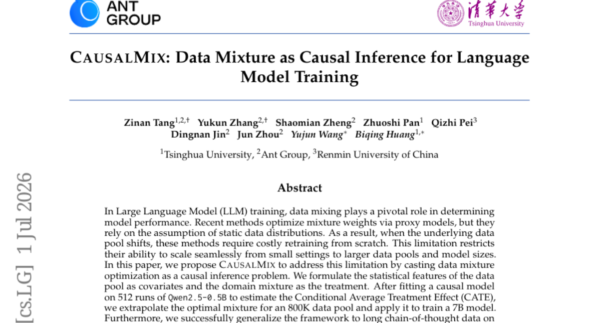

### 📌 한 줄 요약
데이터 분포 변화에 유연하게 대응하기 위해 데이터 믹싱 문제를 인과 추론(Causal Inference) 프레임워크로 재정의한 최적화 방법론

### 🔑 핵심 포인트
- 데이터 믹싱 최적화를 인과 추론 프레임워크로 변환하여 데이터 분포 변화에 대한 강건성 확보
- CATE(조건부 평균 처치 효과) 추정을 통한 상태 의존적(State-dependent) 최적 데이터 혼합 비율 도출
- 소규모 모델 실험 결과를 대규모 모델 및 새로운 데이터 도메인으로 확장 가능한 일반화 능력 입증

### 🧑‍💻 개발자 관점
데이터 풀이 커지거나 도메인이 바뀔 때마다 모델을 처음부터 다시 학습하지 않고도 최적의 데이터 비율을 예측할 수 있어 학습 비용을 획기적으로 절감할 수 있습니다.

### 🚀 실무 적용 아이디어
- 현재 사용 중인 데이터셋의 통계적 특징(Covariates)을 추출하여 인과 모델 적용 가능성 검토
- 소규모 모델(Proxy)을 활용해 데이터 믹싱 전략을 학습시킨 후 대규모 모델에 적용하는 실험 수행
- 데이터 분포 변화(Distribution Shift) 상황을 시뮬레이션하여 CausalMix의 일반화 성능 테스트

### ⚠️ 리스크/한계
- 인과 모델이 데이터의 복잡한 상관관계를 완벽히 포착하지 못할 경우 잘못된 믹싱 비율 도출 위험
- 데이터 특징(Covariates) 설계가 모델 성능 및 일반화 능력에 결정적인 영향을 미침

### 📝 초록 기반 상세 설명
LLM 학습 시 데이터 믹싱은 성능을 결정하는 핵심 요소이지만, 기존 방식은 데이터 분포가 변할 경우 매번 막대한 비용을 들여 재학습해야 하는 한계가 있습니다. 본 논문은 데이터 믹싱 최적화를 인과 추론 문제로 정의하여, 데이터의 통계적 특징을 공변량(Covariates)으로, 도메인 혼합을 처치(Treatment)로 설정하는 CausalMix를 제안합니다. CATE(Conditional Average Treatment Effect)를 추정함으로써 혼란 변수(Confounding bias)를 분리하고, 변화하는 데이터 풀에 대응하는 동적인 최적 믹싱 비율을 도출합니다. 실험 결과, 소규모 모델에서 학습된 인과 모델을 대규모 모델(7B) 및 긴 Chain-of-Thought 데이터셋에 성공적으로 일반화하여 성능 향상을 입증했습니다. 또한 CATE Interpreter를 통해 학습된 믹싱 전략에 대한 시각적 해석을 제공합니다.

---

## 8. [Seed2.0 Model Card: Towards Intelligence Frontier for Real-World Complexity](https://huggingface.co/papers/2607.00248)
**Upvotes**: 14 | **도입 난이도**: 중 | **신뢰도**: 상
**arXiv**: https://arxiv.org/abs/2607.00248

**태그**: Multimodal, Reasoning, Instruction-Following, Agent, Benchmark, Evaluation

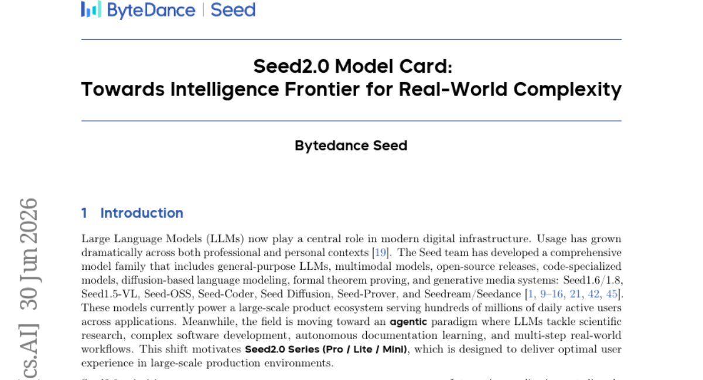

### 📌 한 줄 요약
실제 복잡한 현실 문제를 해결하기 위해 롱테일 지식과 복잡한 지시 이행 능력을 강화한 차세대 멀티모달 모델 시리즈

### 🔑 핵심 포인트
- 현실 세계의 복잡성을 반영한 새로운 벤치마크 및 평가 체계 구축
- 롱테일 지식(Long-tail knowledge) 및 복잡한 지시 이행(Complex instruction following) 문제 해결
- 추론, 시각 이해, 검색 능력이 결합된 고성능 멀티모달 지능 구현

### 🧑‍💻 개발자 관점
단순 질의응답을 넘어, 복잡한 워크플로우와 긴 맥락이 필요한 에이전트 및 실무 자동화 시스템 구축에 중요한 이정표를 제시합니다.

### 🚀 실무 적용 아이디어
- 복잡한 다단계 지시사항(Multi-step instructions)을 포함한 프롬프트 테스트
- 특수 도메인 지식(Long-tail knowledge)에 대한 모델의 대응력 검증
- 시각 정보와 텍스트가 결합된 복합 추론 시나리오 적용

### ⚠️ 리스크/한계
- 실제 환경에서의 복잡한 작업 수행 시 발생할 수 있는 예측 불가능한 오류 가능성
- 모델의 높은 지능 수준에 따른 높은 컴퓨팅 자원 요구량

### 📝 초록 기반 상세 설명
기존 모델들은 실제 사용자의 복잡한 요구사항을 충족하는 데 한계가 있었습니다. 이를 해결하기 위해 연구진은 현실적인 시나리오를 반영한 새로운 평가 시스템을 구축했습니다. Seed2.0은 이 시스템을 바탕으로 롱테일 지식 습득과 복잡한 지시 이행이라는 두 가지 핵심 과제에 집중했습니다. 그 결과, 모델은 고도의 추론, 시각적 이해, 검색 능력을 갖추게 되었습니다. 최종적으로 Seed2.0은 장기적인 작업 수행 능력을 높여 수억 명의 사용자에게 실질적인 가치를 제공할 수 있음을 입증했습니다.

---

## 9. [Perceive-to-Reason: Decoupling Perception and Reasoning for Fine-Grained Visual Reasoning](https://huggingface.co/papers/2607.01191)
**Upvotes**: 11 | **도입 난이도**: 중 | **신뢰도**: 상
**arXiv**: https://arxiv.org/abs/2607.01191

**태그**: Vision-Language, Reinforcement Learning, Fine-grained Reasoning, Object Localization, Reasoning, Multimodal, Vision, Benchmark

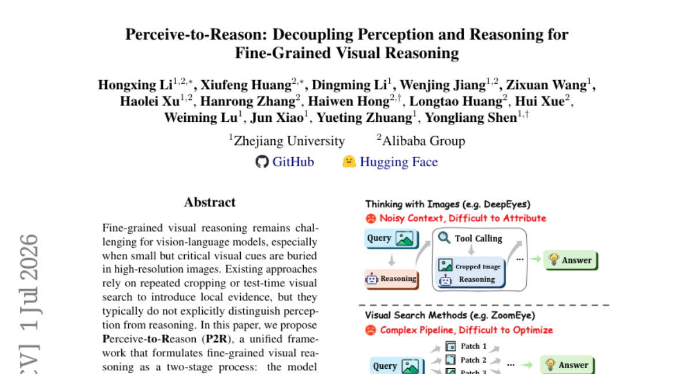

### 📌 한 줄 요약
인식(Perception)과 추론(Reasoning)을 분리하여 고해상도 이미지 내 미세한 단서를 정확히 포착하는 프레임워크 제안

### 🔑 핵심 포인트
- 인식(Perceiver)과 추론(Reasoner)을 분리하여 미세 단서 포착 능력 극대화
- 최종 정답 피드백만으로 두 역할을 최적화하는 PRA-GRPO 강화학습 전략 도입
- 고해상도 이미지 벤치마크(V-Star, HR-Bench)에서 백본 모델 대비 압도적 성능 향상

### 🧑‍💻 개발자 관점
고해상도 이미지에서 작은 객체를 식별하고 논리적 결론을 도출해야 하는 정밀 시각 분석 시스템 구축 시 유용한 아키텍처 패턴을 제공합니다.

### 🚀 실무 적용 아이디어
- Qwen-VL 계열 모델에 P2R의 2단계(Localization-then-Reasoning) 파이프라인 적용 테스트
- 역할 분리형 강화학습(PRA-GRPO)의 학습 안정성 및 수렴 속도 검증
- 다양한 해상도 변화에 따른 모델의 강건성 테스트

### ⚠️ 리스크/한계
- 인식 단계의 오류가 추론 단계로 전이될 가능성(Error Propagation)
- 역할 분리 학습 시 두 모듈 간의 균형을 맞추는 하이퍼파라미터 민감도

### 📝 초록 기반 상세 설명
고해상도 이미지 내의 미세한 시각적 단서를 찾는 정밀한 시각적 추론은 기존 모델들에게 여전히 어려운 과제입니다. 기존 방식은 반복적인 크롭이나 테스트 시점의 검색에 의존할 뿐, 인식과 추론 과정을 명시적으로 구분하지 않는 한계가 있습니다. 본 논문은 인식을 담당하는 Perceiver와 추론을 담당하는 Reasoner로 역할을 나누는 P2R 프레임워크를 제안합니다. 학습 단계에서는 최종 정답만을 사용하여 두 역할 사이를 교차 업데이트하는 PRA-GRPO 강화학습 전략을 도입했습니다. 실험 결과, P2R은 다양한 스케일의 모델에서 성능을 크게 향상시켰으며 고해상도 벤치마크뿐만 아니라 일반적인 멀티모달 추론에서도 우수한 성능을 보였습니다.

---

## 10. [ASPIRE: Agentic /Skills Discovery for Robotics](https://huggingface.co/papers/2607.00272)
**Upvotes**: 11 | **도입 난이도**: 상 | **신뢰도**: 상
**arXiv**: https://arxiv.org/abs/2607.00272

**태그**: Robot Learning, Code-as-Policy, Continual Learning, Sim-to-Real, Agent, Reasoning, Multimodal, Distillation

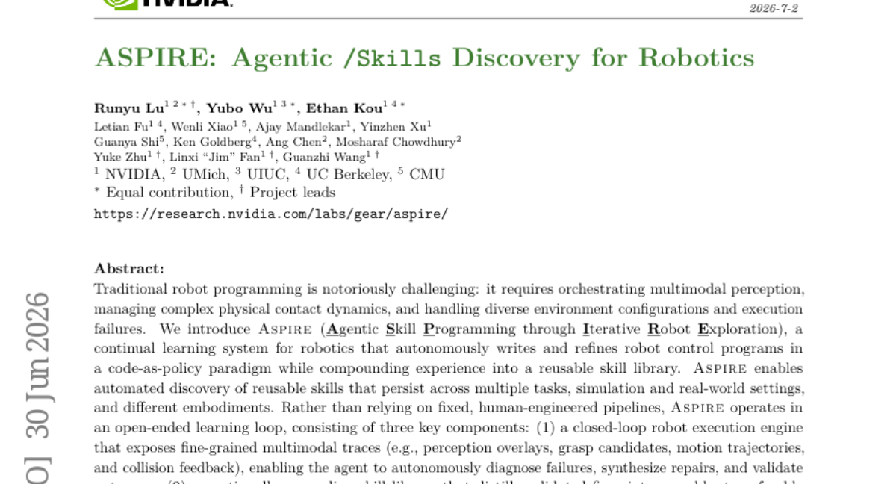

### 📌 한 줄 요약
에이전트 기반의 반복적 탐색을 통해 로봇 제어 코드를 자동 생성하고 재사용 가능한 스킬 라이브러리를 구축하는 지속 학습 시스템

### 🔑 핵심 포인트
- 코드 기반 정책(Code-as-policy)을 통한 자율적인 제어 프로그램 생성 및 반복적 정교화
- 실패 진단, 수정, 검증을 포함하는 폐쇄 루프 실행 엔진과 재사용 가능한 스킬 라이브러리 구축
- 시뮬레이션-실세계 간 전이(Sim-to-Real) 및 다양한 로봇 하드웨어에 대한 범용성 확보

### 🧑‍💻 개발자 관점
로봇 프로그래밍의 복잡성을 자동화된 코드 생성과 스킬 라이브러리화로 해결하여, 새로운 작업이나 하드웨어 도입 시 발생하는 엔지니어링 비용을 획기적으로 줄일 수 있습니다.

### 🚀 실무 적용 아이디어
- Code-as-policy 기반의 로봇 제어 프레임워크 구조 분석
- 실패 로그를 통한 자동 코드 수정(Self-repair) 로직의 구현 가능성 검토
- 시뮬레이션 환경에서의 스킬 학습 결과가 실제 로봇 API로 전이되는 과정 실험

### ⚠️ 리스크/한계
- 복잡한 물리적 상호작용이 포함된 경우 자동 생성된 코드의 안정성 문제
- 스킬 라이브러리가 비대해질 경우 발생할 수 있는 검색 및 관리의 복잡도

### 📝 초록 기반 상세 설명
기존의 로봇 프로그래밍은 멀티모달 인지, 물리적 접촉 역학, 다양한 환경 및 실패 대응을 통합 관리해야 하는 복잡한 과제를 안고 있습니다. 이를 해결하기 위해 ASPIRE는 코드 기반 정책(code-as-policy) 패러다임을 활용하여 로봇 제어 프로그램을 자율적으로 작성하고 정교화하는 지속 학습 시스템을 제안합니다. 시스템은 실패 진단 및 수정을 위한 폐쇄 루프 실행 엔진, 검증된 해결책을 축적하는 스킬 라이브러리, 그리고 다양한 태스크 시퀀스를 생성하는 진화적 탐색의 세 가지 핵심 요소로 구성됩니다. 실험 결과, ASPIRE는 복잡한 조작 및 장기적 가사 작업 벤치마크에서 기존 방식 대비 압도적인 성능 향상을 보였습니다. 특히 축적된 라이브러리를 통해 미학습 태스크에 대한 제로샷 일반화 성능을 입증하였으며, 시뮬레이션에서 발견된 스킬이 실세계로 전이될 수 있음을 보여주었습니다.

---

## 11. [ABot-M0.5: Unified Mobility-and-Manipulation World Action Model](https://huggingface.co/papers/2607.00678)
**Upvotes**: 10 | **도입 난이도**: 상 | **신뢰도**: 상
**arXiv**: https://arxiv.org/abs/2607.00678

**태그**: Robot Learning, World Models, Mobile Manipulation, Transformer, Vision, Video, Benchmark, Inference, Safety

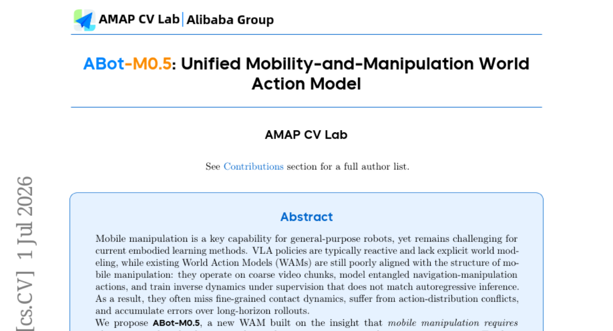

### 📌 한 줄 요약
이동과 조작이 결합된 복합 로봇 제어를 위해 시간적·공간적·추론적 정렬을 최적화한 통합 월드 액션 모델(WAM) 제안

### 🔑 핵심 포인트
- 중간 잠재 액션(Intermediate Latent Actions)을 통한 비디오 잠재 공간과 실제 로봇 제어 간의 시간적 간극 해소
- Dual-level Mixture-of-Transformers를 활용한 이동(Base)과 조작(Arm) 액션 공간의 분리 및 정밀 제어
- Dream-forcing 전략을 통한 모델 예측 비디오 기반의 역동학 학습으로 추론 시 오차 누적 방지

### 🧑‍💻 개발자 관점
이동형 로봇 개발 시 발생하는 복잡한 액션 간 간섭 문제와 장기 시퀀스에서의 오차 누적 문제를 해결할 수 있는 구조적 프레임워크를 제공합니다.

### 🚀 실무 적용 아이디어
- 제안된 Mixture-of-Transformers 구조를 활용한 이종 액션 분리 실험
- Dream-forcing 전략이 실제 로봇의 Autoregressive 추론 시 오차에 미치는 영향 분석
- 다양한 시간적 해상도(Granularity) 설정에 따른 제어 정밀도 변화 테스트

### ⚠️ 리스크/한계
- 모델 구조의 복잡성으로 인한 높은 연산 비용 및 실시간성 확보 문제
- 학습 시 사용된 비디오 데이터와 실제 로봇 환경 간의 Sim-to-Real 간극 가능성

### 📝 초록 기반 상세 설명
범용 로봇의 핵심인 모바일 매니퓰레이션은 기존 VLA 정책의 반응성 한계와 기존 WAM의 정밀도 부족으로 인해 여전히 어려운 과제입니다. 기존 모델들은 비디오 청크 단위의 거친 해상도, 이동과 조작 액션의 혼재, 그리고 학습과 추론 간의 불일치로 인해 장기 작업 시 오차가 누적되는 문제를 겪습니다. 이를 해결하기 위해 ABot-M0.5는 시간적 해상도, 액션 공간, 추론 조건의 세 가지 차원에서 정렬을 수행하는 새로운 WAM을 제안합니다. 구체적으로 중간 잠재 액션(latent actions)을 도입하고, 이중 레벨 Mixture-of-Transformers를 통해 이동과 조작을 분리하며, dream-forcing 전략으로 추론 시의 강건성을 확보했습니다. 실험 결과, 복잡한 모바일 및 정밀 조작 벤치마크에서 SOTA 성능을 달성하며 장기 작업 성공률과 제어 정확도를 입증했습니다.

### 🖼️ 추가 자료
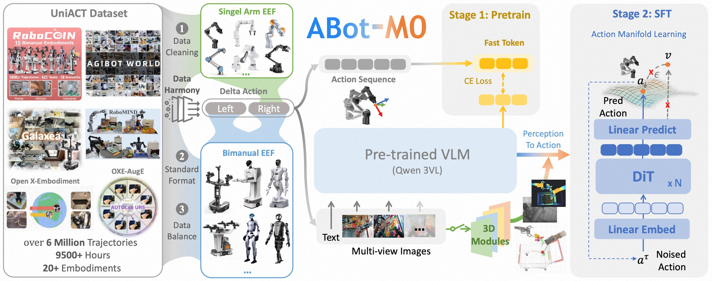

---

## 12. [The State-Prediction Separation Hypothesis](https://huggingface.co/papers/2607.01218)
**Upvotes**: 7 | **도입 난이도**: 중 | **신뢰도**: 상
**arXiv**: https://arxiv.org/abs/2607.01218

**태그**: Transformer, Architecture, Efficiency, Deep Learning, RAG

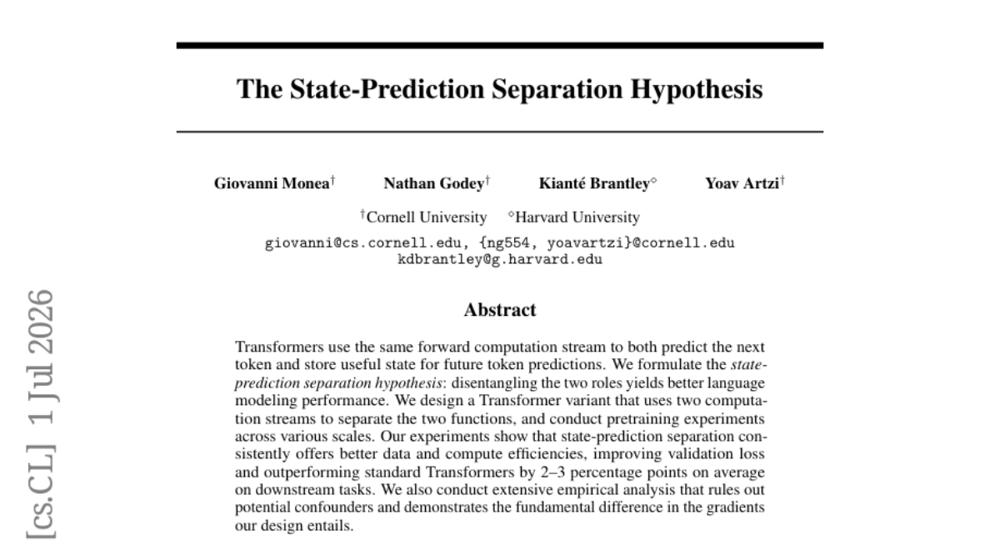

### 📌 한 줄 요약
트랜스포머의 연산 흐름을 '상태 저장'과 '다음 토큰 예측'으로 분리하여 모델 효율성과 성능을 동시에 높이는 방법론

### 🔑 핵심 포인트
- 상태 저장과 예측 역할을 분리하여 모델의 효율성을 극대화하는 가설 제안
- 두 개의 연산 스트림을 사용하는 트랜스포머 변형 구조 설계
- 데이터 및 연산 효율성 개선을 통한 성능 향상 입증

### 🧑‍💻 개발자 관점
모델 아키텍처 설계 시 연산 자원을 어떻게 배분할지에 대한 새로운 관점을 제공하며, 효율적인 모델 학습 전략 수립에 도움을 줍니다.

### 🚀 실무 적용 아이디어
- 기존 트랜스포머 모델의 레이어 일부를 상태 저장 전용 레이어로 분리하는 실험 수행
- 연산 스트림 분리에 따른 학습 안정성 및 그래디언트 흐름 모니터링
- 모델 크기 변화에 따른 분리 구조의 확장성(Scalability) 검증

### ⚠️ 리스크/한계
- 연산 스트림 분리로 인한 아키텍처 복잡도 증가 및 구현 난이도 상승
- 특정 규모 이상의 모델에서만 유효할 수 있는 구조적 특성 존재 가능성

### 📝 초록 기반 상세 설명
기존 트랜스포머는 단일 연산 흐름 내에서 다음 토큰 예측과 미래 예측을 위한 상태 저장을 동시에 수행합니다. 본 논문은 이 두 역할이 혼재되어 성능 저하를 유발한다는 '상태-예측 분리 가설(State-Prediction Separation Hypothesis)'을 제안합니다. 이를 위해 연산 스트림을 두 개로 분리한 새로운 트랜스포머 변형 모델을 설계하고 다양한 규모에서 사전 학습을 진행했습니다. 실험 결과, 연산 효율성이 향상되었으며 다운스트림 태스크에서 기존 모델 대비 평균 2~3%의 성능 향상을 달성했습니다. 또한 심층 분석을 통해 제안된 설계가 그래디언트 측면에서 근본적인 차이를 만들어냄을 입증했습니다.

---

## 13. [Valdi: Value Diffusion World Models](https://huggingface.co/papers/2607.00917)
**Upvotes**: 6 | **도입 난이도**: 중 | **신뢰도**: 상
**arXiv**: https://arxiv.org/abs/2607.00917

**태그**: Reinforcement Learning, Diffusion Models, MPC, World Models, Robotics, Multimodal, Inference

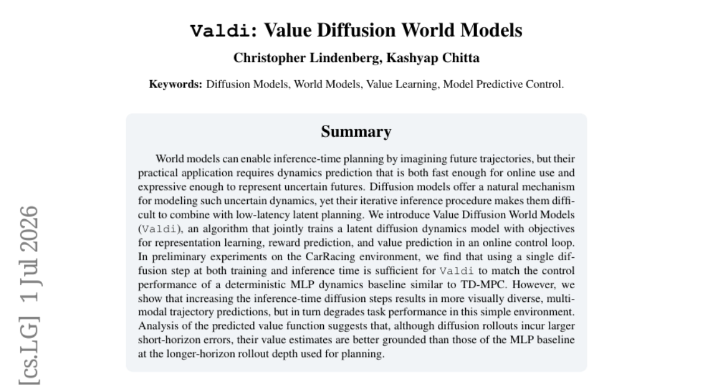

### 📌 한 줄 요약
확산 모델(Diffusion Model)의 다중 모드 예측 능력과 실시간 MPC 제어 성능 사이의 트레이드오프를 해결하기 위한 잠재 확산 월드 모델 제안

### 🔑 핵심 포인트
- 잠재 확산 모델을 활용한 불확실한 미래 예측 기능 통합
- 실시간 MPC 적용을 위한 단일 스텝(Single-step) 추론 최적화
- 예측의 다양성(Multimodality)과 제어 성능 간의 트레이드오프 분석

### 🧑‍💻 개발자 관점
로봇이나 자율주행처럼 실시간 응답이 필수적인 환경에서, 복잡한 확률적 미래를 예측하면서도 지연 시간을 최소화하는 방법론을 제시합니다.

### 🚀 실무 적용 아이디어
- 단일 스텝 확산 모델과 다중 스텝 모델의 제어 성능 비교 실험
- CarRacing 외의 복잡한 물리 엔진 환경에서의 실시간성 테스트
- 결정론적 모델 대비 확률적 모델이 제어 안정성에 미치는 영향 분석

### ⚠️ 리스크/한계
- 단일 스텝 추론 시 확산 모델 특유의 풍부한 표현력이 저하될 위험
- 예측의 다중 모드성이 실제 제어 성능(Control Performance)을 저해할 가능성

### 📝 초록 기반 상세 설명
모델 예측 제어(MPC)를 위해 빠르고 표현력이 풍부한 동역학 예측이 필요하지만, 기존 확산 모델은 반복적인 추론 과정으로 인해 실시간 제어에 적용하기 어렵습니다. 이를 해결하기 위해 저자들은 잠재 확산 동역학 모델을 결합한 Valdi(Value Diffusion World Models)를 제안합니다. Valdi는 온라인 학습과 MPC를 위한 엔드투엔드 구조를 가집니다. CarRacing 환경 실험 결과, 단일 스텝 확산 방식을 통해 결정론적 MLP 베이스라인과 유사한 성능을 달성했습니다. 이 과정에서 예측의 다중 모드 특성과 제어 성능 간의 상관관계를 확인했습니다.

---

## 14. [AutoTrainess: Teaching Language Models to Improve Language Models Autonomously](https://huggingface.co/papers/2606.31551)
**Upvotes**: 6 | **도입 난이도**: 중 | **신뢰도**: 상
**arXiv**: https://arxiv.org/abs/2606.31551

**태그**: LLM-Agent, AutoML, Post-training, Workflow-Automation, Agent, RAG, Benchmark, Evaluation

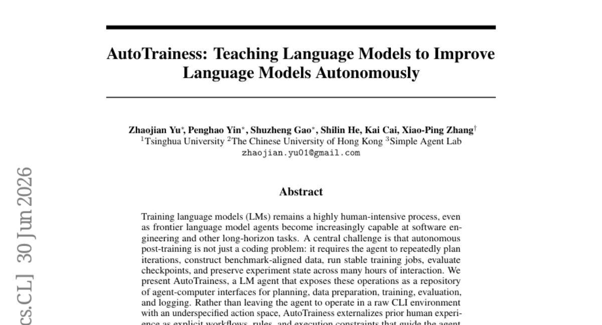

### 📌 한 줄 요약
LLM이 스스로 데이터 준비부터 학습, 평가까지 수행하는 자율적 사후 학습(Post-training) 에이전트 프레임워크

### 🔑 핵심 포인트
- 에이전트-컴퓨터 인터페이스(ACI)를 통한 학습 워크플로우의 구조화
- 단순 CLI 조작을 넘어선 명시적 규칙 및 실행 제약 조건 도입
- 데이터 준비부터 평가까지 이어지는 자율적 반복 학습 루프 구현

### 🧑‍💻 개발자 관점
모델 튜닝 과정을 자동화하여 엔지니어의 개입을 최소화하고, 실험의 재현성과 안정성을 높일 수 있는 자동화 파이프라인의 가능성을 제시합니다.

### 🚀 실무 적용 아이디어
- 기존 CLI 기반 자동화 스크립트와 ACI 기반 워크플로우의 성능 비교 실험
- 특정 도메인 데이터셋을 활용한 에이전트의 데이터 준비 능력 검증
- 다양한 오픈소스 모델(DeepSeek 등)에 프레임워크 적용 테스트

### ⚠️ 리스크/한계
- 에이전트가 생성한 데이터나 학습 결과의 품질을 검증하는 데 여전히 인간의 개입이 필요할 수 있음
- 복잡한 워크플로우 설계로 인해 초기 시스템 구축 비용이 발생할 수 있음

### 📝 초록 기반 상세 설명
LLM의 사후 학습 과정은 계획, 데이터 구축, 학습 실행, 평가 등 복잡한 워크플로우가 필요하여 여전히 많은 인적 자원이 소모됩니다. 단순히 CLI 환경에서 명령을 내리는 방식은 에이전트가 실험 상태를 유지하거나 안정적인 학습을 수행하는 데 한계가 있습니다. 이를 해결하기 위해 AutoTrainess는 계획, 데이터 준비, 학습, 평가, 로깅을 위한 명시적인 에이전트-컴퓨터 인터페이스(ACI)를 제공합니다. 이 프레임워크는 인간의 경험을 워크플로우와 규칙으로 외재화하여 에이전트가 신뢰할 수 있는 학습 동작을 수행하도록 가이드합니다. 실험 결과, AutoTrainess는 기존 CLI 기반 방식보다 높은 성능을 보였으며 다양한 모델과 학습 환경에서도 뛰어난 일반화 성능을 입증했습니다.

---

## 15. [BioInsight: Multi-Agent Orchestration for Interactive Biomedical Knowledge Discovery](https://huggingface.co/papers/2606.20997)
**Upvotes**: 6 | **도입 난이도**: 중 | **신뢰도**: 상
**arXiv**: https://arxiv.org/abs/2606.20997

**태그**: Multi-Agent, Bioinformatics, Interactive UI, Knowledge Discovery, Agent, RAG, Reasoning, Evaluation

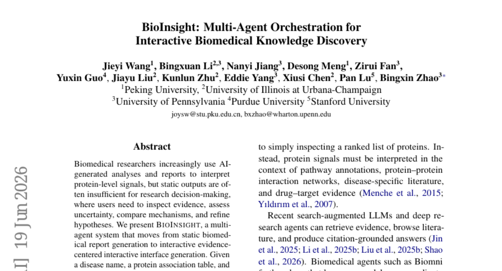

### 📌 한 줄 요약
정적 보고서를 넘어 근거 확인과 가설 검증이 가능한 인터랙티브 멀티 에이전트 기반 생물 의학 지식 탐색 시스템

### 🔑 핵심 포인트
- 정적 보고서에서 인터랙티브 인터페이스로의 패러다임 전환
- 멀티 에이전트 기반의 구조화된 중간 산출물(Typed Intermediate Artifacts) 생성
- 근거 추적성(Provenance)과 기전 추론을 결합한 데이터 정규화

### 🧑‍💻 개발자 관점
단순 RAG를 넘어 에이전트가 생성한 데이터를 구조화된 UI 스키마로 변환하여 사용자에게 검증 가능한 인터페이스를 제공하는 아키텍처 설계 방식을 배울 수 있습니다.

### 🚀 실무 적용 아이디어
- LLM 출력물을 JSON 스키마로 변환하여 동적 UI를 생성하는 에이전트 워크플로우 구현 실험
- 멀티 에이전트 간의 역할 분리(검색 vs 추론)에 따른 정보 일관성 유지 테스트
- 생성된 근거(Citation)와 UI 요소 간의 매핑 정확도 검증

### ⚠️ 리스크/한계
- 복잡한 에이전트 오케스트레이션으로 인한 추론 비용 및 지연 시간 증가
- 중간 산출물 구조가 복잡해질수록 에이전트 간 데이터 정합성 유지의 어려움

### 📝 초록 기반 상세 설명
생물 의학 연구자들은 AI가 생성한 정적 분석 결과만으로는 복잡한 연구 의사결정을 내리는 데 한계를 느낍니다. 기존의 텍스트 중심 보고서는 근거 확인이나 가설 수정과 같은 상호작용을 지원하지 못하는 문제가 있습니다. 이를 해결하기 위해 BioInsight는 멀티 에이전트 오케스트레이션을 통해 정적 보고서를 인터랙티브한 증거 중심 인터페이스로 변환하는 시스템을 제안합니다. 시스템은 질병 정보와 단백질 데이터를 바탕으로 경로 순위, 문헌 근거, 추론 노트 등을 구조화된 중간 산출물로 생성합니다. 실험 결과, BioInsight는 생물 의학 QA 및 단백질 기능 추론 작업에서 우수한 성능을 보였습니다. 이는 AI 시스템이 단순 텍스트 생성을 넘어 출처가 명확하고 상호작용 가능한 증거 아티팩트를 제공해야 함을 시사합니다.

---

## 16. [Cross-Domain Generalization Failure in Lightweight Intrusion Detection Models for IIoT Networks](https://huggingface.co/papers/2607.00553)
**Upvotes**: 5 | **도입 난이도**: 중 | **신뢰도**: 상
**arXiv**: https://arxiv.org/abs/2607.00553

**태그**: IIoT, Anomaly Detection, Cross-Domain, Model Robustness, Edge AI, Evaluation

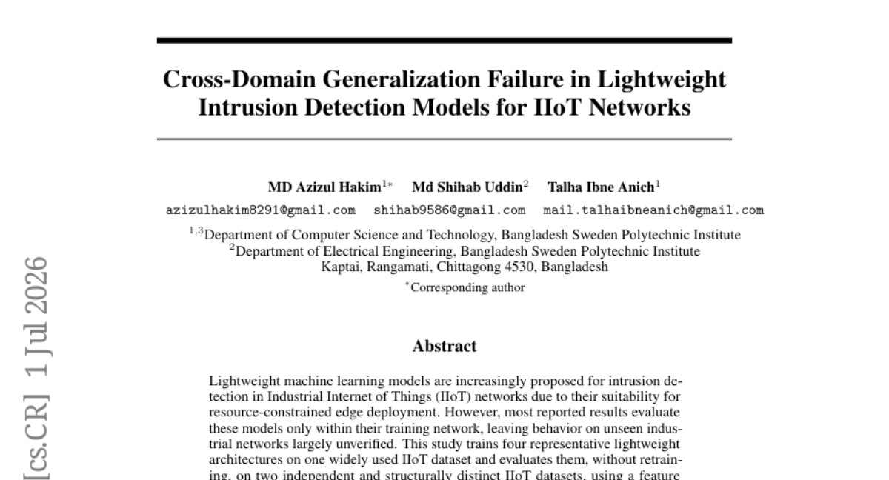

### 📌 한 줄 요약
IIoT 환경에서 경량 침입 탐지 모델이 학습 데이터에만 최적화된 '지름길(Shortcut)' 학습으로 인해 미학습 네트워크에서 성능이 급락하는 문제를 규명함

### 🔑 핵심 포인트
- 경량 모델이 특정 도메인의 특징(예: 포트 카테고리)에 의존하는 '지름길 학습' 문제 식별
- 도메인 간 데이터 구조 차이가 일반화 성능에 미치는 영향 분석
- 클래스 불균형이 도메인 간 상대적 난이도 평가를 왜곡할 수 있음을 증명

### 🧑‍💻 개발자 관점
실제 IIoT 현장에 모델을 배포할 때, 학습 데이터셋 내의 높은 정확도가 새로운 네트워크 환경에서의 보안 성능을 보장하지 않음을 인지해야 합니다.

### 🚀 실무 적용 아이디어
- 학습 데이터와 타겟 데이터 간의 특징 분포 차이(Covariate Shift)를 정량적으로 측정하기
- 특정 피처에 과도하게 의존하는지 확인하기 위한 SHAP/LIME 기반 설명 가능성(XAI) 분석 수행
- 도메인 일반화를 위해 데이터 증강 또는 도메인 적응(Domain Adaptation) 기법 적용 테스트

### ⚠️ 리스크/한계
- 학습 시 사용된 피처가 타겟 도메인에서 유효하지 않을 경우 성능 급락 위험
- 클래스 불균형이 심한 실제 환경에서 평가 지표(Accuracy 등)의 신뢰도 저하

### 📝 초록 기반 상세 설명
자원 제약이 있는 IIoT 엣지 환경을 위해 경량 머신러닝 기반 침입 탐지 모델이 활발히 제안되고 있습니다. 그러나 기존 연구들은 주로 학습된 네트워크 내에서의 성능만을 보고하여, 미학습 네트워크에 대한 일반화 성능을 검증하지 않는 문제가 있습니다. 본 연구는 하나의 데이터셋으로 학습된 모델을 구조가 다른 두 개의 타겟 데이터셋에 적용하여 교차 도메인 일반화 성능을 평가했습니다. 분석 결과, 모델들이 특정 포트 카테고리와 같은 단순한 특징(Shortcut)에 과도하게 의존하여 도메인 간 차이를 극복하지 못함을 확인했습니다. 또한 클래스 불균형과 적대적 공격에 대한 강건성 분석을 통해, 단순 정확도 중심의 평가 방식이 가진 위험성을 경고했습니다.

---

## 17. [Graph-Native Reinforcement Learning Enables Traceable Scientific Hypothesis Generation through Conceptual Recombination](https://huggingface.co/papers/2607.00924)
**Upvotes**: 4 | **도입 난이도**: 상 | **신뢰도**: 상
**arXiv**: https://arxiv.org/abs/2607.00924

**태그**: Reinforcement Learning, Graph Neural Networks, Reasoning, Scientific AI, RAG, Safety

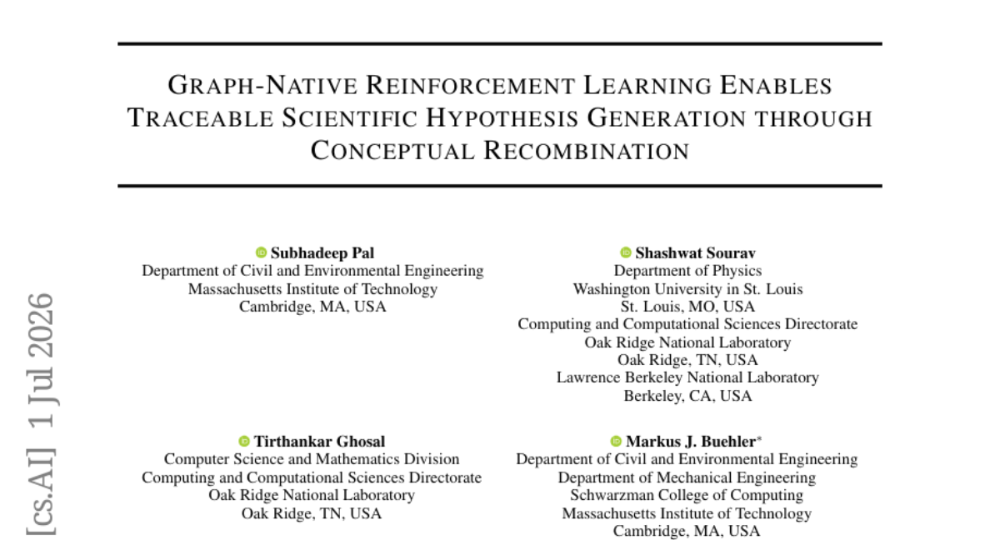

### 📌 한 줄 요약
그래프 구조와 강화학습을 결합하여 과학적 가설 생성의 추적 가능성과 논리적 일관성을 확보한 모델 연구

### 🔑 핵심 포인트
- GRPO를 활용하여 추론 과정을 명시적 단계(그래프 구축, 패턴 추출 등)로 분리한 Graph-PRefLexOR 개발
- 신경망 생성과 심볼릭 그래프 구조를 결합하여 인과 관계의 추적 가능성 및 재사용성 확보
- 테스트 타임 그래프 확장을 통해 의미적 범위 내에서 고차원적 개념 재조합 능력 입증

### 🧑‍💻 개발자 관점
단순 텍스트 생성을 넘어, 복잡한 도메인 지식을 구조화된 그래프로 변환하여 논리적 근거를 추적해야 하는 전문 분야(과학, 공학) AI 에이전트 설계에 중요한 방법론을 제시합니다.

### 🚀 실무 적용 아이디어
- GRPO와 같은 최신 강화학습 알고리즘을 복잡한 추론 태스크에 적용해보기
- LLM의 추론 과정을 그래프 구조로 정형화하여 저장/검증하는 파이프라인 설계 실험
- 도메인 특화 지식 그래프와 LLM 간의 상호작용을 통한 추론 정렬 테스트

### ⚠️ 리스크/한계
- 그래프 구조 구축 및 추론 단계가 복잡해짐에 따른 연산 비용 증가 가능성
- 특정 도메인(신소재 등)에 특화된 구조가 다른 분야로 일반화될 수 있는지에 대한 의문

### 📝 초록 기반 상세 설명
신소재 발견을 위한 AI는 도메인 지식에 기반한 다단계 추론 능력이 필수적이지만, 기존 LLM은 생성된 답변의 논리적 근거를 추적하기 어렵다는 문제가 있습니다. 이를 해결하기 위해 연구진은 GRPO(Group Relative Policy Optimization)를 활용하여 추론 과정을 단계별(메커니즘 탐색, 그래프 구축, 패턴 추출, 가설 합성)로 구조화한 Graph-PRefLexOR 모델을 개발했습니다. 이 모델은 신경망 기반 언어 생성과 심볼릭 관계 구조를 결합하여 인과 관계를 명시적으로 구축하고 재사용할 수 있게 합니다. 실험 결과, 기존 모델 대비 추론 추적성 측면에서 큰 성능 향상을 보였으며, 의미적 다양성과 논리적 정렬도 또한 높게 나타났습니다. 결과적으로 그래프 기반 강화학습이 과학적 가설 생성에 있어 해석 가능한 AI를 구축하는 유망한 경로임을 입증했습니다.

---

## 18. [When LLMs Read Tables Carelessly: Measuring and Reducing Data Referencing Errors](https://huggingface.co/papers/2606.32029)
**Upvotes**: 4 | **도입 난이도**: 중 | **신뢰도**: 상
**arXiv**: https://arxiv.org/abs/2606.32029

**태그**: LLM, Data Extraction, Quality Assurance, Table QA, RAG, Reasoning, Evaluation, Inference

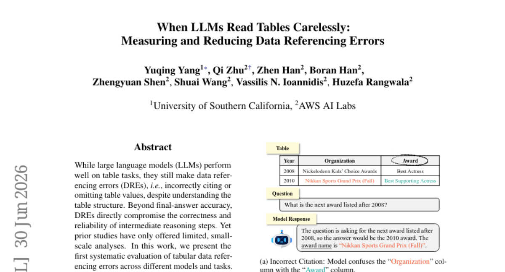

### 📌 한 줄 요약
LLM의 표 데이터 참조 오류(DRE)를 체계적으로 분석하고, 이를 탐지 및 교정하는 경량 Critic 모델을 통한 정확도 향상 방법론 제시

### 🔑 핵심 포인트
- 다양한 규모(1.7B~20B)의 모델을 대상으로 한 최초의 체계적인 데이터 참조 오류(DRE) 평가 수행
- Critic 기반 필터링 및 거부 샘플링(Rejection Sampling)을 통한 답변 정확도 개선
- DRE 탐지에 특화된 4B 규모의 경량 Critic 모델 개발 및 높은 F1 스코어 달성

### 🧑‍💻 개발자 관점
LLM을 활용한 데이터 분석/리포팅 시스템 구축 시, 모델이 표의 수치를 잘못 인용하여 발생하는 신뢰성 문제를 해결할 수 있는 실질적인 가이드를 제공합니다.

### 🚀 실무 적용 아이디어
- 현재 운영 중인 Table-QA 시스템에서 모델이 값을 잘못 인용하는 패턴(DRE) 분석
- 추론 결과에 대해 데이터 참조 적절성을 검증하는 별도의 Critic 프롬프트/모델 도입 실험
- Rejection Sampling 기법을 적용하여 잘못된 참조가 포함된 답변을 필터링하는 파이프라인 구축

### ⚠️ 리스크/한계
- 경량 Critic 모델이 모든 복잡한 추론 과정의 오류를 완벽히 잡아내기에는 한계가 있을 수 있음
- Critic 모델 도입 시 추가적인 추론 비용 및 지연 시간(Latency) 발생

### 📝 초록 기반 상세 설명
LLM은 표 구조를 이해하더라도 값을 잘못 인용하거나 누락하는 데이터 참조 오류(DRE)를 빈번하게 발생시킵니다. 이러한 오류는 최종 답변의 신뢰성을 저해하지만, 기존 연구는 이에 대한 체계적인 분석이 부족했습니다. 본 연구는 다양한 규모의 모델을 대상으로 DRE를 체계적으로 평가하는 프레임워크를 제안합니다. 실험 결과, 데이터 참조를 검증하는 Critic 메커니즘을 도입했을 때 답변 정확도가 크게 향상되었습니다. 최종적으로 4B 규모의 경량 Critic 모델을 학습시켜, 다양한 환경에서 DRE를 효과적으로 탐지하고 대형 모델의 추론을 보조할 수 있음을 증명했습니다.

---

## 19. [AtomiMed: Hierarchical Atomic Fact-Checking for Universal Clinical-Aware Medical Report Evaluation](https://huggingface.co/papers/2606.31292)
**Upvotes**: 4 | **도입 난이도**: 중 | **신뢰도**: 상
**arXiv**: https://arxiv.org/abs/2606.31292

**태그**: Medical-AI, Evaluation, Agentic-Workflow, Multi-modal, NLP, Agent, Benchmark

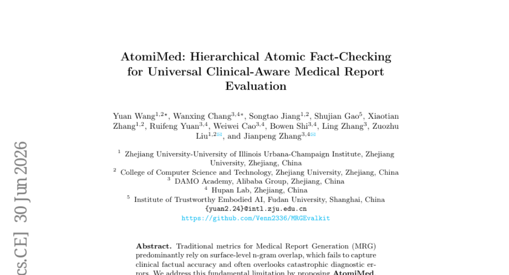

### 📌 한 줄 요약
의료 보고서 생성 모델의 임상적 정확성을 검증하기 위해 원자 단위 사실 확인(Atomic Fact-Checking)을 수행하는 계층적 평가 프레임워크

### 🔑 핵심 포인트
- 질병 및 속성(위치, 형태, 중증도) 단위의 계층적 원자적 사실 분해 기술
- 에이전트 기반 교차 검증을 통한 임상적 일관성 및 진단 정확도 검증
- 다양한 영상 모달리티(X-ray, CT, MRI, US)를 포함하는 벤치마크 및 툴킷 제공

### 🧑‍💻 개발자 관점
단순 텍스트 유사도가 아닌, 의료 도메인 특화된 '의학적 사실 관계'를 자동 평가할 수 있는 정교한 평가 파이프라인을 구축할 수 있습니다.

### 🚀 실무 적용 아이디어
- 기존 생성 모델의 결과물을 AtomiMed 프레임워크로 재평가하여 진단 오류율 측정
- 제공된 MRGEvalKit을 활용하여 모델의 질병/속성별 정확도 분리 분석
- 멀티모달 모델의 텍스트 생성 결과에 대한 에이전트 검증 루프 적용 테스트

### ⚠️ 리스크/한계
- 에이전트 기반 검증 과정에서 발생할 수 있는 추론 비용 및 지연 시간
- 원자적 사실 추출 단계에서의 LLM 자체 오류 가능성

### 📝 초록 기반 상세 설명
기존의 의료 보고서 생성(MRG) 평가는 n-gram 중첩 기반의 표면적 지표에 의존하여 치명적인 진단 오류를 잡아내지 못하는 한계가 있었습니다. 이를 해결하기 위해 복잡한 의료 서술을 질병 및 속성 단위의 계층적 '원자적 임상 사실(Atomic Clinical Facts)'로 분해하는 AtomiMed 프레임워크를 제안합니다. 이 프레임워크는 에이전트 기반의 교차 검증 루프를 통해 전문의의 피어 리뷰 과정을 모사하며, 진단 탐지와 기술적 정확도를 분리하여 평가합니다. 또한 자동화된 추출을 위한 MRGEvalKit과 다양한 영상 모달리티를 포함하는 OmniMRG-Bench를 함께 공개했습니다. 실험 결과, AtomiMed는 기존 지표들보다 전문의의 판단과 훨씬 높은 상관관계를 보였습니다.

---

## 20. [Are Performance-Optimization Benchmarks Reliably Measuring Coding Agents?](https://huggingface.co/papers/2607.01211)
**Upvotes**: 3 | **도입 난이도**: 하 | **신뢰도**: 상
**arXiv**: https://arxiv.org/abs/2607.01211

**태그**: Coding Agent, Benchmark, Performance Optimization, Evaluation, Agent, RAG

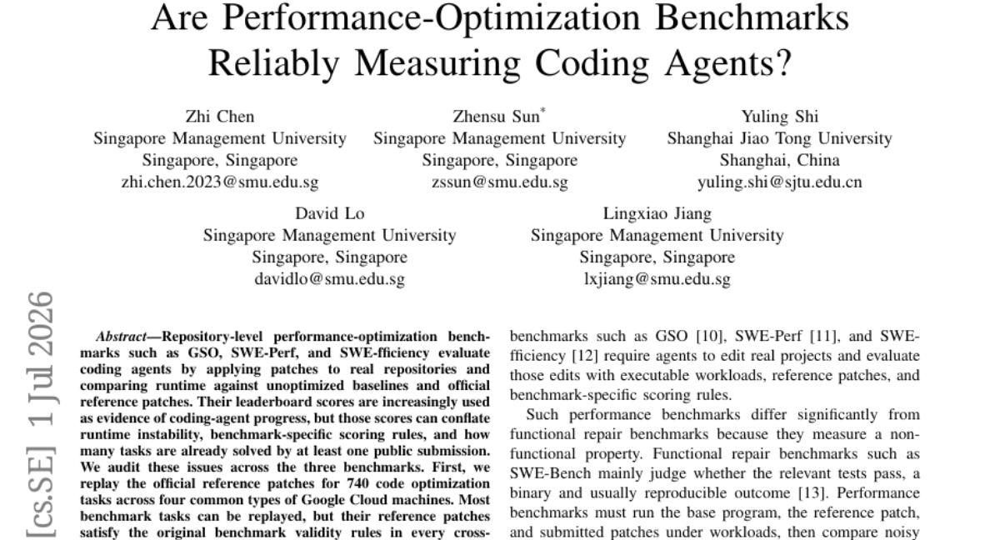

### 📌 한 줄 요약
현재 코딩 에이전트 성능 측정에 널리 쓰이는 성능 최적화 벤치마크(GSO, SWE-Perf, SWE-fficiency)의 신뢰성 결함과 순위 왜곡 문제를 분석함

### 🔑 핵심 포인트
- 벤치마크 참조 패치의 재현성 및 환경 의존성 문제 식별 (특히 SWE-Perf의 취약성)
- 채점 규칙(Scoring Rule)에 따른 리더보드 순위 왜곡 및 특정 과제 점수 편중 현상 증명
- 공개된 제출물 중 상당수가 이미 참조 패치와 유사하거나 더 높은 성능을 보여 벤치마크 변별력 저하

### 🧑‍💻 개발자 관점
에이전트 성능을 평가할 때 리더보드 점수만 맹신하기보다, 환경 변화에 따른 재현성과 채점 방식의 편향성을 반드시 고려해야 함을 시사합니다.

### 🚀 실무 적용 아이디어
- 에이전트 평가 시 단일 환경이 아닌 다양한 하드웨어 사양에서 재현성 테스트 수행
- 벤치마크 점수 산출 방식(가중치 등)이 특정 과제에 편중되어 있는지 검토
- 이미 해결된 과제가 포함된 벤치마크를 사용할 경우, 새로운 과제(New Task)에 대한 변별력 확인

### ⚠️ 리스크/한계
- 벤치마크 자체의 결함이 에이전트의 실제 잠재력을 과소평가하거나 과대평가할 위험
- 특정 환경에 최적화된 '벤치마크 오버피팅' 발생 가능성

### 📝 초록 기반 상세 설명
최근 코딩 에이전트의 발전 지표로 활용되는 리포지토리 수준의 성능 최적화 벤치마크들이 실제 성능을 정확히 반영하는지 검증이 필요해졌습니다. 연구진은 GSO, SWE-Perf, SWE-fficiency 벤치마크를 대상으로 실행 환경의 불안정성, 채점 규칙의 편향성, 그리고 이미 해결된 과제들의 중복 문제를 심층 감사했습니다. 실험 결과, 많은 참조 패치가 하드웨어 환경 변화에 따라 유효성을 잃거나 성능 차이가 거의 없는 것으로 나타났습니다. 또한, 채점 규칙에 따라 제출물 간 순위가 뒤바뀌거나 특정 과제에 점수가 과도하게 쏠리는 현상을 확인했습니다. 결과적으로 현재의 리더보드 점수가 에이전트의 실제 성능 향상을 온전히 대변하지 못할 수 있음을 입증했습니다.

---

## 21. [Personalization as Inverse Planning: Learning Latent Design Intents for Agentic Slide Generation via Structural Denoising](https://huggingface.co/papers/2607.00407)
**Upvotes**: 3 | **도입 난이도**: 상 | **신뢰도**: 상
**arXiv**: https://arxiv.org/abs/2607.00407

**태그**: Agent, Reinforcement Learning, Design Automation, Multi-Agent

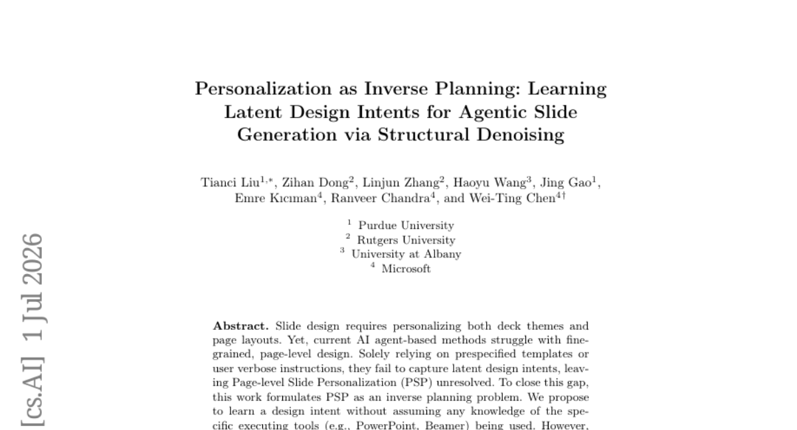

### 📌 한 줄 요약
구조적 노이즈 제거(Structural Denoising)를 통해 사용자의 잠재적 디자인 의도를 학습하여 정교한 슬라이드를 생성하는 멀티 에이전트 프레임워크

### 🔑 핵심 포인트
- PSP(Page-level Slide Personalization)를 역계획 문제로 정식화
- 구조적 노이즈 제거(Structural Denoising)를 통한 디자인 의도 학습 프레임워크 SPIRE 제안
- 멀티 에이전트 강화학습을 통한 정책 경사 분산 감소 및 최적화 효율성 확보

### 🧑‍💻 개발자 관점
단순 텍스트 기반 생성을 넘어, 시각적 구조(Layout)를 유지하면서 사용자의 스타일을 반영하는 에이전트 설계 패턴을 제공합니다.

### 🚀 실무 적용 아이디어
- 구조적 노이즈(Layout corruption)를 생성하는 데이터 증강 파이프라인 구축 실험
- 멀티 에이전트 협업 시 보상 함수(Reward Function) 설계 방식 검토
- PowerPoint/Beamer 등 실제 도구로의 변환(Execution) 인터페이스 설계

### ⚠️ 리스크/한계
- 구조적 노이즈 제거 방식이 실제 복잡한 디자인 의도를 완벽히 포착할 수 있는지에 대한 검증 필요
- 강화학습 기반 최적화로 인한 높은 학습 비용 및 수렴 안정성 문제

### 📝 초록 기반 상세 설명
기존의 AI 에이전트 기반 슬라이드 생성 방식은 템플릿 의존도가 높거나 사용자 지시어에만 의존하여 세밀한 페이지 단위 개인화(PSP)를 구현하는 데 한계가 있었습니다. 본 논문은 PSP 문제를 역계획(Inverse Planning) 문제로 정의하고, 특정 도구에 종속되지 않는 디자인 의도를 학습하는 방법을 제안합니다. 이를 위해 구조적 노이즈를 제거하는 과정을 통해 디자인을 정제하는 SPIRE 프레임워크를 도입했습니다. 두 개의 에이전트가 강화학습(RL)을 통해 협업하여 구조적 노이즈를 제거하며 실행 가능한 디자인을 정제하도록 설계되었습니다. 이론적으로 구조적 노이즈 제거가 PSP의 일관된 대리 작업(Surrogate)임을 증명하고, 멀티 에이전트 방식이 정책 경사(Policy Gradient) 분산을 줄임을 보였습니다. 실험 결과, 제안된 방식이 기존 방식보다 뛰어난 슬라이드 개인화 성능을 입증했습니다.

---

## 22. [Autonomous Scientific Discovery via Iterative Meta-Reflection](https://huggingface.co/papers/2607.01131)
**Upvotes**: 3 | **도입 난이도**: 상 | **신뢰도**: 상
**arXiv**: https://arxiv.org/abs/2607.01131

**태그**: AI Agent, Autonomous Discovery, Meta-Learning, Multimodal, Reasoning, Vision, Benchmark, Evaluation

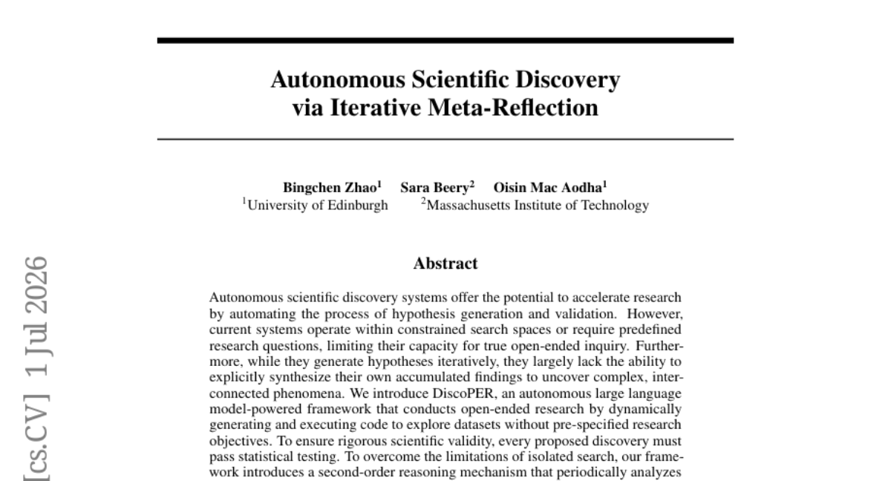

### 📌 한 줄 요약
메타 성찰(Meta-Reflection)을 통해 스스로 가설을 수정하고 탐색 범위를 확장하는 자율적 과학 발견 프레임워크 DiscoPER 제안

### 🔑 핵심 포인트
- 코드 생성 및 실행을 통한 자율적 데이터 탐색 및 통계적 가설 검증
- 축적된 발견을 분석하여 탐색 방향을 재설정하는 2차 메타-성찰(Meta-reflection) 메커니즘
- 멀티모달 데이터 처리를 통한 비정형 정보 활용 및 탐색 공간 확장

### 🧑‍💻 개발자 관점
에이전트가 단순히 주어진 태스크를 수행하는 것을 넘어, 스스로 학습 결과(Log/Data)를 분석하여 전략을 수정하는 고도화된 자율 루프 설계 방식을 배울 수 있습니다.

### 🚀 실무 적용 아이디어
- LLM 에이전트의 루프 내에 이전 단계의 결과를 피드백으로 넣는 메타-성찰 로직 구현 실험
- 코드 실행 환경(Sandboxed Environment)과 통계 검증 라이브러리 연동 테스트
- 멀티모달 데이터(이미지/텍스트)를 에이전트의 지식 베이스로 변환하는 파이프라인 구축

### ⚠️ 리스크/한계
- 복잡한 추론 과정에서 발생할 수 있는 환각(Hallucination) 및 잘못된 통계적 결론 위험
- 코드 실행 및 대규모 데이터 탐색에 따른 높은 컴퓨팅 비용과 연산 복잡도

### 📝 초록 기반 상세 설명
기존의 자율적 과학 발견 시스템은 정해진 연구 질문이나 제한된 탐색 공간 내에서만 작동하며, 축적된 지식을 통합하여 복잡한 패턴을 발견하는 능력이 부족합니다. 이를 해결하기 위해 LLM 기반의 자율 연구 프레임워크인 DiscoPER를 도입했습니다. 이 시스템은 코드 실행을 통해 데이터셋을 탐색하며, 모든 가설을 통계적 검증을 거치도록 설계되었습니다. 특히, 이전의 발견들을 데이터로 취급하여 분석하는 2차 추론(Second-order reasoning) 메커니즘을 통해 지식의 공백을 식별하고 탐색 방향을 재설정합니다. 또한 멀티모달 도구 활용을 통해 이미지 등 다양한 소스에서 정보를 추출하며 탐색 범위를 확장합니다. 실험 결과, 새로운 생태학 벤치마크인 iNatDisco에서 기존 방식보다 뛰어난 패턴 복구 성능을 입증했습니다.

---

## 23. [SciIR: A Large-scale Training Dataset and Benchmark for Scientific Image Reasoning Generation](https://huggingface.co/papers/2606.30124)
**Upvotes**: 3 | **도입 난이도**: 중 | **신뢰도**: 상
**arXiv**: https://arxiv.org/abs/2606.30124

**태그**: Generative AI, Scientific Imaging, Dataset, Benchmark, Reasoning, Vision, Evaluation, Safety

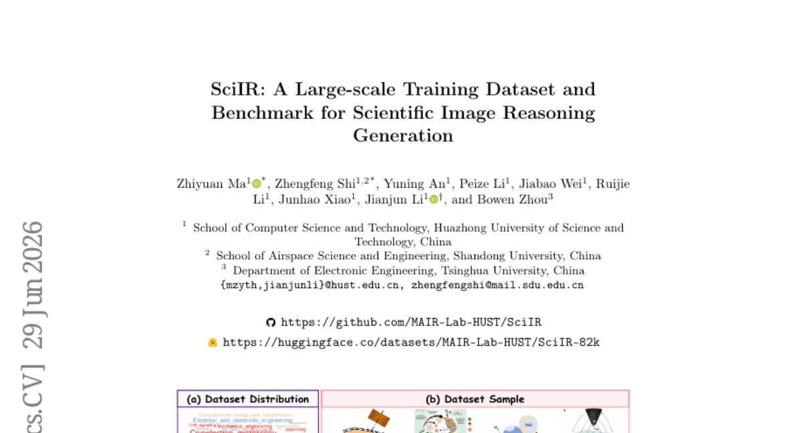

### 📌 한 줄 요약
과학적 논리 구조를 반영한 대규모 데이터셋과 벤치마크를 통해 과학 이미지 생성 모델의 추론 능력을 강화함

### 🔑 핵심 포인트
- 기호학적 관점(Icon, Index, Symbol)을 적용한 과학적 추론 프레임워크 정립
- 82,000개 이상의 고품질 과학 이미지-텍스트 쌍을 포함하는 SciIR-82k 데이터셋 구축
- 과정 중심의 검증을 위한 Atomic Checklist 기반 SciIR-Bench 제안

### 🧑‍💻 개발자 관점
도메인 특화(과학/의학) 이미지 생성 모델 개발 시, 단순 시각적 유사성을 넘어 논리적 정확성을 확보하기 위한 데이터 구조화 및 평가 방법론을 제공합니다.

### 🚀 실무 적용 아이디어
- 제공된 Sci-RCoT(Reasoning Chain-of-Thought) 구조를 기존 T2I 모델의 프롬프트 엔지니어링에 적용해보기
- 도메인 특화 데이터셋 구축 시 SciIR-82k의 계층적 구조를 벤치마킹하기
- Atomic Checklist 방식을 활용하여 생성 모델의 결과물에 대한 정밀 검증 파이프라인 설계하기

### ⚠️ 리스크/한계
- 과학적 사실 관계의 정확성이 데이터셋의 시각적 품질에 의존할 수 있음
- 특정 과학 분야에 편향된 데이터가 포함될 경우 범용적 과학 추론 성능 저하 가능성

### 📝 초록 기반 상세 설명
기존 Text-to-Image 모델은 정교한 의미적 정렬과 과학적 논리 추론이 필요한 과학 이미지 생성에서 한계를 보입니다. 이를 해결하기 위해 기호학적 삼원론(Peirce's Semiotic Triad)에 기반하여 개체 구조, 과학적 과정, 과학 법칙을 포함하는 SciIR 프레임워크를 제안합니다. 연구진은 8만 개 이상의 고품질 과학 이미지-텍스트 쌍을 포함하는 SciIR-82k 데이터셋과 세밀한 검증을 위한 SciIR-Bench를 구축했습니다. 실험 결과, 기존 모델들의 과학적 추론 능력이 부족함을 확인하였으며, SciIR-82k로 미세 조정된 Qwen-Image-SciIR 모델은 벤치마크 점수를 유의미하게 향상시켰습니다.

---

## 24. [Rank-Aware Hyperbolic Alignment for Vision-Language Dataset Distillation](https://huggingface.co/papers/2606.29464)
**Upvotes**: 3 | **도입 난이도**: 중 | **신뢰도**: 상
**arXiv**: https://arxiv.org/abs/2606.29464

**태그**: VLDD, Hyperbolic_Geometry, Data_Distillation, Multimodal, RAG, Vision, Benchmark, Evaluation, Distillation, Safety

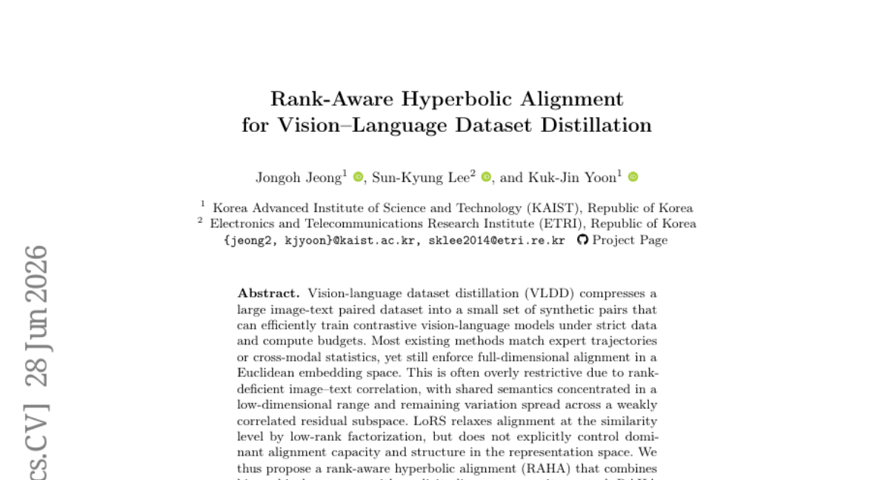

### 📌 한 줄 요약
저차원 상관관계와 잔차 다양성을 고려한 하이퍼볼릭 기하학 기반의 효율적인 비전-언어 데이터 증류 기법

### 🔑 핵심 포인트
- 유클리드 공간의 전차원 정렬 제약을 극복하기 위한 하이퍼볼릭 공간 활용
- 공유 의미(shared range)와 잔차 공간(residual subspace)을 분리하여 정렬 및 다양성 제어
- 계층적 기하 구조를 통한 효율적인 비전-언어 표현 학습

### 🧑‍💻 개발자 관점
데이터셋 크기를 획기적으로 줄이면서도 모델의 전이 성능과 검색 성능을 유지해야 하는 실무 환경에서 유용한 최적화 기법입니다.

### 🚀 실무 적용 아이디어
- 기존 유클리드 기반 VLDD 코드베이스에 하이퍼볼릭 임베딩 레이어 적용 테스트
- 데이터 압축률 변화에 따른 검색 성능 및 전이 성능(Transferability) 변화 측정
- 다양한 데이터셋 규모에서 저차원/고차원 정렬 분리 전략의 효과 검증

### ⚠️ 리스크/한계
- 하이퍼볼릭 공간 연산으로 인한 학습 복잡도 및 계산 비용 증가 가능성
- 특정 도메인 데이터셋에서의 계층적 구조 적합성 여부 불확실

### 📝 초록 기반 상세 설명
비전-언어 데이터 증류(VLDD)는 대규모 데이터셋을 소수의 합성 쌍으로 압축하여 효율적인 학습을 목표로 합니다. 기존 방식은 유클리드 공간에서의 전차원 정렬을 강제하여, 실제 데이터의 저차원 상관관계와 잔차 공간의 다양성을 충분히 활용하지 못하는 문제가 있습니다. 이를 해결하기 위해 본 논문은 계층적 기하 구조와 정렬 용량 제어를 결합한 RAHA(Rank-Aware Hyperbolic Alignment)를 제안합니다. RAHA는 표현 공간을 하이퍼볼릭 공간으로 투영하여 공유 의미는 측지선(geodesic) 정렬을 통해 맞추고, 잔차 공간은 정규화하여 모달리티별 고유한 다양성을 보존합니다. 실험 결과, 고정된 예산 내에서 경쟁력 있는 검색 성능과 향상된 전이 학습 능력을 입증했습니다.

---

## 25. [AI translation of literary texts is "fine", but readers still prefer human translations](https://huggingface.co/papers/2606.26040)
**Upvotes**: 3 | **도입 난이도**: 중 | **신뢰도**: 상
**arXiv**: https://arxiv.org/abs/2606.26040

**태그**: LLM, Translation, Evaluation, NLP, Human-Centric, Agent

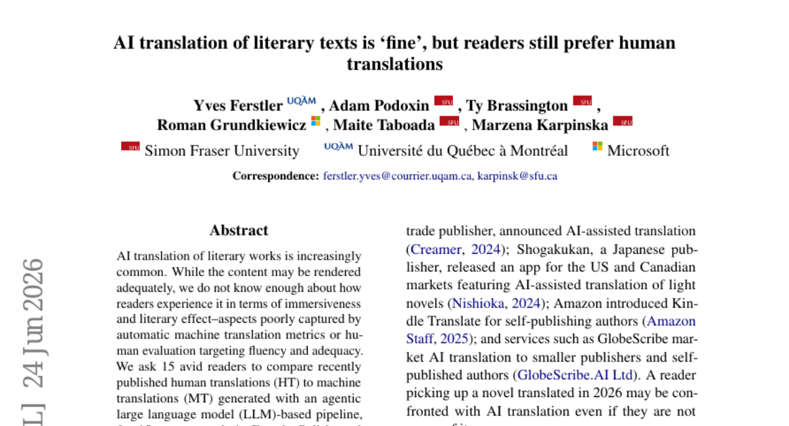

### 📌 한 줄 요약
문학 번역에서 LLM 기반 기계 번역은 내용 전달은 가능하나, 독자의 몰입감과 문학적 효과 측면에서 여전히 인간 번역을 선호함

### 🔑 핵심 포인트
- 독자들은 문학적 몰입감과 명확성 때문에 기계 번역보다 인간 번역을 선호함
- 기존 자동 평가 지표 및 LLM-as-a-judge는 독자의 실제 선호도를 정확히 반영하지 못함
- 독자들은 정답을 맞히기 어려워하며, 자신이 인간이 번역했다고 믿는 버전을 선호하는 경향이 있음

### 🧑‍💻 개발자 관점
LLM을 활용한 콘텐츠 생성 시, 단순 정확도(Accuracy)를 넘어 몰입감과 스타일 같은 정성적 품질을 어떻게 정량화하고 평가할 것인지에 대한 과제를 제시함

### 🚀 실무 적용 아이디어
- LLM 기반 번역 파이프라인에 문학적 스타일(Tone & Manner) 유지 실험 수행
- 기존 BLEU/METEOR 외에 독자 경험을 반영할 수 있는 새로운 평가 프로토콜 검토
- 공개된 LAIT 데이터셋을 활용하여 현재 모델의 문학적 번역 품질 벤치마킹

### ⚠️ 리스크/한계
- 실험 대상이 소수의 숙련된 독자(15명)로 제한되어 일반화에 주의가 필요함
- 문학적 가치는 주관적이므로 자동화된 지표로 완벽히 대체하기 어려움

### 📝 초록 기반 상세 설명
최근 LLM을 활용한 문학 번역이 증가하고 있으나, 기존의 유창성 및 정확도 중심 평가 방식으로는 독자의 몰입감과 문학적 경험을 측정하기 어렵습니다. 본 연구는 15권의 소설을 대상으로 독자들이 인간 번역(HT)과 LLM 기반 기계 번역(MT)을 비교 평가하도록 설계했습니다. 실험 결과, 독자들은 MT가 '괜찮다'고 느끼면서도 몰입감과 명확성 측면에서 HT를 더 선호하는 경향을 보였습니다. 특히 자동 평가 지표(LLM-as-a-judge 포함)는 독자의 실제 선호도를 반영하지 못하고 오히려 MT를 선호하는 한계를 보였습니다. 연구진은 이를 위해 독자 중심의 평가 데이터셋인 LAIT를 공개했습니다.

---

## 26. [NoPA: Non-Parametric Online 3D Scene Graph Generation](https://huggingface.co/papers/2607.00529)
**Upvotes**: 2 | **도입 난이도**: 중 | **신뢰도**: 상
**arXiv**: https://arxiv.org/abs/2607.00529

**태그**: 3D Scene Graph, Real-time Inference, Non-Parametric Distribution, Robotics, RAG, Inference

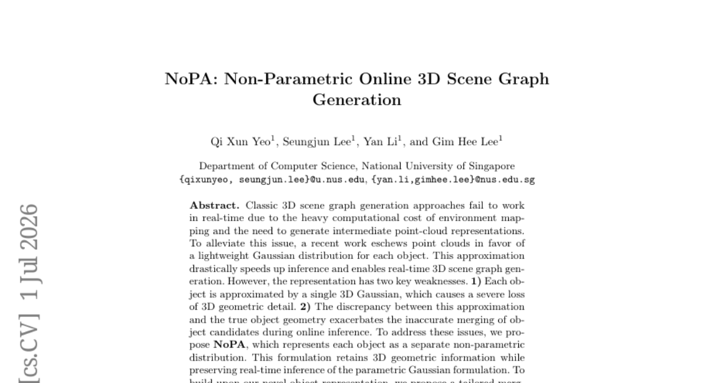

### 📌 한 줄 요약
실시간성을 유지하면서도 객체의 정밀한 기하학적 정보를 보존하는 비매개변수적(Non-Parametric) 3D 장면 그래프 생성 기술

### 🔑 핵심 포인트
- 비매개변수적 분포를 통한 객체별 정밀한 3D 기하 정보 보존
- 고정된 파티클 세트를 활용한 효율적인 객체 병합 전략 (MMD 기반)
- 오분류된 객체 간의 관계를 복구하는 관계 전파(Relationship Propagation) 메커니즘

### 🧑‍💻 개발자 관점
로봇이나 AR/VR 환경에서 실시간으로 정밀한 3D 공간 구조를 파악해야 하는 시스템 개발 시, 연산 효율과 정확도 사이의 트레이드오프를 해결할 수 있는 방법론을 제시합니다.

### 🚀 실무 적용 아이디어
- 제안된 비매개변수적 분포 모델의 파티클 수 변화에 따른 연산량 및 정확도 변화 측정
- 다양한 복잡도를 가진 3D 환경 데이터셋에서의 병합 전략(MMD) 성능 검증
- 기존 가우시안 기반 모델과 NoPA의 객체 간 관계 추출 정확도 비교 실험

### ⚠️ 리스크/한계
- 파티클 수 설정에 따라 연산 복잡도가 변동될 수 있는 잠재적 리스크
- 매우 복잡하거나 밀집된 환경에서의 객체 분리 및 병합 정확도 한계

### 📝 초록 기반 상세 설명
기존의 3D 장면 그래프 생성 방식은 환경 매핑 및 포인트 클라우드 생성에 따른 높은 연산 비용으로 인해 실시간 처리가 어려웠습니다. 최근 가우시안 분포를 활용한 경량화 방식이 제안되었으나, 단일 가우시안 표현으로 인한 기하학적 디테일 손실과 객체 병합 오류라는 한계가 존재했습니다. 이를 해결하기 위해 본 논문은 각 객체를 개별적인 비매개변수적 분포로 표현하는 NoPA를 제안합니다. 이 방식은 실시간 추론 속도를 유지하면서도 객체의 3D 기하 정보를 효과적으로 보존합니다. 또한, 커널 밀도 추정 기반의 MMD(Maximum Mean Discrepancy)를 활용한 병합 전략과 관계 전파 알고리즘을 통해 객체 식별 및 관계 추출의 정확도를 높였습니다. 실험 결과, NoPA는 실시간 성능을 저해하지 않으면서도 기존 방식보다 뛰어난 성능을 입증했습니다.

---

## 27. [PixelEyes: Decoupling Perception and Reasoning for Pinpoint Visual Evidence Seeking](https://huggingface.co/papers/2607.00115)
**Upvotes**: 2 | **도입 난이도**: 중 | **신뢰도**: 상
**arXiv**: https://arxiv.org/abs/2607.00115

**태그**: Agent, Vision, Multi-modal, Object Detection, Reasoning, Benchmark

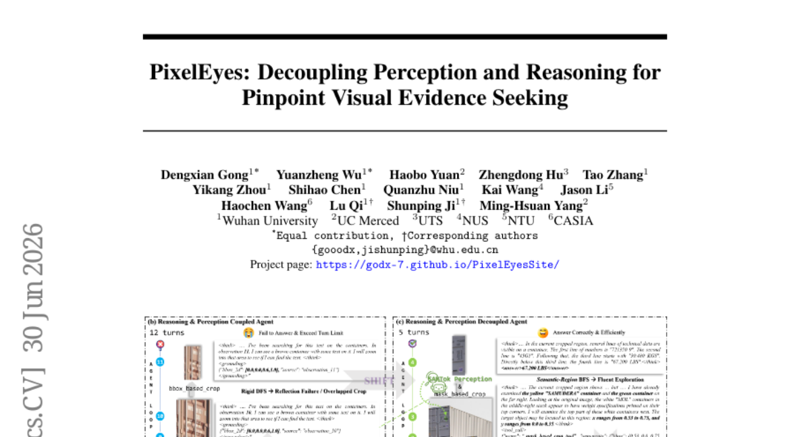

### 📌 한 줄 요약
추론과 인식을 분리하여 멀티턴 시각적 추론 과정에서의 중복 탐색과 위치 오류 문제를 해결한 에이전트 프레임워크

### 🔑 핵심 포인트
- 추론(Reasoning)과 인식(Perception)의 명시적 분리를 통한 에이전트 효율성 증대
- Mask-guided Visual Search 및 BFS 기반 탐색을 통한 정밀한 객체 위치 파악 및 중복 루프 제거
- 전문가 트래젝토리를 재합성한 PixelEyes-6K 데이터셋 및 정밀 평가 벤치마크 Pinpoint-Bench 제안

### 🧑‍💻 개발자 관점
에이전트가 시각적 정보를 처리할 때 발생하는 '잘못된 위치 파악 -> 잘못된 추론 -> 무한 루프' 문제를 구조적으로 해결하는 설계 패턴을 제공합니다.

### 🚀 실무 적용 아이디어
- 기존 MLLM 에이전트에 외부 Segmentation Tool을 결합하여 성능 변화 관찰
- BFS 기반의 탐색 전략을 복잡한 멀티 객체 환경에 적용해보기
- 제공된 Pinpoint-Bench를 활용하여 현재 모델의 인지/추론 실패 지점 분석

### ⚠️ 리스크/한계
- 외부 인식 도구(Segmentation 모델) 의존성으로 인한 추론 속도 저하 가능성
- 복잡한 환경에서 BFS 탐색 시 연산 비용 증가 문제

### 📝 초록 기반 상세 설명
기존 MLLM 기반 시각적 추론 모델은 추론과 위치 파악을 동시에 수행하려다 보니 부정확한 로컬라이제이션이 불필요한 추론 루프를 유발하는 문제가 있었습니다. 이를 해결하기 위해 본 논문은 추론(Reasoning)과 인식(Perception)을 명시적으로 분리한 PixelEyes를 제안합니다. 구체적으로는 세그멘테이션 모델을 활용한 Mask-guided Visual Search와 중복 탐색을 방지하는 Semantic-region BFS 전략을 도입했습니다. 또한, 이러한 로직을 학습시키기 위한 PixelEyes-6K 데이터셋과 정밀한 평가를 위한 Pinpoint-Bench를 구축했습니다. 실험 결과, 제안된 방식이 기존 모델들의 비효율적인 탐색 경로를 줄이고 정밀한 시각적 증거 탐색을 가능하게 함을 입증했습니다.

---

## 28. [CogSENet: Blind Image Deblurring with Blur-Conditioned Semantic Routing and Explicit Frequency Fusion](https://huggingface.co/papers/2606.30030)
**Upvotes**: 1 | **도입 난이도**: 중 | **신뢰도**: 상
**arXiv**: https://arxiv.org/abs/2606.30030

**태그**: Computer Vision, Image Restoration, Deep Learning, Feature Fusion, Vision

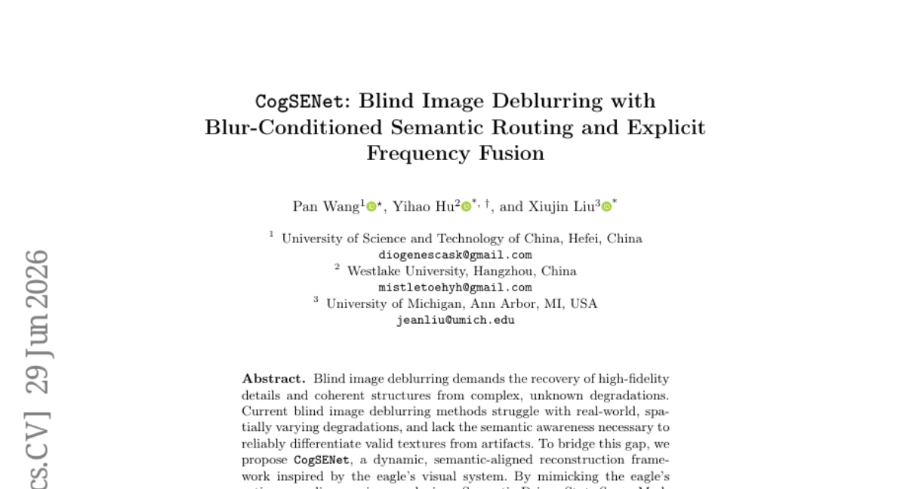

### 📌 한 줄 요약
독수리의 시각 시스템을 모방하여 의미론적 정보와 주파수 분해를 통해 복잡한 블러를 정교하게 제거하는 동적 재구성 프레임워크

### 🔑 핵심 포인트
- SDSSM: 미분 가능한 라우팅을 통한 의미론적 토큰 재그룹화 및 장거리 의존성 모델링
- BFFB: 웨이브릿 변환을 이용한 고주파/저주파 특징 분리로 물리적 해석이 가능한 텍스처 복원
- CBF & CLIP Fusion: 블러 필드 추정과 CLIP 시맨틱 프라이어를 결합한 적응형 포컬 어댑테이션

### 🧑‍💻 개발자 관점
복잡한 실생활 환경(움직이는 피사체, 불균일한 조명 등)에서 발생하는 이미지 품질 저하 문제를 해결하기 위한 고효율/고성능 아키텍처 설계 패턴을 제공합니다.

### 🚀 실무 적용 아이디어
- 웨이브릿 변환 기반의 주파수 분리 모듈이 실제 텍스처 복원에 미치는 영향 분석
- CLIP 임베딩을 활용한 시맨틱 가이드가 다양한 도메인 이미지에서 범용성을 갖는지 테스트
- 모델 파라미터 수 대비 연산 속도(Inference Latency) 측정 및 실시간성 검토

### ⚠️ 리스크/한계
- 의미론적 정보(CLIP) 의존도가 높을 경우, 실제 텍스처와 생성된 텍스처 간의 괴리 발생 가능성
- 복잡한 라우팅 및 주파수 분리 구조로 인한 연산 복잡도 증가 우려

### 📝 초록 기반 상세 설명
기존의 블라인드 이미지 디블러링 방식은 공간적으로 변화하는 복잡한 블러와 의미론적 정보 부족으로 인해 텍스처와 아티팩트를 구분하는 데 어려움이 있었습니다. 이를 해결하기 위해 독수리의 시각적 스캐닝 방식을 모방한 CogSENet을 제안합니다. SDSSM 모듈을 통해 의미론적 토큰 재그룹화로 장거리 의존성을 모델링하고, BFFB 모듈로 웨이브릿 변환 기반의 고주파/저주파 특징 분리를 수행합니다. 또한, CLIP의 의미론적 사전 정보와 연속적 블러 필드(CBF)를 결합하여 공간적으로 불균일한 블러에 적응적으로 대응합니다. 실험 결과, 적은 파라미터로도 기존 SOTA 모델보다 뛰어난 시각적 품질과 구조적 충실도를 달성했으며, 디헤이징 및 디레이닝 등 다양한 복원 작업에서도 우수한 성능을 보였습니다.

---

