# 2026-07-04 Daily Papers (Top 26)

## 오늘의 요약
오늘의 연구는 에이전트의 자율적 자기 개선(Self-improvement)과 장기적 메모리 관리, 그리고 효율적인 추론을 위한 모델 최적화에 집중되었습니다. 또한, 복잡한 추론 과정에서의 오류 연쇄를 방지하거나 데이터/시뮬레이션 환경에서의 정밀한 평가를 위한 새로운 방법론들이 주목받았습니다.

### 오늘의 핵심 포인트
- 에이전트의 자율적 정책 진화와 장기적 의사결정을 위한 메모리 관리 구조 등 에이전트 지능의 고도화 연구가 활발히 진행되었습니다.
- 모델의 추론 비용을 절감하고 속도를 높이기 위한 하이브리드 어텐션 및 단계적 샘플링과 같은 효율적 아키텍처 설계가 강조되었습니다.
- 의료나 데이터 과학처럼 정밀한 논리적 단계와 특정 도메인 스킬이 요구되는 분야를 위한 전문적인 평가 벤치마크와 강화학습 기법이 제시되었습니다.

**오늘의 태그**: LLM-Agent, Efficient-Inference, Reinforcement-Learning, Benchmark, Model-Optimization

## 1. [Program-as-Weights: A Programming Paradigm for Fuzzy Functions](https://huggingface.co/papers/2607.02512)
**Upvotes**: 48 | **도입 난이도**: 중 | **신뢰도**: 상
**arXiv**: https://arxiv.org/abs/2607.02512

**태그**: LLM-as-a-Tool, Model-Compression, Edge-AI, Programming-Paradigm, Inference

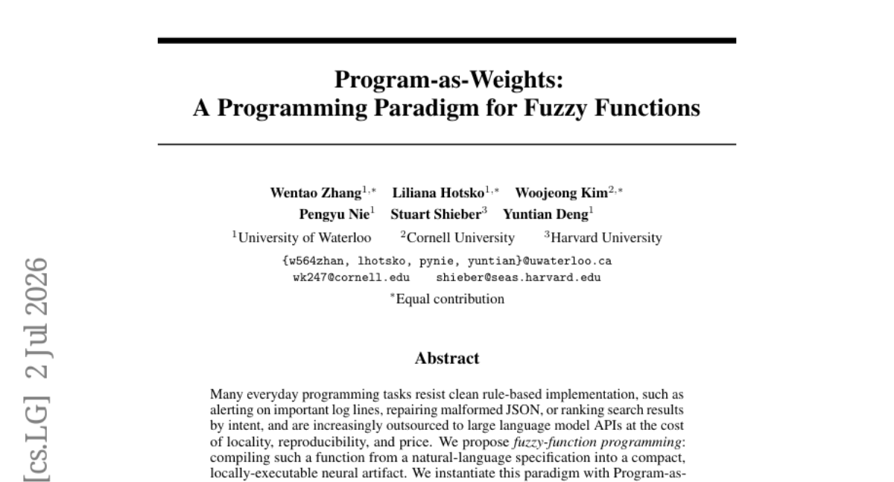

### 📌 한 줄 요약
자연어 명세로부터 경량 어댑터를 생성하여, 거대 모델 없이도 로컬에서 고성능 '퍼지 함수'를 실행하는 새로운 프로그래밍 패러다임 제안

### 🔑 핵심 포인트
- 자연어 명세를 경량 어댑터로 컴파일하는 'Program-as-Weights' 패러다임 제안
- 거대 모델(32B) 수준의 성능을 초경량 모델(0.6B)과 어댑터 조합으로 구현
- 추론 비용 절감, 로컬 실행 가능성, 높은 재현성 확보

### 🧑‍💻 개발자 관점
LLM API 호출 비용과 지연 시간 문제 없이, 특정 태스크에 최적화된 초경량 모델을 로컬 환경에서 즉시 배포할 수 있는 실용적인 방법론을 제시합니다.

### 🚀 실무 적용 아이디어
- 특정 도메인(예: JSON 정제)에 특화된 데이터셋 구축 및 컴파일 테스트
- 기존 프롬프트 엔지니어링 방식과 PAW 방식의 비용/속도 비교 실험
- 엣지 디바이스(MacBook, 모바일 등)에서의 실시간 추론 성능 검증

### ⚠️ 리스크/한계
- 학습 데이터(FuzzyBench)의 분포를 벗어난 복잡한 태스크에서의 일반화 성능 저하 가능성
- 컴파일 단계(모델 학습/튜닝)에 필요한 초기 비용과 복잡도

### 📝 초록 기반 상세 설명
로그 모니터링이나 데이터 정제와 같이 규칙 기반 구현이 어려운 작업들이 LLM API로 외주화되면서 비용과 재현성 문제가 발생하고 있습니다. 이를 해결하기 위해 자연어 명세를 컴파일하여 작은 신경망 아티팩트로 변환하는 '퍼지 함수 프로그래밍'을 제안합니다. 연구진은 4B 규모의 컴파일러가 고정된 경량 인터프리터를 위한 파라미터 효율적 어댑터를 생성하는 'Program-as-Weights(PAW)' 방식을 도입했습니다. 실험 결과, 0.6B 규모의 인터프리터가 32B 모델의 프롬프팅 성능을 따라잡으면서도 메모리 사용량은 20분의 1로 줄이고 빠른 추론 속도를 달성했습니다. 결과적으로 파운데이션 모델을 매번 호출하는 도구가 아닌, 재사용 가능한 작은 아티팩트를 만드는 '도구 빌더'로 재정의했습니다.

### 🖼️ 추가 자료
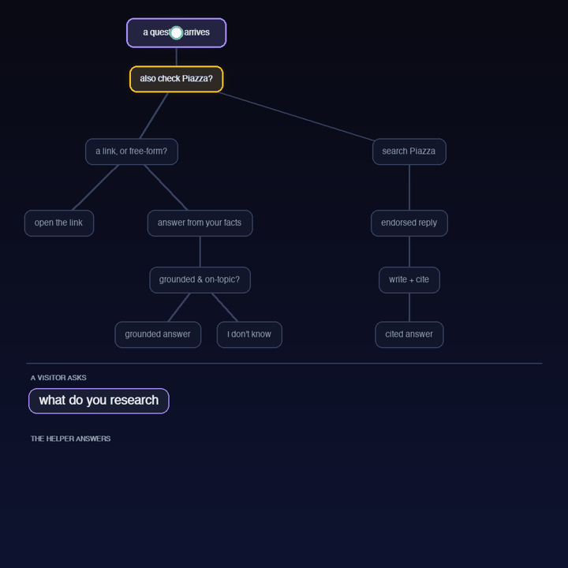
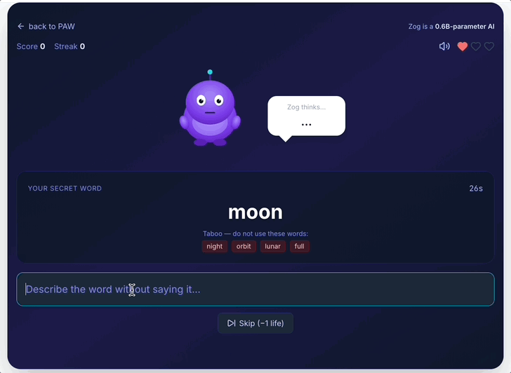

---

## 2. [EvoPolicyGym: Evaluating Autonomous Policy Evolution in Interactive Environments](https://huggingface.co/papers/2607.02440)
**Upvotes**: 39 | **도입 난이도**: 중 | **신뢰도**: 상
**arXiv**: https://arxiv.org/abs/2607.02440

**태그**: Autonomous Agents, Policy Evolution, Reinforcement Learning, Benchmarking, Agent, Benchmark, Evaluation

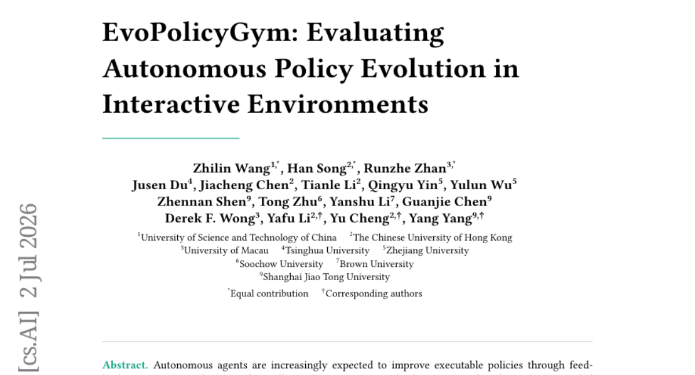

### 📌 한 줄 요약
에이전트가 제한된 피드백 내에서 실행 가능한 정책을 반복적으로 개선하는 능력을 평가하는 새로운 벤치마크 제안

### 🔑 핵심 포인트
- 자율 정책 진화(Autonomous Policy Evolution)라는 새로운 평가 프레임워크 정의
- 반복적인 정책 수정 및 피드백 활용 능력을 측정하는 EvoPolicyGym 벤치마크 구축
- 단순 점수를 넘어 예산 배분 및 피드백 전환 과정을 분석하는 궤적 진단 도구 제공

### 🧑‍💻 개발자 관점
에이전트가 단순히 문제를 푸는 것을 넘어, 코드를 수정하거나 파라미터를 조정하며 스스로 성능을 최적화하는 '자기 개선(Self-improvement)' 능력을 검증하는 데 필수적인 방법론을 제시합니다.

### 🚀 실무 적용 아이디어
- 에이전트의 코드 수정 루프(Edit-Test-Refine) 설계 시 본 벤치마크의 평가 지표 적용
- 제한된 토큰/실행 예산 내에서 에이전트의 최적화 효율성 테스트
- 에이전트가 피드백을 파라미터 튜닝으로 변환하는 패턴 분석

### ⚠️ 리스크/한계
- 컴팩트한 RL 환경 기반이므로 복잡한 실제 소프트웨어 엔지니어링 환경과의 괴리 가능성
- 에이전트의 성능이 환경의 복잡도나 피드백의 질에 민감하게 반응할 수 있음

### 📝 초록 기반 상세 설명
자율 에이전트가 피드백을 통해 실행 가능한 정책을 개선하는 능력이 중요해지고 있으나, 기존 평가는 최종 점수에만 치중하거나 소프트웨어 엔지니어링 과정과 혼재되어 평가의 정밀도가 떨어지는 문제가 있었습니다. 이를 해결하기 위해 고정된 상호작용 예산 내에서 에이전트가 정책 시스템을 반복적으로 수정하는 '자율 정책 진화(Autonomous Policy Evolution)' 평가 환경을 도입했습니다. 본 논문은 이를 위해 컴팩트한 RL 환경 기반의 벤치마크인 EvoPolicyGym을 구축했습니다. 실험 결과, GPT-5.5가 모든 환경에서 최상위 성능을 기록하며 강력한 정책 진화 능력을 보여주었습니다. 또한, 에이전트가 예산을 어떻게 배분하고 피드백을 파라미터 튜닝으로 전환하는지에 대한 궤적 분석을 제공합니다.

---

## 3. [AgenticSTS: A Bounded-Memory Testbed for Long-Horizon LLM Agents](https://huggingface.co/papers/2607.02255)
**Upvotes**: 39 | **도입 난이도**: 중 | **신뢰도**: 상
**arXiv**: https://arxiv.org/abs/2607.02255

**태그**: LLM-Agent, Memory-Management, Long-Horizon, Evaluation-Framework, Agent, RAG, Benchmark, Evaluation

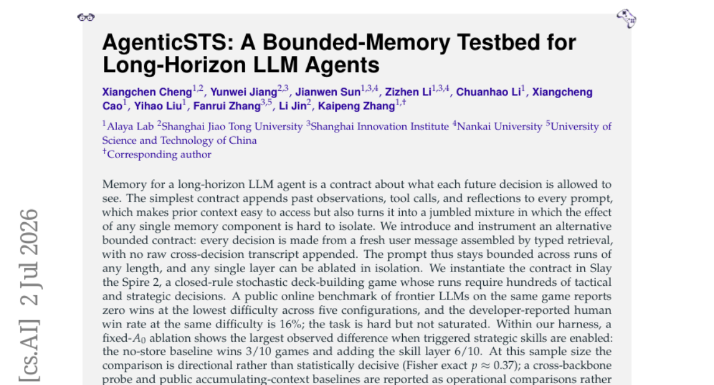

### 📌 한 줄 요약
장기 의사결정 에이전트의 메모리 구조를 격리 및 제어 가능한 형태로 설계한 새로운 테스트베드 제안

### 🔑 핵심 포인트
- 과거 기록을 무분별하게 쌓는 대신, 정형화된 검색을 통해 프롬프트를 재구성하는 'Bounded-Memory' 계약 방식 제안
- 프롬프트 길이를 일정하게 유지하여 장기 실행 시에도 메모리 레이어별 독립적 분석(Ablation)이 가능하도록 설계
- 복잡한 전략적 의사결정이 필요한 게임 환경을 통한 에이전트 성능 및 메모리 구조 검증

### 🧑‍💻 개발자 관점
에이전트의 컨텍스트가 길어질 때 발생하는 성능 저하와 혼선 문제를 해결하기 위해, 메모리 관리 구조를 어떻게 모듈화하고 제어해야 하는지에 대한 방법론을 제시합니다.

### 🚀 실무 적용 아이디어
- 에이전트 개발 시 모든 히스토리를 넣는 대신, 특정 정보만 추출하여 프롬프트를 재구성하는 구조 적용해보기
- 메모리 레이어(기록, 요약, 스킬 등)를 분리하여 각 요소가 의사결정에 미치는 영향력을 측정하는 실험 설계
- 장기 작업(Long-horizon) 환경에서 프롬프트 토큰 제한 문제를 해결하기 위한 데이터 정제 전략 수립

### ⚠️ 리스크/한계
- 제시된 실험 결과의 표본 크기가 작아 통계적 유의성을 확보하기에는 다소 부족할 수 있음
- 게임 환경이라는 특수 상황에서의 검증이므로, 일반적인 도구 사용(Tool-use) 환경으로의 전이 가능성 검토 필요

### 📝 초록 기반 상세 설명
기존의 LLM 에이전트는 과거의 모든 기록을 프롬프트에 단순히 추가하는 방식을 사용하여, 메모리 구성 요소 간의 효과를 개별적으로 검증하기 어렵다는 문제가 있었습니다. 이를 해결하기 위해 본 논문은 모든 의사결정이 정형화된 검색(typed retrieval)을 통해 조립된 새로운 메시지로부터 이루어지는 '경계가 있는 메모리(bounded-memory)' 계약 방식을 도입합니다. 이 방식은 프롬프트 길이를 일정하게 유지하면서 특정 메모리 레이어의 효과를 독립적으로 분석할 수 있게 합니다. 연구진은 이를 복잡한 전략이 필요한 게임인 'Slay the Spire 2' 환경에서 검증하였습니다. 실험 결과, 전략적 스킬 레이어를 활성화했을 때 승률이 유의미하게 향상됨을 확인했습니다. 최종적으로 에이전트 설계와 방법론 검증을 위한 재현 가능한 데이터셋과 분석 스크립트를 공개합니다.

---

## 4. [Morphing into Hybrid Attention Models](https://huggingface.co/papers/2606.30562)
**Upvotes**: 30 | **도입 난이도**: 중 | **신뢰도**: 상
**arXiv**: https://arxiv.org/abs/2606.30562

**태그**: Transformer, Efficient Inference, Long-context, Optimization, RAG, Benchmark, Evaluation, Distillation

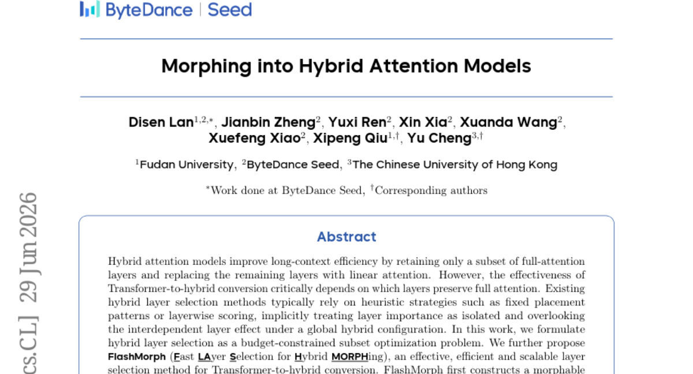

### 📌 한 줄 요약
전체 레이어 중 일부만 Full-attention을 유지하는 하이브리드 모델 구축 시, 최적의 레이어 조합을 효율적으로 찾아내는 FlashMorph 방법론 제안

### 🔑 핵심 포인트
- 하이브리드 레이어 선택을 예산 제약 하의 최적화 문제로 정식화
- FlashMorph: 선형 어텐션 브랜치를 활용한 게이트 최적화 및 이산화 기법 제안
- 기존 휴리스틱 방식 대비 높은 성능 유지 및 낮은 레이어 선택 비용 달성

### 🧑‍💻 개발자 관점
모델의 추론 비용을 줄이기 위해 Full-attention 레이어를 전략적으로 배치해야 하는 엔지니어에게 최적의 아키텍처 설계 가이드를 제공합니다.

### 🚀 실무 적용 아이디어
- 기존 Transformer 모델에 Linear-attention 브랜치를 추가하여 실험 환경 구축
- 제한된 연산 예산(Budget) 설정에 따른 성능 변화 측정
- FlashMorph의 게이트 최적화 과정이 실제 추론 속도 향상으로 이어지는지 검증

### ⚠️ 리스크/한계
- 최종 모델 생성 시 수행되는 증류(Distillation) 및 파인튜닝 단계의 추가 비용 발생
- 특정 데이터셋(Long-context retrieval)에 최적화된 게이트가 일반 도메인에서 범용성을 가질지에 대한 의문

### 📝 초록 기반 상세 설명
긴 문맥 처리를 위해 일부 레이어는 Full-attention을, 나머지는 Linear-attention을 사용하는 하이브리드 모델이 주목받고 있습니다. 기존의 레이어 선택 방식은 고정된 패턴이나 개별 레이어 점수에 의존하여 레이어 간의 상호 의존성을 간과하는 문제가 있었습니다. 본 논문은 이를 예산 제약 하의 부분집합 최적화 문제로 정의하고, FlashMorph라는 새로운 레이어 선택 방법론을 제안합니다. FlashMorph는 각 레이어에 선형 어텐션 브랜치를 부착한 후, 합성 데이터를 통해 게이트 값을 공동 최적화하여 최적의 하이브리드 구성을 찾아냅니다. 실험 결과, FlashMorph는 기존 방식보다 효율적이고 확장 가능하며, 성능 저하를 최소화하면서도 효과적인 하이브리드 구조를 발견함을 입증했습니다.

---

## 5. [AgenticDataBench: A Comprehensive Benchmark for Data Agents](https://huggingface.co/papers/2607.01647)
**Upvotes**: 21 | **도입 난이도**: 하 | **신뢰도**: 상
**arXiv**: https://arxiv.org/abs/2607.01647

**태그**: Data Agent, Benchmark, LLM, Data Science, Agent, RAG, Evaluation

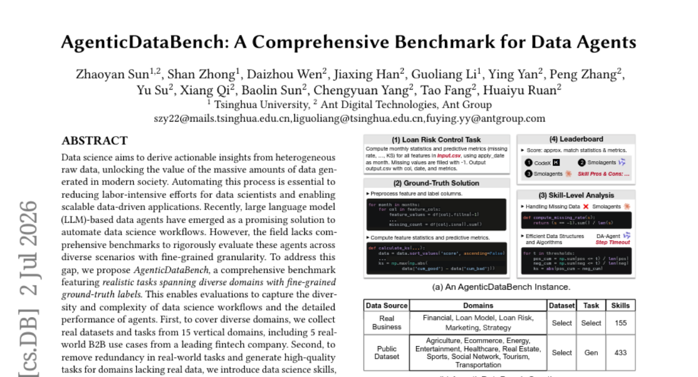

### 📌 한 줄 요약
데이터 과학 워크플로우의 복잡성을 정밀하게 평가하기 위해 설계된 다각적 도메인 기반 벤치마크 제안

### 🔑 핵심 포인트
- 15개 도메인 및 실제 B2B 유즈케이스를 포함한 포괄적인 데이터 과학 벤치마크 구축
- Stack Overflow 데이터를 활용한 스킬 기반 계층적 클러스터링 및 태스크 생성 프레임워크
- 단순 결과 비교를 넘어 에이전트의 세부 스킬별 성능을 측정할 수 있는 정밀한 평가 체계

### 🧑‍💻 개발자 관점
데이터 에이전트 개발 시 단순 정답 여부를 넘어, 특정 데이터 처리 스킬(Cleaning, Visualization 등)에 대한 에이전트의 역량을 정밀하게 검증할 수 있는 기준을 제공합니다.

### 🚀 실무 적용 아이디어
- 제공된 오픈소스 테스트베드를 활용하여 현재 개발 중인 에이전트의 스킬별 취약점 파악
- LLM 기반 태스크 생성 로직을 자사 도메인 특화 데이터에 적용하여 벤치마크 확장
- 에이전트의 워크플로우 복잡도에 따른 스킬 수행 능력 상관관계 분석

### ⚠️ 리스크/한계
- LLM 기반 생성 태스크가 실제 데이터의 복잡성을 완벽히 모사하는지에 대한 검증 필요
- 특정 도메인(Fintech 등)에 편향된 스킬셋이 포함될 가능성

### 📝 초록 기반 상세 설명
데이터 과학 자동화를 위해 LLM 기반 데이터 에이전트가 부상하고 있으나, 다양한 시나리오를 정밀하게 평가할 수 있는 벤치마크가 부족한 상황입니다. 이를 해결하기 위해 다양한 도메인과 세밀한 정답 라벨을 포함한 AgenticDataBench를 제안합니다. 15개 수직 도메인의 실제 데이터와 Stack Overflow 기반의 스킬 클러스터링을 통해 실무적인 데이터 과학 스킬셋을 정의했습니다. 또한 LLM 기반의 체계적인 태스크 생성 방식을 도입하여 데이터가 부족한 도메인에서도 현실적인 워크플로우를 구축했습니다. 최종적으로 최신 데이터 에이전트들을 대상으로 스킬 수준의 상세한 성능 분석을 수행했습니다.

---

## 6. [Multi-Resolution Flow Matching: Training-Free Diffusion Acceleration via Staged Sampling](https://huggingface.co/papers/2607.01642)
**Upvotes**: 20 | **도입 난이도**: 하 | **신뢰도**: 상
**arXiv**: https://arxiv.org/abs/2607.01642

**태그**: Diffusion, Image Generation, Acceleration, Computer Vision, Vision, Inference, Distillation

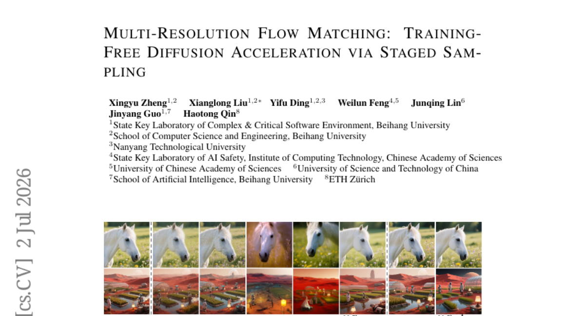

### 📌 한 줄 요약
학습 없이 저해상도 구조 생성 후 고해상도 디테일을 복원하는 단계적 샘플링을 통해 10배 이상의 추론 가속을 달성한 기술

### 🔑 핵심 포인트
- 학습이 필요 없는(Training-free) 단계적 저해상도-고해상도 파이프라인 제안
- GAN 기반 초해상도화와 저강도 노이즈 주입을 통한 고주파 디테일 복원
- 기존 타임스텝 증류(Timestep Distillation) 기술과 직교적으로 결합 가능한 확장성

### 🧑‍💻 개발자 관점
추가 학습 비용 없이 기존 사전 학습된 모델의 추론 속도를 획기적으로 높일 수 있어, 실시간 이미지 생성 서비스 구축 시 즉각적인 도입이 가능합니다.

### 🚀 실무 적용 아이디어
- FLUX.1-dev 모델에 MrFlow 파이프라인을 적용하여 생성 품질(FID/IS) 비교 실험
- GAN 기반 초해상도 모델 교체에 따른 디테일 복원력 변화 테스트
- 기존 Distillation 기법과 결합 시 발생하는 아티팩트 발생 여부 검증

### ⚠️ 리스크/한계
- GAN 기반 업샘플링 사용 시 특정 도메인에서의 부자연스러운 디테일 생성 가능성
- 단계별 파이프라인 구성에 따른 복잡한 워크플로우 관리 필요

### 📝 초록 기반 상세 설명
최근 텍스트-이미지 확산 모델의 추론 속도를 높이기 위해 멀티 해상도 생성 전략이 주목받고 있습니다. 그러나 잠재 공간에서의 업샘플링 방식은 이미지 블러링이나 아티팩트 문제를 야기하는 한계가 있습니다. 이를 해결하기 위해 제안된 MrFlow는 저해상도에서 구조를 먼저 생성한 후, GAN 기반 모델로 픽셀 공간에서 초해상도화를 수행합니다. 이후 저강도 노이즈 주입을 통해 고주파 성분을 재샘플링하고 최종 디테일을 정교화하는 단계적 파이프라인을 활용합니다. 실험 결과, FLUX.1-dev 등에서 품질 저하를 최소화하면서도 최대 10배의 가속을 달성했으며, 기존 증류(Distillation) 기술과 결합 시 최대 25배까지 가속이 가능함을 입증했습니다.

---

## 7. [WorldDirector: Building Controllable World Simulators with Persistent Dynamic Memory](https://huggingface.co/papers/2607.02517)
**Upvotes**: 16 | **도입 난이도**: 상 | **신뢰도**: 상
**arXiv**: https://arxiv.org/abs/2607.02517

**태그**: World Model, Video Generation, LLM, 3D Control, Computer Vision, RAG, Video

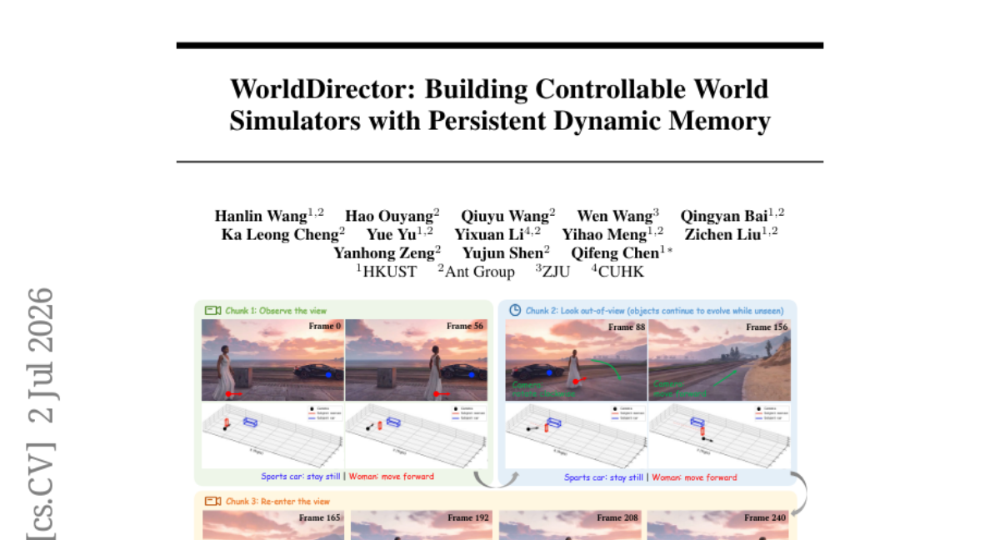

### 📌 한 줄 요약
LLM 기반의 3D 궤적 제어를 통해 객체의 정체성을 유지하며 복잡한 움직임을 생성하는 고정밀 비디오 월드 모델

### 🔑 핵심 포인트
- 의미론적 움직임(Semantic Motion)과 시각적 생성(Visual Generation)의 명시적 분리
- LLM을 이용한 3D 궤적 및 카메라 움직임의 정교한 오케스트레이션
- 장기적인 시야 이탈 후 재등장 시에도 객체의 외형과 정체성을 유지하는 지속적 메모리

### 🧑‍💻 개발자 관점
물리 법칙과 객체 일관성이 중요한 시뮬레이션 환경 구축 시, 단순 영상 생성을 넘어 제어 가능한 가상 세계를 만드는 핵심 기술이 될 수 있습니다.

### 🚀 실무 적용 아이디어
- LLM 기반 궤적 생성과 비디오 생성 모델 간의 정렬(Alignment) 방식 분석
- 객체 재등장 시 정체성 유지 성능(Identity Preservation) 테스트
- 복잡한 3D 카메라 워킹 환경에서의 물리적 일관성 검증

### ⚠️ 리스크/한계
- LLM이 생성한 궤적과 비디오 생성 모델 간의 불일치 발생 가능성
- 복잡한 3D 궤적 계산 및 고해상도 비디오 생성에 따른 높은 연산 비용

### 📝 초록 기반 상세 설명
기존의 비디오 월드 모델은 물리적 역학이 픽셀 렌더링과 얽혀 있어, 시야에서 사라진 객체의 일관성을 유지하거나 자유로운 시점 이동을 구현하는 데 한계가 있었습니다. 이를 해결하기 위해 WorldDirector는 의미론적 움직임 제어와 시각적 생성을 명시적으로 분리하는 프레임워크를 제안합니다. LLM을 활용하여 3D 궤적과 카메라 움직임을 조율하고, 이를 비디오 생성 모델의 제어 신호로 사용하여 물리적 논리와 외형의 안정성을 확보합니다. 이를 통해 객체가 장시간 시야에서 사라졌다가 다시 나타나도 동일한 정체성을 유지할 수 있습니다. 실험 결과, 복잡하고 긴 이벤트에서도 높은 제어력과 지속적인 객체 메모리 성능을 입증하였습니다.

---

## 8. [Breaking Failure Cascades: Step-Aware Reinforcement Learning for Medical Multimodal Reasoning](https://huggingface.co/papers/2606.31825)
**Upvotes**: 13 | **도입 난이도**: 중 | **신뢰도**: 상
**arXiv**: https://arxiv.org/abs/2606.31825

**태그**: Reinforcement Learning, Multimodal LLM, Medical AI, Reasoning, Multimodal, Vision, Benchmark

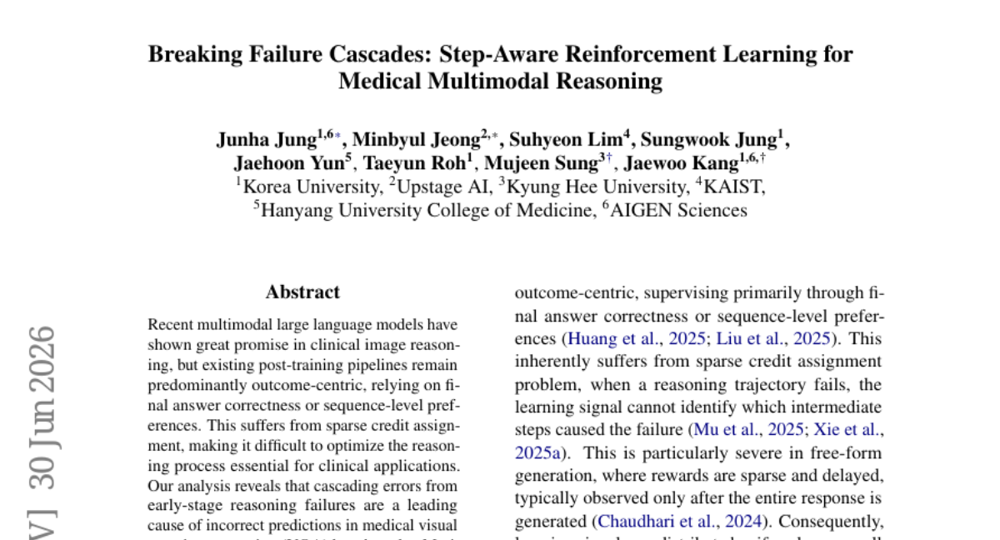

### 📌 한 줄 요약
추론 과정의 단계별 보상을 통해 초기 오류가 최종 오답으로 이어지는 '실패 연쇄(Failure Cascade)'를 방지하는 강화학습 알고리즘 제안

### 🔑 핵심 포인트
- 결과 중심(Outcome-centric) 학습의 한계인 희소한 크레딧 할당(Sparse Credit Assignment) 문제 해결
- 초기 단계 오류가 최종 오답으로 이어지는 '실패 연쇄(Failure Cascade)' 방지를 위한 단계별 페널티 설계
- MRPO 알고리즘을 통한 추론 과정의 정밀한 최적화 및 모델 성능 향상

### 🧑‍💻 개발자 관점
단순히 정답 여부만 체크하는 것이 아니라, 추론 과정의 논리적 흐름을 최적화하는 방법론을 통해 복잡한 단계적 추론이 필요한 도메인(의료, 수학 등)에 적용 가능합니다.

### 🚀 실무 적용 아이디어
- 기존 GRPO/PPO 환경에 단계별 페널티 로직을 적용하여 추론 경로 변화 관찰
- 도메인 특화 데이터셋에서 초기 단계 오류가 최종 결과에 미치는 영향력 분석
- 모델 크기 대비 추론 정확도 향상 폭을 확인하기 위한 벤치마크 테스트

### ⚠️ 리스크/한계
- 초기 단계에 과도한 페널티를 부여할 경우 유효한 추론 경로까지 억제될 위험 존재
- 단계별 보상 설계(Reward Shaping)를 위한 정교한 기준 설정이 필요함

### 📝 초록 기반 상세 설명
최근 멀티모달 LLM이 의료 영상 추론에서 성과를 보이고 있으나, 기존의 결과 중심적 학습 방식은 추론 과정의 오류를 정밀하게 교정하기 어렵습니다. 연구진은 초기 단계의 추론 실패가 최종 오답을 유발하는 '실패 연쇄' 현상을 발견했습니다. 이를 해결하기 위해 단계별 프로세스 보상을 활용하는 MRPO(Medical Reasoning-aware Policy Optimization) 알고리즘을 제안합니다. MRPO는 최종 오답 시 초기 단계의 잘못된 토큰에 더 큰 페널티를 부여하여 오류의 전이를 차단합니다. 실험 결과, MRPO는 기존 GRPO 및 대형 의료 모델들을 상회하는 성능을 보였으며, 특히 초기 단계의 추론 실패율을 획기적으로 낮추었습니다.

---

## 9. [SkillCoach: Self-Evolving Rubrics for Evaluating and Enhancing Agentic Skill-Use](https://huggingface.co/papers/2607.01874)
**Upvotes**: 12 | **도입 난이도**: 중 | **신뢰도**: 상
**arXiv**: https://arxiv.org/abs/2607.01874

**태그**: AI Agent, Process Supervision, LLM Evaluation, Workflow Automation, Agent, Vision, Evaluation

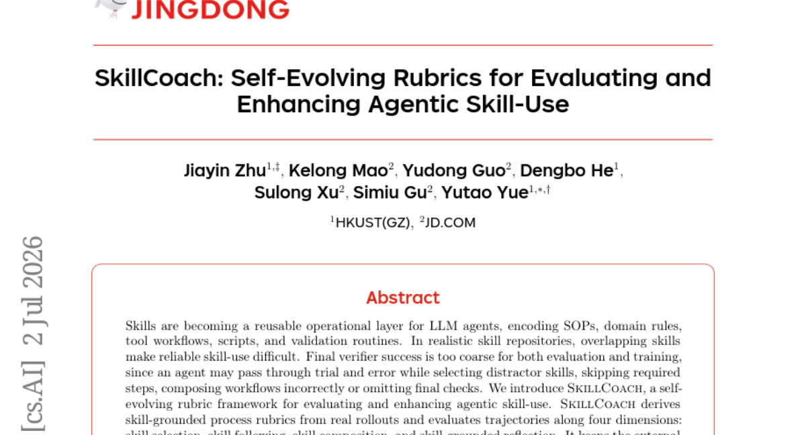

### 📌 한 줄 요약
단순 결과 중심 평가를 넘어, 에이전트의 작업 과정(Process)을 정교하게 평가하고 학습시키는 자가 진화형 루브릭 프레임워크

### 🔑 핵심 포인트
- 결과(Outcome)와 과정(Process)을 분리하여, 우연한 성공과 실제 숙련도를 구분하는 평가 체계 구축
- 스킬 선택, 준수, 조합, 성찰의 4가지 차원을 통한 정교한 프로세스 루브릭 자동 생성
- 진화된 루브릭을 활용한 고품질 트레이닝 데이터 선별 및 에이전트 성능 향상

### 🧑‍💻 개발자 관점
에이전트가 '결과만 맞추고 과정은 엉망인' 상황을 방지하고, 정교한 SOP(표준 운영 절차)를 준수하도록 학습시키는 데 실질적인 가이드를 제공합니다.

### 🚀 실무 적용 아이디어
- 현재 운영 중인 에이전트 워크플로우의 단계별 체크리스트(Rubric)를 수동으로 작성하여 성능 비교
- 에이전트의 실행 로그(Trajectory)를 분석하여 실패 원인이 '스킬 선택'인지 '조합 오류'인지 분류하는 실험 수행
- 결과값만으로 학습 데이터를 필터링하는 대신, 과정 기반의 점수를 도입하여 데이터 품질 개선 테스트

### ⚠️ 리스크/한계
- 루브릭 자체가 잘못 생성될 경우, 에이전트가 잘못된 프로세스를 정답으로 학습할 위험(Reward Hacking) 존재
- 복잡한 루브릭 생성 및 평가를 위한 추가적인 연산 비용 발생

### 📝 초록 기반 상세 설명
LLM 에이전트의 스킬 활용이 복잡해짐에 따라, 중복되는 스킬과 복잡한 워크플로우로 인해 단순 결과 기반의 검증만으로는 에이전트의 숙련도를 정확히 평가하기 어려워졌습니다. 기존의 최종 결과(Outcome) 중심 평가는 과정상의 오류를 잡아내지 못하는 한계가 있습니다. 이를 해결하기 위해 실제 실행 데이터로부터 스킬 기반의 프로세스 루브릭을 도출하는 SkillCoach 프레임워크를 제안합니다. 이 프레임워크는 스킬 선택, 준수, 조합, 성찰이라는 네 가지 차원에서 실행 궤적을 평가합니다. 실험 결과, 제안된 루브릭은 최종 정확도에 가려진 실패 사례를 식별하고, 고품질 학습 데이터를 선별하는 강력한 감독 신호를 제공함을 확인했습니다.

---

## 10. [Optimizing Visual Generative Models via Distribution-wise Rewards](https://huggingface.co/papers/2607.02291)
**Upvotes**: 12 | **도입 난이도**: 중 | **신뢰도**: 상
**arXiv**: https://arxiv.org/abs/2607.02291

**태그**: Generative Models, Reinforcement Learning, Diffusion Models, Optimization, Vision, Evaluation, Inference, Safety

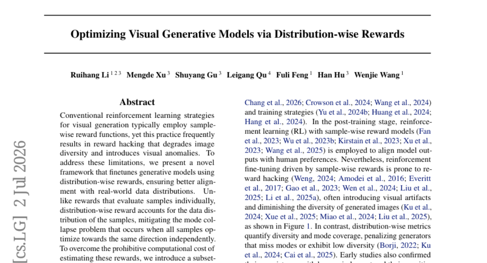

### 📌 한 줄 요약
샘플 단위가 아닌 데이터 분포 단위의 보상 체계를 통해 생성 모델의 모드 붕괴를 방지하고 품질을 높이는 최적화 프레임워크

### 🔑 핵심 포인트
- 데이터 분포를 고려한 보상 설계로 모드 붕괴(Mode Collapse) 및 리워드 해킹 방지
- Subset-replace 전략을 통한 분포 기반 보상 계산의 연산 효율성 확보
- RL 기반 모델 병합 계수 최적화를 통한 학습-추론 불일치 완화

### 🧑‍💻 개발자 관점
생성 모델 튜닝 시 발생하는 '다양성 상실' 문제를 수학적으로 해결하는 접근법을 제시하여, 고품질의 다양한 이미지를 생성해야 하는 실무 환경에 유용합니다.

### 🚀 실무 적용 아이디어
- 기존 샘플 단위 RL 튜닝 결과와 분포 기반 튜닝 결과의 FID 및 Diversity 지표 비교
- 제안된 subset-replace 전략의 샘플 크기에 따른 연산 효율성 및 수렴성 테스트
- 모델 병합(Model Merging) 시 RL을 활용한 계수 최적화 적용 실험

### ⚠️ 리스크/한계
- 분포 기반 보상 계산 시 참조 세트(Reference set)의 크기와 품질에 따른 민감도 존재
- 기존 샘플 단위 방식 대비 복잡한 학습 파이프라인 필요

### 📝 초록 기반 상세 설명
기존의 강화학습 기반 시각 생성 모델은 개별 샘플에 대한 보상을 사용하여 이미지 다양성이 저하되거나 특정 패턴에 매몰되는 리워드 해킹 문제가 발생했습니다. 이를 해결하기 위해 본 논문은 샘플 개별 평가가 아닌 데이터 분포 전체를 고려하는 'distribution-wise rewards' 프레임워크를 제안합니다. 계산 비용 문제를 해결하기 위해 생성된 참조 세트의 일부만 업데이트하는 subset-replace 전략을 도입했습니다. 또한, RL을 통해 모델 병합 계수를 최적화하여 학습-추론 간의 불일치 문제를 완화했습니다. 실험 결과, SiT 및 EDM2 등 다양한 베이스 모델에서 FID 수치를 유의미하게 개선하며 품질과 다양성을 동시에 확보했습니다.

### 🖼️ 추가 자료
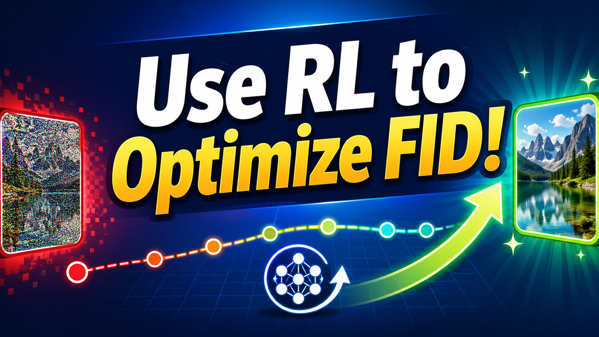

---

## 11. [Logit-Contribution Scoring Identifies Non-Literal Retrieval Heads](https://huggingface.co/papers/2607.01002)
**Upvotes**: 11 | **도입 난이도**: 중 | **신뢰도**: 상
**arXiv**: https://arxiv.org/abs/2607.01002

**태그**: LLM Interpretability, Attention Mechanism, Long-context, Mechanistic Interpretability, RAG, Reasoning, Benchmark, Evaluation

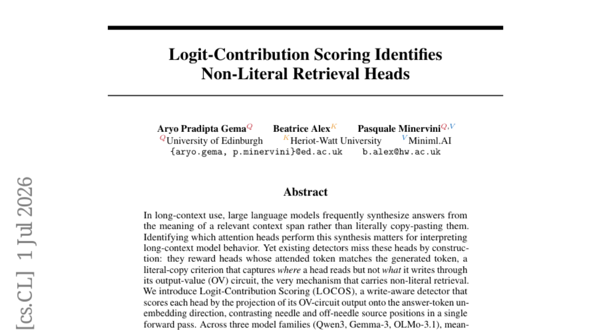

### 📌 한 줄 요약
기존의 단순 매칭 방식이 놓치던 '비문자적 정보 합성(Non-literal retrieval)'을 담당하는 어텐션 헤드를 식별하는 새로운 스코어링 기법 제안

### 🔑 핵심 포인트
- 기존의 'Literal-copy' 중심 탐지 방식의 한계 극복 (OV 회로의 역할 반영)
- LOCOS(Logit-Contribution Scoring): 정답 토큰 방향으로의 투영을 통한 쓰기(Write) 중심의 헤드 식별
- 비문자적 검색(Non-literal retrieval)에 특화된 헤드 식별 및 높은 정밀도 입증

### 🧑‍💻 개발자 관점
모델이 단순히 정보를 찾는 것을 넘어, 문맥을 이해하고 재구성하는 핵심 메커니즘을 해석하고 제어할 수 있는 방법론을 제공합니다.

### 🚀 실무 적용 아이디어
- 모델의 특정 태스크(예: 요약, 추론) 수행 시 어떤 헤드가 정보를 합성하는지 LOCOS로 분석해보기
- Ablation study를 통해 식별된 헤드가 특정 기능(Retrieval vs Reasoning)에 국한되는지 검증하기
- RAG 시스템의 컨텍스트 활용 능력을 개선하기 위해 LOCOS 점수가 높은 헤드의 가중치 조정 실험하기

### ⚠️ 리스크/한계
- 특정 모델 아키텍처(Qwen, Gemma 등)에 최적화된 방법론일 가능성
- 헤드 제거(Ablation) 시 모델의 전반적인 성능 저하가 발생할 수 있는 위험성

### 📝 초록 기반 상세 설명
긴 문맥을 처리하는 LLM은 단순히 텍스트를 복사하는 것이 아니라 의미를 합성하여 답변을 생성합니다. 기존의 탐지 방식은 단순히 입력 토큰과 출력 토큰이 일치하는 헤드에 점수를 주어, 실제 정보 전달을 담당하는 OV(Output-Value) 회로의 역할을 간과하는 문제가 있었습니다. 이를 해결하기 위해 저자들은 OV 회로 출력을 정답 토큰 방향으로 투영하여 점수를 매기는 LOCOS(Logit-Contribution Scoring)를 도입했습니다. 실험 결과, LOCOS로 식별된 헤드를 제거했을 때 비문자적 검색 성능이 급격히 하락하는 반면, 일반적인 지식이나 산술 능력은 유지되었습니다. 이는 LOCOS가 모델의 특정 추론 메커니즘을 정확히 타겟팅함을 입증합니다.

---

## 12. [From SRA to Self-Flow: Data Augmentation or Self-Supervision?](https://huggingface.co/papers/2607.02508)
**Upvotes**: 10 | **도입 난이도**: 중 | **신뢰도**: 상
**arXiv**: https://arxiv.org/abs/2607.02508

**태그**: Diffusion, Data Augmentation, Self-Supervised Learning, Computer Vision, Vision, Safety

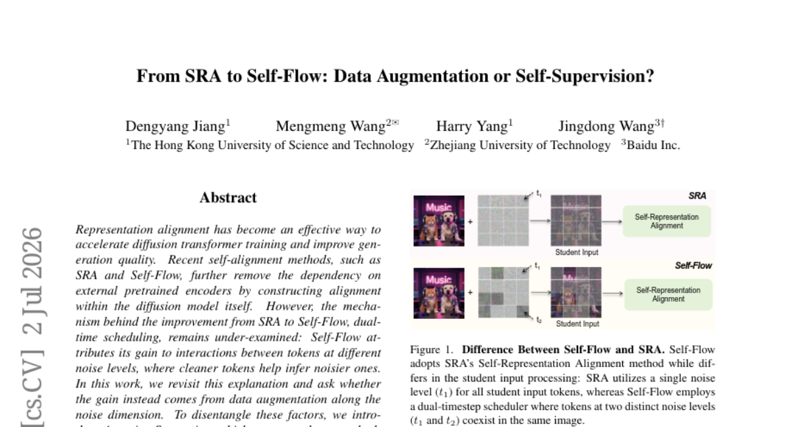

### 📌 한 줄 요약
Self-Flow의 성능 향상 원인이 토큰 간 상호작용이 아닌 데이터 증강(Data Augmentation)에 있음을 밝히고 새로운 학습 프레임워크를 제안함

### 🔑 핵심 포인트
- Self-Flow의 성능 향상 원인이 토큰 간 상호작용이 아닌 노이즈 차원에서의 데이터 증강임을 규명
- Attention Separation 기법을 통해 타임스텝 간 상호작용 없이도 효과적인 학습이 가능함을 증명
- 단일 이미지를 여러 학습 파트로 분할하여 데이터 효율을 높이는 새로운 증강 전략 제시

### 🧑‍💻 개발자 관점
Diffusion 모델 학습 시 외부 인코더 의존도를 낮추면서도 데이터 효율을 극대화할 수 있는 새로운 학습 메커니즘에 대한 통찰을 제공합니다.

### 🚀 실무 적용 아이디어
- Attention Separation을 적용하여 기존 Self-Flow 모델의 학습 안정성 테스트
- Dual-timestep 스케줄링과 Attention Separation을 결합한 데이터 증강 파이프라인 구축
- 다양한 노이즈 레벨 스케줄링이 데이터 증강 효과에 미치는 영향 분석

### ⚠️ 리스크/한계
- 제안된 방식이 특정 데이터셋(ImageNet 등)에 특화된 효과일 가능성
- 데이터 증강 효과를 극대화하기 위한 최적의 타임스텝 분할 전략 설정의 복잡성

### 📝 초록 기반 상세 설명
최근 Diffusion Transformer 학습을 위해 외부 인코더 없이 모델 내부에서 정렬을 수행하는 SRA 및 Self-Flow 방식이 주목받고 있습니다. 기존에는 Self-Flow의 성능 향상이 서로 다른 노이즈 레벨 간의 토큰 상호작용 덕분이라고 설명해 왔습니다. 본 논문은 이를 검증하기 위해 서로 다른 타임스텝 간의 어텐션을 차단하는 'Attention Separation' 기법을 도입했습니다. 실험 결과, 상호작용을 제거해도 성능이 유지되거나 오히려 향상되었으며, 이는 성능 향상의 주원인이 데이터 증강에 있음을 시사합니다. 이를 바탕으로 제안된 새로운 증강 방식은 ImageNet 데이터셋에서 효과적인 성능을 입증했습니다.

---

## 13. [AGVBench: A Reliability-Oriented Benchmark of Data Augmentation for Vein Recognition](https://huggingface.co/papers/2607.02271)
**Upvotes**: 9 | **도입 난이도**: 하 | **신뢰도**: 상
**arXiv**: https://arxiv.org/abs/2607.02271

**태그**: Biometrics, Data Augmentation, Computer Vision, Security, Vision, Benchmark, Evaluation, Safety

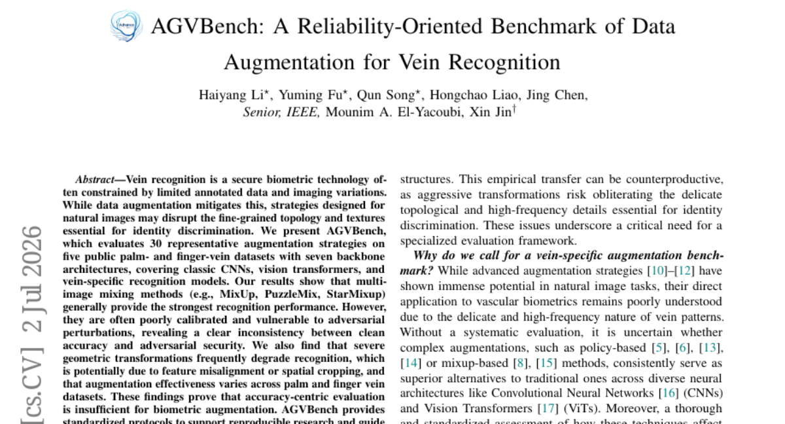

### 📌 한 줄 요약
정확도와 보안성 사이의 트레이드오프를 분석하여 신뢰할 수 있는 정맥 인식 데이터 증강 벤치마크를 제안함

### 🔑 핵심 포인트
- 30가지 증강 전략과 다양한 백본(CNN, ViT 등)을 포함한 종합 벤치마크 AGVBench 구축
- MixUp 계열 방식이 높은 정확도를 제공하지만, 보안성 및 적대적 공격에 취약함을 규명
- 정확도 중심 평가가 생체 인식 시스템의 신뢰성을 보장하지 못함을 입증

### 🧑‍💻 개발자 관점
생체 인식 모델 개발 시 단순 정확도 향상뿐만 아니라, 보안성과 특징 보존을 고려한 데이터 증강 전략 수립의 가이드라인을 제공합니다.

### 🚀 실무 적용 아이디어
- MixUp 계열 증강 적용 시 모델의 Calibration(신뢰도 점수) 변화 모니터링
- 기하학적 변형(Geometric Transformation) 적용 시 특징 정렬(Alignment) 문제 확인
- 학습 데이터셋의 특성(손바닥 vs 손가락)에 따른 최적 증강 조합 실험

### ⚠️ 리스크/한계
- 높은 정확도가 반드시 높은 보안성이나 강건성을 의미하지 않음
- 특정 데이터셋에 최적화된 증강 방식이 다른 환경에서는 성능 저하를 유발할 수 있음

### 📝 초록 기반 상세 설명
정맥 인식 기술은 데이터 부족과 이미지 변동성 문제로 인해 데이터 증강이 필수적이지만, 기존 방식은 미세한 생체 특징을 훼손할 위험이 있습니다. 본 논문은 30가지 증강 전략을 5개의 공공 데이터셋과 7개의 백본 아키텍처를 통해 검증하는 AGVBench를 제안합니다. 실험 결과, MixUp 계열의 혼합 방식이 성능은 높지만 보안성(Calibration 및 적대적 공격) 측면에서는 취약함을 발견했습니다. 또한 과도한 기하학적 변형은 특징 불일치를 유발하여 성능을 저하시키며, 데이터셋 특성에 따라 증강 효과가 다르게 나타났습니다. 결론적으로 단순 정확도 중심의 평가를 넘어 신뢰성과 보안성을 포함한 종합적인 평가 프로토콜의 필요성을 강조합니다.

---

## 14. [InstanceControl: Controllable Complex Image Generation without Instance Labeling](https://huggingface.co/papers/2606.31924)
**Upvotes**: 8 | **도입 난이도**: 중 | **신뢰도**: 상
**arXiv**: https://arxiv.org/abs/2606.31924

**태그**: Generative AI, Computer Vision, VLM, Image Synthesis, RAG, Vision

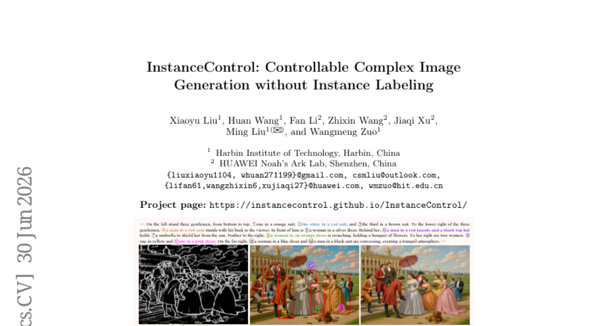

### 📌 한 줄 요약
인스턴스 레이블링 작업 없이 VLM을 활용하여 복잡한 다중 객체 장면에서 속성 혼선 없는 정밀한 이미지 생성을 구현한 기술

### 🔑 핵심 포인트
- 인스턴스 레이블링 작업이 필요 없는 자동화된 다중 객체 제어 프레임워크 제안
- VLM을 활용하여 텍스트 프롬프트와 시각적 조건 간의 인스턴스 단위 대응 관계 구축
- 생성 과정 중 마스크 노이즈를 해결하기 위한 적응형 마스크 정제(Adaptive Mask Refinement) 전략 도입

### 🧑‍💻 개발자 관점
수동 마스킹 작업 없이 텍스트만으로 복잡한 구도의 이미지를 생성할 수 있어, 콘텐츠 제작 파이프라인의 자동화 효율을 크게 높일 수 있습니다.

### 🚀 실무 적용 아이디어
- VLM 기반의 자동 마스크 생성 성능이 복잡한 배경에서 얼마나 안정적인지 테스트
- 기존 ControlNet 모델에 제안된 적응형 마스크 정제 모듈만 이식하여 성능 변화 확인
- 다양한 객체가 밀집된 데이터셋을 통한 속성 혼선(Attribute Confusion) 개선 정도 측정

### ⚠️ 리스크/한계
- VLM의 객체 인식 오류가 발생할 경우 잘못된 마스크가 생성되어 전체 이미지 품질 저하 가능성
- 매우 복잡하거나 겹쳐 있는 객체들에 대한 정밀한 분할 성능 한계

### 📝 초록 기반 상세 설명
ControlNet과 같은 기존 제어 방식은 복잡한 다중 객체 장면에서 객체 간 속성이 뒤섞이는 문제를 겪고 있습니다. 이를 해결하기 위해 기존에는 수동 인스턴스 레이블링이 필요했으나, 이는 매우 번거로운 작업입니다. 본 논문에서는 인스턴스 레이블링 없이도 정밀한 제어가 가능한 InstanceControl을 제안합니다. VLM을 활용해 텍스트 프롬프트의 객체 설명과 시각적 조건 간의 대응 관계를 자동으로 파악하고, 예측된 마스크를 동적으로 정제하는 적응형 전략을 도입했습니다. 실험 결과, 기존 방식보다 높은 충실도와 정밀한 인스턴스 제어 성능을 입증했습니다.

---

## 15. [AnyGroundBench: A Specialized-Domain Benchmark for Video Grounding in Vision-Language Models](https://huggingface.co/papers/2607.02269)
**Upvotes**: 7 | **도입 난이도**: 하 | **신뢰도**: 상
**arXiv**: https://arxiv.org/abs/2607.02269

**태그**: VLM, Video Grounding, Domain Adaptation, Benchmark, Reasoning, Vision, Video, Evaluation

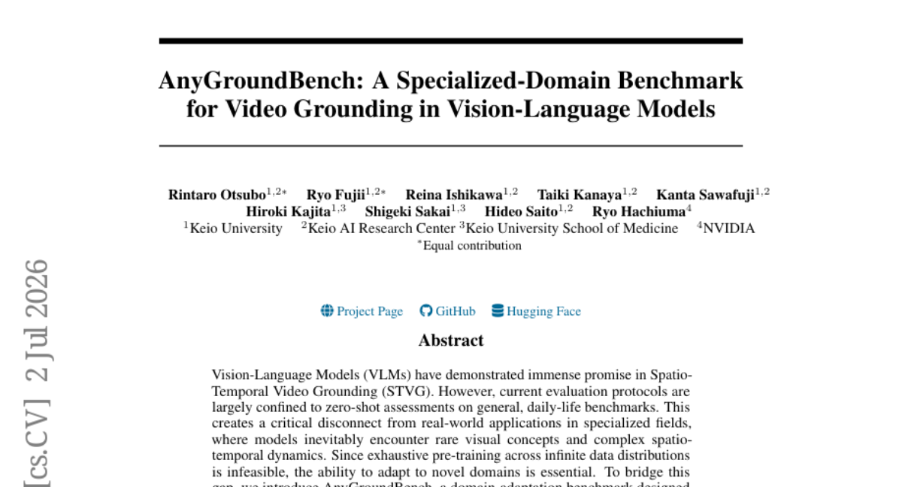

### 📌 한 줄 요약
특수 도메인(산업, 의료 등)에서의 비디오 접지(Video Grounding) 성능을 평가하기 위한 도메인 적응형 벤치마크 AnyGroundBench 제안

### 🔑 핵심 포인트
- 5개 특수 도메인(동물, 산업, 스포츠, 수술, 보안)을 타겟팅한 전문 벤치마크 구축
- 단순 제로샷 평가를 넘어 도메인 적응(Domain Adaptation) 능력을 측정하는 체계적 프레임워크 제공
- 최신 VLM들의 전문 분야 시공간 추론 및 ICL 한계점 규명

### 🧑‍💻 개발자 관점
특수 산업 현장(의료, 보안 등)에 VLM을 도입하려는 엔지니어에게 일반 데이터셋이 아닌 실질적인 성능 검증 기준을 제공합니다.

### 🚀 실무 적용 아이디어
- 제공된 5개 도메인 데이터셋을 활용하여 현재 사용 중인 VLM의 도메인 간 성능 격차 측정
- 특수 도메인 데이터에 대한 In-Context Learning(ICL) 프롬프트 엔지니어링 실험
- 도메인 특화 데이터셋을 활용한 미세 조정(Fine-tuning) 전략 수립

### ⚠️ 리스크/한계
- 특수 도메인 데이터의 희소성으로 인해 모델 학습 시 데이터 부족 문제 발생 가능
- 일반 도메인 성능과 특수 도메인 성능 간의 트레이드오프 발생 가능성

### 📝 초록 기반 상세 설명
최근 비디오-언어 모델(VLM)이 시공간적 비디오 접지(STVG)에서 성과를 보이고 있으나, 기존 평가는 일반적인 일상 데이터에만 치중되어 있습니다. 이로 인해 전문적인 지식이나 복잡한 동역학이 필요한 특수 도메인에서의 실무 적용 능력 검증이 어렵다는 문제가 있습니다. 본 논문은 이를 해결하기 위해 동물, 산업, 스포츠, 수술, 공공 보안 등 5개 전문 분야를 포함하는 AnyGroundBench를 제안합니다. 이 벤치마크는 정밀한 시공간 주석과 전용 학습 서브셋을 제공하여 모델의 도메인 적응 능력을 체계적으로 측정합니다. 15종의 최신 VLM을 평가한 결과, 현재 모델들은 특수 도메인의 제로샷 및 인컨텍스트 러닝(ICL) 상황에서 시공간 추론 능력이 현저히 떨어짐을 확인했습니다.

---

## 16. [When Search Agents Should Ask: DiscoBench for Clarification-Aware Deep Search](https://huggingface.co/papers/2606.27669)
**Upvotes**: 7 | **도입 난이도**: 중 | **신뢰도**: 상
**arXiv**: https://arxiv.org/abs/2606.27669

**태그**: Agent, Search, LLM, Benchmark, Interaction, RAG, Reasoning, Evaluation

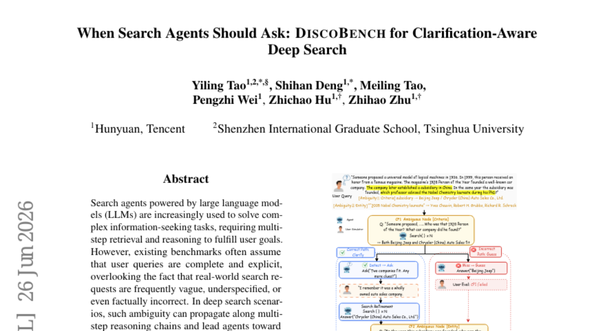

### 📌 한 줄 요약
모호한 사용자 쿼리에 대해 에이전트가 스스로 질문하여 검색 정확도를 높이는 'Clarification-aware' 능력을 평가하는 새로운 벤치마크 DiscoBench 제안

### 🔑 핵심 포인트
- 모호한 쿼리 상황을 반영한 211개 샘플 및 463개 모호성 인스턴스 포함 벤치마크 구축
- 사용자 시뮬레이터를 통한 멀티턴 상호작용 및 4가지 관점(유틸리티, 탐지, 전략, 비용)의 평가 프레임워크 설계
- 단순 검색 반복보다 명확한 질문(Clarification)이 추론 경로 복구에 더 효과적임을 입증

### 🧑‍💻 개발자 관점
실제 서비스 환경에서 모호한 사용자 질문을 받았을 때, 에이전트가 무작정 검색을 수행하기보다 사용자에게 되묻는 로직을 설계하는 데 중요한 가이드라인을 제공합니다.

### 🚀 실무 적용 아이디어
- 현재 개발 중인 RAG/Agent 시스템에 DiscoBench의 모호성 유형을 적용하여 테스트
- 에이전트가 질문을 던지는 시점(Trigger)에 대한 정책 실험
- 사용자 시뮬레이터와 연동하여 멀티턴 대화 시의 비용 대비 효율성 측정

### ⚠️ 리스크/한계
- 사용자 시뮬레이터가 실제 인간의 복잡한 의도를 완벽히 모사하는지에 대한 의문
- 질문 횟수 증가에 따른 토큰 비용 및 사용자 피로도 문제

### 📝 초록 기반 상세 설명
최근 LLM 기반 검색 에이전트는 복잡한 정보 탐색을 수행하지만, 기존 벤치마크는 사용자 쿼리가 항상 명확하다는 가정을 전제로 합니다. 그러나 실제 환경에서는 쿼리가 모호하거나 부정확하여 잘못된 검색 경로로 이어지는 경우가 빈번합니다. 이를 해결하기 위해 모호성을 식별하고 사용자에게 질문하여 올바른 추론 경로를 찾는 능력을 평가하는 DiscoBench를 도입합니다. 11개 도메인에 걸친 211개의 샘플과 사용자 시뮬레이터를 통해 에이전트의 상호작용 전략을 다각도로 평가합니다. 실험 결과, 단순히 검색을 반복하는 것보다 적절한 질문을 던지는 것이 성능에 결정적이며, 현재 모델들이 검색 능력과 상호작용 능력 사이에서 격차를 보임을 확인했습니다.

---

## 17. [PACE: A Proxy for Agentic Capability Evaluation](https://huggingface.co/papers/2607.02032)
**Upvotes**: 5 | **도입 난이도**: 하 | **신뢰도**: 상
**arXiv**: https://arxiv.org/abs/2607.02032

**태그**: LLM Agent, Benchmark, Evaluation, Cost Optimization, Agent, Reasoning

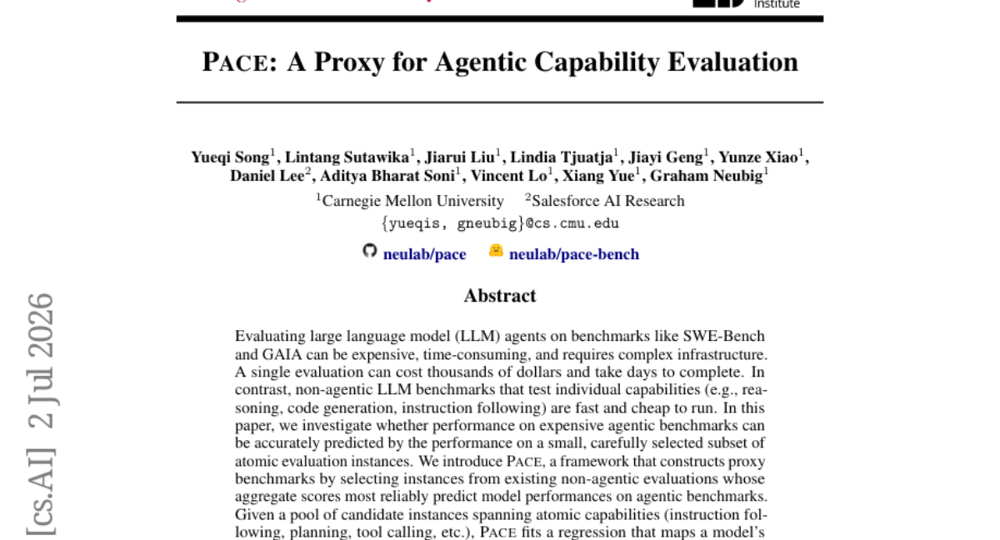

### 📌 한 줄 요약
고비용의 에이전트 벤치마크 대신 저비용의 원자적(atomic) 평가를 통해 에이전트 성능을 예측하는 프레임워크 PACE 제안

### 🔑 핵심 포인트
- 고비용 에이전트 평가를 대체할 수 있는 저비용 프록시 벤치마크(PACE-Bench) 구축
- 타겟 관련성(local)과 정보 가치(global)를 결합한 최적의 인스턴스 선택 알고리즘
- 에이전트 성능 예측 시 발생하는 비용과 시간을 99% 이상 절감

### 🧑‍💻 개발자 관점
모델 개발 및 라우팅 결정 시, 매번 수천 달러를 들여 에이전트 테스트를 수행하는 대신 저렴한 프록시 테스트만으로 성능을 신속하게 검증할 수 있습니다.

### 🚀 실무 적용 아이디어
- 현재 사용 중인 모델의 에이전트 성능과 일반 벤치마크 점수 간의 상관관계 분석
- PACE 프레임워크를 활용하여 특정 도메인(예: 코딩)에 특화된 프록시 셋 구축 시도
- 모델 라우팅 로직에 프록시 점수를 반영하여 비용 효율적인 에이전트 시스템 설계

### ⚠️ 리스크/한계
- 프록시 벤치마크가 실제 복잡한 에이전트 환경의 동적 변화를 완벽히 반영하지 못할 가능성
- 선택된 인스턴스 집합이 특정 모델 아키텍처에 편향될 위험

### 📝 초록 기반 상세 설명
SWE-Bench나 GAIA와 같은 에이전트 평가 방식은 막대한 비용과 시간이 소요되는 문제가 있습니다. 반면 개별 역량을 테스트하는 비-에이전트 벤치마크는 빠르고 저렴하지만, 에이전트 성능과의 상관관계가 명확하지 않았습니다. 본 논문은 기존 비-에이전트 평가 항목 중 에이전트 성능을 가장 잘 예측하는 부분 집합을 추출하는 PACE 프레임워크를 제안합니다. PACE는 타겟 관련성 기반의 국소 선택과 정보 가치가 높은 전역 선택 전략을 결합하여 최적의 프록시 벤치마크를 구축합니다. 실험 결과, 제안된 PACE-Bench는 전체 에이전트 평가 비용의 1% 미만으로 높은 상관관계와 모델 순위 정확도를 보였습니다. 이를 통해 모델 개발 단계에서 효율적인 성능 추정이 가능함을 입증했습니다.

---

## 18. [AutoMem: Automated Learning of Memory as a Cognitive Skill](https://huggingface.co/papers/2607.01224)
**Upvotes**: 5 | **도입 난이도**: 상 | **신뢰도**: 상
**arXiv**: https://arxiv.org/abs/2607.01224

**태그**: LLM-Agent, Memory-Management, Automated-Learning, Long-Horizon-Tasks, Agent, RAG

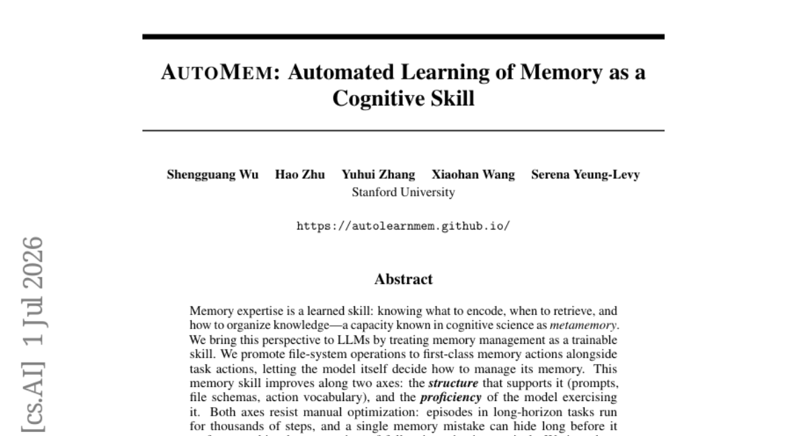

### 📌 한 줄 요약
에이전트의 메모리 관리 능력을 독립적인 학습 가능한 기술로 정의하고, 구조와 숙련도를 자동 최적화하는 AutoMem 프레임워크 제안

### 🔑 핵심 포인트
- 메모리 관리를 작업 수행과 분리된 독립적인 학습 가능한 기술로 정의
- 메모리 구조(Schema/Prompt)와 모델 숙련도(Proficiency)를 동시에 최적화하는 이중 루프 프레임워크
- 장기 작업(Long-horizon) 환경에서 메모리 최적화만으로 비약적인 성능 향상 입증

### 🧑‍💻 개발자 관점
에이전트 개발 시 단순히 프롬프트를 고치는 것을 넘어, 데이터 구조와 메모리 관리 로직을 어떻게 자동화하고 학습시킬지에 대한 새로운 방법론을 제시합니다.

### 🚀 실무 적용 아이디어
- 에이전트의 메모리 조작(파일 생성/수정)을 독립적인 Tool/Action으로 분리하여 설계해보기
- 에이전트의 작업 로그를 기반으로 메모리 스키마를 자동 생성하는 LLM 파이프라인 구축 실험
- 성공적인 메모리 활용 사례를 데이터셋화하여 모델 파인튜닝에 활용하는 워크플로우 테스트

### ⚠️ 리스크/한계
- 메모리 관리 최적화 과정에서 발생하는 높은 연산 비용 및 복잡성
- 학습 데이터(에이전트 궤적)의 품질에 따른 성능 의존성

### 📝 초록 기반 상세 설명
기존 LLM 에이전트는 장기 작업 시 메모리 관리(저장, 검색, 조직화)에 어려움을 겪으며, 이는 수동 최적화가 매우 까다로운 영역입니다. 본 논문은 메모리 관리를 하나의 인지적 기술로 보고, 파일 시스템 조작을 에이전트의 핵심 액션으로 격상시켰습니다. 이를 위해 두 가지 루프를 가진 AutoMem 프레임워크를 도입했습니다. 첫째는 강력한 LLM이 에이전트의 궤적을 검토하여 메모리 구조(프롬프트, 스키마 등)를 개선하는 것이고, 둘째는 성공적인 메모리 결정 사례를 학습 신호로 사용하여 모델의 숙련도를 높이는 것입니다. 실험 결과, 모델의 작업 수행 능력 수정 없이 메모리 최적화만으로도 성능이 2~4배 향상되었으며, 32B 모델이 최상위 모델들과 경쟁할 수 있는 수준에 도달했습니다.

---

## 19. [Representation Distribution Matching for One-Step Visual Generation](https://huggingface.co/papers/2607.02375)
**Upvotes**: 4 | **도입 난이도**: 중 | **신뢰도**: 상
**arXiv**: https://arxiv.org/abs/2607.02375

**태그**: Generative AI, Diffusion, One-step Generation, Computer Vision, Vision, Evaluation

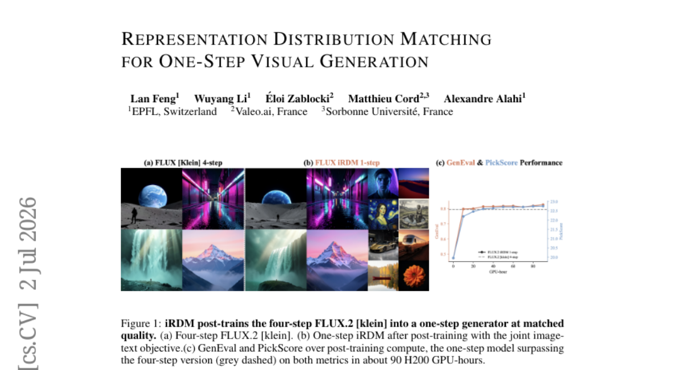

### 📌 한 줄 요약
사전 학습된 인코더의 특징 분포를 매칭하여 단 한 번의 스텝으로 고품질 이미지를 생성하는 RDM 프레임워크 제안

### 🔑 핵심 포인트
- 사전 학습된 인코더의 특징 분포를 매칭하는 RDM 패러다임 정립
- 대규모 배치 사이즈(2048+)와 정교한 MMD 추정의 중요성 발견
- 다양한 인코더를 활용한 SW_r14 지표 도입으로 모델의 편향 및 꼼수(gaming) 방지

### 🧑‍💻 개발자 관점
추론 속도가 매우 빠른 단일 스텝 생성 모델을 구축할 수 있어, 실시간 이미지 생성 서비스 구현 시 핵심적인 기술이 될 수 있습니다.

### 🚀 실무 적용 아이디어
- 대규모 배치 사이즈를 활용한 MMD 기반 분포 매칭 실험
- 다양한 사전 학습 인코더(Vision Transformer 등)를 조합한 앙상블 학습 테스트
- 기존 고성능 모델(FLUX 등)을 RDM 방식으로 Post-training하여 성능 변화 관찰

### ⚠️ 리스크/한계
- 매우 큰 배치 사이즈가 필요하여 막대한 GPU 자원 소모 가능성
- 특정 인코더에 과적합될 경우 시각적 품질이 저하될 위험

### 📝 초록 기반 상세 설명
기존의 다단계 생성 방식은 추론 속도 측면에서 한계가 있어, 단 한 번의 스텝으로 이미지를 생성하는 연구가 중요해졌습니다. 본 논문은 고정된 사전 학습 인코더의 특징 분포를 일치시키는 Representation Distribution Matching(RDM) 패러다임을 제안합니다. 연구 결과, MMD(Maximum Mean Discrepancy)를 적절히 추정하고 매우 큰 배치 사이즈(2048 이상)를 사용할 때 강력한 성능이 나타남을 확인했습니다. 또한, 특정 표현에 편향되지 않도록 다양한 인코더를 활용한 SW_r14 지표를 도입하여 생성 품질을 높였습니다. 이를 통해 ImageNet에서 SOTA를 달성했으며, FLUX.2 모델을 단일 스텝 모델로 성공적으로 변환했습니다.

---

## 20. [Learning to Move Before Learning to Do: Task-Agnostic pretraining for VLAs](https://huggingface.co/papers/2607.02466)
**Upvotes**: 4 | **도입 난이도**: 중 | **신뢰도**: 상
**arXiv**: https://arxiv.org/abs/2607.02466

**태그**: VLA, Robot-Learning, Self-Supervised, Embodied-AI, Vision, Benchmark, Safety

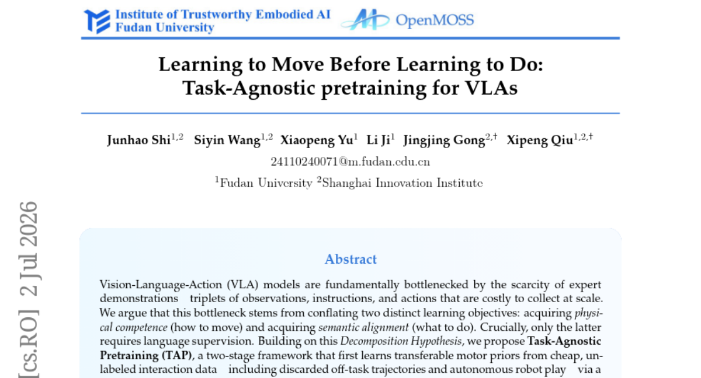

### 📌 한 줄 요약
물리적 움직임 학습과 작업 지시 학습을 분리하여, 적은 양의 전문가 데이터로도 강력한 로봇 제어 성능을 확보하는 사전 학습 프레임워크

### 🔑 핵심 포인트
- 분해 가설(Decomposition Hypothesis): 물리적 움직임 학습과 언어 기반 작업 학습을 분리하여 효율성 극대화
- TAP 프레임워크: 라벨 없는 데이터로 물리적 사전 지식을 먼저 학습하는 2단계 학습 전략
- 강건한 표현 학습: 환경 변화(카메라 위치 등)에도 무너지지 않는 전이 가능한 물리적 표현 확보

### 🧑‍💻 개발자 관점
데이터 수집 비용이 높은 로봇 제어 분야에서, 정제되지 않은 데이터나 단순 놀이 데이터를 활용해 고성능 모델을 구축할 수 있는 실질적인 방법론을 제시합니다.

### 🚀 실무 적용 아이디어
- 라벨 없는 로봇 움직임 데이터(Play data)를 활용한 역역학 학습 실험
- 사전 학습된 물리 모델과 미세 조정(Fine-tuning) 단계의 성능 격차 분석
- 카메라 뷰 변화 등 환경 노이즈에 대한 모델 강건성 테스트

### ⚠️ 리스크/한계
- 물리적 사전 학습 단계의 데이터 품질이 최종 모델 성능에 미치는 영향
- 복잡하고 정교한 작업 수행 시 2단계 언어 정렬 과정에서의 병목 가능성

### 📝 초록 기반 상세 설명
VLA(Vision-Language-Action) 모델은 고비용의 전문가 데모 데이터 부족으로 인해 학습에 병목 현상을 겪고 있습니다. 연구진은 물리적 역량(움직임)과 의미적 정렬(작업 수행)이 서로 다른 학습 목표라는 '분해 가설(Decomposition Hypothesis)'에 주목했습니다. 이를 바탕으로 제안된 TAP(Task-Agnostic Pretraining)은 1단계로 라벨 없는 상호작용 데이터에서 역역학(Inverse Dynamics) 목적 함수를 통해 물리적 사전 지식을 학습합니다. 2단계에서는 최소한의 전문가 데이터를 사용하여 학습된 물리 지식을 언어에 정렬합니다. 실험 결과, TAP는 훨씬 적은 데이터로도 대규모 데이터 학습 모델에 필적하는 성능을 보였으며, 특히 카메라 변화와 같은 환경 변화에도 높은 강건성을 입증했습니다.

---

## 21. [Denser neq Better: Limits of On-Policy Self-Distillation for Continual Post-Training](https://huggingface.co/papers/2607.01763)
**Upvotes**: 4 | **도입 난이도**: 중 | **신뢰도**: 상
**arXiv**: https://arxiv.org/abs/2607.01763

**태그**: LLM, Continual Learning, Self-Distillation, RLHF, Vision, Distillation

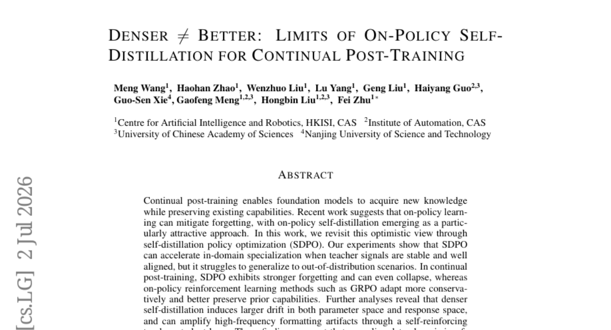

### 📌 한 줄 요약
온폴리시(On-policy) 자기 증류(Self-distillation) 방식이 지속적 사후 학습(Continual Post-training)에서 모델 붕괴와 망각을 초래할 수 있음을 경고함

### 🔑 핵심 포인트
- SDPO(자기 증류 정책 최적화)가 지속적 학습 시 모델 붕괴 및 망각을 가속화할 수 있음을 규명
- 밀집된(Dense) 토큰 수준의 자기 증류가 파라미터 드리프트와 응답 편향을 유발하는 메커니즘 분석
- GRPO와 같은 강화학습 방식이 SDPO보다 기존 지식 보존 측면에서 더 우수함을 확인

### 🧑‍💻 개발자 관점
모델을 지속적으로 업데이트할 때, 단순히 모델의 출력을 다시 학습 데이터로 쓰는 방식(Self-distillation)이 모델의 일반화 성능을 망가뜨릴 수 있음을 인지해야 합니다.

### 🚀 실무 적용 아이디어
- 모델 업데이트 시 SDPO 대신 GRPO와 같은 강화학습 기법과 성능 비교 실험 수행
- 학습 과정 중 파라미터 드리프트 및 응답 공간의 변화량 모니터링
- 특정 포맷에 과적합되는 '아티팩트 증폭' 현상이 발생하는지 검증

### ⚠️ 리스크/한계
- 자기 증류에만 의존할 경우 모델의 일반화 능력이 급격히 저하될 위험
- 학습 루프 내에서 특정 포맷팅 스타일이 고착화되는 self-reinforcing 문제

### 📝 초록 기반 상세 설명
지속적 사후 학습은 새로운 지식을 습득하면서 기존 능력을 유지하는 것이 핵심이며, 최근에는 온폴리시 자기 증류 방식이 유망한 해결책으로 주목받았습니다. 본 연구는 SDPO(Self-distillation Policy Optimization)를 통해 이러한 낙관적인 관점을 재검토합니다. 실험 결과, SDPO는 도메인 특화에는 유리할 수 있으나 분포 외(OOD) 시나리오에서는 취약하며, 지속적 학습 과정에서 심각한 망각이나 모델 붕괴를 유발할 수 있음을 발견했습니다. 반면 GRPO와 같은 온폴리시 강화학습 방식은 더 보수적으로 적응하며 기존 능력을 더 잘 보존합니다. 분석 결과, 밀집된(Dense) 자기 증류는 파라미터와 응답 공간 모두에서 큰 드리프트를 유발하고 포맷팅 아티팩트를 증폭시키는 부작용이 있었습니다. 결론적으로 온폴리시 데이터만으로는 지속적 학습이 불충분하며, 자기 증류를 무조건적인 안정화 도구로 사용해서는 안 됩니다.

---

## 22. [Discrete Diffusion Language Models for Interactive Radiology Report Drafting](https://huggingface.co/papers/2607.01436)
**Upvotes**: 4 | **도입 난이도**: 중 | **신뢰도**: 상
**arXiv**: https://arxiv.org/abs/2607.01436

**태그**: Diffusion, LLM, Medical AI, Infilling, RAG, Vision, Benchmark

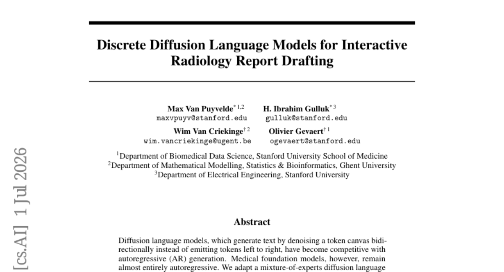

### 📌 한 줄 요약
양방향 디퓨전 모델을 활용하여 의료 보고서 작성 시 중간 삽입(Infill)이 가능한 고속·고성능 언어 모델 연구

### 🔑 핵심 포인트
- AR 모델 대비 우수한 속도와 대등한 성능을 가진 디퓨전 기반 의료 모델 검증
- 양방향 디노이징을 통한 강력한 Any-order Infill(중간 삽입) 기능 제공
- 의료진의 편집 작업에 최적화된 인터랙티브 보고서 작성 워크플로우 가능성 제시

### 🧑‍💻 개발자 관점
텍스트 생성 속도가 빠르고 중간 수정이 용이하여, 사용자와의 상호작용이 중요한 에디터 기반 AI 어시스턴트 개발에 유용합니다.

### 🚀 실무 적용 아이디어
- LoRA를 활용한 디퓨전 모델의 특정 도메인(의료/법률) 미세 조정 실험
- AR 모델과 디퓨전 모델 간의 Infill 성능 비교 벤치마크 구축
- 실시간 에디터 환경에서의 디퓨전 모델 추론 지연 시간(Latency) 테스트

### ⚠️ 리스크/한계
- AR 모델 대비 복잡할 수 있는 학습 및 샘플링 프로세스
- 매우 긴 문맥(Long-context) 생성 시 디퓨전 모델의 안정성 검증 필요

### 📝 초록 기반 상세 설명
기존 의료용 파운데이션 모델은 대부분 자기회귀(AR) 방식에 의존하고 있습니다. 본 연구는 양방향 노이즈 제거 방식을 사용하는 디퓨전 언어 모델인 DiffusionGemma-26B를 의료 VQA 데이터셋에 맞춰 미세 조정했습니다. 실험 결과, 동일 규모의 AR 모델과 비교했을 때 성능은 대등하거나 더 우수하면서도 디코딩 속도는 3.5~4.4배 더 빨랐습니다. 특히 디퓨전 모델 특유의 양방향 생성 능력 덕분에 텍스트 중간을 채우는 인필(Infill) 작업에서 AR 모델보다 뛰어난 성능을 보였습니다. 이러한 특성은 임상의가 보고서의 특정 부분을 수정하고 나머지 내용을 채우는 인터랙티브한 초안 작성 환경에 최적화되어 있습니다.

---

## 23. [DuoMem: Towards Capable On-Device Memory Agents via Dual-Space Distillation](https://huggingface.co/papers/2606.29961)
**Upvotes**: 3 | **도입 난이도**: 중 | **신뢰도**: 상
**arXiv**: https://arxiv.org/abs/2606.29961

**태그**: Agent, Knowledge Distillation, On-Device AI, LoRA, Benchmark, Evaluation, Inference, Distillation

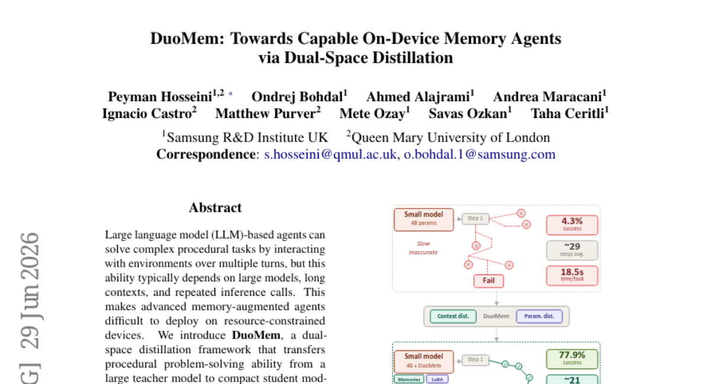

### 📌 한 줄 요약
대규모 모델의 에이전트 추론 능력을 경량 모델로 전이하여 온디바이스 환경에서 고성능 에이전트를 구현하는 이중 공간 증류 프레임워크

### 🔑 핵심 포인트
- Context-space distillation: 교사의 고품질 절차적 메모리를 학생 모델의 입력에 결합하여 지식 전이
- Parameter-space distillation: 성공적인 교사 궤적을 활용한 경량 LoRA 어댑터 미세 조정
- Efficiency: 매우 적은 추가 파라미터와 메모리 사용량으로 대형 모델 성능의 상당 부분 재현

### 🧑‍💻 개발자 관점
고성능 에이전트 기능을 클라우드 의존 없이 모바일이나 엣지 디바이스에서 실시간으로 구동할 수 있는 실질적인 방법론을 제시합니다.

### 🚀 실무 적용 아이디어
- LoRA를 활용한 소형 모델의 절차적 태스크 학습 파이프라인 구축 실험
- 학습된 메모리(Context)와 파라미터(LoRA) 중 어떤 요소가 특정 태스크에 더 기여하는지 비교
- 제한된 컨텍스트 윈도우 내에서 메모리 압축 효율성 테스트

### ⚠️ 리스크/한계
- 교사 모델의 데이터에 대한 의존성 및 편향 전이 가능성
- 특정 벤치마크(ALFWorld) 외 일반적인 도메인에서의 범용성 검증 필요

### 📝 초록 기반 상세 설명
LLM 기반 에이전트는 복잡한 태스크 해결이 가능하지만, 높은 연산 비용과 긴 컨텍스트로 인해 리소스가 제한된 온디바이스 배포가 어렵습니다. 이를 해결하기 위해 DuoMem은 대형 모델의 절차적 문제 해결 능력을 소형 모델로 전달하는 이중 공간 증류 프레임워크를 제안합니다. 방법론은 고품질 메모리를 입력에 추가하는 '컨텍스트 공간 증류'와 성공적인 궤적을 기반으로 LoRA 어댑터를 학습시키는 '파라미터 공간 증류'로 구성됩니다. 실험 결과, 4B 모델이 72B 모델에 근접하는 성능 향상을 보이면서도 추론 속도는 3배 이상 빨라졌습니다. 결과적으로 매우 적은 파라미터 추가만으로도 실시간 엣지 배포가 가능한 수준의 성능을 확보했습니다.

---

## 24. [Transferability for General Reasoning: An Automated Curriculum for Multi-Domain RLVR](https://huggingface.co/papers/2606.25178)
**Upvotes**: 3 | **도입 난이도**: 하 | **신뢰도**: 상
**arXiv**: https://arxiv.org/abs/2606.25178

**태그**: Reinforcement Learning, Curriculum Learning, Multi-domain, LLM Training, RAG, Reasoning, Safety

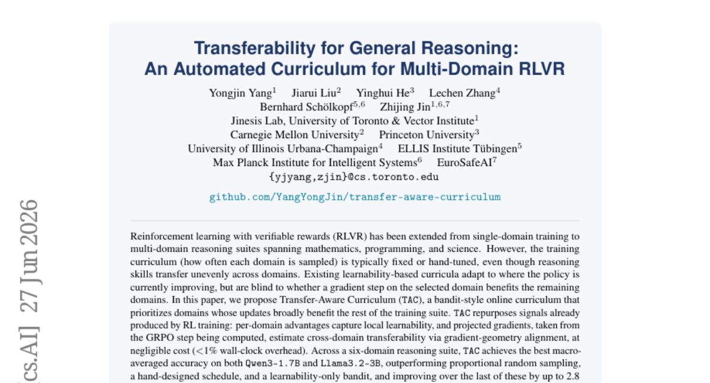

### 📌 한 줄 요약
멀티 도메인 RLVR 학습 시 도메인 간 전이 효과를 고려하여 학습 효율을 극대화하는 자동화된 커리큘럼 학습 기법 제안

### 🔑 핵심 포인트
- 도메인 간 전이 효과를 고려한 밴딧 스타일의 온라인 커리큘럼(TAC) 제안
- GRPO 학습 과정의 그래디언트 정보를 활용하여 추가 비용 없이 전이 가능성 추정 (<1% overhead)
- 학습 가능성(Learnability)과 전이성(Transferability)을 결합하여 도메인 불균형 문제 해결

### 🧑‍💻 개발자 관점
다양한 태스크를 동시에 학습시키는 멀티태스크 RL 모델 개발 시, 특정 도메인에 매몰되지 않고 전체 성능을 균형 있게 끌어올리는 전략을 제공합니다.

### 🚀 실무 적용 아이디어
- 멀티 도메인 RLVR 환경에서 기존의 고정 샘플링 방식과 TAC의 성능 비교 실험
- 도메인별 그래디언트 정렬(Gradient Alignment) 지표를 통한 전이 효과 시각화
- 특정 도메인이 압도적인 데이터 불균형 상황에서의 강건성 테스트

### ⚠️ 리스크/한계
- 도메인 간 그래디언트 정렬이 전이 효과를 완벽하게 대변하지 못할 가능성
- 매우 이질적인 도메인(예: 언어 vs 물리 시뮬레이션) 간의 전이 예측 정확도 문제

### 📝 초록 기반 상세 설명
수학, 프로그래밍 등 다양한 도메인을 아우르는 멀티 도메인 RLVR 학습에서 기존의 고정된 샘플링 방식은 도메인 간 불균형한 지식 전이 문제를 해결하지 못합니다. 기존의 학습 가능성(learnability) 기반 커리큘럼은 특정 도메인의 성장이 다른 도메인에 미치는 영향을 고려하지 못한다는 한계가 있습니다. 본 논문은 GRPO 단계에서 발생하는 그래디언트 정보를 활용하여, 업데이트 시 타 도메인에 긍정적인 영향을 주는 도메인을 우선순위화하는 Transfer-Aware Curriculum(TAC)을 제안합니다. TAC는 계산 비용을 거의 늘리지 않으면서도 도메인 간 그래디언트 기하학적 정렬을 통해 전이 가능성을 추정합니다. 실험 결과, TAC는 다양한 모델(Qwen, Llama)과 6개 도메인 환경에서 기존 방식보다 높은 평균 정확도를 달성하며 전이 가능성 신호의 중요성을 입증했습니다.

---

## 25. [WARP: Weight-Space Analysis for Recovering Training Data Portfolios](https://huggingface.co/papers/2607.01686)
**Upvotes**: 2 | **도입 난이도**: 중 | **신뢰도**: 상
**arXiv**: https://arxiv.org/abs/2607.01686

**태그**: Model Interpretability, Data Privacy, Model Merging, Reverse Engineering, RAG, Inference

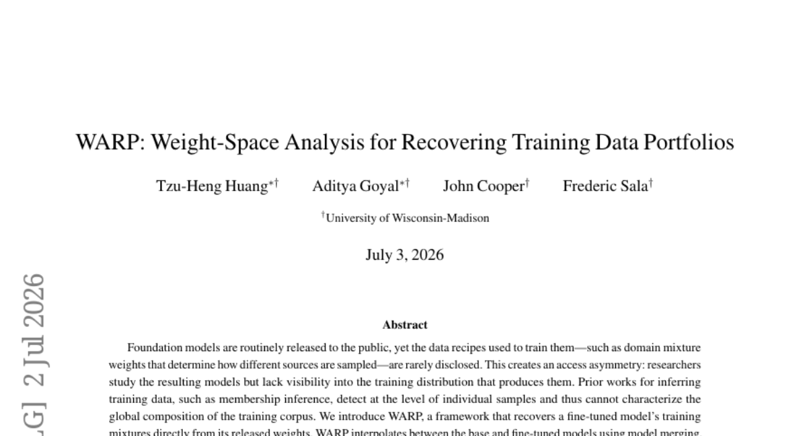

### 📌 한 줄 요약
모델 가중치 분석을 통해 공개된 모델이 어떤 데이터 비율로 학습되었는지 역추적하는 프레임워크 제안

### 🔑 핵심 포인트
- 모델 가중치 공간의 기하학적 특징을 활용한 데이터 혼합 비율(Domain Mixture) 복원 기술
- 모델 머징을 통한 가상 체크포인트 생성으로 학습 궤적(Training Trajectory) 시뮬레이션
- 기존 멤버십 추론 방식보다 정교한 글로벌 데이터 구성 분석 가능

### 🧑‍💻 개발자 관점
공개된 모델의 학습 데이터 구성을 역설계함으로써 모델의 편향성이나 데이터 출처를 파악하고 모델의 투명성을 검증할 수 있습니다.

### 🚀 실무 적용 아이디어
- 모델 머징 기법을 활용한 가상 체크포인트 생성 실험
- 특정 도메인 데이터가 포함된 모델의 가중치 변화 패턴 분석
- 다양한 아키텍처(Llama 등)에 대한 WARP 프레임워크 확장성 테스트

### ⚠️ 리스크/한계
- 학습 데이터의 구체적인 샘플 식별이 아닌 비율 추정에 국한됨
- 모델 아키텍처나 학습 방식의 변화에 따른 일반화 성능 변동 가능성

### 📝 초록 기반 상세 설명
파운데이션 모델의 학습 데이터 구성(data recipe)은 대개 비공개 상태로 유지되어 연구자들의 분석에 제약을 줍니다. 기존의 멤버십 추론 방식은 개별 샘플 식별에 치중되어 전체 데이터셋의 도메인 비율을 파악하기 어렵다는 한계가 있습니다. 본 논문은 모델 가중치 공간에서의 기하학적 특징을 활용하여 학습 데이터 혼합 비율을 복원하는 WARP 프레임워크를 제안합니다. 모델 머징(Model Merging)을 통해 가상의 체크포인트를 생성하여 학습 궤적을 시뮬레이션하고, 여기서 추출된 기하학적 특징을 통해 도메인 비중을 매핑합니다. 실험 결과, BERT와 GPT-2 모델에서 매우 낮은 평균 절대 오차(MAE)를 기록하며 기존 방식보다 뛰어난 복원 성능을 입증했습니다.

---

## 26. [Parameter-Efficient Quantum-Inspired Fast Weight Programmers for Traffic-Matrix Forecasting](https://huggingface.co/papers/2606.27821)
**Upvotes**: 1 | **도입 난이도**: 중 | **신뢰도**: 상
**arXiv**: https://arxiv.org/abs/2606.27821

**태그**: Time-Series Forecasting, Quantum-Inspired, KAN, Network Traffic, Parameter-Efficient, Benchmark, Evaluation

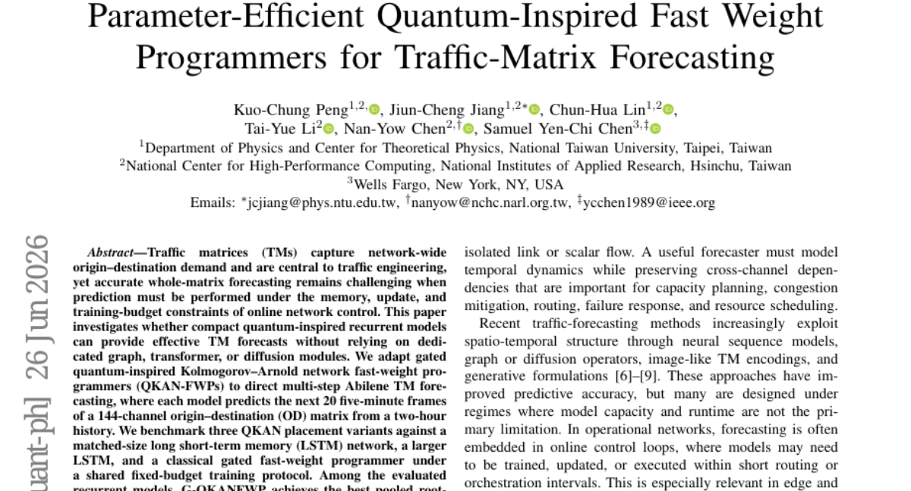

### 📌 한 줄 요약
양자 영감(Quantum-inspired) KAN 기반의 경량화된 Fast Weight Programmer를 활용하여 자원 제약적인 네트워크 트래픽 매트릭스 예측 성능을 극대화함

### 🔑 핵심 포인트
- 양자 영감(Quantum-inspired) KAN을 결합한 새로운 Fast-Weight Programmer 구조 제안
- 그래프/트랜스포머 없이도 높은 정확도를 유지하는 파라미터 효율적 설계
- 기존 LSTM 및 클래식 G-FWP 대비 압도적인 성능 및 학습 수렴 속도 확보

### 🧑‍💻 개발자 관점
리소스가 제한된 엣지 디바이스나 실시간 네트워크 제어 환경에서 고성능 시계열 예측 모델을 구축할 때 유용한 설계 패턴을 제공합니다.

### 🚀 실무 적용 아이디어
- 제안된 G-QKANFWP 구조를 기존 시계열 예측 파이프라인에 이식하여 파라미터 대비 성능 비교
- 다양한 시계열 데이터셋(예: METR-LA)에 대한 일반화 성능 검증
- 학습 예산(Training Budget) 변화에 따른 모델의 수렴 안정성 테스트

### ⚠️ 리스크/한계
- 양자 영감 알고리즘의 복잡도로 인해 하드웨어 가속기 최적화 시 추가 검증 필요
- 특정 데이터셋(Abilene)에 특화된 성능일 가능성 존재

### 📝 초록 기반 상세 설명
네트워크 트래픽 엔지니어링을 위한 트래픽 매트릭스(TM) 예측은 실시간 제어 환경의 메모리 및 학습 예산 제약으로 인해 어려움이 있습니다. 본 논문은 그래프나 트랜스포머 모듈 없이도 효율적인 예측이 가능한 양자 영감 기반의 Kolmogorov-Arnold Network Fast-Weight Programmers(QKAN-FWP)를 제안합니다. Abilene 데이터셋을 활용해 2시간의 이력을 바탕으로 향후 20프레임을 예측하는 실험을 진행했습니다. 실험 결과, G-QKANFWP 모델은 대형 LSTM 대비 22.4%의 파라미터만 사용하면서도 더 우수한 RMSE 성능을 기록했습니다. 이는 양자 영감 구조가 클래식한 Fast-Weight 프레임워크보다 높은 정확도와 효율성을 제공함을 입증합니다.

### 🖼️ 추가 자료
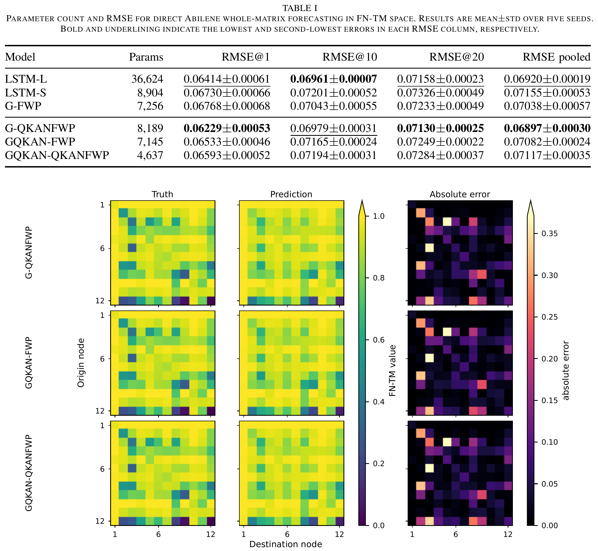

---

