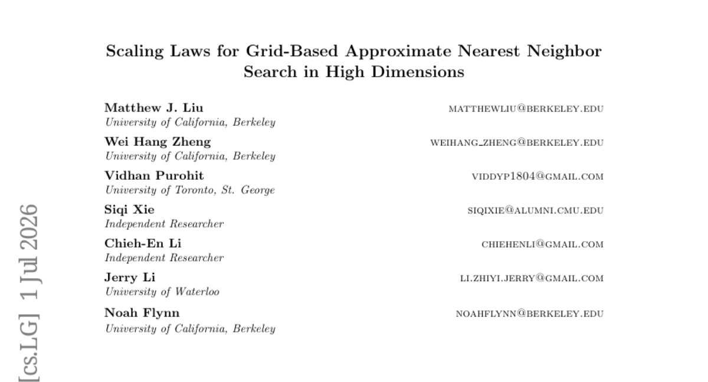

# 2026-07-06 Daily Papers (Top 27)

## 오늘의 요약
오늘의 연구는 에이전트의 장기적 의사결정과 자기 개선 능력을 강화하는 방법론과 모델의 추론 효율성을 극대화하는 아키텍처 최적화에 집중되었습니다. 또한, 복잡한 추론 과정에서의 오류 전파를 방지하거나 데이터/비디오 생성의 정밀한 제어를 가능케 하는 실무 중심의 벤치마크와 프레임워크들이 주목받았습니다.

### 오늘의 핵심 포인트
- 에이전트의 메모리 구조와 정책 진화 능력을 통해 장기적이고 자율적인 문제 해결 역량을 검증하는 연구가 활발히 진행되었습니다.
- 모델 재학습 없이 추론 속도를 높이거나 특정 레이어를 선택적으로 최적화하는 등 효율적인 모델 운영을 위한 기술적 접근이 돋보였습니다.
- 의료, 데이터 분석, 비디오 생성 등 전문적인 도메인에서 신뢰성과 제어 가능성을 확보하기 위한 정교한 방법론들이 제안되었습니다.

**오늘의 태그**: LLM-Agent, Efficient-Inference, Autonomous-Agents, Reinforcement-Learning, Generative-AI

## 1. [Program-as-Weights: A Programming Paradigm for Fuzzy Functions](https://huggingface.co/papers/2607.02512)
**Upvotes**: 82 | **도입 난이도**: 중 | **신뢰도**: 상
**arXiv**: https://arxiv.org/abs/2607.02512

**태그**: LLM-Compiler, Parameter-Efficient-Fine-Tuning, Edge-AI, Programming-Paradigm, Inference

### 📌 한 줄 요약
자연어 명세로부터 경량 어댑터를 생성하여, 거대 모델 없이도 로컬에서 고성능 '퍼지 함수'를 실행하는 새로운 프로그래밍 패러다임 제안

### 🔑 핵심 포인트
- 자연어 명세를 경량 어댑터로 컴파일하는 'Program-as-Weights(PAW)' 패러다임 제안
- 거대 모델(32B) 수준의 성능을 훨씬 작은 모델(0.6B)과 어댑터 조합으로 구현
- 추론 비용 절감, 로컬 실행 가능성, 높은 재현성을 확보한 효율적 워크플로우

### 🧑‍💻 개발자 관점
LLM API 호출 비용과 지연 시간 문제 없이, 특정 태스크에 최적화된 초경량 모델을 로컬 환경에서 즉시 배포하여 사용할 수 있습니다.

### 🚀 실무 적용 아이디어
- 특정 도메인(예: JSON 정제)에 대한 자연어 명세가 어댑터로 잘 변환되는지 테스트
- 제한된 하드웨어 환경에서 PAW 방식의 추론 속도와 정확도 트레이드오프 확인
- 기존 프롬프트 엔지니어링 방식과 PAW 생성 아티팩트 간의 결과 일관성 비교

### ⚠️ 리스크/한계
- 특정 태스크에 특화된 어댑터이므로 범용적인 문제 해결 능력은 낮을 수 있음
- 컴파일 단계(4B 모델 사용)에서의 비용과 생성된 아티팩트의 품질 간의 관계 검증 필요

### 📝 초록 기반 상세 설명
로그 모니터링이나 데이터 정제와 같이 규칙 기반 구현이 어려운 작업들이 LLM API로 외주화되면서 비용과 재현성 문제가 발생하고 있습니다. 이를 해결하기 위해 자연어 명세를 컴파일하여 작은 신경망 아티팩트로 변환하는 '퍼지 함수 프로그래밍'을 제안합니다. 연구진은 4B 규모의 컴파일러를 통해 고정된 경량 인터프리터를 위한 파라미터 효율적 어댑터를 생성하는 Program-as-Weights(PAW) 방식을 도입했습니다. 실험 결과, 0.6B 규모의 인터프리터가 32B 모델의 프롬프팅 성능에 근접하면서도 메모리 사용량은 20분의 1로 줄이고 빠른 추론 속도를 달성했습니다. 결과적으로 파운데이션 모델을 매번 호출하는 도구가 아닌, 재사용 가능한 작은 아티팩트를 만드는 '도구 빌더'로 재정의했습니다.

### 🖼️ 추가 자료

---

## 2. [AgenticSTS: A Bounded-Memory Testbed for Long-Horizon LLM Agents](https://huggingface.co/papers/2607.02255)
**Upvotes**: 46 | **도입 난이도**: 중 | **신뢰도**: 상
**arXiv**: https://arxiv.org/abs/2607.02255

**태그**: LLM-Agent, Memory-Architecture, Long-Horizon, Evaluation-Framework, Agent, RAG, Benchmark, Evaluation

### 📌 한 줄 요약
장기 의사결정 에이전트의 메모리 구조를 격리 및 제어 가능한 형태로 설계한 새로운 테스트베드 제안

### 🔑 핵심 포인트
- 과거 기록의 단순 나열이 아닌, 타입화된 검색을 통한 독립적 메모리 구성 방식 제안
- 장기 의사결정 환경(Slay the Spire 2)을 활용한 에이전트 성능 검증 방법론 구축
- 메모리 레이어별 효과를 개별적으로 분석(Ablation)할 수 있는 통제된 테스트 환경 제공

### 🧑‍💻 개발자 관점
에이전트의 컨텍스트가 길어질 때 발생하는 정보 혼선 문제를 해결하고, 특정 메모리 기능(RAG, 요약 등)의 순수 기여도를 측정하는 방법론을 배울 수 있습니다.

### 🚀 실무 적용 아이디어
- 에이전트 프롬프트에 모든 이력을 넣는 대신, 특정 정보만 추출해 재구성하는 구조로 변경해보기
- 메모리 레이어(요약, 검색, 기록)를 분리하여 각 요소의 승률/성능 기여도 측정 실험하기
- 복잡한 게임이나 워크플로우 환경에서 에이전트의 '컨텍스트 오염' 문제 테스트하기

### ⚠️ 리스크/한계
- 제시된 실험 결과의 표본 크기가 작아 통계적 유의성이 완벽히 확보되지 않음
- 게임 환경이라는 특수성이 실제 범용적인 업무 환경에서의 성능을 보장하지는 않음

### 📝 초록 기반 상세 설명
장기 의사결정(Long-horizon)을 수행하는 LLM 에이전트는 과거 기록을 모두 프롬프트에 포함하는 방식 때문에 컨텍스트가 혼재되어 특정 메모리 요소의 효과를 분리하기 어렵습니다. 이를 해결하기 위해 과거 기록을 직접 붙이는 대신, 타입화된 검색(Typed Retrieval)을 통해 매번 새로운 사용자 메시지를 구성하는 '경계가 있는 메모리(Bounded-memory)' 계약 방식을 도입했습니다. 이 방식을 복잡한 전략 게임인 'Slay the Spire 2' 환경에 적용하여 에이전트의 성능을 테스트했습니다. 실험 결과, 전략적 스킬 레이어를 활성화했을 때 승률이 유의미하게 향상됨을 확인했습니다. 연구팀은 재현 가능한 분석을 위해 298개의 궤적 데이터와 분석 스크립트를 포함한 테스트베드를 공개했습니다.

---

## 3. [EvoPolicyGym: Evaluating Autonomous Policy Evolution in Interactive Environments](https://huggingface.co/papers/2607.02440)
**Upvotes**: 43 | **도입 난이도**: 중 | **신뢰도**: 상
**arXiv**: https://arxiv.org/abs/2607.02440

**태그**: Autonomous Agents, Policy Evolution, Reinforcement Learning, Benchmarking, Agent, Benchmark, Evaluation

### 📌 한 줄 요약
에이전트가 제한된 피드백 내에서 실행 가능한 정책을 반복적으로 개선하는 능력을 평가하는 새로운 벤치마크 제안

### 🔑 핵심 포인트
- 자율 정책 진화(Autonomous Policy Evolution)라는 새로운 평가 프레임워크 정의
- 반복적인 정책 수정 및 피드백 활용 능력을 측정하는 EvoPolicyGym 벤치마크 구축
- 단순 성공률을 넘어 예산 배분 및 피드백 변환 과정을 분석하는 궤적 진단 기능 제공

### 🧑‍💻 개발자 관점
에이전트가 단순히 문제를 푸는 것을 넘어, 코드를 수정하거나 파라미터를 조정하며 스스로 성능을 최적화하는 '자기 개선(Self-improvement)' 능력을 검증할 수 있습니다.

### 🚀 실무 적용 아이디어
- 에이전트의 코드 수정 루프(Edit-Test-Refine) 성능 테스트
- 제한된 토큰/실행 예산 내에서의 최적화 효율성 비교
- 피드백 데이터가 에이전트의 정책 수정 방향에 미치는 영향 분석

### ⚠️ 리스크/한계
- 컴팩트한 RL 환경 기반이므로 복잡한 실제 소프트웨어 엔지니어링 환경과의 괴리 가능성
- 에이전트의 모델 크기나 추론 능력에 따라 성능 편차가 클 수 있음

### 📝 초록 기반 상세 설명
자율 에이전트가 피드백을 통해 실행 가능한 정책을 개선하는 능력이 중요해지고 있으나, 기존 평가는 최종 점수에만 치중하거나 소프트웨어 엔지니어링 과정과 혼재되어 평가의 정밀도가 떨어지는 문제가 있었습니다. 이를 해결하기 위해 에이전트가 고정된 예산 내에서 실행 가능한 정책 시스템을 반복적으로 수정하는 '자율 정책 진화(Autonomous Policy Evolution)' 환경을 정의했습니다. 본 논문은 이를 위해 컴팩트한 RL 환경 기반의 벤치마크인 EvoPolicyGym을 구축했습니다. 실험 결과, GPT-5.5가 모든 환경에서 최상위 성능을 기록하며 강력한 정책 진화 능력을 입증했습니다. 또한, 단순 점수를 넘어 에이전트가 예산을 어떻게 배분하고 피드백을 파라미터 튜닝으로 전환하는지에 대한 궤적 분석 도구를 제공합니다.

---

## 4. [Morphing into Hybrid Attention Models](https://huggingface.co/papers/2606.30562)
**Upvotes**: 37 | **도입 난이도**: 중 | **신뢰도**: 상
**arXiv**: https://arxiv.org/abs/2606.30562

**태그**: Transformer, Efficient Inference, Long-context, Model Compression, RAG, Benchmark, Evaluation, Distillation

### 📌 한 줄 요약
전체 레이어 중 일부만 Full-attention을 유지하는 하이브리드 모델 구축 시, 최적의 레이어 조합을 효율적으로 찾아내는 FlashMorph 방법론 제안

### 🔑 핵심 포인트
- 레이어 선택 문제를 예산 제약 하의 최적화 문제로 정식화
- FlashMorph: 선형 어텐션 브랜치를 활용한 효율적인 레이어 게이트 최적화 기법
- 기존 휴리스틱 방식 대비 높은 성능 유지 및 낮은 선택 비용 달성

### 🧑‍💻 개발자 관점
모델의 추론 비용을 줄이기 위해 Full-attention 레이어를 선별적으로 제거해야 하는 엔지니어에게 최적의 아키텍처 설계 가이드를 제공합니다.

### 🚀 실무 적용 아이디어
- 기존 Transformer 모델에 Linear-attention 브랜치를 추가하여 실험 환경 구축
- 다양한 레이어 예산(Budget) 설정에 따른 성능 변화 측정
- 합성 데이터 기반 게이트 학습 시 모델 성능 유지 여부 검증

### ⚠️ 리스크/한계
- 학습 과정에서 합성 데이터에 대한 의존성 발생 가능성
- 최종 모델 배포 전 수행되는 증류(Distillation) 및 파인튜닝 비용 발생

### 📝 초록 기반 상세 설명
긴 문맥 처리를 위해 일부 레이어는 Full-attention을, 나머지는 Linear-attention을 사용하는 하이브리드 모델이 주목받고 있습니다. 하지만 어떤 레이어를 유지할지에 대한 기존의 휴리스틱 방식은 레이어 간의 상호 의존성을 고려하지 못한다는 한계가 있습니다. 본 논문에서는 레이어 선택 문제를 예산 제약 하의 부분집합 최적화 문제로 정의하고, 이를 해결하기 위한 FlashMorph 알고리즘을 제안합니다. FlashMorph는 각 레이어에 선형 어텐션 브랜치를 부착한 후, 합성 데이터를 통해 레이어별 게이트를 공동 최적화하여 최적의 조합을 찾아냅니다. 실험 결과, FlashMorph는 기존 방식보다 효율적이고 확장 가능한 방식으로 성능 저하를 최소화하면서도 최적의 하이브리드 구성을 발견했습니다.

---

## 5. [Multi-Resolution Flow Matching: Training-Free Diffusion Acceleration via Staged Sampling](https://huggingface.co/papers/2607.01642)
**Upvotes**: 29 | **도입 난이도**: 하 | **신뢰도**: 상
**arXiv**: https://arxiv.org/abs/2607.01642

**태그**: Diffusion, Image Generation, Acceleration, Computer Vision, Vision, Inference, Distillation

### 📌 한 줄 요약
학습 없이 저해상도 구조 생성 후 고해상도 디테일을 복원하는 단계적 샘플링을 통해 10배 이상의 추론 가속을 달성한 기술

### 🔑 핵심 포인트
- 학습이 필요 없는(Training-free) 단계적 저해상도-고해상도 파이프라인 설계
- GAN 기반 초해상도화와 저강도 노이즈 주입을 결합한 고주파 디테일 복원
- 기존 타임스텝 증류(Timestep Distillation) 기술과 직교적으로 결합 가능한 확장성

### 🧑‍💻 개발자 관점
모델 재학습 없이 기존 사전 학습된 모델의 추론 속도를 획기적으로 높일 수 있어, 실시간 이미지 생성 서비스 도입 시 비용과 지연 시간을 줄이는 데 매우 유용합니다.

### 🚀 실무 적용 아이디어
- FLUX.1-dev 모델에 MrFlow 파이프라인을 적용하여 생성 품질(FID/IS) 변화 측정
- 사용 중인 GAN 모델과 MrFlow의 조합에 따른 디테일 복원력 비교 실험
- 기존 Distillation 기법과 결합 시 발생하는 아티팩트 발생 여부 검증

### ⚠️ 리스크/한계
- GAN 기반 초해상도 모델 사용 시 발생할 수 있는 생성적 아티팩트 위험
- 단계적 파이프라인 구성에 따른 시스템 복잡도 증가

### 📝 초록 기반 상세 설명
최근 텍스트-이미지 확산 모델의 추론 속도를 높이기 위해 멀티 해상도 생성 전략이 주목받고 있습니다. 그러나 잠재 공간에서의 업샘플링 방식은 이미지 블러링이나 아티팩트 문제를 야기하는 한계가 있습니다. 이를 해결하기 위해 제안된 MrFlow는 저해상도에서 구조를 먼저 생성한 후, GAN 기반 모델로 픽셀 공간에서 초해상도화를 수행합니다. 이후 저강도 노이즈 주입을 통해 고주파 성분을 재샘플링하고 최종 디테일을 정제하는 단계적 파이프라인을 활용합니다. 실험 결과, FLUX.1-dev 등에서 품질 저하를 최소화하면서도 최대 10배의 가속을 달성했으며, 기존 증류(Distillation) 기술과 결합 시 최대 25배까지 가속이 가능함을 입증했습니다.

---

## 6. [AgenticDataBench: A Comprehensive Benchmark for Data Agents](https://huggingface.co/papers/2607.01647)
**Upvotes**: 29 | **도입 난이도**: 하 | **신뢰도**: 상
**arXiv**: https://arxiv.org/abs/2607.01647

**태그**: Data Agent, Benchmark, LLM, Data Science, Agent, RAG, Evaluation

### 📌 한 줄 요약
데이터 과학 워크플로우의 복잡성을 정밀하게 평가하기 위해 15개 도메인과 세분화된 스킬셋을 포함한 종합 벤치마크인 AgenticDataBench를 제안합니다.

### 🔑 핵심 포인트
- 15개 도메인을 아우르는 실무 중심의 데이터 과학 태스크 셋 구축
- Stack Overflow 데이터를 활용한 스킬 기반의 계층적 클러스터링 및 벤치마크 커버리지 정량화
- LLM을 활용한 체계적인 태스크 생성 기법을 통해 데이터 부족 문제 해결

### 🧑‍💻 개발자 관점
데이터 에이전트 개발 시 단순 결과값이 아닌, 특정 데이터 분석 스킬(Skill-level)에 대한 정밀한 성능 검증이 가능해집니다.

### 🚀 실무 적용 아이디어
- 제공된 오픈소스 테스트베드를 활용하여 현재 개발 중인 에이전트의 스킬별 강점/약점 분석
- 실제 B2B 시나리오와 벤치마크 태스크 간의 유사도 비교 실험
- LLM 기반 태스크 생성 방식이 생성한 데이터의 품질 및 현실성 검증

### ⚠️ 리스크/한계
- LLM 생성 태스크가 실제 복잡한 데이터 과학 워크플로우를 완벽히 대체할 수 있는지에 대한 의문
- 특정 도메인(예: 핀테크)에 편향된 데이터가 전체 에이전트 성능을 대변할 위험

### 📝 초록 기반 상세 설명
데이터 과학 자동화를 위해 LLM 기반 데이터 에이전트가 부상하고 있으나, 다양한 시나리오를 정밀하게 평가할 수 있는 벤치마크가 부족한 상황입니다. 이를 해결하기 위해 다양한 도메인과 세분화된 정답 라벨을 갖춘 AgenticDataBench를 제안합니다. 연구진은 15개 수직 도메인의 실제 데이터와 Stack Overflow 기반의 스킬 추출, 그리고 LLM 기반의 체계적인 태스크 생성 방식을 통해 벤치마크를 구축했습니다. 특히 실제 B2B 사례와 데이터 과학 스킬셋을 결합하여 실무적인 복잡성을 반영했습니다. 최종적으로 최신 데이터 에이전트들을 대상으로 스킬 수준의 상세한 성능 평가를 수행했습니다.

---

## 7. [WorldDirector: Building Controllable World Simulators with Persistent Dynamic Memory](https://huggingface.co/papers/2607.02517)
**Upvotes**: 22 | **도입 난이도**: 상 | **신뢰도**: 상
**arXiv**: https://arxiv.org/abs/2607.02517

**태그**: Video Generation, LLM, 3D Control, World Model, RAG, Video

### 📌 한 줄 요약
LLM 기반의 3D 궤적 제어를 통해 객체의 정체성을 유지하며 복잡한 움직임을 생성하는 고정밀 비디오 월드 모델

### 🔑 핵심 포인트
- 의미론적 움직임(Semantic Motion)과 시각적 생성(Visual Generation)의 명확한 분리
- LLM을 통한 3D 궤적 및 카메라 움직임의 정교한 오케스트레이션
- 장시간 시야에서 벗어난 객체의 외형을 유지하는 지속적 동적 메모리(Persistent Dynamic Memory) 구현

### 🧑‍💻 개발자 관점
물리적 법칙과 객체 일관성이 중요한 시뮬레이션 환경이나 게임 에셋 생성 파이프라인에 즉시 응용 가능한 제어 기술입니다.

### 🚀 실무 적용 아이디어
- LLM이 생성하는 3D 궤적 데이터의 정밀도가 비디오 품질에 미치는 영향 분석
- 복잡한 다중 객체 시나리오에서의 객체 식별 유지 성능 테스트
- 기존 Diffusion 기반 비디오 모델과의 제어 신호 호환성 검토

### ⚠️ 리스크/한계
- LLM의 궤적 생성 오류가 비디오의 물리적 왜곡으로 직결될 가능성
- 복잡한 3D 궤적 계산 및 비디오 생성 결합에 따른 높은 연산 비용

### 📝 초록 기반 상세 설명
기존의 비디오 월드 모델은 물리적 역학이 픽셀 렌더링과 얽혀 있어, 시야에서 사라진 객체의 일관성을 유지하거나 자유로운 시점 이동을 구현하는 데 한계가 있었습니다. 이를 해결하기 위해 WorldDirector는 의미론적 움직임 제어와 시각적 생성을 명확히 분리하는 프레임워크를 제안합니다. LLM을 활용하여 3D 궤적과 카메라 움직임을 먼저 조율한 뒤, 이를 비디오 생성 모델의 제어 신호로 사용합니다. 이러한 방식을 통해 객체가 화면 밖으로 나갔다 다시 등장해도 외형이 변하지 않는 지속적인 메모리 효과를 구현합니다. 실험 결과, 복잡하고 긴 이벤트에서도 높은 제어력과 객체 일관성을 입증하였습니다.

---

## 8. [Breaking Failure Cascades: Step-Aware Reinforcement Learning for Medical Multimodal Reasoning](https://huggingface.co/papers/2606.31825)
**Upvotes**: 19 | **도입 난이도**: 중 | **신뢰도**: 상
**arXiv**: https://arxiv.org/abs/2606.31825

**태그**: Reinforcement Learning, Multimodal LLM, Medical AI, Reasoning, Multimodal, Vision, Benchmark

### 📌 한 줄 요약
추론 과정의 단계별 보상을 통해 초기 오류가 최종 오답으로 이어지는 '실패 연쇄(Failure Cascade)'를 방지하는 강화학습 알고리즘 제안

### 🔑 핵심 포인트
- 결과 중심(Outcome-centric)에서 과정 중심(Process-aware)으로의 RL 패러다임 전환
- 초기 단계의 오류가 후속 단계로 전파되는 '실패 연쇄(Failure Cascade)' 문제 해결
- 잘못된 초기 추론 단계에 지수적 페널티를 부여하는 MRPO 알고리즘 개발

### 🧑‍💻 개발자 관점
복잡한 논리적 단계가 필요한 도메인(의료, 수학, 코딩)에서 단순 결과값 최적화가 아닌, 중간 추론 과정의 신뢰성을 높이는 방법론을 제시합니다.

### 🚀 실무 적용 아이디어
- LLM의 Chain-of-Thought(CoT) 과정에서 발생하는 오류 패턴 분석
- 결과값 기반 보상 외에 단계별 크레딧 할당(Credit Assignment) 로직 구현 실험
- 도메인 특화 데이터셋에 대한 단계별 페널티 스케줄링 최적화

### ⚠️ 리스크/한계
- 초기 단계에 과도한 페널티를 부여할 경우 정상적인 추론 경로까지 위축될 가능성
- 단계별 정답 여부를 판단하기 위한 정교한 자동 평가 메트릭 필요

### 📝 초록 기반 상세 설명
최근 멀티모달 LLM이 의료 영상 추론에서 성과를 보이고 있으나, 기존의 결과 중심적 학습 방식은 추론 과정의 오류를 수정하기 어렵다는 한계가 있습니다. 연구진은 초기 단계의 잘못된 추론이 최종 오답을 유발하는 '실패 연쇄' 현상을 발견했습니다. 이를 해결하기 위해 단계별 프로세스 보상을 활용하는 MRPO(Medical Reasoning-aware Policy Optimization) 알고리즘을 제안합니다. MRPO는 최종 답이 틀렸을 경우 초기 단계의 잘못된 토큰에 더 큰 페널티를 부여하여 오류의 전파를 차단합니다. 실험 결과, MRPO는 기존 GRPO 및 대형 의료 모델들을 상회하는 성능을 보였으며 초기 단계의 추론 실패율을 크게 낮추었습니다.

---

## 9. [SkillCoach: Self-Evolving Rubrics for Evaluating and Enhancing Agentic Skill-Use](https://huggingface.co/papers/2607.01874)
**Upvotes**: 15 | **도입 난이도**: 중 | **신뢰도**: 상
**arXiv**: https://arxiv.org/abs/2607.01874

**태그**: LLM Agent, Process Supervision, Evaluation, Workflow Automation, Agent, Vision

### 📌 한 줄 요약
결과 중심 평가의 한계를 넘어, 에이전트의 작업 과정(Process)을 정교하게 평가하고 학습시키는 자가 진화형 루브릭 프레임워크

### 🔑 핵심 포인트
- 결과(Outcome)와 과정(Process)을 분리하여 에이전트의 실질적인 숙련도를 측정
- 실제 실행 데이터(Rollouts)로부터 스킬 기반의 정교한 평가 루브릭을 자동 생성
- 스킬 선택, 준수, 조합, 성찰의 4개 차원을 통한 다각도 프로세스 감독

### 🧑‍💻 개발자 관점
에이전트가 단순히 정답을 맞히는 것을 넘어, 정해진 SOP나 워크플로우를 정확히 따르도록 학습시키고 검증할 수 있는 방법론을 제시합니다.

### 🚀 실무 적용 아이디어
- 현재 운영 중인 에이전트의 로그를 활용해 4가지 차원(선택, 준수, 조합, 성찰)의 평가 지표 설계해보기
- 최종 성공 여부 외에 과정상의 오류를 잡아낼 수 있는 중간 단계 검증 로직 도입하기
- 에이전트의 성공 궤적 중 '우연한 성공'을 걸러내기 위한 프로세스 기반 필터링 실험하기

### ⚠️ 리스크/한계
- 루브릭 생성 과정에서 데이터 편향이 발생할 경우 잘못된 프로세스가 학습될 위험
- 복잡한 루브릭 설계 및 운영에 따른 추가적인 연산 비용 발생

### 📝 초록 기반 상세 설명
LLM 에이전트가 복잡한 워크플로우를 수행함에 따라 스킬 활용 능력이 중요해지고 있으나, 기존의 최종 결과 중심(Outcome-based) 평가는 과정상의 오류를 잡아내지 못하는 한계가 있습니다. 이를 해결하기 위해 SkillCoach는 실제 실행 데이터로부터 스킬 기반의 프로세스 루브릭을 도출하는 프레임워크를 제안합니다. 이 프레임워크는 스킬 선택, 준수, 조합, 성찰이라는 네 가지 차원에서 에이전트의 궤적을 평가합니다. 최종 결과와 프로세스 품질을 분리함으로써 우연한 성공과 진정한 숙련도를 구분합니다. 실험 결과, 진화된 루브릭은 평가 품질을 높이고 숨겨진 실패를 식별하며, 결과 중심 필터링보다 더 강력한 학습 감독 신호를 제공함을 입증했습니다.

---

## 10. [Logit-Contribution Scoring Identifies Non-Literal Retrieval Heads](https://huggingface.co/papers/2607.01002)
**Upvotes**: 15 | **도입 난이도**: 중 | **신뢰도**: 상
**arXiv**: https://arxiv.org/abs/2607.01002

**태그**: Interpretability, LLM, Attention Mechanism, Long-context, RAG, Reasoning, Benchmark, Evaluation

### 📌 한 줄 요약
기존의 단순 매칭 방식이 놓치던 '비문자적 정보 합성(Non-literal retrieval)'을 수행하는 어텐션 헤드를 식별하는 새로운 스코어링 기법 제안

### 🔑 핵심 포인트
- 기존의 'Literal-copy' 중심 탐지 방식이 가진 한계(OV 회로 무시)를 지적
- LOCOS: OV 회로 출력을 정답 토큰 방향으로 투영하여 정보 합성 헤드를 식별하는 새로운 방법론
- 비문자적 정보 추출(Non-literal retrieval)에 특화된 헤드를 정확히 타겟팅하여 성능 저하 유도

### 🧑‍💻 개발자 관점
LLM의 긴 문맥 처리 메커니즘을 해석할 때, 단순 매칭이 아닌 실제 '의미 합성'을 담당하는 핵심 헤드를 식별하여 모델의 추론 과정을 더 정밀하게 분석할 수 있습니다.

### 🚀 실무 적용 아이디어
- 자체 모델의 특정 태스크(예: 요약, 질의응답)에서 LOCOS를 적용하여 핵심 헤드 추출 실험
- 식별된 헤드 제거(Ablation) 시 일반 지식 유지 여부 검증
- 기존의 Attention-based 탐지 방식과 LOCOS의 성능 비교 테스트

### ⚠️ 리스크/한계
- 특정 벤치마크(NoLiMa)에 최적화된 방식일 가능성
- OV 회로 투영 방식이 모델 아키텍처에 따라 계산 복잡도를 높일 수 있음

### 📝 초록 기반 상세 설명
LLM이 긴 문맥에서 정보를 단순히 복사하는 것이 아니라 의미를 합성하여 답변하는 과정에서, 어떤 어텐션 헤드가 이 역할을 수행하는지 식별하는 것이 중요해졌습니다. 기존의 탐지 방식은 입력 토큰과 출력 토큰이 일치하는지에만 집중하여, 실제 정보 전달을 담당하는 OV(Output-Value) 회로의 역할을 간과하는 한계가 있었습니다. 이를 해결하기 위해 저자들은 OV 회로 출력을 정답 토큰 방향으로 투영하여 점수를 매기는 LOCOS(Logit-Contribution Scoring) 기법을 도입했습니다. 실험 결과, LOCOS로 식별된 헤드를 제거했을 때 비문자적 정보 추출 성능(ROUGE-L)이 기존 방식보다 훨씬 급격하게 하락했습니다. 또한, 식별된 헤드들은 일반적인 지식 인출이나 산술 능력에는 영향을 주지 않고 오직 정보 추출 작업에 특화되어 있음이 증명되었습니다.

---

## 11. [Optimizing Visual Generative Models via Distribution-wise Rewards](https://huggingface.co/papers/2607.02291)
**Upvotes**: 14 | **도입 난이도**: 중 | **신뢰도**: 상
**arXiv**: https://arxiv.org/abs/2607.02291

**태그**: Generative Models, Reinforcement Learning, Diffusion Models, Model Merging, Vision, Evaluation, Inference, Safety

### 📌 한 줄 요약
샘플 단위가 아닌 데이터 분포 단위의 보상 체계를 통해 생성 모델의 모드 붕괴를 방지하고 품질을 높이는 최적화 프레임워크

### 🔑 핵심 포인트
- 샘플 단위가 아닌 분포 단위 보상(Distribution-wise rewards)을 통한 모드 붕괴 방지
- 계산 비용 절감을 위한 subset-replace 전략 도입
- RL을 활용한 post-hoc 모델 병합 계수 최적화로 학습-추론 불일치 완화

### 🧑‍💻 개발자 관점
생성 모델 튜닝 시 발생하는 '다양성 상실' 문제를 수학적/구조적으로 해결하는 방법론을 제시하여 고품질 이미지 생성 파이프라인 구축에 유용합니다.

### 🚀 실무 적용 아이디어
- 기존 RL 기반 생성 모델 튜닝 시 FID와 Diversity 지표 간의 트레이드오프 분석
- 제안된 subset-replace 전략을 활용한 대규모 배치 학습 효율성 테스트
- 모델 병합(Model Merging) 시 RL 기반 계수 최적화 적용 실험

### ⚠️ 리스크/한계
- 분포 기반 보상 계산 시 여전히 높은 연산 복잡도 존재 가능성
- 특정 데이터셋 분포에 과적합될 경우 범용성 저하 우려

### 📝 초록 기반 상세 설명
기존의 강화학습 기반 시각 생성 모델은 개별 샘플에 대한 보상을 사용하여 이미지 다양성이 저하되거나 특정 패턴에 매몰되는 리워드 해킹 문제가 발생했습니다. 이를 해결하기 위해 본 논문은 샘플 개별 평가가 아닌 데이터 분포 전체를 고려하는 'distribution-wise rewards' 프레임워크를 제안합니다. 분포 기반 보상은 모든 샘플이 동일한 방향으로 수렴하는 모드 붕괴 문제를 완화하며, 계산 효율성을 위해 일부 샘플만 업데이트하는 subset-replace 전략을 도입했습니다. 또한, 모델 병합 계수를 최적화하여 학습과 추론 사이의 불일치 문제를 해결했습니다. 실험 결과, SiT 및 EDM2 등 다양한 베이스 모델에서 FID 수치를 유의미하게 개선하며 품질과 다양성을 동시에 확보했습니다.

### 🖼️ 추가 자료

---

## 12. [AutoMem: Automated Learning of Memory as a Cognitive Skill](https://huggingface.co/papers/2607.01224)
**Upvotes**: 14 | **도입 난이도**: 상 | **신뢰도**: 상
**arXiv**: https://arxiv.org/abs/2607.01224

**태그**: LLM-Agent, Memory-Management, Automated-Learning, Long-Horizon-Tasks, Agent, RAG

### 📌 한 줄 요약
에이전트의 메모리 관리 능력을 독립적인 학습 가능한 기술로 정의하고, 구조와 숙련도를 자동 최적화하여 성능을 극대화하는 프레임워크

### 🔑 핵심 포인트
- 메모리 관리를 작업 수행과 분리된 독립적인 학습 가능 기술로 정의
- 메모리 구조(Schema/Prompt)와 모델 숙련도(Proficiency)를 동시에 최적화하는 이중 루프 프레임워크 제안
- 장기 작업(Long-horizon) 환경에서 메모리 최적화만으로 비약적인 성능 향상 입증

### 🧑‍💻 개발자 관점
에이전트 개발 시 단순히 프롬프트를 고치는 것을 넘어, 데이터 구조와 메모리 관리 로직을 어떻게 자동화하여 학습시킬지에 대한 새로운 방법론을 제시합니다.

### 🚀 실무 적용 아이디어
- 에이전트의 메모리 저장 방식을 파일 시스템 기반의 구조화된 데이터로 설계해보기
- 에이전트의 과거 트래젝토리를 분석하여 메모리 스키마를 자동 수정하는 루프 구현 실험
- 작업 액션과 메모리 액션을 분리하여 성능 변화 측정하기

### ⚠️ 리스크/한계
- 메모리 관리 최적화에 따른 높은 연산 비용 및 복잡도
- 학습 데이터(트래젝토리)의 품질에 따른 성능 의존성

### 📝 초록 기반 상세 설명
기존 LLM 에이전트는 장기 작업 시 메모리 관리(저장, 검색, 조직화)에 어려움을 겪으며, 이는 수동 최적화가 매우 까다로운 영역입니다. 본 논문은 메모리 관리를 하나의 인지적 기술로 보고, 파일 시스템 조작을 에이전트의 핵심 액션으로 격상시켰습니다. 이를 위해 AutoMem 프레임워크를 제안하며, 강력한 LLM이 메모리 구조(스키마, 프롬프트 등)를 개선하는 루프와 에이전트의 성공적인 메모리 결정이 모델 숙련도로 이어지는 학습 루프를 결합했습니다. 실험 결과, 모델의 작업 수행 능력 수정 없이 메모리 최적화만으로도 성능을 2~4배 향상시켰습니다. 결과적으로 32B급 오픈 모델이 최상위 프론티어 모델들과 경쟁할 수 있는 수준의 성능 향상을 달성했습니다.

---

## 13. [AGVBench: A Reliability-Oriented Benchmark of Data Augmentation for Vein Recognition](https://huggingface.co/papers/2607.02271)
**Upvotes**: 13 | **도입 난이도**: 하 | **신뢰도**: 상
**arXiv**: https://arxiv.org/abs/2607.02271

**태그**: Biometrics, Data Augmentation, Computer Vision, Robustness, Vision, Benchmark, Evaluation, Safety

### 📌 한 줄 요약
정확도와 보안성 사이의 트레이드오프를 분석하여 신뢰할 수 있는 정맥 인식 데이터 증강 벤치마크를 제안함

### 🔑 핵심 포인트
- 30가지 증강 전략과 7개 백본을 포함한 정맥 인식 특화 벤치마크(AGVBench) 구축
- MixUp 계열 방식이 높은 정확도를 제공하나, 보안성(Adversarial Robustness)과 신뢰도 측면에서는 취약함을 규명
- 기하학적 변형이 정맥 특징의 공간적 정렬을 방해하여 성능을 저하시키는 메커니즘 확인

### 🧑‍💻 개발자 관점
생체 인식 모델 개발 시 단순 정확도 향상에만 매몰되지 않고, 보안성과 신뢰성을 동시에 확보하기 위한 데이터 증강 전략 수립의 가이드를 제공합니다.

### 🚀 실무 적용 아이디어
- 현재 사용 중인 MixUp/CutMix 적용 모델의 적대적 공격 취약성 테스트
- 정밀한 특징 추출을 위해 기하학적 변형(Geometric Transformation) 강도 조절 실험
- 정확도와 신뢰도(Calibration) 간의 상관관계 분석

### ⚠️ 리스크/한계
- 높은 정확도가 반드시 높은 보안성을 보장하지 않으므로 모델 배포 시 주의 필요
- 데이터셋(손바닥 vs 손가락)에 따라 최적의 증강 전략이 달라질 수 있음

### 📝 초록 기반 상세 설명
정맥 인식 기술은 데이터 부족과 이미지 변동성 문제로 인해 데이터 증강이 필수적이지만, 기존 방식은 미세한 생체 특징을 훼손할 위험이 있습니다. 본 논문은 30가지 증강 전략을 5개의 공공 데이터셋과 7개의 백본 아키텍처를 통해 검증하는 AGVBench를 제안합니다. 실험 결과, MixUp 계열의 혼합 방식이 성능은 높지만 모델의 신뢰도(Calibration)를 떨어뜨리고 적대적 공격에 취약함을 발견했습니다. 또한 과도한 기하학적 변형은 특징 불일치를 유발하여 성능을 저하시키며, 데이터셋 특성에 따라 증강 효과가 다르게 나타났습니다. 결론적으로 생체 인식에서는 단순 정확도 중심의 평가를 넘어 보안과 신뢰성을 포함한 종합적 평가가 필요함을 입증했습니다.

---

## 14. [From SRA to Self-Flow: Data Augmentation or Self-Supervision?](https://huggingface.co/papers/2607.02508)
**Upvotes**: 10 | **도입 난이도**: 중 | **신뢰도**: 상
**arXiv**: https://arxiv.org/abs/2607.02508

**태그**: Diffusion, Data Augmentation, Self-Supervised Learning, Transformer, Vision, Safety

### 📌 한 줄 요약
Self-Flow의 성능 향상이 토큰 간 상호작용이 아닌 데이터 증강 효과에서 기인함을 밝히고, 이를 활용한 새로운 학습 프레임워크를 제안함

### 🔑 핵심 포인트
- Self-Flow의 성능 향상 원인이 토큰 간 상호작용이 아닌 '노이즈 차원에서의 데이터 증강'임을 규명
- Attention Separation 기법을 통해 타임스텝 간 상호작용 없이도 효과적인 학습이 가능함을 증명
- 단일 이미지를 여러 학습 파트로 분할하여 데이터 효율을 높이는 증강 전략 제시

### 🧑‍💻 개발자 관점
Diffusion 모델 학습 시 외부 인코더 의존도를 낮추면서도, 데이터 증강 관점에서 효율적인 스케줄링과 어텐션 구조를 설계하는 가이드를 제공합니다.

### 🚀 실무 적용 아이디어
- Self-Flow 구조에서 Attention Separation을 적용하여 성능 변화 비교 실험 수행
- Dual-timestep 스케줄링 시 노이즈 레벨별 데이터 분할 전략 테스트
- Diffusion Transformer 학습 시 데이터 증강 관점에서의 타임스텝 설계 최적화

### ⚠️ 리스크/한계
- 제안된 방식이 특정 데이터셋(ImageNet 등)에 최적화되어 있을 가능성
- 데이터 증강 효과를 극대화하기 위한 적절한 타임스텝 분할 전략 설정의 복잡성

### 📝 초록 기반 상세 설명
최근 Diffusion Transformer 학습을 위해 외부 인코더 없이 모델 내부에서 정렬을 수행하는 SRA 및 Self-Flow 방식이 주목받고 있습니다. 기존에는 Self-Flow의 성능 향상이 서로 다른 노이즈 레벨 간의 토큰 상호작용 덕분이라고 여겨졌으나, 본 논문은 이 메커니즘에 의문을 제기합니다. 이를 검증하기 위해 서로 다른 타임스텝 간의 어텐션을 차단하는 'Attention Separation' 기법을 도입했습니다. 실험 결과, 상호작용을 제거해도 성능이 유지되거나 오히려 향상되었으며, 이는 성능 향상의 주원인이 데이터 증강에 있음을 시사합니다. 최종적으로 연구진은 Self-representation alignment와 Attention Separation을 결합하여 ImageNet에서 우수한 성능을 입증했습니다.

---

## 15. [When Search Agents Should Ask: DiscoBench for Clarification-Aware Deep Search](https://huggingface.co/papers/2606.27669)
**Upvotes**: 9 | **도입 난이도**: 중 | **신뢰도**: 상
**arXiv**: https://arxiv.org/abs/2606.27669

**태그**: AI Agent, Information Retrieval, Human-AI Interaction, Benchmark, Agent, RAG, Reasoning, Evaluation

### 📌 한 줄 요약
모호한 사용자 쿼리에 대해 에이전트가 스스로 질문하여 검색 정확도를 높이는 'Clarification-aware' 성능을 평가하는 새로운 벤치마크 DiscoBench 제안

### 🔑 핵심 포인트
- 모호한 쿼리 상황을 반영한 11개 도메인 기반의 새로운 벤치마크 DiscoBench 개발
- 사용자 시뮬레이터를 활용한 다회차 상호작용(Multi-turn) 평가 프레임워크 구축
- 단순 검색(Retrieval)과 상호작용을 통한 문제 해결(Interactive Problem-solving) 간의 격차 규명

### 🧑‍💻 개발자 관점
실제 서비스 환경에서 사용자의 불완전한 질문을 만났을 때, 에이전트가 무작정 검색을 수행하는 대신 질문을 통해 의도를 명확히 하는 로직을 설계하는 데 중요한 가이드라인을 제공합니다.

### 🚀 실무 적용 아이디어
- 현재 개발 중인 RAG 에이전트에 의도 파악을 위한 'Clarification Step' 로직 추가 실험
- 사용자 시뮬레이터(User Simulator)를 활용한 에이전트의 질문 생성 능력 테스트
- 모호한 쿼리 입력 시 에이전트의 추론 경로 이탈 여부 모니터링

### ⚠️ 리스크/한계
- 사용자 시뮬레이터가 실제 인간의 복잡하고 예측 불가능한 대화 패턴을 완벽히 재현하기 어려움
- 질문 횟수가 늘어날 경우 발생하는 비용 및 지연 시간(Latency) 문제

### 📝 초록 기반 상세 설명
최근 LLM 기반 검색 에이전트는 복잡한 정보 탐색을 수행하지만, 기존 벤치마크는 사용자 쿼리가 항상 명확하다는 가정을 전제로 합니다. 그러나 실제 환경에서는 쿼리가 모호하거나 잘못된 정보가 포함된 경우가 많으며, 이는 다단계 추론 과정에서 오류를 증폭시킵니다. 이를 해결하기 위해 모호성을 감지하고 사용자에게 질문하여 올바른 검색 경로를 찾는 능력을 평가하는 DiscoBench를 도입합니다. 11개 도메인에 걸친 211개의 샘플과 463개의 모호성 인스턴스를 포함하며, 사용자 시뮬레이터를 통해 다회차 상호작용을 평가합니다. 실험 결과, 단순 반복 검색보다 적절한 질문이 더 효과적이며 현재 모델들의 질문 능력과 검색 능력이 별개의 역량임을 확인했습니다.

---

## 16. [InstanceControl: Controllable Complex Image Generation without Instance Labeling](https://huggingface.co/papers/2606.31924)
**Upvotes**: 8 | **도입 난이도**: 중 | **신뢰도**: 상
**arXiv**: https://arxiv.org/abs/2606.31924

**태그**: Generative AI, Computer Vision, VLM, Image Synthesis, RAG, Vision

### 📌 한 줄 요약
별도의 인스턴스 라벨링 없이 VLM을 활용해 복잡한 멀티 인스턴스 장면에서 속성 혼선 없이 정교한 이미지 생성을 가능하게 하는 기술

### 🔑 핵심 포인트
- 인스턴스 라벨링 작업이 필요 없는 자동화된 멀티 인스턴스 제어 프레임워크 제안
- VLM을 활용한 텍스트 프롬프트와 시각적 조건 간의 인스턴스 수준 대응 관계 구축
- 생성 과정 중 마스크 노이즈를 해결하기 위한 적응형 마스크 정교화(Adaptive Mask Refinement) 전략

### 🧑‍💻 개발자 관점
수동 레이블링 없이 텍스트만으로 복잡한 구도의 이미지를 생성할 수 있어, 콘텐츠 제작 파이프라인의 자동화와 효율성을 크게 높일 수 있습니다.

### 🚀 실무 적용 아이디어
- 다양한 복잡한 구도의 멀티 객체 프롬프트로 속성 혼선(Attribute Confusion) 해결 여부 테스트
- VLM 기반 마스크 생성의 정확도가 생성 품질에 미치는 영향 분석
- 기존 ControlNet 모델과의 연동 및 추론 속도 비교 실험

### ⚠️ 리스크/한계
- VLM의 객체 인식 오류가 발생할 경우 잘못된 마스크 생성 및 생성 품질 저하 위험
- 복잡한 장면에서 다수의 객체가 등장할 경우 연산 복잡도 증가 가능성

### 📝 초록 기반 상세 설명
ControlNet과 같은 기존 제어 방식은 복잡한 멀티 인스턴스 장면에서 객체 간 속성이 뒤섞이는 문제를 겪습니다. 이를 해결하기 위해 기존에는 수동으로 인스턴스 라벨링을 수행했으나, 이는 매우 번거로운 작업입니다. 본 논문에서는 인스턴스 라벨링 없이도 정교한 제어가 가능한 InstanceControl을 제안합니다. VLM을 활용해 텍스트 프롬프트의 객체 설명과 시각적 조건 사이의 대응 관계를 자동으로 파악하고 마스크를 예측합니다. 또한, 예측된 마스크의 노이즈를 해결하기 위해 생성 과정 중 동적으로 마스크를 정교화하는 적응형 전략을 도입했습니다. 실험 결과, 기존 방식보다 높은 충실도와 정확한 인스턴스 제어 성능을 입증했습니다.

---

## 17. [PACE: A Proxy for Agentic Capability Evaluation](https://huggingface.co/papers/2607.02032)
**Upvotes**: 7 | **도입 난이도**: 하 | **신뢰도**: 상
**arXiv**: https://arxiv.org/abs/2607.02032

**태그**: LLM Agent, Benchmark, Evaluation, Efficiency, Agent, Reasoning

### 📌 한 줄 요약
고비용의 에이전트 벤치마크 대신 저비용의 원자적(atomic) 평가를 통해 에이전트 성능을 예측하는 프레임워크 PACE 제안

### 🔑 핵심 포인트
- 고비용 에이전트 평가를 대체할 수 있는 저비용 프록시 벤치마크(PACE-Bench) 개발
- 타겟 관련성(Local)과 정보 가치(Global)를 결합한 최적의 인스턴스 선택 전략 적용
- 에이전트 성능을 예측하면서도 비용과 시간을 획기적으로 절감하는 프레임워크 구축

### 🧑‍💻 개발자 관점
모델 개발 및 라우팅 결정 시, 막대한 비용을 들여 에이전트 테스트를 반복하는 대신 빠르고 저렴하게 성능을 예측할 수 있습니다.

### 🚀 실무 적용 아이디어
- 현재 개발 중인 모델의 기본 역량(코드, 추론 등) 점수 기록하기
- 기존 벤치마크 데이터셋에서 모델의 점수와 에이전트 성능 간의 상관관계 분석해보기
- 특정 도메인 에이전트 타겟에 맞는 프록시 인스턴스 세트 구성 시도하기

### ⚠️ 리스크/한계
- 프록시 벤치마크가 실제 복잡한 에이전트 환경의 동적 변수를 완벽히 반영하지 못할 가능성
- 특정 타겟 벤치마크에 과적합된 프록시가 다른 환경에서는 예측력이 떨어질 위험

### 📝 초록 기반 상세 설명
SWE-Bench나 GAIA와 같은 에이전트 벤치마크는 평가 비용이 매우 높고 인프라 구축이 복잡하다는 문제가 있습니다. 본 논문은 개별 역량(추론, 코드 생성 등)을 테스트하는 저비용 벤치마크로 에이전트 성능을 예측할 수 있는지 연구합니다. 이를 위해 모델의 원자적 점수와 에이전트 점수 간의 관계를 회귀 분석으로 매핑하는 PACE 프레임워크를 도입했습니다. PACE는 타겟 관련성 기반의 로컬 선택과 정보 가치가 높은 글로벌 선택 전략을 결합하여 최적의 프록시 인스턴스 집합을 구축합니다. 실험 결과, 제안된 PACE-Bench는 전체 에이전트 평가 비용의 1% 미만으로 높은 상관관계와 모델 순위 정확도를 보였습니다. 결과적으로 개발 단계에서 에이전트 성능을 효율적으로 추정할 수 있는 길을 제시합니다.

---

## 18. [AnyGroundBench: A Specialized-Domain Benchmark for Video Grounding in Vision-Language Models](https://huggingface.co/papers/2607.02269)
**Upvotes**: 7 | **도입 난이도**: 하 | **신뢰도**: 상
**arXiv**: https://arxiv.org/abs/2607.02269

**태그**: VLM, Video Grounding, Domain Adaptation, Benchmark, Reasoning, Vision, Video, Evaluation

### 📌 한 줄 요약
특수 도메인(산업, 의료 등)에서의 비디오 접지(Video Grounding) 성능을 평가하기 위한 도메인 적응형 벤치마크 AnyGroundBench 제안

### 🔑 핵심 포인트
- 특수 도메인(산업, 의료 등)에 특화된 고정밀 시공간 주석 기반 벤치마크 AnyGroundBench 개발
- 단순 제로샷 평가를 넘어 도메인 적응(Domain Adaptation) 능력을 측정하는 체계적 프레임워크 구축
- 최신 VLM들의 특수 도메인 내 시공간 추론 및 ICL(In-Context Learning) 한계점 규명

### 🧑‍💻 개발자 관점
일반적인 데이터셋에서 높은 성능을 보이는 모델이 실제 산업 현장(수술, 보안 등)에 투입되었을 때 발생할 수 있는 성능 저하 문제를 미리 예측하고 대비할 수 있습니다.

### 🚀 실무 적용 아이디어
- 보유 중인 특수 도메인 영상 데이터에 대해 AnyGroundBench의 주석 형식을 적용해보기
- 현재 사용 중인 VLM 모델을 AnyGroundBench의 5개 도메인에 대해 벤치마킹하기
- 특수 도메인 데이터에 대한 ICL(In-Context Learning) 프롬프트 전략 실험하기

### ⚠️ 리스크/한계
- 특수 도메인 데이터의 수집 및 고정밀 주석 작업에 높은 비용 발생
- 특정 도메인에 특화된 벤치마크이므로 일반 도메인 성능과의 상관관계가 낮을 수 있음

### 📝 초록 기반 상세 설명
최근 비디오-언어 모델(VLM)이 시공간적 비디오 접지(STVG)에서 성과를 보이고 있으나, 기존 평가는 일반적인 일상 데이터에만 치중되어 있습니다. 이로 인해 희귀한 개념과 복잡한 동역학이 존재하는 특수 도메인에서의 실무 적용 능력을 검증하기 어렵다는 문제가 있습니다. 본 논문은 이러한 격차를 해소하기 위해 동물, 산업, 스포츠, 수술, 공공 보안 등 5개 특수 도메인을 대상으로 하는 AnyGroundBench를 제안합니다. 이 벤치마크는 고정밀 시공간 주석과 전용 학습 서브셋을 제공하여 모델의 도메인 적응력을 체계적으로 측정합니다. 15종의 최신 VLM을 평가한 결과, 현재 모델들은 특수 도메인의 제로샷 및 인컨텍스트 러닝(ICL) 상황에서 시공간 추론 능력이 현저히 떨어짐을 확인했습니다.

---

## 19. [DuoMem: Towards Capable On-Device Memory Agents via Dual-Space Distillation](https://huggingface.co/papers/2606.29961)
**Upvotes**: 6 | **도입 난이도**: 중 | **신뢰도**: 상
**arXiv**: https://arxiv.org/abs/2606.29961

**태그**: Agent, Knowledge Distillation, On-Device AI, LoRA, Benchmark, Evaluation, Inference, Distillation

### 📌 한 줄 요약
대형 모델의 에이전트 추론 능력을 경량 모델로 전이하여 온디바이스 환경에서 고성능 메모리 에이전트를 구현하는 프레임워크

### 🔑 핵심 포인트
- Dual-Space Distillation: 컨텍스트(메모리)와 파라미터(LoRA) 공간을 동시에 활용하는 증류 기법
- Efficiency: 10M 미만의 파라미터와 소량의 메모리 데이터만으로 대형 모델의 성능을 경량 모델로 전이
- Real-time Viability: 대형 모델 대비 3배 이상의 빠른 속도로 온디바이스 실시간 에이전트 구현 가능

### 🧑‍💻 개발자 관점
에지 디바이스(모바일, 로봇 등)에서 고성능 에이전트를 구동해야 할 때, 모델 크기를 키우지 않고도 성능을 극대화할 수 있는 실질적인 방법론을 제시합니다.

### 🚀 실무 적용 아이디어
- LoRA를 활용한 절차적 지식(Procedural Knowledge) 전이 실험
- 특정 도메인 태스크에 대한 컨텍스트 기반 메모리 증류 효과 검증
- 경량 모델의 추론 속도와 성공률 간의 트레이드오프 분석

### ⚠️ 리스크/한계
- 특정 벤치마크(ALFWorld) 외 일반적인 대화형 태스크에서의 범용성 검증 필요
- 교사 모델(Teacher Model)의 의존성 및 데이터 생성 비용 발생

### 📝 초록 기반 상세 설명
LLM 기반 에이전트는 복잡한 태스크 해결이 가능하지만, 높은 연산 비용과 긴 컨텍스트 요구사항으로 인해 리소스가 제한된 온디바이스 배포가 어렵습니다. 이를 해결하기 위해 대형 모델의 절차적 문제 해결 능력을 소형 모델로 전달하는 DuoMem 프레임워크를 제안합니다. DuoMem은 고품질 메모리를 입력에 삽입하는 '컨텍스트 공간 증류'와 성공적인 궤적을 기반으로 LoRA 어댑터를 학습시키는 '파라미터 공간 증류'라는 두 가지 상호 보완적인 방식을 사용합니다. 실험 결과, 4B 모델이 72B 모델에 근접하는 성능 향상을 보이면서도 추론 속도는 3배 이상 빨라졌습니다. 이는 매우 적은 파라미터 추가만으로도 강력한 에이전트 성능을 확보할 수 있음을 입증합니다.

---

## 20. [WARP: Weight-Space Analysis for Recovering Training Data Portfolios](https://huggingface.co/papers/2607.01686)
**Upvotes**: 5 | **도입 난이도**: 중 | **신뢰도**: 상
**arXiv**: https://arxiv.org/abs/2607.01686

**태그**: Model Analysis, Data Privacy, Machine Learning, RAG, Inference

### 📌 한 줄 요약
모델 가중치 분석을 통해 공개된 모델이 어떤 데이터 비율로 학습되었는지 역추적하는 프레임워크 제안

### 🔑 핵심 포인트
- 모델 병합 기술을 활용하여 학습 궤적을 모사하는 의사 체크포인트 생성
- 가중치 공간 내의 기하학적 특징을 활용한 도메인 비율 추출 기술
- 개별 샘플 식별을 넘어 전체 데이터 분포(portfolio)를 복구하는 접근법

### 🧑‍💻 개발자 관점
모델의 성능이 특정 데이터셋에 편향되어 있는지 확인하거나, 경쟁사 모델의 학습 전략을 분석하는 데 활용될 수 있습니다.

### 🚀 실무 적용 아이디어
- 모델 병합(Model Merging) 기법을 활용한 가중치 보간 실험 수행
- 특정 도메인 데이터로 파인튜닝된 모델에 대한 WARP 적용 테스트
- 다양한 모델 아키텍처에서의 기하학적 특징 추출 성능 비교

### ⚠️ 리스크/한계
- 학습 데이터의 구체적인 샘플 자체를 복구하는 것은 아님
- 매우 복잡하거나 대규모인 모델에서의 기하학적 특징 추출 정확도 불확실성

### 📝 초록 기반 상세 설명
최근 파운데이션 모델이 공개되고 있으나, 모델을 구성하는 학습 데이터의 혼합 비율(data recipe)은 대개 비공개 상태로 유지됩니다. 기존의 멤버십 추론 방식은 개별 샘플 식별에 치중되어 전체 데이터셋의 구성 비율을 파악하는 데 한계가 있습니다. 본 논문은 WARP 프레임워크를 제안하며, 이는 모델 병합(model merging)을 통해 가중치 공간 내에 존재하는 학습 궤적의 기하학적 특징을 추출합니다. WARP는 생성된 의사 체크포인트(pseudo-checkpoints)로부터 기하학적 특징을 추출하여 도메인 비율을 매핑합니다. 실험 결과, BERT와 GPT-2 모델에서 기존 방식보다 뛰어난 정확도로 학습 데이터 혼합 비율을 복구하는 데 성공했습니다.

---

## 21. [Learning to Move Before Learning to Do: Task-Agnostic pretraining for VLAs](https://huggingface.co/papers/2607.02466)
**Upvotes**: 5 | **도입 난이도**: 중 | **신뢰도**: 상
**arXiv**: https://arxiv.org/abs/2607.02466

**태그**: VLA, Robot-Learning, Self-Supervised, Embodied-AI, Vision, Benchmark, Safety

### 📌 한 줄 요약
물리적 움직임 학습과 작업 지시 학습을 분리하여, 적은 양의 전문가 데이터로도 강력한 로봇 제어 성능을 확보하는 사전 학습 프레임워크

### 🔑 핵심 포인트
- 물리적 제어와 언어 이해를 분리하여 학습 효율을 극대화하는 분해 가설 제안
- 라벨 없는 데이터(놀이, 실패한 궤적 등)를 활용한 자기주도적 운동 사전 학습(TAP)
- 적은 양의 전문가 데이터로도 높은 성공률과 환경 변화에 대한 강건성 확보

### 🧑‍💻 개발자 관점
데이터 수집 비용이 큰 로봇 학습 분야에서, 정제된 데이터 없이도 기존의 무작위 움직임이나 실패 데이터를 활용해 모델을 사전 학습시킬 수 있는 실질적인 방법론을 제시합니다.

### 🚀 실무 적용 아이디어
- 기존의 Behavior Cloning 모델에 Inverse Dynamics 기반의 사전 학습 단계 도입 실험
- 라벨 없는 로봇 상호작용 데이터(Play data)의 활용 가능성 검토
- 카메라 각도 변화 등 환경 노이즈 상황에서의 모델 강건성 테스트

### ⚠️ 리스크/한계
- 사전 학습된 운동 지식이 특정 작업에 편향될 경우 2단계 언어 정렬 시 성능 저하 가능성
- 복잡한 물리적 상호작용이 필요한 작업에서의 일반화 한계

### 📝 초록 기반 상세 설명
VLA(Vision-Language-Action) 모델은 비용이 많이 드는 전문가 데모 데이터의 부족으로 인해 학습에 병목 현상을 겪고 있습니다. 연구진은 물리적 역량(움직임)과 의미적 정렬(작업 수행)이 서로 다른 학습 목표라는 '분해 가설(Decomposition Hypothesis)'에 주목했습니다. 이를 위해 라벨 없는 상호작용 데이터로 운동 능력을 먼저 학습하는 'Task-Agnostic Pretraining(TAP)' 프레임워크를 제안합니다. 1단계에서는 자기주도적 역동학 학습을 통해 범용적인 운동 사전 지식을 습득하고, 2단계에서는 최소한의 전문가 데이터를 통해 언어 지시를 결합합니다. 실험 결과, TAP는 훨씬 적은 데이터로도 대규모 데이터 학습 모델에 필적하는 성능을 보였으며, 카메라 변화와 같은 환경 변화에도 높은 강건성을 입증했습니다.

---

## 22. [Denser neq Better: Limits of On-Policy Self-Distillation for Continual Post-Training](https://huggingface.co/papers/2607.01763)
**Upvotes**: 5 | **도입 난이도**: 중 | **신뢰도**: 상
**arXiv**: https://arxiv.org/abs/2607.01763

**태그**: LLM, Fine-tuning, Continual Learning, Self-Distillation, Vision, Distillation

### 📌 한 줄 요약
온폴리시(On-policy) 자기 증류(Self-distillation) 방식이 지속적 사후 학습(Continual Post-training) 시 모델 붕괴와 망각을 초래할 수 있음을 경고함

### 🔑 핵심 포인트
- SDPO는 안정적인 교사 신호가 있을 때 도메인 특화는 가속하지만, 일반화 성능은 저하시킴
- 밀집된 자기 증류(Dense self-distillation)가 파라미터 드리프트와 응답 공간의 왜곡을 유발함
- 온폴리시 RL(예: GRPO)이 SDPO보다 기존 능력을 더 잘 보존하며 보수적이고 안정적인 학습을 수행함

### 🧑‍💻 개발자 관점
모델을 지속적으로 미세 조정(Fine-tuning)할 때, 단순히 모델의 출력을 다시 학습 데이터로 쓰는 방식이 모델의 지능을 망가뜨릴 수 있음을 시사합니다.

### 🚀 실무 적용 아이디어
- 자기 증류 적용 시 학습률(Learning Rate)과 데이터 밀도를 조절하며 망각 정도 측정하기
- SDPO와 GRPO 같은 RL 방식 간의 성능 및 일반화 능력 비교 실험 수행
- 학습 과정에서 특정 포맷팅(Artifact)이 과도하게 강화되는지 모니터링하기

### ⚠️ 리스크/한계
- 자기 강화 루프(Self-reinforcing loop)로 인한 모델 붕괴 및 특정 패턴 고착화 위험
- 온폴리시 데이터에만 의존할 경우 발생하는 일반화 능력 상실

### 📝 초록 기반 상세 설명
기존 연구는 모델의 지식 보존을 위해 온폴리시 자기 증류 방식이 유망하다고 제안해 왔습니다. 본 논문은 이러한 낙관적 관점을 재검토하기 위해 SDPO(Self-Distillation Policy Optimization) 프레임워크를 분석합니다. 실험 결과, SDPO는 도메인 특화에는 유리하지만 분포 외(OOD) 시나리오에서는 취약하며, 지속적 학습 과정에서 심각한 망각이나 모델 붕괴를 일으킬 수 있음을 발견했습니다. 분석 결과, 밀집된(Dense) 자기 증류가 파라미터 및 응답 공간의 드리프트를 가속화하고 포맷팅 아티팩트를 증폭시키는 것으로 나타났습니다. 결론적으로 온폴리시 데이터만으로는 지속적 학습을 완벽히 수행할 수 없으며, 자기 증류를 무조건적인 안정화 도구로 사용해서는 안 됩니다.

---

## 23. [Representation Distribution Matching for One-Step Visual Generation](https://huggingface.co/papers/2607.02375)
**Upvotes**: 4 | **도입 난이도**: 상 | **신뢰도**: 상
**arXiv**: https://arxiv.org/abs/2607.02375

**태그**: Generative AI, One-step Generation, Distribution Matching, Computer Vision, Vision, Evaluation

### 📌 한 줄 요약
사전 학습된 인코더의 특징 분포를 매칭하여 단 한 번의 스텝으로 고품질 이미지를 생성하는 새로운 패러다임 제안

### 🔑 핵심 포인트
- RDM(Representation Distribution Matching) 패러다임 정립: 고정된 인코더의 특징 분포를 매칭하여 단일 스텝 생성 구현
- 대규모 배치 및 MMD 최적화: 2048 이상의 대규모 배치 사이즈와 정교한 MMD 추정 방식의 유효성 입증
- SW_r14 지표 도입: 다양한 인코더를 활용한 앙상블 방식의 거리 측정을 통해 모델의 '꼼수(gaming)' 방지 및 품질 확보

### 🧑‍💻 개발자 관점
추론 단계의 스텝 수를 획기적으로 줄이면서도 고품질 이미지를 생성할 수 있어, 실시간 이미지 생성 서비스 구축 시 핵심적인 기술이 될 수 있습니다.

### 🚀 실무 적용 아이디어
- 대규모 배치 사이즈(2048+) 환경에서의 MMD 손실 함수 수렴성 테스트
- 다양한 사전 학습 모델(CLIP, DINO 등)을 활용한 특징 분포 매칭 실험
- 기존 다단계 모델(Diffusion 등)을 RDM 방식으로 Post-training 하는 파이프라인 구축

### ⚠️ 리스크/한계
- 매우 큰 배치 사이즈가 필요하여 막대한 GPU 자원 소모 가능성
- 특정 인코더에 과적합되어 시각적 품질이 저하될 위험성

### 📝 초록 기반 상세 설명
기존의 다단계 생성 방식은 추론 속도 측면에서 한계가 있었습니다. 본 논문은 사전 학습된 인코더의 특징 분포를 일치시키는 Representation Distribution Matching(RDM) 패러다임을 제안합니다. 연구 결과, MMD(Maximum Mean Discrepancy)를 적절히 추정하고 매우 큰 배치 사이즈(2048 이상)를 사용할 때 강력한 생성 성능이 나타남을 확인했습니다. 또한, 특정 표현에 편향되지 않도록 14개의 인코더를 활용한 SW_r14 지표를 도입하여 모델의 취약점을 방지했습니다. 이를 통해 ImageNet에서 SOTA를 달성했으며, FLUX.2 모델을 단일 스텝 생성기로 성공적으로 변환했습니다.

---

## 24. [Discrete Diffusion Language Models for Interactive Radiology Report Drafting](https://huggingface.co/papers/2607.01436)
**Upvotes**: 4 | **도입 난이도**: 중 | **신뢰도**: 상
**arXiv**: https://arxiv.org/abs/2607.01436

**태그**: Diffusion, LLM, Medical AI, Infilling, RAG, Vision, Benchmark

### 📌 한 줄 요약
양방향 디퓨전 모델을 활용하여 의료 보고서 작성 시 중간 내용을 자유롭게 채울 수 있는 고속·고성능 초안 작성 기술 연구

### 🔑 핵심 포인트
- AR 모델 대비 대등하거나 우수한 성능을 가진 디퓨전 기반 의료 모델 개발
- AR 모델보다 3.5~4.4배 빠른 디코딩 속도 확보
- 양방향 디노이징을 통한 강력한 '임의 순서 인필(any-order infill)' 기능 제공

### 🧑‍💻 개발자 관점
텍스트 생성 시 순차적 방식이 아닌 중간 삽입/수정이 빈번한 인터랙티브 UI 환경에서 디퓨전 모델의 활용 가치를 증명했습니다.

### 🚀 실무 적용 아이디어
- LoRA를 활용한 디퓨전 모델의 특정 도메인(의료/법률) 미세 조정 실험
- 인터랙티브 에디터 환경에서의 인필(Infill) 성능 벤치마크
- AR 모델과 디퓨전 모델 간의 추론 속도 및 리소스 효율성 비교

### ⚠️ 리스크/한계
- 특정 도메인 데이터에 대한 과적합 가능성
- 복잡한 문맥 유지 능력이 AR 모델 대비 장기적으로 어떻게 변화할지에 대한 검증 필요

### 📝 초록 기반 상세 설명
기존 의료용 파운데이션 모델은 대부분 자기회귀(AR) 방식에 의존하고 있습니다. 본 연구는 양방향 노이즈 제거 방식을 사용하는 디퓨전 언어 모델을 의료 시각 질의응답(VQA) 태스크에 적용했습니다. 동일 규모의 AR 모델인 Gemma-4-26B와 비교 실험을 진행하여 성능과 효율성을 검증했습니다. 실험 결과, 디퓨전 모델은 AR 모델과 대등하거나 더 뛰어난 성능을 보이면서도 디코딩 속도는 3.5~4.4배 더 빨랐습니다. 특히 AR 모델이 구현하기 어려운 '임의 순서 인필(any-order infill)' 기능을 통해 의료진이 작성 중인 보고서 사이의 빈칸을 채우는 데 탁월한 성능을 보였습니다.

---

## 25. [Transferability for General Reasoning: An Automated Curriculum for Multi-Domain RLVR](https://huggingface.co/papers/2606.25178)
**Upvotes**: 3 | **도입 난이도**: 중 | **신뢰도**: 상
**arXiv**: https://arxiv.org/abs/2606.25178

**태그**: Reinforcement Learning, Curriculum Learning, LLM Training, Multi-domain Reasoning, RAG, Reasoning, Safety

### 📌 한 줄 요약
멀티 도메인 RLVR 학습 시 도메인 간 전이 효과를 고려하여 학습 효율을 극대화하는 자동화된 커리큘럼 학습 기법 제안

### 🔑 핵심 포인트
- 도메인 간 전이 효과를 고려한 밴딧 기반 온라인 커리큘럼(TAC) 제안
- GRPO 학습 과정의 그래디언트 기하학적 정렬을 활용한 저비용 전이성 추정 (<1% 오버헤드)
- 학습 가능성(Learnability)과 전이성(Transferability)을 결합하여 도메인 불균형 문제 해결

### 🧑‍💻 개발자 관점
여러 전문 분야를 동시에 학습시켜야 하는 LLM 강화학습 시, 특정 도메인에만 매몰되지 않고 전체적인 성능을 끌어올리는 효율적인 데이터 샘플링 전략을 제공합니다.

### 🚀 실무 적용 아이디어
- 멀티 도메인 RLVR 환경에서 기존의 고정 샘플링 방식과 TAC의 성능 비교 실험
- 도메인 간 데이터 불균형이 심한 상황에서 TAC의 강건성 테스트
- GRPO 외의 다른 RL 알고리즘에 그래디언트 기반 전이성 신호 적용 가능성 검토

### ⚠️ 리스크/한계
- 그래디언트 기반 전이성 추정이 특정 모델 구조나 학습 환경에서 유효하지 않을 가능성
- 도메인 간 데이터 분포가 극단적으로 다를 경우 그래디언트 정렬 신호의 신뢰도 저하

### 📝 초록 기반 상세 설명
수학, 프로그래밍 등 다양한 도메인을 아우르는 멀티 도메인 RLVR 학습에서 기존의 고정된 샘플링 방식은 도메인 간 불균형한 지식 전이 문제를 해결하지 못합니다. 기존의 학습 가능성(learnability) 기반 커리큘럼은 특정 도메인의 성장이 다른 도메인에 미치는 영향을 고려하지 못한다는 한계가 있습니다. 본 논문은 GRPO 단계에서 발생하는 그래디언트 정보를 활용하여, 특정 도메인의 업데이트가 전체 학습 스위트에 긍정적인 영향을 미치는 정도를 추정하는 Transfer-Aware Curriculum(TAC)을 제안합니다. TAC는 밴딧(bandit) 스타일의 온라인 커리큘럼을 통해 전이 효과가 높은 도메인을 우선적으로 샘플링합니다. 실험 결과, TAC는 다양한 모델(Qwen, Llama)과 6개 도메인 환경에서 기존 방식보다 높은 평균 정확도를 달성하며 전이 가능성 신호의 중요성을 입증했습니다.

---

## 26. [Parameter-Efficient Quantum-Inspired Fast Weight Programmers for Traffic-Matrix Forecasting](https://huggingface.co/papers/2606.27821)
**Upvotes**: 3 | **도입 난이도**: 중 | **신뢰도**: 상
**arXiv**: https://arxiv.org/abs/2606.27821

**태그**: Time-Series, Quantum-Inspired, KAN, Network-Traffic, Efficiency, Benchmark, Evaluation

### 📌 한 줄 요약
양자 영감(Quantum-inspired) KAN 기반의 Fast-Weight Programmer를 활용하여 저사양 환경에서도 높은 정확도를 갖는 트래픽 매트릭스 예측 모델 제안

### 🔑 핵심 포인트
- 양자 영감(Quantum-inspired) KAN과 Fast-Weight Programmer를 결합한 경량 순환 모델 설계
- 그래프/트랜스포머 없이도 높은 효율성을 가진 트래픽 매트릭스 예측 성능 입증
- 기존 LSTM 대비 압도적으로 적은 파라미터로 더 높은 예측 정확도 달성

### 🧑‍💻 개발자 관점
리소스가 제한된 네트워크 엣지 장비나 실시간 제어 시스템에서 복잡한 모델 없이도 고성능 시계열 예측을 구현할 수 있는 설계 패턴을 제시합니다.

### 🚀 실무 적용 아이디어
- 제안된 G-QKANFWP 구조를 시계열 데이터셋에 적용하여 학습 수렴 속도 비교
- 파라미터 수 대비 예측 정확도(Accuracy-Efficiency) 벤치마크 수행
- 다양한 시계열 도메인(금융, 센서 데이터 등)에서의 일반화 성능 테스트

### ⚠️ 리스크/한계
- 양자 영감 알고리즘의 수학적 복잡성으로 인한 구현 및 디버깅 난이도
- 특정 데이터셋(Abilene)에 최적화된 결과일 가능성

### 📝 초록 기반 상세 설명
네트워크 트래픽 엔지니어링의 핵심인 트래픽 매트릭스(TM) 예측은 실시간 제어를 위한 메모리 및 학습 예산 제약 조건 하에서 수행되어야 하는 어려움이 있습니다. 본 논문은 그래프나 트랜스포머 모듈 없이도 효율적인 예측이 가능한 양자 영감 기반의 Kolmogorov-Arnold Network Fast-Weight Programmer(QKAN-FWP)를 제안합니다. Abilene 데이터셋을 활용하여 2시간의 이력을 바탕으로 향후 20프레임을 예측하는 실험을 진행했습니다. 실험 결과, G-QKANFWP 모델은 대형 LSTM 대비 22.4%의 파라미터만 사용하면서도 더 우수한 RMSE 성능을 기록했습니다. 이는 양자 영감 구조가 기존의 LSTM 및 클래식 FWP 모델보다 효율적인 학습과 높은 예측 정확도를 제공함을 입증합니다.

### 🖼️ 추가 자료

---

## 27. [Scaling Laws for Grid-Based Approximate Nearest Neighbor Search in High Dimensions](https://huggingface.co/papers/2607.01283)
**Upvotes**: 1 | **도입 난이도**: 중 | **신뢰도**: 상
**arXiv**: https://arxiv.org/abs/2607.01283

**태그**: ANN, Vector Search, Scaling Laws, High-Dimensional Data

### 📌 한 줄 요약
고차원 데이터셋에서 차원의 저주를 극복하고 인덱싱 비용을 최소화하는 그리드 기반 근사 최근접 이웃(ANN) 검색 알고리즘의 스케일링 법칙 분석

### 🔑 핵심 포인트
- 데이터 크기(N)와 차원(d)에 따른 멀티프로브 그리드 알고리즘의 스케일링 특성 규명
- 차원 증가 시 성능이 급격히 저하되는 기존 방식 대비 우수한 차원 강건성(Dimensional Robustness) 확인
- 낮은 인덱싱 비용과 N에 대한 선형적 쿼리 스케일링을 통한 효율성 입증

### 🧑‍💻 개발자 관점
데이터 차원이 높거나 인덱스를 자주 업데이트해야 하는 실시간 시스템에서 기존 그래프/트리 기반 방식의 대안으로 고려할 수 있습니다.

### 🚀 실무 적용 아이디어
- 고차원 임베딩 데이터셋(예: GloVe)에서 기존 HNSW 등과 성능 비교 실험
- 인덱스 생성 비용과 쿼리 속도 간의 트레이드오프 분석
- 데이터가 빈번하게 추가/삭제되는 환경에서의 재구축 비용 테스트

### ⚠️ 리스크/한계
- 특정 데이터 분포(임베딩 등)에 최적화된 결과일 수 있어 일반적인 데이터셋에서의 성능 보장 필요
- 차원 강건성은 높으나 특정 조건에서 쿼리 정확도(Recall) 유지 여부 확인 필요

### 📝 초록 기반 상세 설명
기존의 ANN 스케일링 분석에서 그리드 기반 방식은 소외되어 왔습니다. 본 논문은 데이터 크기(N)와 차원(d)에 따른 멀티프로브 그리드 알고리즘의 특성을 체계적으로 분석합니다. 실험 결과, 특정 임베딩 환경에서 그리드 방식이 차원 증가에 따른 성능 저하 없이 일정한 스케일링 지수를 유지하는 현상을 발견했습니다. 이 방식은 N에 대해 거의 선형적인 쿼리 스케일링을 보이며, 기존 그래프나 트리 기반 방식보다 인덱싱 비용이 낮습니다. 결과적으로 인덱스 재구축이 빈번하거나 고차원 환경에서 그리드 기반 방식이 강력한 대안이 될 수 있음을 시사합니다.

---

