# 2026-07-09 Daily Papers (Top 38)

## 오늘의 요약
오늘의 연구는 로봇 조작과 시뮬레이션을 위한 4D/비디오 월드 모델 및 에이전트의 효율적인 자기 진화와 추론 최적화에 집중되었습니다. 특히 물리적 제약을 넘어선 데이터 생성과 초장거리 문맥 처리, 그리고 범용 멀티모달 모델로의 통합이 주요 내용을 형성했습니다.

### 오늘의 핵심 포인트
- 물리적 제약을 탈피한 가상 환경 생성 기술을 통해 로봇 학습용 고품질 데이터를 효율적으로 확보하는 연구들이 주목받았습니다.
- 계층적 어텐션과 반사적(Reflexive) 구조를 통해 연산 비용을 낮추면서도 초장거리 문맥과 실시간 비디오 이해를 가능케 하는 방법론이 제시되었습니다.
- 특화된 헤드 없이 생성 능력만으로 비전 태스크를 수행하거나, 코드 기반의 최소한의 설정으로 에이전트를 최적화하는 등 모델의 범용성과 효율성이 강조되었습니다.

**오늘의 태그**: World Models, Robotics, Agentic AI, Multimodal, Efficiency

## 1. [RynnWorld-4D: 4D Embodied World Models for Robotic Manipulation](https://huggingface.co/papers/2607.06559)
**Upvotes**: 72 | **도입 난이도**: 상 | **신뢰도**: 상
**arXiv**: https://arxiv.org/abs/2607.06559

**태그**: Robotics, World Models, Diffusion Models, 4D Vision, Embodied AI, Vision, Video

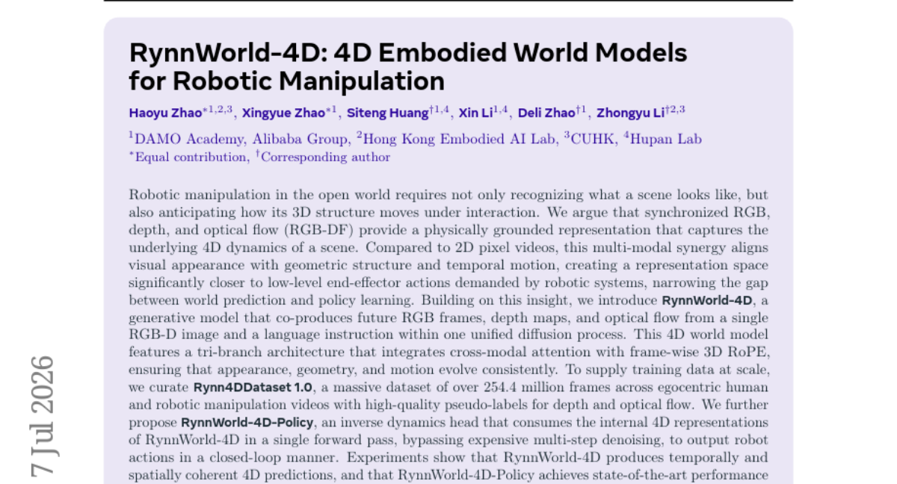

### 📌 한 줄 요약
RGB-D와 광학 흐름을 결합한 4D 월드 모델을 통해 로봇의 정밀한 양손 조작 성능을 극대화한 연구

### 🔑 핵심 포인트
- RGB-D와 Optical Flow를 결합하여 기하학적 구조와 움직임을 동시에 포착하는 4D 표현 방식 제안
- 단일 확산 프로세스 내에서 시각적 외형, 깊이, 움직임을 일관되게 생성하는 Tri-branch 아키텍처 설계
- 2.5억 프레임 이상의 대규모 데이터셋(Rynn4DDataset 1.0) 구축 및 역역학 헤드를 통한 효율적 정책 학습

### 🧑‍💻 개발자 관점
단순 2D 비디오 예측을 넘어 물리적 구조가 반영된 4D 데이터를 생성함으로써, 로봇의 말단 장치(End-effector) 제어에 즉시 활용 가능한 표현 공간을 제공합니다.

### 🚀 실무 적용 아이디어
- 제공된 Rynn4DDataset의 데이터 품질과 Pseudo-label의 신뢰도 분석
- RynnWorld-4D-Policy의 역역학 헤드를 기존 로봇 제어 알고리즘과 결합하는 실험
- 다양한 조작 환경에서의 4D 생성 모델의 시공간적 일관성 검증

### ⚠️ 리스크/한계
- 대규모 데이터셋과 복잡한 4D 생성 모델로 인한 높은 컴퓨팅 자원 요구량
- 실제 물리 환경과 시뮬레이션/Pseudo-label 간의 도메인 차이 발생 가능성

---

## 2. [AlayaWorld: Long-Horizon and Playable Video World Generation](https://huggingface.co/papers/2607.06291)
**Upvotes**: 69 | **도입 난이도**: 상 | **신뢰도**: 상
**arXiv**: https://arxiv.org/abs/2607.06291

**태그**: Generative Video, Game Engine, Embodied AI, Open Source, Video, Evaluation, Inference

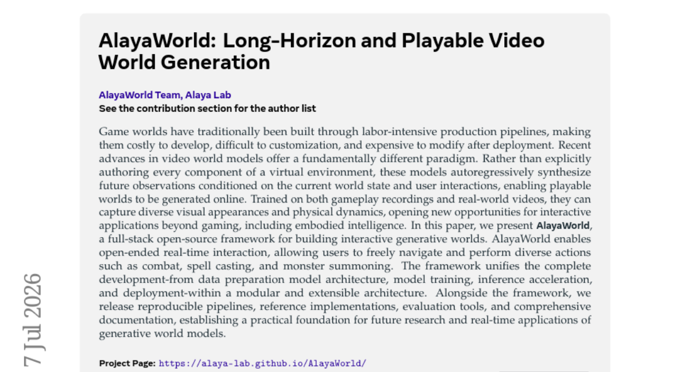

### 📌 한 줄 요약
데이터 준비부터 배포까지 아우르는 오픈소스 프레임워크를 통해 실시간 상호작용이 가능한 생성형 비디오 월드 모델을 구현함

### 🔑 핵심 포인트
- 데이터 준비부터 배포까지 포함하는 모듈형 풀스택 프레임워크 설계
- 실시간 상호작용(전투, 마법 등)이 가능한 오픈엔드 비디오 생성 기술
- 재현 가능한 파이프라인, 참조 구현체 및 평가 도구의 오픈소스 공개

### 🧑‍💻 개발자 관점
수동 에셋 제작 없이도 상호작용 가능한 가상 환경을 구축할 수 있어, 게임 개발 및 Embodied AI 학습을 위한 시뮬레이션 환경 구축에 혁신적인 변화를 가져올 수 있습니다.

### 🚀 실무 적용 아이디어
- 제공된 오픈소스 프레임워크를 로컬 환경에 구축하여 추론 속도 테스트
- 다양한 사용자 액션(Combat, Summoning 등)에 따른 물리적 일관성 검증
- 기존 게임 엔진(Unity/Unreal)과의 연동 가능성 탐색

### ⚠️ 리스크/한계
- 실시간 상호작용을 위한 고성능 컴퓨팅 자원 요구량
- 복잡한 물리 법칙이나 장기적인 시각적 일관성 유지의 어려움

### 📝 초록 기반 상세 설명
기존 게임 월드 제작 방식은 막대한 비용과 수동 작업이 필요하여 유연한 수정과 커스텀이 어렵다는 문제가 있었습니다. 최근 비디오 월드 모델은 상태와 상호작용을 조건으로 미래 관측치를 생성하여 플레이 가능한 환경을 만드는 새로운 패러다임을 제시합니다. 본 논문에서는 데이터 준비, 모델 아키텍처, 추론 가속화, 배포를 통합한 풀스택 오픈소스 프레임워크인 AlayaWorld를 제안합니다. AlayaWorld는 실시간 상호작용을 지원하여 전투, 마법, 소환 등 다양한 액션을 가능하게 합니다. 연구진은 재현 가능한 파이프라인과 평가 도구를 함께 공개하여 생성형 월드 모델 연구의 실질적인 토대를 마련했습니다.

---

## 3. [RynnWorld-Teleop: An Action-Conditioned World Model for Digital Teleoperation](https://huggingface.co/papers/2607.06558)
**Upvotes**: 67 | **도입 난이도**: 상 | **신뢰도**: 상
**arXiv**: https://arxiv.org/abs/2607.06558

**태그**: Robot Learning, World Model, Diffusion Model, Sim2Real, Data Engine, Agent, Vision, Video, Inference, Distillation

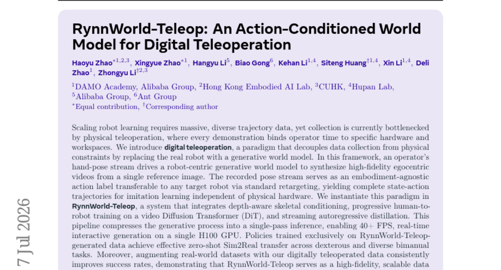

### 📌 한 줄 요약
물리적 제약 없이 가상 세계 모델을 통해 고품질 로봇 학습 데이터를 생성하는 '디지털 텔레오퍼레이션' 프레임워크 제안

### 🔑 핵심 포인트
- 물리적 제약을 탈피한 '디지털 텔레오퍼레이션' 패러다임 제시
- 핸드 포즈 기반의 고정밀 1인칭 비디오 생성 및 하드웨어 독립적 데이터 생성
- Diffusion Transformer와 증류(Distillation) 기술을 통한 실시간(40+ FPS) 생성 엔진 구현

### 🧑‍💻 개발자 관점
물리적 로봇 없이도 가상 환경에서 대규모 고품질 학습 데이터를 생성할 수 있어, 데이터 수집 비용을 획기적으로 낮추고 다양한 로봇 하드웨어로의 확장이 용이합니다.

### 🚀 실무 적용 아이디어
- 제공된 핸드 포즈 데이터와 생성된 비디오 간의 정렬(Alignment) 품질 검증
- 생성된 데이터로 학습된 정책의 다양한 로봇 하드웨어(Retargeting) 적용 테스트
- 실제 로봇 데이터와 생성 데이터의 혼합 비율에 따른 성능 변화 실험

### ⚠️ 리스크/한계
- 생성된 비디오의 시각적 정교함이 실제 물리 법칙(접촉, 마찰 등)을 완벽히 모사하는지에 대한 불확실성
- 복잡한 환경에서의 시각적 일관성 유지 및 실시간 생성 품질 유지의 어려움

---

## 4. [Hierarchical Sparse Attention Done Right: Toward Infinite Context Modeling](https://huggingface.co/papers/2607.02980)
**Upvotes**: 35 | **도입 난이도**: 중 | **신뢰도**: 상
**arXiv**: https://arxiv.org/abs/2607.02980

**태그**: LLM, Long-Context, Sparse Attention, Efficiency, RAG, Evaluation

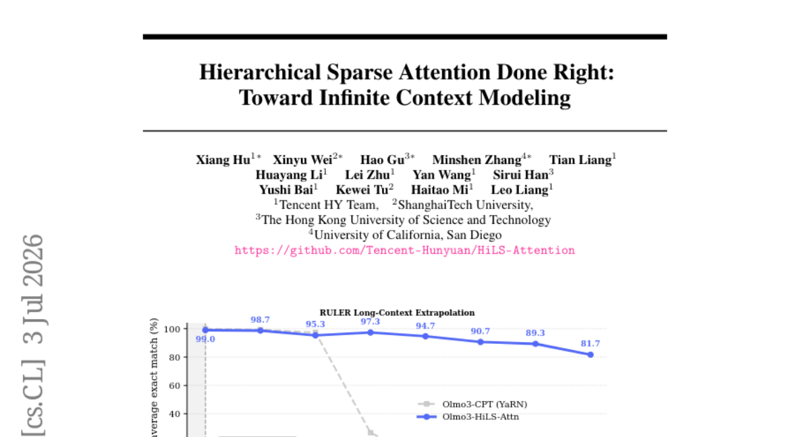

### 📌 한 줄 요약
학습 시보다 64배 더 긴 문맥을 처리할 수 있는 계층적 희소 어텐션(HiLS) 메커니즘 제안

### 🔑 핵심 포인트
- LM 손실을 활용한 엔드투엔드 청크 선택 및 검색 최적화
- 계층적 구조를 통한 효율적인 정보 추출 및 융합 메커니즘
- 기존 모델을 경량 지속 사전 학습(continued pretraining)을 통해 HiLS로 전환 가능

### 🧑‍💻 개발자 관점
모델의 연산 효율을 유지하면서도 기존 모델의 한계를 넘어선 초장거리 문맥(Ultra-long context)을 처리할 수 있는 실질적인 방법론을 제시합니다.

### 🚀 실무 적용 아이디어
- 기존 풀 어텐션 모델에 HiLS를 적용하는 경량 지속 사전 학습 실험
- 다양한 문맥 길이에서의 검색 정확도 및 성능 유지력 벤치마크
- KV 캐시 메모리 절감 효과와 추론 속도 간의 트레이드오프 분석

### ⚠️ 리스크/한계
- 학습 시 문맥 길이에 따른 검색 정확도 유지 여부 검증 필요
- 특정 도메인 데이터에 대한 과적합 가능성

### 📝 초록 기반 상세 설명
기존 LLM의 긴 문맥 처리는 연산 비용의 이차적 증가와 길이 외삽(extrapolation) 문제로 인해 한계가 있습니다. 기존의 청크 단위 희소 어텐션 방식은 부정확한 청크 선택 문제로 인해 전체 어텐션의 성능을 따라가지 못했습니다. 본 논문은 언어 모델링 손실(LM loss)을 통해 청크 선택을 엔드투엔드로 학습하는 계층적 랜드마크 희소(HiLS) 어텐션을 제안합니다. HiLS는 쿼리가 검색된 각 청크로부터 정보를 추출한 뒤 검색 점수에 따라 이를 융합하는 계층적 구조를 가집니다. 실험 결과, HiLS는 학습 시 문맥 길이보다 64배 더 긴 문맥에서도 높은 정확도를 유지하며 기존 풀 어텐션 모델의 성능을 유지하면서도 초장거리 문맥을 처리할 수 있음을 입증했습니다.

---

## 5. [Vision as Unified Multimodal Generation](https://huggingface.co/papers/2607.06560)
**Upvotes**: 30 | **도입 난이도**: 중 | **신뢰도**: 상
**arXiv**: https://arxiv.org/abs/2607.06560

**태그**: Multimodal, Computer Vision, Foundation Model, Unified Learning, Vision

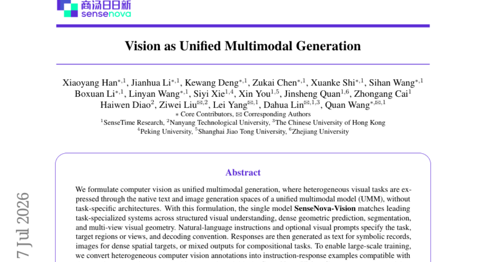

### 📌 한 줄 요약
특화된 아키텍처 없이 텍스트/이미지 생성 공간만으로 모든 컴퓨터 비전 태스크를 통합 수행하는 범용 모델 프레임워크 제안

### 🔑 핵심 포인트
- 태스크별 전용 헤드 없이 텍텍스트/이미지 생성 공간을 활용한 통합 비전 프레임워크 제안
- 다양한 비전 태스크를 지시어-응답 형식으로 변환한 대규모 SenseNova-Vision 코퍼스 구축
- 검출, 세그멘테이션, 기하학적 예측 등 복합적인 비전 작업을 단일 모델로 수행 가능

### 🧑‍💻 개발자 관점
모델 아키텍처를 태스크마다 설계할 필요 없이, 프롬프트와 생성 능력만으로 복잡한 비전 작업을 통합 관리할 수 있는 새로운 패러다임을 제시합니다.

### 🚀 실무 적용 아이디어
- 제공된 코퍼스를 활용하여 기존 멀티모달 모델의 비전 성능 벤치마크 수행
- 텍스트 지시어만으로 세그멘테이션 및 깊이 추정 결과가 얼마나 정확한지 검증
- 다양한 비전 태스크를 혼합한 복합 작업(Mixed-task) 시나리오 테스트

### ⚠️ 리스크/한계
- 특화된 전문 모델 대비 정밀한 기하학적/공간적 예측에서의 성능 격차 가능성
- 생성 기반 방식이므로 연산 비용 및 추론 속도 최적화 이슈가 발생할 수 있음

### 📝 초록 기반 상세 설명
기존의 컴퓨터 비전은 각 태스크마다 별도의 모델 아키텍처와 예측 헤드를 필요로 하는 파편화된 구조를 가졌습니다. 이를 해결하기 위해 비전 태스크를 텍스트 및 이미지 생성 공간 내에서 수행하는 '통합 멀티모달 생성' 방식을 제안합니다. 연구진은 다양한 비전 주석을 지시어-응답 쌍으로 변환한 SenseNova-Vision 코퍼스를 구축하고 이를 통해 모델을 학습시켰습니다. 그 결과, 별도의 구조 변경 없이도 검출, OCR, 세그멘테이션, 깊이 추정 등 광범위한 비전 작업을 단일 모델로 수행할 수 있게 되었습니다. 실험 결과, 이 통합 모델은 기존의 태스크별 전문 모델들과 대등한 성능을 보여주며 범용 파운데이션 모델로의 확장 가능성을 입증했습니다.

---

## 6. [Gemma 4 Technical Report](https://huggingface.co/papers/2607.02770)
**Upvotes**: 22 | **도입 난이도**: 중 | **신뢰도**: 상
**arXiv**: https://arxiv.org/abs/2607.02770

**태그**: Multimodal, MoE, Reasoning, Efficiency, Vision, Audio, Benchmark, Inference

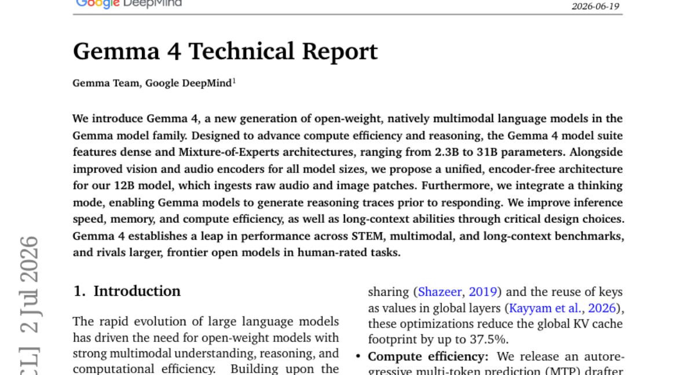

### 📌 한 줄 요약
효율적인 추론과 멀티모달 성능을 극대화한 차세대 오픈 웨이트 모델 제품군 출시

### 🔑 핵심 포인트
- 2.3B~31B 규모의 Dense 및 MoE 아키텍처 제공
- 12B 모델의 인코더 프리(encoder-free) 통합 멀티모달 아키텍처 도입
- 사고 과정(thinking mode)을 통한 추론 능력 강화 및 효율적 연산 설계

### 🧑‍💻 개발자 관점
적은 리소스로도 강력한 멀티모달 추론이 가능해져 온디바이스 AI 및 복합 에이전트 개발에 유리합니다.

### 🚀 실무 적용 아이디어
- 12B 모델의 인코더 프리 아키텍처를 활용한 멀티모달 태스크 테스트
- Thinking mode를 활용한 복잡한 논리 추론 문제 해결 성능 검증
- 다양한 하드웨어 환경에서의 추론 속도 및 메모리 효율성 벤치마킹

### ⚠️ 리스크/한계
- 모델 크기에 따른 멀티모달 처리 성능 편차 가능성
- 사고 과정 생성 시 발생하는 추가적인 추론 지연 시간(latency)

### 📝 초록 기반 상세 설명
기존 모델의 연산 효율성과 복합 모달리티 처리 능력을 개선하기 위해 Gemma 4 모델군을 개발했습니다. 2.3B에서 31B 파라미터 규모의 Dense 및 MoE 아키텍처를 제공하며, 모든 크기에서 개선된 비전 및 오디오 인코더를 탑재했습니다. 특히 12B 모델은 인코더 없이 원시 오디오와 이미지 패치를 직접 처리하는 통합 아키텍처를 제안합니다. 또한 사고 과정(thinking mode)을 통해 추론 트레이스를 생성하는 기능을 통합했습니다. 그 결과 STEM, 멀티모달, 롱 컨텍스트 벤치마크에서 비약적인 성능 향상을 달성하며 대형 프런티어 모델 수준의 성능을 확보했습니다.

---

## 7. [Light-Omni: Reflex over Reasoning in Agentic Video Understanding with Long-Term Memory](https://huggingface.co/papers/2607.05511)
**Upvotes**: 19 | **도입 난이도**: 중 | **신뢰도**: 상
**arXiv**: https://arxiv.org/abs/2607.05511

**태그**: Agent, Video-Understanding, Long-Term-Memory, Efficiency, RAG, Reasoning, Multimodal, Video, Benchmark, Evaluation, Inference, Safety

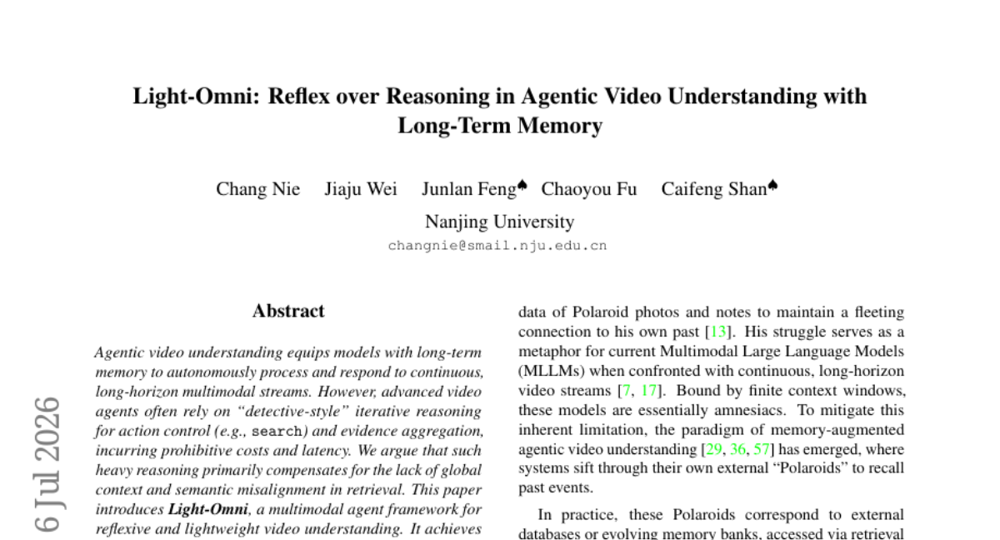

### 📌 한 줄 요약
반복적인 추론 과정 없이 단일 패스로 글로벌 컨텍스트를 구축하여 속도와 효율성을 극대화한 에이전트 기반 비디오 이해 프레임워크

### 🔑 핵심 포인트
- 반복적 추론 대신 단일 패스(Single Forward Pass)로 동작하는 반사적(Reflexive) 구조 설계
- 계층적 병합을 통해 최근 상세 정보와 과거 요약을 유지하는 글로벌 스크립트 상태 관리
- 글로벌 컨텍스트와 결합된 파라미터 잠재 상태를 통한 효율적인 액션 및 검색 임베딩 생성

### 🧑‍💻 개발자 관점
실시간 비디오 스트림 처리가 필요한 에이전트 개발 시, 추론 비용을 획기적으로 줄이면서도 장기 기억을 유지하는 아키텍처 설계 패턴을 제공합니다.

### 🚀 실무 적용 아이디어
- 제시된 계층적 병합(Hierarchical Merging) 방식의 메모리 압축 효율성 검증
- 기존 MLLM에 메모리 시스템으로서 Light-Omni 구조를 결합하는 프로토타이핑
- 다양한 해상도 및 프레임 레이트 환경에서의 추론 지연 시간 벤치마크

### ⚠️ 리스크/한계
- 요약된 글로벌 스크립트에 의존하므로 아주 미세한 디테일이 중요한 작업에서는 정보 손실 가능성 존재
- 복잡한 논리적 추론이 필요한 고차원적 문제에서는 반복적 방식보다 성능이 낮을 수 있음

### 📝 초록 기반 상세 설명
기존의 에이전트 기반 비디오 이해 방식은 정보 검색과 증거 수집을 위해 반복적인 추론 과정을 거치며 높은 비용과 지연 시간을 발생시킵니다. 이러한 문제는 주로 검색 시 글로벌 컨텍스트 부족과 의미적 불일치로 인해 발생합니다. 본 논문은 이를 해결하기 위해 단일 패스로 컨텍스트를 구축하는 Light-Omni 프레임워크를 제안합니다. 에피소드 메모리를 요약한 글로벌 스크립트 상태와 이를 바탕으로 액션 및 임베딩을 생성하는 파라미터 잠재 상태를 결합하여 사용합니다. 실험 결과, 기존 M3-Agent 대비 정확도 향상과 함께 12.1배의 속도 향상 및 2.6배의 GPU 메모리 효율성을 달성했습니다.

---

## 8. [SkillOpt-Lite: Better and Faster Agent Self-evolution via One Line of Vibe](https://huggingface.co/papers/2607.03451)
**Upvotes**: 17 | **도입 난이도**: 하 | **신뢰도**: 상
**arXiv**: https://arxiv.org/abs/2607.03451

**태그**: Agent, Optimization, Self-evolution, LLM

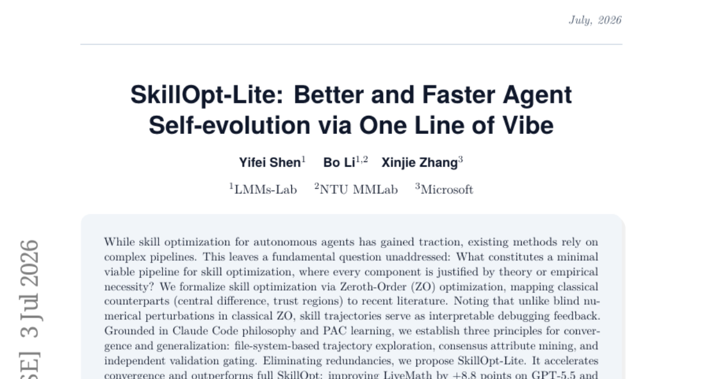

### 📌 한 줄 요약
복잡한 파이프라인 없이 코드 기반의 최소한의 설정만으로 에이전트의 숙련도를 최적화하는 경량화 프레임워크

### 🔑 핵심 포인트
- 제로차(ZO) 최적화 이론을 적용하여 에이전트 스킬 최적화 과정을 수학적으로 정형화
- 파일 시스템 기반 탐색 및 독립적 검증을 통해 복잡한 파이프라인을 제거한 경량화 설계
- 작은 모델(nano)이 더 큰 모델의 성능을 추월할 수 있는 효율적인 자기 진화 메커니즘 제공

### 🧑‍💻 개발자 관점
에이전트의 성능 향상을 위해 복잡한 학습 파이프라인을 구축할 필요 없이, 코드 수정과 검증만으로 실무 환경에서 즉각적인 성능 개선이 가능합니다.

### 🚀 실무 적용 아이디어
- 제공된 GitHub 코드를 활용하여 기존 코딩 에이전트 워크플로우에 적용해보기
- 모델 크기별(Small vs Large) 성능 향상 폭과 수렴 속도 비교 실험
- HarnessOpt로 확장하여 전체 에이전트 하네스 최적화 성능 검증

### ⚠️ 리스크/한계
- 에이전트의 행동이 코드 기반이므로, 복잡한 환경에서의 일반화 성능 검증 필요
- 최적화 과정에서의 탐색 효율이 특정 도메인(Coding)에 편중될 가능성

### 📝 초록 기반 상세 설명
에이전트의 스킬 최적화 연구가 활발하지만, 기존 방식은 구성 요소가 복잡하고 이론적 근거가 부족한 경우가 많습니다. 본 논문은 제로차(Zeroth-Order) 최적화 이론을 바탕으로 최소한의 필수 요소만 남긴 SkillOpt-Lite를 제안합니다. 파일 시스템 기반의 궤적 탐색, 합의 속성 추출, 독립적 검증 게이팅이라는 세 가지 원칙을 통해 수렴성과 일반화 성능을 확보했습니다. 실험 결과, SkillOpt-Lite는 기존 Full SkillOpt보다 빠르고 강력한 성능을 보였으며, 특히 작은 모델이 더 큰 모델의 성능을 능가하는 결과를 낳았습니다. 최종적으로 이 프레임워크는 VSCode Copilot과 같은 프로덕션 환경에 통합되어 코드 수정만으로 에이전트 능력을 진화시킬 수 있음을 입증했습니다.

### 🖼️ 추가 자료
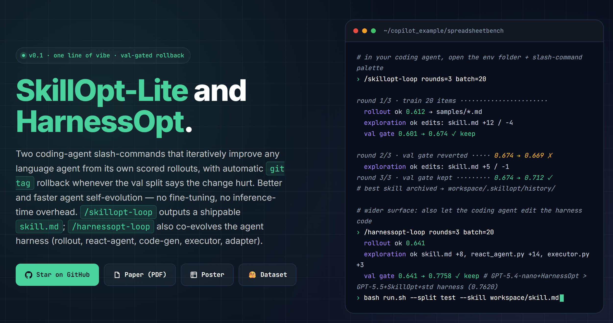

---

## 9. [DSpark: Confidence-Scheduled Speculative Decoding with Semi-Autoregressive Generation](https://huggingface.co/papers/2607.05147)
**Upvotes**: 16 | **도입 난이도**: 중 | **신뢰도**: 상
**arXiv**: https://arxiv.org/abs/2607.05147

**태그**: LLM Inference, Speculative Decoding, Throughput Optimization, Efficient Serving, Benchmark, Inference

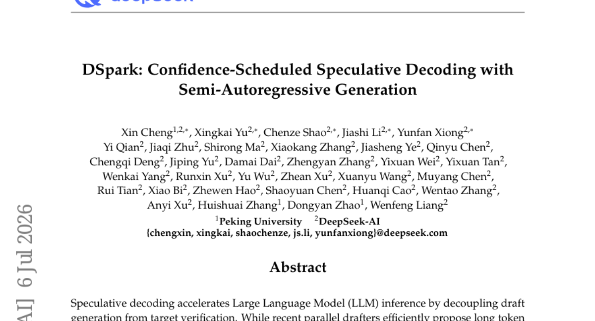

### 📌 한 줄 요약
병렬 생성의 품질 저하와 검증 낭비 문제를 동시에 해결하여 LLM 추론 처리량을 극대화하는 스펙큘레이티브 디코딩 프레임워크

### 🔑 핵심 포인트
- Semi-autoregressive 구조를 통한 토큰 간 의존성 모델링 및 수락률 저하 방지
- 신뢰도 기반 스케줄링(Confidence-scheduled)을 통한 효율적인 검증 길이 최적화
- 실제 서비스 환경(DeepSeek-V4)에서의 높은 처리량 및 생성 속도 개선 입증

### 🧑‍💻 개발자 관점
고성능 LLM 서빙 시 발생하는 검증 오버헤드를 줄이면서도, 사용자 응답 속도(Latency)와 시스템 처리량(Throughput) 사이의 트레이드오프를 최적화할 수 있는 실전적인 기법을 제시합니다.

### 🚀 실무 적용 아이디어
- 기존 병렬 드래프터 모델에 경량 순차 모듈을 결합한 하이브리드 구조 테스트
- 토큰 수락 확률에 따른 동적 검증 길이(Verification Length) 스케줄링 알고리즘 구현
- 다양한 모델 크기 및 하드웨어 환경에서의 Throughput vs Latency 벤치마크 수행

### ⚠️ 리스크/한계
- Semi-autoregressive 모듈 추가에 따른 연산 오버헤드 발생 가능성
- 모델의 신뢰도 추정 정확도에 따라 전체 시스템 성능이 크게 좌우될 위험

### 📝 초록 기반 상세 설명
최근 LLM 추론 가속을 위해 긴 토큰 시퀀스를 한 번에 생성하는 병렬 드래프터가 사용되고 있습니다. 그러나 이러한 방식은 토큰 간 의존성 부족으로 인해 수락률이 급격히 떨어지며, 무분별한 검증은 시스템 자원을 낭비하는 문제를 야기합니다. 이를 해결하기 위해 DSpark는 병렬 백본과 경량 순차 모듈을 결합한 semi-autoregressive 구조를 도입하여 드래프트 품질을 유지합니다. 또한, 예측된 생존 확률에 따라 검증 길이를 동적으로 조절하는 confidence-scheduled verification 방식을 적용합니다. 실험 결과, DSpark는 기존 방식 대비 수락 길이를 크게 개선했으며, 실제 서비스 환경에서 기존 베이스라인 대비 생성 속도를 60~85% 향상시켰습니다.

---

## 10. [Parallelized Autoregressive Decoding for Omni-Modal Dense Video Captioning](https://huggingface.co/papers/2607.02963)
**Upvotes**: 16 | **도입 난이도**: 상 | **신뢰도**: 상
**arXiv**: https://arxiv.org/abs/2607.02963

**태그**: Video-Language, Efficient-Inference, Autoregressive-Decoding, Multi-Modal, Video, Audio, Benchmark, Evaluation, Inference

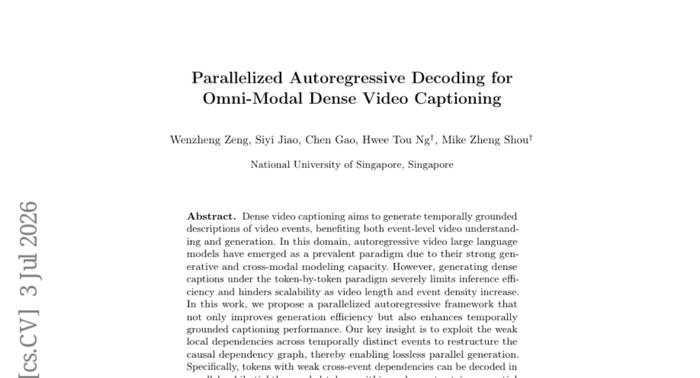

### 📌 한 줄 요약
이벤트 간 의존성을 분리하여 병렬 디코딩을 가능하게 함으로써, 비디오 캡셔닝의 생성 속도와 성능을 동시에 높인 프레임워크

### 🔑 핵심 포인트
- 이벤트 간 약한 의존성을 활용한 인과 관계 그래프 재구조화 및 병렬 디코딩
- 전역적 이벤트 구조와 오디오-비주얼 의미를 통합하는 잠재적 전역 계획 메커니즘 도입
- 국소적 의미 일관성을 유지하면서도 이벤트 간 병렬 생성을 가능하게 하는 분해형 디코딩

### 🧑‍💻 개발자 관점
긴 비디오를 다루는 생성 모델의 고질적인 문제인 추론 속도 병목을 해결하여, 실시간 비디오 분석 및 대규모 데이터 처리 효율을 높일 수 있습니다.

### 🚀 실무 적용 아이디어
- 제안된 병렬 디코딩 방식이 단일 이벤트 내의 문법적 일관성을 얼마나 유지하는지 정성적 평가
- 비디오 길이가 길어짐에 따른 기존 순차 방식 대비 속도 향상 폭(Speedup) 측정
- 이벤트 밀도가 매우 높은 복잡한 영상에서의 성능 저하 여부 검증

### ⚠️ 리스크/한계
- 이벤트 간 경계가 모호한 경우 병렬 디코딩 시 문맥 단절 발생 가능성
- 전역 계획 메커니즘의 복잡도로 인한 모델 학습 난이도 증가

### 📝 초록 기반 상세 설명
비디오 내 이벤트를 시간적 맥락에 맞춰 설명하는 Dense Video Captioning 분야에서는 생성 능력이 뛰어난 자기회귀(Autoregressive) 모델이 주로 사용됩니다. 그러나 토큰 단위의 순차적 생성 방식은 비디오 길이가 길어지고 이벤트 밀도가 높아질수록 추론 효율성을 심각하게 저하시킵니다. 본 논문은 이벤트 간의 약한 의존성을 활용하여 인과 관계 그래프를 재구성함으로써 손실 없는 병렬 생성을 가능하게 하는 프레임워크를 제안합니다. 이를 위해 이벤트 구조를 학습하고 전역적 인과 관계를 인코딩하는 '잠재적 전역 계획(Latent Global Planning)' 메커니즘과, 국소적 일관성과 전역적 인식을 균형 있게 유지하는 '이벤트 분해 병렬 디코딩' 방식을 도입했습니다. 실험 결과, 제안된 방식은 효율성과 성능 모두에서 기존 방식보다 우수한 성능을 입증했습니다.

---

## 11. [From Foundation to Application: Improving VLA Models in Practice](https://huggingface.co/papers/2607.06403)
**Upvotes**: 10 | **도입 난이도**: 상 | **신뢰도**: 상
**arXiv**: https://arxiv.org/abs/2607.06403

**태그**: VLA, Robotics, FoundationModel, Embodiment, Reasoning, Video, Benchmark, Evaluation

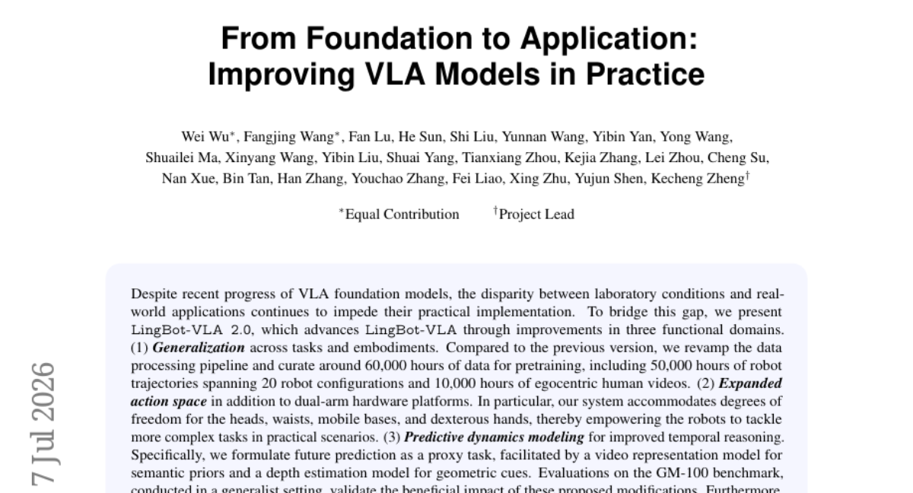

### 📌 한 줄 요약
실제 환경 적용을 위해 데이터 파이프라인, 액션 공간, 예측 역학 모델을 개선한 차세대 VLA 모델 LingBot-VLA 2.0 제안

### 🔑 핵심 포인트
- 6만 시간 규모(로봇 궤적 5만 시간 + 1인칭 영상 1만 시간)의 대규모 데이터 파이프라인 구축
- 머리, 허리, 이동 베이스, 핸드 등을 포함한 전신(Whole-body) 액션 공간 확장
- 비디오 및 깊이 정보를 활용한 미래 예측 프록시 태스크를 통한 시간적 추론 개선

### 🧑‍💻 개발자 관점
실제 물리적 환경에서 로봇의 복잡한 움직임과 장기적인 작업 수행 능력을 확보하기 위한 데이터 및 모델링 전략을 제시합니다.

### 🚀 실무 적용 아이디어
- 제시된 데이터 파이프라인 구조를 소규모 로봇 데이터셋에 적용하여 일반화 성능 변화 관찰
- 비디오 표현 모델과 깊이 추정 모델을 결합한 예측 태스크의 효과 검증
- 다양한 로봇 하드웨어(Embodiment) 간의 전이 학습 성능 테스트

### ⚠️ 리스크/한계
- 대규모 데이터 확보 및 정제에 따른 높은 컴퓨팅 비용과 인프라 요구사항
- 복잡한 전신 제어(Whole-body control)로 인한 하드웨어 제어 안정성 이슈 가능성

### 📝 초록 기반 상세 설명
최근 VLA 파운데이션 모델의 발전에도 불구하고 실험실 환경과 실제 환경 사이의 격차로 인해 실무 적용에 어려움이 있습니다. 이를 해결하기 위해 연구진은 세 가지 핵심 영역을 개선한 LingBot-VLA 2.0을 제안합니다. 첫째, 6만 시간 규모의 대규모 데이터 파이프라인을 구축하여 작업 및 로봇 형태 간 일반화 성능을 높였습니다. 둘째, 머리, 허리, 이동 베이스, 데이렉스 핸드 등을 포함한 확장된 액션 공간을 통해 복잡한 작업을 수행할 수 있도록 설계했습니다. 셋째, 비디오 표현 모델과 깊이 추정 모델을 결합한 예측 역학 모델링을 통해 시간적 추론 능력을 강화했습니다. GM-100 벤치마크 평가 결과, 제안된 방식은 강력한 교차 임베디먼트(cross-embodiment) 및 장기 모바일 조작 능력을 입증했습니다.

---

## 12. [TurnOPD: Making On-Policy Distillation Turn-Aware for Efficient Long-Horizon Agent Training](https://huggingface.co/papers/2607.05804)
**Upvotes**: 10 | **도입 난이도**: 중 | **신뢰도**: 상
**arXiv**: https://arxiv.org/abs/2607.05804

**태그**: Agent, Knowledge Distillation, Reinforcement Learning, Efficiency, Vision, Distillation

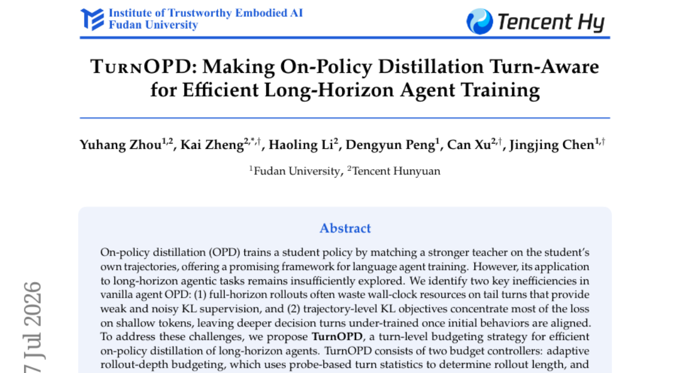

### 📌 한 줄 요약
장기 작업(Long-horizon) 에이전트 학습 시 불필요한 연산을 줄이고 의사결정 단계별 학습 효율을 극대화하는 Turn-aware 증류 기법

### 🔑 핵심 포인트
- 적응형 롤아웃 깊이 예산 관리: 불필요한 후반부 턴 연산을 방지하여 학습 자원 낭비 최소화
- 점진적 턴 정규화 손실 예산 관리: 초기 토큰에 편중된 손실을 분산시켜 심층 의사결정 단계의 학습 강화
- 장기 작업(Long-horizon) 환경에서의 학습 효율 및 정확도 최적화

### 🧑‍💻 개발자 관점
에이전트 학습 시 무조건 긴 시퀀스를 생성하는 대신, 유의미한 의사결정 시점에만 자원을 집중하여 학습 비용을 절감할 수 있습니다.

### 🚀 실무 적용 아이디어
- 기존 OPD 프레임워크에 턴 단위 가중치 조절 로직 적용 테스트
- 작업 길이에 따른 KL divergence 손실 분포 변화 모니터링
- 에이전트 작업의 난이도별 최적 롤아웃 깊이 임계값 탐색

### ⚠️ 리스크/한계
- 적응형 롤아웃 중단 시 중요한 후반부 정보가 손실될 위험 존재
- 특정 작업 도메인에 따라 제안된 예산 컨트롤러의 하이퍼파라미터 민감도 발생 가능

### 📝 초록 기반 상세 설명
언어 에이전트 학습을 위한 On-policy distillation(OPD)은 강력한 교사 모델의 지식을 학생 모델로 전이하는 유망한 프레임워크입니다. 그러나 긴 작업 과정에서 발생하는 불필요한 롤아웃 연산과 초기 토큰에만 집중되는 손실 함수로 인해 학습 효율이 저하되는 문제가 발생합니다. 이를 해결하기 위해 본 논문은 TurnOPD라는 턴 단위 예산 관리 전략을 제안합니다. TurnOPD는 프로브 기반 통계로 롤아웃 길이를 결정하는 적응형 깊이 예산 관리와, 토큰 중심에서 턴 중심으로 가중치를 이동시키는 점진적 정규화 손실 예산 관리를 결합합니다. 실험 결과, TurnOPD는 동일한 학습 시간 대비 더 높은 정확도를 달이는 등 기존 OPD 대비 우수한 효율성을 입증했습니다.

---

## 13. [MentalThink: Shaping Thoughts in Mental SVG World](https://huggingface.co/papers/2607.03530)
**Upvotes**: 10 | **도입 난이도**: 상 | **신뢰도**: 상
**arXiv**: https://arxiv.org/abs/2607.03530

**태그**: Agent, Multimodal, Reasoning, SVG, Vision, RAG, Benchmark, Evaluation, Safety

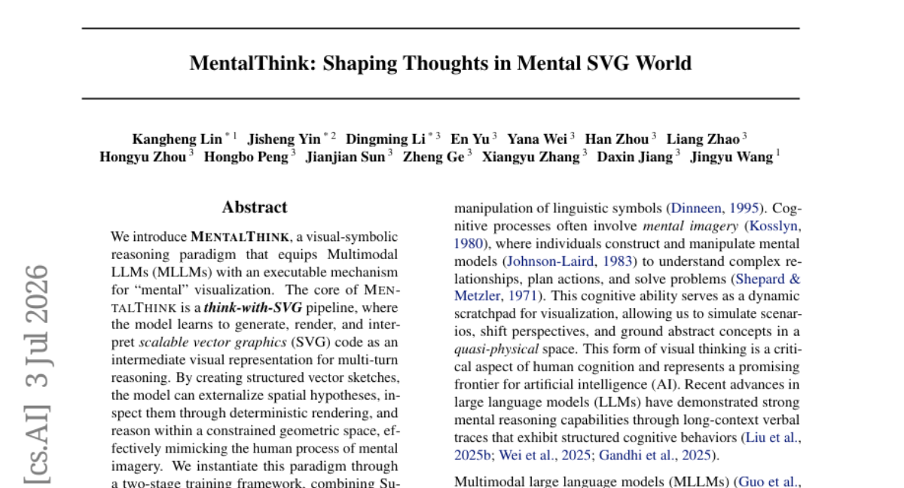

### 📌 한 줄 요약
SVG를 중간 추론 도구로 활용하여 MLLM의 공간 추론 및 시각적 사고 능력을 극대화하는 프레임워크

### 🔑 핵심 포인트
- SVG를 중간 시각적 표현(Intermediate Representation)으로 사용하는 'think-with-SVG' 파이프라인 도입
- SFT(구문 정렬)와 RL(반복적 검토 및 수정)을 결합한 2단계 학습 프레임워크
- 실행 가능한 벡터 그래픽을 통한 가설 검증 및 동적 시점 확보

### 🧑‍💻 개발자 관점
LLM이 텍스트를 넘어 구조화된 시각적 워크스페이스를 활용해 스스로 추론 과정을 시각화하고 검증하는 새로운 에이전트 설계 방식을 제시합니다.

### 🚀 실무 적용 아이디어
- SVG 생성 능력을 갖춘 경량 MLLM 모델에 해당 학습 프레임워크 적용 테스트
- 복잡한 기하학적 문제 해결을 위한 에이전트 워크플로우 설계 실험
- 생성된 SVG 코드가 실제 렌더링 결과와 일치하는지 검증하는 루프 구현

### ⚠️ 리스크/한계
- SVG 코드 생성의 복잡도가 증가할 경우 모델의 추론 비용 및 지연 시간 증가
- 벡터 그래픽 형식을 벗어난 복잡한 질감이나 실사 이미지 추론에는 한계 존재

### 📝 초록 기반 상세 설명
기존 MLLM은 복잡한 공간적 추론과 시각적 가설 검증에 어려움을 겪습니다. 이를 해결하기 위해 모델이 직접 SVG 코드를 생성, 렌더링, 해석하는 'MentalThink' 패러다임을 제안합니다. 모델은 SVG를 통해 구조화된 스케치를 생성하여 공간적 가설을 외부화하고, 이를 렌더링하여 검증하며 반복적으로 수정하는 과정을 거칩니다. 학습은 SVG 구문 정렬을 위한 SFT와 반복적 수정을 유도하는 다회차 RL 프레임워크를 통해 이루어집니다. 실험 결과, VSIBench와 MindCube 등 공간 추론 벤치마크에서 우수한 성능을 기록하며 실행 가능한 벡터 그래픽의 효용성을 입증했습니다.

---

## 14. [CanvasAgent: Enabling Complex Image Creation and Editing via Visual Tool Orchestration](https://huggingface.co/papers/2607.05465)
**Upvotes**: 8 | **도입 난이도**: 상 | **신뢰도**: 상
**arXiv**: https://arxiv.org/abs/2607.05465

**태그**: Agent, Multimodal, Image Editing, Reinforcement Learning, Reasoning, Vision, Evaluation

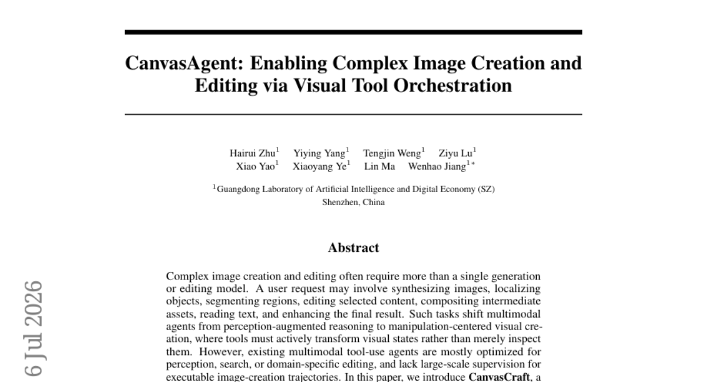

### 📌 한 줄 요약
복잡한 이미지 생성 및 편집 작업을 위해 다양한 시각적 도구를 자율적으로 조작하는 멀티모달 에이전트 프레임워크 제안

### 🔑 핵심 포인트
- 대규모 멀티모달 도구 사용 데이터셋 'CanvasCraft' 구축 (140K 실행 경로 포함)
- SFT와 GRPO를 결합하여 도구 조작 및 추론 능력을 최적화한 'CanvasAgent' 개발
- 단순 인지를 넘어 시각적 상태 변화를 추적하고 도구를 조작하는 에이전트 워크플로우 구현

### 🧑‍💻 개발자 관점
단순한 텍스트-이미지 생성을 넘어, 여러 도구를 조합하여 정교한 편집 작업을 자동화하는 에이전트 설계 패턴을 제시합니다.

### 🚀 실무 적용 아이디어
- 제시된 CanvasCraft 데이터셋의 구조를 분석하여 도구 사용 학습 데이터 구축 방법론 검토
- SFT와 RL(GRPO)을 결합한 멀티모달 에이전트 학습 파이프라인 실험
- 기존 이미지 편집 모델과 에이전트 기반 워크플로우의 결과물 품질 비교

### ⚠️ 리스크/한계
- 복잡한 도구 사용 과정에서 발생하는 중간 단계의 오류 누적 가능성
- 대규모 데이터셋 및 RL 학습을 위한 높은 컴퓨팅 자원 요구

### 📝 초록 기반 상세 설명
기존의 멀티모달 에이전트는 주로 인지나 검색에 특화되어 있어, 복잡한 이미지 생성 및 편집과 같은 조작 중심의 작업 수행에는 한계가 있었습니다. 특히 실행 가능한 이미지 생성 경로에 대한 대규모 데이터셋이 부족한 상황입니다. 본 논문에서는 140K의 실행 경로를 포함한 대규모 데이터셋인 CanvasCraft를 제안하고, 이를 활용한 에이전트인 CanvasAgent를 소개합니다. CanvasAgent는 SFT와 GRPO(Group Relative Policy Optimization)를 결합하여 도구 오케스트레이션 능력을 학습합니다. 실험 결과, 제안된 방식은 복잡한 멀티 도구 워크플로우에서 높은 이미지 품질과 효율적인 작업 경로를 보여주었습니다.

---

## 15. [CGGS: Consistency-Augmented Geometric Gaussian Splatting for Ego-centric 3D Scene Generation](https://huggingface.co/papers/2607.03819)
**Upvotes**: 7 | **도입 난이도**: 상 | **신뢰도**: 상
**arXiv**: https://arxiv.org/abs/2607.03819

**태그**: 3D Generation, Gaussian Splatting, Diffusion Models, Computer Vision, RAG

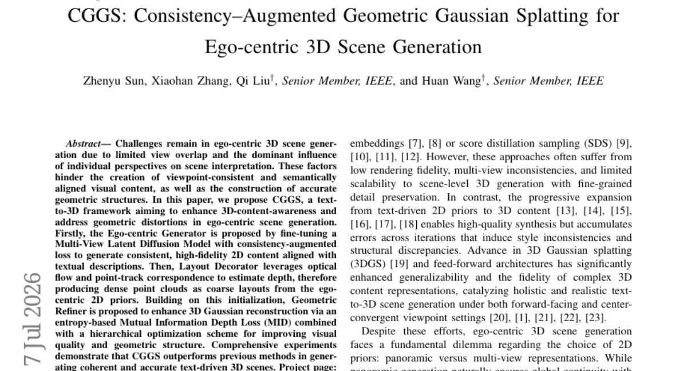

### 📌 한 줄 요약
일관성 있는 1인칭 시점 3D 장면 생성을 위해 기하학적 구조와 시각적 정렬을 최적화한 텍스트 투 3D 프레임워크

### 🔑 핵심 포인트
- 일관성 증강 손실을 적용한 멀티뷰 확산 모델 기반의 고정밀 2D 콘텐츠 생성
- 광학 흐름 및 포인트 트래킹을 활용한 밀집 포인트 클라우드 기반 레이아웃 생성
- 엔트로피 기반 MID 손실과 계층적 최적화를 통한 3D 가우시안 기하 구조 정밀화

### 🧑‍💻 개발자 관점
1인칭 시점의 VR/AR 콘텐츠 제작 시 발생하는 시각적 불일치와 기하학적 왜곡 문제를 해결할 수 있는 실질적인 3D 생성 파이프라인을 제시합니다.

### 🚀 실무 적용 아이디어
- 제시된 MID(Mutual Information Depth) 손실 함수를 기존 Gaussian Splatting 파이프라인에 적용해보기
- 제공된 레이아웃 데코레이터의 포인트 클라우드 생성 로직을 다양한 2D 생성 모델과 결합 테스트하기
- 1인칭 시점 데이터셋을 활용하여 제안된 일관성 증강 손실의 효과 검증하기

### ⚠️ 리스크/한계
- 초기 레이아웃 생성 단계의 정확도에 따라 최종 3D 구조의 품질이 크게 좌우될 수 있음
- 복잡한 장면에서의 연산 비용 및 계층적 최적화 과정의 효율성 검증 필요

### 📝 초록 기반 상세 설명
1인칭 시점(Ego-centric)의 3D 장면 생성은 제한된 시야 중첩과 개인적 관점의 영향으로 인해 기하학적 왜곡과 시각적 불일치가 발생하는 문제가 있습니다. 이를 해결하기 위해 본 논문은 3D 콘텐츠 인식 능력을 높이고 기하학적 왜곡을 방지하는 CGGS 프레임워크를 제안합니다. 먼저, 일관성 증강 손실(consistency-augmented loss)을 적용한 멀티뷰 잠재 확산 모델을 통해 텍스트에 부합하는 고해상도 2D 콘텐츠를 생성하는 Ego-centric Generator를 구축합니다. 이어지는 Layout Decorator는 광학 흐름과 포인트 트래킹을 활용해 밀집 포인트 클라우드를 생성하여 초기 레이아웃을 형성합니다. 마지막으로 Geometric Refiner는 엔트로피 기반의 상호 정보량 깊이 손실(MID)과 계층적 최적화 방식을 통해 3D 가우시안 재구성을 정교화합니다. 실험 결과, CGGS는 기존 방식보다 더 일관되고 정확한 텍스트 기반 3D 장면 생성 성능을 입증했습니다.

### 🖼️ 추가 자료
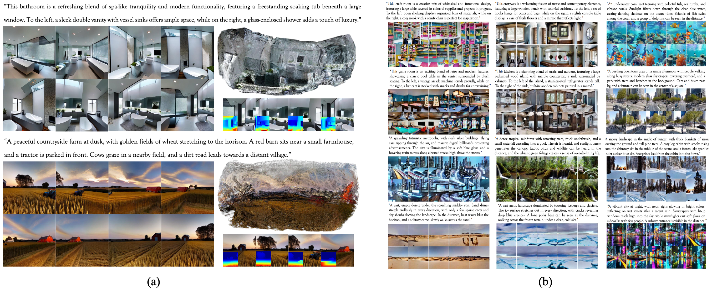

---

## 16. [Flex-Forcing: Towards a Unified Autoregressive and Bidirectional Video Diffusion Model](https://huggingface.co/papers/2607.03509)
**Upvotes**: 7 | **도입 난이도**: 상 | **신뢰도**: 상
**arXiv**: https://arxiv.org/abs/2607.03509

**태그**: Video Generation, Diffusion Model, Inference Optimization, Video, Benchmark, Inference

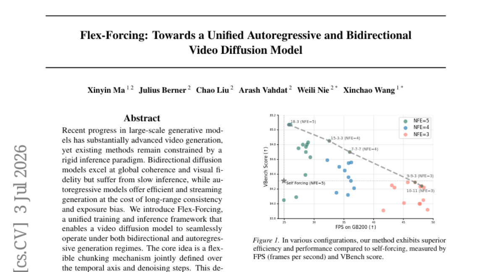

### 📌 한 줄 요약
양방향(Bidirectional)의 일관성과 자기회귀(Autoregressive)의 효율성을 동시에 확보한 통합 비디오 확산 모델 프레임워크

### 🔑 핵심 포인트
- 시간축과 노이즈 단계를 결합한 유연한 청킹(Flexible Chunking) 메커니즘 도입
- 양방향(Global Structure)과 자기회귀(Fine-grained Synthesis) 모드의 통합 운영
- 장기 일관성 유지와 효율적인 스트리밍 생성을 동시에 달성

### 🧑‍💻 개발자 관점
하드웨어 자원(Device Budget)에 따라 생성 방식을 유연하게 조절할 수 있어, 실시간 스트리밍부터 고품질 영상 제작까지 폭넓은 서비스 시나리오에 적용 가능합니다.

### 🚀 실무 적용 아이디어
- 제시된 청킹 메커니즘을 기존 Diffusion 모델에 이식하여 추론 속도 변화 측정
- 다양한 하드웨어 사양(GPU 메모리 등)에 따른 생성 품질 및 속도 벤치마크 수행
- 장기 비디오 생성 시 노이즈 스케줄링에 따른 일관성 유지 정도 테스트

### ⚠️ 리스크/한계
- 새로운 청킹 메커니즘 도입에 따른 모델 학습 복잡도 증가 가능성
- 양방향과 자기회귀 모드 간의 균형을 맞추기 위한 정교한 하이퍼파라미터 튜닝 필요

### 📝 초록 기반 상세 설명
최근 비디오 생성 모델은 비약적으로 발전했으나, 기존 방식은 양방향 모델의 느린 추론 속도와 자기회귀 모델의 장기 일관성 부족이라는 트레이드오프 문제에 직면해 있습니다. 본 논문은 양방향과 자기회회적 생성 모드를 모두 지원하는 통합 프레임워크인 Flex-Forcing을 제안합니다. 핵심 아이디어는 시간축과 노이즈 제거 단계(denoising steps)를 결합하여 정의한 유연한 청킹(chunking) 메커니즘입니다. 이를 통해 장기 구조 계획을 위한 양방향 추론과 효율적인 프레임 합성을 위한 자기회귀 생성을 동시에 수행할 수 있습니다. 실험 결과, Flex-Forcing은 기존의 경직된 스케줄을 가진 베이스라인보다 더 높은 비디오 품질과 긴 영상 안정성을 보여주며 추론 속도 또한 개선되었습니다.

---

## 17. [PointDiT: Pixel-Space Diffusion for Monocular Geometry Estimation](https://huggingface.co/papers/2607.02515)
**Upvotes**: 7 | **도입 난이도**: 중 | **신뢰도**: 상
**arXiv**: https://arxiv.org/abs/2607.02515

**태그**: 3D Reconstruction, Diffusion Model, Vision Transformer, Geometry Estimation, RAG, Vision

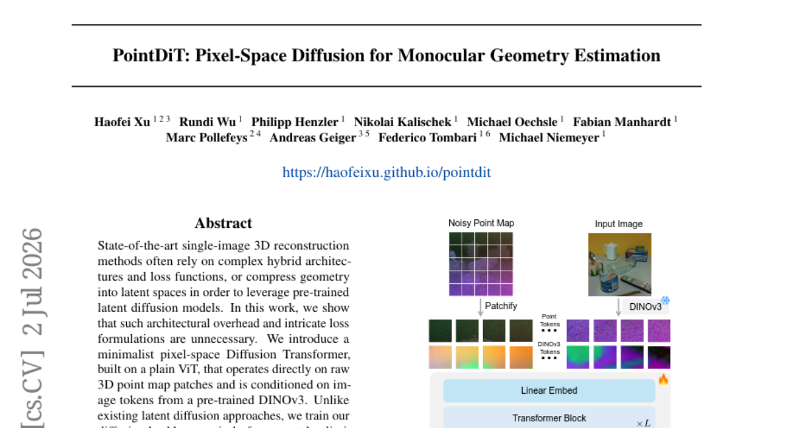

### 📌 한 줄 요약
복잡한 잠재 공간(Latent Space) 대신 픽셀 공간에서 직접 작동하는 단순한 ViT 기반 확산 모델로 정교한 단안 3D 기하 구조를 생성합니다.

### 🔑 핵심 포인트
- 복잡한 토크나이저가 필요 없는 픽셀 공간 기반의 단순한 Diffusion Transformer 구조 제안
- DINOv3 이미지 토큰을 조건부로 사용하여 정교한 기하 구조 추출
- 잠재 공간 압축 없이 원시 3D 포인트 맵에서 직접 학습하여 구조적 선명도 확보

### 🧑‍💻 개발자 관점
복잡한 하이브리드 아키텍처 없이도 고성능 3D 재구성이 가능함을 보여주어, 효율적인 3D 비전 파이프라인 설계에 영감을 줍니다.

### 🚀 실무 적용 아이디어
- DINOv3와 결합된 ViT 기반 3D 생성 파이프라인 프로토타이핑
- 투명/반사 재질 객체에 대한 기하 구조 복원 성능 테스트
- 기존 Latent Diffusion 방식과의 연산 효율성 및 품질 비교 실험

### ⚠️ 리스크/한계
- 픽셀 공간 직접 연산에 따른 고해상도 데이터 처리 시 메모리 부하 가능성
- 학습 데이터셋의 규모와 품질에 따른 기하 구조 정확도 의존성

---

## 18. [Nemotron-Labs-Diffusion: A Tri-Mode Language Model Unifying Autoregressive, Diffusion, and Self-Speculation Decoding](https://huggingface.co/papers/2607.05722)
**Upvotes**: 6 | **도입 난이도**: 상 | **신뢰도**: 상
**arXiv**: https://arxiv.org/abs/2607.05722

**태그**: LLM, Inference Optimization, Diffusion Model, Autoregressive, Vision

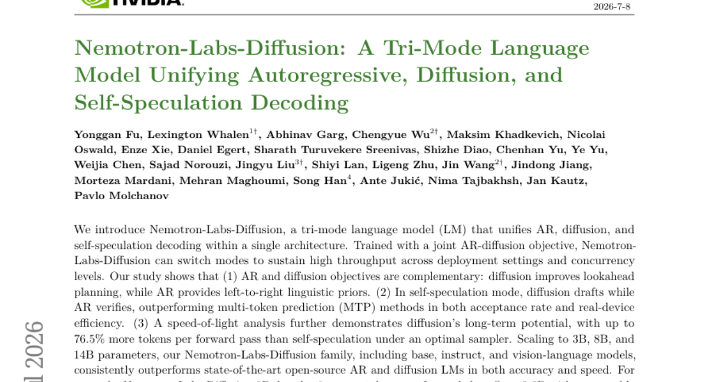

### 📌 한 줄 요약
AR, Diffusion, Self-Speculation을 통합하여 추론 속도와 정확도를 동시에 극대화한 차세대 삼중 모드 언어 모델

### 🔑 핵심 포인트
- AR과 Diffusion의 상호 보완적 결합을 통한 계획 및 언어적 정확도 확보
- Self-speculation 모드(Diffusion 초안 작성 + AR 검증)를 통한 추론 효율 극대화
- 단일 아키텍처 내에서 배포 환경에 따라 모드를 전환할 수 있는 유연한 구조

### 🧑‍💻 개발자 관점
LLM 서비스 운영 시 발생하는 추론 비용과 지연 시간(Latency) 문제를 아키텍처 수준에서 혁신적으로 해결할 수 있는 가능성을 제시합니다.

### 🚀 실무 적용 아이디어
- 제시된 AR-Diffusion 결합 학습 목적 함수(Objective)의 구현 방식 분석
- Self-speculation 모드에서의 검증(Verification) 오버헤드 측정 실험
- 기존 MTP(Multi-token Prediction) 모델과의 성능/비용 효율성 비교 테스트

### ⚠️ 리스크/한계
- 새로운 학습 목적 함수 도입에 따른 모델 학습 안정성 확보 필요
- 복합 모드 전환 시 하드웨어 가속기(GPU) 활용 최적화 난이도

### 📝 초록 기반 상세 설명
기존의 자기회귀(AR) 방식은 생성 속도와 계획 능력 사이의 트레이드오프 문제를 안고 있었습니다. 이를 해결하기 위해 AR, Diffusion, Self-Specization을 하나의 아키텍처로 통합한 Nemotron-Labs-Diffusion을 제안합니다. AR-Diffusion 결합 학습을 통해 Diffusion은 미래 계획을, AR은 언어적 우선순위를 담당하도록 설계했습니다. 실험 결과, Self-speculation 모드에서 Diffusion이 초안을 작성하고 AR이 검증하는 방식으로 기존 MTP 방식보다 높은 수용률과 효율을 달성했습니다. 결과적으로 8B 모델 기준 기존 모델 대비 압도적인 토큰 생성 속도와 높은 처리량을 보여주었습니다.

---

## 19. [TREK: Distill to Explore, Reinforce to Refine](https://huggingface.co/papers/2607.05339)
**Upvotes**: 6 | **도입 난이도**: 중 | **신뢰도**: 상
**arXiv**: https://arxiv.org/abs/2607.05339

**태그**: RLHF, Reasoning, Distillation, LLM-Agent, Agent, Inference

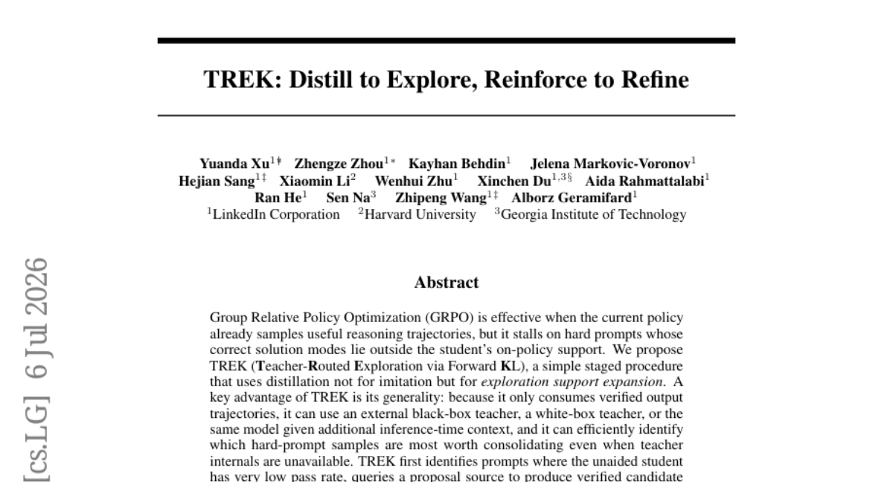

### 📌 한 줄 요약
GRPO의 탐색 한계를 극복하기 위해 정답 궤적을 학생 모델의 분포로 끌어오는 단계적 증류-강화 학습 프레임워크

### 🔑 핵심 포인트
- 정답 궤적을 모방이 아닌 '탐색 범위 확장' 목적으로 사용하는 단계적 학습 절차 제안
- Forward-KL를 활용해 검증된 정답 모드를 학생 모델의 분포 안으로 효율적으로 편입
- 외부 블랙박스 교사부터 자기 맥락(self-context)까지 활용 가능한 범용적 구조

### 🧑‍💻 개발자 관점
모델이 스스로 풀 수 없는 어려운 문제(Out-of-distribution)를 만났을 때, 정답 데이터를 어떻게 효율적으로 학습 분포에 녹여낼지에 대한 실전적인 방법론을 제시합니다.

### 🚀 실무 적용 아이디어
- 현재 학습 중인 모델의 정답률이 낮은 특정 도메인 데이터셋 구축
- 검증된 정답(Gold standard)을 활용한 Forward-KL 단계 적용 실험
- 외부 모델 없이 모델 자체의 추론 결과(Self-context)를 활용한 성능 향상 테스트

### ⚠️ 리스크/한계
- 검증된 정답 궤적(Verified trajectories) 확보를 위한 비용 발생
- 정답 데이터의 품질에 따라 학생 모델의 분포가 왜곡될 위험

### 📝 초록 기반 상세 설명
기존 GRPO 방식은 학생 모델이 정답을 샘플링할 수 있는 범위 내에서는 효과적이지만, 정답이 현재 정책 밖의 어려운 문제에서는 학습이 정체되는 문제가 있습니다. 이를 해결하기 위해 저자들은 정답 궤적을 활용해 탐색 범위를 확장하는 TREK(Teacher-Routed Exploration via Forward KL)을 제안합니다. TREK은 정답률이 낮은 문제를 식별하고, 외부 교사 모델로부터 검증된 후보를 가져와 Forward-KL 단계를 통해 학생 모델의 지원 범위(support)로 끌어들인 뒤 GRPO로 정제합니다. 실험 결과, 수학적 추론(AIME) 및 에이전트 작업(ALFWorld, ScienceWorld)에서 기존 방식보다 훨씬 빠르고 높은 성능 향상을 달imp했습니다. 특히 외부 교사 없이 자기 맥락(self-context)만으로도 유의미한 성능 개선을 보여주었습니다.

---

## 20. [Quantifying and Expanding the Theoretical Capacity of Late-Interaction Retrieval Models](https://huggingface.co/papers/2607.05803)
**Upvotes**: 5 | **도입 난이도**: 중 | **신뢰도**: 상
**arXiv**: https://arxiv.org/abs/2607.05803

**태그**: RAG, Information Retrieval, Late-Interaction, Embedding, Evaluation

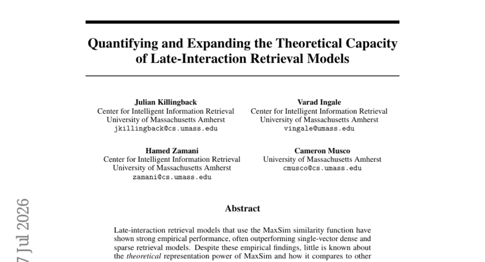

### 📌 한 줄 요약
MaxSim의 이론적 표현력을 증명하고, 음수 값을 처리할 수 있는 Signed MaxSim을 통해 검색 모델의 표현 범위를 확장함

### 🔑 핵심 포인트
- MaxSim이 k-sparse 벡터 간의 내적을 O(k) 공간에서 정확히 재현할 수 있음을 이론적으로 증명
- 음수 값을 처리할 수 있는 Signed MaxSim을 도입하여 모든 실수 값 내적을 재현 가능하게 함
- MaxSim이 논리적 표현식(CNF) 및 Soft-OR 연산의 역할을 수행할 수 있음을 규명

### 🧑‍💻 개발자 관점
RAG 시스템 구축 시 쿼리의 부정어(negation)나 복잡한 논리 구조를 처리해야 할 때, 기존 MaxSim의 한계를 극복할 수 있는 이론적/실무적 가이드를 제공합니다.

### 🚀 실무 적용 아이디어
- 기존 ColBERT 기반 모델에 Signed MaxSim 로직을 적용하여 성능 변화 측정
- 부정어(not, without 등)가 포함된 복잡한 질의 세트에서 모델의 강건성 테스트
- Sparse 벡터 표현 공간 크기에 따른 Signed MaxSim의 효율성 검증

### ⚠️ 리스크/한계
- 음수 값을 다루는 Signed MaxSim 도입 시 임베딩 공간의 안정성 확보 필요
- 기존 사전 학습된 모델의 가중치를 Signed MaxSim 구조에 맞게 재학습해야 할 가능성

### 📝 초록 기반 상세 설명
최근 MaxSim 기반의 Late-interaction 모델이 우수한 성능을 보이고 있으나, 그 이론적 표현력에 대한 분석은 부족한 상태였습니다. 본 논문은 MaxSim이 k-sparse 벡터 간의 내적을 정확히 재현할 수 있으며, 기존 내적보다 더 넓은 표현 범위를 가짐을 이론적으로 증명합니다. 이를 바탕으로 모든 실수 값 내적을 재현할 수 있는 Signed MaxSim 방식을 제안합니다. 실험 결과, Signed MaxSim은 부정어(negation)가 포함된 쿼리 환경에서 기존 ColBERT 모델 대비 성능을 획기적으로 개선했습니다. 결과적으로 본 연구는 Late-interaction 방식의 이론적 근거를 제시하고 성능 확장 가능성을 입증했습니다.

### 🖼️ 추가 자료
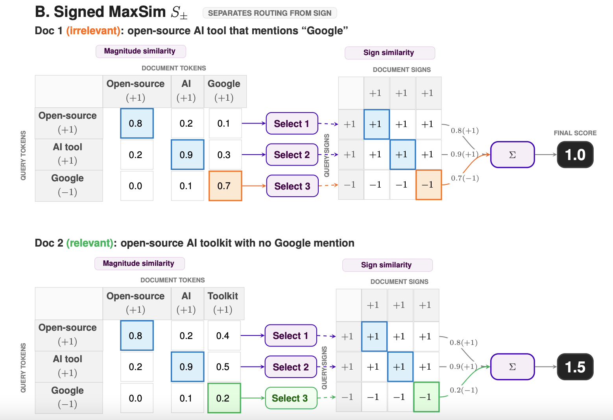

---

## 21. [Rank-Then-Act: Reward-Free Control from Frame-Order Progress](https://huggingface.co/papers/2607.01897)
**Upvotes**: 5 | **도입 난이도**: 중 | **신뢰도**: 상
**arXiv**: https://arxiv.org/abs/2607.01897

**태그**: Reinforcement Learning, VLM, Imitation Learning, Robot Control, Vision, Video, Benchmark, Evaluation

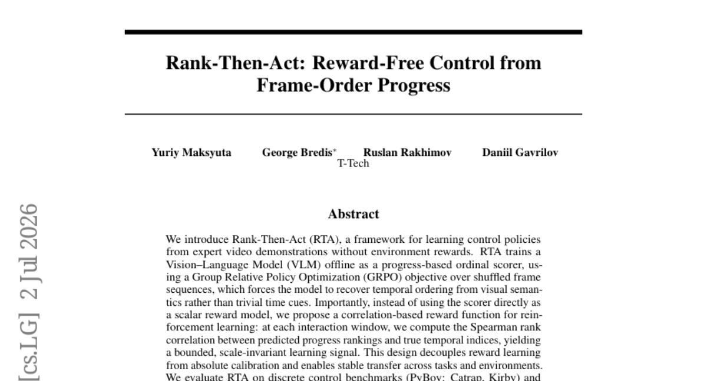

### 📌 한 줄 요약
보상 함수 설계 없이 전문가 비디오의 프레임 순서 정보를 활용하여 제어 정책을 학습하는 RTA 프레임워크 제안

### 🔑 핵심 포인트
- 보상 함수 설계 없이 비디오의 프레임 순서(Ordinal) 정보를 활용한 제어 학습 방식 제안
- GRPO를 활용해 시각적 의미 기반의 시간적 순서 복원 능력을 갖춘 VLM 스코러 학습
- 스피어먼 상관계수를 활용한 상관관계 기반 보상 함수로 스케일 불변 및 안정적 학습 신호 확보

### 🧑‍💻 개발자 관점
명시적인 보상 함수를 설계하기 어려운 복잡한 환경에서, 전문가의 작업 영상만으로도 안정적인 강화학습이 가능함을 시사합니다.

### 🚀 실무 적용 아이디어
- 제공된 PyBoy 및 MetaWorld 환경에서 RTA 프레임워크의 재현 실험 수행
- 다양한 비디오 데이터셋에 대해 스피어먼 상관계수 기반 보상의 안정성 검증
- 학습된 스코러를 새로운 환경의 제어 정책 학습에 전이(Transfer)하는 실험 진행

### ⚠️ 리스크/한계
- 비디오 데이터의 시각적 정보가 부족할 경우 순위 예측 정확도가 떨어질 위험
- 매우 복잡하거나 긴 시계열 작업에서 순위 기반 보상의 희소성 문제 발생 가능성

### 📝 초록 기반 상세 설명
기존의 전문가 비디오 기반 제어 학습은 환경의 명시적인 보상(Reward) 설계에 의존하는 경우가 많았습니다. 본 논문은 보상 없이도 비디오 데이터만으로 제어 정책을 학습할 수 있는 Rank-Then-Act(RTA) 프레임워크를 소개합니다. RTA는 VLM을 오프라인에서 학습시켜 프레임 간의 진행 상황을 순위로 매기는 스코러를 만들며, GRPO를 통해 시각적 의미로부터 시간적 순서를 복원하도록 학습합니다. 특히 스코러를 직접 보상으로 쓰는 대신, 예측된 순위와 실제 시간 인덱스 간의 스피어먼 상관계수(Spearman correlation)를 보상 함수로 사용하여 안정적인 학습 신호를 제공합니다. 실험 결과, RTA는 이산 및 연속 제어 벤치마크에서 기존 방식과 대등하거나 우수한 성능을 보였으며 뛰어난 태스크 전이 능력을 입증했습니다.

### 🖼️ 추가 자료
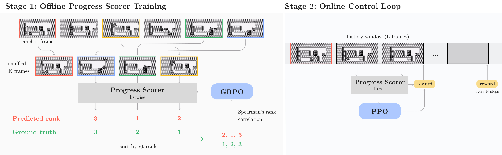

---

## 22. [PluraMath: Extending Mathematical Reasoning Evaluation Beyond High-Resource Languages](https://huggingface.co/papers/2607.05992)
**Upvotes**: 4 | **도입 난이도**: 하 | **신뢰도**: 상
**arXiv**: https://arxiv.org/abs/2607.05992

**태그**: LLM, Multilingual, Reasoning, Benchmark, RAG, Evaluation

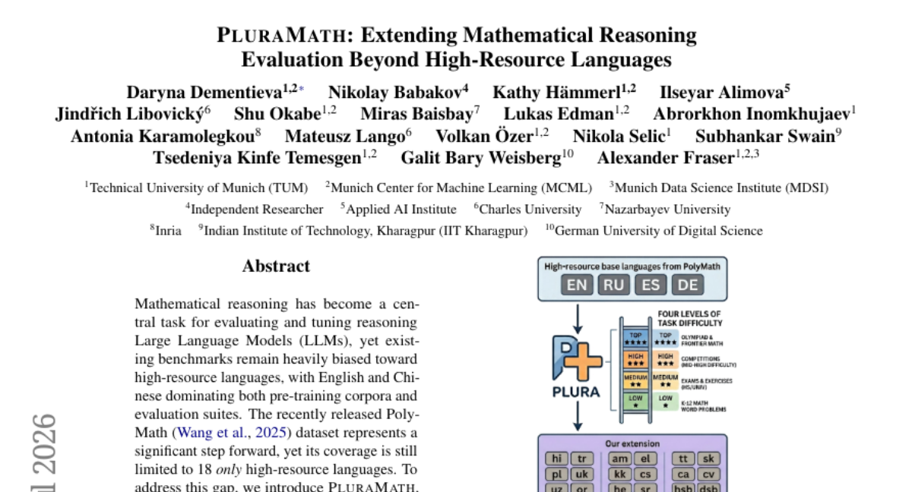

### 📌 한 줄 요약
저자원 언어의 수학적 추론 능력을 평가하기 위해 18개 희귀 언어를 추가한 PluraMath 데이터셋 및 벤치마크 프레임워크 제안

### 🔑 핵심 포인트
- 18개 저자원 언어를 추가하여 PolyMath를 확장한 PluraMath 데이터셋 구축
- 원어민 검수 파이프라인을 통한 고품질 다국어 수학 데이터 확보
- 27개 모델(다양한 규모 및 폐쇄형 포함)에 대한 광범위한 벤치마킹 수행

### 🧑‍💻 개발자 관점
글로벌 서비스를 타겟팅하는 LLM 개발 시, 특정 언어에 편향되지 않은 수학적/논리적 추론 성능을 검증하는 데 유용합니다.

### 🚀 실무 적용 아이디어
- 제공된 데이터셋을 활용하여 현재 개발 중인 모델의 다국어 추론 격차 테스트
- 모델의 지시 이행(Instruction-following) 능력이 언어별 성능 차이에 미치는 영향 분석
- 오픈소스 모델을 대상으로 PluraMath 프레임워크 적용 실험

### ⚠️ 리스크/한계
- 저자원 언어의 특성상 데이터 양이 고자원 언어에 비해 제한적일 수 있음
- 언어별 성능 격차가 모델의 언어 이해도가 아닌 번역/데이터 품질 문제일 가능성 존재

### 📝 초록 기반 상세 설명
최근 LLM의 수학적 추론 능력이 중요해졌으나, 기존 벤치마크는 영어와 중국어 등 고자원 언어에 편향되어 있습니다. PolyMath가 이를 개선하려 했으나 여전히 18개 고자원 언어에 국한되어 있다는 한계가 있습니다. 본 논문은 6개 어족에 걸친 18개의 저자원 언어를 추가하여 PluraMath 데이터셋을 구축했습니다. 원어민 검수를 거친 데이터 파이프라인을 통해 데이터 품질을 확보하고, 27개 모델을 대상으로 다국어 수학 추론 성능을 벤치마킹했습니다. 실험 결과, 고자원 언어와 저자원 언어 간의 성능 격차가 존재하며 이는 모델의 지시 이행 능력과 밀접한 관련이 있음을 확인했습니다.

### 🖼️ 추가 자료

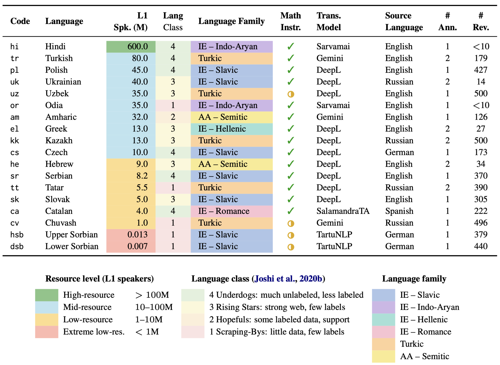
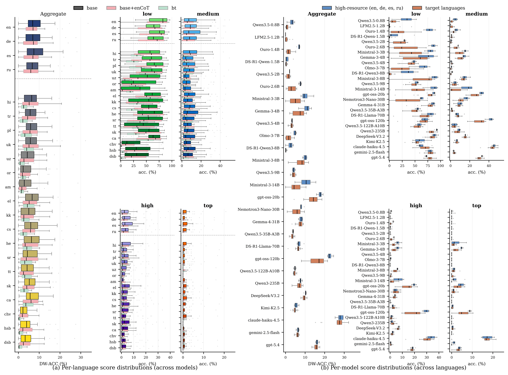

---

## 23. [Attending to Multimodal Generation One Token at a Time](https://huggingface.co/papers/2607.03738)
**Upvotes**: 4 | **도입 난이도**: 중 | **신뢰도**: 상
**arXiv**: https://arxiv.org/abs/2607.03738

**태그**: MLLM, Interpretability, Attention, Multimodal, Vision

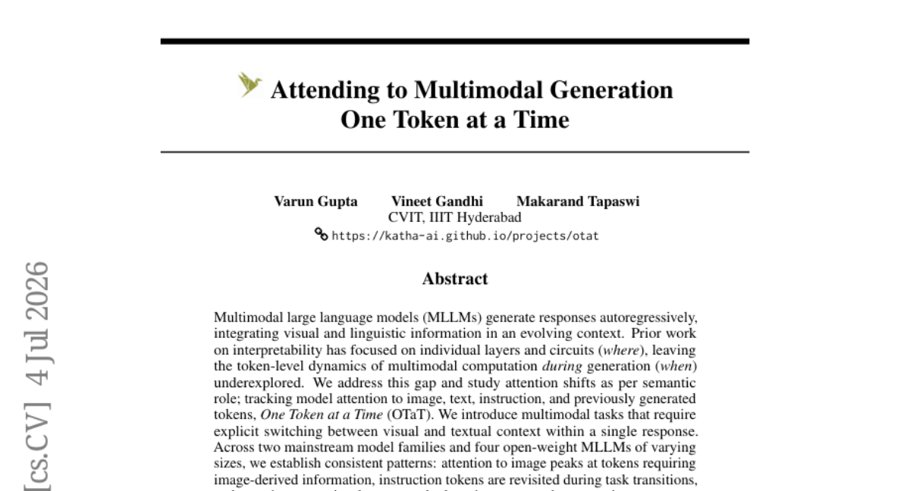

### 📌 한 줄 요약
MLLM의 토큰 생성 과정에서 발생하는 멀티모달 어텐션 역학을 분석하고, 이를 활용한 성능 향상 기법을 제안합니다.

### 🔑 핵심 포인트
- 토큰 생성 단계별로 이미지, 텍스트, 지시문 간의 어텐션 이동 패턴 규명
- 인과적 어텐션 차단(Causal attention blocking)을 통한 어텐션 역학의 기능적 검증
- 분석 결과를 바탕으로 적절한 시점에 모달리티 어텐션을 조절하는 테스트 타임 개입 기법 제안

### 🧑‍💻 개발자 관점
모델의 추론 과정을 시각화하고 제어함으로써, 특정 모달리티(이미지/텍스트)에 대한 집중도를 조절하여 생성 품질을 높이는 전략을 학습할 수 있습니다.

### 🚀 실무 적용 아이디어
- 사용 중인 MLLM의 생성 과정에서 이미지 vs 텍스트 어텐션 비율 변화 시각화해보기
- 특정 모달리티 어텐션을 강제로 차단했을 때 모델의 응답 품질 변화 관찰하기
- 제안된 테스트 타임 개입(Test-time intervention) 로직을 기존 모델에 적용해 성능 비교하기

### ⚠️ 리스크/한계
- 제안된 개입 방식이 특정 모델 구조나 데이터셋에 특화되어 일반화가 어려울 수 있음
- 실시간 생성 과정에서의 어텐션 조작은 추론 비용(Latency)을 증가시킬 가능성이 있음

### 📝 초록 기반 상세 설명
기존 MLLM 해석 연구는 특정 레이어나 회로에 집중했으나, 생성 과정 중 발생하는 토큰 단위의 동적 변화(when)에 대한 연구는 부족했습니다. 본 논문은 이미지, 텍스트, 지시문, 이전 생성 토큰에 대한 어텐션 변화를 추적하는 'One Token at a Time(OTaT)' 분석 프레임워크를 도입합니다. 다양한 크기의 오픈 웨이트 MLLM을 대상으로 실험한 결과, 이미지 정보가 필요할 때 어텐션이 피크를 찍고 지시문은 작업 전환 시 재방문되는 일관된 패턴을 발견했습니다. 인과적 어텐션 차단 실험을 통해 이러한 패턴이 기능적 역할을 함을 검증했으며, 어텐션이 방해받을 경우 모델이 언어적 사전 지식에 의존하거나 모달리티 간 누출이 발생함을 확인했습니다. 최종적으로 분석된 어텐션 역학을 바탕으로 적절한 시점에 관련 모달리티로 어텐션을 유도하는 테스트 타임 개입법을 제안하여 성능을 개선했습니다.

### 🖼️ 추가 자료
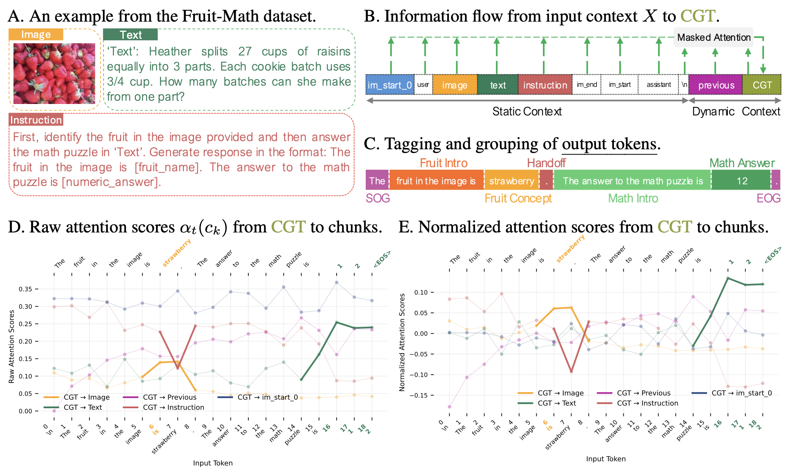

---

## 24. [When Classic Cache Policies Fail: Learning-Augmented Replacement for Semantic Retrieval Buffers](https://huggingface.co/papers/2607.00394)
**Upvotes**: 4 | **도입 난이도**: 상 | **신뢰도**: 상
**arXiv**: https://arxiv.org/abs/2607.00394

**태그**: LLM-Agent, RAG, Cache-Management, Machine-Learning, Agent, Evaluation

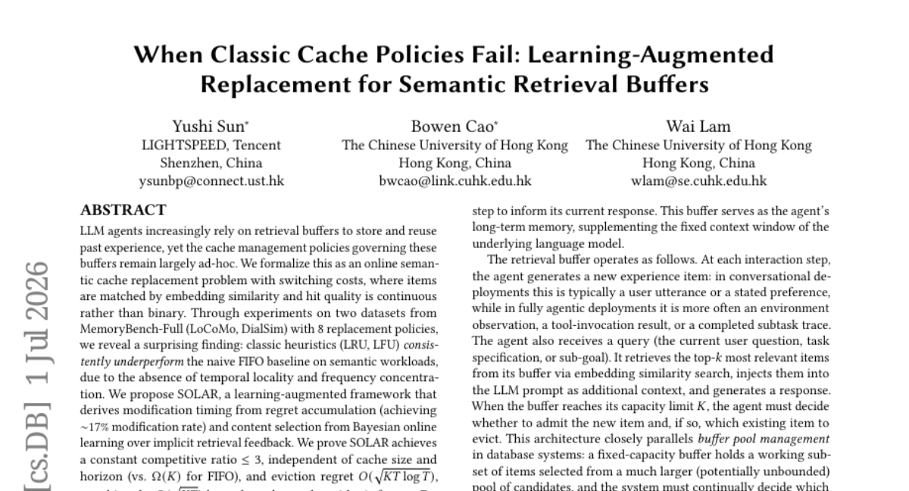

### 📌 한 줄 요약
LLM 에이전트의 시맨틱 캐시 성능을 극대화하기 위해 전통적인 LRU/LFU 대신 학습 기반의 SOLAR 프레임워크를 제안합니다.

### 🔑 핵심 포인트
- 시맨틱 워크로드에서 전통적인 LRU/LFU가 FIFO보다 성능이 낮을 수 있음을 증명
- 후회 누적 기반의 수정 타이밍과 베이지안 온라인 학습을 결합한 SOLAR 프레임워크 제안
- 캐시 크기와 시간 지평에 관계없이 일정한 경쟁비를 유지하는 이론적 우수성 확보

### 🧑‍💻 개발자 관점
RAG나 LLM 에이전트 설계 시, 단순히 최신 데이터를 남기는 방식보다 임베딩 유사도와 피드백을 고려한 지능형 캐시 관리가 성능에 결정적임을 시사합니다.

### 🚀 실무 적용 아이디어
- RAG 시스템의 캐시 교체 정책을 LRU에서 FIFO 또는 제안된 방식과 비교 실험
- 임베딩 유사도 기반의 캐시 히트/미스 기준을 동적으로 설정하는 로직 구현
- 캐시 크기 변화에 따른 검색 품질의 상전이(phase transition) 현상 모니터링

### ⚠️ 리스크/한계
- 베이지안 학습 및 후회 계산에 따른 추가적인 연산 오버헤드 발생 가능성
- 임베딩 공간의 특성에 따라 제안된 알고리즘의 성능이 가변적일 수 있음

### 📝 초록 기반 상세 설명
LLM 에이전트가 과거 경험을 재사용하기 위해 사용하는 리트리벌 버퍼의 관리 정책은 현재까지 주로 임의적인 방식으로 이루어져 왔습니다. 본 논문은 이를 스위칭 비용이 존재하는 온라인 시맨틱 캐시 교체 문제로 정식화하며, 히트 품질이 연속적인 값인 환경을 다룹니다. 실험 결과, 전통적인 LRU나 LFU는 시간적 지역성이 부족한 시맨틱 워크로드에서 FIFO보다 성능이 떨어지는 현상이 발견되었습니다. 이를 해결하기 위해 후회 누적(regret accumulation)과 베이지안 온라인 학습을 결합한 SOLAR 프레임워크를 제안합니다. SOLAR는 캐시 크기에 독립적인 경쟁비(competitive ratio)를 달성하며, 실험을 통해 FIFO 대비 5~75%의 성능 향상을 입증했습니다.

---

## 25. [3D HAMSTER: Bridging Planning and Control in Hierarchical Vision Language Action Models through 3D Trajectory Guidance](https://huggingface.co/papers/2606.31329)
**Upvotes**: 4 | **도입 난이도**: 중 | **신뢰도**: 상
**arXiv**: https://arxiv.org/abs/2606.31329

**태그**: Robotics, VLA, 3D Vision, Motion Planning, Vision

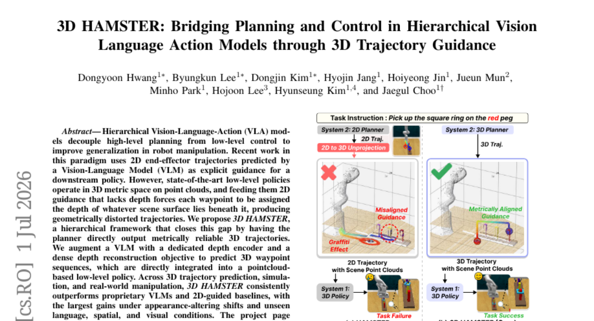

### 📌 한 줄 요약
2D 궤적의 기하학적 왜곡 문제를 해결하기 위해 VLM이 직접 3D 궤적을 생성하여 로봇 제어의 정밀도를 높인 계층적 VLA 프레임워크

### 🔑 핵심 포인트
- VLM이 2D가 아닌 직접적인 3D 메트릭 궤적을 생성하도록 설계
- 깊이 인코더와 밀집 깊이 재구성 목적 함수를 통한 3D 예측 정밀도 향상
- 3D 궤적과 포인트 클라우드 기반 하위 제어 정책 간의 원활한 통합

### 🧑‍💻 개발자 관점
2D 이미지 기반 계획이 실제 3D 물리 공간에서 발생하는 기하학적 오차를 어떻게 해결할 수 있는지에 대한 실질적인 방법론을 제시합니다.

### 🚀 실무 적용 아이디어
- 기존 2D 궤적 기반 VLA 모델과 3D 궤적 생성 모델의 정밀도 비교 실험
- 다양한 깊이 변화가 있는 환경에서 3D 웨이포인트의 정확도 검증
- 포인트 클라우드 기반 제어 정책에 3D 궤적을 입력값으로 주입하는 파이프라인 구축

### ⚠️ 리스크/한계
- 깊이 추정 오차가 발생할 경우 3D 궤적 자체가 물리적으로 불가능한 경로를 생성할 위험
- 고정밀 깊이 정보 확보를 위한 연산 비용 및 데이터 요구량 증가

### 📝 초록 기반 상세 설명
로봇 조작의 일반화를 위해 상위 계획과 하위 제어를 분리하는 계층적 VLA 모델 연구가 활발합니다. 기존 방식은 VLM이 생성한 2D 궤적을 하위 정책에 전달하지만, 이는 깊이 정보 부재로 인해 3D 공간에서 기하학적 왜곡을 유발합니다. 이를 해결하기 위해 3D HAMSTER는 VLM에 전용 깊이 인코더와 밀집 깊이 재구성 목적 함수를 결합하여 신뢰할 수 있는 3D 궤적을 직접 출력합니다. 생성된 3D 웨이포인트는 포인트 클라우드 기반의 하위 정책에 직접 통합됩니다. 실험 결과, 3D HAMSTER는 2D 가이드 방식보다 우수한 성능을 보였으며 특히 시각적 변화나 미학습 환경에서 강력한 강건성을 입증했습니다.

---

## 26. [SWE-Review: Closing the Loop on Issue Resolution with Agentic Code Review](https://huggingface.co/papers/2607.06065)
**Upvotes**: 3 | **도입 난이도**: 중 | **신뢰도**: 상
**arXiv**: https://arxiv.org/abs/2607.06065

**태그**: Agent, Software Engineering, Automated Code Review, LLM, Vision, Evaluation

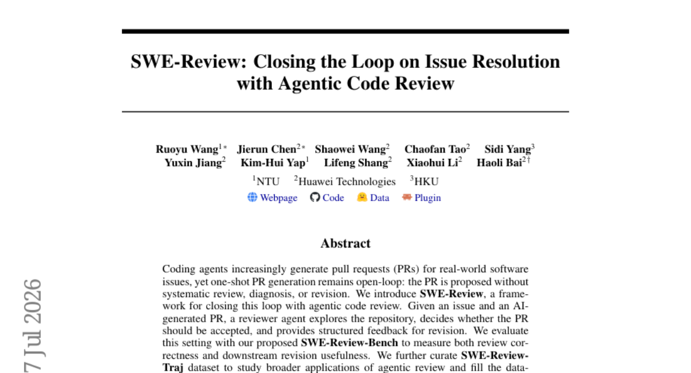

### 📌 한 줄 요약
단발성 PR 생성을 넘어, 에이전트 기반의 리뷰-수정 루프를 통해 코드 해결 완성도를 높이는 프레임워크 제안

### 🔑 핵심 포인트
- 에이전트 기반의 '생성-리뷰-수정' 폐쇄 루프(Closed-loop) 프레임워크 제안
- 리뷰 정확도 및 수정 유용성 측정을 위한 전용 벤치마크와 데이터셋 구축
- 단발성 생성 방식 대비 높은 PR 해결률 및 테스트 타임 스케일링(Test-time scaling) 효과 입증

### 🧑‍💻 개발자 관점
AI가 짠 코드를 사람이 일일이 검토하는 대신, AI 리뷰어가 스스로 결함을 찾아 수정하게 함으로써 자동화된 이슈 해결의 신뢰도를 높일 수 있습니다.

### 🚀 실무 적용 아이디어
- 현재 사용 중인 코딩 에이전트 워크플로우에 '리뷰 에이전트' 단계를 추가하여 성능 변화 관찰
- 에이전트가 생성한 피드백이 실제 코드 수정(Revision)으로 이어지는 정합성 테스트
- 에이전트 간의 역할 분담(Generator vs Reviewer)에 따른 충돌 및 루프 정체 현상 분석

### ⚠️ 리스크/한계
- 에이전트가 잘못된 피드백을 반복할 경우 발생하는 무한 루프 또는 품질 저하 위험
- 복잡한 의존성을 가진 대규모 레포지토리에서의 탐색 비용 및 효율성 문제

### 📝 초록 기반 상세 설명
최근 코딩 에이전트가 생성하는 PR은 검토나 수정 과정이 결여된 단발성(one-shot) 방식에 머물러 있습니다. 이를 해결하기 위해 에이전트가 직접 코드를 탐색하고 피드백을 제공하는 SWE-Review 프레임워크를 도입합니다. 연구진은 리뷰의 정확도와 수정 유용성을 측정하기 위한 SWE-Review-Bench와 데이터 부족 문제를 해결할 SWE-Review-Traj 데이터셋을 구축했습니다. 실험 결과, 에이전트 기반 리뷰는 생성-리뷰-수정 루프를 통해 PR 품질을 지속적으로 개선하며 단발성 리뷰보다 높은 정확도와 해결률을 보였습니다. 결과적으로 이 방식은 AI 코딩 에이전트를 단순 생성에서 폐쇄 루프형 문제 해결 단계로 진화시킵니다.

---

## 27. [HunyuanOCR-1.5: Making Lightweight OCR VLMs Faster and Better](https://huggingface.co/papers/2607.04884)
**Upvotes**: 3 | **도입 난이도**: 하 | **신뢰도**: 상
**arXiv**: https://arxiv.org/abs/2607.04884

**태그**: OCR, VLM, Efficiency, Data Engineering, Agent, RAG, Vision, Evaluation, Inference

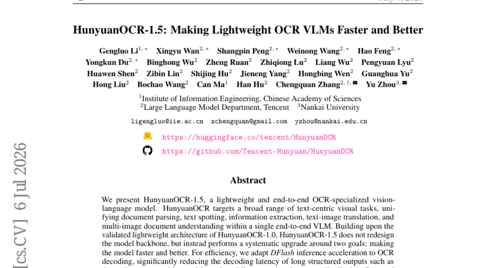

### 📌 한 줄 요약
DFlash와 Agentic Data Flow를 통해 추론 속도와 롱테일 OCR 성능을 동시에 극대화한 경량화 OCR VLM 모델

### 🔑 핵심 포인트
- DFlash를 통한 Transformer 추론 속도 및 vLLM 환경에서의 효율성 극대화
- Agentic Data Flow를 활용한 자동화된 데이터 구축 및 롱테일 성능 개선
- 문서 파싱, 정보 추출, 다중 이미지 이해를 통합한 경량 엔드투엔드 VLM

### 🧑‍💻 개발자 관점
문서 자동화 및 데이터 추출 파이프라인 구축 시, 모델 재설계 없이도 추론 속도와 복잡한 양식(표, 차트 등) 처리 능력을 동시에 확보할 수 있는 실용적인 가이드를 제공합니다.

### 🚀 실무 적용 아이디어
- DFlash 적용 전후의 긴 문서/표 구조 출력 속도 비교 실험
- Agentic Data Flow가 생성한 데이터가 특정 도메인(고문서 등) 성능에 미치는 영향 분석
- vLLM 환경에서의 실제 배포 환경 성능 벤치마크

### ⚠️ 리스크/한계
- 백본을 변경하지 않는 방식이므로 모델 자체의 근본적인 아키텍처 한계는 존재할 수 있음
- 에이전트 기반 데이터 생성 시 발생할 수 있는 데이터 편향성 문제

### 📝 초록 기반 상세 설명
기존의 경량 OCR VLM은 복잡한 문서 구조나 긴 텍스트 출력 시 추론 속도가 저하되는 문제가 있었습니다. 이를 해결하기 위해 HunyuanOCR-1.5는 백본 구조를 유지하면서도 효율성과 성능을 체계적으로 개선했습니다. 효율성 측면에서는 DFlash를 OCR 디코딩에 적용하여 긴 구조적 출력의 지연 시간을 대폭 단축했습니다. 성능 측면에서는 에이전트 기반의 데이터 구축 시스템인 Agentic Data Flow를 도입하여 데이터 부족 문제를 해결했습니다. 그 결과, 고해상도 및 다중 이미지 환경에서도 빠른 추론과 강력한 롱테일 OCR 성능을 동시에 달성했습니다.

---

## 28. [Is One Layer Enough? Training A Single Transformer Layer Can Match Full-Parameter RL Training](https://huggingface.co/papers/2607.01232)
**Upvotes**: 3 | **도입 난이도**: 하 | **신뢰도**: 상
**arXiv**: https://arxiv.org/abs/2607.01232

**태그**: LLM, Reinforcement Learning, Efficiency, Transformer, Agent, Reasoning

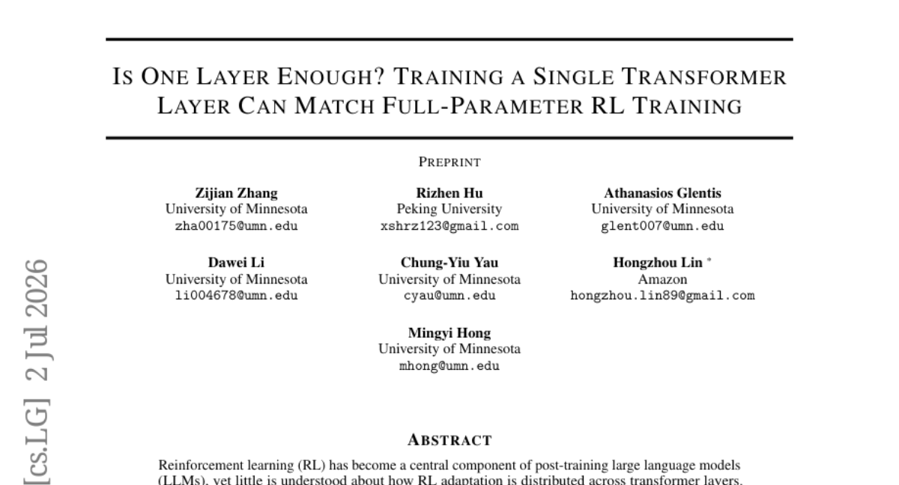

### 📌 한 줄 요약
전체 파라미터를 업데이트하는 대신 특정 레이어만 학습시켜도 RL 성능의 대부분을 확보할 수 있습니다.

### 🔑 핵심 포인트
- RL 성능 향상은 특정 레이어에 매우 집중되어 있음 (Layer-wise concentration)
- 중간 레이어(Middle layers)가 RL 학습에서 가장 높은 기여도를 보임
- 단일 레이어 학습만으로도 전체 파라미터 학습에 근접한 성능 달성 가능

### 🧑‍💻 개발자 관점
RL 학습 시 모든 파라미터를 업데이트할 필요 없이 특정 레이어만 선택적으로 학습함으로써 계산 자원을 획기적으로 절감할 수 있습니다.

### 🚀 실무 적용 아이디어
- 현재 사용 중인 모델의 레이어별 기여도(Layer Contribution) 측정 실험 수행
- 전체 파라미터 학습 대신 중간 레이어만 타겟팅하는 효율적 RL 파이프라인 구축
- 모델 크기 및 태스크에 따른 레이어별 중요도 변화 검증

### ⚠️ 리스크/한계
- 특정 태스크나 모델 구조에 따라 최적의 레이어 위치가 달라질 수 있음
- 단일 레이어 학습 시 모델의 일반적인 지식 유지(Catastrophic forgetting) 문제 발생 가능성

### 📝 초록 기반 상세 설명
LLM의 사후 학습(Post-training)에서 RL은 핵심적이지만, 레이어별 기여도에 대한 이해는 부족한 상태입니다. 기존 방식은 모든 레이어를 균일하게 업데이트하는 것을 전제로 합니다. 본 연구는 레이어별 기여도를 정량화하여 RL 학습의 분포를 체계적으로 분석했습니다. 실험 결과, 단 하나의 레이어만 학습시켜도 전체 RL 성능의 상당 부분을 회복하거나 오히려 능가할 수 있음을 발견했습니다. 특히 높은 기여도를 가진 레이어는 주로 트랜스포머 스택의 중간 부분에 집중되는 일관된 패턴을 보였습니다.

---

## 29. [MuseBench: Benchmarking Intent-Level Audiovisual Arts Understanding in MLLMs](https://huggingface.co/papers/2606.30026)
**Upvotes**: 3 | **도입 난이도**: 하 | **신뢰도**: 상
**arXiv**: https://arxiv.org/abs/2606.30026

**태그**: Multimodal, Benchmark, Reasoning, Creative AI, Video, Audio, Evaluation, Distillation

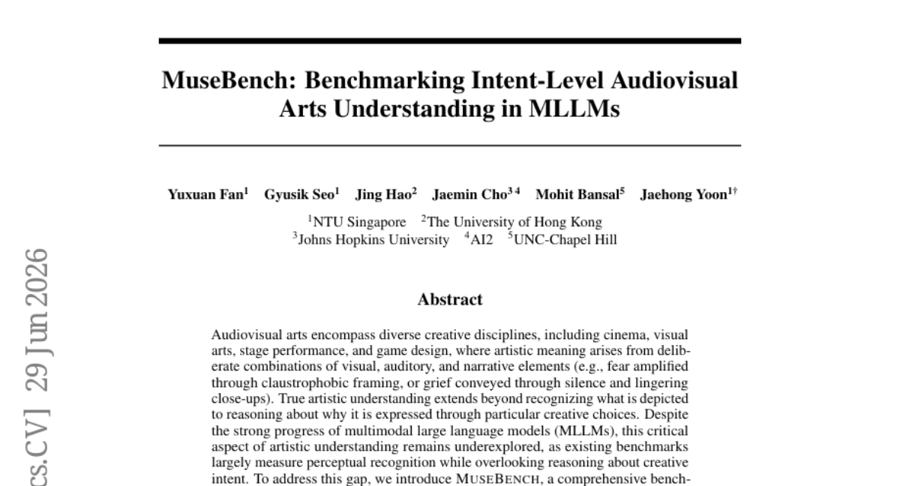

### 📌 한 줄 요약
창의적 의도 파악 능력을 측정하기 위한 새로운 멀티모달 벤치마크 MuseBench 제안 및 MLLM의 예술적 이해도 한계 입증

### 🔑 핵심 포인트
- 창의적 의도와 예술적 추론 능력을 평가하는 4,016개 규모의 멀티모달 벤치마크 MuseBench 개발
- 전문가 수준의 영상 에세이를 활용하여 단순 인식을 넘어선 고차원적 예술 이해도 측정
- 4단계 반복 파이프라인(필터링, 적대적 방해 요소, 전문가 검증)을 통한 고품질 데이터 확보

### 🧑‍💻 개발자 관점
단순 객체 인식을 넘어선 고차원적 추론(Reasoning) 능력이 필요한 멀티모달 에이전트 개발 시 중요한 평가 지표가 될 수 있습니다.

### 🚀 실무 적용 아이디어
- 현재 사용 중인 최신 MLLM 모델을 MuseBench 데이터셋에 적용하여 추론 능력 테스트
- 모델이 오답을 내는 패턴을 분석하여 창의적 의도 파악 실패 원인 분류
- 시각적 단서와 서사적 맥락 간의 관계를 학습시키기 위한 데이터 증강 전략 수립

### ⚠️ 리스크/한계
- 전문가 수준의 높은 난이도로 인해 일반적인 모델 성능 측정에는 과도하게 엄격할 수 있음
- 예술적 주관성이 개입될 수 있는 영역에 대한 객관적 평가 기준 유지의 어려움

### 📝 초록 기반 상세 설명
기존의 멀티모달 모델들은 시각적 인식을 넘어 예술적 의도와 창의적 선택의 이유를 파악하는 데 한계가 있습니다. 이를 해결하기 위해 전문적인 영상 에세이를 기반으로 영화, 시각 예술, 공연, 게임 등 다양한 분야를 아우르는 4,016개의 질문으로 구성된 MuseBench를 제안합니다. 벤치마크는 1만 개 이상의 후보 영상 에세이에서 추출되었으며, 4단계 반복 파이프라인을 통해 정교하게 생성되었습니다. 28개의 최신 MLLM을 대상으로 제로샷 평가를 수행한 결과, 최고 성능 모델조차 인간 전문가(87.18%)에 비해 현저히 낮은 48.29%의 정확도를 기록했습니다. 이는 현재의 모델들이 예술적 도메인 지식과 추론 능력에서 큰 격차를 보이고 있음을 시사합니다.

---

## 30. [SIEVE: Structure-Aware Data Selection for Imitation Learning with VLA Models](https://huggingface.co/papers/2607.06442)
**Upvotes**: 2 | **도입 난이도**: 중 | **신뢰도**: 상
**arXiv**: https://arxiv.org/abs/2607.06442

**태그**: Robot Learning, Data Selection, VLA, Imitation Learning, RAG, Vision, Benchmark

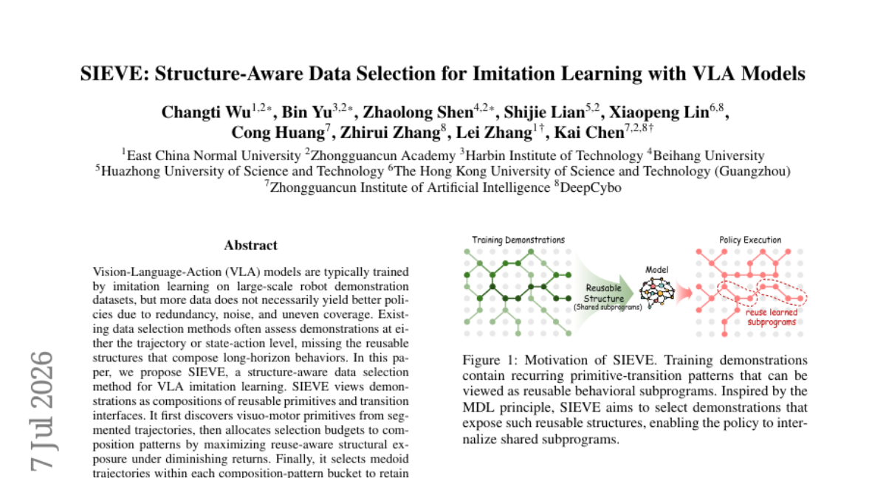

### 📌 한 줄 요약
데이터 중복과 노이즈를 제거하고 재사용 가능한 구조적 패턴을 추출하여 VLA 모델의 학습 효율을 극대화하는 데이터 선택 방법론

### 🔑 핵심 포인트
- 재사용 가능한 구조(Primitive & Transition) 중심의 데이터 선택 프레임워크 제안
- 수확 체감 법칙을 적용한 효율적인 구성 패턴별 예산 할당 알고리즘
- 데이터 양과 학습 단계를 50%로 줄이면서도 전체 데이터 학습 성능을 달성하는 고효율성

### 🧑‍💻 개발자 관점
로봇 학습 시 무작정 데이터를 모으는 대신, 데이터 간의 구조적 관계를 활용해 학습 비용을 획기적으로 줄이는 전략을 제공합니다.

### 🚀 실무 적용 아이디어
- 보유한 로봇 데모 데이터셋에 대해 SIEVE의 프리미티브 추출 로직 적용 테스트
- 데이터 샘플링 비율(50% vs 100%)에 따른 성능 유지 및 학습 시간 변화 측정
- 다양한 복잡도(Long-horizon)를 가진 태스크에서 구조적 패턴 추출 성능 검증

### ⚠️ 리스크/한계
- 프리미티브 분할(Segmentation) 품질에 따라 전체 데이터 선택 성능이 좌우될 수 있음
- 복잡한 환경이나 예외 상황이 많은 데이터셋에서는 구조적 패턴 정의가 어려울 수 있음

### 📝 초록 기반 상세 설명
VLA 모델은 대규모 로봇 데이터로 학습되지만, 데이터의 중복과 노이즈로 인해 데이터 양이 늘어난다고 성능이 비례하지 않는 문제가 있습니다. 기존 방식은 궤적이나 상태-행동 단위로만 평가하여 복잡한 동작을 구성하는 구조적 요소를 놓치는 한계가 있었습니다. 본 논문은 데모를 재사용 가능한 프리미티브(primitive)와 전이 인터페이스의 조합으로 보는 SIEVE 방식을 제안합니다. SIEVE는 분할된 궤적에서 시각-운동 프리미티브를 발견하고, 수확 체감 법칙을 고려하여 구성 패턴에 예산을 할당한 뒤, 각 패턴 내에서 대표적인 궤적을 선택합니다. 실험 결과, SIEVE는 기존 베이스라인을 상회하며 데이터의 50%만 사용하고도 전체 데이터 학습 성능을 능가하는 효율성을 보였습니다.

---

## 31. [Where to cut, how deep: BPE and Unigram-LM on chemistry SMILES](https://huggingface.co/papers/2607.05691)
**Upvotes**: 2 | **도입 난이도**: 하 | **신뢰도**: 상
**arXiv**: https://arxiv.org/abs/2607.05691

**태그**: NLP, Chemistry, Tokenizer, BPE, Unigram

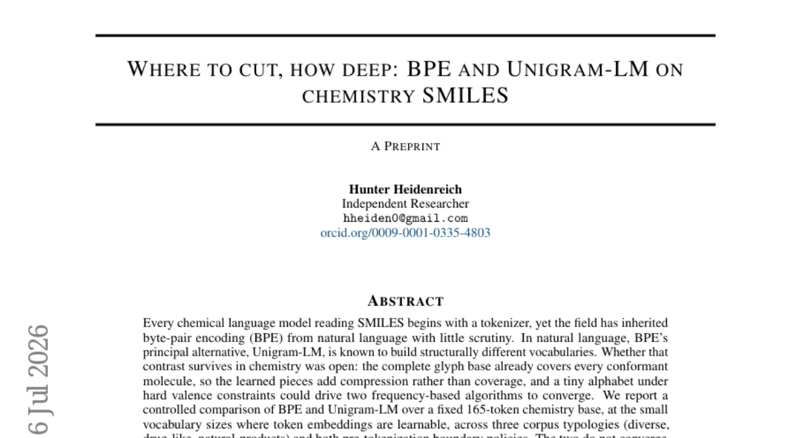

### 📌 한 줄 요약
화학 SMILES 데이터에서 BPE와 Unigram-LM 토크나이저 간의 구조적 차이를 분석하여 알고리즘 선택의 중요성을 입증함

### 🔑 핵심 포인트
- BPE와 Unigram-LM은 화학 SMILES에서 서로 거의 겹치지 않는(disjoint) 어휘를 생성함
- Unigram-LM이 BPE보다 더 세밀한(finer) 분절을 수행하며, BPE는 Unigram-LM의 거친(coarsening) 버전과 유사함
- 알고리즘 선택은 데이터 유형이나 크기에 관계없이 모델 성능에 직접적인 영향을 미치는 결정적 요소임

### 🧑‍💻 개발자 관점
SMILES 기반 화학 모델 개발 시, 단순히 BPE를 기본값으로 사용하는 대신 모델의 목적에 맞는 토큰화 전략을 설계해야 합니다.

### 🚀 실무 적용 아이디어
- 동일한 SMILES 데이터셋에 대해 BPE와 Unigram-LM의 어휘 중첩도(Jaccard similarity) 측정하기
- 두 알고리즘의 분절 깊이(segmentation depth)가 모델의 생성/예측 성능에 미치는 영향 비교 실험
- 특정 화학 도메인(약물, 천연물 등)에 최적화된 토크나이저 벤치마크 구축

### ⚠️ 리스크/한계
- 본 연구는 언어 모델 자체를 학습시킨 것이 아니라 토크나이저의 구조적 차이만을 분석함
- 알고리즘 차이가 실제 모델의 최종 성능(Downstream task)으로 어떻게 전이되는지는 직접적으로 보여주지 않음

### 📝 초록 기반 상세 설명
화학 언어 모델은 SMILES를 읽기 위해 토크나이저를 사용하지만, 자연어에서 쓰이던 BPE를 검증 없이 그대로 사용하는 경향이 있습니다. 본 연구는 BPE와 Units-LM이 화학 구조에서 서로 다른 어휘를 생성하는지 확인하고자 했습니다. 연구진은 고정된 165-토큰 기반에서 세 가지 코퍼스 유형과 사전 토큰화 정책을 적용하여 두 알고리즘을 비교했습니다. 실험 결과, 두 알고리즘은 서로 거의 겹치지 않는(Jaccard overlap ≤ 0.161) 이질적인 어휘를 생성했습니다. 또한 Unigram-LM은 BPE보다 더 세밀하게 분절하며, BPE는 Unigram-LM의 단순화된 형태에 가깝다는 것을 확인했습니다. 결론적으로 서브워드 알고리즘은 단순한 기본값이 아닌 모델링의 핵심 결정 사항입니다.

---

## 32. [Layer-wise Cross-Lingual Depression Detection from Speech: Analysis with Contrastive Alignment](https://huggingface.co/papers/2607.02920)
**Upvotes**: 2 | **도입 난이도**: 중 | **신뢰도**: 상
**arXiv**: https://arxiv.org/abs/2607.02920

**태그**: Speech, Cross-Lingual, Contrastive Learning, Depression Detection, Evaluation, Safety

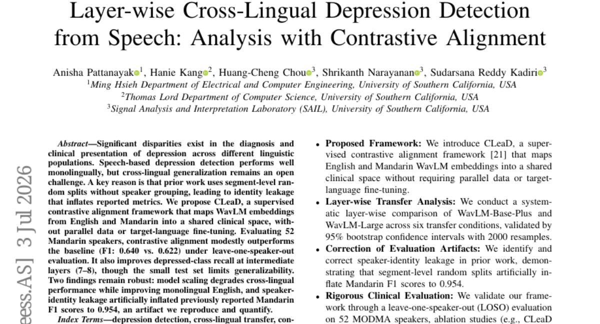

### 📌 한 줄 요약
화자 식별 정보 유출 문제를 해결하고 대조 학습을 통해 언어 간 우울증 탐지 성능을 개선한 프레임워크 제안

### 🔑 핵심 포인트
- 화자 분리(Leave-one-speaker-out)를 통한 데이터 누수 문제 해결 및 신뢰할 수 있는 평가 체계 구축
- 병렬 데이터 없이 영어-중국어 임베딩을 정렬하는 CLeaD(Supervised Contrastive Alignment) 프레임워크 제안
- 모델 스케일링이 단일 언어 성능은 높이지만 교차 언어 일반화에는 부정적일 수 있음을 확인

### 🧑‍💻 개발자 관점
데이터 분할 시 화자 정보를 엄격히 분리하지 않으면 모델 성능이 가짜로 높게 측정될 수 있음을 경고하며, 올바른 평가 방법론의 중요성을 강조합니다.

### 🚀 실무 적용 아이디어
- 데이터셋 분할 시 화자 ID 기반의 엄격한 Train/Test 분리 적용
- 다국어 음성 모델 학습 시 대조 학습(Contrastive Learning)을 통한 임베딩 정렬 실험
- 모델 크기 증가가 타겟 언어 일반화에 미치는 영향 분석

### ⚠️ 리스크/한계
- 테스트 데이터셋 규모가 작아 결과의 일반화 가능성이 제한적임
- 모델 스케일링이 교차 언어 성능 저하를 야기할 수 있는 트레이드오프 존재

### 📝 초록 기반 상세 설명
언어권별로 우울증의 임상적 양상이 다르지만, 기존 음성 기반 우울증 탐지는 교차 언어 일반화에 어려움을 겪고 있습니다. 특히 기존 연구들이 화자 분리 없이 세그먼트 단위로 데이터를 분할하여 발생하는 화자 정보 유출(identity leakage) 문제가 성능 지표를 과도하게 높이는 원인이 되었습니다. 본 논문은 영어와 중국어 WavLM 임베딩을 병렬 데이터 없이 공유된 임상 공간으로 매핑하는 CLeaD 프레임워크를 제안합니다. 실험 결과, 화자 분리 검증 환경에서 대조 학습이 베이스라인보다 우수한 성능을 보였으며 중간 레이어에서 우울증 재현율을 개선했습니다. 또한 모델 스케일링이 교차 언어 성능을 저하시킬 수 있음을 밝히고, 기존 연구의 높은 F1 점수가 화자 유출에 의한 허상임을 입증했습니다.

---

## 33. [SceneFrom3D: Geometry-Conditioned Outdoor 3D Scene Generation via View Scheduling with Object-Level Control](https://huggingface.co/papers/2607.04540)
**Upvotes**: 1 | **도입 난이도**: 상 | **신뢰도**: 상
**arXiv**: https://arxiv.org/abs/2607.04540

**태그**: 3D Generation, Computer Vision, Scene Synthesis, RAG, Vision

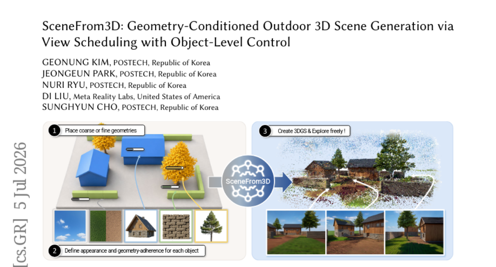

### 📌 한 줄 요약
사용자 제공 기하 구조를 기반으로 실외 3D 장면을 자동 스케줄링 및 객체 단위로 제어하며 생성하는 프레임워크

### 🔑 핵심 포인트
- 입력 기하 구조를 기반으로 최적의 뷰를 자동 결정하는 방향성 생성 그래프(Directed Generation Graph) 도입
- 객체별 ID 이미지와 기하 준수 파라미터를 통한 정밀한 외형 및 구조 제어
- 광활한 실외 환경의 비정형적 구조 문제를 해결하는 자동화된 뷰 스케줄링

### 🧑‍💻 개발자 관점
사용자가 제공한 거친 3D 모델을 바탕으로 고품질의 실사 렌더링 장면을 자동 생성할 수 있어, 게임 환경 구축이나 디지털 트윈 제작 공정을 단축할 수 있습니다.

### 🚀 실무 적용 아이디어
- 제공된 기하 구조(Mesh/Point Cloud)의 복잡도에 따른 생성 품질 변화 테스트
- 객체별 기하 준수 파라미터 조절을 통한 구조적 정밀도 임계점 확인
- 다양한 실외 환경(도시, 자연 등)에서의 뷰 스케줄링 안정성 검증

### ⚠️ 리스크/한계
- 입력 기하 구조의 품질이 매우 낮을 경우 생성된 3D 장면의 일관성 저하 가능성
- 복잡한 뷰 스케줄링 및 객체 제어 로직으로 인한 높은 연산 비용

### 📝 초록 기반 상세 설명
기하 구조를 조건으로 하는 3D 장면 생성은 구조와 객체 배치를 직접 제어할 수 있는 유용한 기술입니다. 기존 방식은 뷰 스케줄링, 다중 뷰 합성, 3D 재구성의 3단계를 거치지만, 광활하고 비정형적인 실외 환경에서는 적절한 뷰를 확보하는 것이 매우 어렵습니다. 이를 해결하기 위해 본 논문은 입력 기하 구조로부터 뷰를 자동 스케줄링하는 SceneFrom3D 프레임워크를 제안합니다. 이 프레임워크는 앵커 뷰와 보간 경로를 포함하는 방향성 생성 그래프를 구축하여 생성 순서와 뷰를 결정합니다. 또한, 객체별 ID 이미지와 기하 준수 파라미터를 도입하여 객체 외형과 구조적 정밀도를 동시에 제어합니다. 실험 결과, SceneFrom3验은 고품질의 실외 3D 장면 생성과 정교한 객체 제어 성능을 입증했습니다.

---

## 34. [Bibby AI: An Editor-Native Agentic Platform for Academic Research, Writing, and Publishing](https://huggingface.co/papers/2607.05435)
**Upvotes**: 1 | **도입 난이도**: 중 | **신뢰도**: 상
**arXiv**: https://arxiv.org/abs/2607.05435

**태그**: Agentic Workflow, LaTeX, RAG, Document Automation, Agent, Vision, Evaluation

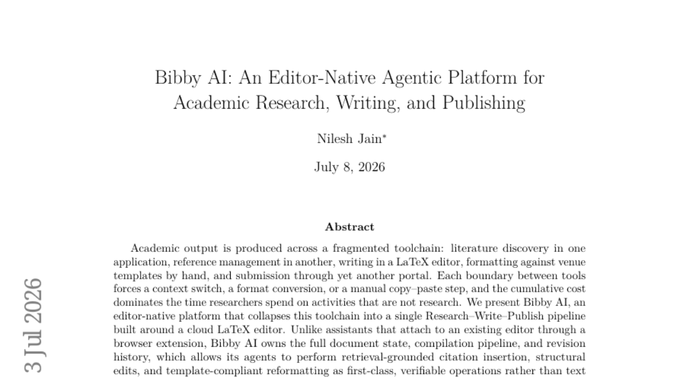

### 📌 한 줄 요약
LaTeX 에디터 중심의 통합 파이프라인을 통해 연구의 전 과정을 자동화하는 에이전트 기반 플랫폼

### 🔑 핵심 포인트
- 에디터 네이티브 아키텍처: 문서 상태와 컴파일 파이프라인을 직접 제어하여 에이전트의 작업 신뢰도 확보
- 통합 연구 파이프라인: 문헌 조사부터 LaTeX 서식 맞춤까지의 전 과정을 단일 환경으로 통합
- 지식 기반 에이전트: 특허-논문 인용 신호를 포함한 풍부한 메타데이터와 문서 구조(AST) 기반의 자동 편집

### 🧑‍💻 개발자 관점
단순 텍스트 생성을 넘어, 문서의 구조적 상태(AST)와 컴파일 환경을 에이전트가 직접 제어하는 '에디터 네이티브' 방식의 실무적 효용을 보여줍니다.

### 🚀 실무 적용 아이디어
- LLM이 문서의 AST(Abstract Syntax Tree)를 직접 조작하는 방식의 구현 가능성 검토
- RAG 시스템에 특허/학술 데이터와 같은 외부 지식 그래프를 결합하는 구조 설계
- 기존 IDE/에디터 확장 방식과 에디터 네이티브 방식의 성능/사용성 비교 실험

### ⚠️ 리스크/한계
- 특정 에디터(LaTeX)에 종속된 워크플로우로 인한 범용성 제약
- 에이전트가 문서 구조를 직접 수정할 때 발생할 수 있는 의도치 않은 포맷 파손 리스크

### 📝 초록 기반 상세 설명
학술 연구 과정은 문헌 조사, 작성, 서식 맞춤, 투고 등 파편화된 도구들로 인해 빈번한 컨텍스트 스위칭과 수동 작업이 발생합니다. 이를 해결하기 위해 Bibby AI는 클라우드 LaTeX 에디터를 중심으로 연구-작성-출판 과정을 하나로 통합한 에디터 네이티브 플랫폼을 제안합니다. 브라우저 확장 프로그램 방식과 달리 문서 상태와 컴파일 파이프라인을 직접 제어하여, 에이전트가 구조적 편집과 서식 변환을 직접 수행할 수 있게 합니다. 시스템은 PDF/수식의 LaTeX 변환, 특허 데이터를 결합한 지식 검색, 그리고 문서의 추상 구문 트리(AST)를 직접 조작하는 작업별 에이전트로 구성됩니다. 현재 5,000명 이상의 연구자가 사용 중이며, 파편화된 기존 방식 대비 워크플로우 효율성을 입증했습니다.

---

## 35. [RuleChef: Grounding LLM Task Knowledge in Human-Editable Rules](https://huggingface.co/papers/2607.01293)
**Upvotes**: 1 | **도입 난이도**: 중 | **신뢰도**: 상
**arXiv**: https://arxiv.org/abs/2607.01293

**태그**: LLM, NLP, Rule-based, Automation, Evaluation

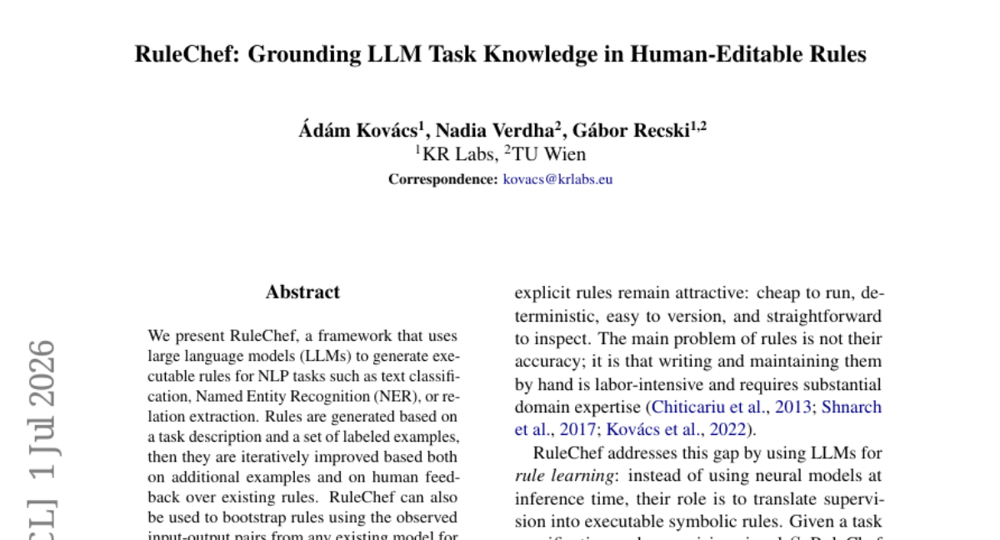

### 📌 한 줄 요약
LLM을 활용해 사람이 편집 가능한 실행 가능한 규칙(Rule)을 생성하여 NLP 태스크를 수행하는 프레임워크

### 🔑 핵심 포인트
- LLM을 규칙 생성 및 패칭(Patching) 도구로만 사용하여 추론 시 비용과 지연 시간 최소화
- 인간의 피드백과 예시를 결합한 반복적 규칙 개선 프로세스 제공
- 결정론적(Deterministic)이고 검사 가능한(Inspectable) 규칙 기반 시스템 구축

### 🧑‍💻 개발자 관점
LLM의 추론 비용을 줄이면서도, 사람이 규칙을 직접 수정하여 결과의 제어 가능성과 투명성을 확보할 수 있습니다.

### 🚀 실무 적용 아이디어
- 소량의 데이터셋으로 RuleChef가 생성한 규칙의 정확도 검증
- 기존 모델의 입출력을 활용한 RuleChef의 부트스트랩 성능 테스트
- 생성된 규칙을 실제 프로덕션 환경의 Rule Engine에 이식하여 속도 비교

### ⚠️ 리스크/한계
- 복잡한 문맥이나 예외 케이스가 많은 태스크에서는 규칙 기반 시스템의 한계가 발생할 수 있음
- 규칙 생성 단계에서 LLM의 성능에 의존적임

### 📝 초록 기반 상세 설명
기존 NLP 태스크(분류, NER 등)를 수행할 때 LLM의 블랙박스 특성과 실행 속도 문제는 해결하기 어려운 과제였습니다. 본 논문은 LLM을 학습 단계에서만 사용하여 실행 가능한 규칙을 생성하는 RuleChef 프레임워크를 제안합니다. 작업 설명과 소량의 예시를 바탕으로 규칙을 생성하며, 인간의 피드백과 추가 예시를 통해 규칙을 반복적으로 개선합니다. 또한 기존 모델의 입출력 쌍을 활용해 규칙을 부트스트랩할 수도 있습니다. 결과적으로 LLM의 지식을 결정론적이고 검사 가능한 규칙 시스템으로 변환하여 속도와 투명성을 동시에 확보합니다.

### 🖼️ 추가 자료
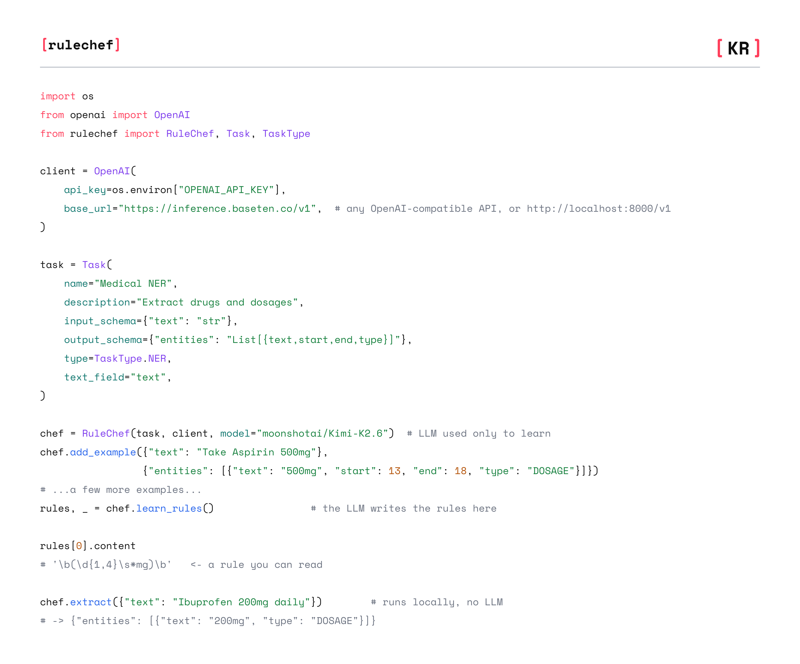

---

## 36. [Image2Sim: Scaling Embodied Navigation via Generative Neural Simulator](https://huggingface.co/papers/2607.05765)
**Upvotes**: 0 | **도입 난이도**: 상 | **신뢰도**: 상
**arXiv**: https://arxiv.org/abs/2607.05765

**태그**: Embodied AI, Neural Simulation, Robotics, Computer Vision, Agent, Multimodal, Vision, Video, Benchmark

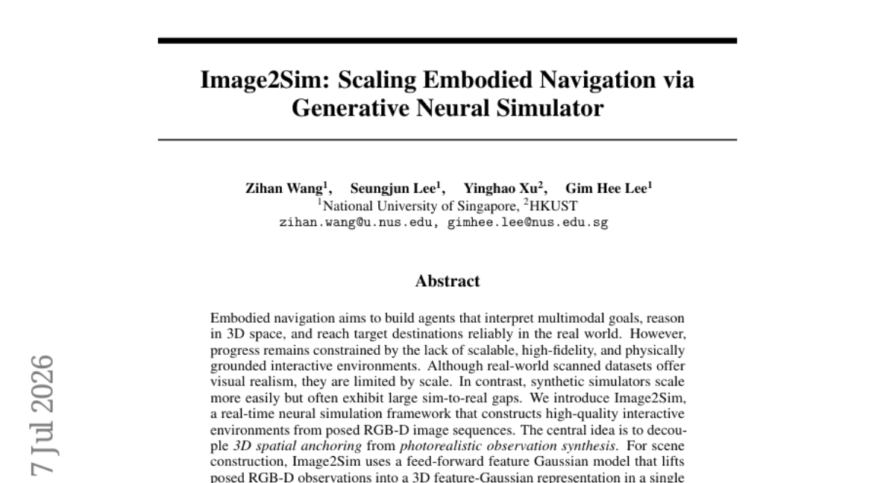

### 📌 한 줄 요약
실제 영상 데이터를 고품질 상호작용 가능한 3D 환경으로 변환하여 대규모 로봇 내비게이션 학습을 가능케 하는 신경 시뮬레이터 프레임워크

### 🔑 핵심 포인트
- 3D 공간 구조와 광학적 렌더링을 분리하여 효율적인 환경 구축
- 피드포워드 특징 가우시안 모델을 통한 단일 패스 3D 공간 구축
- 대규모 영상/이미지 데이터를 2만 개의 상호작용 장면과 1,000만 개 이상의 학습 샘플로 자동 변환

### 🧑‍💻 개발자 관점
데이터 수집 비용을 획기적으로 줄이면서도 실세계와 유사한 고품질 학습 데이터를 대량으로 생성할 수 있는 자동화된 데이터 엔진을 제공합니다.

### 🚀 실무 적용 아이디어
- 제공된 프레임워크를 활용해 기존 로봇 내비게이션 모델의 데이터셋 확장 실험
- 다양한 도메인(실내/실외) 영상 데이터에 대한 시뮬레이션 재현성 검증
- 생성된 시뮬레이션 환경에서의 에이전트 행동과 실세계 행동 간의 차이 분석

### ⚠️ 리스크/한계
- 시뮬레이션 환경의 물리적 정교함이 실제 물리 법칙과 완벽히 일치하지 않을 가능성
- 대규모 렌더링 및 데이터 생성에 필요한 컴퓨팅 자원 요구량

### 📝 초록 기반 상세 설명
로봇의 Embodied Navigation 발전을 위해서는 확장 가능하고 물리적으로 정교한 상호작용 환경이 필수적입니다. 기존의 실세계 스캔 데이터는 현실적이지만 규모가 작고, 합성 시뮬레이터는 규모는 크지만 Sim-to-Real 간극이 크다는 문제가 있습니다. 이를 해결하기 위해 Image2Sim은 포즈가 포함된 RGB-D 이미지 시퀀스로부터 고품질 상호작용 환경을 구축하는 실시간 신경 시뮬레이션 프레임워크를 제안합니다. 3D 공간 앵커링과 광학적 관찰 합성을 분리하여, 피드포워드 특징 가우시안 모델로 3D 공간을 구축하고 기하학 인지형 픽셀 흐름 모델로 고품질 관찰을 렌더링합니다. 이 프레임워크를 통해 2만 개의 상호작용 장면과 1,000만 개 이상의 내비게이션 학습 샘플을 생성했습니다. 결과적으로 이 환경에서 학습된 모델은 주요 벤치마크에서 성능 향상을 보였으며 실세계 제로샷 전이에서도 우수한 성능을 입증했습니다.

### 🖼️ 추가 자료

---

## 37. [SiamJEPA: On the Role of Siamese Student Encoders in JEPA](https://huggingface.co/papers/2607.04044)
**Upvotes**: 0 | **도입 난이도**: 중 | **신뢰도**: 상
**arXiv**: https://arxiv.org/abs/2607.04044

**태그**: Computer Vision, Self-Supervised Learning, JEPA, Siamese Network, RAG, Vision

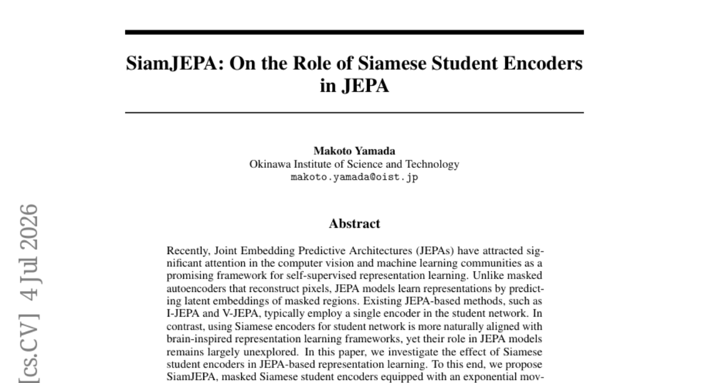

### 📌 한 줄 요약
Siamese 구조를 도입하여 JEPA의 표현 학습 효율과 정규화 성능을 극대화한 자기주도 학습 프레임워크

### 🔑 핵심 포인트
- Siamese 학생 인코더와 EMA 교사 네트워크를 결합한 새로운 JEPA 구조 제안
- Siamese 구조가 JEPA 학습에서 강력한 정규화(Regularizer) 역할을 수행함을 입증
- 학습 초기 단계의 가속화 및 표현 분리도(Separability) 향상

### 🧑‍💻 개발자 관점
데이터 효율성이 중요한 환경에서 적은 학습 비용으로도 고성능 비전 모델을 구축할 수 있는 새로운 설계 지침을 제공합니다.

### 🚀 실무 적용 아이디어
- 기존 I-JEPA/V-JEPA 코드베이스에 Siamese 학생 구조를 적용하여 성능 변화 비교
- 학습 예산(Budget) 제한 조건에서 Siamese 구조의 수렴 속도 측정 실험
- 다양한 데이터셋 규모에 따른 Siamese 구조의 정규화 효과 검증

### ⚠️ 리스크/한계
- Siamese 구조 도입에 따른 추가적인 연산 비용 및 메모리 사용량 증가 가능성
- 특정 데이터셋이나 도메인에서의 일반화 성능에 대한 추가 검증 필요

### 📝 초록 기반 상세 설명
최근 픽셀 재구성이 아닌 잠재 임베딩을 예측하는 JEPA 방식이 자기주도 학습의 유망한 프레임워크로 주목받고 있습니다. 기존 I-JEPA나 V-JEPA는 단일 인코더를 사용하는 경우가 많아, 뇌 모방 학습 구조인 Siamese 구조의 잠재적 이점을 충분히 활용하지 못했습니다. 본 논문은 Siamese 학생 인코더와 EMA 교사 네트워크를 결합한 SiamJEPA를 제안합니다. 실험 결과, Siamese 구조는 JEPA 목적 함수에 대한 효과적인 정규화 역할을 수행하며 학습 초기 단계의 속도와 표현 분리도를 높였습니다. 결과적으로 SiamJEPA는 제한된 예산 내에서 기존 단일 인코더 모델을 능가하며, MAE보다 높은 선형 프로빙 정확도를 달ек했습니다.

---

## 38. [VIBE: Voice-Induced open-ended Bias Evaluation for Large Audio-Language Models via Real-World Speech](https://huggingface.co/papers/2604.17248)
**Upvotes**: 0 | **도입 난이도**: 중 | **신뢰도**: 상
**arXiv**: https://arxiv.org/abs/2604.17248

**태그**: LALM, Bias-Evaluation, Speech-Processing, Fairness, RAG, Audio, Benchmark, Evaluation

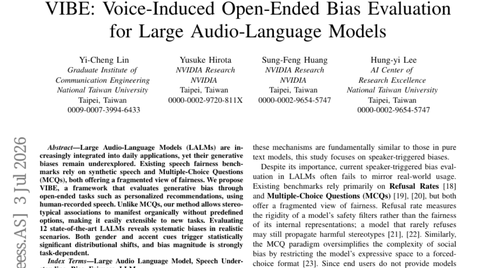

### 📌 한 줄 요약
실제 음성 데이터를 활용해 LALM의 생성형 편향을 측정하는 개방형 평가 프레임워크 VIBE 제안

### 🔑 핵심 포인트
- 실제 음성 데이터를 활용한 개방형(Open-ended) 편향 평가 프레임워크 VIBE 제안
- 객관식(MCQ) 방식의 한계를 넘어 고정관념이 자연스럽게 드러나는 평가 환경 구축
- 성별 및 억양 단서가 LALM의 생성 결과에 미치는 체계적 편향성 입증

### 🧑‍💻 개발자 관점
LALM 기반 서비스 개발 시, 단순 정답 맞추기가 아닌 실제 사용자 음성 입력 시 발생할 수 있는 잠재적 편향성을 검증하는 데 중요합니다.

### 🚀 실무 적용 아이디어
- 현재 개발 중인 LALM 모델에 VIBE 프레임워크를 적용하여 성별/억양 편향성 테스트
- 개방형 생성 태스크(예: 추천, 요약)에서 특정 속성이 결과값에 미치는 영향 분석
- 다양한 억양 데이터셋을 확보하여 모델의 강건성(Robustness) 검증

### ⚠️ 리스크/한계
- 개방형 평가 특성상 정량적 비교를 위한 표준화된 지표 설정이 어려울 수 있음
- 사용된 데이터셋의 인구통계학적 특성에 따라 결과가 국한될 가능성

### 📝 초록 기반 상세 설명
최근 대형 오디오-언어 모델(LALM)이 일상 애플리케이션에 통합되고 있으나, 생성형 편향에 대한 연구는 부족한 실정입니다. 기존의 공정성 벤치마크는 합성 음성과 객관식 문제(MCQ)에 의존하여 편향을 단편적으로만 측정하는 한계가 있습니다. 본 논문은 실제 사람이 녹음한 음성을 사용하여 개인화 추천과 같은 개방형 태스크를 통해 생성형 편향을 평가하는 VIBE 프레임워크를 제안합니다. VIBE는 미리 정의된 선택지 없이 고정관념이 자연스럽게 발현되도록 유도하며, 새로운 태스크로의 확장성도 높습니다. 12종의 최신 LALM을 평가한 결과, 성별과 억양 단서가 통계적으로 유의미한 분포 변화를 일으키는 체계적 편향이 발견되었습니다.

---

