# 2026-07-14 Daily Papers (Top 14)

## 오늘의 요약
오늘의 연구는 에이전트의 장기적 계획 능력과 긴 문맥 활용 능력을 높이는 방법론, 그리고 생성형 모델의 지식을 시각적 인지나 정밀한 예측 태스크로 전이하는 연구들이 주를 이루었습니다. 또한, 모델의 크기를 줄이면서 성능을 유지하는 양자화 기술과 효율적인 사전 학습 프레임워크 등 실무적 효율성을 극대화하는 연구들이 주목받았습니다.

### 오늘의 핵심 포인트
- 생성형 모델의 풍부한 사전 학습 지식을 활용하여 정밀한 시각적 예측이나 범용 시각 지능을 달성하는 새로운 프레임워크들이 제안되었습니다.
- 에이전트와 LLM이 긴 문맥과 복잡한 워크플로우 내에서 핵심 정보를 효과적으로 관리하고 계획을 수행할 수 있는 벤치마크와 학습 기법이 제시되었습니다.
- 초저비트 양자화 및 효율적인 모델 구조 설계를 통해 연산 비용을 최소화하면서도 성능 저하를 방지하는 실무 중심의 최적화 연구가 진행되었습니다.

**오늘의 태그**: AI Agent, Computer Vision, LLM Optimization, Generative Models, Long-Context

## 1. [Long-Horizon-Terminal-Bench: Testing the Limits of Agents on Long-Horizon Terminal Tasks with Dense Reward-Based Grading](https://huggingface.co/papers/2607.08964)
**Upvotes**: 43 | **도입 난이도**: 상 | **신뢰도**: 상
**arXiv**: https://arxiv.org/abs/2607.08964

**태그**: AI Agent, Benchmark, Planning, Software Engineering, Agent, RAG, Multimodal, Evaluation

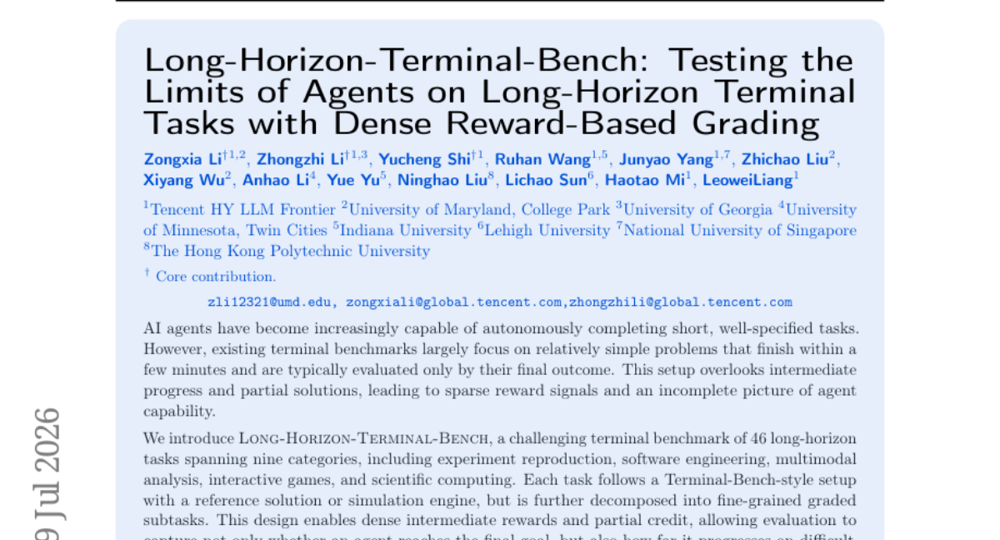

### 📌 한 줄 요약
장기적 계획과 복잡한 워크플로우 수행 능력을 검증하기 위해 설계된 고난도 에이전트 벤치마크 제안

### 🔑 핵심 포인트
- 장기적 계획(Long-horizon)과 긴 컨텍스트 관리가 필요한 46개의 복잡한 태스크 구성
- 최종 결과뿐만 아니라 중간 단계의 진척도를 평가할 수 있는 밀도 높은 보상 체계 도입
- 소프트웨어 엔지니어링, 과학 계산 등 실무 중심의 다양한 도메인 포함

### 🧑‍💻 개발자 관점
단순한 질의응답을 넘어, 실제 개발 환경처럼 수 시간 동안 지속되는 복잡한 워크플로우를 수행하는 에이전트의 성능을 측정하는 데 유용합니다.

### 🚀 실무 적용 아이디어
- 에이전트의 계획 수립 능력을 테스트하기 위해 해당 벤치마크 환경 구축
- 모델의 컨텍스트 윈도우 크기에 따른 작업 완수율 변화 관찰
- 에이전트의 중간 단계 오류 패턴 분석을 통한 디버깅 전략 수립

### ⚠️ 리스크/한계
- 매우 높은 토큰 소모량과 실행 시간으로 인한 높은 컴퓨팅 비용 발생
- 과제 복잡도가 높아 모델 간의 성능 차이를 정밀하게 비교하기 어려울 수 있음

### 📝 초록 기반 상세 설명
기존의 에이전트 벤치마크는 단기 작업과 최종 결과 중심의 평가에 치중되어 있어, 중간 과정의 진척도나 복잡한 워크플로우를 충분히 반영하지 못하는 한계가 있었습니다. 이를 해결하기 위해 9개 카테고리의 46개 장기 과제를 포함하는 'Long-Horizon-Terminal-Bench'를 도입했습니다. 이 벤치마크는 참조 솔루션이나 시뮬레이션을 기반으로 하되, 과제를 세분화된 하위 작업으로 분해하여 밀도 높은 보상(dense reward)을 제공합니다. 실험 결과, 최신 모델들도 매우 낮은 성공률을 보이며 장기 계획과 반복적 디버깅 능력이 여전히 부족함을 입증했습니다. 연구진은 에이전트의 성능 향상을 위해 이 벤치마크를 공개했습니다.

---

## 2. [Scalable Visual Pretraining for Language Intelligence](https://huggingface.co/papers/2607.09657)
**Upvotes**: 40 | **도입 난이도**: 중 | **신뢰도**: 상
**arXiv**: https://arxiv.org/abs/2607.09657

**태그**: Vision-Language, Document-AI, Pretraining, Foundation-Models, RAG, Benchmark

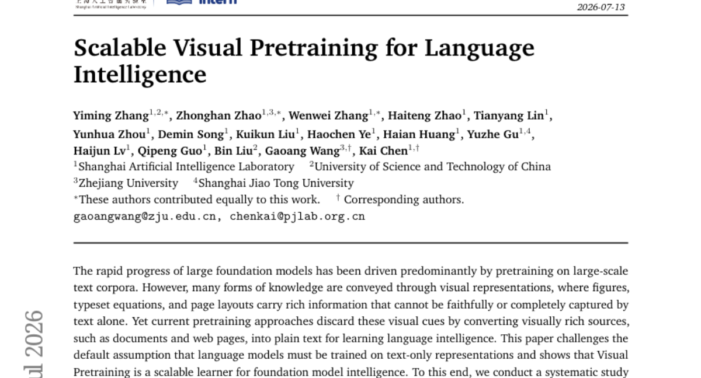

### 📌 한 줄 요약
텍스트 추출 없이 시각적 문서 구조를 직접 학습하여 언어 지능을 높이는 확장 가능한 비주얼 사전 학습 방법론 제시

### 🔑 핵심 포인트
- 텍스트 추출(Text Extraction) 없이 시각적 요소를 직접 활용하는 비지도 학습 패러다임 제안
- 문서 레이아웃, 수식, 도표 등 텍스트로 변환 시 손실되는 시각적 정보의 가치 입증
- 다양한 백본 모델과 벤치마크에서 텍스트 전용 학습 대비 우수한 성능 확인

### 🧑‍💻 개발자 관점
문서 이해(Document AI)나 RAG 시스템 구축 시, 단순 텍스트 추출을 넘어 레이아웃 정보를 보존하는 것이 모델 성능 향상의 핵심임을 시사합니다.

### 🚀 실무 적용 아이디어
- PDF/이미지 기반 데이터셋을 텍스트로 변환하지 않고 직접 입력하는 End-to-End 파이프라인 테스트
- LayoutLM 등 기존 문서 이해 모델과 본 논문의 시각적 사전 학습 방식 성능 비교
- 복잡한 수식이나 표가 포함된 데이터셋에서의 성능 향상 폭 측정

### ⚠️ 리스크/한계
- 시각적 정보 처리를 위한 높은 연산 비용 및 모델 복잡도 증가
- 텍스트 중심의 기존 NLP 태스크로의 전이 학습 시 발생할 수 있는 도메인 차이

### 📝 초록 기반 상세 설명
최근 거대 모델의 발전은 대규모 텍스트 코퍼스 기반의 사전 학습에 의존해 왔습니다. 그러나 기존 방식은 문서 내 수식, 레이아웃, 도표 등 텍스트로 온전히 변환되지 않는 풍부한 시각적 정보를 소실시키는 문제가 있었습니다. 본 논문은 언어 모델이 반드시 텍스트로만 학습되어야 한다는 가설에 의문을 제기하며, 시각적 사전 학습(Visual Pretraining)의 효용성을 입증합니다. 이를 위해 텍스트 추출 과정 없이 시각적 문서를 직접 활용하는 비지도 시각 사전 학습 패러다임을 체계적으로 연구했습니다. 실험 결과, 동일한 코퍼스 내에서 시각적 사전 학습이 텍스트 전용 학습보다 일관되게 우수한 성능을 보였습니다.

---

## 3. [Video Generation Models are General-Purpose Vision Learners](https://huggingface.co/papers/2607.09024)
**Upvotes**: 37 | **도입 난이도**: 상 | **신뢰도**: 상
**arXiv**: https://arxiv.org/abs/2607.09024

**태그**: Video-Generation, Foundation-Model, Computer-Vision, Self-Supervised-Learning, RAG, Vision, Video, Safety

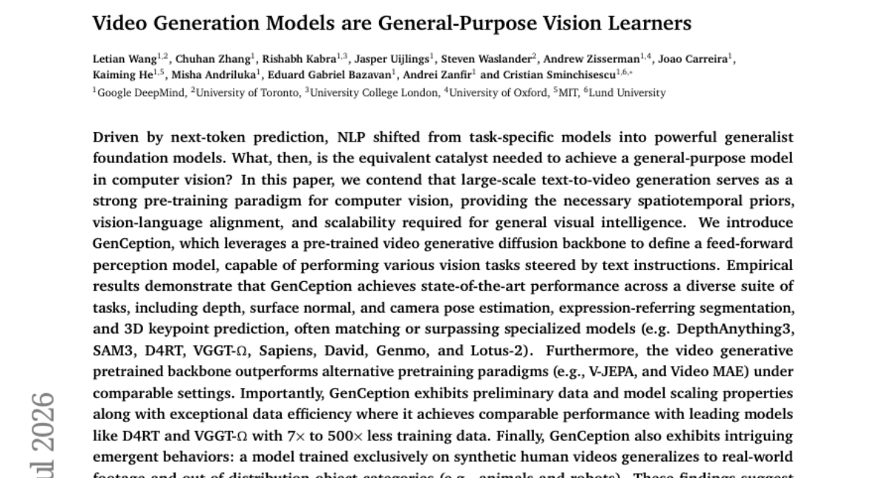

### 📌 한 줄 요약
대규모 비디오 생성 모델을 사전 학습 도구로 활용하여 범용 시각 지능을 달성하는 GenCeption 프레임워크 제안

### 🔑 핵심 포인트
- 비디오 생성 모델을 범용 시각 인지 모델로 전환하는 GenCeption 프레임워크 제안
- 기존의 V-JEPA나 Video MAE보다 우수한 시공간적 사전 학습 효과 입증
- 매우 적은 양의 데이터로도 전문 모델 수준의 성능을 내는 높은 데이터 효율성 및 일반화 능력

### 🧑‍💻 개발자 관점
특정 작업용 모델을 따로 만드는 대신, 강력한 비디오 생성 모델을 기반으로 다양한 시각 태스크를 수행할 수 있는 새로운 학습 경로를 제시합니다.

### 🚀 실무 적용 아이디어
- 제공된 프로젝트 페이지의 데모를 통해 다양한 시각 태스크(Depth, Segmentation 등) 성능 검증
- 합성 데이터 기반 학습이 실세계 데이터로 얼마나 잘 일반화되는지 벤치마크 테스트
- 기존의 특정 작업용 모델(SAM, DepthAnything 등)과 GenCeption의 추론 속도 및 효율성 비교

### ⚠️ 리스크/한계
- 비디오 생성 모델 기반의 거대한 파라미터로 인한 높은 컴퓨팅 자원 요구 가능성
- 합성 데이터와 실세계 데이터 간의 도메인 차이에 따른 잠재적 성능 저하 우려

### 📝 초록 기반 상세 설명
NLP 분야가 차세대 토큰 예측을 통해 범용 모델로 진화했듯, 컴퓨터 비전에서도 이를 가능케 할 촉매제가 필요합니다. 본 논문은 대규모 텍inal-to-video 생성이 시공간적 사전 지식과 시각-언어 정렬을 제공하는 강력한 사전 학습 패러다임임을 주장합니다. 이를 위해 사전 학습된 비디오 생성 확산 모델을 피드포워드 인지 모델로 변환하는 GenCeption을 소개합니다. 실험 결과, GenCeption은 깊이 추정, 세그멘테이션, 3D 키포인트 예측 등 다양한 작업에서 기존 전문 모델들을 능가하거나 대등한 성능을 보였습니다. 또한, 적은 데이터로도 높은 효율성을 보이며 합성 데이터로 학습해도 실세계 데이터로 일반화되는 놀라운 성능을 입증했습니다.

---

## 4. [Trust Region Policy Distillation](https://huggingface.co/papers/2607.04751)
**Upvotes**: 17 | **도입 난이도**: 하 | **신뢰도**: 상
**arXiv**: https://arxiv.org/abs/2607.04751

**태그**: Reinforcement Learning, Knowledge Distillation, Optimization, Reasoning, Distillation

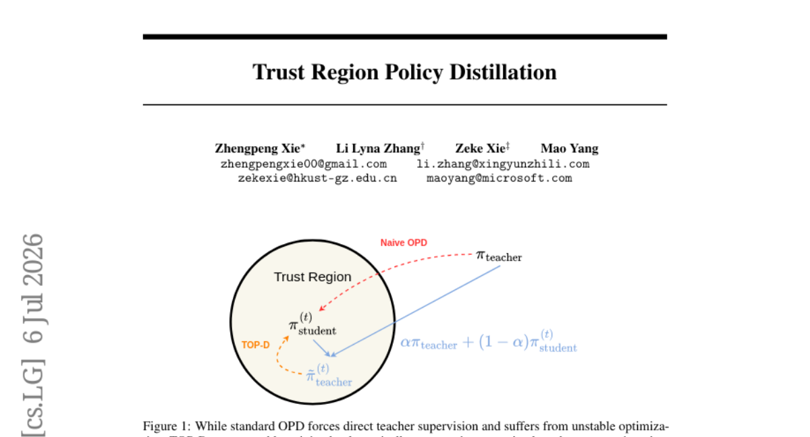

### 📌 한 줄 요약
On-Policy Distillation의 불안정성을 해결하여 연산 비용 증가 없이 학습 안정성과 성능을 극대화한 새로운 증류 기법

### 🔑 핵심 포인트
- 동적 근사 교사(proximal teacher) 구축을 통한 학습 안정성 확보
- 그래디언트 분산 제어 및 단조적 성능 향상에 대한 수학적 증명
- 추가 연산 비용(zero overhead) 없이 샘플 효율성 및 최종 성능 개선

### 🧑‍💻 개발자 관점
모델 학습 시 발생하는 높은 분산 문제를 이론적 근거를 바탕으로 해결하여, 추가 자원 소모 없이 더 안정적인 강화학습/증류 환경을 구축할 수 있습니다.

### 🚀 실무 적용 아이디어
- 기존 OPD 프레임워크에 TOP-D 알고리즘 적용 및 수렴 속도 비교
- 수학적 추론 태스크 외에 일반적인 RL 환경에서의 안정성 테스트
- 학습 스텝에 따른 교사 모델의 동적 변화가 성능에 미치는 영향 분석

### ⚠️ 리스크/한계
- 수학적 추론 태스크 외의 도메인에서의 일반화 성능 검증 필요
- 동적 교사 구축 방식이 특정 하이퍼파라미터에 민감할 가능성

### 📝 초록 기반 상세 설명
기존의 On-Policy Distillation(OPD) 방식은 학습 과정에서 높은 분산과 불안정성이라는 문제를 안고 있었습니다. 이를 해결하기 위해 본 논문은 동적으로 근사 교사(proximal teacher)를 구축하는 Trust Region Policy Distillation(TOP-D)을 제안합니다. 이론적으로는 TOP-D가 그래디언트 분산을 제어하고 단조적 성능 향상을 보장함을 수학적으로 증명했습니다. 실험 결과, TOP-D는 추가적인 연산 오버헤드 없이도 수학적 추론 작업에서 샘플 효율성과 최종 성능을 크게 향상시켰습니다. 결과적으로 TOP-D는 기존 OPD를 대체할 수 있는 안정적이고 효율적인 학습 패러다임을 제시합니다.

---

## 5. [KronQ: LLM Quantization via Kronecker-Factored Hessian](https://huggingface.co/papers/2607.07964)
**Upvotes**: 14 | **도입 난이도**: 중 | **신뢰도**: 상
**arXiv**: https://arxiv.org/abs/2607.07964

**태그**: LLM, Quantization, PTQ, Optimization

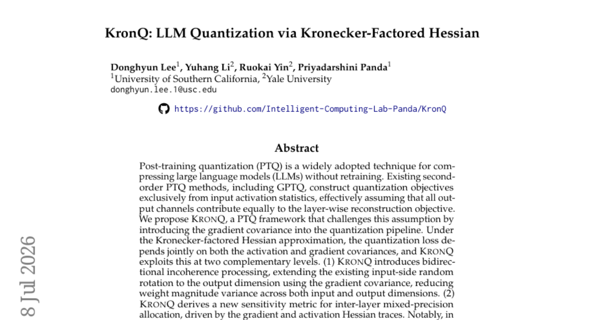

### 📌 한 줄 요약
그래디언트 공분산을 활용하여 초저비트(2-bit) 양자화에서도 모델 성능 저하를 최소화하는 새로운 PTQ 프레임워크

### 🔑 핵심 포인트
- 그래디언트 공분산을 도입하여 입력과 출력 차원 모두를 고려한 양자화 최적화
- 양방향 비일관성 처리(Bidirectional Incoherence Processing)를 통한 가중치 크기 분산 감소
- 그래디언트 및 활성화 헤시안 트레이스 기반의 정교한 혼합 정밀도(Mixed-precision) 할당

### 🧑‍💻 개발자 관점
모델의 크기를 극단적으로 줄이면서도(2-bit) 성능 붕괴 없이 실무에 적용 가능한 수준의 정밀도를 확보할 수 있는 기술적 토대를 제공합니다.

### 🚀 실무 적용 아이디어
- LLaMA-3와 같은 최신 모델에 GPTQ와 KronQ의 2-bit 성능 비교 실험
- 제안된 혼합 정밀도 할당 알고리즘의 연산 오버헤드 측정
- 다양한 데이터셋(WikiText-2 외)에서의 일반화 성능 검증

### ⚠️ 리스크/한계
- Hessian 근사 및 그래디언트 계산에 따른 추가적인 연산 비용 발생 가능성
- 초저비트 환경에 특화된 기법으로, 고비트 양자화에서의 상대적 이점 불분명

### 📝 초록 기반 상세 설명
LLM 압축을 위한 Post-training quantization(PTQ)은 기존에 입력 활성화 통계에만 의존하여 출력 채널 간의 차이를 간과하는 경향이 있었습니다. 본 논문은 그래디언트 공분산을 양자화 파이프라인에 도입하여 기존 방식의 한계를 극복하는 KronQ를 제안합니다. Kronecker-factored Hessian 근사를 바탕으로 입력과 출력 차원 모두에서 가중치 크기 분산을 줄이는 양방향 비일관성 처리 기법을 도입했습니다. 또한, 그래디언트와 활성화 헤시안 트레이스를 결합한 새로운 민감도 지표를 통해 레이어별 혼합 정밀도 할당을 수행합니다. 실험 결과, LLaMA-3-70B 모델의 2-bit 양자화 환경에서 기존 방식들이 성능 붕괴를 보이는 것과 달리 매우 낮은 perplexity를 달성했습니다.

### 🖼️ 추가 자료

---

## 6. [From RGB Generation to Dense Field Readout: Pixel-Space Dense Prediction with Text-to-Image Models](https://huggingface.co/papers/2607.06553)
**Upvotes**: 9 | **도입 난이도**: 하 | **신뢰도**: 상
**arXiv**: https://arxiv.org/abs/2607.06553

**태그**: Computer Vision, Generative Models, Dense Prediction, Efficient AI, Vision, Benchmark, Evaluation

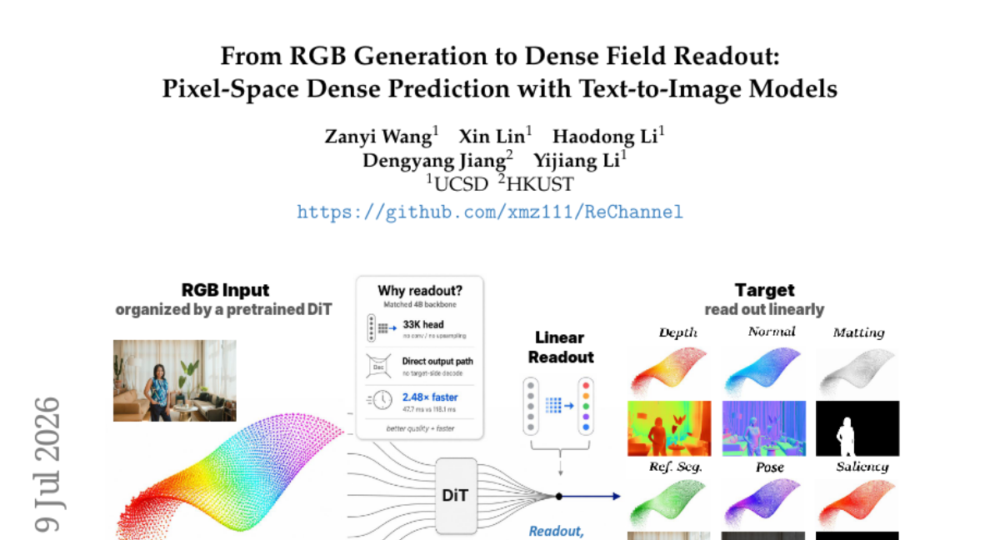

### 📌 한 줄 요약
생성형 모델의 잠재 공간을 활용하되, RGB 생성 인터페이스를 탈피하여 픽셀 단위의 정밀한 밀집 예측(Dense Prediction)을 수행하는 효율적인 프레임워크 제안

### 🔑 핵심 포인트
- 생성형 모델의 풍부한 사전 학습 지식을 유지하면서도 RGB 생성 인터페이스(Decoder)를 제거한 효율적 구조 설계
- DiT의 패치-토큰 구조를 활용하여 각 토큰이 특정 픽셀 영역의 태스크 전용 값을 직접 출력하도록 매핑
- LoRA와 최소한의 파라미터(33K)를 사용하여 연산 효율성과 정밀도를 동시에 확보

### 🧑‍💻 개발자 관점
거대한 생성 모델을 무거운 디코더 없이 가벼운 헤드만으로 변환하여 실시간에 가까운 고성능 비전 태스크를 수행할 수 있는 방법론을 제시합니다.

### 🚀 실무 적용 아이디어
- FLUX와 같은 최신 DiT 모델에 LoRA를 적용하여 특정 밀집 예측 태스크(예: Depth) 성능 테스트
- 기존의 VAE 디코딩 방식과 제안된 ReChannel 방식 간의 추론 속도 및 픽셀 정밀도 비교 실험
- 다양한 해상도 환경에서 패치 기반 매핑의 정렬(Alignment) 정확도 검증

### ⚠️ 리스크/한계
- 패치 단위 매핑 방식이므로 매우 미세한 픽셀 경계에서의 정밀도가 해상도에 따라 제한될 수 있음
- 사전 학습된 DiT의 패치 크기와 타겟 해상도 간의 관계 설정이 복잡할 수 있음

### 📝 초록 기반 상세 설명
기존의 텍스트-이미지 모델을 활용한 밀집 예측 방식은 정답 데이터를 RGB 잠재 공간에 인코딩한 후 다시 디코딩하는 방식을 사용하여 생성용 인터페이스에 의존하는 한계가 있었습니다. 본 논문은 밀집 예측이 새로운 RGB 콘텐츠 생성이 아닌, 입력 이미지 평면상의 픽셀 단위 값을 요구한다는 점에 주목합니다. 제안하는 ReChannel 방식은 사전 학습된 DiT의 패치 구조를 활용하여, 각 토큰이 특정 픽셀 영역의 태스크별 값을 직접 출력하도록 설계되었습니다. 이를 위해 VAE 디코더를 제거하고, LoRA를 통한 미세 조정과 가벼운 선형 헤드만을 사용하여 토큰을 픽셀 패치로 매핑합니다. 실험 결과, Matting, Depth, Segmentation 등 다양한 태스크에서 SOTA를 달성하며 기존 방식보다 2.48배 빠른 속도와 높은 정확도를 입증했습니다.

---

## 7. [PanoWorld: Real-World Panoramic Generation](https://huggingface.co/papers/2607.09661)
**Upvotes**: 7 | **도입 난이도**: 상 | **신뢰도**: 상
**arXiv**: https://arxiv.org/abs/2607.09661

**태그**: WorldModel, Panoramic, ComputerVision, Robotics, Video, Evaluation

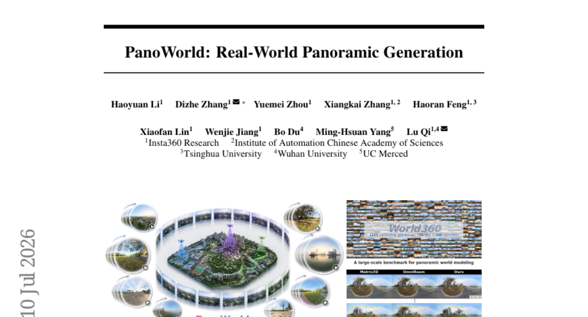

### 📌 한 줄 요약
회전 불변성을 활용하여 장거리 메모리 문제를 해결한 실세계 파노라마 월드 모델 생성 기술

### 🔑 핵심 포인트
- 회전 불변성을 이용해 카메라 궤적을 평행 이동 문제로 단순화하여 기하학적 복잡도 감소
- DPRC 및 GMA를 통한 장거리 메모리 및 공간적 일관성 확보
- 실세계 드론 영상과 고품질 시뮬레이션이 결합된 대규모 데이터셋 World360 구축

### 🧑‍💻 개발자 관점
로봇이나 드론의 자율 주행을 위한 360도 시각적 환경 생성 및 공간 이해 모델 개발에 직접적인 영감을 제공합니다.

### 🚀 실무 적용 아이디어
- 제공된 World360 데이터셋을 활용한 시각적 일관성 벤치마크 테스트
- DPRC/GMA 모듈을 기존 3D 생성 모델에 이식하여 메모리 성능 변화 관찰
- 실제 드론/VR 환경에서의 궤적 생성 성능 검증

### ⚠️ 리스크/한계
- 복잡한 카메라 움직임이 포함된 실제 환경에서의 일반화 성능 검증 필요
- 대규모 데이터셋과 고성능 연산 자원 요구

### 📝 초록 기반 상세 설명
기존 파노라마 월드 모델은 장거리 메모리 유지와 공간적 일관성 유지에 어려움이 있었습니다. 본 논문은 전방향 표현의 회전 불변(rotation-equivariant) 특성을 활용하여 카메라 궤적을 단순 이동(translation) 문제로 변환하는 방식을 제안합니다. 이를 위해 Dense Panoramic Ray-Conditioning(DPRC)과 Geometry-aware Memory Augmentation(GMA)을 통해 장거리 메모리 문제를 해결하는 PanoWorld 모델을 구축했습니다. 또한, 실세계 드론 영상과 시뮬레이션 데이터를 결합한 대규모 데이터셋인 World360을 구축하여 평가를 진행했습니다. 실험 결과, PanoWorld는 기존 방식 대비 물리적 일관성과 공간적 변동성 측면에서 압도적인 성능을 보였습니다.

---

## 8. [Self-Guided Test-Time Training for Long-Context LLMs](https://huggingface.co/papers/2607.09415)
**Upvotes**: 7 | **도입 난이도**: 중 | **신뢰도**: 상
**arXiv**: https://arxiv.org/abs/2607.09415

**태그**: LLM, Long-Context, Test-Time Training, Fine-tuning, Reasoning, Benchmark

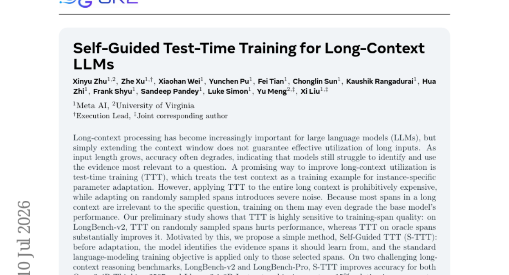

### 📌 한 줄 요약
질문과 관련된 핵심 구간만 선별하여 학습하는 Self-Guided TTT를 통해 긴 문맥 활용 능력을 극대화함

### 🔑 핵심 포인트
- 질문 관련 핵심 구간을 선별하여 학습하는 Self-Guided TTT(S-TTT) 방법론 제안
- 무작위 구간 학습 시 발생하는 성능 저하(Noise) 문제를 해결
- 적은 비용으로 긴 문맥 내 핵심 증거를 효과적으로 활용하는 적응형 학습 방식

### 🧑‍💻 개발자 관점
긴 문서를 다루는 RAG나 에이전트 시스템에서 모델이 불필요한 정보에 휘둘리지 않고 핵심 정보만 학습하여 추론 성능을 높이는 데 유용합니다.

### 🚀 실무 적용 아이디어
- LongBench와 같은 긴 문맥 벤치마크에서 S-TTT의 구간 선택 정확도 검증
- 특정 도메인(법률, 의료 등)의 긴 문서에 대해 S-TTT를 적용하여 성능 향상 폭 확인
- 기존 RAG 방식과 S-TTT 기반의 Test-time 학습 간의 비용 대비 효율성 비교

### ⚠️ 리스크/한계
- 초기 구간 선택(Selection) 단계에서 잘못된 구간이 선택될 경우 성능 저하 위험
- 추론 시점에 추가적인 학습 단계가 필요하므로 추론 지연 시간(Latency) 발생

### 📝 초록 기반 상세 설명
LLM의 컨텍스트 윈도우가 확장되어도 긴 입력 데이터에서 핵심 정보를 식별하는 능력은 여전히 부족합니다. 기존의 Test-Time Training(TTT) 방식은 전체 컨텍스트를 학습하기에는 비용이 너무 크고, 무작위 구간 학습 시 노이즈로 인해 성능이 저하되는 문제가 있습니다. 본 논문은 모델이 스스로 학습할 증거 구간을 먼저 식별하는 Self-Guided TTT(S-TTT) 방식을 제안합니다. S-TTT는 질문과 관련된 유효한 구간에만 언어 모델링 학습을 적용하여 노이즈를 최소화합니다. 실험 결과, LongBench-v2 및 LongBench-Pro 벤치마크에서 기존 모델들의 정확도를 최대 15%까지 향상시켰습니다.

---

## 9. [Towards Mechanistically Understanding Why Memorized Knowledge Fails to Generalize in Large Language Model Finetuning](https://huggingface.co/papers/2607.08393)
**Upvotes**: 6 | **도입 난이도**: 중 | **신뢰도**: 상
**arXiv**: https://arxiv.org/abs/2607.08393

**태그**: LLM, Fine-tuning, Mechanistic Interpretability, Knowledge Injection, Reasoning, Safety

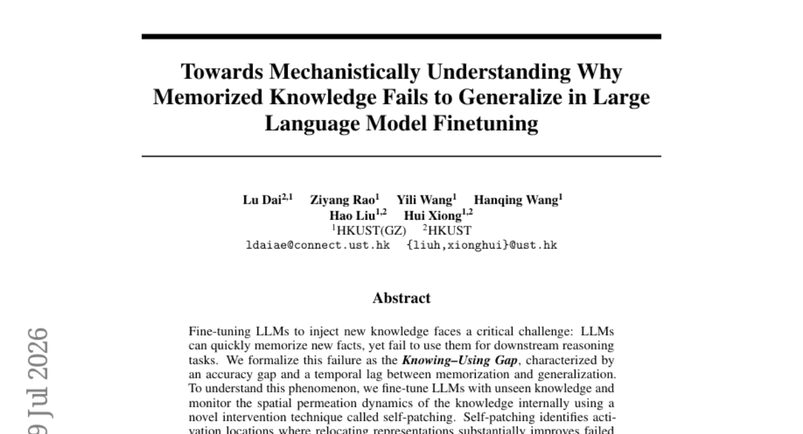

### 📌 한 줄 요약
LLM 파인튜닝 시 새로운 지식이 저장(Memorization)은 되지만 추론(Generalization)에 활용되지 않는 'Knowing-Using Gap' 현상의 원인을 규명하고 해결책을 제시함

### 🔑 핵심 포인트
- 지식 암기와 추론 활용 사이의 격차를 정의한 'Knowing-Using Gap' 개념 도입
- Self-patching 기법을 통한 모델 내부 지식 표현의 공간적 전파 역학 분석
- 지식 회로 불일치(knowledge-circuit misalignment) 가설 검증 및 해결 전략 제시

### 🧑‍💻 개발자 관점
파인튜닝을 통해 지식을 주입했음에도 모델이 이를 활용하지 못할 때, 단순 데이터 부족이 아닌 모델 내부의 라우팅 문제일 수 있음을 시사합니다.

### 🚀 실무 적용 아이디어
- 파인튜닝 후 지식 암기 성능과 추론 성능 간의 격차(Gap)를 정량적으로 측정해보기
- 특정 지식이 모델의 어느 레이어에서 활성화되는지 시각화/분석 도구 적용해보기
- 학습된 지식이 추론 단계에서 적절한 레이어로 전달되는지 확인하기 위한 프로빙(Probing) 실험 수행

### ⚠️ 리스크/한계
- 제시된 휴리스틱 전략이 모든 도메인이나 모델 크기에서 동일한 효과를 보장하지 않을 수 있음
- 모델 내부의 복잡한 회로를 직접 수정하는 방식은 모델의 다른 능력을 저해할 위험이 있음

### 📝 초록 기반 상세 설명
LLM에 새로운 지식을 주입하는 파인튜닝 과정에서 지식은 암기되지만 추론 작업에는 활용되지 않는 문제가 발생합니다. 연구진은 이를 정확도 격차와 시간적 지연이 발생하는 'Knowing-Using Gap'으로 정의했습니다. 이를 분석하기 위해 'self-patching'이라는 새로운 개입 기법을 사용하여 모델 내부의 지식 전파 역학을 모니터링했습니다. 분석 결과, 암기된 지식이 내부에는 존재하지만 연산 효율이 높은 레이어로 라우팅되지 않는 '지식 회로 불일치(knowledge-circuit misalignment)' 현상을 발견했습니다. 이를 바탕으로 설계한 휴리스틱 전략은 일반화 실패 사례의 상당 부분을 복구하는 성과를 보였습니다.

---

## 10. [Flow-ERD: Agent-type Aware Flow Matching with Entropy-Regularized Distillation for Diverse Traffic Simulation](https://huggingface.co/papers/2607.06957)
**Upvotes**: 4 | **도입 난이도**: 중 | **신뢰도**: 상
**arXiv**: https://arxiv.org/abs/2607.06957

**태그**: Autonomous Driving, Multi-Agent, Flow Matching, Traffic Simulation, Agent, Benchmark, Evaluation, Distillation

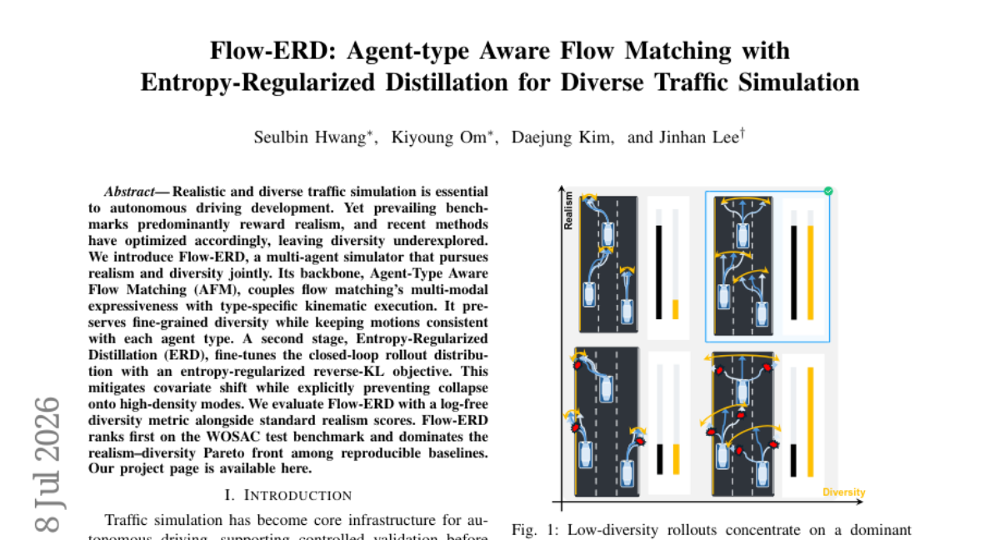

### 📌 한 줄 요약
에이전트 유형별 물리 제약과 엔트로피 정규화를 결합하여 현실성과 다양성을 동시에 확보한 멀티 에이전트 교통 시뮬레이터

### 🔑 핵심 포인트
- Agent-Type Aware Flow Matching(AFM): 에이전트 유형별 운동학적 특성을 유지하면서도 풍부한 움직임 다양성 확보
- Entropy-Regularized Distillation(ERD): 엔트로피 정규화를 통해 특정 모드로의 붕괴를 막고 시나리오 다양성 극대화
- 현실성과 다양성의 균형: 기존 벤치마크의 한계를 넘어 현실적인 움직임과 예측 불가능한 시나리오를 동시에 구현

### 🧑‍💻 개발자 관점
자율주행 모델 학습 시 발생할 수 있는 데이터 편향을 방지하고, 더 복잡하고 다양한 엣지 케이스(edge case)를 시뮬레이션 환경에서 생성할 수 있습니다.

### 🚀 실무 적용 아이디어
- 제시된 AFM과 ERD 구조를 기존의 생성형 교통 모델에 결합하여 다양성 변화 측정
- 에이전트 유형(보행자, 차량, 자전거 등)에 따른 운동학적 제약 조건의 영향도 분석
- 폐루프 시뮬레이션 환경에서의 분포 붕괴(Mode Collapse) 발생 여부 모니터링

### ⚠️ 리스크/한계
- 에이전트 유형이 복잡해질수록 운동학적 제약 조건 설계 및 최적화 난이도 상승
- 엔트로피 정규화로 인해 현실성이 지나치게 희생될 가능성 존재

### 📝 초록 기반 상세 설명
자율주행 개발을 위해 현실적이고 다양한 교통 시뮬레이션이 필수적이지만, 기존 방식은 현실성 확보에 치중하여 시나리오의 다양성이 부족한 문제가 있었습니다. 본 논문은 현실성과 다양성을 동시에 추구하는 Flow-ERD 프레임워크를 제안합니다. 핵심 방법론인 Agent-Type Aware Flow Matching(AFM)은 Flow Matching의 다중 모드 표현력에 에이전트별 운동학적 제약을 결합하여 유형별 일관성을 유지합니다. 이어지는 Entropy-Regularized Distillation(ERD) 단계는 엔트로피 정규화 기반의 역-KL 목적 함수를 통해 분포 붕괴를 방지하고 폐루프(closed-loop) 환경에서의 공변량 변화 문제를 완화합니다. 실험 결과, Flow-ERD는 WOSAC 벤치마크에서 1위를 기록하며 현실성과 다양성 사이의 파레토 최적을 달성했습니다.

---

## 11. [Phone Segmentation and Recognition through Phonological Activation Mapping](https://huggingface.co/papers/2607.09020)
**Upvotes**: 2 | **도입 난이도**: 하 | **신뢰도**: 상
**arXiv**: https://arxiv.org/abs/2607.09020

**태그**: Speech-Processing, Self-Supervised-Learning, Phonetics, Efficient-Learning, RAG

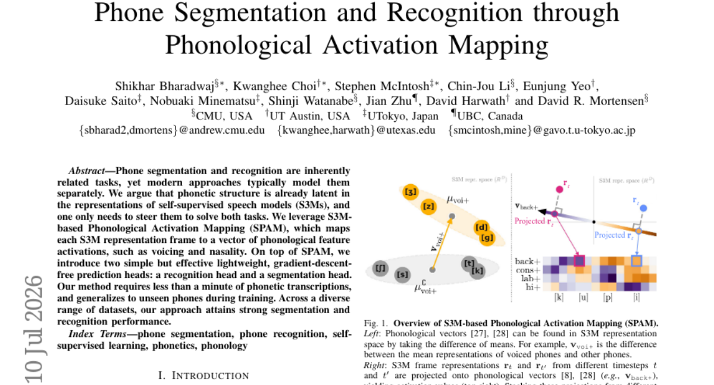

### 📌 한 줄 요약
자기자기지도 학습 모델의 잠재적 음소 특징을 활용하여 최소한의 데이터로 음소 분할과 인식을 동시에 수행하는 효율적인 프레임워크

### 🔑 핵심 포인트
- S3M의 잠재적 음소 구조를 활용하는 Phonological Activation Mapping(SPAM) 기법 제안
- 경사 하강법 없이 동작하는 가벼운 인식 및 분할 예측 헤드 설계
- 매우 적은 양의 데이터로도 높은 성능을 내는 효율적인 학습 방식 및 일반화 능력

### 🧑‍💻 개발자 관점
데이터 라벨링 비용이 큰 음성 작업에서 최소한의 전사 데이터만으로 고성능 모델을 구축할 수 있는 실용적인 방법론을 제시합니다.

### 🚀 실무 적용 아이디어
- 사전 학습된 S3M 모델(Wav2Vec 2.0 등)에 SPAM 프레임워크 적용 테스트
- 매우 적은 양의 데이터셋(Few-shot) 환경에서 성능 변화 관찰
- 미학습 음소(Unseen phones)에 대한 일반화 성능 벤치마크 수행

### ⚠️ 리스크/한계
- S3M 모델의 성능에 결과값이 크게 의존할 가능성
- 매우 복잡한 음향 환경에서의 강건성 검증 필요

### 📝 초록 기반 상세 설명
음소 분할과 인식은 밀접하게 연관되어 있음에도 기존 방식은 이를 별개의 작업으로 처리하는 경향이 있습니다. 본 논문은 자기자기지도 음성 모델(S3M)의 표현 내에 이미 음소 구조가 잠재되어 있다는 점에 주목합니다. 이를 위해 S3M의 각 프레임을 음성학적 특징(유성음, 비음 등) 벡터로 매핑하는 SPAM 방식을 제안합니다. 여기에 경사 하강법이 필요 없는 가벼운 인식 및 분할 헤드를 결합하여 두 작업을 동시에 해결합니다. 실험 결과, 매우 적은 양의 전사 데이터만으로도 높은 성능을 보였으며 미학습 음소에 대해서도 우수한 일반화 성능을 입증했습니다.

---

## 12. [MedPMC: A Systematic Framework for Scaling High-Fidelity Medical Multimodal Data for Foundation Models](https://huggingface.co/papers/2607.07673)
**Upvotes**: 2 | **도입 난이도**: 중 | **신뢰도**: 상
**arXiv**: https://arxiv.org/abs/2607.07673

**태그**: Multimodal, Data Engineering, Medical AI, Foundation Models, RAG, Vision, Benchmark, Evaluation, Safety

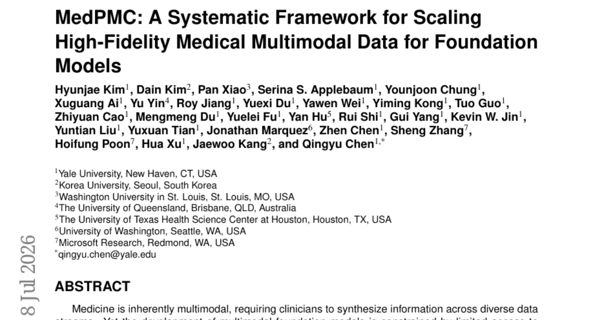

### 📌 한 줄 요약
대규모 PMC 문헌을 활용해 고품질 의료 멀티모달 데이터셋을 자동 구축하는 프레임워크 MedPMC 제안

### 🔑 핵심 포인트
- 610만 개의 PMC 논문에서 1,100만 개의 고품질 이미지-텍스트 쌍을 추출하는 자동화 프레임워크 개발
- 기존 PMC 기반 데이터셋 대비 의료 관련성(95.3%)을 획기적으로 높인 정밀 큐레이션 기술
- 적은 데이터 양으로도 기존 SOTA 모델보다 높은 제로샷 및 VQA 성능 달성

### 🧑‍💻 개발자 관점
데이터 부족 문제를 해결하기 위해 공개된 학술 문헌을 정밀하게 파싱하여 학습용 데이터로 변환하는 파이프라인 구축 방법론을 제시합니다.

### 🚀 실무 적용 아이디어
- 제공된 MedPMC 프레임워크를 활용해 특정 의학 분야의 커스텀 데이터셋 구축 실험
- 추출된 이미지-텍스트 쌍을 활용한 CLIP 기반 멀티모달 모델 파인튜닝
- 기존 의료 데이터셋과 MedPMC 데이터셋의 정밀도 및 도메인 적합성 비교 테스트

### ⚠️ 리스크/한계
- 학술지에 게재된 이미지가 실제 임상 현장의 데이터와는 차이가 있을 수 있음
- 자동화된 추출 과정에서의 미세한 정렬 오류 가능성

### 📝 초록 기반 상세 설명
의료 분야는 다양한 데이터 스트림을 통합하는 멀티모달 능력이 필수적이지만, 고품질 임상 데이터 확보가 어렵다는 제약이 있습니다. 기존의 PubMed Central(PMC) 기반 데이터는 신뢰도와 재현성 측면에서 한계가 있었습니다. 본 논문은 허가된 문헌을 고정밀 의료 데이터로 변환하는 자동화된 프레임워크인 MedPMC를 소개합니다. 610만 개의 PMC 논문을 통해 1,100만 개의 의료 이미지-텍스트 쌍을 구축하였으며, 검증 결과 기존 데이터셋 대비 압도적인 의료 관련성을 확보했습니다. 이를 통해 학습된 모델은 제로샷 성능 및 의료 시각 질의응답(VQA) 등 다양한 벤치마크에서 기존 베이스라인을 크게 상회하는 성능을 보였습니다.

---

## 13. [A Sovereign, Open-Source Foundation Model for German and English](https://huggingface.co/papers/2607.09424)
**Upvotes**: 1 | **도입 난이도**: 중 | **신뢰도**: 상
**arXiv**: https://arxiv.org/abs/2607.09424

**태그**: LLM, MoE, Mamba, OpenSource, NLP, Benchmark, Evaluation, Inference

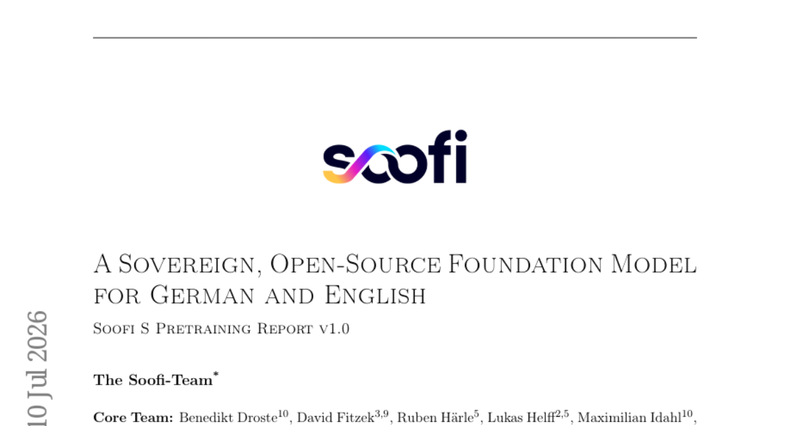

### 📌 한 줄 요약
독일어와 영어에 특화된 고성능 오픈소스 MoE-Mamba 하이브리드 모델로, 긴 컨텍스트 환경에서 압도적인 추론 효율성을 제공합니다.

### 🔑 핵심 포인트
- MoE와 Mamba 구조를 결합하여 컨텍스트 길이에 관계없이 일정한 추론 캐시와 높은 처리량(Throughput) 확보
- 독일어/영어 특화 데이터 학습을 통해 유럽 기반 모델 중 최고 수준의 성능 및 코드 생성 능력 달성
- 가중치, 체크포인트, 데이터 계정, 학습 코드를 포함한 완전한 오픈소스 및 투명한 공개 정책

### 🧑‍💻 개발자 관점
긴 문맥을 다루는 서비스에서 낮은 지연 시간과 높은 처리량을 유지하면서도 강력한 언어/코드 성능을 확보할 수 있습니다.

### 🚀 실무 적용 아이디어
- 제공된 가중치를 활용하여 긴 컨텍스트 환경에서의 추론 속도 및 메모리 사용량 벤치마크 수행
- 독일어 및 영어 코드 생성 작업에 대한 성능 검증
- MoE-Mamba 하이브리드 구조의 효율성이 실제 프로덕션 환경에서 어떻게 작동하는지 테스트

### ⚠️ 리스크/한계
- 특정 언어(독일어/영어)에 최적화되어 있어 타 언어 확장 시 성능 저하 가능성
- MoE 구조 특성상 모델 전체 크기 대비 활성 파라미터가 적어 하드웨어 메모리 요구사항은 여전히 높을 수 있음

### 📝 초록 기반 상세 설명
기존의 밀집형(Dense) 모델은 긴 컨텍스트 처리 시 추론 캐시 증가와 연산 비용 문제가 발생합니다. 이를 해결하기 위해 30B 파라미터 중 3B만 활성화하는 MoE와 Mamba 구조를 결합한 Soofi S 모델을 제안합니다. 27조 개의 토큰을 활용해 독일어와 영어 성능을 극대화하며, 특히 코드 생성 능력에서 탁월한 성과를 보입니다. 실험 결과, 기존의 대규모 유럽 모델들을 능가하며 오픈소스 모델 중 최고 수준의 벤치마크 점수를 기록했습니다. 이 모델은 독일 산업용 AI 클라우드에서 구축되었으며, 가중치와 학습 코드를 포함한 투명한 오픈소스 방식으로 공개됩니다.

---

## 14. [VaseMuseum: Digital Intelligent Museum for Ancient Greek Pottery](https://huggingface.co/papers/2607.06374)
**Upvotes**: 1 | **도입 난이도**: 중 | **신뢰도**: 상
**arXiv**: https://arxiv.org/abs/2607.06374

**태그**: Agent, RAG, Multimodal, Hallucination, Reasoning, Vision, Evaluation, Inference

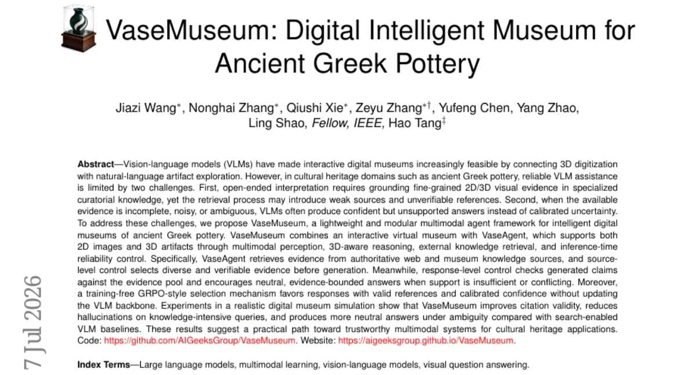

### 📌 한 줄 요약
전문 지식 기반의 검증 가능한 근거를 제공하는 고대 그리스 도자기 특화 멀티모달 에이전트 프레임워크 개발

### 🔑 핵심 포인트
- 전문 지식 소스 기반의 검증 가능한 근거 추출 및 소스 수준 제어 메커니즘
- 생성된 답변과 근거 간의 일치성을 확인하는 응답 수준의 신뢰도 제어
- 모델 재학습 없이 유효한 참조와 신뢰도 높은 답변을 선택하는 GRPO 스타일 메커니즘

### 🧑‍💻 개발자 관점
RAG 시스템 구축 시 전문 지식의 출처를 명확히 하고, 정보 부족 시 모델이 억지로 답변하지 않도록 제어하는 실무적 프레임워크를 제공합니다.

### 🚀 실무 적용 아이디어
- 제공된 소스(Source)와 생성된 답변 간의 일치도를 측정하는 평가 파이프라인 구축
- 학습 없이 추론 시점에 동작하는 선택 메커니즘(Selection Mechanism)의 성능 테스트
- 도메인 특화 지식(Curatorial Knowledge)을 RAG로 연결하는 모듈형 구조 설계

### ⚠️ 리스크/한계
- 특정 도메인(고대 유물)에 특화되어 있어 일반적인 범용 지식 검색 시 성능 차이 발생 가능
- 외부 지식 소스의 신뢰도에 따라 전체 시스템의 답변 품질이 종속될 위험

### 📝 초록 기반 상세 설명
디지털 박물관에서 3D 유물과 자연어 탐색을 연결하는 VLM 기술이 발전하고 있으나, 전문적인 큐레이터 지식과의 결합 및 불완전한 정보 상황에서의 환각(Hallucination) 문제가 존재합니다. 이를 해결하기 위해 본 논문은 가볍고 모듈화된 멀티모달 에이전트 프레임워크인 VaseMuseum을 제안합니다. VaseAgent는 외부 지식 검색과 소스 수준의 제어, 그리고 생성된 답변을 근거와 대조하는 응답 수준의 제어 메커니즘을 결합합니다. 특히 모델 백본을 업데이트하지 않는 학습 없는 GRPO 스타일의 선택 메커니즘을 통해 신뢰도 높은 답변을 유도합니다. 실험 결과, VaseMuseum은 기존 검색 기반 VLM 대비 인용의 유효성을 높이고 지식 집약적 질의에서의 환각을 효과적으로 줄였습니다.

---

