# 2026-07-21 Daily Papers (Top 22)

## 오늘의 요약
오늘의 연구들은 대규모 모델의 연산 효율성을 극대화하면서도 추론 능력을 확보하는 아키텍처 설계와 데이터 중심의 에이전트 학습 방법론에 집중되었습니다. 특히 단순한 텍스트를 넘어 멀티모달 자원과 실세계 데이터를 활용해 실행 가능한 스킬을 추출하거나, 효율적인 지식 그래프 및 추천 시스템을 구축하는 실무적 접근이 돋보였습니다.

### 오늘의 핵심 포인트
- 모델의 깊이와 너비를 넘어 잔차 스트림 확장이나 루프 구조 최적화를 통해 연산 효율과 성능을 동시에 잡는 새로운 스케일링 방법론이 제시되었습니다.
- 단순한 질의응답을 넘어 도구 사용, 데이터 관리, 실세계 조작 등 실제 워크플로우를 수행할 수 있는 에이전트형 모델 개발이 가속화되고 있습니다.
- 지식 그래프 구축, 추천 시스템, 지식 증류 등에서 데이터 품질 확보와 추론 비용 절감을 위한 모듈형 및 효율적 학습 전략이 핵심 과제로 다뤄졌습니다.

**오늘의 태그**: AI Agent, Efficient Scaling, Multimodal, LLM Optimization

## 1. [RESOURCE2SKILL: Distilling Executable Agent Skills from Human-Created Multimodal Resources](https://huggingface.co/papers/2606.29538)
**Upvotes**: 111 | **도입 난이도**: 상 | **신뢰도**: 상
**arXiv**: https://arxiv.org/abs/2606.29538

**태그**: AI Agent, Multimodal, Skill Extraction, Automation, Agent, RAG, Video, Inference, Distillation

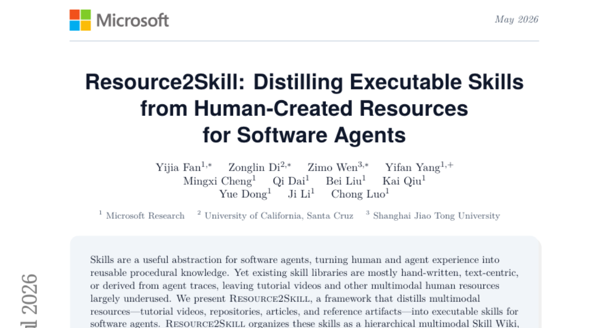

### 📌 한 줄 요약
튜토리얼 영상, 코드, 문서 등 멀티모달 자원을 실행 가능한 에이전트 스킬로 변환하는 프레임워크 제안

### 🔑 핵심 포인트
- 멀티모달 자원(영상, 코드, 문서)을 활용한 실행 가능한 에이전트 스킬 추출 프레임워크 개발
- 텍스트, 코드, 시각적 요소를 결합한 계층적 'Skill Wiki' 구조 설계
- 검색, 조합 및 온라인 습득이 가능한 동적 스킬 관리 메커니즘

### 🧑‍💻 개발자 관점
단순 텍스트 RAG를 넘어 영상과 코드를 결합한 풍부한 지식 베이스를 에이전트의 실행 로직으로 전환하는 실질적인 방법론을 제시합니다.

### 🚀 실무 적용 아이디어
- 기존의 텍스트 기반 RAG 에이전트에 코드/이미지 요소를 결합한 스킬 포맷 적용 실험
- 유튜브 튜토리얼 등 영상 데이터를 스텝별 실행 코드로 변환하는 파이프라인 구축 테스트
- 계층적 스킬 구조가 에이전트의 복합 작업 수행 능력에 미치는 영향 분석

### ⚠️ 리스크/한계
- 멀티모달 데이터(특히 영상)에서 정확한 실행 코드를 추출할 때 발생하는 노이즈 및 오류 가능성
- 스킬 라이브러리가 커짐에 따라 발생하는 검색 및 조합 복잡도 증가 문제

### 📝 초록 기반 상세 설명
소프트웨어 에이전트의 스킬 라이브러리는 주로 수동 작성이나 텍istic 텍스트 중심에 머물러 있어, 풍부한 멀티모달 자원을 활용하지 못하는 한계가 있습니다. 본 논문은 튜토리얼 영상, 코드 저장소, 아티클 등을 활용해 실행 가능한 스킬을 추출하는 RESOURCE2SKILL 프레임워크를 제안합니다. 이 프레임워크는 텍스트, 코드, 시각적 예시를 결합한 계층적 'Skill Wiki' 구조를 통해 각 자원의 상호 보완적 신호를 보존합니다. 에이전트는 추론 시 위키에서 스킬을 검색 및 조합하며, 필요시 온라인으로 새로운 스킬을 습득할 수 있습니다. 실험 결과, 다양한 도메인에서 기존 방식보다 높은 성능 향상을 입증하며 멀티모달 스킬 포맷과 계층적 구조의 효용성을 확인했습니다.

---

## 2. [RAGU: A Multi-Step GraphRAG Engine with a Compact Domain-Adapted LLM](https://huggingface.co/papers/2607.11683)
**Upvotes**: 107 | **도입 난이도**: 하 | **신뢰도**: 상
**arXiv**: https://arxiv.org/abs/2607.11683

**태그**: GraphRAG, LLM, Knowledge-Graph, Efficiency, RAG, Reasoning, Evaluation

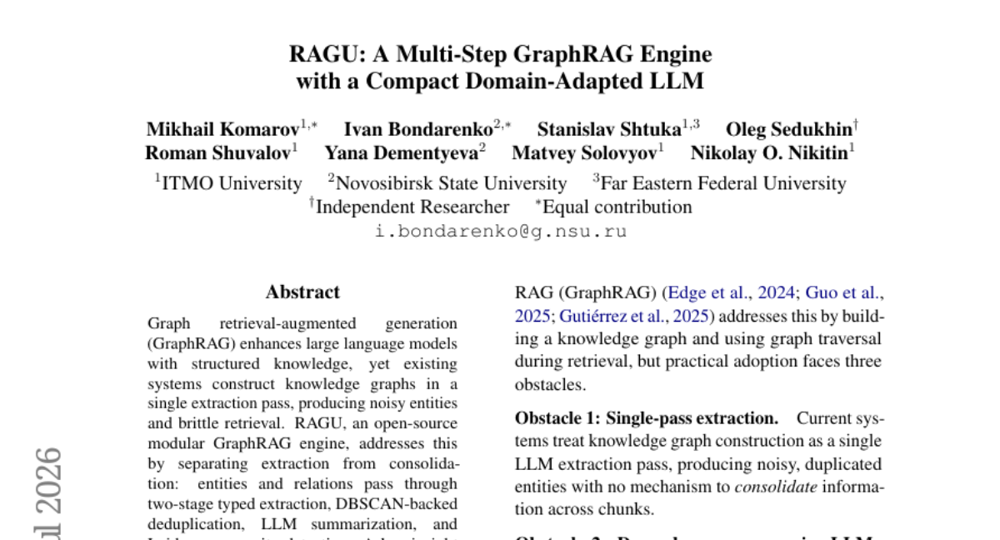

### 📌 한 줄 요약
추출과 정제 단계를 분리하고 경량 모델을 최적화하여 성능과 효율을 동시에 잡은 모듈형 GraphRAG 엔진

### 🔑 핵심 포인트
- 추출(Extraction)과 통합(Consolidation) 단계를 분리하여 데이터 품질과 검색 신뢰도 확보
- 언어 능력 중심의 경량 모델(Meno-Lite-0.1) 학습을 통한 효율적인 지식 그래프 구축
- DBSCAN 및 Leiden 알고리즘을 결합한 정교한 엔티티 중복 제거 및 커뮤니티 탐지

### 🧑‍💻 개발자 관점
단일 GPU 환경에서도 고성능 지식 그래프를 구축할 수 있어, 리소스 제약이 있는 실무 환경에서 GraphRAG를 도입하기 용이합니다.

### 🚀 실무 적용 아이디어
- pip install graph_ragu를 통한 로컬 환경 설치 및 기본 워크플로우 테스트
- 도메인 특화 데이터셋을 활용한 Meno-Lite-0.1의 추출 성능 검증
- 기존 RAG 시스템과 RAGU의 검색 결과(Evidence Recall) 비교 실험

### ⚠️ 리스크/한계
- 특정 도메인에 최적화된 모델이므로 일반적인 범용 지식 구축 시 성능 변화 가능성
- 복잡한 그래프 구조 생성 시 연산 비용이 발생할 수 있음

### 📝 초록 기반 상세 설명
기존 GraphRAG 시스템은 단일 추출 과정으로 인해 노이즈가 섞인 엔티티와 취약한 검색 성능 문제를 겪고 있었습니다. RAGU는 추출과 통합 과정을 분리하여 2단계 타입 추출, DBSCAN 기반 중복 제거, Leiden 커뮤니티 탐지 과정을 거치는 모듈형 엔진을 제안합니다. 특히 추출에 필요한 언어 능력은 모델 크기에 비례하지 않는다는 점에 착안하여, 7B 규모의 Meno-Lite-0.1 모델을 학습시켰습니다. 실험 결과, Meno-Lite-0.1은 더 큰 모델인 Qwen2.5-32B보다 지식 그래프 구축 성능이 우수하며 GraphRAG-Bench에서도 높은 재현율을 기록했습니다. 이 엔진은 단일 GPU에서 구동 가능하며 오픈소스로 공개되었습니다.

---

## 3. [Loop the Loopies!](https://huggingface.co/papers/2607.16051)
**Upvotes**: 53 | **도입 난이도**: 상 | **신뢰도**: 상
**arXiv**: https://arxiv.org/abs/2607.16051

**태그**: Transformer, MoE, Reasoning, Efficiency

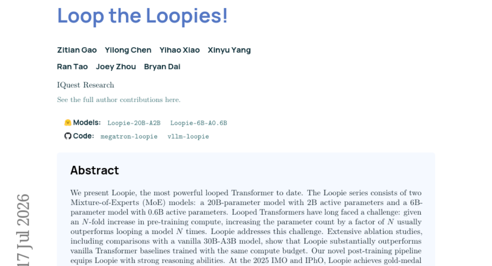

### 📌 한 줄 요약
동일 연산 예산 내에서 루프 구조를 최적화하여 성능을 극대화한 MoE 기반 Looped Transformer 모델

### 🔑 핵심 포인트
- 연산 효율을 극대화한 MoE 기반 Looped Transformer 구조 설계
- 동일 연산 예산 대비 Vanilla Transformer를 압도하는 성능 입증
- 고난도 수학/물리 문제를 해결하는 강력한 추론용 포스트 트레이닝 파이프라인

### 🧑‍💻 개발자 관점
제한된 컴퓨팅 자원 내에서 모델의 깊이(Depth)와 파라미터 효율성을 어떻게 최적화할 수 있는지에 대한 새로운 방법론을 제시합니다.

### 🚀 실무 적용 아이디어
- MoE와 Looped 구조 결합 시의 연산 효율성 벤치마크 테스트
- 동일 파라미터 규모에서 루프 횟수에 따른 성능 변화 실험
- 추론 능력 향상을 위한 포스트 트레이닝 기법의 적용 가능성 검토

### ⚠️ 리스크/한계
- 루프 구조 특유의 학습 안정성 및 수렴 문제 가능성
- 추론 성능 향상이 특정 도메인(수학/과학)에 편중되었을 가능성

### 📝 초록 기반 상세 설명
기존의 Looped Transformer는 연산량을 늘릴 때 파라미터 수를 늘리는 방식보다 효율이 떨어진다는 고질적인 문제가 있었습니다. 본 논문은 이를 해결하기 위해 MoE 구조를 결합한 Loopie 시리즈를 제안합니다. 20B(활성 2B) 및 6B(활성 0.6B) 규모의 모델을 통해 루프 구조의 효율성을 입증했습니다. 실험 결과, 동일한 연산 예산에서 기존 Vanilla Transformer 모델보다 우수한 성능을 보였습니다. 또한 독자적인 포스트 트레이닝 파이프라인을 통해 강력한 추론 능력을 확보했습니다. 그 결과 2025 IMO 및 IPhO에서 도구 없이 금메달 수준의 성적을 거두었습니다.

---

## 4. [Xiaomi-Robotics-1: Scaling Vision-Language-Action Models with over 100K Hours of Real-World Trajectories](https://huggingface.co/papers/2607.15330)
**Upvotes**: 52 | **도입 난이도**: 상 | **신뢰도**: 상
**arXiv**: https://arxiv.org/abs/2607.15330

**태그**: Robotics, VLA, Foundation Model, Scaling Laws, RAG, Vision, Benchmark

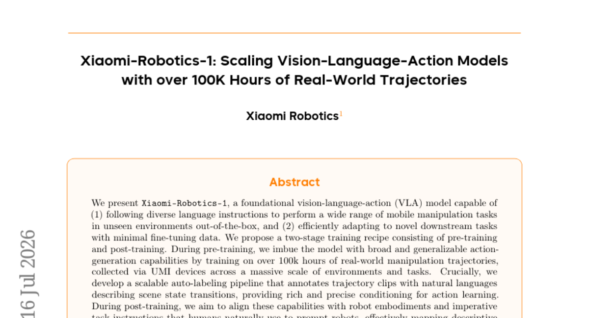

### 📌 한 줄 요약
10만 시간 이상의 실세계 데이터를 활용하여 제로샷 작업 수행 및 효율적 미세 조정이 가능한 범용 VLA 모델 개발

### 🔑 핵심 포인트
- 10만 시간 이상의 대규모 실세계 조작 궤적 데이터 활용
- 장면 상태 변화를 자연어로 설명하는 확장 가능한 자동 레이블링 파이프라인 개발
- 사전 학습(Pre-training)과 사후 학습(Post-training)을 결합한 2단계 학습 전략

### 🧑‍💻 개발자 관점
대규모 데이터와 자동화된 레이블링이 결합되었을 때 로봇의 범용 행동 모델(VLA)이 어떻게 스케일링되는지 보여주는 실무적 지표를 제공합니다.

### 🚀 실무 적용 아이디어
- 제공될 코드와 체크포인트를 활용하여 RoboCasa365 벤치마크 재현 실험
- 소규모 데이터셋을 활용한 효율적 미세 조정(Fine-tuning) 성능 검증
- 자동 레이블링 파이프라인의 데이터 품질이 행동 생성에 미치는 영향 분석

### ⚠️ 리스크/한계
- 실세계 데이터 의존도가 높아 데이터 편향 발생 가능성
- 복잡한 정밀 조작 작업 시 추가적인 미세 조정 필요성

### 📝 초록 기반 상세 설명
로봇이 다양한 환경에서 복잡한 조작 작업을 수행하기 위해서는 일반화된 행동 생성 능력이 필수적입니다. 기존 방식은 데이터 부족과 환경 변화에 따른 성능 저하라는 문제에 직면해 있습니다. 본 논문은 10만 시간 이상의 실세계 궤적 데이터와 자동 레이블링 파이프라인을 활용한 2단계(사전 학습 및 사후 학습) 학습 방식을 제안합니다. 사전 학습을 통해 범용적인 행동 생성 능력을 확보하고, 사후 학습을 통해 인간의 명령과 로봇의 물리적 특성을 정렬했습니다. 실험 결과, 모델 규모와 데이터가 커질수록 성능이 향상되는 스케일링 법칙을 확인했으며, RoboCasa365 등 주요 벤치마크에서 SOTA를 달성했습니다.

---

## 5. [xHC: Expanded Hyper-Connections](https://huggingface.co/papers/2607.14530)
**Upvotes**: 45 | **도입 난이도**: 상 | **신뢰도**: 상
**arXiv**: https://arxiv.org/abs/2607.14530

**태그**: Transformer, Scaling Laws, Efficient Training, Architecture, RAG

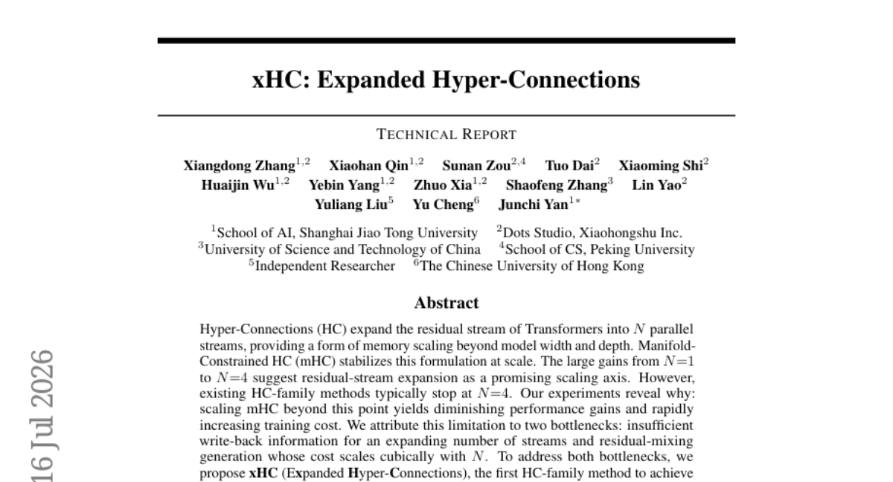

### 📌 한 줄 요약
잔차 스트림(Residual Stream)을 N개로 확장하는 Hyper-Connections 기술의 병목을 해결하여 대규모 모델 성능과 효율성을 동시에 확보한 연구

### 🔑 핵심 포인트
- N=4 이상의 대규모 잔차 스트림 확장을 가능하게 하는 xHC 아키텍처 제안
- Sparse residual-stream 구조와 temporal feature augmentation을 통한 연산 효율 및 정보 손실 방지
- xHC-Flash를 통한 메모리 트래픽 최적화로 대규모 모델 학습의 실용성 확보

### 🧑‍💻 개발자 관점
모델의 너비나 깊이를 늘리는 기존 방식 외에 '잔차 스트림 확장'이라는 새로운 스케일링 축을 제시하여 효율적인 모델 설계 가능성을 열었습니다.

### 🚀 실무 적용 아이디어
- 기존 Transformer 구조에 소규모 N(예: N=8)을 적용하여 성능 변화 관찰
- Sparse update 방식이 기존 Dense 모델의 수렴 속도에 미치는 영향 실험
- xHC-Flash의 메모리 트래픽 감소 효과를 GPU 프로파일링을 통해 검증

### ⚠️ 리스크/한계
- N이 커질수록 복잡한 아키텍처로 인해 구현 및 유지보수 난이도 상승
- 특정 모델 크기(MoE 등)에서의 성능 최적화가 일반적인 Dense 모델에서도 동일할지 검증 필요

### 📝 초록 기반 상세 설명
기존의 Hyper-Connections(HC)는 잔차 스트림을 병렬로 확장하여 모델의 메모리 용량을 늘리려 했으나, N이 커질수록 성능 향상이 정체되고 연산 비용이 급증하는 문제가 있었습니다. 연구진은 이를 정보 쓰기(write-back) 부족과 연산 복잡도의 증가로 진단했습니다. 이를 해결하기 위해 풍부한 정보 전달을 위한 temporal feature augmentation과 연산 효율을 위한 sparse architecture를 결합한 xHC를 제안합니다. 또한 메모리 트래픽 문제를 해결하기 위해 xHC-Flash를 도입하여 대규모 N에서도 실용적인 학습이 가능하게 했습니다. 실험 결과, xHC는 18B/28B MoE 모델에서 기존 mHC 대비 강력한 성능 향상을 보였으며 효율적인 스케일링 법칙을 입증했습니다.

---

## 6. [Cura 1T: Specialized Model for Agentic Healthcare](https://huggingface.co/papers/2607.15314)
**Upvotes**: 38 | **도입 난이도**: 상 | **신뢰도**: 상
**arXiv**: https://arxiv.org/abs/2607.15314

**태그**: Agent, Healthcare, Self-Evolution, LLM-Training, Reasoning, Vision, Benchmark, Evaluation

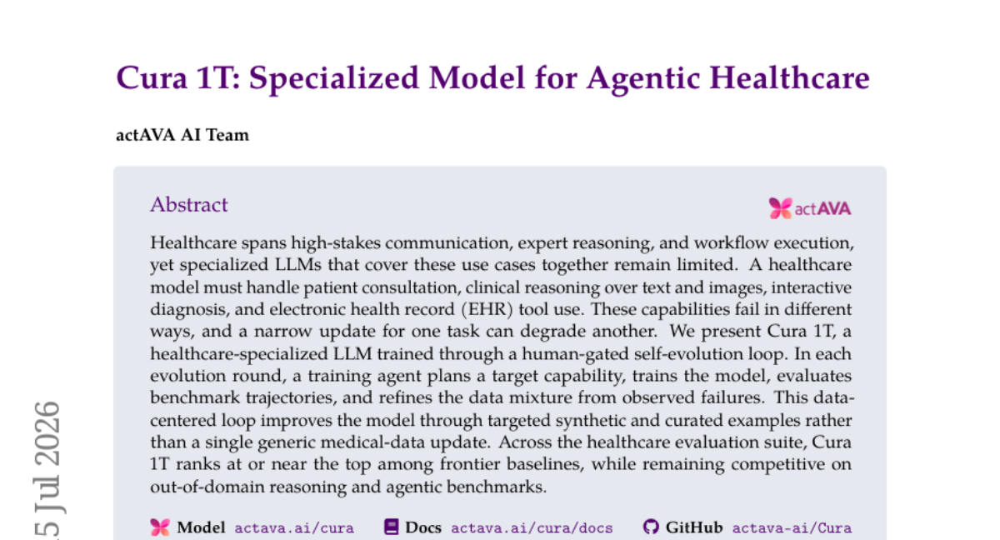

### 📌 한 줄 요약
인간 피드백 기반의 자기 진화 루프를 통해 의료 상담부터 도구 사용까지 아우르는 에이전트형 특화 LLM 개발

### 🔑 핵심 포인트
- 인간의 검수를 거치는 '자기 진화 루프'를 통한 데이터 중심의 반복적 학습 방식 도입
- 상담, 임상 추론, 이미지 분석, EHR 도구 사용을 통합하는 에이전트 역량 확보
- 특정 작업 성능 향상이 다른 능력의 저하로 이어지는 '치명적 망각' 문제 완화

### 🧑‍💻 개발자 관점
단순 질의응답을 넘어 실제 의료 워크플로우(도구 사용, 데이터 관리)를 수행하는 에이전트 시스템 구축의 방법론을 제시합니다.

### 🚀 실무 적용 아이디어
- 데이터 정제 루프(Self-evolution loop)의 구조를 기존 파인튜닝 파이프라인에 이식 시도
- 의료 도구 사용(Tool-use) 성능과 일반 추론 성능 간의 트레이드오프 측정 실험
- 합성 데이터 생성 시 인간 피드백(Human-gated)이 모델 성능에 미치는 영향 분석

### ⚠️ 리스크/한계
- 인간 개입이 포함된 루프이므로 대규모 확장 시 비용 및 시간 제약 발생 가능
- 합성 데이터에 의한 모델의 편향성 또는 환각 현상 심화 위험

### 📝 초록 기반 상세 설명
의료 분야는 고도의 추론, 워크플로우 실행, EHR 도구 사용 등 복합적인 역량이 필요하지만, 특정 작업에 특화된 모델은 다른 능력을 저하시키는 문제가 있습니다. 이를 해결하기 위해 연구진은 Cura 1T 모델을 제안합니다. 이 모델은 학습 에이전트가 계획, 학습, 평가, 데이터 정제를 반복하는 '인간 게이트형 자기 진화 루프(human-gated self-evolution loop)'를 통해 학습되었습니다. 단일 데이터 업데이트 대신 실패 사례를 바탕으로 타겟팅된 합성 데이터를 생성하여 모델을 개선합니다. 그 결과, Cura 1T는 의료 벤치마크에서 최상위 성능을 기록하며 범용 추론 능력도 유지했습니다.

---

## 7. [RecGPT-V3 Technical Report](https://huggingface.co/papers/2607.15591)
**Upvotes**: 25 | **도입 난이도**: 상 | **신뢰도**: 상
**arXiv**: https://arxiv.org/abs/2607.15591

**태그**: LLM, Recommender-System, Efficiency, Memory-Management, Semantic-ID, Agent, Reasoning, Inference, Distillation

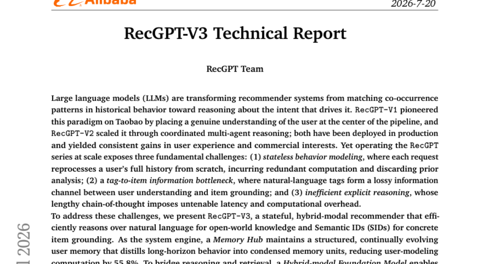

### 📌 한 줄 요약
사용자 메모리 관리와 하이브리드 모달리티를 통해 추론 비용을 획기적으로 낮춘 대규모 실전형 추천 모델

### 🔑 핵심 포인트
- Memory Hub: 장기 행동 이력을 구조화된 메모리로 압축하여 사용자 모델링 연산 효율 극대화
- Hybrid-modal Foundation Model: 자연어 태그와 Semantic ID(SID)를 결합하여 아이템 매칭 정확도 향상
- Latent Intent Reasoning: 긴 추론 과정을 압축된 잠재 토큰으로 변환하여 지연 시간 및 토큰 비용 절감

### 🧑‍💻 개발자 관점
LLM을 실제 서비스에 적용할 때 가장 큰 걸림돌인 '추론 비용'과 '지연 시간' 문제를 아키텍처 설계로 해결하는 실전 가이드를 제공합니다.

### 🚀 실무 적용 아이디어
- 사용자 이력을 요약/압축하여 컨텍스트 윈도우를 관리하는 메모리 레이어 설계 실험
- 아이템 ID를 임베딩/토큰화하여 텍스트와 함께 입력하는 하이브리드 모달리티 적용 테스트
- CoT(Chain-of-Thought) 결과를 압축된 벡터/토큰 형태로 변환하는 효율적 추론 구조 실험

### ⚠️ 리스크/한계
- 메모리 압축 과정에서 중요한 사용자 의도가 손실될 위험 존재
- 복잡한 하이브리드 구조로 인한 시스템 아키텍처 관리 난이도 상승

### 📝 초록 기반 상세 설명
기존 LLM 기반 추천 시스템은 매 요청마다 전체 이력을 처리하는 비효율성과 텍스트 태그 중심의 정보 손실, 그리고 긴 추론 과정으로 인한 높은 지연 시간 문제를 겪고 있었습니다. 이를 해결하기 위해 RecGPT-V3는 상태 유지(Stateful) 방식의 Memory Hub와 텍스트 및 Semantic ID를 결합한 하이브리드 모달리티를 도입했습니다. Memory Hub는 사용자 행동을 압축하여 연산량을 55.8% 절감하며, 하이브리드 모델은 아이템 정보를 더 정밀하게 전달합니다. 또한, 복잡한 추론 과정을 압축된 잠재 토큰으로 변환하여 출력 비용을 200배 낮추었습니다. 결과적으로 타오바오 실서비스 배포를 통해 GMV 3.97% 상승과 리소스 소비 52.4% 절감을 동시에 달면했습니다.

---

## 8. [On-Policy Delta Distillation](https://huggingface.co/papers/2607.15161)
**Upvotes**: 25 | **도입 난이도**: 중 | **신뢰도**: 상
**arXiv**: https://arxiv.org/abs/2607.15161

**태그**: LLM, Reinforcement Learning, Knowledge Distillation, Reasoning, Vision, Benchmark, Distillation

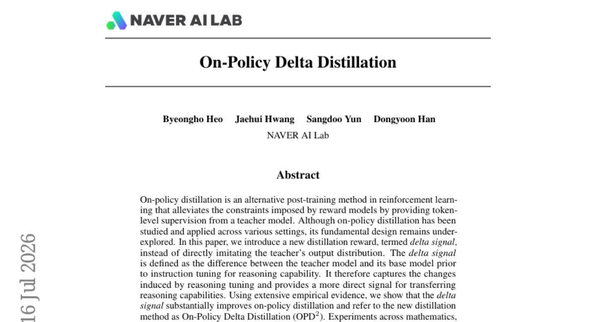

### 📌 한 줄 요약
교사 모델의 출력 분포를 그대로 복제하는 대신, 추론 능력 향상분(Delta)만을 추출하여 효율적으로 지식을 전이하는 새로운 온폴리시 증류 기법입니다.

### 🔑 핵심 포인트
- 교사 모델과 베이스 모델 간의 차이(Delta)를 활용한 새로운 증류 보상 설계
- 단순 출력 모방이 아닌 추론 능력 향분만을 타겟팅하여 지식 전이 효율 극대화
- 짧은 포스트 트레이닝 기간 내에 강력한 추론 성능 확보

### 🧑‍💻 개발자 관점
모델의 전체 분포를 복제하는 대신 특정 능력(추론)의 변화량만 학습함으로써, 적은 데이터와 짧은 학습 시간으로도 고성능 모델을 만드는 효율적인 방법론을 제시합니다.

### 🚀 실무 적용 아이디어
- 기존 온폴리시 증류 프레임워크에 델타 신호(Teacher - Base)를 보상 함수로 적용해보기
- 특정 도메인(수학/코드)에 특화된 베이스 모델을 활용하여 델타 신호의 효과 검증하기
- 학습 시간 단축 효과를 측정하기 위해 기존 방식과 학습 스텝별 성능 비교하기

### ⚠️ 리스크/한계
- 베이스 모델과 교사 모델 간의 차이가 너무 클 경우 학습 불안정성 발생 가능성
- 추론 능력 외의 다른 능력(언어적 유창성 등)이 손실될 위험성

### 📝 초록 기반 상세 설명
강화학습의 포스트 트레이닝 단계에서 보상 모델의 제약을 완화하기 위해 교사 모델의 토큰 수준 감독을 활용하는 온폴리시 증류 연구가 활발해지고 있습니다. 그러나 기존 방식은 교사 모델의 출력 분포를 직접 모방하는 데 치중하여 추론 능력 전이의 근본적인 설계가 부족했습니다. 본 논문은 교사 모델과 지시 튜닝 전 베이스 모델 간의 차이인 '델타 신호(delta signal)'를 새로운 증류 보상으로 제안합니다. 이 신호는 추론 튜닝으로 인해 발생한 변화만을 포착하여 추론 능력을 더욱 직접적으로 전달합니다. 실험 결과, 제안된 OPD^2 방식은 수학, 과학, 코드 등 다양한 추론 립 벤치마크에서 기존 방식을 상회하는 성능을 보였습니다. 이를 통해 짧은 포스트 트레이닝만으로도 강력한 추론 능력을 갖춘 LLM을 구축할 수 있음을 입증했습니다.

---

## 9. [From Human-Centric to Agentic Code Review: The Impact of Different Generations of Generative AI Technology on Review Quality](https://huggingface.co/papers/2607.13196)
**Upvotes**: 23 | **도입 난이도**: 중 | **신뢰도**: 상
**arXiv**: https://arxiv.org/abs/2607.13196

**태그**: AI Agent, Code Review, LLM, Software Engineering, Empirical Study, Agent

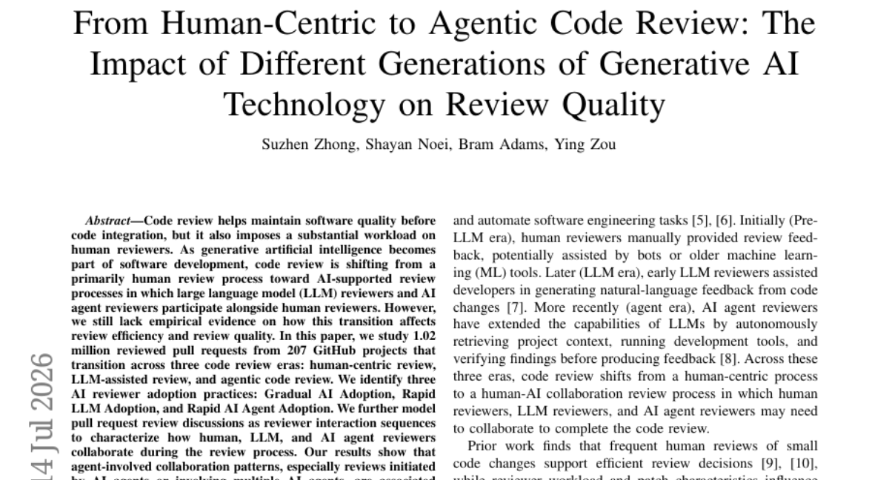

### 📌 한 줄 요약
AI 에이전트 도입이 코드 리뷰 효율은 높이지만 리뷰 품질 향상으로 이어지지는 않음을 실증적으로 분석함

### 🔑 핵심 포인트
- 102만 개의 PR 데이터를 통한 인간-LLM-에이전트 간의 리뷰 협업 패턴 분석
- AI 에이전트 도입이 리뷰 결정 속도(Efficiency)를 높이는 데 효과적임을 확인
- 효율성 향상이 반드시 리뷰 품질(Quality) 향상으로 직결되지 않음을 입증

### 🧑‍💻 개발자 관점
AI 에이전트를 리뷰 프로세스에 도입할 때, 속도 향상에만 매몰되어 코드 품질 저하를 간과할 수 있음을 경고한다.

### 🚀 실무 적용 아이디어
- AI 에이전트 도입 시 리뷰 품질을 검증할 수 있는 별도의 정적 분석/테스트 자동화 결합
- 에이전트가 제안한 리뷰 내용에 대한 인간의 최종 승인 절차(Human-in-the-loop) 강화
- 리뷰 속도와 품질 사이의 상관관계를 모니터링하는 대시보드 구축

### ⚠️ 리스크/한계
- 효율성 중심의 AI 도입이 장기적으로 코드 품질 저하를 초래할 위험
- AI 에이전트의 제안이 인간 리뷰어의 비판적 사고를 약화시킬 가능성

### 📝 초록 기반 상세 설명
코드 리뷰는 소프트웨어 품질 유지에 필수적이지만 인간 리뷰어의 업무 부담이 크다. 생성형 AI 기술이 발전함에 따라 리뷰 프로세스가 인간 중심에서 LLM 및 AI 에이전트 협업 방식으로 변화하고 있다. 본 연구는 207개 GitHub 프로젝트의 102만 개 PR 데이터를 활용하여 인간 중심, LLM 지원, 에이전트 중심의 세 시대를 비교 분석했다. 연구 결과, AI 에이전트가 개입된 협업 패턴은 리뷰 결정 속도를 높였으나 리뷰 품질 개선에는 기여하지 못했다. 결론적으로 효율성과 품질 사이의 균형을 맞추기 위한 AI 지원 프로세스 설계의 중요성을 시사한다.

---

## 10. [Understanding Reasoning from Pretraining to Post-Training](https://huggingface.co/papers/2607.16097)
**Upvotes**: 17 | **도입 난이도**: 중 | **신뢰도**: 중
**arXiv**: https://arxiv.org/abs/2607.16097

**태그**: Reasoning

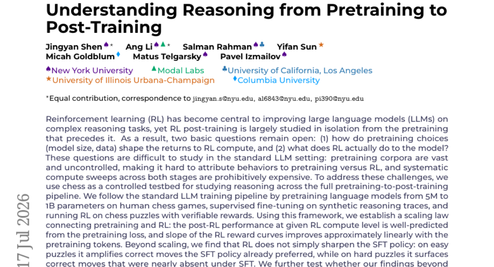

### 📌 한 줄 요약
자세한 분석 내용은 원문 또는 arXiv 링크를 참고해 주세요.

### 🔑 핵심 포인트
- 논문 원문을 확인하시기 바랍니다.

### 📝 초록 기반 상세 설명
상세 초록은 원문 페이지에서 확인 가능합니다.

---

## 11. [Qwen-Music Technical Report](https://huggingface.co/papers/2607.11699)
**Upvotes**: 17 | **도입 난이도**: 상 | **신뢰도**: 상
**arXiv**: https://arxiv.org/abs/2607.11699

**태그**: Generative AI, Audio Synthesis, LLM, Music Generation, Audio, Evaluation

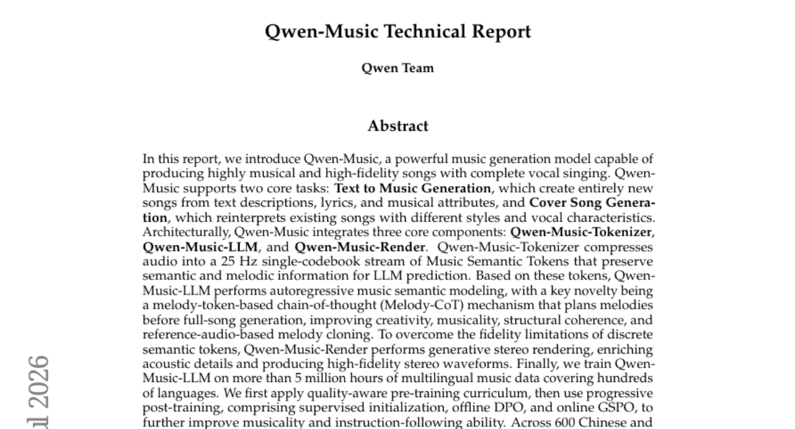

### 📌 한 줄 요약
Melody-CoT와 3단계 아키텍처를 통해 고음질 보컬과 창의적 멜로디 생성을 구현한 차세대 음악 생성 모델

### 🔑 핵심 포인트
- Melody-CoT: 멜로디 토큰 기반의 Chain-of-Thought를 통해 곡의 구조적 일관성과 창의적 멜로디 생성 확보
- 3단계 통합 아키텍처: Semantic Token 압축(Tokenizer), Autoregressive 모델링(LLM), 고음질 스테레오 렌더링(Render)의 유기적 결합
- 대규모 데이터 및 점진적 학습: 500만 시간 이상의 데이터와 품질 중심 커리큘럼 및 DPO/GSPO를 통한 정교한 사후 학습

### 🧑‍💻 개발자 관점
텍스트 기반 작곡부터 커버 곡 생성까지 가능한 엔드투엔드 워크플로우를 제공하여, 콘텐츠 제작 자동화 파이프라인 구축에 중요한 기술적 토대를 제공합니다.

### 🚀 실무 적용 아이디어
- 제공된 텍스처/가사 프롬프트를 활용한 멜로디 일관성 테스트
- 기존 곡의 스타일 변환(Cover Generation) 시 멜로디 보존 능력 검증
- 다국어 가사 입력 시 보컬 발음 및 음악적 조화도 평가

### ⚠️ 리스크/한계
- 고성능 렌더링을 위한 연산 자원 요구량
- 학습 데이터의 저작권 및 생성된 음원의 권리 관계 문제

### 📝 초록 기반 상세 설명
기존 음악 생성 모델은 고음질 보컬 구현과 구조적 일관성 유지에 어려움이 있었습니다. 이를 해결하기 위해 Qwen-Music는 토크나이저, LLM, 렌더러가 통합된 아키텍처를 제안합니다. 핵심은 멜로디를 먼저 계획하는 Melody-CoT 메커니즘을 통해 음악적 창의성과 구조적 응집력을 높인 것입니다. 500만 시간 이상의 다국어 데이터를 활용한 단계별 학습(Pre-training, DPO, GSPO)을 통해 모델을 최적화했습니다. 결과적으로 Qwen-Music는 객관적 지표와 전문가 평가에서 기존 독점 모델들을 상회하는 성능을 입증했습니다.

---

## 12. [Recursive Harness Self-Improvement](https://huggingface.co/papers/2607.15524)
**Upvotes**: 13 | **도입 난이도**: 하 | **신뢰도**: 상
**arXiv**: https://arxiv.org/abs/2607.15524

**태그**: Agent, Prompt Engineering, Self-Improvement, Workflow Optimization, Reasoning, Vision, Inference

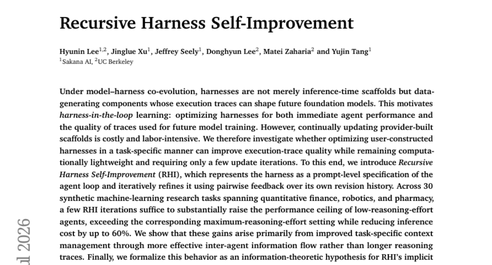

### 📌 한 줄 요약
에이전트 실행 환경(Harness)을 프롬프트 수준에서 반복적으로 최적화하여 저사양 모델의 성능을 극대화하는 기법

### 🔑 핵심 포인트
- RHI: 프롬프트 기반의 에이전트 루프 명세와 반복적 피드백을 통한 자가 개선 프레임워크
- 저사양 모델의 성능을 고사양 모델 수준으로 끌어올리면서 추론 비용을 대폭 절감
- 정보 이론적 관점에서 에이전트 간 정보 흐름 최적화를 통한 성능 향상 입증

### 🧑‍💻 개발자 관점
모델 자체를 튜닝하는 대신, 에이전트가 작동하는 '환경(Harness)'을 프롬프트로 최적화함으로써 적은 비용으로 고성능 시스템을 구축할 수 있음을 보여줍니다.

### 🚀 실무 적용 아이디어
- 기존 에이전트 워크플로우를 프롬프트 기반의 루프 명세로 재구성해보기
- 에이전트의 실행 로그(Trace)를 피드백 데이터로 활용하는 자동화 루프 구축
- 동일한 작업에 대해 서로 다른 환경 설정(Harness) 간의 성능 비교 실험

### ⚠️ 리스크/한계
- 특정 태스크에 과적합(Overfitting)된 환경이 생성될 위험
- 복잡한 실무 환경에서 프롬프트 기반 명세만으로 모든 변수를 제어하기 어려움

### 📝 초록 기반 상세 설명
모델과 실행 환경이 함께 진화하는 'model-harness co-evolution' 환경에서 기존의 고정된 스캐폴드는 데이터 생성 및 성능 최적화에 한계가 있습니다. 본 논문은 사용자 정의 환경을 적은 비용으로 최적화하기 위해 Recursive Harness Self-Improvement(RHI)를 제안합니다. RHI는 에이전트 루프를 프롬프트 기반 명세로 정의하고, 자체 수정 이력에 대한 쌍체 피드백을 통해 이를 반복적으로 정교화합니다. 실험 결과, RHI는 적은 반복만으로도 저사양 모델의 성능을 고사양 모델 수준으로 끌어올리며 추론 비용을 최대 60% 절감했습니다. 이러한 성능 향상은 추론 과정의 연장이 아닌, 에이전트 간 정보 흐름을 최적화하는 효율적인 컨텍스트 관리에서 기인함을 확인했습니다.

---

## 13. [When Does Muon Help Agentic Reinforcement Learning?](https://huggingface.co/papers/2607.16169)
**Upvotes**: 12 | **도입 난이도**: 중 | **신뢰도**: 상
**arXiv**: https://arxiv.org/abs/2607.16169

**태그**: Reinforcement Learning, LLM Agent, Optimizer, Fine-tuning, Agent

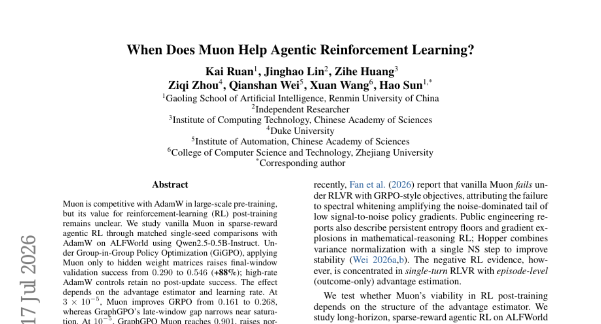

### 📌 한 줄 요약
Agentic RL 환경에서 Muon 옵티마이저가 AdamW 대비 성능과 수렴 속도를 크게 향상시킬 수 있음을 입증함

### 🔑 핵심 포인트
- Sparse-reward RL 환경에서 Muon이 AdamW보다 우수한 성능과 빠른 수렴 속도를 보임
- Muon의 효과는 학습률(LR) 및 어드밴티지 추정 방식(GRPO vs GraphGPO)과 밀접하게 연관됨
- 은닉 가중치 행렬에 Muon을 적용하는 것이 성능 향상의 핵심 요소임

### 🧑‍💻 개발자 관점
LLM 기반 에이전트의 RL 미세 조정(Fine-tuning) 시, 기존 AdamW 대신 Muon을 도입하여 수렴 속도와 최종 성능을 최적화할 수 있는 실무적 근거를 제공합니다.

### 🚀 실무 적용 아이디어
- LLM 에이전트 학습 시 은닉 가중치에 Muon을 적용하는 실험 수행
- 학습률(Learning Rate) 변화에 따른 Muon과 AdamW의 성능 교차 검증
- 사용 중인 RL 알고리즘(GRPO 등)과 Muon의 조합 테스트

### ⚠️ 리스크/한계
- 단일 시드 비교 위주의 실험으로, 멀티 시드 및 다양한 태스크에 대한 일반화 검증이 더 필요함
- 학습률과 어드밴티지 추정 방식에 따라 효과가 가변적이므로 정교한 하이퍼파라미터 튜닝이 요구됨

### 📝 초록 기반 상세 설명
대규모 사전 학습에서 AdamW와 경쟁하는 Muon의 가치가 RL 포스트 트레이닝 단계에서 어떻게 작용하는지 연구했습니다. 연구진은 Qwen2.5-0.5B 모델을 활용하여 ALFWorld 환경의 희소 보상(sparse-reward) RL 환경에서 Muon과 AdamW를 비교 실험했습니다. GiGPO 알고리즘의 은닉 가중치 행렬에 Muon을 적용한 결과, 최종 검증 성공률이 기존 대비 크게 향상되었습니다. 실험 결과 Muon의 효과는 어드밴티지 추정 방식과 학습률(learning rate) 설정에 따라 달라짐을 확인했습니다. 특히 특정 학습률 조건에서 Muon은 더 빠른 수렴 속도와 높은 성공률을 달끔했습니다. 이러한 결과는 정책 옵티마이저와 학습 파라미터 간의 상호작용 연구의 필요성을 시사합니다.

### 🖼️ 추가 자료
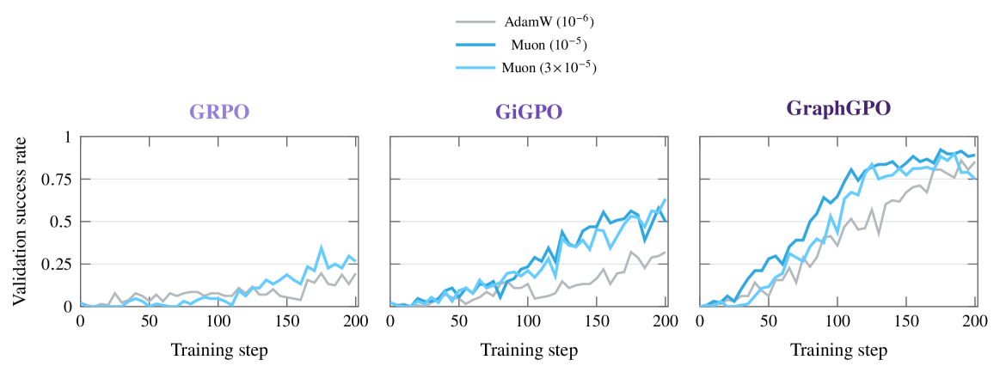

---

## 14. [Beyond Entropy: Correctness-Aware Advantage Shaping via Contrastive Policy Optimization](https://huggingface.co/papers/2607.14614)
**Upvotes**: 8 | **도입 난이도**: 중 | **신뢰도**: 상
**arXiv**: https://arxiv.org/abs/2607.14614

**태그**: Reinforcement Learning, LLM, Policy Optimization, Reasoning, Benchmark, Distillation

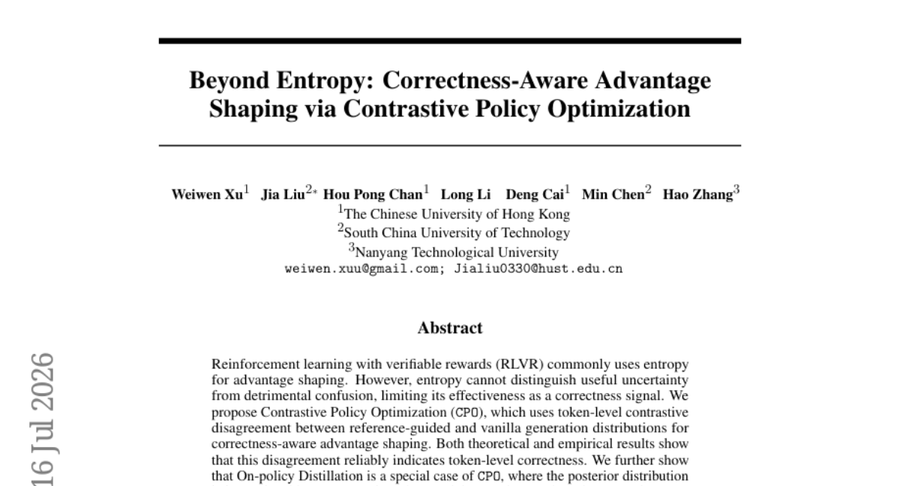

### 📌 한 줄 요약
엔트로피 대신 토큰 간의 대조적 불일치를 활용하여 정답 여부를 정교하게 식별하는 새로운 RLVR 방법론 제안

### 🔑 핵심 포인트
- 토큰 수준의 대조적 불일치를 통한 정답 지향적 어드밴티지 형성
- 엔트로피 기반 방식의 한계(유익한 불확실성 vs 해로운 혼란 구분 불가) 극복
- On-policy Distillation을 CPO의 특수 사례로 정의하며 이론적 일관성 확보

### 🧑‍💻 개발자 관점
LLM의 정답 추론 능력을 높이기 위한 RLVR 과정에서, 단순 엔트로피 조절보다 더 정교한 보상 신호를 설계할 수 있는 방법론을 제시합니다.

### 🚀 실무 적용 아이디어
- 기존 RLVR 파이프라인에 CPO의 대조적 불일치 손실 함수 적용 테스트
- Teacher 모델을 활용한 On-policy Distillation 환경에서의 성능 비교
- In-domain 및 Out-of-domain 데이터셋에서의 일반화 성능 벤치마크 수행

### ⚠️ 리스크/한계
- 토큰 수준의 대조 학습 시 계산 복잡도 증가 가능성
- 참조 모델(Reference Model) 설정에 따른 성능 의존성

### 📝 초록 기반 상세 설명
검증 가능한 보상을 사용하는 강화학습(RLVR)에서는 주로 엔트로피를 활용해 어드밴티지를 형성하지만, 이는 유익한 불확실성과 해로운 혼란을 구분하지 못하는 한계가 있습니다. 이를 해결하기 위해 본 논문은 참조 모델 가이드 분포와 기본 생성 분포 사이의 토큰 수준 대조적 불일치를 이용하는 CPO(Contrastive Policy Optimization)를 제안합니다. 이론 및 실험 결과, 이 불일치 지표는 토큰 수준의 정답 여부를 신뢰성 있게 나타냄을 확인했습니다. 또한 CPO는 온폴리시 증류(On-policy Distillation)를 일반화된 형태로 포함하며, 어드밴티지가 0이 되는 문제를 해결합니다. 실험 결과 CPO는 기존 엔트로피 기반 방식보다 우수한 성능을 보였으며 강력한 일반화 성능을 입증했습니다.

---

## 15. [VideoRAE: Taming Video Foundation Models for Generative Modeling via Representation Autoencoders](https://huggingface.co/papers/2607.14088)
**Upvotes**: 7 | **도입 난이도**: 중 | **신뢰도**: 상
**arXiv**: https://arxiv.org/abs/2607.14088

**태그**: Video Generation, Foundation Models, Autoencoder, Diffusion, RAG, Video, Optimization, Safety

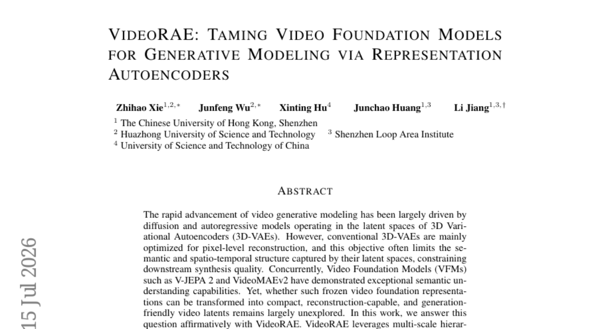

### 📌 한 줄 요약
Frozen VFM의 강력한 표현력을 활용하여 생성 모델용 고성능/고효율 비디오 잠재 공간(Latent Space)을 구축하는 기술

### 🔑 핵심 포인트
- Frozen VFM의 계층적 특징을 활용한 고성능 비디오 잠재 공간 구축
- 연속적(Diffusion) 및 이산적(Autoregressive) 생성 모델 모두를 지원하는 범용성
- VFM 교사 모델과의 정렬을 통한 빠른 수렴 및 강력한 재구성 성능 확보

### 🧑‍💻 개발자 관점
비디오 생성 모델 학습 시 연산 비용을 획기적으로 줄이면서도, 파운데이션 모델의 풍부한 의미 정보를 생성 과정에 직접 주입할 수 있는 프레임워크를 제공합니다.

### 🚀 실무 적용 아이디어
- 제공된 코드를 활용하여 기존 LTX-VAE 대비 수렴 속도 및 품질 비교 실험
- 다양한 VFM(V-JEPA, VideoMAE 등)을 교사 모델로 교체하며 성능 변화 관찰
- 제안된 1D self-attention 프로젝터의 압축률에 따른 생성 품질 영향 분석

### ⚠️ 리스크/한계
- VFM의 성능에 따라 생성 잠재 공간의 품질이 종속될 가능성
- 고해상도 비디오 생성 시 다중 스케일 특징 결합 과정에서의 연산 복잡도

### 📝 초록 기반 상세 설명
기존 비디오 생성 모델은 픽셀 재구성 중심의 3D-VAE를 사용하여 의미적/시공간적 구조를 충분히 담지 못하는 한계가 있었습니다. 반면 V-JEPA와 같은 비디오 파운데이션 모델(VFM)은 뛰어난 이해력을 갖췄지만, 이를 생성용 잠재 공간으로 변환하는 연구는 부족했습니다. 본 논문은 고정된 VFM의 다중 스케일 특징을 활용하고 1D self-attention 프로젝터로 압축하는 VideoRAE를 제안합니다. 이 방식은 연속적(DiT용) 및 이산적(AR용) 잠재 공간을 모두 지원하며, VFM 교사 모델과의 정렬을 통해 KL 정규화 없이도 우수한 재구성을 달성합니다. 실험 결과, 기존 방식보다 약 5배 빠른 수렴 속도와 SOTA급 생성 성능을 입증했습니다.

---

## 16. [REBASE: Reference-Background Subspace Elimination for Training-Free In-Context Segmentation](https://huggingface.co/papers/2607.09082)
**Upvotes**: 7 | **도입 난이도**: 하 | **신뢰도**: 상
**arXiv**: https://arxiv.org/abs/2607.09082

**태그**: Computer Vision, Segmentation, Zero-shot, In-context Learning, Vision, Inference

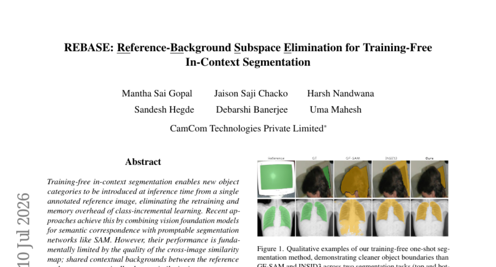

### 📌 한 줄 요약
배경 노이즈를 제거하는 저차원 부분공간 투영을 통해 학습 없이 정교한 객체 분할을 수행하는 프레임워크

### 🔑 핵심 포인트
- 배경 특징을 저차원 부분공간으로 정의하고 이를 제거하는 직교 투영 방식 도입
- 학습 및 파라미터 업데이트가 전혀 없는 Training-free 프레임워크
- 유사도 가중 원거리 샘플링(Similarity-weighted FPS)을 통한 정교한 프롬프트 생성

### 🧑‍💻 개발자 관점
모델 재학습 없이 새로운 객체에 대한 분할이 가능하므로, 데이터가 계속 변하는 실무 환경에서 운영 비용과 메모리 오버헤드를 획기적으로 줄일 수 있습니다.

### 🚀 실무 적용 아이디어
- SAM(Segment Anything Model)과 결합하여 기존 파이프라인에 적용 테스트
- 배경이 복잡한 데이터셋(ISIC2018 등)에서 배경 제거 효과 검증
- 추론 속도 및 메모리 사용량 측정

### ⚠️ 리스크/한계
- 배경과 타겟 객체의 특징이 너무 유사할 경우 투영 과정에서 타겟 정보가 손실될 위험
- 학습 기반 모델 대비 극단적인 도메인 변화에 대한 강건성 확인 필요

### 📝 초록 기반 상세 설명
최근 학습 없이 참조 이미지만으로 새로운 객체를 분할하는 인컨텍스트 세그멘테이션 기술이 주목받고 있습니다. 기존 방식은 참조 이미지와 쿼리 이미지 사이의 배경 유사도가 높을 경우 타겟 영역이 아닌 곳까지 매칭되는 문제가 발생합니다. 이를 해결하기 위해 REBASE는 참조 이미지에서 배경 특징이 차지하는 저차원 부분공간을 식별합니다. 이후 특징들을 이 배경 공간의 직교 보공간으로 투영하여 불필요한 배경 대응성을 억제합니다. 마지막으로 유사도 가중 원거리 샘플링을 통해 정교한 프롬프트를 생성합니다. 결과적으로 별도의 학습 없이도 기존 SOTA를 뛰어넘는 정밀한 객체 분할 성능을 보여줍니다.

---

## 17. [DSWorld: A Data Science World Model for Efficient Autonomous Agents](https://huggingface.co/papers/2607.15901)
**Upvotes**: 6 | **도입 난이도**: 중 | **신뢰도**: 상
**arXiv**: https://arxiv.org/abs/2607.15901

**태그**: AI Agent, World Model, Reinforcement Learning, Data Science, Agent, Inference

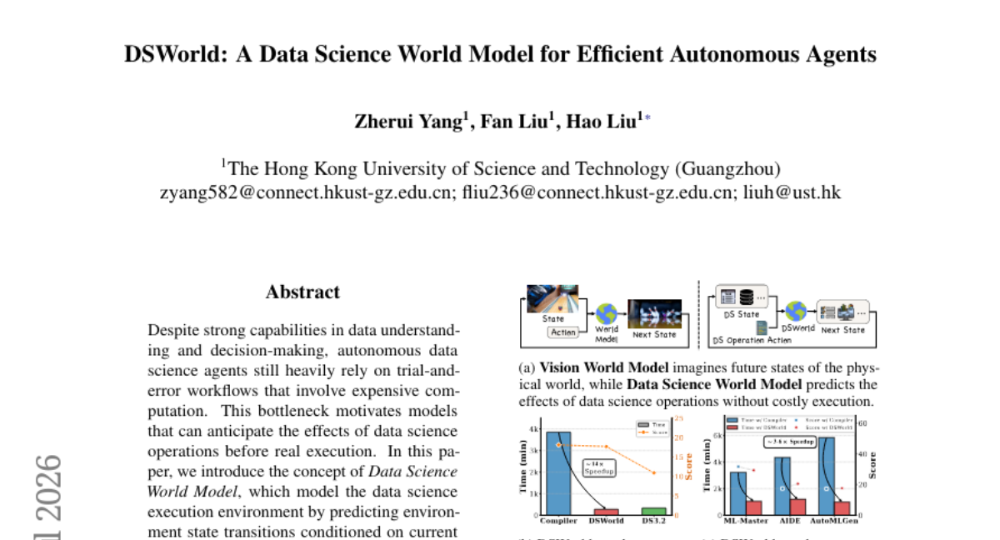

### 📌 한 줄 요약
데이터 사이언스 작업의 실행 비용을 줄이기 위해 환경 변화를 예측하는 '월드 모델' 기반의 에이전트 학습 프레임워크

### 🔑 핵심 포인트
- 데이터 사이언스 환경의 상태 전이를 예측하는 'DSWorld' 프레임워크 제안
- 비용 효율적인 학습을 위한 8K 규모의 전이 궤적 데이터셋 구축
- 오류를 인지하여 예측 정확도를 높이는 Reflective World Model Optimization 전략 도입

### 🧑‍💻 개발자 관점
에이전트가 실제 코드를 실행하기 전, 시뮬레이션을 통해 결과를 미리 예측함으로써 컴퓨팅 자원과 시간을 획기적으로 절약할 수 있습니다.

### 🚀 실무 적용 아이디어
- 제공된 8K 데이터셋을 활용하여 소규모 에이전트 모델의 예측 성능 테스트
- 기존 LLM 기반 에이전트와 DSWorld의 추론 속도 및 비용 비교 실험
- 특정 도메인(예: 통계 분석, 시각화)에 특화된 월드 모델로의 확장 가능성 검토

### ⚠️ 리스크/한계
- 시뮬레이션된 환경과 실제 복잡한 데이터 사이언스 환경 간의 괴리(Sim-to-Real gap) 발생 가능성
- 월드 모델 자체의 예측 오류가 에이전트의 잘못된 의사결정으로 이어질 위험

### 📝 초록 기반 상세 설명
자율 데이터 사이언스 에이전트는 의사결정 능력은 뛰어나지만, 실제 실행 시 발생하는 막대한 계산 비용과 시행착오 문제에 직면해 있습니다. 이를 해결하기 위해 작업 상태와 후보 작업에 따른 환경 변화를 예측하는 '데이터 사이언스 월드 모델' 개념을 제안합니다. 본 논문에서는 구조화된 상태 구성, 비용 인지 라우팅, 경량 실행 및 LLM 기반 시뮬레이터를 결합한 DSWorld 프레임워크를 소개합니다. 또한 8K 규모의 데이터셋과 오류 인지 강화학습 전략인 Reflective World Model Optimization을 도입했습니다. 실험 결과, DSWorld는 성능을 유지하면서도 RL 기반 학습 속도를 약 14배, 탐색 기반 추론 속도를 3~6배 가속화했습니다.

---

## 18. [Audio-Visual Flamingo: Open Audio-Visual Intelligence for Long and Complex Videos](https://huggingface.co/papers/2607.16107)
**Upvotes**: 6 | **도입 난이도**: 중 | **신뢰도**: 상
**arXiv**: https://arxiv.org/abs/2607.16107

**태그**: Multimodal, Video-Understanding, Audio-Visual, LLM, Reasoning, Vision, Video, Audio, Benchmark, Safety

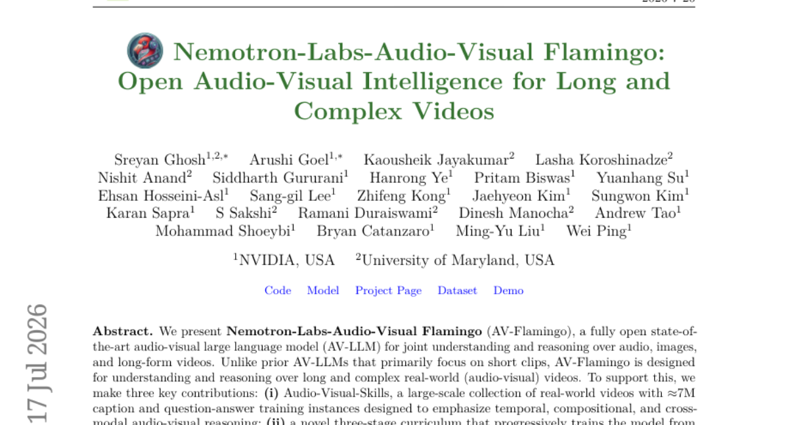

### 📌 한 줄 요약
장시간의 복잡한 비디오를 이해하기 위해 오디오-비주얼 추론과 시간적 정렬에 특화된 오픈 소스 멀티모달 LLM 모델

### 🔑 핵심 포인트
- 7M 규모의 대규모 오디오-비주얼 데이터셋(Audio-Visual-Skills) 구축
- 단기 인지에서 장기 추론으로 이어지는 3단계 커리큘럼 학습 전략
- 타임스탬프 기반의 Temporal Audio-Visual Interleaved Chain-of-Thought 프레임워크 도입

### 🧑‍💻 개발자 관점
긴 영상 데이터에서 특정 사건의 발생 시점과 오디오-비주얼 간의 관계를 정밀하게 추출해야 하는 서비스 개발에 유용합니다.

### 🚀 실무 적용 아이디어
- 제공된 데이터셋을 활용한 특정 도메인(CCTV, 영화 등) 미세 조정 실험
- 장시간 영상 입력 시 타임스탬프 정렬 정확도 및 추론 속도 벤치마크
- 기존 비디오 LLM과 대비한 시간적 맥락 유지 능력 비교 테스트

### ⚠️ 리스크/한계
- 장기 영상 처리 시 발생하는 연산 비용 및 메모리 효율성 문제
- 매우 긴 스트림에서의 시간적 정렬 오차 발생 가능성

### 📝 초록 기반 상세 설명
기존의 오디오-비주얼 LLM은 주로 짧은 클립에 집중하여 긴 영상의 복잡한 맥락을 파악하는 데 한계가 있었습니다. 이를 해결하기 위해 연구진은 장기적인 시공간적 추론이 가능한 AV-Flamingo를 제안합니다. 700만 개의 데이터셋인 Audio-Visual-Skills를 구축하고, 단기 인지에서 장기 추론으로 진화하는 3단계 커리큘럼 학습 방식을 도입했습니다. 또한 타임스탬프에 근거한 Chain-of-Thought 프레임워크를 통해 추론의 해석 가능성을 높였습니다. 실험 결과, AV-Flamingo는 유사 규모의 오픈 모델을 압도하며 대형 폐쇄형 모델과도 경쟁 가능한 성능을 보여주었습니다.

### 🖼️ 추가 자료
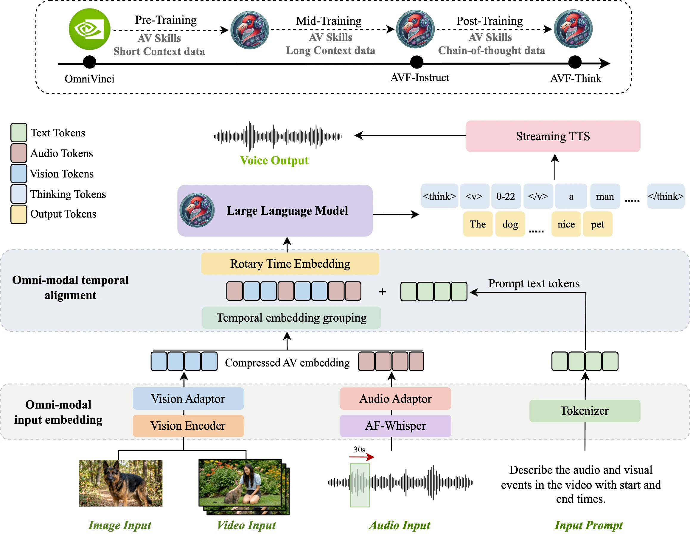

---

## 19. [S1-Omni: A Unified Multimodal Reasoning Model for Scientific Understanding, Prediction, and Generation](https://huggingface.co/papers/2607.15686)
**Upvotes**: 6 | **도입 난이도**: 상 | **신뢰도**: 상
**arXiv**: https://arxiv.org/abs/2607.15686

**태그**: Multimodal, AI4S, Scientific-Reasoning, Generative-AI, RAG, Reasoning, Vision, Benchmark, Evaluation, Safety

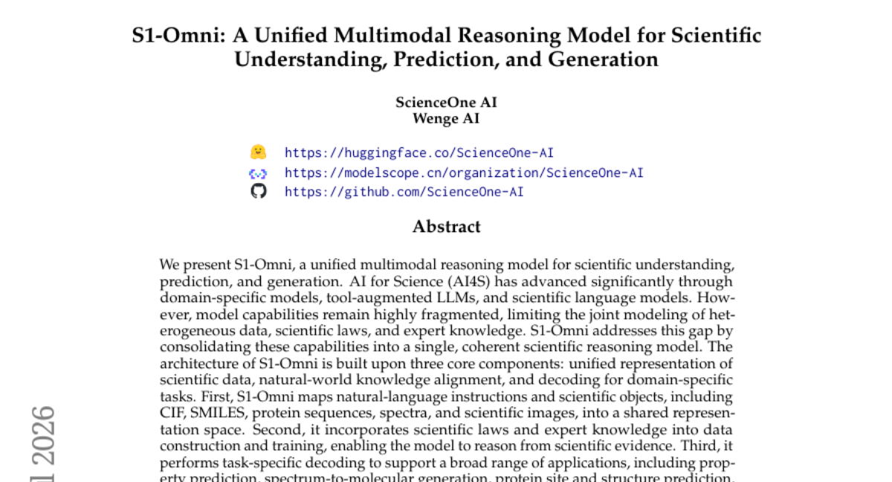

### 📌 한 줄 요약
다양한 과학적 데이터와 법칙을 하나의 모델로 통합하여 예측 및 생성을 수행하는 범용 멀티모달 추론 모델

### 🔑 핵심 포인트
- CIF, SMILES, 단백질 서열, 이미지 등 이질적 과학 데이터를 하나의 공유 표현 공간으로 통합
- 데이터 구축 및 학습 과정에 과학적 법칙과 전문가 지식을 내재화하여 추론 능력 강화
- 물성 예측부터 분자 생성, 단백질 구조 예측까지 아우르는 범용적 태스크 디코딩 지원

### 🧑‍💻 개발자 관점
도메인별로 분산된 모델들을 개별 구축할 필요 없이, 하나의 멀티모달 프레임워크로 다양한 과학적 문제를 해결할 수 있는 가능성을 보여줍니다.

### 🚀 실무 적용 아이디어
- S1-Omni-Corpus와 같은 대규모 과학 데이터셋의 구성 방식 분석
- 특정 도메인(예: 화학, 생물학) 데이터에 대한 공유 표현 공간 매핑 성능 테스트
- 기존 도메인 특화 모델과 S1-Omni의 태스크별 성능 비교 실험

### ⚠️ 리스크/한계
- 방대한 양의 고품질 과학 데이터와 연산 자원이 필요하여 일반 개발자가 직접 학습하기 어려움
- 범용 모델 특성상 매우 정밀한 특정 도메인 전문 모델 대비 성능 저하 가능성 존재

### 📝 초록 기반 상세 설명
기존의 AI for Science(AI4S)는 도메인 특화 모델과 도구 활용 모델로 파편화되어 있어 이질적인 데이터와 과학적 법칙을 통합하는 데 한계가 있었습니다. 이를 해결하기 위해 S1-Omni는 과학적 데이터의 통합 표현, 자연 법칙 정렬, 도메인별 디코딩을 핵심 요소로 하는 통합 모델을 제안합니다. 모델은 CIF, SMILES, 단백질 서열, 스펙트럼 등 다양한 과학적 객체를 공유 표현 공간에 매핑하고, 학습 과정에 전문가 지식과 과학 법칙을 결합했습니다. 200개의 과학적 태스크를 포함한 S1-Omni-Corpus로 학습된 결과, 60개 이상의 벤치마크에서 GPT-5.5 및 Gemini-3.1-Pro를 상회하는 성능을 보였습니다. 결과적으로 S1-Omni는 파편화된 과학 모델링을 하나의 체계로 통합할 수 있는 실질적인 경로를 제시합니다.

---

## 20. [Agon: Competitive Cross-Model RL with Implicit Rival Grading of Reasoning](https://huggingface.co/papers/2607.07690)
**Upvotes**: 3 | **도입 난이도**: 상 | **신뢰도**: 상
**arXiv**: https://arxiv.org/abs/2607.07690

**태그**: Reinforcement Learning, Reasoning, Multi-Agent, LLM Training, Agent, Inference

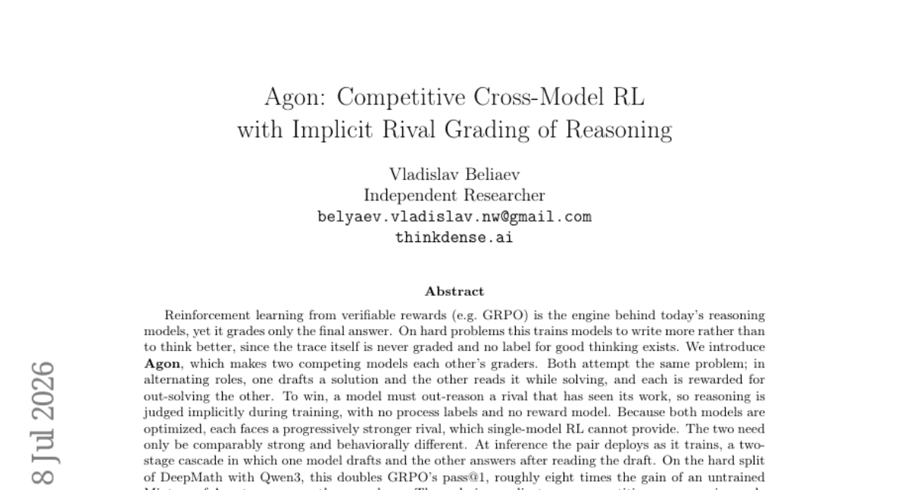

### 📌 한 줄 요약
두 모델이 서로의 풀이 과정을 검토하며 경쟁하는 RL 방식을 통해 추론 능력을 극대화하는 프레임워크

### 🔑 핵심 포인트
- 상호 경쟁적 RL: 두 모델이 서로의 초안을 읽고 경쟁하며 추론 과정을 암묵적으로 학습
- 프로세스 라벨 없는 학습: 정답 여부만으로 사고 과정의 질을 높이는 Implicit Rival Grading 방식 도입
- 2단계 추론 캐스케이드: 추론 시에도 초안 작성 모델과 검토 모델이 협업하는 구조로 배포

### 🧑‍💻 개발자 관점
정답만 있는 데이터셋에서도 모델의 사고 과정(Reasoning Trace) 자체를 고도화할 수 있는 새로운 RL 패러다임을 제시합니다.

### 🚀 실무 적용 아이디어
- 동일한 베이스 모델을 두 개 띄워 서로 다른 하이퍼파라미터로 경쟁시키는 실험 수행
- 단일 모델 RL과 Agon 방식의 추론 경로(Trace) 품질 비교 분석
- 추론 시 2단계 캐스케이드 구조의 지연 시간(Latency)과 성능 간의 트레이드오프 측정

### ⚠️ 리스크/한계
- 두 모델 간의 성능 격차가 클 경우 학습 불안정성 발생 가능성
- 추론 시 두 모델을 모두 사용하므로 단일 모델 대비 높은 컴퓨팅 비용 발생

### 📝 초록 기반 상세 설명
최근 GRPO와 같은 검증 가능한 보상 기반 RL은 최종 정답만 평가하기 때문에, 모델이 사고 과정이 아닌 단순히 텍스트 양을 늘리는 데 집중하는 문제가 발생합니다. 이를 해결하기 위해 두 모델이 서로 경쟁하며 채점자가 되는 Agon 프레임워크를 제안합니다. 한 모델이 초안을 작성하면 다른 모델이 이를 읽으며 문제를 해결하는 방식으로, 상대방을 이기기 위해 더 정교한 추론 과정을 학습하게 됩니다. 이 방식은 별도의 프로세스 라벨이나 보상 모델 없이도 암묵적인 추론 품질 평가를 가능하게 합니다. 실험 결과, DeepMath와 코딩 벤치마크에서 기존 GRPO 대비 압도적인 성능 향상을 기록했습니다.

---

## 21. [Behavioral Privacy Leakage in Agentic Negotiation: Formalizing and Mitigating Inference Attacks via Randomized Policies](https://huggingface.co/papers/2607.06815)
**Upvotes**: 3 | **도입 난이도**: 중 | **신뢰도**: 상
**arXiv**: https://arxiv.org/abs/2607.06815

**태그**: Multi-Agent, Privacy, Negotiation, Differential Privacy, Agent, Evaluation, Inference

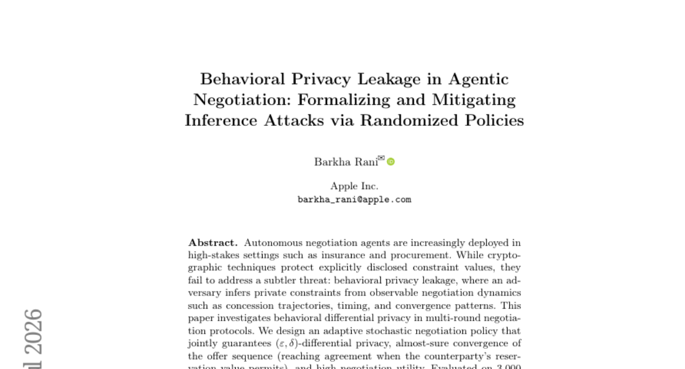

### 📌 한 줄 요약
협상 에이전트의 행동 패턴을 통한 프라이버시 유출을 방지하기 위해 차등 프라이버시(DP)를 적용한 확률적 협상 정책 제안

### 🔑 핵심 포인트
- 행동 패턴(제안 궤적, 타이밍 등)을 통한 프라이버시 유출 문제 정식화
- (ε, δ)-차등 프라이버시를 보장하는 적응형 확률적 협상 정책 설계
- 프라이버시 보호와 협상 성공률/효용 사이의 균형 달성

### 🧑‍💻 개발자 관점
에이전트 간 협상 시 노출되는 행동 패턴이 민감한 정보(예: 예산 범위)를 유출할 수 있으므로, 보안이 중요한 자동화 시스템 설계 시 필수적인 고려 사항입니다.

### 🚀 실무 적용 아이디어
- 제안된 확률적 정책을 기존 결정론적 협상 알고리즘과 성능 비교 실험
- 다양한 제약 조건(Constraint) 분포 하에서 프라이버시-효용 트레이드오프 분석
- 멀티 에이전트 환경에서의 집단적 정보 유출 시나리오 테스트

### ⚠️ 리스크/한계
- 확률적 정책 도입으로 인한 협상 과정의 예측 불가능성 증가
- 실제 복잡한 비선형 협상 환경에서의 일반화 가능성 검증 필요

### 🖼️ 추가 자료
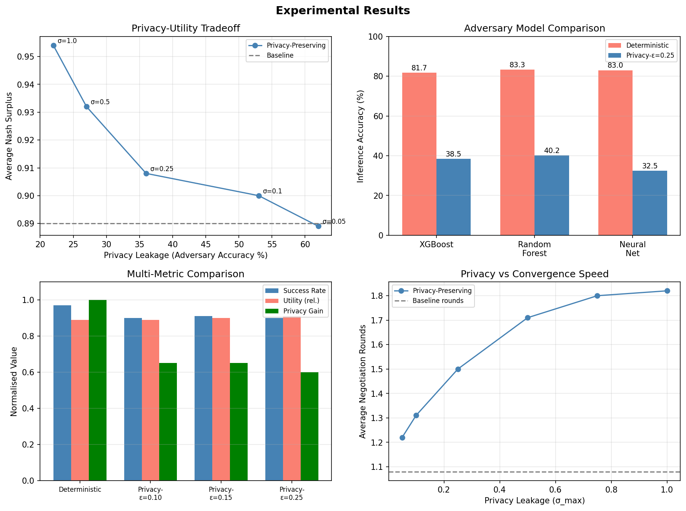

---

## 22. [See like a Robot: Robot-Centric Pointmaps for Vision-Language-Action Models](https://huggingface.co/papers/2607.11498)
**Upvotes**: 2 | **도입 난이도**: 하 | **신뢰도**: 상
**arXiv**: https://arxiv.org/abs/2607.11498

**태그**: VLA, Robot-Centric, 3D-Vision, Generalization, Vision

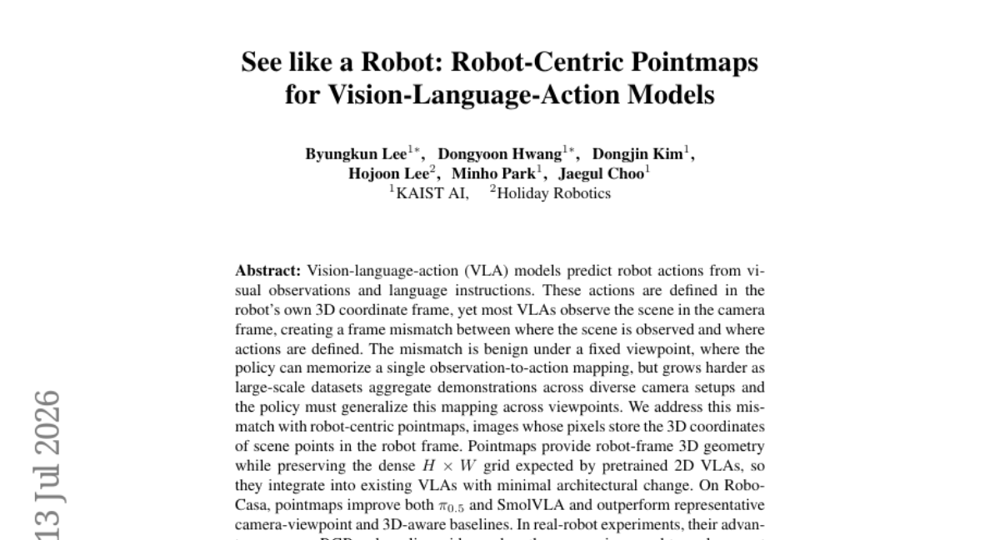

### 📌 한 줄 요약
카메라 시점이 아닌 로봇 중심의 3D 좌표 정보를 이미지 형태로 제공하여 VLA 모델의 시점 변화에 대한 일반화 성능을 높이는 기술

### 🔑 핵심 포인트
- 카메라 시점과 액션 정의 시점 간의 프레임 불일치 문제 해결
- 기존 2D VLA 구조를 유지하며 3D 기하 정보를 주입하는 Pointmap 방식 제안
- 학습 시와 다른 카메라 위치에서도 동작하는 시점 일반화 성능 확보

### 🧑‍💻 개발자 관점
로봇 제어 모델을 설계할 때, 카메라 위치가 바뀔 때마다 모델을 재학습하는 대신 입력 데이터의 좌표계를 정렬하여 일반화 성능을 높이는 실무적 전략을 제시합니다.

### 🚀 실무 적용 아이디어
- 기존 RGB 입력 대신 3D 좌표가 포함된 Pointmap을 입력으로 넣어 성능 변화 관찰
- 학습 시와 완전히 다른 각도의 카메라를 배치하여 일반화 성능 테스트
- 기존 VLA 모델의 입력 레이어에 Pointmap을 결합하는 프로토타입 구현

### ⚠️ 리스크/한계
- Pointmap 생성을 위한 정밀한 3D 센서 데이터 또는 역기하학 계산 필요
- 카메라와 로봇 사이의 캘리브레이션 오차에 따른 성능 저하 가능성

### 📝 초록 기반 상세 설명
기존의 Vision-Language-Action (VLA) 모델은 카메라 시점의 이미지를 관찰하지만, 로봇의 액션은 로봇 중심의 3D 좌표계에서 정의되어 시점 불일치 문제가 발생합니다. 고정된 시점에서는 문제가 적지만, 다양한 카메라 환경을 포함하는 대규모 데이터셋에서는 시점 변화에 따른 일반화가 어려워집니다. 이를 해결하기 위해 픽셀에 로봇 프레임 기준 3D 좌표를 저장하는 'Robot-centric Pointmaps'를 제안합니다. 이 방식은 기존 2D VLA의 구조를 거의 변경하지 않으면서도 로봇 중심의 기하학적 정보를 제공할 수 있습니다. 실험 결과, RoboCasa 환경에서 기존 베이스라인보다 우수한 성능을 보였으며, 학습 시 보지 못한 새로운 카메라 위치에서도 RGB 전용 정책보다 높은 강건함을 입증했습니다.

---

