# 2026-07-28 Daily Papers (Top 16)

## 오늘의 요약
오늘의 연구는 에이전트의 자율적 스킬 확장과 효율적인 컨텍스트 관리, 그리고 데이터 생성 및 품질 평가를 자동화하는 프레임워크에 집중되었습니다. 또한, 멀티모달 스케일링 법칙과 단일 스텝 생성 기법 등 모델의 효율성과 확장성을 극대화하기 위한 실무적 방법론들이 주목받았습니다.

### 오늘의 핵심 포인트
- 에이전트의 성능 한계를 돌파하기 위해 스킬을 스스로 생성하고 검증하는 자기 진화형 프레임워크와 효율적인 컨텍스 관리 아키텍처가 제시되었습니다.
- 학습 데이터의 생성부터 품질 평가까지를 통합하는 벤치마크와 데이터 구성 최적화를 위한 스케일링 법칙 연구가 활발히 진행되었습니다.
- 추론 비용을 낮추는 단일 스텝 생성 기법과 다국어 RAG 환경에서의 언어 일관성을 유지하는 리랭킹 기술 등 실무적 문제 해결을 위한 연구가 돋보였습니다.

**오늘의 태그**: LLM Agent, Data Engineering, Scaling Laws, Efficient Inference, Multimodal

## 1. [DataPrep-Bench: Benchmarking LLMs as Training Data Preparators](https://huggingface.co/papers/2607.20465)
**Upvotes**: 37 | **도입 난이도**: 중 | **신뢰도**: 상
**arXiv**: https://arxiv.org/abs/2607.20465

**태그**: LLM, Data Engineering, Fine-tuning, Benchmark, Agent, Evaluation, Safety

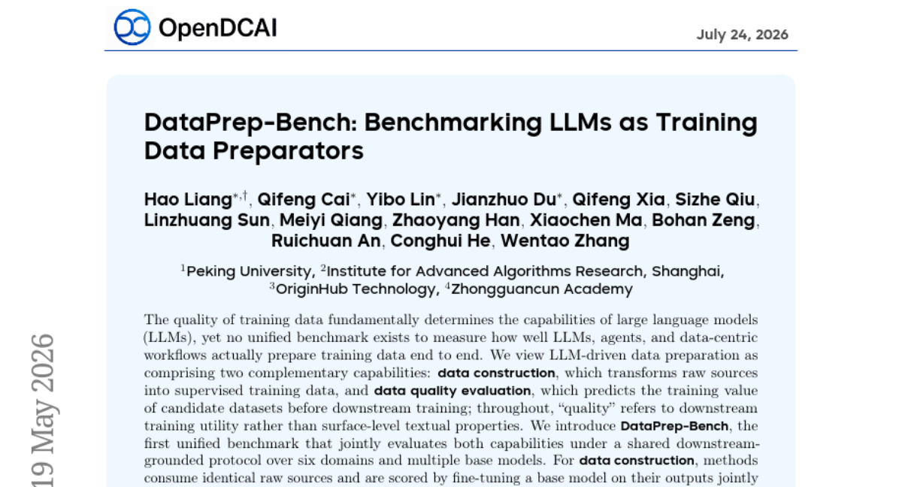

### 📌 한 줄 요약
LLM을 활용한 학습 데이터 구축 및 품질 평가 능력을 통합적으로 측정하는 벤치마크 프레임워크 제안

### 🔑 핵심 포인트
- 데이터 구축(Construction)과 품질 평가(Evaluation)를 통합한 최초의 하향식 벤치마크 'DataPrep-Bench' 개발
- 데이터 생성 결과물을 실제 파인튜닝에 활용하여 성능 변화를 측정하는 실질적 평가 프로토콜 도입
- 분포 정렬 점수(DAS)를 통해 기존 휴리스틱 방식보다 뛰어난 데이터 품질 예측 성능 입증

### 🧑‍💻 개발자 관점
LLM을 이용해 학습 데이터를 자동 생성하거나 필터링할 때, 생성된 데이터가 실제 모델 성능 향상에 얼마나 기여할지 객관적으로 검증할 수 있는 기준을 제공합니다.

### 🚀 실무 적용 아이디어
- 자체 보유한 데이터셋에 DAS(Distributional Alignment Score)를 적용하여 데이터 품질 측정해보기
- LLM 기반 데이터 생성 파이프라인에 Data-Construction-Skill과 같은 에이전트 방식 도입 검토
- 생성된 데이터로 소규모 파인튜닝을 수행하여 벤치마크의 하향식 평가 방식 재현해보기

### ⚠️ 리스크/한계
- 평가 방식이 다운스트림 학습 성능에 의존하므로 계산 비용이 높을 수 있음
- 특정 도메인(Math, Science 등)에 최적화된 지표가 다른 도메인에서는 범용성이 떨어질 가능성

### 📝 초록 기반 상세 설명
LLM의 성능은 학습 데이터의 품질에 좌우되지만, 데이터 준비 과정을 통합적으로 평가할 벤치마크는 부족한 실정입니다. 본 논문은 데이터 구축(raw source -> supervised data)과 데이터 품질 평가(학습 가치 예측)를 동시에 측정하는 DataPrep-Bench를 제안합니다. 데이터 구축 능력은 생성된 데이터를 통한 모델 파인튜닝 성능으로, 품질 평가는 실제 다운스트림 성능과의 상관관계로 측정하는 하향식(downstream-grounded) 프로토콜을 적용했습니다. 실험 결과, 제안된 Data-Construction-Skill 에이전트와 DAS(Distributional Alignment Score) 지표는 기존 방식보다 뛰어난 성능을 보였습니다. 결과적으로 본 연구는 데이터 준비 과정을 LLM의 핵심 역량으로 정의하고 이를 측정할 수 있는 체계를 제공합니다.

---

## 2. [Skill Self-Play: Pushing the Frontier of LLM Capability with Co-Evolving Skills](https://huggingface.co/papers/2607.22529)
**Upvotes**: 29 | **도입 난이도**: 상 | **신뢰도**: 상
**arXiv**: https://arxiv.org/abs/2607.22529

**태그**: LLM, Agent, Reinforcement Learning, Self-Evolution, RAG, Reasoning, Benchmark, Evaluation

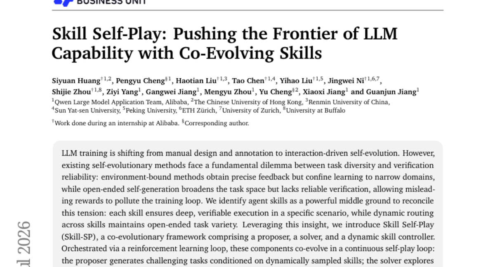

### 📌 한 줄 요약
에이전트 스킬을 동적으로 생성 및 검증하여 모델의 성능 한계를 돌파하는 자기 진화형 프레임워크

### 🔑 핵심 포인트
- 스킬(Skill)을 활용해 정밀한 검증과 광범위한 작업 다양성을 동시에 확보
- Proposer(문제 생성), Solver(해결), Skill Controller(스킬 확장) 간의 상호 진화 루프 구축
- RL 기반의 자기 진화(Self-play)를 통해 모델의 성능 한계를 지속적으로 확장

### 🧑‍💻 개발자 관점
에이전트가 특정 도구 사용이나 복잡한 추론 능력을 스스로 학습하고 확장할 수 있는 체계적인 방법론을 제시합니다.

### 🚀 실무 적용 아이디어
- 제공된 GitHub 코드를 활용하여 특정 도구 사용(Tool-use) 태스크에 적용해보기
- 초기 성능이 낮은 모델을 베이스라인으로 설정하여 성능 향상 폭 확인하기
- 스킬 라이브러리 확장 방식이 모델의 일반화 성능에 미치는 영향 분석하기

### ⚠️ 리스크/한계
- 스킬 라이브러리가 편향될 경우 특정 영역에만 과적합될 위험이 있음
- 자기 진화 루프 운영을 위한 높은 컴퓨팅 자원 필요성

### 📝 초록 기반 상세 설명
LLM 학습이 수동 설계에서 상호작용 기반의 자기 진화로 변화하고 있으나, 작업의 다양성과 검증의 신뢰성 사이의 트레이드오프 문제가 존재합니다. 기존 방식은 특정 도메인에 갇히거나 검증 불가능한 데이터로 인해 학습 루프가 오염되는 한계가 있습니다. 본 논문은 스킬을 매개체로 삼아 정밀한 검증과 개방형 탐색을 동시에 달성하는 Skill-SP 프레임워크를 제안합니다. Proposer, Solver, Skill Controller가 RL 루프 내에서 서로 상호작용하며 스킬 라이브러리를 확장하고 문제를 생성합니다. 실험 결과, Skill-SP는 도구 사용 및 추론 벤치마크에서 기존 모델의 성능을 끌어올리고 초기 성능이 낮은 모델의 비약적인 발전을 이끌었습니다.

---

## 3. [Molt: A Scalable PyTorch-Native Training Framework for Agentic Reinforcement Learning](https://huggingface.co/papers/2607.21653)
**Upvotes**: 20 | **도입 난이도**: 중 | **신뢰도**: 상
**arXiv**: https://arxiv.org/abs/2607.21653

**태그**: Reinforcement Learning, PyTorch, Distributed Training, MoE, Agentic RL, Agent, Multimodal

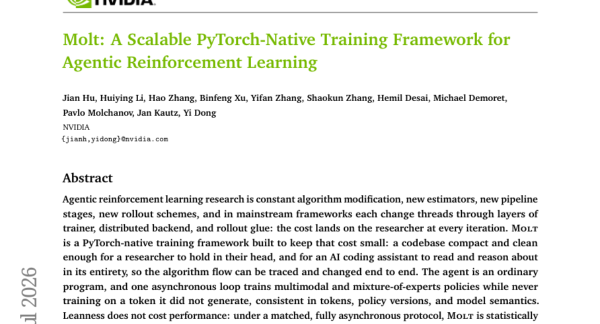

### 📌 한 줄 요약
연구자의 알고리즘 수정 비용을 최소화하면서도 대규모 분산 학습 성능을 유지하는 PyTorch 네이티브 에이전트 강화학습 프레임워크

### 🔑 핵심 포인트
- 연구 효율성을 극대화하는 간결하고 깨끗한 PyTorch 네이티브 코드베이스 설계
- 비동기 루프를 통한 MoE 및 멀티모달 정책의 효율적 학습 지원
- Megatron 기반 스택과 대등한 수준의 확장성 및 성능 확보

### 🧑‍💻 개발자 관점
알고리즘 실험 시 분산 학습 인프라 수정에 드는 시간을 줄이고, 연구자가 모델 로직 자체에만 집중할 수 있는 환경을 제공합니다.

### 🚀 실무 적용 아이디어
- 제공된 GitHub 레시피를 활용하여 기존 RL 알고리즘을 Molt로 이식해보기
- MoE 모델 환경에서 비동기 루프의 데이터 일관성 및 성능 검증하기
- AI 코딩 어시스턴트를 활용해 Molt 기반의 새로운 알고리즘 흐름 설계해보기

### ⚠️ 리스크/한계
- 기존 대규모 분산 학습 프레임워크(Megatron 등)와의 생태계 호환성 확인 필요
- 코드의 간결함을 유지하면서 복잡한 분산 최적화를 유지하는 데 따르는 운영 난이도

### 📝 초록 기반 상세 설명
에이전트 강화학습 연구는 알고리즘, 추정기, 파이프라인 등 변경 사항이 빈번하여 기존 프레임워크에서는 복잡한 분산 백엔드와 얽혀 수정 비용이 매우 높습니다. 이를 해결하기 위해 Molt는 연구자가 전체 로직을 한눈에 파악하고 AI 코딩 어시스턴트가 이해할 수 있을 만큼 간결한 PyTorch 네이티브 프레임워크를 제안합니다. 에이전트를 일반적인 프로그램처럼 다루며, 비동기 루프를 통해 MoE 및 멀티모달 정책을 학습하면서도 데이터 일관성을 유지합니다. 실험 결과, Molt는 성능 저하 없이 기존 Megatron 기반 스택과 대등한 수준의 성능을 보여주었습니다.

---

## 4. [Agentic Context Management: Solving Agent Memory and Cost by Treating Them as Lifecycle and Architecture Problems](https://huggingface.co/papers/2607.21503)
**Upvotes**: 16 | **도입 난이도**: 상 | **신뢰도**: 상
**arXiv**: https://arxiv.org/abs/2607.21503

**태그**: AI Agent, Context Management, LLM Optimization, System Architecture, Agent, RAG, Reasoning, Benchmark, Evaluation, Inference

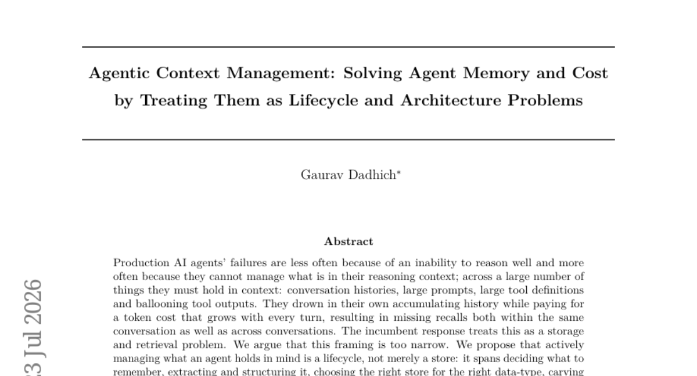

### 📌 한 줄 요약
에이전트의 컨텍스트 관리를 단순 저장 문제가 아닌 생애주기 및 아키텍처 관점으로 재정의하여 비용과 성능 문제를 해결하는 방법론

### 🔑 핵심 포인트
- 컨텍스트 관리를 단순 저장(Storage)이 아닌 생애주기(Lifecycle) 관점으로 재정의
- 비용과 정확도 사이의 트레이드오프를 해결하는 5가지 핵심 프리미티브(Architecting, Ingesting, Scoping, Anticipating, Compacting & Consolidation) 제안
- 누적되는 토큰 비용 문제를 선형적 비용 구조로 전환하면서도 정보 충실도를 유지하는 방법론 제시

### 🧑‍💻 개발자 관점
에이전트 서비스 운영 시 발생하는 기하급수적인 토큰 비용과 컨텍스트 누적으로 인한 성능 저하 문제를 해결할 수 있는 실무적 아키텍처 가이드를 제공합니다.

### 🚀 실무 적용 아이디어
- 현재 운영 중인 에이전트의 토큰 사용량과 컨텍스트 크기 간의 상관관계 분석
- 단순 요약 방식과 제안된 압축/통합 방식 간의 정보 보존율 비교 실험
- 조직 단위의 계층적 컨텍스트 관리 구조 설계 검토

### ⚠️ 리스크/한계
- 복잡한 아키텍처 도입에 따른 시스템 구현 난이도 및 지연 시간(Latency) 증가 가능성
- 컨텍스트 압축 과정에서 발생할 수 있는 미세한 정보 손실 및 추론 오류 리스크

### 📝 초록 기반 상세 설명
생산 환경의 AI 에이전트는 추론 능력 부족보다 대화 이력과 도구 출력 등 누적되는 컨텍스트 관리 실패로 인해 성능 저하와 비용 급증 문제를 겪습니다. 기존의 단순 저장 및 검색 방식은 늘어나는 토큰 비용과 정보 손실 문제를 해결하기에 너무 좁은 접근 방식입니다. 본 논문은 컨텍십 관리를 아키텍처, 인제스션, 스코핑, 예측, 압축/통합의 5가지 프리미티브로 구성된 'Agentic Context Management(ACM)'로 정의합니다. 제안된 프레임워크를 구현한 Maximem Synap은 벤치마크에서 높은 성능을 기록하며 선형적 비용 구조와 정보 충실도를 동시에 달성함을 입증했습니다. 결과적으로 에이전트의 컨텍스트를 동적으로 관리함으로써 비용 효율성과 정확도를 모두 확보할 수 있음을 보여줍니다.

### 🖼️ 추가 자료
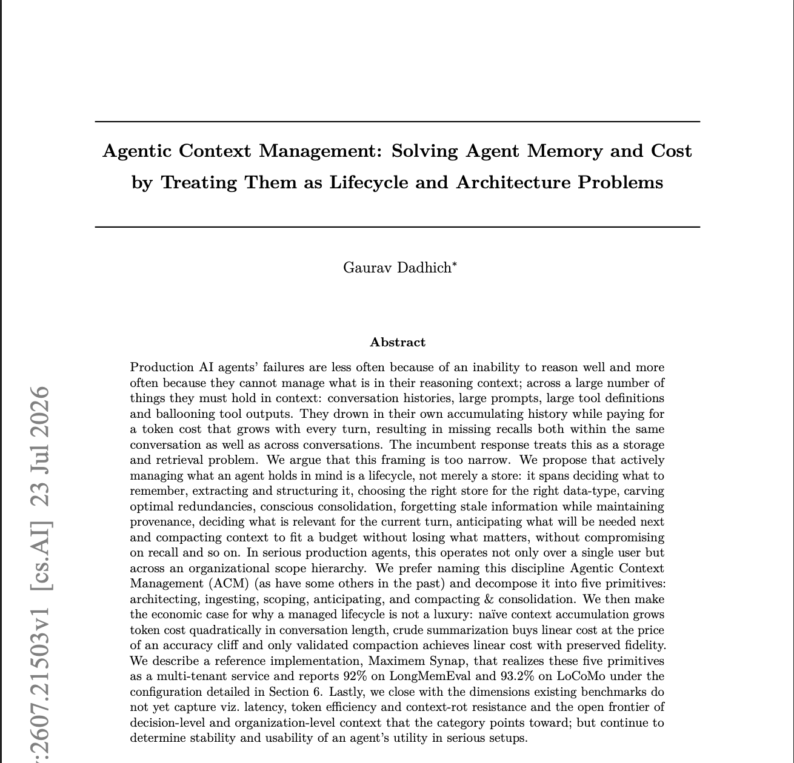

---

## 5. [Scaling Native Multimodal Pre-Training From Scratch](https://huggingface.co/papers/2607.22043)
**Upvotes**: 13 | **도입 난이도**: 중 | **신뢰도**: 상
**arXiv**: https://arxiv.org/abs/2607.22043

**태그**: Multimodal, Scaling Laws, Pre-training, Transformer, Reasoning, Vision, Evaluation

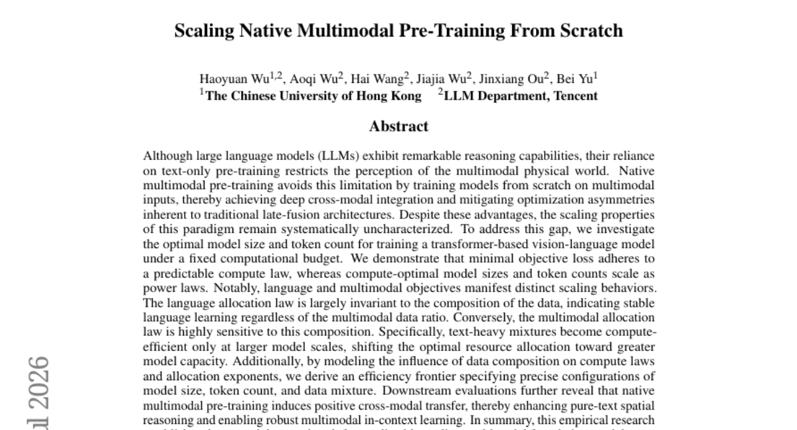

### 📌 한 줄 요약
네이티브 멀티모달 사전 학습의 스케일링 법칙을 규명하여 최적의 모델 크기와 데이터 비율을 결정하는 가이드를 제시함

### 🔑 핵심 포인트
- 고정된 연산 예산 하에서 모델 크기와 토큰 수 사이의 스케일링 법칙(Power Law) 규명
- 언어 학습과 멀티모달 학습의 서로 다른 스케일링 거동 및 데이터 구성 영향력 확인
- 데이터 혼합 비율을 고려한 모델 크기, 토큰 수, 데이터 구성의 최적 효율성 프런티어 도출

### 🧑‍💻 개발자 관점
멀티모달 모델 학습 시 예산에 맞춰 모델 크기와 데이터 비율을 어떻게 배분해야 하는지에 대한 수학적 가이드를 제공합니다.

### 🚀 실무 적용 아이디어
- 데이터 혼합 비율(Text vs Vision) 변화에 따른 모델 성능 변화 추이 관찰
- 고정된 컴퓨팅 자원 내에서 모델 파라미터 수와 토큰 수의 최적 조합 실험
- 네이티브 멀티모달 학습이 순수 텍스트 추론 능력에 미치는 전이 효과 검증

### ⚠️ 리스크/한계
- 데이터 구성 변화에 따라 멀티모달 스케일링 법칙이 민감하게 변하므로 일반화에 주의 필요
- 텍스트 중심 데이터 구성 시 모델 규모가 충분히 크지 않으면 연산 효율이 낮을 수 있음

### 📝 초록 기반 상세 설명
기존 LLM은 텍스트 중심 학습으로 인해 물리적 세계에 대한 인지 능력이 제한적이며, 기존의 후기 결합(late-fusion) 방식은 최적화 불균형 문제를 가집니다. 본 연구는 네이티브 멀티모달 사전 학습 시 고정된 연산 예산 내에서 최적의 모델 크기와 토큰 수를 결정하는 스케일링 법칙을 조사했습니다. 실험 결과, 언어 학습은 데이터 구성에 관계없이 안정적인 스케일링 법칙을 따르지만, 멀티모달 학습은 데이터 구성에 매우 민감하게 반응함을 발견했습니다. 특히 텍스트 비중이 높은 혼합 데이터는 모델 규모가 커질 때만 연산 효율이 높아지는 특성을 보였습니다. 이를 바탕으로 모델 크기, 토큰 수, 데이터 혼합 비율을 결정하는 효율성 프런티어를 도출했습니다. 최종적으로 네이티브 학습이 텍스트 기반 공간 추론과 멀티모달 인컨텍스트 학습 능력을 모두 향상시킴을 입증했습니다.

---

## 6. [Three-Body Scattering for Generative Modeling](https://huggingface.co/papers/2607.18198)
**Upvotes**: 10 | **도입 난이도**: 상 | **신뢰도**: 상
**arXiv**: https://arxiv.org/abs/2607.18198

**태그**: Generative Models, One-step Generation, Diffusion, Computer Vision, Vision

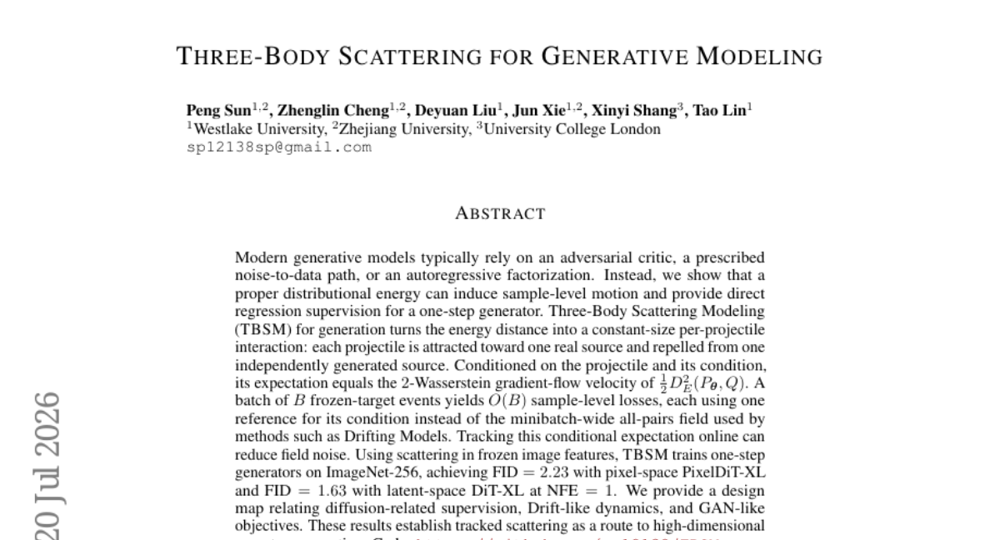

### 📌 한 줄 요약
단 한 번의 스텝(One-step)으로 고해상도 이미지를 생성하는 효율적인 에너지 기반 생성 모델링 기법 제안

### 🔑 핵심 포인트
- Three-Body Scattering Modeling(TBSM)을 통한 효율적인 에너지 기반 생성 프레임워크 제안
- 단일 스텝(One-step) 생성 시 발생하는 계산 복잡도를 O(B) 수준의 상수 크기 상호작용으로 최적화
- Diffusion과 GAN의 장점을 결합하여 고해상도 이미지 생성에서 뛰어난 성능 달성

### 🧑‍💻 개발자 관점
추론 단계(NFE)를 1로 줄이면서도 고품질 이미지를 생성할 수 있어, 실시간 생성 서비스나 저사양 환경에서의 고성능 모델 배포에 매우 유용합니다.

### 🚀 실무 적용 아이디어
- 제공된 코드를 활용하여 DiT(Diffusion Transformer) 구조에 TBSM 손실 함수를 결합하는 실험 수행
- 다양한 해상도 및 데이터셋(ImageNet 외)에서의 스케일링 성능 검증
- 기존 Diffusion 모델의 샘플링 속도와 TBSM의 성능 간의 트레이드오프 분석

### ⚠️ 리스크/한계
- 고차원 데이터로 갈수록 에너지 기반 상호작용의 안정성 확보가 어려울 수 있음
- 학습 시 특정 분포(Frozen-target)에 대한 의존도가 높을 가능성

### 📝 초록 기반 상세 설명
기존 생성 모델은 적대적 학습, 특정 노이즈 경로, 또는 자기회귀 방식에 의존하여 복잡한 학습 과정을 거칩니다. 본 논문은 분포 에너지를 활용하여 샘플 수준의 움직임을 유도하고, 단일 스텝 생성기를 위한 직접적인 회귀 감독을 제공하는 방법을 제안합니다. 제안된 Three-Body Scattering Modeling(TBSM)은 에너지 거리를 고정된 크기의 개별 상호작용으로 변환하여, 각 샘플이 하나의 실측 데이터와 하나의 생성된 데이터 사이에서 상호작용하도록 설계되었습니다. 이 방식은 기존 Drift 모델과 달리 미니배치 전체 쌍을 비교하는 대신 개별 참조를 사용하여 계산 효율성을 높이고 노이즈를 줄입니다. ImageNet-256 실험 결과, 단 한 번의 추론(NFE=1)만으로도 매우 낮은 FID를 달성하며 고차원 생성 성능을 입증했습니다.

### 🖼️ 추가 자료

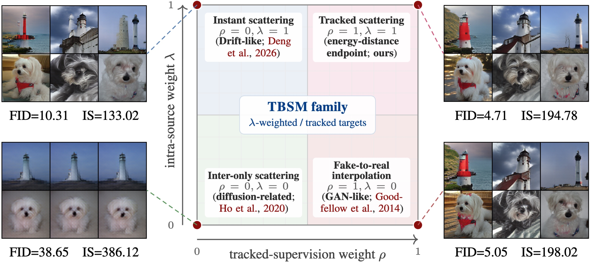

---

## 7. [LAMAR: An Open Language-Aware Multilingual Alignment Reranker](https://huggingface.co/papers/2607.22042)
**Upvotes**: 8 | **도입 난이도**: 중 | **신뢰도**: 상
**arXiv**: https://arxiv.org/abs/2607.22042

**태그**: RAG, NLP, Information Retrieval, Multilingual, Benchmark, Evaluation, Distillation, Safety

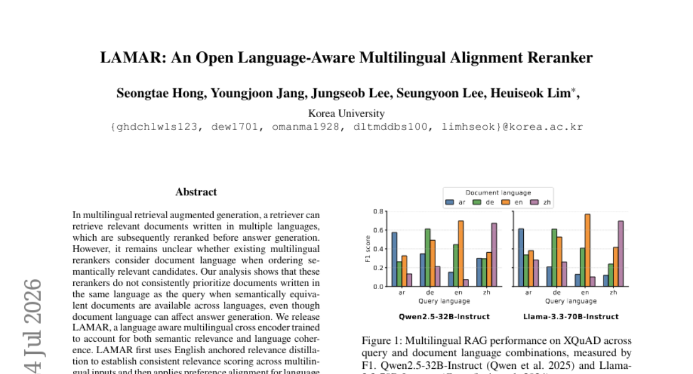

### 📌 한 줄 요약
질문 언어와 문서 언어 간의 일관성을 유지하면서 의미적 관련성을 확보하는 다국어 RAG용 리랭커(LAMAR) 제안

### 🔑 핵심 포인트
- 질문 언어와 문서 언어 간의 일관성(Language Coherence)을 고려하는 다국어 리랭킹 메커니즘 개발
- 영어 기반 관련성 증류를 통해 다국어 입력 간 일관된 점수 체계 구축
- 선호도 정렬(Preference Alignment)을 적용하여 의미적 관련성을 유지하면서도 질문 언어 문서를 상위로 배치

### 🧑‍💻 개발자 관점
사용자가 질문한 언어로 답변을 생성해야 하는 RAG 시스템에서, 검색 결과의 언어 불일치로 인한 답변 품질 저하 문제를 해결할 수 있습니다.

### 🚀 실무 적용 아이디어
- 다국어 RAG 파이프라인에 LAMAR 모델을 적용하여 답변 생성 품질 변화 측정
- 질문 언어와 검색 문서 언어가 다를 때의 성능 변화(Language Coherence) 테스트
- 기존 다국어 리랭커(Cross-Encoder)와 LAMAR의 추론 속도 및 정확도 비교

### ⚠️ 리스크/한계
- 언어 일관성을 지나치게 강조할 경우, 질문 언어보다 의미적으로 더 우수한 타 언어 문서가 배제될 위험이 있음
- 다양한 언어 쌍에 대한 일반화 성능에 대한 추가 검증 필요

### 📝 초록 기반 상세 설명
다국어 RAG 환경에서는 검색된 문서들의 언어가 다양할 수 있으며, 이후 리랭킹 과정을 거칩니다. 기존의 다국어 리랭커들은 의미적으로 유사한 문서가 여러 언어로 존재할 때, 질문 언어와 일치하는 문서를 우선순위에 두는 '언어적 일관성'을 충분히 고려하지 못하는 문제가 있습니다. 이를 해결하기 위해 본 논문은 의미적 관련성과 언어적 일관성을 동시에 고려하는 LAMAR를 제안합니다. LAMAR는 영어 기반의 관련성 증류(English anchored relevance distillation)로 일관된 점수를 확보한 뒤, 선호도 정렬(preference alignment)을 통해 질문 언어와 일치하는 문서의 순위를 높입니다. 실험 결과, LAMAR는 언어 일관성 평가와 기존 다국어 벤치마크 모두에서 우수한 성능을 보였습니다. 특히 실무적인 검색 설정에서도 기존 방식보다 뛰어난 성능을 입증했습니다.

---

## 8. [O-VAD: Industrial Video Anomaly Detection through Object-Centric Tracking and Reasoning](https://huggingface.co/papers/2607.18142)
**Upvotes**: 8 | **도입 난이도**: 하 | **신뢰도**: 상
**arXiv**: https://arxiv.org/abs/2607.18142

**태그**: Agent, VLM, Anomaly Detection, Object Tracking, Reasoning, Video, Inference

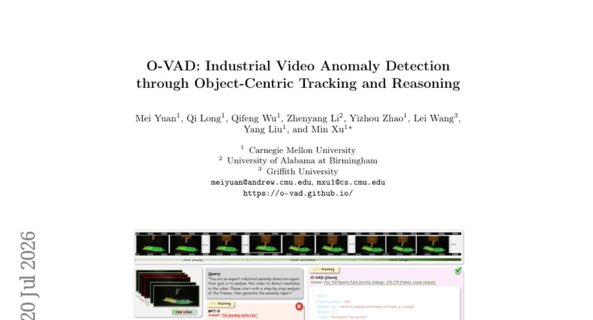

### 📌 한 줄 요약
도메인 지식 주입이나 재학습 없이 객체 중심의 추적과 추론을 통해 산업용 영상의 이상 징후를 탐지하는 에이전트 프레임워크

### 🔑 핵심 포인트
- 도메인 지식 주입이나 재학습이 필요 없는 training-free 에이전트 프레임워크 제안
- 객체 중심의 시공간적 상태 변화(state evolution) 추적 및 추론 메커니즘 도입
- 이상 탐지 결과에 대한 해석 가능한 보고서 생성 기능 제공

### 🧑‍💻 개발자 관점
특정 공정에 맞춘 재학습 없이도 즉시 적용 가능한 범용적인 이상 탐지 파이프라인을 구축할 수 있습니다.

### 🚀 실무 적용 아이디어
- 제공된 프레임워크를 다양한 산업용 데이터셋(정상/이상)에 적용하여 객체 추적 성능 검증
- 에이전트의 추론 과정이 실제 물리적 제약 조건을 얼마나 정확히 반영하는지 테스트
- 실시간 추론 속도가 실제 제조 라인의 요구 사양을 충족하는지 확인

### ⚠️ 리스크/한계
- 객체 간 상호작용이 매우 복잡하거나 가려짐(occlusion)이 심한 환경에서의 추적 정확도 저하 가능성
- 에이전트 기반 추론 방식의 연산 비용이 실시간 시스템 적용에 부담이 될 수 있음

### 📝 초록 기반 상세 설명
산업용 영상 이상 탐지(IVAD)는 제조 공정의 품질 관리를 위해 필수적이지만, 복잡한 객체 변형과 엄격한 물리적 제약이 존재하는 산업 현장에서는 기존 VLM 기반 방식의 성능이 저하되는 문제가 있습니다. 이를 해결하기 위해 본 논문은 도메인 지식 없이도 인간 검사관처럼 객체의 상태 변화를 추적하는 학습 불필요(training-free) 에이전트 프레임워크인 O-VAD를 제안합니다. O-VAD는 탐지된 객체의 시공간적 역동성과 근본적인 변형 과정을 추적한 후, 객체별 시간적 상태 궤적을 바탕으로 이상 객체를 식별합니다. 실험 결과, 제안 방법은 기존 VLM 및 전통적 VAD 방식보다 우수한 성능을 보였으며, 이상 과정과 유형에 대한 해석 가능한 보고서를 제공합니다.

---

## 9. [Multi-Head Latent Control: A Unified Interface for LLM Agent Decision Making](https://huggingface.co/papers/2607.14277)
**Upvotes**: 6 | **도입 난이도**: 하 | **신뢰도**: 상
**arXiv**: https://arxiv.org/abs/2607.14277

**태그**: LLM-Agent, Latent-Control, Efficiency, Decision-Making, Agent, RAG, Reasoning, Vision, Benchmark, Inference

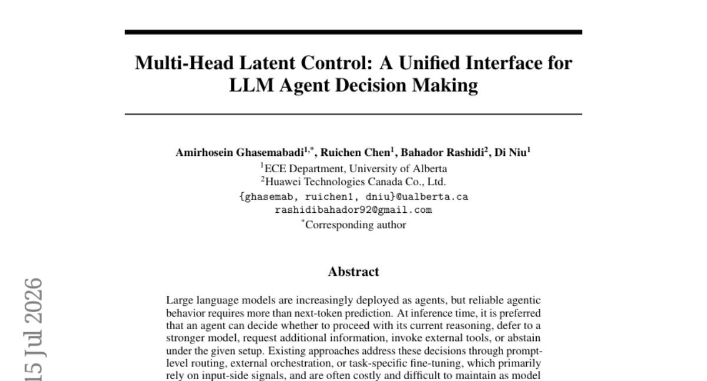

### 📌 한 줄 요약
LLM의 잠재 상태(Latent State)를 활용해 모델 수정 없이 에이전트의 의사결정(도구 사용, 모델 교체 등)을 제어하는 경량 레이어 제안

### 🔑 핵심 포인트
- Frozen LLM의 은닉 상태(Hidden-state)를 활용한 경량 제어 레이어 설계
- Capability Head(수행 가능 여부)와 Resolution Head(해결 방식 결정)의 이중 구조
- 모델 파라미터를 수정하지 않고도 사후 적응(Post hoc adaptation)이 가능한 구조

### 🧑‍💻 개발자 관점
모델 전체를 파인튜닝하거나 복잡한 프롬프트 엔지니어링을 매번 수정할 필요 없이, 기존 모델의 출력값만으로 효율적인 에이전트 워크플로우를 구축할 수 있습니다.

### 🚀 실무 적용 아이디어
- 기존 LLM의 Hidden-state를 추출하여 특정 태스크(Tool-use 등) 분류기로 학습시켜보기
- Small-Large 모델 조합 환경에서 Latent Control이 비용 절감에 미치는 영향 측정하기
- 특정 도구 사용 시점의 은닉 상태 변화가 의사결정 신호와 어떻게 상관관계가 있는지 분석하기

### ⚠️ 리스크/한계
- 모델 백본(Backbone)이 바뀌면 은닉 상태 분포가 달라져 제어 헤드를 재학습해야 함
- 특정 도메인에 특화된 은닉 상태 패턴을 학습할 경우 일반화 성능이 저하될 가능성

### 📝 초록 기반 상세 설명
LLM 에이전트가 복잡한 작업을 수행할 때, 단순히 다음 토큰을 예측하는 것 이상의 정교한 의사결정이 필요합니다. 기존의 프롬프트 기반 라우팅이나 외부 오케스트레이션 방식은 비용이 높고 모델 업데이트 시 유지보수가 어렵다는 단점이 있습니다. 본 논문은 모델의 내부 은닉 상태(Hidden-state)를 직접 읽어 제어 신호를 생성하는 'Multi-Head Latent Control'을 제안합니다. 이 방식은 고정된(Frozen) LLM의 잠재 궤적을 학습하여, 작업 수행 가능 여부와 구체적인 해결 방식(도구 사용, 질문, 답변 등)을 예측합니다. 실험 결과, 모델의 성능을 유지하면서도 대형 모델 사용량을 획기적으로 줄이고 도구 사용 정확도를 크게 향상시켰습니다.

### 🖼️ 추가 자료
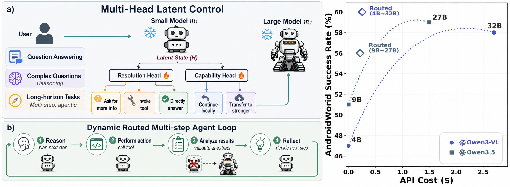

---

## 10. [IDEAgent: Agentic Quality-Diversity Search for Research Idea Generation](https://huggingface.co/papers/2607.22375)
**Upvotes**: 4 | **도입 난이도**: 중 | **신뢰도**: 상
**arXiv**: https://arxiv.org/abs/2607.22375

**태그**: Agent, LLM, Idea Generation, Multi-Agent, RAG, Evaluation

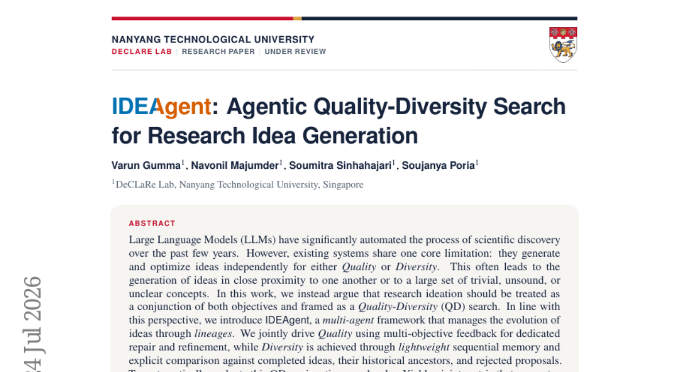

### 📌 한 줄 요약
품질과 다양성을 동시에 확보하여 혁신적이고 독창적인 연구 아이디어를 생성하는 멀티 에이전트 프레임워크

### 🔑 핵심 포인트
- 품질(Quality)과 다양성(Diversity)을 동시에 최적화하는 QD-search 프레임워크 제안
- 아이디어 계보(Lineage) 관리와 피드백 루프를 통한 정교한 아이디어 생성 및 정제
- 품질 임계치를 충족하는 다양한 아이디어 집합을 측정하는 새로운 지표 'Yield' 도입

### 🧑‍💻 개발자 관점
단순히 질문에 답하는 것을 넘어, 창의적이고 서로 다른 관점의 아이디어를 대량으로 생성해야 하는 기획 및 연구 단계에서 유용합니다.

### 🚀 실무 적용 아이디어
- 제시된 Yield 지표를 활용하여 기존 LLM 프롬프트 엔지니어링 결과물 평가해보기
- 멀티 에이전트 구조에서 피드백 루프(Repair/Refinement) 설계 방식 벤치마킹하기
- 아이디어 생성 시 과거 이력을 메모리에 저장하여 중복을 방지하는 로직 구현해보기

### ⚠️ 리스크/한계
- 아이디어의 질이 특정 도메인에 국한될 수 있는 위험성
- 에이전트 간 상호작용 과정에서 발생하는 연산 비용 및 지연 시간

### 📝 초록 기반 상세 설명
최근 LLM을 활용한 과학적 발견 자동화가 진행 중이지만, 기존 방식은 품질(Quality)과 다양성(Diversity)을 독립적으로 최적화하여 아이디어가 서로 비슷하거나 질이 낮은 문제가 있었습니다. 본 논문은 연구 아이디어 생성을 품질과 다양성의 결합 문제로 정의하고, 이를 해결하기 위한 멀티 에이전트 프레임워크인 IDEAgent를 제안합니다. IDEAgent는 피드백 기반의 수선/정제 과정을 통해 품질을 높이고, 메모리와 과거 이력 비교를 통해 아이디어 간의 중복을 방지하며 다양성을 확보합니다. 또한, 품질 임계치를 만족하는 최대의 상호 이질적 아이디어 집합을 측정하는 새로운 지표인 Yield를 개발했습니다. 8개 도메인에 걸친 실험 결과, IDEAgent는 기존 베이스라인 대비 Yield 지표에서 3.89배 높은 성능을 보이며 더 넓은 주제 범위에서 유효한 아이디어를 생성했습니다.

---

## 11. [SceneActBench: Can Agents Act on the 3D Scenes They See?](https://huggingface.co/papers/2607.22393)
**Upvotes**: 4 | **도입 난이도**: 중 | **신뢰도**: 상
**arXiv**: https://arxiv.org/abs/2607.22393

**태그**: Agent, 3D-Vision, Benchmark, VLM, Vision, Video, Evaluation

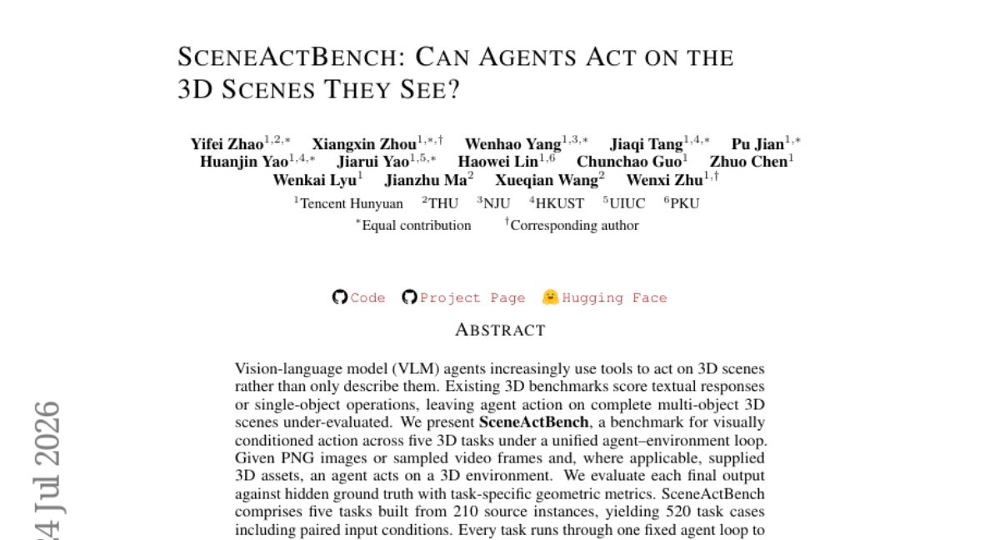

### 📌 한 줄 요약
멀티 오브젝트 3D 환경에서 VLM 에이전트의 실질적인 조작 능력을 평가하기 위한 벤치마크 제안

### 🔑 핵심 포인트
- 시각적 조건 기반의 3D 행동 평가를 위한 통합 벤치마크(SceneActBench) 개발
- 단순 텍스트 응답이 아닌 기하학적 지표를 활용한 실질적 결과물 검증 방식 도입
- 멀티 오브젝트 환경에서의 에이전트 행동 제어 능력을 평가하는 5가지 작업 구성

### 🧑‍💻 개발자 관점
3D 환경(로봇, 디지털 트윈 등)에서 시각 정보를 바탕으로 직접적인 물리적/가상적 조작을 수행하는 에이전트 개발 시 핵심 평가 지표로 활용 가능합니다.

### 🚀 실무 적용 아이디어
- 제시된 5가지 3D 작업에 대해 현재 사용 중인 VLM 에이전트 성능 테스트
- 기하학적 지표 기반의 결과 검증 파이프라인 구축
- 멀티 오브젝트 환경에서의 에이전트 실패 패턴 분석 및 프롬프트 엔지니어링 적용

### ⚠️ 리스크/한계
- 현재의 VLM 모델들이 복잡한 3D 조작 작업에서 일관된 성능을 내지 못함
- 특정 작업에 편향된 성능이 나타날 수 있는 환경적 제약 존재

### 📝 초록 기반 상세 설명
최근 VLM 에이전트는 단순 묘사를 넘어 3D 환경에서 도구를 사용하는 방향으로 발전하고 있습니다. 그러나 기존 벤치마크는 텍스트 응답이나 단일 객체 조작에 치중되어 있어, 복잡한 멀티 오브젝트 3D 환경에서의 에이전트 행동을 평가하기 어렵습니다. 본 논문은 통합된 에이전트-환경 루프를 통해 시각적 조건에 따른 행동을 평가하는 SceneActBench를 제안합니다. 5가지 3D 작업과 520개의 케이스를 포함하며, 기하학적 지표를 통해 최종 결과물을 검증합니다. 11종의 독점 VLM을 평가한 결과, 모든 모델이 작업 간 일관된 성능을 보이지 못하는 한계를 드러냈습니다.

---

## 12. [Closing the Loop: Training-Free Revisit Consistency for Autoregressive Generative Rendering](https://huggingface.co/papers/2607.21848)
**Upvotes**: 4 | **도입 난이도**: 하 | **신뢰도**: 상
**arXiv**: https://arxiv.org/abs/2607.21848

**태그**: Video Generation, 3D Vision, Consistency, Zero-shot, Video

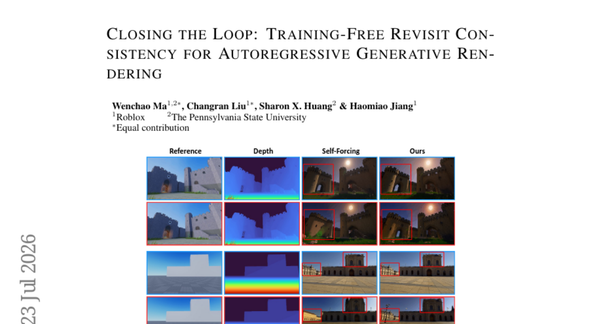

### 📌 한 줄 요약
추가 학습 없이 3D 엔진의 기하학적 정보를 활용하여 비디오 생성 모델의 재방문 시 일관성 문제를 해결하는 기술

### 🔑 핵심 포인트
- 학습이 필요 없는(Training-free) 루프 폐쇄(Loop-closure) 메커니즘 제안
- 시간적/공간적 대응 관계를 활용한 KV 캐시 관리 및 어텐션 제어
- 3D 엔진의 기하학적 정보(Pose, Depth)를 활용한 일관성 유지

### 🧑‍💻 개발자 관점
게임이나 메타버스 환경에서 카메라가 이동했다가 돌아올 때 배경이 바뀌는 문제를 모델 재학습 없이 해결할 수 있는 실용적인 방법론을 제시합니다.

### 🚀 실무 적용 아이디어
- 제공된 소스코드를 활용하여 기존 비디오 생성 모델의 KV 캐시 관리 로직과 비교 실험
- Depth map과 Pose 데이터가 주어지는 환경에서 재방문 일관성 변화 측정
- 다양한 카메라 궤적(Trajectory)에 따른 성능 안정성 테스트

### ⚠️ 리스크/한계
- 3D 엔진의 정교한 Pose 및 Depth 데이터에 의존적임
- 매우 복잡한 텍스처 변화가 있는 환경에서의 공간적 대응 정확도 이슈 가능성

### 📝 초록 기반 상세 설명
최근 조건부 비디오 생성 모델은 3D 엔진 렌더링을 실사 비디오로 변환하는 데 유용하게 사용되고 있습니다. 그러나 자기회귀(Auto-regressive) 방식의 특성상 KV 캐시가 삭제된 후 카메라가 이전 위치를 다시 방문하면, 입력 조건이 동일하더라도 생성된 외형이 달라지는 일관성 문제가 발생합니다. 본 논문은 별도의 사후 학습 없이 3D 엔진이 제공하는 대응 관계를 활용하여 이 문제를 해결합니다. 시간적 대응을 통해 과거의 잠재(latent) 청크를 KV 캐시에 복구하고, 카메라 포즈와 깊이 재투영을 통한 공간적 대응으로 어텐션 편향을 유도합니다. 실험 결과, 복잡한 경로에서도 비디오 품질 저하 없이 재방문 일관성을 효과적으로 개선함을 입증했습니다.

---

## 13. [Spectral Prior for Reducing Exposure Bias in Diffusion Models](https://huggingface.co/papers/2607.22091)
**Upvotes**: 3 | **도입 난이도**: 하 | **신뢰도**: 상
**arXiv**: https://arxiv.org/abs/2607.22091

**태그**: Diffusion, Generative AI, Computer Vision, Signal Processing, Inference, Safety

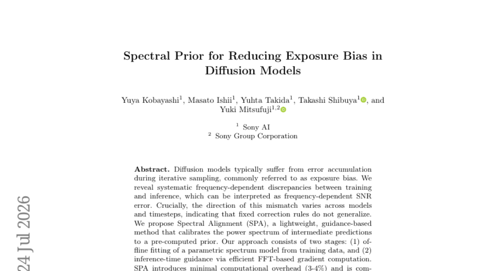

### 📌 한 줄 요약
주파수 영역의 스펙트럼 정렬을 통해 확산 모델의 노이즈 누적(Exposure Bias) 문제를 해결하는 경량 가이드 방식

### 🔑 핵심 포인트
- 학습-추론 간의 주파수 의존적 불일치(Frequency-dependent mismatch) 현상 규명
- FFT 기반의 경량 가이드 방식인 Spectral Alignment(SPA) 제안
- 픽셀 공간 모델부터 최신 잠재 확산(SDXL) 및 플로우 매칭(FLUX) 모델까지 범용적 적용 가능

### 🧑‍💻 개발자 관점
추가적인 모델 재학습 없이 기존 모델에 가이드 방식으로 적용할 수 있어, 생성 품질을 높이면서도 연산 비용을 최소화할 수 있습니다.

### 🚀 실무 적용 아이디어
- 제공된 GitHub 코드를 활용하여 SDXL 또는 FLUX 모델에 SPA 적용 테스트
- CFG(Classifier-Free Guidance) 스케일 값과 SPA 파라미터 간의 상호작용 분석
- 다양한 해상도 및 종횡비 환경에서 스펙트럼 정렬의 안정성 검증

### ⚠️ 리스크/한계
- 사전 계산된 스펙트럼 모델이 특정 데이터셋에 과적합될 가능성
- FFT 연산이 포함되어 있어 아주 미세한 추론 지연 발생 가능

### 📝 초록 기반 상세 설명
확산 모델은 반복적인 샘플링 과정에서 오차가 누적되는 노출 편향(Exposure Bias) 문제를 겪습니다. 연구진은 학습과 추론 사이의 주파수별 불일치가 SNR 오차로 작용함을 발견했습니다. 이 오차 방향은 모델과 타임스텝에 따라 달라지므로 고정된 보정 규칙을 적용하기 어렵습니다. 이를 해결하기 위해 사전 계산된 스펙트럼 우선순위에 맞춰 중간 예측값을 교정하는 Spectral Alignment(SPA)를 제안합니다. SPA는 오프라인 스펙트럼 피팅과 FFT 기반의 효율적인 추론 가이드를 결합한 방식입니다. 결과적으로 계산 오버헤드를 최소화하면서도 다양한 아키텍처에서 생성 품질을 개선했습니다.

---

## 14. [VisCo: Leveraging Large Language Models as Intrinsic Encoders for Visual Token Compression](https://huggingface.co/papers/2607.12756)
**Upvotes**: 2 | **도입 난이도**: 중 | **신뢰도**: 상
**arXiv**: https://arxiv.org/abs/2607.12756

**태그**: VLM, Token Compression, Efficiency, Autoencoder, RAG, Vision, Evaluation, Inference, Optimization

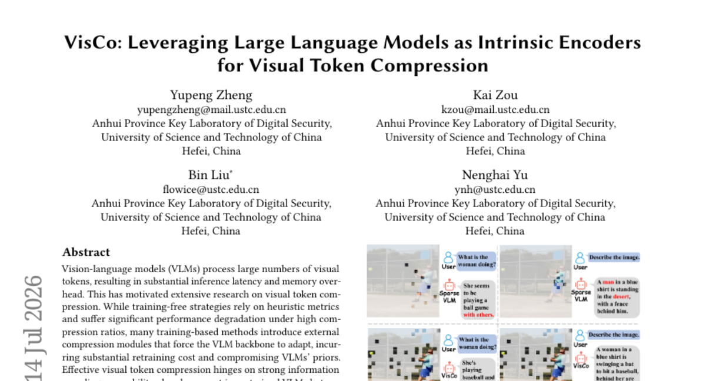

### 📌 한 줄 요약
사전 학습된 VLM의 능력을 활용하여 추가 모듈 없이 시각적 토큰을 압축하는 효율적인 자기 압축 프레임워크

### 🔑 핵심 포인트
- 사전 학습된 VLM을 인코더이자 압축기로 재사용하는 파라미터 공유형 오토인코더 구조
- 외부 모듈 없이 모델 내부의 잠재력을 활용하여 재학습 비용 최소화 및 성능 유지
- 높은 압축률 및 극단적인 단일 토큰 설정에서도 안정적인 정보 보존 능력

### 🧑‍💻 개발자 관점
VLM의 추론 지연 시간과 메모리 오버헤드를 줄이면서도 모델의 원래 성능을 유지할 수 있는 효율적인 압축 전략을 제공합니다.

### 🚀 실무 적용 아이디어
- 제시된 파라미터 공유 구조를 기존 VLM 백본에 이식하여 압축 효율 테스트
- 다양한 압축 비율(Compression Ratio)에 따른 성능 저하 곡선 비교 실험
- 메모리 토큰과 원본 토큰의 결합 시 성능 향상 폭 검증

### ⚠️ 리스크/한계
- 높은 압축률 적용 시 정보 손실로 인한 세부 디테일 복원력 저하 가능성
- 특정 도메인 데이터에 대한 과적합 여부 확인 필요

### 📝 초록 기반 상세 설명
기존의 시각적 토큰 압축 방식은 휴리스틱 기반의 성능 저하나 외부 모듈 도입에 따른 막대한 재학습 비용 문제를 안고 있었습니다. 본 논문은 VLM이 이미 보유한 정보 인코딩 능력을 활용하여 모델 자체를 압축기로 사용하는 VisCo를 제안합니다. VisCo는 파라미터를 공유하는 오토인코더 구조로, 소수의 메모리 토큰을 통해 시각 정보를 압축하고 계층적 정보를 전달합니다. 실험 결과, VisCo는 모든 압축 비율에서 기존 방식을 능가했으며 특히 높은 압축률에서도 안정적인 성능을 보였습니다. 또한 학습된 메모리 토큰이 원본 토큰과 결합 시 베이스 모델의 성능까지 향상시키는 효과를 입증했습니다.

---

## 15. [Multimodal Speaker Verification as a Threat to Speaker Anonymization](https://huggingface.co/papers/2607.19636)
**Upvotes**: 1 | **도입 난이도**: 중 | **신뢰도**: 상
**arXiv**: https://arxiv.org/abs/2607.19636

**태그**: Speaker Verification, Privacy, Multimodal, Anonymization, Audio

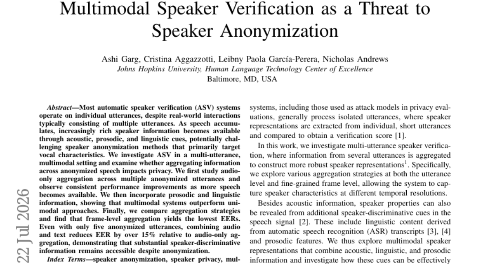

### 📌 한 줄 요약
음성 익명화 기술이 적용된 데이터라도 다중 발화와 멀티모달(음성+텍스트) 정보를 결합하면 화자 식별이 가능해질 수 있음을 경고함

### 🔑 핵심 포인트
- 다중 발화 데이터 축적 시 화자 식별 성능이 지속적으로 향상됨
- 음성뿐만 아니라 텍스트(언어 정보)를 결합한 멀티모달 방식이 익명화 우회에 더 효과적임
- 프레임 수준의 정보 집계(Aggregation)가 가장 강력한 화자 식별 성능을 보임

### 🧑‍💻 개발자 관점
음성 데이터 익명화 솔루션을 설계할 때, 단순 음성 변조만으로는 텍스트/운율 정보를 통한 화자 재식별 위협을 막을 수 없음을 인지해야 합니다.

### 🚀 실무 적용 아이디어
- 현재 적용 중인 음성 익명화 모델에 텍스트(ASR 결과)를 결합한 공격 시나리오 테스트
- 다중 발화 환경에서의 화자 식별 성능(EER) 변화 추이 모니터링
- 음성 특징량뿐만 아니라 언어적 특징까지 제거하는 차세대 익명화 기법 검토

### ⚠️ 리스크/한계
- 음성 변조 기술이 고도화될 경우 텍스트 정보를 통한 재식별 위험이 매우 높음
- 단순한 음성 특징 제거만으로는 완전한 화자 프라이버시 보장이 어려움

### 📝 초록 기반 상세 설명
기존의 자동 화자 인증(ASV) 시스템은 주로 단일 발화에 집중하지만, 실제 환경에서는 여러 발화가 축적되며 풍부한 화자 정보가 생성됩니다. 본 연구는 음성 익명화 기술이 적용된 상황에서 다중 발화 및 멀티모달 정보 결합이 프라이버시에 미치는 영향을 조사했습니다. 연구진은 오디오 전용 집계 방식과 프로소디(운율) 및 언어 정보를 결합한 멀티모달 방식을 비교 분석했습니다. 실험 결과, 데이터가 축적될수록 화자 식별 성능이 향상되었으며 특히 멀티모달 방식이 단일 모달보다 우수한 성능을 보였습니다. 또한 프레임 수준의 집계 방식이 가장 낮은 EER(등가 오류율)을 기록하며 강력한 식별력을 보였습니다. 결론적으로 단 5개의 익명화된 발화만으로도 텍스트 결합 시 EER이 15% 이상 감소하여, 기존 익명화 방식의 취약성을 입증했습니다.

---

## 16. [Interactive Training 2: Auditable Control Plane for Live Model Training](https://huggingface.co/papers/2607.18314)
**Upvotes**: 1 | **도입 난이도**: 중 | **신뢰도**: 상
**arXiv**: https://arxiv.org/abs/2607.18314

**태그**: MLOps, Model Training, Control Plane, Automation, Agent

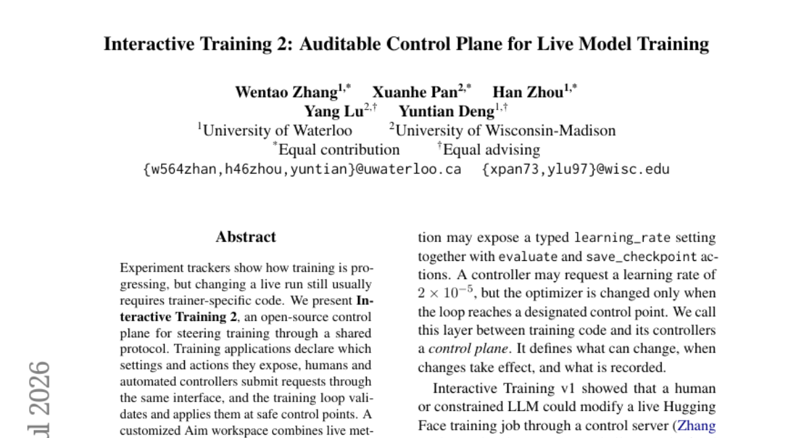

### 📌 한 줄 요약
실행 중인 모델 학습을 코드 수정 없이 안전하고 감사 가능한 방식으로 제어할 수 있는 오픈소스 컨트롤 플레인 프레임워크

### 🔑 핵심 포인트
- 코드 수정 없이 학습 중 설정을 변경할 수 있는 표준화된 프로토콜 제공
- 인간과 자동화된 에이전트가 동일한 인터페이스를 사용하는 통합 컨트롤 플레인
- 요청과 결과의 이력을 기록하여 추적 및 감사가 가능한 워크스페이스 구축

### 🧑‍💻 개발자 관점
학습 중 하이퍼파라미터를 변경하거나 특정 시점에 개입해야 할 때, 코드를 멈추고 수정하는 대신 안전하게 제어할 수 있는 운영 체계를 제공합니다.

### 🚀 실무 적용 아이디어
- 기존 학습 루프에 제어 지점(Control Points)을 삽입하는 구조 설계해보기
- Aim 워크스페이스와 연동하여 실시간 메트릭과 제어 명령을 시각화하는 프로토타입 구현
- 자동화된 에이전트가 학습 중 특정 임계치에 따라 설정을 변경하는 시나리오 테스트

### ⚠️ 리스크/한계
- 학습 루프 내 제어 지점 적용 시 발생할 수 있는 오버헤드 및 성능 저하
- 동적 설정 변경 시 모델 상태(State)의 일관성 유지 문제

### 📝 초록 기반 상세 설명
기존의 실험 트래커는 학습 진행 상황을 보여주지만, 실행 중인 학습 설정을 변경하려면 여전히 학습 코드 자체를 수정해야 하는 번거로움이 있습니다. 이를 해결하기 위해 저자들은 공유 프로토콜을 통해 학습 과정을 조종하는 'Interactive Training 2' 컨트롤 플레인을 제안합니다. 학습 애플리케이션은 노출할 설정과 액션을 선언하고, 인간이나 자동화된 컨트롤러는 동일한 인터페이스를 통해 요청을 제출하며, 학습 루프는 안전한 제어 지점에서 이를 검증하고 적용합니다. 커스텀 Aim 워크스페이스를 통해 실시간 메트릭과 제어 기능, 그리고 요청 및 결과에 대한 연대기적 기록을 통합했습니다. NLP 및 강화 학습 워크플로를 통해 시스템의 유효성을 입증하였으며, 이는 감사 가능한 인간/에이전트 가이드 학습을 위한 재사용 가능한 기반을 제공합니다.

### 🖼️ 추가 자료
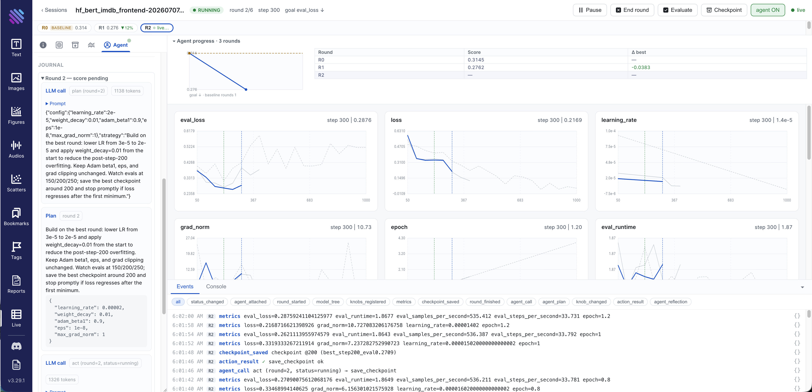

---

