# 2026-07-29 Daily Papers (Top 30)

## 오늘의 요약
오늘의 연구는 대규모 모델의 효율적인 스케일링과 지식 증류를 통한 오픈소스 모델의 성능 향상에 집중되었습니다. 또한, 로봇 학습을 위한 데이터 전략과 픽셀 기반을 넘어선 에이전트의 상태 중심 제어 방식 등 실질적인 자동화와 물리적 상호작용을 위한 프레임워크들이 주목받았습니다.

### 오늘의 핵심 포인트
- 고성능 독점 모델의 추론 능력을 오픈소스 모델로 효율적으로 이식하기 위한 멀티 에이전트 및 프로토콜 기반의 지식 증류 기술이 제시되었습니다.
- 에이전트 설계에 있어 시각적 픽셀 의존도를 낮추고 프로그램 상태(State)나 캔버스 기반의 구조적 관리를 통해 복잡한 워크플로우를 해결하려는 시도가 나타났습니다.
- 비디오 생성 및 로봇 학습 분야에서 데이터 피라미드와 어텐션 희소화 등 효율적인 학습 및 추론을 위한 전략적 프레임워크들이 중요하게 다뤄졌습니다.

**오늘의 태그**: AI Agent, Knowledge Distillation, Robotics, Efficient Inference, Open Source

## 1. [Kimi K3: Open Frontier Intelligence](https://huggingface.co/papers/2607.24653)
**Upvotes**: 247 | **도입 난이도**: 상 | **신뢰도**: 상
**arXiv**: https://arxiv.org/abs/2607.24653

**태그**: MoE, Agent, Coding, Long-Context, Vision, Reasoning, Evaluation

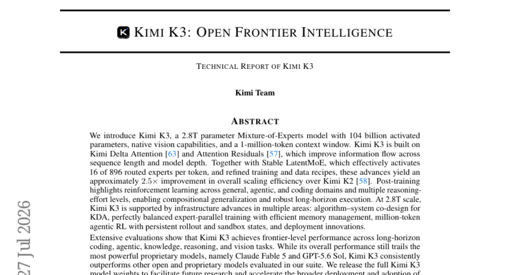

### 📌 한 줄 요약
2.8T 파라미터 규모의 MoE 모델로, 100만 토큰 컨텍스트와 강력한 에이전트/코딩 능력을 갖춘 오픈 소스 프론티어 모델

### 🔑 핵심 포인트
- 2.8T 파라미터 MoE 구조 및 104B 활성 파라미터 설계
- KDA(Kimi Delta Attention)와 Stable LatentMoE를 통한 스케일링 효율 2.5배 향상
- 100만 토큰 컨텍스트와 에이전트/코딩 특화 강화학습(RL) 적용

### 🧑‍💻 개발자 관점
대규모 컨텍스트와 에이전트 능력을 갖춘 오픈 모델로서, 복잡한 코딩 작업 및 장기 실행(Long-horizon) 작업 자동화에 즉시 활용 가능합니다.

### 🚀 실무 적용 아이디어
- 100만 토큰 컨텍스트를 활용한 대규모 코드베이스 분석 실험
- 에이전트 워크플로우 내에서의 추론 및 실행 능력 검증
- 기존 모델 대비 코딩 및 비전 작업의 성능 벤치마크 비교

### ⚠️ 리스크/한계
- 최상위 독점 모델(Claude Fable 5, GPT-5.6) 대비 성능 격차 존재
- 2.8T 규모 모델의 거대한 크기로 인한 하드웨어 요구사항 및 배포 난이도

### 📝 초록 기반 상세 설명
기존 모델의 스케일링 효율성과 긴 컨텍스트 처리 능력을 개선하기 위해 Kimi K3를 개발했습니다. Kimi Delta Attention과 Attention Residuals를 통해 정보 흐름을 최적화하고, Stable LatentMoE를 도입하여 효율적인 전문가 활성화를 구현했습니다. 또한 에이전트 및 코딩 도메인에 특화된 강화학습(RL)과 데이터 레시피를 적용했습니다. 그 결과 Kimi K2 대비 2.5배의 스케일링 효율 향상을 달성하며 코딩, 에이전트, 비전 등 다양한 작업에서 프론티어급 성능을 확보했습니다. 최종적으로 모델 가중치를 공개하여 연구 및 배포 가속화를 목표로 합니다.

---

## 2. [JarvisHub: An Open Harness for Canvas-Native Multimodal Creative Agents](https://huggingface.co/papers/2607.23588)
**Upvotes**: 101 | **도입 난이도**: 중 | **신뢰도**: 상
**arXiv**: https://arxiv.org/abs/2607.23588

**태그**: Agent, Multimodal, Canvas-Native, Workflow, Vision, Video, Audio, Evaluation

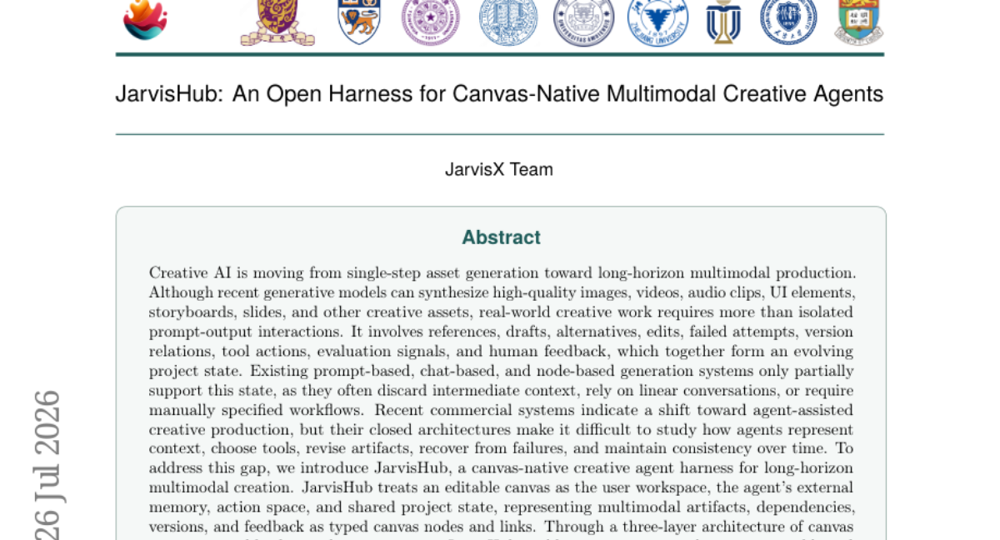

### 📌 한 줄 요약
캔버스 기반의 상태 관리와 에이전트 실행 환경을 결합하여 장기적인 멀티모달 창작 작업을 지원하는 오픈 프레임워크

### 🔑 핵심 포인트
- 캔버스를 에이전트의 외부 메모리, 액션 공간, 공유 프로젝트 상태로 정의하는 설계
- 멀티모달 결과물, 의존성, 버전을 타입화된 노드와 링크로 관리하는 구조
- 사용자의 개입과 에이전트의 자동화가 공존하는 3계층 아키텍처(Canvas State, Protocol Bridge, Agent Runtime)

### 🧑‍💻 개발자 관점
단순 챗봇 형태를 넘어, 복잡한 워크플로우와 버전 관리가 필요한 에이전트 시스템 설계 시 참조할 수 있는 구조적 프레임워크를 제시합니다.

### 🚀 실무 적용 아이디어
- 캔버스 기반 UI와 에이전트 상태 동기화 로직 구현 실험
- 멀티모달 자산 간의 의존성 그래프(Dependency Graph) 관리 모델 적용
- 사용자 피드백이 에이전트의 계획(Planning)에 반영되는 루프 설계

### ⚠️ 리스크/한계
- 캔버스 내 복잡도가 증가할 경우 에이전트의 컨텍스트 관리 부하 발생 가능성
- 사용자의 수동 개입과 에이전트 자동화 간의 충돌 제어 문제

### 📝 초록 기반 상세 설명
최근 생성형 AI는 단일 자산 생성을 넘어 장기적인 멀티모달 제작 단계로 진화하고 있습니다. 그러나 기존의 채팅이나 노드 기반 시스템은 작업 과정에서의 맥락, 버전 관리, 도구 간 의존성 등을 통합적으로 관리하기 어렵다는 한계가 있습니다. 이를 해결하기 위해 본 논문은 캔버스를 에이전트의 외부 메모리이자 작업 공간으로 활용하는 JarvisHub를 제안합니다. JarvisHub는 캔버스 상태, 프로토콜 브리지, 에이전트 런타임의 3계층 구조를 통해 에이전트가 생성된 결과물을 검토, 수정, 조직화할 수 있게 합니다. 결과적으로 사용자의 개입이 용이하면서도 에이전트가 지속적인 창작 자동화를 수행할 수 있는 환경을 제공합니다.

---

## 3. [From Proprietary to Open-Source: Bridging the Distribution Gap via Multi-Agent Protocol Distillation in Agentic Search](https://huggingface.co/papers/2607.24280)
**Upvotes**: 64 | **도입 난이도**: 상 | **신뢰도**: 상
**arXiv**: https://arxiv.org/abs/2607.24280

**태그**: Agentic Search, Knowledge Distillation, Multi-Agent, LLM Optimization, Agent, RAG, Reasoning, Vision, Benchmark, Evaluation, Distillation

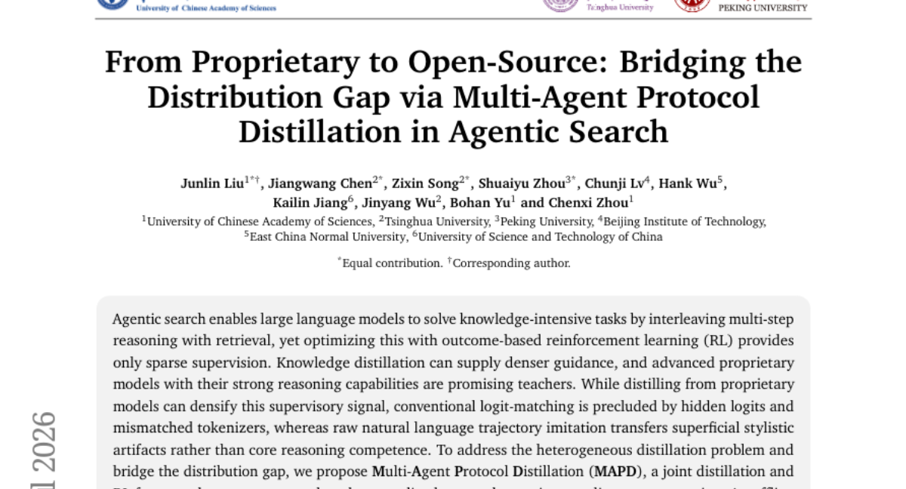

### 📌 한 줄 요약
독점 모델의 추론 능력을 오픈소스 모델로 전이하기 위해 구조화된 프로토콜을 활용하는 멀티 에이전트 증류 프레임워크 제안

### 🔑 핵심 포인트
- 구조화된 JSON 프로토콜을 중간 표현으로 사용하여 스타일 편향을 방지하고 핵심 추론 로직을 전이
- 멀티 에이전트 시스템(MAS)을 활용한 오프라인 데이터 생성 및 정교한 탐색 트레이스 구축
- 특권 브랜치(Privileged Branch)를 통한 밀도 높은 증류 신호와 희소한 RL 목적 함수의 결합

### 🧑‍💻 개발자 관점
고성능 독점 모델(GPT-4 등)의 추론 능력을 저사양 오픈소스 모델로 효율적으로 이식하려는 엔지니어에게 실질적인 가이드를 제공합니다.

### 🚀 실무 적용 아이디어
- 제공된 JSON 프로토콜 스키마를 활용하여 소규모 모델의 추론 성능 변화 측정
- 다양한 크기의 오픈소스 모델(Qwen 등)을 학생 모델로 설정하여 성능 전이 효율성 테스트
- 단순 텍스트 모방 방식과 MAPD 방식 간의 스타일 드리프트(Verbosity) 비교 실험

### ⚠️ 리스크/한계
- 구조화된 프로토콜 생성 과정에서 발생하는 오프라인 데이터의 품질이 학생 모델 성능에 직결됨
- 특권 브랜치를 사용하는 복잡한 학습 구조로 인해 학습 안정성 확보가 어려울 수 있음

### 📝 초록 기반 상세 설명
에이전트 기반 검색은 복잡한 태스크 해결을 위해 추론과 검색을 결합하지만, 결과 기반 RL만으로는 희소한 감독 신호로 인해 최적화가 어렵습니다. 기존의 로짓 매칭은 토크나이저 불일치로 불가능하며, 단순 텍답 텍스트 모방은 스타일만 복제할 뿐 핵심 추론 능력을 전달하지 못하는 문제가 있습니다. 이를 해결하기 위해 연구진은 구조화된 프로토콜을 중간 표현으로 사용하는 MAPD 프레임워크를 제안합니다. MAPD는 멀티 에이전트 시스템을 통해 쿼리 분해, 정보 검색, 오류 수정을 수행하고 이를 JSON 형태의 프로토콜로 변ค้า하여 학생 모델의 특권 브랜치에 제공합니다. 실험 결과, MAPD는 다양한 QA 벤치마크에서 기존 방식보다 우수한 성능을 보였으며 스타일 드리프트와 과도한 장황함을 효과적으로 억제했습니다.

---

## 4. [Rethinking Classifier-Free Guidance in On-Policy Diffusion Distillation](https://huggingface.co/papers/2607.24731)
**Upvotes**: 61 | **도입 난이도**: 중 | **신뢰도**: 상
**arXiv**: https://arxiv.org/abs/2607.24731

**태그**: Diffusion, Distillation, Generative Models, Video Generation, Vision, Video, Inference

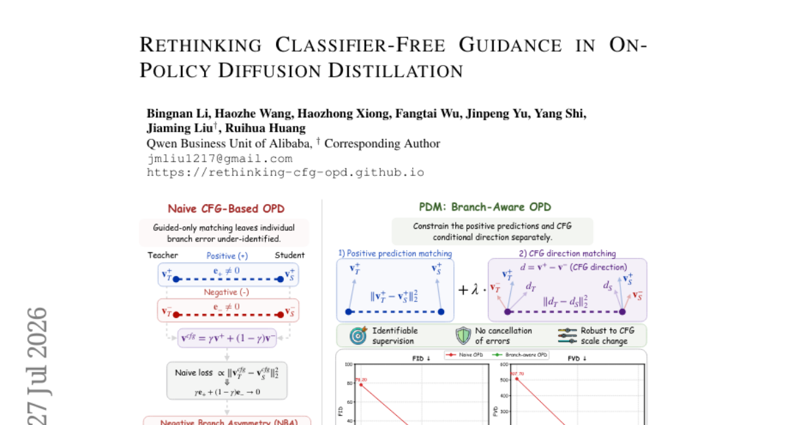

### 📌 한 줄 요약
CFG를 사용하는 온폴리시 증류(OPD) 시 발생하는 부정적 브랜치 비대칭(NBA) 문제를 해결하여 비디오 생성 모델의 지식 전이 효율을 높인 연구입니다.

### 🔑 핵심 포인트
- CFG 환경에서 기존 OPD 방식이 겪는 '부정적 브랜치 비대칭(NBA)' 현상 규명
- 양성 예측과 CFG 방향을 분리하여 학습하는 PDM(Positive-Direction Matching) 제안
- 가이드 스케일 변화에 강건한 비디오 생성/제어 성능 확보

### 🧑‍💻 개발자 관점
모델 증류(Distillation) 시 CFG 스케일을 높여도 성능이 무너지지 않는 견고한 생성 모델을 구축하는 데 중요한 가이드를 제공합니다.

### 🚀 실무 적용 아이디어
- 기존 CFG 기반 증류 루틴에 PDM 목적 함수를 적용하여 성능 변화 비교
- 가이드 스케일(Guidance Scale) 변화에 따른 생성 품질의 안정성 테스트
- 비디오 생성 모델의 텍스트-이미지 정렬(Alignment) 성능 측정

### ⚠️ 리스크/한계
- 제안된 PDM 방식이 모든 유형의 CFG 스키마에서 범용적으로 작동하는지에 대한 추가 검증 필요
- 분리된 브랜치 학습 시 계산 복잡도 증가 가능성

### 📝 초록 기반 상세 설명
최근 확산 모델의 온폴리시 증류(OPD) 방식은 CFG(Classifier-Free Guidance) 환경에서의 동작 원리가 명확히 밝혀지지 않았습니다. 기존 방식은 CFG가 적용된 최종 결과물만을 매칭하려 하여, 양(+)과 음(-)의 브랜치 오차가 서로 상쇄되는 식별 불가능성 문제를 야기합니다. 특히 교사 모델의 음성 브랜치에 학생 모델이 알 수 없는 정보가 포함될 경우, 오차가 한쪽은 줄고 다른 쪽은 늘어나는 '부정적 브랜치 비대칭(NBA)' 현상이 발생합니다. 이를 해결하기 위해 양성 예측과 CFG 조건 방향을 분리하여 제약하는 Positive-Direction Matching(PDM) 목적 함수를 제안합니다. 실험 결과, PDM은 가이드 스케일에 민감한 비디오 제어 작업에서 더 견고하고 효과적인 지식 전이 성능을 보여주었습니다.

---

## 5. [Progress Reward Modeling for Robotic Learning: A Comprehensive Survey](https://huggingface.co/papers/2607.21655)
**Upvotes**: 55 | **도입 난이도**: 하 | **신뢰도**: 상
**arXiv**: https://arxiv.org/abs/2607.21655

**태그**: Robotics, Reinforcement Learning, Reward Modeling, Survey, Vision, Benchmark, Evaluation

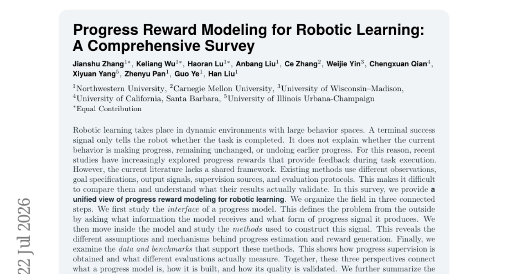

### 📌 한 줄 요약
로봇 학습의 효율을 높이는 '진행도 보상(Progress Reward)' 연구 분야를 체계적으로 정리한 종합 서베이

### 🔑 핵심 포인트
- 파편화된 진행도 보상 연구를 위한 통합 프레임워크(인터페이스, 메커니즘, 데이터/벤치마크) 제안
- 모델의 외부 인터페이스(입력/출력)와 내부 생성 메커니즘 간의 관계 정립
- 기존 연구들의 평가 프로토콜 및 데이터 소스에 대한 체계적 분석

### 🧑‍💻 개발자 관점
로봇 제어 시 Sparse Reward(희소 보상) 문제를 해결하기 위한 중간 보상 설계 전략을 수립하는 데 실질적인 가이드를 제공합니다.

### 🚀 실무 적용 아이디어
- 현재 개발 중인 로봇 작업의 보상 함수를 '진행도' 관점에서 재정의해보기
- 제안된 프레임워크를 사용하여 기존 보상 모델의 입력/출력 규격을 표준화하기
- 사용 중인 벤치마크가 실제 작업 진행도를 적절히 측정하는지 검증하기

### ⚠️ 리스크/한계
- 제안된 프레임워크가 이론적 분류에 집중되어 있어 특정 알고리즘의 성능을 직접 보장하지는 않음
- 기존 연구들의 파편화가 심해 통합된 벤치마크 도입까지 시간이 걸릴 수 있음

### 📝 초록 기반 상세 설명
로봇 학습은 동적인 환경과 넓은 행동 공간을 다루지만, 최종 성공 신호만으로는 작업 수행 과정 중의 효율성을 판단하기 어렵습니다. 이를 해결하기 위해 작업 수행 중 피드백을 제공하는 '진행도 보상' 연구가 늘고 있으나, 기존 방법론들은 관찰 방식, 목표 설정, 평가 프로토콜이 파편화되어 있어 비교가 어렵습니다. 본 논문은 진행도 보상 모델링을 위한 통합된 프레임워크를 제안합니다. 먼저 모델의 인터페이스(입력/출력), 모델 내부의 신호 생성 메커니즘, 그리고 이를 뒷받침하는 데이터 및 벤치마크라는 세 가지 관점에서 기존 연구를 체계화합니다. 이를 통해 진행도 모델의 정의, 구축 방법, 검증 방식을 연결하여 통합적인 시각을 제공합니다. 마지막으로 현재 기술의 한계점과 향후 연구 방향을 제시합니다.

### 🖼️ 추가 자료
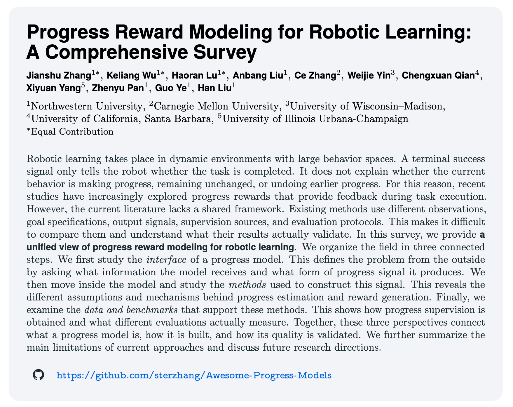
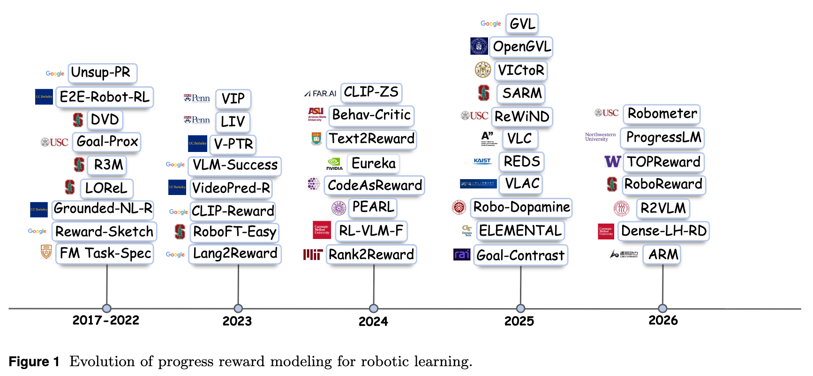
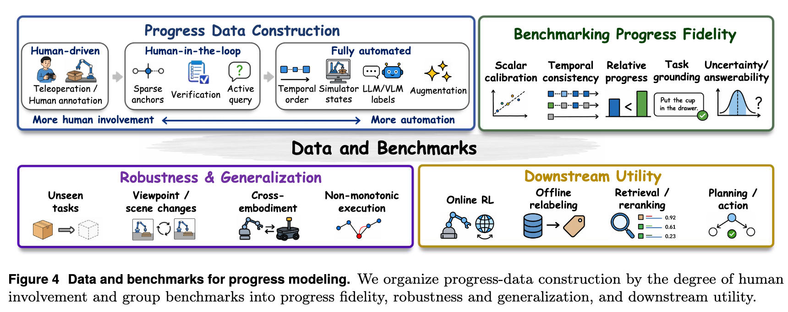
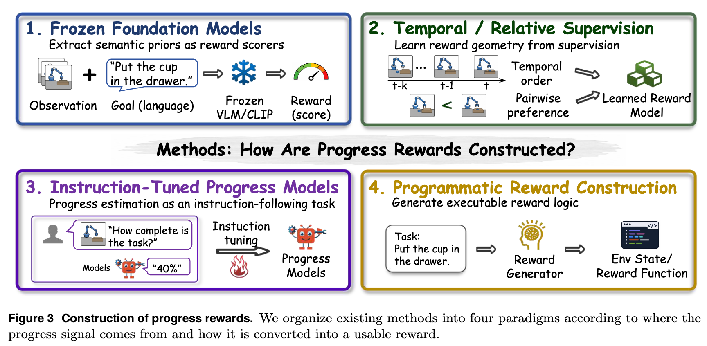
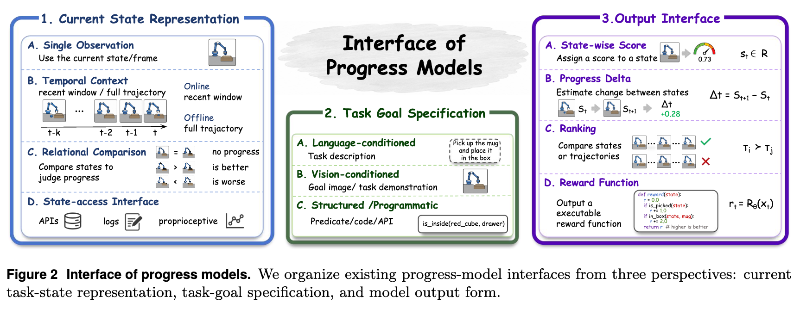

---

## 6. [StateAct: Program State, before Pixels, for Long-Horizon Computer-Use Agents](https://huggingface.co/papers/2607.22798)
**Upvotes**: 51 | **도입 난이도**: 중 | **신뢰도**: 상
**arXiv**: https://arxiv.org/abs/2607.22798

**태그**: AI Agent, Automation, Software Engineering, Agent, Reasoning

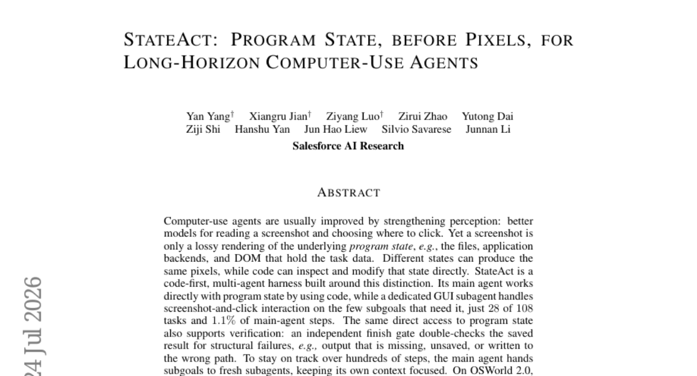

### 📌 한 줄 요약
픽셀 기반의 시각적 인식을 넘어 프로그램 상태(State)에 직접 접근하여 효율과 정확도를 높인 코드 중심의 에이전트 프레임워크

### 🔑 핵심 포인트
- 픽셀(Screenshot)이 아닌 프로그램 상태(State)에 직접 접근하는 코드 중심의 에이전트 설계
- 메인 에이전트의 컨텍스트 유지를 위해 GUI 작업을 별도 서브 에이전트에게 위임하는 구조
- 상태 기반 검증(State-grounding)을 통한 결과물의 무결성 확보 및 추론 중심의 병목 현상 해결

### 🧑‍💻 개발자 관점
에이전트 개발 시 시각적 렌더링에 의존하기보다 API, DOM, 파일 시스템 등 데이터 원천에 직접 접근하는 것이 비용과 성능 면에서 훨씬 유리함을 시사합니다.

### 🚀 실무 적용 아이디어
- 기존 GUI 에이전트 워크플로우에 코드 기반 상태 조작 레이어 추가 실험
- 시각적 피드백 대신 파일/DB 상태를 통한 자동 검증 로직 구현
- 작업 단위를 쪼개어 시각적 작업과 논리적 작업을 분리하는 멀티 에이전트 구조 설계

### ⚠️ 리스크/한계
- 프로그램 상태에 직접 접근할 수 없는 폐쇄적인 GUI 환경에서는 적용이 어려움
- 코드 실행 권한 및 보안(Sandboxing) 관리가 핵심적인 리스크로 작용

### 📝 초록 기반 상세 설명
기존의 컴퓨터 사용 에이전트는 스크린샷 기반의 시각적 인지에 의존하여 데이터 손실과 비효율이 발생하는 문제가 있었습니다. 본 논문은 픽셀이 아닌 파일, 백엔드, DOM 등 근본적인 프로그램 상태를 직접 다루는 'StateAct' 프레임워크를 제안합니다. 메인 에이전트는 코드를 통해 상태를 직접 조작하고, GUI 서브 에이전트는 필요한 최소한의 시각적 작업만 수행하여 컨텍스트를 유지합니다. 또한 독립적인 검증 게이트를 통해 결과물의 구조적 결함을 확인하는 상태 기반 검증 방식을 도입했습니다. 실험 결과, OSWorld 2.0 벤치마크에서 기존 방식 대비 비용은 대폭 낮추면서도 성공률을 유의미하게 향상시켰습니다.

---

## 7. [Data Pyramid for Embodied Manipulation](https://huggingface.co/papers/2607.24744)
**Upvotes**: 29 | **도입 난이도**: 하 | **신뢰도**: 상
**arXiv**: https://arxiv.org/abs/2607.24744

**태그**: Embodied AI, Robot Learning, Foundation Models, Data Strategy, Agent, RAG, Reasoning, Multimodal, Vision, Safety

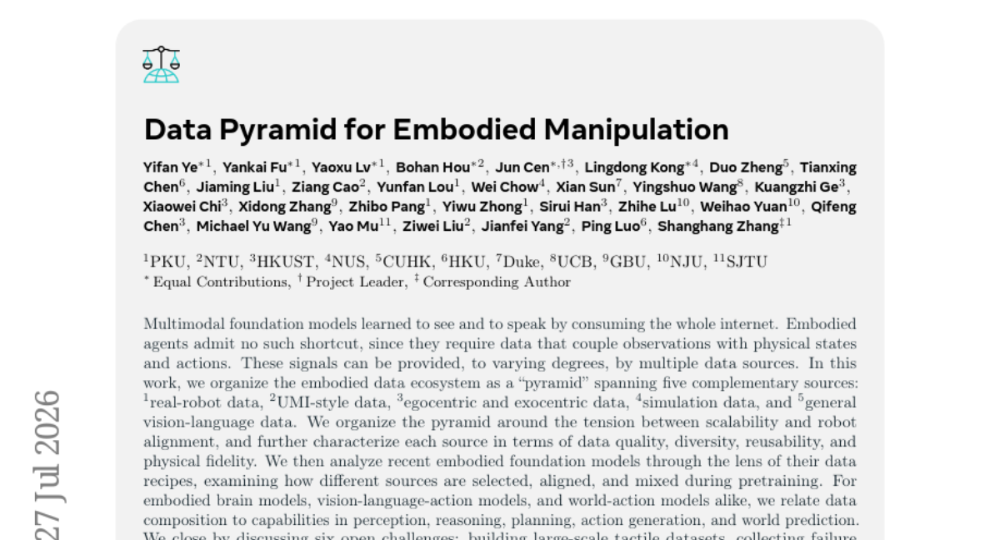

### 📌 한 줄 요약
로봇 학습을 위한 데이터 소스를 확장성과 정렬성 기준으로 체계화한 '데이터 피라미드' 프레임워크 제안

### 🔑 핵심 포인트
- 확장성과 정렬성 사이의 균형을 고려한 5단계 데이터 피라미드 모델 정립
- 데이터 품질, 다양성, 재사용성, 물리적 충실도에 따른 데이터 소스 특성 분석
- 데이터 구성 방식이 로봇의 인지, 계획, 동작 생성 능력에 미치는 영향 규명

### 🧑‍💻 개발자 관점
로봇 학습 시 어떤 데이터 소스를 어떤 비율로 섞어야 효율적인 모델이 되는지에 대한 전략적 가이드라인을 제공합니다.

### 🚀 실무 적용 아이디어
- 제시된 5단계 피라미드 모델을 현재 보유한 데이터셋에 대입하여 부족한 계층 식별하기
- 시뮬레이션 데이터와 실로봇 데이터의 혼합 비율(Data Recipe) 실험 설계하기
- 실패 및 복구(Failure/Recovery) 데이터가 모델의 강건성에 미치는 영향 테스트하기

### ⚠️ 리스크/한계
- 데이터 소스 간의 물리적 정렬(Alignment)을 맞추는 데 따르는 기술적 난이도
- 확장성을 위해 품질을 희생할 경우 발생하는 로봇 동작의 신뢰성 저하 문제

### 📝 초록 기반 상세 설명
멀티모달 모델이 인터넷 데이터를 통해 학습하는 것과 달리, 로봇 에이전트는 관찰과 물리적 상태/동작이 결합된 특수 데이터가 필요합니다. 본 논문은 실로봇 데이터부터 일반 시각-언어 데이터까지를 아우르는 5단계 '데이터 피라미드'를 제안합니다. 이 프레임워크는 데이터의 확장성(Scalability)과 로봇 정렬성(Alignment) 사이의 긴장 관계를 중심으로 데이터 소스를 분류합니다. 또한 최근의 로봇 파운데이션 모델들이 데이터 레시피를 통해 인지, 추론, 계획, 동작 생성 능력을 어떻게 확보하는지 분석합니다. 마지막으로 차세대 로봇 시스템 설계를 위한 6가지 핵심 도전 과제를 제시하며 마무리합니다.

### 🖼️ 추가 자료

---

## 8. [Sol-Attn: Accelerating Video Generation Inference via On-the-Fly Attention Sparsification](https://huggingface.co/papers/2607.24027)
**Upvotes**: 24 | **도입 난이도**: 중 | **신뢰도**: 상
**arXiv**: https://arxiv.org/abs/2607.24027

**태그**: Video Generation, Efficient Inference, Attention Sparsification, Diffusion Transformer, Vision, Video, Inference

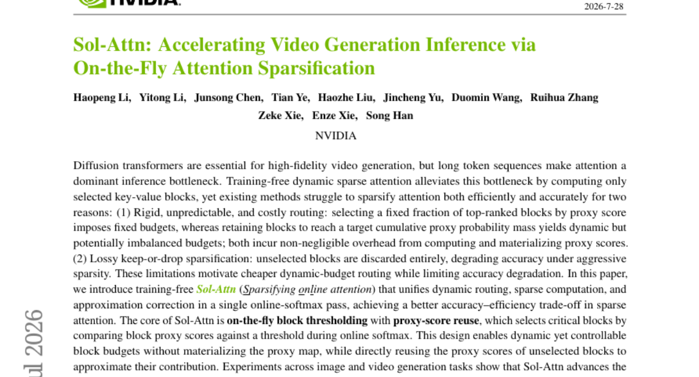

### 📌 한 줄 요약
학습 없이 온라인 소프트맥 연산 과정에서 동적으로 어텐션을 희소화하여 비디오 생성 추론 속도를 2배 이상 높이는 기술

### 🔑 핵심 포인트
- 온라인 소프트맥(Online Softmax) 과정에서 프록시 점수를 재사용하여 연산 오버헤드 최소화
- 임계값 기반의 동적 블록 선택을 통해 가변적이고 제어 가능한 연산 예산 확보
- 선택되지 않은 블록의 기여도를 근사적으로 보정하여 희소화로 인한 품질 저하 방지

### 🧑‍💻 개발자 관점
추가적인 모델 재학습 없이 기존 비디오 생성 모델의 추론 속도를 획기적으로 높일 수 있어, 실시간 비디오 생성 서비스 구현에 매우 유용합니다.

### 🚀 실무 적용 아이디어
- 기존 DiT(Diffusion Transformer) 모델에 Sol-Attn 로직을 이식하여 속도 향상 폭 검증
- 다양한 해상도 및 프레임 수 변화에 따른 동적 예산 할당의 안정성 테스트
- 프록시 점수 근사 방식이 생성된 영상의 구조적 일관성에 미치는 영향 분석

### ⚠️ 리스크/한계
- 프록시 점수 근사 방식이 매우 높은 희소도(Aggressive Sparsity) 환경에서 품질 저하 가능성
- 특정 하드웨어 아키텍처에서 커스텀 커널 구현 여부에 따라 실제 속도 향상 폭이 달라질 수 있음

### 📝 초록 기반 상세 설명
비디오 생성용 디퓨전 트랜스포머는 긴 토큰 시퀀스로 인해 어텐션 연산이 추론의 주요 병목이 됩니다. 기존의 동적 희소 어텐션 방식은 고정된 예산 설정의 비효율성과 선택되지 않은 블록을 완전히 버리는 방식에 따른 품질 저하 문제를 안고 있었습니다. 본 논문은 온라인 소프트맥 패스 내에서 동적 라우팅, 희소 연산, 근사 보정을 통합한 Sol-Attn을 제안합니다. Sol-Attn은 프록시 점수 재사용을 통한 온더플라이 임계값 설정을 통해 연산 오버헤드를 줄이면서도 중요한 블록을 동적으로 선택합니다. 실험 결과, 비디오 생성 및 편집 작업에서 시각적 품질을 유지하면서도 각각 2.1배와 2.3배의 엔드투엔드 속도 향상을 달성했습니다.

---

## 9. [OmniVAE: An Audio-Video VAE with Cross-Modal Alignment for Joint Generation](https://huggingface.co/papers/2607.23855)
**Upvotes**: 21 | **도입 난이도**: 중 | **신뢰도**: 상
**arXiv**: https://arxiv.org/abs/2607.23855

**태그**: Generative Models, Multimodal, VAE, Audio-Video, Video, Audio, Distillation, Safety

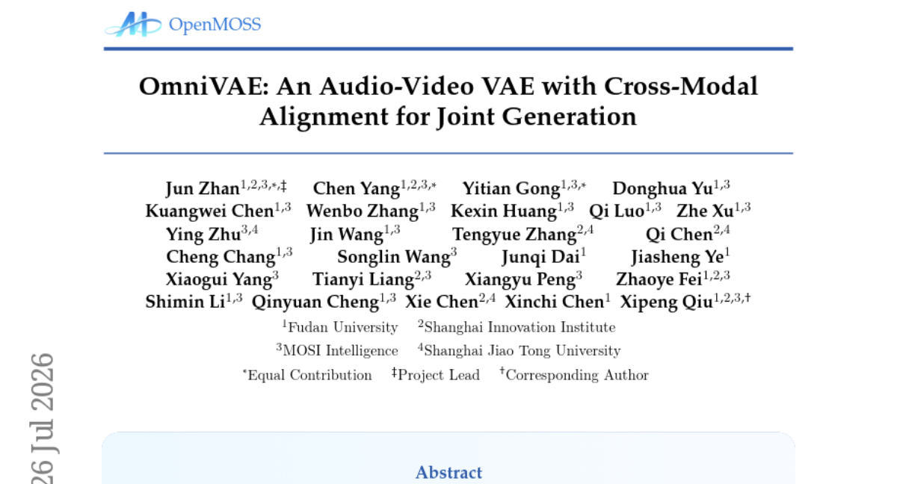

### 📌 한 줄 요약
오디오와 비디오의 잠재 공간을 정렬하여 정교한 동기화를 지원하는 통합 VAE 프레임워크

### 🔑 핵심 포인트
- 세그먼트 수준의 오디오-비디오 대조 학습을 통한 잠재 공간 정렬
- 사전 학습된 의미 인코더의 특징 증류(Distillation)를 통한 표현력 강화
- 하위 텍스트-오디오-비디오 생성 모델을 위한 강력한 기초 표현 학습

### 🧑‍💻 개발자 관점
멀티모달 생성 모델 구축 시, 서로 다른 모달리티를 별도로 학습하는 대신 통합된 잠재 공간을 확보하여 동기화 문제를 해결하는 방법론을 제시합니다.

### 🚀 실무 적용 아이디어
- 제시된 대조 학습(Contrastive Objective)을 기존 멀티모달 VAE에 적용해보기
- 사전 학습된 인코더의 특징을 VAE 잠재 공간에 주입하는 증류 방식 실험
- 학습된 잠재 공간이 하위 생성 모델의 동기화 성능에 미치는 영향 분석

### ⚠️ 리스크/한계
- 두 모달리티의 데이터 비율 및 시간적 해상도 차이에 따른 학습 불안정성 가능성
- 강력한 사전 학습 인코더에 대한 의존도

### 📝 초록 기반 상세 설명
최근 생성 모델은 독립적인 오디오/비디오 합성을 넘어 동기화된 공동 생성을 지향하고 있습니다. 그러나 두 모달리티의 구조적 차이로 인해 미세한 상호 대응 관계를 학습하는 데 어려움이 있으며, 기존 방식은 별도로 학습된 VAE를 사용하여 잠재 공간 간 정렬이 부족합니다. 본 논문은 오디오와 비디오 잠재 표현 간의 세밀한 의미적 정렬을 학습하는 OmniVAE를 제안합니다. OmniVAE는 세그먼트 수준의 대조 학습(Contrastive Learning)을 통해 시간적-의미적 대응 관계를 포착하고, 사전 학습된 인코더의 특징을 증류(Distillation)하여 잠재 공간의 학습 능력을 높입니다. 실험 결과, 이러한 통합 표현 학습이 하위 생성 모델의 품질과 정교한 동기화를 크게 향상시킴을 입증했습니다.

---

## 10. [Oxygen-TryOn: Fashion-Native Foundation Model for Any-item Virtual Try-On](https://huggingface.co/papers/2607.21694)
**Upvotes**: 20 | **도입 난이도**: 상 | **신뢰도**: 상
**arXiv**: https://arxiv.org/abs/2607.21694

**태그**: Computer Vision, Generative AI, Fashion Tech, Diffusion Models, Vision, Benchmark

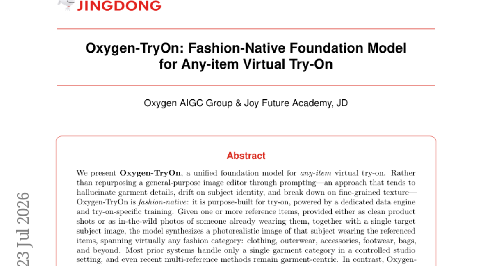

### 📌 한 줄 요약
다양한 의류 카테고리와 다중 아이템 조합을 지원하는 패션 특화 파운데이션 모델 Oxygen-TryOn

### 🔑 핵심 포인트
- 패션 특화 데이터 엔진을 통한 고품질 데이터 대규모 구축 및 정제
- CPT-SFT-RL로 이어지는 3단계 학습 전략을 통한 정밀한 의류 재현 및 인물 유지
- 단일 아이템을 넘어 다중 아이템 조합 및 다양한 포즈/시나리오 지원

### 🧑‍💻 개발자 관점
단순 인페인팅 방식이 아닌 생성 모델 기반의 패션 특화 파이프라인을 제시하여, 복잡한 의류 조합이 필요한 커머스 환경에 즉각적인 영감을 제공합니다.

### 🚀 실무 적용 아이디어
- 제시된 3단계 학습 레시피(CPT, SFT, RL)의 구조적 차이 분석
- 데이터 엔진의 데이터 정제 및 주석(Annotation) 전략 벤치마킹
- FLUX.2 등 기존 오픈소스 모델과의 생성 결과물 비교 실험

### ⚠️ 리스크/한계
- 패션 특화 데이터 엔진 및 독점 모델(Reward Model)에 대한 의존도가 높아 재현이 어려울 수 있음
- 매우 복잡한 질감이나 패턴의 의류에 대한 세부 재현도 검증 필요

### 📝 초록 기반 상세 설명
기존 가상 피팅 기술은 특정 의류 카테고리에 국한되거나 단순 이미지 편집 방식에 의존하여 복잡한 스타일링 구현에 한계가 있었습니다. 본 논문은 범용 편집기가 아닌 패션에 특화된 데이터 엔진과 학습 방식을 갖춘 Oxygen-sTryOn 모델을 제안합니다. 연구진은 데이터 수집부터 정제까지 아우르는 전용 데이터 엔진을 구축하고, CPT, SFT, RL로 이어지는 3단계 학습 레시피를 설계했습니다. 특히 RL 단계에서 자체 보상 모델과 범용 모델을 결합한 하이브리드 보상을 사용하여 정밀한 일관성과 지시 이행 능력을 확보했습니다. 실험 결과, 단일 및 다중 아이템 피팅 모두에서 기존 오픈소스 및 독점 모델들을 상회하는 SOTA 성능을 달러했습니다.

---

## 11. [The Physics of Multi-Turn Long-Horizon Planning: From Pre-training to Post-training via Single- and Multi-Teacher On-Policy Agentic Distillation](https://huggingface.co/papers/2607.24720)
**Upvotes**: 19 | **도입 난이도**: 상 | **신뢰도**: 상
**arXiv**: https://arxiv.org/abs/2607.24720

**태그**: Agent, Reinforcement Learning, Distillation, Planning

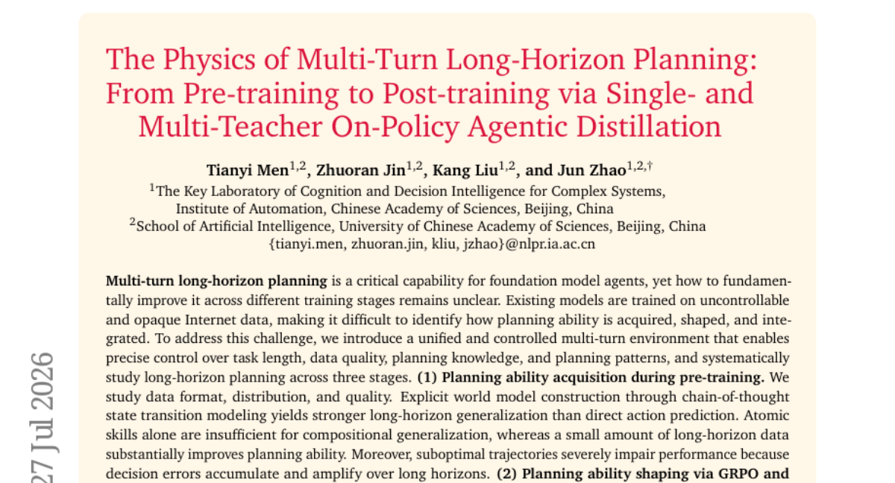

### 📌 한 줄 요약
장기 계획(Long-horizon planning) 능력을 확보하기 위한 사전 학습부터 사후 학습까지의 체계적인 방법론과 데이터/학습 전략 연구

### 🔑 핵심 포인트
- CoT 기반의 명시적 세계 모델(World Model) 구축이 장기 계획 일반화에 필수적임
- GRPO 대비 OPD가 저품질/장기 환경에서 더 넓고 효과적인 학습 영역을 제공함
- MOPD를 통해 서로 다른 교사 모델로부터 호환 가능한 계획 패턴을 추출하고 통합 가능

### 🧑‍💻 개발자 관점
에이전트 개발 시 단순히 데이터 양을 늘리는 것보다, 상태 전이(State transition)를 포함한 구조적 데이터와 교사 모델 간의 지식 호환성을 고려한 정교한 RL/Distillation 전략이 중요함을 시사합니다.

### 🚀 실무 적용 아이디어
- CoT를 활용해 상태 변화를 명시적으로 기술하는 데이터셋으로 에이전트 사전 학습 진행
- RLHF/GRPO 적용 시, 단순 정답 학습이 아닌 '계획 패턴'과 '태스크 지식'을 분리하여 검증
- 멀티 교사 증류(MOPD) 시, 교사 모델 간의 지식 충돌(Interference) 여부를 사전 테스트

### ⚠️ 리스크/한계
- 교사 모델의 지식이 학생 모델의 기존 세계 모델과 충돌할 경우 성능 저하 위험
- 장기 계획 시 발생하는 미세한 오류가 누적되어 전체 성능을 급격히 떨어뜨릴 수 있음

### 📝 초록 기반 상세 설명
기존의 에이전트 모델은 통제 불가능한 인터넷 데이터로 학습되어 장기 계획 능력이 어떻게 형성되는지 파악하기 어려웠습니다. 본 논문은 정밀한 제어가 가능한 통합 환경을 구축하여 계획 능력이 습득, 형성, 통합되는 과정을 세 단계로 분석합니다. 사전 학습 단계에서는 CoT 기반의 세계 모델 구축이 일반화에 중요하며, 하위 수준의 기술만으로는 복합적 일반화가 어렵다는 것을 밝힙 수 있습니다. 사후 학습에서는 GRPO와 OPD를 통해 계획 패턴과 지식을 구분하고, MOPD(Multi-Teacher On-Policy Distillation)를 통해 다양한 환경 간의 능력 통합 방식을 연구했습니다. 결과적으로 데이터 품질과 교사 모델 간의 지식 호환성이 장기 계획 성능의 핵심임을 입증했습니다.

---

## 12. [Chamaileon: Cross-Context Binder Design with Contextualized Modeling and Mixed Sampling](https://huggingface.co/papers/2607.23518)
**Upvotes**: 6 | **도입 난이도**: 상 | **신뢰도**: 상
**arXiv**: https://arxiv.org/abs/2607.23518

**태그**: Protein Design, Generative Model, Structural Biology, Deep Learning, Benchmark, Evaluation, Inference

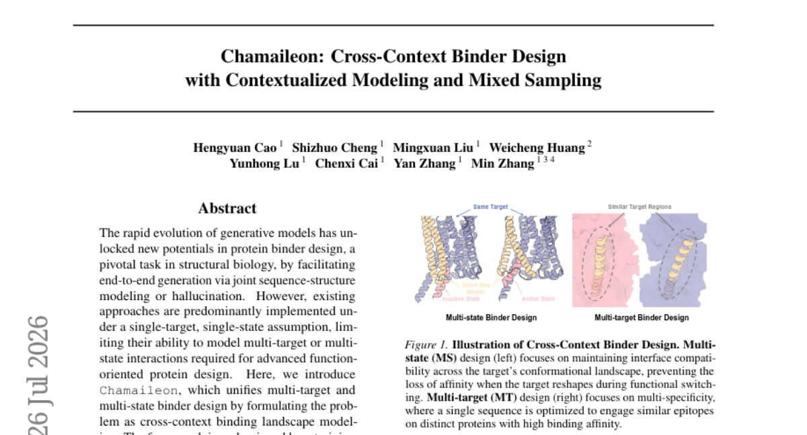

### 📌 한 줄 요약
다중 타겟 및 다중 상태를 동시에 고려하여 단일 서열로 다양한 결합 환경에 대응하는 단백질 바인더 설계 프레임워크

### 🔑 핵심 포인트
- 다중 타겟 및 다중 상태를 통합하는 교차 컨텍스트 결합 지형 모델링 프레임워크 제안
- 컨텍스트 인지형 공동 모델링을 위한 I3CD 학습 패러다임 도입
- 데이터 부족 문제를 해결하고 효율적 최적화를 지원하는 MoPS 샘플링 전략 적용

### 🧑‍💻 개발자 관점
단일 타겟을 넘어 복잡한 생물학적 환경(다양한 구조적 상태나 여러 타겟)에 대응해야 하는 고도화된 단백질 설계 작업에 직접적인 솔루션을 제공합니다.

### 🚀 실무 적용 아이디어
- 제공된 GitHub 코드를 활용하여 CROSS 벤치마크 데이터셋 환경 구축
- 단일 타겟 모델과 Chamaileon의 다중 타겟 생성 성능 비교 실험
- MoPS 샘플링 파라미터 변화에 따른 서열의 범용성(adaptability) 변화 관찰

### ⚠️ 리스크/한계
- 다중 상태/타겟을 동시에 고려하므로 단일 타겟 최적화 대비 계산 복잡도가 높을 수 있음
- 새로운 벤치마크(CROSS) 환경에서의 성능이 실제 실험실 환경(in vitro)과 일치하는지에 대한 검증 필요

### 📝 초록 기반 상세 설명
최근 생성형 모델을 이용한 단백질 바인더 설계가 발전하고 있으나, 기존 방식은 단일 타겟 및 단일 상태를 가정하여 복잡한 다중 상호작용 모델링에 한계가 있었습니다. 본 논문은 다중 타겟 및 다중 상태 설계를 통합하기 위해 문제를 '교차 컨텍스트 결합 지형 모델링(cross-context binding landscape modeling)'으로 정식화한 Chamaileon을 제안합니다. 학습 단계에서는 컨텍스트 인지형 서열-구조 공동 모델링을 위한 I3CD(In-Context Complex Co-Design) 패러다임을 도입했습니다. 추론 시에는 고품질 다중 구조 데이터 부족 문제를 해결하고 단일 서열의 최적화를 돕는 MoPS(Mixture-of-Paths Sampling) 전략을 사용합니다. 새로운 벤치마크인 CROSS를 통한 평가 결과, Chamaileon은 다양한 구조적 환경과 다중 타겟 요구사항에 적응 가능한 서열을 효과적으로 생성함을 입증했습니다.

---

## 13. [dRAE: Representation Autoencoder with Hyper-Spherical Codes](https://huggingface.co/papers/2607.22148)
**Upvotes**: 6 | **도입 난이도**: 중 | **신뢰도**: 상
**arXiv**: https://arxiv.org/abs/2607.22148

**태그**: Computer Vision, Quantization, Representation Learning, Generative Models, Optimization

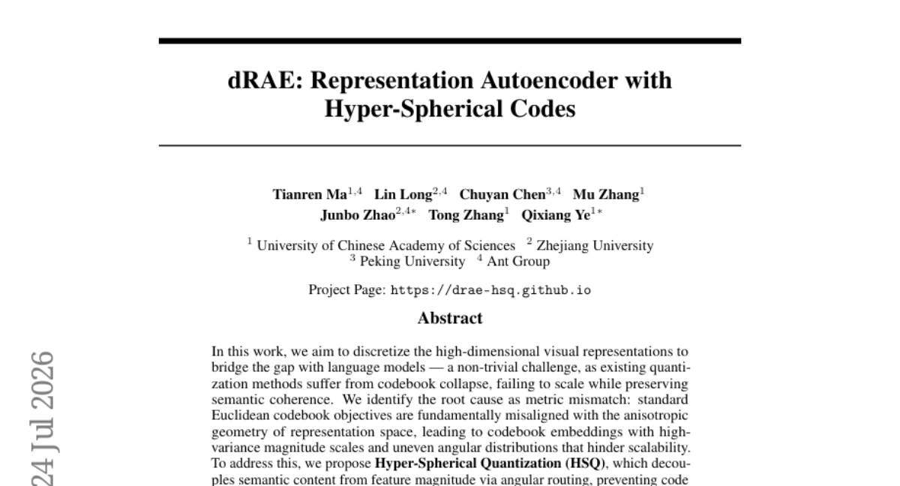

### 📌 한 줄 요약
고차원 시각 표현의 기하학적 특성을 고려한 하이퍼 스피어 양자화를 통해 코드북 붕괴 없이 대규모 이산 표현을 생성하는 기술

### 🔑 핵심 포인트
- 메트릭 불일치(Metric Mismatch) 문제를 해결하기 위한 하이퍼 스피어 양자화(HSQ) 제안
- 각도 기반 라우팅을 통해 특징 크기(magnitude)와 의미적 내용(semantic content)의 결합 문제 해결
- 코드북 크기 확장 시에도 100% 활용도를 유지하는 높은 확장성 및 안정성 확보

### 🧑‍💻 개발자 관점
대규모 토큰 기반의 시각-언어 모델(VLM) 구축 시, 코드북 붕괴 없이 수십만 개의 코드북을 효율적으로 사용할 수 있는 방법론을 제공합니다.

### 🚀 실무 적용 아이디어
- 기존 VQ-VAE/VQGAN 모델의 코드북 활용도와 dRAE의 비교 실험
- 코드북 크기를 단계적으로 늘리며 재구성 손실 및 의미적 일관성 변화 측정
- 제안된 HSQ를 기존의 유클리드 기반 양자화 모듈에 교체 적용 테스트

### ⚠️ 리스크/한계
- 각도 기반 라우팅이 특정 데이터 분포에서 수렴 속도에 미칠 영향 확인 필요
- 매우 높은 차원의 벡터 공간에서 하이퍼 스피어 구조의 안정성 검증 필요

### 📝 초록 기반 상세 설명
시각적 표현을 이산화하여 언어 모델과의 간극을 줄이려는 시도가 이어지고 있으나, 기존 양자화 방식은 코드북 붕괴와 확장성 문제로 인해 의미적 일관성을 유지하기 어렵습니다. 연구진은 기존 유클리드 거리 기반 목적 함수가 표현 공간의 이방성(anisotropic) 기하학적 구조와 일치하지 않아 발생하는 '메트릭 불일치'를 근본 원인으로 지적했습니다. 이를 해결하기 위해 의미적 내용과 특징 크기를 분리하여 각도 기반 라우팅을 수행하는 하이퍼 스피어 양자화(HSQ)를 제안합니다. 제안된 dRAE는 코드북 크기가 131,072까지 확장되어도 100%의 활용도를 유지하며 높은 재구성 성능을 보여줍니다. 결과적으로 이 방식은 대규모 코드북에서도 의미적 무결성을 유지하며 이해 및 생성 작업 모두에서 우수한 성능을 입증했습니다.

---

## 14. [DecoupleMix: Decoupled Ratio Search and Convex Allocation for Scalable VLM Data Recipes](https://huggingface.co/papers/2607.24516)
**Upvotes**: 5 | **도입 난이도**: 중 | **신뢰도**: 상
**arXiv**: https://arxiv.org/abs/2607.24516

**태그**: VLM, Data-Centric AI, Optimization, Pretraining, Multimodal, Vision

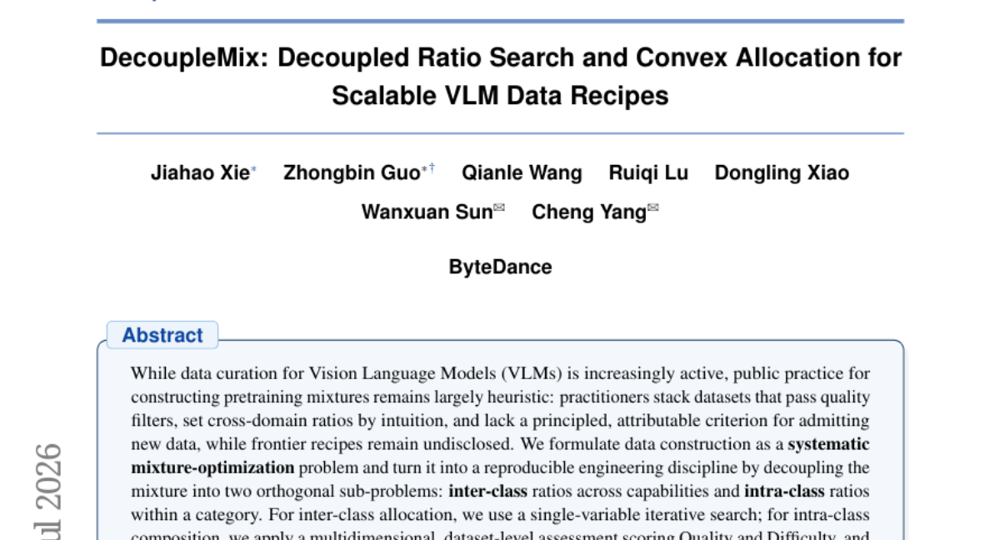

### 📌 한 줄 요약
데이터 혼합 비율(Inter-class)과 데이터 구성(Intra-class)을 분리하여 VLM 학습 데이터 레시피를 최적화하는 프레임워크

### 🔑 핵심 포인트
- 데이터 혼합 문제를 클래스 간 비율(Inter-class)과 클래스 내 구성(Intra-class)으로 분리하여 최적화
- 품질(Quality)과 난이도(Difficulty)를 고려한 제약 조건부 볼록 최적화 기법 도입
- 소규모 규모에서 찾은 최적 비율이 대규모 학습 시에도 유지되는 스케일링 특성 입증

### 🧑‍💻 개발자 관점
데이터 비율을 감에 의존하지 않고 수학적/공학적 방법론으로 결정할 수 있어, 데이터 수집 비용을 최적화하고 재현 가능한 학습 레시피를 구축할 수 있습니다.

### 🚀 실무 적용 아이디어
- 보유한 데이터셋의 품질(Quality)과 난이도(Difficulty)를 측정할 수 있는 스코어링 지표 설계
- 소규모 모델로 데이터 혼합 비율(Ratio)을 찾는 실험적 프로토타입 구축
- 데이터셋 간의 상호 보완성을 확인하기 위한 다양성(Diversity) 목적 함수 적용 테스트

### ⚠️ 리스크/한계
- 데이터 품질/난이도 측정 지표 자체의 편향이 전체 최적화 결과에 영향을 줄 수 있음
- 데이터셋의 특성이 급격히 변하는 경우 소규모에서 찾은 비율이 전이되지 않을 위험

### 📝 초록 기반 상세 설명
VLM 학습을 위한 데이터 큐레이션은 현재 직관이나 휴리스틱에 의존하여 데이터 비율을 설정하는 경우가 많습니다. 본 논문은 데이터 구성을 체계적인 혼합 최적화 문제로 정의하고, 이를 두 개의 직교하는 하위 문제로 분리합니다. 먼저 클래스 간 비율(inter-class)은 단일 변수 반복 탐색을 통해 결정하고, 클래스 내 구성(intra-class)은 품질과 난이도를 고려한 제약 조건부 볼록 최적화로 해결합니다. 이 프레임워크는 다음 수집할 데이터를 가이드하며 데이터 검증을 통제 가능한 실험으로 만듭니다. 실험 결과, 소규모 프록시에서 찾은 최적 비율이 대규모 모델로 원활하게 전이됨을 확인했습니다. 이를 통해 적은 데이터 예산으로도 강력한 오픈소스 모델들과 경쟁할 수 있는 성능을 달성했습니다.

---

## 15. [Reasoning Denoiser: Denoising Reasoning Traces for Hallucination Detection in Large Reasoning Models](https://huggingface.co/papers/2607.22098)
**Upvotes**: 5 | **도입 난이도**: 하 | **신뢰도**: 상
**arXiv**: https://arxiv.org/abs/2607.22098

**태그**: LLM, Hallucination, Reasoning, NLP, RAG, Vision, Benchmark, Evaluation

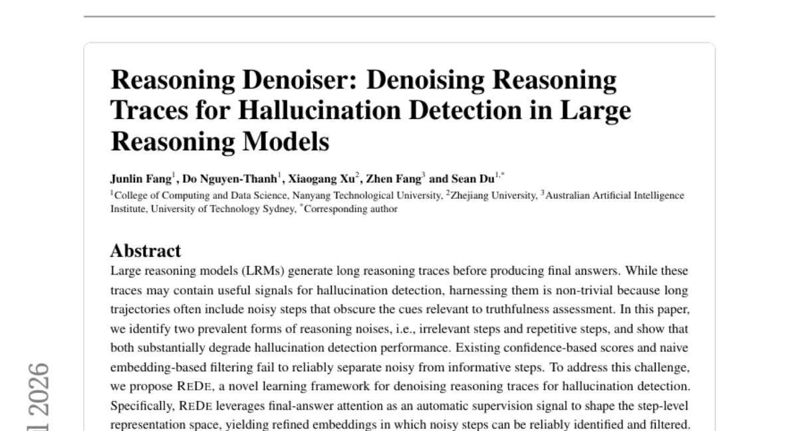

### 📌 한 줄 요약
추론 과정의 노이즈(불필요/반복 단계)를 제거하여 대형 추론 모델(LRM)의 환각 탐지 성능을 높이는 프레임워크 제안

### 🔑 핵심 포인트
- 추론 과정 내 무관한 단계(Irrelevant) 및 반복적 단계(Repetitive)를 주요 노이즈로 식별
- 최종 답변 어텐션을 활용해 노이즈를 제거하는 REDE 프레임워크 제안
- 기존 환각 탐지기에 즉시 결합 가능한 플러그인 방식의 구조

### 🧑‍💻 개발자 관점
LLM의 CoT(Chain-of-Thought) 과정에서 발생하는 불필요한 텍스트를 정제하여, 모델의 답변 신뢰도를 높이고 환각을 더 정확하게 잡아낼 수 있습니다.

### 🚀 실무 적용 아이디어
- 현재 사용 중인 CoT 기반 모델의 추론 로그에서 노이즈 비중 분석하기
- REDE의 핵심 아이디어인 '최종 답변 어텐션'을 활용한 임베딩 필터링 구현해보기
- 다양한 환각 탐지 알고리즘에 REDE의 노이즈 제거 모듈 결합 테스트하기

### ⚠️ 리스크/한계
- 노이즈 제거 과정에서 핵심적인 추론 논리가 유실될 가능성 존재
- 모델의 추론 길이가 매우 길어질 경우 연산 비용 및 어텐션 효율성 문제 발생 가능

---

## 16. [Codifying the Judge: Scalable Evaluation via Program Distillation](https://huggingface.co/papers/2607.22561)
**Upvotes**: 5 | **도입 난이도**: 중 | **신뢰도**: 상
**arXiv**: https://arxiv.org/abs/2607.22561

**태그**: LLM-as-a-Judge, Model Evaluation, Knowledge Distillation, Efficiency, Evaluation, Inference, Distillation

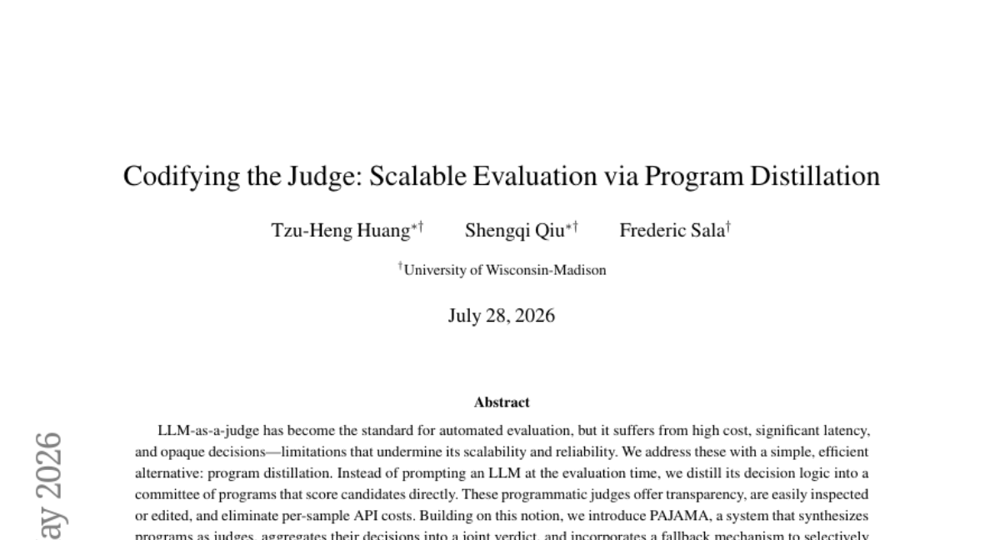

### 📌 한 줄 요약
LLM 평가 로직을 실행 가능한 프로그램 코드로 증류하여 비용과 지연 시간을 획기적으로 줄이는 평가 프레임워크 제안

### 🔑 핵심 포인트
- LLM의 판단 로직을 투명하고 수정 가능한 프로그램 코드로 변환하는 증류 기법 제안
- PAJAMA 시스템을 통한 프로그램 생성, 집계 및 LLM 폴백(Fallback) 메커니즘 구축
- LLM 평가 대비 압도적인 비용 절감 및 높은 처리량(Throughput) 달성

### 🧑‍💻 개발자 관점
LLM 기반 자동 평가 시스템 구축 시 발생하는 막대한 API 비용과 느린 속도 문제를 해결할 수 있는 실질적인 대안을 제시합니다.

### 🚀 실무 적용 아이디어
- 기존 LLM 평가 프롬프트를 코드로 변환하여 로직의 일관성 테스트하기
- 평가 결과의 신뢰도에 따라 LLM 호출 여부를 결정하는 하이브리드 파이프라인 구축
- 생성된 프로그램 코드를 활용해 저비용 보상 모델(Reward Model) 학습 실험하기

### ⚠️ 리스크/한계
- 복잡한 추론이 필요한 평가 항목의 경우 프로그램 코드로 완벽히 치환하기 어려울 수 있음
- 프로그램 로직 자체가 편향되거나 오류를 포함할 경우 검증이 까다로울 수 있음

### 📝 초록 기반 상세 설명
최근 LLM을 평가자로 사용하는 방식이 표준이 되었으나, 높은 비용, 지연 시간, 불투명한 결정 과정이 확장성과 신뢰성을 저해하고 있습니다. 본 논문은 LLM의 결정 로직을 프로그램 코드로 변환하는 '프로그램 증류(Program Distillation)' 방식을 제안합니다. 이를 위해 프로그램 생성, 결정 집계, 저신뢰 사례의 LLM 에스컬레이션을 결합한 PAJAMA 시스템을 도입했습니다. 실험 결과, 프로그램 기반 평가자가 13B 규모 LLM 평가자와 대등한 성능을 보였습니다. 또한, 이 방식은 정확도와 처리량을 동시에 개선하며, 저비용으로 고성능 보상 모델(Reward Model)을 학습할 수 있음을 입증했습니다.

---

## 17. [ClinFusion: A Vision-Centric Multimodal LLM System for Holistic Medical Understanding](https://huggingface.co/papers/2607.24743)
**Upvotes**: 4 | **도입 난이도**: 상 | **신뢰도**: 상
**arXiv**: https://arxiv.org/abs/2607.24743

**태그**: Multimodal, Medical-AI, Vision-Encoder, 3D-Imaging, Agent, RAG, Vision, Benchmark, Evaluation

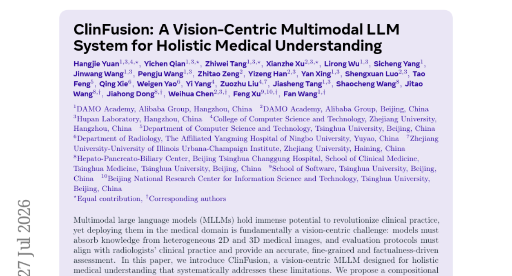

### 📌 한 줄 요약
2D/3D 의료 영상을 통합 이해하고 전문의 수준의 리포트를 생성하는 비전 중심의 멀티모달 LLM 시스템

### 🔑 핵심 포인트
- Cascade Spatial-Aware Locality Fusion을 통한 2D 및 네이티브 3D 의료 영상의 통합 인코딩
- MedIF-Bench 및 ROI 기반의 임상적 사실성 중심 평가 프레임워크 제안
- SOTA 성능 달성 및 전문의 검증을 통한 리포트 생성 품질 입증

### 🧑‍💻 개발자 관점
의료 영상(2D/3D)을 다루는 멀티모달 모델 설계 시, 이질적인 데이터 형식을 통합하는 아키텍처와 임상적 정확도를 검증하는 평가 방법론에 대한 중요한 인사이트를 제공합니다.

### 🚀 실무 적용 아이디어
- 제안된 Cascade Spatial-Aware Locality Fusion 연산자의 구조적 특징 분석
- ROI 기반 평가 지표를 기존 의료 영상 생성 모델의 벤치마크에 적용해보기
- 2D와 3D 데이터가 혼합된 멀티모달 데이터셋에서의 인코더 정렬 실험

### ⚠️ 리스크/한계
- 고도화된 비전 인코더 구조로 인한 높은 컴퓨팅 자원 요구 가능성
- 특정 의료 도메인에 특화된 모델로, 일반적인 비전 태스크로의 범용성 확인 필요

### 📝 초록 기반 상세 설명
의료 분야의 MLLM은 다양한 2D/3D 영상을 통합하고 임상적 사실성을 검증해야 하는 과제를 안고 있습니다. 기존 모델들은 이질적인 의료 영상 데이터 처리와 전문의의 진단 방식에 부합하는 평가 체계 구축에 어려움이 있었습니다. 본 논문은 이를 해결하기 위해 Cascade Spatial-Aware Locality Fusion 연산자를 포함한 계층적 비전 인코더 구조를 제안합니다. 또한, 지시 이행 능력과 ROI(관심 영역) 기반의 사실성 검증을 위한 새로운 평가 프레임워크를 도입했습니다. 실험 결과, ClinFusion은 다양한 2D/3D 벤치마크에서 기존 오픈소스 및 독점 모델들을 상회하는 성능을 기록했습니다. 최종적으로 전문의 검증을 통해 생성된 리포트의 품질과 평가 지표의 신뢰성을 입증했습니다.

---

## 18. [FilmBench: A Film-Grade Benchmark for Cinematic Video Generation](https://huggingface.co/papers/2607.24241)
**Upvotes**: 3 | **도입 난이도**: 중 | **신뢰도**: 상
**arXiv**: https://arxiv.org/abs/2607.24241

**태그**: Video-Generation, Benchmark, Evaluation-Metric, Cinematic-AI, Agent, Multimodal, Video, Evaluation, Safety

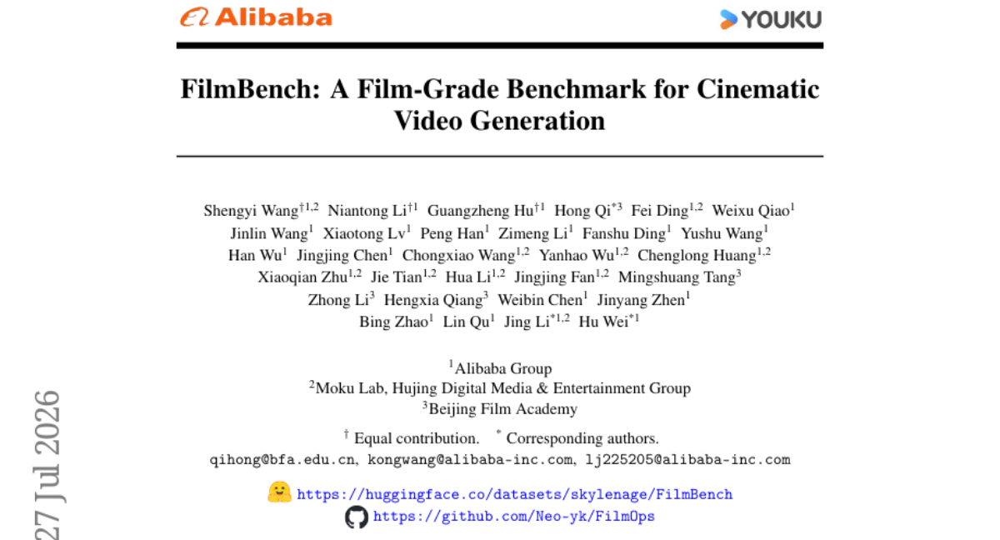

### 📌 한 줄 요약
전문 영화 제작 기준을 적용하여 영상 생성 모델의 예술적 완성도를 평가하는 고도화된 벤치마크 프레임워크 제안

### 🔑 핵심 포인트
- 전문 영화 제작 기준(Cinematic Language)을 반영한 20개 장르 기반의 고품질 멀티샷 프롬프트셋 구축
- 3개 축, 12개 구성 요소, 35개 이상의 세부 지표를 포함하는 체계적인 평가 택소노미 설계
- 인간 전문가의 평가와 높은 상관관계(Spearman rho 0.95 이상)를 보이는 자동 평가 에이전트 및 FilmOps 오픈소스화

### 🧑‍💻 개발자 관점
단순한 영상 품질을 넘어, 실제 영상 제작 현장에서 요구되는 미적/기술적 기준을 모델 평가에 도입할 수 있는 기준점을 제공합니다.

### 🚀 실무 적용 아이디어
- 현재 개발 중인 비디오 생성 모델에 FilmOps 에이전트를 적용하여 기존 벤치마크 대비 성능 차이 확인
- 멀티샷(Multi-shot) 시나리오에서의 일관성 및 역동성 지표 측정 실험
- 제공된 프롬프트셋을 활용하여 모델의 예술적 표현력(Cinematic Craft) 한계 테스트

### ⚠️ 리스크/한계
- 전문가 중심의 기준이므로 일반적인 범용 모델 평가에는 지나치게 엄격할 수 있음
- 고도화된 평가 체계로 인해 평가 비용 및 연산 자원이 기존 방식보다 높을 수 있음

### 📝 초록 기반 상세 설명
기존의 비디오 생성 벤치마크는 웹 소스 기반의 프롬프트와 일반적인 멀티모달 모델을 사용하여 전문적인 영화 제작 기준을 반영하지 못하는 한계가 있었습니다. 이를 해결하기 위해 북경 영화학원 전문가들과 협업하여 전문적인 '영화적 언어(Cinematic Language)'에 기반한 FilmBench를 개발했습니다. 이 벤치마크는 실제 수상작에서 역설계된 멀티샷 프롬프트와 35개 이상의 세부 지표를 포함하는 체계적인 평가 체계를 갖추고 있습니다. 또한 전문가급 자동 평가 에이전트인 FilmOps를 함께 공개하여 인간의 평가와 높은 상관관계를 입증했습니다. 실험 결과, 기존 벤치마크보다 훨씬 엄격한 기준을 제시하며 모델의 역동적 미학과 멀티샷 생성 능력을 정밀하게 검증했습니다.

---

## 19. [A Frozen 12B Beats Frontier Models on Verified Work: 100% Accuracy, 0 Tokens, Bit-Exact, Forever](https://huggingface.co/papers/2607.23806)
**Upvotes**: 3 | **도입 난이도**: 중 | **신뢰도**: 상
**arXiv**: https://arxiv.org/abs/2607.23806

**태그**: LLM, Deterministic, Memory-Augmented, Efficiency, RAG, Reasoning, Benchmark, Evaluation

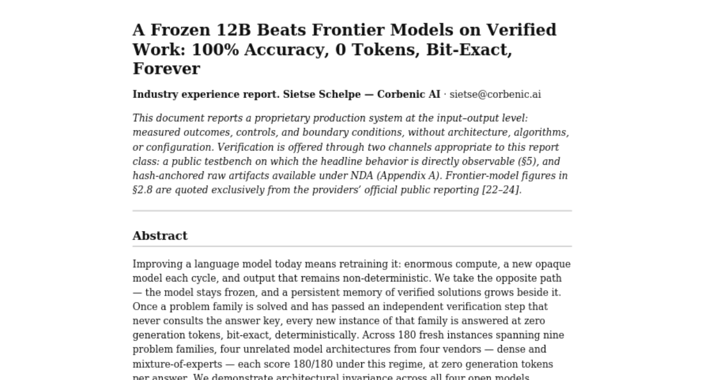

### 📌 한 줄 요약
모델 재학습 없이 검증된 솔루션 메모리를 결합하여, 동일 문제에 대해 0토큰으로 100% 정확도를 구현하는 결정론적 추론 프레임워크

### 🔑 핵심 포인트
- 모델 재학습 없이 검증된 솔루션 메모리를 활용하는 결정론적 추론 방식
- 동일 문제군에 대해 0토큰 생성, 비트 단위 일치, 초고속(ms 단위) 응답 구현
- 600만 토큰 규모의 거대 컨텍스트 윈도우를 단일 GPU에서 효율적으로 처리

### 🧑‍💻 개발자 관점
반복적이고 정형화된 작업(Code Generation, Math 등)에서 LLM의 비용과 비결정론적 오류를 획기적으로 줄일 수 있는 실무적 대안을 제시합니다.

### 🚀 실무 적용 아이디어
- 특정 도메인(예: SQL 생성)의 검증된 솔루션을 저장하고 재사용하는 파이프라인 구축 실험
- 기존 RAG 시스템과 본 논문의 '검증된 메모리' 방식 간의 정확도/비용 비교
- 제시된 6M 토큰 윈도우 기술을 활용한 대규모 컨텍스트 처리 성능 테스트

### ⚠️ 리스크/한계
- 검증되지 않은 새로운 문제나 창의적 추론이 필요한 영역에서는 성능 발휘가 어려움
- 메모리 저장 시의 검증 단계(Verification)가 전체 시스템의 병목이나 신뢰도 결정 요소가 됨

### 📝 초록 기반 상세 설명
기존 LLM의 성능 향상은 막대한 비용이 드는 재학습과 비결정론적 출력이라는 문제를 안고 있습니다. 본 논문은 모델 파라미터를 고정(Frozen)한 상태에서 검증된 솔루션의 메모리를 구축하는 방식을 제안합니다. 특정 문제군이 독립적인 검증을 통과하면, 이후 동일한 유형의 문제는 생성 토큰 없이 비트 단위로 정확하게 재사용됩니다. 실험 결과, 12B 규모의 모델이 4개의 아키텍처에서 180/180의 완벽한 정확도를 기록하며 실행 능력과 파라미터 크로를 분리했습니다. 이는 프론티어 모델이 매번 새로운 생성 비용을 지불하는 것과 대조적으로, 검증된 문제에 대해 제로 비용의 결정론적 응답을 제공합니다.

---

## 20. [GNM Head: A Generative aNthropometric Model of the human head](https://huggingface.co/papers/2607.23687)
**Upvotes**: 3 | **도입 난이도**: 중 | **신뢰도**: 상
**arXiv**: https://arxiv.org/abs/2607.23687

**태그**: 3D Reconstruction, Generative Model, Computer Vision, Digital Human, Vision

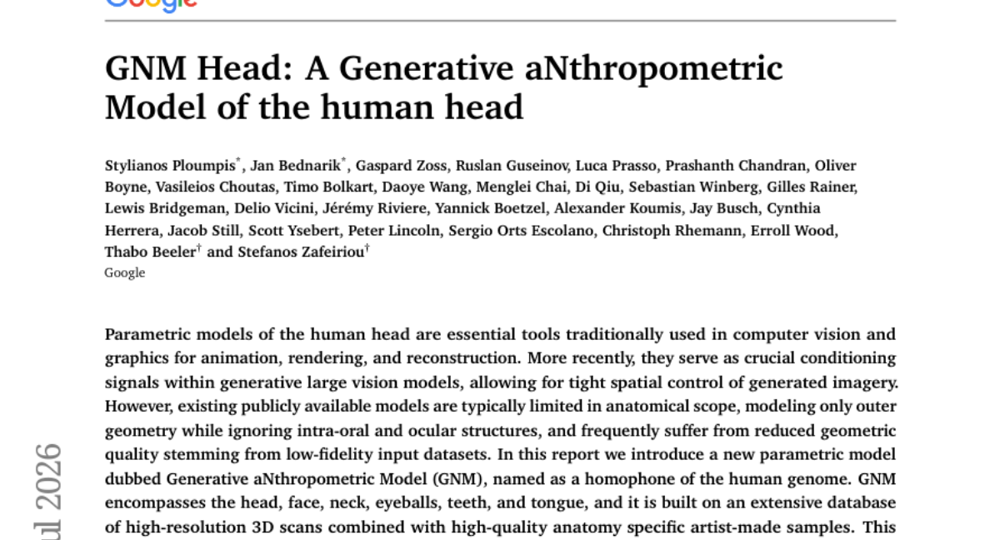

### 📌 한 줄 요약
안구, 치아, 혀 등 내부 구조까지 포함하는 고정밀 생성형 인체 머리 파라메트릭 모델(GNM) 공개

### 🔑 핵심 포인트
- 안구, 치아, 혀 등 복합적인 해부학적 구조를 포함하는 포괄적 파라메트릭 모델 개발
- 고해상도 3D 스캔과 예술적 정밀도가 결합된 고품질 데이터셋 활용
- 특화된 서브 모델 구조를 통한 정밀한 기하학적 제어 및 SOTA 성능 달성

### 🧑‍💻 개발자 관점
생성형 AI 모델에서 인물 생성 시 발생하는 입 안이나 눈 주변의 부자연스러운 왜곡을 해결하고, 정밀한 공간 제어가 필요한 그래픽스/애니메이션 작업에 즉시 활용 가능합니다.

### 🚀 실무 적용 아이디어
- 공개된 GNM 프레임워크를 다운로드하여 기존 얼굴 모델과 기하학적 정밀도 비교
- 제공된 모델을 Diffusion 기반 이미지 생성 모델의 제어 신호(Conditioning)로 적용해보기
- 특정 해부학적 구조(치아, 안구 등)의 변형이 렌더링 품질에 미치는 영향 테스트

### ⚠️ 리스크/한계
- 복잡한 해부학적 구조로 인해 모델 연산량이 기존 모델보다 높을 수 있음
- 특정 인종이나 연령대에 대한 데이터 편향성 존재 여부 확인 필요

### 📝 초록 기반 상세 설명
기존의 머리 파라메트릭 모델은 애니메이션과 생성형 모델의 제어 신호로 중요하게 사용되어 왔습니다. 그러나 기존 모델들은 해부학적 범위가 좁아 구강 내부나 안구 구조를 포함하지 못하며, 데이터 품질 문제로 기하학적 정밀도가 떨어지는 한계가 있었습니다. 본 논문에서는 머리, 얼굴, 목, 안구, 치아, 혀를 모두 포함하는 새로운 모델인 GNM(Generative aNthropometric Model)을 제안합니다. 고해상도 3D 스캔 데이터와 전문가가 제작한 해부학적 샘플을 결합하여 구축되었으며, 안구 및 구강 구조를 위한 특화된 서브 모델을 포함합니다. 실험 결과 타겟 3D 스캔 피팅에서 SOTA 성능을 달성하였으며, 커뮤니티 혁신을 위해 전체 프레임워크를 공개합니다.

---

## 21. [Leveraging External Knowledge for Historical Document Restoration via Retrieval-Augmented Large Language Models](https://huggingface.co/papers/2607.21936)
**Upvotes**: 3 | **도입 난이도**: 중 | **신뢰도**: 상
**arXiv**: https://arxiv.org/abs/2607.21936

**태그**: RAG, LLM, NLP, Document-Restoration, Evaluation

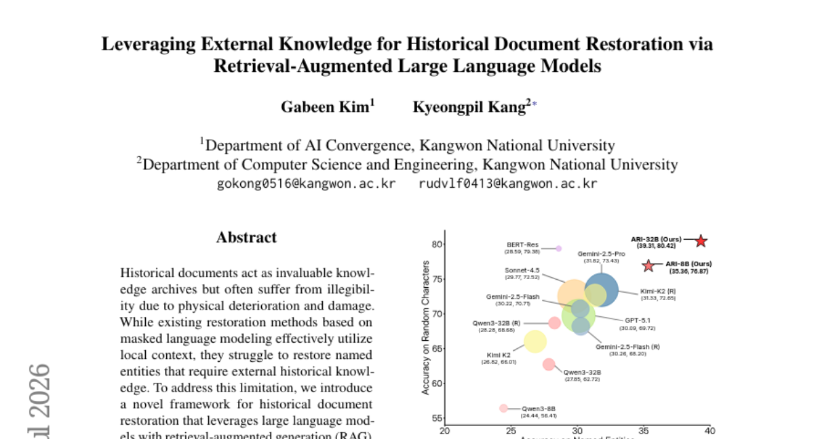

### 📌 한 줄 요약
RAG를 활용하여 외부 지식을 결합함으로써 역사적 문헌의 고유 명사 복원 성능을 극대화한 프레임워크 제안

### 🔑 핵심 포인트
- RAG를 결합하여 외부 지식을 활용하는 역사 문헌 복원 프레임워크(ARI) 개발
- LLM의 사전 학습 지식과 외부 검색 컨텍스트를 결합하여 고유 명사 복원 문제 해결
- 한국어 역사 문헌 데이터셋을 통한 성능 검증 및 전문가 평가 완료

### 🧑‍💻 개발자 관점
단순 문맥 복원을 넘어 외부 지식(RAG)을 결합하는 방식이 도메인 특화 데이터(역사, 법률 등) 복원에 어떻게 적용될 수 있는지 보여줍니다.

### 🚀 실무 적용 아이디어
- 제시된 ARI 프레임워크의 RAG 검색 엔진(Retriever) 구성 방식 분석
- 도메인 특화 지식(고유 명사)이 중요한 다른 텍스트 복원 태스크에 적용 실험
- LLM의 파라미터 크기에 따른 복원 성능 변화 측정

### ⚠️ 리스크/한계
- 검색된 외부 지식의 정확도에 따라 복원 결과가 왜곡될 위험 존재
- 특정 언어(한국어) 및 특정 도메인에 최적화된 결과일 가능성

### 📝 초록 기반 상세 설명
역사적 문헌은 가치 있는 기록이지만 물리적 손상으로 인해 판독이 어려운 경우가 많습니다. 기존의 마스크 언어 모델 기반 복원 방식은 국소적 문맥 활용에는 능하지만, 외부 지식이 필요한 고유 명사 복원에는 한계가 있었습니다. 본 논문은 RAG(Retrieval-Augmented Generation)를 결합하여 LLM의 암묵적 지식과 외부 검색 지식을 동시에 활용하는 ARI 프레임워크를 제안합니다. 한국어 역사 문헌을 대상으로 한 실험 결과, 일반 글자와 고유 명사 복원 모두에서 기존 방식보다 뛰어난 성능을 보였습니다. 전문가 평가를 통해 실무적인 도구로서의 가치와 역사 기록 분석 가속화 가능성을 입증했습니다.

---

## 22. [Evidence Attribution in Visual Document Understanding without Coordinates or Region Labels](https://huggingface.co/papers/2607.24651)
**Upvotes**: 2 | **도입 난이도**: 중 | **신뢰도**: 상
**arXiv**: https://arxiv.org/abs/2607.24651

**태그**: VLM, RAG, Document-AI, Reinforcement-Learning, Multimodal, Vision, Benchmark

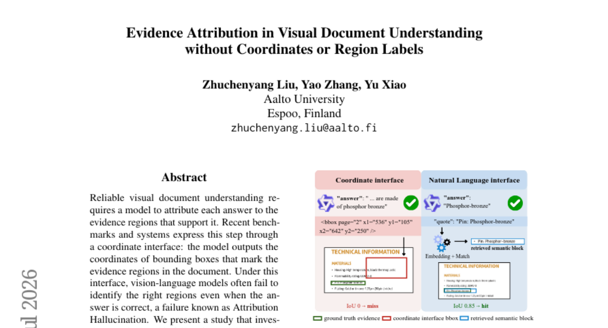

### 📌 한 줄 요약
좌표 기반이 아닌 텍스트 인용(Quote)과 리트리버를 결합하여 시각적 문서 이해의 근거 제시 성능을 높이는 새로운 방법론 제안

### 🔑 핵심 포인트
- 좌표 출력 방식의 한계인 'Attribution Hallucination' 문제를 텍스트 인용(Quote-and-Retrieve) 방식으로 해결
- 비싼 영역 라벨링 없이도 GRPO 보상 설계를 통해 모델의 근거 인용 능력을 학습시키는 방법론 제안
- 텍스트 인용 방식이 좌표 방식보다 근거 재현율을 높이고 환각율을 낮추는 데 효과적임을 입증

### 🧑‍💻 개발자 관점
문서 이해 모델 구축 시 복잡한 좌표 학습 대신 텍스트 추출 및 리트리벌 구조를 활용함으로써 데이터 구축 비용을 줄이고 신뢰도를 높일 수 있습니다.

### 🚀 실무 적용 아이디어
- 기존 좌표 기반 VLM 모델에 텍스트 인용 기반의 리트리벌 파이프라인 적용 테스트
- GRPO와 같은 강화학습 기법을 활용한 텍스트 인용 품질 최적화 실험
- 레이아웃 파서(Layout Parser)와 결합된 텍스트-영역 매핑 정확도 검증

### ⚠️ 리스크/한계
- 레이아웃 파서의 성능에 따라 텍스트 인용의 위치 매핑 정확도가 종속될 수 있음
- 표나 그림과 같이 텍스트로만 설명하기 어려운 복잡한 시각적 요소의 처리 한계

### 📝 초록 기반 상세 설명
신뢰할 수 있는 시각적 문서 이해를 위해서는 정답의 근거가 되는 영역을 정확히 지목하는 것이 필수적입니다. 기존 방식은 모델이 직접 좌표를 출력하는 방식을 사용하지만, 이는 정답이 맞더라도 잘못된 영역을 지정하는 'Attribution Hallucination' 문제를 야기합니다. 본 연구는 좌표 대신 텍스트를 인용하고 레이아웃 파서를 통해 위치를 찾는 '언어 인터페이스' 방식의 효용성을 검증했습니다. 실험 결과, 텍스트 인용 방식은 좌표 방식보다 근거 재현율(Recall)을 크게 높이고 환각율을 절반 수준으로 낮추면서도 정답 품질은 유지했습니다. 이를 바탕으로 GRPO(Group Relative Policy Optimization)를 활용해 영역 라벨 없이도 모델이 더 나은 근거를 인용하도록 학습시키는 프레임워크를 제안했습니다. 결과적으로 8B 모델의 엄격한 근거 정확도를 크게 향상시키며 좌표 없이도 효율적인 근거 제시가 가능함을 입증했습니다.

---

## 23. [IndicTalk: A Large-Scale Persona-Based Multilingual Conversational Corpus for Indic Languages](https://huggingface.co/papers/2607.23242)
**Upvotes**: 2 | **도입 난이도**: 하 | **신뢰도**: 상
**arXiv**: https://arxiv.org/abs/2607.23242

**태그**: NLP, Multilingual, Dataset, LLM, Evaluation

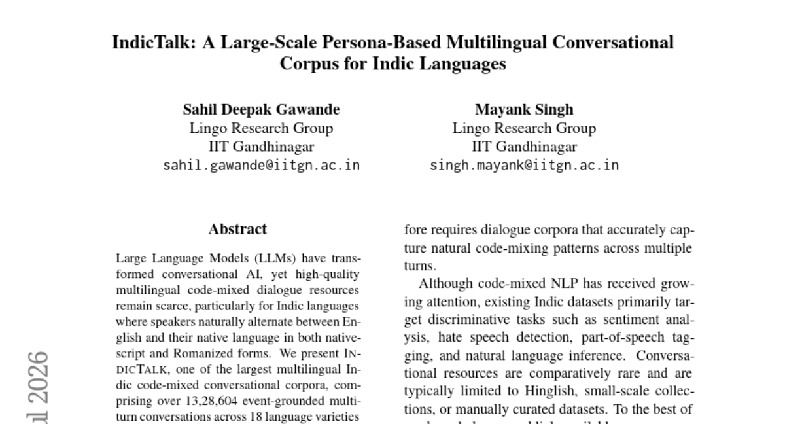

### 📌 한 줄 요약
인도 언어의 특성을 반영한 대규모 멀티링구얼 코드믹스(Code-mixed) 대화 데이터셋 구축

### 🔑 핵심 포인트
- 130만 개 이상의 대규모 멀티턴 코드믹스 대화 코퍼스 구축
- 뉴스 기반 이벤트 접지 및 페르소나 조건부 생성 파이프라인 활용
- 네이티브 스크립트와 로마자 표기법을 모두 지원하는 다국어 환경 최적화

### 🧑‍💻 개발자 관점
다국어/코드믹스 환경에서 자연스러운 대화형 AI 모델을 학습시키거나 성능을 평가할 때 유용한 고품질 데이터셋을 확보할 수 있습니다.

### 🚀 실무 적용 아이디어
- 제공된 데이터셋을 활용한 코드믹스 특화 LLM 파인튜닝 실험
- 기존 모델과 IndicTalk 기반 모델 간의 대화 유창성 비교 평가
- 다양한 스크립트(Native vs Romanized) 간의 모델 강건성 테스트

### ⚠️ 리스크/한계
- 자동화된 파이프라인 생성 데이터로 인한 잠재적 할루시네이션 위험
- 특정 뉴스/이벤트에 편향된 대화 내용이 포함될 가능성

### 📝 초록 기반 상세 설명
LLM의 발전에도 불구하고 인도 언어처럼 영어와 모국어를 혼용하는 코드믹스 대화 데이터는 매우 부족한 실정입니다. 본 논문은 9개 인도 언어와 18개 변이형을 포함하는 130만 개 이상의 멀티턴 대화 코퍼스인 IndicTalk를 제안합니다. 데이터 생성은 뉴스 기반의 이벤트 접지, 페르소나 조건부 대화 생성, 자동 품질 검증을 결합한 자동화 파이프라인을 통해 이루어졌습니다. 평가 결과, IndicTalk는 두 가지 스크립트 방식 모두에서 유창하고 일관된 코드믹스 대화를 생성함을 입증했습니다. 이 데이터셋은 소외된 인도 언어권의 멀티링구얼 대화형 AI 개발을 지원하기 위해 공개되었습니다.

---

## 24. [A Vocabulary for Multi-Agent Automated Research Systems](https://huggingface.co/papers/2607.22682)
**Upvotes**: 2 | **도입 난이도**: 하 | **신뢰도**: 상
**arXiv**: https://arxiv.org/abs/2607.22682

**태그**: Multi-Agent, System Design, Automated Research, Evaluation Framework, Agent, Evaluation

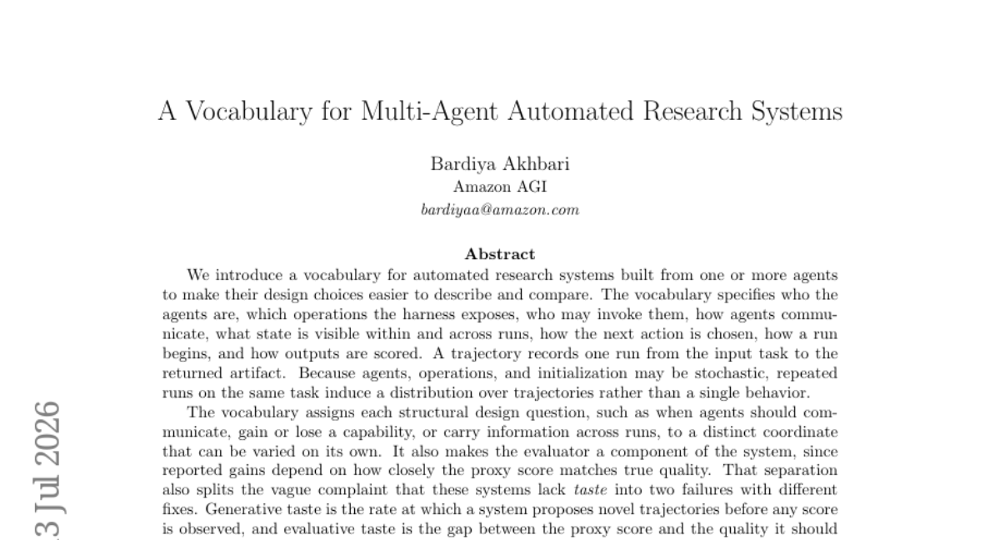

### 📌 한 줄 요약
멀티 에이전트 자동 연구 시스템의 설계 구조를 체계적으로 정의하고 비교하기 위한 표준 어휘(Vocabulary) 프레임워크 제안

### 🔑 핵심 포인트
- 에이전트의 역할, 통신, 정보 가시성, 평가 방식을 포함하는 8가지 설계 요소 정의
- 시스템의 성능을 '생성적 취향(Generative taste)'과 '평가적 취향(Evaluative taste)'으로 분리하여 분석
- 구조적 설계 선택지를 테스트 가능한 변수로 변환하여 시스템 간 비교 가능성 확보

### 🧑‍💻 개발자 관점
멀티 에이전트 시스템 설계 시 발생하는 모호한 구조적 결정들을 정형화된 프레임워크로 관리할 수 있게 해줍니다.

### 🚀 실무 적용 아이디어
- 현재 개발 중인 에이전트 시스템을 제안된 8가지 요소에 맞춰 문서화하기
- 에이전트 간 통신 방식과 정보 공유 범위를 변수로 설정하여 성능 변화 테스트하기
- 프록시 점수(Proxy score)와 실제 품질 간의 간극을 측정하는 평가 루프 설계하기

### ⚠️ 리스크/한계
- 제안된 어휘가 모든 복잡한 에이전트 상호작용을 완벽히 포괄하지 못할 가능성
- 실제 성능 지표와 프레임워크상의 구조적 지표 간의 상관관계 검증 필요

### 📝 초록 기반 상세 설명
최근 멀티 에이전트 기반 자동 연구 시스템이 등장하고 있으나, 설계 선택지를 명확히 기술하고 비교할 표준이 부족한 상황입니다. 본 논문은 에이전트의 역할, 통신 방식, 작업 선택 및 평가 방식 등을 포함하는 8가지 핵심 요소를 정의하는 새로운 어휘 체계를 도입합니다. 이 프레임워크는 구조적 설계 질문을 테스트 가능한 선택지로 변환하며, 시스템의 '취향(Taste)'을 생성적 측면과 평가적 측면으로 분리하여 정의합니다. 제안된 어휘를 최신 자동 연구 시스템에 적용한 결과, 서로 다른 구조를 가진 시스템들을 일관된 기준으로 비교할 수 있음을 입증했습니다.

### 🖼️ 추가 자료
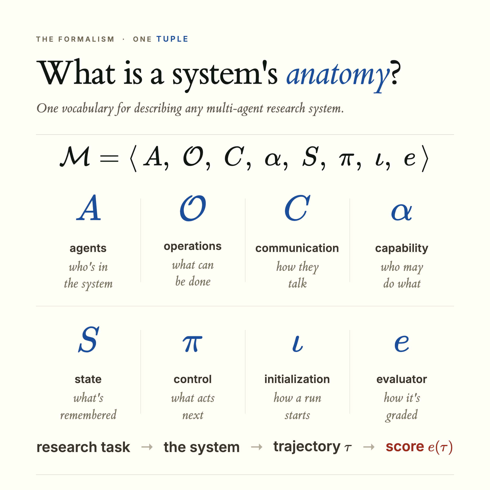
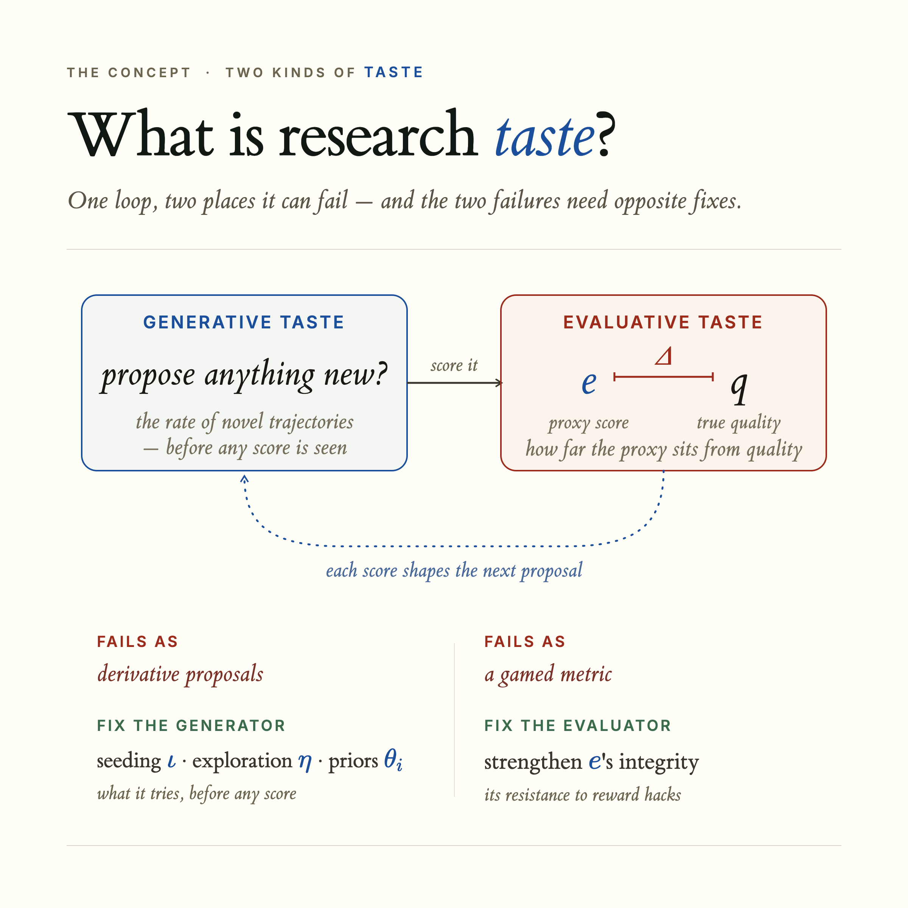
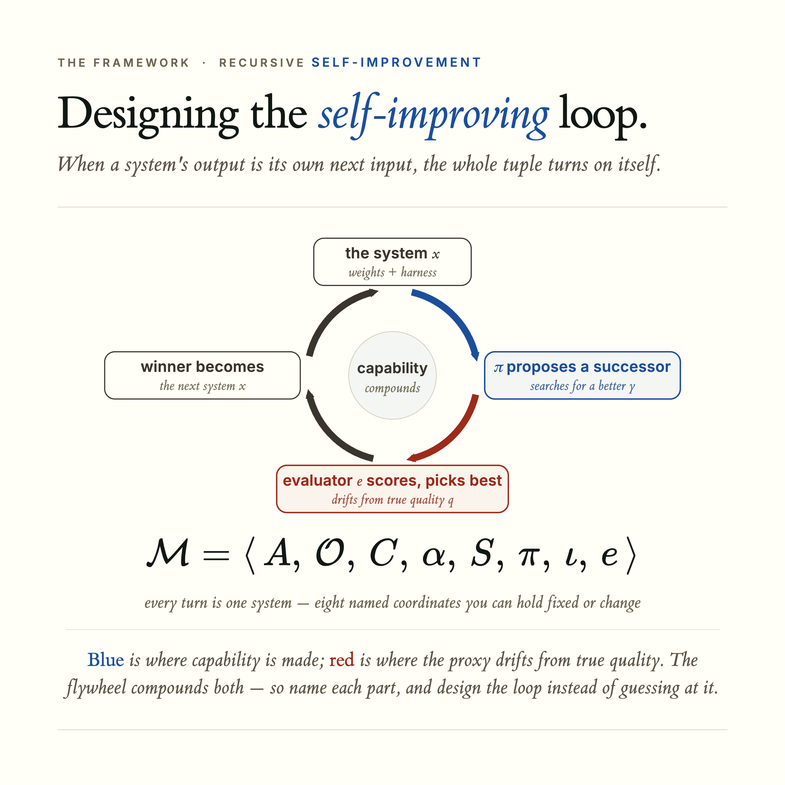

---

## 25. [TRACE: Business Rule-Grounded Reasoning Curriculum for Knowledge-Preserving Parametric Tool Retrieval in Enterprise LLMs](https://huggingface.co/papers/2607.22639)
**Upvotes**: 2 | **도입 난이도**: 중 | **신뢰도**: 상
**arXiv**: https://arxiv.org/abs/2607.22639

**태그**: LLM, Tool-Use, Fine-tuning, Reasoning, Enterprise-AI, RAG, Evaluation, Inference

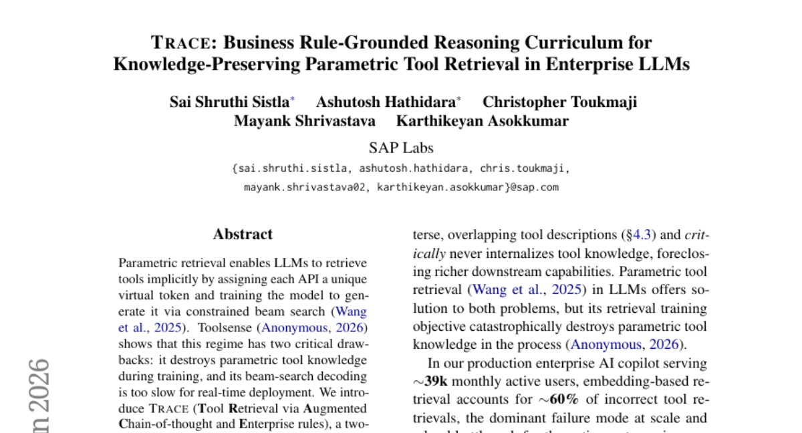

### 📌 한 줄 요약
비즈니스 규칙 기반의 추론 과정을 도입하여, 기존 파라메트릭 도구 검색의 지식 손실 문제를 해결하고 실시간 배포가 가능한 고성능 도구 검색 프레임워크를 제안함

### 🔑 핵심 포인트
- 두 단계 커리큘럼 학습(Stage 1: 지식 주입, Stage 2: 추론 기반 정렬)을 통한 지식 보존 및 성능 최적화
- 사고 과정(Thinking Trace)을 통한 단일 빔 그리디 디코딩(Single-beam Greedy Decoding) 지원으로 실시간 배포 가능성 확보
- 비즈니스 규칙과 도구 지식을 결합하여 복잡한 엔터프라이즈 환경에서의 도구 검색 정확도 극대화

### 🧑‍💻 개발자 관점
LLM이 API를 호출할 때 발생하는 지식 손실과 추론 속도 사이의 트레이드오프를 해결하여, 실제 프로덕션 환경에 즉시 적용 가능한 도구 검색 기술을 제시합니다.

### 🚀 실무 적용 아이디어
- LoRA를 활용한 도구 지식 주입과 추론 단계 분리 학습 구조 구현해보기
- 도구 호출 시 JSON 출력 전 '생각하는 단계'를 포함하는 프롬프트/학습 데이터 구성 실험
- 기존 임베딩 기반 검색(RAG)과 파라메트릭 검색(Parametric)의 성능 및 지연 시간 비교 테스트

### ⚠️ 리스크/한계
- 추론 흔적(Thinking Trace) 생성 시 토큰 생성량 증가로 인한 미세한 지연 시간 발생 가능성
- 도메인 특화 규칙(Business Rules)에 대한 의존도가 높아 새로운 도메인 확장 시 데이터 구축 비용 발생

### 📝 초록 기반 상세 설명
기존의 파라메트릭 도구 검색 방식은 학습 과정에서 기존 지식이 파괴되고, 빔 서치 디코딩 속도가 느려 실시간 배포에 어려움이 있었습니다. 이를 해결하기 위해 TRACE는 두 단계의 커리큘럼 학습 방식을 도입했습니다. 1단계에서는 LoRA를 통해 도구 지식을 초기화하고, 2단계에서는 비즈니스 규칙과 추론 흔적(reasoning trace)을 결합한 데이터로 모델을 학습시킵니다. 모델이 JSON 출력 전 사고 과정(thinking trace)을 생성하도록 유도함으로써, 단일 빔 그리디 디코딩만으로도 높은 검색 성능을 확보했습니다. 실험 결과, 도구 이해도가 향상되었을 뿐만 아니라 임베딩 기반 방식보다 월등히 높은 검색 재현율을 달성했습니다.

---

## 26. [Characterizing Warp Divergence from Pascal to Blackwell](https://huggingface.co/papers/2607.23402)
**Upvotes**: 1 | **도입 난이도**: 하 | **신뢰도**: 상
**arXiv**: https://arxiv.org/abs/2607.23402

**태그**: GPU, CUDA, Architecture, Performance, Benchmark

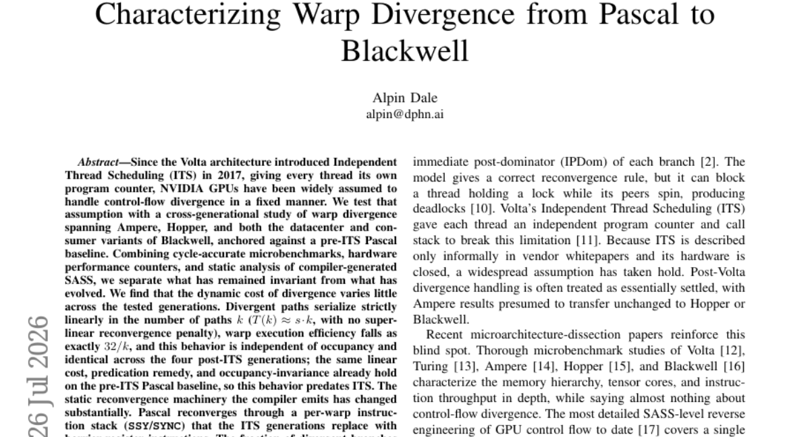

### 📌 한 줄 요약
NVIDIA GPU 아키텍처 변화에도 불구하고 워프 분기(Warp Divergence)의 성능 비용 모델은 일정하게 유지됨을 입증함

### 🔑 핵심 포인트
- 분기 경로 수(k)에 따른 직렬화 비용은 아키텍처 세대와 무관하게 선형적(T(k) ∝ k)으로 발생함
- 워프 실행 효율은 32/k로 유지되며, 이는 점유율(occupancy)에 독립적인 특성을 가짐
- 하드웨어 수준의 재합류 메커니즘은 진화했으나, 프로그래머가 직면하는 성능 비용 모델은 일정함

### 🧑‍💻 개발자 관점
GPU 아키텍처가 진화하더라도 분기 최적화의 기본 원칙(분기 경로 최소화)은 변하지 않으므로, 기존의 성능 최적화 전략을 신뢰할 수 있음

### 🚀 실무 적용 아이디어
- 분기 경로 수(k) 변화에 따른 커널 실행 시간의 선형성 검증 실험
- Pascal과 Blackwell 환경에서의 동일한 분기 코드 성능 비교
- 컴파일러 최적화(predication)가 분기 비용에 미치는 영향 분석

### ⚠️ 리스크/한계
- 실험 결과가 특정 워크로드나 특정 분기 패턴에 국한될 가능성 있음
- 하드웨어 내부의 미세한 제어 흐름 변화가 특정 엣지 케이스에서 영향을 줄 수 있음

### 📝 초록 기반 상세 설명
Volta 이후 도입된 독립적 스레드 스케줄링(ITS)으로 인해 워프 분기 처리 방식이 고정되었다는 가설이 제기되어 왔다. 본 연구는 Pascal부터 Blackwell까지의 다양한 GPU 아키텍처를 대상으로 마이크로벤치마크와 하드웨어 카운터, SASS 정적 분석을 통해 이를 검증하였다. 실험 결과, 분기 경로 수(k)에 따른 직렬화 비용은 아키텍처와 무관하게 선형적으로 발생하며 효율은 32/k로 유지됨을 확인했다. 반면, 컴파일러가 생성하는 재합류(reconvergence) 메커니즘은 스택 방식에서 배리어 레지스터 방식으로 크게 변화하였다. 결론적으로 제어 흐름 ISA는 진화하고 있으나, 프로그래머가 체감하는 분기 비용 모델은 안정적이고 예측 가능하다.

---

## 27. [UltraViT: Latency-Optimized On-device Vision Encoder for Large Vision-Language Models](https://huggingface.co/papers/2607.23373)
**Upvotes**: 1 | **도입 난이도**: 중 | **신뢰도**: 상
**arXiv**: https://arxiv.org/abs/2607.23373

**태그**: Edge-AI, Vision-Language, Model-Compression, Efficiency, Multimodal, Vision, Inference, Distillation, Safety

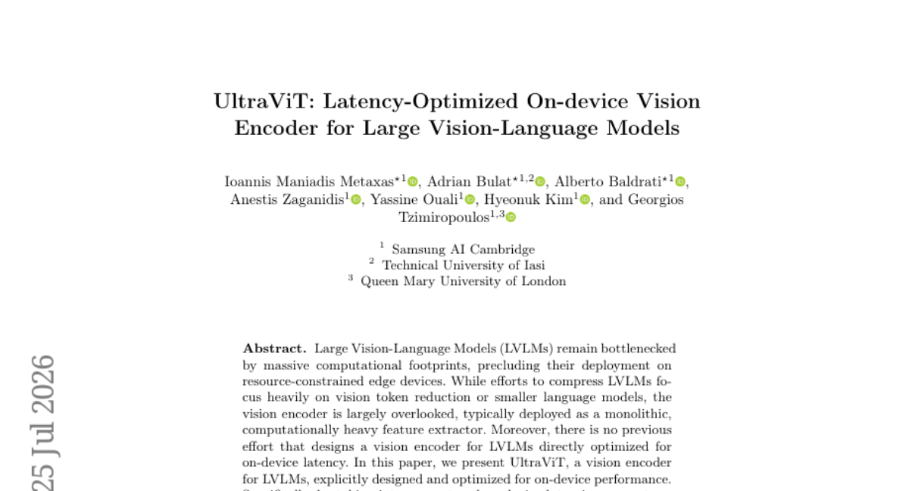

### 📌 한 줄 요약
온디바이스 LVLM 배포를 위해 지연 시간(Latency) 최적화와 생성적 사전 학습을 결합한 피라미드 구조의 비전 인코더 설계

### 🔑 핵심 포인트
- 온디바이스 지연 시간을 고려한 이기종 공간 믹서 기반의 피라미드 아키텍처 설계
- 밀집 증류 및 고정된 LLM의 생성적 감독을 결합한 새로운 2단계 사전 학습 전략
- 기존 대비 약 1.7배 빠른 속도를 제공하는 고효율 비전 인코더 성능 확보

### 🧑‍💻 개발자 관점
모바일이나 엣지 디바이스에서 LLM 기반 멀티모달 모델을 구동해야 하는 엔지니어에게 실질적인 속도 향상과 효율적인 아키텍처 설계 가이드를 제공합니다.

### 🚀 실무 적용 아이디어
- 제시된 피라미드 구조의 공간 믹서 구성 요소를 기존 ViT 모델에 적용하여 지연 시간 변화 측정
- 제안된 2단계 생성적 사전 학습 전략을 기존 경량 비전 모델에 적용하여 성능 변화 확인
- 다양한 엣지 디바이스 환경에서 모델의 추론 속도와 메모리 점유율 벤치마크 수행

### ⚠️ 리스크/한계
- 특정 하드웨어 가속기에 최적화된 구조일 경우 범용적인 엣지 디바이스로의 이식성 검토 필요
- 생성적 사전 학습 방식이 특정 도메인 데이터셋에서 일반화 성능에 미치는 영향 확인 필요

### 📝 초록 기반 상세 설명
대규모 비전-언어 모델(LVLM)은 막대한 연산량으로 인해 자원이 제한된 엣지 디바이스 배포에 어려움이 있습니다. 기존의 압축 방식은 주로 토큰 감소나 언어 모델 경량화에 집중되어 있어, 핵심인 비전 인코더의 연산 효율과 온디바이스 지연 시간 최적화는 간과되어 왔습니다. 본 논문은 온디바이스 성능을 위해 설계된 피라미드 구조의 비전 인코더인 UltraViT를 제안합니다. 이 모델은 이기종 공간 믹서를 매크로 블록 수준에서 통합하는 구조를 가지며, 밀집 증류(Dense Distillation)와 고정된 LLM을 활용한 생성적 감독을 결합한 2단계 사전 학습 전략을 사용합니다. 실험 결과, UltraViT는 기존 방식 대비 약 1.7배 빠른 속도를 기록하며 효율적인 LVLM 인코딩의 새로운 SOTA를 달성했습니다.

---

## 28. [WorldDiT: A Unified Diffusion Architecture for World and Action Modeling](https://huggingface.co/papers/2607.23909)
**Upvotes**: 0 | **도입 난이도**: 중 | **신뢰도**: 상
**arXiv**: https://arxiv.org/abs/2607.23909

**태그**: Robot Learning, Diffusion Transformer, World Model, Embodied AI, Vision

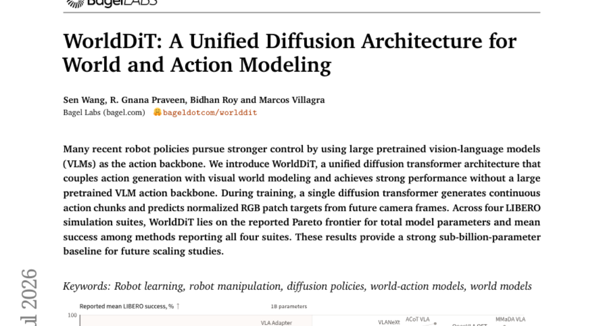

### 📌 한 줄 요약
대규모 VLM 없이도 액션 생성과 월드 모델링을 결합하여 효율적인 로봇 제어를 달현하는 통합 디퓨전 트랜스포머 아키텍처

### 🔑 핵심 포인트
- 액션 생성과 시각적 월드 모델링을 하나의 디퓨전 트랜스포머로 통합
- 대규모 사전 학습 VLM 없이도 강력한 로봇 제어 성능 확보
- 파라미터 효율성을 극대화하여 성능과 모델 크기 간의 파레토 프런티어 달성

### 🧑‍💻 개발자 관점
모델 크기를 줄이면서도 월드 모델링을 통해 제어 성능을 높이는 효율적인 아키텍처 설계 방식을 제시합니다.

### 🚀 실무 적용 아이디어
- LIBERO 시뮬레이션 환경에서 제안된 아키텍처 재현 실험
- 다양한 시각적 환경 변화에 따른 월드 모델링 예측 정확도 검증
- 모델 파라미터 크기 변화에 따른 액션 성공률 상관관계 분석

### ⚠️ 리스크/한계
- 대규모 VLM을 사용하지 않으므로 복잡한 추론이 필요한 환경에서의 성능 제약 가능성
- 시뮬레이션 환경 위주의 결과로 실제 물리 환경(Sim-to-Real) 적용 시 차이 발생 가능성

### 📝 초록 기반 상세 설명
최근 로봇 정책 연구는 대규모 사전 학습된 VLM을 액션 백본으로 사용하여 제어 성능을 높이는 추세입니다. 하지만 이는 모델 크기를 비대하게 만드는 문제를 야기합니다. 본 논문은 액션 생성과 시각적 월드 모델링을 결합한 통합 디퓨전 트랜스포머인 WorldDiT를 제안합니다. 학습 과정에서 단일 디퓨전 트랜스포머가 연속적인 액션 청크를 생성하는 동시에 미래 프레임의 RGB 패치를 예측합니다. 실험 결과, WorldDiT는 LIBERO 시뮬레이션 환경에서 파라미터 수 대비 높은 성공률을 기록하며 효율적인 성능을 입증했습니다. 이는 향후 스케일링 연구를 위한 강력한 10억 파라미터 미만의 베이스라인을 제공합니다.

---

## 29. [DriveDNA: A Large-Scale Multimodal Naturalistic Driving Dataset and Benchmark for Driving Style Identification](https://huggingface.co/papers/2607.23822)
**Upvotes**: 0 | **도입 난이도**: 중 | **신뢰도**: 상
**arXiv**: https://arxiv.org/abs/2607.23822

**태그**: Autonomous Driving, Driver Behavior, Multimodal, Dataset, Video, Benchmark, Evaluation

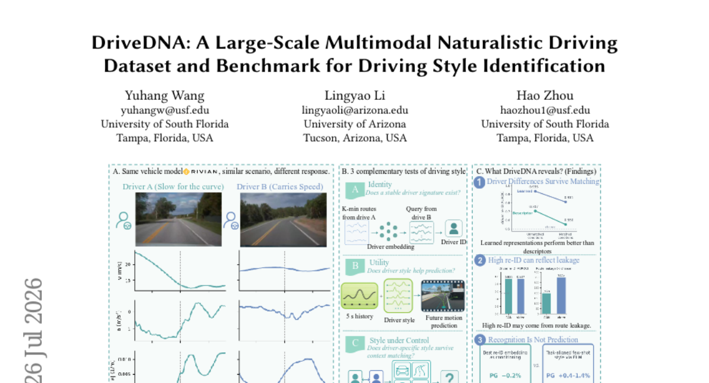

### 📌 한 줄 요약
차량 및 환경 변수를 배제하고 순수 운전 스타일을 식별하기 위한 대규모 멀티모달 데이터셋 및 벤치마크 제안

### 🔑 핵심 포인트
- 465명의 운전자와 115종의 차량을 포함한 975시간 규모의 대규모 자연스러운 주행 데이터셋 구축
- 운전 스타일 식별을 위한 3가지 핵심 벤치마크 태스크(재식별, 행동 예측, 조건 매칭) 정의
- 환경적 요인(차량, 경로)에 의한 편향을 배제하고 순수 운전 스타일을 추출하는 방법론 제시

### 🧑‍💻 개발자 관점
개인화된 ADAS(첨단 운전자 보조 시스템)나 자율주행 에이전트의 운전 스타일 모방/제어 모델 개발 시 환경 변수와 운전 스타일을 분리하는 데 중요한 가이드라인을 제공합니다.

### 🚀 실무 적용 아이디어
- 제공된 데이터셋을 활용하여 환경 변수(차량/경로)를 제거한 순수 운전 스타일 특징 추출 실험
- 비디오 데이터 사용 시 경로 정보가 모델 성능에 미치는 '루트 누킹' 현상 검증
- Few-shot 학습을 통한 미학습 운전자 식별 성능 테스트

### ⚠️ 리스크/한계
- 비디오 기반 모델이 운전 스타일이 아닌 경로(Route) 정보를 학습하여 성능이 왜곡될 위험
- 실제 도로 환경의 복잡한 변수가 모델의 일반화 성능을 저해할 가능성

### 📝 초록 기반 상세 설명
운전 스타일은 운전자 고유의 패턴이지만, 실제 주행 데이터에서는 차량이나 도로 환경 같은 외부 요인과 혼재되어 식별이 어렵습니다. 이를 해결하기 위해 465명의 운전자가 115종의 차량으로 생성한 975시간 분량의 대규모 데이터셋인 DriveDNA를 구축했습니다. 본 연구는 소수 샷 재식별, 개인화된 행동 예측, 조건 일치 비교라는 세 가지 핵심 태스크를 통해 운전 스타일을 평가합니다. 실험 결과, 학습된 표현 모델이 기존 기술보다 미학습 운전자에 대해 월등한 성능을 보였으나, 비디오 전용 모델은 경로 정보에 의존하는 '루트 누출' 문제를 보였습니다. 결과적으로 신뢰할 수 있는 운전 스타일 모델은 환경적 혼란 변수를 극복하는 강건함을 갖춰야 함을 입증했습니다.

---

## 30. [TILT: Improving Compositional Generation in Diffusion Models with a Model-Intrinsic Reward](https://huggingface.co/papers/2607.21606)
**Upvotes**: 0 | **도입 난이도**: 하 | **신뢰도**: 상
**arXiv**: https://arxiv.org/abs/2607.21606

**태그**: Diffusion, Text-to-Image, Inference-time Optimization, Vision, Safety

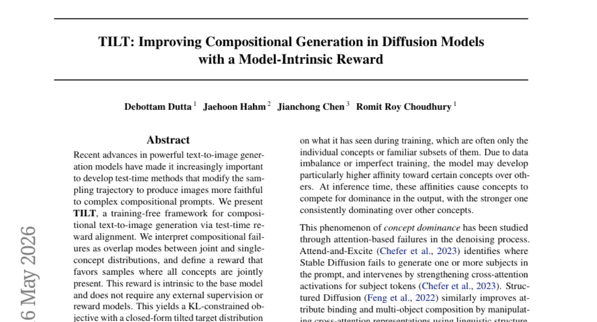

### 📌 한 줄 요약
추가 학습 없이 모델 내부의 보상을 활용하여 복잡한 프롬프트의 구성적 생성 능력을 높이는 TILT 프레임워크

### 🔑 핵심 포인트
- 학습이 필요 없는(Training-free) 테스트 타임 보상 정렬 방식
- 모델 내부 분포를 활용하여 외부 모델 없이 구성적 실패를 해결하는 intrinsic reward 정의
- KL-제약 조건 하의 폐쇄형 타겟 분포를 통한 효율적인 샘플링 가이던스

### 🧑‍💻 개발자 관점
모델을 재학습시키지 않고도 추론 단계(Inference-time)의 최적화만으로 생성 결과의 정밀도를 높일 수 있는 실용적인 방법론입니다.

### 🚀 실무 적용 아이디어
- T2ICompBench 데이터셋을 활용한 기존 모델과의 성능 비교 실험
- 제안된 하이브리드 가이던스 전략의 파라미터 변화에 따른 품질 변화 관찰
- 특정 도메인(예: 복잡한 사물 배치)에서의 가이던스 스텝 효율성 테스트

### ⚠️ 리스크/한계
- 모델 내부 보상에 의존하므로 베이스 모델의 성능 범위 내로 결과가 제한될 수 있음
- 샘플링 단계에서의 추가 연산 비용 발생 가능성

### 📝 초록 기반 상세 설명
최근 텍el-to-image 모델은 강력해졌으나, 복잡한 구성적 프롬프트에 대해 정확한 이미지를 생성하는 데 어려움을 겪고 있습니다. 기존 방식은 복잡한 개념들이 겹치거나 누락되는 문제가 발생합니다. 본 논문은 TILT라는 학습이 필요 없는 테스트 타임(test-time) 프레임워크를 제안합니다. 이는 모델 내부의 분포를 활용하여 모든 개념이 공존하는 샘플을 favoring하는 보상 함수를 정의합니다. 이 보상은 외부 모델 없이 폐쇄형(closed-form)으로 계산되어 효율적인 가이던스를 제공합니다. 실험 결과, 이미지 품질을 유지하면서도 복잡한 프롬프트에 대한 정렬 성능을 크게 향상시켰습니다.

---

