# 2026-07-30 Daily Papers (Top 26)

## 오늘의 요약
오늘의 연구는 에이전트의 효율적인 탐색과 메모리 활용, 그리고 데이터 오염 문제를 다루는 데 집중되었습니다. 특히 로봇 조작, 코드 에이전트, 멀티모달 모델 등 실질적인 워크플로우 최적화와 신뢰할 수 있는 평가 방법론에 대한 논의가 활발했습니다.

### 오늘의 핵심 포인트
- 에이전트가 방대한 데이터 속에서 정답을 찾는 탐색 과정과 암시적 연관성을 처리하는 메모리 구조의 중요성이 강조되었습니다.
- 로봇 데이터 수집 비용 절감 및 코드/비디오 스트리밍 환경에서의 효율적인 컨텍스트 제공 기술이 제시되었습니다.
- 동적 벤치마크에서도 발생하는 데이터 오염 위험을 경고하며, 모델의 진정한 추론 능력을 검증하기 위한 평가 가이드라인의 필요성을 역설했습니다.

**오늘의 태그**: AI Agent, RAG, Multimodal, Evaluation, Efficiency

## 1. [HiFi-UMI: Learning Deployable Manipulation Policies from High-Fidelity UMI Data Alone](https://huggingface.co/papers/2607.25895)
**Upvotes**: 123 | **도입 난이도**: 상 | **신뢰도**: 상
**arXiv**: https://arxiv.org/abs/2607.25895

**태그**: Robot Learning, Data Collection, Imitation Learning, Computer Vision, Vision, Evaluation

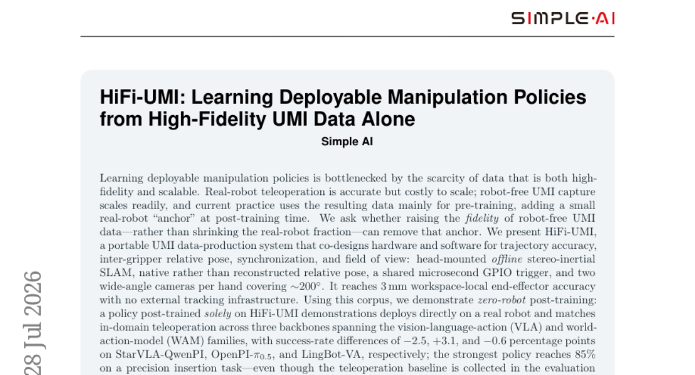

### 📌 한 줄 요약
고정밀 로봇 없는(robot-free) 데이터 수집 시스템을 통해 실로봇 학습 없이도 즉시 배포 가능한 고성능 조작 정책을 구현함

### 🔑 핵심 포인트
- 고정밀 로봇 없는(robot-free) 데이터 수집을 위한 하드웨어/소프트웨어 통합 시스템(HiFi-UMI) 개발
- 실로봇 데이터 없이 고정밀 데이터만으로 즉시 배포 가능한(zero-robot post-training) 정책 학습 성공
- 2,000시간 규모의 고정밀/광각 시각 데이터셋 HiFi-UMI-2K 공개

### 🧑‍💻 개발자 관점
고가의 로봇 하드웨어 없이도 정밀한 조작 데이터를 대량으로 수집할 수 있는 방법론을 제시하여 데이터 확보 비용을 획기적으로 낮춤

### 🚀 실무 적용 아이디어
- 제공된 HiFi-UMI-2K 데이터셋을 활용하여 기존 VLA 모델의 Zero-shot 성능 테스트
- 제안된 하드웨어 구성(SLAM, 동기화 방식)을 기존 데이터 수집 파이프라인에 적용 가능한지 검토
- 데이터 정밀도 향상이 모델의 일반화 성능에 미치는 영향 분석

### ⚠️ 리스크/한계
- 특수 제작된 하드웨어 시스템에 대한 의존도가 높음
- 데이터 수집 환경과 실제 로봇 환경 간의 도메인 차이(Sim-to-Real과 유사한 문제) 존재 가능성

### 📝 초록 기반 상세 설명
로봇 조작 정책 학습은 고정밀 데이터와 확장성 사이의 트레이드오프 문제로 인해 어려움을 겪고 있습니다. 기존의 로봇 없는(robot-free) 데이터는 확장성은 좋지만 정밀도가 낮아 실로봇 학습 시 별도의 앵커 데이터가 필요했습니다. 본 논문은 데이터의 양보다 질(fidelity)을 높여 실로봇 데이터 없이도 배포 가능한 HiFi-UMI 시스템을 제안합니다. 이 시스템은 SLAM, 정밀한 상대 포즈 계산, 마이크로초 단위 동기화 및 광각 카메라를 결합하여 외부 인프라 없이 3mm 수준의 정밀도를 달성합니다. 실험 결과, HiFi-UMI 데이터로만 학습된 정책이 실로봇에서 즉시 성공적으로 작동하며 기존 텔레오퍼레이션 성능에 근접하는 성과를 보였습니다. 최종적으로 2,000시간 분량의 고정밀 데이터셋인 HiFi-UMI-2K를 공개하여 커뮤니티에 기여합니다.

---

## 2. [A New Role for Relevance: Guiding Corpus Interaction in Agentic Search](https://huggingface.co/papers/2607.24223)
**Upvotes**: 79 | **도입 난이도**: 중 | **신뢰도**: 상
**arXiv**: https://arxiv.org/abs/2607.24223

**태그**: Agent, RAG, Information Retrieval, Search Optimization, Reasoning, Evaluation

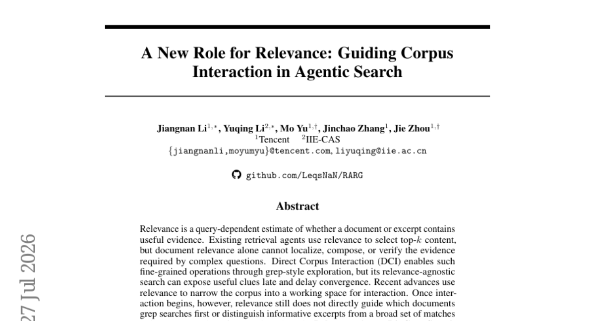

### 📌 한 줄 요약
검색 에이전트의 효율성을 높이기 위해 문서 관련도를 탐색 우선순위로 활용하는 RARG 프레임워크 제안

### 🔑 핵심 포인트
- 관련도를 단순 필터링이 아닌 탐색 실행의 우선순위(Execution Prior)로 활용
- Coarse-to-fine 방식의 단계적 가이드를 통한 문서 순차 탐색 및 진입점 최적화
- 검색 매칭 결과 내에서 정보 가치가 높은 발췌문을 우선 노출하는 재순위화 메커니즘

### 🧑‍💻 개발자 관점
단순히 문서를 가져오는 RAG를 넘어, 에이전트가 방대한 데이터 속에서 정답을 찾아가는 '탐색 과정'을 최적화하는 전략을 제공합니다.

### 🚀 실무 적용 아이디어
- 기존 RAG 파이프라인에 문서 간 순차적 탐색 로직 적용 실험
- 검색 결과(grep-style)의 재순위화가 LLM의 컨텍스트 윈도우 효율에 미치는 영향 측정
- 질문 유형(단순 정보 추출 vs 복잡 추론)에 따른 RARG의 효율성 벤치마크 수행

### ⚠️ 리스크/한계
- 관련도 산출 로직에 따라 탐색 편향(Bias)이 발생할 위험
- 복잡한 탐색 단계로 인해 단순 검색 대비 오버헤드가 발생할 가능성

### 📝 초록 기반 상세 설명
기존의 검색 에이전트는 문서의 관련도를 단순히 상위 k개 선택에만 사용하며, 복잡한 질문에 필요한 세부 증거를 찾는 데는 한계가 있습니다. 직접적인 코퍼스 상호작용(DCI) 방식은 정밀한 탐색이 가능하지만, 관련도 정보가 부족하면 유용한 단서를 찾는 데 시간이 오래 걸리는 문제가 있습니다. 본 논문은 관련도를 실행 우선순위로 전환하는 RARG(Relevance-Aware RipGrep Search Agent)를 소개합니다. RARG는 문서 순서 지정, 초기 진입점 설정, 검색 결과 재순위화라는 단계적 가이드를 통해 탐색 효율을 극대화합니다. 실험 결과, RARG는 복잡한 브라우징 및 추론 작업에서 기존 방식보다 정확도와 효율성 측면에서 우수한 성능을 보였습니다.

---

## 3. [ReDesign: Recovering Editable Design Structures from Images via Agentic Decomposition](https://huggingface.co/papers/2607.25565)
**Upvotes**: 54 | **도입 난이도**: 상 | **신뢰도**: 상
**arXiv**: https://arxiv.org/abs/2607.25565

**태그**: Agent, Design-Automation, Computer-Vision, Layout-Analysis, Vision, Benchmark, Evaluation

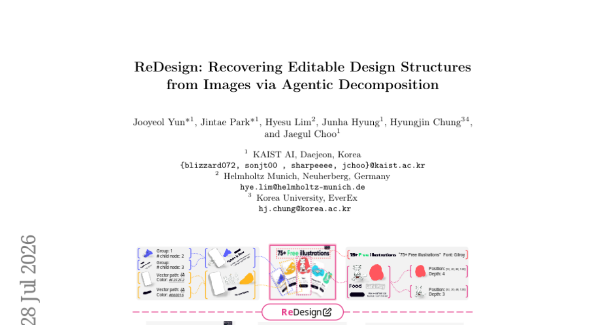

### 📌 한 줄 요약
이미지로부터 편집 가능한 레이어 구조를 복원하는 에이전트 기반의 디자인 재구성 프레임워크

### 🔑 핵심 포인트
- 에이전트 기반의 도구 선택 및 조합을 통한 계층적 디자인 구조 복원
- 오류 누적 방지를 위한 단계별 검증(Graceful Verification) 메커니즘 도입
- 편집 가능성 평가를 위한 새로운 벤치마크(Figma Edit Replay) 제안

### 🧑‍💻 개발자 관점
디자인 자산의 디지털화 및 자동화 워크플로우에서 수동 작업 시간을 획기적으로 단축할 수 있는 기술적 토대를 제공합니다.

### 🚀 실무 적용 아이디어
- 에이전트 기반의 도구 선택 로직과 검증 루프의 구조 분석
- Figma API와 연동 가능한 자동화 파이프라인 설계 검토
- 레이어 계층 구조 복원 알고리즘의 복잡도 및 연산 비용 계산

### ⚠️ 리스크/한계
- 에이전트의 도구 선택 과정에서 발생할 수 있는 비결정적 결과
- 복잡한 레이어 구조로 갈수록 증가하는 검증 및 연산 비용

### 📝 초록 기반 상세 설명
이미지로부터 편집 가능한 디자인 파일을 복원하는 작업은 타이포그래피, 벡터 기하학, 레이어 계층 등 다양한 속성을 복구해야 하는 까다로운 과제입니다. 기존 방식은 복잡한 결정 과정에서 오류가 누적되는 문제가 있었습니다. 본 논문은 특화된 도구들을 선택하고 조합하여 레이어 계층을 확장하는 에이전트 프레임워크인 ReDesign을 제안합니다. 각 확장 단계에서 검증(verification) 과정을 도입하여 오류를 즉각 수정하거나 가지치기함으로써 신뢰성을 확보했습니다. 새로운 벤치마크인 Figma Edit Replay를 통해 평가한 결과, ReDesign은 시각적 충실도와 편집 가능성 측면에서 기존 방식들을 압도하는 성능을 보였습니다.

---

## 4. [CodeNib: A Multi-View Data System for Serving Repository Context to Coding Agents](https://huggingface.co/papers/2607.25431)
**Upvotes**: 34 | **도입 난이도**: 상 | **신뢰도**: 상
**arXiv**: https://arxiv.org/abs/2607.25431

**태그**: AI Agent, RAG, Software Engineering, Indexing, Agent, Inference

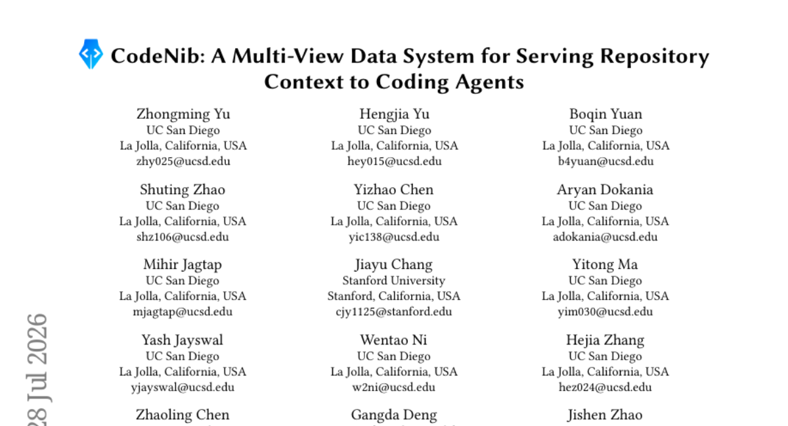

### 📌 한 줄 요약
코드 에이전트의 효율적인 컨텍스트 제공을 위해 코드 저장소의 구조, 벡터, 텍스트 뷰를 통합 관리하는 멀티뷰 데이터 시스템

### 🔑 핵심 포인트
- 커밋 단위의 재사용 가능한 어휘적/밀집/구조적 멀티뷰 인덱스 구축
- 코드 편집 시에도 유지되는 소스 범위 매핑 및 컨텍스트 유지 메커니즘
- 검색 및 탐색 성능 최적화를 통한 에이전트의 토큰 소모량 및 지연 시간 감소

### 🧑‍💻 개발자 관점
에이전트가 코드를 읽고 쓰는 과정에서 발생하는 불필요한 인덱싱 비용과 토큰 낭비를 줄여, 더 빠르고 저렴한 코딩 에이전트 운영이 가능해집니다.

### 🚀 실무 적용 아이디어
- 현재 사용 중인 RAG 시스템의 인덱스 업데이트 속도와 에이전트 추론 비용 비교
- 코드 구조(AST)와 벡터 임베딩을 결합한 하이브리드 검색 전략 검토
- 에이전트의 컨텍스트 윈도우 관리를 위한 '뷰(View)' 기반 데이터 제공 방식 실험

### ⚠️ 리스크/한계
- 저장소 규모가 커질수록 멀티뷰 인덱스 유지 비용이 증가할 수 있음
- 코드 변경이 빈번한 환경에서 인덱스 유효성(Validity) 관리의 복잡성

### 📝 초록 기반 상세 설명
코딩 에이전트는 작업 중 저장소의 컨텍스트를 지속적으로 탐색하고 유지해야 하지만, 기존의 분산된 인덱스와 언어 서버는 반복적인 탐색 비용을 발생시킵니다. 이를 해결하기 위해 CodeNib은 저장소 커밋별로 어휘적(lexical), 밀집(dense), 구조적(structural) 뷰를 생성하고 이를 소스 범위에 매핑하는 시스템을 제안합니다. 이 시스템은 편집 시에도 선택된 뷰를 유지하며 검색, 심볼 탐색, 제한된 컨텍스트 제공을 하나의 런타임에서 수행합니다. 실험 결과, 그래프 및 벡터 업데이트 속도가 기존 방식보다 최대 25.4배 빨랐으며, 컨텍스트 정책을 통해 토큰 사용량을 50~87% 절감했습니다. 결과적으로 이 시스템은 작업별 유효 범위를 명시하며 효율적인 저장소 컨텍스트 서비스를 지원합니다.

---

## 5. [Keep It InMind: Benchmarking the Implicit-Association Blind Spot in Agent Memory](https://huggingface.co/papers/2607.24368)
**Upvotes**: 24 | **도입 난이도**: 중 | **신뢰도**: 상
**arXiv**: https://arxiv.org/abs/2607.24368

**태그**: Agent, RAG, Memory, Benchmark, Evaluation

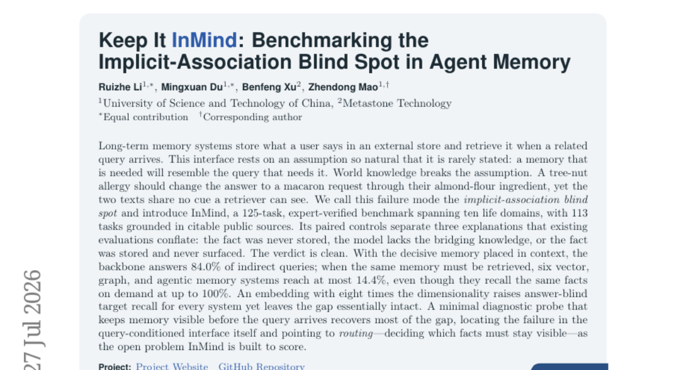

### 📌 한 줄 요약
에이전트 메모리 시스템이 질문과 직접적인 키워드가 일치하지 않는 '암시적 연관성'을 처리하지 못하는 성능 격차 문제를 규명함

### 🔑 핵심 포인트
- 질문과 저장된 정보 간의 키워드 불일치로 발생하는 '암시적 연관성 사각지대' 현상 정의
- 지식 저장, 브릿징 지식 부족, 정보 노출 실패를 구분하는 정교한 벤치마크 InMind 개발
- 기존 벡터/그래프/에이전트 메모리 시스템이 맥락적 추론에서 심각한 성능 저하를 보임을 입증

### 🧑‍💻 개발자 관점
RAG나 에이전트 설계 시 키워드 매칭 중심의 검색이 실제 사용자 의도(암시적 제약 조건)를 반영하지 못할 수 있음을 경고합니다.

### 🚀 실무 적용 아이디어
- 질문과 메모리 간의 키워드 유사도가 낮은 시나리오를 포함한 테스트셋 구축
- 검색된 결과물 중 어떤 정보를 프롬프트에 포함할지 결정하는 '라우팅/필터링' 로직 실험
- 임베딩 차원 확대 외에 맥락적 연결을 위한 하이브리드 검색 전략 검토

### ⚠️ 리스크/한계
- 단순 키워드 매칭을 넘어선 고차원적 추론 능력은 여전히 해결 과제로 남음
- 벤치마크의 도메인이 특정 지식 영역에 집중되어 있을 가능성

### 📝 초록 기반 상세 설명
기존의 장기 메모리 시스템은 질문과 저장된 정보가 유사해야 한다는 가정을 바탕으로 설계되었습니다. 그러나 세계 지식에 기반한 암시적 연관성(예: 견과류 알레르기와 마카롱의 관계)이 필요한 경우, 검색 기반 시스템은 이를 식별하지 못하는 '암시적 연관성 사각지대' 문제가 발생합니다. 이를 측정하기 위해 125개의 태스크로 구성된 벤치마크 InMind를 제안합니다. 실험 결과, 단순 사실 인출 능력은 높더라도 질문에 따른 맥락적 연관성이 필요한 경우 기존 메모리 시스템의 성능은 급격히 저하되었습니다. 연구는 이 문제가 단순한 지식 부족이 아니라, 질문에 따라 어떤 정보를 노출할지 결정하는 인터페이스의 문제임을 밝혀냈습니다.

---

## 6. [Mage-VL: An Efficient Codec-Native Streaming Multimodal Foundation Model](https://huggingface.co/papers/2607.24904)
**Upvotes**: 22 | **도입 난이도**: 상 | **신뢰도**: 상
**arXiv**: https://arxiv.org/abs/2607.24904

**태그**: Video-Understanding, Efficient-Inference, Multimodal-Foundation-Model, Real-time-AI, Reasoning, Multimodal, Vision, Video, Evaluation, Inference

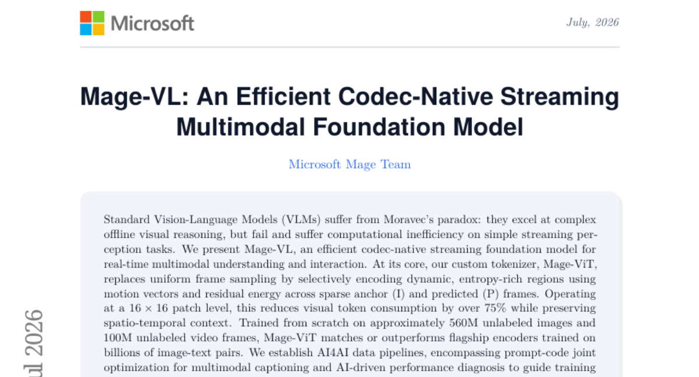

### 📌 한 줄 요약
코덱 기술을 활용해 토큰 효율성을 극대화하고 실시간 스트리밍 인지 성능을 높인 차세대 멀티모달 모델

### 🔑 핵심 포인트
- Mage-ViT: 모션 벡터와 잔차 에너지를 이용한 효율적인 코덱 기반 시각 토큰화 기술
- Dual-System Architecture: 이벤트 게이트(System 1)와 인과적 디코더(System 2)를 결합한 실시간 인지 구조
- AI4AI Pipeline: 데이터 효율성을 극대화하기 위한 자동화된 데이터 파이프라인 및 성능 진단 체계

### 🧑‍💻 개발자 관점
비디오 스트리밍 환경에서 연산 비용을 획기적으로 줄이면서도 실시간 상호작용이 가능한 고성능 VLM 구현이 가능해집니다.

### 🚀 실무 적용 아이디어
- 제안된 Mage-ViT의 패치 레벨 토큰 압축 효율성 검증 실험
- 실시간 비디오 스트리밍 환경에서의 추론 속도 및 지연 시간(Latency) 벤치마크
- 동적 움직임이 많은 영상 데이터셋에서의 공간 추론 정확도 테스트

### ⚠️ 리스크/한계
- 코덱 기반 압축 방식이 복잡한 배경이나 노이즈가 많은 환경에서 정보 손실을 야기할 가능성
- 특수 설계된 토크나이저로 인해 기존 표준 VLM 프레임워크와의 호환성 이슈 발생 가능성

### 📝 초록 기반 상세 설명
기존 VLM은 복잡한 추론에는 강하지만 단순한 실시간 스트리밍 작업에서는 효율성이 떨어지는 문제를 겪습니다. 이를 해결하기 위해 코덱 네이티브 방식의 Mage-VL을 제안합니다. 핵심인 Mage-ViT는 모션 벡터와 잔차 에너지를 활용해 동적 영역을 선택적으로 인코딩함으로써 시각 토큰 소비를 75% 이상 절감합니다. 또한 생체 모방형 이중 시스템(System 1/2) 구조를 통해 선제적인 스트리밍 인지를 가능하게 합니다. 실험 결과, Mage-VL-4B는 정적 작업에서 최신 모델과 대등하면서도 비디오 이해 및 공간 추론에서 우수한 성능과 최대 3.5배 빠른 추론 속도를 달성했습니다.

---

## 7. [Pass the Baton: Trajectory-Relayed On-Policy Distillation](https://huggingface.co/papers/2607.26057)
**Upvotes**: 21 | **도입 난이도**: 중 | **신뢰도**: 상
**arXiv**: https://arxiv.org/abs/2607.26057

**태그**: LLM Distillation, Reasoning, On-Policy Learning, Efficiency, RAG, Vision, Benchmark, Distillation

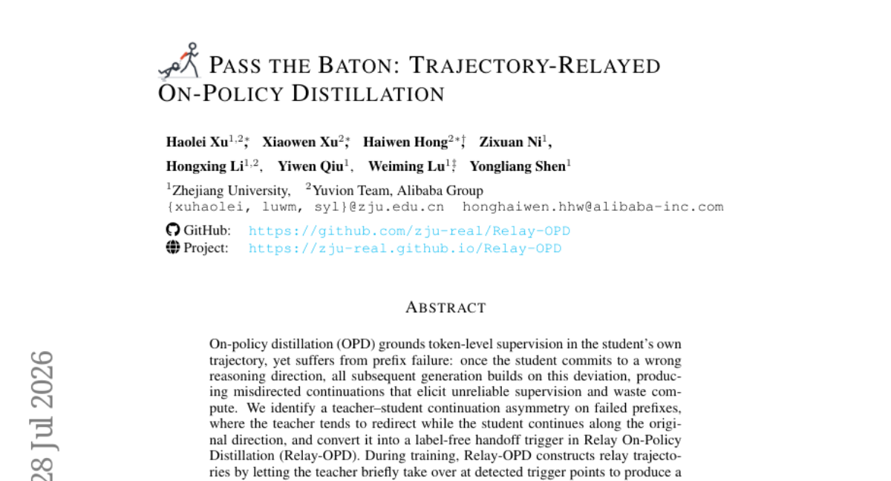

### 📌 한 줄 요약
잘못된 추론 경로를 교사가 개입하여 수정하는 '릴레이' 방식을 통해 온폴리시 증류(OPD)의 효율성과 성능을 극대화한 기법

### 🔑 핵심 포인트
- 교사와 학생 간의 경로 비대칭성을 활용한 레이블 없는 핸드오프(handoff) 트리거 개발
- 오류 발생 시 교사가 개입하여 올바른 방향으로 경로를 돌려놓는 릴레이(Relay) 방식 도입
- 제한된 예산(budget) 내 개입을 통해 학생 정책의 이탈을 방지하며 효율적인 학습 수행

### 🧑‍💻 개발자 관점
모델이 잘못된 추론 경로에 빠졌을 때 발생하는 연산 낭비를 줄이고, 적은 비용으로도 고성능 추론 모델을 학습시킬 수 있는 실용적인 증류 전략을 제시합니다.

### 🚀 실무 적용 아이디어
- 기존 OPD 프레임워크에 교사 모델의 개입 트리거 로직 구현 테스트
- 수학적 추론 작업에서 학생 모델의 오류 발생 시점과 교사 개입 시점의 상관관계 분석
- 제한된 교사 모델 예산(Relay Budget) 설정에 따른 성능 변화 실험

### ⚠️ 리스크/한계
- 교사 모델의 개입 시점이 부적절할 경우 오히려 학생의 학습을 방해할 가능성
- 특정 도메인(수학 등)에 특화된 전략이 일반적인 대화형 작업에서도 동일한 효과를 낼지에 대한 검증 필요

### 📝 초록 기반 상세 설명
온폴리시 증류(OPD)는 학생 모델의 생성 경로를 기반으로 학습하지만, 초기에 잘못된 방향을 잡으면 이후 모든 생성이 오답으로 흐르는 '접두사 실패(prefix failure)' 문제가 발생합니다. 연구진은 교사와 학생 간의 경로 불일치 현상을 포착하여, 오류 발생 시 교사가 잠시 개입해 경로를 바로잡는 Relay-OPd 방식을 제안합니다. 학습 과정에서 교사는 특정 트리거 지점에서만 개입하여 올바른 경로를 생성하고, 학생은 그 이후의 궤적을 이어받아 학습함으로써 효율적인 경로 복구를 유도합니다. 실험 결과, Relay-OPD는 수학적 추론 벤치마크에서 기존 OPD 및 FastOPD 대비 우수한 성능을 보였으며 학습 궤적 길이를 50% 이상 단축했습니다.

---

## 8. [Novel Claim or Déjà Vu? Rethinking "Contamination-Free'' Dynamic Evaluation for Multimodal Automated Fact-Checking](https://huggingface.co/papers/2607.23514)
**Upvotes**: 12 | **도입 난이도**: 하 | **신뢰도**: 상
**arXiv**: https://arxiv.org/abs/2607.23514

**태그**: LLM, Fact-Checking, Evaluation, RAG, Reasoning, Multimodal, Benchmark

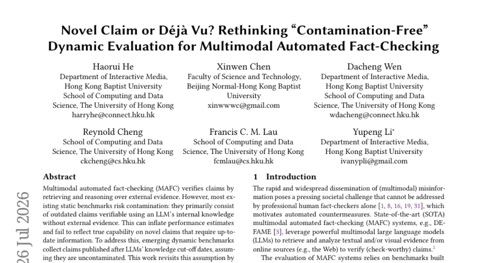

### 📌 한 줄 요약
동적 벤치마크조차 데이터 오염(Contamination) 위험이 있음을 밝히고, 신뢰할 수 있는 멀티모달 팩트체킹 평가 가이드라인을 제시함

### 🔑 핵심 포인트
- 동적 벤치마크(Post-cut-off)에서도 17.09%~29.30%의 데이터 오염 위험이 존재함을 입증
- 최신 데이터라도 기존 지식의 합성이나 직접적인 추론을 통해 모델이 이미 알고 있는 것처럼 작용할 수 있음
- 데이터 오염이 Macro-F1 점수를 최대 11.34점까지 부풀려 시스템 순위를 왜곡할 수 있음을 확인

### 🧑‍💻 개발자 관점
LLM 기반 RAG나 팩트체킹 시스템 개발 시, 단순히 최신 데이터로 테스트하는 것만으로는 모델의 진정한 추론 능력을 검증할 수 없음을 시사한다.

### 🚀 실무 적용 아이디어
- 모델의 성능이 지식 컷오프 이후의 데이터에 대해 어떻게 반응하는지 정밀 분석
- 단순 지식 검색이 아닌, 복합적 추론이 필요한 새로운 형태의 쿼리셋 구성
- 평가 데이터셋 구축 시 지식 합성(Synthesis) 가능성을 고려한 엄격한 필터링 적용

### ⚠️ 리스크/한계
- 동적 벤치마크만으로는 완벽한 오염 방지가 불가능함
- 지식 컷오프 이후의 데이터라도 기존 지식의 조합으로 해결 가능한 경우가 많음

### 📝 초록 기반 상세 설명
멀티모달 자동 팩트체킹(MAFC)은 외부 증거를 활용해 주장의 진위 여부를 검증하는 기술이다. 기존의 정적 벤치마크는 모델의 내부 지식에 포함된 과거 데이터로 인해 성능이 과대평가되는 오염 문제가 존재한다. 이를 해결하기 위해 지식 컷오프 이후의 데이터를 사용하는 동적 벤치마크가 등장했으나, 본 연구는 이 역시 오염으로부터 자유롭지 않음을 실증적으로 분석한다. 연구진은 기존 SOTA 벤치마크와 새로 구축한 ClaimReview2025Q4를 비교하며 오염 위험과 성능 왜곡을 조사했다. 실험 결과, 동적 평가에서도 상당한 오염이 발생하며 이는 모델 성능 지표를 최대 11.34점까지 부풀릴 수 있음을 확인했다. 최종적으로 연구는 신뢰할 수 있는 MAFC 평가를 위한 실무 가이드라인을 제공한다.

---

## 9. [Wonder: Video World Model Done Better](https://huggingface.co/papers/2607.26037)
**Upvotes**: 10 | **도입 난이도**: 상 | **신뢰도**: 상
**arXiv**: https://arxiv.org/abs/2607.26037

**태그**: Video Generation, World Model, Computer Vision, Real-time Rendering, RAG, Vision, Video, Evaluation, Inference, Distillation

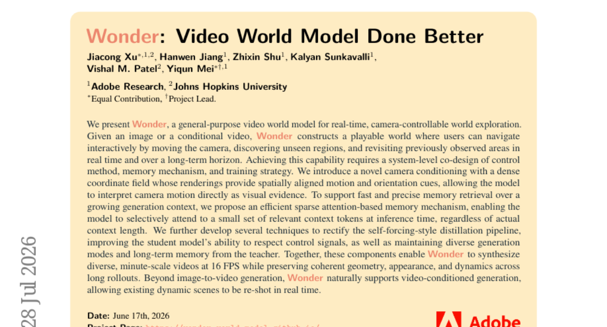

### 📌 한 줄 요약
실시간 카메라 제어와 장기 기억 유지가 가능한 상호작용형 비디오 월드 모델 개발

### 🔑 핵심 포인트
- 밀집 좌표 필드를 활용하여 카메라 움직임을 시각적 증거로 해석하는 제어 방식 도입
- 희소 어텐션 기반 메모리 메커니즘을 통해 긴 컨텍스트에서도 빠른 메모리 검색 및 일관성 유지
- 지식 증류(Distillation) 파이프라인 최적화로 제어 신호 준수와 생성 다양성 간의 균형 확보

### 🧑‍💻 개발자 관점
사용자가 직접 카메라를 움직이며 가상 세계를 탐험하는 인터랙티브 콘텐츠 및 게임 엔진용 생성 모델로서의 가능성을 제시합니다.

### 🚀 실무 적용 아이디어
- 제시된 밀집 좌표 필드(dense coordinate field)의 수학적 구현 방식 분석
- 희소 어텐션 메커니즘이 긴 비디오 생성 시 메모리 효율에 미치는 영향 검증
- 기존 비디오 생성 모델과 비교하여 카메라 제어 정밀도 테스트

### ⚠️ 리스크/한계
- 실시간 16 FPS 구현을 위한 하드웨어 요구 사양 및 최적화 의존성
- 매우 긴 시간(long-term)의 롤아웃 시 발생할 수 있는 누적 오차 및 드리프트 현상

### 📝 초록 기반 상세 설명
기존 비디오 생성 모델은 실시간 카메라 이동에 따른 일관된 세계 탐색과 장기적인 시각적 기억 유지에 어려움이 있었습니다. 이를 해결하기 위해 제어 방식, 메모리 메커니즘, 학습 전략을 통합 설계한 Wonder 모델을 제안합니다. 밀집 좌표 필드(dense coordinate field)를 활용한 카메라 컨디셔닝과 효율적인 희소 어텐션(sparse attention) 기반 메모리 메커니즘을 도입했습니다. 또한, 지식 증류 과정에서 제어 신호 준수와 생성 다양성을 유지하는 최적화 기술을 적용했습니다. 그 결과, 16 FPS의 실시간 속도로 기하학적 일관성과 역동성을 유지하며 긴 시간 동안 탐색 가능한 비디오 생성이 가능해졌습니다.

---

## 10. [Shieldstral](https://huggingface.co/papers/2607.25857)
**Upvotes**: 10 | **도입 난이도**: 하 | **신뢰도**: 상
**arXiv**: https://arxiv.org/abs/2607.25857

**태그**: LLM, Multimodal, Safety, Content Moderation, Benchmark, Evaluation

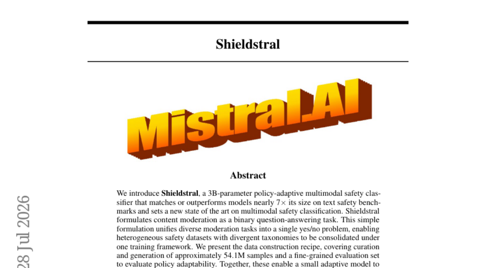

### 📌 한 줄 요약
질의응답 형식을 활용해 소형 모델로도 대규모 모델급의 멀티모달 안전성 분류 성능을 구현한 Shieldstral

### 🔑 핵심 포인트
- 콘텐츠 모더레이션을 이진 QA 작업으로 단순화하여 다양한 정책 통합 가능
- 5,410만 개의 대규모 정교한 데이터 구축 및 생성 레시피 제안
- 3B 파라미터의 소형 모델로 대형 모델급의 멀티모달 안전성 성능 달성

### 🧑‍💻 개발자 관점
적은 컴퓨팅 자원으로도 강력한 멀티모달 필터링 시스템을 구축할 수 있어, 서비스 운영 비용 절감과 실시간 안전성 검토에 유리합니다.

### 🚀 실무 적용 아이디어
- 제시된 QA 기반 프롬프트 형식을 기존 모더레이션 워크플로우에 적용해보기
- 다양한 도메인(커뮤니티, 커머스 등)의 정책을 QA 형식으로 변환하여 테스트하기
- 소형 모델(3B급)을 활용한 온디바이스/엣지 환경의 안전성 필터 성능 검증하기

### ⚠️ 리스크/한계
- 단순 QA 방식이 매우 복잡하거나 미묘한 맥락적 위반을 완벽히 포착할 수 있는지 검증 필요
- 특정 도메인에 특화된 데이터로 학습 시 범용적인 안전성 성능이 저하될 가능성

### 📝 초록 기반 상세 설명
기존의 안전성 분류 모델들은 모델 크기에 비해 성능 제약이 있거나 다양한 정책을 통합하기 어려웠습니다. 이를 해결하기 위해 Shieldstral은 콘텐츠 모더레이션을 단순한 이진 질의응답(QA) 작업으로 정식화했습니다. 이 방식을 통해 서로 다른 분류 체계를 가진 이종 데이터셋을 하나의 학습 프레임워크로 통합할 수 있게 되었습니다. 약 5,410만 개의 정교한 데이터 구축 레시피를 적용하여 학습한 결과, 3B 파라미터 모델임에도 훨씬 큰 모델들과 대등하거나 더 뛰어난 성능을 보였습니다. 결과적으로 소형 모델로도 강력한 정책 적응형 멀티모달 안전성 분류가 가능함을 입증했습니다.

---

## 11. [PerceptionBench: Evaluating Atomic Visual Perception in Multimodal Large Language Models](https://huggingface.co/papers/2607.24957)
**Upvotes**: 9 | **도입 난이도**: 하 | **신뢰도**: 상
**arXiv**: https://arxiv.org/abs/2607.24957

**태그**: MLLM, Vision, Benchmark, Evaluation, RAG, Reasoning, Multimodal

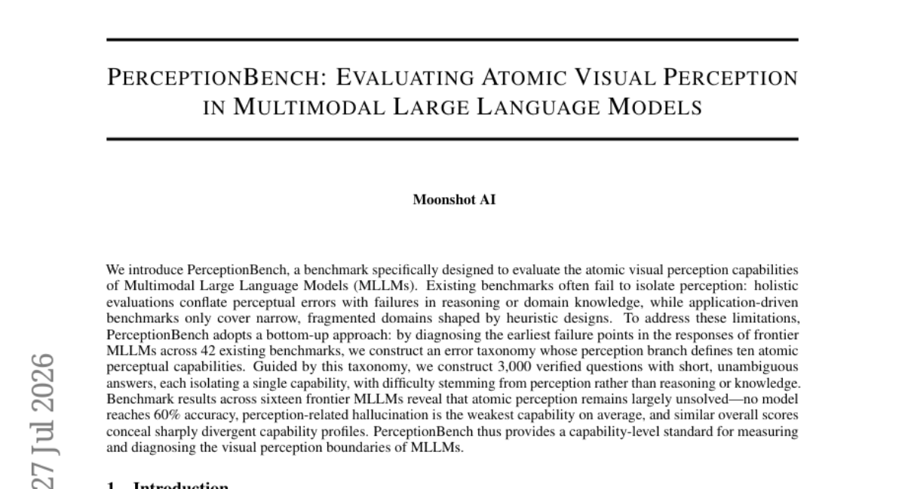

### 📌 한 줄 요약
MLLM의 추론 능력이 아닌 순수 시각적 인지 능력을 정밀 측정하기 위한 원자적(Atomic) 벤치마크 제안

### 🔑 핵심 포인트
- 추론과 인지를 분리하여 순수 시각 인지 능력을 측정하는 Bottom-up 방식 도입
- 42개 벤치마크 분석을 통해 도출된 10가지 원자적 인지 능력 분류 체계 구축
- 추론/지식 개입을 최소화하고 인지 난이도에 집중한 3,000개의 검증된 데이터셋 개발

### 🧑‍💻 개발자 관점
모델이 답을 못할 때 이것이 '눈이 나빠서(인지)'인지 '머리가 나빠서(추론)'인지를 명확히 구분하여 모델 개선 방향을 설정할 수 있습니다.

### 🚀 실무 적용 아이디어
- 현재 개발 중인 MLLM 모델의 시각적 인지 한계를 파악하기 위해 PerceptionBench 적용
- 모델의 Hallucination 원인이 인지 오류인지 추론 오류인지 분류 실험 수행
- 특정 도메인 특화 모델의 시각적 기초 체력 검증

### ⚠️ 리스크/한계
- 인지는 분리되었으나, 실제 복합적인 실무 환경에서는 인지와 추론이 결합되어 나타남
- 단일 능력 측정에 집중하므로 전체적인 지능 수준을 대변하기에는 한계가 있음

### 📝 초록 기반 상세 설명
기존 MLLM 벤치마크는 시각적 인지와 추론/지식 능력이 혼재되어 있어 순수한 인지 능력을 평가하기 어려웠습니다. 이를 해결하기 위해 연구진은 기존 42개 사례를 분석하여 10가지 원자적 인지 능력을 정의하는 에러 분류 체계를 구축했습니다. 이 체계를 바탕으로 추론이 아닌 인지 자체의 난이도를 반영한 3,000개의 검증된 질문 세트를 제작했습니다. 16종의 최신 MLLM을 대상으로 테스트한 결과, 모든 모델이 60% 미만의 정확도를 보이며 인지 능력이 여전히 미해결 과제임을 확인했습니다. 결과적으로 PerceptionBench는 MLLM의 시각적 한계를 진단하는 표준을 제공합니다.

---

## 12. [MODUS: Decoder-Only Any-to-Any Modeling of Diverse Modalities](https://huggingface.co/papers/2607.25948)
**Upvotes**: 8 | **도입 난이도**: 중 | **신뢰도**: 상
**arXiv**: https://arxiv.org/abs/2607.25948

**태그**: Multimodal, Decoder-only, Generative AI, Any-to-Any, Vision, Benchmark

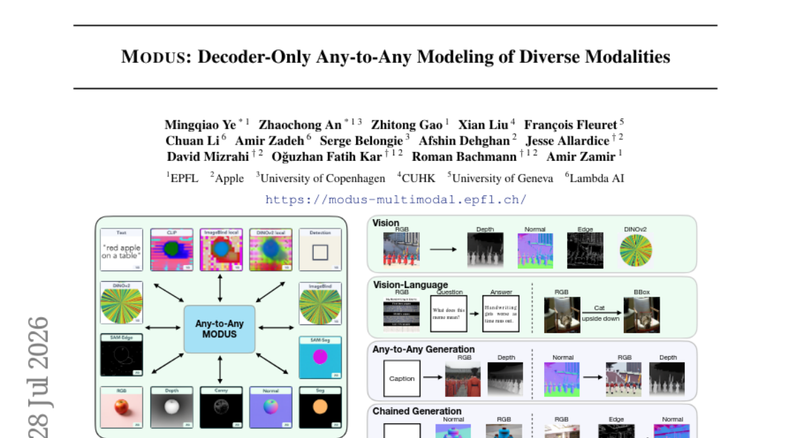

### 📌 한 줄 요약
모달리티별 특화 헤드 없이 단일 디코더 구조로 모든 입출력을 처리하는 범용 Any-to-Any 모델 연구

### 🔑 핵심 포인트
- 모달리티별 전용 헤드나 태스크 파이프라인이 필요 없는 대칭적 디코더 전용 구조 설계
- 강력한 사전 학습된 디코더 모델의 능력을 Any-to-Any 작업에 직접 활용 가능
- 연쇄 생성(Chained generation) 및 모달리티 간 자기 검증(Self-verification) 기능 지원

### 🧑‍💻 개발자 관점
특정 모달리티에 종속되지 않는 범용 모델 구조를 통해, 복잡한 멀티모달 파이프라인을 단일 모델로 단순화할 수 있는 가능성을 제시합니다.

### 🚀 실무 적용 아이디어
- 제공된 오픈소스 코드를 활용하여 다양한 모달리티 조합에 대한 Zero-shot 성능 테스트
- 중간 모달리티를 매개로 한 연쇄 생성(Chained generation) 시나리오 검증
- 기존 인코더-디코더 모델 대비 추론 효율성 및 확장성 비교 실험

### ⚠️ 리스크/한계
- 모든 모달리티를 동일한 디코더 구조로 처리할 때 발생할 수 있는 표현력(Expressivity) 한계
- 매우 이질적인 모달리티 간의 데이터 정렬 및 스케일링 문제

### 📝 초록 기반 상세 설명
기존의 Any-to-Any 모델은 주로 인코더-디코더나 확산(Diffusion) 구조를 사용하여 처음부터 학습해야 했으며, 이는 강력한 사전 학습된 디코더 모델의 성능을 활용하는 데 제약이 있었습니다. 본 연구에서는 모든 모달리티를 대칭적으로 처리하는 디코더 전용(Decoder-only) Any-to-Any 모델링 방식을 제안합니다. 제안된 MODUS 모델은 모달리티별 전용 헤드나 손실 함수 없이 임의의 입출력을 지원하며, 모든 모달리티를 입력이자 출력으로 취급합니다. 이를 통해 중간 모달리티를 통한 연쇄 생성이나 생성된 결과물 간의 교차 검증과 같은 다양한 응용이 가능해집니다. 실험 결과, MODUS는 단일 모델로 다양한 벤치마크에서 기존의 전문 모델 및 멀티태스크 베이스라인과 경쟁할 수 있는 강력한 성능을 보여주었습니다.

### 🖼️ 추가 자료
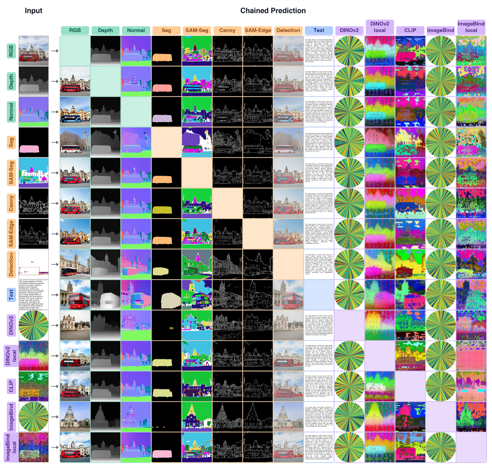
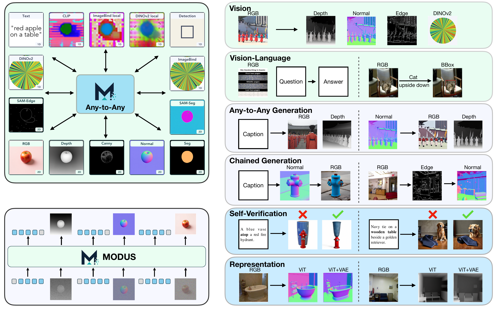
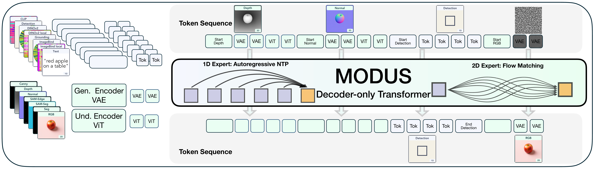
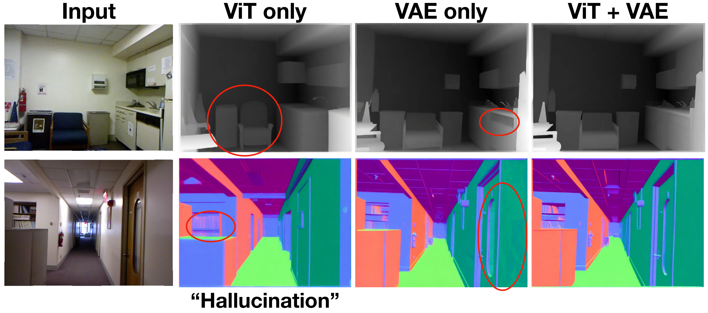

---

## 13. [Visual prompt engineering for video models](https://huggingface.co/papers/2607.25537)
**Upvotes**: 8 | **도입 난이도**: 중 | **신뢰도**: 상
**arXiv**: https://arxiv.org/abs/2607.25537

**태그**: Video-Model, Prompt-Engineering, Visual-Reasoning, Reasoning, Vision, Video

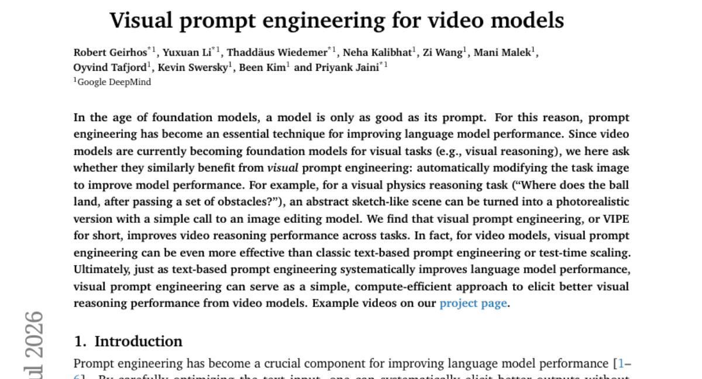

### 📌 한 줄 요약
비디오 모델의 추론 성능을 극대화하기 위해 입력 이미지를 자동으로 변형하는 '시각적 프롬프트 엔지니어링(VIPE)' 기법 제안

### 🔑 핵심 포인트
- VIPE(Visual Prompt Engineering): 작업 이미지를 자동으로 수정하여 비디오 모델의 성능을 높이는 기법
- 텍스트 기반 프롬프트 엔지니어링보다 더 높은 성능 향상 잠재력 확인
- 계산 효율적인 방식으로 비디오 모델의 시각적 추론 성능을 극대화

### 🧑‍💻 개발자 관점
비디오 기반 AI 에이전트나 추론 모델 개발 시, 텍스트 명령어를 수정하는 대신 입력 영상의 시각적 요소를 최적화하는 것이 더 효율적인 성능 향상 전략이 될 수 있음을 시사합니다.

### 🚀 실무 적용 아이디어
- 이미지 편집 모델(Diffusion 등)을 활용해 입력 이미지를 변형하며 비디오 모델 성능 변화 관찰
- 추상적인 스케치 이미지를 실사 이미지로 변환하여 비디오 추론 성능 비교 실험
- 텍스트 프롬프트 엔지니어링과 VIPE 간의 성능 및 비용 효율성 벤치마크 수행

### ⚠️ 리스크/한계
- 이미지 편집 과정에서 원본 데이터의 핵심 정보가 손실될 위험
- 이미지 생성/편집 모델의 연산 비용이 추가로 발생할 수 있음

### 📝 초록 기반 상세 설명
파운데이션 모델 시대에 프롬프트 엔지니어링은 모델 성능 향상의 핵심 기술로 자리 잡았습니다. 비디오 모델이 시각적 추론을 위한 새로운 파운데이션 모델로 부상함에 따라, 텍스트 대신 이미지를 수정하여 성능을 높이는 방식의 효용성을 탐구했습니다. 본 논문에서는 작업 이미지를 자동으로 수정하는 'Visual Prompt Engineering(VIPE)' 기법을 제안합니다. 실험 결과, VIPE는 다양한 비디오 추론 작업에서 성능 향상을 입증했으며, 기존의 텍스트 기반 프롬프트나 테스트 타임 스케일링보다 더 효과적일 수 있음을 확인했습니다. 결과적으로 VIPE는 계산 효율적이면서도 비디오 모델의 시각적 추론 능력을 끌어내는 강력한 방법론이 될 수 있습니다.

---

## 14. [Parallel Decoding Distillation for Fast Image and Video Generation](https://huggingface.co/papers/2607.26004)
**Upvotes**: 6 | **도입 난이도**: 중 | **신뢰도**: 상
**arXiv**: https://arxiv.org/abs/2607.26004

**태그**: Diffusion, Video Generation, Model Distillation, Acceleration, Vision, Video, Audio, Evaluation, Inference, Distillation

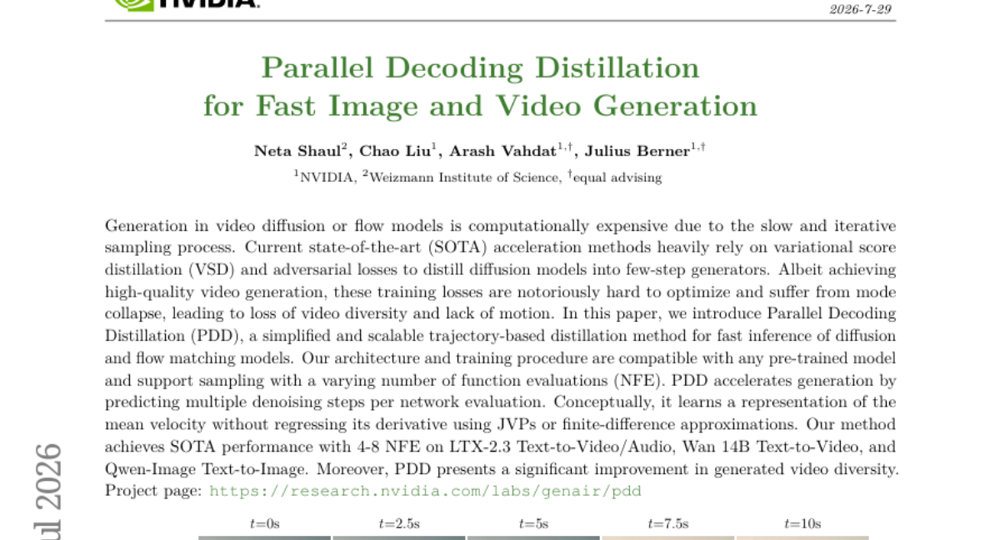

### 📌 한 줄 요약
여러 단계의 디노이징 과정을 한 번에 예측하는 병렬 디코딩 방식을 통해 고품질 영상 생성 속도를 획기적으로 높인 증류(Distillation) 기술

### 🔑 핵심 포인트
- 병렬 디코딩(PDD)을 통한 다중 디노이징 단계의 동시 예측 및 가속화
- 기존 VSD 방식의 모드 붕괴 및 최적화 난이도 문제를 해결한 궤적 기반 증류
- 사전 학습된 모델과 호환되며 NFE(함수 평가 횟수) 변화에 유연하게 대응 가능

### 🧑‍💻 개발자 관점
적은 연산량(4-8 NFE)으로도 고품질 영상을 생성할 수 있어, 실시간 영상 생성 서비스나 모바일 환경에서의 생성 모델 배포 가능성을 높입니다.

### 🚀 실무 적용 아이디어
- 기존 Diffusion/Flow 모델에 PDD 프레임워크를 적용하여 NFE 감소 효과 검증
- NFE 설정값 변화에 따른 생성 품질과 속도 간의 Trade-off 분석
- 제안된 궤적 기반 손실 함수가 영상의 움직임(Motion) 유지에 미치는 영향 테스트

### ⚠️ 리스크/한계
- 매우 적은 NFE 환경에서 발생할 수 있는 잠재적인 생성 품질 저하
- 특정 아키텍처에 최적화된 방식일 경우 범용성 제약 가능성

### 📝 초록 기반 상세 설명
비디오 확산 모델의 반복적인 샘플링 과정은 막대한 계산 비용을 발생시킵니다. 기존의 VSD나 적대적 손실 기반 증류 방식은 고품질을 달지만 최적화가 어렵고 모드 붕괴로 인해 영상의 다양성과 움직임이 저하되는 문제가 있었습니다. 본 논문은 모든 사전 학습 모델과 호환되는 궤적 기반의 병렬 디코딩 증류(PDD) 방식을 제안합니다. PDD는 한 번의 네트워크 평가로 여러 디노이징 단계를 동시에 예측하여 생성 속도를 가속화하며, 미분 근사 없이 평균 속도 표현을 학습합니다. 실험 결과, LTX-2.3 및 Wan 14B 등 최신 모델에서 4-8 NFE만으로 SOTA 성능을 달성하며 영상의 다양성 또한 개선했습니다.

---

## 15. [OmniDelta: Skill-Driven Budget Allocation for Token Compression in OmniLLMs](https://huggingface.co/papers/2607.25669)
**Upvotes**: 5 | **도입 난이도**: 하 | **신뢰도**: 상
**arXiv**: https://arxiv.org/abs/2607.25669

**태그**: OmniLLM, Token-Compression, Inference-Optimization, Multi-modal, Video, Audio, Benchmark, Inference, Optimization

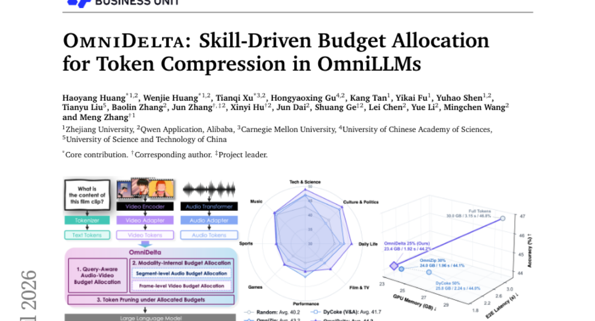

### 📌 한 줄 요약
질의 의도와 콘텐츠 복잡도를 고려한 동적 예산 할당을 통해 OmniLLM의 추론 비용을 절감하고 성능을 최적화하는 프레임워크

### 🔑 핵심 포인트
- 질의 의도(Intent-aware)를 반영한 모달리티 간 동적 예산 할당
- 콘텐츠 복잡도 및 시간적 중복성을 고려한 모달리티 내 정밀 예산 재배분
- 학습이 필요 없는(Training-free) 방식으로 기존 프루닝 전략과 결합 가능

### 🧑‍💻 개발자 관점
멀티모달 모델 운영 시 발생하는 막대한 GPU 메모리 및 추론 지연 문제를 모델 재학습 없이 효율적으로 해결할 수 있는 실무적인 가이드라인을 제공합니다.

### 🚀 실무 적용 아이디어
- Qwen2.5-Omni와 같은 최신 멀티모달 모델에 OmniDelta 로직 적용 테스트
- 다양한 프루닝(Pruning) 전략과 OmniDelta의 예산 할당 방식 결합 실험
- 특정 도메인(예: 보안 관제, 음성 비서)에서의 질의 의도 변화에 따른 성능 변화 측정

### ⚠️ 리스크/한계
- 학습 없이 수행되므로 특정 데이터셋에 과적합되거나 일반화 성능이 제한될 가능성
- 복잡한 질의의 경우 의도 파악 오류가 예산 배분 실패로 이어질 위험

---

## 16. [Reinforcement Learning for Code Optimization](https://huggingface.co/papers/2607.25970)
**Upvotes**: 3 | **도입 난이도**: 상 | **신뢰도**: 상
**arXiv**: https://arxiv.org/abs/2607.25970

**태그**: Reinforcement Learning, Code Optimization, LLM, Algorithm, Evaluation

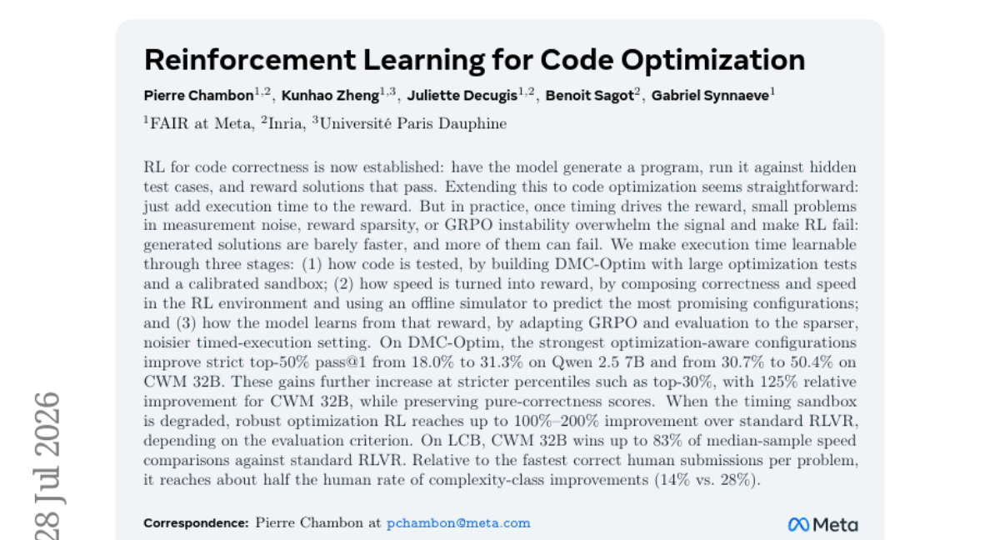

### 📌 한 줄 요약
코드 실행 시간 최적화를 위한 RL 학습 시 발생하는 노이즈와 희소성 문제를 해결하여 성능을 극대화하는 프레임워크 제안

### 🔑 핵심 포인트
- DMC-Optim: 대규모 최적화 테스트와 정밀한 샌드박스를 결합한 벤치마크 구축
- 보상 설계: 정답 유지와 실행 속도 사이의 균형을 맞추는 오프라인 시뮬레이터 기반 보상 체계
- GRPO 최적화: 노이즈가 심한 실행 시간 환경에서도 안정적으로 학습되는 알고리즘 개선

### 🧑‍💻 개발자 관점
단순히 '돌아가는 코드'를 넘어 '효율적인 코드'를 생성하는 AI 모델을 구축하는 데 필요한 실질적인 방법론을 제공합니다.

### 🚀 실무 적용 아이디어
- 코드 실행 환경의 측정 노이즈를 최소ку화하는 샌드박스 환경 구축 실험
- 정확도(Correctness)와 속도(Speed) 사이의 보상 가중치(Weight) 튜닝 실험
- GRPO와 같은 RL 알고리즘을 성능 지표 기반 보상에 적용하는 실험

### ⚠️ 리스크/한계
- 실행 시간 측정 환경(샌드박스)의 정밀도에 따라 성능 편차가 클 수 있음
- 최적화에 치중할 경우 코드의 가독성이나 복잡도가 높아질 위험이 있음

### 📝 초록 기반 상세 설명
기존의 코드 생성 RL은 정답 여부에만 집중하여 실행 시간 최적화로 확장하기에는 측정 노이즈와 보상 희소성 문제가 컸습니다. 본 논문은 실행 시간을 학습 가능한 요소로 만들기 위해 세 가지 단계적 접근법을 제안합니다. 먼저 대규모 최적화 테스트와 캘리브레이션된 샌드박스를 포함한 DMC-Optim 벤치마크를 구축했습니다. 또한 오프라인 시뮬레이터를 활용해 정답 유지와 속도 향상 사이의 보상을 정교하게 구성했습니다. 마지막으로 GRPO 알고리즘을 노이즈가 심한 실행 시간 환경에 맞게 최적화했습니다. 실험 결과, 제안된 방식은 코드의 정확도를 유지하면서도 실행 속도와 상위 퍼센트 통과율을 대폭 향상시켰습니다.

---

## 17. [Where Quality Breaks in Compressed Short-Text Generation: Staged Bottleneck Localization](https://huggingface.co/papers/2607.24176)
**Upvotes**: 3 | **도입 난이도**: 하 | **신뢰도**: 상
**arXiv**: https://arxiv.org/abs/2607.24176

**태그**: Compression, Text-Generation, Evaluation-Methodology, Deep-Learning

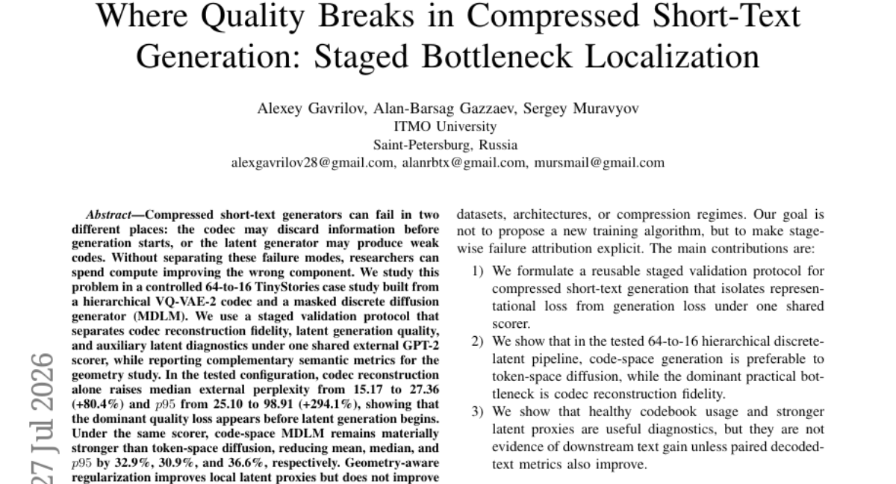

### 📌 한 줄 요약
압축 기반 텍스트 생성 모델에서 품질 저하의 원인이 코덱(Codec)인지 생성기(Generator)인지 구분하는 단계별 진단 방법론을 제시합니다.

### 🔑 핵심 포인트
- 코덱(Codec)과 생성기(Generator)의 실패 모드를 분리하는 단계별 진단 프로토콜 제안
- 실험을 통해 코덱의 재구성 손실이 생성기 성능보다 품질 저하에 더 지배적인 영향을 미침을 확인
- 알고리즘적 개선보다 데이터 압축 단계의 충실도 확보가 품질 확보의 핵심임을 입증

### 🧑‍💻 개발자 관점
모델 최적화 시 성능 저하가 발생했을 때, 압축 알고리즘을 고칠지 생성 모델을 고칠지 결정하는 명확한 가이드라인을 제공합니다.

### 🚀 실무 적용 아이디어
- 압축 모델 사용 시 코덱 재구성 손실(Reconstruction Loss)과 생성 손실을 분리하여 측정해보기
- 생성기 성능 향상 전에 코덱의 정보 보존율(Fidelity)을 먼저 검증하기
- 제안된 단계별 검증 프로토콜을 기존 압축-생성 파이프라인에 적용해보기

### ⚠️ 리스크/한계
- 특정 데이터셋(TinyStories)과 특정 아키텍처(VQ-VAE-2, MDLM)에 집중된 실험 결과임
- 제안된 방법론이 알고리즘 자체의 성능을 높이는 것이 아니라 진단 도구로서의 성격이 강함

### 📝 초록 기반 상세 설명
압축된 짧은 텍스트 생성 모델은 코덱의 정보 손실이나 생성기의 성능 저하라는 두 가지 주요 실패 모드를 가집니다. 기존에는 이 두 요인을 분리하지 못해 엉뚱한 컴포넌트의 성능 개선에 자원을 낭비하는 문제가 있었습니다. 본 논문은 VQ-VAE-2 코덱과 MDLM 생성기를 결합한 TinyStories 환경에서 단계별 검증 프로토콜을 제안합니다. 실험 결과, 코덱의 재구성 성능 저하가 생성 성능보다 훨씬 더 큰 품질 저하를 유발함을 확인했습니다. 결과적으로 알고리즘 개선보다 코덱 충실도가 실질적인 품질 상한선을 결정한다는 것을 입증했습니다.

### 🖼️ 추가 자료
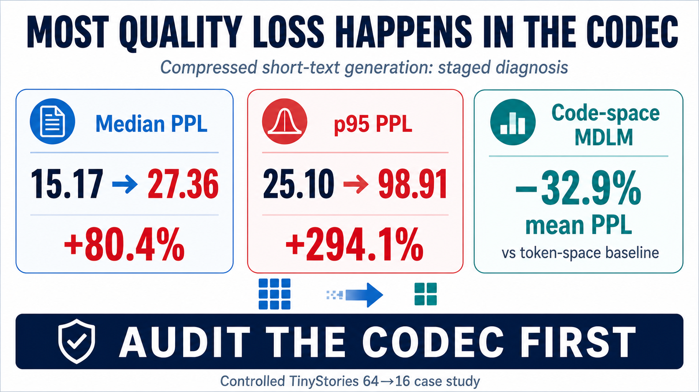
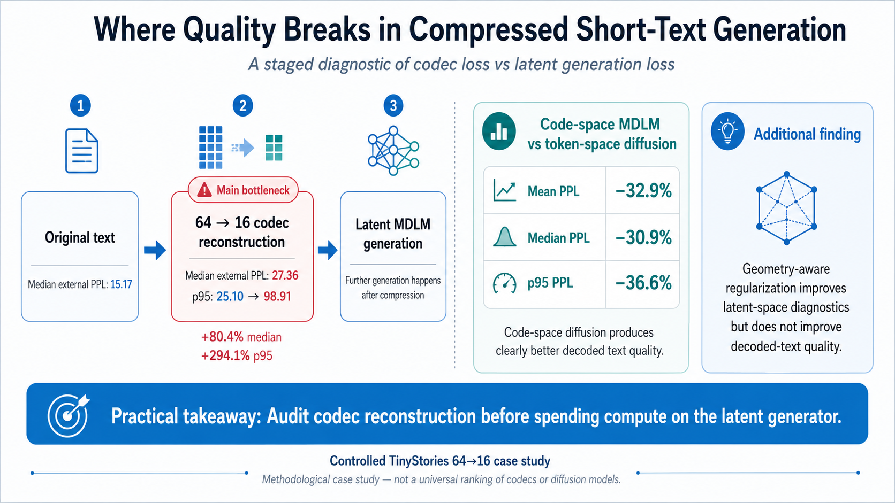

---

## 18. [Towards Robust Reinforcement Learning for Small-Scale Language Model Agents](https://huggingface.co/papers/2607.25091)
**Upvotes**: 3 | **도입 난이도**: 중 | **신뢰도**: 상
**arXiv**: https://arxiv.org/abs/2607.25091

**태그**: LLM, Reinforcement Learning, SLM, Fine-tuning, Agent, Safety

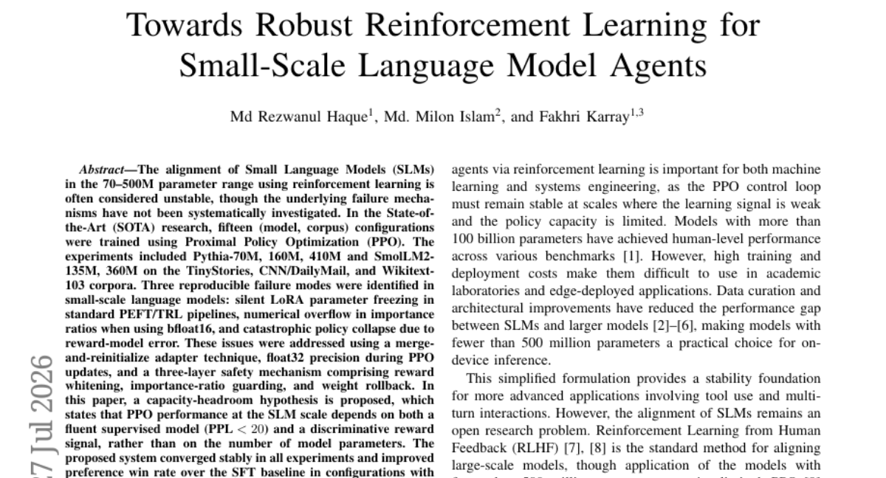

### 📌 한 줄 요약
소규모 언어 모델(SLM)의 RL 정렬 시 발생하는 불안정성 원인을 규명하고 이를 해결하는 안정적인 학습 프레임워크를 제안함

### 🔑 핵심 포인트
- SLM 규모의 RL 학습 시 발생하는 3가지 주요 실패 모드(LoRA 동결, 수치 오버플로, 정책 붕괴) 규명
- 안정적 학습을 위한 정밀도 제어(float32) 및 3단계 안전 메커니즘(Whitening, Guarding, Rollback) 제안
- 모델 파라미터 수보다 유창한 사전 학습 모델과 변별력 있는 보상 신호의 결합이 중요함을 입증

### 🧑‍💻 개발자 관점
자원이 제한된 환경에서 소형 모델을 에이전트로 활용할 때, RL 학습의 불안정성을 극복하고 효율적으로 정렬하는 실무 가이드를 제공합니다.

### 🚀 실무 적용 아이디어
- 소형 모델 RL 학습 시 bfloat16 대신 중요 연산 구간에서 float32를 사용하는지 확인
- 학습 중 보상 값이 급변할 때를 대비한 가중치 롤백(Rollback) 로직 구현
- 사전 학습된 모델의 Perplexity(PPL)가 충분히 낮은지 검증 후 RL 단계 진입

### ⚠️ 리스크/한계
- 모델 규모가 커질 경우 제안된 안정화 기법의 효과가 달라질 수 있음
- 보상 모델의 품질에 따라 최종 성능이 크게 좌우될 위험이 존재함

### 📝 초록 기반 상세 설명
70M~500M 파라미터 규모의 소규모 언어 모델(SLM)은 RL을 통한 정렬 과정에서 학습이 불안정하다는 문제가 있었습니다. 연구진은 다양한 모델과 데이터셋 조합을 통해 실험한 결과, LoRA 파라미터 동결 문제, bfloat16 정밀도에서의 수치 오버플로, 보상 모델 오류로 인한 정책 붕괴라는 세 가지 주요 실패 모드를 식별했습니다. 이를 해결하기 위해 어댑터 재초기화 기법, PPO 업데이트 시 float32 정밀도 사용, 그리고 보상 화이트닝 및 가중치 롤백을 포함한 3단계 안전 메커니즘을 도입했습니다. 제안된 시스템은 모든 실험에서 안정적인 수렴을 달성했으며, 충분한 언어 능력을 갖춘 모델과 유효한 보상 신호가 결합될 때 SFT 베이스라인을 상회하는 성능을 보였습니다. 결과적으로 적은 데이터로도 지시 튜닝 모델보다 우수한 성능을 확보할 수 있음을 입증했습니다.

---

## 19. [Mapping CVEs to MITRE ATT&CK Techniques: A Curated Gold-Set Classifier and the Limits of LLM-Assisted Label Expansion](https://huggingface.co/papers/2607.25572)
**Upvotes**: 2 | **도입 난이도**: 중 | **신뢰도**: 상
**arXiv**: https://arxiv.org/abs/2607.25572

**태그**: Cybersecurity, LLM, Machine Learning, Data Augmentation, Evaluation, RAG

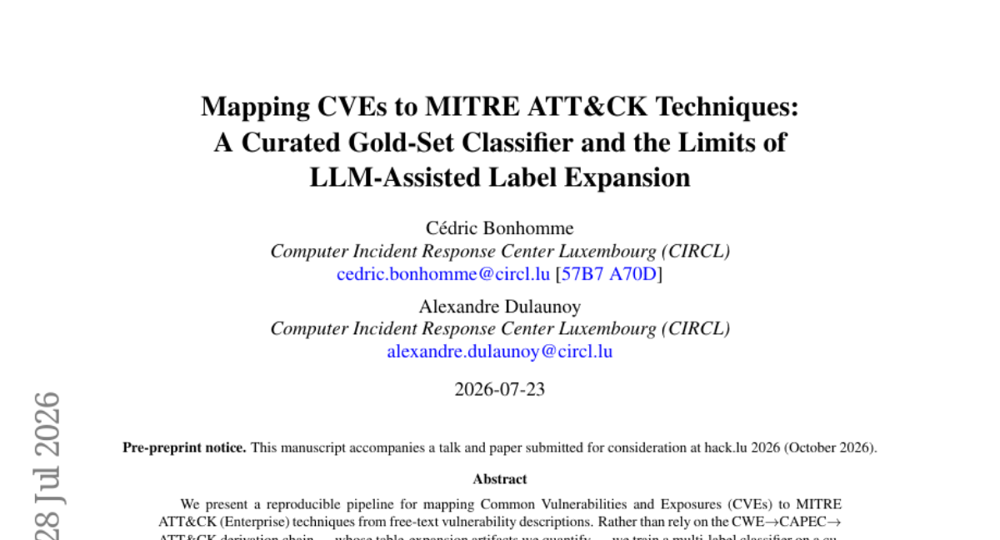

### 📌 한 줄 요약
LLM을 이용한 CVE-to-ATT&CK 매핑 데이터 확장 시 발생하는 평가 노이즈와 성능 저하 위험을 경고함

### 🔑 핵심 포인트
- 전문가 검증 데이터셋(1,207개 CVE) 기반의 고성능 멀티라벨 분류기 개발
- LLM을 이용한 데이터셋 확장이 성능 향상을 일으키는 것처럼 보이는 '평가 아티팩트(Artifact)' 현상 규명
- 데이터 규모보다 라벨의 품질이 분류기 성능의 결정적 요인임을 입증

### 🧑‍💻 개발자 관점
보안 자동화 모델 구축 시, LLM으로 생성한 대량의 데이터로 학습하는 것이 오히려 모델의 신뢰성과 희귀 케이스 탐지 능력을 망가뜨릴 수 있음을 시사합니다.

### 🚀 실무 적용 아이디어
- LLM 생성 데이터를 학습에 사용할 경우, 반드시 검증셋(Validation Set) 분리 프로토콜을 엄격히 적용할 것
- 데이터 양을 늘리기 전, LLM 생성 라벨과 전문가 라벨 간의 일치도를 먼저 측정할 것
- 모델 성능 지표가 특정 데이터셋 크기에서만 급변하는지 확인하여 평가 노이즈 여부를 검증할 것

### ⚠️ 리스크/한계
- LLM 생성 데이터는 전문가 데이터에 비해 품질이 낮아 희귀 기법(Rare-technique) 커버리지를 저하시킴
- 작은 테스트셋을 사용한 평가는 모델 성능을 과대평가하는 오류를 유발할 수 있음

### 📝 초록 기반 상세 설명
CVE 설명을 MITRE ATT&CK 기법으로 매핑하는 과정에서 기존의 CWE 기반 유도 방식 대신 전문가가 검증한 골드 데이터셋을 활용한 분류기를 제안합니다. 연구진은 LLM을 이용해 데이터셋을 확장하는 것이 성능 향상에 도움이 되는지 실험했습니다. 초기 실험에서는 성능 향상이 관찰되었으나, 정밀한 재현 실험 결과 이는 소규모 테스트셋에서 발생하는 평가 노이즈에 의한 착시 현상임이 밝혀졌습니다. LLM 생성 라벨은 전문가 주석과 일치도가 낮아 데이터 규모가 커질수록 오히려 희귀 기법의 커버리지를 저하시켰습니다. 결론적으로 데이터 확장은 전문가가 검증한 고품질 데이터로 수행해야 하며, LLM 기반 확장은 신뢰할 수 없는 결과를 초래할 수 있습니다.

---

## 20. [Agent Retrieval Bench: Evaluating Repository Context Retrieval for Coding Agents](https://huggingface.co/papers/2607.24882)
**Upvotes**: 2 | **도입 난이도**: 중 | **신뢰도**: 상
**arXiv**: https://arxiv.org/abs/2607.24882

**태그**: Agent, RAG, Software Engineering, Retrieval, Benchmark, Evaluation

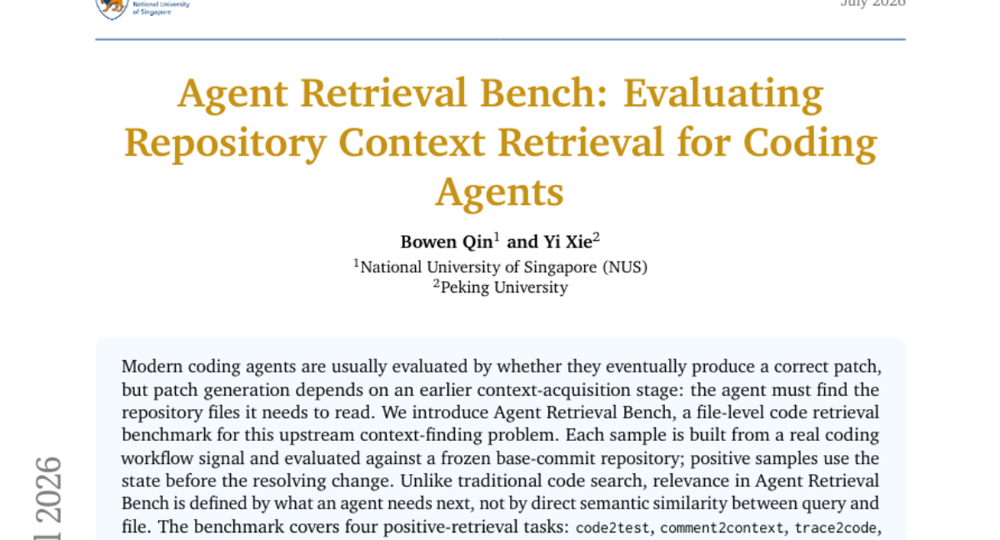

### 📌 한 줄 요약
코딩 에이전트의 성능을 결정짓는 핵심 단계인 '저장소 내 관련 파일 검색(Retrieval)' 능력을 평가하기 위한 새로운 벤치마크를 제안합니다.

### 🔑 핵심 포인트
- 실제 코딩 워크플로우를 반영한 파일 수준의 정교한 리트리벌 벤치마크 구축
- 단순 의미 유사도가 아닌 에이전트의 다음 작업 단계에 필요한 맥락을 찾는 4가지 태스크 정의
- 임베딩 모델, RepoMap, 에이전트 로그 등 다양한 검색 방식의 성능 비교 분석

### 🧑‍💻 개발자 관점
코딩 에이전트 개발 시 단순히 모델의 코드 생성 능력뿐만 아니라, 방대한 저장소에서 필요한 파일을 정확히 골라내는 '검색 전략'이 성능의 병목임을 이해할 수 있습니다.

### 🚀 실무 적용 아이디어
- 에이전트의 컨텍스트 윈도우를 채우기 전, 검색 단계의 정밀도를 높이는 전략(RepoMap 등) 적용해보기
- 제시된 4가지 태스크(code2test 등)를 기반으로 현재 사용 중인 RAG 시스템의 취약점 테스트하기
- 검색 결과가 정답을 포함하지 못하는 'No-gold' 상황에 대한 에이전트의 거절(Abstention) 로직 검토하기

### ⚠️ 리스크/한계
- 검색 성능이 좋아지더라도 여전히 정답 컨텍스트를 확보하기 위한 추가적인 탐색 여지가 존재함
- 실제 워크플로우와 유사하지만, 정적 벤치마크 환경이 동적인 실제 개발 환경을 완벽히 대체하기 어려움

### 📝 초록 기반 상세 설명
최근 코딩 에이전트 평가는 최종 패치 생성에 집중되어 있으나, 실제로는 작업에 필요한 파일을 찾는 컨텍스트 획득 단계가 매우 중요합니다. 본 논문은 실제 코딩 워크플로우 신호를 기반으로 파일 수준의 검색 능력을 측정하는 'Agent Retrieval Bench'를 소개합니다. 이 벤치마크는 단순한 쿼리 유사도를 넘어 에이전트가 다음에 필요로 하는 맥락을 찾는 4가지 작업과 선택적 검색 능력을 평가합니다. 실험 결과, 특정 임베딩 모델이나 RepoMap 방식이 작업별로 서로 다른 우위를 보였으며, 기존 에이전트의 로그 데이터도 정답 파일을 놓치는 경우가 빈번함을 확인했습니다. 결과적으로 검색 단계의 최적화가 에이전트의 탐색 효율성을 높이는 데 결정적인 역할을 함을 입증했습니다.

---

## 21. [VisualPatchWorld: Code World Models as Latent Structured Representations for Planning](https://huggingface.co/papers/2607.25236)
**Upvotes**: 1 | **도입 난이도**: 중 | **신뢰도**: 상
**arXiv**: https://arxiv.org/abs/2607.25236

**태그**: World Models, Robotics, Planning, Code-as-Model, Vision

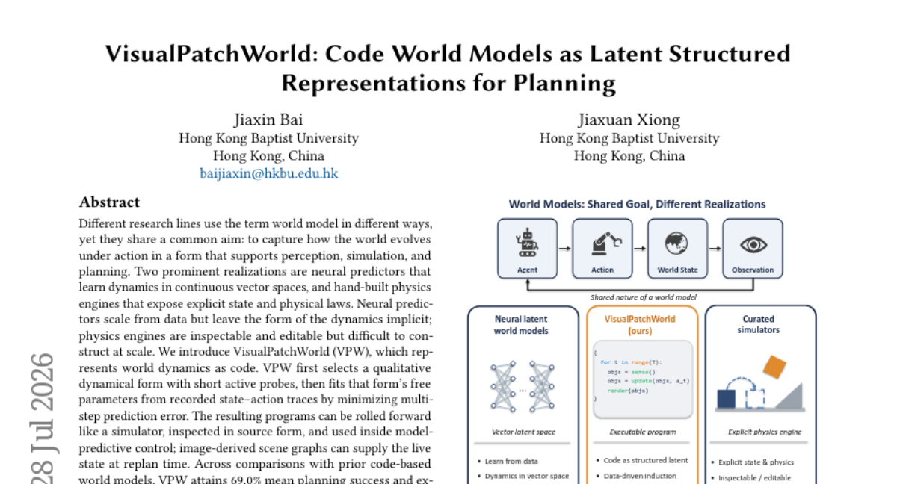

### 📌 한 줄 요약
동역학 모델을 코드로 생성하여 시뮬레이션과 계획(Planning)에 즉시 활용 가능한 새로운 월드 모델 프레임워크 제안

### 🔑 핵심 포인트
- 동역학을 코드로 표현하여 검사 가능성(Inspectability)과 시뮬레이션 기능을 동시에 확보
- 질적 형태 선택 후 매개변수를 최적화하는 하이브리드 방식의 모델 구축
- 이미지 기반 씬 그래프를 활용하여 실시간 상태 업데이트 및 계획 수립 가능

### 🧑‍💻 개발자 관점
모델의 동작 원리를 코드로 확인할 수 있어 디버깅이 용이하며, 학습된 코드를 기존 제어 알고리즘에 즉시 통합할 수 있습니다.

### 🚀 실무 적용 아이디어
- 제공된 GitHub 코드를 사용하여 간단한 로봇 조작 태스크에 적용해보기
- 질적 동역학 선택 단계가 계획 성공률에 미치는 영향 분석하기
- 이미지 기반 씬 그래프와 결합하여 실시간 폐루프 제어 테스트하기

### ⚠️ 리스크/한계
- 접촉이 빈번한 복잡한 물리 상호작용(Contact-rich pushing)에서는 성능 격차가 존재함
- 초기 질적 동역학 선택 단계가 잘못될 경우 전체 모델 성능이 크게 저하될 수 있음

### 📝 초록 기반 상세 설명
기존의 신경망 기반 예측 모델은 확장성은 좋지만 동역학이 암시적이며, 물리 엔진은 검사 가능하지만 구축이 어렵다는 문제가 있습니다. 본 논문은 월드 동역학을 코드로 표현하는 VisualPatchWorld(VPW)를 제안합니다. VPW는 짧은 탐색(active probes)을 통해 질적 동역학 형태를 선택한 후, 기록된 상태-행동 궤적을 통해 자유 매개변수를 최적화합니다. 생성된 프로그램은 시뮬레이터처럼 실행 가능하며, 소스 코드를 직접 검사하거나 모델 예측 제어(MPC)에 활용할 수 있습니다. 실험 결과, 기존 코드 기반 모델 대비 높은 계획 성공률을 달𝓷었으며, 특히 올바른 질적 동역학 선택이 중요한 환경에서 탁월한 성능을 보였습니다.

---

## 22. [Temporal-Distance JEPA: Plan-Aware Representation Learning for Latent World Model Predictive Control](https://huggingface.co/papers/2607.25337)
**Upvotes**: 1 | **도입 난이도**: 중 | **신뢰도**: 상
**arXiv**: https://arxiv.org/abs/2607.25337

**태그**: Reinforcement Learning, World Model, Robot Planning, Representation Learning, Vision, Evaluation

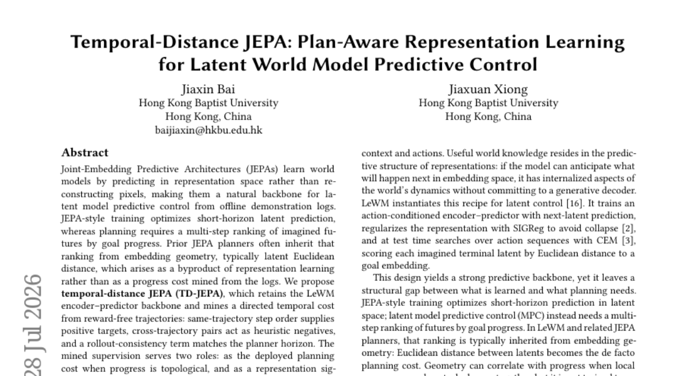

### 📌 한 줄 요약
오프라인 로그에서 시간적 진행 구조를 학습하여 JEPA 기반 월드 모델의 계획 성능을 극대화하는 TD-JEPA 제안

### 🔑 핵심 포인트
- 보상 없이 오프라인 궤적만으로 시간적 진행 구조를 학습하는 TD-JEPA 프레임워크 제안
- 동일 궤적 순서(Positive), 교차 궤적(Negative), 롤아웃 일관성(Consistency)을 결합한 학습 방식
- 학습된 시간적 비용을 계획 단계의 직접적인 비용 함수 또는 유클리드 거리 보조 신호로 활용

### 🧑‍💻 개발자 관점
보상(Reward) 데이터가 부족한 오프라인 로그 환경에서도 시간적 선후 관계를 활용해 효율적인 로봇/에이전트 계획 모델을 구축할 수 있는 방법론을 제시합니다.

### 🚀 실무 적용 아이디어
- 제공된 GitHub 코드를 활용하여 다양한 환경(Push-T 등)에서의 재현 실험 수행
- 학습된 시간적 비용과 기존 유클리드 거리 기반 계획의 성능 비교 실험
- 데이터셋의 궤적 길이에 따른 롤아웃 일관성 항의 영향도 분석

### ⚠️ 리스크/한계
- 보상 정보가 없는 환경에 특화되어 있어, 명시적 보상이 풍부한 환경에서의 상대적 이점 확인 필요
- 복잡한 접촉 기하학이 지배적인 환경에서의 일반화 성능 검증 필요

### 📝 초록 기반 상세 설명
기존의 JEPA 기반 월드 모델은 픽셀 재구성이 아닌 잠재 공간 예측을 통해 계획을 수행하지만, 목표 달성 정도를 판단하는 랭킹 방식이 단순 유클리드 거리 등에 의존하는 한계가 있었습니다. 본 논문은 보상 정보가 없는 오프라인 궤적에서 시간적 비용(temporal cost)을 직접 추출하는 TD-JEPA를 제안합니다. 동일 궤적 내 순서, 교차 궤적 간의 관계, 롤아웃 일관성을 활용하여 시간적 진행 구조를 학습하는 것이 핵심입니다. 실험 결과, TD-JEP는 기존 LeWM 대비 Two-Room, OGB-Cube 등 다양한 환경에서 성능 향상을 입증했습니다. 결과적으로 학습된 시간적 비용은 계획 시 직접적인 비용 함수로 사용되거나 유클리드 거리 기반 계획의 성능을 보조하는 역할을 합니다.

---

## 23. [OPERA: Offline Policy-guided Expert Routing and Adaptation for Universal Biomedical Image Analysis](https://huggingface.co/papers/2607.25108)
**Upvotes**: 0 | **도입 난이도**: 중 | **신뢰도**: 상
**arXiv**: https://arxiv.org/abs/2607.25108

**태그**: Multi-Agent, Domain Adaptation, Medical Imaging, Ensemble Learning, Agent, RAG, Multimodal, Vision, Benchmark, Evaluation

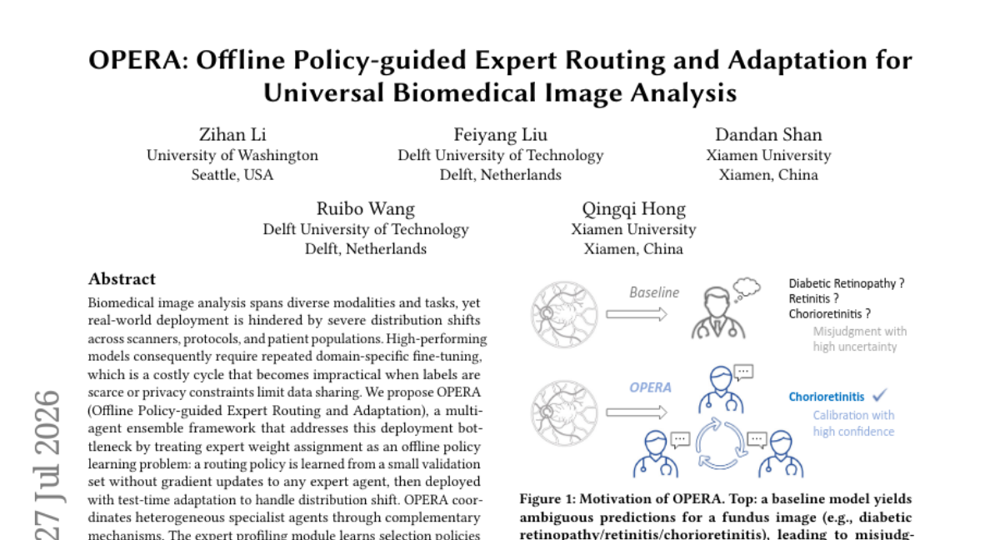

### 📌 한 줄 요약
재학습 없이 다양한 의료 영상 도메인에 즉시 배포 가능한 오프라인 정책 기반 멀티 에이전트 앙상블 프레임워크

### 🔑 핵심 포인트
- 오프라인 정책 학습을 통한 전문가 모델 간의 효율적인 라우팅 및 가중치 할당
- 테스트 시점의 분포 변화에 대응하는 동적 클래스 가중치 조정 및 신뢰도 교정(Calibration)
- 모델 재학습 없이도 다양한 의료 영상 태스크(분류, 분할 등)에 적용 가능한 범용성

### 🧑‍💻 개발자 관점
데이터 라벨링 비용과 개인정보 이슈로 모델 재학습이 어려운 실무 환경에서, 기존 모델들을 조합하여 성능을 극대화하는 실용적인 배포 전략을 제시합니다.

### 🚀 실무 적용 아이디어
- 기존에 학습된 서로 다른 도메인의 모델들을 모아 OPERA의 라우팅 메커니즘 적용 테스트
- 소량의 검증 데이터만으로 전문가 모델 간의 선택 정책(Routing Policy) 성능 검증
- 테스트 데이터의 분포 변화(Domain Shift) 상황에서 모델의 신뢰도 유지 여부 확인

### ⚠️ 리스크/한계
- 전문가 모델(Expert Agents) 자체의 성능이 낮을 경우 라우팅 정책만으로는 한계가 있음
- 검증 데이터와 실제 테스트 데이터 간의 괴리가 클 경우 오프라인 정책의 신뢰도 저하 가능성

### 📝 초록 기반 상세 설명
의료 영상 분석은 스캐너나 프로토콜에 따른 도메인 변화가 심해 매번 도메인별 미세 조정이 필요하다는 문제가 있습니다. 하지만 라벨 부족과 개인정보 보호 문제로 인해 빈번한 재학습은 실무 적용에 한계가 있습니다. 이를 해결하기 위해 전문가 모델들의 가중치를 오프라인 정책 학습으로 결정하는 OPERA 프레임워크를 제안합니다. 이 방식은 전문가 모델의 가중치를 업데이트하지 않고도 소량의 검증 데이터로 라우팅 정책을 학습하며, 테스트 시점의 적응(Test-time adaptation)을 통해 분포 변화에 대응합니다. 실험 결과, 다양한 의료 영상 데이터셋에서 기존 모델 대비 성능과 신뢰도(Calibration)를 동시에 개선하며 재학습 없는 배포 가능성을 입증했습니다.

---

## 24. [GLI-AL: A Multi-Modal Glioma MRI Label Resource with Unified Anatomy-Lesion Labels](https://huggingface.co/papers/2607.22135)
**Upvotes**: 0 | **도입 난이도**: 하 | **신뢰도**: 상
**arXiv**: https://arxiv.org/abs/2607.22135

**태그**: Medical Imaging, Segmentation, Dataset, Deep Learning, Vision, Benchmark, Evaluation

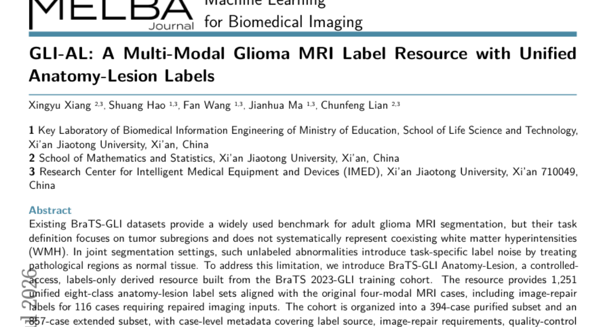

### 📌 한 줄 요약
기존 BraTS-GLI 데이터셋의 한계를 넘어, 정상 조직과 백질 변성(WMH)을 포함한 통합 해부학-병변 라벨링 리소스를 제공합니다.

### 🔑 핵심 포인트
- BraTS 2023-GLI 기반의 1,251개 통합 8클래스 해부학-병변 라벨셋 구축
- 정상 조직 및 백질 변성(WMH)을 포함하여 기존 데이터셋의 라벨 노이즈 문제 해결
- 정상 조직 분할 성능 유지 및 공존 병변에 대한 민감도 향상 입증

### 🧑‍💻 개발자 관점
의료 영상 분할 모델 학습 시, 종양 외의 노이즈(WMH 등)를 어떻게 라벨링하고 관리해야 하는지에 대한 실질적인 벤치마크를 제공합니다.

### 🚀 실무 적용 아이디어
- 제공된 데이터셋을 활용하여 MedNeXt 모델의 성능 변화 비교 실험
- 기존 BraTS-GLI 라벨과 GLI-AL 통합 라벨 간의 학습 손실(loss) 차이 분석
- WMH가 포함된 외부 데이터셋에 대한 모델의 일반화 성능 테스트

### ⚠️ 리스크/한계
- 데이터셋이 특정 코호트(BraTS 2023)에서 파생되었으므로 다른 인종/장비 데이터에 대한 일반화 검증 필요
- 8개 클래스의 복합 라벨링으로 인해 학습 난이도가 기존보다 높을 수 있음

### 📝 초록 기반 상세 설명
기존 BraTS-GLI 데이터셋은 종양 하위 영역에만 집중하여 공존하는 백질 변성(WMH)을 체계적으로 반영하지 못하는 문제가 있었습니다. 이러한 미라벨링 이상 징후는 공동 분할 작업 시 노이즈로 작 작용하여 모델 성능을 저하시킵니다. 이를 해결하기 위해 연구진은 BraTS 2023-GLI 코호트를 기반으로 1,251개의 통합 8클래스 라벨 세트를 포함하는 GLI-AL 리소스를 구축했습니다. 이 리소스는 정상 뇌 조직과 기존에 라벨링되지 않았던 병변을 포함하여 전경 감독(foreground supervision)을 대폭 확장했습니다. 검증 결과, WMH를 고려한 감독 방식은 정상 조직 분할 성능을 유지하면서도 공존하는 병변에 대한 민감도를 향상시켰습니다.

### 🖼️ 추가 자료
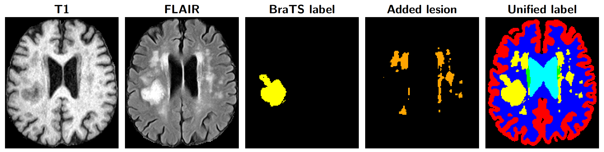

---

## 25. [Projection Pursuit CPCANet for Domain Generalization](https://huggingface.co/papers/2607.22117)
**Upvotes**: 0 | **도입 난이도**: 중 | **신뢰도**: 상
**arXiv**: https://arxiv.org/abs/2607.22117

**태그**: Domain Generalization, Representation Learning, Optimization, Benchmark, Safety

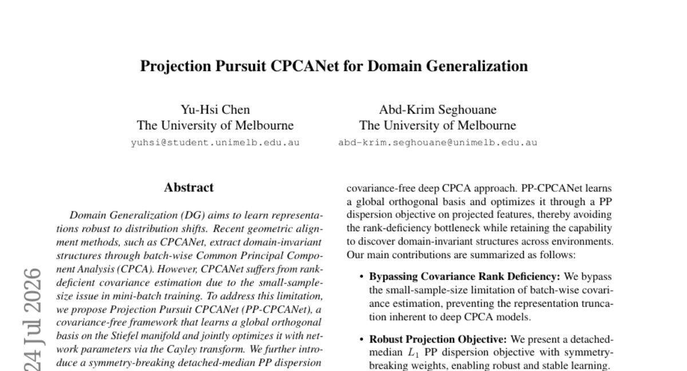

### 📌 한 줄 요약
소규모 배치 학습 시 발생하는 공분산 추정 문제를 해결하여 도메인 일반화 성능을 높인 새로운 기하학적 정렬 프레임워크

### 🔑 핵심 포인트
- Stiefel 매니폴드 상의 전역 직교 기저 학습을 통한 공분산 추정 문제 해결
- Cayley 변환을 이용한 네트워크 파라미터와 기저의 공동 최적화
- 강건한 최적화 신호 추출을 위한 symmetry-breaking detached-median PP 분산 목적 함수 도입

### 🧑‍💻 개발자 관점
데이터가 부족한 소규모 배치 환경에서도 수치적 불안정성 없이 도메인 간 차이를 극복하는 정교한 표현 학습이 가능해집니다.

### 🚀 실무 적용 아이디어
- 기존 CPCANet 코드베이스에 Cayley transform 기반 기저 학습 모듈 이식 테스트
- 다양한 배치 사이즈 변화에 따른 학습 안정성 비교 실험
- 제안된 detached-median 목적 함수가 이상치(outlier)에 미치는 영향 검증

### ⚠️ 리스크/한계
- Stiefel 매니폴드 최적화 과정에서의 계산 복잡도 증가 가능성
- 특정 데이터 분포에서 symmetry-breaking 전략의 일반화 여부 확인 필요

### 📝 초록 기반 상세 설명
도메인 일반화(DG)는 분포 변화에 강건한 표현을 학습하는 것을 목표로 합니다. 기존의 CPCANet은 배치 단위의 공분산 분석을 통해 도메인 불변 구조를 추출하지만, 미니 배치 학습 시 샘플 부족으로 인해 공분산 추정이 불안정해지는 문제가 있습니다. 이를 해결하기 위해 제안된 PP-CPCANet은 공분산 계산 없이 Stiefel 매니폴드 상에서 전역 직교 기저를 학습하는 공분산 프리(covariance-free) 프레임워크입니다. 또한, 대칭성을 깨뜨리는 detached-median PP 분산 목적 함수를 도입하여 밀도 높고 강건한 최적화 신호를 확보했습니다. 실험 결과, 제안 모델은 4개의 DG 벤치마크에서 SOTA 성능과 안정적인 학습을 동시에 달성했습니다.

---

## 26. [Edge-Aware Thermal Infrared UAV Swarm Tracking](https://huggingface.co/papers/2607.12544)
**Upvotes**: 0 | **도입 난이도**: 하 | **신뢰도**: 상
**arXiv**: https://arxiv.org/abs/2607.12544

**태그**: UAV, Edge-AI, Kalman-Filter, Computer-Vision, Benchmark, Evaluation

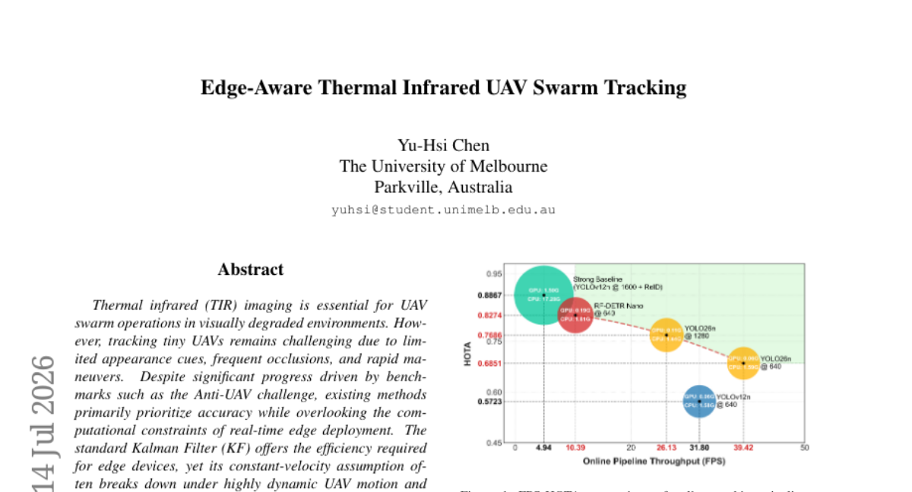

### 📌 한 줄 요약
엣지 디바이스의 연산 제약을 고려하면서도 동적인 UAV 움직임에 대응할 수 있는 적응형 칼만 필터 기반의 실시간 추적 파이프라인 제안

### 🔑 핵심 포인트
- 상태 의존적 운동 모델을 결합한 AKKF(Adaptive Kinematic Kalman Filter) 제안
- 엣지 디바이스 배포를 위한 연산 효율성과 추적 정확도 간의 균형 확보
- 일시적 오탐지 억제 및 운동학 기반 예측 코스팅을 통한 궤적 연속성 개선

### 🧑‍💻 개발자 관점
저사양 엣지 하드웨어에서 고성능 딥러닝 모델 대신 사용할 수 있는 효율적인 실시간 추적 알고리즘 설계 가이드를 제공합니다.

### 🚀 실무 적용 아이디어
- 제안된 AKKF 알고리즘을 기존 KF/EKF 모델과 연산량 및 추적 성능 측면에서 비교 실험
- 다양한 프레임 레이트(FPS) 환경에서 엣지 디바이스의 CPU/GPU 점유율 변화 측정
- 급격한 가속/회전이 발생하는 동적 시나리오에서 예측 코스팅의 복구 성능 검증

### ⚠️ 리스크/한계
- 복잡한 비선형 움직임이 극심할 경우 단순화된 운동 모델의 한계 발생 가능성
- 열적외선 센서 자체의 노이즈가 모델의 상태 추정치에 미치는 영향성

### 📝 초록 기반 상세 설명
시각적으로 열악한 환경에서 UAV 스웜 운영을 위해 열적외선(TIR) 이미징 기술이 필수적입니다. 그러나 기존의 정밀도 중심 추적 방식은 엣지 디바이스의 실시간 연산 제약을 충분히 고려하지 못하며, 급격한 기동 시 기존 칼만 필터의 등속도 가정이 무너지는 문제가 있습니다. 이를 해결하기 위해 본 논문은 선형 칼만 필터의 효율성을 유지하면서 상태 의존적 운동 모델을 결합한 AKKF(Adaptive Kinematic Kalman Filter)를 제안합니다. 여기에 일시적 오탐지 억제 및 운동학 기반 예측 코스팅 기술을 결합하여 궤적 연속성을 확보했습니다. BSB 벤치마크 실험을 통해 실시간성과 추적 성능 사이의 균형을 입증하며 엣지 배포를 위한 기반을 마련했습니다.

---

